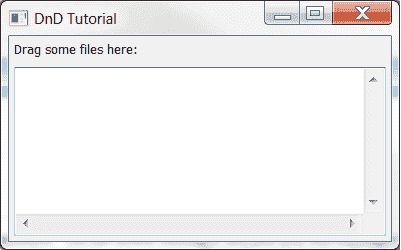
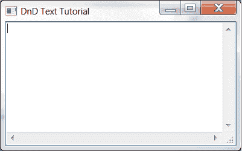
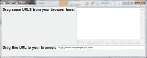
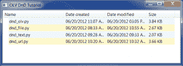

# wxPython:拖放简介

> 原文：<https://www.blog.pythonlibrary.org/2012/06/20/wxpython-introduction-to-drag-and-drop/>

这个时代的大多数计算机用户本能地使用拖放(DnD)。这周你可能用它把一些文件从一个文件夹转移到另一个文件夹。wxPython GUI 工具包提供了内置的拖放功能。在本教程中，我们将看到它是多么容易实现！

### 入门指南

wxPython 提供了几种不同的拖放方式。您可以有以下类型之一:

*   wx(地名)。文件 DropTarget
*   wx。TextDropTarget
*   wx。PyDropTarget

前两个非常简单明了。最后一个，wx。PyDropTarget 只是 wx 的一个松散包装。DropTarget 本身。它增加了一些额外的方便方法。DropTarget 没有。我们从 wx 开始。FileDropTarget 示例。

### 创建 FileDropTarget

[](https://www.blog.pythonlibrary.org/wp-content/uploads/2012/06/dnd_file.png)

拖放文件

wxPython 工具包使得创建拖放目标变得非常简单。您确实需要重写一个方法来使它正常工作，但是除此之外，它非常简单。让我们花点时间看看这个示例代码，然后花点时间解释它。

```py

import wx

########################################################################
class MyFileDropTarget(wx.FileDropTarget):
    """"""

    #----------------------------------------------------------------------
    def __init__(self, window):
        """Constructor"""
        wx.FileDropTarget.__init__(self)
        self.window = window

    #----------------------------------------------------------------------
    def OnDropFiles(self, x, y, filenames):
        """
        When files are dropped, write where they were dropped and then
        the file paths themselves
        """
        self.window.SetInsertionPointEnd()
        self.window.updateText("\n%d file(s) dropped at %d,%d:\n" %
                              (len(filenames), x, y))
        for filepath in filenames:
            self.window.updateText(filepath + '\n')    

########################################################################
class DnDPanel(wx.Panel):
    """"""

    #----------------------------------------------------------------------
    def __init__(self, parent):
        """Constructor"""
        wx.Panel.__init__(self, parent=parent)

        file_drop_target = MyFileDropTarget(self)
        lbl = wx.StaticText(self, label="Drag some files here:")
        self.fileTextCtrl = wx.TextCtrl(self,
                                        style=wx.TE_MULTILINE|wx.HSCROLL|wx.TE_READONLY)
        self.fileTextCtrl.SetDropTarget(file_drop_target)

        sizer = wx.BoxSizer(wx.VERTICAL)
        sizer.Add(lbl, 0, wx.ALL, 5)
        sizer.Add(self.fileTextCtrl, 1, wx.EXPAND|wx.ALL, 5)
        self.SetSizer(sizer)

    #----------------------------------------------------------------------
    def SetInsertionPointEnd(self):
        """
        Put insertion point at end of text control to prevent overwriting
        """
        self.fileTextCtrl.SetInsertionPointEnd()

    #----------------------------------------------------------------------
    def updateText(self, text):
        """
        Write text to the text control
        """
        self.fileTextCtrl.WriteText(text)

########################################################################
class DnDFrame(wx.Frame):
    """"""

    #----------------------------------------------------------------------
    def __init__(self):
        """Constructor"""
        wx.Frame.__init__(self, parent=None, title="DnD Tutorial")
        panel = DnDPanel(self)
        self.Show()

#----------------------------------------------------------------------
if __name__ == "__main__":
    app = wx.App(False)
    frame = DnDFrame()
    app.MainLoop()

```

那还不算太糟，是吗？首先要做的是子类化 **wx。FileDropTarget** ，这是我们用我们的 **MyFileDropTarget** 类完成的。在里面我们有一个被覆盖的方法， **OnDropFiles** 。它接受鼠标的 x/y 位置和放置的文件路径，然后将它们写出到文本控件中。要将拖放目标与文本控件挂钩，您需要查看 **DnDPanel** 类，在该类中我们调用文本控件的 **SetDropTarget** 方法，并将其设置为 drop target 类的一个实例。我们的 panel 类中还有两个方法，drop target 类调用它们来更新文本控件:SetInsertionPointEnd 和 updateText。注意，因为我们将面板对象作为放置目标传递，所以我们可以随意调用这些方法。如果 TextCtrl 是 drop 目标，我们必须做不同的事情，我们将在下一个例子中看到！

### 创建 TextDropTarget

[](https://www.blog.pythonlibrary.org/wp-content/uploads/2012/06/dnd_text.png)

拖放文本

wx。当您希望能够将一些选定的文本拖放到文本控件中时，可以使用 TextDropTarget。最常见的例子之一可能是将网页上的 URL 拖到地址栏中，或者将一些文本拖到 Firefox 的搜索框中。让我们花一些时间来学习如何在 wxPython 中创建这种拖放目标！

```py

import wx

########################################################################
class MyTextDropTarget(wx.TextDropTarget):

    #----------------------------------------------------------------------
    def __init__(self, textctrl):
        wx.TextDropTarget.__init__(self)
        self.textctrl = textctrl

    #----------------------------------------------------------------------
    def OnDropText(self, x, y, text):
        self.textctrl.WriteText("(%d, %d)\n%s\n" % (x, y, text))

    #----------------------------------------------------------------------
    def OnDragOver(self, x, y, d):
        return wx.DragCopy

########################################################################
class DnDPanel(wx.Panel):
    """"""

    #----------------------------------------------------------------------
    def __init__(self, parent):
        """Constructor"""
        wx.Panel.__init__(self, parent=parent)

        lbl = wx.StaticText(self, label="Drag some text here:")
        self.myTextCtrl = wx.TextCtrl(self,
                                      style=wx.TE_MULTILINE|wx.HSCROLL|wx.TE_READONLY)
        text_dt = MyTextDropTarget(self.myTextCtrl)
        self.myTextCtrl.SetDropTarget(text_dt)

        sizer = wx.BoxSizer(wx.VERTICAL)
        sizer.Add(self.myTextCtrl, 1, wx.EXPAND)
        self.SetSizer(sizer)

    #----------------------------------------------------------------------
    def WriteText(self, text):
        self.text.WriteText(text)

########################################################################
class DnDFrame(wx.Frame):
    """"""

    #----------------------------------------------------------------------
    def __init__(self):
        """Constructor"""
        wx.Frame.__init__(self, parent=None, title="DnD Text Tutorial")
        panel = DnDPanel(self)
        self.Show()

#----------------------------------------------------------------------
if __name__ == "__main__":
    app = wx.App(False)
    frame = DnDFrame()
    app.MainLoop()

```

我们必须再次子类化我们的拖放目标类。在这种情况下，我们称之为 **MyTextDropTarget** 。在那个类中，我们必须覆盖 **OnDropText** 和 **OnDragOver** 。我无法找到关于后者的令人满意的文档，但我猜它只是返回了被拖动数据的副本。OnDropText 方法将文本写出到文本控件中。注意，由于我们已经将放置目标直接绑定到文本控件(参见 panel 类)，我们必须使用名为 **WriteText** 的方法来更新文本控件。如果您更改它，您会收到一条错误消息。

### 带有 PyDropTarget 的自定义 DnD

[](https://www.blog.pythonlibrary.org/wp-content/uploads/2012/06/dnd_url.png)

使用 PyDropTarget 拖放 URL

如果你还没有猜到，这些例子是来自官方 wxPython 演示的 DnD 演示的稍微修改版本。我们将使用一些基于他们的 URLDragAndDrop 演示的代码来解释 PyDropTarget。这个演示的有趣之处在于，您不仅可以创建一个可以接受拖动文本的小部件，还可以将另一个小部件中的一些文本拖回您的浏览器！让我们来看看:

```py

import  wx

########################################################################
class MyURLDropTarget(wx.PyDropTarget):

    #----------------------------------------------------------------------
    def __init__(self, window):
        wx.PyDropTarget.__init__(self)
        self.window = window

        self.data = wx.URLDataObject();
        self.SetDataObject(self.data)

    #----------------------------------------------------------------------
    def OnDragOver(self, x, y, d):
        return wx.DragLink

    #----------------------------------------------------------------------
    def OnData(self, x, y, d):
        if not self.GetData():
            return wx.DragNone

        url = self.data.GetURL()
        self.window.AppendText(url + "\n")

        return d

#######################################################################
class DnDPanel(wx.Panel):
    """"""

    #----------------------------------------------------------------------
    def __init__(self, parent):
        """Constructor"""
        wx.Panel.__init__(self, parent=parent)
        font = wx.Font(12, wx.SWISS, wx.NORMAL, wx.BOLD, False)

        # create and setup first set of widgets
        lbl = wx.StaticText(self, label="Drag some URLS from your browser here:")
        lbl.SetFont(font)
        self.dropText = wx.TextCtrl(self, size=(200,200),
                                      style=wx.TE_MULTILINE|wx.HSCROLL|wx.TE_READONLY)
        dt = MyURLDropTarget(self.dropText)
        self.dropText.SetDropTarget(dt)
        firstSizer = self.addWidgetsToSizer([lbl, self.dropText])

        # create and setup second set of widgets
        lbl = wx.StaticText(self, label="Drag this URL to your browser:")
        lbl.SetFont(font)
        self.draggableURLText = wx.TextCtrl(self, value="http://www.mousevspython.com")
        self.draggableURLText.Bind(wx.EVT_MOTION, self.OnStartDrag)
        secondSizer = self.addWidgetsToSizer([lbl, self.draggableURLText])

        # Add sizers to main sizer
        mainSizer = wx.BoxSizer(wx.VERTICAL)
        mainSizer.Add(firstSizer, 0, wx.EXPAND)
        mainSizer.Add(secondSizer, 0, wx.EXPAND)
        self.SetSizer(mainSizer)

    #----------------------------------------------------------------------
    def addWidgetsToSizer(self, widgets):
        """
        Returns a sizer full of widgets
        """
        sizer = wx.BoxSizer(wx.HORIZONTAL)
        for widget in widgets:
            if isinstance(widget, wx.TextCtrl):
                sizer.Add(widget, 1, wx.EXPAND|wx.ALL, 5)
            else:
                sizer.Add(widget, 0, wx.ALL, 5)
        return sizer

    #----------------------------------------------------------------------
    def OnStartDrag(self, evt):
        """"""
        if evt.Dragging():
            url = self.draggableURLText.GetValue()
            data = wx.URLDataObject()
            data.SetURL(url)

            dropSource = wx.DropSource(self.draggableURLText)
            dropSource.SetData(data)
            result = dropSource.DoDragDrop()

########################################################################
class DnDFrame(wx.Frame):
    """"""

    #----------------------------------------------------------------------
    def __init__(self):
        """Constructor"""
        wx.Frame.__init__(self, parent=None, title="DnD URL Tutorial", size=(800,600))
        panel = DnDPanel(self)
        self.Show()

#----------------------------------------------------------------------
if __name__ == "__main__":
    app = wx.App(False)
    frame = DnDFrame()
    app.MainLoop()

```

第一个类是我们的拖放目标类。这里我们创建一个 **wx。URLDataObject** 存储我们的 URL 信息。然后在 **OnData** 方法中，我们提取 URL 并将其添加到绑定的文本控件中。在我们的 panel 类中，我们用与其他两个例子中相同的方式来连接拖放目标，所以我们将跳过它，继续学习新的内容。第二个文本控件是我们需要注意的地方。在这里，我们发现它通过 EVT 运动鼠标运动。在鼠标移动事件处理程序(OnStartDrag)中，我们检查以确保用户正在拖动。如果是，那么我们从文本框中获取值，并将其添加到新创建的 URLDataObject 中。接下来，我们创建一个 **DropSource** 的实例，并向其传递我们的第二个文本控件，因为它是源。我们将源的数据设置为 URLDataObject。最后，我们在我们的拖放源(文本控件)上调用 **DoDragDrop** ，它将通过移动、复制、取消或失败做出响应。如果您将 URL 拖到浏览器的地址栏，它会复制。否则很可能行不通。现在让我们利用我们所学的，创造一些原创的东西！

### 创建自定义拖放应用程序

[](https://www.blog.pythonlibrary.org/wp-content/uploads/2012/06/dnd_olv.png)

使用 ObjectListView 拖放

我认为使用文件拖放目标演示程序并把它做成带有 ObjectListView 小部件(一个 ListCtrl 包装器)的东西会很有趣，它可以告诉我们一些关于我们正在放入的文件的信息。我们将显示以下信息:文件名，创建日期，修改日期和文件大小。代码如下:

```py

import os
import stat
import time
import wx
from ObjectListView import ObjectListView, ColumnDefn

########################################################################
class MyFileDropTarget(wx.FileDropTarget):
    """"""

    #----------------------------------------------------------------------
    def __init__(self, window):
        """Constructor"""
        wx.FileDropTarget.__init__(self)
        self.window = window

    #----------------------------------------------------------------------
    def OnDropFiles(self, x, y, filenames):
        """
        When files are dropped, update the display
        """
        self.window.updateDisplay(filenames)

########################################################################
class FileInfo(object):
    """"""

    #----------------------------------------------------------------------
    def __init__(self, path, date_created, date_modified, size):
        """Constructor"""
        self.name = os.path.basename(path)
        self.path = path
        self.date_created = date_created
        self.date_modified = date_modified
        self.size = size

########################################################################
class MainPanel(wx.Panel):
    """"""

    #----------------------------------------------------------------------
    def __init__(self, parent):
        """Constructor"""
        wx.Panel.__init__(self, parent=parent)
        self.file_list = []

        file_drop_target = MyFileDropTarget(self)
        self.olv = ObjectListView(self, style=wx.LC_REPORT|wx.SUNKEN_BORDER)
        self.olv.SetDropTarget(file_drop_target)
        self.setFiles()

        sizer = wx.BoxSizer(wx.VERTICAL)
        sizer.Add(self.olv, 1, wx.EXPAND)
        self.SetSizer(sizer)

    #----------------------------------------------------------------------
    def updateDisplay(self, file_list):
        """"""
        for path in file_list:
            file_stats = os.stat(path)
            creation_time = time.strftime("%m/%d/%Y %I:%M %p",
                                          time.localtime(file_stats[stat.ST_CTIME]))
            modified_time = time.strftime("%m/%d/%Y %I:%M %p",
                                          time.localtime(file_stats[stat.ST_MTIME]))
            file_size = file_stats[stat.ST_SIZE]
            if file_size > 1024:
                file_size = file_size / 1024.0
                file_size = "%.2f KB" % file_size

            self.file_list.append(FileInfo(path,
                                           creation_time,
                                           modified_time,
                                           file_size))

        self.olv.SetObjects(self.file_list)

    #----------------------------------------------------------------------
    def setFiles(self):
        """"""
        self.olv.SetColumns([
            ColumnDefn("Name", "left", 220, "name"),
            ColumnDefn("Date created", "left", 150, "date_created"),
            ColumnDefn("Date modified", "left", 150, "date_modified"),
            ColumnDefn("Size", "left", 100, "size")
            ])
        self.olv.SetObjects(self.file_list)

########################################################################
class MainFrame(wx.Frame):
    """"""

    #----------------------------------------------------------------------
    def __init__(self):
        """Constructor"""
        wx.Frame.__init__(self, None, title="OLV DnD Tutorial", size=(800,600))
        panel = MainPanel(self)
        self.Show()

#----------------------------------------------------------------------
def main():
    """"""
    app = wx.App(False)
    frame = MainFrame()
    app.MainLoop()

if __name__ == "__main__":
    main()    

```

大部分你以前见过的东西。我们有自己的 **FileDropTarget** 子类，我们将面板连接到它，然后将 ObjectListView 小部件连接到 DropTarget 实例。我们还有一个保存文件相关数据的泛型类。如果你运行这个程序并把文件夹放入其中，你将不会得到正确的文件大小。您可能需要遍历文件夹，并添加其中文件的大小，以使其工作。你可以自己解决这个问题。无论如何，程序的核心是在**更新显示**方法中。在这里，我们抓取文件的重要统计数据，并将其转换为更可读的格式，因为大多数人不理解从纪元开始以秒为单位的日期。一旦我们对数据稍加处理，我们就显示它。这不是很酷吗？

### 包扎

至此，您应该知道如何在 wxPython 中进行至少 3 种不同类型的拖放操作。希望您能负责任地使用这些新信息，并在不久的将来创建一些新的开源应用程序。祝你好运！

### 进一步阅读

*   wxPython dragandrop[维基页面](http://wiki.wxpython.org/DragAndDrop)
*   zetcode 的 wxPython DragAndDrop [页面](http://zetcode.com/wxpython/draganddrop/)
*   DropTarget [文档](http://xoomer.virgilio.it/infinity77/wxPython/Widgets/wx.DropTarget.html)
*   [wxPython:使用 ObjectListView 代替 ListCtrl](https://www.blog.pythonlibrary.org/2009/12/23/wxpython-using-objectlistview-instead-of-a-listctrl/)

### 源代码

*   [wzd . zip](https://www.blog.pythonlibrary.org/wp-content/uploads/2012/06/wxDnD.zip)