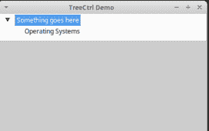
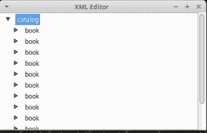

# wxPython:了解 TreeCtrls

> 原文：<https://www.blog.pythonlibrary.org/2017/05/16/wxpython-learning-about-treectrls/>

wxPython GUI 工具包附带了许多小部件。一个常见的控件是树小部件。wxPython 有几个不同的树部件，包括常规的 **wx。TreeCtrl** ，更新的 **DVC_TreeCtrl** 和纯 Python 变种，**customtreecrl**和 **HyperTreeList** 。在本文中，我们将重点介绍常规的 **wx。TreeCtrl** 并学习如何创建和使用一个。

### 创建简单的树

创建 TreeCtrl 实际上很容易。wxPython 演示有一个相当复杂的例子，所以我不能在这里使用它。相反，我最终采用了演示示例，并尽可能多地将其剥离。结果如下:

```py

import wx

class MyTree(wx.TreeCtrl):

    def __init__(self, parent, id, pos, size, style):
        wx.TreeCtrl.__init__(self, parent, id, pos, size, style)

class TreePanel(wx.Panel):

    def __init__(self, parent):
        wx.Panel.__init__(self, parent)

        self.tree = MyTree(self, wx.ID_ANY, wx.DefaultPosition, wx.DefaultSize,
                           wx.TR_HAS_BUTTONS)    

        self.root = self.tree.AddRoot('Something goes here')
        self.tree.SetPyData(self.root, ('key', 'value'))
        os = self.tree.AppendItem(self.root, 'Operating Systems')
        self.tree.Expand(self.root)

        sizer = wx.BoxSizer(wx.VERTICAL)
        sizer.Add(self.tree, 0, wx.EXPAND)
        self.SetSizer(sizer)

class MainFrame(wx.Frame):

    def __init__(self):
        wx.Frame.__init__(self, parent=None, title='TreeCtrl Demo')
        panel = TreePanel(self)
        self.Show()

if __name__ == '__main__':
    app = wx.App(redirect=False)
    frame = MainFrame()
    app.MainLoop()

```

在这个例子中，我们创建了 wx 的一个子类。不做任何事情的 TreeCtrl。然后我们创建一个 panel 子类，实例化树并添加一个根和子项。最后，我们创建容纳面板的框架并运行应用程序。您最终应该会看到类似于以下内容的内容:



这是一个相当无聊的例子，所以让我们做一些更有趣的东西。

* * *

### 创建 XML 查看器



一段时间以来，我一直想用 Python 创建一个 XML 编辑器。首先，我在几个周末前写了一些代码，可以将 XML 读入 TreeCtrl 中，以便查看标记元素。对于这个例子，我将使用我在微软的 MSDN 网站上找到的一些 XML 样本:

```py

 <book id="bk101"><author>Gambardella, Matthew</author>
        <title>XML Developer's Guide</title>
        <genre>Computer</genre>
        <price>44.95</price>
        <publish_date>2000-10-01</publish_date>
        <description>An in-depth look at creating applications 
        with XML.</description></book> 
    <book id="bk102"><author>Ralls, Kim</author>
        <title>Midnight Rain</title>
        <genre>Fantasy</genre>
        <price>5.95</price>
        <publish_date>2000-12-16</publish_date>
        <description>A former architect battles corporate zombies, 
        an evil sorceress, and her own childhood to become queen 
        of the world.</description></book> 
    <book id="bk103"><author>Corets, Eva</author>
        <title>Maeve Ascendant</title>
        <genre>Fantasy</genre>
        <price>5.95</price>
        <publish_date>2000-11-17</publish_date>
        <description>After the collapse of a nanotechnology 
        society in England, the young survivors lay the 
        foundation for a new society.</description></book> 
    <book id="bk104"><author>Corets, Eva</author>
        <title>Oberon's Legacy</title>
        <genre>Fantasy</genre>
        <price>5.95</price>
        <publish_date>2001-03-10</publish_date>
        <description>In post-apocalypse England, the mysterious 
        agent known only as Oberon helps to create a new life 
        for the inhabitants of London. Sequel to Maeve 
        Ascendant.</description></book> 
    <book id="bk105"><author>Corets, Eva</author>
        <title>The Sundered Grail</title>
        <genre>Fantasy</genre>
        <price>5.95</price>
        <publish_date>2001-09-10</publish_date>
        <description>The two daughters of Maeve, half-sisters, 
        battle one another for control of England. Sequel to 
        Oberon's Legacy.</description></book> 
    <book id="bk106"><author>Randall, Cynthia</author>
        <title>Lover Birds</title>
        <genre>Romance</genre>
        <price>4.95</price>
        <publish_date>2000-09-02</publish_date>
        <description>When Carla meets Paul at an ornithology 
        conference, tempers fly as feathers get ruffled.</description></book> 
    <book id="bk107"><author>Thurman, Paula</author>
        <title>Splish Splash</title>
        <genre>Romance</genre>
        <price>4.95</price>
        <publish_date>2000-11-02</publish_date>
        <description>A deep sea diver finds true love twenty 
        thousand leagues beneath the sea.</description></book> 
    <book id="bk108"><author>Knorr, Stefan</author>
        <title>Creepy Crawlies</title>
        <genre>Horror</genre>
        <price>4.95</price>
        <publish_date>2000-12-06</publish_date>
        <description>An anthology of horror stories about roaches,
        centipedes, scorpions  and other insects.</description></book> 
    <book id="bk109"><author>Kress, Peter</author>
        <title>Paradox Lost</title>
        <genre>Science Fiction</genre>
        <price>6.95</price>
        <publish_date>2000-11-02</publish_date>
        <description>After an inadvertant trip through a Heisenberg
        Uncertainty Device, James Salway discovers the problems 
        of being quantum.</description></book> 
    <book id="bk110"><author>O'Brien, Tim</author>
        <title>Microsoft .NET: The Programming Bible</title>
        <genre>Computer</genre>
        <price>36.95</price>
        <publish_date>2000-12-09</publish_date>
        <description>Microsoft's .NET initiative is explored in 
        detail in this deep programmer's reference.</description></book> 
    <book id="bk111"><author>O'Brien, Tim</author>
        <title>MSXML3: A Comprehensive Guide</title>
        <genre>Computer</genre>
        <price>36.95</price>
        <publish_date>2000-12-01</publish_date>
        <description>The Microsoft MSXML3 parser is covered in 
        detail, with attention to XML DOM interfaces, XSLT processing, 
        SAX and more.</description></book> 
    <book id="bk112"><author>Galos, Mike</author>
        <title>Visual Studio 7: A Comprehensive Guide</title>
        <genre>Computer</genre>
        <price>49.95</price>
        <publish_date>2001-04-16</publish_date>
        <description>Microsoft Visual Studio 7 is explored in depth,
        looking at how Visual Basic, Visual C++, C#, and ASP+ are 
        integrated into a comprehensive development 
        environment.</description></book> 

```

我们需要决定的第一件事是我们想要使用什么 Python XML 解析器。我个人最喜欢 lxml，但是 Python 自己的 ElementTree 当然是一个可行的选择，而且如果你从 lxml 开始，实际上也很容易转换。但是对于这个例子，我们将使用 lxml。让我们来看看:

```py

import wx

from lxml import etree, objectify

class XmlTree(wx.TreeCtrl):

    def __init__(self, parent, id, pos, size, style):
        wx.TreeCtrl.__init__(self, parent, id, pos, size, style)

        try:
            with open(parent.xml_path) as f:
                xml = f.read()
        except IOError:
            print('Bad file')
            return
        except Exception as e:
            print('Really bad error')
            print(e)
            return

        self.xml_root = objectify.fromstring(xml)

        root = self.AddRoot(self.xml_root.tag)
        self.SetPyData(root, ('key', 'value'))        

        for top_level_item in self.xml_root.getchildren():
            child = self.AppendItem(root, top_level_item.tag)
            self.SetItemHasChildren(child)
            if top_level_item.attrib:
                self.SetPyData(child, top_level_item.attrib)

        self.Expand(root)
        self.Bind(wx.EVT_TREE_ITEM_EXPANDING, self.onItemExpanding)

    def onItemExpanding(self, event):
        item = event.GetItem()
        book_id = self.GetPyData(item)

        for top_level_item in self.xml_root.getchildren():
            if top_level_item.attrib == book_id:
                book = top_level_item
                self.SetPyData(item, top_level_item)                                
                self.add_book_elements(item, book)
                break

    def add_book_elements(self, item, book):
        for element in book.getchildren():
            child = self.AppendItem(item, element.tag)
            if element.getchildren():
                self.SetItemHasChildren(child)

            if element.attrib:
                self.SetPyData(child, element.attrib)  

class TreePanel(wx.Panel):

    def __init__(self, parent, xml_path):
        wx.Panel.__init__(self, parent)
        self.xml_path = xml_path

        self.tree = XmlTree(self, wx.ID_ANY, wx.DefaultPosition, wx.DefaultSize,
                            wx.TR_HAS_BUTTONS)    

        sizer = wx.BoxSizer(wx.VERTICAL)
        sizer.Add(self.tree, 0, wx.EXPAND)
        self.SetSizer(sizer)

class MainFrame(wx.Frame):

    def __init__(self, xml_path):
        wx.Frame.__init__(self, parent=None, title='XML Editor')
        panel = TreePanel(self, xml_path)
        self.Show()

if __name__ == '__main__':
    xml_path = 'books.xml'
    app = wx.App(redirect=False)
    frame = MainFrame(xml_path)
    app.MainLoop()

```

这里的主要变化是在 TreeCtrl 子类中，尽管我们必须在其他类中做一些小的修改来传递 XML 文件路径。不过，让我们关注 TreeCtrl 类。首先，我们从文件中读取 XML，并将其加载到 lxml 的 objectify 模块中。此时，我们有了一个 XML 对象，可以用它来用数据填充 TreeCtrl。所以我们添加了根，然后遍历 XML 中的顶级子元素。对于每个顶级元素，我们向 TreeCtrl 的根添加一个项目。这是非常基本的，因为我们还应该检查每个元素，看看它是否也有子元素。我们没有。相反，我们只是假设它会调用 TreeCtrl 的 **SetItemHasChildren()** 方法。这将向元素添加一个箭头，以允许扩展元素。

最后，我们扩展根，并将一个事件绑定到**EVT _ 树 _ 项目 _ 扩展**，这将允许我们在扩展子元素时更新它们。您可以在 **onItemExpanding** 事件处理程序和事件处理程序调用的 **add_book_elements()** 中看到这是如何完成的。在这里，我们确实使用 lxml 的 **getchildren()** 检查元素是否有子元素。如果是，那么我们调用 **SetItemHasChildren()** 。我想指出的另一件事是所有对 **SetPyData()** 的调用。SetPyData()方法用于将数据保存到树项目中。在这种情况下，我们将 XML 元素保存到树项目本身，我们可以通过 **GetPyData()** 再次访问它。如果我们想在 GUI 中添加编辑功能，这将是非常重要的。

* * *

### 其他零碎的东西

wxPython 演示还展示了一些有趣的花絮。比如显示可以添加一个 **wx。ImageList** 到你的 TreeCtrl。它还显示了您可以绑定到的其他一些特定于树的事件。比如:

*   EVT _ 树 _ 项目 _ 折叠
*   EVT _ 树 _ 选择 _ 改变
*   EVT _ 树 _ 开始 _ 标签 _ 编辑
*   END _ 树 _ 结束 _ 标签 _ 编辑
*   EVT _ 树 _ 项目 _ 已激活

当然，你也可以绑定到鼠标事件，比如 LEFT _ 左 _ 右 _ 下。

如果您想使树元素可编辑，那么您需要传递 **wx。TR_EDIT_LABELS** 样式标志。因为我的例子只是一个查看器，所以我觉得没有必要这样做。在演示和文档中还提到了其他一些样式标志，您可能也想看看。

* * *

### 包扎

在这一点上，我想你应该能够开始使用 wxPython 的便捷的 wx.TreeCtrl 了，它非常强大并且易于使用。如果您发现自己需要做一些更加定制的事情，那么我强烈建议您查看 wxPython 的一个备用树控件，比如 CustomTreeCtrl 或 HyperTreeList。

* * *

### 相关阅读

*   wxp 上的 wxp 文档。tree ctrl〔t1〕
*   TreeCtrl [概述](https://wxpython.org/Phoenix/docs/html/treectrl_overview.html)