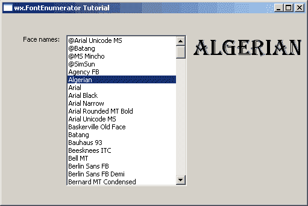

# wxPython:学习使用字体

> 原文：<https://www.blog.pythonlibrary.org/2011/04/28/wxpython-learning-to-use-fonts/>

你有没有想过如何在 wxPython 中改变你的字体？那么，现在是你的幸运日，因为这正是本教程将要涵盖的内容。我们将查看以下三个项目:

*   wxPython 的内置字体
*   字体对话框
*   wxPython 演示中的字体枚举器演示

字体是程序的重要组成部分，可以增强程序的可读性。确保你的字体大小和位置合适总是一个好主意。没错，那是常识，但有时候常识在编程中是不会发生的。哲学够了。让我们进入文章的核心部分吧！

## 内置字体

[](https://www.blog.pythonlibrary.org/wp-content/uploads/2011/04/customFontTut.png)

您可能还没有意识到这一点，但是 wxPython 有自己的一套通用字体！我不确定它们是否在所有平台上都一样，但我敢打赌它们非常接近。让我们来看一个简单的自定义演示，展示这些字体的外观:

```py

import random
import wx
import wx.lib.scrolledpanel as scrolled

########################################################################
class MyForm(wx.Frame):

    #----------------------------------------------------------------------
    def __init__(self):
        wx.Frame.__init__(self, None, wx.ID_ANY, "Font Tutorial")

        # Add a panel so it looks the correct on all platforms
        panel = scrolled.ScrolledPanel(self)
        panel.SetAutoLayout(1)
        panel.SetupScrolling()

        fontSizer = wx.BoxSizer(wx.VERTICAL)
        families = {"FONTFAMILY_DECORATIVE":wx.FONTFAMILY_DECORATIVE, # A decorative font
                    "FONTFAMILY_DEFAULT":wx.FONTFAMILY_DEFAULT,
                    "FONTFAMILY_MODERN":wx.FONTFAMILY_MODERN,     # Usually a fixed pitch font
                    "FONTFAMILY_ROMAN":wx.FONTFAMILY_ROMAN,      # A formal, serif font
                    "FONTFAMILY_SCRIPT":wx.FONTFAMILY_SCRIPT,     # A handwriting font
                    "FONTFAMILY_SWISS":wx.FONTFAMILY_SWISS,      # A sans-serif font
                    "FONTFAMILY_TELETYPE":wx.FONTFAMILY_TELETYPE    # A teletype font
                    }
        weights = {"FONTWEIGHT_BOLD":wx.FONTWEIGHT_BOLD,
                   "FONTWEIGHT_LIGHT":wx.FONTWEIGHT_LIGHT,
                   "FONTWEIGHT_NORMAL":wx.FONTWEIGHT_NORMAL
                   }

        styles = {"FONTSTYLE_ITALIC":wx.FONTSTYLE_ITALIC,
                  "FONTSTYLE_NORMAL":wx.FONTSTYLE_NORMAL,
                  "FONTSTYLE_SLANT":wx.FONTSTYLE_SLANT
                  }
        sizes = [8, 10, 12, 14]
        for family in families.keys():
            for weight in weights.keys():
                for style in styles.keys():
                    label = "%s    %s    %s" % (family, weight, style)
                    size = random.choice(sizes)
                    font = wx.Font(size, families[family], styles[style], 
                                   weights[weight])
                    txt = wx.StaticText(panel, label=label)
                    txt.SetFont(font)
                    fontSizer.Add(txt, 0, wx.ALL, 5)
        panel.SetSizer(fontSizer)
        sizer = wx.BoxSizer(wx.HORIZONTAL)
        sizer.Add(panel, 1, wx.EXPAND)
        self.SetSizer(sizer)

#----------------------------------------------------------------------
# Run the program
if __name__ == "__main__":
    app = wx.App(False)
    frame = MyForm().Show()
    app.MainLoop()

```

可以清楚地看到，wxPython 让您应用一个 **wx。使用小部件的 **SetFont** 方法将字体**实例添加到小部件中，该方法应用字体。最 wx。字体对象由以下内容组成:大小、字体系列(如瑞士、罗马、正常等)、字体样式(如斜体或正常)和字体粗细(如粗体或正常)。你可以将这三种特质混搭，大部分时候都能得到你想要的。如果你想使用安装在你的系统上的字体，那么，我们将在下一节讨论这个问题。应该注意的是 wx。Font class 也接受下划线、字体和编码参数，但我们不会在本文中涉及这些。有关更多信息，请查看文档。

让我们花点时间看看代码。您会注意到我们有三个 Python 字典，我们将使用它们来控制 StaticText 小部件的外观。这些字典分别包含最常见的系列、重量和样式。我们在一个三重嵌套循环中循环每个系列、粗细和样式，混合和匹配它们，创建 wx 可以用这些集合做的每种类型的标准字体。注意，我们所做的只是创建一个 wx。Font 实例，然后使用 StaticText 的 **SetFont** 方法将其应用于 static text。代码的其余部分应该很容易理解。很简单，不是吗？

现在我们将了解字体对话框。

## 字体对话框

[](https://www.blog.pythonlibrary.org/wp-content/uploads/2011/04/fontDlgTut.png)

对于这个例子，我们将在一个独立的脚本中使用 wxPython 的演示代码。基本上，它向您展示了如何选择字体，从选择中提取各种信息，并将设置应用到您选择的小部件。代码如下:

```py

import wx
from wx.lib import stattext

#---------------------------------------------------------------------------

class TestPanel(wx.Panel):

    #----------------------------------------------------------------------
    def __init__(self, parent):
        wx.Panel.__init__(self, parent, -1)

        btn = wx.Button(self, -1, "Select Font")
        self.Bind(wx.EVT_BUTTON, self.OnSelectFont, btn)

        self.sampleText = stattext.GenStaticText(self, -1, "Sample Text")
        self.sampleText.SetBackgroundColour(wx.WHITE)

        self.curFont = self.sampleText.GetFont()
        self.curClr = wx.BLACK

        fgs = wx.FlexGridSizer(cols=2, vgap=5, hgap=5)
        fgs.AddGrowableCol(1)
        fgs.AddGrowableRow(0)

        fgs.Add(btn)
        fgs.Add(self.sampleText, 0, wx.ADJUST_MINSIZE|wx.GROW)

        fgs.Add((15,15)); fgs.Add((15,15))   # an empty row

        fgs.Add(wx.StaticText(self, -1, "PointSize:"))
        self.ps = wx.StaticText(self, -1, "")
        font = self.ps.GetFont()
        font.SetWeight(wx.BOLD)
        self.ps.SetFont(font)
        fgs.Add(self.ps, 0, wx.ADJUST_MINSIZE)

        fgs.Add(wx.StaticText(self, -1, "Family:"))
        self.family = wx.StaticText(self, -1, "")
        self.family.SetFont(font)
        fgs.Add(self.family, 0, wx.ADJUST_MINSIZE)

        fgs.Add(wx.StaticText(self, -1, "Style:"))
        self.style = wx.StaticText(self, -1, "")
        self.style.SetFont(font)
        fgs.Add(self.style, 0, wx.ADJUST_MINSIZE)

        fgs.Add(wx.StaticText(self, -1, "Weight:"))
        self.weight = wx.StaticText(self, -1, "")
        self.weight.SetFont(font)
        fgs.Add(self.weight, 0, wx.ADJUST_MINSIZE)

        fgs.Add(wx.StaticText(self, -1, "Face:"))
        self.face = wx.StaticText(self, -1, "")
        self.face.SetFont(font)
        fgs.Add(self.face, 0, wx.ADJUST_MINSIZE)

        fgs.Add((15,15)); fgs.Add((15,15))   # an empty row

        fgs.Add(wx.StaticText(self, -1, "wx.NativeFontInfo:"))
        self.nfi = wx.StaticText(self, -1, "")
        self.nfi.SetFont(font)
        fgs.Add(self.nfi, 0, wx.ADJUST_MINSIZE)

        # give it some border space
        sizer = wx.BoxSizer(wx.VERTICAL)
        sizer.Add(fgs, 0, wx.GROW|wx.ADJUST_MINSIZE|wx.ALL, 25)

        self.SetSizer(sizer)
        self.UpdateUI()

    #----------------------------------------------------------------------
    def UpdateUI(self):
        self.sampleText.SetFont(self.curFont)
        self.sampleText.SetForegroundColour(self.curClr)
        self.ps.SetLabel(str(self.curFont.GetPointSize()))
        self.family.SetLabel(self.curFont.GetFamilyString())
        self.style.SetLabel(self.curFont.GetStyleString())
        self.weight.SetLabel(self.curFont.GetWeightString())
        self.face.SetLabel(self.curFont.GetFaceName())
        self.nfi.SetLabel(self.curFont.GetNativeFontInfo().ToString())
        self.Layout()

    #----------------------------------------------------------------------
    def OnSelectFont(self, evt):
        data = wx.FontData()
        data.EnableEffects(True)
        data.SetColour(self.curClr)         # set colour
        data.SetInitialFont(self.curFont)

        dlg = wx.FontDialog(self, data)

        if dlg.ShowModal() == wx.ID_OK:
            data = dlg.GetFontData()
            font = data.GetChosenFont()
            colour = data.GetColour()

            self.curFont = font
            self.curClr = colour
            self.UpdateUI()

        # Don't destroy the dialog until you get everything you need from the
        # dialog!
        dlg.Destroy()

########################################################################
class MyForm(wx.Frame):

    #----------------------------------------------------------------------
    def __init__(self):
        wx.Frame.__init__(self, None, wx.ID_ANY,
                          "wx.FontDialog Tutorial")
        panel = TestPanel(self)

#----------------------------------------------------------------------
# Run the program
if __name__ == "__main__":
    app = wx.App(False)
    frame = MyForm()
    frame.Show()
    app.MainLoop()

```

这段代码非常简单，但还是让我们花点时间来分解它。我们最感兴趣的是 **UpdateUI** 和 **OnSelectFont** 方法，但是不要害怕看其他的。在 **__init__** 中也有一个很好的部分，在这里我们学习如何获得应用于静态文本的字体并改变它的粗细。提示:查找定义“self.ps”的部分。

无论如何，我们将逆向工作，从 **OnSelectFont** 方法开始。为什么？因为它调用了另一个有趣的方法！首先，我们需要创建一个 **wx。FontData** 对象，它将保存与我们稍后在字体对话框中选择的字体相关的信息。然后，我们将对象的当前颜色和字体设置为当前字体的设置。接下来我们创建一个 **wx。FontDialog** 实例并显示对话框！这里我们取出所有我们需要的字体数据，在这个例子中，是颜色和字体，然后我们调用我们的更新方法。

在 **UpdateUI** 方法中，我们将一个静态文本控件设置为选择的字体。然后，我们从当前选择的字体中提取各种信息，并在适当的标签中显示这些信息。如您所见，我们选择提取点大小、系列、样式、粗细、字体和原生字体信息。现在我们可以进入最后一个演示了！

## FontEnumerator

[](https://www.blog.pythonlibrary.org/wp-content/uploads/2011/04/fontEnumTut.png)

这个例子也取自 wxPython 演示。这是它对 wx 的评价。FontEnumerator 小工具:

wxFontEnumerator 枚举系统中所有可用的字体，或者只枚举具有给定属性的字体——或者只枚举固定宽度的字体(适用于终端模拟器等程序),或者枚举给定编码中可用的字体。

在我的 Windows XP 机器上，似乎是系统上所有可用的字体。以下是供您阅读的代码:

```py

# fontEnumDemo.py

import wx

########################################################################
class TestPanel(wx.Panel):

    #----------------------------------------------------------------------
    def __init__(self, parent):
        wx.Panel.__init__(self, parent, -1)

        e = wx.FontEnumerator()
        e.EnumerateFacenames()
        elist= e.GetFacenames()

        elist.sort()

        s1 = wx.StaticText(self, -1, "Face names:")

        self.lb1 = wx.ListBox(self, -1, wx.DefaultPosition, (200, 250),
                             elist, wx.LB_SINGLE)

        self.Bind(wx.EVT_LISTBOX, self.OnSelect, id=self.lb1.GetId())

        self.txt = wx.StaticText(self, -1, "Sample text...", (285, 50))

        row = wx.BoxSizer(wx.HORIZONTAL)
        row.Add(s1, 0, wx.ALL, 5)
        row.Add(self.lb1, 0, wx.ALL, 5)
        row.Add(self.txt, 0, wx.ALL|wx.ADJUST_MINSIZE, 5)

        sizer = wx.BoxSizer(wx.VERTICAL)
        sizer.Add(row, 0, wx.ALL, 30)
        self.SetSizer(sizer)
        self.Layout()

        self.lb1.SetSelection(0)
        self.OnSelect(None)
        wx.FutureCall(300, self.SetTextSize)

    #----------------------------------------------------------------------
    def SetTextSize(self):
        self.txt.SetSize(self.txt.GetBestSize())

    #----------------------------------------------------------------------
    def OnSelect(self, evt):
        face = self.lb1.GetStringSelection()
        font = wx.Font(28, wx.DEFAULT, wx.NORMAL, wx.NORMAL, False, face)
        self.txt.SetLabel(face)
        self.txt.SetFont(font)
        if wx.Platform == "__WXMAC__": self.Refresh()

########################################################################
class MyForm(wx.Frame):

    #----------------------------------------------------------------------
    def __init__(self):
        wx.Frame.__init__(self, None,
                          title="wx.FontEnumerator Tutorial",
                          size=(800,600))
        panel = TestPanel(self)

#----------------------------------------------------------------------
# Run the program
if __name__ == "__main__":
    app = wx.App(False)
    frame = MyForm()
    frame.Show()
    app.MainLoop()

```

好吧，这个代码也很简单。你会问，这是怎么回事？好吧，我们在和 Python 打交道，就是这样！Python 就是摇滚！让我们分解这段代码，看看发生了什么。看起来我们需要做的就是创建一个 wx.FontEnumerator 的实例...至少在演示中没有，文档中也没有提到。接下来我们列举字体名称。最后，我们创建一个人脸名称列表，对它们进行排序，并将列表放在一个 **wx 中。列表框**。

*注意:在最初的演示中，作者使用“list”作为下一行的变量名，但是由于这是 Python 中的一个关键字(通常是非常糟糕的形式)，本例中的代码用“elist”替换了“list”。*

下一段有趣的代码发生在 **OnSelect** 方法中，每当用户选择列表框中的一个项目时就会触发该方法。正如您可能已经猜到的那样，我们从 ListBox 中获取了 face name，并使用它来创建一个字体，然后将该字体应用于一个静态文本小部件。这让我们可以看到字体的样子。

## 包扎

现在你应该知道如何使用 wxPython 的标准字体以及加载到你的机器上的字体。您现在也知道了如何提取关于特定字体的大量信息，这在排除字体不按预期方式运行的故障时可能会派上用场。请记住，除了 StaticText 小部件之外，您还可以将这些字体应用于其他地方。事实上，大多数小部件都有一个 SetFont 方法，所以您可以将您的字体首选项应用到大多数用户界面。

## 进一步阅读

*   wx。FontDialog [文档](http://www.wxpython.org/docs/api/wx.FontDialog-class.html) 
*   wx。FontEnumerator [文档](http://www.wxpython.org/docs/api/wx.FontEnumerator-class.html) 
*   [wxPython 的对话框](https://www.blog.pythonlibrary.org/2010/06/26/the-dialogs-of-wxpython-part-1-of-2/)

## 源代码

*   [fonts.zip](https://www.blog.pythonlibrary.org/wp-content/uploads/2011/04/fonts.zip)
*   [fonts.tar](https://www.blog.pythonlibrary.org/wp-content/uploads/2011/04/fonts.tar)