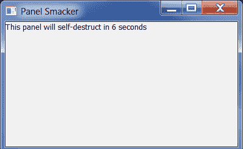
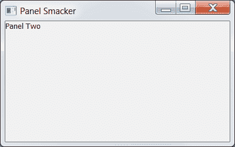

# wxPython:让面板自毁

> 原文：<https://www.blog.pythonlibrary.org/2012/06/26/wxpython-making-a-panel-self-destruct/>

前几天我在 StackOverflow 上看到一个问题，是关于如何在一段时间后动态地销毁和创建面板。我告诉那个家伙，他可以用我的一篇博客[文章](https://www.blog.pythonlibrary.org/2012/05/05/wxpython-adding-and-removing-widgets-dynamically/)中的例子，我在那里销毁和创建了按钮，但是那个家伙就是不明白。所以我写了一个简单的例子，其中面板显示倒计时，然后自我销毁，并立即被另一个面板替换。

这是让你享受观赏乐趣的代码:

```py

import wx

########################################################################
class PanelOne(wx.Panel):
    """"""

    #----------------------------------------------------------------------
    def __init__(self, parent):
        """Constructor"""
        wx.Panel.__init__(self, parent)

        self.countdown = wx.StaticText(self, label="This panel will self-destruct in 10 seconds")

########################################################################
class PanelTwo(wx.Panel):
    """"""

    #----------------------------------------------------------------------
    def __init__(self, parent):
        """Constructor"""
        wx.Panel.__init__(self, parent)

        txt = wx.StaticText(self, label="Panel Two")

########################################################################
class MainFrame(wx.Frame):
    """"""

    #----------------------------------------------------------------------
    def __init__(self):
        """Constructor"""
        wx.Frame.__init__(self, None, title="Panel Smacker")
        self.panelOne = PanelOne(self)
        self.time2die = 10

        self.timer = wx.Timer(self)
        self.Bind(wx.EVT_TIMER, self.update, self.timer)
        self.timer.Start(1000)

        self.sizer = wx.BoxSizer(wx.VERTICAL)
        self.sizer.Add(self.panelOne, 1, wx.EXPAND)
        self.SetSizer(self.sizer)

    #----------------------------------------------------------------------
    def update(self, event):
        """"""
        if self.time2die < 0:
            self.panelOne.Destroy()
            self.panelTwo = PanelTwo(self)
            self.sizer.Add(self.panelTwo, 1, wx.EXPAND)
            self.Layout()
            self.timer.Stop()
        else:
            msg = "This panel will self-destruct in %s seconds" % self.time2die
            self.panelOne.countdown.SetLabel(msg)
        self.time2die -= 1

if __name__ == "__main__":
    app = wx.App(False)
    frame = MainFrame()
    frame.Show()
    app.MainLoop()

```

当您运行这段代码时，您应该会看到类似这样的内容:

[](https://www.blog.pythonlibrary.org/wp-content/uploads/2012/06/panel_smack1.png)

它会倒计时 10 秒，然后你会看到这个:

[](https://www.blog.pythonlibrary.org/wp-content/uploads/2012/06/panel_smack2.png)

如果你想了解更多关于计时器的知识，我也写了一篇关于计时器的文章。尽情享受吧！