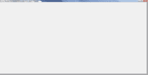

# wxPython:使你的框架最大化或全屏

> 原文：<https://www.blog.pythonlibrary.org/2013/07/12/wxpython-making-your-frame-maximize-or-full-screen/>

这个话题每年都会不时出现。有人会问如何让他们的应用程序全屏显示，或者如何在第一次加载时最大化。因此，我们将花一点时间向您展示如何完成这些活动。

### 如何最大化你的框架

有时候，您会希望在第一次加载 wxPython 应用程序时将其最大化。或者您可能想要将子帧最大化。这在 wxPython 中确实很容易做到，但是有一点需要注意。在讨论问题之前，让我们先看看代码:

```py

import wx

########################################################################
class MyPanel(wx.Panel):
    """"""

    #----------------------------------------------------------------------
    def __init__(self, parent):
        """"""
        wx.Panel.__init__(self, parent)

########################################################################
class MyFrame(wx.Frame):
    """"""

    #----------------------------------------------------------------------
    def __init__(self):
        """"""
        wx.Frame.__init__(self, None, title="Test Maximize")
        panel = MyPanel(self)
        self.Show()
        self.Maximize(True)

if __name__ == "__main__":
    app = wx.App(False)
    frame = MyFrame()
    app.MainLoop()

```

这里我们有一个非常标准的设置，使用了两个类，一个是 wx 的子类。Panel，另一个是 wx.Frame 的子类，为了让它最大化，我们只需要调用 Frame 的 Maximize()方法。这就是问题所在。如果在调用 Show 的之前调用 Maximize **，您可能会看到一个小故障。例如，当我在 Windows 7 上调用 Maximize first 时，面板没有正确地伸展到完全覆盖框架。见下面截图:**

[](https://www.blog.pythonlibrary.org/wp-content/uploads/2013/07/wxMaxGlitch.png)

正如你所看到的，框架在右手边和底部显示了一点点(深灰色)。所以如果你运行上面的代码，面板会像它应该的那样覆盖框架，并且看起来是一致的。有时候，你可能需要调用你的框架的 Raise()方法，让它显示在顶部，或者至少让任务栏闪烁一下，以引起用户的注意。

### 让 wxPython 全屏显示

就我个人而言，我还没有发现任何全屏(即覆盖整个屏幕)的好用例，除了可能是屏幕保存类型的应用程序或者可能是照片浏览器。但不管怎样，完成这项任务的通常方法如下:

```py

import wx

########################################################################
class MyPanel(wx.Panel):
    """"""

    #----------------------------------------------------------------------
    def __init__(self, parent):
        """Constructor"""
        wx.Panel.__init__(self, parent)

        self.Bind(wx.EVT_KEY_DOWN, self.onKey)

    #----------------------------------------------------------------------
    def onKey(self, event):
        """
        Check for ESC key press and exit is ESC is pressed
        """
        key_code = event.GetKeyCode()
        if key_code == wx.WXK_ESCAPE:
            self.GetParent().Close()
        else:
            event.Skip()

########################################################################
class MyFrame(wx.Frame):
    """"""

    #----------------------------------------------------------------------
    def __init__(self):
        """Constructor"""
        wx.Frame.__init__(self, None, title="Test FullScreen")
        panel = MyPanel(self)
        self.ShowFullScreen(True)

if __name__ == "__main__":
    app = wx.App(False)
    frame = MyFrame()
    app.MainLoop()

```

注意，因为应用程序是全屏的，有一个带有关闭按钮的标题栏，所以没有好的方法来关闭应用程序。因此，我为按键事件添加了一个事件处理程序，这样用户就可以按 ESC 键关闭应用程序。

### 包扎

现在你应该熟悉如何让自己的 wxPython 应用程序进入最大化状态甚至全屏。祝你好运，编码快乐！

### 额外资源

*   全屏标志上的 wxWidgets [文档](http://docs.wxwidgets.org/stable/wx_wxtoplevelwindow.html#wxtoplevelwindowshowfullscreen)
*   Nabble - [wx。框架-最大化()未完全最大化](http://wxpython-users.1045709.n5.nabble.com/wx-Frame-Maximize-not-maximizing-completely-td2363511.html)
*   wxPython Wiki - [使用框架。全屏显示](http://wiki.wxpython.org/Using%20Frame.ShowFullScreen)
*   StackOverflow: [wxPython:退出全屏](http://stackoverflow.com/questions/6573444/wxpython-exit-fullscreen)