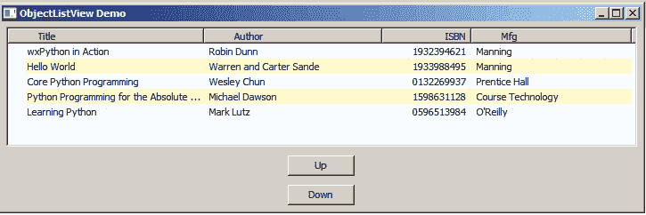

# wxPython:在 ObjectListView 中移动项目

> 原文：<https://www.blog.pythonlibrary.org/2017/11/16/wxpython-moving-items-in-objectlistview/>

最近有人问我如何在一个 **wx 中实现项目的拖放。ListCtrl** 或 in **ObjectListView** 。不幸的是，这两个控件都没有内置这个功能，尽管我在 wxPython wiki 上找到了一篇[文章](https://wiki.wxpython.org/ListControls)，演示了一种在 ListCtrl 中拖放项目的方法。

然而，我确实认为实现一些按钮来移动 ObjectListView 小部件中的项目应该很容易实现。所以这就是这篇文章将要关注的。

* * *

### 更改项目顺序



如果您没有安装 wxPython 和 ObjectListView，那么您将希望使用 pip 来安装它们:

```py

pip install wxPython objectlistview

```

一旦完成，打开你最喜欢的文本编辑器或 IDE，输入下面的代码:

```py

import wx
from ObjectListView import ObjectListView, ColumnDefn

class Book(object):
    """
    Model of the Book object
    Contains the following attributes:
    'ISBN', 'Author', 'Manufacturer', 'Title'
    """

    def __init__(self, title, author, isbn, mfg):
        self.isbn = isbn
        self.author = author
        self.mfg = mfg
        self.title = title

    def __repr__(self):
        return "".format(title=self.title)

class MainPanel(wx.Panel):

    def __init__(self, parent):
        wx.Panel.__init__(self, parent=parent, id=wx.ID_ANY)
        self.current_selection = None
        self.products = [Book("wxPython in Action", "Robin Dunn",
                              "1932394621", "Manning"),
                         Book("Hello World", "Warren and Carter Sande",
                              "1933988495", "Manning"),
                         Book("Core Python Programming", "Wesley Chun",
                             "0132269937", "Prentice Hall"),
                         Book("Python Programming for the Absolute Beginner",
                              "Michael Dawson", "1598631128",
                              "Course Technology"),
                         Book("Learning Python", "Mark Lutz",
                              "0596513984", "O'Reilly")
                         ]

        self.dataOlv = ObjectListView(self, wx.ID_ANY, 
                                      style=wx.LC_REPORT|wx.SUNKEN_BORDER)
        self.setBooks()

        # Allow the cell values to be edited when double-clicked
        self.dataOlv.cellEditMode = ObjectListView.CELLEDIT_SINGLECLICK

        # create up and down buttons
        up_btn = wx.Button(self, wx.ID_ANY, "Up")
        up_btn.Bind(wx.EVT_BUTTON, self.move_up)

        down_btn = wx.Button(self, wx.ID_ANY, "Down")
        down_btn.Bind(wx.EVT_BUTTON, self.move_down)

        # Create some sizers
        mainSizer = wx.BoxSizer(wx.VERTICAL)

        mainSizer.Add(self.dataOlv, 1, wx.ALL|wx.EXPAND, 5)
        mainSizer.Add(up_btn, 0, wx.ALL|wx.CENTER, 5)
        mainSizer.Add(down_btn, 0, wx.ALL|wx.CENTER, 5)
        self.SetSizer(mainSizer)

    def move_up(self, event):
        """
        Move an item up the list
        """        
        self.current_selection = self.dataOlv.GetSelectedObject()
        data = self.dataOlv.GetObjects()
        if self.current_selection:
            index = data.index(self.current_selection)
            if index > 0:
                new_index = index - 1
            else:
                new_index = len(data)-1
            data.insert(new_index, data.pop(index))
            self.products = data
            self.setBooks()
            self.dataOlv.Select(new_index)

    def move_down(self, event):
        """
        Move an item down the list
        """
        self.current_selection = self.dataOlv.GetSelectedObject()
        data = self.dataOlv.GetObjects()
        if self.current_selection:
            index = data.index(self.current_selection)
            if index < len(data) - 1:
                new_index = index + 1
            else:
                new_index = 0
            data.insert(new_index, data.pop(index))
            self.products = data
            self.setBooks()
            self.dataOlv.Select(new_index)

    def setBooks(self):
        self.dataOlv.SetColumns([
            ColumnDefn("Title", "left", 220, "title"),
            ColumnDefn("Author", "left", 200, "author"),
            ColumnDefn("ISBN", "right", 100, "isbn"),
            ColumnDefn("Mfg", "left", 180, "mfg")
        ])

        self.dataOlv.SetObjects(self.products)

class MainFrame(wx.Frame):
    def __init__(self):
        wx.Frame.__init__(self, parent=None, id=wx.ID_ANY, 
                          title="ObjectListView Demo", size=(800,600))
        panel = MainPanel(self)
        self.Show()

if __name__ == "__main__":
    app = wx.App(False)
    frame = MainFrame()
    app.MainLoop() 
```

本例中我们最关心的代码是 **move_up()** 和 **move_down()** 方法。这些方法中的每一个都将检查您是否在 ObjectListView 小部件中选择了一个项目。它还将获取小部件的当前内容。如果您选择了一个项目，那么它将从 ObjectListView 小部件的**数据**中获取该项目的索引，这些数据是我们在调用 **GetObjects()** 时获取的。然后，我们可以使用该索引来确定是否应该根据我们按下的按钮来增加(move_down)或减少(move_up)它的索引。

在我们用改变的位置更新列表之后，我们更新 **self.products** ，这是我们在 **setBooks()** 中使用的类变量，用于更新我们的 ObjectListView 小部件。最后，我们实际上调用了 **setBooks()** ，并且我们重置了选择，因为我们最初的选择已经移动了。

* * *

### 包扎

我认为这是一个整洁的小项目，不需要很长时间就可以完成。我会注意到这个实现至少有一个问题，那就是当你在控件中选择多个项目时，它不能正常工作。您可能可以通过禁用 ObjectListView 小部件中的多重选择或者通过找出逻辑使其适用于多重选择来解决这个问题。但是我会让读者自己去解决。祝您编码愉快！