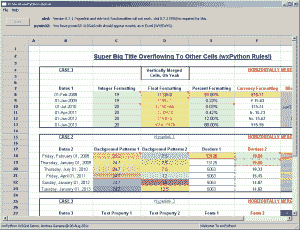
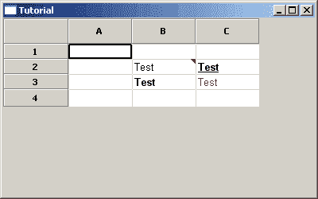

# wxPython:宣布了新的小部件:XLSGrid

> 原文：<https://www.blog.pythonlibrary.org/2011/08/20/wxpython-new-widget-announced-xlsgrid/>

[](https://www.blog.pythonlibrary.org/wp-content/uploads/2011/08/mvp_agwXLSGridDemo.png)

最近，wxPython 代码库中 agw 库的开发人员 Andrea Gavana 发布了他的最新小部件:XLSGrid。它的目的是*忠实地再现 Microsoft Excel 电子表格的外观(XLSGrid 的每个实例一个工作表)*。这个小部件基于 wx.grid.PyGridTableBase 和 wx.grid.PyGridCellRenderer，需要 [xlrd](http://pypi.python.org/pypi/xlrd) 。安德里亚还建议使用马克·哈蒙德的 [PyWin32](http://sourceforge.net/projects/pywin32/) 模块，否则这个小工具的格式化能力将非常有限。如果你想阅读完整的公告，请点击[这里](http://groups.google.com/group/wxpython-users/browse_thread/thread/471a46bd442a2aef#)。

如果您从 wxPython 组获取下载，您将得到三个文件:

*   示例 1.xls
*   xlsgrid.py
*   XLSGridDemo.py

第一个是示例 Microsoft Excel 文件，第二个是小部件文件本身，第三个是方便的演示。如果您运行演示程序并在命令窗口中注意到以下错误，那么您需要从 wxPython SVN 资源库下载最新的 agw 内容:

```py

Traceback (most recent call last):
  File "C:\Users\Mike\Desktop\xls\xlsgrid.py", line 1657, in OnMouseMotion
    self.tip_window = TransientPopup(window, comment, wx.GetMousePosition())
  File "C:\Users\Mike\Desktop\xls\xlsgrid.py", line 1853, in __init__
    self.DoShowNow()
AttributeError: 'TransientPopup' object has no attribute 'DoShowNow'

```

现在，我们将花一点时间创建一个简单的 Excel 文件和我们自己的小演示。让我们开始编码吧！

*注意:你可以下载这篇文章末尾的 Excel 文件。*

```py

import wx
import xlrd
import xlsgrid as XG

########################################################################
class MyForm(wx.Frame):

    #----------------------------------------------------------------------
    def __init__(self):
        wx.Frame.__init__(self, None, wx.ID_ANY, "Tutorial")

        panel = wx.Panel(self, wx.ID_ANY)

        filename = "demo.xls"
        book = xlrd.open_workbook(filename, formatting_info=1)
        sheetname = "Sheet1"
        sheet = book.sheet_by_name(sheetname)
        rows, cols = sheet.nrows, sheet.ncols
        comments, texts = XG.ReadExcelCOM(filename, sheetname, rows, cols)

        xlsGrid = XG.XLSGrid(panel)
        xlsGrid.PopulateGrid(book, sheet, texts, comments)

        sizer = wx.BoxSizer(wx.VERTICAL)
        sizer.Add(xlsGrid, 1, wx.EXPAND, 5)
        panel.SetSizer(sizer)

#----------------------------------------------------------------------
# Run the program
if __name__ == "__main__":
    app = wx.App(False)
    frame = MyForm().Show()
    app.MainLoop()

```

如果您运行上面的代码，您应该会看到类似这样的内容:

[](https://www.blog.pythonlibrary.org/wp-content/uploads/2011/08/mvp_xlsgridDemo.png)

当我运行它时，我遇到的唯一问题是，如果 Excel 文件没有任何注释，我会得到下面的回溯:

```py

pywintypes.com_error: (-2147352567, 'Exception occurred.', (0, 'Microsoft Excel', 'No cells were found.', 'C:\\Program Files\\Microsoft Office\\Office10\\1033\\xlmain10.chm', 0, -2146827284), None)
File "E:\My Documents\My Dropbox\Scripts\wx tutorials\XLSGrid-tut\mvp_xlsDemo.py", line 32, in frame = MyForm().Show()
File "E:\My Documents\My Dropbox\Scripts\wx tutorials\XLSGrid-tut\mvp_xlsDemo.py", line 19, in __init__
  comments, texts = XG.ReadExcelCOM(filename, sheetname, rows, cols)
File "E:\My Documents\My Dropbox\Scripts\wx tutorials\XLSGrid-tut\xlsgrid.py", line 475, in ReadExcelCOM
  comm_range = workbook.GetCommentsRange()
File "E:\My Documents\My Dropbox\Scripts\wx tutorials\XLSGrid-tut\xlsgrid.py", line 535, in GetCommentsRange
  return self.sheet.Cells.SpecialCells(-4144)
File "L:\Python25\Lib\site-packages\win32com\client\dynamic.py", line 3, in SpecialCells 
```

因此，从版本 0.2 开始，这个小部件目前似乎需要至少一个注释才能工作。除此之外，它工作得很好。如果您需要在代码中读取和显示 Microsoft Excel 文件(或者您只是想学习一些简洁的 wx.grid 技巧)，您应该去下载这个很酷的新部件！

## 下载

*   [mvp_xlsDemo.zip](https://www.blog.pythonlibrary.org/wp-content/uploads/2011/08/mvp_xlsDemo.zip)
*   [mvp_xlsDemo.tar](https://www.blog.pythonlibrary.org/wp-content/uploads/2011/08/mvp_xlsDemo.tar)