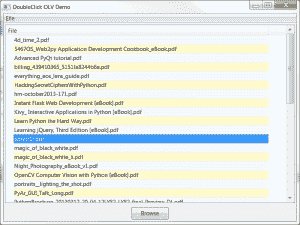

# wxPython: ObjectListview -如何双击项目

> 原文：<https://www.blog.pythonlibrary.org/2013/12/12/wxpython-objectlistview-double-click-items/>

前几天我在做一个项目，在这个项目中我使用了精彩的 ObjectListView 小部件(wx 的包装器)。我想添加双击控件中的一个项目来打开 PDF 的功能。我知道我在网上的某个地方读到过如何做这类事情，但是再一次发现这些信息是一种拖累。所以现在知道了，这次决定分享一下。作为奖励，我还将向您展示如何在 Windows 上打开 PDF 文件！

### 深入研究代码

[](https://www.blog.pythonlibrary.org/wp-content/uploads/2013/12/wxOLVDoubleclick.png)

使用 ObjectListView 小部件非常容易。我在过去谈论过它，所以如果你愿意，你可以去看看那些以前的文章，我会在这篇文章的结尾链接到它们。无论如何，我总是发现显示代码然后解释发生了什么更容易，所以让我们在这里也这样做:

```py

import glob
import os
import subprocess
import wx

from ObjectListView import ObjectListView, ColumnDefn

########################################################################
class File(object):
    """
    Model of the file object
    """

    #----------------------------------------------------------------------
    def __init__(self, path):
        """Constructor"""
        self.filename = os.path.basename(path)
        self.path = path

########################################################################
class UIPanel(wx.Panel):
    """
    Panel class
    """

    #----------------------------------------------------------------------
    def __init__(self, parent):
        """Constructor"""
        wx.Panel.__init__(self, parent)
        self.base_path = os.path.dirname(os.path.abspath(__file__))
        self.data = []

        # -----------------------------------------------
        # create the widgets

        # add the data viewing control
        self.pdfOlv = ObjectListView(self, 
                                     style=wx.LC_REPORT|wx.SUNKEN_BORDER)
        self.pdfOlv.Bind(wx.EVT_LIST_ITEM_ACTIVATED, self.onDoubleClick)
        self.pdfOlv.SetEmptyListMsg("No PDFs Found!")
        self.updateDisplay()

        browseBtn = wx.Button(self, label="Browse")
        browseBtn.Bind(wx.EVT_BUTTON, self.getPdfs)

        # -----------------------------------------------
        # layout the widgets
        mainSizer = wx.BoxSizer(wx.VERTICAL)

        mainSizer.Add(self.pdfOlv, 1, wx.ALL|wx.EXPAND, 5)
        mainSizer.Add(browseBtn, 0, wx.ALL|wx.CENTER, 5)

        self.SetSizer(mainSizer)

    #----------------------------------------------------------------------
    def getPdfs(self, event):
        """
        Attempts to load PDFs into objectlistview
        """
        self.data = []

        dlg = wx.DirDialog(self, "Choose a directory:",
                          style=wx.DD_DEFAULT_STYLE)
        res = dlg.ShowModal()
        if res != wx.ID_OK:
            return
        path = dlg.GetPath()
        dlg.Destroy()

        pdfs = glob.glob(path + "/*.pdf")

        if pdfs:
            for pdf in pdfs:
                self.data.append(File(pdf))

            self.updateDisplay()

    #----------------------------------------------------------------------
    def onDoubleClick(self, event):
        """
        Opens the PDF that is double-clicked
        """
        obj = self.pdfOlv.GetSelectedObject()
        print "You just double-clicked on %s" % obj.path
        cmd = os.getenv("comspec")
        acrobat = "acrord32.exe"
        pdf = obj.path

        cmds = [cmd, "/c", "start", acrobat, "/s", pdf]
        subprocess.Popen(cmds)

    #----------------------------------------------------------------------
    def updateDisplay(self):
        """
        Updates the object list view control
        """
        self.pdfOlv.SetColumns([
            ColumnDefn("File", "left", 700, "filename")
            ])
        self.pdfOlv.SetObjects(self.data)

########################################################################
class MainFrame(wx.Frame):
    """
    Main frame
    """

    #----------------------------------------------------------------------
    def __init__(self):
        """Constructor"""
        wx.Frame.__init__(self, None, title="DoubleClick OLV Demo",
                          size=(800,600))
        panel = UIPanel(self)
        self.createMenu()
        self.Show()

    #----------------------------------------------------------------------
    def createMenu(self):
        """
        Create the menus
        """
        menubar = wx.MenuBar()
        fileMenu = wx.Menu()
        closeMenuItem = fileMenu.Append(wx.NewId(), "Close",
                                        "Close the application")
        self.Bind(wx.EVT_MENU, self.onClose, closeMenuItem)

        menubar.Append(fileMenu, "&File")
        self.SetMenuBar(menubar)

    #----------------------------------------------------------------------
    def onClose(self, event):
        """
        Close the application
        """
        self.Close()

#----------------------------------------------------------------------
def main():
    """
    Run the application
    """
    app = wx.App(False)
    frame = MainFrame()
    app.MainLoop()

#----------------------------------------------------------------------
if __name__ == "__main__":
    main()

```

ObjectListView (OLV)小部件可以处理对象和字典。在这个例子中，我们创建了一个文件类，它将被提供给我们的 OLV 小部件。然后在 panel 类中，我们创建了带有浏览按钮的 OLV 小部件。为了获得双击效果，我们将 OLV 小部件绑定到 **wx。EVT _ 列表 _ 项目 _ 激活**。这不是一个非常直观的命名事件，但它确实可以捕捉双击。要实际使用这个脚本，您需要浏览到一个包含 pdf 的文件夹。一旦选择了文件夹，就会调用**get pdf**方法。

在所述方法中，我们使用 Python 的 glob 模块来查找 pdf。如果它返回一些，那么我们通过向它附加 File 类的实例来更新我们的数据列表。现在你应该有了类似于你在文章开头看到的截图的东西。现在，当你双击项目时，它会打印出 PDF 的路径，然后尝试使用 Python 的 **os** 模块获取窗口的**cmd.exe**路径。然后，它将尝试使用 Python 的子进程模块调用带有几个标志和 PDF 路径的 Adobe Acrobat Reader 32 位版本。如果每个人都正常工作，您应该看到 Acrobat 加载了您选择的 PDF。

注意:当双击事件处理程序触发时，我收到一个 wxPyDeprecationWarning。我不完全确定为什么会发生这种情况，因为它谈论的是关键事件，但我只是认为我的读者应该知道他们可以忽略这一点，因为我不认为这将对他们产生任何影响。

我在 Windows 7 上使用 ObjectListView 1.2、wxPython 2.9.4.0(经典)和 Python 2.7.3 测试了这段代码。