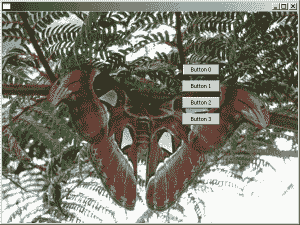

# wxPython:在面板上放置背景图像

> 原文：<https://www.blog.pythonlibrary.org/2010/03/18/wxpython-putting-a-background-image-on-a-panel/>

昨天，我收到一个请求，要求用 Tkinter 或 wxPython 创建一个 GUI，它的背景是一个图像，顶部是按钮。看了一下 Tkinter，发现它的 PhotoImage widget 只支持 gif 和 pgm 两种格式(除非我安装了 Python 图像库)。因此，我决定尝试一下 wxPython。这是我发现的。

使用我的一些 Google-Fu，我在 daniweb 上发现了一个[线程，看起来它可能会工作。我将在这里重现这个例子:](http://www.daniweb.com/forums/thread71560.html#)

```py

# create a background image on a wxPython panel
# and show a button on top of the image

import wx

class Panel1(wx.Panel):
    """class Panel1 creates a panel with an image on it, inherits wx.Panel"""
    def __init__(self, parent, id):
        # create the panel
        wx.Panel.__init__(self, parent, id)
        try:
            # pick an image file you have in the working 
            # folder you can load .jpg  .png  .bmp  or 
            # .gif files
            image_file = 'roses.jpg'
            bmp1 = wx.Image(
                image_file, 
                wx.BITMAP_TYPE_ANY).ConvertToBitmap()
            # image's upper left corner anchors at panel 
            # coordinates (0, 0)
            self.bitmap1 = wx.StaticBitmap(
                self, -1, bmp1, (0, 0))
            # show some image details
            str1 = "%s  %dx%d" % (image_file, bmp1.GetWidth(),
                                  bmp1.GetHeight()) 
            parent.SetTitle(str1)
        except IOError:
            print "Image file %s not found" % imageFile
            raise SystemExit

        # button goes on the image --> self.bitmap1 is the 
        # parent
        self.button1 = wx.Button(
            self.bitmap1, label='Button1', 
            pos=(8, 8))

app = wx.App(False)

# create a window/frame, no parent, -1 is default ID
# change the size of the frame to fit the backgound images
frame1 = wx.Frame(None, -1, "An image on a panel", 
   size=(350, 400))

# create the class instance
panel1 = Panel1(frame1, -1)
frame1.Show(True)
app.MainLoop()

```

当我看到这个的时候，我的第一个想法是:“这可能是坏的”。我为什么会这么想？发布这个的人用的是 wx。按钮父级的 StaticBitmap。StaticBitmap 小部件不像 Panel 或 Frame 那样是一个容器小部件，所以我认为这可能不是一个好主意。因此，我在#wxPython IRC 频道上询问了罗宾·邓恩(Robin Dunn)的看法。他说如果我像上面的例子那样做，我可能会遇到 tab 遍历的问题，他建议我使用 EVT _ 擦除 _ 背景事件来做一些自定义绘制。由于 Robin Dunn 是 wxPython 的创建者，我最终走上了这条路，下面是我根据他的建议编写的代码:

```py

import wx

########################################################################
class MainPanel(wx.Panel):
    """"""

    #----------------------------------------------------------------------
    def __init__(self, parent):
        """Constructor"""
        wx.Panel.__init__(self, parent=parent)
        self.SetBackgroundStyle(wx.BG_STYLE_CUSTOM)
        self.frame = parent

        sizer = wx.BoxSizer(wx.VERTICAL)
        hSizer = wx.BoxSizer(wx.HORIZONTAL)

        for num in range(4):
            label = "Button %s" % num
            btn = wx.Button(self, label=label)
            sizer.Add(btn, 0, wx.ALL, 5)
        hSizer.Add((1,1), 1, wx.EXPAND)
        hSizer.Add(sizer, 0, wx.TOP, 100)
        hSizer.Add((1,1), 0, wx.ALL, 75)
        self.SetSizer(hSizer)
        self.Bind(wx.EVT_ERASE_BACKGROUND, self.OnEraseBackground)

    #----------------------------------------------------------------------
    def OnEraseBackground(self, evt):
        """
        Add a picture to the background
        """
        # yanked from ColourDB.py
        dc = evt.GetDC()

        if not dc:
            dc = wx.ClientDC(self)
            rect = self.GetUpdateRegion().GetBox()
            dc.SetClippingRect(rect)
        dc.Clear()
        bmp = wx.Bitmap("butterfly.jpg")
        dc.DrawBitmap(bmp, 0, 0)

########################################################################
class MainFrame(wx.Frame):
    """"""

    #----------------------------------------------------------------------
    def __init__(self):
        """Constructor"""
        wx.Frame.__init__(self, None, size=(600,450))
        panel = MainPanel(self)        
        self.Center()

########################################################################
class Main(wx.App):
    """"""

    #----------------------------------------------------------------------
    def __init__(self, redirect=False, filename=None):
        """Constructor"""
        wx.App.__init__(self, redirect, filename)
        dlg = MainFrame()
        dlg.Show()

#----------------------------------------------------------------------
if __name__ == "__main__":
    app = Main()
    app.MainLoop()

```

下面是一个截图例子，我用一张有趣的蝴蝶图片作为背景图片，这张图片是我在夏天拍摄的:

[](https://www.blog.pythonlibrary.org/wp-content/uploads/2010/03/panel_with_bg.png)

需要关注的主要代码如下:

```py

def OnEraseBackground(self, evt):
    """
    Add a picture to the background
    """
    # yanked from ColourDB.py
    dc = evt.GetDC()

    if not dc:
        dc = wx.ClientDC(self)
        rect = self.GetUpdateRegion().GetBox()
        dc.SetClippingRect(rect)
    dc.Clear()
    bmp = wx.Bitmap("butterfly.jpg")
    dc.DrawBitmap(bmp, 0, 0)

```

我从 wxPython 演示中的 ColourDB.py 演示中复制了它，并对它进行了一些编辑，以使它适用于我的应用程序。基本上，你只需将面板绑定到 EVT _ 擦除 _ 背景，在那个处理程序中，你获取设备上下文(DC)，在这个例子中就是面板(我想)。我称它为 Clear 方法，主要是因为在我的实际应用中，我使用了一个透明的图像，它让背景渗透进来。通过清理伤口，我止住了出血。无论如何，条件检查以查看 dc 是否为空(我不太确定是哪一个)，如果不是，它更新该区域(或脏区——它是应用程序中被移动另一个窗口“损坏”的任何部分)。然后，我抓取我的图像，并使用 DrawBitmap 将其应用于背景。这有点奇怪，我也不完全明白发生了什么，但它确实有效。

我还发现了另一个我在这篇博客中没有尝试过的方法:http://www . 5et demi . com/blog/archives/2006/06/making-a-panel-with-a-background-in-wxpython/

请随意尝试这两种方法，看看哪一种最适合您。这有点像 Robin Dunn 的方法，因为它也使用 DCs，但与我使用的类型不同。

**2014 年 1 月 15 日更新**:本文中的代码最初是使用 wxPython 2.8.12 测试的。已经发现在 2.9+中，您将需要删除以下行:

```py

self.SetBackgroundStyle(wx.BG_STYLE_CUSTOM)

```

否则，图像不会正确显示。根据这个 [StackOverflow 回答](http://stackoverflow.com/a/21128901/393194)，原因是因为风格，wx。BG_STYLE_CUSTOM，防止背景被擦除。

也可以将背景样式改为 **wx。BG_STYLE_ERASE** 也可以。