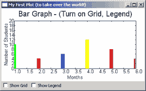
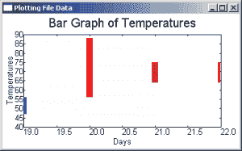
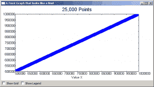
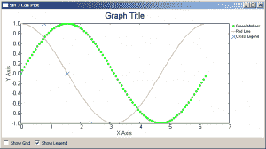

# wxPython: PyPlot -使用 Python 绘制图形

> 原文：<https://www.blog.pythonlibrary.org/2010/09/27/wxpython-pyplot-graphs-with-python/>

有些人通过做来学习，有些人更擅长视觉刺激。至少，这是我们被告知的。因此，本着我们所学的精神，我们将看看等式的视觉部分，看看我们如何用 wxPython 制作图形。您可能不知道这一点，但是 wxPython 包含了一个专门用于此目的的小部件。它的名字叫 PyPlot。PyPlot 非常擅长绘制简单的图形，而且速度也非常快！如果你需要怪异或复杂的绘图，那么你会想用 matplotlib 代替。幸运的是，wxPython 和 matplotlib 配合得很好，但是我们不会在本文中讨论 matplotlib。

## 入门(带条形图！)

[](https://www.blog.pythonlibrary.org/wp-content/uploads/2010/09/simple_plot.png)

如果您查看 wxPython 发行版中的 **plot.py** 文件，您会发现 PyPlot 需要 Numeric、numarray 或 numpy(以相反的顺序),因此请确保您已经安装了其中一个以便能够使用这个小部件。当然，wxPython 也是必需的，但您知道这一点，对吗？

总之，在 Python 文件的底部，有一个简单的演示，展示了如何用 PyPlot 绘制各种图形。让我们取一些代码，看看我们是否能弄明白。

```py

import wx
from wx.lib.plot import PolyLine, PlotCanvas, PlotGraphics

#----------------------------------------------------------------------
def drawBarGraph():
    # Bar graph
    points1=[(1,0), (1,10)]
    line1 = PolyLine(points1, colour='green', legend='Feb.', width=10)
    points1g=[(2,0), (2,4)]
    line1g = PolyLine(points1g, colour='red', legend='Mar.', width=10)
    points1b=[(3,0), (3,6)]
    line1b = PolyLine(points1b, colour='blue', legend='Apr.', width=10)

    points2=[(4,0), (4,12)]
    line2 = PolyLine(points2, colour='Yellow', legend='May', width=10)
    points2g=[(5,0), (5,8)]
    line2g = PolyLine(points2g, colour='orange', legend='June', width=10)
    points2b=[(6,0), (6,4)]
    line2b = PolyLine(points2b, colour='brown', legend='July', width=10)

    return PlotGraphics([line1, line1g, line1b, line2, line2g, line2b],
                        "Bar Graph - (Turn on Grid, Legend)", "Months", 
                        "Number of Students")

########################################################################
class MyGraph(wx.Frame):

    #----------------------------------------------------------------------
    def __init__(self):
        wx.Frame.__init__(self, None, wx.ID_ANY, 
                          'My First Plot (to take over the world!)')

        # Add a panel so it looks the correct on all platforms
        panel = wx.Panel(self, wx.ID_ANY)

        # create some sizers
        mainSizer = wx.BoxSizer(wx.VERTICAL)
        checkSizer = wx.BoxSizer(wx.HORIZONTAL)

        # create the widgets
        self.canvas = PlotCanvas(panel)
        self.canvas.Draw(drawBarGraph())
        toggleGrid = wx.CheckBox(panel, label="Show Grid")
        toggleGrid.Bind(wx.EVT_CHECKBOX, self.onToggleGrid)
        toggleLegend = wx.CheckBox(panel, label="Show Legend")
        toggleLegend.Bind(wx.EVT_CHECKBOX, self.onToggleLegend)

        # layout the widgets
        mainSizer.Add(self.canvas, 1, wx.EXPAND)
        checkSizer.Add(toggleGrid, 0, wx.ALL, 5)
        checkSizer.Add(toggleLegend, 0, wx.ALL, 5)
        mainSizer.Add(checkSizer)
        panel.SetSizer(mainSizer)

    #----------------------------------------------------------------------
    def onToggleGrid(self, event):
        """"""
        self.canvas.SetEnableGrid(event.IsChecked())

    #----------------------------------------------------------------------
    def onToggleLegend(self, event):
        """"""
        self.canvas.SetEnableLegend(event.IsChecked())

if __name__ == '__main__':
    app = wx.App(False)
    frame = MyGraph()
    frame.Show()
    app.MainLoop()

```

**drawBarGraph** 函数直接来自前面提到的 plot.py 文件。在本例中，函数名从“_draw6Objects”改为“drawBarGraph ”,以使代码更容易理解。让我们来看看吧。点就是图上的点:[(x1，y1)，(x2，y2)]。他们通过**折线**方法告诉 PyPlot 在哪里绘图。正如您所看到的，PolyLine 采用了一个图表点元组的列表，并可选地采用了颜色、图例、宽度和样式(未显示)。我们创建一系列折线，然后将它们添加到一个 **PlotGraphics** 实例中。PlotGraphics first 方法是折线(或其他 PolyXXX 对象)、标题、xLabel 和 yLabel 的列表。我们将 PlotGraphics 对象返回给 wxPython 类中的调用者。

现在我们把注意力转向那个类，它有一个平淡无奇的名字 MyGraph。如果您以前使用过 wxPython，那么前几行非常熟悉，所以让我们跳过它们，直接跳到小部件创建部分。在这里，我们看到如何创建一个只有普通 wx 的**绘图画布**。面板作为其父面板。为了绘制条形图，我们调用画布对象的 **Draw** 方法，传入从 drawBarGraph 函数返回的 PlotGraphics 对象。在继续之前，请根据需要反复阅读，以了解发生了什么。

你准备好了吗？那我们继续吧！在我们绘制了条形图之后，我们创建了两个复选框来切换图表的网格和图例。然后我们在框架上布置小部件。复选框的方法是不言自明的，所以你可以自己解决。提示:IsChecked()返回一个布尔值。

## 使用保存的数据绘图

[](https://www.blog.pythonlibrary.org/wp-content/uploads/2010/09/plot_from_file.png)

通常你会想从保存的文件、数据库或网络服务中读取数据，而不是使用硬编码的数据。在这里，我们将看看如何使用一些保存的数据来创建一个图表。以下是我们将使用的数据(您可能想要下载文章底部的档案):

 `# http://www.wunderground.com/history/airport/KMIW/2010/9/22/WeeklyHistory.html?format=1
CDT,Max TemperatureF,Mean TemperatureF,Min TemperatureF,Max Dew PointF,MeanDew PointF,Min DewpointF,Max Humidity, Mean Humidity, Min Humidity, Max Sea Level PressureIn, Mean Sea Level PressureIn, Min Sea Level PressureIn, Max VisibilityMiles, Mean VisibilityMiles, Min VisibilityMiles, Max Wind SpeedMPH, Mean Wind SpeedMPH, Max Gust SpeedMPH,PrecipitationIn, CloudCover, Events
2010-9-19,56,52,47,55,49,44,100,97,93,30.21,30.17,30.11,10,5,2,14,9,20,0.34,8,Rain-Thunderstorm
2010-9-20,88,72,56,71,62,55,100,73,46,30.10,29.94,29.77,10,6,0,25,12,32,T,4,Fog-Rain
2010-9-21,75,70,64,66,64,63,93,83,73,29.89,29.83,29.75,10,7,0,22,7,30,1.79,5,Fog-Rain-Thunderstorm
2010-9-22,75,70,64,68,64,63,100,93,69,30.00,29.96,29.86,10,5,1,15,4,,0.26,8,Rain` 

第一行是网站，第二行告诉我们后面用逗号分隔的行是什么。最后四行是普通数据，每行末尾有一些垃圾 HTML。最后一行也是我们想要忽略的。让我们创建一些代码来实际绘制这些数据！

```py

import wx
from wx.lib.plot import PolyLine, PlotCanvas, PlotGraphics

class MyGraph(wx.Frame):

    def __init__(self):
        wx.Frame.__init__(self, None, wx.ID_ANY, 
                          'Plotting File Data')

        # Add a panel so it looks the correct on all platforms
        panel = wx.Panel(self, wx.ID_ANY)
        self.canvas = PlotCanvas(panel)
        self.canvas.Draw(self.createPlotGraphics())

        sizer = wx.BoxSizer(wx.VERTICAL)
        sizer.Add(self.canvas, 1, wx.EXPAND)
        panel.SetSizer(sizer)

    #----------------------------------------------------------------------
    def readFile(self):
        """"""
        # normally you would want to pass a file path in, NOT hard code it!
        f = open("data.txt")
        # skip the first two lines of text in the file
        data = f.readlines()[2:-1]
        temps = []
        for line in data:
            parts = line.split(",")
            date = parts[0].split("-")
            day = date[2]
            points = [(day, parts[3]), (day, parts[1])]
            temps.append(points)
        return temps

    #----------------------------------------------------------------------
    def createPlotGraphics(self):
        """"""
        temps = self.readFile()
        lines = []
        for temp in temps:
            tempInt = int(temp[1][1])
            if tempInt < 60:
                color = "blue"
            elif tempInt >=60 and tempInt <= 75:
                color = "orange"
            else:
                color = "red"
            lines.append(PolyLine(temp, colour=color, width=10))

        return PlotGraphics(lines, "Bar Graph of Temperatures", 
                            "Days", "Temperatures")

if __name__ == '__main__':
    app = wx.App(False)
    frame = MyGraph()
    frame.Show()
    app.MainLoop()

```

你能解开这个密码吗？好吧，如果你不能(或不想)那么你现在就可以阅读它的全部内容！就像我们前面的例子一样，我们导入一些东西并创建一个 wx。带有面板和绘图画布的框架。我们也有一个简单的 **readFile** 方法和一个 **createPlotGraphics** 方法。这两种方法是我们将要重点介绍的。

readFile 方法由 createPlotGraphics 方法调用。它所做的只是读取一个文件。对于这个例子，我们有硬编码的文件的“路径”。你通常想做的是使用某种文件浏览器来加载文件，但我们走的是超级简单的路线。当我们读取文件中的行时，我们使用下面的语法跳过前两行:

```py

data = f.readlines()[2:-1]

```

这样做是跳过文件中的前两行，读到末尾，减去一行。通过这样做，我们在开头和结尾都跳过了垃圾。Python 是不是很酷？接下来，我们创建一个简单的“for 循环”来提取我们想要的数据，这只是一天，低温和高温。剩下的我们就扔了。

在 createPlotGraphics 方法中，我们获取从 readFile 方法返回的 temps 列表，并对这些列表进行循环，从而创建一个新的折线列表。我们使用一些“if 语句”来决定条形图中每个条形的颜色。最后，我们将所有折线放入一个 PlotGraphics 实例中，并将其返回给 __init__ 方法中调用的。这就是全部了！

## 具有数千个点的点图

[](https://www.blog.pythonlibrary.org/wp-content/uploads/2010/09/point_plot.png)

现在我们来看看如何创建一个有 25，000 个点的点图！这一张也是来自演示。代码如下:

```py

import numpy.oldnumeric as _Numeric
import wx
from wx.lib.plot import PlotCanvas, PlotGraphics, PolyLine, PolyMarker

#----------------------------------------------------------------------
def drawLinePlot():
    # 25,000 point line
    data1 = _Numeric.arange(5e5,1e6,10)
    data1.shape = (25000, 2)
    line1 = PolyLine(data1, legend='Wide Line', colour='green', width=5)

    # A few more points...
    markers2 = PolyMarker(data1, legend='Square', colour='blue',
                          marker='square')
    return PlotGraphics([line1, markers2], "25,000 Points", "Value X", "")

########################################################################
class MyGraph(wx.Frame):

    #----------------------------------------------------------------------
    def __init__(self):
        wx.Frame.__init__(self, None, wx.ID_ANY, 
                          'It Looks Like a Line Graph!')

        # Add a panel so it looks the correct on all platforms
        panel = wx.Panel(self, wx.ID_ANY)

        # create some sizers
        mainSizer = wx.BoxSizer(wx.VERTICAL)
        checkSizer = wx.BoxSizer(wx.HORIZONTAL)

        # create the widgets
        self.canvas = PlotCanvas(panel)
        self.canvas.Draw(drawLinePlot())
        toggleGrid = wx.CheckBox(panel, label="Show Grid")
        toggleGrid.Bind(wx.EVT_CHECKBOX, self.onToggleGrid)
        toggleLegend = wx.CheckBox(panel, label="Show Legend")
        toggleLegend.Bind(wx.EVT_CHECKBOX, self.onToggleLegend)

        # layout the widgets
        mainSizer.Add(self.canvas, 1, wx.EXPAND)
        checkSizer.Add(toggleGrid, 0, wx.ALL, 5)
        checkSizer.Add(toggleLegend, 0, wx.ALL, 5)
        mainSizer.Add(checkSizer)
        panel.SetSizer(mainSizer)

    #----------------------------------------------------------------------
    def onToggleGrid(self, event):
        """"""
        self.canvas.SetEnableGrid(event.IsChecked())

    #----------------------------------------------------------------------
    def onToggleLegend(self, event):
        """"""
        self.canvas.SetEnableLegend(event.IsChecked())

if __name__ == '__main__':
    app = wx.App(False)
    frame = MyGraph()
    frame.Show()
    app.MainLoop()

```

我们重用了我们在原始示例中看到的大部分 wxPython 代码，在这里只调用了一个不同的函数。 **drawLinePlot** 函数非常简单。对于本例，我们使用 numpy 创建 25，000 个地块点，然后用它们创建一条多段线。如果你放大，你会看到一些点是方形的，而不是圆形的。这就是 PolyMarker 类的用途。它设置“标记”的样式。现在我们准备看下一个例子了！

## 创建正弦/余弦图形

[](https://www.blog.pythonlibrary.org/wp-content/uploads/2010/09/sin_cos_plot.png)

这个例子向你展示了如何获取正弦和余弦，并把它们画出来。它看起来有点像水平双螺旋。总之，代码如下:

```py

import numpy.oldnumeric as _Numeric
import wx
from wx.lib.plot import PlotCanvas, PlotGraphics, PolyLine, PolyMarker

def drawSinCosWaves():
    # 100 points sin function, plotted as green circles
    data1 = 2.*_Numeric.pi*_Numeric.arange(200)/200.
    data1.shape = (100, 2)
    data1[:,1] = _Numeric.sin(data1[:,0])
    markers1 = PolyMarker(data1, legend='Green Markers', colour='green', marker='circle',size=1)

    # 50 points cos function, plotted as red line
    data1 = 2.*_Numeric.pi*_Numeric.arange(100)/100.
    data1.shape = (50,2)
    data1[:,1] = _Numeric.cos(data1[:,0])
    lines = PolyLine(data1, legend= 'Red Line', colour='red')

    # A few more points...
    pi = _Numeric.pi
    markers2 = PolyMarker([(0., 0.), (pi/4., 1.), (pi/2, 0.),
                          (3.*pi/4., -1)], legend='Cross Legend', colour='blue',
                          marker='cross')

    return PlotGraphics([markers1, lines, markers2],"Graph Title", "X Axis", "Y Axis")

########################################################################
class MyGraph(wx.Frame):

    #----------------------------------------------------------------------
    def __init__(self):
        wx.Frame.__init__(self, None, wx.ID_ANY, 
                          'Sin / Cos Plot')

        # Add a panel so it looks the correct on all platforms
        panel = wx.Panel(self, wx.ID_ANY)

        # create some sizers
        mainSizer = wx.BoxSizer(wx.VERTICAL)
        checkSizer = wx.BoxSizer(wx.HORIZONTAL)

        # create the widgets
        self.canvas = PlotCanvas(panel)
        self.canvas.Draw(drawSinCosWaves())
        toggleGrid = wx.CheckBox(panel, label="Show Grid")
        toggleGrid.Bind(wx.EVT_CHECKBOX, self.onToggleGrid)
        toggleLegend = wx.CheckBox(panel, label="Show Legend")
        toggleLegend.Bind(wx.EVT_CHECKBOX, self.onToggleLegend)

        # layout the widgets
        mainSizer.Add(self.canvas, 1, wx.EXPAND)
        checkSizer.Add(toggleGrid, 0, wx.ALL, 5)
        checkSizer.Add(toggleLegend, 0, wx.ALL, 5)
        mainSizer.Add(checkSizer)
        panel.SetSizer(mainSizer)

    #----------------------------------------------------------------------
    def onToggleGrid(self, event):
        """"""
        self.canvas.SetEnableGrid(event.IsChecked())

    #----------------------------------------------------------------------
    def onToggleLegend(self, event):
        """"""
        self.canvas.SetEnableLegend(event.IsChecked())

if __name__ == '__main__':
    app = wx.App(False)
    frame = MyGraph()
    frame.Show()
    app.MainLoop()

```

这个例子是为数学爱好者准备的。我很久没学过三角学和几何学了，所以这里就不解释方程了。你可以用你最喜欢的搜索引擎来查找这类信息。此示例使用一条折线和两个聚合标记来创建图形。虽然它和其他例子很像，所以真的没什么好说的。

## 包扎

到目前为止，您应该已经准备好用 wxPython 自己绘制图形了。如果您遇到困难，plot.py 文件中还有其他几个例子，wxPython 邮件列表成员非常友好，如果您友好地提出请求，他们可能会帮助您。让我知道你是否创造了任何酷的东西！

*注意:本文中的代码已经在 Windows XP、Python 2.5、wxPython 2.8.10.1 上测试过了*

## 进一步阅读

*   [PyPlot](http://www.wxpython.org/docs/api/wx.lib.plot-module.html) 的官方文档

## 下载

*   [PyPlot.zip](https://www.blog.pythonlibrary.org/wp-content/uploads/2010/09/PyPlot.zip)
*   [PyPlot.tar](https://www.blog.pythonlibrary.org/wp-content/uploads/2010/09/PyPlot.tar)