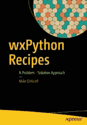

# wxPython 食谱图书发布

> 原文：<https://www.blog.pythonlibrary.org/2017/12/19/wxpython-recipes-book-release/>

今年早些时候，一家出版社联系我，希望以他们的品牌重新出版我的书 [wxPython Cookbook](https://leanpub.com/wxpythoncookbook/) 。我想看看我能从出版商那里学到什么可能会很有趣，所以我和他们一起去了，因为我过去喜欢过他们的几本书。这本书最大的变化是，我最终把食谱分成了几章，而不是每一个食谱都是独立的一章。我还添加了一些新的食谱，以帮助在一些章节不容易归类时进行补充。

总之，前几天出版了这本书:

你可以在亚马逊或者 T2 出版社的网站上找到这本书。你也可以在[谷歌](https://books.google.com/books?id=SthCDwAAQBAJ)上看到这本书的预览。

您可以使用以下代码从[press](https://www.apress.com/us/book/9781484232361)开始享受图书八折优惠: **wx20** 。在 2018 年 6 月**之前，这本书的平装本和电子书版本的代码都是有效的。**

 **这本书的代码存放在 Apress 的 [Github 账户](https://github.com/Apress/wxpython-recipes)上。我在 [Github](https://github.com/driscollis/wxPython_recipes_book_code) 上也有一份拷贝。

不管怎样，请随意查看。如果你已经买了一本 wxPython 食谱，那么你不需要再买一本，因为它基本上是一样的，只是多了一些修饰和一些新的食谱。我计划在 2018 年自助出版一些其他书籍，所以请关注博客上的相关新闻！**