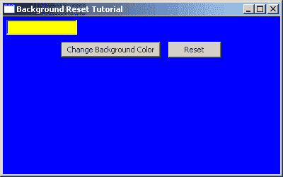
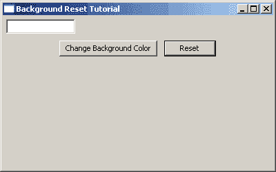

# wxPython:重置背景颜色

> 原文：<https://www.blog.pythonlibrary.org/2009/09/03/wxpython-resetting-the-background-color/>

在过去的几周里，我看到很多人询问关于将一个小部件的颜色重新设置回它最初的“默认”颜色。在 wxPython 的邮件列表中至少有一个人和另外一个人在他们的 IRC 频道上请求关于这个话题的信息。当我第一次查找这个问题时，是为了列表中的一位程序员，他想重置面板的背景颜色。在我的寻找中，我认为我找到了完美的解决方案:

```py

color = wx.SystemSettings.GetColour(wx.SYS_COLOUR_BACKGROUND)
panel.SetBackgroundColour(color)

```

不幸的是，这并不适用于所有情况。相反，罗宾·邓恩推荐使用 wx。取而代之的是 NullColor(你可以在这里读取完整线程[)。按照邓恩先生的说法，原因是*(wx。NullColor)将告诉 wx 小部件没有特定的颜色集，因此它将使用平台想要使用的任何颜色，这可能由活动主题控制，可能根本不是纯色。这与使用系统设置颜色有一点不同，因为 wx 会像设置了一个自定义颜色一样工作，它不在乎它是否与系统颜色相同。*](http://groups.google.com/group/wxpython-users/browse_frm/thread/4f08f23d95d8b7c3/2d89d9b5212f7476?lnk=gst&q=SetBackgroundColour+on+Panels#2d89d9b5212f7476)

因此，我创建了一个演示应用程序，向您展示如何重置颜色:

```py

import wx

class MyForm(wx.Frame):

    def __init__(self):
        wx.Frame.__init__(self, None, wx.ID_ANY, 
                                 "Background Reset Tutorial")

        # Add a panel so it looks the correct on all platforms
        self.panel = wx.Panel(self, wx.ID_ANY)

        self.txt = wx.TextCtrl(self.panel)
        self.txt.SetBackgroundColour("Yellow")

        blueBtn = wx.Button(self.panel, 
                           label="Change Background Color")
        blueBtn.Bind(wx.EVT_BUTTON, self.onChangeBackground)
        resetBtn = wx.Button(self.panel, label="Reset")
        resetBtn.Bind(wx.EVT_BUTTON, self.onReset)

        topSizer = wx.BoxSizer(wx.VERTICAL)
        btnSizer = wx.BoxSizer(wx.HORIZONTAL)

        btnSizer.Add(blueBtn, 0, wx.ALL|wx.CENTER, 5)
        btnSizer.Add(resetBtn, 0, wx.ALL|wx.CENTER, 5)

        topSizer.Add(self.txt, 0, wx.ALL, 5)
        topSizer.Add(btnSizer, 0, wx.CENTER)
        self.panel.SetSizer(topSizer)

    def onChangeBackground(self, event):
        """
        Change the background color of the panel
        """
        self.panel.SetBackgroundColour("Blue")
        self.panel.Refresh()

    def onReset(self, event):
        """
        Reset the color of the panel to the default color
        """
        self.panel.SetBackgroundColour(wx.NullColor)
        self.txt.SetBackgroundColour(wx.NullColor)
        self.panel.Refresh()

# Run the program
if __name__ == "__main__":
    app = wx.PySimpleApp()
    frame = MyForm()
    frame.Show()
    app.MainLoop()

```

在这段代码中，您会注意到我将文本控件的初始背景颜色设置为黄色，并且允许用户通过按钮事件处理程序更改面板的背景。用户也可以通过按下“重置”按钮来“重置”两个窗口小部件的背景颜色。

这是一张使用前和使用后的图片:

[](https://www.blog.pythonlibrary.org/wp-content/uploads/2009/09/changed.png)

重置前

[](https://www.blog.pythonlibrary.org/wp-content/uploads/2009/09/reset.png)

复位后

真的没什么好说的了。现在你也知道诀窍了，所以如果你看到一个新手在这方面挣扎，你也可以告诉他们该怎么做！

*此代码在以下位置进行了测试:*

*   Windows XP、wxPython 2.8.10.1(MSW-unicode)、Python 2.5.2

**下载量**

*   [resetColor (zip)](https://www.blog.pythonlibrary.org/wp-content/uploads/2009/09/resetColor.zip)
*   [重置颜色(焦油)](https://www.blog.pythonlibrary.org/wp-content/uploads/2009/09/resetColor.tar)