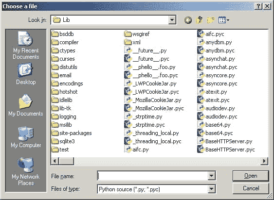

# wxPython:在 wx 中显示 2 种文件类型。文件对话框

> 原文：<https://www.blog.pythonlibrary.org/2011/02/10/wxpython-showing-2-filetypes-in-wx-filedialog/>

前几天在 freenode 上的 wxPython IRC 频道上，一个成员问是否有一种方法可以制作 wx。FileDialog 一次显示多个文件类型。在内心深处，我认为我已经看到了一个微软的产品可以做到这一点，但我从来没有见过任何 wxPython 的例子。在这个简短的教程中，你将学会如何做这个简单的技巧！

[](https://www.blog.pythonlibrary.org/wp-content/uploads/2011/02/wx_multi_filetype.jpg)

以下是您需要的代码:

```py

import wx

wildcard = "Python source (*.py; *.pyc)|*.py;*.pyc|" \
         "All files (*.*)|*.*"

########################################################################
class MyForm(wx.Frame):

    #----------------------------------------------------------------------
    def __init__(self):
        wx.Frame.__init__(self, None, wx.ID_ANY,
                          "Multi-file type wx.FileDialog Tutorial")
        panel = wx.Panel(self, wx.ID_ANY)

        btn = wx.Button(panel, label="Open File Dialog")
        btn.Bind(wx.EVT_BUTTON, self.onOpenFile)

     #----------------------------------------------------------------------
    def onOpenFile(self, event):
        """
        Create and show the Open FileDialog
        """
        dlg = wx.FileDialog(
            self, message="Choose a file",
            defaultFile="",
            wildcard=wildcard,
            style=wx.OPEN | wx.MULTIPLE | wx.CHANGE_DIR
            )
        if dlg.ShowModal() == wx.ID_OK:
            paths = dlg.GetPaths()
            print "You chose the following file(s):"
            for path in paths:
                print path
        dlg.Destroy()

#----------------------------------------------------------------------
# Run the program
if __name__ == "__main__":
    app = wx.App(False)
    frame = MyForm()
    frame.Show()
    app.MainLoop()

```

这段代码中的关键字在**通配符**变量中。仔细看，你会注意到里面有一些分号。第一个字符串后半部分的分号才是我们关心的。它告诉对话框只显示*。py 和*。pyc 文件。是的，就是这么简单。前半部分可以是您想要的任何内容，但是建议您告诉您的用户他们可以期望它返回什么文件类型。

这就是全部了。当你创建自己的文件对话框时，一定要记住这个技巧。你可能只是需要它！