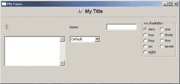

# wxPython Sizers 教程:使用 GridBagSizer

> 原文：<https://www.blog.pythonlibrary.org/2008/05/22/wxpython-sizers-tutorial-using-a-gridbagsizer/>

在本教程中，我将从前几天编写的 [GridSizer 教程](https://www.blog.pythonlibrary.org/?p=25)中提取代码，并对其进行大量修改，以在 GridBagSizer 中显示形状奇怪的小部件。GridBagSizer 是最复杂的筛分机。它是 FlexGridSizer 的子类，因此您可以使用它的所有父方法以及 GridBagSizer 添加的方法。参见[文档](http://wxpython.org/docs/api/wx.GridBagSizer-class.html)或使用 Python 的 help()功能了解更多关于所述方法的信息。

下面是如何实例化 GridBagSizer 的方法:

```py

 bagSizer    = wx.GridBagSizer(hgap=5, vgap=5)

```

您会注意到，在创建 GridBagSizer 的实例时，不需要指定行或列。当您使用 Add()函数时，您会注意到它添加了 span 参数。此参数允许您指定小部件是否可以指定多行、多列或两者都指定。在我真正开始做之前，我将检查一下我们将要添加到行中的奇怪形状的部件。

我要添加的第一个是无线电盒。首先，您需要为单选按钮创建一个值列表。这是这个有趣的小部件的设置:

```py

rb = wx.RadioBox(parent, id, label, pos, size, choices, majorDimension,
                        style, validator, name)

```

我认为这里只有两个参数需要额外的解释:选择和主要维度。“选择”参数是指您创建的值列表。majorDimension 参数用于表示一维的大小，可以是行或列，这取决于您使用的样式标志(wx。RA_SPECIFY_COLS 或 wx。RA_SPECIFY_ROWS)。它默认为列。如果你想要相反的效果，那么使用 wx。RA_SPECIFY_ROWS 标志。有关更多信息，请参见“wxPython in Action”一书，第 215 页。

我将使用的另一个小部件是多行 TextCtrl。要使 TextCtrl 变成多行，您需要做的就是添加样式标志 wx。TE_MULTILINE。一旦我们添加了这些内容，并且正确的标志就位，您应该会看到类似这样的内容:

[](https://www.blog.pythonlibrary.org/wp-content/uploads/2008/05/funky_size.jpg)

好的。让我们看看代码:

```py

import wx

class MyForm(wx.Frame):

    def __init__(self):
        wx.Frame.__init__(self, None, wx.ID_ANY, 'My Form') 

        # Add a panel so it looks the correct on all platforms
        self.panel = wx.Panel(self, wx.ID_ANY)

        bmp = wx.ArtProvider.GetBitmap(wx.ART_INFORMATION, wx.ART_OTHER, (16, 16))
        font = wx.Font(12, wx.SWISS, wx.NORMAL, wx.BOLD)

        titleIco = wx.StaticBitmap(self.panel, wx.ID_ANY, bmp)
        title = wx.StaticText(self.panel, wx.ID_ANY, 'My Title')
        title.SetFont(font)

        # 1st row of widgets
        bmp = wx.ArtProvider.GetBitmap(wx.ART_TIP, wx.ART_OTHER, (16, 16))
        inputOneIco = wx.StaticBitmap(self.panel, wx.ID_ANY, bmp)
        labelOne = wx.StaticText(self.panel, wx.ID_ANY, 'Name')
        inputTxtOne = wx.TextCtrl(self.panel, wx.ID_ANY,'')

        sampleList = ['zero', 'one', 'two', 'three', 'four', 'five',
                      'six', 'seven', 'eight']
        rb = wx.RadioBox(
                self.panel, wx.ID_ANY, "wx.RadioBox", wx.DefaultPosition,
                wx.DefaultSize, sampleList, 2, wx.RA_SPECIFY_COLS
                )

        # 2nd row of widgets
        multiTxt = wx.TextCtrl(self.panel, wx.ID_ANY, '',
                               size=(200,100),
                               style=wx.TE_MULTILINE)
        sampleList = ['one', 'two', 'three', 'four']
        combo = wx.ComboBox(self.panel, wx.ID_ANY, 'Default', wx.DefaultPosition,
                            (100,-1), sampleList, wx.CB_DROPDOWN)

        # Create the sizers
        topSizer    = wx.BoxSizer(wx.VERTICAL)
        titleSizer  = wx.BoxSizer(wx.HORIZONTAL)
        bagSizer    = wx.GridBagSizer(hgap=5, vgap=5)

        # Add widgets to sizers
        titleSizer.Add(titleIco, 0, wx.ALL, 5)
        titleSizer.Add(title, 0, wx.ALL, 5)

        bagSizer.Add(inputOneIco, pos=(0,0),
                     flag=wx.ALL|wx.ALIGN_CENTER_VERTICAL,
                     border=5)
        bagSizer.Add(labelOne, pos=(0,1),
                     flag=wx.ALL|wx.ALIGN_CENTER_VERTICAL,
                     border=5)
        bagSizer.Add(inputTxtOne, pos=(0,2),
                     flag=wx.EXPAND|wx.ALL,
                     border=10)
        bagSizer.AddGrowableCol(2, 0)        
        bagSizer.Add(rb, pos=(0,3), span=(3,2))

        bagSizer.Add(multiTxt, pos=(1,0), 
                     flag=wx.ALL,
                     border=5)
        bagSizer.Add(combo, pos=(1,1),
                     flag=wx.ALL,
                     border=5)        

        # Add sub-sizers to topSizer
        topSizer.Add(titleSizer, 0, wx.CENTER)
        topSizer.Add(wx.StaticLine(self.panel), 0, wx.ALL|wx.EXPAND, 5)
        topSizer.Add(bagSizer, 0, wx.ALL|wx.EXPAND, 5)

        self.panel.SetSizer(topSizer)

        # SetSizeHints(minW, minH, maxW, maxH)
        self.SetSizeHints(250,200,700,300)
        topSizer.Fit(self) 

# Run the program
if __name__ == '__main__':
    app = wx.PySimpleApp()
    frame = MyForm().Show()
    app.MainLoop()

```

您首先会注意到的一件事是，当我将图标和标签添加到 GridBagSizer 时，我确保传递了 wx。ALIGN_CENTER_VERTICAL 标志，使它们与第一个文本控件居中。您还会注意到“pos”参数。这告诉 GridBagSizer 将小部件放在哪里。所以 pos=(0，0)意味着将小部件放在第 0 行第 0 列。

其他需要注意的事项:

*   第一个文本控件的边框为 10，所以不会“太大”(太高)
*   要允许文本控件调整大小，需要使用 GridBagSizer 的 AddGrowableCol()方法使列“可增长”。
*   注意我给了哪些小部件 span 属性。记住，span(row，col)从它所应用的小部件所在的地方开始。因此，如果小部件在(0，0)处，您告诉它跨越(2，0)，它将跨越 2 行，但不跨越 0 列。

在本文中，我没有使用 GridBagSizer 的所有方法。我鼓励读者查看 SetFlexibleDirection()和 SetNonFlexibleGrowMode()方法，因为它们有助于控制行或列的拉伸方向。

**下载**
[代码](https://www.blog.pythonlibrary.org/wp-content/uploads/2008/05/funky_sized_widgets.txt)

延伸阅读
[维基上的 GridBagSizers](http://wiki.wxpython.org/wxGridBagSizer)
[zet code](http://www.zetcode.com/wxpython/layout/)