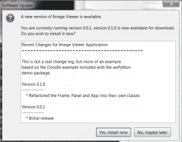
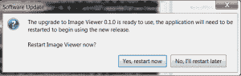

# wxPython:用 Esky 更新应用程序

> 原文：<https://www.blog.pythonlibrary.org/2013/07/12/wxpython-updating-your-application-with-esky/>

今天我们将学习 wxPython 的一个新特性:wx.lib.softwareupdate。它实际上是几年前添加的。这允许你做的是给你的软件增加更新能力。据我所知，这个 mixin 只允许提示更新，不允许静默更新。

### 入门指南

它内置于 wxPython 2.9 中，所以如果您想继续学习，您将需要它。软件更新功能实际上使用了 [Esky](https://pypi.python.org/pypi/esky) 项目。如果你用的是 Windows，你还需要 [py2exe](http://www.py2exe.com/) 。如果你在 Mac 上，那么你将需要 [py2app](https://pypi.python.org/pypi/py2app/) 。在这次演示中，我们将使用我以前的一篇文章中的代码。我创建了两个版本的[图像查看器](https://www.blog.pythonlibrary.org/2010/03/26/creating-a-simple-photo-viewer-with-wxpython/)，所以你也想获得这些代码。请注意，我们将只展示如何在 Windows 上做到这一点！

一旦获得了本文中的代码，就应该将每个文件放在单独的目录中。我建议这样做:

```py

TopFolder
  --> imageViewer0.0.1
  --> imageViewer0.1.0

```

然后，确保在第二个目录中将 image_viewer2.py 重命名为 image_viewer.py，以便脚本名称匹配。现在我们已经准备好检查代码了。

### 向初始版本添加更新代码

我们的初始版本将基于下面的代码。我已经添加了软件更新位，我们将在代码之后查看:

```py

import os
import wx
from wx.lib.softwareupdate import SoftwareUpdate

########################################################################
class PhotoCtrl(wx.App, SoftwareUpdate):
    """
    The Photo Viewer App Class
    """
    #----------------------------------------------------------------------
    def __init__(self, redirect=False, filename=None):
        wx.App.__init__(self, redirect, filename)

        BASEURL = "http://127.0.0.1:8000"
        self.InitUpdates(BASEURL, 
                         BASEURL + "/" + 'ChangeLog.txt')
        self.SetAppDisplayName('Image Viewer')
        self.CheckForUpdate()

        self.frame = wx.Frame(None, title='Photo Control')

        self.panel = wx.Panel(self.frame)

        self.PhotoMaxSize = 500

        self.createWidgets()
        self.frame.Show()

    #----------------------------------------------------------------------
    def createWidgets(self):
        instructions = 'Browse for an image'
        img = wx.EmptyImage(240,240)
        self.imageCtrl = wx.StaticBitmap(self.panel, wx.ID_ANY, 
                                         wx.BitmapFromImage(img))

        instructLbl = wx.StaticText(self.panel, label=instructions)
        self.photoTxt = wx.TextCtrl(self.panel, size=(200,-1))
        browseBtn = wx.Button(self.panel, label='Browse')
        browseBtn.Bind(wx.EVT_BUTTON, self.onBrowse)

        self.mainSizer = wx.BoxSizer(wx.VERTICAL)
        self.sizer = wx.BoxSizer(wx.HORIZONTAL)

        self.mainSizer.Add(wx.StaticLine(self.panel, wx.ID_ANY),
                           0, wx.ALL|wx.EXPAND, 5)
        self.mainSizer.Add(instructLbl, 0, wx.ALL, 5)
        self.mainSizer.Add(self.imageCtrl, 0, wx.ALL, 5)
        self.sizer.Add(self.photoTxt, 0, wx.ALL, 5)
        self.sizer.Add(browseBtn, 0, wx.ALL, 5)        
        self.mainSizer.Add(self.sizer, 0, wx.ALL, 5)

        self.panel.SetSizer(self.mainSizer)
        self.mainSizer.Fit(self.frame)

        self.panel.Layout()

    #----------------------------------------------------------------------
    def onBrowse(self, event):
        """ 
        Browse for file
        """
        wildcard = "JPEG files (*.jpg)|*.jpg"
        dialog = wx.FileDialog(None, "Choose a file",
                               wildcard=wildcard,
                               style=wx.OPEN)
        if dialog.ShowModal() == wx.ID_OK:
            self.photoTxt.SetValue(dialog.GetPath())
        dialog.Destroy() 
        self.onView()

    #----------------------------------------------------------------------
    def onView(self):
        """
        Attempts to load the image and display it
        """
        filepath = self.photoTxt.GetValue()
        img = wx.Image(filepath, wx.BITMAP_TYPE_ANY)
        # scale the image, preserving the aspect ratio
        W = img.GetWidth()
        H = img.GetHeight()
        if W > H:
            NewW = self.PhotoMaxSize
            NewH = self.PhotoMaxSize * H / W
        else:
            NewH = self.PhotoMaxSize
            NewW = self.PhotoMaxSize * W / H
        img = img.Scale(NewW,NewH)

        self.imageCtrl.SetBitmap(wx.BitmapFromImage(img))
        self.panel.Refresh()
        self.mainSizer.Fit(self.frame)

#----------------------------------------------------------------------
if __name__ == '__main__':
    app = PhotoCtrl()
    app.MainLoop()

```

要让这段代码正常工作，只需要做几处修改。首先我们从 **wx.lib.softwareupdate** 中导入 **SoftwareUpdate** 。接下来，我们需要创建两个 wx 的子类。应用和软件更新。是的，Python 支持多重继承。然后在 __init__ 构造函数中，我们需要用我们选择的 URL 加上与 **ChangeLog.txt** 连接的相同 URL 来调用 **InitUpdates** 。我们设置应用程序的显示名称，最后我们调用 **CheckForUpdate** 。就是这样！现在我们只需要把这个打包。

您需要创建一个 setup.py 脚本，其中包含以下内容，并将其放在与初始发布脚本相同的目录中:

```py

#---------------------------------------------------------------------------
# This setup file serves as a model for how to structure your
# distutils setup files for making self-updating applications using
# Esky.  When you run this script use
#
#    python setup.py bdist_esky
#
# Esky will then use py2app or py2exe as appropriate to create the
# bundled application and also its own shell that will help manage
# doing the updates.  See wx.lib.softwareupdate for the class you can
# use to add self-updates to your applications, and you can see how
# that code is used here in the superdoodle.py module.
#---------------------------------------------------------------------------

import sys, os
from esky import bdist_esky
from setuptools import setup

import version

# platform specific settings for Windows/py2exe
if sys.platform == "win32":
    import py2exe

    FREEZER = 'py2exe'
    FREEZER_OPTIONS = dict(compressed = 0,
                           optimize = 0,
                           bundle_files = 3,
                           dll_excludes = ['MSVCP90.dll',
                                           'mswsock.dll',
                                           'powrprof.dll', 
                                           'USP10.dll',],
                        )
    exeICON = 'mondrian.ico'

# platform specific settings for Mac/py2app
elif sys.platform == "darwin":
    import py2app

    FREEZER = 'py2app'
    FREEZER_OPTIONS = dict(argv_emulation = False, 
                           iconfile = 'mondrian.icns',
                           )
    exeICON = None

# Common settings    
NAME = "wxImageViewer"
APP = [bdist_esky.Executable("image_viewer.py", 
                             gui_only=True,
                             icon=exeICON,
                             )]
DATA_FILES = [ 'mondrian.ico' ]
ESKY_OPTIONS = dict( freezer_module     = FREEZER,
                     freezer_options    = FREEZER_OPTIONS,
                     enable_appdata_dir = True,
                     bundle_msvcrt      = True,
                     )

# Build the app and the esky bundle
setup( name       = NAME,
       scripts    = APP,
       version    = version.VERSION,
       data_files = DATA_FILES,
       options    = dict(bdist_esky=ESKY_OPTIONS),
       )

```

您还需要一个包含以下内容的 version.py 文件:

```py

VERSION='0.0.1'

```

现在您已经准备好实际创建可执行文件了。进入命令行并导航到存放这些文件的文件夹。我还在我的文件夹中放了几个图标文件，您可以在本文末尾的下载部分找到它们。您会希望 setup.py 脚本能够找到它们。好，现在我们需要创建分布。在命令 shell 中键入以下内容:

 `python setup.py bdist_esky`

这假设您的路径中有 Python。如果你没有，你会想谷歌如何做到这一点。运行这个命令后，您会看到一大堆输出。如果一切顺利，您将得到两个新的子文件夹:build 和 dist。我们并不真正关心构建文件夹。dist 文件夹中应该有一个文件，命名如下:**wxImageViewer-0 . 0 . 1 . win32 . zip**

为了简单起见，您应该创建一个 **downloads** 文件夹来复制它。现在我们只需要对新版本做同样的事情。我们接下来会谈到这一点。

### 准备新版本

下面是新版本的代码:

```py

# ----------------------------------------
# image_viewer2.py
#
# Created 03-20-2010
#
# Author: Mike Driscoll
# ----------------------------------------

import glob
import os
import wx
from wx.lib.pubsub import Publisher
from wx.lib.softwareupdate import SoftwareUpdate

########################################################################
class ViewerPanel(wx.Panel):
    """"""

    #----------------------------------------------------------------------
    def __init__(self, parent):
        """Constructor"""
        wx.Panel.__init__(self, parent)

        width, height = wx.DisplaySize()
        self.picPaths = []
        self.currentPicture = 0
        self.totalPictures = 0
        self.photoMaxSize = height - 200
        Publisher().subscribe(self.updateImages, ("update images"))

        self.slideTimer = wx.Timer(None)
        self.slideTimer.Bind(wx.EVT_TIMER, self.update)

        self.layout()

    #----------------------------------------------------------------------
    def layout(self):
        """
        Layout the widgets on the panel
        """

        self.mainSizer = wx.BoxSizer(wx.VERTICAL)
        btnSizer = wx.BoxSizer(wx.HORIZONTAL)

        img = wx.EmptyImage(self.photoMaxSize,self.photoMaxSize)
        self.imageCtrl = wx.StaticBitmap(self, wx.ID_ANY, 
                                         wx.BitmapFromImage(img))
        self.mainSizer.Add(self.imageCtrl, 0, wx.ALL|wx.CENTER, 5)
        self.imageLabel = wx.StaticText(self, label="")
        self.mainSizer.Add(self.imageLabel, 0, wx.ALL|wx.CENTER, 5)

        btnData = [("Previous", btnSizer, self.onPrevious),
                   ("Slide Show", btnSizer, self.onSlideShow),
                   ("Next", btnSizer, self.onNext)]
        for data in btnData:
            label, sizer, handler = data
            self.btnBuilder(label, sizer, handler)

        self.mainSizer.Add(btnSizer, 0, wx.CENTER)
        self.SetSizer(self.mainSizer)

    #----------------------------------------------------------------------
    def btnBuilder(self, label, sizer, handler):
        """
        Builds a button, binds it to an event handler and adds it to a sizer
        """
        btn = wx.Button(self, label=label)
        btn.Bind(wx.EVT_BUTTON, handler)
        sizer.Add(btn, 0, wx.ALL|wx.CENTER, 5)

    #----------------------------------------------------------------------
    def loadImage(self, image):
        """"""
        image_name = os.path.basename(image)
        img = wx.Image(image, wx.BITMAP_TYPE_ANY)
        # scale the image, preserving the aspect ratio
        W = img.GetWidth()
        H = img.GetHeight()
        if W > H:
            NewW = self.photoMaxSize
            NewH = self.photoMaxSize * H / W
        else:
            NewH = self.photoMaxSize
            NewW = self.photoMaxSize * W / H
        img = img.Scale(NewW,NewH)

        self.imageCtrl.SetBitmap(wx.BitmapFromImage(img))
        self.imageLabel.SetLabel(image_name)
        self.Refresh()
        Publisher().sendMessage("resize", "")

    #----------------------------------------------------------------------
    def nextPicture(self):
        """
        Loads the next picture in the directory
        """
        if self.currentPicture == self.totalPictures-1:
            self.currentPicture = 0
        else:
            self.currentPicture += 1
        self.loadImage(self.picPaths[self.currentPicture])

    #----------------------------------------------------------------------
    def previousPicture(self):
        """
        Displays the previous picture in the directory
        """
        if self.currentPicture == 0:
            self.currentPicture = self.totalPictures - 1
        else:
            self.currentPicture -= 1
        self.loadImage(self.picPaths[self.currentPicture])

    #----------------------------------------------------------------------
    def update(self, event):
        """
        Called when the slideTimer's timer event fires. Loads the next
        picture from the folder by calling th nextPicture method
        """
        self.nextPicture()

    #----------------------------------------------------------------------
    def updateImages(self, msg):
        """
        Updates the picPaths list to contain the current folder's images
        """
        self.picPaths = msg.data
        self.totalPictures = len(self.picPaths)
        self.loadImage(self.picPaths[0])

    #----------------------------------------------------------------------
    def onNext(self, event):
        """
        Calls the nextPicture method
        """
        self.nextPicture()

    #----------------------------------------------------------------------
    def onPrevious(self, event):
        """
        Calls the previousPicture method
        """
        self.previousPicture()

    #----------------------------------------------------------------------
    def onSlideShow(self, event):
        """
        Starts and stops the slideshow
        """
        btn = event.GetEventObject()
        label = btn.GetLabel()
        if label == "Slide Show":
            self.slideTimer.Start(3000)
            btn.SetLabel("Stop")
        else:
            self.slideTimer.Stop()
            btn.SetLabel("Slide Show")

########################################################################
class ViewerFrame(wx.Frame):
    """"""

    #----------------------------------------------------------------------
    def __init__(self):
        """Constructor"""
        wx.Frame.__init__(self, None, title="Image Viewer")
        panel = ViewerPanel(self)
        self.folderPath = ""
        Publisher().subscribe(self.resizeFrame, ("resize"))

        self.initToolbar()
        self.sizer = wx.BoxSizer(wx.VERTICAL)
        self.sizer.Add(panel, 1, wx.EXPAND)
        self.SetSizer(self.sizer)

        self.Show()
        self.sizer.Fit(self)
        self.Center()

    #----------------------------------------------------------------------
    def initToolbar(self):
        """
        Initialize the toolbar
        """
        self.toolbar = self.CreateToolBar()
        self.toolbar.SetToolBitmapSize((16,16))

        open_ico = wx.ArtProvider.GetBitmap(wx.ART_FILE_OPEN, wx.ART_TOOLBAR, (16,16))
        openTool = self.toolbar.AddSimpleTool(wx.ID_ANY, open_ico, "Open", "Open an Image Directory")
        self.Bind(wx.EVT_MENU, self.onOpenDirectory, openTool)

        self.toolbar.Realize()

    #----------------------------------------------------------------------
    def onOpenDirectory(self, event):
        """
        Opens a DirDialog to allow the user to open a folder with pictures
        """
        dlg = wx.DirDialog(self, "Choose a directory",
                           style=wx.DD_DEFAULT_STYLE)

        if dlg.ShowModal() == wx.ID_OK:
            self.folderPath = dlg.GetPath()
            print self.folderPath
            picPaths = glob.glob(self.folderPath + "\\*.jpg")
            print picPaths
        Publisher().sendMessage("update images", picPaths)

    #----------------------------------------------------------------------
    def resizeFrame(self, msg):
        """"""
        self.sizer.Fit(self)

########################################################################
class ImageApp(wx.App, SoftwareUpdate):
    """"""

    #----------------------------------------------------------------------
    def OnInit(self):
        """Constructor"""
        BASEURL = "http://127.0.0.1:8000"
        self.InitUpdates(BASEURL, 
                         BASEURL + 'ChangeLog.txt')
        self.CheckForUpdate()
        frame = ViewerFrame()
        self.SetTopWindow(frame)
        self.SetAppDisplayName('Image Viewer')
        return True

#----------------------------------------------------------------------
if __name__ == "__main__":
    app = wx.PySimpleApp()
    frame = ViewerFrame()
    app.MainLoop()

```

这里主要看的是最后一个类， **ImageApp** 。在这里，我们做了与上一个例子几乎完全相同的事情，除了这次我们使用了 wx。App 的 OnInit()方法，而不是 __init__。这两个版本之间没有太大的区别，但是我想你可能需要看两个版本，因为你肯定在野外生活得很好。

我们现在需要看一下这个版本的 setup.py，因为它有一点不同:

```py

#---------------------------------------------------------------------------
# This setup file serves as a model for how to structure your
# distutils setup files for making self-updating applications using
# Esky.  When you run this script use
#
#    python setup.py bdist_esky
#
# Esky will then use py2app or py2exe as appropriate to create the
# bundled application and also its own shell that will help manage
# doing the updates.  See wx.lib.softwareupdate for the class you can
# use to add self-updates to your applications, and you can see how
# that code is used here in the superdoodle.py module.
#---------------------------------------------------------------------------

import sys, os
from esky import bdist_esky
from setuptools import setup

import version

# platform specific settings for Windows/py2exe
if sys.platform == "win32":
    import py2exe
    includes = ["wx.lib.pubsub.*", 
                "wx.lib.pubsub.core.*", 
                "wx.lib.pubsub.core.kwargs.*"]

    FREEZER = 'py2exe'
    FREEZER_OPTIONS = dict(compressed = 0,
                           optimize = 0,
                           bundle_files = 3,
                           dll_excludes = ['MSVCP90.dll',
                                           'mswsock.dll',
                                           'powrprof.dll', 
                                           'USP10.dll',],
                           includes = includes
                        )
    exeICON = 'mondrian.ico'

# platform specific settings for Mac/py2app
elif sys.platform == "darwin":
    import py2app

    FREEZER = 'py2app'
    FREEZER_OPTIONS = dict(argv_emulation = False, 
                           iconfile = 'mondrian.icns',
                           )
    exeICON = None

# Common settings    
NAME = "wxImageViewer"
APP = [bdist_esky.Executable("image_viewer.py", 
                             gui_only=True,
                             icon=exeICON,
                             )]
DATA_FILES = [ 'mondrian.ico' ]

ESKY_OPTIONS = dict( freezer_module     = FREEZER,
                     freezer_options    = FREEZER_OPTIONS,
                     enable_appdata_dir = True,
                     bundle_msvcrt      = True,
                     )

# Build the app and the esky bundle
setup( name       = NAME,
       scripts    = APP,
       version    = version.VERSION,
       data_files = DATA_FILES,
       options    = dict(bdist_esky=ESKY_OPTIONS)
       )

```

第二个脚本使用 wxPython 的 pubsub。然而，py2exe 不会自己处理这个问题，所以您必须显式地告诉它来获取 pubsub 部分。您可以在脚本顶部附近的 **includes** 部分执行此操作。

不要忘记确保你的 version.py 文件比原始版本有更高的版本值，否则我们将无法更新。这是我放在我的里面的:

```py

VERSION='0.1.0'

```

现在像以前一样使用相同的命令行，只是这次是在更新后的发布目录中使用:python setup.py bdist_esky

将 zip 文件复制到您的**下载**文件夹中。现在我们只需要在您计算机的本地主机上提供这些文件。为此，通过命令行导航到您的下载文件夹，并运行以下命令:

 `python -m SimpleHTTPServer`

Python 现在将运行一个小型 HTTP 服务器来服务这些文件。如果你在你的网络浏览器中进入 **http://127.0.0.1:8000** ，你会亲眼看到。现在我们已经准备好进行升级了！

### 更新您的程序

请确保您在计算机上的某个地方解压缩了第一个版本的图像查看器。然后运行名为 **image_viewer.exe** 的文件。如果一切按计划进行，您将看到以下内容:

[](https://www.blog.pythonlibrary.org/wp-content/uploads/2013/07/wxUpdate.png)

继续应用更新，您将被要求重新启动应用程序:

[](https://www.blog.pythonlibrary.org/wp-content/uploads/2013/07/wxUpdate2.png)

它应该重新启动，你会得到新的图像浏览器界面。我注意到当我关闭应用程序时，我收到了一个错误，结果是一个弃用警告。您可以忽略它，或者如果您想做些什么，您可以导入警告模块并取消它。

### 包扎

此时，你已经准备好迎接重要时刻了。你也可以使用 AutoCheckForUpdate 来代替 CheckForUpdate，并传递检查之间的天数，这样你就不会每次打开应用程序都打电话回家。或者您可能希望将 CheckForUpdate 函数放入用户触发的事件处理程序中。很多应用程序都是这样做的，用户必须进入菜单系统，按下“检查更新”菜单项。发挥你的想象力，开始黑吧！还有另一个项目叫做 [goodasnew](http://sourceforge.net/projects/goodasnew/?source=navbar) ，似乎是 Esky 的竞争对手，你可能想看看。它现在还没有集成到 wxPython 中，但是它可能是一个可行的选择。

最后，如果您想查看这方面的另一个示例，请查看文档和演示包的 wxPython 2.9 版本。在那里你会找到一个**样本**文件夹，在里面你会看到一个**涂鸦**文件夹。这是另一个软件更新的例子。祝你好运！

### 附加阅读

*   [用 wxPython 创建一个简单的照片浏览器](https://www.blog.pythonlibrary.org/2010/03/26/creating-a-simple-photo-viewer-with-wxpython/)
*   技术提示:[非常简单的使用 Python 的 HTTP 服务器](http://www.linuxjournal.com/content/tech-tip-really-simple-http-server-python)
*   [py2exe 教程](https://www.blog.pythonlibrary.org/2010/07/31/a-py2exe-tutorial-build-a-binary-series/)

### 下载

*   [wxUpdate.zip](https://www.blog.pythonlibrary.org/wp-content/uploads/2013/07/wxUpdate.zip)