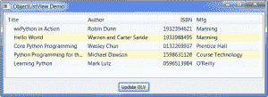

# wxPython:使用 ObjectListView 而不是 ListCtrl

> 原文：<https://www.blog.pythonlibrary.org/2009/12/23/wxpython-using-objectlistview-instead-of-a-listctrl/>

wxPython ListCtrl 是一个非常方便的小部件。不幸的是，使用起来也很痛苦。这一发现促使 [Phillip Piper](http://www.codeproject.com/KB/list/ObjectListView.aspx) 、[莫桑比克传教士](http://www.figtreeanglican.org.au/pipers/html2/Index.php)编写了 [ObjectListView](http://objectlistview.sourceforge.net/python/index.html) ，它是 wx.ListCtrl 的包装器。ObjectListView 实际上增加了功能，因为它使用对象来创建它的行，因此，它使得从多列获取信息更加容易。Piper 先生还添加了许多其他便利功能，使添加自定义编辑器变得更加容易，可以改变行的颜色，自动对行进行排序，等等。本文将帮助您学习使用 ObjectListView 的一些基础知识，以便您能够在将来的项目中使用它。这并不意味着对控件的详尽查看，因为它实际上已经很好地记录了。

应该注意的是，ObjectListView 不是标准列表控件的直接替代品。设置有很大的不同。另外，这是一个第三方库，不包含在 wxPython 中，所以您需要[下载](http://sourceforge.net/projects/objectlistview/files/objectlistview-python/)它。既然所有的免责声明都已排除，让我们看一个简单的例子:

```py

import wx
from ObjectListView import ObjectListView, ColumnDefn

########################################################################
class Book(object):
    """
    Model of the Book object

    Contains the following attributes:
    'ISBN', 'Author', 'Manufacturer', 'Title'
    """
    #----------------------------------------------------------------------
    def __init__(self, title, author, isbn, mfg):
        self.isbn = isbn
        self.author = author
        self.mfg = mfg
        self.title = title

########################################################################
class MainPanel(wx.Panel):
    #----------------------------------------------------------------------
    def __init__(self, parent):
        wx.Panel.__init__(self, parent=parent, id=wx.ID_ANY)
        self.products = [Book("wxPython in Action", "Robin Dunn",
                              "1932394621", "Manning"),
                         Book("Hello World", "Warren and Carter Sande",
                              "1933988495", "Manning")
                         ]

        self.dataOlv = ObjectListView(self, wx.ID_ANY, style=wx.LC_REPORT|wx.SUNKEN_BORDER)
        self.setBooks()

        # Allow the cell values to be edited when double-clicked
        self.dataOlv.cellEditMode = ObjectListView.CELLEDIT_SINGLECLICK

        # create an update button
        updateBtn = wx.Button(self, wx.ID_ANY, "Update OLV")
        updateBtn.Bind(wx.EVT_BUTTON, self.updateControl)

        # Create some sizers
        mainSizer = wx.BoxSizer(wx.VERTICAL)        

        mainSizer.Add(self.dataOlv, 1, wx.ALL|wx.EXPAND, 5)
        mainSizer.Add(updateBtn, 0, wx.ALL|wx.CENTER, 5)
        self.SetSizer(mainSizer)

    #----------------------------------------------------------------------
    def updateControl(self, event):
        """

        """
        print "updating..."
        product_dict = [{"title":"Core Python Programming", "author":"Wesley Chun",
                         "isbn":"0132269937", "mfg":"Prentice Hall"},
                        {"title":"Python Programming for the Absolute Beginner",
                         "author":"Michael Dawson", "isbn":"1598631128",
                         "mfg":"Course Technology"},
                        {"title":"Learning Python", "author":"Mark Lutz",
                         "isbn":"0596513984", "mfg":"O'Reilly"}
                        ]
        data = self.products + product_dict
        self.dataOlv.SetObjects(data)

    #----------------------------------------------------------------------
    def setBooks(self, data=None):
        self.dataOlv.SetColumns([
            ColumnDefn("Title", "left", 220, "title"),
            ColumnDefn("Author", "left", 200, "author"),
            ColumnDefn("ISBN", "right", 100, "isbn"),            
            ColumnDefn("Mfg", "left", 180, "mfg")
        ])

        self.dataOlv.SetObjects(self.products)

########################################################################
class MainFrame(wx.Frame):
    #----------------------------------------------------------------------
    def __init__(self):
        wx.Frame.__init__(self, parent=None, id=wx.ID_ANY, 
                          title="ObjectListView Demo", size=(800,600))
        panel = MainPanel(self)

########################################################################
class GenApp(wx.App):

    #----------------------------------------------------------------------
    def __init__(self, redirect=False, filename=None):
        wx.App.__init__(self, redirect, filename)

    #----------------------------------------------------------------------
    def OnInit(self):
        # create frame here
        frame = MainFrame()
        frame.Show()
        return True

#----------------------------------------------------------------------
def main():
    """
    Run the demo
    """
    app = GenApp()
    app.MainLoop()

if __name__ == "__main__":
    main()

```

如果您运行这段代码，您应该会看到类似这样的内容:

[](https://www.blog.pythonlibrary.org/wp-content/uploads/2009/12/olvDemo.png)

现在让我们来看看这一切都做了什么。首先，我用一些属性创建了一个通用的“Book”类:isbn、作者、制造商和标题。我们将使用该类在 ObjectListView 中创建行。接下来，我们创建一个标准面板，并在其上放置一个 ObjectListView 和一个 button 小部件。您还会注意到有一个简短的“书”对象列表。使用 LC_REPORT 样式标志将 ObjectListView 设置为报告模式。它也有其他模式，但我不会涵盖这些。报告模式看起来最像 Windows 资源管理器中的详细信息模式。

下一个片段有点奇怪:

```py

self.dataOlv.cellEditMode = ObjectListView.CELLEDIT_SINGLECLICK

```

这段代码告诉我们的小部件允许通过双击来编辑行中的所有单元格(除了第一个)。我不知道为什么它被设计成这样，因为它看起来像所有你应该做的就是单击一次。甚至[文档](http://objectlistview.sourceforge.net/python/cellEditing.html#cell-editing-label)都说一次点击应该就够了。也许是 Windows 的限制。无论如何，要编辑任何行的第一个单元格，只需选择它并按 F2。

初始化方法的最后几行只是将小部件放入 sizers 中。下一段有趣的代码在 *updateControl* 方法中，在这里我们实际上更新了 ObjectListView 的内容。我在这里展示了两种不同的更新方式。第一种方法是只使用 Book 对象的产品列表，并使用传入的列表调用 ObjectListView 的 SetObjects 方法。第二种方法是使用字典。字典的键必须匹配 ColumnDefn 的 valueGetter 名称(我们将在 *setBooks* 方法中看到)。字典值可以是您想要的任何值。在我的例子中，我实际上组合了 Book 对象列表和字典列表，并对结果调用 SetObjects。

在 *setBooks* 方法中，我们定义了 ObjectListView 的列。这是通过将 ColumnDefn 对象的列表传递给 ObjectListView 的 SetColumns 方法来实现的。ColumnDefn 有许多参数，但是我们只讨论前四个。参数一是列的标题；参数二是列的整体对齐方式；参数三是列的宽度；第四个参数是 valueGetter 名称。这个名称必须匹配上面提到的 dictionary 方法中的键或者您使用的类的属性(在本例中是 my Book 类)。否则，一些数据将不会出现在微件中。

如果您想了解如何访问一些 row 对象的数据，那么向该应用程序添加另一个按钮，并将其绑定到以下函数:

```py

def getRowInfo(self, event):
    """"""
    rowObj = self.dataOlv.GetSelectedObject()
    print rowObj.author
    print rowObj.title

```

现在您可以选择一行，并使用 ObjectListView 的 GetSelectedObject 方法来获取 row 对象。一旦你有了它，你就可以访问对象的属性，比如作者和标题以及你定义的任何东西。这比 ListCtrl 简单得多，在 list ctrl 中，您必须获取列和行来查找每个项目的信息。

这涵盖了使用 ObjectListCtrl 的基础知识。一定要下载源代码，因为它有很多有趣的演示，包括一个允许用户用自己绘制的组合框编辑一些单元格的演示！我将很快写另一篇使用 ObjectListView 的文章。它将向您展示如何保存和恢复数据，并创建一个有趣的小应用程序！

使用 Windows Vista、wxPython 2.8.10.1(unicode)和 Python 2.5 测试了该代码。

**延伸阅读**

*   [ObjectListView 主页](http://objectlistview.sourceforge.net/python/index.html)
*   [CodeProject 文章](http://www.codeproject.com/KB/list/ObjectListView.aspx)

**下载量**

*   [olvDemo.zip](https://www.blog.pythonlibrary.org/wp-content/uploads/2009/12/olvDemo.zip)
*   [olvDemo.tar](https://www.blog.pythonlibrary.org/wp-content/uploads/2009/12/olvDemo.tar)