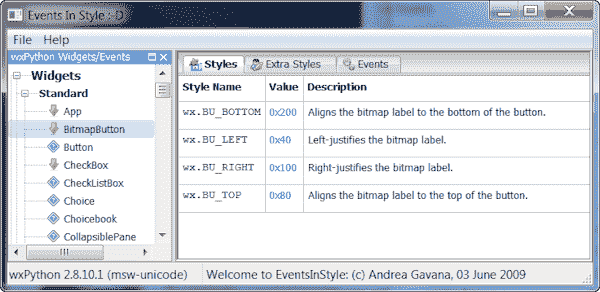

# wxPython: Windows 样式和事件猎人

> 原文：<https://www.blog.pythonlibrary.org/2011/07/25/wxpython-windows-styles-and-events-hunter/>

如果你是这个博客的长期读者，那么你会知道我真的很喜欢 wxPython GUI 工具包。让 wxPython 新用户感到困惑的是如何找出每个小部件的样式和事件。学习文档如何工作确实需要一些练习，但是 Andrea Gavana 有一个很好的小程序，他称之为 **Windows 样式和事件猎人**。它在几年前发布在[的邮件列表](https://groups.google.com/forum/#!topic/wxpython-dev/fBlHe7ytTvQ)上，但我不认为它很受欢迎。我用它来回答 wxPython 邮件列表或 IRC 频道上的问题，所以我知道它非常方便。

这是它实际运行的样子:

让我们来看看，试一试吧！

## 使用 Windows 样式和事件猎人

一旦下载了应用程序，运行它所需要的就是 wxPython。我想你已经有了，否则你为什么要读这个？该程序的唯一其他要求是一个开放的互联网连接，您可能必须允许它通过您的防火墙。为什么？这个应用程序被设计成按需从 wxPython 文档中下载信息。一旦它被下载，它就被缓存在硬盘上的一个 pickle 文件中，所以从技术上来说，你可以下载所有的信息，你不再需要互联网连接。

无论如何，要使用它，您需要运行应用程序，然后双击感兴趣的小部件。猎人将出去下载或加载信息到三个标签:风格，额外的风格和事件。只需点击每个选项卡，查看那里有什么。这就是全部了！这个程序真的很简单！几乎就像是苹果什么的设计出来的。

## 包扎

我将很快撰写另一篇关于另一个伟大的小工具的文章，您可以使用它来学习 wxPython 并更好地理解它。同时，看看这个。我在这里上传了 Windows 风格和事件猎人，所以你可以直接从这个博客下载。

## [计] 下载

*   [EventsInStyle.zip](https://www.blog.pythonlibrary.org/wp-content/uploads/2011/07/EventsInStyle.zip)
*   或者点击获取最新版本