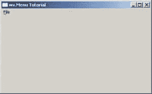
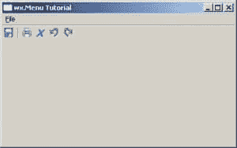

# wxPython:使用菜单、工具栏和加速器

> 原文：<https://www.blog.pythonlibrary.org/2008/07/02/wxpython-working-with-menus-toolbars-and-accelerators/>

除了那些只能从命令行运行的程序之外，菜单和工具栏几乎出现在所有现代程序中。在这篇文章中，我们将学习如何使用 wxPython 工具包来创建它们。以下是您需要遵循的内容:

*   [Python](http://www.python.org/download/) 2.3 - 2.5
*   [wxPython](http://www.wxpython.org/download.php) (我推荐 2.7 以上)

## 创建菜单

首先，我们来看看菜单的组成部分。wxPython 中菜单系统的基础是 wx。菜单栏对象。顾名思义，它创建了一个栏来放置你的菜单。拼图的下一块是 wx。菜单对象。这些基本上都是你在菜单栏里看到的词，比如“文件”、“编辑”。wx 下的项目。菜单对象是使用您创建的菜单对象的 Append 方法创建的。请参见以下示例:

```py

import wx

class MyForm(wx.Frame):

    def __init__(self):
        wx.Frame.__init__(self, None, wx.ID_ANY, "wx.Menu Tutorial")

        # Add a panel so it looks the correct on all platforms
        self.panel = wx.Panel(self, wx.ID_ANY)

        menuBar = wx.MenuBar()
        fileMenu = wx.Menu()
        exitMenuItem = fileMenu.Append(wx.NewId(), "Exit",
                                       "Exit the application")
        menuBar.Append(fileMenu, "&File")
        self.SetMenuBar(menuBar)

# Run the program
if __name__ == "__main__":
    app = wx.PySimpleApp()
    frame = MyForm().Show()
    app.MainLoop()

```

您的应用程序现在应该看起来像这样:

[](https://www.blog.pythonlibrary.org/wp-content/uploads/2008/07/menu.jpg)

请注意创建菜单项的三个参数:

```py

fileMenu.Append(wx.NewId(), "Exit",  "Exit the application")

```

你需要一个 id，一个标签，和一个描述。如果您已经创建了一个描述，它将出现在状态栏中。

最近 wxPython 邮件列表上有很多人想要禁用菜单中的项目或整个菜单。为此，我们必须使用反直觉命名的方法，分别是 Enable()和 EnableTop()。Enable()方法是菜单项方法的一部分，而 EnableTop()必须由 MenuBar 对象调用。现在要小心，因为在禁用整个菜单之前，需要将菜单栏附加到框架上。

让我们来看看一些代码。根据我上面的来源，你可以这样做来禁用“文件”菜单中的“退出”项:

```py

exitMenuItem.Enable(False)

```

如果您想禁用整个“文件”菜单，您可以这样做:

```py

self.menuBar.EnableTop(0, False)

```

如您所见，用 wxPython 创建菜单非常简单直接。现在，让我们将一个事件处理程序绑定到“退出”菜单项，否则它不会做任何事情。将事件绑定到菜单项与将事件绑定到 wxPython 中的任何其他项目非常相似。我将向您展示最简单的方法以及演示的方式。

最快的方法是绑定到 EVT 菜单事件，就像这样:

```py

self.Bind(wx.EVT_MENU, self.onExit, exitMenuItem)

```

然而，如果你有很多菜单项，这很快就会变得乏味。因此，我喜欢在 wxPython 演示中找到的方法，它创建了一个嵌套方法来为我做这件事。一般的方法是将下面的代码放在您的一个方法中:

```py

def doBind(item, handler):
        ''' Create menu events. '''
        self.Bind(wx.EVT_MENU, handler, item)

```

我通常在我从 __init__ 构造函数调用的它们自己的函数中创建我的菜单。如果您这样做，那么您的代码应该看起来像下面的代码片段:

```py

def createMenu(self):
    """ Create the menu bar. """
    def doBind(item, handler):
        """ Create menu events. """
        self.Bind(wx.EVT_MENU, handler, item)

    doBind( fileMenu.Append(wx.ID_ANY, "&Exit\tAlt+F4", "ExitProgram"),
            self.onExit)

```

最后，您可能希望用一条水平线来分隔菜单中的一些项目。要添加一个，请调用菜单的 AppendSeparator()方法:

```py

fileMenu.AppendSeparator()

```

## 创建工具栏

使用 wxPython 的工具栏功能也非常简单。要初始化工具栏，你需要做的就是调用 wx。CreateToolBar()。我还使用 SetToolBitmapSize()方法设置了工具栏的图标大小。工具栏也可以有分隔符，但是使用工具栏的 AddSeparator()而不是 AppendSeparator()。

让我们来看一些代码，这样您可以更好地了解这一点。下面是我的 createToolbar 方法:

```py

def createToolbar(self):
    """
    Create a toolbar.
    """

    self.toolbar = self.CreateToolBar()
    self.toolbar.SetToolBitmapSize((16,16))  # sets icon size

    # Use wx.ArtProvider for default icons
    save_ico = wx.ArtProvider.GetBitmap(wx.ART_FILE_SAVE, wx.ART_TOOLBAR, (16,16))
    saveTool = self.toolbar.AddSimpleTool(wx.ID_ANY, save_ico, "Save", "Saves the Current Worksheet")
    self.Bind(wx.EVT_MENU, self.onSave, saveTool)

    self.toolbar.AddSeparator()

    print_ico = wx.ArtProvider.GetBitmap(wx.ART_PRINT, wx.ART_TOOLBAR, (16,16))
    printTool = self.toolbar.AddSimpleTool(wx.ID_ANY, print_ico, "Print", "Sends Timesheet to Default Printer")
    self.Bind(wx.EVT_MENU, self.onPrint, printTool)

    delete_ico = wx.ArtProvider.GetBitmap(wx.ART_DELETE, wx.ART_TOOLBAR, (16,16))
    deleteTool = self.toolbar.AddSimpleTool(wx.ID_ANY, delete_ico, "Delete", "Delete contents of cell")
    self.Bind(wx.EVT_MENU, self.onDelete, deleteTool)

    undo_ico = wx.ArtProvider.GetBitmap(wx.ART_UNDO, wx.ART_TOOLBAR, (16,16))
    self.undoTool = self.toolbar.AddSimpleTool(wx.ID_UNDO, undo_ico, "Undo", "")
    self.toolbar.EnableTool(wx.ID_UNDO, False)
    self.Bind(wx.EVT_TOOL, self.onUndo, self.undoTool)

    redo_ico = wx.ArtProvider.GetBitmap(wx.ART_REDO, wx.ART_TOOLBAR, (16,16))
    self.redoTool = self.toolbar.AddSimpleTool(wx.ID_REDO, redo_ico, "Redo", "")
    self.toolbar.EnableTool(wx.ID_REDO, False)
    self.Bind(wx.EVT_TOOL, self.onRedo, self.redoTool)

    # This basically shows the toolbar 
    self.toolbar.Realize()

```

注意，我已经通过调用 EnableTool(wx)禁用了几个工具栏按钮。ID_UNDO，False)。正如您所看到的，这个方法有两个参数:工具栏按钮的 id 和一个 bool。为了更好地理解这一点，我附上了下面的截图:

[](https://www.blog.pythonlibrary.org/wp-content/uploads/2008/07/menu2.jpg)

## 创建加速器

大多数高级用户更喜欢使用键盘快捷键，而不是在错综复杂的菜单中挖掘。幸运的是，wxPython 提供了一种方法来做到这一点；它被称为加速表。这些表格通常与菜单系统相关联，但是您不需要菜单来使用表格。不过，我将对这两种方法进行讨论。

首先，我们将讨论如何使用带菜单的桌子。首先，我们需要创建一个 wx.AcceleratorTable 的实例。ACCEL CTRL，组合键，和一个 id。

对于这个例子，我想映射 CTRL+Q 来使应用程序退出。使用 wxPython 的方法是这样的:

```py

accel_tbl = wx.AcceleratorTable([(wx.ACCEL_CTRL, ord('Q'), exitMenuItem.GetId()) ])
self.frame.SetAcceleratorTable(accel_tbl)

```

现在让我们不使用菜单项。您会注意到，在创建表之前，我创建了一个新的 id 并绑定到一个事件处理程序。除此之外，真的差不了多少。

```py

exitId = wx.NewId()
self.Bind(wx.EVT_MENU, self.onExit, id=exitId )
accel_tbl = wx.AcceleratorTable([(wx.ACCEL_CTRL,  ord('Q'), exitId )])
self.SetAcceleratorTable(accel_tbl) 

```

现在我们已经介绍了菜单、工具栏和加速器创建的基础知识。我希望这对你有所帮助。向 python library . org 的 mike 发送评论/问题。

****更新**** *我已经忘记了这一点，但罗宾·邓恩提醒我，你还可以使用 wxUpdateUIEvent/EVT _ 更新 _UI 来更新菜单和工具栏，以及它们是启用还是禁用。*

**附加资源**

1.  [结构代码](http://zetcode.com/wxpython/menustoolbars/)
2.  [ShowMeDo 视频](http://showmedo.com/videos/video?name=1790030&fromSeriesID=179)
3.  [梦里的代码](http://www.dreamincode.net/forums/showtopic54399.htm)
4.  [使用多键快捷键](http://wiki.wxpython.org/Using%20Multi-key%20Shortcuts)
5.  [按键事件](http://www.wxpython.org/docs/api/wx.KeyEvent-class.html)

**注:** *本帖所有照片均来自 Windows XP 盒子*