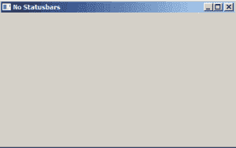
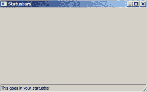
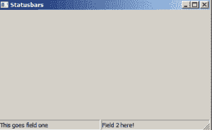
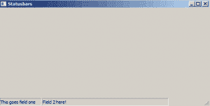
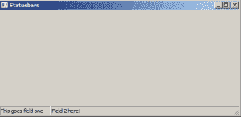
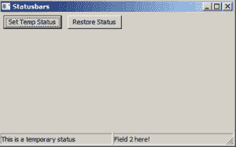

# wxPython:使用状态栏

> 原文：<https://www.blog.pythonlibrary.org/2017/06/06/wxpython-working-with-status-bars/>

大多数应用程序都有状态栏。状态栏是您每天使用的大多数应用程序底部的小部件。它们会告诉您正在文本编辑器中编辑哪一行，或者您上次保存的时间。在 wxPython 中，您可以使用 **wx 在框架中添加一个状态栏。StatusBar** 类。在本文中，我们将学习如何在 wxPython 中使用状态栏。

* * *

### 没有状态栏

从头开始总是好的。因此，我们将从一些示例代码开始我们的旅程，这些代码展示了没有状态栏的框架是什么样子的:

```py

import wx

class MainFrame(wx.Frame):

    def __init__(self):
        wx.Frame.__init__(self, None, title='No Statusbars')

        panel = wx.Panel(self)

        self.Show()

if __name__ == '__main__':
    app = wx.App(False)
    frame = MainFrame()
    app.MainLoop()

```

当您运行这段代码时，您应该会看到如下所示的内容:



这很简单。让我们来看看如何添加一个状态栏！

* * *

### 添加状态栏

当然，不添加任何东西非常简单。但是您很快就会发现，在 wxPython 中添加一个简单的单字段状态栏也非常容易。其实真的只是一行字的改动！然而，为了让它更有趣一点，我们也将设置状态栏的文本。让我们来看看:

```py

import wx

class MainFrame(wx.Frame):

    def __init__(self):
        wx.Frame.__init__(self, None, title='')
        panel = wx.Panel(self)

        self.statusbar = self.CreateStatusBar(1)
        self.statusbar.SetStatusText('This goes in your statusbar')

        self.Show()

if __name__ == '__main__':
    app = wx.App(False)
    frame = MainFrame()
    app.MainLoop()

```

我将在 Windows 7 上运行这段代码，因为我认为 Windows 有一个最容易看到的状态栏。当您运行它时，您应该会看到类似这样的内容:



您会注意到，当我们创建状态栏时，我们必须调用框架的 **CreateStatusBar()** 方法。我们传入的参数告诉状态栏，我们只需要状态栏中的一个字段。

* * *

### 创建多字段状态栏



许多应用程序可以在应用程序的状态栏中向用户显示多条信息。微软的 Word 就是一个很好的例子，因为它会在状态栏的不同部分列出页面信息、字数等。你也可以用 wxPython 展示这种东西。让我们看一个例子:

```py

import wx

class MainFrame(wx.Frame):

    def __init__(self):
        wx.Frame.__init__(self, None, title='Statusbars')
        panel = wx.Panel(self)

        self.statusbar = self.CreateStatusBar(2)
        self.statusbar.SetStatusText('This goes field one')
        self.statusbar.SetStatusText('Field 2 here!', 1)

        self.Show()

if __name__ == '__main__':
    app = wx.App(False)
    frame = MainFrame()
    app.MainLoop()

```

在这个例子中，我们将数字 2 传递给 **CreateStatusBar** 以在状态栏中创建两个大小相等的部分。然后我们调用 **SetStatusText()** 。您会注意到，第一次调用没有指定将文本放在哪个部分。那是因为默认值是零。要将文本放在非零字段中，我们需要更加明确。因此，在第二次调用 **SetStatusText()** 时，我们向它传递一个 1，告诉 wxPython 将文本放在状态栏的第二部分。

* * *

### 更改截面宽度

您可以通过状态栏的 **SetStatusWidths()** 方法指定部分宽度，该方法接受 Python 列表。您可以在状态栏中设置固定宽度或可变宽度。对于 fixed，您只需传递一个 Python 整数列表，其中每个整数以像素为单位表示字段的大小。如果你更喜欢可变宽度，那么你将使用一个包含负数的列表。例如，如果您有[-2，-1]，第一个字段将占用 66%的空间，而第二个字段将占用剩余的 33%。也可以混合固定和可变，像这样:[-2，-1，50]。在这种情况下，您告诉 wxPython 在第一个场中占据 66%的剩余空间，在第二个场中占据 33%的剩余空间，在第三个场中占据 50 个像素。

这个视觉上可能更容易看出来，我们来看一个例子！

```py

import wx

class MainFrame(wx.Frame):

    def __init__(self):
        wx.Frame.__init__(self, None, title='Statusbars')
        panel = wx.Panel(self)

        self.statusbar = self.CreateStatusBar(2)
        self.statusbar.SetStatusWidths([100, 300])
        self.statusbar.SetStatusText('This goes field one')
        self.statusbar.SetStatusText('Field 2 here!', 1)

        self.Show()

if __name__ == '__main__':
    app = wx.App(False)
    frame = MainFrame()
    app.MainLoop()

```

在本例中，我们希望第一个字段的宽度为 100 像素，第二个字段的宽度为 300 像素。当您运行代码时，您应该会看到类似这样的内容:



请注意，我调整了窗口的大小，以演示当框架宽于 400 像素时，状态栏看起来有点奇怪。这是使用固定宽度时的常见问题。如果您使用小部件的绝对定位而不是 sizers，您将会遇到类似的问题。让我们看看是否可以通过混合使用固定宽度和可变宽度来解决这个问题。下面是对代码的更改:

```py

import wx

class MainFrame(wx.Frame):

    def __init__(self):
        wx.Frame.__init__(self, None, title='Statusbars')
        panel = wx.Panel(self)

        self.statusbar = self.CreateStatusBar(2)
        self.statusbar.SetStatusWidths([100, -1])
        self.statusbar.SetStatusText('This goes field one')
        self.statusbar.SetStatusText('Field 2 here!', 1)

        self.Show()

if __name__ == '__main__':
    app = wx.App(False)
    frame = MainFrame()
    app.MainLoop()

```

您会注意到，我们用-1 替换了 300 个像素，这意味着第二个字段应该占据前 100 个像素之后的所有空间。下面是截图:



这一次状态栏看起来不那么奇怪了。现在，您可以根据需要调整状态栏的宽度。

* * *

### 获取状态

还可以使用 status bar 的 **GetStatusText()** 方法来获取状态栏的状态。让我们来看看:

```py

import wx

class MainFrame(wx.Frame):

    def __init__(self):
        wx.Frame.__init__(self, None, title='Statusbars')
        panel = wx.Panel(self)

        status_btn = wx.Button(panel, label='Get Status')
        status_btn.Bind(wx.EVT_BUTTON, self.on_status)

        self.statusbar = self.CreateStatusBar(2)
        self.statusbar.SetStatusText('This goes in field one')
        self.statusbar.SetStatusText('Field 2 here!', 1)

        self.Show()

    def on_status(self, event):
        print self.statusbar.GetStatusText()
        print self.statusbar.GetStatusText(1)

if __name__ == '__main__':
    app = wx.App(False)
    frame = MainFrame()
    app.MainLoop()

```

您会注意到，为了获取第二个字段的文本，我们必须通过向它传递一个值来显式地告诉 GetStatusText。

* * *

### 更改状态文本



我们已经看过用 **SetStatusText()** 改变状态栏的文本。不过，还有两个方法值得一看: **PushStatusText()** 和 **PopStatusText()** 。它们使用一个堆栈，因此当您调用 PushStatusText()时，它会将当前状态放入堆栈的内存中，并显示您传递给它的字符串。当您调用 PopStatusText()时，它将恢复以前存储的文本。但是，如果在 push 和 pop 之间调用 SetStatusText()，那么内存将被擦除，pop 将不会恢复状态字符串。

让我们看一个例子:

```py

import wx

class MainFrame(wx.Frame):

    def __init__(self):
        wx.Frame.__init__(self, None, title='Statusbars')
        panel = wx.Panel(self)

        status_btn = wx.Button(panel, label='Set Temp Status')
        status_btn.Bind(wx.EVT_BUTTON, self.set_temp_status)

        restore_btn = wx.Button(panel, label='Restore Status')
        restore_btn.Bind(wx.EVT_BUTTON, self.restore_status)

        sizer = wx.BoxSizer(wx.HORIZONTAL)
        sizer.Add(status_btn, 0, wx.ALL, 5)
        sizer.Add(restore_btn, 0, wx.ALL, 5)
        panel.SetSizer(sizer)

        self.statusbar = self.CreateStatusBar(2)
        self.statusbar.SetStatusText('This goes in field one')
        self.statusbar.SetStatusText('Field 2 here!', 1)

        self.Show()

    def set_temp_status(self, event):
        self.statusbar.PushStatusText('This is a temporary status')

    def restore_status(self, event):
        self.statusbar.PopStatusText()

if __name__ == '__main__':
    app = wx.App(False)
    frame = MainFrame()
    app.MainLoop()

```

请注意，PushStatusText()和 PopStatusText()默认推送和弹出第一个字段。如果需要的话，您需要指定一个不同的字段来推送和弹出。试试这段代码，看看会发生什么！

* * *

### 包扎

这篇文章涵盖了很多材料。您学习了如何为您的框架创建 StatusBar 小部件。您学习了如何将状态栏分割成多个宽度不同的字段。您还学习了如何从中获取文本并修改文本。我还会注意到，当你创建一个 menubar 时，你可以用一个字符串来设置每个菜单，当你把鼠标放在菜单项上时，这个字符串就会出现在状态栏(如果你有的话)中。我将把它作为一个练习留给读者去尝试。

* * *

### 相关阅读

*   关于 [StatusBar 类](https://wxpython.org/Phoenix/docs/html/wx.StatusBar.html)的 wxPython 文档
*   wxPython: [关于菜单的一切](https://www.blog.pythonlibrary.org/2012/02/14/wxpython-all-about-menus/)
*   wxPython: [使用菜单、工具栏和加速器](https://www.blog.pythonlibrary.org/2008/07/02/wxpython-working-with-menus-toolbars-and-accelerators/)