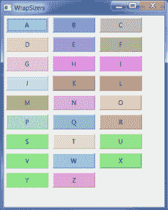

# wxPython:用 WrapSizer 包装小部件

> 原文：<https://www.blog.pythonlibrary.org/2014/01/22/wxpython-wrap-widgets-with-wrapsizer/>

wxPython 2.9 向世界介绍了一种新型的 sizer，它可以在您调整框架大小时自动让小部件“环绕”。这种尺码仪被称为 **wx。包装尺寸器**。由于某种原因，它相对来说不太为人所知，所以在本文中，我们将花几分钟来讨论如何使用它。

要跟随本教程，您需要安装 wxPython 2.9 或更高版本。一旦你明白了，我们就可以继续了。

### 使用包装尺寸

[](https://www.blog.pythonlibrary.org/wp-content/uploads/2014/01/wxWrapSizerDemo.png)

**wx。WrapSizer** 小部件的工作方式与 **wx 非常相似。BoxSizer** 。要使用它，您需要做的就是实例化它并向它添加小部件。让我们来看一个简单的程序:

```py

import random
import wx
from wx.lib.buttons import GenButton

########################################################################
class MyPanel(wx.Panel):
    """"""

    #----------------------------------------------------------------------
    def __init__(self, parent):
        """Constructor"""
        wx.Panel.__init__(self, parent)

        text = "ABCDEFGHIJKLMNOPQRSTUVWXYZ"
        sizer = wx.WrapSizer()
        for letter in text:
            btn = GenButton(self, label=letter)
            r = random.randint(128, 255)
            g = random.randint(128, 255)
            b = random.randint(128, 255)
            btn.SetBackgroundColour(wx.Colour(r,g,b))
            btn.Refresh()
            sizer.Add(btn, 0, wx.ALL, 5)

        self.SetSizer(sizer)

########################################################################
class MyFrame(wx.Frame):
    """"""

    #----------------------------------------------------------------------
    def __init__(self):
        """Constructor"""
        wx.Frame.__init__(self, None, title="WrapSizers", size=(400,500))
        panel = MyPanel(self)
        self.Show()

#----------------------------------------------------------------------
if __name__ == "__main__":
    app = wx.App(False)
    frame = MyFrame()
    app.MainLoop()

```

这里我们创建一个 sizer 的实例，然后遍历字母表中的字母，为每个字母创建一个按钮。我们还改变了每个按钮的背景颜色，增加了一点变化。如果您还没有猜到，这个例子是基于 wxPython 演示例子的。您会注意到，当您调整框架大小时，按钮会尽可能地重新排列。有时，它们甚至会改变一点大小。让我们了解更多关于这个 sizer 的信息！

wx。WrapSizer 可以被告知它的方向，您可以在实例化时向它传递标志。方向标志是 wx。水平和 wx.VERTICAL。默认为水平。根据[文档](http://wxpython.org/Phoenix/docs/html/WrapSizer.html)“flags 参数可以是值 EXTEND_LAST_ON_EACH_LINE 和 REMOVE_LEADING_SPACES 的组合，EXTEND _ LAST _ ON _ EACH _ LINE 将导致每一行的最后一项使用该行的任何剩余空间，REMOVE _ LEADING _ SPACES 将从行的开头删除任何间隔元素。”除了普通的 wx 之外，WrapSizer 还有四个附加方法。Sizer 方法: **CalcMin** (计算最小尺寸)、 **InformFirstDirection** (似乎不被使用)、 **IsSpaceItem** (可用于将一些普通项目作为间隔符处理)和**recalcasesizes**(实现计算一个 box sizer 的尺寸，然后设置其子元素的尺寸)。

这就包含了这个小部件的所有信息。希望您能在自己的项目中发现这个相对未知的 sizer 的许多好用途。

*注意:这段代码是在 Windows 7 上使用 wxPython 2.9.3 (classic)和 Python 2.7.3 测试的。*