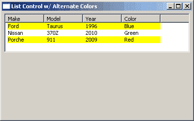

# wxPython: wx。ListCtrl 提示和技巧

> 原文：<https://www.blog.pythonlibrary.org/2011/01/04/wxpython-wx-listctrl-tips-and-tricks/>

去年，我们介绍了网格控制的一些技巧和窍门。在这篇文章中，我们将回顾 wx 的一些提示和技巧。处于“报告”模式时的 ListCtrl 小部件。看看下面的提示:

*   如何创建一个简单的 ListCtrl
*   如何对列表中的行进行排序
*   如何使 ListCtrl 单元格可就地编辑
*   将对象与 clistctrl 行相关联
*   替换 ListCtrl 的行颜色

## 如何创建一个简单的 ListCtrl

[](https://www.blog.pythonlibrary.org/wp-content/uploads/2011/01/listctrl_simple.png)

简单的 clistctrl

列表控件是一个非常常见的小部件。在 Windows 中，您将在 Windows 资源管理器中看到列表控件。它有四种模式:图标、小图标、列表和报告。它们分别与 Windows 资源管理器中的图标、平铺、列表和详细信息视图大致匹配。我们将把重点放在报表模式下的 ListCtrl 上，因为这是大多数开发人员使用它的模式。下面是一个如何创建列表控件的简单示例:

```py

import wx

########################################################################
class MyForm(wx.Frame):

    #----------------------------------------------------------------------
    def __init__(self):
        wx.Frame.__init__(self, None, wx.ID_ANY, "List Control Tutorial")

        # Add a panel so it looks the correct on all platforms
        panel = wx.Panel(self, wx.ID_ANY)
        self.index = 0

        self.list_ctrl = wx.ListCtrl(panel, size=(-1,100),
                         style=wx.LC_REPORT
                         |wx.BORDER_SUNKEN
                         )
        self.list_ctrl.InsertColumn(0, 'Subject')
        self.list_ctrl.InsertColumn(1, 'Due')
        self.list_ctrl.InsertColumn(2, 'Location', width=125)

        btn = wx.Button(panel, label="Add Line")
        btn.Bind(wx.EVT_BUTTON, self.add_line)

        sizer = wx.BoxSizer(wx.VERTICAL)
        sizer.Add(self.list_ctrl, 0, wx.ALL|wx.EXPAND, 5)
        sizer.Add(btn, 0, wx.ALL|wx.CENTER, 5)
        panel.SetSizer(sizer)

    #----------------------------------------------------------------------
    def add_line(self, event):
        line = "Line %s" % self.index
        self.list_ctrl.InsertStringItem(self.index, line)
        self.list_ctrl.SetStringItem(self.index, 1, "01/19/2010")
        self.list_ctrl.SetStringItem(self.index, 2, "USA")
        self.index += 1

#----------------------------------------------------------------------
# Run the program
if __name__ == "__main__":
    app = wx.App(False)
    frame = MyForm()
    frame.Show()
    app.MainLoop()

```

从上面的代码可以看出，创建 ListCtrl 实例非常容易。注意，我们使用 **wx 将样式设置为报告模式。LC_REPORT** 标志。为了添加列标题，我们调用 ListCtrl 的 **InsertColumn** 方法，并传递一个整数来告诉 ListCtrl 哪一列是哪一列，并传递一个字符串以方便用户。是的，这些列是从零开始的，所以第一列是数字 0，第二列是数字 1，依此类推。

下一个重要部分包含在按钮的事件处理程序中， **add_line** ，在这里我们学习如何向 ListCtrl 添加数据行。使用的典型方法是 **InsertStringItem** 方法。如果您还想在每一行中添加一个图像，那么您可以使用一个更复杂的方法，比如 **InsertColumnInfo** 和 **InsertImageStringItem** 方法。您可以在 wxPython 演示中看到如何使用它们。在这篇文章中，我们坚持使用简单的东西。

无论如何，当你调用 InsertStringItem 时，你给它正确的行索引和一个字符串。您使用 **SetStringItem** 方法为该行的其他列设置数据。请注意，SetStringItem 方法需要三个参数:行索引、列索引和一个字符串。最后，我们增加行索引，这样我们就不会覆盖任何内容。现在你可以走出去，做你自己的！让我们继续，看看如何对行进行排序！

## 如何对列表中的行进行排序

[](https://www.blog.pythonlibrary.org/wp-content/uploads/2011/01/listctrl_sorting.png)

可排序的 clistctrl

ListCtrl 小部件编写了一些额外的脚本，为小部件添加功能。这些脚本被称为 mixins。你可以在这里阅读它们。对于这个食谱，我们将使用**列排序器混合信息**混合信息。下面的代码是一个 wxPython 演示示例的精简版本。

```py

import wx
import wx.lib.mixins.listctrl as listmix

musicdata = {
0 : ("Bad English", "The Price Of Love", "Rock"),
1 : ("DNA featuring Suzanne Vega", "Tom's Diner", "Rock"),
2 : ("George Michael", "Praying For Time", "Rock"),
3 : ("Gloria Estefan", "Here We Are", "Rock"),
4 : ("Linda Ronstadt", "Don't Know Much", "Rock"),
5 : ("Michael Bolton", "How Am I Supposed To Live Without You", "Blues"),
6 : ("Paul Young", "Oh Girl", "Rock"),
}

########################################################################
class TestListCtrl(wx.ListCtrl):

    #----------------------------------------------------------------------
    def __init__(self, parent, ID=wx.ID_ANY, pos=wx.DefaultPosition,
                 size=wx.DefaultSize, style=0):
        wx.ListCtrl.__init__(self, parent, ID, pos, size, style)

########################################################################
class TestListCtrlPanel(wx.Panel, listmix.ColumnSorterMixin):

    #----------------------------------------------------------------------
    def __init__(self, parent):
        wx.Panel.__init__(self, parent, -1, style=wx.WANTS_CHARS)

        self.list_ctrl = TestListCtrl(self, size=(-1,100),
                         style=wx.LC_REPORT
                         |wx.BORDER_SUNKEN
                         |wx.LC_SORT_ASCENDING
                         )
        self.list_ctrl.InsertColumn(0, "Artist")
        self.list_ctrl.InsertColumn(1, "Title", wx.LIST_FORMAT_RIGHT)
        self.list_ctrl.InsertColumn(2, "Genre")

        items = musicdata.items()
        index = 0
        for key, data in items:
            self.list_ctrl.InsertStringItem(index, data[0])
            self.list_ctrl.SetStringItem(index, 1, data[1])
            self.list_ctrl.SetStringItem(index, 2, data[2])
            self.list_ctrl.SetItemData(index, key)
            index += 1

        # Now that the list exists we can init the other base class,
        # see wx/lib/mixins/listctrl.py
        self.itemDataMap = musicdata
        listmix.ColumnSorterMixin.__init__(self, 3)
        self.Bind(wx.EVT_LIST_COL_CLICK, self.OnColClick, self.list_ctrl)

        sizer = wx.BoxSizer(wx.VERTICAL)
        sizer.Add(self.list_ctrl, 0, wx.ALL|wx.EXPAND, 5)
        self.SetSizer(sizer)

    #----------------------------------------------------------------------
    # Used by the ColumnSorterMixin, see wx/lib/mixins/listctrl.py
    def GetListCtrl(self):
        return self.list_ctrl

    #----------------------------------------------------------------------
    def OnColClick(self, event):
        print "column clicked"
        event.Skip()

########################################################################
class MyForm(wx.Frame):

    #----------------------------------------------------------------------
    def __init__(self):
        wx.Frame.__init__(self, None, wx.ID_ANY, "List Control Tutorial")

        # Add a panel so it looks the correct on all platforms
        panel = TestListCtrlPanel(self)

#----------------------------------------------------------------------
# Run the program
if __name__ == "__main__":
    app = wx.App(False)
    frame = MyForm()
    frame.Show()
    app.MainLoop()

```

这段代码有点奇怪，因为我们继承了 wx 中的 mixin。基于面板的类，而不是 wx。ListCtrl 类。只要你正确地重新排列代码，你可以用任何一种方式来做。无论如何，我们将聚焦于这个例子和前一个例子之间的主要区别。最重要的第一个区别是在我们插入列表控件数据的循环结构中。这里我们包含了列表控件的 **SetItemData** 方法，以包含允许排序发生的必要内部工作。正如您可能已经猜到的，这个方法将行索引与音乐数据字典的键相关联。

接下来我们实例化 **ColumnSorterMixin** 并告诉它列表控件中有多少列。我们可以让**EVT _ 列表 _ 列 _ 点击**绑定这个例子，因为它与行的实际排序无关，但是为了增加你的知识，它被留了下来。它所做的只是向您展示如何捕捉用户的列点击事件。代码的其余部分不言自明。如果您想了解这个 mixin 的要求，特别是当您的行中有图像时，请查看源代码中的相关部分(即 listctrl.py)。这不是很容易吗？让我们继续我们的旅程，并找出如何使单元格可编辑！

## 如何使 ListCtrl 单元格可就地编辑

[](https://www.blog.pythonlibrary.org/wp-content/uploads/2011/01/listctrl_editable.png)

可编辑的 clistctrl

有时，程序员会希望允许用户点击单元格并在适当的位置编辑它。这是一个轻量级版本的 wx.grid.Grid 控件。这里有一个例子:

```py

import wx
import wx.lib.mixins.listctrl  as  listmix

########################################################################
class EditableListCtrl(wx.ListCtrl, listmix.TextEditMixin):
    ''' TextEditMixin allows any column to be edited. '''

    #----------------------------------------------------------------------
    def __init__(self, parent, ID=wx.ID_ANY, pos=wx.DefaultPosition,
                 size=wx.DefaultSize, style=0):
        """Constructor"""
        wx.ListCtrl.__init__(self, parent, ID, pos, size, style)
        listmix.TextEditMixin.__init__(self)

########################################################################
class MyPanel(wx.Panel):
    """"""

    #----------------------------------------------------------------------
    def __init__(self, parent):
        """Constructor"""
        wx.Panel.__init__(self, parent)

        rows = [("Ford", "Taurus", "1996", "Blue"),
                ("Nissan", "370Z", "2010", "Green"),
                ("Porche", "911", "2009", "Red")
                ]
        self.list_ctrl = EditableListCtrl(self, style=wx.LC_REPORT)

        self.list_ctrl.InsertColumn(0, "Make")
        self.list_ctrl.InsertColumn(1, "Model")
        self.list_ctrl.InsertColumn(2, "Year")
        self.list_ctrl.InsertColumn(3, "Color")

        index = 0
        for row in rows:
            self.list_ctrl.InsertStringItem(index, row[0])
            self.list_ctrl.SetStringItem(index, 1, row[1])
            self.list_ctrl.SetStringItem(index, 2, row[2])
            self.list_ctrl.SetStringItem(index, 3, row[3])
            index += 1

        sizer = wx.BoxSizer(wx.VERTICAL)
        sizer.Add(self.list_ctrl, 0, wx.ALL|wx.EXPAND, 5)
        self.SetSizer(sizer)

########################################################################
class MyFrame(wx.Frame):
    """"""

    #----------------------------------------------------------------------
    def __init__(self):
        """Constructor"""
        wx.Frame.__init__(self, None, wx.ID_ANY, "Editable List Control")
        panel = MyPanel(self)
        self.Show()

#----------------------------------------------------------------------
if __name__ == "__main__":
    app = wx.App(False)
    frame = MyFrame()
    app.MainLoop()

```

在这个脚本中，我们将 **TextEditMixin** 放在 wx 中。ListCtrl 类而不是我们的 wx。面板，这与前面的示例相反。mixin 本身承担了所有繁重的工作。同样，你必须检查 mixin 的源代码才能真正理解它是如何工作的。

## 将对象与 ListCtrl 行相关联

这个主题出现了很多次:如何将数据(即对象)与 ListCtrl 的行关联起来？好吧，我们将通过下面的代码找出具体的方法:

```py

import wx

########################################################################
class Car(object):
    """"""

    #----------------------------------------------------------------------
    def __init__(self, make, model, year, color="Blue"):
        """Constructor"""
        self.make = make
        self.model = model
        self.year = year
        self.color = color

########################################################################
class MyPanel(wx.Panel):
    """"""

    #----------------------------------------------------------------------
    def __init__(self, parent):
        """Constructor"""
        wx.Panel.__init__(self, parent)

        rows = [Car("Ford", "Taurus", "1996"),
                Car("Nissan", "370Z", "2010"),
                Car("Porche", "911", "2009", "Red")
                ]

        self.list_ctrl = wx.ListCtrl(self, size=(-1,100),
                                style=wx.LC_REPORT
                                |wx.BORDER_SUNKEN
                                )
        self.list_ctrl.Bind(wx.EVT_LIST_ITEM_SELECTED, self.onItemSelected)
        self.list_ctrl.InsertColumn(0, "Make")
        self.list_ctrl.InsertColumn(1, "Model")
        self.list_ctrl.InsertColumn(2, "Year")
        self.list_ctrl.InsertColumn(3, "Color")

        index = 0
        self.myRowDict = {}
        for row in rows:
            self.list_ctrl.InsertStringItem(index, row.make)
            self.list_ctrl.SetStringItem(index, 1, row.model)
            self.list_ctrl.SetStringItem(index, 2, row.year)
            self.list_ctrl.SetStringItem(index, 3, row.color)
            self.myRowDict[index] = row
            index += 1

        sizer = wx.BoxSizer(wx.VERTICAL)
        sizer.Add(self.list_ctrl, 0, wx.ALL|wx.EXPAND, 5)
        self.SetSizer(sizer)

    #----------------------------------------------------------------------
    def onItemSelected(self, event):
        """"""
        currentItem = event.m_itemIndex
        car = self.myRowDict[currentItem]
        print car.make
        print car.model
        print car.color
        print car.year

########################################################################
class MyFrame(wx.Frame):
    """"""

    #----------------------------------------------------------------------
    def __init__(self):
        """Constructor"""
        wx.Frame.__init__(self, None, wx.ID_ANY, "List Control Tutorial")
        panel = MyPanel(self)
        self.Show()

#----------------------------------------------------------------------
if __name__ == "__main__":
    app = wx.App(False)
    frame = MyFrame()
    app.MainLoop()

```

列表控件小部件实际上没有内置的方法来完成这一壮举。如果您想这样做，那么您会想要检查一下 [ObjectListView](http://objectlistview.sourceforge.net/python/) 小部件，它包装了 ListCtrl 并赋予它更多的功能。与此同时，我们将花一分钟时间检查上面的代码。第一件只是一辆普通的**车**类，有四个属性。然后在 **MyPanel** 类中，我们创建一个汽车对象列表，我们将使用它作为 ListCtrl 的数据。

为了将数据添加到 ListCtrl 中，我们使用一个 **for** 循环来遍历列表。我们还使用 Python 字典将每一行与一个汽车对象相关联。我们使用行的索引作为键，字典的值最终成为 Car 对象。这允许我们稍后在 **onItemSelected** 方法中访问所有 Car/row 对象的数据。我们去看看！

在 onItemSelected 中，我们用下面的小技巧获取行的索引: **event.m_itemIndex** 。然后，我们使用该值作为字典的键，这样我们就可以访问与该行相关联的 Car 对象。此时，我们只是打印出汽车对象的所有属性，但是您可以在这里做任何您想做的事情。这个基本思想可以很容易地扩展到使用来自 ListCtrl 数据的 SqlAlchemy 查询的结果集。希望你能大致了解。

现在，如果你像 Robin Dunn(wxPython 的创建者)一样密切关注，那么你可能会注意到这段代码中一些非常愚蠢的逻辑错误。你找到他们了吗？除非你对行进行排序，删除或插入一行，否则你看不到它。你现在明白了吗？是的，我愚蠢地将字典中的“unique”键基于行的位置，如果发生任何事件，行的位置就会改变。让我们来看一个更好的例子:

```py

import wx

########################################################################
class Car(object):
    """"""

    #----------------------------------------------------------------------
    def __init__(self, make, model, year, color="Blue"):
        """Constructor"""
        self.id = id(self)
        self.make = make
        self.model = model
        self.year = year
        self.color = color

########################################################################
class MyPanel(wx.Panel):
    """"""

    #----------------------------------------------------------------------
    def __init__(self, parent):
        """Constructor"""
        wx.Panel.__init__(self, parent)

        rows = [Car("Ford", "Taurus", "1996"),
                Car("Nissan", "370Z", "2010"),
                Car("Porche", "911", "2009", "Red")
                ]

        self.list_ctrl = wx.ListCtrl(self, size=(-1,100),
                                style=wx.LC_REPORT
                                |wx.BORDER_SUNKEN
                                )
        self.list_ctrl.Bind(wx.EVT_LIST_ITEM_SELECTED, self.onItemSelected)
        self.list_ctrl.InsertColumn(0, "Make")
        self.list_ctrl.InsertColumn(1, "Model")
        self.list_ctrl.InsertColumn(2, "Year")
        self.list_ctrl.InsertColumn(3, "Color")

        index = 0
        self.myRowDict = {}
        for row in rows:
            self.list_ctrl.InsertStringItem(index, row.make)
            self.list_ctrl.SetStringItem(index, 1, row.model)
            self.list_ctrl.SetStringItem(index, 2, row.year)
            self.list_ctrl.SetStringItem(index, 3, row.color)
            self.list_ctrl.SetItemData(index, row.id)
            self.myRowDict[row.id] = row
            index += 1

        sizer = wx.BoxSizer(wx.VERTICAL)
        sizer.Add(self.list_ctrl, 0, wx.ALL|wx.EXPAND, 5)
        self.SetSizer(sizer)

    #----------------------------------------------------------------------
    def onItemSelected(self, event):
        """"""
        currentItem = event.m_itemIndex
        car = self.myRowDict[self.list_ctrl.GetItemData(currentItem)]
        print car.make
        print car.model
        print car.color
        print car.year

########################################################################
class MyFrame(wx.Frame):
    """"""

    #----------------------------------------------------------------------
    def __init__(self):
        """Constructor"""
        wx.Frame.__init__(self, None, wx.ID_ANY, "List Control Tutorial")
        panel = MyPanel(self)
        self.Show()

#----------------------------------------------------------------------
if __name__ == "__main__":
    app = wx.App(False)
    frame = MyFrame()
    app.MainLoop()

```

在这个例子中，我们向 Car 类添加了一个新的属性，为每个实例创建一个惟一的 id，这个实例是使用 Python 的便利的 **id** 内建的。然后在我们向列表控件添加数据的循环中，我们调用小部件的 **SetItemData** 方法，并给它行索引和汽车实例的唯一 id。现在，行在哪里结束并不重要，因为它已经附加了惟一的 id。最后，我们必须修改 **onItemSelected** 来获得正确的对象。神奇的事情发生在这段代码中:

```py

# this code was helpfully provided by Robin Dunn
car = self.myRowDict[self.list_ctrl.GetItemData(currentItem)]

```

很酷吧。我们的最后一个例子将涵盖如何交替行颜色，所以让我们看看！

## 替换 ListCtrl 的行颜色

[](https://www.blog.pythonlibrary.org/wp-content/uploads/2011/01/listctrl_altcolors.png)

具有交替行颜色的 ListCtrl

正如这一节的标题所暗示的，我们将看看如何改变 ListCtrl 的行的颜色。代码如下:

```py

import wx
import wx.lib.mixins.listctrl  as  listmix

########################################################################
class MyPanel(wx.Panel):
    """"""

    #----------------------------------------------------------------------
    def __init__(self, parent):
        """Constructor"""
        wx.Panel.__init__(self, parent)

        rows = [("Ford", "Taurus", "1996", "Blue"),
                ("Nissan", "370Z", "2010", "Green"),
                ("Porche", "911", "2009", "Red")
                ]
        self.list_ctrl = wx.ListCtrl(self, style=wx.LC_REPORT)

        self.list_ctrl.InsertColumn(0, "Make")
        self.list_ctrl.InsertColumn(1, "Model")
        self.list_ctrl.InsertColumn(2, "Year")
        self.list_ctrl.InsertColumn(3, "Color")

        index = 0
        for row in rows:
            self.list_ctrl.InsertStringItem(index, row[0])
            self.list_ctrl.SetStringItem(index, 1, row[1])
            self.list_ctrl.SetStringItem(index, 2, row[2])
            self.list_ctrl.SetStringItem(index, 3, row[3])
            if index % 2:
                self.list_ctrl.SetItemBackgroundColour(index, "white")
            else:
                self.list_ctrl.SetItemBackgroundColour(index, "yellow")
            index += 1

        sizer = wx.BoxSizer(wx.VERTICAL)
        sizer.Add(self.list_ctrl, 0, wx.ALL|wx.EXPAND, 5)
        self.SetSizer(sizer)

########################################################################
class MyFrame(wx.Frame):
    """"""

    #----------------------------------------------------------------------
    def __init__(self):
        """Constructor"""
        wx.Frame.__init__(self, None, wx.ID_ANY,
                          "List Control w/ Alternate Colors")
        panel = MyPanel(self)
        self.Show()

#----------------------------------------------------------------------
if __name__ == "__main__":
    app = wx.App(False)
    frame = MyFrame()
    app.MainLoop()

```

上面的代码将改变每一行的背景颜色。因此，您应该会看到黄色和白色的行。我们通过调用 ListCtrl 实例的 **SetItemBackgroundColour** 方法来实现这一点。如果你正在使用一个虚拟列表控件，那么你会想要覆盖 **OnGetItemAttr** 方法。要查看后一种方法的示例，请打开您的 wxPython 演示副本；里面有一个。

## 包扎

我们已经讨论了很多问题。你现在应该可以用你的 wx 做更多的事情了。当然，假设你是使用它的新手。欢迎在评论中提问或建议未来的食谱。我希望这对你有所帮助！

*注意:所有例子都是在 Windows XP 上用 Python 2.5 和 wxPython 2.8.10.1 测试的。他们还在使用 Python 2.6 的 Windows 7 Professional 上进行了测试*

## 附加阅读

*   官方 wxPython wx。列表控件[文档](http://www.wxpython.org/docs/api/wx.ListCtrl-class.html)
*   列表控件[维基页面](http://wiki.wxpython.org/ListControls)
*   ListCtrl 工具提示[维基页面](http://wiki.wxpython.org/wxListCtrl%20ToolTips)
*   对象列表视图[网站](http://objectlistview.sourceforge.net/python/)
*   [UltimateListCtrl](http://xoomer.virgilio.it/infinity77/AGW_Docs/ultimatelistctrl_module.html#ultimatelistctrl) ，一个纯 Python 实现，现在包含在 wxPython 中

## 源代码

*   [列表 ctrl.zip](https://www.blog.pythonlibrary.org/wp-content/uploads/2011/01/listctrl.zip)
*   [列表 ctrl.tar](https://www.blog.pythonlibrary.org/wp-content/uploads/2011/01/listctrl.tar)