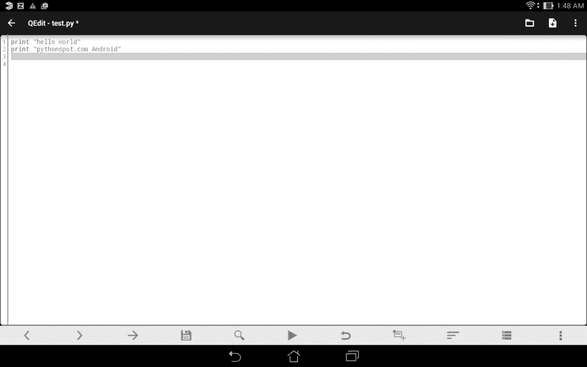

# 使用 QPython 在 Python 中进行 Android 开发

> 原文： [https://pythonspot.com/android-development-in-python-with-qpython/](https://pythonspot.com/android-development-in-python-with-qpython/)

QPython 是一个脚本引擎，可让您在 **Android** 上运行 **Python** 脚本。 如果要制作 **Android** 应用，请改用 Kivy。

## QPython

QPython 应用包含：

*   Android 上的 Python 编程

*   运行脚本/项目

*   Android 上的 IDE

*   点（包管理器）

*   [**SL4A**](https://pythonspot.com/sl4a-android-python-scripting/) 用于 Android 访问（GPS，网络，蓝牙等）

请注意，QPython 是脚本引擎，类似于 [SL4A](https://pythonspot.com/sl4a-android-python-scripting/)，而不是应用程序开发平台。

## 安装

在 Google Play 商店中，您可以找到 QPython（Python 2.7.2）和 QPython3（Python 3.2.2）。 我们建议您使用 Python 3.2.2，但出于传统原因，您可能希望使用 Python 2.7.2。

Android 上的 Python

## 用法

安装后，您将进入一个标志性菜单。 第一个图标将打开 Python 解释器。

qpython-menu

## 集成开发环境

第二个图标（编辑器）将启动 Python IDE。 它具有语法突出显示和其他一些功能。 虽然在 Android 设备上安装 IDE 很有用，但在手机或平板电脑上打字可能不是您的首选。所有脚本都存储在`/storage/emulated/0/com.hipipal.qpyplus/scripts`中。您可以从桌面上喜欢的编辑器直接上传到此目录。（运行按钮在底部。）

QPython IDE

## 解释器

您可以直接在 Android 设备上使用 Python 解释器。这类似于在 Windows 或 Linux 上启动 Python 解释器。虽然有时有用，但您可能更喜欢使用 IDE。

Android 上的 Python 解释器