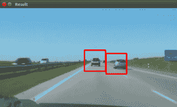

# 使用级联的汽车追踪

> 原文： [https://pythonspot.com/car-tracking-with-cascades/](https://pythonspot.com/car-tracking-with-cascades/)



使用 OpenCV 进行汽车追踪

在本教程中，我们将研究使用 [haar 特征](https://en.wikipedia.org/wiki/Haar-like_features)的车辆跟踪。 我们有一个经过训练的 haar 级联文件。

该程序将检测感兴趣的区域，将其分类为汽车，并在其周围显示矩形。

## 级联检测

让我们从基本的级联检测程序开始：

```py
#! /usr/bin/python

import cv2

face_cascade = cv2.CascadeClassifier('cars.xml')
vc = cv2.VideoCapture('road.avi')

if vc.isOpened():
    rval , frame = vc.read()
else:
    rval = False

while rval:
    rval, frame = vc.read()

    # car detection.
    cars = face_cascade.detectMultiScale(frame, 1.1, 2)

    ncars = 0
    for (x,y,w,h) in cars:
        cv2.rectangle(frame,(x,y),(x+w,y+h),(0,0,255),2)
        ncars = ncars + 1

    # show result
    cv2.imshow("Result",frame)
    cv2.waitKey(1);
    vc.release()

```

这样既可以检测屏幕中的汽车，也可以检测到噪声，并且屏幕有时会抖动。 为了避免所有这些情况，我们必须改进我们的汽车跟踪算法。 我们决定提出一个简单的解决方案。

## 汽车追踪算法

对于每一帧：

*   检测潜在的感兴趣区域
*   根据垂直，水平相似度过滤检测到的区域
*   如果是新区域，请添加到集合中
*   每 30 帧清除一次收藏

## 消除误报

[均方误差函数](https://en.wikipedia.org/wiki/Mean_squared_error)用于消除误报。 我们比较图像的垂直和水平方向。 如果差异大或小，就不能成为汽车。

## ROI 检测

可能无法在每帧中检测到汽车。 如果检测到新车，则将其添加到集合中。
我们将这个集合保留 30 帧，然后清除它。

```py
#!/usr/bin/python

import cv2
import numpy as np

def diffUpDown(img):
    # compare top and bottom size of the image
    # 1\. cut image in two
    # 2\. flip the top side
    # 3\. resize to same size
    # 4\. compare difference
    height, width, depth = img.shape
    half = height/2
    top = img[0:half, 0:width]
    bottom = img[half:half+half, 0:width]
    top = cv2.flip(top,1)
    bottom = cv2.resize(bottom, (32, 64))
    top = cv2.resize(top, (32, 64))
    return ( mse(top,bottom) )

def diffLeftRight(img):
    # compare left and right size of the image
    # 1\. cut image in two
    # 2\. flip the right side
    # 3\. resize to same size
    # 4\. compare difference
    height, width, depth = img.shape
    half = width/2
    left = img[0:height, 0:half]
    right = img[0:height, half:half + half-1]
    right = cv2.flip(right,1)
    left = cv2.resize(left, (32, 64))
    right = cv2.resize(right, (32, 64))
    return ( mse(left,right) )

def mse(imageA, imageB):
    err = np.sum((imageA.astype("float") - imageB.astype("float")) ** 2)
    err /= float(imageA.shape[0] * imageA.shape[1])
    return err

def isNewRoi(rx,ry,rw,rh,rectangles):
    for r in rectangles:
        if abs(r[0] - rx) &lt; 40 and abs(r[1] - ry) &lt; 40:
            return False
        return True

def detectRegionsOfInterest(frame, cascade):
    scaleDown = 2
    frameHeight, frameWidth, fdepth = frame.shape
    # Resize
    frame = cv2.resize(frame, (frameWidth/scaleDown, frameHeight/scaleDown))
    frameHeight, frameWidth, fdepth = frame.shape

    # haar detection.
    cars = cascade.detectMultiScale(frame, 1.2, 1)

    newRegions = []
    minY = int(frameHeight*0.3)

    # iterate regions of interest
    for (x,y,w,h) in cars:
        roi = [x,y,w,h]
        roiImage = frame[y:y+h, x:x+w]

        carWidth = roiImage.shape[0]
        if y > minY:
            diffX = diffLeftRight(roiImage)
            diffY = round(diffUpDown(roiImage))
        if diffX > 1600 and diffX < 3000 and diffY > 12000:
            rx,ry,rw,rh = roi
            newRegions.append( [rx*scaleDown,ry*scaleDown,rw*scaleDown,rh*scaleDown] )

    return newRegions

def detectCars(filename):
    rectangles = []
    cascade = cv2.CascadeClassifier('cars.xml')
    vc = cv2.VideoCapture(filename)

    if vc.isOpened():
        rval , frame = vc.read()
    else:
        rval = False

    roi = [0,0,0,0]
    frameCount = 0

    while rval:
    rval, frame = vc.read()
    frameHeight, frameWidth, fdepth = frame.shape

    newRegions = detectRegionsOfInterest(frame, cascade)
    for region in newRegions:
    if isNewRoi(region[0],region[1],region[2],region[3],rectangles):
        rectangles.append(region)

    for r in rectangles:
        cv2.rectangle(frame,(r[0],r[1]),(r[0]+r[2],r[1]+r[3]),(0,0,255),3)

    frameCount = frameCount + 1
    if frameCount > 30:
        frameCount = 0
        rectangles = []

    # show result
    cv2.imshow("Result",frame)
    cv2.waitKey(1);
    vc.release()

detectCars('road.avi')

```

## 最后说明

级联不是旋转不变的，比例尺和平移的不变。 此外，检测具有 Haar 级联的车辆可能会相当不错，但是使用其他算法（显着点）也会有所收获。

您可能会喜欢：

*   [机器人技术，计算机视觉，语音识别等](https://pythonspot.com/robotics/)

[下载计算机视觉示例和课程](https://pythonspot.com/download-vision-examples/)