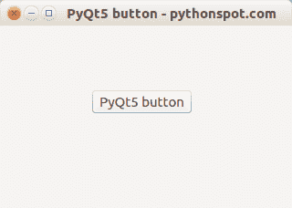

# PyQt5 按钮

> 原文： [https://pythonspot.com/pyqt5-buttons/](https://pythonspot.com/pyqt5-buttons/)

PyQt5 支持使用`QPushButton`类的按钮。 此类在`PyQt5.QtWidgets`组中。 可以通过调用构造函数`QPushButton`并将其文本显示为参数来创建按钮。

## 简介

要将按钮用于 [PyQt5](https://pythonspot.com/pyqt5/) 应用程序，我们需要更新导入行：

```py
from PyQt5.QtWidgets import QApplication, QWidget, QPushButton
from PyQt5.QtCore import pyqtSlot

```

在`initUI()`方法中，添加以下代码行：

```py
button = QPushButton('PyQt5 button', self)
button.setToolTip('This is an example button')
button.move(100,70)

```

`QPushButton`创建小部件，第一个参数是按钮上的文本。 当用户将鼠标指向按钮时，`setToolTip`方法显示消息。 最后，将按钮移动到坐标`x = 100`，`y = 70`。 我们需要为按钮单击创建一种方法：

```py
@pyqtSlot()
def on_click(self):
    print('PyQt5 button click')

```

使用以下命令将连接方法添加到单击：

```py
button.clicked.connect(self.on_click)

```

最终 [PyQt5](https://pythonspot.com/pyqt5/) 按钮代码：

```py
import sys
from PyQt5.QtWidgets import QApplication, QWidget, QPushButton
from PyQt5.QtGui import QIcon
from PyQt5.QtCore import pyqtSlot

class App(QWidget):

    def __init__(self):
        super().__init__()
        self.title = 'PyQt5 button - pythonspot.com'
        self.left = 10
        self.top = 10
        self.width = 320
        self.height = 200
        self.initUI()

    def initUI(self):
        self.setWindowTitle(self.title)
        self.setGeometry(self.left, self.top, self.width, self.height)

        button = QPushButton('PyQt5 button', self)
        button.setToolTip('This is an example button')
        button.move(100,70)
        button.clicked.connect(self.on_click)

        self.show()

    @pyqtSlot()
    def on_click(self):
        print('PyQt5 button click')

if __name__ == '__main__':
    app = QApplication(sys.argv)
    ex = App()
    sys.exit(app.exec_())

```



上面的 [PyQt5](https://pythonspot.com/pyqt5/) 按钮示例的屏幕截图。

[下载 PyQT5 示例](https://pythonspot.com/download-pyqt5-examples/)