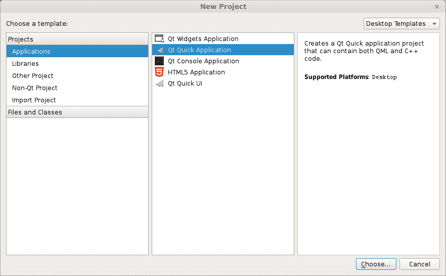
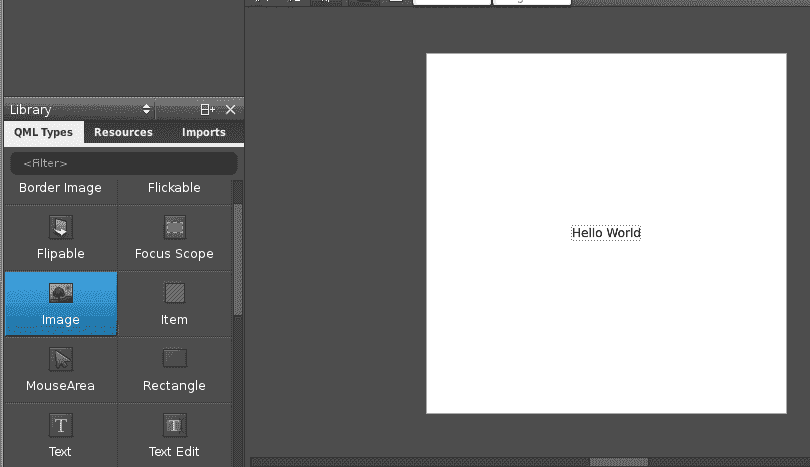
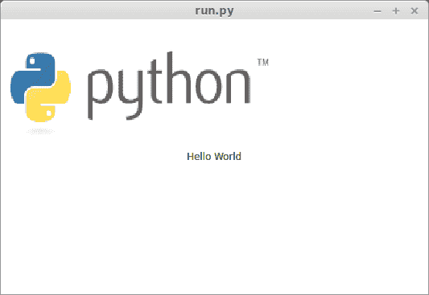

# QML 和 PyQT：创建 GUI（教程）

> 原文： [https://pythonspot.com/qml-and-pyqt-creating-a-gui-tutorial/](https://pythonspot.com/qml-and-pyqt-creating-a-gui-tutorial/)

如果您尚未完成我们的[第一个 PyQT 教程](https://pythonspot.com/building-an-application-gui-with-pyqt-beginners-tutorial/)，则应该这样做，这很有趣！ 在本教程中，我们将使用 [PyQT4](https://pythonspot.com/pyqt4/) 和用户界面标记语言，该语言描述图形用户界面和控件。

## QML 和 PyQT

[用户界面](https://pythonspot.com/gui/)标记和语言代码的摘录可能类似于：

```py
 Rectangle {
id: simplebutton
color: "grey"
width: 150; height: 75

```

本质上，该语言告诉界面应该是什么样。 我们将使用的语言称为 QML。

## QTCreator

启动一个名为 QTCreator 的程序。 本教程将以图形化方式帮助您完成整个过程。 只需在终端中键入`qtcreator`或从菜单列表中启动它即可。 该屏幕应弹出：


QTCreator

## 创建一个 GUI

按**新建项目**按钮。 从下面的菜单中选择“QT 快速应用程序”。最后按右下角的**选择**。 



QT Quick

将会出现一个新的弹出窗口：


kde 创建

输入名称和有效路径以保存您的项目。 然后按下一步。 从菜单列表中选择 **QT Quick 2.0** 。 按下一步。 按完成。 立即出现以 QML 语言定义的用户界面。


QT Quick

像所有伟大的程序员一样，我们将以最懒惰的方式解决问题。 无需手动输入所有 QML 代码，我们将按下屏幕左侧的**设计**按钮。 现在将出现一个拖放屏幕。



拖放

我们将图像拖到该区域上，然后选择右侧的源。 保存项目。 打开终端并找到您刚创建的 qml 文件。 或者，您可以简单地将代码复制到编辑框中，然后将其保存到`.qml`文件中。 输入命令：

```py
qmlviewer main.qml

```

这将显示 qml 文件中定义的窗口，没有任何功能。 它只是界面的查看器。 然后，我们创建一些代码来加载此 QML 定义：

```py
import sys

from PyQt4.QtCore import QDateTime, QObject, QUrl, pyqtSignal
from PyQt4.QtGui import QApplication
from PyQt4.QtDeclarative import QDeclarativeView

app = QApplication(sys.argv)

# Create the QML user interface.
view = QDeclarativeView()
view.setSource(QUrl('main.qml'))
view.setResizeMode(QDeclarativeView.SizeRootObjectToView)
view.setGeometry(100, 100, 400, 240)
view.show()

app.exec_()

```

最后，我们将第一行`main.qml`修改为：

```py
import Qt 4.7

```

仅仅是因为我们的 QtQuick 不见了。运行：

```py
python run.py

```

现在将显示 QML 定义的用户界面：



QML 和 PyQT

所有代码都是 [PyQT](https://pythonspot.com/pyqt4/) ，因此您可以像上一教程中那样添加代码。 这是使用 PyQT 创建图形界面的两种方法。 与在上一教程中使用 [QT](https://pythonspot.com/pyqt4/) 创建 GUI 的方法相比，该方法可能更宽松地与代码耦合。 尽管两者都是有效的方法。

[下载 PyQT4 示例（批量收集）](https://pythonspot.com/python-qt-examples/)

您可能会喜欢：[PyQT4 GUI 应用程序](https://pythonspot.com/building-an-application-gui-with-pyqt-beginners-tutorial/)或 [PyQt4 教程](https://pythonspot.com/pyqt4/)