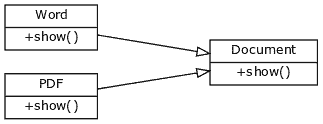
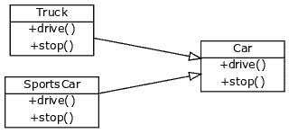

# 多态

> 原文： [https://pythonspot.com/polymorphism/](https://pythonspot.com/polymorphism/)

有时，对象有多种类型或形式。 如果我们有一个按钮，则有许多不同的绘制输出（圆形按钮，复选按钮，方形按钮，带有图像的按钮），但它们确实共享相同的逻辑：`onClick()`。 我们使用相同的方法访问它们。 这个想法称为多态。

多态是基于希腊语 Poly（许多）和 morphism（形式）。 我们将创建一个可以采用或使用多种形式的对象的结构。

## 具有函数的多态：

我们创建了两个类别：`Bear`和`Dog`，两者都能发出不同的声音。 然后，我们创建两个实例，并使用相同的方法调用它们的动作。

```py
class Bear(object):
    def sound(self):
        print("Groarrr")

class Dog(object):
    def sound(self):
        print("Woof woof!")

    def makeSound(animalType):
        animalType.sound()

bearObj = Bear()
dogObj = Dog()

makeSound(bearObj)
makeSound(dogObj)

```

输出：

```py
Groarrr
Woof woof!

```

## 抽象类的多态（最常用）



多态可视化。

抽象结构在`Document`类中定义。

如果您创建编辑器，则可能事先不知道用户将打开哪种类型的文档（pdf 格式还是 word 格式？）。

像这样处理它们，而不是每个文档有 20 种类型，这不是很好吗？

```py
for document in documents:
print document.name + ': ' + document.show()

```

为此，我们创建了一个称为`document`的抽象类。 此类没有任何实现，但是定义了所有形式都必须具有的结构（以函数形式）。 如果我们定义函数`show()`，则`PdfDocument`和`WordDocument`都必须具有`show()`函数。完整代码：

```py
class Document:
    def __init__(self, name):
        self.name = name

    def show(self):
        raise NotImplementedError("Subclass must implement abstract method")

class Pdf(Document):
    def show(self):
        return 'Show pdf contents!'

class Word(Document):
    def show(self):
        return 'Show word contents!'

documents = [Pdf('Document1'),
Pdf('Document2'),
Word('Document3')]

for document in documents:
    print document.name + ': ' + document.show()

```

输出：

```py
Document1: Show pdf contents!
Document2: Show pdf contents!
Document3: Show word contents!

```

我们有一个抽象访问点（文档），用于访问遵循相同结构的多种类型的对象（pdf，word）。

## 多态示例



抽象类中的结构，其他类中的实现

另一个例子是拥有一个抽象类`Car`，其中包含了`drive()`和`stop()`结构。

我们定义了两个对象`Sportcar`和`Truck`，它们都是`Car`的一种形式。 用伪代码我们将要做的是：

```py
class Car:
    def drive abstract, no implementation.
    def stop abstract, no implementation.

class Sportscar(Car):
    def drive: implementation of sportscar
    def stop: implementation of sportscar

class Truck(Car):
    def drive: implementation of truck
    def stop: implementation of truck

```

然后，我们可以访问任何类型的汽车并调用函数，而无需进一步考虑表格是 Sportscar 还是 Truck。 完整代码：

```py
class Car:
    def __init__(self, name):
    self.name = name

    def drive(self):
        raise NotImplementedError("Subclass must implement abstract method")

    def stop(self):
        raise NotImplementedError("Subclass must implement abstract method")

class Sportscar(Car):
    def drive(self):
        return 'Sportscar driving!'

    def stop(self):
        return 'Sportscar braking!'

class Truck(Car):
    def drive(self):
        return 'Truck driving slowly because heavily loaded.'

    def stop(self):
        return 'Truck braking!'

cars = [Truck('Bananatruck'),
Truck('Orangetruck'),
Sportscar('Z3')]

for car in cars:
    print car.name + ': ' + car.drive()

```

输出：

```py
Bananatruck: Truck driving slowly because heavily loaded.
Orangetruck: Truck driving slowly because heavily loaded.
Z3: Sportscar driving!

```

[下载练习](https://pythonspot.com/download-oop-exercises/)