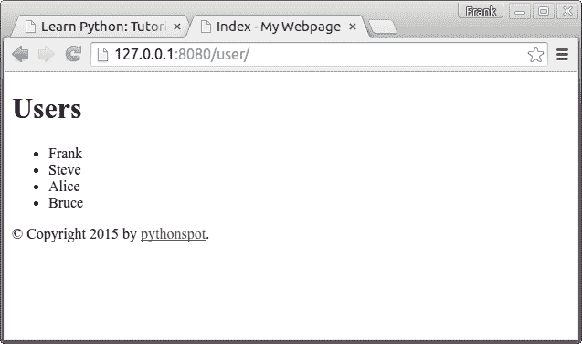



# Jinja2 模板引擎

> 原文： [https://pythonspot.com/jinja2-template-engine/](https://pythonspot.com/jinja2-template-engine/)

Jinja2 是 Python 的模板引擎。 将数据呈现到网页时，可以使用它。 对于您访问的每个链接，您都希望使用格式显示数据。 通过使用模板引擎，我们可以将显示逻辑（html，css）与实际的 Python 代码分开。 让我们从一个例子开始

## 关于 Jinja

Jinja2 模板只是一个文本文件，不需要特定的扩展名，例如`.html`，`.xml`。模板可能包含标签和特殊定界符：

| 定界符 | 用法 |
| --- | --- |
| `` | 语句 |
| `{{ ... }}` | 要打印到模板输出的表达式 |
| `{# ... #}` | 注释未包含在模板输出中 |
| `# ... #` | 行语句 |

在上面的示例中，我们有两个语句和一个表达式。 我们还没有包含任何注释。

## 基本模板和子模板

Jinja2 模板可以扩展基本模板。 在包含许多站点的网页上，您可能希望这些页面看起来相似。 在`/templates/`中，使用以下代码创建一个名为`base.html`的文件：

```py


     	 	<link rel="stylesheet" href="style.css">
     - My Webpage</title>

</div>
<div id="footer">
        
Copyright 2015 by <a href="https://pythonspot.com/">pythonspot</a>.
</div>

```

我们没有设置`style.css`，但是您可以设置一个。将`/templates/user.html`更改为：

```py

Index

{{ super() }}
<style type="text/css">
        .important { color: #336699; }
    </style>



<h1>Users</h1>
<p class="important"></p>

<ul>
      
 	<li>{{ user }}</li>
</ul>


```

通过以下方式重新启动应用程序：

```py
python app.py
* Running on http://0.0.0.0:8080/

```

输出：



Flask Jinja 模板引擎

[下载 Flask 示例](https://pythonspot.com/download-flask-examples/)

