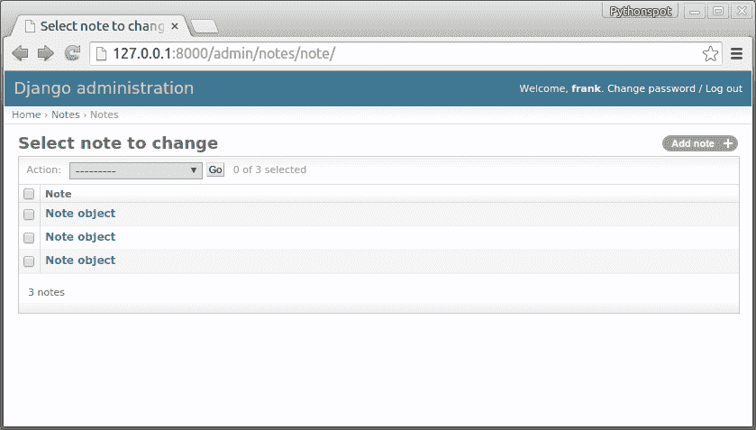
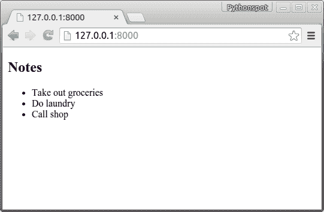

# Django 教程：构建笔记应用程序

> 原文： [https://pythonspot.com/django-tutorial-building-a-note-taking-app/](https://pythonspot.com/django-tutorial-building-a-note-taking-app/)

## Django

如果要开始 python Web 开发，可以使用一个名为 Django 的 Web 框架。它被设计为快速，安全和可扩展的。 它带有一个对象关系映射器（ORM），这意味着 Python 中的对象被映射到数据库中的对象。

用 Django 创建的应用程序分为三个独立的层：模型（数据库），视图（外观）和控制器（逻辑），或者简称为模型-视图-控制器（MVC）架构。

## 设置 Django

首先：

```py
django-admin startproject mysite
```

这将创建目录`mysite`。 打开`mysite/mysite/settings.py`。您可以在此处配置所需的数据库：

```py
DATABASES = {
'default': {
'ENGINE': 'django.db.backends.sqlite3',
'NAME': os.path.join(BASE_DIR, 'db.sqlite3'),
}
}

```

从`sqlite3`，`postgresql_psycopg2`，`mysql`或`oracle`中选择。 名称是您的数据库的名称。 如果您使用 SQLite，则会自动创建数据库。 对于 MySQL 和 Postgresql，您需要自己创建数据库。 将一个目录转到`/mysite/`并运行：

```py
python manage.py runserver
```

终端应该说：

```py
Performing system checks...

System check identified no issues (0 silenced).

You have unapplied migrations; your app may not work properly until they are applied.
Run 'python manage.py migrate' to apply them.

August 16, 2015 - 14:45:29
Django version 1.7.1, using settings 'myapp.settings'
Starting development server at http://127.0.0.1:8000/
Quit the server with CONTROL-C.
[16/Aug/2015 14:45:35] "GET / HTTP/1.1" 200 1759

```

在网络浏览器中打开 [http://127.0.0.1:8000](http://127.0.0.1:8000) ，您应该看到：


我们的第一个 Django 应用。

现在我们创建了一个项目，我们创建了一个应用程序。 一个项目可以有许多应用程序。

```py
python manage.py startapp notes

```

这创建文件：

```py
notes/
    init.py
    admin.py
    migrations/
        init.py
    models.py
    tests.py
    views.py
```

## Django 数据库模型

将`/mysite/notes/models.py`更改为：

```py
from django.db import models

class Note(models.Model):
text = models.CharField(max_length=120)
created = models.DateTimeField(auto_now_add=True)
```

打开`/mysite/mysite/settings.py`，添加 Web 应用程序：

```py
INSTALLED_APPS = (
'django.contrib.admin',
'django.contrib.auth',
'django.contrib.contenttypes',
'django.contrib.sessions',
'django.contrib.messages',
'django.contrib.staticfiles',
'notes'
)

```

运行：

```py
python manage.py syncdb

```

这将更新数据库。 然后，我们将`/mysite/mysite/admin.py`更新为：

```py
from django.contrib import admin

# Register your models here.
from .models import Note

class NoteAdmin(admin.ModelAdmin):
class Meta:
model = Note

admin.site.register(Note,NoteAdmin)

```

运行：

```py
python manage.py makemigrations notes
python manage.py migrate
```

使用以下命令启动服务器：

```py
manage.py runserver

```

一旦打开管理面板 [http://127.0.0.1:8000/admin](http://127.0.0.1:8000/admin)，笔记将出现在页面上：


Django 管理面板

如果单击笔记，则可以查看所有笔记并添加/删除它们：



Django 数据库管理菜单。

## 显示数据

我们将所有数据存储在数据库中，现在我们要创建应用程序。 打开`/mysite/settings.py`并添加：

```py
#print "base dir path", BASE_DIR
#print os.path.join(os.path.dirname(BASE_DIR), "mysite", "static",  "templates")

TEMPLATE_DIRS = (
os.path.join(os.path.dirname(BASE_DIR), "mysite", "static",  "templates"),
#'/home/frankbox/python/djangoapp/mysite/static/templates',
)
```

到文件底部。 这定义了模板的目录（html）。

将`/mysite/mysite/urls.py`更改为：

```py
from django.conf.urls import patterns, include, url
from django.contrib import admin

urlpatterns = patterns('',
# Examples:
# url(r'^$', 'mysite.views.home', name='home'),
# url(r'^blog/', include('blog.urls')),
url(r'^$', 'notes.views.home', name='home'),
url(r'^admin/', include(admin.site.urls)),
)

```

最后，创建`/mysite/static/templates/`并添加`note.html`，这是一个简单的静态 html 文件。

```py
<b>Hello</b>
```

打开 [http://127.0.0.1:8000/](http://127.0.0.1:8000/) 进行测试。 将`note.html`更改为：

```py
<h2>Notes</h2>
<ul>
          </ul>
```

然后打开`/mysite/notes/views.py`并更改为：

```py
from django.shortcuts import render, render_to_response, RequestContext
from django.template import RequestContext, loader
from django.http import HttpResponse
from .models import Note

# Create your views here.

def home(request):
notes = Note.objects
template = loader.get_template('note.html')
context = {'notes': notes}
return render(request, 'note.html', context)
#return render_to_response("note.html", notes)
```

启动浏览器后，您将看到笔记列表：



django 应用

## 插入数据

虽然有一个列表很不错，但我们想在其中添加一些注释。创建文件`/mysite/notes/forms.py`

```py
from django import forms
from .models import Note

class NoteForm(forms.ModelForm):
class Meta:
model = Note

```

将`view.py`更改为：

```py
from django.shortcuts import render, render_to_response, RequestContext
from django.template import RequestContext, loader
from django.http import HttpResponse
from .models import Note
from .forms import NoteForm

# Create your views here.

def home(request):
notes = Note.objects
template = loader.get_template('note.html')
form = NoteForm(request.POST or None)
if form.is_valid():
save_it = form.save(commit=False)
save_it.save()

context = {'notes': notes, 'form': form}
return render(request, 'note.html', context)
#return render_to_response("note.html", notes)
```

最后，我们将`note.html`更新为：

```py
<h2>Notes</h2>
<ul>
          &#123;% for note in notes.all %&#125;
 	<li>&#123; &#123; note.text &#125;&#125;</li>
&#123;% endfor %&#125;</ul>
<form method="POST" action="">&#123;% csrf_token %&#125;
&#123; &#123; form.as_p &#125;&#125;
<input type="submit">
</form>
```

运行它，我们有记笔记的应用程序 :-)


Djano 记笔记的应用

## 为应用添加样式

通过修改`note.html`，我们可以像其他任何 html/css 网站一样设置其样式。 如果将`note.html`更改为：

```py
 	<link href="http://codepen.io/edbond88/pen/CcgvA.css" media="screen" rel="stylesheet" type="text/css">
<style>
            body {<br />
              background: rgba(222,222,222,1);<br />
              margin: 20px;<br />
            }<br />
            </style>
<h1>Django Note Taking App</h1>


<form method="POST" action="">&#123;% csrf_token %&#125;
{ { form.as_p }}
<input type="submit" value="Add note">
</form>

```

你会得到：


Django 笔记记录应用