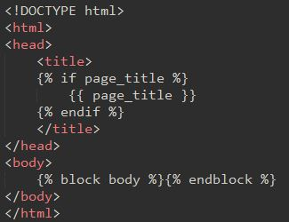
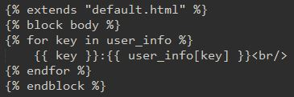
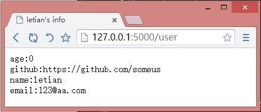

# 浅入浅出 Flask 框架：使用 Jinja2 模板引擎

2014-06-28

模板引擎负责 MVC 中的 V（view）这一部分。Flask 默认使用 Jinja2 模板引擎。

Flask 与模板相关的函数有：

*   flask.render_template(template_name_or_list, **context)
    Renders a template from the template folder with the given context.
*   flask.render_template_string(source, **context)
    Renders a template from the given template source string with the given context.
*   flask.get_template_attribute(template_name, attribute)
    Loads a macro (or variable) a template exports. This can be used to invoke a macro from within Python code.

这其中常用的就是前两个函数。

## 示例

* * *

这个实例中使用了模板继承、if 判断、for 循环。

### 建立 Flask 项目

按照以下命令建立 Flask 项目 HelloWorld:

```py
mkdir HelloWorld
mkdir HelloWorld/static
mkdir HelloWorld/templates
touch HelloWorld/index.py 
```

### 创建并编辑 HelloWorld/templates/default.html

内容如下：



 *可以看到，在`<head>`标签中使用了 if 判断，如果给模板传递了`page_title`变量，显示之，否则，不显示。

`<body>`标签中定义了一个名为`body`的 block，用来被其他模板文件继承。

### 创建并编辑 HelloWorld/templates/user_info.html

内容如下：



 *变量`user_info`应该是一个字典，for 循环用来循环输出键值对。

### 编辑 HelloWorld/index.py

内容如下：

```py
from flask import Flask, render_template

app = Flask(__name__)

@app.route('/')
def hello_world():
    return 'hello world'

@app.route('/user')
def user():
    user_info = {
        'name': 'letian',
        'email': '123@aa.com',
        'age':0,
        'github': 'https://github.com/letiantian'
    }
    return render_template('user_info.html', page_title='letian\'s info', user_info=user_info)

if __name__ == '__main__':
    app.run(debug=True) 
```

`render_template()`函数的第一个参数指定模板文件，后面的参数是要传递的数据。

### 运行与测试

运行 HelloWorld/index.py：

```py
$ python HelloWorld/index.py 
```

在浏览器中访问`http://127.0.0.1:5000/user`，效果图如下：



 *## 相关资料

* * *

[Template Rendering](http://flask.pocoo.org/docs/api/#flask.render_template)
[Rendering Templates](http://flask.pocoo.org/docs/quickstart/)
[Welcome to Jinja2](http://jinja.pocoo.org/docs/)
[List of Builtin Filters](http://jinja.pocoo.org/docs/templates/#builtin-filters)
[How to Custom Filters in Jinja2](http://jinja.pocoo.org/docs/api/#writing-filters)
[Flask Templates](http://flask.pocoo.org/docs/templating/)
[how to custom jinja2 filters in Flask?](http://stackoverflow.com/questions/12288454/how-to-import-custom-jinja2-filters-from-another-file-and-using-flask)
[jinja2: get lengths of list](http://stackoverflow.com/questions/1465249/jinja2-get-lengths-of-list)
[Call a python function from jinja2](http://stackoverflow.com/questions/6036082/call-a-python-function-from-jinja2)***