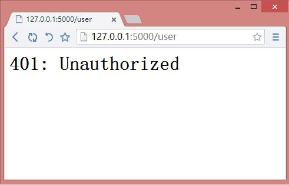

# 浅入浅出 Flask 框架：自定义 404 等错误

2014-06-28

要处理 HTTP 错误，可以使用`flask.abort`函数。

## 示例 1：简单入门

* * *

### 建立 Flask 项目

按照以下命令建立 Flask 项目 HelloWorld:

```py
mkdir HelloWorld
mkdir HelloWorld/static
mkdir HelloWorld/templates
touch HelloWorld/index.py 
```

### 编辑`HelloWorld/index.py`：

```py
from flask import Flask, render_template_string, abort

app = Flask(__name__)

@app.route('/')
def hello_world():
    return 'hello world'

@app.route('/user')
def user():
    abort(401)  # Unauthorized
    `print 'Unauthorized'`

if __name__ == '__main__':
    app.run(debug=True) 
```

### 效果

运行`HelloWorld/index.py`，浏览器访问`http://127.0.0.1:5000/user`，效果如下：


 *要注意的是，`HelloWorld/index.py`中`abort(401)`后的`print 'Unauthorized'`并没有执行。

## 示例 2：自定义错误页面

* * *

### 编辑`HelloWorld/index.py`：

```py
from flask import Flask, render_template_string, abort

app = Flask(__name__)

@app.route('/')
def hello_world():
    return 'hello world'

@app.route('/user')
def user():
    abort(401)  # Unauthorized
    print 'Unauthorized'
    return render_template_string('<h1>{{ error_code }}</h1>', error_code=222)

@app.errorhandler(401)
def page_unauthorized(error):
    return render_template_string('<h1>{{ error_info }}</h1>', error_info=error), 401

if __name__ == '__main__':
    app.run(debug=True) 
```

### 效果

运行`HelloWorld/index.py`，浏览器访问`http://127.0.0.1:5000/user`，效果如下：
*