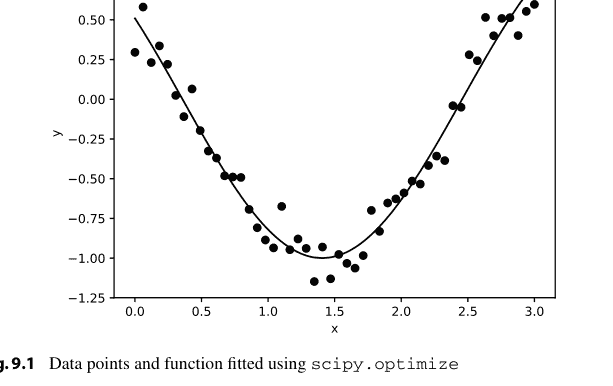
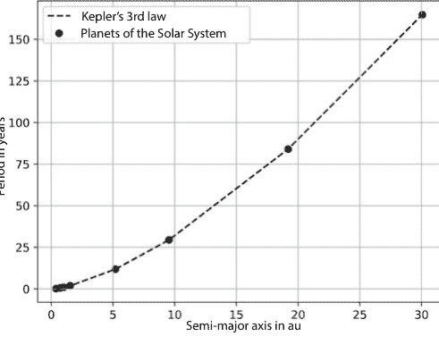

# 精要

克里斯托夫·谢弗

# Python 快速入门

面向 STEM 学生的编程导论


精要

# Springer 精要系列

*Springer 精要系列* 以浓缩的形式提供最新的知识。它们旨在传递当前学术讨论或实践中被视为“最前沿”的核心内容。凭借其快速、简洁且易于理解的信息，精要系列提供：

- 对您专业领域内当前议题的介绍
- 对一个新感兴趣主题的介绍
- 对某一特定主题的深入见解，以便能够参与相关讨论

这些书籍以电子和印刷格式呈现，以紧凑的形式汇集了来自 Springer 专业作者的专家知识。它们特别适合在平板电脑、电子书阅读器和智能手机上作为电子书使用。*Springer 精要系列* 构成了来自经济学、社会科学与人文科学、技术与自然科学，以及医学、心理学与健康专业领域的知识模块，由众多学科的知名 Springer 作者撰写。

有关此子系列的更多信息，请访问 [https://link.springer.com/bookseries/16761](https://link.springer.com/bookseries/16761)

克里斯托夫·谢弗

# Python 快速入门

面向 STEM 学生的编程导论


克里斯托夫·谢弗
天文学与天体物理学研究所
蒂宾根大学
蒂宾根，德国

ISSN 2197-6708
精要
ISSN 2731-3107
Springer 精要系列
ISBN 978-3-658-33551-9
https://doi.org/10.1007/978-3-658-33552-6

ISSN 2197-6716 (电子版)
ISSN 2731-3115 (电子版)
ISBN 978-3-658-33552-6 (电子书)

本书是克里斯托夫·谢弗所著德文原版《Schnellstart Python》的翻译版，由 Springer Fachmedien Wiesbaden GmbH 于 2019 年出版。翻译工作借助人工智能（由 DeepL.com 服务提供的机器翻译）完成。随后进行了人工修订，主要涉及内容方面，因此本书在风格上可能与传统翻译有所不同。Springer Nature 持续致力于开发用于图书制作的工具及相关技术，以支持作者。

© Springer Fachmedien Wiesbaden GmbH，Springer Nature 旗下公司 2021
本作品受版权保护。所有权利由出版商保留，无论涉及材料的全部或部分，特别是重印、插图重用、朗诵、广播、以缩微胶片或任何其他物理方式复制，以及信息存储和检索、电子改编、计算机软件，或以目前已知或未来开发的类似或不同方法进行传输的权利。
在本出版物中使用通用描述性名称、注册名称、商标、服务标志等，即使没有具体声明，也并不意味着这些名称不受相关保护性法律法规的约束，因此可以自由使用。
出版商、作者和编辑有理由相信，本书中的建议和信息在出版之日是真实和准确的。无论是出版商还是作者或编辑，均不对本文所含材料或可能存在的任何错误或遗漏提供任何明示或暗示的保证。出版商对已出版地图中的管辖权主张和机构隶属关系保持中立。

责任编辑：丽莎·埃德尔霍伊泽
此 Springer 印刷版由注册公司 Springer Fachmedien Wiesbaden GmbH 出版，该公司是 Springer Nature 的一部分。
注册公司地址为：Abraham-Lincoln-Str. 46, 65189 Wiesbaden, Germany

# 您可以在本*精要*中找到什么

通过这本*精要*，我们希望向您介绍 Python 编程的精彩世界，并让您快速上手开发自己的脚本。

- 您将学习 Python 编程语言的基本思想和原理。
- 您将开发自己的 Python 程序。
- 您将理解其他程序员编写的 Python 脚本，根据您的需求进行调整，并将其集成到您的代码中。
- 您将了解 Python 为自然科学家和数据科学家提供的有趣扩展。
- 您可以使用 Matplotlib 创建有意义的图表和图形。

# 目录

1. Python 编程语言概述
2. Python 的安装
   2.1 Windows
   2.2 Linux
   2.3 macOS
3. Python 程序的执行
   3.1 交互式 Python
   3.2 开发环境
4. Python 程序的基本结构
5. 数据类型、变量、列表、字符串、字典和运算符
   5.1 数值数据类型 int 和 float，bool 和 complex
   5.2 序列数据类型
   5.3 字典
   5.4 集合
6. 条件语句和循环
   6.1 使用 if-else 的条件语句
   6.2 使用 while 循环进行重复
   6.3 使用 for 循环进行重复
7. 函数
   7.1 内置函数
   7.2 函数的声明
   7.3 全局变量和局部变量
   7.4 迭代器和生成器，函数式编程
   7.5 使用 Lambda 运算符的匿名函数
   7.6 函数可以被装饰：装饰器
   7.7 函数式参数 *args 和 **kwargs
8. 使用模块进行结构化
   8.1 使用自定义模块对代码进行结构化
   8.2 一些重要模块及其用途：Math、os、re、sys
9. 面向科学家的扩展：NumPy、SciPy、Matplotlib、Pandas
   9.1 使用 Python 进行快速数值计算：NumPy
   9.2 面向科学家：SciPy
   9.3 使用 Matplotlib 创建图表和图形
   9.4 使用 Pandas 进行大数据科学

# Python 编程语言概述

近年来，编程语言 Python 与 MATLAB 和 R 一起，已成为研发领域科学工作的标准工具。

Python 的巨大普及源于其易于扩展的特性：在自己的脚本和程序中使用其他开发者的模块非常容易。特别是 NumPy、SciPy 和 Matplotlib 模块为科学家和工程师提供了用于科学和技术计算、物理、化学、生物学和计算机科学应用的完美开发环境。Python 也应用于现代研究领域大数据科学和机器学习的最新应用中。

Python 最初由 Guido van Rossum 在 1990 年代初的第一个版本中，在他的圣诞假期期间开发。纯粹的教学语言 ABC 是他的模型。他的主要目标是清晰性和易于理解。第一个完整版本于 1994 年发布，van Rossum 设计它时使其易于通过模块扩展，并且语言本身可以轻松嵌入其他语言。由于 Python 本身使用清晰的语法，并且可以用简单的结构进行编程，因此该语言特别适合初学者，并且相对容易学习。

# Python 版本 2 和 3

Python 最近以两个互不兼容的主要版本进行开发。一旦您的工作基于旧的、现有的脚本，您很可能会遇到版本 2 的旧 Python 脚本。目前，使用 Python 2 的项目数量仍然占多数，但这种情况预计将在 2021 年之前发生逆转。

在这本 Springer *精要* 中，我们主要关注 Python 版本 3，但如果您在科学职业生涯中遇到较旧的 Python 脚本，您对版本3足以让你理解它，并根据你的需求进行修改。

对于新的Python项目，请仅使用新版本3；自然科学相关的所有模块现在都已支持版本3，而对旧版本的支持已停止。一个特别重要的例子是Matplotlib模块，其最新版本仅适用于Python 3。如果你需要说服某人使用新版本3而不是过时的版本2.7，请用以下论点。

- 对Python 2.7的支持已于2020年1月1日到期。Python 2.7的活跃开发在2010年中期结束。所有新功能仅包含在版本3中，且仅偶尔向2.7版本移植。
- Python 3具有更好的Unicode支持：所有文本字符串默认为Unicode。
- 重要模块仅支持版本3。

其他我们不会详细讨论的新特性包括：`print`函数的不同语法、使用视图和迭代器代替列表，以及整数除法的更改。使用版本2仅在个别情况下是合理的。最常见的个别情况是已存在版本2的程序，其移植成本过高。

## Python的安装

很少有用户直接从Python项目中心网站的源文件编译Python，而是使用预编译的软件包，其中一些已包含重要的模块NumPy、SciPy和Matplotlib。以下描述了针对最常见操作系统的安装。

### 2.1 Windows

对于Windows操作系统，Anaconda套件提供了一个免费的Python套件，基础版本安装简便，包含超过1400个软件包。可以从Anaconda Inc.的网站获取版本2和3的图形安装程序。标准安装包括所有与科学应用相关的模块和开发环境spyder。

### 2.2 Linux

在几乎所有Linux发行版中，可以通过发行版各自的包管理器安装版本2和3最重要的Python包。除此之外，Linux版的Anaconda套件也可用，但建议使用发行版自身的包。在基于Debian的系统上安装的命令是

```
apt install python3 python3-numpy python3-scipy python3-matplotlib python3-spyder
```

所有依赖关系由包管理器解决，所有包将相应安装。

### 2.3 macOS

在macOS操作系统下，也有多种安装可能性。一方面可以使用上述的Anaconda套件，另一方面大多数Python包可通过较知名的开源包管理器`fink`、`macports`、`homebrew`之一获得。通过`homebrew`安装Python基础包的示例如下

```
brew install python3
```

借助Python自身的包管理器`pip`（Pip Installs Packages），你可以安装额外的Python包

```
pip install numPy sciPy matplotlib
```

命令`pip list`可用于显示已安装的包。

## Python程序的执行

为了在计算机上执行程序，高级编程语言（如本例中的Python）的程序代码必须由解释器直接执行，或者必须先由编译器翻译成机器语言。机器语言由处理器直接执行的指令组成。解释器和编译器的区别在于，编译器从源文件创建一个新文件，而解释器读取源文件并在运行时直接执行它们。编译器和解释器之间存在一些中间阶段，我们不会详细讨论。基本上，Python解释器在执行程序时也会生成一个具有典型扩展名`.pyc`的所谓字节码。这在使用模块时带来了显著的速度优势，因为如果模块已经以字节码格式存在，则无需重新解释已使用的模块。因此，Python解释器首先检查源文件是否已更改，然后仅在必要时生成新的字节码。

Python程序可以通过不同的方式启动。直接在命令行调用Python解释器以进行交互式工作。通常，你会使用喜欢的文本编辑器编写Python脚本，然后执行它，或者你可以使用像spyder这样的开发环境。下面我们来看不同的可能性。

### 3.1 交互式Python

在Windows上，解释器通过调用`python.exe`来调用，在Linux和macOS上，如果只安装了版本3，则使用命令`python`，否则可能使用`python3`。解释器直接向终端报告版本，并在所谓的Python提示符`>>>`处等待进一步输入

```
$ python3
Python 3.6.6 (default, Jun 27 2018, 14:44:17)
[GCC 8.1.0] on linux
Type "help", "copyright", "credits" or "license" for more information.
>>>
```

交互式解释器也可以在命令行上用作实用的计算器

```
>>> 3+12-2*(3-1)
11
>>> 2**2
4
>>> 2/3+4
4.666666666666667
```

在实践中，纯解释器仅用于简短测试或作为计算器替代品。一旦编写了用于重复使用的脚本，建议在文本编辑器中编写和编辑程序语句，然后让解释器执行它们。一个内容如下的文本文件`calc.py`

```
print(3+12-2*(3-1))
print(2**2)
print(2/3+4)
```

在Linux上通过解释器调用时产生以下输出

```
# This $ is the shell prompt and need not be entered
$ python calc.py
11
4
4.666666666666667
```

对于Windows，必须相应地调用解释器

```
# Assuming that calc.py is located in the root directory of disk C:
C:\> python.exe C:\calc.py
11
4
4.666666666666667
```

`calc.py`脚本和交互式调用之间的唯一区别是脚本中额外的`print`语句。默认情况下，调用的返回值仅在交互式解释器中打印到标准输出。如果不调用`print`函数，我们将在终端中得不到任何结果输出。

与Python的交互式工作已被证明非常高效，以至于SciPy社区开发了一个名为IPython（Interactive Python）的扩展。然而，IPython不仅仅是一个扩展的命令行解释器，更像是一个小型的集成开发环境。IPython不是标准Python安装的一部分，必须单独安装。标准Python命令行解释器的有用扩展包括：

- IPython提供变量、函数、类、模块的自动*制表符补全*。
- IPython支持用于编程图形用户界面（GUI）的常用模块。
- 输出是彩色的，并且比标准解释器更详细。
- 一些操作系统命令（`ls`、`cp`等）在IPython命令行上可用。

结合NumPy、SciPy和Matplotlib，IPython是自然科学中数据处理和数据可视化的完美工具。

### 3.2 开发环境

对于较大的项目和脚本，建议使用集成开发环境（IDE）。有各种不同的IDE，最终选择在很大程度上取决于个人偏好。

跨平台开发环境Spyder（Scientific PYthon Development EnviRonment），完全用Python编写，为初学者和高级程序员提供了成功开发所需的所有工具：一个带有彩色语法高亮和自动补全的集成编辑器、一个变量浏览器、一个Python或（如果适用）IPython接口，以及一个调试器。

来自Java社区的流行开发环境Eclipse也可以通过PyDev扩展用于Python编程。此IDE推荐给Java开发者。

来自JetBrains的商业开发环境PyCharm提供了现代开发环境所需的一切，甚至更多：PyCharm允许直接从图形界面安装Python模块和插件。此外，它还提供了与所有当前版本控制系统（如CVS、git、mercurial和subversion）的图形界面，甚至可以直接上传到Github。对于科学应用，一个有用的功能是直接显示和集成图形和绘图。除了商业版本，还有免费的社区版本可用，但不幸的是，它提供的功能较少。对于学术用户，即学生和讲师，商业版本可以免费使用。

作为IDE的充分替代方案，许多科学用户使用Jupyter Notebook或JupyterLab。这是一个开源的Web应用程序，允许创建和共享代码、方程、可视化和文本模块。例如，JupyterLab允许将文档直接导出到自然科学中使用的排版系统LaTeX。

## Python 程序的基本结构

我们从每种编程语言典型的第一个程序——Hello-World 程序开始。以下源代码（适用于 Linux 或 macOS）在使用解释器调用时，会在标准输出上产生 `Hello World` 的输出。

```python
#!/usr/bin/env python
# -*- coding: utf-8 -*-

print("Hello World")
```

第一行是 Linux/Unix 典型的 Shebang `#!`。它告诉操作系统使用哪个解释器来执行脚本的内容。如果你将程序保存为 `hw.py` 并使用 `chmod +x hw.py` 使其可执行，你可以直接执行它，而无需像在 Windows 上那样显式指定解释器：在 Linux/macOS 上是 `./hw.py`，而在 Windows 上是 `python.exe C:\hw.py`。脚本的第二行告诉 Python 解释器字符集编码（本例中为 utf-8）。对于 utf-8 来说，这个规范是不必要的，因为它是默认字符集。最后，在脚本的第四行，解释器执行的唯一语句是将 `Hello World` 输出到标准输出。这里，`print` 是一个 Python 函数，`Hello World` 是一个传递给该函数的字符串对象（字符串是单个字符的序列）。

Python 是一种所谓的结构化编程语言。这意味着程序代码可以被划分为块。在 Python 中，缩进用于标识各个块。这意味着 Python 不需要像其他语言那样使用关键字或括号来定义块。这也意味着代码自动变得更清晰、更易读。然而，在编写代码时，程序员混合使用空格和制表符是很重要的。最佳实践是：一个缩进深度对应 4 个空格，并且制表符应转换为空格。建议在你自己的脚本中也使用这个标准。

让我们看一个更复杂的程序，它已经包含了我们将在后续章节中讨论的几乎所有特性。创建一个名为 `plot_sinc.py` 的文本文件，内容如下

```python
#!/usr/bin/env python
# -*- coding: utf-8 -*-

import sys

try:
    import matplotlib.pyplot as plt
    import numpy as np
except:
    print("Cannot find necessary modules. Exiting.", file=sys.stderr)
    sys.exit(1)


if len(sys.argv) != 2:
    print("Usage: please provide the filename of the outputfile as "
          "an argument.")
    sys.exit(2)

outputfilename = sys.argv[1]

plt.style.use('dark_background')

x = np.arange(-17, 17, 0.01)
y = np.sin(x)/x

fig, ax = plt.subplots()

ax.plot(x, y, c='r')
ax.set_xlabel(r'$x$')
ax.set_ylabel(r'$f(x) = \frac{\sin(x)}{x}$')

fig.savefig(outputfilename+'.pdf')
```

现在使用一个命令行参数（例如 `sinc`）来调用该脚本，该参数将用作输出文件的名称。如果我们以 `sinc` 为例，你会在目录中找到新创建的文件 `sinc.pdf`，其内容显示了 sinc 函数的图形。这个脚本已经比我们的 Hello-World 脚本复杂得多。前两行是相同的，第 4 行使用关键字 `import` 加载了 `sys` 模块。该模块提供了关于系统常量、函数和 Python 解释器方法的重要信息。接下来，使用关键字 `try` 和 `except` 来加载 Matplotlib 和 NumPy 的两个模块。如果这些模块无法加载，输出“Cannot find necessary modules. Exiting.”将输出到标准错误输出，并且脚本以返回值 1 结束。

第 14 行包含一个带有关键字 `if` 的条件语句。如果列表 `sys.argv` 的长度不是恰好 2，则会打印一条提示信息，并且程序以返回值 2 结束。`sys.argv` 列表的元素是用于调用 Python 解释器的命令行参数，第一个元素包含脚本本身的名称。函数 `len()` 返回参数的元素数量，我们用它来检查脚本是否使用所需的参数调用。在第 19 行，我们可以确定 `sys.argv` 列表有两个条目，并将输出文件名设置为列表的第二个条目。在第 21 行，我们使用字符串对象 `'dark_background'` 作为参数调用 `matplotlib` 模块的函数 `matplotlib.pyplot.style.use`。在第 23 和 24 行，调用了 NumPy 模块的函数，并初始化了两个 NumPy 数组。函数 `numpy.arange(<min>, <max>, <step>)` 返回一个 NumPy 数组，其值从 `<min>` 到 `<max>`，步长为 `<step>`。NumPy 函数 `numpy.sin()` 计算参数的正弦值，在本例中是针对 NumPy 数组 `x` 的所有元素，并返回一个包含这些值的 NumPy 数组。第 26 行使用 matplotlib 的函数 `matplotlib.pyplot.subplots()` 初始化我们的绘图，该函数返回两个对象 `matplotlib.figure.Figure` 和 `matplotlib.axes.Axes`。我们在接下来的几行中使用后一个对象，通过其 `plot` 函数绘制两个 NumPy 数组 `x` 和 `y` 中的值。通过参数 `c = 'r'`，我们将线条颜色设置为红色。轴标签使用函数 `set_xlabel` 和相应的 `set_ylabel` 完成。最后一行确保将图形以可移植数据格式（PDF）保存到文件 `sinc.pdf` 中。如你所见，即使只有几行 Python 代码，也可以创建富有表现力的图表。

## 数据类型、变量、列表、字符串、字典和运算符

编程语言 Python 区分不同的数据类型：数字、列表、元组、字符串、字典和集合。作为主要特征以及与 C 或 C++ 等其他编程语言的最大区别，Python 中的类型赋值发生在程序运行时，并且变量类型不需要声明。这称为动态类型，其中变量的类型在赋值时自动设置。严格来说，Python 中没有经典的变量类型。相反，变量是特定类型的对象。

### 5.1 数值数据类型 int 和 float，bool 和 complex

在 Python 解释器中，以下语句

```python
>>> i = 42
```

生成一个名为 `i` 的 `int` 类对象，并为其赋值 42。通常，人们会说这是一个数据类型为 `int` 的整数变量 `i`，但由于在 Python 中一切都是对象，这种说法是错误的。可以使用 `type()` 函数来找出变量的类型

```python
>>> i = 42
>>> type(i)
<class 'int'>
>>> f = 17.0
>>> type(f)
<class 'float'>
```

第 1 行的赋值（使用赋值运算符 `=`）创建了一个名为 `i` 的 `int` 类新对象。如果赋值运算符右侧是一个浮点数（以小数字符为特征），如第 4 行所示，则会自动创建一个 `float` 类对象。虽然在 Python 版本 2 中，可显示的最大整数仍受 64 位限制，但在 Python 版本 3 中不再受此限制

```python
>>> 2**1024
17555597020139803786418996003799069664238056434983462624358406363059
83162163095343092856223851636093956251112108119075758386618836078287
32903171318983861449587663958422720200465138886329341888788528401320
39551344613100652572506140768936827201252659879233448309041630687494
8482361796597953940777665648656384
```

除了 `type` 函数外，`id()` 函数对于处理对象和变量也很重要。每个对象都有自己的整数，该整数在程序运行期间保证是唯一且恒定的。`id()` 函数返回这个整数的值。

```python
>>> i = 42
>>> id(i)
10920224
>>> j = i
>>> id(j)
10920224
>>> j = 42+1
>>> id(j)
10920256
```

在第 4 行，创建了一个名为 `j` 的 `int` 类对象，并将其引用到变量 `i`。两个对象指向相同的内存区域，因此具有相同的 `id`。它们是同一个对象。通过第 7 行的赋值，创建了一个名为 `j` 的 `int` 类新对象，它也获得了自己的 `id`。要检查两个对象是否相同，可以使用 `is` 运算符。要确定两个对象是否具有相同的值，必须使用 `==` 运算符。以下使用 Python 解释器的示例说明了两个运算符之间的区别

```python
>>> i = 512
>>> j = 512
>>> i == j
True
>>> i is j
False
>>> id(i)
140111062575088
>>> id(j)
140111062573456
>>> i = j
>>> i is j
True
>>> id(i)
140111062573456
```

## 表 5.1 用于检查标识和相等性的运算符

| 运算符 | 功能 |
|---|---|
| is | 检查对象是否相等，即对象是否引用同一内存区域 |
| == | 检查对象的值是否相等，即存储区域中对应位置的值是否相等 |

首先创建两个整数对象，它们的值都是 512。因此，使用 `==` 运算符比较这两个值会返回 `True`。然而，由于这两个对象并非同一对象（即两个不同的对象，各自拥有自己的内存区域），使用 `is` 运算符检查对象是否相等会返回 `False`。在第 11 行，我们显式地创建了一个新的引用 `i` 指向整数对象 `j`。它们引用了内存中的同一位置，因此这两个对象是同一对象，`is` 运算符返回 `True`。这两个运算符的特性在表 5.1 中给出。

虽然 Python 3 中的整数变量可以具有无限的长度，但浮点数的值范围被限制在 64 位。可表示的最大数字约为 1.8 × 10^308。所有大于此值的数字都称为 `inf`。

```
>>> f = 1.79e308
>>> print(f)
1.79e+308
>>> f = 1.8e308
>>> print(f)
inf
```

大于零的最小可表示数字是 5 × 10^-324。介于 0 和此数字之间的所有数字实际上都被视为 0。

```
>>> not_zero = 5e-324
>>> print(not_zero)
5e-324
>>> not_zero = 5e-325
>>> print(not_zero)
0.0
```

Python 也允许使用复数进行计算。数据类型 `complex` 的语法为（实部 + j*虚部）。

```
>>> c = 1 + 2j
>>> type(c)
<class 'complex'>
>>> c2 = 2 + 3j
>>> c + c2
(3+5j)
```

表 5.2 数值数据类型及其值范围

| 对象 | 精度和值范围 |
| :--- | :--- |
| int | 值范围不受限制 |
| float | 64 位双精度，符合 IEEE 754 标准 |
| bool | true 和 false |
| complex | 具有实部和虚部的复数 |

此外，Python 提供了 `bool` 类，其值范围由 `False` 或 `True` 给出。

```
>>> var = True
>>> type(var)
<class 'bool'>
```

特别是在条件语句中，了解 Python 中什么是 `True` 或 `False` 很重要。以下表达式在 Python 中被解释为假：值 `False`、特殊值 `None`、空字符串、空列表、空字典、空元组以及显式的数值空值（如 0、0.0）。相反，在 Python 中，所有不是 `False` 的东西都是 `True`，特别是非空字符串 "0" 与数值 0 相比。

```
>>> var = '0'
>>> type(var)
<class 'str'>
>>> if (var): print("True value", var)
True Value 0
```

数值数据类型的值范围列在表 5.2 中。

## 5.2 序列数据类型

序列数据类型是指包含多个元素的类型。这些包括列表、元组和字符串。NumPy 通过极其有用的 `numpy.array` 数据类型扩展了这个列表，我们将在后面详细讨论。最通用的序列数据类型是 `list`：列表可以包含不同数据类型的数据，并且可以在创建后进行更改（`可变`）。列表的元素本身可以是一个列表。列表是最强大的序列数据类型，Python 允许对列表进行许多操作和方法。序列数据类型最重要的运算符列在表 5.3 中。通常，列表的优势并非必需，而必须更多地关注速度或内存需求。

表 5.3 序列数据类型最重要的操作

| 语法 | 操作 |
|---|---|
| a[i] | 返回序列 a 的第 i 个元素 |
| a[i:j] | 返回序列 a 中从第 i 个到第 (j-1) 个元素的范围 |
| a[i:j:k] | 返回序列 a 中从第 i 个到第 (j-1) 个元素，步长为 k 的范围 |
| a+b | 连接 a 和 b，返回一个新的数据序列 |
| a+=b | 将 b 添加到 a |
| n*a | 创建一个内容重复 n 次的新数据序列 |
| e in a | 检查 e 是否包含在 a 中，返回值 True 或 False |
| e not in a | 检查 e 是否不包含在 a 中，返回值 True 或 False |

在这些情况下，使用元组代替列表。与列表不同，序列数据类型元组（`tuple`）在创建后是不可更改的（`不可变`）。重要的是要理解，虽然元组本身不能再被更改，但如果元组的一个元素是一个列表，那么这个列表的元素仍然可以更改。换句话说，元组的元素是不可更改的引用，但如果引用指向一个可变对象，那么该对象可以更改，因此元组中的元素也可以更改。以下示例说明了这一点。

```
>>> b = []          # 创建空列表 b
>>> a = (1,2,b)     # 创建元组 a，包含元素 1、2 和 b
>>> type(a)
<class 'tuple'>
>>> type(b)
<class 'list'>
>>> a
(1, 2, [])
>>> b.append(10) # 向列表 b 追加 10
>>> b
[10]
>>> a
(1, 2, [10])      # a[2] 已更改
```

所谓的切片（slicing）允许你访问序列数据类型的区域，使你能够快速方便地处理列表（以及元组）。首先，我们通过将两个列表 `inner_planets` 和 `outer_planets` 相加，创建一个包含我们太阳系行星的列表。

```
>>> inner_planets = ['Mercury', 'Venus', 'Earth', 'Mars']
>>> outer_planets = ['Jupiter', 'Saturn', 'Uranus', 'Neptune', 'Pluto']
>>> solar_system = inner_planets + outer_planets
>>> print(solar_system)
['Mercury', 'Venus', 'Earth', 'Mars', 'Jupiter', 'Saturn', 'Uranus', 'Neptune', 'Pluto']
>>> solar_system[0:4]    # 前四颗行星
['Mercury', 'Venus', 'Earth', 'Mars']
>>> 'Pluto' in solar_system    # 冥王星是行星吗？
True
```

我们可以反转列表，或者只输出每隔一个行星。

```
>>> solar_system[::-1]    # 反向打印列表
['Neptune', 'Uranus', 'Saturn', 'Jupiter', 'Mars', 'Earth', 'Venus', 'Mercury']
>>> solar_system[::2]    # 只打印列表中的每隔一个元素
['Mercury', 'Earth', 'Jupiter', 'Uranus']
```

由于我们显然犯了一个错误，冥王星不再是行星，我们创建一个不包含最后一个元素的新列表。

```
>>> solar_system = solar_system[:-1] # 创建不包含最后一个元素的新列表
>>> 'Pluto' in solar_system    # 冥王星是行星吗？
False
```

这会生成一个新列表（具有新的 id）。或者，我们可以使用列表的方法来移除一个元素。

```
>>> solar_system = inner_planets + outer_planets
>>> solar_system.remove('Pluto')
>>> print(solar_system)
['Mercury', 'Venus', 'Earth', 'Mars', 'Jupiter', 'Saturn', 'Uranus', 'Neptune']
```

这种方法的优点是不会创建新列表，只是从列表中移除一个元素，这比创建一个少一个元素的全新列表要快得多。如果我们为太阳系选择元组而不是列表，那么移除冥王星将是不可能的，因为元组对象不提供移除元素的方法。

```
>>> solar_system = ('Mercury', 'Venus', 'Earth', 'Mars', 'Jupiter', 'Saturn', 'Uranus', 'Neptune', 'Pluto')
>>> print(solar_system)
('Mercury', 'Venus', 'Earth', 'Mars', 'Jupiter', 'Saturn', 'Uranus', 'Neptune', 'Pluto')
>>> solar_system.remove('Pluto')
Traceback (most recent call last):
  File "<stdin>", line 1, in <module>
AttributeError: 'tuple' object has no attribute 'remove'
```

Python 解释器委婉地指出我们的元组对象没有提供 `remove` 属性。我们不能简单地更改最后一个行星的名称并将其设置为空值。

```
>>> solar_system = ('Mercury', 'Venus', 'Earth', 'Mars', 'Jupiter', 'Saturn', 'Uranus', 'Neptune', 'Pluto')
>>> solar_system[8] = ''  # 将第 9 个元素设置为空字符串
Traceback (most recent call last):
  File "<stdin>", line 1, in <module>
TypeError: 'tuple' object does not support item assignment
```

因为元组的元素是不可变的。

除了 `remove`，列表对象还提供了许多有用的方法，使工作更轻松。我们将在以下示例中说明这一点。要向列表添加一个元素，可以使用 `append()`。

```
>>> some_galaxies = ['milky way', 'andromeda', 'm82']
>>> ngc3109_group = ['ngc3109', 'sextans_a', 'sextans_b', 'pgc_29194']
>>> some_galaxies.append('m83')  # 将 m82 添加到列表
>>> some_galaxies.append(ngc3109_group) # 将 ngc3109_group 添加到列表
>>> print(some_galaxies)
['milky way', 'andromeda', 'm82', 'm83', ['ngc3109', 'sextans_a', 'sextans_b', 'pgc_29194']]
```

不幸的是，在最后一步中，我们创建了一个列表中的列表，因为我们把列表 `ngc3109_group` 添加到了列表 `some_galaxies` 中。如果我们只想追加这个列表的元素，我们必须使用列表对象函数 `extend()`。

```
>>> some_galaxies = ['milky way', 'andromeda', 'm82']
>>> ngc3109_group = ['ngc3109', 'sextans_a', 'sextans_b', 'pgc_29194']
>>> some_galaxies.append('m83')  # 将 m82 添加到列表
>>> some_galaxies.extend(ngc3109_group) # 连接列表 ngc3109_group 的元素
>>> print(some_galaxies)
['milky way', 'andromeda', 'm82', 'm83', 'ngc3109', 'sextans_a', 'sextans_b', 'pgc_29194']
```

其他有用的方法包括 `insert()` 在特定位置插入元素，`clear()` 从列表中移除所有元素，`count(e)` 计算列表中元素值 `e` 出现的次数，`index(e[, start[, end]])` 查找列表中第一个出现元素的索引，其中可选参数 `start` 和 `end` 限制搜索索引。

一个特别重要的列表对象函数是 `copy()` 函数。让我们考虑以下程序代码，它创建了一个指向星系列表的引用。

```
>>> some_galaxies = ['milky way', 'andromeda', 'm82']
>>> sg = some_galaxies # 创建一个引用 sg，指向 some_galaxies
>>> sg.remove('m82')  # 从列表 sg 中移除 m82
>>> print(some_galaxies)
['milky way', 'andromeda']  # 糟糕！我们不是这个意思
```

由于对象 `sg` 与对象 `some_galaxies` 是同一对象（使用 `id()` 函数检查），我们也更改了列表 `some_galaxies`。

## 5.2 序列数据类型

`remove()` 函数。只有当我们显式创建一个新的列表对象 `sg` 时，我们才能在不修改 `some_galaxies` 的情况下更改其元素。为此，我们需要所谓的浅拷贝，可以通过 `copy()` 函数获得。

```
>>> some_galaxies = ['milky way', 'andromeda', 'm82']
>>> sg = some_galaxies.copy() # 创建一个包含 some_galaxies 内容的新对象 sg
>>> sg.remove('m82') # 从列表 sg 中移除 m82
>>> print(sg)
['milky way', 'andromeda']
>>> print(some_galaxies)
['milky way', 'andromeda', 'm82'] # some_galaxies 未改变
```

浅拷贝的另一种替代写法是以下赋值方式

```
>>> sg = some_galaxies[:] # 创建一个包含 some_galaxies 内容的新对象 sg
```

复制对象的另一个特殊之处在于，这些对象本身又引用了其他对象。以一个列表为例，其元素本身又是列表。我们从两个列表 `inner_planets` 和 `outer_planets` 生成我们的太阳系

```
>>> solar_system = [inner_planets, outer_planets]
>>> print(solar_system)
[['Mercury', 'Venus', 'Earth', 'Mars'], ['Jupiter', 'Saturn', 'Uranus', 'Neptune', 'Pluto']]
```

现在我们通过浅拷贝创建一个引用此列表的新列表

```
>>> old_solar_system = solar_system[:]
>>> old_solar_system is solar_system
False # 两个对象并不相同
```

现在，当我们从 `solar_system` 中移除冥王星时，`old_solar_system` 列表的内容会发生什么变化？

```
>>> solar_system[1].remove('Pluto') # 从列表中移除冥王星
>>> print(old_solar_system)
[['Mercury', 'Venus', 'Earth', 'Mars'], ['Jupiter', 'Saturn', 'Uranus', 'Neptune']]
```

冥王星也从 `old_solar_system` 列表中被移除了。原因是 `solar_system` 的两个列表元素本身是列表并包含引用。在创建 `old_solar_system` 时，我们复制了这些引用，而不是被引用的内存区域中的值。使用 `id()` 函数可以看到这一点

```
>>> old_solar_system is solar_system
False
>>> old_solar_system[1] is solar_system[1]
True
```

这意味着通过 `浅拷贝` 复制的列表是一个副本而不是引用，但该列表的元素仍然是引用而非副本。为了真正获得列表元素中的实际副本而非引用，我们必须执行所谓的 `深拷贝`。Python 为此提供了 `copy` 模块。

```
>>> import copy
>>> old_solar_system = copy.deepcopy(solar_system)
>>> old_solar_system[1] is solar_system[1]
False
>>> solar_system[1].remove('Pluto')  # 从 outer_planets 中移除冥王星
>>> print(old_solar_system)          # old_solar_system 保持不变
[['Mercury', 'Venus', 'Earth', 'Mars'], ['Jupiter', 'Saturn', 'Uranus', 'Neptune', 'Pluto']]
```

在实践中，忘记 `浅拷贝` 而仅在赋值时创建引用的现象，比需要 `深拷贝` 的问题要常见得多。然而，在使用列表时，建议始终考虑你是想更改值还是引用。

除了元组和列表之外，另一种序列数据类型是字符串。字符串是一种特殊的列表，其元素是单个字符。在 Python 中，字符串使用单引号和双引号括起来。如果字符串超过一行，则必须使用三个双引号

```
>>> planet1 = 'Earth'          # 单引号
>>> planet2 = "Mars"           # 双引号
>>> # 多行字符串
>>> very_long_string = """
... Earth
... Mars"""
>>> print(planet1, planet2, very_long_string)
Earth Mars
Earth
Mars
>>> type(planet1)
<class 'str'>
```

Python 中的字符串像元组一样不可变（immutable），可以使用方括号像列表一样访问字符串的单个元素，但也可以使用切片

```
>>> planet1[0] = 'D'
Traceback (most recent call last):
  File "<stdin>", line 1, in <module>
TypeError: 'str' object does not support item assignment
>>> print(planet1[0])
E
>>> print(planet1[0:3])
Ear
```

字符串可以轻松地连接在一起，甚至可以乘以整数值

```
>>> print(planet1+planet2)
EarthMars
>>> print(3*planet2)
MarsMarsMars
```

字符串对象类有一些方法，使得在 Python 中处理字符串非常方便，我们将通过以下示例来说明它们

```
>>> planet = 'Earth'
>>> print(planet.lower(), planet.upper())   # 小写字母，大写字母
earth EARTH
>>> print(planet.replace('Ear', 'Mouth'))   # 替换字符串的部分内容
Mouthth
>>> '---'.join(outer_planets)   # 用 '---' 将字符串连接成一个字符串
'Jupiter---Saturn---Uranus---Neptune'
>>> planet.find('rt')   # 在 planet 中搜索字符串 'rt'
2                      # 返回找到字符串的索引
>>> planet.find('x')
-1                     # 如果未找到字符串则返回 -1
```

特别是使用 `re` 模块进行正则表达式处理时，Python 提供了一个强大的字符串处理工具。

Python 允许通过所谓的列表推导式从现有列表优雅地创建列表

```
>>> planet_letters = [ each_letter for each_letter in "Earth"]
>>> print(planet_letters)
['E', 'a', 'r', 't', 'h']
```

这对于数值尤其有用

```
>>> x = [ 0, 1, 2, 3, 4, 5, 6, 7, 8, 9, 10 ]
>>> xsquared = [ x**2 for x in x ]
>>> print(xsquared)
[0, 1, 4, 9, 16, 25, 36, 49, 64, 81, 100]
```

## 5.3 字典

字典由键值对组成。键基本上可以是任何不可变的 Python 对象，通常是字符串或整数值。与键关联的值可以是任何 Python 对象。在下面的示例中，各个行星的密度存储在一个字典中，使用浮点数和字符串作为值。字典使用花括号 `{}` 表示。

```
>>> density = { 'units' : 'g/ccm', 'Mercury' : 5.43, 'Venus' : 5.24, 'Earth' : 5.51, 'Mars' : 3.93 }
```

可以通过各自的键或键的序号来访问各个元素

```
>>> print(density['Earth'], density['units'])  # 通过键选择
5.51 g/ccm
```

字典对象有用于输出所有键和值，或遍历键和值的方法。

```
>>> print(density.keys())
dict_keys(['units', 'Mercury', 'Venus', 'Earth', 'Mars'])
>>> print(density.values())
dict_values(['g/ccm', 5.43, 5.24, 5.51, 3.93])
```

要删除条目，请使用关键字 `del`

```
>>> del(density['Earth']) # 删除键为 'Earth' 的条目
>>> print(density)
{'units': 'g/ccm', 'Mercury': 5.43, 'Venus': 5.24, 'Mars': 3.93}
```

你经常想从两个列表创建一个字典，其中一个列表的元素作为键，另一个列表的元素作为值。这可以通过 `zip()` 函数完成，该函数可以像拉链一样将两个列表连接成一个字典。

```
>>> planets = ['Mercury', 'Venus', 'Earth', 'Mars']  # 内行星列表
>>> densities = [ 5.43, 5.24, 5.51, 3.93]  # 密度列表
>>> density = dict(zip(planets,densities))  # 从 zip 对象创建字典
>>> density['units'] = 'g/ccm'              # 添加缺失的键值对
>>> print(density)
{'Mercury': 5.43, 'Venus': 5.24, 'Earth': 5.51, 'Mars': 3.93, 'units': 'g/ccm'}
```

## 5.4 集合

为了完整性，我们想提一下 Python 的集合 `set()`。类似于数学中集合的概念，一个 `set` 可以包含任意元素，但元素没有顺序。然而，元素在集合中只能出现一次。`set` 的定义类似于字典，使用花括号，或者使用 `set()` 函数。空的花括号会创建一个空的 `dict`，而不是空的 `set`。Python 为集合支持一些数学集合运算

```
>>> planets = set()    # 创建一个空集合（不是 {}！）
>>> planets.add("Mercury")  # 添加水星
>>> planets.add("Earth")    # 添加地球
>>> print(planets)
{'Mercury', 'Earth'}
>>> "Earth" in planets
True
>>> x = set()
>>> x.add("Mercury")
>>> print(planets - x)  # 集合减法，也可以用 difference() 函数
{'Earth'}
>>> print(planets.intersection(x))  # 交集（'Mercury'）
{'Mercury'}
```

## 条件语句与循环

我们可以在 Python 中使用循环和条件语句等控制语句来控制脚本和程序的流程。Python 中提供了 `if-else` 分支、`for` 循环和 `while` 循环。Python 没有你可能从其他编程语言中了解到的 `switch` 语句或 `do-while` 循环。但你不会因此感到不便。

### 6.1 使用 if-else 的条件语句

在 Python 中，`if-else` 分支用于仅在特定条件发生时执行代码。`if` 语句如下所示

```
if condition:       # condition true or false
    programmcode    # indented program code
    programmcode    # that is only executed
    programmcode    # when if condition is true
```

这里，缩进块中的程序代码仅在第一行的条件为真时执行。如果你想检查多个条件，可以使用关键字 `elif` 依次查询多个条件。关键字 `else` 可用于指定在这些 `if-elif` 语句中没有其他条件适用时执行的程序代码。

```
if condition1:      # condition1 True or False
    programmcode1
elif condition2:     # condition2 True or False
    programmcode2   # is executed if condition1
    programmcode2   # is False and condition2 is True
else:               #
    programmcode3   # is executed if
    programmcode3   # is executed if condition1 and
                    # are False
```

### 6.2 使用 while 循环进行重复

循环是一种控制结构，可以重复执行程序代码。while 循环只要循环条件有效，就会迭代地重复执行一个语句块。其定义如下

```
while condition:  # condition True or False
    programcode  # indented program code
    programcode  # which is executed as long as
    programcode  # condition is True
```

解释器首先检查第 1 行的条件是否为真。如果为真，则依次执行第 2-4 行的代码。在循环结束时，解释器跳回第 1 行，检查条件是否仍然为真，并相应地重新开始执行第 2 行的程序代码。如果条件不为真，解释器跳到循环结束之后。如果这个条件始终为真，我们称之为所谓的无限循环。无限循环最简单的例子是

```
while True:  # This expression is always true
    programcode  # consequently, the
    programcode  # program code is executed
    programcode  # endlessly
```

使用关键字 else，可以在循环条件不为真时执行程序代码

```
while condition:  # condition true or false
    programcode1
else:
    programcode2  # executed if condition is
    programcode2  # False
```

这里，else 下缩进块中的代码仅在条件不满足（或不再满足）时执行。通常需要在循环完全运行结束并再次检查循环条件之前结束循环。关键字 break 用于此目的。

```
while condition1:
    programcode1
    if condition2:
        break
    programcode3
else:
    programcode4
```

如果第一行的条件满足，则执行程序代码 programcode1。第三行的 if 查询检查另一个条件 condition2。如果满足此条件，则通过第 4 行的 break 语句中止循环。解释器跳出循环，不再执行 programcode3 块和 else 块。如果在循环过程中 condition2 未满足，则执行 programmcode3 块，并且只要 condition1 为真且 condition2 为假，循环就会重复自身。如果在另一次循环开始时 condition1 为假，则执行带有 programmcode4 的 else 块。因此，只有在 break 语句从未触发时才会执行 else 块。

### 6.3 使用 for 循环进行重复

Python 中的 for 循环按照序列中元素的顺序遍历任何序列（如列表或字符串）的元素。

```
for element in list:
    programmcode1
```

对于每个元素，都会执行缩进的程序代码 programmcode1。如果我们想为太阳系中的每个行星执行某个程序代码，可以使用 for 循环来实现

```
inner_planets = ['Mercury', 'Venus', 'Earth', 'Mars']
density = {'Mercury': 5.43, 'Venus': 5.24, 'Earth': 5.51, 'Mars': 3.93, 'units': 'g/ccm'}
for planet in inner_planets:
    print(planet, density[planet], density['units'])
```

程序代码产生以下输出

```
Mercury 5.43 g/ccm
Venus 5.24 g/ccm
Earth 5.51 g/ccm
Mars 3.93 g/ccm
```

缩进的程序代码为列表 inner_planets 中的每个元素 planet 执行。与 while 循环一样，break 语句也可以提前终止 for 循环。

```
inner_planets = ['Mercury', 'Venus', 'Earth', 'Mars']
density = {'Mercury': 5.43, 'Venus': 5.24, 'Earth': 5.51, 'Mars': 3.93, 'units': 'g/ccm'}
for planet in inner_planets:
    print(planet, density[planet], density['units'])
    if planet == 'Earth':
        break
```

此程序代码的输出现在在地球之后结束，因为 for 循环被提前终止。

```
Mercury 5.43 g/ccm
Venus 5.24 g/ccm
Earth 5.51 g/ccm
```

另一个重要的指令是 `continue`。使用此语句，循环会跳到序列中的下一个元素，而不执行块中剩余的代码。以下程序代码

```
for planet in inner_planets:
    if planet == 'Earth':
        continue
    print(planet, density[planet], density['units'])
```

跳过地球行星的输出，并移动到列表中的下一个元素。输出变为

```
Mercury 5.43 g/ccm
Venus 5.24 g/ccm
Mars 3.93 g/ccm
```

许多程序员好奇的是 `for` 循环的潜在 `else` 块。

```
for element in list:
    programmcode1
else:
    programmcode2
```

这里，当 `list` 为空时（记住：空列表等同于布尔值 `False`），会执行 `else` 块中的代码。由于一旦 `element` 是列表中的最后一个元素，第一行的条件也会返回 `False`，因此在循环成功完成后也会执行 `else` 块。只有潜在的 `break` 语句会阻止 `programmcode2` 块的执行。由于大多数程序员不熟悉与循环结合使用的 `else` 语句，因此在实践中很少见到它们。

## 函数

Python 中的函数是一种执行特定任务的例程或过程。函数可能需要函数参数，这些参数在调用函数时传递给函数。此外，函数也可以有返回值。例如，`math` 模块中 `sin` 函数的返回值是调用该函数时所用函数参数的正弦值。

### 7.1 内置函数

Python 有一些内置函数，在每个 Python 程序中都可用。我们已经了解了 `id()` 和 `type()` 函数。其他函数如 `str()` 用于不同对象之间的类型转换。内置函数的数量因 Python 版本而异，目前（版本 3.7）为 69 个。表 7.1 列出了最重要的函数。

### 7.2 函数声明

函数使用关键字 `def` 声明，后跟唯一的函数名：

```
def functionname(arguments):
    # indented code block
    #
    return # optional return statement
```

函数参数在括号中给出。函数可以选择性地有一个返回值，该返回值用关键字 `return` 指定。与其他编程语言（如 C）不同，Python 函数可以有多个返回值。

表 7.1 已安装的最重要函数列表

| 函数 | 参数 | 返回值 |
| :--- | :--- | :--- |
| `abs()` | 整数、浮点数 | 参数的绝对值 |
| `bin()` | 整数 | 将参数转换为带前缀 '0b' 的二进制字符串 |
| `dict()` | 可迭代对象 | 将参数转换为字典 |
| `float()` | 数字或字符串 | 将参数转换为浮点数对象 |
| `id()` | 对象 | 返回对象的整数值标识 |
| `int()` | 数字或字符串 | 将参数转换为整数对象 |
| `input()` | 字符串 | 在标准输出上打印参数的字符串，并从标准输入读取一行，该行被转换为字符串，并移除换行符。最后，返回该字符串 |
| `len()` | 序列对象 | 对象中的元素数量 |
| `max()` | 序列对象或两个数字 | 返回参数中的最大值 |
| `min()` | 序列对象或两个数字 | 返回参数中的最小值 |
| `open()` | 文件 | 将函数参数作为文件对象打开 |
| `print()` | 对象 | 打印任意数量的值 |
| `set()` | 可迭代对象 | 将参数转换为集合对象 |
| `tuple()` | 可迭代对象 | 将参数转换为元组对象 |
| `type()` | 对象 | 返回函数参数的对象类型 |
| `zip()` | 可迭代对象 | 返回一个元组的可迭代对象 |

在下面的程序清单中，我们使用函数 `calculate_density` 根据球形物体的半径和质量计算其密度。我们想用它来计算地球的密度。

### 7.3 全局变量与局部变量

```python
#!/usr/bin/env python
# -*- coding: utf-8 -*-

import math   # 我们需要导入 math 模块来访问 math.pi

# 我们用于计算密度 rho 的函数
def calculate_density(radius, mass):
    volume = 4./3 * math.pi * radius**3  # 体积变量仅在
    if volume > 0:                       # 函数作用域内可用
        rho = mass/volume                # 
    else:
        rho = 0.0  # 确保 rho 变量存在
    return rho

# 地球的半径和质量（国际单位制）
R_earth = 6.371e6  # 单位：米
M_earth = 5.972e24 # 单位：千克

# 函数调用
rho = calculate_density(R_earth, M_earth)
print("The density of the earth is %g kg/m^3" % rho) # 输出密度值
```

函数 `calculate_density` 接受 `radius` 和 `mass` 两个参数，并返回一个 `float` 类型的对象，其中包含计算出的密度值。我们使用 `print` 函数将密度值打印到终端。在函数内部声明的变量 `volume` 仅在该函数内部可用，无法在全局上下文中访问。函数名是对函数的引用，因此我们可以为同一个函数使用多个不同的函数名。如果我们在上面的脚本中添加以下几行代码：

```python
Calculate_density = calculate_density
Density = Calculate_density (R_earth, M_earth)
print("The density of the earth is %g kg/m^3" % density) # 输出密度值
```

我们将得到两份密度输出。

在编写函数时，必须考虑变量的作用域。假设在函数 `calculate_density` 外部已经存在一个变量 `rho`：

```python
#!/usr/bin/env python
# -*- coding: utf-8 -*-

import math   # 我们需要导入 math 模块来访问 math.pi

# 我们用于计算密度 rho 的函数
def calculate_density(radius, mass):
    volume = 4./3 * math.pi * radius**3
    if volume > 0:
        rho = mass/volume
    else:
        rho = 0.0   # 确保 rho 变量存在
    return rho

# 地球的半径和质量（国际单位制）
R_earth = 6.371e6   # 单位：米
M_earth = 5.972e24  # 单位：千克

# 月球的密度
rho = 3.34e3
# 函数调用
rho = calculate_density(R_earth, M_earth)
print("The density of the earth is %g kg/m^3" % rho) # 输出密度值
```

函数 `calculate_density` 的返回值创建了一个新的对象 `rho`，并用地球的密度替换了月球的密度。有趣的是，全局作用域中的所有变量都可以在函数中以只读方式访问。这意味着我们可以将密度计算函数编写如下：

```python
#!/usr/bin/env python
# -*- coding: utf-8 -*-

import math   # 我们需要导入 math 模块来访问 math.pi

# 我们用于计算密度 rho 的函数（无函数参数）
def calculate_density():
    volume = 4./3 * math.pi * R_earth**3
    if volume > 0:
        rho = M_earth/volume
    else:
        rho = 0.0   # 确保 rho 变量存在
    return rho

# 地球的半径和质量（国际单位制）
R_earth = 6.371e6   # 单位：米
M_earth = 5.972e24  # 单位：千克

# 函数调用
rho = calculate_density()
print("The density of the earth is %g kg/m^3" % rho) # 输出密度值
```

使用关键字 `global`，你也可以访问全局上下文中的变量。但是，如果你尝试在不使用 `global` 关键字的情况下写入一个全局变量，该变量将在函数内部被创建为局部变量。这允许我们即使没有返回值也能设置函数：

```python
#!/usr/bin/env python
# -*- coding: utf-8 -*-

import math   # 我们需要导入 math 模块来访问 math.pi

# 我们用于计算密度 rho 的函数（无函数参数）
# 且无返回值
def calculate_density():
    global rho
    volume = 4./3 * math.pi * R_earth**3
    if volume > 0:
        rho = M_earth/volume
    else:
        rho = 0.0   # 确保 rho 变量存在

# 地球的半径和质量（国际单位制）
R_earth = 6.371e6   # 单位：米
M_earth = 5.972e24  # 单位：千克

# 无参数且无返回值的函数调用
calculate_density()
print("The density of the earth is %g kg/m^3" % rho) # 输出密度值
```

正如你运行代码所见，你将得到与前两个版本相同的结果。然而，我们的密度计算函数的第一个版本在编程中应被明确优先采用。在这里，主程序与函数之间的接口通过函数参数和返回值清晰地定义，并且全局上下文中的变量不会在函数中被意外覆盖。函数参数使其他程序员能够轻松地看出函数需要哪些变量。这自动创建了更好的概览并阐明了依赖关系。特别是，全局变量应仅用于常量，如自然常数或类似量。

### 7.4 迭代器与生成器，函数式编程

迭代器和生成器允许使用 Python 进行函数式编程。迭代器是其元素可以被迭代的对象。为了迭代对象的元素，它必须是一个所谓的可迭代对象，该对象实现了 `next()` 和 `iter()` 函数。你已经知道列表和元组是可迭代对象。

```python
>>> inner_planets = ['Mercury', 'Venus', 'Earth', 'Mars']   # 一个列表
>>> my_iter = iter(inner_planets) # my_iter 是一个迭代器
>>> type(my_iter)
<class 'list_iterator'>
>>> print(next(my_iter)) # 它提供了 next 方法
Mercury
>>> print(next(my_iter))
Venus
>>> print(next(my_iter))
Earth
>>> print(next(my_iter))
Mars
>>> print(next(my_iter)) # 在列表末尾
Traceback (most recent call last):
  File "<stdin>", line 1, in <module>
StopIteration
```

在迭代结束时，`next` 函数返回 `StopIteration`，例如，这会向 `for` 循环发出结束迭代的信号。

生成器是允许以简单方式创建迭代器的特殊函数。一个函数计算一个或多个值并返回它们。相比之下，生成器不返回值，而是创建一个可以返回一系列数据的迭代器。生成器中与 `return` 等价的关键字是 `yield`。以下脚本实现了一个简单的生成器：

```python
#!/usr/bin/env python3
# -*- coding: utf-8 -*-

# 有史以来最简单的生成器
def planet_generator():
    yield "Mercury"
    yield "Venus"
    yield "Earth"
    yield "Mars"

inner_planets = planet_generator()
print(type(inner_planets))

for planet in inner_planets:
    print(planet)
```

如果你运行该脚本，你将得到以下输出：

```
<class 'generator'>
Mercury
Venus
Earth
Mars
```

我们的生成器 `inner_planets` 允许使用 `for` 循环进行迭代。它记住当前状态，并在再次被调用时返回新值。一旦出现 `StopIteration` 信号，循环就会自动终止。这个有些学术性的例子仅用于说明生成器的基本功能。在实践中，生成器用于优化内存消耗。在我们的例子中，行星的相应字符串仅在循环处理时才生成。或者，想象一下这里不是行星列表，而是一个无法完全加载到内存中的巨大文件。然后可以使用生成器逐行读取和编辑该文件。

另一个例子，为了解释这种联系，是以下两个计算内行星密度的实现。Python 允许你通过使用普通括号 () 创建类似于列表推导式的简单生成器：

```python
#!/usr/bin/env python3
# -*- coding: utf-8 -*-

import math  # 用于 pi

# 包含内行星半径和质量的元组列表
radius_mass = [ (2440e3, 3.301e23), (6503e3, 4.867e24), (6370e3, 5.972e24),
               (3390e3, 6.39e23) ]

# 使用列表推导式
densities = [ m/(4./3*math.pi * r**3) for (r, m) in radius_mass ]
print(type(densities))
print(densities)

# 使用生成器函数
densities = ( m/(4./3*math.pi * r**3) for (r, m) in radius_mass )
print(type(densities))
for rho in densities:
    print(rho)
```

当你运行该脚本时，你将得到以下输出：

```
<class 'list'>
[5424.84627512545, 4225.046323416284, 5515.855657405862, 3915.7337493683085]
<class 'generator'>
5424.84627512545
4225.046323416284
5515.855657405862
3915.7337493683085
```

在第一种情况下，第 10 行的列表推导式创建了一个新的密度列表，其值被计算出来。这个列表已经存在于内存中。第 15 行使用生成器函数的实现创建了一个生成器，它为每个元组计算密度值，并且仅在 for 循环中被调用时才占用内存。现在想象一下，初始列表 radius_mass 不仅包含四个元组，而是四百亿个。那么使用生成器的实现将需要少得多的内存。

### 7.5 使用 Lambda 运算符的匿名函数

Python 支持函数式编程的另一个例子是使用 lambda 运算符。你可以使用 lambda 运算符来创建匿名的、无名的函数。Lambda 函数通常非常短，是只包含一条语句的单行函数。要声明一个 lambda 函数，请使用 `lambda` 语法，后跟函数参数、冒号和一条语句。该语句的结果就是函数的返回值。因此，我们也可以使用 Lambda 函数来实现上一节中的密度计算，如下所示：

```python
>>> rho = lambda radius, mass: mass/(4./3*math.pi*radius**3)
```

使用地球的半径和质量值，我们得到预期的结果：

```python
>>> print(rho(6370e3, 5.972e24))
5515.855657405862
```

通常，Lambda 函数用于那些在程序中只在一个地方需要、且只执行单一任务的小型、简短函数。对于更复杂、需要多次调用的函数，实践中不应使用 Lambda 函数实现，而应使用 `def`、函数体，并在必要时通过 `return` 返回值。

### 7.6 函数可以被装饰：装饰器

装饰器是一个 Python 对象，用于修改函数、方法或类定义。假设我们想确保 `calculate_density` 函数只接收数字作为函数参数。我们不是在函数内部检查这一点，而是实现一个装饰器函数，该函数也可以用于其他函数。

```python
# 确保参数为整数和浮点数的装饰器函数
def test_for_floating_argument(f):
    def dekorator_function(*args):
        for value in args:
            if type(value) != int and type(value) != float:
                print("This function expects numbers as arguments.")
                return -1
        return f(*args)
    return dekorator_function
```

神奇的函数参数 `*args` 如何工作将在下一节解释。我们在 `calculate_density` 函数定义的上一行，使用特殊的装饰器语法 `@` 来指定这个装饰器函数：

```python
# 我们用于计算密度 rho 的函数
# 现在带有装饰器
@test_for_floating_argument
def calculate_density(radius, mass):
    volume = 4./3 * math.pi * radius**3
    if volume > 0:
        rho = mass/volume
    else:
        rho = 0.0  # 确保 rho 存在
    return rho
```

如果我们现在用一个既不是整数也不是浮点数的函数参数调用该函数，我们会得到消息：

```
This function expects numbers as arguments.
```

借助装饰器，我们在不修改函数本身的情况下，修改了函数的原始功能。此外，我们还可以将装饰器函数 `test_for_floating_argument` 用于其他函数。

### 7.7 函数参数 *args 和 **kwargs

两个有些神奇的函数参数 `*args` 和 `**kwargs` 允许你向函数传递任意数量的函数参数。这两个参数的名称是任意的，按照惯例通常使用 `*args` 和 `**kwargs`，只有星号 `*` 或 `**` 的使用是重要的。参数 `*args` 代表任意数量的非关键字参数，`**kwargs` 代表关键字参数。当在实现函数时，不清楚会传递多少个函数参数给函数时，可以使用它们。`*args` 参数作为元组传递给函数。在上一节的例子中，我们在装饰器函数中使用了 `*args`，因为它应该适用于所有需要整数和浮点数作为函数参数的函数，无论参数数量如何。与非关键字参数的关键字类似，`**kwargs` 可以代表任意数量的关键字对。例如，如果你想实现一个要添加任意数量值的函数，可以使用神奇的函数参数 `*args`：

```python
#!/usr/bin/env python
# -*- coding: utf-8 -*-

# 添加任意数量加数的函数
def calculate_sum(*args):
    sum = 0
    for i in args:
        sum = sum + i
    print("The total is", sum)

# 使用 3 个参数调用
calculate_sum(1, 2, 3)
# 使用 6 个参数调用同一个函数
calculate_sum(1, 2, 3, 4, 5, 10)
```

运行此脚本时，你将得到以下输出：

```
The total is 6
The total is 25
```

## 使用模块进行组织

Python 中的模块基本上是可以在程序或脚本中包含和使用的函数和对象。例如，如果我们想要一个变量的正弦函数值，没有必要实现一个计算该值的函数，而是使用 `math` 模块中实现的 `sin` 函数。同样，在较大的程序中，通常的做法是将各个函数组织成模块，并根据需要加载它们。默认情况下，Python 以模块的形式为各种需求提供了广泛的帮助。Python 模块类似于其他编程语言（如 C 和 C++）中的库。模块通常在程序代码的开头使用以下语法包含：

```python
#!/usr/bin/env python
# -*- coding: utf-8 -*-

import <module_name>
import <module_name> as <namespace_name> # 通用语法

import numpy  # 模块 numpy 的示例
import numpy as np  # 使用命名空间 np 的模块 numpy 示例
```

此调用导入模块的全部功能。通常，`import` 命令后跟模块名称就足够了。你也可以使用关键字 `as` 指定命名空间。然后使用 `namespace_name` 访问模块的内容。我们导入 math 模块来计算 π/4 的正弦值。

```python
#!/usr/bin/env python
# -*- coding: utf-8 -*-

import math

print(math.sin(math.pi/4))
```

输出提供了正确的值 0.7071067811865475。因此，我们使用了 math 模块中的 `sin` 函数和 π 的常量值。正是大量可用的模块使得 Python 如此受欢迎和成功。在你想要或必须自己实现一个新函数之前，最好先查找一个已经提供所需功能的模块。每个模块都实现了 `help()` 和 `dir()` 两个函数。`help()` 函数生成对象的帮助和描述文本，在本例中是模块。`dir()` 函数列出对象的所有属性。通过这种方式，我们可以列出模块的所有函数，并获取特定元素的帮助：

```python
>>> import math
>>> dir(math)
['__doc__', '__file__', '__loader__', '__name__', '__package__', '__spec__',
 'acos', 'acosh', 'asin', 'asinh', 'atan', 'atan2', 'atanh', 'ceil',
 'copysign', 'cos', 'cosh', 'degrees', 'e', 'erf', 'erfc', 'exp', 'expm1',
 'fabs', 'factorial', 'floor', 'fmod', 'frexp', 'fsum', 'gamma',
 'gcd', 'hypot', 'inf', 'isclose', 'isfinite', 'isinf', 'isnan', 'ldexp',
 'lgamma', 'log', 'log10', 'log1p', 'log2', 'modf', 'nan', 'pi', 'pow',
 'radians', 'remainder', 'sin', 'sinh', 'sqrt', 'tan', 'tanh', 'tau',
 'trunc']
>>> help(math.sin)
Help on built-in function sin in module math:

sin(x, /)
    Return the sine of x (measured in radians).
```

作为使用上述语法包含模块的替代方案，也可以使用以下已过时的语法将模块包含到当前命名空间中：

```python
from <module_name> import <function_name>
from math import sin # 将正弦函数导入当前命名空间
from math import * # 将所有对象导入当前命名空间
```

这样做有一个诱人的优点，即可以直接访问模块的各个元素，而无需指定命名空间：

```python
>>> from math import *
>>> print(sin(pi/4)) # 代替 math.sin 和 math.pi
0.7071067811865475
```

直到几年前，这仍然是常见的做法。我强烈建议不要在没有命名空间的情况下导入对象，因为现在许多对象都有同名的函数，你在调试时会遇到无法解决的困难，因为与模块的唯一对应关系不再明显。

### 8.1 使用自定义模块组织代码

模块对于组织自己的代码非常有用：我们可以将函数外包到模块中，从而轻松地在其他脚本和程序中重用它们。为此，我们需要将函数写在一个单独的文件中，并确保Python能找到它。默认情况下，Python会在当前目录、`sys.path`中的目录以及环境变量`PYTHONPATH`中存储的目录中进行搜索。在下面的例子中，我们将计算密度的函数外包到我们自己的模块`physics_tools`中：文件`physics_tools.py`包含以下几行

```python
""" Module with physics tools"""
import math

# Calculation of the density of a spherical homogeneous mass
# distribution of the mass mass and radius radius
def calculate_density(radius, mass):
    volume = 4./3 * math.pi * radius**3
    if volume > 0:
        rho = mass/volume
    else:
        rho = 0
    return rho
```

我们在该文件所在的同一目录中启动交互式Python解释器，并以`pt`为名导入该模块。解释器会自动生成有意义的帮助文本

```python
>>> import physics_tools as pt  # Import of the module physics_tools
>>> help(pt)
Help on module physics_tools:

NAME
    physics_tools - Module with physics

FUNCTIONS
    calculate_density(radius, mass)
        # Calculation of the density of a spherical homogeneous mass
        # distribution of the mass mass and radius radius
        (...)
>>> help(pt.calculate_density)
Help on function calculate_density in module physics_tools:

calculate_density(radius, mass)
    # Calculation of the density of a spherical homogeneous mass
    # distribution of the mass mass and radius radius
```

我们现在可以访问密度计算函数

```python
>>> R_earth = 6.371e6
>>> M_earth = 5.972e24
>>> print("The density of Earth is %g kg/m**3" % pt.calculate_density(
    R_earth, M_earth))
The density of the earth is 5513.26 kg/m**3
```

较大的程序总是以模块的形式组织。

### 8.2 一些重要模块及其用途：math、os、re、sys

在本节中，我们将介绍Python标准库中最常用的模块，并解释它们的功能。

#### math和cmath模块

我们已经在上一节中了解过的`math`模块提供了最重要的数学函数。由于这些函数本质上是操作系统相应C函数的包装函数，因此计算速度相当快，与C或Fortran相比并不慢多少。提供了三角函数（`sin`、`cos`、`tan`、`asin`、`acos`、`atan`、`atan2`）、双曲函数（`asinh`、`acosh`、`atanh`、`sinh`、`cosh`、`tanh`）以及指数和对数函数（`exp`、`log`、`log2`、`log10`、`pow`、`sqrt`）。此外，模块中还定义了常用的数学常数，如圆周率Pi、欧拉数e和Tau（`pi`、`e`、`tau`）。自Python 3以来，math模块添加了一些新函数，列于表8.1中。

如果函数参数是复数的元素，则使用`cmath`模块的函数。一旦使用Python模块NumPy，就会省略标准math模块，因为`numpy`模块实现了自己的数学函数，这些函数接受NumPy数组作为参数。

#### os模块

`os`（操作系统）模块是调用操作系统函数的接口。对于需要在多个平台（如Windows和macOS）上使用的项目，此模块是不可或缺的。该模块完全抽象了文件系统级别的文件访问，例如，你可以复制、删除或更改文件名，而无需使用各自不同的操作系统命令。对于系统工程师来说，这无疑是最重要的模块之一。一些基本功能列于表8.2中。作为该模块强大功能的一个说明性示例，让我们看一个用于搜索文件的脚本。函数的参数指定了顶级目录（`/data`），脚本会搜索所有子目录，直到找到名为`important.data`的文件。最后，脚本输出找到的文件的路径。一旦找到你正在寻找的文件名，脚本就会结束。你可以修改该脚本作为练习，以找到所有具有该名称的文件。

表8.1 math模块中较新的（> Python 3）函数

| 函数 | 返回值 |
| :--- | :--- |
| `erf(x)` | 返回误差函数的函数值。自3.2版本起新增 |
| `gamma(x)` | 返回伽马函数的函数值。自3.2版本起新增 |
| `gcd(i, j)` | 返回整数`i`和`j`的最小公因数。自3.5版本起新增 |
| `isclose(x, y, *, rel_tol = 1e-09, abs_tol = 0.0)` | 如果两个值`x`和`y`接近，则返回`True`，否则返回`False`。其中`rel_tol`是`x`和`y`之间相对于`x`和`y`中较大绝对值的最大距离。此函数在比较浮点数时非常有用。自3.5版本起新增 |
| `log2(x)` | 返回二进制对数的函数值。自3.3版本起新增 |
| `remainder(x, y)` | 返回除法`x/y`的余数值。自3.7版本起新增 |

表8.2 `os`模块中的对象

| 函数/对象 | 返回值 |
| :--- | :--- |
| `chdir()` | 将当前路径更改为函数参数 |
| `getcwd()` | 返回当前工作目录 |
| `getenv(key)` | 返回环境变量`key`的值 |
| `getpid()` | 返回运行进程的进程ID值 |
| `mkdir(path)` | 创建一个名为`path`的目录 |
| `name` | 包含操作系统名称（Linux和macOS提供`posix`，Windows提供`nt`） |
| `turkey(key, value)` | 将环境变量`key`的值设置为`value` |
| `remove(path)` | 删除文件`path` |
| `rmdir(path)` | 删除空目录`path` |
| `system(string)` | 在子shell中执行命令`string`。更多信息，请参见`subprocess`模块 |
| `walk(dir)` | 创建一个生成器，用于从三元组（`dirpath`、`dirnames`、`filenames`）生成文件名，遍历`dir`下的目录树。参见文中的示例 |

```python
#!/usr/bin/env python
# -*- coding: utf-8 -*-
import os

def find_file(fn, path):
    for root, dirs, files in os.walk(path):
        for name in files:
            if name == fn:
                return os.path.join(root,name)

    return None

filename = "important.data"  # Requested file name
rootPath = "/data/"  # Initial directory at which the search starts

foundfile = find_file(filename, rootPath) # Calling the function

if foundfile != None:   # Print if found
    print("Found the file: %s" % foundfile)
```

#### re模块

re模块（用于正则表达式，通常缩写为regex）提供了Python中用于处理正则表达式的方法和函数。正则表达式是理论计算机科学中的一个术语，原则上是一个字符串，它表示由特定语法规则描述的集合的多个元素。在编程实践中，正则表达式主要用于定义用于搜索或过滤的特定字符串模式。在大数据背景下，正则表达式用于过滤数据。

#### sys模块

sys模块提供了与Python解释器相关或允许与其交互的函数和变量。该模块的默认用途是使用sys.argv访问命令行参数。此外，可以通过该模块检索有关系统属性的信息：例如，所有已加载的模块存储在sys.modules中，模块的搜索路径存储在sys.path中，float_info对象包含有关浮点数的信息，例如可显示的最大数字和机器精度

```python
>>> import sys
>>> print(sys.float_info)
sys.float_info(max=1.7976931348623157e+308, max_exp=1024, max_10_exp=308, min=2.2250738585072014e-308, min_exp=-1021, min_10_exp=-307, dig=15, mant_dig=53, epsilon=2.220446049250313e-16, radix=2, rounds=1)
```

## 面向科学家的扩展：NumPy、SciPy、Matplotlib、Pandas

在本章中，我们将为所有科学家介绍最重要的模块。然而，详细的描述将超出本*基础*的范围。我们将通过一些示例和各个模块的基本概念来进行说明。

### 9.1 使用Python进行快速数值计算：NumPy

`numpy`模块是Python中对科学家最有用的扩展。NumPy诞生于2005年，它统一了两个用于快速计算数值数据的不同Python模块。最重要的创新是引入了`numpy.array`数据结构。NumPy函数针对这种新数据结构进行了专门优化，使得Python脚本的运行时间能够达到与等效的C和Fortran程序相当的数量级。你可以将`numpy.array`想象成一个元素类型相同的Python列表。因为解释器知道元素的大小，所以它能比更通用的Python列表进行更好的优化。`numpy`中实现的函数操作这种新数据结构，并能执行向量运算。这极大地减少了运行时间。

NumPy还提供了许多使数组操作更简单的函数。一个例子是`numpy.linspace`函数。它创建一个NumPy数组，其中的元素在某个区间内等距分布。然后，`np.sin`函数计算该NumPy数组中所有元素的函数值，而不仅仅是像`math`模块中类似的`math.sin`函数那样只计算一个元素的值，如下例所示：

```
>>> import numpy as np
>>> x = np.linspace(0, 10, 100)
>>> print(x)
[ 0.          0.1010101   0.2020202   0.3030303   0.4040404   0.50505051
  (...)
  9.6969697   9.7979798   9.8989899  10.        ]
>>> print(x+1.0) # 将每个元素加1.0
[ 1.          1.1010101   1.2020202   1.3030303   1.4040404   1.50505051
  (...)
 10.6969697  10.7979798  10.8989899  11.        ]
>>> print(np.sin(x))
[ 0.          0.10083842  0.20064886  0.2984138   0.39313661  0.48385164
  (...)
 -0.26884313 -0.36459873 -0.45663749 -0.54402111]
>>> import math
>>> print(math.sin(x))
Traceback (most recent call last):
  File "<stdin>", line 1, in <module>
TypeError: only size-1 arrays can be converted to Python scalars
```

因此，我们节省了一个`for`循环。多维数组的处理是使用NumPy的基础。Python列表和NumPy数组之间的主要区别如下：

-   `numpy.array`的元素都是相同类型。
-   `numpy.array`的大小是固定的。
-   对`numpy.array`进行切片只创建一个所谓的视图，仍然访问原始数据，这可能会被意外修改。然而，对列表或元组进行切片会创建一个新对象。参见第5.2节中深拷贝和浅拷贝的区别。
-   `numpy.array`的内存需求通常比具有相同元素数量的列表小得多。

由于`numpy.array`的大小在构建时确定，通常更高效的做法是先创建一个包含后续元素的列表，然后从中生成`numpy.array`，而不是向现有的`numpy.array`添加元素：

```
>>> import numpy as np
>>> a = np.array([0,1])  # a是一个numpy数组
>>> id(a)
4514354960
>>> a = np.append(a, [2]) # 创建新对象a
>>> id(a)
4391813248
>>> print(a)
[0 1 2]
>>> a = [0,1]  # a是一个Python列表
>>> id(a)
4515856968
>>> a.append(2)  # a仍然是同一个对象
>>> id(a)
4515856968
>>> print(a)
[0, 1, 2]
```

在第一种使用`numpy.arrays`的情况下，解释器必须创建一个新对象并删除旧对象。这比使用常规列表（可以向其添加元素）要慢得多。

前面提到的函数`linspace(start, stop, num=50, endpoint=True, retstep=False, dtype=None)`可用于创建一维`numpy.arrays`。此外，还有函数`logspace(start, stop, num=50, endpoint=True, base=10.0, dtype=None)`和`arange([start,] stop[, step,], dtype=None)`

```
>>> np.arange(-5,5,0.1) # 创建一个numpy.array，值从-5到5（不包括），步长为0.1
array([-5.00000000e+00, -4.90000000e+00, -4.80000000e+00, -4.70000000e+00,
       (...)
       4.60000000e+00,  4.70000000e+00,  4.80000000e+00,  4.90000000e+00])
```

```
>>> np.linspace(-5,5,10) # 创建一个numpy.array，包含10个在-5和5之间（包括）线性递增的值
array([-5.        , -3.88888889, -2.77777778, -1.66666667, -0.55555556,
        0.55555556,  1.66666667,  2.77777778,  3.88888889,  5.        ])
>>> np.linspace(-5,5,10,endpoint=False) # 创建一个numpy.array，包含10个在-5和5之间（不包括）线性递增的值
array([-5., -4., -3., -2., -1.,  0.,  1.,  2.,  3.,  4.])
```

多维NumPy数组（`numpy.ndarray`）可以通过不同的方式在NumPy中创建。可以从对象获取大小、形状、元素数量

```
>>> x = np.array([[1., 2], [3., 4]]) # 创建2x2矩阵/数组
>>> type(x)
<class 'numpy.ndarray'>
>>> print(x)
[[1. 2.]
 [3. 4.]]
>>> print(x.shape) # 数组的形状
(2,2)
>>> print(x.size) # 元素数量
4
>>> print(x.T) # 数组的转置
[[1. 3.]
 [2. 4.]]
>>> print(2*x) # 将每个元素乘以2
[[2. 4.]
 [6. 8.]]
```

并且可以改变`numpy.arrays`的形状

```
>>> x = np.arange(9) # 创建一个一维数组，元素为1到9
>>> x = x.reshape(3,3) # 从x生成3x3矩阵
```

要访问单个元素，我们使用与列表和元组相同的语法

```
>>> print(x[1]) # 打印第二行
[3 4 5]
>>> print(x[1][2]) # 打印第二行的最后一个元素
5
>>> print(x[1,2]) # 打印第二行的最后一个元素，首选语法
5
```

最后两行特别有趣：`x[1][2]`和`x[1,2]`都返回相同的元素。然而，后者语法应优先于前者，因为在第一种变体中，Python解释器会创建一个临时中间对象`x[1]`，然后从中返回第三个元素。基本上发生了以下情况：

```
>>> tmp = x[1]
>>> print(tmp[2])
5
```

这反过来又比使用`x[1,2]`引用需要更多的内存和计算时间。

```
>>> np.lookfor('fourier')
Search results for 'fourier'
--------------------------------
numpy.fft.fft
    Compute the one-dimensional discrete Fourier Transform.
numpy.fft.fft2
    Compute the 2-dimensional discrete Fourier Transform
(...)
numpy.fft.irfft
    Compute the inverse of the n-point DFT for real input.
numpy.fft.rfft2
    Compute the 2-dimensional FFT of a real array.
numpy.fft.irfftn
    Compute the inverse of the N-dimensional FFT of real input.
```

要查找更多函数，NumPy自身的搜索函数很有帮助。使用`lookfor`函数可以搜索NumPy帮助。如果你想执行傅里叶变换，可以专门搜索它

```
#!/usr/bin/env python
# -*- coding: utf-8 -*-
import numpy as np
import scipy.optimize
import matplotlib.pyplot as plt

def f(t, omega, phi):
    return np.cos(omega * t + phi)

x = np.linspace(0, 3, 50)
y = f(x, 1.5, 1) + .1*np.random.normal(size=50)

# curve_fit返回f的拟合值
fits, pcov = scipy.optimize.curve_fit(f, x, y)

plt.scatter(x, y) # 绘制人工数据
plt.plot(x, f(x, *fits), c='r') # 绘制拟合函数
plt.xlabel('x')
plt.ylabel('y')
plt.savefig("fit.png")
```

建议每位NumPy初学者都学习NumPy中心网站上的基本原理和教程。

Python本身也了解由`array`模块提供的数据类型`array`。然而，它在实践中已不再使用。通常，当谈论数组时，指的是NumPy数组。

在下一节中，我们将介绍SciPy模块，它扩展了NumPy的许多数学函数。

### 9.2 面向科学家的 SciPy

`scipy` 模块包含用于科学数据处理或科学过程建模中许多不同领域的模块、函数和方法。这包括线性代数、数值积分、信号和图像处理、常微分方程的数值解。与 NumPy 类似，SciPy 提供了足够丰富的内容，足以撰写多本详尽的书籍。在下面的示例中，我们使用 `scipy.optimize` 模块中的 `curve_fit` 函数，将一条曲线拟合到人工生成的数据上。

我们首先使用 NumPy 函数 `linspace` 生成函数参数 $x$，得到一个长度为 50、值从 0 到 3 的 NumPy 数组，计算函数值 $f(x)$，并为这些函数值添加一些噪声，以生成用于拟合的测试数据。然后，我们使用 `scipy.optimize` 模块中的 `curve_fit` 函数，将我们的函数 $f$（包含两个自由参数 `omega` 和 `phi`）拟合到这些数据上。该模块使用最小二乘法来确定拟合参数。最后，我们绘制出人工数据和拟合曲线，并将输出保存到 `fit.png` 文件中。如果你运行这个脚本，你将得到一个内容与图 9.1 类似的文件。建议每位 SciPy 初学者都应学习 SciPy 中心网站上的基本原理和教程。



图 9.1 使用 `scipy.optimize` 拟合的数据点和函数

### 9.3 使用 Matplotlib 创建图表和图形

我们在前面的章节中已经使用过 `matplotlib` 模块，但没有详细解释。它允许我们使用 Python 创建高质量的二维图表和绘图，并将其保存为合适的格式，例如光栅格式 `png`（便携式网络图形）或矢量格式 `pdf`（便携式文档格式）。接下来，我们将加载并绘制文件 `planets.dat` 中的数据。该文件逐列包含我们太阳系行星的半长轴和轨道周期，以浮点数形式存储。

```
1  # our data
2  # planets of solar system
3  # semi-major axis [au] orbital period [yr]
4  0.38709888 0.2408467
5  0.72333199 0.61519726
6  1.00000011 1.0000174
7  1.52366231 1.8808476
8  5.20336301 11.862615
9  9.53707032 29.447498
10 19.19126393 84.016846
11 30.06896348 164.79132
```

我们可以使用 NumPy 函数 `loadtxt` 方便地加载这些数据，并使用 `matplotlib.pyplot` 模块中的 `scatter` 函数进行绘制。

```
1  #!/usr/bin/env python
2  # -*- coding: utf-8 -*-
3  
4  import numpy as np
5  import matplotlib.pyplot as plt
6  
7  # Read semi-major axes axis and orbital periods of the planets from the file
8  sma, period = np.loadtxt("planets.dat", unpack=True)
9  
10 fig, ax = plt.subplots() # Create a plot
11 
12 ax.scatter(sma, period, label='Planets of the Solar System') # Scatter plot from the data
13 ax.set_xlabel("semi-major axis in au") # Axis labels
14 ax.set_ylabel("Orbital period in years")
15 
16 alpha = period[0]**2/sma[0]**3 # Kepler's 3rd law
17 
18 ax.plot(sma, (alpha * sma**3)**(1./2), c='r', ls='--', label="Kepler's 3rd law") # line plot
19 plt.grid(True) # Show grid
20 plt.legend()
21 fig.savefig("planets.png") # Save the plot to file planets.png
```

你将得到文件 `planets.png`，其内容与图 9.2 类似。额外的第二条虚线曲线是根据开普勒第三定律（“行星轨道周期的平方与其轨道半长轴长度的立方成正比”）计算出的相应半长轴的轨道时间。初始化调用 `fig, ax= plt.subplots()` 会生成一个图形和坐标轴对象，可用于生成图形。在我们的示例中，我们使用所谓的 `scatter` 图，其中 $x$-$y$ 值显示为点，而 `plot` 用于绘制 $x$-$y$ 线图。图表类型、单个数据点的大小以及线条粗细都是可更改的参数。Matplotlib 可用于生成曲线、直方图、散点图、等高线图，甚至三维图。图表中的文本插入可以使用 LaTeX。建议每位 Matplotlib 初学者都应学习 Matplotlib 中心网站上的基本原理和教程。



**图 9.2** 太阳系行星的周期作为其半长轴的函数，以数据点和开普勒第三定律的形式展示

### 9.4 使用 Pandas 进行大数据科学

`pandas` 模块（Python 数据分析库）是 Python 在表格数据管理和分析方面的特殊扩展，我们在此提及以保证完整性。为此，该模块通过三个对象 `series`、`dataframe` 和 `panel` 扩展了标准库。`series` 大致对应于一维 NumPy 数组，`dataframe` 由二维表格组成，其各个列和行可以像 `series` 对象一样进行处理。最后，`panel` 是一个三维表格，其各个层级是 `dataframe` 对象。该模块提供了用于处理时间序列数据及其评估的特殊函数，即排序函数和统计函数。一旦你接触到非常大量的数据，使用该模块可能会变得有趣。你可以在 pandas 项目的网站上找到更多信息。

## 你从本 *基础* 中学到了什么

- 你了解了 Python 编程语言的基本思想和原理。
- 你可以开发自己的 Python 程序，并将程序组织成函数和模块。
- 你可以理解外部的 Python 脚本，根据需要调整它们，并将其集成到你的程序代码中。
- 你知道如何使用 NumPy 进行快速的 Python 数值计算，并可以使用 SciPy 实现科学应用的特殊函数。
- 你可以使用 Matplotlib 创建科学图表和图形。

## 延伸阅读

有许多值得阅读的 Python 文献。除了各个 Python、NumPy、SciPy、Matplotlib 和 pandas 项目的在线资源外，以下著作也值得推荐。

1. Langtangen, Hans Petter. 2016. *A Primer on Scientific Programming with Python*. Berlin, Heidelberg: Springer.
2. Nelli, Fabio. 2018. *Python Data Analytics with Pandas, Numpy, and Matplotlib*. New York City: Apress.
3. Johansson, Robert. 2018. *Numerical Python: Scientific computing and data science applications with NumPy, SciPy and Matplotlib*. New York City: Apress.
4. Newman, Mark. 2012. *Computational physics*. Scotts Valley: CreateSpace Independent Publishing Platform.