## 树莓派 5 基础

使用 Python 编程、构建并掌握超过 60 个项目

Dogan Ibrahim

这是 Elektor 出版物。Elektor 是 Elektor International Media B.V. 的媒体品牌。
地址：PO Box 11, NL-6114-ZG Susteren, The Netherlands
电话：+31 46 4389444

版权所有。未经版权所有者书面许可，不得以任何形式（包括影印或通过电子手段存储在任何介质中，无论是否暂时或附带用于本出版物的其他用途）复制本书的任何部分，除非符合 1988 年《版权、设计和专利法》的规定，或根据英国伦敦 W1P 9HE 托特纳姆法院路 90 号版权许可有限公司颁发的许可条款。申请版权所有者许可复制本出版物任何部分，应向出版商提出。

## 声明

作者、编辑和出版商已尽最大努力确保本书所含信息的正确性。他们不承担，特此免除，因本书中的错误或遗漏导致的任何一方的任何损失或损害的责任，无论此类错误或遗漏是由于疏忽、事故还是任何其他原因造成的。书中给出的所有程序版权归作者和 Elektor International Media 所有。这些程序仅可用于教育目的。在将这些程序用于商业目的之前，必须获得作者或 Elektor 的书面许可。

英国图书馆编目出版数据
本书的目录记录可从英国图书馆获取

**ISBN 978-3-89576-586-5** 印刷版
**ISBN 978-3-89576-587-2** 电子书

© 版权所有 2023：Elektor International Media B.V.
编辑：Clemens Valens
印前制作：D-Vision, Julian van den Berg
印刷：Ipskamp Printing, Enschede (NL)

> Elektor 是全球领先的电子设计和 DIY 电子领域的专业工程师、电子设计师以及寻求与他们合作的公司的关键技术信息和电子产品来源。每天，我们的国际团队通过多种媒体渠道（包括杂志、视频、数字媒体和社交媒体）以多种语言开发和提供与电子设计和 DIY 电子相关的高质量内容。**www.elektormagazine.com**

## 目录

前言 ........................................................................................................11

第 1 章 • 树莓派 5 ........................................................................13

- 1.1 概述 ........................................................................................................13
- 1.2 树莓派 5 ..........................................................................................13

第 2 章 • 安装树莓派 5 操作系统 .................................17

- 2.1 概述 ........................................................................................................17
- 2.2 使用预装 SD 卡 ............................................................................17
- 2.3 控制台模式下的更大字体 ..............................................................................18
- 2.4 从 PC 访问树莓派 5 控制台 – Putty 程序 .............20
  - 2.4.1 配置 Putty .........................................................................................22
- 2.5 从 PC 访问桌面 GUI ...............................................................23
- 2.6 为树莓派 5 分配静态 IP 地址 ..............................................24
- 2.7 启用蓝牙 ............................................................................................26
- 2.8 将树莓派 5 连接到有线网络 ..................................................26
  - 2.8.1 无法连接到有线网络 ...............................................................27
- 2.9 在空白 microSD 卡上安装树莓派 5 Bookworm 操作系统 .....................................................................................28

第 3 章 • 使用控制台命令 ...........................................................31

- 3.1 概述 ........................................................................................................31
- 3.2 命令提示符 .......................................................................................31
- 3.3 有用的控制台命令 ..................................................................................31
  - 3.3.1 系统和用户信息 ...........................................................................31
  - 3.3.2 树莓派 5 目录结构 ...............................................................33
  - 3.3.3 树莓派 5 上的资源监控 .......................................................44
  - 3.3.4 关机 .............................................................................................46
  - 3.3.5 网络 ..................................................................................................47
  - 3.3.6 系统信息和其他有用命令 ...................................................48

第 4 章 • 桌面 GUI – 桌面应用程序 ...................................................50

- 4.1 概述 ........................................................................................................50
- 4.2 桌面 GUI 应用程序 ...................................................................................50
  - 4.2.1 应用程序菜单 .........................................................................................51
  - 4.2.2 网页浏览器 ................................................................................................52

## 目录

### 7.13.1 列表函数

- 7.13.1 列表函数

## 树莓派 5 基础

### 8.7 项目 5 – 追逐 LED 灯

## 10.8 项目5 – 温度、压力和湿度测量 – 数据绘图

## 树莓派 5 基础

## 14.1 概述

# 前言

树莓派5是树莓派公司推出的一款信用卡大小的计算机，可用于多种应用场景，例如音视频媒体中心、桌面计算机、工业控制器、机器人以及众多家庭和商业应用。除了其他树莓派计算机所具备的众多功能外，树莓派5还提供了Wi-Fi和蓝牙5.0（支持BLE），这使其在远程和基于互联网的控制与监测应用中极具吸引力。

树莓派5基于一颗运行频率为2.4 GHz的64位四核ARM Cortex-A76处理器。这意味着其性能相比树莓派4提升了两到三倍。树莓派5采用了性能更强的800 MHz VideoCore VII图形芯片，图形处理能力得到增强。此外，树莓派5还配备了树莓派公司自研的RP1南桥芯片。借助这颗RP1南桥芯片，树莓派5为外围设备提供了更高的性能和更多的功能。现在，利用这个强大的微型计算机，应该可以执行许多实时操作，例如音频数字信号处理、实时数字控制与监测以及其他众多实时任务。

本书围绕树莓派5计算机及其在各种控制与监测应用中的使用展开。书中以简洁的语言，并通过许多经过测试且可运行的示例项目，讲解了如何配置树莓派5计算机、如何使用最新的操作系统（Bookworm），以及如何使用流行的Python编程语言编写应用程序。

本书首先介绍了树莓派5计算机，并涵盖了本地和远程访问计算机的重要主题。书中通过可运行的示例，描述了如何使用控制台命令语言以及如何访问和使用桌面图形用户界面。

本书的其余部分涵盖了众多基于树莓派5的硬件项目，使用了LED、蜂鸣器、LCD、超声波传感器、温度传感器、Sense HAT、摄像头模块等组件和设备。书中给出了使用Wi-Fi和蓝牙模块从智能手机、电脑发送和接收数据，以及将实时温度和大气压力数据发送到云端的示例项目。

书中介绍的所有项目都经过测试并可运行。每个项目都提供了完整的电路图和完整的程序清单，并对每个项目的操作进行了详细描述。在每个项目中，必要时会使用以下子标题：

- 项目标题
- 项目描述
- 框图
- 电路图
- 程序清单
- 未来工作建议

树莓派5基础

希望读者觉得本书有所帮助，享受阅读过程，并在他们下一个新项目中使用树莓派5。

*多甘·易卜拉欣 教授 博士*
*伦敦*

# 第1章 • 树莓派5

## 1.1 概述

树莓派5是树莓派公司推出的最新款信用卡大小的计算机。在本章中，我们将了解这款新计算机的规格，并将其与树莓派4进行比较。

## 1.2 树莓派5

树莓派4于2019年6月发布。人们等待了很长时间才迎来更新型号，最终树莓派5于2023年10月推出。

据称，树莓派5的处理能力是已经非常流行的单板计算机树莓派4的两到三倍。树莓派5目前提供4 GB和8 GB内存容量，但未来可能会出现内存更小的设备。尽管树莓派5与4B型号尺寸和形状相同，但它具有许多有趣的新功能，例如PCIe连接器、电源按钮、内置实时时钟等，我们将在本章中进行探讨。

树莓派5基于一颗2.4 GHz的Cortex-A76 ARM处理器，并配备了一个用于处理外围接口的新南桥。它提供了一个速度为800 MHz的新VideoCore VII GPU。双摄像头接口是树莓派5的另一个出色特性。microSD卡接口现在支持工作速度更高的卡。

表1.1展示了树莓派4和5的比较。请注意，两款设备都具有双2 × 4kp60 HDMI显示接口，尽管Pi 5支持HDR输出。2 × 20引脚GPIO接口在两款设备上是相同的。树莓派5额外提供了两个摄像头接口、一个PCIe总线连接器、一个UART接口、一个RTC时钟电源连接器和一个风扇电源连接器。两款设备都支持Wi-Fi和蓝牙。Pi 5上的板载电源开关是一个有用的新增功能，也是许多用户所要求的。Pi 5通过5 V/4 A USB-C型电源供电，而Pi 4则通过3 A电源供电。Pi 5比Pi 4略贵一些。

| | 树莓派4 | 树莓派5 |
|---|---|---|
| SoC | BCM2711 SoC<br>Cortex-A72 CPU @ 1.8 GHz | BCM2712 SoC<br>Cortex-A76 CPU @ 2.4 GHz |
| CPU | 4核 | 4核 |
| 指令集 | ARMv8-A | ARMv8-2 |
| 显示 | 500 MHz VideoCore VI GPU | 800 MHz VideoCore VII GPU |
| L2缓存 | 1 MB（共享） | 2 MB |
| L3缓存 | 无 | 2 MB（共享） |
| 内存 | 1, 2, 4, 8 GB LPDDR4 | 4, 8 GB LPDDR4X |
| SD卡 | microSD | microSD（兼容高速SDR104） |
| GPIO | 2 × 20引脚 | 2 × 20引脚 |
| USB端口 | 2× USB2<br>2× USB3 | 2× USB2<br>2× USB3 |
| 网络 | 千兆以太网端口 | 千兆以太网端口 |
| 连接器 | 2通道MIPI显示端口<br>2通道MIPI CSI摄像头端口<br>4极立体声音频和复合视频端口 | 2× MIPI摄像头<br>2× 4通道MIPI摄像头/显示<br>PCIe 2.0接口<br>UART端口<br>RTC时钟电源端口<br>风扇电源端口 |
| Wi-Fi/蓝牙 | 802.11ac, 蓝牙 5/BLE | 802.11ac, 蓝牙 5/BLE |
| 电源按钮 | 无 | 有 |
| 电源 | 5 V, 3 A USB-C | 5 V, 4 A USB-C |
| 尺寸 | 85 × 56 mm | 85 × 56 mm |

表1.1 树莓派5与树莓派4的比较

两款设备上都有两个基于micro-HDMI的显示器端口，规格相同。

以太网端口和USB端口的位置互换了。因此，树莓派4的外壳与Pi 5不兼容，需要使用新的外壳。

树莓派5上的摄像头和显示连接器是15引脚且更小的，而不是Pi 4上使用的原始22引脚连接器。要将现有的树莓派4摄像头连接到树莓派5，需要一根一侧为22引脚、另一侧为15引脚的排线。树莓派5有两个连接器，允许连接两个摄像头或DSI显示器（或两者的混合）。PCIe连接器用于快速的外部PCIe兼容外设，例如SSD。

树莓派5上的新电源按钮可能非常有用。当设备开启时，按下按钮会弹出关机（注销）菜单。再次按下电源按钮将执行安全关机。

图1.1展示了树莓派5的正面视图，并标注了各组件以供参考。

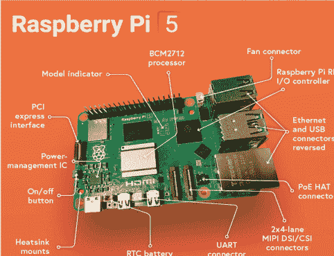

图1.1 树莓派5

树莓派5会变得相当热，建议使用散热器来降低CPU温度。尽管空闲时CPU温度约为50°C，但在压力测试下可能超过85°C。树莓派5有售的主动散热器。电路板上提供了安装主动散热器的孔和电源点。图1.2展示了安装了主动散热器的树莓派5。主动散热器为SoC、RAM和南桥芯片降温。当CPU空闲时，主动散热器将CPU温度保持在40°C左右。当CPU温度刚刚超过50°C时，散热器的风扇会自动启动。

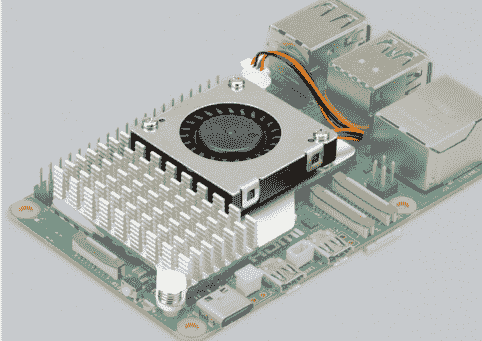

图1.2 安装了主动散热器的树莓派5

树莓派5操作系统（OS）基于代号为**Bookworm**的Debian 12。该操作系统于2023年7月发布，附带了一个新的Python解释器（Python 3.11）。这意味着无法使用**pip**命令安装Python包。

另一个重大的软件变更是，RPi.GPIO库（由Ben Croston创建）在撰写本书时并未发布。因此，书中所有基于GPIO的Python程序均使用**gpiozero**库开发。大多数第三方HAT都基于RPi.GPIO，在制造商更新其软件之前将无法工作。希望在Raspberry Pi 5正式广泛上市时，制造商会更新他们的软件。

# 第2章 • 安装Raspberry Pi 5操作系统

## 2.1 概述

Raspberry Pi 5操作系统**Bookworm**可预装在microSD卡上提供，或者你可以将操作系统镜像下载到空白microSD卡上。在本章中，你将学习使用这两种方法安装操作系统。

## 2.2 使用预装SD卡

预装的Raspberry Pi操作系统有多种容量的microSD卡可供选择。在本节中，作者使用了Elektor提供的预装32 GB microSD卡。此外，作者还使用了一台7英寸HDMI兼容显示器、一个Raspberry Pi官方键盘和一个鼠标。作者在Raspberry Pi 5与各种设备之间的硬件设置如图2.1所示。

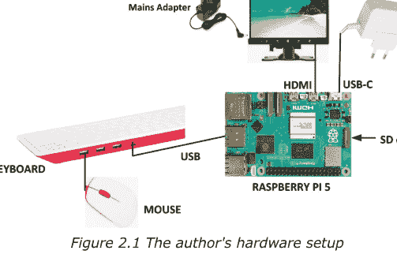

步骤如下：

- 将预装的microSD卡插入你的Raspberry Pi 5
- 按照图2.1连接所有设备
- 将Raspberry Pi电源适配器连接到市电
- 你应该会看到Raspberry Pi首次启动，并询问你各种问题以设置设备，例如用户名、密码、Wi-Fi网络名称和密码、任何必要的更新等（参见图2.2中显示器上的一些显示）。在本书中，用户名设置为**pi**。
- Raspberry Pi将以桌面模式启动并显示默认屏幕。你可以随时按Ctrl+Alt+F1切换到控制台模式

Raspberry Pi 5 Essentials

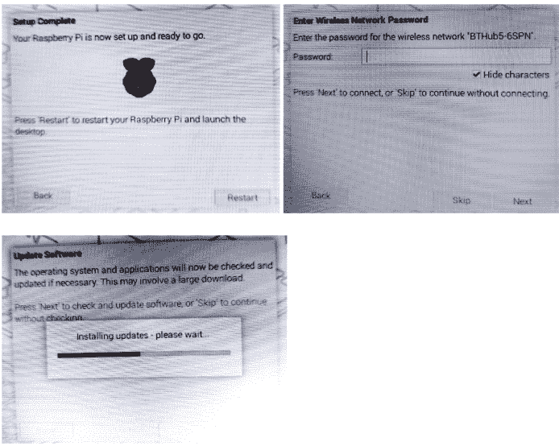

## 2.3 在控制台模式下增大字体

在7英寸显示器的控制台模式下，字符可能难以看清。你可以按照以下步骤增大字体大小：

- 确保你处于控制台模式
- 输入以下命令：

    pi@raspberrypi: ~ $ sudo dpkg-reconfigure console-setup

- 在**软件包配置**屏幕（图2.3）中选择**UTF-8**

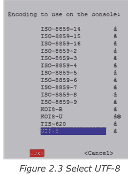

图2.3 选择UTF-8

- 选择**猜测最优字符集**（图2.4）

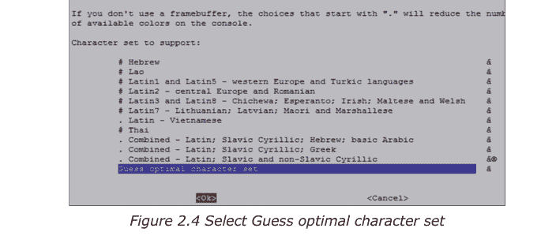

图2.4 选择猜测最优字符集

- 选择**Terminus**（图2.5）

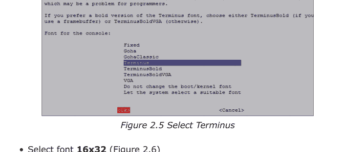

图2.5 选择Terminus

- 选择字体**16x32**（图2.6）

Raspberry Pi 5 Essentials

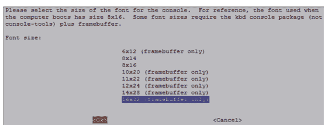

图2.6 选择字体16x32

## 2.4 从你的PC访问Raspberry Pi 5控制台 – Putty程序

在许多应用中，你可能希望从你的PC访问你的Raspberry Pi 5。这需要在你的Raspberry Pi上启用SSH，然后在你的PC上使用终端仿真软件。启用SSH的步骤如下：

- 确保你处于控制台模式
- 输入：**sudo raspi-config**
- 向下移动到**接口选项**
- 高亮显示**SSH**并按回车键（图2.7）

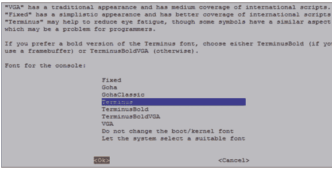

图2.7 高亮显示SSH

- 点击**是**以启用SSH
- 点击**确定**
- 向下移动并点击**完成**

现在你需要在你的PC上安装一个终端仿真软件。作者使用的是流行的Putty。从以下网站下载Putty：

https://www.putty.org

- Putty是一个独立程序，无需安装。只需双击即可运行。你应该会看到如图2.8所示的Putty启动屏幕。

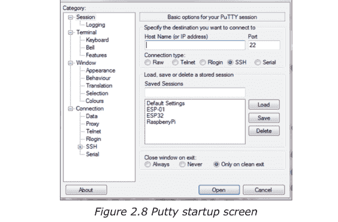

- 确保连接类型为SSH，并输入你的Raspberry Pi 5的IP地址。你可以通过在控制台模式下输入命令**ifconfig**来获取IP地址（图2.9）。在此示例中，IP地址为：**192.168.1.251**（参见**wlan0:**下方）

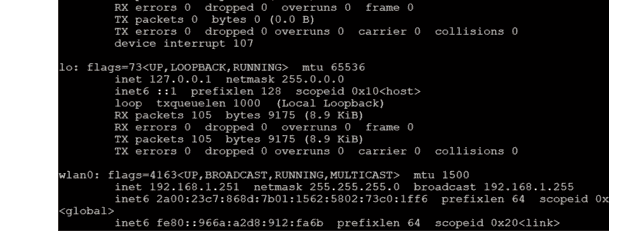

- 在Putty中输入IP地址并选择**SSH**后，点击**打开**

- 首次运行Putty时，你可能会收到一条安全消息。点击**是**以接受此安全警报。

- 然后系统会提示你输入Raspberry Pi 5的用户名和密码。现在你可以通过你的PC输入所有基于控制台的命令。

- 要更改密码，请输入以下命令：

    pi@raspberrypi: ~ $ **passwd**

- 要重启Raspberry Pi，请输入以下命令：

    pi@raspberrypi: ~ $ **sudo reboot**

- 要关闭Raspberry Pi，请输入以下命令。切勿通过拔掉电源线来关机，因为这可能导致文件损坏或丢失：

    pi@raspberrypi: ~ $ **sudo shutdown -h now**

### 2.4.1 配置Putty

默认情况下，**Putty**屏幕背景为黑色，字符为白色。作者更喜欢白色背景、黑色字符，并将字符大小设置为12号粗体。你应该保存你的设置，以便下次使用Putty时可用。使用这些设置配置Putty的步骤如下：

- 重启Putty
- 选择**SSH**并输入Raspberry Pi的IP地址
- 在**窗口**下点击**颜色**
- 将**默认前景**和**默认粗体前景**颜色设置为黑色（红:0，绿:0，蓝:0）
- 将**默认背景**和**默认粗体背景**设置为白色（红:255，绿:255，蓝:255）
- 将**光标文本**和**光标颜色**设置为黑色（红:0，绿:0，蓝:0）
- 在**窗口**下选择**外观**，并在**字体设置**中点击**更改**。将字体设置为**粗体 12**。
- 选择**会话**，为会话命名（例如MyZero）并点击**保存**。
- 点击**打开**以使用保存的配置打开**Putty**会话
- 下次重启**Putty**时，选择保存的会话，点击**加载**，然后点击**打开**以使用保存的配置启动会话

## 2.5 从你的PC访问桌面GUI

如果你使用本地键盘、鼠标和显示器来使用你的Raspberry Pi 5，可以跳过本节。另一方面，如果你想通过网络远程访问你的桌面，你会发现SSH服务无法使用。从计算机远程访问桌面最简单、最直接的方法是使用VNC（虚拟网络连接）客户端和服务器。VNC服务器在你的Pi上运行，VNC客户端在你的计算机上运行。建议在你的Raspberry Pi 5上使用**tightvncserver**。步骤如下：

- 输入以下命令：

    pi@raspberrypi:~ $ sudo apt-get install tightvncserver

- 运行**tightvncserver**：

    pi@raspberrypi:~ $ tightvncserver

    系统会提示你创建一个用于远程访问Raspberry Pi桌面的密码。你还可以设置一个可选的只读密码。每次访问桌面时都需要输入密码。输入密码并记住你的密码。

- 重启后通过以下命令启动VNC服务器：

    pi@raspberrypi:~ $ vncserver :1

    你可以选择指定屏幕像素大小和颜色深度（以位为单位），如下所示：

    pi@raspberrypi:~ $ vncserver :1 -geometry 1920x1080 -depth 24

- 我们现在必须在我们的笔记本电脑（或台式机）PC上设置一个VNC查看器。有许多可用的VNC客户端，但推荐使用与**TightVNC**兼容的**TightVNC** for PC，可以从以下链接下载：

    [https://www.tightvnc.com/download.php](https://www.tightvnc.com/download.php)

- 下载并安装适用于你的PC的**TightVNC**软件。在安装过程中，你需要选择一个密码。

- 在你的PC上启动**TightVNC Viewer**，输入Raspberry Pi的IP地址，后跟':1'。点击**连接**以连接到你的Raspberry Pi（图2.10）

## 2.6 为你的树莓派5分配静态IP地址

当你尝试通过本地网络远程访问树莓派5时，Wi-Fi路由器分配的IP地址可能会不时变化。这很烦人，因为你必须找出分配给树莓派的新IP地址。不知道IP地址，你就无法使用SSH或VNC登录。

在本节中，你将学习如何固定IP地址，使其在重启后不会改变。步骤如下：

- 通过Putty登录你的树莓派5
- 检查你的树莓派上DHCP是否激活（通常应该是激活的）：

```
pi@raspberrypi:~ $ sudo service dhcpcd status
```

如果DHCP未激活，请输入以下命令激活它：

```
pi@raspberrypi:~ $ sudo service dhcpcd start
pi@raspberrypi:~ $ sudo systemctl enable dhcpcd
```

- 输入命令 **ifconfig** 或 **hostname – I** 查找当前分配给你的IP地址（图2.12）。在本例中，IP地址为：192.168.1.251。我们可以将此IP地址用作固定地址，因为网络上目前没有其他设备使用它。

- 输入命令 **ip r** 查找路由器的IP地址（图2.13）。在本例中，IP地址为：192.168.1.254

- 输入以下命令查找DNS的IP地址（图2.14）。这通常与路由器地址相同：

```
pi@raspberrypi:~ $ grep "nameserver" /etc/resolv.conf
```

- 输入以下命令编辑文件 **/etc/dhcpcd.conf**：

```
pi@raspberrypi:~ $ nano /etc/dhcpcd.conf
```

- 在文件底部添加以下行（你的路由器地址会有所不同）。如果这些行已存在，请删除行首的注释字符'#'，并按如下方式修改行（你可能会注意到列出了以太网的 **eth0**）：

```
interface wlan0
static_routers=192.168.1.254
static domain_name_servers=192.168.1.254
static ip_address=192.168.1.251/24
```

- 输入 **CTRL + X**，然后输入 **Y** 保存文件，并重启你的树莓派
- 在本例中，树莓派应使用静态IP地址重启：192.168.1.251

## 2.7 启用蓝牙

在本节中，你将了解如何在树莓派5上启用蓝牙，以便它可以与其他蓝牙设备通信。步骤如下：

- 在你的其他设备上启用蓝牙
- 点击树莓派5右上角的蓝牙图标，选择 **Make Discoverable**。你应该会看到蓝牙图标闪烁
- 在你的其他设备的蓝牙菜单中选择 'raspberrypi'
- 在你的树莓派5上接受配对请求
- 你现在应该在树莓派5上看到 **Connected Successfully** 的消息，并且可以在你的其他设备和树莓派计算机之间交换文件。

## 2.8 将树莓派5连接到有线网络

你可能想通过以太网线将树莓派5连接到网络。步骤如下：

**步骤1：** 在你的树莓派5和Wi-Fi路由器之间连接一根网线。

**步骤2：** 将键盘、鼠标和显示器连接到你的树莓派，并正常开机

**步骤3：** 输入你的用户名和密码登录系统

**步骤4：** 如果你的网络集线器支持DHCP（几乎所有网络路由器都支持DHCP），你将自动连接到网络，并被分配一个网络内的唯一IP地址。请注意，DHCP会为新连接的设备分配IP地址。

**步骤5：** 检查网络路由器分配给你的树莓派5的IP地址。如前所述，输入命令 **ifconfig**

### 2.8.1 无法连接到有线网络

如果你发现DHCP服务器没有为你分配IP地址，可能的原因是：

- 你的网线有故障
- 网络集线器不支持DHCP
- 你的树莓派上未启用DHCP，即它可能被配置为使用固定IP地址

在大多数情况下，网线故障的可能性很小。此外，大多数网络集线器都支持DHCP协议。如果你遇到网络问题，可能是你的树莓派未配置为接受DHCP分配的地址。树莓派通常配置为接受DHCP地址，但你可能以某种方式更改了配置。

要解决有线网络连接问题，请按照以下步骤操作：

**步骤1：** 查明你的树莓派是配置为使用DHCP还是固定IP地址。输入以下命令：

```
pi@raspberrypi ~$ cat /etc/network/interfaces
```

如果你的树莓派配置为使用DHCP协议（这通常是默认配置），单词 **dhcp** 应出现在以下行的末尾：

```
iface eth0 inet dhcp
```

另一方面，如果你的树莓派配置为使用静态地址，那么你应该在以下行的末尾看到单词 **static**：

```
iface eth0 inet static
```

**步骤2：** 要使用DHCP协议，请编辑文件 **interfaces**（例如使用 **nano** 文本编辑器），并将单词 **static** 更改为 **dhcp**。建议在更改文件interfaces之前制作备份副本：

```
pi@raspberrypi ~$ sudo cp /etc/network/interfaces /etc/network/int.bac
```

你现在应该重启你的树莓派，设备可能会被分配一个IP地址。

**步骤3：** 要使用静态寻址，请确保单词 **static** 如上所示出现。如果没有，请编辑文件 **interfaces** 并将 **dhcp** 更改为 **static**

**步骤4：** 你需要编辑文件 **interfaces** 并添加所需的唯一IP地址、子网掩码和网关地址，如下例所示（此示例假设所需的固定IP地址为192.168.1.251，网络中使用的子网掩码为255.255.255.0，网关地址为192.168.1.1）：

```
iface eth0 inet static
address 192.168.1.251
netmask 255.255.255.0
gateway 192.168.1.1
```

保存更改并退出编辑器。如果你使用的是 **nano** 编辑器，请按Ctrl+X退出，然后输入Y保存更改，并输入要写入的文件名 **/etc/network/interfaces**。

重启你的树莓派5。

## 2.9 在空白microSD卡上安装树莓派5 Bookworm操作系统

如果你有一张预装了树莓派操作系统Bookworm的microSD卡，那么你可以按照本章前面的描述开始使用它。在本节中，你将学习如何在没有预装卡的情况下，在microSD卡上安装最新的Bookworm操作系统。

步骤如下：

- 将microSD卡插入你的电脑。你可能需要使用SD卡适配器
- 访问网站：https://www.raspberrypi.com/software/
- 点击下载 **Raspberry Pi Imager**。在撰写本书时，此文件名为：**imager_1.7.5.exe**
- 双击启动imager程序并点击安装
- 点击 **Finish** 运行imager
- 点击 **Operating System** 并在列表顶部选择操作系统：**Raspberry Pi OS (64-bit)**。参见图2.15

# 第2章 • 安装树莓派5操作系统

- 点击 **Storage** 并选择SD卡存储
- 点击打开设置（齿轮形状）
- 点击启用SSH
- 点击启用密码认证
- 设置用户名和密码
- 点击 **Configure wireless LAN**
- 点击 **Save**
- 点击 **Write** 将操作系统写入microSD卡
- 等待写入和验证完成（图2.16）

- 取出microSD卡并插入你的树莓派5

## 树莓派 5 基础

如果你有显示器和键盘，你可以直接登录你的树莓派 5 并开始使用它。否则，请找到你的树莓派 5 的 IP 地址（例如从你的路由器获取，或者使用许多智能手机应用程序，如 **who's on my wifi**，它可以显示所有连接到你路由器的设备及其 IP 地址）。然后登录你的树莓派 5 并开始使用它。

# 第 3 章 • 使用控制台命令

### 3.1 概述

树莓派基于 Linux 操作系统的一个版本。Linux 是当今最流行的操作系统之一。Linux 与其他操作系统（如 Windows 和 UNIX）非常相似。Linux 是一个基于 UNIX 的开放操作系统，自 1991 年以来由许多公司共同开发。总的来说，Linux 比某些其他操作系统（如 Windows）更难管理，但提供了更多的灵活性和配置选项。Linux 操作系统有几个流行的版本，例如 Debian、Ubuntu、Red Hat、Fedora 等。

Linux 命令是基于文本的。在本章中，你将了解一些有用的 Linux 命令，并看看如何使用这些命令来管理你的树莓派。

当你给树莓派 5 通电时，Linux 命令行（或 Linux shell，或控制台命令）是你看到的第一样东西，你可以在那里输入操作系统命令。

### 3.2 命令提示符

假设你的用户名是 **pi**，在你登录树莓派 5 后，你将看到以下提示符，系统在此等待你输入命令：

```
pi@raspberrypi: ~$
```

这里，**pi** 是已登录用户的名称。**raspberrypi** 是计算机的名称，用于在网络连接时标识它。

~ 字符表示你当前位于默认目录中。

### 3.3 有用的控制台命令

在本节中，你将学习一些有用的控制台命令，并将为每个命令提供示例。**在本章中，为清晰起见，用户输入的命令以粗体显示。** 同样，重要的是提醒你，所有命令都必须以 Enter 键结束。

#### 3.3.1 系统和用户信息

这些命令很有用，因为它们告诉你有关系统的信息。命令 **cat /proc/cpuinfo** 显示有关处理器的信息（命令 **cat** 显示文件的内容。在此示例中，显示了文件 **/proc/cpuinfo** 的内容）。由于树莓派 5 中有四个核心，因此显示分为四个部分。图 3.1 显示了一个示例显示，此处仅显示了部分显示内容。

```
pi@raspberrypi:~ $ cat /proc/cpuinfo
processor	: 0
BogoMIPS	: 108.00
Features	: fp asimd evtstrm aes pmull sha1 sha2 crc32 atomics fphp p cpuid asimd drd lrcpc dcpop asimdhp
CPU implementer	: 0x41
CPU architecture: 8
CPU variant	: 0x4
CPU part	: 0xd0b
CPU revision	: 1

processor	: 1
BogoMIPS	: 108.00
Features	: fp asimd evtstrm aes pmull sha1 sha2 crc32 atomics fphp p cpuid asimd drd lrcpc dcpop asimdhp
CPU implementer	: 0x41
CPU architecture: 8
CPU variant	: 0x4
CPU part	: 0xd0b
CPU revision	: 1

processor	: 2
BogoMIPS	: 108.00
```

图 3.1 命令：cat /proc/cpuinfo

命令 **uname -s** 显示操作系统内核名称，即 Linux。命令 **uname -a** 显示有关内核和操作系统的完整详细信息。图 3.2 显示了一个示例。

```
pi@raspberrypi:~ $ uname -a
Linux raspberrypi 6.1.0-rpi4-rpi-2712 #1 SMP PREEMPT Debian 1:6.1.54-1+rpt1 3-09-27) aarch64 GNU/Linux
pi@raspberrypi:~ $ █
```

图 3.2 命令：uname -a

命令 **cat /proc/meminfo** 显示有关树莓派内存的信息。显示诸如命令发出时的总内存和可用内存等信息。图 3.3 显示了一个示例，此处仅显示了部分显示内容。

```
pi@raspberrypi:~ $ cat /proc/meminfo
MemTotal:       8246848 kB
MemFree:        7792320 kB
MemAvailable:   7993952 kB
Buffers:          21552 kB
Cached:          246240 kB
SwapCached:            0 kB
Active:          280096 kB
Inactive:         64848 kB
Active(anon):     77008 kB
Inactive(anon):     4112 kB
Active(file):    203088 kB
Inactive(file):   60736 kB
Unevictable:           0 kB
Mlocked:               0 kB
SwapTotal:       102368 kB
SwapFree:        102368 kB
Zswap:                 0 kB
Zswapped:              0 kB
Dirty:                 0 kB
Writeback:             0 kB
AnonPages:        77232 kB
Mapped:           70880 kB
```

图 3.3 命令：cat /proc/meminfo

命令 **whoami** 显示当前用户的名称。在这种情况下，显示 **pi** 作为当前用户。

可以使用命令 **useradd** 将新用户添加到你的树莓派 5。在图 3.5 的示例中，添加了一个名为 **John** 的用户。可以使用 **passwd** 命令后跟用户名来为新用户添加密码。在图 3.4 中，用户 John 的密码被设置为 **mypassword**（出于安全原因未显示）。请注意，**useradd** 和 **passwd** 都是特权命令，必须在这些命令之前输入关键字 **sudo**。请注意，**-m** 选项为新用户创建一个主目录。

```
pi@raspberrypi:~ $ sudo useradd -m John
pi@raspberrypi:~ $ sudo passwd John
New password:
Retype new password:
passwd: password updated successfully
pi@raspberrypi:~ $ █
```

*图 3.4 命令：useradd 和 passwd*

你可以通过指定用户名和密码来登录新用户帐户，如图 3.5 所示。你可以输入命令 **exit** 从新帐户注销。

```
pi@raspberrypi:~ $ su John
Password:
John@raspberrypi:/home/pi $ exit
exit
pi@raspberrypi:~ $ █
```

*图 3.5 登录新帐户*

命令 **sudo apt-get upgrade** 用于升级系统上的所有软件包。

#### 3.3.2 树莓派 5 目录结构

树莓派 5 目录结构由一个根目录组成，根目录下有目录和子目录。不同类型的操作系统程序和应用程序存储在不同的目录和子目录中。

图 3.6 显示了树莓派 5 目录结构的一部分。请注意，根目录由 '/' 符号标识。在根目录下，我们有名为 bin、boot、dev、etc、home、lib、lost+found、media、mnt、opt、proc 等目录。就用户而言，重要的目录是 **home** 目录。**home** 目录包含系统每个用户的子目录。在图 3.7 的示例中，**pi** 是用户 **pi** 的子目录。在新系统中，此子目录包含两个名为 **Desktop** 和 **python_games** 的子目录。

下面给出了一些有用的目录命令。命令 **pwd** 显示用户主目录：

```
pi@raspberrypi: ~$ pwd
/home/pi
pi@raspberrypi: ~$
```

要显示目录结构，请输入命令 **ls /**（图 3.7）：

要显示工作目录中的子目录和文件，请输入 **ls**：

```
pi@raspberrypi: ~$ ls
Bookshelf Documents Music Public Videos
Desktop Downloads Pictures Templates
pi@raspberrypi: ~$
```

请注意，子目录以蓝色显示，文件以黑色显示。

**ls** 命令可以接受多个参数。下面给出了一些示例。
要在单行中显示子目录和文件：

```
pi@raspberrypi: ~$ ls -1
Bookshelf
Desktop
Documents
Downloads
Music
Pictures
Public
Templates
Videos
pi@raspberrypi: ~$
```

要显示文件类型，请输入以下命令。请注意，目录名称后有一个 '/'，可执行文件名称后有一个 '*' 字符：

```
pi@raspberrypi: ~$ ls -F
Bookshelf/ Documents/ Music/ Public/ Videos/
Desktop/ Downloads/ Pictures/ Templates/
pi@raspberrypi: ~$
```

要列出结果，用逗号分隔：

```
pi@raspberrypi: ~$ ls -m
Bookshelf, Desktop, Documents, Downloads, Music, Pictures, Public, Templates, Videos
pi@raspberrypi: ~$
```

你可以混合使用参数，如图 3.8 所示。

```
pi@raspberrypi:~ $ ls -m -F
Bookshelf/, Desktop/, Documents/, Downloads/, Music/, Pictures/, Public/,
Templates/, Videos/
pi@raspberrypi:~ $
```

图 3.8 混合使用参数

使用命令 **mkdir** 后跟子目录名称来创建子目录（图 3.9）

```
pi@raspberrypi:~ $ mkdir myfiles
pi@raspberrypi:~ $ ls
Bookshelf Documents Music Pictures Templates
Desktop Downloads myfiles Public Videos
pi@raspberrypi:~ $
```

图 3.9 创建子目录

命令 **find** 用于在整个系统中搜索文件，并输出包含该文件的所有目录列表。例如，命令 **find / -name myfile.txt** 在整个系统中搜索文件 **myfile.txt**。

#### 文件权限

与 **ls** 命令一起使用的一个重要参数是 **-l**（小写字母 l），它显示文件权限、文件大小以及最后修改时间。在下面的示例中，每一行对应一个目录或文件。从右向左读取，名称是目录或文件位于右侧。目录或文件的创建日期位于其名称的左侧。接下来是大小，以字节为单位。每行开头的字符是关于权限的，即谁被允许使用或修改该文件或目录。

权限分为3类：

- 用户（或所有者、创建者）可以做什么——称为 USER
- 组所有者（同一组中的人员）可以做什么——称为 GROUP
- 其他所有人可以做什么——称为 WORLD

图3.10示例中的第一个单词 **pi** 显示了文件（或目录）的用户是谁，第二个单词 **pi** 显示了拥有该文件的组名。在此示例中，用户和组名都是 **pi**。

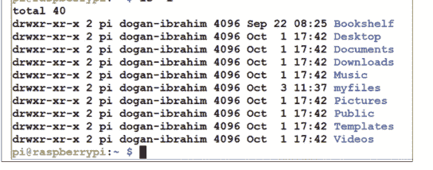

权限可以通过将字符分解为四个部分来分析：文件类型、用户、组、其他。文件的第一个字符是 '-'，目录的第一个字符是 'd'。接下来是用户、组和其他的权限。权限如下：

- 读权限 (r)：打开和读取文件或列出目录的权限
- 写权限 (w)：修改文件，或在目录中删除或创建文件的权限
- 执行权限 (x)：执行文件的权限（适用于可执行文件），或进入目录的权限

三个字母 **rwx** 作为一个组使用，如果没有分配权限，则使用 '-' 字符。

例如，考虑 **Music** 目录，我们有以下权限代码：

```
drwxr-xr-x which translates to:
d:          it is a directory
rwx:        user (owner) can read, write, and execute
r-x:        group can read and execute, but cannot write (e.g. create or delete)
r-x:        world (everyone else) can read and execute, but cannot write
```

**chmod** 命令用于更改文件权限。在详细介绍如何更改权限之前，让我们看看 **chmod** 中有哪些可用于更改文件权限的参数。

用于更改文件权限的可用参数如下。我们可以使用这些参数来添加/删除权限或显式设置权限。重要的是要认识到，如果我们显式设置权限，那么命令中任何未指定的权限都将被撤销：

- u：用户（或所有者）
- g：组
- o：其他（world）
- a：所有

- +：添加
- -：移除
- =：设置

- r：读
- w：写
- x：执行

要更改文件的权限，我们输入 **chmod** 命令，后跟字母 'u'、'g'、'o' 或 'a' 之一来选择人员，后跟 '+'、'-' 或 '=' 来选择更改类型，最后后跟文件名。在此示例中，为了演示目的，在主目录中创建了一个名为 **mytestfile.txt** 的文件（见图3.11）。在此示例中，文件 **mytestfile.txt** 具有用户读写权限。

```
pi@raspberrypi:~ $ ls -l
total 44
drwxr-xr-x 2 pi dogan-ibrahim 4096 Sep 22 08:25 Bookshelf
drwxr-xr-x 2 pi dogan-ibrahim 4096 Oct  1 17:42 Desktop
drwxr-xr-x 2 pi dogan-ibrahim 4096 Oct  1 17:42 Documents
drwxr-xr-x 2 pi dogan-ibrahim 4096 Oct  1 17:42 Downloads
drwxr-xr-x 2 pi dogan-ibrahim 4096 Oct  1 17:42 Music
drwxr-xr-x 2 pi dogan-ibrahim 4096 Oct  3 11:37 myfiles
-rw-r--r-- 1 pi dogan-ibrahim   15 Oct  3 11:46 mytestfile.txt
drwxr-xr-x 2 pi dogan-ibrahim 4096 Oct  1 17:42 Pictures
drwxr-xr-x 2 pi dogan-ibrahim 4096 Oct  1 17:42 Public
drwxr-xr-x 2 pi dogan-ibrahim 4096 Oct  1 17:42 Templates
drwxr-xr-x 2 pi dogan-ibrahim 4096 Oct  1 17:42 Videos
pi@raspberrypi:~ $
```

图3.11 文件权限

我们将更改权限，使用户对此文件没有读权限：

```
pi@raspberrypi: ~$ chmod u-r mytestfile.txt
pi@raspberrypi: ~$ ls -lh
```

结果如图3.12所示。

#### Raspberry Pi 5 Essentials

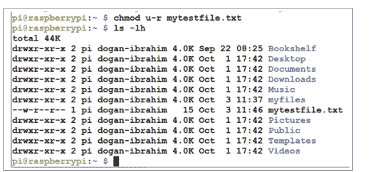

请注意，如果您现在尝试使用 **cat** 命令显示文件 **mytestfile.txt** 的内容，您将收到错误消息：

```
pi@raspberrypi: ~$ cat mytestfile.txt
cat: mytestfile.txt: Permission denied
pi@raspberrypi: ~$
```

可以使用以下命令从文件中移除所有权限：

```
pi@raspberrypi: ~$ chmod a= mytestfile.txt
```

在以下示例中，文件 **mytestfile.txt** 被赋予了 **rwx** 用户权限：

```
pi@raspberrypi: ~$ chmod u+rwx mytestfile.txt
```

图3.13显示了文件 mytestfile.txt 的新权限。

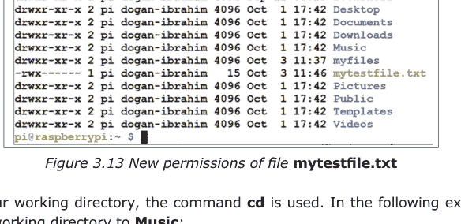

要更改我们的工作目录，使用命令 **cd**。在以下示例中，我们将工作目录更改为 **Music**：

```
pi@raspberrypi: ~$ cd /home/pi/Music
pi@raspberrypi: ~/Music $
```

要向上一级目录，即返回到我们的默认工作目录：

```
pi@raspberrypi: ~/Music $ cd..
pi@raspberrypi: ~$
```

要将您的工作目录更改为 **Music**，您也可以输入命令：

```
pi@raspberrypi: ~$ cd ~/Music
pi@raspberrypi: ~/myfiles $
```

要返回到默认工作目录，您可以输入：

```
pi@raspberrypi: ~/Music $ cd ~
pi@raspberrypi: ~$
```

要查找有关文件的更多信息，您可以使用 **file** 命令。例如：

```
pi@raspberrypi: ~$ file mytestfile.txt
mytestfile.txt: ASCII text
pi@raspberrypi: ~$
```

命令 **ls** 的 **-R** 参数列出当前工作目录所有子目录中的所有文件。下面给出一个示例（仅显示部分内容）。请注意，图3.14中的子目录 **Bookshelf** 包含文件 **BeginnersGuide-4thEd-Eng_v2.pdf**

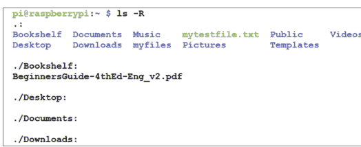

要显示有关如何使用命令的信息，您可以使用 **man** 命令。例如，要获取有关使用 **mkdir** 命令的帮助：

```
pi@raspberrypi: ~$ man mkdir
MKDIR(1)

NAME
       Mkdir - make directories

SYNOPSIS
       Mkdir [OPTION]...DIRECTORY...

DESCRIPTION
    Create the DIRECTORY(ies), if they do not already exist.

    Mandatory arguments for long options are mandatory for short options

    -m, --mode=MODE
        Set file mode (as in chmod), not a=rwx - umask

-----------------------------------------------------------------------
-----------------------------------------------------------------------
```

输入 **q** 退出 man 显示。

#### Help

**man** 命令通常提供有关如何使用命令的多页信息。您可以输入 **q** 退出 **man** 命令并返回到操作系统提示符。

**less** 命令可用于一次一页地显示长列表。使用向上和向下箭头键，我们可以在页面之间移动。下面给出一个示例。输入 **q** 退出：

```
pi@raspberrypi: ~$ man ls | less
<display of help on using the ls command>
pi@raspberrypi: ~$
```

#### Date and Time

要显示当前日期和时间，使用 **date** 命令。

#### Copying a File

要制作文件的副本，请使用命令 **cp**。在以下示例中，制作了文件 **mytestfile.txt** 的副本，并将新文件命名为 **test.txt**：

```
pi@raspberrypi: ~$ cp mytestfile.txt test.txt
pi@raspberrypi: ~$
```

#### Wildcards

您可以使用通配符来选择具有相似特征的多个文件。例如，具有相同文件扩展名的文件。* 字符用于匹配任意数量的字符。类似地，? 字符用于匹配任何单个字符。在下面的示例中，列出了所有扩展名为 **.txt** 的文件：

```
pi@raspberrypi: ~$ ls *.txt
mytestfile.txt  test.txt
pi@raspberrypi: ~$
```

通配符 [a-z] 可用于匹配指定字符范围内的任何单个字符。下面给出一个示例，匹配任何以字母 'o'、'p'、'q'、'r'、's' 和 't' 开头，并具有 .txt 扩展名的文件：

```
pi@raspberrypi: ~$ ls [o-t]*.txt
test.txt
pi@raspberrypi: ~$
```

#### Renaming a File

您可以使用 mv 命令重命名文件。在下面的示例中，文件 test.txt 的名称更改为 test2.txt：

```
pi@raspberrypi: ~$ mv test.txt test2.txt
pi@raspberrypi: ~$
```

#### Deleting a File

命令 rm 可用于移除（删除）文件。在下面的示例中，文件 test2.txt 被删除：

```
pi@raspberrypi: ~$ rm test2.txt
pi@raspberrypi: ~$
```

参数 -v 可用于在移除文件时显示消息。此外，-i 参数在移除文件前要求确认。通常，这两个参数一起使用为 -vi。下面给出一个示例：

```
pi@raspberrypi: ~$ rm -vi test2.txt
rm: remove regular file 'test2.txt'? y
removed 'test2.txt'
pi@raspberrypi: ~$
```

#### Sorting a file

命令 sort 以升序显示文件的内容。此命令的一般格式为：

```
sort <options> <filename>
```

有效选项为：

| 选项 | 描述 |
| :--- | :--- |
| -u | 从输出中移除重复项 |
| -r | 以降序对输出进行排序 |
| -o | 将排序后的输出写入文件 |

#### Word count

命令 wc <filename> 显示文件中的字数

#### 文件差异

命令 **diff** <file1> <file2> 逐行显示两个文件之间的差异。

#### 删除目录

可以使用 **rmdir** 命令删除目录：

```
pi@raspberrypi: ~$ **rmdir Music**
pi@raspberrypi: ~$
```

#### 重定向输出

大于号 `>` 可用于将命令的输出重定向到文件。例如，我们可以将 **ls** 命令的输出重定向到名为 **lstest.txt** 的文件：

```
pi@raspberrypi: ~$ **ls > lstest.txt**
pi@raspberrypi: ~$
```

**cat** 命令可用于显示文件的内容：

```
pi@raspberrypi: ~$ **cat mytestfile.txt**
This is a file
This is line 2
pi@raspberrypi: ~$
```

使用两个大于号 `>>` 会将内容追加到文件末尾。

#### 写入屏幕或文件

**echo** 命令可用于写入屏幕。如果数字和运算符包含在两个括号内，并以 `$` 字符开头，它可用于执行简单的数学运算：

```
pi@raspberrypi: ~$ **echo $((5*6))**
30
pi@raspberrypi: ~$
```

echo 命令也可用于将一行文本写入文件。示例如下：

```
pi@raspberrypi: ~$ **echo a line of text > lin.dat**
pi@raspberrypi: ~$ **cat lin.dat**
a line of text
pi@raspberrypi: ~$
```

#### 匹配字符串

grep 命令可用于在文件中匹配字符串。下面给出一个示例，假设文件 lin.dat 包含字符串 "a line of text"。请注意，匹配的单词以粗体显示：

```
pi@raspberrypi: ~$ grep line lin.dat
a line of text
pi@raspberrypi: ~$
```

#### Head 和 Tail 命令

head 命令可用于显示文件的前 10 行。此命令的格式如下：

```
pi@raspberrypi: ~$ head mytestfile.txt
........................................
........................................
pi@raspberrypi: ~$
```

类似地，tail 命令用于显示文件的最后 10 行。此命令的格式如下：

```
pi@raspberrypi: ~$ tail mytestfile.txt
........................................
........................................
pi@raspberrypi: ~$
```

**which** 命令显示可执行程序的位置。例如，可以按如下方式查找 python 程序的位置：

```
pi@raspberrypi: ~$ which python
/usr/bin/python
pi@raspberrypi: ~$
```

#### 超级用户命令

某些命令是特权命令，只有授权人员才能使用。在命令开头插入 **sudo** 一词，即可获得使用该命令的权限，而无需以授权用户身份登录。

#### 我的树莓派 5 上安装了什么软件

要查明您的树莓派 5 上安装了哪些软件，请输入以下命令。您应该会看到几页的显示内容：

```
pi@raspberrypi: ~$ dpkg -l
........................................
........................................
pi@raspberrypi: ~$
```

您还可以查明某个特定软件包是否已安装在我们的计算机上。下面给出一个示例，检查名为 **xpdf**（PDF 阅读器）的软件是否已安装。在此示例中，**xpdf** 已安装，并显示了该软件的详细信息：

Raspberry Pi 5 Essentials

```
pi@raspberrypi: ~$ dpkg --s xpdf
Package: xpdf
Status: install ok installed
Priority: optional
Section: text
Installed-Size: 395
........................................
........................................
pi@raspberrypi: ~$
```

如果软件未安装，您将收到类似以下的消息（假设我们正在检查名为 bbgd 的软件包是否已安装）：

```
pi@raspberrypi: ~$ dpkg -s bbgd
dpkg-query: package 'bbgd' is not installed and no information is available
........................................
........................................
pi@raspberrypi: ~$
```

#### 3.3.3 树莓派 5 上的资源监控

系统监控是管理树莓派使用情况的重要主题。最有用的系统监控命令之一是 `top`，它显示系统资源的当前使用情况，并显示哪些进程正在运行以及它们消耗了多少内存和 CPU 时间。
图 3.15 显示了通过输入以下命令获得的典型系统资源显示（仅显示了部分内容，按 `q` 退出）：

```
pi@raspberrypi: ~$ top
pi@raspberrypi: ~$
```

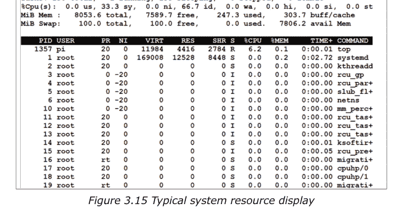

图 3.15 中的一些要点总结如下（针对显示的第 1 至 5 行）：

- 系统中总共有 138 个进程
- 当前，只有一个进程正在运行，1 个进程处于睡眠状态，0 个进程已停止
- 用户应用程序 (us) 的 CPU 利用率百分比为 0.0
- 系统应用程序的 CPU 利用率百分比为 0.0 (sy)
- 没有需要更高或更低优先级的进程 (ni)
- CPU 100% 的时间处于空闲状态 (id)
- 没有进程等待 I/O 完成 (wa)
- 没有进程等待硬件中断 (hi)
- 没有进程等待软件中断 (si)
- 没有为虚拟机监控程序保留的时间 (st)
- 总可用内存为 8053 字节，其中 247 字节正在使用，7589 字节空闲，303 字节被缓冲区/缓存使用
- 第 5 行显示交换空间使用情况

进程表给出了加载到系统中的所有进程的以下信息：

- PID：进程 ID 号
- USER：进程所有者
- PR：进程优先级
- NI：进程的 nice 值
- VIRT：进程使用的虚拟内存量
- RES：驻留内存的大小
- SHR：进程正在使用的共享内存
- S：进程状态（睡眠、运行、僵尸）
- %CPU：消耗的 CPU 百分比
- %MEM：使用的 RAM 百分比
- TIME+：任务使用的总 CPU 时间
- COMMAND：命令的实际名称

命令 **htop** 与 **top** 命令类似，只是它具有更多功能且更用户友好。

**ps** 命令可用于列出当前用户使用的所有进程。示例如图 3.16 所示。

```
pi@raspberrypi:~ $ ps
  PID TTY          TIME CMD
  971 pts/0    00:00:00 bash
 1372 pts/0    00:00:00 ps
pi@raspberrypi:~ $
```

图 3.16 命令：**ps**

命令 **ps –ef** 提供了有关系统中运行进程的更多信息。

#### 终止进程

终止（或停止）进程有许多选项。可以通过指定其 PID 并使用以下命令来终止进程：

```
pi@raspberrypi:~$ kill -9 <PID>
```

#### 磁盘（microSD 卡）使用情况

磁盘空闲命令 `df` 可用于显示磁盘使用统计信息。示例如图 3.17 所示。选项 `-h` 以人类可读的形式显示。

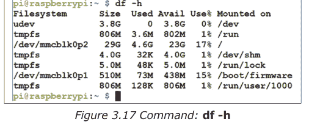

命令 `free` 显示已使用多少内存以及可用内存量。

#### 3.3.4 关机

虽然您可以在完成树莓派 5 的工作后断开电源，但不建议这样做，因为系统上运行着许多进程，可能会损坏文件系统。最好以有序的方式关闭系统。

以下命令将停止所有进程并确保文件系统安全，然后安全地关闭系统：

```
pi@raspberrypi:~$ sudo halt
```

以下命令停止然后重新启动系统：

```
pi@raspberrypi:~$ sudo reboot
```

也可以通过输入以下命令来关闭系统并在一段时间后重新启动。如果需要，可以选择显示关机消息：

```
pi@raspberrypi:~$ shutdown -r <time> <message>
```

要在凌晨 1:55 关机：

```
pi@raspberrypi:~$ sudo shutdown -h 01:55:
```

输入以下命令立即关机：

```
pi@raspberrypi: ~$ sudo shutdown now
```

Broadcast message from root @raspberrypi on pts/1 (Tue 2023-10-03 12:03:00 BST)

The system will power off now!

> **注意：** 树莓派 5 的侧面包含一个电源开关。当树莓派开启时，单次按下会带来关机/注销菜单。再次按下会触发安全关机，此时树莓派处于待机状态，功耗约为 1.4 W。按下按钮将启动树莓派 5。

#### 3.3.5 网络

一些有用的网络命令是：

**ifconfig：** 检查树莓派的 IP 地址

**iwconfig：** 检查树莓派正在使用哪个网络。示例如图 3.18 所示。此处，使用的 Wi-Fi 适配器的 SSID 是 BTHub5-6SPN

```
pi@raspberrypi:~ $ iwconfig
lo        no wireless extensions.

eth0      no wireless extensions.

wlan0     IEEE 802.11  ESSID:"BTHub5-6SPN"
          Mode:Managed  Frequency:5.18 GHz  Access Point: 4C:1B:86:B5:BA:7B
          Bit Rate=433.3 Mb/s   Tx-Power=31 dBm
          Retry short limit:7   RTS thr:off   Fragment thr:off
          Power Management:on
          Link Quality=45/70  Signal level=-65 dBm
          Rx invalid nwid:0  Rx invalid crypt:0  Rx invalid frag:0
          Tx excessive retries:3  Invalid misc:0   Missed beacon:0

pi@raspberrypi:~ $
```

*图 3.18 命令 iwconfig*

**ping：** 用于测试网络设备的可用性。示例如图 3.19 所示

```
pi@raspberrypi:~ $ ping 192.168.1.251
PING 192.168.1.251 (192.168.1.251) 56(84) bytes of data.
64 bytes from 192.168.1.251: icmp_seq=1 ttl=64 time=0.033 ms
64 bytes from 192.168.1.251: icmp_seq=2 ttl=64 time=0.014 ms
64 bytes from 192.168.1.251: icmp_seq=3 ttl=64 time=0.011 ms
```

*图 3.19 命令 ping*

**wget：** 此命令用于从网络下载文件，并将文件保存在当前目录中。

**hostname – I：** 显示树莓派的 IP 地址

命令 **vcgencmd measure_temp** 显示 CPU 温度，如图 3.20 所示。

#### 3.3.6 系统信息及其他常用命令

**uname** 命令用于显示系统信息。该命令有以下选项：

| 选项 | 描述 |
| :--- | :--- |
| -a | 显示所有系统信息 |
| -s | 显示内核名称 |
| -n | 打印网络节点主机名 |
| -r | 打印内核版本号 |
| -v | 打印内核版本详细信息 |
| -m | 打印系统硬件名称 |
| -p | 打印处理器类型 |
| -i | 打印硬件平台类型 |
| -o | 打印操作系统类型 |

一些示例如图 3.21 所示。

```
pi@raspberrypi:~ $ uname -a
Linux raspberrypi 6.1.0-rpi4-rpi-2712 #1 SMP PREEMPT Debian 1:6.1.54-1+rpt1
3-09-27) aarch64 GNU/Linux
pi@raspberrypi:~ $ uname -s
Linux
pi@raspberrypi:~ $ uname -n
raspberrypi
pi@raspberrypi:~ $ uname -r
6.1.0-rpi4-rpi-2712
```

图 3.21 uname 命令

如果你执行了许多命令，并想再次使用其中一些，但又记不起命令名称，可以使用 **history** 命令。示例如图 3.22 所示。要从历史记录中执行一个命令，输入 ! 后跟命令编号。例如，要再次执行 **ls** 命令，你可以输入 **!6** 然后按回车键。

```
pi@raspberrypi:~ $ history
    1  ls
    2  sudo nano /etc/default/console-setup
    3  sudo /etc/init.d/console-setup restart
    4  sudo restart
    5  sudo reboot
    6  ls
    7  cat /etc/default/console-setup
    8  sudo dpkg-reconfigure console-setup
    9  ls
   10  ls music
```

图 3.22 history 命令

**clear** 命令也很有用，它用于清屏。

要安装一个软件包，使用命令：**sudo apt install <package_name>**

**&** 运算符允许你在后台运行任何命令，这样你就可以将终端用于其他任务。此运算符必须添加到命令的末尾。

**&&** 运算符允许你同时运行两个或多个命令。例如，command1 **&&** command2

# 第 4 章 • 桌面 GUI – 桌面应用程序

## 4.1 概述

在本章中，你将学习如何访问和使用树莓派 5 的桌面应用程序。

## 4.2 桌面 GUI 应用程序

如果你已将显示器、鼠标和键盘连接到你的树莓派 5 电脑，那么你可以通过在命令模式下输入命令 `startx` 来访问桌面 GUI。

如果你希望从台式机或笔记本电脑访问桌面 GUI 应用程序，则需要执行以下步骤：

**步骤 1：** 使用 Putty 终端模拟器，通过 SSH 服务连接到你的树莓派 5，如前面章节所述。

**步骤 2：** 在你的 SSH 窗口中输入以下命令来运行 VNC 服务器：

```
pi@raspberrypi ~ $ vncserver :1
```

**步骤 3：** 在你的电脑上运行 **VNC Viewer** 程序。输入你的树莓派 5 电脑的 IP 地址，后跟字符 :1 以表示我们使用的是端口 1（见图 4.1）。点击 **Connect** 按钮。

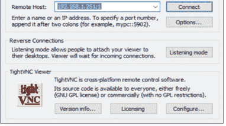

系统会要求你输入之前创建的密码。输入密码后，你将看到树莓派 5 的桌面显示（图 4.2，仅显示了屏幕的上半部分）。

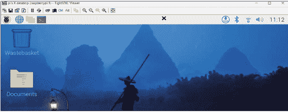

图 4.2 树莓派 5 桌面

假设你使用的是预装的 micro SD 卡，屏幕顶部有一些快捷图标。在那下面，你会看到四个菜单图标，名称如下：

- 应用程序菜单
- 网页浏览器
- 文件管理器
- 终端

在屏幕的右上角，从左到右，你有以下菜单：

- 更新
- 蓝牙
- Wi-Fi
- 音量控制
- 时间

### 4.2.1 应用程序菜单

图 4.3 显示了应用程序菜单下的项目。


图 4.3 应用程序菜单下的项目

**编程：** 此菜单项包括多种可用于为我们的树莓派 5 编程的编程语言。图 4.4 显示了编程菜单中的项目列表。


在本书中，你将在大多数 Python 程序中使用 **Thonny IDE**。有关 Thonny IDE 的详细信息将在后面的章节中给出。

**网页浏览器：** 此菜单项包括 **Chromium** 和 **Firefox** 网页浏览器。

**声音和视频：** 此菜单项包括视频程序 **VLC Media Player**。

**图形：** 此菜单项包括 **Image Viewer** 程序。

**附件：** 此菜单项包括许多有用的程序，如图 4.5 所示。例如，计算器程序可用于执行简单和科学计算（图 4.6）。

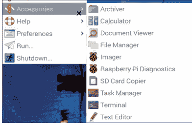

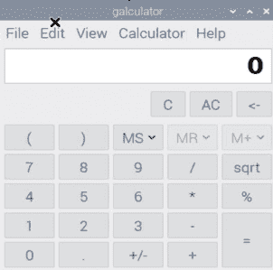

图 4.6 计算器程序

**帮助：** 此菜单提供关于各种树莓派工具的帮助。

**首选项：** 此菜单用于系统和软件设置，例如添加/删除软件、打印服务、屏幕配置等（图 4.7）。

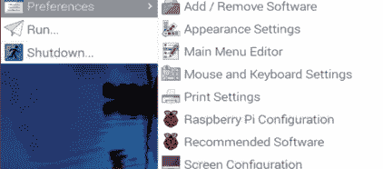

图 4.7 首选项菜单

**运行：** 此菜单用于运行程序。

**关机：** 使用此菜单选项关闭你的树莓派 5。

### 4.2.2 网页浏览器

点击此菜单选项启动网页浏览器。

### 4.2.3 文件管理器

此菜单项用于文件处理，类似于 Windows 系统上的文件资源管理器。图 4.8 显示了此菜单项下的选项。使用文件管理器，你可以创建文件、复制/粘贴文本、查看文件内容、排序文件、查找文件以及其他一些文件处理选项。

树莓派 5 精要

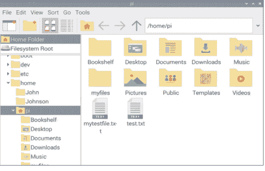

图 4.8 文件管理器菜单

### 4.2.4 终端

此菜单项启用命令模式，以便你可以在此模式下输入命令（图 4.9，仅显示了屏幕的一部分）。

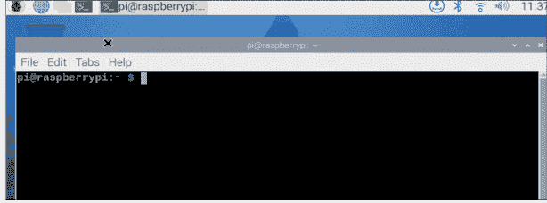

图 4.9 终端菜单

### 4.2.5 管理蓝牙设备

屏幕右侧的此菜单项使你能够启用树莓派 5 上的蓝牙，并与其他蓝牙设备配对。

### 4.2.6 Wi-Fi

蓝牙旁边的下一个菜单项是 Wi-Fi 菜单，可用于打开和关闭 Wi-Fi，以及连接到 Wi-Fi 路由器。点击时，会显示可用的 Wi-Fi 设备列表（见图 4.10）。

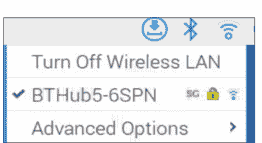

图 4.10 Wi-Fi 菜单

### 4.2.7 音量控制

此菜单项用于通过滑动条控制音频音量。

### 4.2.8 日期和时间

音量控制旁边是日期和时间菜单，显示当前系统日期和时间。

# 第 5 章 • 在控制台模式下使用文本编辑器

文本编辑器用于创建或修改文本文件的内容。Linux 操作系统有许多可用的文本编辑器。一些流行的有 nano、vim、vi 等等。在本章中，我们将了解其中一些文本编辑器并学习如何使用它们。

## 5.1 nano 文本编辑器

通过输入单词 **nano**，后跟你希望创建或修改的文件名来启动 **nano** 文本编辑器。下面给出一个示例，其中创建了一个名为 **first.txt** 的新文件：

```
pi@raspberrypi: ~ $ nano first.txt
```

你应该会看到如图 5.1 所示的编辑器屏幕。要编辑的文件名写在屏幕顶部的中间部分。屏幕底部的消息 'New File' 表明这是一个新创建的文件。屏幕底部的快捷键用于执行各种编辑功能。这些快捷键通过按 Ctrl 键和另一个键来访问。一些有用的快捷键如下：

- **Ctrl+W**：搜索单词
- **Ctrl+V**：移动到下一页
- **Ctrl+Y**：移动到上一页
- **Ctrl+K**：剪切当前行文本
- **Ctrl+R**：读取文件
- **Ctrl+U**：粘贴之前剪切的文本
- **Ctrl+J**：两端对齐
- **Ctrl+\**：搜索并替换文本
- **Ctrl+C**：显示当前列和行位置
- **Ctrl+G**：获取有关使用 nano 的详细帮助
- **Ctrl+-**：转到指定的行和列位置
- **Ctrl+O**：保存（写出）当前打开的文件
- **Ctrl+X**：退出 nano

## 5.1 nano 文本编辑器

现在，按照图 5.2 所示输入以下文本：

nano 是一个简单而强大的文本编辑器。
这个简单的文本示例演示了如何使用 nano。
这是示例的最后一行。

**nano** 的使用现在通过以下步骤进行演示：

**步骤 1：** 通过移动光标到文件开头。

**步骤 2：** 通过按 **Ctrl+W** 并在屏幕左下角打开的窗口中输入 **simple** 来查找单词 **simple**。按回车键。光标将定位在单词 **simple** 上（见图 5.3）。

**步骤 3：** 将光标放在第一行的任意位置，然后按 Ctrl+K 剪切第一行。第一行将消失，如图 5.4 所示。

**步骤 4：** 将剪切的行粘贴到第一行之后。将光标放在第二行并按 **Ctrl+U**（见图 5.5）。

**步骤 5：** 将光标放在第一行单词 **simple** 的开头。输入 **Ctrl+C**。该单词的行和列位置将显示在屏幕底部（图 5.6）。

**步骤 6：** 按 **Ctrl+G** 显示帮助页面，如图 5.7 所示。注意显示内容有多页，你可以通过按 **Ctrl+Y** 跳转到下一页，或按 **Ctrl+V** 跳转到上一页。按 **Ctrl+X** 退出帮助页面。

**步骤 7：** 按 **Ctrl+-** 并输入行号和列号为 2 和 5，然后按回车键，将光标移动到第 2 行，第 5 列（见图 5.8）。

**步骤 8：** 将单词 **example** 替换为单词 **file**。按 **Ctrl+\** 并输入第一个单词为 **example**（见图 5.9）。按回车，然后输入替换词为 **file**。按回车并输入 y 接受更改。

**步骤 9：** 保存更改。按 **Ctrl+X** 退出文件。输入 **Y** 接受保存，然后输入要写入的文件名，或直接按回车写入现有文件（本例中为 **first.txt**）。文件将保存在当前工作目录中。

**步骤 10：** 显示文件内容：

```
pi@raspberrypi: ~ $ cat first.txt
This simple text file demonstrates how to use nano.
Nano is a simple and yet powerful text editor
This is the last line of the example.

pi@raspberrypi: ~ $
```

总之，**nano** 是一个简单而强大的文本编辑器，允许我们创建新的文本文件或编辑现有文件。

## 5.2 vi 文本编辑器

**vi** 文本编辑器已经存在多年，它一直是 Unix 操作系统的标准默认文本编辑器。**vi** 编辑器是一个功能齐全、强大的文本编辑器，可用于执行许多不同的任务。使用 **vi** 的唯一问题是它不太用户友好，学习可能需要一些时间。在本节中，我们将探讨该编辑器的基本功能，并了解如何在简单的编辑应用中使用它。

请注意，你不能在 **vi** 编辑器中使用键盘方向键。一些有用的 **vi** 编辑器命令如下所列：

```
ZZ  保存更改并退出 vi
:wq 保存更改并退出 vi
:q! 不保存更改退出

h   将光标向左移动（向后）
j   将光标向下移动
k   将光标向上移动
l   将光标向右移动（空格键）

$   移动到当前行的最后一列
o   将光标移动到当前行的第一列
w   将光标移动到下一个单词的开头
b   将光标移动到上一个单词的开头
H   将光标移动到屏幕顶部
M   将光标移动到屏幕中间
L   将光标移动到屏幕底部

G   移动到文件的最后一行
nG  移动到第 n 行

r   用下一个键入的字符替换光标下的字符
i   在光标前插入
a   在光标后追加
A   在行尾追加

x   删除光标下的字符
dd  删除光标所在的行
dw  删除光标所在的单词

/   向前搜索一个单词
?   向后搜索一个单词
:s  在当前行搜索并替换一个单词
```

通过输入 **vi** 后跟要创建或修改的文件名来启动 **vi** 文本编辑器。在本例中，假设要创建一个名为 **myfile.txt** 的新文件：

```
pi@raspberrypi: ~ $ vi myfile.txt
```

你应该会看到 **vi** 文本编辑器屏幕如图 5.10 所示。正在编辑的文件名显示在屏幕底部。

**vi** 编辑器与大多数其他文本编辑器不同，因为它无法在编辑器窗口内直接开始输入。编辑此文件的步骤如下：

**步骤 1：** **vi** 编辑器有不同的模式，你必须处于插入模式才能向窗口写入。按 *i* 进入插入模式。然后输入以下文本（见图 5.11）：

> vi 文本编辑器是一个强大的文本编辑器。
但使用这个编辑器并不容易。
这个练习应该能帮助你理解基本命令。

**步骤 2：** 要退出插入模式，请按 ESC 键。要保存文件，请输入字符 **:w**。保存更改后，你可以通过输入 **:q** 退出编辑器。或者，你可以输入 **ZZ**（注意大写）来保存并退出。如果你修改了文件并尝试不保存就退出，你会收到错误消息。如果你想不保存更改就退出，只需输入 **:q!**

**步骤 3：** 确保你处于命令模式，然后输入字符 **/** 后跟一个单词以在文本中搜索该单词。例如，输入 **/editor** 在文本中搜索单词 **editor**（见图 5.12）。

**步骤 4：** 在单词 **editor** 之前插入单词 **is**。输入 **i** 后跟 **is** 和空格，然后按 ESC 键结束插入模式。

**步骤 5：** 按 **l** 键将光标向右移动。类似地，按 **h** 键将光标向左移动。按 **j** 键将光标向下移动（到第二行）。

**步骤 6：** 搜索单词 **this** 并删除它。输入 **/this** 后跟回车键。输入 **dw** 删除该单词。

**步骤 7：** 通过输入 **dd** 删除光标所在的第二行。

**步骤 8：** 搜索单词 **help** 并将其替换为单词 **guide**。转到单词 help 所在的行。输入 **/help**，然后输入 **:s/help/guide/**

**步骤 9：** 你可以在当前行以外的任何其他行搜索并替换单词。在本例中，将光标定位在第一行。将第二行中的单词 **basic** 更改为 **BASIC**。输入：

```
:1,2s/basic/BASIC/
```

注意，你可以通过用逗号分隔来指定行范围。在本例中，搜索从第 1 行开始，到第 2 行结束。

# 第 6 章 • 创建和运行 Python 程序

## 6.1 概述

你将使用 Python 编程语言对你的 Raspberry Pi 5 进行编程。值得在你的 Raspberry Pi 5 计算机上查看如何创建和运行一个简单的 Python 程序。在本章中，消息 **Hello From Raspberry Pi 5** 将显示在你的 PC 屏幕上。

如下所述，有三种方法可以在你的 Raspberry Pi 5 上创建和运行 Python 程序。

## 6.2 方法 1 – 在控制台模式下从命令提示符交互式运行

在此方法中，你将使用 SSH 登录到你的 Raspberry Pi 5，然后交互式地创建和运行 Python 程序。此方法非常适合小程序。步骤如下：

- 使用 SSH 登录到 Raspberry Pi 5
- 在命令提示符处，输入 **python**。你应该会看到 Python 命令模式，由三个字符 ">>>" 标识
- 输入程序：

    ```
    python
    print ("Hello From Raspberry Pi 5")
    ```

- 文本将如图 6.1 所示交互式显示在屏幕上。请注意，在撰写本书时，Python 版本为：3.11.2。

- 输入 **Ctrl+z** 退出程序

## 6.3 方法 2 – 在控制台模式下创建 Python 文件

在此方法中，你将像以前一样使用 SSH 登录到你的 Raspberry Pi 5，然后创建一个 Python 文件。Python 文件只是一个扩展名为 **.py** 的文本文件。你可以使用文本编辑器，例如 **nano** 文本编辑器来创建你的文件。在本例中，使用 **nano** 文本编辑器创建了一个名为 **hello.py** 的文件。图 6.2 显示了文件 **hello.py** 的内容。该图还显示了如何在 Python 下运行该文件。请注意，程序通过输入以下命令运行：

```
>>> python hello.py
```

## 6.4 方法三 – 在桌面图形界面模式下创建 Python 文件

在此方法中，你可以通过 mini HDMI 端口直接连接终端来登录你的树莓派 5，或者如果你没有显示器，可以按照前面描述的方式使用 VNC 登录桌面，然后使用 Thonny IDE 在图形界面模式下创建和运行你的 Python 程序。现阶段学习使用 Thonny IDE 的基础知识是值得的。

## Thonny IDE

从桌面的 **Programming** 菜单下启动 Thonny IDE。图 6.3 展示了 Thonny 的启动菜单。

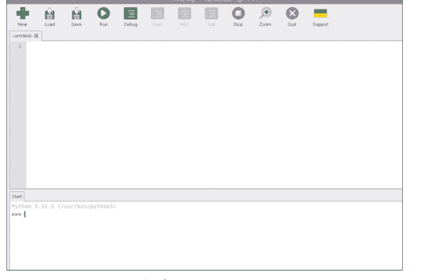

屏幕分为两部分：上半部分是你编写程序的地方。下半部分是 shell，可以在其中编写小型交互式程序。这部分主要用于测试代码片段。

上半部分包含以下菜单项：

- **New**：点击创建一个新程序
- **Load**：从树莓派上的文件夹加载一个现有程序
- **Save**：将屏幕上的现有程序保存到文件
- **Run**：运行屏幕上的程序
- **Debug**：调试屏幕上的程序
- **Over**：调试器使用
- **Into**：调试器使用
- **Out**：调试器使用
- **Stop**：停止正在运行的程序
- **Zoom**：缩放屏幕
- **Quit**：退出 Thonny IDE

在使用 Thonny IDE 编写和上传程序到你的树莓派之前，必须对其进行配置。点击屏幕右下角选择你的处理器类型，并选择 **Local Python 3**。现在你已准备好编写你的程序。步骤如下：

- 在屏幕的上半部分输入以下代码：

    ```python
    print("Hello from Raspberry Pi 5")
    ```

- 点击 **File** → Save，并以 hello.py 为名保存（图 6.4）

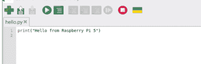

*图 6.4 输入你的程序并保存*

- 点击 **Run** 图标（顶部的绿色菜单按钮）来运行程序。程序的输出将显示在屏幕底部，如图 6.5 所示。

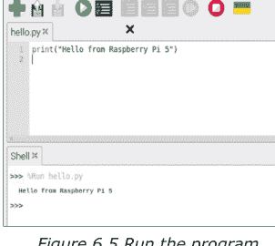

*图 6.5 运行程序*

你可以在交互模式下运行小型程序，方法是在屏幕下半部分的 **shell** 下输入它们。结果将立即显示在 **shell** 下。

## 6.5 选择哪种方法？

方法的选择取决于程序的大小和复杂性。小型程序可以在不创建程序文件的情况下交互式运行。较大的程序可以创建为 Python 文件，然后可以在控制台模式下或在 Thonny IDE 的桌面图形界面模式下运行。在 Thonny IDE 下运行的优势在于，当你编写代码时，代码的格式会自动修正。在本书中，Thonny IDE 用于小型程序，而 nano 编辑器用于较大的程序以创建程序文件。

# 第 7 章 • Python 编程与简单程序

## 7.1 概述

Python 是一种解释型、交互式和面向对象的编程语言。它由 Guido van Rossum 在 20 世纪 80 年代于荷兰国家数学与计算机科学研究所开发。它源于许多其他语言，包括 C、C++、Modula-3、SmallTalk 和 Unix shells。该语言现在由研究所的一个团队维护。

Python 是交互式的，这意味着你可以发出命令并立即看到结果，而无需编译命令。它是解释型的，因此运行前无需预编译。

Python 支持面向对象的编程技术。它是一种初学者语言，易于学习和维护。初学者可以在相对较短的时间内轻松学习编程。Python 支持大量的函数库，使其功能强大。该语言是可移植的，意味着它可以在多个不同的流行平台上运行。

在本章和下一章中，你将学习树莓派 5 计算机上 Python 编程语言的细节，并了解如何使用这种语言编写程序。书中给出了许多示例程序，展示电子工程师如何使用 Python 语言来帮助他们进行计算。

## 7.2 变量名

Python 变量名区分大小写，可以以字母 **A** 到 **Z** 或 **a** 到 **z** 或下划线字符 '_' 开头，后跟更多字母或数字 0 到 9。下面给出了一些有效和无效的示例变量名：

- SUM - 有效
- Sum - 有效
- SUm - 有效
- _total - 有效
- Cnt5 - 有效
- 8tot - 无效
- %int - 无效
- &xyz - 无效
- My_Number - 有效
- @loop - 无效
- _Account - 有效

请注意，变量 **total**、**Total**、**TOTAL**、**ToTaL** 或 **toTAL** 都是不同的。

## 7.3 保留字

有一些词是保留给 Python 解释器使用的，因此程序员不能将它们用作变量名。下面列出了这些保留字。请注意，所有保留字都包含小写字母：

- and, assert, break, class, continue, def, del, elif, else, except, exec, finally, for, from, global, if, import, in, is, lambda, not, or, pass, print, raise, return, try, while, with, yield

## 7.4 注释

Python 中的注释行以井号 '#' 开头。Python 解释器会忽略 # 号后的所有字符。下面是一个注释行的示例：

```
# This is a comment line
```

注释也可以插入在语句之后：

```
Sum = 0 # Another comment
```

## 7.5 行续接

行续接字符 '\' 可用于将语句续接到下一行。下面是一个示例：

```
Sum = a +\
    b +\
    c
```

这等同于：

```
Sum = a + b + c
```

## 7.6 空行

Python 解释器会忽略不包含任何语句的行。

## 7.7 一行多条语句

允许在单行上有多条语句，只需用分号字符分隔语句即可。下面是一个示例：

```
cnt = 5; sum = 0; tot = 20;
```

## 7.8 缩进

在大多数编程语言中，代码块通过在块的开头和结尾使用大括号来标识，或者通过使用适当的语句（例如 END、WEND 或 ENDIF）来标识块的结束。在 Python 语言中，没有大括号或语句来指示块的开始和结束。相反，代码块通过行缩进来标识。块内的所有语句必须缩进相同的量。只要块中的所有语句使用相同数量的空格，用于缩进块的实际空格数并不重要。

下面是一个有效的代码块（现阶段不用担心代码的功能）：

```
if j == 5:
    a = a + 1
    b = a + 2
else:
    a = 0
    b = 0
```

以下代码块无效，因为缩进不正确：

```
if j == 5:
    a = a + 1
    b = a + 2
else:
    a = 0
    b = 0
```

## 7.9 Python 数据类型

Python 支持以下数据类型：

- 数字
- 字符串
- 列表
- 字典
- 元组
- 集合
- 文件

## 7.10 数字

Python 支持以下数字变量类型：

- **int** - 有符号整数
- **long** - 长整数
- **float** - 浮点实数

**复数**
数字可以用十进制、八进制、二进制或十六进制表示。长整数用大写字母 **L** 表示。

下面是一些数字示例：

**整数**
100 - 十进制
-67 - 十进制
500 - 十进制
0x20 - 十六进制
0b10000001 - 二进制
0o2377 - 八进制
202334567L - 长十进制
0x3AEFEAE - 十六进制

**浮点数**
2.355
23.780
-45.6
1.298
24.45E4

**复数**
24.4+2.6j
0.78-4.2j
23.7j

我们可以将数值赋给变量。当值被赋给变量时，这些变量对象就被创建了：
sum = 28
a = 0

我们可以使用 **del** 语句删除一个变量对象：
del sum, a

我们可以同时将一个值赋给多个变量：
w = x = y = z = 0

类似地，我们可以使用如下形式的语句：
    w, x, y = 3, 5, 8

这等价于：
    w = 3
    x = 5
    y = 8

我们可以对数字执行以下数学运算：

### 表达式运算符

- `+` 加法
- `-` 减法
- `*` 乘法
- `/` 除法
- `>>` 右移
- `<<` 左移
- `**` 幂（指数运算）
- `%` 取余

### 位运算符

- `|` 按位或
- `&` 按位与
- `^` 按位异或
- `~` 按位取反

### 一些数学函数

- `pow(x,y)` 等同于 `x**y`
- `abs(x)` x 的绝对值
- `round(x,n)` 将 x 四舍五入到小数点后 n 位
- `floor(x)` 不大于 x 的最大整数
- `int(x)` 将 x 转换为整数
- `hex(x)` 整数 x 的十六进制等价形式
- `bin(x)` 整数 x 的二进制等价形式
- `exp(x)` x 的指数
- `factorial(n)` 数字 n 的阶乘
- `ceil(x)` 不小于 x 的最小整数
- `log(x)` x 的自然对数（以 2 为底）
- `log10(x)` x 的对数（以 10 为底）

### 一些数学实用库

- `random` 随机数库
- `math` 数学库

Raspberry Pi 5 基础

图 7.1 到图 7.3 展示了在 Python 中使用数字的示例。`import` 语句用于将库导入到 Python 程序中。**math** 库包含大量数学函数，例如对数函数、三角函数、平方根、双曲函数、角度转换等等。有关这些函数的更多详细信息，可以从以下链接获取：

https://docs.python.org/3/library/math.html

**random** 库对于生成随机数很有用。该库中的函数 **randint(a, b)** 生成一个介于整数 **a** 和 **b** 之间（包含 a 和 b）的整数随机数。有关 random 库中可用函数的详细信息，可以从以下链接获取：

https://docs.python.org/2/library/random.html

```
>>> 28 + 35
63
>>> 22 * 6
132
>>> 2 ** 5
32
>>> 2 << 3
16
>>> 5 % 2
1
>>> abs(-100)
100
>>> 0x10
16
>>> 0o17
15
>>> 0b00001111
15
>>> (2 + 3j) * 3
(6+9j)
>>> hex(20)
'0x14'
>>> bin(15)
'0b1111'
>>>
```

图 7.1 在 Python 中使用数字

```
>>> int(23.256)
23
>>> float(4)
4.0
>>> 1/3.0
0.3333333333333333
>>> 10/4.0
2.5
>>> import math
>>> math.sqrt(16)
4.0
>>> math.pi
3.141592653589793
>>> math.floor(-3.5)
-4.0
>>> math.trunc(-4.5)
-4
>>> math.sin(30.0 * math.pi/180)
0.49999999999999994
>>> pow(2, 4)
16
>>> max(2,5,12,8)
12
>>> min(2,4,6,8)
2
```

图 7.2 在 Python 中使用数字

```
>>> a = 0b00001110
>>> bin(a & 0b11)
'0b10'
>>> bin(a | 0b11)
'0b1111'
>>> math.e
2.718281828459045
>>> math.floor(-2.7)
-3.0
>>> sum((1,2,3,4,5,6,7,8,9,10))
55
>>> import random
>>> random.randint(1, 5)
3
>>> random.randint(1, 5)
4
>>> random.randint(1, 5)
5
>>> (2 + 4j) + (4 + 3j)
(6+7j)
>>> (2.4 * 3), (5.0 / 2.0), math.sqrt(12.0)
(7.199999999999999, 2.5, 3.4641016151377544)
```

图 7.3 在 Python 中使用数字

## 7.11 字符串

在 Python 中，字符串通过将字符括在一对单引号或双引号之间来声明。下面给出一个示例：

```
myname = "James Booth"
```

我们可以通过提取字符、连接两个字符串、将一个字符串赋值给另一个字符串等方式来操作字符串。一些常用的字符串操作如图 7.4 和图 7.5 所示。

```
>>> name = "John"
>>> surname = "Adams"
>>> full_name = name + surname
>>> print(full_name)
JohnAdams
>>> initial = name[0]
>>> print(initial)
J
>>> initials = name[0] + surname[0]
>>> print(initials)
JA
>>> print(name[0:3])
Joh
>>> print(name[:2])
Jo
>>> print(name[2:])
hn
>>> print(name*2)
JohnJohn
>>> print(name[0:2] + surname[2:4] + "end")
Joamend
>>> print(name + " " + surname)
John Adams
>>> print(len(name))
4
```

图 7.4 字符串操作

```
>>> name = "Smith"
>>> print(name[-1])
h
>>> print(name[-2])
i
>>> print(name.find('i'))
2
>>> name.replace('i', 'k')
'Smkth'
>>> numbers = "111,222,333,444,555"
>>> numbers.split(',')
['111', '222', '333', '444', '555']
>>> name
'Smith'
>>> name[0] = 's'
Traceback (most recent call last):
  File "<stdin>", line 1, in <module>
TypeError: 'str' object does not support item assignment
>>> name = 's' + name[1:]
>>> name
'smith'
```

图 7.5 字符串操作

请注意，在字符串切片操作中可以使用第三个索引作为步长。步长会加到第一个偏移量上，直到第二个偏移量，并提取该位置的字符。在下面的示例中，提取了位置 0、2、4、6 处的字符：

```
>>> a = "computer"
>>> b = a[0:7:2]
>>> print(b)
cmue
```

### 7.11.1 字符串函数

Python 支持许多字符串函数。下面给出一些常用的字符串函数：

- `capitalize()` 将字符串的第一个字母改为大写，其余所有字符改为小写。
- `count(str,beg,end)` 查找 **str** 在字符串中出现的次数。应指定字符串的起始和结束位置。
- `find(str,beg,end)` 确定 **str** 是否出现在字符串中。应指定字符串的起始和结束位置。如果找到 **str**，则返回其索引，否则返回 -1。
- `len(string)` 返回字符串的长度。
- `isalpha()` 如果字符串包含所有字母字符，则返回 true。
- `isalnum()` 如果字符串包含字母和数字字符，则返回 true。
- `isdigit()` 如果字符串包含所有数字，则返回 true。
- `islower()` 如果字符串包含所有小写字母，则返回 true。
- `isupper()` 如果字符串包含所有大写字母，则返回 true。
- `lower()` 将所有大写字符转换为小写。
- `upper()` 将所有小写字符转换为大写。
- `lstrip()` 移除所有前导空格。
- `rstrip()` 移除所有尾随空格。
- `swapcase()` 更改所有字母的大小写。

图 7.6 展示了使用部分字符串函数的示例。

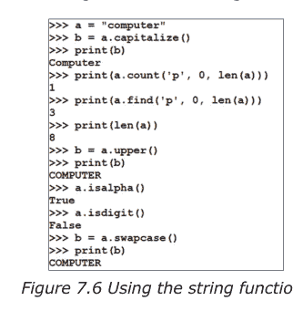

### 7.11.2 转义序列

转义序列是特殊的非打印字符，用于生成换行、制表符、换页、回车等功能。转义序列以字符 `\` 开头。下面列出了常用的转义序列：

- `\n` 换行
- `\a` 响铃
- `\b` 退格
- `\f` 换页
- `\r` 回车
- `\t` 水平制表符
- `\v` 垂直制表符
- `\xhh` 由两位十六进制值 hh 定义的字符

例如，以下语句将显示字母 'a' 后跟两个换行符：

```
print("a\n\n")
```

## 7.12 print 语句

print 语句是最常用的语句之一。它在屏幕上显示文本或数字。文本通过将其括在引号中来显示。数字数据只需输入变量名即可显示。要显示的数据括在圆括号中。文本和数字数据可以在显示输出中混合使用，并且可以使用格式化字符声明要显示的变量类型。下面列出了常用的格式化字符：

- `%c` 字符
- `%s` 字符串
- `%d` 有符号整数
- `%u` 无符号整数
- `%x` 小写十六进制数
- `%X` 大写十六进制数
- `%f` 浮点数
- `%E` 指数表示法

图 7.7 展示了使用 print 语句的一些示例。

```
>>> first, last = 1, 100
>>> print("First = %d Last = %d" % (first, last))
First = 1 Last = 100
>>>
>>> name, age = "John", 21
>>> print("Name = %s Age = %d" % (name, age))
Name = John Age = 21
>>>
>>> a = 2.345
>>> print("a is %E" % (a))
a is 2.345000E+00
>>>
>>> a, b = 5, 10
>>> print("a is %d\nb is %d" % (a, b))
a is 5
b is 10
>>>
>>> a = 100
>>> print("%X" % (a))
64
```

图 7.7 使用 print 语句

## 7.13 列表变量

列表变量是用逗号分隔并括在方括号中的变量。列表中的变量可以是不同类型。可以使用方括号对列表中的所需项进行索引来访问列表的内容。索引从 0 开始。与字符串一样，`*` 字符可用于重复，`+` 字符可用于连接。下面给出一些示例：

```
mylist = ['John', 'Adam', 230, 12.25, 'Peter', 89]
second = [30, 23]

s = mylist[0]           # s = 'John'
s = mylist[2]           # s = 230
s = mylist[2:4]         # s = 230, 12.25
s = mylist[3:]          # s = 12.25, 'Peter', 89
s = mylist * 2          # s = 'John', 'Adam', 230, 12.25, 'Peter', 89, 'John',
                        # 'Adam', 230, 12.25, 'Peter', 89
s = mylist + second     # s = 'John', 'Adam', 230, 12.25, 'Peter', 89, 30, 23
```

可以通过向所需索引位置赋新值来修改列表的内容。例如，我们可以将列表 **mylist** 的第 2 个元素从 230 更改为 100，如下所示：

```
mylist[2] = 100
```

Python 不允许引用列表中不存在的项目。例如，以下语句会给出错误消息：

```
mylist[200]
```

列表可以嵌套形成二维矩阵。下面是一个示例：

```
M = [[1, 2, 3],
     [4, 5, 6],
     [7, 8, 9]]
```

嵌套列表的索引从 [0][0] 开始。例如，可以通过以下方式访问第1行的元素：

```
>>> M[1]          # 第1行的元素
[4, 5, 6]

>>> M[1][1]        # 第1行，第1列的元素
5
```

语句 **L = [ ]** 创建一个名为 **L** 的空列表。

### 7.13.1 列表函数

Python 语言支持许多列表函数。下面列出了一些常用的列表函数：

- del([i:j])
- list.append(x)
- list.extend([x,y,z])
- cmp(L1,L2)
- len(L)
- max(L)
- min(L)
- list.count(x)
- list.index(x)
- list.insert(i,x)
- list.remove(x)
- list.reverse()
- list.sort()
- list.pop()

图 7.8 展示了使用 print 语句的一些示例。

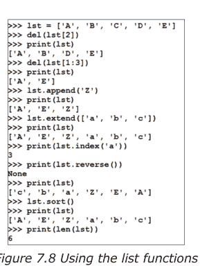

图 7.8 使用列表函数

## 7.14 元组变量

元组与列表类似，但其内容不能更改，即它们是只读的。此外，元组变量用圆括号（括号）括起来。下面给出了一些示例：

```
mytuple = ['John', 'Adam', 230, 12.25, 'Peter', 89]
second = [30, 23]

s = mytuple[0]          # s = 'John'
s = mytuple[2]          # s = 230
s = mytuple[2:4]        # s = 230, 12.25
s = mytuple[3:]         # s = 12.25, 'Peter', 89
s = mytuple * 2         # s = 'John', 'Adam', 230, 12.25, 'Peter', 89, 'John', 'Adam', 230, 12.25, 'Peter', 89
s = mytuple + second    # s = 'John', 'Adam', 230, 12.25, 'Peter', 89, 30, 23
```

以下语句无效，因为我们无法更改元组的内容：

```
mytuple[2] = 200
```

## 7.15 字典变量

字典类似于带有键和值的哈希表。每个键与其值之间用冒号分隔，各项之间用逗号分隔，整个内容用花括号括起来。字典中的键必须是数字、字符串或元组数据类型。值可以是任何数据类型。下面给出一个示例：

```
mydict = {'Name': 'John', 'Surname': 'Adams', 'Age': 25}
s = mydict['Name']          # s = 'John'
s = mydict['Age']           # s = 25
s = mydict.keys()           # s = ['Age', 'Surname', 'Name']
s = mydict.values()         # s = [125, 'Adams', 'John']
```

### 7.15.1 字典函数

Python 语言支持大量字典函数。下面列出了一些常用的字典函数：

- cmp(d1, d2) 比较两个字典 d1 和 d2
- len() 字典中的项目数量
- del(d[key]) 从字典中删除一个项目
- d.clear 从字典中删除所有项目
- d.keys() 返回字典键的列表
- d.values() 返回字典值的列表

图 7.9 展示了使用 print 语句的一些示例。

```
>>> d = {'A':1, 'B':2, 'C':3, 'D':4}
>>> print(len(d))
4
>>> print(d.keys())
['A', 'C', 'B', 'D']
>>> print(d.values())
[1, 3, 2, 4]
>>> del(d['C'])
>>> print(d)
{'A': 1, 'B': 2, 'D': 4}
>>> d.clear()
>>> print(d)
{}
```

图 7.9 使用字典函数

## 7.16 键盘输入

Python 提供了以下函数用于从键盘读取数据：

- input 提供带提示的读取。从键盘输入的数据作为字符串返回。

图 7.10 展示了使用键盘输入函数的示例。请注意，该函数返回的是字符串。因此，如果输入的是数字数据，则在用于数学运算之前应将其转换为数字数据类型。

```
>>> name = input("Enter your name: ")
Enter your name: John Smith
>>> a = input("Enter a number: ")
Enter a number: 5
>>> b = input("Enter another number: ")
Enter another number: 4
>>> c = int(a) + int(b)
>>> print(c)
9
>>> a = int(input("Enter a number: "))
Enter a number: 2
>>> b = int(input("Enter another number: "))
Enter another number: 4
>>> c = a * b
>>> print(c)
8
>>>
```

图 7.10 键盘输入示例

## 7.17 比较运算符

有效的 Python 比较运算符有：

- == 检查两个操作数是否相等
- != 检查两个操作数是否不相等
- > 检查左操作数是否大于右操作数
- < 检查左操作数是否小于右操作数
- >= 检查左操作数是否大于或等于右操作数
- <= 检查左操作数是否小于或等于右操作数

## 7.18 逻辑运算符

有效的 Python 逻辑运算符有：

- and 两个操作数的逻辑与
- or 两个操作数的逻辑或
- not 操作数的逻辑非

## 7.19 赋值运算符

- = 赋值运算符
- += 复合加法运算符
- -= 复合减法运算符
- *= 复合乘法运算符
- /= 复合除法运算符

## 7.20 流程控制

在正常的程序流程中，语句按顺序依次执行。流程控制语句用于做出决策，并根据这些决策的结果改变执行顺序。

Python 编程语言支持以下流程控制语句：

- if
- if-else
- elif
- for
- while
- break
- continue
- pass

### 7.20.1 if、if...else 和 elif

if 语句的一般格式为：

```
if expression: statement
或
    if expression:
        Statement 1
        Statement 2
    else:
        Statement 1
        Statement 2
```

请注意 **if** 块内部的缩进使用，以及 **if** 和 **else** 语句末尾的冒号字符。

if 语句的一个使用示例如下：

```
if a == 5: print('a is 5')
```

如果 if 后面只有一条语句，则可以写在同一行。如果有多条语句，则所有语句必须写在下一行，并且缩进量相同。下面给出一个示例：

```
if a == 100:
    x = 0
    y = 0
else:
    x = 1
    y = 10
```

**elif** 语句用于在 **if** 块中检查不同的条件。下面给出一个示例：

```
if a > 10:
    b = 0
    c = 0
elif a == 10:
    b = 2
    c = 4
```

请注意，if 语句可以嵌套，如下例所示：

```
if a == 100:
    c = 0
    k = 1
if b == 10:
    c = 20
    m = 1
else:
    c = 23
```

### 7.20.2 for 语句

for 语句用于在程序中创建循环（迭代）。该语句的一般格式为：

```
for variable in sequence:
    statements
```

这里，首先对序列进行求值，序列中的第一个项目被赋值给变量，然后执行语句。接着，第二个项目被赋值给变量，并执行语句。此过程持续进行，直到序列中没有更多项目。for 语句的一个使用示例如下所示：

```
for letter in "COMPUTER":
    print(letter)
```

屏幕上将显示以下内容：

```
C
O
M
P
U
T
E
R
```

**for** 语句通常用于在程序中创建循环。**range** 语句表示变量的范围，如下例所示：

```
for cnt in range(0, 5):
    print(cnt)
```

屏幕上将显示以下内容：

```
0
1
2
3
4
```

请注意，range 的上限值比指定值小1。在上面的示例中，range 是从0到4，而不是到5。

使用 range 语句时，我们可以在最后一个参数中指定步长。在下面的示例中，步长为5，列表取值为0, 5, 10, 15, 20, 25：

```
List(range(0, 30, 5))
```

如果需要，**for** 语句可以嵌套。

### 7.20.3 while 语句

**while** 语句也可用于在程序中创建循环（迭代）。该语句的一般格式为：

```
while expression:
    statements
```

当表达式求值为 True 时，执行语句。下面给出一个示例：

```
cnt = 0
while cnt < 5:
    print(cnt)
    cnt = cnt + 1
```

程序的输出如下：

```
0
1
2
3
4
```

请注意，属于 **while** 语句的语句必须缩进。确保在循环内部修改表达式非常重要；否则将形成无限循环，如下例所示：

```
cnt = 0
while cnt < 5:
    print(cnt)
```

### 7.20.4 continue 语句

**continue** 语句用于 **for** 和 **while** 循环中，该语句跳过循环中所有剩余的语句，并返回到循环的开头。下面给出一个示例。在此示例中，print 语句不会显示数字3：

```
cnt = 0
while cnt < 5:
    cnt = cnt + 1
    if cnt == 3:
        continue
    print(cnt)
```

此示例的输出如下：
1
2
4
5

### 7.20.5 break 语句

**break** 语句用于 **for** 和 **while** 循环中，该语句会终止循环，程序继续执行下一条语句。下面是一个示例：

```
cnt = 0
while cnt < 5:
    cnt = cnt + 1
    if cnt == 3:
        break
    print(cnt)
```

此程序的输出如下：
1
2

### 7.20.6 pass 语句

**pass** 语句用于语法上需要一条语句，但你不想执行任何命令或代码的情况。**pass** 语句是一个空操作，执行时什么也不会发生。下面是一个示例：

```
for letter in 'COMPUTER':
    if letter == 'P':
        pass
        print('Passed')
    print(letter)
```

此程序的输出是：
C
O
M
Passed
P
U
T
E
R

我们已经介绍了 Python 编程语言的基本语句。现在我们将运用目前所学的知识来开发示例程序。

## 7.21 示例 1 – 四色环电阻色环识别器

在此示例中，用户输入四色环电阻的三种颜色，程序计算并显示电阻的欧姆值。电阻的容差不显示。

**背景信息**：电阻值通过以下色环代码识别：

- 黑色：0
- 棕色：1
- 红色：2
- 橙色：3
- 黄色：4
- 绿色：5
- 蓝色：6
- 紫色：7
- 灰色：8
- 白色：9

前两种颜色决定数值的前两位数字，最后一种颜色决定倍率。例如，**红红红** 对应 $22 \times 10^2 = 2200 \Omega$。

**程序清单**：图 7.11 显示了程序清单（程序：**resistor.py**）。程序开始时，创建了一个名为 **colour** 的列表，用于存储有效的电阻颜色。然后显示一个标题，并创建一个 **while** 循环，只要字符串变量 **yn** 等于 y，循环就会运行。在循环内部，程序使用 **input** 函数从键盘读取三种颜色，并以字符串形式存储在变量 **FirstColour**、**SecondColour** 和 **ThirdColour** 中。然后将这些字符串转换为小写，以便与列表框中列出的值兼容。接着使用 **colours.index** 形式的函数调用查找这些颜色在列表中的索引值。请记住，索引值从 0 开始。例如，如果用户输入红色，则对应的索引值将是 2。然后通过将第一个颜色数字乘以 10 并加上第二个颜色数字来计算电阻值。结果再乘以第三个颜色索引的 10 的幂。最终结果显示在屏幕上。然后程序询问用户是否要继续。如果答案是 **y**，则程序返回开头；否则程序终止。

```
#========================================
#           RESISTOR COLOUR CODES
#           ---------------------
#
# The user enters the three colours of a resistor
# and the program calculates and displays the value
# of the resistor in Ohms
#
# Program: resistor.py
# Date    : October, 2023
# Author : Dogan Ibrahim
#==========================================
colours = ['black','brown','red','orange','yellow','green',\
'blue','violet','grey','white']

print("RESISTOR VALUE CALCULATOR")
print("============================")
yn = "y"

while yn == 'y':
    FirstColour = input("Enter First Colour: ")
    SecondColour = input("Enter Second Colour: ")
    ThirdColour = input("Enter Third Colour: ")
#
# Convert to lower case
#
    FirstColour = FirstColour.lower()
    SecondColour = SecondColour.lower()
    ThirdColour = ThirdColour.lower()
#
# Find the values of colours
#
    FirstValue = colours.index(FirstColour)
    SecondValue = colours.index(SecondColour)
    ThirdValue = colours.index(ThirdColour)
#
# Now calculate the value of the resistor
#
    Resistor = 10 * FirstValue  + SecondValue
    Resistor = Resistor * (10 ** ThirdValue)
    print("Resistance = %d Ohms" % (Resistor))
#
# Ask for more
#
    yn = input("\nDo you want to continue?: ")
    yn = yn.lower()
```

图 7.11 程序清单

该程序使用 **nano** 文本编辑器创建，然后通过输入以下命令从命令行运行：

```
pi@raspberrypi:~ $ python resistor.py
```

图 7.12 显示了程序的典型运行情况。

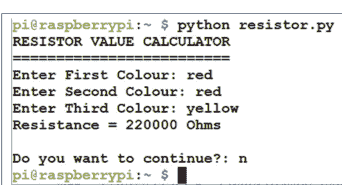

图 7.12 程序的典型运行

## 7.22 示例 2 – 串联或并联电阻

此程序计算多个串联或并联连接的电阻的总电阻。用户指定连接是串联还是并联。此外，程序开始时还指定了使用的电阻数量。

**背景信息**：当多个电阻串联时，总电阻等于每个电阻电阻之和。当电阻并联时，总电阻的倒数等于每个电阻电阻倒数之和。

**程序清单**：图 7.13 显示了程序清单（程序：**serpal.py**）。程序开始时显示一个标题，然后程序进入一个 **while** 循环。在此循环内，提示用户输入电路中的电阻数量以及它们是串联还是并联。函数 **str** 将数字转换为其等效的字符串。例如，数字 5 被转换为字符串 "5"。如果连接是串联的（mode 等于 's'），则从键盘接受每个电阻的值，计算总电阻并显示在屏幕上。另一方面，如果连接是并联的（mode 等于 'p'），则同样从键盘接受每个电阻的值，并将该数值的倒数加到总和中。当所有电阻值输入完毕后，总电阻显示在屏幕上。

```
#=========================================
#           RESISTORS IN SERIES OR PARALLEL
#           ------------------------------
#
# This program calculates the total resistance of
# serial or parallel connected resistors
#
# Program: serpal.py
# Date    : October, 2023
# Author  : Dogan Ibrahim
#=========================================
print("RESISTORS IN SERIES OR PARALLEL")
print("==============================")
y = "y"

while y == 'y':
    N = int(input("\nHow many resistors are there?: "))
    mode = input("Are the resistors series (s) or parallel (p)?: ")
    mode = mode.lower()
#
# Read the resistor values and calculate the total
#
    resistor = 0.0

    if mode == 's':
        for n in range(0,N):
            s = "Enter resistor " + str(n+1) + " value in Ohms: "
            r = int(input(s))
            resistor = resistor + r
        print("Total resistance = %d Ohms" %(resistor))

    elif mode == 'p':
        for n in range(0,N):
            s = "Enter resistor " + str(n+1) + " value in Ohms: "
            r = float(input(s))
            resistor = resistor + 1 / r
        print("Total resistance = %.2f Ohms" %(1 / resistor))
#
# Check if the user wants to exit
#
    yn = input("\nDo you want to continue?: ")
    yn = yn.lower()
```

图 7.13 程序清单

图 7.14 显示了程序的典型运行情况。

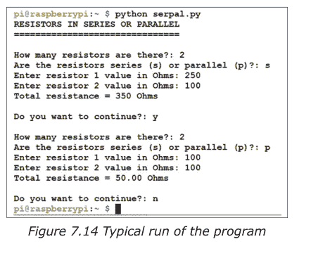

图 7.14 程序的典型运行

## 7.23 示例 3 – 电阻分压器

**描述：** 本案例研究计算电阻分压器电路中的电阻值。

**背景信息：** 电阻分压器电路由两个电阻组成。这些电路用于将电压降低到所需值。图 7.15 显示了一个典型的电阻分压器电路。这里，Vin 和 Vo 分别是输入和输出电压。R1 和 R2 构成用于将电压从 Vin 降低到 Vo 的电阻对。可以使用许多电阻对来获得所需的输出电压。选择大电阻会从电路中吸取较小的电流，而选择小电阻会吸取较大的电流。在此设计中，用户指定 Vin、Vo 和 R2。程序计算将电压降低到所需水平所需的 R1 值。此外，程序还显示使用所选物理电阻时的输出电压。

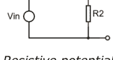

*图 7.15 电阻分压器电路*

输出电压由以下公式给出：

Vo = Vin R2 / (R1 + R2)

然后 R1 由以下公式给出：

R1 = (Vin – Vo) R2/ Vo

使用上述公式，根据给定的 Vin、Vo 和 R2 计算所需的 R1 值。

**程序清单：** 图 7.16 显示了程序清单（程序：**divider.py**）。程序开始时显示一个标题。然后程序从键盘读取 Vin、Vo 和 R2。程序计算 R1 并显示 R1 和 R2。然后询问用户输入所选的 R1 物理值。使用所选的 R1 值，程序显示 Vin、Vo、R1 和 R2，并询问用户结果是否可接受。如果此问题的答案是 **y**，则程序终止。另一方面，如果答案是 **n**，则用户可以选择再次尝试。

```
#==================================================
#           RESISTIVE POTENTIAL DIVIDER
#           -------------------------
#
# This is a resistive potential divider circuit program.
# The program calculates the resistance values that will
# lower the input voltage to the desired value
#
```

## 树莓派 5 基础

```python
# 程序：divider.py
# 日期：2023年10月
# 作者：Dogan Ibrahim
#==================================================
print("RESISTIVE POTENTIAL DIVIDER")
print("============================")
R1flag = 1
R2flag = 0

while R1flag == 1:
    Vin = float(input("\nInput voltage (Volts): "))
    Vo = float(input("Desired output voltage (Volts): "))
    R2 = float(input("Enter R2 (in Ohms): "))
#
# 计算 R1
#
    R1 = R2 * (Vin - Vo) / Vo
    print("\nR1 = %3.2f Ohms R2 = %3.2f Ohms" %(R1, R2))
#
# 读取选定的实际 R1 并显示实际的 Vo
#
    NewR1 = float(input("\nEnter chosen R1 (Ohms): "))

#
# 使用选定的 R1 显示并打印输出电压
#
    print("\nWith the chosen R1,the results are:")
    Vo = R2 * Vin / (NewR1 + R2)
    print("R1 = %3.2F R2 = %3.2f Vin = %3.2f Vo = %3.3f" %(NewR1,R2,Vin,Vo))
#
# 检查是否对数值满意？
#
    happy = input("\nAre you happy with the values? ")
    happy = happy.lower()
    if happy == 'y':
        break
    else:
        mode = input("Do you want to try again? ")
        mode = mode.lower()
        if mode == 'y':
            R1flag = 1
        else:
            R1flag = 0
            break
```

图 7.16 程序清单

图 7.17 展示了该程序的典型运行情况。

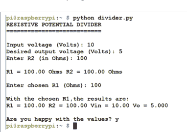

## 7.24 三角函数

Python 支持众多三角函数。三角函数的参数必须是弧度。在使用这些函数之前，必须将 **math** 库导入程序：

- sin(x) 三角正弦
- cos(x) 三角余弦
- tan(x) 三角正切
- asin(x) 三角反正弦
- atan(x) 三角反正切
- atan2(y, x) 三角 atan(y/x)
- degrees(x) 将角度转换为弧度
- radians(x) 将弧度转换为角度

图 7.18 给出了一些使用三角函数的示例。

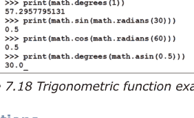

## 7.25 用户自定义函数

函数就像是程序中的小程序。我们可以使用函数将复杂的程序分解成几个易于管理的部分，每个部分都可以实现为一个函数。函数使我们能够重用程序的某些部分。例如，我们可以创建一个函数来计算一个数的立方根，然后从程序的不同部分调用这个函数。使用函数的另一个优点是它们使程序更易于维护和更新。

我们创建的函数可以从程序中的任何地方调用。函数有自己的变量和自己的命令。正如我们在本章前面部分所看到的，Python 有许多内置函数用于各种操作，如算术、三角函数、字符串操作等。用户自定义函数由程序员创建。在本节中，我们将研究如何在程序中创建和使用函数。

用户自定义函数包含以下部分：

- 函数以关键字 **def** 开头，后跟函数名和圆括号，然后是冒号。
- 函数的输入参数必须放在函数定义开头的括号内。
- 函数体必须在左侧缩进相同数量的空格。
- 可以在函数的第一行显示可选的文本消息，以描述函数的功能。
- 函数必须以 return 语句结束。

下面是一个名为 **Mult** 的示例函数。该函数首先接受两个数字 first 和 second 作为参数，将它们相乘，并返回结果：

```python
def Mult(first, second):
    "This is a simple multiplication function"
    result = first * second
    return result
```

通过指定函数名并将任何参数括在括号中，可以从主程序调用函数。例如，要调用上述函数将数字 5 和 3 相乘，并将结果存储在名为 'a' 的变量中，我们在程序中包含以下语句：

```python
a = Mult(5, 3)
```

我们也可以通过指定关键字参数来调用函数。即：

```python
a = Mult(first = 5, second = 3)
```

图 7.19 在 Python 程序中展示了上述示例。

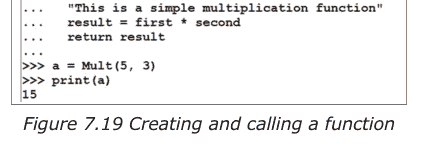

图 7.20 展示了另一个示例。在这个例子中，函数显示作为参数传递的字符串。请注意，此函数没有返回任何数据。

```python
>>> def Prnt(strng):
...     print(strng)
...     return
...
>>> Prnt("Hello there")
Hello there
```

图 7.20 显示字符串的函数

函数中使用的变量是该函数的局部变量。因此，例如，如果有两个同名的变量，一个在函数内部，另一个在函数外部，更改函数内部的变量不会改变外部的变量。函数外部的变量称为 **全局** 变量，而函数内部的变量称为 **局部** 变量。参见图 7.21 的示例，其中变量 **res** 的内容在函数外部没有被更改。

```python
>>> def Mult(first, second):
...     res = first * second
...     return res
...
>>> res = 2
>>> a = Mult(3, 8)
>>> print(a)
24
```

图 7.21 函数中的变量是局部的

全局变量的规则如下：

- 全局变量是在函数定义之外的程序顶部赋值的变量。
- 全局名称必须仅在函数内部赋值时才声明。
- 全局名称可以在函数内部引用而无需声明。

因此，通过在函数外部声明一个变量，同时在函数内部也声明该变量但使用 global 关键字，允许我们在函数内部更改其内容。下面的例子说明了全局变量的用法：

```python
cnt = 10                    # 变量 cnt 是全局的
def tstfunc():               # 函数声明
    global cnt               # 变量 cnt 定义为全局
    cnt = 200                # 全局 cnt 的值被更改

tstfunc()                   # 调用函数
print(cnt)                  # cnt 的值是 200
```

如上所述，如果全局变量的值在函数内部没有被更改，那么就没有必要将其定义为全局变量。在以下代码中，没有必要在函数内部将 **x** 定义为全局变量：

```python
x = 10
y = 4

def tst():
    global y
    y = x + 2
```

需要注意的是，函数调用中的变量是 **按值传递** 的。这意味着参数的值不能在函数内部被更改。图 7.22 展示了一个示例。在这个例子中，请注意变量 **cnt** 的值在函数调用内部没有被更改。

```python
>>> cnt = 2
>>> def Mult(first, second):
...     cnt = 5
...     return(first * second)
...
>>> a = Mult(5, 6)
>>> print(a)
30
>>> print(cnt)
2
```

*图 7.22 变量是按值传递的*

函数通常只向调用程序返回一个项。在某些应用中，我们可能希望向调用程序返回多个项。这可以通过返回一个元组，然后在主程序中解包它来轻松完成。图 7.23 展示了一个示例。在这个例子中，函数 **MyFunc** 被声明有两个参数。参数相加并存储在一个名为 **sum** 的局部变量中。同样，参数的差值存储在变量 **diff** 中。函数将 **sum** 和 **diff** 作为元组返回。调用的主程序解包返回的数据并存储在变量 **x** 和 **y** 中。

```python
>>> def MyFunc(a, b):
...     sum = a + b
...     diff = a - b
...     return sum, diff
...
>>> x, y = MyFunc(12, 5)
>>> print(x, y)
(17, 7)
```

*图 7.23 从函数返回多个变量*

## 7.26 示例

**示例 4**
编写一个程序，从键盘读取一个以度为单位的角度，并显示该角度的三角正弦值。重复此过程，直到用户停止程序。

**解答 4**
所需的程序清单和示例输出如图 7.24 所示（程序：**trig.py**）。用户输入的角度被转换为浮点数并存储在变量 angle 中。然后显示该角度的三角正弦值。程序持续运行，直到用户在提示 **Any more?** 后输入 **n**。

本程序使用 Thonny IDE 创建并运行。

## 示例 5

修改示例 4 中的程序，使用户可以在正弦、余弦和正切之间进行选择。

## 解答 5

修改后的程序清单和示例输出如图 7.25 和图 7.26 所示（程序：**trigall.py**）。程序为用户提供一个包含四个选项的菜单：正弦、余弦、正切、退出。程序从键盘读取角度值，并将其转换为弧度。然后，程序计算三角函数值并显示在屏幕上。此过程会重复进行，直到用户选择 **退出** 选项。

```
#--------------------------------------------------
#    三角函数 正弦、余弦、正切 程序
#    ============================================
#
# 本程序从键盘读取一个角度，并根据用户的选择
# 显示其三角函数正弦、余弦或正切值。角度以
# 度为单位读取，转换为弧度，然后计算所需的
# 三角函数值。
#
# 作者：Dogan Ibrahim
# 文件：trigall.py
# 日期：2023年10月
#-----------------------------------------------
import math

choice = '1'
while choice != '0':
    print("三角函数 正弦、余弦或正切")
    print("========================================\n")
    print("1. 正弦")
    print("2. 余弦")
    print("3. 正切")
    print("0. 退出")
    choice = input("请输入选择：")

    if choice != '0':
        angle = float(input("请输入角度（度）："))
        r = math.radians(angle)
        if choice == '1':
            s = math.sin(r)
            strng = "正弦"
        elif choice == '2':
            s = math.cos(r)
            strng = "余弦"
        elif choice == '3':
            s = math.tan(r)
            strng = "正切"
        print("%3.2f 度的 %s 值为：%f\n" % (angle, strng, s))
print("程序结束")
```
图 7.25 修改后的程序清单

图 7.26 示例输出

本程序使用 **nano** 文本编辑器创建，然后通过以下命令运行：

```
pi@raspberrypi:~ $ python trigall.py
```

## 示例 6

编写一个程序，以 5º 为步长，列出从 0º 到 90º 角度的三角函数正弦值表。

## 解答 6

所需的程序清单如图 7.27 所示（程序：**sinetable.py**）。在显示标题后，使用 for 语句创建一个循环。变量 angle 以 5 为步长，从 0 到 90（包含）取值。计算并显示三角函数正弦值。

```
#--------------------------------------------------
#       三角函数正弦值表
#       =====================
#
# 本程序以 5 度为步长，列出从 0 到 90 度角度的
# 三角函数正弦值表。
#
# 作者：Dogan Ibrahim
# 文件：sinetable.py
# 日期：2023年10月
#--------------------------------------------------
import math

print("三角函数正弦值表")
print("============================\n")
print("  角度      正弦值")

for angle in range(0, 95, 5):
    r = math.radians(angle)
    s = math.sin(r)
    print("  %d        %f" % (angle, s))

print("程序结束")
```
*图 7.27 程序清单*

程序的一个示例运行如图 7.28 所示。

图 7.28 程序示例运行

## 示例 7

编写一个程序，从键盘读取米数。将其转换为码和英寸，并显示结果。

## 解答 7

所需的程序清单和示例输出如图 7.29 所示（程序：**conv.py**）。在显示标题后，使用 **input** 语句从键盘读取米数。然后，通过分别乘以 1.0936 和 39.370 将该值转换为码和英寸。结果显示在屏幕上。

图 7.29 程序清单和示例输出

### 示例 8

重复示例 7，但在一个名为 **Conv** 的函数中进行转换。展示如何从主程序调用此函数。

### 解答 8

所需的程序清单和示例输出如图 7.30 所示（程序：**convfunc.py**）。函数 Conv 在程序开头声明。要转换为码和英寸的米数作为参数传递给该函数。函数以元组形式返回码和英寸。主程序从键盘读取米数并调用函数 Conv。结果显示在屏幕上。

### 示例 9

编写一个名为 **Cyl** 的函数，根据给定的半径和高度计算圆柱体的面积和体积。在主程序中使用此函数。

### 解答 9

圆柱体的面积和体积由以下公式给出：

面积 = 2πrh
体积 = πr²h

所需的程序清单和示例输出如图 7.31 所示（程序：**cylinder.py**）。圆柱体的半径和高度作为参数传递给一个函数，该函数计算圆柱体的面积和体积，并将结果返回给主程序，结果显示在屏幕上。

图 7.31 程序清单和示例输出

### 示例 10

编写一个计算器程序，对从键盘接收的两个数执行加、减、乘、除四种基本数学运算。

### 解答 10

所需的程序清单如图 7.32 所示（程序：**calc.py**）。从键盘接收两个数并存储在变量 **n1** 和 **n2** 中。然后，接收所需的数学运算并执行。存储在变量 **result** 中的结果显示在屏幕上。用户可以选择终止程序。

```
#-----------------------------------------------
#           计算器程序
#           =================
#
# 这是一个简单的计算器程序，可以执行
# 4 种基本的算术运算。
#
# 作者：Dogan Ibrahim
# 文件：calc.py
# 日期：2023年10月
#-----------------------------------------------

any = 'y'
while any == 'y':
    print("\n计算器程序")
    print("==================")

    n1 = float(input("请输入第一个数："))
    n2 = float(input("请输入第二个数："))
    op = input("请输入运算符 (+-*/)：")

    if op == "+":
        result = n1 + n2
    elif op == "-":
        result = n1 - n2
    elif op == "*":
        result = n1 * n2
    elif op == "/":
        result = n1 / n2
    print("结果 = %f" % (result))
    any = input("\n是否继续 (yn)：")
```
图 7.32 程序清单

程序的一个示例运行如图 7.33 所示。

图 7.33 示例输出

### 示例 11

编写一个程序模拟掷双骰子。即每次运行时显示两个 1 到 6 之间的随机数。

### 解答 11

所需的程序清单和示例输出如图 7.34 所示（程序：**dice.py**）。这里，当按下回车键时，使用随机数生成器 **randint** 生成 1 到 6 之间的随机数。当输入字母 **X** 时，程序终止。

图 7.34 程序清单和示例输出

### 示例 12

编写一个程序，使用函数计算并显示以下形状的面积：正方形、长方形、三角形、圆形和圆柱体。所需的边长应从键盘接收。

### 解答 12

程序中要使用的形状面积如下：

- **正方形：** 边长 = a，面积 = a²
- **长方形：** 边长 a, b，面积 = ab
- **圆形：** 半径 r，面积 = πr²
- **三角形：** 底边 b，高 h，面积 = bh/2
- **圆柱体：** 半径 r，高度 h，面积 = 2πrh

所需的程序清单如图 7.35 所示（程序：**areas.py**）。每种形状使用不同的函数，边长在函数内部接收。主程序显示所选形状的计算面积。

```
#--------------------------------------------------
#                形状的面积
#                =============
#
# 本程序计算并显示各种几何形状的面积。
#
# 作者：Dogan Ibrahim
# 文件：areas.py
```

# 日期：2023年10月
#-----------------------------------------------
import math

def Square(a):                    # 正方形
    return a * a

def Rectangle(a, b):              # 长方形
    return(a * b)

def Triangle(b, h):               # 三角形
    return(b * h / 2)

def Circle(r):                    # 圆形
    return(math.pi * r * r)

def Cylinder(r, h):               # 圆柱体
    return(2 * math.pi * r * h)

print("图形的面积")
print("================\n")
print("图形是什么？：")

shape = input("正方形 (s)\n长方形(r)\n圆形(c)\n\n三角形(t)\n圆柱体(y): ")

shape = shape.lower()
if shape == 's':
    a = float(input("输入正方形的边长："))
    area = Square(a)
    s = "正方形"
elif shape == 'r':
    a = float(input("输入长方形的一条边长："))
    b = float(input("输入长方形的另一条边长："))
    area = Rectangle(a, b)
    s = "长方形"
elif shape == 'c':
    radius = float(input("输入圆的半径："))
    area = Circle(radius)
    s = "圆形"
elif shape == 't':
    base = float(input("输入三角形的底边："))
    height = float(input("输入三角形的高："))
    area = Triangle(base, height)
    s = "三角形"
elif shape == 'y':
    radius = float(input("输入圆柱体的半径："))
    height = float(input("输入圆柱体的高："))
    area = Cylinder(radius, height)
    s = "圆柱体"

print("%s的面积是 %f" %(s, area))

图 7.35 程序清单

程序的一个运行示例如图 7.36 所示。

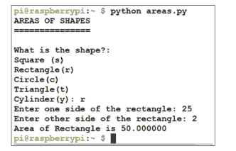

图 7.36 示例输出

## 7.27 递归函数

递归函数是直接或间接调用自身的函数，Python 支持此类函数。虽然递归函数是一个高级主题，但图 7.37 给出了一个示例来说明此类函数的原理。这个递归函数实现了阶乘运算。对递归函数的详细分析超出了本书的范围。

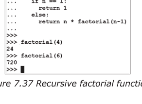

图 7.37 递归阶乘函数

## 7.28 异常

我们的程序中可能存在重大错误，例如除以零、文件权限错误等。通常，当 Python 遇到此类错误时，它无法处理它们，程序就会崩溃。

一种有序处理此类错误并避免崩溃的方法是在我们的程序中使用异常处理。基本方法是，每当发生错误时，程序检测到该错误并采取适当措施处理错误并继续正常执行。如果我们希望有序地终止正在运行的程序，异常处理也很有用，例如，当程序被用户异步终止（例如通过按 Ctrl+C 键）时，关闭任何输入输出操作。

语句 `try` 和 `except` 用于处理程序中意外的错误或终止。异常处理的一般格式如下：

```
try:
    正常的程序语句
    正常的程序语句
except 条件 1:
    如果发生条件 1 类型的错误，则执行此代码块
    ....................
    ....................
except 条件 2:
    如果发生条件 2 类型的错误，则执行此代码块
    ....................
    ....................
else:
    如果没有检测到错误，则执行此代码块
    ....................
    ....................
```

我们可以使用不带条件的 `except` 语句来处理任何类型的异常。一些常用的异常包括：

- **异常 EOFError：** 读取数据时达到文件末尾条件
- **异常 ImportError：** import 语句无法加载模块
- **异常 IndexError：** 序列下标超出范围
- **异常 KeyError：** 在现有键集中找不到字典键
- **异常 KeyboardInterrupt：** 用户按下了中断键（通常是 Ctrl+C 或 Delete 键）
- **异常 MemoryError：** 操作内存不足
- **异常 OverFlowError：** 算术运算导致溢出
- **异常 RuntimeError：** 检测到不属于任何其他类别的错误
- **异常 ValueError：** 操作或函数接收到的参数类型正确但值不合适
- **异常 ZeroDivisionError：** 发生了除以零的错误

下面给出了一些在程序中使用异常的示例。

### 示例 13

编写一个程序，等待来自键盘的输入。当在键盘上按下 Ctrl+C 键时，有序地终止程序。

### 解决方案 13

图 7.38 显示了程序清单（程序：except1.py）。此程序中使用了异常 `KeyboardInterrupt`。当在键盘上按下 Ctrl+C 组合键时，显示消息“程序结束”。

```
#==================================================
#       KeyboardInterrupt EXCEPTION
#
# This program detects the keyboard entry Ctrl+C and
# the program is terminated orderly after the message
# End of Program is displayed
#
# Author : Dogan Ibrahim
# File   : except1.py
# Date   : October, 2023
#==================================================
try:
    mode = input("Enter Ctrl+C to terminate the program: ")
except KeyboardInterrupt:
    print("\nEnd of Program")
```

图 7.38 程序清单

### 示例 14

编写一个程序来检测除以零，并在检测到此异常时显示消息“除以零”。

### 解决方案 14

图 7.39 显示了程序清单（程序：except2.py）。这里，程序被强制将一个数字除以零，这被检测为一个异常，当发生这种情况时程序显示一条消息。

```
#==================================================
#       ZeroDivisionError EXCEPTION
#
# This program detects when a number is divided by zero
# and generates an exception to display a message
#
# Author : Dogan Ibrahim
# File   : except2.py
# Date   : October, 2023
#==================================================
print("Divide by zero exception")

try:
    s = 10 / 0
except ZeroDivisionError:
    print("Divide by Zero")
```

图 7.39 程序清单

当程序运行时，它显示以下消息：

除以零异常
除以零

## 7.29 try/finally 异常

语句 `finally` 可以在异常处理中使用。`try/finally` 组合指定了异常，其中以 `finally` 开头的块在退出时总是被执行，无论 `try` 块中是否发生异常。下面给出一个示例：

### 示例 15

编写一个程序来查找 `KeyboardInterrupt` 异常，如果未发生异常，则显示消息“异常未发生”。

### 解决方案 15

图 7.40 显示了程序清单（程序：except3.py）。无论是否发生异常，`finally` 内部的块都会被执行。

```
#==================================================
#           try/finally In EXCEPTION
#
# This program detects the keyboard entry Ctrl+C and
# displays the message Keyboard Interrupt if interrupt
# occurs. Message Continue is displayed regardless of
# whether an exception occurred
#
# Author : Dogan Ibrahim
# File   : except3.py
# Date   : October, 2023
#==================================================
try:
    mode = input("Enter Ctrl+C to terminate the program: ")
except KeyboardInterrupt:
    print("\nKeyboard Interrupt")
finally:
    print("\nContinue")
```

图 7.40 程序清单

当程序运行时，显示以下内容

输入 Ctrl+C 以终止程序：
输入 Ctrl+C 后：
键盘中断

## 7.30 日期和时间

在某些应用程序中，可能需要获取当前日期和时间。Python 支持许多函数来获取当前日期和时间。在使用这些函数之前，必须导入 `time` 模块。一些常用的日期和时间函数如下：

- `time.localtime()` 以以下格式返回当前日期和时间：
  `time.struct_time(tm_year=2013,tm_mon=12,tm_mday=18, tm_hour=12,tm_min=45,tm_sec=3,tm_wday=2,tm_yday=352, tm_isdst=0)`
- `time.asctime()` 以标准可读格式返回日期和时间
- `time.clock()` 以秒为单位返回当前 CPU 时间
- `time.ctime()` 返回当前日期和时间
- `time.time()` 以秒为单位返回自纪元以来的当前时间
- `time.sleep(x)` 将调用程序挂起 x 秒

图 7.41 给出了一些示例。

```
>>> import time
>>> print(time.localtime())
time.struct_time(tm_year=2023, tm_mon=10, tm_mday=6, tm_hour=14, tm_min=31,
sec=0, tm_wday=4, tm_yday=279, tm_isdst=1)
>>> 
>>> print(time.asctime())
Fri Oct  6 14:31:05 2023
>>> 
>>> print(time.ctime())
Fri Oct  6 14:31:15 2023
>>> 
>>> print(time.time())
1696599083.4537978
>>> 
```

图 7.41 示例日期和时间函数

`datetime` 模块也可用于日期和时间函数。必须导入此模块才能使用这些函数。图 7.42 显示了一些日期函数的示例。

```
>>> from datetime import date
>>> print(date.today())
2023-10-06
>>> 
>>> print(date.today().year)
2023
>>> 
>>> print(date.today().month)
10
>>> 
>>> print(date.today().day)
6
>>> 
```

图 7.42 使用 datetime 日期函数的示例

函数 `strftime(format)` 非常有用，因为它可用于格式化日期和时间字符串。图 7.43 给出了使用此函数的一些示例。

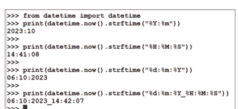

图 7.43 使用 strftime 的示例

## 7.31 创建自己的模块

在某些应用中，我们可能希望创建自己的 Python 模块并将其导入到我们的程序中。Python 模块就是 `.py` 程序文件。编写模块就像编写任何其他 Python 程序一样。模块可以包含函数、类和变量。

下面显示了一个名为 `msg.py` 的简单模块：

```
def hello():
    print("Hello there!")
```

我们现在可以将此模块导入到我们的 Python 程序中。下面显示了一个名为 `myprog.py` 的示例程序：

```
import msg
msg.hello()
```

运行程序：`python myprog.py` 将显示以下输出：

```
Hello there!
```

我们也可以修改我们的程序 `myprog.py`，然后按如下方式导入并调用模块：

```
from msg import hello
hello()
```

我们可以在模块中使用变量，如下所示：

```
msg.py
def hello():
    print("Hello there!")

name = "Jones"
```

### myprog.py

```
import msg
msg.hello()
print(msg.name)
```

程序将显示：

```
Hello there!
Jones
```

可以为模块创建别名。这在以下代码中展示：

### myprog.py

```
import msg as tst
tst.hello()
```

将显示输出：

```
Hello there!
```

下面给出一个示例模块，用于计算一个数字的立方。

### 示例 16

编写一个模块，计算传递给它的整数的立方。展示如何在程序中导入和使用此模块。

### 解答 16

图 7.44 显示了模块清单（程序：`cubeno.py`）。`cubeno.py` 内的函数 `cube` 以数字作为其参数。计算并返回该数字的立方。图 7.45 显示了程序（程序：`myprog.py`）。例如，当数字为 3 时，程序的输出为：

```
Cube of 3 is: 27

def cube(N):
    r = N * N * N
    return r
```

图 7.44 程序 cubeno.py 清单

```
import cubeno
n= 3
res = cubeno.cube(n)
print("Cube of %d is: %d" %(n,res))
```

图 7.45 程序 myprog.py

模块搜索路径：当要导入一个模块时，Python 按给定顺序查看以下文件夹：

- 调用模块的文件夹（调用主程序所在的位置）
- `PYTHONPATH` 环境变量中包含的目录列表。
- Python 安装时配置的、与安装相关的目录列表

可以通过交互式输入以下命令来显示 Python 搜索路径：

```
>>> import sys
>>> sys.path
```

作者计算机上的显示如图 7.46 所示。

```
>>> import sys
>>> sys.path
['', '/usr/lib/python311.zip', '/usr/lib/python3.11', '/usr/lib/python3.11/lib-dynload', '/usr/local/lib/python3.11/dist-packages', '/usr/lib/python3/dist-packages', '/usr/lib/python3.11/dist-packages']
>>> 
```

图 7.46 Python 路径显示

为确保 Python 能找到你的模块，你可以执行以下操作之一：

- 将模块程序文件放在主程序所在的文件夹中
- 修改 `PYTHONPATH` 环境变量以包含模块程序所在的文件夹
- 将模块程序放在 `PYTHONPATH` 已包含的某个文件夹中

Raspberry Pi 5 Essentials

# 第 8 章 • Raspberry Pi 5 LED 项目

## 8.1 概述

本章介绍 Raspberry Pi 5 硬件接口以及在简单项目中使用 LED。Raspberry Pi 5 使用其 GPIO（通用输入输出）端口连接器连接到外部电子电路和设备。这是一个 2.54 mm、40 引脚的扩展排针，排列成 2 × 20 的条带，如图 8.1 所示。I/O 端口编号为 GPIO nn。

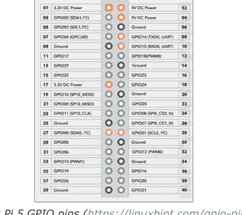

## 8.2 Raspberry Pi 5 GPIO 引脚定义

当 GPIO 连接器位于电路板的远端时，从连接器左侧开始的引脚编号为 1、3、5、7 等，而顶部的引脚编号为 2、4、6、8 等（图 8.2）。

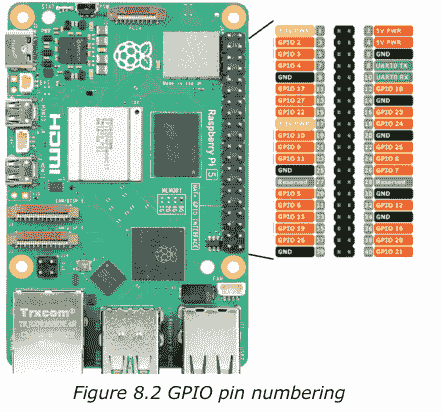

GPIO 提供 26 个通用双向 I/O 引脚。其中一些引脚具有多种功能。例如，引脚 3 和 5 分别是 GPIO2 和 GPIO3 输入输出引脚。这些引脚也可以分别用作 I²C 总线的 SDA 和 SCL 引脚。同样，引脚 9、10、11 和 19 既可以用作通用输入输出引脚，也可以用作 SPI 总线引脚。引脚 8 和 10 保留用于 UART 串行通信。

提供两个电源输出：+3.3 V 和 +5.0 V。GPIO 引脚在 +3.3 V 逻辑电平下工作（不像许多其他计算机电路在 +5 V 下工作）。一个引脚可以是输入或输出。配置为输出时，引脚电压为 0 V（逻辑 0）或 +3.3 V（逻辑 1）。Raspberry Pi 5 通常使用外部电源（例如市电适配器）以 +5 V 输出运行。3.3 V 输出引脚可提供高达 16 mA 的电流。所有输出引脚的总电流不应超过 51 mA 的限制。将外部设备连接到 GPIO 引脚时应小心，因为抽取过大电流或短路引脚很容易损坏你的 Raspberry Pi。5 V 引脚可提供的电流量取决于许多因素，例如 Pi 本身所需的电流、USB 外设消耗的电流、摄像头电流、micro-HDMI 端口电流等。

配置为输入时，高于 +1.7 V 的电压将被视为逻辑 1，低于 +1.7 V 的电压将被视为逻辑 0。应注意不要向任何 I/O 引脚提供大于 +3.3 V 的电压，因为高电压很容易损坏你的 Raspberry Pi。Raspberry Pi 5 与该系列中的其他产品一样，没有过压保护电路。

## 8.3 项目 1 – 闪烁 LED

**描述：** 这可能是你可以使用 Raspberry Pi 5 设计的最简单的硬件项目。在这个项目中，你将把一个 LED 连接到 Raspberry Pi 5 的一个端口，然后让 LED 每秒闪烁一次。该项目的目的是展示如何编写一个简单的 Python 程序，然后从文件运行它。该项目还展示了如何将 LED 连接到 Raspberry Pi 5 的 GPIO 引脚。此外，该项目展示了如何使用 GPIO 库来配置和设置 GPIO 引脚为逻辑 0 或 1。

**框图：** 该项目的框图如图 8.3 所示。

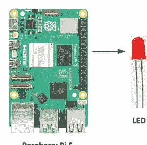

*图 8.3 项目的框图*

**电路图：** 该项目的电路图如图 8.4 所示。一个小 LED 通过一个限流电阻连接到 Raspberry Pi 5 的端口引脚 GPIO 17（引脚 11）。限流电阻的值计算如下：

GPIO 引脚的输出高电平为 3.3 V。LED 两端的电压约为 1.8 V。流过 LED 的电流取决于所用 LED 的类型和所需的亮度。假设我们使用一个小 LED，我们可以假设 LED 的正向电流约为 3 mA。那么，限流电阻的值为：

R = (3.3 – 1.8) / 0.003 = 500 Ω。我们可以选择一个 470 Ω 的电阻。

在图 8.4 中，LED 工作在电流源模式，其中 GPIO 引脚的高电平输出驱动 LED。LED 也可以工作在电流吸收模式，其中 LED 的另一端连接到 +3.3 V 电源而不是地。在电流吸收模式下，当 GPIO 引脚处于逻辑低电平时，LED 点亮。

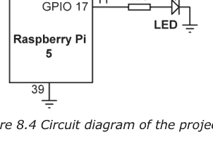

图 8.4 项目的电路图

**构建：** 该项目在面包板上构建，如图 8.5 所示。使用跳线将 LED 连接到 GPIO 端口。注意，LED 的短边必须接地。

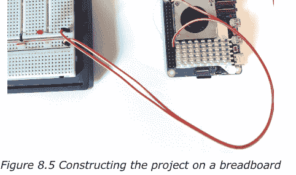

图 8.5 在面包板上构建项目

**程序清单：** 该程序名为 **LED.py**，其代码清单如图 8.6 所示。程序使用 **nano** 文本编辑器编写。在程序开头，将 **gpiozero** 和 **time** 模块导入到项目中。程序的其余部分在 **while** 循环中无限执行，其中 LED 在每次输出状态改变之间有一秒的延迟，交替开启和关闭。按 Ctrl+C 可终止程序。

```
#--------------------------------------------------
#
#              FLASHING LED
#              ============
#
# In this project a small LED is connected to GPIO 17 of
# the Raspberry Pi 5. The program flashes the LED every
# second.
#
# Program: LED.py
# Date    : October, 2023
# Author  : Dogan Ibrahim
#--------------------------------------------------
from gpiozero import LED      # import gpiozero
from time import sleep        # import time library

led = LED(17)

while True:
    led.on()                  # turn ON LED
    sleep(1)                  # wait 1 second
    led.off()                 # turn OFF LED
    sleep(1)                  # wait 1 second
```

*图 8.6 项目的程序清单*

程序从控制台模式运行如下：

```
pi@raspberrypi ~ $ python LED.py
```

如果您希望从 GUI 桌面环境运行程序，应使用 **VNC Viewer** 进入 GUI 桌面屏幕（除非您已通过 micro-HDMI 线将显示器连接到 Raspberry Pi 5）。然后，点击 **Applications menu** → **Programming** → **Thonny**。

点击 **File** 并打开文件 **LED.py**，或者如果文件不在默认目录中则输入程序。现在，点击 **Run** 运行程序。您应该看到 LED 每秒闪烁一次。要终止程序，请点击 **STOP** 按钮关闭屏幕。

Raspberry Pi 5 Essentials

> **注意：** 您可以使用 **winSCP** 文件复制程序（可从互联网免费获取）将程序从 Raspberry Pi 5 主目录复制到您的 PC。

## 8.4 项目 2 – 交替闪烁的 LED

**描述：** 此项目与前一个类似，但这里使用了两个 LED，它们每秒交替闪烁。此项目的目的是展示如何将多个 LED 连接到 Raspberry Pi 5。

**框图：** 项目的框图如图 8.7 所示。

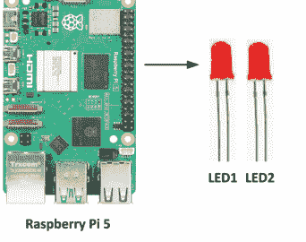

**电路图：** 项目的电路图如图 8.8 所示。两个小 LED 通过限流电阻连接到 Raspberry Pi 5 的端口引脚 GPIO 17（引脚 11）和 GPIO 27（引脚 13）。

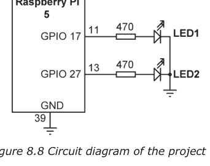

**程序清单：** 该程序名为 **alternate.py**，其代码清单如图 8.9 所示。程序使用 **nano** 文本编辑器编写。在程序开头，将 **gpiozero** 和 **time** 模块导入到项目中。程序的其余部分在 **while** 循环中无限执行，其中 LED 在每次输出之间有一秒的延迟，交替开启和关闭。按 Ctrl+C 可终止程序。

```
#--------------------------------------------------
# 
#           ALTERNATELY FLASHING LEDS
#           ========================
# 
# In this project two small LEDs are connected to GPIO 17 and
# GPIO 27 of the Raspberry Pi 5. The program flashes the LEDs
# alternately every second.
# 
# Program: alternate.py
# Date    : October, 2023
# Author  : Dogan Ibrahim
#--------------------------------------------------
from gpiozero import LED
from time import sleep           # import time library

led1 = LED(17)                   # LED1 at GPIO 17
led2 = LED(27)                   # LED2 at GPIO 27

while True:
    led1.on()                    # Turn ON LED1
    led2.off()                   # Turn OFF LED2
    sleep(1)                     # Wait 1 second
    led1.off()                   # Turn OFF LED1
    led2.on()                    # Turn ON LED2
    sleep(1)                     # Wait 1 second
```

*图 8.9 项目的程序清单*

## 8.5 项目 3 – 使用 8 个 LED 进行二进制计数

**描述：** 在此项目中，八个 LED 连接到 Raspberry Pi 5 的 GPIO 引脚。LED 每秒以二进制方式递增计数。此项目的目的是展示如何将八个 LED 连接到 Raspberry Pi 5 的 GPIO 引脚。此外，该项目还展示了如何将 LED 组合为一个 8 位端口，并将其作为一个端口进行控制。

**框图：** 项目的框图如图 8.10 所示。

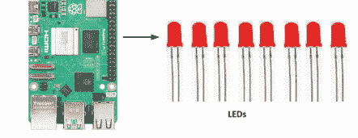

*图 8.10 项目的框图*

**电路图：** 项目的电路图如图 8.11 所示。LED 通过 470 Ω 限流电阻连接到 8 个 GPIO 引脚。以下 8 个 GPIO 引脚被组合为一个 8 位端口，其中 GPIO 2 配置为最低有效位（LSB），GPIO 9 配置为最高有效位（MSB）：

| MSB | GPIO | 9 | 10 | 22 | 27 | 17 | 4 | 3 | 2 | LSB |
| :--- | :--- | :--- | :--- | :--- | :--- | :--- | :--- | :--- | :--- | :--- |
| | 引脚号 | 21 | 19 | 15 | 13 | 11 | 7 | 5 | 3 | |

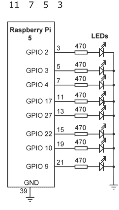

*图 8.11 项目的电路图*

**构建：** 项目在面包板上构建，如图 8.12 所示。请注意，在此项目中，一个 **T-Cobbler**（图 8.13）通过排线连接到 Raspberry Pi 的 40 引脚 GPIO 排针。排线的另一端使用 T 型连接器，该连接器插入面包板。此设置简化了与 Raspberry Pi GPIO 排针的连接，尤其是在需要进行大量连接时。GPIO 引脚名称写在 T-cobbler 上，便于访问。

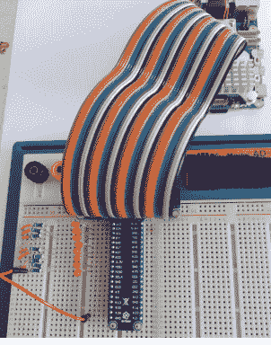

*图 8.12 在面包板上构建项目*

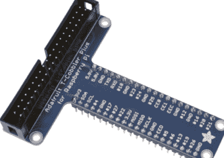

*图 8.13 T-Cobbler*

**程序清单：** 该程序名为 **LEDCNT.py**，其代码清单如图 8.14 所示。程序使用 **nano** 文本编辑器编写。在主程序内部，形成一个无限循环，在此循环内 LED 以二进制方式递增计数。变量 **cnt** 用作计数器。函数 **Port_Output** 用于控制 LED。此函数可以接受 0 到 255 的整数，并使用内置函数 **bin** 将输入数字（x）转换为二进制。然后，从输出字符串 **b** 中移除前导字符 '0b'（bin 函数在转换后的字符串开头插入字符 '0b'）。接着，通过插入前导零，将转换后的字符串 **b** 补足为 8 个字符。然后，将字符串逐位发送到端口，从最低有效位（GPIO 2）位置开始。结果是 8 个 LED 以二进制方式递增计数。

```
#-----------------------------------------------------------------------
#
#                       BINARY UP COUNTING LEDs
#                       ========================
#
# In this project 8 LEDs are connected to the following
# GPIO pins:
#
# 9 10 22 27 17 4 3 2
#
# The program groups these LEDs as an 8-bit port and then
# the LEDs count up in binary with one second delay between
# each output.
#
# Program: LEDCNT.py
# Date    : October, 2023
# Author  : Dogan Ibrahim
#-----------------------------------------------------------------------
from gpiozero import LED
from time import sleep           # import time library

#
# LED connections
#
PORT = [0] * 8
PORT[0] = LED(9)
PORT[1] = LED(10)
PORT[2] = LED(22)
PORT[3] = LED(27)
PORT[4] = LED(17)
PORT[5] = LED(4)
PORT[6] = LED(3)
PORT[7] = LED(2)

#
# This function sends 8-bit data (0 to 255) to the PORT
#
def Port_Output(x):
    b = bin(x)                          # convert into binary
    b = b.replace("0b", "")              # remove leading "0b"
    diff = 8 - len(b)                   # find the length
    for i in range (0, diff):
        b = "0" + b                     # insert leading 0s

    for i in range (0, 8):
        if b[i] == "1":
```

## 8.5 项目3 – 二进制递增计数LED

**描述：** 在本项目中，八个LED连接到树莓派5的GPIO引脚。LED以二进制方式递增计数，每次输出之间有一秒的延迟。

**程序清单：** 程序名为**LEDCNT.py**，清单如图8.14所示。该程序使用**nano**文本编辑器编写。程序开始时，导入**gpiozero**库以控制LED。然后，形成一个无限循环，在此循环内，计数器变量**cnt**从0递增到255。与计数器对应的二进制模式被发送到端口，从而控制LED的开启或关闭。

```
#---------------------------------------------------
#
#              BINARY UP COUNTING LEDs
#              =====================
#
# In this project 8 LEDs are connected to the following
# GPIO pins:
#
# 9 10 22 27 17 4 3 2
#
# The program groups these LEDs as an 8-bit port and then
# the LEDs count up in binary with one second delay between
# each output.
#
# Program: LEDCNT.py
# Date    : October, 2023
# Author  : Dogan Ibrahim
#---------------------------------------------------
from gpiozero import LED
from time import sleep                # import time library

PORT = [9,10,22,27,17,4,3,2]          # LED ports

#
# This function initializes the port list PORT[]
#
def Configure():
    for i in range(8):
        PORT[i] = LED(PORT[i])

#
# This function sends 8-bit data (0 to 255) to the PORT
#
def Port_Output(x):
    b = bin(x)                        # convert into binary
    b = b.replace("0b", "")            # remove leading "0b"
    diff = 8 - len(b)                 # find the length
    for i in range (0, diff):
        b = "0" + b                    # insert leading 0s

    for i in range (0, 8):
        if b[i] == "1":
            PORT[i].on()
        else:
            PORT[i].off()
    return
#
# Main program loop. Count up in binary every second
#
cnt = 0
Configure()

while True:
    Port_Output(cnt)                  # send cnt to port
    sleep(1)                          # wait 1 second
    cnt = cnt + 1                     # increment cnt
    if cnt > 255:
        cnt = 0
```

图8.14 程序清单

**推荐修改：** 修改程序，使LED每两秒递减计数。

## 修改后的程序

图8.14所示的程序可以通过将LED端口号存储在列表中进行修改，使其更加友好。修改后的程序**LEDCNT2.py**如图8.15所示。在此程序中，LED端口号存储在列表PORT中。然后，像以前一样使用函数**Port_Output**将端口数据发送到LED。

```
#---------------------------------------------------
#
#              BINARY UP COUNTING LEDs
#              =====================
#
# In this project 8 LEDs are connected to the following
# GPIO pins:
#
# 9 10 22 27 17 4 3 2
#
# The program groups these LEDs as an 8-bit port and then
# the LEDs count up in binary with one second delay between
# each output.
#
# Program: LEDCNT2.py
# Date    : October, 2023
# Author  : Dogan Ibrahim
#---------------------------------------------------
from gpiozero import LED
from time import sleep                # import time library

PORT = [9,10,22,27,17,4,3,2]          # LED ports

#
# This function initializes the port list PORT[]
#
def Configure():
    for i in range(8):
        PORT[i] = LED(PORT[i])

#
# This function sends 8-bit data (0 to 255) to the PORT
#
def Port_Output(x):
    b = bin(x)                        # convert into binary
    b = b.replace("0b", "")            # remove leading "0b"
    diff = 8 - len(b)                 # find the length
    for i in range (0, diff):
        b = "0" + b                    # insert leading 0s

    for i in range (0, 8):
        if b[i] == "1":
            PORT[i].on()
        else:
            PORT[i].off()
    return
#
# Main program loop. Count up in binary every second
#
cnt = 0
Configure()

while True:
    Port_Output(cnt)                  # send cnt to port
    sleep(1)                          # wait 1 second
    cnt = cnt + 1                     # increment cnt
    if cnt > 255:
        cnt = 0
```

图8.15 修改后的程序

## 8.6 项目4 – 圣诞灯（随机闪烁的8个LED）

**描述：** 在本项目中，八个LED像项目3一样连接到树莓派5的GPIO引脚。LED每0.5秒随机闪烁一次，就像花哨的圣诞灯一样。本项目的目的是展示如何生成1到255之间的随机数。

项目的方框图和电路图分别与图8.10和图8.11相同。

**程序清单：** 程序名为**XMAS.py**，清单如图8.16所示。该程序使用**nano**文本编辑器编写。程序开始时，将**random**模块和其他所需模块导入程序。然后，形成一个无限循环，在此循环内生成一个1到255之间的随机数，并将此数字用作函数**Port_Output**的参数。与生成的数字对应的二进制模式被发送到端口，从而随机控制LED的开启或关闭。

```
#------------------------------------------------------------
#
#                   CHRISTMAS LIGHTS
#                   ================
#
# In this project 8 LEDs are connected to the Raspberry Pi 3
# and these LEDs flash randomly at 0.5 second intervals. The
# connections of the LEDs are to the following GPIO pins:
#
# 9 10 22 27 17 4 3 2
#
# The program groups these LEDs as an 8-bit port and then
# generates random numbers between 1 and 255 and turns the
# LEDs ON and OFF depending on the generated number.
#
# Program: XMAS.py
# Date    : October, 2023
# Author  : Dogan Ibrahim
#------------------------------------------------------------
from gpiozero import LED
from time import sleep        # import time library
import random                 # import random library

PORT = [9,10,22,27,17,4,3,2]  # LED ports

#
# This function initializes the port list PORT[]
#
def Configure():
    for i in range(8):
        PORT[i] = LED(PORT[i])

#
# This function sends 8-bit data (0 to 255) to the PORT
#
def Port_Output(x):
    b = bin(x)                    # convert into binary
    b = b.replace("0b", "")        # remove leading "0b"
    diff = 8 - len(b)             # find the length
    for i in range (0, diff):
        b = "0" + b                # insert leading 0s

    for i in range (0, 8):
        if b[i] == "1":
            PORT[i].on()
        else:
            PORT[i].off()
    return
#
# Configure PORTs
#
Configure()

#
# Main program loop. Count up in binary every second
#
while True:
    numb = random.randint(1, 255) # generate a random number
    Port_Output(numb)             # send cnt to port
    sleep(0.5)                    # wait 0.5 second
```

图8.16 程序清单

**推荐修改：** 修改程序，使10个LED可以连接到树莓派5并随机闪烁。

## 8.7 项目5 – 追逐LED

**描述：** 在本项目中，八个LED像之前的项目一样连接到树莓派5的GPIO引脚。如图8.17所示，LED从最低有效位（LSB）到最高有效位（MSB）旋转（相互追逐），每次输出之间有一秒的延迟。


图8.17 追逐LED

项目的方框图和电路图分别与图8.10和图8.11相同。

**程序清单：** 程序名为**rotate.py**，清单如图8.18所示。该程序使用**nano**文本编辑器编写。在主程序内部，形成一个无限循环，在此循环内，变量**rot**用作**Port_Output**函数的参数。此变量在每次迭代时左移，因此LED的开启顺序是从左到右（从LSB到MSB）。每次输出之间插入一秒的延迟。

```
#-----------------------------------------------------------------------
#                   ROTATING LEDs
#                   =============
#
# In this project 8 LEDs are connected to the Raspberry Pi 5.
# The LEDs rotate from LSB to MSB every second
#
# Program: rotate.py
# Date    : October, 2023
# Author  : Dogan Ibrahim
#-----------------------------------------------------------------------
from gpiozero import LED
from time import sleep                # import time library

PORT = [9,10,22,27,17,4,3,2]          # LED ports

#
# This function initializes the port list PORT[]
#
def Configure():
    for i in range(8):
        PORT[i] = LED(PORT[i])

#
# This function sends 8-bit data (0 to 255) to the PORT
#
def Port_Output(x):
    b = bin(x)                        # convert into binary
    b = b.replace("0b", "")            # remove leading "0b"
    diff = 8 - len(b)                 # find the length
    for i in range (0, diff):
        b = "0" + b                    # insert leading 0s

    for i in range (0, 8):
        if b[i] == "1":
            PORT[i].on()
        else:
            PORT[i].off()
    return
#
# Configure PORTs
#
Configure()

#
# Main program loop. Rotate the LEDs
#
rot = 1
while True:
    Port_Output(rot)
    sleep(1)                    # wait 1 second
    rot = rot << 1              # shift left
    if rot > 128:               # at the end
        rot = 1                 # back to beginning
```

图8.18 程序清单

## 8.8 项目6 – 带按钮开关的旋转LED

**描述：** 在本项目中，八个LED像之前的项目一样连接到树莓派5的GPIO引脚。此外，一个按钮开关连接到其中一个GPIO端口。当按钮未按下时，LED向一个方向旋转；当按钮按下时，LED向相反方向旋转。任何时候只有一个LED亮起。每次输出之间插入一秒的延迟。本项目的目的是展示如何将按钮开关连接到GPIO引脚。

**方框图：** 项目的方框图如图8.19所示。


**电路图：** 项目的电路图如图8.20所示。LED通过470 Ω限流电阻连接到8个GPIO引脚，与之前的项目相同。按钮开关连接到树莓派5的GPIO 11（引脚23）。按钮开关通过一个10 kΩ和一个1 kΩ电阻连接。当开关未按下时，输入为逻辑1。当开关按下时，输入变为

## 8.9 项目7 – 使用LED或蜂鸣器的莫尔斯电码练习器

**描述：** 在本项目中，一个LED或蜂鸣器连接到树莓派5的GPIO 17（引脚11）。用户从键盘输入文本。然后，蜂鸣器被开启和关闭，以莫尔斯电码的声音形式发出文本中的字母。

**电路图：** 项目的电路图如图8.23所示，其中有一个有源蜂鸣器连接到树莓派5的GPIO 11。


图8.23 项目的电路图

**莫尔斯电码：** 在莫尔斯电码中，每个字母由点和划组成。图8.24显示了英文字母表中所有字母的莫尔斯电码（此表可以通过添加数字和标点符号的莫尔斯电码来扩展）。点和划的时序遵循以下规则：

- 点的持续时间被作为单位时间，这决定了传输速度。通常，传输速度以每分钟单词数（wpm）表示。莫尔斯电码通信要求的最低标准是12 wpm。
- 划的持续时间是3个单位时间
- 每个点和划之间的时间是1个单位时间
- 字母之间的时间是3个单位时间
- 单词之间的时间是7个单位时间

单位时间（毫秒）使用以下公式计算：

时间（毫秒） = 1200/wpm

在本项目中，莫尔斯电码以10 wpm的速度模拟。因此，单位时间取为1200/10 = 120毫秒。

| 字母 | 莫尔斯电码 |
| :--- | :--- |
| A | .- |
| B | -... |
| C | -.-. |
| D | -.. |
| E | . |
| F | ..-. |
| G | --. |
| H | .... |
| I | .. |
| J | .--- |
| K | -.- |
| L | .-.. |
| M | -- |
| N | -. |
| O | --- |
| P | .--. |
| Q | --.- |
| R | .-. |
| S | ... |
| T | - |
| U | ..- |
| V | ...- |
| W | .-- |
| X | -..- |
| Y | -.-- |
| Z | --.. |

图8.24 英文字母的莫尔斯电码

**程序清单：** 程序名为**morse.py**，其清单如图8.25所示。莫尔斯电码字母表存储在列表**Morse_Code**中。函数**DO_DOT**实现一个持续时间为一个单位时间的点。函数**DO_DASH**实现一个持续时间为三个单位时间的划。函数**DO_SPACE**实现一个持续时间为七个单位时间的空格字符。程序的其余部分在循环中执行，从键盘读取文本，并以代表该文本莫尔斯电码的方式使蜂鸣器发声。如果用户输入文本**QUIT**，程序将终止。

你应该从命令模式运行程序，如下所示：

```
pi@raspberrypi:~ $ python morse.py
```

```
#-----------------------------------------------------------------------
#
#                   莫尔斯电码练习器
#                   ====================
#
# 本项目可用于学习莫尔斯电码。一个蜂鸣器
# 连接到树莓派5的GPIO 17。
#
# 程序从键盘读取文本，然后使蜂鸣器发声
# 以模拟发送或接收该文本的莫尔斯电码。
#
# 在本项目中，莫尔斯电码速度假定为10 wpm，
# 但可以通过更改参数wpm轻松更改。
#
# 文件  : morse.py
# 日期  : 2023年10月
# 作者: Dogan Ibrahim
#-----------------------------------------------------------------------
from gpiozero import LED
from time import sleep

Buzzer = LED(17)                    # 蜂鸣器引脚

words_per_minute = 10               # 定义每分钟单词数
wpm = 1200/words_per_minute         # 单位时间（毫秒）
unit_time = wpm / 1000

Morse_Code = {
    'A': '.-',
    'B': '-...',
    'C': '-.-.',
    'D': '-..',
    'E': '.',
    'F': '..-.',
    'G': '--.',
    'H': '....',
    'I': '..',
    'J': '.---',
    'K': '-.-',
    'L': '.-..',
    'M': '--',
    'N': '-.',
    'O': '---',
    'P': '.--.',
    'Q': '--.-',
    'R': '.-.',
    'S': '...',
    'T': '-',
    'U': '..-',
    'V': '...-',
    'W': '.--',
    'X': '-..-',
    'Y': '-.--',
    'Z': '--..'
}

#
# 此函数发送一个点（单位时间）
#
def DO_DOT():
    Buzzer.on()
    sleep(unit_time)
    Buzzer.off()
    sleep(unit_time)
    return

#
# 此函数发送一个划（3*单位时间）
#
def DO_DASH():
    Buzzer.on()
    sleep(3*unit_time)
    Buzzer.off()
    sleep(unit_time)
    return

#
# 此函数发送单词间空格（7*单位时间）
#
def DO_SPACE():
    sleep(7*unit_time)
    return

#
# 主程序代码
#
text = ""
while text != "QUIT":
    text = input("Enter text to send: ")
    if text != "QUIT":
        for letter in text:
            if letter == ' ':
                DO_SPACE()
            else:
                for code in Morse_Code[letter.upper()]:
                    if code == '-':
                        DO_DASH()
                    elif code == '.':
                        DO_DOT()
                    sleep(unit_time)
            sleep(3*unit_time)
    sleep(2)
```

图8.25 项目的程序清单

**推荐修改：** 可以将LED连接到GPIO引脚代替蜂鸣器，以便以视觉形式看到莫尔斯电码。

## 8.10 项目8 – 电子骰子

**描述：** 在本项目中，七个LED以骰子面的形式排列，并使用一个按钮开关。当按下按钮时，LED被点亮，像真实骰子一样显示数字1到6。显示在3秒后关闭，为下一次游戏做好准备。本项目的目的是展示如何用七个LED构建一个骰子。

**框图：** 项目的框图如图8.26所示。

## 8.26 项目框图

图8.26展示了项目的框图。

图8.27显示了为显示6个骰子数字而应点亮的LED。


**图8.27 LED骰子**

**电路图：** 项目的电路图如图8.28所示。这里，8个GPIO引脚被组合在一起形成一个端口。以下引脚用于LED（有7个LED，但使用了8个端口引脚，形成一个字节，其中最高有效位未使用）：

| 位 | 7 | 6 | 5 | 4 | 3 | 2 | 1 | 0 |
|---|---|---|---|---|---|---|---|---|
| GPIO: | 9 | 10 | 22 | 27 | 17 | 4 | 3 | 2 |


**图8.28 项目电路图**

按钮开关连接到端口引脚GPIO 11。

表8.1给出了骰子数字与为模仿真实骰子面而应点亮的相应LED之间的关系。例如，要显示数字1（即只有中间LED点亮），你需要点亮LED D3。类似地，要显示数字4，你需要点亮D0、D2、D4和D6。

| 所需数字 | 需要点亮的LED |
| :--- | :--- |
| 1 | D3 |
| 2 | D0, D6 |
| 3 | D0, D3, D6 |
| 4 | D0, D2, D4, D6 |
| 5 | D0, D2, D3, D4, D6 |
| 6 | D0, D1, D2, D4, D5, D6 |

*表8.1 骰子数字与需点亮的LED*

所需数字与发送到端口以点亮正确LED的数据之间的关系如表8.2所示。例如，要显示骰子数字2，你需要向端口发送十六进制数0x41。类似地，要显示数字5，我们需要向端口发送十六进制数0x5D，依此类推。

| 所需数字 | 端口数据（十六进制） |
| :--- | :--- |
| 1 | 0x08 |
| 2 | 0x41 |
| 3 | 0x49 |
| 4 | 0x55 |
| 5 | 0x5D |
| 6 | 0x77 |

*表8.2 所需数字与端口数据*

**程序清单：** 程序名为**dice.py**，其清单如图8.29所示。对应于每个骰子数字的LED的位模式以十六进制格式存储在名为DICE_NO的列表中（见表8.2）。GPIO 11被配置为按钮引脚，按钮开关连接到此引脚以模拟“投掷”骰子。主程序等待按钮被按下。然后，生成一个1到6之间的随机数并存储在变量**n**中。找到对应于该数字的位模式并发送到函数**Port_Output**，以便点亮所需的LED来表示骰子数字。此过程在3秒延迟后重复。

```python
#-----------------------------------------------------------------------
#
#                 ELECTRONIC DICE WITH LEDs
#                 ========================
#
# This program is an electronic dice. GPIO 11 of Raspberry Pi 5
# is configured as a Button. When this button is pressed, a random
# dice number is generated between 1 and 6 and is displayed through
# the LEDs. 7 LEDs are mounted on the breadboard in the form of the
# face of a real dice. The following GPIO pins are used for the LEDs:
#
#  Bit:    7   6   5   4 3 2 1   0
#  GPIO:     10  22  27  17 4 3 2
#
# The following PORT pins are used to construct the dice:
#
# D0     D4
# D1  D3 D5
# D2     D6
#
# Program: dice.py
# Date    : October, 2023
# Author  : Dogan Ibrahim
#-----------------------------------------------------------------------
from gpiozero import LED, Button
from time import sleep                     # Import time library
import random

button = Button(11)                        # Button at GPIO 11
PORT = [9,10,22,27,17,4,3,2]              # LED ports
DICE_NO = [0,0x08,0x41,0x49,0x55,0x5D,0x77]

#
# This function initializes the port list PORT[]
#
def Configure():
    for i in range(8):
        PORT[i] = LED(PORT[i])

#
# This function sends 8-bit data (0 to 255) to the PORT
#
def Port_Output(x):
    b = bin(x)                             # convert into binary
    b = b.replace("0b", "")                # remove leading "0b"
    diff = 8 - len(b)                      # find the length
    for i in range (0, diff):
        b = "0" + b                    # insert leading 0s

    for i in range (0, 8):
        if b[i] == "1":
            PORT[i].on()
        else:
            PORT[i].off()
    return
#
# Configure PORTs
#
Configure()

#
# Main program loop. Rotate the LEDs
#
while True:
    if button.is_pressed:           # wait for button
        n = random.randint(1, 6)    # generate a number
        print(n)
        pattern = DICE_NO[n]
        Port_Output(pattern)
        sleep(3)                    # wait for 3 seconds
        Port_Output(0)              # turn OFF all LEDs
```

**图8.29 项目程序清单**

# 第9章 • 使用I²C LCD

### 9.1 概述

I²C（或I2C）总线在基于微控制器的项目中常用。在本章中，你将了解该总线在树莓派5上的使用。本章还提供了一些其他有趣的项目。目的是让读者熟悉I²C总线库函数，并展示如何在实际项目中使用它们。在查看项目细节之前，有必要了解I²C总线的基本原理。

### 9.2 I²C总线

I²C总线是最常用的微控制器通信协议之一，用于与传感器和执行器等外部设备通信。I²C总线是一个单主多从总线，可以工作在标准模式：100 Kbit/s，全速：400 Kbit/s，快速模式：1 Mbit/s，以及高速：3.2 Mbit/s。该总线由两条开漏线组成，通过电阻上拉：

**SDA**：数据线
**SCL**：时钟线

图9.1显示了一个具有一个主设备和三个从设备的I²C总线结构。


由于I²C总线仅基于两根线，因此必须有一种方法来寻址同一总线上的单个从设备。为此，协议规定每个从设备为给定总线提供一个唯一的从地址。该地址通常为7位宽。当总线空闲时，两条线均为高电平。总线上的所有通信都由主设备发起和完成，主设备最初发送一个START位，并通过发送一个STOP位来完成事务。这会提醒所有从设备总线上有数据传输，所有从设备都会监听总线。在起始位之后，发送7位唯一的从地址。总线上的每个从设备都有自己的地址，这确保了在任何时间只有被寻址的从设备在总线上通信，以避免任何冲突。最后发送的位是读/写位，如果该位为0，表示主设备希望向总线写入（例如，写入从设备的寄存器），如果该位为1，表示主设备希望从总线读取（例如，从从设备的寄存器读取）。数据在总线上发送时，最高有效位（MSB）在前。每个字节后都有一个应答（ACK）位，该位允许接收器向发送器发出信号，表示该字节已成功接收，因此可以发送另一个字节。ACK位在第9个时钟脉冲发送。

I²C总线上的通信过程如下：

- 主设备在总线上发送它要与之通信的从设备的地址
- 最低有效位是R/W位，它确定数据传输的方向，即从主设备到从设备（R/W = 0），或从从设备到主设备（R/W = 1）
- 发送所需的字节，每个字节之间穿插一个ACK位，直到出现停止条件

根据所使用的从设备类型，某些事务可能需要单独的事务。例如，从I²C兼容的存储设备读取数据的步骤如下：

- 主设备以写模式（R/W = 0）启动事务，在总线上发送从地址
- 然后发送要检索的内存位置作为两个字节（假设是64Kbit存储器）
- 主设备发送STOP条件以结束事务
- 主设备以读模式（R/W = 1）启动新事务，在总线上发送从地址
- 主设备从存储器读取数据。如果以顺序格式读取存储器，则会读取多个字节
- 主设备在总线上设置停止条件

### 9.3 树莓派5的I²C引脚

树莓派5在其40针GPIO排针上有2个I²C引脚，如下所示：

```
GPIO 2    SDA1    pin 3
GPIO 3    SCL1    pin 5

GPIO 0    SDA0    pin 27
GPIO 1    SCL0    pin 28
```

从I²C引脚到+3.3V使用1.8千欧上拉电阻。请注意，由于I²C引脚上拉至+3.3V，而树莓派5引脚不兼容+5V，因此如果I²C LCD在+5V下工作，则需要使用电压电平转换电路。

### 9.4 项目1 – 使用I²C LCD – 秒计数器

**描述：** 在此项目中，一个I²C类型的LCD连接到树莓派5。程序以秒为单位计数并在LCD上显示。此项目的目的是展示如何在树莓派项目中使用I²C类型的LCD。

**I²C LCD**
I²C LCD有四个引脚：GND、+V、SDA和SCL。SDA可以连接到GPIO 2引脚，SCL连接到GPIO 3引脚。显示器的+V引脚应连接到树莓派5的+5V（引脚2）。树莓派GPIO引脚不兼容+5V，但I²C LCD在+5V下工作。当使用+5 V电源时，其SDA和SCL引脚会被拉高至+5 V。直接将LCD连接到树莓派并不是一个好主意，因为这可能会损坏其I/O电路。这里有几种解决方案。一种方案是移除LCD模块上的I2C上拉电阻。另一种选择是使用工作电压为+3.3 V的LCD。还有一种方案是使用双向+3.3 V到+5 V逻辑电平转换芯片。在本项目中，你将使用如图9.2所示的TXS0102双向逻辑电平转换芯片。


图9.2 逻辑电平转换器

**注意：** 据称树莓派5的GPIO引脚在RP1模块上电时可耐受+5V。但为了安全起见，本项目中使用了逻辑电平转换器。

**框图：** 图9.3展示了项目的框图。


图9.3 框图

**电路图：** 电路图如图9.4所示。


图9.4 项目电路图

图9.5展示了基于I²C的LCD的正反面。请注意，LCD背面安装了一个小板来控制I²C接口。LCD的对比度通过安装在此板上的小电位器进行调节。此板上还提供了一个跳线，用于在需要时禁用背光。


图9.5 基于I²C的LCD（正反面视图）

**程序清单：** 在使用树莓派的I²C引脚之前，我们必须在设备上启用I²C外设接口。步骤如下：

- 从命令提示符启动配置菜单：

    ```
    pi@raspberrypi:~ $ sudo raspi-config
    ```

- 向下导航菜单至 **接口选项**

- 向下选择 **I2C**

- 启用I²C接口

- 选择 **完成** 以结束

现在你需要检查树莓派5上是否有I²C库。步骤如下：

- 输入以下命令。你应该能看到I²C工具（图9.6）：

    ```
    pi@raspberrypi:~ $ lsmod | grep i2c
    ```

    

    图9.6 检查I²C工具

- 将你的LCD连接到树莓派5设备，并输入以下命令以检查LCD是否被树莓派5识别：

    ```
    pi@raspberrypi:~ $ sudo i2cdetect -y 1
    ```

    你应该会看到一个类似于下表的表格。表格中的数字表示LCD已被正确识别，并且LCD的I²C从机地址显示在表格中。在此示例中，LCD地址为27：

    | 1 | 2 | 3 | 4 | 5 | 6 | 7 | 8 | 9 | a | b | c | d | e | f |
    |---|---|---|---|---|---|---|---|---|---|---|---|---|---|---|
    | 00: | -- | -- | -- | -- | -- | -- | -- | -- | -- | -- | -- | -- | -- | -- | -- |
    | 10: | -- | -- | -- | -- | -- | -- | -- | -- | -- | -- | -- | -- | -- | -- | -- |
    | 20: | -- | -- | -- | -- | -- | -- | -- | 27 | -- | -- | -- | -- | -- | -- | -- |
    | 30: | -- | -- | -- | -- | -- | -- | -- | -- | -- | -- | -- | -- | -- | -- | -- |
    | 40: | -- | -- | -- | -- | -- | -- | -- | -- | -- | -- | -- | -- | -- | -- | -- |
    | 50: | -- | -- | -- | -- | -- | -- | -- | -- | -- | -- | -- | -- | -- | -- | -- |
    | 60: | -- | -- | -- | -- | -- | -- | -- | -- | -- | -- | -- | -- | -- | -- | -- |
    | 70: | -- | -- | -- | -- | -- | -- | -- | -- | -- | -- | -- | -- | -- | -- | -- |

现在你应该安装一个I²C LCD库，以便向LCD发送命令和数据。有许多适用于I²C类型LCD的Python库。这里选择的是Dave Hylands在GitHub上的库。此库的安装方法如下：

- 访问以下网页链接：

    [https://github.com/dhylands/python_lcd/tree/master/lcd](https://github.com/dhylands/python_lcd/tree/master/lcd)

- 使用WinSCP将以下文件复制到你的主目录 **/home/pi**：

    I2c_lcd.py
    lcd_api.py

- 检查文件是否复制成功。你应该能看到使用以下命令列出的文件：

    ```
    pi@raspberrypi: ~ $ ls
    ```

你现在可以编写程序了。图9.7展示了程序清单（**lcd.py**）。在程序开头，LCD驱动库 **lcd_api** 和 **i2c_lcd** 被导入程序。标题“SECONDS COUNTER”显示在第一行（第1行），然后程序进入一个循环。在此循环内，变量 **cnt** 每秒递增一次，**cnt** 的总值以以下格式持续显示在LCD上：

SECONDS COUNTER
nn

```python
#-------------------------------------------------------
#           I2C LCD SECONDS COUNTER
#           =====================
#
# In this program an I2C LCD is connected to the Raspberry Pi.
# The program counts up in seconds and displays on the LCD.
#
# At the beginning of the program the text SECONDS COUNTER is
# displayed
#
# Program: lcd.py
# Date    : October 2017
# Author  : Dogan Ibrahim
#-------------------------------------------------------
import time
from lcd_api import LcdApi
from i2c_lcd import I2cLcd

I2C_ADDR = 0x27
I2C_NUM_ROWS = 2
I2C_NUM_COLS = 16

mylcd = I2cLcd(1,I2C_ADDR,I2C_NUM_ROWS,I2C_NUM_COLS)

mylcd.clear()                    # clear LCD
mylcd.putstr("SECONDS COUNTER") # display string

cnt = 0                          # initialize cnt

while True:                      # infinite loop
    cnt = cnt + 1                # increment count
    mylcd.move_to(0,1)
    mylcd.putstr(str(cnt))       # display cnt
    time.sleep(1)                # wait one second
```

图9.7 程序清单

I2C LCD库支持许多功能。一些常用功能如下（更多详情请参阅LCD库文档）：

- clear(): 清除LCD并设置到起始位置
- show_cursor(): 显示光标
- hide_cursor(): 隐藏光标
- blink_cursor_on(): 光标闪烁
- blink_cursor_off(): 停止光标闪烁
- display_on(): 显示开启
- display_off(): 显示关闭
- backlight_on(): 背光开启
- backlight_off(): 背光关闭
- move_to(x, y): 将光标移动到(x, y)
- putchar(): 显示一个字符
- putstr(): 显示一个字符串

## 9.5 项目2 – 使用I²C LCD – 显示时间

**描述：** 在本项目中，一个I²C类型的LCD如前一个项目一样连接到树莓派5。程序在LCD上显示当前时间。

框图和电路图分别如图9.3和图9.4所示。

**程序清单：** 图9.8展示了程序清单（**LCDtime.py**）。在程序开头，**time**、**datetime** 和 **I2cLCD** 模块被导入程序。LCD被清除，然后程序进入一个循环。在此循环内，使用 **strftime()** 函数提取当前时间，然后每秒以以下格式在LCD的顶行显示当前时间：

hh:mm:ss

```python
#-----------------------------------------------------------------------
#                   I2C LCD TIME DISPLAY
#                   ====================
#
# This program displays the current time on the LCD.
#
# Program: LCDtime.py
# Date    : October 2017
# Author  : Dogan Ibrahim
#-----------------------------------------------------------------------
from time import sleep
from datetime import datetime
from lcd_api import LcdApi
from i2c_lcd import I2cLcd

I2C_ADDR = 0x27
I2C_NUM_ROWS = 2
I2C_NUM_COLS = 16

mylcd = I2cLcd(1,I2C_ADDR,I2C_NUM_ROWS,I2C_NUM_COLS)
mylcd.clear()                    # clear LCD

while True:                      # infinite loop
    now = datetime.now()
    time = now.strftime("%H:%M:%S")
    mylcd.move_to(0,0)
    mylcd.putstr(str(time))
    sleep(1)                     # wait one second
    mylcd.clear()
```

图9.8 程序清单

## 9.6 项目3 – 使用I²C LCD – 显示树莓派5的IP地址

**描述：** 在本项目中，一个I²C类型的LCD如前几个项目一样连接到树莓派5。树莓派5的IP地址显示在LCD的顶行。

框图和电路图分别如图9.3和图9.4所示。

**程序清单：** 图9.9展示了程序清单（**LCDip.py**）。IP地址使用带 **-I** 选项的 **hostname** 命令提取。然后IP地址以以下格式显示在LCD上：

192.168.3.196

```python
#-----------------------------------------------------------
#
#           I2C LCD IP DISPLAY
#           ==================
# This program displays the IP address on the LCD.
#
# Program: LCDip.py
# Date    : October 2017
# Author  : Dogan Ibrahim
#-----------------------------------------------------------
from time import sleep
from subprocess import check_output
from lcd_api import LcdApi
from i2c_lcd import I2cLcd
```

## 9.7 项目4 – 电压表 – 输出到屏幕

**描述：** 这是一个电压表项目。由于树莓派5板载没有模数转换器（ADC），本项目使用了一个外部ADC芯片。待测电压被施加到ADC上，其数值显示在屏幕上。

**框图：** 图9.10展示了框图。


图9.10 框图

**电路图：** 本项目使用双通道MCP3002 ADC芯片为树莓派5提供模拟输入功能。该芯片具有以下特性：

- 10位分辨率（0到1023量化级）
- 片上采样保持
- SPI总线兼容
- 宽工作电压（+2.7 V至+5.5 V）
- 75 KSPS采样率
- 5 nA待机电流，50 µA工作电流

MCP3002是一款带片上采样保持放大器的逐次逼近型10位ADC。该器件可编程配置为差分输入对或双路单端输入。该器件采用8引脚封装。图9.11展示了MCP3002的引脚配置。


引脚定义如下：

- **Vdd/Vref：** 电源和参考电压输入
- **CH0：** 通道0模拟输入
- **CH1：** 通道1模拟输入
- **CLK：** SPI时钟输入
- **DIN：** SPI串行数据输入
- **DOUT：** SPI串行数据输出
- **CS/SHDN：** 片选/关断输入

在本项目中，电源电压和参考电压均设置为+3.3 V。因此，数字输出码由下式给出：

数字输出码 = 1024 x Vin / 3.3

或，数字输出码 = 310.30 x Vin

每个量化级对应3300/1024 = 3.22 mV。例如，输入数据'00 000001'对应3.22 mV，'00 000010'对应6.44 mV，依此类推。

MCP3002 ADC有两个配置位：SGL/DIFF和ODD/SIGN。这些位跟随符号位，用于选择输入通道配置。SGL/DIFF用于选择单端或伪差分模式。ODD/SIGN位在单端模式下选择使用哪个通道，在伪差分模式下用于确定极性。在本项目中，我们使用通道0（CH0）的单端模式。根据MCP3002数据手册，SGL/DIFF和ODD/SIGN必须分别设置为1和0。

图9.12展示了项目的电路图，其中待测电压直接施加到ADC的CH0输入。MCP3002通过SPI接口工作。树莓派5的GPIO SPI引脚为：

**SPI0：**
MISO - 引脚21
MOSI - 引脚19
CE0 - 引脚24
SCLK - 引脚23

**SPI1：**
MISO - 引脚35
MOSI - 引脚38
CE1 - 引脚11
SCLK - 引脚40

本项目使用SPI0 GPIO引脚。


图9.12 项目电路图

**程序清单：** 在使用SPI功能之前，必须在树莓派5上启用SPI接口。步骤如下：

- 从命令提示符启动配置菜单：
  
  pi@raspberrypi:~ $ sudo raspi-config
  
- 向下导航到**接口选项**
- 向下选择**SPI**
- 启用SPI接口
- 选择**完成**以结束

树莓派5基础

图9.13展示了程序清单（**voltmeter.py**）。函数**get_adc_data**用于读取模拟数据，其中通道号（channel_no）在函数参数中指定为0或1。注意，我们必须向芯片发送起始位，随后是SGL/DIFF和ODD/SIGN位以及MSBF位。

建议在起始位之前在输入线上发送前导零。这在使用必须一次发送8位的基于微控制器的系统时经常这样做。

以下数据可以作为字节发送到ADC（SGL/DIFF = 1且ODD/SIGN = channel_no），并带有前导零以获得更稳定的时钟周期。通用数据格式为：

```
0000 000S DCM0 0000 0000 0000
```

其中，S = 起始位，D = SGL/DIFF位，C = ODD/SIGN位，M = MSBF位

对于通道0：0000 0001 1000 0000 0000 0000 (0x01, 0x80, 0x00)

对于通道1：0000 0001 1100 0000 0000 0000 (0x01, 0xC0, 0x00)

注意，第二个字节可以通过将通道号加2（使其变为2或3）然后左移6位来发送，如上所示，得到0x80或0xC0。

芯片返回24位数据（3字节），我们必须从这24位中提取正确的10位ADC数据。24位数据格式如下（'X'为无关位）：

```
XXXX XXXX XXXX DDDD DDDD DDXX
```

假设返回的数据存储在24位变量ADC中，我们有：

```
ADC[0] = "XXXX XXXX"
ADC[1] = "XXXX DDDD"
ADC[2] = "DDDD DDXX"
```

因此，我们可以通过以下操作提取10位ADC数据：

```
(ADC[2] >> 2)          因此，低字节 = '00DD DDDD'
和
(ADC[1] & 15) << 6)    因此，高字节 = 'DD DD00 0000'
```

将低字节和高字节相加，我们得到10位转换后的ADC数据为：

```
DD DDDD DDDD
```

树莓派上的SPI总线支持以下功能：

| 功能 | 描述 |
| :--- | :--- |
| open (0,0) | 使用CE0打开SPI总线0 |
| open (0,1) | 使用CE1打开SPI总线0 |
| close() | 断开设备与SPI总线的连接 |
| writebytes([字节数组]) | 将字节数组写入SPI总线设备 |
| readbytes(len) | 从SPI总线设备读取**len**个字节 |
| xfer2([字节数组]) | 在CEx始终有效的情况下向设备发送字节数组 |
| xfer([字节数组]) | 在每个字节传输时断言和取消断言CEx来发送字节数组 |

在图9.13程序的开头，创建了一个SPI实例。函数**get_adc_data**从传感器芯片MCP3002读取温度，并返回一个介于0和1023之间的数字值。然后将该值转换为毫伏并显示在屏幕上。图9.14展示了项目的示例输出，其中输入CH0连接到GND或+3.3 V。

```
#-----------------------------------------------------------------
#                       电压表
#                       ========
#
# 这是一个电压表项目。待测电压施加到MCP3002 ADC的CH0输入。
# 测得的电压使用print语句显示在屏幕上
#
# 程序：voltmeter.py
# 日期：2023年10月
# 作者：Dogan Ibrahim
#-----------------------------------------------------------------
import spidev
from time import sleep

#
# 创建SPI实例并打开SPI总线
#
spi = spidev.SpiDev()
spi.open(0,0)                       # 我们使用CE0作为CS
spi.max_speed_hz = 4000

#
# 此函数返回从MCP3002读取的ADC数据
#
def get_adc_data(channel_no):
    ADC = spi.xfer2([1, (2 + channel_no) << 6, 0])
    rcv = ((ADC[1] & 15) << 6) + (ADC[2] >> 2)
    return rcv
```

```
#
# 主程序开始。读取模拟温度，转换为摄氏度，
# 并每秒在显示器上显示一次
#
while True:
    adc = get_adc_data(0)
    mV = adc * 3300.0 / 1023.0            # 转换为mV
    print("电压 = %5.2f mV" %mV)          # 显示电压（单位：mV）
    sleep(1)                               # 等待一秒
```

图9.13 程序清单

```
pi@raspberrypi:~ $ python voltmeter.py
电压 = 3287.10 mV
电压 = 3296.77 mV
电压 = 3290.32 mV
电压 = 3290.32 mV
电压 = 3274.19 mV
电压 =   0.00 mV
电压 =   0.00 mV
电压 =   0.00 mV
电压 =   0.00 mV
电压 = 3300.00 mV
电压 = 3280.65 mV
电压 = 3277.42 mV
电压 = 3290.32 mV
```

图9.14 程序示例输出

## 9.8 项目5 – 电压表 – 输出到LCD

**描述：** 本项目与上一个项目基本相同，但此处测得的电压显示在LCD上。

**框图：** 图9.15展示了框图。


**电路图：** 项目的电路图如图9.16所示。LCD和MCP3002的连接方式与之前的项目相同。

## 9.9 项目6 – 模拟温度传感器温度计 – 输出到屏幕

**描述：** 在本项目中，使用模拟温度传感器芯片测量环境温度，并每秒在屏幕上显示一次。温度通过外部ADC读取，与上一个项目类似。本项目的目标是展示如何使用模拟温度传感器芯片读取环境温度并在显示器上显示。

**框图：** 图9.18展示了本项目的框图。


图9.18 项目框图

**电路图：** 本项目使用双MCP3002 ADC芯片为树莓派提供模拟输入功能。图9.19展示了本项目的电路图。一个TMP36DZ型模拟温度传感器芯片连接到ADC的CH0通道。TMP36DZ是一个3引脚的小型传感器芯片，引脚为：Vs、GND和Vo。Vs连接到+3.3V，GND连接到系统地，Vo是模拟输出电压。摄氏温度由以下公式给出：

温度 = (Vo – 500) / 10

其中，Vo是传感器输出电压，单位为毫伏。

ADC的CS、Dout、CLK和Din引脚分别连接到树莓派5的SPI引脚CE0、MISO、SCLK和MOSI。


图9.19 项目电路图

**程序清单：** 图9.20展示了树莓派Python程序清单（程序：**tmp36.py**）。函数**get_adc_data**用于读取模拟数据，其中通道号（channel_no）在函数参数中指定为0或1。函数**get_adc_data**从传感器芯片MCP3002读取温度，并返回一个0到1023之间的数字值。然后将该值转换为毫伏，减去500，再除以10，得到摄氏温度。温度每秒在显示器上显示一次。

```
#-----------------------------------------------------------------------
#                   ANALOG TEMPERATURE MEASUREMENT
#                   ===========================
#
# This is a thermometer project. Ambient temperature is read using
# an ADC and is then displayed on the screen every second
#
# Program: tmp36.py
# Date    : October, 2023
# Author  : Dogan Ibrahim
#-----------------------------------------------------------------------
import spidev
from time import sleep

#
# Create SPI instance and open the SPI bus
#
spi = spidev.SpiDev()
spi.open(0,0)                       # we are using CE0 for CS
spi.max_speed_hz = 4000

#
# This function returns the ADC data read from the MCP3002
#
def get_adc_data(channel_no):
    ADC = spi.xfer2([1, (2 + channel_no) << 6, 0])
    rcv = ((ADC[1] & 15) << 6) + (ADC[2] >> 2)
    return rcv

#
# Start of main program. Read the analog temperature, convert
# into degrees Centigrade and display on the monitor every second
#
while True:
    adc = get_adc_data(0)
    mV = adc * 3300.0 / 1023.0              # convert to mV
    Temperature = (mV - 500) / 10.0
    print("Temperature = %5.2f C" %Temperature)
    sleep(1)                                # wait one second
```

图9.20 Python程序清单

显示器上的典型显示如图9.21所示。

```
pi@raspberrypi:~ $ python tmp36.py
Temperature = 20.00 C
Temperature = 20.00 C
Temperature = 20.00 C
Temperature = 20.00 C
Temperature = 20.00 C
Temperature = 20.00 C
Temperature = 20.00 C
Temperature = 20.00 C
```

图9.21 典型显示

## 9.10 项目7 – 模拟温度传感器温度计 – 输出到LCD

**描述：** 本项目与上一个类似，但此处温度显示在LCD上。

**框图：** 图9.22展示了本项目的框图。


**电路图：** 本项目的电路图如图9.23所示。ADC和传感器芯片的连接方式与上一个项目相同。


**程序清单：** 图9.24展示了程序清单（**LCDtmp36.py**）。程序与上一个非常相似，但此处温度显示在LCD上。

```
#-----------------------------------------------------------------------
#           ANALOG TEMPERATURE MEASUREMENT - OUTPUT ON LCD
#           ===========================================
#
# This is a thermometer project. Ambient temperature is read using
# an ADC and is then displayed on LCD
#
# Program: LCDtmp36.py
# Date    : October, 2023
# Author  : Dogan Ibrahim
#-----------------------------------------------------------------------
import spidev
from time import sleep
from lcd_api import LcdApi
from i2c_lcd import I2cLcd

I2C_ADDR = 0x27
I2C_NUM_ROWS = 2
I2C_NUM_COLS = 16

mylcd = I2cLcd(1,I2C_ADDR, I2C_NUM_ROWS,I2C_NUM_COLS)
mylcd.clear()

#
# Create SPI instance and open the SPI bus
#
spi = spidev.SpiDev()
spi.open(0,0)                       # we are using CE0 for CS
spi.max_speed_hz = 4000

#
# This function returns the ADC data read from the MCP3002
#
def get_adc_data(channel_no):
    ADC = spi.xfer2([1, (2 + channel_no) << 6, 0])
    rcv = ((ADC[1] & 15) << 6) + (ADC[2] >> 2)
    return rcv

#
# Start of main program. Read the analog temperature, convert
# into degrees Centigrade and display on the monitor every second
#
while True:
    adc = get_adc_data(0)
    mV = adc * 3300.0 / 1023.0       # convert to mV
    Temperature = (mV - 500) / 10.0
    T = str(Temperature)[:5] + " C"
    mylcd.move_to(0,0)
    mylcd.putstr(T)
    sleep(5)                # wait one second
    mylcd.clear()
```

图9.24 程序清单

## 9.11 项目8 – 反应计时器 – 输出到屏幕

**描述：** 这是一个反应计时器项目。用户在看到LED亮起时立即按下按钮。测量从看到灯光到按下按钮之间的时间延迟，并在屏幕上显示。然后LED熄灭，在1到10秒的随机延迟后重复该过程。本项目的目标是展示如何读取时间以及如何设计一个简单的反应计时器项目。

**框图：** 图9.25展示了本项目的框图。


图9.25 项目框图

**电路图：** 本项目的电路图很简单，由一个LED和一个按钮开关组成。LED和按钮分别连接到GPIO 17和GPIO 3。按钮使用两个电阻连接，如图9.26所示。


图9.26 项目电路图

## 树莓派 5 基础

**程序清单：** 该程序名为 **reaction.py**，其代码清单如图 9.27 所示。程序开始时，会导入 `random` 库及其他所使用的库。程序在一个循环中运行，一旦 LED 点亮，系统时间即被记录。程序等待用户按下按钮，并在按下按钮的时刻再次读取系统时间。此时间与第一次记录时间的差值，即作为用户的反应时间显示出来。此过程在 1 到 10 秒的随机延迟后重复进行。请注意，浮点函数 **time.time()** 返回的是自纪元以来的秒数。

```python
#-----------------------------------------------------------------------
#
#                   REACTION TIMER
#                   =============
#
# This is a reaction timer program. The user presses a button
# as soon as he/she see a light. The time between seeing the
# light and pressing the button is measured and is displayed
# in milliseconds as the reaction time of the user. The light
# comes ON after a random number of seconds between 1 and 10
# seconds.
#
# Program: reaction.py
# Date    : October, 2023
# Author  : Dogan Ibrahim
#-----------------------------------------------------------------------
from time import sleep
import random
from gpiozero import LED, Button
import time

button = Button(3)                  # At GPIO 3
led = LED(17)                       # At GPIO 17

# Start of main program
#
while True:
    T = random.randint(1, 10)
    sleep(T)
    led.on()                        # LED ON
    start_time = time.time()        # start time
    button.wait_for_press()         # wait for button
    end_time = time.time()
    diff_time = 1000.0*(end_time - start_time)
    diff_int = int(diff_time)
    print("Reaction time=%d ms" %diff_int)
    led.off()                       # LED OFF
    sleep(3)
```

图 9.27 程序清单

示例输出如图 9.28 所示。

```
pi@raspberrypi:~ $ python reaction.py
Reaction time=4077 ms
Reaction time=1577 ms
Reaction time=847 ms
Reaction time=327 ms
Reaction time=845 ms
```

图 9.28 示例输出

## 9.12 项目 9 – 反应计时器 – 输出到 LCD

**描述：** 本项目与前一个非常相似，但此处输出发送到 LCD 而非屏幕。与之前一样，用户一看到 LED 点亮就按下按钮。测量从看到灯光到按下按钮之间的时间延迟，并在 LCD 上显示。然后 LED 关闭，过程在 1 到 10 秒的随机延迟后重复。

**框图：** 图 9.29 显示了该项目的框图。


**电路图：** 该项目的电路图如图 9.30 所示，很简单，由一个 LED、一个按钮开关和一个 LCD 组成。LED 和按钮分别连接到 GPIO 17 和 GPIO 4。


**程序清单：** 该程序名为 **LCDreaction.py**，其代码清单如图 9.31 所示。该程序基本上与图 9.27 中的相同，但此处输出发送到 LCD。

```python
#-----------------------------------------------------------------------
#
#               REACTION TIMER - OUTPUT TO LCD
#               =============================
#
# This is a reaction timer program. The user presses a button
# as soon as he/she see a light. The time between seeing the
# light and pressing the button is measured and is displayed
# on LCD in milliseconds as the reaction time of the user. The
# light comes ON after a random number of seconds between 1 and
# 10 seconds.
#
# Program: LCDreaction.py
# Date    : October, 2023
# Author  : Dogan Ibrahim
#-----------------------------------------------------------------------
from time import sleep
import random
from gpiozero import LED, Button
import time
from lcd_api import LcdApi
from i2c_lcd import I2cLcd

I2C_ADDR = 0x27
I2C_NUM_ROWS = 2
I2C_NUM_COLS = 16

mylcd = I2cLcd(1, I2C_ADDR, I2C_NUM_ROWS, I2C_NUM_COLS)
mylcd.clear()

button = Button(4)                  # At GPIO 4
led = LED(17)                       # At GPIO 17

# Start of main program
#
while True:
    T = random.randint(1, 10)
    sleep(T)
    led.on()                        # LED ON
    start_time = time.time()        # start time
    button.wait_for_press()         # wait for button
    end_time = time.time()
    diff_time = 1000.0*(end_time - start_time)
    diff_int = int(diff_time)
    mylcd.move_to(0, 0)
    mylcd.putstr(diff_int)
    led.off()                    # LED OFF
    sleep(3)
    mylcd.clear()
```

图 9.31 程序清单

## 9.13 项目 10 – 自动黄昏灯

**描述：** 在本项目中，使用光敏电阻来感知黑暗，当环境光强度低于所需水平时，继电器被激活。可以将例如灯光连接到继电器上，以便在黄昏时自动开启。本项目的目标是展示如何在树莓派项目中使用光敏电阻，以及如何连接和激活继电器。

**框图：** 图 9.32 显示了该项目的框图。


**电路图：** 如图 9.33 所示，该项目的电路图很简单，由一个光敏电阻、一个 10 kΩ 电位器和一个继电器组成。光敏电阻连接到 GPIO 4，继电器连接到 GPIO 17。

光敏电阻的阻值随着光照水平的下降而增加。典型光敏电阻的响应特性如图 9.34 所示。光敏电阻连接成分压电路。光敏电阻两端的电压随着光照水平的下降而增加。在黑暗时，逻辑 0 将被发送到树莓派，从而激活继电器。在明亮时，逻辑 1 将被发送到树莓派，从而停用继电器。可以调节电位器，使继电器在所需的光照水平下激活。此过程需要一些试错。


图 9.33 项目电路图


图 9.34 典型光敏电阻的响应特性

**程序清单：** 图 9.35 显示了程序清单（程序：**dusklight.py**）。光敏电阻是输入，继电器是输出。程序检测其 GPIO 4 引脚的电压，如果为逻辑 0（即黑暗），则停用继电器，否则激活继电器。电位器可用于调整所需的光照触发水平。

```python
#--------------------------------------------------
#
#           DUSK LIGHT
#           =========
#
# In this project a light dependent resistor (LDR) is used to
# detect the ambient light level. When the light level falls
# below the required value, a relay is activated which turns
# ON the lights.
#
# The potentiometer can be used to adjust the triggering
# light level of the project.
#
# Program: dusklight.py
# Date   : October, 2023
# Author : Dogan Ibrahim
#---------------------------------------------------------------
from gpiozero import LED, Button

LDR = Button(4)                    # LDR at GPIO 4
RELAY = LED(17)                    # RELAY at GPIO 17

RELAY.off()                        # RELAY OFF)

while True:
    if LDR.is_pressed:
        RELAY.on()                 # At logic 0 (dark)
    else:
        RELAY.off()                # At logic 1 (light)
```

图 9.35 程序清单

## 9.14 项目 11 – 超声波距离测量

**描述：** 本项目使用一对超声波发射器/接收器来测量传感器前方的距离。距离显示在屏幕上。该项目的目标是展示如何将超声波传感器连接到树莓派 5，以及如何使用这些传感器测量距离。

**框图：** 图 9.36 显示了该项目的框图。


图 9.36 项目框图

**电路图：** 使用超声波传感器来感知传感器前方的距离。超声波传感器的输出为 +5 V，因此与树莓派 5 的输入不兼容。使用电阻分压电路将电压降低到 +3.3 V。分压电阻输出端的电压为：

Vo = 5 x 2k / (2k + 1k) = 3.3 V

在本项目中，使用了一个HC-SR04型超声波发射/接收模块（见图9.37）。这些模块具有以下规格：

- 工作电压（电流）：5 V（2 mA）
- 检测距离：2 cm – 450 cm
- 输入触发信号：10 µs TTL
- 传感器角度：不超过15度

传感器模块具有以下引脚：

Vcc：+V电源
Trig：触发输入
Echo：回波输出
Gnd：电源地


图9.37 超声波发射/接收模块

超声波传感器模块的工作原理如下：

- 向模块发送一个10 µs的触发脉冲
- 然后模块发送八个40 kHz的方波信号，并自动检测返回的（回波）脉冲信号
- 如果返回了回波信号，则记录接收该信号的时间
- 到物体的距离计算如下：

到物体的距离（米）=（接收回波的时间（秒）* 声速）/ 2

声速为340 m/s，或0.034 cm/µs

因此，

到物体的距离（厘米）=（接收回波的时间（µs））* 0.034 / 2

或，

到物体的距离（厘米）=（接收回波的时间（µs））* 0.017

图9.38展示了超声波传感器模块的工作原理。例如，如果接收回波的时间为294微秒，则到物体的距离计算如下：

到物体的距离（厘米）= 294 × 0.017 = 5 cm


图9.39展示了项目的电路图。传感器的trig和echo引脚分别连接到GPIO 4和GPIO 17。超声波传感器的echo输出通过一个电阻分压电路连接到树莓派5，以将电压电平降至+3.3 V。


**程序清单：** 图9.40展示了程序清单（**ultrasonic.py**）。在程序开始时，将**gpiozero**的**DistanceSensor**模块导入程序。然后定义**echo**和**trigger**引脚。程序的其余部分在一个循环中运行，测量距离并将其显示在屏幕上。图9.41展示了程序的一个输出示例。

```
#-----------------------------------------------------------------------
#           ULTRASONIC DISTANCE SENSOR
#           ========================
#
# This program uses a HC-SR04 type ultrasonic transmitter/receiver
# to measure the distance to an obstacle in-front of the sensor.
# The measured distance is displayed on the screen.
#
# Program: ultrasonic.py
# Date    : October 2023
# Author  : Dogan Ibrahim
#-----------------------------------------------------------------------

from gpiozero import DistanceSensor
from time import sleep

sensor = DistanceSensor(echo=17, trigger=4)

while True:
    print("Distanc (cm)= %6.2f" %(sensor.distance * 100))
    sleep(1)
```

图9.40 程序清单


图9.41 输出示例

## 9.15 项目12 – 汽车倒车雷达

**描述：** 这是一个倒车雷达项目，旨在帮助人们安全、轻松地停车。一对超声波发射/接收传感器安装在车辆的前后，用于感知与物体的距离，如果传感器距离前方物体过近，一个有源蜂鸣器会响起。在本项目中，安全距离假定为10厘米。

**框图：** 图9.42展示了项目的框图。


图9.42 项目框图

**电路图：** 图9.43展示了电路图。前部超声波传感器的**trig**和**echo**引脚分别连接到GPIO 4和GPIO 17，与上一个项目相同。同样，后部超声波传感器的**trig**和**echo**引脚分别连接到GPIO 27和GPIO 22。超声波传感器的echo输出通过电阻分压电阻连接到树莓派5，以将电压电平降至+3.3 V。有源蜂鸣器连接到树莓派5的GPIO 10。


图9.43 项目电路图

**程序清单：** 图9.44展示了程序清单（程序**parking.py**）。将gpiozero的**DistanceSensor**模块导入程序。如果任一传感器到物体的距离小于或等于**Allowed_Distance**（设置为10厘米），则蜂鸣器响起，表示车辆距离物体（无论是前方还是后方）过近。

由于倒车雷达需要在远离PC的情况下操作，因此有必要在树莓派5通电时自动启动程序。程序名**parking.py**必须以以下格式包含在文件**/etc/rc.local**中，以便在树莓派5上电或重启后立即启动程序：

```
python /home/pi/robot2.py &
```

```
#-----------------------------------------------------------------------
#                       PARKING SENSORS
#                       =============
#
# This is a parking sensors project. Ultrasonic tranamitter/receiver
# sensors are attached to the front and rear of a vehicle. In addition
# an active buzzer is connected to the Raspberry Oi 5. The program senses
# the objects in the front and rear of the vehicle and sounds the buzzer
# if the vehicle is too close to the objects. In this project a distance
# less than 10cm is considered to be too close.
#
# File  : parking.py
# Date  : October, 2023
# Author: Dogan Ibrahim
#-----------------------------------------------------------------------
from gpiozero import DistanceSensor, LED
from time import sleep

Buzzer = LED(10)                                    # Buzzer at GPIO 10

sensorForward = DistanceSensor(echo=17, trigger=4)
sensorRear = DistanceSensor(echo=22, trigger=27)
Allowed_Distance = 10

Buzzer.off()

while True:
    obstacle_f = sensorForward.distance * 100        # Forward distance
    obstacle_r = sensorRear.distance * 100           # Rear distance
    if obstacle_f <= Allowed_Distance or obstacle_r <= Allowed_Distance:
        Buzzer.on()
    else:
        Buzzer.off()
```

图9.44 程序清单

通电后，等待树莓派5启动，程序应自动启动。在测试并完成项目后，您应该从文件**/etc/rc.local**中删除您的Python程序名，以免每次重启树莓派5时程序都启动！

## 9.16 项目13 – 呼吸灯

**描述：** 在本项目中，一个LED通过一个470欧姆的限流电阻连接到树莓派5的GPIO 21（引脚40）。LED的亮度每秒淡入淡出一次。

程序清单：图9.45展示了程序清单（**FadeLED.py**）。使用**gpiozero**的**pulse()**函数来控制LED。淡入和淡出时间均设置为1秒。

```
#--------------------------------------------------
#
#
#                   FADING LED
#                   =========
# In this program an LED is connected to the Raspberry Pi 5.
# The brightness of the LED fades by using th PWMLED function
# of gpiozero
#
# Program: FadeLED.py
# Date    : October, 2023
# Author  : Dogan Ibrahim
#--------------------------------------------------
from gpiozero import PWMLED

led = PWMLED(21)                    # LED at GPIO 21

#
# Fade-in time and fade-out time are set to 1 second each
#
led.pulse(fade_in_time=1,fade_out_time=1)

while True:
    pass
```

图9.45 程序清单

## 9.17 项目14 – 旋律发生器

**描述：** 本项目展示了如何生成不同频率的音调并将其发送到无源蜂鸣器设备。项目展示了如何在蜂鸣器上播放简单的旋律**生日快乐**。

**框图：** 项目的框图如图9.46所示。


图9.46 项目框图

电路图：图9.47展示了项目的电路图。一个无源蜂鸣器连接到树莓派5的GPIO 21端口（引脚40）。可以使用晶体管开关来提高蜂鸣器的电压电平（如果需要，也可以省略此部分，直接将蜂鸣器连接到GPIO 21）。本项目中可以使用任何NPN双极晶体管。蜂鸣器的+端子可以连接到+3.3V或+5V，以获得更高的输出。


图9.47 项目电路图

### 旋律

播放旋律时，每个音符都以特定的频率播放特定的时长。此外，两个连续音符之间需要一定的间隔。从中音C（即C4）开始的音符频率如下表所示。音符的泛音是通过将频率加倍获得的。例如，C5的频率是2 × 262 = 524 Hz。

| 音符 | C4 | C4# | D4 | D4# | E4 | F4 | F4# | G4 | G4# | A4 | A4# | B4 |
|---|---|---|---|---|---|---|---|---|---|---|---|---|
| Hz | 261.63 | 277.18 | 293.66 | 311.13 | 329.63 | 349.23 | 370 | 392 | 415.3 | 440 | 466.16 | 493.88 |

要演奏一首旋律，你需要知道它的音符。每个音符播放特定的时长，并且两个连续音符之间有特定的时间间隔。接下来我们需要知道如何生成具有所需频率和时长的声音。在本项目中，我们将生成经典的**生日快乐**旋律，因此你需要知道音符及其时长。这些信息在下表中给出，其中时长的单位是400毫秒（即表中给出的值应乘以400，得到实际的毫秒时长）。

| 音符 | C4 | C4 | D4 | C4 | F4 | E4 | C4 | C4 | D4 | C4 | G4 | F4 | C4 | C4 | C5 | A4 | F4 | E4 | D4 | A4 | B4 | A4 | F4 | G4 | F4 |
|---|---|---|---|---|---|---|---|---|---|---|---|---|---|---|---|---|---|---|---|---|---|---|---|---|---|
| 时长 | 1 | 1 | 2 | 2 | 2 | 3 | 1 | 1 | 2 | 2 | 2 | 3 | 1 | 1 | 2 | 2 | 2 | 2 | 2 | 1 | 1 | 2 | 2 | 2 | 4 |

程序清单：程序清单（程序：**Melody**）如图9.48所示。音符及其时长分别存储在名为**Notes**和**Duration**的两个列表中。在主程序循环之前，每个音符的时长被计算并存储在数组**Duration**中，这样主程序循环就不必花费时间进行这些计算。在程序循环内部，旋律音符以所需的时长生成。每个音符之间引入了一个小的延迟（100毫秒）。旋律在五秒延迟后重复。你可以尝试更高的音符以获得更清晰的声音，并使用扬声器代替蜂鸣器。

```
#--------------------------------------------------
#           播放旋律（生日快乐）
#           =========================
#
# 本程序通过蜂鸣器播放旋律《生日快乐》
#
# 程序：melody.py
# 日期：2023年10月
# 作者：Dogan Ibrahim
#--------------------------------------------------
from gpiozero import TonalBuzzer
from gpiozero.tones import Tone
from time import sleep

t = TonalBuzzer(21)

Notes = ['C4','C4','D4','C4','F4','E4','C4','C4','D4','C4','G4',
         'F4','C4','C4','C5','A4','F4','E4','D4','A4','B4','A4','F4','G4','F4']

Duration = [1,1,2,2,2,3,1,1,2,2,2,3,1,1,2,2,2,2,2,1,1,2,2,2,4]

length = len(Notes)

while True:
    for i in range(length):
        t.play(Notes[i])
        sleep(Duration[i] * 0.4)
        sleep(0.1)
    t.stop()
    sleep(5)
```

图9.48 程序清单

树莓派5基础

# 第10章 • 使用Python和树莓派5绘制图表

### 10.1 概述

在本章中，你将学习如何使用Python编程语言绘制图表。此外，还提供了绘制简单电子电路图表的示例和项目。

### 10.2 Matplotlib图表绘制库

Matplotlib是一个Python绘图库，用于创建二维图表。在使用此包之前，必须使用以下命令将其安装到你的树莓派5上：

```
pi@raspberrypi:~ $ sudo apt-get install python3-matplotlib
```

在使用Matplotlib之前，必须在程序开头使用以下语句导入matplotlib模块：

```
import matplotlib.pyplot as plt
```

学习如何使用Matplotlib最简单的方法可能是查看一个示例。

请注意，图表只能在桌面模式下绘制。如果你没有使用直接连接的显示器，那么你应该在树莓派上启动VNC服务器，然后在PC上启动VNCViewer以进入桌面模式。

### 示例1

编写一个程序，绘制一条通过以下(x, y)点的折线图：

x: 2 4 6 8
y: 4 8 12 16

### 解决方案1

所需的程序清单如图10.1所示（程序：**graph1.py**）。这个程序很简单。函数调用**plt.plot**使用指定的x和y值绘制图表。当执行语句**plt.show()**时，图表显示在桌面上。在桌面的**附件 → 终端**窗口中输入以下命令启动程序：

```
pi@raspberrypi:~ $ python graph1.py
```

```
#---------------------------------------
#           简单折线图
#           ================
#
# 本程序绘制一条通过以下点的折线图：
#
# x = 2 4 6 8
# y = 4 8 12 16
#
# 作者：Dogan Ibrahim
# 文件：graph1.py
# 日期：2023年10月
#-----------------------------------------------
import matplotlib.pyplot as plt

x = [2, 4, 6, 8]
y = [4, 8, 12, 16]

plt.plot(x, y)
plt.show()
```

图10.1 程序清单

图10.2显示了程序绘制的图表。请注意，在图表底部有几个按钮可以控制图表，例如缩放、保存等。


图10.2 程序绘制的折线图

你可以使用以下函数为图表添加标题、轴标签和网格：

```
plt.xlabel("X values")
plt.ylabel("Y values")
plt.title("Simple X-Y Graph")
plt.grid(True)
```

新的图表如图10.3所示。


Matplotlib支持大量函数（有关所有函数的完整描述，请参见网络链接：https://matplotlib.org/stable/api/pyplot_summary.html）。一些常用的函数包括：

- bar：制作条形图
- box：打开或关闭坐标轴框
- boxplot：制作箱线图
- figtext：向图形添加文本
- hist：绘制直方图
- legend：在坐标轴上放置图例
- loglog：制作对数图
- pie：绘制饼图
- polar：制作极坐标图
- plotfile：绘制文件中的数据
- semilogx：x轴为对数的对数图
- semilogy：y轴为对数的对数图
- suptitle：向绘图添加居中标题
- tick_params：更改刻度和刻度标签的外观

### 示例2

编写一个程序，绘制从0到2π的正弦曲线。

### 解决方案2

在绘图之前，你必须使用**numpy**数组来存储数据点。图10.4显示了程序清单（程序：**graph2.py**）。

```
#--------------------------------------------------
#           正弦图
#           =========
#
# 本程序绘制从0到2pi的正弦图
#
# 作者：Dogan Ibrahim
# 文件：graph2.py
# 日期：2023年10月
#--------------------------------------------------
import matplotlib.pyplot as plt
import numpy as np

#
# 在np中计算数据点
#
x = np.arange(0, 2 * np.pi, 0.1)
y = np.sin(x)

#
# 现在绘制图表
#
plt.plot(x, y)
plt.xlabel("X values")
plt.ylabel("Sin(X)")
plt.title("Sine Wave")
plt.grid(True)
plt.show()
```

图10.4 程序清单

程序绘制的图表如图10.5所示。


图10.5 程序绘制的图表

### 示例3

绘制以下函数在x从0到4变化时的图表：

$$y = 2x^2 + 3x + 2$$

### 解决方案3

图10.6显示了程序清单（程序：**graph3.py**）。计算x和y值后，绘制的图表如图10.7所示。

```
#--------------------------------------------------
#              函数图
#              =============
#
# 本程序绘制以下函数的图表：
#
#    y = 2x2 + 3x + 2，x从0到4
#
# 作者：Dogan Ibrahim
# 文件：graph3.py
# 日期：2023年10月
#--------------------------------------------------
import matplotlib.pyplot as plt
import numpy as np

#
# 在np中计算数据点
#
x = np.arange(0, 4, 0.1)
y = [(2 * i * i + 3 * i + 2) for i in x]
```

## 示例 4

这是一个在同一坐标轴上绘制两个图形的示例。编写一个程序，绘制当 x 从 0 变化到 3 时，以下两个函数的图形：

y = x² + 2
y = x² + 4

## 解答 4

图 10.8 展示了程序清单（程序：**graph4.py**）。在计算出 x 和 y 值之后，图形绘制如图 10.9 所示。

```python
#-----------------------------------------------
#           Function Graph
#           =============
#
# This program draws a graph of the functions:
#
#   y = x2 + 2
#   y = x2 + 4 from x=0 to x = 3
#
# Author: Dogan Ibrahim
# File   : graph4.py
# Date   : October, 2023
#-----------------------------------------------
import matplotlib.pyplot as plt
import numpy as np

#
# Calculate the data points in np
#
x = np.arange(0, 3, 0.1)
y1 = [(i * i + 2) for i in x]
y2 = [(i * i + 4) for i in x]

#
# Now plot the graph
#
plt.plot(x, y1, linestyle='solid')
plt.plot(x, y2, linestyle='dashed')
plt.xlabel("X values")
plt.ylabel("Y values")
plt.title("y=x2+2 and y=x2+4")
plt.grid(True)
plt.show()
```

图 10.8 程序清单


图 10.9 程序绘制的图形

为了在多图绘制中区分各个图形，你可以用不同的颜色或不同类型的线条来绘制每个图形。下面是一些示例：

```python
plt.plot(x, y1, color='blue')
plt.plot(x, y2, color='green')
```

或者

```python
plt.plot(x, y1, linestyle='solid')
plt.plot(x, y2, linestyle='dashed')
```

图 10.10 展示了图 10.9 中的图形使用不同线条样式绘制的效果。


图 10.10 使用不同的线条样式

## 示例 5

在这个示例中，你将使用图例来识别多图绘制中的多个图形。要绘制的函数与上一个示例中给出的相同。

## 解答 5

图 10.11 展示了程序清单（程序：**graph5.py**）。Matplotlib 函数 **label** 用于标识两个图形。此外，必须指定语句 **plt.legend()** 来绘制图例。

```python
#-----------------------------------------------
#           Function Graph
#           =============
#
# This program draws a graph of the functions:
#
#   y = x2 + 2
#   y = x2 + 4 from x=0 to x = 3
#
# In this program the graphs are identified
#
# Author: Dogan Ibrahim
# File   : graph5.py
# Date   : October, 2023
#-----------------------------------------------
import matplotlib.pyplot as plt
import numpy as np

#
# Calculate the data points in np
#
x = np.arange(0, 3, 0.1)
y1 = [(i * i + 2) for i in x]
y2 = [(i * i + 4) for i in x]

#
# Now plot the graph
#
plt.plot(x, y1, linestyle='solid', label='x2+2')
plt.plot(x, y2, linestyle='dashed', label='x2+4')
plt.xlabel("X values")
plt.ylabel("Y values")
plt.title("y=x2+2 and y=x2+4")
plt.grid(True)
plt.legend()
plt.show()
```

图 10.11 程序清单

图 10.12 展示了程序绘制的图形。


图 10.12 程序绘制的图形

## 示例 6

编写一个程序，为以下数据绘制饼图：

France = 15%, Germany = 20%, Italy = 20%, UK = 45%

## 解答 6

图 10.13 展示了程序清单（程序：**graph6.py**）。饼图以相等的纵横比绘制，因此它是一个圆形。

```python
#-----------------------------------------------
#           Pie Chart
#           =========
#
# This program draws a pie chart for the data:
#
#   France=15%, Germany=20%,Italy=20%,UK=45%
#
# Author: Dogan Ibrahim
# File   : graph6.py
# Date   : October, 2023
#-----------------------------------------------
import matplotlib.pyplot as plt
import numpy as np

labels = "France", "Germany", "Italy", "UK"
sizes = [15, 20, 20, 45]
x, chrt = plt.subplots()
chrt.pie(sizes, labels=labels)
chrt.axis('equal')
plt.show()
```

图 10.13 程序清单

程序绘制的饼图如图 10.14 所示。


我们可以通过指定要分离的部分来分离饼图的部分。例如，要分离我们示例中的第四项，我们可以使用以下语句：

```python
Explode = (0, 0, 0, 0.1) # specify amount to be exploded
```

分离的程度由我们指定的值决定。此外，可以使用以下语句将每个部分的百分比写在饼图元素内部：

```python
autopct='%1.1f%%' # Specify 1 digit after the decimal point
```

如果需要，可以为饼图的部分添加阴影以产生 3D 效果。这可以使用以下语句完成：

```python
shadow=True
```

图 10.15（程序：**graph7.py**）中展示的程序利用了上述功能，生成的饼图如图 10.16 所示。

```python
#--------------------------------------------------
#                     Pie Chart
#                     =========
#
# This program draws a pie chart for the data:
#
#   France=15%, Germany=20%,Italy=20%,UK=45%
#
# Part UK is exploded in this graph.Also, the
# percentage of each part is written inside the
# corresponding parts and pats are shadowed
#
# Author: Dogan Ibrahim
# File   : graph7.py
# Date   : October, 2023
#--------------------------------------------------
import matplotlib.pyplot as plt
import numpy as np

labels = "France", "Germany", "Italy", "UK"
sizes = [15, 20, 20, 45]
explode = (0, 0, 0, 0.1)

x, chrt = plt.subplots()
chrt.pie(sizes, labels=labels, explode=explode,
         autopct='%1.1f%%', shadow=True)
chrt.axis('equal')
plt.show()
```

图 10.15 程序清单


图 10.16 程序绘制的饼图

## 示例 7

编写一个程序，为以下数据绘制条形图：

France = 10, Italy = 8, Germany = 6, UK = 2

## 解答 7

图 10.17 展示了程序清单（程序：**graph8.py**）。在为每个条形指定值之后，绘制条形图。

```python
#-----------------------------------------------
#              Bar Chart
#              =========
#
# This program draws a bar chart for the data:
#    France=10, Italy=8,Germany=6,UK=2
#
# Author: Dogan Ibrahim
# File   : graph8.py
# Date   : October, 2023
#-----------------------------------------------
import matplotlib.pyplot as plt
import numpy as np

labels = ("France", "Germany", "Italy", "UK")
pos = np.arange(len(labels))
values = [10, 8, 6, 2]

plt.bar(pos, values, align='center', alpha=0.5)
plt.xticks(pos, labels)
plt.ylabel('MB/s')
plt.title('Internet Speed')
plt.show()
```

图 10.17 程序清单

图 10.18 展示了程序绘制的图形。


图 10.18 程序绘制的图形

你可以通过将语句 `plt.bar` 替换为 `plt.barh` 来绘制水平条形图。

## 10.3 项目 1 – RC 瞬态电路分析 - 充电

**描述：** 本项目旨在通过绘制充电 RC 瞬态电路的时间响应来分析该电路。

**背景信息：** RC 电路用于许多无线电和通信电路中。一个典型的 RC 瞬态电路由一个电阻与一个电容串联组成，如图 10.19 所示。当开关闭合时，电容两端的电压以时间常数 T = RC 指数上升。


图 10.19 充电 RC 电路

用数学表达式表示，假设电容最初已放电，当开关闭合时，电容两端的电压上升由以下公式给出：

$Vc = Vin(1 - e^{-t/RC})$ (10.1)

最初，电容两端的电压为 0 V，在稳态下，电容两端的电压变得等于 Vin。时间常数是输出电压上升到其最终值约 63.2% 的时间。

**程序清单：** 图 10.20 展示了程序清单（程序：RCRise.py）。在显示标题之后，输入电压 Vin 以及电阻和电容的值

## 树莓派 5 基础

从键盘读取。然后程序计算时间常数 T=RC，并显示时间常数，同时绘制电路的时间响应。图形绘制时，时间值（x轴）从 0 变化到 6T，并取 50 个点来绘制图形。时间常数也写在图形上的点（时间常数，Vin/2）处。水平轴单位为秒，垂直轴单位为伏特。

```python
#-----------------------------------------------
#               RC TRANSIENT RESPONSE
#               ====================
#
# This program reads the R and C values and then
# calculates and displays the time constant. Also,
# the time response of the circuit is drawn
#
# Author: Dogan Ibrahim
# File   : RCrise.py
# Date   : October, 2023
#-----------------------------------------------
import matplotlib.pyplot as plt
import numpy as np
import math

print("RC Transient Response")
print("=====================")

#
# Read Vin, R and C
#
Vin = float(input("Enter Vin in Volts: "))
R = float(input("Enter R in Ohms: "))
C = float(input("Enter C in microfarads: "))
C = C / 1000000.0

#
# Calculate and display time constant
#
T = R * C
F = 6.0 * T
N = F / 50.0
print("Time constant = %f seconds" %(T))

#
# Now plot the time response
#
x = np.arange(0, F, N)
y = [(Vin * (1.0 - math.exp(-i/T))) for i in x]
plt.plot(x, y)
plt.xlabel("Time (s)")
plt.ylabel("Capacitor Volts")
plt.title("RC Response")
plt.grid(True)
TC = "T="+str(T)+"s"
plt.text(T, Vin/2, TC)
plt.show()
```

图 10.20 程序清单

图 10.21 显示了程序显示的示例图形。在此程序中，使用了以下输入值（见图 10.22）：

- Vin = 10 V
- R = 100 Ω
- C = 10 μF

计算出的时间常数为 0.1 秒。


图 10.21 程序绘制的图形


图 10.22 示例程序的输入值

## 10.4 项目 2 – RC 暂态电路分析 - 放电

**描述：** 本案例研究通过绘制时间响应来分析放电 RC 暂态电路。

**背景信息：** 在本案例研究中，使用如图 10.23 所示的 RC 电路。我们假设在开关 s1 闭合后电容器已完全充电。然后我们闭合开关 s2，使电容器通过电阻 R 放电。电容器两端电压的时间响应由下式给出：

$Vc = Vo e^{-t/RC}$ (10.2)

其中 Vo 是 s2 闭合前电容器两端的初始电压（通常与 Vin 相同）。同样，T=RC 被称为电路的时间常数。


图 10.23 放电 RC 电路

**程序清单：** 图 10.24 显示了程序清单（程序：RCfall.py）。在显示标题后，从键盘读取电容器两端的初始电压（Vo）、电阻和电容器的值。然后程序计算时间常数 T=RC，显示时间常数并绘制电路的时间响应。图形绘制时，时间值（x轴）从 0 变化到 6T，并取 50 个点来绘制图形。时间常数也写在图形上的点（时间常数，Vo/2）处。水平轴单位为秒，垂直轴单位为伏特。

```python
#--------------------------------------------------
#           RC TRANSIENT RESPONSE
#           ====================
#
# This program reads the R and C values and then
# calculates and displays the time constant. Also,
# the time response of the circuit is drawn as the
# capacitor is discharged
#
# Author: Dogan Ibrahim
# File   : RCfall.py
# Date   : October, 2023
#--------------------------------------------------
import matplotlib.pyplot as plt
import numpy as np
import math

print("RC Transient Response")
print("=====================")

#
# Read Vo, R and C
#
Vo = float(input("Enter Initial Capacitor Voltage in Volts: "))
R = float(input("Enter R in Ohms: "))
C = float(input("Enter C in microfarads: "))
C = C / 1000000.0

#
# Calculate and display time constant
#
T = R * C
F = 6.0 * T
N = F / 50.0
print("Time constant = %f seconds" %(T))

#
# Now plot the time response
#
x = np.arange(0, F, N)
y = [(Vo * (math.exp(-i/T))) for i in x]

plt.plot(x, y)
plt.xlabel("Time (s)")
plt.ylabel("Capacitor Volts")
plt.title("RC Response")
plt.grid(True)
TC = "T="+str(T)+"s"
plt.text(T, Vo/2, TC)
plt.show()
```

图 10.24 程序清单

图 10.25 显示了程序显示的示例图形。在此程序中，使用了以下输入值（见图 10.26）：

- 初始电容器电压 = 10 V
- R = 1000 Ω
- C = 100 μF

计算出的时间常数为 0.1 秒。


图 10.25 程序绘制的图形


图 10.26 示例程序的输入值

## 10.5 暂态 RL 电路

暂态电阻-电感电路的时间响应与 RC 电路类似。当电路连接到值为 Vin 的直流电源时，电路中的电流呈指数上升，由以下公式给出：

$$i = \frac{Vin}{R}(1 - e^{-Rt/L})$$

其中，Vin 单位为伏特，R 单位为欧姆，L 单位为亨利，t 单位为秒。该电路的时间常数由 T = L/R 给出。

在电流达到其稳态值后，断开直流电源并短接引线会导致电路中的电流呈指数下降，由以下公式给出：

$$i = \frac{Vo}{R}e^{-Rt/L}$$

其中，Vo 是电感两端的初始电压。

RL 电路的暂态响应与 RC 电路的暂态响应相似，因此本书不再进一步介绍。

## 10.6 项目 3 – RLC 暂态电路分析

**描述：** 本案例研究通过绘制时间响应来分析二阶串联 RLC 电路的暂态响应。

**背景信息：** RLC 电路（图 10.27）是一个二阶系统，根据元件值的不同，在其两端施加直流电压时，可以有 3 种工作模式。


图 10.27 RLC 电路

**欠阻尼模式：** 当满足以下条件时，识别为此模式：

$$R < 2\sqrt{\frac{L}{C}}$$ (10.5)

当直流电压施加到电路时，电路中的电流由以下公式给出：

$$i(t) = \frac{Vin}{WL\sqrt{1-\xi^2}} e^{-\xi Wt} sin(Wt\sqrt{1-\xi^2})$$ (10.6)

其中，

$$W = \frac{1}{\sqrt{LC}}$$ 且 $$\xi = \frac{R}{2}\sqrt{\frac{C}{L}} < 1$$ (10.7)

**临界阻尼模式：** 在此工作模式下，满足以下条件：

$$R = 2\sqrt{\frac{L}{C}}$$ (10.8)

当直流电压施加到电路时，电路中的电流由以下公式给出：

$$i(t) = \frac{Vin}{L} te^{-Wt}$$ (10.9)

其中，

$$W = \frac{1}{\sqrt{LC}}$$ 且 $$\xi = \frac{R}{2}\sqrt{\frac{C}{L}} = 1$$ (10.10)

**过阻尼模式：** 在此工作模式下，满足以下条件：

$$R > 2\sqrt{\frac{L}{C}}$$ (10.11)

当直流电压施加到电路时，电路中的电流由以下公式给出：

$$i(t) = \frac{Vin}{WL\sqrt{\xi^2-1}}e^{-\xi Wt}sinh(Wt\sqrt{\xi^2-1})$$ (10.12)

其中，

$$W = \frac{1}{\sqrt{LC}}$$ 且 $$\xi = \frac{R}{2}\sqrt{\frac{C}{L}} > 1$$ (10.13)

**程序清单：** 图 10.28 显示了程序清单（程序：**RLC.py**）。在程序开始时显示标题，然后读取输入电压、电阻、电容器和电感器的值，并分别存储在变量 Vin、R、C 和 L 中。然后程序根据 $\xi$ 的值确定电路将处于哪种工作模式。接着，使用三个函数（每种模式一个）来计算和绘制电路的暂态响应。电路的模式显示在图形上的坐标 (3T, 0) 处，其中 T = 2$\pi$/W。在所有图形中，使用 80 个点来绘制从 0 到 6T 的点。

```python
#-----------------------------------------------------------------
#               RLC TRANSIENT RESPONSE
#               =====================
#
# This program reads the R,L,C values and then
# calculates and displays the transient response
#
# Author: Dogan Ibrahim
# File   : RLC.py
# Date   : October, 2023
#-----------------------------------------------------------------
import matplotlib.pyplot as plt
import numpy as np
import math
global x, y, z

def critically_damped():
    global x,y
    x = np.arange(0, F, N)
    y = [Vin*((1/L) * i * math.exp(-i*w)) for i in x]

def underdamped():
    global x,y,z
    x = np.arange(0, F, N)
    zeta = math.sqrt(1 - z*z)
    y = [Vin*(1/(w*L*zeta)*(math.exp(-z*w*i))*math.sin(w*i*zeta)) for i in x]
```

def overdamped():
    global x,y,z
    x = np.arange(0, F, N)
    y = [Vin*(1/(w*L*(math.sqrt(z*z-1))))*(math.exp(-z*w*i))*math.sinh(w*i*math.sqrt(z*z-1)) for i in x]

print("RLC 瞬态响应")
print("========================")

#
# 读取 Vin, R, C 和 L
#
Vin = float(input("输入 Vin (伏特): "))
R = float(input("输入 R (欧姆): "))
C = float(input("输入 C (微法): "))
C = C / 1000000.0
L = float(input("输入 L (毫亨): "))
L = L / 1000.0
w = math.sqrt(1/(L * C))
z = (R/2) * math.sqrt(C / L)
T = (2.0 * math.pi) / w
F = 6 * T
N = F / 80.0

#
# 确定工作模式
#
mode = R - 2.0 * math.sqrt(L / C)
if abs(mode) < 0.01:
    case = 2
    md = "临界阻尼"
    critically_damped()
elif mode < 0:
    case = 1
    md = "欠阻尼"
    underdamped()
elif mode > 0:
    case = 3
    md = "过阻尼"
    overdamped()

#
# 现在绘制时间响应图
#
plt.plot(x, y)
plt.xlabel("时间 (秒)")
plt.ylabel("电流")
plt.title("RLC 响应")
plt.grid(True)
plt.text(3*T,0, md)
plt.show()

图 10.28 程序清单

图 10.29 展示了使用以下数值的程序典型运行结果：

- Vin = 10 V
- R = 10 Ω
- C = 100 μF
- L = 200 μH


图 10.29 电路响应

## 10.7 项目 4 – 温度、压力和湿度测量 – 屏幕显示

**描述：** 在本项目中，使用 BME280 传感器模块读取环境温度、压力和湿度，并将读数显示在屏幕上。

**框图：** 图 10.30 展示了该项目的框图。


图 10.30 项目框图

### BME280 传感器模块

BME280 模块（图 10.31）是一款低成本传感器，用于测量环境温度、大气压力和湿度。该模块通过 I²C（或 SPI）总线接口工作，引脚包括 SDA、SCL、Vin 和 GND。该模块的基本规格如下：

- 工作电压：1.2 至 3.6 V
- 接口：I²C 或 SPI
- 电流消耗：1.8 µA
- 湿度传感器响应时间：1 秒
- 湿度传感器精度：±3%
- 压力传感器范围：300 至 1100 hPa
- 温度范围：-40 至 +85ºC


图 10.31 BME280 传感器模块

**电路图：** 项目电路图如图 10.32 所示。该模块连接到树莓派的 SDA（引脚 3）和 SCL（引脚 5）引脚。+3.3 V 电源从引脚 1 提供。


图 10.32 项目电路图

BME280 的默认地址是 0x76。电路搭建完成后，可以通过输入以下命令来确认（图 10.33）：

```
i2cdetect -y 1
```


图 10.33 检查 I2C 总线上的传感器模块

**程序清单：** 图 10.34 展示了程序清单（**bme280.py**）。在运行程序之前，需要加载 BME280 库。步骤如下：

- git clone https://github.com/MarcoAndreaBuchmann/bme280pi.git
- cd bme280pi
- python setup.py install

传感器库可以按如下方式导入到你的 Python 程序中：

```
from bme280pi import Sensor
sensor = Sensor()
```

在程序开始时，如上所述导入 BME280 传感器库。在主程序循环内，每 5 秒读取一次温度、大气压力和湿度，并显示在屏幕上。

```
#-----------------------------------------------------------------------
#           温度、大气压力和湿度
#           =========================================
#
# 本程序使用 BME280 传感器模块读取环境温度、大气压力
# 和湿度。读数每 5 秒显示在屏幕上。
#
# 程序: bme280.py
# 日期: 2023年10月
# 作者: Dogan Ibrahim
#-----------------------------------------------------------------------
from time import sleep
from bme280pi import Sensor

sensor = Sensor(address = 0x76)

while True:                                    # 无限循环
    data = sensor.get_data()                   # 获取传感器数据
    temperature = data['temperature']          # 温度
    pressure = data['pressure']                # 压力
    humidity = data['humidity']                # 湿度
    print("温度 = %5.2f C" %temperature)
    print("压力 = %d hPa" %pressure)
    print("湿度 = %d" %humidity)
    print("")
    sleep(5)
```

图 10.34 程序清单

图 10.35 展示了程序的示例输出。


图 10.35 程序输出

## 10.8 项目 5 – 温度、压力和湿度测量 – 绘制数据

**描述：** 本项目与上一个非常相似，但这里将数据绘制在桌面上。

项目的框图和电路图与图 10.30 和图 10.32 相同。

**程序清单：** 图 10.36 展示了程序清单（**bme280plot.py**）。传感器数据收集 60 秒，其中温度、压力和湿度分别存储在 **t[]**、**p[]** 和 **h[]** 中。秒数存储在 **tim[]** 中。程序运行时，会显示消息 **正在收集数据...**。收集的数据绘制如图 10.37 所示。请注意，你可以使用屏幕底部的水平箭头工具调整图表在屏幕上的位置。

```
#-----------------------------------------------------------------------
#       绘制温度、大气压力和湿度
#       ==============================================
#
# 本程序使用 BME280 传感器模块读取环境温度、大气压力
# 和湿度。读数绘制在桌面上。
#
# 程序: bme280plot.py
# 日期: 2023年10月
# 作者: Dogan Ibrahim
#-----------------------------------------------------------------------
from time import sleep
from bme280pi import Sensor
import matplotlib.pyplot as plt

sensor = Sensor(address = 0x76)

p = [0]*60
t=[0]*60
h=[0]*60
data = [0]*60
tim=[0]*60
print("正在收集数据...")

for i in range(60):
    data=sensor.get_data()
    tim[i]=i
    p[i] =int(data['pressure'])
    t[i] = int(data['temperature'])
    h[i] = int(data['humidity'])
    sleep(0.1)

plt.figure()
plt.subplot(2, 2, 1)
plt.plot(tim,t)
plt.title("温度 (C)")
plt.grid()

plt.subplot(2, 2, 2)
plt.plot(tim,p)
plt.title("压力 (hPa)")
plt.grid()

plt.subplot(2, 2, 3)
plt.plot(tim,h)
plt.title("相对湿度 (%)")
plt.grid()
plt.show()
```

图 10.36 程序清单


图 10.37 程序示例输出

# 第 11 章 • 波形生成 – 使用数模转换器 (DAC)

### 11.1 概述

波形发生器在许多电子通信应用中都很重要。在本章中，你将通过使用外部 DAC 芯片和编程树莓派 5 来开发生成各种波形（如方波、正弦波、三角波、阶梯波等）的项目。在本书中，你将使用 Microchip 公司流行的 MCP4921 DAC 芯片。

### 11.2 MCP4921 DAC

在使用 MCP4921 之前，有必要详细了解一下它的特性和操作。MCP4921 是一款 12 位 DAC，通过 SPI 总线接口工作。图 11.1 展示了该芯片的引脚布局。基本特性如下：

- 12 位操作
- 支持 20 MHz 时钟
- 4.5 µs 建立时间
- 外部电压基准输入
- 1× 或 2× 增益
- 2.7 至 5.5 V 供电电压
- -40ºC 至 +125ºC 温度范围


引脚描述如下：

| 引脚 | 描述 |
|---|---|
| **Vdd:** | 供电电压 |
| **CS:** | 片选（低电平有效） |
| **SCK:** | SPI 时钟 |
| **SDI:** | SPI 数据输入 |
| **LDAC:** | 用于将输入寄存器数据传输到输出（低电平有效） |
| **Vref:** | 基准输入电压 |
| **Vout:** | 模拟输出 |
| **Vss:** | 供电地 |

在本书的项目中，你将以增益为一的方式操作 MCP4921。因此，在 3.3 V 基准电压和 12 位转换数据下，DAC 的 LSB 分辨率为 3300/4096 = 0.8 mV

## SPI 总线

正如前面章节所讨论的，串行外设接口（SPI）总线由两根数据线和一根时钟线组成。此外，在多从机系统中，使用片选（CE 或 CS）连接来选择从机。所使用的线路如下：

**MOSI（或 SDI）：** **主**机**输**出，**从**机**输**入。此信号由主机输出并输入到从机。

**MISO：** **主**机**输**入，**从**机**输**出。此信号由从机输出并输入到主机。

**SCLK（或 SCK）：** 时钟，由主机控制。

**CE（或 CS）：** 片**选**（从机选择）。

以下是树莓派 4 上的 SPI 总线引脚：

| GPIO 引脚 | SPI | 物理引脚号 |
| :--- | :--- | :--- |
| GPIO 10 | MOSI (SPI0) | 19 |
| GPIO 9 | MISO (SPI0) | 21 |
| GPIO 11 | SCLK (SPI0) | 23 |
| GPIO 8 | CE0 (SPI0) | 24 |
| GPIO 7 | CE1 (SPI0) | 26 |
| GPIO 20 | MOSI (SPI1) | 38 |
| GPIO 19 | MISO (SPI1) | 35 |
| GPIO 21 | SCLK (SPI1) | 40 |
| GPIO 18 | CE0 (SPI1) | 12 |
| GPIO 17 | CE1 (SPI1) | 11 |

在使用 SPI 总线之前，必须在树莓派上使用 **raspi-config** 控制台命令启用它。

## 11.3 项目 1 - 生成峰值电压最高达 +3.3 V 的方波信号

**描述：** 在本项目中，你将使用 DAC 生成一个频率为 1 kHz 的方波信号，要求的输出电压为 2 V 峰值。

**框图：** 图 11.2 显示了该项目的框图。输出


图 11.2 项目框图

**电路图：** 项目的电路图如图 11.3 所示。DAC 的输出连接到 PSCGU250 型数字示波器。


图 11.3 项目电路图

**程序清单：** 数据以 2 字节写入 DAC。低字节指定数字输入数据的 D0:D7。高字节包含以下位：

- D8:D11 数字输入数据的 D8:D11 位
- SHDN 1：激活（输出可用），0：关闭设备
- GA 输出增益控制。0：增益为 2 倍，1：增益为 1 倍
- BUF 0：输入无缓冲，1：输入有缓冲
- A/B 0：写入 DACa，1：写入 DACb（MCP4921 仅支持 DACa）

在正常操作中，我们将发送 12 位（D0:D11）输入数据的高字节（D8:D11），并将 D12 和 D13 位设置为 1，以便设备处于激活状态，并且增益设置为 1 倍。然后我们将发送数据的低字节（D0:D7）。这意味着在发送到 DAC 之前，应在高字节上加上 0x30。

图 11.4 显示了程序清单（程序：**squaredac.py**）。GPIO 26 用作 **CS** 引脚。**frequency** 变量设置为 1000，这是所需的频率。函数 DAC 将 12 位输入数据发送到 DAC。此函数分为两部分。在第一部分中，如上所述，在加上 0x30 后发送高字节。使用函数 **xfer2** 将数据发送到 DAC。在函数的第二部分中，提取低字节并将其发送到 DAC。请注意，我们本可以使用相同的 **xfer2** 函数同时发送高字节和低字节，如下所示：

```
highbyte = (data >> 8) & 0x0F
highbyte = highbyte + 0x30

lowbyte = data & 0xFF
xfer2([highbyte, lowbyte])
```

变量 **ONvalue** 设置为 2000 × 4095/3300，这是对应于 2000 mV（即 2 V，记住 12 位 DAC 有 4095 个步进，参考电压设置为 3300 mV）的数字值。**OFFvalue** 设置为 0 V。通常，开启和关闭时间之间的延迟应等于 **halfperiod**。然而，通过实验发现，DAC 例程大约需要 0.2 ms（0.0002 秒），这会改变周期，从而改变输出波形的频率。因此，如图 11.4 所示，从 **halfperiod** 中减去 0.0002。

```
#-------------------------------------------------------------------
#                       生成方波波形
#                       =====================
#
# 此程序生成频率为 1kHz 的方波波形。
# 在此程序中，使用 MC4921 DAC 芯片将输出
# 峰值电压设置为 2V
#
# 作者：Dogan Ibrahim
# 文件   : squaredac.py
# 日期   : 2023年10月
#-------------------------------------------------------------------
from gpiozero import LED
from time import sleep
import spidev                                    # 导入 SPI

spi = spidev.SpiDev()
spi.open(0, 0)                                   # 总线=0，设备=0
spi.max_speed_hz = 3900000

CS = LED(26)                                     # GPIO26 是 CS 输出
CS.on()                                          # 禁用 CS

frequency = 1000                                 # 所需频率
period = 1 / frequency                     # 信号周期
halfperiod = period / 2                     # 半周期

#
# 此函数实现 DAC。"data" 中的数据被发送
# 到 DAC
#
def DAC(data):
    CS.off()                                # 启用 CS
#
# 发送高字节
#
    temp = (data >> 8) & 0x0F               # 获取高字节
    temp = temp + 0x30                      # 与 0x30 进行 OR 运算
    spi.xfer2([temp])                       # 发送到 DAC
#
# 发送低字节
#
    temp = data & 0xFF                      # 获取低字节
    spi.xfer2([temp])                       # 发送到 DAC

    CS.on()                                 # 禁用 CS

try:
    ONvalue = int(2000*4095/3300)           # 2V 输出
    OFFvalue = 0

    while True:
        DAC(ONvalue)                        # 发送到 DAC
        sleep(halfperiod - 0.0002)          # 等待
        DAC(OFFvalue)                       # 发送到 DAC
        sleep(halfperiod - 0.0002)          # 等待

except KeyboardInterrupt:
    pass
```

图 11.4 程序清单

图 11.5 显示了程序生成的输出波形。请注意，峰值输出电压为 2 V，符合预期。


图 11.5 输出波形

## 11.4 项目 2 – 生成锯齿波信号

**描述：** 在本项目中，你将使用 DAC 生成一个具有以下规格的锯齿波信号：

- 峰值电压：3.3 V
- 步进宽度：1 ms
- 步进数：6

项目的框图和电路图与图 11.2 和图 11.3 相同。

**程序清单：** 图 11.6 显示了程序清单（程序：**sawtooth.py**）。该程序与图 11.4 中给出的程序非常相似。

```
#---------------------------------------------------------------
#                   生成锯齿波波形
#                   ========================
#
# 此程序生成具有 6 个步进的锯齿波波形，每个
# 步进宽度为 1ms
#
# 作者：Dogan Ibrahim
# 文件   : sawtooth.py
# 日期   : 2023年10月
#---------------------------------------------------------------
from gpiozero import LED
from time import sleep                    # 导入 time
import spidev                             # 导入 SPI

spi = spidev.SpiDev()
spi.open(0, 0)                            # 总线=0，设备=0
spi.max_speed_hz = 3900000

CS = LED(26) # GPIO26 是 CS 输出
CS.on() # 禁用 CS

#
# 此函数实现 DAC。"data" 中的数据被发送
# 到 DAC
#
def DAC(data):
    CS.off() # 启用 CS
    #
    # 发送高字节
    #
    temp = (data >> 8) & 0x0F # 获取高字节
    temp = temp + 0x30 # 与 0x30 进行 OR 运算
    spi.xfer2([temp]) # 发送到 DAC
    #
    # 发送低字节
    #
    temp = data & 0xFF # 获取低字节
    spi.xfer2([temp]) # 发送到 DAC

    CS.on() # 禁用 CS

try:
    while True: # 永久执行
        i = 0
        while i < 1.1:
            DACValue = int(i*4095) # 要发送的值
            DAC(DACValue) # 发送到 DAC
            sleep(0.0007) # 等待
            i = i + 0.2

except KeyboardInterrupt:
    pass
```

图 11.6 程序清单

从示波器获取的输出波形示例如图 11.7 所示。请注意，必须通过实验调整时间延迟以获得正确的时序。

## 11.5 项目3 - 生成三角波信号

**描述：** 在本项目中，我们将使用DAC来生成三角波信号。

项目的方框图和电路图如图11.2和图11.3所示。

**程序清单：** 图11.8展示了程序清单（程序：**triangle.py**）。该程序与图11.6中给出的程序非常相似。

```python
#-----------------------------------------------------------------------
#                       GENERATE TRIANGLE WAVEFORM
#                       =========================
#
# This program generates triangle waveform
#
# Author: Dogan Ibrahim
# File   : triangle.py
# Date   : October, 2023
#-----------------------------------------------------------------------
from gpiozero import LED
from time import sleep                       # Import time
import spidev                                # Import SPI

spi = spidev.SpiDev()
spi.open(0, 0)                               # Bus=0, device=0
spi.max_speed_hz = 3900000

CS = LED(26)
CS.on()                                      # Disable CS
sample = 0
Inc = 0.05

#
# This function implements the DAC. The data in "data" is sent
# to the DAC
#
def DAC(data):
    CS.off()                          # Enable CS
#
# Send HIGH byte
#
    temp = (data >> 8) & 0x0F         # Get upper byte
    temp = temp + 0x30                # OR with 0x30
    spi.xfer2([temp])                 # Send to DAC
#
# Send LOW byte
#
    temp = data & 0xFF                # Get lower byte
    spi.xfer2([temp])                 # Send to DAC

    CS.on()                           # Disable CS

try:
    while True:
        DACValue = int(sample*4095)   # Value  to send
        DAC(DACValue)                 # Send to DAC
        sleep(0.0001)                 # Wait
        sample = sample + Inc         # Next sample
        if sample > 1.0 or sample < 0:
            Inc = -Inc
            sample = sample + Inc

except KeyboardInterrupt:
    pass
```

图11.8 程序清单

从示波器上获取的输出波形示例如图11.9所示。

## 11.6 项目4 - 生成任意波信号

**描述：** 在本项目中，你将使用DAC来生成任意波形。波形一个周期的形状将被绘制出来，并提取波形在不同点的值，加载到一个查找表中。程序将在适当的时间输出数据点，以生成所需的波形。

要生成的波形一个周期的形状如图11.10所示。注意，该波形的周期为20毫秒。

波形取以下值：

| 时间 (毫秒) | 幅度 (伏) | 时间 (毫秒) | 幅度 (伏) |
| :--- | :--- | :--- | :--- |
| 0 | 0 | 11 | 3.00 |
| 1 | 0.375 | 12 | 3.00 |
| 2 | 0.75 | 13 | 2.625 |
| 3 | 1.125 | 14 | 2.25 |
| 4 | 1.50 | 15 | 1.875 |
| 5 | 1.875 | 16 | 1.50 |
| 6 | 2.25 | 17 | 1.125 |
| 7 | 2.625 | 18 | 0.75 |
| 8 | 3.00 | 19 | 0.375 |
| 9 | 3.00 | 20 | 0 |
| 10 | 3.00 | | |

项目的方框图和电路图如图11.2和图11.3所示。

**程序清单：** 图11.11展示了程序清单（程序：**arbit.py**）。波形的采样点存储在一个名为**wave**的列表中。变量**sample**索引该列表，并将采样值发送到DAC。每个采样点的时间被指定为1毫秒。通过实验发现，由于DAC例程中的延迟，0.8毫秒的延迟给出了正确的结果。

```python
#-----------------------------------------------------------------------
#                   GENERATE ARBITRARY WAVEFORM
#                   =========================
#
# This program generates an arbitrary waveform whose sample points
# are defined in the program
#
# Author: Dogan Ibrahim
# File   : arbit.py
# Date   : October, 2023
#-----------------------------------------------------------------------
from gpiozero import LED
from time import sleep                     # Import time
import spidev                              # Import SPI

spi = spidev.SpiDev()
spi.open(0, 0)                             # Bus=0, device=0
spi.max_speed_hz=3900000

CS = LED(26)                               # GPIO26 is CS output
CS.on()                                    # Disable CS
sample = 0

#
# Waveform sample points
#
wave = [0,0.375,0.75,1.125,1.5,1.875,2.25,2.625,3,3,3,3,3,
2.625,2.25,1.875,1.5,1.125,0.75,0.375,0]

#
# This function implements the DAC. The data in "data" is sent
# to the DAC
#
def DAC(data):
    CS.off()                               # Enable CS
#
# Send HIGH byte
#
    temp = (data >> 8) & 0x0F            # Get upper byte
    temp = temp + 0x30                    # OR with 0x30
    spi.xfer2([temp])                     # Send to DAC

    temp = data & 0xFF
    spi.xfer2([temp])

    CS.on()                               # Disable CS

try:
    while True:
        DACValue = int(wave[sample]*4095/3.3)  # Value  to send
        DAC(DACValue)                          # Send to DAC
        sample = sample + 1                    # Inc sample index
        sleep(0.0008)                          # Wait
        if sample == 20:                       # If 20 samples
            sample = 0

except KeyboardInterrupt:
    pass
```

图11.11 程序清单

从示波器上获取的输出波形示例如图11.12所示。

图11.12 输出波形示例

## 11.7 项目5 - 生成正弦波信号

**描述：** 在本项目中，我们将使用DAC，利用内置的三角函数**sin**来生成低频正弦波。生成的正弦波幅度为1.5伏，频率为100赫兹（周期 = 10毫秒），偏移量为1.5伏。

项目的方框图和电路图如图11.2和图11.3所示。

**程序清单：** 要生成的正弦波频率为100赫兹。该波的周期为10毫秒，即10,000微秒。如果我们假设正弦波由100个采样点组成，那么每个采样点应以10,000/100 = 100微秒的间隔输出。采样值将使用Python的三角函数**sin**计算。

**sin**函数的格式为：

$$\sin\left(\frac{2\pi \cdot count}{T}\right)$$

其中T是波形的周期，等于100个采样点。因此，正弦波被分成100个采样点，每个采样点以100微秒的间隔输出。上述公式可以改写为：

$$\sin(0.0628 \cdot count)$$

要求波形的幅度为1.5伏。在参考电压为+3.3伏且使用12位DAC转换器（0到4095量化级）的情况下，1.5伏等于1.5 × 4095/3.3，即1861.3（即幅度）。因此，我们将在每个采样点将正弦函数乘以幅度，得到：

$$1861.3 \cdot \sin(0.0628 \cdot count)$$

本项目中使用的D/A转换器是单极性的，不能输出负值。因此，需要在正弦波上添加一个偏移量，将其平移，使其始终为正。偏移量应大于正弦波最大负值的绝对值，当上述**sin**函数等于1.5时，该绝对值为1861.3。在本项目中，我们添加了1.5伏的偏移量，这对应于DAC输出端的十进制值1861.3（即偏移量）。因此，对于每个采样点，我们将计算并输出以下值到DAC：

$$1861.3 + 1861.2 \cdot \sin(0.0628 \cdot count)$$

一个周期的正弦波形值是在程序循环外部使用以下语句获得的。列表**sins**包含波形的所有100个正弦值。在程序循环外部计算这些值的原因是为了最小化计算**sin**函数的时间：

```python
for i in range(100):
    sins[i] = int(offset + amplitude * sin(R*i))
```

其中R设置为0.0628。

# 第12章 • 使用 Sense HAT

### 12.1 概述

Sense HAT 是由树莓派与英国航天局及欧洲航天局（ESA）合作开发的一款小型插件板。该板包含多个传感器，因此得名“Sense”（感知）。单词“HAT”代表“Hardware Attached on Top”（顶部附加硬件），表明该板是附加或插在树莓派顶部的。Sense HAT 提供了使用其内置传感器进行各种环境测量的灵活性，该板是专门为 Astro Pi 挑战赛和竞赛而开发的。此外，还提供了一个基于模拟器的 Sense HAT 版本，使学生无需物理板即可进行实验。

Sense HAT 板具有以下特性：

- 8 × 8 RGB LED 矩阵，具有 15 位色彩分辨率
- 五向摇杆，支持左、右、上、下和确认操作
- 陀螺仪（角速率传感器）：±245/500/2000 dps
- 加速度计（线性加速度传感器）：±2/4/8/16 G
- 磁力计（磁传感器）：±4/8/12/16 高斯
- 气压计：260-1260 hPa
- 温度传感器（与气压计集成）：在 0–65°C 范围内精度为 ±2°C
- 相对湿度传感器：在 20–80% 范围内精度为 ±4.5%
- 温度传感器（与湿度传感器集成）：在 15–40°C 范围内精度为 ±0.5°C
- 图形控制器芯片

### 12.2 Sense HAT 接口

Sense HAT 板（图 12.1）由 7 个主要组件和一个 LED 矩阵组成。板上的组件通过 I²C 总线接口进行控制。以下是板上的主要组件：

| 组件 | I²C 总线地址 | 功能 |
| :--- | :--- | :--- |
| HTS221 | 0x5F | 湿度传感器 |
| LPS254H | 0x5C | 压力/温度传感器 |
| LSM9DS1 | 0x1C,0x6A | 加速度计+磁力计 |
| SKRHABE010 | - | 摇杆 |
| LED2472G | 0x46 | LED 矩阵控制器 |
| LED 矩阵 | - | - |
| ATTINY88 | - | 微芯微控制器 |

Sense HAT 板通常插入树莓派的 40 针连接器。若要在 Sense HAT 板之外将外部组件连接到树莓派，您需要使用排线或跳线将 Sense HAT 连接到树莓派，以便访问树莓派的其他引脚。此外，如果您在树莓派 5 上使用主动散热器，则除非使用排线或 2×20 针排针延长线，否则无法将 Sense HAT 连接到您的板上。因此，了解 Sense HAT 板上哪些引脚被树莓派 5 使用，哪些引脚空闲，以便使用跳线连接 Sense HAT 是很有用的。


图 12.1 Sense HAT 板

除了 I²C 控制线外，板上的 ATTINY88 微控制器还可以通过板上提供的 SPI 总线控制线（MOSI、MISO、SCK、CE0）进行编程。

Sense HAT 40 针连接器使用以下引脚：

| 引脚号 | 树莓派 5 端口 | 功能 |
| :--- | :--- | :--- |
| 3 | GPIO2 | SDA (I²C) |
| 5 | GPIO3 | SCL (I²C) |
| 1 | +3.3 V | 电源 |
| 19 | GPIO10 | MOSI (SPI) |
| 21 | GPIO9 | MISO (SPI) |
| 23 | GPIO11 | SCK (SPI) |
| 24 | GPIO8 | CE0 (SPI) |
| 9 | GND | 电源地 |
| 2 | +5 V | 电源 |
| 16 | GPIO23 | INT |
| 18 | GPIO24 | INT |
| 22 | GPIO25 | PROG |
| 27 | ID_SD | EEPROM |
| 28 | ID_SC | EEPROM |

Sense HAT 板可以仅使用 40 针连接器的以下 9 个引脚连接到您的树莓派 5：

| Sense HAT 引脚 | 树莓派 5 引脚 | 功能 |
| :--- | :--- | :--- |
| 3 | 3 (GPIO2) | SDA (I²C) |
| 5 | 5 (GPIO3) | SCL (I²C) |
| 1 | 1 (+3.3 V) | 电源 |
| 9 | 9 (GND) | 电源地 |
| 2 | 2 (+5 V) | 电源 |
| 16 | 16 (GPIO23) | 摇杆 |
| 18 | 18 (GPIO24) | 摇杆 |
| 27 | 27 (ID_SD) | EEPROM |
| 28 | 28 (ID_SC) | EEPROM |

> **注意：** 如果 GPIO 引脚可用（例如，您没有使用树莓派主动散热器），您也可以将 Sense HAT 板直接插在树莓派 5 板的顶部，而不是进行上述连接。

### 12.3 编程 Sense HAT

Sense HAT 默认安装在您最新的树莓派 5 SD 卡上。但是，您可以输入以下命令来安装最新版本的 Sense HAT（在撰写本书时，最新版本为：1.4）：

```
pi@raspberrypi:~ $ sudo apt-get install sense-hat
```

在使用 Sense HAT 板开发项目之前，必须将 Sense HAT 库导入您的 Python 程序，并且必须在程序开头创建 **sense** 对象。即，您的程序开头必须包含以下两条语句：

```
from sense_hat import SenseHat
sense = SenseHat()
```

本章的剩余部分致力于使用 Sense HAT 开发简单项目。在所有项目中，Sense HAT 均使用跳线连接到树莓派 5，如前所述。

### 12.4 项目 1 – 在 Sense HAT 上显示文本

**描述：** 在本项目中，您将学习如何在 Sense HAT 上显示和滚动文本消息。语句 **show_message** 用于滚动文本消息。在以下代码中，消息 **Sense HAT** 在 LED 矩阵上滚动。请注意，该消息仅显示一次：

```
>>> from sense_hat import SenseHat
>>> sense = SenseHat()
>>> sense.show_message("Sense HAT")
```

如果您收到错误消息，提示 **RPi-Sense FB device cannot be detected**，则执行以下操作：

- pi@raspberrypi:~ $ sudo nano /boot/config.txt
- 转到文件末尾并输入以下语句：
  dtoverlay=rpi-sense

## 树莓派 5 基础

- 按 **CNTRL+X**，然后按 **Y** 以保存更改
- 重启你的树莓派
- `pi@raspberrypi:~ $ sudo reboot now`

请注意，Sense HAT 板有两个版本。1.0 版没有颜色传感器，而 2.0 版有颜色传感器。如果你使用的是 1.0 版，可能会收到一条警告信息，提示颜色传感器初始化失败。

你也可以使用语句 `sense.show_letter` 显示单个字母，例如 `sense.show_letter("A")`。请注意，该字母会永久显示。

除了以默认模式显示文本外，你还可以使用以下选项：

**scroll_speed**：此浮点数用于改变文本滚动的速度。默认值为 0.1。数值越大，滚动速度越慢。

**text_colour**：用于更改文本颜色。颜色指定为 (红, 绿, 蓝)，其中每种颜色的值可以在 0 到 255 之间，我们可以混合颜色以获得任何其他颜色。例如，(255, 0, 0) 是红色，依此类推。

**back_colour**：用于更改背景颜色。颜色的定义与 `text_colour` 选项相同。

在以下示例中，与上面相同的文本以较慢的速度、红色文本和黄色背景滚动显示：

```python
>>> from sense_hat import SenseHat
>>> sense = SenseHat()
>>> sense.show_message("Sense HAT", scroll_speed=0.3,
    text_colour=[255,0,0], back_colour=[255,255,0])
```

请注意，在上面的程序中，文本只显示一次，但背景颜色保持为黄色。

例如，如果你希望重复显示文本，比如每两秒一次，那么所需的程序如图 12.2 所示（程序：**txt.py**）。请注意 Python 中续行符的使用。从控制台模式运行程序：

```
pi@raspberrypi:~ $ python txt.py
```

```python
#--------------------------------------------------
#                  显示文本
#                  -----------
#
# 此程序每 2 秒显示一次文本 Sense HAT。
# 文本颜色为红色，背景颜色为黄色
#
# 作者：Dogan Ibrahim
# 文件：txt.py
# 日期：2023 年 10 月
#-------------------------------------------------------
from sense_hat import SenseHat
import time
sense = SenseHat()

while True:
    sense.show_message("Sense HAT",scroll_speed=0.3,
    text_colour=[255,0,0],back_colour=[255,255,0])
    time.sleep(2)
```

图 12.2 程序清单

`sense.clear()` 语句可用于关闭所有 LED。这可能有必要，以确保在程序开始时所有 LED 都已关闭。类似地，可以向 clear 语句传递一个颜色，将所有 LED 设置为相同的颜色，例如：

```python
red = (255, 0, 0)
sense.clear(red)
```

LED 矩阵的亮度可以通过切换 `low_light` 语句来改变。在以下示例中，亮度被切换：

```python
sense.low_light = True
或
sense.low_light = False
```

显示的文本（或图像）可以使用语句 `set_rotation(n)` 进行旋转，其中 `n` 是以度为单位的旋转角度，可以取值 0、90、180、270。以下语句将字符 s 旋转 90 度并显示在 LED 矩阵上：

```python
sense.set_rotation(90)
sense.show_letter("s")
```

文本（或图像）可以使用语句 `flip_h` 或 `flip_v` 分别进行水平或垂直翻转。在以下示例中，字符 **X** 被水平翻转然后显示：

```python
sense.flip_h
sense.show_letter("X")
```

## 12.5 项目 2 – 测试你的数学技能 – 乘法

**描述：** 此项目面向可能想测试自己乘法技能的年轻读者。程序显示两个需要相乘的数字。乘法的结果会隐藏 10 秒，给用户时间找出正确答案。10 秒后，会显示正确答案，以便用户可以与自己的答案进行核对。为简单起见，只考虑 1 到 99 之间的数字。

图 12.3 显示了程序清单（程序：**mult.py**）。生成两个 1 到 99 之间的整数随机数，并存储在变量 **no1** 和 **no2** 中。变量 **question** 以字符串形式保存问题，并以绿色显示，如下例所示：

25 × 10 =

程序等待 10 秒，之后以红色显示结果 250。2 秒后，LED 被清除，程序继续显示两个新的数字。

```python
#--------------------------------------------------
#              乘法测试
#              ------------------
#
# 此程序显示两个 1 到 99 之间的数字，并等待
# 10 秒，直到用户找到正确答案。然后显示
# 正确答案，以便用户可以与自己的答案核对
#
# 作者：Dogan Ibrahim
# 文件：mult.py
# 日期：2023 年 10 月
#--------------------------------------------------
from sense_hat import SenseHat
sense = SenseHat()
import time
import random
spd = 0.2                          # 滚动速度
red = (255, 0, 0)                  # 红色
green = (0, 255, 0)                # 绿色

try:

    while True:
        no1 = random.randint(1,99)         # 第一个数字
        no2 = random.randint(1, 99)        # 第二个数字
        question = str(no1) + "x" + str(no2) + "="
        sense.show_message(question, scroll_speed = spd, text_colour=(green))
        time.sleep(10)
        result = str(no1 * no2)
        sense.show_message(result, scroll_speed = spd, text_colour=(red))
        time.sleep(2)
        sense.clear()
        time.sleep(1)

except KeyboardInterrupt:
    exit()
```

图 12.3 程序清单

## 12.6 项目 3 – 学习乘法表

**描述**：此项目帮助孩子们练习乘法表。一个数字（可以更改）被硬编码到程序中。程序显示所选数字的乘法表。例如，如果硬编码的数字是 5，则 LED 矩阵上显示以下内容：

- 5x1=5
- 5x2=10
- 5x3=15
- 5x4=20
- 5x5=25
- 5x6=30
- 5x7=35
- 5x8=40
- 5x9=45
- 5x10=50
- 5x11=55
- 5x12=60

图 12.4 显示了程序清单（程序：**timestab.py**）。变量 **Tablefor** 存储需要其乘法表的数字。形成一个从 0 到 11 的循环。在此循环内，变量 **j** 取值从 1 到 12。变量 **result** 在循环的每次迭代中存储乘法的结果。字符串变量 **disp** 存储 LED 矩阵在每次迭代中要显示的数据。用户可以轻松更改 **Tablefor** 的值，以生成另一个数字的乘法表。

```python
#-------------------------------------------------------------------
#                       乘法表
#                       -----------
#
# 此程序生成乘法表。该表在程序开始时通过设置变量 Tablefor 来选择。
#
# 作者：Dogan Ibrahim
# 文件：timestab.py
# 日期：2023 年 10 月
#---------------------------------------------------------------
from sense_hat import SenseHat
sense = SenseHat()
import time

spd = 0.2                                    # 滚动速度
red = (255, 0, 0)                            # 红色
Tablefor = 5                                 # 5 的乘法表

try:

    for k in range(12):                      # 从 0 到 11
        j = k + 1                            # 1 到 12
        result = Tablefor * j
        disp = str(Tablefor) + "x" + str(j) + "=" + str(result)
        sense.show_message(disp, scroll_speed = spd, text_colour=(red))
        time.sleep(1)
        sense.clear()

except KeyboardInterrupt:
    exit()
```

图 12.4 程序清单

## 12.7 项目 4 – 显示温度、湿度和气压

**描述：** 在此项目中，我们在 Sense HAT 上显示环境温度、湿度和气压。

图 12.5 显示了程序清单（程序：**thp.py**）。程序每两秒运行一次循环，其中温度、湿度和气压读数显示在滚动的 LED 上。请注意，读数均为浮点格式，并使用 `round()` 函数将其配置为小数点后一位数字。

```python
#---------------------------------------------------------------
#           温度、湿度和气压
#           -------------------------------
#
# 此程序读取温度、湿度和气压，并在滚动的 LED 上显示。
# 数据以以下格式显示：
#
#  T=nn.nC H=nn.n% P=nnnn.nmb
#
```

## 12.8 项目5 – 开关式温度控制器

**描述：** 这是一个开关式温度控制器项目。Sense HAT 连接到树莓派 5 以测量环境温度。此外，一个小型蜂鸣器连接到树莓派的一个端口。设定的温度值在程序中是硬编码的。如果环境温度低于设定温度，则蜂鸣器被激活，LED 矩阵以红色显示环境温度。反之，如果环境温度高于设定温度值，则蜂鸣器被关闭，环境温度以蓝色显示。本项目中的蜂鸣器可以很容易地替换为继电器，用于连接控制加热器。如果环境温度低于设定值，加热器将开启。

**框图：** 图 12.7 展示了该项目的框图。


*图 12.7 项目框图*

**电路图：** 项目的电路图如图 12.8 所示，其中蜂鸣器连接到树莓派 5 的 GPIO 4 端口引脚。蜂鸣器和 Sense HAT 板都使用跳线连接到树莓派 5。


图 12.8 项目电路图

**程序清单：** 在此程序中，使用了作者创建的名为 **Disp()** 的库函数。该函数有 3 个参数：要显示的数字、颜色和模式（0 或 1，1 表示清除显示）。此函数位于名为 **display.py** 的 Python 程序中，可在本书的网页上找到。调用函数 **Disp()** 可以在不滚动显示的情况下显示一个数字。图 12.9 展示了程序 **display.py** 的清单。请确保 **display.py** 与你的主程序位于同一目录中。

```python
#-----------------------------------------------------------------------
#                   FUNCTION TO DISPLAY NUMBERS
#                   ---------------------------
#
# This function displays a two-digit number on the LED matrix
# without scrolling the display. The number to be displayed and
# its colour are entered as the arguments of the function. The
# third parameter controls whether or not to clear the display
# before displaying the number. Setting this parameter to 1
# will clear the display
#
# Author: Dogan Ibrahim
# Date   : October, 2023
# File   : display.py
#-----------------------------------------------------------------------
from sense_hat import SenseHat
sense = SenseHat()

def Disp(no, colour, mode):
#
# Number patterns for all the numbers 0 to 9
#
    numbers = [
        [[0,1,1,0],
         [1,0,0,1],
         [1,0,0,1],
         [1,0,0,1],
         [1,0,0,1],
         [1,0,0,1],
         [1,0,0,1],
         [0,1,1,0]],

        [[0,0,1,0],
         [0,1,1,0],
         [0,0,1,0],
         [0,0,1,0],
         [0,0,1,0],
         [0,0,1,0],
         [0,0,1,0],
         [0,1,1,1]],

        [[0,1,1,0],
         [1,0,0,1],
         [0,0,0,1],
         [0,0,0,1],
         [0,0,1,0],
         [0,1,0,0],
         [1,0,0,0],
         [1,1,1,1]],

        [[1,1,1,1],
         [0,0,1,1],
         [0,0,1,1],
         [1,1,1,1],
         [1,1,1,1],
         [0,0,1,1],
         [0,0,1,1],
         [1,1,1,1]],

        [[0,0,1,0],
         [0,1,1,0],
         [1,1,1,0],
         [1,0,1,0],
         [1,1,1,1],
         [0,0,1,0],
         [0,0,1,0],
         [0,0,1,0]],

        [[1,1,1,1],
         [1,0,0,0],
         [1,0,0,0],
         [1,1,1,1],
         [0,0,0,1],
         [0,0,0,1],
         [0,0,0,1],
         [1,1,1,1]],

        [[1,1,1,1],
         [1,0,0,0],
         [1,0,0,0],
         [1,1,1,1],
         [1,0,0,1],
         [1,0,0,1],
         [1,0,0,1],
         [1,1,1,1]],

        [[1,1,1,1],
         [0,0,0,1],
         [0,0,0,1],
         [0,0,0,1],
         [0,0,0,1],
         [0,0,0,1],
         [0,0,0,1],
         [0,0,0,1]],

        [[0,1,1,0],
         [1,0,0,1],
         [1,0,0,1],
         [1,1,1,1],
         [1,0,0,1],
         [1,0,0,1],
         [1,0,0,1],
         [0,1,1,0]],

        [[1,1,1,1],
         [1,0,0,1],
         [1,0,0,1],
         [1,1,1,1],
         [0,0,0,1],
         [0,0,0,1],
         [0,0,0,1],
         [1,1,1,1]]
    ]

    blank = [0,0,0]
    blanks=[0,0,0,0]
    Disp = []

    for index in range(0, 8):
        if (no >= 10):
            intno = int(no / 10)
            Disp.extend(numbers[intno][index])
        else:
            Disp.extend(blanks)
        remno = int(no % 10)
        Disp.extend(numbers[remno][index])

    for index in range(64):
        if(Disp[index]):
            Disp[index]=colour
        else:
            Disp[index]=blank

    if mode == 1:
        sense.clear()

    sense.set_pixels(Disp)
```

图 12.9 程序 display.py

程序清单如图 12.10 所示（程序：**tempcont.py**）。在程序开始时，将程序中使用的模块导入程序。蜂鸣器被分配给数字 4，这对应于 GPIO 4。设定的温度值存储在变量 **SetTemperature** 中，在本例中硬编码为 24。程序开始时蜂鸣器处于关闭状态。程序的其余部分在一个无限循环中运行。在此循环内，从 Sense HAT 读取环境温度，并将此温度与设定值进行比较。如果环境温度低于设定值，则蜂鸣器开启，环境温度以红色非滚动方式显示。反之，如果环境温度高于设定值，则蜂鸣器关闭，环境温度以蓝色显示。

```python
#------------------------------------------------------------------
#              ON-OFF TEMPERATURE CONTROLLER
#              ----------------------------
#
# This is an ON-OFF temperature control project. In this project
# a buzzer is connected to port pin GPIO 4 of the Raspberry Pi 5
# In addition to the Sense HAT. The Sense HAT is connected using
# jumper wires. The buzzer is turned ON if the ambient temperature
# is below the setpoint temperature. At the same time, the ambient
# temperature is displayed in red colour. If on the other hand the
# ambient temperature is higher than the setpoint value then the
# buzzer is turned OFF and the display is in blue colour.
#
# The buzzer in this program can be replaced with a relay for
# example to control a heater
#
# Author: Dogan Ibrahim
# Date  : October, 2023
# File  : tempcont.py
#---------------------------------------------------------------
from gpiozero import LED
from display import Disp                    # import Disp
from sense_hat import SenseHat             # import Sense HAT
sense=SenseHat()
from time import sleep                     # import time

Buzzer = LED(4)                            # Buzzer at GPIO 4
Buzzer.off()                               # Buzzer off

SetTemperature = 24                        # setpoint temp
red = (255, 0 ,0)                          # red colour
blue = (0, 0, 255)                         # blue colour

while True:
    T = int(sense.get_temperature_from_humidity())  # get temperature
    if(T < SetTemperature):                         # T < setpoint?
        Disp(T, red, 0)                             # display in red
        Buzzer.on()                                 # Buzzer ON
    else:
        Disp(T, blue, 0)                            # display in blue
        Buzzer.off()                                # Buzzer OFF

    sleep(5)                                        # wait 5 secs
```

图 12.10 程序清单

本项目中使用的蜂鸣器可以很容易地替换为继电器，并且可以连接加热器。然后，房间温度将由程序控制。

## 12.9 项目6 – 生成两个骰子数字

**描述：** 大多数基于骰子的游戏（例如西洋双陆棋）使用两个骰子进行，两个骰子同时投掷。在本项目中，生成两个随机的骰子数字并显示在 LED 矩阵上。骰子数字以红色显示。

图12.11展示了程序清单（程序：**dice2.py**）。此处，生成两个整数随机数，转换为字符串，并存储在变量`no1`和`no2`中。语句**show_message**用于滚动显示生成的数字，其中速度设置为0.05，文本颜色设置为红色。LED矩阵以如下格式显示数字：32 24 66 24等，如图12.12所示。

```python
#--------------------------------------------------
#              Display Two Dice Numbers
#              -----------------------
#
# This program displays two dice numbers every 5 seconds. The
# numbers are displayed in red
#
# Author: Dogan Ibrahim
# File   : dice2.py
# Date   : October 2023
#--------------------------------------------------
from sense_hat import SenseHat
sense = SenseHat()
import time
import random
red = (255,0,0)

try:
    while True:
        no1 = str(random.randint(1,6))
        no2 = str(random.randint(1,6))
        no = no1 + no2
        sense.show_message(no, scroll_speed=0.05, text_colour=(red))
        time.sleep(5)
        sense.clear()
        time.sleep(1)
except KeyboardInterrupt:
    exit()
```
图12.11 程序清单


图12.12 显示骰子数字2和1

## 12.10 项目7 – 显示当前时间

**描述：** 在此项目中，提取当前时间并以HH:MM:SS的格式显示在LED矩阵上。显示内容每秒滚动一次。

图12.13展示了程序清单（程序：**curtime.py**）。在程序开始时，除了其他库之外，还导入了`datetime`。滚动速度设置为0.15，文本颜色设置为蓝色。当前时间从函数**datetime.now()**中提取，并使用**strftime**函数仅提取小时、分钟和秒。时间每秒使用**show_message**更新并显示。

```python
#---------------------------------------------------------------
#                   Display Current Time
#                   -------------------
#
# This program displays the current time every second on the following
# format:
#           HH:MM:SS
#
# Author: Dogan Ibrahim
# File   : curtime.py
# Date   : October 2023
#---------------------------------------------------------------
from sense_hat import SenseHat
sense = SenseHat()
import time
import datetime

spd = 0.15                          # Scroll speed
blue = (0, 0, 255)                  # Text colour

while True:
    TimeFormat = "%H:%M:%S"
    msg = str(datetime.datetime.now().strftime(TimeFormat))
    sense.show_message(msg, scroll_speed=spd, text_colour=(blue))
    time.sleep(1)
```
图12.13 程序清单

**strftime()**返回一个表示日期和时间的格式化字符串。以下是一些示例：

```python
from datetime import datetime
now = datetime.now()
year = now.strftime("%Y")            # return current year
month = now.strftime("%m")           # return current month
date = now.strftime("%Y:%m:%d")      # return current date
tim = now.strftime("%H:%M:%S")       # return current time
```

其他可用于`strftime`的代码如下（更多详情，请参见链接：https://www.programiz.com/python-programming/datetime/strftime）：

- %A - 星期名称（例如 Monday, Tuesday）
- %w - 星期数字（例如 1, 2）
- %d - 月份中的日期，零填充十进制数（例如 01, 02）
- %b - 月份缩写名称（例如 Jan, Feb）
- %B - 月份完整名称（例如 January, February）
- %m - 月份，零填充十进制数（例如 01, 02）
- %p - AM 或 PM
- %H - 小时，零填充十进制数，24小时制（例如 05, 06）
- %I - 小时，零填充十进制数，12小时制（例如 05, 06）
- %y - 不含世纪的年份，零填充数字
- %Y - 含世纪的年份

## 12.11 项目8 – 显示两位数整数

**描述：** Sense HAT通过滚动显示来显示两位数整数。在某些应用中，我们可能希望在不滚动显示的情况下显示两位数。例如，在显示温度、湿度等时，你可能希望有一个不滚动的稳定显示。在此项目中，开发了一个可以在不滚动显示的情况下显示两位数的程序。

图12.14展示了程序清单（程序：**dispnum.py**）。此程序以数字20为例进行显示。在程序开始时，定义了从0到9所有数字的图案。数字的两位被提取并保存在变量**intno**和**remno**中。例如，如果数字是20，则**intno**和**remno**分别设置为2和0。然后，将要点亮的LED组合到一个名为**Disp**的列表中。在显示数字之前，LED矩阵被清除。数字以红色显示。图12.15显示了在LED矩阵上显示的数字20。

```python
#-----------------------------------------------------------------------
#                       DISPLAY NUMBERS
#                       ---------------
#
# This program displays a two-digit number on the LED matrix
# without scrolling the display. In this example number 20 is
# displayed
#
# Author: Dogan Ibrahim
# Date   : October 2023
# File   : dispnum.py
#-----------------------------------------------------------------------

from sense_hat import SenseHat
sense = SenseHat()

#
# Number patterns for all the numbers 0 to 9
#
numbers = [
[[0,1,1,0],           # 0
[1,0,0,1],
[1,0,0,1],
[1,0,0,1],
[1,0,0,1],
[1,0,0,1],
[1,0,0,1],
[0,1,1,0]],

[[0,0,1,0],           # 1
[0,1,1,0],
[0,0,1,0],
[0,0,1,0],
[0,0,1,0],
[0,0,1,0],
[0,0,1,0],
[0,1,1,1]],

[[0,1,1,0],           # 2
[1,0,0,1],
[0,0,0,1],
[0,0,0,1],
[0,0,1,0],
[0,1,0,0],
[1,0,0,0],
[1,1,1,1]],

[[1,1,1,1],           # 3
[0,0,1,1],
[0,0,1,1],
[1,1,1,1],
[1,1,1,1],
[0,0,1,1],
[0,0,1,1],
[1,1,1,1]],

[[0,0,1,0],           # 4
[0,1,1,0],
[1,1,1,0],
[1,0,1,0],
[1,1,1,1],
[0,0,1,0],
[0,0,1,0],
[0,0,1,0]],

[[1,1,1,1],           # 5
[1,0,0,0],
[1,0,0,0],
[1,1,1,1],
[0,0,0,1],
[0,0,0,1],
[0,0,0,1],
[1,1,1,1]],

[[1,1,1,1],           # 6
[1,0,0,0],
[1,0,0,0],
[1,1,1,1],
[1,0,0,1],
[1,0,0,1],
[1,0,0,1],
[1,1,1,1]],

[[1,1,1,1],           # 7
[0,0,0,1],
[0,0,0,1],
[0,0,0,1],
[0,0,0,1],
[0,0,0,1],
[0,0,0,1],
[0,0,0,1]],

[[0,1,1,0],           # 8
[1,0,0,1],
[1,0,0,1],
[1,1,1,1],
[1,0,0,1],
[1,0,0,1],
[1,0,0,1],
[0,1,1,0]],

[[1,1,1,1],           # 9
[1,0,0,1],
[1,0,0,1],
[1,1,1,1],
[0,0,0,1],
[0,0,0,1],
[0,0,0,1],
[1,1,1,1]]
]

blank = [0,0,0]
blanks=[0,0,0,0]
Disp = []                       # List to store patterns

no = 20                         # Number to be displayed

for index in range(0, 8):
    if (no >= 10):              # If >= 10
        intno = int(no / 10)    # MSD digit
        Disp.extend(numbers[intno][index])
    else:
        Disp.extend(blanks)
    remno = int(no % 10)        # LSD digit
    Disp.extend(numbers[remno][index])

for index in range(64):
    if(Disp[index]):
        Disp[index]=(255,0,0)   # Red colour
    else:
        Disp[index]=blank

sense.clear()                   # Clear LEDs
sense.set_pixels(Disp)          # Display number
```
图12.14 程序清单


图12.15 显示数字20

## 12.12 项目9 – 向上计数器

**描述：** 在此项目中，上一个项目中开发的显示程序被配置为一个函数，然后用于一个程序中，该程序每秒从0计数到99。

图12.16展示了程序清单（程序：**nums.py**）。显示函数名为**Disp**，存储在名为**Display.py**的文件中（图12.9）。函数**Disp**有三个参数。第一个参数是要显示的数字，第二个参数是显示的文本颜色。第三个参数控制在显示数字之前是否清除显示。将此参数设置为1会清除显示。在程序开始时，函数**Disp**被导入到程序中。你应该确保Python程序**display.py**与主程序**nums.py**在同一目录中。程序创建一个循环，其中变量**j**从0变化到99。函数**Disp**被调用，**j**作为数字，颜色设置为绿色。因此，显示内容每秒从0计数到99，且不滚动显示。

```python
#------------------------------------------------------------------
#                       UP COUNTER
#                       ----------
#
# This program counts up from 0 to 99 every second and displays
# on the LED matrix without any scrolling
#
# Author: Dogan Ibrahim
# Date   : October, 2023
# File   : nums.py
#------------------------------------------------------------------
from sense_hat import SenseHat
sense = SenseHat()
```

## 12.13 惯性测量传感器

Sense HAT 包含一个惯性测量单元（IMU），它是指南针传感器、陀螺仪传感器和加速度计传感器的组合。这些传感器可以使用 **imu_config** 语句单独启用或禁用。例如，在以下示例中，所有三个传感器都被启用：

```
sense.set_imu_config(True, True, True)
```

同样，如果我们只想启用陀螺仪传感器，则必须使用以下语句：

```
sense.set_imu_config(False, True, False)
```

### 12.13.1 项目 10 - 读取加速度

**描述：** 你可以使用以下语句获取三个维度 x、y 和 z 上的加速度（G 力大小）：

```
x, y, z = sense.get_accelerometer_raw().values()
```

在下面的示例代码中，会持续读取并显示三个维度的加速度。你应该运行这个程序，并在三个维度上移动你的 Sense HAT，观察每个方向上的加速度变化：

```
from sense_hat import SenseHat
sense = SenseHat()
while True:
    x, y, z = sense.get_accelerometer_raw().values()
    print("X=%s, Y=%s, Z=%s" %(x, y, z))
```

旋转 Sense HAT 会使加速度计的 x 和 y 值在 -1 和 +1 之间变化。如果将其倒置，z 值将在 -1 和 +1 之间变化。如果任何轴的值为 ±1 G，那么我们知道该轴指向下方。

下面给出一个示例项目。

### 12.13.2 项目 11 – 基于加速度计的骰子

**描述：** 在此示例中，检测 Sense HAT 板的摇动，然后在 LCD 矩阵上显示一个骰子数字。

如果板子被旋转，那么任何方向上的加速度最大为 1 G。另一方面，如果板子被摇动，那么加速度将大于 1 G。在此程序中，检查三个维度的加速度以确定板子何时被摇动，如果被摇动，则显示一个骰子数字两秒钟。

图 12.17 显示了程序清单（程序：**shake.py**）。骰子数字 1 到 6 存储在列表 **dice** 中。在程序循环内，读取加速度计的值，然后取其绝对值。如果任何方向上的加速度超过 2，即如果板子被摇动，则随机选择一个骰子数字，并以红色显示在 LED 矩阵上。

```
#-----------------------------------------------------------------------
#                   ACCELEROMETER BASED DICE
#                   -----------------------
#
# This program displays a dice number after the Sense HAT board
# is shaken. The accelerometer in 3 dimensions is used to determine
# when the board is shaken
#
# Author: Dogan Ibrahim
# Date   : October, 2023
# File   : shake.py
#-----------------------------------------------------------------------
from sense_hat import SenseHat
sense=SenseHat()
import time
import random

dice = ['1', '2', '3','4', '5', '6']            # Dice nos

sense.clear()

while True:
    x, y, z = sense.get_accelerometer_raw().values()    # Read acc
    x = abs(x)                                          # x val
    y = abs(y)                                          # y val
    z = abs(z)                                          # z val
    if x > 2 or y > 2 or z > 2:
        sense.show_letter(random.choice(dice), text_colour = (255,0,0))
        time.sleep(2)
        sense.clear()
```

### 12.13.3 项目 12 – 基于加速度计的 LED 形状

**描述：** 在此项目中，加速度计用于感知 Sense HAT 板在其俯仰轴和横滚轴上的倾斜。最初，板子中心的 LED 被点亮。通过沿其轴倾斜板子，你可以点亮其他 LED 并制作各种有趣的形状。

图 12.18 显示了程序清单（程序：**shapes.py**）。在此项目中使用加速度计的原因是它更可靠并能提供一致的结果。如果任何轴的值为 ±1 G，那么我们知道该轴指向下方。当 Sense HAT 板在其俯仰轴上倾斜时，x 方向的 LED 会根据倾斜是正方向还是负方向（+G 或 –G）而被点亮。同样，当板子在其横滚轴上倾斜时，y 方向的 LED 会根据倾斜是正方向还是负方向而被点亮。

```
#-----------------------------------------------------------------------
#                   ACCELEROMETER BASED LED SHAPES
#                   -----------------------------
#
# In this program the accelerometer is used. The Sense HAT board
# is tilted in its pitch and roll axes to make shapes with LEDs
#
# Author: Dogan Ibrahim
# Date   : October, 2023
# File   : shapes.py
#-----------------------------------------------------------------------
from sense_hat import SenseHat
sense=SenseHat()
from time import sleep

sense.clear()
sense.set_pixel(3, 3, (255,0,0))          # Starting LED
x = 3
y = 3

while True:
    X,Y,Z = sense.get_accelerometer_raw().values()    # Read acc
    X = round(X, 0)                                  # X dir
    Y = round(Y, 0)                                  # Y dir

    if X > 0:
        x = x + 1
        if x > 7:                                    # If the end
            x = 7
    elif X < 0:
        x = x - 1
        if x < 0:
            x = 0

    if y > 0:
        y = y + 1
        if y > 7:
            y = 7
    elif y < 0:
        y = y - 1
        if y < 0:
            y = 0
    sense.set_pixel(x,y,(255,0,0))
    sleep(1)
```

图 12.19 显示了通过倾斜 Sense Hat 板绘制的示例形状。


图 12.19 在 Sense HAT 板上绘制形状的示例

# 第 13 章 • 使用 4×4 键盘

## 13.1 概述

键盘是向基于微控制器的系统输入数据的有用设备。它们在用户需要输入数据或做出选择的便携式应用中尤其有用。在本章中，你将学习如何在你的树莓派 5 项目中使用 4×4 键盘。

## 13.2 项目 1 – 使用 4×4 键盘

**描述：** 这是一个 4×4 键盘程序。程序读取用户按下的键并在屏幕上显示其代码。该项目的目的是展示如何在树莓派 5 项目中使用 4×4 键盘。

**4×4 键盘：** 有几种类型的键盘可用于基于微控制器的项目。在此项目中，使用了一个 4×4 键盘（见图 13.1）。此键盘有数字 0 到 9 以及字母 A、B、C、D、* 和 # 的按键。键盘通过 8 根名为 R1 到 R4 和 C1 到 C4 的导线与处理器接口，分别代表键盘的行和列（见图 13.2）。


图 13.1 4×4 键盘


图 13.2 4×4 键盘的电路图

键盘的操作是基本的：列被配置为输入，并且全部设置为高电平，行被配置为输出。通过使用列扫描来识别被按下的键。这里，将一行强制为低电平，同时其他行保持高电平。然后扫描每列的状态，如果发现一列为低电平，则该列和该行的交点就是被按下的键。此过程对所有行重复进行。

**框图：** 图 13.3 显示了框图。


*图 13.3 框图*

**电路图：** 项目的电路图如图 13.4 所示。4×4 键盘连接到树莓派 5 的以下 GPIO 引脚。列引脚通过外部 10 千欧电阻上拉至 +3.3 V：

| 键盘引脚 | 树莓派引脚 |
| :--- | :--- |
| R1 | GPIO 4 |
| R2 | GPIO 17 |
| R3 | GPIO 27 |
| R4 | GPIO 22 |
| C1 | GPIO 10 |
| C2 | GPIO 9 |
| C3 | GPIO 11 |
| C4 | GPIO 0 |

## 13.3 项目2 – 带键盘和LCD的电子锁

描述：这是一个电子锁项目，使用继电器来开门。程序中设置了一个4位数的密码。用户必须输入正确的密码才能开门。

**框图：** 图13.9展示了该项目的框图。


图13.9 框图

**电路图：** 电路图如图13.10所示。LCD的连接方式与之前的基于LCD的项目相同。键盘的连接方式与之前的项目相同。一个继电器连接到树莓派5的GPIO 21（引脚40）。


图13.10 电路图

**程序清单：** 图13.11展示了程序清单（**lock.py**）。程序开始时初始化LCD。密码被设置为'1357'。然后程序显示**Code:**并等待用户输入正确的密码。如果输入了正确的密码，会显示**Door Opened**消息，继电器开启20秒。之后，继电器关闭。如果输入了错误的密码，会显示**Error**消息5秒，并要求用户重新输入正确的密码。

#### Raspberry Pi 5 Essentials

```
#-----------------------------------------------------------------------
#
#           KEYPAD OPERATED LOCK
#           ====================
# In this program a door (or a safe) is opened via a relay.
# The user is required to enter the correct secret code for
# the door to open. Once opened, the door stays open for
# 20 seconds
#
# Program: lock.py
# Date    : October, 2023
# Author  : Dogan Ibrahim
#-----------------------------------------------------------------------
from time import sleep
from lcd_api import LcdApi
from i2c_lcd import I2cLcd
from keypadfuncs import GetChar
from gpiozero import OutputDevice

Relay = OutputDevice(21)
Relay.off()

I2C_ADDR = 0x27
I2C_NUM_ROWS = 2
I2C_NUM_COLS = 16

mylcd = I2cLcd(1,I2C_ADDR,I2C_NUM_ROWS,I2C_NUM_COLS)

mylcd.clear()                       # clear LCD

Codea = "1"                         # Secret code
Codeb = "3"
Codec = "5"
Coded = "7"

while True:
    mylcd.move_to(0,0)
    mylcd.putstr("Code: ")
    a = GetChar()                   # First no
    b = GetChar()                   # Second no
    c = GetChar()                   # Third no
    d = GetChar()                   # Fourth no

    if (a == Codea and b == Codeb and c == Codec and d == Coded):
        mylcd.clear()
        mylcd.putstr("Door Opened")
```

图13.11 程序清单

# 在程序中导入键盘函数

将键盘函数导入到一个文件中比每次使用这些函数时都重新编写要容易得多。这可以通过将所有函数收集到一个文件中，然后在Python程序的开头导入该文件来轻松实现。图13.7展示了一个名为**keypadfuncs.py**的程序，它可以导入到你的程序中。重要的是，这个文件应该位于你的默认目录（**/home/pi**）中。请注意，键盘的行和列必须连接到与本项目中相同的树莓派5 GPIO引脚。

```
#-----------------------------------------------------------------
#                   4 x 4 KEYPAD FUNCTIONS
#                   =====================
#
# Import this file in your Python programs
#
# Program: keypadfuncs.py
# Date    : October, 2023
# Author  : Dogan Ibrahim
#-----------------------------------------------------------------
from gpiozero import OutputDevice,DigitalInputDevice
from time import sleep

#
# ROW pins
#
ROW1 = 4
ROW2 = 17
ROW3 = 27
ROW4 = 22

#
# COLUMN pins
#
COL1 = 10
COL2 = 9
COL3 = 11
COL4 = 0

#
# ROWS as outputs
#
row1 = OutputDevice(ROW1)
row2 = OutputDevice(ROW2)
row3 = OutputDevice(ROW3)
row4 = OutputDevice(ROW4)
row1.on()
row2.on()
row3.on()
row4.on()

#
# COLUMNS as inputs and (pulled HIGH in hardware)
#
col1 = DigitalInputDevice(COL1, bounce_time = 1)
col2 = DigitalInputDevice(COL2, bounce_time = 1)
col3 = DigitalInputDevice(COL3, bounce_time = 1)
col4 = DigitalInputDevice(COL4, bounce_time = 1)

#
# This function sets a row  to 0 and then finds out which
# key is pressed on a column
#
def ReadRow(line, char):
    x = 'E'
    line.off()
    if col1.value == 0:
        x = char[0]
    if col2.value == 0:
        x = char[1]
    if col3.value == 0:
        x = char[2]
    if col4.value == 0:
        x = char[3]
    line.on()
    return x

#
# This function waits until a character is pressed on keypad
#
def GetChar():
    r = 'E'
    while r == 'E':
        a = ReadRow(row1, ["1","2","3","A"])
        b = ReadRow(row2, ["4","5","6","B"])
        c = ReadRow(row3, ["7","8","9","C"])
        d = ReadRow(row4, ["*","0","#","D"])
        if a != 'E':
            r = a
        elif b !='E':
            r = b
        elif c != 'E':
            r = c
        elif d != 'E':
            r = d
        sleep(0.1)
    return r
```

图13.7 程序：keypadfuncs.py

图13.8展示了一个导入键盘函数的程序（**keypadtest.py**）。

```
#-------------------------------------------------------------------
#
#               4 x 4 KEYPAD TEST
#               ================
#
# This program imports the keypad functions
#
# Program: keypadtest.py
# Date    : October, 2023
# Author  : Dogan Ibrahim
#-------------------------------------------------------------------
from keypadfuncs import GetChar

c = GetChar()                # Wait for key press
print (c)                    # Display the pressed key
```

图13.8 程序：keypadtest.py

图13.4 电路图

图13.5展示了项目中使用的4×4键盘的引脚配置。


图13.5 4×4键盘的引脚配置

**程序清单：** 图13.6展示了程序清单（程序：**keypad.py**）。程序开始时，将gpiozero的**OutputDevice**和**InputDevice**模块导入到程序中。键盘的行和列引脚被分配到GPIO端口。行被配置为输出，列被配置为输入。所有行最初都被设置为高电平。函数**GetChar()**等待按键按下，然后将按键返回给调用代码。该函数调用函数**ReadRow()**。**ReadRow()**有两个参数：行号和该行上的键盘字符。函数扫描列，如果检测到某一列为低电平状态，则函数返回该列对应的键盘字符。程序调用**GetChar()**并在屏幕上显示按下的键。

```
#-----------------------------------------------------------------------
#
#                   4 x 4 KEYPAD
#                   ===========
#
# In this program a 4 x 4 keypad is connected to Raspberry Pi 5.
# the program displays the key pressed on the screen
#
# Program: keypad.py
# Date    : October, 2023
# Author  : Dogan Ibrahim
#-----------------------------------------------------------------------
from gpiozero import OutputDevice,InputDevice
from time import sleep

#
# ROW pins
#
ROW1 = 4
ROW2 = 17
ROW3 = 27
ROW4 = 22

#
# COLUMN pins
#
COL1 = 10
COL2 = 9
COL3 = 11
COL4 = 0

#
# ROWS as outputs
#
row1 = OutputDevice(ROW1)
row2 = OutputDevice(ROW2)
row3 = OutputDevice(ROW3)
row4 = OutputDevice(ROW4)
row1.on()
row2.on()
row3.on()
row4.on()

#
# COLUMNS as inputs and (pulled HIGH in hardware)
#
col1 = InputDevice(COL1)
col2 = InputDevice(COL2)
col3 = InputDevice(COL3)
col4 = InputDevice(COL4)

#
# This function sets a row  to 0 and then finds out which
# key is pressed on a column
#
def ReadRow(line, char):
    x = 'E'
    line.off()
    if col1.value == 0:
        x = char[0]
    if col2.value == 0:
        x = char[1]
    if col3.value == 0:
        x = char[2]
    if col4.value == 0:
        x = char[3]
    line.on()
    return x

#
# This function waits until a character is pressed on keypad
#
def GetChar():
    r = 'E'
    while r == 'E':
        a = ReadRow(row1, ["1","2","3","A"])
        b = ReadRow(row2, ["4","5","6","B"])
        c = ReadRow(row3, ["7","8","9","C"])
        d = ReadRow(row4, ["*","0","#","D"])
        if  a != 'E':
            r = a
        elif b !='E':
            r = b
        elif c != 'E':
            r = c
        elif d != 'E':
            r = d
        sleep(0.1)
    return r

c = GetChar()            # Wait for key press
print (c)                # Display the pressed key
```

图13.6 程序清单

# 第14章 • 通过Wi-Fi进行通信

## 14.1 概述

树莓派5的两个主要特性或许是其Wi-Fi和蓝牙通信能力。树莓派5配备了双频2.4 GHz 802.11ac无线局域网模块和蓝牙5.0/低功耗蓝牙（BLE）。没有这些功能，你就必须使用外部的基于网络的硬件通信模块来通过互联网进行通信。网络通信使用UDP或TCP类型的协议处理。在本章中，你将学习如何使用板载Wi-Fi模块，编写使用UDP和TCP类型协议的Python程序。

## 14.2 UDP和TCP

通过Wi-Fi链路的通信采用客户端和服务器的形式，并使用套接字来发送和接收数据包。服务器端通常等待客户端的连接，一旦连接建立，就可以开始双向通信。通过Wi-Fi链路发送和接收数据包主要使用两种协议：UDP和TCP。TCP是一种基于连接的协议，它保证数据包的交付。数据包被赋予序列号，并且所有数据包的接收都会被确认，以避免它们以错误的顺序到达。由于这种确认机制，TCP通常较慢，但它很可靠，因为它保证了数据包的交付。另一方面，UDP不是基于连接的。数据包没有序列号，因此无法保证数据包会到达目的地，或者它们可能以错误的顺序到达。UDP的开销比TCP小，因此速度更快。表14.1列出了一些TCP和UDP协议之间的差异。

| TCP | UDP |
|---|---|
| 数据包有序列号，并且每个数据包的交付都会被确认 | 没有交付确认 |
| 慢 | 快 |
| 无数据包丢失 | 数据包可能丢失 |
| 开销大 | 开销小 |
| 需要更多资源 | 需要更少资源 |
| 基于连接 | 非基于连接 |
| 不适合多播 | 具有多播能力 |
| 编程更困难 | 编程更容易 |
| 示例：HTTP, HTTPS, FTP | 示例：DNS, DHCP, 电脑游戏 |

表14.1 TCP和UDP数据包通信

### 14.2.1 UDP通信

图14.1展示了通过Wi-Fi链路的UDP通信：

服务器

1. 创建UDP套接字
2. 将套接字绑定到服务器地址
3. 等待来自客户端的数据报包到达
4. 处理数据报包
5. 向客户端发送回复，或关闭套接字
6. 返回步骤3（如果未关闭）

客户端

1. 创建UDP套接字（并可选地绑定）
2. 向服务器发送消息
3. 等待接收来自服务器的响应
4. 处理回复
5. 返回步骤2，或关闭套接字


### 14.2.2 TCP通信

图14.2展示了通过Wi-Fi链路的TCP通信：

服务器

1. 创建TCP套接字
2. 将套接字绑定到服务器地址
3. 监听连接
4. 接受连接
5. 等待来自客户端的数据报包到达
6. 处理数据报包
7. 向客户端发送回复，或关闭套接字
8. 返回步骤3（如果未关闭）

客户端

1. 创建TCP套接字
2. 连接到服务器
3. 向服务器发送消息
4. 等待接收来自服务器的响应
5. 处理回复
6. 返回步骤2，或关闭套接字


## 14.3 项目1 – 使用TCP/IP向智能手机发送文本消息

**描述：** 在本项目中，建立一个基于TCP/IP的通信与安卓智能手机。程序从键盘读取文本消息并发送到智能手机。本项目的目标是展示如何与安卓智能手机建立TCP/IP通信。

**背景信息：** 端口号范围从0到65,535。0到1023的数字是保留的，被称为知名端口。例如，端口23是Telnet端口，端口25是SMTP端口等。在本节中，你将在程序中使用端口号5000。

**框图：** 图14.3展示了项目框图，其中树莓派5和智能手机通过Wi-Fi路由器进行通信。


*图14.3 项目框图*

**程序清单：** 在本项目中，树莓派5是服务器。图14.4展示了程序清单（**tcpserver.py**）。在程序开始时，创建一个TCP/IP套接字（**sock.SOCK_STREAM**），然后绑定到端口5000。程序监听连接。注意，服务器可以监听多个客户端，但当然，它一次只能与一个客户端通信。当客户端发起连接时，服务器接受该连接。然后服务器从键盘读取一条消息，并通过Wi-Fi链路将其发送给客户端。注意，**setsockopt()**语句确保程序可以再次使用，而无需等待30秒的套接字超时。

```
#==========================================================
#       使用TCP/IP发送文本消息
#       ================================
#
# 这是TCP/IP服务器程序。它从键盘接收文本消息，
# 并通过Wi-Fi链路发送到安卓智能手机
#
# 作者：Dogan Ibrahim
# 文件：tcpserver.py
# 日期：2023年10月
#==========================================================
```

```
import socket

sock = socket.socket(socket.AF_INET, socket.SOCK_STREAM)
sock.setsockopt(socket.SOL_SOCKET, socket.SO_REUSEADDR, 1)
sock.bind(("192.168.3.196", 5000))
sock.listen(1)

client, addr = sock.accept()            # 接受连接
print("Connected to client: ", addr)    # 连接消息

yn = 'y'

while yn == 'y':
    msg = input("Enter your message: ")    # 读取消息
    client.send(msg.encode('utf-8'))        # 发送消息

    yn = input("Send more messages?: ")
    yn = yn.lower()

print("\nClosing connection to client")
sock.close()
```

图14.4 程序清单

## 测试

互联网上有许多免费的TCP应用程序可供智能手机使用。在本项目中，在安卓智能手机上使用了**TCP Client by JOY S.R.L.**应用程序。该应用程序可在**Play Store**中免费获取（见图14.5）。


图14.5 项目中使用的应用程序

程序运行如下：

- 首先运行服务器程序：

    ```
    pi@raspberrypi:~ $ python tcpserver.py
    ```

- 运行安卓应用程序，并如图14.6所示进行配置（点击屏幕右上角的设置图标），其中192.168.3.196是树莓派5的IP地址。


图14.6 配置TCP Client应用程序

- 点击应用程序左上角的图标（未连接），通过TCP/IP连接到树莓派5。

- 你应该会在树莓派屏幕上看到一条连接消息，以及远程安卓智能手机的IP地址。现在输入一条消息并按回车键。在此示例中，消息**HELLO FROM RASPBERRY PI**被发送给客户端（图14.7）。图14.8显示了智能手机上显示的消息。

```
bash
pi@raspberrypi:~ $ python tcpserver.py
Connected to client:  ('192.168.3.166', 35406)
Enter your message: HELLO FROM RASPBERRY PI
Send more messages?: n

Closing connection to client
pi@raspberrypi:~ $
```

图14.7 在键盘上输入消息


图14.8 智能手机上显示的消息

## 14.4 项目2 – 使用TCP/IP与智能手机进行双向通信

**描述：** 本项目与前一个项目类似，但这里在树莓派5和智能手机之间建立了双向通信。

项目的框图与图14.3相同。

**程序清单：** 图14.9展示了程序清单（**tcp2way.py**）。这里，与前一个项目一样，使用了端口5000。程序已修改为可以向智能手机发送和接收消息。套接字函数 **recv(byte count)** 通过TCP/IP链路向已连接的节点发送消息。

```python
#=============================================================
#       SEND/RECEIVE TEXT MESSAGES USING TCP/IP
#       ======================================
#
# This is the TCP/IP server program. It receives text messages
# from the keyboard and sends to an Android smart phone over
# a Wi-Fi link
#
# Author: Dogan Ibrahim
# File   : tcp2way.py
# Date   : December, 2023
#=============================================================
import socket

sock = socket.socket(socket.AF_INET, socket.SOCK_STREAM)
sock.setsockopt(socket.SOL_SOCKET, socket.SO_REUSEADDR, 1)
sock.bind(("192.168.3.196", 5000))
sock.listen(1)

client, addr = sock.accept()              # accept connection
print("Connected to client: ", addr)      # connected message

yn = 'y'

try:
    while yn == 'y':
        msg = input("Enter your message: ")    # read a message
        msg = msg +"\n"
        client.send(msg.encode('utf-8'))       # send the message

        msg = client.recv(1024)
        print("Received message: ")
        print(msg.decode('utf-8'))

        yn = input("Send more messages?: ")
        yn = yn.lower()

except KeyboardInterrupt:
    print("\nclosing connection to client")
    sock.close()
```
图14.9 程序清单

## 测试

你将使用图14.5所示的Android应用程序。启动树莓派5服务器程序，然后在智能手机和树莓派之间交换消息。示例通信如图14.10所示。在此示例中，树莓派发送消息 **Message from RASPBERRY PI**。作为回应，Android智能手机发送消息 **message from ANDROID**。


## 14.5 项目3 – 使用TCP/IP与PC进行通信

**描述：** 在本项目中，在树莓派5和运行Python的PC之间建立了基于TCP/IP的通信。在树莓派5和PC之间交换消息。本项目的目的是展示如何与PC建立TCP/IP通信。

**背景信息：** 在本项目中，树莓派5是服务器，PC是客户端。双方的程序都使用Python编程语言开发。PC上使用Python 3.10。如果你的PC上没有Python，可以从以下网站安装：

https://www.python.org/downloads/

框图：图14.11展示了框图。


树莓派5程序清单：树莓派5程序清单如图14.12所示（tcppc.py）。该程序与图14.9中给出的程序非常相似，即程序：tcp2way.py。你应该通过输入Ctrl+C来终止程序。

```python
#=============================================================
#       SEND/RECEIVE TEXT MESSAGES USING TCP/IP
#       =====================================
#
# This is the TCP/IP server program. It communicates with a PC
# running TCP/IP on the same port
#
# Author: Dogan Ibrahim
# File   : tcppc.py
# Date   : October, 2023
#=============================================================
import socket
import time

sock = socket.socket(socket.AF_INET, socket.SOCK_STREAM)
sock.setsockopt(socket.SOL_SOCKET, socket.SO_REUSEADDR, 1)
sock.bind(("192.168.3.196", 5000))
sock.listen(1)

client, addr = sock.accept()                # accept connection
print("Connected to client: ", addr)        # connected message

try:
    while True:
        msg = input("Enter your message: ")  # read a message
        msg = msg +"\n"
        client.send(msg.encode('utf-8'))           # send the message

        msg = client.recv(1024)
        print("Received message: ", msg.decode('utf-8'))

except KeyboardInterrupt:
    print("\nClosing connection to client")
    sock.close()
    time.sleep(1)
```
图14.12 树莓派5程序清单

**PC程序清单**：PC程序清单如图14.13所示（**client.py**）。该程序创建一个套接字并连接到服务器。然后，在客户端和服务器之间交换消息。

```python
#==================================================
#              TCP/IP CLIENT
#              ============
#
# This is the client program on the PC. The program exchanges
# messages with the server on the Raspberry Pi 5
#
# Author: Dogan Ibrahim
# File   : client.py
# Date   : October, 2023
#==================================================
import socket
import time
sock = socket.socket(socket.AF_INET, socket.SOCK_STREAM)
sock.setsockopt(socket.SOL_SOCKET, socket.SO_REUSEADDR, 1)
sock.connect(("192.168.3.196", 5000))

try:
    while True:
        msg = sock.recv(1024)
        print("Received message: ", msg.decode('utf-8'))
        data = input("Enter message to send: ")
        sock.send(data.encode('utf-8'))

except KeyboardInterrupt:
    print("Closing connection to server")
    sock.close()
    time.sleep(1)
```
图14.13 PC程序清单

运行程序的步骤如下：

- 在树莓派5上运行服务器程序
- 在PC上运行客户端程序
- 根据需要编写消息

图14.14展示了两个程序的典型运行情况。


**注意：** 你可能会发现退出程序后，可能无法再次运行它。这是因为套接字会保持打开状态大约30秒，并且可能会显示错误消息 **Address is already in use**。你可以使用以下命令检查端口状态：

```
pi@raspberrypi:~ $ netstat -n | grep 5000
```

如果显示包含文本 **ESTABLISHED**，则意味着套接字没有正确关闭，你将需要重启你的Zero 2 W才能再次运行程序。另一方面，如果你看到带有 **TIME_WAIT** 的消息，那么你应该等待大约30秒再重启程序。

## 14.6 项目4 – 使用TCP/IP从智能手机控制连接到树莓派5的LED

**描述：** 在本项目中，一个LED连接到树莓派5。通过从Android智能手机分别发送命令ON和OFF来打开和关闭LED。本项目的目的是展示如何通过Wi-Fi链路使用TCP/IP协议发送命令，从Android智能手机远程控制连接到树莓派的LED。在本项目中，树莓派5是服务器，智能手机是客户端。

**框图：** 图14.15展示了项目的框图。


LED通过一个470欧姆的限流电阻连接到端口引脚GPIO 21（引脚49）。

**程序清单：** 图14.16展示了程序清单（程序：**serverled.py**）。与前面的程序一样，创建了一个套接字并使用了端口5000。LED被分配到GPIO引脚21，并在程序开始时关闭。服务器等待来自客户端的连接，然后接受连接并显示消息 **Connected**。然后它等待接收来自客户端的命令。如果命令是 **ON**，则LED被打开。另一方面，如果命令是 **OFF**，则LED被关闭。发送命令 **X** 将终止服务器连接并退出程序。

```python
#=================================================================
#               CONTROL LED FROM SMART PHONE
#               ===========================
#
# In this program TCP/IP is used where Raspberry Pi 5 is the server
# and smart phone is the client. An LED connected to Raspberry Pi 5
# GPIO 21 and is controlled from the smart phone
#
# Author: Dogan Ibrahim
# File   : serverled.py
# Date   : December, 2023
#=================================================================
import socket
from gpiozero import LED
from time import sleep

led = LED(21)                    # LED at GPIO 21
led.off()

sock = socket.socket(socket.AF_INET, socket.SOCK_STREAM)
sock.setsockopt(socket.SOL_SOCKET, socket.SO_REUSEADDR, 1)
```

## 14.7 项目5 – 使用UDP向智能手机发送文本消息

**描述：** 在本项目中，我们将与一台Android智能手机建立基于UDP的通信。程序从键盘读取文本消息并发送到智能手机。本项目的目标是展示如何与Android智能手机建立UDP通信。

其框图与图14.3相同。

**程序清单**：在本项目中，树莓派5是服务器，智能手机是客户端。图14.18展示了程序清单（**udpserver.py**）。程序开始时，创建了一个UDP套接字（`sock.SOCK_DGRAM`），然后绑定到端口5000。服务器程序随后读取从智能手机发送来的消息并显示在屏幕上。由树莓派5发送的消息会显示在智能手机上。

```
#============================================================
#       SEND TEXT MESSAGES USING UDP
#       ===========================
#
# This is the UDP server program running on Raspberry Pi 5.
# The program exchanges text messages with an Android
# smart phone
#
# Author: Dogan Ibrahim
# File   : udpserver.py
# Date   : October, 2023
#============================================================
import socket

sock = socket.socket(socket.AF_INET, socket.SOCK_DGRAM)
sock.bind(("192.168.3.196", 5000))

try:
    while True:
        print()
        print("Waiting for messages")
        data, addr = sock.recvfrom(1024)
        print(addr)
        print("Received msg:", data.decode('utf-8'))
        msg = input("Message to send: ")
        sock.sendto(msg.encode('utf-8'), addr)
        print("Message sent")

except KeyboardInterrupt:
    print("\nClosing connection to client")
    sock.close()
```

*图14.18 程序清单*

目前有许多免费的UDP应用程序可用于Android和iOS智能手机。在本项目中，我们使用Android智能手机的**UDP Sender/Receiver by JC Accounting & Innovative Technologies Inc**应用（图14.19）。


图14.19 UDP Sender/Receiver应用

测试程序的步骤如下：

- 在树莓派5上启动服务器程序：

    ```
    pi@raspberrypi:~ $ python udpserver.py
    ```

- 启动智能手机应用并配置IP/主机和端口
- 在手机应用上写一条消息并点击**发送**。示例中发送了消息**Hello from Android**（图14.20）
- 在树莓派5上写一条消息，该消息将显示在智能手机上。示例中发送了**Hello from Raspberry Pi 5**（图14.20）
- 在树莓派5上输入**Ctrl+C**以关闭套接字

```
pi@raspberrypi:~ $ python udpserver.py

Waiting for messages
('192.168.3.166', 56915)
Received msg: Hello from Android
Message to send: Hello from Raspberry Pi 5
Message sent

Waiting for messages
```


## 14.8 项目6 – 使用UDP从智能手机控制连接到树莓派5的LED

**描述：** 在本项目中，一个LED通过470欧姆限流电阻连接到树莓派5的GPIO 21引脚（引脚40）。通过从Android智能手机分别发送**ON**和**OFF**命令来控制LED的开启和关闭。本项目的目标是展示如何通过Wi-Fi链路使用UDP协议从智能手机发送命令来控制树莓派5上的LED。这里，树莓派5是服务器，智能手机是客户端。

LED可以很容易地替换为继电器，例如，用于从智能手机控制电器。

**程序清单：** 图14.21展示了程序清单（**udpled.py**）。与之前的程序一样，创建了一个套接字，服务器等待接收来自客户端的命令以控制LED。如果命令是**ON**，则LED点亮。如果命令是**OFF**，则LED熄灭。命令**X**将终止服务器程序。

```
#================================================================
#       CONTROL LED FROM SMART PHONE
#       =========================
#
# In this program UDP is used where Zero 2 W is the server
# and smart phone is the client. An LED connected to the server
# and is controlled from the smart phone
#
# Author: Dogan Ibrahim
# File   : udpled.py
# Date   : October, 2023
#================================================================
import socket
from gpiozero import LED
from time import sleep

led = LED(21)
led.off()

sock = socket.socket(socket.AF_INET, socket.SOCK_DGRAM)
sock.bind(("192.168.3.196", 2000))           # Bind to Zero 2 W IP,port

data = [' '] * 10
while data != b'X':
    data, addr = sock.recvfrom(1024)
    if data == b'ON':                        # ON command
        led.on()                             # LED ON
    elif data == b'OFF':                     # OFF command
        led.off()                            # LED OFF

sock.close()
sleep(1)
```

图14.21 程序清单

可以使用图14.19中使用的**UDP Sender/Receiver**应用来测试该程序。

测试程序的步骤如下：

- 在树莓派5上搭建带有LED的电路
- 在树莓派5上启动服务器程序：

    ```
    pi@raspberrypi:~ $ python udpled.py
    ```

- 启动并配置智能手机应用
- 在智能手机上输入命令**ON**并按**发送**（图14.22）。LED应该会点亮。类似地，输入**OFF**，LED应该会熄灭。发送**X**应该会终止树莓派5上的程序。


## 14.9 通过Wi-Fi与树莓派Pico W通信

树莓派Pico W（从现在起将简称为Pico）是一款基于RP2040微控制器的低成本6美元微控制器模块，该微控制器具有双核Cortex-M0+处理器和板载Wi-Fi模块。图14.23展示了Pico硬件模块的正面视图，它基本上是一块小电路板。电路板中央是微小的7 × 7毫米RP2040微控制器芯片，封装在QFN-56封装中。在电路板的两个边缘，有40个金色的金属GPIO（通用输入输出）引脚孔。你应该在这些孔上焊接排针，以便轻松地进行外部连接。这些孔从电路板左上角的数字1开始标记，数字向下递增，直到右上角的数字40。该电路板兼容面包板（即0.1英寸引脚间距），焊接排针后，可以将电路板插入面包板，以便使用跳线轻松连接到GPIO引脚。在这些孔旁边，你会看到凸起的圆形切口，可以在不安装物理引脚的情况下插入其他模块顶部。

树莓派5基础


图14.23 Pico模块正面视图

在电路板的一个边缘，有一个micro-USB B端口，用于为电路板供电和编程。在USB端口旁边，有一个板载用户LED，可在程序开发期间使用。在这个LED旁边，有一个名为BOOTSEL的按钮，在微控制器编程期间使用，我们将在后续章节中看到。在处理器芯片旁边，有3个可用于外部连接的孔。这些用于使用串行线调试（SWD）调试你的程序。在电路板的另一个边缘是单频段2.4 GHz Wi-Fi模块（802.11n）。在Wi-Fi模块旁边是板载天线。

你会注意到电路板背面有以下类型的字母和数字：

- GND - 电源地（数字地）
- AGND - 电源地（模拟地）
- 3V3 - +3.3 V电源（输出）
- GP0 – GP22 - 数字GPIO
- GP26_A0 – GP28_A2 - 模拟输入
- ADC_VREF - ADC参考电压
- TP1 – TP6 - 测试点
- SWDIO, GND, SWCLK - 调试接口
- RUN - 默认RUN引脚。连接低电平以复位RP2040
- 3V3_EN - 此引脚默认启用+3.3 V电源。将此引脚连接到低电平可以禁用+3.3 V
- VSYS - 系统输入电压（1.8V至5.5V），由板载SMPS用于为电路板生成+3.3 V电源
- VBUS - micro-USB输入电压（+5V）

一些GPIO引脚用于电路板内部功能。这些是：

- GP29（输入）- 用于ADC模式（ADC3）以测量VSYS/3
- GP24（输入）- VBUS检测 - 如果VBUS存在则为高电平，否则为低电平
- GP23（输出）- 控制板载SMPS节能引脚

Pico硬件模块的规格如下：

- 32位RP2040 Cortex-M0+双核处理器，运行频率133 MHz
- 2 MB Q-SPI Flash存储器
- 264 KB SRAM存储器
- 26个GPIO（+3.3 V兼容）
- 3× 12位ADC引脚
- 片上加速浮点库
- 板载单频段英飞凌CYW43439无线芯片，2.4 GHz无线接口（802.11b/g/n）和蓝牙5.2
- 串行线调试（SWD）端口
- Micro-USB端口（USB 1.1），用于供电（+5 V）和数据（编程）
- 2× UART，2× I²C，2× SPI总线接口
- 16× PWM通道
- 1× 定时器（带4个闹钟），1× 实时时钟
- 板载温度传感器
- 板载LED位于GPIO0，由CYW43439芯片控制
- 铸模模块，可直接焊接至载板
- 8× 可编程IO（PIO）状态机，用于自定义外设支持
- 支持MicroPython、C、C++编程
- 通过USB大容量存储设备进行拖放式编程

Pico GPIO硬件兼容+3.3 V，因此在将外部输入设备连接到GPIO引脚时，务必注意不要超过此电压。如果需要将具有+5 V输出的设备连接到Pico GPIO引脚，则必须使用+5 V到+3.3 V逻辑电平转换电路或电阻分压电路。

Pico可以使用MicroPython或C/C++语言进行编程。假设读者已拥有安装了MicroPython的Pico开发板。如果读者熟悉使用Thonny与Pico配合，也将大有裨益。作者所著、题为**《Raspberry Pi Pico W》**的书籍可从Elektor购买，有兴趣的读者可考虑购买此书以开发基于Pico的项目。

图14.24展示了Pico的引脚配置。


图14.24 Pico引脚配置

### 14.9.1 项目7 – 树莓派5与树莓派Pico W通信 – 通过Wi-Fi控制继电器

**描述：** 在本项目中，你将使用一个树莓派5和一个树莓派Pico W。一个按钮连接到Pico，一个+3.3 V继电器连接到树莓派5。按下Pico上的按钮会通过Wi-Fi向树莓派发送命令以激活继电器。继电器保持激活状态5秒。在本项目中，树莓派和Pico使用UDP协议进行通信。树莓派是服务器，Pico是客户端。

**框图：** 图14.25展示了项目的框图。


**电路图：** 图14.26展示了项目的电路图，按钮和继电器分别连接到Pico和树莓派。


**Pico程序清单：** 图14.27展示了Pico程序清单（**picoudp.py**）。程序开始时，LED被分配到端口GP2并关闭。调用函数**Connect()**连接到本地Wi-Fi网络。然后，创建一个套接字，端口号为2000，IP地址为192.168.3.21。当按钮被按下时，程序向树莓派5发送1，以便打开LED。此过程在1秒延迟后重复。

```
#-----------------------------------------------------------------------
#       RASPBERRY PI PICO W - RASPBERRY PI 5 COMMS
#       =========================================
#
# In this project a pushbutton is connected to GP2 of PICO W.
# Pressing the button sends a command to Raspberry Pi 5 to
# activate a relay. UDP protocol is used in this project
#
# Author: Dogan Ibrahim
# File  : picoudp.py
# Date  : October, 2023
#-----------------------------------------------------------------------
from machine import Pin
import network
import socket
import utime
global wlan

BUTTON = Pin(2, Pin.IN)                                # Button at GP2

#
# This function attempts to connect to Wi-Fi
#
def connect():
    global wlan
    wlan = network.WLAN(network.STA_IF)
    while wlan.isconnected() == False:
        print("Waiting to be connected")
        wlan.active(True)
        wlan.connect("TP-Link_6138_EXT", "24844604")
        utime.sleep(5)

connect()
print("Connected")
UDP_PORT = 2000                                        # Port used
UDP_IP = "192.168.3.21"                                 # Zero 2W IP
cmd = b"1"                                             # Cmd to turn ON
sock = socket.socket(socket.AF_INET, socket.SOCK_DGRAM)

while True:
    while BUTTON.value() == 1:                          # Not pressed
        pass
    while BUTTON.value() == 0:                          # Not released
        pass
    sock.sendto(cmd, (UDP_IP, UDP_PORT))                # Send cmd
    print("Command sent")                               # Message
    utime.sleep(1)                                      # Wait 1 sec
```

图14.27 树莓派Pico W程序清单（picoudp.py）

**树莓派5程序清单：** 图14.28展示了树莓派5程序清单（RPiudp.py）。程序开始时导入所使用的库，将继电器控制输出配置在端口GPIO 2并使其失活。然后创建一个套接字，程序将其绑定到树莓派5的地址。程序随后等待接收来自Pico的命令。接收到的命令存储在变量**data**中，如果它是1，则继电器激活5秒。时间结束后，继电器失活，程序重复等待命令。

```
#=================================================================
#       RASPBERRY PI PICO W - RASPBERRY PI 5 COMMS
#       =========================================
#
# This is the UDP server program running on Raspberry Pi 5.
# The program receives a command from PICO W and activates a
# relay connected to GPIO 2 for 5 seconds
#
# Author: Dogan Ibrahim
# File   : RPiudp.py
# Date   : October, 2023
#=================================================================
from gpiozero import LED
import socket
from time import sleep

RELAY = LED(2)                     # Relay at port GPIO 2
RELAY.off()                        # RELAY off

sock = socket.socket(socket.AF_INET, socket.SOCK_DGRAM)
sock.bind(("192.168.3.196", 2000))

try:
    while True:
        data, addr = sock.recvfrom(1024)   # Get command
        if data == b'1':                   # Command is 1?
            RELAY.on()                     # Activate Relay
            sleep(5)                       # 5 seconds delay
            RELAY.off()                    # Deactivate Relay

except KeyboardInterrupt:                  # Keyboard interrupt
    print("\nClosing connection to client")
    sock.close()
```

图14.28 树莓派5程序清单（RPiudp.py）

## 测试项目

测试项目的步骤如下：

- 在树莓派5上运行服务器：

    ```
    pi@raspberry: ~$ python RPiudp.py
    ```

- 在Thonny中点击绿色运行按钮运行Pico程序。当Pico连接到本地路由器时，你应该会看到消息**Connected**。

- 按下Pico上的按钮。Pico终端将显示消息**Command sent**。一个数据包将被发送到树莓派5，树莓派5将打开LED 5秒。

- 输入**Ctrl+C**终止程序。

## 14.10 项目8 - 在云端存储环境温度和大气压力数据

**描述：** 在本项目中，读取环境温度和大气压力并将其存储在云端。本项目使用BME280型传感器模块（参见第10.6章）。

**框图：** 图14.29展示了项目的框图。


*图14.29 项目框图*

**电路图：** 图14.30展示了电路图。BME280的SCL和SDA引脚分别连接到树莓派5的SDA（引脚3）和SCL（引脚5）。传感器由+3.3 V供电。

### 云端服务

有多种云服务可用于存储数据（例如 **SparkFun**、**ThingSpeak**、**Cloudino**、**Bluemix** 等）。本项目使用 **Thingspeak**。这是一个免费的云服务，可以通过简单的 HTTP 请求存储和检索传感器数据。在使用 Thingspeak 之前，我们必须在其网站上创建一个账户，然后登录该账户。

访问 ThingSpeak 网站：

https://thingspeak.com/

点击 **Get Started For Free**，如果您还没有账户，请创建一个。然后，您应该通过点击 **New Channel** 来创建一个新通道。按照图 14.31 所示填写表单。将应用程序命名为 **Raspberry Pi 5**，提供描述，并创建两个名为 **Atmospheric Pressure** 和 **Temperature** 的 **字段**。如果您愿意，也可以选择填写其他项目。


图 14.31 创建新通道（仅显示表单的一部分）

点击表单底部的 **Save Channel**。您的通道现在已准备好接收您的数据。您现在将看到以下名称的选项卡。您可以点击这些选项卡查看内容，以便在必要时进行更正：

-   私有视图：此选项卡显示有关您通道的私有信息，只有您可以看到。
-   公共视图：如果您的通道是公共的，请使用此选项卡显示选定的字段和通道可视化。
-   通道设置：此选项卡显示您在创建时设置的所有通道选项。您可以从此选项卡编辑、清除或删除通道。
-   API 密钥：此选项卡显示您的通道 API 密钥。使用这些密钥从您的通道读取数据和向其写入数据。
-   数据导入/导出：此选项卡使您能够导入和导出通道数据。

您应该点击 **API 密钥** 选项卡，并将您唯一的 **Write API** 和 **Read API** 密钥以及唯一的 **Channel ID** 保存在安全的地方，因为您将在我们的程序中使用它们。本项目中的 API 密钥和 Channel ID 如图 14.32 所示。


此外，选择 **Public View** 并导航到 **Sharing**。您可以选择 **Share channel view with everyone** 选项，以便每个人都可以远程访问您的数据。

**程序清单：** 在此程序中，您将使用第 10.6 章中的 BME280 库。安装库的步骤此处不再重复。

构建电路后，您应该检查以确保 Raspberry Pi 5 检测到 BME280。输入以下命令：

pi@raspberrypi:~ $ sudo i2cdetect -y 1

您应该看到 BME280 芯片的硬件地址显示为 76（见图 14.33）。

```
pi@raspberrypi:~ $ sudo i2cdetect -y 1
     0  1  2  3  4  5  6  7  8  9  a  b  c  d  e  f
00:          -- -- -- -- -- -- -- -- -- -- -- -- --
10: -- -- -- -- -- -- -- -- -- -- -- -- -- -- -- --
20: -- -- -- -- -- -- -- -- -- -- -- -- -- -- -- --
30: -- -- -- -- -- -- -- -- -- -- -- -- -- -- -- --
40: -- -- -- -- -- -- -- -- -- -- -- -- -- -- -- --
50: -- -- -- -- -- -- -- -- -- -- -- -- -- -- -- --
60: -- -- -- -- -- -- -- -- -- -- -- -- -- -- -- --
70: -- -- -- -- -- -- 76 --
pi@raspberrypi:~ $
```

图 14.33 检测到 BME280 硬件地址

图 14.34 显示了程序清单（**Cloud.py**）。在程序开头，将使用的库导入程序。定义了 Thingspeak **Write Key** 和 **Host Address**。主程序循环以 **while** 语句开始。在此循环内，提取 **Thingspeak** 网站的 IP 地址，并在端口 80 上连接到该站点。然后，从 BMP280 模块获取大气压力和温度读数，并将其包含在 **path** 语句中。**sock.send** 语句向 **ThingSpeak** 网站发送 HTTP GET 请求，并上传压力和温度值。此过程每 30 秒重复一次。

图 14.35 显示了由 **ThingSpeak** 绘制的压力和温度数据。可以点击图表选项来更改图表的各种参数。例如，图 14.36 显示了以列形式显示的温度。在图 14.37 中，压力显示为阶梯图。图 14.38 为压力图添加了标题和 X 轴标签。图 14.39 显示了以时钟格式显示的当前温度（点击 **Add Widgets** 可进行此类显示）。图 14.40 显示了数字格式的当前温度。

由于通道保存为公共，您可以通过网络浏览器（见图 14.41）输入 Channel ID 来查看图表。在本项目中，通过网络浏览器查看数据图表的链接是：

https://api.thingspeak.com/channels/2304635

我们还可以通过点击 **Export recent data** 以 CSV 格式导出部分或全部字段，以便由外部统计包（如 Excel）进行分析。

```
#-----------------------------------------------------------------------
#           ATMOSPHERIC PRESSURE AND TEMPERATURE ON THE CLOUD
#           =============================================
#
# The ambient temperature and pressure sensor BME280 is connected to Raspberry
# Pi 5. The project reads the temperature and atmospheric pressure and sends
# to the Cloud where it can be accessed from anywhere. In addition, change
# of the temperature and the pressure can be plotted in the cloud.
#
#
# The program uses the Thingspeak cloud service
#
# Author: Dogan Ibrahim
# File   : Cloud.py
# Date   : October, 2023
#-----------------------------------------------------------------------
import socket
from time import sleep
from bme280pi import Sensor

sensor = Sensor(address = 0x76)

APIKEY = "9D8X6FABBQLX45LK"                # Thingspeak API key
host = "api.thingspeak.com"                 # Thingspeak host

#
# Send data to Thingspeak. This function sends the temperature and
# humidity data to the cloud every 30 seconds
#
while True:
    sock = socket.socket()
    addr = socket.getaddrinfo("api.thingspeak.com",80)[0][-1]
    sock.connect(addr)
    data = sensor.get_data()
    p = data['pressure']                    # Pressure in hPa
    t = data['temperature']                 # Temperature in C
    path = "api_key="+APIKEY+"&field1="+str(p)+"&field2="+str(t)
    sock.send(bytes("GET /update?%s HTTP/1.0\r\nHost: %s\r\n\r\n"
%(path,host),"utf8"))
    sleep(5)
    sock.close()
    sleep(25)
```

图 14.34 程序清单

第 14 章 • 通过 Wi-Fi 通信


图 14.35 绘制压力和温度


图 14.36 以列形式显示温度


图 14.37 以阶梯形式显示压力

# Raspberry Pi 5 基础


图 14.38 添加标题和 x 轴标签


图 14.39 以时钟格式显示当前温度


图 14.40 以数字格式显示当前温度

# 第 14 章 • 通过 Wi-Fi 通信


图 14.41 从网站显示图表

# 第 15 章 • 通过蓝牙通信

## 15.1 概述

在上一章中，您学习了如何编写程序使用 Wi-Fi 并通过 UDP 和 TCP 协议在局域网上与其他设备通信。在本章中，您将开发使用蓝牙通信的程序。

蓝牙是一种短距离通信技术，通常用于与其他设备通信，主要针对物联网应用而开发。如今所有智能手机都支持通过蓝牙进行通信。蓝牙工作在 2.4 GHz，数据速率低于 Wi-Fi。蓝牙的安全性不如 Wi-Fi，但更易于使用。与 Wi-Fi 相比，蓝牙的功耗更低，范围也比 Wi-Fi 短。蓝牙是一种基于数据包的协议，采用主从架构，一个主设备最多可以与七个从设备通信。蓝牙的有效范围取决于传播条件、天线配置、电源条件、材料覆盖等因素。大多数蓝牙应用用于室内，因为墙壁会导致信号衰减，从而缩短范围。

Raspberry Pi 5 支持经典蓝牙和低功耗蓝牙（BLE）。BLE 旨在降低功耗，同时提供合理的范围。大多数智能手机，包括 Android、iOS、Windows Phone、Blackberry、macOS 等，都支持 BLE。BLE 使用与经典蓝牙和双模设备相同的 2.4 GHz 射频，因此可以共享同一根天线。经典蓝牙可以快速处理大量数据，而 BLE 则是为处理少量数据而开发的。

## 15.2 项目 1 – 与智能手机交换文本

**描述：** 在此项目中，在 Raspberry Pi 5 和 Android 智能手机之间建立经典蓝牙通信。两个设备之间交换文本消息。

**框图：** 图 15.1 显示了项目的框图。


*图 15.1 项目的框图*

### 启用蓝牙

在使用智能手机进行蓝牙应用之前，您必须先启用其蓝牙功能。根据您所持智能手机型号的不同，这通常通过**设置**菜单完成。

同样，在使用树莓派上的蓝牙之前，您也必须先启用它。在树莓派5上启用蓝牙有两种方式：使用图形桌面（GUI模式）或使用控制台模式。

### 使用图形桌面

以下是使用图形桌面在树莓派5上启用蓝牙的步骤：

- 在您的智能手机上启用蓝牙。
- 如果您已将显示器直接连接到树莓派5，则跳过下一行。
- 在您的树莓派5上启动VNC服务器，并使用VNC Viewer登录。
- 点击树莓派5屏幕右上角的蓝色蓝牙图标，如果蓝牙尚未开启，请将其打开。然后，选择**使设备可被发现**。您应该会看到蓝牙图标闪烁。点击**添加设备**。
- 在您的移动设备的蓝牙菜单中选择**raspberrypi**（**raspberrypi**是您的树莓派5的默认蓝牙名称）（您可能需要在移动设备上进行扫描）。您应该会在智能设备上看到**正在连接**的消息。
- 如图15.2所示，在您的树莓派5上点击**配对**以接受配对请求。


图15.2 树莓派5上的蓝牙配对请求

- 现在您应该会在树莓派5上看到**配对成功**的消息。

### 使用控制台模式

您可以使用控制台模式在树莓派5上启用蓝牙。此外，您还可以使蓝牙可被发现、扫描附近的蓝牙设备，然后连接到蓝牙设备。步骤如下（为清晰起见，用户输入的字符以粗体显示）：

- 查找您智能手机的蓝牙MAC地址。对于安卓手机，步骤通常是：
    - 进入**设置**菜单。
    - 点击**关于手机**。
    - 点击**状态信息**。
    - 向下滚动以查看您的**蓝牙地址**（例如图15.3）。在此示例中，MAC地址为**50:50:A4:0F:62:3F**。


*图15.3 蓝牙MAC地址*

- 使用以下命令使您的蓝牙可被发现：
    - 从命令模式在您的树莓派5上启动蓝牙工具：

```
pi@raspberrypi:~ $ sudo hciconfig hci0 piscan
```

```
pi@raspberrypi:~ $ bluetoothctl
```

- 打开蓝牙：

    [bluetooth]# **power on**

- 配置蓝牙运行：

    [bluetooth]# **agent on**
    [bluetooth]# **default-agent**

- 使设备可被发现：

    [bluetooth]# **discoverable on**

- 扫描附近的蓝牙设备，您可能需要等待几分钟：

    [bluetooth]# **scan on**

- 输入命令 **devices** 以查看附近的蓝牙设备（见图15.4）。您可能需要等待几分钟才能看到显示更新。记下您希望连接的设备的MAC地址（在本项目中是安卓手机），因为我们将使用此地址连接到设备。示例如图15.4所示：

    [Bluetooth]# **devices**

```
[NEW] Device 69:FC:9E:62:DA:4D 69-FC-9E-62-DA-4D
[DEL] Device 69:FC:9E:62:DA:4D 69-FC-9E-62-DA-4D
[NEW] Device 69:FC:9E:62:DA:4D 69-FC-9E-62-DA-4D
[DEL] Device 69:FC:9E:62:DA:4D 69-FC-9E-62-DA-4D
[NEW] Device 50:50:A4:0F:62:3F Dogan's Galaxy A71
[CHG] Device 50:50:A4:0F:62:3F RSSI: -71
```

*图15.4 附近的蓝牙设备*

在此示例中，作者的智能手机是**Galaxy A71**，蓝牙MAC地址为：**50:50:A4:0F:62:3F**。

- 配对设备：

    [bluetooth]# **pair 50:50:A4:0F:62:3F**

- 连接到我们的智能手机：

    [bluetooth]# **connect 50:50:A4:0F:62:3F**

- 输入 **yes** 以确认 **密码**。
- 在您的智能手机上接受配对。

您应该会看到消息 **device 50:50:A4:0F:62:3F Connected : yes** 显示。

通过输入 **Ctrl+Z** 退出蓝牙工具。

您可以通过输入以下命令查找树莓派5的蓝牙MAC地址：

```
pi@raspberrypi:~ $ **hciconfig | grep "BD Address"**
```

您可以通过以下命令更改蓝牙广播名称：

```
pi@raspberrypi:~ $ **sudo hciconfig hci0 name "new name"**
```

要查看您的蓝牙广播名称，请输入：

```
pi@raspberrypi:~ $ **sudo hciconfig hci0 name**
```

一些其他有用的树莓派5蓝牙命令包括：

- 重置蓝牙适配器：**sudo hciconfig hci0 reset**
- 重启蓝牙：**sudo invoke-rc.d bluetooth restart**
- 列出蓝牙适配器：**hciconfig**

### Python经典蓝牙库

在开发程序之前，您需要安装Python经典蓝牙库。这可以通过在命令模式下输入以下命令完成：

```
pi@raspberrypi:~ $ **sudo apt-get install bluez python3-bluez**
```

### 从手机访问

要从智能手机应用程序访问树莓派5，请从命令行对您的树莓派5进行以下更改：

- 启动 **nano** 以编辑以下文件：
    pi@raspberrypi:~ $ **sudo nano /etc/systemd/system/dbus-org.bluez.service**
- 在 **ExecStart=** 行的末尾添加 **-C**。同时在ExecStart行之后添加另一行。最后两行应如下所示：
    **ExecStart=/usr/libexec/bluetooth/bluetoothd -C**
    **ExecStartPost=/usr/bin/sdptool add SP**
- 通过输入 **Ctrl+X** 然后输入 **Y** 来退出并保存文件。
- 重启树莓派5：

```
pi@raspberrypi:~ $ sudo reboot
```

**程序清单：** 图15.5显示了程序清单（**bluetxt.py**）。请勿将您的程序命名为**Bluetooth.py**！蓝牙代码类似于TCP/IP代码。在程序开始时，将socket和Bluetooth模块导入程序。然后程序创建一个蓝牙套接字，绑定并监听此套接字，然后等待接受连接。程序的其余部分在循环中执行，程序发出语句 **ClientSock.recv** 并等待从智能手机读取数据。接收到的数据被解码并显示在屏幕上。然后用户被期望向智能手机发送一条文本消息。此消息显示在智能手机的屏幕上。此过程重复进行，直到用户停止。

```
#==================================================
#           BLUETOOTH COMMUNICATION
#           =====================
#
# In this project text messages are exchanged with a smart
# phone using the Bluetooth protocol
#
# Author: Dogan Ibrahim
# File  : bluetxt.py
# Date  : October, 2023
#==================================================
import socket
import bluetooth

#
# Start of main program loop.Configure Bluetooth, create a
# port, listen for client connections, and accept connection
#
port = 1
ServerSock = bluetooth.BluetoothSocket(bluetooth.RFCOMM)
ServerSock.bind(("", port))
ServerSock.listen(1)
ClientSock, addr = ServerSock.accept()

#
# Now receive text from smart phone and display
#
try:

    while True:
        data = ClientSock.recv(1024)           # receive text
        print("Received data: ", data.decode('utf-8'))
        msg = input("Enter data to send: ") # Text to send
        ClientSock.send(msg.encode('utf-8')) # Send text

except KeyboardInterrupt: # Keyboard interrupt
    ServerSock.close() # Close socket
```

图15.5 程序清单

## 测试

可以通过以下步骤测试该项目：

- 确保智能手机和树莓派5上的蓝牙均已启用并且它们已配对。
- 您可以在智能手机上使用免费提供的蓝牙应用程序与树莓派5通信。在本项目中，使用名为**Bluetooth Terminal HC05 by mightyIT**的应用程序（图15.6）。
- 启动树莓派程序：
    
    pi@raspberrypi:~ $ python bluetxt.py
    
- 启动智能手机应用程序并选择已配对的树莓派5设备（例如 **raspberrypi**）。
- 在 **Enter ASCII Command** 列中输入消息并按 **Send ASCII**。消息将被发送到树莓派5。
- 在树莓派5上输入一条消息。此消息将被发送并显示在智能手机屏幕的顶部部分。
- 图15.7显示了树莓派5和智能手机之间消息交换的示例。在此示例中，智能手机发送消息：**message from the smartphone**，树莓派5发送消息：


图15.6 项目中使用的安卓蓝牙应用程序

## 15.3 项目二 – 通过智能手机控制LED

**描述：** 在本项目中，一个LED通过470欧姆限流电阻连接到树莓派5的GPIO 21端口（引脚40）。通过蓝牙通信，从安卓智能手机发送命令来控制该LED。

可以从安卓智能手机发送以下命令来控制LED：

- L1 打开LED
- L0 关闭LED

**框图：** 图15.8展示了该项目的框图。


图15.8 项目框图

**程序清单：** 图15.9展示了该项目的程序清单（**blueled.py**，请勿将你的程序命名为**Bluetooth.py**！）。蓝牙代码与TCP/IP代码类似。LED端口通过**gpiozero**模块定义并配置为输出。然后程序创建一个蓝牙套接字，绑定并监听该套接字，接着等待接受连接。程序的剩余部分在一个循环中执行，程序发出**ClientSock.recv**语句并等待从智能手机读取数据。请注意，智能手机应用程序会自动在数据末尾附加回车和换行符（即**\r\n**）。

```python
#==================================================
#              LED CONTROL BY BLUETOOTH
#              ====================
#
# In this project an LED is connected to GPIO 21.The LED
# LED is controlled by sending commands from an Android
# smart phone using a Bluetooth apps.
#
# Valid commands are:
# L1 Turn ON the LED
# L0 Turn OFF the LED
#
# Author: Dogan Ibrahim
# File   : blueled.py
# Date   : October, 2023
#==================================================
import socket
import bluetooth
from gpiozero import LED

#
# LED is at GPIO 21, configure as output and turn OFF
#
led = LED(21)                          # LED at port 21
led.off()                              # LED off

#
# Start of main program loop.Configure Bluetooth, create a
# port, listen for client connections, and accept connection
#
port = 1
ServerSock = bluetooth.BluetoothSocket(bluetooth.RFCOMM)
ServerSock.bind(("", port))
ServerSock.listen(1)
ClientSock, addr = ServerSock.accept()

#
# Now receive commands and decode
#
try:

    while True:
        data = ClientSock.recv(1024)          # receive command
        if data == b'L1\r\n':                 # L1?
            led.on()                          # turn ON LED
        elif data == b'L0\r\n':               # L0?
            led.off()                         # turn OFF LED

except KeyboardInterrupt:                    # Interrupt
    ServerSock.close()
```

图15.9 程序清单

## 测试

使用与上一个项目相同的安卓应用程序。步骤如下：

- 确保智能手机和树莓派5上的蓝牙均已启用，并且它们已经配对
- 启动树莓派5程序：

    pi@raspberrypi:~ $ python blueled.py

- 像之前一样启动应用程序。要发送命令**L1**，请输入L1并点击**Send ASCII**。LED应该会亮起。

### 额外工作建议

你可以在文件**/etc/rc.local**中以以下格式输入程序名称，以便每次树莓派5重启时程序自动启动：

```
python /home/pi/blueled.py &
```

完成项目后，请不要忘记从文件**/etc/rc.local**中删除上述行；否则每次重启树莓派5时程序都会运行。你还应该有序地关闭树莓派5，而不是直接拔掉电源线。有序关闭的命令是：

```
pi@raspberrypi:~ $ sudo shutdown now
```

## 15.4 Arduino UNO – 树莓派5蓝牙通信

Arduino Uno没有内置蓝牙模块。你必须使用外部蓝牙模块通过蓝牙协议与其他设备通信。然而，你可以轻松使用串行蓝牙模块，例如HC-06。在下一节中，你将开发一个项目，学习如何将HC-06型低成本蓝牙模块连接到你的Arduino UNO，并与树莓派5通信。

### 15.4.1 项目三 - 通过蓝牙与Arduino UNO通信

**描述：** 在本项目中，一个按钮连接到Arduino UNO。同时，一个+3.3V继电器连接到树莓派5。按下Arduino上的按钮会向树莓派5发送命令**L1**，然后树莓派5会激活继电器5秒。类似地，发送**L0**会停用LED。本项目的目的是展示如何使用Arduino UNO上的外部蓝牙模块实现Arduino UNO和树莓派5之间的通信。

#### HC-06蓝牙模块

HC-06是一种低成本、流行的4引脚串行控制模块，具有以下引脚（见图15.10）：

图15.10 HC-06蓝牙模块

HC-06是一个串行控制模块，具有以下基本规格：

- +3.3V至+6V工作电压
- 未配对电流30mA（配对电流10mA）
- 内置天线
- 频段：2.40 GHz – 2.48 GHz
- 功率等级：+6 dBm
- 默认通信：9600波特率，8数据位，无校验位，1停止位
- 信号覆盖范围：30英尺
- 安全特性：身份验证和加密
- 调制模式：高斯频移键控

**框图：** 图15.11展示了该项目的框图。


**电路图：** 电路图如图15.12所示。按钮通过上拉电阻连接到Arduino UNO的引脚2。继电器连接到树莓派5的GPIO 21端口。HC-06是一个具有TX和RX引脚的串行设备。由于本项目只向蓝牙模块发送数据，因此只使用HC-06的RX输入。Arduino UNO的输出引脚电压为+5V，但HC-06不兼容5V。因此，使用电阻分压电路将Arduino电压降低到+3.3V。HC-06的TX引脚连接到Arduino UNO的引脚3（引脚3在软件中配置为软件串行端口）。


图15.12 项目电路图

#### 通过蓝牙连接到Arduino

你将找到HC-06的MAC地址，然后使用此地址连接到它。HC-06的默认密码是**1234**。查找MAC地址的步骤如下：

- 构建Arduino电路（图15.12）并接通电源，以便可以访问HC-06。HC-06上的红色LED将闪烁，表示当前未连接到任何设备。
- 使你的树莓派5蓝牙可被发现：

    pi@raspberrypi:~ $ sudo hciconfig hci0 piscan

- 启动蓝牙工具：

    pi@raspberrypi:~ $ bluetoothctl

- 打开蓝牙：

    [bluetooth]# power on

- 配置蓝牙运行：

    [bluetooth]# agent on
    [bluetooth]# default-agent

- 使设备可被发现：

    [bluetooth]# discoverable on

- 扫描附近的蓝牙设备，你可能需要等待几分钟：

    [bluetooth]# scan on

输入命令**devices**以查看附近的蓝牙设备。你可能需要等待几分钟才能看到显示更新。你应该会看到HC-06及其MAC地址被列出。

```
[bluetooth]# devices
```

在此示例中，作者的HC-06被识别为MAC地址：**98:D3:91:F9:6C:19**

找到其MAC地址后，你可以通过输入以下命令获取有关HC-06的信息：

```
[bluetooth]# info 98:D3:91:F9:6C:19
```

显示可能如图15.13所示：


如果显示**Trusted: no**，请输入命令**trust 98:D3:91:F9:6C:19**

通过输入**Ctrl+Z**退出蓝牙工具，然后输入以下语句以在命令模式下建立连接（输入你自己的HC-06 MAC地址）：

- pi@raspberrypi:~ $ sudo rfcomm connect hcio 98:D3:91:F9:6C:19 &
- 输入**Ctrl+C**退出

你现在应该已经连接，HC-06上的红色LED应该停止闪烁。你现在可以开始为Arduino UNO和树莓派5开发程序了。

**树莓派5程序**：图15.14展示了树莓派5程序（**zeroprog.py**）。在此程序中，我们将不使用蓝牙库。当我们连接到HC-06时，会在树莓派5上创建一个名为**/dev/rfcomm0**的虚拟串行终端。你可以通过打开此串行端口然后读取数据来读取HC-06发送的命令。串口 `/dev/rfcomm0` 以波特率 9600（HC-06 的默认波特率为 9600）打开，使用以下语句：

```
ser = serial.Serial(port='/dev/rfcomm0', baudrate=9600)
```

然后使用以下语句读取 HC-06 发送的数据：

```
data = ser.read()
```

如果接收到的数据是 `b'1'`，则通过以下语句激活继电器 5 秒：

```
RELAY.on()
sleep(5)
RELAY.off()
```

```
#==================================================
#          蓝牙控制继电器
#          ========================
#
# 在本项目中，一个继电器连接到 GPIO 21。继电器通过
# Arduino Uno 使用蓝牙应用程序发送命令来控制。
#
# 有效命令是：«1»
#
# 作者：Dogan Ibrahim
# 文件   : zeroprog.py
# 日期   : 2023年10月
#==================================================
import serial
from time import sleep
from gpiozero import LED

#
# 继电器在 GPIO 21 上，配置为输出并关闭
#
RELAY = LED(21)                # 继电器在端口 21
RELAY.off()                    # 继电器关闭

#
# 连接到虚拟串口 /dev/rfcomm0
#
ser = serial.Serial(port='/dev/rfcomm0', baudrate=9600)
#
# 现在接收命令并解码
#
try:

    while True:
        data = ser.read()              # 接收命令
        if data == b'1':               # 是 1 吗？
            RELAY.on()                 # 激活继电器
            sleep(5)                   # 5 秒
            RELAY.off()                # 继电器关闭

except KeyboardInterrupt:             # 中断
    RELAY.off()                        # 停用继电器
```

图 15.14 程序：zeroprog.py

**Arduino UNO 程序：** 图 15.15 展示了 Arduino Uno 程序（**ardprog**）。该程序使用了一个软件串口，其中引脚 3 配置为 TX 引脚，引脚 4 配置为 RX 引脚（本项目中未使用 RX）。**Button** 被分配到端口 2。在 **setup()** 函数内，串口波特率设置为 9600，**Button** 被配置为输入引脚。在主程序循环中，程序等待按钮被按下然后释放。随后向 HC-06 发送 '1'，当树莓派 5 接收到此命令时将打开继电器。

```
/*=========================================
        ARDUINO UNO - RASPBERRY PI 5
        =========================================

在本项目中，一个按钮连接到 Arduino Uno 的引脚 2。
HC-06 蓝牙模块连接到引脚 3。当按钮被按下时，
程序通过蓝牙发送命令 "1"。

作者：Dogan Ibrahim
文件  : ardprog
日期  : 2023年10月
=========================================*/
#include <SoftwareSerial.h>
SoftwareSerial MySerial(4, 3);          // rx, tx

int Button = 2;                         // 按钮在引脚 2

void setup()
{
    MySerial.begin(9600);               // 波特率
    pinMode(Button, INPUT);             // 按钮是输入
}

//
// 主程序循环
//
void loop()
{
  while (digitalRead(Button) == 1);   // 按钮未按下
  while (digitalRead(Button) == 0);   // 按钮未释放
  MySerial.print("1");                // 发送 "1"
  delay(1000);
}
```

图 15.15 程序：ardprog

## 测试

- 运行树莓派 5 程序：

    ```
    pi@raspberrypi:~ $ python zeroprog.py
    ```

- 编译并上传 Arduino UNO 程序

- 按下并释放按钮。继电器应打开 5 秒。

### 15.4.2 项目 4 – 通过树莓派 5 在蓝牙扬声器上播放音频（例如音乐）

**描述：** 在本项目中，我们将通过树莓派 5 在外部蓝牙扬声器上播放音乐。我们将 MP3 音乐文件存储在树莓派 5 上，然后在蓝牙扬声器上播放它们。

在将音频发送到蓝牙扬声器之前，你需要在树莓派 5 上有一个可以播放音频文件（例如 MP3 文件）的程序。在本项目中，我们将使用树莓派 5 上流行的 **VLC 媒体播放器** 程序。安装 VLC 的步骤如下：

- pi@raspberrypi:~ $ **sudo apt-get update**
- pi@raspberrypi:~ $ **sudo apt-get upgrade**
- pi@raspberrypi:~ $ **sudo apt-get install vlc**

- 等待 VLC 程序安装完成。你需要 MP3 文件来测试本项目。下载或复制一些你喜欢的 MP3 音乐文件到你的树莓派 5（例如到默认的主目录 **/home/pi** 或新创建的目录）。

现在你需要与蓝牙扬声器配对并连接。我们将从桌面进行此操作。步骤如下：

树莓派 5 基础

- 在你的树莓派 5 上启动 **桌面**
- 点击桌面右上角的 **蓝牙图标**，选择打开蓝牙
- 点击 **蓝牙图标** 并设置为可发现
- 点击 **蓝牙图标**，然后点击 **添加设备** 以配对并添加你的扬声器，或者如果你的扬声器已列出，则点击它并点击 **连接**（在作者的示例中，蓝牙扬声器的名称是 **BT-888**）。参见图 15.15。


图 15.16 点击蓝牙扬声器设备以连接

- 我们现在已连接到扬声器。接下来要做的是将我们的音频输出定向到扬声器。右键点击 **桌面** 右上角的 **音量图标**，选择你的蓝牙扬声器名称（例如作者案例中的 **BT-888**）。
- 在桌面中打开 **文件管理器**（**附件 → 文件管理器**），然后双击你的 MP3 文件。蓝牙扬声器应开始播放你选择的音乐。
- 点击 **媒体 → 退出** 以停止播放音乐并退出 VLC。
- 点击 **文件 → 关闭窗口** 以退出 **文件管理器**

**建议**：你可以使用 VLC 媒体播放器创建一个播放列表，并将你最喜欢的音乐文件存储在此列表中。然后你可以播放该列表。

• 304

# 第 16 章 • 树莓派 5 摄像头项目

## 16.1 概述

在本章中，你将使用树莓派 5 开发各种摄像头项目。本章的前面部分描述了如何在静态图片模式下安装和使用摄像头。在后面的部分，你将使用 Python 编程语言开发更有趣的基于摄像头的项目。

有几种树莓派摄像头模块。版本 1 于 2013 年发布，是一款 500 万像素的型号，目前已从树莓派停产。随后是版本 2，于 2016 年发布，为 800 万像素。最新的型号版本 3 于 2023 年发布，拥有 1200 万像素。此外，用于 CS 或 M12 类型安装的外部镜头的 1200 万像素高质量摄像头分别于 2020 年和 2023 年发布。树莓派摄像头有可见光型和用于夜视的红外型两种。所有摄像头都可以拍摄高分辨率图片以及高清 1080p 视频，并且都可以通过软件控制。有关树莓派摄像头的更多信息，请参见以下链接：

https://www.raspberrypi.com/documentation/accessories/camera.html#about-the-camera-modules

> **注意：** 树莓派 5 的摄像头插座是一个 15 针插座，而大多数树莓派摄像头有 22 针。因此，可能需要购买一根 15 针转 22 针的线缆来将你的摄像头连接到树莓派 5（参见图 16.1）。


图 16.1 15 针转 22 针摄像头线缆

## 16.2 安装摄像头

在你的树莓派 5 上安装摄像头的步骤如下：

- 确保你的树莓派 5 已关闭
- 找到其中一个摄像头端口（图 1.1）
- 轻轻地从两端握住塑料线缆固定器滑块并向上拉。线缆固定器滑块将打开
- 将 15 针摄像头排线（连接器面朝向连接器的白色一侧）插入线缆固定器
- 向下推塑料线缆固定器滑块，使其锁定并固定线缆
- 将线缆的 22 针端连接到你的摄像头
- 给你的树莓派 5 通电

你现在应该能够测试你的摄像头接口并执行摄像头操作以捕获静态图像和视频帧。请注意，要使用摄像头，你必须处于桌面 GUI 模式，并且显示器通过 micro-HDMI 线缆直接连接到树莓派 5。*作者在使用他的 PC 远程使用摄像头时遇到了问题，即使他处于桌面 GUI 模式。* 此外，旧的摄像头命令 **raspistill**、**raspiyuv**、**raspivid** 和 **raspvidyuv** 现已过时，不能与树莓派 5 一起使用。

在本章中，作者使用的是版本 2 的可见光摄像头。

## 16.3 项目 1 - 静态摄像头命令

在本项目中，你将研究和使用各种摄像头命令来捕获静态图像。

### 16.3.1 libcamera

**libcamera** 是新的摄像头软件，支持四种树莓派摄像头：V1: OV5647, V2: IMX219, V3: IMX708，以及第三方传感器如 IMX290, IMX327, OV9281, IMX378。支持以下 libcamera 命令：

**libcamera-hello**：此命令启动摄像头预览并在屏幕上显示 5 秒。

**libcamera-jpeg**：此命令捕获高分辨率 JPEG 静态图像。

**libcamera-still**：这是一个更复杂的静态摄像头命令，模拟了原始旧版 raspistill 命令的功能。

**libcamera-vid**：这是一个视频捕获命令。

**libcamera-raw**：此命令直接从摄像头传感器捕获原始（未处理）帧。

**libcamera-hello**：此命令启动摄像头并显示预览窗口 5 秒。`-t <duration>` 选项允许用户选择窗口应显示多长时间，其中 `<duration>` 以毫秒为单位。例如，以下操作-

#### 选项

以下网站展示了所有选项：

https://www.raspberrypi.com/documentation/computers/camera_software.html#common-command-line-options

选项分为3组：通用选项、静态相机选项和视频选项。部分选项如下：

##### 通用选项：

- --help：显示帮助信息
- --version：显示软件版本
- --list-cameras：列出可用的摄像头
- --camera：选择要使用的摄像头
- --config -c <filename>：从文件 <filename> 读取摄像头选项
- --preview (-p)：预览窗口设置 <x,y,w,h>
- --fullscreen (或 --f)：全屏预览
- --n：抑制预览。这对于在不预览的情况下快速拍摄图像非常有用
- --info-text：将窗口标题栏设置为 <text>
- --shutter：将曝光时间设置为微秒
- --awb：设置自动白平衡模式
- --output：指定保存图像的输出文件名
- --o：同上

##### 静态相机选项：

- --quality：JPEG质量编号（默认93，最大100）
- --exif：添加额外的EXIF标签
- --timelapse：延时拍摄之间的时间间隔（毫秒）
- --datetime：使用日期格式作为输出文件名
- --timestamp：使用系统时间戳作为输出文件名
- --keypress (或 --k)：按下回车键时捕获图像
- --encoding (或 --e)：设置图像编码（jpg, png, bmp, rgb, yuv420）
- --raw (或 --r)：保存原始文件

##### 视频选项：

- --quality (或 --q)：JPEG质量
- --bitrate (或 --b)：H.264比特率
- --codec：使用的编码器（h264, mjpeg, yuv420, libav）
- --keypress (--k)：在录制和暂停之间切换
- --split：将多个录制分割成单独的文件

以下是一些示例：

## libcamera-hello --list

图16.2显示了可用的摄像头。

```
pi@raspberrypi:~ $ libcamera-hello --list
Available cameras
-----------------
0 : imx219 [3280x2464] (/base/axi/pcie@120000/rp1/i2c@80000/imx219@10)
    Modes: 'SRGGB10_CSI2P' : 640x480 [206.65 fps - (1000, 752)/1280x960 crop]
           1640x1232 [41.85 fps - (0, 0)/3280x2464 crop]
           1920x1080 [47.57 fps - (680, 692)/1920x1080 crop]
           3280x2464 [21.19 fps - (0, 0)/3280x2464 crop]
           'SRGGB8' : 640x480 [206.65 fps - (1000, 752)/1280x960 crop]
           1640x1232 [41.85 fps - (0, 0)/3280x2464 crop]
           1920x1080 [47.57 fps - (680, 692)/1920x1080 crop]
           3280x2464 [21.19 fps - (0, 0)/3280x2464 crop]
pi@raspberrypi:~ $
```

*图16.2 可用的摄像头*

`libcamera-jpeg -o mycamera.jpg` 捕获一张图像并将其保存到文件 `mycamera.jpg` 中。要查看捕获的图像，请在桌面GUI模式下点击打开文件管理器，向下滚动并右键单击图像文件 `mycamera.jpg`，然后选择图像查看器。你应该能在显示器上看到显示的图像。图16.3显示了一个示例显示。

请注意，当图像显示时有几个菜单选项。选择 **编辑** 菜单选项，你可以复制、水平翻转、垂直翻转、顺时针旋转、逆时针旋转等。选择 **查看** 选项，你可以全屏查看、进行幻灯片放映、放大、缩小等。选择 **转到** 选项，你可以查看上一张或下一张图像，或最后一张图像等。

```
libcamera-jpeg -o test.jpg -t 5000 --width 640 --height 480
```

将显示预览5秒钟，并将图像保存到文件 **test.jpg** 中，图像将是VGA格式。

```
libcamera-jpeg -o test.jpg -t 3000 --shutter 20000 --gain 1.5
```

将显示预览3秒钟，将快门速度设置为20毫秒，增益设置为1.5倍。

`libcamera-still` 与 `libcamera-jpeg` 类似，但它支持更多传统的raspistill选项。一些示例如下：

```
libcamera-still -o test.jpg
```

捕获图像并保存到文件 **test.jpg** 中。

```
libcamera-still -e bmp -o test.bmp
```

将文件保存为BMP格式，文件名为 **test.bmp**。

```
libcamera-still -r -o test.jpg
```

以原始格式保存。

## 16.4 项目2 – 构建延时摄影相机 – 谁在我的停车位？

**描述：** 在这个项目中，我们将摄像头定位为拍摄我们的停车位。我们将在十分钟（600,000毫秒）的时间内，每分钟（60,000毫秒）拍摄一张静态图像。

创建延时摄影相机会话的步骤如下：

- 将摄像头固定在感兴趣的位置
- 拍摄物体的照片以确保其在视野内且对焦清晰
- 以固定的时间间隔拍摄物体的照片
- 将这些图片合并成一个视频文件
- 播放视频文件

**所需命令：** 在延时摄影会话中，你通常需要存储大量以固定时间间隔拍摄的图片。在此之前，你必须知道一张图片的大小、拍摄频率以及存储设备（例如树莓派SD卡）上的可用空间。作者使用以下命令，在不同质量级别下，对同一环境拍摄了多张3280 × 2464（800万像素）的图片：

```
libcamera-still -t 600000 -o Mypics%d.jpg --timelapse 60000
```

文件大小如下：

| 质量级别（-q 设置） | 精确文件大小（字节） | 近似文件大小（MB） |
|---|---|---|
| 100 | 4,799,812 | 4.8 |
| 50 | 4,149,210 | 4.2 |
| 25 | 2,484,031 | 2.5 |
| 10 | 739,408 | 0.74 |
| 5 | 281,971 | 0.3 |

作者观察到，在不同质量级别下，图像的可见质量没有明显变化。因此，建议以大约10%的质量级别（选项 **-q 10**）拍摄图像，此时文件大小约为0.74 MB。如果 **f** 是我们希望以分钟为单位捕获图像的频率，**d** 是捕获过程的总持续时间（分钟），那么所需的存储空间为 **s = 0.74d/f MB**。在此期间，将拍摄 **n = d/f** 张图像，并创建 **n** 个文件。例如，如果我们希望每分钟捕获一次图像，持续10分钟，那么所需的存储空间将是 s = 0.74 × 10/1 = 7.4 MB，并且将拍摄9张图像，创建9个文件。

本项目中启动延时摄影所需的命令如下。图像将每分钟拍摄一次，持续10分钟。创建一个名为 **mypics** 的目录，所有创建的图像文件都存储在此目录中，文件名以 **Mypics** 开头，并包含一个四位数的递增数字：

```
pi@raspberrypi:~ $ mkdir mypics
pi@raspberrypi:~ $ cd mypics
pi@raspberrypi:~/mypics $ libcamera-still -t 600000 -o Mypics%04d.jpg --timelapse 60000 -q 10
```

图16.4显示了在 **mypics** 目录中创建的文件。图像文件的名称如 **Mypics0000.jpg**、**Mypics0001.jpg**、**Mypics0002.jpg** 等。

```
pi@raspberrypi:~/mypics $ ls
Mypics0000.jpg  Mypics0002.jpg  Mypics0004.jpg  Mypics0006.jpg  Mypics0008.jpg
Mypics0001.jpg  Mypics0003.jpg  Mypics0005.jpg  Mypics0007.jpg
pi@raspberrypi:~/mypics $ ls
```

*图16.4 创建的图像文件*

在所有静态JPEG文件创建完成后，你可能希望将这些文件合并在一起并创建一个视频文件。这可以通过几种方式完成。在本节中，我们将使用名为 **ffmpeg** 的软件，该软件已预装在树莓派5上。

现在我们可以将JPEG文件合并成一个视频文件。输入以下命令移动到文件所在的目录，然后将静态图像文件合并以创建视频文件 **Mytimelapse.mp4**：

```
pi@raspberrypi:~ $ cd mypics
```

```
pi@raspberrypi:~/mypics $ ffmpeg -framerate 1 -i Mypics%04d.jpg -c:v libx264 -r 30 Mytimelapse.mp4
```

上述命令获取所有输入图像，**-i Mypics%04d.jpg**。这将搜索数字最小的图像并将其设置为起始图像。然后它将该数字加一，如果图像存在，则将其添加到序列中。选项 **-framerate 1** 用于定义图像读取的速度，在这种情况下，每秒一张图片。省略帧率将默认为25。**-r 30** 是输出视频的帧率。同样，如果未定义，默认为25。**-c:v libx264** 指定用于编码视频的编解码器。**x264** 是一个用于将视频流编码为 **H.264/MPEG-4 AVC** 压缩格式的库。

你可以通过双击输出视频（**Mytimelapse.mp4**）文件并在桌面GUI中选择 **VLC媒体播放器** 来播放它。如果你愿意，可以在你的PC上安装并使用名为 **winSCP** 的文件复制软件后，将创建的视频文件复制到你的PC。文件复制到PC后，你可以使用各种视频播放器软件播放它。

这完成了我们延时摄影处理的设计。

### 调度延时摄影

我们描述的捕获静态延时图像的过程需要树莓派5连接到计算机（或显示器），以便从命令行发出命令。在本节中，你将看到如何调度延时摄影过程，使其在树莓派5通电后自动启动，而无需连接显示器或计算机。这可以使用名为 **crontab** 的软件工具完成，如下所述。

使用命令 **crontab**，你可以指定一个任务列表，这些任务将在一天中的指定时间和一周中的指定日期进行调度。你应该通过输入以下命令来运行crontab：

```
pi@raspberrypi:~ $ crontab -e
```

第一次运行 **crontab** 时，你应该会被要求选择一个编辑器。选择 **nano**（选项1），因为这是最容易使用的编辑器。**crontab** 由六个部分组成：分钟、小时、月中的日期、月份、星期几和要执行的命令，其组织结构如图16.5所示。

## 树莓派 5 基础

```
# m h dom mon dow command
# * * * * * 要执行的命令
# T T T T T
# | | | | |
# | | | | |
# | | | | |_______ 星期几 (0 - 7) (0 到 6 代表星期日到星期六，或使用名称；7 是星期日，与 0 相同)
# | | | |_________ 月份 (1 - 12)
# | | |____________ 日期 (1 - 31)
# | |______________ 小时 (0 - 23)
# |________________ 分钟 (0 - 59)
```

图 16.5 crontab 字段

下面给出一些示例（注意必须给出脚本文件的完整路径）：

```
* * * * * sh /home/pi/test.sh          每分钟运行 test.sh
*/2 * * * * sh /home/pi/test.sh         每 2 分钟运行 test.sh
*/20 * * * * sh /home/pi/test.sh        每 20 分钟运行 test.sh
0 0 * * * sh /home/pi/test.sh           每天午夜运行 test.sh
* * * 1,3 sh /home/pi/test.sh           每周一和周三每分钟运行 test.sh
* 1 * * 1 sh /home/pi/test.sh           每周一凌晨 1:00 运行 test.sh
30 9 * * 5 sh /home/pi/test.sh          每周五 9:30 运行 test.sh
0 6 * * * sh /home/pi/test.sh           每天早上 6:00 运行 test.sh
```

除了前 5 个参数使用单个数字外，您还可以使用以下特殊格式：

- 用逗号分隔的数字序列（例如 0,20,40,42）
- 范围（4-9）
- 范围序列（例如 0-10,30-50）
- 星号，表示“所有”（例如 *）
- 通过添加 /c 字符表示每 n 次（例如 */2 表示每 2 分钟）

**crontab 生成器工具**有助于为指定的调度时间生成 **crontab** 表。您可以在 PC 上通过以下网站访问此工具：

https://crontab-generator.org/

图 16.6 展示了 crontab 生成器工具的一个使用示例，该工具用于将调度时间设置为每 5 分钟。脚本文件设置为 **/home/pi/test.sh**，应在屏幕下方的 **Command to Execute** 字段中输入。然后，点击 **Generate Crontab Line**。所需的 crontab 命令和脚本将运行的示例时间显示在 crontab 生成器的顶部，如图 16.7 所示。


图 16.6 crontab 生成器工具设置为每小时过一分钟


图 16.7 所需的命令和示例调度时间

现在，回到我们的项目，我们希望每分钟运行一个脚本文件来捕获静态图像。该脚本的文件名为 **timelapse.sh**。此项目的 crontab 命令应如下所示：

```
*/1 * * * * sh /home/pic/mypics/timelapse.sh 2>&1
```

注意脚本末尾的 **2>&1** 确保命令执行后不会发送电子邮件消息。这里，我们将 2（标准错误）重定向到 1（标准输出），并且由于输出被重定向到文件，因此不会生成输出电子邮件。按 **Ctrl** 后跟 **Y** 并回车以保存新文件，退出 crontab 表。

可以使用以下命令列出计划任务。输入该命令，您应该会看到您的脚本文件已计划运行：

```
pi@raspberrypi:~ $ crontab -l
```

接下来，我们必须在 **mypics** 文件夹中创建脚本文件 **timelapse.sh**。可以使用 **nano** 编辑器完成此操作。步骤如下：

- 导航到文件夹 mypics：pi@raspberrypi:~ $ **cd mypics**
- 启动 **nano** 编辑器：pi@raspberrypi:~/mypics $ **nano timelapse.sh**
- 在空白文件中输入以下行。变量 DATETIME 将在每次（每分钟）脚本运行时提取当前日期和时间。然后将拍摄带有日期和时间戳的图像，并存储在扩展名为 **.jpg** 的文件中。图像将以 10% 的分辨率捕获（**-q 10**）：
- 按 **Ctrl X** 后跟 **Y** 并回车以保存，退出 **nano** 编辑器：
- 显示文件内容以确保文件中包含正确的行：
- 确保您的脚本文件正确运行。输入命令：**sh timelapse.sh**
- 您应该会看到一个新的 JPEG 文件，其文件名包含日期和时间。
- 您现在应该重启您的树莓派 5。树莓派 5 启动后，静态图像将每分钟拍摄一次。拍摄完所有必要的图像后，不要忘记编辑 crontab 表并删除 **timelapse.sh** 条目。然后重启您的树莓派 5（pi@raspberrypi:~/mypics $ **sudo reboot**），这样就不会再拍摄更多图像。
- 检查文件夹 **mypics** 以确保您拥有图像文件。您可以使用以下命令列出文件夹中的文件：
- 收集完所有图像后，您可能希望如前所述将所有图像文件连接在一起并创建视频文件。
- 不要忘记运行 crontab -e 并删除调度

```
DATETIME=$(date +"%d-%m-%Y_%H%M%S")
libcamera-jpeg -q 10 -o /home/pi/mypics/$DATETIME.jpg
```

```
pi@raspberrypi:~/mypics $ **cat timelapse.sh**
```

```
pi@raspberrypi:~/mypics $ **ls**
```

## 16.5 项目 3 - 视频摄像头命令

**libcamera-vid** 是视频捕获命令。默认情况下，它使用树莓派的硬件 H.264 编码器。它将显示一个预览窗口，并将编码的比特流写入指定的输出。例如，要将 10 秒的视频写入文件 **test.h264**，请使用以下命令：

```
libcamera-vid -t 10000 -o test.h264
```

视频以原始 H264 格式录制，与许多视频播放器不兼容。生成的文件可以使用 VLC 媒体播放器程序播放。

请注意，这是一个未打包的视频比特流，它没有包装在任何类型的容器格式（如 MP4 文件）中。--save-pts 选项可用于输出帧时间戳，以便随后可以使用 mkvmerge 等工具将比特流转换为适当的格式。

```
libcamera-vid -o test.h264 --save-pts timestamps.txt
```

然后，如果您想要一个 mkv 文件：

```
mkvmerge -o test.mkv --timecodes 0:timestamps.txt test.h264
```

以下命令可用于 mpeg 输出格式：

```
libcamera-vid -t 10000 --codec mjpeg -o test.mjpeg
```

## 16.6 项目 4 – 谁在按我的门铃？

**描述：** 在此项目中，摄像头安装在我们的前门上。当按下门铃按钮时，摄像头会自动拍摄按门铃的人的照片，并将此照片发送到 Android 智能手机。此外，继电器会开启 5 秒以激活门铃。

**框图：** 图 16.8 显示了该项目的框图。


**电路图：** 该项目的电路图如图 16.9 所示。门铃按钮和继电器分别连接到端口引脚 GPIO 20 和 GPIO 21。


图 16.9 项目的电路图

**程序清单：** 在此程序中，您将使用树莓派 5 命令模式下的 **OBEX Object Push** 通过蓝牙将图片发送到您的智能手机。在使用 OBEX Object Push 之前，您必须找出智能手机的 MAC 地址和通道号。Android 手机上的步骤如下：

- 在智能手机上启用蓝牙
- 转到 **设置**，然后点击 **系统**
- 点击 **关于手机**，然后点击 **状态**
- 您应该会看到列出的蓝牙 MAC 地址。在作者的手机上，MAC 地址是 **50:50:A4:0F:62:3F**，如图 16.10 所示


图 16.10 显示蓝牙 MAC 地址

现在，我们必须找到蓝牙通信的通道号。在您的树莓派 5 上输入以下命令，并在 Service Name: OBEX Object Push 部分下查找通道号

```
pi@raspberrypi:~ $ sdptool browse 50:50:A4:0F:62:3F
```

图 16.11 显示此示例中的通道号为 12。


现在，我们必须将 OBEX 软件安装到我们的树莓派 5 上。输入以下命令：

```
pi@raspberrypi:~ $ sudo apt-get install obexftp
```

我们现在准备好开发我们的程序（**bell.py**），如图 16.12 所示。按钮和继电器在程序开始时初始化，并且导入了 **os** 模块，因为我们想从 Python 程序内部运行 shell 命令。然后程序使用 **while** 语句进入一个无限循环。在此循环内，程序等待直到按下按钮。此时，摄像头使用 **libcamera** 命令拍摄一张图片并存储在名为 **door.jpg** 的文件中。继电器也会激活 5 秒。然后使用 OBEX 将图片发送到智能手机。

```
#------------------------------------------------------------------
#
#                   谁在我的门口
#                   ================
#
# 在此程序中，摄像头、按钮开关和继电器都连接到树莓派 5。
# 摄像头放置在门外，以便可以看到门外的人。按下按钮会激活
# 继电器 5 秒，然后拍摄门外人的照片，并通过蓝牙将其发送到
# 智能手机。
#
# 程序：bell.py
# 日期：2023 年 10 月
```

## 树莓派 5 基础

```python
# Author : Dogan Ibrahim
#---------------------------------------------------------------
from gpiozero import LED, Button
from time import sleep            # import time library
import os

button = Button(20)                # Button at GPIO 20
relay = LED(21)                    # Relay at GPIO 21
relay.off()

while True:
    sleep(1)
    if button.is_pressed:          # If button
        relay.on()                 # Relay on for 5 secs
        sleep(5)
        relay.off()
        os.system("obexftp --nopath --uuid none --noconn --bluetooth 50:50:A4:0F:62:3F --channel 12 -p door.jpg")
    else:
        relay.off()
```

图 16.12 程序清单

图 16.13 展示了程序的运行过程及其在屏幕上的输出。你应该等待文件传输完成，因为这可能需要一些时间。在文件传输发生之前，会向智能手机发送一条确认消息。你应该点击 **接受** 按钮来接收图片，如图 16.14 所示。

```
pi@raspberrypi:~ $ python bell.py
Suppressing FBS.
Connecting..\done
Sending "door.jpg"...\done
Disconnecting..|done
Suppressing FBS.
Connecting..\done
Sending "door.jpg"...|^C
```

图 16.13 运行程序


图 16.14 接受文件传输

## 索引

- **A**
  - 加速度计 241
  - ADC 150
- **B**
  - 二进制计数 119
  - 空行 70
  - 蓝牙 26, 288
  - BME280 199
  - Bookworm 15, 17
  - Break 语句 86
  - 蜂鸣器 171
- **C**
  - 停车场 170
  - Cat 38
  - LED 追逐 126
  - Chmod 37
  - 圣诞灯 124
  - 云 280
  - 命令提示符 31
  - 注释 70
  - 比较运算符 82
  - 流程控制 82
  - 冷却器 15
  - Cortex-A76 13
  - 临界阻尼模式 195
  - CSI 14
  - 当前时间 235
- **D**
  - DAC 204
  - 数据类型 71
  - 日期和时间 55, 110
  - Dhcpd 25
  - 字典函数 81
  - 字典变量 80
  - 可发现 26
  - Dpkg 44
  - 黄昏灯 165
- **E**
  - Echo 42, 168
  - 电子骰子 136
  - 转义序列 77
  - 异常 106
- **F**
  - 渐变 LED 172
  - 文件管理器 53
  - Final 109
  - 闪烁 LED 115
  - 浮点数 72
  - For 语句 84
- **G**
  - GPIO 114
- **H**
  - HC-SR04 168
  - HDMI 13, 17
  - 帮助 40, 53
  - Htop 45
- **I**
  - If-else 82
  - Ifconfig 47
  - 缩进 71
  - 惯性测量 241
  - 整数 72
  - IP 地址 148
  - Iwconfig 47
- **K**
  - 键盘输入 81
  - 键盘 245
  - Kill 46
- **L**
  - 大字体 18
  - LCD 141
  - LDR 165
  - 行续接 70
  - 列表函数 79
  - 列表变量 78
  - 逻辑运算符 82
  - 逻辑电平转换器 143
  - Ls 35
- **M**
  - Matplotlib 176
  - 旋律制作器 173
  - Meminfo 32
  - MIPI 14
  - 摩尔斯电码 132
  - Mv 41
- **N**
  - Nano 56
  - Netstat 266
  - 数字 72
- **O**
  - 开关温度控制 228
  - 运算符 73
  - OS 15
  - 过阻尼模式 195
- **P**
  - Passwd 22, 33
  - PCIe 13
  - 饼图 185
  - 绘图 176
  - 分压器 91
  - 首选项 53
  - Putty 20
  - Python 65
- **R**
  - Randint 103
  - 随机 74
  - 树莓派镜像工具 28
  - RC 瞬态充电 189
  - RC 瞬态放电 191
  - 反应计时器 161
  - 递归函数 106
  - 重命名 41
  - 保留字 70
  - RL 瞬态 194
  - Rmdir 42
  - 旋转 LED 128
- **S**
  - 锯齿波 209
  - SCA 141
  - SCL 141
  - 秒计数器 142
  - 安全锁 252
  - Sense HAT 219
  - 关机 22, 46
  - 正弦 99
  - 正弦图 179
  - 正弦波 215
  - 排序 41
  - SPI 总线 205
  - SSD 14
  - SSH 20
  - 静态 IP 24
  - 字符串 75
  - 字符串函数 76
  - 超级用户 43
- **T**
  - T-cobbler 121
  - TCP 256
  - 温度传感器 156
  - 终端 54
  - Terminus 19
  - ThingSpeak 281
  - Thonny 66
  - Tightvnc 23
  - Tightvncserver 23
  - Tmp36 157
  - Top 44
  - 三角波 211
  - 三角函数 93
  - Try 109
  - 元组变量 80
  - 两个骰子数字 233
- **U**
  - UDP 256
  - 超声波距离测量 167
  - Uname 32, 48
  - 向上计数器 240
  - 升级 33
  - USB-C 13
  - 用户定义函数 93
- **V**
  - 变量名 69
  - Vi 61
  - VNC 23
  - 电压表 149
  - 音量控制 55
- **W**
  - While 语句 85
  - WiFi 256
  - 有线网络 26
  - 无线局域网 29

## 树莓派 5 基础

使用 Python 编程、构建并掌握超过 60 个项目


树莓派 5 是树莓派基金会推出的最新单板计算机。它可用于多种应用，例如音视频媒体中心、台式计算机、工业控制器、机器人技术以及许多家庭和商业应用。除了其他树莓派计算机中已有的成熟功能外，树莓派 5 还提供了 Wi-Fi 和蓝牙（经典和 BLE），这使其成为物联网以及远程和基于互联网的控制与监控应用的完美选择。现在，可以使用这个小巧而强大的设备开发许多实时项目，例如音频数字信号处理、实时数字滤波、实时数字控制和监控，以及其他许多实时操作。

**多根·易卜拉欣教授**拥有电子工程学士（荣誉）学位、自动控制工程硕士学位以及数字信号处理与微处理器博士学位。

本书首先介绍了树莓派 5 计算机，并涵盖了本地和远程访问计算机的重要主题。通过实际示例描述了控制台语言命令的使用以及桌面图形用户界面的访问和使用。本书的其余部分涵盖了使用组件和设备（如

多根曾在许多组织工作，是英国工程技术学会（IET）的会士，也是特许电气工程师。他撰写了 100 多本技术书籍和 200 多篇关于电子学、微处理器、微控制器及相关领域的技术文章。多根是认证的 Arduino 专业人士，并拥有多年使用多种类型微处理器和微控制器的经验。

- LED 和蜂鸣器
- LCD
- 超声波传感器
- 温度和大气压力传感器
- Sense HAT
- 摄像头模块

示例项目展示了如何使用 Wi-Fi 和蓝牙模块从智能手机和 PC 发送和接收数据，以及将实时温度和大气压力数据发送到云端。

书中给出的所有项目都经过了全面测试，确保运行正确。跟随这些项目只需要基本的编程和电子学经验。对于所有描述的项目，都提供了简要描述、框图、详细的电路图和完整的 Python 程序清单。读者可以在 Elektor Store 网站 www.elektor.com 上找到程序清单（搜索：书名）。

**Elektor International Media**
www.elektor.com


