O'REILLY

第四版

# 树莓派食谱

软件与硬件问题及解决方案


抢先体验版
原始未编辑内容

Simon Monk

# 树莓派食谱

第四版
软件与硬件
问题及解决方案

> 通过抢先体验电子书，您可以在书籍的最早期形式中获取内容——即作者撰写时的原始未编辑内容——因此您可以在这些书籍正式发布之前很久就利用这些技术。

**Simon Monk 博士**

# 树莓派食谱

作者：Simon Monk

版权所有 © 2022 Simon Monk。保留所有权利。

印刷于美国。

由 O’Reilly Media, Inc. 出版，地址：1005 Gravenstein Highway North, Sebastopol, CA 95472。

O’Reilly 书籍可用于教育、商业或销售推广用途。大多数书籍也提供在线版本（[http://oreilly.com](http://oreilly.com)）。如需更多信息，请联系我们的企业/机构销售部门：800-998-9938 或 [corporate@oreilly.com](mailto:corporate@oreilly.com)。

- 采购编辑：Suzanne McQuade
- 开发编辑：Jeff Bleiel
- 生产编辑：Clare Jensen
- 内页设计师：David Futato
- 封面设计师：Karen Montgomery
- 插画师：Kate Dullea
- 2023年1月：第四版

## 抢先体验版修订历史

- 2022-05-17：首次发布
- 2022-06-21：第二次发布

请参阅 [http://oreilly.com/catalog/errata.csp?isbn=9781098130862](http://oreilly.com/catalog/errata.csp?isbn=9781098130862) 了解发布详情。

O’Reilly 标志是 O’Reilly Media, Inc. 的注册商标。*树莓派食谱*、封面图像及相关商业外观是 O’Reilly Media, Inc. 的商标。

本书中表达的观点均为作者个人观点，不代表出版商的观点。虽然出版商和作者已尽最大努力确保本书中包含的信息和说明准确无误，但出版商和作者对任何错误或遗漏不承担任何责任，包括但不限于因使用或依赖本书而造成的损害责任。使用本书中包含的信息和说明需自行承担风险。如果本书包含或描述的任何代码示例或其他技术受开源许可或他人知识产权的约束，您有责任确保您的使用符合此类许可和/或权利。

978-1-098-13086-2

# 第1章 设置与管理

> **给抢先体验版读者的说明**

通过抢先体验电子书，您可以在书籍的最早期形式中获取内容——即作者撰写时的原始未编辑内容——因此您可以在这些书籍正式发布之前很久就利用这些技术。

这将是最终书籍的第1章。请注意，GitHub 仓库稍后将激活。

如果您对我们如何改进本书的内容和/或示例有意见，或者您发现本章中有缺失的内容，请通过 simonmonkauthor@gmail.com 联系作者。

## 1.0 简介

当您购买树莓派时，您本质上购买的是一块组装好的印刷电路板，或者对于树莓派 400 而言，是安装在键盘外壳中的电路板。要获得一个功能完整的系统，您至少需要一个合适的电源、操作系统和鼠标。

本章中的食谱涉及设置您的树莓派并使其准备就绪。

由于树莓派使用标准的 USB 键盘和鼠标，大部分设置都非常简单，因此您将只专注于那些特定于树莓派的任务。

## 1.1 选择树莓派型号

### 问题

树莓派有许多型号，您不确定使用哪一种。

### 解决方案

选择使用哪种树莓派型号在很大程度上取决于您计划用它做什么。表 1-1 列出了一些用途和我的型号建议。

表 1-1. 选择树莓派型号

| 用途 | 建议型号 | 备注 |
|---|---|---|
| 替代台式电脑 | 树莓派 400 或树莓派 4 型号 B (4 GB) | 如果您进行网页浏览，您将需要 4 GB 内存。Pi 400 提供了内置在键盘外壳中的便利性。 |
| 电子实验 | 树莓派 2 或 3 型号 B | 相对较新的硬件将最大限度地减少软件问题。无需更高性能。 |
| 计算机视觉 | 树莓派 4 型号 B (4 GB) | 需要最高性能。 |
| 家庭自动化 | 树莓派 2 或 3 型号 B | 低功耗且性能绰绰有余。 |
| 媒体中心 | 树莓派 3 或 4 | 为了视频性能。 |
| 电子显示板 | 任何型号 | 带有 WiFi 的型号，有利于远程访问。 |
| 嵌入式无线电子项目 | 树莓派 Zero W | 低成本且支持 WiFi，便于远程访问。 |
| 嵌入式电子项目 | Pico | Pico 成本非常低，除了名称外，与大多数树莓派几乎没有共同之处。更多信息请参见第...章。 |

如果您想要一款通用的树莓派，我推荐树莓派 4 型号 B。它的内存是原始树莓派的四倍，并且拥有四核处理器，它将比 Pi Zero 更好地处理大多数任务，但它不会像树莓派 4 那样发热或消耗那么多电力。树莓派 3 型号 B+ 还有一个巨大的优势，即内置了 WiFi 和蓝牙，因此无需额外的 USB WiFi 适配器或蓝牙硬件。

#### 树莓派 4 型号 B

在撰写本文时，树莓派 4 型号 B（图 1-1）是最新款的*标准*树莓派。

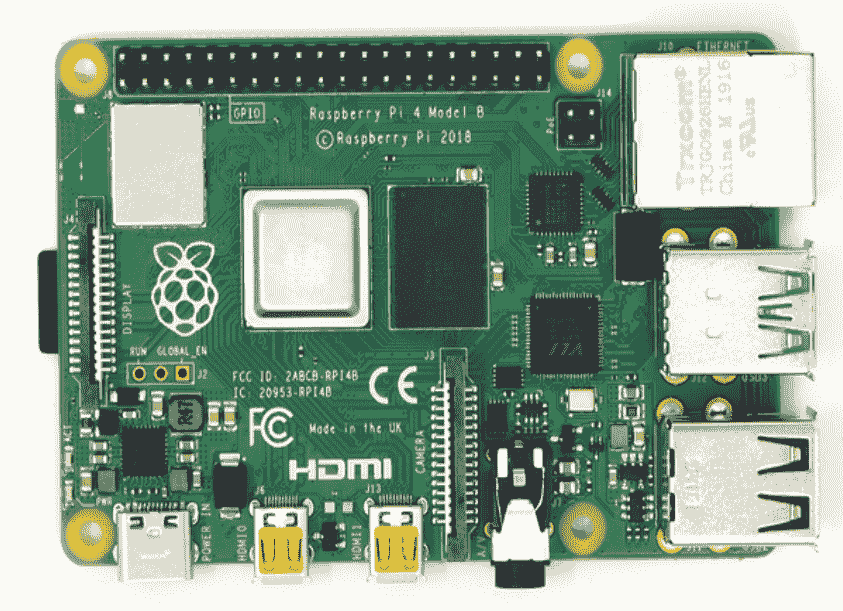

图 1-1. 树莓派 4 型号 B

这款新型号还首次允许用户选择内存大小（1 GB、2 GB、4 GB 或 8 GB），价格根据您的内存选择而定。

最重要的变化之一是，为早期版本供电的 micro-USB 插座已被 USB-C 连接器取代。此外，早期版本的单个全尺寸 HDMI 连接器已被一对 micro-HDMI 连接器取代——因此您需要一根特殊的 HDMI 线或适配器。是的，您可以同时连接两个显示器。

在内部，树莓派比其前代产品快得多（特别是如果您选择 4 GB 或 8 GB 内存版本）。事实上，一些基准测试表明，它比任何以前的树莓派快三到四倍。这是以板上主芯片比早期版本运行温度高得多为代价的——事实上，热到足以伤人。

另一方面，如果您将树莓派嵌入到一个单一用途的项目中，使用紧凑的 Pi Zero W 并节省几美元可能是一个不错的选择。

#### 树莓派 400

树莓派是一款相当不错的台式电脑替代品，而没有哪款树莓派比树莓派 400（图 1-2）更适合此用途。

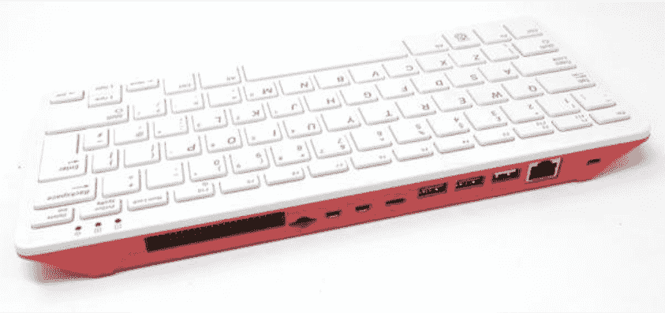

图 1-2. 树莓派 400

树莓派 400 本质上与树莓派 4 的硬件相同，但内置在键盘外壳中，让人想起 1990 年代的家用电脑。HDMI 和 USB 端口都位于 Pi 400 的背面。GPIO 引脚位于计算机背面，但不像普通树莓派那样容易访问，因此如果您购买树莓派是为了学习电子学，普通 Pi 可能是更好的选择。但是，如果您只是想要一台台式电脑替代品，那么 Pi 400 确实是一个非常好的选择。

### 讨论

图 1-3 显示了 Pi Zero W、树莓派 3 B 和树莓派 4。

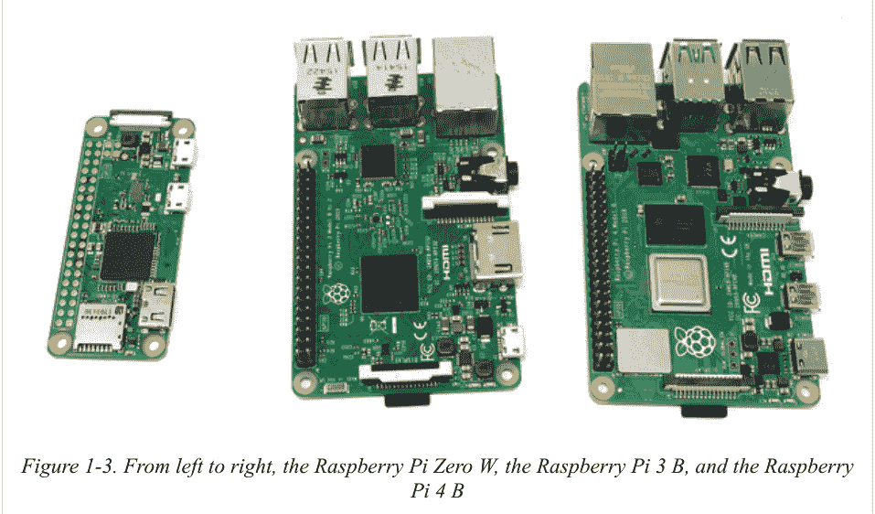

如图 1-3 所示，Pi Zero W 的大小大约是 Pi 3 B 或 Pi 4 B 的一半，它有一个用于通信的 micro-USB 插座，另一个用于供电。Pi Zero W 还通过使用 mini-HDMI 插座和 micro-USB OTG 插座来节省空间。如果您想将键盘、显示器和鼠标连接到 Pi Zero，您需要为 USB 和 HDMI 端口都准备适配器，然后才能连接标准外围设备。树莓派 A+ 比 Pi Zero 大，并且具有全尺寸的 USB 和 HDMI 端口。

表 1-2 总结了迄今为止所有树莓派型号之间的差异，最新发布的型号位于顶部。

表 1-2. 树莓派型号

| 型号 | 内存 | 处理器（核心数 * 时钟频率） | USB 插座 | 以太网端口 | 备注 |
|---|---|---|---|---|---|
| 400 | 4 GB | 4 * 1.8 GHz | 4 (2 x USB3) | 是 | 内置于键盘中 |

## 1.2 连接系统

### 问题

你已备齐树莓派所需的一切，现在想将它们全部连接起来。

### 解决方案

除非你将树莓派嵌入项目或用作媒体中心，否则你需要连接键盘（除非使用的是 Pi 400）、鼠标和显示器。

图 1-4 展示了一个典型的树莓派系统。如果你拥有树莓派 4，你甚至可以（如果真的需要）连接第二个显示器。但如果你只有一个显示器，请将其连接到最靠近 USB-C 电源接口的 micro-HDMI 接口。

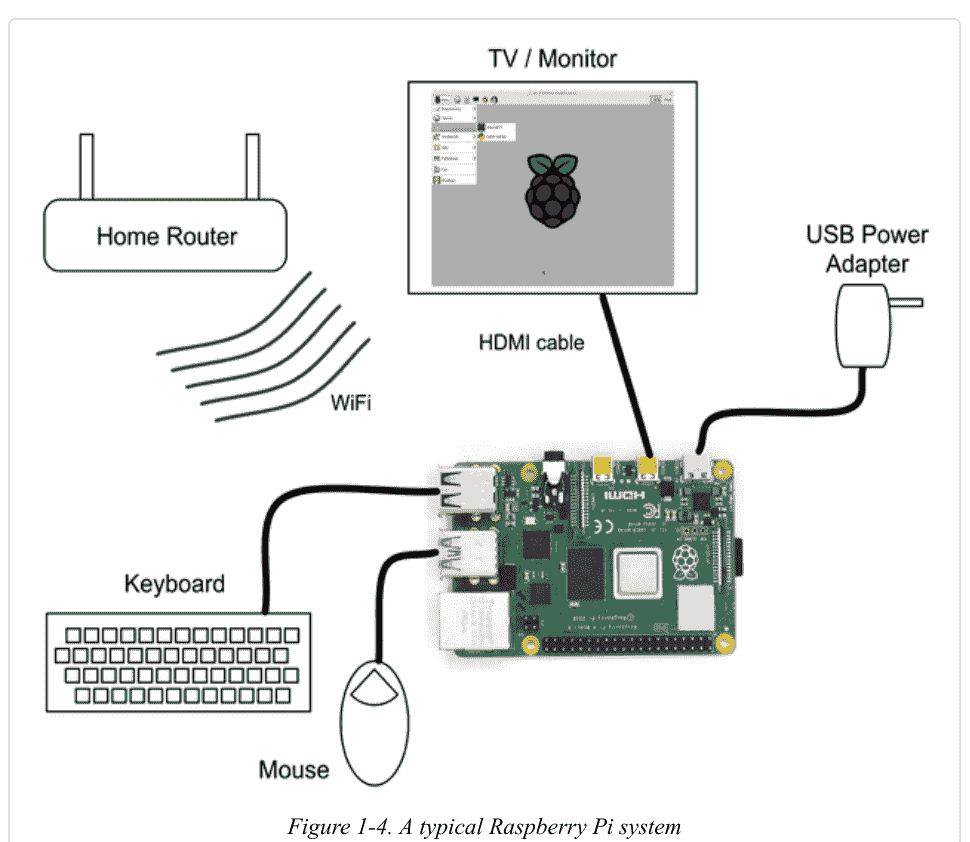

### 讨论

树莓派几乎兼容任何 USB 键盘和鼠标，无论是有线还是无线。
树莓派 4 允许你同时连接两个显示器。连接后，你可以在屏幕间移动鼠标光标，但树莓派操作系统需要知道屏幕之间的相对位置。为此，请在主菜单的“首选项”部分打开“屏幕配置”工具（图 1-5）。

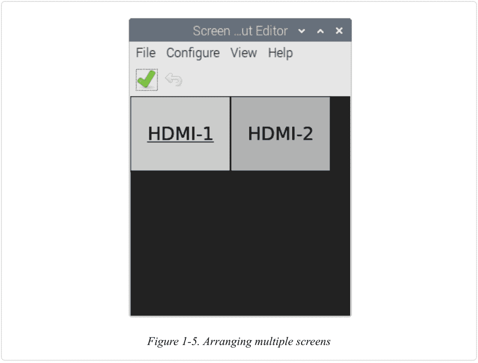

你可以拖动标有 HDMI-1 和 HDMI-2 的两个方框来表示两个显示器的物理位置。因此，在此例中，显示器并排放置，连接到 HDMI-1 的显示器在左侧。

如果你使用的是较旧的树莓派或 A 型/A+ 型，并且 USB 接口用尽，你还需要一个 USB 集线器。

### 另请参阅

官方树莓派快速入门指南。

## 1.3 封装树莓派

### 问题

你需要为树莓派准备一个外壳。

### 解决方案

除了树莓派 400，树莓派本身不附带外壳，除非你购买的是套件。这使得它有些脆弱，因为电路板底部有裸露的连接点，如果树莓派放置在金属物体上，很容易造成短路。

为树莓派购买一个外壳是个好主意。如果你打算使用树莓派的通用输入/输出（GPIO）引脚（用于连接外部电子设备的引脚），图 1-6 所示的 PiBow Coupé 是一个美观实用的设计，适用于树莓派 4 及更早版本。

### 讨论

有各种各样的外壳样式可供选择，包括：

- 简单的两件式卡扣塑料盒
- 可 VESA 安装的盒子（用于安装在显示器或电视背面）
- 兼容乐高的盒子
- 3D 打印的盒子设计
- 激光切割的亚克力设计
- 充当大型散热器用于冷却的设计
- 内置风扇的设计
- 用于实验室和车间的 DIN 导轨设计

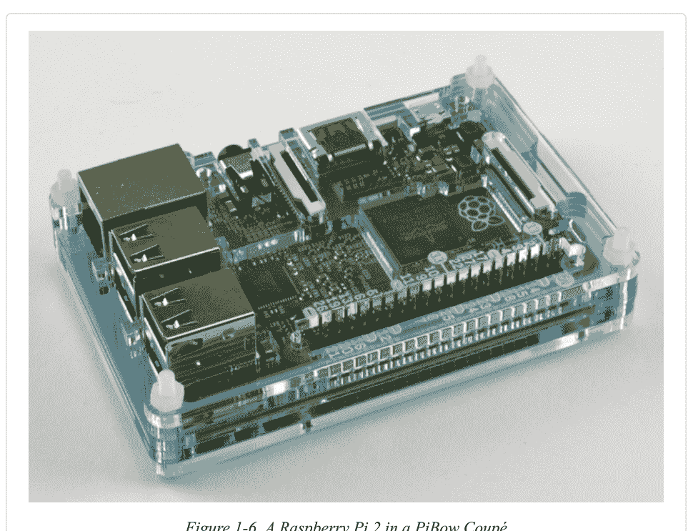

图 1-6. 装在 PiBow Coupé 中的树莓派 2

购买哪种外壳很大程度上取决于个人品味。然而，以下是你需要考虑的一些事项：

- 你是否需要访问 GPIO 连接器？如果你计划将外部电子设备连接到树莓派，这一点很重要。
- 外壳通风是否良好？如果你计划超频树莓派（配方 1.12）或高强度运行播放视频或游戏，这一点很重要，因为这些都会产生更多热量。
- 最后，确保你购买的外壳适合你的树莓派型号。

如果你有 3D 打印机，你也可以打印自己的外壳。在 [Thingiverse](https://www.thingiverse.com/) 或 [MyMiniFactory](https://www.myminifactory.com/) 上搜索 Raspberry Pi，你会发现很多设计。

你还会发现一些散热片套件，上面有微小的自粘散热片，可以贴在树莓派的芯片上。如果你对树莓派要求很高，比如播放大量视频，这些散热片可能有些用处，但通常它们就像汽车上的“加速”条纹一样。
如果你有树莓派 4，可以通过安装一个小风扇（如图 1-7 所示的 Pimoroni Fan SHIM）来降低温度。


图 1-7. Pimoroni Fan SHIM

### 另请参阅

你还可以在其他树莓派供应商和 eBay 上找到许多不同风格的外壳。

## 1.4 选择电源

### 问题

你需要为树莓派选择一个电源。

### 解决方案

适用于树莓派的电源的基本电气规格是提供稳定的 5V 直流电（DC）。
电源必须能够提供的电流大小取决于树莓派的型号及其连接的外围设备。值得购买一个能轻松应对树莓派的电源，你应该考虑任何型号的树莓派至少需要 1A。
如果你从购买树莓派的同一家店购买电源，卖家应该能告诉你它是否适用于树莓派。
树莓派 4 应该使用 3A 电源。这部分是因为它比早期型号具有更强的处理能力，需要更多电力，但也因为它的两个 USB3 端口能够向高功率 USB 外围设备（如外部 USB 驱动器）提供高达 1.2A 的电流。
如果你要在树莓派 4 之前的型号上使用 WiFi 或需要大量电力的 USB 外围设备，你应该购买能够提供 1.5A 甚至 2A 的电源。同时要小心那些可能无法提供准确或可靠 5V 电压的超低成本电源。

### 讨论

树莓派 4 是第一款改用更现代的 USB-C 连接器的树莓派。与早期主板上使用的 micro-USB 连接器不同，这种连接器是可逆的（图 1-8）。

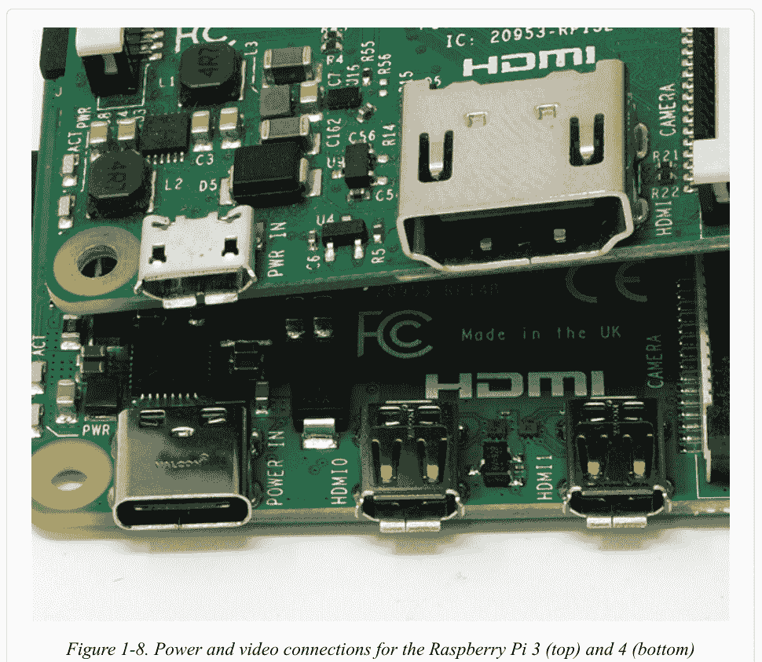

在图 1-8 中，你可以看到树莓派 4 的 USB-C 电源连接器位于树莓派 3 的 micro-USB 连接器下方。顺便说一句，你还可以看到取代单个全尺寸 HDMI 连接器的两个 micro-HDMI 视频端口。

无论你的树莓派使用的是 USB-C 连接器还是 micro-USB 连接器，电源和连接器实际上与许多智能手机充电器中使用的相同。如果它们以 micro-USB 插头结尾，它们几乎肯定是 5V（但请检查）。那么，唯一的问题是它们是否能提供足够的电流。

如果不能，可能会发生一些不好的事情：

- 它们可能会变热，存在火灾风险。
- 它们可能会直接失效。
- 在高负载时（例如，当树莓派使用 WiFi 或播放视频时），电压可能会下降，树莓派可能会自行重置。

如果你使用的是树莓派 3 或更早的型号，请寻找标称能提供 1A 或更多电流的电源。如果它指定的是瓦特数（W）而不是安培数（A），将瓦特数除以 5 即可得到安培数。因此，一个 5V 10W 的电源可以提供 2A（2,000mA）。

使用最大电流为 2A 的电源并不会比使用 700mA 的电源消耗更多电能。树莓派只取用它所需的电流。

在图 1-9 中，我测量了树莓派 B 型的耗电量，并将其与树莓派 2 B 型和树莓派 4 进行了比较。

| 型号 | 内存 | 处理器（核心数 * 主频） | USB 接口 | 以太网端口 | 备注 |
| :--- | :--- | :--- | :--- | :--- | :--- |
| 4 B | 1/2/4/9 GB | 4 * 1.5 GHz | 4 (2 x USB3) | 是 | 2 x micro-HDMI 视频 |
| 3 A+ | 512 MB | 4 * 1.4 GHz | 1 | 否 | WiFi 和蓝牙 |
| 3 B+ | 1 GB | 4 * 1.4 GHz | 4 | 是 | WiFi 和蓝牙 |
| 3 B | 1 GB | 4 * 1.2 GHz | 4 | 是 | WiFi 和蓝牙 |
| Zero W | 512 MB | 1 * 1 GHz | 1 (micro) | 否 | WiFi 和蓝牙 |
| Zero | 512 MB | 1 * 1 GHz | 1 (micro) | 否 | 低成本 |
| 2 B | 1 GB | 4 * 900 MHz | 4 | 是 | |
| A+ | 256 MB | 1 * 700 MHz | 1 | 否 | |
| B+ | 512 MB | 1 * 700 MHz | 4 | 是 | 已停产 |
| A | 256 MB | 1 * 700 MHz | 1 | 否 | 已停产 |
| B rev2 | 512 MB | 1 * 700 MHz | 2 | 是 | 已停产 |
| B rev1 | 256 MB | 1 * 700 MHz | 2 | 是 | 已停产 |

如果你拥有较旧或已停产的树莓派型号，它仍然有用。这些型号的性能不如最新的树莓派 4，但在许多情况下，这并不重要。

如果你要购买新的树莓派，我认为作为通用计算机的最佳选择是树莓派 4 或 400。如果你不需要 WiFi 或想要更小的设备，也可以考虑 3 B、2 B 或 Zero W。

### 另请参阅

有关树莓派型号的更多信息，请参阅 [https://oreil.ly/oY-A_](https://oreil.ly/oY-A_)。

Pi Zero 和 Pi Zero W 型号的低成本使其非常适合嵌入电子项目，而无需担心费用。请参阅 [链接待定]。

## 1.5 选择操作系统

### 问题

树莓派有多种不同的操作系统，你不确定该使用哪一个。

### 解答

这个问题的答案取决于你打算用树莓派做什么。

如果只是作为通用计算机使用，或用于电子项目，你应该使用 **Raspberry Pi OS**，这是树莓派的标准官方发行版。

如果你计划将树莓派用作媒体中心，有一些专门为该目的设计的发行版（Linux 版本）（参见配方 4.1）。

在本书中，我们几乎只使用 **Raspberry Pi OS**，尽管大多数配方也适用于任何基于 Debian 的 Linux 发行版。

### 讨论

如果你有兴趣尝试一些不同的发行版，可以购买一些 microSD 卡（它们并不贵），并将各种发行版复制到上面。如果你这样做，最好将不想丢失的文件保存在插入树莓派的 USB 闪存盘上。

请注意，如果你使用后续的某个配方来写入自己的 SD 卡，你需要一台带有 SD 卡插槽（以及 SD 到 microSD 适配器）的计算机，或者你可以购买一个便宜的 USB SD 卡读卡器。

### 另请参阅

树莓派官方发行版列表。

## 1.6 使用 Pi Imager 安装操作系统

### 问题

你想将树莓派的操作系统直接写入 microSD 卡，以便你的树莓派可以直接使用。

### 解答

在使用树莓派之前，你必须通过将磁盘映像写入 microSD 卡来准备一张装有 **Raspberry Pi OS** 操作系统的 microSD 卡。

将磁盘映像写入 microSD 卡的过程如下：

1.  使用 Mac、Windows 或 Linux 计算机（不是你的树莓派），下载 [Raspberry Pi Imager](https://www.raspberrypi.com/software/)。
2.  将 microSD 卡插入你的计算机。最好断开任何其他可移动介质的连接，以免意外覆盖错误的设备。
3.  启动 Raspberry Pi Imager（图 1-10）。
4.  将操作系统选择为 **Raspberry Pi OS (32 bit)**，并选择 SD 卡。
5.  点击 **Write**，等待映像文件复制到可移动介质上。

准备好 SD 卡或其他可移动介质后，你可以将其连接到树莓派。当树莓派通电时，它将启动到你安装的任何操作系统发行版。

### 讨论

硬件供应商有时会提供自己的磁盘映像，其中内置了对其硬件的支持。最好避免使用此类映像，因为这样做意味着你将无法获得使用标准 **Raspberry Pi OS** 发行版和所有预装软件的所有好处。这也意味着，如果你在某个软件上遇到问题，找到支持会困难得多，因为你使用的是非标准发行版。

### MICROSD 卡

并非所有的 microSD 卡都生而平等，使用更好的卡，你的树莓派性能会更好。因此，请寻找标明为“class 10”的卡。**Raspberry Pi OS** 包含一个实用程序（[链接待补充]）来测试你的 microSD 卡。你可以在“附件”下的“Raspberry Pi 诊断”中找到它。

在容量方面，你应该寻找至少 16 GB 的卡，实际上，考虑到价格差异很小，32 GB 的卡是更好的选择，因为它将为你提供充足的扩展空间。

### 另请参阅

树莓派安装 **Raspberry Pi OS** 的指南可在此处找到：[https://www.raspberrypi.com/software/](https://www.raspberrypi.com/software/)

## 1.7 首次启动你的树莓派

### 问题

你已经设置好了 microSD 卡，想知道如何设置你的树莓派。

### 解答

首次启动树莓派时（如图 1-12 所示），你将被引导回答一些问题来设置你的树莓派。

点击“下一步”会提示你创建一个新的用户账户（图 1-13）。

在 2022 年 4 月之前，此步骤不是设置过程的一部分，因为系统会自动为你创建用户名“pi”。因此，许多教程和书籍都假设你的主目录是 `/home/pi`。除非你对用户名有强烈偏好，否则我仍然建议创建一个名为“pi”的用户，但选择一个好密码（而不是默认的“raspberry”）。

然后，系统会要求你连接到 WiFi 网络，以及是否要检查更新。更新需要互联网连接，因此除非你已连接到网络，否则无法进行。如果你已连接（通过 WiFi 或以太网），现在检查更新是个好主意。如果没有，你随时可以稍后使用 [配方 3.40](Recipe 3.40) 进行检查。

启动并运行后，你应该做的第一件事是将你的树莓派连接到互联网（配方 2.1 和 2.5）。

### 讨论

设置正确的时区是个好主意。如果不设置，树莓派将显示不正确的时间，因为它从互联网时间服务器获取时间。

### 另请参阅

树莓派安装 **Raspberry Pi OS** 的指南可在此处找到：https://www.raspberrypi.com/software/

## 1.8 从真正的硬盘或 USB 闪存盘启动

### 问题

你的 microSD 卡太小，和/或你担心整个操作系统都在 SD 卡上运行。

### 解答

在树莓派 4 和 400 出现之前，这是可能的，但并不容易，涉及一些复杂的命令，如果操作不当，有可能“变砖”你的树莓派。如果你有树莓派 4 或 400，那么现在这变得非常简单，可以从 Raspberry Pi Imager 开始。

该过程类似于使用 Raspberry Pi Imager 设置 microSD 卡。要遵循此配方，你需要一台 Windows、Mac 或 Linux 计算机；一个 USB SSD（固态硬盘）以及一张 microSD 卡。尽管此配方的全部意义在于用 USB 驱动器替换 microSD 卡作为启动设备，但你仍然需要两张 microSD 卡（一张是你现有的用于树莓派的 microSD 启动设备，另一张是空白的 microSD 卡）。

1.  将空白的 microSD 卡插入读卡器。
2.  启动 Raspberry Pi Imager，然后从“操作系统”下拉菜单中，选择 *Misc utility Images*，然后选择 *Bootloader*，再选择 *USB Boot*（图 1-14）。请注意，如果这些选项在你的 Raspberry Pi Imager 中不存在，那么你可能需要下载 [最新版本](https://www.raspberrypi.com/software/)。
3.  从“存储”下拉菜单中选择你的 microSD 卡，然后点击 **Write**。
4.  将新写入的 microSD 卡放入你的树莓派并启动它。这张 microSD 卡映像的唯一目的是重新配置你的树莓派以进行 USB 启动。一旦完成其工作，屏幕将变为绿色。
5.  关闭树莓派电源并更换 microSD 卡，这样你现在使用的是原来的 microSD 系统卡。
6.  启动你的树莓派，然后从菜单中选择 *Accessories*，再选择 *SD Card Copier*（图 1-15）。选择你的系统 microSD 卡作为源，外部 USB 驱动器作为目标，然后点击 **Start**。
7.  复制完成后，你可以再次关闭树莓派并取出 microSD 卡。下次打开树莓派时，它应该会从 USB 驱动器启动。

## 1.9 连接 DVI 或 VGA 显示器

### 问题

你的显示器没有 HDMI 接口，但你想将它与树莓派一起使用。

### 解决方案

很多人都遇到过这个问题。幸运的是，可以为带有 DVI 或 VGA 输入但没有 HDMI 接口的显示器购买适配器。

DVI 适配器是最简单且最便宜的。如果你搜索“HDMI 公头转 DVI 母头转换器”，价格可以低于 5 美元。

### 讨论

使用 VGA 适配器更复杂，因为它们需要一些电子元件将信号从数字转换为模拟，因此要小心那些不包含这些元件的线缆。官方转换器名为 Pi-View，在任何销售树莓派的地方都可以买到。Pi-View 的优势在于经过测试，已证实可与树莓派配合使用。你可以在网上找到更便宜的替代品，但这些通常无法工作。

然而，实际上，鉴于新显示器都带有 HDMI 接口，你最好将钱花在购买新显示器上，而不是适配器上。

### 另请参阅

eLinux 上有[关于在转换器中寻找什么的提示](http://elinux.org/)。

## 1.10 使用复合视频显示器/电视

### 问题

你的低分辨率复合显示器上的文字难以辨认。

### 解决方案

你需要为小屏幕调整树莓派的分辨率。树莓派有两种类型的视频输出：(1) HDMI，和 (2) 来自音频插孔的复合视频，后者需要一根特殊的线缆。其中，HDMI 是质量好得多的选择。如果你打算将复合视频作为主屏幕，你可能需要重新考虑。如果你使用的是复合视频屏幕——比如，因为你需要一个非常小的屏幕——你需要进行一些调整以使视频输出适应屏幕。你需要对文件 `/boot/config.txt` 进行一些更改。你可以通过将 SD 卡重新插入 SD 卡读卡器，在笔记本电脑或 PC 上编辑此文件，或者你也可以在树莓派上直接编辑它（无需将其取出）。在树莓派本身上编辑文件通常使用 nano 编辑器。这有点棘手，我建议你在尝试编辑第一个文件之前彻底阅读[配方 3.7](http://elinux.org/)。如果你愿意继续使用 nano 编辑文件，请在终端会话中输入以下命令：

```
$ sudo nano /boot/config.txt
```

请注意，要保存并退出 nano，请按 Ctrl-X，然后按 Y（确认），然后按 Enter。

如果文字太小无法阅读，最好将 SD 卡从树莓派中取出并插入你的计算机。然后该文件将位于 SD 卡的顶层目录中，你可以使用 PC 上的文本编辑器（如 Notepad++）进行修改。

你需要知道屏幕的分辨率。对于许多小屏幕，这将是 320 x 240 像素。在文件中找到以下两行：

```
#framebuffer_width=1280
#framebuffer_height=720
```

删除每行开头的 # 并将两个数字更改为屏幕的宽度和高度。删除 # 会启用该行。在以下示例中，这些行已被修改为 320 乘 240：

```
framebuffer_width=320
framebuffer_height=240
```

保存文件并重新启动树莓派。你应该会发现一切都变得更容易阅读了。你可能还会发现屏幕周围有一个又大又粗的边框。要调整这一点，请参阅[配方 1.11](Recipe 1.11)。

### 讨论

有许多低成本的闭路电视显示器，当你制作像复古游戏机（[配方 4.4](Recipe 4.4)）之类的东西时，它们可以成为树莓派的好伴侣。然而，这些显示器通常分辨率非常低。

### 另请参阅

有关使用复合显示器的另一个教程，请参阅[这个 Adafruit 教程](this Adafruit tutorial)。

另外，当你使用 HDMI 视频输出时，请参阅配方 1.9 和 1.11 来调整你的画面。

## 1.11 调整显示器上的画面大小

### 问题

当你第一次将树莓派连接到显示器时，你可能会发现无法阅读某些文字，因为它超出了屏幕范围，或者画面没有使用屏幕上所有可用的空间。

### 解决方案

如果你的问题是画面周围有一个大的黑色边框，你可以使用树莓派的桌面配置工具（图 1-16）使屏幕填满显示器的整个区域。要打开此工具，请转到树莓派菜单（带有树莓派图标的那个），选择“首选项”，然后单击“树莓派配置”。

单击“欠扫描”旁边的“已禁用”单选按钮。请注意，在单击“确定”并重新启动树莓派之前，更改不会生效。

如果你遇到相反的问题，即文字超出了屏幕边缘，请单击“欠扫描”的“已启用”。

第二步，你现在需要编辑文件 `/boot/config.txt`。你可以通过取出 SD 卡并将其挂载到 PC 或 Mac 上，或者在树莓派上编辑 SD 卡来完成此操作。在树莓派本身上编辑文件通常使用 nano 编辑器。这有点棘手；我建议你在尝试编辑第一个文件之前彻底阅读配方 3.7。如果你愿意继续使用 nano 编辑文件，请在终端会话中输入以下命令：

```
$ sudo nano /boot/config.txt
```

查找处理过扫描的部分。你需要更改的四行显示在图 1-17 的中间，每行都以 #overscan 开头。

要使这些行生效，你需要通过删除每行开头的 # 字符来启用它们。

要保存并退出 nano，请按 Ctrl-X，然后按 Y（确认），然后按 Enter。

然后，通过反复试验，更改设置，直到屏幕尽可能多地填满显示器。请注意，这四个数字应该是负数。尝试先将它们全部设置为 –20。这将减少屏幕使用的区域。

### 讨论

不得不反复重启树莓派以查看分辨率更改的效果有点乏味。幸运的是，你只需要执行一次此过程。大多数显示器和电视无需任何欠扫描即可正常工作。

### 另请参阅

你也可以使用 `raspi-config` 工具配置欠扫描。有关此工具的更多信息，请访问 [http://elinux.org/RPi_raspi-config](http://elinux.org/RPi_raspi-config)。

## 1.12 最大化性能

### 问题

你的树莓派似乎非常慢，所以你想超频它以使其运行得更快。

### 解决方案

如果你有树莓派 2、3 或特别是带有四核处理器的 4，你不太可能觉得它太慢。然而，较旧的单核树莓派可能相当迟钝。

你可以增加树莓派的时钟频率，使其运行得稍快一些。这将使其消耗更多功率并运行得更热一些（参见后面的讨论部分）。

这里描述的超频方法称为*动态超频*，因为它会自动监控树莓派的温度，并在温度开始过高时降低时钟速度。这被称为*节流*。

让你的树莓派超频的最简单方法是使用树莓派配置工具。要打开此工具，请转到树莓派菜单，选择

## 1.12 超频

首先，打开“首选项”，然后点击“树莓派配置”。接着，点击“性能”选项卡（图1-18）。

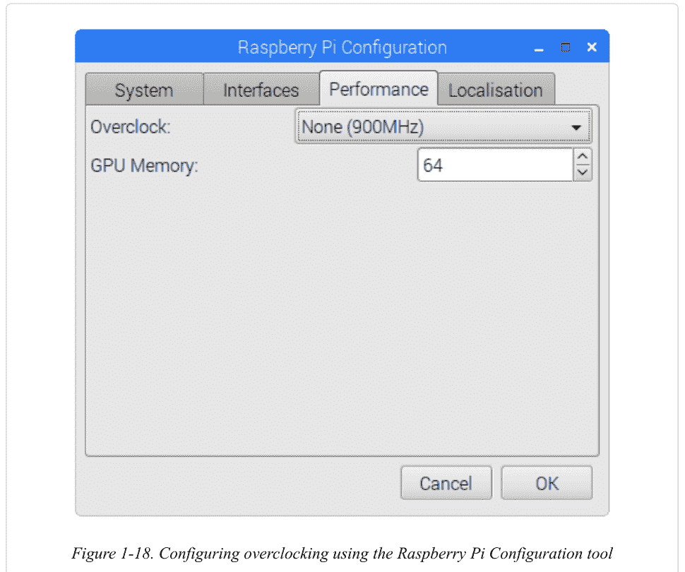

可用的超频选项会因你所使用的树莓派型号而异。选择其中一个选项，然后点击“确定”。更改将在重启后生效。

如果你在没有显示器的情况下运行树莓派（[链接待补充]），你仍然可以更改超频设置，但需要跳转到第2.7节学习SSH。在能够通过SSH连接后，在SSH终端中运行以下命令来启动`raspi-config`工具：

```
$ sudo raspi-config
```

选择“超频”选项。随后会显示如图1-19所示的选项。

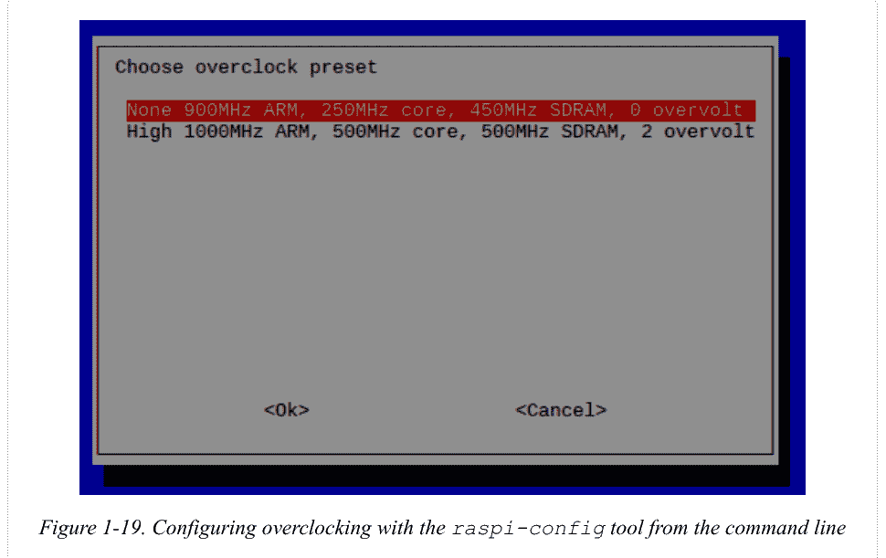

选择一个选项。如果你发现树莓派开始变得不稳定并意外死机，可能需要选择一个更保守的选项，或者通过将其设置回`None`来关闭超频。

### 讨论

超频带来的性能提升可能相当显著。为了测量这些提升，我使用了一台没有外壳的树莓派B型，在室温60华氏度（15摄氏度）的环境下进行测试。
测试程序是以下Python脚本。它只是让处理器满负荷工作（即让它非常努力地工作），并不能真正代表计算机中发生的其他事情，例如写入SD卡、图形处理等。然而，如果你想测试超频对树莓派的影响，它确实能很好地指示原始CPU性能：

```python
import time

def factorial(n):
    if n == 0:
        return 1
    else:
        return n * factorial(n-1)

before_time = time.clock()
for i in range(1, 10000):
    factorial(200)
after_time = time.clock()

print(after_time - before_time)
```

请注意，我们在这里超前了很多，所以如果你不熟悉Python，可以在通读第5章后再回来研究这个。
查看表1-3中的测试结果。电流和温度是使用测试设备测量的。

表1-3. 超频

| 速度测试 | 电流 | 温度（摄氏度） |
| :--- | :--- | :--- |
| 700 MHz | 15.8 秒 | 360mA | 27 |
| 1 GHz | 10.5 秒 | 420mA | 30 |

如你所见，性能提升了33%，但代价是消耗更多电流和温度略有升高。
一个通风良好的外壳将有助于保持你的树莓派以全速运行。也有人尝试为树莓派添加水冷。坦率地说，这有点傻。

### 另请参阅

你可以在 [http://elinux.org/RPi_raspi-config](http://elinux.org/RPi_raspi-config) 找到更多关于 `raspi-config` 工具的信息。

## 1.13 更改你的密码

### 问题

默认情况下，树莓派的密码是 *raspberry*。你想更改它。

### 解决方案

在将树莓派操作系统安装到SD卡后，系统会提示你更改密码，但你可以跳过此步骤。你可以随时使用树莓派配置工具更改密码。要打开此工具，请转到树莓派菜单，选择“首选项”，然后点击“树莓派配置”。点击“系统”选项卡。在那里，你会找到“更改密码”选项（图1-20）。

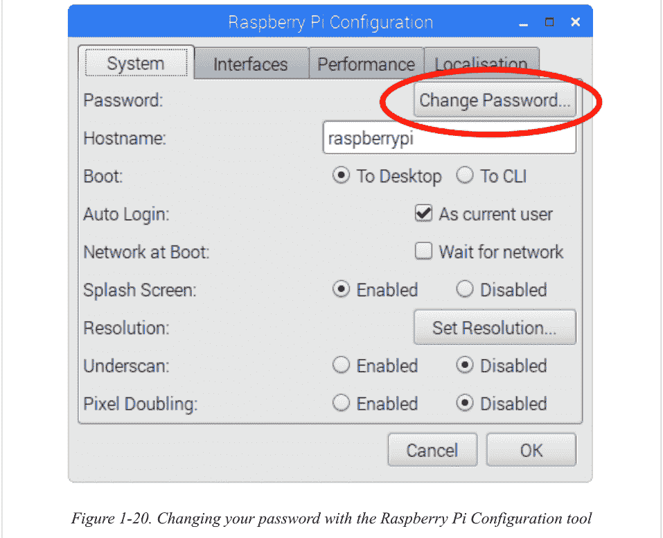

图1-20. 使用树莓派配置工具更改密码

更改密码是一项设置，你无需重启树莓派即可使更改生效。

### 讨论

你也可以简单地在终端会话中使用 `passwd` 命令来更改密码，如下所示：

```
$ passwd
Changing password for pi.
(current) UNIX password:
Enter new UNIX password:
Retype new UNIX password:
passwd: password updated successfully
```

### 另请参阅

你也可以使用 `raspi-config` 工具更改密码（参见 [http://elinux.org/RPi_raspi-config](http://elinux.org/RPi_raspi-config)）。

## 1.14 关闭你的树莓派

### 问题

你想关闭你的树莓派。

### 解决方案

在桌面的左上角，点击树莓派菜单。会打开一个对话框，提供三个关机选项（图1-21）。

- **关机**
  关闭树莓派。你需要拔掉电源，然后重新插上才能让树莓派再次启动。
- **重启**
  重启树莓派。
- **注销**
  注销你，并显示一个提示，要求输入登录凭据以便你可以重新登录。

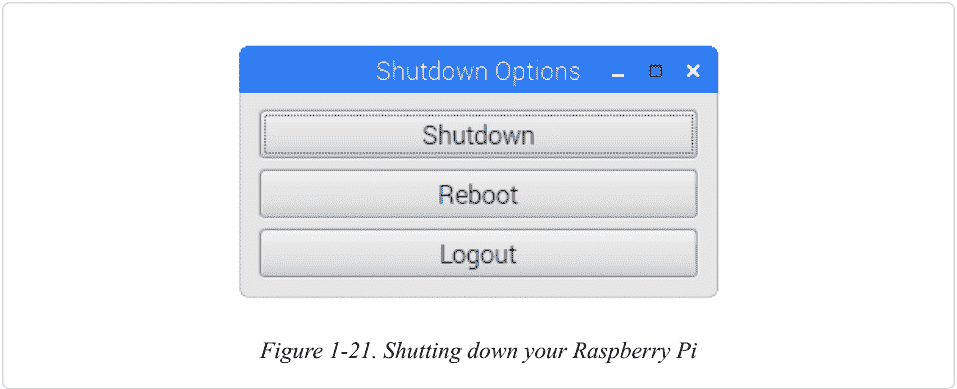

你也可以通过终端发出以下命令来重启：

```
$ sudo reboot
```

安装某些软件后，你可能需要这样做。当你重启时，你会看到图1-22所示的消息，它说明了Linux的多用户特性，并警告所有连接到树莓派的用户。

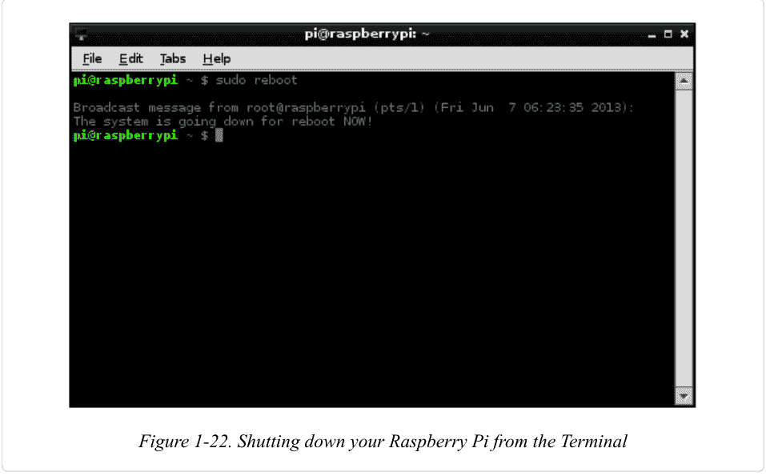

### 讨论

最好按照上述方法关闭树莓派，而不是简单地拔掉电源插头，因为在你断电时，树莓派可能正在写入microSD卡。这可能导致文件损坏。

关闭树莓派实际上并不会切断电源。它会进入低功耗模式——而且它本身就是一个功耗相当低的设备（但树莓派硬件无法控制其电源）。

当树莓派4（带内置键盘）关闭后，你可以通过按F10键（该键上也有开/关图标）来开机。

### 参阅

你可以在 [https://oreil.ly/Jsx_U](https://oreil.ly/Jsx_U) 购买一个模块，它可以在树莓派关机时切断电源。

关于在树莓派上添加开始按钮的信息，请参见[链接待补充]。

## 1.15 安装树莓派摄像头模块

### 问题

你想使用树莓派摄像头模块。

### 解决方案

树莓派摄像头模块（图1-23）通过排线连接到树莓派。

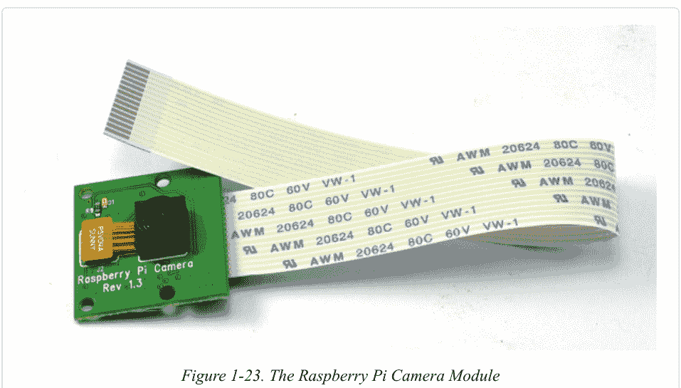

图1-23. 树莓派摄像头模块

实际上，树莓派摄像头有两个基本版本：原始版本1（如图1-23所示）和更新的更高分辨率版本2。排线连接到树莓派2、3或4上音频和HDMI接口之间的特殊连接器。要将排线安装到你的树莓派上，请轻轻向上拉起连接器两侧的卡扣以解锁，然后将排线插入插槽，确保排线上闪亮的金属触点背向以太网接口。将连接器的两个卡扣按回原位以锁定排线（图1-24）。

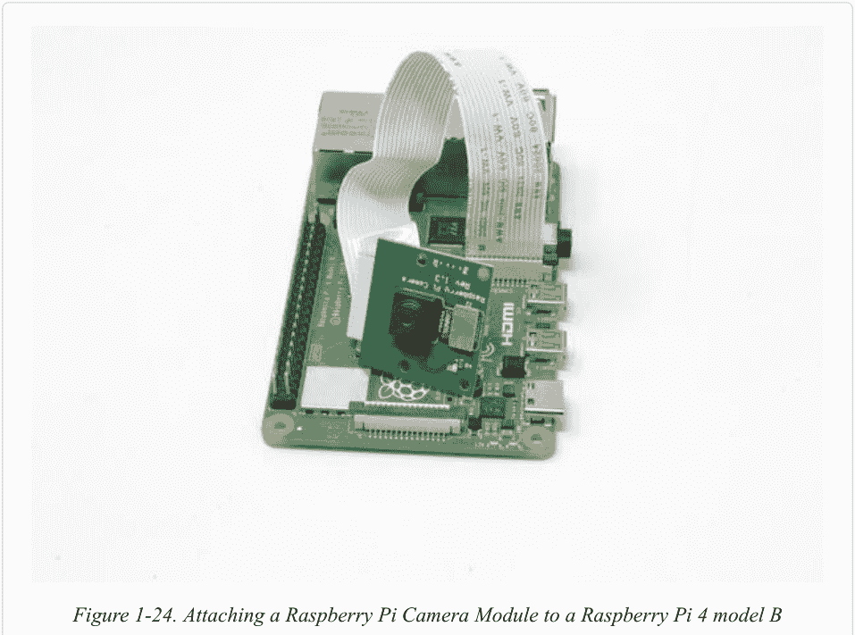

图1-24. 将树莓派摄像头模块连接到树莓派4型号B

> ### 警告
> 摄像头模块包装上标明其对静电敏感。在操作之前，请通过触摸接地物体（如PC的金属机箱）来释放静电。

请注意，树莓派Zero需要特殊的排线或适配器，因为它的摄像头连接器比全尺寸树莓派的小（参见[链接待补充]）。
摄像头模块需要一些软件配置。最简单的配置方法是使用树莓派配置工具。要打开此工具，请转到树莓派主菜单，选择“首选项”，然后点击“树莓派配置”。点击“接口”选项卡，然后将“摄像头”选项设置为“启用”（图1-25）。

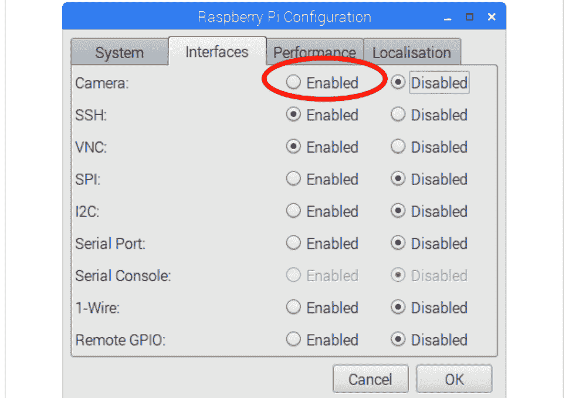

图1-25. 使用树莓派配置工具启用摄像头

如果你通过SSH远程使用树莓派（参见第2.7节），你仍然可以使用 `raspi-config` 来启用摄像头。要运行 `raspi-config`，请在终端会话中输入以下命令：

```
$ sudo raspi-config
```

选择“接口选项”，你将看到“摄像头”选项（图1-26）。

## 1.16 使用蓝牙

### 问题

你想在树莓派上使用蓝牙。

### 解决方案

如果你拥有树莓派 3、4 或 400，好消息是，除了 WiFi，你还可以获得蓝牙硬件。如果你使用的是较旧的树莓派，可以为其连接一个 USB 蓝牙适配器。不过，无论哪种情况，蓝牙所需的软件现在都已包含在树莓派操作系统中。如果你使用的是较旧的树莓派，请注意并非所有蓝牙适配器都与树莓派兼容。大多数是兼容的，但为了确保，最好购买明确标有适用于树莓派的适配器。图 1-27 展示了一台同时配备了 USB 蓝牙适配器（靠近摄像头）和 USB WiFi 适配器的树莓派 2。

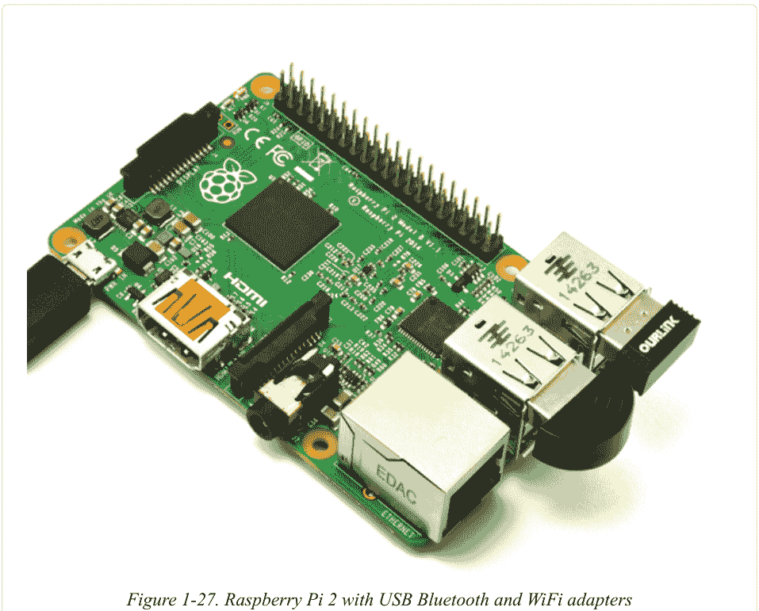

图 1-27. 配备 USB 蓝牙和 WiFi 适配器的树莓派 2

蓝牙功能集成在树莓派操作系统桌面中的方式与 Mac 非常相似。在屏幕的右上角，你会看到蓝牙图标（在图 1-28 中圈出）。点击此图标可打开蓝牙选项菜单。

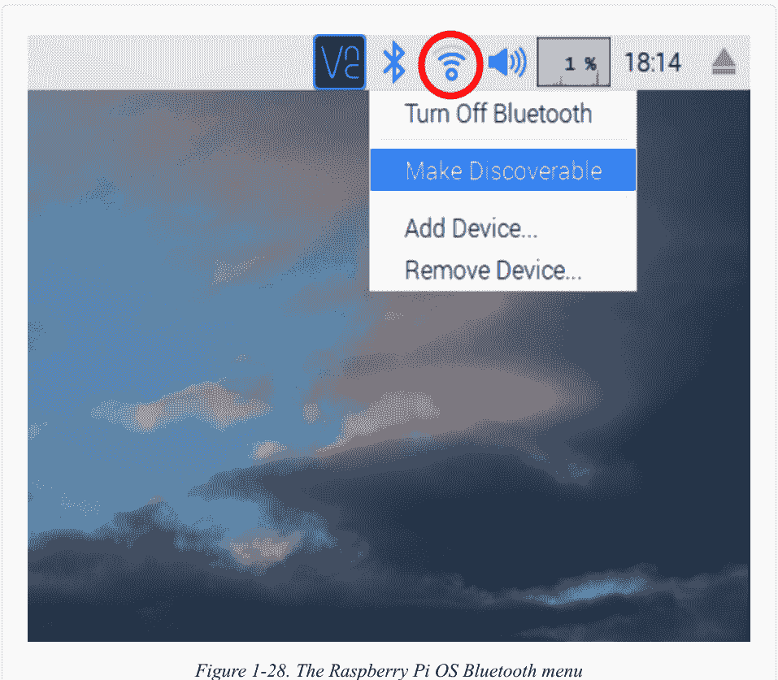

如果你想连接蓝牙外设（如键盘），请点击“添加设备”。此时会打开“添加新设备”对话框，显示你可以连接或“配对”的可用设备列表（图 1-29）。

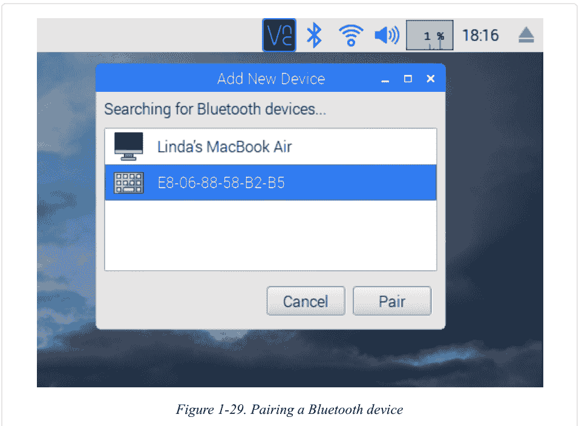

图 1-29. 配对蓝牙设备

然后，你可以选择要配对的设备，并按照树莓派和配对设备上显示的说明进行操作。

### 讨论

你可以将手机、蓝牙音箱、键盘和鼠标与树莓派配对。我发现连接新的蓝牙设备并不总是第一次就能成功。因此，如果最初配对设备时遇到问题，请在放弃之前多尝试几次。

大多数情况下，使用桌面界面将蓝牙设备添加到树莓派系统很方便；不过，你也可以使用命令行界面配对蓝牙设备。

要从命令行运行蓝牙命令，请使用 `bluetoothctl` 命令：

```
$ bluetoothctl
[NEW] Controller B8:27:EB:50:37:8E raspberrypi [default]
[NEW] Device 51:6D:A4:B8:D1:AA 51-6D-A4-B8-D1-AA
[NEW] Device E8:06:88:58:B2:B5 si's keyboard #1
[bluetooth]#
```

此命令会扫描蓝牙设备，并提供一个 `pair` 命令，允许你使用设备的 ID 进行配对——例如：

```
[bluetooth]# pair E8:06:88:58:B2:B5
```

### 另请参阅

有关与树莓派兼容的蓝牙适配器列表，请参阅 [https://oreil.ly/pULy3](https://oreil.ly/pULy3)。

适用于 Android 手机的 *bluedot* 软件允许你使用蓝牙和手机控制连接到树莓派的硬件。你将在 [即将发布的链接] 中找到相关示例。

如果你将树莓派与蓝牙音箱配对，还需要将音箱设置为声音输出设备（[即将发布的链接]）。

# 第 2 章. 网络

> **致早期读者的说明**

通过早期发布电子书，你可以在书籍的最早阶段获取内容——即作者撰写时未经编辑的原始内容——从而在这些书籍正式发布之前很久就能利用这些技术。

这将是最终书籍的第 2 章。请注意，GitHub 仓库稍后将开放。

如果你对如何改进本书内容和/或示例有建议，或者发现本章中有缺失内容，请通过 simonmonkauthor@gmail.com 联系作者。

## 2.0 简介

树莓派设计用于连接互联网。其在互联网上通信的能力是其关键特性之一，并开启了各种可能的用途，包括家庭自动化、网络服务、网络监控等。

连接可以通过以太网线进行（至少对于大多数型号而言），较新的型号内置了 WiFi。

拥有联网的树莓派还意味着你可以从另一台计算机远程连接到它。这对于树莓派本身用作*无头*服务器且未连接键盘、鼠标和显示器的情况非常有用。

本章为你提供将树莓派连接到互联网并通过网络远程控制它的方法。

## 2.1 连接到有线网络

### 问题

你想通过有线网络连接将树莓派连接到互联网。

### 解决方案

首先，如果你拥有树莓派（1、2 或 3）的 A 型或 A+ 型，或 Pi Zero，则没有用于以太网的 RJ45 接口。在这种情况下，访问互联网的最佳选择是使用无线 USB 适配器（参见方法 2.5）。

如果你拥有树莓派（1、2、3、4 或 400）的 B 型或 B+ 型，那么你很幸运；只需将以太网跳线插入其 RJ45 插座，然后将另一端连接到家庭路由器背面的空闲插座（图 2-1）。

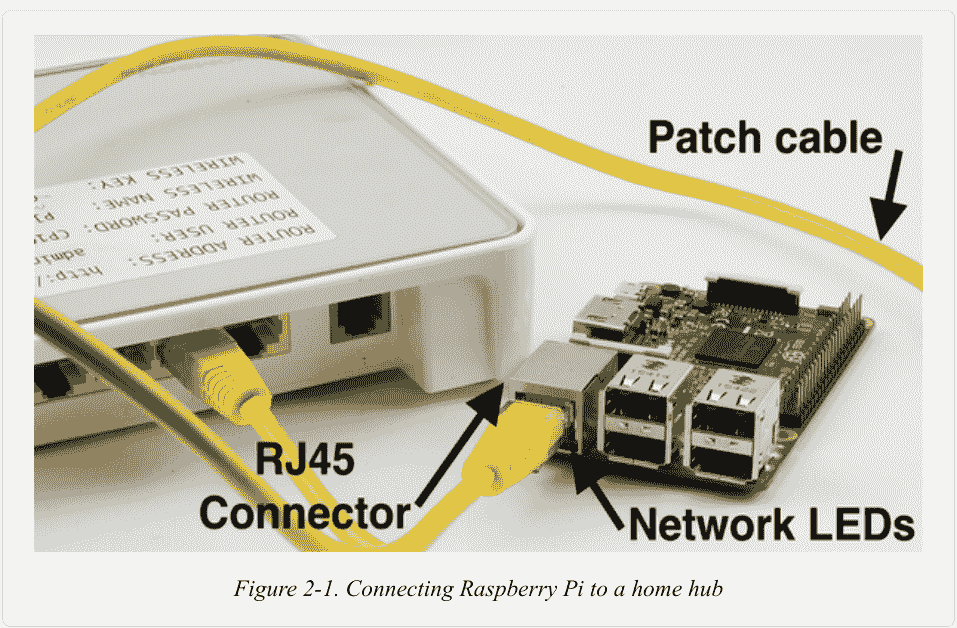

树莓派上的网络 LED 应立即开始闪烁，表明树莓派已连接到你的网络。

### 讨论

树莓派操作系统预配置为使用动态主机配置协议（DHCP）连接到任何网络。只要你的网络启用了 DHCP，它就会自动分配一个 IP 地址。

如果 LED 闪烁，但你无法在树莓派上使用浏览器连接到互联网，请检查你的网络管理控制台是否启用了 DHCP。查找类似图 2-2 所示的选项。

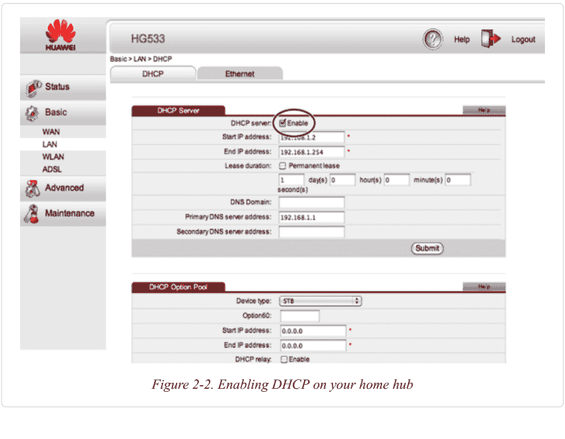

### 另请参阅

要连接到无线网络，请参阅方法 2.5。

## 2.2 查找你的 IP 地址

### 问题

你想知道树莓派的 IP 地址，以便与之通信，无论是将其作为 Web 服务器连接、交换文件，还是通过 SSH（方法 2.7）或 VNC（方法 2.8）远程控制它。

### 解决方案

IPv4 地址（用于本地地址）是一个四部分数字，唯一标识网络中计算机的网络接口。每个部分之间用点分隔。

要查找树莓派的 IP 地址，你需要在终端窗口中发出此命令：

```
$ hostname -I
192.168.1.16 fd84:be52:5bf4:ca00:618:fd51:1c .....
```

响应的第一部分是树莓派在家庭网络上的本地 IP 地址。

### 讨论

树莓派可以拥有多个 IP 地址（即每个网络连接一个）。因此，如果你同时通过有线和无线连接到你的 Pi，它将有两个 IP 地址。不过，通常你只会通过其中一种方式连接，而不是同时使用两种。要查看所有网络连接，请使用 `ifconfig` 命令：

```
$ ifconfig

eth0      Link encap:Ethernet  HWaddr b8:27:eb:d5:f4:8f
          inet addr:192.168.1.16  Bcast:192.168.255.255  Mask:255.255.0.0
          UP BROADCAST RUNNING MULTICAST  MTU:1500  Metric:1
          RX packets:1114 errors:0 dropped:1 overruns:0 frame:0
          TX packets:1173 errors:0 dropped:0 overruns:0 carrier:0
          collisions:0 txqueuelen:1000
          RX bytes:76957 (75.1 KiB)  TX bytes:479753 (468.5 KiB)
```

## 2.3 设置静态IP地址

### 问题

你希望为你的树莓派设置一个不会改变的IP地址。

### 解决方案

有两种方法可以实现。一种方法使用你的网络控制器（你的家庭集线器）。第二种方法使用树莓派本身。

使用网络的方法通常是首选，但第二种方法，即由树莓派自行确定其IP地址，如果你打算在不同网络之间移动树莓派并希望保持IP地址不变，那么这种方法值得一试。

你家中的所有电脑、电视、手机和其他支持互联网的设备通常都通过集线器连接到互联网，该集线器将你的电话线、4G或光纤电缆连接到你的房子。所有这些设备，无论是通过WiFi还是通过直接电缆连接到集线器，都被称为你的局域网的一部分。

默认情况下，当你将新设备连接到你的局域网时（例如树莓派），无论是通过以太网电缆插入还是使用WiFi，局域网控制器（你的集线器）将使用称为DHCP的系统为新设备分配IP地址。该地址将从IP地址池中分配，范围可能从192.168.1.2到192.168.1.199（或可能是10.0.0.2到10.0.0.199）。换句话说，对于连接到局域网的每个设备，只有四部分IP地址的最后一部分会改变。

当DHCP为设备分配IP地址时，它会设置一个租用时间，即该设备将保证保留该IP地址多长时间，而不会面临被分配给其他设备的风险。一般来说，此租用时间的默认值相当短；在我的集线器上，它是一周。这意味着我的树莓派的IP地址可能会在一周后毫无预警地改变，如果树莓派在没有键盘、鼠标和显示器的项目中使用，可能很难找到其IP地址以允许我连接。这就是为什么我可能想为你的树莓派设置一个*静态IP地址*。

### 使用网络设置IP地址

确保你的树莓派IP地址不变的一种方法是直接进入你的集线器控制界面，并将DHCP租用时间更改为更高的值。要访问此界面，你需要使用一台计算机（可以是你的树莓派，但不一定是），并转到一个特定地址，该地址通常写在集线器上，描述为*路由器*地址或管理控制台地址。对于我的路由器，这是http://192.168.1.1。还需要输入用户名和密码。这些与WiFi接入点名称和密码不同。它们通常也写在集线器的某个地方，并且通常默认值分别为admin和password。

连接后，你需要在管理控制台的各个页面中查找任何提及的DHCP设置，这些设置应类似于图2-3。

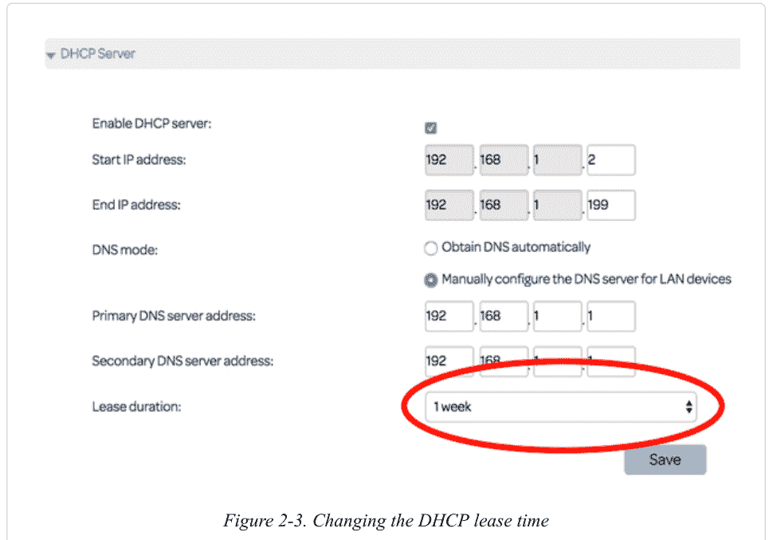

将“租用持续时间”（或你的集线器上具体标记的任何内容）更改为允许的最大值。

像这样延长租用时间的一个缺点是它适用于你局域网上的所有设备。因此，如果你有很多设备，你可能会用完IP地址，因为DHCP在租用期到期之前无法重新分配旧的IP地址。

更好的方法是使用称为DHCP保留的东西。这指示DHCP将特定IP地址永久分配给特定设备。在图2-4中，你可以看到我已将IP地址192.168.1.3分配给设备raspberrypi-Ethernet（一个通过以太网电缆连接到集线器的树莓派）。

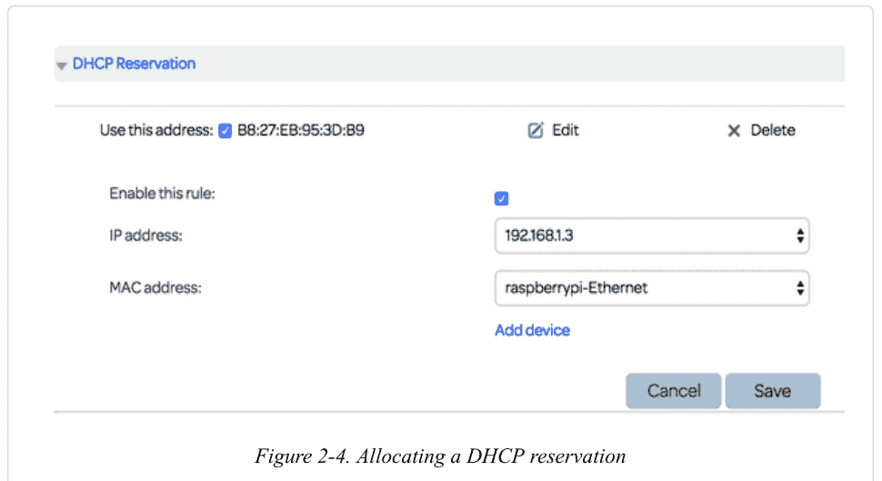

从现在起，每当该树莓派连接到局域网时，它将被分配IP地址192.168.1.3，并且DHCP不会将该IP地址分配给任何其他设备。

### 使用树莓派设置IP地址

为树莓派设置静态IP地址的第二种方法使用树莓派本身而不是局域网。实际上，树莓派正在向集线器请求它想要使用的IP地址。

让你的树莓派决定自己的IP地址与网络上通常的工作方式略有相反，即局域网决定IP地址。当然，危险在于局域网的DHCP控制器可能已将该IP地址分配给了其他计算机。如果你有多个树莓派，都试图使用相同的IP地址，也会出现类似的问题。IP地址不能共享；在这种情况下，其中一个树莓派将无法连接到网络。

如果你想使用本节中描述的方法，你需要确保你的IP地址对于特定的树莓派是唯一的，并且你为树莓派选择的静态IP地址在DHCP范围之外。例如，查看图2-3，你可以看到DHCP分配的IP地址范围是从192.168.1.2到192.168.1.199。因此，如果我们选择静态IP地址192.168.1.210，我们知道它不会被重新分配。请注意，IP地址的每个数字部分都在0到255之间，因此，例如，192.168.1.300不是有效的IP地址。

你的树莓派对于每个网络连接将有不同的IP地址。在本例中，我们将使IP地址静态化，并且对于WiFi和以太网电缆都相同。

要编辑此文件，请在终端中键入以下命令：

```
$ sudo nano /etc/dhcpcd.conf
```

首先，决定要使用的IP地址。你需要选择一个既未被网络上任何其他机器使用，又在DHCP使用的IP地址范围之外的地址。在本例中，我将使用192.168.1.210。然后我将修改文件内容，在文件末尾添加以下行：

```
interface eth0
static ip_address=192.168.1.210/24
static routers=192.168.1.1
static domain_name_servers=192.168.1.1

interface wlan0
static ip_address=192.168.1.210/24
static routers=192.168.1.1
static domain_name_servers=192.168.1.1
```

请注意，正如我之前提到的，我已为两个网络接口（以太网和WiFi）设置了相同的IP地址。如果两个连接都可用，第一个连接的将阻止另一个使用该IP地址。实际上，这意味着以太网连接将获胜，因为它比WiFi连接快得多。

用于`routers`和`domain_name_servers`设置的IP地址是你用于连接到集线器管理控制台的IP地址。许多集线器使用上述IP地址范围。`routers`和`domain_name_servers`条目旁边的地址与你将在集线器上找到的管理控制台地址相同。但是，如果你的集线器使用不太常见的地址格式10.0.0.1，你需要将我们前面示例中的所有192.168.1实例更改为10.0.0。

进行更改后，按Ctrl-X然后按Y保存文件。有关使用nano编辑器的指南，请参见配方3.7。你需要通过运行`sudo reboot`重新启动树莓派，更改才能生效。

### 讨论

随着不同版本的树莓派操作系统，网络发生了很大变化。这些说明适用于最新（截至撰写本文时）版本的树莓派操作系统。如果你没有最新版本的树莓派操作系统，你应该获取它，因为树莓派操作系统总是在发展和改进。你可以在配方3.40中了解如何执行此操作。要了解你拥有的树莓派操作系统版本，请参见配方3.39。

### 另请参阅

- [维基百科](https://en.wikipedia.org/wiki/IP_address)包含你想了解的关于IP地址的所有信息。

## 2.4 设置树莓派的网络名称

### 问题

你想更改树莓派的网络名称，使其不再只是“raspberrypi”。

### 解决方案

有几种方法可以实现。无论使用哪种方法，请确保你选择的网络名称不包含空格，并且只包含字母、数字和连字符（-）。

在所有三种方法中，你还需要重启树莓派才能使更改生效。

### 使用树莓派配置工具设置网络名称

除非你的树莓派是无头运行（未连接显示器和键盘），否则设置树莓派网络名称最简单的方法是使用树莓派配置工具。要打开此工具，请转到树莓派菜单，选择“首选项”，然后单击“树莓派配置”。然后单击“系统”选项卡（图 2-5）。

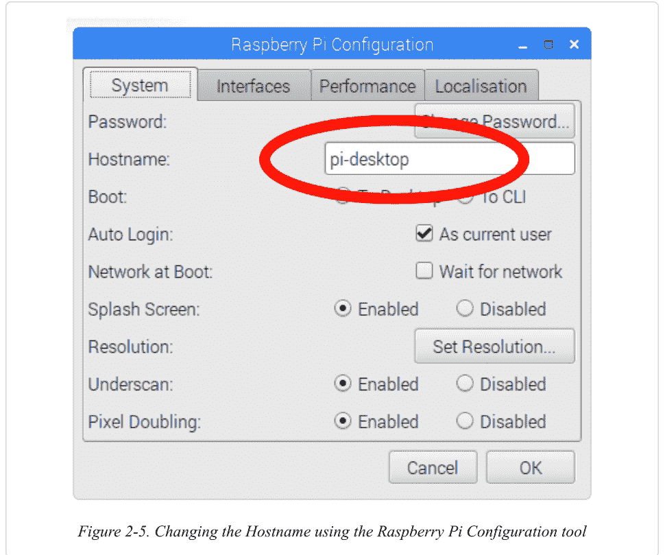

图 2-5. 使用树莓派配置工具更改主机名

将“主机名”字段中的名称更改为你偏好的名称，然后单击“确定”。然后系统会提示你重启以使更改生效（配方 1.14）。

### 使用命令行设置网络名称（简单方法）

你也可以使用 `raspi-config` 工具从命令行更改树莓派的网络名称。在终端会话中运行以下命令：

```
$ sudo raspi-config
```

这将打开 `raspi-config` 工具。使用上/下方向键选择“网络选项”，然后按回车键。这将打开一个表单，你可以在其中输入新的网络名称（图 2-6）。请注意，此界面仅使用命令行，因此你可以从 SSH 会话中使用它（配方 2.7）。

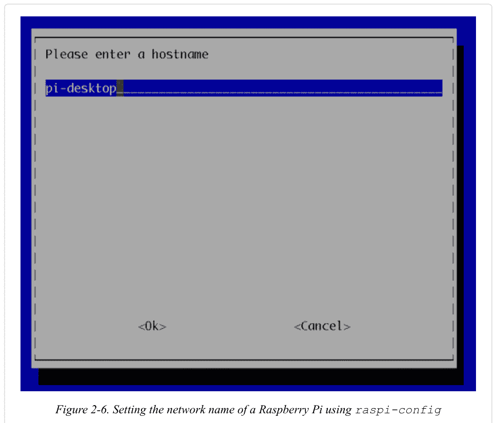

### 使用命令行设置网络名称（困难方法）

如果你真的想用困难的方法，你也可以直接编辑控制树莓派网络名称的文件。你需要更改两个文件。

首先，编辑文件 /etc/hostname。你可以通过打开终端窗口并输入以下命令来完成：

```
$ sudo nano /etc/hostname
```

将 `raspberrypi` 替换为你选择的名称。

其次，使用以下命令在编辑器中打开文件 /etc/hosts：

```
$ sudo nano /etc/hosts
```

该文件将如下所示：

```
127.0.0.1       localhost
::1             localhost ip6-localhost ip6-loopback
fe00::0         ip6-localnet
ff00::0         ip6-mcastprefix
ff02::1         ip6-allnodes
ff02::2         ip6-allrouters

127.0.1.1       raspberrypi
```

将文件末尾的名称（`raspberrypi`）更改为你偏好的新名称。

### 讨论

更改树莓派的名称可能非常有用，特别是如果你有多个树莓派连接到你的网络。

### 另请参阅

参见 [配方 2.3](Recipe 2.3) 以更改树莓派的 IP 地址。
你也可以使用 PiBakery 设置树莓派的网络名称——参见 [配方 1.8](Recipe 1.8)。

## 2.5 设置无线连接

### 问题

你想使用 WiFi 将树莓派连接到互联网。

### 解决方案

有多种方法可以为树莓派设置 WiFi 连接。

#### 从 Pixel 桌面设置 WiFi

在最新的树莓派操作系统中设置 WiFi 非常简单。在屏幕右上角，单击网络图标（两台计算机）（图 2-7）。然后你会看到一个 WiFi 网络列表。选择你的网络；会出现一个提示，你可以在其中输入预共享密钥（密码）。输入你的密码。过一会儿，网络图标将切换到标准的 WiFi 符号，你将连接成功。

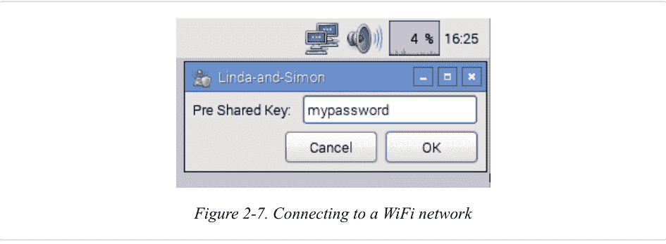

#### 使用命令行设置 WiFi

如果你设置树莓派是为了在配置后无需键盘和显示器即可使用，那么这种方法非常适合。但是，你需要临时通过以太网线将树莓派连接到你的集线器以进行网络访问（配方 2.1）。

运行以下命令以启动 `raspi-config` 实用程序：

```
$ sudo raspi-config
```

然后，从打开的菜单中，选择“网络选项”（使用方向键并按回车键），然后选择“WiFi”（图 2-8）。

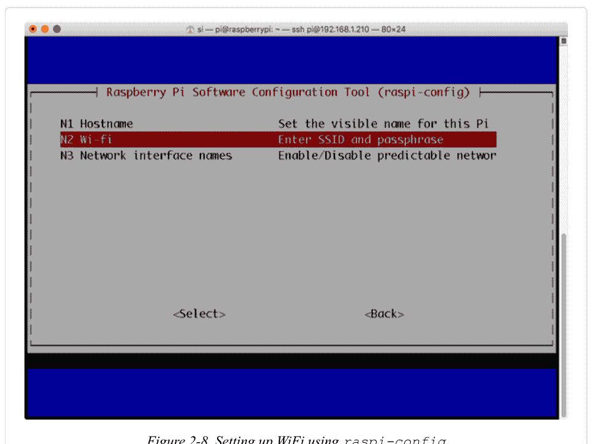

会出现一个提示，要求输入 SSID（WiFi 名称）和密码。

### 讨论

WiFi 使用相当多的电量，因此如果你发现树莓派意外重启或无法正常启动，那么你可能需要使用更大的电源。寻找 1.5A 或更高的电源；如果你使用的是树莓派 4 并且连接了高功耗 USB 外设，请使用 3A 电源。

如果你将树莓派用作媒体中心（参见配方 4.1），那么会有一个设置页面，你可以在其中使用 WiFi 将媒体中心连接到你的网络。

### 另请参阅

有关与树莓派兼容的 WiFi 适配器列表，请访问 https://oreil.ly/67Mn1。
有关设置有线网络的更多信息，请参见配方 2.1。
有关使用 nano 编辑器的信息，请参见配方 3.7。
要使用 PiBakery 设置 WiFi 连接，请参见配方 1.8。

## 2.6 使用控制台线连接

### 问题

没有可用的网络连接，但你仍然想从另一台计算机远程控制树莓派。

### 解决方案

使用 *控制台线*（一种需要单独购买的特殊线缆——参见 [待添加链接]）连接到树莓派。

要使用此方法，你需要启用串行接口。这意味着，至少在设置树莓派期间，你需要连接键盘、显示器和鼠标。

要启用串行接口，请转到树莓派菜单，选择“首选项”，然后单击“树莓派配置”。选择“接口”选项卡，然后单击“串行端口”的“启用”按钮，如图 2-9 所示。

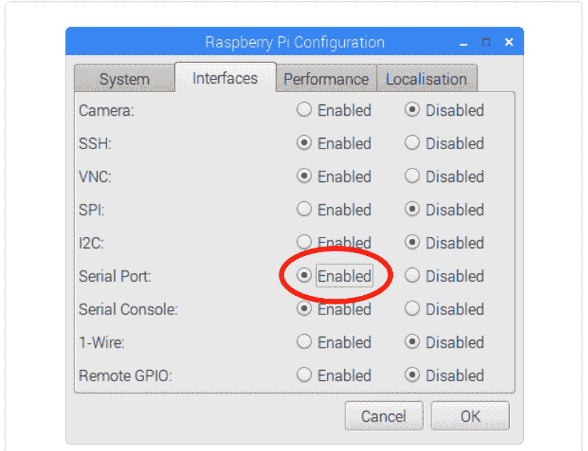

图 2-9. 使用树莓派配置工具启用串行接口

与大多数树莓派配置一样，你也可以通过在终端会话中运行以下命令来使用命令行 `raspi-config` 工具：

```
$ sudo raspi-config
```

选择“接口选项”，然后选择“串行”，如 [图 2-10](#figure-2-10) 所示。

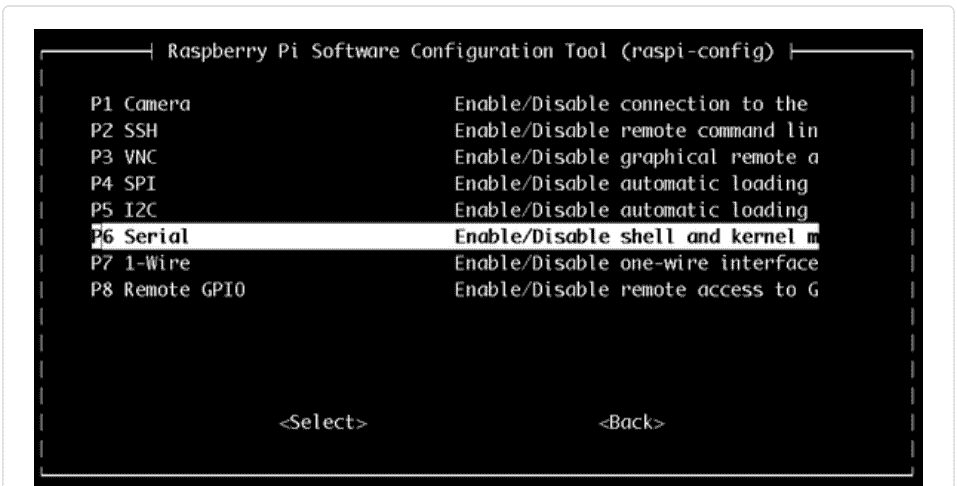

图 2-10. 使用 `raspi-config` 工具启用串行接口

控制台线非常适合将用于 *无头* 模式的树莓派——即不连接键盘、鼠标或显示器。

[图 2-11](#) 中所示的控制台线可从 [Adafruit](#) 购买。

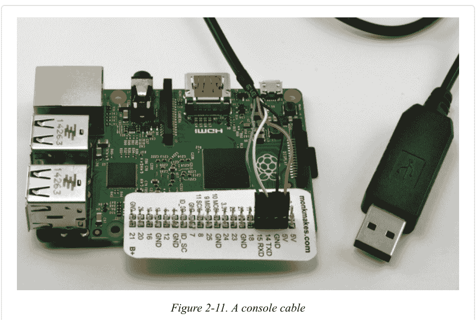

图 2-11. 控制台线

按照以下说明并参考图 2-11 连接线缆。

1. 将红色（5V）线连接到 5V 引脚，该引脚位于 GPIO 接口边缘左侧一个引脚处。
2. 将黑色（GND）线连接到树莓派上左侧下一个引脚的 GND。
3. 将白色线（Rx）连接到树莓派 GPIO 14（TXD），位于黑色线左侧。
4. 将绿色线（Tx）连接到 GPIO 15（RXD），位于树莓派上白色线左侧。

如果你使用不同的线缆，线缆颜色可能不同，因此请务必检查线缆的文档，否则有损坏树莓派的风险。

请注意，USB 线也在红线上提供 5V，其功率足以单独为树莓派供电，但不足以支持大量设备。

如果你是 Windows 或 macOS 用户，你需要为 USB 线安装驱动程序，可在此处获取 [Windows 驱动程序](https://example.com) 和 [macOS 驱动程序](https://example.com)。Linux 用户通常不需要为这些线缆安装任何驱动程序。

要从 macOS 连接到树莓派，你需要运行终端并输入以下命令：

```
$ sudo cu -l /dev/cu.usbserial -s 115200
```

连接后，按回车键，树莓派登录提示应该会出现（图 2-12）。默认用户名和密码分别是 *pi* 和 *raspberry*。

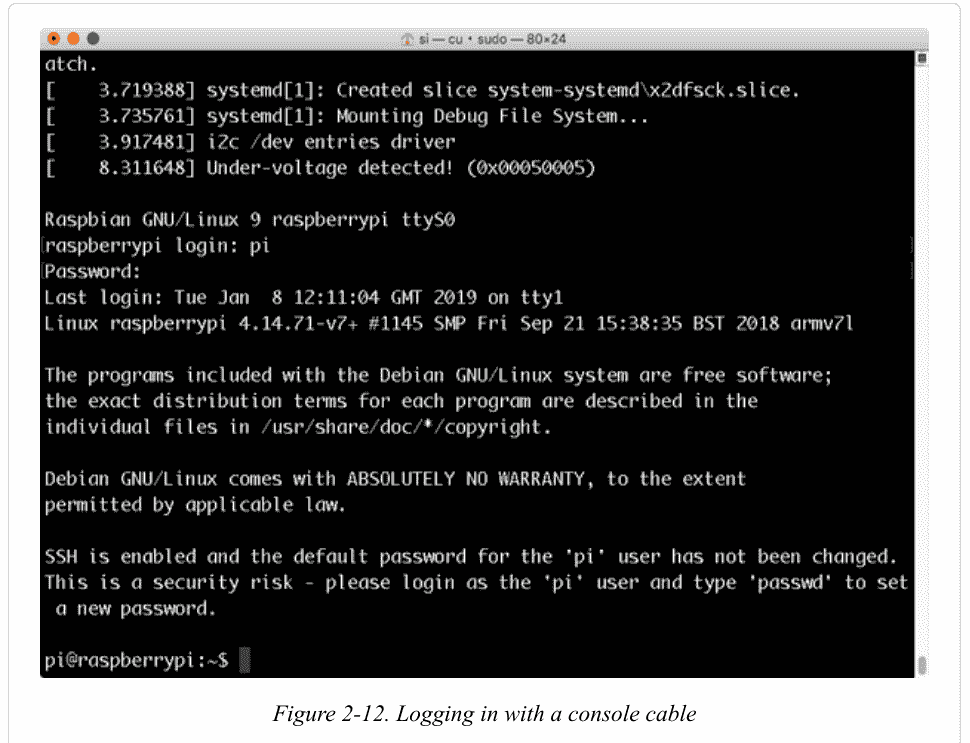

如果你尝试从 Windows 计算机连接到树莓派，你需要下载名为 [Putty](https://www.putty.org/) 的终端软件。

当你运行 Putty 时，将“连接类型”更改为串口，并将速度设置为 115200。你还需要将“串行线路”设置为电缆正在使用的 COM 端口。这可能是 COM7，但如果不行，请使用 Windows 设备管理器进行检查。
当你点击“打开”并按回车键时，终端会话应启动并显示登录提示。

### 讨论

如果你轻装出行，控制台电缆可以成为使用树莓派的一种非常便捷的方式，因为它同时提供了电源和远程控制树莓派的方法。
控制台引线在 USB 端有一个芯片，提供 USB 转串口接口。这有时（取决于你的操作系统）需要在你的 PC 上安装驱动程序。只要拥有适用于你 PC 的必要驱动程序，你应该可以使用任何 USB 转串口转换器。
如果你小心地将四个插座按正确的顺序粘合（或用胶带固定）在一起，使它们作为一个整体套在 GPIO 排针上，那么将引线的插座插入正确的位置会更容易。
使用像 Raspberry Leaf 这样的 GPIO 模板（参见[待添加链接]）可以更容易地找到 GPIO 排针上的正确位置。树莓派的引脚排列显示在[待添加链接]中。

### 另请参阅

你可以在这个 [Adafruit 教程](https://www.adafruit.com/)中找到更多关于使用串口控制台的信息。Adafruit 也出售控制台电缆。这里使用的引线是 Adafruit 提供的（产品代码 954）。

## 2.7 使用 SSH 远程控制树莓派

### 问题

你想通过安全外壳（SSH）从另一台计算机连接到远程的树莓派。

### 解决方案

在使用 SSH 连接到你的树莓派之前，你必须先开启 SSH。在较新版本的树莓派操作系统上，你可以使用树莓派配置工具（图 2-13），你可以在主菜单的“首选项”下找到它。只需选中 SSH 的复选框，然后点击“确定”。然后系统会提示你重启。

如果你更喜欢使用命令行，请使用 `raspi-config` 应用程序。你可以随时在终端中输入以下命令来启动它：

```
$ sudo raspi-config
```

点击“接口”选项卡，向下滚动到 SSH 选项，然后点击“启用”按钮。

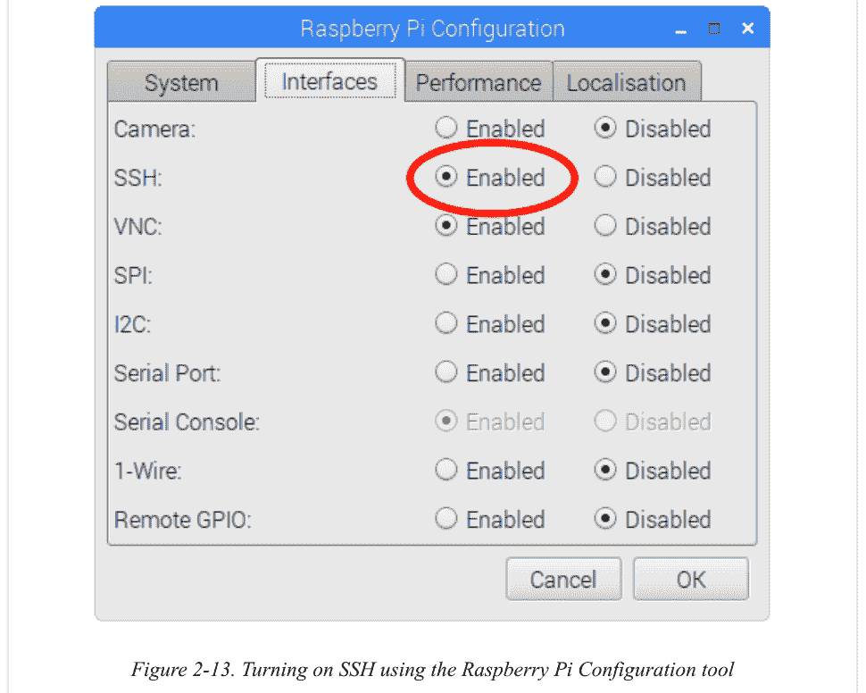

图 2-13. 使用树莓派配置工具开启 SSH

如果你使用的是 macOS 或者在你想连接树莓派的计算机上安装了 Linux，你只需打开一个终端窗口并输入以下命令即可连接：

```
$ ssh 192.168.1.16 -l pi
```

这里，IP 地址（192.168.1.16）是你树莓派的 IP 地址（参见配方 2.2）。然后系统会提示你输入密码，并登录到树莓派（图 2-14）。

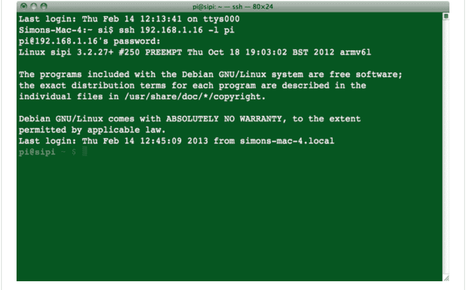

要从 Windows 计算机连接，你需要使用 Putty（[配方 2.6](Recipe 2.6)）来启动一个 SSH 会话。

### 讨论

SSH 是连接远程计算机的一种非常常见的方式；任何你可以在树莓派本身上执行的命令，都可以通过 SSH 使用。正如其名所示，它也是安全的，因为通信是加密的。

也许唯一的缺点是它是一个命令行环境，而不是图形环境。如果你需要远程访问完整的树莓派桌面环境，你需要使用 VNC（[配方 2.8](Recipe 2.8)）或 RDP（[待添加链接]）。

### 另请参阅

另请参阅这个 [Adafruit 教程](Adafruit tutorial)。

你也可以使用 PiBakery 来启用 SSH。

## 2.8 使用 VNC 远程控制树莓派

### 问题

你想通过虚拟网络计算（VNC）从 PC（Windows 或 Linux）或 macOS 访问树莓派的完整树莓派操作系统图形桌面。

### 解决方案

使用树莓派操作系统上预装的 VNC 软件。然而，为此，你首先需要配置你的树莓派以开启它。你可以使用树莓派配置工具来完成此操作，该工具可以在树莓派桌面主菜单的“首选项”部分找到。点击“接口”选项卡，向下滚动到 VNC 选项，选择“启用”按钮，然后点击“确定”（图 2-15）。

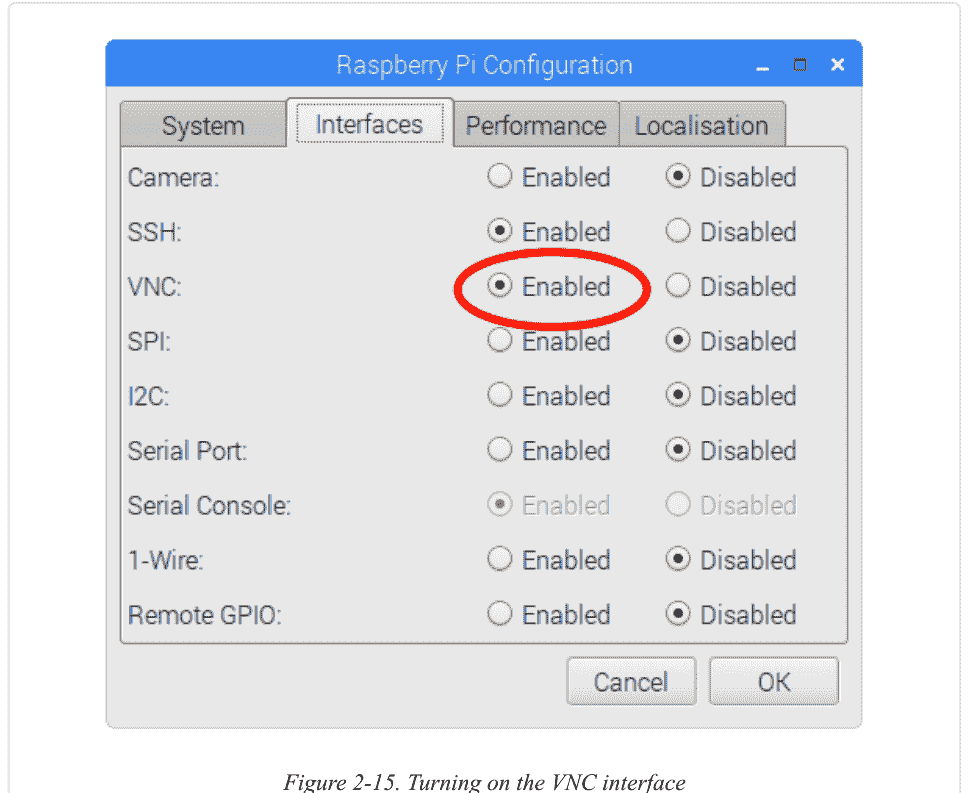

图 2-15. 开启 VNC 接口

如果你不介意虚拟屏幕分辨率非常低，你可以跳过本配方的这部分内容，直接远程连接到你的树莓派，但很可能你会想要增加分辨率。为此，请使用以下命令编辑 *config.txt* 文件：

```
$ sudo nano /boot/config.txt
```

找到如下所示的行：

```
# framebuffer_width=1900
# framebuffer_height=1024
```

删除每行开头的 # 字符以启用新的屏幕宽度和高度，如下所示：

```
framebuffer_width=1900
framebuffer_height=1024
```

你需要重启才能使更改生效。
要从远程计算机连接到树莓派，你需要安装 VNC 客户端软件。RealVNC VNC Viewer 是一个流行的选择，适用于 Windows、Linux 和 macOS。
当你在 macOS 或 PC 上运行客户端程序时，系统会要求你输入要连接的 VNC 服务器的 IP 地址（即你树莓派的 IP 地址）。
然后系统会提示你输入密码（图 2-16）。

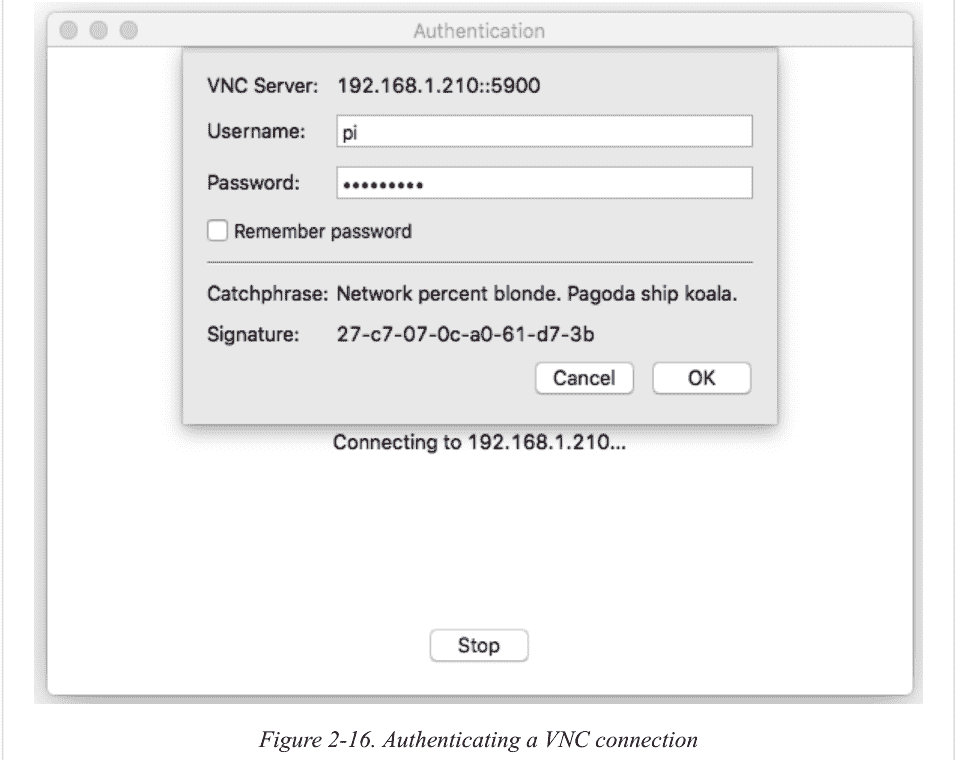

“口令”和“签名”是安全设备，旨在在有人入侵你的树莓派时向你发出警报。如果在你再次认证时其中任何一个发生变化，你的树莓派可能已被入侵。

### 讨论

虽然你可以使用 SSH 命令行完成大多数操作，但有时能够访问树莓派的图形环境会很有用。
只要启用了 VNC 选项，树莓派的 VNC 服务器会在你重启时自动启动。

### 另请参阅

另请参阅这个 [Adafruit 教程](https://www.adafruit.com/)。

你也可以在使用 PiBakery 设置新的树莓派时启用 VNC。

## 2.9 在 Mac 网络上共享文件

### 问题

你希望你的树莓派出现在 macOS Finder 的计算机列表中，以便你可以连接到它并使用 Finder 浏览文件系统。

### 解决方案

macOS 操作系统内置了通过网络在 Finder 中查看文件的支持（图 2-17）。但是，你必须在树莓派上进行一些配置更改，macOS 才能查看树莓派上的网络文件。

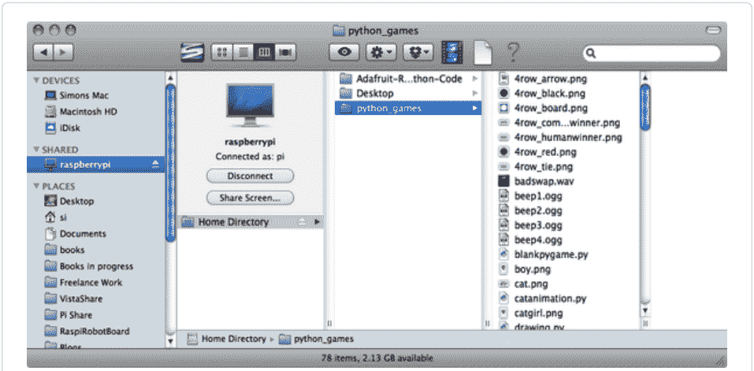

你需要知道树莓派的 IP 地址（配方 2.2）。

在树莓派上，使用以下命令安装 `netatalk`：

```
$ sudo apt-get update
$ sudo apt-get install netatalk
```

接下来，回到你的 Mac 上，在 Finder 菜单中，选择“前往”，点击“连接服务器”，然后输入 `afp://192.168.1.210` 作为服务器地址（当然，使用你树莓派的 IP 地址，而不是这里显示的地址）。然后，点击“连接”。然后系统会提示你登录（图 2-18）。

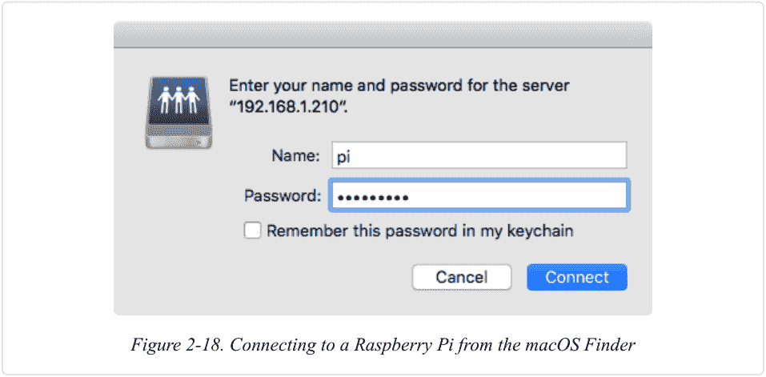

使用名称 **pi** 和你的密码登录，密码将是 **raspberry**，除非你已更改过。然后 Finder 应该会显示你树莓派上主目录的内容。

还需要在树莓派上进行一些配置更改，这将自动将你的树莓派挂载到 Mac 的文件系统上：

```
$ sudo apt-get update
$ sudo apt-get install avahi-daemon
$ sudo update-rc.d avahi-daemon defaults
```

接下来，输入此命令：

```
$ sudo nano /etc/avahi/services/afpd.service
```

将以下代码粘贴到文件中。这需要输入很多内容，所以如果你正在阅读本书的纸质版，你可以从[这个网页](this web page)复制并粘贴。只需向下滚动直到找到本章和本配方：

```
<?xml version="1.0" standalone='no'?><!--*-nxml-*->
<!DOCTYPE service-group SYSTEM "avahi-service.dtd">
<service-group>
  <name replace-wildcards="yes">%h</name>
  <service>
    <type>_afpovertcp._tcp</type>
    <port>548</port>
  </service>
</service-group>
```

要设置守护进程运行，以便在树莓派每次启动时自动执行此操作，请输入以下命令：

```
$ sudo /etc/init.d/avahi-daemon restart
```

切换回你的 Mac，你现在应该能在 Finder 中看到你的树莓派了。

### 讨论

能够在 Mac 和树莓派之间轻松移动文件非常有用。这意味着你可以在树莓派上使用文件，而无需连接单独的键盘、鼠标和显示器。
你也可以像在 Mac 上一样打开树莓派上的文件。这样做的好处是你可以使用 TextMate 或你最喜欢的 macOS 文本编辑器来编辑它们。
如果你使用的是 Windows 或 Linux，你也可以通过配置树莓派作为网络附加存储（NAS）来共享文件；参见[配方 2.10](Recipe 2.10)。

### 另请参阅

此处的说明改编自[本教程](this tutorial)，该教程将Matt Richardson和Shawn Wallace的著作*Getting Started with Raspberry Pi*（O'Reilly）列为原始来源。

## 2.10 使用树莓派作为网络附加存储

### 问题

你希望将树莓派用作网络附加存储（NAS），以便从网络上的计算机访问连接到树莓派的大容量USB驱动器。

### 解决方案

解决此问题的方法是安装和配置Samba。为此，请执行以下命令：

```
$ sudo apt-get update
$ sudo apt-get install samba
$ sudo apt-get install samba-common-bin
```

接下来，将USB硬盘连接到树莓派。它将自动挂载到你的`/media/pi`文件夹中。要检查它是否在那里，请运行此命令：

```
$ cd /media/pi
$ ls
```

驱动器应以其格式化时赋予的名称列出。每当树莓派重启时，它都会自动挂载自身。

接下来，你需要配置Samba，以便在网络上共享驱动器。为此，你首先需要添加一个Samba用户（pi）。输入以下命令并输入密码：

```
$ sudo smbpasswd -a pi
New SMB password:
Retype new SMB password:
Added user pi.
```

现在，你需要对文件`/etc/samba/smb.conf`进行一些更改，因此请输入此命令：

```
$ sudo nano /etc/samba/smb.conf
```

你要找的第一行在文件顶部附近：

```
workgroup = WORKGROUP
```

只有当你计划从Windows机器连接时才需要更改此项。这应该是你的Windows工作组的名称。对于Windows XP，默认值是MSHOME；对于较新版本的Windows，它是HOME（但请检查你的Windows网络）。请注意，通常在Mac和Windows PC（以及Linux机器）的混合网络中连接到NAS工作正常。

下一个更改在文件下方的“身份验证”部分。找到以下行：

```
# security = user
```

删除行首的`#`以激活该行并开启安全性。最后，滚动到文件末尾并添加以下行：

```
[USB]
path = /media/pi/NAS
comment = NAS Drive
valid users = pi
writeable = yes
browseable = yes
create mask = 0777
public = yes
```

保存文件，然后通过输入以下内容重启Samba：

```
$ sudo /etc/init.d/samba restart
```

如果一切正常，你的USB驱动器现在应该在网络上共享了。

### 讨论

要在macOS上连接到驱动器，请选择“前往”，然后从Finder菜单中单击“连接服务器”。接下来，在“服务器地址”字段中，输入**smb://raspberrypi/USB**。将打开一个登录对话框，你需要在其中将用户名更改为**pi**（图2-19）。

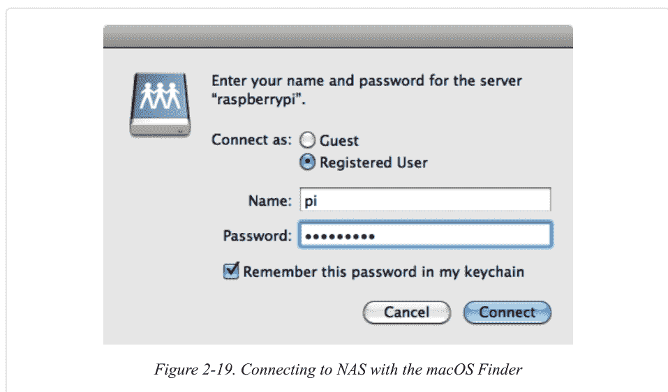

如果你从Windows机器连接到NAS，具体过程将因Windows版本而异。但是，基本原理是，在某个时候你需要输入网络地址，该地址应为`\raspberrypi\USB`（图2-20）。

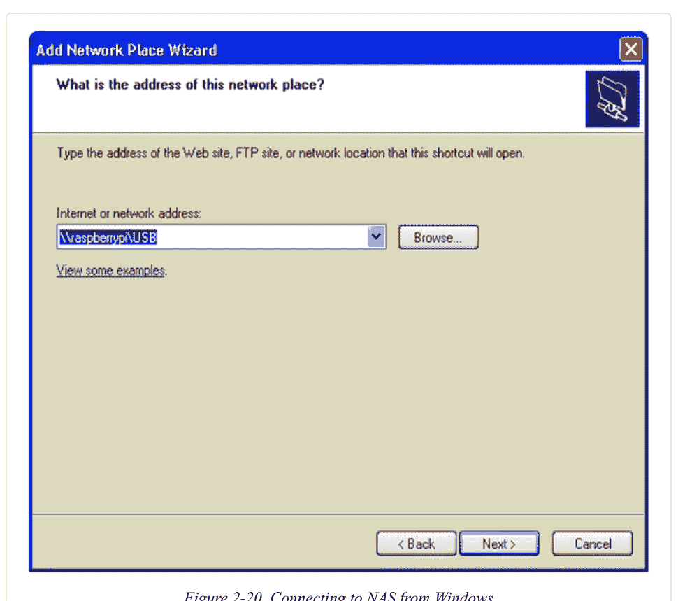

然后，系统会提示你输入用户名和密码，然后才能使用NAS磁盘（图2-21）。你可能只需要在第一次执行此操作。添加网络位置后，你应该能够在文件资源管理器中直接导航到它。

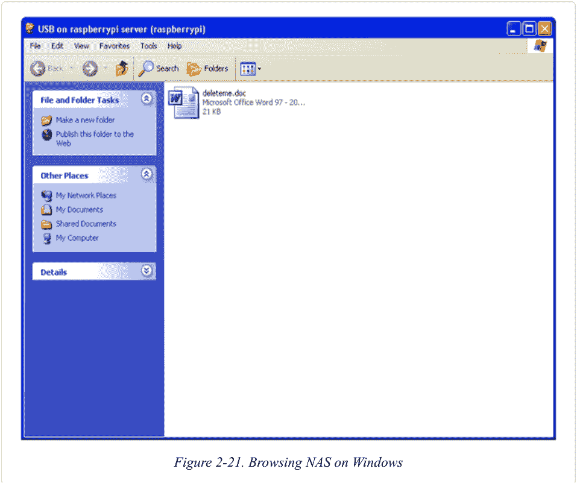

如果你是Linux用户，以下命令应该可以为你挂载NAS驱动器：

```
$ sudo mkdir /pishare
$ sudo smbmount -o username=pi,password=raspberry //192.168.1.16/USB /pishare
```

### 另请参阅

你可能想将树莓派的网络名称更改为像“piNAS”这样的名称（参见[配方2.4](Recipe 2.4)）。

## 2.11 设置网络打印机

### 问题

你希望从树莓派打印到网络打印机。

### 解决方案

使用通用Unix打印系统（CUPS）。
首先，在终端中输入以下命令以安装CUPS（这可能需要一些时间）：

```
$ sudo apt-get update
$ sudo apt-get install cups
```

通过输入以下命令为自己授予CUPS的管理员权限：

```
$ sudo usermod -a -G lpadmin pi
```

最后一条命令将CUPS使用的`lpadmin`组添加到用户`pi`，以便你拥有打印权限。
CUPS通过Web界面进行配置。启动Chromium，然后在主菜单的Internet组中（或单击桌面上的图标），导航到地址**http://localhost:631**。
在“管理”选项卡上，选择“添加打印机”选项。这将显示网络上或直接连接到树莓派USB端口的打印机列表（图2-22）。

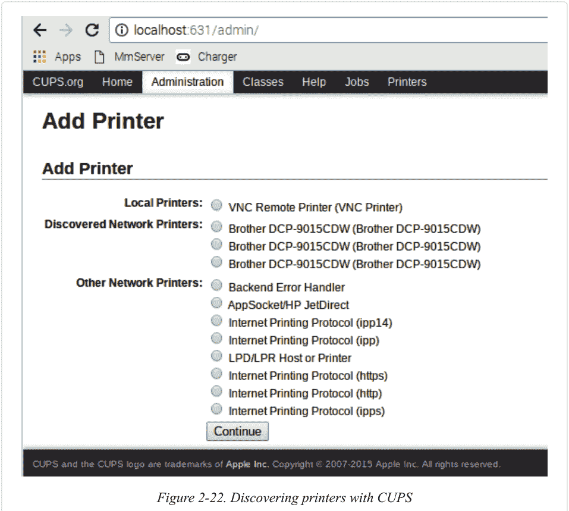

按照一系列对话框设置打印机。

### 讨论

完成后，你可以通过启动LibreOffice来测试打印机。输入一些文本，当你去打印时，你应该会看到新添加的打印机可用于打印（图2-23）。

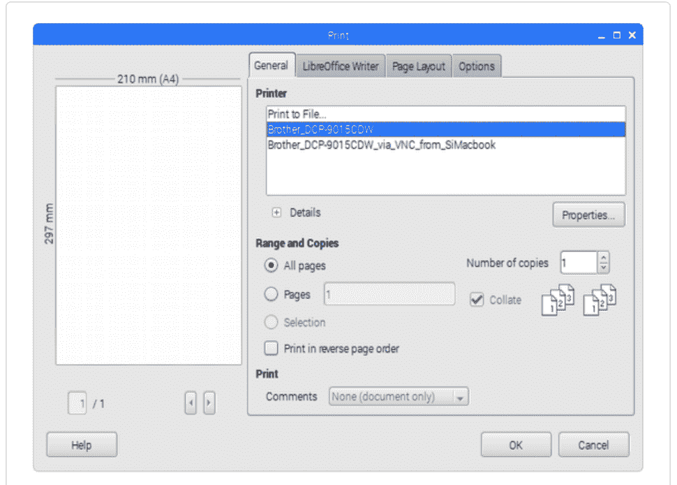

图2-23. 打印对话框

### 另请参阅

另请参阅官方[CUPS网站](http://www.cups.org/)。

# 第3章 操作系统

> ### 给早期版本读者的说明

通过早期版本电子书，你可以获得最早期的书籍——作者在写作时的原始且未经编辑的内容——因此你可以在这些标题正式发布之前很久就利用这些技术。

这将是最终书籍的第3章。请注意，GitHub仓库稍后将激活。

如果你对我们如何改进本书的内容和/或示例有意见，或者你发现本章中缺少材料，请通过simonmonkauthor@gmail.com联系作者。

## 3.0 简介

本章探讨了树莓派使用的Linux操作系统的许多方面。其中很多涉及命令行的使用。如果你习惯于Windows或macOS，这可能会有点令人震惊。然而，当你习惯它时，使用命令行做事可能会出奇地高效。

你可以使用更接近Windows或macOS的方式，通过图形界面完成许多简单的文件操作，如移动文件、重命名、复制和删除文件，这是我们第一个配方的主题。

## 3.1 图形化浏览文件

### 问题

你希望使用像macOS或Windows PC上的图形界面来移动文件。

### 解决方案

使用文件管理器。
你可以在主菜单的“附件”组中找到此程序（图3-1）。
使用文件管理器，你可以将文件或目录从一个目录拖到另一个目录，或者使用“编辑”菜单从一个位置复制文件并将其粘贴到第二个位置。这与Windows文件管理器或macOS Finder的操作方式非常相似。

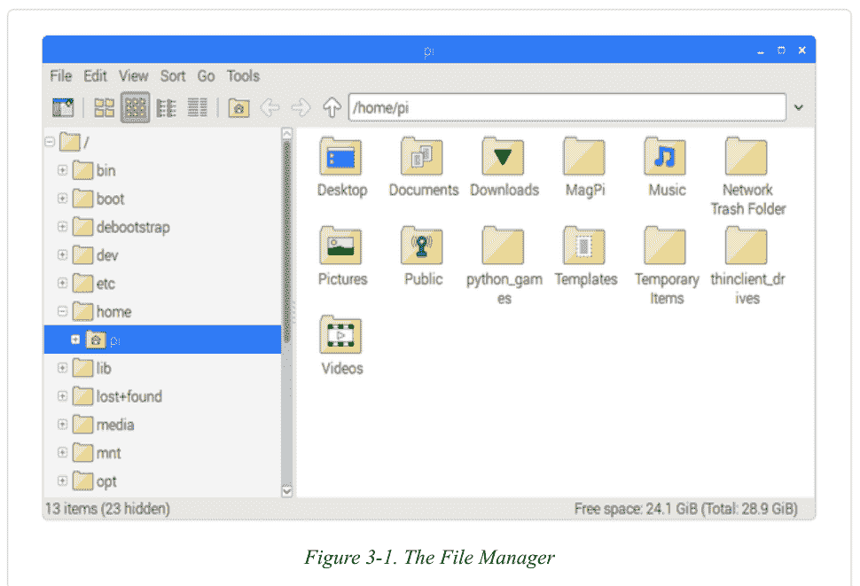

### 讨论

文件管理器的左侧显示文件夹结构。
中央区域显示当前文件夹中的文件，你可以使用工具栏中的按钮或在顶部的文件路径区域中输入位置来导航。
你可以右键单击一个文件以打开一个菜单，其中包含你可以对该文件使用的选项（图3-2）。

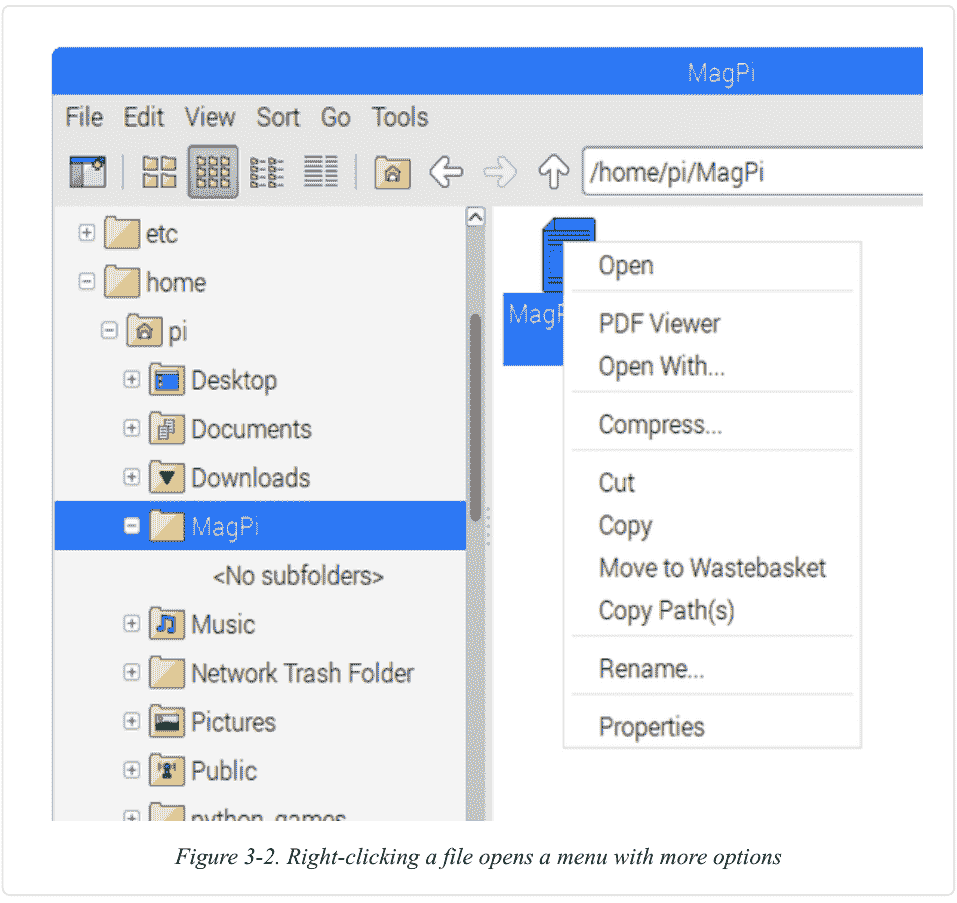

你还可以通过按住Ctrl键的同时选择文件来一次选择多个文件进行复制或拖动，或者你可以通过选择一个文件，然后按住Shift键的同时选择要选择的文件列表的末尾来选择一系列文件。

### 另请参阅

另请参阅[配方3.5](Recipe 3.5)。

## 3.2 将文件复制到USB闪存驱动器

### 问题

你希望将文件从树莓派复制到USB闪存驱动器。

### 解决方案

将USB闪存驱动器插入USB端口，应出现如图3-3所示的对话框。选择“确定”以在文件管理器中打开它。

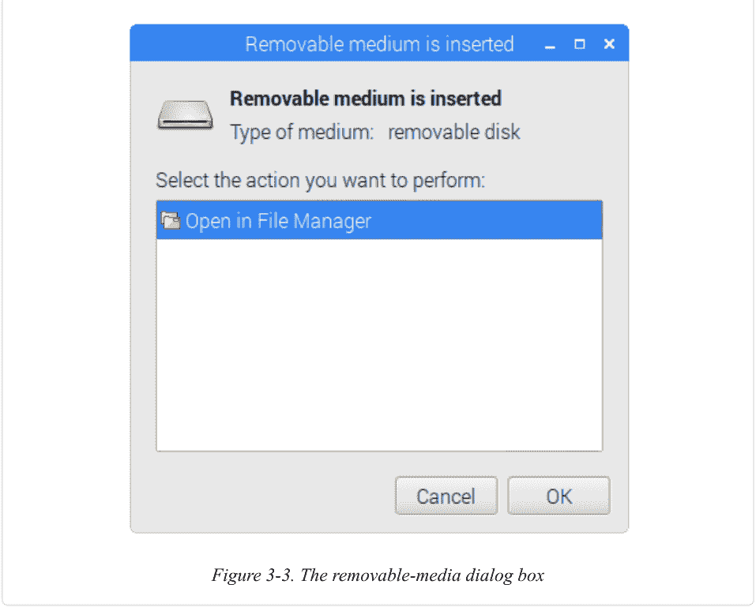

驱动器将挂载在`/media/pi`后跟闪存驱动器的名称（在我的情况下是UNTITLED）。要从主文件夹复制文件，请将其拖到代表闪存驱动器的文件夹上，如图3-4所示。

## 3.3 启动终端会话

### 问题

使用树莓派时，你需要在终端中输入文本命令。

### 解决方案

在树莓派桌面顶部，选择终端图标（它看起来像一个黑色的电脑显示器），或者在开始菜单的“附件”组中，选择终端菜单选项（图3-5）。

### 讨论

终端启动时，默认设置为你的主目录（/home/pi）。

你可以根据需要打开任意多个终端会话。同时打开几个位于不同目录的会话通常很有用，这样你就无需频繁使用 `cd` 命令切换目录（参见配方3.4）。
使用终端时，所有内容都区分大小写。也就是说，如果你使用某个命令，输入时必须使用正确的大小写。例如，你将在下一个配方中遇到的 `ls` 命令必须写成小写的 `ls`，而不能是 `LS`、`Ls` 或 `lS`。同样，所有文件名也区分大小写，因此名为 *picture.jpg* 和 *Picture.jpg* 的文件是两个不同的文件。

### 另请参阅

在下一节（配方3.4）中，你将学习如何使用终端浏览目录结构。

## 3.4 使用终端浏览文件系统

### 问题

你需要了解如何使用终端更改目录并在文件系统中移动。

### 解决方案

用于浏览文件系统的主要命令是 `cd`（更改目录）。在 `cd` 之后，你需要指定要切换到的目录。这可以是当前目录内某个目录的*相对*路径，也可以是文件系统中其他位置的*绝对*路径。
要查看当前目录是什么，请使用命令 `pwd`（打印工作目录）。

### 讨论

尝试几个例子。打开一个终端会话，你应该会看到如下提示符：

```
pi@raspberrypi: ~ $
```

你在每个命令后看到的提示符（`pi@raspberrypi: ~ $`）是你的用户名（`pi`）和计算机名（`raspberrypi`）的提醒。`~` 字符是你的主目录（`/home/pi`）的简写。因此，在任何时候你都可以按如下方式将当前目录切换到主目录：

```
$ cd ~
```

> **提示**

在本书中，我使用 `$` 作为每行开头需要你输入命令的地方。这被称为提示符。命令行的响应不带任何前缀；它就像在树莓派屏幕上显示的那样出现。

你可以通过使用 `pwd` 命令来确认命令确实将目录设置为了主目录：

```
$ pwd
/home/pi
```

如果你想在目录结构中向上移动一级，可以在 `cd` 命令后使用特殊值 `..`（两个点），如下所示：

```
$ cd ..
$ pwd
/home
```

正如你现在可能已经推断出的，特定文件或目录的路径是由用 / 分隔的单词组成的。因此，整个文件系统的根目录是 /，要访问 / 内的主目录，你会引用 /home/。然后，要找到其中的 *pi* 目录，你会使用 /home/pi/。你可以省略路径末尾的 /。

路径可以是绝对路径（以 / 开头并指定从根目录开始的完整路径），也可以是相对于当前工作目录的路径，这种情况下它们不能以 / 开头。

你对主目录中的文件拥有完全的读写权限，但当你进入存放系统文件和应用程序的位置时，你对某些文件的访问将被限制为只读。你可以覆盖此限制（配方3.12），但需要谨慎操作。

通过输入命令 `cd /` 和 `ls` 来查看目录结构的*根*，如图3-6所示。

```
pi@raspberrypi:~ $ cd /
pi@raspberrypi:/ $ ls
bin   dev   home  lost+found  mnt  proc  run  srv  tmp  var
boot  etc   lib   media       opt  root  sbin sys  usr
pi@raspberrypi:/ $
```

图3-6. 列出目录内容

`ls` 命令（列出）向我们展示了根目录（/）下的所有文件和目录。你会看到列出了一个 *home* 目录，这正是你刚才来自的目录。

现在使用图3-7所示的命令切换到其中一个目录。

你会看到文件和文件夹有一些颜色编码。文件以各种颜色显示，而目录是深蓝色。
除非你特别喜欢打字，否则 Tab 键提供了一个方便的快捷方式。如果你开始输入文件名，按 Tab 键可以让自动完成功能尝试补全文件名。例如，如果你要切换到 *network* 目录，输入命令 **cd netw** 然后按 Tab 键。因为 *netw* 足以唯一标识该文件或目录，按 Tab 键将自动补全它。
如果你输入的内容不足以唯一标识文件或目录，再次按 Tab 键将显示与你当前输入匹配的可能选项列表。因此，如果你输入到 *net* 就停止并按 Tab 键，你会看到类似图3-8的内容。

你可以在 `ls` 后提供一个额外的参数来缩小要列出的内容范围。切换到 `/etc` 目录，然后运行以下命令：

```
$ ls f*
fake-hwclock.data  fb.modes  fstab  fuse.conf
fonts:
conf.avail  conf.d  fonts.conf  fonts.dtd

foomatic:
defaultspooler  direct  filter.conf

fstab.d:
pi@raspberrypi /etc $
```

* 字符被称为通配符。在 `ls` 后指定 `f*`，表示我们想要列出所有以 *f* 开头的内容。
有帮助的是，结果首先列出了 `/etc` 中所有以 *f* 开头的文件，然后是该文件夹中所有以 *f* 开头的目录的内容。
通配符的一个常见用途是列出具有特定扩展名的所有文件（例如，`ls *.docx`）。
Linux（以及许多其他操作系统）中的一个约定是，通过以句点开头来隐藏不应向用户显示的文件。任何以此命名的文件或文件夹在你输入 `ls` 时都不会出现，除非你为 `ls` 提供 `-a`（全部）选项。
例如：

```
$ cd ~
$ ls -a
.                          Desktop                    .pulse
..                         .dillo                     .pulse-
cookie
Adafruit-Raspberry-Pi-Python-Code  .dmrc
python_games
.advance                   .emulationstation
sales_log
.AppleDB                  .fltk                      servo.py
.AppleDesktop             .fontconfig                .stella
.AppleDouble              .gstreamer-0.10
stepper.py.save
Asteroids.zip             .gvfs
switches.txt.save
atari_roms                indiecity
Temporary Items
.bash_history             .local
thermometer.py
.bash_logout
.thumbnails
.bashrc
.cache
.Xauthority
.config
.xsession-errors
.dbus
.xsession-errors.old

motor.py
.mozilla
mydocument.doc
Network Trash Folder
.profile

.vnc
```

如你所见，你主目录中的大多数文件和文件夹都是隐藏的。

### 另请参阅

另请参阅 [配方 3.14](Recipe 3.14)。

## 3.5 复制文件或文件夹

### 问题

你想使用终端会话复制一个文件。

### 解决方案

使用 `cp` 命令复制文件和目录。

### 讨论

当然，你可以使用文件管理器及其复制和粘贴菜单选项（[配方 3.1](Recipe 3.1)）或键盘快捷键来复制文件。
在终端会话中复制的最简单示例是在工作目录内复制一个文件。`cp` 命令后首先是要复制的文件，然后是新文件的名称。
例如，以下示例创建一个名为 *myfile.txt* 的文件，然后制作一个名为 *myfile2.txt* 的副本；你可以在 [配方 3.9](Recipe 3.9) 中了解更多关于使用 `>` 命令创建文件的技巧：

## 3.5 复制文件或文件夹

### 问题

你需要复制一个文件或目录。

### 解决方案

使用 `cp` 命令来复制文件和目录。

### 讨论

`cp`（复制）命令用于创建文件或目录的副本。其基本语法是 `cp 源 目标`。

例如，要在当前目录中创建名为 `myfile.txt` 的文件的副本，你可以使用：

```
$ echo "hello" > myfile.txt
$ ls
myfile.txt
$ cp myfile.txt myfile2.txt
$ ls
myfile.txt    myfile2.txt
```

虽然在此示例中两个文件路径都位于当前工作目录内，但文件路径可以指向文件系统中任何你有写入权限的位置。以下示例将原始文件复制到 `/tmp` 目录，这是一个用于存放临时文件的位置（不要在该文件夹中存放任何重要文件）：

```
$ cp myfile.txt /tmp
```

请注意，在这种情况下，没有指定新文件的名称，只指定了它要存放的目录。这将在 `/tmp` 中创建一个名为 *myfile.txt* 的副本，与原始文件同名。

有时，你可能不想只复制一个文件，而是想复制一个包含许多文件甚至其他子目录的整个目录。要复制一个目录及其所有内容，你需要使用 `-r` 选项（表示递归）：

```
$ cp -r mydirectory mydirectory2
```

无论何时复制文件或文件夹，命令的结果都会告诉你是否没有权限。如果是这种情况，你需要更改目标文件夹的权限（参见配方 3.14），或者使用超级用户权限复制文件（参见配方 3.12）。

### 另请参阅

另请参阅配方 3.6。

有关 `cp` 命令众多可选参数的有用描述，请参阅 https://www.computerhope.com/unix/ucp.htm。

## 3.6 重命名文件或文件夹

### 问题

你需要通过终端会话重命名一个文件。

### 解决方案

使用 `mv` 命令来重命名文件和目录。

### 讨论

`mv`（移动）命令的使用方式与 `cp` 命令类似，不同之处在于被移动的文件或文件夹只是被重命名，而不是创建副本。

例如，要将文件从 `my_file.txt` 重命名为 `my_file.rtf`，你可以使用以下命令：

```
$ mv my_file.txt my_file.rtf
```

重命名目录同样简单直接，而且你不需要像复制时那样使用递归 `-r` 选项，因为重命名目录隐含地意味着其中的所有内容都包含在重命名后的目录中。

### 另请参阅

另请参阅 [配方 3.5](Recipe 3.5)。

## 3.7 编辑文件

### 问题

你想从命令行运行编辑器来更改配置文件。

### 解决方案

使用大多数树莓派发行版中包含的 nano 编辑器。

### 讨论

要使用 nano，只需输入命令 `nano`，后跟你要编辑的文件名或文件路径。如果文件不存在，它将在你保存时创建。但是，这仅在你对要写入文件的目录具有写入权限时才会发生。

从你的主目录，输入命令 `nano my_file.txt` 来编辑或创建文件 *my_file.txt*。图 3-9 展示了 nano 的实际操作。

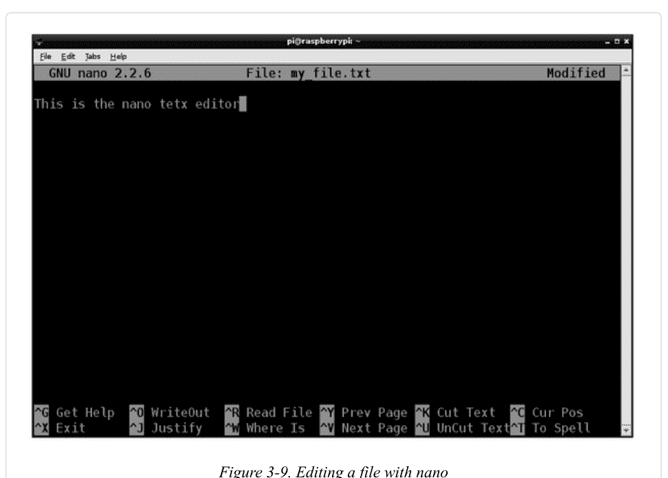

你不能使用鼠标来定位光标；你必须使用方向键。

屏幕底部的区域列出了许多命令，你可以通过按住 Ctrl 键并按下指示的字母来访问。其中大多数并不常用。你最可能使用的命令如下：

**Ctrl-X**

退出。在 nano 退出之前，会提示你保存文件。

**Ctrl-V**

下一页。可以将其视为一个向下的箭头。这允许你一次移动一屏来浏览大文件。

**Ctrl-Y**

上一页。

**Ctrl-W**

查找。这允许你搜索一段文本。

**Ctrl-O**

输出。这将写入文件而不退出编辑器。

还有一些相当粗糙的复制粘贴选项，但在实践中，使用右键单击菜单中的常规剪贴板更容易，如 [图 3-10](#) 所示。

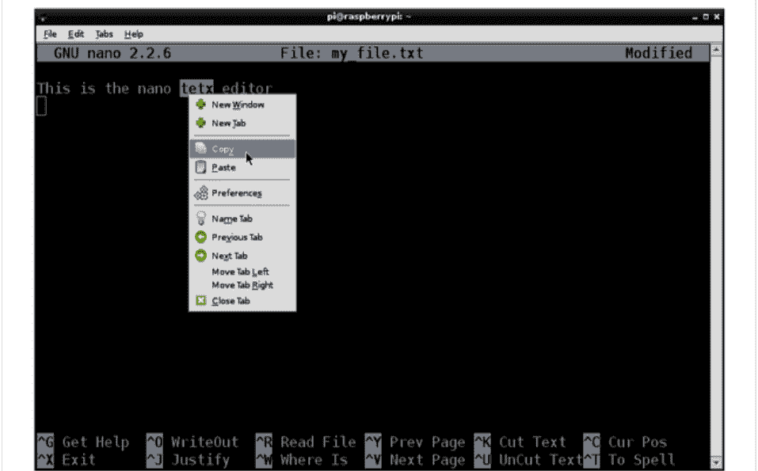

图 3-10. 在 nano 中使用剪贴板

使用此剪贴板还允许你在其他窗口（例如你的浏览器）之间复制和粘贴文本。

当你准备好将更改保存到文件并退出 nano 时，请使用命令 Ctrl-X。输入 Y 确认你要保存文件。然后 nano 会显示文件名作为保存文件的默认名称；按 Enter 保存并退出。

如果你想放弃所做的更改，请输入 N 代替 Y。

### 另请参阅

编辑器在很大程度上是个人品味问题。许多其他可用于 Linux 的编辑器在树莓派上也能正常工作。*vim*（vi 改进版）编辑器在 Linux 世界拥有众多粉丝。它也包含在流行的树莓派发行版中。然而，对于初学者来说，它不是一个容易上手的编辑器。你可以像运行 nano 一样运行它，但使用命令 `vi` 代替 `nano`。你可以在 [https://oreil.ly/y0fym](https://oreil.ly/y0fym) 找到有关使用 vim 的详细信息。

## 3.8 查看文件内容

### 问题

你想查看一个小文件的内容而不进行编辑。

### 解决方案

使用 `cat` 命令或 `more` 命令来查看文件。

例如：

```
$ more myfile.txt
This file contains
some text
```

### 讨论

`cat` 命令显示文件的全部内容，即使内容长到无法在屏幕上完全显示。

`more` 命令一次只显示一屏文本。按空格键显示下一屏。

### 另请参阅

你也可以使用 `cat` 来连接（合并）多个文件（[配方 3.32](Recipe 3.32)）。

另一个与 `more` 相关的流行命令是 `less`。`less` 类似于 `more`，但它允许你在文件中向前和向后移动。

## 3.9 不使用编辑器创建文件

### 问题

你想创建一个单行文件而不必使用编辑器。

### 解决方案

使用 `>` 和 `echo` 命令将你在命令行上输入的内容重定向到文件。

例如：

```
$ echo "file contents here" > test.txt
$ more test.txt
file contents here
```

> **警告**

`>` 命令会覆盖任何现有文件，因此请谨慎使用。

### 讨论

这对于快速创建文件很有用。

### 另请参阅

要使用 `more` 命令在不使用编辑器的情况下查看文件，请参阅 [配方 3.8](Recipe 3.8)。

要使用 `>` 捕获其他类型的系统输出，请参阅 [配方 3.31](Recipe 3.31)。

## 3.10 创建目录

### 问题

你想使用终端创建一个新目录。

### 解决方案

`mkdir` 命令创建一个新目录。

### 讨论

要创建一个目录，请使用 `mkdir` 命令。尝试以下示例（注意只显示了命令，没有显示响应）：

```
$ cd ~
$ mkdir my_directory
$ cd my_directory
$ ls
```

你需要在尝试创建新目录的目录中具有写入权限。

### 另请参阅

有关使用终端浏览文件系统的一般信息，请参阅 [配方 3.4](Recipe 3.4)。

## 3.11 删除文件或目录

### 问题

你想使用终端删除一个文件或目录。

### 解决方案

`rm`（删除）命令将删除一个文件或目录及其内容。你应该极其谨慎地使用它。

### 讨论

删除单个文件既简单又安全。以下示例将从主目录中删除文件 `my_file.txt`；你可以使用 `ls` 命令确保它已消失：

```
$ cd ~
$ rm my_file.txt
$ ls
```

你需要在尝试执行删除操作的目录中具有写入权限。

你也可以在删除文件时使用 `*` 通配符。此示例删除当前目录中所有以 `my_file.` 开头的文件：

```
$ rm my_file.*
```

你也可以通过输入以下命令删除目录中的所有文件：

```
$ rm *
```

如果你想递归删除一个目录（即，不仅是目录本身，还包括它包含的所有文件和目录），你可以使用 `-r` 选项：

```
$ rm -r mydir
```

> **警告**

从终端窗口删除文件时，请记住你没有回收站的安全网来恢复已删除的文件。此外，一般来说，你不会得到确认选项；文件会立即被删除。如果你结合使用 `sudo` 命令（[配方 3.12](Recipe 3.12)），这可能是完全灾难性的。

### 另请参阅

另请参阅 [配方 3.4](Recipe 3.4)。

如果你担心意外删除文件或文件夹，可以通过设置命令别名（[配方 3.36](Recipe 3.36)）来强制 `rm` 命令进行确认。

## 3.12 使用超级用户权限执行任务

### 问题

某些命令无法运行，因为你*权限不足*。

### 解决方案

你需要使用超级用户权限来执行命令。`sudo`（substitute user do）命令允许你以超级用户权限执行操作。只需在命令前加上 `sudo` 即可。

### 讨论

大多数你想在命令行上执行的任务通常不需要超级用户权限。最常见的例外情况是安装新软件和编辑配置文件。`apt-get` 命令是向 Raspberry Pi OS 安装新软件的主要方式。你将在 [配方 3.17](Recipe 3.17) 中正式遇到它。

另一个需要超级用户权限的例子是 `reboot` 命令。如果你尝试以普通用户身份运行它，你会收到一些错误消息：

```
$ reboot
Failed to set wall message, ignoring: Interactive authentication required.
Failed to reboot system via logind: Interactive authentication required.
Failed to open /dev/initctl: Permission denied
Failed to talk to init daemon.
```

如果你在命令前加上 `sudo`，命令就能正常工作：

```
$ sudo reboot
```

如果你有一大堆命令需要以超级用户身份运行，又不想在每个命令前都加上 `sudo`，可以使用以下命令：

```
$ sudo sh
#
```

注意提示符如何从 `$` 变为 `#`。所有后续命令都将以超级用户身份运行。当你想恢复为普通用户时，输入命令：

```
# exit
$
```

### 另请参阅

要了解更多关于文件权限的信息，请参阅 [配方 3.13](Recipe 3.13)。
要使用 `apt-get` 安装软件，请参阅 [配方 3.17](Recipe 3.17)。

## 3.13 理解文件权限

### 问题

你已经看到文件名被列出时伴随的奇怪字符。你想知道它们的含义。

### 解决方案

要查看与文件和目录相关的权限和所有权信息，请使用带有 `-l` 选项的 `ls` 命令。

### 讨论

运行命令 `ls -l`（选项字母是小写 *L*），你会看到类似这样的结果：

```
$ ls -l
total 16
-rw-r--r-- 1 pi pi     5 Apr 23 15:23 file1.txt
-rw-r--r-- 1 pi pi     5 Apr 23 15:23 file2.txt
-rw-r--r-- 1 pi pi     5 Apr 23 15:23 file3.txt
drwxr-xr-x 2 pi pi  4096 Apr 23 15:23 mydir
```

`ls` 命令响应的第一行告诉你目录中有 16 个文件。

图 3-11 显示了列表信息的不同部分。第一个块包含权限。在第二个块中，数字 1（标记为“文件”）表示涉及多少个文件。此字段仅在列表条目是目录时才有意义；如果是文件，则通常只是 1。接下来的两个条目（都是 `pi`）是文件的所有者和组。大小条目（第五个块）表示文件的大小（以字节为单位）。修改日期会在每次编辑或更改文件时更改，最后一个条目是文件或目录的实际名称。

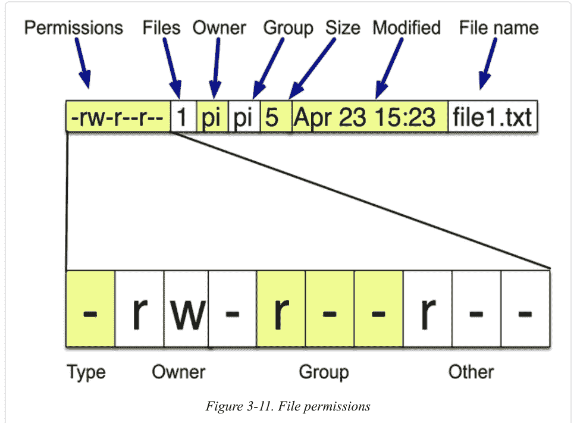

权限块分为四个部分（类型、所有者、组和其他）。第一部分是文件的类型。如果是目录，它将是字符 `d`；如果是文件，条目将只是 `-`。

下一部分包含三个字符，指定文件的所有者权限。每个字符都是一个开或关的标志。如果所有者有读权限，第一个字符位置将有一个 `r`。如果所有者有写权限，第二个位置将有一个 `w`。第三个位置（在此示例中为 `-`）如果文件对所有者可执行（程序或脚本），则将有一个 `x`。

第三部分具有相同的三个标志，但适用于组中的任何用户。用户可以被组织成组。因此，在此情况下，文件有一个用户 `pi` 和一个组所有权 `pi`。如果组 `pi` 中有任何其他用户，他们将拥有此处指定的权限。

最后一部分指定既不是 `pi` 也不在 `pi` 组中的用户的权限。因为大多数人只会以用户 `pi` 的身份使用 Raspberry Pi，所以最相关的权限在第一部分。

### 另请参阅

要更改文件权限，请参阅 [配方 3.14](Recipe 3.14)。

## 3.14 更改文件权限

### 问题

你需要更改文件的权限。

### 解决方案

你可以使用 `chmod` 命令来修改文件权限。

### 讨论

你可能想要更改文件权限的常见原因包括需要编辑标记为只读的文件，以及赋予文件执行权限以便它可以作为程序或脚本运行。
`chmod` 命令允许你添加或删除文件的权限。有两种语法可以做到这一点；一种需要使用八进制（基数 8），另一种是基于文本的。你将使用更容易理解的文本方法。
`chmod` 的第一个参数是要进行的更改，第二个是要应用更改的文件或文件夹。此更改参数采用权限范围（+、-、= 分别表示添加、删除和设置）后跟权限类型的形式。

例如，以下代码将为文件 *file2.txt* 的所有者（用户）添加执行（x）权限：

```
$ chmod u+x file2.txt
```

如果我们现在列出目录，我们可以看到 x 权限已被添加：

```
$ ls -l
total 16
-rw-r--r-- 1 pi pi     5 Apr 23 15:23 file1.txt
-rwxr--r-- 1 pi pi     5 Apr 24 08:08 file2.txt
-rw-r--r-- 1 pi pi     5 Apr 23 15:23 file3.txt
drwxr-xr-x 2 pi pi  4096 Apr 23 15:23 mydir
```

如果我们想为组或其他用户添加执行权限，我们将分别使用 `g` 和 `o`。字母 `a` 为所有人添加权限。

### 另请参阅

有关文件权限的背景信息，请参阅 [配方 3.13](Recipe 3.13)。
有关更改文件所有权，请参阅 [配方 3.15](Recipe 3.15)。

## 3.15 更改文件所有权

### 问题

你需要更改文件的所有权。

### 解决方案

你可以使用 `chown`（更改所有者）命令来修改文件或目录的所有权。

### 讨论

正如我们在配方 3.13 中发现的，任何文件或目录都有一个所有者和一个组与之关联。因为大多数 Raspberry Pi 用户只有一个用户 pi，所以我们实际上不需要担心组。

偶尔，你会发现系统上安装的文件具有与 pi 不同的用户。如果是这种情况，你可以使用 chown 命令更改文件的所有权。

要更改文件的所有者，请使用 chown，后跟新的所有者和组（用冒号分隔），然后是文件名。

你可能会发现你需要超级用户权限来更改所有权，在这种情况下，你应该在命令前加上 sudo（配方 3.12）：

```
$ sudo chown root:root file2.txt
$ ls -l
total 16
-rw-r--r-- 1 pi    pi       5 Apr 23 15:23 file1.txt
-rwxr--r-- 1 root  root     5 Apr 24 08:08 file2.txt
-rw-r--r-- 1 pi    pi       5 Apr 23 15:23 file3.txt
drwxr-xr-x 2 pi    pi    4096 Apr 23 15:23 mydir
```

### 另请参阅

有关文件权限的背景信息，请参阅配方 3.13。
另请参阅配方 3.14 以更改文件权限。

## 3.16 进行屏幕截图

### 问题

你想捕获 Raspberry Pi 屏幕的图像并将其保存到文件。

### 解决方案

使用名称巧妙的 `scrot`（SCReenshOT）屏幕截图软件。

### 讨论

触发屏幕截图的最简单方法是输入命令 `scrot`。这将立即捕获主显示器的图像，并将其保存在当前目录中名为 *2019-04-25-080116_1024x768_scrot.png* 的文件中。
有时你想要一个截图来显示打开的菜单或通常在你感兴趣的窗口失去焦点时消失的内容。对于这种情况，你可以使用 `-d` 选项指定截图前的延迟：

```
$ scrot -d 5
```

延迟以秒为单位指定。
如果你捕获整个屏幕，你可以稍后使用图像编辑软件（如 GIMP（配方 4.7））进行裁剪。然而，更方便的是首先只捕获屏幕的特定区域，你可以通过使用 `-s` 选项来实现。
要使用此选项，请输入以下命令，然后用鼠标拖出要捕获的屏幕区域：

```
$ scrot -s
```

文件名将包含捕获图像的像素尺寸。

### 另请参阅

`scrot` 命令还有许多其他选项来控制诸如使用多个屏幕和更改保存文件格式等事项。你可以通过输入以下命令，从其手册页中了解更多关于 `scrot` 的信息：

```
$ man scrot
```

> **手册页**

几乎所有 Raspberry Pi OS 命令都有手册页，你可以通过输入命令名称后跟命令本身来查看它们。然而，命令的手册页并不总是很容易访问，它是该命令的详尽参考，而非简单的使用指南。因此，通常更好的做法是直接在互联网上搜索该命令。

## 3.17 使用 apt-get 安装软件

### 问题

你想使用命令行安装软件。

### 解决方案

从终端会话安装软件最常用的工具是 `apt-get`（高级打包工具）。
该命令的基本格式（必须以超级用户身份运行）如下：

```
$ sudo apt-get install <软件名称>
```

例如，要安装 AbiWord 文字处理软件，你需要输入以下命令：

```
$ sudo apt-get install abiword
```

### 讨论

`apt-get` 包管理器使用一个可用软件列表。此列表包含在你使用的 Raspberry Pi 操作系统发行版中，但可能已过时。因此，在使用 `apt-get` 安装新软件之前，最好始终运行以下命令来更新列表：

```
$ sudo apt-get update
```

该列表和用于安装的软件包都在互联网上，因此除非你的 Raspberry Pi 有互联网连接，否则这些操作都无法进行。

> **提示**

如果你在更新时遇到类似 `E: Problem with MergeList /var/lib/dpkg/status` 的错误，请尝试运行以下命令，这将删除有问题的文件并用一个新的空文件替换它：

```
$ sudo rm /var/lib/dpkg/status
$ sudo touch /var/lib/dpkg/status
```

安装过程通常需要一些时间，因为文件必须下载并安装。某些安装还会在你的桌面或开始菜单的程序组中添加快捷方式。

你可以使用命令 `apt-get search` 后跟搜索字符串（如 `abiword`）来搜索要安装的软件。这将显示你可以安装的匹配软件包列表。

### 另请参阅

参见 [配方 3.18](Recipe 3.18) 了解如何删除不再需要的程序以释放空间。

另请参见配方 3.21 了解如何从 GitHub 下载源代码。
要使用图形用户界面安装软件，请参见配方 4.2。

## 3.18 删除使用 apt-get 安装的软件

### 问题

使用 `apt-get` 安装了大量程序后，你现在发现想要删除其中一些。

### 解决方案

`apt-get` 工具有一个选项（`remove`）可以删除软件包，但它只会删除那些通过 `apt-get install` 安装的软件包。

例如，如果你想删除 AbiWord，你会使用以下命令：

```
$ sudo apt-get remove abiword
```

### 讨论

像这样删除软件包并不总是会删除所有内容，因为软件包通常还有作为依赖项安装的先决条件软件包。要删除这些，你可以使用 `autoremove` 选项，如下所示：

```
$ sudo apt-get autoremove abiword
$ sudo apt-get clean
```

`apt-get clean` 选项将对未使用的软件包安装文件进行进一步的清理。

### 另请参阅

参见配方 3.17 了解如何使用 `apt-get` 安装软件包。

## 3.19 使用 Pip 安装 Python 软件包

### 问题

你想使用 pip（Pip Installs Packages）包管理器来安装 Python 库。

### 解决方案

如果你有最新版本的 Raspberry Pi OS，pip 应该已经安装好了，你可以从命令行运行它，如下面的示例所示，该示例取自 [待添加链接]，其中使用它来安装 Python 库 `svgwrite`：

```
$ sudo pip install svgwrite
```

如果 pip 未安装在你的系统上，你可以使用以下命令安装它：

```
$ sudo apt-get install python-pip
```

`pip` 命令在 Python 2 下安装软件包。要安装到 Python 3，请改用命令 `pip3`。很多时候你会希望软件包同时为 Python 2 和 Python 3 安装，因此你可能会发现自己使用 `pip` 和 `pip3` 运行相同的命令。

### 讨论

虽然许多 Python 库可以使用 `apt-get` 安装（参见配方 3.17），但有些不能，你必须改用 pip。

### 另请参阅

要使用 `apt-get` 安装软件，请参见配方 3.17。

## 3.20 从命令行获取文件

### 问题

你想在不使用网络浏览器的情况下从互联网下载文件。

### 解决方案

你可以使用 `wget` 命令从互联网获取文件。
例如，以下命令从 *https://www.icrobotics.co.uk* 获取文件 *Pifm.tar.gz*：

```
$ wget http://www.icrobotics.co.uk/wiki/images/c/c3/Pifm.tar.gz
--2013-06-07 07:35:01--  http://www.icrobotics.co.uk/wiki/images/c/c3/Pifm.tar.gz
Resolving www.icrobotics.co.uk (www.icrobotics.co.uk)... 155.198.3.147
Connecting to www.icrobotics.co.uk (www.icrobotics.co.uk)|155.198.3.147|:80... connected.
HTTP request sent, awaiting response... 200 OK
Length: 5521400 (5.3M) [application/x-gzip]
Saving to: ‘Pifm.tar.gz’

100%[======================================>] 5,521,400   601K/s   in 9.0s    

2018-06-07 07:35:11 (601 KB/s) - ‘Pifm.tar.gz’ saved [5521400/5521400]
```

如果你的 URL 包含任何特殊字符，最好将它们用双引号括起来。此示例 URL 来自配方 4.6。

### 讨论

你会发现一些安装软件的说明依赖于使用 `wget` 来获取文件。通常从命令行执行此操作比使用浏览器、找到文件、下载它，然后将其复制到你需要的地方更方便。

`wget` 命令将要下载的 URL 作为其参数，并将其下载到当前目录。它通常用于下载某种类型的存档文件，但也会下载任何网页。

### 另请参阅

有关使用 `apt-get` 安装的更多信息，请参见 [配方 3.17](Recipe 3.17)。

## 3.21 使用 Git 获取源代码

### 问题

有时 Python 库和其他软件托管在 GitHub 网站或其他在线 Git 仓库中。你需要能够将它们获取到你的 Raspberry Pi 上。

### 解决方案

要使用 Git 仓库中的代码，你需要使用 `git clone` 命令来制作你自己的文件副本。

例如，以下命令将把本书的所有源代码示例下载到一个新文件夹中：

```
$ git clone
https://github.com/simonmonk/raspberrypi_cookbook_ed4.git
```

除了要克隆的代码的 URL 外，还有一个你可以用浏览器访问的网页。如果你访问 [GitHub 网页](GitHub web page)，你会看到一个类似于 [待添加链接] 的网页。
点击“Clone or download”按钮允许你复制仓库的 URL，然后将其粘贴到终端会话中的 `git` 命令之后。

### 讨论

Git 和 GitHub 之间存在区别。Git 是软件，而 GitHub 是众多托管代码的网站之一，你使用 Git 将代码 *推送* 到 GitHub。事实上，如果你愿意，你实际上可以在 Raspberry Pi 上托管自己的 Git 仓库。然而，使用基于 Git 的网站（如 GitHub 或 GitLab）有以下好处：

- 你的代码存储在云端，因此如果你的磁盘（或 SD 卡）损坏，你不会丢失代码。
- 代码是公开可见的，因此其他人可以查看和使用它，如果他们发现错误，甚至可能为你提供修复。
- 你可以在 README 文件中包含关于你项目的文档，供所有人查看。

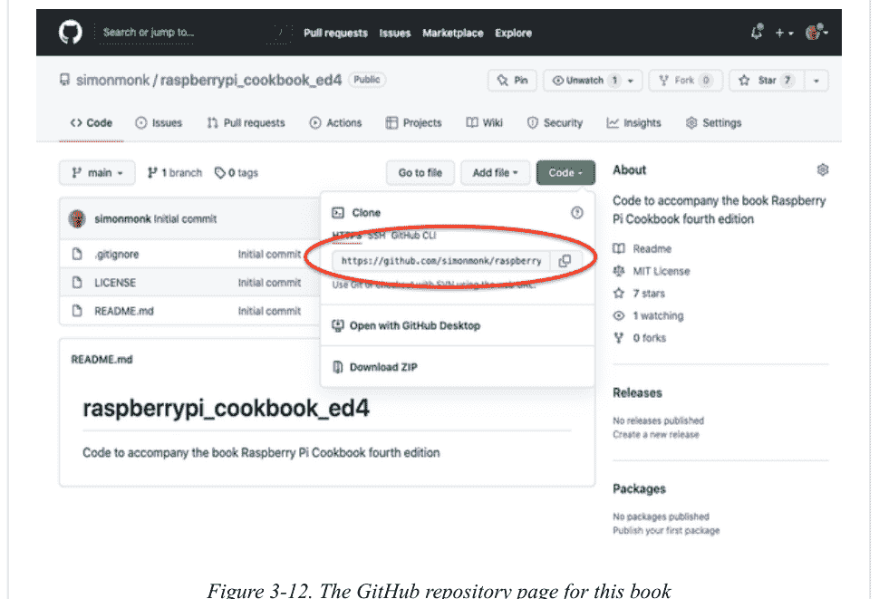

如果你正在开发一个你认为其他人可能感兴趣的 Raspberry Pi 项目，我建议使用 GitHub 或 GitLab 来托管你的代码。需要学习一点东西，但这是值得的。

使用 Git（无论是本地还是通过 GitHub 等服务）的另一个好处是，每次你对项目进行一部分工作时，你都会将该工作推送到代码的主副本。这不会替换已有的代码，而是作为新版本存储。如果你犯了错误，你可以随时恢复代码的早期版本。

我将我所有书籍和其他项目的代码都托管在 GitHub 上。以下是我创建新仓库时采取的步骤：

1. 转到你在 GitHub 上的主页（你需要创建一个账户），点击 + 按钮并选择 New Repository 选项。
2. 为仓库命名并添加简短描述。

## 3.22 获取本书配套代码

### 问题

你希望下载与本书相关的所有源代码和其他文件。

### 解决方案

你可以按照[技巧 3.21](Recipe 3.21) 中描述的方式从 GitHub *克隆*文件，或者，正如我们将在此描述的，从 GitHub 下载一个包含所有内容的 ZIP 压缩包。

获取本书下载内容的一个好起点是使用你的树莓派上的浏览器访问[本书的网页](the book’s web page)。在这里，除了指向托管在 GitHub 上的本书代码的链接外，你还会找到勘误表和关于本书的其他信息。

因此，无论你是从网站开始还是直接访问 [GitHub 页面](the GitHub page)，当你点击“Clone or download”按钮时，你会看到一个“Download ZIP”的选项。你可以在[技巧 3.21](Recipe 3.21) 的[图 3-13](Figure 3-13) 中看到这一点。

点击“Download ZIP”选项。Chromium 浏览器会将其保存到你的“下载”文件夹。点击已下载的 ZIP 文件旁边的下箭头，然后选择“在文件夹中显示”选项。

这将打开一个文件管理器窗口，显示“下载”文件夹的内容。找到刚刚下载的 ZIP 文件。

双击 ZIP 文件以使用 Xarchiver 工具打开它，然后点击“解压文件”图标。

在出现的对话框中，将解压文件夹的保存路径更改为 `/home/pi`，然后点击“解压”。

文件解压后，你的主目录中将出现一个新文件夹，其中包含本书的所有下载内容。

### 讨论

如果你现在使用文件管理器查看主目录的内容，你会发现一个名为 *raspberry_pi_cookbook_ed3-master* 的文件夹。

### 另请参阅

有关使用 Git 和 GitHub 的更多信息，请参阅[技巧 3.21](Recipe 3.21)。

## 3.23 在启动时自动运行程序或脚本

### 问题

你希望一个程序或脚本在树莓派启动时自动运行。

### 解决方案

修改你的 *rc.local* 文件以运行你想要的程序。
使用以下命令编辑文件 `/etc/rc.local`：

```
$ sudo nano /etc/rc.local
```

在以 # 开头的第一段注释行之后添加以下行：

```
$ /usr/bin/python /home/pi/my_program.py &
```

在命令行末尾包含 `&` 非常重要，这样它才能在后台运行；否则你的树莓派将无法启动。

### 讨论

这种自动运行程序的方式需要非常小心地编辑 *rc.local*，否则你可能会导致树莓派无法启动。

### 另请参阅

一种更安全的自动运行程序的方法在[技巧 3.24](Recipe 3.24) 中有详细说明。

## 3.24 作为服务自动运行程序或脚本

### 问题

你希望安排一个脚本或程序在每次树莓派重启时自动启动。

### 解决方案

大多数树莓派发行版所基于的 Debian Linux 使用一种基于依赖的机制来自动化在启动时运行命令。这有点棘手，涉及为你想要运行的脚本或程序创建一个配置文件，该文件将位于一个名为 *init.d* 的文件夹中。

### 讨论

以下示例向你展示如何运行主目录中的一个 Python 脚本。该脚本可以做任何事情，但在本例中，该脚本运行一个简单的 Python Web 服务器，这在[待补充链接]中有进一步描述。
以下是涉及的步骤：

- 1. 创建一个 *init* 脚本。
- 2. 使 *init* 脚本可执行。
- 3. 将新的 *init* 脚本告知系统。

首先，创建 *init* 脚本。你需要在文件夹 `/etc/init.d/` 中创建它。脚本可以任意命名，但在本例中，我们将其命名为 `my_server`。

使用以下命令通过 nano 创建新文件：

```
$ sudo nano /etc/init.d/my_server
```

将以下代码粘贴到编辑器窗口中并保存文件。这需要输入很多内容，因此如果你正在阅读本书的纸质版，你可以从[此网页](this web page)复制并粘贴代码；只需向下滚动直到找到本章和本技巧：

```
### BEGIN INIT INFO
# Provides: my_server
# Required-Start: $remote_fs $syslog $network
# Required-Stop: $remote_fs $syslog $network
# Default-Start: 2 3 4 5
# Default-Stop: 0 1 6
# Short-Description: Simple Web Server
# Description: Simple Web Server
### END INIT INFO

#! /bin/sh
# /etc/init.d/my_server

export HOME
case "$1" in
  start)
    echo "Starting My Server"
    sudo /usr/bin/python /home/pi/myserver.py 2>&1 &
    ;;
  stop)
    echo "Stopping My Server"
    PID=`ps auxww | grep myserver.py | head -1 | awk '{print $2}'`
    kill -9 $PID
    ;;
  *)
    echo "Usage: /etc/init.d/my_server {start|stop}"
    exit 1
    ;;
esac
exit 0
```

要自动化运行一个脚本，这确实需要做很多工作，但其中大部分是每个服务都相同的样板代码。要运行不同的脚本，只需通读脚本，更改描述和你想要运行的 Python 文件的名称即可。
下一步是使此文件对所有者可执行，你可以使用以下命令完成：

```
$ sudo chmod +x /etc/init.d/my_server
```

现在程序已设置为服务，你可以使用以下命令在将其设置为启动序列的一部分以自动启动之前，测试一切是否正常：

```
$ /etc/init.d/my_server start
Starting My Server
Bottle v0.11.4 server starting up (using WSGIRefServer())...
Listening on http://192.168.1.16:80/
Hit Ctrl-C to quit.
```

最后，如果运行正常，使用以下命令使系统知道你已定义的新服务：

```
$ sudo update-rc.d my_server defaults
```

### 另请参阅

有关使程序自动运行的更简单方法，请参阅技巧 3.23。
有关更改文件和文件夹权限的更多信息，请参阅技巧 3.13。

## 3.25 在固定时间间隔自动运行程序或脚本

### 问题

你希望每天运行一次脚本或按固定间隔运行。

### 解决方案

使用 Linux 的 `crontab` 命令。
为此，树莓派需要知道时间和日期，因此需要网络连接或实时时钟；参见[待补充链接]。

### 讨论

`crontab` 命令允许你安排事件按固定间隔发生。这可以是每天或每小时，你甚至可以定义复杂的模式，以便在一周的不同日子发生不同的事情。这对于你可能希望在半夜运行的备份任务非常有用。
你可以使用以下命令编辑计划事件：

```
$ crontab -e
```

如果你想要运行的脚本或程序需要由超级用户运行，请在所有 `crontab` 命令前加上 `sudo`（技巧 3.12）。
注释行（以 # 开头）指示了 `crontab` 行的格式。数字依次是分钟、小时、月份中的日期、月份和星期几，后面是你想要运行的命令。
如果在相关位置有一个 *，那意味着*每个*；如果那里是一个数字，则脚本仅在该分钟/小时/月份中的日期运行。
因此，要每天凌晨 1 点运行脚本，你需要添加如图 3-14 所示的行。

## 3.26 查找文件

### 问题

你想找到一个你知道存在于系统某处的文件。

### 解决方案

使用 Linux 的 `find` 命令。

### 讨论

`find` 命令从命令中指定的目录开始，搜索你指定的文件，如果找到该文件，则显示其位置。

例如：

```
$ find /home/pi -name gemgem.py
/home/pi/python_games/gemgem.py
```

你可以从目录树的不同位置开始搜索，甚至可以从整个文件系统的根目录（/）开始。搜索整个文件系统会花费更长时间，并且会产生错误消息。你可以通过在行末添加 `2>/dev/null` 来重定向这些错误消息。

要在整个文件系统中搜索文件，请使用以下命令：

```
$ find / -name gemgem.py 2>/dev/null
/home/pi/python_games/gemgem.py
```

请注意，`2>/dev/null` 会重定向那些会干扰最终找到文件时显示的输出。你可以在 [配方 3.31](Recipe 3.31) 中了解更多关于重定向的信息。

你也可以在 `find` 命令中使用通配符，如下所示：

```
$ find /home/pi -name match*
/home/pi/python_games/match4.wav
/home/pi/python_games/match2.wav
/home/pi/python_games/match1.wav
/home/pi/python_games/match3.wav
/home/pi/python_games/match0.wav
/home/pi/python_games/match5.wav
```

### 另请参阅

`find` 命令还有许多其他高级搜索功能。要查看 `find` 的完整手册页文档，请使用此命令：

```
$ man find
```

## 3.27 使用命令行历史记录

### 问题

你希望能够重复执行命令行上的命令，而无需再次输入它们。

### 解决方案

使用向上箭头和向下箭头键从命令历史记录中选择以前的命令，并使用 `history` 命令与 `grep` 结合来查找更早的命令。

### 讨论

你可以通过按向上箭头键来访问你之前运行的命令。再次按下它将带你到再之前的命令，依此类推。如果你错过了想要的命令，向下箭头键可以带你反向查找。

如果你想取消而不运行选定的命令，请使用 Ctrl-C。

随着时间的推移，你的命令历史记录会变得太大，以至于无法使用箭头键找到很久以前使用的命令。要找到很久以前的命令，你可以使用 `history` 命令：

```
$ history
    1  sudo nano /etc/init.d/my_server
    2  sudo chmod +x /etc/init.d/my_server
    3  /etc/init.d/my_server start
    4  cp /media/4954-5EF7/sales_log/server.py myserver.py
    5  /etc/init.d/my_server start
    6  sudo apt-get update
    7  sudo apt-get install bottle
    8  sudo apt-get install python-bottle
```

这会列出你所有的命令历史记录，很可能条目太多，让你难以找到想要的命令。为了解决这个问题，你可以将 `history` 命令*管道*（参见配方 3.33）到 `grep` 命令，后者将只显示与搜索字符串匹配的结果。因此，例如，要找到你发出的所有 `apt-get`（配方 3.17）命令，你可以使用以下命令：

```
$ history | grep apt-get
    6  sudo apt-get update
    7  sudo apt-get install bottle
    8  sudo apt-get install python-bottle
   55  history | grep apt-get
```

每个历史记录项旁边都有一个编号，所以如果你找到了你要找的行，你可以使用 `!` 后跟历史记录编号来运行它，如下所示：

```
$ !6
sudo apt-get update
.....
```

### 另请参阅

要查找文件而不是命令，请参阅配方 3.26。

## 3.28 监控处理器活动

### 问题

树莓派有时运行得有点慢，所以你想看看是什么在占用处理器。

### 解决方案

使用任务管理器实用程序，你可以在主菜单的附件程序组中找到它（图 3-15）。

任务管理器允许你一目了然地查看 CPU 和内存的使用情况。你还可以右键单击一个进程，并从出现的弹出菜单中选择终止它的选项。

窗口顶部的条形图显示了总的 CPU 使用率和内存使用率。进程列在下方，你可以看到每个进程占用的 CPU 份额。

### 讨论

如果你更喜欢从命令行执行此类操作，请使用 Linux 的 `top` 命令来显示关于处理器和内存使用情况以及哪些进程使用最多资源的非常相似的数据（图 3-16）。然后你可以使用 `kill` 命令来终止一个进程。你需要以超级用户身份执行此操作。

在这种情况下，你可以看到 `top` 进程是一个使用了 97% CPU 的 Python 程序。第一列显示其进程 ID（2447）。要终止此进程，请输入以下命令：

```
$ kill 2447
```

很有可能以这种方式终止一些重要的操作系统进程，但如果你这样做了，关闭你的树莓派电源并重新打开它将使一切恢复正常。

有时你可能有一个正在运行的进程，在使用 `top` 时并不立即可见。如果是这种情况，你可以使用 `ps` 命令搜索所有正在运行的进程，并将结果管道（配方 3.33）到 `grep` 命令（配方 3.27），后者将搜索结果并突出显示感兴趣的项目。

例如，要找到我们占用 CPU 的 Python 进程的进程 ID，我们可以运行以下命令：

```
$ ps -ef | grep "python"
pi         2447  2397 99 07:01 pts/0    00:00:02 python speed.py
pi         2456  2397  0 07:01 pts/0    00:00:00 grep --color=auto python
```

在这种情况下，Python 程序 `speed.py` 的进程 ID 是 2447。列表中的第二个条目是 `ps` 命令本身的进程。

> ### KILLALL 命令
>
> `kill` 命令的一个变体是 `killall` 命令。请谨慎使用，因为它会终止所有与其参数匹配的进程。因此，例如，以下命令将终止树莓派上运行的所有 Python 程序：
>
> ```
> $ sudo killall python
> ```

### 另请参阅

另请参阅 `top`、`ps`、`grep`、`kill` 和 `killall` 的手册页。你可以通过使用 `man` 命令后跟你想了解信息的命令名称来查看这些手册页，如下所示：

```
$ man top
```

## 3.29 处理文件归档

### 问题

你下载了一个压缩文件，想要解压缩它。

### 解决方案

根据文件类型，你需要使用 `tar` 命令或 `gunzip` 命令。

### 讨论

如果你想解压缩的文件只有扩展名 `.gz`，你可以使用以下命令解压缩它：

```
$ gunzip myfile.gz
```

你也经常发现一些文件（称为*tarballs*），它们包含一个使用 Linux `tar` 实用程序归档然后使用 `gzip` 压缩成文件名类似 `myfile.tar.gz` 的目录。

你可以使用 `tar` 命令从 tarball 中提取原始文件和文件夹：

```
$ tar -xzf myfile.tar.gz
```

如果文件是 ZIP 归档文件，你可以使用文件管理器和 Xarchiver 工具，如 [配方 3.22](Recipe 3.22) 所示。

### 另请参阅

你可以从 `tar` 的手册页了解更多关于 `tar` 的信息，你可以通过使用命令 `man tar` 来访问它。

## 3.30 列出连接的 USB 设备

### 问题

你插入了一个 USB 设备，想确保 Linux 识别了它。

### 解决方案

使用 `lsusb` 命令。这会列出连接到树莓派 USB 端口的所有设备：

```
$ lsusb
Bus 001 Device 002: ID 0424:9512 Standard Microsystems Corp.
Bus 001 Device 001: ID 1d6b:0002 Linux Foundation 2.0 root hub
Bus 001 Device 003: ID 0424:ec00 Standard Microsystems Corp.
Bus 001 Device 004: ID 15d9:0a41 Trust International B.V. MI-2540D [Optical mouse]
```

### 讨论

此命令会通知你设备是否已连接，但不能保证设备正常工作。可能需要安装驱动程序或对硬件进行配置更改。

### 另请参阅

有关连接外部网络摄像头时使用 `lsusb` 的示例，请参阅 [配方 4.3](Recipe 4.3)。

## 3.31 将命令行输出重定向到文件

### 问题

你想快速创建一个包含一些文本的文件，或将目录列表记录到文件中。

通过在星期几列中指定一个天数范围，例如 1-5（周一到周五），脚本将仅在那些天的凌晨 1 点运行，如下所示：

```
0 1 * * 1-5 /home/pi/myscript.sh
```

如果你的脚本需要从特定目录运行，你可以使用分号（`;`）分隔多个命令，如下所示：

```
0 1 * * * cd /home/pi; python mypythoncode.py
```

### 另请参阅

你可以通过输入以下命令查看 `crontab` 的完整手册页文档：

```
$ man crontab
```

### 解决方案

使用 `>` 命令可以将原本会显示在终端中的输出重定向到文件。

例如，要将目录列表复制到名为 *myfiles.txt* 的文件中，请执行以下操作：

```
$ ls > myfiles.txt
$ more myfiles.txt
Desktop
indiecity
master.zip
mcpi
```

### 讨论

你可以将 `>` 命令用于任何产生输出的 Linux 命令，即使你正在运行的是 Python 程序。

你也可以使用相反的 `<` 命令来重定向用户输入，尽管这远不如 `>` 命令常用。

### 另请参阅

要使用 `cat` 命令将多个文件连接起来，请参阅 [配方 3.32](Recipe 3.32)。

## 3.32 连接文件

### 问题

你有多个文本文件，想要将它们合并成一个大文件。

### 解决方案

使用 `cat` 命令将多个文件*连接*成一个输出文件。

例如：

```
$ cat file1.txt file2.txt file3.txt > full_file.txt
```

### 讨论

连接文件是 `cat` 命令的真正用途。你可以提供任意数量的文件名，它们都会被写入你指定的文件中。如果你不重定向输出，它只会显示在你的终端窗口中。如果文件很大，这个过程可能需要一些时间！

### 另请参阅

另请参阅 [配方 3.8](Recipe 3.8)，其中 `cat` 用于显示文件内容。

## 3.33 使用管道

### 问题

你想将一个 Linux 命令的输出作为另一个命令的输入。

### 解决方案

使用 `pipe` 命令（即键盘上的*竖线*符号 `|`）将一个命令的输出管道传输到另一个命令。

例如：

```
$ ls -l *.py | grep Jun
-rw-r--r-- 1 pi pi 226 Jun  7 06:49 speed.py
```

此示例将查找所有扩展名为 `py` 且目录列表中包含 `Jun` 的文件，表明它们最后修改于六月。

### 讨论

乍一看，这很像使用 `>` 进行输出重定向（配方 3.31）。区别在于，如果目标是另一个程序，`>` 将不起作用。它只能用于重定向到文件。
你可以将任意多个程序链接在一起，如图所示，尽管这不是你经常做的事情：

```
$ command1 | command2 | command3
```

### 另请参阅

另请参阅配方 3.28，了解使用 `grep` 查找进程的示例，以及配方 3.27，了解使用 `pipe` 和 `grep` 搜索命令历史记录。

## 3.34 隐藏终端输出

### 问题

你想运行一个命令，但不希望输出填满屏幕。

### 解决方案

使用 `>` 将输出重定向到 `/dev/null`。
例如：

```
$ ls > /dev/null
```

`dev` 目录包含操作系统设备，包括串行端口等。在此目录中，定义了一个特殊设备（空设备），它会简单地丢弃发送给它的所有内容。

### 讨论

此示例说明了语法，但除此之外没什么用。更常见的用途是当你运行一个程序，而开发者在其代码中留下了很多你并不真正想看到的跟踪消息时。以下示例隐藏了 `find` 命令的多余输出（参见配方 3.36）：

```
$ find / -name gemgem.py 2>/dev/null
/home/pi/python_games/gemgem.py
```

### 另请参阅

有关重定向标准输出的更多信息，请参阅配方 3.31。

## 3.35 在后台运行程序

### 问题

你想在运行程序的同时处理其他任务。

### 解决方案

使用 `&` 命令在后台运行程序或命令。
例如：

```
$ python speed.py &
[1] 2528
$ ls
```

命令行不会等待程序运行完成，而是显示进程 ID（第二个数字），并立即允许你继续运行任何其他命令。然后你可以使用此进程 ID 来终止后台进程（配方 3.28）。

要将后台进程带回前台，请使用 `fg` 命令：

```
$ fg
python speed.py
```

这会报告正在运行的命令或程序，然后等待其完成。

### 讨论

后台进程的输出仍会出现在终端中。
将进程置于后台的另一种方法是打开多个终端窗口。

### 另请参阅

有关管理进程的信息，请参阅 [配方 3.28](Recipe 3.28)。

## 3.36 创建命令别名

### 问题

你想为你经常使用的命令创建别名（快捷方式）。

### 解决方案

使用 nano 编辑文件 `~/.bashrc`（[配方 3.7](Recipe 3.7)），然后移动到文件末尾并添加任意多行，如下所示：

```
alias L='ls -a'
```

这会创建一个名为 `L` 的别名，当输入时，它将被解释为命令 `ls -a`。

使用 Ctrl-X 和 Y 保存并退出文件，然后输入以下命令以使用新别名更新终端：

```
$ source .bashrc
```

### 讨论

许多 Linux 用户为 `rm` 设置如下别名，以便它确认删除：

```
$ alias rm='rm -i'
```

只要你在使用没有设置此别名的其他人的系统时没有忘记这一点，这并不是一个坏主意！

### 另请参阅

有关 `rm` 的更多信息，请参阅 [配方 3.11](Recipe 3.11)。

## 3.37 设置日期和时间

### 问题

你想手动设置树莓派上的日期和时间，因为它没有互联网连接。

### 解决方案

使用 Linux `date` 命令。
日期和时间格式为 MMDDhhmmYYYY，其中 MM 是月份编号；DD 是月份中的日期；hh 和 mm 分别是小时和分钟；YYYY 是年份。
例如：

```
$ sudo date 010203042019
Wed  2 Jan 03:04:00 GMT 2019
```

### 讨论

如果树莓派连接到互联网，它在启动时会自动使用互联网时间服务器设置自己的时间。
你也可以通过单独输入 `date` 来使用 `date` 显示协调世界时（UTC）时间：

```
$ date
Fri 19 Jul 10:59:08 BST 2019
```

### 另请参阅

如果你想让树莓派即使在没有网络的情况下也能保持正确时间，你可以使用实时时钟（RTC）模块（[链接待补充]）。

## 3.38 查看 SD 卡剩余空间

### 问题

你想知道 SD 卡上还有多少可用空间。

### 解决方案

使用 Linux `df`（磁盘文件系统）命令：

```
$ df -h
Filesystem      Size  Used Avail Use% Mounted on
rootfs          3.6G  1.7G  1.9G  48% /
/dev/root       3.6G  1.7G  1.9G  48% /
devtmpfs        180M     0  180M   0% /dev
tmpfs                 38M  236K   38M   1% /run
tmpfs                5.0M     0  5.0M   0% /run/lock
tmpfs                  75M     0   75M   0% /run/shm
/dev/mmcblk0p1        56M   19M   38M  34% /boot
```

`-h` 选项使用 kB、MB 和 GB 符号显示大小，而不是字节数。

### 讨论

查看结果的第一行，你可以看到 SD 卡上有 3.6 GB 的存储空间，其中已使用 1.7 GB。

当磁盘空间用尽时，你可能会遇到意外的异常行为，例如显示无法写入文件的错误消息。

### 另请参阅

你可以使用命令 `man df` 查找 `df` 的手册页。

## 3.39 查看运行的操作系统版本

### 问题

你想确切知道你运行的是哪个版本的树莓派操作系统。

### 解决方案

在终端或安全外壳（SSH）会话中输入以下命令：

```
$ cat /etc/os-release
PRETTY_NAME="Raspbian GNU/Linux 9 (stretch)"
NAME="Raspbian GNU/Linux"
VERSION_ID="9"
VERSION="9 (stretch)"
ID=raspbian
ID_LIKE=debian
HOME_URL="http://www.raspbian.org/"
SUPPORT_URL="http://www.raspbian.org/RaspbianForums"
BUG_REPORT_URL="http://www.raspbian.org/RaspbianBugs"
pi@raspberrypi:~ $
```

### 讨论

从上一个示例的结果中可以看出，第一行告诉了我们所有需要知道的信息。在这种情况下，我的树莓派运行的是 Raspbian 版本 9，其昵称为 *stretch*。

如果你在使用某个特定软件时遇到问题，了解你运行的树莓派操作系统版本会很有用。通常，技术支持人员问你的第一个问题是*你运行的是哪个版本的树莓派操作系统？*

你可能需要知道树莓派上 Linux 内核的版本。你可以使用以下命令找到它：

```
$ uname -a
Linux raspberrypi 4.14.71-v7+ #1145 SMP Fri Sep 21 15:38:35 BST 2018 armv7l GNU/Linux
```

这里你可以看到 Raspbian stretch 使用的是 v4.14 内核。

### 另请参阅

要查看 SD 卡或其他启动盘上剩余的空间，请参阅 [配方 3.38](Recipe 3.38)。

## 3.40 更新树莓派操作系统

### 问题

你想将你的树莓派更新到最新版本的树莓派操作系统。

### 解决方案

打开终端（[链接待补充]）中的命令行，并输入以下命令以将系统更新至最新版本：

```
$ sudo apt-get update
$ sudo apt-get dist-upgrade
```

这将花费一些时间，特别是当有大量内容需要升级时。最重要的是，如果你的系统中有任何重要文件，我建议在升级前将它们复制到USB闪存驱动器（配方3.2）上。

### 讨论

这些命令中的第一个实际上并不更新RaspberryPi OS；它只是更新`apt-get`包管理器，使其了解构成你的操作系统及相关软件的最新版本包。

`dist-upgrade`命令会升级操作系统本身。在此过程中，你将收到关于所需磁盘空间的警告，因此你应该使用配方3.38来检查是否有足够的空间，然后再按Y继续升级。

保持你的发行版更新很重要，原因有几个。首先，操作系统更改的主要原因之一是修复错误。因此，软件安装过程中出现的问题通常在更新后会消失。其次，如果你将你的树莓派暴露在互联网上，新版本的RaspberryPi OS通常会修补安全漏洞。

### 另请参阅

要从全新的RaspberryPi OS安装重新开始，请参阅[链接待补充]。

# 第4章. 使用现成软件

> ### 给早期版本读者的说明

通过早期版本电子书，你可以在书籍的最早形式中获取内容——即作者在撰写过程中的原始未编辑内容——因此你可以在这些书籍正式发布之前很久就利用这些技术。

这将是最终书籍的第4章。请注意，GitHub仓库稍后将激活。

如果你对我们如何改进本书的内容和/或示例有意见，或者你发现本章中有缺失的材料，请通过simonmonkauthor@gmail.com联系作者。

## 4.0 简介

本章包含许多关于在树莓派上使用现成软件的配方。

本章中的一些配方涉及将树莓派转换为一次性使用的设备，而其他配方则使用树莓派上的特定软件。

## 4.1 制作媒体中心

### 问题

你想将你的树莓派转换为一个超级媒体中心。

### 解决方案

要将你的树莓派用作媒体中心，你应该选择性能更优的树莓派4 B，因为视频播放非常消耗处理器资源。

你可以在使用[树莓派磁盘映像工具](https://www.raspberrypi.com/software/)将镜像写入microSD卡的同时，将你的树莓派设置为媒体中心。不要选择Raspberry Pi OS作为要安装的发行版，而是从操作系统按钮的媒体播放器操作系统部分选择LibreELEC（图4-1）。

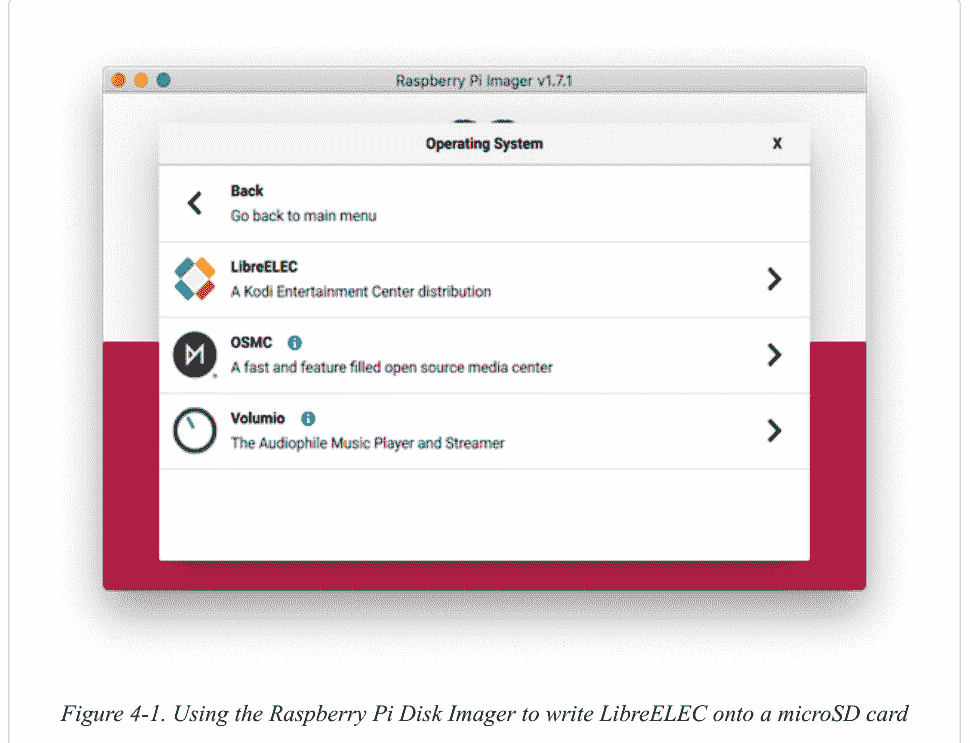

LibreELEC是一个优化你的树莓派作为媒体中心的发行版。它包括Kodi媒体中心软件，该软件基于XBMC开源项目，该项目最初是为了将Xbox游戏机转换为媒体中心而开发的。此后，该代码已被移植到许多平台，包括树莓派（图4-2）。

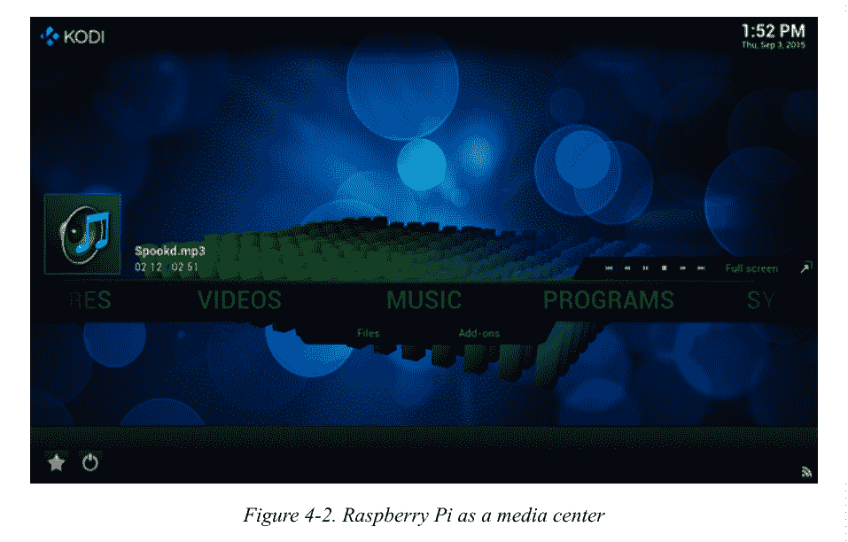

图4-2. 树莓派作为媒体中心

树莓派完全能够播放全高清视频以及流媒体音乐、MP3文件和网络电台。

### 讨论

Kodi是一款功能强大的软件，具有许多功能。也许检查其是否工作的最简单方法是将一些音乐和/或视频文件放入USB闪存驱动器或外部USB硬盘，并将其连接到树莓派。你应该能够从Kodi播放它们。

由于树莓派可能放在你的电视附近，你可能会发现你的电视有一个USB端口，可以提供足够的电流来运行树莓派。如果是这种情况，你将不需要单独的电源。

无线键盘和鼠标是个好主意，因为如果你成对购买它们，它们将使用单个USB端口的接收器，这避免了电线到处拖拽的需要。你也可以购买带有内置触摸板的迷你键盘，这在这种情况下很有用。

有线网络连接通常比WiFi连接性能更高、更好，但将树莓派放在以太网插座附近并不总是方便。如果是这种情况，你可以设置XBMC使用WiFi。设置Kodi非常直观，你可以在http://kodi.wiki找到使用该软件的完整说明。

### 另请参阅

你可以为树莓派添加[红外（IR）遥控器](infrared (IR) remote)来控制Kodi。

## 4.2 安装推荐软件

### 问题

你想在你的树莓派上安装一些常用软件。

### 解决方案

使用推荐软件工具（[图4-3](Figure 4-3)），你可以在树莓派菜单的首选项部分找到它。

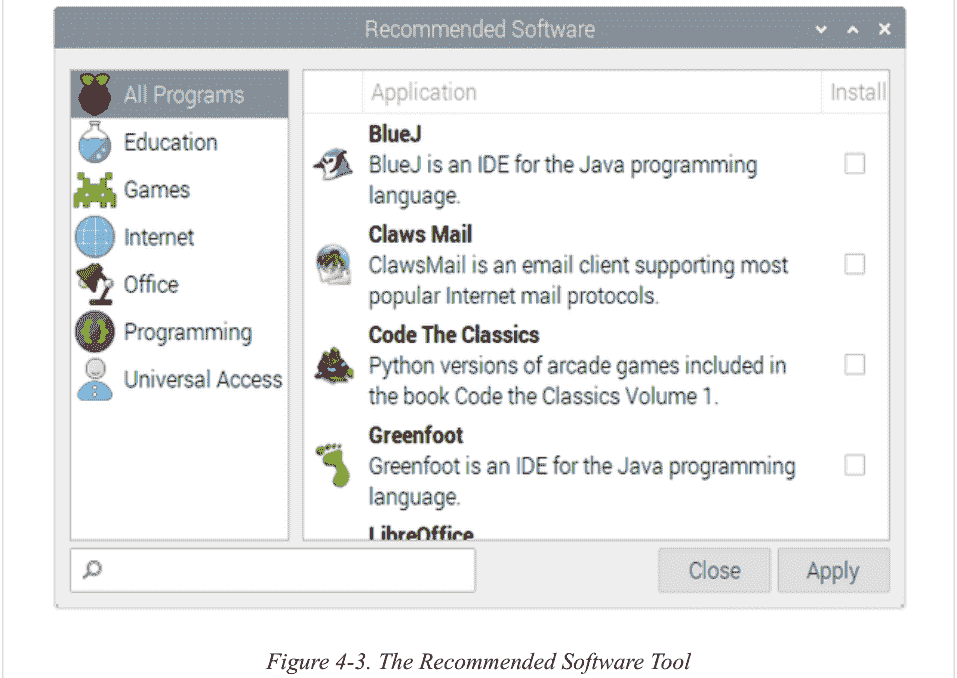

图4-3. 推荐软件工具

此工具包含许多过去预装在Raspberry Pi OS上的软件。因此，它包含了许多最常见和最有用的树莓派软件。使用它浏览到你想要安装的软件，选择你想要安装的程序的复选框，然后单击安装。

然后软件将被下载并安装。当安装程序完成后，新软件将出现在你的树莓派菜单上。

### 讨论

如果你在推荐软件工具上找不到你想要的软件，那么你可以扩大范围，使用类似的添加/删除软件工具，该工具也在树莓派菜单的首选项部分（图4-4）。

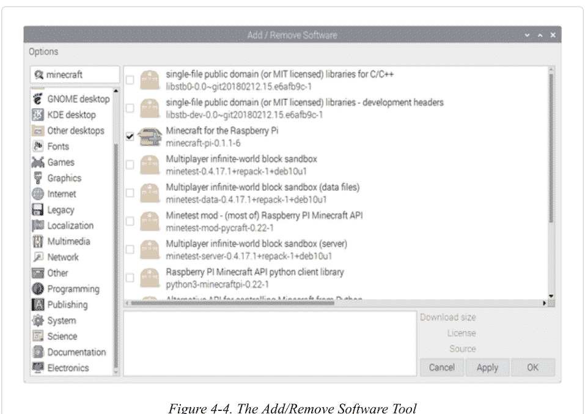

此工具包含数千个可供你安装的软件包和程序，有时在搜索区域输入内容比尝试浏览所有软件包更容易。

### 另请参阅

要使用apt-get命令行工具安装软件，请参阅[配方3.17](Recipe 3.17)。

## 4.3 使用办公软件

### 问题

你需要在树莓派上打开文字处理、演示文稿和电子表格文档。

### 解决方案

使用推荐软件工具（配方4.2）安装LibreOffice。

### 讨论

LibreOffice程序套件（图4-5）是Microsoft Office的良好（且免费的）替代品。事实上，LibreOffice Writer可以打开和保存Microsoft Word文档，电子表格和演示文稿程序与其Microsoft对应程序相当兼容。

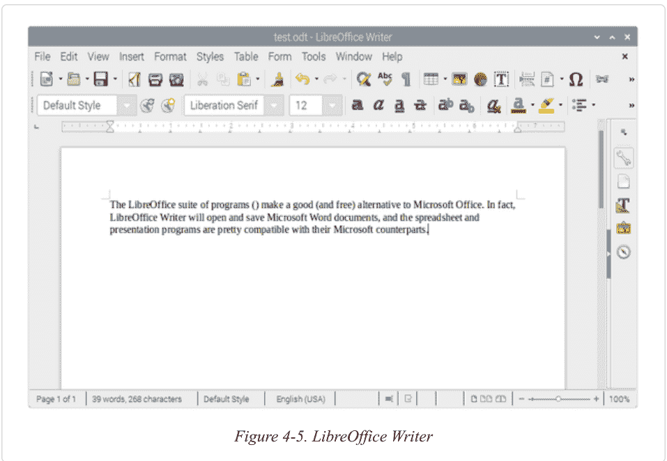

树莓派4或400运行办公应用程序比旧款树莓派好得多。

如今，将文档保存在云端并在浏览器中编辑通常更方便。这些服务最常见的例子是Microsoft365和Google文档。两者都需要你注册一个账户，但Chromium浏览器完全能够使用这些服务（图4-6）。

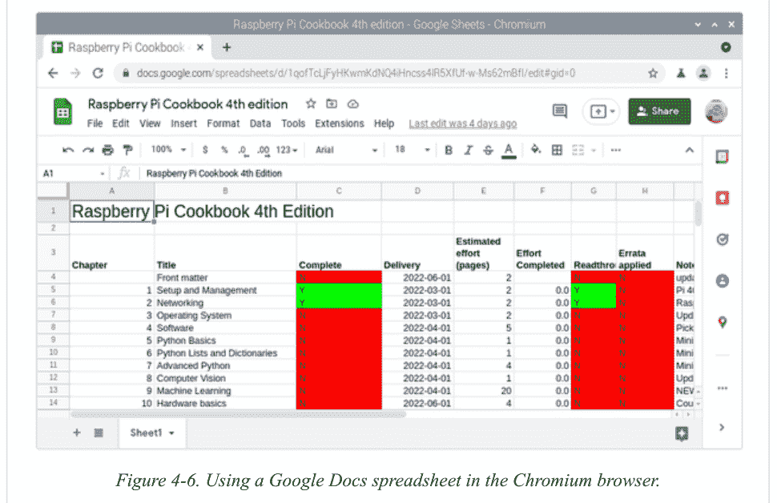

图4-6. 在Chromium浏览器中使用Google文档电子表格。

### 另请参阅

访问[https://www.libreoffice.org](https://www.libreoffice.org)获取有关LibreOffice软件套件的更多信息。

如果你只想编辑一个未格式化的文本文件，你可以使用nano编辑器（[配方3.7](Recipe 3.7)）或VisualStudio Code（[配方4.11](Recipe 4.11)）。

## 4.4 制作网络摄像头服务器

### 问题

你想将树莓派设置为网络摄像头服务器。

### 解决方案

你可以使用USB网络摄像头或树莓派摄像头模块作为摄像头，你可以通过网络上的其他地方使用浏览器访问它。

下载一个名为*motion*的软件包。这将允许你设置一个连接了USB网络摄像头的树莓派，这样你就可以连接到一个网页并查看网络摄像头。

要安装软件，请在终端窗口中输入以下命令：

```
$ sudo apt-get update
$ sudo apt-get install motion
```

你需要进行一些配置更改。首先，使用以下命令编辑文件`/etc/motion/motion.conf`：

```
$ sudo nano /etc/motion/motion.conf
```

这是一个相当大的配置文件。在文件顶部附近，你会找到这一行：

```
daemon off
```

按如下方式更改该行：

```
daemon on
```

另一个更改在文件更下方。你需要更改这一行：

```
webcam_localhost = on
```

使其读取如下：

还有另一个文件需要修改。输入以下命令：

```
$ sudo nano /etc/default/motion
```

将：

```
start_motion_daemon=no
```

改为：

```
start_motion_daemon=yes
```

然后将：

```
stream_localhost on
```

改为：

```
stream_localhost off
```

要启动网络服务，请执行以下命令：

```
$ sudo service motion start
```

如果你使用的是树莓派摄像头模块，还有一个额外的步骤。你需要使用以下命令编辑 `/etc/modules` 文件：

```
$ sudo nano /etc/modules
```

将以下行添加到该文件末尾，然后像往常一样保存并退出 nano：

```
bcm2835-v4l2
```

重启你的树莓派，现在你应该能够打开网络浏览器查看网络摄像头了。为此，你需要知道树莓派的 IP 地址（[配方 2.2](Recipe 2.2)）。你也可以通过访问 *http://localhost:8081* 来检查网络摄像头是否在树莓派的浏览器上正常工作。

从同一网络上的另一台计算机，打开浏览器并访问 URL *http://192.168.0.210:8081/*。你需要更改 URL 以匹配你的树莓派的 IP 地址，但保留 URL 末尾的 `:8081` 端口号。

如果一切顺利，你应该会看到类似 [图 4-7](Figure 4-7) 的内容。

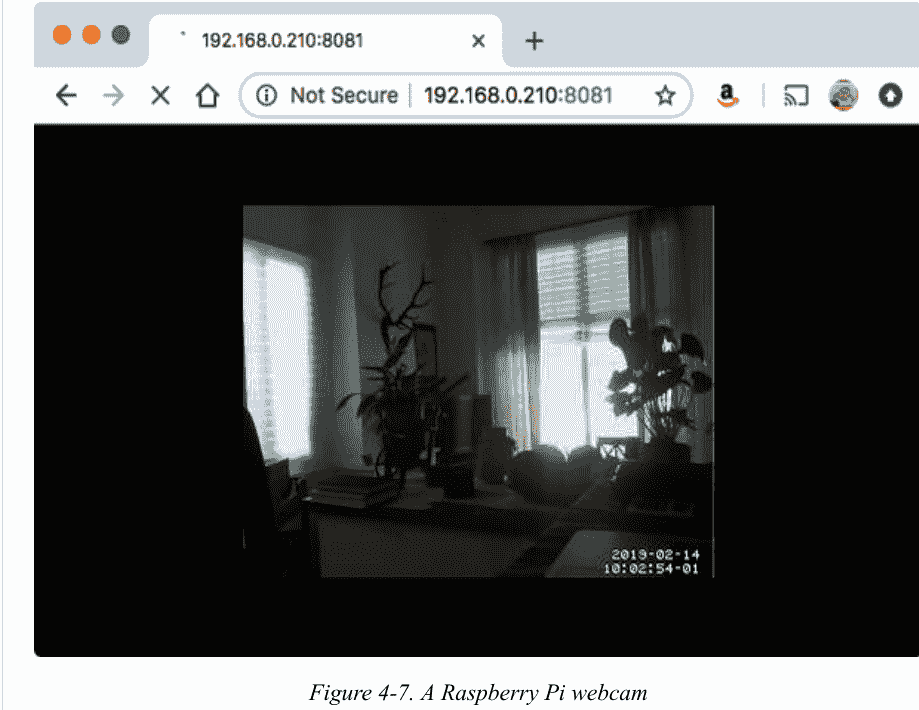

图 4-7. 树莓派网络摄像头

### 讨论

motion 软件功能非常强大。还有许多其他设置可以调整，以改变你的网络摄像头的工作方式。

默认情况下，网络摄像头只能从你的网络内部查看。如果你想让网络摄像头对整个互联网可见，你需要在你的家庭集线器上设置 *端口转发*。这需要你登录到集线器的管理控制台，找到端口转发选项，并为树莓派的 IP 地址启用端口 8081。

然后你就可以使用你的 ISP 分配的外部 IP 地址来查看网络摄像头。这通常显示在你的管理控制台的首页上。但要注意：除非你向 ISP 支付费用获取静态 IP 地址，否则每次重启家庭集线器调制解调器时，这个 IP 地址都可能会改变。

像 No-IP 这样的服务也可以用来提供动态域名服务（DNS），这样你就可以注册一个域名，该域名会自动跟随你的 IP 地址的变化。

### 另请参阅

- Motion 网站上有详尽的文档。
- 你可以在 https://oreil.ly/_z4GH 找到与树莓派兼容的网络摄像头列表。
- 要固定你的树莓派网络摄像头的 IP 地址以便始终能找到它，请参阅配方 2.3。
- 要将网络摄像头用于计算机视觉项目，请参阅 [待添加链接]。
- 有关使用 `apt-get` 的信息，请参阅配方 3.17。

## 4.4 运行复古游戏机模拟器

### 问题

你想把你的树莓派变成一台复古游戏机。

### 解决方案

如果你喜欢重温虚度的青春，在 Atari 2600 模拟器上玩《小行星》（图 4-8），那么 RetroPie 项目会吸引你。


图 4-8. 在 Stella Atari 2600 模拟器上运行的《小行星》

已经构建了许多精彩的项目，创建了带有复古游戏控制器的定制游戏机和游戏桌。
虽然你可以在 Raspberry Pi OS 之上安装 RetroPie，但最简单的使用方法是使用 Raspberry Pi Imager（配方 1.6）将其写入 microSD 卡。

> ### 警告
> 值得注意的是，即使这些游戏年代久远，它们仍然归某人所有。你需要用来在模拟器上玩游戏的 ROM 镜像文件，虽然在网上很容易找到，但不一定属于你。所以请遵守法律。

### 讨论

该模拟器使用了惊人数量的树莓派本就不多的资源，因此你可能会发现你需要使用树莓派 4、3 或 2。
通过互联网搜索，你可以找到许多人在这个基本设置的基础上，添加了复古 USB 控制器（如广泛可用且价格相当低廉的控制器），并将树莓派和显示器装入一个大型街机风格的外壳中。
你也可以从 Pimoroni 购买一个名为 Picade 的套件来制作一台漂亮的街机（图 4-9）。


图 4-9. Pimoroni Picade 套件

### 另请参阅

- 完整的 RetroPie 文档可在 [RetroPie 网站](https://retropie.org.uk/) 上找到。

## 4.5 运行 Minecraft：树莓派版

### 问题

你想在你的树莓派上运行流行游戏 Minecraft。

### 解决方案

安装 Minecraft Pi，你可以在推荐软件工具中找到它（在配方 4.2 中讨论）。

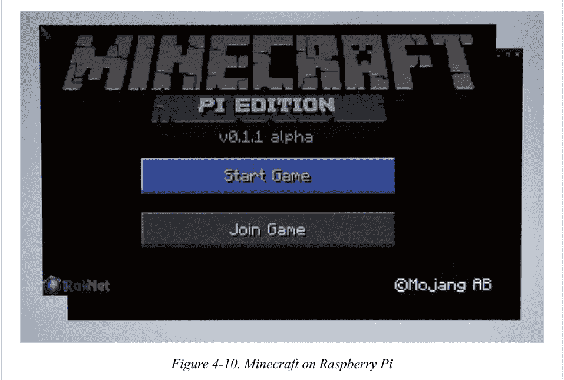

图 4-10. 树莓派上的 Minecraft

### 讨论

Minecraft 的开发者已经将游戏移植到了树莓派上，即 Minecraft Pi（图 4-10）。
为了让 Minecraft 适应树莓派，开发者在图形代码中做了一些简化。这意味着你只能直接在连接了键盘、鼠标和显示器的树莓派上玩这个游戏。通过远程虚拟网络计算（VNC）连接无法正常工作。

Minecraft 的树莓派版基于 Minecraft 的移动版，缺少一些功能，最显著的是红石。

### 另请参阅

- 在 [树莓派版 Minecraft](https://www.raspberrypi.org/learning/programming-minecraft-pi/) 上了解更多信息。
- Minecraft Pi 还包含一个 Python 编程接口，在 [待添加链接] 中，我们将介绍如何通过安全外壳（SSH）连接向 Python 发送命令以进行自动化构建。

## 4.6 将你的树莓派变成无线电发射器

> **注意**
> 请务必查看 [本配方的配套视频](https://www.youtube.com/watch?v=1vV8pE4l0p0)。

### 问题

你想将你的树莓派转换成一个低功率 FM 发射器，向普通的 FM 收音机接收器发送无线电信号（[图 4-11](https://www.oreilly.com/library/view/make-great-stuff/9781449399191/graphics/0411.png)）。

### 解决方案

在树莓派的早期，伦敦帝国理工学院的一些聪明人编写了一些 C 代码，让你可以做到这一点。下载包甚至播放 *星球大战* 主题曲作为示例。如果你有 [原版树莓派 1](https://www.raspberrypi.org/products/raspberry-pi-1-model-b/)，这个项目仍然有效。此后代码没有针对更新版本的树莓派进行更新。
幸运的是，该项目在一个名为 *rpitx* 的更先进的项目中得以延续。

你只需要一根短导线连接到通用输入/输出（GPIO）引脚 4。一根 10 厘米的母对公排线就能很好地完成这项工作。事实上，即使没有天线，它也应该能在收音机紧挨着你的树莓派时工作——这就是传输的强度。

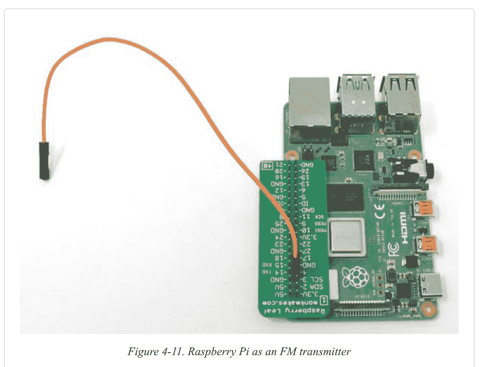

第一步是使用以下命令安装 rpitx 软件。请注意，此安装将更改树莓派配置的一些内容，包括 GPU（图形处理器）的工作频率。因此，如果这是你的主要树莓派，请确保首先备份任何重要数据。你需要的代码如下：

```
$ sudo apt-get update
$ git clone https://github.com/F5OEO/rpitx
$ cd rpitx
$ ./install.sh
```

现在你需要做其他事情大约 15 分钟，等待软件安装。你可能会看到看起来像错误消息和警告的内容，但这些都是正常的。在安装结束时，安装脚本会询问：

```
In order to run properly, rpitx need to modify /boot/config.txt.
Are you
    sure (y/n)
```

按 Y，脚本将通过以下消息确认它所做的更改：

```
Set GPU to 250Mhz in order to be stable
```

如果你需要撤销此更改，请编辑 /boot/config.txt，删除最后一行 `gpu_freq=250`，然后重启。

接下来，找一个 FM 收音机接收器并将其调谐到 103.0 MHz。如果这个频率已被其他传输占用，请选择另一个频率并记下来。

现在运行以下命令（如果你不得不更改频率，请将频率参数从 103.0 更改）：

```
sudo ./pifmrds -freq "103.0" -audio src/pifmrds/stereo_44100.wav
```

如果一切正常，你应该能听到开发者谈论左右声道的声音。

### 讨论

你需要知道，这个项目在你的国家可能不合法。其功率输出高于用于 MP3 播放器的 FM 发射器。

如果你把树莓派放在你的车里，这将是通过车辆音频系统输出声音的好方法。

### 另请参阅

要了解更多关于 rpitx 项目的信息，请参阅 [https://github.com/F5EOEO/rpitx](https://github.com/F5EOEO/rpitx)。

## 4.7 编辑位图图像

### 问题

你想处理照片或其他图像。

### 解决方案

安装并运行 GNU 图像处理程序（GIMP；参见图 4-12）。

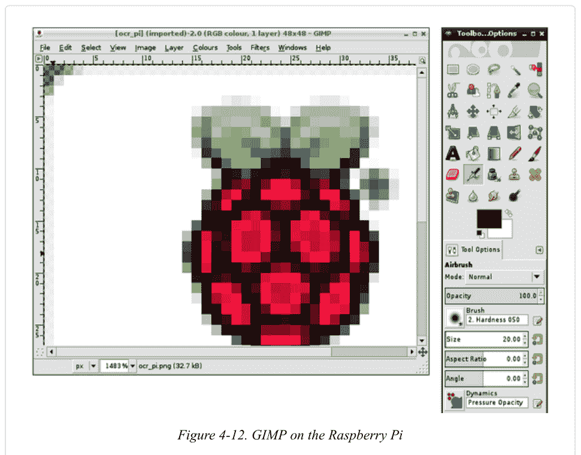

GIMP 可以从“添加/删除软件”工具（参见配方 4.2）安装。当你搜索 GIMP 时，会返回很多各种 GIMP 实用程序的结果，所以请寻找名为 *GNU Image Manipulation Program* 的软件包。

如果你更喜欢从命令行安装 GIMP，请打开终端会话并输入以下命令：

```
$ sudo apt-get install gimp
```

安装 GIMP 后，你会在主菜单的“图形”标题下找到一个名为 GNU Image Manipulation Program 的新条目。

### 讨论

尽管 GIMP 对内存和处理器性能要求较高，但它甚至可以在 Raspberry Pi 2 B 上使用，但如果你使用 Raspberry Pi 4 或 400，等待时间会少得多。

### 另请参阅

从 [GIMP 网站](https://www.gimp.org/) 了解更多。

GIMP 功能丰富，是一个非常复杂的图像编辑程序，因此确实需要一点学习时间。你可以在 GIMP 网站上找到该软件的在线手册。

有关编辑矢量图像，请参阅 [待添加链接]。

有关使用 `apt-get` 安装的更多信息，请参阅配方 3.17。

## 4.8 编辑矢量图像

### 问题

你想创建或编辑高质量的矢量图形，例如可缩放矢量图形（SVG）。

### 解决方案

Inkscape 是“添加/删除软件”工具（参见配方 4.2）中可用的软件包之一。打开该工具并搜索 *Inkscape*。

如果你更喜欢从命令行安装 Inkscape，可以使用以下命令：

```
$ sudo apt-get update
$ sudo apt-get install inkscape
```

安装 Inkscape 后，其图标将出现在 Raspberry Pi 开始菜单的“图形”部分。

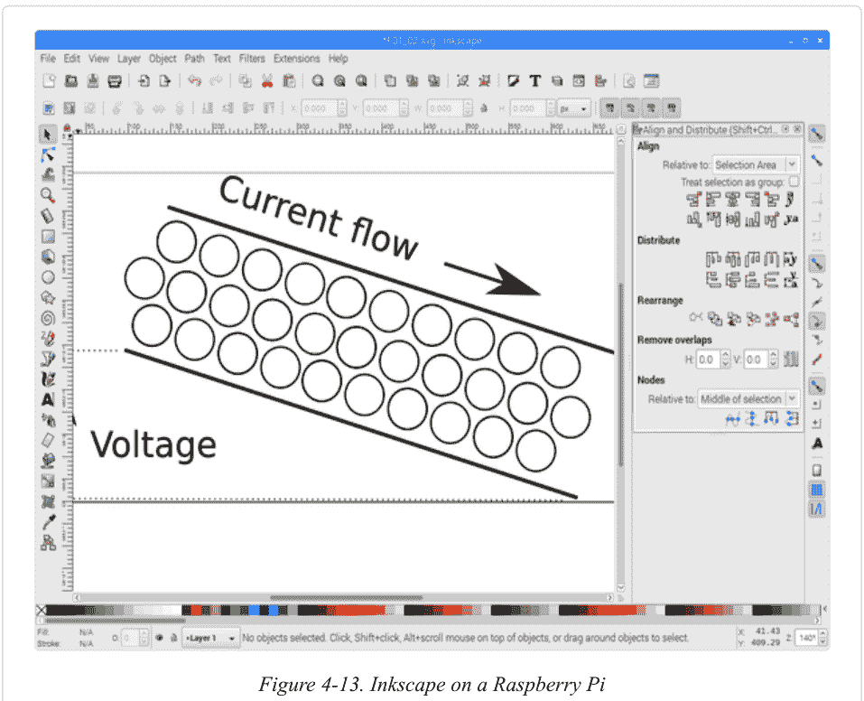

### 讨论

Inkscape (#ed3_ch4_fig4_51_new) 是最常用的开源矢量图像编辑器。

Inkscape 是一款功能非常强大的软件，具有许多功能，需要一些时间才能掌握，所以如果一开始它不能满足你的要求，请不要灰心。你可能需要学习一些教程。

Inkscape 是另一个最好在 Raspberry Pi 4 或 400 的额外性能下运行的程序。

### 另请参阅

有关 Inkscape 的文档，请访问 https://inkscape.org。

有关编辑位图图像（如照片），请参阅配方 4.7。

## 4.9 使用 Bookshelf

### 问题

你想免费阅读 Raspberry Pi 书籍和杂志。

### 解决方案

使用预装的 Bookshelf 应用程序。你可以在 Raspberry Pi 菜单的“帮助”部分找到此应用程序。打开它，你会看到（图 4-14）Mag Pi、Wireframe 和 Hackspace Magazine 的往期杂志，以及 Raspberry Pi Press 的书籍。


图 4-14. Bookshelf 应用程序。

### 讨论

这是一个非常棒的资源，你会在 MagPi 杂志中找到许多关于 Raspberry Pi 各个方面的入门文章。它也是项目灵感的绝佳来源。

### 另请参阅

你会在这里找到许多有趣的 Raspberry Pi 资源：[https://projects.raspberrypi.org/](https://projects.raspberrypi.org/)

你也可以在这里下载 MagPi 杂志的 PDF 往期版本或订阅纸质版：[https://magpi.raspberrypi.com/](https://magpi.raspberrypi.com/)

## 4.10 播放网络电台

### 问题

你想在 Raspberry Pi 上播放网络电台。

### 解决方案

VLC 媒体播放器应该已随 Raspberry Pi OS 预装。你可以在菜单的“声音和视频”下找到它。

如果由于任何原因它不在那里，你可以使用“首选软件”工具（配方 4.2）安装它。

如果你更喜欢从命令行安装 VLC 媒体播放器，可以通过运行以下命令来完成：

```
sudo apt-get install vlc
```

安装后，你可以在主菜单的“声音与视频”部分找到 VLC。

运行程序，然后在“媒体”菜单上，选择“打开网络串流”选项。这将打开一个对话框（参见图 4-15），你可以在其中输入要播放的网络电台的 URL。

你需要将耳机或有源扬声器插入 Raspberry Pi 的音频插孔。

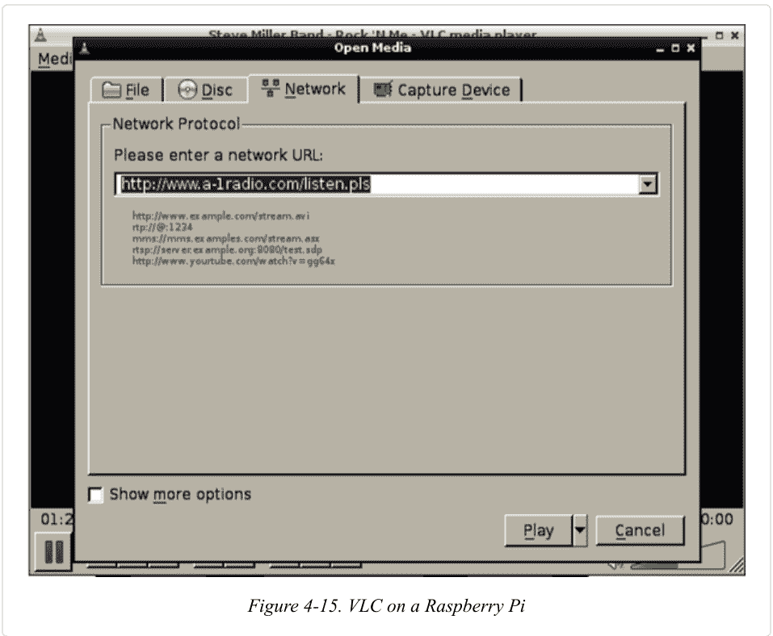

### 讨论

你也可以从命令行运行 VLC，如下所示：

```
$ vlc http://www.a-1radio.com/listen.pls -I dummy
```

VLC 可能会产生一系列错误消息，但随后会正常播放音频。

### 另请参阅

本配方大量借鉴了这个[教程](tutorial)，其中 Jan Holst 将事情更进一步，为项目添加了类似收音机的控件。

对于英国读者

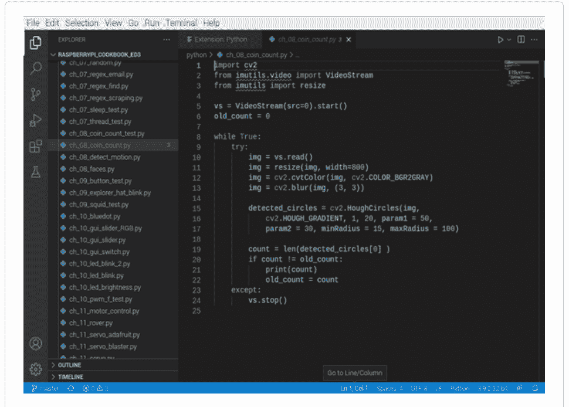

图 4-16. Raspberry Pi 上的 VS Code

如果你是一位经验丰富的程序员，那么你可能会发现你更喜欢使用 Visual Studio Code 而不是像 Thonny 或 Mu（配方 5.3 和配方 5.4）这样的初学者 Python IDE 来编辑你的 Raspberry Pi Python 代码。如果你的项目包含多个文件，尤其如此。图 4-16 显示了左侧的文件资源管理器区域，你可以在其中看到项目中的所有文件。单击一个文件会使其在编辑器区域中可用，打开的文件各自有自己的标签页。

如你所见，编辑器会突出显示语言语法，对其进行颜色编码，使其更易于阅读和发现错误。

无论你是用 Python（参见第 5 章）还是其他语言编程，Visual Studio Code 都是一个有用的工具。

### 另请参阅

简单的文本编辑器 nano 是编辑代码的一种简便方法 - 参见配方 3.7

Thonny 是一个面向初学者的 Python 编辑器 - 参见配方 5.3

## 4.12 控制激光切割机

### 问题

你想从 Raspberry Pi 控制你的低成本 K40 激光切割机。

### 解决方案

如果你拥有流行的低成本中国 K40 系列激光切割机（图 4-17），那么你可以使用 K40 Whisperer 软件来控制你的激光切割机。因此，你不必使用相对昂贵的 Windows 计算机来控制激光切割机，而是可以使用成本低得多的 Raspberry Pi。


图 4-17. K40 激光切割机

该软件是用 Python 编写的，但也依赖于 Inkscape 矢量绘图软件包。因此，如果你还没有安装 Inkscape，请按照配方 4.8 进行安装。

接下来，从 https://www.scorchworks.com/K40whisperer/k40whisperer.html#download 下载 K40 Whisperer 软件的源代码。从 *K40 Whisperer Source* 列中选择最新的下载。双击下载的 ZIP 文件并将其解压到你的主目录（ //home/pi）。在解压后的目录中，你会找到一个名为 README_Linux.txt 的文件。这里的说明基于该文件。README 是通用的 Linux README，而不是特定于 Raspberry Pi 的。

首先运行以下两个命令为软件创建一个用户组。

```
$ sudo groupadd lasercutter
$ sudo usermod -a -G lasercutter pi
```

确保你的激光切割机已通过 USB 线连接到你的 Raspberry Pi，并且激光切割机已开机。现在你需要运行以下命令来查找激光切割机的 USB 供应商 ID 和产品 ID。这些可能分别是 1a86 和 5512，但值得检查一下以防激光切割机制造商更改了这些。为此，运行 `lsusb` 命令：

```
$ lsusb
Bus 001 Device 004: ID 1a86:5512 QinHeng Electronics CH341 in EPP/MEM/I2C mode, EPP/I2C adapter
Bus 001 Device 005: ID 0424:7800 Microchip Technology, Inc. (formerly SMSC)
Bus 001 Device 003: ID 0424:2514 Microchip Technology, Inc. (formerly SMSC) USB 2.0 Hub
Bus 001 Device 002: ID 0424:2514 Microchip Technology, Inc. (formerly SMSC) USB 2.0 Hub
Bus 001 Device 001: ID 1d6b:0002 Linux Foundation 2.0 root hub
```

这将列出连接到你的 Raspberry Pi 的所有 USB 设备。你现在需要找到与你的激光切割机对应的条目。在这种情况下，它是唯一的中文名称（*QinHeng*）。但如果你需要确认，可以拔掉激光切割机，再次运行 `lsusb` 命令，看看哪个条目消失了。

在该条目的行上，你可以看到文本 `1a86:5512`。冒号前面的部分是供应商 ID，5512 是产品 ID。你需要知道这些，因为你将在配置文件中使用它们。

使用以下命令在 nano 中创建并编辑一个新文件：

```
$ sudo nano /etc/udev/rules.d/97-ctc-lasercutter.rules
```

你可以在配方 3.7 中找到关于编辑文件的信息。将以下测试内容粘贴到文件中，如果你的供应商和产品 ID 与我的不同，请更改文本的相应部分以匹配你的 ID。

```
SUBSYSTEM=="usb", ATTRS{idVendor}=="[1a86]", ATTRS{idProduct}=="[5512]", ENV{DEVTYPE}=="usb_device", MODE="0664", GROUP="lasercutter"
```

重启你的树莓派，然后通过运行以下命令继续安装，以安装 K40 Whisperer 所需的更多模块。

```
$ sudo apt-get install libxml2-dev libxslt-dev
$ sudo apt-get install libusb-1.0-0
$ sudo apt-get install libusb-1.0-0-dev
```

确保你位于下载 K40 Whisperer 的目录中，并运行以下命令

```
$ pip install -r requirements.txt
```

现在你可以使用以下命令运行程序了。这将打开一个窗口。转到“文件”然后“选项”来配置软件（图 4-6）。

```
$ python k40_whisperer.py
```

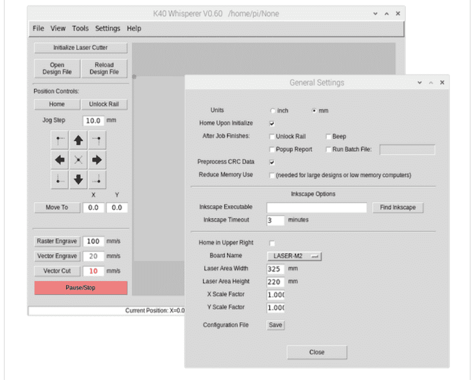

图 4-18. 配置 K40 Whisperer

查阅你的激光切割机附带的手册，以找到其中使用的控制板版本。如果找不到，你可能需要在 *Board Name* 设置中尝试几个不同的选项。你不需要更改任何其他设置。

关闭设置窗口后，你可以加载一个 SVG 文件进行切割（图 4-18）。

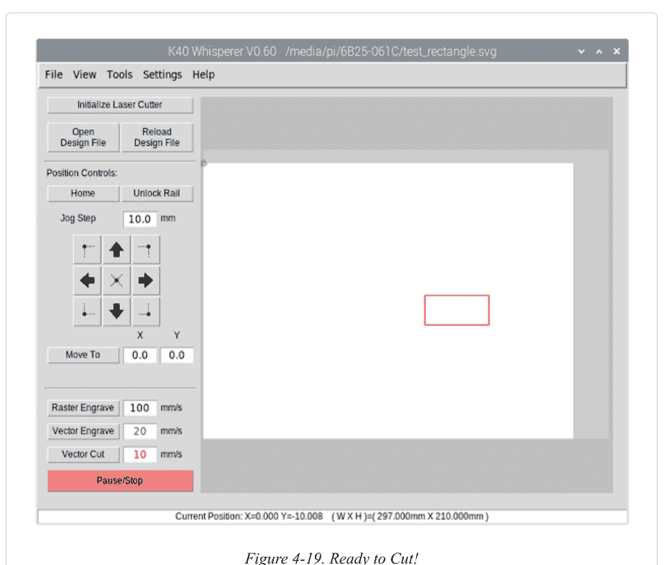

图 4-19. 准备切割！

### 讨论

激光切割机通常附带其专有的软件来控制切割机，该软件通常在 Microsoft Windows 计算机上运行。它甚至可能有一个硬件 USB 加密狗，旨在将该软件绑定到你的计算机。

K40 Whisperer 软件直接从 SVG 图纸进行切割和雕刻。你只需用不同颜色的轮廓绘制线条，线宽为 0.1mm。红线表示切割，蓝线表示矢量雕刻（轻微烧灼轮廓），黑线表示光栅雕刻（来回扫描以烧灼表面区域）。

### 另请参阅

有关 K40 Whisperer 的完整信息，请参见 https://www.scorchworks.com/K40whisperer

树莓派也是 3D 打印机的良好控制器（参见 [待添加链接]）。

要为你的激光切割和蚀刻创建 SVG 图纸，你可以使用 InkScape（[待添加链接]）。

树莓派也是 3D 打印机的绝佳控制器。有关 Octoprint 的完整文档，请参见 https://octoprint.org/

# 第 5 章. Python 基础

> ### 给早期版本读者的说明

通过早期版本电子书，你可以在书籍的最早期形式中获取内容——即作者在写作过程中的原始未编辑内容——因此你可以在这些书籍正式发布之前很久就利用这些技术。

这将是最终书籍的第 5 章。请注意，GitHub 仓库将在稍后激活。

如果你对我们如何改进本书的内容和/或示例有意见，或者你发现本章中有缺失的材料，请通过 simonmonkauthor@gmail.com 联系作者。

## 5.0 简介

虽然许多语言都可以用来为树莓派编程，但 Python 是最受欢迎的。事实上，*Raspberry Pi* 中的 *Pi* 就是受 *python* 一词的启发。

在本章中，你将找到一系列配方，帮助你开始使用树莓派编程。

## 5.1 在 Python 2 和 Python 3 之间做选择

### 问题

你需要使用 Python，但不确定应该使用哪个版本。

### 解决方案

两个都用。使用 Python 3，直到你遇到一个最好通过回退到版本 2 来解决的问题。

### 讨论

尽管 Python 的最新版本 Python 3 已经存在多年，但你会发现很多人仍然在使用 Python 2。事实上，在树莓派操作系统发行版中，两个版本都提供了，版本 2 只被称为 Python，而版本 3 被称为 Python 3。Python 3 通过使用命令 `python3` 来运行。除非另有说明，本书中的示例都是为 Python 3 编写的。大多数示例无需修改即可在 Python 2 和 Python 3 上运行。

Python 社区不愿放弃旧版本，这在很大程度上是因为 Python 3 引入了一些破坏与版本 2 兼容性的更改。因此，为 Python 2 开发的大量第三方库中的一些将无法在 Python 3 下工作。

我的策略是尽可能使用 Python 3 编写，当由于兼容性问题需要时，再回退到 Python 2。

### 另请参阅

有关 Python 2 与 Python 3 之争的很好总结，请参见 [Python wiki](https://wiki.python.org/moin/Python2orPython3)。

## 5.2 选择 Python 编辑器

### 问题

Python 编辑器有很多选择，你想知道应该从哪一个开始。

### 解决方案

大多数人会从 Thonny（[配方 5.3](#)）或 Mu（[配方 5.4](#)）开始。两者都是很好的编辑器，而且都易于使用。

Thonny 预装在树莓派操作系统中，而 Mu 则需要安装。你会发现很多关于这两个编辑器的教程，并且在树莓派基金会的大多数材料中，Thonny 比 Mu 更受推荐。

### 讨论

你从哪个编辑器开始并不太重要。你可能想尝试一下 Thonny 和 Mu，看看你最喜欢哪个。随着你的编程经验越来越丰富，你应该尝试使用 VS Code（配方 4.11）作为更专业的工具。

### 另请参阅

Thonny 在配方 5.3 中描述，VS Code 在配方 4.11 中描述。

## 5.3 使用 Thonny 编辑 Python 程序

### 问题

你想使用 Thonny 编辑你的 Python 程序。

### 解决方案

Thonny 应该预装在树莓派操作系统中。但如果由于任何原因，它不在你菜单的“编程”部分，你可以使用“推荐软件”工具（配方 4.2）安装它。

首先从菜单的“编程”部分打开 Thonny，并输入以下几行文本，如图 5-1 所示。

```
for i in range(1, 10):
    print(i)
```

当你开始程序的第二行时，带有 print 语句的第二行应该会自动缩进。

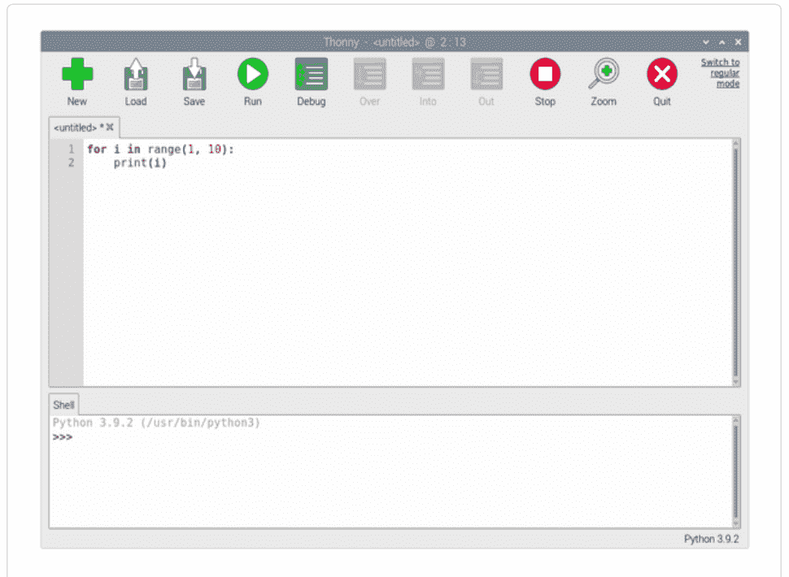

图 5-1. Thonny 编辑器

你可以通过按“运行”按钮来运行程序，看看它的作用。在运行程序之前，Thonny 会提示你保存文件。给它一个名字，比如 count.py。然后程序将运行，你将在 Thonny 窗口底部看到程序的输出（图 5-2）。

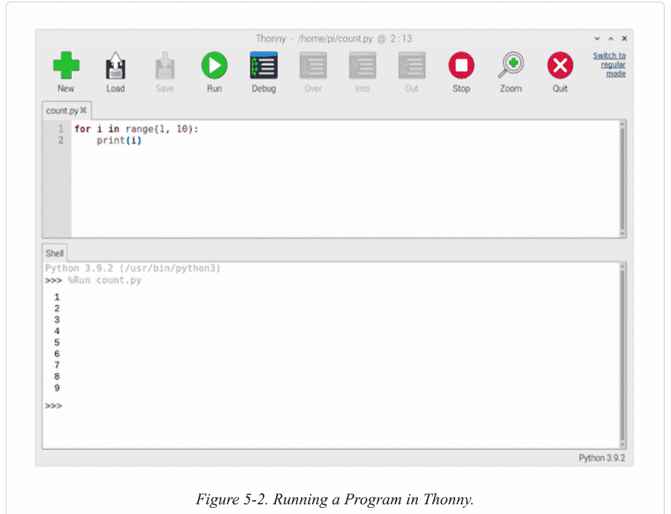

### 讨论

我们还没有开始 Python 编程，但从这个例子中，你可以看到程序就是用 Python 编程语言向计算机发出指令。在这个例子中，指令是打印出一系列数字。

### 另请参阅

Thonny 的一个流行替代品是 Mu（[配方 5.4](https://example.com/recipe5.4)）。

Thonny 的官方网页可以在这里找到：[https://thonny.org/](https://thonny.org/)

除了使用 Mu 编辑和运行 Python 文件外，你还可以采用一种技术含量较低的方法，在 nano（#SEC3.6）中编辑文件，然后从终端会话（#SEC5.4）中运行它们。

## 5.4 使用 Mu 编辑 Python 程序

### 问题

你想使用 Mu 编辑你的 Python 程序。

### 解决方案

Mu 在最新版本的树莓派操作系统中并未预装。因此，要安装它，请使用“推荐软件”工具（配方 4.2）。安装后，你会在主菜单的“编程”部分找到它（图 5-3）。

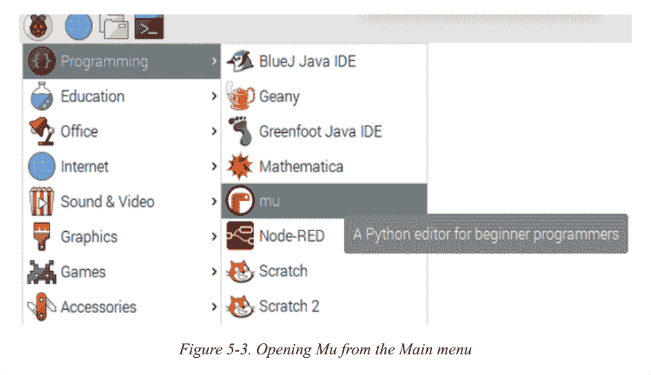

当你第一次启动 Mu 时，系统会提示你选择一个模式（图 5-4）。

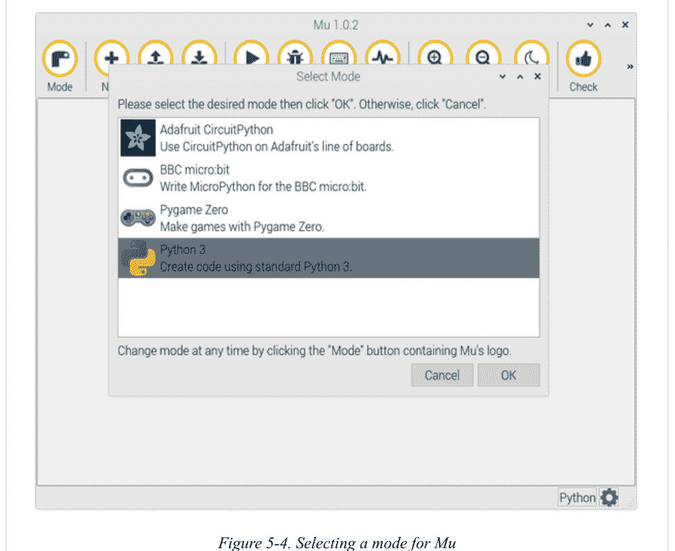

图 5-4. 为 Mu 选择模式

选择 Python 3 模式并单击“确定”。这将打开 Mu 编辑器，因此它已准备好让你开始编写一些 Python 代码。

让我们试一下。在注释“Write your code here :-)”下的编辑器区域中，仔细输入以下测试内容：

```
for i in range(1, 10):
    print(i)
```

这个小程序将计数到 9。现在不用担心它是如何工作的；所有内容都将在配方 5.23 中解释。请注意，当你到达第一行的末尾并按 Enter 键时，带有 print 语句的第二行应该会自动缩进（图 5-5）。

## 5.4 使用 Mu

在运行程序之前，我们需要将其保存到文件中。因此，在 Mu 窗口顶部，点击“保存”按钮，然后输入文件名 `count.py`（图 5-6）。

文件保存后，通过点击 Mu 窗口顶部的“运行”按钮来运行程序。这会导致 Mu 编辑器屏幕分割，下半部分显示程序运行的结果（图 5-7）。

如果你已经按照 [配方 3.22](Recipe 3.22) 的步骤下载了本书附带的文件，你可以直接在 Mu 中使用“打开”按钮打开它们，然后导航到文件夹 `/home/pi/raspberrypi_cookbook_ed3/python`，如 [图 5-8](Figure 5-8) 所示。请注意，Mu 使用的是 Python 3，而本书中有一些 Python 程序仅适用于 Python 2，因此如果在 Mu 中运行代码时遇到问题，请检查代码所属配方的文本说明。

### 讨论

Python 作为一种编程语言，其独特之处在于缩进是语言的基本组成部分。许多基于 C 的语言使用 { 和 } 来界定代码块，而 Python 使用缩进级别。因此，在前面的例子中，Python 知道 `print` 应作为 `for` 循环的一部分被重复调用，因为它从左边缩进了四个空格。

当你刚开始使用 Python 时，看到类似 `IndentationError: unexpected indent` 的错误并不罕见，这意味着某处缩进不正确。如果一切看起来都对齐了，请仔细检查缩进中是否包含制表符，因为 Python 对制表符的处理方式不同。

在选择 Python 3 作为我们的编辑模式（图 5-4）时，我们忽略了其他模式选项。Adafruit CircuitPython 模式允许你使用树莓派为 Adafruit 的 CircuitPython 系列开发板编程，而 BBC micro:bit 模式允许你为 BBC micro:bit 开发板编写 MicroPython 程序。这两项活动都涉及使用本书未涵盖的其他开发板；然而，了解这些是使用树莓派与这些微控制器配合使用的选项是很好的。

### 另请参阅

另一个适合初学者的流行 Python 编辑器是 Thonny（配方 5.3）。
除了使用 Mu 编辑和运行 Python 文件外，你也可以采用更“低科技”的方法：在 nano 中编辑文件（配方 3.7），然后从终端会话中运行它们（配方 5.6）。

## 5.5 使用 Python 控制台

### 问题

你想在不编写完整程序的情况下输入 Python 命令。这样做对于试验 Python 的某些功能可能很有用。

### 解决方案

使用 Python 控制台，可以在 Mu 中或在终端会话中使用。Python 控制台提供了一个类似于树莓派操作系统（[链接待补充]）的命令行，但你可以输入 Python 命令，而不是操作系统命令。如果你使用的是 Mu（配方 5.4），你可以通过点击 Mu 窗口顶部的 REPL（读取-求值-打印-循环）按钮来访问 Python 控制台（图 5-9）。

忽略图 5-9 中除底部以外的所有内容，你可以看到一个命令提示符，你可以在其中输入 Python 命令。在这个例子中，我输入了以下内容：

```
2 + 2
```

并放心地得到了答案：

```
4
```

### 讨论

使用 Mu 运行单个 Python 命令的替代方法是在终端窗口中启动一个 Python 3 控制台，方法是输入命令 **python3** ——或者要启动 Python 2 控制台，则输入命令 **python**。

>>> 提示符表示你可以输入 Python 命令。如果你需要输入多行命令，控制台将自动提供一个由三个点表示的续行。你仍然需要将这些行缩进四个空格，如以下会话所示：

```
>>> from time import sleep
>>> while True:
...     print("hello")
...     sleep(1)
...
hello
hello
```

在输入最后一行命令后，你需要按两次回车键，控制台才能识别缩进块的结束并运行代码。

Python 控制台还提供命令历史记录，因此你可以使用向上和向下箭头键在之前的命令之间来回移动。

当你完成 Python 控制台的使用并想返回命令行时，输入 **exit()**。

### 另请参阅

如果你想输入的代码超过几行，你最好使用 Mu（配方 5.4）来编辑和运行文件。

## 5.6 从终端运行 Python 程序

### 问题

从 Mu 内部运行程序（配方 5.4）很好，但有时你想从终端窗口运行 Python 程序。

### 解决方案

在终端中使用 `python` 或 `python3` 命令，后跟包含你要运行的程序的文件名。

### 讨论

要从命令行运行 Python 3 程序，请使用如下命令：

```
$ python3 myprogram.py
```

如果你想使用 Python 2 运行程序，请将命令 `python3` 改为 `python`。在这两种情况下，你要运行的 Python 程序都应该在一个扩展名为 `.py` 的文件中。
你可以以普通用户身份运行大多数 Python 程序；但是，有些你需要以超级用户身份运行。如果你的程序属于这种情况，请在命令前加上 `sudo`：

```
$ sudo python3 myprogram.py
```

在前面的例子中，你需要在命令中包含 `python3` 来运行程序，但你也可以在 Python 程序的开头添加一行，以便 Linux 知道它是一个 Python 程序。这个特殊的行被称为 *shebang*（是“hash”和“interrobang”两个符号名称的缩写），下面的单行示例程序将其作为第一行：

```
#!/usr/bin/python3
print("I'm a program, I can run all by myself")
```

在你可以直接从命令行运行此程序之前，你必须使用以下命令（参见配方 3.14）赋予文件写权限；这里假设文件名为 *test.py*：

```
$ chmod +x test.py
```

参数 +x 表示向文件添加执行权限。
现在你可以使用单个命令运行 Python 程序 *test.py*：

```
$ ./test.py
I'm a program, I can run all by myself
$
```

行首的 ./ 是命令行找到文件所必需的。

### 另请参阅

配方 3.25 向你展示如何将 Python 程序作为定时事件运行。
要自动在启动时运行程序，请参阅配方 3.24。

## 5.7 为值命名（变量）

### 问题

你想给一个值命名。

### 解决方案

你使用 = 将值赋给一个名称。

### 讨论

在 Python 中，你不必声明变量的类型；你可以直接使用赋值运算符 (=) 为其赋值，如以下示例所示：

```
a = 123
b = 12.34
c = "Hello"
d = 'Hello'
e = True
```

你可以使用单引号或双引号定义字符串常量。Python 中的逻辑常量是 `True` 和 `False`，它们区分大小写。

按照惯例，变量名以小写字母开头，如果变量名由多个单词组成，则用下划线字符连接。给你的变量起描述性名称总是一个好主意，这样当你在休息后回到程序时，就能弄清楚它是如何工作的。

一些有效的变量名示例包括 `x`、`total` 和 `number_of_chars`。

### 另请参阅

你也可以将变量赋值为列表（配方 6.1）或字典（配方 6.12）。

有关变量算术运算的更多信息，请参阅配方 5.10。

## 5.8 显示输出

### 问题

你想查看变量的值。

### 解决方案

使用 `print` 命令。你可以在 Python 控制台（配方 5.5）中尝试以下示例：

```
>>> x = 10
>>> print(x)
10
>>>
```

请注意，`print` 命令会开始一个新行进行打印。

### 讨论

在 Python 2 中，你可以不使用括号直接使用 `print` 命令。然而，在 Python 3 中并非如此，因此为了兼容两个版本的 Python，请始终在要打印的值周围使用括号。

### 另请参阅

要读取用户输入，请参阅配方 5.9。

## 5.9 读取用户输入

### 问题

你想提示用户输入一个值。

### 解决方案

使用 `input`（Python 3）或 `raw_input`（Python 2）命令。你可以在 Python 3 控制台（配方 5.5）中尝试以下示例：

```
>>> x = input("Enter Value:")
Enter Value:23
>>> print(x)
23
>>>
```

### 讨论

在 Python 2 中，必须用 `raw_input` 替代前面示例中的 `input`。

Python 2 也有一个 `input` 函数，但该函数会验证输入并尝试将其转换为适当类型的 Python 值，而 `raw_input` 的行为与 Python 3 中的 `input` 相同，仅返回一个字符串，即使你输入的是数字。

### 另请参阅

在 [https://oreil.ly/EhqMt](https://oreil.ly/EhqMt) 查找更多关于 Python 2 `input` 的信息。

## 5.10 使用算术运算符

### 问题

你想在 Python 中进行算术运算。

### 解决方案

使用 +、-、* 和 / 运算符。

### 讨论

最常见的算术运算符是 +、-、* 和 /，它们分别代表加、减、乘和除。

你也可以使用括号将表达式的部分组合在一起，如以下示例所示，该示例将摄氏温度转换为华氏温度：

```
>>> tempC = input("Enter temp in C: ")
Enter temp in C: 20
>>> tempF = (int(tempC) * 9) / 5 + 32
>>> print(tempF)
68.0
>>>
```

其他算术运算符包括 %（取模余数）和 **（幂运算）。例如，要计算 2 的 8 次方，你可以这样写：

```
>>> 2 ** 8
256
```

### 另请参阅

参见 Recipe 5.9 了解如何使用 `input` 命令，以及 Recipe 5.14 了解如何将 `input` 的字符串值转换为数字。
`Math` 库包含许多有用的数学函数可供使用。

## 5.11 创建字符串

### 问题

你想创建一个字符串变量——即一个包含文本的变量。

### 解决方案

使用赋值运算符（=）和字符串常量来创建一个新字符串。你可以使用双引号或单引号将字符串括起来，但它们必须匹配。例如：

```
>>> s = "abc def"
>>> print(s)
abc def
>>>
```

### 讨论

如果要在字符串内部包含双引号或单引号，请选择字符串内容中不需要使用的引号类型作为字符串的开始和结束标记。例如：

```
>>> s = "Isn't it warm?"
>>> print(s)
Isn't it warm?
>>>
```

有时你需要在字符串中包含制表符或换行符等特殊字符。这需要使用所谓的 *转义字符*。要包含制表符，请使用 \t；要包含换行符，请使用 \n。例如：

```
>>> s = "name\tage\nMatt\t14"
>>> print(s)
name    age
Matt    14
>>>
```

### 另请参阅

有关转义字符的完整列表，请参阅 [Python 参考手册](https://docs.python.org/3/reference/lexical_analysis.html#string-and-bytes-literals)。

## 5.12 连接（拼接）字符串

### 问题

你想将多个字符串连接在一起。

### 解决方案

使用 +（连接）运算符。

例如：

```
>>> s1 = "abc"
>>> s2 = "def"
>>> s = s1 + s2
>>> print(s)
abcdef
>>>
```

### 讨论

在许多语言中，你可以将一系列值连接起来，其中一些是字符串，另一些是其他类型（如数字），数字在连接过程中会自动转换为字符串。但在 Python 中并非如此，如果你尝试以下命令，将会得到一个错误：

```
>>> "abc" + 23
Traceback (most recent call last):
  File "<stdin>", line 1, in <module>
TypeError: Can't convert 'int' object to str implicitly
```

你需要在连接之前将每个要连接的组件转换为字符串，如本例所示：

```
>>> "abc" + str(23)
'abc23'
>>>
```

### 另请参阅

参见 Recipe 5.13 了解有关使用 `str` 函数将数字转换为字符串的更多信息。

## 5.13 将数字转换为字符串

### 问题

你想将一个数字转换为字符串。

### 解决方案

使用 `str` Python 函数。
例如：

```
>>> str(123)
'123'
>>>
```

### 讨论

想要将数字转换为字符串的一个常见原因是为了之后可以将其与另一个字符串连接（Recipe 5.12）。

### 另请参阅

有关将字符串转换为数字的反向操作，请参见 Recipe 5.14。

## 5.14 将字符串转换为数字

### 问题

你想将一个字符串转换为数字。

### 解决方案

使用 `int` 或 `float` Python 函数。
例如，要将字符串 `-123` 转换为数字，你可以使用以下方法：

```
>>> int("-123")
-123
>>>
```

这适用于正整数和负整数。
要转换浮点数，请使用 `float` 而不是 `int`：

```
>>> float("00123.45")
123.45
>>>
```

### 讨论

`int` 和 `float` 都能正确处理前导零，并且对数字周围的任何空格或其他空白字符具有容忍性。
你也可以使用 `int` 通过提供数字基数作为第二个参数，将表示非默认十进制数的字符串转换为数字。以下示例将二进制数 1001 的字符串表示形式转换为数字：

```
>>> int("1001", 2)
9
>>>
```

第二个示例将十六进制数 AFF0 转换为整数：

```
>>> int("AFF0", 16)
45040
>>>
```

### 另请参阅

有关将数字转换为字符串的反向操作，请参见 Recipe 5.13。

## 5.15 查找字符串的长度

### 问题

你需要知道字符串中有多少个字符。

### 解决方案

使用 `len` Python 函数。

### 讨论

例如，要查找字符串 `abcdef` 的长度，你可以使用：

```
>>> len("abcdef")
6
>>>
```

### 另请参阅

`len` 命令也适用于列表（[Recipe 6.3](Recipe 6.3)）。

## 5.16 查找一个字符串在另一个字符串中的位置

### 问题

你需要查找一个字符串在另一个字符串中的位置。

### 解决方案

使用 `find` Python 函数。
例如，要查找字符串 `def` 在字符串 `abcdefghi` 中的起始位置，你可以使用：

```
>>> s = "abcdefghi"
>>> s.find("def")
3
>>>
```

请注意，字符位置从 0 开始（而不是 1），因此位置 3 表示字符串中的第四个字符。

### 讨论

如果要查找的字符串在被搜索的字符串中不存在，`find` 将返回值 -1。

### 另请参阅

`replace` 函数用于查找并替换字符串的所有出现（Recipe 5.18）。

## 5.17 提取字符串的一部分

### 问题

你想截取字符串中特定字符位置之间的部分。

### 解决方案

使用 Python 的 `[:]` 表示法。

例如，要截取字符串 `abcdefghi` 中从第二个字符到第五个字符的部分，你可以使用以下方法：

```
>>> s = "abcdefghi"
>>> s[1:5]
'bcde'
>>>
```

请注意，字符位置从 0 开始（而不是 1），因此位置 1 表示字符串中的第二个字符，5 表示第六个；但是，字符范围在高端是排他的。因此在此示例中，字母 *f* 不包括在内。

### 讨论

`[:]` 表示法实际上非常强大。你可以省略任一参数，此时将根据情况假定为字符串的开头或结尾。例如：

```
>>> s = "abcdefghi"
>>> s[:5]
'abcde'
>>>
```

以及：

```
>>> s = "abcdefghi"
>>> s[3:]
'defghi'
>>>
```

你也可以使用负索引从字符串末尾开始计数。这在需要查找文件的三字母扩展名等情况下很有用，如以下示例所示：

```
>>> "myfile.txt"[-3:]
'txt'
```

### 另请参阅

Recipe 5.12 描述了如何连接字符串而不是分割它们。
Recipe 6.10 使用相同的语法，但适用于列表而不是字符串。
另一种更强大的字符串操作方法在 [待添加链接] 中描述。

## 5.18 在字符串中用一个字符串替换另一个字符串

### 问题

你想替换另一个字符串中某个字符串的所有出现。

### 解决方案

使用 `replace` 函数。
例如，要将所有出现的 X 替换为 `times`，你可以使用以下方法：

```
>>> s = "It was the best of X. It was the worst of X"
>>> s.replace("X", "times")
```

这是最好的时代，这是最坏的时代。

### 讨论

你搜索的字符串必须完全匹配；也就是说，搜索区分大小写，并且会包含空格。

### 另请参阅

参阅[配方 5.16](Recipe 5.16)了解如何在不执行替换的情况下搜索字符串。另一种更强大的字符串操作方法将在[待补充链接]中描述。

## 5.19 将字符串转换为大写或小写

### 问题

你想将字符串中的所有字符转换为大写或小写字母。

### 解决方案

根据需要使用 `upper` 或 `lower` 函数。例如，要将 `aBcDe` 转换为大写，你可以使用以下代码：

```
>>> "aBcDe".upper()
'ABCDE'
>>>
```

要将其转换为小写，请使用以下代码：

```
>>> "aBcDe".lower()
>>> 'abcde'
>>>
```

请注意，即使 `upper` 和 `lower` 不接受任何参数，它们仍然需要在末尾加上 `()`。

### 讨论

与大多数以某种方式操作字符串的函数一样，`upper` 和 `lower` 实际上并不修改字符串，而是返回字符串的修改副本。

例如，以下代码返回字符串 `s` 的副本，但请注意原始字符串并未更改：

```
>>> s = "aBcDe"
>>> s.upper()
'ABCDE'
>>> s
'aBcDe'
>>>
```

要将 `s` 的值更改为全大写，请执行以下操作：

```
>>> s = "aBcDe"
>>> s = s.upper()
>>> s
'ABCDE'
>>>
```

### 另请参阅

参阅[配方 5.18](Recipe 5.18)了解如何替换字符串中的文本。

## 5.20 条件执行命令

### 问题

你想仅在某个条件为真时运行一些 Python 命令。

### 解决方案

使用 Python 的 `if` 命令。
以下示例仅在 `x` 的值大于 100 时打印消息 `x is big`：

```
>>> x = 101
>>> if x > 100:
...     print("x is big")
...
x is big
```

### 讨论

在 `if` 关键字之后，有一个*条件*。这个条件通常（但并非总是）比较两个值，并给出一个 `True` 或 `False` 的答案。如果为 `True`，则后续缩进的行都将被执行。
通常，当条件为 `True` 时想做一件事，而当答案为 `False` 时想做另一件事。在这种情况下，`else` 命令与 `if` 一起使用，如本例所示：

```
x = 101
if x > 100:
    print("x is big")
else:
    print("x is small")

print("This will always print")
```

你还可以将一系列 `elif`（else if）条件链接在一起。如果其中任何一个条件成功，则执行该代码块，并且不会尝试其后的任何其他条件。
例如：

```
x = 90
if x > 100:
    print("x is big")
elif x < 10:
    print("x is small")
else:
    print("x is medium")
```

此示例将打印 x is medium。

### 另请参阅

参阅配方 5.21 了解有关可以进行的不同类型比较的更多信息。

## 5.21 比较值

### 问题

你想比较两个量的值。

### 解决方案

使用以下比较运算符之一：<、>、<=、>=、== 或 !=。

### 讨论

你在配方 5.20 中使用了 <（小于）和 >（大于）运算符。以下是完整的比较运算符集：

| 运算符 | 描述 |
| :--- | :--- |
| < | 小于 |
| > | 大于 |
| <= | 小于或等于 |
| >= | 大于或等于 |
| == | 完全等于 |
| != | 不等于 |

有些人更喜欢使用 <> 运算符代替 !=。两者的工作方式相同。

你可以使用 Python 控制台（配方 5.5）测试这些命令，如以下交互所示：

```
>>> 1 != 2
True
>>> 1 != 1
False
>>> 10 >= 10
True
>>> 10 >= 11
False
>>> 10 == 10
True
>>>
```

一个常见的错误是在比较中使用 =（赋值）而不是 ==（双等号）。这可能很难发现，因为如果比较的一半是变量，它是完全合法的语法并且会运行，但它不会产生你预期的结果。

除了比较数字，你还可以使用这些比较运算符比较字符串，如下所示：

```
>>> 'aa' < 'ab'
True
>>> 'aaa' < 'aa'
False
```

字符串是按字典顺序比较的——也就是说，按照你在字典中找到它们的顺序。

这并不完全正确，因为对于每个字母，大写字母被认为小于小写等效字母。每个字母都有一个值，即其 ASCII 码，大写字母的数值小于同一字母的小写版本。

### 另请参阅

另请参阅配方 5.20 和 5.22。

另一种更强大的字符串操作方法将在[待补充链接]中描述。

## 5.22 使用逻辑运算符

### 问题

你需要在 `if` 语句中指定一个复杂的条件。

### 解决方案

使用以下逻辑运算符之一：`and`、`or` 或 `not`。

### 讨论

例如，你可能想检查变量 `x` 的值是否在 10 到 20 之间。为此，你将使用 `and` 运算符：

```
>>> x = 17
>>> if x >= 10 and x <= 20:
...     print('x is in the middle')
...
x is in the middle
```

你可以根据需要组合任意数量的 `and` 和 `or` 语句，如果表达式变得复杂，你也可以使用括号将它们分组。

### 另请参阅

参阅配方 5.20 和 5.21。

## 5.23 精确重复指令指定次数

### 问题

你需要将一些程序代码精确重复指定次数。

### 解决方案

使用 Python 的 `for` 命令并遍历一个范围。
例如，要将一个命令重复 10 次，请使用以下示例：

```
>>> for i in range(1, 11):
...     print(i)
...
1
2
3
4
5
6
7
8
9
10
>>>
```

### 讨论

`range` 命令中的第二个参数是*排他的*；也就是说，要计数到 10，你必须指定值为 11。

### 另请参阅

如果停止循环的条件比简单地将命令重复一定次数更复杂，请参阅配方 5.24。
如果你试图为列表或字典的每个元素重复命令，请分别参阅配方 6.7 或 6.15。

## 5.24 重复指令直到条件改变

### 问题

你需要重复一些程序代码，直到某些情况发生变化。

### 解决方案

使用 Python 的 `while` 语句。`while` 语句会重复其嵌套的命令，直到其条件变为假。以下示例将停留在循环中，直到用户输入 **X** 退出：

```
>>> answer = ''
>>> while answer != 'X':
...     answer = input('Enter command:')
...
Enter command:A
Enter command:B
Enter command:X
>>>
```

### 讨论

请注意，前面的示例使用了 `input` 命令，这是它在 Python 3 中的工作方式。要在 Python 2 中运行此示例，请将 `raw_input` 命令替换为 `input`。

### 另请参阅

如果你只想将某些命令重复一定次数，请参阅[配方 5.23](Recipe 5.23)。

如果你试图为列表或字典的每个元素重复命令，请分别参阅配方 [6.7](6.7) 或 [6.15](6.15)。

## 5.25 跳出循环

### 问题

你在一个循环中，需要在某个条件发生时退出循环。

### 解决方案

使用 Python 的 `break` 语句退出 `while` 或 `for` 循环。
以下示例的行为与配方 5.24 中的示例代码完全相同：

```
>>> while True:
...     answer = input('Enter command:')
...     if answer == 'X':
...         break
...
Enter command:A
Enter command:B
Enter command:X
>>>
```

### 讨论

请注意，此示例使用了 `input` 命令，这是它在 Python 3 中的工作方式。
要在 Python 2 中运行此示例，请将 `raw_input` 命令替换为 `input`。

此示例的行为与配方 5.24 中的示例完全相同。然而，在这种情况下，`while` 循环的条件只是 `True`，因此除非我们使用 `break` 在用户输入 **X** 时退出循环，否则循环将永远不会结束。

### 另请参阅

你也可以通过使用其条件来退出 `while` 循环；参阅配方 5.20。

## 5.26 在 Python 中定义函数

### 问题

你想避免在程序中一遍又一遍地重复相同的代码。

### 解决方案

创建一个函数，将代码行组合在一起，允许从多个地方调用它。
以下示例说明了如何在 Python 中创建然后调用函数：

```
def count_to_10():
    for i in range(1, 11):
        print(i)

count_to_10()
```

此示例使用 `def` 命令定义了一个函数，该函数在每次调用时都会打印数字 1 到 10：

```
count_to_10()
```

### 讨论

命名函数的约定与配方 5.7 中变量的约定相同；也就是说，它们应该以小写字母开头，如果名称由多个单词组成，则单词之间应使用下划线分隔。
示例函数有点不灵活，因为它只能计数到 10。如果我们想让它更灵活——例如，让它可以计数到任何数字——我们可以将最大数字作为函数的*参数*包含在内，如本例所示：

```
def count_to_n(n):
    for i in range(1, n + 1):
        print(i)
```

## 6.0 引言

在第5章中，你学习了Python语言的基础知识。在本章中，你将了解两个关键的Python数据结构：*列表*和*字典*。

## 6.1 创建列表

### 问题

你想使用一个变量来存储一系列值，而不仅仅是一个值。

### 解决方案

使用列表。在Python中，列表是一个按顺序存储的值的集合，因此你可以通过位置来访问它们。

你可以使用`[`和`]`字符来包含其初始内容，从而创建一个列表：

```python
>>> a = [34, 'Fred', 12, False, 72.3]
>>>
```

与C等语言中更严格的数组不同，在Python中声明列表时不需要指定其大小。你也可以随时更改列表中的元素数量。

### 讨论

如本例所示，列表中的项目不需要都是相同的类型，尽管它们通常是。
要创建一个空列表以便稍后添加项目，你可以这样写：

```python
>>> a = []
>>>
```

## 6.2 访问列表元素

### 问题

你想查找列表中的单个元素或更改它们。

### 解决方案

使用`[ ]`表示法通过元素在列表中的位置来访问列表元素。
例如，要访问列表中位置1的元素：

```python
>>> a = [34, 'Fred', 12, False, 72.3]
>>> a[1]
'Fred'
```

### 讨论

列表位置（索引）从第一个元素开始为0（而不是1）。
除了使用`[ ]`表示法从列表中读取值外，你还可以使用它来更改特定位置的值，如下所示：

```python
>>> a = [34, 'Fred', 12, False, 72.3]
>>> a[1] = 777
>>> a
[34, 777, 12, False, 72.3]
```

如果你尝试使用过大的索引来更改（或读取）列表元素，你将得到一个`Index out of range`错误：

```python
>>> a[50] = 777
Traceback (most recent call last):
  File "<stdin>", line 1, in <module>
IndexError: list assignment index out of range
>>>
```

## 6.3 查找列表长度

### 问题

你需要知道列表中有多少个元素。

### 解决方案

使用Python函数`len`。
例如：

```python
>>> a = [34, 'Fred', 12, False, 72.3]
>>> len(a)
5
```

函数`len`从Python版本1就存在，这与更面向对象、基于类的Python版本2和3相当不同。对于后者，能够这样写会更有意义：

```python
>>> a = [34, 'Fred', 12, False, 72.3]
>>> a.length() # 此示例无效
```

但你不能——Python就是这样。

### 讨论

`len`命令也适用于字符串（参见第5.15节）。

## 6.4 向列表添加元素

### 问题

你需要向列表添加一个项目。

### 解决方案

使用Python函数`append`、`insert`或`extend`。
要向列表末尾添加单个项目，请使用`append`，如下所示：

```python
>>> a = [34, 'Fred', 12, False, 72.3]
>>> a.append("new")
>>> a
[34, 'Fred', 12, False, 72.3, 'new']
```

### 讨论

有时你不想将新元素添加到列表末尾，而是想将它们插入到列表中的某个位置。为此，请使用`insert`命令。第一个参数是应插入项目的索引，第二个参数是要插入的项目：

```python
>>> a.insert(2, "new2")
>>> a
[34, 'Fred', 'new2', 12, False, 72.3]
```

请注意，新插入元素之后的所有元素都向上移动了一个位置。
`append`和`insert`都只向列表添加一个元素。`extend`函数将一个列表的所有元素添加到另一个列表的末尾：

```python
>>> a = [34, 'Fred', 12, False, 72.3]
>>> b = [74, 75]
>>> a.extend(b)
>>> a
[34, 'Fred', 12, False, 72.3, 74, 75]
```

## 6.5 从列表中移除元素

### 问题

你需要从列表中移除一个项目。

### 解决方案

使用Python函数`pop`。
不带参数的`pop`命令移除列表的最后一个元素：

```python
>>> a = [34, 'Fred', 12, False, 72.3]
>>> a.pop()
72.3
>>> a
[34, 'Fred', 12, False]
```

### 讨论

请注意，`pop`会返回从列表中移除的值。
要移除最后一个元素以外的位置的项目，请使用带参数的`pop`，参数为要移除项目的位置：

```python
>>> a = [34, 'Fred', 12, False, 72.3]
>>> a.pop(0)
34
```

如果你使用的索引位置超出了列表的末尾，你将得到一个`Index out of range`错误。

## 6.6 通过解析字符串创建列表

### 问题

你需要将一个由某个字符分隔的单词字符串转换为一个字符串数组，其中数组中的每个字符串都是其中一个单词。

### 解决方案

使用Python字符串函数`split`。
不带参数的`split`命令将字符串的单词分隔成数组的各个元素：

```python
>>> "abc def ghi".split()
['abc', 'def', 'ghi']
```

如果你为`split`提供一个参数，它将使用该参数作为分隔符来分割字符串。
例如：

```python
>>> "abc--de--ghi".split('--')
['abc', 'de', 'ghi']
```

### 讨论

例如，当你从文件导入数据时，此命令非常有用。`split`命令可以选择性地接受一个参数，该参数是分割字符串时用作分隔符的字符串。因此，如果你使用逗号作为分隔符，你可以这样分割字符串：

```python
>>> "abc,def,ghi".split(',')
['abc', 'def', 'ghi']
```

### 另请参阅

另一种更强大的字符串处理方法在[待补充链接]中描述。

## 6.7 遍历列表

### 问题

你需要将一些代码行依次应用于列表的每个项目。

### 解决方案

使用Python语言命令`for`：

```python
>>> a = [34, 'Fred', 12, False, 72.3]
>>> for x in a:
...     print(x)
...
34
Fred
12
False
72.3
>>>
```

### 讨论

`for`关键字后面紧跟一个变量名（在本例中为`x`）。这被称为循环变量；它将被设置为`in`之后指定的列表的每个元素。

随后的缩进行将为列表中的每个元素执行一次。每次循环时，`x`将被赋予列表中该位置元素的值。然后你可以使用`x`来打印值，如前面的示例所示。

### 另请参阅

列表推导式是处理列表的另一种方式。

## 6.8 枚举列表

### 问题

你需要依次对列表中的每个项目运行一些代码行，但你也需要知道每个项目的索引位置。

### 解决方案

参数`n`包含在括号内，然后在`range`命令中使用，但在1被加到它之前不使用。

使用参数作为要计数到的数字意味着，如果你通常计数到10但有时计数到不同的数字，你将总是必须指定该数字。然而，你可以为参数指定一个默认值，从而两全其美，如本例所示：

```python
def count_to_n(n=10):
    for i in range(1, n + 1):
        print(i)

count_to_n()
```

现在，除非在调用函数时指定了不同的数字，否则它将计数到10。

如果你的函数需要多个参数，也许是在两个数字之间计数，参数用逗号分隔：

```python
def count(from_num=1, to_num=10):
    for i in range(from_num, to_num + 1):
        print(i)

count()
count(5)
count(5, 10)
```

所有这些示例都是不返回任何值的函数；它们只是执行某些操作。如果你需要一个函数返回值，你需要使用`return`命令。

以下函数接受一个字符串作为参数，并在字符串末尾添加单词*please*：

```python
def make_polite(sentence):
    return sentence + " please"

print(make_polite("Pass the cheese"))
```

当函数返回值时，你可以将结果赋给一个变量，或者，如本例所示，你可以打印结果。

### 另请参阅

要从函数返回多个值，请参阅[待补充链接]。

# 第6章 Python列表和字典

> **致早期版本读者的说明**
>
> 通过早期版本电子书，你可以在书籍的最早形式中获取内容——作者在写作时的原始且未经编辑的内容——因此你可以在这些标题正式发布之前很久就利用这些技术。
>
> 这将是最终书籍的第6章。请注意，GitHub仓库稍后将激活。
>
> 如果你对我们如何改进本书的内容和/或示例有意见，或者你注意到本章中缺少材料，请通过simonmonkauthor@gmail.com联系作者。

使用 Python 语言的 `for` 命令配合 `enumerate` 命令：

```
>>> a = [34, 'Fred', 12, False, 72.3]
>>> for (i, x) in enumerate(a):
...     print(i, x)
...
(0, 34)
(1, 'Fred')
(2, 12)
(3, False)
(4, 72.3)
>>>
```

### 讨论

在遍历列表中的每个值时，经常需要知道某个元素在列表中的位置。另一种方法是简单地使用一个索引变量进行计数，然后使用 [ ] 语法来访问值：

```
>>> a = [34, 'Fred', 12, False, 72.3]
>>> for i in range(len(a)):
...     print(i, a[i])
...
(0, 34)
(1, 'Fred')
(2, 12)
(3, False)
(4, 72.3)
>>>
```

### 另请参阅

列表推导式是操作列表的另一种方式。
参见配方 6.7，了解如何在不需要知道每个元素索引位置的情况下遍历列表。

## 6.9 对列表进行排序

### 问题

你需要对列表的元素进行排序。

### 解决方案

使用 Python 语言的 `sort` 命令：

```
>>> a = ["it", "was", "the", "best", "of", "times"]
>>> a.sort()
>>> a
['best', 'it', 'of', 'the', 'times', 'was']
```

`sort` 命令使用标准的 Python 比较运算符。这意味着对于字符串，它们将按字母顺序升序排列。

### 讨论

当你对列表进行排序时，你实际上是在修改它，而不是返回原始列表的排序副本。这意味着如果你还需要原始列表，你需要在排序之前使用标准库中的 `copy` 命令来制作原始列表的副本：

```
>>> from copy import copy
>>> a = ["it", "was", "the", "best", "of", "times"]
>>> b = copy(a)
>>> b.sort()
>>> a
['it', 'was', 'the', 'best', 'of', 'times']
>>> b
['best', 'it', 'of', 'the', 'times', 'was']
>>>
```

`copy` 模块是复制对象所必需的。你可以在[待补充链接]中了解更多关于模块的信息。

## 6.10 切割列表

### 问题

你需要使用原始列表元素的一个范围来制作一个子列表。

### 解决方案

使用 Python 语言的 [ : ] 构造。以下示例返回一个列表，其中包含从索引位置 1 到索引位置 2 的原始列表元素（: 之后的数字是排他的——即，包含到但不包括元素 2：

```
>>> l = ["a", "b", "c", "d"]
>>> l[1:3]
['b', 'c']
```

请注意，字符位置从 0 开始（而不是从 1 开始），因此位置 1 表示字符串中的第二个字符，3 表示第四个；然而，字符范围在高端是*排他*的，因此在此示例中不包含字母 *d*。

### 讨论

[ : ] 表示法实际上非常强大。你可以省略任一参数，此时将根据情况假定为列表的开头或结尾。

例如：

```
>>> l = ["a", "b", "c", "d"]
>>> l[:3]
['a', 'b', 'c']
>>> l[3:]
['d']
>>>
```

你也可以使用负索引从列表末尾开始计数。以下示例返回列表中的最后两个元素：

```
>>> l[-2:]
['c', 'd']
```

顺便说一下，在前面的示例中，`l[:-2]` 返回 `['a', 'b']`。

### 另请参阅

参见配方 5.17，其中对字符串使用了相同的语法。

## 6.11 列表推导式

### 问题

你想要一种更简洁的方法，通过过滤或转换原始列表来从另一个列表构建一个列表。

### 解决方案

使用列表推导式。

列表推导式并不能做任何你用常规循环做不到的事情，但它们确实简化了涉及列表的操作，并且如果使用得当，可以使你的代码更具可读性。

列表推导式将接受一个现有列表，并从原始列表的元素创建一个新列表，要么过滤列表，使只有符合条件的元素包含在新列表中，要么可以创建一个包含与原始列表相同数量元素的新列表，但每个元素都以某种方式被操作。

提醒一下，如果不使用列表推导式，以下代码将获取一个列表并将其过滤到一个新列表中，该新列表仅包含以字母 'a' 开头的元素。

```
new_list = []
people = ['agnes', 'andrew','jane','peter']
for person in people:
    if person[0] == 'a':
        new_list.append(person)
print(new_list)
```

当你运行这个程序（ch_07_filter.py）时，你会看到 `new_list` 只包含以 'a' 开头的名称。

```
$ python3 ch_07_filter.py
['agnes', 'andrew']
```

我们可以通过使用列表推导式（ch_07_filter_comp.py）来大大缩短这个示例。

```
people = ['agnes', 'andrew','jane','peter']
new_list = [person for person in people if person[0] == 'a']
print(new_list)
```

这将产生与 ch_07_filter.py 完全相同的输出，但代码减少了两行。列表推导式包含在方括号中，推导式中的第一个单词是 `person`。这表明 `person`（尚未指定）将被添加到列表副本中。然后我们有 `for person in people`，这是遍历列表的常规方式，列表名为 `people`，列表中的每个元素名为 `person`。推导式的最后一部分是条件 `if person[0] == 'a'`。这是拒绝所有不以 'a' 开头的列表元素的部分。

推导式的条件是可选的，你可能只想使用推导式来修改列表的每个元素。ch_07_change_comp.py 的示例将名称大写，返回一个新列表，其中每个名称的首字母大写。

```
people = ['agnes', 'andrew','jane','peter']
new_list = [person.capitalize() for person in people]
print(new_list)
```

```
$ python3 ch_07_change_comp.py
['Agnes', 'Andrew', 'Jane', 'Peter']
```

### 讨论

列表推导式是操作列表的一种非常强大且有用的技术。起初，语法可能看起来有点奇怪，因为它被封闭在方括号中。但这是保持代码简洁而不增加理解其工作原理难度的好方法。

### 另请参阅

关于不使用列表推导式遍历列表，请参见[配方 6.7](Recipe 6.7)。

## 6.12 创建字典

### 问题

你需要创建一个查找表，将值与键关联起来。

### 解决方案

使用 Python 字典。
当你需要按顺序访问项目列表，或者总是知道要使用的元素的索引时，列表非常有用。字典是存储数据集合的另一种方式，但它们的组织方式非常不同，如[图 6-1](Figure 6-1)所示。


字典以一种方式存储键/值对，使你可以使用键非常高效地检索该值，而无需搜索整个字典。

要创建字典，你使用 { } 表示法：

```
>>> phone_numbers = {'Simon':'01234 567899', 'Jane':'01234 666666'}
```

### 讨论

在这个示例中，字典的键是字符串，但它们不需要是；它们可以是数字，实际上可以是任何数据类型，尽管字符串最常用。

值也可以是任何数据类型，包括其他字典或列表。以下示例创建一个字典（a），然后将其用作第二个字典（b）中的值：

```
>>> a = {'key1':'value1', 'key2':2}
>>> a
{'key2': 2, 'key1': 'value1'}
>>> b = {'b_key1':a}
>>> b
{'b_key1': {'key2': 2, 'key1': 'value1'}}
```

当你显示字典的内容时，请注意字典中项目的顺序可能与创建字典并用一些内容初始化时指定的顺序不匹配：

```
>>> phone_numbers = {'Simon':'01234 567899', 'Jane':'01234 666666'}
>>> phone_numbers
{'Jane': '01234 666666', 'Simon': '01234 567899'}
```

与列表不同，字典没有保持项目顺序的概念。由于它们内部的表示方式，字典内容的顺序——出于所有实际目的——将是随机的。
顺序看起来随机的原因是底层数据结构是一个*哈希表*。哈希表使用 `hashing` 函数来决定存储每个值的位置；`hashing` 函数为任何对象计算一个数字等效值。
你可以在 [Wikipedia](https://en.wikipedia.org/wiki/Hash_table) 上了解更多关于哈希表的信息。

### 另请参阅

字典与[待补充链接]中描述的 JSON 数据结构语言有很多共同之处。

## 6.13 访问字典

### 问题

你需要查找并更改字典中的条目。

### 解决方案

提供 Python 的 [ ] 表示法。在方括号内使用你需要访问的条目的键，如下所示：

```
>>> phone_numbers = {'Simon':'01234 567899', 'Jane':'01234 666666'}
>>> phone_numbers['Simon']
'01234 567899'
>>> phone_numbers['Jane']
'01234 666666'
```

### 讨论

查找过程是单向的，从键到值。
如果你使用一个不在字典中的键，你将得到一个 `KeyError`。例如：

```
>>> phone_numbers = {'Simon':'01234 567899', 'Jane':'01234 666666'}
>>> phone_numbers['Phil']
Traceback (most recent call last):
  File "<stdin>", line 1, in <module>
KeyError: 'Phil'
>>>
```

除了使用 [ ] 表示法从字典中读取值，你还可以用它来添加新值或覆盖现有值。
以下示例向字典中添加了一个新条目，其键为 `Pete` **，值为** `01234 777555`：

```
>>> phone_numbers = {'Simon':'01234 567899', 'Jane':'01234 666666'}
>>> phone_numbers['Pete'] = '01234 777555'
>>> phone_numbers['Pete']
'01234 777555'
```

如果该键在字典中未被使用，则会自动添加一个新条目。
如果该键已经存在，那么之前的任何值都将被新值覆盖。
这与尝试从字典中读取值形成对比，未知的键会导致错误。

### 另请参阅

有关处理错误的信息，请参阅 [待补充链接]。

## 6.14 从字典中移除条目

### 问题

你需要从字典中移除一个项目。

### 解决方案

使用 `pop` 命令，并指定要移除项目的键：

```
>>> phone_numbers = {'Simon':'01234 567899', 'Jane':'01234 666666'}
>>> phone_numbers.pop('Jane')
'01234 666666'
>>> phone_numbers
{'Simon': '01234 567899'}
```

### 讨论

`pop` 命令返回从字典中移除的项目的值。因此，在上面的例子中，即使 Jane 从字典中被移除了，`pop` 命令仍然返回 Jane 的条目，以防你出于其他目的需要它。

### 另请参阅

食谱 6.12 到 6.15 之间的所有食谱都涉及字典的使用。

## 6.15 遍历字典

### 问题

你需要依次对字典中的每个项目执行某些操作。

### 解决方案

使用 `for` 命令遍历字典的键：

```
>>> phone_numbers = {'Simon':'01234 567899', 'Jane':'01234 666666'}
>>> for name in phone_numbers:
...     print(name)
...
Jane
Simon
```

注意键的打印顺序与它们创建时的顺序不同。这是字典的一个特性。条目的顺序不会被记住。

### 讨论

还有其他几种技术可以用来遍历字典。如果你需要同时访问键和值，以下形式可能很有用：

```
>>> phone_numbers = {'Simon':'01234 567899', 'Jane':'01234 666666'}
>>> for name, num in phone_numbers.items():
...     print(name + " " + num)
...
Jane 01234 666666
Simon 01234 567899
```

### 另请参阅

食谱 6.12 到 6.15 之间的所有食谱都涉及字典的使用。
另请参阅食谱 5.23、6.7 和 [待补充链接] 中使用的 `for` 命令。

## 关于作者

**西蒙·蒙克博士**（英国普雷斯顿）拥有控制论和计算机科学学位以及软件工程博士学位。西蒙在重返工业界之前曾做过几年学术研究，并共同创立了移动软件公司 Momote Ltd。西蒙将时间分配在写书和为 MonkMakes（他妻子琳达经营的公司）设计产品之间。你可以在 [http://www.simonmonk.org](http://www.simonmonk.org) 上了解更多关于他的书籍的信息，或在 Twitter 上关注他 @simonmonk2。