O'REILLY

第四版

# 树莓派食谱

软件与硬件问题及解决方案


Simon Monk

# 树莓派食谱

如果你已经开始使用树莓派，你就会知道它的功能在不断扩展。这本广受欢迎的食谱的第四版提供了超过 200 个实践食谱（附带代码），向你展示如何运行这台运行 Linux 的低成本微型计算机，如何用 Python 为其编程，如何将其连接到传感器和电机，以及如何将其用于物联网（IoT）。这个新版本包含了关于树莓派 Pico 和树莓派机器学习的新章节。

作者、多产的黑客 Simon Monk 还教授了基本原理，帮助你将新技术与树莓派结合使用。这些易于使用的食谱将逐步向你展示如何：

-   设置你的树莓派并连接到网络
-   使用其基于 Linux 的操作系统
-   用 Python 为你的树莓派编程
-   通过计算机视觉赋予你的派“眼睛”
-   使用机器学习从视频和声音中识别物体
-   通过 GPIO 连接器控制硬件
-   使用你的树莓派控制不同类型的电机和显示器
-   使用开关、键盘和其他数字输入
-   使用传感器测量温度、光照和距离
-   以各种方式连接到物联网设备并自动化你的家庭
-   使用树莓派 Pico 微控制器板

> “Simon Monk 对树莓派所有事物的百科全书式知识，使得这本食谱的第四版成为任何涉足数字制造领域的人的完美伴侣。本书的广度和深度细节将适合初学者和经验丰富的创客。”

—Pete Lomas
树莓派联合创始人

Simon Monk 是 20 多本关于电子和开源硬件书籍的作者，包括 *Electronics Cookbook*（O’Reilly）和畅销书 *Programming Arduino*（McGraw-Hill）。他还为 MonkMakes 设计产品，这是他与妻子 Linda 共同经营的企业。此前，他联合创办了移动软件公司 Momote Ltd。他拥有软件工程博士学位以及控制论和计算机科学学位。

硬件

美国售价 65.99 美元
加拿大售价 82.99 加元
ISBN: 978-1-098-13092-3


Twitter: @oreillymedia
linkedin.com/company/oreilly-media
youtube.com/oreillymedia

第四版

# 树莓派食谱

软件与硬件问题及解决方案

Simon Monk 博士

北京 • 波士顿 • 法纳姆 • 塞瓦斯托波尔 • 东京


# 树莓派食谱

作者：Simon Monk

版权所有 © 2023 Simon Monk。保留所有权利。

印刷于美国。

由 O'Reilly Media, Inc. 出版，地址：1005 Gravenstein Highway North, Sebastopol, CA 95472。

O'Reilly 图书可购买用于教育、商业或销售推广用途。大多数图书也提供在线版本（http://oreilly.com）。如需更多信息，请联系我们的企业/机构销售部门：800-998-9938 或 corporate@oreilly.com。

**策划编辑：** Zan McQuade
**开发编辑：** Jeff Bleiel
**制作编辑：** Clare Laylock
**文字编辑：** Penelope Perkins
**校对：** Piper Editorial Consulting, LLC

**索引编制：** Sue Klefstad
**内页设计：** David Futato
**封面设计：** Karen Montgomery
**插图：** Kate Dullea

2014年8月：第一版
2016年6月：第二版
2019年10月：第三版
2022年12月：第四版

## 第四版修订历史

2022-12-08：首次发布

发布详情请参见 http://oreilly.com/catalog/errata.csp?isbn=9781098130923。

O'Reilly 标志是 O'Reilly Media, Inc. 的注册商标。*树莓派食谱*、封面图片及相关商业外观是 O'Reilly Media, Inc. 的商标。

本书所表达的观点均为作者观点，不代表出版商观点。虽然出版商和作者已尽最大努力确保本书所含信息和说明的准确性，但出版商和作者对任何错误或遗漏不承担任何责任，包括但不限于因使用或依赖本书而造成的损害责任。使用本书所含信息和说明的风险由您自行承担。如果本书包含或描述的任何代码示例或其他技术受开源许可或他人知识产权约束，您有责任确保您的使用符合此类许可和/或权利。

978-1-098-13092-3
[LSI]

> 献给我已故的母亲 Anne Kemp（1924–2022），她的乐观精神和在逆境中保持微笑的能力是我们所有人的榜样

## 目录

第四版前言..................................................................................... xv

1.  设置与管理..................................................................................... 1

    - 1.0 简介
    - 1.1 选择树莓派型号
    - 1.2 连接系统
    - 1.3 为树莓派装上外壳
    - 1.4 选择电源
    - 1.5 选择操作系统
    - 1.6 使用树莓派映像器安装操作系统
    - 1.7 首次启动你的树莓派
    - 1.8 设置无头树莓派
    - 1.9 从真实硬盘或 USB 闪存驱动器启动
    - 1.10 连接 DVI 或 VGA 显示器
    - 1.11 使用复合视频显示器/电视
    - 1.12 调整显示器上的图像大小
    - 1.13 最大化性能
    - 1.14 更改密码
    - 1.15 关闭树莓派
    - 1.16 安装树莓派摄像头模块
    - 1.17 使用蓝牙

2.  网络......................................................................................... 41

    - 2.0 简介
    - 2.1 连接到有线网络
    - 2.2 查找你的 IP 地址
    - 2.3 设置静态 IP 地址 45
    - 2.4 设置树莓派的网络名称 47
    - 2.5 设置无线连接 50
    - 2.6 使用控制台线缆连接 52
    - 2.7 使用 SSH 远程控制派 56
    - 2.8 使用 VNC 远程控制派 58
    - 2.9 使用树莓派作为网络附加存储 61
    - 2.10 设置网络打印机 64

## 3. 操作系统

    - 3.0 简介 67
    - 3.1 图形化浏览文件 67
    - 3.2 将文件复制到 USB 闪存驱动器 69
    - 3.3 启动终端会话 71
    - 3.4 使用终端导航文件系统 73
    - 3.5 复制文件或文件夹 76
    - 3.6 重命名文件或文件夹 78
    - 3.7 编辑文件 78
    - 3.8 查看文件内容 80
    - 3.9 不使用编辑器创建文件 81
    - 3.10 创建目录 82
    - 3.11 删除文件或目录 82
    - 3.12 使用超级用户权限执行任务 84
    - 3.13 理解文件权限 85
    - 3.14 更改文件权限 86
    - 3.15 更改文件所有权 88
    - 3.16 进行屏幕截图 89
    - 3.17 使用 apt 安装软件 90
    - 3.18 移除使用 apt 安装的软件 91
    - 3.19 使用 pip3 安装 Python 包 92
    - 3.20 从命令行获取文件 93
    - 3.21 使用 Git 获取源代码 94
    - 3.22 获取本书附带的代码 96
    - 3.23 在启动时自动运行程序 98
    - 3.24 作为服务自动运行程序 99
    - 3.25 定期自动运行程序 101
    - 3.26 查找文件 102
    - 3.27 使用命令行历史记录 103
    - 3.28 监控处理器活动 104
    - 3.29 处理文件归档 107
    - 3.30 列出已连接的 USB 设备 108
    - 3.31 将命令行输出重定向到文件 108
    - 3.32 连接文件 109
    - 3.33 使用管道 109
    - 3.34 隐藏终端输出 110
    - 3.35 在后台运行程序 111
    - 3.36 创建命令别名 112
    - 3.37 设置日期和时间 112
    - 3.38 查看 SD 卡剩余空间 113
    - 3.39 查看正在运行的操作系统版本 114
    - 3.40 更新树莓派操作系统 115

## 4. 使用现成软件

    - 4.0 简介 117
    - 4.1 制作媒体中心 117
    - 4.2 安装推荐软件 119
    - 4.3 使用办公软件 121
    - 4.4 运行复古游戏机模拟器 123
    - 4.5 将你的树莓派变成无线电发射器 125
    - 4.6 编辑位图图像 127
    - 4.7 编辑矢量图像 128
    - 4.8 使用 Bookshelf 129
    - 4.9 播放网络电台 131
    - 4.10 使用 Visual Studio Code 132
    - 4.11 控制激光切割机 133

## 5. Python 基础

    - 5.0 简介 139
    - 5.1 在 Python 2 和 Python 3 之间做选择 139
    - 5.2 选择 Python 编辑器 140
    - 5.3 使用 Thonny 编辑 Python 程序 141
    - 5.4 使用 Mu 编辑 Python 程序 142
    - 5.5 使用 Python 控制台 148
    - 5.6 从终端运行 Python 程序 150
    - 5.7 为值（变量）赋名 151
    - 5.8 显示输出 152
    - 5.9 读取用户输入 153
    - 5.10 使用算术运算符 154
    - 5.11 创建字符串 155
    - 5.12 连接（拼接）字符串 156
    - 5.13 将数字转换为字符串 157
    - 5.14 将字符串转换为数字 157

## 5. Python 字符串

- 5.15 查找字符串的长度 158
- 5.16 查找一个字符串在另一个字符串中的位置 159
- 5.17 提取字符串的一部分 160
- 5.18 在字符串中用一个字符串替换另一个字符串 161
- 5.19 将字符串转换为大写或小写 161
- 5.20 有条件地运行命令（if） 162
- 5.21 比较值 164
- 5.22 使用逻辑运算符 165
- 5.23 精确重复指令指定次数 166
- 5.24 重复指令直到某个条件改变 167
- 5.25 跳出循环 167
- 5.26 在 Python 中定义函数 168

## 6. Python 列表和字典

- 6.0 简介 173
- 6.1 创建列表 173
- 6.2 访问列表元素 174
- 6.3 查找列表的长度 175
- 6.4 向列表添加元素 175
- 6.5 从列表中移除元素 176
- 6.6 通过解析字符串创建列表 177
- 6.7 遍历列表 178
- 6.8 枚举列表 179
- 6.9 测试某物是否在列表中 180
- 6.10 对列表排序 180
- 6.11 切割列表 181
- 6.12 使用列表推导式 182
- 6.13 创建字典 184
- 6.14 访问字典 185
- 6.15 从字典中移除条目 186
- 6.16 遍历字典 187

## 7. 高级 Python

- 7.0 简介 189
- 7.1 格式化数字 189
- 7.2 格式化日期和时间 191
- 7.3 返回多个值 192
- 7.4 定义类 193
- 7.5 定义方法 195
- 7.6 继承 196
- 7.7 写入文件 197
- 7.8 从文件读取 198
- 7.9 使用 Pickling 在文件中保存和加载数据 199
- 7.10 处理异常 200
- 7.11 使用模块 202
- 7.12 生成随机数 203
- 7.13 从 Python 发起 Web 请求 204
- 7.14 在 Python 中指定命令行参数 205
- 7.15 从 Python 运行 Linux 命令 206
- 7.16 从 Python 发送电子邮件 207
- 7.17 用 Python 编写一个简单的 Web 服务器 210
- 7.18 在 Python 中什么都不做 212
- 7.19 同时做多件事 213
- 7.20 解析 JSON 数据 214
- 7.21 将字典保存为 JSON 文件 216
- 7.22 创建用户界面 217
- 7.23 使用正则表达式在文本中搜索模式 219
- 7.24 使用正则表达式验证数据输入 221
- 7.25 使用正则表达式进行网页抓取 222

## 8. 计算机视觉

- 8.0 简介 225
- 8.1 安装 OpenCV 225
- 8.2 为计算机视觉设置 USB 摄像头 226
- 8.3 使用树莓派摄像头模块进行计算机视觉 228
- 8.4 数硬币 229
- 8.5 人脸检测 232
- 8.6 运动检测 235
- 8.7 从图像中提取文本 238

## 9. 机器学习

- 9.0 简介 239
- 9.1 使用 TensorFlow Lite 在视频中识别物体 240
- 9.2 使用 TensorFlow Lite 对视频中的物体做出反应 242
- 9.3 使用 TensorFlow Lite 识别声音 244
- 9.4 使用 TensorFlow Lite 对哨声做出反应 246
- 9.5 安装 Edge Impulse 248
- 9.6 识别语音命令（在云端） 249
- 9.7 识别语音命令（在本地） 254
- 9.8 在 Python 中响应语音命令 257

## 10. 硬件基础

- 10.0 简介
- 10.1 熟悉 GPIO 连接器
- 10.2 在树莓派 400 上使用 GPIO 连接器
- 10.3 使用 GPIO 连接器时保护树莓派的安全
- 10.4 设置 I2C
- 10.5 使用 I2C 工具
- 10.6 设置 SPI
- 10.7 安装 pySerial 以从 Python 访问串行端口
- 10.8 安装 Minicom 以测试串行端口
- 10.9 使用面包板和跳线
- 10.10 使用 Raspberry Squid
- 10.11 使用 Raspberry Squid 按钮
- 10.12 使用两个电阻将 5V 信号转换为 3.3V
- 10.13 使用电平转换模块将 5V 信号转换为 3.3V
- 10.14 使用锂聚合物电池为树莓派供电
- 10.15 Sense HAT 入门
- 10.16 Explorer HAT Pro 入门
- 10.17 制作 HAT
- 10.18 使用树莓派 Zero 2 和 Pi Zero 2 W

## 11. 控制硬件

- 11.0 简介
- 11.1 连接 LED
- 11.2 将 GPIO 引脚保持在安全状态
- 11.3 控制 LED 的亮度
- 11.4 使用晶体管切换大功率直流设备
- 11.5 使用继电器切换大功率设备
- 11.6 使用固态继电器进行切换
- 11.7 控制高压交流设备
- 11.8 使用 Android 和蓝牙控制硬件
- 11.9 制作一个用于开关设备的用户界面
- 11.10 制作一个用于控制 LED 和电机 PWM 功率的用户界面
- 11.11 制作一个用于更改 RGB LED 颜色的用户界面
- 11.12 使用模拟仪表作为显示器

## 12. 电机

- 12.0 简介
- 12.1 控制伺服电机
- 12.2 精确控制伺服电机
- 12.3 精确控制多个伺服电机 325
- 12.4 控制直流电机的速度 327
- 12.5 控制直流电机的方向 329
- 12.6 使用单极步进电机 333
- 12.7 使用双极步进电机 337
- 12.8 使用步进电机 HAT 驱动双极步进电机 339

## 13. 数字输入

- 13.0 简介 343
- 13.1 连接按钮开关 343
- 13.2 使用按钮开关进行切换 347
- 13.3 使用双位拨动或滑动开关 348
- 13.4 使用中心关闭的拨动或滑动开关 350
- 13.5 按钮去抖 353
- 13.6 使用外部上拉电阻 354
- 13.7 使用旋转（正交）编码器 356
- 13.8 使用键盘 359
- 13.9 检测运动 362
- 13.10 为树莓派添加 GPS 364
- 13.11 拦截按键 367
- 13.12 拦截鼠标移动 368
- 13.13 为树莓派添加重置按钮 370

## 14. 传感器

- 14.0 简介 375
- 14.1 使用电阻式传感器 375
- 14.2 测量光照 379
- 14.3 使用热敏电阻测量温度 381
- 14.4 检测甲烷 383
- 14.5 测量空气质量（CO2） 386
- 14.6 测量土壤湿度 389
- 14.7 测量电压 391
- 14.8 降低电压以进行测量 394
- 14.9 使用 ADC 与电阻式传感器 397
- 14.10 使用 ADC 测量温度 399
- 14.11 测量树莓派 CPU 温度 401
- 14.12 使用 Sense HAT 测量温度、湿度和气压 402
- 14.13 使用数字传感器测量温度 404
- 14.14 使用 MMA8452Q 模块测量加速度 407
- 14.15 使用 Sense HAT 寻找磁北 411
- 14.16 使用 Sense HAT 的惯性测量单元 412
- 14.17 使用干簧管感应磁铁 414
- 14.18 使用 Sense HAT 感应磁铁 415
- 14.19 使用超声波测量距离 416
- 14.20 使用飞行时间传感器测量距离 419
- 14.21 为你的树莓派添加触摸感应 421
- 14.22 使用 RFID 读写器读取智能卡 423
- 14.23 显示传感器值 427
- 14.24 记录到 USB 闪存盘 428

## 15. 显示器

- 15.0 简介 431
- 15.1 使用四位 LED 显示器 431
- 15.2 在 I2C LED 矩阵上显示图形 434
- 15.3 使用 Sense HAT LED 矩阵显示器 436
- 15.4 使用 OLED 图形显示器 438
- 15.5 使用可寻址 RGB LED 灯带 441
- 15.6 使用 Pimoroni Unicorn HAT 444
- 15.7 使用电子纸显示器 446

## 16. 声音

- 16.0 简介 449
- 16.1 连接扬声器 449
- 16.2 控制声音输出位置 452
- 16.3 在没有音频插孔的树莓派上播放音频 453
- 16.4 从命令行播放声音 455
- 16.5 从 Python 播放声音 456
- 16.6 使用 USB 麦克风 457
- 16.7 发出嗡嗡声 459

## 17. 物联网

- 17.0 简介 461
- 17.1 使用 Web 界面控制 GPIO 输出 461
- 17.2 在网页上显示传感器读数 466
- 17.3 Node-RED 入门 470
- 17.4 使用 IFTTT 发送电子邮件和其他通知 473
- 17.5 使用 ThingSpeak 发送推文 478
- 17.6 使用 CheerLights 更改 LED 颜色 480
- 17.7 将传感器数据发送到 ThingSpeak 482
- 17.8 使用 Dweet 和 IFTTT 响应推文 485

## 18. 家庭自动化

- 18.0 简介
- 18.1 使用 Mosquitto 将树莓派变成消息代理
- 18.2 将 Node-RED 与 MQTT 服务器一起使用
- 18.3 刷写 Sonoff WiFi 智能开关以用于 MQTT
- 18.4 配置 Sonoff WiFi 智能开关
- 18.5 将 Sonoff Web 开关与 MQTT 一起使用
- 18.6 将刷写过的 Sonoff 开关与 Node-RED 一起使用
- 18.7 使用 Node-RED 仪表板开关设备
- 18.8 使用 Node-RED 调度事件
- 18.9 从 Wemos D1 发布 MQTT 消息
- 18.10 将 Wemos D1 与 Node-RED 一起使用

## 19. 树莓派 Pico 和 Pico W

- 19.0 简介
- 19.1 将 Pico 或 Pico W 连接到计算机
- 19.2 在 Pico 上使用 Python Shell
- 19.3 将 Pico 与面包板一起使用
- 19.4 在 Pico 上使用数字输出
- 19.5 在 Pico 上使用数字输入
- 19.6 在 Pico 上使用模拟（PWM）输出
- 19.7 在 Pico 上使用模拟输入
- 19.8 从 Pico 控制伺服电机
- 19.9 使用 Pico 和 Pico W 的文件系统
- 19.10 利用第二个核心
- 19.11 在 Pico W 上运行 WiFi Web 服务器
- 19.12 使用 Pico 兼容板
- 19.13 在电池上使用 Pico

## A. 零件和供应商

## B. 树莓派引脚图

# 索引

# 第四版前言

自2011年推出以来，树莓派既作为一款基于Linux的超低成本计算机，也作为嵌入式计算平台找到了自己的定位。它深受教育工作者和业余爱好者的欢迎。

截至本文撰写时，已售出超过4000万台树莓派。配备8GB内存选项的树莓派4，其性能已足以替代台式计算机；而内置键盘的Pi 400则是一款功能非常强大的台式计算机替代品。

用于网络浏览、电子邮件、办公套件和照片编辑的开源Linux软件的可用性，将使树莓派更加普及。

即使是最新的树莓派4和Pi 400，仍然包含通用输入/输出（GPIO）引脚，允许业余爱好者为树莓派添加自己的电子装置。

本版已全面更新，涵盖了树莓派的新型号，以及其树莓派操作系统的诸多变化和改进。特别地，你会发现新增了以下章节：

- 机器学习
- 树莓派 Pico 和 Pico W

本书的设计允许你像阅读普通书籍一样线性阅读，也可以随机查阅食谱。你可以搜索目录或索引找到想要的食谱，然后直接跳转。如果某个食谱需要你了解其他知识，它会指引你参考其他食谱，就像烹饪书在教你制作更复杂的菜肴前，可能会先指引你参考基础酱汁的做法一样。

树莓派的世界发展迅速。凭借庞大而活跃的社区，新的接口板和软件库一直在不断开发。除了使用特定接口板或软件的示例外，本书还涵盖了基本原理，以便你能更好地理解随着树莓派生态系统发展而出现的新技术。

正如你所料，本书附带了大量的代码（主要是Python程序）。这些程序都是开源的，可在 [GitHub](https://github.com) 上获取。对于大多数基于软件的食谱，你只需要一个树莓派。我推荐使用树莓派3或4型号B。对于涉及制作自己的硬件与树莓派接口的食谱，我尽量利用了现成的模块以及无焊面包板和跳线，以避免焊接的需要。

如果你想让基于面包板的项目更耐用，我建议使用与半尺寸面包板布局相同的原型板，例如Adafruit等处出售的那些，这样设计就可以轻松转移到焊接解决方案中。

# 使用本书

本书的食谱风格意味着它不是一本必须从头到尾按顺序阅读的书。本书由分组到各个章节中的独立食谱组成。当一个食谱需要你事先了解其他主题时，该食谱会指引你去参考另一个相关主题的食谱。

你可能会发现，在尝试让你的树莓派项目实现所需功能时，你会在不同的食谱之间跳转。

我为不同类型的读者规划了几条贯穿本书的路径，我认为这些路径会很有用：

*完全的树莓派初学者*
阅读第1、2和3章的大部分内容——特别是从食谱1.1、1.2和1.4开始——然后随意浏览。

*Python学习者*
如果你想使用树莓派学习Python编程，请按顺序学习第4到7章。你可能会发现需要跳转到前面章节的各种食谱。

*电子爱好者*
如果你还没有Python技能，你需要通过学习第4到7章来掌握一些，然后学习第8和9章，之后再从后面的章节中挑选一些有趣的食谱，开始制作你自己的树莓派电子项目。

# 本书使用的约定

本书使用以下排版约定：

*斜体*
表示新术语、URL、电子邮件地址、文件名和文件扩展名。

等宽字体
用于程序清单，以及在段落中引用程序元素，如变量或函数名、数据库、数据类型、环境变量、语句和关键字。

**等宽粗体**
显示用户应按原样输入的命令或其他文本。

*等宽斜体*
显示应替换为用户提供的值或由上下文确定的值的文本。


此图标表示提示、建议或一般说明。


此图标表示警告或注意事项。

# 使用代码示例

补充材料（代码示例等）可从 [https://github.com/simonmonk/raspberrypi_cookbook_ed4](https://github.com/simonmonk/raspberrypi_cookbook_ed4) 下载。

本书旨在帮助你完成工作。通常，如果本书提供了示例代码，你可以在你的程序和文档中使用它。除非你复制了代码的大部分，否则你不需要联系我们获取许可。例如，编写一个使用本书中多个代码片段的程序不需要许可。销售或分发O'Reilly书籍中的示例则需要许可。通过引用本书和引用示例代码来回答问题不需要许可。将本书中大量的示例代码纳入你的产品文档则需要许可。

我们感谢但不要求署名。署名通常包括书名、作者、出版商和ISBN。例如：“*Raspberry Pi Cookbook*, Fourth Edition, by Simon Monk (O’Reilly). Copyright 2023 Simon Monk, 978-1-098-13092-3。”

如果你觉得你对示例代码的使用超出了合理使用或上述许可的范围，请随时通过 *permissions@oreilly.com* 联系我们。

# O’Reilly在线学习


40多年来，*O’Reilly Media* 一直提供技术和商业培训、知识和见解，以帮助公司取得成功。

我们独特的专家和创新者网络通过书籍、文章、会议和我们的在线学习平台分享他们的知识和专业知识。O'Reilly的在线学习平台为你提供按需访问的直播培训课程、深入的学习路径、交互式编码环境，以及来自O'Reilly和200多家其他出版商的大量文本和视频资源。欲了解更多信息，请访问 *http://oreilly.com*。

# 如何联系我们

请将有关本书的意见和问题寄给出版商：

O’Reilly Media, Inc.
1005 Gravenstein Highway North
Sebastopol, CA 95472
800-998-9938 (美国或加拿大)
707-829-0515 (国际或本地)
707-829-0104 (传真)

我们为本书设有一个网页，列出了勘误、示例和任何其他信息。你可以通过 *https://oreil.ly/raspberry-pi-cookbook-4e* 访问此页面。

发送电子邮件至 *bookquestions@oreilly.com* 可对本书发表评论或提出技术问题。

有关我们书籍和课程的新闻和信息，请访问 *https://oreilly.com*。

在LinkedIn上找到我们：*https://linkedin.com/company/oreilly-media*。

在Twitter上关注我们：*http://twitter.com/oreillymedia*。

在YouTube上观看我们：*http://www.youtube.com/oreillymedia*。

# 致谢

一如既往，我感谢我的妻子Linda的耐心和支持。

我还要感谢技术审稿人Ian Huntley、Mike Bassett、Kevin McAleer和Matthew Monk，他们出色的帮助和建议无疑为本书做出了巨大贡献。

同样感谢非常乐于助人且组织有序的Jeff Bleiel以及整个O'Reilly团队，当然还有Penelope Perkins敏锐的眼光。

# 第一章
设置与管理

## 1.0 简介

当你购买树莓派时，你本质上是购买了一块组装好的印刷电路板，或者对于树莓派400而言，是购买了一块装在键盘外壳中的电路板。要构建一个功能完整的系统，你至少需要一个合适的电源、一张装有操作系统的microSD卡和一个鼠标。

本章的指南将帮助你设置树莓派并使其准备好使用。

由于树莓派使用标准的USB和蓝牙键盘鼠标，大部分设置过程相当简单，因此你将只专注于那些树莓派特有的任务。

## 1.1 选择树莓派型号

### 问题

市面上有多种型号的树莓派，你不确定该使用哪一种。

### 解决方案

选择哪种树莓派型号在很大程度上取决于你计划用它来做什么。表1-1列出了一些用途及我的型号推荐。

表1-1. 选择树莓派型号

| 用途 | 推荐型号 | 备注 |
|---|---|---|
| 替代台式电脑 | 树莓派400 或 树莓派4型号B (4 GB) | 如果进行网页浏览，你需要4 GB内存。Pi 400提供了集成在键盘外壳中的便利性。 |
| 电子实验 | 树莓派2 或 3型号B | 相对较新的硬件将最大限度地减少软件问题。无需更高性能。 |
| 计算机视觉 | 树莓派4型号B (4 GB) | 需要最高性能。 |
| 家庭自动化 | 树莓派2 或 3型号B | 低功耗且性能绰绰有余。 |
| 媒体中心 | 树莓派3 或 4 | 为了视频性能。 |
| 电子显示板 | 任何型号 | 带WiFi的型号，便于远程访问。 |
| 嵌入式无线电子项目 | 树莓派Zero 2 W 或 Pico W | 低成本且支持WiFi，适用于物联网（IoT）和其他无线项目。 |
| 嵌入式电子项目 | Pico | 成本极低，除了名称外，与大多数树莓派几乎没有共同之处。更多信息请参见第19章。 |

如果你想要一款通用的树莓派，我推荐树莓派4型号B。它的内存是初代树莓派的四倍，并且拥有四核处理器，它在处理大多数任务时会比Pi Zero好得多，但它不会像树莓派4那样发热严重或耗电过多。树莓派3型号B+还有一个巨大优势，即内置了WiFi和蓝牙，因此无需额外的USB WiFi适配器或蓝牙硬件。

### 树莓派4型号B

截至本文撰写时，树莓派4型号B（图1-1）是最新款的*标准*树莓派。

这款新型号也首次允许用户选择内存大小（1 GB、2 GB、4 GB或8 GB），价格会根据你的内存选择而变化。

最显著的变化之一是，为早期版本供电的micro-USB接口已被USB-C接口取代。此外，早期版本的单个全尺寸HDMI接口已被一对micro-HDMI接口取代——因此你需要一根特殊的HDMI线或一个适配器。是的，你可以同时连接两个显示器。

在内部，这款树莓派比其前代产品快得多（尤其是如果你选择4 GB或8 GB内存版本）。事实上，一些基准测试表明，它的速度是任何以前树莓派的三到四倍。这是以主板上的主芯片比早期版本运行温度高得多为代价的——事实上，热到足以烫伤人。

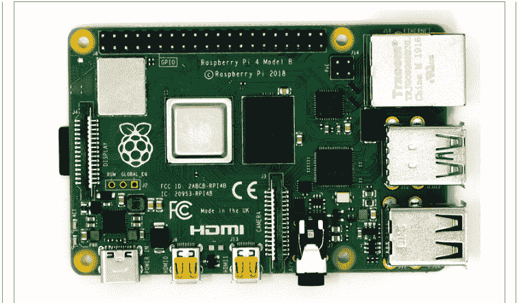

图1-1. 树莓派4型号B

另一方面，如果你将树莓派嵌入到一个单一用途的项目中，使用紧凑的Pi Zero W并节省几美元可能是一个不错的选择。

### 树莓派400

树莓派是一款相当不错的台式电脑替代品，而没有哪款树莓派比树莓派400（图1-2）更适合这个角色。


图1-2. 树莓派400

树莓派400本质上与树莓派4的硬件相同，但被集成在一个键盘外壳中，让人想起1990年代的家用电脑。HDMI和USB端口都位于Pi 400的背面。GPIO引脚位于电脑背面，但不像常规树莓派那样容易接触，因此如果你购买树莓派是为了学习电子学，常规的Pi可能是更好的选择。然而，如果你只是想要一台台式电脑替代品，那么Pi 400确实是一个非常好的选择。

### 讨论

图1-3展示了Pi Zero W、树莓派3 B和树莓派4。

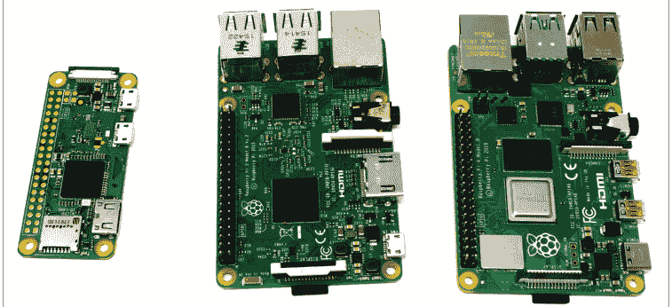

图1-3. 从左到右，树莓派Zero W、树莓派3 B和树莓派4 B

如图1-3所示，Pi Zero W的尺寸大约是Pi 3 B或Pi 4 B的一半，它有一个用于通信的micro-USB接口和一个用于供电的第二个接口。Pi Zero W还通过使用mini-HDMI接口和micro-USB OTG接口来节省空间。如果你想将键盘、显示器和鼠标连接到Pi Zero，你需要为USB和HDMI端口都准备适配器，然后才能连接标准外设。树莓派A+比Pi Zero大，拥有全尺寸的USB和HDMI端口。

表1-2总结了迄今为止所有树莓派型号之间的差异，最新发布的型号位于顶部。

表1-2. 树莓派型号

| 型号 | 内存 | 处理器（核心数 * 主频） | USB接口 | 以太网端口 | 备注 |
|---|---|---|---|---|---|
| 400 | 4 GB | 4 * 1.8 GHz | 4 (2 x USB3) | 有 | 集成在键盘中 |
| 4 B | 1/2/4/8 GB | 4 * 1.5 GHz | 4 (2 x USB3) | 有 | 2 x micro-HDMI视频输出 |
| Compute 4 | 1/2/4/8 GB | 4 * 1.5 GHz | 无 | 无 | 用于嵌入产品中（见侧边栏） |
| 3 A+ | 512 MB | 4 * 1.4 GHz | 1 | 无 | WiFi和蓝牙 |
| 3 B+ | 1 GB | 4 * 1.4 GHz | 4 | 有 | WiFi和蓝牙 |
| 3 B | 1 GB | 4 * 1.2 GHz | 4 | 有 | WiFi和蓝牙 |
| Zero 2 W | 512 MB | 4 * 1 GHz | 1 (micro) | 无 | WiFi和蓝牙 |
| Zero W | 512 MB | 1 * 1 GHz | 1 (micro) | 无 | WiFi和蓝牙 |
| Zero | 512 MB | 1 * 1 GHz | 1 (micro) | 无 | 低成本 |
| 2 B | 1 GB | 4 * 900 MHz | 4 | 有 | |
| A+ | 256 MB | 1 * 700 MHz | 1 | 无 | |
| B+ | 512 MB | 1 * 700 MHz | 4 | 有 | 已停产 |
| A | 256 MB | 1 * 700 MHz | 1 | 无 | 已停产 |
| B rev2 | 512 MB | 1 * 700 MHz | 2 | 有 | 已停产 |
| B rev1 | 256 MB | 1 * 700 MHz | 2 | 有 | 已停产 |

如果你拥有较旧或已停产的树莓派型号，它仍然有用。这些型号的性能不如最新的树莓派4，但在许多情况下，这并不重要。

如果你要购买新的树莓派，我认为作为通用计算机的最佳选择是树莓派4或400。如果你不需要WiFi或想要更小的设备，也可以考虑3 B、2 B或Zero W。

> ## 树莓派 Compute 4

树莓派是一个非常有用的设备，它已经进入了许多商业产品。有时这有点浪费，因为产品可能不需要树莓派4的所有接口和其他功能。

树莓派Compute 4（及其前代产品）提供了一个简洁的模块（图1-4），其底部的连接器设计用于与载板配合，这是产品集成Linux计算机的一种非常简便的方式。由于该模块及其相关的WiFi和蓝牙已经通过了CE和FCC认证，使你的产品符合相关标准要容易得多。

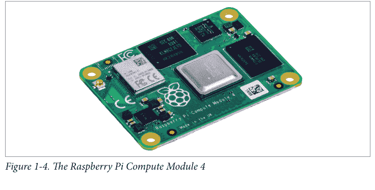

图1-4. 树莓派Compute Module 4

### 另请参阅

有关树莓派型号的更多信息，请参见 [https://oreil.ly/oY-A_](https://oreil.ly/oY-A_)。

查看 [树莓派Compute Modules](https://oreil.ly/oY-A_)。

Pi Zero和Pi Zero W型号的低成本使其非常适合嵌入电子项目，而无需担心费用。参见 [指南10.18](https://oreil.ly/oY-A_)。

## 1.2 连接系统

### 问题

你已经拥有了树莓派所需的一切，并且想要将它们全部连接起来。

### 解决方案

除非你将树莓派嵌入项目中或用作媒体中心，否则你需要连接一个键盘（除非你使用的是Pi 400）、一个鼠标和一个显示器。

[图1-5](https://oreil.ly/oY-A_)展示了一个典型的树莓派系统。如果你有树莓派4，你可以（如果你真的想）连接第二个显示器。但是，如果你只有一个显示器，请将其连接到最靠近USB-C电源接口的micro-HDMI接口。

## 1.3 为树莓派配备外壳

### 问题

你需要为你的树莓派准备一个外壳。

### 解决方案

除了树莓派400，树莓派本身并不附带外壳，除非你购买的是套件。这使得它有些脆弱，因为裸露的连接点位于电路板的底面，如果将树莓派放置在金属物体上，很容易造成短路。

为你的树莓派购买一个外壳作为保护是个好主意。如果你打算使用树莓派的通用输入/输出（GPIO）引脚（允许你连接外部电子设备的引脚），图1-7所示的Pibow Coupé是一个美观且实用的设计，适用于树莓派4和早期版本。

### 讨论

有大量外壳样式可供选择，包括以下几种：

- 简单的两件式卡扣塑料盒
- 可VESA安装的盒子（用于安装在显示器或电视背面）
- 兼容乐高的盒子
- 3D打印的盒子设计
- 激光切割的亚克力设计
- 充当大型散热器用于冷却的设计
- 内置风扇的设计
- 用于实验室和车间的DIN导轨设计

你购买的外壳很大程度上取决于个人品味。但是，请考虑以下几点：

- 你是否需要访问GPIO连接器？如果你计划将外部电子设备连接到树莓派，这一点很重要。
- 外壳通风是否良好？如果你计划超频你的树莓派（配方1.13）或高强度运行以播放视频或游戏，这一点很重要，因为这些都会产生更多热量。
- 最后，确保你购买的外壳适合你的树莓派型号。

如果你有3D打印机，你也可以打印自己的外壳。在Thingiverse或MyMiniFactory上搜索Raspberry Pi，你会发现很多设计。

你还会发现一些套件，其中包含可以粘贴在树莓派芯片上的小型自粘散热片。如果你对树莓派要求很高，例如播放大量视频，这些散热片可能会有些用处，但通常它们相当于汽车上的“加速”条纹。

如果你有树莓派4，你可以通过安装一个小风扇（如图1-8所示的Pimoroni Fan SHIM）来降低温度。

图1-8. Pimoroni Fan SHIM

### 另请参阅

你还可以在其他树莓派供应商和eBay上找到许多样式的外壳。

## 1.4 选择电源

### 问题

你需要为你的树莓派选择一个电源。

### 解决方案

适用于树莓派的电源的基本电气规格是提供稳定的5V直流电（DC）。

电源必须能够提供的电流大小取决于树莓派的型号以及连接到它的外围设备。值得购买一个能够轻松应对树莓派的电源，你应该考虑任何型号的树莓派至少需要1A。

如果你从购买树莓派的同一家店购买电源，卖家应该能告诉你它是否适用于树莓派。

树莓派4应该使用3A电源。这部分是因为它比早期型号具有更强的处理能力，需要更多电力，但也因为它的两个USB3端口能够向高功率USB外围设备（如外部USB驱动器）提供高达1.2A的电流。

如果你打算在树莓派4之前的型号上使用WiFi或需要大量电力的USB外围设备，你应该购买能够提供1.5A甚至2A的电源。同时要警惕非常廉价的电源，它们可能无法提供准确或可靠的5V。

### 讨论

树莓派4是第一个使用更现代的USB-C连接器的树莓派。与早期主板上使用的micro-USB连接器不同，这种连接器是可逆的（图1-9）。

图1-9. 树莓派3（上）和4（下）的电源和视频连接

在图1-9中，你可以看到树莓派4的USB-C电源连接器位于树莓派3的micro-USB连接器下方。顺便说一下，你还可以看到一对micro-HDMI视频端口，它们取代了单个全尺寸HDMI连接器。

无论你的树莓派使用USB-C连接器还是micro-USB连接器，电源和连接器实际上与许多智能手机充电器中使用的相同。如果它们以micro-USB插头结束，它们几乎肯定是5V（但请检查）。那么，唯一的问题是它们是否能提供足够的电流。

如果它们不能，可能会发生一些不好的事情：

- 它们可能会变热并带来潜在的火灾风险。
- 它们可能会直接失效。
- 在高负载时（例如，当树莓派使用WiFi或播放视频时），电压可能会下降，树莓派可能会自行重置。

如果你使用的是树莓派3或更早的型号，请寻找标称可以提供1A或更多电流的电源。如果它指定的是瓦特数（W）而不是安培数（A），将瓦特数除以5即可得到安培数。因此，一个5V 10W的电源可以提供2A（2,000mA）。

使用一个最大电流为2A的电源并不会比使用一个700mA的电源消耗更多电力。树莓派只取用它所需的电流。

在图1-10中，我测量了树莓派型号B的耗电量，并将其与树莓派2型号B和树莓派4进行了比较。

较新的树莓派（从A+开始一直到Pi 4）比最初的树莓派1型号节能得多，但当处理器完全占用并连接了大量外围设备时，它们仍然可以达到相似的电流需求，而且在树莓派4的情况下，电流需求要大得多。

正如你在图1-10中看到的，如果你的树莓派将一直运行，树莓派2将比最新的树莓派4运行温度更低，功耗也低得多。

在图1-10中，你可以看到电流很少超过700mA。然而，处理器在这里并没有真正做太多事情。如果你开始播放高清视频，电流会显著增加。在电源方面，留有余量总是更好的。

### 参考

你可以为树莓派购买不间断电源（UPS）。这确保了在断电情况下，树莓派可以继续运行10-30分钟。

树莓派没有开/关开关，但你可以购买一个模块，当树莓派关闭时，该模块会切断电源。

## 1.5 选择操作系统

### 问题

有几种树莓派操作系统，你不确定该使用哪一种。

### 解决方案

这个问题的答案取决于你打算用树莓派做什么。

如果作为通用计算机使用或用于电子项目，你应该使用Raspberry Pi OS，这是树莓派的标准官方发行版。

如果你计划将树莓派用作媒体中心，有许多专门为该目的设计的发行版（Linux版本）可供选择（参见配方4.1）。

在本书中，我们几乎只使用Raspberry Pi OS，尽管大多数配方适用于任何基于Debian的Linux发行版。

### 讨论

如果你有兴趣尝试一些不同的发行版，你可以购买一些microSD卡（它们并不贵），并将各种发行版复制到它们上面。如果你这样做，最好将不想丢失的文件保存在插入树莓派的USB闪存驱动器上。

请注意，如果你使用接下来的某个配方来写入自己的SD卡，你需要一台带有SD卡插槽（以及SD到microSD适配器）的计算机，或者你可以购买一个便宜的USB SD卡读卡器。

### 参考

查看[官方树莓派发行版列表](https://www.raspberrypi.com/software/operating-systems/)。

## 1.6 使用Raspberry Pi Imager安装操作系统

### 问题

你想将树莓派的操作系统直接放到microSD卡上，以便你的树莓派使用。

### 解决方案

在使用树莓派之前，你必须通过将磁盘镜像写入 microSD 卡，来准备一张装有树莓派操作系统（Raspberry Pi OS）的 microSD 卡。
将磁盘镜像写入 microSD 卡的过程如下：

1.  使用 Mac、Windows 或 Linux 电脑（不是你的树莓派），下载 [Raspberry Pi Imager](https://www.raspberrypi.com/software/)。
2.  将 microSD 卡插入你的电脑。同时，最好断开任何其他可移动介质的连接，以免意外覆盖错误的设备。
3.  启动 Raspberry Pi Imager（图 1-11）。
4.  将操作系统选择为 Raspberry Pi OS (32-bit)，并选择 SD 卡。
5.  点击“写入”，并等待镜像文件复制到可移动介质上。

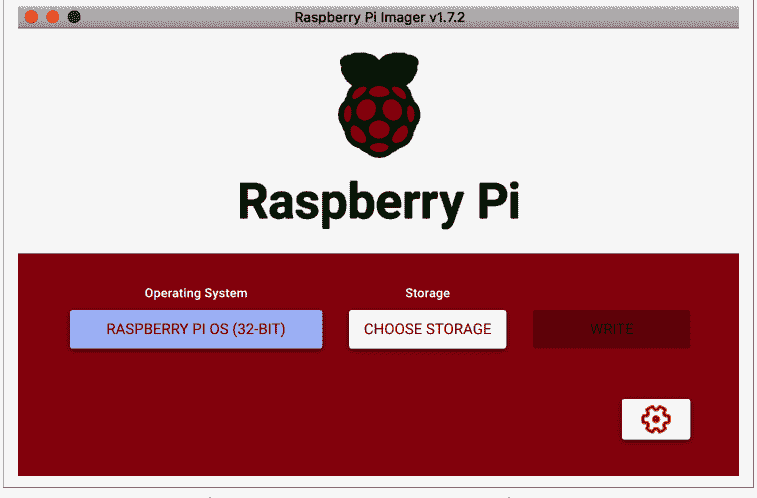

准备好 SD 卡或其他可移动介质后，你可以将其插入树莓派。当树莓派通电时，它将启动进入你安装的任何操作系统发行版。

### 讨论

硬件供应商有时会提供自己的磁盘镜像，其中内置了对其硬件的支持。最好避免使用此类镜像，因为这样做意味着你将无法获得使用标准树莓派操作系统发行版和所有预装软件的全部好处。这也意味着，如果你在某个软件上遇到问题，寻找支持会困难得多，因为你使用的是非标准发行版。

树莓派 4 和 400 硬件确实拥有 64 位处理器，并且也有 64 位版本的操作系统可用，但在撰写本文时，使用默认的树莓派操作系统 32 位选项要稳定得多。

### microSD 卡

并非所有的 microSD 卡都生而平等，使用更好的卡会让你的树莓派性能更佳。因此，请寻找标明为“class 10”的卡。树莓派操作系统包含一个实用程序（图 1-12）来测试你的 microSD 卡。你可以通过从树莓派菜单中选择“附件”，然后选择“Raspberry Pi Diagnostics”来找到它。

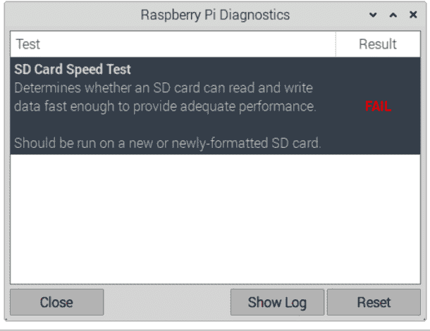

图 1-12. 使用 Raspberry Pi Diagnostics 工具测试你的 SD 卡

> 至于容量，你应该寻找至少 16 GB 的卡，而且，考虑到价格差异很小，32 GB 的卡是更好的选择，因为它将为你提供充足的扩展空间。

### 另请参阅

树莓派操作系统安装指南可在 [https://www.raspberrypi.com/software](https://www.raspberrypi.com/software) 找到。

## 1.7 首次启动你的树莓派

### 问题

你已经设置好了 microSD 卡，并且想知道如何设置你的树莓派。

### 解决方案

首次启动树莓派时（如图 1-13 所示），你将被引导完成一些设置问题。


点击“下一步”会提示你创建一个新的用户账户（图 1-14）。

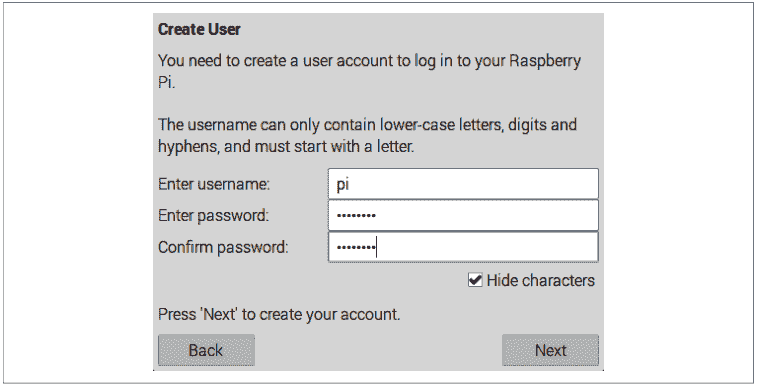

图 1-14. 创建用户账户

在 2022 年 4 月之前，此步骤并非设置过程的一部分，因为系统会自动为你创建用户名“pi”。因此，许多教程和书籍都假设你的主目录是 /home/pi。除非你对用户名有特别的要求，否则我建议坚持使用用户名“pi”，但创建一个强密码（而不是默认的“raspberry”）。

启动并运行后，你应该做的第一件事是将你的树莓派连接到互联网（参见食谱 2.1 和 2.5），因为接下来你会被要求连接到 WiFi 网络以检查更新。更新需要互联网连接，因此除非你已连接到网络，否则它将无法工作。如果你已连接（通过 WiFi 或以太网），现在检查更新是个好主意。如果没有，你总可以稍后使用食谱 3.40 进行检查。

### 讨论

设置正确的时区是个好主意。如果不设置，树莓派将显示不正确的时间，因为它从互联网时间服务器获取时间。

### 另请参阅

树莓派操作系统安装指南可在 https://www.raspberrypi.com/software 找到。

## 1.8 设置无头树莓派

### 问题

你想在不连接键盘、鼠标和显示器的情况下使用树莓派。

### 解决方案

使用 Raspberry Pi Imager 上的设置选项，用网络凭据启动你的树莓派并启用 SSH（食谱 2.7），以便你可以从另一台计算机连接到树莓派。

在 Raspberry Pi Imager 中选择操作系统后，会出现一个齿轮设置图标。点击此图标，你将看到一系列设置（图 1-15），你可以使用这些设置来预配置你的树莓派，以便你网络上的其他计算机可以连接到它。

要能够远程访问树莓派，你至少必须：

- 启用 SSH（安全外壳）
- 设置用户名和密码
- 使用你的网络名称（SSID，或服务集标识符）和密码配置无线局域网

设置主机名也是个不错的主意，特别是如果你的网络上将有多个树莓派，并且你想区分它们。


图 1-15. 使用 Pi Imager 预配置树莓派

### 讨论

一旦你将 microSD 卡放入树莓派并启动，你就可以使用 SSH 从另一台计算机连接到你的树莓派。这样做的唯一障碍是你需要知道你的家庭集线器在树莓派连接时分配给它的 IP 地址。你可以通过临时连接键盘、鼠标和显示器并按照食谱 2.2 操作来找到它，之后你应该按照食谱 2.3 操作，以便 IP 地址将被固定。

有时将所有这些设备连接到你的树莓派并不方便。在这种情况下，你可以使用 Android 和 iOS 上提供的各种工具，从手机扫描你的网络，并报告已连接计算机的列表及其 IP 地址（图 1-16）。

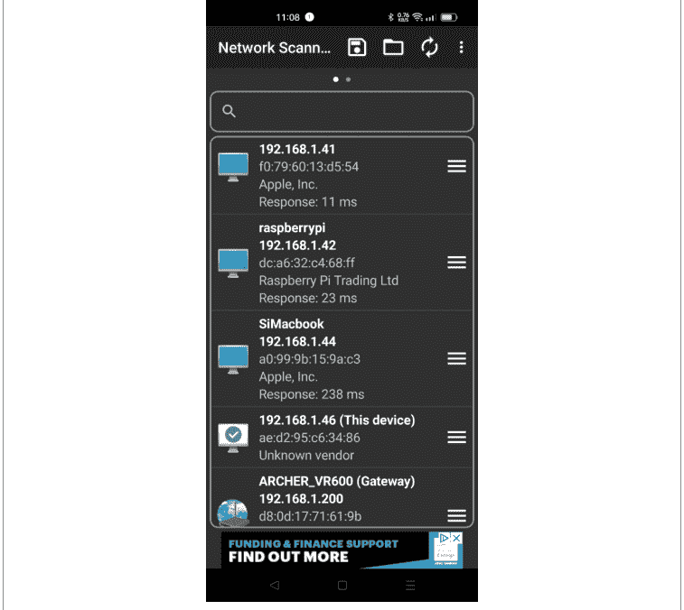

### 另请参阅

有关使用 SSH 连接到树莓派的更多信息，请参阅食谱 2.7。

## 1.9 从真正的硬盘或 USB 闪存驱动器启动

### 问题

你的 microSD 卡太小，和/或你担心整个操作系统都在 SD 卡上运行。

### 解决方案

在树莓派 4 和 400 出现之前，从硬盘或闪存驱动器启动是可能的，但并不容易，涉及一些复杂的命令，并且如果操作不当，有可能“变砖”你的树莓派。如果你有树莓派 4 或 400，那么现在这变得非常简单，并且从 Raspberry Pi Imager 开始。

该过程类似于使用 Raspberry Pi Imager 设置 microSD 卡。要按照此食谱操作，你需要一台 Windows、Mac 或 Linux 电脑；一个 USB SSD（固态硬盘）；以及一张 microSD 卡。尽管此食谱的全部目的是用 microSD 卡替换启动设备，但你仍然需要两张 microSD 卡：一张是你现有的用于树莓派的 microSD 启动设备，另一张是空白的 microSD 卡。

1.  将空白的 microSD 卡插入你的读卡器。
2.  启动 Raspberry Pi Imager，然后从“操作系统”下拉菜单中，选择“杂项实用工具镜像”，然后选择“引导加载程序”，然后选择“USB 启动”（图 1-17）。请注意，如果这些选项在你的 Raspberry Pi Imager 中不存在，那么你可能需要下载最新版本。
3.  从“存储”下拉菜单中选择你的 microSD 卡，然后点击“写入”。
4.  将新写入的 microSD 卡放入你的树莓派并启动它。此 microSD 卡镜像的唯一目的是重新配置你的树莓派以进行 USB 启动。一旦它完成工作，屏幕将变为绿色。
5.  关闭树莓派电源并更换 microSD 卡，以便你现在将原始的 microSD 系统卡放入树莓派。
6.  启动你的树莓派，并从树莓派菜单中，选择“附件”，然后选择“SD 卡复制器”（图 1-18）。选择你的系统 microSD 卡作为源，外部 USB 驱动器作为目标，然后点击“开始”。

7. 当复制完成后，你可以再次关闭你的树莓派并取出 microSD 卡。下次启动树莓派时，它应该会从 USB 驱动器启动。

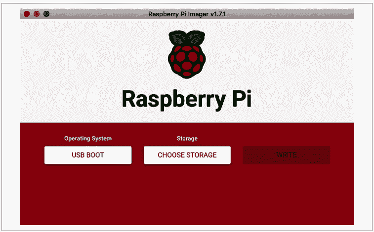

图 1-17. 使用树莓派镜像烧录工具配置 USB 启动


图 1-18. 将你的 microSD 卡复制到外部闪存驱动器

### 讨论

如果你是从一个全新的镜像开始，而不是想复制当前 microSD 卡的内容，那么你只需要使用一张 microSD 卡即可。在步骤 4 和 5 之间，按照配方 1.6 的方法，用全新的树莓派操作系统镜像设置 microSD 卡。

### 另请参阅

查看树莓派镜像烧录工具的文档。

## 1.10 连接 DVI 或 VGA 显示器

### 问题

你的显示器没有 HDMI 接口，但你想将它与树莓派一起使用。

### 解决方案

很多人都遇到过这个问题。幸运的是，可以为带有 DVI 或 VGA 输入但没有 HDMI 接口的显示器购买适配器。

DVI 适配器是最简单和最便宜的。如果你搜索“HDMI 公头转 DVI 母头转换器”，价格可以低于 5 美元。

### 讨论

使用 VGA 适配器更复杂，因为它们需要一些电子元件将信号从数字转换为模拟，所以要小心那些不包含这些元件的线缆。官方转换器名为 Pi-View，在任何销售树莓派的地方都可以买到。Pi-View 的优势在于经过测试，已知可与树莓派配合使用。你可以在网上找到更便宜的替代品，但通常这些都无法工作。

然而，鉴于新显示器都有 HDMI 接口，你最好把钱花在新显示器上，而不是适配器上。

### 另请参阅

eLinux 上有[关于在转换器中寻找什么的提示](http://elinux.org/)。

## 1.11 使用复合视频显示器/电视

### 问题

你的低分辨率复合显示器上的文字难以辨认。

### 解决方案

你需要为小屏幕调整树莓派的分辨率。

树莓派有两种类型的视频输出：(1) HDMI，和 (2) 来自音频插孔的复合视频，你需要一根特殊的线缆。其中，HDMI 是质量好得多的选择。如果你打算将复合视频作为主屏幕，你可能需要重新考虑。

如果你使用的是复合视频屏幕——比如说，因为你需要一个非常小的屏幕——你需要进行一些调整以使视频输出适应屏幕。你需要对文件 /boot/config.txt 进行一些更改。

你可以通过将 SD 卡重新插入读卡器，在 Mac 或 PC 上编辑此文件，也可以在树莓派上编辑而无需取出卡。在树莓派本身上编辑文件通常使用 nano 编辑器。这有点棘手，我建议你在尝试编辑第一个文件之前彻底阅读配方 3.7。如果你愿意继续使用 nano 编辑文件，请在终端会话中输入以下命令：

```
$ sudo nano /boot/config.txt
```

请注意，要保存并退出 nano，请按 Ctrl-X，然后按 Y（确认），然后按 Enter。

> **终端**
>
> 如果你是 Mac 或 Windows 用户，你可能不熟悉终端或命令行的概念。树莓派操作系统基于 Linux，尽管在 Linux 中大多数事情都可以通过点击完成，但在安装软件或以某种方式配置操作系统时，有时仍然需要运行命令。要了解使用终端的概述，请跳转到配方 3.3。

如果文字太小无法阅读，最好将 SD 卡从树莓派中取出并插入你的计算机。然后该文件将位于 SD 卡的顶层目录中，你可以使用 PC 上的文本编辑器（如 Notepad++）进行修改。

你需要知道屏幕的分辨率。对于许多小屏幕，这将是 320 x 240 像素。在文件中找到以下两行：

```
#framebuffer_width=1280
#framebuffer_height=720
```

删除每行开头的 # 并将两个数字更改为屏幕的宽度和高度。删除 # 会启用该行。在下面的示例中，屏幕尺寸已修改为 320 乘 240：

```
framebuffer_width=320
framebuffer_height=240
```

保存文件并重启你的树莓派。你应该会发现一切都变得更容易阅读了。你可能还会发现屏幕周围有一个又大又粗的边框。要调整这一点，请参阅配方 1.12。

### 讨论

许多低成本的闭路电视显示器可以成为树莓派的好伴侣，当你制作像复古游戏机（配方 4.4）这样的东西时。然而，这些显示器通常分辨率非常低。

### 另请参阅

有关使用复合显示器的另一个教程，请参阅 [Adafruit 教程](https://www.adafruit.com/)。

另外，当你使用 HDMI 视频输出时，请参阅配方 1.10 和 1.12 来调整你的画面。

## 1.12 调整显示器上的画面大小

### 问题

当你第一次将树莓派连接到显示器时，你可能会发现无法阅读某些文字，因为它超出了屏幕范围，或者画面没有使用屏幕上所有可用的空间。

### 解决方案

如果你的问题是画面周围有一个大的黑色边框，你可以使用树莓派的桌面配置工具（见图 1-19）使屏幕填满显示器的整个区域。要打开此工具，请转到树莓派菜单，选择首选项，单击树莓派配置，然后选择显示选项卡。

单击欠扫描旁边的开关。请注意，在单击确定并重启树莓派之前，更改不会生效。

如果你遇到相反的问题，即文字超出了屏幕边缘，解决方案是相同的：单击欠扫描的开关。

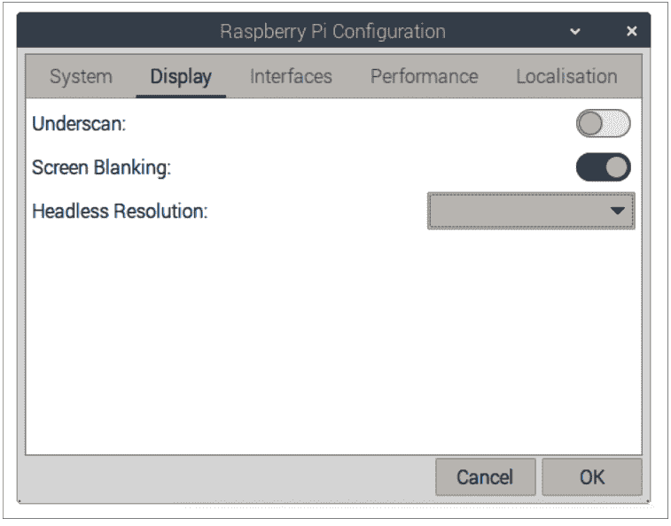

图 1-19. 使用树莓派配置工具控制欠扫描

第二步是编辑文件 /boot/config.txt。你可以通过取出 SD 卡并将其挂载到 PC 或 Mac 上，或者在树莓派上编辑 SD 卡来完成此操作。在树莓派本身上编辑文件通常使用 nano 编辑器。这有点棘手；我建议你在尝试编辑第一个文件之前彻底阅读配方 3.7。如果你愿意继续使用 nano 编辑文件，请在终端会话中输入以下命令：

```
$ sudo nano /boot/config.txt
```

查找处理过扫描的部分。你需要更改的四行显示在图 1-20 的中间，每行都以 #overscan 开头。

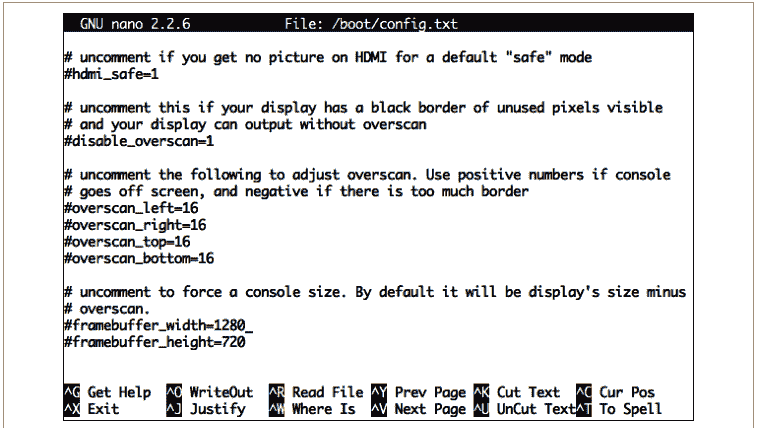

图 1-20. 调整过扫描

要使这些行生效，你需要通过删除每行开头的 # 字符来启用它们。

然后，通过反复试验，更改设置，直到屏幕尽可能多地填满显示器。请注意，这四个数字应该是负数。尝试先将它们全部设置为 -20。这将减少屏幕使用的区域。

要保存并退出 nano，请按 Ctrl-X，然后按 Y（确认），然后按 Enter。

### 议论

不得不反复重启树莓派以查看分辨率更改的效果有点乏味。幸运的是，你只需要执行一次此过程。大多数显示器和电视无需任何欠扫描即可正常工作。

### 另请参阅

你也可以使用 `raspi-config` 实用程序配置欠扫描。

## 1.13 最大化性能

### 问题

你的树莓派似乎非常慢，所以你想超频以使其运行更快。

### 解决方案

如果你有配备四核处理器的树莓派 3、4 或 400，你不太可能觉得它太慢。然而，较旧的树莓派 1 和 2 可能相当迟钝。

你可以增加树莓派 1 或 2 的时钟频率，使其运行得稍快一些。这将使其消耗更多功率并运行得更热一些（参见后面的讨论部分）。

这里描述的超频方法称为*动态超频*，因为它会自动监控树莓派的温度，并在温度开始过高时降低时钟速度。这称为*节流*。

通过在 SSH 终端中发出以下命令运行 `raspi-config` 实用程序：

```
$ sudo raspi-config
```

选择超频选项。然后你将看到图 1-21 中所示的选项。

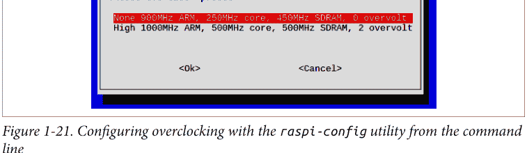

图 1-21. 使用命令行中的 raspi-config 实用程序配置超频

选择一个选项。如果你发现树莓派开始变得不稳定并意外挂起，你可能需要选择一个更保守的选项，或者通过将其设置回“无”来关闭超频。

### 讨论

超频带来的性能提升可能相当显著。为了测量这些提升，我使用了一台没有外壳的树莓派B型，在室温60华氏度（15摄氏度）的环境下进行测试。

测试程序是以下Python脚本。这个脚本只是让处理器满负荷工作（即让它非常努力地工作），并不能真正代表计算机上进行的其他操作，例如写入SD卡、图形处理等。然而，如果你想测试超频对你的树莓派的影响，它确实能很好地反映CPU的原始性能：

```python
import time

def factorial(n):
    if n == 0:
        return 1
    else:
        return n * factorial(n-1)

before_time = time.process_time()
for i in range(1, 10000):
    factorial(200)
after_time = time.process_time()

print(after_time - before_time)
```

请注意，我们在这里跳过了很多内容，所以如果你不熟悉Python，可以在通读第5章后再回来阅读这部分。

查看表1-3中的测试结果。电流和温度是使用测试设备测量的。

表1-3. 超频

| 速度测试 | 时间 | 电流 | 温度（摄氏度） |
|---|---|---|---|
| 700 MHz | 15.8秒 | 360mA | 27 |
| 1 GHz | 10.5秒 | 420mA | 30 |

如你所见，性能提升了33%，但代价是消耗更多电流和温度略有升高。

一个通风良好的外壳将有助于让你的树莓派保持全速运行。也有人尝试为树莓派添加水冷。坦率地说，这有点傻。

### 另请参阅

关于 `raspi-config` 工具的更多信息，请访问 https://oreil.ly/1lwy6。

## 1.14 更改你的密码

### 问题

你想更改你的密码。

### 解决方案

在你将树莓派操作系统安装到SD卡后，系统会提示你创建一个用户账户和关联的密码。你可以随时使用树莓派配置工具更改密码。要打开此工具，请转到树莓派菜单，选择“首选项”，然后单击“树莓派配置”。单击“系统”选项卡。在那里，你会找到“更改密码”选项（图1-22）。

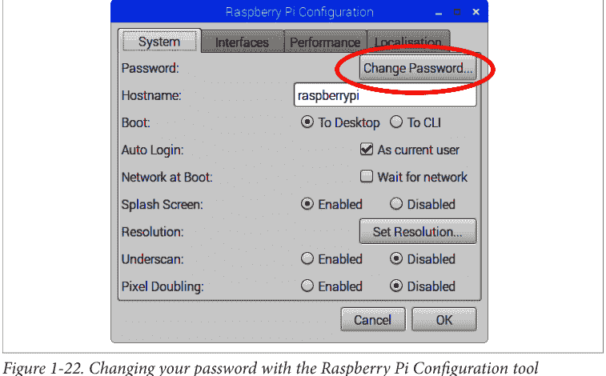

更改密码是其中一项设置，你无需重启树莓派即可使更改生效。

### 讨论

你也可以在终端会话中简单地使用 `passwd` 命令来更改密码，如下所示：

```
$ passwd
Changing password for pi.
(current) UNIX password:
Enter new UNIX password:
Retype new UNIX password:
passwd: password updated successfully
```

### 另请参阅

你也可以使用 `raspi-config` 工具来更改密码。

## 1.15 关闭你的树莓派

### 问题

你想关闭你的树莓派。

### 解决方案

在桌面的左上角，单击树莓派菜单。会打开一个对话框，提供三个关机选项（图1-23）：

- *关机*
  关闭树莓派。你需要拔掉电源，然后重新插上才能让树莓派再次启动。或者，如果你使用的是Pi 400，请按键盘上的电源按钮。
- *重启*
  重启树莓派。
- *注销*
  注销你并显示一个提示，要求你输入登录凭据以便重新登录。


图1-23. 关闭你的树莓派

你也可以通过终端使用以下命令重启：

```
$ sudo reboot
```

安装某些软件后，你可能需要这样做。当你重启时，你会看到图1-24所示的消息，它说明了Linux的多用户特性，并警告所有连接到树莓派的用户。

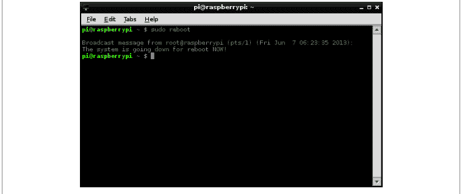

图1-24. 从终端关闭你的树莓派

### 讨论

最好按照上述方法关闭树莓派，而不是简单地拔掉电源插头，因为在你断电时，树莓派可能正在写入microSD卡。这可能导致文件损坏。

关闭树莓派实际上并不会切断电源。它会进入低功耗模式——而且它本身就是一个功耗相当低的设备（但树莓派硬件无法控制其电源）。

当树莓派400（带有内置键盘）关闭后，你可以通过按F10键（该键上也有开/关图标）来将其打开。

### 另请参阅

你可以购买一个[在树莓派关机时切断电源的模块](module that will turn off the power)。
有关为树莓派添加开始按钮的信息，请参阅[配方13.13](Recipe 13.13)。

## 1.16 安装树莓派摄像头模块

### 问题

你想使用树莓派摄像头模块。

### 解决方案

树莓派摄像头模块（[图1-25](Figure 1-25)）通过排线连接到树莓派。

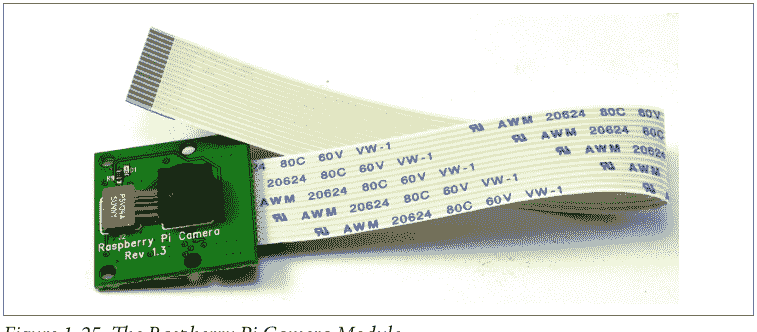

Pi摄像头有三个版本：原始版本1（如[图1-25](Figure 1-25)所示）；更新、更高分辨率的版本2；以及HQ（高质量）摄像头，它可更换镜头并拥有1200万像素的分辨率。
排线连接到树莓派2、3或4上音频和HDMI接口之间的特殊连接器。要将排线安装到你的树莓派上，请轻轻拉起连接器两侧的杠杆使其解锁，然后将排线压入插槽，确保排线上闪亮的金属触点背向以太网接口。将连接器的两个杠杆按回原位以锁定排线（[图1-26](Figure 1-26)）。

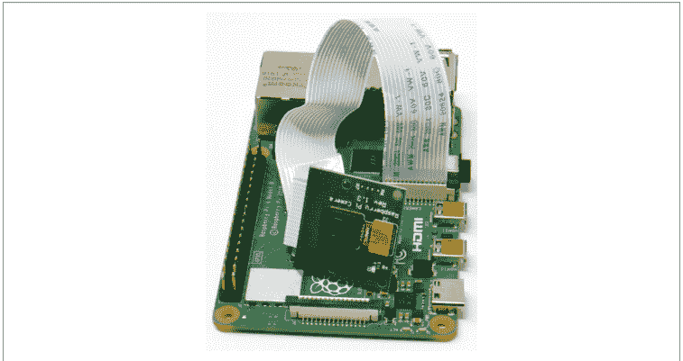

图1-26. 将树莓派摄像头模块连接到树莓派4型号B

> 摄像头模块包装上标明其对静电敏感。在操作前，请通过触摸接地物体（如PC的金属机箱）来释放静电。

请注意，树莓派Zero需要特殊的排线或适配器，因为它的摄像头连接器比全尺寸树莓派的小（参见第566页的“模块”）。

摄像头模块需要一些软件配置。在撰写本文时，摄像头接口正从树莓派专用软件转向libcamera库。因此，在按照说明操作之前，你可能需要检查摄像头模块软件的当前状态。

这些说明描述的是“传统”树莓派摄像头软件，它甚至可以在相当古老的树莓派型号上工作。

图形化的树莓派配置工具不包含启用摄像头的选项，因此你必须从终端会话启动 `raspi-config` 工具。

```
$ sudo raspi-config
```

这将显示配置树莓派的选项。

选择“接口选项”，你会看到“摄像头”选项（图1-27）。选择第一个选项以启用传统支持，然后重启你的树莓派。

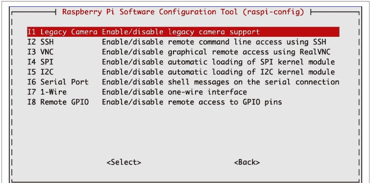

图1-27. 使用命令行中的raspi-config启用摄像头

有两个命令可用于捕获静态图像和视频：`raspistill` 和 `raspivid`。

要捕获单张静态图像，请使用 `raspistill` 命令：

```
$ raspistill -o image1.jpg
```

预览屏幕会显示大约五秒钟，然后拍摄一张照片并将其存储在当前目录中的文件 *image1.jpg* 中。

要捕获视频，请使用 `raspivid` 命令：

```
$ raspivid -o video.h264 -t 10000
```

行末的数字是以毫秒为单位的录制时长——在本例中为10秒。

### 讨论

`raspistill` 和 `raspivid` 都有大量选项。如果你在不带任何参数的情况下输入任一命令，帮助文本会显示可用选项。

你也可以购买NoIR（无红外）版本的摄像头，该版本移除了摄像头模块中的红外滤光片，使其能够在夜间红外照明下工作。

摄像头模块的替代方案是使用USB网络摄像头（参见配方8.2）。

### 另请参阅

在 https://oreil.ly/diUuB 了解更多关于树莓派摄像头模块的信息。

## 1.17 使用蓝牙

### 问题

你想在树莓派上使用蓝牙。

### 解决方案

如果你使用的是树莓派 3、4 或 400，好消息是除了 WiFi，你还可以获得蓝牙硬件。如果你使用的是较旧的树莓派，可以为其连接一个 USB 蓝牙适配器。在这两种情况下，蓝牙所需的软件现在都已包含在树莓派操作系统中。

如果你使用的是较旧的树莓派，请注意并非所有蓝牙适配器都与树莓派兼容。大多数是兼容的，但为了确保，请购买标有适用于树莓派的适配器。图 1-28 展示了一个同时配备了 USB 蓝牙适配器（靠近摄像头）和 USB WiFi 适配器的树莓派 2。

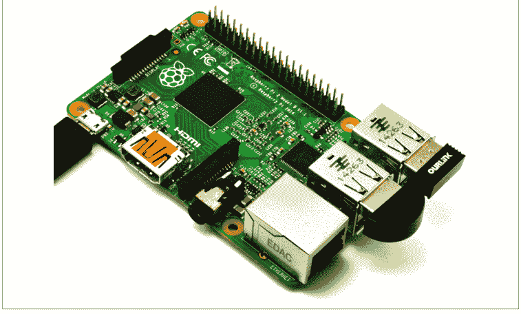

图 1-28. 配备 USB 蓝牙和 WiFi 适配器的树莓派 2

蓝牙功能集成在树莓派操作系统桌面中的方式与 Mac 非常相似。在屏幕的右上角，你会看到蓝牙图标（图 1-29）。点击此图标可打开蓝牙选项菜单。

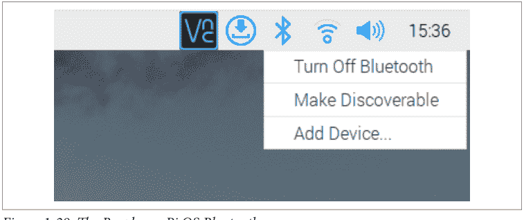

图 1-29. 树莓派操作系统蓝牙菜单

如果你想连接蓝牙外围设备（如键盘），请点击“添加设备”。将打开“添加新设备”对话框，显示你可以连接或*配对*的可用设备列表（图 1-30）。

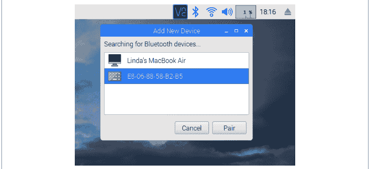

图 1-30. 配对蓝牙设备

然后你可以选择要配对的设备，并按照树莓派和你要配对的设备上显示的说明进行操作。

### 讨论

你可以将手机、蓝牙音箱、键盘和鼠标与树莓派配对。我发现连接新的蓝牙设备并不总是第一次就能成功。因此，如果最初配对设备时遇到问题，请在放弃之前再尝试几次。

大多数情况下，使用桌面界面将蓝牙设备添加到树莓派系统很方便；但是，你也可以使用命令行界面配对蓝牙设备。

要从命令行运行蓝牙命令，请使用 `bluetoothctl` 命令：

```
$ bluetoothctl
[NEW] Controller B8:27:EB:50:37:8E raspberrypi [default]
[NEW] Device 51:6D:A4:B8:D1:AA 51-6D-A4-B8-D1-AA
[NEW] Device E8:06:88:58:B2:B5 si's keyboard #1
[bluetooth]#
```

这会扫描蓝牙设备，并提供一个 `pair` 命令，允许你使用设备的 ID 进行配对——例如：

```
[bluetooth]# pair E8:06:88:58:B2:B5
```

### 另请参阅

查看[与树莓派兼容的蓝牙适配器列表](https://www.raspberrypi.com/documentation/accessories/bluetooth.html#compatible-bluetooth-adapters)。

适用于 Android 手机的 Blue Dot 软件使你能够使用蓝牙和手机控制连接到树莓派的硬件。你可以在[配方 11.8](https://www.raspberrypi.com/documentation/accessories/bluetooth.html#recipe-11-8)中找到一个示例。

如果你将树莓派与蓝牙音箱配对，还需要将音箱设置为声音输出设备（[配方 16.2](https://www.raspberrypi.com/documentation/accessories/bluetooth.html#recipe-16-2)）。

# 第 2 章
网络

## 2.0 简介

树莓派旨在连接到互联网。其在互联网上通信的能力是其关键特性之一，并开启了各种可能的用途，包括家庭自动化、网络服务、网络监控等。

连接可以通过以太网线进行（对于大多数型号），较新的型号内置 WiFi。

拥有联网的树莓派还意味着你可以从另一台计算机远程连接到它。这对于树莓派本身用作*无头*服务器且未连接键盘、鼠标和显示器的情况非常有用。

本章为你提供将树莓派连接到互联网并通过网络远程控制它的方法。

## 2.1 连接到有线网络

### 问题

你想使用有线网络连接将树莓派连接到互联网。

### 解决方案

首先，如果你使用的是旧型号 A 树莓派或 Pi Zero，则没有用于以太网的 RJ45 接口。在这种情况下，访问互联网的最佳选择是使用无线 USB 适配器（参见配方 2.5）。

如果你使用的是型号 B 或 B+ 树莓派（1、2、3、4 或 400），那么你很幸运；只需将以太网跳线插入其 RJ45 插座，然后将另一端连接到家庭路由器背面的空闲插座（图 2-1）。

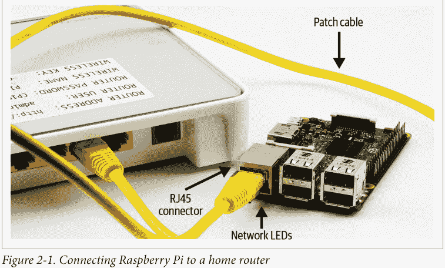

图 2-1. 将树莓派连接到家庭路由器

树莓派上的网络 LED 应立即开始闪烁，因为树莓派正在连接到你的网络。

### 讨论

树莓派操作系统预配置为使用动态主机配置协议连接到任何网络。只要你的网络启用了 DHCP，它就会自动分配一个 IP 地址。

如果 LED 闪烁，但你无法在树莓派上使用浏览器连接到互联网，请检查你的网络管理控制台是否启用了 DHCP。转到家庭路由器的管理页面，使用管理员密码登录，并查找如图 2-2 所示的选项。

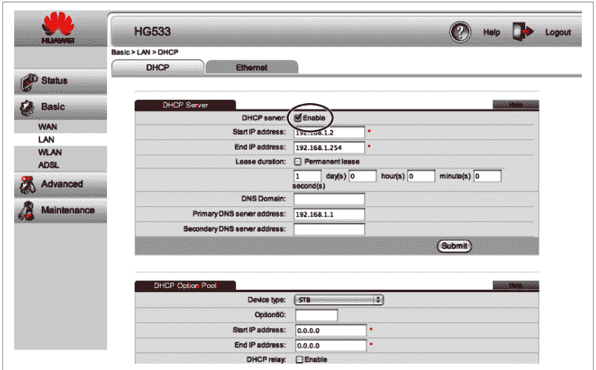

图 2-2. 在家庭路由器上启用 DHCP

### 另请参阅

要连接到无线网络，请参阅[配方 2.5](Recipe 2.5)。

## 2.2 查找你的 IP 地址

### 问题

你想知道树莓派的 IP 地址，以便与之通信，无论是将其作为 Web 服务器连接、交换文件，还是通过 SSH（[配方 2.7](Recipe 2.7)）或 VNC（[配方 2.8](Recipe 2.8)）远程控制它。

### 解决方案

IPv4 地址（用于本地地址）是一个四部分数字，唯一标识网络中计算机的网络接口。每个部分之间用点分隔。

要查找树莓派的 IP 地址，你需要在终端窗口中发出此命令：

```
$ hostname -I
192.168.1.16 fd84:be52:5bf4:ca00:618:fd51:1c .....
```

响应的第一部分是树莓派在家庭网络上的本地 IP 地址。

### 讨论

树莓派可以有多个 IP 地址（即每个网络连接一个）。因此，如果你同时通过有线和无线连接到你的 Pi，它将有两个 IP 地址。但是，通常你只会通过其中一种方式连接，而不是同时使用两种。要查看所有网络连接，请使用 ifconfig 命令：

```
$ ifconfig

eth0      Link encap:Ethernet  HWaddr b8:27:eb:d5:f4:8f
          inet addr:192.168.1.16  Bcast:192.168.255.255  Mask:255.255.0.0
          UP BROADCAST RUNNING MULTICAST  MTU:1500  Metric:1
          RX packets:1114 errors:0 dropped:1 overruns:0 frame:0
          TX packets:1173 errors:0 dropped:0 overruns:0 carrier:0
          collisions:0 txqueuelen:1000
          RX bytes:76957 (75.1 KiB)  TX bytes:479753 (468.5 KiB)

lo        Link encap:Local Loopback
          inet addr:127.0.0.1  Mask:255.0.0.0
          UP LOOPBACK RUNNING  MTU:16436  Metric:1
          RX packets:0 errors:0 dropped:0 overruns:0 frame:0
          TX packets:0 errors:0 dropped:0 overruns:0 carrier:0
          collisions:0 txqueuelen:0
          RX bytes:0 (0.0 B)  TX bytes:0 (0.0 B)

wlan0     Link encap:Ethernet  HWaddr 00:0f:53:a0:04:57
          inet addr:192.168.1.13  Bcast:192.168.255.255  Mask:255.255.0.0
          UP BROADCAST RUNNING MULTICAST  MTU:1500  Metric:1
          RX packets:38 errors:0 dropped:0 overruns:0 frame:0
          TX packets:28 errors:0 dropped:0 overruns:0 carrier:0
          collisions:0 txqueuelen:1000
          RX bytes:6661 (6.5 KiB)  TX bytes:6377 (6.2 KiB)
```

查看运行 ifconfig 命令的结果，你可以看到所述 Pi 通过有线连接（eth0）连接，IP 地址为 192.168.1.16，并通过无线连接（wlan0）连接，IP 地址为 192.168.1.13。lo 网络接口是一个虚拟接口，允许计算机与自身通信。

### 另请参阅

维基百科包含了你想知道的关于 IP 地址的一切。

## 2.3 设置静态IP地址

### 问题

你希望设置树莓派的IP地址，使其不会改变。

### 解决方案

虽然可以在树莓派本身上设置静态IP地址，但更好的做法是在你的网络上进行配置，因为如果将树莓派移动到不同的网络，可能会导致问题。

你家中的所有电脑、电视、手机和其他支持互联网的设备通常都通过路由器连接到互联网，该路由器将你的电话线、4G或光纤电缆连接到你的房子。所有这些设备，无论是通过WiFi还是通过直接电缆连接到路由器，都被称为属于你的*局域网*（LAN）。

默认情况下，当你将新设备连接到局域网（例如树莓派）时，无论是通过以太网电缆插入还是使用WiFi，局域网控制器（你的路由器）将使用名为DHCP的系统为设备分配IP地址。该地址将从IP地址池中分配，该池的范围可能从例如192.168.1.2到192.168.1.199（或可能是10.0.0.2到10.0.0.199）。换句话说，对于连接到局域网的每个设备，只有四部分IP地址的最后一部分会改变。

当DHCP为设备分配IP地址时，它会设置一个租用时间，即该设备保证保留该IP地址而不会被分配给其他设备的时间。一般来说，此租用时间的默认值相当短；在我的路由器上，它是一周。这意味着我的树莓派的IP地址在一周不活动后可能会毫无警告地改变，如果树莓派在没有键盘、鼠标和显示器的项目中使用，可能很难找到其IP地址以允许我连接。这就是为什么你可能想为你的树莓派设置一个*静态IP地址*。

确保你的树莓派IP地址不变的一种方法是简单地转到你的路由器控制界面并将DHCP租用时间更改为更高的值。要访问此界面，你需要使用一台计算机（可以是你的树莓派，但不必是）并转到一个特定地址，该地址通常写在路由器上，描述为*路由器地址*或*管理控制台地址*。对于我的路由器，这是`http://192.168.1.1`。还需要输入用户名和密码。这些与WiFi接入点名称和密码不同。它们通常也写在路由器的某个地方，并且通常具有默认值*admin*和*password*。

连接后，你需要在管理控制台的各个页面中查找任何提及的DHCP设置，这些设置应类似于图2-3。

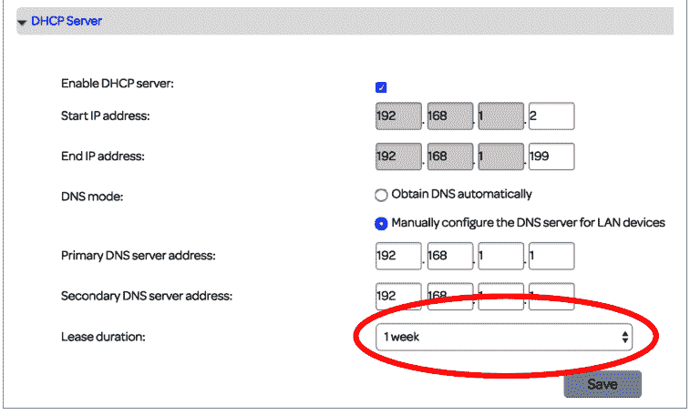

将“租用时间”（或路由器上具体标记的任何内容）更改为允许的最大值。

像这样延长租用时间的一个缺点是它适用于局域网上的所有设备。因此，如果你有很多设备，可能会耗尽IP地址，因为DHCP在租用期到期之前无法重新分配旧的IP地址。

更好的方法是使用称为DHCP保留的东西。这指示DHCP将特定IP地址永久分配给特定设备。在图2-4中，你可以看到我已将IP地址192.168.1.3分配给设备raspberrypi-Ethernet（通过以太网电缆连接到路由器的树莓派）。

从现在起，每当该树莓派连接到局域网时，它将被分配IP地址192.168.1.3，并且DHCP不会将该IP地址分配给任何其他设备。

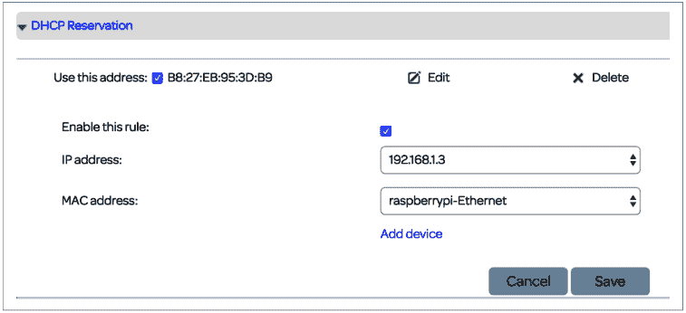

图2-4. 分配DHCP保留

### 讨论

随着不同版本的树莓派操作系统，网络发生了很大变化。这些说明适用于最新版本（截至撰写本文时）。如果你没有最新版本的树莓派操作系统，你应该获取它，因为树莓派操作系统总是在发展和改进。你可以在配方3.40中了解如何执行此操作。要了解你拥有的操作系统版本，请参阅配方3.39。

### 另请参阅

维基百科包含了你想知道的关于IP地址的一切。

## 2.4 设置树莓派的网络名称

### 问题

你想更改树莓派在网络上的显示名称，使其不再只是“raspberrypi”。

### 解决方案

有几种方法可以做到这一点。无论你使用哪种方法，请确保你选择的网络名称不包含空格，并且只包含字母、数字和连字符（-）字符。

在所有三种方法中，你还需要重新启动树莓派才能使更改生效。

### 使用树莓派配置工具设置网络名称

除非你以无头模式运行树莓派（未连接显示器和键盘），否则设置树莓派网络名称的最简单方法是使用树莓派配置工具。要打开此工具，请转到树莓派菜单，选择“首选项”，然后单击“树莓派配置”。然后单击“系统”选项卡（图2-5）。

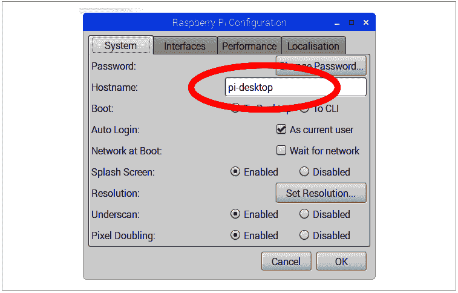

将“主机名”字段中的名称更改为你首选的名称，然后单击“确定”。系统会提示你重新启动以使更改生效（配方1.15）。

### 使用命令行设置网络名称（简单方法）

你也可以使用raspi-config实用程序从命令行更改树莓派的网络名称。在终端会话中运行以下命令：

```
$ sudo raspi-config
```

这将打开raspi-config实用程序。使用上/下箭头键选择“网络选项”，然后按Enter。这将打开一个表单，你可以在其中输入新的网络名称（图2-6）。请注意，此界面仅使用命令行，因此你可以从SSH会话（配方2.7）中使用它。

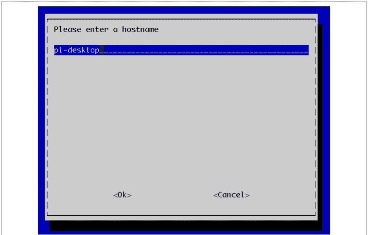

图2-6. 使用raspi-config设置树莓派的主机名

### 使用命令行设置网络名称（困难方法）

如果你真的想用困难的方法，你可以直接编辑控制树莓派网络名称的文件。你需要更改两个文件。

首先，编辑文件`/etc/hostname`。你可以通过打开终端窗口并输入以下命令来执行此操作：

```
$ sudo nano /etc/hostname
```

将`raspberry`替换为你选择的名称。

其次，使用以下命令在编辑器中打开文件`/etc/hosts`：

```
$ sudo nano /etc/hosts
```

该文件将如下所示：

```
127.0.0.1       localhost
::1             localhost ip6-localhost ip6-loopback
fe00::0         ip6-localnet
ff00::0         ip6-mcastprefix
ff02::1         ip6-allnodes
ff02::2         ip6-allrouters

127.0.1.1       raspberry
```

将文件末尾的名称（`raspberry`）更改为你首选的新名称。

### 讨论

更改树莓派的名称可能非常有用，特别是如果你有多个树莓派连接到你的网络。

### 另请参阅

请参阅[配方2.3](Recipe 2.3)以更改树莓派的IP地址。

## 2.5 设置无线连接

### 问题

你想使用WiFi将树莓派连接到互联网。

### 解决方案

有各种方法可以使用WiFi设置树莓派的连接。

### 从桌面设置WiFi

在最新的树莓派操作系统中设置WiFi非常容易。在屏幕的右上角，单击网络图标（两台计算机）。然后你会看到一个WiFi网络列表。选择你的网络；会出现一个提示，你可以在其中输入预共享密钥（密码）。输入你的密码。过一会儿，网络图标将切换到标准的WiFi符号，你将连接成功（[图2-7](Figure 2-7)）。


图2-7. 连接到WiFi网络

### 使用命令行设置WiFi

如果你正在设置树莓派，以便在配置后可以不使用键盘和显示器使用它，那么这种设置WiFi的方法非常有用。但是，你需要通过使用以太网电缆将树莓派连接到路由器（[配方2.1](Recipe 2.1)）来临时获得网络访问权限。

运行以下命令启动 raspi-config 工具：

```
$ sudo raspi-config
```

然后，在打开的菜单中，选择系统选项（使用方向键并按回车键），接着选择无线局域网（图 2-8）。

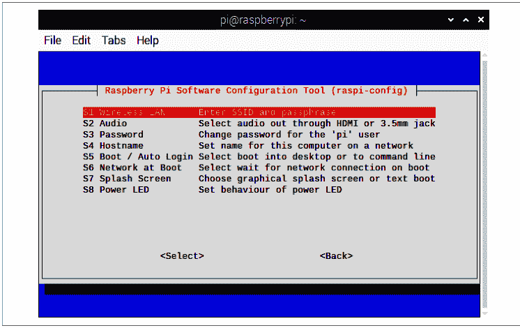

图 2-8. 使用 raspi-config 设置 WiFi

会出现一个提示，要求输入 SSID（WiFi 名称）和密码。

### 讨论

WiFi 会消耗相当多的电量，因此如果你发现你的树莓派意外重启或无法正常启动，你可能需要使用更大的电源。寻找一个 1.5A 或更高功率的电源；如果你使用的是树莓派 4 并且连接了高功耗 USB 外设，请使用 3A 电源。

如果你将树莓派用作媒体中心（参见配方 4.1），会有一个设置页面，你可以在该页面上使用 WiFi 将媒体中心连接到你的网络。

### 另请参阅

eLinux 维护着一份与树莓派兼容的 [WiFi 适配器](https://elinux.org/RPi_USB_Wi-Fi_Adapters) 列表。
有关设置有线网络的更多信息，请参阅 [配方 2.1](https://www.oreilly.com/library/view/raspberry-pi-cookbook/9781492048817/ch02.html#recipe-2-1)。

## 2.6 使用控制台线缆连接

### 问题

没有可用的网络连接，但你仍然希望能够从另一台计算机远程控制你的树莓派。

### 解决方案

使用 *控制台线缆*（一种需要单独购买的特殊线缆——参见第 567 页的“杂项”）连接到树莓派。

> **功耗**
控制台线缆通常只能提供 500mA 电流，这对于早期的树莓派来说没问题，但对于树莓派 4 或 400 来说就不够了。如果你使用的是 4 或 400，那么你需要使用电源适配器（[配方 1.4](https://www.oreilly.com/library/view/raspberry-pi-cookbook/9781492048817/ch01.html#recipe-1-4)），并且不要将控制台线缆的红色电源线（在 [图 2-11](https://www.oreilly.com/library/view/raspberry-pi-cookbook/9781492048817/ch02.html#figure-2-11) 之后描述）连接到树莓派的 5V 引脚。

要使用此方法，你需要启用串行接口。这意味着，至少在你设置树莓派期间，你需要连接键盘、显示器和鼠标。

要启用串行接口，请转到树莓派菜单，选择首选项，然后单击树莓派配置。选择接口选项卡，然后单击串行端口的切换开关，如 [图 2-9](https://www.oreilly.com/library/view/raspberry-pi-cookbook/9781492048817/ch02.html#figure-2-9) 所示。

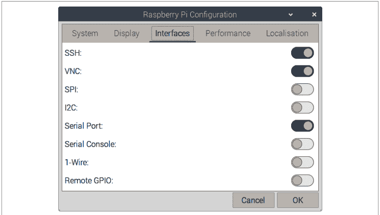

图 2-9. 使用树莓派配置工具启用串行接口

与大多数树莓派配置一样，你也可以通过在终端会话中运行以下命令来使用命令行 raspi-config 工具：

```
$ sudo raspi-config
```

选择接口选项，然后选择串行，如图 2-10 所示。

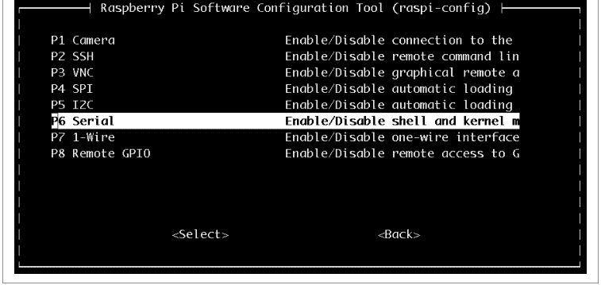

图 2-10. 使用 raspi-config 工具启用串行接口

控制台线缆非常适合将要无头使用的树莓派——即不使用键盘、鼠标或显示器。

图 2-11 所示的控制台线缆可从 Adafruit 购买。

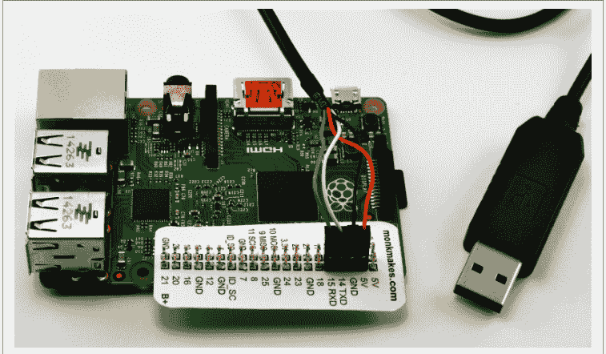

图 2-11. 控制台线缆

按照以下步骤并参考图 2-11 连接线缆：

1.  将红色（5V）线连接到 5V 引脚，该引脚位于 GPIO 接头边缘左侧一个引脚处。请注意，如果你的控制台线缆是 3V 线缆，或者你使用的是树莓派 4 或 400，其电流消耗对于串行线缆来说过大，那么请不要连接这根线，并像往常一样使用其 USB 电源连接器为树莓派供电。
2.  将黑色（GND）线连接到树莓派上左侧下一个引脚的 GND。
3.  将白色线（Rx）连接到树莓派 GPIO 14（TXD），位于黑色线的左侧。
4.  将绿色线（Tx）连接到 GPIO 15（RXD），位于白色线的左侧。

如果你使用不同的线缆，线缆颜色很可能不同，因此请务必检查线缆的文档，否则你可能会损坏你的树莓派。

请注意，USB 线缆也在红色线上提供 5V，其功率足以单独为树莓派供电，但不足以支持连接大量设备。

如果你是 Windows 或 macOS 用户，你需要为 USB 线缆安装驱动程序；你需要安装的驱动程序取决于控制台线缆制造商使用的芯片。请参考制造商的网站。对于 Mac，你可以在 [Adafruit 教程](https://www.adafruit.com/) 中找到更多信息。

要从 macOS 连接到树莓派，你需要运行终端并输入以下命令：

```
$ sudo cu -l /dev/cu.usbserial -s 115200
```

连接后，按回车键，树莓派登录提示应该会出现（图 2-12）。默认用户名和密码分别是 *pi* 和 *raspberry*。

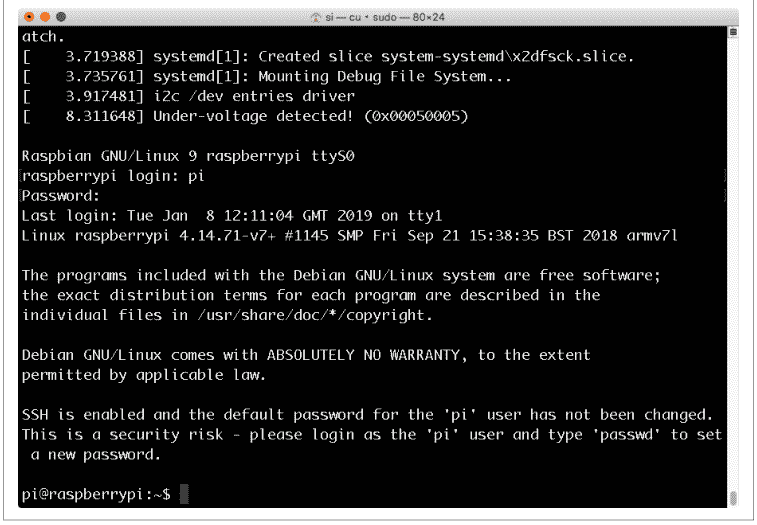

图 2-12. 使用控制台线缆登录

如果你尝试从 Windows 计算机连接到你的树莓派，你需要下载名为 [PuTTY](https://www.putty.org/) 的终端软件。

运行 PuTTY 时，将“连接类型”更改为串行，并将速度设置为 115200。你还需要将“串行线路”设置为线缆使用的 COM 端口。这可能是 COM7，但如果不行，请使用 Windows 设备管理器中的端口进行检查。

当你单击打开并按回车键时，终端会话应该会以登录提示开始。

### 讨论

如果你轻装出行，控制台线缆可以成为使用树莓派的一种非常方便的方式，因为它同时提供了电源和远程控制树莓派的方法。

控制台线缆的 USB 端有一个芯片，提供 USB 转串行接口。这有时（取决于你的操作系统）需要在你的 PC 上安装驱动程序。只要具有适用于你的 PC 的必要驱动程序，你应该可以使用任何 USB 转串行转换器。

如果你小心地将四个插座按正确的顺序粘合（或胶带）在一起，使它们作为一个整体套在 GPIO 接头上，那么将线缆插座插入正确的位置会更容易。

使用 GPIO 模板（如 Raspberry Leaf，参见配方 10.1）可以更容易地找到 GPIO 接头上的正确位置。树莓派引脚排列见附录 B。

### 另请参阅

你可以在 Adafruit 教程中找到更多关于使用串行控制台的信息。Adafruit 也出售控制台线缆。这里使用的线缆是 Adafruit 提供的（产品代码 954）。

## 2.7 使用 SSH 远程控制树莓派

### 问题

你想使用安全外壳（SSH）从另一台计算机连接到远程树莓派。

### 解决方案

在使用 SSH 连接到你的树莓派之前，你必须打开 SSH。在较新版本的树莓派操作系统上，你可以使用树莓派配置工具（图 2-13），你可以在树莓派菜单下的首选项中找到它。只需选择 SSH 的启用单选按钮，然后单击确定。然后系统会提示你重启。

你也可以在树莓派映像器的高级选项对话框（配方 1.8）中启用 SSH。

如果你更喜欢使用命令行，请使用 raspi-config 工具。你可以随时通过在终端中输入以下命令来启动它：

```
$ sudo raspi-config
```

选择接口选项卡，向下滚动到 SSH 选项，然后单击启用按钮。

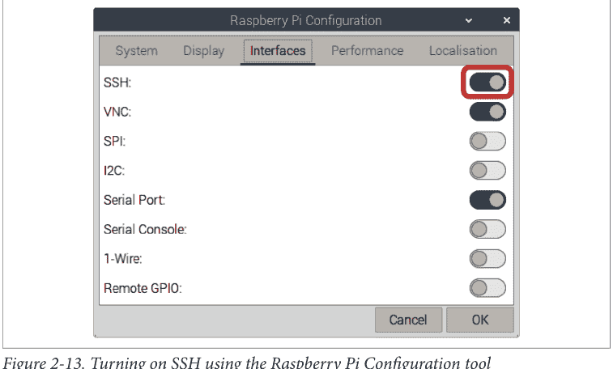

图 2-13. 使用树莓派配置工具打开 SSH

如果你使用的是 macOS 或者在你想要连接树莓派的计算机上安装了 Linux，你只需打开一个终端窗口并输入以下命令即可连接：

```
$ ssh 192.168.1.16 -l pi
```

这里，IP 地址（192.168.1.16）是你的树莓派的 IP 地址（参见配方 2.2）。然后系统会提示你输入密码，并登录到树莓派（图 2-14）。

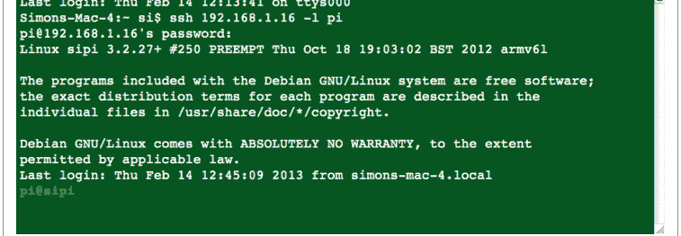

图 2-14. 使用 SSH 登录

要从Windows电脑连接，你需要使用PuTTY（配方2.6）来启动一个SSH会话。

### 讨论

SSH是连接远程计算机的一种非常常见的方式；任何你可以在树莓派本身执行的命令，都可以通过SSH使用。正如其名，它也是安全的，因为通信是加密的。

与配方2.6的控制台线解决方案不同，SSH只有在你的树莓派与尝试连接的计算机处于同一网络时才能工作。

也许SSH唯一的缺点是它是一个命令行环境，而不是图形环境。如果你需要远程访问完整的树莓派桌面环境，你需要使用VNC（配方2.8）。

### 另请参阅

查看这个Adafruit教程。

## 2.8 使用VNC远程控制树莓派

### 问题

你想通过虚拟网络计算（VNC）从PC（Windows或Linux）或macOS访问完整的树莓派操作系统图形桌面。

### 解决方案

使用树莓派操作系统上预装的VNC软件。然而，要这样做，你首先需要配置你的树莓派以启用它。你可以使用树莓派配置工具来完成此操作，该工具可以在树莓派桌面的树莓派菜单的首选项部分找到。点击“接口”选项卡，向下滚动到VNC选项，选择“启用”单选按钮，然后点击“确定”（图2-15）。

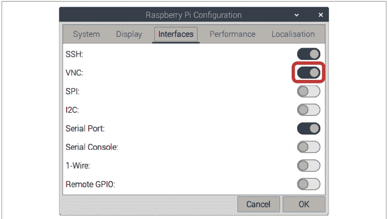

图2-15. 启用VNC接口

如果树莓派没有连接显示器，你需要指定当你从另一台计算机使用VNC连接到树莓派时将看到的虚拟显示器的分辨率。你可以从树莓派配置工具的“显示”部分进行设置（图2-16）。为避免滚动，请选择一个比你将用于查看虚拟屏幕的显示器分辨率稍低的分辨率。

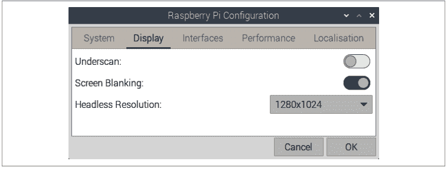

图2-16. 使用树莓派配置工具设置虚拟屏幕分辨率

要从远程计算机连接到树莓派，你需要安装VNC客户端软件。RealVNC VNC Viewer是一个流行的选择，适用于Windows、Linux和macOS。

当你在macOS或PC上运行客户端程序时，系统会要求你输入要连接的VNC服务器的IP地址（即你的树莓派的IP地址）。
然后系统会提示你输入密码（图2-17）。

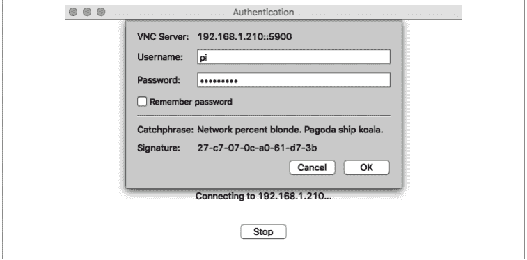

安全短语和签名是安全装置，旨在提醒你是否有人正在入侵你的树莓派。如果在你下次认证时其中任何一个发生变化，你的树莓派可能已被入侵。

### 讨论

只有当树莓派和远程计算机处于同一网络时，VNC才能工作。一些VNC客户端允许你在计算机和树莓派之间传输文件，以及在它们之间复制和粘贴文本。
虽然你可以使用SSH命令行完成大多数操作，但有时能够访问树莓派的图形环境会很有用。
只要启用了VNC选项，树莓派的VNC服务器在重启时会自动启动。

### 另请参阅

查看这个[Adafruit教程](https://www.adafruit.com/)。
你也可以在设置新的树莓派时启用VNC（参见[配方1.6](#recipe-1-6)）。

## 2.9 使用树莓派作为网络附加存储

### 问题

你想通过从网络上的计算机访问连接到树莓派的大容量USB驱动器，将你的树莓派用作网络附加存储（NAS）。

### 解决方案

这个问题的解决方案是安装和配置Samba。为此，请执行以下命令：

```
$ sudo apt update
$ sudo apt install samba
$ sudo apt install samba-common-bin
```

现在，将USB硬盘连接到树莓派。它将自动挂载到你的 /media/pi 文件夹中。要检查它是否在那里，请运行此命令：

```
$ cd /media/pi
$ ls
```

驱动器应该以其格式化时你赋予的名称列出。每次树莓派重启时，它都会自动挂载。记下这个名称，因为你稍后会用到它。

接下来，你需要配置Samba，以便在网络上共享驱动器。为此，你首先需要添加一个Samba用户（pi）。输入以下命令并输入密码：

```
$ sudo smbpasswd -a pi
New SMB password:
Retype new SMB password:
Added user pi.
```

现在你需要对文件 /etc/samba/smb.conf 进行一些更改，因此请输入此命令：

```
$ sudo nano /etc/samba/smb.conf
```

你要找的第一行在文件顶部附近：

```
workgroup = WORKGROUP
```

只有当你计划从Windows机器连接时才需要更改此项。这应该是你的Windows工作组的名称。对于较新版本的Windows，这将是WORKGROUP。请注意，通常在Mac和Windows PC（以及Linux机器）的混合网络中连接到NAS工作得很好。

最后，滚动到文件末尾并添加以下行，将NAS更改为你之前记下的USB驱动器的名称：

```
[USB]
path = /media/pi/NAS
comment = NAS Drive
valid users = pi
writeable = yes
browseable = yes
create mask = 0777
public = yes
```

保存文件，然后通过输入以下内容重启Samba：

```
$ sudo systemctl restart smbd
```

如果一切正常，你的USB驱动器现在应该在网络上共享了。

### 讨论

要在macOS上连接到驱动器，请选择“前往”，然后从Finder菜单中点击“连接服务器”。接下来，在“服务器地址”字段中，输入 **smb://raspberrypi/USB**。会打开一个登录对话框，你需要在其中将用户名更改为 **pi**（图2-18）。

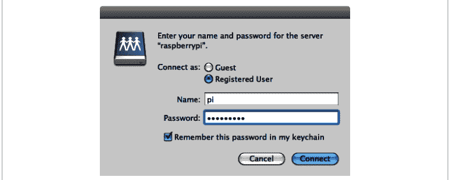

如果你从Windows机器连接到NAS，具体过程将因Windows版本而异。然而，基本原理是，在某个时刻你需要输入网络地址，该地址应为 **\raspberrypi\USB**（图2-19）。

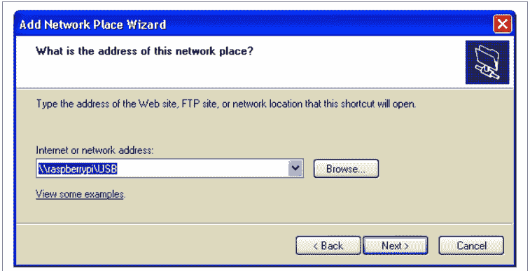

图2-19. 从Windows连接到NAS

然后系统会提示你输入用户名和密码，然后才能使用NAS磁盘（图2-20）。你通常只需要在第一次这样做。添加网络位置后，你应该能够在文件资源管理器中直接导航到它。

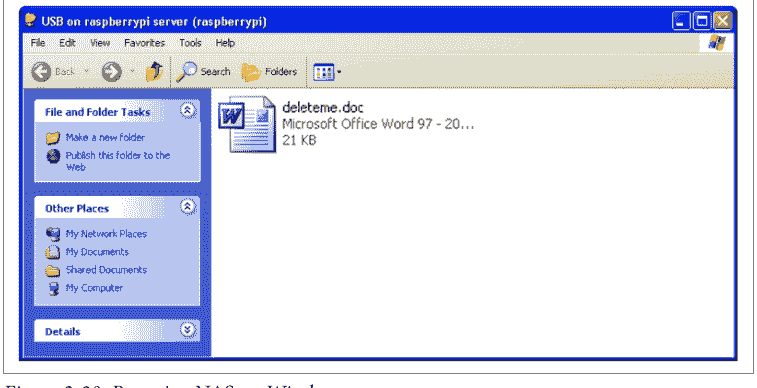

图2-20. 在Windows上浏览NAS

如果你是Linux用户，以下命令应该可以为你挂载NAS驱动器：

```
$ sudo mkdir /pishare
$ sudo smbmount -o username=pi,password=raspberry //192.168.1.16/USB /pishare
```

你应该能够使用主机名（raspberrypi）连接到树莓派，但如果这不起作用，请尝试使用你的树莓派的IP地址，类似于 `smb://192.168.1.16/USB`。

### 另请参阅

你可能想将树莓派的网络名称更改为像“piNAS”这样不合适的名字（参见配方2.4）。

## 2.10 设置网络打印机

### 问题

你想从树莓派打印到网络打印机。

### 解决方案

使用通用Unix打印系统（CUPS）软件。

首先，在终端中输入以下命令安装CUPS（这可能需要一些时间）：

```
$ sudo apt update
$ sudo apt install cups
```

通过输入以下命令为自己授予CUPS的管理员权限：

```
$ sudo usermod -a -G lpadmin pi
```

最后一条命令将CUPS使用的 `lpadmin` 组添加到用户pi，以便你拥有打印权限。

CUPS通过Web界面进行配置，因此从树莓派菜单启动Chromium网页浏览器，然后在地址栏中输入地址 `http://localhost:631`。

在“管理”选项卡上，选择“添加打印机”选项。这将显示网络上或直接连接到树莓派USB端口的打印机列表（图2-21）。

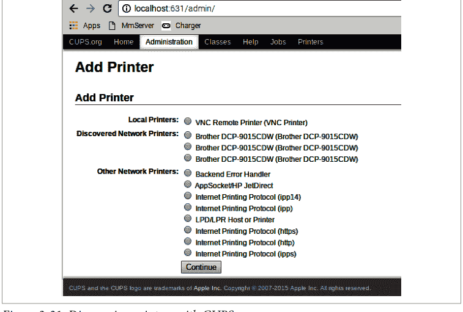

图2-21. 使用CUPS发现打印机

按照一系列对话框设置打印机。

### 讨论

完成后，你可以通过启动LibreOffice（配方4.2）来测试打印机。输入一些文本，当你去打印时，你应该能看到新添加的打印机可用于打印（图2-22）。

# 第三章
操作系统

## 3.0 引言

本章将探讨树莓派所使用的 Linux 操作系统的诸多方面。其中很多内容涉及命令行的使用。如果你习惯了 Windows 或 macOS，这可能会让你有些不适应。然而，一旦你习惯了，使用命令行做事会出奇地高效。

你可以像在 Windows 或 macOS 上那样，通过图形界面完成许多简单的文件操作，比如移动文件、重命名、复制和删除文件，这正是我们第一个食谱的主题。

## 3.1 图形化浏览文件

### 问题

你想像在基于 macOS 的机器或 Windows PC 上那样，使用图形界面来移动文件。

### 解决方案

使用文件管理器。

你可以在树莓派菜单的“附件”组中找到这个程序（图 3-1）。

使用文件管理器，你可以将文件或目录从一个目录拖拽到另一个目录，或者使用“编辑”菜单从一个位置复制文件并粘贴到另一个位置。其操作方式与 Windows 文件资源管理器或 macOS Finder 非常相似。

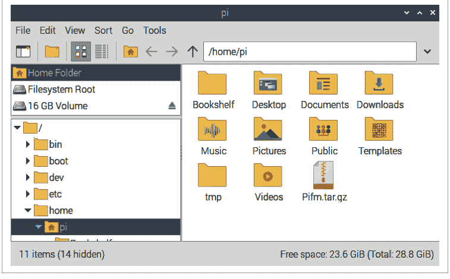

*图 3-1. 文件管理器*

### 讨论

文件管理器的左侧显示文件夹结构。

中央区域显示当前文件夹中的文件，你可以使用工具栏中的按钮或在顶部的文件路径区域输入位置来导航。

你可以右键单击文件，打开一个包含可用于该文件的选项的菜单（图 3-2）。

你也可以通过按住 Ctrl 键的同时选择文件来一次选择多个文件进行复制或拖拽，或者通过选择一个文件，然后按住 Shift 键的同时选择范围内的最后一个文件来选择一系列文件。

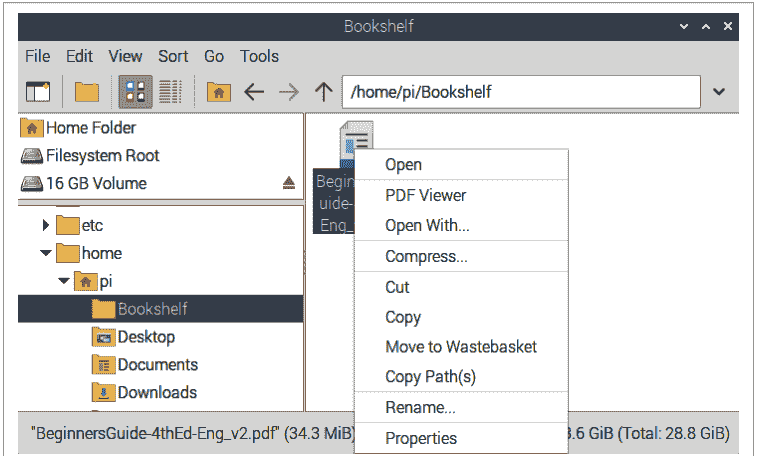

图 3-2. 右键单击文件会打开一个包含更多选项的菜单

### 另请参阅

要重命名文件或文件夹，请参阅[食谱 3.6](Recipe 3.6)。

## 3.2 将文件复制到 USB 闪存盘

### 问题

你想将文件从树莓派复制到 USB 闪存盘。

### 解决方案

将 USB 闪存盘插入 USB 端口，应该会出现如[图 3-3](Figure 3-3)所示的对话框。选择“确定”以在文件管理器中打开它。

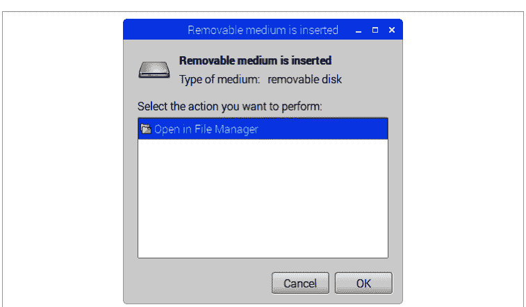

图 3-3. 可移动介质对话框

驱动器将被挂载到 /media/pi 目录下，后跟闪存盘的名称（在我的例子中是 UNTITLED）。要从你的主文件夹复制文件，请将其拖拽到代表你闪存盘的文件夹上，如图 3-4 所示。

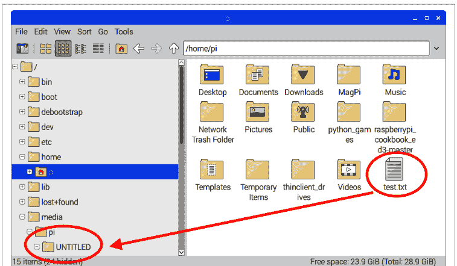

图 3-4. 通过拖拽文件到 USB 闪存盘来复制文件

Windows、macOS 和 Linux 都有自己的磁盘格式。为了与 macOS 和 Windows 电脑获得最大的兼容性，USB 闪存盘应格式化为 FAT32 或 exFAT。exFAT 支持比 FAT32 更大的磁盘容量。

### 讨论

在你的 USB 闪存盘挂载到树莓派的文件系统后，你也可以使用命令行复制文件。以下示例将文件 *test.txt* 复制到闪存盘：

```
$ cd /home/pi
$ cp test.txt /media/pi/UNTITLED/
```

在这个例子中，cd 是更改当前目录的命令，cp 是复制命令。这些命令在食谱 3.4 和 3.5 中有更详细的解释。

### 另请参阅

有关使用文件管理器的常规信息，请参阅食谱 3.1。
要从命令行复制文件，请参阅食谱 3.4。

## 3.3 启动终端会话

### 问题

使用树莓派时，你需要在终端中输入文本命令。

### 解决方案

在树莓派桌面顶部，选择终端图标（它看起来像一个黑色的电脑显示器），或者在树莓派菜单的“附件”组中，选择“终端”选项（图 3-5）。

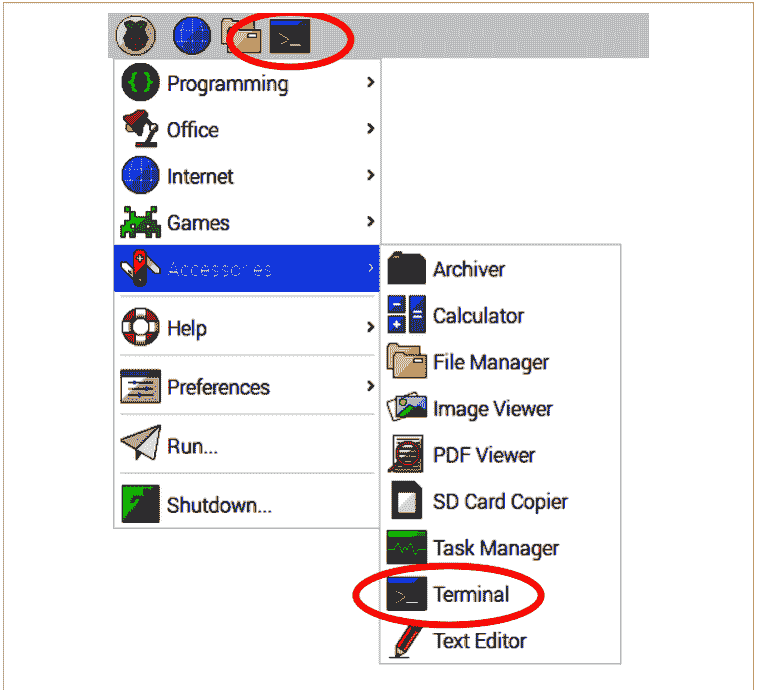

图 3-5. 打开终端

### 讨论

当终端启动时，它会设置为你的主目录（/home/pi）。

你可以根据需要打开任意数量的终端会话。在不同的目录中打开几个会话通常很有用，这样你就不需要经常使用 cd（食谱 3.4）来切换目录。

使用终端时，所有内容都区分大小写。也就是说，如果你使用一个命令，输入时必须使用正确的大小写。例如，你将在下一个食谱中遇到的 ls 命令必须输入为 ls，而不是 LS 或 Ls 或 lS。同样，所有文件名都区分大小写，因此名为 picture.jpg 和 Picture.jpg 的文件是两个不同的文件。

### 另请参阅

在下一节（食谱 3.4）中，你将学习如何使用终端导航目录结构。

## 3.4 使用终端导航文件系统

### 问题

你需要知道如何使用终端更改目录并在文件系统中移动。

### 解决方案

用于导航文件系统的主要命令是 cd（更改目录）。在 cd 之后，你需要指定要更改到的目录。这可以是当前目录内目录的*相对*路径，也可以是文件系统上其他位置的*绝对*路径。

要查看当前目录是什么，请使用命令 pwd（打印工作目录）。

### 讨论

尝试几个例子。打开一个终端会话，你应该会看到如下提示符：

```
pi@raspberrypi: ~ $
```

你在每个命令后看到的提示符（pi@raspberrypi: ~ $）是你的用户名（pi）和计算机名称（raspberrypi）的提醒。~ 字符是你的主目录（/home/pi 或你在设置树莓派时选择的任何用户名）的简写。因此，在任何时候你都可以按如下方式将当前目录更改为你的主目录：

```
$ cd ~
```


在整本书中，我在每行开头使用 $ 表示你需要输入命令。这被称为*提示符*。命令行的响应没有任何前缀；它就像在树莓派屏幕上显示的那样出现。

你可以通过使用 pwd 命令来确认命令确实将目录设置为 *home*：

```
$ pwd
/home/pi
```

如果你想在目录结构中向上移动一级，可以在 cd 命令后使用特殊值 ..（两个点），如下所示：

```
$ cd ..
$ pwd
/home
```

正如你现在可能推断的那样，特定文件或目录的路径由用 / 分隔的单词组成。因此，整个文件系统的根是 /，要访问 / 内的主目录，你会引用 /home/。然后，要找到其中的 *pi* 目录，你会使用 /home/pi/。你可以省略路径末尾的 /。

路径可以是绝对的（以 / 开头并指定从根目录开始的完整路径），也可以是相对于当前工作目录的*相对*路径，在这种情况下，它们不能以 / 开头，并且假设当前目录是起点。例如，从根目录（/）开始，你可以使用相对路径导航到你的主目录（假设你的用户名是“pi”），如下所示：

```
$ cd /
$ pwd
/
$ cd home/pi
$ pwd
/home/pi
```

你将对主目录中的文件拥有完全的读写访问权限，但当你进入存放系统文件和应用程序的位置时，你对某些文件的访问将被限制为只读。你可以覆盖此限制（食谱 3.12），但需要小心。

通过输入命令 cd / 和 ls 来查看目录结构的*根*，如图 3-6 所示。

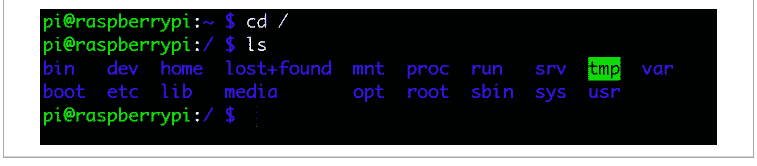

图 3-6. 列出目录的内容

ls 命令（列出）向我们显示根目录（/）下的所有文件和目录。你会看到一个 *home* 目录被列出，这就是你刚刚离开的目录。

现在使用图 3-7 所示的命令进入其中一个目录。

## 3.4 更改目录与列出内容

你会看到文件和文件夹有颜色编码。文件以多种颜色显示，而文件夹则为深蓝色。

除非你特别喜欢打字，否则 Tab 键提供了一个便捷的快捷方式。如果你开始输入文件名，按下 Tab 键可以让自动补全功能尝试补全文件名。例如，如果你想切换到 *network* 目录，输入命令 `cd netw` 然后按下 Tab 键。因为 *netw* 足以唯一标识该文件或目录，按下 Tab 键就会自动补全它。

如果你输入的内容不足以唯一标识文件或目录，再次按下 Tab 键会显示与你当前输入匹配的可能选项列表。所以，如果你输入到 *ne* 就按下 Tab 键，你会看到类似图 3-8 的内容。

你可以在 `ls` 后提供额外的参数来缩小要列出的内容范围。切换到 `/etc` 目录，然后运行以下命令：

```
$ ls f*
fake-hwclock.data  fb.modes  fstab  fuse.conf

fonts:
conf.avail  conf.d  fonts.conf  fonts.dtd

foomatic:
defaultspooler  direct  filter.conf

fstab.d:
pi@raspberrypi /etc $
```

* 字符被称为 *通配符*。在 `ls` 后指定 `f*`，表示我们想要列出所有以 `f` 开头的内容。

有帮助的是，结果首先列出了 `/etc` 中所有以 `f` 开头的文件，然后是该文件夹中所有以 `f` 开头的目录的内容。

通配符的一个常见用途是列出所有具有特定扩展名的文件（例如，`ls *.docx`）。

Linux（以及许多其他操作系统）的一个惯例是，将任何应向用户隐藏的文件以句点作为前缀。任何这样命名的文件或文件夹在你输入 `ls` 时都不会出现，除非你为 `ls` 提供 `-a`（全部）选项。

例如：

```
$ cd ~
$ ls -a
.                          Desktop                    .pulse
..                         .dillo                     .pulse-cookie
Adafruit-Raspberry-Pi-Python-Code .dmrc              python_games
.advance                   .emulationstation          sales_log
.AppleDB                   .fltk                      servo.py
.AppleDesktop              .fontconfig                .stella
.AppleDouble               .gstreamer-0.10            stepper.py.save
Asteroids.zip              .gvfs                      switches.txt.save
atari_roms                 indicity                   Temporary Items
.bash_history              .local                     thermometer.py
.bash_logout               motor.py                   .thumbnails
.bashrc                    .mozilla                   .vnc
.cache                     mydocument.doc             .Xauthority
.config                    Network Trash Folder       .xsession-errors
.dbus                      .profile                   .xsession-errors.old
```

如你所见，你的主目录中的大多数文件和文件夹都是隐藏的。

### 另请参阅

要更改文件权限，请参阅 [配方 3.14](Recipe 3.14)。

## 3.5 复制文件或文件夹

### 问题

你想使用终端会话复制一个文件。

### 解决方案

使用 `cp` 命令复制文件和目录。

### 讨论

当然，你可以使用文件管理器及其复制粘贴菜单选项（配方 3.1）或键盘快捷键来复制文件。

在终端会话中复制的最简单示例是在你的工作目录中制作一个文件的副本。cp 命令后面首先是要复制的文件，然后是新文件的名称。

例如，以下代码创建一个名为 *myfile.txt* 的文件，然后制作一个名为 *myfile2.txt* 的副本；你可以在配方 3.9 中了解更多关于使用 > 命令创建文件的技巧：

```
$ echo "hello" > myfile.txt
$ ls
myfile.txt
$ cp myfile.txt myfile2.txt
$ ls
myfile.txt    myfile2.txt
```

虽然在这个例子中两个文件路径都是相对于当前工作目录的，但文件路径可以是文件系统中你有写入权限的任何位置。以下示例将原始文件复制到名为 /tmp 的区域，这是临时文件的位置（不要在该文件夹中放置任何重要内容）：

```
$ cp myfile.txt /tmp
```

请注意，在这种情况下，没有指定新文件的名称，只指定了它要去的目录。这将在 /tmp 中创建一个名为 *myfile.txt* 的副本。

有时，你可能不想只复制一个文件，而是想复制一个包含许多文件甚至其他目录的整个目录。要复制一个目录及其所有内容，你需要使用 -r 选项（表示递归）：

```
$ cp -r mydirectory mydirectory2
```

无论何时复制文件或文件夹，命令的结果都会告诉你是否没有权限。如果是这种情况，你需要更改你要复制到的文件夹的权限（配方 3.14），或者使用超级用户权限复制文件（配方 3.12）。

### 另请参阅

你也可以重命名文件而不是复制它们；请参阅配方 3.6。

有关 cp 命令众多可选参数的有用描述，请参阅 https://oreil.ly/Cq2SJ。

## 3.6 重命名文件或文件夹

### 问题

你需要使用终端会话重命名一个文件。

### 解决方案

使用 `mv` 命令重命名文件和目录。

### 讨论

`mv`（移动）命令的使用方式与 `cp` 命令类似，不同之处在于被移动的文件或文件夹只是被重命名，而不是制作副本。

例如，要将文件从 `my_file.txt` 重命名为 `my_file.rtf`，你使用以下命令：

```
$ mv my_file.txt my_file.rtf
```

更改目录名称同样简单直接，你不需要在复制时使用的递归 `-r` 选项，因为更改目录名称隐含地意味着其中的所有内容都包含在重命名后的目录中。

### 另请参阅

要复制文件或文件夹，请参阅 [配方 3.5](Recipe 3.5)。

## 3.7 编辑文件

### 问题

你想从命令行运行编辑器来更改配置文件。

### 解决方案

使用大多数 Raspberry Pi 发行版中包含的 nano 编辑器。

### 讨论

要使用 nano，只需输入命令 `nano`，后跟你要编辑的文件名或文件路径。如果文件不存在，它将在你保存时创建。但是，这只有在你对要写入文件的目录具有写入权限时才会发生。

从你的主目录，输入命令 `nano my_file.txt` 来编辑或创建文件 `my_file.txt`。图 3-9 显示了 nano 的运行情况。

你不能使用鼠标来定位光标；你必须使用方向键。

屏幕底部的区域列出了许多命令，你可以通过按住 Ctrl 键并按下指示的字母来访问。其中大多数并不那么有用。你最可能使用的是以下命令：

- **Ctrl-X**
  退出。在 nano 退出之前，会提示你保存文件。

- **Ctrl-V**
  下一页。可以将其视为一个向下的箭头。这允许你一次移动一个屏幕来浏览大文件。

- **Ctrl-Y**
  上一页。

- **Ctrl-W**
  查找。这允许你搜索一段文本。

- **Ctrl-O**
  输出。这将写入（保存）文件而不退出编辑器。

还有一些相当粗糙的复制粘贴选项，但在实践中，使用右键单击访问的菜单中的普通剪贴板更容易，如图 3-10 所示。

使用此剪贴板还可以让你在其他窗口（如浏览器）之间复制和粘贴文本。

当你准备好将更改保存到文件并退出 nano 时，使用命令 Ctrl-X。输入 Y 确认你要保存文件。然后 nano 显示文件名作为保存文件的默认名称；按 Enter 保存并退出。

如果你想放弃所做的更改，请输入 N 代替 Y。

### 另请参阅

编辑器在很大程度上是个人品味问题。许多其他可用于 Linux 的编辑器在 Raspberry Pi 上也能正常工作。Vim（Vi IMproved）编辑器在 Linux 世界拥有许多粉丝。它也包含在流行的 Raspberry Pi 发行版中。然而，对于初学者来说，它不是一个容易使用的编辑器。你可以像运行 nano 一样运行它，但使用命令 vi 而不是 nano。

## 3.8 查看文件内容

### 问题

你想查看一个小文件的内容而不编辑它。

### 解决方案

使用 `cat` 命令或 `more` 命令查看文件。

例如：

```
$ more myfile.txt
This file contains
some text
```

### 讨论

`cat` 命令会显示文件的全部内容，即使内容多到无法在屏幕上完全显示。

`more` 命令一次只显示一屏文本。按空格键可显示下一屏。

### 另请参阅

你也可以使用 `cat` 来连接（合并）多个文件（参见配方 3.32）。

另一个与 `more` 相关的流行命令是 `less`。`less` 类似于 `more`，但它允许你在文件中向前和向后移动。

## 3.9 不使用编辑器创建文件

### 问题

你想创建一个单行文件，而不想使用编辑器。

### 解决方案

使用 `>` 和 `echo` 命令将你在命令行上输入的内容重定向到一个文件。

例如：

```
$ echo "file contents here" > test.txt
$ more test.txt
file contents here
```


`>` 命令会覆盖任何同名的现有文件，因此请谨慎使用。

### 讨论

如果你只想创建一个空文件并稍后编辑它，可以使用 `touch` 命令后跟文件名，如下所示：

```
$ touch test.txt
```

如果你对已存在的文件使用 `touch` 命令，它会更改文件的修改时间戳，就像你刚刚编辑过它一样。

### 另请参阅

要使用 `more` 命令在不使用编辑器的情况下查看文件，请参见配方 3.8。

要使用 `>` 捕获其他类型的系统输出，请参见配方 3.31。

## 3.10 创建目录

### 问题

你想使用终端创建一个新目录。

### 解决方案

`mkdir` 命令用于创建新目录。

### 讨论

要创建目录，请使用 `mkdir` 命令。尝试以下示例（注意只显示了命令，没有显示响应）：

```
$ cd ~
$ mkdir my_directory
$ cd my_directory
$ ls
```

你需要在尝试创建新目录的目录中拥有写权限。

### 另请参阅

有关使用终端浏览文件系统的一般信息，请参见配方 3.4。

## 3.11 删除文件或目录

### 问题

你想使用终端删除一个文件或目录。

### 解决方案

`rm`（remove）命令将删除一个文件或目录及其内容。你应该极其谨慎地使用此命令。

### 讨论

删除单个文件既简单又安全。以下示例将从主目录中删除文件 *my_file.txt*；你可以使用 `ls` 命令确保它已消失：

```
$ cd ~
$ rm my_file.txt
$ ls
```

你需要在尝试执行删除操作的目录中拥有写权限。

你也可以在删除文件时使用 `*` 通配符。此示例删除当前目录中所有以 *my_file.* 开头的文件：

```
$ rm my_file.*
```

你也可以通过输入以下命令删除目录中的所有文件：

```
$ rm *
```

如果你想递归删除一个目录（即，不仅是目录本身，还包括它包含的所有文件和目录），可以使用 `-r` 选项：

```
$ rm -r mydir
```

> 从终端窗口删除文件时，请记住，你没有回收站的安全网来恢复已删除的文件。此外，一般来说，你不会得到确认选项；文件会立即被删除。如果你结合使用 `sudo` 命令（配方 3.12），这可能是完全灾难性的。

### 另请参阅

有关使用终端浏览文件系统的更多信息，请参见配方 3.4。

如果你担心意外删除文件或文件夹，可以通过设置命令别名（配方 3.36）来强制 `rm` 命令确认删除。

## 3.12 使用超级用户权限执行任务

### 问题

某些命令无法工作，因为你*权限不足*。

### 解决方案

你需要使用超级用户权限发出命令。`sudo`（substitute user do）命令允许你以超级用户权限执行操作。只需在命令前加上 `sudo`。

> **小心使用 sudo**
正如一部著名电影系列中所说，“能力越大，责任越大。”`sudo` 命令允许你做一些非常危险的事情，比如删除重要的系统文件，这可能会使你的树莓派无法使用，除非完全重新安装树莓派操作系统。

### 讨论

你想在命令行上执行的大多数任务通常可以在没有超级用户权限的情况下完成。最常见的例外是你在安装新软件和编辑配置文件时。`apt` 命令是将新软件安装到树莓派操作系统的主要方式。你将在配方 3.17 中正式遇到它。

另一个需要超级用户权限的例子是 `reboot` 命令。如果你尝试以普通用户身份运行它，你会收到一些错误消息：

```
$ reboot
Failed to set wall message, ignoring: Interactive authentication required.
Failed to reboot system via logind: Interactive authentication required.
Failed to open /dev/initctl: Permission denied
Failed to talk to init daemon.
```

如果你发出相同的命令并在前面加上 `sudo`，命令将正常工作：

```
$ sudo reboot
```

如果你有一大堆命令要以超级用户身份运行，并且不想在每个命令前都加上 `sudo`，你可以使用以下命令：

```
$ sudo sh
#
```

注意提示符如何从 `$` 变为 `#`。所有后续命令都将以超级用户身份运行。当你想恢复为普通用户时，输入 `exit` 命令：

```
# exit
$
```

### 另请参阅

要了解更多关于文件权限的信息，请参见配方 3.13。
要使用 `apt` 安装软件，请参见配方 3.17。

## 3.13 理解文件权限

### 问题

你已经看到文件名被列出时伴随的奇怪字符。你想知道它们的含义。

### 解决方案

要查看与文件和目录相关的权限和所有权信息，请使用带有 `-l` 选项的 `ls` 命令。

### 讨论

运行命令 `ls -l`（选项字母是小写 L），你将看到类似这样的结果：

```
$ ls -l
total 16
-rw-r--r-- 1 pi pi     5 Apr 23 15:23 file1.txt
-rw-r--r-- 1 pi pi     5 Apr 23 15:23 file2.txt
-rw-r--r-- 1 pi pi     5 Apr 23 15:23 file3.txt
drwxr-xr-x 2 pi pi  4096 Apr 23 15:23 mydir
```

`ls` 命令响应的第一行告诉你目录中有 16 个文件。
图 3-11 显示了列表信息的不同部分。第一个块包含权限。在第二个块中，数字 1（标记为“Files”）表示涉及多少个文件。此字段仅在列表条目是目录时才有意义；如果是文件，它通常只是 1。接下来的两个条目（都是 pi）是文件的所有者和组。大小条目（第五个块）表示文件的大小（以字节为单位）。修改日期会在每次编辑或更改文件时更改，最后一个条目是文件或目录的实际名称。

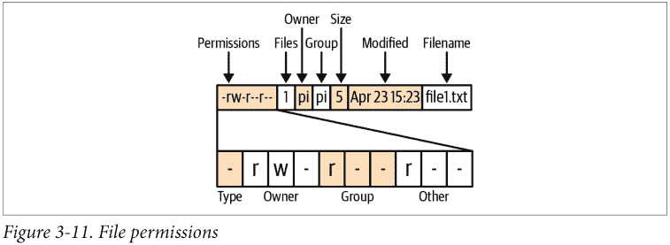

图 3-11. 文件权限

权限块分为四个部分（类型、所有者、组和其他）。第一部分是文件的类型。如果是目录，它将是字符 `d`；如果是文件，条目将只是 `-`。

下一部分包含三个字符，指定文件的所有者权限。每个字符都是一个开或关的标志。如果所有者有读权限，第一个字符位置将有一个 `r`。如果所有者有写权限，第二个位置将有一个 `w`。第三个位置（在此示例中是 `-`）如果文件对所有者是可执行的（程序或脚本），则会有一个 `x`。

第三部分具有相同的三个标志，但适用于组中的任何用户。用户可以组织成组。在这种情况下，文件有一个用户 pi 和一个组所有权 pi。如果任何其他用户在组 pi 中，他们将拥有此处指定的权限。

最后一部分指定既不是 pi 也不在组 pi 中的用户的权限。

因为大多数人只会以用户 pi 的身份使用树莓派，所以最感兴趣的权限在第一部分。

### 另请参阅

要更改文件权限，请参见 [配方 3.14](Recipe 3.14)。

## 3.14 更改文件权限

### 问题

你需要更改文件的权限。

### 解决方案

你可以使用 `chmod` 命令来修改文件权限。

### 讨论

你可能需要更改文件权限的常见原因包括：需要编辑一个被标记为只读的文件，以及为文件添加执行权限，使其能够作为程序或脚本运行。

`chmod` 命令允许你为文件添加或移除权限。有两种语法可以实现：一种需要使用八进制（基数为 8），另一种是基于文本的。我们将使用更易于理解的文本方法。

`chmod` 的第一个参数是要进行的更改，第二个是应应用更改的文件或文件夹。更改参数的形式是权限范围（`+`、`-`、`=` 分别表示添加、移除和设置），然后是权限类型。

例如，以下命令将为文件 `file2.txt` 的所有者（用户）添加执行（`x`）权限：

```
$ chmod u+x file2.txt
```

如果我们现在列出目录内容，可以看到 `x` 权限已被添加：

```
$ ls -l
total 16
-rw-r--r-- 1 pi pi    5 Apr 23 15:23 file1.txt
-rwxr-xr-x 1 pi pi    5 Apr 24 08:08 file2.txt
-rw-r--r-- 1 pi pi    5 Apr 23 15:23 file3.txt
drwxr-xr-x 2 pi pi 4096 Apr 23 15:23 mydir
```

如果我们想为组或其他用户添加执行权限，应分别使用 `g` 和 `o`。字母 `a` 则为所有人添加权限。

你经常会看到使用数字来设置文件权限的示例。例如：

```
$ chmod 777 file1.txt
```

三个数字中的每一个都代表文件权限的所有者、组和其他部分的 3 位二进制数。这些数字是八进制的，即基数为 8，因此它们的二进制值如下表所示。

| 八进制 | 二进制 |
|---|---|
| 0 | 000 |
| 1 | 001 |
| 2 | 010 |
| 3 | 011 |
| 4 | 100 |
| 5 | 101 |
| 6 | 110 |
| 7 | 111 |

例如，文件权限 `rwxr--r--` 将由数字 `744` 表示。

### 另请参阅

有关文件权限的背景信息，请参阅 [配方 3.13](Recipe 3.13)。

有关 `chmod` 八进制计算器，请参阅 [https://chmod-calculator.com](https://chmod-calculator.com)。

有关更改文件所有权，请参阅 [配方 3.15](Recipe 3.15)。

## 3.15 更改文件所有权

### 问题

你需要更改文件的所有权。

### 解决方案

你可以使用 `chown`（更改所有者）命令来修改文件或目录的所有权。

### 讨论

正如我们在 [配方 3.13](Recipe 3.13) 中所发现的，任何文件或目录都同时关联一个所有者和一个组。由于大多数树莓派用户只会使用单个用户 `pi`，因此我们实际上不需要担心组的问题。

偶尔，你会发现系统中安装的文件具有不同于 `pi` 的所有者。如果是这种情况，你可以使用 `chown` 命令更改文件的所有权。

要更改文件的所有者，请使用 `chown`，后跟新的所有者和组（用冒号分隔），然后是文件名。

你可能会发现需要超级用户权限才能更改所有权，在这种情况下，你应该在命令前加上 `sudo`（配方 3.12）。在此示例中，我们将 *file2.txt* 的所有者从 `pi` 更改为 `root`：

```
$ sudo chown root:root file2.txt
$ ls -l
total 16
-rw-r--r-- 1 pi   pi      5 Apr 23 15:23 file1.txt
-rwxr--r-- 1 root root    5 Apr 24 08:08 file2.txt
-rw-r--r-- 1 pi   pi      5 Apr 23 15:23 file3.txt
drwxr-xr-x 2 pi   pi   4096 Apr 23 15:23 mydir
```

### 另请参阅

有关文件权限的背景信息，请参阅配方 3.13。

另请参阅配方 3.14 了解如何更改文件权限。

## 3.16 进行屏幕截图

### 问题

你想捕获树莓派屏幕的图像并将其保存到文件中。

### 解决方案

使用名称巧妙的 `scrot`（SCReenshOT）屏幕截图软件。

### 讨论

触发屏幕截图的最简单方法是直接输入命令 `scrot`。这将立即捕获主显示器的图像，并将其保存在当前目录中一个名为类似 *2023-04-25-080116_1024x768_scrot.png* 的文件中。

有时你希望截图显示一个打开的菜单，或者某些在窗口失去焦点时通常会消失的内容。对于这种情况，你可以使用 `-d` 选项指定截图前的延迟：

```
$ scrot -d 5
```

延迟以秒为单位指定。

如果你捕获了整个屏幕，可以稍后使用图像编辑软件（如 GIMP（配方 4.6））进行裁剪。然而，更方便的是首先只捕获屏幕的特定区域，你可以通过使用 `-s` 选项来实现。

要使用此选项，请输入以下命令，然后用鼠标拖动以定义要捕获的屏幕区域：

```
$ scrot -s
```

文件名将包含捕获图像的像素尺寸。

### 另请参阅

`scrot` 命令还有许多其他选项，用于控制诸如使用多个屏幕和更改保存文件格式等事项。你可以通过输入以下命令查看 `scrot` 的手册页以了解更多信息：

```
$ man scrot
```

> ## 手册页
> 几乎所有的树莓派 OS 命令都有手册页（manual pages），你可以通过输入命令名称后跟命令本身来查看它们。然而，命令的手册页并不总是非常易于访问，它是命令的详尽参考，而不是如何使用它的简单指南。因此，通常最好直接在互联网上搜索该命令。

## 3.17 使用 apt 安装软件

### 问题

你想使用命令行安装软件。

### 解决方案

从终端会话安装软件最常用的工具是 `apt`（高级打包工具）。

该命令的基本格式（必须以超级用户身份运行）如下：

```
$ sudo apt install <软件名称>
```

例如，要安装 AbiWord 文字处理软件，你需要输入此命令：

```
$ sudo apt install abiword
```

### 讨论

`apt` 包管理器使用一个可用软件列表。此列表包含在树莓派操作系统发行版中，但可能已过时。因此，在使用 `apt` 安装新软件之前，最好始终运行以下命令来更新列表：

```
$ sudo apt update
```

列表和用于安装的软件包都在互联网上，因此除非你的树莓派有互联网连接，否则这些操作都无法进行。


如果你在更新时发现类似 `E: Problem with MergeList /var/lib/dpkg/status` 的错误，请尝试运行以下命令，这将删除有问题的文件并用一个新的空文件替换它：

```
$ sudo rm /var/lib/dpkg/status
$ sudo touch /var/lib/dpkg/status
```

安装过程通常需要一段时间，因为文件必须下载并安装。某些安装还会在你的桌面或树莓派菜单的程序组中添加快捷方式。

你可以使用 `apt search` 命令后跟搜索字符串（如 `abiword`）来搜索要安装的软件。这将显示你可以安装的匹配软件包列表。

### 另请参阅

有关删除不再需要的程序以释放空间，请参阅配方 3.18。

另请参阅配方 3.21 了解如何从 GitHub 下载源代码。

有关使用 `pip` 安装 Python 程序，请参阅配方 3.19。

有关使用图形用户界面安装软件，请参阅配方 4.2。

## 3.18 删除使用 apt 安装的软件

### 问题

使用 `apt` 安装了大量程序后，你现在发现想要删除其中一些。

### 解决方案

`apt` 工具有一个选项（`remove`）可以删除软件包，但它只会删除那些通过 `apt install` 安装的软件包。

例如，如果你想删除 AbiWord，你将使用以下命令：

```
$ sudo apt remove abiword
```

### 讨论

像这样删除软件包并不总是会删除所有内容，因为软件包通常还有作为依赖项安装的先决条件软件包。要删除这些，你可以使用 `autoremove` 选项，如下所示：

```
$ sudo apt autoremove abiword
$ sudo apt clean
```

`apt clean` 选项将对未使用的软件包安装文件进行进一步的清理。

### 另请参阅

有关使用 `apt` 安装软件包，请参阅配方 3.17。

## 3.19 使用 pip3 安装 Python 包

### 问题

你想使用 `pip3` 或 `pip`（Pip Installs Packages）包管理器来安装 Python 库。

### 解决方案

如果你拥有最新版本的树莓派 OS，`pip3` 应该已经安装，你可以从命令行运行它。`pip3` 安装 Python 3 包，而在极少数情况下你可能需要为 Python 2 安装包，只需使用 `pip` 即可。

以下是使用 `pip3` 安装的示例：

```
$ pip3 install pyserial
```

如果 `pip3` 未安装在你的系统上，你可以使用此命令安装它：

```
$ sudo apt install python3-pip
```

有时你会希望软件包同时为 Python 2 和 Python 3 安装，因此你可能会发现自己同时使用 `pip` 和 `pip3` 运行相同的命令。

### 讨论

虽然许多 Python 库可以使用 apt 安装（参见配方 3.17），但有些库无法通过 apt 安装，此时你必须改用 pip。

### 另请参阅

要使用 apt 安装软件，请参见配方 3.17。

## 3.20 从命令行获取文件

### 问题

你想在不使用网页浏览器的情况下从互联网下载文件。

### 解决方案

你可以使用 `wget` 命令从互联网获取文件。

例如，以下命令从 https://www.icrobotics.co.uk 获取文件 Pifm.tar.gz：

```
$ wget http://www.icrobotics.co.uk/wiki/images/c/c3/Pifm.tar.gz
--2013-06-07 07:35:01--  http://www.icrobotics.co.uk/wiki/images/c/c3/Pifm.tar.gz
Resolving www.icrobotics.co.uk (www.icrobotics.co.uk)... 155.198.3.147
Connecting to www.icrobotics.co.uk (www.icrobotics.co.uk)|155.198.3.147|:80... connected.
HTTP request sent, awaiting response... 200 OK
Length: 5521400 (5.3M) [application/x-gzip]
Saving to: ‘Pifm.tar.gz’

100%[==================================================>] 5,521,400    601K/s   in 8.9s    

2018-06-07 07:35:11 (601 KB/s) - ‘Pifm.tar.gz’ saved [5521400/5521400]
```

如果你的 URL 包含任何特殊字符，最好将它们用双引号括起来。

### 讨论

你会发现一些安装软件的说明依赖于使用 `wget` 来获取文件。通常，从命令行执行此操作比使用浏览器、找到文件、下载它，然后将其复制到所需位置要方便得多。

`wget` 命令将要下载的 URL 作为其参数，并将其下载到当前目录。它通常用于下载某种类型的归档文件，但也会下载任何网页。因此，例如，你可以使用以下命令将 Google 主页获取到名为 *index.html* 的文件中：

```
$ wget google.com
```

### 另请参阅

有关使用 apt 安装的信息，请参见 [配方 3.17](Recipe 3.17)。

## 3.21 使用 Git 获取源代码

### 问题

有时 Python 库和其他软件托管在 GitHub 网站或其他在线 Git 仓库中。你需要能够将它们获取到你的树莓派上。

### 解决方案

要使用 Git 仓库中的代码，你需要使用 `git clone` 命令来创建你自己的文件副本。

例如，以下命令将把本书的所有源代码示例下载到一个新文件夹中：

```
$ git clone https://github.com/simonmonk/raspberrypi_cookbook_ed4.git
```

除了要克隆的代码的 URL 外，还有一个你可以用浏览器访问的网页。如果你访问 [本书的 GitHub 网页](GitHub web page for this book)，你会看到一个类似于 *图 3-12* 所示的网页。

点击 Code 按钮允许你复制仓库的 URL，然后将其粘贴到终端会话中的 `git` 命令之后。

### 讨论

Git 和 GitHub 之间存在区别。*Git* 是用于管理代码的软件，而 *GitHub* 是众多托管代码的网站之一，这些代码是使用 Git 推送到那里的。事实上，如果你愿意，你实际上可以在树莓派上托管你自己的 Git 仓库。然而，使用基于 Git 的网站（如 GitHub 或 GitLab）有以下好处：

- 你的代码存储在云端，因此如果你的磁盘（或 SD 卡）损坏，你不会丢失代码。
- 代码是公开可见的，因此其他人可以查看和使用它，如果他们发现错误，甚至可能为你提供修复。
- 你可以在 README 文件中包含关于你项目的文档，供所有人查看。

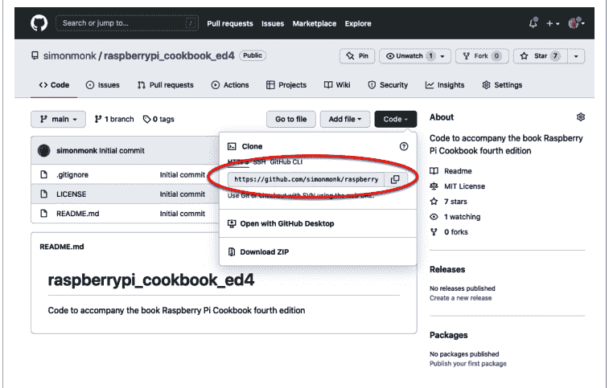

图 3-12. 本书的 GitHub 仓库页面

如果你正在开发一个你认为其他人可能感兴趣的树莓派项目，我建议使用 GitHub 或 GitLab 来托管你的代码。需要学习一点东西，但值得付出努力。

使用 Git（无论是本地还是通过 GitHub 等服务）的另一个优点是，每次你对项目进行一部分工作时，你都会将该工作推送到代码的主副本。这不会替换已有的代码，而是作为新版本存储。如果你犯了错误，你可以随时恢复代码的早期版本。

> > 1 线和 SPI 接口中使用的术语“master”和“slave”多年前就被写入了标准和代码中。这些词的起源显然有问题。人们正在努力用更现代（且技术上更准确）的术语来取代这些术语。但不幸的是，在代码库及其反映的标准更新之前，我们仍将继续看到这些名称。

我在 GitHub 上托管了我所有书籍和其他项目的代码。以下是我创建新仓库时采取的步骤：

1. 转到你在 GitHub 上的主页（你需要创建一个账户），点击 + 按钮并选择 New Repository 选项。
2. 为仓库命名并添加简短描述。
3. 勾选选项“Initialize this repository with a README.”
4. 选择一个许可证——我选择 MIT，没有更好的理由，只是因为我非常尊重那个庄严的学术中心，认为如果它有一个分享我工作的许可证，那可能是个好许可证。
5. 点击“Create repository.”
6. 回到你的计算机（树莓派或其他），打开终端（配方 3.3）。
7. 运行命令 `git` 后跟仓库的 URL。这将为项目创建一个文件夹。你在此文件夹中编写的任何文件最终都会在你输入以下命令时保存到 GitHub：

```
$ git add .
$ git commit -m "message about what you changed or added"
$ git push
```

这些命令中的第一个将所有更改或新文件添加到要提交的文件列表中。`commit` 命令允许你解释正在提交的更改中的新内容。最后，`push` 命令将更改推送到 GitHub。此时，系统会提示你输入 GitHub 用户名和密码。密码实际上是你从 GitHub 帐户生成的令牌。

你会发现 GitHub 是树莓派使用的 Python 和其他代码的丰富来源。当涉及到与不同类型硬件（如显示器和传感器）的软件接口时，尤其如此。

### 另请参阅

了解更多关于 Git 和 Git 托管服务 GitHub 和 GitLab 的信息。

有关下载本书程序代码和与本书相关的其他文件的信息，请参见配方 3.22。

## 3.22 获取本书附带的代码

### 问题

你想下载所有与本书相关的源代码和其他文件。

### 解决方案

你可以按照配方 3.21 中的描述从 GitHub *克隆*文件，或者，正如我们将在此处描述的，从 GitHub 获取单个 ZIP 归档文件的下载。

获取本书下载内容的一个好的起点是使用树莓派上的浏览器访问本书的网页。在这里，除了指向托管在 GitHub 上的本书代码的链接外，你还会找到勘误表和关于本书的其他信息。

因此，无论你是从网站开始还是直接从 GitHub 页面开始，当你点击 Code 按钮时，你会看到 Download ZIP 选项（图 3-13）。

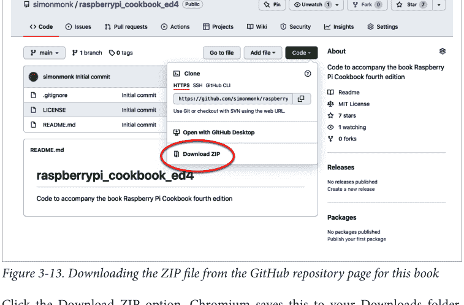

点击 Download ZIP 选项。Chromium 将其保存到你的 Downloads 文件夹。点击下载的 ZIP 文件旁边的向下箭头，然后选择选项“Show in folder.”

这将在 Downloads 文件夹中打开一个文件管理器窗口。找到刚刚下载的 ZIP 文件。

双击 ZIP 文件以打开 Xarchiver 工具，然后点击“Extract files”图标。

在出现的对话框中，将提取文件夹的保存路径更改为 /home/pi，然后点击 Extract。

文件提取后，你的主目录中将出现一个新文件夹，其中包含本书的所有下载内容。

### 讨论

如果你现在使用文件管理器查看主目录中的内容，你会发现一个名为 `raspberry_pi_cookbook_ed4-master` 的文件夹。

### 另请参阅

有关使用 Git 和 GitHub 的更多信息，请参见 [配方 3.21](Recipe 3.21)。

## 3.23 在启动时自动运行程序

### 问题

你希望一个程序或脚本在树莓派启动时自动启动。

### 解决方案

修改你的 `rc.local` 文件以运行你想要的程序。

使用以下命令编辑文件 `/etc/rc.local`：

```
$ sudo nano /etc/rc.local
```

在以 `#` 开头的第一个注释块之后添加以下行：

```
$ /usr/bin/python /home/pi/my_program.py &
```

在命令行末尾包含 `&` 非常重要，以便它在后台运行；否则你的树莓派将无法完成启动。

### 讨论

这种自动运行程序的方式需要非常小心地编辑 `rc.local`，否则你可能会阻止你的树莓派启动。

### 另请参阅

自动运行程序的一种更安全的方法在 [配方 3.24](Recipe 3.24) 中有详细说明。

## 3.24 将程序作为服务自动运行

### 问题

你希望安排一个脚本或程序在每次树莓派重启时自动启动。

### 解决方案

大多数树莓派发行版所基于的 Debian Linux，使用一种基于依赖的机制来自动化启动时运行命令。这有点棘手，需要为你要运行的脚本或程序创建一个配置文件，该文件将位于名为 *init.d* 的文件夹中。

### 讨论

以下示例向你展示如何在你的主目录中运行一个 Python 脚本。该脚本可以做任何事情，但在本例中，该脚本运行一个简单的 Python Web 服务器，这在配方 7.17 中有进一步描述。

涉及的步骤如下：

- 1. 创建一个 *init* 脚本。
- 2. 使 *init* 脚本可执行。
- 3. 告知系统新的 *init* 脚本。

首先，创建 *init* 脚本。你需要在 `/etc/init.d/` 文件夹中创建它。脚本可以任意命名，但在本例中，我们将其命名为 `my_server`。

使用以下命令通过 nano 创建新文件：

```
$ sudo nano /etc/init.d/my_server
```

将以下代码粘贴到编辑器窗口并保存文件。这需要输入很多内容，所以如果你正在阅读本书的纸质版，你可以从这个网页复制并粘贴代码；只需向下滚动直到找到本章和配方：

```
### BEGIN INIT INFO
# Provides:          my_server
# Required-Start:    $remote_fs $syslog $network
# Required-Stop:     $remote_fs $syslog $network
# Default-Start:     2 3 4 5
# Default-Stop:      0 1 6
# Short-Description: Simple Web Server
# Description:       Simple Web Server
### END INIT INFO

#!/bin/sh
# /etc/init.d/my_server

export HOME
case "$1" in
  start)
    echo "Starting My Server"
    sudo /usr/bin/python /home/pi/myserver.py  2>&1 &
    ;;
  stop)
    echo "Stopping My Server"
    PID=`ps auxwww | grep myserver.py | head -1 | awk '{print $2}'`
    kill -9 $PID
    ;;
  *)
    echo "Usage: /etc/init.d/my_server {start|stop}"
    exit 1
    ;;
esac
exit 0
```

要自动化运行一个脚本，这工作量相当大，但其中大部分是每个服务都相同的样板代码。要运行不同的脚本，只需通读脚本，更改描述和你想要运行的 Python 文件的名称。

下一步是使此文件对所有者可执行，你可以使用此命令完成：

```
$ sudo chmod o+x /etc/init.d/my_server
```

现在程序已设置为服务，你可以使用以下命令在将其设置为启动序列的一部分自动启动之前测试一切是否正常：

```
$ /etc/init.d/my_server start
Starting My Server
Bottle v0.11.4 server starting up (using WSGIRefServer())…
Listening on http://192.168.1.16:80/
Hit Ctrl-C to quit.
```

最后，如果运行正常，使用以下命令让系统知道你定义的新服务：

```
$ sudo update-rc.d my_server defaults
```

### 另请参阅

有关使程序自动运行的更简单方法，请参阅配方 3.23。
有关更改文件和文件夹权限的更多信息，请参阅配方 3.13。

## 3.25 定期自动运行程序

### 问题

你希望每天运行一次脚本或定期运行。

### 解决方案

使用 Linux crontab（时间表）命令。
为此，树莓派需要知道时间和日期，因此需要网络连接。

### 讨论

crontab 命令允许你安排事件定期发生。这可以是每天或每小时，你甚至可以定义复杂的模式，以便在一周的不同日子发生不同的事情。这对于你可能想在半夜运行的备份任务很有用。
你可以使用以下命令编辑计划事件：
$ crontab -e
如果你想要运行的脚本或程序需要以超级用户身份运行，请在所有 crontab 命令前加上 sudo（配方 3.12）。
注释行（以 # 开头）指示 crontab 行的格式。数字依次是分钟、小时、月份中的日期、月份和星期几，后面是你想要运行的命令。
如果在相关位置有一个 *，那意味着每个；如果是一个数字，则脚本仅在该分钟/小时/月份中的日期运行。
例如，要每天凌晨 1 点运行 myscript.sh，你需要添加图 3-14 所示的行。

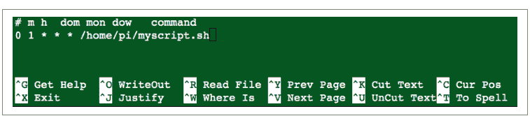

图 3-14. 编辑 crontab

通过在星期几列中指定日期范围，例如 1–5（周一至周五），脚本将仅在凌晨 1 点在这些天运行，如下所示：

```
0 1 * * 1-5 /home/pi/myscript.sh
```

如果你的脚本需要从特定目录运行，你可以使用分号 (;) 分隔多个命令，如下所示：

```
0 1 * * * cd /home/pi; python mypythoncode.py
```

### 另请参阅

你可以通过输入以下命令查看 crontab 的完整 manpage 文档：

```
$ man crontab
```

## 3.26 查找文件

### 问题

你想找到一个你知道在系统某处的文件。

### 解决方案

使用 Linux find 命令。

### 讨论

从命令中指定的目录开始，find 命令将搜索你指定的文件，如果找到该文件，则显示其位置。

例如：

```
$ find /home/pi -name gemgem.py
/home/pi/python_games/gemgem.py
```

你可以从树上的各个点开始搜索，甚至从整个文件系统的根目录 (/) 开始。搜索整个文件系统将花费更长时间，并且还会产生错误消息。你可以通过在行尾添加 2>/dev/null 来重定向这些错误消息。

要在整个文件系统中搜索文件，请使用以下命令：

```
$ find / -name gemgem.py 2>/dev/null
/home/pi/python_games/gemgem.py
```

请注意，2>/dev/null 重定向了那些会使你在最终找到文件时难以看到它的输出。你可以在配方 3.31 中了解更多关于重定向的信息。

你也可以在 find 中使用通配符，如下所示：

```
$ find /home/pi -name match*
/home/pi/python_games/match4.wav
/home/pi/python_games/match2.wav
/home/pi/python_games/match1.wav
/home/pi/python_games/match3.wav
/home/pi/python_games/match0.wav
/home/pi/python_games/match5.wav
```

### 另请参阅

find 命令还有许多其他高级搜索功能。要查看 find 的完整 manpage 文档，请使用此命令：

```
$ man find
```

## 3.27 使用命令行历史记录

### 问题

你希望能够重复命令行上的命令，而无需再次键入它们。

### 解决方案

使用向上箭头和向下箭头键从命令历史记录中选择以前的命令，并使用 history 命令与 grep 查找较旧的命令。

### 讨论

你可以通过按向上箭头键访问你运行的上一个命令。再次按它将带你到之前的命令，依此类推。如果你错过了想要的命令，向下箭头键将带你回到另一个方向。
如果你想取消而不运行选定的命令，请使用 Ctrl-C。Ctrl-C 是命令行中 *停止你正在做的事情* 的意思；在许多情况下，它会完全停止一个程序。
随着时间的推移，你的命令历史记录会变得太大，以至于你无法使用箭头键找到很久以前使用的命令。要找到很久以前的命令，你可以使用 history 命令：

```
$ history
    1  sudo nano /etc/init.d/my_server
    2  sudo chmod +x /etc/init.d/my_server
    3  /etc/init.d/my_server start
    4  cp /media/4954-5EF7/sales_log/server.py myserver.py
    5  /etc/init.d/my_server start
    6  sudo apt update
    7  sudo apt install bottle
    8  sudo apt install python-bottle
```

这会列出你所有的命令历史记录，并且可能有太多条目，以至于你找不到想要的命令。为了补救，你可以使用 | 字符将 history 命令 *管道*（参见配方 3.33）到 grep 命令，后者将仅显示与搜索字符串匹配的结果。因此，例如，要找到你发出的所有 apt（配方 3.17）命令，你可以使用以下行：

```
$ history | grep apt
    6  sudo apt update
    7  sudo apt install bottle
    8  sudo apt install python-bottle
   55  history | grep apt
```

每个历史记录项旁边都有一个数字，所以如果你找到了你正在寻找的行，你可以使用 ! 后跟历史记录编号来运行它，如下所示：

```
$ !6
sudo apt update
......
```

### 另请参阅

要查找文件而不是命令，请参阅配方 3.26。

## 3.28 监控处理器活动

### 问题

树莓派有时运行得有点慢，所以你想看看是什么在占用处理器。

### 解决方案

使用任务管理器实用程序，你可以在树莓派菜单的附件组中找到它（图 3-15）。

## 3.28 使用任务管理器

任务管理器让你可以一目了然地查看 CPU 和内存的使用情况。你也可以右键单击一个进程，然后从弹出的菜单中选择选项来终止它。

窗口顶部的条形图显示了总的 CPU 使用率和内存使用率。进程列表位于其下方，你可以看到每个进程占用的 CPU 份额。

### 讨论

如果你更喜欢从命令行执行此类操作，可以使用 Linux 的 `top` 命令来显示关于处理器和内存使用情况以及哪些进程占用最多资源的非常相似的数据（图 3-16）。然后你可以使用 `kill` 命令来终止一个进程。你需要以超级用户身份执行此操作。

在这种情况下，你可以看到占用资源最多的进程是一个使用了 97% CPU 的 Python 程序。第一列显示了它的进程 ID（2447）。要终止此进程，请输入以下命令：

```
$ kill 2447
```

很有可能以这种方式终止某个重要的操作系统进程，但如果你这样做了，只需关闭你的树莓派电源并重新打开，一切就会恢复正常。

有时你可能有一个正在运行的进程，在使用 `top` 时无法立即看到。如果是这种情况，你可以使用 `ps` 命令搜索所有正在运行的进程，并将结果通过管道（Recipe 3.33）传递给 `grep` 命令（Recipe 3.27），后者将搜索结果并突出显示感兴趣的项目。

例如，要查找我们那个占用大量 CPU 的 Python 进程的进程 ID，我们可以运行以下命令：

```
$ ps -ef | grep "python"
pi       2447  2397 99 07:01 pts/0    00:00:02 python speed.py
pi       2456  2397  0 07:01 pts/0    00:00:00 grep --color=auto python
```

在这种情况下，Python 程序 `speed.py` 的进程 ID 是 2447。列表中的第二个条目是 `ps` 命令本身的进程。

### killall 命令

`kill` 命令的一个变体是 `killall` 命令。请谨慎使用，因为它会终止所有与其参数匹配的进程。因此，例如，以下命令将终止树莓派上运行的所有 Python 程序：

```
$ sudo killall python
```

如果你想要更多信息，可以尝试 `htop` 命令作为 `top` 的替代品。

### 另请参阅

另请参阅 `top`、`ps`、`grep`、`kill` 和 `killall` 的手册页。你可以通过输入 `man` 命令后跟你想了解信息的命令名称来查看这些手册页，如下所示：

```
$ man top
```

## 3.29 处理文件归档

### 问题

你下载了一个压缩文件，想要解压缩它。

### 解决方案

根据文件类型，你需要使用 `tar` 命令或 `gunzip` 命令。

### 讨论

如果你想解压缩的文件扩展名只是 `.gz`，你可以使用以下命令解压：

```
$ gunzip myfile.gz
```

你也经常会遇到包含目录的文件（称为 tar 包），这些目录是使用 Linux 的 `tar` 工具归档，然后使用 `gzip` 压缩成一个文件名类似于 `myfile.tar.gz` 的文件。

你可以使用 `tar` 命令从 tar 包中提取原始文件和文件夹：

```
$ tar -xzf myfile.tar.gz
```

如果文件是 ZIP 归档文件，你可以使用文件管理器和 Xarchiver 工具，如 Recipe 3.22 所示。

### 另请参阅

你也可以从 `tar` 的手册页中找到更多信息，可以通过命令 `man tar` 访问。

## 3.30 列出已连接的 USB 设备

### 问题

你插入了一个 USB 设备，想要确认 Linux 已识别它。

### 解决方案

使用 `lsusb`（类似于 `ls`，但用于 USB 设备）命令。这会列出连接到树莓派 USB 端口的所有设备：

```
$ lsusb
Bus 001 Device 002: ID 0424:9512 Standard Microsystems Corp.
Bus 001 Device 001: ID 1d6b:0002 Linux Foundation 2.0 root hub
Bus 001 Device 003: ID 0424:ec00 Standard Microsystems Corp.
Bus 001 Device 004: ID 15d9:0a41 Trust International B.V. MI-2540D
[Optical mouse]
```

### 讨论

此命令会通知你设备是否已连接，但不能保证设备正常工作。可能需要安装驱动程序或对硬件进行配置更改。

## 3.31 将命令行输出重定向到文件

### 问题

你想快速创建一个包含一些文本的文件，或者将目录列表记录到文件中。

### 解决方案

使用 `>` 命令将原本会出现在运行命令后终端中的输出重定向。

例如，要将目录列表复制到名为 *myfiles.txt* 的文件中，请执行以下操作：

```
$ ls > myfiles.txt
$ more myfiles.txt
Desktop
indiecity
master.zip
mcpi
```

### 讨论

你可以在任何产生输出的 Linux 命令上使用 `>` 命令，即使你正在运行，比如说，一个 Python 程序。

你也可以使用相反的（`<`）命令来重定向用户输入，尽管这远不如 `>` 有用。

### 另请参阅

要使用 `cat` 命令将多个文件连接在一起，请参阅 [Recipe 3.32](Recipe 3.32)。

## 3.32 连接文件

### 问题

你有多个文本文件，想要将它们连接成一个大文件。

### 解决方案

使用 `cat` 命令将多个文件*连接*成一个输出文件。

例如：

```
$ cat file1.txt file2.txt file3.txt > full_file.txt
```

### 讨论

连接文件是 `cat` 命令的真正目的。你可以提供任意数量的文件名，它们都将被写入你指定的文件中。如果你不重定向输出，它将只出现在你的终端窗口中。如果它们是大文件，这个过程可能需要一些时间！

### 另请参阅

另请参阅 [Recipe 3.8](Recipe 3.8)，其中使用 `cat` 显示文件内容。

## 3.33 使用管道

### 问题

你想将一个 Linux 命令的输出用作另一个命令的输入。

### 解决方案

使用管道命令，即键盘上的*竖线*符号（|），将一个命令的输出管道传输到另一个命令。

例如：

```
$ ls -l *.py | grep Jun
-rw-r--r-- 1 pi pi 226 Jun  7 06:49 speed.py
```

此示例将查找所有扩展名为 `.py` 且目录列表中包含 `Jun` 的文件，表明它们最后修改于六月。

### 讨论

乍一看，这很像使用 `>` 进行输出重定向（Recipe 3.31）。区别在于，如果目标是另一个程序，`>` 将不起作用。它只适用于重定向到文件。

你可以将任意数量的程序链接在一起，如这里所示，尽管这不是你经常做的事情：

```
$ command1 | command2 | command3
```

### 另请参阅

参阅 Recipe 3.27 了解如何使用管道和 `grep` 搜索命令历史记录，以及 Recipe 3.28 了解使用 `grep` 查找进程的示例。

## 3.34 隐藏终端输出

### 问题

你想运行一个命令，但不希望输出填满你的屏幕。

### 解决方案

使用 `>` 将输出重定向到 `/dev/null`。

例如：

```
$ ls > /dev/null
```

`dev` 目录包含操作系统设备，包括串行端口等。在此目录中，定义了一个特殊设备（空设备），它只是丢弃发送给它的所有内容。

### 讨论

此示例说明了语法，但除此之外没什么用。更常见的用途是当你运行一个程序，而开发者在其代码中留下了很多跟踪消息，而你并不真正想看到这些消息时。以下示例隐藏了 `find` 命令的多余输出（参见 Recipe 3.36）：

```
$ find / -name gemgem.py 2>/dev/null
/home/pi/python_games/gemgem.py
```

### 另请参阅

有关重定向标准输出的更多信息，请参阅 Recipe 3.31。

## 3.35 在后台运行程序

### 问题

你想在运行程序的同时处理其他任务。

### 解决方案

使用 `&` 命令在后台运行程序或命令。

例如：

```
$ python speed.py &
[1] 2528
$ ls
```

命令行不会等待程序运行完成，而是显示进程 ID（第二个数字），并立即允许你继续运行任何其他想要运行的命令。然后你可以使用此进程 ID 来终止后台进程（Recipe 3.28）。

要将后台进程带回前台，请使用 `fg` 命令：

```
$ fg
python speed.py
```

这会报告正在运行的命令或程序，然后等待它完成。

### 讨论

后台进程的输出仍会出现在终端中。

将进程置于后台的替代方法是直接打开多个终端窗口。

### 另请参阅

有关管理进程的信息，请参阅[配方 3.28](Recipe 3.28)。

## 3.36 创建命令别名

### 问题

你想为经常使用的命令创建别名（快捷方式）。

### 解决方案

使用 nano 编辑文件 `~/.bashrc`（[配方 3.7](Recipe 3.7)），然后移动到文件末尾，根据需要添加任意多行，如下所示：

```
alias L='ls -a'
```

这将创建一个名为 `L` 的别名，输入该别名时，系统会将其解释为命令 `ls -a`。

使用 Ctrl-X 和 Y 保存并退出文件，然后输入以下命令以使用新别名更新终端：

```
$ source .bashrc
```

### 讨论

许多 Linux 用户会为 `rm` 设置别名，如下所示，以便在删除前进行确认：

```
$ alias rm='rm -i'
```

只要你在使用没有设置此别名的他人系统时不会忘记这一点，这并不是一个坏主意！

### 另请参阅

有关 `rm` 的更多信息，请参阅[配方 3.11](Recipe 3.11)。

## 3.37 设置日期和时间

### 问题

你想手动设置树莓派的日期和时间，因为它没有互联网连接。

### 解决方案

使用 Linux 的 date 命令。

日期和时间的格式为 MMDDhhmmYYYY，其中 MM 是月份；DD 是日期；hh 和 mm 分别是小时和分钟；YYYY 是年份。

例如：

```
$ sudo date 010203042019
Wed  2 Jan 03:04:00 GMT 2019
```

### 讨论

如果树莓派连接到互联网，它在启动时会自动使用互联网时间服务器设置自己的时间。

你也可以通过单独输入 date 来显示本地时间：

```
$ date
Fri 19 Jul 10:59:08 BST 2019
```

## 3.38 查看 SD 卡剩余空间

### 问题

你想知道 SD 卡上还有多少可用空间。

### 解决方案

使用 Linux 的 df（磁盘文件系统）命令：

```
$ df -h
Filesystem      Size  Used Avail Use% Mounted on
rootfs          3.6G  1.7G  1.9G  48% /
/dev/root       3.6G  1.7G  1.9G  48% /
devtmpfs        180M     0  180M   0% /dev
tmpfs            38M  236K   38M   1% /run
tmpfs           5.0M     0  5.0M   0% /run/lock
tmpfs            75M     0   75M   0% /run/shm
/dev/mmcblk0p1   56M   19M   38M  34% /boot
```

`-h` 选项使用 KB、MB 和 GB 符号（缩写为 K、M 和 G）来显示大小，而不是字节数。

### 讨论

查看结果的第一行，你可以看到 SD 卡上有 3.6 GB 的存储空间，其中已使用 1.7 GB。

当磁盘空间用尽时，你可能会遇到意外的异常行为，例如出现无法写入文件的错误消息。

### 参阅

你可以使用命令 `man df` 查看 df 的手册页。

## 3.39 查看运行的操作系统版本

### 问题

你想确切知道你运行的是哪个版本的树莓派操作系统。

### 解决方案

在终端或安全外壳（SSH）会话中输入以下命令：

```
$ cat /etc/os-release
PRETTY_NAME="Raspbian GNU/Linux 11 (bullseye)"
NAME="Raspbian GNU/Linux"
VERSION_ID="11"
VERSION="11 (bullseye)"
VERSION_CODENAME=bullseye
ID=raspbian
ID_LIKE=debian
HOME_URL="http://www.raspbian.org/"
SUPPORT_URL="http://www.raspbian.org/RaspbianForums"
BUG_REPORT_URL="http://www.raspbian.org/RaspbianBugs"
```

### 讨论

从上一个示例的结果中可以看出，第一行告诉了我们需要知道的所有信息。在这个例子中，我的树莓派运行的是 Raspbian（树莓派操作系统）版本 11，其昵称为 *bullseye*。

如果你在使用某个特定软件时遇到问题，了解你运行的树莓派操作系统版本会很有用。通常，技术支持人员问你的第一个问题就是 *你运行的是哪个版本的树莓派操作系统？*

你可能需要知道树莓派上 Linux 内核的版本。你可以使用以下命令查看：

```
$ uname -a
Linux raspberrypi 5.15.32-v7l+ #1538 SMP Thu Mar 31 19:39:41 BST 2022
armv7l GNU/Linux
```

这里你可以看到作者的树莓派使用的是 v5.15 版本的内核。

### 另请参阅

要查看 SD 卡或其他启动盘上剩余的空间，请参阅[配方 3.38](Recipe 3.38)。

## 3.40 更新树莓派操作系统

### 问题

你想将树莓派更新到最新版本的树莓派操作系统。

### 解决方案

如果你使用的是较新版本的树莓派操作系统（Bullseye 及以后版本），屏幕右上角应该有一个图标，看起来像一个指向下方托盘的箭头（图 3-17）。点击此图标，你可以选择查看可用更新并进行安装。

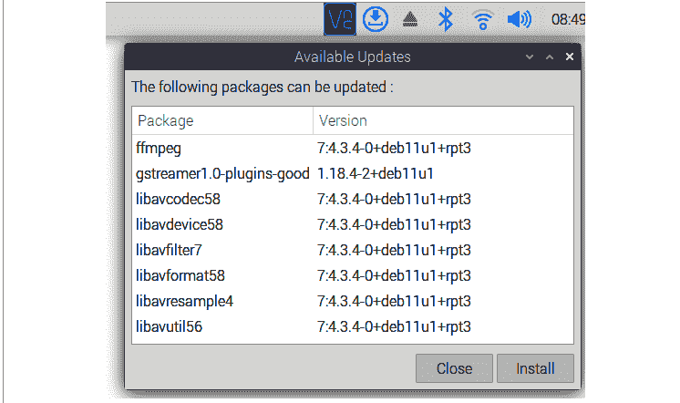

图 3-17. 从桌面安装更新

如果你愿意，也可以从命令行安装。使用终端（[配方 3.3](Recipe 3.3)）打开命令行，然后输入以下命令将系统更新到最新版本：

```
$ sudo apt update
$ sudo apt full-upgrade
```

这将需要一些时间，特别是如果有大量内容需要升级。最重要的是，如果你的系统中有任何重要文件，我建议在升级前将它们复制到 USB 闪存驱动器（[配方 3.2](Recipe 3.2)）。

### 讨论

这些命令中的第一个实际上并不更新树莓派操作系统；它只是更新 apt 包管理器，使其了解构成你的操作系统及相关软件的最新版本。

`full-upgrade` 命令会升级操作系统本身。在此过程中，你将收到所需磁盘空间的警告，因此在按 Y 继续升级之前，你应该使用[配方 3.38](Recipe 3.38)检查是否有足够的空间。

保持你的发行版更新很重要，原因有几个。首先，操作系统更改的主要原因之一是修复错误。因此，软件安装过程中出现的问题通常在系统更新后就会消失。其次，如果你将树莓派暴露在互联网上，新版本的树莓派操作系统通常会修补安全漏洞。

### 另请参阅

要从全新的树莓派操作系统安装重新开始，请参阅[配方 1.6](Recipe 1.6)。

# 第 4 章
使用现成软件

## 4.0 简介

本章包含一些关于在树莓派上使用现成软件的配方。

本章中的一些配方涉及将树莓派转换为单一用途的设备，而其他配方则使用树莓派上的特定软件。

## 4.1 制作媒体中心

### 问题

你想将你的树莓派转换成一个超级棒的媒体中心。

### 解决方案

要将树莓派用作媒体中心，你应该选择性能更优的树莓派 4 B，因为视频播放对处理器要求很高。

你可以在使用树莓派映像器（[配方 1.6](Recipe 1.6)）写入 microSD 卡的同时，将树莓派设置为媒体中心。不要选择树莓派操作系统作为要安装的发行版，而是从操作系统按钮的媒体播放器操作系统部分选择 LibreELEC（图 4-1）。

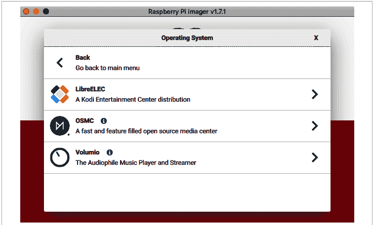

图 4-1. 使用树莓派映像器将 LibreELEC 写入 microSD 卡

LibreELEC 是一个将你的树莓派优化为媒体中心的发行版。它包含了 Kodi 媒体中心软件，该软件基于 XBMC 开源项目，该项目最初是为了将 Xbox 游戏机转换为媒体中心而开发的。此后，该代码已被移植到许多平台，包括树莓派（图 4-2）。


图 4-2. 树莓派作为媒体中心

树莓派完全能够播放全高清视频以及流媒体音乐、MP3 文件和网络电台。

### 讨论

Kodi 是一款功能强大的软件，具有许多功能，设置起来非常直观。检查它是否工作的最简单方法可能是将一些音乐和/或视频文件放到 USB 闪存驱动器或外部 USB 硬盘上，然后将其连接到树莓派。你应该能够从 Kodi 中播放它们。

由于树莓派可能会放在电视附近，你可能会发现你的电视有一个 USB 端口，可以提供足够的电流来运行树莓派。如果是这种情况，你就不需要单独的电源。

无线键盘和鼠标是个好主意，因为如果你成对购买，它们将使用一个 USB 端口的接收器，这样就避免了电线到处乱拉。你也可以购买带有内置触摸板的迷你键盘，在这种情况下很有用。

有线网络连接通常比 WiFi 连接性能更高、更好，但将树莓派放在以太网插座附近并不总是方便。如果是这种情况，你可以设置 XBMC 使用 WiFi。

设置 Kodi 非常直观，你可以在 http://kodi.wiki 找到使用该软件的完整说明。

### 另请参阅

LibreELEC 的一个流行替代品是 OSMC，它也可以从树莓派映像器安装。

你可以为树莓派添加一个红外（IR）遥控器来控制 Kodi。

## 4.2 安装推荐软件

### 问题

你想在树莓派上安装一些常用软件。

### 解决方案

使用推荐软件工具（图 4-3），你可以在树莓派菜单的首选项部分找到它。

## 4.3 使用办公软件

### 问题

你需要在树莓派上打开文字处理、演示文稿和电子表格文档。

### 解决方案

使用推荐软件工具（[配方 4.2](Recipe 4.2)）安装 LibreOffice。

### 讨论

LibreOffice 程序套件（图 4-5）是 Microsoft Office 的一个良好（且免费的）替代品。它包含文字处理、电子表格、演示文稿和绘图软件。事实上，LibreOffice Writer 文字处理器可以打开和保存 Microsoft Word 文档，而电子表格和演示文稿程序也与它们的 Microsoft 对应产品相当兼容。

树莓派 4 或 400 运行办公应用程序会比旧款树莓派好得多。

如今，将文档保存在云端并在浏览器中编辑通常更方便。这些服务最常见的例子是 Microsoft 365 和 Google Docs。两者都需要你注册一个账户，但 Chromium 浏览器完全能够使用这些服务（图 4-6）。

### 另请参阅

访问 https://www.libreoffice.org 了解更多关于 LibreOffice 软件套件的信息。

如果你只想编辑一个无格式的文本文件，可以使用 nano 编辑器（配方 3.7）或 VisualStudio Code（配方 4.10）。

## 4.4 运行复古游戏机模拟器

### 问题

你想把你的树莓派变成一台复古游戏机。

### 解决方案

如果你喜欢重温虚度的青春，在 Atari 2600 模拟器（图 4-7）上玩《小行星》，那么 RetroPie 项目会吸引你。

已经构建了许多精彩的项目，创建了带有复古游戏控制器的定制游戏机和游戏桌。

虽然你可以在 Raspberry Pi OS 之上安装 RetroPie，但使用它的最简单方法是使用 Raspberry Pi Imager（配方 1.6）将其写入 microSD 卡。

值得注意的是，即使这些游戏年代久远，它们仍然归某人所有。你需要用来在模拟器上玩游戏的 ROM 映像文件，虽然在网上很容易找到，但不一定归你所有。所以请遵守法律。

### 讨论

模拟器使用了树莓派有限资源中惊人的一大块，所以你可能会发现你需要使用树莓派 4、3 或 2。通过互联网搜索，你可以找到许多人在这个基本设置的基础上添加了复古 USB 控制器（比如广泛可用且价格相当低廉的控制器），并将树莓派和显示器组装成一个大型街机风格的外壳。你也可以从 Pimoroni 购买一个名为 Picade 的套件来制作一台漂亮的街机（图 4-8）。

### 参阅

完整的 RetroPie 文档可在 [RetroPie 网站](http://retropie.org.uk/) 上找到。

## 4.5 将你的树莓派变成无线电发射器

### 问题

你想将你的树莓派转换成一个低功率 FM 发射器，向普通的 FM 收音机接收器发送无线电信号（图 4-9）。

### 解决方案

在树莓派早期，伦敦帝国理工学院的一些聪明人编写了一些 C 代码，让你可以做到这一点。下载内容甚至播放 *星球大战* 主题曲作为示例。如果你拥有 [初代树莓派 1](http://www.raspberrypi.org/)，这个项目仍然有效。

该项目在更新的树莓派上以一个名为 *rpitx* 的更高级项目继续存在。

你只需要一根短导线连接到通用输入/输出（GPIO）引脚 4。一根 10 厘米的母对公排线就能很好地完成这项工作。事实上，即使没有天线，它也应该能在收音机紧挨着你的树莓派时工作——这就是传输的强度。

第一步是使用以下命令安装 rpitx 软件。请注意，此安装将更改树莓派配置的一些内容，包括 GPU（图形处理器）的工作频率。因此，如果这是你的主要树莓派，请确保首先备份任何珍贵的东西。你需要的代码如下：

```
$ git clone https://github.com/F5OEO/rpitx
$ cd rpitx
$ ./install.sh
```

现在你需要做其他事情大约 15 分钟左右，等待软件安装。你可能会看到看起来像错误消息和警告的内容，但这些都是正常的。在安装结束时，安装程序脚本会询问：

> In order to run properly, rpitx need to modify /boot/config.txt. Are you sure (y/n)

按 Y，然后脚本将通过以下消息确认它所做的更改：

> Set GPU to 250Mhz in order to be stable

如果你需要撤销此更改，请编辑 /boot/config.txt，删除最后一行 gpu_freq=250，然后重新启动。

接下来，找一个 FM 收音机接收器并将其调谐到 103.0 MHz。如果这个频率已被其他传输占用，请选择另一个频率并记下来。

现在运行以下命令（如果你不得不更改频率，请将频率参数从 103.0 更改）：

```
sudo ./pifmrds -freq "103.0" -audio src/pifmrds/stereo_44100.wav
```

如果一切顺利，你应该能听到开发者谈论左右声道的声音。

### 讨论

你需要知道这个项目在你的国家可能不合法。其功率输出高于用于 MP3 播放器的 FM 发射器。

如果你把树莓派放在你的车里，这将是通过车辆音频系统输出声音的好方法。

### 参阅

要了解更多关于 rpitx 项目的信息，请参阅 https://oreil.ly/TrlO1。

## 4.6 编辑位图图像

### 问题

你想处理照片或其他图像。

### 解决方案

安装并运行 GNU 图像处理程序（GIMP；参见图 4-10）。

GIMP 可以从添加/删除软件工具（参见配方 4.2）安装。当你搜索 GIMP 时，会返回许多各种 GIMP 实用程序的结果，所以请寻找名为“GNU Image Manipulation Program”的软件包。

如果你更喜欢从命令行安装 GIMP，请打开终端会话并输入以下命令：

```
$ sudo apt install gimp
```

安装 GIMP 后，你会在树莓派菜单的图形标题下找到 GNU Image Manipulation Program 的条目。

### 讨论

尽管 GIMP 对内存和处理器能力要求很高，但即使在树莓派 2 B 上也可以使用，但如果你使用树莓派 4 或 400，等待时间会少得多。

### 参阅

从 [GIMP 网站](https://www.gimp.org/) 了解更多信息。

GIMP 有很多功能，是一个非常复杂的图像编辑程序，所以确实需要一点学习。你可以在 GIMP 网站上找到该软件的在线手册。

有关使用 apt 安装的更多信息，请参阅 [配方 3.17](https://www.raspberrypi.org/forums/viewtopic.php?t=123456)。

有关编辑矢量图像的信息，请参阅 [配方 4.7](https://www.raspberrypi.org/forums/viewtopic.php?t=123457)。

## 4.7 编辑矢量图像

### 问题

你想创建或编辑高质量的矢量图形，例如可缩放矢量图形（SVG）。

### 解决方案

Inkscape 是从添加/删除软件工具（参见 [配方 4.2](https://www.raspberrypi.org/forums/viewtopic.php?t=123458)）可用的软件包之一。打开该工具并搜索“Inkscape”。

如果你更喜欢从命令行安装 Inkscape，可以使用以下命令：

```
$ sudo apt update
$ sudo apt install inkscape
```

安装 Inkscape 后，其图标将出现在树莓派菜单的图形部分。

### 讨论

Inkscape（[图 4-11](https://www.raspberrypi.org/forums/viewtopic.php?t=123459)）是最常用的开源矢量图像编辑器。矢量绘图包与像 GIMP（[配方 4.6](https://www.raspberrypi.org/forums/viewtopic.php?t=123460)）这样的位图图像编辑器不同，因为图像由形状、线条、文本等组成，这些元素以自身形式存储，而不是转换为像素。这意味着你可以回来编辑这些东西（也许是一条线的位置），这在位图编辑器中是不可能的。

## 4.8 使用书架应用

### 问题

你想免费阅读树莓派相关的书籍和杂志。

### 解决方案

使用预装的书架应用。你可以在树莓派菜单的“帮助”部分找到这个应用。打开它，你会看到（图4-12）*The MagPi*、*Wireframe*和*HackSpace*杂志的往期内容，以及树莓派出版社的书籍。

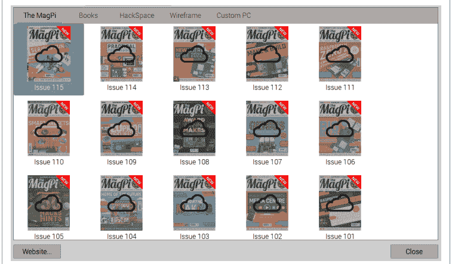

### 讨论

这是一个非常棒的资源。你会在*The MagPi*杂志中找到大量文章，帮助你入门树莓派的各个方面。它也是获取项目灵感的绝佳来源。

### 另请参阅

在[树莓派基金会](https://www.raspberrypi.org/)网站上可以找到许多有趣的树莓派资源。

你也可以下载*The MagPi*杂志的PDF往期版本，或订阅纸质版。

## 4.9 播放网络电台

### 问题

你想在树莓派上播放网络电台。

### 解决方案

VLC媒体播放器应该已随树莓派操作系统预装。你可以在树莓派菜单的“声音与视频”下找到它。如果找不到，可以使用首选软件工具（参见配方4.2）安装。

如果你更喜欢从命令行安装VLC媒体播放器，可以运行以下命令：

```
sudo apt install vlc
```

运行程序，然后在“媒体”菜单中选择“打开网络串流”选项。这将打开一个对话框（见图4-13），你可以在其中输入想要播放的网络电台的URL。你需要将耳机或有源音箱插入树莓派的音频插孔。

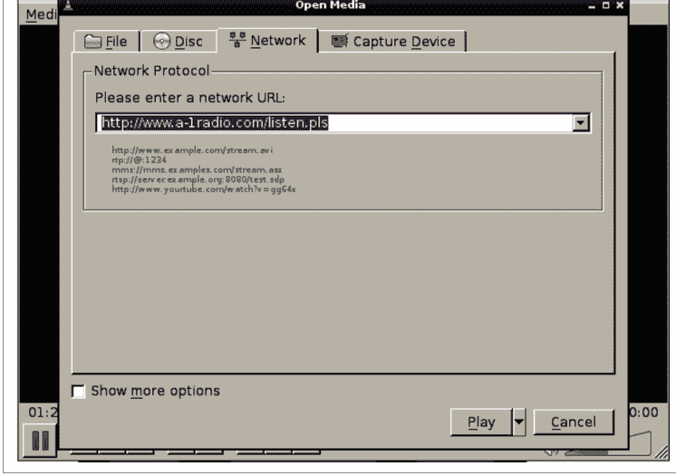

### 讨论

你也可以从命令行运行VLC，如下所示：

```
$ vlc http://www.a-1radio.com/listen.pls -I dummy
```

VLC可能会产生一系列错误信息，但随后能正常播放音频。`-I dummy`选项可以防止VLC窗口打开。

### 另请参阅

本配方大量借鉴了这个[教程](https://example.com)，其中Jan Holst Jensen更进一步，为项目添加了电台风格的控制功能。

对于英国读者，可以在网上找到[BBC电台串流URL列表](https://example.com)。

## 4.10 使用Visual Studio Code

### 问题

你想使用一个轻量级的编程编辑器。

### 解决方案

安装微软的Visual Studio Code，或简称VS Code。

你可以在推荐软件工具的“编程”部分找到VS Code（参见[配方4.2](https://example.com)）。

如果你更喜欢从命令行安装，可以使用以下命令：

```
$ sudo apt install code
```

### 讨论

VS Code深受程序员喜爱。它恰到好处地介于简单的文本编辑器和功能齐全的集成开发环境（IDE）之间。它非常易于使用，并在你编写代码时提供有用的建议，而无需学习更复杂IDE的方方面面。它支持多种编程语言，并能出色地完成诸如为代码着色以使其更易阅读等任务。

如果你是一位经验丰富的程序员，你可能更喜欢使用Visual Studio Code而不是像Thonny或Mu（参见配方[5.3](https://example.com)和[5.4](https://example.com)）这样的初学者Python IDE来编辑你的树莓派Python代码。如果你的项目包含多个文件，这一点尤其正确。[图4-14](https://example.com)显示了左侧的文件资源管理器区域，你可以在其中看到项目中的所有文件。点击一个文件即可在编辑器区域中打开它，每个打开的文件都有自己的标签页。

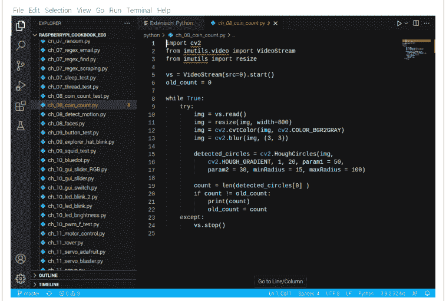

如你所见，编辑器会高亮显示语言语法，通过着色使其更易阅读和发现错误。

无论你是用Python（参见第5章）还是其他语言编程，Visual Studio Code都是一个有用的工具。

### 另请参阅

简单的文本编辑器nano是编辑代码的一种简便方式（参见配方3.7）。

Thonny是一个面向初学者的Python编辑器（参见配方5.3）。

## 4.11 控制激光切割机

### 问题

你想从树莓派控制你的低成本K40激光切割机。

### 解决方案

如果你拥有流行的低成本中国K40系列激光切割机（图4-15），你可以使用K40 Whisperer软件来控制它。这样，你就不必使用相对昂贵的Windows电脑来控制激光切割机，而是可以使用成本低得多的树莓派。

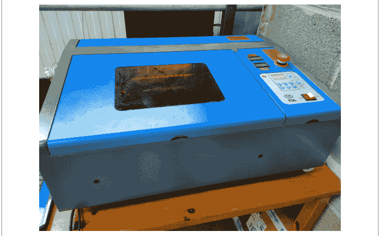

该软件用Python编写，但也依赖于Inkscape矢量绘图包。因此，如果你还没有安装Inkscape，请按照配方4.7进行安装。

接下来，下载K40 Whisperer软件的源代码。从“K40 Whisperer Source”列中选择最新的下载。双击下载的ZIP文件并将其解压到你的主目录（/home/pi）。在解压后的目录中，你会找到一个名为README_Linux.txt的文件。这里的说明基于该文件。该README适用于一般的Linux系统，而非特定于树莓派。

首先，运行以下两个命令为软件创建一个用户组。第一个命令添加一个专门用于激光切割机的新用户组，第二个命令将用户pi添加到该组中。如果你在设置树莓派时创建了不同的用户名，请用该用户名替换pi：

```
$ sudo groupadd lasercutter
$ sudo usermod -a -G lasercutter pi
```

确保你的激光切割机已通过USB线连接到树莓派，并且激光切割机已开机。现在你需要运行以下命令来查找激光切割机的USB供应商ID和产品ID。这些ID可能分别是1a86和5512，但值得检查一下以防激光切割机制造商更改了它们。为此，运行lsusb命令：

```
$ lsusb
Bus 001 Device 004: ID 1a86:5512 QinHeng Electronics CH341 in EPP/MEM/I2C mode,
    EPP/I2C adapter
Bus 001 Device 005: ID 0424:7800 Microchip Technology, Inc. (formerly SMSC)
Bus 001 Device 003: ID 0424:2514 Microchip Technology, Inc. (formerly SMSC)
    USB 2.0 Hub
Bus 001 Device 002: ID 0424:2514 Microchip Technology, Inc. (formerly SMSC)
    USB 2.0 Hub
Bus 001 Device 001: ID 1d6b:0002 Linux Foundation 2.0 root hub
```

这将列出连接到树莓派的所有USB设备；找到与你的激光切割机对应的条目。在这个例子中，它是唯一一个中文名称（QinHeng）。但如果你需要确认，可以拔掉激光切割机，再次运行lsusb命令，看看哪个条目消失了。

在该条目的行上，你可以看到文本`1a86:5512`。冒号前的部分是供应商ID，5512是产品ID。你需要知道这些，因为你将在配置文件中使用它们。

使用以下命令在nano中创建并编辑一个新文件：

```
$ sudo nano /etc/udev/rules.d/97-ctc-lasercutter.rules
```

你可以在配方3.7中找到有关编辑文件的信息。将以下文本粘贴到文件中。如果你的供应商ID和产品ID与我的不同，请更改文本的相应部分以匹配你的ID：

```
SUBSYSTEM=="usb", ATTRS{idVendor}=="[1a86]", ATTRS{idProduct}=="[5512]",
    ENV{DEVTYPE}=="usb_device", MODE="0664", GROUP="lasercutter"
```

重启你的树莓派，然后通过运行以下命令安装K40 Whisperer需要的更多模块来继续安装：

```
$ sudo apt install libxml2-dev libxslt-dev
$ sudo apt install libusb-1.0-0
$ sudo apt install libusb-1.0-0-dev
```

确保你位于下载K40 Whisperer的目录中，然后运行以下命令：

```
$ pip3 install -r requirements.txt
```

你现在已准备好使用以下命令运行程序。这将打开一个窗口。点击“文件”菜单，然后选择“选项”来配置软件（图4-16）：

```
$ python3 k40_whisperer.py
```

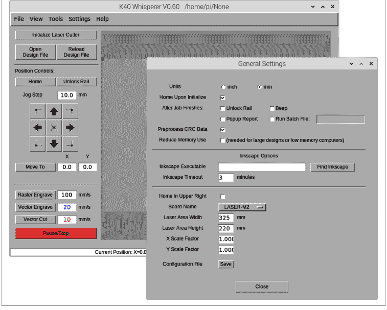

图4-16. 配置K40 Whisperer

请查阅激光切割机附带的说明书，以确定其使用的控制板型号。如果找不到，你可能需要尝试几种不同的“控制板名称”设置选项。其他设置无需更改。

关闭设置窗口后，你可以加载一个SVG文件进行切割（图4-17）。

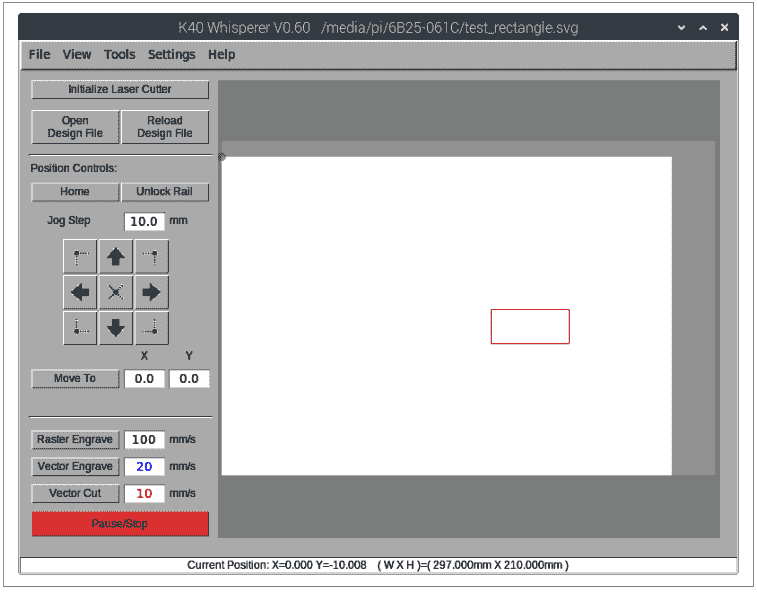

图4-17. 准备切割

### 讨论

激光切割机通常附带其专有的控制软件，该软件一般运行在Microsoft Windows计算机上。它甚至可能配备一个硬件USB加密狗，旨在将该软件与你的计算机绑定。

K40 Whisperer软件可以直接从SVG图形进行切割和雕刻。你只需用不同颜色的线条绘制轮廓，线宽为0.1毫米。红色线条表示切割，蓝色线条表示矢量雕刻（轻微烧灼轮廓），黑色线条表示光栅雕刻（来回扫描以烧灼表面区域）。

### 另请参阅

有关K40 Whisperer的完整信息，请参阅[https://oreil.ly/5RJth](https://oreil.ly/5RJth)。

要为你的激光切割和蚀刻创建SVG图形，你可以使用InkScape（[配方4.7](Recipe 4.7)）。

树莓派也可以使用[OctoPrint](OctoPrint)作为3D打印机的出色控制器。

# 第5章
Python基础

## 5.0 简介

虽然许多语言都可以用来为树莓派编程，但Python是最受欢迎的。事实上，树莓派中的“Pi”就是受“python”一词的启发。

在本章中，你将找到一系列配方，帮助你开始使用树莓派进行编程。

## 5.1 在Python 2和Python 3之间做选择

### 问题

你需要使用Python，但不确定应该使用哪个版本。

### 解决方案

使用Python 3，直到你遇到一个最好通过回退到版本2来解决的问题。

要在树莓派操作系统上安装Python 2，请运行以下命令：

```
$ sudo apt update
$ sudo apt install python2
```

然后你可以使用命令`python2`来运行Python 2。

### 讨论

尽管Python的最新版本Python 3已经存在多年，但你会发现很多人仍在使用Python 2。Python 3（树莓派操作系统的默认版本）可以通过命令`python`或`python3`来运行。除非另有说明，本书中的示例都是为Python 3编写的。大多数示例无需修改即可在Python 2和Python 3上运行。

Python社区不愿放弃旧版本，很大程度上是因为Python 3引入了一些破坏与版本2兼容性的更改。因此，为Python 2开发的大量第三方库中，有些在Python 3下无法工作。

我的策略是尽可能使用Python 3编写，只在因兼容性问题需要时才回退到Python 2。

### 另请参阅

关于Python 2与Python 3之争的很好总结，请参阅[Python维基](https://wiki.python.org/moin/Python2orPython3)。

## 5.2 选择Python编辑器

### 问题

Python编辑器有很多选择，你想知道应该从哪一个开始。

### 解决方案

大多数人会从Thonny（配方5.3）或Mu（配方5.4）开始。两者都是优秀的编辑器，而且都易于使用。

Thonny是树莓派操作系统预装的，而Mu需要安装。你会发现很多关于这两个编辑器的资源，并且在树莓派基金会的大多数材料中，Thonny比Mu更受推荐。

### 讨论

你从哪个编辑器开始并不太重要。你可以尝试一下Thonny和Mu，看看你最喜欢哪个。

随着你编程经验的积累，你应该尝试使用VS Code（配方4.10）作为更专业的工具。

### 另请参阅

VS Code在配方4.10中描述，Thonny在配方5.3中描述。

## 5.3 使用Thonny编辑Python程序

### 问题

你想使用Thonny编辑你的Python程序。

### 解决方案

Thonny应该随树莓派操作系统预装。但如果它不在你的树莓派菜单的“编程”部分，你可以使用“推荐软件”工具（配方4.2）安装它。

首先从树莓派菜单的“编程”部分打开Thonny，并输入以下几行文本，如图5-1所示：

```
python
for i in range(1, 10):
    print(i)
```

当你开始输入程序的第二行时，`print`语句应该会自动缩进。

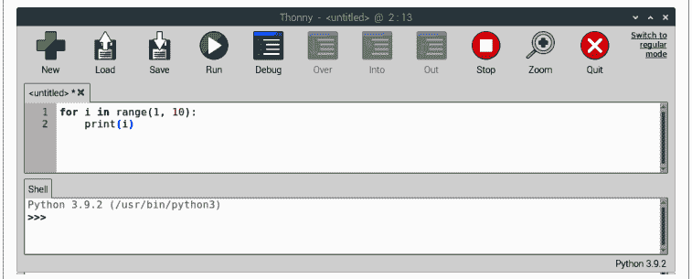

图5-1. Thonny编辑器

你可以点击“运行”按钮来运行程序，看看它的作用。在运行程序之前，Thonny会提示你保存文件。给它一个名字，比如*count.py*。然后程序将运行，你会在Thonny窗口底部看到输出（图5-2）。

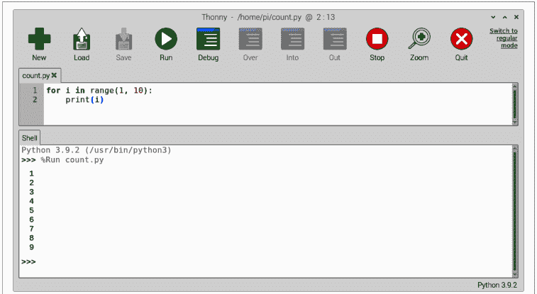

图5-2. 在Thonny中运行程序

虽然你可以给你的Python程序起任何你喜欢的名字，但惯例是给它们加上`.py`文件扩展名。

### 讨论

我们还没有开始Python编程，但从这个例子中，你可以看到程序就是用Python编程语言向计算机发出指令。在这个例子中，指令是打印出一系列数字。

### 另请参阅

Thonny的一个流行替代品是Mu（配方5.4）。
访问Thonny官方网站获取更多信息。
除了使用Mu编辑和运行Python文件外，你也可以在nano（配方3.7）中编辑Python文件，然后从终端会话（配方5.6）运行它们。

## 5.4 使用Mu编辑Python程序

### 问题

你想使用Mu编辑你的Python程序。

### 解决方案

Mu在最新版本的树莓派操作系统中并未预装。要安装它，请使用“推荐软件”工具（配方4.2）。安装后，你会在树莓派菜单的“编程”部分找到它（图5-3）。

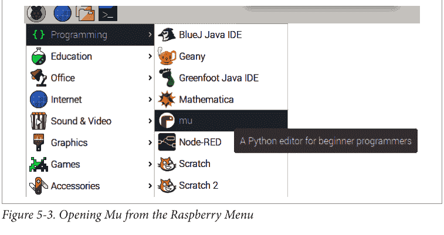

图5-3. 从树莓派菜单打开Mu

首次启动Mu时，系统会提示你选择一个模式（图5-4）。

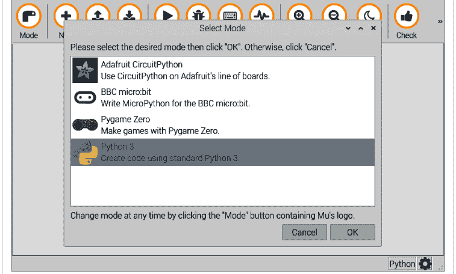

图5-4. 为Mu选择模式

选择Python 3模式并点击“确定”。这将打开Mu编辑器，这样你就可以开始编写一些Python代码了。

让我们试试看。在编辑器区域“Write your code here :-)”注释下方，仔细输入以下测试代码：

```
for i in range(1, 10):
    print(i)
```

这个小程序将计数到9。现在不用担心它是如何工作的；所有内容都将在配方5.23中解释。注意，当你输入完第一行并按回车键时，带有`print`语句的第二行应该会自动缩进（图5-5）。

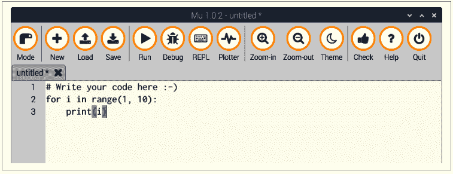

图5-5. 在Mu中编辑代码

在运行程序之前，我们需要将其保存到文件，因此在Mu窗口顶部，点击“保存”按钮，然后将文件命名为`count.py`（图5-6）。

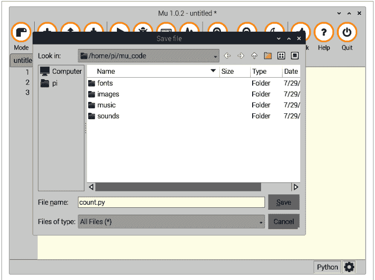

图5-6. 在Mu中保存文件

文件保存后，通过点击Mu窗口顶部的“运行”按钮来运行程序。这会导致Mu编辑器屏幕分割，下半部分显示运行程序的结果（图5-7）。

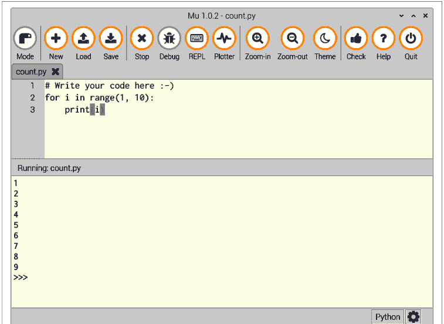

图5-7. 运行程序`count.py`

如果你已经按照配方3.22操作并下载了本书附带的文件，你可以直接在Mu中使用“打开”按钮打开这些文件，然后导航到文件夹`~/raspberrypi_cookbook_ed4/python`，如图5-8所示。请注意，Mu是Python 3，而本书的一些Python程序仅适用于Python 2，因此如果运行时遇到问题，请检查代码所属配方的文本。

### 讨论

Python 作为一种编程语言，其独特之处在于缩进是语言的基本组成部分。许多基于 C 的语言使用 `{` 和 `}` 来界定代码块，而 Python 则使用缩进级别。因此，在前面的例子中，Python 知道 `print` 是作为 `for` 循环的一部分被重复调用的，因为它从左边缩进了四个空格。

当你刚开始使用 Python 时，看到类似 “IndentationError: unexpected indent” 的错误并不罕见，这意味着某处缩进不正确。如果一切看起来都对齐了，请仔细检查缩进中是否包含制表符，因为 Python 对制表符的处理方式不同。

你可以使用空格或制表符，但不能在同一个代码块中混合使用它们，并且在同一个程序中混合使用是非常糟糕的做法（即使 Python 允许你这样做）。

在为我们的编辑模式选择 Python 3（图 5-4）时，我们忽略了其他模式选项。Adafruit CircuitPython 模式允许你使用树莓派来编程 Adafruit 的一系列 CircuitPython 开发板，而 BBC micro:bit 模式允许你为 BBC micro:bit 开发板编写 MicroPython 程序。这两项活动都是关于使用本书未涵盖的其他开发板；然而，了解有选项可以将树莓派与这些微控制器开发板一起使用是很好的。

### 另请参阅

另一个适合初学者的流行 Python 编辑器是 Thonny（配方 5.3）。

除了使用 Mu 编辑和运行 Python 文件外，你还可以在 nano（配方 3.7）中编辑文件，然后从终端会话（配方 5.6）中运行它们。

## 5.5 使用 Python 控制台

### 问题

你想输入 Python 命令而无需编写整个程序。这样做对于试验 Python 的某些功能可能很有用。

### 解决方案

使用 Python 控制台，可以在 Thonny 中或在终端会话中使用。Python 控制台提供了一个类似于树莓派操作系统（配方 3.3）的命令行，但你可以输入 Python 命令而不是操作系统命令。如果你使用 Mu（配方 5.4），你可以通过点击 Mu 窗口顶部的 REPL（读取-求值-打印-循环）按钮（图 5-9）来访问 Python 控制台。

忽略图 5-9 中除底部以外的所有内容，你可以看到一个命令提示符，你可以在其中输入 Python 命令。在这种情况下，我在 `In [1]:` 提示符后输入了以下内容：

```
2 + 2
```

并放心地得到了答案：

```
4
```

### 讨论

使用 Mu 运行单个 Python 命令的替代方法是在终端窗口中通过输入命令 **python3** 来启动 Python 3 控制台。

`>>>` 提示符表示你可以输入 Python 命令。如果你需要输入多行命令，控制台将自动提供一个由三个点表示的续行。你仍然需要将这些行缩进四个空格，如以下会话所示：

```
>>> from time import sleep
>>> while True:
...     print("hello")
...     sleep(1)
...
hello
hello
```

你需要在最后一个命令后按两次回车键，控制台才能识别缩进块的结束并运行代码。

Python 控制台还提供命令历史记录，因此你可以使用向上和向下箭头键在之前的命令中来回移动。
当你完成 Python 控制台的使用并想返回命令行时，输入 `exit()`。

> ## 帮助触手可及
> 控制台在开发程序时可以是一个测试代码行的有用场所，而无需运行整个程序。你可以通过在控制台中输入 `help(thing)` 来获取关于许多 Python 功能的帮助，其中 *thing* 是你想要获取帮助的对象。

例如，尝试在 Python 控制台中输入 `help(print)`。

### 另请参阅

如果你需要输入的代码行超过几行，你最好使用 Thonny 或 Mu（配方 5.3 或 5.4）来编辑和运行文件。

## 5.6 从终端运行 Python 程序

### 问题

从 Thonny（配方 5.3）或 Mu（配方 5.4）中运行程序很好，但有时你想从终端窗口运行 Python 程序。

### 解决方案

在终端中使用 `python` 或 `python3` 命令，后跟包含你要运行的程序的文件名。（树莓派操作系统仅附带 Python 3，因此 `python` 或 `python3` 命令都将运行 Python 3 程序。使用哪个命令取决于你。）

### 讨论

要从命令行运行 Python 3 程序，请使用如下命令：

```
$ python3 myprogram.py
```

如果你想使用 Python 2 运行程序，请在按照配方 5.1 安装 Python 2 后，将命令 `python3` 更改为 `python2`。在这两种情况下，你要运行的 Python 程序都应该在一个扩展名为 `.py` 的文件中。

你可以以普通用户身份运行大多数 Python 程序；但是，有些你需要以超级用户身份运行。如果你的程序属于这种情况，请在命令前加上 `sudo`：但要注意，如果有人恶意编写了该程序，赋予它这样的权限可能会让它进行各种恶作剧：

```
$ sudo python3 myprogram.py
```

在前面的示例中，你需要在命令中包含 `python3` 来运行程序，但你可以选择在 Python 程序的开头添加一行，以便 Linux 知道它是一个 Python 程序。这个特殊的行称为 shebang（是两个符号名称的缩写，“hash”和感叹号，或“bang”）。以下单行示例程序说明了这一点：

```
#!/usr/bin/python3
print("I'm a program, I can run all by myself")
```

在你可以直接从命令行运行此程序之前，你必须使用以下命令（参见配方 3.14）赋予文件写权限；此示例假设文件名为 test.py：

```
$ chmod +x test.py
```

参数 `+x` 表示向文件添加执行权限。

现在你可以使用单个命令运行 Python 程序 test.py：

```
$ ./test.py
I'm a program, I can run all by myself
$
```

命令行需要行首的 `./` 来找到文件。

如果你使用 `-i` 选项运行 Python 程序，程序将运行并打开一个控制台。这对于调试很有用，因为你可以在控制台中访问程序的变量，就好像你刚刚直接将程序输入到控制台中一样。

### 另请参阅

配方 3.25 向你展示如何将 Python 程序作为定时事件运行。

要自动在启动时运行程序，请参阅配方 3.23。

## 5.7 将名称赋值给值（变量）

### 问题

你想给一个值一个名称。

### 解决方案

你使用 `=` 将值赋给名称。

### 讨论

在 Python 中，你不必声明变量的类型；你可以使用赋值运算符 (`=`) 直接为其赋值，如以下示例所示：

```
a = 123
b = 12.34
c = "Hello"
d = 'Hello'
e = True
```

你可以使用单引号或双引号定义字符串常量。Python 中的逻辑常量是 `True` 和 `False`，它们区分大小写。

按照惯例，变量名以小写字母开头，如果变量名由多个单词组成，则单词之间用下划线字符连接。变量名不能以数字开头，但可以在第一个字符后包含数字。

给你的变量起描述性名称总是一个好主意，这样当你休息一段时间后回到程序时，你可以弄清楚它是如何工作的。

一些有效变量名的例子是 `x`、`total` 和 `number_of_chars`。

### 另请参阅

你也可以将变量赋值为一个列表（配方 6.1）或一个字典（配方 6.13）。

有关变量算术运算的更多信息，请参阅配方 5.10。

## 5.8 显示输出

### 问题

你想查看变量的值。

### 解决方案

使用 `print` 命令。你可以在 Python 控制台（配方 5.5）中尝试以下示例：>>> x = 10
>>> print(x)
10
>>>

请注意，print 命令会另起一行进行打印。

### 讨论

在 Python 2 中，你可以使用 print 命令而无需在值周围加括号。然而，在 Python 3 中情况并非如此，因此为了兼容两个版本的 Python，请始终在要打印的值周围使用括号。

### 另请参阅

要读取用户输入，请参阅配方 5.9。

要更好地格式化打印内容，请参阅配方 7.1 和 7.2。

## 5.9 读取用户输入

### 问题

你希望提示用户输入一个值。

### 解决方案

使用 `input`（Python 3）命令。你可以在 Python 3 控制台（配方 5.5）中尝试以下示例：

```
>>> x = input("Enter Value:")
Enter Value:23
>>> print(x)
23
>>>
```

### 讨论

在 Python 3 中，`input` 的行为与 Python 2 中有很大不同。在 Python 3 中，`input` 返回一个字符串，即使输入的是数字。在 Python 2 中则不是这样，如果文本看起来像数字，它会被转换为数字。

### 另请参阅

在 Python 2 中查找有关 `input` 的更多信息，请访问 https://oreil.ly/EhqMt。

## 5.10 使用算术运算符

### 问题

你想在 Python 中进行算术运算。

### 解决方案

使用 `+`、`-`、`*` 和 `/` 运算符。

### 讨论

最常见的算术运算符是 `+`、`-`、`*` 和 `/`，分别代表加、减、乘和除。

你也可以使用括号将表达式的部分组合在一起，如以下示例所示，该示例将摄氏温度转换为华氏温度：

```
>>> tempC = input("Enter temp in C: ")
Enter temp in C: 20
>>> tempF = (int(tempC) * 9) / 5 + 32
>>> print(tempF)
68.0
>>>
```

`int` 函数将 `input` 返回的字符字符串转换为整数。

其他算术运算符包括 `%`（取模余数）和 `**`（幂运算）。例如，要计算 2 的 8 次方，你可以这样写：

```
>>> 2 ** 8
256
```

算术运算符的求值顺序可能会影响计算结果。例如，`2 + 3 * 2` 的结果是以下哪个？

- (2 + 3) * 2 = 10
- 2 + (3 * 2) = 8

Python 3 的答案是 8，因为 `*` 总是在 `+` 之前执行。

记住运算优先级顺序的助记符是 BODMAS：

- Brackets（括号）
- Orders（幂运算 `**`）
- Division（除法）
- Multiplication（乘法）
- Addition（加法）
- Subtraction（减法）

编程时你经常想做的一件事是将变量的值增加一定量。如果你有一个名为 *x* 的变量包含一个数字，你可以使用以下方式将其加 1：

```
x = x + 1
```

因为这是非常常见的操作，所以有像 `+`、`-`、`*` 和 `/` 这样的运算符的快捷方式，它们既应用运算符又赋新值。因此，要将 x 加 1，你也可以这样写：

```
x += 1
```

### 另请参阅

参阅配方 5.9 了解如何使用 `input` 命令，以及配方 5.14 了解如何将 `input` 的字符串值转换为数字。

Math 库有许多有用的数学函数可供使用。

## 5.11 创建字符串

### 问题

你想创建一个字符串变量——即一个包含文本的变量。

### 解决方案

使用赋值运算符（`=`）和字符串常量来创建一个新字符串。你可以使用双引号或单引号将字符串括起来，但它们必须匹配。例如：

```
>>> s = "abc def"
>>> print(s)
abc def
>>>
```

### 讨论

如果双引号或单引号*在*字符串*内部*，则选择另一种类型的引号作为字符串的开始和结束标记。例如：

```
>>> s = "Isn't it warm?"
>>> print(s)
Isn't it warm?
>>>
```

有时你需要在字符串中包含制表符或换行符等特殊字符。这需要使用所谓的*转义字符*。要包含制表符，请使用 `\t`；要包含换行符，请使用 `\n`。例如：

```
>>> s = "name\tage\nMatt\t14"
>>> print(s)
name    age
Matt    14
>>>
```

### 另请参阅

有关转义字符的完整列表，请参阅 [Python 参考手册](http://docs.python.org/reference/lexical_analysis.html#string-literals)。

## 5.12 连接（拼接）字符串

### 问题

你想将多个字符串连接在一起。

### 解决方案

使用 `+`（连接）运算符。

例如：

```
>>> s1 = "abc"
>>> s2 = "def"
>>> s = s1 + s2
>>> print(s)
abcdef
>>>
```

### 讨论

在许多语言中，你可以有一系列要连接的值，其中一些是字符串，另一些是其他类型（如数字），数字在连接过程中会自动转换为字符串。在 Python 中情况并非如此，如果你尝试以下命令，你会得到一个错误：

```
>>> "abc" + 23
Traceback (most recent call last):
  File "<stdin>", line 1, in <module>
TypeError: can only concatenate str (not "int") to str
```

在 Python 中，你必须在连接之前将要连接的每个组件转换为字符串，如本例所示：

```
>>> "abc" + str(23)
'abc23'
>>>
```

### 另请参阅

有关使用 `str` 函数将数字转换为字符串的更多信息，请参阅配方 5.13。

## 5.13 将数字转换为字符串

### 问题

你想将一个数字转换为字符串。

### 解决方案

使用 Python 的 `str` 函数。

例如：

```
>>> str(123)
'123'
>>>
```

### 讨论

想要将数字转换为字符串的一个常见原因是，然后你可以将其与另一个字符串连接（配方 5.12）。

### 另请参阅

有关将字符串转换为数字的反向操作，请参阅配方 5.14。

## 5.14 将字符串转换为数字

### 问题

你想将一个字符串转换为数字。

### 解决方案

使用 Python 的 `int` 或 `float` 函数。

例如，要将字符串 -123 转换为数字，你可以使用以下方法：

```
>>> int("-123")
-123
>>>
```

这适用于正数和负整数。

要转换浮点数，请使用 `float` 而不是 `int`：

```
>>> float("123.45")
123.45
>>>
```

### 讨论

`int` 和 `float` 都能正确处理前导零，并且对数字周围的任何空格或其他空白字符具有容忍度。

你也可以使用 `int` 通过提供数字基数作为第二个参数，将表示非默认十进制数的字符串转换为数字。以下示例将二进制数 1001 的字符串表示形式转换为数字：

```
>>> int("1001", 2)
9
>>>
```

第二个示例将十六进制数 AFF0 转换为整数：

```
>>> int("AFF0", 16)
45040
>>>
```

### 另请参阅

有关将数字转换为字符串的反向操作，请参阅配方 5.13。

## 5.15 查找字符串的长度

### 问题

你需要知道字符串中有多少个字符。

### 解决方案

使用 Python 的 `len` 函数。

### 讨论

例如，要查找字符串 abcdef 的长度，你可以使用：

```
>>> len("abcdef")
6
>>>
```

### 另请参阅

`len` 命令也适用于列表（配方 6.3）。

## 5.16 在另一个字符串中查找一个字符串的位置

### 问题

你需要在一个字符串中查找另一个字符串的位置。

### 解决方案

使用 Python 的 `find` 函数。

例如，要查找字符串 def 在字符串 abcdefghi 中的起始位置，你可以使用：

```
>>> s = "abcdefghi"
>>> s.find("def")
3
>>>
```

字符位置从 0（而不是 1）开始，因此位置 3 表示字符串中的第四个字符。

### 讨论

如果你要查找的字符串在被搜索的字符串中不存在，`find` 返回值 -1。

### 另请参阅

`replace` 函数用于查找并替换字符串的所有出现（配方 5.18）。

## 5.17 提取字符串的一部分

### 问题

你想在特定字符位置之间剪切出字符串的一部分。

### 解决方案

使用 Python 的 `[:]` *切片*表示法。

例如，要从字符串 abcdefghi 中剪切出从第二个字符到第五个字符的部分，你可以使用以下方法：

```
>>> s = "abcdefghi"
>>> s[1:5]
'bcde'
>>>
```

字符位置从 0（而不是 1）开始，因此位置 1 表示字符串中的第二个字符，5 表示第六个字符；然而，字符范围在高端是排他的（字符结束于索引位置 4 而不是 5）。因此，在此示例中，即使字母 *f* 是第五个字符，它也不包括在内。

### 讨论

`[:]` 表示法非常强大。你可以省略任一参数，此时将根据情况假定字符串的开始或结束。例如：

```
>>> s = "abcdefghi"
>>> s[:5]
'abcde'
>>>
```

以及：

```
>>> s = "abcdefghi"
>>> s[3:]
'defghi'
>>>
```

你也可以使用负索引从字符串末尾开始计数。这在诸如你想查找文件的三字母扩展名等情况下很有用，如以下示例所示：

```
>>> "myfile.txt"[-3:]
'txt'
```

### 另请参阅

**配方 5.12** 描述了连接字符串而不是拆分它们。

## 5.18 在字符串中用一个字符串替换另一个字符串

### 问题

你想替换另一个字符串中所有出现的某个字符串。

### 解决方案

使用 `replace` 函数。

例如，要将所有出现的 `X` 替换为 `times`，你可以使用以下代码：

```
>>> s = "It was the best of X. It was the worst of X"
>>> s.replace("X", "times")
'It was the best of times. It was the worst of times'
>>>
```

`replace` 函数接受两个参数。第一个是要查找的字符串，第二个是用于替换的字符串。

### 讨论

你搜索的字符串必须完全匹配；也就是说，搜索是区分大小写的，并且会包含空格。

### 另请参阅

参见配方 5.16 了解如何在不执行替换的情况下搜索字符串。
另一种更强大的字符串处理方法在配方 7.23 中描述。

## 5.19 将字符串转换为大写或小写

### 问题

你想将字符串中的所有字符转换为大写或小写字母。

### 解决方案

根据需要使用 `upper` 或 `lower` 函数。

例如，要将 `aBcDe` 转换为大写，你可以使用以下代码：

```
>>> "aBcDe".upper()
'ABCDE'
>>>
```

要将其转换为小写，请使用以下代码：

```
>>> "aBcDe".lower()
'abcde'
>>>
```

请注意，尽管 `upper` 和 `lower` 不接受任何参数，但它们仍然需要在末尾加上 `()`。

### 讨论

与大多数以某种方式操作字符串的函数一样，`upper` 和 `lower` 实际上并不修改字符串，而是返回字符串的修改副本。

例如，以下代码返回字符串 `s` 的副本，但请注意原始字符串并未更改：

```
>>> s = "aBcDe"
>>> s.upper()
'ABCDE'
>>> s
'aBcDe'
>>>
```

要将 `s` 的值更改为全大写，请执行以下操作：

```
>>> s = "aBcDe"
>>> s = s.upper()
>>> s
'ABCDE'
>>>
```

### 另请参阅

参见配方 5.18 了解如何在字符串中替换文本。

## 5.20 有条件地运行命令（if）

### 问题

你想仅在某个条件为真时运行一些 Python 命令。

### 解决方案

使用 Python 的 `if` 命令。

以下示例仅在 `x` 的值大于 100 时打印消息 `x is big`：

```
>>> x = 101
>>> if x > 100:
...     print("x is big")
...
x is big
```

### 讨论

在 `if` 关键字之后，有一个*条件*。这个条件通常（但并非总是）比较两个值，并给出一个为 `True` 或 `False` 的答案。如果为 `True`，则后续缩进的行都将被执行。

通常，当条件为 `True` 时做一件事，而当条件为 `False` 时做另一件事是很常见的。在这种情况下，`else` 命令与 `if` 一起使用，如本例所示：

```
x = 101
if x > 100:
    print("x is big")
else:
    print("x is small")

print("This will always print")
```

你还可以链接一系列 `elif`（else if）条件。如果其中任何一个条件成功，则执行该代码块，并且不会尝试其后的任何其他条件。

例如：

```
x = 90
if x > 100:
    print("x is big")
elif x < 10:
    print("x is small")
else:
    print("x is medium")
```

此示例将打印 `x is medium`。

### 另请参阅

参见配方 5.21 了解你可以进行的不同类型的比较的更多信息。

## 5.21 比较值

### 问题

你想比较两个量的值。

### 解决方案

使用以下比较运算符之一：`<`、`>`、`<=`、`>=`、`==` 或 `!=`。

### 讨论

你在配方 5.20 中使用了 `<`（小于）和 `>`（大于）运算符。以下是完整的比较运算符集合：

- `<` 小于
- `>` 大于
- `<=` 小于或等于
- `>=` 大于或等于
- `==` 完全等于
- `!=` 不等于

有些人更喜欢使用 `<>` 运算符代替 `!=`。两者的工作方式相同。
你可以使用 Python 控制台（配方 5.5）测试这些命令，如以下交互所示：

```
>>> 1 != 2
True
>>> 1 != 1
False
>>> 10 >= 10
True
>>> 10 >= 11
False
>>> 10 == 10
True
>>>
```

一个常见的错误是在比较中使用 `=`（赋值）而不是 `==`（双等号）。这可能很难发现，因为如果比较的一半是变量，它是完全合法的语法并且会运行，但它不会产生你预期的结果。
除了比较数字，你还可以使用这些比较运算符比较字符串，如下所示：

```
>>> 'aa' < 'ab'
True
>>> 'aaa' < 'aa'
False
```

字符串是按字典顺序比较的——也就是说，按照你在字典中找到它们的顺序。

这并不完全正确，因为对于每个字母，大写字母被认为小于小写字母。每个字母都有一个值，称为其 ASCII 码，大写字母的数值小于同一字母的小写版本。

例如：

```
>>> 'B' > 'a'
False
>>> 'B' > 'A'
True
```

### 另请参阅

有关使用 `if` 命令和逻辑运算符的更多信息，请参见配方 5.20 和 5.22。

另一种更强大的字符串处理方法在配方 7.23 中描述。

## 5.22 使用逻辑运算符

### 问题

你需要在 `if` 语句中指定一个复杂的条件。

### 解决方案

使用以下逻辑运算符之一：`and`、`or` 或 `not`。

### 讨论

例如，你可能想检查变量 `$x$` 的值是否在 10 到 20 之间。为此，你将使用 `and` 运算符：

```
>>> x = 17
>>> if x >= 10 and x <= 20:
...     print('x is in the middle')
...
x is in the middle
```

你可以根据需要组合任意数量的 `and` 和 `or` 语句，如果表达式变得复杂，你也可以使用括号将它们分组。

### 另请参阅

有关 `if` 命令和比较值的更多信息，请参见配方 5.20 和 5.21。

## 5.23 重复指令精确次数

### 问题

你需要将一些程序代码重复精确的次数。

### 解决方案

使用 Python 的 `for` 命令并遍历一个范围。

例如，要将一个命令重复 10 次，请使用以下代码：

```
>>> for i in range(1, 11):
...     print(i)
...
1
2
3
4
5
6
7
8
9
10
>>>
```

### 讨论

`range` 命令中的第二个参数是排他的；也就是说，要计数到 10，你必须指定值为 11。

### 另请参阅

如果停止循环的条件比简单地将命令重复一定次数更复杂，请参见配方 5.24。

如果你想为列表或字典的每个元素重复命令，请分别参见配方 6.7 或 6.16。

## 5.24 重复指令直到某个条件改变

### 问题

你需要重复一些程序代码，直到某些情况发生变化。

### 解决方案

使用 Python 的 `while` 语句。`while` 语句会重复其嵌套的命令，直到其条件变为假。以下示例将停留在循环中，直到用户输入 `X` 退出：

```
>>> answer = ''
>>> while answer != 'X':
...     answer = input('Enter command:')
...
Enter command:A
Enter command:B
Enter command:X
>>>
```

### 讨论

请注意，在 `while` 循环开始之前，`answer` 被赋予了一个空字符串的初始值。如果你不这样做，`while` 行将导致错误，因为在那时，`answer` 将是未定义的，没有值可以比较。

### 另请参阅

如果你只想将某些命令重复一定次数，请参见配方 5.23。
如果你想为列表或字典的每个元素重复命令，请分别参见配方 6.7 或 6.16。

## 5.25 跳出循环

### 问题

你在一个循环中，需要在某个条件发生时退出循环。

### 解决方案

使用 Python 的 `break` 语句退出 `while` 或 `for` 循环。

以下示例的行为与配方 5.24 中的示例代码完全相同：

```
>>> while True:
...     answer = input('Enter command:')
...     if answer == 'X':
...         break
...
Enter command:A
Enter command:B
Enter command:X
>>>
```

`while True:` 这一行乍一看有点奇怪。这只是意味着永远重复，或者直到你通过其他方式跳出循环。

### 讨论

此示例使用了 `input` 命令，它在 Python 3 中的工作方式。要在 Python 2 中运行此示例，请将 `input` 命令替换为 `raw_input`。

此示例的行为与配方 5.24 中的示例完全相同。然而，在这种情况下，`while` 循环的条件只是 `True`，因此除非我们使用 `break` 在用户输入 `X` 时退出循环，否则循环将永远不会结束。

### 另请参阅

你也可以通过使用其条件来离开 `while` 循环；参见配方 5.24。

## 5.26 在 Python 中定义函数

### 问题

你想避免在程序中一遍又一遍地重复相同的代码。

### 解决方案

创建一个函数，将代码行组合在一起，允许从多个地方调用它。

以下示例说明了如何在 Python 中创建然后调用函数：

```
def count_to_10():
    for i in range(1, 11):
        print(i)
```

此示例使用 `def` 命令定义了一个名为 `count_to_10` 的函数，该函数将在每次调用时打印数字 1 到 10：

### 讨论

函数的命名约定与配方 5.7 中变量的命名约定相同；即，它们应以小写字母开头，如果名称由多个单词组成，则单词之间应使用下划线分隔。

示例函数有点不灵活，因为它只能计数到 10。如果我们想让它更灵活——例如，让它能计数到任意数字——我们可以将最大数字作为函数的*参数*包含进来，如本例所示：

```python
def count_to_n(n):
    for i in range(1, n + 1):
        print(i)

count_to_n(5)
```

参数 `n` 包含在括号内，然后在 `range` 命令中使用，但在加 1 之前不能使用。

使用参数来指定要计数到的数字意味着，如果你通常计数到 10，但有时需要计数到不同的数字，你将总是必须指定该数字。然而，你可以为参数指定一个默认值，从而两全其美，如本例所示：

```python
def count_to_n(n=10):
    for i in range(1, n + 1):
        print(i)

count_to_n()
```

现在，除非在调用函数时指定了不同的数字，否则它将计数到 10。

如果你的函数需要多个参数，也许是为了在两个数字之间计数，参数之间用逗号分隔：

```python
def count(from_num=1, to_num=10):
    for i in range(from_num, to_num + 1):
        print(i)

count()
```

```
1
2
3
4
5
6
7
8
9
10
```

```python
count(5)
```

```
1
2
3
4
5
```

```python
count(5, 10)
```

```
5
6
7
8
9
10
```

如果你想让一些参数有默认值，而另一些没有，那么有默认值的参数必须放在没有默认值的参数之后。也就是说，`count(from_num, to_num=10)` 是允许的，但 `count(from_num=1, to_num)` 是不允许的。

所有这些示例都是不返回任何值的函数；它们只是执行某些操作。如果你需要一个函数返回一个值，你需要使用 `return` 命令。

以下函数接受一个字符串作为参数，并在字符串末尾添加单词 *please*：

```python
def make_polite(sentence):
    return sentence + " please"

print(make_polite("Pass the cheese"))
```

当函数返回一个值时，你可以将结果赋值给一个变量，或者，如本例所示，你可以打印出结果。

### 另请参阅

要从函数返回多个值，请参阅 [配方 7.3](Recipe 7.3)。

# 第 6 章
Python 列表和字典

## 6.0 简介

在第 5 章中，我们介绍了 Python 语言的基础知识。在本章中，我们将介绍两个关键的 Python 数据结构：*列表*和*字典*。

## 6.1 创建列表

### 问题

你想使用一个变量来保存一系列值，而不仅仅是一个值。

### 解决方案

使用列表。在 Python 中，列表是按特定顺序存储的值的集合，因此你可以通过位置访问它们。

你通过使用 `[` 和 `]` 字符来包含其初始内容来创建列表：

```python
>>> a = [34, 'Fred', 12, False, 72.3]
>>>
```

与 C 等语言中更严格的数组不同，在 Python 中声明列表时不需要指定其大小。你也可以随时更改列表中的元素数量。

### 讨论

如本例所示，列表中的项不需要是相同的类型，尽管它们通常是。事实上，列表的元素本身是列表的情况相当常见。

要创建一个空列表以便稍后添加项目，你可以使用：

```python
>>> a = []
>>>
```

## 6.2 访问列表元素

### 问题

你想查找列表中的单个元素或更改它们。

### 解决方案

使用 `[]` 表示法通过元素在列表中的位置来访问列表元素。例如，要访问列表中位置 1 的元素：

```python
>>> a = [34, 'Fred', 12, False, 72.3]
>>> a[1]
'Fred'
```

### 讨论

列表位置（索引）从第一个元素开始为 0（而不是 1）。

除了使用 `[]` 表示法从列表中读取值外，你还可以使用它来更改特定位置的值，如下所示：

```python
>>> a = [34, 'Fred', 12, False, 72.3]
>>> a[1] = 777
>>> a
[34, 777, 12, False, 72.3]
```

如果你尝试使用过大的索引来更改（或读取）列表的元素，你将得到一个“索引超出范围”错误：

```python
>>> a[50] = 777
Traceback (most recent call last):
  File "<stdin>", line 1, in <module>
IndexError: list assignment index out of range
>>>
```

Python 列表的一个方便特性是，你也可以使用负索引从列表的末尾（右侧）开始访问元素。索引位置 -1 是列表的最后一个元素，-2 是倒数第二个，依此类推。例如：

```python
>>> a = [34, 'Fred', 12, False, 72.3]
>>> a[-1]
72.3
>>> a[-2]
False
>>>
```

## 6.3 查找列表长度

### 问题

你需要知道列表中有多少个元素。

### 解决方案

使用 Python 函数 `len`。

例如：

```python
>>> a = [34, 'Fred', 12, False, 72.3]
>>> len(a)
5
```

函数 `len` 从 Python 版本 1 就存在了，这与更面向对象、基于类的 Python 版本 2 和 3 相当矛盾。对于这些版本，你能写类似这样的东西会更有意义：

```python
>>> a = [34, 'Fred', 12, False, 72.3]
>>> a.length() # 此示例将不起作用
```

但你不能——Python 就是这样。

### 讨论

`len` 命令也适用于字符串（配方 5.15）。

## 6.4 向列表添加元素

### 问题

你需要向列表添加一个项目。

### 解决方案

使用 Python 函数 `append`、`insert` 或 `extend`。

要向列表末尾添加单个项目，请使用 `append`，如下所示：

```python
>>> a = [34, 'Fred', 12, False, 72.3]
>>> a.append("new")
>>> a
[34, 'Fred', 12, False, 72.3, 'new']
```

### 讨论

有时你不想将新元素添加到列表末尾，而是想将它们插入到列表中的某个位置。为此，请使用 `insert` 命令。第一个参数是应插入项目的索引，第二个参数是要插入的项目：

```python
>>> a.insert(2, "new2")
>>> a
[34, 'Fred', 'new2', 12, False, 72.3]
```

请注意，新插入元素之后的所有元素都向上移动了一个位置。

`append` 和 `insert` 都只向列表添加一个元素。`extend` 函数将一个列表的所有元素添加到另一个列表的末尾：

```python
>>> a = [34, 'Fred', 12, False, 72.3]
>>> b = [74, 75]
>>> a.extend(b)
>>> a
[34, 'Fred', 12, False, 72.3, 74, 75]
```

使用 `append` 的替代方法是使用 `+=`，如下例所示：

```python
>>> a = [34, 'Fred', 12, False, 72.3]
>>> b = [74, 75]
>>> a += b
>>> a
[34, 'Fred', 12, False, 72.3, 74, 75]
```

## 6.5 从列表中移除元素

### 问题

你需要从列表中移除一个项目。

### 解决方案

使用 Python 函数 `pop`。

不带参数的 `pop` 命令移除列表的最后一个元素：

```python
>>> a = [34, 'Fred', 12, False, 72.3]
>>> a.pop()
72.3
>>> a
[34, 'Fred', 12, False]
```

### 讨论

请注意，`pop` 返回从列表中移除的值。

要移除最后一个元素以外位置的项目，请使用带参数的 `pop`，该参数指示应从中移除项目的位置：

```python
>>> a = [34, 'Fred', 12, False, 72.3]
>>> a.pop(0)
34
```

如果你使用的索引位置超出了列表的末尾，你将得到一个“索引超出范围”错误。

如果你想通过值而不是列表中的位置来移除列表中的某些内容，你可以使用 `remove`，如下例所示：

```python
>>> a = [34, 'Fred', 12, False, 72.3]
>>> a.remove(12)
>>> a
[34, 'Fred', False, 72.3]
>>>
```

## 6.6 通过解析字符串创建列表

### 问题

你需要将由某个字符分隔的单词字符串转换为字符串数组，其中数组中的每个字符串都是其中一个单词。

### 解决方案

使用 Python 字符串函数 `split`。

不带参数的 `split` 命令将字符串的单词分隔为数组的各个元素：

```python
>>> "abc def ghi".split()
['abc', 'def', 'ghi']
```

如果你为 `split` 提供一个参数，它将使用该参数作为分隔符来分割字符串。

例如：

```python
>>> "abc--de--ghi".split('--')
['abc', 'de', 'ghi']
```

### 讨论

例如，当你从文件导入数据时，这个命令会非常有用。`split` 命令可以选择性地接受一个参数，该参数是分割字符串时用作分隔符的字符串。因此，如果你想使用逗号作为分隔符，可以按如下方式分割字符串：

```
>>> "abc,def,ghi".split(',')
['abc', 'def', 'ghi']
```

如果你想反向操作，将字符串列表转换为单个字符串，可以使用 `join` 命令，如下所示：

```
>>> a = ['abc', 'def', 'ghi']
>>> "".join(a)
'abcdefghi'
```

### 另请参阅

另一种更强大的字符串处理方法在配方 7.23 中描述。

## 6.7 遍历列表

### 问题

你需要依次对列表中的每个项目应用一些代码行。

### 解决方案

使用 Python 的 `for` 命令：

```
>>> a = [34, 'Fred', 12, False, 72.3]
>>> for x in a:
...     print(x)
...
34
Fred
12
False
72.3
>>>
```

### 讨论

`for` 关键字后面紧跟一个变量名（本例中为 `x`）。这被称为循环变量；它将被设置为 `in` 后指定的列表的每个元素。随后的缩进行将为列表中的每个元素执行一次。每次循环时，`x` 将被赋予列表中该位置元素的值。然后你可以使用 `x` 来打印该值，如示例所示。

### 另请参阅

推导式是处理列表的另一种方式（参见配方 6.12）。

## 6.8 枚举列表

### 问题

你需要依次对列表中的每个项目运行一些代码行，但你也需要知道每个项目的索引位置。

### 解决方案

使用 Python 的 `for` 语言以及 `enumerate` 命令：

```
>>> a = [34, 'Fred', 12, False, 72.3]
>>> for (i, x) in enumerate(a):
...     print(i, x)
...
(0, 34)
(1, 'Fred')
(2, 12)
(3, False)
(4, 72.3)
>>>
```

### 讨论

在枚举每个值的同时，需要知道列表中某项的位置是很常见的。另一种方法是简单地使用一个索引变量进行计数，然后使用 `[]` 语法访问值：

```
>>> a = [34, 'Fred', 12, False, 72.3]
>>> for i in range(len(a)):
...     print(i, a[i])
...
(0, 34)
(1, 'Fred')
(2, 12)
(3, False)
(4, 72.3)
>>>
```

### 另请参阅

推导式是处理列表的另一种方式（参见配方 6.12）。

参见配方 6.7，了解如何在不需要知道每个项目索引位置的情况下遍历列表。

## 6.9 测试某物是否在列表中

### 问题

你想知道一个列表是否包含某个元素。

### 解决方案

使用 `in` 关键字，如下例所示：

```
>>> x = [12, 66, 32, 6, 99]
>>> 66 in x
True
>>> 77 in x
False
>>>
```

### 讨论

虽然你可以遍历列表来查找该元素，但使用 `in` 命令会使你的代码更简单、更易读。

`in` 命令也适用于字符串。

### 另请参阅

关于遍历列表的元素，请参见配方 6.7。

## 6.10 对列表排序

### 问题

你需要对列表的元素进行排序。

### 解决方案

使用 Python 的 `sort` 命令：

```
>>> a = ["it", "was", "the", "best", "of", "times"]
>>> a.sort()
>>> a
['best', 'it', 'of', 'the', 'times', 'was']
```

`sort` 命令使用标准的 Python 比较运算符。这意味着对于字符串，列表元素将按字母顺序升序排序。

### 讨论

当你对列表排序时，你实际上是在修改它，而不是返回原始列表的排序副本。这意味着如果你还需要原始列表，你需要在排序前使用标准库中的 `copy` 命令来制作原始列表的副本：

```
>>> from copy import copy
>>> a = ["it", "was", "the", "best", "of", "times"]
>>> b = copy(a)
>>> b.sort()
>>> a
['it', 'was', 'the', 'best', 'of', 'times']
>>> b
['best', 'it', 'of', 'the', 'times', 'was']
>>>
```

`copy` 模块是复制对象所必需的。你可以在配方 7.11 中了解更多关于模块的信息。

## 6.11 切割列表

### 问题

你需要使用原始列表元素的一个范围来制作一个子列表。

### 解决方案

使用 `[:]` Python 构造。以下示例返回一个列表，其中包含原始列表中从索引位置 1 到索引位置 2 的元素（`:` 后的数字是排他的——即，包含到但不包括元素 2）：

```
>>> l = ["a", "b", "c", "d"]
>>> l[1:3]
['b', 'c']
```

请注意，字符位置从 0 开始（而不是从 1 开始），因此位置 1 表示字符串中的第二个字符，3 表示第四个；但是，字符范围在高端是排他的，因此在此示例中不包含字母 d。

### 讨论

`[:]` 表示法非常强大。你可以省略任一参数，此时将根据情况假定列表的开头或结尾。

例如：

```
>>> l = ["a", "b", "c", "d"]
>>> l[:3]
['a', 'b', 'c']
>>> l[3:]
['d']
>>>
```

你也可以使用负索引从列表末尾开始计数。以下示例返回列表中的最后两个元素：

```
>>> l[-2:]
['c', 'd']
```

顺便说一下，在前面的示例中，`l[:-2]` 返回 `['a', 'b']`。

### 另请参阅

参见配方 5.17，其中相同的语法用于字符串。

## 6.12 使用推导式

### 问题

你想要一种更简洁的方式来从另一个列表构建一个列表，同时过滤或转换原始列表。

### 解决方案

使用 *推导式*。

推导式并不能做任何你用常规循环做不到的事情，但它们确实简化了涉及列表的活动，并且在使用得当时，使你的代码更具可读性。

推导式将接受一个现有列表，并从原始列表的元素创建一个新列表，要么过滤列表，使只有符合条件的元素包含在新列表中，要么创建一个包含与原始列表相同数量元素的新列表，但每个元素都以某种方式被操作。

提醒一下，如果不使用推导式，以下代码将获取一个列表并将其过滤到一个新列表中，该新列表仅包含以字母 *a* 开头的元素：

```
new_list = []
people = ['agnes', 'andrew', 'jane', 'peter']
for person in people:
    if person[0] == 'a':
        new_list.append(person)
print(new_list)
```

当你运行此程序（`ch_06_filter.py`）时，你会看到 `new_list` 只包含以 a 开头的名称：

```
$ python3 ch_06_filter.py
['agnes', 'andrew']
```

我们可以通过使用推导式（`ch_06_filter_comp.py`）来大大缩短这个示例：

```
people = ['agnes', 'andrew','jane','peter']
new_list = [person for person in people if person[0] == 'a']
print(new_list]
```

这将产生与 `ch_06_filter.py` 完全相同的输出，但使用更少的代码行。推导式包含在方括号中，推导式中的第一个单词是 `person`。这表明 `person`（尚未指定）将被添加到列表副本中。然后我们有 `for person in people`，这是遍历列表的常规方式，列表名为 `people`，列表中的每个元素名为 `person`。推导式的最后一部分是条件 `if person[0] == 'a'`。这是拒绝所有不以 a 开头的列表元素的部分。

推导式的条件是可选的，你可能只想使用推导式来修改列表的每个元素。`ch_06_change_comp.py` 的示例将名称大写并返回一个新列表，其中每个名称的首字母大写：

```
people = ['agnes', 'andrew','jane','peter']
new_list = [person.capitalize() for person in people]
print(new_list)
```

```
$ python3 ch_06_change_comp.py
['Agnes', 'Andrew', 'Jane', 'Peter']
```

### 讨论

推导式是处理列表的一种非常强大且有用的技术。起初，语法可能看起来有点奇怪，因为它被封闭在方括号中。但这是保持代码简洁而不增加理解其工作原理难度的好方法。

### 另请参阅

关于不使用推导式遍历列表，请参见配方 6.7。

## 6.13 创建字典

### 问题

你需要创建一个查找表，将值与键关联起来。

### 解决方案

使用 Python 字典。

当你需要按顺序访问一系列项目，或者总是知道要使用的元素的索引时，列表非常有用。字典是存储数据集合的另一种方式，但它们的组织方式非常不同，如图 6-1 所示。


字典以一种方式存储键/值对，使你可以使用键非常高效地检索该值，而无需搜索整个字典。

要创建字典，你可以使用 {} 符号：

```
>>> phone_numbers = {'Simon': '01234 567899', 'Jane': '01234 666666'}
```

### 讨论

在这个例子中，字典的键是字符串，但它们不必是字符串；它们可以是数字或任何数据类型，尽管字符串最常用。

值也可以是任何数据类型，包括其他字典或列表。以下示例创建一个字典 (a)，然后将其用作第二个字典 (b) 中的值：

```
>>> a = {'key1': 'value1', 'key2': 2}
>>> a
{'key2': 2, 'key1': 'value1'}
>>> b = {'b_key1': a}
>>> b
{'b_key1': {'key2': 2, 'key1': 'value1'}}
```

当你显示字典的内容时，请注意字典中项目的顺序可能与创建字典并用某些内容初始化时指定的顺序不匹配：

```
>>> phone_numbers = {'Simon':'01234 567899', 'Jane':'01234 666666'}
>>> phone_numbers
{'Jane': '01234 666666', 'Simon': '01234 567899'}
```

与列表不同，字典没有保持项目有序的概念。由于它们内部的表示方式，字典内容的顺序——就所有实际目的而言——是随机的。

顺序看起来是随机的原因是底层数据结构是一个*哈希表*。哈希表使用哈希函数来决定存储每个值的位置；哈希函数为任何对象计算一个数字等效值。

你可以在 [Wikipedia](https://en.wikipedia.org/wiki/Hash_table) 上找到更多关于哈希表的信息。

### 另请参阅

字典与 [Recipe 7.20](https://example.com/recipe-7.20) 中描述的 JSON 数据结构语言有很多共同之处。

## 6.14 访问字典

### 问题

你需要查找并更改字典中的条目。

### 解决方案

使用 Python 的 `[]` 符号。在方括号内指定你需要访问的条目的键，如下所示：

```
>>> phone_numbers = {'Simon':'01234 567899', 'Jane':'01234 666666'}
>>> phone_numbers['Simon']
'01234 567899'
>>> phone_numbers['Jane']
'01234 666666'
```

### 讨论

查找过程是单向的，从键到值。

如果你使用字典中不存在的键，你会得到一个 "KeyError"。例如：

```
>>> phone_numbers = {'Simon':'01234 567899', 'Jane':'01234 666666'}
>>> phone_numbers['Phil']
Traceback (most recent call last):
  File "<stdin>", line 1, in <module>
KeyError: 'Phil'
>>>
```

除了使用 [] 符号从字典中读取值，你还可以使用它来添加新值或覆盖现有值。

以下示例向字典添加一个新条目，键为 Pete，值为 01234 777555：

```
>>> phone_numbers = {'Simon':'01234 567899', 'Jane':'01234 666666'}
>>> phone_numbers['Pete'] = '01234 777555'
>>> phone_numbers['Pete']
'01234 777555'
```

如果该键在字典中未被使用，则会自动添加一个新条目。如果该键已经存在，那么之前的任何值都将被新值覆盖。

### 另请参阅

有关处理错误的信息，请参阅 Recipe 7.10。

## 6.15 从字典中删除条目

### 问题

你需要从字典中删除一个项目。

### 解决方案

使用 pop 命令，指定要删除的项目的键：

```
>>> phone_numbers = {'Simon':'01234 567899', 'Jane':'01234 666666'}
>>> phone_numbers.pop('Jane')
'01234 666666'
>>> phone_numbers
{'Simon': '01234 567899'}
```

### 讨论

pop 命令返回从字典中删除的项目的值。在前面的例子中，即使 Jane 被从字典中删除，pop 命令也会返回 Jane 条目，以防你出于其他目的需要它。

## 6.16 遍历字典

### 问题

你需要依次对字典中的每个项目执行某些操作。

### 解决方案

使用 for 命令遍历字典的键：

```
>>> phone_numbers = {'Simon':'01234 567899', 'Jane':'01234 666666'}
>>> for name in phone_numbers:
...     print(name)
...
Jane
Simon
```

注意键的打印顺序与创建顺序不同。这是字典的一个特性。条目的顺序不会被记住。

### 讨论

你可以使用其他几种技术来遍历字典。如果你需要同时访问值和键，以下形式可能很有用：

```
>>> phone_numbers = {'Simon':'01234 567899', 'Jane':'01234 666666'}
>>> for name, num in phone_numbers.items():
...     print(name + " " + num)
...
Jane 01234 666666
Simon 01234 567899
```

### 另请参阅

参见在 Recipe 5.23 和 6.7 中使用的 for 命令。

# 第 7 章
高级 Python

## 7.0 简介

在本章中，我们将探讨 Python 语言中一些更高级的概念——特别是读写文件、处理异常、使用模块和基本的互联网编程。

尽管我们已经接触过面向对象、类和方法的各个方面，但在本章中，我们将更详细地研究它们并解释其中的原理。

## 7.1 格式化数字

### 问题

你想将数字格式化为特定的小数位数。

### 解决方案

对数字应用 `format` 字符串。

例如：

```
>>> x = 1.2345678
>>> "x={:.2f}".format(x)
'x=1.23'
>>>
```

`format` 方法返回的结果是一个字符串，由于我们是在交互式环境中工作，它将显示在终端中。然而，在程序中使用 `format` 时，它很可能在 `print` 语句中使用，如下所示：

```
x = 1.2345678
print("x={:.2f}".format(x))
```

### 讨论

格式化字符串可以包含常规文本和由 { 和 } 分隔的标记的混合。格式函数的参数（可以有任意多个）将根据格式说明符替换标记的位置。

在前面的例子中，格式说明符是 :.2f，这意味着数字将指定为小数点后两位，并且是一个浮点数，f。

如果你想将数字格式化为总长度始终为七位数字（或填充空格），你需要在小数点前添加另一个数字，如下所示：

```
>>> "x={:7.2f}".format(x)
'x=    1.23'
>>>
```

在这种情况下，由于数字只有三位长，所以在 1 之前有四个空格的填充。如果你想让填充以前导零的形式出现，你可以使用：

```
>>> "x={:07.2f}".format(x)
'x=0001.23'
>>>
```

一个更复杂的例子可能是同时显示摄氏度和华氏度的温度，如下所示：

```
>>> c = 20.5
>>> "Temperature {:5.2f} deg C, {:5.2f} deg F.".format(c, c * 9 / 5 + 32)
'Temperature 20.50 deg C, 68.90 deg F.'
>>>
```

你也可以使用 format 方法以十六进制和二进制显示数字。

例如：

```
>>> "{:X}".format(42)
'2A'
>>> "{:b}".format(42)
'101010'
```

自 Python 3.6 版本以来，出现了一种新的格式化字符串和其他对象的方式，称为 f-strings。这些允许你将 Python 片段（通常只是一个变量名）放入 Python 字符串中进行求值。例如：

```
>>> temp = 20.4
>>> humidity = 80
>>> F"Temperature C: {temp} Humidity: {humidity}"
```

## 7.1 格式化字符串

```python
>>> 'Temperature C: 20.4 Humidity: 80'
>>>
```

f-string 在开头的字符串引号前使用一个 F，花括号 `{` 和 `}` 之间的任何内容都被视为需要求值的 Python 代码。因此，如果你想将温度转换为华氏度，可以这样写：

```python
>>> temp = 20.4
>>> humidity = 80
>>> F"Temperature F: {temp * 9 / 5 + 32} Humidity: {humidity}"
'Temperature F: 68.72 Humidity: 80'
>>>
```

在许多情况下，f-string 语法比字符串格式化方法更易于阅读。

### 另请参阅

Python 中的格式化涉及[一整套格式化语言](https://realpython.com/python-f-strings)。

有关 f-string 的更多信息，请参阅 [https://realpython.com/python-f-strings](https://realpython.com/python-f-strings)。

## 7.2 格式化日期和时间

### 问题

你想将日期转换为字符串并以特定方式格式化。

### 解决方案

对日期对象应用格式字符串。

例如：

```python
>>> from datetime import datetime
>>> d = datetime.now()
>>> "{:Y-%m-%d %H:%M:%S}".format(d)
'2021-12-09 16:00:45'
>>>
```

format 方法返回的是一个字符串，由于我们是在交互式环境中操作，它将显示在终端中。然而，在程序中使用 format 时，它很可能被用在 print 语句中，如下所示：

```python
from datetime import datetime
d = datetime.now()
print("{:Y-%m-%d %H:%M:%S}".format(d))
```

### 讨论

Python 格式化语言包含一些用于格式化日期的特殊符号：%y（给出不带世纪的年份，作为零填充的十进制数）、%m 和 %d 分别对应年、月和日的数字。

其他用于格式化日期的有用符号包括 %B（提供月份的全名）和 %Y（以四位数格式给出年份），如下所示：

```python
>>> "{:d %B %Y}".format(d)
'09 December 2021'
```

在配方 7.1 末尾描述的 f-string 语法也可用于格式化日期，如下所示：

```python
>>> from datetime import datetime
>>> d = datetime.now()
>>> F"{d:%B %d, %Y}"
'August 19, 2022'
>>>
```

### 另请参阅

有关数字格式化，请参阅配方 7.1。

有关格式化日期和时间的所有选项的更多信息，请参阅 Python strftime 速查表。

## 7.3 返回多个值

### 问题

你需要编写一个返回多个值的函数。

### 解决方案

设计你的函数以返回一个 Python 元组，并使用多重变量赋值语法。元组是一种 Python 数据结构，有点像列表，但元组用圆括号而不是方括号括起来。它们的大小也是固定的。

例如，你可以有一个函数，将开尔文温度转换为华氏度和摄氏度。你可以通过用逗号分隔多个返回值，让这个函数返回这两种单位的温度：

```python
>>> def calculate_temperatures(kelvin):
...     celsius = kelvin - 273
...     fahrenheit = celsius * 9 / 5 + 32
...     return (celsius, fahrenheit)
...
```

```python
>>> (c, f) = calculate_temperatures(340)
>>>
>>> print(c)
67
>>> print(f)
152.6
```

当你调用函数时，只需在 `=` 前提供相同数量的变量，每个返回值将被分配给相同位置的变量。

### 讨论

有时，当你只有几个值要返回时，这是返回多个值的最佳方式。然而，如果数据很复杂，你可能会发现一个更简洁的解决方案是使用 Python 的面向对象特性并定义一个包含数据的类。这样，你可以返回类的实例而不是元组。

### 另请参阅

有关定义类的信息，请参阅配方 7.4。

## 7.4 定义一个类

### 问题

你需要将相关的数据和功能分组到一个类中。

### 解决方案

类的概念是面向对象的核心。类有点像 Python 模块（事实上，许多 Python 模块包含类），因为它收集了一组函数。然而，类形式化了这种结构，坚持类必须以某种方式创建，并且所有与类相关的方法和变量都捆绑到该类中。类也可以安排成层次结构，其中更具体的类可以从更通用的类继承方法，从而更容易编写不会在程序中多个地方重复的代码。

定义一个类并提供你需要的成员变量。

以下示例定义了一个表示通讯录条目的类：

```python
class Person:
    '''This class represents a person object'''

    def __init__(self, name, tel):
        self.name = name
        self.tel = tel
```

类定义内的第一行使用三个单引号表示一个*文档字符串*，它应该解释类的目的。虽然完全是可选的，但为类添加文档字符串允许其他人了解该类的功能。如果该类可供其他人使用，这将特别有用。

文档字符串（或 doc 字符串）不像普通注释，因为尽管它们不是活动的代码行，但它们确实与类相关联；因此，你可以随时使用以下命令（单词 doc 两侧有双下划线）读取类的文档字符串：

```python
Person.__doc__
```

类定义内部是*构造函数方法*，每当你创建类的新实例时，它都会被自动调用。类就像一个模板，因此在定义一个名为 Person 的类时，我们直到稍后才创建任何实际的 Person 对象：

```python
def __init__(self, name, tel):
    self.name = name
    self.tel = tel
```

构造函数方法必须如所示命名，单词 init 两侧有双下划线。

### 讨论

Python 与大多数面向对象语言的一个不同之处在于，你需要将特殊变量 self 作为参数包含在类中定义的所有方法中。这是一个引用，在这种情况下，是新创建的实例。变量 self 与 Java 和其他一些语言中的特殊变量 this 概念相同。

此方法中的代码将传递给它的参数转换为*成员变量*。成员变量不需要预先声明，但它们需要以 self 为前缀。

因此，这一行：

```python
self.name = name
```

创建一个名为 name 的变量，该变量可被 Person 类的所有成员访问，并使用传递给创建实例的调用的值初始化它，如下所示：

```python
p = Person("Simon", "1234567")
```

然后，我们可以通过输入以下内容来检查我们的新 Person 对象 p 的名字是否为 "Simon"：

```python
>>> p.name
Simon
```

在复杂的程序中，良好的做法是将每个类放在自己的文件中，文件名与类名匹配。这也使得将类转换为模块变得容易（参见配方 7.11）。

### 另请参阅

有关定义方法的信息，请参阅配方 7.5。

## 7.5 定义一个方法

### 问题

你需要向类中添加一些代码。

### 解决方案

与特定类关联的函数称为*方法*。
以下示例展示了如何在类定义中包含一个方法：

```python
class Person:
    '''This class represents a person object'''

    def __init__(self, first_name, surname, tel):
        self.first_name = first_name
        self.surname = surname
        self.tel = tel

    def full_name(self):
        return self.first_name + " " + self.surname
```

`full_name` 方法连接人的名字和姓氏属性，在它们之间放置一个空格，可能产生类似这样的输出：

Simon Monk

### 讨论

你可以将方法视为绑定到特定类的函数，它们在处理过程中可能使用也可能不使用该类的成员变量。因此，与函数一样，你可以在方法中编写任何你喜欢的代码，也可以让一个方法调用另一个方法。

### 另请参阅

有关定义类的信息，请参阅配方 7.4。

## 7.6 继承

### 问题

你需要一个现有类的特化版本。

### 解决方案

使用*继承*来创建现有类的子类，并添加新的成员变量和方法。

默认情况下，你创建的所有新类都是 `object` 的子类。你可以通过在类定义中类名后的括号内指定要作为超类的类来改变这一点。以下示例定义了一个类（`Employee`）作为 `Person` 的子类，并添加了一个新的成员变量（`salary`）和一个额外的方法（`give_raise`）：

```python
class Employee(Person):

    def __init__(self, first_name, surname, tel, salary):
        super().__init__(first_name, surname, tel)
        self.salary = salary

    def give_raise(self, amount):
        self.salary = self.salary + amount
```

请注意，前面的示例适用于 Python 3。对于 Python 2，你不能以同样的方式使用 `super`。相反，你必须编写以下代码：

```python
class Employee(Person):

    def __init__(self, first_name, surname, tel, salary):
        Person.__init__(self, first_name, surname, tel)
        self.salary = salary

    def give_raise(self, amount):
        self.salary = self.salary + amount
```

### 讨论

在这两个示例中，子类的初始化方法首先使用父类（超类）的初始化方法，然后添加成员变量。这样做的好处是，你不需要在新子类中重复初始化代码。

另请参阅

有关定义类的信息，请参阅配方 7.4。

Python 的继承机制非常强大，并支持*多重继承*，即一个子类从多个超类继承。有关多重继承的更多信息，请参阅 Python 的官方文档。

## 7.7 写入文件

### 问题

你需要将某些内容写入文件。

### 解决方案

使用 `open`、`write` 和 `close` 函数来打开文件、写入一些数据，然后关闭文件：

```python
>>> f = open('test.txt', 'w')
>>> f.write('This file is not empty')
>>> f.close()
```

### 讨论

在前面的示例中，文件扩展名为 *txt*，表示这是一个文本文件，但这里可以使用任何文件扩展名。

一旦你打开了文件，你可以在关闭它之前随意进行多次写入。请注意，使用 `close` 很重要，因为尽管每次写入都应该立即更新文件，但它可能会在内存中缓冲，数据可能会丢失。它也可能使文件被锁定，导致其他程序无法打开它。

`open` 函数接受两个参数。第一个是要写入的文件的路径。这可以是相对于当前工作目录的路径，或者如果以 `/` 开头，则是绝对路径。

第二个（可选）参数是文件应以何种模式打开。如果省略此参数，则假定为只读（`r`）模式。要覆盖现有文件或在文件不存在时创建指定名称的文件，请使用 `w`。表 7-1 显示了文件模式字符的完整列表。你可以使用 `+` 组合它们。例如，要以读取和二进制模式打开文件，你可以使用以下代码：

```python
>>> f = open('test.txt', 'r+b')
```

表 7-1. 文件模式

| 模式 | 描述 |
| :--- | :--- |
| r | 读取 |
| w | 写入 |
| a | 追加到现有文件的末尾，而不是覆盖它 |
| b | 二进制模式 |
| t | 文本模式（默认） |
| + | `r+w` 的快捷方式 |

二进制模式允许你读取或写入二进制数据流，例如图像，而不是文本。

另请参阅

要读取文件内容，请参阅配方 7.8。

有关处理异常的更多信息，请参阅配方 7.10。

## 7.8 从文件读取

### 问题

你需要将文件内容读取到字符串变量中。

### 解决方案

要读取文件内容，你需要使用文件方法 `open`、`read` 和 `close`。以下示例读取文件的全部内容并将其赋值给变量 `s`：

```python
f = open('test.txt')
s = f.read()
f.close()
```

### 讨论

你也可以使用 `readline` 方法逐行读取文本文件。

如果文件不存在或由于其他原因无法读取，前面的示例将抛出异常。你可以通过将代码包装在 `try/except` 结构中来处理此问题，如下所示：

```python
try:
    f = open('test.txt')
    s = f.read()
    f.close()
except IOError:
    print("Cannot open the file")
```

另请参阅

要将内容写入文件以及文件打开模式列表，请参阅配方 7.7。

有关处理异常的更多信息，请参阅配方 7.10。

要解析 JSON 数据，请参阅配方 7.20。

## 7.9 使用 Pickling 在文件中保存和加载数据

### 问题

你想将数据结构的全部内容保存到文件中，以便在下次运行程序时可以读取。

### 解决方案

使用 Python 的 *pickling* 功能将数据结构转储到文件中，格式可以稍后自动读回内存并作为等效的数据结构。

以下示例将一个复杂的列表结构保存到名为 *mylist.pickle* 的文件中：

```python
>>> import pickle
>>> mylist = ['some text', 123, [4, 5, True]]
>>> f = open('mylist.pickle', 'wb')
>>> pickle.dump(mylist, f)
>>> f.close()
```

要将文件内容*反序列化*到新列表中，请使用以下代码：

```python
>>> f = open('mylist.pickle', 'rb')
>>> other_array = pickle.load(f)
>>> f.close()
>>> other_array
['some text', 123, [4, 5, True]]
```

### 讨论

Pickling 几乎适用于你可以抛给它的任何数据结构。它不需要是一个列表。你 pickle 到的文件扩展名也不重要。使用 *.pickle* 是有意义的，但你同样可以使用 *.txt* 或 *.pic*。

文件以二进制格式保存，人类不可读；写入文件时必须使用 `wb`（写入二进制）选项打开文件，读取文件时必须使用 `rb`（读取二进制）选项打开文件。

另请参阅

要将内容写入文件以及文件打开模式列表，请参阅配方 7.7。

Pickling 的一个替代方案是将你的对象保存为 JSON 文件，如配方 7.21 中所述。

## 7.10 处理异常

### 问题

如果程序运行时出现问题，你想捕获错误或异常并显示用户友好的错误消息。

### 解决方案

使用 Python 的 `try/except` 结构。

以下示例（来自配方 7.8）捕获打开文件时的任何问题：

```python
try:
    f = open('test.txt')
    s = f.read()
    f.close()
except IOError:
    print("Cannot open the file")
```

由于你将可能出错的打开文件命令包装在 `try/except` 结构中，因此发生的任何错误都会在显示错误消息之前被捕获，允许你以自己的方式处理它。在这里，这意味着显示友好消息“Cannot open the file”。

### 讨论

除了文件访问期间，运行时异常可能发生的另一个常见情况是，当你访问列表时，使用的索引超出了列表的范围。例如，如果你尝试访问一个三元素列表的第五个（索引 4）元素，就会发生这种情况：

```python
>>> list = [1, 2, 3]
>>> list[4]
Traceback (most recent call last):
  File "<stdin>", line 1, in <module>
IndexError: list index out of range
```

错误和异常是分层排列的，你在捕获异常时可以尽可能具体或通用。

`Exception` 类位于该树的顶部附近（最通用），几乎可以捕获任何异常。你也可以为捕获不同类型的异常并以不同方式处理它们设置单独的 `except` 部分。如果你没有指定任何异常类，所有异常都将被 `except` 命令捕获。

Python 还允许你在错误处理中使用 `else` 和 `finally` 子句：

```python
list = [1, 2, 3]
try:
    list[8]
except:
    print("out of range")
else:
    print("in range")
finally:
    print("always do this")
```

如果没有异常，`else` 子句将运行，而 `finally` 子句无论是否有异常都会运行。

每当发生异常时，你可以通过使用 `Exception` 对象获取有关它的更多信息，该对象仅在你使用 `as` 关键字将其放入变量时才可用，如以下示例所示：

```python
>>> list = [1, 2, 3]
>>> try:
...     list[8]
... except Exception as e:
...     print("out of range")
...     print(e)
...
out of range
list index out of range
>>>
```

这使你能够以自己的方式处理错误，同时保留原始错误消息。

另请参阅

有关 Python 异常类层次结构，请参阅 [Python 官方文档](https://docs.python.org/3/library/exceptions.html)。

## 7.11 使用模块

### 问题

你想在程序中使用一个 Python 模块。

### 解决方案

使用 `import` 命令：

```python
import random
```

### 讨论

Python 有大量可用的模块（有时称为*库*）。许多模块作为标准库的一部分随 Python 一起提供，其他模块则可以下载并安装到 Python 中。标准 Python 库包括用于随机数、数据库访问、各种互联网协议、对象序列化以及许多其他功能的模块。

拥有如此多模块的一个潜在后果是冲突的可能性——例如，如果两个模块具有同名的函数。为了避免此类冲突，在导入模块时需要指定模块的可访问范围。

因此，如果你只使用这样的命令：

```python
import random
```

就不会有冲突的可能性，因为你只能通过在函数或变量前加上 `random` 前缀来访问它们（例如 `random.randint`）。顺便说一下，你将在下一个食谱中遇到 `random` 包。

另一方面，如果你使用以下示例中的命令，模块中的每个函数或变量都可以直接访问，无需添加任何前缀；除非你知道所有使用模块中的所有函数，否则冲突的可能性会大大增加：

```python
from random import *
```

介于这两种极端情况之间，你可以显式指定程序中需要的模块组件，以便在不添加任何前缀的情况下方便地使用它们。

例如：

```python
>>> from random import randint
>>> print(randint(1,6))
2
>>>
```

另一个选项是使用 `as` 关键字为模块提供一个更方便或更有意义的名称，以便在引用时使用：

```python
>>> import random as R
>>> R.randint(1, 6)
```

### 另请参阅

Python 标准库包含所有 [Python 模块](https://docs.python.org/3/library/) 的权威列表。

## 7.12 生成随机数

### 问题

你需要在一个数字范围内生成一个随机数。

### 解决方案

使用 `random` 库：

```python
>>> import random
>>> random.randint(1, 6)
2
>>> random.randint(1, 6)
6
>>> random.randint(1, 6)
5
```

生成的数字将介于两个参数之间（包含端点）——在这个例子中，模拟一个游戏骰子。

### 讨论

生成的数字并非真正的随机，而是所谓的*伪随机数序列*；也就是说，它们是一长串数字，当数量足够大时，会显示出统计学家所说的*随机分布*。对于游戏来说，这完全足够好，但如果你要生成彩票号码，你就需要查看特殊的随机化硬件。计算机天生就不擅长随机性；这并非它们的本质。

随机数的一个常见用途是从列表中随机选择某项。你可以通过生成一个索引位置并使用它来实现这一点，但 `random` 模块中也有一个专门用于此目的的命令。尝试以下示例：

```python
>>> import random
>>> random.choice(['a', 'b', 'c'])
'a'
>>> random.choice(['a', 'b', 'c'])
'b'
>>> random.choice(['a', 'b', 'c'])
'a'
```

在进行此类随机选择时，通常需要防止选择重复。例如，如果你已经随机选择了 'a'，那么它就不应该再次被选中。

一种方法是复制你的列表，然后每当你从中选择一个项目时，就移除该项目，使其无法再次被选中。以下是在一个小程序中实现此功能的方法，你可以在书籍下载中找到（参见食谱 3.22）；该程序名为 *ch_07_random.py*：

```python
import random
from copy import copy

list = ['a', 'b', 'c']

working_list = copy(list)
while len(working_list) > 0 :
    x = random.choice(working_list)
    print(x)
    working_list.remove(x)
```

运行该程序，它将只显示一次随机选择的列表项：

```
$ python3 ch_07_random.py
b
c
a
```

每次运行程序时，顺序可能不同。

### 另请参阅

有关更多信息，请参阅 [random 包的官方参考文档](https://docs.python.org/3/library/random.html)。

## 7.13 从 Python 发起 Web 请求

### 问题

你需要使用 Python 将网页内容读取到一个字符串中。

### 解决方案

Python 有一个用于发起 HTTP 请求的广泛库，称为 urllib（URL 库）。

以下 Python 3 示例将 Google 主页的内容读取到字符串 contents 中：

```python
import urllib.request
contents = urllib.request.urlopen("https://www.google.com/").read()
print(contents)
```

### 讨论

读取 HTML 后，你可能想要搜索它并提取你真正需要的文本部分。为此，你需要使用字符串操作函数（参见食谱 5.16 和 5.17）。

### 另请参阅

有关使用 Python 的更多互联网相关示例，请参阅第 17 章。

当 Web 请求返回 JSON 数据时，你可以使用食谱 7.20 来解析它。

## 7.14 在 Python 中指定命令行参数

### 问题

你想从命令行运行一个 Python 程序并传递参数。

你不仅仅是运行一个 Python 程序，而是想向程序提供一些额外的参数，以便程序可以使用它们。例如：

```
$ python3 ch_07_cmdline.py a b c
```

### 解决方案

导入 `sys` 并使用其 `argv` 变量，如下例所示。这将返回一个列表，其中第一个元素是程序的名称。其他元素是在命令行上程序名称之后键入的任何参数（以空格分隔）。

此示例以及本书中其他示例的代码可以下载（参见食谱 3.22）；该程序名为 *ch_07_cmdline.py*：

```python
import sys

for (i, value) in enumerate(sys.argv):
    print(F"arg: {i} {value}")
```

从命令行运行该程序，并在其后添加一些参数，将产生以下输出：

```
$ python3 ch_07_cmdline.py a b c
arg: 0 cmd_line.py
arg: 1 a
arg: 2 b
arg: 3 c
```

### 讨论

能够指定命令行参数对于自动化运行 Python 程序非常有用，无论是在启动时（食谱 3.23）还是在定时基础上（食谱 3.25）。

### 另请参阅

有关从命令行运行 Python 的基本信息，请参阅食谱 5.6。
为了打印 `argv`，我们使用了列表枚举（食谱 6.8）。
访问 Python 文档以了解使用命令行参数的另一种更高级的方式。

## 7.15 从 Python 运行 Linux 命令

### 问题

你想从你的 Python 程序中运行一个 Linux 命令或程序。

### 解决方案

使用 `system` 命令。
例如，要删除启动 Python 的目录中名为 *myfile.txt* 的文件，你可以执行以下操作：

```python
import os
os.system("rm myfile.txt")
```

### 讨论

有时，你不仅仅需要像前面的示例那样盲目地执行命令，还需要捕获命令的响应。假设你想使用 `hostname` 命令来查找树莓派的 IP 地址（参见食谱 2.2）。在这种情况下，你可以使用 `subprocess` 库中的 `check_output` 函数：

```python
import subprocess
ip = subprocess.check_output(['hostname', '-I'])
```

变量 `ip` 将包含树莓派的 IP 地址。与 `system` 不同，`check_output` 要求命令本身及其任何参数作为列表的单独元素提供。

### 另请参阅

有关 OS 库的文档，请参阅 [https://oreil.ly/1LL8G](https://oreil.ly/1LL8G)。

有关 subprocess 库的更多信息，请参阅 [https://oreil.ly/HVBq](https://oreil.ly/HVBq)。

在食谱 15.7 中，你将找到一个使用 subprocess 在电子墨水显示屏上显示树莓派的 IP 地址、主机名和时间的示例。

## 7.16 从 Python 发送电子邮件

### 问题

你想从一个 Python 程序发送电子邮件。

### 解决方案

Python 有一个用于简单邮件传输协议（SMTP）的库，你可以用它来发送电子邮件：

> **代码中的密码**
>
> 将用户名和密码放入代码中时要格外小心，特别是如果代码是你上传到互联网的项目的一部分。很容易忘记并上传你的密码到像 GitHub 这样的地方。

以下示例适用于 Google 的 Gmail。Google 有一个应用程序专用密码的概念，通过坚持使用一个与你的正常密码不同的长随机密码，使这种访问更加安全。要获取此密码，你必须首先从浏览器正常登录 Google，转到 [https://myaccount.google.com/](https://myaccount.google.com/)，然后单击左侧导航栏中的安全性。在“登录 Google”部分，选择名为应用专用密码的选项（图 7-1）。请注意，你的 Google 帐户必须启用两步验证才能访问此选项。

## 7.16 从Python发送电子邮件


图7-1. Google中的应用专用密码

在“选择应用”下拉列表中，选择“电子邮件”。在“选择设备”下拉列表中，选择“其他”，并为设备（你的树莓派）命名（例如“Raspberry Pi Python”），以便你记住该应用专用密码的用途。当你点击“生成”按钮时，系统会为你生成一个密码（图7-2）。

你需要复制此密码，并将其粘贴到以下列出的Python程序中（`ch_07_gmail.py`）：

```python
import smtplib

GMAIL_USER = 'your email address'
GMAIL_PASS = 'your password'
SMTP_SERVER = 'smtp.gmail.com'
SMTP_PORT = 587

def send_email(recipient, subject, text):
    smtpserver = smtplib.SMTP(SMTP_SERVER, SMTP_PORT)
    smtpserver.ehlo()
    smtpserver.starttls()
    smtpserver.ehlo
    smtpserver.login(GMAIL_USER, GMAIL_PASS)
    header = 'To:' + recipient + '\n' + 'From: ' + GMAIL_USER
    header = header + '\n' + 'Subject:' + subject + '\n'
    msg = header + '\n' + text + ' \n\n'
    smtpserver.sendmail(GMAIL_USER, recipient, msg)
    smtpserver.close()

send_email('destination email address', 'subject', 'message')
```


图7-2. 在Google中生成新的应用专用密码

与本书中所有程序示例一样，你也可以下载此代码（参见配方3.22）。

要使用此示例向你选择的地址发送电子邮件，首先需要将变量`GMAIL_USER`和`GMAIL_PASS`更改为匹配你的电子邮件凭据。对于Gmail，密码应该是你刚刚生成的应用专用密码。

如果你不使用Gmail，你还需要更改`SMTP_SERVER`的值，可能还需要更改`SMTP_PORT`的值，以匹配你的电子邮件服务提供商的相应值。

你还需要更改最后一行中的目标电子邮件地址，如果需要，可以在此处更改主题和消息。

### 讨论

`send_email`方法将`smtplib`库的使用简化为一个函数，你可以在项目中重复使用。

能够从Python发送电子邮件为各种项目机会打开了大门。例如，你可以使用被动红外（PIR）传感器等设备，在检测到移动时发送电子邮件。

### 另请参阅

- 要使用IFTTT网络服务发送电子邮件的类似示例，请参阅[配方17.4](Recipe 17.4)。
- 要从树莓派执行HTTP请求，请参阅[配方7.13](Recipe 7.13)。
- 在[Python.org](Python.org)上查找更多关于`smtplib`的信息。
- Google支持提供了更多关于[Google应用专用密码](Google App Passwords)的信息。
- 要查看更多与互联网相关的配方，请参阅[第17章](Chapter 17)。

## 7.17 在Python中编写一个简单的Web服务器

### 问题

你需要创建一个简单的Python Web服务器，但不想运行完整的Web服务器堆栈。

### 解决方案

使用`bottle` Python库来运行一个纯Python Web服务器，该服务器将响应HTTP请求。

要安装`bottle`，请使用以下命令：

```
$ sudo pip3 install bottle
```

以下Python程序（名为`ch_07_bottle_test.py`）只是提供一条消息，显示树莓派认为的当前时间。与本书中所有程序示例一样，你也可以下载它（参见[配方3.22](Recipe 3.22)）：

```python
from bottle import route, run, template
from datetime import datetime

@route('/')
def index(name='time'):
    dt = datetime.now()
    time = "{:Y-%m-%d %H:%M:%S}".format(dt)
    return template('<b>Pi thinks the date/time is: {{t}}</b>', t=time)

run(host='0.0.0.0', port=80)
```

要启动程序，你需要以超级用户权限运行它：

```
$ sudo python3 ch_07_bottle_test.py
```

图7-3显示了如果你从网络上的任何浏览器连接到树莓派时看到的页面。


图7-3. 浏览到Python bottle Web服务器

这个例子需要一点解释。

在导入命令之后，`@route`命令将URL路径`/`与其后面的处理函数链接起来。

该处理函数格式化日期和时间，然后返回一个HTML字符串，由浏览器渲染。在这种情况下，它使用了一个模板，可以将值替换到其中。

最后的`run`行实际上启动了Web服务进程。端口80是Web服务的默认端口；如果你想使用不同的端口，请在服务器地址后添加`:`，后跟端口号。

### 讨论

你可以在程序中定义任意数量的路由和处理程序。

bottle非常适合小型、简单的Web服务器项目，而且由于它是用Python编写的，因此编写一个处理函数来控制硬件以响应用户在浏览器中与页面的交互非常容易。你将在第17章中找到其他使用bottle的示例。

树莓派（尤其是树莓派4）完全能够运行完整的Web服务器堆栈（Web服务器、Web框架和数据库），一个流行的例子是Apache、PHP和MySQL。这永远不会像专业服务器硬件那样表现出色，但它可以成为学习这些工作原理的绝佳平台。

### 另请参阅

- 要将树莓派设置为LAMP（Linux、Apache、MySQL和PHP），请参阅https://oreil.ly/MIE00。
- 要获取更多信息，请参阅bottle文档。
- 要了解更多关于在Python中格式化日期和时间的信息，请参阅配方7.2。
- 要查看大量与互联网相关的配方，请参阅第17章。

## 7.18 在Python中什么都不做

### 问题

你想让Python消磨一段时间。例如，你可能想这样做，以便在向终端发送消息之间创建延迟。

### 解决方案

使用`time`库中的`sleep`函数，如以下代码示例`ch_07_sleep_test.py`所示：

```python
import time

x = 0
while True:
    print(x)
    time.sleep(1)
    x += 1
```

你可以在本书的代码下载中找到此示例以及其他代码示例的代码（参见配方3.22）。

程序的主循环将在打印下一个数字之前延迟一秒。

### 讨论

函数`time.sleep`接受一个表示秒数的值作为其参数。但是，如果你想要比一秒更短的延迟，可以指定小数。例如，要延迟一毫秒，你会使用`time.sleep(0.001)`。

在任何无限期运行的循环中，或者即使只是运行超过几分之一秒的循环中，放入一个短延迟是一个好主意，因为在调用sleep时，处理器被释放出来，允许其他进程做一些工作。

当你在配方11.1和许多其他配方中使用GPIO引脚时，延迟被用来控制LED闪烁的定时等事情。

### 另请参阅

- 要了解关于`time.sleep`如何降低Python程序CPU负载的有趣讨论，请参阅https://oreil.ly/FgpUQ。

## 7.19 同时做不止一件事

### 问题

你的Python程序正忙于做一件事，而你想让它同时做其他事情。

### 解决方案

使用Python的`threading`库。

以下示例（`ch_07_thread_test.py`）设置了一个线程运行，该线程将中断主线程的计数。与本书中所有程序示例一样，你也可以下载它（参见配方3.22）：

```python
import threading, time, random

def annoy(message):
    while True:
        time.sleep(random.randint(1, 3))
        print(message)

t = threading.Thread(target=annoy, args=('BOO !!',))
t.start()

x = 0
while True:
    print(x)
    x += 1
    time.sleep(1)
```

控制台上的输出将如下所示：

```
$ python3 ch_07_thread_test.py
0
1
BOO !!
2
BOO !!
3
4
5
BOO !!
6
7
8
```

当你使用Python的`threading`库启动一个新的*执行线程*时，你必须指定一个（目标）函数作为该线程运行。在这个例子中，名为`annoy`的函数包含一个循环，该循环将无限期地在1到3秒的随机间隔后打印出一条消息。注意，`args`参数用于将字符串传递给`annoy`。

要启动线程实际运行，需要调用`Thread`类上的`start`方法。此方法有两个参数：第一个是要运行的函数的名称（在本例中为`annoy`），第二个是一个元组，包含要传递给函数的任何参数（在本例中为`'BOO !!'`）。

你可以看到，主线程只是愉快地计数，但每隔几秒就会被运行在`annoy`函数中的线程中断。

### 讨论

像这样的线程有时也被称为*轻量级进程*，因为它们在效果上类似于同时运行多个程序或进程。然而，它们有一个优势，即在同一程序中运行的线程可以访问相同的变量，并且当程序的主线程退出时，在其中启动的任何线程也会退出。

### 另请参阅

- 要了解Python中线程的良好介绍，请参阅[https://pymotw.com/3/threading](https://pymotw.com/3/threading)。

## 7.20 解析JSON数据

### 问题

你想解析流行的JSON（JavaScript对象表示法）数据结构语言中的数据。

这可能是因为你正在从网络服务下载数据，或者数据保存在JSON文件中。

### 解决方案

使用`json`包，如以下示例所示：import json

s = '{"books" : [
        {"title" : "Programming Arduino", "price" : 10.95},
        {"title" : "Pi Cookbook", "price" : 19.95}
    ]}'

j = json.loads(s)
print(j['books'][1]['title'])

与本书中所有的程序示例一样，你也可以下载这个程序（参见菜谱 3.22）。该文件名为 *ch_07_parse_json.py*。

在前面的示例中，我将 JSON 字符串拆分到多行，以便更容易看清数据的结构。

`loads`（加载字符串）函数将字符串解析为存储在变量 `j` 中的数据结构。然后，你可以像访问 Python 列表和字典的组合一样访问该结构的内容。在这种情况下，打印的是 `books` 列表中第 1 个元素的标题（Pi Cookbook）。

### 讨论

如果你想解析包含 JSON 数据的文件内容，可以使用菜谱 7.8 将文件读入字符串，然后使用刚才展示的方法。然而，更高效的方法（尤其是对于大文件）是直接对文件使用 `json.load`（注意是 `load`，不是 `loads`）。

例如，你可以创建一个名为 *ch_07_example_file.json* 的文件，其中包含以下 JSON：

```
{"books" : [
    {"title" : "Programming Arduino", "price" : 10.95},
    {"title" : "Pi Cookbook", "price" : 19.95}
]}
```

以下代码将读取并解析该文件，产生与本菜谱第一个示例相同的结果，但代码是从文件中获取其 JSON（你可以在文件 *ch_07_parse_json_file.py* 中找到此示例）：

```
import json

file_name = 'ch_07_example_file.json'
json_file = open(file_name)

j = json.load(json_file)
json_file.close()

print(j['books'][1]['title'])
```

本菜谱的最后一个示例涉及解析来自 Web 请求的数据。大多数 Web 服务 API 都有 JSON 接口。以下示例使用 weatherstack.com（前身为 Apixu）天气服务。要使用此服务，你需要注册一个账户（免费账户即可）：

```
import json
import urllib.request

key = 'paste_your_key_here'

response = urllib.request.urlopen('http://api.weatherstack.com/current?access_key=' + key + '&query=Paris')
j = json.load(response)

print(j['current']['weather_descriptions'][0])
```

在运行 `ch_07_parse_json_url.py` 之前，请记得将 `key` 的值更改为你的密钥。你可能还想将位置从“Paris”更改为你的位置。

运行程序时，你应该会看到类似这样的输出：

```
$ python3 ch_07_parse_json_url.py
Partly cloudy
```

该 API 实际上返回了大量数据。如果你将程序更改为包含最后一行 `print(j)`，就可以看到所有数据。

然后，你可以更改导航到数据的方式以获取所需的信息。

### 另请参阅

关于读写文件，请参见菜谱 7.7 和 7.8。

## 7.21 将字典保存为 JSON 文件

### 问题

你有一个字典，想将其保存为 JSON 格式的文本文件。

### 解决方案

使用 `json` 包中的 `dump` 函数将字典或其他对象写入文件。

`ch_07_json_dump.py` 中的示例如下：

```
import json

phone_numbers = {'Simon':'01234 567899', 'Jane':'01234 666666'}

f = open('test.txt', 'w')
json.dump(phone_numbers, f)
f.close()
```

与本书中所有的程序示例一样，你也可以下载这个程序（参见菜谱 3.22）。

### 讨论

`dump` 函数也适用于列表以及你可能想这样保存的列表和字典的任何组合或其他对象。

当涉及到重新组合文件中的文本时，你可以使用菜谱 7.20 中描述的 `json.load` 来完成。

将对象保存为 JSON 文件而不是使用 pickle（菜谱 7.9）的优点在于，这些文件可以在文本编辑器中读取和编辑，而 pickle 则无法做到这一点。

### 另请参阅

有关 pickle 的信息，请参见菜谱 7.9。

## 7.22 创建用户界面

### 问题

你想为你的 Python 应用程序轻松创建图形用户界面（GUI）。

### 解决方案

使用 guizero。树莓派基金会的 Laura Sach 和 Martin O'Hanlon 创建了一个 Python 库，使得为你的项目设计 GUI 变得超级简单。

guizero 最初是为树莓派设计的，但它在大多数运行 Python 的环境中也能完美运行，因此你可以在你的 PC 或 Mac 上以及树莓派上使用它。要安装 guizero，请从终端运行以下命令：

```
$ sudo pip3 install guizero
```

安装完成后，你可以使用随书下载（菜谱 3.22）中包含的示例程序 ch_07_guizero.py 来试用 guizero：

```
from guizero import *

def say_hello():
    info("An Alert", "Please don't press this button again")

app = App(title="Pi Cookbook Example", height=200)
button = PushButton(app, text="Don't Press Me", command=say_hello)

app.display()
```

当你使用以下命令运行程序时，屏幕上会打开一个带有按钮的窗口。如果你点击该按钮，会出现一条警报消息（图 7-4）：

```
$ python3 ch_07_guizero.py
```

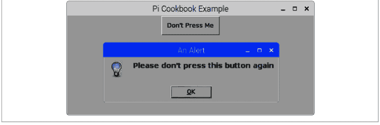

图 7-4. 一个 guizero 示例程序

这个例子展示了将 Python 函数连接到按钮是多么容易，这样当按钮被点击时，函数就会运行。

首先在程序中定义函数（`say_hello`）。然后定义一个新变量 `app`，并将其初始化为 `App` 类的一个实例，其中包含一些参数，用于指定窗口顶部显示的标题和窗口的高度（以像素为单位）。这两个参数都是可选的，许多其他可用选项在 guizero 的文档中有定义。

然后，将这个 `app` 变量作为参数之一提供给下一行创建的 `PushButton`。该按钮使用 `command` 参数来指定点击按钮时要运行的函数。请注意，当你指定要运行的函数时，不要在它后面加上 `()`，因为你是在引用该函数，而不是调用它。

### 讨论

这是一个 guizero 的入门示例，只是为了让你入门。该库绝不仅限于屏幕上的按钮。该库的主要目标是让你能够以最少的编程量创建简单的用户界面。当你想开始制作更花哨的东西时，你可以深入研究在窗口中布局小部件（按钮、复选框、滑块等）的各种方式，以及更改字体大小和颜色。然而，一如既往，从简单开始。

### 另请参阅

有关 guizero 的完整信息，请参阅这个优秀的 [guizero GitHub 站点](https://github.com/lawsie/guizero) 上的文档。

guizero 也用于菜谱 11.9、11.10 和 11.11。

## 7.23 使用正则表达式在文本中搜索模式

### 问题

你想进行复杂的搜索，在一段文本中查找某些内容。

### 解决方案

使用 Python 的正则表达式（regex）功能。正则表达式自计算机科学早期就已存在，当时计算机科学是数学的一个分支，并受益于数学家思维的严谨性。

正则表达式是描述在某些文本中出现的模式的一种方式。这类似于菜谱 5.16。然而，使用正则表达式，你可以找到更灵活的通配符匹配，如下所示：

```
import re

text = "looking forward to finding the word for"
x = re.search("(^|\s)for($|\s)", text)

print(x.span())
```

与本书中所有的程序示例一样，你也可以下载这个名为 ch_07_regex_find.py 的程序（参见菜谱 3.22）。

如果你运行这个程序，你将得到以下输出：

```
$ python3 ch_07_regex_find.py
(35, 39)
```

这表明单词 *for* 在字符串中的字符位置 35（实际上是 *for* 之前的空格）处被找到。第二个值是结束位置索引。请注意，程序忽略了单词 *forward*。让我们看看这段代码是如何工作的。

首先，我们需要导入 `re`（正则表达式）模块。接下来，我们添加变量 `text`，其中包含我们要在其中搜索的测试字符串。

然后我们使用搜索函数在字符串中查找所需内容。第一个参数是正则表达式，第二个是要搜索的字符串。本例中，正则表达式是以下字符串：

```
"(^|\s)for($|\s)"
```

正则表达式正中间是单词 *for*。这在预料之中，因为这正是我们要查找的单词。*for* 两侧是括号中的表达式。它前面是：

```
(^|\s)
```

这三个神奇符号分别是：^ 表示字符串开头；| 表示 *或*；\s 表示任意空白字符（空格或制表符）。因此可以将此部分理解为：在尝试匹配 *for* 之前，先匹配字符串开头或某些空白字符。也就是说，*for* 必须出现在字符串开头，或者前面有空格或其他空白字符。这确保了正则表达式不会匹配以 *for* 结尾的单词。

*for* 后面有一个类似的表达式也必须匹配：

```
($|\s)
```

这里，新的特殊符号是 $，表示字符串结尾。换句话说，在字母 *for* 之后，只有当我们处于字符串末尾，或者后面有空格或其他空白字符时，才会发生匹配。

表 7-2 展示了一些最常见的正则表达式符号。你可以在 [W3Schools.com 页面](https://www.w3schools.com) 找到完整列表。

*表 7-2. 常见正则表达式符号*

| 特殊符号 | 含义 |
|---|---|
| . | 匹配任意单个字符。 |
| ^ | 匹配字符串开头。 |
| $ | 匹配字符串结尾。 |
| \d | 任意数字。 |
| \s | 空白字符。 |
| \w | 字母数字字符（数字、大写和小写字母）。 |
| * | 匹配其前面的字符零次或多次。例如，*\d 将匹配零个或多个数字组成的字符串。 |
| + | 匹配其前面的字符一次或多次。 |
| [ ] | 匹配方括号内包含的任意字符。你也可以使用范围，例如 [a–d]，它将匹配 a 到 d 之间的任意字符。 |

熟悉正则表达式的最佳方式是使用在线正则表达式测试器进行练习。

### 讨论

调整正则表达式使其恰好正常工作可能很棘手。[在线正则表达式工具](Figure 7-5) 对于学习如何正确构建和测试正则表达式非常有帮助。

在线测试器有一个区域可以编写正则表达式，还有一个测试字符串区域，可以放置要与正则表达式一起使用的文本。然后该工具会高亮显示匹配的内容。在图 7-5 中，该工具正确地高亮显示了单词 *for*。

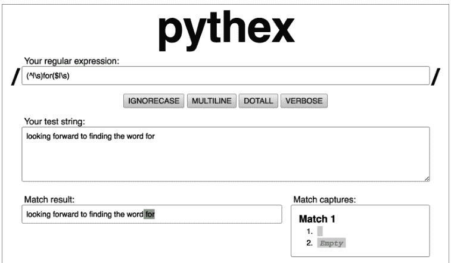

图 7-5. pythex 在线正则表达式测试器

### 另请参阅

要替换已匹配的文本，请参阅 [配方 7.24](Recipe 7.24)。

有关 Python 中正则表达式的更多详细信息，请参阅此 [W3Schools.com 页面](W3Schools.com page)。

## 7.24 使用正则表达式验证数据输入

### 问题

你有一些需要验证的文本；例如，你想确保文本看起来像电子邮件地址。

### 解决方案

使用正则表达式（配方 7.23）。

正则表达式主要用于验证用户输入的信息。例如，如果你曾经填写过包含电子邮件地址的在线表单，并且输入了看起来不像电子邮件地址的内容，你收到的提示地址格式无效的消息很可能来自正则表达式验证。

尝试文件 *ch_07_regex_email.py* 中的代码（本书所有程序示例均可下载；参见配方 3.22）：

```
import re

regex = '^[\w\_.+-]+@[\w\.-]+\.[\w_-]+$'
while True:
    text = input("Enter an email address: ")
    if re.search(regex, text):
        print("valid")
    else:
        print("invalid")
```

此程序将反复提示你输入电子邮件地址，然后报告其是否有效。在线搜索会发现用于电子邮件以及几乎所有其他类型验证的替代正则表达式。

这个正则表达式查找一个或多个字母数字字符（加上 _ . + 或 -），后跟 @ 符号，然后是该序列的重复，接着是再次出现的序列但字符串中没有句点，这确保了电子邮件不以句点结尾。

### 讨论

如果你有特定的验证需求（例如，电话号码或网站），几乎肯定有人已经为它制作了正则表达式。因此，在编写自己的正则表达式之前，请先进行互联网搜索。没有必要重新发明轮子。

### 另请参阅

有关正则表达式的基础知识，请参阅配方 7.23。

## 7.25 使用正则表达式进行网页抓取

### 问题

你想编写一个 Python 程序，自动从网页获取（抓取）信息。

### 解决方案

使用正则表达式匹配页面内容中的文本，这些内容是 HTML 格式的。

正则表达式对于 *网页抓取* 非常有用。网页抓取意味着自动读取网页 HTML 中的内容。例如，如果我希望一个 Python 程序自动给我这本书当前的亚马逊排名，我需要能够从亚马逊销售排名中抓取数字（在图 7-6 中圈出）。


图 7-6. 从亚马逊进行网页抓取

如果我在浏览器中点击查看源代码，然后搜索“Sellers Rank”，我可以找到相关的 HTML 片段，如下所示：

```
<li id="SalesRank">
<b>Amazon Best Sellers Rank:</b>
#746,779 in Books (<a href="https://www.amazon.com/best-sellers-books-Amazon/zgbs/books/ref=pd_dp_ts_books_1">See Top 100 in Books</a>)
```

我可以将其用作在线正则表达式测试器中的测试文本，并研究一个能提取亚马逊排名的表达式。我们可以假设这将是 # 和 *in Books* 之间的所有内容。

以下是此功能的代码，你也可以在本书的下载文件（配方 3.22）中的 *ch_07_regex_scraping.py* 文件中找到：

```
import re
import urllib.request

regex = '#([\d,]+) in Books'
url = 'https://www.amazon.com/Raspberry-Pi-Cookbook-Software-Solutions/dp/1492043222/'

print("The Amazon rank is.....")
text = urllib.request.urlopen(url).read().decode('utf-8')
print(re.search(regex, text).group())
```

该文件的输出将类似于：

```
$ python3 test.py
The Amazon rank is.....
#746,779 in Books
```

代码首先读取网页内容。然后必须将文本转换为 UTF-8 格式（仅限拉丁字母），然后才能与 re 正则表达式模块一起使用。

### 讨论

许多网站提供 API（参见配方 7.20）。如果你试图抓取的信息可以通过 API 获取，那么这是一种好得多的方式——尤其是因为网页抓取非常依赖于页面的外观和措辞，这意味着如果网站改版，你可能需要编写新的正则表达式。

### 另请参阅

要读取网页内容，请参阅配方 7.13。

有关正则表达式的基础知识，请参阅配方 7.23。

# 第 8 章
计算机视觉

## 8.0 简介

计算机视觉 (CV) 让你的树莓派能够“看见”事物。实际上，这意味着你的树莓派可以分析图像，寻找感兴趣的项目，甚至识别人脸和文本。

如果你将树莓派连接到摄像头以提供图像，各种可能性就会打开。这个主题在第 9 章中继续，我们将进一步深入机器学习领域。

## 8.1 安装 OpenCV

### 问题

你想在树莓派上安装 OpenCV 计算机视觉软件。

### 解决方案

要安装 OpenCV，首先使用以下命令安装先决条件包并更新 NumPy Python 库：

```
$ sudo apt install libatlas-base-dev
$ pip3 install --upgrade pip
$ pip3 install imutils
$ pip3 install numpy --upgrade
```

然后使用以下命令安装 OpenCV 本身：

```
$ pip3 install opencv-python
```

安装完成后，你可以通过启动 Python 3、导入 cv2 并检查版本来验证一切是否正常工作：

```
$ python3
Python 3.9.2 (default, Mar 12 2021, 04:06:34)
[GCC 10.2.1 20210110] on linux
Type "help", "copyright", "credits" or "license" for more information.
>>> import cv2
>>> cv2.__version__
'4.6.0'
>>> exit()
```

请注意，`__version__` 是单词 "version"，其两侧各有两个下划线字符。

### 讨论

计算机视觉既消耗处理器资源，也消耗内存资源。因此，尽管 OpenCV 在较旧的树莓派上也能勉强运行，但在任何早于树莓派 2 的型号上可能会很慢。如果你计划尝试第 9 章的食谱，你至少需要一个树莓派 4 或 400。

### 另请参阅

本章第一个使用 OpenCV 的食谱是 8.4。它包含了关于 OpenCV 入门的有用细节。

## 8.2 为计算机视觉设置 USB 摄像头

### 问题

你想设置一个 USB 网络摄像头，用于计算机视觉（CV）项目。

### 解决方案

使用与树莓派兼容的 USB 网络摄像头。选择一个质量好的摄像头。如果你正在做一个需要摄像头靠近拍摄对象的项目，选择一个具有手动对焦选项的摄像头。为了真正靠近拍摄对象，低成本的 USB 内窥镜会很有用。

根据你的 CV 项目，你可能需要设置一个光线充足的区域。图 8-1 展示了一个简单的灯箱，它由一个半透明的塑料储物箱制成，从侧面和顶部进行照明以提供均匀的光线。网络摄像头安装在箱子顶部的一个孔上。这种布置在食谱 8.4 中使用。

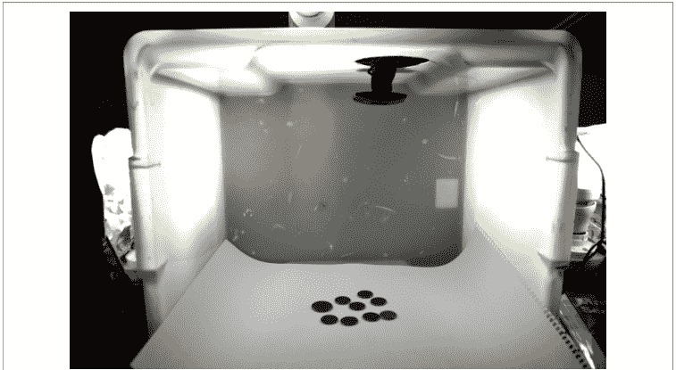

图 8-1. 使用自制灯箱实现均匀照明

你也可以购买专为摄影设计的商用*光帐*，它们效果很好。你可能需要一些试错来使你的系统获得明亮且均匀的照明。阴影可能尤其成问题。

### 讨论

你可以从 OpenCV 控制台测试你的 USB 摄像头。启动 Python 3，然后输入以下命令：

```
$ python3
Python 3.9.2 (default, Mar 12 2021, 04:06:34)
[GCC 10.2.1 20210110] on linux
Type "help", "copyright", "credits" or "license" for more information.
>>> import cv2
>>> from imutils.video import VideoStream
>>> vs = VideoStream(src=0).start()
>>> img = vs.read()
>>> cv2.imshow('image',img)
>>> cv2.waitKey(0)
```

在输入最后一行代码后，应该会打开一个窗口，显示来自你摄像头的图像。你可能需要关闭整个终端窗口才能关闭图像窗口。

在 OpenCV 中，即使是单张图像也被视为来自视频流的帧。注意你之前输入的第三行代码，我们有 `src=0`。这意味着 OpenCV 能找到的第一个摄像头。所以，如果你有多个摄像头，你可以在这里使用不同的数字。

一旦使用 `vs.read()` 读取了图像，你就可以使用 OpenCV 的 `imshow` 实用方法来显示图像。你会发现你经常使用它来调试你的计算机视觉项目。

最后的 `cv2.waitKey(0)` 是必需的，它允许 OpenCV 在后台实际渲染图像，直到按下某个键。

### 另请参阅

要将树莓派摄像头模块与 OpenCV 一起使用，请参阅食谱 8.3。

## 8.3 使用树莓派摄像头模块进行计算机视觉

### 问题

你想将直接连接到树莓派的摄像头模块与 OpenCV 一起使用。

### 解决方案

一旦你按照食谱 1.16 安装了树莓派摄像头模块，它应该会自动显示为摄像头设备。

安装摄像头后，你现在可以尝试以下命令来确保它正常工作：

```
$ python3
Python 3.9.2 (default, Mar 12 2021, 04:06:34)
[GCC 10.2.1 20210110] on linux
Type "help", "copyright", "credits" or "license" for more information.
>>> import cv2
>>> from imutils.video import VideoStream
>>> vs = VideoStream(src=0).start()
>>> img = vs.read()
>>> cv2.imshow('image',img)
>>> cv2.waitKey(0)
```

### 讨论

请注意，在早期版本的树莓派操作系统中，你必须安装一个*驱动程序*才能使摄像头模块对 OpenCV 可用；如果 OpenCV 没有检测到摄像头模块，请尝试将你的树莓派操作系统更新到最新版本（食谱 3.40）。

### 另请参阅

- 有关安装树莓派摄像头模块的信息，请参阅食谱 1.16。
- 有关 picamera Python 模块的信息，请参阅 http://picamera.readthedocs.org。
- 要将 USB 摄像头与 OpenCV 一起使用，请参阅食谱 8.2。

## 8.4 硬币计数

### 问题

你想使用计算机视觉来统计网络摄像头视野中的硬币数量。

### 解决方案

使用 OpenCV 的 *Hough Circles* 检测器来实时统计放置在网络摄像头视野内的硬币数量。Hough Circles 可以检测任何类型的圆形，并且能很好地检测大多数硬币。

这是 CV 的一个应用，你确实需要良好的照明和固定位置的摄像头。我使用了图 8-1 所示的设置。

许多计算机视觉项目的关键部分是正确设置参数，这个食谱也不例外。因此，在使用最终只给出硬币计数的程序之前，我们将使用一个测试程序，它在硬币周围绘制轮廓，以便我们可以看到发生了什么。

你可以在本书的下载资料中找到此示例以及本食谱中其他示例的代码（参见食谱 3.22）。该程序名为 `ch_08_coin_count_test.py`。

在你的摄像头下放一些硬币并运行该程序。应该会出现一个类似图 8-2 的窗口。

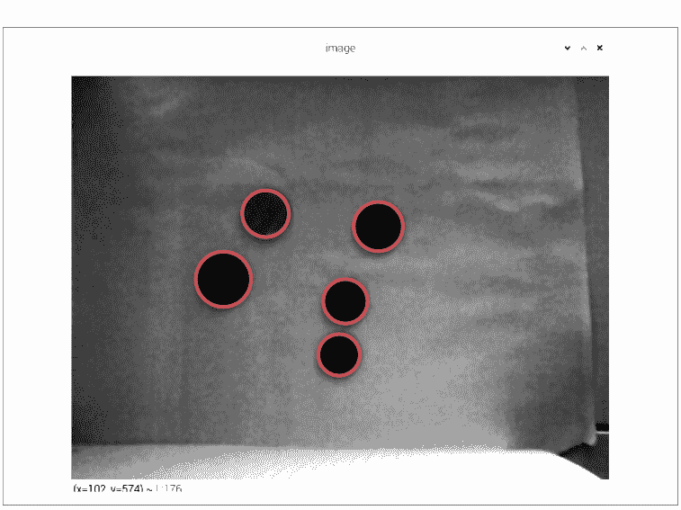

图 8-2. 硬币计数

如果你运气好，你的硬币都会被圈起来，并且你应该在控制台看到如下输出：

```
$ python3 ch_08_coin_count_test.py
[[[380.5 338.5 37.9]
  [553.5 249.5 34.9]
  [538.5 357.5 31.4]
  [546.5 442.5 30.7]
  [418.5 244.5 33.1]]]
```

要刷新图像，按任意键；当你想退出程序时，按 X 键。

如果你的硬币没有全部被圈起来，你需要调整程序 `ch_08_coin_count_test.py` 中的一些参数（`param1`、`param2`、`minRadius` 和 `maxRadius`）：

```python
import cv2
from imutils.video import VideoStream
from imutils import resize

vs = VideoStream(src=0).start()

while True:
    img = vs.read()
    img = resize(img, width=800)
    img = cv2.cvtColor(img, cv2.COLOR_BGR2GRAY)
    img = cv2.blur(img, (3, 3))

    detected_circles = cv2.HoughCircles(img,
        cv2.HOUGH_GRADIENT, 1, 20, param1 = 50,
        param2 = 30, minRadius = 15, maxRadius = 100)

    print(detected_circles)

    for pt in detected_circles[0]:
        a, b, r = pt[0], pt[1], pt[2]
        cv2.circle(img, (int(a), int(b)), int(r), (0, 255, 0), 2)

    cv2.imshow('image', img)
    key = cv2.waitKey(0)
    cv2.destroyAllWindows()
    if key == ord('x'):
        break

vs.stop()
```

你可能不需要更改参数 `param1`。如果你对它和其他参数的作用感兴趣，可以在 https://oreil.ly/3AmKn 阅读相关信息。

如果你得到很多错误的圆形，尝试增加 `param2` 的值。但最可能需要更改的参数是 `minRadius` 和 `maxRadius`，因为它们对摄像头的分辨率、镜头焦距以及到硬币的距离很敏感。所以如果没有硬币被圈起来，就增加 `maxRadius` 的值。

调整参数，直到你的硬币被正确识别。

### 讨论

以下是测试程序工作原理的快速概述。

大部分代码位于 `while True:` 块内的一个 `try` 块中。这确保了当你按 Ctrl-C 退出程序时，视频流会被停止。

读取图像后，有几个处理阶段。首先，图像被调整为 800 像素宽，然后转换为灰度图，最后应用模糊滤镜。模糊滤镜有助于改善圆形匹配。

对 `cv.HoughCircles` 的调用返回一个 OpenCV 找到的圆形数组。这三个值分别是圆心的 x 和 y 坐标以及圆的半径。

为了在硬币图像上渲染这些圆形，使用一个 `for` 循环遍历每个检测到的圆形，然后使用 `cv2.circle` 方法在每个硬币周围绘制一个 2 像素宽的黑色（0, 0, 0）圆形。

实际的硬币计数程序只是测试程序的简化版，因此当你准备好后，可以运行程序 *ch_08_coin_count.py*。尝试将硬币移入和移出视野，并观察计数如何变化。你也可以在硬币中添加一些不同形状的物体，并验证它们不会被识别为硬币。

一个有趣的项目是利用硬币的半径来识别其面值，并计算桌面上硬币的总价值。

### 另请参阅

有关安装 OpenCV 的信息，请参阅配方 8.1。

有关设置摄像头的信息，请参阅配方 8.2。

## 8.5 人脸检测

### 问题

你想要在照片或网络摄像头图像中找到人脸的坐标。

### 解决方案

使用 OpenCV 中的 HAAR-like 特征检测来分析图像并找出人脸。HAAR 代表高空侦察，我们在此使用的是为该应用开发的一些特征。

如果你尚未安装 OpenCV，请先安装（参见配方 8.1）。

你可以在本书的下载包中找到此示例以及其他示例的代码（参见配方 3.22）。该程序名为 *ch_08_faces.py*。

你会在与 Python 程序相同的文件夹中找到一个名为 *faces.jpg* 的合适测试图像文件。运行程序，你应该会看到如下输出和如图 8-3 所示的图像：

```
$ python3 ch_08_faces.py
[[173 139  66  66]
 [367  60  66  66]
 [564  73  66  66]]
```

请注意，*faces.jpg* 文件（或你使用的任何图像文件）必须与 Python 程序位于同一目录中。


图 8-3. 检测人脸

### 讨论

以下是程序（ch_08_faces.py）的代码清单：

```python
import cv2, pkg_resources

haar_file = pkg_resources.resource_filename('cv2',
    'data/haarcascade_frontalface_default.xml')
face_cascade = cv2.CascadeClassifier(haar_file)

img = cv2.imread('faces.jpg', cv2.IMREAD_GRAYSCALE)

scale_factor = 1.4
min_neighbors = 5

faces = face_cascade.detectMultiScale(img, scale_factor, min_neighbors)
print(faces)

for (x,y,w,h) in faces:
    img = cv2.rectangle(img, (x,y), (x+w,y+h), (255, 255, 255), 2)

cv2.imshow('image',img)
cv2.waitKey(0)
cv2.destroyAllWindows()
```

OpenCV 系统包含大量用于检测人脸和其他特征的分类器。这些都包含在使用 pkg_resources 实用程序包找到的目录中。我们在此程序中将要使用的实际人脸检测器包含在一个名为 haarcascade_frontalface_default.xml 的 XML 描述符文件中。

图像以灰度模式读入文件。如果你使用自己的图像而不是测试图像，可能需要调整参数 scale_factor 和 min_neighbors。

scale_factor
这决定了人脸检测器在尝试查找人脸时通过自动改变图像比例所使用的步长。在此情况下，值 1.4 意味着比例每次将改变 40%。将此值设置得更高会加快人脸匹配速度，但可能会导致一些人脸被遗漏。

min_neighbors
如果此参数设置得太低，算法基本上会变得不那么挑剔它认为什么是人脸。

一旦检测到人脸，print 命令会显示找到的矩形的坐标，然后 for 循环将它们叠加到图像上，最后显示图像。

有许多内置的 HAAR 特征。你可以使用以下命令列出所有特征：

```
$ cd /.local/lib/python3.9/site-packages/cv2/data/
$ ls
haarcascade_eye.xml
haarcascade_frontalcatface_extended.xml
haarcascade_frontalcatface.xml
haarcascade_frontalface_alt2.xml
haarcascade_frontalface_alt_tree.xml
haarcascade_frontalface_alt.xml
haarcascade_frontalface_default.xml
haarcascade_fullbody.xml
haarcascade_lefteye_2splits.xml
haarcascade_lowerbody.xml
haarcascade_profileface.xml
haarcascade_righteye_2splits.xml
haarcascade_russian_plate_number.xml
haarcascade_smile.xml
haarcascade_upperbody.xml
__init__.py
__pycache__
```

如你所见，它们都与身体的各个部位相关。你甚至可以寻找微笑！

### 另请参阅

在第 9 章中，我们将回到对象识别，但通过使用机器学习技术，我们将能够检测各种对象。

有关安装 OpenCV 的信息，请参阅配方 8.1。

有关设置摄像头的信息，请参阅配方 8.2。

有关人脸检测的更多信息，请参阅 https://oreil.ly/iNJu8。

## 8.6 运动检测

### 问题

你想使用连接到树莓派的摄像头来检测其视野中的移动物体。

### 解决方案

使用 OpenCV 和 NumPy 来检测摄像头连续帧之间的变化。

下面的程序将每个捕获的图像与前一个图像进行比较。然后使用 NumPy（一个 Python 数值库）来计算两个图像的差异程度。如果这个差异度量超过阈值，它会打印出一条消息，说明检测到移动。

你可以在本书的下载包中找到此示例以及其他示例的代码（参见配方 3.22）。该程序名为 ch_08_detect_motion.py。

连接你的 USB 网络摄像头或树莓派摄像头，然后运行程序。尝试在视野前移动你的手，你应该会看到一条消息说“检测到移动”：

```python
import cv2
import numpy as np
from imutils.video import VideoStream
from imutils import resize

diff_threshold = 1000000

vs = VideoStream(src=0).start()

def getImage():
    im = vs.read()
    im = cv2.cvtColor(im, cv2.COLOR_BGR2GRAY)
    im = cv2.blur(im, (20, 20))
    return im

old_image = getImage()

while True:
    new_image = getImage()
    diff = cv2.absdiff(old_image, new_image)
    diff_score = np.sum(diff)
    # print(diff_score)
    if diff_score > diff_threshold:
        print("Movement detected")
    old_image = new_image
```

如果你得到太多误报，那么增加 diff_threshold 的值。你可能还想取消注释行 print(diff_score)，因为这将向你显示正在检测到的差异值类型。

通过将图像设置为灰度并应用模糊滤波器，结果得到了改善。

### 讨论

图像的连续帧可能看起来像图 8-4 和图 8-5。当从第二张图像中减去第一张图像时，得到的图像将看起来像图 8-6。


图 8-4. 运动检测，帧 1


图 8-5. 运动检测，帧 2


图 8-6. 运动检测，差异图像

尽管此配方的代码只是显示一条消息，但没有理由让你的代码不能打开一盏灯，或者使用 GPIO 引脚执行其他操作。

### 另请参阅

有关安装 OpenCV 的信息，请参阅配方 8.1。

有关设置摄像头的信息，请参阅配方 8.2。

检测运动的另一种方法是使用被动红外（PIR）传感器；参见配方 13.9。

## 8.7 从图像中提取文本

### 问题

你希望能够将包含文本的图像转换为实际文本。

### 解决方案

使用 Tesseract 光学字符识别（OCR）软件从图像中提取文本。要安装 Tesseract，请运行以下命令（你可能需要从本书下载包配方 3.22 中的文件 *long_commands.txt* 复制并粘贴）：

```
$ sudo apt install tesseract-ocr
$ sudo apt install libtesseract-dev
```

要试用 Tesseract，你需要一个包含一些文本的图像文件。你会在本书的下载包中找到一个名为 *ocr_test.tiff* 的文件（参见配方 3.22）。要将图像转换为文本，请运行以下命令：

```
$ cd ~/raspberrypi_cookbook_ed4
$ tesseract ocr_test.tiff stdout
Page 1
This is an image

of some text.
```

如果你查看图像文件 *ocr_test.tiff*，你会看到它确实是一个包含这些单词的图像。

### 讨论

虽然我使用了 TIFF 图像，但 tesseract 库可以处理大多数图像类型，包括 PDF、PNG 和 JPEG 文件。

### 另请参阅

有关 tesseract 库的更多信息，请参阅 https://oreil.ly/Evdxw。

# 第9章
机器学习

## 9.0 引言

你可能会惊讶地发现，你那不起眼的树莓派是进行机器学习实验的绝佳平台。在本章中，你将尝试实时识别视频中的物体、识别声音，并将所有这些与你自己的Python程序连接起来。

为计算机编程涉及给计算机一系列要遵循的指令。我们创建一个过程来完成我们希望计算机做的事情。这通过Python等编程语言来表达，对于存储数据或进行计算等任务效果非常好。然而，要编写一个程序来响应语音命令或识别照片中的物体，却相当困难。人类和其他动物学习这类事物的方式是通过实践。我们的大脑通过经验逐渐学会识别事物。我们的大脑中并没有运行任何程序来做这些事情；我们是学会做这些事的。

机器学习（ML）涉及一台普通计算机运行特殊的机器学习程序（这部分是常规编程），这些程序处理大量数据，并以与大脑非常相似的方式从数据中学习。例如，我们可以通过向计算机提供大量命令样本，以及其他我们希望计算机学会忽略的示例和背景噪音，来训练计算机识别语音命令。

大多数ML关注的是*分类*。即，获取一些输入并将其放入一个类别中。例如，这可以是获取关于声音样本的数据，并为该样本包含的一组预定义单词或短语分配概率。或者，它可能是对图像中的物体进行分类，以确定图片代表哪种动物，或者该动物是否出现在包含许多事物的视频流中。

这种学习有各种机制，其中一些依赖于传统统计学，另一些则使用神经网络模拟。神经网络方法使用传统程序来模拟大脑中的神经元网络。每个神经元都有一个输出，当其所有输入的加权值超过某个阈值时，该输出就会“触发”。这些权重在训练过程中进行调整，以提高神经网络的准确性，直到神经网络运行得足够好。训练实际上通常比这困难得多，它通常需要改变神经网络的配置，而不仅仅是改变权重。然而，好的软件可以帮助自动化这个过程的大部分工作。

在本章中，我们将开始使用由机器学习专家从海量数据集中制作的预训练模型，这些模型由TensorFlow免费提供给我们使用。我们将研究如何使用这些模型实时分类视频中的物体和声音，以及如何将我们自己的Python代码接入这个过程。这些标准的预训练模型确实需要我们对视频源进行一些预处理。

然后，我们将看看Edge Impulse平台，以说明如何创建和训练我们自己的机器学习模型。Edge Impulse通过提供云服务极大地简化了使用机器学习的过程，该云服务完成了所有需要高性能计算的工作——数据准备和训练。在云端完成所有繁重的工作，使你可以将训练好的模型下载到像树莓派这样功耗低得多的设备上。

TensorFlow和Edge Impulse需要使用树莓派4或400。此外，你还需要一个连接到树莓派的网络摄像头（或树莓派摄像头模块）和一个麦克风。USB网络摄像头上的麦克风就可以正常工作（只需插入即可），或者你可以使用USB麦克风，如声音项目中的配方16.6所述。

机器学习是一个庞大的主题，已有许多相关书籍出版，因此本章仅旨在让你入门一些ML项目。

## 9.1 使用TensorFlow Lite识别视频中的物体

### 问题

你希望你的树莓派能够从视频中动态识别物体。

### 解决方案

按照配方8.1安装OpenCV，本章的大多数配方都需要它。

使用带有USB网络摄像头或树莓派摄像头模块的TensorFlow预训练模型。这将在识别出物体时动态标注你的视频流（图9-1）。

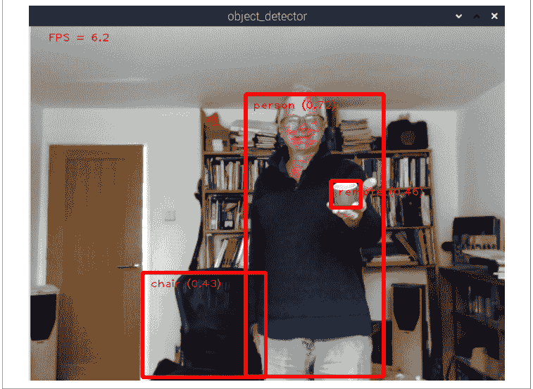

*图9-1. 视频流中的物体识别*

要运行此示例，请切换到你的主目录并使用以下命令下载TensorFlow示例：

```
$ git clone https://github.com/tensorflow/examples --depth 1
```

切换到以下示例项目文件夹，通过运行 *setup.sh* 脚本构建项目，最后运行Python程序。这将以大约每秒6帧的速度标注视频，识别来自你的网络摄像头或树莓派摄像头模块的各种物体。尝试举起各种物体让它识别：

```
$ sudo apt install libportaudio2
$ cd ~/examples/lite/examples/object_detection/raspberry_pi
$ sh setup.sh
$ python3 detect.py --model efficientdet_lite0.tflite
```

### 讨论

在第8章中，我们做到了数硬币。但这依赖于经典的图像处理技术，如寻找图像中的边缘、寻找图像之间的差异等。这种方法依赖于受控的光照，并且不涉及机器学习。

花点时间思考一下这里发生了什么。这相当惊人：你的树莓派实际上正在“看见”并识别物体。它之所以能做到这一点，是因为该模型已经在数千张物体图像上进行了训练，并学会了区分它们，或者至少能做出很好的猜测。而且无论从什么角度观察，无论光照和背景如何，它都能做到这一点。

图9-1的一个有趣特征是，作者手中的小咖啡杯被错误地识别为“遥控器”，也许是因为它被握持的方式。即使是错误，也是人类可能会犯的那种错误，因为“看见”的过程是以类似的方式发生的。

### 另请参阅

在配方9.2中，我们将修改此示例程序，以便在检测到感兴趣的物体时运行我们自己的一些代码。

你可以使用其他预训练的TensorFlow Lite模型。在 https://www.tensorflow.org 了解更多关于TensorFlow的信息。

## 9.2 使用TensorFlow Lite对视频中的物体做出反应

### 问题

你希望使用Python程序在从视频流中识别出特定类型的物体时执行某个动作。

### 解决方案

修改配方9.1中的TensorFlow物体识别示例，以便在检测到特定类型的物体时，运行你自己的部分代码。

按照配方9.1安装用于物体检测的预训练TensorFlow模型。

将文件 ch_09_person_detector.py 复制到物体检测示例的工作文件夹中。然后切换到该目录并使用以下命令运行程序：

```
$ cd ~/examples/lite/examples/object_detection/raspberry_pi/
$ cp ~/raspberrypi_cookbook_ed4/python/ch_09_person_detector.py .
$ python3 ch_09_person_detector.py
```

与本书中的所有程序示例一样，你可以下载此代码（参见配方3.22）。

当你运行程序时，每当有人出现在你的网络摄像头前，终端中就会出现一条消息，显示“Something Detected!”。发生这种情况时，将创建一个带有时间戳的PNG图像文件，其中包含树莓派看到的图像：

```
$ ls *.png
2022-04-21-05-57-27.png
2022-04-21-05-57-37.png
2022-04-21-06-19-17.png
```

如果你使用文件浏览器查看这些文件，可以双击其中一个打开并查看。

### 讨论

程序 *ch_09_person_detector.py* 最初是TensorFlow示例程序 *detect.py* 的副本。本配方的程序太长，无法在此完整列出，因此你可能想在编辑器中打开它。以下是关键部分，全部包含在run函数中：

```
last_detection_time = 0

# Continuously capture images from the camera and run inference
while cap.isOpened():
    success, image = cap.read()
    if not success:
        sys.exit(
            'ERROR: Unable to read from webcam. Please verify your webcam settings.'
        )
    image = cv2.flip(image, 1)

    # Convert the image from BGR to RGB as required by the TFLite model.
    rgb_image = cv2.cvtColor(image, cv2.COLOR_BGR2RGB)

    # Create a TensorImage object from the RGB image.
    input_tensor = vision.TensorImage.create_from_array(rgb_image)

    # Run object detection estimation using the model.
    detection_result = detector.detect(input_tensor)

    # Draw keypoints and edges on input image
    image = utils.visualize(image, detection_result)

    for detection in detection_result.detections:
        object_type = detection.categories[0].category_name
        time_now = time.time()
        if object_type == 'person' and time_now > last_detection_time + 10:
```

print("***********************************")
print("检测到人物！")
print("***********************************")
# 在此处执行你自己的操作！
last_detection_time = time_now
ts = "{:%Y-%m-%d-%H-%M-%S}".format(datetime.datetime.now())
cv2.imwrite(ts + ".png", image)

我们对代码的添加部分以粗体显示。

变量 `last_detection_time` 用于跟踪上次检测到人物的时间，以便在检测到某人后等待一段时间再写入另一个文件。否则，将会创建大量文件。

`detection_result = detector.detect(input_tensor)` 这一行代码创建了一个检测事件列表，每个事件可能如下所示：

```
Detection(bounding_box=BoundingBox(origin_x=418, origin_y=285, width=16, height=40),
categories=[Category(index=83, score=0.3515625, display_name='', category_name='book')])
```

这是一个元组列表，元组的第一部分是被检测物体的边界框，第二部分是该物体可能所属的类别列表，最可能的类别排在最前面。这意味着要获取类别名称（它将告诉我们物体的类型），我们需要获取该列表中的第一个类别 [0] 并使用其 `category_name`。

遍历这个 `detection_result` 列表，我们检查时间，然后查看 `object_type` 是否为“person”。如果是，并且距离上次检测到物体已经过去了足够的时间（10秒），则使用 `cv2.imwrite` 以当前日期和时间作为文件名保存文件。

你可以用这样的程序做各种事情。例如，你可以检测你的宠物，并制作一个自动宠物喂食器，控制电机并为动物投放一些食物。

### 另请参阅

你可以使用[其他预训练的 TensorFlow Lite 模型](https://www.tensorflow.org)。在 [https://www.tensorflow.org](https://www.tensorflow.org) 了解更多关于 TensorFlow 的信息。

## 9.3 使用 TensorFlow Lite 识别声音

### 问题

你希望让你的树莓派通过其麦克风识别它听到的不同类型的声音。

### 解决方案

使用来自 TensorFlow 示例的预训练 TensorFlow 模型。

如果尚未完成，请切换到你的主目录，然后使用以下命令下载 TensorFlow 示例：

```
$ git clone https://github.com/tensorflow/examples --depth 1
```

切换到以下示例项目文件夹，通过运行 *setup.sh* 脚本构建项目，然后最后运行 Python 程序：

```
$ cd ~/examples/lite/examples/sound_classification/raspberry_pi
$ sh setup.sh
$ python3 classify.py
```

这将打开如图 9-2 所示的窗口。尝试吹口哨并发出一些其他噪音，看看分类器的表现如何。

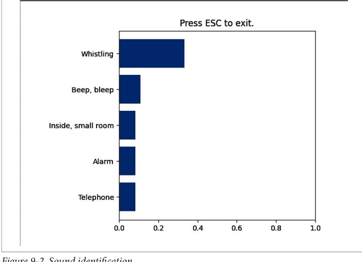

### 讨论

在这个示例中，任何得分低于 0.2 的结果可能都是不正确的——要么如此，要么 TensorFlow 的听力比作者好得多。然而，最顶部的结果似乎相当可靠，该模型可以识别许多不同的声音。

像这里使用的预训练模型依赖于成千上万个经过仔细分类的声音样本。然后，模型在这些样本以及其他背景噪音上进行仔细训练，以制作出能够有效识别不同声音的东西。

### 另请参阅

参见食谱 9.4，了解如何添加你自己的代码以在检测到吹口哨时执行某些操作。

参见食谱 9.6，了解如何训练你自己的网络来识别语音命令。

## 9.4 使用 TensorFlow Lite 对口哨声做出反应

### 问题

你希望你的树莓派在听到口哨声时运行一些你自己的 Python 代码作为响应。

### 解决方案

首先，安装食谱 9.3 中的 TensorFlow 示例，然后修改示例 Python 程序。

将文件 ch_09_detect_whistle.py 复制到声音分类示例的工作文件夹中。然后切换到该目录并使用以下命令运行程序：

```
$ cd ~/examples/lite/examples/sound_classification/raspberry_pi/
$ cp ~/raspberrypi_cookbook_ed4/python/ch_09_detect_whistle.py .
$ python3 ch_09_detect_whistle.py
```

与本书中所有程序示例一样，你也可以下载此代码（参见食谱 3.22）。

当你运行程序时，你会看到类似下面的内容。每次你在麦克风附近吹口哨时，你都会看到消息“检测到口哨声”：

```
$ python3 ch_09_detect_whistle.py
Listening for Whistles...
Whistling Detected
```

### 讨论

让我们看看这段代码：

```
import time
from tflite_support.task import audio
from tflite_support.task import core
from tflite_support.task import processor

model = 'yamnet.tflite'
num_threads = 4
score_threshold = 0.6
overlapping_factor = 0.5

# 初始化音频分类模型。
base_options = core.BaseOptions(
    file_name=model, use_coral=False, num_threads=num_threads)
classification_options = processor.ClassificationOptions(
    max_results=1, score_threshold=score_threshold)
options = audio.AudioClassifierOptions(
    base_options=base_options, classification_options=classification_options)
classifier = audio.AudioClassifier.create_from_options(options)

# 初始化音频录音器和一个用于存储音频输入的张量。
audio_record = classifier.create_audio_record()
tensor_audio = classifier.create_input_tensor_audio()

# 我们将尝试每隔 interval_between_inference 秒运行一次推理。
# 这通常是模型输入长度的一半，以便在传入的音频片段之间创建重叠，
# 从而提高分类准确性。
input_length_in_second = float(len(
    tensor_audio.buffer)) / tensor_audio.format.sample_rate
interval_between_inference = input_length_in_second * (1 - overlapping_factor)
pause_time = interval_between_inference * 0.1
last_inference_time = time.time()

# 在后台开始音频录制。
audio_record.start_recording()

print('Listening for Whistles...')

while True:
    tensor_audio.load_from_audio_record(audio_record)
    results = classifier.classify(tensor_audio)
    if len(results.classifications) > 0:
        classification = results.classifications[0]
        if len(classification.categories) > 0:
            top_category = classification.categories[0]
            if top_category.category_name == 'Whistling':
                print('Whistling Detected')
    time.sleep(pause_time)
```

这段代码是 TensorFlow 示例的简化版本，与该示例一样，许多工作都隐藏在 AudioClassifier 类中，我们可以在我们的程序中利用它。

音频分类器通过参数进行配置。大多数选项，如 `max_results` 和 `score_threshold`，都是显而易见的。`num_threads` 选项指定了专门用于运行示例代码的执行线程数（参见食谱 7.19），而 `enable_edge_tpu` 仅在你将机器学习加速器硬件连接到你的树莓派时使用。

该程序将定期获取音频样本，然后尝试推断其中是否存在口哨声。它使用重叠的时间窗口来完成此操作，以便更有可能不会错过任何口哨声。

主 while 循环检查是否到了再次寻找口哨声的时候。如果是，它会对音频进行分类，如果有结果，则检查它是否是口哨声。

最后的 `time.sleep` 允许你的树莓派处理器在再次需要进行分类之前处理其他事情一段时间。

### 另请参阅

要将你自己的代码接入视频分类，请参见食谱 9.2。

## 9.5 安装 Edge Impulse

### 问题

你想使用 Edge Impulse 平台来训练你自己的机器学习模型，以便在你的树莓派上使用。

### 解决方案

Edge Impulse 的大部分工作都在公司的服务器上进行，并通过其网站访问。要使用这些服务器，Edge Impulse 要求你创建一个账户，这并不过分。对于非商业“开发者”用途，这是免费的。

除了 EdgeImpulse 网站，我们还需要在我们的树莓派上安装软件的本地部分。在开始之前，最好确保你的树莓派操作系统是最新的（食谱 3.40）。

首先在终端窗口中运行以下命令：

```
$ curl -sL https://deb.nodesource.com/setup_12.x | sudo bash -
$ sudo apt install -y gcc g++ make build-essential nodejs sox gstreamer1.0-tools gstreamer1.0-plugins-good gstreamer1.0-plugins-base gstreamer1.0-plugins-base-apps
```

## 9.5 安装 Edge Impulse

```
$ npm config set user root && sudo npm install edge-impulse-linux -g --unsafe-perm
```

由于复制如此长的命令既容易出错又很繁琐，这些命令也包含在本书代码的 *long_commands.txt* 文件中（参见配方 3.22）。

我们还需要 Edge Impulse 的 Python 接口。Edge Impulse 依赖一个名为 NumPy 的 Python 库。这需要更新到其最新版本：

```
$ pip3 install numpy --upgrade
```

### 讨论

Edge Impulse 基于我们在前面配方中使用的 TensorFlow 机器学习库。然而，它增加了一个流畅且实用的基于 Web 的用户界面和基于云的服务器，使得开始训练我们自己的 ML 模型变得容易得多。

尽管 Edge Impulse 现在已安装到你的 Raspberry Pi 上，但我们仍需要一个示例来运行。我们将在配方 9.6 中探讨这一点。

### 另请参阅

[Edge Impulse 网站](https://www.edgeimpulse.com/) 提供了丰富的资料。

了解 Edge Impulse 所基于的 [TensorFlow](https://www.tensorflow.org/)。

## 9.6 识别语音命令（在云端）

### 问题

你希望你的 Raspberry Pi 能够使用云服务识别语音命令。

### 解决方案

在 Edge Impulse 网站上注册并在你的 Raspberry Pi 上安装软件后，使用 *向导* 训练一个神经网络。然后，你可以在浏览器中测试训练好的模型效果如何，之后再在你的 Raspberry Pi 上本地运行它。

前往 [https://studio.edgeimpulse.com](https://studio.edgeimpulse.com) 并使用你在配方 9.5 中创建的账户登录。

你现在需要创建一个新项目并为其命名。如果你刚刚注册了 Edge Impulse，网站可能会将你带到新建项目向导。如果向导已启动，请取消它，而是点击“+ 创建新项目”按钮。这将打开一个对话框（图 9-3），你应该在其中输入项目名称；使用名称“hey pi”。


图 9-3. 创建新的 Edge Impulse 项目

选择 Developer 选项。这是免费选项，对 Edge Impulse 的使用施加了一些限制，我们不太可能超出这些限制。

点击“创建新项目”按钮会带我们到一个选择要处理的数据类型的对话框。然而，我们将使用入门向导，因此关闭此弹出窗口；你将返回到“hey pi”项目的项目页面。滚动到页面底部，选择“启动入门向导”选项。这会警告你项目将被清空，但这没关系，所以选择“是”然后确认操作。欢迎向导将启动，并提出在五分钟内制作你的模型。点击按钮接受此选项，对于要识别的短语，使用“hey pi”（图 9-4），然后点击“下一步”。


图 9-4. 选择要识别的短语

现在是有趣的部分了。为了让我们的 Raspberry Pi 识别短语“hey pi”，我们需要给它大量我们说这个短语的示例。向导现在会要求我们录制自己反复说“hey pi”，持续一个奇怪的特定时间 38 秒（图 9-5）。你还会被要求授予麦克风访问权限，你应该允许。


图 9-5. 收集声音数据

如果 Edge Impulse 需要更多数据，它可能会要求你再说几次这个短语。最终，它将有足够的样本，你可以进入下一步，添加其他数据。

这些其他数据采用随机单词和背景噪音的形式，来自 Edge Impulse 的此类数据集合，将帮助神经网络区分“hey pi”和麦克风可能接收到的任何其他声音。

向导的下一步是“设计你的 Impulse”。*Impulse* 是 Edge Impulse 描述神经网络（或其他类型的 ML 模型）以及相关数据预处理的方式。在设计 impulse 的过程中，我们也有机会查看模型内部，并对这一切如何运作获得一些信心。

如果你想看看向导背后发生了什么，你可以直接关闭向导覆盖层，稍后再继续。例如，图 9-6 显示了声音样本的所谓 *特征探索器视图*，其中“hey pi”、噪音和其他随机短语的样本都绘制在一个三维空间中。“hey pi”的实例都聚集在一起，表明 impulse 具有良好的识别能力。


图 9-6. 探索特征

当向导恢复时，其下一步是训练神经网络。这需要几分钟时间，因为神经网络的权重会被调整，直到它能准确识别短语：“hey pi”。我们现在可以在浏览器中查看 impulse 并查看其性能如何（图 9-7）。请注意，在让我们使用 impulse 之前，它会被构建到一个可部署的包中，我们稍后可以将其部署到我们的 Raspberry Pi 上。


在图 9-7 中，每当我们说些什么或听到噪音时，impulse 会将其分类为 HEY_PI、NOISE 或 UNKNOWN，并针对每种分类提供一个概率。因此，如果你查看以 488 开头的行（样本编号），你可以看到检测到“hey pi”的概率为 87%，而检测到噪音或未知声音的概率非常低。

### 讨论

要查看此语音识别效果如何，可以尝试让其他人说“hey pi”或自己尝试说类似的短语。

这构成了一个非常令人印象深刻的演示。但是，目前一切都在 Edge Impulse 服务器上进行。在我们的 Raspberry Pi 上发生的唯一事情是将声音数据从麦克风传递到 Edge Impulse。在配方 9.7 中，我们将探讨如何将一些操作带回我们的 Raspberry Pi。

### 另请参阅

Edge Impulse 有很多 [有用的文档](https://docs.edgeimpulse.com/)。

## 9.7 识别语音命令（本地）

### 问题

你希望你的 Raspberry Pi 能够在本地识别语音命令，而不依赖互联网。

### 解决方案

如果你还没有这样做，你需要遵循配方 9.5 和 9.6。

要在 Raspberry Pi 上本地运行我们的短语识别 impulse，我们可以下载它，然后使用 Edge Impulse Linux runner 运行它。这将作为配方 9.5 的一部分已经安装。

运行以下命令（注意，如果这是你第一次这样做，则不需要 --clean 选项）：

```
$ edge-impulse-linux-runner --clean
Edge Impulse Linux runner v1.3.5
? What is your user name or e-mail address (edgeimpulse.com)?
  anonymised@email.com
? What is your password? [hidden]

[RUN] Downloading model...
[BLD] Created build job with ID 2540059
[BLD] Writing templates...
.... lots of build messages
[BLD] Building binary OK
[RUN] Downloading model OK
[RUN] Stored model version in /home/pi/.ei-linux-runner/models/93963/v2/model.eim
[RUN] Starting the audio classifier for Simon / hey pi (v2)
[RUN] Parameters freq 16000Hz window length 1000ms. classes
    [ 'hey_pi', 'noise', 'unknown' ]
? Select a microphone USB-Audio - HD Pro Webcam C920
[RUN] Using microphone hw:2,0
classifyRes 11ms. { hey_pi: '0.0049', noise: '0.9479', unknown: '0.0472' }
classifyRes 5ms. { hey_pi: '0.9590', noise: '0.0001', unknown: '0.0409' }
classifyRes 5ms. { hey_pi: '0.9899', noise: '0.0000', unknown: '0.0101' }
q
```

这实际上是一个相当漫长的过程，终端中会出现大量构建消息，我在前面的转录中省略了它们。

当你运行该命令时，系统会要求你提供 Edge Impulse 登录详细信息（电子邮件和密码）。这将启动构建和下载 impulse 的过程，将其转换为可在你的 Raspberry Pi 上运行的紧凑形式。构建需要一段时间，但只需执行一次。

构建过程完成后，系统会提示你选择要使用的麦克风，最后你的 Raspberry Pi 将开始监听你，并报告它听到的每个样本的结果，并提供每个样本为“hey pi”的概率。

### 讨论

这个过程真正巧妙的地方在于，我们先进的机器学习模型已被构建并压缩成一种可以在相对性能适中的 Raspberry Pi 上运行的形式。你可以从 Edge Impulse 仪表板中查看有关此的信息。

花点时间探索那里的信息。特别地，尝试点击侧边栏中 Impulse Design 选项下的 Transfer Learning（图 9-8）。

## 9.8 在Python中响应语音指令

### 问题

看到Edge Impulse系统识别出语音短语相当令人惊叹，但你希望更进一步，让它在你自己的Python程序中触发一个动作。

### 解决方案

首先，按照配方9.5设置Edge Impulse，然后按照配方9.6创建一个训练好的脉冲。

接下来，你需要安装Python SDK（软件开发工具包）：

```
$ sudo apt install libatlas-base-dev libportaudio0 libportaudio2 libportaudiocpp0 portaudio19-dev
$ pip3 install edge_impulse_linux -i https://oreil.ly/uainS
```

我发现我必须通过运行以下命令来更新我的Python NumPy库版本并安装PyAudio模块：

```
$ pip3 install numpy --upgrade
$ pip3 install pyaudio
```

接下来，让我们使用以下命令从Edge Impulse服务器下载训练好的模型：

```
$ edge-impulse-linux-runner --download modelfile.eim
```

下面列出的程序`09_hey_pi.py`会在每次听到“hey pi”短语时通过打印“Hello you!”来响应。在运行它之前，你可能需要将`audio_device_id`行从2更改为你的麦克风的ID：

```
import sys
import signal
from edge_impulse_linux.audio import AudioImpulseRunner

modelfile = '/home/pi/modelfile.eim'
audio_device_id = 2

runner = None

def signal_handler(sig, frame):
    print('Interrupted')
    if (runner):
        runner.stop()
    sys.exit(0)

signal.signal(signal.SIGINT, signal_handler)

with AudioImpulseRunner(modelfile) as runner:
    try:
        model_info = runner.init()
        labels = model_info['model_parameters']['labels']
        print('Loaded runner for "' + model_info['project']['owner'] + ' / ' +
              model_info['project']['name'] + '"')

        for res, audio in runner.classifier(device_id=audio_device_id):
            score = res['result']['classification']['hey_pi']
            if (score > 0.7):
                print('Hello you!')

    finally:
        if (runner):
            runner.stop()
```

运行该程序，并尝试使用不同的短语进行实验，看看“hey pi”的检测有多准确：

```
$ python3 07_hey_pi.py
Loaded runner for "Simon / Hey Pi"
selected Audio device: 2
Hello you!
Hello you!
Hello you!
```

### 讨论

该程序基于Edge Impulse Python库中的AudioImpulseRunner。这个运行器反复监听音频样本，然后尝试对其听到的声音进行分类。在这种情况下，它正在确定是否听到了短语“hey pi”。这个运行器将麦克风作为资源持有，因此，如果按下Ctrl-C停止程序，代码能够干净地结束并释放音频设备就非常重要。这就是signal_handler函数的作用，它与signal.SIGINT（Ctrl-C）相关联。

在运行器的with/as块内，首先使用runner.init()初始化运行器，然后显示所使用模型的详细信息。

for循环有效地遍历了由runner.classifier提供的无限结果流。每个结果都有一个分数，如果分数大于0.7，则打印消息“Hello you!”。0.7的阈值相当低，所以你会发现你可以用类似的短语来愚弄你的树莓派使其响应。尝试将其增加到0.95。

### 另请参阅

虽然我们在这里所做的只是在检测到短语时打印一条消息，但没有理由我们不能使用它通过GPIO引脚（配方10.1）或第18章中的一些配方来控制硬件。

# 第10章 硬件基础

## 10.0 简介

本章包含一些关于设置和使用树莓派通用输入/输出（GPIO）连接器的基本配方。这个连接器使你能够将各种有趣的电子设备连接到你的树莓派。

## 10.1 熟悉GPIO连接器

### 问题

你需要将电子设备连接到GPIO连接器，但首先你需要更多地了解所有引脚的功能。

### 解决方案

树莓派GPIO连接器有三个版本：原始树莓派的两个26引脚布局，以及从树莓派“+”型号引入并一直使用至今的一个40引脚布局。

26引脚的树莓派更像是一个复古收藏品，而不是一台实用的计算机，你可能会发现它速度慢，并且与一大堆软件不兼容。因此，从实际角度出发，你可能需要一个树莓派4或400，或者至少一个Pi 3。

图10-1显示了当前的40引脚布局，它适用于所有40引脚GPIO树莓派型号，直至树莓派4和400。

顶部的26个引脚与原始树莓派型号B修订版2的26个引脚相同。这使得40引脚的树莓派型号可以使用为早期26引脚树莓派设计设计的硬件和软件。40引脚连接器的额外引脚由三个有用的额外GND连接和九个GPIO引脚组成。ID_SD和ID_SC引脚旨在用于与特殊的串行存储芯片通信，该芯片可以包含在符合硬件附加在顶部（HAT）标准的接口板上，并允许树莓派识别该板（参见讨论部分）。

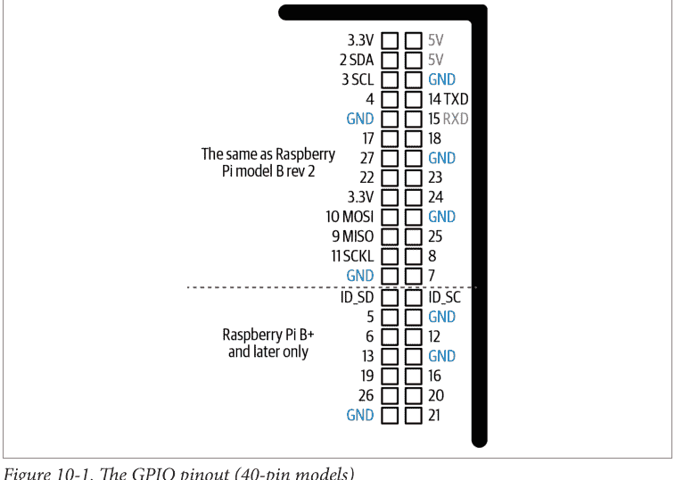

图10-1. GPIO引脚排列（40引脚型号）

在连接器的顶部，有3.3V和5V电源。GPIO对所有输入和输出使用3.3V。任何旁边有数字的引脚都可以用作GPIO引脚。那些在数字之后还有其他名称的引脚也具有其他特殊用途：14 TXD和15 RXD是串行接口的发送和接收引脚；2 SDA和3 SCL构成I2C接口；10 MOSI、9 MISO和11 SCKL构成SPI接口。

> **仅限3V**
> GPIO连接器有3V（实际上是3.3V）和5V电源引脚。这给人一种错误的印象，即树莓派可以连接5V电子设备。虽然它可以向设备提供5V电源，但所有连接到树莓派GPIO引脚的连接必须是3V，否则它们会损坏你的树莓派。通常，将5V连接连接到GPIO引脚会烧毁该引脚，并可能烧毁整个树莓派处理器。

### 讨论

如果你依靠向下数连接器引脚来找到所需的引脚，那么在树莓派上找出哪个引脚是哪个是相当容易出错的。找到正确引脚的一个更好的方法是使用像图10-2所示的Raspberry Leaf这样的GPIO模板。


图10-2. Raspberry Leaf GPIO模板

这个模板套在GPIO引脚上，指示哪个引脚是哪个。其他GPIO模板包括Pi GPIO参考板。

HAT标准是一个你可以与树莓派4、3、2、B+、A+和Zero一起使用的接口标准。这个标准绝不阻止你直接使用GPIO引脚；然而，符合HAT标准的接口板可以自称HAT。HAT与常规树莓派接口板的不同之处在于，它们必须包含一个小的电可擦除可编程只读存储器（EEPROM）芯片，该芯片用于识别HAT，以便最终树莓派可以自动安装必要的软件。截至撰写本文时，HAT尚未完全达到那种复杂程度，但这个想法很好。引脚ID_SD和ID_SC用于与HAT EEPROM通信。

### 另请参阅

树莓派GPIO连接器只有数字输入和输出；它没有一些类似板上存在的模拟输入。你可以通过使用单独的模数转换器（ADC）芯片（配方14.7）或使用电阻式传感器（配方14.1）来克服这个缺点。

有关HAT的示例，请参见配方10.15中描述的Sense HAT。

## 10.2 在树莓派 400 上使用 GPIO 连接器

### 问题

树莓派 400 上的 GPIO 连接器有点难以触及，因为它位于背面且是凹陷的。如何轻松地访问它？

### 解决方案

树莓派 400 上的 GPIO 连接器引脚排列与所有 40 引脚 GPIO 树莓派相同。为了更容易地将跳线连接到连接器上，可以使用一个 GPIO 适配器，例如图 10-3 所示的适用于 Pi 400 的 [MonkMakes GPIO 适配器](https://monkmakes.com)。

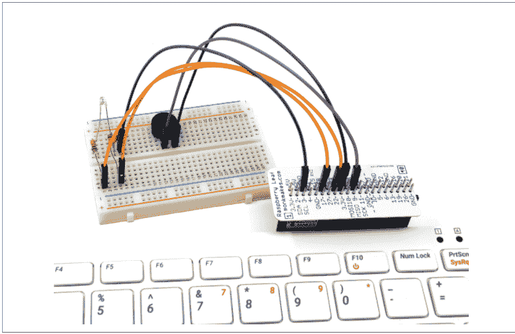

SparkFun、Pi Hut 等公司也提供其他类型的 GPIO 适配器。

### 讨论

你不太可能想将一个笨重且相对昂贵的 Pi 400 嵌入到你的电子项目中。然而，如果你的目标是使用 Pi 400 学习电子学，那么使用适配器比试图将跳线连接到 Pi 400 的背面要容易得多。

没有适配器，HAT 也无法安装到 Pi 400 上，因此 GPIO 适配器也允许将附加 HAT 与 Pi 400 一起使用，例如图 10-4 所示的 Sense HAT。

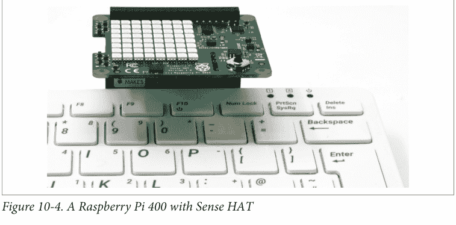

图 10-4. 装有 Sense HAT 的树莓派 400

有一些附加板（Adafruit 称之为 *bonnets*）是专门为与 Pi 400 配合良好而设计的，例如图 10-5 所示的空气质量板、Pimoroni Breakout Garden for Pi 400 以及 Adafruit Cyberdeck Bonnet。

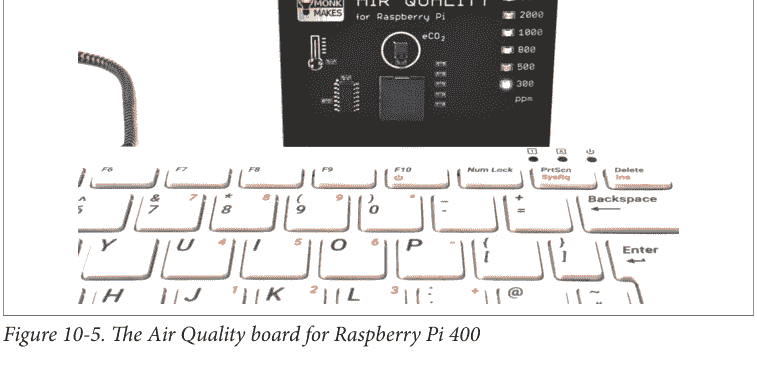

图 10-5. 适用于树莓派 400 的空气质量板

### 另请参阅

有关图 10-4 中所示 Sense HAT 的更多信息，请参阅配方 10.15。

## 10.3 使用 GPIO 连接器时保护树莓派的安全

### 问题

你想将外部电子设备连接到你的树莓派，并且不想意外损坏或弄坏它。

### 解决方案

遵守这些简单的规则，以降低在使用 GPIO 连接器时损坏树莓派的风险：

-   当 Pi 通电时，不要用螺丝刀或任何金属物体戳 GPIO 连接器。
-   不要在树莓派通电的情况下将电子元件连接到 GPIO 引脚或面包板上。
-   不要使用超过 5V 的电压为 Pi 供电。
-   始终将树莓派的 GND 引脚连接到你所连接设备的 GND 连接点。
-   不要在任何用作输入的 GPIO 引脚上施加超过 3.3V 的电压。
-   每个输出不要抽取超过 16mA 的电流；对于 40 引脚树莓派，所有输出的总电流应保持在 100mA 以下，对于旧的 26 引脚树莓派则应保持在 50mA 以下。
-   使用 LED 时，配合 470Ω 串联电阻，3mA 的电流足以使红色 LED 发出相当明亮的光。
-   对于树莓派型号 1 到 3，不要从 5V 电源引脚抽取超过 250mA 的总电流。对于 Pi 4，5V 电源直接来自 USB，因此最大值取决于你的电源。使用 3A 电源时，1A 是一个合理的最大值。

### 讨论

毫无疑问：在添加外部电子设备方面，树莓派有点脆弱。较新的树莓派型号稍微坚固一些，但仍然很容易损坏。请谨慎行事，并在通电*之前*检查你所做的操作，否则你将面临需要更换它的风险。

### 另请参阅

阅读这篇关于[树莓派 GPIO 输出能力](https://www.raspberrypi.org/documentation/configuration/gpio.md)的非常好的讨论。

## 10.4 设置 I2C

### 问题

你想设置 I2C 总线（Inter-Integrated Circuit），以便可以将一些需要它的附加设备与你的树莓派一起使用。

### 解决方案

在最新版本的 Raspberry Pi OS 中，启用 I2C 只需使用你可以在 Raspberry 菜单下的 Preferences（首选项）中找到的树莓派配置工具（图 10-6）。在 Interfaces（接口）选项卡上，单击 I2C 的切换开关将其打开，然后单击 OK。

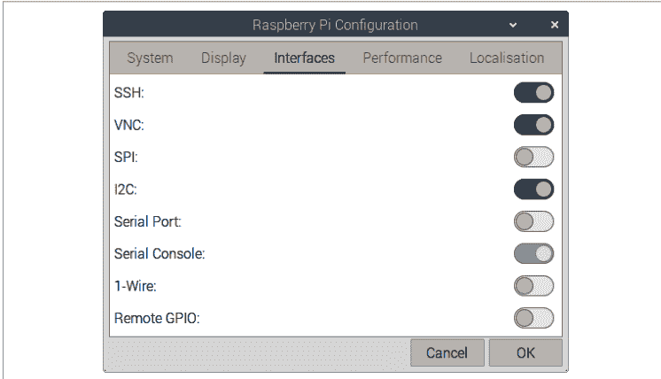

*图 10-6. 使用 Pi 配置工具启用 I2C*

在旧版本的 Raspberry Pi OS 上，或者如果你更喜欢命令行，raspi-config 实用程序可以完成同样的工作。

使用以下命令启动 raspi-config：

```
$ sudo raspi-config
```

然后，从出现的菜单中，选择 Interfacing Options（接口选项）并向下滚动到 I2C（图 10-7）。

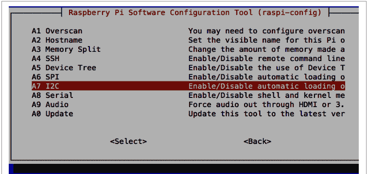

图 10-7. 使用 raspi-config 启用 I2C

然后你会被问到：“Would you like the ARM I2C interface to be enabled?”（你希望启用 ARM I2C 接口吗？），你应该回答 **Yes**（是）。你还会被问到是否希望在启动时加载 I2C 模块，你也应该回答 **Yes**（是）。

此时，你可能还想使用以下命令安装 Python I2C 库：

```
$ sudo apt install python-smbus
```

然后你需要重启树莓派以使更改生效。

### 讨论

使用 I2C 模块是与 Pi 接口的一种非常好的方式。它减少了连接所有设备所需的导线数量（只需四根），并且有一些非常棒的 I2C 模块可用。

但是，不要忘记计算 I2C 模块使用的总电流，并确保它不超过配方 10.3 中指定的限制。

图 10-8 展示了 Adafruit 提供的一些 I2C 模块。其他供应商，如 SparkFun，也有 I2C 设备。图中从左到右依次是：LED 矩阵显示器；四位七段 LED 显示器；16 通道 PWM/伺服控制器；以及实时时钟模块。

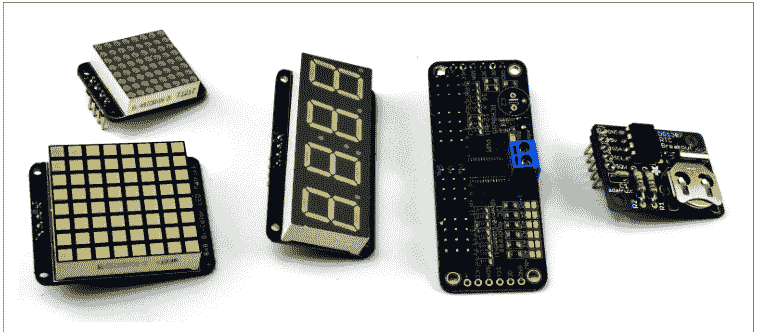

图 10-8. I2C 模块

其他 I2C 模块包括 FM 无线电发射器、超声波测距仪、OLED（有机发光二极管）显示器和各种类型的传感器。

### 另请参阅

参阅本书中的一些 I2C 配方，包括配方 12.3、15.1 和 15.2。

## 10.5 使用 I2C 工具

### 问题

你有一个 I2C 设备连接到你的树莓派，你想检查它是否连接正确，并找到与该设备一起使用的正确 I2C 地址。

### 解决方案

安装并使用 i2c-tools。

> 在较新的发行版中，你可能会发现 i2c-tools 已经安装好了。

在你的 Pi 上打开终端窗口，键入以下命令来获取并安装 i2c-tools：

```
$ sudo apt install i2c-tools
```

将你的 I2C 设备连接到 Pi 并运行命令：

```
$ sudo i2cdetect -y 1
```

请注意，如果你使用的是非常旧的树莓派修订版 1 板，你需要将上面代码行中的 1 改为 0。

如果 I2C 可用，你将看到一些类似于图 10-9 所示的输出，这表明有两个 I2C 地址正在使用中——0x68 和 0x70。

> ### 十六进制
>
> 十六进制（或简称 *hex*）是一种使用 16 进制而不是我们日常生活中使用的 10 进制来表示数字的方式。
>
> 在十六进制中，每个数字可以有十六个可能的值。除了熟悉的 0 到 9 的数字值外，十六进制还使用字母 A 到 F；字母 A 代表十进制 10，F 代表十进制 15。
>
> 使用十六进制而不是十进制没有特别的原因，除非在极少数情况下你想将数字转换为二进制，从十六进制转换比从十进制转换要容易得多。
>
> 为了避免混淆一个数字是以十进制还是十六进制表示，通常在十六进制数字前加上 0x 前缀。在前面的例子中，十六进制数字 0x68 是（十进制）6 x 16 + 8 = 104，而 0x70 是 7 x 16 = 112。

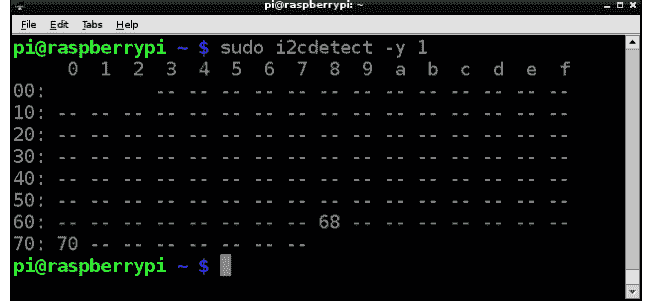

*图 10-9. i2c-tools*

### 讨论

i2cdetect 是一个有用的诊断工具，值得在第一次使用新的 I2C 设备时运行。

你需要确保设备使用的 I2C 地址与软件所需的地址相同。你有时会发现一些小开关或焊接桥可用于更改设备的 I2C 地址。如果你有多个具有相同地址的设备连接到同一个树莓派，这尤其有用。

### 另请参阅

参阅本书中的一些 I2C 配方，包括配方 12.3、15.1 和 15.2。

有关使用 apt 安装的更多信息，请参阅配方 3.17。

## 10.6 设置 SPI

### 问题

你有一个使用串行外设接口（SPI）总线的设备，你想将该设备与你的树莓派一起使用。

### 解决方案

默认情况下，Raspberry Pi OS 中禁用了 SPI。要启用它，过程与配方 10.4 几乎相同。在 Raspberry 菜单下的 Preferences（首选项）中，打开树莓派配置工具（图 10-10）。转到 Interfaces（接口）选项卡，单击 SPI 的切换开关，然后单击 OK。

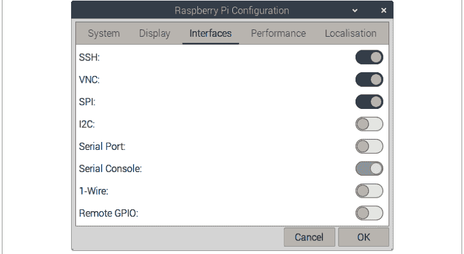

## 10.6 启用 SPI

在旧版本的 Raspberry Pi OS 上，或者如果你更喜欢使用命令行，可以使用 `raspi-config` 工具：

```
$ sudo raspi-config
```

选择“Interfacing Options”，然后选择“SPI”，在重启你的 Raspberry Pi 之前回答 **Yes**。重启后，SPI 就可用了。

### 讨论

SPI 允许在 Raspberry Pi 和外围设备（如 ADC 和端口扩展芯片，用于额外的 GPIO 引脚）之间进行串行数据传输。

你可以使用以下命令检查 SPI 是否正常工作：

```
$ ls /dev/*spi*
/dev/spidev0.0 /dev/spidev0.1
```

如果显示的不是 `spidev0.0` 和 `spidev0.1`，而是没有任何内容，则表示 SPI 未启用。

### 另请参阅

我们在 [配方 14.7](Recipe 10.11) 中使用了一个 SPI 模数转换器芯片。

## 10.7 安装 pySerial 以从 Python 访问串行端口

### 问题

你想使用 Python 在 Raspberry Pi 上使用串行端口的接收和发送（RXD 和 TXD 引脚）。

### 解决方案

首先，使用 [配方 2.6](Recipe 2.6) 启用串行端口。

然后，安装 pyserial 库：

```
$ sudo pip3 install pyserial
```

### 讨论

这个库非常易于使用。使用以下语法创建连接：

```
ser = serial.Serial(DEVICE, BAUD)
```

`DEVICE` 是串行端口的设备（`/dev/serial0`），`BAUD` 是波特率，是一个数字，而不是字符串。GPIO 连接器上的 RXD 和 TXD 引脚映射到 Linux 设备 `/dev/serial0`，而 9600 是最接近标准波特率的值，被许多设备使用：

```
ser = serial.Serial('/dev/serial0', 9600)
```

建立连接后，你可以通过串行发送数据，如下所示：

```
ser.write('some text')
```

监听响应通常涉及一个读取和打印的循环，如本例所示：

```
while True:
    print(ser.read())
```

### 另请参阅

在将硬件连接到串行端口的配方中，例如配方 13.10，你将需要使用此技术。

## 10.8 安装 Minicom 以测试串行端口

### 问题

你想从终端会话发送和接收串行命令。

### 解决方案

安装 Minicom：

```
$ sudo apt install minicom
```

安装 Minicom 后，你可以使用以下命令启动与连接到 GPIO 连接器 RXD 和 TXD 引脚的串行设备的串行通信会话：

```
$ minicom -b 9600 -o -D /dev/serial0
```

`-b` 后的参数是波特率，`-D` 后的参数是串行端口。请确保使用与你正在通信的设备相同的波特率。

这将启动一个 Minicom 会话。（非常古老的）Minicom 标准的一个特点是，当你输入时，屏幕上不会显示任何内容。因此，你首先要做的事情之一是打开本地回显，以便在输入时可以看到命令。为此，请按 Ctrl-A，然后按 Z；你将看到如图 10-11 所示的命令列表。按 E 打开本地回显。

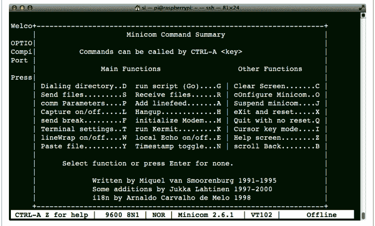

图 10-11. Minicom 命令

现在，你输入的任何内容都将被发送到串行设备，并且来自设备的所有消息也将被显示。

### 讨论

Minicom 是一个很棒的工具，用于检查来自串行设备的消息或确保其正常工作。

### 另请参阅

查看 [Minicom 文档](http://www.minicom.com/)。

如果你想编写一个 Python 程序来处理串行通信，你将需要 Python pyserial 库（配方 10.7）。

## 10.9 使用面包板和跳线

### 问题

你想使用你的 Raspberry Pi 和无焊面包板进行一些电子原型设计。

### 解决方案

使用公对母跳线和 GPIO 引脚标签模板，如 Raspberry Leaf（图 10-12）。

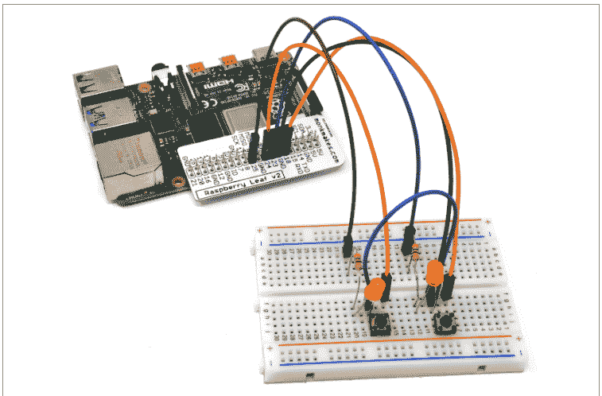

图 10-12. 使用公对母跳线将 Raspberry Pi 连接到面包板

### 讨论

在裸露的 Raspberry Pi 板上识别你想要的引脚并不总是那么容易。你可以通过打印一个模板（如 Raspberry Leaf）来覆盖引脚，从而大大简化这一过程。

拥有一系列公对公跳线也很有用，用于从面包板的一部分连接到另一部分。

母对母跳线在将带有公头引脚的模块直接连接到 Raspberry Pi 时很有用，当没有其他组件需要使用面包板时。

获得面包板、Raspberry Leaf 和一套跳线的一个好方法是购买基于面包板的入门套件，例如 [MonkMakes 的 Raspberry Pi Project Box 1 套件](https://monkmakes.com)。

### 另请参阅

我们在 [配方 11.1](#recipe-11-1) 中详细讨论了一个连接 LED 的示例。

## 10.10 使用 Raspberry Squid

### 问题

你想将 RGB LED 连接到你的 Raspberry Pi，而无需在面包板上构建任何东西。

### 解决方案

使用 Raspberry Squid RGB LED（[图 10-13](#figure-10-13)）。

Raspberry Squid 是一个内置串联电阻和母头引线的 RGB LED；因此，它可以直接插入 Raspberry Pi 的 GPIO 引脚。Squid 有颜色编码的引线。黑色引线连接到一个 GPIO GND 引脚，红色、绿色和蓝色引线连接到用于红色、绿色和蓝色通道的 GPIO 引脚。红色、绿色和蓝色输出可以是简单的数字输出或脉宽调制（PWM）输出（[配方 11.3](#recipe-11-3)），允许你混合不同的颜色。

你可以找到[制作自己的 Squid 的说明](#instructions)，但你也可以购买[现成的 Squid](#ready-made)。

`gpiozero` Python 库预装在 Raspberry Pi OS 上，并支持像 Squid 这样的 RGB LED。

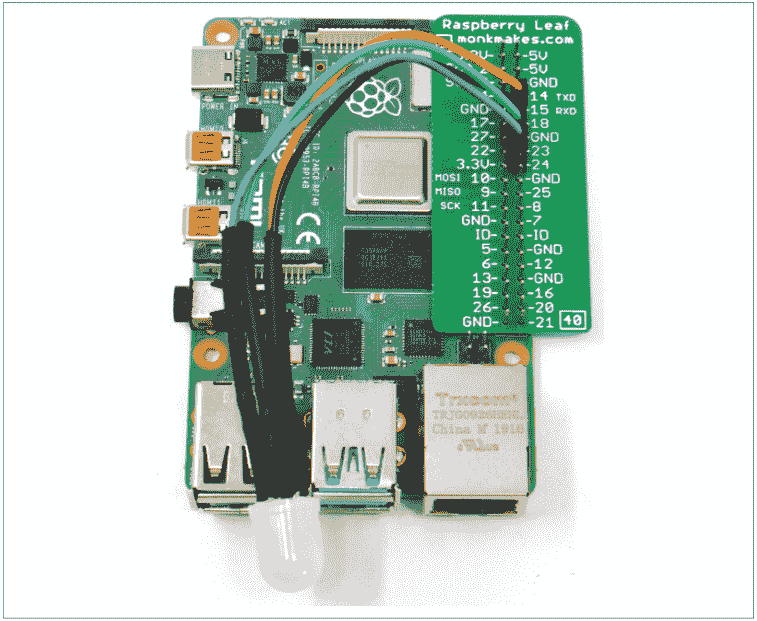

图 10-13. Raspberry Squid

与本书中的所有程序示例一样，你可以下载此程序（参见配方 3.22）。该文件名为 `ch_10_squid_test.py`。这个程序几乎告诉你所有关于使用 Raspberry Squid 需要知道的信息：

```
from gpiozero import RGBLED
from time import sleep
from colorzero import Color

led = RGBLED(18, 23, 24)
led.color = Color('red')
sleep(2)
led.color = Color('green')
sleep(2)
led.color = Color('blue')
sleep(2)
led.color = Color('white')
sleep(2)
```

导入所需的各个模块后，你可以创建一个新的 `RGBLED` 对象，提供用于其红色、绿色和蓝色通道的三个引脚（在本例中为 18、23 和 24）。然后，你可以使用 `led.color =` 命令设置颜色，该命令需要一个颜色值。

颜色使用 `colorzero` 模块中的 `Color` 类提供。这使你可以按名称指定颜色，就像我们在这里所做的那样（大多数情况下有效），或者通过指定单独的红色、绿色和蓝色颜色值。例如，以下代码将 LED 设置为红色：

```
led.color = Color(255, 0, 0)
```

设置颜色后，使用 `time.sleep(2)` 在下一次颜色更改之前创建两秒钟的延迟。

### 讨论

你不需要使用 Squid 的所有三个颜色通道，在将其他电子设备连接到 GPIO 引脚之前，仅检查引脚是否按预期开启和关闭可能非常方便。

### 另请参阅

有关 Squid Button 的信息，请参见 [配方 10.11](Recipe 10.11)。

[配方 11.11](Recipe 11.11) 是一个控制 RGB LED（基于 Squid 或面包板）的示例项目。

## 10.11 使用 Raspberry Squid Button

### 问题

你想将按钮开关连接到你的 Raspberry Pi，而无需在面包板上构建任何东西。

### 解决方案

使用 Squid Button。

Squid Button（[图 10-14](Figure 10-14)）是一个带有连接到触点的母头引线的按钮，因此你可以将其直接插入 Raspberry Pi 的 GPIO 连接器。Squid Button 还包括一个低值电阻，用于限制如果 Squid Button 意外连接到数字输出而不是数字输入时可能流过的电流。

## 10.11 使用 Squid 按钮

你可以直接使用 gpiozero 库来操作 Squid 按钮，如下例所示。与本书中所有程序示例一样，你可以下载它（参见配方 3.22）。该文件名为 ch_10_button_test.py：

```python
from gpiozero import Button
import time

button = Button(7)

while True:
    if button.is_pressed:
        print(time.time())
```

数字（本例中为 7）表示按钮连接的 GPIO 引脚。另一个引脚连接到 GND。

当按钮被按下时，会打印以秒为单位的时间戳。

### 讨论

Squid 按钮对于测试使用数字输入的项目很有用，但由于该按钮适用于面板安装，你也可以将其集成到更永久性的项目中。

### 另请参阅

有关使用开关的更多信息，请参阅配方 13.1 至 13.6。

有关 Squid RGB LED 的信息，请参阅配方 10.10。

## 10.12 使用两个电阻将 5V 信号转换为 3.3V

### 问题

树莓派以 3.3V 运行，但你想将外部模块的 5V 输出连接到树莓派的 GPIO 引脚，而不损坏它。

### 解决方案

使用一对电阻作为分压器来降低输出电压。图 10-15 展示了如何将 Arduino Uno 的 5V 串行连接用于树莓派。

在树莓派上，GPIO14 也是 TXD 引脚，GPIO15 是 RXD 引脚。
要制作此配方，你需要：

- 270Ω 电阻（参见附录 A 第 565 页的“电阻和电容”）
- 470Ω 电阻（参见附录 A 第 565 页的“电阻和电容”）

来自树莓派的 TXD 信号是 3.3V 输出。这可以直接连接到 Arduino 的 5V 输入，不会有任何问题。Arduino 模块会将大约 2.5V 以上的任何电压识别为高电平。

当你需要将 Arduino 模块的 5V 输出连接到树莓派的 RXD 引脚时，问题就出现了。你*绝不能*将其直接连接到 RXD 输入——5V 信号可能会损坏树莓派。相反，应使用图 10-15 所示的两个电阻。

### 讨论

这里使用的电阻将消耗 6mA 的电流。考虑到树莓派本身消耗相当可观的 500mA，这不会明显影响树莓派的电流消耗。

如果你想最小化分压器消耗的电流，请使用阻值更大的电阻，按比例缩放——例如，27kΩ 和 47kΩ，它们将仅消耗微不足道的 60μA。

### 另请参阅

如果你有多个信号需要在 3.3V 和 5V 之间转换，最好使用多通道电平转换器模块——参见配方 10.13。

## 10.13 使用电平转换器模块将 5V 信号转换为 3.3V

### 问题

树莓派以 3.3V 运行。你想将多个 5V 数字引脚连接到树莓派的 GPIO 引脚，而不损坏它。

### 解决方案

使用双向电平转换器模块，例如图 10-16 所示的模块。

这些模块非常易于使用。一侧具有特定电压的电源和多个通道，这些通道可以是该电压下的输入或输出。模块另一侧的引脚具有第二个电压的电源引脚，该侧的所有输入和输出都会自动转换为该侧的电压电平。

### 讨论

这些电平转换器有不同的通道数。图 10-16 中显示的两个模块分别有四个和八个通道。
你可以在附录 A 中找到此类电平转换器的来源。

### 另请参阅

参见配方 10.12，特别是如果你只有一两个电平需要转换。
通常，5V 逻辑输入可以毫无问题地接受 3.3V 输出；然而，在某些情况下，例如使用 LED 灯带（配方 15.5）时，情况可能并非如此，因此你可以使用刚才描述的模块之一来提升逻辑电平。

## 10.14 使用 LiPo 电池为树莓派供电

### 问题

你想用一块 3.7V 锂离子聚合物（LiPo）电池为你的树莓派供电。

### 解决方案

使用升压稳压器模块（图 10-17）。图中所示的模块来自 SparkFun，但 eBay 上也有类似且更便宜的设计。

与从 eBay 购买此类低成本商品一样，在使用前应彻底测试该模块。它们并不总是完全如广告所言那样工作，质量可能参差不齐。

这类模块的优点在于，它既可以作为稳压器为树莓派提供 5V 电压，又自带一个 USB 插座为其充电电路供电。如果你将树莓派的电源适配器插入充电器的插座，树莓派将被供电，同时电池也会充电，这样你就可以拔掉 USB 电源，只要电池电量充足，就可以使用电池为树莓派供电。

使用 1300mA 的 LiPo 电池，你可以预期树莓派能运行两到三个小时。

### 讨论

如果你打算在其他地方处理电池充电，你可以只选择一个升压转换器模块，不带充电器，成本更低。

电池供电对于早期版本的树莓派（如型号 2 和 3）来说要实用得多，但型号 4 消耗的电流要大得多（建议使用 3A 电源）。

或者，也有基于 LiPo 电池的便携式 5V USB 电池组，可用于为你的树莓派供电，实际上复制了前面描述的方法，但作为带外壳的消费产品。但请确保你购买的电池组能为你的树莓派型号提供足够的电流（参见配方 1.4）。

### 另请参阅

在 https://oreil.ly/UoXQm 了解更多关于 SparkFun 充电器升压模块的信息。

## 10.15 Sense HAT 入门

### 问题

你想知道如何使用树莓派 Sense HAT。

### 解决方案

树莓派 Sense HAT（图 10-18）是一个有用且名称有些令人困惑的树莓派接口板。是的，它包含传感器——事实上，它可以测量温度、相对湿度和大气压（配方 14.12）。它还有一个加速度计、一个陀螺仪（配方 14.16）和一个磁力计（配方 14.15），用于导航类项目。它还有一个全彩 8×8 LED 矩阵显示屏（配方 15.3）。

在通电之前，将 Sense HAT 安装到你的树莓派上。
树莓派操作系统已经包含了 Sense HAT 所需的所有软件。
Sense HAT 使用 I2C，因此你需要遵循通常的 I2C 设置（配方 10.4）。

### 讨论

本书中还有更多使用 Sense HAT 的配方，但现在，你可以通过以下方式打开一个 Python 控制台来检查一切是否正常工作：

```
$ sudo python3
```

然后在控制台中输入以下命令：

```
>>> from sense_hat import SenseHat
>>> hat = SenseHat()
>>> hat.show_message('Raspberry Pi Cookbook')
```

然后，“Raspberry Pi Cookbook”消息应该会在 LED 矩阵的屏幕上滚动显示。

### 另请参阅

参见 Sense HAT 的编程参考。
要测量温度、湿度和大气压，请参阅配方 14.12。
要使用 Sense HAT 的加速度计和陀螺仪，请参阅配方 14.16。
要使用磁力计检测北方和检测磁铁的存在，请分别参阅配方 14.15 和 14.18。

## 10.16 Explorer HAT Pro 入门

### 问题

你想知道如何开始使用 Pimoroni Explorer HAT Pro。

### 解决方案

将 HAT 插入你的树莓派并安装 explorerhat Pro Python 库。
图 10-19 展示了安装在树莓派 B+ 上的 Pimoroni Explorer HAT Pro。

Explorer HAT Pro 有一些有用的输入/输出选项，以及一个可以连接小型无焊面包板的区域。它的一些特性包括：

- 4 个 LED
- 4 个缓冲输入
- 4 个缓冲输出（最高 500mA）
- 4 个模拟输入
- 2 个低功耗电机驱动器（最大 200mA）
- 4 个电容式触摸板
- 4 个电容式鳄鱼夹板

这里有一个小实验，你可以尝试让内置的红色LED闪烁。打开编辑器并粘贴以下代码：

```python
import explorerhat, time

while True:
    explorerhat.light.red.on()
    time.sleep(0.5)
    explorerhat.light.red.off()
    time.sleep(0.5)
```

与本书中所有的程序示例一样，你可以下载这个程序（参见配方3.22）。文件名为`ch_10_explorer_hat_blink.py`。

### 讨论

Explorer HAT Pro 提供了四个带缓冲的输入和输出——也就是说，这些输入和输出并非直接连接到树莓派，而是连接到 Explorer HAT Pro 上的芯片。这意味着，如果你不小心接错了线，损坏的将是 Explorer HAT Pro，而不是你的树莓派。

### 另请参阅

你可以将 Explorer HAT Pro 用于电容式触摸感应（配方14.21）。

## 10.17 制作一个HAT

### 问题

你想创建一个符合HAT标准的树莓派接口板原型。

### 解决方案

使用 Perma-Proto Pi HAT（图10-20）。

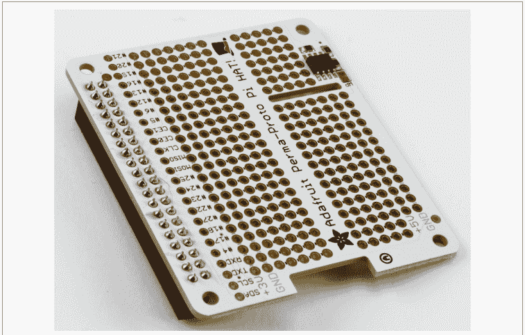

随着配备40针GPIO排针的树莓派B+的推出，为树莓派扩展板定义了一个新标准，称为HAT（硬件附加在顶部）。你不必严格遵守这个标准，特别是如果你只是为自己制作一个一次性产品，但如果你正在设计一个要销售的产品，那么遵守HAT标准可能是有意义的。

HAT标准定义了PCB（印刷电路板）的尺寸和形状，并且还要求PCB上焊接一个EEPROM芯片。该芯片连接到GPIO排针的ID_SD和ID_SC引脚，将来将允许在树莓派启动时，如果连接了HAT，可以对树莓派进行一些配置，甚至自动加载软件。

板上的原型区域由面包板格式的布局组成，包括两排每排五个孔，以及板子两侧的电源轨。

如果你不关心对EEPROM编程，可以到此为止。但是，如果你想在HAT的EEPROM上添加自己的自定义信息，请继续阅读讨论部分。

### 讨论

HAT标准非常有意义。然而，在撰写本文时，树莓派操作系统并未利用写入HAT EEPROM中的任何信息。这在未来可能会改变，并带来令人兴奋的可能性：HAT只需连接到树莓派上，就能自动执行诸如启用I2C和为其硬件安装Python库等操作。

要将数据写入EEPROM，你首先需要启用ID_SD和ID_SC引脚使用的隐藏I2C端口，这些引脚用于读写EEPROM。为此，你需要编辑`/boot/config.txt`，添加或取消注释以下行：

```
dtoverlay=i2c_vc=on
```

完成此操作后，重启你的树莓派；然后你应该能够使用`i2c-tools`（配方10.5）检测到I2C EEPROM已连接到I2C总线：

```
$ i2cdetect -y 0
     0  1  2  3  4  5  6  7  8  9  a  b  c  d  e  f
00:          -- -- -- -- -- -- -- -- -- -- -- -- -- 
10: -- -- -- -- -- -- -- -- -- -- -- -- -- -- -- -- 
20: -- -- -- -- -- -- -- -- -- -- -- -- -- -- -- -- 
30: -- -- -- -- -- -- -- -- -- -- -- -- -- -- -- -- 
40: -- -- -- -- -- -- -- -- -- -- -- -- -- -- -- -- 
50: 50 -- -- -- -- -- -- -- -- -- -- -- -- -- -- -- 
60: -- -- -- -- -- -- -- -- -- -- -- -- -- -- -- -- 
70: -- -- -- -- -- -- -- --
```

从`i2cdetect`命令的结果可以看出，EEPROM的I2C地址是50。请注意，这里使用的是选项`-y 0`，而不是通常的`-y 1`，因为这不是引脚2和3上的普通I2C总线，而是专用于HAT EEPROM的I2C总线。

要读写EEPROM，你需要使用以下命令下载一些工具：

```
$ git clone https://github.com/raspberrypi/hats.git
$ cd hats/eepromutils
$ make
```

写入EEPROM是一个三步过程。首先，你必须编辑文件`eeprom_settings.txt`。至少将`product_id`、`product_version`、`vendor`和`product`字段更改为你的公司名称和产品名称。请注意，此文件中还有许多其他选项，文档记录详尽。它们包括指定反向供电选项、使用的GPIO引脚等。

其次，编辑文件后，运行以下命令将文本文件转换为适合写入EEPROM的文件（`rom_file.eep`）：

```
$ ./eepmake eeprom_settings.txt rom_file.eep
Opening file eeprom_settings.txt for read
UUID=7aa8b587-9c11-4177-bf14-00e601c5025e
Done reading
Writing out...
Done.
```

最后，通过运行以下命令将`rom_file.eep`复制到EEPROM上：

```
$ sudo ./eepflash.sh -w -f=rom_file.eep -t=24c32
This will disable the camera so you will need to REBOOT after this...
This will attempt to write to i2c address 0x50. Make sure there is...
This script comes with ABSOLUTELY no warranty. Continue only if you...
Do you wish to continue? (yes/no): yes
Writing...
0+1 records in
0+1 records out
127 bytes (127 B) copied, 2.52071 s, 0.1 kB/s
Done.
pi@raspberrypi ~/hats/eepromutils $
```

写入完成后，你可以使用这些命令读回ROM：

```
$ sudo ./eepflash.sh -r -f=read_back.eep -t=24c32
$ ./eepdump read_back.eep read_back.txt
$ more read_back.txt
```

### 另请参阅

参见[树莓派HAT设计指南](https://www.raspberrypi.org/documentation/hats/hat-specification.md)。

市场上有许多现成的HAT，包括Adafruit的步进电机（[配方12.8](https://www.raspberrypi.org/recipes/stepper-motor/)）、电容式触摸（[配方14.21](https://www.raspberrypi.org/recipes/capacitive-touch/)）和16通道PWM（[配方12.3](https://www.raspberrypi.org/recipes/16-channel-pwm/)）HAT，以及Pimoroni Explorer HAT Pro（[配方10.16](https://www.raspberrypi.org/recipes/explorer-hat-pro/)）。

## 10.18 使用树莓派 Zero 2 和 Zero 2 W

### 问题

你想了解更多关于Zero 2和Zero 2 W的信息，以及如何在电子项目中使用它们。

### 解决方案

Zero 2的小尺寸和低成本使其成为嵌入电子项目的理想选择。Zero 2 W在Zero 2的基础上增加了WiFi和蓝牙功能，使其非常适合小型物联网（IoT）项目。

[图10-21](https://www.raspberrypi.org/recipes/pi-zero-2-w/)展示了一个树莓派Zero 2 W。

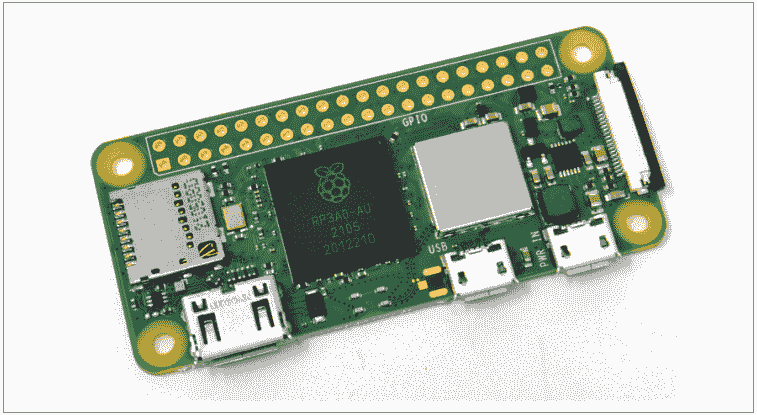

Zero 2和Zero 2 W在供应时不带排针，因此你的第一项工作很可能是将排针焊接到上面。合适的排针可以在Zero入门套件中找到，例如Pi Hut提供的套件。

也可以购买预焊好排针的Zero 2 W，但这比DIY版本更贵。

你也可以找到所谓的*锤击*排针，它们配合紧密，不需要焊接。

### 讨论

只有一个USB接口——而且还是一个micro-USB OTG（On-The-Go）接口——你需要一个USB适配器和USB集线器才能插入USB WiFi加密狗、键盘和鼠标，以便设置Zero 2。

或者，你可以使用配方2.6中描述的控制台电缆，通过编辑`/etc/network/interfaces`来设置WiFi，如配方2.5所述。设置完成后，你可以使用SSH（配方2.7）无线连接到Zero。

### 参阅

有关可用树莓派型号的比较，请参见配方1.1。

# 第11章

## 控制硬件

### 11.0 简介

在本章中，你将通过树莓派的通用输入/输出（GPIO）连接器来掌握电子设备的控制。

大多数配方都需要使用无焊面包板和公对母、公对公跳线（参见配方10.9）。为了与旧的26针树莓派型号保持兼容，这里所有的面包板示例仅使用两种GPIO布局共有的顶部26个引脚（参见配方10.1）。

要获取适合本章许多配方的零件套件和面包板，请查看树莓派的Project Box 1套件。

### 11.1 连接一个LED

### 问题

你想知道如何将LED连接到树莓派。

### 解决方案

使用470Ω或1kΩ的串联电阻将LED连接到一个GPIO引脚，以限制电流。要制作这个配方，你需要以下物品：

- 面包板和跳线（参见第564页的“原型设备和套件”）
- 470Ω电阻（参见第565页的“电阻和电容”）
- LED（参见第566页的“光电器件”）

### 11.1 将LED连接到树莓派

图11-1展示了如何使用无焊面包板和公对母跳线来连接这个LED。LED有正负极引脚。正极引脚较长，在图11-1中，它将与电阻位于同一行。
图中所示的电阻是470Ω电阻，它将使LED发出明亮的光，同时不会消耗过多电流而损坏树莓派。

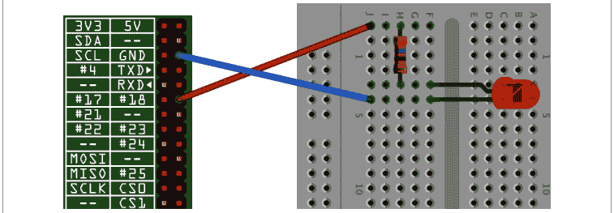

图11-1. 将LED连接到树莓派

连接好LED后，我们需要能够使用Python命令来控制它的开关。
从终端启动Python控制台，并输入以下命令：

```
$ sudo python3
>>> from gpiozero import LED
>>> led = LED(18)
>>> led.on()
>>> led.off()
>>>
```

这将在执行`led.on()`命令后点亮你的LED，并在执行`led.off()`命令后再次熄灭。

### 讨论

LED是一种非常有用、廉价且高效的发光方式，但使用时必须小心。如果将它们直接连接到电压源（例如GPIO输出），且电压高于约1.7伏，它们会消耗非常大的电流。这通常足以烧毁LED或提供电流的设备——如果电流由树莓派提供，这可不是好事。
你应该始终为LED使用限流电阻。串联电阻放置在*LED和电压源之间*，它将流过LED的电流限制在对LED和驱动它的GPIO引脚都安全的水平。

树莓派GPIO引脚保证只能提供约3mA或16mA的电流（取决于板子型号和使用的引脚数量）——参见配方10.3。LED通常在电流大于1mA时就会发光，但电流越大，亮度越高。使用表11-1作为根据LED类型选择串联电阻的指南；该表还指出了从GPIO引脚消耗的大致电流。

表11-1. 为LED和3.3V GPIO引脚选择串联电阻

| LED类型 | 电阻 | 电流 (mA) |
| :--- | :--- | :--- |
| 红色 | 470Ω | 3.5 |
| 红色 | 1kΩ | 1.5 |
| 橙色、黄色、绿色 | 470Ω | 2 |
| 橙色、黄色、绿色 | 1kΩ | 1 |
| 蓝色、白色 | 100Ω | 3 |
| 蓝色、白色 | 270Ω | 1 |

如你所见，在所有情况下，使用470Ω电阻都是安全的。如果你使用的是蓝色或白色LED，可以显著降低串联电阻的值，而不会损坏树莓派。

如果你想将在Python控制台中进行的实验扩展成一个让LED反复闪烁的程序，可以将你在`ch_11_led_blink.py`中找到的代码粘贴到编辑器中（与本书所有程序示例一样，你可以下载此程序[参见配方3.22]）：

```
from gpiozero import LED
from time import sleep

led = LED(18)

while True:
    led.on()
    sleep(0.5)
    led.off()
    sleep(0.5)
```

要运行该命令，请输入以下内容：

```
$ python3 ch_11_led_blink.py
```

在LED点亮和熄灭之间0.5秒的休眠时间使得LED每秒闪烁一次。

LED类还有一个内置的闪烁方法，如下例所示：

```
from gpiozero import LED
led = LED(18)
led.blink(0.5, 0.5, background=False)
```

`blink`的前两个参数分别是点亮时间和熄灭时间。可选的`background`参数很有趣，因为如果你将其设置为True，你的程序将能够在LED闪烁的同时在后台继续运行其他命令。

当你准备好停止后台闪烁的LED时，只需使用`led.off()`。这种技术可以大大简化你的程序。`ch_11_led_blink_2.py`中的示例展示了这一点：

```
from gpiozero import LED

led = LED(18)
led.blink(0.5, 0.5, background=True)
print("Notice that control has moved away - hit Enter to continue")
input()
print("Control is now back")
led.off()
input()
```

当程序启动时，LED将在后台开始闪烁，程序可以自由地继续执行下一条命令并打印“Notice that control has moved away - hit Enter to continue”。`input()`命令将使程序暂停并等待输入（你只需按回车键）。但请注意，在你按回车键之前，即使程序已经继续执行并等待输入，LED仍在闪烁。

当你再次按下回车键时，`led.off()`命令将停止LED的后台闪烁。

### 另请参阅

查看这个串联电阻计算器。

有关在树莓派上使用面包板和跳线的更多信息，请参见配方10.9。

参阅gpiozero关于LED的文档。

## 11.2 使GPIO引脚保持安全状态

### 问题

你希望在程序退出时，将所有GPIO引脚设置为输入状态，以减少GPIO排针意外短路的可能性，从而避免损坏树莓派。

### 解决方案

每当退出使用gpiozero的程序时，它会自动将所有GPIO引脚设置为安全的*输入*状态。

### 讨论

早期的GPIO引脚访问方法，如RPi.GPIO库，不会自动将GPIO引脚设置为安全的输入状态。相反，它们要求你在退出程序前调用清理函数。

如果没有调用清理函数或树莓派没有重启，设置为输出的引脚在程序结束后将保持为输出状态。如果你开始连接一个新项目，没有意识到这个问题，你的新电路可能会意外地将GPIO输出短接到某个电源电压或另一个处于相反状态的GPIO引脚。一个典型的情况是，如果你连接一个按钮开关，将一个配置为输出且为高电平的GPIO引脚连接到GND（地）。

幸运的是，gpiozero库现在会处理这个问题。

### 另请参阅

有关Python中异常处理的更多信息，请参见[配方7.10](Recipe 7.10)。

## 11.3 控制LED的亮度

### 问题

你想通过Python程序改变LED的亮度。

### 解决方案

gpiozero库具有脉宽调制（PWM）功能，使你能够控制LED的功率和亮度。要尝试它，请按照[配方11.1](Recipe 11.1)中的描述连接一个LED，并运行这个测试程序（*ch_11_led_brightness.py*）：

```
from gpiozero import PWMLED

led = PWMLED(18)

while True:
    brightness_s = input("Enter Brightness (0.0 to 1.0):")
    brightness = float(brightness_s)
    led.value = brightness
```

该程序包含在代码下载中（参见[配方3.22](Recipe 3.22)）。

运行Python程序，你将能够通过输入0.0（关闭）到1.0（全亮）之间的数字来改变亮度：

```
$ python ch_11_led_brightness.py
Enter Brightness (0.0 to 1.0):0.5
Enter Brightness (0.0 to 1.0):1
Enter Brightness (0.0 to 1.0):0
```

按Ctrl-C退出程序。Ctrl-C是命令行中*停止你正在做的事情*的命令；在许多情况下，它会完全停止一个程序。

请注意，像这样控制LED亮度时，必须将LED定义为`PWMLED`，而不仅仅是`LED`。

### 讨论

PWM是一种巧妙的技术，通过改变脉冲的长度，同时保持每秒脉冲总数（以Hz为单位的频率）恒定。图11-2说明了PWM的基本原理。


如果脉冲只在很短的时间内为高电平，LED看起来会很暗；而如果脉冲在大部分时间内为高电平，LED看起来会更亮。

默认情况下，PWM频率为100Hz；即LED每秒闪烁100次。你可以在定义`PWMLED`时通过提供可选的`frequency`参数来更改此值：

```
led = PWMLED(18, frequency=1000)
```

该值以Hz为单位，因此在本例中，频率被设置为1,000 Hz（1 kHz）。

表11-2比较了参数中指定的频率与用示波器测量的引脚实际频率。

表11-2. 请求频率与测量频率对比

| 请求频率 | 测量频率 |
|---|---|
| 50 Hz | 50 Hz |
| 100 Hz | 98.7 Hz |
| 200 Hz | 195 Hz |
| 500 Hz | 470 Hz |
| 1 kHz | 880 Hz |
| 10 kHz | 4.2 kHz |

你可以看到，随着频率增加，其准确性会降低。这意味着此PWM功能不适用于音频（20 Hz到20 kHz），但对于控制LED亮度或电机速度来说，速度已经足够快了。如果你想自己尝试，程序在代码下载中，名为`ch_11_pwm_f_test.py`。

### 另请参阅

有关PWM的更多信息，请参见维基百科。

配方11.11使用PWM来改变RGB LED的颜色，配方12.4使用PWM来控制直流电机的速度。

有关在树莓派上使用面包板和跳线的更多信息，请参见配方10.9。你也可以使用滑块控件来控制LED的亮度——参见配方11.10。

## 11.4 使用晶体管切换大功率直流设备

### 问题

你想要控制一个大功率、低电压直流设备（例如12V LED模块）的电流。

### 解决方案

这些大功率LED的电流消耗太大，无法直接由GPIO引脚供电。它们还需要12V电压，而不是3.3V。要控制这样的大功率负载，你需要使用晶体管。

在这种情况下，你将使用一种称为金属-氧化物-半导体场效应晶体管（MOSFET）的大功率晶体管，其成本不到一美元，但可以处理高达30安培的负载——这比大功率LED所需的电流高出许多倍。所使用的MOSFET型号是FQP30N06L（参见第565页的“晶体管和二极管”）。

图11-3展示了如何在面包板上连接MOSFET。确保你正确识别了LED模块的正负电源引线。

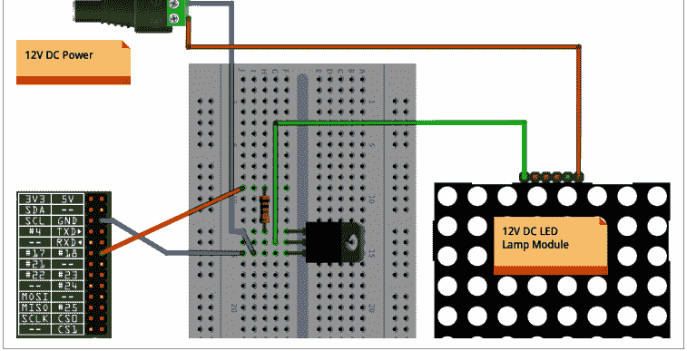

要制作这个方案，你需要以下物品：

- 面包板和跳线（参见第564页的“原型设备和套件”）
- 1kΩ电阻（参见第565页的“电阻和电容”）
- FQP30N06L N沟道MOSFET或TIP120达林顿晶体管（参见第565页的“晶体管和二极管”）
- 12V电源适配器
- 12V直流LED模块

用于开关LED面板的Python代码与我们控制单个低功率LED（不使用MOSFET）时完全相同（参见方案11.1）。

你也可以将MOSFET与PWM结合使用来控制LED模块的亮度（参见方案11.3）。

### 讨论

每当需要使用GPIO连接器为任何重要设备供电时，请使用电池或外部电源适配器。GPIO连接器只能提供相对较低的电流（方案10.3）。在这种情况下，你将使用12V直流电源适配器为LED面板供电。选择一个功率处理能力足够的电源适配器。因此，如果LED模块是5W，你至少需要一个12V 5W的电源（6W会更好）。如果电源指定的是最大电流而不是功率，你可以通过电压乘以最大电流来计算其功率。例如，一个500mA 12V电源可以提供6W的功率。

电阻是必要的，以确保MOSFET从关断切换到导通（反之亦然）时出现的峰值电流不会使GPIO引脚过载。MOSFET切换LED面板的负极侧，因此正电源直接连接到LED面板的正极侧，LED面板的负极侧连接到MOSFET的漏极。MOSFET的源极连接到GND，MOSFET的栅极引脚控制从漏极到源极的电流流动。如果栅极电压高于2V左右，MOSFET将导通，电流将通过它和LED模块。

> **不适用于交流电**
>
> *不要*尝试使用此电路来切换110V或220V交流电。它不会工作，并且尝试这样做极其危险。请改用方案11.7。

这里使用的MOSFET是FQP30N06L。末尾的L表示它是一个逻辑电平MOSFET，其栅极阈值电压适用于3.3V数字输出。该MOSFET的非L版本也可能工作正常，但你不能保证它一定可以，因为其规定的栅极阈值电压范围是2V到4V。因此，如果你运气不好，拿到了一个阈值电压在4V端的MOSFET，它将无法良好地切换。

使用MOSFET的替代方案是使用功率达林顿晶体管，如TIP120。它的引脚排列与FQP30N06L兼容，因此你可以保持相同的面包板布局。

此电路适用于控制其他低压直流设备的电源。唯一的真正例外是电机和继电器，它们需要一些额外的处理（参见方案11.5）。

### 另请参阅

查看[MOSFET的数据手册](datasheet)。

如果你想创建一个图形用户界面来控制你的LED模块，请参见方案11.9了解简单的开/关控制，以及方案11.10了解使用滑块进行亮度的可变控制。

## 11.5 使用继电器切换大功率设备

### 问题

你想要开关可能不适合用MOSFET切换的设备。

### 解决方案

使用继电器和小型晶体管。

单独使用晶体管（方案11.4）对于几百毫安或稍多一点的中等负载效果很好。但对于更高的电流，或者当控制电子设备需要与被切换的设备在电气上隔离时，使用继电器更方便。

图11-4展示了如何在面包板上连接晶体管和继电器。确保晶体管和二极管都放置正确。二极管一端有条纹，这里使用的晶体管有一面是平的，一面是弯曲的。

要制作这个方案，你需要以下物品：

- 面包板和跳线（参见第564页的“原型设备和套件”）
- 1kΩ电阻（参见第565页的“电阻和电容”）
- 晶体管2N3904（参见第565页的“晶体管和二极管”）
- 1N4001二极管（参见第565页的“晶体管和二极管”）
- 5V继电器（参见第567页的“杂项”）
- 万用表

你可以使用与方案11.1中相同的LED闪烁程序。如果一切正常，每次触点闭合时，你会听到继电器发出咔嗒声，万用表发出哔哔声。然而，继电器是缓慢的机械装置，因此不要尝试将它们与脉宽调制（PWM）一起使用：这可能会损坏继电器。

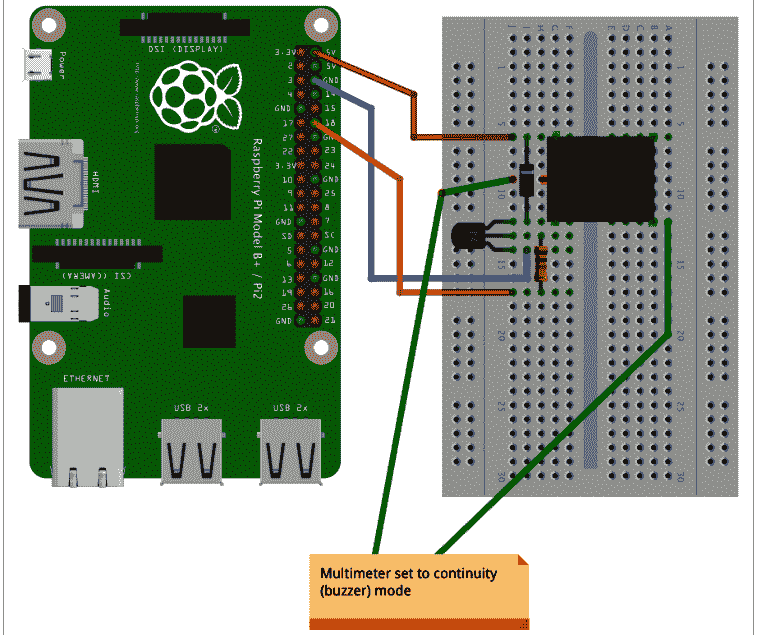

图11-4. 将继电器与树莓派一起使用

### 讨论

继电器自电子学早期就已存在，其最大优点是易于使用，并且在任何开关通常可以工作的场合都能工作——例如，当你切换交流电（AC）时，或者在被切换设备的确切接线未知的情况下。

如果继电器触点被要求超过其规格，继电器的寿命将会缩短。会出现电弧，触点最终可能会熔合在一起。

继电器也有可能变得危险地发热。如有疑问，请选择规格更高的继电器触点。

图11-5展示了一个典型继电器的原理图符号、引脚布局和封装。


继电器本质上是一个开关，当电磁铁将它们拉在一起时，其触点闭合。因为电磁铁和开关在电气上没有任何连接，这保护了驱动继电器线圈的电路免受开关侧任何高压的影响。

继电器的缺点是它们操作缓慢，并且在经过数十万次操作后最终会磨损。这意味着它们只适用于缓慢的开/关控制，而不适用于像PWM这样的快速切换。

继电器的线圈需要大约50mA才能闭合连接。因为树莓派GPIO引脚只能提供大约3mA的电流，你需要使用一个小晶体管作为开关。你不需要像方案11.4中那样使用高功率MOSFET；你可以只使用一个小晶体管。它有三个连接。基极（中间引脚）通过一个1kΩ电阻连接到GPIO引脚以限制电流。*发射极*连接到GND，*集电极*连接到继电器的一侧。继电器的另一侧连接到GPIO连接器上的5V。二极管用于抑制当晶体管快速切换继电器线圈电源时出现的任何高压脉冲。

> 虽然继电器可以用来切换110V或220V交流电，但这种电压非常危险，不应在面包板上使用。如果你想切换高压，请改用方案11.7。

### 另请参阅

关于使用功率MOSFET切换直流电（DC），请参见方案11.4。

## 11.6 使用固态继电器进行切换

### 问题

你想在你的树莓派上使用固态（无活动部件）继电器。

### 解决方案

> **不适用于高压**
>
> 此处详述的解决方案仅适用于切换低压（低于16V）交流或直流电。*你绝不能*将其用于家用110V或220V交流电源。

将GPIO引脚直接连接到固态继电器（SSR）的输入端，例如图11-6所示的MonkMakes SSR。

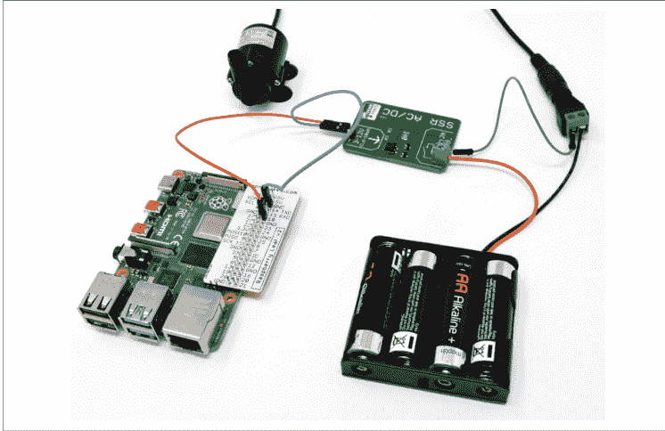

SSR的输入可以直接由作为数字输出的树莓派GPIO引脚切换。然后，连接到SSR输入的树莓派GPIO引脚变为3.3V，输出就会导通，就像机电继电器一样。

### 讨论

如配方11.5所述，机电继电器使用电磁铁和开关来实现输入和输出的电气隔离，而固态继电器则使用光电器件来隔离输入和输出。图11-7展示了MonkMakes固态继电器的原理图。标记为IC1的部分实际上是一个LED和一系列光电池，它们被封装在一个密封且不透光的集成电路封装中。当LED点亮时，它会产生一个电压，用于控制标记为Q1和Q2的两个MOSFET晶体管。需要两个晶体管，以便能够切换直流电和交流电（交流电的电压会反向）。


### 另请参阅

要使用机电继电器，请参阅配方11.5。

## 11.7 控制高压交流设备

### 问题

你想使用树莓派来开关110或220伏交流电（AC）。

### 解决方案

使用PowerSwitch Tail II（见图11-8）或四路输出电源继电器。这些便捷的设备使得从树莓派安全、轻松地开关交流设备变得非常简单。它们一端有一个交流插座，另一端有一个插头（或多个插头），就像延长线一样；唯一的区别是中间的控制盒有三个螺丝端子。通过将端子2连接到GND，端子1连接到GPIO引脚，该设备就像一个开关，可以打开和关闭电器。

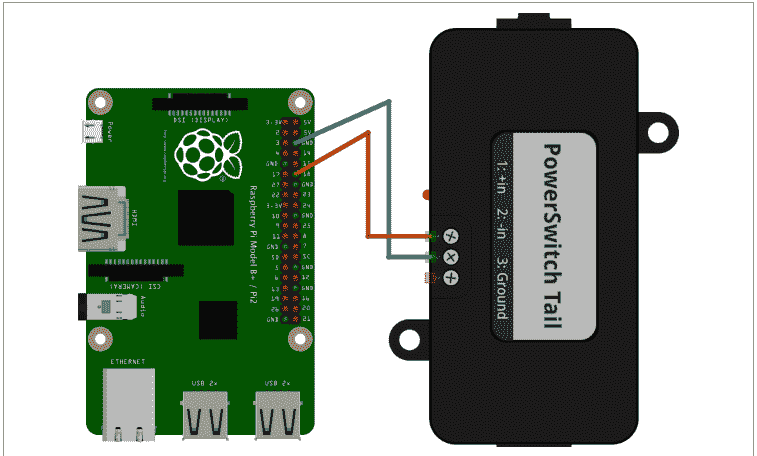

图11-8. 将PowerSwitch Tail与树莓派配合使用

你可以使用与配方11.1中相同的Python代码来使用PowerSwitch Tail，如图11-8所示。

### 讨论

PowerSwitch Tail使用继电器，但为了切换继电器，它使用了一种称为*光隔离器*的组件，该组件有一个LED照射到一个光敏双向可控硅（一种高压、光敏开关）上；当LED点亮时，光敏双向可控硅导通，为继电器线圈提供电流。

光隔离器内部的LED通过一个电阻限制电流，因此当您从GPIO引脚提供3.3V电压时，只有3mA的电流流过它。

您还可以在eBay和亚马逊上找到与PowerSwitch Tail类似但价格更便宜的设备。

### 另请参阅

关于使用功率MOSFET切换直流电，请参阅配方11.4；关于在面包板上使用继电器进行切换，请参阅配方11.5。

## 11.8 使用Android和蓝牙控制硬件

### 问题

你想使用你的Android手机和蓝牙与树莓派进行交互。

### 解决方案

使用免费的Blue Dot Android应用程序和Python库：

```
$ sudo pip3 install bluedot
```

接下来，你需要确保你的树莓派是*可发现的*。在树莓派屏幕的右上角，点击蓝牙图标，然后点击“使可发现”（图11-9）。


接下来，你需要配对你的树莓派和手机。确保你的手机已开启蓝牙，然后在树莓派的蓝牙菜单上点击“添加新设备”（图11-10）。

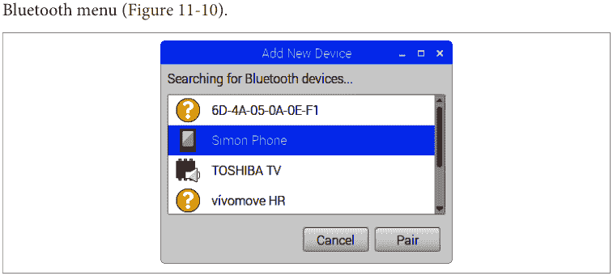

在列表中找到你的手机，然后点击“配对”。然后你的手机会提示你确认一个代码以完成配对。

配对完成后，转到手机上的Play Store应用。搜索并安装Blue Dot应用。在你运行一个使用Python Blue Dot代码来监听命令的Python程序之前，该应用将无法与你的手机配合工作，因此请在你的树莓派上运行以下程序（*ch_11_bluedot.py*）：

```
from bluedot import BlueDot
bd = BlueDot()
while True:
    bd.wait_for_press()
    print("You pressed the blue dot!")
```

与本书中的所有程序示例一样，你可以下载此程序（参见[配方3.22](Recipe 3.22)）。

现在是时候在你的手机上打开Blue Dot应用了。当你这样做时，它会提供一个Blue Dot设备列表（图11-11）。

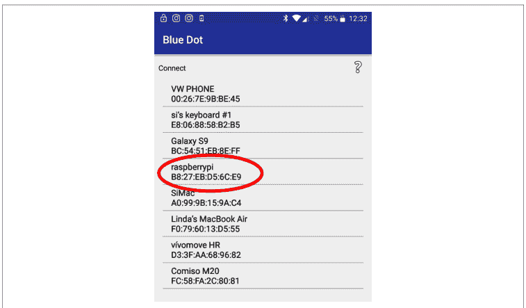

连接后，同名的蓝点将会出现，如[图11-12](Figure 11-12)所示。

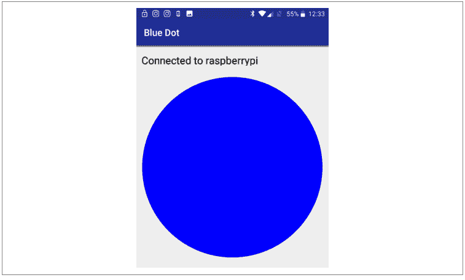

图11-12. 蓝点

当你点击蓝点时，你的Python程序将打印出消息：“You pressed the blue dot!”：

```
$ python3 ch_11_bluedot.py
Server started B8:27:EB:D5:6C:E9
Waiting for connection
Client connected C0:EE:FB:F0:94:8F
You pressed the blue dot!
You pressed the blue dot!
You pressed the blue dot!
```

### 讨论

这个大蓝点不仅仅是一个按钮；你也可以将其用作操纵杆。你可以滑动、轻扫和旋转这个点。Blue Dot库允许你将处理函数链接到诸如轻扫和旋转等事件。有关更多信息，请查看[文档](https://bluedot.readthedocs.io/)。

### 另请参阅

有关Blue Dot的完整信息，请参阅[Blue Dot网站](https://bluedot.readthedocs.io/)。

还有一个[Blue Dot Python模块](https://github.com/martinohanlon/BlueDot)，它允许你使用第二个树莓派作为Blue Dot遥控器。

有关在树莓派上使用蓝牙的更多信息，请参阅[配方1.17](https://www.raspberrypi.org/magpi-issues/MagPi17.pdf)。

## 11.9 制作一个用于开关设备的用户界面

### 问题

你想制作一个在树莓派上运行的应用程序，该程序有一个用于开关设备的按钮。

### 解决方案

使用guizero为gpiozero提供用户界面，以打开和关闭引脚（图11-13）。


图11-13. guizero中的开关

如果你还没有这样做，请使用以下命令安装guizero：

```
$ sudo pip3 install guizero
```

你需要将一个LED或其他类型的输出设备连接到GPIO引脚18。使用LED（配方11.1）是入门最简单的选择。

与本书中的所有程序示例一样，你可以下载此配方的代码（参见配方3.22）。该文件名为ch_11_gui_switch.py，并创建了图11-13所示的开关：

```
from gpiozero import DigitalOutputDevice
from guizero import App, PushButton

pin = DigitalOutputDevice(18)

def start():
    start_button.disable()
    stop_button.enable()
    pin.on()

def stop():
    start_button.enable()
    stop_button.disable()
    pin.off()

app = App(width=100, height=150)
start_button = PushButton(app, command=start, text="On")
start_button.text_size = 30
stop_button = PushButton(app, command=stop, text="Off", enabled=False)
stop_button.text_size = 30
app.display()
```

### 讨论

该示例使用了一对按钮，当你按下其中一个时，它会禁用自身并启用其对应的按钮。它还使用gpiozero通过on()和off()方法来改变输出引脚的状态。如果我们使用`pin = LED(18)`而不是`pin = DigitalOutputDevice(18)`，这个示例同样可以工作，但使用DigitalOutputDevice使事情更加通用。毕竟，你可能控制的是引脚18上的任何东西，而不仅仅是LED。

### 另请参阅

你也可以使用此程序来控制大功率直流设备（配方11.4）、继电器（配方11.5）或高压交流设备（配方11.7）。

有关guizero的更多信息，请参阅配方7.22。

## 11.10 制作一个用于控制LED和电机PWM功率的用户界面

### 问题

你想制作一个在树莓派上运行的应用程序，该程序有一个滑块，用于使用脉宽调制（PWM）控制设备的功率。

### 解决方案

使用gpiozero和guizero用户界面框架，编写一个Python程序，该程序使用一个滑块在0到100%之间改变PWM占空比（图11-14）。


你需要将一个LED或其他类型的输出设备连接到GPIO引脚18，该设备需要能够响应PWM信号。使用LED（配方11.1）是入门最简单的选择。

打开一个编辑器并粘贴以下代码（文件名为*ch_11_gui_slider.py*）：

```
from gpiozero import PWMOutputDevice
from guizero import App, Slider

pin = PWMOutputDevice(18)

def slider_changed(percent):
    pin.value = int(percent) / 100

app = App(title='PWM', width=500, height=150)
slider = Slider(app, command=slider_changed, width='fill', height=50)
slider.text_size = 30
app.display()
```

与本书中的所有程序示例一样，你可以下载此配方的代码（参见配方3.22）。

使用以下命令运行程序：

```
$ python3 gui_slider.py
```

### 讨论

示例程序使用了Slider类。command选项在滑块的值每次改变时运行slider_changed命令。这会更新输出引脚的值。slider_changed函数的参数是一个字符串，即使它包含一个0到100之间的数字，因此使用int将其转换为数字，然后百分比值必须除以100，以给出0到1之间的值用于PWM输出。

### 另请参阅

你可以使用此程序来控制LED（配方11.1）、直流电机（配方12.4）或大功率直流设备（配方11.4）。

## 11.11 制作一个用于改变RGB LED颜色的用户界面

### 问题

你想控制RGB LED的颜色。

### 解决方案

使用脉宽调制（PWM）来控制RGB LED的红、绿、蓝三个通道的功率。

要制作此配方，你需要以下物品：

- 面包板和跳线（参见第564页的“原型设备与套件”）
- 三个470Ω电阻（参见第565页的“电阻与电容”）
- RGB共阴极LED（参见第566页的“光电器件”）

图11-15展示了如何在面包板上连接你的RGB LED。请确保LED的方向正确；最长的引脚应位于面包板顶部的第二个引脚位置。这种连接方式被称为*共阴极*，因为LED封装内红、绿、蓝LED的负极（阴极）都连接在一起，以减少封装所需的引脚数量。

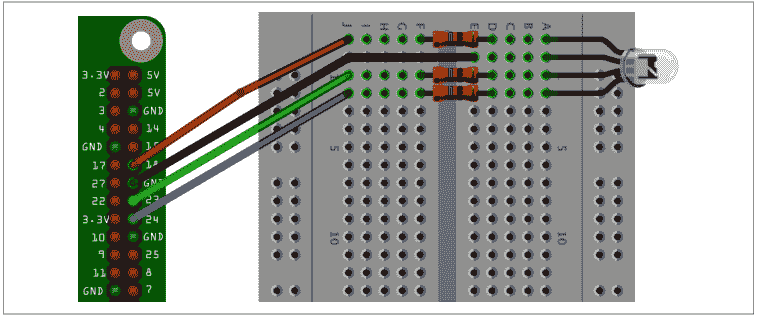

*图11-15. 将RGB LED与树莓派配合使用*

使用面包板的替代方案（避免繁琐的电阻）是使用Raspberry Squid（参见配方10.10）。

接下来的程序有三个滑块，用于控制LED的红、绿、蓝通道（图11-16）。

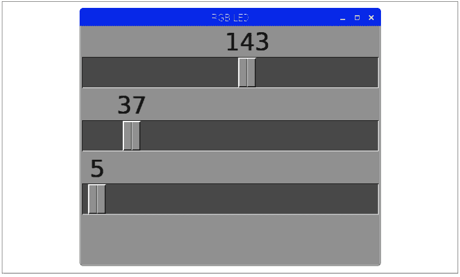

图11-16. 控制RGB LED的用户界面

打开一个编辑器，并从文件`ch_11_gui_slider_RGB.py`中粘贴以下代码：

```python
from gpiozero import RGBLED
from guizero import App, Slider
from colorzero import Color

rgb_led = RGBLED(18, 23, 24)

red = 0
green = 0
blue = 0

def red_changed(value):
    global red
    red = int(value)
    rgb_led.color = Color(red, green, blue)

def green_changed(value):
    global green
    green = int(value)
    rgb_led.color = Color(red, green, blue)

def blue_changed(value):
    global blue
    blue = int(value)
    rgb_led.color = Color(red, green, blue)

app = App(title='RGB LED', width=500, height=400)

Slider(app, command=red_changed, end=255, width='fill', height=50).text_size = 30
Slider(app, command=green_changed, end=255,
    width='fill', height=50).text_size = 30
Slider(app, command=blue_changed, end=255,
    width='fill', height=50).text_size = 30

app.display()
```

与本书中所有的程序示例一样，你可以下载此配方的代码（参见配方3.22）。

### 讨论

该代码的操作方式与配方11.10中描述的单个PWM通道控制类似。然而，在这种情况下，你需要三个PWM通道和三个滑块，每个颜色一个。

这里使用的RGB LED类型是共阴极。如果你有共阳极类型，你仍然可以使用它，但需要将共阳极连接到GPIO连接器的3.3V引脚。你会发现滑块是反向的，因此设置为255时变为*关闭*，0时变为完全*开启*。

在为这个项目选择LED时，标记为“漫射”的LED是最好的，因为它们能更好地混合颜色。

### 另请参阅

如果你想只控制一个PWM通道，请参见配方11.10。

## 11.12 使用模拟表作为显示器

### 问题

你想将一个模拟面板电压表连接到树莓派。

### 解决方案

假设你有一个5V电压表，你可以使用PWM输出直接驱动该表，将电压表的负极连接到GND，正极连接到GPIO引脚（图11-17）。如果电压表是常见的5V类型，你将只能显示最高3.3V的电压。

如果你想使用5V电压表的几乎全部量程，你需要一个晶体管作为PWM信号的开关，以及一个1kΩ电阻来限制流向晶体管基极的电流。

要制作此配方，你需要以下物品：

- 5V面板表（参见第567页的“杂项”）
- 面包板和跳线（参见第564页的“原型设备与套件”）
- 两个1kΩ电阻（参见第565页的“电阻与电容”）
- 晶体管2N3904（参见第565页的“晶体管与二极管”）

图11-18展示了此项目的面包板布局。

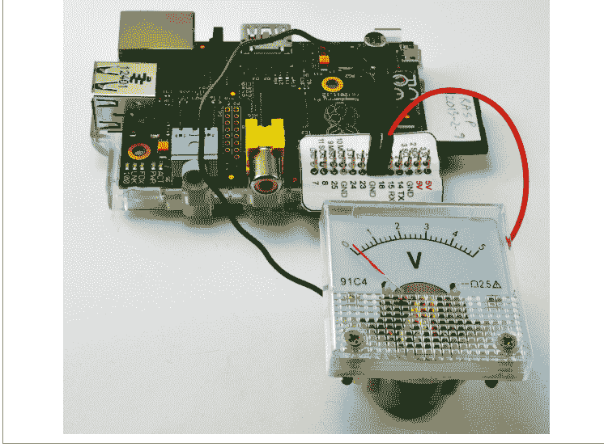

图11-17. 将电压表直接连接到GPIO引脚

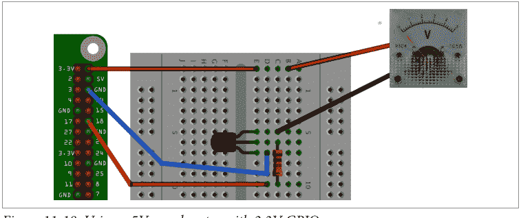

图11-18. 将5V面板表与3.3V GPIO配合使用

### 讨论

要测试电压表，请使用与配方11.10中控制LED亮度相同的程序。

你可能会注意到，指针在刻度的两端给出稳定的读数，但在其他地方会有些抖动。这是PWM信号生成方式的一个副作用。为了获得更稳定的结果，你可以使用外部PWM硬件，例如配方12.3中使用的16通道模块。

### 另请参阅

有关老式电压表工作原理的更多信息，请参见维基百科。

有关将面包板和跳线与树莓派配合使用的更多信息，请参见配方10.9。

# 第12章
电机

## 12.0 简介

在本章中，你将研究将不同类型的电机与树莓派配合使用。这包括直流电机、伺服电机和步进电机。

电机有各种形状和尺寸（图12-1）。最常见的是你可能在玩具车中找到的简单有刷直流电机。在本章中，我们还将研究伺服电机，其电机轴的位置使用树莓派生成的脉冲来设置；以及步进电机，它们不像名字暗示的那样平滑旋转，而是随着线圈依次通电而以微小的步进旋转。

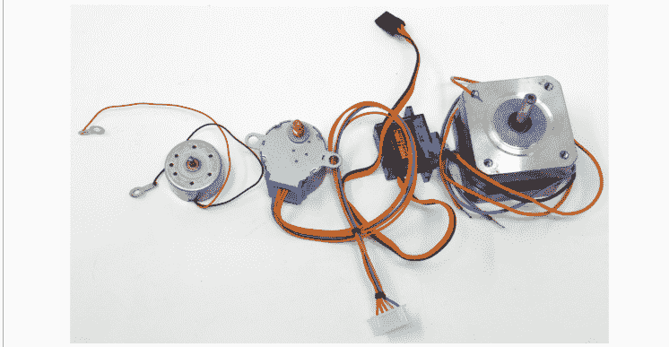

图12-1. 各种电机

## 12.1 控制伺服电机

### 问题

你想使用树莓派来控制伺服电机的位置。

### 解决方案

使用脉宽调制（PWM）来控制发送到伺服电机的脉冲宽度，以改变其角度。虽然这可行，但生成的PWM并不完全稳定，因此伺服电机会有轻微的抖动。有关产生更稳定脉冲时序的替代解决方案，请参见配方12.2和12.3。

如果你使用的是树莓派1，你应该使用单独的5V电源为伺服电机供电，因为负载电流的峰值很可能会导致树莓派崩溃或过载。如果你使用的是树莓派B+或更新型号，板载电压调节的改进意味着你可能可以直接从通用输入输出（GPIO）端口的5V引脚为小型伺服电机供电。

图12-2展示了一个小型9g伺服电机（参见第567页的“杂项”）与树莓派B+配合使用，工作得相当愉快。

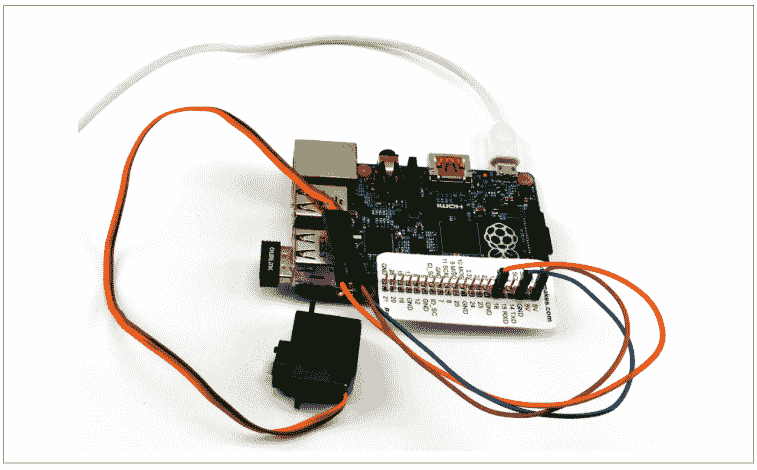

伺服电机的引线通常有颜色区分，5V线为红色，地线为棕色，控制线为橙色。5V和地线连接到GPIO排针的5V和GND引脚，控制线连接到引脚18。连接使用的是母对公排针线。

如果你使用单独的电源，面包板是将所有引线固定在一起的好方法。

在这种情况下，你需要以下物品：

- 5V伺服电机（参见第567页的“杂项”）
- 面包板和跳线（参见第564页的“原型设备与套件”）
- 1kΩ电阻（参见第565页的“电阻与电容”）
- 5V 1A电源或4.8V电池组（参见第567页的“杂项”）

图12-3展示了此项目的面包板布局。

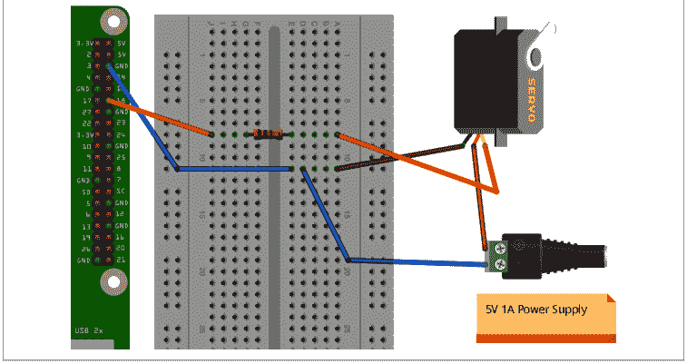

1kΩ电阻不是必需的，但它确实可以保护GPIO引脚免受控制信号中意外高电流的影响，如果伺服电机发生故障，可能会出现这种情况。

如果你愿意，你可以使用电池组而不是电源为伺服电机供电。使用带有可充电电池的四节AA电池盒将提供约4.8V，并且与伺服电机配合良好。使用四节碱性AA电池提供6V对许多伺服电机来说是可以的，但请检查你的伺服电机数据表以确保它适用于6V。

设置伺服电机角度的用户界面基于*ch_11_gui_slider.py*程序，该程序旨在控制LED的亮度（配方11.10）。然而，你可以修改它，使滑块设置的角度在-90到90度之间（图12-4）。

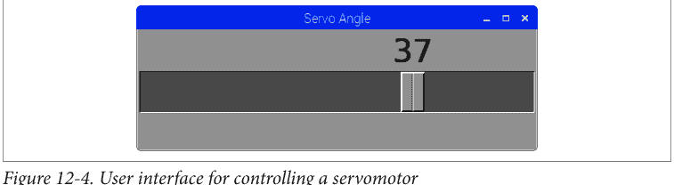

打开一个编辑器并粘贴以下代码（文件名为*ch_12_servo.py*）：

```python
from gpiozero import AngularServo
from guizero import App, Slider

servo = AngularServo(18, min_pulse_width=0.5/1000, max_pulse_width=2.5/1000)

def slider_changed(angle):
    servo.angle = int(angle)

app = App(title='Servo Angle', width=500, height=150)
slider = Slider(app, start=-90, end=90, command=slider_changed, width='fill',
               height=50)
slider.text_size = 30
app.display()
```

与本书中所有的程序示例一样，你可以下载此代码（参见配方3.22）。

请注意，此程序使用图形用户界面，因此你无法从SSH或终端运行它。你必须从树莓派本身的窗口环境运行它，或通过虚拟网络计算（VNC）进行远程控制（配方2.8）。

gpiozero类`AngularServo`负责所有的脉冲生成。它只需要我们指定希望伺服臂定位到的角度。几乎所有其他与伺服电机配合使用的软件都指定0到180度之间的角度，其中0是伺服臂能到达的一侧最远位置，90是中间位置，180是能到达的另一侧最远位置。gpiozero库的做法不同，可能更合乎逻辑，它将中心位置称为0，一侧的角度为负，另一侧的角度为正。

定义伺服电机时，第一个参数（本例中为18）指定了伺服电机的控制引脚。可选参数 `min_pulse_width` 和 `max_pulse_width` 以秒为单位设置最小和最大脉冲长度。对于典型的伺服电机，这些值应为0.5毫秒和2.5毫秒。由于某种原因，gpiozero中的默认值是1毫秒和2毫秒；因此，除非像我们这里这样设置这些值，否则伺服电机的活动范围会非常受限。

### 讨论

伺服电机用于遥控车辆和机器人。大多数伺服电机不是*连续*的；也就是说，它们不能360度旋转，而只能在大约180度的角度范围内旋转。

伺服电机的位置由脉冲长度设定。伺服电机期望至少每20毫秒接收一次脉冲。如果脉冲高电平持续0.5毫秒，伺服角度将为-90度；如果高电平持续1.5毫秒，电机将处于其中心位置（0度）；如果脉冲高电平持续2.5毫秒，伺服角度将为90度（图12-5）。

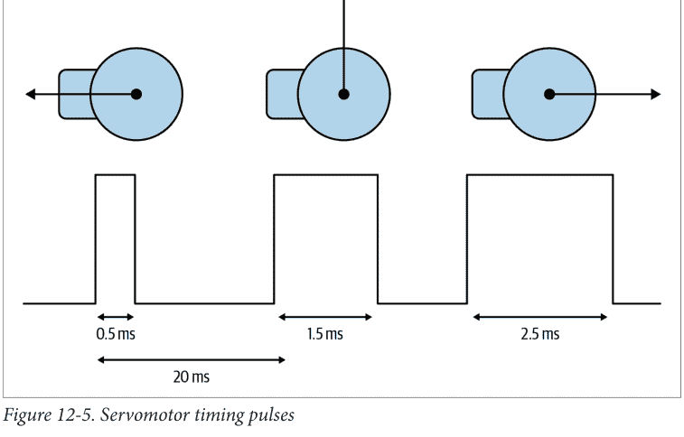

如果你需要连接几个伺服电机，MonkMakes Servo Six板（图12-6）会使接线变得更容易。

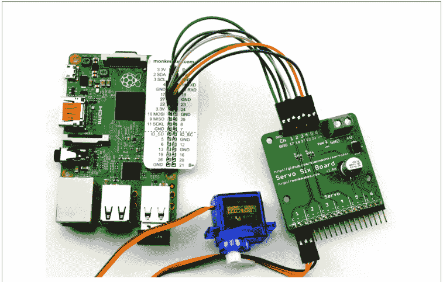

图12-6. 使用Servo Six板连接伺服电机

### 另请参阅

如果你需要控制大量伺服电机或需要更高的稳定性和精度，可以使用专用的伺服控制器模块，如[配方12.3](Recipe 12.3)中所述。

更多信息请参阅[Servo Six板的完整文档](full documentation of the Servo Six board)。

Adafruit开发了[另一种伺服控制方法](another method of servo control)。

如需使用ServoBlaster设备驱动程序软件产生更稳定脉冲时序的替代方案，请参阅[配方12.2](Recipe 12.2)。

## 12.2 精确控制伺服电机

### 问题

gpiozero库的脉冲生成功能对于你的伺服应用来说不够精确或存在抖动。

### 解决方案

安装ServoBlaster设备驱动程序。


### ServoBlaster与声音

ServoBlaster软件使用了树莓派上也用于生成声音的硬件。因此，在使用ServoBlaster时，你将无法通过树莓派的音频插孔或HDMI播放音频。

Richard Hirst创建的ServoBlaster软件使用树莓派CPU硬件来生成脉冲，其时序精度远高于gpiozero所能达到的水平。使用以下命令安装ServoBlaster，然后重启你的树莓派：

```
$ git clone https://github.com/srcshelton/servoblaster.git
$ cd servoblaster
$ sudo make
$ sudo make install
```

你可以修改配方12.1中的程序以使用ServoBlaster代码。修改后的程序可以在文件ch_12_servo_blaster.py中找到。与本书中所有程序示例一样，你可以下载它（参见配方3.22）。此程序假设伺服控制引脚连接到GPIO 18：

```
import os
from guizero import App, Slider

servo_min = 500  # uS
servo_max = 2500 # uS
servo = 2        # GPIO 18

def map(value, from_low, from_high, to_low, to_high):
    from_range = from_high - from_low
    to_range = to_high - to_low
    scale_factor = float(from_range) / float(to_range)
    return to_low + (value / scale_factor)

def set_angle(angle):
    pulse = int(map(angle+90, 0, 180, servo_min, servo_max))
    command = "echo {}={}us > /dev/servoblaster".format(servo, pulse)
    os.system(command)

def slider_changed(angle):
    set_angle(int(angle))

app = App(title='Servo Angle', width=500, height=150)
slider = Slider(app, start=-90, end=90, command=slider_changed, width='fill',
               height=50)
slider.text_size = 30
app.display()
```

用户界面代码与配方12.1几乎相同。区别在于 `set_angle` 函数。此函数首先使用一个名为 `map` 的实用函数，该函数使用常量 `servo_min` 和 `servo_max` 将角度转换为脉冲持续时间。然后，它构造一个命令，该命令将像从命令行运行一样执行。此行的格式以 `echo` 命令开头，后跟要控制的伺服编号、一个等号，然后是以微秒为单位的脉冲持续时间。此命令的字符串部分将被定向到设备 `/dev/servoblaster`。然后伺服将调整其角度。


### 终止ServoBlaster

当ServoBlaster，或者更具体地说，服务 `servo.d` 运行时，你将无法将伺服引脚用于其他任何用途，并且树莓派上的音频将无法工作。因此，当你需要将引脚用于其他用途时，请使用以下命令禁用ServoBlaster，然后重启你的树莓派：

```
$ sudo update-rc.d servoblaster disable
$ sudo reboot
```

当你的树莓派重启时，ServoBlaster将不再控制你的引脚，你将能够再次在树莓派上使用声音。你可以随时使用以下命令重新启用ServoBlaster：

```
$ sudo update-rc.d servoblaster enable
$ sudo reboot
```

### 讨论

ServoBlaster驱动程序功能非常强大，你可以配置它以允许你使用几乎所有GPIO引脚来控制伺服电机。其默认设置定义了八个GPIO引脚作为伺服控制引脚。每个引脚都被分配了一个通道号，如表12-1所示。

表12-1. ServoBlaster的伺服通道默认引脚分配

| 伺服通道 | GPIO引脚 |
| :--- | :--- |
| 0 | 4 |
| 1 | 17 |
| 2 | 18 |
| 3 | 27 |
| 4 | 22 |
| 5 | 23 |
| 6 | 24 |
| 7 | 25 |

连接如此多的伺服电机会导致跳线像意大利面一样杂乱。像MonkMakes Servo Six（图12-6）这样的板子极大地简化了将伺服电机连接到树莓派的布线工作。

### 另请参阅

更多信息请参阅[ServoBlaster的完整文档](https://github.com/richardghirst/PiBits/tree/master/ServoBlaster)。

如果你不需要ServoBlaster的精确时序，gpiozero库也可以为你的伺服电机生成脉冲，如配方12.1中所述。

## 12.3 精确控制多个伺服电机

### 问题

你需要高精度地控制大量伺服电机，并且不希望因使用ServoBlaster而导致声音丢失。

### 解决方案

尽管ServoBlaster代码（参见配方12.2）允许你精确控制多达八个伺服电机，但它确实接管了树莓派的硬件并禁用了声音生成。

ServoBlaster的替代方案是使用伺服电机HAT，如图12-7所示，它拥有自己的伺服控制硬件，从而减轻了树莓派硬件的负担。

这款Adafruit HAT允许你使用树莓派的I2C接口控制多达16个伺服电机或PWM通道。伺服电机只需直接插入HAT即可。

模块的逻辑电路由树莓派的3.3V连接供电。这与伺服电机的电源完全分开，后者来自外部5V电源适配器。

如果你愿意，也可以使用电池组而不是电源为伺服电机供电。使用带有可充电电池的四节AA电池盒可提供约4.8V电压，与大多数伺服电机配合良好。使用四节碱性AA电池提供6V电压对许多伺服电机来说也可以，但请检查你的伺服电机数据手册以确保其适用于6V。

连接伺服电机的排针布置得非常方便，使得伺服线可以直接插在引脚上。请注意确保它们朝向正确的方向。

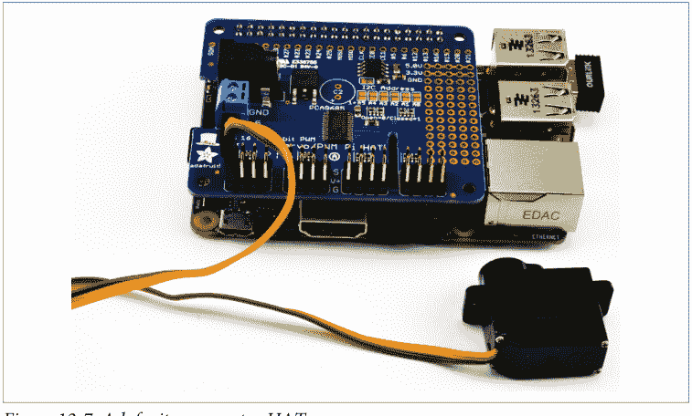

图12-7. Adafruit伺服电机HAT

要使用此模块的Adafruit软件，你需要在树莓派上设置I2C（配方10.4）。

此板的软件使用了Adafruit提供的一些有用的软件，这些软件允许你使用他们整个系列的配件扩展板。

要安装此板所需的Adafruit *blinka* 代码，请运行以下命令：

```
$ pip3 install adafruit-blinka
$ sudo pip3 install adafruit-circuitpython-servokit
```

打开一个编辑器并粘贴以下代码（文件名为 *ch_12_servo_adafruit.py*）：

```
from adafruit_servokit import ServoKit
from guizero import App, Slider

servo_kit = ServoKit(channels=16)

def slider_changed(angle):
    servo_kit.servo[0].angle = int(angle) + 90

app = App(title='Servo Angle', width=500, height=150)
slider = Slider(app, start=-90, end=90, command=slider_changed, width='fill',
               height=50)
slider.text_size = 30
app.display()
```

与本书中所有程序示例一样，你也可以下载此代码（参见配方 3.22）。

运行程序时，你将看到与图 12-4 所示相同的包含滑块的窗口。使用此滑块来移动伺服臂。Adafruit 的软件与 Python 2 不兼容，因此你需要通过 `python3` 命令来运行任何使用 Adafruit 软件的程序。

请注意，此程序使用图形用户界面（GUI），因此你无法从 SSH 或终端运行它；你必须从树莓派本身的窗口环境或通过 VNC 远程控制（配方 2.8）来运行它：

```
$ python3 ch_12_servo_adafruit.py
```

Adafruit 软件使用 0 到 180 度的伺服电机角度范围，而不是 gpiozero 的 -90 到 90 度。因此，为了保持用户界面一致，需要在滑块提供的角度上加上 90。

要寻址 16 个可用通道中的特定伺服通道，需要在命令 `servo_kit.servo[0].angle` 的方括号内指定通道号（介于 0 和 15 之间）。

### 讨论

为该模块选择电源时，请记住，标准遥控伺服电机在移动时很容易消耗 400mA 电流，如果负载较大，消耗会更多。因此，如果你计划同时移动大量大型伺服电机，你将需要一个大功率电源适配器。

### 另请参阅

访问 Adafruit 获取有关此 Adafruit 产品的信息。

如果你的树莓派靠近伺服电机，伺服 HAT 是一个不错的选择，但如果你的伺服电机距离你希望放置树莓派的位置较远，Adafruit 也出售一个伺服模块（产品 ID 815），它具有与伺服 HAT 相同的伺服控制器硬件，但只有四个引脚用于将板的 I2C 接口连接到树莓派的 I2C 接口。

## 12.4 控制直流电机的速度

### 问题

你想使用树莓派控制直流电机的速度。

### 解决方案

你可以使用与配方 11.4 相同的设计。但是，你应该在电机两端并联一个二极管，以防止电压尖峰损坏晶体管甚至树莓派。1N4001 是一个合适的二极管。二极管一端有条纹，确保该端朝向正确的方向（图 12-8）。

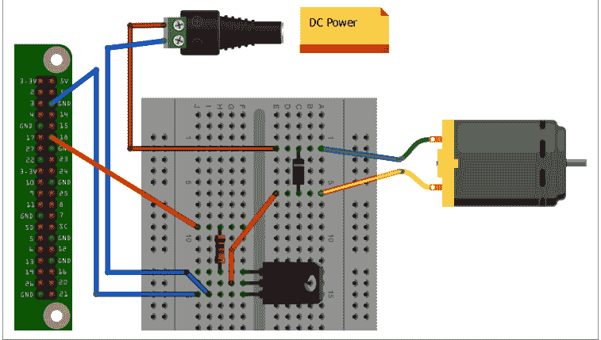

图 12-8. 控制大功率电机

你需要以下物品：

- 3V 至 12V 直流电机
- 面包板和跳线（参见第 564 页的“原型设备和套件”）
- 1kΩ 电阻（参见第 565 页的“电阻和电容”）
- MOSFET 晶体管 FQP30N06L（参见第 565 页的“晶体管和二极管”）
- 二极管 1N4001（参见第 565 页的“晶体管和二极管”）
- 电压与电机匹配的电源

与本书中所有程序示例一样，你可以下载此程序（参见配方 3.22）。文件名为 `ch_12_gui_slider.py`。

请注意，此程序使用 GUI，因此你无法从 SSH 运行它。你必须从树莓派本身的窗口环境或通过 VNC 远程控制（配方 2.8）来运行它。

### 讨论

如果你只使用低功率直流电机（小于 200mA），你可以使用更小（且更便宜）的晶体管，例如 2N3904（参见第 565 页的“晶体管和二极管”）。图 12-9 显示了使用 2N3904 的面包板布局。

你或许可以使用 GPIO 连接器上的 5V 电源线为小型电机供电。如果你发现树莓派崩溃，请使用外部电源，如图 12-8 所示。

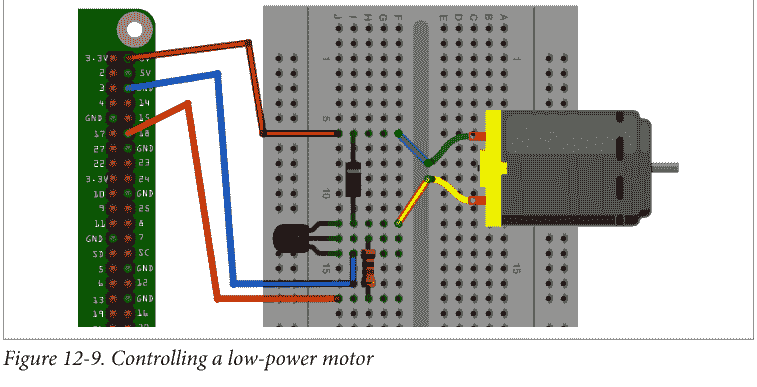

### 另请参阅

有关在树莓派上使用面包板和跳线的更多信息，请参见配方 10.9。

此设计仅控制电机的速度。它不能控制其方向。为此，你需要参见配方 12.5。

## 12.5 控制直流电机的方向

### 问题

你想同时控制小型直流电机的速度和方向。

### 解决方案

使用 H 桥芯片或模块，最常见的芯片是 L293D。这些芯片成本低且易于使用。其他 H 桥芯片或模块通常使用相同的控制引脚对来控制每个电机的方向（参见讨论）。

L293D 芯片实际上能够在没有任何额外硬件的情况下驱动两个电机。讨论部分还提到了其他几种控制直流电机的选项。要尝试使用 L293D 控制电机，你需要以下物品：

- 3V 至 12V 直流电机
- 面包板和跳线（公对母；参见第 564 页的“原型设备和套件”）
- L293D 芯片（参见第 565 页的“集成电路”）
- 电压与电机匹配的电源

图 12-10 显示了面包板布局。

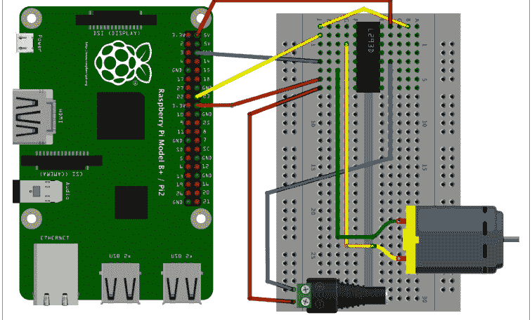

确保芯片朝向正确的方向：其顶部有一个凹口，该端应位于面包板的顶部。

此配方的测试程序（*ch_12_motor_control.py*）允许你输入字母 *f* 或 *r*，然后输入一个 0 到 9 之间的数字。电机随后将向前或向后移动，速度由数字指定——0 表示停止，9 表示全速：

```
$ python3 ch_12_motor_control.py
Command, f/r 0..9, E.g. f5 :f5
Command, f/r 0..9, E.g. f5 :f1
Command, f/r 0..9, E.g. f5 :f2
Command, f/r 0..9, E.g. f5 :r2
```

打开编辑器并粘贴以下代码。与本书中所有程序示例一样，你也可以下载它（参见配方 3.22）。

此程序使用命令行，因此你可以从 SSH 或终端运行它：

```
from gpiozero import Motor

motor = Motor(forward=23, backward=24)

while True:
    cmd = input("Command, f/r 0..9, E.g. f5 :")
    direction = cmd[0]
    speed = float(cmd[1]) / 10.0
    if direction == "f":
        motor.forward(speed=speed)
    else:
        motor.backward(speed=speed)
```

gpiozero 方便地提供了一个名为 `Motor` 的类，我们可以用它来控制单个直流电机的速度和方向。创建该类的实例时，你需要指定前进和后退控制引脚。

`Motor` 的 `forward` 和 `backward` 方法接受一个可选的 `speed` 参数，范围在 0 到 1 之间，其中 1 表示全速。

### 讨论

gpiozero 的 `Motor` 类隐藏了 H 桥硬件的复杂性。

图 12-11 展示了 H 桥的工作原理，使用开关而非晶体管或芯片。通过反转电机两端的极性，H 桥也会反转电机的转动方向。

在图 12-11 中，S1 和 S4 闭合，S2 和 S3 断开。这允许电流流过电机，端子 A 为正，端子 B 为负。如果我们反转开关，使 S2 和 S3 闭合，S1 和 S4 断开，那么 B 为正，A 为负，电机将向相反方向转动。

然而，你可能已经发现了这个电路的一个危险。如果由于某种原因 S1 和 S2 同时闭合，正电源将直接连接到负电源，你将造成短路。如果 S3 和 S4 同时闭合，情况也是如此。

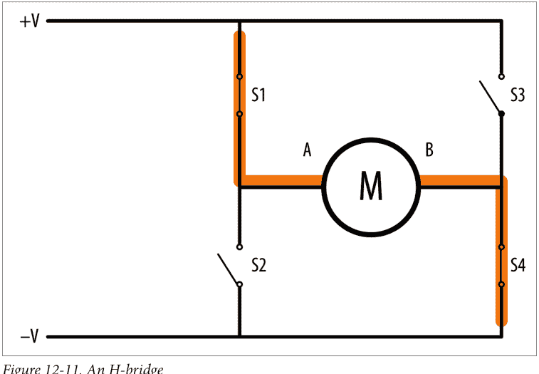

图 12-11. H 桥

虽然你可以使用单个晶体管来制作 H 桥，但使用 H 桥集成电路（IC）如 L293D 会更简单。该芯片实际上内部有两个 H 桥，因此你可以用它来控制两个电机。它还具有逻辑功能，确保不会发生等同于同时闭合 S1 和 S2 的情况。

L293D 为两个电机控制通道各使用两个控制引脚：一个 *forward* 引脚和一个 *backward* 引脚。如果 forward 引脚（23）为高电平，backward 引脚（24）为低电平，电机将向一个方向转动。如果这两个引脚反转，电机将向相反方向转动。

作为在面包板上使用 L293D 的替代方案，eBay 上有非常低成本的模块，这些模块在印刷电路板（PCB）上包含一个 L293D，带有用于连接电机的螺丝端子和用于直接连接树莓派 GPIO 连接器的排针。你可以找到基于相同原理但电流大得多（甚至高达 20A 或更高）的大功率电机控制器模块。[Pololu](https://www.pololu.com/) 拥有令人印象深刻的此类电机控制器板系列。

### 另请参阅

你也可以使用 Adafruit 步进电机 HAT（配方 12.8）来控制直流电机的速度和方向。

请查阅 L293D 数据手册和 SparkFun 电机驱动模块产品页面。

有关在 Raspberry Pi 上使用面包板和跳线的更多信息，请参阅配方 10.9。

## 12.6 使用单极步进电机

### 问题

你想使用 Raspberry Pi 驱动一个五线单极步进电机。

### 解决方案

在面包板上使用 ULN2803 达林顿驱动芯片。

步进电机在电机技术领域介于直流电机和伺服电机之间。像普通的直流电机一样，它们可以连续旋转，但你也可以通过一次一步地向任一方向移动来非常精确地定位它们。

要制作此配方，你需要以下物品：

- 5V，五针单极步进电机（参见第 567 页“杂项”）
- ULN2803 达林顿驱动 IC（参见第 565 页“集成电路”）
- 面包板和跳线（参见第 564 页“原型设备和套件”）

图 12-12 显示了使用 ULN2803 的接线图。请注意，你可以使用该芯片驱动两个这样的电机。要驱动第二个步进电机，你需要将 GPIO 连接器上的另外四个控制引脚连接到 ULN2803 的引脚 5 到 8，然后将第二个电机的四个引脚连接到 ULN2803 的引脚 11 到 14。

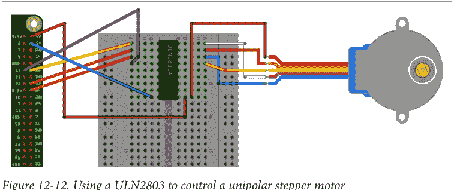

图 12-12. 使用 ULN2803 控制单极步进电机

来自 GPIO 连接器的 5V 电源可以与小型步进电机配合使用。如果你遇到 Raspberry Pi 崩溃的问题，或者需要使用更大的步进电机，请为电机电源（ULN2803 的引脚 10）使用单独的电源。

打开编辑器并粘贴以下代码（*ch_12_stepper.py*）。此程序使用命令行，因此你可以从 SSH 运行它：

```python
from gpiozero import Motor
import time

coil1 = Motor(forward=18, backward=23, pwm=False)
coil2 = Motor(forward=24, backward=17, pwm=False)

forward_seq = ['FF', 'BF', 'BB', 'FB']
reverse_seq = list(forward_seq) # to copy the list
reverse_seq.reverse()

def forward(delay, steps):
    for i in range(steps):
        for step in forward_seq:
            set_step(step)
            time.sleep(delay)

def backwards(delay, steps):
    for i in range(steps):
        for step in reverse_seq:
            set_step(step)
            time.sleep(delay)

def set_step(step):
    if step == 'S':
        coil1.stop()
        coil2.stop()
    else:
        if step[0] == 'F':
            coil1.forward()
        else:
            coil1.backward()
        if step[1] == 'F':
            coil2.forward()
        else:
            coil2.backward()

while True:
    set_step('S')
    delay = input("Delay between steps (milliseconds)?")
    steps = input("How many steps forward? ")
    forward(int(delay) / 1000.0, int(steps))
    set_step('S')
    steps = input("How many steps backwards? ")
    backwards(int(delay) / 1000.0, int(steps))
```

与本书中的所有程序示例一样，你也可以下载此代码（参见配方 3.22）。

运行程序时，系统会提示你输入步进之间的延迟。这应该是 2 或更大。然后系统会提示你输入每个方向的步数：

```
$ python3 ch_12_stepper.py
Delay between steps (milliseconds)?2
How many steps forward? 100
How many steps backwards? 100
Delay between steps (milliseconds)?10
How many steps forward? 50
How many steps backwards? 50
Delay between steps (milliseconds)?
```

此代码在随后的讨论部分中进行了解释，因为了解一些关于步进电机工作原理的知识有助于理解代码。

### 讨论

步进电机使用带有交替南北极的齿状转子和电磁铁来一次*一步*地推动轮子转动（图 12-13）。请注意，引线的颜色会有所不同。

以特定顺序为线圈通电会驱动电机旋转。步进电机在 360 度旋转中的步数实际上是转子上的齿数。

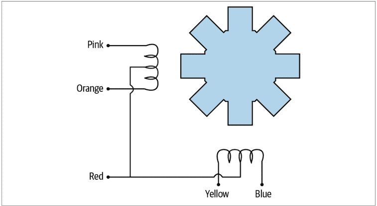

图 12-13. 步进电机

两个线圈分别由 gpiozero 类 Motor 的一个实例控制，分别称为 coil1 和 coil2。

程序使用一个字符串列表来表示构成单个步进的四个通电阶段：

```python
forward_seq = ['FF', 'BF', 'BB', 'FB']
```

每对字母表示 coil1 和 coil2 的电流方向：向前或向后。因此，看一下图 12-13，假设公共红色连接到 GND，那么粉红-橙色线圈的字母 F 可能使粉红为高电平，橙色为低电平，而 B 则会反转此状态。

电机反向旋转的序列只是正向序列的反向。

你可以在程序中使用 forward 和 backward 函数来使电机来回步进。这两个函数的第一个参数是步进序列中每个部分之间的延迟（以毫秒为单位）。此值的最小值取决于你使用的电机。如果太小，电机将不会转动。通常，两毫秒或更多就可以了。第二个参数是要执行的步数：

```python
def forward(delay, steps):
    for i in range(steps):
        for step in forward_seq:
            set_step(step)
            time.sleep(delay)
```

forward 函数有两个嵌套的 for 循环。外层循环重复步数次，内层循环遍历电机激活序列，依次调用 set_step：

```python
def set_step(step):
    if step == 'S':
        coil1.stop()
        coil2.stop()
    else:
        if step[0] == 'F':
            coil1.forward()
        else:
            coil1.backward()
        if step[1] == 'F':
            coil2.forward()
        else:
            coil2.backward()
```

set_step 函数根据作为其 step 参数提供的消息设置每个线圈的极性。命令 S 停止向两个线圈供电，这样我们可以在电机不移动时避免使用电流。如果第一个字母是 F，则 coil1 设置为向前；否则设置为向后。coil2 的设置方式相同，但使用 step 的第二个字母。

主循环在向前和向后移动之间将步进设置为 S，以便在电机实际不转动时停用两个线圈。否则，其中一个线圈可能会保持开启状态，导致电机不必要地消耗电流。

### 另请参阅

如果你有一个四线双极步进电机，请参阅配方 12.7。

更多信息，请参阅维基百科上关于步进电机的文章，你还可以看到不同类型及其工作原理，以及找到一个很好的动画解释，说明驱动电机的激活模式。

有关使用伺服电机的信息，请参阅配方 12.1；有关控制直流电机的信息，请参阅配方 12.4 和 12.5。

有关在 Raspberry Pi 上使用面包板和跳线的更多信息，请参阅配方 10.9。

## 12.7 使用双极步进电机

### 问题

你想使用 Raspberry Pi 驱动一个四线双极步进电机。

### 解决方案

使用 L293D H 桥驱动芯片。驱动双极步进电机需要 H 桥，因为正如*双极*一词所暗示的，绕组中的电流方向需要反转，这有点像双向驱动直流电机（参见配方 12.5）。

要制作此配方，你需要以下物品：

- 12V，四针双极步进电机（参见第 567 页“杂项”）
- L293D H 桥 IC（参见第 565 页“集成电路”）
- 面包板和跳线（参见第 564 页“原型设备和套件”）

这里使用的电机是一个 12V 的，比配方 12.6 中的单极步进电机示例要大一些。因此，电机本身的电源由外部电源提供，而不是来自 Raspberry Pi。请参阅图 12-14 中的接线图。

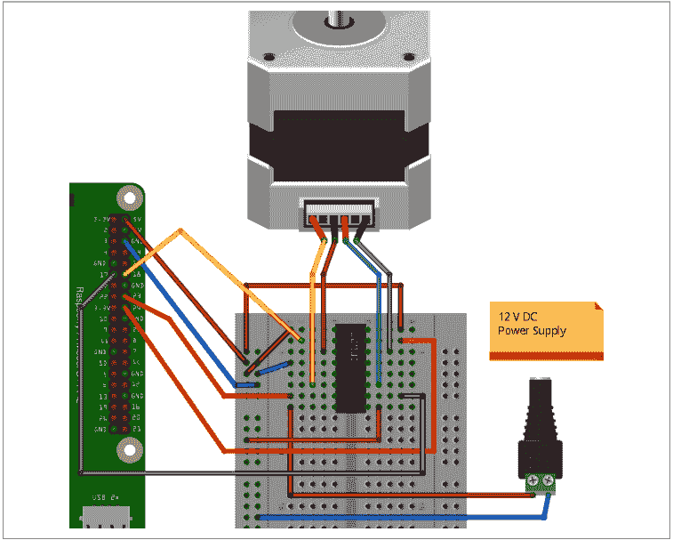

### 讨论

双极步进电机与图12-13所示的单极版本类似，只是线圈上没有红色的中心抽头连接。相同的通电模式对两种变体都同样有效，但对于双极电机，整个线圈中的电流方向必须是可逆的；因此，需要两个H桥。

你可以使用相同的*ch_12_stepper.py*程序来控制这个步进电机（参见配方12.6）。该设计使用了L293D的两个H桥，因此你需要为每个要控制的电机配备一个这样的芯片。

### 另请参阅

如果你拥有的步进电机类型是五线单极步进电机，请参阅配方12.6。

有关步进电机的更多信息——不同类型及其工作原理——请参阅维基百科，那里你还可以找到一个很好的动画解释，说明驱动电机的激活模式。

有关使用伺服电机的信息，请参阅配方12.1；有关控制直流电机的信息，请参阅配方12.4和12.5。

有关在树莓派上使用面包板和跳线的更多信息，请参阅配方10.9。

## 12.8 使用步进电机HAT驱动双极步进电机

### 问题

你想使用单个接口板控制多个双极步进电机。

### 解决方案

使用Adafruit步进电机HAT。

该板能够驱动两个双极步进电机。图12-15显示了该板连接一个双极步进电机的情况，一个线圈连接到M1端子，另一个线圈连接到M2端子。电机的电源在右侧的螺丝端子上单独提供。

### I2C总线

如果你按照[配方10.17](Recipe 10.17)制作了自己的HAT，并按照描述启用了I2C总线0，你需要撤销对`/boot/config.txt`的更改，因为Adafruit会自动检测要使用的I2C总线，如果启用了总线0，它会检测到错误的总线。

在`/boot/config.txt`中，删除或注释掉这一行（在行首加上#）：

```
dtparam=i2c_vc=on
```

完成此操作后，重启你的树莓派。

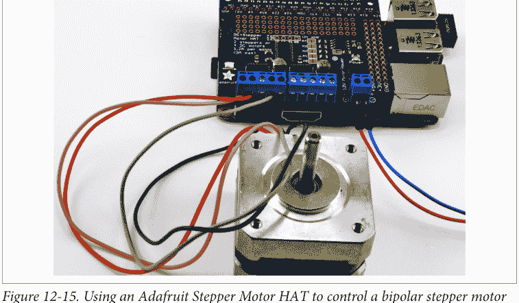

该HAT使用I2C，因此请确保你已启用I2C（[配方10.4](Recipe 10.4)）。

该板由[优秀的Adafruit教程](excellent Adafruit tutorial)支持。

### 讨论

当你运行Adafruit教程中提供的程序时，电机会开始转动，程序会循环四种不同的步进模式。

### 另请参阅

有关HAT标准以及如何制作自己的HAT的讨论，请参阅[配方10.17](https://www.oreilly.com/library/view/raspberry-pi-cookbook/9781492043218/)。

有关使用此HAT及其附带库的更多信息，请参阅[https://oreil.ly/3a4Jm](https://oreil.ly/3a4Jm)。

要使用L293D控制步进电机，请参阅[配方12.7](https://www.oreilly.com/library/view/raspberry-pi-cookbook/9781492043218/)。

# 第13章
数字输入

## 13.0 简介

在本章中，我们探讨使用数字组件（如开关和键盘）的配方。本章还涵盖了具有数字输出的模块，这些模块可以连接到作为输入的树莓派通用输入/输出（GPIO）。
许多配方需要使用无焊面包板和跳线（参见配方10.9）。

## 13.1 连接按钮开关

### 问题

你想将一个开关连接到你的树莓派，以便当你按下它时，运行一些Python代码。

### 解决方案

将开关连接到GPIO引脚，并在你的Python程序中使用gpiozero库来检测按钮按下。

要制作此配方，你需要以下物品：

- 面包板和跳线（参见第564页的“原型设备和套件”）
- 触觉按钮开关（参见第567页的“杂项”）

图13-1展示了如何使用面包板和跳线连接一个触觉按钮开关。

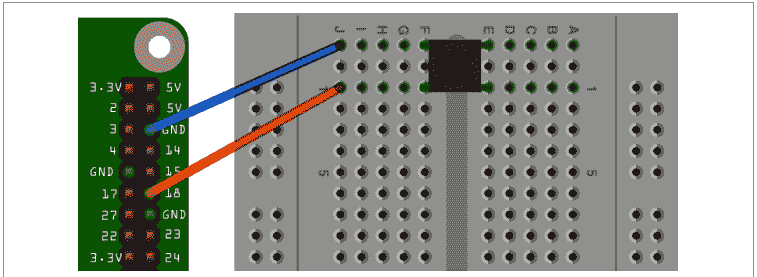

图13-1. 将按钮开关连接到树莓派

使用面包板和触觉开关的替代方案是使用Squid Button（图13-2）。这是一个按钮开关，末端焊接有母头引线，你可以直接将其连接到GPIO连接器（配方10.11）。

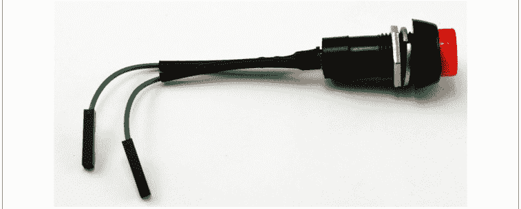

图13-2. Squid Button

打开一个编辑器并粘贴以下代码（ch_13_switch.py）：

```
from gpiozero import Button

button = Button(18)

while True:
    if button.is_pressed:
        print("Button Pressed")
```

与本书中的所有程序示例一样，你也可以下载此代码（参见配方3.22）。

当你运行程序并按下按钮时，你会看到：

```
pi@raspberrypi ~ $ python3 ch_13_switch.py
Button Pressed
Button Pressed
Button Pressed
Button Pressed
```

实际上，“Button Pressed”消息可能会很快从屏幕底部消失。这是因为程序非常频繁地检查按钮按下。这段代码的另一个问题是，当它监视按钮按下时，它无法处理其他事情。

我们可以改进这段代码，使其在按下时只执行一次操作，并允许在按钮按下之前处理其他事情。你将在以下代码（ch_13_switch_2.py）中找到这些更改：

```
from gpiozero import Button
from time import sleep

def do_stuff():
    print("Button Pressed")

button = Button(18)
button.when_pressed = do_stuff

while True:
    print("Busy doing other stuff")
    sleep(2)
```

当你运行此程序时，你会看到如下输出：

```
$ python3 ch_13_switch_2.py
Busy doing other stuff
Busy doing other stuff
Button Pressed
Busy doing other stuff
Busy doing other stuff
```

当你按下按钮时，函数do_stuff会被运行，无论程序当时正在做什么。这种方法称为使用中断，常用于需要在按钮按下时触发操作，但也需要处理其他事情的程序中。

注意这一行：

```
button.when_pressed = do_stuff
```

包含do_stuff但没有末尾的()。这是因为我们引用的是函数，而不是在中断发生之前实际调用它。换句话说，我们是在告诉中断处理程序在发生中断时调用哪个函数，而不是要求它立即调用该函数。

### 讨论

注意开关的接线方式，当它被按下时，它将引脚18（配置为输入）连接到GND。

你可能期望按钮开关只有两个连接，它们要么是断开的，要么是闭合的。虽然一些触觉按钮开关确实只有两个连接，但大多数有四个以提供机械强度。图13-3展示了这些连接的排列方式。

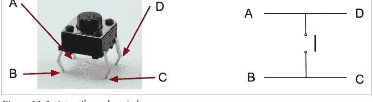

实际上，只有两个电气连接，因为在开关封装内部，引脚B和C连接在一起，A和D也连接在一起。

### 另请参阅

有关在树莓派上使用面包板和跳线的更多信息，请参阅配方10.9。

要消除开关抖动，请参阅配方13.5。

要使用外部上拉或下拉电阻，请参阅配方13.6。

## 13.2 使用按钮开关进行切换

### 问题

你想创建一个按钮开关，每次按下时都在开和关之间切换某个东西。

### 解决方案

读取按钮的最后*状态*（即按钮是开还是关），并在每次按下按钮时反转该值。

以下示例在按下开关时切换LED的开和关。

要制作此配方，你需要以下物品：

- 面包板和跳线（参见第564页的“原型设备和套件”）
- 触觉按钮开关（参见第567页的“杂项”）
- LED（参见第566页的“光电子”）
- 470Ω电阻（参见第565页的“电阻和电容”）

图13-4展示了如何使用面包板和跳线连接一个触觉按钮开关和LED。

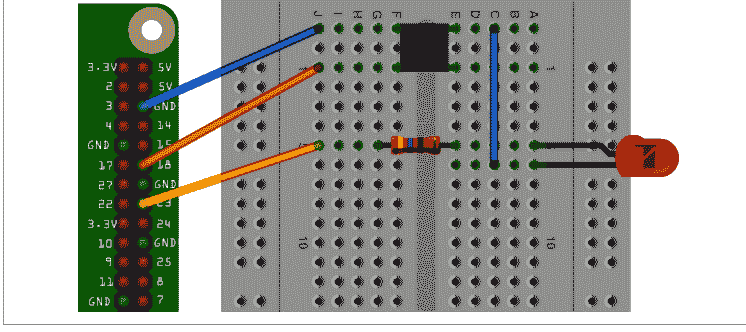

除了将树莓派连接到面包板的公对母跳线外，你还需要一根公对公跳线或实芯线。

## 13.2 使用按钮控制LED

作为面包板和独立元件的替代方案，你可以使用Raspberry Squid（配方10.10）和Squid Button（配方13.1）。

打开一个编辑器并粘贴以下代码（ch_13_switch_on_off.py）：

```python
from gpiozero import Button, LED
from time import sleep

led = LED(23)

def toggle_led():
    print("toggling")
    led.toggle()

button = Button(18)
button.when_pressed = toggle_led

while True:
    print("Busy doing other stuff")
    sleep(2)
```

与本书中所有的程序示例一样，你也可以下载此代码（参见配方3.22）。

该程序基于ch_13_switch_2.py，并再次使用了中断，以便程序可以在按钮被按下之前继续处理其他事情。

当按钮被按下时，函数`toggle_led`被调用。这会切换LED的状态；也就是说，如果它是亮的，就把它关掉；如果它是关的，就把它打开。

### 讨论

根据你开关的质量，你可能已经注意到有时LED没有切换，但终端中出现了两条或多条“toggling”消息。这是由于一种叫做开关抖动的现象，我们将在配方13.5中进一步讨论。

### 另请参阅

关于gpiozero Button类的文档，请参见 https://oreil.ly/SXIZ9。

## 13.3 使用双位拨动或滑动开关

### 问题

你想将一个双位拨动或滑动开关连接到你的树莓派，并能够在你的Python程序中找到开关的位置。

### 解决方案

像使用轻触按钮开关（配方13.1）一样使用该开关：只需连接中心触点和一个端点触点（图13-5）。

要制作此配方，你需要以下物品：

- 面包板和跳线（参见第564页的“原型设备和套件”）
- 微型拨动或滑动开关（参见第567页的“杂项”）

你在配方13.1中使用的相同代码也适用于这种配置。

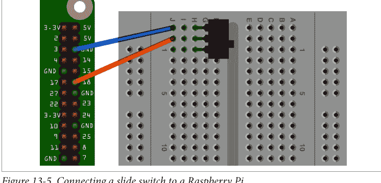

### 讨论

这类滑动开关很有用，因为你可以看到它们设置的位置，而无需像LED这样的额外指示器。然而，它们比在消费电子产品中越来越常见的轻触按钮开关更脆弱，也更贵一些，因为后者可以隐藏在外观更好的塑料按钮后面。

### 另请参阅

要使用带有中心关闭位置的三位置开关，请参见配方13.4。

## 13.4 使用中心关闭的拨动或滑动开关

### 问题

你想将一个三位置（中心关闭）拨动开关连接到你的树莓派，并能够在你的Python程序中找到开关的位置。

### 解决方案

如图13-6所示，将开关连接到两个GPIO引脚，并在你的Python程序中使用gpiozero库来检测开关的位置。

要制作此配方，你需要以下物品：

- 面包板和跳线（参见第564页的“原型设备和套件”）
- 微型中心关闭三位置拨动开关（参见第567页的“杂项”）

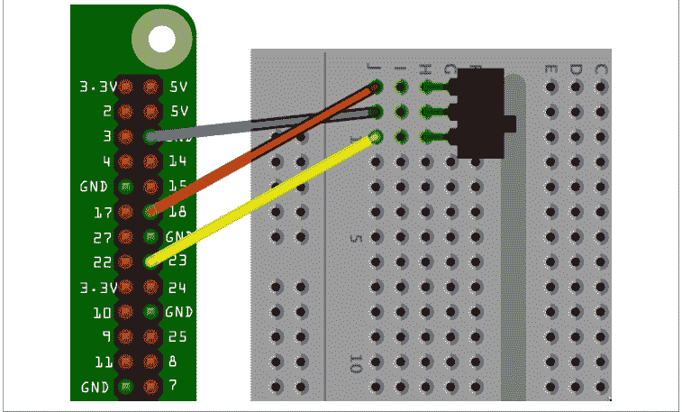

开关的公共（中心）连接到GND，开关的两个端点分别连接到一个GPIO引脚。

打开一个编辑器并粘贴以下代码（ch_13_switch_3_pos.py）：

```python
from gpiozero import Button

switch_top = Button(18)
switch_bottom = Button(23)

switch_position = "unknown"

while True:
    new_switch_position = "unknown"
    if switch_top.is_pressed:
        new_switch_position = "top"
    elif switch_bottom.is_pressed:
        new_switch_position = "bottom"
    else:
        new_switch_position = "center"

    if new_switch_position != switch_position:
        switch_position = new_switch_position
        print(switch_position)
```

与本书中所有的程序示例一样，你也可以下载此代码（参见配方3.22）。

运行程序，当你将开关从顶部移动到中心再到底部时，每次位置变化都会报告开关的位置：

```
$ python3 ch_13_switch_3_pos.py
center
top
center
bottom
```

### 讨论

该程序将两个输入设置为独立的按钮。在循环内部，读取两个按钮的状态，`if`、`elif`和`else`结构的三个条件确定开关的位置，并将值赋给名为`new_switch_position`的变量。如果这与之前的值不同，则打印开关位置。

你会发现各种类型的拨动开关。有些会被描述为DPDT、SPDT、SPST或SPST-瞬时接通等。这些字母的含义如下：

- D：双（Double）
- S：单（Single）
- P：极（Pole）
- T：掷（Throw）

因此，DPDT开关是双刀双掷。*极*这个词指的是由一个机械杠杆控制的独立开关触点的数量。因此，双刀开关可以开关两个东西。单掷开关只能打开或关闭一个触点（如果是双刀，则是两个触点）。然而，双掷开关可以将公共触点连接到另外两个触点中的一个。

图13-7显示了最常见的开关类型。

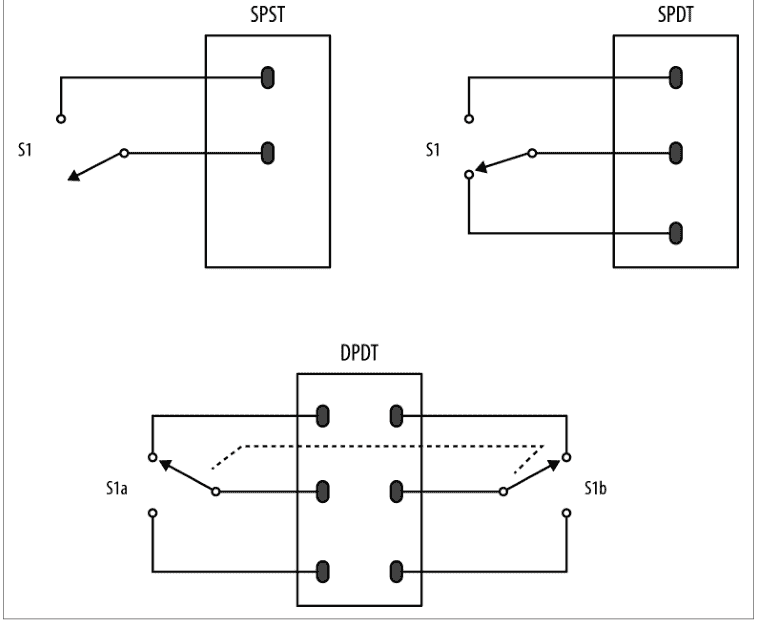

*图13-7. 拨动开关的类型*

### 另请参阅

关于*if*语句如何工作的更多信息，请参见[配方5.20](Recipe 5.20)。

关于拨动开关的更多信息，请参见[https://oreil.ly/uDigs](https://oreil.ly/uDigs)。

关于最基本的开关配方，请参见[配方13.1](Recipe 13.1)。

## 13.5 按钮按压的去抖动

### 问题

有时当你按下开关上的按钮时，预期的动作会发生不止一次，因为开关触点会*抖动*（图13-8）。在这种情况下，你想编写代码来*去抖动*开关。

### 解决方案

gpiozero Button类包含了处理开关触点抖动的代码。然而，默认情况下这是关闭的。你可以在创建按钮实例时使用可选的`bounce_time`参数来更改它。

关于开关抖动的更多信息，请参见讨论部分。但基本思想是，当开关被按下时，触点可能会*抖动*，产生开关位置的错误读数。`bounce_time`参数决定了应该忽略开关状态的错误变化多长时间。

例如，在配方13.2中，你可能已经注意到按下按钮似乎经常没有切换LED。如果你在按下按钮时得到偶数次抖动，就会发生这种情况，这样一次抖动打开LED，第二次抖动立即又把它关掉（在几分之一秒内），结果看起来什么都没发生。

你可以通过在定义按钮时添加`bounce_time`可选参数来修改程序ch_13_switch_on_off.py以设置去抖动时间：

```python
from gpiozero import Button, LED
from time import sleep

led = LED(23)

def toggle_led():
    print("toggling")
    led.toggle()

button = Button(18, bounce_time=0.1)
button.when_pressed = toggle_led

while True:
    print("Busy doing other stuff")
    sleep(2)
```

与本书中所有的程序示例一样，你也可以下载此代码（参见配方3.22）。

在这个例子中，抖动时间设置为0.1秒，这应该足够让开关触点稳定下来。

### 讨论

开关抖动发生在大多数开关上，在某些开关上可能相当严重，如图13-8中的示波器轨迹所示。

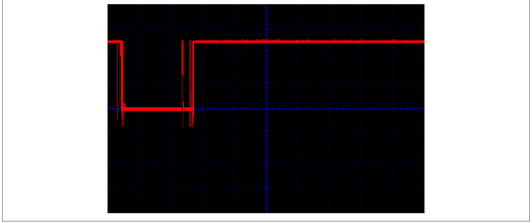

图13-8. 劣质开关的触点抖动

你可以看到，在开关接通和释放时都存在触点抖动。大多数开关没有这个那么糟糕。

### 另请参阅

关于连接按钮的基础知识，请参见配方13.1。

## 13.6 使用外部上拉电阻

### 问题

你想从树莓派到开关运行一根长线，但你在输入引脚上得到了一些错误的读数。

### 解决方案

树莓派GPIO引脚包含上拉电阻。当GPIO引脚用作数字输入时，其上拉电阻将保持输入为高电平（3.3V），直到输入被拉低到GND，可能是通过开关。此外，上拉电阻可以在你的Python程序中打开和关闭。

这些内部上拉电阻相当弱（约40kΩ），这意味着如果你将长导线连接到开关，或在电气噪声环境中操作，可能会在数字输入上产生误触发。你可以通过关闭内部上拉和下拉电阻并使用外部上拉电阻来克服这个问题。

图13-9展示了外部上拉电阻的使用。

要测试此硬件，你可以使用程序`ch_13_switch.py`；参见配方13.1。

### 讨论

电阻的阻值越低，开关的范围就越长。但是，当你按下按钮时，电流会从3.3V通过电阻流向地。一个100Ω的电阻会消耗3.3V/100Ω = 33mA的电流。这在树莓派1的3.3V电源50mA的安全限制内，所以如果你使用的是旧款树莓派，不要使用比这更低的阻值。如果你使用的是较新的40引脚GPIO树莓派，你可以进一步降低这个值，也许到47Ω。

在几乎所有情况下，1kΩ的电阻都能提供长范围且没有问题。

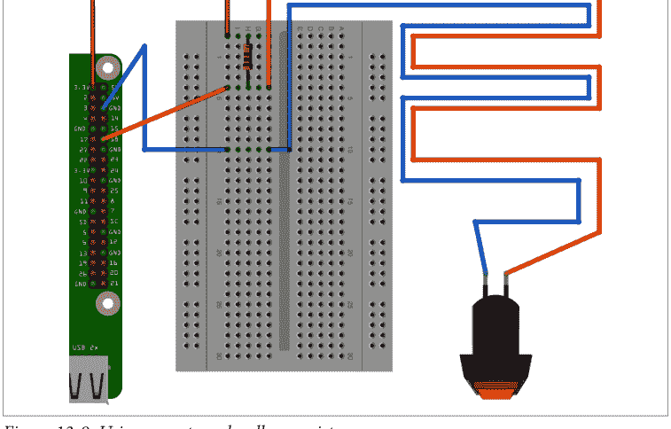

### 另请参阅

关于连接按钮的基础知识，请参见配方13.1。

## 13.7 使用旋转（正交）编码器

### 问题

你想使用旋转编码器（一种像音量旋钮一样旋转的控件）来检测旋转。

### 解决方案

使用连接到两个GPIO引脚的旋转（正交）编码器（见图13-10）。

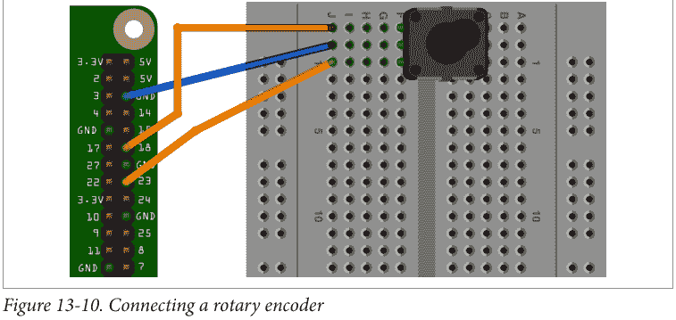

要制作此配方，你需要以下物品：

- 面包板和跳线（见第564页“原型设备和套件”）
- 旋转编码器（正交型；见第567页“杂项”）

这种类型的旋转编码器称为*正交编码器*，它的行为类似于一对开关。当旋转编码器的轴转动时，它们开启和关闭的顺序决定了旋转方向。

图13-10所示的旋转编码器将中心引线作为*公共*引线，两侧的两个引线作为A和B。并非所有旋转编码器都使用这种布局，因此请检查你所使用的旋转编码器数据手册上的引脚排列。这个问题常常因为许多旋转编码器包含一个按钮开关而变得更加复杂，该开关将有一对单独的触点。

打开编辑器并粘贴以下代码（ch_13_rotary_encoder.py）：

```
from gpiozero import Button
import time

input_A = Button(18)
input_B = Button(23)

old_a = True
old_b = True

def get_encoder_turn():
    # return -1 (cce), 0 (no movement), or +1 (cw)
    global old_a, old_b
    result = 0
    new_a = input_A.is_pressed
    new_b = input_B.is_pressed
    if new_a != old_a or new_b != old_b :
        if old_a == 0 and new_a == 1 :
            result = (old_b * 2 - 1)
        elif old_b == 0 and new_b == 1 :
            result = -(old_a * 2 - 1)
    old_a, old_b = new_a, new_b
    time.sleep(0.001)
    return result

x = 0

while True:
    change = get_encoder_turn()
    if change != 0 :
        x = x + change
        print(x)
```

与本书中的所有程序示例一样，你也可以下载此代码（见配方3.22）。

测试程序很简单：当你顺时针旋转旋转编码器时计数增加，逆时针旋转时计数减少：

```
$ python3 ch_13_rotary_encoder.py
1
2
3
4
5
6
7
8
9
10
9
8
7
6
5
4
```

### 讨论

旋转编码器在许多应用中已经取代了可变电阻，因为它们通常成本更低，并且不会受到轨道腐蚀或磨损的影响。

图13-11显示了你将从两个触点A和B获得的脉冲序列。你可以看到该模式在四步后重复（因此得名*正交编码器*）。


图13-11. 正交编码器的工作原理

当顺时针旋转时（图13-11中从左到右），序列将是：

| 阶段 | A | B |
|---|---|---|
| 1 | 0 | 0 |
| 2 | 0 | 1 |
| 3 | 1 | 1 |
| 4 | 1 | 0 |

当向相反方向旋转时，阶段序列将反转：

| 阶段 | A | B |
|---|---|---|
| 4 | 1 | 0 |
| 3 | 1 | 1 |
| 2 | 0 | 1 |
| 1 | 0 | 0 |

前面列出的Python程序在函数`get_encoder_turn`中实现了确定旋转方向的算法。如果没有移动，该函数将返回0；顺时针旋转返回1；逆时针旋转返回-1。它使用两个全局变量`old_a`和`old_b`来存储开关A和B的先前状态。通过将它们与新读取的值进行比较，它可以确定（使用一些巧妙的逻辑）编码器正在向哪个方向转动。

一毫秒的睡眠时间是为了确保下一个新采样不会在上一个采样后太快发生；否则，转换可能会给出错误的读数。

无论你旋转旋转编码器旋钮的速度有多快，测试程序都应该可靠地工作；但是，尽量避免在循环中执行任何耗时的操作，否则你可能会发现旋转步骤被遗漏。

### 另请参阅

你也可以通过使用可变电阻和阶跃响应方法（配方14.1）或使用模数转换器（配方14.7）来测量旋钮的旋转位置。

## 13.8 使用键盘

### 问题

你想将键盘与你的树莓派连接。

### 解决方案

键盘按行和列排列，每行或每列的交点处有一个按钮开关。要找出哪个键被按下，你首先将所有行和列连接到树莓派GPIO引脚。因此，对于一个4×3键盘，你需要四个引脚用于行，三个引脚用于列（总共七个）。通过依次扫描每一列（将其设置为输出高电平）并读取每个行输入的值，你可以确定哪个（如果有）键被按下。你还可以判断是否有多个键同时被按下；因为对于特定列，如果有多个键被按下，相应的行都将为高电平。

请注意，键盘的引脚排列差异很大。

要制作此配方，你需要以下物品：

- 面包板和跳线（见第564页“原型设备和套件”）
- 4×3键盘（见第567页“杂项”）
- 七个公头引脚（见第567页“杂项”）

图13-12显示了使用第567页“杂项”中列出的SparkFun键盘的项目接线图。键盘在没有排针的情况下提供，你必须将排针焊接到键盘上。

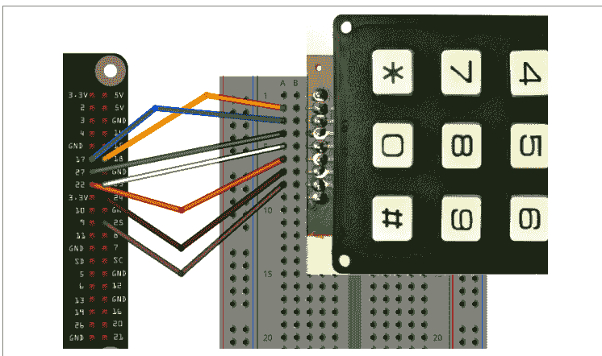

图13-12. 键盘接线图

打开编辑器并粘贴以下代码（ch_13_keypad.py）。

> 在运行程序之前，请确保行和列引脚对于你使用的键盘是正确的。如有必要，更改变量`rows`和`cols`中的值。如果你不这样做，按下某个键可能会将一个GPIO输出短接到另一个输出，其中一个为高电平，另一个为低电平。这可能会损坏你的树莓派。

```python
from gpiozero import Button, DigitalOutputDevice
import time

rows = [Button(17), Button(25), Button(24), Button(23)]
cols = [DigitalOutputDevice(27), DigitalOutputDevice(18),
        DigitalOutputDevice(22)]
keys = [
    ['1', '2', '3'],
    ['4', '5', '6'],
    ['7', '8', '9'],
    ['*', '0', '#']]

def get_key():
    key = 0
    for col_num, col_pin in enumerate(cols):
        col_pin.off()
        for row_num, row_pin in enumerate(rows):
            if row_pin.is_pressed:
                key = keys[row_num][col_num]
        col_pin.on()
    return key

while True:
    key = get_key()
    if key :
        print(key)
    time.sleep(0.3)
```

当你运行程序时，你可以看到每次按键都被打印出来：

```
$ sudo python3 ch_13_keypad.py
1
2
3
4
5
6
7
8
9
*
0
#
```

与本书中的所有程序示例一样，你也可以下载此程序（见配方3.22）。

每个行和列的交点处都有一个按钮开关，因此当开关被按下时，特定的行和列将连接起来。

这里定义的行和列对于附录A中第567页“杂项”中列出的SparkFun键盘是正确的。第一行连接到GPIO引脚17，第二行连接到引脚25，依此类推。行和列到键盘连接器的接线如图13-13所示。

### 讨论

`keys` 变量包含一个映射，其中存储了每个行列位置对应的按键名称。你可以根据自己的键盘布局自定义此映射。

所有实际操作都在 `get_key` 函数中完成。该函数通过将每一列依次置为低电平来启用该列。然后，一个内部循环依次测试每一行。如果某一行检测到低电平，则会在 `keys` 数组中查找该行和列对应的按键名称。如果没有检测到按键，则返回 `key` 的默认值（0）。

主 `while` 循环仅获取按键值并打印出来。`sleep` 命令用于减缓输出速度。

### 另请参阅

添加键盘的另一种替代方案是直接使用 USB 键盘；这样你只需捕获按键即可，具体方法如配方 13.11 所述。

## 13.9 检测移动

### 问题

你希望在检测到移动时，在 Python 中触发某些操作。

### 解决方案

使用被动红外（PIR）运动检测器模块。

制作此配方，你需要以下物品：

-   公对公跳线（参见第 564 页“原型设备与套件”）
-   PIR 运动检测器模块（参见第 566 页“模块”）

图 13-14 展示了传感器模块的接线方式。该模块需要 5V 电源供电，输出为 3.3V，非常适合与树莓派配合使用。

> 确保你使用的 PIR 模块输出为 3.3V。如果其输出为 5V，则需要使用一对电阻将其降至 3.3V（参见配方 14.8）。

打开编辑器，粘贴以下代码（`ch_13_pir.py`）：

```
from gpiozero import MotionSensor

pir = MotionSensor(18)

while True:
    pir.wait_for_motion()
    print("Motion detected!")
```

与本书所有程序示例一样，你也可以下载此程序（参见配方 3.22）。

该程序仅打印 GPIO 输入 18 的状态：

```
$ python3 ch_13_pir.py
Motion Detected
Motion Detected
```

### 讨论

`gpiozero` 为 PIR 传感器提供了一个类 `MotionSensor`，因此我们不妨直接使用它。然而，这个类实际上除了将相关引脚作为数字输入进行监控外，并没有做其他任何事情。

当被触发时，PIR 传感器的输出会保持高电平一小段时间。你可以使用其电路板上的一个微调电位器（可变电阻）来调整这个时间。第二个微调电位器（如果存在）将设置禁用传感器的光照阈值。这在传感器用于控制灯光时非常有用——在检测到移动时打开灯，但仅在黑暗时才如此。

### 另请参阅

更多详细信息请参阅 `MotionSensor` 的完整文档。

你可以将此配方与配方 7.16 结合使用，在检测到入侵者时发送电子邮件，或者将其与 If This Then That (IFTTT) 集成，以提供多种可能的通知方式（参见配方 17.4）。

要使用计算机视觉和网络摄像头检测移动，请参见配方 8.6。

## 13.10 为树莓派添加 GPS

### 问题

你想将一个串行 GPS 模块连接到移动的树莓派上，并使用 Python 访问数据。

### 解决方案

一个输出为 3.3V 的串行 GPS 模块可以直接连接到树莓派的 RXD 接口。这意味着要使其工作，你必须遵循配方 2.6。请注意，虽然你需要启用串行端口硬件，但不应启用串行控制台选项。

图 13-15 展示了模块的接线方式。树莓派的 RXD 连接到 GPS 模块的 TX。唯一需要的其他连接是 GND 和电源，因此我们可以使用三个公对公排针。

### 检查你的电压

有些 GPS 模块需要 3.3V 的供电电压，而不是下图所示的 5V。因此在连接前请务必检查。

你可以使用 Minicom 查看原始 GPS 数据（参见配方 10.8）。使用以下 minicom 命令，可以在 `/dev/serial0` 设备上看到每秒出现一次的消息：

```
$ minicom -b 9600 -o -D /dev/serial0
Welcome to minicom 2.8
OPTIONS: I18n
Port /dev/serial0, 12:55:56
Press CTRL-A Z for help on special keys
$GPGGA,120346.694,5342.6175,N,00239.7791,W,1,04,5.6,84.4,M,51.3,M,,0000*7A
$GPGSA,A,3,01,03,31,04,,,,,,,,,,6.9,5.6,4.0*3E
$GPGSV,3,1,12,04,63,150,23,03,56,078,41,19,46,263,23,17,39,226,18*79
$GPGSV,3,2,12,09,37,197,20,06,36,302,20,01,26,134,13,31,20,048,31*74
$GPGSV,3,3,12,12,08,327,14,21,06,136,,11,04,304,,25,04,001,*72
$GPRMC,120346.694,A,5432.6175,N,00139.7791,W,002.8,084.6,060922,,*A*7F
```

如果你没有看到任何数据，请检查你的连接并确保串行端口硬件已启用。请注意，在没有 GPS 信号的室内测试 GPS 模块是否基本工作是可以的。但如果你想获得实际的 GPS 定位，你可能需要将树莓派带到室外，或者至少将 GPS 模块放在紧挨着窗户的地方。

从前面的示例中可以看出，GPS 消息需要一些解码。好消息是，在 GPS 模块发出的各种消息中，相当容易找到实际的经纬度数字。在前面的示例中，你可以看到以 `$GPRMC` 开头的消息包含以逗号分隔的字段，其中第三个字段是一个数字（5432.6175）后跟一个字母（N 或 S）。这是以百分之一度为单位的纬度。接下来的两个字段以类似方式显示经度。

你可以在 *ch_13_gps_serial.py* 中找到一个从 Python 程序访问 GPS 数据的示例：

```
import serial

ser = serial.Serial('/dev/serial0')

while True:
    line = ser.readline().decode("utf-8")
    message = line.split(',')
    if message[0] == '$GPRMC':
        if message[2] == 'A':
            lat = message[3] + message[4]
            lon = message[5] + message[6]
            print(F"lat={lat} \tlon={lon}")
        else:
            print("No fix")
```

与本书所有程序示例一样，你也可以下载此程序（参见配方 3.22）。

运行该程序，你应该会看到类似以下的输出。请记住，GPS 模块可能需要一段时间才能获得定位：

```
$ python3 -i ch_13_gps_serial.py
No fix
No fix
lat=5432.6028N    lon=00139.0515W
lat=5432.6028N    lon=00139.0514W
```

### 讨论

该程序读取每条传入的消息，查找 `$GPRMC` 消息，然后将消息拆分为其组成部分。如果位置已知，结果列表的第二个元素将是 `A`。

如果位置已知，则纬度和经度是。

### 另请参阅

在 [GPS 消息](https://www.oreilly.com/library/view/raspberry-pi-cookbook/9781492048817/ch13.html#_gps_messages) 中了解有关各字段含义的更多信息。

有关使用 Python 进行 GPS 跟踪的有趣教程，请参见 [https://oreil.ly/tSVi6](https://oreil.ly/tSVi6)。

## 13.11 拦截按键

### 问题

你想拦截 USB 键盘或数字键盘上的单个按键。

### 解决方案

至少有两种方法可以解决这个问题。更直接的方法是使用 `sys.stdin.read` 函数。与另一种方法相比，它的优点是不需要运行 GUI，因此使用它的程序可以从 SSH 会话中运行。

打开编辑器，粘贴以下代码（`ch_13_keys_sys.py`），运行程序，然后开始按一些键：

```
python
import sys, tty, termios

def read_ch():
    fd = sys.stdin.fileno()
    old_settings = termios.tcgetattr(fd)
    try:
        tty.setraw(sys.stdin.fileno())
        ch = sys.stdin.read(1)
    finally:
        termios.tcsetattr(fd, termios.TCSADRAIN, old_settings)
    return ch

while True:
    ch = read_ch()
    if ch == 'x':
        break
    print("key is: " + ch)
```

与本书所有程序示例一样，你也可以下载此程序（参见配方 3.22）。要停止程序，请按 `x` 键。

另一种替代方法是使用 `pygame`，这是一个用于编写游戏的 Python 库，也可用于检测按键。然后你可以使用它来执行某些操作。

以下示例程序（`ch_13_keys_pygame.py`）演示了如何使用 `pygame` 在每次按键时打印一条消息。但是，它仅在程序可以访问窗口系统时才有效，因此你需要使用 VNC（配方 2.8）运行它，或者直接在树莓派上运行：

import pygame
import sys
from pygame.locals import *

pygame.init()
screen = pygame.display.set_mode((640, 480))
pygame.mouse.set_visible(0)

while True:
    for event in pygame.event.get():
        if event.type == QUIT:
            sys.exit()
        if event.type == KEYDOWN:
            print("Code: " + str(event.key) + " Char: " + chr(event.key))

这将打开一个空白的 Pygame 窗口，只有当 Pygame 窗口被选中时，按键才会被拦截。程序会在运行它的终端窗口中产生输出。

如果你使用第一种标准输入读取方法按下方向键或 Shift 键，程序会抛出一个错误，因为这些键没有 ASCII 值：

```
$ python3 ch_13_keys_pygame.py
Code: 97 Char: a
Code: 98 Char: b
Code: 99 Char: c
Code: 120 Char: x
Code: 13 Char:
```

在这种情况下，Ctrl-C 无法停止程序的运行。要停止程序，请点击 Pygame 窗口上的 X 按钮。

### 讨论

当你使用 pygame 方法时，其他键被定义了常量值，这允许你使用键盘上的光标键和其他非 ASCII 键（如上箭头键和 Home 键）。这是另一种方法无法做到的。

### 另请参阅

拦截键盘事件也可以作为使用矩阵键盘的替代方案（参见配方 13.8）。

## 13.12 拦截鼠标移动

### 问题

你想在 Python 中检测鼠标移动。

### 解决方案

这个解决方案与使用 pygame 拦截键盘事件（配方 13.11）非常相似。

打开一个编辑器并粘贴以下代码（ch_13_mouse_pygame.py）：

```
import pygame
import sys
from pygame.locals import *

pygame.init()
screen = pygame.display.set_mode((640, 480))
pygame.mouse.set_visible(0)

while True:
    for event in pygame.event.get():
        if event.type == QUIT:
            sys.exit()
        if event.type == MOUSEMOTION:
            print("Mouse: (%d, %d)" % event.pos)
```

与本书中的所有程序示例一样，你也可以下载这个程序（参见配方 3.22）。

当你运行程序时，每当鼠标在 pygame 窗口内移动时，就会触发 MOUSEMOTION 事件。你可以从事件的 pos 值中找到坐标。坐标是相对于窗口左上角的绝对坐标：

```
Mouse: (262, 285)
Mouse: (262, 283)
Mouse: (262, 281)
Mouse: (262, 280)
Mouse: (262, 278)
Mouse: (262, 274)
Mouse: (262, 270)
Mouse: (260, 261)
Mouse: (258, 252)
Mouse: (256, 241)
Mouse: (254, 232)
```

### 讨论

你可以拦截的其他事件包括 MOUSEBUTTONDOWN 和 MOUSEBUTTONUP。这些可以用来检测鼠标左键何时被按下或释放。

### 另请参阅

你可以在 [pygame 网站](https://www.pygame.org/docs/) 上找到鼠标的文档。

## 13.13 为树莓派添加重置按钮

### 问题

你想为一个重置按钮，以便像典型的台式电脑一样启动你的树莓派 4 或更早型号。

### 解决方案

如果你有一个树莓派 400，那么无需做任何事情；这个版本的树莓派已经有一个电源开关。

当你使用完树莓派后，你应该真正地关闭它；否则，可能会损坏 SD 卡镜像，这意味着你将不得不重新安装树莓派操作系统。关闭树莓派后，你可以通过拔掉 USB 线然后再插回去来让它重新启动。但一个更简洁的解决方案是为你的树莓派添加一个重置按钮。

对于这个配方，你需要以下物品：

- 双向 1/10 英寸排针（参见第 567 页的“杂项”）
- 回收的 PC 启动按钮或 MonkMakes Squid 按钮（参见第 566 页的“模块”）
- 焊接设备（参见第 564 页的“原型设备和套件”）

大多数型号的树莓派都有一个专门用于此目的的连接器。它在板上的位置各不相同，但总是标记为 RUN。图 13-16 显示了它在树莓派 4 上的位置，图 13-17 显示了它在树莓派 3 上的位置。

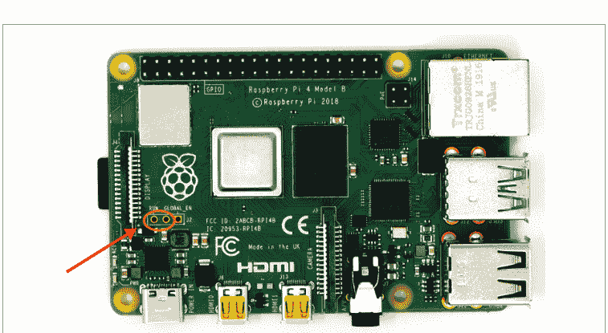

图 13-16. 树莓派 4 上 RUN 触点的位置

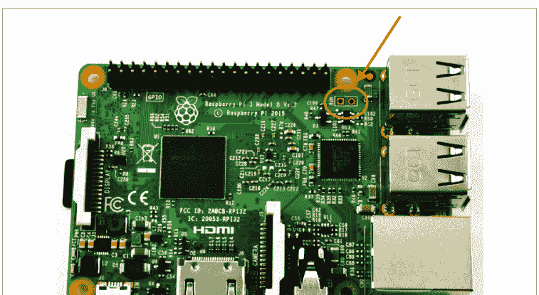

图 13-17. 树莓派 3 上 RUN 触点的位置

触点的孔间距为十分之一英寸，设计用于安装标准排针。从板的顶部将排针的短端推入，并在底面焊接。焊接完成后，带有 RUN 排针的树莓派应如图 13-18 所示。

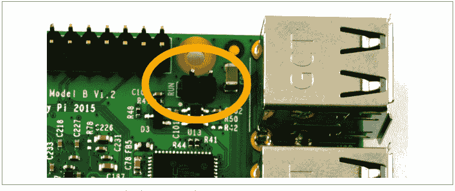

图 13-18. 连接到树莓派的排针

现在排针已经连接好，按钮连接器可以直接推到排针上，如图 13-19 所示。

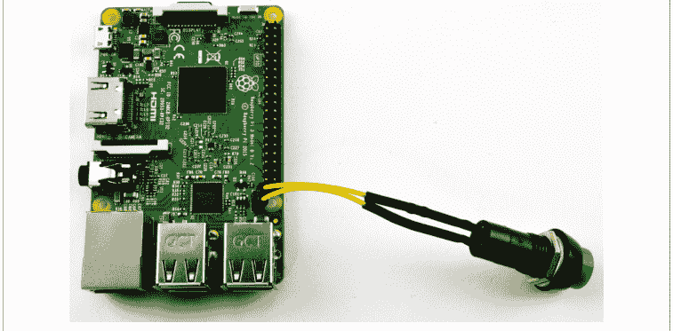

图 13-19. 带有重置按钮的树莓派 3

### 讨论

要测试你的修改，请启动你的树莓派，然后通过从树莓菜单中选择关机来关闭它（图 13-20）。

过一会儿，屏幕会关闭，树莓派将进入 *halt* 模式，在这种模式下它使用最小功率，基本上处于待机状态。

现在，要启动你的树莓派，你只需要按下按钮，它就会启动！

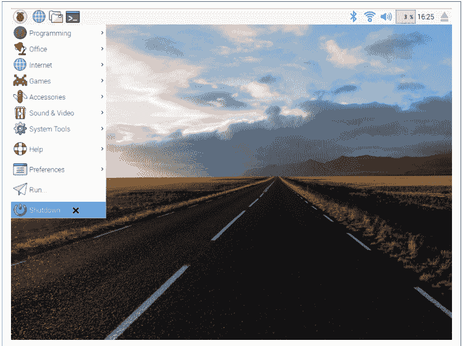

图 13-20. 关闭树莓派

### 另请参阅

有关关闭和启动树莓派的更多信息，请参见配方 1.15。

# 第 14 章
传感器

## 14.0 简介

在本章中，我们探讨使用各种类型传感器的配方，这些传感器将使树莓派能够测量温度、光线等。

与 Arduino 和树莓派 Pico 等板子不同，普通的树莓派缺少模拟输入。这意味着对于许多传感器，有必要使用额外的模数转换器（ADC）硬件。幸运的是，这相对容易实现。也可以使用电阻式传感器配合电容和几个电阻。

许多配方将需要使用无焊面包板和公对母跳线（参见配方 10.9）。

## 14.1 使用电阻式传感器

### 问题

你想将一个可变电阻连接到树莓派，并测量其电阻，以便在你的 Python 程序中确定可变电阻旋钮的位置。

### 解决方案

你可以仅使用一个电容、几个电阻和两个通用输入/输出（GPIO）引脚在树莓派上测量电阻。在这种情况下，你将能够通过测量小型可变电阻（微调电位器）的滑动触点到一端的电阻来估算旋钮的位置。

要制作这个配方，你需要以下物品：

- 面包板和跳线（参见第 564 页的“原型设备和套件”）
- 10kΩ 微调电位器（参见第 565 页的“电阻和电容”）
- 两个 1kΩ 电阻（参见第 565 页的“电阻和电容”）
- 330 nF 电容（参见第 565 页的“电阻和电容”）

图 14-1 显示了面包板上组件的排列。

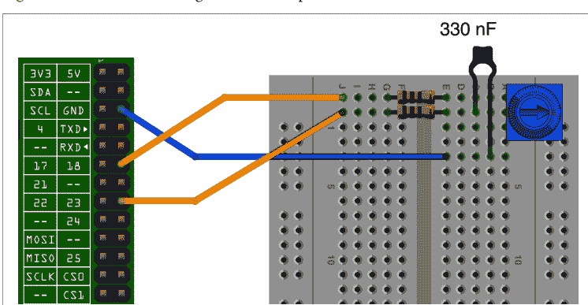

这个配方利用了作者开发的一个 Python 库，以使使用模拟传感器的方法更容易。要安装它，请运行以下命令：

```
$ git clone https://github.com/simonmonk/pi_analog.git
$ cd pi_analog
$ sudo python3 setup.py install
```

打开一个编辑器并粘贴以下代码（ch_14_resistance_meter.py）：

```
from PiAnalog import *
import time

p = PiAnalog()

while True:
    print(p.read_resistance())
    time.sleep(1)
```

与本书中的所有程序示例一样，你也可以下载这个程序（参见配方 3.22）。

当你运行程序时，你应该会看到类似这样的输出：

```
$ python3 ch_14_resistance_meter.py
5588.419502667787
5670.842306126099
8581.313103654076
10167.614271851775
8724.539614581638
4179.124682880563
267.41950235897957
```

当你旋转微调电位器的旋钮时，读数会发生变化。理想情况下，电阻读数将在 0 到 10,000Ω 之间变化，但在实践中会有一些误差。

### 讨论

为了解释 PiAnalog 类的工作原理，我首先需要解释用于测量可变电阻电阻的 *阶跃响应* 技术是如何工作的。

图 14-2 显示了该配方的原理图。

这种做法被称为阶跃响应，因为它通过观察电路在输出从低电平切换到高电平时的 *阶跃* 变化后的响应来工作。

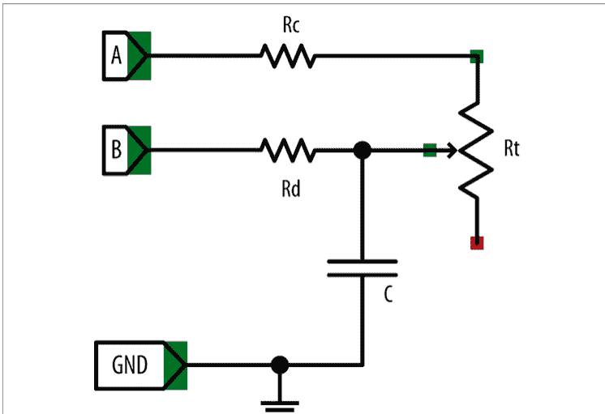

你可以将电容器想象成一个电荷罐，随着它被电荷填满，其两端的电压会升高。你无法直接测量该电压，因为树莓派没有模数转换器（ADC）。然而，你可以计时电容器充电到足以超过约1.65V（构成高电平数字输入）所需的时间。电容器充电的速度取决于可变电阻（Rt）的值。电阻越低，电容器充电越快，电压上升也越快。

为了获得良好的读数，你还必须能够在每次读数前将电容器放电。在图14-2中，连接A用于通过Rc和Rt为电容器充电，连接B用于通过Rd放电（清空）电容器。电阻Rc和Rd用于防止在电容器充放电过程中，过大的电流流过树莓派相对脆弱的GPIO引脚。

读取读数的步骤是：首先通过Rd使电容器放电，然后让它通过Rc和Rt充电。要放电，将连接A（GPIO 18）设置为输入，这实际上断开了Rc和Rt与电路的连接。然后将连接B（GPIO 23）设置为低电平输出。保持此状态100毫秒以清空电容器。

现在电容器已清空，你可以开始允许电荷流入它：将连接B设置为输入（实际上断开它），然后使连接A成为3.3V的高电平输出。电容器C现在将开始通过Rc和Rt充电。

图14-3显示了在这种配置下的电阻和电容器，当电压在高电平和低电平之间切换时，它们是如何充电和放电的。

你可以看到，电容器两端的电压最初迅速增加，但随着电容器充满，电压上升速度会减慢。幸运的是，你感兴趣的是电容器达到约1.65V之前的曲线部分，这部分相当接近直线，这意味着电容器两端电压上升到该点所需的时间大致与Rt的电阻成正比，因此也与旋钮的位置成正比。

这种方法精度不是非常高，但它成本极低且易于使用。不准确主要是因为合适值的电容器精度仅为10%。

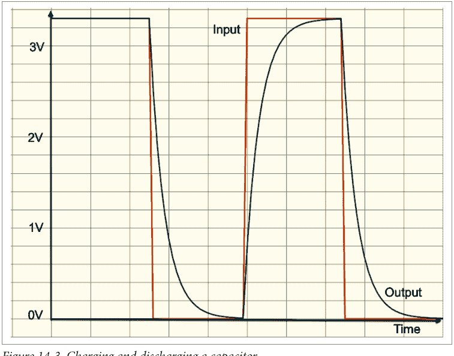

图14-3. 电容器的充电和放电

### 另请参阅

使用阶跃响应方法适用于各种电阻式传感器，用于测量光线（配方14.2）、温度（配方14.3），甚至气体检测（配方14.4）。

要更精确地测量微调电位器的位置，请参阅配方14.7，其中电位器与ADC一起使用。

## 14.2 测量光线

### 问题

你想使用树莓派和光敏电阻测量光强度。

### 解决方案

使用与配方14.1相同的基本配方和代码，但将微调电位器替换为光敏电阻。

要制作此配方，你需要以下物品：

- 面包板和跳线（参见第564页“原型设备和套件”）
- 光敏电阻或光电晶体管（参见第565页“电阻和电容器”）
- 两个1kΩ电阻（参见第565页“电阻和电容器”）
- 330 nF电容器（参见第565页“电阻和电容器”）

所有这些部件都包含在MonkMakes的树莓派项目盒1套件中（参见第564页“原型设备和套件”）。

图14-4显示了面包板上组件的布局。如果你使用的是光电晶体管而不是光敏电阻，那么较长的引脚是负极引脚，应连接到面包板的第4行。

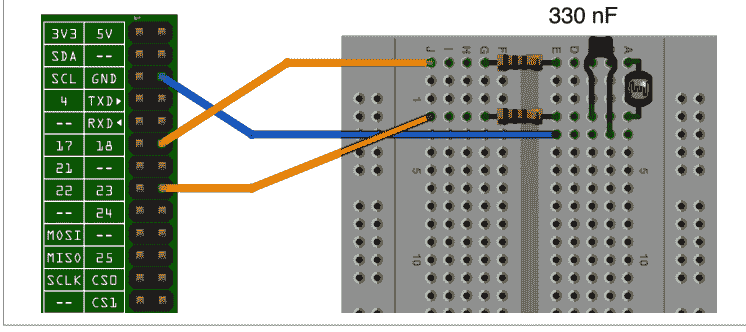

使用与配方14.1相同的程序（ch_14_resistance_meter.py），当你将手在光敏电阻/光电晶体管上方移动以遮挡部分光线时，你会看到输出发生变化。

请注意，此程序需要安装PiAnalog库（参见配方14.1）。

此解决方案提供了相对可靠的光强度读数。作为使用电阻式传感器通用解决方案（配方14.1）的改编，它也能处理测量0Ω电阻的情况，而不会损坏树莓派的GPIO引脚。

### 讨论

光敏电阻是一种电阻，其电阻值会根据通过其透明窗口的光量而变化。光线越强，电阻越低。通常，电阻在强光下约为1kΩ，在完全黑暗时可能高达100kΩ。

光电晶体管的工作方式类似，照射在其上的光线越多，导电性越强。但与光敏电阻不同，光电晶体管有正负极之分，如果接反则无法工作。

### 另请参阅

你也可以将光敏电阻或光电晶体管与ADC一起使用（配方14.7）。

## 14.3 使用热敏电阻测量温度

### 问题

你想使用热敏电阻测量温度。

### 解决方案

热敏电阻是一种电阻值随温度变化的电阻器。使用阶跃响应方法（配方14.1）测量热敏电阻的电阻，然后计算温度。

要制作此配方，你需要以下物品：

- 面包板和跳线（参见第564页“原型设备和套件”）
- 1k热敏电阻（参见第565页“电阻和电容器”）
- 两个1kΩ电阻（参见第565页“电阻和电容器”）
- 330 nF电容器（参见第565页“电阻和电容器”）

所有这些部件都包含在MonkMakes的树莓派项目盒1套件中（参见第564页“原型设备和套件”）。当你拿到热敏电阻时，确保你知道它的Beta值和R0值（25°C时的电阻），并且它是一个负温度系数（NTC）器件。

图14-5显示了此配方的面包板布局。

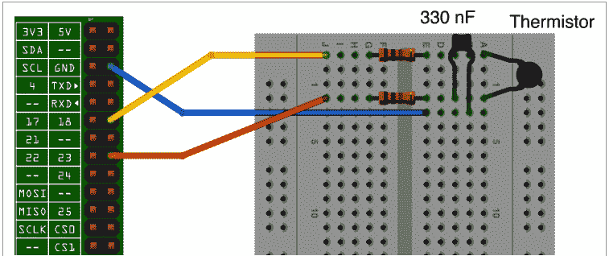

图14-5. 使用热敏电阻的面包板布局

请注意，此程序需要安装PiAnalog库（参见配方14.1）。

以下代码（ch_14_thermistor.py）演示了PiAnalog模块的使用：

```
from PiAnalog import *
import time

p = PiAnalog()

while True:
    print(p.read_temp_c())
    time.sleep(1)
```

与本书中所有程序示例一样，你也可以下载此程序（参见配方3.22）。

运行程序时，你会看到一系列以摄氏度为单位的温度测量值。要转换为华氏度，请将代码`p.read_temp_c()`更改为`p.read_temp_f()`：

```
$ python3 ch_14_thermistor.py
18.735789861164392
19.32060395712483
20.2694035007122
21.03181169007422
21.26640936199749
```

### 讨论

根据热敏电阻的电阻计算温度需要使用一些相当复杂的数学运算，即称为Steinhart-Hart方程的对数运算。该方程需要知道热敏电阻的两个参数：其在25°C时的电阻（称为R0）和一个称为Beta（有时简称为B）的常数。如果你使用不同的热敏电阻，需要在调用`read_temp_c`时将这些值插入代码中。例如：

```
read_temp_c(self, B=3800.0, R0=1000.0)
```

请注意，电容器的精度通常只有10%，热敏电阻的R0值同样不精确，因此不要期望获得极其精确的结果。

### 另请参阅

要使用TMP36测量温度，请参阅配方14.10。

要使用数字温度传感器（DS18B20）测量温度，请参阅配方14.13。

要使用Sense HAT测量温度，请参阅配方14.12。

## 14.4 检测甲烷

### 问题

你想使用甲烷传感器测量气体浓度。

### 解决方案

有现成的低成本电阻式气体传感器，可以轻松连接到树莓派以检测甲烷等气体。你可以使用在配方14.1中首次使用的阶跃响应方法。

要制作此配方，你需要以下物品：

- 面包板和跳线（参见第564页“原型设备和套件”）
- 甲烷传感器（参见第566页“模块”）
- 两个1kΩ电阻（参见第565页“电阻和电容器”）
- 330 nF电容器（参见第565页“电阻和电容器”）

该传感器包含一个加热元件，需要5V电压，电流可达150mA。只要树莓派的电源能够提供额外的150mA电流，它就能提供此电力。

传感器模块的引脚相当粗——太粗而无法插入面包板孔中。一种解决方法是将短段的实芯线焊接到每个引脚上（图14-6）。另一种方法是购买SparkFun的气体传感器分线板，它将允许你直接插入传感器。

## 14.4 测量甲烷气体

如果你使用的是 SparkFun 分线板，请按照图 14-7 所示连接面包板；如果你给气体传感器焊接了更长的引线，则请按照图 14-8 所示连接。

请注意，图 14-8 所示的直接连接使用了分线板的符号，而不是传感器本身的符号，但如果你仔细观察，连接的是传感器的六个引脚，而不是分线板的四个引脚。

你可以使用与配方 14.1 完全相同的程序，并通过向传感器呼气来测试甲烷传感器。当你向传感器呼气时，你应该会看到传感器的读数下降。

### 讨论

甲烷气体传感器最明显的用途是用于新奇的*放屁检测*项目。一个更严肃的用途是检测天然气泄漏。例如，你可以想象一个树莓派家庭监控项目，它使用各种传感器监控家庭。然后，当你在度假时，它可以给你发送一封电子邮件，通知你你的房子即将爆炸。或者也许不会。

这类传感器（图 14-9）使用一个加热元件，该元件加热一个浸渍了对特定气体敏感的催化剂的电阻表面。当气体存在时，催化剂层的电阻会发生变化。

加热器和传感表面在电气上都只是电阻器。因此，两者都可以以任何方式连接。

这种特定的气体传感器对甲烷最敏感，但它也会在较小程度上检测其他气体。这就是为什么向传感器呼气会改变读数，因为健康的人通常不会呼出甲烷。吹气对元件的冷却效应也可能产生影响。

### 另请参阅

你可以找到该传感器的数据手册。这将为你提供有关传感器对各种气体敏感性的各种有用信息。

一系列此类低成本传感器可用于检测不同的气体。请参阅 SparkFun 提供的传感器列表。

## 14.5 测量空气质量（CO₂）

### 问题

二氧化碳（CO₂）浓度是空气质量的一个指标。你想使用你的树莓派通过一个特殊传感器来测量这种质量。

### 解决方案

使用一个低成本（嗯，相对低成本）的 MH-Z14A CO₂ 传感器模块，如图 14-10 所示连接到树莓派。

要制作这个配方，你需要以下物品：

- 一个 MH-Z14A CO₂ 传感器模块（参见第 566 页的“模块”）
- 公对公跳线（参见第 564 页的“原型设备和套件”）

在 Z14A 传感器和你的树莓派之间进行以下连接：

- MH-Z14A 的引脚 16 连接到树莓派的 GND
- MH-Z14A 的引脚 17 连接到树莓派的 5V
- MH-Z14A 的引脚 18 连接到树莓派的 GPIO 14 (TXD)
- MH-Z14A 的引脚 19 连接到树莓派的 GPIO 15 (RXD)

该传感器使用串行端口。这意味着为了使其工作，你必须遵循配方 2.6。请注意，即使你需要启用串行端口硬件，你也*不应该*启用串行控制台选项。

以下测试程序从传感器读取 CO₂ 水平，并每秒报告一次（ch_14_co2.py）：

```python
import serial, time

request_reading = bytes([0xFF, 0x01, 0x86, 0x00, 0x00, 0x00,
                        0x00, 0x00, 0x79])

def read_co2():
    sensor.write(request_reading)
    time.sleep(0.1)
    raw_data = sensor.read(9)
    high = raw_data[2]
    low = raw_data[3]
    return high * 256 + low;

sensor = serial.Serial('/dev/serial0')
print(sensor.name)
if sensor.is_open:
    print("Open")

while True:
    print("CO2 (ppm):" + str(read_co2()))
    time.sleep(1)
```

与本书中的所有程序示例一样，你也可以下载此程序（参见配方 3.22）。

当程序运行时，CO₂ 水平应该（除非你在一个小而通风不良的房间里）大约为 400 ppm。如果你对着传感器呼气几秒钟，读数将开始缓慢上升，然后在接下来的几分钟内回落到正常读数：

```
$ python3 ch_14_co2.py
/dev/ttyS0
Open
CO2 (ppm):489
CO2 (ppm):483
CO2 (ppm):483
CO2 (ppm):481
CO2 (ppm):491
CO2 (ppm):517
CO2 (ppm):619
CO2 (ppm):734
CO2 (ppm):896
CO2 (ppm):1367
```

该传感器使用请求/响应通信协议。因此，当你想从传感器接收读数时，你首先需要发送包含在 `request_reading` 中的 9 字节消息。传感器将立即响应一个 9 字节的消息。我们只对字节 2 和 3 感兴趣，它们包含以 ppm 为单位的 CO₂ 读数的高位和低位字节。

### 讨论

正常的 CO₂ 水平约为 400 至 1,000 ppm。高于此值，空气可能开始感觉沉闷，你可能会感到昏昏欲睡。研究表明，由于通风不良导致的高 CO₂ 水平会导致精神表现下降。由于整夜运行该程序，我现在睡觉时会让窗户和/或门留一条缝。

### 另请参阅

了解更多关于 [Z14A 协议](https://example.com) 的信息。

查找有关 [CO₂ 安全水平](https://example.com) 的更多信息。

## 14.6 测量土壤湿度

### 问题

你想测量植物周围土壤的湿度。

### 解决方案

使用 MonkMakes Plant Monitor 板。与大多数其他土壤湿度板不同，该板具有串行接口，因此你必须首先遵循 [配方 2.6](https://example.com) 来启用串行接口。按照 [图 14-11](https://example.com) 所示连接板子。

连接如下：

- GND 连接到 GND
- 树莓派上的 3.3V 连接到 Plant Monitor 上的 3V
- 树莓派上的 14 TXD 连接到 Plant Monitor 上的 RX_IN
- 树莓派上的 15 RXD 连接到 Plant Monitor 上的 TX_OUT

然后使用以下命令下载该板的 Python 软件：

```
$ git clone https://github.com/monkmakes/pmon.git
```

这是另一个使用 guizero 的程序，因此如果你尚未安装 guizero，请使用以下命令进行安装：

```
$ pip3 install guizero
```

然后切换到示例目录并运行示例程序，使用以下命令：

```
$ cd pmon/raspberry_pi
$ python3 01_meter.py
```

这将打开如图 14-12 所示的窗口。

### 讨论

大多数土壤湿度传感器需要模拟输入，因此不容易连接到树莓派。MonkMakes Plant Monitor 使用串行接口，使其非常适合连接到树莓派。它报告植物的温度和湿度，并有一个 RGB LED 指示土壤湿度。

前面示例程序的代码是：

```python
import threading
import time
from guizero import App, Text
from plant_monitor import PlantMonitor

pm = PlantMonitor()

app = App(title="Plant Monitor", width=550, height=300, layout="grid")

def update_readings(): # update fields with new temp and eCO2 readings
    while True:
        wetness_field.value = str(pm.get_wetness())
        temp_c_field.value = str(pm.get_temp())
        humidity_field.value = str(pm.get_humidity())
        time.sleep(2)

t1 = threading.Thread(target=update_readings)

# define the user interface
Text(app, text="Wetness (%)", grid=[0,0], size=20)
wetness_field = Text(app, text="-", grid=[1,0], size=100)
Text(app, text="Temp (C)", grid=[0,1], size=20)
temp_c_field = Text(app, text="-", grid=[1,1], size=50)
Text(app, text="Humidity (%)", grid=[0,2], size=20)
humidity_field = Text(app, text="-", grid=[1,2], size=50)
t1.start() # start the thread that updates the readings
app.display()
```

大部分代码是使用 guizero（配方 7.22）提供用户界面。Plant Monitor 的关键步骤是首先使用 `pm = PlantMonitor()` 创建 PlantMonitor 类的实例，然后分别使用 `pm.get_wetness()`、`pm.get_temp()` 和 `pm.get_humidity()` 访问湿度、温度和湿度读数。

### 另请参阅

有关 MonkMakes Plant Monitor 的完整信息，请参见 https://oreil.ly/zOQWq。

有关使用 Sense HAT 测量温度和湿度，请参见配方 14.12。

有关使用 Plant Monitor 的树莓派 Pico 示例，请参见配方 19.11。

## 14.7 测量电压

### 问题

你想测量一个模拟电压。

### 解决方案

树莓派GPIO连接器仅提供数字输入。若要测量电压，需使用独立的模数转换器（ADC）。

采用MCP3008八通道ADC芯片。该芯片具备八个模拟输入通道，因此可将最多八个传感器连接至其中一个通道，并通过树莓派SPI接口与芯片通信。

制作本方案需要以下材料：

- 面包板与跳线（参见第564页“原型设备与套件”）
- MCP3008八通道ADC集成电路（IC）（参见第565页“集成电路”）
- 10kΩ可调电阻（参见第565页“电阻与电容”）

图14-13展示了使用该芯片的面包板布局。请确保芯片方向正确，封装上的小凹口应朝向面包板顶部。

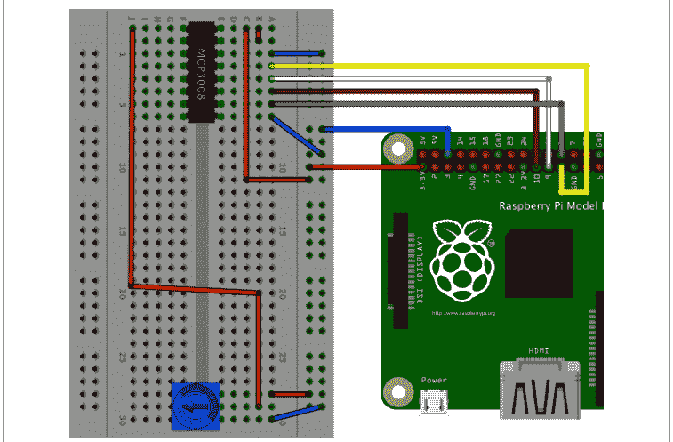

可变电阻一端连接3.3V，另一端接地（GND），使中间连接点可设置为0至3.3V之间的任意电压。

运行程序前，请确保已启用SPI（方案10.6）。本方案还将进一步介绍SPI相关知识。

打开编辑器并粘贴以下代码（ch_14_adc_test.py）：

```
from gpiozero import MCP3008
import time

analog_input = MCP3008(channel=0)

while True:
    reading = analog_input.value
    voltage = reading * 3.3
    print("Reading={:.2f}\tVoltage={:.2f}".format(reading, voltage))
    time.sleep(1)
```

与本书所有程序示例一样，您也可以下载此程序（参见方案3.22）。

运行程序后，转动可变电阻改变电压时，应看到如下输出：

```
$ python3 ch_14_adc_test.py
Reading=0.60 Voltage=2.00
Reading=0.54 Voltage=1.80
Reading=0.00 Voltage=0.00
Reading=0.00 Voltage=0.00
Reading=0.46 Voltage=1.53
Reading=0.99 Voltage=3.28
```

MCP3008通道的读数范围在0到1之间。可通过乘以3.3（供电电压）将其转换为电压值。

### 讨论

MCP3008采用10位ADC，因此读数范围为0到1023。MCP3008类通过将读数乘以电压范围（3.3V）再除以1024，将其转换为电压值。

若不需要*完整*树莓派的所有功能，可使用树莓派Pico，其自带模拟输入，无需额外ADC芯片。详情请参见方案19.7。

可组合使用以下任意涉及MCP3008的方案，实现最多八个传感器的读数采集。

也可将电阻式传感器与固定电阻组合，构成分压电路，配合MCP3008使用（参见方案14.8和14.9）。

### 另请参阅

若仅需检测旋钮转动，可使用旋转编码器替代电位器（方案13.7）。

也可通过阶跃响应法（方案14.1）检测电位器位置，无需使用ADC芯片。

查阅MCP3008数据手册。

Pimoroni的Explorer HAT Pro也内置ADC（方案10.16）。

## 14.8 降低测量电压

### 问题

需要测量的电压高于MCP3008（方案14.7）可处理的3.3V上限。

### 解决方案

使用电阻对构成分压器，将电压降至合适范围。

尝试本方案需要以下材料：

- 面包板与跳线（参见第564页“原型设备与套件”）
- MCP3008八通道ADC IC（参见第565页“集成电路”）
- 10kΩ电阻（参见第565页“电阻与电容”）
- 3.3kΩ电阻（参见第565页“电阻与电容”）
- 9V电池与鳄鱼夹导线

图14-14展示了使用面包板的连接方式，该设置将测量电池电压。

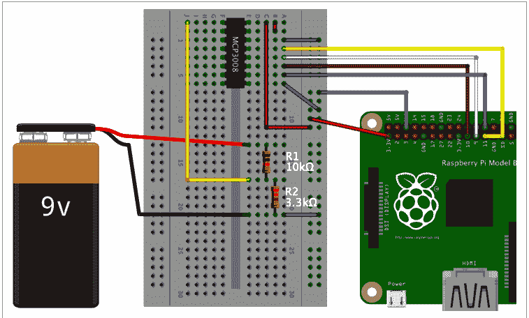

图14-14. 降低模拟输入电压

> 切勿使用本方案测量高压交流电或任何类型的交流电。本方案仅适用于低压直流电。

打开编辑器并粘贴以下代码（ch_14_adc_scaled.py）：

```
from gpiozero import MCP3008
import time

R1 = 10000.0
R2 = 3300.0
analog_input = MCP3008(channel=0)

while True:
    reading = analog_input.value
    voltage_adc = reading * 3.3
    voltage_actual = voltage_adc / (R2 / (R1 + R2))
    print("Battery Voltage=" + str(voltage_actual))
    time.sleep(1)
```

与本书所有程序示例一样，您也可以下载此程序（参见方案3.22）。

该程序与方案14.7的程序非常相似，主要区别在于使用两个电阻值（存储在变量R1和R2中）进行缩放计算。

运行程序后，将显示电池电压：

```
$ python3 ch_14_adc_scaled.py
Battery Voltage=8.62421875
```

> 连接高于9V的电压前，请仔细阅读讨论部分，否则可能损坏MCP3008。

### 讨论

这种电阻排列方式称为*分压器*，有时也称*电位分压器*（图14-15）。根据输入电压和两个电阻值计算输出电压的公式如下：

```
Vout = Vin * R2 / (R1 + R2)
```

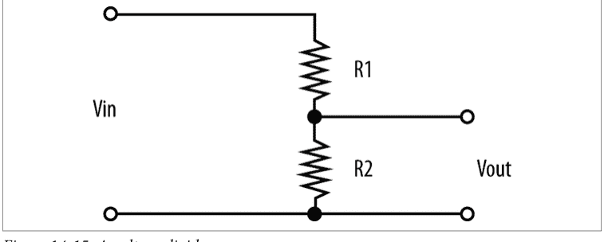

这意味着若R1和R2阻值相同（例如均为1kΩ），则Vout为Vin的一半。

选择R1和R2时，还需考虑流经它们的电流，即Vin/(R1 + R2)。在前述示例中，R1为10kΩ，R2为3.3kΩ，因此电流为9V/13.3kΩ = 0.68mA。该电流虽小，但长期连接仍会耗尽电池，故请勿持续连接。

### 另请参阅

为避免复杂计算，可使用[在线电阻计算器](https://www.google.com/search?q=online+resistor+calculator)。

分压器也用于将电阻式传感器与ADC配合使用时，将电阻转换为电压（[方案14.9](#recipe-14-9)）。

## 14.9 将电阻式传感器与ADC配合使用

### 问题

希望将电阻式传感器与MCP3008 ADC芯片配合使用。

### 解决方案

使用由固定电阻和电阻式传感器构成的分压器，将传感器电阻转换为可被ADC测量的电压。例如，可重新制作[方案14.2](#recipe-14-2)的光传感器项目，改用MCP3008替代阶跃响应技术。

尝试本方案需要以下材料：

- 面包板与跳线（参见第564页“原型设备与套件”）
- MCP3008八通道ADC IC（参见第565页“集成电路”）
- 10kΩ电阻（参见第565页“电阻与电容”）
- 光敏电阻（参见第565页“电阻与电容”）

图14-16展示了使用面包板的连接方式。

可使用与[方案14.7](#recipe-14-7)完全相同的程序（`ch_14_adc_test.py`）。用手遮盖光传感器会改变读数。还需在树莓派上设置SPI，若尚未完成，请先遵循[方案10.6](#recipe-10-6)。

```
$ python3 ch_14_adc_test.py
Reading=0.60 Voltage=2.00
Reading=0.54 Voltage=1.80
```

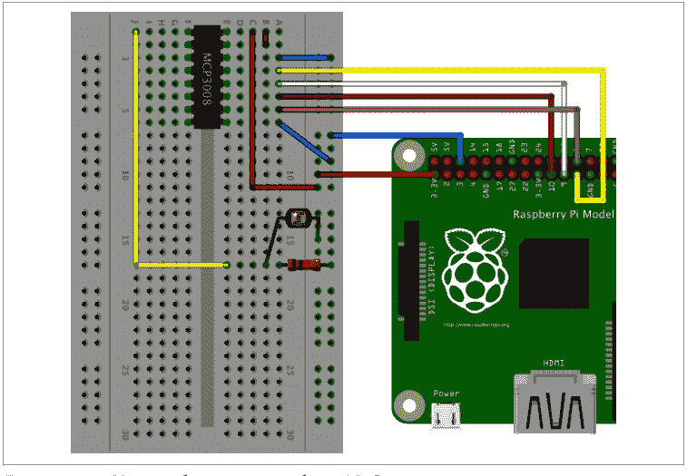

图14-16. 将光敏电阻与ADC配合使用

读数可能因光敏电阻不同而有较大差异，但关键在于数值随光照强度变化而改变。

### 讨论

固定电阻值的选择并非十分关键。若阻值过高或过低，读数范围会相当狭窄。应选择介于传感器最小与最大电阻之间的阻值。可能需要尝试几种电阻，才能确定适合您传感器在目标读数范围内工作的阻值。如有疑问，可从10kΩ开始测试效果。

可将光敏电阻替换为几乎任何电阻式传感器。例如，可使用[方案14.4](Recipe 14.4)中的气体传感器。

### 另请参阅

若希望避免ADC的复杂性来测量光照强度，请参见[方案14.2](Recipe 14.2)。

有关同时使用ADC多个通道的示例，请参见[方案14.14](Recipe 14.14)。

## 14.10 使用ADC测量温度

### 问题

你想使用TMP36和模数转换器来测量温度。

### 解决方案

将MCP308 ADC芯片与TMP36配合使用。

要尝试此配方，你需要以下物品：

- 面包板和跳线（参见第564页的“原型设备与套件”）
- MCP3008八通道ADC芯片（参见第565页的“集成电路”）
- TMP36温度传感器（参见第565页的“集成电路”）

图14-17展示了使用面包板的连接布局。

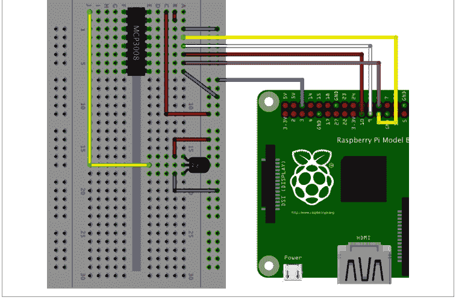

确保TMP36的朝向正确。封装的一侧是平的，而另一侧是弯曲的。

你需要在树莓派上设置SPI，如果尚未设置，请按照配方10.6进行操作。

打开编辑器并粘贴以下代码（ch_14_adc_tmp36.py）：

```
from gpiozero import MCP3008
import time

analog_input = MCP3008(channel=0)

while True:
    reading = analog_input.value
    voltage = reading * 3.3
    temp_c = voltage * 100 - 50
    temp_f = temp_c * 9.0 / 5.0 + 32
    print("Temp C={:.2f}\tTemp F={:.2f}".format(temp_c, temp_f))
    time.sleep(1)
```

与本书中所有程序示例一样，你也可以下载此程序（参见配方3.22）。

该程序基于配方14.7。通过一些额外的数学计算，可以得出摄氏度和华氏度的温度：

```
$ python3 ch_14_adc_tmp36.py
Temp C=18.64        Temp F=65.55
Temp C=20.25        Temp F=68.45
Temp C=23.47        Temp F=74.25
Temp C=25.08        Temp F=77.15
```

### 讨论

TMP36输出与温度成正比的电压。根据TMP36的数据手册，摄氏温度的计算公式为：电压（伏特）× 100 – 50。

TMP36适用于测量近似温度，但其标称精度仅为2°C。如果连接较长的导线，精度会进一步下降。在一定程度上，你可以对单个设备进行校准，但为了获得更好的精度，建议使用DS18B20（配方14.13），其标称精度在-10至+85摄氏度的温度范围内为0.5%。作为数字设备，即使连接较长的导线，也不会损失精度。

### 另请参阅

查看TMP36数据手册。

要使用热敏电阻测量温度，请参见配方14.3。

要使用Sense HAT测量温度，请参见配方14.12。

要使用数字温度传感器（DS18B20）测量温度，请参见配方14.13。

## 14.11 测量树莓派CPU温度

### 问题

你想知道树莓派CPU的温度有多高。

### 解决方案

使用gpiozero库访问博通芯片内置的温度传感器。你的树莓派应该已经安装了gpiozero库。如果没有，可以使用以下命令安装：

```
$ sudo pip3 install gpiozero
```

示例程序*ch_14_cpu_temp.py*将重复打印CPU温度：

```
import time
from gpiozero import CPUTemperature

while True:
    cpu_temp = CPUTemperature()
    print(cpu_temp.temperature)
    time.sleep(1)
```

与本书中所有程序示例一样，你也可以下载此程序（参见配方3.22）。

运行此程序时，它会每秒报告一次摄氏温度：

```
$ python3 ch_14_cpu_temp.py
37.485
38.459
36.511
36.998
```

### 讨论

由于树莓派的CPU忙于运行代码，报告的温度与环境温度关系不大，而更多地反映了树莓派的工作负载和通风情况。

### 另请参阅

要使用热敏电阻测量温度，请参见配方14.3。

要使用TMP36测量温度，请参见配方14.10。

要使用Sense HAT测量温度，请参见配方14.12。

要使用数字温度传感器（DS18B20）测量温度，请参见配方14.13。

## 14.12 使用Sense HAT测量温度、湿度和气压

### 问题

你想测量温度、湿度和气压，但不想分别连接三个独立的传感器。

### 解决方案

使用树莓派Sense HAT（图14-18）。这样，你不仅能获得所有这些传感器，还能获得一些额外功能，比如显示屏。

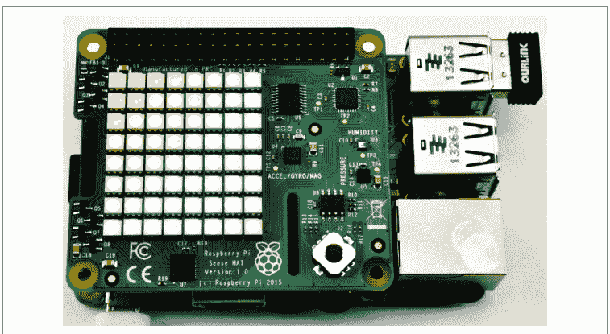

图14-18. Sense HAT

Sense HAT软件已预装在树莓派操作系统中。

打开编辑器并粘贴以下代码（ch_14_sense_hat_thp.py）：

```
from sense_hat import SenseHat
import time

hat = SenseHat()

while True:
    t = hat.get_temperature()
    h = hat.get_humidity()
    p = hat.get_pressure()
    print('Temp C:{:.2f} Hum:{:.0f} Pres:{:.0f}'.format(t, h, p))
    time.sleep(1)
```

与本书中所有程序示例一样，你也可以下载此程序（参见配方3.22）。

运行程序时，终端会显示类似以下内容：

```
$ python3 ch_14_sense_hat_thp.py
Temp C:27.71 Hum:56 Pres:1005
Temp C:27.60 Hum:55 Pres:1005
```

温度单位为摄氏度，湿度为相对湿度百分比，大气压单位为毫巴。

### 讨论

你会发现Sense HAT的温度读数偏高。这是因为温度传感器内置在湿度传感器中，位于Sense HAT的PCB上。Sense HAT本身产生的热量很少（除非使用显示屏），但其下方的树莓派确实会发热，从而提高HAT的温度。避免此问题的最佳方法是使用40针排线将Sense HAT与树莓派分开。也有人尝试通过使用树莓派的温度读数来调整读数。个人认为，这些补偿尝试可能非常特定于用户的设置，不太可能产生可靠的结果。

除了从湿度传感器读取温度外，压力传感器也内置了温度传感器，你可以这样读取：

```
t = hat.get_temperature_from_pressure()
```

文档中并未明确说明此读数是否比使用湿度传感器更准确，但根据我的设置，它报告的温度比湿度传感器低约1摄氏度。

### 另请参阅

要开始使用Sense HAT，请参见配方10.15。

查看Sense HAT的编程参考。

Sense HAT还配备了加速度计、磁力计（配方14.15）和陀螺仪（配方14.16），可用于导航类项目。它还有一个全彩8×8 LED矩阵显示屏（配方15.3）。

## 14.13 使用数字传感器测量温度

### 问题

你想使用精确的数字传感器来测量温度。

### 解决方案

使用DS18B20数字温度传感器。该设备比配方14.10中使用的TMP36更精确，并且使用数字接口，因此不需要ADC芯片。

尽管与该芯片的接口称为*单总线*，但这仅指数据引脚。你确实需要至少一根其他导线来连接到单总线设备。

要制作此配方，你需要以下物品：

- 面包板和跳线（参见第564页的“原型设备与套件”）
- DS18B20温度传感器（参见第565页的“集成电路”）
- 4.7kΩ电阻（参见第565页的“电阻和电容”）

按照图14-19所示将组件安装到面包板上。确保DS18B20的朝向正确。

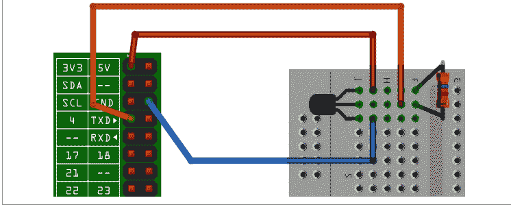

图14-19. 将DS18B20连接到树莓派

最新版本的树莓派操作系统支持DS18B20使用的单总线接口，但你需要使用树莓派配置工具（图14-20）启用它。

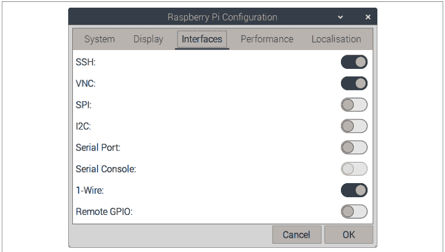

图14-20. 启用单总线接口

你可以在*ch_14_temp_DS18B20.py*中找到此配方的示例代码：

```
import glob, time

base_dir = '/sys/bus/w1/devices/'
device_folder = glob.glob(base_dir + '28*')[0]
device_file = device_folder + '/w1_slave'

def read_temp_raw():
    f = open(device_file, 'r')
    lines = f.readlines()
    f.close()
    return lines

def read_temp():
    lines = read_temp_raw()
    while lines[0].strip()[-3:] != 'YES':
        time.sleep(0.2)
        lines = read_temp_raw()
    equals_pos = lines[1].find('t=')
    if equals_pos != -1:
        temp_string = lines[1][equals_pos+2:]
        temp_c = float(temp_string) / 1000.0
        temp_f = temp_c * 9.0 / 5.0 + 32.0
        return temp_c, temp_f

while True:
    temp_c, temp_f = read_temp()
```

print('Temp C={:.2f}\ttemp F={:.2f}'.format(temp_c, temp_f))
time.sleep(1)
```

与本书中所有的程序示例一样，你也可以下载此代码（参见配方 3.22）。

当程序运行时，它会每秒报告一次温度，同时显示摄氏度和华氏度：

```
$ python3 ch_14_temp_DS18B20.py
temp C=25.18    temp F=77.33
temp C=25.06    temp F=77.11
temp C=26.31    temp F=79.36
temp C=28.87    temp F=83.97
```

### 讨论

乍一看，这个程序有点奇怪。DS18B20 的接口使用了类似文件的接口。该设备的文件接口始终位于 `/sys/bus/w1/devices/` 文件夹中，文件路径的名称将以 `28` 开头，但每个传感器的文件路径其余部分会有所不同。

代码假定只有一个传感器，并找到第一个以 `28` 开头的文件夹。要使用多个传感器，请在方括号内使用不同的索引值。

在该文件夹中会有一个名为 `w1_slave` 的文件，打开并读取该文件以查找温度。

传感器实际上返回如下所示的文本字符串：

```
81 01 4b 46 7f ff 0f 10 71 : crc=71 YES
81 01 4b 46 7f ff 0f 10 71 t=24062
```

代码的其余部分提取此消息中的温度部分。它出现在 `t=` 之后，是以千分之一摄氏度为单位的温度。

`read_temp` 函数计算摄氏度和华氏度的温度，并返回这两个值。

除了 DS18B20 的基本芯片版本外，你还可以购买封装在坚固防水探头中的版本。

### 另请参阅

要了解记录读数，请参见配方 14.24。

本配方大量参考了这个 Adafruit 教程。

查看 DS18B20 的数据手册。

要使用热敏电阻测量温度，请参见配方 14.3。

要使用 TMP36 测量温度，请参见配方 14.10。
要使用 Sense HAT 测量温度，请参见配方 14.12。

## 14.14 使用 MMA8452Q 模块测量加速度

### 问题

你想将一个三轴加速度计连接到树莓派。

### 解决方案

使用 I2C 加速度计芯片测量 X、Y 和 Z 模拟输出。
要尝试此配方，你需要以下物品：

- 面包板（参见第 564 页的“原型设备和套件”）
- 四根母对母跳线（参见第 564 页的“原型设备和套件”）
- MMA8452Q 三轴加速度计（参见第 566 页的“模块”）

图 14-21 显示了使用面包板的布置。它使用 ADC 的三个通道来测量 X、Y 和 Z 加速度力。

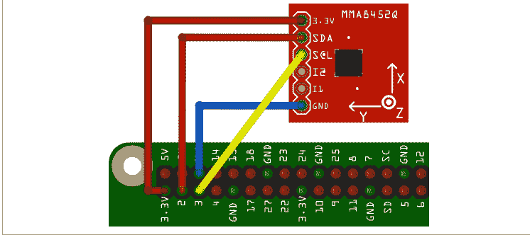

你需要在树莓派上启用 I2C，因此，如果尚未这样做，请按照配方 10.4 进行操作。

此示例代码可在文件 *ch_14_i2c_acc.py* 中找到：

```python
import smbus
import time

bus = smbus.SMBus(1)

i2c_address = 0x1D
control_reg = 0x2A

bus.write_byte_data(i2c_address, control_reg, 0x01) # Start
bus.write_byte_data(i2c_address, 0x0E, 0x00) # 2g range

time.sleep(0.5)

def read_acc():
    data = bus.read_i2c_block_data(i2c_address, 0x00, 7)
    x = (data[1] * 256 + data[2]) / 16
    if x > 2047 :
        x -= 4096
    y = (data[3] * 256 + data[4]) / 16
    if y > 2047 :
        y -= 4096
    z = (data[5] * 256 + data[6]) / 16
    if z > 2047 :
        z -= 4096
    return (x, y, z)

while True:
    print("x={:.6f}\ty={:.6f}\tz={:.6f}".format(x, y, z))
    time.sleep(0.5)
```

与本书中所有的程序示例一样，你也可以下载此程序（参见配方 3.22）。

该程序读取与加速度相对应的三个力并打印出来：

```
$ python3 ch_14_i2c_acc.py
x=-122.000000 y=56.000000 z=-1023.000000
x=-933.000000 y=251.000000 z=-350.000000
x=-937.000000 y=257.000000 z=-347.000000
x=-933.000000 y=262.000000 z=-350.000000
x=-931.000000 y=259.000000 z=-355.000000
x=-1027.000000 y=-809.000000 z=94.000000
```

将加速度计向各个方向倾斜，以查看读数如何变化。读数为 0 表示没有净力。正值（对于 2g 最高可达 2047）表示一个方向的力，负值表示相反方向的力。你可以看到，在传感器水平放置的第一个读数中，Z 力接近 −1023（1g）。

### 讨论

你可能需要更改设备的 I2C 地址。你可以通过连接它然后运行以下命令来检查：

```
$ sudo i2cdetect -y 1
     0  1  2  3  4  5  6  7  8  9  a  b  c  d  e  f
00:          -- -- -- -- -- -- -- -- -- -- -- -- -- 
10: -- -- -- -- -- -- -- -- -- -- -- -- -- 1d -- -- 
20: -- -- -- -- -- -- -- -- -- -- -- -- -- -- -- -- 
30: -- -- -- -- -- -- -- -- -- -- -- -- -- -- -- -- 
40: -- -- -- -- -- -- -- -- -- -- -- -- -- -- -- -- 
50: -- -- -- -- -- -- -- -- -- -- -- -- -- -- -- -- 
60: -- -- -- -- -- -- -- -- -- -- -- -- -- -- -- -- 
70: -- -- -- -- -- -- -- --
```

如你所见，在这种情况下，我使用的模块的 I2C 地址为 `1d`。因此，程序中变量 `i2c_address` 就设置为此值。

参考前面的 Python 代码，设备有一个控制寄存器，必须向其写入命令 `1` 才能启动设备运行。然后向寄存器 `0x0E` 写入第二个配置命令 `0`，以将设备的加速度范围设置为最大 2g。这些参数在 [MMA8452Q 的数据手册](datasheet for the MMA8452Q) 中指定。

当需要读数时，读取 I2C 总线并将数据字节拆分为三个 X、Y 和 Z 加速度读数。

加速度计最常见的用途是检测倾斜。这之所以有效，是因为 Z 轴力主要由重力的拉力主导（图 14-22）。

当加速度计向一个方向倾斜时，重力的垂直力的一部分会作用在加速度计的另一个轴上。

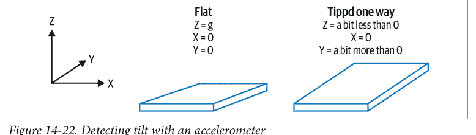

我们可以利用这个原理来检测倾斜是否超过某个阈值。以下程序（`ch_14_i2c_acc_tilt.py`）说明了这一点：

```python
import smbus
import time

bus = smbus.SMBus(1)

i2c_address = 0x1D
control_reg = 0x2A

bus.write_byte_data(i2c_address, control_reg, 0x01) # Start
bus.write_byte_data(i2c_address, 0x0E, 0x00) # 2g range

time.sleep(0.5)

def read_acc():
    data = bus.read_i2c_block_data(i2c_address, 0x00, 7)
    x = (data[1] * 256 + data[2]) / 16
    if x > 2047 :
        x -= 4096
    y = (data[3] * 256 + data[4]) / 16
    if y > 2047 :
        y -= 4096
    z = (data[5] * 256 + data[6]) / 16
    if z > 2047 :
        z -= 4096
    return (x, y, z)

while True:
    x, y, z = read_acc()
    if x > 400:
        print("Left")
    elif x < -400:
        print("Right")
    elif y > 400:
        print("Back")
    elif y < -400:
        print("Forward")
    time.sleep(0.2)
```

当你运行该程序时，你将开始看到方向消息：

```
$ python3 ch_14_i2c_acc_tilt.py
Left
Left
Right
Forward
Forward
Back
Back
```

你可以用它来控制一个移动机器人或一个带有网络摄像头的电动云台。

### 另请参阅

查看 MMA8452Q 的数据手册。

Sense HAT 包含一个加速度计（配方 14.16）。

## 14.15 使用 Sense HAT 寻找磁北

### 问题

你想使用 Sense HAT 来检测磁北。

### 解决方案

使用 Sense HAT 内置三轴磁力计的 Python 库。

首先按照配方 10.15 安装 Sense HAT 库。

打开一个编辑器并粘贴以下代码（`ch_14_sense_hat_compass.py`）：

```python
from sense_hat import SenseHat
import time

sense = SenseHat()

while True:
    bearing = sense.get_compass()
    print('Bearing: {:.0f} to North'.format(bearing))
    time.sleep(0.5)
```

与本书中所有的程序示例一样，你也可以下载此程序（参见配方 3.22）。

当你运行此程序时，你将看到一系列方位读数：

```
$ python3 ch_14_sense_hat_compass.py
Bearing: 138 to North
Bearing: 138 to North
```

### 讨论

指南针会受到附近其他磁场源的影响，因此你可能会发现很难获得准确的方位。然而，它可以成为一个相当不错的磁铁探测器。

### 另请参阅

你可以在 [https://oreil.ly/dhevo](https://oreil.ly/dhevo) 和 [https://oreil.ly/xdFCf](https://oreil.ly/xdFCf) 找到 Sense HAT 的文档。

要使用 Sense HAT 检测磁铁，请参阅配方 14.18。

## 14.16 使用 Sense HAT 的惯性测量单元

### 问题

你希望从树莓派获得比配方 14.14 中加速度计提供的更精确的方向信息。

### 解决方案

使用 Sense HAT 的惯性测量单元。该单元包含一个与配方 14.14 中类似的三轴加速度计，但它还有一个三轴陀螺仪和一个磁力计。这些不同传感器的读数被组合起来，让你能够获得 Sense HAT 更精确的方向，以俯仰角、横滚角和偏航角表示（如图 14-23 所示）。

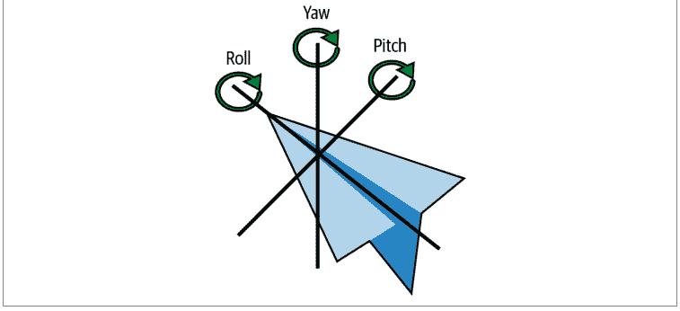

俯仰角、横滚角和偏航角是源自航空领域的三个术语。它们相对于飞机的飞行轴。俯仰角是相对于水平面的角度。横滚角是绕飞机飞行轴旋转的程度（想象一个机翼向上，另一个向下），偏航角是在水平轴上的旋转（想象改变航向）。

打开编辑器并粘贴以下代码（*ch_14_sense_hat_orientation.py*）：

```
from sense_hat import SenseHat

sense = SenseHat()

sense.set_imu_config(True, True, True)

while True:
    o = sense.get_orientation()
    print("p: {:.0f}, r: {:.0f}, y: {:.0f}".format(o['pitch'], o['roll'],
    o['yaw']))
```

与本书中所有程序示例一样，你也可以下载此程序（参见[配方 3.22](https://example.com/recipe3.22)）。

函数 `set_imu_config` 指定了指南针、陀螺仪和加速度计（按此顺序）中哪些应被用于测量方向。将所有三个设置为 True 意味着所有传感器都用于进行测量。

当你运行程序时，你会看到类似这样的输出：

```
$ python3 ch_14_sense_hat_orientation.py
p: 1, r: 317, y: 168
p: 1, r: 318, y: 169
```

尝试将 Sense HAT 和树莓派向前倾斜朝向 USB 端口，你应该会看到俯仰角的值增加。

### 讨论

加速度计测量作用在静止质量上的力，因此可以通过计算重力（Z 轴）提供的力在多大程度上影响在 X 轴和 Y 轴上测量的力来测量倾斜度。

陀螺仪则不同。它测量作用在运动质量（来回振动）上的力，当这些质量相对于运动路径转动时，利用一种称为科里奥利效应的力进行测量。

### 另请参阅

有关 Sense HAT 的惯性测量单元的更多信息，请参阅 [https://oreil.ly/Tr8YV](https://oreil.ly/Tr8YV)。

要测量温度、湿度和大气压，请参阅[配方 14.12](https://example.com/recipe14.12)。

Sense HAT 的惯性测量单元也可用于制作指南针和检测磁铁的存在（[配方 14.18](https://example.com/recipe14.18)）。

要了解更多关于陀螺仪和科里奥利效应的信息，请参阅 [https://oreil.ly/TXHz](https://oreil.ly/TXHz)。

## 14.17 使用干簧管检测磁铁

### 问题

你想检测磁铁的存在。

### 解决方案

使用干簧管（图 14-24）。它的工作原理与普通开关类似，只是只有在磁铁靠近时才会激活。图 14-25 展示了干簧管的工作原理。

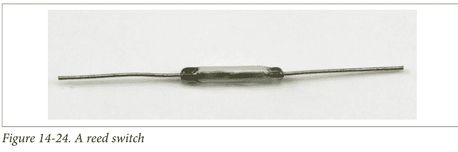

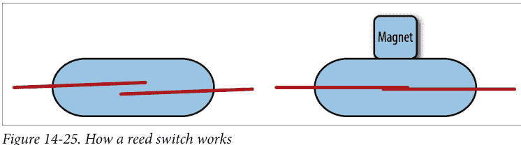

两个簧片触点被封装在玻璃管内。当磁铁靠近干簧管时，簧片被吸合在一起并接通。

你可以将第 13 章中的任何普通开关配方与干簧管一起使用，从配方 13.1 开始。

### 讨论

干簧管是一种检测磁铁的低技术方法。它们自 20 世纪 30 年代就已存在，并且极其可靠。它们通常用于安全系统中，其中一个塑料封装的干簧管安装在门框上，另一个塑料外壳中的固定磁铁安装在门本身上。当门打开时，干簧管触点断开，触发警报。

### 另请参阅

要使用 Sense HAT 的磁力计检测磁铁，请参阅配方 14.18。

## 14.18 使用 Sense HAT 检测磁铁

### 问题

你想使用带有内置磁力计的 Sense HAT 和 Python 程序来检测磁铁的存在。

### 解决方案

使用 Sense HAT 的 Python 库与其磁力计进行接口。
打开编辑器并粘贴以下代码（ch_14_sense_hat_magnet.py）：

```
from sense_hat import SenseHat
import time

hat = SenseHat()
fill = (255, 0, 0)

while True:
    reading = int(hat.get_compass_raw()['z'])
    if reading > 200:
        hat.clear(fill)
        time.sleep(0.2)
    else:
        hat.clear()
```

与本书中所有程序示例一样，你也可以下载此程序（参见配方 3.22）。
当磁铁靠近 Sense HAT 时，所有 LED 将变红五分之一秒。

### 讨论

使用指南针数据的哪个轴并不重要；所有三个轴都会因固定磁铁的存在而受到极大干扰。

### 另请参阅

要使用干簧管检测磁铁，请参阅配方 14.17。
有关使用 Sense HAT 显示屏的其他方法，请参阅配方 15.3。

## 14.19 使用超声波测量距离

### 问题

你想使用超声波测距仪测量距离。

### 解决方案

使用低成本的 HC-SR04 测距仪。该设备需要两个 GPIO 引脚：一个用于触发超声波脉冲，另一个用于监测回波返回所需的时间。

要制作此配方，你需要以下物品：

- 面包板和跳线（参见第 564 页的“原型设备和套件”）
- HC-SR04 测距仪（eBay）
- 470Ω 电阻（参见第 565 页的“电阻和电容”）
- 270Ω 电阻（参见第 565 页的“电阻和电容”）

按照图 14-26 所示将组件安装到面包板上。电阻是必要的，用于将测距仪的回波输出从 5V 降低到 3.3V（参见配方 10.12）。

打开编辑器并粘贴以下代码（ch_14_ranger.py）：

```
from gpiozero import DistanceSensor
from time import sleep

sensor = DistanceSensor(echo=18, trigger=17)
while True:
    cm = sensor.distance * 100
    inch = cm / 2.5
    print("cm={:.0f}\tinches={:.0f}".format(cm, inch))
    sleep(0.5)
```

与本书中所有程序示例一样，你也可以下载此程序（参见配方 3.22）。

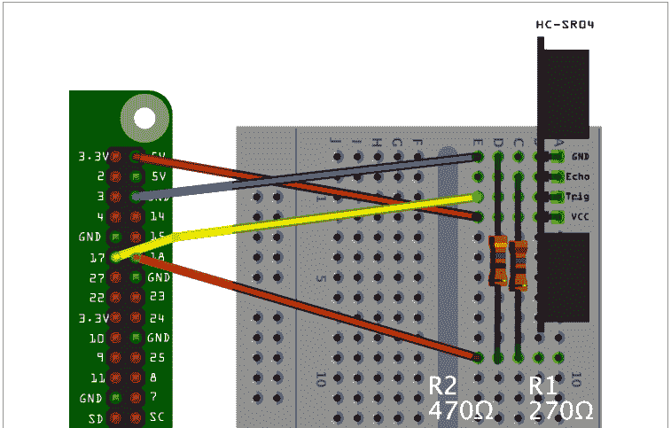

图 14-26. 将 SR04 测距仪连接到树莓派

程序的操作在讨论中描述。当程序运行时，它每秒报告一次以厘米和英寸为单位的距离。使用你的手或其他障碍物来改变读数：

```
$ python3 ch_14_ranger.py
cm=154.7    inches=61.8
cm=12.9     inches=5.1
cm=14.0     inches=5.6
cm=20.2     inches=8.0
```

### 讨论

尽管有几种超声波测距仪可用，但这里使用的类型易于使用且成本低。它通过发送超声波脉冲，然后测量回波被接收所需的时间来工作。设备前面的两个圆形超声波换能器中，一个是发射器，另一个是接收器。

这个过程由树莓派控制。这种设备与更昂贵型号之间的区别在于，更昂贵的版本包含自己的微控制器，该微控制器执行所有必要的计时并提供 I2C 或串行接口以返回最终读数。

当你将其中一个传感器与树莓派一起使用时，测距仪的 *trig*（触发）输入连接到 GPIO 输出，测距仪的 *echo* 输出在将其电压范围从 5V 降低到安全的 3.3V 后，连接到树莓派上的 GPIO 输入。

图 14-27 显示了传感器工作时的示波器轨迹。顶部轨迹连接到 trig，底部轨迹连接到 echo。你可以看到，首先 trig 引脚被拉高一个短脉冲。然后有一个短暂的延迟，之后 echo 引脚变高。它保持高电平的时间与到传感器的距离成正比。

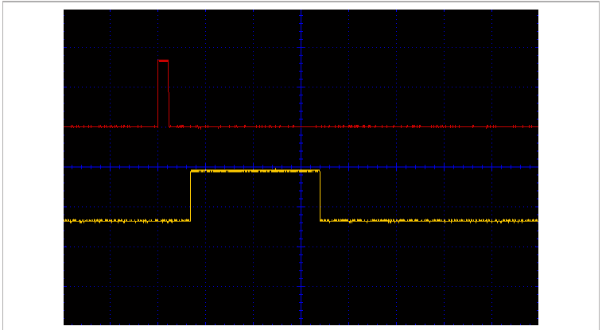

图 14-27. 触发和回波的示波器轨迹

此程序利用了 gpiozero 库的 DistanceSensor 类，该类为我们处理了脉冲生成和测量。

这种测量距离的方法不是特别精确，因为温度、压力和相对湿度都会改变声速（约每毫秒 30 厘米），从而影响距离读数。

### 参阅

查看[超声波测距仪的数据手册](datasheet)。

DistanceSensor 类的文档可在 [https://oreil.ly/XYk3m](https://oreil.ly/XYk3m) 获取。

## 14.20 使用飞行时间传感器测量距离

### 问题

你想在不使用超声波的情况下测量距离（可能你养的动物会被超声波惊吓，或者你想更精确地测量距离）。

### 解决方案

使用VL53L1X I2C飞行时间（ToF）传感器。这类传感器比超声波传感器更昂贵。然而，由于它们使用光而非声波，因此精度更高。

这类设备中最常见的是VL53L1X，它可以从eBay以及其他供应商处作为低成本模块购买。我们在此使用的Pimoroni设备的优势在于它兼容Pimoroni Breakout Garden系统，因此无需焊接即可插入。图14-28展示了ToF传感器和Breakout Garden。

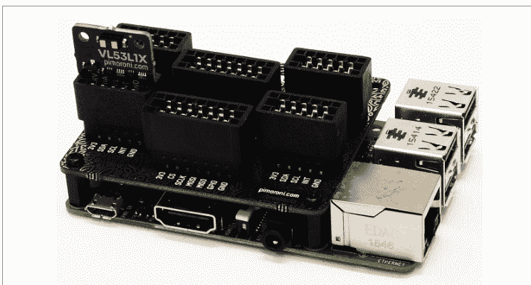

图14-28. VL53L1X ToF传感器和Pimoroni Breakout Garden

要完成此项目，你需要以下任一组件：

- Pimoroni Breakout Garden（参见第564页“原型设备与套件”）
- Pimoroni VL53L1X距离传感器（参见第566页“模块”）

或者：

- 通用VL53L1X距离传感器模块（参见第566页“模块”）
- 四根公对母跳线（参见第564页“原型设备与套件”）

将此I2C设备连接到树莓派与连接任何其他设备一样简单。该设备将在3V下工作，因此除了连接3V和GND外，你应将传感器的SDA引脚连接到树莓派的SDA引脚（也称为GPIO 2），并将传感器的SCL引脚连接到树莓派的SCL引脚（GPIO 3）。

如果你选择使用Breakout Garden，只需确保将传感器以正确的方向放置（参见图14-28）。如果你使用跳线，请按以下方式连接设备：

- VL53L1X的VCC引脚连接到树莓派的3V
- VL53L1X的GND引脚连接到树莓派的GND
- VL53L1X的SDA引脚连接到树莓派的GPIO 2（SDA）
- VL53L1X的SCL引脚连接到树莓派的GPIO 3（SCL）

VL53L1X使用I2C，因此你需要按照配方10.4启用它。启用后，运行以下命令安装VL53L1X的软件：

```
$ sudo pip3 install smbus2
$ sudo pip3 install vl53l1x
```

本配方的测试程序（ch_14_tof.py）每秒打印一次以毫米为单位的距离测量值：

```
import VL53L1X, time

tof = VL53L1X.VL53L1X(i2c_bus=1, i2c_address=0x29)
tof.open()
tof.start_ranging(1) # Start range1=Short 2=Medium 3=Long

while True:
    mm = tof.get_distance() # Grab the range in mm
    print("mm=" + str(mm))
    time.sleep(1)
```

与本书中所有程序示例一样，你也可以下载此程序（参见配方3.22）。

请注意，如果你的设备具有不同的I2C地址，你可能需要将0x29更改为你的设备地址。

### 讨论

VL53L1X ToF传感器是一个令人惊叹的小设备，它包含一个低功耗红外激光器和接收器，以及通过I2C进行通信所需的所有电子元件。

该模块的工作原理与配方14.19中的超声波测距仪类似，不同之处在于，ToF传感器不是通过测量声音传播到目标并作为反射返回所需的时间来测量距离，而是测量激光脉冲从目标反弹回来所需的时间。

### 另请参阅

要使用超声波测量距离，请参见配方14.19。

参见VL53L1X的数据手册。

## 14.21 为你的树莓派添加触摸感应

### 问题

你想为你的树莓派提供一个触摸界面。

### 解决方案

使用Adafruit电容式触摸HAT（图14-29）。

触摸传感器非常有趣，非常适合教育用途。你可以连接任何能导电的东西——包括水果。一个流行的项目是使用鳄鱼夹将各种水果和蔬菜连接到板上的感应端子，构建一个水果键盘。然后，当你触摸不同的水果时，会发出不同的声音。

Adafruit电容式触摸HAT使用树莓派的I2C接口。你还需要安装SPI工具，因此，如果你尚未安装，请按照配方10.4和10.6操作。

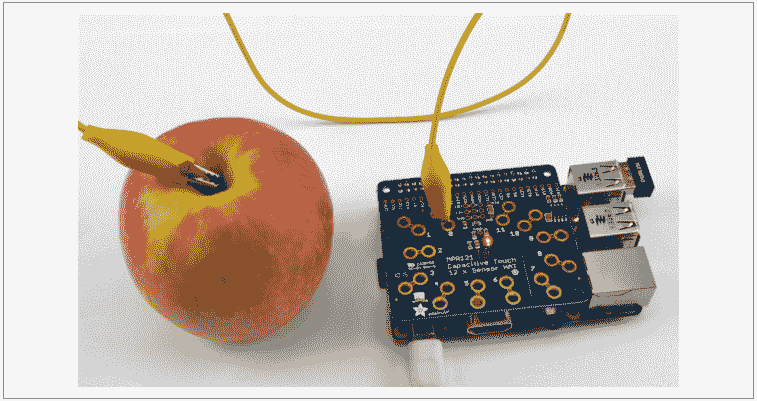

图14-29. 连接到苹果上的Adafruit电容式触摸HAT

要安装HAT的Python库，请运行以下命令：

```
$ pip3 install adafruit-blinka
$ pip3 install adafruit-circuitpython-mpr121
```

要测试电容式触摸HAT，请运行以下程序（*ch_14_touch.py*）：

```
import time
import board
import busio
import adafruit_mpr121
i2c = busio.I2C(board.SCL, board.SDA)
mpr121 = adafruit_mpr121.MPR121(i2c)

while True:
    if mpr121[0].value:
        print("Pin 0 touched!")
```

与本书中所有程序示例一样，你也可以下载此程序（参见配方3.22）。

当你用手指触摸标有0的焊盘时，你应该会看到如下输出：

```
$ python3 ch_14_touch.py
Pin 0 touched!
Pin 0 touched!
```

你可以直接触摸连接焊盘，也可以使用鳄鱼夹将焊盘连接到一块水果上，如图14-29所示。

### 讨论

Adafruit电容式触摸HAT有12个触摸触点。如果你只需要几个触摸触点，可以使用Pimoroni Explorer HAT Pro，它有四个兼容鳄鱼夹的触点（图14-30）。

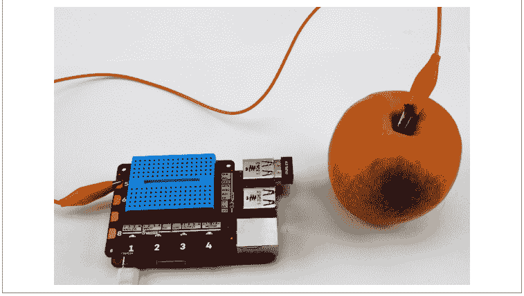

图14-30. 带有水果的Explorer HAT Pro

要使用Explorer HAT Pro的触摸触点，首先按照配方10.16安装HAT的库。

除了侧面设计用于鳄鱼夹的四个端子外，标有1到4的四个触摸开关也使用触摸接口。

### 另请参阅

更多信息可在Adafruit Touch HAT文档和Explorer HAT Pro文档中找到。

## 14.22 使用RFID读写器读取智能卡

### 问题

你想从射频识别（RFID）智能卡读取数据并写入数据。

### 解决方案

获取一个低成本的RC-522 RFID读卡器/写卡器，并使用SimpleMFRC522 Python库。

本配方需要以下组件：

- RC-522读卡器；通常与一些RFID标签一起出售（参见第566页“模块”）
- 七根母对母跳线（参见第564页“原型设备与套件”）

图14-31展示了连接到树莓派的RC-522。RC-522使用树莓派的SPI接口，因此你需要按照配方10.6操作。

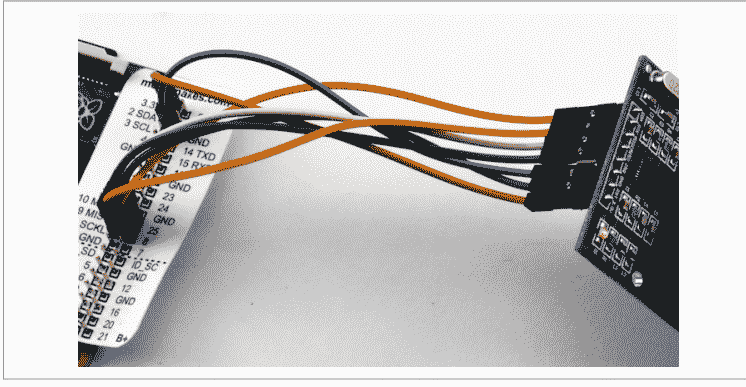

图14-31. 连接树莓派和RC-522

表14-1展示了你需要使用跳线进行的连接，并建议了导线的颜色以便于识别。

表14-1. 连接树莓派和RFID读写器

| 导线颜色 | RC-522引脚 | 树莓派引脚 |
| :--- | :--- | :--- |
| 橙色 | SDA | GPIO8 |
| 黄色 | SCK | SCLK / GPIO11 |
| 白色 | MOSI | MOSI / GPIO10 |
| 绿色 | MISO | MISO/GPIO09 |
| 蓝色 | GND | GND |
| 灰色 | RST | GPIO25 |
| 红色 | 3.3V | 3.3V |

请注意，尽管RC-522引脚上有一些引脚标记为SDA和SCL，仿佛该设备使用I2C，但在本配方中，该设备使用树莓派的SPI接口。

要使用该模块，首先使用以下命令获取Clever Card Kit软件。这将安装RC-522的所有先决软件。安装完成后，你需要重新启动：

```
$ wget http://monkmakes.com/downloads/mmcck.sh
$ chmod +x mmcck.sh
$ ./mmcck.sh
```

要测试读卡器，请运行*clever_card_kit*目录中名为*01_read.py*的程序：

```
$ cd ~/clever_card_kit
$ python3 01_read.py
Hold a tag near the reader
894922433952

894922433952

894922433952
```

当你将卡片靠近RC-522时，卡片内RFID标签的唯一编号将被打印出来。当你读卡读够了，按Ctrl-C。以下是代码：

```
import RPi.GPIO as GPIO
import SimpleMFRC522

reader = SimpleMFRC522.SimpleMFRC522()

print("Hold a tag near the reader")

try:
    while True:
        id, text = reader.read()
        print(id)
        print(text)

finally:
    print("cleaning up")
    GPIO.cleanup()
```

导入RPi.GPIO仅仅是为了在程序退出时清理GPIO引脚。函数调用reader.read()将等待RFID标签靠近读写器，并返回卡片的唯一编号（id）和存储在卡片上的任何文本消息（text）。

你无法更改在制造过程中分配给每个标签的唯一编号，但你可以在卡片上存储少量数据。为此，请使用程序*02_write.py*：

## 14.22 写入RFID卡

将一些文本写入卡中后，你可以使用 *01_read.py* 来检查内容是否存在。*02_write.py* 的代码如下：

```python
import RPi.GPIO as GPIO
import SimpleMFRC522

reader = SimpleMFRC522.SimpleMFRC522()

try:
    while True:
        text = input('New Text: ')
        print("Now scan a tag to write")
        id, text = reader.write(text)
        print("written")

        print(id)
        print(text)
finally:
    print("cleaning up")
    GPIO.cleanup()
```

使用RFID读卡器的全部功能相当复杂。SimpleMFRC522类极大地简化了这一过程，将其转化为对卡进行基本文本读写操作。实例化SimpleMFRC522类后，你只需调用read方法即可读取正在扫描的卡。该方法返回卡的ID和卡上写入的任何文本。write方法返回相同的值，但还允许你指定要写入卡中的文本。

### 讨论

RFID标签有各种形状和尺寸。但存在多种不同的标准，它们在不同频率下运行并使用不同的通信协议，因此在寻找与RC-522配合使用的卡时，请寻找描述为13.56 MHz的卡。SimpleMFRC522代码对其可配合使用的卡也有些挑剔，因此如果你计划使用它，也请寻找描述为兼容Mifare 1k的标签。

由于不同卡在内存中能存储的数据量和存储方式存在差异，通常最好不要依赖在标签上存储数据，而是使用卡的唯一ID。然后你可以将数据存储在该唯一键下。clever_card_kit目录中的程序05_launcher_setup.py和05_launcher.py展示了如何使用存储在pickle文件中的表数据来实现这种方法（参见配方7.9）。

### 另请参阅

更多信息可在SimpleMFRC522代码的完整文档中找到。

## 14.23 显示传感器数值

### 问题

你有一个传感器连接到树莓派上，并希望在屏幕上以大数字显示读数。

### 解决方案

使用guizero库打开一个窗口，并以大字体显示读数（图14-32）。


此示例使用来自配方14.20的ToF测距仪的数据。因此，如果你想尝试此示例，请先完成该配方。或者，本章中的大多数其他传感器配方也可以调整为此配方工作。通过打开编辑器并粘贴以下代码（ch_14_gui_sensor_reading.py）来测试此配方：

```python
import VL53L1X, time
from guizero import App, Text

tof = VL53L1X.VL53L1X(i2c_bus=1, i2c_address=0x29)
tof.open()
tof.start_ranging(1)

def update_reading():
    mm = tof.get_distance()
    reading_text.value = str(mm)

app = App(width=300, height=150)
reading_text = Text(app, size=100)
reading_text.repeat(1000, update_reading)
app.display()
```

与本书中所有程序示例一样，你也可以下载此程序（参见配方3.22）。

函数update_reading从测距仪（或你选择使用的任何传感器）获取新的读数，并将reading_text的值设置为该值（作为字符串）。

为确保读数自动更新，对reading_text调用了repeat方法，第一个参数是更新之间的毫秒数（本例中为1000），第二个参数是要调用的函数（update_reading）。

### 讨论

虽然此配方使用距离传感器，但它同样适用于本章中的其他传感器配方。你只需更改从传感器获取读数的方法。

### 另请参阅

有关将数字格式化为特定小数位数的信息，请参见配方7.1。

有关在Web浏览器而非应用程序窗口中显示传感器数据的示例，请参见配方17.2。

## 14.24 记录到USB闪存驱动器

### 问题

你想将传感器测量的数据记录到USB闪存驱动器上。

### 解决方案

编写一个Python程序，将数据写入USB闪存驱动器上的文件。通过以逗号分隔值（CSV）格式写入文件，你可以将其直接导入电子表格，包括树莓派上的LibreOffice（配方4.3）。

示例程序（ch_14_temp_log.py）将记录从树莓派CPU记录的温度读数（参见配方14.11）：

```python
import glob, time, datetime
from gpiozero import CPUTemperature

log_period = 600 # seconds

logging_folder = glob.glob('/media/pi/*')[0]
dt = datetime.datetime.now()
file_name = "temp_log_{:%Y_%m_%d}.csv".format(dt)
logging_file = logging_folder + '/' + file_name

def read_temp():
    cpu_temp = CPUTemperature().temperature
    return cpu_temp

def log_temp():
    temp_c = read_temp()
    dt = datetime.datetime.now()
    f = open(logging_file, 'a')
    line = '\n"{:H:%M:%S}","{}"'.format(dt, temp_c)
    f.write(line)
    print(line)
    f.close()

print("Logging to: " + logging_file)
while True:
    log_temp()
    time.sleep(log_period)
```

与本书中所有程序示例一样，你可以下载此程序（参见配方3.22）。

程序设置为每10分钟（600秒）记录一次温度。你可以通过更改`log_period`的值来调整此设置。

你需要使用sudo运行此程序以允许访问闪存驱动器：

```
$ sudo python3 ch_14_temp_log.py
Logging to: /media/pi/temp_log_2022_06_22.csv
"13:09:02","38.459"
"13:09:12","38.946"
"13:09:22","37.972"
"13:09:32","37.485"
```

当记录开始时，会显示闪存驱动器上记录文件的路径。

请注意，为加快速度，记录周期设置为10秒。

### 讨论

当将USB闪存驱动器插入树莓派时，它会自动安装在`/media/pi`下。如果树莓派连接了多个可移动驱动器，程序将使用`/media`内找到的第一个文件夹。记录文件的名称由当前日期构成。

如果你在电子表格中打开该文件，你将能够直接编辑它。你的电子表格可能会要求你指定数据的分隔符，即逗号。

图14-33显示了使用此配方捕获的一组数据，生成的文件已在树莓派上运行的LibreOffice电子表格（配方4.3）中打开。

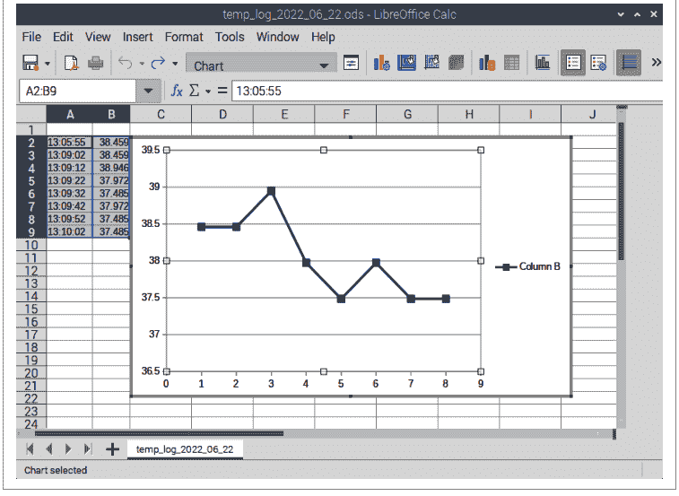

### 参见

此程序可以轻松调整以用于本章中使用的任何其他传感器。

有关将传感器数据记录到Web服务的示例，请参见配方17.7。

# 第15章 显示器

## 15.0 简介

虽然树莓派可以使用显示器或电视作为显示屏，但通常使用更小、更专业的显示器会更好。在本章中，我们探讨了一系列可以连接到树莓派的不同显示器。

除了本章所述的连接专用显示器外，另一种选择是将显示器（可以是小型显示器）连接到树莓派，甚至使用通过VNC连接的手机或平板电脑。

## 15.1 使用四位LED显示器

### 问题

你想在老式的七段LED显示器上显示一个四位数。

### 解决方案

使用母对母跳线将一个I2C LED模块（如图15-1所示的型号）连接到树莓派。

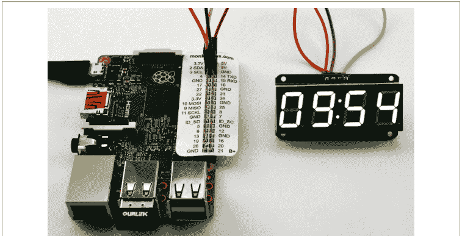

要制作此配方，你需要以下物品：

- 四根母对母跳线（参见第564页的“原型设备和套件”）
- Adafruit 4×7段LED，带I2C背包（参见第566页的“模块”）

树莓派与模块之间的连接如下：

- 显示器上的VCC (+) 连接到树莓派通用输入/输出（GPIO）连接器上的5V
- 显示器上的GND (-) 连接到树莓派GPIO连接器上的GND
- 显示器上的SDA (D) 连接到树莓派GPIO连接器上的GPIO 2 (SDA)
- 显示器上的SCL (C) 连接到树莓派GPIO连接器上的GPIO 3 (SCL)

请注意，Adafruit还提供超大尺寸的LED显示器。你可以使用上述列表中的连接将其连接到树莓派，但较大的显示器有两个正电源引脚：一个用于逻辑（V_IO），一个用于显示器（5V）。这是因为作为大型显示器，它需要更大的电流。幸运的是，树莓派可以为其提供足够的电源。你可以使用额外的母对母跳线将此额外引脚连接到GPIO连接器上的第二个5V引脚。

要使此配方正常工作，你还需要将树莓派设置为I2C，因此请先按照配方10.4进行操作。

输入以下命令来安装支持此显示屏的Adafruit代码：

```
$ cd ~
$ pip3 install adafruit-blinka
$ pip3 install adafruit-circuitpython-ht16k33
$ sudo apt install python3-pil
```

作为一个简单的示例，程序 *ch_15_7_seg.py* 每秒从0计数到9999，然后重新从0开始：

```
import board
from adafruit_ht16k33.segments import Seg7x4
from time import sleep

i2c = board.I2C()
display = Seg7x4(i2c)
display.brightness = 0.5

x = 0

while True:
    display.print("    ")
    display.print(x)
    x += 1
    if x > 9999:
        x = 0
    sleep(1)
```

与本书中所有的程序示例一样，你也可以下载此代码（参见[配方 3.22](Recipe 3.22)）。

### 讨论

用于此显示屏的Adafruit软件使用了Blinka模块，该模块允许你在常规Python中运行Adafruit的CircuitPython库。

要设置显示屏，首先创建一个I2C实例，然后使用I2C接口作为参数创建一个Seg7x4实例。

显示屏可以显示数字或基本文本。它按顺序显示文本和数字，不会清除之前的显示内容，因此如果你让它先显示1再显示2，它实际上会显示12，将旧数字向左滚动后再显示新数字。所以，要在显示下一个数字前清除显示屏，你可以使用 `display.print("    ")` 打印四个空格。

### 另请参阅

了解更多关于 [Adafruit CircuitPython 库](Adafruit CircuitPython library) 的信息。

## 15.2 在I2C LED矩阵上显示图形

### 问题

你想控制一个多色LED矩阵显示屏的像素。

### 解决方案

使用一个I2C LED模块，例如图15-2所示的型号，通过母对母跳线连接到树莓派。

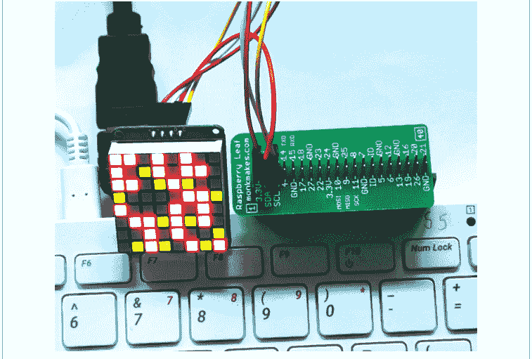

图15-2. 连接到树莓派400和GPIO适配器的LED矩阵显示屏

要制作此配方，你需要以下物品：

- 四根母对母跳线（参见第564页的“原型设备和套件”）
- Adafruit双色LED方形像素矩阵，带I2C背包（参见第566页的“模块”）
- 如果你使用的是如图15-2所示的Pi 400，你还需要一个GPIO适配器以便轻松访问引脚。

树莓派与模块之间的连接如下：

- 显示屏上的VCC (+) 连接到树莓派GPIO连接器的5V
- 显示屏上的GND (-) 连接到树莓派GPIO连接器的GND
- 显示屏上的SDA (D) 连接到树莓派GPIO连接器的GPIO 2 (SDA)
- 显示屏上的SCL (C) 连接到树莓派GPIO连接器的GPIO 3 (SCL)

要使此配方正常工作，你还需要为树莓派设置I2C，因此请先按照配方10.4进行操作。

此显示屏使用与配方15.1相同的模块代码。如果你尚未安装，请运行以下命令：

```
$ cd ~
$ pip3 install adafruit-blinka
$ pip3 install adafruit-circuitpython-ht16k33
$ sudo apt install python3-pil
```

示例程序 ch_15_matrix.py 将一个随机选择的像素设置为随机选择的颜色，颜色可以是关闭、红色、绿色或橙色。它每秒执行此操作10次：

```
import board
from adafruit_ht16k33.matrix import Matrix8x8x2
from time import sleep
from random import randint

i2c = board.I2C()
display = Matrix8x8x2(i2c)
display.brightness = 0.5

while True:
    x = randint(0, 8)
    y = randint(0, 8)
    color = randint(0, 4)
    display[x, y] = color
    sleep(0.1)
```

与本书中所有的程序示例一样，你也可以下载此代码（参见配方3.22）。

### 讨论

该程序导入了Matrix8x8x2类，然后使用I2C端口对其进行初始化。x和y坐标是随机选择的，每个值的范围是0到7。颜色是一个0到3之间的随机数：0表示关闭，1表示红色，2表示绿色，3表示橙色（红色和绿色）。这些是此显示屏上唯一可用的颜色，但它看起来仍然很漂亮！

### 另请参阅

你可以在 https://oreil.ly/yA49j 找到更多关于I2C LED模块的信息。

## 15.3 使用Sense HAT LED矩阵显示屏

### 问题

你想使用Sense HAT的显示屏来显示消息和图形。

### 解决方案

按照配方10.15安装Sense HAT所需的软件，然后使用库命令来显示文本。

程序 ch_15_sense_hat_clock.py 通过重复显示滚动消息中的日期和时间来说明这一点：

```
from sense_hat import SenseHat
from datetime import datetime
import time

hat = SenseHat()
time_color = (0, 255, 0) # 绿色
date_color = (255, 0, 0) # 红色

while True:
    now = datetime.now()
    date_message = '{:%d %B %Y}'.format(now)
    time_message = '{:%H:%M:%S}'.format(now)

    hat.show_message(date_message, text_colour=date_color)
    hat.show_message(time_message, text_colour=time_color)
```

与本书中所有的程序示例一样，你也可以下载此程序（参见配方3.22）。

### 讨论

定义了两种颜色，以便消息的日期和时间部分可以显示为不同的颜色。然后这些颜色被用作show_message的可选参数。show_message的其他可选参数有：

**scroll_speed**
这实际上是每个滚动步骤之间的延迟，而不是速度。较高的值会使滚动变慢。

**back_colour**
这设置背景颜色。注意“colour”的英式拼写，带有一个“u”。

你可以将显示屏用于远不止显示滚动文本的功能。从最基本的功能开始，你可以使用 `set_pixel` 设置单个像素，使用 `set_rotation` 设置显示屏的方向，以及使用 `load_image` 显示图像（尽管很小）。下面的示例（你可以在 `ch_15_sense_hat_taster.py` 中找到）说明了这些函数调用。与本书中所有的程序示例一样，你可以下载它们（参见配方3.22）。

图像必须是8×8像素，但你可以使用大多数常见的图形格式，如 `.jpg` 和 `.png`，位深度将自动处理：

```
from sense_hat import SenseHat
import time

hat = SenseHat()

red = (255, 0, 0)

hat.load_image('small_image.png')
time.sleep(1)
hat.set_rotation(90)
time.sleep(1)
hat.set_rotation(180)
time.sleep(1)
hat.set_rotation(270)
time.sleep(1)

hat.clear()
hat.set_rotation(0)
for xy in range(0, 8):
    hat.set_pixel(xy, xy, red)
    hat.set_pixel(xy, 7-xy, red)
```

图15-3显示了Sense HAT显示一个粗糙的图像。

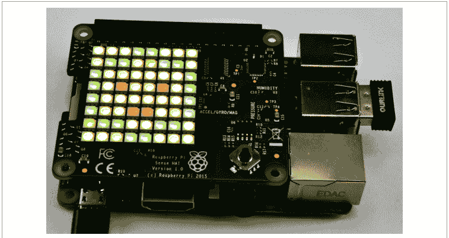

图15-3. 一个Sense HAT显示“图像”

### 另请参阅

更多信息可在 [Sense HAT 完整文档](https://pythonhosted.org/sense-hat/) 中找到。

有关格式化日期和时间的信息，请参见 [配方 7.2](https://example.com/recipe-7.2)。

其他使用Sense HAT的配方有 [10.15](https://example.com/recipe-10.15)、[14.12](https://example.com/recipe-14.12)、[14.15](https://example.com/recipe-14.15)、[14.16](https://example.com/recipe-14.16) 和 [14.18](https://example.com/recipe-14.18)。

## 15.4 使用OLED图形显示屏

### 问题

你想将一个图形OLED（有机LED）显示屏连接到你的树莓派。

### 解决方案

使用基于SSD1306驱动芯片的OLED显示屏，采用I2C接口（[图15-4](https://example.com/figure-15-4)）。

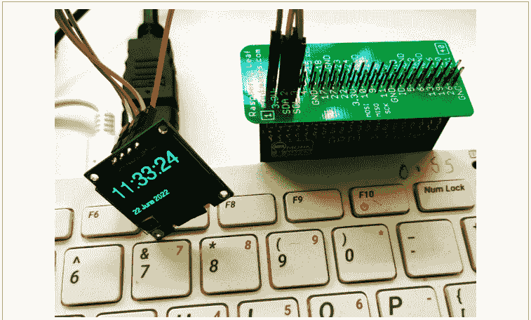

图15-4. 连接到树莓派400的I2C OLED显示屏

要制作此配方，你需要以下物品：

- 四根母对母跳线（参见第564页的“原型设备和套件”）
- I2C OLED显示屏，128×64像素（参见第566页的“模块”）

树莓派与模块之间的连接如下：

- 显示屏上的VCC 连接到树莓派GPIO连接器的5V
- 显示屏上的GND 连接到树莓派GPIO连接器的GND
- 显示屏上的SDA 连接到树莓派GPIO连接器的GPIO 2 (SDA)
- 显示屏上的SCL 连接到树莓派GPIO连接器的GPIO 3 (SCL)

要使此配方正常工作，你还需要为树莓派设置I2C，因此请先按照配方10.4进行操作。

Adafruit为这些显示屏提供了一个库，你可以使用以下命令安装：

```
$ cd ~
$ pip3 install adafruit-blinka
$ pip3 install adafruit-circuitpython-ssd1306
```

本库使用了Python图像库（PIL）和NumPy模块，你可以通过以下命令安装：

```
$ sudo apt install python3-pil
$ sudo apt install python3-numpy
```

代码示例 *ch_15_oled_clock.py* 会在OLED显示屏上显示时间和日期：

```
import board
from PIL import Image, ImageDraw, ImageFont
import adafruit_ssd1306
from time import sleep
from datetime import datetime

# Set up display
i2c = board.I2C()
disp = adafruit_ssd1306.SSD1306_I2C(128, 64, i2c, addr=0x3C)
small_font = ImageFont.truetype('FreeSans.ttf', 12)
large_font = ImageFont.truetype('FreeSans.ttf', 33)
disp.fill(0)
disp.show()

# Make an image to draw on in 1-bit color.
width = disp.width
height = disp.height
image = Image.new('1', (width, height))
draw = ImageDraw.Draw(image)

# Display a message on 3 lines, first line big font
def display_message(top_line, line_2):
    draw.rectangle((0,0,width,height), outline=0, fill=0)
    draw.text((0, 0),  top_line, font=large_font, fill=255)
    draw.text((0, 50),  line_2, font=small_font, fill=255)
    disp.image(image)
    disp.show()

while True:
    now = datetime.now()
    date_message = '{:%d %B %Y}'.format(now)
    time_message = '{:%H:%M:%S}'.format(now)
    display_message(time_message, date_message)
    sleep(0.1)
```

与本书中所有程序示例一样，你也可以下载此程序（参见配方3.22）。

### 讨论

每个I2C从设备都有一个地址，该地址在以下行中设置：

```
disp = adafruit_ssd1306.SSD1306_I2C(128, 64, i2c, addr=0x3C)
```

对于许多低成本I2C模块，此地址固定为3C（十六进制），但也可能有所不同，因此你应该检查设备附带的任何文档，或使用I2C工具（配方10.5）列出连接到总线的所有I2C设备，以便查看你的显示屏地址。

前面的代码示例使用了一种称为*双缓冲*的技术。这涉及准备好要显示的内容，然后一次性切换到图像上。这可以防止显示屏闪烁。

你可以在`display_message`函数中看到相关代码。首先，它在图像上绘制一个与显示屏整个尺寸相同的空白矩形。然后，它将文本绘制到图像上，接着使用`disp.image(image)`将显示内容设置为该图像。实际上，直到调用`disp.show()`函数时，显示屏才会更新。

小型OLED显示屏价格低廉，功耗低，尽管尺寸小巧却具有高分辨率。它们正在许多消费产品中取代LCD显示屏。

### 另请参阅

此处的说明适用于四针I2C接口。如果你确实想使用SPI接口，请查看[Adafruit的教程](https://learn.adafruit.com/adafruit-oled-displays-for-raspberry-pi)。

## 15.5 使用可寻址RGB LED灯带

### 问题

你想将RGB LED灯带（NeoPixels）连接到你的树莓派。

### 解决方案

在你的树莓派上使用基于WS2812 RGB LED芯片的LED灯带。

使用这些LED灯带（图15-5）可以非常简单，直接连接到树莓派，并由树莓派的5V电源为LED供电。这是“快乐日”场景，应该可以正常工作，但请务必参阅讨论部分，了解如何提供外部电源，以确保你的LED灯带使用无忧。

> **不要使用树莓派的3.3V电源为LED供电**

虽然从GPIO连接器的3.3V电源引脚为LED供电可能很诱人，但请不要这样做——它只能提供低电流（参见配方10.3）。使用此引脚很容易损坏你的树莓派。

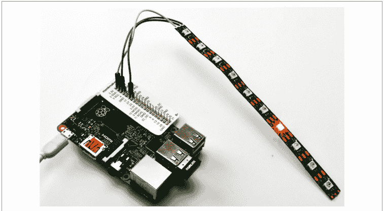

图15-5. 一个包含10个LED的灯带

图15-5中使用的LED灯带是从一卷上剪下来的。在这种情况下，有10个LED。因为每个LED最多可使用60mA，所以在不为LED灯带安排单独电源的情况下，10个可能是可以使用的LED数量的合理上限（参见讨论部分）。

要将灯带连接到树莓派，需要剪断一端带有母连接器的跳线，并将线端焊接到LED灯带上的三个连接点（参见配方10.3）：GND、DI（数据输入）和5V。然后，它们可以分别连接到GPIO引脚GND、GPIO 18和5V。

请注意，LED灯带上印有向右的箭头（图15-6）。确保在将引线焊接到LED灯带时，从箭头*左侧*的剪断端开始。

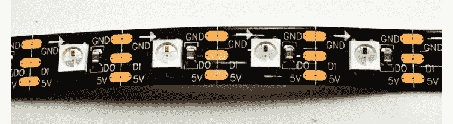

图15-6. LED灯带特写

我们将使用Adafruit软件来控制我们的可寻址LED。要安装它，请运行以下命令：

```
$ pip3 install adafruit-blinka
$ sudo pip3 install rpi_ws281x adafruit-circuitpython-neopixel
```

以下示例程序（ch_15_neopixel.py）将沿灯带在连续位置将LED设置为红色：

```
import time
import board
from neopixel import NeoPixel

led_count = 5
red = (100, 0, 0)
no_color = (0, 0, 0)

strip = NeoPixel(board.D18, led_count, auto_write=False)

def clear():
    for i in range(0, led_count):
        strip[i] = no_color
    strip.show()

i = 0
while True:
    clear()
    strip[i] = red
    strip.show()
    time.sleep(1)
    i += 1
    if i >= led_count:
        i = 0
```

与本书中所有程序示例一样，你也可以下载此程序（参见配方3.22）。

使用Python 3运行程序，并使用sudo命令，如下所示：

```
$ sudo python3 ch_15_neopixel.py
```

如果你的灯带中LED数量不同，请修改led_count。其余常量无需更改。

你只能将GPIO 10、12、18和21与NeoPixels一起使用。如果你想使用不同的GPIO引脚，请将board.D18更改为你正在使用的任何引脚。

你可以独立设置每个LED的颜色。颜色设置为红色、绿色和蓝色强度的元组。要更改特定位置LED的颜色，请将strip变量当作数组使用，并将该元素设置为你想要的颜色。例如（strip[i] = red）。

LED颜色的更改实际上直到调用show方法时才会更新。

### 讨论

灯带中的每个LED最多可使用约60mA。只有当所有三个颜色通道（红色、绿色和蓝色）都处于最大亮度（255）时，它们才会这样做。如果你计划使用大量LED，你将需要使用一个单独的5V电源，该电源应足以供应灯带中的所有LED。图15-7展示了如何连接单独的电源。一个母头直流（DC）插孔到螺丝端子适配器（参见第564页的“原型设备和套件”）使得将外部电源连接到面包板变得容易。

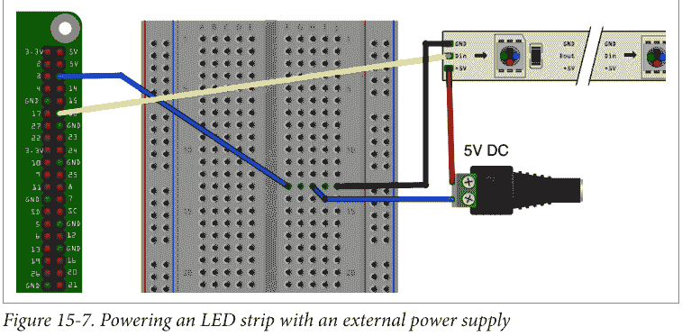

### 另请参阅

NeoPixels也有[环形格式](https://www.adafruit.com/category/35)。

你可以在[https://oreil.ly/-oA90](https://oreil.ly/-oA90)阅读更多关于Adafruit NeoPixels方法的信息。

## 15.6 使用Pimoroni Unicorn HAT

### 问题

你想为你的树莓派配备一个RGB LED矩阵显示屏。

### 解决方案

使用Pimoroni Unicorn HAT提供一个8x8 LED矩阵（图15-8）。

首先从Pimoroni安装Unicorn HAT软件：

```
$ curl https://get.pimoroni.com/unicornhat | bash
```

你将被多次要求确认要安装的各种软件，最后要求重启你的树莓派。


图15-8. 树莓派3上的Pimoroni Unicorn HAT

完成安装后，这里有一个彩色程序（*ch_15_unicorn.py*）可以在其上运行。它将重复地将随机像素的颜色设置为随机颜色。使用sudo命令运行程序：

```
import time
import unicornhat as unicorn
from random import randint

unicorn.set_layout(unicorn.AUTO)
unicorn.rotation(0)
unicorn.brightness(1)
width, height = unicorn.get_shape()

while True:
    x = randint(0, width)
    y = randint(0, height)
    r, g, b = (randint(0, 255), randint(0, 255), randint(0, 255))
    unicorn.set_pixel(x, y, r, g, b)
    unicorn.show()
    time.sleep(0.01)

time.sleep(1)
```

与本书中所有程序示例一样，你也可以下载此程序（参见配方3.22）。

### 讨论

Unicorn HAT 提供了一种非常便捷的方式来连接可寻址 LED 矩阵。你还会发现其他以各种配置排列的可寻址 LED 灯链，包括拥有更多 LED 的矩阵。通常，这类可寻址 LED 矩阵在电气上实际上是排列成一条长长的 LED 链。

### 另请参阅

有关可寻址（NeoPixel）LED 的更多信息，请参阅配方 15.5。

## 15.7 使用电子纸显示屏

### 问题

你想使用你的树莓派来控制一个电子纸显示屏。

### 解决方案

将 Inky pHAT 或 Inky wHAT 模块连接到你的树莓派（图 15-9）。使用以下命令下载 Pimoroni 的相关软件：

```
$ curl https://get.pimoroni.com/inkyphat | bash
```

如果（在提示时）你选择获取示例和文档，安装过程将花费相当长的时间。

作为一个示例程序（ch_15_phate.py），我们让 Inky pHAT 显示树莓派的 IP 地址：

```
from inky import InkyPHAT
from PIL import Image, ImageFont, ImageDraw
from font_fredoka_one import FredokaOne
import subprocess

inky_display = InkyPHAT("red")
inky_display.set_border(inky_display.WHITE)

img = Image.new("P", (inky_display.WIDTH, ink_display.HEIGHT))
draw = ImageDraw.Draw(img)
font = ImageFont.truetype(FredokaOne, 22)

message = str(subprocess.check_output(['hostname', '-I'])).split()[0][2:]
print(message)

w, h = font.getsize(message)
x = (inky_display.WIDTH / 2) - (w / 2)
y = (inky_display.HEIGHT / 2) - (h / 2)
draw.text((x, y), message, inky_display.RED, font)
inky_display.set_image(img)
inky_display.show()
```

与本书中所有的程序示例一样，你也可以下载这个程序（参见配方 3.22）。

该示例程序使用 subprocess 库（配方 7.15）来获取分配给树莓派的 IP 地址。

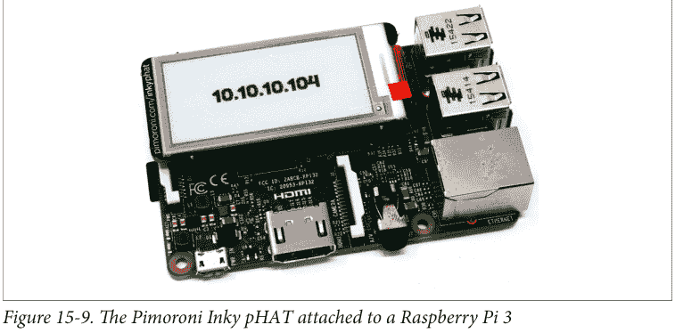

### 讨论

你无法在这些显示屏上玩任何视频游戏，因为它们需要几秒钟来刷新，但刷新之后，即使断电，电子纸也会保持你绘制的内容。Pimoroni 销售像这里使用的 Inky pHAT 这样的小显示屏，也销售尺寸大一倍、几乎和树莓派一样大的显示屏（Inky wHAT）。

### 另请参阅

更多信息可在 Inky pHAT 的完整文档中找到。

# 第 16 章
声音

## 16.0 简介

在本章中，你将学习如何在树莓派上使用声音。这里既有以各种方式播放声音的配方——使用扬声器或蜂鸣器——也有使用麦克风录制声音的配方。

## 16.1 连接扬声器

### 问题

你想从树莓派播放声音。

### 解决方案

连接一个有源扬声器，如图 16-1 所示。
将扬声器连接到音视频插孔后，你还需要按照配方 16.2 配置树莓派通过音视频插孔而不是 HDMI 播放声音。

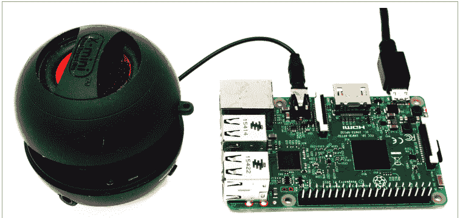

除了使用图 16-1 所示的通用扬声器外，另一种选择是使用专为树莓派设计的扬声器套件，例如图 16-2 所示的 Monk-Makes Speaker Kit for Raspberry Pi。

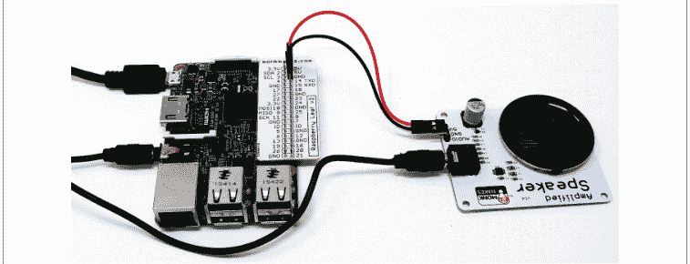

该扬声器使用套件中提供的音频线连接，并使用树莓派的 5V 电源供电，通过公对公跳线连接。

树莓派操作系统附带一个方便的程序来测试你的扬声器是否工作。在终端中输入以下命令：

```
$ speaker-test -t wav -c 2

speaker-test 1.1.3

Playback device is default
Stream parameters are 48000Hz, S16_LE, 2 channels
WAV file(s)
Rate set to 48000Hz (requested 48000Hz)
Buffer size range from 256 to 32768
Period size range from 256 to 32768
Using max buffer size 32768
Periods = 4
was set period_size = 8192
was set buffer_size = 32768
 0 - Front Left
 1 - Front Right
Time per period = 2.411811
 0 - Front Left
 1 - Front Right
```

运行此命令时，你会听到一个声音说“front left”、“front right”等。这是为了测试立体声音频设置。

### 讨论

除了连接各种类型的放大扬声器外，你还可以直接将一对耳机连接到树莓派的音频插孔。

默认情况下，树莓派的输出是通过 HDMI 线。因此，如果你的树莓派连接到电视或带内置扬声器的显示器，要听到树莓派的声音，你只需调高电视或显示器的音量即可。但是，如果你在没有显示器的情况下使用树莓派，或者你的显示器没有扬声器，你可以按照这个配方操作。

### 另请参阅

- 要将你的树莓派与蓝牙扬声器配对，请参阅[配方 1.17](https://example.com/recipe-1.17)。
- 要指定声音输出位置，请参阅[配方 16.2](https://example.com/recipe-16.2)。
- 要播放测试声音，请参阅[配方 16.5](https://example.com/recipe-16.5)。
- 有关树莓派扬声器套件的更多信息，请参阅 [https://oreil.ly/Q73vu](https://oreil.ly/Q73vu)。

## 16.2 控制声音输出位置

### 问题

你想控制树莓派在发出声音时使用多个输出选项中的哪一个。

### 解决方案

设置音频输出最简单的方法是使用右键单击桌面右上角扬声器图标时出现的选项（图 16-3）。


请注意，图 16-3 中的条目 Comiso M20 是一个已经与树莓派配对的蓝牙扬声器（参见配方 1.17）。

### 讨论

如果你在无头模式（没有显示器）下运行树莓派，你仍然可以使用 raspi-config 命令行工具来控制声音输出位置。

打开一个终端会话并输入以下命令：

```
$ sudo raspi-config
```

然后选择 System 选项，接着选择 Audio。然后你可以选择你想要的选项，如图 16-4 所示。

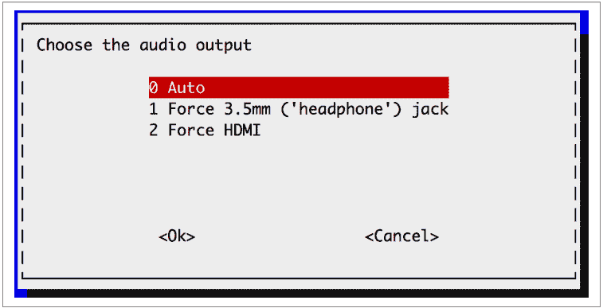

### 另请参阅

- 要了解如何将扬声器连接到你的树莓派，请参阅配方 16.1。
- 要获得更多声音输入和输出选项，你可以使用音频设备设置工具；请参阅配方 16.6。

## 16.3 在没有音频插孔的树莓派上播放音频

### 问题

你想在没有音频插孔的树莓派（如 Pi Zero 或 Pi 400）上获得高质量的音频输出。

### 解决方案

如图 16-5 所示，将 Pimoroni Audio DAC Shim 连接到 GPIO 连接器，并将线路输出连接到音频放大器。如果你使用的是树莓派 400，你需要一个 GPIO 适配器来访问 GPIO 引脚。

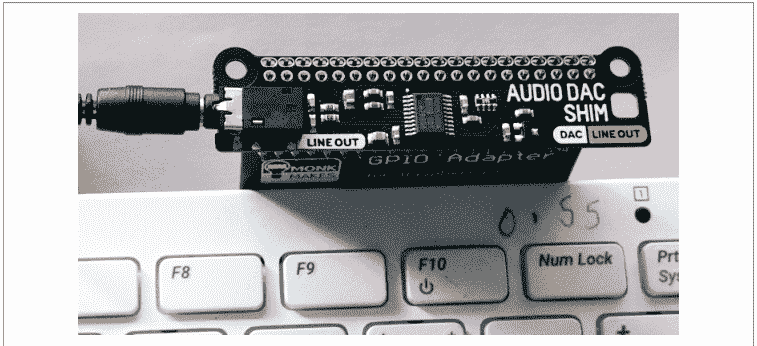

Pimoroni 的 SHIM 概念很巧妙，它允许小型附加板无需焊接或连接器插座即可连接到 GPIO 连接器。它只是紧密地滑过 GPIO 连接器，略微带有弹簧以与引脚良好接触。

为了让音频 DAC 卡被识别，你需要从 Pimoroni 安装一些软件，运行以下命令：

```
$ cd ~
$ git clone https://github.com/pimoroni/pirate-audio
$ cd pirate-audio/mopidy
$ sudo ./install.sh
```

安装完成后，重启你的树莓派，你应该会发现，当你右键单击桌面右上角的音频图标时，新的声音接口将可供选择（图 16-6）。

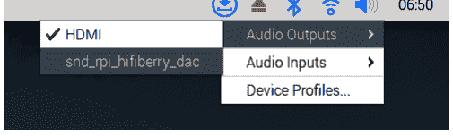

### 讨论

音频 DAC SHIM 的输出可能与耳机插孔是相同的连接器，但你不应该直接连接耳机。此连接器仅用于连接到你的高保真音响，其功率不足以直接驱动耳机。

为你的树莓派添加新音频接口的一种更传统的方法是连接一个 USB 声卡。大多数声称支持 Linux 的声卡在树莓派上都能正常工作。

### 另请参阅

除了为音频 DAC 配置树莓派外，本配方中的安装脚本还安装了 Mopidy，这是 MPD（音乐播放器守护进程）的一个版本。

## 16.4 从命令行播放声音

### 问题

你想能够从树莓派的命令行播放声音文件。

### 解决方案

从命令行使用内置的 VLC 软件。要试用此功能，请在本书下载文件的 python 目录中找到名为 school_bell.mp3 的文件。你可以使用以下命令播放这个免许可的声音文件。请注意，在命令行上使用的是命令 cvlc，而不是 vlc：

这将通过当前音频输出设备播放声音文件。

```
$ cvlc ~/raspberrypi_cookbook_ed4/python/school_bell.mp3
```

### 讨论

VLC 可以播放大多数类型的声音文件，包括 MP3、WAV、AIFF、AAC 和 OGG。但是，如果你只想播放未压缩的 WAV 文件，你也可以使用更轻量级的 aplay 命令：

```
$ aplay ~/raspberrypi_cookbook_ed4/python/school_bell.mp3
```

### 另请参阅

- VLC 也在配方 4.9 中使用。
- aplay 的文档可在 https://oreil.ly/Fbs94 获取。

## 16.5 从Python播放声音

### 问题

你想从Python程序中播放声音文件。

### 解决方案

如果需要从Python程序播放声音，可以使用Python的subprocess模块（*ch_16_play_sound.py*），如下所示：

```python
import subprocess

sound_file = 'school_bell.mp3'

subprocess.run(['cvlc', sound_file])
```

与本书中所有程序示例一样，你也可以下载此程序（参见配方3.22）。

### 讨论

你也可以使用pygame库（*ch_16_play_sound_pygame.py*）播放声音，如下所示：

```python
import pygame

sound_file = '/home/pi/raspberrypi_cookbook_ed4/python/school_bell.wav'

pygame.mixer.init()
pygame.mixer.music.load(sound_file)
pygame.mixer.music.play()

while pygame.mixer.music.get_busy() == True:
    continue
```

声音文件必须是OGG文件或未压缩的WAV文件。我发现声音只能通过HDMI通道播放。

### 另请参阅

要直接从命令行播放声音，请参见配方16.4。

你还可以使用pygame来拦截按键（配方13.11）和鼠标移动（配方13.12）。

## 16.6 使用USB麦克风

### 问题

你想将麦克风连接到树莓派以捕获声音。

### 解决方案

使用如图16-7所示的USB麦克风，或USB网络摄像头的麦克风，或一些更坚固、质量更好的设备。

这些设备有各种形状和尺寸。有些可以直接插入USB插座，有些带有USB连接线，有些是耳机的一部分。

插入USB麦克风后，通过运行以下命令检查树莓派操作系统是否识别它，该命令列出可用于录音的设备：

```
$ arecord -l
**** List of CAPTURE Hardware Devices ****
card 1: H340 [Logitech USB Headset H340], device 0: USB Audio [USB Audio]
  Subdevices: 1/1
  Subdevice #0: subdevice #0
```

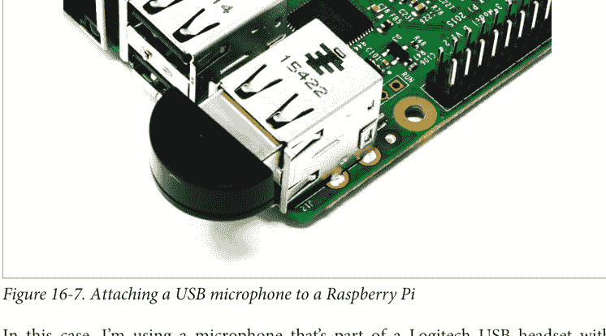

图16-7. 将USB麦克风连接到树莓派

在这种情况下，我使用的是Logitech USB耳机的一部分麦克风。如前面的输出所示，这是卡1，子设备0。在录制声音时，我们需要这些信息。

要使麦克风处于活动状态，你需要右键单击屏幕右上角的扬声器图标。然后从音频输入列表中选择你的USB麦克风设备，如图16-8所示。这里我们选择的是USB网络摄像头的麦克风。


图16-8. 选择麦克风作为音频设备

现在你可以尝试从命令行进行录音，然后播放。要录音，请使用以下命令：

```
$ arecord -d 3 test.wav
```

`-d`参数指定录音的持续时间（以秒为单位）。要播放刚刚录制的声音，请使用以下命令：

```
$ aplay test.wav
Playing WAVE 'test.wav' : Unsigned 8 bit, Rate 8000 Hz, Mono
```

你可以通过按Ctrl-C来中断声音播放。

### 讨论

对于像图16-7所示的那种小型插入式麦克风，我得到了好坏参半的结果。有些能用，有些不能。所以，如果你按照这里的说明操作后仍然无法让麦克风录制任何内容，请尝试另一个。

`arecord`命令有可选参数，可以让你控制录制音频的采样率和格式。因此，例如，如果你想以每秒16,000个样本而不是默认的8,000个进行录制，请使用以下命令：

```
$ arecord -r 16000 -d 3 test.wav
```

当你播放声音时，`aplay`会自动检测采样率，所以你可以这样做：

```
$ aplay test.wav
Playing WAVE 'test.wav' : Unsigned 8 bit, Rate 16000 Hz, Mono
```

### 另请参阅

有关将扬声器连接到树莓派的方法，请参见配方16.1。有关播放声音文件的其他方法，请参见配方16.4和16.5。

## 16.7 制作蜂鸣声

### 问题

你想用树莓派制作蜂鸣声。

### 解决方案

使用连接到GPIO引脚的压电蜂鸣器。

大多数小型压电蜂鸣器使用图16-9所示的布置都可以正常工作。我使用的是Adafruit提供的组件（参见第567页的“杂项”）。你可以使用母对母排针将蜂鸣器引脚直接连接到树莓派（参见第564页的“原型设备和套件”）。

这些蜂鸣器消耗的电流非常小。但是，如果你有一个大型蜂鸣器或者只是想稳妥起见，请在GPIO引脚和蜂鸣器引线之间放置一个470Ω电阻。

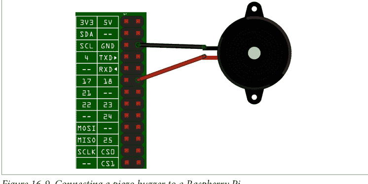

将以下代码粘贴到编辑器中（ch_16_buzzer.py）：

```python
from gpiozero import Buzzer

buzzer = Buzzer(18)

def buzz(pitch, duration):
    period = 1.0 / pitch
    delay = period / 2
    cycles = int(duration * pitch)
    buzzer.beep(on_time=period, off_time=period, n=int(cycles/2))

while True:
    pitch_s = input("Enter Pitch (200 to 2000): ")
    pitch = float(pitch_s)
    duration_s = input("Enter Duration (seconds): ")
    duration = float(duration_s)
    buzz(pitch, duration)
```

与本书中所有程序示例一样，你也可以下载此程序（参见配方3.22）。

运行程序时，它首先会提示你输入音高（以Hz为单位），然后输入蜂鸣声的持续时间（以秒为单位）：

```
$ python3 ch_16_buzzer.py
Enter Pitch (200 to 10000): 2000
Enter Duration (seconds): 20
```

### 讨论

压电蜂鸣器的频率范围不宽，音质也远非良好。然而，你可以稍微改变音高。代码生成的频率不是很准确，你可能会听到一点颤音。

该程序通过使用gpiozero的Buzzer类来切换GPIO引脚18的开和关，中间有短暂的延迟。延迟是根据音高计算的。音高（频率）越高，所需的延迟就越短。

### 另请参阅

查看压电蜂鸣器的数据手册。

有关更好的音频输出选项，请参见配方16.1。

# 第17章
物联网

## 17.0 简介

*物联网*（IoT）是连接到互联网的设备（物品）快速增长的网络。这不仅仅意味着越来越多的计算机使用浏览器，还包括实际的电器、可穿戴和便携式技术。这包括各种家庭自动化，从智能电器和照明到安全系统，甚至互联网操作的宠物喂食器，以及许多不太实用但有趣的项目。

在本章中，你将学习如何让你的树莓派以各种方式参与物联网。

## 17.1 使用Web界面控制GPIO输出

### 问题

你想使用树莓派的Web界面来控制通用输入/输出（GPIO）输出。

### 解决方案

使用bottle Python Web服务器库（配方7.17）创建一个HTML Web界面来控制GPIO端口。

要制作此配方，你需要以下物品：

- 面包板和跳线（参见第564页的“原型设备和套件”）
- 三个1kΩ电阻（参见第565页的“电阻和电容”）
- 三个LED（参见第566页的“光电子器件”）
- 触觉按钮开关（参见第567页的“杂项”）

图17-1显示了此项目的面包板布局。

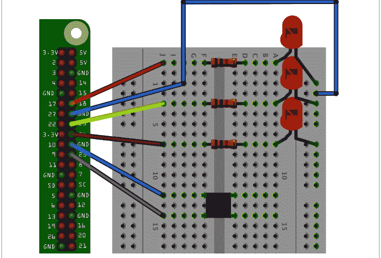

图17-1. 从网页控制GPIO输出的面包板布局

使用面包板的替代方法是连接Raspberry Squid和Squid Button（参见配方10.10和10.11）。你可以将它们直接插入树莓派的GPIO引脚，如图17-2所示。

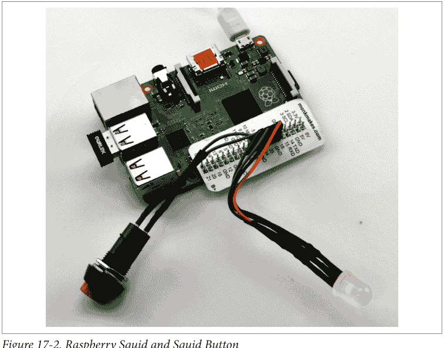

图17-2. Raspberry Squid和Squid Button

要安装bottle库，请参见配方7.17。

打开编辑器并粘贴以下代码（ch_17_web_control.py）：

```python
from bottle import route, run
from gpiozero import LED, Button

leds = [LED(18), LED(23), LED(24)]
switch = Button(25)

def switch_status():
    if switch.is_pressed:
        return 'Down'
    else:
        return 'Up'

def html_for_led(led_number):
    i = str(led_number)
    result = " <input type='button' onClick='changed(" + i + ")' value='LED " + i
             + "'/>"
    return result
```

## 17.1 GPIO 的 Web 控制

```python
@route('/')
@route('/<led_number>')
def index(led_number="n"):
    if led_number != "n":
        leds[int(led_number)].toggle()
    response = "<script>"
    response += "function changed(led)"
    response += "{}"
    response += "  window.location.href='/' + led"
    response += "}"
    response += "</script>"

    response += '<h1>GPIO Control</h1>'
    response += '<h2>Button=' + switch_status() + '</h2>'
    response += '<h2>LEDs</h2>'
    response += html_for_led(0)
    response += html_for_led(1)
    response += html_for_led(2)
    return response

run(host='0.0.0.0', port=80)
```

与本书中所有程序示例一样，你也可以下载此程序（参见配方 3.22）。

你必须以超级用户身份运行该程序：

```
$ sudo python3 ch_17_web_control.py
```

如果启动正确，你应该会看到类似这样的消息：

```
Bottle server starting up (using WSGIRefServer())...
Listening on http://0.0.0.0:80/
Hit Ctrl-C to quit.
```

如果你看到错误消息，请确保你正在使用 `sudo` 命令。

从你网络上的任何机器（甚至是树莓派本身）打开一个浏览器窗口，并导航到树莓派的 IP 地址（参见配方 2.2）。图 17-3 所示的 Web 界面应该会出现。

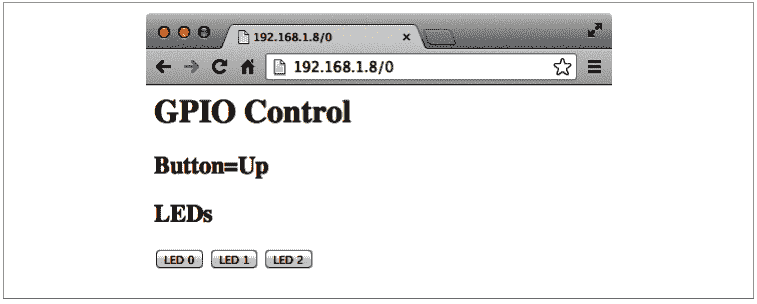

图 17-3. 用于 GPIO 的 Web 界面

如果你点击屏幕底部三个 LED 按钮中的一个，你应该会发现相应的 LED 会切换开关状态。

此外，如果你在重新加载网页时按住按钮，你应该会看到“Button”旁边的文本显示为“Down”而不是“Up”。

### 讨论

要理解程序的工作原理，我们首先需要了解 Web 界面是如何工作的。所有 Web 界面都依赖于某处的服务器（在本例中，是树莓派上的一个程序）来响应来自 Web 浏览器的请求。

当服务器收到请求时，它会查看随请求一起传来的信息，并生成一些超文本标记语言（HTML）作为响应。

如果 Web 请求只是针对根页面（对于我的树莓派，根页面是 *http://192.168.1.8/*），`led_number` 将被赋予默认值 `n`。然而，如果我们浏览 URL *http://192.168.1.8/2*，URL 末尾的 `2` 将被分配给 `led_number` 参数。

然后，`led_number` 参数被用来确定应该切换 LED 2。

为了能够访问这个切换 LED 的 URL，我们需要安排好，使得当点击 LED 2 的按钮时，页面会重新加载，并在 URL 末尾带上这个额外的参数。这里的技巧是在返回给浏览器的 HTML 中包含一个 JavaScript 函数。当浏览器运行此函数时，它会导致页面重新加载，并带上相应的额外参数。

这一切意味着我们处于一种相当令人费解的情况：Python 程序正在生成 JavaScript 代码，供浏览器稍后运行。生成此 JavaScript 函数的代码行如下：

```python
response = "<script>"
response += "function changed(led)"
response += "{}"
response += "  window.location.href='/' + led"
response += "}"
response += "</script>"
```

我们还需要生成 HTML，以便在点击按钮时最终调用此脚本。为了避免为网页上的每个按钮重复 HTML，这些 HTML 是由函数 `html_for_led` 生成的：

```python
def html_for_led(led):
    i = str(led)
    result = " <input type='button' onClick='changed(" + i + ")'"
    value ='LED " + i + "'/>
    return result
```

此代码被使用了三次，每个按钮一次，并将按钮点击与 `changed` 函数关联起来。该函数还接收 LED 编号作为其参数。

报告按钮状态的过程会测试按钮是否被点击，并报告相应的 HTML。

### 另请参阅

有关使用 bottle 的更多信息，请参阅 [bottle 文档](https://bottlepy.org/docs/dev/)。

## 17.2 在网页上显示传感器读数

### 问题

你想在网页上显示来自树莓派的传感器读数，并且该页面能自动更新。

### 解决方案

使用 bottle Web 服务器和一些巧妙的 JavaScript 来自动更新你的显示。

图 17-4 所示的示例使用树莓派的内置传感器显示其 CPU 温度。

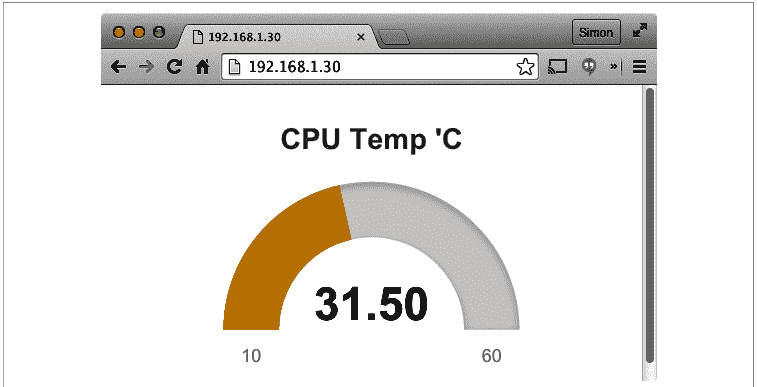

图 17-4. 显示树莓派 CPU 温度

要安装 bottle 库，请参见配方 7.17。

此示例的所有四个文件都包含在文件夹 `ch_17_web_sensor` 中：

- `web_sensor.py`：包含 bottle 服务器的 Python 代码。
- `main.html`：包含将在浏览器中显示的网页。
- `justgage.1.0.1.min.js`：一个显示温度计的第三方 JavaScript 库。
- `raphael.2.1.0.min.js`：justgage 库使用的库。

要运行程序，请切换到 `ch_17_web_sensor.py` 目录，然后使用以下命令运行 Python 程序：

```
$ sudo python3 web_sensor.py
```

与本书中所有程序示例一样，你也可以下载此程序（参见配方 3.22）。

然后打开一个浏览器，可以在同一台树莓派上，也可以在与树莓派处于同一网络的任何计算机上，并在浏览器的地址栏中输入树莓派的 IP 地址。图 17-4 所示的页面应该会出现。

### 讨论

主程序（`web_sensor.py`）相当简洁：

```python
import os, time
from bottle import route, run, template

def cpu_temp():
    cpu_temp = CPUTemperature()
    return str(cpu_temp.temperature)

@route('/temp')
def temp():
    return cpu_temp()

@route('/')
def index():
    return template('main.html')

@route('/raphael')
def index():
    return template('raphael.2.1.0.min.js')

@route('/justgage')
def index():
    return template('justgage.1.0.1.min.js')

run(host='0.0.0.0', port=80)
```

函数 `cpu_temp` 读取树莓派 CPU 的温度，如配方 14.11 所述。

然后为 bottle Web 服务器定义了四个路由。第一个（`/temp`）返回一个包含摄氏度 CPU 温度的字符串。根路由（`/`）返回页面的主 HTML 模板（`main.html`）。另外两个路由提供对 raphael 和 justgage JavaScript 库副本的访问。

文件 `main.html` 主要包含用于渲染用户界面的 JavaScript：

```html
<html>
<head>
<script src="http://ajax.googleapis.com/ajax/libs/jquery/1.7.2/jquery.min.js"
type="text/javascript" charset="utf-8"></script>
<script src="raphael"></script>
<script src="justgage"></script>

<script>
function callback(tempStr, status){
if (status == "success") {
    temp = parseFloat(tempStr).toFixed(2);
    g.refresh(temp);
    setTimeout(getReading, 1000);
}
else {
    alert("There was a problem");
    }
}

function getReading(){
    $.get('/temp', callback);
}
</script>
</head>

<body>
<div id="gauge" class="200x160px"></div>

<script>
var g = new JustGage({
    id: "gauge",
    value: 0,
    min: 10,
    max: 60,
    title: "CPU Temp 'C"
});
getReading();
</script>

</body>
</html>
```

jquery、raphael 和 justgage 库都被导入了（jquery 来自 https://oreil.ly/nfC6s，另外两个来自本地副本）。

将读数从树莓派获取到浏览器窗口是一个两阶段的过程。首先，调用函数 `getReading`。这会向 `web_sensor.py` 发送一个路由为 `/temp` 的 Web 请求，并指定一个名为 `callback` 的函数在 Web 请求完成时运行。然后，`callback` 函数负责更新 justgage 显示，然后设置一个超时，在一秒钟后再次调用 `getReading`。

### 另请参阅

有关使用 Python 应用程序在应用程序（而非网页）中显示传感器值的示例，请参见配方 14.23。

justgage 库有各种有用的选项来显示传感器值。

## 17.3 Node-RED 入门

### 问题

你想创建简单的物联网工作流，例如当树莓派上的按钮被按下时发送一条推文。

### 解决方案

使用可以在推荐软件工具的编程部分（配方 4.2）中找到的 Node-RED 系统。使用以下示例启动 Node-RED 服务器：

```
$ node-red-pi --max-old-space-size=256
```

然后使用浏览器连接到服务器。这可以在树莓派本身上进行，在这种情况下，你可以连接到 URL http://127.0.0.1:1880/——或者如果你从网络上的另一台计算机连接，请将 127.0.0.1 更改为树莓派的本地 IP 地址（配方 2.2）。图 17-5 显示了当你连接到 Node-RED 服务器时，你可以在浏览器中看到的内容。

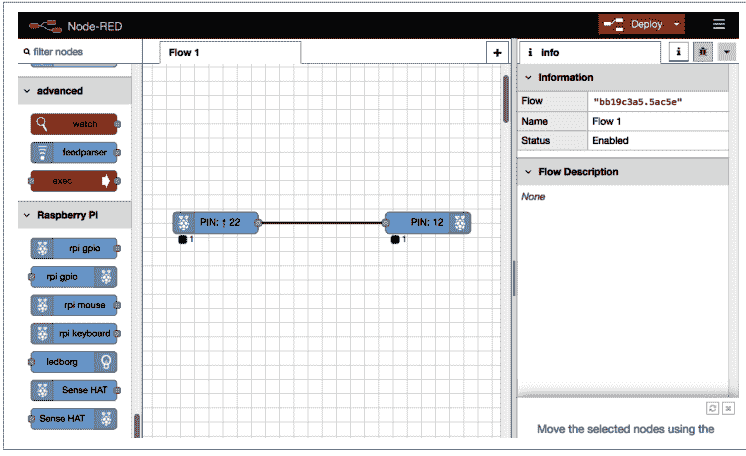

Node-RED 背后的理念是，你绘制你的程序（称为流程）而不是编写代码。为此，你将节点拖到编辑器区域，然后将它们连接在一起。例如，图 17-5 显示了一个最小流程，其中两个树莓派引脚连接在一起。一个引脚充当输入，可能连接到一个开关（让我们以GPIO 25为例），另一个连接到LED（假设为GPIO 18）。你可以像食谱17.1那样，使用一个Squid LED和按钮来完成此操作。

左侧标记为PIN 22的节点是输入（连接到GPIO 25上的开关），PIN 12是输出（连接到GPIO 18上的LED）。Node-RED使用引脚位置（左上角的引脚是引脚1，其右侧相邻的是引脚2，依此类推）而不是GPIO名称。

要在编辑器中创建此流程，请向下滚动左侧的节点列表，直到找到Raspberry Pi部分。将带有Raspberry Pi图标的“rpi gpio”节点拖到编辑器区域。这将是输入节点。双击它打开如图17-6所示的窗口。选择“22 - GPIO25”并点击完成。

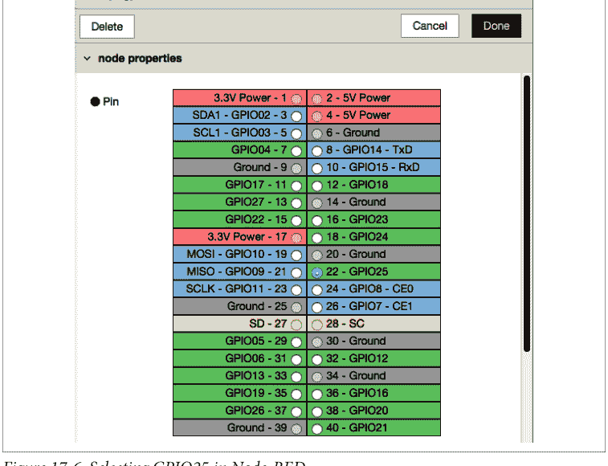

图17-6. 在Node-RED中选择GPIO25

接下来，选择另一种“rpi gpio”节点类型（图标在右侧），将其拖到编辑器区域，然后双击打开如图17-6所示的窗口；这次选择“12 - GPIO18”，并点击完成。

通过从输入节点的右侧圆形连接器拖出连线，将两个节点连接起来，使流程看起来像图17-5。

假设你已经将按钮开关和LED连接到你的树莓派，你现在可以通过点击Deploy按钮来运行此流程。LED应该会亮起，当你按下连接到树莓派的开关按钮时，LED应该会熄灭。这里的逻辑是反向的，但我们暂时先不管它。我们将在下一章重新讨论这个问题，届时你会学到更多关于Node-RED的知识。

这一切都很巧妙，但目前与物联网（IoT）关系不大。这就是Node-RED其他一些节点类型发挥作用的地方。如果你浏览节点列表，会发现各种各样的节点，包括Tweet节点。你可以将此节点作为第二个输出连接到PIN 22节点，使流程现在看起来像图17-7。双击Tweet节点，用你的Twitter凭据进行配置。现在，当你按下按钮时，就会发送一条推文。

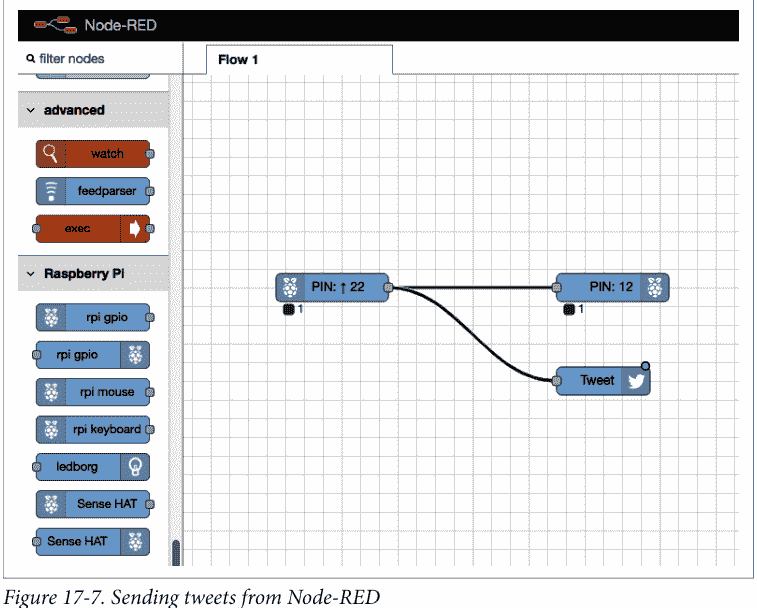

图17-7. 从Node-RED发送推文

### 讨论

Node-RED是一个极其强大的系统，因此，要熟悉其所有功能和一些奇特之处需要一些时间。除了创建像我们这里制作的直接流程外，你还可以引入切换代码（如*if*语句）和函数，这些函数可以转换在节点之间传递的消息。

我们在这里只是浅尝辄止；如果你想了解更多，我建议你阅读“另请参阅”部分提到的文档以及第18章的大部分内容。

在玩过Node-RED并决定喜欢它之后，你很可能希望确保它在树莓派每次重启时都能自动启动，可以执行以下命令：

```
$ sudo systemctl enable nodered.service
$ sudo systemctl start nodered.service
```

### 另请参阅

更多信息可在[在树莓派上使用Node-RED的完整文档](https://www.raspberrypi.org/documentation/usage/gpio/python/rpi-gpio.md)中找到。

在[https://oreil.ly/uxGHZ](https://oreil.ly/uxGHZ)和[https://oreil.ly/ZSDNi](https://oreil.ly/ZSDNi)可以找到一些关于Node-RED的优秀视频介绍。

## 17.4 使用IFTTT发送电子邮件和其他通知

### 问题

你希望有一种灵活的方式，让你的树莓派通过电子邮件、Facebook、Twitter或Slack发送通知。

### 解决方案

让你的树莓派向If This Then That (IFTTT) *Maker*频道发送请求，以触发可配置的通知。

本食谱通过一个示例进行说明：当你的树莓派CPU温度超过阈值时，会给你发送一封电子邮件。

在开始使用IFTTT之前，你需要创建一个账户，因此请访问[www.ifttt.com](https://www.ifttt.com)，注册一个免费账户并登录。

下一步是在IFTTT网站上创建一个新的IFTTT *applet*。Applet就像一条规则，例如*当我从树莓派收到一个网络请求时，发送一封电子邮件*。点击网页上的CREATE按钮。这将提示你首先输入食谱的IF THIS部分，然后是THEN THAT部分。

在这个例子中，IF THIS部分（触发器）将是接收来自你树莓派的网络请求，因此点击THIS，然后在搜索字段中输入**Webhooks**以找到Webhooks频道。选择Webhooks频道，当提示时，选择“Receive a web request”选项。点击Create应该会显示类似图17-8的内容。


图17-8. “Receive a web request”触发器表单

在Event Name字段中，输入文本**cpu_too_hot**，然后点击“Create trigger”。

这将把你带到食谱的THEN THAT部分，即*操作*，你需要选择一个操作频道。有很多选项，但对于这个示例，你将使用Email频道，因此在搜索字段中输入**Email**，然后选择Email频道。

选择Email频道后，选择操作“Send me an email”，这将显示如图17-9所示的表单。

修改文本使其如图17-9所示。注意特殊值OccurredAt和Value1都将被{{和}}包围。这些值称为ingredients，是从网络请求中获取并替换到电子邮件主题和正文中的变量值。

点击“Create action”，然后点击Finish完成食谱创建。


图17-9. 在IFTTT中完成操作字段

我们需要的最后一个信息是Webhooks频道的API密钥。这样其他人就不能用他们树莓派CPU温度的邮件轰炸你了。

要在IFTTT网站上找到此密钥，请点击用户图标旁边的菜单中出现的My Services选项，然后找到Webhooks。在Webhooks页面上，点击Documentation，将显示类似图17-10的页面；在这里你可以看到你的密钥（此图中故意做了模糊处理）。你需要将此密钥粘贴到后续代码中的KEY = 'your_key_here'这一行。

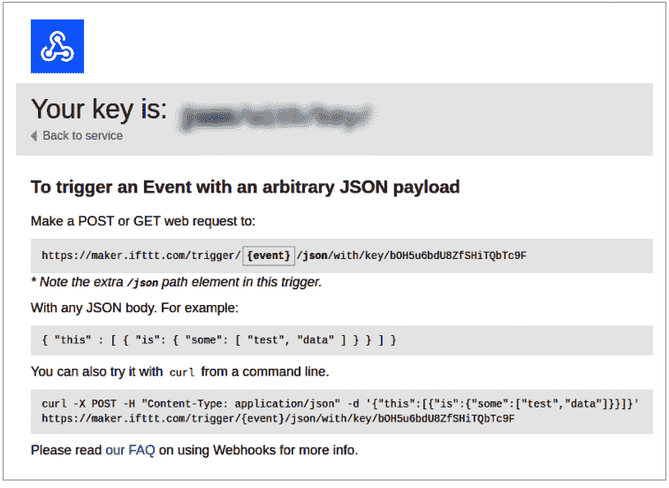

图17-10. 查找你的API密钥

发送网络请求的Python程序名为`ch_17_ifttt_cpu_temp.py`：

```python
import time
from gpiozero import CPUTemperature
import requests

MAX_TEMP = 33.0
MIN_T_BETWEEN_WARNINGS = 60 # Minutes

EVENT = 'cpu_too_hot'
BASE_URL = 'https://maker.ifttt.com/trigger/'
KEY = 'your_key_here'

def send_notification(temp):
    data = {'value1' : temp}
    url = BASE_URL + EVENT + '/with/key/' + KEY
    response = requests.post(url, json=data)
    print(response.status_code)

def cpu_temp():
    cpu_temp = CPUTemperature().temperature
    return cpu_temp

while True:
    temp = cpu_temp()
    print("CPU Temp (C): " + str(temp))
    if temp > MAX_TEMP:
        print("CPU TOO HOT!")
        send_notification(temp)
        print("No more notifications for: " + str(MIN_T_BETWEEN_WARNINGS)
              + " mins")
        time.sleep(MIN_T_BETWEEN_WARNINGS * 60)
    time.sleep(1)
```

与本书中所有程序示例一样，你也可以下载此程序（参见食谱3.22）。

我故意将MAX_TEMP设置得很低以供测试。如果你住在炎热的地方，你可能需要将这个数字提高到60或70。

将密钥粘贴到ch_17_ifttt_cpu_temp.py中以KEY=开头的那一行，然后使用以下命令运行程序：

```
$ python3 ch_17_ifttt_cpu_temp.py
```

你可以通过播放视频或暂时用气泡膜包裹树莓派来提高CPU温度。当事件触发时，你应该会收到一封看起来像图17-11的电子邮件。注意值是如何被替换到电子邮件中的（同样，模糊处理是故意的）。

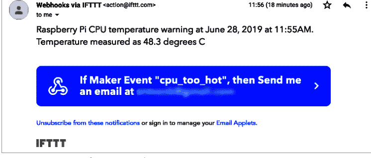

### 讨论

这个程序的大部分操作发生在send_notification函数中。该函数首先构造一个包含密钥和请求参数value1（包含温度）的URL，然后使用Python requests库向IFTTT发送网络请求。

主循环持续将CPU温度与MAX_TEMP进行比较；如果温度超过MAX_TEMP，则发送Web请求，并按照MIN_T_BETWEEN_WARNINGS指定的时长开始长时间休眠。此休眠可防止您的收件箱被通知淹没。

当然，作为使用IFTTT的替代方案，您也可以直接使用配方7.16发送电子邮件。但是，通过使用IFTTT发送消息，您就不局限于电子邮件通知——您可以使用IFTTT中任何可用的操作渠道，而无需编写任何代码。

### 另请参阅

要直接从Python发送电子邮件，请参阅配方7.16。

测量CPU温度的代码在配方14.11中描述。

## 17.5 使用ThingSpeak发送推文

### 问题

您希望从树莓派自动发送推文——例如，通过告诉人们您的CPU温度来烦扰他们。

### 解决方案

您可以直接使用配方17.4，并将操作渠道更改为Twitter。然而，ThingSpeak服务是实现此目的的另一种方式。

ThingSpeak类似于IFTTT，但专门面向物联网项目。它允许您创建可以通过Web请求存储和检索数据的通道，并且它还提供许多操作，包括ThingTweet，它为Twitter提供了一个Web服务包装器。这比Twitter API更容易使用，后者要求您向Twitter注册您的应用程序。

首先访问 https://thingspeak.com 并注册。请注意，这还需要创建一个MATLAB账户，尽管没有特别好的理由。

接下来，从Apps菜单中选择ThingTweet操作。系统会提示您登录Twitter，然后您的操作将被激活（图17-12）。

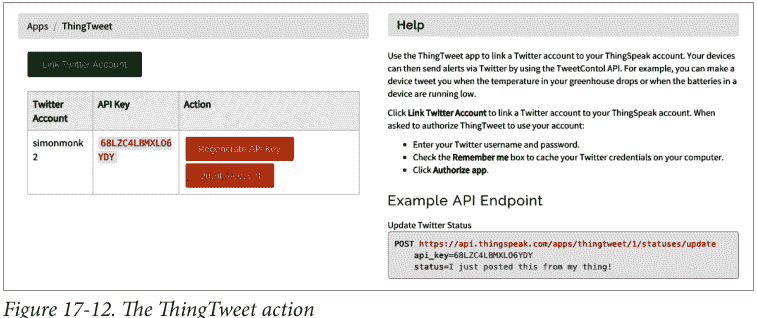

图17-12. ThingTweet操作

用于发送触发推文的Web请求的Python程序名为ch_17_send_tweet.py：

```python
import time
from gpiozero import CPUTemperature
import requests

MAX_TEMP = 35.0
MIN_T_BETWEEN_WARNINGS = 60 # Minutes

BASE_URL = 'https://api.thingspeak.com/apps/thingtweet/1/statuses/update/'
KEY = 'your_key_here'

def send_notification(temp):
    status = 'Thingtweet: Raspberry Pi getting hot. CPU temp=' + str(temp)
    data = {'api_key' : KEY, 'status' : status}
    response = requests.post(BASE_URL, json=data)
    print(response.status_code)

def cpu_temp():
    cpu_temp = CPUTemperature().temperature
    return cpu_temp

while True:
    temp = cpu_temp()
    print("CPU Temp (C): " + str(temp))
    if temp > MAX_TEMP:
        print("CPU TOO HOT!")
        send_notification(temp)
        print("No more notifications for: " + str(MIN_T_BETWEEN_WARNINGS)
              + " mins")
        time.sleep(MIN_T_BETWEEN_WARNINGS * 60)
    time.sleep(1)
```

与本书中所有程序示例一样，您也可以下载此程序（参见配方3.22）。

与配方17.4一样，您需要在运行程序之前将图17-12中的密钥粘贴到代码中。以与配方17.4相同的方式运行和测试程序。

### 讨论

代码与配方17.4非常相似。主要区别在于`send_notification`函数，该函数构造推文，然后将消息作为参数`status`发送Web请求。

### 另请参阅

更多信息可在ThingSpeak服务的完整文档中找到。

在配方17.6中，您将使用在ThingSpeak中实现的流行的CheerLights；在配方17.7中，您将学习如何使用ThingSpeak收集传感器数据。

## 17.6 使用CheerLights更改LED颜色

### 问题

您希望将树莓派连接到RGB LED，并参与流行的CheerLights项目。

CheerLights是一项网络服务，当任何人向@cheerlights发送包含颜色名称的推文时，它会将该颜色记录为CheerLights颜色。在世界各地，许多人拥有CheerLights项目，这些项目使用网络服务请求最后一种颜色，并将其灯光设置为该颜色。因此，当有人发推文时，每个人的灯光都会改变颜色。

### 解决方案

使用连接到树莓派的Raspberry Squid RGB LED（图17-13），并运行名为ch_17_cheerlights.py的测试程序（在图17-13之后显示）：

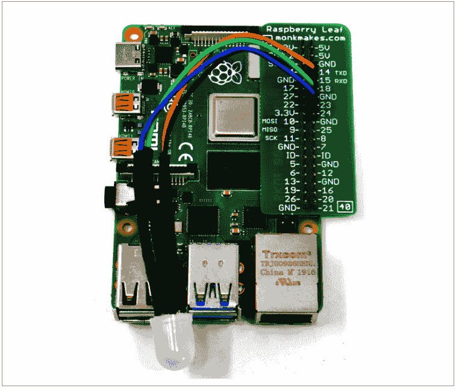

图17-13. CheerLights显示

```python
from gpiozero import RGBLED
from colorzero import Color
import time, requests

led = RGBLED(18, 23, 24)
cheerlights_url = "http://api.thingspeak.com/channels/1417/field/2/last.txt"

while True:
    try:
        cheerlights = requests.get(cheerlights_url)
        c = cheerlights.content
        print(c)
        led.color = Color(c)
    except Exception as e:
        print(e)
    time.sleep(2)
```

与本书中所有程序示例一样，您也可以下载此程序（参见配方3.22）。

当您运行程序时，您的LED应立即设置为一种颜色。当有人发推文时，它可能会在一段时间后改变颜色；如果没有，请尝试发送诸如“@cheerlights red”之类的推文，您的LED和世界上其他LED的颜色应该会改变。CheerLights的有效颜色名称包括red、green、blue、cyan、white、oldlace、purple、magenta、yellow、orange和pink。

### 讨论

代码只是向ThingSpeak发送一个Web请求，ThingSpeak返回一个六位十六进制数字的颜色字符串。然后，这被用来设置LED颜色。

try/except代码用于确保在发生临时网络中断时程序不会崩溃。

### 另请参阅

CheerLights使用ThingSpeak在通道中存储最后一种颜色。在配方17.7中，使用通道来记录传感器数据。

如果您没有Squid，可以使用面包板上的RGB LED（参见配方11.11），或者甚至可以改编配方15.5来控制整个LED灯带。

## 17.7 将传感器数据发送到ThingSpeak

### 问题

您希望将传感器数据记录到ThingSpeak，然后查看随时间变化的数据图表。

### 解决方案

登录ThingSpeak，从Channels下拉菜单中选择My Channels。接下来，通过填写表单顶部来创建一个新通道，如图17-14所示。

您可以将表单的其余部分留空。编辑完成后，点击页面底部的Save Channel。点击API Keys选项卡，查找您可以使用的Web请求摘要，以及您刚创建的通道的密钥（图17-15）。

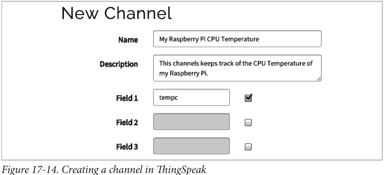

图17-14. 在ThingSpeak中创建通道


图17-15. 指定ThingSpeak通道

您需要将您的API密钥（如图17-15所示的Update Channel Feed - POST中的*api_key*）复制为后续程序中KEY的值。

要将数据发送到通道，必须发送Web请求。发送Web请求的Python程序名为`ch_17_thingspeak_data.py`：

```python
import time
from gpiozero import CPUTemperature
import requests

PERIOD = 60 # seconds
BASE_URL = 'https://api.thingspeak.com/update.json'
KEY = 'your key goes here'

def send_data(temp):
    data = {'api_key' : KEY, 'field1' : temp}
    response = requests.post(BASE_URL, json=data)

def cpu_temp():
    cpu_temp = CPUTemperature().temperature
    return cpu_temp

while True:
    temp = cpu_temp()
    print("CPU Temp (C): " + str(temp))
    send_data(temp)
    time.sleep(PERIOD)
```

与本书中所有程序示例一样，您也可以下载此程序（参见配方3.22）。

运行程序。在ThingSpeak通道页面的Private View选项卡上，您应该会看到如图17-16所示的图表。

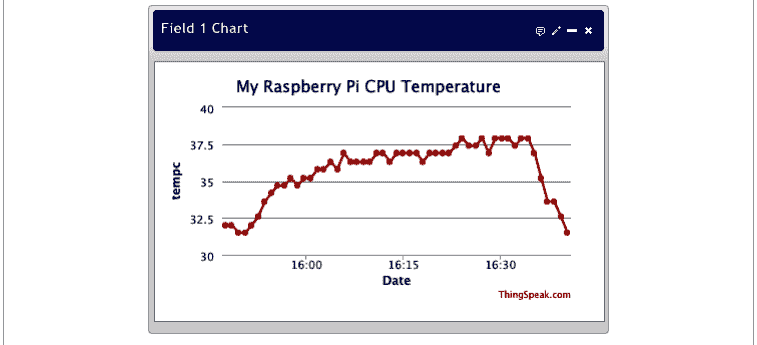

图17-16. 在ThingSpeak中绘制传感器数据图表

随着每个新读数的到来，这将每分钟更新一次。

### 讨论

变量`PERIOD`用于确定每次发送温度后的时间间隔（以秒为单位）。

`send_data`函数构造Web请求，在名为`field1`的参数中提供温度。

如果您的数据可能具有公共利益——例如，准确的环境读数——您可能希望将通道设为公共，以便任何人都可以使用它。对于您的Pi的CPU温度，可能并非如此。

### 另请参阅

有关读取CPU温度的代码说明，请参阅[配方14.11](Recipe 14.11)。

有关将传感器数据导出到电子表格的示例，请参阅[配方14.24](Recipe 14.24)。

## 17.8 使用Dweet和IFTTT响应推文

### 问题

您希望您的树莓派在响应推文中的特定标签或提及时执行某些操作。

[配方17.6](Recipe 17.6)实现了这一点，但效率非常低，因为它依赖于您持续使用Web请求进行轮询以查看颜色是否已更改。

### 解决方案

一种不依赖于轮询的有效监控推文机制是使用IFTTT（参见[配方17.4](Recipe 17.4))来识别感兴趣的推文，然后向名为Dweet的服务发送Web请求，该服务可以将通知推送到在您的树莓派上运行的Python程序（[图17-17](Figure 17-17)）。

例如，您可以使用Raspberry Squid或连接到面包板的LED，在每次您的用户名在Twitter上被提及时闪烁LED 10秒。

就硬件而言，此配方只需要一些在GPIO 18变高时能产生明显效果的电子设备。这可以是Raspberry Squid的一个通道（参见[配方10.10](Recipe 10.10)），也可以是连接到面包板的单个LED（参见[配方11.1](Recipe 11.1)），或者为了最大的灵活性，使用继电器（参见[配方11.5](Recipe 11.5)）。使用继电器可以让您创建像[Bubblino](Bubblino)这样的项目，这是一个吹泡泡的Arduino机器人。

## 17.17 IFTTT、Dweet 与 Python 协同工作

第一步是登录 IFTTT（参见配方 17.4），然后创建一个新的 Applet。选择一个操作通道为“New Mention of You”，然后点击“Create trigger”。对于配方的操作通道，选择 Webhooks，然后选择操作“Make a web request”并填写字段，如图 17-18 所示。

URL 包含一个带有“text”成分的请求参数。这将包含推文的正文。虽然除了在控制台打印外不会用到它，但在更复杂的项目中，你可能会将消息显示在 LCD 屏幕上，因此了解如何将数据从推文传递到 Python 程序是有用的。

最后，点击“Create recipe”使 IFTTT 配方生效。

dweet.io 网络服务的工作方式有点像物联网设备的 Twitter。它有一个网络界面，允许你发布和监听 dweet。Dweet 不需要账户或任何登录信息；你可以让一个东西（在这种情况下是 IFTTT）向 Dweet 发送消息，并让另一个东西（你的树莓派 Python 程序）等待服务通知你感兴趣的事情已经发生。在这种情况下，连接两者的令牌是 `tweet_about_me`。这并不十分独特，如果同时有多人尝试本书中的这个示例，你们都会收到彼此的消息。为避免这种情况，请使用更独特的令牌（例如，在消息中添加随机字母和数字字符串）。

图 17-18. 在 IFTTT 中完成“Make a web request”操作通道

要从你的 Python 程序访问 Dweet，你需要使用以下命令安装 `dweepy` 库：

```
$ sudo pip3 install dweepy
```

这个配方的程序名为 `ch_17_twitter_trigger.py`：

```python
import time
import dweepy
from gpiozero import LED

KEY = 'tweet_about_me'
led = LED(18)

while True:
    try:
        for dweet in dweepy.listen_for_dweets_from(KEY):
            print('Tweet: ' + dweet['content']['text'])
            led.on()
            time.sleep(10)
            led.off()
    except Exception:
        pass
```

与本书中所有程序示例一样，你也可以下载此程序（参见配方 3.22）。

程序运行后，尝试在推文中提及你自己，LED 应该会亮起 10 秒。

### 讨论

该程序使用 `listen_for_dweets_from` 方法与 dweet.io 服务器保持一个开放的连接，监听由于 IFTTT 响应推文而产生的 dweet 所带来的任何推送消息。try/except 块确保如果发生任何通信中断，程序将重新开始监听过程。

### 另请参阅

有关使用不同方法的类似项目，请参见配方 17.6。

# 第 18 章 家庭自动化

## 18.0 简介

作为一种低成本、低功耗的设备，树莓派是一个很棒的家庭自动化中心，你可以让它一直运行而不用担心巨额电费。对于本章描述的配方，你不需要树莓派 4 或 400 的强大性能。事实上，树莓派 2 或 3 就足够快了，而且比树莓派 4 运行更凉爽，耗电更少。

我们从消息队列遥测传输（MQTT）开始，这是大多数家庭自动化系统的基本通信机制，然后继续研究使用 Node-RED（你在第 17 章首次遇到）作为家庭自动化的基础。

严格来说，家庭自动化是关于让你的家更智能，更能为自己做事——例如，在检测到移动时打开灯一段时间，或者在就寝时间自动关闭所有东西。但大多数对家庭自动化感兴趣的人也对远程控制家中已自动化的部分感兴趣。我们本章也研究通过智能手机进行远程控制。

## 18.1 使用 Mosquitto 将树莓派变成消息代理

### 问题

你想将你的树莓派变成一个家庭自动化系统的中心，能够使用 Mosquitto MQTT 软件。

### 解决方案

安装 Mosquitto 软件，以便你的树莓派可以充当 MQTT 代理。
运行以下命令安装 Mosquitto 并将其作为服务启动，以便在树莓派重启时自动启动：

```
$ sudo apt update
$ sudo apt install -y mosquitto mosquitto-clients
$ sudo systemctl enable mosquitto.service
```

你可以通过运行以下命令检查一切是否正常工作：

```
$ mosquitto -v
1656413574: mosquitto version 2.0.11 starting
1656413574: Using default config.
1656413574: Starting in local only mode. Connections will only be possible from clients running on this machine.
1656413574: Create a configuration file which defines a listener to allow remote access.
1656413574: For more details see https://mosquitto.org/documentation/authentication-methods/
1656413574: Opening ipv4 listen socket on port 1883.
1656413574: Error: Address already in use
1656413574: Opening ipv6 listen socket on port 1883.
1656413574: Error: Address already in use
$
```

错误消息并不是真正的错误；它只是意味着 Mosquitto 已经在运行，因为我们已将其作为服务启动。

### 讨论

MQTT 是一种在程序之间传递消息的方式。它有两个部分：

*服务器*
控制消息传递并将消息路由到正确接收者的中心位置。

*客户端*
向服务器发送和接收消息的程序。通常系统中会有多个客户端。

消息使用所谓的*发布和订阅*模型传递。也就是说，一个有有趣内容要说的客户端（例如，传感器读数）通过发布读数来告诉服务器。每隔几秒，客户端可能会进行另一次读数并再次发布。

消息有一个*主题*和一个*负载*。在一个自动化灯光的系统中，主题可能是 `bedroom_light`，负载是 `on` 或 `off`。

你可以通过同时打开两个终端来尝试这个。一个终端将充当发布者，另一个充当订阅者。你可以在图 18-1 中看到这个操作。

图 18-1. 两个客户端使用 MQTT 进行通信

让我们分解一下。左边的终端是订阅者，我们在这里发出命令：

```
$ mosquitto_sub -d -t pi_mqtt
Client mosqsub/2007-raspberryp sending CONNECT
Client mosqsub/2007-raspberryp received CONNACK
Client mosqsub/2007-raspberryp sending SUBSCRIBE (Mid: 1, Topic: pi_mqtt, QoS: 0)
Client mosqsub/2007-raspberryp received SUBACK
Subscribed (mid: 1): 0
```

`mosquitto_sub` 命令订阅客户端。`-d` 选项指定调试模式，这意味着你将看到更多关于客户端和服务器正在做什么的输出；这在确保一切正常工作时很有用。`-t pi_mqtt` 选项指定客户端感兴趣的主题为 `pi_mqtt`。

调试跟踪显示客户端正在无问题地连接到服务器，并且客户端已请求订阅，服务器已确认订阅。

保持此终端会话运行，并打开第二个终端会话作为客户端，该客户端将在主题 `pi_mqtt` 上发布一些内容。在此新终端窗口中输入以下命令：

```
$ mosquitto_pub -d -t pi_mqtt -m "publishing hello"
Client mosqpub/2199-raspberryp sending CONNECT
Client mosqpub/2199-raspberryp received CONNACK
Client mosqpub/2199-raspberryp sending PUBLISH (d0, q0, r0, m1, 'pi_mqtt',
... (16 bytes))
Client mosqpub/2199-raspberryp sending DISCONNECT
```

同样，`-d` 和 `-t` 选项指定调试模式和主题，但这次有一个额外的选项 `-m`，它指定要包含在发布中的消息。如果发布者是传感器，消息可能是传感器读数。

一旦 `mosquitto_pub` 命令被发送，类似以下的文本将出现在第一个终端窗口（订阅者）中：

```
Client mosqsub/5170-raspberryp received PUBLISH (d0, q0, r0, m0, 'pi_mqtt',
... (16 bytes))
publishing hello
```

### 另请参阅

有关 Mosquitto 的信息，请参见 https://mosquitto.org。

有关本章中其他 MQTT 配方，请参见配方 18.2 和 18.5。

## 18.2 将 Node-RED 与 MQTT 服务器结合使用

### 问题

你想将 Node-RED 与 MQTT 服务器结合使用，以便能够，例如，根据 MQTT 消息发布来控制通用输入/输出（GPIO）引脚。

### 解决方案

在 Node-RED 流中使用 Node-RED “mqtt” 节点和 “rpi gpio” 节点，如图 18-2 所示。

如果你尚未安装 Node-RED，可以在配方 17.3 中找到说明。

部署后，你将能够通过发送 `mosquitto_pub` 命令来打开和关闭 GPIO 18。出于测试目的，将 LED 或 Raspberry Squid LED 连接到引脚 18（配方 11.1）。

该流程指的是厨房灯，因为此示例假设 GPIO 18 正在与类似 PowerSwitch Tail（配方 11.7）的东西一起使用，以开关灯光。

让我们逐个节点来构建这个示例。

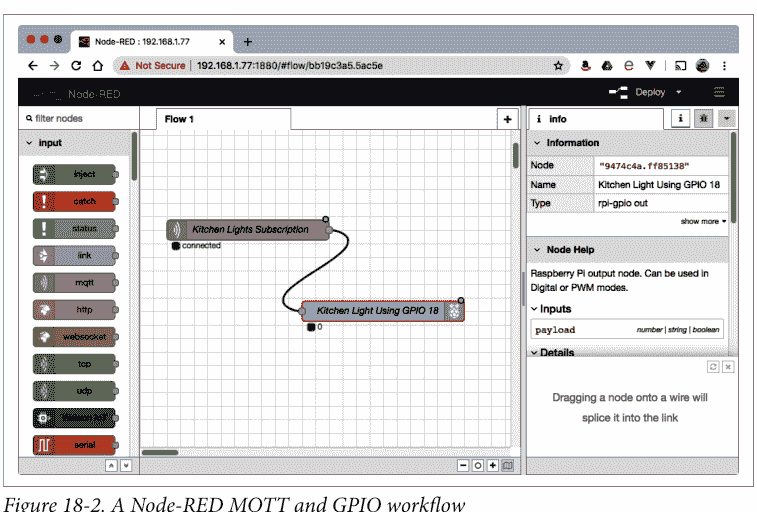

首先，从Node-RED的“input”类别中添加一个“mqtt”节点。双击该节点进行编辑（图18-3）。

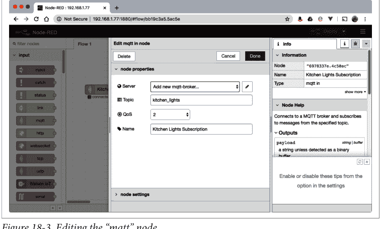

注意，Server字段目前只有一个选项：“Add new mqtt-broker”。我们稍后会回到这里。现在，先指定一个主题（kitchen_lights）并给节点起一个有意义的名字。QoS字段允许你设置服务质量，它决定了MQTT服务器将消息送达目标目的地的持久性。级别2意味着保证送达。

现在我们需要为Node-RED定义一个MQTT服务器，因此点击Server字段旁边的编辑（铅笔）按钮。这将打开如图18-4所示的窗口。

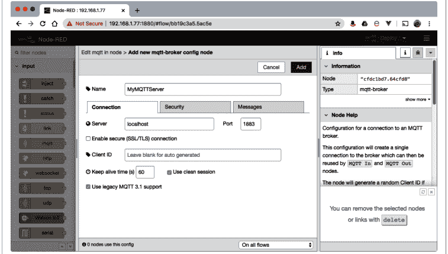

图18-4. 向Node-RED添加MQTT服务器

给服务器起个名字，并在Server字段中输入localhost。我们可以这样做，因为Node-RED和MQTT服务器运行在同一台树莓派上。

现在我们可以添加“rpi-gpio out”节点。你可以在Raspberry Pi部分找到它。将其添加到流程后，打开它（图18-5）。

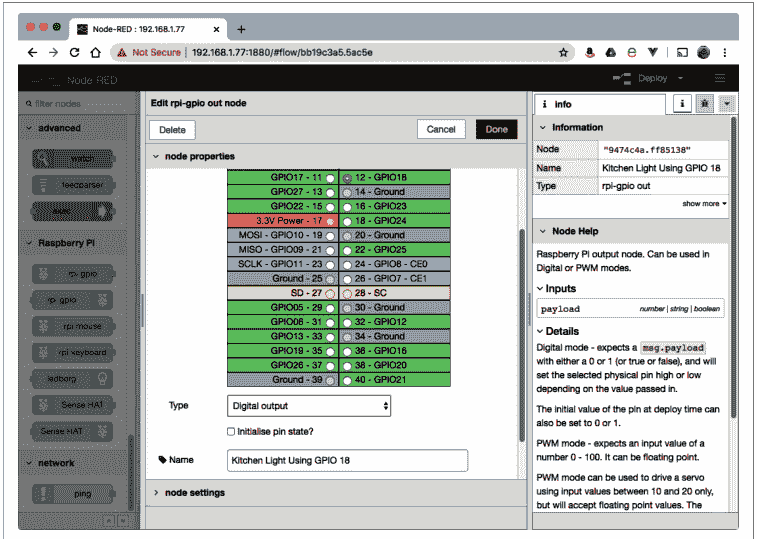

图18-5. 编辑GPIO输出节点

选择“12 - GPIO 18”，并在点击Done之前给节点起个名字。将连接线从“mqtt in”节点拖到树莓派GPIO节点，使流程看起来像图18-2。

点击Deploy按钮，然后在树莓派上打开一个终端会话来测试流程。

在终端窗口中输入以下命令，发布一个开灯请求：

```
$ mosquitto_pub -d -t kitchen_lights -m 1
```

引脚18上的LED应该会亮起。然后，要关闭LED，发送：

```
$ mosquitto_pub -d -t kitchen_lights -m 0
```

### 讨论

这个方法只有在树莓派恰好位于你要控制的设备旁边时才有效。实际上，你更可能想使用无线开关。

然而，了解如何通过MQTT和Node-RED控制GPIO引脚是很有用的。

Node-RED能够将流程导入和导出为JSON文本。本章中使用的所有流程都可以在本书的[GitHub页面](https://github.com/simonmonk/raspberrypi_cookbook_ed4)上找到。

要将其中一个流程导入Node-RED，请访问GitHub页面，然后点击与你要导入的流程对应的食谱编号。例如，在图18-6中，我点击了*recipe_18_10.json*。

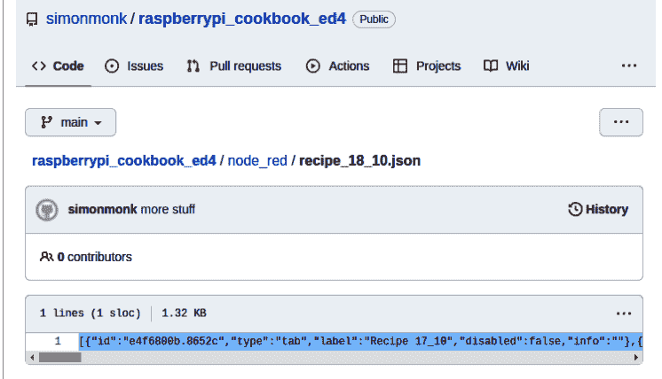

在代码区域中选择整行并将其复制到剪贴板。（点击代码上方的Raw按钮可以使选择所有代码进行复制更容易。）然后切换回你的Node-RED网页，从Node-RED菜单中选择Import，然后选择Clipboard，如图18-7所示。

然后将你从GitHub复制的代码粘贴到图18-8所示的窗口中，并选择“new flow”。

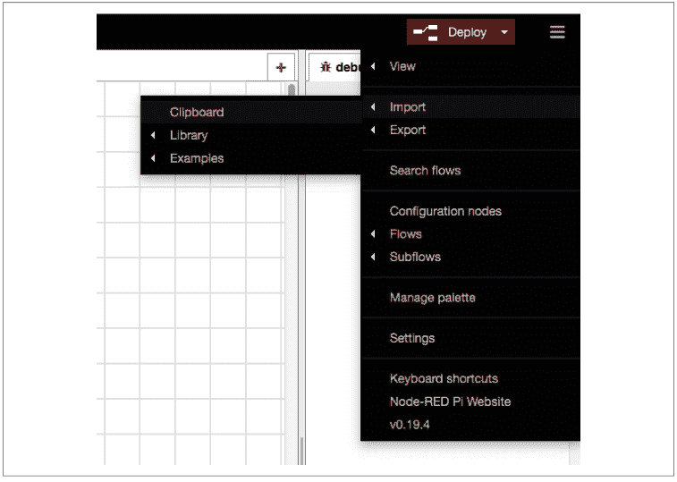

图18-7. 选择“Import from Clipboard”选项

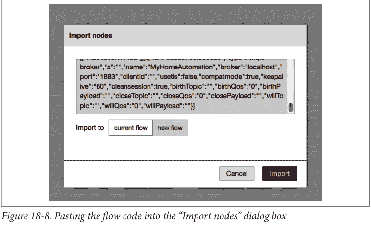

图18-8. 将流程代码粘贴到“Import nodes”对话框中

当你点击Import时，流程将出现在一个新标签页中（图18-9）。

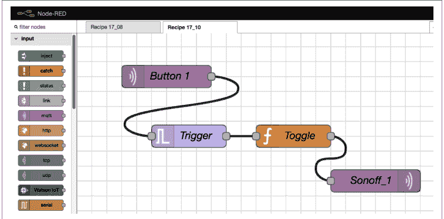

*图18-9. 新导入的流程*

### 另请参阅

要了解如何使用MQTT控制WiFi开关，请参阅[食谱18.5](Recipe 18.5)。要查看使用Node-RED的类似食谱，请参阅[食谱18.6](Recipe 18.6)。

阅读更多关于[MQTT QoS级别](MQTT QoS levels)的信息。

更多信息，请参阅[Node-RED完整文档](full documentation on Node-RED)。

## 18.3 为MQTT使用刷写Sonoff WiFi智能开关

### 问题

你想将WiFi智能开关与MQTT一起使用，以便可以直接从树莓派控制家用配件。

### 解决方案

将新固件（Tasmota）刷写（安装）到低成本的Sonoff WiFi开关上，通过Web界面配置开关，然后使用MQTT控制它。

Sonoff Web开关（如[图18-10](Figure 18-10)所示）提供了一种极其低成本的方式来无线开关照明和其他电器。

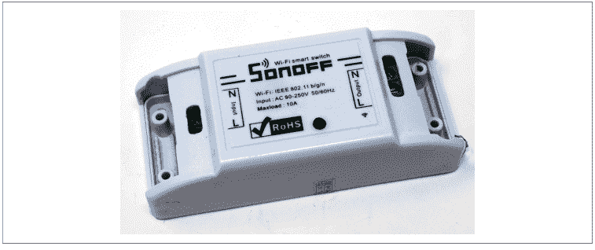

图18-10. Sonoff WiFi开关

然而，Sonoff开关上预装的固件是专有的，并依赖于中国的服务器进行互联网通信。如果你更希望对设备进行本地控制，并且实际上改进原始固件，你应该按照这个食谱将新的开源固件刷写到你的Sonoff上。

你可以从树莓派上完成所有这些操作，但你需要一些东西：

- 一个Sonoff Basic Web开关（参见第566页的“模块”）
- 一排四个排针（参见第567页的“杂项”）
- 四根母对母跳线（参见第564页的“原型设备和套件”）
- 焊接设备和焊料（参见第564页的“原型设备和套件”）

你还需要一个树莓派2或更高版本，因为早期的树莓派无法在3.3V下提供足够的电流来为Sonoff供电。

> **危险：高压**

使用Sonoff切换交流电（AC）需要将火线连接到Sonoff的螺丝端子。这是电工的工作，应仅由有资格的人完成。

在Sonoff开箱后，*在*将其接入家庭电路之前对其进行刷写。你可以在不连接交流电源的情况下对其进行配置。树莓派将为其供电。

在将Sonoff连接到交流电之前，请将其拆开，因为你需要将一排四个排针焊接到Sonoff电路板上提供的孔中。

图18-11显示了孔的位置，并标记了我们感兴趣的四个排针的作用。实际上，它们是Sonoff的一个串行端口。

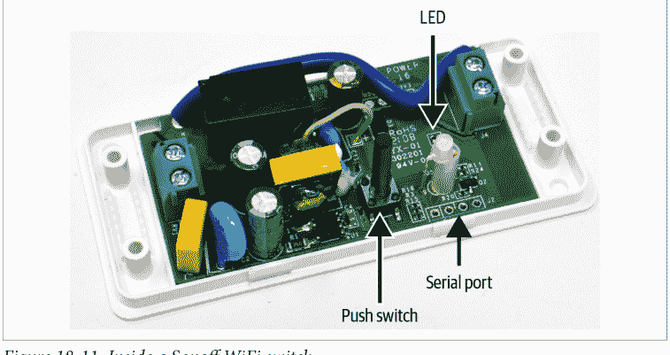

图18-11. Sonoff WiFi开关内部

请注意，不同版本的Sonoff的串行接口位置略有不同。你可能需要查看电路板的背面，找到标有3V、RX、TX和GND的焊盘来找到串行接口。

一旦排针焊接到位，你的Sonoff看起来会像图18-12。

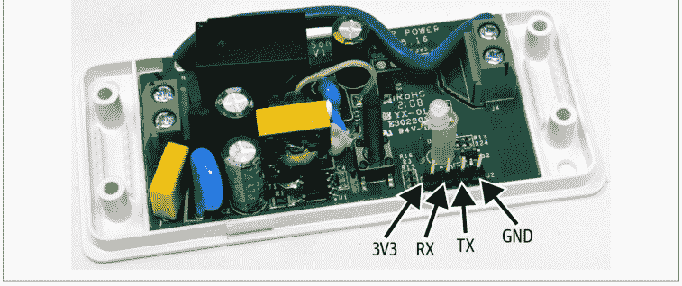

图18-12. 串行端口上连接了排针的Sonoff

现在你需要将Sonoff上的排针连接到树莓派的GPIO引脚，如下所示（以图18-13为参考）。

- Sonoff 3.3V 连接到 树莓派 3.3V
- Sonoff RX 连接到 树莓派 TXD
- Sonoff TX 连接到 树莓派 RXD
- Sonoff GND 连接到 树莓派 GND

图18-13显示了使用GPIO适配器连接到Sonoff的树莓派400。

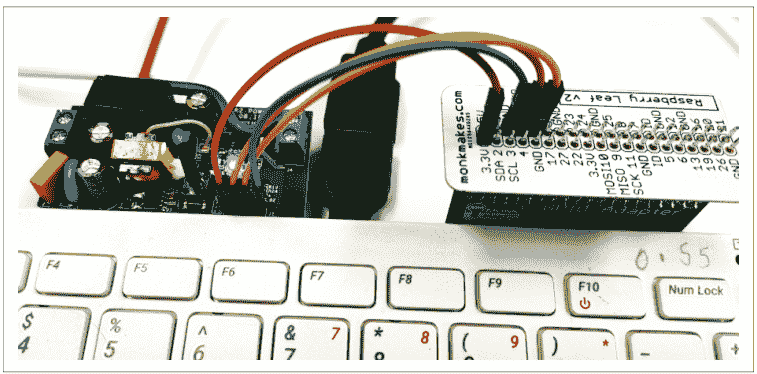

更改Sonoff的固件（*刷写*）需要一个名为esptool的Python软件。要将其下载到你的树莓派上，请运行以下命令：

```
$ git clone https://github.com/espressif/esptool.git
$ cd esptool
```

下载软件后，我们还需要获取要刷写到Sonoff上的替代Tasmota固件。为此，请在*esptool*目录中运行以下命令。

```
$ wget https://github.com/arendst/Sonoff-Tasmota/releases/download/v6.6.0/sonoff-basic.bin
```

这将获取一个名为*sonoff-basic.bin*的文件到*esptools*目录中。
剩余过程如下：

1. 将Sonoff置于*刷写*模式。
   目前，你的Sonoff上的LED可能正在愉快地闪烁。要将Sonoff置于刷写模式，请断开GND导线，按下Sonoff的按钮开关（图18-11），然后重新连接GND导线，从树莓派为Sonoff上电。Sonoff上电后，几秒钟后松开按钮开关。

Sonoff的LED应该不再闪烁。它现在处于刷写模式，准备接收新程序。

2. 擦除Sonoff。

确保你仍在*esptools*目录中，并运行命令擦除Sonoff。你应该在终端中看到如下所示的消息：

```
$ cd ~/esptools
$ python3 esptool.py --port /dev/serial0 erase_flash
esptool.py v4.3-dev
Serial port /dev/serial0
Connecting...
Failed to get PID of a device on /dev/ttyS0, using standard reset sequence.
......
Detecting chip type... Unsupported detection protocol, switching and trying again...
Connecting...
Failed to get PID of a device on /dev/ttyS0, using standard reset sequence.

Detecting chip type... ESP8266
Chip is ESP8285N08
Features: WiFi, Embedded Flash
Crystal is 26MHz
MAC: c4:4f:33:eb:0f:73
Uploading stub...
Running stub...
Stub running...
Erasing flash (this may take a while)...
Chip erase completed successfully in 1.4s
Hard resetting via RTS pin...
```

3. 将Tasmota软件刷写到Sonoff上。

运行命令将你之前获取的*sonoff-basic.bin*文件刷写到Sonoff上：

```
$ python3 esptool.py --port /dev/serial0 write_flash -fs 1MB -fm dout 0x0 sonoff-basic.bin
esptool.py v4.3-dev
Serial port /dev/serial0
Connecting...
Failed to get PID of a device on /dev/ttyS0, using standard reset sequence.
......
Detecting chip type... Unsupported detection protocol, switching and trying again...
```

## 18.3 刷写 Sonoff WiFi 智能开关

正在连接...
无法获取 /dev/ttyS0 上设备的 PID，使用标准重置序列。

正在检测芯片类型... ESP8266
芯片为 ESP8285N08
特性：WiFi，嵌入式闪存
晶振频率：26MHz
MAC 地址：c4:4f:33:eb:0f:73
正在上传引导程序...
正在运行引导程序...
引导程序运行中...
正在配置闪存大小...
将从 0x00000000 到 0x00069fff 擦除闪存...
已压缩 432432 字节至 300963 字节...
已写入 432432 字节（压缩后 300963 字节），地址 0x00000000，耗时 27.0 秒（有效速率 128.0 kbit/s）...
数据哈希已验证。

正在离开...
通过 RTS 引脚进行硬重置...

### 讨论

当所有这些步骤完成后，你可以断开跳线，并请专业人员安装你的 Sonoff，使其接入交流电源，准备切换你计划控制的任何设备。

然而，在将新刷写的 Sonoff 连接到交流电源或放置到难以触及的位置之前，进行更多测试可能是明智的。因此，如果你愿意，可以通过保留 3.3V 和 GND 跳线，继续从你的树莓派为 Sonoff 供电。当 Sonoff 开启时，LED 会亮起。

除了我在此使用的 Sonoff 型号外，还有许多其他型号可供选择，包括一些看起来像普通电灯开关但内置 WiFi 模块的型号。

### 另请参阅

有关 Tasmota 的更多信息，请参阅 [https://oreil.ly/aevZD](https://oreil.ly/aevZD)。

刷写完你的 Sonoff 后，请按照下一个步骤（步骤 18.4）进行配置。

## 18.4 配置 Sonoff WiFi 智能开关

### 问题

你需要将你的 Sonoff WiFi 开关加入你的家庭 WiFi 网络。

### 解决方案

首先，使用步骤 18.4 将 Tasmota 固件刷写到你的 Sonoff 上。如果你的 Sonoff 上已有 Tasmota 固件并且已通电（无论是使用树莓派（Pi 2 或更新型号）的 3.3V 电源，还是在原位使用交流电源），你现在可以通过连接到它将运行的无线接入点来配置 Sonoff。在撰写本文时，你无法使用树莓派完成此操作，因为当你加入后，无线接入点不会像使用 Mac 或 Windows PC 连接时那样触发欢迎页面打开。相反，你需要在你的 PC 或 Mac 上，甚至在你的智能手机上，连接到名为类似 Sonoff-2500 的 WiFi 接入点（图 18-14）。

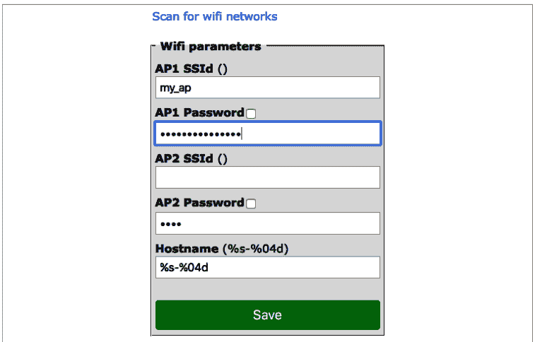

图 18-14. 将 Sonoff 加入 WiFi 网络

你可以选择输入两个无线接入点的凭据。但假设你只有一个接入点，你可以使用页面顶部的“扫描 WiFi 网络”链接，或者直接在 AP1 SSID 字段中输入你的接入点名称，在 AP1 Password 字段中输入你的密码，然后点击保存。

Sonoff 将会重启，如果你输入的接入点凭据正确，它将重启并连接到你的网络。

现在你需要找到 Sonoff 的 IP 地址。像 Android 手机上的 Fing 或 iOS 上的 Discovery 这样的工具可以做到这一点。如图 18-15 所示，在我的情况下，Sonoff 被分配了 IP 地址 192.168.1.84。


图 18-15. 查找 Sonoff 的 IP 地址

### 讨论

现在 Sonoff 已连接到你的网络，它将改变模式，不再运行整个接入点，而是在你的网络上运行一个 Web 服务器，你可以通过它来管理设备。要连接到此网页，请在任何连接到网络的机器上的浏览器中输入 Sonoff 的 IP 地址。你应该会看到类似图 18-16 的内容。

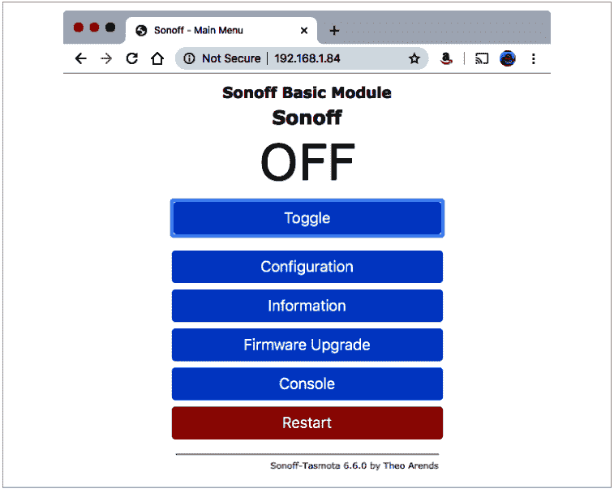

图 18-16. Sonoff 的网页

点击 Toggle 按钮可以打开和关闭 Sonoff 的 LED。如果 Sonoff 实际上已接入你家中的电路，而不是由树莓派供电，它将打开和关闭它所连接的任何设备。

### 另请参阅

要了解如何配置这些开关以与 MQTT 和 Node-RED 配合使用，请参阅 [步骤 18.5](#)。

## 18.5 将 Sonoff Web 开关与 MQTT 一起使用

### 问题

你希望能够使用 MQTT 控制新刷写的 Sonoff Web 开关。

### 解决方案

首先确保你已按照步骤 18.3 和 18.4 将新固件刷写到你的 Sonoff 设备上，并将其配置为连接到你的 WiFi 网络。

要使用 MQTT 控制 Sonoff 开关，你需要使用其 Web 界面配置 Sonoff。在浏览器中输入你的 Sonoff 的 IP 地址（参见步骤 18.4），然后点击 Configuration 按钮。这将打开如图 18-17 所示的菜单。

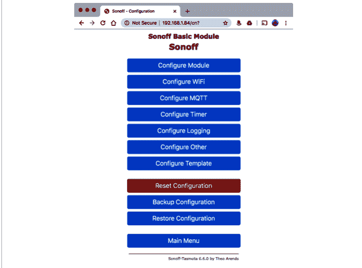

图 18-17. Sonoff Tasmota 配置菜单

点击 Configure MQTT 选项以打开 MQTT 配置页面，如图 18-18 所示。

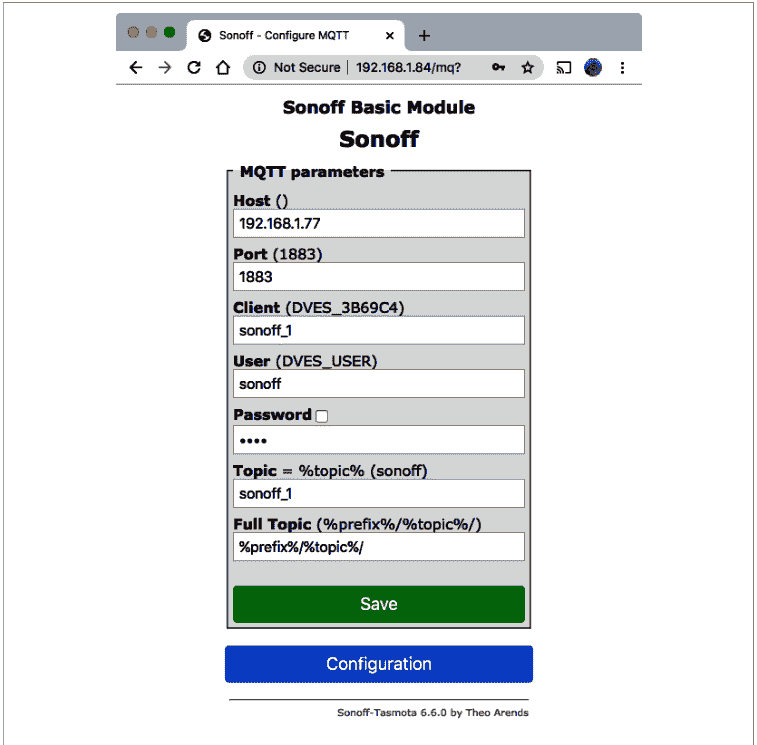

图 18-18. Sonoff Tasmota MQTT 配置菜单

这是我们配置 Sonoff 作为 MQTT 服务器（参见步骤 18.1）客户端并指定其订阅方式的地方，以便当我们发布命令（例如，打开）时，它能理解该命令。

为此，你需要更改配置表单中的一些字段：

- 将 Host 字段更改为运行 MQTT 服务器的树莓派的 IP 地址。
- 将 Client 字段更改为 “sonoff_1”。我们添加了 “_1” 是以防我们最终有多个需要区分的 Sonoff 设备。如果你愿意，也可以在这里使用更有意义的名称——例如，如果 Sonoff 将安装在卧室，可以使用 “bedroom_1_sonoff”。
- User 和 Password 字段未使用，因为我们的 MQTT 服务器没有配置任何安全性。这并不像听起来那么鲁莽，因为除非他们已经在你的网络内，否则任何人都无法做任何事情。所以这些字段填什么并不重要。
- 将 Topic 更改为 “sonoff_1”，因为你最终可能有多个 Sonoff 开关。
- 保持 Full Topic 字段不变。

点击 Save，Sonoff 将会重启自身以使更改生效。

### 讨论

你可以从终端测试此 MQTT 接口。输入以下命令，Sonoff 的 LED 应该会亮起：

```
$ mosquitto_pub -t cmnd/sonoff_1/power -m 1
```

输入此命令再次关闭开关：

```
$ mosquitto_pub -t cmnd/sonoff_1/power -m 0
```

如果这不起作用，请在命令中添加 -d 选项以检查 Mosquitto 客户端命令是否连接到 MQTT 服务器。

### 另请参阅

我们在步骤 18.6 中基于此步骤的工作，使用 Node-RED 控制开关。

## 18.6 将刷写的 Sonoff 开关与 Node-RED 一起使用

### 问题

你想将刷写的 Sonoff Web 开关与 Node-RED 一起使用。

### 解决方案

按照步骤 18.5 让你的 Sonoff 与 MQTT 配合工作，然后在如图 18-19 所示的流程中使用 Node-RED MQTT 节点。

如果你愿意，可以导入流程而不是从头构建。请按照步骤 18.2 讨论部分的说明导入流程。

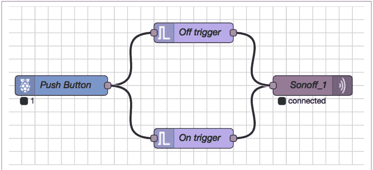

图 18-19. 用于延迟定时器的 Node-RED 流程

此流程假设一个按钮连接到树莓派的 GPIO 25，并且当按下时，Sonoff 将开启 10 秒，然后再次关闭。

按钮的设置方式与我们在步骤 17.3 中使用的按钮相同，需要一个连接到 GPIO 25 的硬件开关（参见步骤 13.1）。

你会在 Node-RED 的 Function 部分找到 Trigger 节点。我们需要两个这样的节点，所以将它们拖到流程中。图 18-20 显示了 “On trigger” 节点的设置。

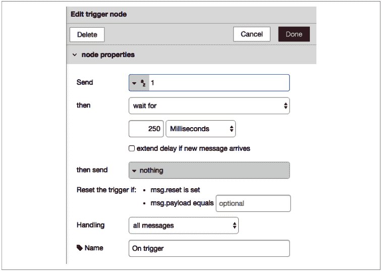

图 18-20. 配置 “On trigger” 节点

此 Trigger 节点配置为在触发时发送 1，等待四分之一秒（用于去抖），然后不再执行任何操作。它被命名为 “On trigger”。

“Off trigger” 与 “On trigger” 不同，因为我们需要它延迟 10 秒，然后再向 Sonoff 发送 0。图 18-21 显示了此节点的设置。

## 18.6 配置“关闭触发器”节点

最后，从输出部分添加一个“mqtt”节点。打开它进行配置（图18-22）。

点击后，服务器字段会提示你添加一个新的MQTT服务器并输入其详细信息，包括名称（我使用了MyHomeAutomation）、IP地址（localhost）和端口（1880）。

如图18-22所示，更改主题和名称字段。现在你可以按照图18-19所示连接所有内容并部署流程。

当你按下按钮时，Sonoff应该会打开，然后在10秒后自动关闭。

### 讨论

这个示例展示了在不编写任何实际代码的情况下，使用Node-RED能走多远。通过将自动化视为消息流，Node-RED提供了一种非常好的编程方式。

要使用运动传感器在预定时间内打开灯光，你可以将开关替换为被动红外（PIR）运动传感器（参见[配方13.9](Recipe 13.9)）。

### 另请参阅

更多信息可在完整的[Node-RED文档](Node-RED documentation)中找到。

## 18.7 使用Node-RED仪表板开关设备

### 问题

你希望能够通过智能手机开关灯光和其他电器。

### 解决方案

安装Node-RED仪表板扩展，向流程添加一些用户界面（UI）控件，然后从手机浏览器访问仪表板。

要安装Node-RED仪表板，请运行以下命令：

```
$ sudo systemctl stop nodered.service
$ apt update
$ cd ~/.node-red
$ sudo apt install npm
$ npm install node-red-dashboard
$ sudo systemctl start nodered.service
```

安装完仪表板后，你将在Node-RED中获得一组新的控制节点（图18-23）。

我们可以使用按钮节点，用网页上的按钮替换我们在配方18.6中使用的物理按钮。此流程如图18-24所示。如果需要，你可以导入流程，而不是从头开始构建。请按照配方18.2讨论部分的说明导入流程。

触发按钮与配方18.6中的“关闭触发器”相同，“Sonoff_1”节点也与配方18.6中的相同节点相同。但是，树莓派GPIO节点被仪表板按钮节点取代。

由于你可能需要相当多的控件来远程控制你的家庭自动化系统，仪表板控件被收集到一个组中，而组本身又被收集到选项卡中。当你从仪表板类别添加新节点时，可以定义自己的组和选项卡。这在你编辑节点时发生（图18-25）。

在图18-25中，你可以看到组被设置为选项卡[Home]中的Lights。要达到这一点，我必须点击“添加新的UI组”。这又要求我“添加一个新选项卡”。一旦你创建了选项卡和组，它们将成为默认值。你不必每次都创建它们。

请注意，在图18-25中，有效载荷被设置为1以打开灯光，并且它直接连接到“mqtt”节点。

现在你可以部署工作流。

要试用新流程，请在手机（或网络上的任何计算机）上打开浏览器，并输入你的树莓派IP地址，后跟:1880/ui。对于我的树莓派，完整URL是http://192.168.1.77:1880/ui。屏幕应如图18-26所示。

当你点击手机上的按钮时，Sonoff应该会打开10秒。

### 讨论

虽然能够在预设时间内打开灯光非常有用，但有一个覆盖开关也很有用。在图18-27中，添加了一个开关。此流程也可在GitHub上找到。

你也可以将其连接到“Sonoff_1” MQTT节点，以便它以及按钮都可以用来开关灯光。图18-28显示了Lights On/Off开关的设置。

当流程部署后，当你返回手机上的*ui*网页（类似*http://192.168.1.77:1880/ui*，但使用你的Node-RED服务器的IP地址）时，UI将自动显示额外的开关（图18-29）。

### 另请参阅

更多信息可在完整的[Node-RED文档](https://nodered.org/docs/)中找到。

## 18.8 使用Node-RED调度事件

### 问题

你想使用Node-RED在特定时间执行某些操作——例如，每晚凌晨1点关闭所有灯光。

### 解决方案

使用Node-RED的*inject*节点。

[图18-30](https://example.com/figure18-30)中显示的流程基于[配方18.6](https://example.com/recipe18.6)的流程。如果需要，你可以[导入流程](https://example.com/import)，而不是从头开始构建。请按照[配方18.2](https://example.com/recipe18.2)讨论部分的说明导入流程。

仪表板*开关*用于开关Sonoff（假设是控制灯光），但此外，还有一个注入节点（自动关闭），配置为向“Sonoff_1” MQTT节点注入一条值为0的消息。图18-31显示了注入节点的配置。

### 讨论

如果你有多个Sonoff开关连接到家中各处的电器，一个注入节点可以通过扇出消息来关闭所有开关，如图18-32所示。

### 参阅

更多信息可在完整的Node-RED文档中找到。

## 18.9 从Wemos D1发布MQTT消息

### 问题

你希望能够使用低成本的可编程WiFi板发布MQTT消息，也许是响应按钮按下。

### 解决方案

使用基于ESP8266的低成本板，如Wemos D1，并配备定制软件。图18-33显示了一个Wemos D1，其一个GPIO引脚上连接了一个Squid Button，由USB移动电源供电。

当按钮被按下时，一条消息将发布到MQTT服务器。

要制作此配方，你需要以下物品：

- 一个Wemos D1 mini（参见第566页“模块”）
- 一个Raspberry Squid Button（参见第566页“模块”）
- 一个USB移动电源或其他为Wemos D1供电的方式

要能够从你的树莓派对Wemos D1进行编程，你需要首先安装Arduino集成开发环境（IDE）。然后你需要添加对ESP8266的支持。

将Squid Button或其他开关连接在名为D6的Wemos引脚和GND之间。

在使用*sketch*（Arduino程序的名称）之前，你需要将MQTT库安装到Arduino IDE中，因此使用以下命令将库作为ZIP文件下载：

```
$ cd ~
$ wget https://github.com/knolleary/pubsubclient/archive/master.zip
```

接下来，打开Arduino IDE。从Sketch菜单中，选择Include Library，然后选择Add ZIP Library。导航到你刚刚下载的文件*master.zip*，库将被安装。

本书的Arduino程序可作为书籍下载的一部分获取（参见配方3.22）。你会在名为*ch_17_web_switch*的文件夹中找到它，该文件夹位于与Python文件夹同级的*arduino*文件夹内。

通过点击*ch_17_web_switch.ino*在Arduino IDE中打开该草图。将板类型设置为Wemos D1，串口设置为/dev/ttyUSB0。

在将草图上传到Arduino之前，你需要对代码进行一些修改。在草图顶部附近找到这些行：

```
const char* ssid = "your wifi access point name";
const char* password = "your wifi password";
const char* mqtt_server = "your MQTT IP address";
```

将ssid、password和mqtt_server的占位符文本替换为适合你设置的相应值。

然后点击Arduino IDE中的上传按钮。

编程完成后，Wemos无需连接到你的Raspberry Pi，因此，如果你愿意，可以通过其他方式为其供电，例如USB移动电源。然而，该草图会打印出有用的调试信息，因此在确认一切正常工作之前，最好保持与Raspberry Pi的连接。要查看此信息，请打开Arduino IDE的串口监视器，其外观应类似于图18-34。

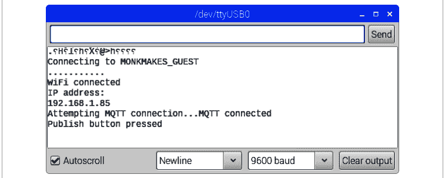

*图18-34. 使用Arduino串口监视器查看Wemos输出*

要测试此配方，请在你的Raspberry Pi上启动一个终端会话，并运行以下命令来订阅按钮按下事件：

```
$ mosquitto_sub -d -t button_1
Client mosqsub/5007-raspberryp sending CONNECT
Client mosqsub/5007-raspberryp received CONNACK
Client mosqsub/5007-raspberryp sending SUBSCRIBE (Mid: 1, Topic: button_1, QoS: 0)
Client mosqsub/5007-raspberryp received SUBACK
Subscribed (mid: 1): 0
Client mosqsub/5007-raspberryp received PUBLISH (d0, q0, r0, m0, 'button_1', ... (16 bytes))
Button 1 pressed
```

现在，每当你按下按钮，消息“Button 1 pressed”就应该出现在终端中。

### 讨论

这是一本关于Raspberry Pi的书，而不是Arduino，因此我们不会详细讲解Arduino C代码。

该代码基于PubSub Client库中名为mqtt_basic的示例草图。除了文件顶部用于WiFi凭证的常量外，这些行：

```
const char* topic = "button_1";
const char* message = "Button 1 pressed";
```

也可能引起你的兴趣。它们确定了要使用的MQTT主题以及伴随发布事件的消息。你可以为一系列Wemos按钮编程，使用不同的主题和消息。

### 另请参阅

要将你新配置的Wemos与Node-RED一起使用，请参阅配方18.10。

你将在第19章中了解更多关于Wemos等设备的信息。

## 18.10 将Wemos D1与Node-RED一起使用

### 问题

你希望将一个连接了按钮的Wemos D1包含在Node-RED流中。

### 解决方案

例如，我们可以在Node-RED流中使用配方18.9中的Wemos WiFi按钮来切换Sonoff网络开关（配方18.4）的开和关。

图18-35显示了此功能的Node-RED流。如果你愿意，可以导入该流，而不是从头开始构建。请按照配方18.2讨论部分的说明导入该流。

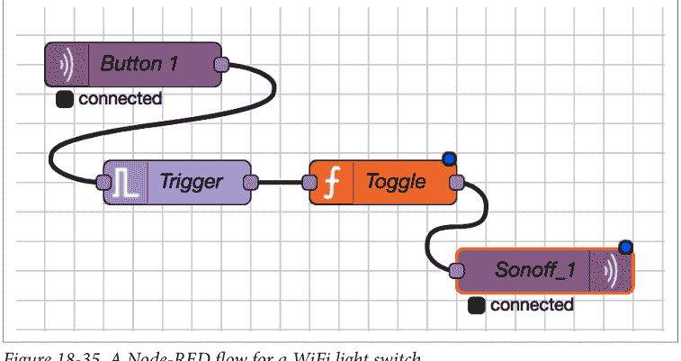

图18-35. 用于WiFi灯开关的Node-RED流

要制作此配方，你将受益于已经尝试过本章中所有先前的配方。

Button 1 MQTT节点订阅来自Wemos D1的消息。图18-36显示了该节点的设置。

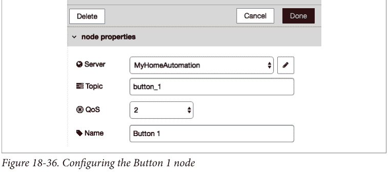

图18-36. 配置Button 1节点

这里重要的是将主题设置为“button_1”。触发器节点的工作方式与配方18.6中的相同。触发器节点更有趣，因为该节点记住一个值（可以是1或0），并在每次消息通过时翻转此值。这必须作为一个通用功能来完成，需要一点JavaScript代码来记住状态并切换它。图18-37显示了该节点的配置，包括代码。这是一个有用的功能，你可能会发现自己在其他项目中会重用它。

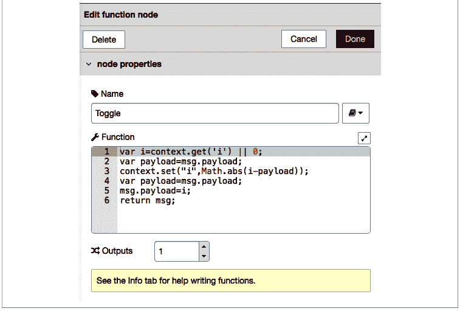

图18-37. 切换功能

### 讨论

Node-RED是一种快速构建家庭自动化系统的强大方式。如果你习惯于传统的编程语言，这种方式需要一点时间来适应；然而，一旦你掌握了它，你就不会再想回去编写大量的代码了。

Node-RED的调色板中还有许多其他有趣的节点，因此花些时间探索它们。将鼠标悬停在节点上会显示其功能的详细信息，你可以通过将节点拖到流上来尝试它。

### 另请参阅

更多信息可在完整的[Node-RED文档](https://nodered.org/docs/)中找到。

# 第19章
Raspberry Pi Pico 和 Pico W

## 19.0 简介

虽然普通的Raspberry Pi非常适合需要网络连接或图形用户界面（GUI）的项目，但其功耗和缺乏任何模拟输入使其在与更简单的微控制器板（如Arduino或Raspberry Pi Pico）相比处于劣势。

Raspberry Pi Pico在几个方面与任何其他Raspberry Pi非常不同：

- 它没有任何键盘、鼠标或屏幕的接口。
- 它具有相对较小的2M闪存用于存储程序（没有microSD卡槽）和264k的RAM。
- 其处理器仅以133 MHz运行，而Raspberry Pi 4的运行频率为1.2 GHz。
- 它没有操作系统。实际上，MicroPython就是它的操作系统，你在Python命令行上看到的就是你得到的。

这可能会让你想知道，为什么你会使用这样一个明显功能较弱的板子，而不是，比如说，Raspberry Pi Zero。

答案是，Pico（图19-1）甚至比Pi Zero成本更低，并且在与外部电子设备接口方面在几个方面优于Raspberry Pi 4。例如：

- 三个模拟输入使得连接模拟传感器比使用普通Raspberry Pi容易得多。
- 六个脉宽调制（PWM）输出。这些输出是硬件定时的，产生的PWM信号比Raspberry Pi所能实现的要准确得多，因此它们更适合控制伺服电机。
- 内置电源允许Pico从1.8V到5.5V供电，并且功耗低，因此你可以用一对AA电池运行它数小时。

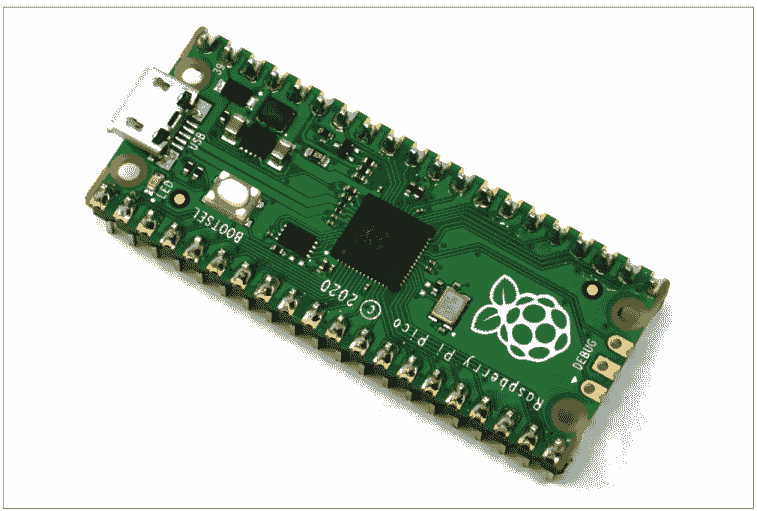

图19-1. Raspberry Pi Pico板

Raspberry Pi Pico W（图19-2）与Pico具有相同的引脚排列，但你在板子右侧看到的金属矩形是一个WiFi和蓝牙模块。这使得Pico W适用于连接项目。Pico W仍然物有所值，但比Pico贵得多。

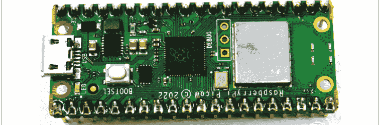

图19-2. Raspberry Pi Pico W

在本章的剩余部分中，我将把Raspberry Pi Pico和Pico W简称为“Pico”（除非差异很重要），并将普通的Raspberry Pi 4或400等简称为“Raspberry Pi”。

## 19.1 将Pico或Pico W连接到计算机

### 问题

你想将你的Pico或Pico W连接到你的Raspberry Pi或Mac或Windows PC，以便对其进行编程。

### 解决方案

Thonny Python编辑器支持Pico和Pico W，并且预装在Raspberry Pi OS中。如果你没有使用过Thonny，请从Raspberry菜单的编程部分打开它。

要将Thonny配置为Pico使用，你需要将其设置为正常模式（配方5.3），以便访问菜单，然后从工具菜单中选择选项，并转到解释器选项卡（图19-3）。

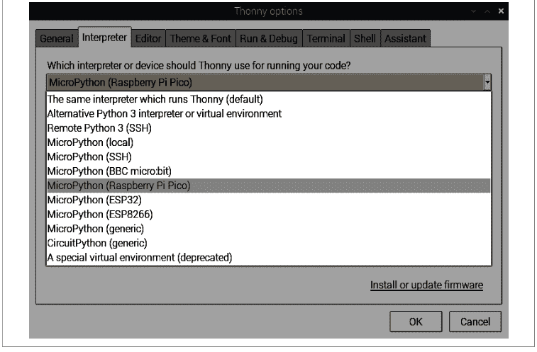

在下拉列表中，选择MicroPython (Raspberry Pi Pico)作为要使用的解释器，然后单击确定。这将带你到一个提供安装MicroPython的屏幕

### 通过下载安装固件

偶尔，你可能会发现你的 Pico 进入了一种“僵尸”状态，看起来像是坏了。通常，这可以通过手动更换固件来修复。可以将其视为一次出厂重置。

如果你使用的是 Pico W，你需要为其下载特定版本的固件。

要手动将新固件安装到你的 Pico 或 Pico W 上，首先将其从你的树莓派或其他电脑上拔下。

如果你使用的是 Pico W，请访问 [https://rpf.io/pico-w-firmware](https://rpf.io/pico-w-firmware)。这将立即开始下载适用于 Pico W 的 .uf2 固件文件。

另一方面，如果你使用的是普通 Pico，请下载该文件。
接下来，按住 BOOTSEL 按钮（图 19-5），并在按住按钮的同时，用 USB 数据线连接 Pico。

松开 BOOTSEL 按钮，你的 Pico 或 Pico W 将作为 USB 闪存存储设备挂载到你的树莓派上（图 19-6，右侧）。
将你之前下载的 .uf2 文件拖放或复制到 Pico 或 Pico W 的文件系统中。

文件复制完成后，Pico 或 Pico W 将自动卸载，并准备好通过 Thonny 接收你的 MicroPython 程序。

如果你发现在树莓派上安装固件不起作用，你也可以在 Mac 或 Windows PC 上安装 Thonny，然后将固件安装到 Pico 上。

### 讨论

当你选择将 MicroPython 安装到你的 Pico 或 Pico W 上时，实际上发生的是一个名为 *MicroPython* 的精简版 Python 3 被安装到了 Pico 的闪存中。正如你将在配方 19.2 中看到的，这允许你通过 Pico 上的 Python Shell 进行交互，并将 Python 程序复制到 Pico 的闪存中运行。

尽管 MicroPython 是 Python 3 的精简版，但你会发现第 5、6 和 7 章涵盖的大部分内容在 MicroPython 中同样适用。此外，还有其他硬件特定的库可用于使用 Pico 的 GPIO 引脚（以及其他功能）。

### 另请参阅

有关 Thonny 的更多信息，请参阅配方 5.3。

## 19.2 在 Pico 上使用 Python Shell

### 问题

已为 Pico 设置好 Thonny 并将 MicroPython 安装到你的 Pico 或 Pico W 上，你想使用 Python Shell 与之交互。

### 解决方案

一旦 Thonny 将 MicroPython 上传到你的 Pico，你应该会在 Thonny 窗口的下半部分看到 Shell 区域出现（图 19-7）。

正如 >>> 提示符所示，这是一个 Python 命令行，你可以在其中输入任何 Python 代码并运行。重要的是，它将在 Pico 上运行，而不是在你常规的树莓派上运行。

Pico 有一个连接到 GPIO 引脚 25 的内置 LED。我们可以使用图 19-7 所示的 Python 命令来开关它。首先，我们必须从 machine 模块导入 Pin 类。然后，我们可以创建一个分配给引脚 25 的 Pin 新实例，并指定它是一个输出（Pin.OUT）。最后，我们可以使用 on 和 off 方法来控制 LED。

### 讨论

machine 模块是一个 MicroPython 模块，包含了与 Pico 实际硬件交互的接口。这看起来与用于控制常规树莓派引脚的 gpiozero 模块有些不同。作为比较，表 19-1 展示了我们刚刚为 Pico 编写的代码，旁边是来自配方 11.1 的等效 gpiozero 代码。

表 19-1. Pico 上的 MicroPython 与树莓派上的 gpiozero 对比

| MicroPython | GPIOZero |
| :--- | :--- |
| from machine import Pin | from gpiozero import LED |
| led = Pin(25, Pin.OUT) | led = LED(18) |
| led.on() | led.on() |
| led.off() | led.off() |

如你所见，方法非常相似。主要区别在于 gpiozero 使用 LED 来表示引脚，并且引脚的方向（输出）是推断出来的，而不是像 Pico 的 MicroPython 代码那样在声明引脚时必须明确说明。

由于本章的代码是 MicroPython，而不是本书其他地方使用的普通 Python，你将在本书代码下载的单独目录 *pico* 中找到它（参见配方 3.22）。你将在这里找到可以在 Thonny 中打开并运行的 MicroPython 程序。

### 另请参阅

更多信息可在 MicroPython 文档中找到。

## 19.3 将 Pico 与面包板一起使用

### 问题

你想将你的 Pico 与无焊面包板一起使用。

### 解决方案

购买一个面包板套件，例如 MonkMakes Electronics Kit 1 for Pico 或 Kitronik Discovery Kit。这些套件都包含一个无焊面包板、跳线和一些入门组件。MonkMakes 套件中的面包板标有 Pico 的引脚名称（见图 19-8），使得连接更加容易。

### 讨论

购买面包板套件将为你节省时间，可能还会省钱，而不是单独购买组件。购买一个写有 Pico 引脚名称的面包板特别有帮助。

图 19-9 展示了树莓派 Pico 的引脚图。Pico W 的引脚图与此相同。

GPIO 引脚标有“GP”后跟一个数字。许多引脚具有次要功能，例如连接到各种类型的串行连接（UART、I2C 和 SPI）。此外，一些引脚还可以用作模拟输入（配方 19.7）。因此，在连接简单的电子元件（如 LED 和开关）时，我倾向于从其他未使用的引脚开始，即 GP 2、3、6、7、8、9、10、11、12、13、14、15、20、21 和 22。

### 另请参阅

有关将面包板与常规树莓派一起使用的信息，请参阅 [配方 10.9](Recipe 10.9)。

第 9 到 14 章的许多配方也可以使用 Pico 实现，因此你可能会发现回顾这些章节很有用。

## 19.4 在 Pico 上使用数字输出

### 问题

你想在树莓派 Pico 或 Pico W 上使用数字输出，也许是用来驱动一个 LED。

### 解决方案

使用 MicroPython 的 `machine` 模块中的 `Pin` 类，并且不要超过所有引脚总共 50mA 的电流预算。1mA（毫安）是安培（电流单位）的千分之一。

回顾图 19-9，所有 GPIO 引脚都可以用作数字输出，尽管引脚 12、13、14、15 和 16 的优势在于，如果 Pico 放置在面包板顶部，它们靠近面包板末端，附近有更多的空闲行。

我们将把一个 LED 连接到 Pico 的引脚 16（见图 19-10）。Pico 的 G（地或 GND）引脚连接到面包板的负电源轨，该电源轨也连接到 LED 的负极较短引脚。LED 的正极连接到一个 470Ω 电阻，该电阻将电流限制回引脚 16。

正如你在配方 19.2 中看到的，Pin 类包含了你需要的所有方法，既可以将引脚设置为数字输出，也可以开关它。因此，你将在 pico 文件夹中找到的以下代码（ch_19_blink.py）应该很熟悉：

```
from machine import Pin
from utime import sleep
led = Pin(16, Pin.OUT)
while True:
    led.on()
    sleep(0.5) # 暂停
    led.off()
    sleep(0.5)
```

与本书中所有的程序示例一样，你也可以下载此代码（参见配方 3.22）。

在 MicroPython 中，sleep 函数位于 utime 模块中，而不是普通 Python 中使用的 time 模块。然而，它在这里的作用相同，即暂停半秒钟。

### 讨论

所有 GPIO 引脚的总电流预算为 50mA。也就是说，当你将连接到 GPIO 引脚的所有设备的电流相加时，不应超过 50mA。LED 不应直接连接到 GPIO 引脚，而应串联一个电阻来设定 LED 将消耗的电流。如果没有这样的电阻，LED 可能会消耗过多电流并损坏 Pico，或者至少损坏该 GPIO 引脚。大多数指示灯 LED 设计为在约 15mA 时接近其最大亮度发光。因此，你可以连接三个消耗 15mA 的 LED（总计 45mA），仍然有一点电流预算剩余。然而，现代高亮度 LED 在 5mA 下工作良好，甚至在 1mA 下也能勉强工作。

如图 19-10 所示，连接了串联电阻的 LED 所消耗的电流 I 由以下公式决定：

$$I = \frac{3.3 - V_f}{R}$$

其中 $V_f$ 是 LED 的正向电压。这主要取决于 LED 的颜色，红色 LED 的 $V_f$ 通常约为 2V。$R$ 是电阻的值，单位为 $\Omega$（欧姆）。

例如，如果你使用一个 $V_f$ 为 2V 的红色 LED 和一个 470$\Omega$ 的电阻，电流将是：

(3.3 - 2) / 470 = 0.00276 A = 2.76mA

电阻有标准值，常见的有 100$\Omega$、270$\Omega$、470$\Omega$ 和 1k$\Omega$（1,000$\Omega$）。更复杂的是，$V_f$ 通常是在 20mA 时的 $V_f$，而这实际上在较低电流下会略有下降。表19-2将为您提供一个有用的参考，帮助您选择串联电阻，无需进行数学计算。

表19-2. LED串联电阻选择器

| LED颜色 | 串联电阻值 | 近似电流 |
| :--- | :--- | :--- |
| 红色 (V<sub>f</sub> = 1.8) | 100Ω | 15mA |
| 红色 (V<sub>f</sub> = 1.8) | 270Ω | 6mA |
| | 470Ω | 3mA |
| 红色、橙色 (V<sub>f</sub> = 2.0) | 100Ω | 13mA |
| | 270Ω | 5mA |
| | 470Ω | 3mA |
| 黄色、绿色 (V<sub>f</sub> = 2.2) | 100Ω | 11mA |
| | 270Ω | 4mA |
| 蓝色、白色 (V<sub>f</sub> = 3.5)<sup>a</sup> | 100Ω | 4mA<sup>a</sup> |

<sup>a</sup> 尽管理论上，低于正向电压的电源电压意味着您可以不使用电阻直接驱动LED，但这仍可能导致电流过大。因此，即使对于蓝色和白色LED，使用一个100Ω的电阻也是一个好主意。

### 另请参阅

有关将LED连接到GPIO引脚的更多信息，请参阅配方11.1。
有许多在线计算器可用于计算串联电阻的值。这是一个不错的计算器。
这里与面包板一起使用的电阻带有彩色条纹，表示其电阻值。

## 19.5 在Pico上使用数字输入

### 问题

您希望能够将开关或其他数字输入连接到Raspberry Pi Pico或Pico W。

### 解决方案

将您的开关（或其他作为数字输入的源）连接到您的Pico，并使用`Pin`类将引脚设置为输入模式并读取其值。
让我们从将开关连接到Pico的一个GND引脚和引脚16之间开始。我们可以在面包板上完成此操作，如图19-11所示。

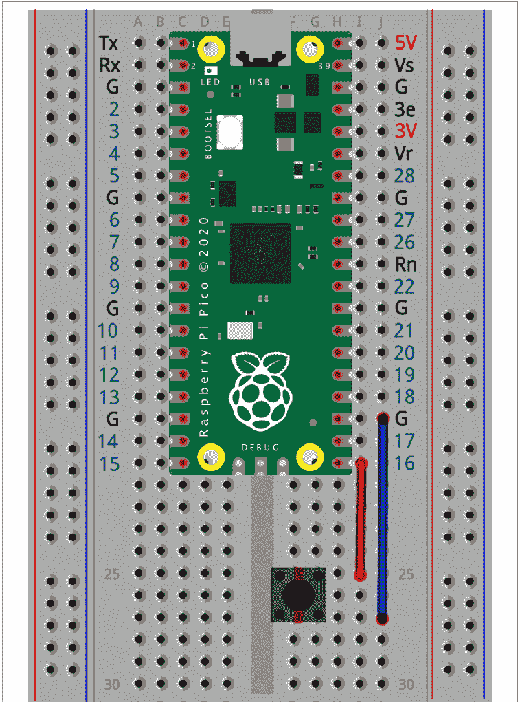

图19-11. 将开关连接到Pico

请注意，图19-11中所示的轻触开关是两引脚版本。如果您的开关有四个引脚，那么它可以放在同一行，但需要跨越面包板的两半。

程序`ch_19_digital_input.py`会重复读取引脚16的数字输入，并根据开关是否被按下显示1或0。在Thonny中打开它并尝试运行：

```
from machine import Pin
from utime import sleep

switch = Pin(16, Pin.IN, Pin.PULL_UP)

while True:
    print(switch.value())
    sleep(0.1)
```

与本书中的所有程序示例一样，您也可以下载此代码（参见配方3.22）。

### 讨论

在前面的示例中，当变量`switch`被赋值为`Pin`的一个实例时，创建`Pin`新实例的调用有三个参数：

- 引脚编号
- 方向
- `Pin.PULL_UP`

最后一个参数在Pico的GPIO引脚电路内部执行了一些巧妙的操作。它打开一个晶体管，连接一个内部上拉电阻（图19-12）。这个电阻的值约为20kΩ，将GPIO引脚上拉至约3.3V。如果没有这个电阻，GPIO引脚将被称为*浮空*。这意味着该引脚会像天线一样拾取电气噪声，并在开和关之间或多或少随机地翻转，这不是您在开关中想要的行为。GP16没有什么特别的——Pico的所有GPIO引脚都具有此功能。

当开关被按下时，GP16连接到GND（0V）。这极大地压倒了微弱的上拉电阻，将GP16从高电平拉到低电平。这就是为什么程序`ch_19_digital_input.py`在开关按钮被按下时显示0，而在释放时显示1，这有点违反直觉。

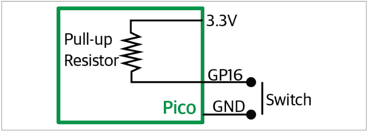

图19-12. 内部上拉电阻

### 另请参阅

要将开关连接到常规Raspberry Pi的GPIO引脚，请参阅配方13.1。

## 19.6 在Pico上使用模拟（PWM）输出

### 问题

您希望从Pico或Pico W上的Python程序改变LED的亮度。

### 解决方案

使用Pico的PWM（脉宽调制）功能来控制供给LED的平均功率。

要尝试此操作，您可以按照配方19.4中描述的方式将外部LED连接到Pico，或者如果您愿意，可以使用Pico的内置LED。如果您决定使用内置LED，请记住在以下示例程序中将引脚从16更改为25，您可以在文件`ch_19_pwm.py`中找到该程序：

```
from machine import Pin, PWM
from utime import sleep

led = PWM(Pin(16))

while True:
    brightness_str = input("brightness (0-65534):")
    brightness = int(brightness_str)
    led.duty_u16(brightness)
```

与本书中的所有程序示例一样，您也可以下载此代码（参见配方3.22）。

在Thonny中运行该程序。在Python控制台中，您将被提示输入一个介于0（关闭）和65534（最大亮度）之间的亮度值。

### 讨论

PWM为LED提供不同时长的脉冲，以控制其表观亮度。您将在配方11.3中找到对此的详细解释。

要将输出引脚变为PWM输出引脚，您只需用`PWM(Pin(16))`将其包装在`PWM`类中。然后，您可以通过调用听起来相当不友好的`duty_u16`方法来更改输出的占空比。`u16`部分表示无符号16位数字。无符号16位数字的最大值是65535，而不是65534，但Pico的官方文档指出最大占空比值应为后者，因此我们在此使用它。

如果您在常规Raspberry Pi上使用过PWM，您可能注意到LED亮度可能会略有变化。这种不可靠性是因为常规Raspberry Pi上的PWM是在软件中实现的，并且时不时地，Raspberry Pi OS会停止生成PWM脉冲，转而去处理其他操作系统任务。Pico上PWM的巨大优势在于，Pico在专门用于生成脉冲的硬件中实现PWM，因此非常可靠。

### 另请参阅

常规Raspberry Pi上的PWM在配方11.3中有描述。

## 19.7 在Pico上使用模拟输入

### 问题

您希望使用MicroPython在Pico或Pico W上读取模拟电压。

### 解决方案

将一个介于0和3.3V电源之间的电压源连接到具有模拟功能的GPIO引脚（26、27和28）之一，并使用Pico的ADC（模数转换器）来测量电压。

为了说明这个配方，我们将使用一个微调电位器（一个电位器或可变电阻）向引脚26提供介于0和3.3V之间的电压，具体取决于其旋钮的位置。图19-13展示了如何在面包板上进行接线。任何介于1kΩ和100kΩ之间的电位器值都可以正常工作。一个小型微调电位器，例如MonkMakes Electronics Kit 1 for Pico中提供的那个，可以很好地安装在面包板上。

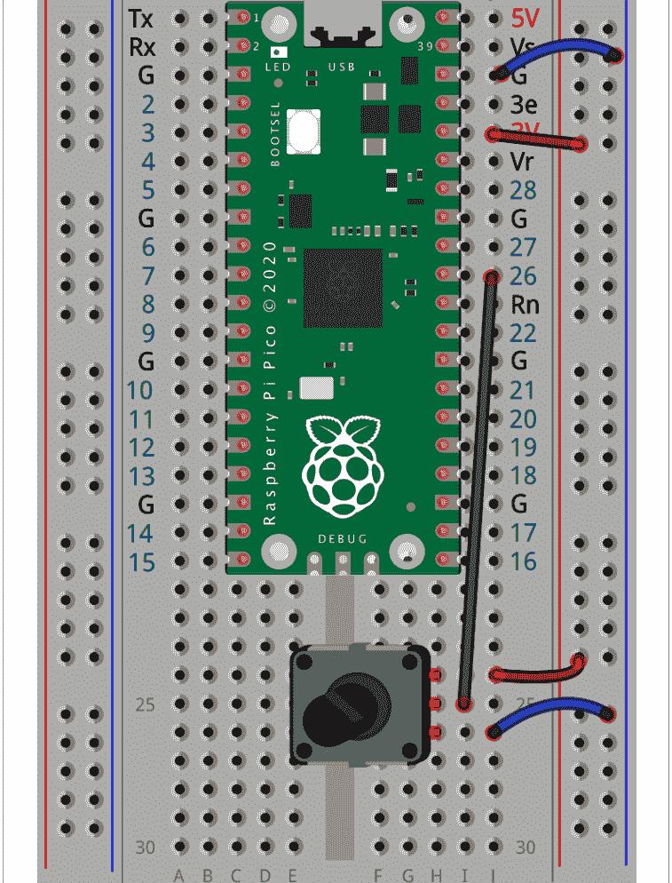

图19-13. 使用Pico测量电压

将程序`ch_19_voltmeter.py`加载到Thonny中并运行它。您应该会看到一系列电压读数。尝试旋转电位器的旋钮，您应该会看到电压发生变化：

```
from machine import ADC, Pin
from utime import sleep

analog = ADC(26)

def volts_from_reading(reading):
    min_reading = 336
    max_reading = 65534
    reading_span = max_reading - min_reading
    volts_per_reading = 3.3 / reading_span
    volts = (reading - min_reading) * volts_per_reading
    return volts

while True:
    reading = analog.read_u16()
    print(volts_from_reading(reading))
    sleep(0.5)
```

与本书中的所有程序示例一样，您也可以下载此代码（参见配方3.22）。

### 讨论

要读取模拟输入而不是配方19.5中的数字输入，您必须将引脚包装在`ADC`类中。然后，您可以使用`read_u16`获取相关引脚介于0和65534之间的模拟值。

尽管返回的值是一个无符号16位数字，但ADC的分辨率只有12位，提供4096个不同的可能值。函数`volts_from_reading`将原始模拟读数转换为电压。ADC并不能完全从0测量到3.3V。存在死区。因此，即使模拟输入连接到GND（0V），ADC也会读取大约336的值。在函数`volts_from_reading`中，这被视为`min_reading`，而`max_reading`被视为65534（如前所述）。因此，读数的跨度是`max_reading - min_reading`，从而可以计算出`volts_per_reading`的数量。由此，可以计算出输入端的电压。

您不能将所有GPIO引脚用于模拟输入；此功能仅在引脚26、27和28上可用。然而，模拟通道4在RP2040芯片内部连接到一个模拟温度传感器，在对模拟读数进行一些数学运算后，它将告诉您芯片的温度。您可以使用程序`ch_19_thermometer.py`来尝试此功能：

```
from machine import Pin, ADC
from utime import sleep
```

temp_sensor = ADC(4)
points_per_volt = 3.3 / 65535

def read_temp_c():
    reading = temp_sensor.read_u16() * points_per_volt
    temp_c = 27 - (reading - 0.706)/0.001721
    return temp_c

while True:
    temp_c = read_temp_c()
    print(temp_c)
    sleep(0.5)

请注意，这是模拟通道4——不是引脚4——因此你仍然可以正常使用引脚4。

函数 `read_temp_c` 使用温度传感器的 `read_u16` 进行模拟读数，然后对其应用一些数学计算，得出以摄氏度为单位的温度。这些数值常量取自 Pico 的 RP2040 处理器的数据手册。

该传感器报告的是处理器的温度，而非环境温度，但即便如此，如果你将手指放在处理器芯片上，它会升温，读数应该会上升。

模拟输入的存在使得将各种模拟传感器连接到你的 Pico 成为可能，包括光、温度、机械应力甚至气体传感器。第14章中的许多食谱都可以轻松适配以在 Pico 上使用。

### 另请参阅

要为树莓派添加模拟输入，请参阅食谱 14.7。

查看 RP2040 的数据手册。

## 19.8 从 Pico 控制伺服电机

### 问题

你想使用你的 Pico 或 Pico W 控制伺服电机。

### 解决方案

将伺服电机的电源连接到 Pico 的 5V 电源，并将一个 GPIO 引脚连接到伺服电机的控制引脚。然后使用 PWM 类生成脉冲来设置伺服电机的角度。

使用公对公跳线连接伺服电机，如图 19-14 所示。伺服电机使用不同的颜色方案来标识引线。

在图 19-14 中，黑色是地线，红色是 5V，黄色是控制引脚。另一种典型的颜色方案是棕色为地线，红色为 5V，橙色为控制线。请查看你的伺服电机的数据手册以找到正确的引脚。

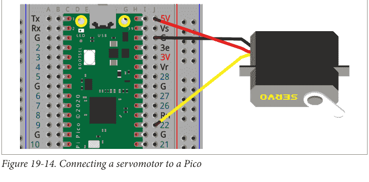

在 Thonny 中打开 ch_19_servo.py 并运行它。Shell 会提示你输入一个 0 到 180 之间的角度（图 19-15）。当你按下回车键时，伺服电机的臂应该会移动到新位置。

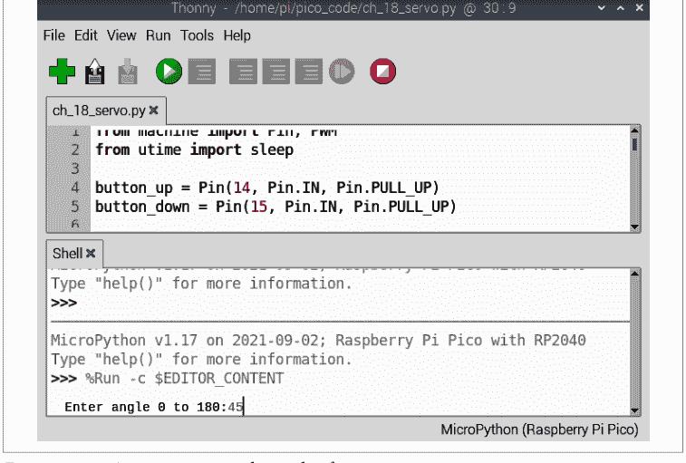

### 讨论

*ch_19_servo.py* 的代码清单如下：

```
from machine import Pin, PWM
from utime import sleep

servo = PWM(Pin(16))
servo.freq(50) # pulse every 20ms

def set_angle(angle, min_pulse_us=500, max_pulse_us=2500):
    us_per_degree = (max_pulse_us - min_pulse_us) / 180
    pulse_us = us_per_degree * angle + min_pulse_us
    # duty 0 to 1023. At 50Hz, each duty_point is 20000/65535 = 0.305
    # us/duty_point
    duty = int(pulse_us / 0.305)
    # print("angle=" + str(angle) + " pulse_us=" + str(pulse_us) + " duty="
    #     + str(duty))
    # print(angle)
    servo.duty_u16(duty)

angle = 90
set_angle(90)
min_angle = 10
max_angle = 160

while True:
    angle_str = input("Enter angle 0 to 180:")
    angle = int(angle_str)
    if (angle >= 0 and angle <=180):
        set_angle(angle)
```

与本书中所有程序示例一样，你也可以下载此代码（参见[食谱 3.22](Recipe 3.22)）。

伺服电机通过改变控制连接上的脉冲持续时间来控制。你可能需要阅读[食谱 12.1](Recipe 12.1)的讨论部分，其中解释了伺服电机的工作原理。

默认的 PWM 频率对于伺服电机来说太高了，伺服电机期望每 20 毫秒（每秒 50 次）接收一个新脉冲，因此在指定引脚 16 上的 PWM 后，使用 `servo.freq(50)` 将 PWM 频率设置为 50 Hz。

所有计算 PWM 占空比的代码都包含在 `set_angle` 函数中。正如你所料，它接受角度本身作为参数，但还有两个可选参数 `min_pulse_us` 和 `max_pulse_us`，用于设置以微秒为单位的最小和最大脉冲长度（因此有 `_us` 后缀）。这些可以调整以匹配你的伺服电机，要么使其获得最大角度范围，要么防止其行程两端出现抖动。如果脉冲太短或太长，就会发生这种抖动。

set_angle 函数首先根据脉冲长度范围找出每度对应的微秒数。然后计算所需的脉冲长度（以微秒为单位），最后将其转换为占空比值。

使用 Pico 控制伺服电机比使用普通树莓派效果好得多。Pico 的 PWM 输出的精确计时意味着你不应该看到任何抖动。

### 另请参阅

关于在普通树莓派上控制伺服电机以及更多关于伺服电机的一般信息，请参阅食谱 12.1。

## 19.9 使用 Pico 和 Pico W 的文件系统

### 问题

你想在 Pico 的文件系统中存储和检索数据。

### 解决方案

使用 MicroPython 的文件命令来读取、写入和创建存储在 Pico 上的文件，这些文件可以复制到你的树莓派上。

例如，ch_19_temp_logger.py 中的代码将读取 RP2040 的温度（以摄氏度为单位），并每 10 秒记录一次到文件中。

当你运行程序时，Shell 中会出现新的温度读数。当你记录了足够的数据后，按停止按钮或按 Ctrl-C 结束记录，关闭文件并退出程序。

要查看已写入的文件（temp_reading.txt），你需要转到 Thonny 的“视图”菜单并选择“文件”（图 19-16）。这将在 Thonny 窗口左侧打开一栏，列出 Pico 上的所有文件。你可以双击 temp_readings.txt 在 Thonny 编辑器中打开它，如果你愿意，可以编辑文件然后将其保存回 Pico。你也可以通过右键单击左侧的文件名并选择弹出菜单选项“下载到 /home/pi”将文件传输到你的树莓派。

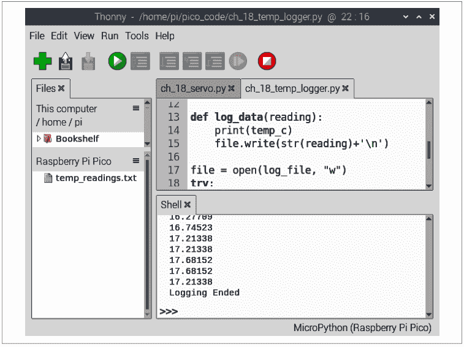

图 19-16. 浏览 Pico 的文件系统

### 讨论

数据记录器程序（*ch_19_temp_logger.py*）的代码如下：

```
from machine import Pin, ADC
from utime import sleep

log_file = 'temp_readings.txt'
temp_sensor = ADC(4)
points_per_volt = 3.3 / 65535

def read_temp_c():
    reading = temp_sensor.read_u16() * points_per_volt
    temp_c = 27 - (reading - 0.706)/0.001721
    return temp_c

def log_data(reading):
    print(temp_c)
    file.write(str(reading)+'\n')

file = open(log_file, "w")
try:
    while True:
        temp_c = read_temp_c()
        log_data(temp_c)
        sleep(10)
except:
    print('Logging Ended')
    file.close()
```

与本书中所有程序示例一样，你也可以下载此代码（参见食谱 3.22）。此示例基于食谱 19.7 讨论中使用的代码构建，并添加了将温度读数写入文件的代码。

你不必导入任何模块来使用文件系统；它是 MicroPython 的一部分，本质上是第 7 章中描述的 Python 3 文件系统的精简版。使用 open 命令打开文件进行写入，该命令将文件名作为第一个参数，模式（w 表示写入）作为第二个参数。这将替换任何同名的现有文件。

log_data 函数打印出提供的读数，然后将其转换为字符串并在末尾添加换行符（\n）后附加到文件中。

主 while 循环被 try/except 包围，这样当你在 Shell 中按 Ctrl-C 时，这会被捕获并关闭文件。

当涉及到读取文件时，你需要以读取（r）模式打开文件，然后可以使用 read 函数将文件内容作为字符串读取。你可以在程序 ch_19_file_read.py 中找到一个例子。这个程序只是在 Shell 中打印出文件的内容：

```
f = open("temp_readings.txt", "r")
print(f.read())
f.close()
```

Pico 的文件系统容量有限，只有 1.6 MB，所以你无法在上面存储视频，甚至无法存储任何大型声音样本。文件系统需要注意的另一个方面是，如果你必须像在食谱 19.1 中那样重新安装 Pico 的固件，你将丢失文件系统的内容。

### 另请参阅

关于在普通树莓派上写入文件，请参阅食谱 7.7，关于读取文件，请参阅食谱 7.8。

## 19.10 利用第二个核心

### 问题

你想使用 Pico 或 Pico W 的第二个核心（处理器）同时做多件事情。

### 解决方案

使用 MicroPython 的 *线程* 机制，让代码与主线程并行运行。你可以在程序 *ch_19_multicore.py* 中找到一个示例：

```python
from utime import sleep
import _thread
from random import randint

def core0():
    while True:
        print("core 0 says hello")
        sleep(randint(1, 3))

def core1():
    while True:
        print("core 1 says hello")
        sleep(randint(1, 3))

_thread.start_new_thread(core1, ( ))
core0()
```

与本书中所有程序示例一样，你也可以下载此代码（参见配方 3.22）。

运行此程序时，你将在 Shell 中看到类似以下的输出：

```
core 1 says hello
core 1 says hello
core 0 says hello
core 1 says hello
core 0 says hello
core 1 says hello
core 0 says hello
```

两个线程中的每一个都会显示一条消息，然后等待一到三秒的随机时间。偶尔，你可能会看到消息出现在同一行。当两个线程竞争访问 USB 端口时，就会发生这种情况。

### 讨论

处理两个线程的一种好方法是将每个线程的代码放入各自的函数中。在前面的示例中，我将这些函数命名为 core0 和 core1。两个函数都包含一个 while True 循环：通过调用 start_new_thread 将 core1 分配给一个物理处理器核心，然后通过调用 core0 函数在另一个处理器核心上启动 core0。

在树莓派上的常规 Python 3 中，你可以创建任意数量的执行线程，但在 Pico 上，你只能使用两个线程。

### 另请参阅

有关在常规 Python 3 中运行多个线程的信息，请参见配方 7.19。

## 19.11 在 Pico W 上运行 WiFi Web 服务器

### 问题

你想利用 Pico 的 WiFi 功能，还有什么比在 Pico W 上运行 Web 服务器更好的方式来展示这一点呢？

### 解决方案

使用 `microdot` Web 服务器模块和 `mm_wlan` WiFi 连接模块。

为方便起见，这些模块包含在本书下载部分的 Pico 测试程序文件夹 `ch_19_webserver` 中。

使用 Thonny 的 SaveAs 菜单选项，然后选择 Raspberry Pi Pico 作为目标，将文件 `pmon.py`、`microdot.py` 和 `mm_wlan.py` 复制到你的 Pico 上。为每个文件指定与原始文件相同的文件名。你可以在图 19-17 中看到文件系统上列出的文件。

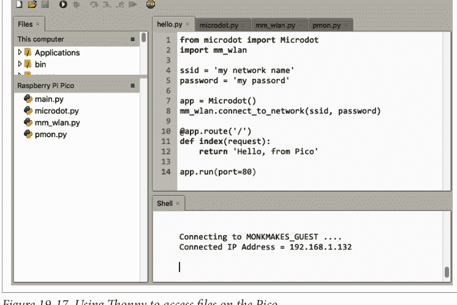

打开文件 *hello.py*，将 ssid 和 password 更改为与你的 WiFi 网络名称和密码匹配，然后从 Thonny 运行 *hello.py*（参见图 19-18）。

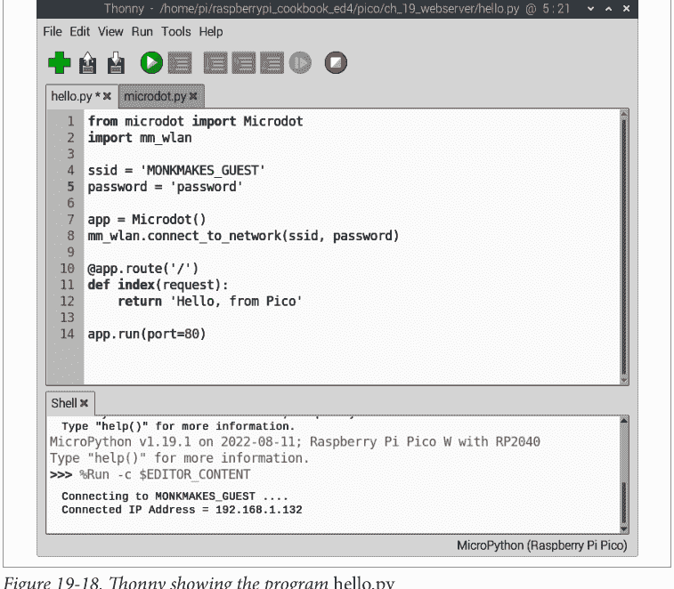

图 19-18. Thonny 显示程序 *hello.py*

在图 19-18 的 Shell 区域，你可以看到 Pico W 已成功连接到 WiFi，并且 IP 地址为 192.168.1.132。如果你现在在浏览器窗口中导航到此地址（无论是在你的树莓派上还是连接到网络的任何其他机器上），你将看到类似图 19-19 的内容。

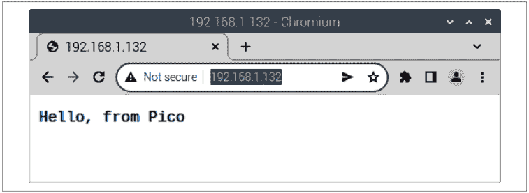

图 19-19. 由 Pico W 提供的网页

### 讨论

*hello.py* 的完整程序如图 19-18 所示，正如你所看到的，它并不复杂。

@app.route('/') 指定了 Pico W 正在提供的根页面的处理程序，这个函数所做的就是返回文本“Hello, from Pico”以显示在网页上。

命令 app.run(port=80) 启动在端口 80 上运行的 Web 服务器，这是标准的 Web 服务端口。

我们可以扩展此示例，以报告连接到 Pico W 的远程传感器的读数。作为示例，我们可以使用配方 14.6 中的植物监测器，但将其连接到 Pico W 而不是常规的树莓派。

按照以下方式将 Pico 连接到植物监测器：

- GND 连接到 GND
- 3V 连接到 3V
- 植物监测器上的 TX 连接到 Pico W 上的 RX
- 植物监测器上的 RX 连接到 Pico W 上的 TX

你可以使用母对母排针直接连接两个设备，或者如图 19-20 所示，使用面包板和公对母跳线。

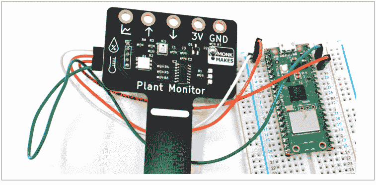

图 19-20. 将植物监测器连接到 Pico W

运行示例 `pico_w_server.py`，然后刷新浏览器窗口。你应该会看到类似图 19-21 的内容。

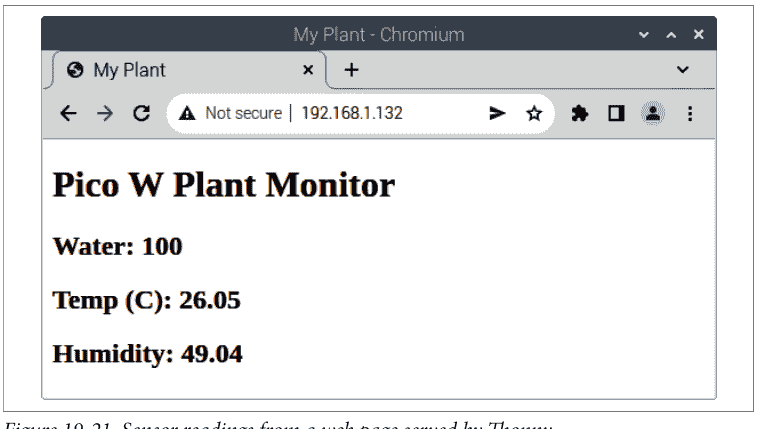

图 19-21. 来自 Thonny 提供的网页的传感器读数

### 另请参阅

有关 [microdot 模块](https://microdot.readthedocs.io/) 和 [mm_wlan](https://micropython.readthedocs.io/en/latest/library/network.WLAN.html) 的更多信息。

如果 microdot 模块的语法看起来很熟悉，那可能是因为它与配方 7.17 中使用的 Bottle 库非常相似。
在 https://oreil.ly/2OBHW 了解有关植物监测器的信息。

## 19.12 使用 Pico 兼容板

### 问题

你想利用众多 Pico 兼容板中的一种。

### 解决方案

Raspberry Pi Pico 的目的之一是展示其使用的 RP2040 处理器的特性。许多其他板也使用 RP2040，并且可以使用 Thonny 以完全相同的方式用 MicroPython 进行编程。
表 19-3 列出了撰写本文时可用的一些有趣的 RP2040 板。我相信，通过互联网搜索会发现其他 RP2040 板。

表 19-3. RP2040 板

| 名称 | 制造商 | 备注 |
|---|---|---|
| QTPy RP2040 | Adafruit | 一块微小的板，减少了 I/O 引脚数量，并配有 USB-C 连接器。 |
| Feather RP2040 | Adafruit | 采用 Adafruit 的 Feather 格式，是带有额外 LiPo 电池充电器和 USB-C 连接器的 Pico。也有粉色版本。 |
| PicoLiPo | Pimoroni | 规格与 Feather RP2040 非常相似。 |
| Badger | Pimoroni | 引脚最少，但有 5 个按钮和一个大型电子墨水显示屏。 |

### 讨论

Pimoroni Badger 是最有趣的 RP2040 板之一。它可以用作 ID 徽章，在其电子墨水显示屏上显示图形和文本，即使在断电后仍会显示。但它也具有 Pico 的全部处理能力，可供你在 MicroPython 中使用。
Badger 附带一个已安装并运行示例程序的 MicroPython 镜像。要与之交互或将你自己的程序放在上面，请使用 USB-C 线（不是 Pico 的 micro USB）将其连接到你的树莓派，然后你就可以像使用 Pico 一样与之交互。
为了方便访问电子墨水显示屏，Pimoroni 包含了一个用于在电子墨水显示屏上绘制图形和文本的 Python 模块。
ch_19_badger.py 中的示例程序（如图 19-22 所示）使用 RP2040 的温度传感器显示一个基本的温度计。

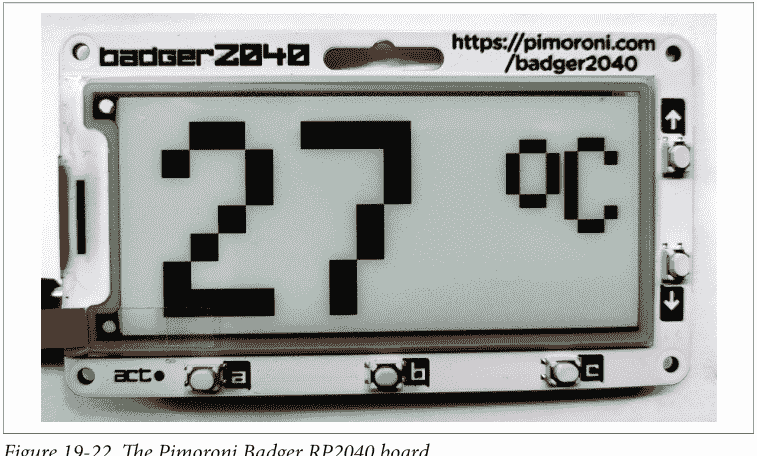

图 19-22. Pimoroni Badger RP2040 板

如果你更喜欢以华氏度显示温度，请使用程序 *ch_19_badger_f.py*。温度可能总是显示比室温高几度，因为这是芯片的温度，而不是环境温度：

```python
import badger2040
from machine import ADC
from utime import sleep

badger = badger2040.Badger2040()
temp_sensor = ADC(4)
points_per_volt = 3.3 / 65535

def read_temp_c():
    reading = temp_sensor.read_u16() * points_per_volt
    temp_c = 27 - (reading - 0.706)/0.001721
    return temp_c

badger.font("bitmap8")

old_t = 0

while True:
    t = round(read_temp_c())
    if t != old_t:
        old_t = t
        badger.pen(255)
        badger.clear()
        badger.pen(0)
        badger.text(str(t), 20, 10, scale=16)
        badger.text("o", 220, 5, scale=8)
        badger.text("C", 255, 20, scale=8)
        badger.update()
    sleep(5)
```

与本书中所有程序示例一样，你也可以下载此代码（参见配方 3.22）。

该程序基于 ch_19_temp_logger.py，并添加了显示温度的代码。模块 badger2040 包含与电子墨水显示屏的接口。创建 Badger2040 类的实例后，默认字体设置为 bitmap8，这是一种相当块状的字体，但作为温度计看起来不错。

主 while 循环读取温度，如果温度发生变化，则重新显示新温度。与其他显示屏不同，电子墨水显示屏刷新缓慢且闪烁相当严重。因此，如果每次通过 while 循环都刷新，显示屏看起来会非常分散注意力。

写入显示屏类似于使用 OLED 显示屏（参见配方 15.4）。要显示的内容在告诉显示屏使用 update 方法更新之前被写入缓冲区。在这种情况下，首先通过将墨水颜色设置为白色 (255) 然后调用 clear() 来清除显示屏。然后将笔颜色设置为 0（黑色），将温度转换为文本，然后将其绘制在坐标 x = 20, y = 10 处。然后显示一些较小的文本作为度数单位。最后，休眠五秒，以防止当测量温度处于两个值之间的阈值时显示屏不断刷新。

### 另请参阅

有关使用 Pimoroni Badger 的更多信息，请参见 https://oreil.ly/EyxoP。

查看 badger2040 模块的参考。

## 19.13 在电池上使用 Pico

### 问题

你想用电池运行你的 Pico 或 Pico W。

### 解决方案

通过使用包含两节 AA 电池的电池组，可以很好地平衡长电池寿命和低成本。

这可以很容易地使用面包板上的 Pico 连接，如图 19-23 所示。

### 讨论

Pico 由于其内置的降压/升压电压调节器，使用电池供电非常方便。该调节器接受输入电压至 Vsys 引脚（在 MonkMakes Pico 面包板上标记为 Vs），输入电压范围可从 1.8V 到 5.5V，并将其转换为 RP2040 所需的 3.3V。

树莓派 4 可能需要数安培的电流，这使其不太适合低功耗电池应用。相比之下，Pico 仅使用约 25mA 的电流。一节 AA 电池通常至少能容纳 2000mAh 的电量，这意味着一对 AA 电池可以持续供电 80 小时或更长时间。

一些兼容 Pico 的开发板，例如 Adafruit 的 Feather RP2040 和 Pimoroni 的 PicoLiPo，允许连接 3.7V 可充电锂聚合物电池。当开发板连接到 USB 时，电池会充电，然后在你拔掉 USB 后为 Pico 供电。

### 另请参阅

了解更多关于 [Feather RP2040](https://www.adafruit.com/product/5423) 和 [PicoLiPo](https://shop.pimoroni.com/products/pico-lipo) 的信息。

# 附录 A

## 零件与供应商

### 零件

以下表格将帮助你找到本书中使用的零件。在可能的情况下，我列出了几个供应商的产品代码。

许多电子元器件制造商和供应商现在都服务于创客和电子爱好者。表 A-1 列出了一些最受欢迎的供应商。

表 A-1. 零件供应商

| 供应商 | 网站 | 备注 |
| --- | --- | --- |
| Adafruit | http://www.adafruit.com | 适合购买模块 |
| Cool Components | https://coolcomponents.co.uk | 提供广泛的树莓派配件 |
| CPC | http://cpc.farnell.com | 英国公司；提供广泛的元器件 |
| Digi-Key | http://www.digikey.com | 提供广泛的元器件 |
| Farnell | http://www.farnell.com | 国际性公司；提供广泛的元器件 |
| MonkMakes | http://www.monkmakes.com | 提供树莓派电子套件等 |
| Mouser | http://www.mouser.com | 提供广泛的元器件 |
| Pimoroni | https://shop.pimoroni.com | 英国零售商和有趣的 HAT 制造商 |
| Pololu | https://www.pololu.com | 非常适合电机控制器和机器人 |
| Seeed Studio | http://www.seeedstudio.com | 提供有趣的低成本模块 |
| SparkFun | http://www.sparkfun.com | 适合购买模块 |

另一个获取元器件的好来源是 eBay。

搜索元器件可能既耗时又困难。[Octopart 元器件搜索引擎](https://octopart.com/) 在追踪零件方面非常有帮助。MonkMakes、Adafruit 和 SparkFun 都提供入门套件。

### 原型设备和套件

本书中的许多硬件项目都使用各种类型的跳线。公对母导线（用于将树莓派 GPIO 连接器连接到面包板）和公对公导线（用于在面包板上建立连接）特别有用。母对母导线偶尔可用于将模块直接连接到 GPIO 引脚。你很少需要超过 3 英寸（75 毫米）长的导线。表 A-2 列出了一些跳线和面包板规格及其供应商。

开始使用面包板、跳线和一些基本元件的一个便捷方法是购买一个入门套件，例如 [MonkMakes 的树莓派项目盒 1 套件](https://monkmakes.com/)。这个套件的开发至少部分考虑了本书。

表 A-2. 原型设备和套件

| 描述 | 供应商 |
|---|---|
| 公对公跳线 | SparkFun: PRT-08431; Adafruit: 759 |
| 公对母跳线 | SparkFun: PRT-09140; Adafruit: 825 |
| 母对母跳线 | SparkFun: PRT-08430; Adafruit: 794 |
| 半尺寸面包板 | SparkFun: PRT-09567; Adafruit: 64 |
| Pi Cobbler | Adafruit: 1105 |
| Raspberry Leaf (26-pin) | Adafruit: 1772 |
| Raspberry Leaf (40-pin) | Cool Components: 3408 |
| 树莓派电子入门套件 | Amazon; MonkMakes |
| Adafruit Perma-Proto for Pi (半面包板) | Adafruit: 1148 |
| Adafruit Perma-Proto for Pi (全面包板) | Adafruit: 1135 |
| Adafruit Perma-Proto HAT | Adafruit: 2314 |
| DC 圆孔插头转螺丝端子适配器 (母) | Adafruit: 368 |
| Pimoroni Breakout Garden HAT | Pimoroni |
| 基础焊接套件 | Adafruit: 136 |

### 电阻和电容

表 A-3 显示了本手册中使用的电阻和电容以及一些供应商。

表 A-3. 电阻和电容

| 零件 | 供应商 |
|---|---|
| 270Ω 0.25W 电阻 | Mouser: 293-270-RC |
| 470Ω 0.25W 电阻 | Mouser: 293-470-RC |
| 1kΩ 0.25W 电阻 | Mouser: 293-1K-RC |
| 3.3kΩ 0.25W 电阻 | Mouser: 293-3.3K-RC |
| 4.7kΩ 0.25W 电阻 | Mouser: 293-4.7K-RC |
| 10kΩ 微调电位器 | Adafruit: 356; SparkFun: COM-09806; Mouser: 652-3362F-1-103LF |
| 光敏电阻 | Adafruit: 161; SparkFun: SEN-09088 |
| 330 nF 电容 | Mouser: 80-C330C334K5R |
| 热敏电阻 T0 1k Beta 3800 NTC | Mouser: 871-B57164K102J (注意：Beta 值为 3730) |

### 晶体管和二极管

表 A-4 列出了本手册中使用的晶体管和二极管以及一些供应商。

表 A-4. 晶体管和二极管

| 零件 | 供应商 |
|---|---|
| FQP30N06L N沟道逻辑电平 MOSFET 晶体管 | Mouser: 512-FQP30N06L; SparkFun: COM-10213 |
| 2N3904 NPN 双极晶体管 | SparkFun: COM-00521; Adafruit: 756 |
| 1N4001 二极管 | Mouser: 512-1N4001; SparkFun: COM-08589; Adafruit: 755 |
| TIP120 达林顿晶体管 | Adafruit: 976; CPC: SC10999 |
| 2N7000 MOSFET 晶体管 | Mouser: 512-2N7000; CPC: SC06951 |

### 集成电路

表 A-5 列出了本手册中使用的集成电路以及一些供应商。

表 A-5. 集成电路

| 零件 | 供应商 |
|---|---|
| L293D 电机驱动器 | SparkFun: COM-00315; Adafruit: 807; Mouser: 511-L293D; CPC: SC10241 |
| ULN2803 达林顿驱动器 IC | SparkFun: COM-00312; Adafruit: 970; Mouser: 511-ULN2803A; CPC: SC08607 |
| DS18B20 温度传感器 | SparkFun: SEN-00245; Adafruit: 374; Mouser: 700-DS18B20; CPC: SC10426 |
| MCP3008 八通道 ADC IC | Adafruit: 856; Mouser: 579-MCP3008-I/P; CPC: SC12789 |
| TMP36 温度传感器 | SparkFun: SEN-10988; Adafruit: 165; Mouser: 584-TMP36GT9Z; CPC: SC10437 |

### 光电子器件

表 A-6 列出了本手册中使用的光电子器件以及一些供应商。

表 A-6. 光电子器件

| 零件 | 供应商 |
|---|---|
| 5 毫米红色 LED | SparkFun: COM-09590; Adafruit: 299 |
| RGB 共阴极 LED | SparkFun: COM-11120; eBay |
| TSOP38238 红外传感器 | SparkFun: SEN-10266; Adafruit: 157 |

### 模块

表 A-7 列出了本手册中使用的模块以及一些供应商。

表 A-7. 模块

| 零件 | 供应商 |
|---|---|
| 树莓派摄像头模块 | Adafruit: 3099; Cool Components: 1932 |
| 电平转换器，四路 | SparkFun: BOB-12009; Adafruit: 757 |
| 电平转换器，八路 | Adafruit: 395 |
| 锂聚合物电池升压转换器/充电器 | SparkFun: PRT-14411 |
| PowerSwitch Tail | Amazon |
| 16通道舵机控制器 | Adafruit: 815 |
| 1A 双路电机驱动器 | SparkFun: ROB-14451 |
| PIR 运动检测器 | Adafruit: 189 |
| 终极 GPS | Adafruit: 746 |
| 甲烷传感器 | SparkFun: SEN-09404 |
| 气体传感器分线板 | SparkFun: BOB-08891 |
| ADXL335 三轴加速度计 | Adafruit: 163 |
| 带 I2C 背板的 4x7 段 LED | Adafruit: 878 |
| 带 I2C 背板的双色 LED 方像素矩阵 | Adafruit: 902 |
| RTC 模块 | Adafruit: 3296 |
| 16x2 HD44780 兼容 LCD 模块 | SparkFun: LCD-00255; Adafruit: 181 |
| Sense HAT | Adafruit: 2738 |
| Adafruit 电容触摸 HAT | Adafruit: 2340 |
| 步进电机 HAT | Adafruit: 2348 |
| 16通道 PWM HAT | Adafruit: 2327 |
| Pimoroni Explorer HAT Pro | Pimoroni; Adafruit: 2427 |
| Squid Button | MonkMakes; Amazon |
| Raspberry Squid RGB LED | MonkMakes; Amazon |
| I2C OLED 显示屏 128x64 像素 | eBay—搜索：I2C OLED Arduino |
| MMA8452Q 三轴加速度计分线板 | SparkFun: SEN-12756 |
| MH-Z14A CO2 传感器模块 | eBay—搜索：MH-Z14A |
| RC-522 RFID 模块 | eBay—搜索：RC-522 |
| Pimoroni VL53L1X 距离传感器分线板 | Pimoroni 或 eBay—搜索：VL53L1X |
| Sonoff Basic WiFi 开关 | ITEAD |
| 树莓派 Zero 摄像头适配器 | Adafruit: 3157 |
| Wemos D1 Mini | eBay—搜索：Wemos D1 Mini |
| Pimoroni Audio DAC Shim (线路输出) | Pimoroni |
| Pimoroni Badger 2040 | Pimoroni |

### 杂项

表 A-8 列出了本手册中使用的杂项工具和元件以及一些供应商。

表 A-8. 杂项

| 零件 | 供应商 |
| --- | --- |
| 1200mAh 锂聚合物电池 | Adafruit: 258 |
| 5V 继电器 | SparkFun: COM-00100 |
| 5V 面板表 | SparkFun: TOL-10285 |
| 标准舵机 | SparkFun: ROB-09065; Adafruit: 1449 |
| 9g 迷你舵机 | Adafruit: 169 |
| 5V 2A 电源 | Adafruit: 276 |
| 低功耗 6V 直流电机 | Adafruit: 711 |
| 0.1英寸排针 | SparkFun: PRT-00116; Adafruit: 392 |
| 5V, 5针单极步进电机 | Adafruit: 858 |
| 12V, 4针双极步进电机 | Adafruit: 324 |
| 轻触开关 | SparkFun: COM-00097; Adafruit: 504 |
| 微型滑动开关 | SparkFun: COM-09609; Adafruit: 805 |
| 旋转编码器 | Adafruit: 377 |
| 4×3 键盘 | SparkFun: COM-14662 |
| 压电蜂鸣器 | SparkFun: COM-07950; Adafruit: 160 |
| 干簧管 | Adafruit: 375 |
| 控制台导线 | Adafruit: 954 |

# 附录 B

## 树莓派引脚定义

## 树莓派 400/4/3/2 型号 B、B+、A+、Zero

图 B-1 展示了当前 40 引脚通用输入/输出（GPIO）树莓派的引脚定义。

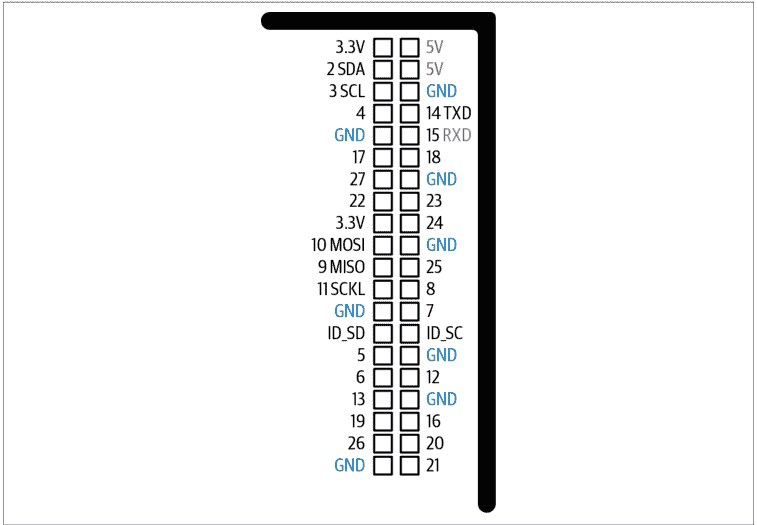

图 B-1. 40 引脚树莓派 GPIO 引脚定义

## 树莓派型号 B 修订版 2、型号 A

如果你购买的是早期的 26 引脚树莓派，那么它很可能是型号 B 修订版 2 的板子，如图 B-2 所示。（如果你拥有这些初代树莓派中的一个，请好好保存；它将来可能会很有价值。）

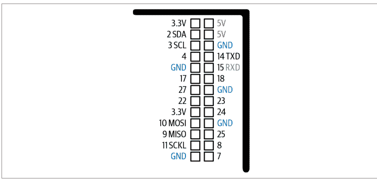

图 B-2. 树莓派型号 B 修订版 2 和型号 A GPIO 引脚定义

## 树莓派型号 B 修订版 1

最早发布的树莓派型号 B（修订版 1）与后来的修订版 2 在引脚定义上有一些细微差别。这是唯一一个与后续引脚定义不兼容的树莓派版本。不兼容的引脚变更在图 B-3 中以粗体突出显示。

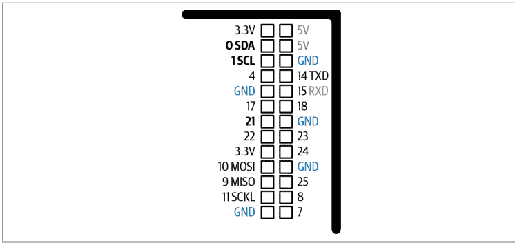

图 B-3. 树莓派型号 B 修订版 1 GPIO 引脚定义

## 树莓派 Pico

尽管树莓派 Pico 也有一个 40 引脚连接器，但其连接方式完全不同，如图 B-4 所示。

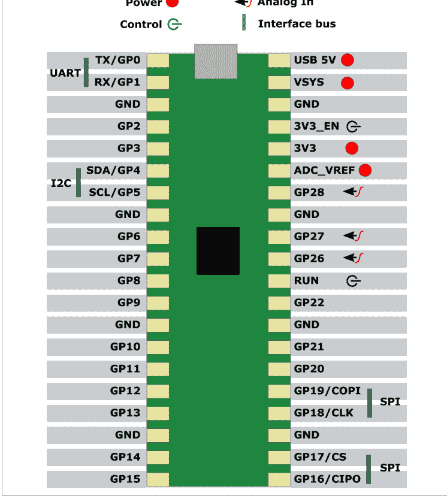

图 B-4. 树莓派 Pico GPIO 引脚定义

# 索引

## 符号

- !（从历史记录运行命令），104
- !=（不等于），164
- #（提示符），84
- #!（shebang），151
- $（提示符），73
- $（正则表达式字符串结尾），220
- &（在后台运行文件），111
    - 自动运行文件，98
- " " "（Python 中的文档字符串），194
    - 读取内容，194
- *（正则表达式零个或多个），220
- *（通配符）
    - 用于执行脚本的 crontab，101
    - 查找文件，103
    - 列出文件，76
    - 删除文件，83
- +（正则表达式一个或多个），220
- .（点号）
    - 隐藏文件，76
    - 列出目录，76
    - 正则表达式单字符匹配，220
- ..（两个点号）
    - 列出目录，76
    - 在目录间移动，74
- /（在路径中），74
- <（小于），164
- <（重定向输入），109
- <=（小于或等于），164
- <>（不等于），164
- =（赋值运算符），151, 155
- ==（等于），164
- >（大于），164
- >（重定向输出），81, 108
- /dev/null，102, 110
- >=（大于或等于），164
- >>>（提示符），149
    - Pico 的 MicroPython，532
- [:]（切片）
    - 列表，181
    - 字符串，160
- []（列表），173, 174, 179
    - 字典条目访问，185
- []（正则表达式匹配的字符），220
- \（转义字符），156
- \d（正则表达式数字），220
- \s（正则表达式空白字符），220
- \w（正则表达式字母数字），220
- ^（正则表达式字符串开头），220
- __（双下划线）
    - 类定义构造方法，194
    - 读取文档字符串，194
    - 计算机视觉版本，226
- {}（字典），184
- {}（格式化字符串），190, 191
- |（管道），109
    - 历史记录通过管道传递给 grep，104
    - ps 通过管道传递给 grep，106
- ~（主目录），73

## A

- 使用 PowerSwitch Tail II 控制交流设备，304
- 加速度测量
    - 惯性测量单元与，412-413
    - 用于测量的 MMA8452Q 模块，407-411
- 首次启动时创建账户，17
    - 更改密码，31
- Adafruit
    - 空气质量板，263
    - 用于 Pi 400 的 bonnet 扩展板，263
    - 电容式触摸 HAT，421-423
    - CircuitPython 开发板，148
    - CircuitPython 库，433
    - 兼容 Pico 的 Feather RP2040，562
    - I2C 设备，266
    - NeoPixels 在线指南，444
    - NeoPixels RGB LED 矩阵，444-446
    - NeoPixels RGB LED 灯带，441-444
    - 舵机控制，322
    - 舵机 HAT，325-327
    - 舵机 HAT 替代方案，327
    - 步进电机 HAT，339
- ADC 芯片（参见模数转换器（ADC）芯片）
- 添加/删除软件工具，120
- 可寻址 RGB LED 矩阵，444-446
- 可寻址 RGB LED 灯带，441-444
- 空气质量板（Adafruit），263
- 别名，112
- 树莓派最大电流，264
- 缺乏模拟输入，261, 375, 392
    - （另请参见模数转换器（ADC）芯片；传感器）
- Pico 开发板上的模拟输入，527, 547
- 模拟温度传感器，547, 551-553
    - Pimoroni Badger 温度传感器，559
    - 电压测量，545-547
- Pico 开发板上的模拟输出，544-545
- 模拟电压表，314-316, 545-547
- 模数转换器（ADC）芯片
    - 缺乏模拟输入，261, 375, 392
    - 与电阻式传感器配合使用，397-398
    - 用于温度测量，399-400
    - 电压测量，391-394, 545-547
- and 逻辑运算符，165
- 用于控制硬件的 Android，306-308
- AngularServo 类（gpiozero），320
- aplay 命令，455, 458
    - 在线文档，455
- append 函数（Python），175
- 用于安装软件的 apt，90
    - 删除已安装软件，91
    - 搜索要安装的软件，91
    - 更新，90
    - 更新操作系统，116
- Arduino
    - 使用两个电阻将 5V 信号转换为 3.3V，278
    - 集成开发环境，522
    - Wemos D1 编程，522-524
- arecord 命令，457
- 用于命令行参数的 argv 变量，205
- Python 中的算术运算，154
- 字符串字符的 ASCII 值，165
- 赋值（=）运算符（Python），151, 155
- Atari 2600 模拟器，123-125
- 大气压测量，402-403
- 音频（参见声音）
- 通过 Tab 键自动补全，75
- 自动化（参见家庭自动化）
- 自动运行程序或脚本
    - 作为服务运行，99-100
    - 命令行参数，206
    - Node-RED 可视化编程工具，473
    - 在启动时运行，98
    - 定期运行，101

## B

- 后台进程，98, 111
    - LED 闪烁，293
- Badger Pico 兼容开发板（Pimoroni），559-561
    - 在线信息，561
- 用于 E Ink 显示屏的 badger2040 库（MicroPython），560
    - 在线参考，561
- 电池
    - 为 Pico 开发板供电的 AA 电池，561
    - 为 Pico 兼容开发板供电的锂聚合物电池，562
    - 为树莓派供电的锂聚合物电池，280
- BBC micro:bit 开发板，148
- 二进制与十进制转换
    - 数字格式化，190
    - 字符串到数字的转换，158
- 双极步进电机，337-339
    - 使用步进电机 HAT 驱动，339
- 位图图像编辑器，127-128
- 闪烁 LED，293
- Blue Dot（Android 应用），306-308
- 用于远程控制的 Blue Dot 库（Python），308
- 用于 Android 和蓝牙控制的 bluedot 库，306
- 蓝牙
    - 使用蓝牙控制硬件，306-308
    - 使树莓派可被发现，306
    - 树莓派 Pico W，528
    - 设置，37-39
- bonnet 扩展板（附加板；Adafruit），263
- 升压稳压模块，280
- 启动
    - 关机后启动，32
    - 设置日期和时间，113
    - 首次启动，17
    - 从硬盘或 USB 闪存盘启动，22-23
    - 树莓派 400，32
    - 重启，32
    - 作为服务运行程序，99-100
    - 在启动时运行程序，98
- bottle 库（Python），210, 461, 466-468
    - 在线文档，212, 466
- 面包板
    - 连接到 GPIO 的跳线，273-274
    - Pico 面包板套件，534-538
    - 电源线，319
    - 来源，564
- break 语句（Python），167
- 浏览器（参见 Web 界面）
- Button 类（gpiozero），277, 353
    - 在线文档，348
- 按钮点击运行函数，217
    - Android 的 Blue Dot 应用，306-308
    - 按钮开关连接，343-346
    - 用户界面，309
- 蜂鸣器，459-460

## C

- 摄像头
    - 树莓派摄像头模块，34-37
    - 用于计算机视觉的树莓派摄像头模块，228
        - （另请参见计算机视觉）
    - 用于机器学习的树莓派摄像头模块，240
    - 用于计算机视觉的 USB 网络摄像头，226-228
        - （另请参见计算机视觉）
    - 用于机器学习的 USB 网络摄像头，240
- 电容式触摸感应，421-423
- 电容器，378
    - 来源，565
- 二氧化碳浓度测量，386-389
- 大小写敏感性
    - Python，152
    - 字符串函数，161
    - 终端，72
- 外壳（机箱），8-11
- cat 命令
    - 连接文件，109
    - 显示操作系统版本，114
    - 查看文件内容，80
- cd 命令，73
- 摄氏度–华氏度转换（Python），154
    - 使用 f-string，191
    - 多个返回值，192
    - 数字格式化，190
- 中央处理器（参见 CPU）
- check_output 函数（Python），206
- CheerLights，480-482
- chmod 命令，87
    - 为所有者设置文件可执行权限，100
    - 八进制计算器，88
- choice 命令（Python），203
- chown 命令，88
- 类（Python）
    - 关于类，193
    - 定义，193-195
    - 文档字符串，194
    - 继承，196
    - 定义的方法，195
    - 多重继承，197
- 关闭文件，197, 198, 552, 553
- 通过计算机视觉计数硬币，229-232
- Color 类（colorzero），276
- 用于 Color 类的 colorzero 库，276
- 写入 USB 闪存盘的逗号分隔值（CSV）文件，428
- 命令历史记录
    - Python 控制台命令历史记录，150
    - 终端命令行历史记录，103
- 命令行，71-73
    - （另请参见终端）
- 共阴极 LED，312
- 通用 Unix 打印系统（CUPS），64-66
- 比较值（Python），164-165
- 用于磁北的指南针，411
- 复合视频连接，24-26
- 用于构建新列表的推导式，182
- 压缩文件，107
- 计算机视觉（CV），225-238
    - 计数硬币，229-232

人脸检测，232-235
安装OpenCV，225
运动检测，235-238
光学字符识别（OCR），238
树莓派摄像头模块用于，228
USB摄像头用于，226-228

连接
文件，109
字符串，156

条件表达式（Python），162

控制台线缆连接，52-56
连接，54
Pi Zero WiFi连接，289
购买，54，56

Python中的控制台，148-150

列表复制命令（Python），181

复制库（Python），181

复制文件或文件夹，76-77

通过计算机视觉统计硬币，229-232

cp命令，76
在线参数信息，77

CPU（中央处理器）
在网页上显示温度读数，466-469
监控使用情况，104-107
休眠功能降低负载，212
测量温度，401
通过IFTTT发送温度通知邮件，473-478
Pico板的温度传感器，547
将温度读数写入USB闪存盘，428

crontab命令，101

写入USB闪存盘的CSV文件格式，428

Ctrl-C停止执行，103，296
bottle网页服务器，464
计算机视觉硬币统计，231
并非总是有效，368
停止声音播放，458
语音命令识别，258

CUPS（通用Unix打印系统），64-66

CV（参见计算机视觉）

Cyberdeck Bonnet（Adafruit），263

## D

达林顿晶体管，300

Node-RED仪表板
设备开关，513-519
调度事件，519-521

通过正则表达式验证数据输入，221

数据结构序列化，199

日期
格式化输出，191
设置，112

datetime命令（Python），210

datetime库（Python），210

直流电机
速度和方向控制器，329-333
速度控制器，327

按钮按压去抖，353-354

Python调试，151

/dev设备
/dev/null，110
串行端口，271，365
SPI，270

df命令，113

DHCP（动态主机配置协议），42，45-47
租约时间，45
保留，46

Python中的字典，184-187
创建，184
查找和更改条目，185
内部顺序本质上是随机的，185，187
迭代，187
删除条目，186
保存为JSON文件，216

数字输入，343-373
按钮按压去抖，353-354
外部上拉电阻，354
GPS，364-366
键盘，359-362
按键拦截，367
鼠标移动拦截，368
运动检测器，362
Pico板，541-544
按钮开关连接，343-346
按钮开关切换，347-348
重置按钮，370-373
旋转（正交）编码器，356-359
三位置（中心关闭）拨动或滑动开关，350-352
两位置拨动或滑动开关，348

Pico板上的数字输出，538-541

数字温度传感器，404-407

二极管，来源，565

目录（文件夹）
复制，76-77
创建，82
通过pwd查看当前目录，73
删除，82
所有权，88
权限，85-88
更改权限，86
重命名，78

安装和使用，248
在线Linux信息，256
用于本地性能的Linux运行器，254-256
识别语音命令，249-254
编辑文件，78-80

编辑器
- Mu，142-148
- Python，140
- Thonny，141
- Visual Studio Code，132-133

显示器，431-447
- 可寻址RGB LED矩阵，444-446
- 可寻址RGB LED灯带，441-444
- 模拟电压表，314-316，545-547
- Pimoroni Badger上的电子墨水屏，559-561
- 电子纸显示器，446-447
- 四位LED，431
- I2C LED矩阵显示器，434-436
- 连接到板子的显示器（参见显示器）
- OLED图形显示器，438-441
- Pimoroni Unicorn HAT，444-446
- Sense HAT LED矩阵显示器，436-438
- 显示传感器值，427

HAT板上的EEPROM芯片，286-288
- 读取数据，288
- 写入数据，287

电子邮件
- 通过正则表达式验证地址，222
- 通过IFTTT发送，473-478
- 运动检测器发送，364
- 从Python发送，207-210

dist-upgrade命令，116

距离测量
- 飞行时间传感器用于，419-421
- 超声波用于，416-418

嵌入
- 树莓派Zero，6
- 树莓派Zero W，3，6

DistanceSensor类（gpiozero），416，418
- 在线文档，418

外壳（机箱），8-11
enumerate命令（Python），179
枚举列表，179
电子纸显示器，446-447
错误处理（Python），198，200
转义字符（Python），156

文档字符串（Python），194
- 读取内容，194

双缓冲，441

DS18B20数字温度传感器，404-406
- 在线数据手册，406

基于ESP8266的WiFi板发布MQTT消息，521-524

dump函数（json），216

用于刷写固件的esptool，501

DVI显示器连接，24

/etc/hostname文件用于网络名称，49
/etc/hosts文件用于网络名称，49
/etc/init.d/文件夹用于将脚本作为服务，99
/etc/os-release文件，114
/etc/rc.local文件用于在启动时运行文件，98

用于Dweet的dweepy库（Python），488
Dweet响应推文，485-488
- 关于dweet.io网络服务，486

异常处理（Python），198，200
Explorer HAT Pro（Pimoroni），283-285，423
- ADC芯片，394

动态主机配置协议（参见DHCP）

动态超频，29

extend函数（Python），176
解压缩ZIP文件，97，107

## E

Pimoroni Badger上的电子墨水屏，559-561
- badger2040库，560，561

## F

f-strings用于在字符串中求值代码，190
通过计算机视觉进行人脸检测，232-235
Facebook通知，473-478
华氏度–摄氏度转换（Python），154
- 使用f-string，191
- 多个返回值，192

echo命令，81

Edge Impulse平台用于机器学习
- 关于，240
- AudioImpulseRunner，257
- 仪表板，255
- 在线信息，249，254

数字格式化，190

fg命令，111

文件归档，解压缩，107

用于GUI浏览的文件管理器实用程序，68

将文件复制到USB闪存盘，69-71

文件

在GUI中浏览，67-69

连接，109

复制，76-77

复制到USB闪存盘，69-71

不使用编辑器创建，81

删除，82

编辑，78-80

try/except捕获的错误，198，200

获取本书的代码文件，96

从命令行获取，93

查找，102

通过句点前缀隐藏，76

来自字典的JSON文件，216

读取和解析的JSON文件，214-216

使用终端导航，73-76

更改所有权，88

权限，85-88

更改权限，86

将数据序列化到文件中，199

Pico和Pico W板，551-553

Pico文件传输到树莓派，551

Python文件扩展名.py，142，150

从文件读取，80，198

读取Pico文件，551，553

将命令行输出重定向到文件，108

重命名，78

解压缩，97，107

查看文件内容，80，551，553

写入文件，197

在Pico板上写入文件，551-553

提取的ZIP文件，97，107

文件系统导航，73-76

查找文件，102

Pico和Pico W板，551-553

find命令，102

find函数（Python），159

刷写固件（Tasmota），498-503

在线Tasmota信息，503

通过下载为Pico安装的固件，530-532

文件系统内容丢失，553

闪存盘（参见USB闪存盘）

刷写Sonoff WiFi智能开关，498-503

float函数（Python），157

FM无线电发射器，125-126

文件夹（目录）

复制，76-77

创建，82

通过pwd查看当前目录，73

删除，82

所有权，88

权限，85-88

更改权限，86

重命名，78

for命令（Python），187

枚举列表，179，205

迭代列表，178

重复命令，166

format方法（Python），189，191

格式化

日期和时间，191

数字，189-191

四位LED显示器，431

FQP30N06L MOSFET，298-300，328

函数（Python）

按钮点击运行，217

命令行参数，205

创建，168

类中的方法，195

同时运行多个，213-214，553

参数，169

返回值，171

返回多个值，192

## G

游戏机模拟器，123-125

气体检测/测量

二氧化碳浓度，386-389

甲烷检测，383-386

通用输入/输出连接器（参见GPIO）

GIMP（GNU图像处理程序），127-128

## Git

获取源代码，94-96

git clone命令，94

GitHub与之对比，94

在线信息，96

使用它进行版本控制，95

你的GitHub仓库，96

GitHub
关于本书中的代码，xvi
在其上创建仓库，96
获取本书的代码文件，96
Git与之对比，94
在线信息，96
本书的Node-RED流，496
本书的页面，97

GitLab，96

GNU图像处理程序（GIMP），
127-128

Google Gmail示例，207

GPIO（通用输入/输出）连接器
3.3V用于输入和输出，260，264
最大电流，264，538，540
Pico板上的模拟输入，527，547
通过ADC芯片的模拟输入，261
基础知识，259-264
带跳线的面包板，273-274
通过它控制硬件，291-316
使用电平转换模块将5V信号转换为3.3V，279
使用两个电阻将5V信号转换为3.3V，278
数字输入（参见数字输入）
Pico板上的数字输出，538-541
安全连接到树莓派的外部电子设备，264
需要晶体管的大功率LED，298-300
连接到Pico板的LED，538-541
连接到树莓派的LED，291-294
MQTT消息控制，492-498
输出能力，264
通过Web界面控制输出，461-466
引脚图，259-261，569-571
引脚图模板，261
引脚保持在安全状态，294
引脚“浮动”，543
电源，299
（另见电源）
上拉电阻，354，543
树莓派400，262-263
用于开关的固态继电器，303

gpiozero库（Python）
关于，274
Button类在线文档，348
蜂鸣器声音，459

CheerLights RGB颜色，480
测量CPU温度，401
按钮按压去抖，353
使用超声波测量距离，416
通过Web界面控制GPIO，463
GPIO引脚保持在安全状态，295
LED通知推文，488
LED开关，292，348
machine库与之对比，533
运动传感器，363
通过用户界面控制开关，309
按钮开关，343-346
PWM功能，295-297
通过用户界面控制PWM，310
Raspberry Squid按钮，277
Raspberry Squid RGB LED，275
旋转（正交）编码器，357
伺服定位，320，322
直流电机的速度和方向，331
步进电机控制，336
使用ADC测量温度，400
通过IFTTT发送温度通知，476
通过ThingSpeak发送温度通知，
479，484
三位置（中心关闭）开关，350
使用ADC测量电压，393，395

GPS，364-366
字段含义在线，366
使用Python进行跟踪的教程，366

图形用户界面（GUI）
浏览文件，67-69
创建用户界面，217-219
（另见用户界面）
VNC用于远程访问Pi，58-60

grep
历史记录通过管道传递给，104
ps通过管道传递给，106

接地以防静电，35

GUI（参见图形用户界面）

guizero库（Python）
显示值，427
在线文档，219
使用它设计GUI，217-219
土壤湿度测量，390
用于开关的用户界面，309
用于PWM的用户界面，310

gunzip命令，107

.gz压缩文件，107

gzip命令，107

## H

- H桥芯片，329-332，338
- HAAR（高空侦察），232
- 从硬盘启动，22-23
- 硬件
    - 模拟电压表，314-316，545-547
    - 基础知识，259-289
    - 带跳线的面包板，273-274
    - 带Pico板的面包板，534-538
    - 控制，291-316
    - 使用Android和蓝牙控制，306-308
    - 使用电平转换模块将5V信号转换为3.3V，279
    - 使用两个电阻将5V信号转换为3.3V，278
    - 数字输入（参见数字输入）
    - Pico板的数字输出，538-541
    - Explorer HAT Pro基础知识，283-285
    - 安全连接到树莓派的外部电子设备，264
    - GPIO引脚定义，259-261，569-571（另见GPIO）
    - GPIO引脚保持在安全状态，294
    - I2C设置，265-267
    - i2c-tools，267-269
    - LED亮度控制，295-297，544-545
    - LED连接，291-294，538-541
    - 为Pico兼容板供电的锂电池，562
    - 为树莓派供电的锂电池，280
    - Minicom安装，271
    - Perma-Proto Pi HAT，285-288
    - Pico板（参见树莓派Pico；树莓派Pico W）
    - GPIO引脚定义，259-261，569-571
    - pySerial安装，270
    - 树莓派Zero 2/Pi Zero 2 W，288
    - Raspberry Squid按钮，276，462
    - Raspberry Squid RGB LED，274-276，462，480-482
    - Sense HAT基础知识，282（另见Sense HAT）
    - 伺服电机（参见伺服电机）
    - SPI设置，269-270
    - 使用晶体管切换大功率直流设备，298-300
    - 使用继电器切换大功率设备，300-302
    - 切换高压交流设备，304
    - 使用固态继电器切换，303
    - RGB LED颜色的用户界面，311-314
    - 控制PWM的用户界面，310-311
    - 开关设备的用户界面，309
- 硬件附加顶部（HAT）标准（参见HAT（硬件附加顶部）标准）
- 哈希表，185
- 通过Dweet和IFTTT响应的标签，485-488
- HAT（硬件附加顶部）标准，261，286
    - 在线设计指南，288
    - 树莓派400适配器，263
    - 市场上现成的HAT，288
- HDMI
    - HDMI转DVI适配器，24
    - 连接显示器，6-8
    - ServoBlaster和无音频，323，324
    - 树莓派的声音输出，451
- 无头树莓派安装，19-22
    - 用于无头Pi的控制台电缆，53
    - 远程连接，41（另见网络）
    - 声音输出选项，452
- 连接耳机，451
- 帮助
    - 操作系统的manpages，90
    - Python控制台帮助命令，150
- 十六进制表示法，268
- 十六进制与十进制转换
    - 数字格式化，190
    - 字符串到数字的转换，158
- 高空侦察（HAAR），232
- 高压交流设备
    - 连接Sonoff，499
    - 使用PowerSwitch Tail II切换，304
- history命令，103
    - ! 运行命令，104
    - 通过管道传递给grep，104
- 家庭自动化，489-526
    - 关于，489
    - 为MQTT刷写Sonoff WiFi智能开关，498-503
    - Mosquitto消息代理，489-492
    - Node-RED仪表板，513-519
    - Node-RED计划事件，519-521
    - Node-RED与MQTT服务器，492-498
    - Sonoff开关与Node-RED，509-513
    - Sonoff网络开关与MQTT，506-509
    - Sonoff WiFi智能开关配置，503-506
    - Wemos D1发布MQTT消息，521-524
    - Wemos D1与Node-RED，524-526
- 主目录，18，72
    - ~ 作为其简写，73
- hostname命令，43
- 树莓派的主机名
    - $ 提示符，73
    - 更改，47-50
    - 默认为raspberrypi，47
    - 网络上有多台Pi，19，50
    - 网络附加存储名称，64
- 使用正则表达式解析HTML，222
- htop命令，107
- HTTP请求，204
    - CPU过热，476
    - 通过Web界面控制GPIO，461-466
    - IFTTT触发器，473
    - 将传感器数据发送到ThingSpeak，484-485
    - 通过ThingSpeak发推文，479
    - 通过Dweet和IFTTT响应推文，485-488
    - Python中的Web服务器，210
- 湿度测量，402-403

## I

- I2C（集成电路总线）
    - HAT EEPROM，287
    - i2c-tools，267-269
    - LED矩阵显示屏，434-436
    - LED模块，431
    - 设置，265-267
- i2c-tools，267-269
    - HAT EEPROM，287
- if命令（Python），162
    - elif条件，163
    - else语句，163
    - 逻辑运算符，165
- ifconfig命令，44
- IFTTT（If This Then That）
    - 账户注册，473
    - 在线信息，44
    - 使用IFTTT响应推文，485-488
- Imager（参见树莓派Imager）
- import命令（Python），202
- 列表的in关键字（Python），180
- Python代码中的缩进，147
- 惯性测量单元（IMU），412-413
- 红外（IR）遥控器，119
- 类的继承，196
    - 多重继承，197
- Inkscape矢量图像编辑器，128
- Inky pHAT或wHAT（Pimoroni），446-447
    - 在线文档，447
- input命令（Python 3），153
    - 使用示例，168
    - Python 2的raw_input命令，168
    - 通过正则表达式验证，221
- 数字输入（参见数字输入）
- insert命令（Python），176
- int函数（Python），157
- 集成电路，来源，565
- 集成电路总线（参见I2C）
- 接口板（Perma-Proto Pi HAT），285-288
- 互联网连接
    - 首次启动，17
    - 网络，41
    - （另见网络）
- 物联网（IoT），461-488
    - CheerLights，480-482
    - 在网页上显示传感器读数，466-469
    - 通过Web界面控制GPIO，461-466
    - 家庭自动化（参见家庭自动化）
    - 用于电子邮件和其他通知的IFTTT，473-478
    - Node-RED可视化编程工具，470-473
    - （另见Node-RED）
    - 树莓派Zero 2 W用于物联网，288
    - 使用Dweet和IFTTT响应推文，485-488
    - 将传感器数据发送到ThingSpeak，482-485
    - ThingSpeak用于发送推文，478-480
- 网络电台，131-132
- 中断驱动代码执行，346
- IP地址
    - DHCP分配，42，45-47
    - 查找，21，43
    - 查找Sonoff智能开关的IP地址，504
    - IPv4地址，43
    - 设置静态地址，45-47
- IR（红外）遥控器，119
- 迭代
    - 遍历字典，187
    - 遍历列表，178
    - 通过列表推导式遍历列表，183

## J

- HTML中的JavaScript函数，465，466，468
- join函数（Python），178
- JSON文件
    - 字典保存为JSON文件，216
    - 解析JSON数据，214-216
    - 与pickle的比较，217
- json库（Python）
    - 将字典保存为JSON文件，216
    - 解析JSON数据，214
- 跳线，来源，564
- 用于传感器值的justgage库（Python），468

## K

- K40 Whisperer软件，134
- 连接键盘，6-8
    - 无头树莓派替代方案，19-22
- 用于输入的键盘，359-362
- 拦截按键，367
- kill命令，105
- killall命令，106
- Kitronik Discover Kit，534
- Kodi媒体中心软件，118-119

## L

- L293D H桥芯片，329-332，338
    - 在线数据手册，333
- 激光切割机控制器，133-137
- DHCP租约时间，45
- LED
    - 可寻址RGB LED矩阵，444-446
    - 可寻址RGB LED灯带，441-444
    - 最大电流，264
    - LED闪烁，293，538-541
    - CheerLights，480-482
    - 连接到树莓派，291-294
    - 连接到树莓派Pico，538-541
    - 控制亮度，295-297，544-545
    - 四位数码管，431
    - 矩阵显示屏，434-436
    - RGB矩阵显示屏，444-446
    - 使用LED的光耦隔离器，305
    - 电源，441，444
    - Raspberry Squid RGB，274-276，462，480-482
    - 连接所需的电阻，292，540
    - 电阻选择，293，541
    - 使用晶体管切换大功率LED，298-300
    - 使用按钮开关切换，347-348
    - RGB LED颜色的用户界面，311-314
    - 控制PWM的用户界面，310-311
- len函数（Python），158，175
- less命令，81
- 电平转换模块，279
- 库（MicroPython）
    - 用于电子墨水屏的badger2040，560
    - 用于Pico硬件支持的machine，533
    - 用于Web服务器的microdot，555，558
    - 用于WiFi连接的mm_wlan，555，558
    - 用于线程的_thread，544
    - 用于sleep函数的utime，540
- 库（Python），202
    - 用于远程控制的Blue Dot，308
    - 用于Android和蓝牙控制的bluedot，306
    - 用于HTTP请求的bottle，210，461
    - 用于Color类的colorzero，276
    - 用于copy命令的copy，181
    - datetime，210
    - 用于Dweet的dweepy，488
    - 用于GPIO支持的gpiozero，274
    - （另见gpiozero库）
    - 用于GUI的guizero，219
    - （另见guizero库）
    - I2C，266
    - json，214，216
    - 用于传感器值的justgage，468
    - NumPy，225，235，249，440
    - 用于系统命令的OS，206
    - 用于模拟传感器的PiAnalog，376，380，382
    - PyAudio，257
    - 用于按键检测的pygame，367
    - 用于鼠标移动检测的pygame，369
    - pyserial，270
    - Python图像库，440
    - Python标准库，203

## L

- random, 203
- re 用于正则表达式, 219, 222
- RFID 读写器, 424-427
- smtplib 用于发送电子邮件, 207
- subprocess 用于执行 Linux 命令, 206, 446, 456
- sys 用于处理命令行参数, 205, 367, 369
- threading 用于多线程, 213
- time 用于 sleep 函数, 212
- urllib 用于 HTTP 请求, 204
- 在程序中使用库, 202

- 退出循环, 167
- 循环指定次数, 166
- 循环变量, 178
- while 循环条件, 167

- 连接扬声器, 449-451
- lower 函数 (Python), 161
- ls 命令, 74-76
  - 文件权限, 85
  - 输出通过管道传递给 grep, 110
  - SPI 检查, 270
- lsusb 命令, 108

- LibreELEC 媒体中心软件, 117
- LibreOffice 软件, 121-123
- 用于计算机视觉的光箱, 226
- 测量光照, 379-381
- 轻量级进程, 214

- Linux
  - 连接网络附加存储, 63
  - 操作系统, 67
    - (另见操作系统)
  - 从 Python 运行命令, 206
  - 通过 SSH 远程连接到树莓派, 57
  - 通过 VNC 远程连接到树莓派, 58-60

- LiPo（锂离子聚合物）电池, 280
  - 兼容 Pico 的开发板, 562

- Python 中的列表, 173-183
  - 访问元素, 174
  - 添加元素, 175
  - 命令行参数, 205
  - 使用列表推导式构建新列表, 182
  - 创建列表, 173
  - 通过解析字符串创建列表, 177
  - 创建子列表, 181
  - 使用 dump 函数保存为 JSON, 217
  - 枚举列表, 179, 205
  - 遍历列表, 178
  - 列表长度, 175
  - 随机选择元素, 203
  - 从列表中移除元素, 176
  - 列表排序, 180
  - 测试列表中是否存在特定元素, 180

- 日志记录
  - 将传感器数据发送到 ThingSpeak, 482-485
  - 将传感器数据记录到 Pico 上的文件, 551-553
  - 记录到 USB 闪存盘, 428
- 注销, 32
- 逻辑运算符, 165
- 循环重复指令 (Python)

## M

- 机器学习 (ML), 239-258
  - 概述, 239
  - 分类, 239
  - Edge Impulse 平台, 240, 248
  - 识别视频中的物体, 240-242
  - 对哨声做出反应, 246-248
  - 对视频中的物体做出反应, 242-244
  - 声音识别, 244-246
  - 在 Python 中识别语音命令, 257-258
  - 本地识别语音命令, 254-256
  - 通过云识别语音命令, 249-254

- 用于 Pico 硬件支持的 machine 库, 533
  - 与 gpiozero 库的比较, 533

- macOS
  - 控制台线缆连接, 55
  - 连接网络附加存储, 62
  - 通过 SSH 远程连接到树莓派, 57
  - 通过 VNC 远程连接到树莓派, 58-60

- 树莓派相关杂志, 129
- 检测磁北, 411
- 磁铁
  - 使用干簧管感应, 414
  - 使用 Sense HAT 感应, 411, 415

- MagPi 杂志, 129
- 手册页 (manpages), 90
- Python 中的数学运算, 154

- MCP3008 ADC 芯片
  - 模拟电压测量, 392-394
  - 在线数据手册, 394
  - 与电阻式传感器配合使用, 397-398
  - 降低电压进行测量, 394-397

- 媒体中心软件, 117-119
- /media/pi 文件夹用于 USB 闪存盘, 61, 70, 429

- 成员变量 (Python), 194
- 消息队列遥测传输 (见 MQTT)
- 金属氧化物半导体场效应晶体管 (见 MOSFET)
- 甲烷检测, 383-386
  - 在线传感器数据手册, 386
- Python 类中的方法, 195
- microdot Web 服务器库 (MicroPython), 555
  - 在线信息, 558
- 麦克风, 457-458
- 用于树莓派 Pico 的 MicroPython, 527
  - 概述, 532
  - 数字输出, 538-541
  - 在线文档, 534
  - 使用 Thonny 编辑器安装, 529
  - Pimoroni Badger Pico 兼容开发板, 559
  - utime 模块中的 sleep 函数, 540
  - 线程, 553
- microSD 卡
  - 首次启动, 17
  - 从硬盘或 USB 闪存盘启动, 22-23
  - 将操作系统安装到卡上, 14-17
  - 网络配置, 21
  - 选择, 16
  - 正确关机, 33
  - 测试工具, 16
  - 尝试不同的操作系统, 14
- Minicom
  - GPS 原始数据, 365
  - 串口测试, 271
- mkdir 命令, 82
- ML (见机器学习)
- MMA8452Q 加速度计模块, 407-411
  - 在线数据手册, 411
- mm_wlan WiFi 连接库 (MicroPython), 555
  - 在线信息, 558
- 树莓派型号, 1-6
  - 型号之间的差异, 4
  - 推荐型号, xvi
  - 根据用途选择, 1, 4
- 模块 (Python)
  - 电平转换模块, 279
  - picamera 模块, 229
  - 树莓派摄像头模块, 34-37, 228
  - 模块来源, 566
  - 在程序中使用模块, 202
  - (另见库 (Python))
- 显示器
  - 调整画面大小, 26-28
  - 连接 DVI 或 VGA, 24
  - 连接 HDMI, 6-8
  - 连接电视或复合视频, 24-26
  - 显示开发板输出 (见显示器)
  - 使用无头树莓派替代, 19-22
  - 修改分辨率, 24-26
  - 树莓派的声音输出, 451
  - VNC 虚拟显示器, 59
- MonkMakes
  - Pico 面包板套件, 534
  - 用于 Pi 400 的 GPIO 适配器, 262
  - Plant Monitor 开发板, 389-391, 557-559
  - 用于树莓派的 Project Box 1 套件, 380, 381, 564
  - Servo Six 开发板, 321, 325
  - Servo Six 开发板在线文档, 322
  - 固态继电器, 303
  - 用于树莓派的扬声器套件, 450, 451
  - Squid RGB LED, 274
- Mopidy 音乐播放器守护进程, 455
- more 命令, 81
- MOSFET (金属氧化物半导体场效应晶体管), 298-300
  - 在线数据手册, 300
  - 逻辑电平 MOSFET, 299
  - 与电阻配合使用, 299
- Mosquitto, 489-492
  - (另见 MQTT)
  - 在线信息, 492
- 运动检测
  - 使用计算机视觉进行, 235-238
  - 被动红外模块, 362
- Motor 类 (gpiozero), 331, 336
- 电机, 317-341
  - 概述, 317
  - 双极步进电机, 337-339
  - 电机控制器模块, 332
  - 精确控制多个伺服电机, 325-327
  - 伺服电机位置控制, 318-322, 548-551
    - (另见伺服电机)
  - 精确控制单个伺服电机, 322-325
  - 控制直流电机的速度和方向, 329-333
  - 控制直流电机的速度, 327
  - 使用 Stepper Motor HAT 控制步进电机, 339
  - 步进电机详解, 333, 335
  - 单极步进电机, 333-337
  - 用于控制 PWM 的用户界面, 310-311

- 连接鼠标, 6-8
  - 使用无头树莓派替代, 19-22
- 拦截鼠标移动, 368

- MPD (音乐播放器守护进程), 455

- MQTT (消息队列遥测传输)
  - 基础知识, 490-492
  - 刷写 Sonoff WiFi 智能开关以配合使用, 498-503
  - Mosquitto 消息代理, 489-492
  - Node-RED 与 MQTT 服务器, 492-498
  - QoS 级别在线信息, 498
  - Sonoff 网络开关配合使用, 506-509
  - Wemos D1 发布 MQTT 消息, 521-524

- Mu 编辑器, 142-148
  - 用于控制台的 REPL 按钮, 148

- 音乐播放器守护进程 (MPD), 455

- mv 命令, 78

## N

- nano 编辑器, 78-80
  - 替代方案, 80

- NeoPixels
  - Adafruit 在线指南, 444
  - RGB LED 矩阵, 444-446
  - RGB LED 灯带, 441-444

- 树莓派的网络名称, 47-50
  - $ 提示符, 73
  - 网络附加存储名称, 64

- 网络附加存储 (NAS), 61-64

- 网络配置, 41-66
  - 显示所有网络连接, 44
  - 连接到有线网络, 41-43
  - 通过 WiFi 无线连接, 50
  - 使用控制台线缆连接, 52-56
  - 使用 VNC 远程控制树莓派, 58-60
  - DHCP, 42
  - 查找 IP 地址, 43
  - 无头树莓派, 19-22
  - 网络附加存储的网络名称, 64
  - 树莓派的网络名称, 47-50
  - 网络附加存储, 61-64
  - 打印, 64-66
  - 设置静态 IP 地址, 45-47
  - 首次启动时设置, 17
  - 用于远程访问的 SSH, 56-58

- 神经网络机器学习, 240
  - 语音识别, 249-254
  - (另见机器学习)

- Node-RED
  - 关于可视化编程, 470-473
  - 开机自动运行, 473
  - 基础知识, 470
  - 用于家庭自动化的仪表板, 513-519
  - 在线文档, 473, 498, 513, 519, 521, 526
  - GitHub 上的书中流程, 496
  - 流程以 JSON 格式导入导出, 496
  - 用于计划事件的注入节点, 519-521
  - 与 MQTT 服务器配合使用, 492-498
  - 与 Sonoff 开关配合使用, 509-513
  - 介绍视频, 473
  - 与 Wemos D1 配合使用, 524-526

- not 逻辑运算符, 165

- 通过 IFTTT 发送通知, 473-478

- 数字
  - 比较数值, 164
  - 将字符串转换为数字, 157
  - 转换为不同的进制, 158, 190
  - 将数字转换为字符串, 157
  - 格式化, 189-191
  - 随机数生成, 203

- NumPy 库, 440
  - Edge Impulse 安装, 249
  - 运动检测器, 235
  - OpenCV 安装, 225
  - 更新, 225, 257

## O

- 通过机器学习识别物体, 240-242
- 通过机器学习对物体做出反应, 242-244

- OCR (光学字符识别), 238

- 八进制计算器, 88

- Octopart 元件搜索引擎, 564

- OLED 图形显示屏, 438-441

## 设备数据的单线接口，404
    启用，404
书中开源代码，xvi
OpenCV，225
    （另见计算机视觉）
打开文件
    文件模式，197
    用于读取，198，553
    用于读取序列化文件，200
    用于写入，197，552
    用于写入序列化文件，200
操作系统，67-116
    在图形界面中浏览文件，67-69
    命令别名，112
    命令行历史记录，103
    连接文件，109
    复制文件或文件夹，76-77
    将文件复制到USB闪存驱动器，69-71
    创建文件夹，82
    不使用编辑器创建文件，81
    删除文件或目录，82
    可用于录制的设备，457
    编辑文件，78-80
    获取本书的代码文件，96-98
    从命令行获取文件，93
    使用git获取源代码，94-96
    文件所有权，88
    文件权限，85-88
    使用终端进行文件系统导航，73-76
    查找文件，102
    隐藏终端输出，110
    在线安装指南，19
    安装到microSD卡，14-17
    树莓派Pico的MicroPython，527
        （另见树莓派Pico的MicroPython）
    microSD卡测试工具，16
    监控处理器活动，104-107
    管道命令，109
    使用pip安装的Python包，92
    将命令行输出重定向到文件，108
    重命名文件或文件夹，78
    作为服务自动运行程序或脚本，99-100
    定期自动运行程序或脚本，101
    在启动时自动运行程序或脚本，98
    在后台运行程序，111
    屏幕截图，89
    SD卡可用空间确定，113
    选择，14
    设置日期和时间，112
    使用apt安装的软件，90
    使用apt移除的软件，91
    超级用户权限，84
    启动终端会话，71-73
    解压缩文件，97，107
    更新，115
    列出USB设备，108
    显示版本，114
    查看文件内容，80
    WiFi设置，50
光学字符识别（OCR），238
光耦合器，305
光电子学，资料来源，566
或逻辑运算符，165
有机发光二极管（OLED）图形显示屏，438-441
方向传感，412-413
用于系统命令的OS库，206
    在线文档，207
OSMC媒体中心软件，119
超频，29-31
文件或文件夹的所有权，88

## P

函数参数，169
    命令行参数，205
零件，资料来源，563-567
    Octopart元件搜索引擎，564
被动红外（PIR）运动检测器，362
passwd命令，32
密码
    在代码中包含的注意事项，207
    更改，31
    默认，18
    使用用户名pi的强密码，18
句点（.）
    隐藏文件，76
    列出目录，76
    在目录间移动，74
    正则表达式单字符匹配，220
Perma-Proto Pi HAT，285-288
文件或文件夹的权限，85-88
    更改权限，86
    执行权限，151
    文件对所有者可执行，100
光敏电阻，379-381
    关于，381
    电阻转换为电压，397-398
光电晶体管，380
    关于，381
Pi-View，24
用于使用模拟传感器的PiAnalog库，376，380，382
Pibow Coupé外壳，9
PiCade街机套件，124
picamera模块，229
将数据序列化到文件，199
    JSON文件格式对比，217
Pico兼容板，559-561
    （另见树莓派Pico；树莓派Pico W）
    Adafruit Feather RP2040，562
    用于它们的锂聚合物电池附件，562
    Pimoroni Badger，559-561
    Pimoroni PicoLiPo，562
压电蜂鸣器，459-460
PIL（Python图像库），440
Pimoroni
    音频DAC Shim，453
    Badger Pico兼容板，559-561
    用于Pi 400的Breakout Garden，263
    带飞行时间传感器的Breakout Garden，419
    Explorer HAT Pro，283-285，394，423
    Inky pHAT或wHAT，446-447
    PicoLiPo Pico兼容，562
    Unicorn HAT，444-446
GPIO引脚定义，259-261，569-571
    模板，261
pip Python包管理器，92
管道命令（|），109
    历史记录通过管道传递给grep，104
    ps通过管道传递给grep，106
PIR（被动红外）运动检测器，362
俯仰角（方向），412
植物土壤湿度测量，389-391，557-559
播放录制的声音，458
Pololu电机控制板，332
pop函数（Python）
    字典，186
    列表，176
分压器，396
    （另见电压分压器）
电源
    四节AA电池盒，319
    用于Pico板的电池，561
    面包板固定导线，319
    控制台电缆连接，52
    使用电平转换模块将5V转换为3.3V，279
    使用两个电阻将5V转换为3.3V，278
    最大电流消耗，264
    Pi使用的电流，279
    设备5V，260
    GPIO 3V，260，264，278
    GPIO连接的设备，299
    LED，441，444
    为Pico供电的锂聚合物电池，562
    为树莓派供电的锂聚合物电池，280
    关机的低功耗模式，33
    Pico板，528
    选择，11-13
    伺服电机，327
    WiFi功耗，51
关机后上电，32
    用于此的重置按钮，370-373
    树莓派的启动按钮，34
用于交流设备的PowerSwitch Tail II，304
大气压力测量，402-403
print命令（MicroPython），552，553
print命令（Python），152
    格式化日期和时间，191
    格式化数字，189-191
    通过网络打印，64-66
超级用户权限，84
处理器使用监控，104-107
提示符
    # 提示符，84
    $ 提示符，73
    >>> 提示符，149，532
原型板
    关于购买哪种，xvi
    带跳线的面包板，273-274
    Perma-Proto Pi HAT，285-288
    资料来源，564
原型设备和套件，xvi，564
ps命令，106
伪随机数序列，203
MQTT的发布和订阅模型，490
上拉电阻，354
    Pico板，543
脉宽调制（PWM）
    关于，296
    Pico板上的模拟输出，527，544-545
    模拟电压表显示，314-316
    在线信息，297
    LED亮度控制，295-297，544-545
    可能损坏继电器，301
    用于控制伺服电机位置，318-322，548-551
    用于RGB LED颜色的用户界面，311-314
    用于控制LED和电机电源的用户界面，310-311
按钮开关
    连接，343-346
    按钮按下的去抖动，353-354
    用于输入的键盘，359-362
    重置按钮，370-373
    Squid Button，276
    开关抖动，348
    用于切换，347-348
用于Windows的PuTTY终端软件，55
pwd命令，73
PWM（见脉宽调制）
PyAudio库（Python），257
pygame库（Python）
    在线鼠标文档，370
    使用它检测按键，367
    使用它检测鼠标移动，369
    使用它播放声音，456
pyserial库，270
使用pySerial访问串口，270
Python
    关于书中的代码，xvi
    高级概念，189-224
    算术，154
    基础，139-171
    大小写敏感，152
    类继承，196
    程序的命令行参数，205
    比较值，164-165
    条件表达式，162
    控制台，148-150
    将数字转换为字符串，157
    将字符串转换为数字，157
    定义类，193-195
    定义函数，168
    定义方法，195
    字典，184-187
    显示输出，152
    同时做多件事，213-214
    使用Mu编辑程序，142-148
    使用Thonny编辑，141
    编辑器，140
    异常处理，198，200
    用于在字符串中求值代码的f字符串，190
    文件扩展名.py，142，150
    格式化日期和时间，191
    格式化语言链接，191
    格式化数字，189-191
    返回多个值的函数，192
    help命令，150
    缩进，147
    安装Python 2，139
    解析JSON数据，214-216
    库，202
        （另见库（Python））
    列表，173-183
    逻辑常量True和False，152
    逻辑运算符，165
    中断循环，167
    循环固定次数，166
    当某个条件成立时循环，167
    MicroPython解释，532
    模块，202
        （另见库（Python））
    将数据序列化到文件，199
    pip包管理器，92
    从Python播放声音文件，456
    用于Pico的Python Shell，532-534
    随机数生成，203
    从文件读取，198
    读取用户输入，153
    在线参考手册，156
    用于数据输入验证的正则表达式，221
    用于模式搜索的正则表达式，219-221
    用于网页抓取的正则表达式，222
    从Python运行Linux命令，206
    在终端中运行程序，150
    使用shebang运行程序，151
    SDK安装，257
    使用正则表达式进行搜索，219-221
    从Python发送电子邮件，207-210
    通过pySerial访问串口，270
    sleep函数，212

+   语音识别，257-258
字符串拼接，156
从另一个字符串中提取字符串，160
包含Python代码的字符串，190
字符串长度，158
字符串在另一个字符串中的位置，159
在另一个字符串中替换字符串，161
创建字符串变量，155
字符串转换为大写或小写，161
线程，213-214
用户界面，217-219
变量，151
版本2与版本3，139
网络请求，204
Web服务器，210
写入文件，197
Python图像库（PIL），440
python-smbus I2C库，266

## Q

+   正交编码器，356-359

## R

+   无线电发射器，125-126
互联网收音机，131-132
射频识别（RFID）读写器，423-427
随机库（Python），203
随机数生成（Python），203
实际上是伪随机，203
随机包在线信息，204
树莓派（通用）
关于，xv
Arduino与（参见Arduino）
蓝牙设置，37-39
首次启动，17
从硬盘或USB闪存驱动器启动，22-23
摄像头模块安装，34-37
外壳，8-11
连接DVI或VGA显示器，24
连接显示器、键盘、鼠标，6-8
CPU温度测量，401
外壳，8-11
GPIO连接器（参见GPIO）
最大化性能，29-31
型号差异总结，4
型号选择，xvi，1-6
基于用途的型号，1，4
显示器画面尺寸调整，26-28
操作系统（参见操作系统）
密码更改，31
引脚定义，569-571
电源，11-13
设置和管理，1
（另见设置）
关机，32
树莓派1
超频，29-31
伺服电机电源，318
树莓派2
超频，29-31
引脚定义，569
树莓派3型号B+
引脚定义，569
推荐，2
树莓派4
关于，xv
风扇，10
电源，11
树莓派4型号A+引脚定义，569
树莓派4型号B
基础，2
引脚定义，569
树莓派4型号B+引脚定义，569
树莓派4型号Zero引脚定义，569
树莓派400
关于，xv
基础，3
F10键开机，32，33
GPIO连接器，262-263
HAT适配器，263
MonkMakes GPIO适配器，262
引脚定义，569
树莓派A+，4
树莓派摄像头模块
计算机视觉，228
安装，34-37
机器学习物体识别，240
树莓派计算模块4，5
树莓派配置工具
I2C设置，265
显示器欠扫描，26
网络名称更改，48
单线接口，404
密码更改，31
启用串行接口，52
启用SPI，269
启用SSH，56
启用VNC，58
VNC虚拟显示器，59

树莓派映像器，14-17
从硬盘或USB闪存驱动器启动，22-23
在线文档，23
无头树莓派，19-22
媒体中心软件，117
启用SSH，19，56

树莓派型号B修订版1引脚定义，570
树莓派型号B修订版2引脚定义，570
树莓派操作系统（参见操作系统）

树莓派Pico，527-562
关于，527-529
模拟（PWM）输出，544-545
模拟输入，375，527，545-548
电池供电，561
面包板使用，534-538
连接到计算机，529-532
数字输入，541-544
数字输出，538-541
文件系统，551-553
通过下载安装固件，530-532
安装固件丢失文件系统内容，553
MicroPython安装，529
Pico兼容板，559-561
引脚定义，571
板载上拉电阻，543
Python shell，532-534
RP2040芯片数据手册在线，548
使用第二个核心（处理器），553
伺服电机控制，548-551
Thonny支持，529-532

树莓派Pico W，527-562
关于，527-529
模拟（PWM）输出，544-545
模拟输入，375，527，545-547
电池供电，561
面包板使用，534-538
连接到计算机，529-532
数字输入，541-544
数字输出，538-541
文件系统，551-553
通过下载安装固件，530-532
安装固件丢失文件系统内容，553
MicroPython安装，529
Pico兼容板，559-561
引脚定义，571
板载上拉电阻，543
RP2040芯片数据手册在线，548
使用第二个核心（处理器），553
伺服电机控制，548-551
Thonny支持，529-532
WiFi和蓝牙，528
WiFi Web服务器，555-559

树莓派Sense HAT（参见Sense HAT）
树莓派Zero，2，6
树莓派Zero 2，288
树莓派Zero 2 W，288
树莓派Zero W
基础，4
嵌入式，3，6

树莓派Squid按钮，276，462
树莓派Squid RGB LED，274-276，462，480-482

Raspbian操作系统版本，114
更新，115
显示的操作系统版本，114

raspi-config工具
摄像头配置，35
更改密码，32
I2C设置，265
在线信息，31
超频，29
启用串行接口，53
设置主机名，48
声音输出选项，452
启用SPI，270
启用SSH，56
欠扫描，28
WiFi设置，50

raw_input命令（Python 2），168
RC-522 RFID卡读写器，424-427
re库用于正则表达式（Python），219，222

read函数（Python）
计算机视觉摄像头，227，228
文件，198
按键，367
串行端口，271
网页，204

read函数用于文件（MicroPython），553

+   从文件读取，198
    JSON文件，214-216
    Pico文件，553
    在Thonny中读取Pico文件，551
readline函数（Python），198
RealVNC客户端软件，59
reboot命令，84
重启树莓派，32
推荐软件工具，119-121
录制和播放声音，457
重定向输入（<），109
重定向输出（>）
    不使用编辑器创建文件，81
    /dev/null，102，110
    到文件，108
簧片开关感应磁铁，414
正则表达式（regex）
    用于数据输入验证，221
    用于模式搜索，219-221
    用于网页抓取，222
    在线信息，220，221
    在线测试器，221
继电器
    关于，302
    用于大功率开关的机电继电器，300-302
    PWM损坏继电器，301
    用于低压开关的固态继电器，303
远程访问树莓派，19
    控制台电缆连接，52-56
    网络，41
        （另见网络）
    SSH用于命令行访问，56-58
    VNC用于图形访问，58-60
remove函数（Python），177
重命名文件或文件夹，78
replace函数（Python），159，161
重置按钮，370-373
电阻式传感器，375-379，397-398
电阻
    在线计算器用于串联电阻值，541
    在线计算器用于分压器，397
    在线图表用于色环值，541
    使用电阻将5V信号转换为3.3V，278
    LED连接电阻选择，293，541
    LED连接需要电阻，292，540
    测量电阻，375
    甲烷气体传感器，386
    MOSFET需要电阻，299
    光敏电阻，379-381
    上拉电阻，354
    Pico板上的上拉电阻，543
    旋转编码器用作可变电阻，358
    电阻来源，565
    热敏电阻，381-383
    可变电阻阶跃响应，377
    可变电阻作为传感器，375-379
    分压器，394-397
    分压器电阻在线计算器，397
分辨率，显示器，24-26
RetroPie软件，123
返回值
    函数返回值，171
    列表排序修改原始列表，181
    返回多个值，192
    字符串函数返回修改后的副本，162
RFID读写器，423-427
RGB LED
    CheerLights，480-482
    矩阵显示，444-446
    树莓派Squid，274-276
    灯带显示，441-444
    更改颜色的用户界面，311-314
rm命令，83
    需要确认的别名，112
横滚（方向），412
旋转（正交）编码器，356-359
RP2040芯片数据手册在线，548
    （另见树莓派Pico；树莓派Pico W）
    Pico兼容板，559-561
rptix项目，125-126

## S

+   Samba用于网络附加存储，61-64
通过Inkscape绘制可缩放矢量图形（SVG），128
屏幕截图，89
scrot命令，89
SD卡
    首次启动，17
    从硬盘或USB闪存驱动器启动，22-23
    确定可用空间，113
    安装操作系统，14-17
    选择，16
    正确关机，33
    测试工具，16
    尝试不同的操作系统，14
SDK（软件开发工具包）用于Python安装，257
使用正则表达式进行搜索，219-221
安全外壳（参见SSH）
self变量（Python），194
Sense HAT
    使用惯性测量单元测量加速度，412-413
    基础，282
    在线文档，263，412，438
    IMU在线信息，413
    LED矩阵显示，436-438
    使用Sense HAT感应磁铁，411，415
    检测磁北，411
    在线编程参考，403
    树莓派400适配器，263
    使用Sense HAT测量温度/湿度/气压，402-403
传感器，375-430
    使用MMA8452Q模块测量加速度，407-411
    二氧化碳浓度，386-389
    CPU温度测量，401
    在网页上显示读数，466-469，557-559
    显示数值，427
    使用飞行时间传感器测量距离，419-421
    使用超声波测量距离，416-418
    惯性测量单元，412-413
    光照测量，379-381
    记录到USB闪存驱动器，428
    使用簧片开关感应磁铁，414
    使用Sense HAT感应磁铁，411，415
    使用Sense HAT检测磁北，411
    甲烷检测，383-386
    Pico模拟温度传感器，547
    Pico将温度写入文件，551-553
    Pimoroni Badger模拟温度传感器，559
    电阻式，375-379
    带ADC的电阻式传感器，397-398
    将数据发送到ThingSpeak，482-485
    Sense HAT，282
        （另见Sense HAT）
    智能卡和RFID读写器，423-427
    土壤湿度，389-391，557-559
    温度测量，381-383
        （另见温度测量）
    使用Sense HAT测量温度/湿度/气压，402-403
    使用电容式触摸感应的触摸界面，421-423
    测量高于3.3V的电压，394-397
    电压测量，391-394，545-547
用于控制台电缆连接的串行接口，52-56
    在线教程，56
串行外设接口（SPI），269-270
串行端口
    GPS原始数据，365
    pySerial安装用于访问，270
    使用Minicom测试，271
ServoBlaster，322-325
    禁用，324
    在线文档，325
    无音频，323，324
伺服电机
    关于，321
    Adafruit伺服电机HAT，325-327
    连续旋转，321
    MonkMakes Servo Six板，321，325
    MonkMakes Servo Six板文档，322
    精确控制多个电机，325-327
    Pico或Pico W控制，548-551
    使用PWM控制位置，318-322
    电源，327
    ServoBlaster，322-325
    精确控制单个电机，322-325
设置，树莓派，1-39
    蓝牙，37-39
    首次启动，17
    从硬盘或USB闪存驱动器启动，22-23
    摄像头模块安装，34-37
    连接DVI或VGA显示器，24
    连接显示器、键盘、鼠标，6-8
    外壳，8-11
    无头树莓派，19-22

592 | 索引

## T

- Tab 键自动补全，75
- tar 命令，107
- tar 压缩包，107
- 任务管理器实用程序，104
- 刷入 Tasmota 固件，498-503
  - 在线信息，503
- 温度测量
  - 通过 IFTTT 发送 CPU 通知邮件，473-478
  - 用于测量的数字传感器，404-407
  - Pico 模拟温度传感器，547
  - Pico 写入文件，551-553
  - 使用 RP2040 传感器的 Pimoroni Badger，559
  - 树莓派 CPU，401
  - Sense HAT，402-403
  - 用于测量的热敏电阻，381-383
  - 用于测量的 TMP36 和 ADC，399-400
  - 将数据写入 USB 闪存盘，428
- 用于机器学习的 TensorFlow，240
  - （另见机器学习）
  - 在线信息，242，249
- 终端
  - 大小写敏感，72
  - 命令别名，112
  - 命令行历史记录，103
  - 控制台电缆串行连接，55
  - 将文件复制到 USB 闪存盘，71
  - 复制文件或文件夹，76-77
  - CUPS 安装，64
  - 删除文件或目录，82
  - 可用于录制的设备，457
  - 创建的目录，82
  - 获取文件，93
  - 文件系统导航，73-76
  - 通过 manpages 获取帮助，90
  - 隐藏输出到终端，110
  - 使用 apt 安装软件，90
  - IP 地址显示，43
  - Python 3 控制台，149
  - 从终端运行 Python 程序，150
  - Pico 的 Python Shell，532-534
  - raspi-config 实用程序（见 raspi-config 实用程序）
  - 重启树莓派，33
  - 将输出重定向到文件，108
  - 重命名文件或文件夹，78
  - 从终端运行 Python 程序，205
  - 设置主机名，48
  - 从终端播放声音文件，455
  - 扬声器测试命令，451
  - 通过 SSH 远程连接到 Pi，57
  - 启动会话，71-73
  - 超级用户权限，84
  - 更新操作系统，116
  - WiFi 设置，50
  - Windows PuTTY 终端软件，55
- Tesseract（OCR 软件），238
- 测试
  - 面包板电源引线，319
  - 使用跳线测试面包板，273-274
  - Python 中的调试，151
  - 测量电阻，375
  - microSD 卡测试实用程序，16
  - Python 控制台，148-150
  - Python 控制台命令帮助，150
  - Squid Button，277
- 文本命令，71-73
  - （另见终端）
- 文本编辑器（见编辑器）
- 从图像中提取的文本，238
- 热敏电阻，381-383
- ThingSpeak
  - 关于，478
  - 在线文档，480
  - 发送传感器数据到，482-485
  - 使用其发送推文，478-480
- Thonny 编辑器
  - 将 MicroPython 安装到 Pico，529
  - MicroPython 解释器，529
  - Pico 和 Pico W 支持，529-532
  - Python 程序编辑，141
  - 读取 Pico 板写入的文件，551
- _thread 库（MicroPython），554
- threading 库（Python），213-214
- MicroPython 中的线程，553
- Python 中的线程，213-214
- 三档（中间关闭）开关，350-352
- 节流，29
- 时间
  - 安排设备的开关时间，519-521
  - 格式化输出时间，191
  - 设置时间，112
- 用于 sleep 函数的 time 库（Python），212
- 时区，18
- 延时 sleep 函数（Python），212
- 飞行时间（ToF）传感器
  - 显示数值，427
  - 距离测量，419-421
- time.sleep 函数（Python），212
- TMP36 温度传感器，399-400
  - 在线数据手册，400
- 拨动开关
  - 在线信息，352
  - 三档（中间关闭），350-352
  - 两档，348
  - 类型，351
- 使用按钮开关进行切换，347-348
- top 命令，105
  - htop 命令获取更多信息，107
- touch 命令，81
- 触摸传感器，421-423
- 晶体管
  - MOSFET，298-300
  - MOSFET 在线数据手册，300
  - MOSFET 逻辑电平版本，299
  - MOSFET 电阻，299
  - 光电晶体管，380，381
  - 用于切换大功率设备的继电器，300-302
  - 来源，565
  - 使用晶体管切换大功率 LED，298-300
- 用作可变电阻的微调电位器，375
  - （另见可变电阻）
- try/except 结构（Python），198，200
- 元组（Python），192
  - 机器学习事件，244
- 电视连接，24-26
- Twitter
  - CheerLights 项目，480
  - 使用 IFTTT 发送通知，473-478
  - 使用 Dweet 和 IFTTT 进行响应，485-488
  - 使用 ThingSpeak 发送推文，478-480

索引 | 595

## U

ULN2803 达林顿驱动芯片，333

超声波测距仪，416-418

单极步进电机，333-337

更新

- apt 可用软件列表，90
- 首次启动时的网络连接，17
- NumPy 库，225，257
- 操作系统，115

upper 函数（Python），161

用于 HTTP 请求的 urllib 库（Python），204

用于计算机视觉的 USB 摄像头，226-228

- （另见计算机视觉）

列出的 USB 设备，108

USB 闪存盘

- 从其启动，22-23
- 将文件复制到其上，69-71
- 格式化，71
- 记录日志到其上，428
- /media/pi 文件夹，429

用于网络附加存储的 USB 硬盘，61-64

用于额外连接器的 USB 集线器，289

USB 键盘按键被拦截，367

USB 麦克风，457-458

USB 声卡，455

用户账户

- 注意代码中的用户名，207
- 更改密码，31
- 创建，17
- 注销，32

用户界面

- Adafruit 舵机 HAT，327
- 在 GUI 中浏览文件，67-69
- 创建，217-219
- Node-RED 可视化编程工具，470-473
- 用于 LED 和电机的 PWM 电源，310-311
- RGB LED 颜色，311-314
- 网页上的传感器读数，468
- 舵机位置控制，320
- 直流电机速度控制，328
- 开关设备，309
- 用于远程访问树莓派的 VNC，58-60

用户名 "pi"，18

- $ 提示符，73

用于休眠的 utime 库（MicroPython），540

## V

可变电阻器

- 旋转（正交）编码器替代，358
- 传感器，375-379
- 阶跃响应，377-379

变量

- 用于命令行参数的 argv，205
- 使用算术运算符，154
- 赋值，151
- 比较值，164-165
- 显示值，152
- 在字符串内求值，190
- 列表，173
  - （另见 Python 中的列表）
- 循环变量，178
- 类定义的成员变量，194
- 用于类方法的 self，194
- 字符串，155
  - （另见字符串）

矢量图像编辑器，128

VGA 显示器，连接，24

Vim 编辑器，80

视觉（见计算机视觉）

Visual Studio Code（VS Code；Microsoft），132-133

VL53L1X I2C ToF 传感器，419-421

VLC 媒体播放器，131-132

- 从 Python 播放声音文件，456
- 从命令行播放声音，455

用于远程控制树莓派的 VNC（虚拟网络计算），58-60

- RealVNC 客户端软件，59

电压转换

- 使用两个电阻将 5V 信号转换为 3.3V，278
- 使用电平转换模块，279

分压器，394-397

- 关于，396
- 电阻转换为电压，397-398
- 在线电阻计算器，397

电压测量

- 使用 ADC，391-394
- 高于 3.3V 的电压，394-397

电压表

- 模拟表作为显示器，314-316
- Pico 上 MicroPython 中的模拟表，545-547

VS Code（Visual Studio Code；Microsoft），132-133

## W

通过 aplay 命令播放的 WAV 文件，455

Web 界面

- 关于，465
- 在网页上显示传感器读数，466-469，557-559
- 使用其控制 GPIO 输出，461-466
- Node-RED 可视化编程工具，470-473
  - （另见 Node-RED）
- 通过 JavaScript 重新加载页面，465

本书的网页，97

来自 Python 的 Web 请求，204

- CPU 过热，476
- IFTTT 触发器，473
- 发送到 ThingSpeak 的传感器数据，484-485
- 通过 ThingSpeak 发推文，479
- 通过 Dweet 和 IFTTT 响应推文，485-488

网页抓取，222

Python 中的 Web 服务器，210

Pico W 上的 Web 服务器，555-559

Sonoff 智能开关上的 Web 服务器，505

网络摄像头

- 计算机视觉，226-228
  - （另见计算机视觉）
- 机器学习物体识别，240

Wemos D1 WiFi 开发板

- 使用其进行 Node-RED，524-526
- 发布 MQTT 消息，521-524

wget 命令，93

while 语句（Python），167

通过机器学习检测到的口哨声，246-248

WiFi 开发板

- 使用其进行 Node-RED，524-526
- 发布 MQTT 消息，521-524

WiFi 连接设置，18，50

- 与树莓派兼容的适配器，52
- 电源，51

树莓派 Pico W 中的 WiFi 模块，528

WiFi Web 服务器，555-559

WiFi 智能开关

- 配置，503-506
- 使用其进行 MQTT，498-503

通配符 * 字符

- 用于执行脚本的 crontab，101
- 查找文件，103
- 列出文件，76
- 删除文件，83

Windows

- 控制台电缆连接，55
- 网络附加存储连接，62
- PuTTY 终端软件，55
- 到树莓派的 SSH 远程连接，58
- 到树莓派的 VNC 远程连接，58-60

有线网络，连接，41-43

文字处理软件，121-123

write 函数（Python）

- 文件，197
- 串口，271

用于文件的 write 函数（MicroPython），552

写入文件（MicroPython），551-553

写入文件（Python），197

- CSV 格式到 USB 闪存盘，428

## X

Xarchiver 工具，97，107

## Y

偏航（方向），412

## Z

解压 ZIP 文件，97，107

## 关于作者

**西蒙·蒙克博士**（英国普雷斯顿）拥有控制论与计算机科学学位以及软件工程博士学位。西蒙在重返工业界之前曾从事多年学术工作，并共同创立了移动软件公司 Momote Ltd。西蒙将时间分配在撰写书籍和为 Monk-Makes（其妻子琳达经营的公司）设计产品之间。您可以在 [http://www.simonmonk.org](http://www.simonmonk.org) 了解更多关于他的书籍的信息，或在 Twitter 上关注他 @simonmonk2。

## 版权页

*Raspberry Pi Cookbook* 封面上的动物是欧亚雀鹰（*Accipiter nisus*），也被称为北方雀鹰，或简称雀鹰。这种小型猛禽遍布旧大陆。成年雄鸟上体呈蓝灰色，下体有橙色横斑；雌鸟和幼鸟全身呈棕色，下体有棕色横斑。雌鸟比雄鸟大最多 25%。

雀鹰专门捕食林地鸟类，但也可见于多种栖息地，在城镇中捕食花园鸟类。雄鸟倾向于捕猎较小的鸟类——例如雀科和麻雀——而雌鸟则倾向于捕捉鸫和椋鸟，并且能够杀死重达 18 盎司或更重的鸟类。

欧亚雀鹰在用树枝搭建的巢中繁殖，巢的直径可达两英尺。之后，会产下四到五枚浅蓝色、带棕色斑点的卵。繁殖的成功取决于雌鸟保持较高的体重；在筑巢期间，雄鸟负责为配偶提供食物。33 天后，雏鸟孵化，并在 24 至 28 天后离巢。

幼年雀鹰在第一年存活的概率为 34%。此后，其存活率翻倍以上，69% 的成年鸟从一年存活到下一年。这些鸟类的典型寿命为四年，年轻雄鸟的死亡率高于年轻雌鸟。已知在播种前使用有机氯杀虫剂处理种子会使雀鹰丧失能力或死亡；受影响的雀鹰产下的卵壳脆弱，在孵化过程中会破裂。尽管二战后种群数量急剧下降，但由于禁止使用此类化学品，雀鹰已成为欧洲最常见的猛禽。

其保护现状目前被列为无危。奥莱利封面上的许多动物都濒临灭绝；它们对世界都很重要。

封面插图由 Karen Montgomery 创作，基于 *Cassell's Natural History* 中的一幅黑白版画。封面字体为 Gilroy Semibold 和 Guardian Sans。正文字体为 Adobe Minion Pro；标题字体为 Adobe Myriad Condensed；代码字体为 Dalton Maag 的 Ubuntu Mono。

## O'REILLY®

## 向专家学习。
成为专家。

书籍 | 在线直播课程
即时解答 | 虚拟活动
视频 | 互动学习

在 oreilly.com 开始学习。