# 使用 GPIO Zero 在树莓派上实现物联网（Python）

第二版

Harry Fairhead & Mike James

I/O Press
I Programmer Library

版权所有 © 2024 IO Press

保留所有权利。未经出版商明确书面许可，不得以任何方式复制或使用本书或其任何部分，但书评中简短引用的使用除外。

Harry Fairhead & Mike James,
Raspberry Pi IoT In Python Using GPIO Zero
ISBN 平装本: 9781871962871
ISBN 精装本: 9781871962192
第二版
首次印刷，2024年2月
修订版 0

由 IO Press 出版
与 I Programmer 及 IoT Programmer 合作

www.iopress.info
www.i-programmer.info
www.iot-programmer.com

出版商承认并尊重公司和制造商用于区分其产品的所有标识。本书中提及的所有品牌名称和产品名称均为其各自公司的商标或服务标识，我们省略商标并非意图侵犯他人财产。
特别是，我们承认 Raspberry Pi 是 Raspberry Pi Foundation 的注册商标。

## 前言

树莓派系列是学习物理计算或物联网（IoT）的诱人设备集合，但应该使用哪种语言呢？你可以用 Scratch 进行一些物联网开发，C 语言功能强大，但没有什么比 Python 更简单的了——尤其是如果你已经了解 Python。再加上有一个名为 GPIO Zero 的库，它使得操作 GPIO 线和更复杂的设备变得容易，你可以看到这是一个更好的选择。

新的情况是，随着 Pi 5 的推出，其他语言的现有库都不再适用，因为它与之前的树莓派不兼容。这使得 GPIO Zero 成为编写能在所有版本树莓派（包括 Pi 5）上运行的物联网程序的唯一简便方法。它是操作 Pi 5 的推荐方式，因此对所有树莓派都更具吸引力。

使用 Python 的唯一缺点是，对于某些物联网应用来说它可能太慢，在这种情况下你确实需要使用 C。然而，对于涉及数十毫秒级操作的项目，Python 的速度已经足够快，并且考虑到在这些情况下执行复杂数据处理的简便性，它通常更具优势。

本书是关于使用和理解硬件以及 GPIO Zero 的。它不仅向你展示如何“遵循既定路径”，还教你如何创建自己的路径。这不是一本项目书，但所描述的许多设备都是项目的一部分，所有描述的设备和技术都可用于创建实际项目。

这里的重点是理解事物如何工作，并利用这些知识来创建和操作新设备，并将它们集成到 GPIO Zero 中。

你可以使用任何你熟悉的 Python 开发系统，但我们描述了如何使用 Thonny 和 VS Code 进行远程开发。如果你决定使用这种方法，开始的时间会稍长一些，但它有很多优点。特别是，你可以将 Python 程序保存在主机上，并在任何你可以通过 SSH 访问的树莓派上运行它们。这使得在不同型号的树莓派上测试你的程序变得非常容易。

我们要感谢 Sue Gee 和 Kay Ewbank 担任技术编辑，确保我们标点符号使用正确且技术上准确。任何遗留的错误由两位作者共同承担。

Harry Fairhead 和 Mike James
2024年2月

有关更新、勘误、资源链接以及本书程序的源代码，请访问 IO Press 网站上的专属页面：www.iopress.info。

## 目录

**第1章**
**为什么选择树莓派进行物联网开发？**

- 树莓派还是微控制器？ 11
- 选择哪款树莓派？ 12
- Pi Zero 系列 13
- 超越 Pi Zero 14
- 树莓派 Pico 16
- Pi OS 17
- 本书内容概览 17
- 你需要什么？ 17
- 安全第一 19
- 本书路线图 20
- 总结 21

**第2章**
**Python 和 GPIO Zero 入门**

- 你的第一个 Python 树莓派程序 23
- 远程开发 25
- 总结 30

**第3章**
**GPIO 简介**

- GPIO 是什么？ 31
- 第一个物联网程序 32
- 引脚编号 34
- GPIO 模式 36
- 硬件与软件协同工作 37
- 总结 38

**第4章**
**Python - 类与对象**

- 对象 40
- 创建你自己的对象 - 类 42
- 继承 45
- 为什么需要 Super 46
- 多重继承 – Mixin 47
- 虚基类 49
- 属性与特性 51
- 总结 53

**第5章**
**简单的开关设备**

- 开关继承
- LED 详解
- 蜂鸣器
- 自定义开关设备
- 分阶段开关
- 总结

**第6章**
**引脚与引脚工厂**

- 原始 GPIO 引脚
- 选择哪个引脚工厂？
- 设置引脚工厂
- 速度有多快？
- 时钟问题
- 总结

**第7章**
**一些电子知识**

- 如何思考电路
- 电气驱动特性
- 驱动 LED
- LED BJT 驱动
- BJT 示例
- MOSFET 驱动器
- MOSFET LED
- 设置驱动类型
- 基本输入电路 - 开关
- 设置上拉模式
- 去抖
- 分压器
- 总结

**第8章**
**简单输入**

- 按钮
- 轮询
- 事件与中断
- 异步按钮
- 有限状态机
- FSM 环形计数器
- 测量速度有多快？
- 自定义简单输入
- 线程
- 总结

**第9章**
**复杂输入设备**

- SmoothedInputDevice
- 使用 TRCT5000 线传感器
- D-SUN PIR 运动传感器
- 光传感器
- 自定义复杂输入设备
- HC-SR04 距离传感器
- Source/Values – 一种替代方法
- 自定义组合函数
- 内部设备
- 自定义内部设备
- Source/Values 的局限性？
- 总结

**第10章**
**脉宽调制**

- 一些基本的树莓派 PWM 知识
- 使用 PWM
- 调制速度有多快？
- 更多 PWM 方法
- 控制 LED
- RGBLED
- 音调蜂鸣器
- PWM 的用途 – 数模转换
- PWM 还能用于什么？
- 总结

**第11章**
**控制电机和舵机**

- 直流电机
- 有刷电机
- 单向有刷电机
- 双向有刷电机
- 电机软件
- 将全 H 桥用作两个半 H 桥
- 控制舵机
- 无刷直流电机
- 步进电机
- 步进电机驱动器
- 总结

## 第12章
使用复合设备

- 包含设备的设备
- CompositeDevice
- CompositeOutputDevice
- LEDCollection
- LED 类
- 其他设备的 I/O 类
- 通用 I/O 复合类
- 机器人
- 重构步进电机类
- 后台步进
- 总结

# 第13章
SPI 总线

- SPI 总线基础
- SPI 设备
- MCP3008
- 将 MCP3008 连接到树莓派
- 软件回退方案
- 速度如何？
- 总结

## 第14章
自定义 SPI 设备

- SPI 软件
- SPI 设备 - 数据传输函数
- 一个回环示例
- 配置 SPI
- 再探回环
- 实现 MCP3008
- 一个自定义 SPI 设备 – DS3234 时钟
- 软件
- 总结

## 第15章
使用 lgpio 库

- 第一个程序 Blinky
- 基本 GPIO 函数
- GPIO 分组
- 脉冲
- 更多 lgpio
- 总结

## 附录 I
VS Code

- 无密码 SSH
- 使用 VS Code 进行远程 Python 开发
- 以 Root 权限运行
- 本地与远程同步
- VS Code 远程构建和调试任务
- 任务文件

## 第1章
为什么选择树莓派用于物联网？

树莓派是一种与众不同的物联网计算机。它不是一个小型、廉价但性能不强的设备——而是一个廉价但**更**强大的设备。它运行完整的 Linux 版本，并支持多种编程语言，这意味着我们不再局限于汇编语言或 C 语言。在众多可用的高级语言中，Python 可能是最受欢迎的。用 Python 编写物联网风格程序的整体理念相对较新，它有其优缺点。Python 反应较慢，但一旦被唤醒则功能强大。它需要时间来处理简单的事情，比如检测按钮是否被按下，但它使得实现复杂算法变得更容易。

这确实是物联网的一种新方法，而树莓派非常适合这项任务。

在本章中，我们将了解树莓派系列中可用的各种设备，以及选择特定型号执行特定任务的原因。物联网（IoT - Internet of Things）这个术语已经变得非常流行，往往被用来替代诸如嵌入式处理、微控制器等旧术语，以及物理计算等新术语。然而，这些概念是相关的，在本书的其余部分，物联网一词将被用来指代用于与现实世界交互的系统，通常是通过定制电子设备，即使没有明确涉及互联网。

### 树莓派还是微控制器？

与树莓派相比，Arduino 和任何类似的微控制器都是计算能力非常低的计算机。基本的 Arduino 无法运行 Linux 这样的完整操作系统。它只是运行你为它编写的一个程序。然而，Arduino 和类似设备有一个很大的优势——它们有专用的、通常是模拟的 I/O 线路。树莓派没有同样种类的 I/O 线路，但它有足够的 I/O 来完成许多任务，并且可以通过使用称为 HAT（硬件附加在顶部）的标准扩展板轻松扩展，因为它们的插入方式。一些 HAT 非常常用，以至于它们或多或少被认为是标准的，并且有自己的 Linux 驱动程序。

为了清楚地说明区别，你可以将树莓派用于几乎任何台式计算机可以完成的工作，包括任何服务器角色。另一方面，Arduino 则无法胜任这类工作。有时，树莓派是一台完整的计算机这一事实甚至使其更适合底层工作。例如，你想要一个新的门铃？为什么不使用树莓派，让它用语音合成器说“你好”呢。

简而言之，树莓派以更低的成本为你提供了更强大的计算能力。

树莓派和物联网并非完美无缺。特别是，使用 Linux 意味着你不能再假装你的程序是唯一运行的程序。Linux 是一个多任务操作系统，它可以随时挂起任何程序，以便让另一个程序有机会运行。如果你熟悉微控制器编程，那么你将无法完全控制机器，这可能会让你感到震惊。更重要的是，如果你是初学者，Linux 并不是最容易掌握的操作系统。

所有这些问题以及更多问题都可以通过一点努力来克服，而且是值得的。树莓派是一台快速且功能强大的物联网计算机，即使它价格更高，仍然是一个不错的选择。我们正在进入嵌入式计算的新时代，运行你洗衣机的设备将和你的台式计算机一样强大。

### 选择哪款树莓派？

树莓派系列多年来不断壮大，要跟踪不同型号之间的差异可能很困难。就物联网而言，虽然你可以使用早期的 Pi 1 或 Pi 2，但最好不用。现代系列的设备更强大，如果你开始一个新项目，最好使用当前的型号之一。话虽如此，最新的 Pi 5 比 Pi 4 更贵，而 Pi 4 又比 Pi 3 更贵，而且它们目前都有售。它们还提供不同内存容量的版本，这不是你可以升级的，除非你有烙铁和足够的技能——即使那样也不推荐。

在物联网项目中，成本而非计算能力可能是一个问题，虽然如果你手头有早期型号，你不能完全排除它们，但 Pi Zero 系列成本较低。后期型号

所有这些使得选择树莓派变得困难。我最好的建议是使用你能找到的最快、最强大的树莓派进行开发，当你的程序运行起来后，再看看实际需要多少计算能力，然后再部署最终程序。

#### Pi Zero 系列

树莓派家族中最小、最便宜的是 Pi Zero，售价 10 美元，速度大约是 Pi 3 的一半，比 Pi 4 慢十倍，比 Pi 5 慢二十倍。尽管它不那么强大，但它通常足以完成物联网任务，并且在价格和功耗方面胜出。Pi Zero 只有一个 USB 接口，没有网络功能。Pi Zero W 更贵一些，售价 15 美元，它具有板载 WiFi，如果你想要一个联网设备，它是显而易见的选择。

Pi Zero 和 Pi Zero W 都是单核 CPU，这意味着你的程序会被操作系统中断以保持设备工作。在许多应用中这并不重要，但如果重要，那么该系列中最新的 Pi Zero 2W 具有四核 CPU，价格与 Pi Zero W 相同，其他规格也相同。它基于与 Pi 3 相同的 CPU，并且整体架构非常相似。

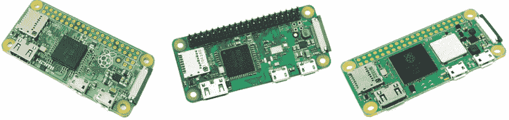

| 特性 | Pi Zero | Pi Zero W | Pi Zero 2W |
| :--- | :--- | :--- | :--- |
| WiFi | 无 WiFi | 802.11 b/g/n 无线局域网 | 802.11 b/g/n 无线局域网 |
| 蓝牙 | 无蓝牙 | 蓝牙 4.1 | 蓝牙 4.2 |
| 低功耗蓝牙 | 无蓝牙 | 低功耗蓝牙 (BLE) | 低功耗蓝牙 (BLE) |
| CPU | 1GHz，单核 CPU | 1GHz，单核 CPU | 1GHz，四核 CPU |
| 内存 | 512MB 内存 | 512MB 内存 | 512MB 内存 |
| 以太网 | 无以太网 | 无以太网 | 无以太网 |
| USB | Micro USB | Micro USB | Micro USB |

#### 超越 Pi Zero 系列

最初的树莓派有 A 型和 B 型两种子型号。A 型缺少多个 USB 接口和有线网络连接，因此价格稍低。自 Pi 4 以来，就只有 B 型版本了。

另一个令人困惑的因素是，当 Pi 3 升级为四核处理器（速度稍快）并内存翻倍时，这两个型号分别是 Pi 3A+ 和 Pi 3B+。

它们是 Pi 3 系列中仅存的、仍然容易买到的型号。在价格方面，只有售价 25 美元的 3A+ 有任何优势，因为售价 35 美元的 3B+ 与拥有相同内存（1GB）的 Pi 4 B 价格相同。

| Pi 3A+ |
| --- |
| 802.11 b/g/n/ac 无线局域网 2.4 GHz 和 5.0 GHz |
| 蓝牙 4.2 |
| 低功耗蓝牙 (BLE) |
| 1.4GHz，四核 64 位 CPU |
| 512MB 内存 |
| 一个 USB 2 端口 |
| 无以太网 |

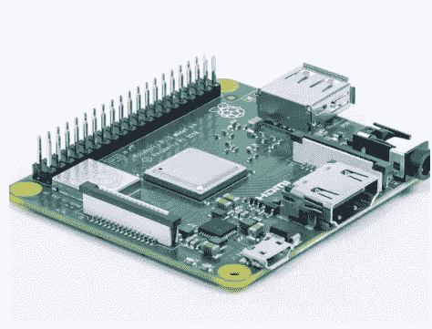

在 Pi 5 到来之前，Pi 4 是可用的最快树莓派。最便宜的 1GB 内存版本与 3B+ 价格相同（35 美元）。在该系列的高端，8GB 版本售价 75 美元，对于物联网应用来说开始显得昂贵——即便如此，你花这笔钱也能获得强大的计算能力。它还支持双 HDMI 显示器，使其非常适合开发用途。你也可以购买 P400（70 美元），它是一款内置 4GB 内存的 Pi 4，集成在键盘中，可直接用作台式电脑。

| Pi 4 |
| --- |
| 802.11 b/g/n/ac 无线局域网 2.4 GHz 和 5.0 GHz |
| 蓝牙 4.2 |
| 低功耗蓝牙 (BLE) |
| 1.8 GHz，四核 64 位 CPU |
| 1、2、4 或 8 GB 内存 |
| USB 2 和 3 |
| 千兆以太网 |

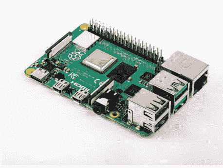

Pi 5 目前是该系列的顶级产品。其规格并不能完全说明其全部性能。它改进了 I/O 连接性，从而加快了 USB 和以太网的速度。它的速度大约是 Pi 4 的两倍，4GB 内存版本售价 60 美元，8GB 版本售价 80 美元。尽管它物超所值，但每台 60 美元的价格对于物联网部署来说开始显得昂贵。即使最终应用程序可能运行在性能较低的设备上，仍然值得考虑使用它进行软件开发。

| Pi 5 |
| --- |
| 802.11 b/g/n/ac 无线局域网 2.4GHz 和 5GHz。 |
| 蓝牙 5 |
| 低功耗蓝牙 (BLE) |
| 2.4GHz，四核 CPU |
| 4 或 8GB 内存 |
| 千兆以太网 |
| USB 3 |

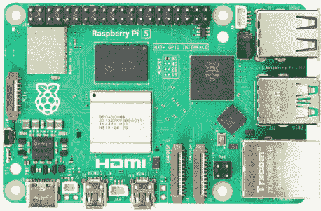

使用定制接口芯片 RP1 使得 Pi 5 与所有之前的树莓派在外设（包括 GPIO 引脚）方面不兼容。如果你使用 GPIO Zero，那么任何差异都会被 Linux 驱动程序所掩盖，这些驱动程序消除了 Pi 5 与该系列其他型号之间的差异。

在撰写本文时，尚无迹象表明 P500 独立计算机版本何时可能推出。

计算模块 4 (CM4) 是一款精简版的 Pi 4。所有外部连接器都已移除，信号仅通过板底的高密度连接器提供。这是一个完整的 Pi 4，你为 Pi 主型号编写的软件几乎不需要（如果需要的话）任何更改即可在其上运行，但你需要为其设计一块 PCB 主板以连接外部世界。目前还没有 CM5，但正在开发中，预计将在 2024 年的某个时候上市。

只有当你计划开发硬件来补充树莓派以及定制软件时，才需要使用计算模块。

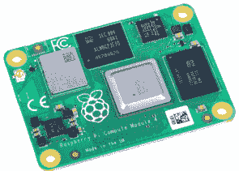

*CM4*

#### 树莓派 Pico

尽管名字如此，Pico 并不属于 Pi Zero 或 Pi 3/4/5 系列。它是一个与 Pi Zero 大小差不多的小型设备，但非常不同的是，它使用定制的双核 CPU，并且不运行 Linux。如果你计划创建一个不需要 Linux 的物联网程序，那么转向 Pico 可能对你来说要好得多。它成本低且功能强大，而且不托管操作系统的事实通常使开发代码比试图适应操作系统的工作方式更容易。另一方面，如果你想通过显示器、键盘、触摸屏、鼠标等进行本地用户交互，那么 Pico 可能不是正确的选择。

简而言之，Pico 是一款能够执行传感和控制任务并通过网络通信的微控制器，而 Pi 系列中的那些是运行 Linux 的完整计算机，能够执行传感和控制任务。帮助你入门 Pico 的书是 *《Programming The Raspberry Pi Pico/W in MicroPython, 2nd Ed, ISBN:9781871962796》*，

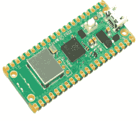

*Pico W*

### Pi OS

另一个复杂因素是 Pi 的操作系统选择。最新的 Pi OS 基于 Debian Bookworm，提供 32 位和 64 位版本，适用于 Pi 4 和 5。对于所有其他 Pi，目前唯一可用的操作系统是“旧版” Debian Bullseye。Bookworm 未来可能会在这些“较小”的 Pi 上可用，但两者之间的主要差异并不重要。一个更大的差异影响任何计划利用图形的程序。Bookworm 迈出了重要一步，使用 Wayland 替代了 Bullseye 使用的 X 图形系统。在大多数情况下，你可以通过使用合适的图形库将你的程序与此更改隔离开来，但如果你计划在底层与图形交互，你需要了解更多关于 Wayland 的信息。

就 GPIO Zero 而言，两个操作系统版本之间没有本质区别。

### 本书预期

本书中没有完整的项目——尽管有些示例非常接近，而且很明显其中一些可以组合起来创建完整的项目。这里的重点是学习事物的工作原理，以便你能继续做非标准的事情。重要的是你能够推理处理器正在做什么以及它如何与现实世界实时交互。这是桌面编程和嵌入式编程之间的关键区别：在嵌入式编程中，时序很重要，但在桌面编程中则不然。

这是一本关于理解一般原理并让事物工作的书。如果你读到本书的末尾，你将很好地理解当你使用一系列通常组合在一起构成完整系统的不同类型的接口时发生了什么。

### 你需要什么？

要跟随本书中的示例，你需要一个 Pi Zero/W/2W 或一个 Pi 3/4/5。你可以使用早期的 Pi，只要考虑到引脚分配和其他次要硬件更改的差异。

同样值得了解的是，虽然 Pi 4 和 Pi 5 能够运行开发环境和物联网程序，但 Pi Zero 会让事情变得困难。如果你想要第 2 章讨论的本地开发的简单性，请使用 Pi 4 或 5。

无论你使用哪种型号的 Pi，你都需要将其设置为 Pi OS（Raspbian 的新名称），并且你需要知道如何通过串行控制台连接到它并使用它。你还需要熟悉 Linux，意思是虽然你可能不知道如何做某事，但你知道如何查找并遵循说明。还假设你能够用 Python 编程。理解程序所需的 Python 水平不高，但你应该熟悉使用模块和函数。

除了 Pi 之外，你还需要一个无焊面包板和一些连接线——称为杜邦线。你还需要一些 LED、一系列电阻、一些 2N2222 或其他通用晶体管，以及后面章节中使用的任何传感器。最好在你选择实施某个项目时购买所需的东西，但另一种选择是购买众多的树莓派“入门”套件之一。不过，你可能仍然需要购买一些额外的组件。


*一个无焊面包板和一些杜邦线*

你不需要知道如何焊接，但你需要能够在原型板上搭建电路。万用表（不到 10 美元）很有用，但如果你认真构建物联网设备，投资一个逻辑分析仪（不到 50 美元）很快就会物有所值。你可以获得通过 USB 端口插入的小型分析仪，并使用应用程序向你展示正在发生的情况。只有使用多通道逻辑分析仪，你才有希望理解正在发生的事情。没有它以及使用它所需的轻微技能，你基本上是在盲目飞行，只能猜测可能出了什么问题。

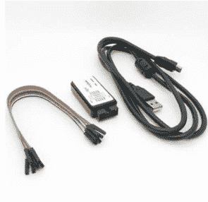

*一个低成本逻辑分析仪*

最后，如果你更加认真投入，那么投资一个低成本的口袋示波器也值得，用以检查微控制器输出的所谓数字信号的模拟特性。然而，如果必须在这两种仪器中选择，逻辑分析仪应该是你的首选。

值得注意的是，树莓派可以产生速度过快的信号，以至于工作在1MHz到25MHz之间的低成本示波器和逻辑分析仪无法可靠地检测到。这意味着处理远快于1微秒的脉冲可能会很困难，因为你无法依赖你的仪器。

### 人多力量大

关于树莓派及其生态系统，最后要谈的一点是其用户群的规模。根据树莓派基金会的数据，截至2023年8月，树莓派已售出超过5000万台。虽然这些并非完全相同的设备，但它们都足够兼容，确保你的程序有很大机会在任何一台上运行。

世界上大量的树莓派意味着你有很大机会通过简单的网络搜索找到任何问题的答案，尽管必须说，现有答案的质量参差不齐，从误导性到优秀不等。务必根据你所知道的情况来评估你得到的建议。你还需要记住，这些建议通常也是从一个相当有偏见的角度提出的。C程序员会给你一个适合已经使用C的系统的答案，而电子初学者则会提供基于“现成”模块的解决方案，即使一个基于几个廉价元件的简单廉价解决方案是可用的。即使你得到的建议是100%正确的，它也不一定是适合你的正确建议。

流通中的大量树莓派也意味着该设备不太可能过时。对于其他不太流行的单板计算机，你不能做这样的假设。可以合理地假设，你今天编写的任何程序在可预见的未来都能在设备上运行，该设备可能看起来不像今天的树莓派，但将向后兼容。

简而言之，树莓派为你的开发工作提供了一个安全且无威胁的环境。

### 本书路线图

在介绍了如何使用Thonny在树莓派上开始使用Python之后，我们探讨了使用Python处理GPIO引脚的基本概念，然后绕道进入面向对象的Python——刚好足以理解GPIO Zero在做什么。

接下来，我们详细研究简单的开/关设备，并展示如何创建自定义设备。虽然设备是你最常使用的，但最低级的方法是使用Pin类，并通过引脚工厂直接访问GPIO引脚。下一章涵盖了物联网入门所需的基础电子知识——这不是你将来会需要的所有知识，但我们希望它足以防止你损坏你的树莓派以及你连接到它的任何东西。

接下来，我们转向简单的、复杂的和内部输入设备。这也是对GPIO Zero巧妙的source/values声明式编程方法的介绍。我们不仅探讨基础知识，还展示如何创建自定义类来处理source/values。

第10章标志着主题从简单设备和GPIO引脚转向更高级的协议——在这种情况下是脉宽调制（PWM）。PWM用于各种用途。它通常用于伺服电机和直流电机，下一章将借助H桥处理各种电机，包括单向和双向电机、伺服电机、无刷直流电机和步进电机，包括一个自定义步进电机设备。

GPIO Zero有一个功能，可以将不同的设备分组为更大的复合设备。在第12章中，我们解释了所提供设备的基础知识，并展示了如何利用这个想法来改进前面介绍的自定义步进电机设备。

接下来的两章都是关于SPI总线的。从基础知识和受支持的SPI设备开始，我们接着探讨SPI总线的工作原理，并实现一个自定义SPI设备。

最后一章是关于lgpio的，这是在所有版本的树莓派（包括树莓派5）上实现GPIO Zero所使用的库。

### 总结

- 计算硬件的成本已经下降到这样一个程度：许多原本会使用低成本、性能较低的微控制器的应用，现在可以利用树莓派硬件，其功能强大到足以运行完整版本的Linux。
- 树莓派家族中最小的成员是树莓派Zero。它有一个单核处理器和最少的接口。树莓派Zero W内置WiFi，这使得在需要连接的情况下易于使用。除了WiFi，树莓派Zero 2W还有四个核心。
- 树莓派5目前是树莓派型号中最强大的。像树莓派4一样，它是一个四核设备，内存高达8GB，但其速度至少是树莓派4的两倍。
- 由于树莓派5和树莓派4目前都没有提供“精简版”A型号，树莓派3A+仍然是物联网应用的一个可行选择。
- 计算模块4（CM4）是一个封装成信用卡大小工业设备的树莓派4。它需要一个定制的I/O板或开发板才能使用。相应的CM5应该在2024年某个时候上市。
- 树莓派400是一个更快的树莓派4，拥有4GB内存，封装在一个键盘里。你可以将其用作物联网开发系统。目前尚无迹象表明树莓派500是否会以及何时会推出。
- 要进行电子工作，你将需要一块无焊面包板、一些连接线和一些元件。最好还有一个万用表，最好还有一个逻辑分析仪。有了这些基本仪器后，你可以根据你的负担能力添加更多。
- 凭借超过5000万台的设备销量和庞大的用户社区，树莓派是一个非常稳定的平台，你可以合理地确信它在未来仍然可用。

# 第2章

## 开始使用Python和GPIO Zero

任何项目最困难的部分都是开始。一旦你做到了，你甚至看不出一开始有什么困难！在这种情况下，假设你的树莓派已经启动并运行，你可以通过屏幕、键盘和鼠标、安全Shell（SSH）连接或使用远程桌面来操作它。

你可以使用多种不同的方法来使用Python，每种方法都有其优缺点。首先，最好选择最简单的选项，在树莓派的情况下，那就是使用Thonny，因为它已经安装并准备就绪，Python 3也是如此。你可以在任何树莓派上使用这个设置来开发和运行程序，但树莓派Zero可能难以跟上。

一个更好的解决方案是使用远程开发。即使用另一台机器来创建和编辑程序，并在通过SSH连接的目标机器上运行它。Thonny支持远程开发，但在撰写本文时，它不支持远程调试。这使得它并不完美，但它是开始远程开发的最简单方式。

如果你变得更有雄心，你可能想使用在桌面Windows、Mac或Linux机器上运行的Visual Studio Code（VS Code）来开发Python程序。VS Code支持完整的远程调试和广泛的工具，使编程更容易。如何开始使用VS Code在附录I中描述，虽然不难，但要让它全部工作需要许多步骤，你可能想等到需要时再做。

### 你的第一个Python树莓派程序

假设你已经设置好了树莓派，并且可以使用桌面，无论是本地还是远程。在大多数情况下，最简单的开始方式是给树莓派4或5连接一个键盘、鼠标和显示器。在这种情况下，你使用的是本地开发，即同一台机器用于开发和测试程序。

另一种选择是使用远程桌面连接（VNC或RDP）连接到一个没有显示器、键盘和鼠标的树莓派——即所谓的无头树莓派。

如果你确实想使用无头树莓派，那么更简单的解决方案是通过另一台树莓派或桌面计算机进行远程开发——请参阅下一节。
如果你选择本地开发，这无疑是入门最简单的方式，你会发现Python、GPIO Zero和Thonny代码编辑器已经安装就绪，随时可用。
点击主菜单，在编程子菜单中选择Thonny。IDE将会为你打开：

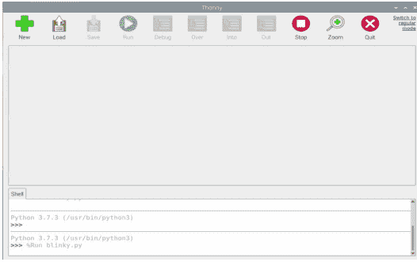

你可以立即开始编程。点击新建图标，输入单行程序：
`print("Hello Python World")`
现在点击运行图标，系统会提示你保存文件。如果需要，可以创建一个新目录，并将文件保存为"hello"。完成这些操作后，你的程序将运行，你会看到：

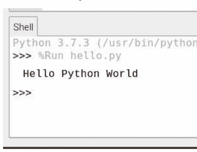

是的，在树莓派上开始Python编程真的就这么简单，但在许多情况下，你需要做更多一点的工作。

### 远程开发

如果你在一台性能足够强的树莓派上使用Thonny，那么在运行程序的机器上开发GPIO Zero程序效果就很好。如果你使用的是树莓派Zero，情况就不那么理想了。树莓派Zero的速度仅够运行Thonny，如果你尝试在同一台机器上测试物联网程序，你会发现单核处理器在许多情况下不堪重负。树莓派Zero 2W的情况稍好一些，但其内存也不足以同时运行Thonny和其他程序。本地开发实际上只在树莓派4或树莓派5上表现良好。本地开发的另一个问题是，你通常希望在一台机器上开发物联网程序，然后将其转移到另一台机器上以测试不同的配置。本地开发将程序存储在单台机器上，将其转移到另一台机器并运行通常是个负担。

解决这个问题的一个方法是使用远程开发方式。即，在一台机器上运行Thonny，在另一台机器上运行你创建的Python程序。由于Python是一种解释型语言，无需编译阶段，因此这特别容易实现。你可以通过SSH连接到远程机器，将文件从运行Thonny的机器传输到远程机器，然后运行它。当然，这假设你已经建立了SSH连接。在大多数情况下，你需要一台预设了SSH连接的无头树莓派。当你使用树莓派Imager创建操作系统SD卡时，这是最容易实现的。你可以在操作系统自定义的常规选项卡中设置WiFi的详细信息：

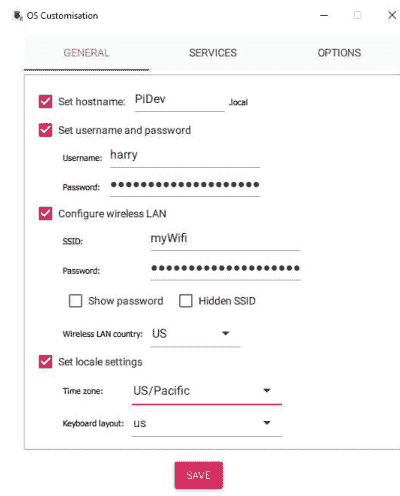

你可以在下一个选项卡中设置SSH连接：


在许多情况下，你需要使用公钥认证，以避免每次连接机器时都输入密码。然而，Thonny能很好地处理密码使用，因此选择使用密码认证是合理的。请注意，这意味着只有在第一页设置的单个用户可以通过SSH连接，但你可以在机器启动后设置其他用户。
创建SD卡后，你可以无需键盘、鼠标或显示器即可启动树莓派。如果你想直接操作它，则需要一个SSH客户端，如Putty。这使你能够连接到无头机器并使用命令行。然而，在大多数情况下，你不需要这样做，因为Thonny会为你建立到无头树莓派的SSH连接。要使用此功能，Thonny必须处于“常规”模式，这也是推荐的使用方式。

进入常规模式后，你只需选择运行，然后在对话框中选择解释器选项卡，并输入远程机器和要使用的账户的详细信息：

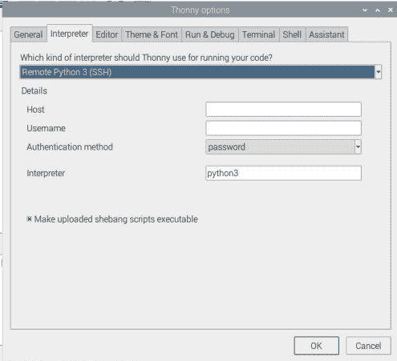

你通常可以在主机字段中使用在树莓派Imager中设置的主机名。如果这不起作用，你需要使用无头树莓派的IP地址，这在没有帮助的情况下可能很难找到。可以使用IP地址扫描器来查找IP地址。例如：Advanced IP Scanner，网址为 https://www.advanced-ip-scanner.com/。

如前所述，最简单的入门方式是使用用户名和密码通过SSH连接。你需要确保可以使用指定的凭据连接到树莓派。

如果所有信息都正确指定，你应该能够通过简单地选择运行，在无头树莓派上运行你的程序。程序将自动下载到树莓派并远程运行。

因此，如果你输入：

```
python
from gpiozero import Device
Device()
print(Device.pin_factory.board_info.model)
```

你可以自动在无头树莓派上运行此程序，你会在屏幕底部的shell中看到显示的型号类型：

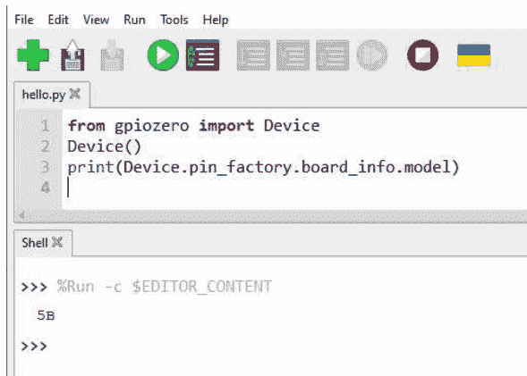

你可以通过使用视图、文件显示文件窗口来查看和管理存储在本地和远程机器上的文件状态。

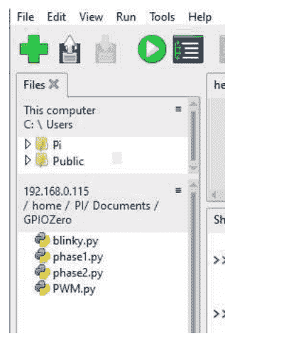

你可以右键单击任一机器上的任何文件或文件夹，并将它们传输到另一台机器。

最后，你可以使用Thonny打开到远程机器的shell并提交命令。要打开shell，请使用工具.打开系统shell。你必须提供用户的密码。
Thonny易于上手和使用，但它缺乏良好的远程调试器和更复杂的代码编辑器所具有的其他功能。即便如此，对于许多初学者来说，Thonny是最佳首选，你可以仅凭此走得很远。

### 总结

- 在树莓派上创建Python程序最简单的方法是在树莓派本身上运行Thonny或其他IDE之一。这在树莓派3/4/5上效果相当好，但在树莓派Zero上效果不佳。
- Thonny也可用于使用无头树莓派进行远程开发，即没有连接键盘、鼠标或显示器的树莓派。
- 通过SSH连接到无头树莓派。使用树莓派Imager设置无头机器并启用SSH的最简单方法是指定要连接的WiFi、用户并启用SSH。
- 要连接到远程机器，你只需选择用于运行程序的Python解释器。
- Thonny允许你管理本地和远程机器上的文件。它还允许你打开到远程机器的shell，你可以使用它来发出命令。
- 在撰写本文时，Thonny不支持远程调试。如果你需要更复杂的支持，包括远程调试，你需要转向VS Code，请参阅附录I。

# 第3章

## GPIO简介

GPIO Zero是一种与连接到树莓派的设备进行交互的复杂方式，但它完全建立在GPIO（通用输入输出）行提供的一些非常基础的功能之上。理解这一切如何工作，特别是它如何与GPIO Zero协同工作非常重要，因此在本章中，我们将通过编写大多数人认为是物联网的“Hello World”或“Blinky”程序，来了解如何使用Python开始物联网之旅。这个程序所做的只是以稳定的速率闪烁一个LED——因此得名“Blinky”。它可能很简单，但它能让你了解如何控制GPIO行，并且是一个很好的起点。

### GPIO？

GPIO这个术语经常被使用，但通常没有费心去定义它的含义。它代表通用输入输出，是像树莓派这样的设备与外界连接的基本方式。GPIO行是一个引脚，可以通过导线连接到另一个设备。该行可以配置为输入或输出，软件可以读取和写入其当前状态。有些程序直接使用GPIO行，即直接从行读取数据和向行写入数据。你稍后会遇到的其他类型的输出使用GPIO行来实现更专门形式的通信，在这种情况下，软件并不直接使用涉及的GPIO行，而是要求更复杂的硬件来完成这项工作。

GPIO Zero，尽管名字如此，其核心在于摆脱对原始GPIO行的使用。它旨在提高我们工作的抽象层次。例如，你可以取一个GPIO行并将其连接到一个LED，你可以通过软件控制GPIO行来设置LED的开关。这可行，但一个可以说更好的方法是在软件中实现一个LED对象，可以使用LED.on和LED.off这样的术语进行编程，而不必考虑使用GPIO行的细节。当然，即使其使用被软件隐藏，GPIO行也参与了这个过程——当你声明LED.on时，一个GPIO行被设置为高电平，连接到它的LED就会亮起。

GPIO Zero提供了类，让你可以处理从交通灯到电机和机器人的一系列对象。然而，它们都使用GPIO行来完成工作。

### 第一个物联网程序

本程序的目的只是让你检查一切是否正常工作，所使用的函数将在后面详细解释。
创建一个名为 `blinky` 的新程序，然后输入以下代码：

```
from gpiozero import LED
from time import sleep

led = LED(4)

while True:
    led.on()
    sleep(1)
    led.off()
    sleep(1)
```

你无需安装 `gpiozero` 或 `sleep`，因为它们是树莓派上的标准模块。尽管你对 GPIO Zero 还不太了解，但理解程序中的内容并不困难。首先，我们创建一个与 GPIO4 关联的 LED Python 对象，然后在一个无限循环中，以每次操作间隔 1 秒的方式，控制 LED 的开启和关闭。LED 的 `on` 命令将 GPIO4 设置为高电压，`off` 命令将其设置为低电压——开/关或高/低是同一回事。
如果这能正常工作，那么 GPIO4（即树莓派连接器上的引脚 7）就被设置为输出，然后循环以一秒的延迟将其开启和关闭（高电压然后低电压）。
该库使用分配在树莓派处理器内部的逻辑 GPIO 编号。这些 GPIO 线路被引出到树莓派的连接器上，逻辑 GPIO 编号与连接器上的物理引脚编号并不对应。在这种情况下，GPIO4 是连接器 P1 上的引脚 7。

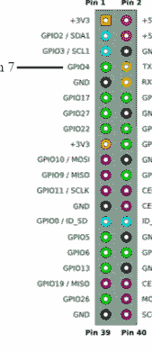

如果你想连接一个 LED 来实际观察“闪烁”效果，这很容易，但你确实需要一个限流电阻——200Ω 是一个不错的选择。电阻的原因在第 7 章解释。
如何构建电路取决于你自己。你可以使用原型板，或者只用一对跳线。LED 上的短引脚和/或外壳侧面的平面标记了负极连接——即连接到引脚 6 的那一端。

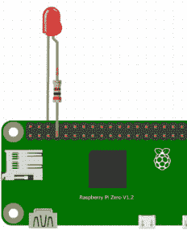

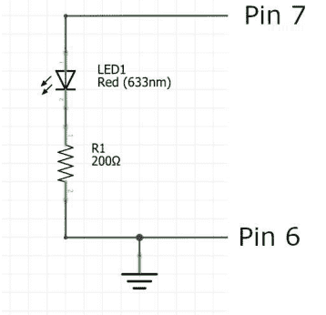

如果你不想费心用真实 LED 来测试“blinky”，那么只需将逻辑分析仪连接到引脚 7，你就会看到 1 秒的脉冲。

### 引脚编号

让每个程序员都抓狂的事情之一，就是指代 GPIO 引脚编号的不同方式。有物理引脚编号，即物理连接器上引脚的编号，还有逻辑 GPIO 编号，这是在硬件深处分配的。

对于大多数树莓派系列，标准的 40 引脚连接器基本相同：

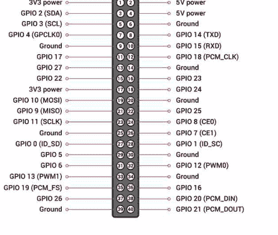

GPIO Zero 使用逻辑引脚编号工作，因此你需要使用这些图表来查找你必须连接到的物理引脚。例如，“GPIO4”或简写为 4，指定的是物理引脚 7。你也可以使用“header:pin”的表示法，其中 header 是连接器的名称。例如，“J8:7”是引脚 7，即现代树莓派上的 GPIO4。另一种替代方法是使用“BOARDpin”表示法，例如“BOARD7”是引脚 7，即 GPIO4。无论你如何指定要使用的引脚，它都会自动转换为 GPIO 引脚编号，如果你请求引脚编号，返回的就是这个编号。

如果你研究这些图表，你会看到有许多 GPIO 线路——GPIO1 到 GPIO27。还有其他 GPIO 线路。有些被树莓派内部用于控制状态 LED 等功能，有些则根本没有引出到连接器。在某些情况下，你可以访问内部使用的线路，但在大多数情况下，这不是一个好主意，因为进行物理连接很困难。

`pinout` 命令可以从控制台使用，以查看你所使用设备的引脚和总体配置：

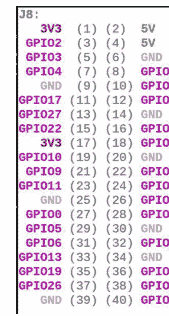

在没有印刷标签的情况下找到引脚可能很困难，市场上有一些辅助工具：

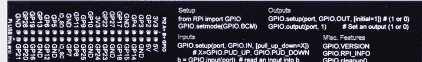

*来自 Pimoroni 的 RasPiO® GPIO 尺子*

在没有标签的情况下完成这项工作最常见的方法是从内侧或外侧引脚列的顶部或底部开始计数。下图使这变得稍微容易一些：

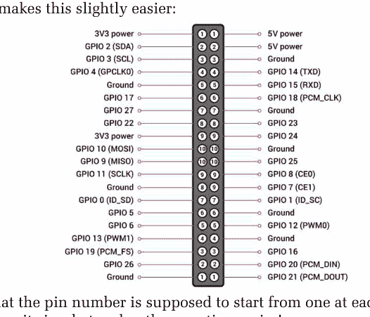

请注意，引脚编号应该从连接器的每一端从 1 开始——这使得计数更容易！

### GPIO 模式

尽管 GPIO Zero 让你可以访问像 LED 这样的设备，这意味着你基本上可以忽略基本的 GPIO 线路，但你仍然必须选择使用哪一条，而这并不像看起来那么容易。
可用的 GPIO 线路如下图所示：

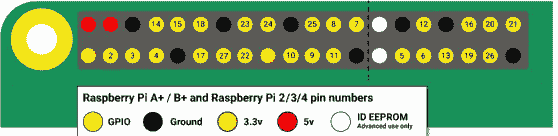

你可能还会注意到，引脚图上的许多引脚有两个标签。例如，GPIO2 也标记为 SDA1。许多（但不是全部）GPIO 线路具有替代功能，例如连接 SPI 设备，稍后会详细介绍。一般来说，你应该避免将具有替代功能的引脚用作通用 I/O 线路。原因是你可能在项目开发的后期需要使用其中一个特殊功能，如果它已经被用作 GPIO 线路，你不仅需要更改所有引脚分配（这相对容易），还需要更改所有硬件连接（这更困难）。如果你将自己限制在基本的 GPIO Zero 内，这个问题就小得多，因为它通过在任何引脚上工作的软件支持许多功能。然而，你可能想要超出 GPIO Zero 的范围，使用 GPIO 线路的替代功能。
实际上，对于一般的 GPIO 任务，请使用：
GPIO 4, 5, 6, 12, 13, 17, 18, 22, 23, 24, 25, 26 和 27

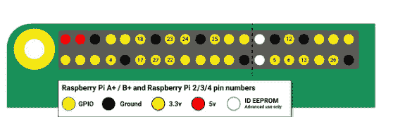

> “首选”的 GPIO 引脚。

然后按此顺序使用：
GPIO 2, 3, 9, 7, 8, 16, 10, 11, 14, 15, 19, 20 和 21。
非顺序排列的原因是，一些 GPIO 线路作为一组工作，一旦你使用了其中一个，不妨使用其他的。

这不是一个绝对的规则，因为树莓派 4/5 为许多 GPIO 线路提供了额外的模式。尽管情况非常复杂，但不必太担心，因为在软件中更改正在使用的 GPIO 线路很容易，而且除非你已经到了后期原型阶段，否则在硬件中更改也相当容易。

### 硬件和软件协同工作

尽管 Blinky 是一个非常简单的程序，但它代表了物联网项目工作流程的典型过程，本章开头的一些评论应该更有意义了。所有物联网项目都是硬件和软件的结合。通常，你必须将一些设备连接到一组 GPIO 线路。在某些情况下，你可以选择要使用的线路，但在其他情况下，线路是固定的，你必须使用指定的线路。
一旦你确认设备已正确连接到 GPIO 线路并供电正常，就可以转向软件了。在大多数情况下，你将能够使用为与该设备配合工作而设计的 GPIO Zero 类。然后，你所要做的就是指定用于连接设备的 GPIO 引脚（如果它们不是固定的），然后使用提供的方法来控制设备。在许多情况下，设备可以与 GPIO 线路高度抽象，以至于你可以忘记它们的存在。即使是简单的 LED 也以开和关的方式工作，而无需引用 GPIO 线路被设置为“高”或“低”。更复杂的设备几乎完全隐藏了它们与特定 GPIO 线路工作的事实，甚至开和关或高和低的概念也消失了。然而，你需要记住，树莓派的输入和输出实际上只是状态从高到低、从低到高变化的 GPIO 线路。
在后面的章节中，我们不仅会探讨 GPIO Zero 支持的标准设备，还会探讨如何创建使新设备更易于使用的类。

### 总结

- 在 GPIO Zero 中，第一个物联网程序特别简单。标准的 Blinky 示例只需要一个 LED 对象及其 `on` 和 `off` 方法的使用。你所要做的就是分配一条 GPIO 线路并将 LED 连接到它。
- 引脚编号因存在 GPIO 编号和物理引脚编号而变得复杂。最简单的做法是始终使用处理器分配的 GPIO 编号，并在连接时将它们转换为引脚编号。
- 在树莓派控制台使用的 `pinout` 命令将打印引脚映射图。
- 你可以购买标签来帮助找到特定的引脚，或者采用从连接器内侧或外侧行的任一端开始计数引脚的技术。
- 树莓派拥有的所有 GPIO 线路并非都引出到主连接器上。有些在内部使用，有些则被忽略。
- 一些 GPIO 线路具有替代功能，如果你只需要简单的 GPIO 输入/输出线路，最好避免使用它们。
- 所有物联网项目都是硬件和软件的混合体。通常有一个阶段，你实验性地连接硬件并编写一些指令，只是为了检查连接是否正确，然后再继续创建真正的项目。

## 第四章
Python - 类与对象

尽管本书并非旨在教授你Python，但在我们继续深入之前，我们先绕道探讨一下这门语言的某些特定方面。这是因为如果你不了解类和对象，你初次接触GPIO Zero时可能会感到困惑。许多Python程序员几乎意识不到Python是面向对象的。原因在于Python的设计初衷是易于上手，这意味着你可以立即开始编写程序，只需几行代码即可。之后你可能会学习函数，并以更好的方式组织代码，但并没有真正的压力迫使你去学习类和对象——这可以说是组织代码的更佳方式。

本文对Python实现对象的方式进行了非常务实的探讨，当然这既不完整也不全面。如果你真的想理解其中的原理以及为何这一切能以如此优雅的方式契合在一起，你需要阅读《程序员的Python：一切皆对象》（第二版，ISBN:978-1871962741），Mike James在书中深入探讨了Python处理对象的深层逻辑。

GPIO Zero是一个面向对象的库，因此你无法避免使用类和对象。当你编写：

```python
from gpiozero import LED
led = LED(4)
while True:
    led.on()
    led.off()
```

你就是在使用类、对象和方法。LED是一个类，你用它来创建一个对象，即LED类的一个实例。对新对象的引用存储在变量led中，你使用它来访问对象。请注意，led不是对象本身，而是对对象的引用。

一个对象可以有多个引用。例如：

```python
led1 = LED(4)
led2 = led
```

现在led1和led2都引用同一个对象。你可以将led2和led视为“指向”内存中其他地方的同一个对象。这是一个微妙但重要的概念。

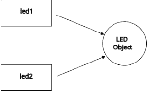

当你使用led.on()时，你是在使用该实例所支持的LED类的方法之一。这一切都相当简单，你可以在直觉层面直接使用它。你可以通过遵循GPIO Zero设定的模式并接受“事情就是这样做的”来创建新程序。然而，更好的想法是将其作为学习面向对象Python的机会。即使你了解基础知识，GPIO Zero中也使用了许多高级技术，理解它们将提升你的Python程序。

如果你对Python中的对象了如指掌，可以略读本章以确保没有遗忘或遗漏任何内容。你应已掌握Python的基础知识，例如控制语句、if、while和for循环以及函数。

### 对象

对象的概念在编程中相对较老，但它花了很长时间才成为主流。当我们最初开始用高级语言编写程序时，最佳实践是为需要完成的任何任务编写一个函数。例如，如果你需要对数组进行排序，你会编写一个sort函数，该函数接受几个参数来确定数据和操作：

```python
sort(myArray, order)
```

其中myArray是你想要排序的数据，order是设置所用排序顺序的参数。

后来我们转向了面向对象编程，其中数据和处理数据的函数被分组到称为对象的实体中。在这种情况下，像sort这样的函数变成了它们要操作的数据的方法。

因此，一个Array对象会有一个sort方法，你可以将排序操作写为：

```python
myArray.sort(order)
```

你可以看到，这与将myArray作为sort函数的参数相比，只是一个小变化，现在myArray是一个具有sort方法的对象。你可以说，从函数到面向对象编程的转变，关键在于将参数从函数内部移到了外部。

深入观察，这种转变带来的简化非常值得。sort函数现在可以或多或少地默认使用myArray中的数据，这使得与程序其余部分的隔离成为可能。它也彻底改变了我们思考函数的方式。

例如，你可以说myArray“知道如何”对自己进行排序。另一个对象，比如myList，可能也“知道如何”使用自己的sort函数（与Array的sort函数不同）对自己进行排序。这通常被称为多态性——同一个函数sort根据其所属对象的不同而改变其形式。

因此，我们不必编写：

```python
if A == Array:
    ArraySort(A)
else:
    ListSort(A)
```

我们只需编写：

```python
A.sort()
```

这也意味着我们思考的不仅是创建一个数组（数据的集合），而是一个Array对象，它是数据和代码的结合。

对于GPIO Zero，有一个更贴切的解释。例如：

```python
led.on()
```

可以理解为LED对象“知道如何”打开自己。另一种方式是有一个on函数“知道如何”打开任何LED：

```python
on(led)
```

你可以看到，将LED视为具有内置动作的东西是一种合理且方便的方法。

尽管我们一直在谈论动作，但对象具有属性，这些属性可以是任何类型的数据。例如：

```python
print(led.value)
```

在这种情况下，如果LED亮着，属性value为1，否则为0。设置属性也会改变LED的状态，即要打开它，你会使用：

```python
led.value = 1
```

你可以将其视为实例本地的存储。也就是说，如果你创建另一个LED：

```python
led2 = LED(5)
```

那么它有自己的value属性。方法只是碰巧是函数的属性。

### 创建你自己的对象 - 类

使用对象很容易，但总有一天你需要创建自己的对象。创建自定义对象相对容易，但初次接触时可能显得复杂。首先你必须创建一个类，它定义了你想要创建的对象，然后你使用它来创建你需要的该类的任意数量的实例。你已经知道GPIO Zero提供的对象是如何工作的。LED类定义了你使用它创建的任何led对象的所有属性。

```python
led = LED(4)
```

这种类和实例的使用在命名事物时会带来一点问题。例如，LED类的名称可能正是你想用于该类单个实例的名称。当你只需要该类的单个实例时，这尤其令人恼火。然后，甚至有一种倾向会想，“为什么我需要一个类？为什么我不能直接创建一个对象？”答案是你可以，但类/实例的方式要常见得多。通常，类使用大写名称，实例使用小写名称。

要创建自定义对象，你首先必须使用class关键字创建一个自定义类：

```python
class MyClass:
    def myMethod(self):
        print("myMethod called")
```

这创建了一个MyClass，其中有一个方法myMethod，它只是打印一些内容。一旦定义，你就可以以标准方式使用MyClass：

```python
myObject = MyClass()
myObject.myMethod()
```

这会打印myMethod called。

唯一可能令人困惑的部分是在方法定义中使用`self`。如果你回顾函数如何转换为方法的方式，这应该能理解。在Python中，当你定义一个方法时，你使用`self`作为第一个参数。当你调用该方法时，Python会自动将`self`设置为实例的名称。即：
`myObject.myMethod()`
被转换为：
`myMethod(myObject)`
因此`self`被设置为`myObject`。这是函数成为方法的基本方式，Python正是这样做的。值得注意的是，使用`self`是一种约定，而不是系统强制的。你可以使用JavaScript/C++/Java风格，但你的程序对其他Python程序员来说可读性会降低。

我们现在有了向对象添加方法属性的基本方法，但我们如何添加数据属性呢？关键在于类的每个实例都必须有自己的数据属性副本。最简单的方法是使用“魔法”`__init__`方法。它是Python众多“魔法”方法之一，系统会自动使用它们来执行固定操作。在这种情况下，每当你使用类创建对象时，系统会自动调用`__init__`。也就是说，当你编写：
`myObject = MyClass()`
那么在对象实例完成之前，你可能在`MyClass`中定义的任何`__init__`方法都会被调用。

现在考虑如果你编写：

```python
class MyClass:
    def __init__(self):
        self.myAttribute1 = 0
```

然后创建一个实例：
`myObject = MyClass()`
现在你的自定义`__init__`被调用，它创建了一个新属性`self.myAttribute`。你认为`self`被设置为什么？就像调用方法的情况一样，`self`被设置为正在创建的对象，即本例中的`myObject`。对`__init__`的调用等同于：
`__init__(myObject)`
属性创建等同于：
`myObject.myAttribute1 = 0`

正如你给一个变量赋值时，如果它不存在就会被创建一样，当你给一个属性赋值时，如果它不存在也会被创建。利用这个机制，`__init__` 可以在它刚刚创建的类的实例上创建新的属性。

所有这些在创建新类时归结为两个实践：

-   在 `__init__` 函数内，使用 `self` 来引用正在创建的对象，从而创建任何数据属性，例如 `self.attribute = 0`
-   在类的主体中，使用 `self` 作为第一个参数来创建任何方法，例如 `def method(self):`

举个例子，我们可以实现一个表示二维坐标的类：

```
class Point:
    def __init__(self,x,y):
        self.x=x
        self.y=y

    def sum(self):
        print(self.x+self.y)

    def distance(self):
        return self.x**2+self.y**2
```

注意，在 `__init__` 函数中，我们创建了两个属性 x 和 y，并将 x 和 y 参数的值存储在其中。这就是你如何在创建对象时用提供的值来初始化属性。也就是说：

```
point=Point(1,2)
print(point.x)
```

会显示 1。这些方法很简单，但要注意使用 `self` 来引用当前实例的属性。也就是说，在 sum 方法中，当函数被调用时，`self.x` 就变成了 `point.x`。也就是说：

```
point.sum()
print(point.distance())
```

分别打印 3 和 5。注意 distance 返回一个值而 sum 没有——两者都是有效的方法。如果你想从一个方法内部调用另一个方法，你必须像处理数据属性一样使用 `self`，例如 `self.sum()`。

### 继承

你经常会发现，你想要的新类与一个现有的类非常相似。显而易见的解决方案是复制粘贴旧类的文本作为新类的起点。这是可行的，也是过去大多数代码“重用”的方式，但今天我们有其他方法来完成同样的工作。继承是像 Python 这样的面向对象语言实现重用的方式。

如果你写：
`class myNewClass(myOldClass)`
那么 `myNewClass` 就拥有 `myOldClass` 的所有属性，就像你使用了复制粘贴一样。然而，与复制粘贴不同的是，新旧类之间的连接是动态的。如果你对旧类进行了更改，更改也会应用到新类——它们共享相同的基础代码。新类被称为“继承自”、“派生自”或“子类化”旧类，而旧类是其“基类”或“超类”。这听起来很有用，因为如果你在基类中发现一个错误，你可以纠正它，而纠正将被所有派生类继承。这通常是好的，但也可能是危险的。如果派生类对基类做了任何假设，那么更改可能会导致它们全部失效。这通常被称为“脆弱”基类问题。即便如此，许多程序员仍然认为继承比复制粘贴编程更好。

当然，你可以向新类添加属性，并且可以提供替换或“重写”它继承的方法。例如，我们可以从 Point 类创建一个 Point3D 类：

```
class Point3d(Point):
    def __init__(self,x,y,z):
        self.x=x
        self.y=y
        self.z=z
    def distance(self):
        return self.x**2+self.y**2+self.z**2
```

在这个例子中，我们继承了 Point 的所有方法，但使用了一个新的 `__init__` 来创建 x、y 和 z 作为数据属性，并且我们重写了继承的 distance 方法以使用额外的 z 属性。注意，你仍然可以使用继承的 sum 方法：

```
point=Point3d(1,2,3)
print(point.x)
point.sum()
print(point.distance())
```

显示 1、3 和 14。

注意，你可以修改和添加继承的属性，但你不能轻易地移除它们。面向对象哲学的一部分是，类在被继承时会变得“更大”——Point3d 对象在通常比 Point 对象拥有更多属性的意义上是“更大”的。

### 对 Super 的需求

关键思想是，一个类继承其超类的所有内容，但这并不像听起来那么简单。考虑一下基于这个想法对 Point3D 类的一个小改动。由于 Point3D 类继承了 Point 类的所有内容，我们不需要重新定义 x 和 y 属性，因为它们是被继承的：

```
class Point3d(Point):
    def __init__(self,x,y,z):
        self.z=z
    def distance(self):
        return self.x**2+self.y**2+self.z**2
```

在这个版本中，我们只定义了新的 z 属性。如果你尝试这个，你会发现它会产生一个错误，报告 x 或 y 之一未定义。
关键在于，Point3d 并不是从 Point 继承 x 和 y，而是继承了创建它们的 `__init__` 函数。也就是说，要使 Point3D 继承 Point 的所有属性，它必须调用 `Point.__init__()`：

```
class Point3d(Point):
    def __init__(self,x,y,z):
        Point.__init__(x,y)
        self.z=z
```

如果你尝试这个，你会发现它不起作用，因为对 `Point.__init__` 的调用没有 self 的值。在这种情况下，你必须显式地传递一个 self 的值，该值给出正在创建的实例。
因此，调用超类 `__init__` 函数的正确版本是：

```
class Point3d(Point):
    def __init__(self,x,y,z):
        Point.__init__(self,x,y)
        self.z=z
```

这会在 Point3d 创建的任何实例中创建 x 和 y 属性。
通常认为，使用超类的名称（即本例中的 Point）来调用属于超类的方法是一种不好的做法。它适用于你想调用的任何超类方法，但 Python 提供了 `super` 函数来使这变得更容易。`super` 函数自动返回调用它的类的超类，当你使用它来调用超类方法时，它会自动提供 self 参数。

因此，调用超类 `__init__` 函数的最佳方式是使用：

```
class Point3d(Point):
    def __init__(self,x,y,z):
        super().__init__(x,y)
        self.z=z
```

`super` 的使用有很多变体，但这是最基本的一种，也是你应该知道的。
你必须记住，一个类从其超类继承一切的想法只有在你费心让它成立时才成立。通常，你必须调用超类的 `__init__` 函数，并且必须确保你向它传递正确的参数以创建你想要的属性。

### 多重继承 – Mixin

到目前为止，我们将继承视为获得一个类似于现有类的新类的起点。这个想法是面向对象哲学的基础，它远远超出了简单的实际考虑，并认为对象的继承是我们应该编程的方式的关键。你从创建非常通用的类开始，然后慢慢使用继承来派生出越来越复杂和具体的类。这就产生了一个继承层次结构。例如，GPIO Zero 有一个用于输出设备的类层次结构：

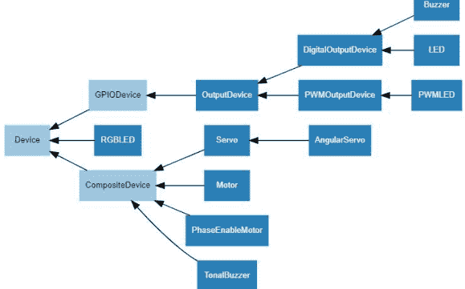

你可以看到 Device 位于层次结构的顶部，随着你在层次结构中向下移动（即在此旋转图中向右移动），类变得更加专业化。因此，Device 被 GPIODevice 继承，GPIODevice 又被 OutputDevice 继承，然后是 DigitalOutputDevice，最后是 LED。这种层次结构应该是现实世界的模型，以及我们思考现实世界中对象之间关系的方式。

当你处理具有明显关系的电子设备时，这很有效，但不要让这使你误以为这就是对象层次结构在更广泛世界中的工作方式。在更一般的情况下，事物之间的关系不能通过简单的继承层次结构很好地建模，事情要困难得多。如果你阅读面向对象编程，你会遇到许多规则、法规和准则系统。如果它们在你编程的情况下对你有意义，那么请务必遵循它们，但编程理论的现状是，没有人处于权威地位来告诉你如何编程——这都是观点。

如果面向对象编程理论如此有问题，为什么它是最主要的编程方法？简单的答案是，即使或者特别是如果你只是将其视为一种重用代码的方式，它也是非常有效的。对象是打包协同工作的代码并提供给他人使用的好方法，而继承是重用代码的好方法。同样，对象即使难以发明和实现，也易于使用。在这个意义上，我们依赖其他人来创建一组供我们使用的好对象，在这种情况下，继承问题是他们的问题。

那么，如果一点继承是好事，为什么不采用多重继承呢？也就是说，为什么不让一个类从多个类继承其属性呢？这带来了许多问题，但最著名的是“菱形”问题——如果两个基类具有同名的属性会发生什么？派生类使用哪个版本的属性？

由于这个简单但严重的问题，许多面向对象语言，例如 Java 和 C#，不允许从多个类继承。然而，Python 允许。为了解决菱形问题，Python 有一套规则来确定在发生冲突时使用哪个类属性。如果你想了解更多，请查阅 *Programmer's Python: Everything Is An Object, 2nd Ed*（ISBN:978-1871962741）中的 MRO（方法顺序解析）算法，但在这个阶段，最好的办法是简单地避免从具有同名属性的类继承。也就是说，如果你保持事情简单，多重继承往往就能正常工作。

要从多个类继承，你只需在使用类语句时编写一个基类列表。例如：

```
class myDerivedClass(Base1,Base2, Base3):
```

这样 `myDerivedClass` 就拥有 Base1、Base2 和 Base3 的所有属性。如果它们碰巧具有同名的属性，那么在这种简单的情况下，MRO 算法简化为简单地从左到右读取第一个定义。所以如果所有三个类都有一个 `myAttribute` 属性，那么将使用在 Base1 中定义的那个。

多重继承可能非常复杂、令人困惑且容易出错，但有一种情况要简单得多，那就是混入（mixin）。这只是一个在多重继承中使用的基类，并没有为 Python 语言增添任何新东西——不同之处在于你看待它的方式。继承的正常流程是，派生类是基类的更精细版本。LED 是一个具有 LED 对象特定额外属性的 DigitalOutputDevice。正是这种“是一个”的关系驱动了继承。

混入在同样意义上并非基类。它只是一组你希望赋予某个类的方法，而不暗示任何理论上的关系。例如，假设你创建了一个 Debug 类，其中包含一些有用的调试函数，如用于打印对象名称的 `name()`、创建时间 `create()` 等。你可能想将 Debug 类添加到某个类中，不是因为它是一种 Debug 类，而仅仅是因为 Debug 类添加的行为很有用。例如：

```python
class LED(DigitalOutputDevice, Debug):
```

创建了一个 LED 类，它从 DigitalOutputDevice 继承，意味着它“是一个” DigitalOutputDevice，并从 Debug 混入继承了一些有用的方法。这是一种哲学上的区分，但有时很有用。请注意，如果我们把 Debug 添加到 DigitalOutputDevice，那么所有从它派生的类（在这种情况下是 LED 和 Buzzer）也会继承 Debug。混入在继承方面的工作方式与其他任何类相同——不同之处在于你如何看待它。

混入通常有一个不同之处，但这同样是一种约定。混入通常只有方法而没有数据属性。其中一个原因是，这意味着派生类不必调用混入的 `__init__` 方法，因此使用起来更简单。然而，这是一种约定，如果你的混入需要一些数据属性，没有真正的理由去避免它们，GPIO Zero 当然也不会。

GPIO Zero 有许多有用的混入，但它们往往难以理解，因为它们执行的是复杂的操作。例如，HoldMixin 添加了一组方法和数据属性来实现 `when_held` 事件，例如检测按钮何时被按住。它可以被添加到任何“按住”概念有意义的类中。

### 虚基类

如果你研究 GPIO Zero，你可能会惊讶于基类的数量之多。它几乎肯定不是从一开始就那样设计的，层次结构很可能是通过“重构”构建的，即查看类的功能，并将公共代码提取出来形成更简单的基类。在类层次结构的顶部应该是最简单的类，其方法是所有派生类都需要的。一些语言有虚拟类的概念，一个类仅仅定义了任何从它派生的类必须具有的属性。这通常作为层次结构的基类，因为它甚至不实现它定义的方法，而是留给下一个派生类。

Python 没有虚拟类，但这并不妨碍 GPIO Zero 使用类似虚拟类的东西。如果你查看整个 GPIO Zero 类层次结构，你会看到 Device 是层次结构的顶部：

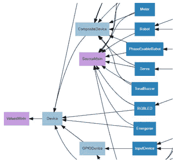

如果你检查 Device 的代码，你会发现，虽然它确实有一些方法和数据属性，但其中一个属性的编码方式是：

```python
@property
def value(self):
    """
    Returns a value representing the device's state. Frequently, this is a
    boolean value, or a number between 0 and 1 but some devices use larger
    ranges (e.g. -1 to +1) and composite devices usually use tuples to
    return the states of all their subordinate components.
    """
    raise NotImplementedError
```

你可以看到这使得该类不完整。它不打算用于创建实例，因为部分实现缺失了。相反，Device 的存在是为了用作其他设备的基类——它是 Python 中虚拟类的等价物。

请注意，虚拟类很可能被用来创建另一个更具体但仍然过于通用而无法实际用于创建实例的虚拟类。例如，Device 产生了 GPIODevice，它稍微更具体一些，但可能还不够完善，无法用于创建实例。

### 属性和特性

数据属性是允许对象存储数据的最简单方式。在这种情况下，你可以像使用变量一样简单地使用该属性。例如：
`myObject.myAttribute = 42`

属性工作得很好，但它们是通往更复杂数据存储方法的第一步。例如，假设你有一个用于存储温度的数据属性：
`MyObject.temperature = 42`

如果这被用于通过加热器控制外壳的温度，那么检查它是否设置在合理范围内（比如 20 到 30 °C）将是一个好主意。如果温度可以内部以毫摄氏度（即摄氏度的千分之一，物联网设备常用的单位）存储也会很有用。使用简单的数据属性无法做到这一点，但你可以轻松地发明一种方法。

我们可以创建两个方法，通常称为 get 和 set 方法，而不是数据属性：

```python
class Heater():
    def __init__(self):
        self.temperature = 22 * 1000
    def setTemperature(self, t):
        if t < 20: return
        if t > 30: return
        self.temperature = t * 1000
    def getTemperature(self):
        return self.temperature / 1000
```

你可以看到我们现在有了一个 get 和一个 set 方法，set 检查值是否在范围内，get 将其转换回摄氏度。这一切都有效，但这意味着你必须以不自然的方式使用温度属性：
```python
heater = Heater()
heater.setTemperature(31)
print(heater.getTemperature())
```

Python 有一种更好的方法。你可以使用 `@property` 装饰器定义一个特性。装饰器是 Python 的一个强大功能，如果你想了解更多，请参阅 *《程序员的 Python：一切皆对象》*，但在本例中我们只想利用它。

例如：

```python
class Heater():
    def __init__(self):
        self._temperature = 22 * 1000
    @property
    def temperature(self):
        return self._temperature / 1000
    @temperature.setter
    def temperature(self, t):
        print(t)
        if t < 20: return
        if t > 30: return
        self._temperature = t * 1000
```

你可以看到我们以稍微不同的方式定义了一个 get 函数和一个 set 函数。我们还需要一个“后备”变量 `_temperature`，因为现在我们将 getter 和 setter 命名为 temperature。这可能看起来稍微复杂一些，但现在你可以这样写：

```python
heater = Heater()
heater.temperature = 31
print(heater.temperature)
```

get 和 set 函数会自动使用，即温度不会改变，因为它超出了范围。

在整个 GPIO Zero 中，特性被用于各种原因。例如，在 Device 中你会发现：

```python
@property
def is_active(self):
    """
    Returns :data:`True` if the device is currently active and
    :data:`False` otherwise. This property is usually derived from
    :attr:`value`. Unlike :attr:`value`, this is *always* a boolean.
    """
    return bool(self.value)
```

这允许你这样写：

```python
if(device.is_active):
```

而无需转换为布尔值或进行比较。

### 总结

- Python 是一门易于上手的语言，但这可能让你忽略它是一门面向对象的语言。
- 使用 Python 一段时间后，初学者在第一次接触并希望使用和理解像 GPIO Zero 这样的面向对象库时，往往需要回头去发现是什么让 Python 具有面向对象特性。
- 对象是相关数据和代码的包。方法作用于存储在对象中的数据。
- 面向对象代码始于这样一个想法：你可以将 `object.method()` 转换为 `method(object)`。在 Python 中，`self` 参数用于执行此转换。
- 对象是作为类的实例创建的，类可以被视为对象的规范。
- 要创建自己的类，你需要 `class` 关键字。你还需要使用 `__init__` 魔术方法来创建数据属性。
- 一个类（派生类）可以继承另一个类（基类）的所有方法和属性。如果新类本质上只是现有类的细化，这允许代码重用。
- 派生类必须确保其基类实例被正确构造，这通常涉及使用 `super` 函数调用基类的 `__init__` 方法。
- Python 支持多重继承，其中派生类可以继承多个基类的属性和方法。如果基类共享同名的属性或方法，这可能会产生问题。
- 混入是多重继承的一个特殊且简单的情况，其中只需要给一个类一组辅助方法。
- Python 没有虚拟类，虚拟类仅仅作为派生类必须具有的最小属性集的定义，但这些可以很容易地模拟。
- 数据属性很简单，但通常你需要在访问值时对其进行一些处理。在 Python 中执行此操作的最佳方法是使用特性。

## 第5章
### 简单的开关设备

只有两种简单的开关设备——LED和蜂鸣器。在本章中，我们将依次介绍它们，并学习如何创建自己的新型自定义开关设备。

### 开关设备的继承关系

简单输出设备的继承层次结构如下：

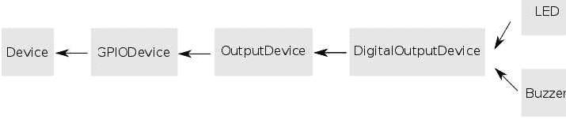

如果你不了解继承，请参阅上一章。
了解继承层次结构对于创建自己的自定义类以扩展GPIO Zero非常有用。`Device`是最通用的，然后是`GPIODevice`，它对应于用作输入或输出的单个GPIO线路。`OutputDevice`是通用的输出线路，`DigitalOutputDevice`只有两种状态，最后`LED`和`Buzzer`对应于实际设备。

### LED详解

LED类是典型的开关设备。你已经看到了如何创建与特定GPIO引脚关联的LED对象：
`led = LED(4)`
创建一个与GPIO4关联的LED对象。

创建LED对象时可以指定的其他参数有：
`LED(pin, active_high=True, initial_value=False, pin_factory=None)`

| 参数 | 作用 |
| :--- | :--- |
| active_high | 如果为True，on方法将线路设置为高电平<br>如果为False，off方法将线路设置为高电平 |
| initial_value | 如果为True，设备初始状态为开启<br>如果为False，设备初始状态为关闭 |
| pin_factory | 使用的底层引脚工厂<br>让GPIO Zero自动设置此项 |

例如：
`led=LED(4, active_high=True, initial_value=True)`
创建一个与GPIO4关联的LED，开启时为高电平，因此初始状态为开启。
LED只有四个相关方法。最常用的是on和off，用于开关LED。
如果你想让LED闪烁，可以使用：
`blink(on_time, off_time, n, background)`
这将使LED闪烁n次，开启时间为on_time秒，关闭时间为off_time秒。background参数默认为True，这允许闪烁在后台的另一个线程上执行。也就是说，如果background为False，blink会阻塞，直到n次闪烁完成才返回，这会使你的程序暂停。如果你想在LED闪烁时做其他事情，请将background设置为True或接受默认值。LED将在blink返回后闪烁n次。
例如，我们在第3章给出的原始Blinky LED程序：

```
from gpiozero import LED
from time import sleep
led = LED(4)
while True:
    led.on()
    sleep(1)
    led.off()
    sleep(1)
```

可以写成：

```
from gpiozero import LED
from signal import pause
led = LED(4)
led.blink(on_time=1,off_time=1,n=100)
print("Program Complete")
pause()
```

如果你尝试这个，你会发现LED在程序打印出Program Complete后还会持续闪烁近200秒。注意你需要在程序末尾加上pause，因为如果你的程序停止了，程序创建的任何线程也会停止。简而言之，没有pause()，你根本看不到LED闪烁。关键在于，通常当你给出一条Python指令时，只有在当前指令完成后才会执行下一条指令。

这通常被称为“阻塞”，因为当前指令在完成之前会阻止下一条指令执行。对blink的调用是非阻塞的，因为它在完成你告诉它要做的所有事情之前就返回了，下一条指令在它未完成时就开始执行。非阻塞指令在处理硬件时非常有用，因为它允许你的程序在硬件执行操作时继续处理其他事情。

比较后台非阻塞程序与阻塞版本的行为：

```
from gpiozero import LED
led = LED(4)
led.blink(on_time=1,off_time=1,n=100,background=False)
print("Program Complete")
```

在这种情况下，你不需要pause()，因为程序会等待LED完成100次闪烁。你将在200秒后才看到Program Complete消息。

有趣的是，在这两种情况下，blink方法都使用一个新线程在后台运行LED，唯一的区别是当background为False时，主线程会等待blink线程完成。

toggle方法只是根据LED的当前状态将其从开切换到关，或从关切换到开。你可以用另一种方式编写Blinky程序：

```
from gpiozero import LED
from time import sleep

led = LED(4)

while True:
    led.toggle()
    sleep(1)
    led.toggle()
    sleep(1)
```

还有一些有用的属性。`is_lit`属性在LED当前激活时为真，`value`以1或0的形式设置和获取LED的状态。最后，我们有`pin`属性，它返回LED连接的引脚对象。Pin对象提供对GPIO线路的更低级别访问。

### 蜂鸣器

另一种标准的开关设备是蜂鸣器，它像LED一样由单个GPIO线路驱动，当线路为高电平时发声，为低电平时静音。它不能发出不同的音调，只能开或关。
确切的蜂鸣器类型是压电蜂鸣器，它发出单一音调，声音可能非常大：


你不需要限流电阻，因为蜂鸣器消耗的电流很小。你所要做的就是确保它能在3.3伏电压下工作。使用时只需将负极线接地，正极线连接到GPIO线路：

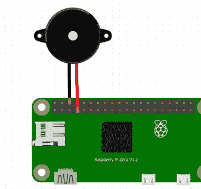

Buzzer对象具有LED对象的所有属性和方法。on和off方法现在使蜂鸣器发声，但工作方式完全相同。一个小小的改变是blink现在重命名为beep。它的工作方式完全相同，但现在蜂鸣器被开关。

```
from gpiozero import Buzzer
from signal import pause

buzz = Buzzer(4)
buzz.beep(on_time=1,off_time=1,n=100)
print("Program Complete")
pause()
```

你可以非常清楚地看到，创建Buzzer类更多的是重命名事物，以便你的程序更易于理解，而不是引入任何新东西。

### 自定义开关设备

除了LED和蜂鸣器，还有很多其他开关设备，那么你如何安排与它们一起工作呢？

一个解决方案是将所有东西都当作LED来处理。例如，如果你有一个电子门锁，你可以写：

```
lock=LED(4)
lock.on()
...
lock.off()
```

它会工作，但当你忘记程序并被迫想知道LED在锁上做什么以及lock.on()是什么意思时，它可能会令人困惑。

一个更好、更简单的解决方案是派生一个自定义开关设备。你可以通过继承DigitalOutputDevice来实现这一点，它提供了LED拥有的几乎所有方法——特别是它有on和off方法。在这种情况下，我们可以简单地将构造函数参数传递给DigitalOutputDevice的构造函数：

```
class Lock(DigitalOutputDevice):
    def __init__(self, *args, **kwargs):
        super().__init__(*args, **kwargs)
```

此时，Lock实际上只是DigitalOutputDevice的一个副本，要将其自定义为Lock类，我们需要添加适当的方法。我们真正需要的是两个新方法，lock和unlock，这些可以通过调用父类的on和off方法来实现：

```
def lock(self):
    super().on()
def unlock(self):
    super().off()
```

现在我们有了一个Lock对象，它具有对设备有意义的lock和unlock方法。然而，我们仍然有on、off和blink，它们没有任何意义。
最简单的解决方案是用引发适当异常的方法覆盖它们：

```
def on(self):
    raise AttributeError("'Lock' object has no attribute 'on'")
def off(self):
    raise AttributeError("'Lock' object has no attribute 'off'")
def blink(self):
    raise AttributeError("'Lock' object has no attribute 'blink'")
```

这阻止了方法调用的使用，但不适当的属性仍然可以访问。也就是说：

```
lock.on()
会导致异常，但是：
my0n=lock.on
可以工作，即使你实际上不能调用该方法。
```

这可能对大多数用例来说已经足够好了，但你可以更进一步，自定义构造函数。毕竟，你不希望允许active_high设置为False，使得lock意味着unlock，反之亦然。

你可以使用类似以下方式检查任何关键字参数：

```python
def __init__(self, *args, **kwargs):
    if 'active_high' in kwargs:
        raise TypeError("active_high not supported")
    super().__init__(*args, **kwargs)
```

如果你想要更具体的错误信息，可以定义自己的异常类。
你可以继续调整 `Lock` 的行为，使其更像一个锁，直到你得到完美的类。将代码放入模块中以便导入 `Lock` 也是一个好主意。
完整的程序如下：

```python
from gpiozero import DigitalOutputDevice

class Lock(DigitalOutputDevice):
    def __init__(self, *args, **kwargs):
        if 'active_high' in kwargs:
            raise TypeError("active_high not supported")
        super().__init__(*args, **kwargs)

    def lock(self):
        super().on()

    def unlock(self):
        super().off()

    def on(self):
        raise AttributeError("'Lock' object has no attribute 'on'")

    def off(self):
        raise AttributeError("'Lock' object has no attribute 'off'")

    def blink(self):
        raise AttributeError("'Lock' object has no attribute 'blink'")
```

使用 `Lock` 非常简单：

```python
office_door = Lock(4)

office_door.lock()
...
office_door.unlock()
```

你可以运用同样的思路，为你关心的任何开关设备实现一个自定义类。有趣的是，在实践中，通过继承来定制现有类，往往既涉及扩展其功能，也涉及改变和限制其能力，而这并非教科书最强调的重点。
至此，软件部分已完成。值得一提的是，这种简单的锁与驱动螺线管是相同的硬件问题。由于它们通常使用6伏或12伏电压，你需要使用晶体管驱动器，并考虑相关的电压和电流，更多详情请参见下一章。

### 分阶段开关

当你想要协调设备开关的时间时，会遇到一个特定问题。考虑一下你想要以分阶段方式闪烁的两个LED——当 `led2` 亮时 `led1` 灭，反之亦然。你必须将每个LED作为单独的操作来切换，这意味着两个动作之间必须有一个间隔。例如，考虑以下尽可能快地闪烁两个LED的程序：

```python
from gpiozero import LED

led1 = LED(4)
led2 = LED(17)

while True:
    led1.on()
    led2.on()
    led1.off()
    led2.off()
```

它们并非同时开关，在Pi Zero上存在大约140μs的延迟：

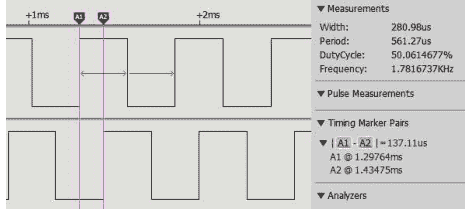

在Pi 4上延迟为10μs，在Pi 5上为20μs：

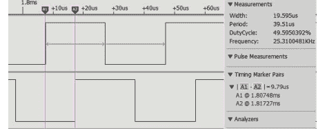

20μs和140μs的差异可能看起来不大——对于LED来说，你很难注意到它们不是同时亮起的。然而，如果你同时开关十个LED，从第一个到最后一个的时间差在Pi Zero上大约是1.5ms，这可能会表现为可见的闪烁。

还有一些情况，你在驱动设备时需要一个或多个信号具有固定且精确的相位关系——例如，一个亮时另一个灭。最著名的例子是电机方向控制。这通常通过一种称为H桥的配置来实现（见第11章），它有两条控制线。一次激活一条线会使电机向两个不同方向转动，而同时激活两条线会使电源短路并造成损坏。如果这两条线都由GPIO线驱动，那么会有一个短暂的时间——10μs到150μs——两条线都处于激活状态。结果就是电源在这段时间内被短路，在大多数情况下，损坏会随时间累积。

你不能假设事情会同时发生。事实上，除非你费心确保它们同时发生，否则事情不会同时发生是常态。

### 总结

- 从编程角度来看，只有两种简单的开关设备：LED和蜂鸣器。它们都继承自 `DigitalOutputDevice`。
- `blink` 方法使设备开关指定的次数，可以在后台运行，让程序继续处理其他事情，也可以在前台运行，此时程序会等待。
- `toggle` 方法在设备关闭时将其打开，在打开时将其关闭。
- `Buzzer` 类旨在与压电蜂鸣器一起使用，这种蜂鸣器要么开要么关，因此要么发声要么静音。它只能发出一种音调，无法改变。
- 压电蜂鸣器不需要驱动器，因为它消耗的电流非常小。
- 你可以通过继承 `DigitalOutputDevice` 并提供所需的方法来创建自定义的开关设备。限制对任何现有不适当方法的访问是一项更困难的任务。
- 你可以同时或在协调的时间切换多个开关设备，但切换设备之间总是存在延迟——Pi Zero为140μs，Pi 4/5为10μs到20μs。

## 第6章：引脚与引脚工厂

GPIO Zero构建在Pi硬件的现有软件库之上——即GPIO库。你可以直接使用这些库，但它们通常是用C语言编写的，不容易掌握。为了简化操作，GPIO库被GPIO Zero的Python类——引脚工厂——所封装。它们的目的不仅是创建具有你指定特性的引脚对象，还要管理GPIO线的使用，确保你不能同时将同一条GPIO线用于两个不同的目的，并提供一定程度的事件处理。需要引脚工厂的原因是它们掩盖了不同GPIO库之间的差异，无论你选择使用哪个库，都呈现一个统一的Pin对象。
也就是说，在GPIO Zero中，无论使用哪个GPIO库，Pin对象都允许你以相同的方式直接操作GPIO线。
由于GPIO Zero会选择一个默认的引脚工厂，你通常可以忽略引脚工厂和引脚的整个问题，直到你需要做一些超出常规的事情。所以首先让我们看看如何使用Pin对象。

### 原始GPIO引脚

在Blinky程序中，我们使用LED对象来开关LED——为什么不直接引用GPIO线呢？换句话说，为什么要隐藏我们正在使用GPIO线的事实？答案是这样可以使程序更易于阅读。如果你想使用原始的GPIO线，你可以这样做，但程序的含义就不那么清晰了，即GPIO线控制的是什么。
要使用GPIO Zero为你设置的引脚工厂中的引脚，你只需创建一个引脚，将其功能设置为'input'或'output'，然后使用它。例如，闪烁LED程序的引脚等效版本是：

```python
from gpiozero import Device
from time import sleep

Device()
pin = Device.pin_factory.pin(4)
pin.set_function('output')

while True:
    pin.state = 1
    sleep(1)
    pin.state = 0
    sleep(1)
```

注意，你必须调用 `Device` 构造函数来初始化 `pin_factory`，然后才能使用它。引脚工厂为GPIO4创建一个引脚对象，然后我们使用其方法来控制它的行为。
所有引脚对象都有三个基本方法：
`_get_function`
`_set_function`
`_get_state`
还有一组可选的get/set方法，实际上所有引脚对象都支持。这些方法被组合在一起以实现属性：

| 功能 | 输入/输出 |
|---|---|
| state | 0/1 |
| pull | 上拉/下拉/浮空，见下一章 |
| frequency | 输出频率/无 |
| bounce | 时间（秒）/无，见第7章 |
| edge | 上升沿/下降沿/双沿/无，见第8章 |
| when_changed | 边沿事件发生时调用的函数 |

还有三个通用方法：

| 方法 | 描述 |
|---|---|
| close | 释放引脚并清理 |
| output_with_state | 将引脚设置为输出并给定状态 |
| input_with_pull | 将引脚设置为输入并给定上拉/下拉，见第7章 |

`output_with_state` 很有用，因为它设置了GPIO线的初始状态，即起始点。例如：
`pin._set_function('output', 1)`
将引脚设置为输出并置高。
你可能同意 `LED.on()` 比 `pin._set_state(1)` 更容易理解，但差异并不大。
GPIO Zero使用Pin类来构建更易于使用的类，这些类实现了真实设备（如LED）的功能。后来，这个想法变得更加有用，因为Pin类被用来构建使用多条GPIO线的更复杂的设备。
你可能注意到引脚的方法以下划线开头，这是表示方法是私有的、不应被使用的通常方式。这是因为Pin类旨在作为其他类（如LED等）的基础，而不是直接使用。稍后我们将

### 选择哪个引脚工厂？

如果你对默认的引脚工厂感到满意，就没有必要深入研究如何选择引脚工厂，你可以跳过本节，等到需要了解更多时再回来查看。

底层的GPIO库直接与硬件交互，因此它们必须针对特定版本的树莓派编写。在树莓派5之前，这并不困难，因为GPIO的实现相当标准。树莓派5以一种新的方式实现了GPIO和其他I/O，这意味着现有的GPIO库无法与之兼容。在撰写本文时，要在所有版本的树莓派上以相同方式使用GPIO和其他I/O，唯一的方法是使用Linux驱动程序。Linux驱动程序在所有版本的树莓派上都是统一的，这就是为什么它们成为默认`LGPIOFactory`的良好基础。问题在于Linux驱动程序往往速度较慢，而存在更快的引脚库。实际上，速度是使用非默认引脚库的唯一充分理由。

如果说GPIO Zero有什么不足，那就是缺乏一个真正高质量、高速的GPIO库，该库需要能在所有版本的树莓派上工作，并作为引脚工厂的基础。因此，每个替代引脚工厂都有其优缺点。

对于GPIO Zero 2，默认引脚工厂更改为`LGPIOFactory`，这是目前唯一能在所有版本的树莓派（包括树莓派5）上工作的工厂。原则上，它应该能在任何基于Linux的系统上工作，因为它使用标准的`gpiochip`设备。因此，建议你使用默认引脚工厂，除非你有充分的理由不这样做。

在GPIO Zero 2之前，默认引脚工厂，也就是最常用的，是`RPiGPIOFactory`。然而，它不能在树莓派5上工作，也不支持SPI总线、I2C、硬件脉宽调制（PWM）或单总线（1-wire）。它也没有进行太多开发，因此这些功能不太可能在未来添加。它比新的默认引脚工厂更快，因此如果你确定不需要你的程序在树莓派5上运行，有时值得用它来替代。

其他替代引脚工厂大多只有历史意义，这里列出它们是为了以防你需要处理一些使用了它们的旧软件。

`RPIOFactory`更快，不会占用CPU，并支持使用DMA（直接内存访问）的巧妙软件PWM实现，但它不支持树莓派5、树莓派4或树莓派Zero，并且它不再作为GPIO Zero 2的一部分提供。自2014年以来，该项目没有进行任何工作，其GitHub页面注明该项目已不再维护，并正在寻找新的维护者。

`pigpio`库也使用DMA在任何线路上创建软件PWM，但它目前仅对树莓派4有实验性支持，对树莓派5没有支持。它使用守护进程来控制GPIO线路，这似乎也有一些稳定性问题。然而，该项目仍在进行中，如果你愿意接受稍微复杂一点的设置，它值得一试。这个引脚工厂也是唯一支持远程GPIO的。它至少看起来是一个实现良好的活跃项目。

最后一个选择是`NativeFactory`，它完全基于Python。你可以阅读代码来了解它的工作原理，这非常有教育意义。遗憾的是，它没有完全实现，虽然它在硬件和软件上支持SPI总线，但完全不支持PWM。

还有一个`MockFactory`，它创建软件引脚，可以在没有树莓派时用于测试。

总结如下：

对于大多数应用，默认的`LGPIOFactory`是最佳选择，仅仅因为它是默认的，支持所有版本的树莓派（包括树莓派5），并且很可能是未来会得到支持的那个。它唯一的缺点是比一些替代方案慢。

唯一值得考虑的其他引脚工厂是`RPiGPIOFactory`，它更快，但不能在树莓派5上运行，未来也不太可能有太多开发。

目前，`LGPIOFactory`无法与I2C或单总线设备配合使用。对于这些设备，你需要直接使用Linux驱动程序，如《Raspberry Pi IOT in Python with Linux Drivers》（ISBN:9781871962659）中所述。

### 设置引脚工厂

如果你不指定引脚工厂，GPIO Zero会尝试为你定位一个，如果找不到（因为没有安装），它将使用始终可用的`NativeFactory`。在大多数情况下，这意味着将使用`LGPIOFactory`，因为它是默认安装的。

你也可以在命令行上使用`export`命令设置要使用的引脚工厂：
`export GPIOZERO_PIN_FACTORY = 引脚工厂的名称`

你也可以在Python中通过设置`Device.pin_factory`来显式选择引脚工厂：
`Device.pin_factory = factoryClass()`
其中`factoryClass`是下表中列出的工厂名称。
你也可以读取`Device.pin_factory`来发现当前使用的是哪个引脚工厂。

每个引脚工厂都会生成一个具有特定名称的引脚类，但它们的工作方式都相同，并且具有相同的方法和属性。这意味着你可以以相同的方式处理任何引脚工厂产生的引脚。
每个选项对应的工厂和引脚类是：

| 名称 | 工厂类 | 引脚类 |
|---|---|---|
| lgpio | gpiozero.pins.lgpio.LGPIOFactory | gpiozero.pins.lgpio.LGPIOPin |
| rpigpio | gpiozero.pins.rpigpio.RPiGPIOFactory | gpiozero.pins.rpigpio.RPiGPIOPin |
| pigpio | gpiozero.pins.pigpio.PiGPIOFactory | gpiozero.pins.pigpio.PiGPIOPin |
| native | gpiozero.pins.native.NativeFactory | gpiozero.pins.native.NativePin |

你也可以在每个设备构造函数中将引脚工厂指定为参数：
`LED(7,pin_factory=factoryClass())`
然而，这种方法价值不大，你应该只在给定的程序中使用单个引脚工厂。最好的建议是忽略`pin_factory`参数，除非你有充分的理由不这样做。在程序开始时设置引脚工厂，不要更改它。

你也可以直接创建和使用引脚工厂对象：
`from gpiozero.pins.native import NativeFactory`
`myFactory = NativeFactory()`
`pin = myFactory.pin(4)`

### 速度如何？

任何物联网系统的一个关键问题是它能运行多快？在这个背景下，我们需要大致了解GPIO Zero切换GPIO线路的速度。请注意，这个问题不仅取决于GPIO Zero，还取决于所使用的引脚工厂。为简单起见，我们只看默认的`lgpio`和之前的默认`rpigpio`。

我们可以用一个简单的程序立即回答这个问题：

```
from gpiozero import LED
led = LED(4)
while True:
    led.on()
    led.off()
```

如果你在树莓派Zero上使用`rpigpio`（最快的引脚工厂）运行此程序，输出为3.6kHz，这意味着你可以将LED点亮136μs。对于树莓派4，输出为51kHz，略低于10μs。换句话说，树莓派4大约快十倍。

由于`LGPIOFactory`是唯一能在树莓派5上工作的引脚工厂，我们无法用`rpigpio`尝试这个，但使用`lgpio`的相同程序产生20μs的脉冲，频率为24kHz。

你可能认为一个看起来更简单的程序：

```
from gpiozero import LED
led = LED(4)
while True:
    led.toggle()
```

会更快地完成任务，但并非如此。`toggle`操作更复杂，而`toggle`方法只是隐藏了这一点。在这种情况下，树莓派Zero以1.8kHz运行，树莓派4以24kHz运行，即此方法耗时是前者的两倍。

直接操作引脚呢？这应该更快，因为它避免了使用GPIO Zero中的额外代码。使用默认引脚工厂：

```
from gpiozero import Device
Device()
pin = Device.pin_factory.pin(4)
pin._set_function("output")
while True:
    pin.state=1
    pin.state=0
```

如果你在树莓派Zero上使用`rpigpio`尝试此操作，你会发现频率为25kHz，在树莓派4上为300kHz，即比使用`LED`对象快十倍以上。不同的引脚工厂会给出不同的上限，但直接使用引脚对象的速度提升应该是相似的。在树莓派5上，频率为38kHz，这是`LGPIOFactory`比`rpigpio`慢约十倍的结果。

粗略地说，在树莓派 Zero 上使用 rpigpio 运行 GPIO Zero，其特征时间大约在 100μs 到 20μs 之间；而在树莓派 4 上，特征时间则在 10μs 到 3μs 之间。在树莓派 5 上使用 LGPIOFactory，特征时间为 40μs 到 20μs。在同一台机器上，rpigpio 的速度大约是 LGPIOFactory 的十倍。

与之相比，直接用 C 语言编程完成相同任务，其特征时间约为 0.01μs，即 10ns，这比树莓派 4 上最快的引脚工厂快至少 100 倍，比树莓派 5 上的 lgpio 快 1000 倍。

毫无疑问，如果你需要这类任务的速度，那么 Python 并非合适的选择。正如《Raspberry Pi IoT in C, Second Edition》（ISBN:9781871962635）中所述，C 语言是更好的选择。话虽如此，许多应用运行在接近人类时间尺度上，对于这些应用，Python 非常足够且简单得多。如果可以，请使用 Python；除非速度是个问题，否则请使用默认的引脚工厂。

### 时钟问题

直到最近，处理器以及整个计算机系统都采用非常简单的方法来处理时钟频率。每次时钟脉冲发生时，系统中就会发生某些事情。为简单起见，时钟被设置为以固定的最高速率运行，以使系统保持凉爽。然而，今天的系统使用多个以可变速率运行的时钟。这允许系统“冲刺”，即在短时间内使用更高的时钟速率，以将温度升高保持在设定水平以下。如果温度升高过多，则时钟可以被节流，即减慢速度，直到系统再次处于安全区域。降低时钟速度也可用于降低功耗。

从完成任务和可能降低功耗的角度来看，可变时钟速率是好的，但如果你试图编写对时间要求严格的程序，这可能是个问题。如果你使用一个已知的计时器变化来同步你的程序，该计时器始终以相同的速率滴答，无论系统时钟如何，那么你的程序将无论系统时钟速度如何都以相同的方式工作。然而，如果系统时钟运行得太慢，以至于程序无法在分配的时间内完成任务，情况就并非如此了。

最新版本的 Pi OS 实现了 Linux cpufreq 内核驱动程序，但树莓派的情况更复杂，因为控制事情的是 GPU，而不是 CPU。你可以使用 `vcgencmd` 命令来了解 GPU 的工作情况，该命令直接与 GPU 通信，而标准的 Linux 命令与 CPU 交互，有时会给出错误的答案。

`vcgencmd` 在官方网站上有完整文档，但用于测量时钟速度的重要命令是：
`vcgencmd measure_clock arm`
你可以用其他时钟名称替换 `arm`，但这会给出所有核心运行的频率。
Linux cpufreq 命令是标准的，但在某些情况下，GPU 可能在 Linux 不知情的情况下更改时钟频率。其思想是有一组“调节器”来控制频率如何变化。对于当前一代的树莓派，默认是 `ondemand`，但你可以使用以下命令找到当前活动的调节器：
`sudo cat /sys/devices/system/cpu/cpu0/cpufreq/scaling_governor`
你可以使用以下命令找到可用的调节器：
`sudo cat /sys/devices/system/cpu/cpu0/cpufreq/scaling_available_governors`
根据 Linux 手册，`ondemand` 调节器的作用是：

> cpufreq 调节器 "ondemand" 根据当前系统负载设置 CPU 频率。负载估计由调度器通过 update_util_data->func 钩子触发；触发时，cpufreq 检查上一时间段的 CPU 使用统计信息，调节器相应地设置 CPU。

基于负载设置频率对许多应用来说是有意义的，但对于需要高速的物联网应用，即使它不使 CPU 负载过高，这也不是理想的。
根据经验，树莓派 Zero 似乎认为其单核始终处于高负载状态，因为它总是报告 1GHz 的时钟速率，但树莓派 4 在低负载时报告低至 600MHz。你可以使用以下命令发现 Linux 认为的当前时钟速率以及使用的最大和最小频率：
`cat /sys/devices/system/cpu/cpu0/cpufreq/scaling_cur_freq`
`cat /sys/devices/system/cpu/cpu0/cpufreq/scaling_min_freq`
`cat /sys/devices/system/cpu/cpu0/cpufreq/scaling_max_freq`
对于树莓派 Zero，最大频率是 1GHz；对于树莓派 4，是 1.5GHz；对于树莓派 5，是 2.4GHz。

如果你需要固定的时钟频率，你必须将调节器设置为 `performance`，这会将时钟设置为可能的最高频率，通常是 `scaling_max_freq`：

```
sudo sh -c "echo performance > /sys/devices/system/cpu/cpu0/cpufreq/scaling_governor"
```

这将使时钟以最高频率运行，但如果 CPU 温度超过最大值，频率仍然会被降低。
在大多数情况下，你可以忽略随负载变化的时钟速度，但当你在寻找为什么事情没有像预期那样快发生的原因时，你确实需要记住这种影响。

### 总结

- GPIO Zero 使用引脚工厂的概念，允许使用各种直接接口与 GPIO 线路交互。
- 你应该在程序开始时选择一个单一的引脚工厂，并且不要更改它。
- 默认的引脚工厂 `lgpio` 默认安装，目前是最佳选择。
- 之前的默认引脚工厂 `rpigpio` 比 `lgpio` 快大约十倍，但它在树莓派 5 上不工作。
- 在大多数情况下，引脚对象是由你使用的设备（如 LED）构建的，你完全不需要与引脚工厂交互。
- 你可以直接使用引脚工厂来获取引脚对象并直接操作。
- 直接使用引脚对象比通过设备派生类操作快大约十倍。
- 现代树莓派具有可变速率时钟，当你试图以最快速度运行物联网程序而不考虑 CPU 负载时，这可能是个问题。
- 你可以使用操作系统命令将速度调节器设置为固定速度，通常是可能的最大值。然而，CPU 过温事件仍会出于安全考虑而降低时钟速度。

## 第 7 章
### 一些电子学知识

既然我们已经看了一些简单的 I/O，值得花一点时间了解一下输出和输入的电子学知识。
首先是一些基础电子学——晶体管如何用作开关。这种方法非常简单，但对于数字电子学使用的简单电路来说已经足够了。它不足以设计高质量的音频放大器或类似的模拟设备，但这可能就是你所需要的全部。
所有电子学的基础是欧姆定律，V = IR，这个前提意味着需要理解电压、电流和电阻。

### 如何思考电路

对于初学者来说，电子学可能显得非常抽象，但老手们并非如此思考。大多数人理解正在发生的事情是基于液压模型，即使他们不承认。基本思想是，电线中流动的电流非常像管道中的水流。电源扮演泵的角色，电线就是管道。电流的大小以安培为单位，这只是每秒流动的电量。流动受泵的抽水力度（以电压衡量）和管道的限制程度（电阻，以欧姆衡量）控制。

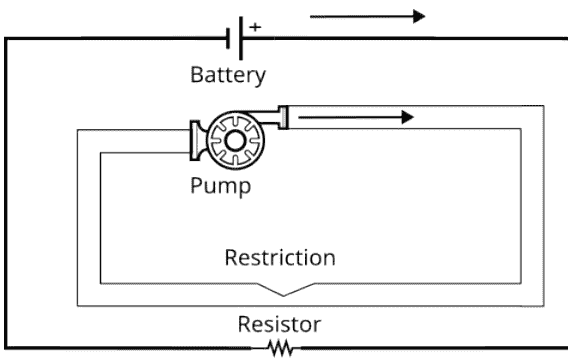

确实，当你在做电子学时，你基本上是在用一种通常看不见的流体在称为电线的管道中进行管道工程。

这三个概念中唯一困难的是抽水力的概念。我们倾向于认为泵在泵的位置提供流量，但有某种东西，“抽水力”，使水在电路的每个部分持续流动。在你的想象中，你必须认为水在管道的每个点都被迫不断向前流动。特别是当管道有收缩时，你可能需要更大的抽水力才能让水通过。从某种意义上说，泵提供了可用的总压力，这个压力根据需要分布在电路周围，以推动水流通过每个限制。

在电路中，抽水力被称为电动势或电动势，或者简称为电压。我们还假设推动电流通过电线所需的力可以忽略不计，电阻器是唯一需要电压才能使电流流动的地方。

这些量之间的关系由欧姆定律表征：
V=IR 或 I=V/R 或 R=V/I
其中 V 是以伏特为单位的电压，I 是以安培为单位的电流，R 是以欧姆为单位的电阻。

值得指出的是，我们在欧姆定律中通常使用伏特（V）和毫安（mA，安培的千分之一），这会自动给出以千欧（kΩ）为单位的电阻。

你可以看到，如果你增加电压（即流量），那么电流就会增加。如果你增加电阻，那么电流就会减少。稍微困难一点的概念是，对于给定的电阻，你需要特定的抽水力来实现给定的流量。如果你知道实际流量和电阻，那么你可以计算出获得该流量所需的抽水力。

以下几点应该是显而易见的。通过管道的流量在管道的每个点必须相同——否则水会回流或需要被引入。泵提供的总压力必须分布在管道中的每个电阻上，以确保相同的流量。这些压力必须加起来等于泵提供的总压力。

稍微不那么明显，但你仍然可以用水流来理解它们：压力相加，电流相加，在同一管道中流动的电阻相加。

理解电流流动的主要原因之一是，你可以利用欧姆定律来避免损坏元件。当电流流过电阻时，电阻会发热。这里的规则是，产生的能量与电压和电流的乘积（VI）成正比。如果电流加倍，发热效应也会加倍。大多数电子设备都有电流限制，超过这些限制就可能损坏。设计任何电子电路的基本任务之一就是计算电流，如果电流过高，就添加电阻或降低电压以减小电流。为此，你需要很好地理解液压模型并能够运用欧姆定律。本章后面会有相关示例。

同样值得注意的是，有些器件不遵守欧姆定律——即所谓的非欧姆器件。这些是电路中有趣的元件——LED、二极管、晶体管等等，但即使是这些器件，也可以用流体流动的概念来理解。

这是对电子学的闪电式介绍（双关语），还有很多东西要学，很多错误要犯，其中大多数错误会导致“蓝烟”（指元件烧毁）。

### 电气驱动特性

如果你对电子学不太熟悉，需要了解的重要事项是使用的工作电压以及可以流过的电流大小。关于树莓派（Pi）最重要的一点是它使用两个电压等级工作——0V和3.3V。如果你使用过其他逻辑器件，可能更熟悉0V和5V作为低电平和高电平。树莓派使用较低的输出电压以降低功耗，这是有益的，但你需要记住，你可能需要使用一些电子元件将3.3V转换为其他电压值。输入也是如此，其电压不得超过3.3V，否则有损坏树莓派的风险。

在输出模式下，单个GPIO引脚可以提供和吸收16mA电流，但实际情况比这暗示的要复杂一些。

不幸的是，树莓派的电源只能为所有GPIO引脚在各自约3mA电流下工作提供足够的功率。如果你使用过多电流，3.3V电源将会失效。安全限制通常规定为总共50mA，即所有GPIO引脚的电流消耗总和必须低于50mA。当你接近这个限制时，可能会发现电流尖峰会导致异常行为。此外，单个GPIO引脚不应提供或吸收超过8mA的电流，或者如果你配置了高驱动电流（见后文），则不应超过16mA。

实际上，如果你计划从多个GPIO引脚使用超过3mA的电流，请考虑使用晶体管。如果你的电路从3.3V电源轨汲取超过50mA的电流，请考虑使用独立的电源。如果你需要更大的3.3V电源电流，可以使用5V电源配合稳压器。5V引脚能提供多少电流是一个复杂的问题，取决于所使用的USB电源，但如果没有其他USB设备连接，2A是一个合理的估计值。所有USB、HDMI、摄像头和5V引脚的总电流必须小于2.5A。如有疑问，请使用独立电源。

请注意，16mA的限制意味着你无法在不将电流限制在16mA以下的情况下安全地驱动一个标准的20mA红色LED。更好的解决方案是使用低功耗的2mA LED或使用晶体管驱动器。

### 驱动LED

你需要知道如何做的第一件事是计算限流电阻的值。例如，如果你只是将一个LED连接在GPIO引脚和地之间，那么当引脚为低电平时，没有电流流过，LED熄灭；但当引脚为高电平（3.3V）时，电流极有可能超过安全限制。在大多数情况下，不会发生什么可怕的事情，因为树莓派的GPIO引脚额定值非常保守，但如果你持续这样做，最终某个元件会损坏。正确的做法是使用限流电阻。

虽然这是使用LED的基本要求，但在连接任何输出设备时，你也需要记住这一点。你需要了解设备所需的电压和电流，并计算限流电阻，以确保它确实从GPIO引脚汲取该电流。

LED是一种非线性电子元件——无论流过它的电流如何，其两端的电压基本保持不变。与之相比，更常见的线性或“欧姆”器件，其电流和电压根据欧姆定律（V = IR）一起变化，这意味着如果电流加倍，电压也会加倍。

LED的行为并非如此。无论电流如何，它都有一个相当恒定的电压降。（如果你好奇，LED的电流与电压之间的关系是指数关系，这意味着电流的大幅变化几乎不会改变LED两端的电压。）使用LED时，你需要查找其正向压降（红色LED约为1.7V至2V，蓝色LED约为3V）和最大电流（小型LED通常为20mA）。你不必使用指定的电流，这是最大电流和最大亮度。

要计算限流电阻，你只需计算电阻两端的电压，然后使用欧姆定律求出所需电流对应的电阻值。LED决定了电压，而电阻设定了电流。

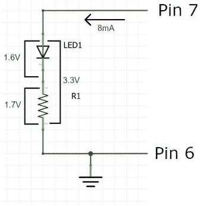

GPIO引脚提供3.3V，如果你假设LED的正向压降为1.6V，那么限流电阻两端就有1.7V的电压，因为电压在串联元件上分配。如果我们将电流限制在8mA（这是一个非常保守的值），那么我们需要的电阻为：

R = V/I = 1.7/8 = 0.212

结果单位是千欧姆（kΩ），因为电流单位是毫安（mA）。所以我们需要至少一个212Ω的电阻。实际上，你可以使用一系列阻值，只要电阻在200Ω左右——电阻越大，电流越小，但LED也越暗。如果你使用多个GPIO引脚，将电流降低到3mA会更好，但这需要晶体管。

在驱动其他类型的输出设备时，你需要进行这种计算。步骤总是一样的。3.3V电压在输出设备和电阻之间按某种比例分配，而我们知道最大电流——根据这些值，我们可以计算出将实际电流保持在该值以下所需的电阻。

### LED BJT驱动

通常你需要减少从GPIO引脚汲取的电流，为此你可以使用双极结型晶体管（BJT），这是一种低成本且易于使用的电流放大器。

BJT是一种三端器件——基极、发射极和集电极——流过发射极/集电极的电流由基极电流控制：

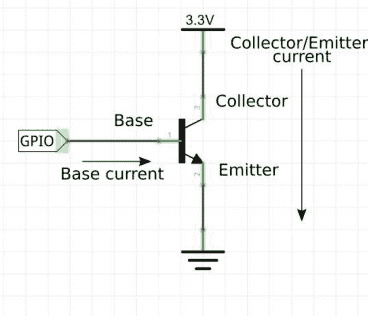

该图显示了一个NPN晶体管，这是最常见的类型。该图是一个简化，实际上，发射极的电流略大于集电极的电流，因为你必须加上流过基极的电流。

在大多数情况下，你只需要知道两个额外的事实。首先，基极上的电压约为0.6V，无论流过多少电流，因为基极是一个二极管，与上一节中的LED一样是非线性器件。其次，集电极/发射极的电流是基极电流的hfe或β（贝塔）倍。也就是说，hfe或贝塔是晶体管的电流增益，你需要为你想使用的任何晶体管查找该值。在查阅数据手册时，你还需要检查器件能承受的最大电流和电压。在大多数情况下，贝塔值在100到200之间，因此你可以使用晶体管将GPIO电流至少放大100倍。

请注意，为了使发射极/集电极电流非零，基极必须有电流流入。如果基极接地，则晶体管“截止”，即没有电流流过。这意味着当GPIO引脚为高电平时，晶体管“导通”，电流流过；当GPIO引脚为低电平时，晶体管“关断”，没有电流流过。

这种高电平导通/低电平关断的行为是NPN晶体管的典型特征。PNP晶体管的工作方式则相反：

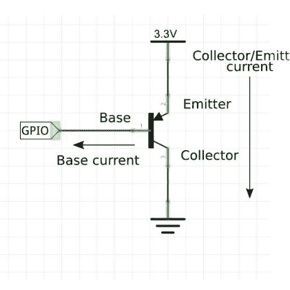

0.6V电压存在于基极和集电极之间，电流从基极流出。这意味着当GPIO线为高电平时晶体管关断，为低电平时导通。

NPN和PNP双极结型晶体管的这种互补特性非常有用，意味着我们可以成对使用这类晶体管。还值得注意的是，上图通常绘制时将0V置于图表顶部，即垂直翻转，使其看起来与NPN图相同。务必始终确认+V线的位置。

### BJT示例

一个简单的例子是，我们需要将一个标准LED连接到GPIO线，并提供完整的20mA驱动电流。鉴于树莓派所有GPIO线工作在3.3V，且理想情况下仅提供几毫安电流，我们需要一个晶体管来驱动通常需要20mA的LED。

你可以使用某种场效应晶体管（FET），但对于这类应用，BJT效果非常好，并且有通孔安装版本，即带有引线。

几乎任何通用NPN晶体管都可以工作，但2N2222非常常见。从其数据手册中，你可以发现其最大集电极电流为800mA，β值至少为50，这使其适合用最大20/50mA = 0.4mA的GPIO电流驱动20mA的LED。

电路很简单，但我们需要两个限流电阻：

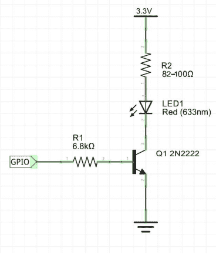

如果你将基极直接连接到GPIO线，那么流入基极的电流将不受限制——这类似于将GPIO线接地。R1将电流限制在0.39mA，这非常低，并且假设晶体管的最小增益（hfe）为50，这刚好提供接近20mA的电流来驱动它。

计算过程是：GPIO提供3.3V，基极上有0.6V压降，因此R1上的电压为3.3 - 0.6V = 2.7V。要将电流限制在0.4mA，需要的电阻为2.7/0.4kΩ = 6.7kΩ。最接近的标称值是6.8kΩ，这会给出稍小的电流。

没有R2，LED会汲取非常大的电流并烧毁。R2将电流限制在20mA。假设正向压降为1.6V，电流为20mA，则电阻为(3.3-1.6)/20kΩ = 85Ω。实际上，我们可以使用82Ω到100Ω范围内的任何电阻。

刚才的计算假设集电极和发射极之间的电压为零，但当然在实践中并非如此。忽略这一点会导致电流小于20mA，这是偏向安全的做法。数据手册表明集电极-发射极电压小于200mV。

关键在于，你很少为此类电路进行精确计算，只需达到可接受且安全的工作条件即可。你也可以使用此设计来驱动需要更高电压的设备。例如，要驱动一个需要10mA激活的5V DIP继电器，你可以使用类似这样的电路：

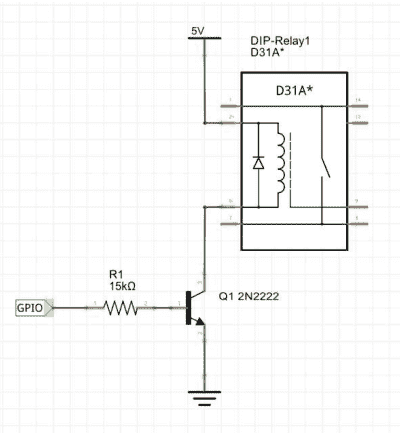

注意，在这种情况下，晶体管并非用于增加驱动电流——GPIO线可以直接提供10mA。其目的是将电压从3.3V转换为5V。同样的思路适用于任何更高的电压。

如果你使用2N2222，其引脚排列如下：

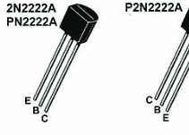

一如既往，LED的正极是较长的引脚。

### MOSFET驱动器

许多人认为FET（场效应晶体管），或者更准确地说MOSFET（金属氧化物半导体场效应晶体管），是完美的放大器件，我们应该忽略BJT。它们更易于理解和使用，但可能更难找到具有所需特性的型号。

与BJT类似，MOSFET有三个端子，称为栅极、漏极和源极。你想要控制的电流在源极和漏极之间流动，并由栅极控制。这类似于BJT的基极、集电极和发射极，但区别在于，是栅极上的电压控制源极和漏极之间的电流。

栅极本质上是一个高阻抗输入，流过的电流非常小。这使其成为将GPIO线连接到需要更大电流或不同电压的设备的理想方式。当栅极电压较低时，源极-漏极电流非常小。当栅极电压达到阈值电压V<sub>GS(th)</sub>（不同MOSFET的阈值不同）时，源极-漏极电流开始呈指数增长。基本上，当栅极连接到0V或低于V<sub>GS(th)</sub>时，MOSFET关断；当高于V<sub>GS(th)</sub>时，MOSFET开始导通。不要将V<sub>GS(th)</sub>视为MOSFET导通的栅极电压，而应视为其关断的电压上限。问题在于，使典型MOSFET完全导通的栅极电压在10V左右。特殊的“逻辑”MOSFET需要约5V的栅极电压才能完全导通，这使得树莓派GPIO线工作的3.3V成为一个问题。数据手册通常会给出完全导通电阻和产生该电阻的最小栅极电压，通常列为漏源导通电阻。对于数字应用，这是一个比栅极阈值电压更重要的参数。

你可以通过两种方式之一来处理这个问题——忽略它，或者找到一个V<sub>GS(th)</sub>非常小的MOSFET。实际上，阈值足够低以在3.3V工作的MOSFET很难找到，即使找到，通常也只有表面贴装封装。如果你能容忍MOSFET不完全导通，忽略这个问题有时是可行的。如果电流保持较低，即使MOSFET可能有几欧姆的电阻，功率损耗和电压降也可能是可接受的。

MOSFET的用处在于将更高电压连接到用作输入的GPIO线，详见后文。

另外请注意，本讨论是基于N沟道MOSFET。P沟道的工作方式相同，但所有极性相反。当栅极处于正电压时它截止，当栅极接地时导通。这与BJT的NPN与PNP完全相同。

### MOSFET驱动LED

BJT是驱动LED最简单的方法，但作为使用常见MOSFET的示例，我们可以使用2N7000来驱动一个LED，这是一种低成本的N沟道器件，采用标准TO92封装，适合实验：

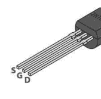

其数据手册指出，其V<sub>GS(th)</sub>典型值为2V，但可能低至0.8V或高达3V。鉴于我们试图使用3.3V的栅极电压，你可以看到在最坏情况下这几乎无法工作——器件将勉强导通。你能做的最好的就是购买一批2N7000并测量它们的V<sub>GS(th)</sub>，以剔除任何阈值过高的器件。话虽如此，下面给出的电路通常确实有效。

假设V<sub>GS(th)</sub>为2V，LED电流为20mA，数据手册给出在栅极电压为3V时，导通电阻约为6Ω。限流电阻的计算与BJT情况相同，最终电路如下：

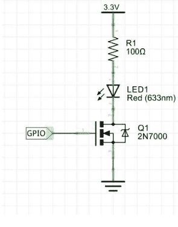

注意，我们不需要为GPIO线设置限流电阻，因为栅极高阻抗连接不会汲取太多电流。实际上，如果你计划快速开关GPIO线，通常最好在GPIO线中加入限流电阻。问题在于栅极看起来像一个电容器，电压的快速变化会产生大电流。虽然可能存在一些标有2N7000但因阈值栅极电压过高而无法在此电路中工作的器件，但遇到这种情况很少见。

像IRLZ44这样的逻辑电平MOSFET在5V时的电阻为0.028Ω，而2N2222为6Ω。它还保证V<sub>GS(th)</sub>在1V到2V之间。

### 设置驱动类型

GPIO输出可以配置为多种模式之一，但最重要的是上拉/下拉。在我们编写代码完成此任务之前，值得花点时间解释三种基本输出模式：推挽、上拉和下拉。

### 推挽模式

在推挽模式下，使用两个极性相反的晶体管，一个PNP和一个NPN：

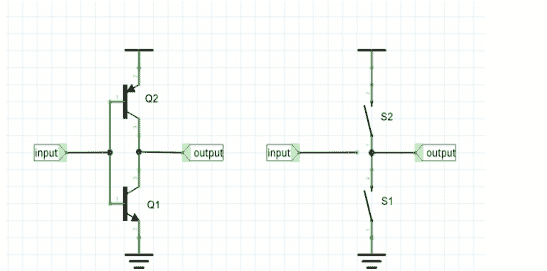

该电路的行为类似于右侧所示的双开关等效电路。在任何时刻，只有一个晶体管或开关是“闭合”的。如果输入为高电平，则Q1饱和，输出连接到地——就像S1闭合一样。如果输入为低电平，则Q2饱和，就像S2闭合一样，输出连接到3.3V。你可以看到，这以与拉低输出线相同的“力”将输出线推高。这是GPIO输出的标准配置。

### 上拉模式

在上拉模式下，其中一个晶体管被电阻替代：

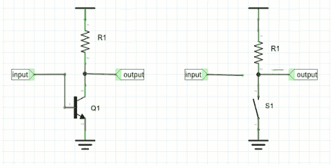

在这种情况下，电路等效于一个单开关。当开关闭合时，输出线连接到地，因此被拉低。当开关断开时，输出线被电阻拉高。你可以看到，在这种情况下，下拉的程度大于上拉，因为电流受到电阻的限制。这种模式的优点是可以用于与门配置。如果多个GPIO或其他线连接到输出，那么其中任何一个为低电平都会将输出线拉低。只有当所有开关都断开时，电阻才能成功将线拉高。例如，这在SPI总线等串行总线配置中使用。

### 下拉模式

最后，下拉模式是驱动通用负载、电机、LED等的最佳模式，它与上拉模式完全相同，只是现在电阻用于将输出线拉低。

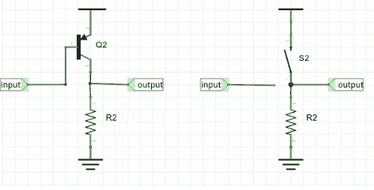

该线由晶体管保持高电平，只有当所有开关都断开时才被电阻拉低。换句话说，如果任何一个开关闭合，该线就是高电平。这是共享总线思想的或门版本。

### 基本输入电路 - 开关

现在是时候关注GPIO线作为输入的电气特性了。最常见的输入电路之一是开关或按钮。许多初犯的错误是将GPIO线连接到开关，如下所示：

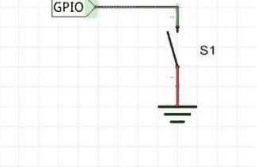

这样做的问题是，如果开关闭合，GPIO线连接到地，读数为零。问题是，当开关断开时，它读数是多少？配置为输入的GPIO线具有非常高的电阻。它不连接到任何特定电压，其上的电压由于拾取的静电而变化。行话是未连接的线是“浮空的”。当开关断开时，线是浮空的，如果你读取它，结果（零或一）取决于它拾取的任何噪声。

正确的方法是使用电阻在开关断开时将输入线拉高或拉低。上拉配置如下所示：

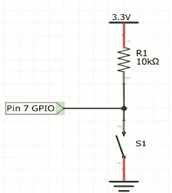

所用电阻的值并不关键。它只是在开关未按下时将GPIO线拉高。当按下时，电阻中流过略高于0.3mA的电流。如果这太多，将电阻增加到100kΩ甚至更多——但要注意，电阻值越高，GPIO的输入噪声越大，越容易受到射频干扰。注意，这会在开关闭合时给出零。

如果你想让开关将线拉高而不是拉低，请通过交换图中电阻和开关的位置来反转逻辑，创建一个下拉：

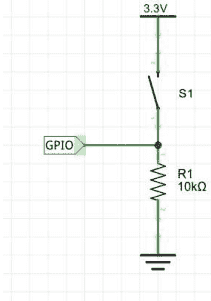

注意，这会在开关闭合时给出一。

好消息是，树莓派具有内置的上拉和下拉电阻，你可以在软件中启用它们。这意味着你可以直接将开关连接到GPIO，并在软件中设置上拉或下拉配置。

### 设置上拉/下拉模式

GPIO Zero库使得设置上拉/下拉模式变得容易，因为引脚对象支持`pull`属性。你可以将其设置为`up`、`down`或`floating`中的任何一个。在输出模式下，`floating`是推挽模式。例如：

```
pin.pull="down"
```

任何具有`pin`属性的设备都可以用同样的方式设置其上拉/下拉模式，许多设备在其构造函数中包含一个`pull`参数。内部上拉/下拉电阻在50kΩ到65kΩ范围内。引脚3和5上还有外部1.8kΩ上拉电阻。移除它们的唯一方法是从板上焊下来。

### 去抖

虽然开关是最简单的输入设备，但要正确使用它非常困难。当用户点击任何类型的开关时，动作并不干净——开关会抖动。这意味着GPIO线上的逻辑电平先变高，然后变低，再变高，并在两者之间弹跳，直到稳定下来。有电子方法可以对开关去抖，但软件做得更好。你所要做的就是在检测到开关按下后插入大约一毫秒的延迟，然后再次读取该线——如果它仍然是低电平，则记录一次开关按下。同样，当开关释放时，延迟后读取两次状态。你可以改变延迟来修改开关的感知特性。

一种更复杂的开关去抖算法基于积分的思想。你所要做的就是多次读取状态，比如每隔几毫秒，并保持一个运行的值总和。如果你每次对十个值求和，那么6到10之间的总和可以被视为开关为高电平的指示。小于此值的总和表示开关为低电平。你可以将其视为在时间段内对开关是高电平还是低电平的多数投票。

GPIO Zero支持一个简单的去抖算法。在检测到输入变化后，一段时间内的进一步变化将被忽略。你可以使用`bounce`属性设置去抖时间。例如：

```
pin.bounce=5/1000
```

将抖动时间设置为5毫秒，这对于许多设备来说是一个合理的选择。注意，这意味着抖动的开关每秒只能按下和释放100次。输入设备通常也有可以在其构造函数中设置的`bounce`参数。

### 分压器

如果你有一个超出0V到3.3V范围的输入，你可以使用一个简单的分压器来降低它。在图中，V是来自外部逻辑的输入，Vout是连接到GPIO输入线的输出：

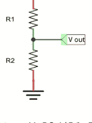

Vout = V R2/(R1+R2)

你可以花很多时间计算R1和R2的良好值。对于消耗大量电流的负载，你需要R1+R2很小，并且按照与电压相同的比例分配。例如，对于5V设备，R1=18或20KΩ和R2=33KΩ可以很好地将电压降低到3.3V。

对于5V信号，一个更简单的方法是注意到R1:R2的比例必须与(5-3.3):3.3相同，即电压按电阻值的比例分配，大约是1:2。这意味着你可以取任何电阻作为R1，并使用两个相同值的电阻串联作为R2，Vout将是3.33333V。

电阻分压器的问题是，由于小的电容效应，它可能会使快速脉冲变圆。这通常不是问题，但如果是，解决方案是使用FET或BJT作为有源缓冲器：

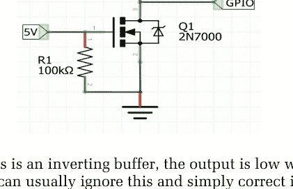

注意，这是一个反相缓冲器，当输入为高电平时输出为低电平，但你通常可以忽略这一点，只需在软件中纠正它，即读取1作为低电平状态，0作为高电平状态。R1的作用是确保在5V信号不存在时FET关闭，R2将FET中的电流限制在约0.3mA。

在大多数情况下，你应该尝试简单的分压器，只有在它不起作用时才转向有源缓冲器。

这种非常基础的电子学知识并不是你需要知道的全部，但它足以让你看到一些问题并找到一些答案。总的来说，这种电子学都是关于确保电压和电流在限制范围内。随着开关速度的增加，你会遇到额外的问题，主要是确保你的电路不会拖慢速度。这就是事情变得更加微妙的地方。

### 总结

-   你只需要对电子学有很少的了解就能取得很大进展，但你确实需要知道足够的知识来保护树莓派和你连接到它的东西。
-   任何GPIO线的最大电流应小于16mA，总电流应小于50mA。
-   所有GPIO线都在3.3V下工作，你应该避免直接连接任何其他电压。
-   你可以直接从GPIO线驱动LED，但只能在16mA下，而不是全亮度所需的标称20mA。
-   计算限流电阻总是遵循相同的步骤——找出设备中的电流，找出设备两端的电压，并计算出当剩余电压施加在其上时提供该电流的电阻。
-   对于你连接到GPIO输出的任何负载，通常需要一个限流电阻。
-   在许多情况下，你需要一个晶体管（BJT）来增加GPIO线提供的电流。
-   要使用BJT，你需要在基极计算一个限流电阻，通常在集电极也需要一个。
-   MOSFET是BJT的流行替代品，但很难找到在3.3V下可靠工作的MOSFET。
-   GPIO输出线可以设置为有源推挽模式（使用晶体管将线拉高或拉低）或无源上拉或下拉模式（使用一个晶体管，当晶体管不活动时，电阻将线拉高或拉低）。
-   GPIO线具有内置的上拉和下拉电阻，可以在软件控制下选择或禁用，并可用于输入模式。
-   用作输入时，GPIO线具有非常高的电阻，在大多数情况下你需要上拉或下拉电阻来防止线浮空。
-   内置的上拉或下拉电阻可用于输入模式。
-   机械输入设备必须去抖以防止虚假输入。
-   如果你需要将输入连接到大于3.3V的东西，你需要一个分压器将电压降低回3.3V。你也可以使用晶体管。

## 第8章
### 简单输入

从测量和验证的角度来看，GPIO输入比输出要困难得多。对于输出，你可以在逻辑分析仪上看到信号的变化，并确切知道它发生的时间。这使得追踪时序问题并精确调整成为可能。另一方面，输入是“无声”且不可观察的。你何时读取了线路的状态？通常，读取的时序是相对于设备执行的某个其他操作而言的。例如，你在将输出线路置高后20 μs读取输入线路。在某些应用中，时间较长且/或不重要，但在某些应用中，时间至关重要，因此我们需要一些策略来监控和控制读取事件。

通常的经验法则是，读取GPIO线路所需的时间与设置它所需的时间一样长。

在尝试正确获取输入时序时，一个常见且非常有用的技巧是用一个备用GPIO线路的输出命令来替代输入命令，并用逻辑分析仪监控它。将输出指令放在输入指令之前，你在逻辑分析仪上看到线路变化的时间点应该接近未修改程序中输入被读取的时间。你可以用这种方法进行调试和微调，然后移除输出语句。

### 按钮

GPIO Zero库只有一个简单的输入设备——按钮，但作为一个简单的输入设备，它却出奇地复杂。这不是它的错，而是输入困难这一事实的又一反映。


当然，它不一定非要连接到按钮——它可以是任何能在GPIO线路上产生明确高低信号的设备。按钮可以是任何类型的开关，通过任何方式触发——例如由磁铁激活的簧片开关、由角度激活的倾斜开关等等。

簧片开关通过靠近磁铁而闭合。


倾斜开关通过旋转直到一滴水银形成连接而闭合。

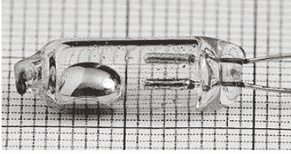

按钮具有数量惊人的可能参数：
`Button(pin, pull_up=True, active_state=None, bounce_time=None, hold_time=1, hold_repeat=False)`

然而，最简单的用法是，你只需提供引脚号：
`button = Button(4)`

这会将GPIO线路（本例中为GPIO4）设置为输入模式，默认情况下会自动使用上拉电阻，参见前一章。这意味着你可以将开关连接到GPIO4，而无需任何其他组件。

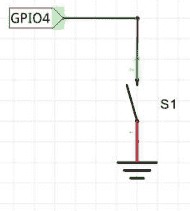

地线是引脚6，GPIO4是引脚7。
如果你想使用下拉配置，请在创建引脚时将 `pull_up` 设置为 `False`。

关键问题是，你如何处理来自开关的输入？它不像输出那样，你的程序拥有100%的控制权。按钮可以在任何时候被按下，你的程序必须对其做出响应。

处理这个问题最简单的方法是让你的程序等待按钮被按下或释放：

```
wait_for_press(timeout = None)
wait_for_release(timeout = None)
```

超时可以设置为放弃前等待的秒数。默认值None或0意味着你的程序将永远等待按钮被按下。

按下和释放的用法指的是按钮或开关的机械动作。当然，如果按钮是用上拉电阻接线的，那么按下对应于0；如果是用下拉电阻接线的，则对应于1。为了让软件知道哪种情况对应哪种状态，你可以在创建Button对象时使用 `active_state` 参数。如果你将其设置为True，则高电平对应按下；如果设置为False，则低电平对应按下。如果 `pull_up` 不是None，则 `active_state` 会自动设置。

默认情况下，Button没有去抖。这意味着，对你来说看起来像是一次按下的动作，可能会被接收为一组按下/释放信号。如果你不想加入硬件去抖组件，那么在创建按钮时包含 `bounce_time` 参数。这指定了一个以秒为单位的等待时间，之后其状态变化才会被识别。例如：

```
button = Button(4, bounce_time=0.25)
```

创建了一个每秒只能被按下4次的按钮，从而有效地实现了去抖。另一种理解方式是，按钮在任何0.25秒的时间间隔内只响应第一次按下。

### 轮询

等待按钮（或你用作开关的任何其他设备）被按下的问题是，你的程序会冻结，其他任何事情都无法发生——它只是坐在那里等待事件。有时这是可以接受的，因为你的程序没有其他事情要做。更多时候，你的程序有事情要做，仅仅等待不是一个选择。

等待开关被按下的一个替代方案是轮询其状态。轮询是一种标准的编程技术，为了检测状态变化，程序在适当的间隔重复检查状态。你可以使用 `is_pressed` 属性或 `value` 属性来检查Button的状态。区别在于，`value` 给你的是GPIO线路的状态，即0（低）或1（高），其含义取决于开关的接线方式，而 `is_pressed` 在开关被按下时总是返回True。

例如：
```
while True:
    do something
    if button.is_pressed:
        do something about button pressed
```

在这种情况下，轮询采取无限循环的形式，对按钮是否被按下的测试在每次循环中发生一次。你可以看到，按钮按下的测试频率取决于循环所需的时间，而循环用于*做某事*的时间取决于按钮被按下的频率以及处理所需更改所需的时间。

使用轮询循环的想法通常被认为是一个糟糕的选择，但在实践中，它通常是最佳选择，因为它使用处理器尽可能快地响应按钮按下，同时允许它在不响应时继续处理其他任务。更复杂的解决方案，例如使用中断或事件，通常只是隐藏轮询循环的一种方式，并且往往会增加低效率。轮询循环通常是最佳解决方案，但GPIO Zero确实提供了事件形式的替代方案。

### 事件与中断

中断和事件确实使物联网编程的某些方面更容易，即使不是更高效。但首先，什么是中断和事件？
事件就像一个锁存器或记忆，记录某事发生了。想象有一面旗帜，当输入线路状态改变时会自动设置。这面旗帜的设置不涉及软件，或者至少不涉及你控制的任何软件。想象旗帜的设置完全基于硬件是有用的，即使情况并非总是如此。借助事件，你可以避免因为轮询循环忙于处理其他事情而错过输入。现在轮询循环读取的是旗帜，而不是输入线路的实际状态，因此它可以检测自上次轮询以来线路是否发生了变化。轮询循环重置事件标志并处理事件。当然，它并不总是能确切知道事件何时发生，但至少它没有完全错过它。

一个简单的事件可以避免丢失单个输入，但如果在轮询循环不可用期间有多个输入怎么办？最常见的解决方案是创建一个事件队列——即，一个按发生顺序排列的事件FIFO（先进先出）队列。轮询循环现在读取队列前端的事件，处理它，然后读取下一个。它继续这样操作，直到队列为空，此时它只需等待事件。只要队列足够大，事件队列意味着你不会错过任何输入，但输入事件不一定在它们发生的时间点附近被处理。它们应该按顺序处理，但除非事件有时间戳，否则程序不知道它们何时发生。

事件队列是一种常见的架构，但要使其发挥作用或具有任何优势，它要么需要多核，以便在另一个事件发生之前总能将事件添加到队列中；要么需要硬件的帮助，通常以中断的形式。请注意，事件或事件队列无法提高程序的吞吐量或其延迟（即对输入做出反应的时间）。事实上，由于实现的开销，事件队列会降低吞吐量并增加延迟。事件系统所做的只是确保你不会错过任何输入，并且所有输入最终都会得到处理。中断经常与事件混淆，但它们非常不同。中断是一种硬件机制，它会停止计算机当前正在做的任何事情，并使其将注意力转移到运行中断处理程序上。你可以将中断视为一个事件标志，当设置时，它会中断当前程序以运行指定的中断处理程序。使用中断意味着外部世界决定计算机何时应该关注输入，并且不需要轮询循环。大多数硬件人员认为中断是解决一切问题的方案，轮询是不优雅的，只有在无法使用中断时才使用。这远非事实。

人们普遍认为实时编程和中断是相辅相成的，如果你不使用中断，你可能做错了什么。事实上，真相是，如果你使用中断，你可能做错了什么。以至于一些组织确信中断非常危险，因此被禁止使用。中断只有在你需要以高优先级处理低频条件时才真正有用。中断可以简化程序的逻辑，但使用中断很少能加快速度，因为中断处理所涉及的开销通常相当高。如果你有一个轮询循环，需要100毫秒来轮询所有输入，并且有一个输入需要在60毫秒内得到关注，那么显然轮询循环是不够的。使用中断允许高优先级事件中断轮询循环并在不到100毫秒内得到处理。然而，如果这种情况经常发生，轮询循环将无法按预期工作。请注意，一个替代方案是简单地让轮询循环在每次循环中检查输入两次。

举一个更实际的例子，假设你想对门铃按钮做出反应。你可以编写一个轮询循环，简单地重复并永远检查按钮状态，或者你可以编写一个中断服务程序来响应门铃。处理器可以自由地处理其他事情，直到门铃被按下，此时它会停止正在做的事情并将注意力转移到中断服务程序上。这个设计有多好取决于门铃与程序其余部分的交互程度以及你预期的门铃按压次数。响应门铃按压需要时间，然后中断服务程序必须运行完成。如果在第一次按压仍在处理时发生了另一次门铃按压会怎样？一些处理器提供了形成中断队列的功能，但这无助于处理器一次只能处理一个中断的事实。当然，轮询循环也是如此，但如果你无法用轮询循环处理事件的吞吐量，你也无法使用中断来处理，因为中断增加了切换到中断服务程序再返回的时间。

最后，在你摒弃让处理器除了反复询问“门铃是否被按下”之外什么都不做的想法之前，考虑一下它还需要做什么。如果答案是“不多”，那么轮询循环可能是你最简单的选择。此外，如果处理器有多个内核，那么处理任何外部事件的最快方法是使用其中一个内核进行快速轮询循环。这可以被视为硬件中断的软件模拟——不要与软件中断或陷阱混淆，后者是由软件触发的硬件中断。如果你打算使用中断来处理输入，那么一个好的设计是使用中断处理程序来填充事件队列。这至少降低了输入被遗漏的机会。

尽管中断很有吸引力，但对于除了需要快速处理的低频事件之外的任何事情，它们通常都是一个糟糕的选择。

### 异步按钮

GPIO Zero 实现了一种事件驱动的异步编程方法，其呈现方式类似于中断。你可以使用 `when_pressed` 和 `when_released` 属性指定在按钮按下或释放时调用的函数。例如：

```python
from gpiozero import Button
from signal import pause
button = Button(4, bounce_time=0.25)

def pressed():
    print("Button pressed")

def released():
    print("Button released")

button.when_pressed = pressed
button.when_released = released
pause()
```

请注意，你需要在程序末尾使用 `pause` 来防止程序结束。你也可以将程序置于无限循环中，在等待按钮按下/释放时执行其他操作。还要注意，`when_pressed` 和 `when_released` 被赋值为对函数的引用，这些函数直到稍后才会被调用。

重要的是要认识到，`pressed` 和 `released` 函数是异步调用的——即与程序中发生的任何事情都不同步。这可能是真的，但 Python 一次只允许发生一件事，这种编程形式并不意味着并行性。发生的情况是，一个新的执行线程被启动，它只是等待事件发生。当事件发生时，事件处理程序运行。当事件处理程序运行时，你程序的其余部分会暂停。Python 的构造方式使得在任何给定时间只允许你的 Python 代码的一部分执行。这就是所谓的全局解释器锁或 GIL，这意味着你无法利用多个内核来并行运行你的 Python 程序。相反，操作系统在任何给定时间选择运行哪个线程。等待事件的线程只有在它等待的事件发生时才会启动，然后它才有机会运行事件处理程序。当事件处理程序运行时，你可以确信 Python 程序的其他部分没有在运行。

你可能会被事件处理的想法所吸引。它很简单，这使得它非常适合初学者。只需编写当按钮按下或释放时你想发生的事情，然后继续处理程序的其余部分。没有轮询循环，没有等待。它对初学者很有用，但从长远来看，这不是组织事情的好方法。问题在于，负责实现事件处理的是引脚工厂，它们以不同的方式实现这一点。正如前面在讨论一般中断和事件时所讨论的，这种方法会减慢整个系统的速度，并在事件发生速率过快时产生问题。例如，按下事件处理程序可能会被释放事件中断，释放函数将在按下函数结束之前运行。如果在释放之后发生了新的按钮按下，那么按下函数将第二次运行，即使对它的第一次调用仍在运行。然而，后续的释放函数直到第一次按下函数完成才会被调用。这是一团糟！当多个事件发生时具体会发生什么取决于提供服务的引脚工厂，这也是不令人满意的，因为你无法知道会发生什么。

总之，在 GPIO Zero 中使用事件处理是制作演示或入门的简单方法，但这不是实现任何超出非常简单功能的好方法。

这就是不使用队列来确保多个事件被正确处理和按正确顺序处理的异步代码的大问题。如果事件和异步代码不是完成这项工作的方法，那什么才是？简单的答案是轮询循环，但将顺序放入轮询循环中使其整洁且易于扩展是困难的。如果你对事件和基本轮询循环感到满意，请跳过下一节，该节描述了一种组织轮询循环的方法，使其更易于使用。

### 有限状态机

如果你正在处理一个需要处理复杂输入和输出线路的应用程序，那么你需要一个组织原则来帮助你应对复杂性。当你第一次开始编写响应外部世界的物联网程序时，你很快就会发现你所有的程序都采取类似的形式：

```python
while True:
    wait for some input lines
    process the input data
    write some output lines
    wait for some input lines
    read some more input lines
    write some output lines
```

对于大多数程序员来说，这是一个有点令人不安的发现，因为程序不应该由无限循环组成，但物联网程序几乎总是，即使不是在实践中，也在原则上采取无限轮询循环的形式。另一个更重要的问题是，读取和写入 GPIO 线路的方式可能非常复杂。以至于很难弄清楚任何特定线路何时被读取以及何时被写入。我们已经看到事件和中断不是一个好的替代方案，轮询循环是一个非常好的选择，但简单的轮询循环需要组织，以避免演变成过于复杂而无法理解的东西。那么，你应该如何组织轮询循环，使其功能通过查看代码就能一目了然？根据正在实现的系统，有许多答案，并且没有解决所有问题的“纯粹”理论答案，但有限状态机（FSM）是每个物联网程序员都应该知道的模型。有限状态机是一个非常简单的程序。在任何给定时间，机器（程序）都有当前状态 S 的记录。在固定的时间间隔，外部世界提供一个输入 I，将状态从 S 更改为 S' 并产生一个输出 O。这就是 FSM 的全部内容。存在变体关于定义，但这种被称为米利机的类型，因其输出同时取决于状态和输入，最适合物联网编程。

你的程序只需采用轮询循环的形式来实现有限状态机。它读取输入行作为 I，并利用此输入和当前状态 S 来确定新状态 S' 和输出 O。使用这种组织方式会有一些开销，但通常是值得的。请注意，这种组织方式意味着你在循环中只读取一次输入、进行一次更改并设置一次输出。

### 有限状态机环形计数器

很难找到一个使用有限状态机控制设备的好例子，因为其优势只有在情况开始变得复杂时才会真正显现，而复杂性并非示例的理想要素。

一种非常常见的输入配置是环形计数器。环形计数器每次接收到输入时都会移动到新的输出，并在到达最后一个输出时重复。例如，如果你有三条输出线连接到三个 LED，那么最初 LED 0 点亮，当用户按下按钮时 LED 1 点亮而其他熄灭，下一次用户按下按钮则移动到 LED 2 点亮，再按一次则 LED 0 点亮。你可以看到，随着用户不断按下按钮，LED 会按重复的序列亮起和熄灭。

环形计数器的一种常见有限状态机实现方式是为每个 LED 点亮时的按钮按下和释放各设置一个状态。对于三个 LED，这意味着六个状态，这有缺点。更好的想法是设置三个状态 0、1 和 2，分别对应哪个 LED 点亮。唯一的复杂之处在于，我们只希望状态在按钮被按下时改变，而不是在按住或释放时改变。解决方案是形成一个“增量”，即从一次轮询到下一次测量的变化。这也常被思考和描述为“边沿”。如果你想象 GPIO 线电平的图表，你就能明白原因。当按下和释放时，线从高电平变为低电平，信号中会出现上升沿或下降沿。我们感兴趣的不是当前电平，而是从高到低的变化（下降沿），或从低到高的变化（上升沿）。在这种情况下，我们可以通过取两次不同时间读数的差值来轻松实现软件边沿检测。上升沿结果为 1，下降沿结果为 -1。

通常我们希望事件在时间上尽可能局部化，这就是为什么系统中的差异如此频繁地被使用。

实现所有这些相当容易：

```python
from gpiozero import Button
from gpiozero import LED
from time import sleep

button = Button(4)
led1=LED(17,initial_value=True)
led2=LED(27)
led3=LED(22)

state=0
buttonState=button.value
while True:
    buttonNow=button.value
    buttonDelta=buttonNow-buttonState
    buttonState=buttonNow
    if state==0:
        if buttonDelta==1:
            state=1
            led1.off()
            led2.on()
            led3.off()

        continue
    if state==1:
        if buttonDelta==1:
            state=2
            led1.off()
            led2.on()
            led3.off()
        continue
    if state==2:
        if buttonDelta==1:
            state=0
            led1.on()
            led2.off()
            led3.off()
        continue
    sleep(0.1)
```

首先我们设置 LED 和单个按钮，使 led1 点亮，即我们在状态 0 下设置好一切。接下来我们启动轮询循环，其中包含每个状态的 if 语句。每个 if 语句测试 buttonDelta，它仅在按钮状态从释放（即 0）变为按下（即 1）时为 1。如果按钮被按下，则状态移动到下一个值，即 0→1、1→2 和 2→0，并且 LED 被设置为相应的值。如果你尝试这个，你会发现每次按下按钮时 LED 确实会依次亮起。

你可能认为这比更“直接”的实现更复杂，但它更容易扩展到更复杂的情况。理想情况下，我们使用的状态名称不应指代输入或输出，而应指代系统的整体状态。例如，如果你使用树莓派控制核反应堆，你可能会使用状态“堆芯熔毁”而不是“温度传感器超限”。状态应关乎输入的后果，而输出应是当前状态的后果。在上面的例子中，输入和输出过于简单，无法产生“状态”的抽象概念。

请注意，轮询循环的设置使得整个过程每 100 毫秒重复一次。这为传感器提供了大致固定的服务时间。通常，有限状态机轮询循环采用以下形式：

1.  初始读取和处理传感器，以确定本次循环的输入。
2.  一组条件语句，用于选择每个可能的状态。
3.  每个状态都有一组条件，根据输入改变状态并确定输出。

### 我们能测量多快？

找出我们可以多快进行测量的最简单方法是执行脉冲宽度测量。通过向 GPIO4（即引脚 7）施加方波，我们可以使用以下代码测量脉冲为高电平的时间：

```python
from gpiozero import Button
from time import perf_counter_ns

button = Button(4)
while True:
    button.wait_for_press()
    button.wait_for_release()
    t1=perf_counter_ns()
    button.wait_for_press()
    t2=perf_counter_ns()
    print((t2-t1)/1000000)
```

这首先等待按钮被按下，这意味着输入变为低电平。然后我们等待按钮被释放，这意味着线路变为高电平，并记录时间。接下来我们再次等待按下，这意味着线路再次变为低电平，再次记录时间，时间差即为线路为高电平的时间。如果你尝试这个，并向输入线提供来自信号发生器的方波，你会发现计时在树莓派 Zero 上精确到 300Hz，在树莓派 5 上精确到 6kHz，在树莓派 4 上精确到 2kHz。超过此频率后，由于错过转换，它们变得越来越不可靠。最终，GPIO Zero 的 wait 函数实现会失败，因为状态在执行过程中发生了变化。

`wait_for_` 方法效率不高，使用简单的按钮状态读取稍快一些：

```python
from gpiozero import Button
from time import perf_counter_ns
button = Button(4)
while True:
    while not button.value :pass
    while button.value:pass
    t1 = perf_counter_ns()
    while not button.value :pass
    t2 = perf_counter_ns()
    print((t2-t1)/1000000)
```

使用这种方法，如果你能容忍偶尔的脉冲丢失，你可以在树莓派 Zero 上获得高达 500Hz 的速度，在树莓派 5 上获得 9kHz，在树莓派 4 上获得 10kHz。

请注意，在任何一种情况下，如果你尝试测量远低于工作下限的脉冲宽度，你会得到看起来像是施加了更长脉冲的结果。原因很简单，树莓派会错过第一次到零的转换，但会检测到第二次、第三次或更晚的转换。这是傅里叶变换或一般信号处理中发现的混叠效应的数字等效物。

无论如何看待，对于任何物联网系统来说，不超过 500Hz 的最大输入速度都太低了。

如果你不喜欢将 Button 用作通用输入线，因为不涉及按钮，那么，由于我们没有使用任何额外的 Button 方法，你可以创建自己的自定义类，或者简单地使用 DigitalInputDevice：

```python
from gpiozero import DigitalInputDevice
from time import perf_counter_ns
pulse = DigitalInputDevice(4)
while True:
    while not pulse.value :pass
    while pulse.value:pass
    t1=perf_counter_ns()
    while not pulse.value :pass
    t2=perf_counter_ns()
    print((t2-t1)/1000000)
```

这与前一个版本的速度相同。

如果你想尝试直接使用引脚，你会看到速度大幅提升：

```python
from gpiozero import Device
from time import perf_counter_ns
Device()
pulse = Device.pin_factory.pin(4)
pulse.input_with_pull("up")
while True:
    while not pulse.state :pass
    while pulse.state:pass
    t1=perf_counter_ns()
    while not pulse.state :pass
    t2=perf_counter_ns()
    print((t2-t1)/1000000)
```

这使用默认的引脚工厂，目前是 lgpio。如果你尝试这个，你会发现树莓派 Zero 在 5kHz 以下是合理的，树莓派 5 可以工作到 100kHz，树莓派 4 在 200kHz 以下是相当可靠的。

你可以看到，对于输入来说，运行 Python 的开销至关重要，这就是为什么树莓派 4/5 能够处理更快输入速率的原因。你需要记住，所有这些测量都是“最佳情况”。

### 一个自定义的简单输入

Button 类为我们提供了实现简单输入设备所需的一切，但有时它提供的功能过多，可能会产生误导。例如，干簧管开关确实只是一个简单的开关，但它由磁铁控制。将磁铁靠近干簧管开关，它会闭合；移开磁铁，它会打开。在通常意义上，开关没有被按下、释放或按住的感觉——它只是打开或关闭。

虽然你可以简单地使用 Button 来处理干簧管开关，但值得创建一个简单的派生类，它看起来更像一个监控门的干簧管开关。在这种情况下，“按钮”在门关闭时被按下，在门打开时被释放：

```python
from gpiozero import DigitalInputDevice
class Door(DigitalInputDevice):
    def __init__(self, pin=None, pull_up=True, active_state=None,
                 bounce_time=None,pin_factory=None):
        super(Door, self).__init__(
            pin, pull_up=pull_up, active_state=active_state,
            bounce_time=bounce_time, pin_factory=pin_factory)
    @property
    def value(self):
        return super(Door, self).value
Door.is_closed = Door.is_active
Door.when_open = Door.when_deactivated
Door.when_closed = Door.when_activated
Door.wait_for_open = Door.wait_for_inactive
Door.wait_for_close = Door.wait_for_active
```

新的 Door 类继承自 DigitalInputDevice，这也是 Button 所继承的类。它的 `__init__` 函数是 Button `__init__` 的一个修改版本。`value` 函数根据门是关闭还是打开分别返回 0 或 1。最后，方法的名称被更改为与开关相关的内容。你也可以移除不再合适的方法和属性，但为了简单起见，这里保留了它们。

使用我们新的 Door 类，我们可以这样编写代码：

```
door = Door(4)
while True:
    door.wait_for_open()
    print("open")
    door.wait_for_close()
    print("closed")
```

这与使用 Button 没有区别，但在门传感器的上下文中更容易理解。

这非常容易实现，因此几乎没有理由不为所有简单的数字传感器创建自定义输入类。

### 线程

你不需要了解其工作原理就能使用 GPIO Zero，因此可以随意跳过这个高级部分，并在需要时再回来查看。

线程通常不是与 Python 相关的主题，因为它相对较少需要。然而，GPIO Zero 库大量使用了线程，允许你设置事件处理程序，这些处理程序会在发生某些事情时自动调用。例如，Button 类有一个 `when_pressed` 和一个 `when_released` 属性，可以分配给在事件发生时调用的函数：

```
def pressed():
    print("Button pressed")

def released():
    print("Button released")

button.when_pressed = pressed
button.when_released = released
```

GPIO Zero 库中所有事件处理都由一个 mixin 提供——EventsMixin。它有 `when_activated` 和 `when_deactivated` 属性，这是 GPIO Zero 中所有事件处理的基础。话虽如此，GPIO Zero 中关于事件的操作并不多。事实上，你所能做的就是在属性中存储函数的引用，然后你的程序继续运行。事件的实际实现由引脚工厂及其引脚对象完成。毕竟，只有引脚对象才能“知道”何时发生了变化。当检测到变化时，引脚工厂会调用 `EventsMixin._fire_events` 方法，该方法又会调用你指定的函数。`EventsMixin` 首次作为 `DigitalInputDevice` 和 `SmoothedInputDevice` 的一部分进入继承层次结构，只有继承自这两个类之一的类才能处理事件。这两个类都有 `when_activated` 和 `when_deactivated` 属性，你使用它们来设置事件处理函数。

很明显，为了在程序运行时发生事件，必须涉及另一个执行线程。每个引脚工厂都以自己的方式提供这个额外的线程。例如，`NativeFactory` 有一个名为 `NativeWatchThread` 的类，它在自己的线程上运行，并等待引脚状态的变化，无论是上升沿还是下降沿。当这种情况发生时，相应的事件处理程序会被调用。

### 总结

- 只有一个简单的输入设备 Button，但很容易添加自定义输入设备。
- Button 的确切工作方式取决于你如何设置 `pull_up` 属性。
- 使用 Button 最简单的方法是 `wait_for_press` 或 `wait_for_release`。
- Button 具有简单的去抖功能，它设置了一个“死区”时间，在此期间不响应任何变化。
- 轮询是处理输入最简单、最快的方法。它通过反复测试按钮的状态来工作。
- 轮询的替代方案是使用事件或中断。两者似乎都是有吸引力的替代方案，但它们存在严重的困难，并且往往会减慢系统速度。
- Button 和其他输入设备通过 `when_pressed` 和 `when_released` 属性支持异步事件。这些可以设置为在事件发生时调用的函数。
- 异步事件是创建简单演示和入门的好方法，但它们效率不高，并且很快变得过于复杂而难以理解。
- 在复杂情况下保持轮询易于理解的一种方法是使用有限状态机（FSM）方法。
- 你可以在 Pi Zero 上以高达 500Hz 的速度读取按钮状态，在 Pi 4 上为 10kHz，在 Pi 5 上为 9kHz。
- 如果你尝试一下，你会发现 Pi Zero 在高达 5kHz 时是合理的，Pi5 可以工作到 100kHz，Pi4 在高达 200kHz 时相当可靠。
- 你可以使用 `DigitalInputDevice` 作为基类创建自定义输入设备。
- Python 支持线程，这被用于实现 GPIO Zero 的事件。

# 第 9 章
## 复杂输入设备

我们即将遇到的输入设备并非指困难意义上的复杂，它们只是比简单的按钮具有更多的功能。所有设备都继承自 SmoothedInputDevice，其基本思想是单个输入不足以进行操作。需要的是平均读数，从而减少噪声。

### SmoothedInputDevice

这组输入设备的基类是 SmoothedInputDevice。

SmoothedInputDevice 具有 InputDevice 的所有属性，此外，它还设置了一个读数队列。设备的实际值是通过对队列中的读数应用一个函数（通常是平均值）来获得的。后台线程用于定期读取，当你使用值时会计算该函数。

构造函数有大量参数：

```
SmoothedInputDevice(pin, pull_up=False, active_state=None,
                    threshold=0.5, queue_len=5, sample_wait=0.0,
                    partial=False, average=median, ignore=None,
                    pin_factory=None)
```

与设置队列相关的参数是：

- **queue_len**：队列的长度，即应用函数的读数数量。默认值为 5。
- **threshold**：用作设备激活截止值的值。如果读取值大于阈值，则设备处于活动状态。
- **sample_wait**：读数之间的间隔时间（秒）。默认值为 0，表示尽可能快地读取。
- **partial**：如果为 True，即使队列未满，尝试读取设备也会返回一个值。如果为 False（默认值），读取会阻塞直到队列满。
- **ignore**：一组表示非读数的值，在计算平均值时应忽略。默认为 None。
- **average**：应用于队列中的值以获取最终值的函数。默认为中位数，即队列中的中间值。

使用 SmoothedInputDevice 只需设置所需的平滑程度——即读取速度、要平均的数据点数量以及用于平均它们的函数。

很明显，无论 SmoothInputDevice 读取什么，它都不可能是一个返回 0 或 1 的单个 GPIO 线。在大多数情况下，使用中位数对此进行平均将返回 0.5。然而，使用平均值进行平均将给你一个与测量间隔中 1 与 0 的比例成比例的值。同样，你可以创建一个设备，返回一个与 GPIO 线高电平时间成比例的数字。

### 使用 TRCT5000 线传感器

LineSensor 设备利用了一个基于 TRCT5000 红外发射器和传感器的模块。

为了使其适合与 GPIO 线一起使用，你需要添加一些电子元件：

红外二极管向设备外发送一束红外光，如果它被反射回来，光电晶体管就会导通。当来自红外传感器的电压大于电位器 R3 设置的电压时，LM324 U1 输出高信号。也就是说，R3 充当灵敏度控制。

你不需要构建电路，因为你可以购买现成的模块：

你只需将三个引脚连接到 3.3V、地和你选择的 GPIO 线。值得注意的是，有些模块在经过白线时输出高电平，有些则输出低电平。

一旦硬件连接好，你就可以使用构造函数创建一个 LineSensor：

```
LineSensor(pin, queue_len=5, sample_rate=100, threshold=0.5,
          partial=False, pin_factory=None)
```

你可以读取 `value` 属性来发现传感器是否在反射表面上：

```
from gpiozero import LineSensor
sensor = LineSensor(4)
while True:
    if sensor.value > 0.5:
        print('Line detected')
    else:
        print('No line detected')
```

你也可以使用 `wait_for_line`、`wait_for_no_line`、`when_line` 和 `when_no_line` 事件。

实际上，设置硬件上的阈值控制可能比调整软件更重要。

### D-SUN PIR 运动传感器

红外运动探测器通过感知红外辐射水平的变化来工作。D-SUN PIR 是一款标准的低成本模块，但你可以使用任何遵循基本设计、具有三针连接（Vcc、Ground 和 Data）的模块。当检测到运动时，数据线会被设置为高电平。不同的设备具有不同的灵敏度控制，通常还有一个可重复或不可重复模式的设置。在可重复模式下，当检测到运动时输出变为高电平，设备在设定时间后重置，以便再次检测运动。在不可重复模式下，只要检测到运动，输出就保持高电平。

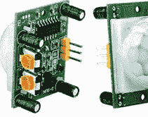

要使用该设备，你只需将 Vcc 引脚连接到 5V，地线引脚连接到地，数据引脚连接到你想要使用的 GPIO 线。

你可以使用构造函数创建一个 MotionSensor 对象：
`MotionSensor(pin, queue_len=1, sample_rate=10, threshold=0.5, partial=False, pin_factory=None)`

请注意，`queue_len` 的默认值为 1，这意味着不执行平滑处理。要发现是否检测到运动，你可以使用 `value` 或 `motion_detected`，后者将 `value` 与阈值进行比较。你还可以使用 `wait_for_motion`、`wait_for_no_motion`、`when_motion` 和 `when_no_motion` 事件。

### 光传感器

光传感器有很多种类型，但 LDR（光敏电阻）是最简单的一种。


顾名思义，它只是根据照射到其上的光量改变其电阻。使用它来感知光级只需测量其电阻即可。这可以直接完成，你也可以利用电阻来改变系统的其他物理属性。例如，你可以将电容器充电到设定电压，然后计时它通过电阻放电所需的时间。这就是 `LightSensor` 类的工作原理。你需要搭建如下所示的简单电路。其工作原理是，

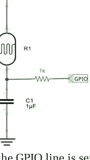

当需要读取时，GPIO 线被设置为低电平，这会使电容器放电。然后它被设置为输入模式，允许电容器通过 LDR 充电。GPIO 线读取 0，直到电容器充电足够使其读取为 1。读取为 1 的时间与电阻成正比，而电阻又与照射到其上的光量成正比。我们唯一的问题是不同的 LDR 具有不同的电阻，因此充电时间也不同。你可以计算出充电时间，但最简单的方法是通过试错来调整时间。

当你将电路连接到你选择的 GPIO 线时，你可以使用构造函数创建一个 LightSensor 对象：

```
LightSensor(pin, queue_len=5, charge_time_limit=0.01,
           threshold=0.1, partial=False, pin_factory=None)
```

这里的新元素是 `charge_time_limit`，它是电容器充电足够将零输入变为一所需的时间（以秒为单位）。默认值应该接近你需要的值，但你可能需要通过试错来调整它，以适应你想要处理的光输入范围，即你认为什么是光，什么是暗。还要注意，默认情况下会进行五次读取。LDR 在响应突然的光变化时会缓慢改变其电阻。你可以使用 `light_detected` 属性查看光是否超过阈值，或使用 `value` 属性测量光级。你还可以使用 `wait_for_dark`、`wait_for_light`、`when_dark` 和 `when_light` 事件。

### 自定义复杂输入设备

LightSensor 类比它看起来更有用。因为它检测电容器放电所需的时间，所以它可以用来测量电阻或电容。如果电阻是固定的，那么时间取决于电容器的值。如果电容器是固定的，那么时间取决于电阻的值。任何根据外部条件改变其电阻或电容的传感器都可以与 LightSensor 类一起使用。例如，热敏电阻是一种温度依赖性电阻，可以使用 LightSensor 类来读取。

你可以通过使用金属板作为电容器的一侧来创建存在传感器。当人们靠近或远离时，其电容会发生变化，因此你可以将其与 LightSensor 类一起使用。这是许多触摸感应开关背后的原理。

举个例子，我们可以创建一个简单的湿度传感器。你需要制作两个可以插入土壤的金属探针。探针必须是耐腐蚀的，我们使用了一对金属烤肉签，通过穿过塑料电线连接块来固定，这也使得连接签子变得容易。该块还将签子保持在固定距离分开，并使它们更容易插入土壤。当然，测量的准确性取决于与土壤的接触以及最小化移动。

电路与 LightSensor 完全相同，只是用电阻替换为湿度传感器：


由于这与 LightSensor 没有区别，你可以直接使用 LightSensor 类来实现湿度传感器。然而，很容易修改 LightSensor 的名称并更改其一些方法：

```python
from gpiozero import LightSensor

class Moisture(LightSensor):
    def __init__(self, pin=None, queue_len=5,
                 charge_time_limit=0.01, threshold=0.1,
                 partial=False, pin_factory=None):
        super(Moisture, self).__init__(pin, threshold=threshold,
            queue_len=queue_len, charge_time_limit=charge_time_limit,
            pin_factory=pin_factory)

Moisture.wait_for_dry=Moisture.wait_for_light
Moisture.wait_for_wet=Moisture.wait_for_dark
Moisture.when_dry=Moisture.when_light
Moisture.when_wet=Moisture.when_dark
```

唯一的真正区别是现在土壤的电阻范围可能在 100Ω 到 500KΩ 之间，甚至更高，具体取决于土壤结构以及探针之间的接触量和距离。你可以通过改变电容器的大小来调整，或者你可以修改 `charge_time_limit`，例如：

```python
moisture = Moisture(4, charge_time_limit = 0.5, threshold = 0.6)
for d in moisture.values:
    print(d)
```

你必须通过实验找到两个参数的适当值。

如果你有一个基于电阻或电容工作的原始传感器，那么相同的过程将产生一个适合与之配合使用的类。

### HC-SR04 距离传感器

超声波距离传感器通过发送超声波脉冲并计时检测回声所需的时间来工作。市场上有许多类似的模块，但 HC-SR04 常见且价格低廉。


然而，它需要与 5V 数据线一起工作，这意味着需要使用分压器将电压转换为 3.3V。一个更简单的解决方案是使用 HC-SR04P，它几乎同样便宜，并且可以在 3.3V 下工作。

无论你使用哪种模块，都有四个连接：Vcc、Ground、Trig（触发）和 Echo。你必须将 Trig 和 Echo 分别连接到一个 GPIO 线。基本操作是将 Trig 线设置为高电平一小段时间，这会导致模块发送一个脉冲。当检测到反射脉冲时，Echo 线变为高电平。两个事件之间的时间给出了距离。

构造函数要求你指定用作前两个参数的两个引脚：

```
DistanceSensor(echo, trigger, queue_len=30, max_distance=1,
    threshold_distance=0.3, partial=False, pin_factory=None)
```

请注意，读数是 30 次测量的平滑平均值——超声波距离测量噪声很大。你还可以指定一个 `max_distance`，用于缩放 `value` 参数。`threshold_distance` 用于通过以下方式指定“太近”事件：

- wait_for_in_range
- wait_for_out_of_range
- when_in_range
- when_out_of_range

`distance` 属性给出从 0 到 `max_distance` 的当前距离估计值，`value` 给出 0 到 1 范围内的缩放距离。

### 源/值 – 一种替代方法

我们已经看到，事件是在处理输入时简化操作的好方法。它们可能无法很好地扩展到更复杂的应用程序，但它们使简单的程序变得更加简单。GPIO Zero 还提供了一种“连接”输入和输出设备的方式。其实现很复杂，但与事件一样，它非常易于使用——至少在开始时是这样。你不需要了解或使用源/值方法来编程设备，但它为创建程序的问题提供了另一种方法——声明式编程。在这种方法中，你不是编写告诉机器每一步该做什么的指令，而是简单地编写指定你想要什么的内容。

每个 GPIO Zero 设备都有一个 `value` 属性，它以零或一表示其当前状态。输入设备具有只读的 `value` 属性，它们是数据源，而输出设备具有可读写的 `value` 属性，可以被视为数据接收器。你可以使用 `source` 属性将数据输入与数据输出连接在一起。例如：

```
led.source = button
```

将按钮的值连接到 LED 的值，使得按钮值的任何变化都会传递给 LED。就好像你在运行：

```
while True:
    led.value = button.value
```

这或多或少就是实际发生的情况，但由于代码是在后台线程中运行的，你的程序可以继续做其他事情。结果是你已经在软件中将按钮“连接”到了 LED，现在，每次按下按钮，LED 就会亮起，每次松开按钮，LED 就会熄灭。

值每百分之一秒更新一次，因此后台程序是：

```
while True:
    led.value = button.value
    sleep(0.01)
```

你可以通过将 `source_delay` 属性设置为值之间的时间来更改更新速率。例如：

```
led.source.source_delay = 0.5
```

将更新设置为每半秒一次。你可以通过每个设备的 `source_delay` 属性设置其更新速率。

每个设备还有一个 `values` 属性，它将其 `value` 属性转换为一个迭代器。例如，要重复打印按钮的 `value` 属性，你可以编写：

```
for d in button.values:
    print(d)
```

`values` 属性被 `source` 属性用来检索值。你不需要知道 `values` 属性是如何创建的就可以使用它，但它并不复杂：

```
@property
def values(self):
    while True:
        try:
            yield self.value
        except DeviceClosed:
            break
```

你可以看到，读取值会创建一个无限循环，不断返回 `value` 属性，直到出现问题。这用于将两个设备连接在一起。

你可以将这种“连接”更进一步，创建连接的值属性链。例如：

```
led1.source = button
led2.source = led1
```

将导致按下按钮时两个 LED 都亮起。

你也可以超越零和一。一些输入设备返回 0 到 1 之间的值，一些返回超出此范围的值。只要输入值范围和输出值范围相似，你就可以将它们连接在一起。例如，前面描述的光或距离传感器输出 0 到 1 范围内的值。还有一个 `PWMLED`，我们将在下一章详细介绍，它的值可以在 0 到 1 之间设置以设置其亮度级别。我们可以将其中任何一个连接在一起。例如：

```
from gpiozero import PWMLED, DistanceSensor
from signal import pause

led = PWMLED(4)
dist = DistanceSensor(5, 6)
led.source = dist
pause()
```

结果是一个 LED，当有物体远离距离传感器时会变得更亮。

如果你希望 LED 在物体靠近时变得更亮怎么办？

答案是，你可以在值链中放入其他对象来处理数据。GPIO Zero 提供了一些标准值处理函数，包括以下源函数。

- **absoluted(values)**：取每个值的绝对值。
- **booleanized(values, min, max, hysteresis=0)**：对于 min 到 max 范围内的值为 True，否则为 False。滞后参数设置允许在不改变状态的情况下发生的变化量。也就是说，如果值大于 max，则截止点为 max-hysteresis，如果小于 max，则必须增加到 max 加上滞后才会改变状态。
- **clamped(value, output_min=0, output_max=1)**：将值截断为 output_min 到 output_max 范围内。
- **inverted(values, input_min=0, input_max=1)**：使用 input_max 减去值再加上 input_min 来反转值。
- **negated(values)**：交换 True 和 False。
- **post_delayed(values, delay)**：在返回值后等待 delay 秒。
- **pre_delayed(values, delay)**：在返回值前等待 delay 秒。
- **scaled(values, output_min, output_max, input_min=0, input_max=1)**：使用 value*(output_max-output_min) 除以 (input_max-input_min) 再加上 output_min 重新缩放值。
- **post_periodic_filtered(values, repeat_after, block)**：在 repeat_after 个项目后，阻止接下来的 block 个项目从值中通过。因此 post_periodic_filtered(values, 1, 1) 丢弃偶数项。
- **pre_periodic_filtered(values, block, repeat_after)**：阻止接下来的 block 个项目从值中通过，并在 repeat_after 个项目后重复该块。因此 pre_periodic_filtered(values, 100, 0) 丢弃前 100 个值，pre_periodic_filtered(values, 1, 1) 丢弃所有奇数值。
- **quantized(values, steps, input_min=0, input_max=1)**：使用 int(value*steps)/steps*(input_max-input_min)+input_min 将值转换为 input_min 和 input_max 之间的离散值。
- **queued(values, qsize)**：形成一个 qsize 大小的值队列，仅在队列满时才传递它们。
- **smoothed(values, qsize, function)**：形成一个 qsize 大小的值队列，然后应用 function 指定的函数（默认为平均值）来处理它们，从而将它们减少为单个值。

回到让 LED 在物体靠近时发光更亮的问题，你可以看到我们需要做的就是使用 `inverted` 函数将 0 到 1 转换为 1 到 0：

```
from gpiozero import PWMLED, DistanceSensor
from gpiozero.tools import inverted
from signal import pause

led = PWMLED(4)
dist = DistanceSensor(5, 6)
led.source = inverted(dist)
pause()
```

我们不需要指定 `input_max` 和 `input_min` 参数，因为它们默认为 1 和 0。

除了可以转换值的函数之外，还有可以组合来自多个源的值的函数。每个这些函数都接受任意数量的参数：

- **all_values(*values)**：如果所有值都为 True，则返回 True。
- **any_values(*values)**：如果任何值为 True，则返回 True。
- **averaged(*values)**：返回所有值的平均值。
- **multiplied(*values)**：返回所有值的乘积。
- **summed(*values)**：返回所有值的总和。
- **zip_values(*values)**：返回所有值的元组。

例如，如果你在机器人的后部和前部有距离传感器，你可以使用以下方法将 LED 设置为平均距离：

```
from gpiozero import PWMLED, DistanceSensor
from gpiozero.tools import inverted, averaged
from signal import pause

led = PWMLED(4)
front = DistanceSensor(5, 6)
back = DistanceSensor(7, 8)
led.source = averaged(front, back)
pause()
```

### 一个自定义的组合函数

尽管有这么多组合函数，但通常还是需要一些专门的东西。例如，返回最小值的函数怎么样？如果你查看上面列出的任何函数的源代码，你应该不难看出如何创建自己的函数。在这种情况下，我们的自定义 `mined` 函数是：

```
from gpiozero.tools import _normalize

def mined(*values):
    values = [_normalize(v) for v in values]
    for v in zip(*values):
        yield min(v)
```

如果你确定值都是标准形式，即由 GPIO Zero 中的设备或函数创建的，你可以省略对 `_normalize` 的调用。函数的核心只是使用 `zip` 创建所有读数的元组，然后对每个元组应用标准的 Python `min` 函数，并产生结果。

你可以用 `max` 或任何你需要的函数替换 `min` 函数来创建你自己的数据转换。

一旦你有了 `mined` 函数，你就可以创建一个程序，根据后部或前部的最接近距离来点亮 LED：

```
from gpiozero import PWMLED, DistanceSensor
from gpiozero.tools import _normalize

def mined(*values):
    values = [_normalize(v) for v in values]
    for v in zip(*values):
        yield min(v)

from signal import pause

led = PWMLED(4)
front = DistanceSensor(5, 6)
back = DistanceSensor(7, 8)
led.source = mined(front, back)
pause()
```

现在 LED 被设置为前部和后部距离传感器读数中的最小值。

### 内部设备

除了提供数据流的设备外，还有一些函数可以生成值，这些值可以作为数据源馈送到输出设备或其他函数：

- `alternating_values(initial_value=False)`：在 True 和 False 之间交替。
- `cos_values(period=360)` `sin_values(period=360)`：余弦或正弦波，在 period 个值后重复。由于背景更新每百分之一秒发生一次，将 period 设置为 100 可得到 1Hz 的波形。请注意，值在 -1 和 1 之间，如果需要不同的范围，需要使用 scaled。
- `ramping_values(period=360)`：三角波，每个 period 值从 0 增加到 1 再返回。
- `random_values()`：0 到 1 之间的随机值。

使用这些函数最简单的例子是让 LED 闪烁：

```python
from gpiozero import PWMLED
from gpiozero.tools import random_values
from signal import pause
led = PWMLED(4)
led.source = random_values()
pause()
```

创建自定义值源相对容易。例如，要控制 PWM（脉冲宽度调制，将在下一章探讨），你可以生成一个周期值，其中 period*duty 设置为 1，其余设置为 0。例如：

`PWM_values(10,0.5)` 重复产生五个 1 和五个 0。
函数如下：

```python
def PWM_values(period=360,duty=0.5):
    _ontime=int(period*duty)
    _offtime=period-_ontime
    data=[1]*_ontime+[0]*_offtime
    while True:
        for i in range(_ontime):
            print(1)
            yield 1
        for i in range(_offtime):
            print(0)
            yield 0
```

它非常简单，由两个 for 循环组成，反复产生 _ontime 个 1 和 _offtime 个 0。

你可以使用相同的技术来开发自己的函数。通常最好先编写一个函数来生成你想要的值序列，验证其工作正常后，再通过添加 yield 将其转换为生成器。

GPIO Zero 支持许多内置在树莓派中或从树莓派可提供的信息中派生的设备。这些在源/值链中通常很有用。内部设备函数已更改以支持 GPIO Zero 2 中的事件。它们都以相同的基本方式工作，即返回一个对象，你可以使用该对象查找内部设备的值、调用事件处理程序或在源/值链中使用。通常有一个 max 和 min 参数，用于设置 value 属性将被设置为 1 的范围。当你详细查看其中一个函数时，它们的工作原理就变得清晰了：

- `TimeOfDay(start_time, end_time, utc=True, event_delay=5.0, pin_factory=None)`：其中 utc=True 使用 UTC 而不是本地时间，event_delay 是更新之间的时间。
  返回一个 TimeOfDay 对象，具有以下属性：
  - `end_time`：与 end_time 参数相同
  - `start_time`：与 start_time 参数相同
  - `utc`：与 utc 参数相同
  - `is_active`：如果时间在 start_time 和 end_time 之间，则为 True
  - `value`：当时间在 start_time 和 end_time 之间时返回 1
  - `when_activated`：状态变为活动时运行的函数
  - `when_deactivated`：状态变为非活动时运行的函数

你可以通过设置在达到 start_time 或 end_time 时调用的函数来使用 TimeOfDay，也可以将 value 用作数据源。文档中的示例将 LED 连接到 value，以便在时间间隔内将其打开。请注意，你不需要一个 time 属性来返回当前时间，因为这可以从标准 Python 函数 time 中获得。

一旦你了解了 TimeOfDay，其他内部函数就显而易见了：

- `PingServer(host, event_delay=10, pin_factory=None)`：Ping 服务器的 URL 或 IP 地址，并返回一个 PingServer 对象。激活定义为主机响应，如果它返回了哪怕一个 ping，则 value 为 1。

- `CPUTemperature(sensor_file='/sys/class/thermal/thermal_zone0/temp', min_temp=0.0, max_temp=100.0, threshold=80.0, event_delay=5, pin_factory=None)`：使用默认传感器文件检查 CPU 温度。min_temp 和 max_temp 设置 value 返回 0 和 1 的温度：
  `value=(temperature-min_temp)/(max_temp-min_temp)`
  threshold 设置设备激活的临界温度。你可以使用 temperature 属性读取温度。

- `LoadAverage(load_average_file='/proc/loadavg', min_load_average=0.0, max_load_average=1.0, threshold=0.8, minutes=5, event_delay=5, pin_factory=None)`：从默认文件获取平均 CPU 负载。min_load_average 和 max_load_average 设置对应于以下内容的负载：
  `value=(load_average-min_load_average)/(max_load_average-min_load_average)`
  当 load_average 在 max_load_average 和 min_load_average 之间时，值在 0 和 1 之间。
  如果负载超过该值，threshold 将设备设置为活动状态。minutes 参数给出负载平均计算的时间段。load_average 属性可用于查找当前值。

- `DiskUsage(filesystem='/', threshold=90.0, event_delay=30, pin_factory=None)`：检查由 filesystem 指定的文件夹及其所有子文件夹使用的磁盘空间量。如果使用量超过阈值百分比，则设备设置为活动状态。usage 属性返回当前使用百分比，value 为 usage/100。

例如，当温度过高时打开 LED：

```python
from gpiozero import LED, CPUTemperature
from signal import pause
from gpiozero.tools import booleanized

cpu = CPUTemperature(min_temp=58, max_temp=90)
print(cpu.temperature)
led=LED(4)
led.source = booleanized(cpu,0,1)
pause()
```

我们需要使用 booleanized 函数将十进制值转换为开/关或 0 1 值，以便 LED 可以使用。

### 自定义内部设备

添加自定义内部设备很容易。例如，让我们创建一个返回空闲内存比例的新类。/proc/meminfo 文件提供内存使用统计信息。你可以打开并读取它，或者直接使用 cat 命令：

```
cat /proc/meminfo
MemTotal:        949444 kB
MemFree:         250276 kB
MemAvailable:    588716 kB
Buffers:          94528 kB
Cached:          355420 kB
SwapCached:            0 kB
Active:          454272 kB
Inactive:        193148 kB
```

因此，要获取空闲内存，我们必须读取文件并提取第二行中的值。新类如下：

```python
import io
from gpiozero import InternalDevice

class MemoryFree(InternalDevice):
    def __init__(self, threshold=0.9, memfile='/proc/meminfo',
                 pin_factory=None):
        super(MemoryFree, self).__init__(pin_factory=pin_factory)
        self._fire_events(self.pin_factory.ticks(), None)
        self.memfile = memfile
        self.threshold = threshold
        self._totalmem = 0
        self._availablemem = 0

    @property
    def free_mem(self):
        with io.open(self.memfile, 'r') as f:
            self._totalmem = int(f.readline().strip().split()[1])
            freemem = int(f.readline().strip().split()[1])
            self._availablemem = int(f.readline().strip().split()[1])
        return freemem

    @property
    def value(self):
        return self.free_mem/self._availablemem

    @property
    def is_active(self):
        return self.value < 1-self.threshold
```

构造函数允许你指定已用内存的阈值而不是空闲内存，这样如果已用内存超过阈值，设备就会激活——这很容易更改。freemem 属性打开文件，读取前三行并提取总内存、空闲内存和可用内存。空闲内存作为结果返回。value 属性返回一个介于 0 和 1 之间的值，表示空闲内存的百分比，如果内存使用超过阈值，is_active 属性为 True。请注意，调用 fire_events 只是以防万一基类添加了事件支持。

使用这个新类，我们可以根据空闲内存量来点亮 LED：

```python
from gpiozero import PWMLED
from signal import pause

led = PWMLED(4)

mem = MemoryFree(0.1)
print(mem.value, flush=True)
print(mem.is_active, flush=True)

led.source=mem
pause()
```

你可以使用类似的代码将任何内部或非 GPIO 设备添加到 GPIO Zero。

### Source/Values 的局限性？

使用声明式编程的理念是好的，没有比这更快的方式来实现一个将按钮连接到LED的演示程序了。在这方面，使用 Source/Values 是介绍基本概念的好方法，但很快就会发现，一旦超越简单的演示，事情就会变得复杂。这种声明式编程很快就会变得难以理解，因为不同的设备以难以从程序中推断的方式相互影响。更重要的是，事情发生的顺序完全是任意的，而且这种方法效率低下，你只能寄希望于处理那些不需要快速处理的任务。可以说，Source/Value 方法具有事件和中断的所有缺点，甚至更甚。这种用于物联网和物理计算的方法值得了解，但它并不适合现实世界的应用。

### 总结

- SmoothedInputDevice 是一组更复杂输入设备的基类，这些设备以某种方式对其原始输入进行平均或处理。
- LineSensor 类使用红外二极管和传感器来检测表面的反射率。
- MotionSensor 是标准的红外运动传感器。
- LightSensor 使用光敏电阻来测量当前的光照水平。它可以用来测量电阻或电容。例如，你可以用它来测量土壤的湿度。
- DistanceSensor 是标准的超声波距离传感器。
- Source/Values 机制可用于将输出设备连接到输入设备，以便每百分之一秒将输入传输到输出。
- 为了使 Source/Values 更有用，有一些函数可以转换和组合值。
- 还有一些函数可以生成要馈送到输出设备的值，并且很容易创建自己的函数。
- 许多内部设备也可以作为值的来源。

## 第10章
### 脉冲宽度调制

解决从微控制器获得快速响应问题的一种方法是将问题从处理器上移开。以树莓派的处理器为例，有一些内置设备可以使用GPIO线路来实现协议，而无需CPU参与。在本章中，我们将仔细研究脉冲宽度调制（PWM），包括生成声音和驱动LED。

当执行其最基本的功能，即输出时，GPIO线路可以由处理器设置为高电平或低电平。它们能多快地被设置为高电平或低电平取决于处理器的速度。

使用GPIO线路的脉冲宽度调制（PWM）模式，你可以生成高达4.8MHz的脉冲序列，即脉冲宽度仅略大于0.08μs。速度提高至少100倍的原因是GPIO连接到一个脉冲发生器，一旦设置为生成特定类型的脉冲，脉冲发生器就会自行工作，无需GPIO线路或处理器的任何干预。事实上，如果你忘记重置它，脉冲输出甚至可以在你的程序结束后继续。

当然，即使PWM线路可以生成短至0.1μs的脉冲，它也只能在处理器能够修改它们的时候改变它产生的脉冲。例如，你不能使用PWM来产生单个0.1μs的脉冲，因为你无法在仅仅0.1μs内禁用PWM发生器。

硬件生成的PWM听起来是个非常好的主意，确实如此，但有一个问题。在撰写本文时，没有任何引脚工厂实际上支持使用硬件进行PWM。它们都使用软件生成PWM信号，尽管有两个引脚工厂，rpio和pigpio，使用了对CPU负载最小的高级方法。

目前，默认的引脚工厂lgpio仅支持软件实现的PWM。虽然这意味着你可以使用任何引脚作为PWM输出，但速度受限于CPU可以专门用于该任务的处理能力。

替代方案提供了一些优势和一些大的缺点，如第6章所述。pigpio使用DMA来生成PWM信号，但通过使用一个守护进程——一个在后台持续运行的驱动程序。有说法称这个守护进程并非100%稳定，它不支持Pi 5，对Pi 4的支持仍处于实验阶段。然而，该项目似乎确实活跃且发展良好。

我建议如果可以的话使用rpigpio，即之前的默认引脚工厂，如果你确实需要高速PWM，那么我建议转向C语言并直接操作硬件。在这里，我们将主要忽略树莓派的硬件PWM特性。如果你想利用它们，请参阅 *Raspberry Pi IoT in C, 3rd Ed*：ISBN:9781871962840。

### 一些基本的树莓派PWM事实

有一些事实值得从一开始就弄清楚，尽管它们的全部意义只有在我们深入学习后才会变得清晰。
首先，什么是PWM？简单的答案是，脉冲宽度调制信号具有以固定速率重复的脉冲，例如，每毫秒一个脉冲，但脉冲的宽度可以改变。关于生成的脉冲序列，有两个基本要素需要指定：其重复速率和每个脉冲的宽度。通常，重复速率被设置为一个简单的重复周期，每个脉冲的宽度被指定为重复周期的百分比，称为占空比。


例如，1ms的重复周期和50%的占空比指定了一个1ms的周期，其中高电平占50%的时间，即脉冲宽度为0.5ms。
两个极端是100%的占空比，即线路始终为高电平，以及0%的占空比，即线路始终为低电平。占空比仅仅是线路被设置为高电平的时间比例。注意，在PWM中携带信息的是占空比，而不是频率。这意味着，通常情况下，你会选择一个重复速率并保持不变，而在程序运行时改变的是占空比。


在许多情况下，PWM是使用特殊的PWM生成硬件实现的，这些硬件要么内置于处理器芯片中，要么由外部芯片提供。处理器只需通过写入寄存器来设置重复速率，然后通过写入另一个寄存器来改变占空比。这通常提供最佳的PWM，处理器没有负载，并且通常无故障运行。你甚至可以购买附加板，这些板可以提供额外的PWM通道，而不会增加处理器的负载。

专用PWM硬件的替代方案是在软件中实现它。你可以很容易地计算出如何做到这一点。你所需要的是设置一个定时循环，以重复速率将线路设置为高电平，然后根据占空比再次将其设置为低电平。你可以使用中断或轮询循环来实现这一点，也可以使用更高级的方法，例如使用DMA（直接内存访问）通道。

在树莓派的情况下，PWM线路是使用特殊的PWM硬件实现的，但如前所述，在撰写本文时，没有任何引脚工厂支持使用硬件PWM。标准的RPi.GPIO工厂支持在任何GPIO引脚上实现软件PWM，这是本章其余部分使用的工厂。

正如你所猜测的，没有PWM输入，只有输出。如果由于某种原因你需要解码或响应PWM输入，那么你需要使用GPIO输入线路和前面章节介绍的脉冲测量技术来编程。

### 使用PWM

使用PWM的直接方法是创建PWMOutputDevice类的实例，但它被列为基类，就好像它不用于日常编程一样。事实远非如此，如果你希望做任何稍微创新的事情，你需要了解PWMOutputDevice。没有真正的借口，因为它非常容易使用。

如果你创建一个实例，比如使用GPIO4：

```
pwm=PWMOutputDevice(4)
```

那么只有两个重要的属性：频率和值。频率属性设置PWM重复速率，值将占空比设置为一个分数。例如：

```
pwm.frequency=1000
pwm.value=0.5
```

设置频率为1kHz，占空比为0.5，即50%。

将以上内容整合起来，得到：

```python
from gpiozero import PWMOutputDevice
from signal import pause
pwm=PWMOutputDevice(4)
pwm.frequency=10000
pwm.value=0.5
pause()
```

请注意，由于PWM并非由硬件生成，你必须使用`pause`来保持程序运行。程序必须“正在执行某些操作”，即使只是休眠，以便它能够更新PWM状态。

如果你使用`rpigpio`并通过逻辑分析仪查看信号，你会沮丧地发现它并非1kHz信号：


由于在大多数情况下，重要的是占空比而非频率，因此150Hz的误差可能无关紧要。对于Pi Zero，你需要指定一个比所需频率大约高20%的频率。例如，1200Hz的频率会在几赫兹范围内产生1000Hz的PWM信号。

Pi Zero上指定频率与实际频率的关系图显示，6kHz是你能达到的最快速度：


Pi 4的图表非常相似：


`LGPIOFactory`是唯一能在Pi 5上工作的工厂，其频率限制在10kHz，并且在此范围内相对准确。与硬件生成的PWM相比，它的速度较慢。然而，对于许多应用来说这并不重要。例如，使用PWM控制伺服电机只需要50Hz的频率。频率误差问题在占空比设置中也存在。软件能检测到0和1的占空比，并正确地将线路分别设置为低电平或高电平。然而，对于接近0或1的值，你会得到比请求更长或更短的占空比。Pi 4和Pi Zero使用`rpigpio`的结果非常相似：


注意：x轴设置为占空比，y轴为测量值。请注意，占空比为0和1时存在突然跳变，这在图中未显示。

如果你使用最新的默认引脚工厂`lgpio`，你会发现它在处理很小和很大的占空比值时也有问题：


注意：x轴设置为占空比，y轴为测量值。

### 你能调制多快？

出于稍后将讨论的原因，在大多数情况下，关键在于改变占空比或脉冲序列的周期。这意味着下一个问题是：你能多快地改变PWM线路的特性？换句话说，你能多快地改变占空比？没有简单的方法给出确切答案，而且在大多数应用中，确切答案用处不大。原因是，为了使PWM信号传递信息，它通常需要以给定的占空比提供若干个完整的周期。这是因为脉冲在应用中通常以某种方式被平均化。

我们还有另一个问题——同步。你无法在一个完整的占空比周期刚结束时，精确地切换到另一个占空比。你所能做的只是使用计时器来估计脉冲处于高电平或低电平的时间。这意味着当你从一个占空比切换到另一个占空比时，会出现毛刺。当然，随着占空比变化速率的减慢，这种毛刺变得不那么重要，而具体什么速率可用则取决于应用。为了说明这个问题，请看以下程序：

```python
from gpiozero import PWMOutputDevice
pwm=PWMOutputDevice(4)
pwm.frequency=1000
while True:
    pwm.value=0.1
    pwm.value=0.9
```

它生成一个1kHz的PWM信号，并尝试尽可能快地从10%占空比切换到90%占空比。结果是，你为每个占空比获得的脉冲数量变化很大：


结论是，使用软件生成的PWM，除非变化非常缓慢，否则没有简单的方法来创建以可控方式改变其占空比的精确波形。

### 更多PWM方法

实际上，使用PWM你只需要一种设置频率和占空比的方法，但`PWMOutputDevice`还有更多你可能想使用的方法。

`on`和`off`方法将线路设置为高电平和低电平，并停止所有PWM输出。设置频率或占空比会重新启动输出。

`toggle`方法有点奇怪，因为它将输出从占空比D更改为占空比1-D。例如：

```python
from gpiozero import PWMOutputDevice
from time import sleep
pwm=PWMOutputDevice(4)
pwm.frequency=1000
pwm.value=0.1
while True:
    sleep(0.5)
    pwm.toggle()
```

产生一个信号，其占空比在半秒内为10%，然后在接下来的半秒内为90%，如此循环。


`pulse`方法可能看起来很奇怪，但在我们了解了PWM信号如何用于控制设备（特别是LED）的功率流之后，它就更有意义了。

```
pulse(fade_in_time=1, fade_out_time=1, n=None, background=True)
```

`pulse`的作用是将占空比从0变化到1，然后再变回0。例如：

```
pwm.pulse(fade_in_time=0.5,fade_out_time=1,n=3,background=False)
```

从占空比0开始，在半秒内缓慢增加到1，然后在1秒内从1减少到0。`n=3`表示它重复此过程三次。如果你将占空比设置为0，或者直接省略它，脉动将永远持续。`background=False`使Python等待脉冲数量完成。如果你将其设置为`True`，那么你的程序会立即继续，脉动在后台发生。

`blink`方法与`pulse`非常相似，但你可以指定完全开启和完全关闭的时间。也就是说，PWM信号从0%占空比开始，淡入至100%，在`on_time`内保持100%，然后淡出至0%占空比，并在指定的`off_time`内保持关闭。

```
blink(on_time=1, off_time=1, fade_in_time=0, fade_out_time=0,
      n=None, background=True)
```

### 控制LED

你使用PWM来做什么？PWM有很多非常巧妙的用途。然而，有两种用例占了大多数PWM应用——电压或功率调制以及向伺服电机发送信号。我们将在下一章讨论伺服电机和电机。作为第一个实际例子，让我们控制LED的亮度。脉冲序列输送到设备的功率与占空比成正比。具有50%占空比的脉冲序列仅在50%的时间内向负载提供电流，这与脉冲重复率无关。因此，占空比控制功率，但在许多情况下周期仍然重要，因为你希望避免任何闪烁或其他效果。更高的频率可以在任何占空比下平滑功率流。请注意，当LED由PWM信号供电时，它要么完全开启，要么完全关闭，因此LED光输出随电流变化没有影响，LED始终以相同电流运行。

对于一个简单的例子，我们需要将一个标准LED连接到PWM线路，并可以使用第7章介绍的BJT驱动电路。


假设你已经构建了这个电路，或者有其他类似的方法来驱动LED，那么一个简单的PWM程序，使其亮度在循环中从低到高再回到低，如下所示：

```python
from gpiozero import PWMOutputDevice
from time import sleep

pwm=PWMOutputDevice(4)
pwm.frequency=1000
steps=8
delay=0.01
while True:
    for d in range(steps):
        pwm.value=d/steps
        sleep(delay)

    for d in range(steps):
        pwm.value=(steps-d)/steps
        sleep(delay)
```

基本思想是设置一个周期为1ms的脉冲序列。接下来，在`for`循环中，将占空比设置为从0%到100%，然后再回到0%。

你可以使用以下代码实现相同的结果：

```python
from gpiozero import PWMOutputDevice
pwm=PWMOutputDevice(4)
pwm.frequency=1000
pwm.pulse(fade_in_time=1,fade_out_time=1,n=None,background=False)
```

你可能在想，接下来要做的是创建一个PWMLED自定义类。好消息是，你不必这么做，因为PWMLED是GPIO Zero中的一个标准类，它与PWMOutputDevice具有完全相同的方法集。你可以毫不费力地创建一个闪烁的LED：

```python
from gpiozero import PWMLED
pwmLED = PWMLED(4)
pwmLED.pulse(fade_in_time=1, fade_out_time=1,
             n=None, background=False)
```

如果你想要一个完全开启和完全关闭的周期，可以尝试：

```python
from gpiozero import PWMLED
pwmLED = PWMLED(4)
pwmLED.blink(fade_in_time=1, on_time=2, fade_out_time=1, off_time=2,
             n=None, background=False)
```

### RGBLED

PWMLED的一个简单变体是RGBLED。RGB LED是四引脚器件，其中红色、绿色和蓝色LED被封装在一个外壳中。你可以独立地开关这三个LED。下图展示了一个典型的器件及其连接方式：


RGB LED有两种类型：共阳极（右）和共阴极（左），这取决于LED的哪一端进行连接：


如何驱动这样的LED与驱动单个LED的方法相同。你至少需要三个限流电阻：


如何连接它们取决于器件是共阴极还是共阳极。左侧的图是共阳极配置，在这种情况下，当GPIO线为低电平时LED点亮。右侧的图是共阴极配置，在这种情况下，当GPIO线为高电平时LED点亮。如果你想要更亮的LED，你还需要三个晶体管来以更高的电流驱动它们。此外，原则上，每个LED的正向电压不同，因此如果你希望它们亮度相同，需要调整限流电阻，但在实践中这很少有必要。

一旦你将RGB LED连接好，你所要做的就是创建一个RGBLED对象来控制它。最简单的构造函数调用是：
`RGBLED(red, green, blue)`

其中red、green和blue是控制指定颜色的GPIO线。接下来，你可以使用`color`方法来指定RGB LED中哪些点亮。例如：

```python
from gpiozero import RGBLED

led = RGBLED(2, 3, 4)
led.color = (1, 1, 0)
```

这会点亮红色和绿色LED，产生黄色。
此时你可能会想知道PWM在其中扮演什么角色。答案是RGBLED中的三个LED都是PWMLED对象，这意味着你可以在`color`方法中指定0到1之间的值。例如：

```python
led.color = (0.5, 0.5, 0.5)
```

会产生灰色，每个LED点亮50%的时间。

如果你在构造函数中使用`pwm=False`，则使用三个标准LED，并且在调用`color`方法时只能使用0和1。
只要使用默认的`pwm=True`，所有`PWMLED`方法都可用，包括`toggle`、`pulse`和`blink`。在每种情况下，三个LED都根据指定的颜色进行变化。例如：
`pulse(fade_in_time=1, fade_out_time=1, on_color=(1, 1, 1), off_color=(0, 0, 0), n=None, background=True)`
将使每个LED从指定的关闭占空比在指定的`fade_in_time`内变化到指定的开启占空比，然后在`fade_out_time`内回到关闭颜色。
值得了解一点`RGBLED`的工作原理。它可以利用稍后解释的`CompositeDevice`类来创建和管理三个`PWMLED`设备或三个普通LED，但它直接完成这项工作，并创建一个所需LED对象的元组。也就是说，假设`pwm=True`，它创建一个等效于以下内容的元组：
`self._leds = tuple(PWMLED(red), PWMLED(green), PWMLED(blue))`
修改后的方法则使用这个LED设备元组进行工作。

### 音调蜂鸣器

如果你想要产生的不是音乐，而至少是一个音调呢？我们已经在第5章中看过了蜂鸣器。它是一个简单的开/关设备——它要么响，要么不响——你无法修改频率。虽然在大多数情况下，PWM使用中重要的是占空比，但你可以在这里利用它来创建可变频率的输出。在这种情况下，要听到声音，你需要一个无源蜂鸣器或一个小扬声器。无论哪种情况，你都需要一个晶体管驱动器，甚至是一个完整的放大器，以获得合理的音量。
无源蜂鸣器很难买到，因为它们看起来和有源蜂鸣器一样，甚至声称是“无源”的蜂鸣器实际上是有源的。它们之间的区别在于，当你将有源蜂鸣器连接到电源时，它会开始嗡嗡作响，通常声音很大，而无源蜂鸣器没有任何声音产生电路，需要变化的信号才能发出声音。大多数无源蜂鸣器是压电式的，虽然它们消耗的电流很小，但直接连接到GPIO线并不安全。还有相同封装的电磁蜂鸣器，它们的电阻非常低，如果直接连接到GPIO线，实际上会造成短路，因此请谨慎操作。小型电磁扬声器的电阻也很低，需要由晶体管驱动。
就GPIO线而言，无源压电蜂鸣器看起来像一个电容器，必须以允许其充电和放电的方式驱动。你可以将压电蜂鸣器直接连接，但从长远来看，你有损坏树莓派的风险，而且声音不会很大。

正确的方法是：


同样值得了解的是，压电蜂鸣器在高频下噪音更大，并且通常具有较高的谐振频率。
如果你想使用一个小扬声器，那么你需要知道，即使是最小的扬声器也会消耗比GPIO线能安全提供的更多电流。你可以用单个晶体管驱动扬声器，但推挽式配置更好，即使它使用两个晶体管：


或者，你可以使用你能找到的任何音频放大器——有许多低成本模块可用。

现在我们已经连接好了蜂鸣器或扬声器，软件部分就相对容易了。TonalBuzzer类加上Tone类为你提供了多种指定音符的方式。你可以通过多种方式构造一个Tone对象来指定你想要的频率：

- `from_frequency(440)` 或 `Tone(frequency=440)` - 指定以Hz为单位的频率
- `from_note('A4')` 或 `Tone(note='A4')` - 指定一个音符，给出音符名称和八度音
- `from_midi(69)` 或 `Tone(midi=69)` - 产生指定的音调

如果你只是使用构造函数而不说明规范方法，它会尽力推断。所以`Tone(440)`给你一个频率设置为440Hz的音符，`Tone('A4')`和`Tone(69)`也是如此。

还有一些用于处理音符的有用方法：

- `down(n=m)` - 将音符降低m个半音
- `up(n=m)` - 将音符升高m个半音
- `frequency()` - 返回当前频率
- `note()` - 返回与当前频率最接近的音符
- `midi()` - 返回与当前频率最接近的MIDI音符

使用它们和TonalBuzzer，我们可以轻松编写一个程序来产生音乐会A音，即用于给管弦乐队调音的音符：

```python
from gpiozero import TonalBuzzer
from signal import pause
tonal = TonalBuzzer(4)
tonal.play("A4")
pause()
```

如果你尝试一下，你会发现你确实得到了一个大约440Hz的噪音。你觉得这个噪音有多悦耳，取决于你使用的蜂鸣器或扬声器，而且并不总是设备越好声音就越好。如果你检查频率，你会发现指定频率和实际频率之间通常存在差异。例如，使用rpigpio的Pi Zero为A4产生的音符是402Hz，偏差了38Hz，即误差略低于9%。


使用lgpio的Pi 5则精确得多，约为439.9Hz。

### PWM 的用途 – 数模转换

到目前为止，我们已经了解了 PWM 驱动那些乐于被开关控制从而改变其输出的设备。当然，LED 并不会调暗到 50%，它只是在一半的时间内关闭，只要闪烁速度足够快，我们的眼睛就察觉不到。可以安排 PWM 信号生成一个与其占空比成比例的电压，并消除所有的开关动作。如果你在 PWM 信号的输出端添加一个低通滤波器，那么你得到的就是电压的平均值，即一个与占空比成比例的电压。

这可以从许多不同的角度来看待，但它仍然是 PWM 信号所传递功率量的结果。你也可以将其视为使用滤波器去除信号的高频分量，只留下由于占空比调制而产生的较慢分量。

这种配置下的 PWM 输出模拟了数模转换器的工作原理。你将占空比 d 设置为 0 到 1 之间的值，你就会得到一个 3.3 * d 伏特的电压输出。PWM 信号的频率决定了你改变电压的速度。通常的经验法则是每次转换需要 10 个脉冲，即你能产生的最大频率是脉冲频率/10。这意味着使用 GPIO 引脚工厂能创建的最快信号大约是 1kHz，这对于许多应用来说不够快，特别是不能用于声音合成。

为了演示数模转换可以采用的方法，以下程序创建了一个三角波形：

```
from gpiozero import PWMOutputDevice
from time import sleep

pwm=PWMOutputDevice(4)
pwm.frequency=1000
steps=8
delay=0.001
while True:
    for d in range(steps):
        pwm.value=d/steps
        sleep(delay)

    for d in range(steps):
        pwm.value=(steps-d)/steps
        sleep(delay)
```

这首先生成一个占空比递增的信号，然后是一个占空比递减的信号，大约需要 8 个脉冲从 0 变到 1，然后再变回 1。

要看到模拟波形，我们需要将数字输出放入一个低通滤波器。一个简单的电阻和电容就能工作得相当好：


滤波器的截止频率是 50Hz，对于如此低的频率输出来说可能有点偏高。


你可以看到频率大约是 43Hz，并且仍然有很多“锯齿”，这可以通过在滤波器中使用更大的电容来进一步减少。在每个周期的开始和结束处有一个特别大的阶跃，这是由于跳变到占空比 0 和 1 造成的。对此无能为力。

你可以使用相同的技术创建正弦波或任何你需要的其他波形，但 200Hz 是实际可管理的上限。

如果你已经知道 PWM 输出用于在树莓派上创建音频，你可能想知道这是如何可能的？答案是它使用硬件生成的 PWM，可以达到更高的频率。

### PWM 还能用于什么？

PWM 线路功能极其强大，在考虑几乎任何问题时，都值得问一句“我能用 PWM 吗？”。LED 示例展示了如何将 PWM 用作功率控制器。你可以将这个想法扩展到计算机控制的开关电源。你只需要一个电容来平滑电压，也许还需要一个变压器来改变电压。

你还可以使用 PWM 来控制直流电机的速度，这是下一章的主题，如果你添加一个简单的桥式电路，你还可以控制其方向和速度。

最后，你可以使用 PWM 信号作为数据通信的调制载波。例如，大多数红外遥控器使用 38kHz 的载波，大约是 26μs 的脉冲。它被开关 1ms，这完全在 PWM 可管理的范围内。所以你所要做的就是将前一个电路中的红色 LED 替换为红外 LED，你就有了一个遥控器或数据传输链路的开端。

### 总结

-   PWM，脉冲宽度调制，具有固定的重复频率，但可变的占空比，即信号处于高电平或低电平的时间量会变化。
-   PWM 可以通过软件简单地改变 GPIO 线的状态来生成，但也可以在硬件中生成，从而减轻处理器的一些工作。
-   除了作为一种信号传递方式，PWM 还可用于改变传输的功率或电压量。占空比越高，功率/电压越大。
-   树莓派有两个硬件 PWM 线路，它们能够支持一系列操作模式，但 GPIO Zero 目前仅支持软件生成的 PWM。
-   基本的 PWM 类是 PWMOutputDevice，虽然它似乎不是为常规使用而设计的，但用于原始 PWM 非常容易。
-   通过改变占空比，你可以使用 PWMOutputDevice 调暗 LED，但它在频率或占空比方面不是很精确。
-   还有一个 PWMLED，可以改变 LED 的亮度。
-   RGBLED 类使用三个 PWMLED 来创建任何颜色。
-   TonalBuzzer 使用 PWM 来改变频率。
-   PWM 可以通过简单地改变占空比来实现数模转换器，并且通过改变数模转换器的输出，你可以创建音乐。

## 第 11 章
控制电机和伺服电机

电机是输出设备的一个重要类别，它们相当容易使用，但了解你可以使用的不同类型的电机很重要。

电机类型最简单的划分是交流和直流。交流电机通常体积大、功率强，由市电电压驱动。由于它们更难操作，并且在市电电压下工作，在物联网应用中使用不多。直流电机通常在较低电压下工作，更适合物联网。在本章中，我们将只关注直流电机以及它们如何通过脉冲宽度调制工作。

### 直流电机

直流电机有两大类——有刷和无刷。所有电机都通过使用一组固定磁铁（定子）和一组旋转磁铁（转子）来工作。重要的概念是，电机通过构成定子的磁铁和构成转子的磁铁之间的力产生一个“推力”来旋转轴。这些磁铁越强，推力就越强，电机就能产生更大的扭矩（转动力）。为了保持电机转动，两个磁场中的一个必须改变，以保持转子被吸引到新的位置。

直流电机在如何为每个部件产生磁性方面有所不同，要么使用永磁体，要么使用电磁铁。这意味着有四种可能的排列方式：

| | 1 | 2 | 3 | 4 |
|---|---|---|---|---|
| **定子** | 永磁体 | 永磁体 | 电磁铁 | 电磁铁 |
| **转子** | 永磁体 | 电磁铁 | 永磁体 | 电磁铁 |
| **类型** | 无法工作 | 有刷直流 | 无刷直流 | 串励或并励 |

排列 1 无法产生电机，因为没有简单的方法来改变磁场。排列 4 产生最大、最强大的直流电机，用于火车、汽车等。排列 2，有刷直流，是最常见的“小型”直流电机形式。然而，排列 3，无刷直流，正变得越来越流行。

不同的排列方式产生的电机具有不同的扭矩特性——即在任何给定速度下它们有多难被停止。有些类型的电机在任何速度下通常扭矩都很低，即它们转得快但容易停止。

低扭矩电机通常与齿轮箱一起使用，齿轮箱可以降低速度并增加扭矩。齿轮箱除了增加成本外，最大的问题是齿隙。齿轮不能完美啮合，这种松动意味着你可以转动输入轴，而输出轴起初不会移动。只有当齿轮中的间隙被消除后，输出轴才会移动。这使得齿轮电机不太适合精确定位，尽管有方法可以通过反馈和巧妙的编程来改进这一点。

### 有刷电机

为了给电磁铁通电，有刷电机通过分环或换向器和电刷向电枢提供电流。随着转子的旋转，线圈中的电流被反转，并且总是被磁铁的另一极吸引。

这种排列的唯一问题是，随着电枢的旋转，电刷在滑环上摩擦，它们会磨损并产生火花，从而引起射频干扰。有刷电机的质量在很大程度上取决于电刷和换向器的设计。


非常小、便宜的有刷直流电机，如下图所示的那种，往往没有可更换的电刷，当它们磨损时，电机必须更换。它们也往往具有非常低的扭矩和很高的速度。这通常意味着它们必须与齿轮箱一起使用。如果你使有刷电机过载，那么它往往会使定子磁铁退磁。最便宜的设备基本上是玩具。


更高质量的有刷电机也有供应，并且它们也有多种外形尺寸。例如，775电机的整体尺寸为66.7mm x 42mm，轴径为5mm：


即使是这些电机，其电刷通常也不便于用户更换，但由于制造工艺更好，它们通常使用寿命很长。

### 单向有刷电机

只需将有刷电机连接到直流电源即可为其供电。反转直流电源的极性即可反转电机的转向。转速与施加的电压成正比。如果你只需要单向控制，那么你只需要一个能够提供必要电流和电压的PWM驱动器。

只要包含一个二极管，允许电机在旋转但未通电时绕组中储存的能量放电，单晶体管方案是可行的：


这个电路很简单，适用于电机电压高达40V、持续电流高达5A（峰值8A）的情况。唯一需要注意的小点是，TIP120是一个达林顿对管，即一个封装内有两个晶体管，因此其基极压降是通常0.6V的两倍，即1.2V，在计算限流电阻时必须考虑这一点。

有时人们说TIP120及类似器件是低效的功率控制器，因为它们由两个晶体管组成，其发射极-集电极电压是预期的两倍，这意味着它们比必要的功耗更大。如果你用电池驱动电机，你可能想使用MOSFET，但如前所述，3.3V对于开关MOSFET来说太低了。一个解决方案是使用BJT来提高施加到栅极的电压：


BJT将栅极连接到12V。由于IRFZ44NPBF的阈值电压在2V到4V之间，器件在5V下应该能工作，有时在3.3V下无需BJT辅助也能工作，但提供12V可确保MOSFET完全导通。该电路的一个问题是使用BJT会反转信号。当GPIO线为高电平时，BJT导通，MOSFET关断，反之亦然。换句话说，GPIO线高电平关闭电机，低电平开启电机。该MOSFET可适用于高达50V的电压和40A的电流。2N2222只能在30V下工作，2N2222A则可在40V下工作。

控制单向电机的第三种方法是使用半个H桥。为什么这样称呼，以及为什么你可能想这样做，将在下一节关于双向电机的部分变得清晰。半个H桥利用两个互补器件，可以是NPN和PNP BJT，或者N沟道和P沟道MOSFET。例如：


如果GPIO线为高电平，则Q1导通，Q2关断，电机运行。如果GPIO线为低电平，则Q1关断，Q2导通，电机被制动——由于转子转动时产生的反电动势，它具有旋转阻力。你可能需要一个BJT来驱动所选的MOSFET。

GPIO Zero没有专门的类来控制单向电机，但很容易从PWMOutputDevice创建一个：

```python
class uniMotor(PWMOutputDevice):
    def __init__(self, pin=None, active_high=True,
                 initial_value=0,pin_factory=None):
        super(uniMotor, self).__init__(
            pin, active_high, initial_value,
            pin_factory=pin_factory
        )
    def speed(self,value):
        self._write(value)

motor=uniMotor(4)
motor.speed(0.5)
sleep(10)
```

我们只是添加了一个speed方法。继承的on和off方法仍然有用，但可能最好阻止访问pulse和blink。还要注意，如果你使用的是晶体管/MOSFET驱动器，那么设置active_high=False可以解决需要提供反向脉冲的问题。

### 双向有刷电机

如果你需要双向控制，那么你需要使用H桥：


很容易看出这是如何工作的。如果Q1和Q4是电机上唯一导通的MOSFET，那么+连接到12V，-连接到地。电机正向运行。如果Q2和Q3是电机上唯一导通的MOSFET，那么+连接到地，-连接到12V。电机反向运行。当然，如果没有任何一个或只有一个导通，电机是关闭的。如果Q1和Q3，或者Q2和Q4导通，那么电机被制动，因为其绕组被短路，反电动势起到制动作用。

你可以安排使用四条GPIO线来驱动四个MOSFET——只需确保它们以正确的顺序开关。或者，你可以在每对MOSFET上添加一个非门，这样你就可以将Q1/Q2和Q3/Q4切换到相反的状态。


另一种设计是使用互补MOSFET：


在这种配置中，第一条GPIO线驱动电机正向，第二条驱动其反向。设置两条线的效果如下：

| 正向 | 反向 | 电机 |
| :--- | :--- | :--- |
| 低 | 低 | 关闭 |
| 低 | 高 | 反向 |
| 高 | 低 | 正向 |
| 高 | 高 | 制动 |

你也可以用PWM信号驱动正向/反向的GPIO线，从而同时控制电机的速度和方向。如果你使用图中所示的MOSFET，那么你还需要一个BJT来提高每个MOSFET的驱动电压，就像单向情况一样。你还需要包含二极管来处理每个MOSFET上可能出现的反向电压。H桥最重要的一点是Q1/Q2和Q3/Q4绝不应同时导通——这会导致电源短路。

如果同时处理四个BJT或MOSFET超出了你的能力范围，好消息是有些芯片在一个器件中实现了两个H桥。你也可以购买带有单个或多个H桥的低成本、现成模块。

最常用的器件之一是L298双H桥，它可工作在高达46V的电压和总计4A的直流电流下。


其中一个H桥的框图清楚地展示了其工作原理。


你可以看到该桥由四个BJT组成，并有逻辑门允许In1和In2选择合适的器件对。唯一的额外部分是与门，并且EnA线用于关闭所有晶体管。标记为Sense A的线可用于检测电机的速度或负载，但很少使用。

基于L298的典型模块如下所示。


描述如何使用这种模块控制单个电机会更容易。电机连接到OUT1和OUT2。三条GPIO线连接到ENA、IN1和IN2。ENA是一条使能线，必须为高电平电机才能运行。IN1和IN2充当方向控制线——哪个是正向哪个是反向取决于你连接电机的方式。在ENA上施加PWM信号可以控制电机的速度，这使得IN1和IN2可以作为简单的数字输出。

注意电源连接器显示了5V和12V电源，但大多数此类模块都有一个电压调节器，可以将12V降至5V。在这种情况下，你不必提供5V连接。如果你想使用超过12V的电压，则必须断开调节器，并且需要安排单独的5V电源——请查阅模块文档。注意桥中的晶体管有大约2V的压降，因此使用12V时，实际施加到电机的电压只有10V。

另一个非常流行的H桥器件是SN754410驱动器。它适用于较小、功率较低的电机，并且具有两个完整的H桥。每个驱动器可提供高达1A的电流，工作电压范围为4.5V至36V。它具有与L298相同的控制线，即每个电机有一个正向/反向控制线和一个使能线。你不必使用使能线；它可以连接到+5V，以便在正向/反向线上施加PWM。


### 电机软件

有一个特定的GPIO Zero类，Motor，用于使用此类H桥模块控制电机。它似乎是基于H桥只支持正向和反向控制线而不支持使能线的想法编写的。基本构造函数是：

```
Motor(forward, backward, pwm=True)
```

GPIO线Forward和Reverse必须连接到IN1/IN2或IN3/IN4。你还需要将ENA或ENB连接到+5V以使能电机。如果你使用默认的pwm=True，那么GPIO线会提供一个PWM信号，其占空比由你设置以控制电机的速度。如果你不使用

### 将全H桥用作两个半H桥

人们很容易认为H桥仅用于双向控制，但每个全桥都由两个半桥组成，这意味着一个典型的双全H桥可以控制四个单向电机：


在这种情况下，Forward现在是MotorM1的速度控制，Reverse现在是MotorM2的速度控制。必须将任何使能线设置为高电平，才能允许控制这两个电机。你可以在软件中利用这种安排，只需实例化两个uniMotor对象——一个在正向线上，一个在反向线上：

```
motorA=uniMotor(4)
motorB=uniMotor(14)
motorA.speed(0.5)
motorB.speed(0.3)
sleep(10)
```

这里motorA连接到GPIO4，GPIO4又连接到Forward；motorB连接到GPIO14，GPIO14又连接到Reverse。

### 控制舵机

爱好舵机，即用于无线电遥控模型的那种，非常便宜且易于使用，它们通过标准PWM协议连接。舵机不是驱动电机，而是定位电机。也就是说，它们不是以设定的速度旋转，而是移动到指定的角度或位置。

舵机是一个电机，通常是有刷直流电机，带有一个用于位置的反馈传感器，通常是连接到轴上的简单可变电阻（电位器）。输出通常通过一组齿轮，这降低了转速并增加了扭矩。电机转动齿轮，从而转动轴，直到电位器达到所需设置，因此轴具有所需的角度/位置。

一个基本的舵机只有三个连接：地线、电源线和信号线。使用的颜色各不相同，但电源线通常是红色，地线通常是黑色或棕色，信号线是白色、黄色或橙色。如果安装了标准J型连接器，则最靠近凹口的引脚3是信号线，中间的引脚2是5V，外侧的引脚1是地线。


电源线必须连接到能够提供足够电流来运行电机的5V电源——根据舵机的不同，电流可达500mA或更多。通常，你无法从树莓派的5V引脚为全尺寸舵机供电，你需要一个单独的电源。你可以直接从树莓派的5V线为一些微型舵机供电，但你需要检查规格。好消息是，舵机的信号线通常只需要非常小的电流，尽管它确实需要使用PWM信号在0V和5V之间切换。


我们可以假设信号线需要作为电压负载来驱动，因此驱动舵机的适当方式是：

- 舵机的+线需要连接到外部5V电源，除非是微型舵机，此时可能可以从树莓派的5V线供电。
- 对于大多数舵机，10K电阻R1可以大得多——47K通常有效。5.6K电阻将基极电流限制在略低于0.5mA。

但请注意，如果你使用的是如上图所示的单个BJT驱动器，输入是反相的。

这是驱动舵机的正确方式，但在几乎所有情况下，你可以直接从3.3V GPIO线驱动舵机信号线，并串联一个1K电阻以在舵机出现任何问题时限制电流。有些舵机甚至可以在其电机连接到3.3V的情况下工作，但扭矩会大大降低。在这种配置下，树莓派无法提供足够的电流，因此请为电机使用5V电源。

现在我们要做的就是设置PWM线以产生20ms的脉冲，脉冲宽度范围从0.5ms到2.5ms。

GPIO Zero的Servo类使得在任何引脚工厂支持的GPIO线上使用几乎任何舵机变得非常简单：

```
Servo(pin, initial_value=0, min_pulse_width=1/1000,
      max_pulse_width=2/1000, frame_width=20/1000)
```

min_pulse_width和max_pulse_width可用于限制舵机的运动范围，frame_width给出信号的重复频率，在大多数情况下为20ms或50Hz。

你能编写的最简单的舵机程序类似于：

```
from gpiozero import Servo
from time import sleep

servo = Servo(4)

while True:
    servo.min()
    sleep(0.5)
    servo.mid()
    sleep(0.5)
    servo.max()
    sleep(0.5)
```

这会将舵机移动到三个位置：最小、中间和最大，并在每个位置之间暂停。如果你想将舵机移动到中间位置，只需将其value属性设置为-1到1范围内的某个值，对应于最小到最大位置。

如果你使用前面给出的电路运行该程序，你会发现舵机完全不动，或者可能只是振动。原因是晶体管电压驱动器是一个反相器。当PWM线为高电平时，晶体管完全导通，舵机的脉冲线实际上被接地。当PWM线为低电平时，晶体管完全关断，舵机的脉冲线被电阻拉高。

解决这个问题的明显方法是将active_high设置为False以反转GPIO线的工作方式，但Servo在其构造函数中不支持active_high。原则上，你可以在构造函数之后设置：
servo.pwm_device.active_high=False
但这不起作用，因为Servo直接操作引脚，而不是PWMOutputDevice的value属性，后者会绕过active_high。

最简单的解决方案是创建一个新类并重写value属性的setter：

```
from gpiozero import Servo

class ServoInvert(Servo):
    @Servo.value.setter
    def value(self, value):
        if value is None:
            self.pwm_device.pin.frequency = None
        elif -1 <= value <= 1:
            self.pwm_device.pin.frequency = int(1 / self.frame_width)
            self.pwm_device.value = (self._min_dc + self._dc_range *
                                    ((value - self._min_value) / self._value_range))
        else:
            raise OutputDeviceBadValue(
                "Servo value must be between -1 and 1, or None")
```

与原始代码相比，唯一改变的行是：
self.pwm_device.value = (self._min_dc + self._dc_range *
                        ((value - self._min_value) / self._value_range))

现在你可以将ServoInvert与单晶体管驱动器一起使用：
servo = ServoInvert(4)
servo.pwm_device.active_high=False

请注意，在任何一种情况下，如果舵机在从最大值移动到最小值时没有移动其全部范围，你可以调整min_pulse_width和max_pulse_width。给出的值适用于典型舵机。

除了简单的Servo类，还有AngularServo类：
AngularServo(pin,initial_angle=0,min_angle=-90,max_angle=90,
            min_pulse_width=1/1000, max_pulse_width=2/1000,
            frame_width=20/1000)

其工作原理与Servo类相同，但你可以将舵机校准为以角度为单位工作。只需测量从中间位置到最大和最小舵机位置的角度，并在`min_angle`和`max_angle`中指定它们。例如，如果你测量到最大位置距离中间位置60度，最小位置距离中间位置75度，你可以使用以下方式创建一个校准过的AngularServo：
servo = AngularServo(4, min_angle=-75, max_angle=60)
之后，你可以使用`angle`方法移动到指定角度：
servo.angle(25)
这将使舵机向最大位置移动25度。
校准舵机的任务，即确定使其移动到每个极限位置所需的占空比，是你应该始终做的事情。

值得一提的是，舵机是带有齿轮箱的优质低成本直流电机。你所要做的就是打开舵机，将电机从控制电路上焊下来，然后将两根导线焊接到电机上。如果你想使用正/反转电子设备，你可以移除齿轮箱上的端点挡块（通常在大齿轮上），并用一对等值电阻（例如2.2kΩ）替换电位器。

### 无刷直流电机

无刷直流电机比有刷直流电机更昂贵，但在许多方面更优越。它们不会因为换向器或电刷磨损而失效，且无需维护。它们在旋转的所有点上都提供最大旋转扭矩，并且通常在相同尺寸和重量下提供更大的功率。它们也可以更精确地控制。唯一的缺点是成本更高和操作稍复杂。实际上，除非你确实需要额外的功能，否则通常最好使用有刷直流电机。

无刷直流电机基本上是一个内外翻转的有刷电机——定子是一组电磁铁，转子是一组永磁体。在某些设计中，永磁体位于定子内部，类似于有刷电机——内转子型；有时磁体位于定子外部——外转子型。


内转子型——永磁体构成转子，线圈通电以产生吸引力。


外转子型——永磁体位于定子外部，整个外壳旋转。

无刷电机的工作原理与有刷电机完全相同。由于线圈是静止的，因此不需要机械换向器，但仍然需要换向——线圈必须按顺序通电以产生旋转磁场，从而带动转子旋转。这意味着你必须实现一个电子换向器，这也是无刷直流电机的另一个名称。

电子换向器必须感知转子的位置，并改变定子产生的磁场以保持转子运动。无刷电机在磁体数量（极数）和电磁铁数量以及相数上有所不同。最常见的是三相电机，因为它们用于无线电遥控建模。本质上，你需要至少一个每相的驱动器和一个GPIO线来生成信号。实际上，你需要每相两个驱动器，并且它们必须由双电源驱动，以便磁场可以为正、零或负。

这可以通过软件实现，但并不容易，而且鉴于GPIO Zero目前仅限于软件生成的PWM，这将太慢且不可靠。一个更合理的替代方案是购买现成的控制器。无刷电机有两种类型——带霍尔传感器和不带霍尔传感器的。带传感器的更昂贵，但更容易控制，因为电子设备始终知道转子的位置并可以施加正确的驱动。不带传感器的通过测量电机的反电动势来控制，这要困难得多。大多数低成本速度控制器需要带霍尔传感器的电机。

无线电遥控社区已经开始使用三相无刷电机，这导致了一系列价格合理的电机和控制器。问题是它们被设计为用于四旋翼飞机和模型飞机的高功率、高速、单向电机。


如果你能接受它们的局限性，它们提供了一种将树莓派与无刷电机连接的好方法。在这种情况下，你只需要一个用于RC建模的三相无刷电机和一个如下图所示的ESC（电子调速器）：


左侧的三根引线连接到电机的三相，右侧的红色和黑色引线连接到电源——通常是LiPo电池。中间的小型三线连接器是标准的舵机连接器，你可以像使用舵机一样使用它，但有几个例外。首先是中间引脚2提供5V而不是接受5V。除非你需要5V电源，否则不要将其连接到任何东西。第二个问题是ESC是智能的。当你第一次通电时，它们会发出蜂鸣声，并且可以通过将PWM信号从最大值更改为最小值来编程为不同的模式。此外，要使用ESC，你必须对其进行解锁。这是为了防止无线电遥控建模者在通电时被意外启动的电机伤害。最常见的解锁顺序是ESC在通电时发出蜂鸣声。然后你必须将PWM设置为最小值，此时ESC会再次发出蜂鸣声。片刻之后，你将获得对电机的控制权。

解锁程序的需要应该提醒你，这些模型电机非常强大。不要尝试在工作台上松散地操作一个，因为如果开启，它会快速移动，至少会把你的电线拧成一团乱麻。最重要的是，在你完全控制之前，不要运行任何连接了东西的电机。

### 步进电机

有一种无刷电机易于使用且成本低廉——步进电机。它与标准无刷电机的不同之处在于，它不是为连续高速旋转而设计的。步进电机具有磁体和线圈的排列，使得为某些线圈通电会将转子保持在特定位置。改变哪些线圈被激活会使转子转动，直到它与线圈对齐并停止移动。因此，步进电机以离散的步进移动转子。这使得驱动它简单得多。

步进电机没有电刷，因此不会像有刷电机那样快速磨损。它们在任何速度下都具有大致相同的扭矩，并且可以在低速下使用而无需齿轮箱。它们可以长时间保持在固定位置而不会像直流电机那样烧毁。然而，与舵机不同的是，如果步进电机被机械力强制移动到新位置，释放后它不会返回到原始位置。步进电机的唯一缺点是，由重复步进产生的连续旋转可能会使电机振动。

步进电机在它们使用的步进大小上有所不同——通常为1.8度，每转200步，尽管可以使用齿轮来减小步进大小。另一个主要区别是转子的构成——永磁体或软铁。第一种类型称为PM步进电机，第二种称为VR步进电机，代表可变磁阻，它们在驱动方式上有所不同。PM步进电机更容易理解。还有混合步进电机，它们兼具PM和VR步进电机的优点。这些更昂贵，通常仅在定位精度很重要时使用。

它们在相数（即独立的线圈组）上也有所不同。下图显示了一个两相PM步进电机，其中第1相被激活：


如果第二阶段被激活，转子将旋转90度：


这是你能制造的最简单的步进电机。一个典型的步进电机线圈数量会远多于四个，但它们通常被连接成两相或三相。

另一个主要区别是双极性与单极性。双极性电机就像图中所示的那种。要产生北极，电流必须与产生南极时相反的方向流动。这意味着你必须用双向驱动器（例如H桥）来驱动每一组线圈。单极性电机有两个绕组，每个方向一个，并且两个绕组都可以由单向驱动器驱动——一个产生北极，另一个产生南极。请注意，单极性电机需要驱动的线圈数量是双极性的两倍，并且开关序列略有不同。

一个具有A相和B相的两相双极性电机的开关顺序为：
A → B → A- → B- → A 等等
其中减号表示电流以相反方向流动。

一个两相单极性电机每相有两个线圈，A1、A2和B1、B2，其中1和2绕组在相同电流流动下产生相反的磁场。现在的顺序是：
A1 → B1 → A2 → B2 → A1 等等
并且所有线圈都以相同方向驱动。

按顺序完全开启和关闭单个相位会使电机产生重复的步进。你也可以同时开启多个相位来产生微步。例如，在我们的两相示例中，同时开启两个相位会使转子稳定在两者之间，从而产生半微步：


两相双极性电机的驱动顺序是：
A → AB → B → BA- → A- → A- B- → B- → AB- → A
其中减号表示线圈以相反方向通电，总共产生八步，而不是四步。

你甚至可以改变通过线圈的电流，将转子移动到中间位置。在极限情况下，你可以正弦地改变电流，从而产生平滑的旋转。微步进更平滑，可以消除嗡嗡声。对于高精度定位，微步进在负载下表现不佳。

### 步进电机驱动器

如何最好地使用树莓派驱动步进电机？

有步进电机控制器，包括HATs，你可以购买，它们附带软件，允许你控制步进电机。也有一些芯片适用于单极性和双极性步进电机。然而，你可以使用在方向电机控制部分描述的H桥之一轻松控制双极性步进电机。

例如，使用互补MOSFET：


如果你不想从头构建，可以使用双H桥模块。电机必须是双极性两相电机，通常称为四线步进电机。你可以看到，对于这种配置，你需要四条GPIO线，A、A-、B和B-。

那么如何用软件驱动双H桥呢？GPIO Zero中没有步进电机类，但创建一个很容易。在这个例子中，我们创建的类与GPIO Zero集成得不是很好，但它可以工作。在下一章中，我们将发现如何做得更好一点。

我们的新类叫做StepperBi4，表示它是一个4线双极性步进电机。你可以为单极性步进电机和更多相位创建类似的类：

```python
class StepperBi4():
    def __init__(self, A=None,Am=None,B=None,Bm=None):
        self.phase=0
        self.gpios=tuple(DigitalOutputDevice(pin) for pin
                                    in (A,B,Am,Bm))

        self.halfstepSeq = [
                            [1,0,0,0],
                            [1,1,0,0],
                            [0,1,0,0],
                            [0,1,1,0],
                            [0,0,1,0],
                            [0,0,1,1],
                            [0,0,0,1],
                            [1,0,0,1]
                            ]
```

你可以看到，构造函数允许你指定驱动H桥的四条GPIO线——A正和负，B正和负。它跟踪当前相位，并设置四个DigitalOutputDevice实例，每个GPIO线一个，作为一个元组。请注意，元组中GPIO线的顺序是A、B、Am、Bm，因为这使得相位表更容易。该表给出了每个相位状态下每个GPIO线的状态。你可以将其与前面给出的序列进行比较：
A → AB → B → BA- → A- → A-B- → B- → AB- → A

现在我们需要的是一些设置和处理相位的方法：

```python
def setPhase(self,phase):
    self.phase=phase
    for gpio,state in zip(self.gpios, self.halfstepSeq[phase]):
        gpio.value=state

def stepForward(self):
    self.phase=(self.phase+1) % 8
    self.setPhase(self.phase)

def stepReverse(self):
    self.phase=(self.phase-1) % 8
    self.setPhase(self.phase)
```

这段代码中唯一复杂的部分是使用zip将gpio元组和相位表中的相应行组合在一起。结果允许我们逐步获取每个gpio对象及其新状态。stepForward和stepReverse只是向下或向上移动相位表，确保在到达末尾时返回起点。这就是取模运算符%为我们所做的，相位遵循序列0,1,2,3,4,5,6,7,0,1等等。

如果你愿意，可以使用全步进表，只要记住使用模4而不是8：

```python
self.fullstepSeq = [
    [1, 0, 0, 0],
    [0, 1, 0, 0],
    [0, 0, 1, 0],
    [0, 0, 0, 1],
]
```

```python
def setPhase(self, phase):
    self.phase = phase
    for gpio, state in zip(self.gpios,
                          self.fullstepSeq[phase]):
        gpio.pin.set_state(state)

def stepForward(self):
    self.phase = (self.phase+1) % 4
    self.setPhase(self.phase)

def stepReverse(self):
    self.phase = (self.phase-1) % 4
    self.setPhase(self.phase)
```

将所有这些结合起来，我们可以编写一个以恒定速度旋转步进电机的程序：

```python
from gpiozero import DigitalOutputDevice
from time import sleep

class StepperBi4():
    def __init__(self, A=None,Am=None,B=None,Bm=None):
        self.phase=0
        self.gpios=
            tuple(DigitalOutputDevice(pin) for pin in (A,B,Am,Bm))
        self.halfstepSeq = [
            [1,0,0,0],
            [1,1,0,0],
            [0,1,0,0],
            [0,1,1,0],
            [0,0,1,0],
            [0,0,1,1],
            [0,0,0,1],
            [1,0,0,1]
        ]
    def setPhase(self,phase):
        self.phase=phase
        for gpio,state in zip(self.gpios, self.halfstepSeq[phase]):
            gpio.value=state

    def stepForward(self):
        self.phase=(self.phase+1) % 8
        self.setPhase(self.phase)

    def stepReverse(self):
        self.phase=(self.phase-1) % 8
        self.setPhase(self.phase)

step=StepperBi4(4,17,27,22)
step.setPhase(0)
while True:
    sleep(0.001)
    step.stepForward()
```

在这种情况下，H桥A连接到GPIO4和GPIO17，B连接到GPIO27和GPIO22。步进速度使得一个200步的电机将以2.5rpm的速度旋转，这是一个很好的起点。要获得更高速度，请减少睡眠时间。

如果你使用的是众多双H桥模块之一，那么接线如下所示：


请注意，你必须将电源的地线和树莓派的地线连接在一起。在初次尝试时，使用带有电流跳闸功能的电源也是一个好主意。

你可能认为问题在于你无法足够快地产生脉冲，但真正的问题是完成一步所需时间的变化。例如，以25rpm的速度旋转，仍然相当慢，我们得到一组看起来像这样的波形：


在逻辑分析仪轨迹上标记的是单条线为高电平的时间，即所有偶数状态。每个状态的时间显示在右侧，你可以看到半步时间在1.6到2.3毫秒之间变化。这将导致电机随着速度增加而振动。

在第6章中，我们发现直接写入引脚的速度快了十倍。如果你将setPhase方法更改为：

```python
def setPhase(self,phase):
    self.phase=phase
    for gpio,state in zip(self.gpios, self.halfstepSeq[phase]):
        gpio.pin._set_state(state)
```

半步时间的稳定性得到改善：


你现在可以看到，在相同频率下，半步时间从1.32到1.49毫秒不等，这产生了更平滑的旋转。

还有许多其他改进可以应用于StepperBi4——用于连续旋转的附加方法、反向方法等等，但这就是使用步进电机所需的全部。你也可以为其他类型的电机创建自定义类。你只需要一组GPIO线和开关序列。

如果你需要步进电机以给定速度旋转，那么这个实现就不太好。原因很简单，当操作系统中断程序时，脉冲流中会出现不规则性。如果你以稳定的步进速率运行电机，你会注意到旋转速度偶尔会变化。然而，当只关心步数时，系统运行良好，因为没有步因中断而丢失。这使得使用GPIO Zero通过步进电机定位某些东西成为可能，而这正是它们的主要用途。

### 总结

-   电动机有多种不同类型，但在物联网中，直流有刷或无刷电机使用最为广泛。
-   有刷电机可以使用单个晶体管驱动器和PWM信号进行速度控制。GPIO Zero中没有单向电机类，但创建一个很容易。
-   要实现双向控制，你需要一个H桥。借助H桥，`Motor`类可用于控制电机的方向和速度。
-   舵机根据PWM信号的占空比来设定其位置。
-   无刷直流电机非常强大，最好使用现成的电子模块进行控制。它们功率很大，因此如果使用不当会很危险。它们可以使用简单的PWM信号来驱动。
-   步进电机是无刷直流电机的一种特殊形式。它们通过激励不同的线圈，以离散的步进方式移动。
-   单极电机的线圈在每个步进中都可以被驱动向同一方向。双极电机的线圈在某些步进中需要被反向驱动。
-   双极电机需要两个H桥才能工作，并且需要四条GPIO线路。
-   GPIO Zero中没有步进电机类，但可以创建一个。

## 第12章
使用复合设备

你很可能从使用单个GPIO线路闪烁LED开始，但慢慢地，你肯定会升级到更复杂的设备，例如由多个闪烁LED、电机等组成的机器人。如果你创建的是对现有设备的扩展，那么你可能会使用继承来创建一个新的自定义类，我们在前面的章节中已经看到了这样的例子。例如，当我们想要实现一个门锁类时，显而易见的方法是创建一个继承自现有LED类的新类。原因是LED和锁都共享基本的开/关行为，但对于锁来说，称之为“锁定/解锁”更合适。

将此与构建一个自定义类来控制三个或多个独立LED的问题相比较。在这种情况下，你不需要继承单个LED的行为，你需要LED类的多个实例。在这种情况下，你需要的是组合，即组合类，而不是继承。GPIO Zero有一个类可以用来创建复合设备，本章将详细探讨其工作原理，以便你能够创建自己的复合设备。

### 包含设备的设备

`CompositeDevice`类旨在被你的自定义类继承，以便轻松包含其他类的实例，但首先有必要看看如何在没有帮助的情况下完成这项工作。

如果你从头开始实现一个复合设备，那么合乎逻辑的做法是创建一个包含所需实例的元组、列表或字典。例如，如果你想创建一个自定义的`TriLED`类，你可能会在构造函数中编写一个这样的元组：

```python
self.LEDs=(LED(pin1),LED(pin2),LED(pin3))
```

之后，你将使用该元组来访问LED，编写所需的方法。

例如，你可能需要一个`AllOn`和`AllOff`方法：

```python
from gpiozero import LED
from time import sleep

class TriLED():
    def __init__(self, pin1=None,pin2=None,pin3=None):
        self.LEDs=(LED(pin1),LED(pin2),LED(pin3))

    def AllOn(self):
        self.LEDs[0].on()
        self.LEDs[1].on()
        self.LEDs[2].on()

    def AllOff(self):
        self.LEDs[0].off()
        self.LEDs[1].off()
        self.LEDs[2].off()
```

使用这个新类的程序大致如下：

```python
leds=TriLED(4,17,27)
while True:
    leds.AllOn()
    sleep(0.001)
    leds.AllOff()
    sleep(0.001)
```

当然，在真正的`TriLED`应用中，你可能会有设置模式的方法——向左旋转、向右旋转等，但总体思路是相同的。

### CompositeDevice

`CompositeDevice`类旨在帮助处理这种使用设备元组的通用模式。你在构造函数中添加设备，可以将它们作为元组的未命名成员添加，也可以作为命名属性添加。区别在于命名属性使得从外部访问子设备更容易。如果你将设备指定为位置参数，那么它会被添加到一个元组中。如果你将设备指定为命名参数，那么具有相同名称的属性会被添加。唯一的小谜团是如何访问设备元组？答案是`CompositeDevice`类本身的行为就像一个元组，你可以用通常的方式访问其内容。它不是通过继承实现这一点的。相反，它重写了`__getitem__`魔术方法，该方法在你使用索引时被调用。例如：

```python
compdev=CompositeDevice(LED(pin1),LED(pin2))
compdev[1].on()
```

会打开引脚2上的LED。

命名参数更容易理解：

```python
compdev=CompositeDevice(led1=LED(pin1),led2=LED(pin2))
compdev.led2.on()
```

对于内部使用的设备，你应该使用第一种方法；如果你想允许外部访问组件设备，则使用第二种方法。

当然，如果你正在为某个设备创建自定义类，那么更好的想法是继承`CompositeDevice`而不是创建一个实例，这样你的自定义类就继承了相同的行为。

通过一个例子更容易理解。`TriLED`类可以使用`CompositeDevice`继承来实现，如下所示：

```python
class TriLED(CompositeDevice):
    def __init__(self, pin1=None,pin2=None,pin3=None):
        super(TriLED, self).__init__(LED(pin1),LED(pin2),LED(pin3))

    def AllOn(self):
        self[0].on()
        self[1].on()
        self[2].on()

    def AllOff(self):
        self[0].off()
        self[1].off()
        self[2].off()
```

注意，现在是`TriLED`的实例充当LED的容器：

```python
leds=TriLED(4,17,27)
while True:
    leds[0].on()
    sleep(0.001)
    leds[0].off()
    sleep(0.001)
```

你可以看到，这里可以访问组件LED，在这个例子中是引脚4上的LED，但通常来说，这是不鼓励的——你应该提供方法来完成用户想要做的事情，而无需他们访问组件部分。这是一个理想情况，在某些情况下，直接访问组件可能是完成工作的唯一方法。

如果你确实想鼓励从外部访问，请使用命名参数：

```python
class TriLED(CompositeDevice):
    def __init__(self, pin1=None,pin2=None,pin3=None):
        super(TriLED, self).__init__(left=LED(pin1),
                                    middle=LED(pin2),right=LED(pin3))
```

现在你可以编写更有意义的代码：

```python
leds=TriLED(4,17,27)
while True:
    leds.left.on()
    sleep(0.001)
    leds.left.off()
    sleep(0.001)
```

`CompositeDevice`类还带来了一些额外的功能。主要的是`value`，它返回一个命名元组，其中包含每个设备的当前值。例如：

```python
leds=TriLED(4,17,27)
print(leds.value)
```

显示：

```
TriLEDValue(device_0=0, device_1=0, device_2=0)
```

对于未命名的设备，类会分配一个名称；对于命名的设备，则使用给定的名称。你可以使用`_order`参数调整设备在元组中列出的顺序——名称开头的下划线明确表示你不需要直接使用它。例如，将构造函数的调用更改为：

```python
super(TriLED, self).__init__(left=LED(pin1),middle=LED(pin2),
                        right=LED(pin3),_order=["right","left","middle"])
```

结果打印：

```
TriLEDValue(right=0, left=0, middle=0)
```

如果你需要创建一个相同类型的实例，`namedtuple`属性提供了用于报告值的命名元组的类。如果你使用`CompositeOutputDevice`类，这会很有帮助。

### CompositeOutputDevice

通常，一个复合设备同时包含输入和输出设备，但如果它只有输出，`CompositeOutputDevice`会在`CompositeDevice`的基础上添加一些有用的额外方法。特别是：

-   `on()` 打开所有设备
-   `off()` 关闭所有设备
-   `toggle()` 将任何打开的设备关闭，将任何关闭的设备打开。

此外，`value`属性被修改，允许你设置所有输出设备的状态。

`CompositeOutputDevice` 使得实现三色LED变得非常简单：

```python
from gpiozero import LED, CompositeOutputDevice
from time import sleep

class TriLED(CompositeOutputDevice):
    def __init__(self, pin1=None, pin2=None, pin3=None):
        super(TriLED, self).__init__(left=LED(pin1),
                                    middle=LED(pin2), right=LED(pin3))
```

请注意，现在你不必定义 `allOn` 或 `allOff` 方法，因为它们作为 `on` 和 `off` 被继承了。此外，你现在可以通过一次操作设置所有输出设备的状态：

```python
leds = TriLED(4, 17, 27)
while True:
    leds.value = leds.namedtuple(0, 1, 1)
    sleep(0.001)
    leds.value = leds.namedtuple(1, 0, 0)
    sleep(0.001)
```

这会将引脚1上的LED设置为低电平，另外两个设置为高电平，然后将引脚1设置为高电平，另外两个设置为低电平。

### LEDCollection

拥有一组LED的设备非常常见且易于制作，因此有一个特殊的 `LEDCollection` 版本的 `CompositeOutputDevice`，它创建一个 `LED` 或 `PWMLED` 对象的元组。默认情况下创建 `LED` 对象，但你可以在构造函数中使用 `pwm=True` 来更改此设置。它从 `CompositeOutputDevice` 继承了 `on`、`off` 和 `toggle` 方法，并有一个 `leds` 属性，用于获取或设置LED元组。

使用这个，我们可以这样实现TriLED：

```python
class TriLED(LEDCollection):
    def __init__(self, pin1=None, pin2=None, pin3=None):
        super(TriLED, self).__init__(left=pin1,
                                    middle=pin2, right=pin3)
```

请注意，现在我们不需要指定我们正在创建 `LED` 对象，只需指定使用的引脚。一旦你有了这个新类的实例，你就可以像以前一样使用它。`LEDCollection` 类用于实现下面讨论的许多LED类。

### LED 类

LED类中最简单的是 `LEDBoard`：

- ◆ **LEDBoard**
  `LEDBoard(*pins, pwm=False, active_high=True, initial_value=False, pin_factory=None, **named_pins)`

这是最简单的复合LED设备，只是一组连接到指定GPIO引脚的LED，例如：

```python
board = LEDBoard(4, 17, 27)
```

除了打开或关闭所有LED，以及设置它们进行切换、闪烁和脉冲外，你还可以通过指定设备编号来控制单个LED。例如：

```python
board.on(1)
```

只打开第一个指定的LED，即连接到GPIO4的那个。你可以在 `on`、`off` 和 `toggle` 中使用此功能，但不能在 `pulse` 或 `blink` 中使用。

- ◆ **LED 字符显示器**
  两个类方法 `LEDCharDisplay` 和 `LEDMultiCharDisplay` 可用于在多段LED上显示信息：


这些显示器有7、9、14或16个线性LED段，可以点亮以形成一系列字符：


每个段被分配一个字母，每个段连接到一个GPIO线路。构造函数按a到n的顺序指定GPIO编号。

```python
LEDCharDisplay(*pins, dp=pin, font=dict, pwm=False,
    active_high=True, initial_value=" ", pin_factory=None)
```

例如：

```python
char = LEDCharDisplay(4, 5, 6, 7, 8, 9, 10,
    active_high=False)
```

指定a连接到GPIO4，b连接到GPIO5，依此类推。你可以指定当线路为高电平或低电平时段是否点亮。要显示一个字符，你只需设置 `value` 属性。例如：

```python
char.value = 5
```

将在之前构建的显示器上显示5。其工作原理是字体对象定义了从字符到应点亮的段元组的映射。该模式由一个字典定义，该字典以字符为索引，以定义段状态的元组为值。例如：

```python
myFont = LEDCharFont({"0": (1, 1, 1, 1, 1, 1, 0)})
```

定义了七段显示器上数字零的字体。字体对象用于在你赋值给 `value` 时设置段，并在你读取 `value` 时用作查找表，从而返回显示的字符。为7段和14段显示器提供了默认字体对象。

`LEDCharDisplay` 只处理单个LED显示器，即一个字符。如果你想要多字符显示器，则需要使用 `LEDMultiCharDisplay` 类。重要的是要认识到多字符显示器在设计和引脚排列上差异很大。`LEDMultiCharDisplay` 假设的类型只是将单个LED显示器组合在一起，没有特殊驱动器。每个单独的LED显示器由相同的段驱动GPIO线路供电。一个额外的GPIO线路用于选通每个LED数字的开关。通过足够快地脉冲选通线路并同步更改段，看起来所有字符都在持续显示。通常，在这种配置中，每个字符都需要一个晶体管驱动器。

要构造一个 `LEDMultiCharDisplay`，你首先创建一个 `LEDCharDisplay`，它代表多字符显示器中的单个字符。你还指定用于切换每个字符的GPIO线路。例如：

```python
char = LEDCharDisplay(4, 5, 6, 7, 8, 9, 10,
                     active_high=False)
d = LEDMultiCharDisplay(char, 19, 20, 21, 22)
```

创建一个实例，该实例将控制一个四位显示器，每个位分别使用GPIO 4、5、6、7、8、9、10来控制显示内容，GPIO 19控制第一位，依此类推。你可以使用以下方式设置显示：

```python
d.value = "1234"
```

如果显示器有小数点，你也可以包含它。还有一个属性：

```python
d.plex_delay = s
```

将多路复用设置为 `s` 秒。这是各个数字更新的速率，通常约为0.005秒，即5毫秒。

### LEDBarGraph

这将连接到指定引脚的LED视为条形图：

```python
LEDBarGraph(*pins, pwm=False, active_high=True,
           initial_value=0, pin_factory=None)
```

设置-1到1之间的值会点亮相应比例的LED，负值从引脚列表的顶部开始工作。所以：

```python
graph.value = 0.5
```

点亮前一半的LED，而：

```python
graph.value = -0.5
```

点亮后一半的LED。

值得注意的是，你可以购买带有10或20个段的封装LED条。然而，你需要记住，即使分配少至10个GPIO线路来驱动这样的设备，也可能使你在其他应用中线路不足。


### TrafficLights

```python
TrafficLights(red, amber, green, *, yellow=None,
    pwm=False, initial_value=False, pin_factory=None)
```

通过指定红色、琥珀色和绿色LED连接的引脚，可以控制简单的交通灯设备。你可以使用 `red`、`amber`、`green` 属性来控制灯光。属性 `yellow` 可以用作 `amber` 的替代名称。你必须提供更改灯光的代码，例如绿色、红色/琥珀色、红色等。你也可以使用PWM来改变亮度，但不清楚为什么你可能想这样做。

### 其他设备的 I/O 类

还有一些类可以与多家不同公司制造的现成板一起工作。

### Energenie

```python
Energenie(socket=n, initial_value=False, pin_factory=None)
```

Energenie插座控制器是打开和关闭市电电压设备的一种简便方法。它利用Pi-mote Hat连接到RF控制的插座。重要的是要注意Energenie系统不是标准的，它不与其他智能插座一起工作。标准方法是 `off()` 和 `on()`，你可以使用 `socket` 属性来发现插座编号，使用 `value` 来查找状态。


### PiHutXmasTree

```python
PiHutXmasTree(*, pwm=False, initial_value=False, pin_factory=None)
```

这使用25个GPIO线路，这些线路是固定的，因此你不需要指定它们。24个LED使用属性 `led0` 到 `led23` 控制，顶部的白色LED是星星。你可以使用PWM来改变亮度，并且可以使用 `value` 在一次操作中设置多个LED。


### LedBorg

```python
LedBorg(*, pwm=True, initial_value=(0, 0, 0), pin_factory=None)
```

这是一个非常明亮的RGB LED。同样，使用的GPIO线路是固定的，你可以使用 `color(R, G, B)` 方法来设置颜色。如果你使用PWM，你可以创建中间颜色。


### PiLiter

```python
PiLiter(*, pwm=False, initial_value=False, pin_factory=None)
```

不再可用。

### PiLiterBarGraph

```
PiLiterBarGraph(*, pwm=False, initial_value=False, pin_factory=None)
```

已不再提供。

### SnowPi

```
SnowPi(*, pwm=False, initial_value=False, pin_factory=None)
```

已不再提供。

### PiTraffic

```
PiTraffic(*, pwm=False, initial_value=False, pin_factory=None)
```

一个简单的红、黄、绿LED板，使用固定的GPIO引脚。其工作方式类似于TrafficLights，但固定使用GPIO9、10和11。


### PiStop

```
PiStop(location, *, pwm=False, initial_value=False, pin_factory=None)
```

另一种交通灯设备，但其设计旨在模仿交通灯的外观，并且可以插入到Pi GPIO连接器上一组固定位置中的一个。你必须在构造函数中指定位置：A、A+、B、B+、C、D。


### PiBrella

```
PiBrella(pwm=False, pin_factory=None)
```

已不再提供。

### StatusZero

```
StatusZero(*labels, pwm=False, active_high=True,
          initial_value=False, pin_factory=None)
```

这是一个类似交通灯的设备，但拥有三组红/绿LED，可用于显示比“停止”和“启动”更通用的状态信息。你可以在构造函数中为三个指示灯中的每一个指定标签，例如：

```
status=StatusZero("Temperature", "Humidity")
status.Temperature.green.on()
status.Humidity.red.on()
```

如果你不指定标签，则使用“One”、“Two”和“Three”。LED旁边有三个条带，允许使用记号笔书写标签。


### PumpkinPi

```
PumpkinPi(*, pwm=False, initial_value=False, pin_factory=None)
```

这个万圣节专用设备具有非常特定的LED排列方式，并提供了控制两个自然分组的方法：其外围（侧面）和眼睛。南瓜边缘的LED由`sides`（一个LEDBoard实例）控制。它具有`left`和`right`属性，它们也是LEDBoard，分别包含左侧和右侧的LED，每个包含四个属性：

`top`, `midtop`, `middle`, `midbottom`, `bottom`

代表南瓜眼睛的两个LED由`eyes`控制，这是一个包含以下内容的LEDBoard：

`left`, `right`

例如：
```
pPi=PumpkinPi()
pPi.sides.on()
pPi.eyes.left.on()
```
将打开南瓜边缘的所有LED及其左眼。


### 通用输入/输出复合类

有一些通用的输入/输出复合设备。

#### ButtonBoard

```
ButtonBoard(*pins, pull_up=True, active_state=None,
  bounce_time=None, hold_time=1, hold_repeat=False,
  pin_factory=None, **named_pins)
```

这是LEDBoard的输入等效物。一组按钮，每个按钮连接到不同的指定引脚，可以作为一个组使用。你可以通过`value`读取所有按钮，它返回一个包含按钮状态的命名元组。你也可以使用`values`在输出设备上设置源：
`leds.source = btns.values`
现在，按下任何按钮都会点亮LEDBoard中相应的LED。
你也可以使用其他Button方法——`wait_for_press`、`wait_for_release`、`is_pressed`、`pressed_time`、`when_pressed`和`when_released`，但这些方法在组中任何按钮被按下或释放时都会触发，这通常不是你想要的效果。然而，你可以通过在事件处理程序中进行测试来自定义操作，具体取决于哪个按钮被按下。例如：
`btns.wait_for_press()`
`state=btns.values`
让你测试`state`以查看哪个按钮被按下。

#### TrafficLightsBuzzer

```
TrafficLightsBuzzer(lights, buzzer, button, *,
pin_factory=None)
```

一个由TrafficLights实例、蜂鸣器和按钮组成的复合设备。你可以使用`lights`属性控制TrafficLights，使用`buzzer`控制蜂鸣器，使用`button`控制按钮。

例如：

```
tlb=TrafficLightsBuzzer(TrafficLights(4,17,27), Buzzer(22),
Button(23))
tlb.lights.red.on()
tlb.button.wait_for_press()
tlb.buzzer.on()
tlb.lights.red.off()
tlb.lights.green.on()
tlb.buzzer.off()
```

#### FishDish

```
FishDish(*, pwm=False, pin_factory=None)
```

这是TrafficLightsBuzzer的一个现成实现，使用固定的GPIO引脚。


#### TrafficHat

```
TrafficHat(*, pwm=False, pin_factory=None)
```

另一个TrafficLightsBuzzer的现成实现，使用固定的GPIO引脚，但已不再提供。

### JamHat

```
JamHat(*, pwm=False, pin_factory=None)
```

一个由6个LED（两个红色、两个黄色和两个绿色）、两个按钮和一个音调蜂鸣器组成的复合设备。它使用固定的GPIO引脚，组件设备通过属性访问：

- `lights_1`, `lights_2`
  两个LEDBoard实例，分别代表顶部（`lights_1`）和底部（`lights_2`）各三个LED的行。
- `red`, `yellow`, `green`
  代表顶部一行中红色、黄色和绿色LED的LED或PWMLED实例。
- `button_1`, `button_2`
  左侧（`button_1`）和右侧（`button_2`）的按钮。
- `buzzer`


### 机器人

复合类中最大的是五个机器人，它们都继承自Robot。

#### Robot

```
Robot(left=motor, right=motor, *, pwm=True,
      pin_factory=None)
```

这是一个用于控制指定电机的双轮机器人的类。例如：
`robby=Robot(left=motor(4,17),right=motor(27,22))`
创建一个机器人，其电机通过H桥连接到指定的引脚——参见第11章。如果需要，你可以指定第三个使能引脚。默认情况下，两个电机都使用PWM速度控制。通过`left_motor`和`right_motor`可以访问每个电机，你可以将电机作为标准的`Motor`对象来控制每个轮子的速度和方向。
你也可以指定`PhaseEnableMotor`或自定义电机类。

Robot类还有一些直接执行任务的方法：

- `backward(speed=1, **kwargs)`
- `forward(speed=1, **kwargs)`

以设定的速度驱动机器人向后或向前移动。

你也可以使用两个关键字参数沿曲线移动：

- `curve_left=c`
- `curve_right=c`

其中`c`介于0（无曲线）和1（最大曲线）之间。

对于急转弯，我们有：

- `left(speed=1)`
- `right(speed=1)`

通过一个电机向前、另一个电机向后来使机器人向左或向右转弯。

最后几个简单的方法是：

- `reverse()`

反转每个电机的方向。
- `stop()`

停止电机。

##### PhaseEnableRobot

```
PhaseEnableRobot(left, right, *, pwm=True, pin_factory=None)
```

这与Robot类非常相似，但`left`和`right`元组指定了相位、前进、后退和速度。现在已弃用，推荐使用定义了PhaseEnableMotor的Robot。

##### CamJamKitRobot

```
CamJamKitRobot(*, pwm=True, pin_factory=None)
```

一个具有固定引脚分配的Robot派生类。该套件包含超声波传感器和循迹器，但这些在CamJamKitRobot类中未处理。你需要3D打印自己的底盘。它拥有Robot类的所有电机控制方法。


##### PololuDRV8835Robot

```
PololuDRV8835Robot(*, pwm=True, pin_factory=None)
```

这实际上不是一个完整的机器人，只是一个使用相位、前进、后退和速度的电机控制器。如果你将两个电机连接到它上面，那么你就拥有了Robot类提供的所有方法。


##### RyanteckRobot

```
RyanteckRobot(*, pwm=True, pin_factory=None)
```

已不再提供。

### 重构步进电机类

创建自定义类时，第一步是让某些东西工作起来。这通常是粗糙的，实际上只是证明事情能像你认为的那样工作。下一步是打磨你的创作。在面向对象编程中，这通常被称为“重构”，它通常涉及从一个类中移除代码并用它来实现一个新类。就我们在第11章创建的步进电机类而言，我们没有利用CompositeDevice来包含设备的组成部分。这很容易纠正：

```
from gpiozero import DigitalOutputDevice, CompositeDevice

class StepperBi4(CompositeDevice):
    def __init__(self, A=None, Am=None, B=None, Bm=None):
        if not all(p is not None for p in [A, Am, B, Bm]):
            raise GPIOPinMissing(
                'Four GPIO pins must be provided'
            )
        super(StepperUni4, self).__init__(DigitalOutputDevice(A),
                                         DigitalOutputDevice(B), DigitalOutputDevice(Am),
                                         DigitalOutputDevice(Bm))
        self.phase = 0
        self.halfstepSeq = [
            [1, 0, 0, 0],
            [1, 1, 0, 0],
            [0, 1, 0, 0],
            [0, 1, 1, 0],
            [0, 0, 1, 0],
            [0, 0, 1, 1],
            [0, 0, 0, 1],
            [1, 0, 0, 1]
        ]

    def setPhase(self, phase):
        self.phase = phase
        for gpio, state in zip(self, self.halfstepSeq[phase]):
            gpio.pin._set_state(state)

    def stepForward(self):
        self.phase = (self.phase + 1) % 8
        self.setPhase(self.phase)

    def stepReverse(self):
        self.phase = (self.phase - 1) % 8
        self.setPhase(self.phase)
```

唯一的真正区别是，现在我们使用CompositeDevice将DigitalOutputDevice对象存储在一个元组中。如前所述，继承类充当容器。因此我们现在将每个 `DigitalOutputDevice` 称为 `self(0)`、`self(1)` 等，其中 `self` 是设备的完整元组。
一旦我们有了一个实例，同样的思路也适用，所以：

```
step=StepperBi4(4,17,27,22)
step(0).on()
```

会打开第一个 `CompositeDevice`，即相位 A。步进电机类的使用方式与之前相同：

```
step=StepperBi4(4,17,27,22)
step.setPhase(0)
while True:
    sleep(0.001)
    step.stepForward()
```

### 后台步进

对 `StepperBi4` 设备进行的最后一个值得做的改进是，允许它在连续旋转模式下使用，而无需使用主程序来执行每一步。其思路是创建一个额外的线程来实现步进，并将其集成到 GPIO Zero 中。这稍微有些高级，所以如果你不想了解如何使用 GPIO Zero 线程，请跳过本节。
我们需要一个可以在另一个线程中运行的旋转方法：

```
def _rotate(self, dir, speed):
    delay = 60/(speed*400)-0.001
    while True:
        if dir == 1:
            self.stepForward()
        if dir == -1:
            self.stepReverse()
        if self._rotate_thread.stopping.wait(delay):
            break
```

该方法中你可能不熟悉的部分是 `wait` 方法。GPIO Zero 实现了自己的线程对象版本，其中包含一个 `stopping` 事件对象，用于发出线程即将结束的信号。在这种情况下，事件对象的 `wait` 方法用于提供 `delay` 秒的暂停。如果线程正在被停止，则 `if` 语句执行 `break`。注意 `stepForward` 和 `stepReverse` 是前面给出的标准方法。

我们还需要一个停止线程的方法：

```
def _stop_rotate(self):
    if getattr(self, '_rotate_thread', None):
        self._rotate_thread.stop()
        self._rotate_thread = None
```

最后，还需要一个启动线程以在正向和反向运行 `rotate` 方法的方法：

```
def forward(self,speed=0):
    self._stop_rotate()
    if speed==0: return
    self._rotate_thread = GPIOThread(target=self._rotate,
                                     args=(+1,speed))
    self._rotate_thread.start()
def reverse(self,speed=1):
    self._stop_rotate()
    if speed==0: return
    self._rotate_thread = GPIOThread(target=self._rotate,
                                     args=(-1,speed))
    self._rotate_thread.start()
```

你可以看到，在每种情况下，首先停止任何已经运行的线程，然后使用 GPIO Zero 的 `GPIOThread` 类创建一个新线程。`target` 参数设置要运行的方法，即 `_rotate`，并传递指定的参数。最后启动线程。

完整的程序是：

```
from gpiozero import DigitalOutputDevice,CompositeDevice
from time import sleep
from gpiozero.threads import GPIOThread
class StepperBi4(CompositeDevice):
    def __init__(self, A=None,Am=None,B=None,Bm=None):
        if not all(p is not None for p in [A,Am,B,Bm]):
            raise GPIOPinMissing('Four GPIO pins must be provided')
        super(StepperUni4, self).__init__(DigitalOutputDevice(A),
                DigitalOutputDevice(B),DigitalOutputDevice(Am),
                DigitalOutputDevice(Bm))
        self.phase=0
        self._rotate_thread=None
        self.halfstepSeq = [
            [1,0,0,0],
            [1,1,0,0],
            [0,1,0,0],
            [0,1,1,0],
            [0,0,1,0],
            [0,0,1,1],
            [0,0,0,1],
            [1,0,0,1]
        ]

def setPhase(self,phase):
    self.phase=phase
    for gpio,state in zip(self, self.halfstepSeq[phase]):
        gpio.pin._set_state(state)

def stepForward(self):
    self.phase=(self.phase+1) % 8
    self.setPhase(self.phase)

def stepReverse(self):
    self.phase=(self.phase-1) % 8
    self.setPhase(self.phase)

def forward(self,speed=0):
    self._stop_rotate()
    if speed==0: return
    self._rotate_thread = GPIOThread(target=self._rotate,
                                     args=(+1,speed))
    self._rotate_thread.start()

def reverse(self,speed=1):
    self._stop_rotate()
    if speed==0: return
    self._rotate_thread = GPIOThread(target=self._rotate,
                                     args=(-1,speed))
    self._rotate_thread.start()

def _rotate(self,dir,speed):
    delay=60/(speed*400)-0.001
    while True:
        if dir==1:
            self.stepForward()
        if dir==-1:
            self.stepReverse()
        if self._rotate_thread.stopping.wait(delay):
            break
def _stop_rotate(self):
    if getattr(self, '_rotate_thread', None):
        self._rotate_thread.stop()
    self._rotate_thread = None
```

通过这个修改，我们现在可以以指定的速度正向或反向运行电机，而无需主程序参与。例如：

```
step=StepperBi4(4,17,27,22)
step.setPhase(0)
while True:
    step.forward(60)
    sleep(1)
    step.reverse(30)
    sleep(1)
```

### 总结

-   继承并不是类可以被重用的唯一方式。组合，或包含，即将其他类的实例放在一个类中，也非常有用。
-   `CompositeDevice` 类使得创建复合设备变得非常容易，并且比临时方法更有条理。
-   `CompositeOutputDevice` 类添加了一些适合仅包含输出设备的复合设备的方法。
-   驱动多个 LED 是如此常见的任务，以至于有一个专门的类 `LEDCollection` 来完成这项工作。
-   有大量基于 `LEDCollection` 的现成复合设备。尽管它们是专有设备，但很容易用基本组件制作自己的设备。
-   还有一些更通用的、现成的复合设备，它们使用 LED、按钮和声音设备。
-   有一组机器人类，它们本质上由电机对象和允许根据方向和速度进行控制的方法组成。
-   前面章节中创建的步进电机类很容易使用 `CompositeDevice` 进行重构，你甚至可以添加一个后台任务，使其在不涉及主程序的情况下旋转。

# 第13章
## SPI 总线

树莓派提供了三种标准协议来连接更复杂的设备——串行或 RS232、串行外设接口或 SPI，以及 I2C。其中，GPIO Zero 仅支持 SPI 总线，这是我们首先需要研究的。

只要你的注意力限制在 GPIO Zero 支持的设备上，那么一切就非常简单。好消息是，如果你愿意花一点时间了解 SPI 总线的工作原理，你可以轻松添加自己的自定义设备。如果你想使用 I2C 或任何其他总线，那么你需要超越 GPIO Zero。你可以转向 C 并直接与硬件接口，或者如果你想继续使用 Python，你可以使用 Linux 驱动程序，这种情况下请参阅 *Raspberry Pi IOT in Python with Linux Drivers, 2nd Ed*，ISBN:9781871962864。

### SPI 总线基础

在树莓派最常用的配置中，有一个主设备和最多两个从设备。
信号线是：

-   MOSI（主设备输出从设备输入），即发送到从设备的数据
-   MISO（主设备输入从设备输出），即发送到主设备的数据
-   SCLK（串行时钟），始终由主设备生成


通常，还可以有任意数量的 SS（从设备选择）或 CE（芯片使能）线，这些线通常被设置为低电平以指定正在寻址的从设备。请注意，与其他总线（例如 I2C）不同，没有 SPI 标准命令或地址，只有数据字节。但是，从设备确实将某些数据解释为执行某些操作或发送某些特定数据的命令。

用于树莓派 SPI0 总线的引脚是：

| 功能 | 引脚 | GPIO 线 |
| :--- | :--- | :--- |
| MOSI | 19 | GPIO10 |
| MISO | 21 | GPIO09 |
| SCLK | 23 | GPIO11 |
| CE0 | 24 | GPIO08 |
| CE1 | 26 | GPIO07 |

GPIO Zero 支持 SPI0 总线，但仅通过 Linux SPI 驱动程序 `spidev` 和 Python `spidev` 库，该库应该已经安装。但是，要使用 SPI 驱动程序，你必须启用它。你可以通过使用 `raspi-config`，或者确保 `/boot/config.txt` 中的行 `dtparam=spi=on` 未被注释掉，然后重新启动来完成此操作。如果 SPI 驱动程序已加载，你应该会看到文件 `/dev/spidev0.0`。

如果你想在 Python 代码中激活驱动程序，请使用：

```
import subprocess
temp = subprocess.Popen(["sudo", "dtparam", "-l"],
                       stdout = subprocess.PIPE)
output = str(temp.communicate())
print(output)
lastSPI=output.rfind("spi")
```

if lastSPI!=-1:
    lastSPI=output.find("spi=on",lastSPI)
    if lastSPI==-1:
        temp = subprocess.Popen(["sudo", "dtoverlay", "spi=on"],
                               stdout = subprocess.PIPE)
        output = str(temp.communicate())
        print("adding",output)
else:
    temp = subprocess.Popen(["sudo", "dtoverlay", "spi=on"],
                           stdout = subprocess.PIPE)
    output = str(temp.communicate())
    print("adding",output)

此方法的工作原理是首先使用 `dtoverlay -l` 命令列出已加载的覆盖层。如果 SPI 覆盖层已经加载，则不执行任何操作。如果未加载，则运行命令 `dtoverlay spi=on`。你也可以用同样的方式移除覆盖层，但这不是一个好主意，因为这样做往往会导致系统不稳定。最好让覆盖层保持加载状态，并等待下次重启时再移除它。

GPIO Zero 中有一个软件模拟的 SPI 模式，但它速度较慢且并非总是有效。不过，它不依赖于 Linux 驱动程序，因此可以在不启用驱动程序的情况下使用。本章末尾将对此进行更多介绍。

### SPI 设备

GPIO Zero 在非常高的层次上支持一系列 SPI 设备。它提供了实现这些设备所使用自定义接口的对象。如果你只需要使用其中一种设备，那么使用 GPIO Zero 的 SPI 功能就非常简单。


不幸的是，所有支持的 SPI 设备都是模数转换器：

- **MCP3001**
  10 位模数转换器，具有 1 个差分通道。
- **MCP3002**
  10 位模数转换器，具有 2 个通道（0-1），可选差分模式。
- **MCP3004**
  10 位模数转换器，具有 4 个通道（0-3），可选差分模式。
- **MCP3008**
  10 位模数转换器，具有 8 个通道（0-7），可选差分模式。
- **MCP3201**
  12 位模数转换器，具有 1 个差分通道。
- **MCP3202**
  12 位模数转换器，具有 2 个通道（0-1），可选差分模式。
- **MCP3204**
  12 位模数转换器，具有 4 个通道（0-3），可选差分模式。
- **MCP3208**
  12 位模数转换器，具有 8 个通道（0-7），可选差分模式。
- **MCP3301**
  有符号 13 位模数转换器，具有单个差分通道。
- **MCP3302**
  12/13 位模数转换器，具有 4 个通道（0-3）。在差分模式下工作时，设备输出一个缩放范围为 -1 到 +1 的有符号 13 位值。在单端模式（默认）下工作时，设备输出一个缩放范围为 0 到 1 的无符号 12 位值。
- **MCP3304**
  12/13 位模数转换器，具有 8 个通道（0-7）。在差分模式下工作时，设备输出一个缩放范围为 -1 到 +1 的有符号 13 位值。在单端模式（默认）下工作时，设备输出一个缩放范围为 0 到 1 的无符号 12 位值。

所有这些设备的工作方式都大同小异。为了演示如何使用它们，我们将使用 MCP3008 连接一个 8 通道、12 位的模数转换器。这对于许多项目来说通常已经足够。

### MCP3008

MCP3008 有多种不同的封装形式，但标准的 16 引脚 PDIP 封装最容易在原型板上使用。你可以从常规渠道购买，如果急需，也可以从亚马逊购买。

其引脚定义相当直观：


你可以看到模拟输入在左侧，电源和 SPI 总线连接在右侧。其转换精度据称为 10 位，但其中有多少位对应真实值、有多少位是噪声，取决于你如何设计电路布局。

如果需要高精度，你需要格外小心。例如，你会注意到有两个电压输入：VDD 和 VREF。VDD 是为芯片供电的电源电压，而 VREF 是用于与输入电压进行比较的参考电压。显然，如果你想获得最高精度，VREF（必须小于或等于 VDD）应该由一个精确的低噪声电压源设定。然而，在大多数应用中，VREF 和 VDD 只是简单地连接在一起，并使用通常质量一般的电源电压作为参考。如果这还不够好，你可以使用从齐纳二极管到精密电压基准芯片（如 TL431）的任何器件。但至少，你应该在 VDD 引脚和 VREF 引脚到地之间各连接一个 1µF 的电容。

MCP3000 系列是一种称为逐次逼近型的模数转换器。你不需要了解它的工作原理就能使用它，但理解它并不难。其思想是首先生成一个等于 VREF/2 的电压，并将输入电压与之比较。如果输入电压较低，则最高有效位为 0；如果大于或等于，则为 1。在下一步中，生成的电压为 VREF/2 + VREF/4，并重复比较过程以生成下一位。


你可以看到，逐次逼近非常适合串行总线，因为每一位都可以在传输前一位所需的时间内获得。然而，转换相对较慢，必须使用采样保持电路来保持转换器级的输入固定。采样保持电路由一个 20pF 的电容和一个开关组成。你需要了解这一点的唯一原因是，转换必须在比电容放电时间短得多的时间内完成。因此，为了保证精度，SPI 时钟速率不仅有最大值，也有最小值。

此外，为了使电容能够足够快地充电以跟随变化的电压，它需要连接到一个低阻抗源。在大多数情况下这不是问题，但如果是，你需要加入一个运算放大器。

如果你使用运算放大器缓冲器，那么你也可以实现一个抗混叠滤波器，以去除信号中对于模数转换器响应来说过快的频率。所有这些的工作原理将把我们带入模拟电子和信号处理的领域，这远远超出了本书的核心主题。

你也可以成对使用模数转换器通道，即在差分模式下，测量它们之间的电压差。例如，在差分模式下，你测量的是 CH0 和 CH1 之间的差值，即你测量的是 CH1-CH0。在大多数情况下，你会希望在单端模式下使用所有八个通道。原则上，你可以达到每秒 200k 次采样，但这仅在电源电压上限时，即 V<sub>DD</sub>=5V；在电源电压下限 V<sub>DD</sub>=2.7V 时，采样率降至每秒 75k 次。

SPI 时钟的限制是：在 5V 时最大为 3.6MHz，在 2.7V 时最大为 1.35MHz。时钟可以更慢，但由于前面提到的采样保持问题，它不应低于 10kHz。

我们能以多快的速度进行采样将在本章后面讨论。

### 将 MCP3008 连接到树莓派

与树莓派 SPI 总线的连接非常简单，可以在下图中看到。


唯一推荐的额外组件是一个 1µF 的电容，连接在引脚 15 和 16 之间并接地，应尽可能靠近芯片安装。如上一节所述，你可能希望为引脚 15 提供一个单独的电压基准，而不是仅仅使用 3.3V 电源。


读取设备任何引脚上电压的程序非常简单：

```python
from gpiozero import MCP3008

adc=MCP3008(channel=0)
print(adc.value)
```

MCP3008 类返回一个对象，可以通过调用其 `value` 方法来读取模数转换器的通道。每次调用 `value` 时，都会启动一次新的转换。如果此程序无法运行并出现警告消息，那么几乎可以肯定你没有安装 Linux 驱动程序。如果你忽略警告消息，你应该会看到程序已经运行。原因是，如果找不到 Linux 驱动程序，GPIO Zero 会回退到软件实现，虽然速度慢，但在这种情况下可以工作。如果程序运行了，但你得到的是无意义的读数，那么几乎可以肯定你接错了电路或某个组件有故障。

假设参考电压为 3.3V，返回的值被缩放到 0.0 到 1.0 的范围。你可以使用以下方式设置参考电压：
`max_voltage=Vref`

如果你想在差分模式下工作，必须添加：
`differential=True`

就这么简单。你可以指定使用哪个 SPI 接口，但由于只支持一个，所以这是多余的。

### 软件回退

如果你想使用软件实现，可以指定用于每个 SPI 功能的 GPIO 引脚。例如，前面的模数转换器程序可以写成：

```python
adc=MCP3008(channel=0, clock_pin=11, mosi_pin=10,
            miso_pin=9, select_pin=8)
print(adc.value)
```

注意，现在我们指定了用于每个 SPI 功能的 GPIO 线。在这种情况下，这些与硬件提供的 SPI 引脚相同，但如果 Linux 驱动程序未加载，则会使用软件实现。当然，如果你选择了一组 Linux 驱动程序不支持的引脚，那么将始终使用软件实现。你可以使用以下代码来消除即将使用软件实现的警告：

```python
import warnings
warnings.simplefilter('ignore')
```

### 速度有多快？

SPI 接口能工作多快是一个复杂的问题。一个更简单的问题是：在读取模数转换器时，默认的硬件 SPI 接口工作有多快？用于找出答案的程序是：

```python
from gpiozero import MCP3008
adc=MCP3008(channel=0)
while True:
    adc.value
```

结果可以通过逻辑分析仪测量CS0线指示的读数之间的时间来获得，更多关于SPI协议的内容请参见下文：


你可以看到，在Pi 4上重复率为8.28kHz，Pi Zero上的数据也类似。如果你尝试使用软件接口做同样的事情，那么重复率会下降到1.8kHz，慢了近五倍。只要你不需要速度，软件接口工作得很好。与之相比，使用直接C编程可以达到36kHz的速率。还要注意，这些数字仅仅是读取模数转换的结果——没有执行任何会减慢过程的处理。这些是使用默认软件SPI接口所能达到的上限。

### 总结

-   SPI总线常常存在问题，因为没有SPI标准。
-   与其他串行总线不同，它使用单向连接。
-   数据线是MOSI（主出从入）和MISO（主入从出）。
-   此外，还有一条时钟线SCLK，由主机输出，以及若干条选择线，在Pi的情况下是两条。
-   GPIO Zero支持使用Linux驱动程序在SPI0上或使用软件在任何一组引脚上进行硬件SPI。
-   你必须使用`dtparam`命令启用驱动程序。
-   MCP3000系列模数转换器通过GPIO Zero SPI非常容易使用。你所要做的就是创建一个相应的MCP3000类的实例，然后使用`value`属性读取电压。
-   你可以以高达8kHz的速率读取数据，这对于音频应用来说还不够快。

## 第14章
### 自定义SPI设备

如果你只想使用SPI模数转换器芯片，你已经对SPI了解得足够多了。然而，SPI总线很常见，因为它被用来连接各种设备，从LCD显示屏到实时时钟，而不仅仅是模数转换器。如果你想编写自己的代码来与其他设备交互，GPIO Zero使这变得相对容易，但你确实需要多了解一点SPI的工作原理。

### SPI软件

SPI总线很奇特——它不使用双向串行连接。有一条数据线用于数据从主机传到从机，还有一条单独的数据线用于数据从从机传回主机。也就是说，不是一条改变传输方向的单一数据线，而是一条用于数据输出，一条用于数据输入。同样值得了解的是，SPI总线上的驱动是推挽式的，而不是开集/开漏的。这提供了更高的速度和更好的抗噪性，因为总线在两个方向上都被驱动。

SPI总线上的数据传输也略有奇特。发生的情况是，主机将其中一个片选线拉低，从而激活一个从机。然后主机切换时钟SCLK，主机和从机都在各自的数据线上发送一个比特。经过八个时钟脉冲后，一个字节已经从主机传输到从机，也从从机传输到主机。你可以将其视为通过循环缓冲区实现，尽管它不必如此。


这种全双工数据传输通常被软件和所使用的协议所隐藏。例如，有一个读取函数，它从从机读取数据并发送零或被从机忽略的数据。同样，有一个写入函数，它发送有效数据，但忽略从机发送的任何内容。

传输通常以八位为一组，通常最高有效位在前，但并非总是如此。一般来说，只要主机提供时钟脉冲，数据就会被传输。

注意这种循环缓冲区安排允许从机进行菊花链连接，一个从机的输出连接到下一个从机的输入。这使得整个链成为一个大的循环移位寄存器。这可以使得仅用一个片选线就能拥有多个设备，但这也意味着发送给从机的任何命令都会被每个从机依次接收。例如，你可以依次向每个模数转换器发送转换命令，并从每个设备接收结果。

### SPI设备 - 数据传输函数

模数转换器对象都继承自SPI类，这是与任何SPI设备交互的基类。你以通常的方式创建一个SPI设备，指定要使用的SPI端口或GPIO引脚。如果设备可以在这些引脚上打开Linux驱动程序，则使用该驱动程序，否则使用软件接口。你必须记住关闭SPI设备以释放GPIO引脚，否则Linux将无法管理它们。

SPI设备通过_spi字段提供了许多方法，允许你传输数据，最基本的是transfer函数。_spi字段是引脚工厂提供的SPI接口类的一个实例。也就是说，假设Dev是SPI Device的一个实例：

```
wordsIn=Dev._spi._transfer(wordsOut)
```

发送wordsOut中指定的字节，并在wordsIn中接收客户端设备发送的字节。wordsIn和wordsOut变量只是一个字节列表。所以例如：

```
wordsIn=Dev._spi._transfer([0xAA,0xEE])
```

发送两个字节，0xAA和0xEE。返回的数据同样是一个字节列表。提供了两个函数，以便于将整数转换为字节列表，反之亦然：

```
words=Dev._int_to_words(value)
value=Dev._words_to_int(words)
```

第一个函数接受一个数值并将其转换为字节列表，第二个函数执行相反的操作。要了解这些函数如何工作，你必须记住在Python中，整数可以任意大而不会损失精度。例如：

```
words=Dev._int_to_words(0xAABBCCDDEEFF)
print(hex(Dev._words_to_int(words)))
```

输出：
0xaabbccddeeff

使用十六进制工作并非必需，但这通常更容易，因为数据手册中就是这样指定值的。同样值得了解的是，所有这些函数都可以处理每个字节指定位数的情况，这在SPI接口中指定。通常是8位。

虽然transfer是基本的数据传输函数，但大多数SPI接口类还提供：

```
words=Dev._spi.read(n)
Dev._spi.write(words)
```

read函数将读取n个字的数据，write将写入提供的字列表并返回成功写入的数量。它们通常都是根据transfer函数定义的：

```
Dev._spi.read(n) = Dev._spi.transfer([0]*n)
Dev._spi.write(words)= return len(Dev._spi.transfer(words))
```

现在我们来讨论一个微妙之处。在单次transfer调用中传输多个字节，与使用多个transfer调用（每个字一个）单独发送字节有什么区别？答案是，每次你进行transfer调用时，片选线被激活，数据被传输，然后它被停用。使用单次transfer调用发送多个字节时，片选在整个传输过程中保持激活状态，即它不会在每个字节之间停用。有时这种区别并不重要，你可以使用三次transfer调用或使用一次transfer调用来传输三个字节。然而，如果在多字节传输过程中片选线被停用，一些从机会中止当前的多字节操作。

重要的是要认识到传输的性质是第一个字节在发送的同时被接收。也就是说，与其他协议不同，整个发送缓冲区并不是在接收数据返回之前全部发送出去的。整个传输一次处理一个字节——第一个字节在发送的同时被接收，然后第二个字节在发送的同时被接收，依此类推。没有完全理解这个想法可能会导致一些有趣的错误。

### 一个回环示例

由于SPI总线上数据传输的方式，无需添加任何组件即可轻松测试一切是否正常工作。你所要做的就是将MOSI连接到MISO，这样发送的任何内容也会在回环模式下被接收。首先使用跳线连接引脚19和引脚20，并开始一个新项目。程序非常简单。由于这是一个回环测试，我们实际上不需要配置接口，因为无论它如何配置，它都将使用相同的参数进行输入和输出。

创建一个SPI设备实例：
Dev=SPIDevice()

接下来发送一些数据并立即接收回来：
words=Dev._spi.transfer([0xAA])

十六进制值AA在测试中很有用，因为它生成的位序列是10101010，在逻辑分析仪上很容易观察到。

检查接收到的数据是否与发送的数据匹配：
if words[0]==0xAA:
    print("data received correctly")

最后，关闭SPI设备：
Dev.close()

将所有这些组合起来，我们得到完整的程序：

```
from gpiozero import SPIDevice

Dev=SPIDevice()
words=Dev._spi.transfer([0xAA])
if words[0]==0xAA:
    print("data received correctly")
Dev.close()
```

如果你运行程序但没有得到“data received correctly”消息，最可能的原因是你连接了错误的两个引脚，或者根本没有连接它们。

### 配置SPI

有一组属性允许你配置SPI接口。你需要知道如何更改默认配置的原因是，并非所有SPI设备都符合默认设置。

有四种模式定义了数据时序和时钟脉冲之间的关系。时钟可以是高电平有效或低电平有效，这被称为时钟极性（CPOL），数据可以在时钟的上升沿或下降沿采样，这就是时钟相位（CPHA）。

这两种可能性的所有组合给出了四种模式：

| SPI模式* | 时钟极性 CPOL | 时钟边沿 CPHA | 特性 |
| :---: | :---: | :---: | :--- |
| 0 | 0 | 0 | 时钟高电平有效，数据在下降沿输出，在上升沿采样 |
| 1 | 0 | 1 | 时钟高电平有效，数据在上升沿输出，在下降沿采样 |
| 2 | 1 | 0 | 时钟低电平有效，数据在下降沿输出，在上升沿采样 |
| 3 | 1 | 1 | 时钟低电平有效，数据在上升沿输出，在下降沿采样 |

*SPI模式的标记方式很常见，但并非通用。

尝试确定从设备使用什么模式通常是个问题。时钟极性通常很容易确定，时钟相位有时可以从数据传输时序图中推断出来：

- 第一个时钟跳变发生在数据位中间意味着CPHA=0
- 第一个时钟跳变发生在数据位开始意味着CPHA=1

你可以使用以下方式设置时钟模式：

```
clock_polarity=True 或 False
clock_phase=True 或 False
```

或者你可以使用以下方式同时设置两者：

```
clock_mode= 0, 1, 2 或 3
```

你还可以设置：

```
lsb_first=True 或 False
```

但树莓派的SPI硬件会忽略这个设置。要设置片选信号的极性为高或低来选择设备，使用：

```
select_high=True 或 False
```

最后，你可以设置：

```
bits_per_word=n
```

但同样，树莓派的SPI硬件默认为8位，无法更改。

还有一个最后的配置选项，它隐藏得很好，只在硬件SPI接口上可用：
`_interface.maxspeed_hz=f`
其中f是以赫兹为单位的频率。默认值是500000，即500kHz，你可以将其设置为更高的频率，但这些频率不保证能工作。在Pi 4上，你可以达到8MHz，但这并不意味着连接到总线的设备能在此速度下工作。

### 重新审视环回测试

现在我们知道了SPI接口的工作原理以及如何配置它，我们可以回到环回示例，包含配置并检查其输出。

将SPI接口配置为时钟模式0，片选低电平有效，时钟频率为7kHz：

`from gpiozero import SPIDevice`

`Dev=SPIDevice()`

`Dev.clock_mode=0`
`Dev.select_high=False`
`Dev._spi._interface.max_speed_hz=7000`

`words=Dev._spi.transfer([0xAA])`
`if words[0]==0xAA:`
`    print("data received correctly")`

如果你将逻辑分析仪连接到涉及的四个引脚——19、21、23和24——你将看到数据传输：


如果你仔细观察，你会看到CS0线在主机将第一个数据位放在MOSI线上（因此也在MISO线上）之前变低。文档指出，CS线在传输开始前至少保持三个核心时钟周期，在传输完成时至少保持一个时钟周期。注意时钟在每个数据位的中间上升，这使得这是一个模式0传输。你还可以看到，在Pi 4上测得的时钟频率为7.6kHz，这是最接近7kHz的支持频率。

### 实现MCP3008

作为一个例子，我们可以从基本原理重新实现MCP3008 SPI接口。时钟速率需要足够快，但不能快到数据开始出错。60kHz的时钟速率似乎很合理。根据数据手册，片选必须是低电平有效，并且默认情况下主机和从机都以最高有效位优先发送数据。唯一的谜题是使用什么模式？这在数据手册中列出，可以是模式0（时钟高电平有效）或模式3（时钟低电平有效）。

我们现在有足够的信息来初始化从设备：

```
Dev=SPIDevice()

Dev.clock_mode= 0
Dev.select_high=False
Dev._spi._interface.max_speed_hz=60000
```

现在我们已经初始化了SPI并准备好传输数据，但是传输什么数据呢？SPI总线没有任何标准命令或寻址结构。每个设备以不同的方式响应发送的数据，并以不同的方式发回数据。你只需阅读数据手册就能知道命令和响应是什么。

阅读数据手册最初可能会令人困惑，因为它说你必须向从设备发送五位——一个起始位；一个选择其操作模式为单端或差分的位；以及一个3位通道号。操作模式为1表示单端，0表示差分。

因此，要读取通道3，即011，在单端模式下，你会向从设备发送：

```
11011xxx
```

其中xxx表示无关位。从设备的响应是，它将其输出保持在高阻态，直到第六个时钟脉冲。然后它在第七个时钟脉冲发送一个零位，接着在第八个时钟脉冲发送数据的第9位。

也就是说，从设备发回：

```
xxxxxx0b9
```

其中x表示不确定。剩下的9位在接下来的九个时钟脉冲中发回。这意味着你必须传输三个字节才能获得所有十位数据。这使得以8位块读取数据变得混乱。

数据手册建议了一种不同的方法，可以将数据更整洁地打包到三个字节中。它建议发送一个单字节：
00000001
从设备同时传输随机数据，这些数据被忽略。最后的1被视为起始位。如果你现在传输第二个字节，最高有效位表示单端或差分模式，然后是3位通道地址，其余位设置为0，从设备将响应空值和转换的高两位。现在，要获取最后八位数据，你只需读取第三个字节：


这样，你得到两个整洁的字节，其中包含数据，所有低位位都在正确的位置。

使用这些信息，我们现在可以编写一些指令来读取给定的通道。例如，要读取通道0，我们首先发送一个设置为0x01的字节作为起始位，并忽略从设备传输的字节。接下来，我们发送0x80以选择单端和通道零，并保留从设备发回的字节作为高两位。最后，我们发送一个零字节，以便从设备获取低位位：

```
words=Dev._spi.transfer([0x01, 0x80, 0x00])
```

注意，你不能使用transfer一次发送三个字节，因为这会导致CS线在每个字节传输之间被停用。

要从words列表中获取数据，我们需要进行一些位操作：

```
data = (words[1] & 0x03) << 8 | words[2];
```

表达式的前半部分从从设备发送的第一个字节中提取低三位，由于这些是最高有效位，它们被向上移动八位。然后，其余位与它们进行或运算，以给出完整的10位结果。要转换为电压，我们使用：

```
volts = data * 3.3 / 1023.0
```

假设VREF为3.3V。

如果你将逻辑分析仪连接到SPI总线上，你会看到类似这样的波形：


你可以看到命令和响应，在这个例子中是读取到3.3V电压。
完整的程序如下：

```python
from gpiozero import SPIDevice
Dev=SPIDevice()
Dev.clock_mode= 0
Dev.select_high=False
Dev._spi._interface.max_speed_hz=60000

words=Dev._spi.transfer([0x01, 0x80, 0x00])
data =  (words[1] & 0x03) << 8 |  words[2];
volts =  data * 3.3 / 1023.0
print(volts)
Dev.close()
```

### 一个自定义SPI设备——DS3234时钟

实现MCP3008很有启发性，但鉴于已有现成的类可以完成此任务，其实用性并不特别强。为新的SPI设备编写一个类则既具启发性又实用。DS3234 RTC（实时时钟）精度高，并包含一个备用电池，可使其持续运行数年。它有多种略有不同的形式可供选择：


它们共享相同的引脚排列：

| 标签 | 描述 |
|---|---|
| GND | 接地（0V）电源 |
| VCC | DS3234 VCC（3.3V）电源输入 |
| SQW | 可配置方波输出<br>闹钟1和/或闹钟2中断输出 |
| CLK | SPI时钟输入 |
| MISO | SPI主设备输入，从设备输出 |
| MOSI | SPI主设备输出，从设备输入 |
| SS | SPI低电平有效片选 CS0 |

你会认出这些是标准的SPI接口引脚，外加一个SQW引脚。该引脚可用于生成频率从1Hz到192kHz的方波信号，也可用作两个闹钟定时器的输出。在本例中，我们将不使用SQW，可以将其保持未连接状态。


连接好后，你就可以开始编写软件了。请注意，你不需要使用备用电池，但如果不使用，每次关闭设备时它都会丢失时间设置。有了电池，它可以保持时间数年。

要了解如何与设备通信，我们需要查阅其数据手册。手册列出了所有可读写的寄存器，数量相当多，看起来很复杂。如果我们只关心日期和时间，那么只有前七个寄存器是相关的：

| 读/写地址 | MSB bit7 | Bit 6 | Bit 5 | Bit 4 | Bit 3 | Bit 2 | Bit 1 | LSB Bit 0 | 功能 | 范围 |
| :--- | :--- | :--- | :--- | :--- | :--- | :--- | :--- | :--- | :--- | :--- |
| 0x00 | 0x80 | 0 | 秒 x 10 | | 秒 | | | | 秒 | 00-59 |
| 0x01 | 0x81 | 0 | 分 x 10 | | 分 | | | | 分 | 00-59 |
| 0x02 | 0x82 | 0 | 12/24 | AM/PM 或 小时 x10 | 小时 | | | | 小时 | 1-12 +AM/PM 00-23 |
| 0x03 | 0x83 | 0 | 0 | 0 | 0 | 0 | 星期 | | 星期 | 1-7 |
| 0x04 | 0x84 | 0 | 日期 x 10 | | 日期 | | | | 日期 | 01-31 |
| 0x05 | 0x85 | 世纪 | 0 | 0 | 月份 x 10 | 月份 | | | 月份 | 01-12 |
| 0x06 | 0x86 | 0 | 年份 x10 | | 年份 | | | | 年份 | 00-99 |

你可以看到地址是连续的——读取地址为0x00到0x06，写入地址为0x80到0x86。数据使用BCD（二进制编码十进制）打包到每个字节中。这种编码方式将每个十进制数字表示为一个四位二进制值。例如，月份12的BCD编码为0001和0010，即二进制的1和2。数值59的编码为0101（代表5）和1001（代表9）。在简单的系统中，一个字节总是包含两个BCD数字。然而，如果可能值的范围有限，某些位始终为零，可以重新用于其他用途。例如，月份寄存器只需存储01到12，这意味着我们只需要一位用于十位数字，四位用于个位数字——你可以在表中看到这一点。这允许我们将第7位用作世纪指示器。其工作方式可能令人困惑，因为在某些实现中，bit 7 == 0表示1900年，而在其他实现中，bit 7 == 1表示2000年。这并非必要，因为世纪位的唯一作用是在跨越世纪边界时递增。这意味着我们可以将其保持为0，表示2000年，并等待它递增以指示我们已到达2100年。

唯一稍微复杂的部分是在小时寄存器中指定使用12小时制还是24小时制。如果你将第6位设置为1，则选择12小时制，你只需要五位来表示数字，即从0 0000（0小时）到1 0010（12小时）。这让你可以使用第5位作为AM/PM指示器。另一方面，如果你将第6位设置为0，则需要额外一位，因为现在小时范围从00 0000（0小时）到10 0100（24小时）。最简单的方法是使用24小时制，这样你就可以简单地将寄存器读取为表示小时的两个数字的BCD编码。

我们几乎准备好开始编码了。唯一需要的额外信息是使用哪种时钟模式。这从数据手册中发现起来出奇地困难，你必须查看时序图才能弄清楚。结果证明，设备可以在模式1或模式3下工作。同样值得知道的是，如果你弄错了，设备将不会响应，看起来就像你有一个损坏的组件。

### 软件

在实现这类软件时，你通常从最简单的函数开始，这些函数初始化并读写寄存器。一旦有了能工作的代码，你就会将其重构为一个合适的类。本例中也是如此，但我只展示最终的、稍作润色的类。

首先，我们需要正确初始化SPI总线：

```python
class DS3234rtc(SPIDevice):
    def __init__(self):
        super(DS3234rtc, self).__init__()
        self.clock_mode=1
        self.select_high=False
        self._spi._interface.max_speed_hz=5000000
```

请注意，如果你使用的是软件SPI，你需要降低时钟频率。

接下来，我们需要一个方法来将时钟设备的每个寄存器设置为当前时间。Python有一个datetime类，可以存储完整的日期和时间，并可用于获取当前日期/时间。它包含了我们设置DS3234所需的几乎所有信息，但格式不对。思路是使用datetime类构造一个元组，其信息顺序与寄存器相同：

(秒, 分, 小时, 星期, 日期, 月份, 年份)

Python的datetime对象包含除星期外的所有信息，因此我们必须将其添加到元组中。

首先，我们将datetime对象转换为元组：

```python
datetimetuple=dateTime.timetuple()
```

这给我们一个以下格式的元组：

(年, 月, 日, 小时, 分, 秒)

我们可以使用isoweekday方法添加星期，并且还需要将年份日期更改为仅最后两位数字，即减去2000：

```python
datetimetuple=(datetimetuple[0]-2000,)+datetimetuple[1:3]+
               (dateTime.isoweekday(),)+datetimetuple[3:6]
```

现在我们有了一个包含所有数据的元组，但顺序是反的。解决方案是将其反转：

```python
datetimetuple=datetimetuple[::-1]
```

数据格式正确后，我们现在可以将其写入设备：

```python
for i in range(0,7):
    data=datetimetuple[i]
    data=(data//10)<<4 |(data%10)
    words=self._spi.transfer([0x80+i,data])
```

唯一复杂的部分是指令：

```python
data=(data//10)<<4 |(data%10)
```

它执行二进制到BCD的转换。理解这一点最简单的方法是通过一个例子。如果data是59，那么整数除以十，即data//10，得到5或二进制0101。左移四位，即<<4，得到01010000。除以10的余数，即data%10，得到9或1001，将其与之前的结果进行或运算得到01011001，这就是59的BCD表示，即高四位是二进制5，低四位是二进制9。

我们还需要一个方法从设备读回数据，这使用相同的技术将BCD转换为二进制，然后构造一个包含所有正确顺序数据的列表。然后使用该列表创建一个datetime对象：

```python
def getDateTime(self):
    datetimelist=[]
    for i in range(7):
        words=self._spi.transfer([i,0x00])
        if i==3:continue
        byte=words[1]
        data=(byte & 0x0F)+(byte>>4)*10
        datetimelist.insert(0,data)
    datetimelist[0]+=2000
    return datetime(*datetimelist)
```

if语句从列表中省略了星期寄存器，因为它在datetime对象中未被使用。列表通过将每个项目插入其开头来构造，自动产生相反的顺序。

将以上所有内容整合起来，得到：

```python
class DS3234rtc(SPIDevice):
    def __init__(self):
        super(DS3234rtc, self).__init__()
        self.clock_mode = 1
        self.select_high = False
        self._spi._interface.max_speed_hz = 5000000

    def setDateTime(self, dateTime):
        datetimetuple = dateTime.timetuple()
        datetimetuple = (datetimetuple[0] - 2000,) + datetimetuple[1:3] + \
                        (dateTime.isoweekday(),) + datetimetuple[3:6]
        datetimetuple = datetimetuple[::-1]
        for i in range(0, 7):
            data = datetimetuple[i]
            data = (data // 10) << 4 | (data % 10)
            words = self._spi.transfer([0x80 + i, data])

    def getDateTime(self):
        datetimelist = []
        for i in range(7):
            words = self._spi.transfer([i, 0x00])
            if i == 3: continue
            byte = words[1]
            data = (byte & 0x0F) + (byte >> 4) * 10
            datetimelist.insert(0, data)
        datetimelist[0] += 2000
        return datetime(*datetimelist)
```

作为使用示例，以下程序设置日期和时间，然后每隔几秒打印一次日期和时间：

```python
rtc = DS3234rtc()
rtc.setDateTime(datetime.today())
while True:
    t = rtc.getDateTime()
    print(t)
    sleep(1)
```

你可以为其他 SPI 设备创建自定义类。步骤总是一样的——确定 SPI 连接和模式，然后找出需要读写哪些寄存器来操作它。对于复杂的设备，这可能看起来是一项庞大的任务，而且可能难以正确完成。始终尝试从最简单的事情开始入手。

### 总结

- 与其他串行总线不同，SPI 使用单向连接。
- 数据线是 MOSI（主设备输出从设备输入）和 MISO（主设备输入从设备输出）。
- 此外，还有一条时钟线（由主设备输出）和若干条片选线（在树莓派的情况下是两条）。
- 数据在每个时钟脉冲上从主设备传输到从设备，以及从从设备传输到主设备，以循环缓冲区的方式排列。
- 你可以使用简单的环回连接来测试 SPI 总线。
- 与单个从设备通信通常相当容易，而与多个从设备通信则可能更成问题。
- 使 SPI 与任何特定设备协同工作有四个步骤：
    i.  发现如何将设备连接到 SPI 引脚。这涉及识别引脚定义，以及主要支持哪些片选信号。
    ii. 找出如何配置树莓派的 SPI 总线以与设备协同工作。这主要涉及时钟速度和模式。
    iii. 确定你需要发送给设备以使其执行操作的命令，以及它作为响应发回的数据。
    iv. 找出或推导出原始读数、电压以及电压所代表的物理量之间的关系。
- 使用几乎任何连接方法来实现任何自定义设备，通常都涉及大量的位操作。

# 第 15 章

## 使用 Lgpio 库

尽管本书是关于 GPIO Zero 的，但它使用的默认引脚工厂是基于 lgpio 库的，该库提供了一种更底层的硬件操作方式。lgpio 是一个 Python 库，它使用 Linux GPIO 和其他驱动程序来访问硬件。它缺乏任何面向对象的特性，因此可能更快，但抽象程度较低。如果说 GPIO Zero 距离硬件有两步之遥，那么 lgpio 只隔了一层。这意味着你可以用它来完成 GPIO Zero 中未实现的功能，并且可以使用它的函数来实现执行相同任务的对象，从而以新的方式扩展 GPIO Zero，同时仍然保持相当程度的机器无关性。

lgpio 是一个庞大的函数集合，全面介绍它本身就需要一本书。本章将解释该库的基本理念和组织结构，以及你需要了解的、以便充分利用它的原则。

### 第一个程序 Blinky

你不需要做任何新的事情来使用 lgpio，因为你已经一直在使用它作为 GPIO Zero 的引脚工厂。即使你没有，该库在所有树莓派上都是默认安装的——你只需导入它即可。lgpio 所使用的 Linux 驱动程序都遵循相同的基本理念。它们将相关的硬件转换成看起来像文件的东西。例如，Linux GPIO 驱动程序使 GPIO 硬件看起来像文件系统中的文件夹。如果你查看 `/dev` 目录，你会找到与每个已安装的 GPIO 控制器对应的文件。你至少会看到：

```
/dev/gpiochip0
```

这代表了主要的 GPIO 控制器及其提供的所有 GPIO 线路。在树莓派 5 上，这表示为：

```
/dev/gpiochip4
```

这是一个微小但令人烦恼的差异，意味着你的程序需要稍作修改才能在树莓派 5 上运行。

要使用这些驱动程序，你基本上需要将它们视为文件，并从中读取数据和向其写入数据。lgpio 为你完成了这项工作，这允许你通过调用库函数来使用驱动程序。例如，要实现一个 Blinky 程序，你所要做的就是打开一个 GPIO 芯片，申请一条线路用作输出，然后开始向其写入数据：

```python
import lgpio

GPIOChip = lgpio.gpiochip_open(0)

lgpio.gpio_claim_output(GPIOChip, 4)

while True:
    lgpio.gpio_write(GPIOChip, 4, 0)
    lgpio.gpio_write(GPIOChip, 4, 1)

lgpio.gpiochip_close(GPIOChip)
```

第一条指令打开操作我们试图使用的 GPIO 线路的“芯片”。可能存在多个芯片，有些提供可用的 GPIO 线路，有些仅供内部使用。在树莓派 5 上，芯片是 `gpiochip4`，在所有其他型号上是 `gpiochip0`。如果你计划在树莓派 5 上运行此程序，请将：

```python
GPIOChip = lgpio.gpiochip_open(0)
```

改为：

```python
GPIOChip = lgpio.gpiochip_open(4)
```

`open` 返回一个对已打开芯片的引用，你必须在其他函数调用中使用它。`claim_output` 函数将指定的 GPIO 线路（本例中为 GPIO4）设置为输出，并“申请”它，这意味着另一个通过驱动程序使用 GPIO 线路的程序无法使用它。`while` 循环只是将指定的 GPIO 线路（本例中为 4）交替设置为 0 和 1。虽然 `close` 函数从未被调用，但你应该在完成 GPIO 芯片的使用后关闭它——这会释放所有已申请的 GPIO 线路，以便其他程序可以使用它们。

如果你在树莓派 5 上运行此程序，你会发现脉冲宽度约为 1.5μs。树莓派 4 稍快一些，约为 1μs，而树莓派 Zero 2W 较慢，约为 2μs。然而，这仍然比使用 GPIO Zero 和原始 Pin 对象快十倍。

### 基本 GPIO 函数

与打开和关闭特定 GPIO 芯片相关的基本 GPIO 函数有：

- `gpiochip_open` 打开一个 GPIO 芯片
- `gpiochip_close` 关闭一个 GPIO 芯片

在使用任何 GPIO 线路之前，你必须先打开一个 GPIO 芯片，并在完成后关闭它。其他程序可以在你打开芯片时打开它并使用它，但它们无法使用你已申请的任何 GPIO 线路，除非你释放它们（参见后面的线路函数）或关闭芯片。

你可以使用以下函数获取关于 GPIO 芯片的基本信息：

- `gpio_get_chip_info` 获取关于 GPIO 芯片的信息

这会返回一个包含一系列信息的列表，包括芯片支持的线路。在大多数情况下，你编写的程序会假设一个基本的芯片配置，因此这个函数实际上只对探索新机器有用。

在大多数情况下，你打开一个 GPIO 芯片是为了使用其 GPIO 线路。你可以使用以下函数了解特定线路的信息：

- `gpio_get_line_info` 获取关于 GPIO 线路的信息
- `gpio_get_mode` 获取 GPIO 线路的模式

模式是一个数字，告诉你该线路是输入还是输出，以及谁在使用它。请参阅文档中的结果表格。

在使用 GPIO 线路之前，你必须先申请它。有三个函数可以为输入、输出和警报申请线路：

- `gpio_claim_input` 申请一个 GPIO 用于输入
- `gpio_claim_output` 申请一个 GPIO 用于输出
- `gpio_claim_alert` 申请一个 GPIO 用于警报

该线路也可以使用 `lflags` 参数进行配置，该参数可以设置为以下任意值：

```
SET_ACTIVE_LOW
SET_OPEN_DRAIN
SET_OPEN_SOURCE
SET_PULL_UP
SET_PULL_DOWN
SET_PULL_NONE
```

为警报申请线路会使其成为一个输入，该输入将根据 `eFlags` 参数的设置触发事件：

```
RISING_EDGE
FALLING_EDGE
BOTH_EDGES
```

一旦你申请了一条 GPIO 线路，你就可以使用：

- `gpio_read` 读取一条 GPIO 线路
- `gpio_write` 写入一条 GPIO 线路
- `gpio_free` 释放一个 GPIO

作为另一个简单的例子，考虑将两条线路设置为反相：
```python
import lgpio

GPIOChip = lgpio.gpiochip_open(4)

lgpio.gpio_claim_output(GPIOChip, 4)
lgpio.gpio_claim_output(GPIOChip, 17)
while True:
    lgpio.gpio_write(GPIOChip, 4, 1)
    lgpio.gpio_write(GPIOChip, 17, 0)
    lgpio.gpio_write(GPIOChip, 4, 0)
    lgpio.gpio_write(GPIOChip, 17, 1)
lgpio.gpiochip_close(GPIOChip)
```

如果你在树莓派5上尝试这个，你会发现脉冲宽度为4μs，并且状态切换有2μs的延迟：


### GPIO组操作

除了单线操作，你还可以操作一组GPIO线：

- `group_claim_input` 为输入申请一组GPIO线
- `group_claim_output` 为输出申请一组GPIO线
- `group_free` 释放一组GPIO线
- `group_read` 读取一组GPIO线
- `group_write` 写入一组GPIO线

在每种情况下，函数都接受一个要申请的线路列表。第一个指定的GPIO线用作组的名称。例如，[4,17]指定了GPIO4和GPIO17，从此时起，该组通过4来引用。GPIO组的状态由一个二进制值表示，每条线对应一个相应的位。因此，GPIO组[4,17]由一个两位数表示：如果两条线都是低电平，则为00；如果GPIO4为低电平且GPIO17为高电平，则为01；如果GPIO4为高电平且GPIO17为低电平，则为10；如果两条线都是高电平，则为11。你还可以指定一个`group_mask`，其中为1的位表示要更改的线路，为0的位表示不更改的线路。

例如：
```python
lgpio.group_claim_output(GPIOChip, [4,17])
```
将GPIO4和GPIO17申请为一个输出组。

要写入组，你可以使用：
```python
lgpio.group_write(GPIOChip, 4, 2)
```
其中4使用主导GPIO线来标识组。2指定了二进制值10，它将GPIO4设置为高电平，GPIO17设置为低电平。

你可以使用组函数来实现相位输出：
```python
import lgpio

GPIOChip = lgpio.gpiochip_open(4)

lgpio.group_claim_output(GPIOChip, [4,17])

while True:
    lgpio.group_write(GPIOChip, 4, 2)
    lgpio.group_write(GPIOChip, 4, 1)
```

这会将GPIO4和GPIO17这组线路分别设置为10和01。如果你尝试这个，你会发现脉冲很快，但线路设置之间仍然有一个小的延迟。对于树莓派5，脉冲宽度为1.5μs，延迟小于0.1μs，这比独立切换线路要好得多。


### 脉冲

一旦你有了一个GPIO线，你就可以用它来创建任何你想要的持续时间的脉冲。lgpio库通过提供一组以特定方式脉冲GPIO线的函数，为你完成了一些工作。请注意，所有这些脉冲都是在软件中生成的。例如，`tx_pwm(handle, gpio, pwm_frequency, pwm_duty_cycle, pulse_offset=0, pulse_cycles=0)`

这会在输出GPIO上启动软件定时的PWM，其参数如下：

- `handle`：由gpiochip_open返回的句柄
- `gpio`：要脉冲的GPIO线
- `pwm_frequency`：PWM频率，单位为Hz（0=关闭，0.1-10000）。
- `pwm_duty_cycle`：PWM占空比，单位为%（0-100）。
- `pulse_offset`：相对于标称脉冲起始位置的偏移量。
- `pulse_cycles`：要发送的周期数，0表示无限。

因此，例如，要使用GPIO4发送50个频率为1000Hz、占空比为25%的脉冲，你可以使用：
```python
lgpio.tx_pwm(GPIOChip, 4, 1000, 25, pulse_cycles=50)
```
无需申请GPIO线，因为它会自动申请并设置为输出。PWM是在软件中生成的，而不是使用树莓派的PWM硬件。使用中断例程来生成脉冲，这仅在程序运行时运行。如果你尝试：
```python
import lgpio
GPIOChip = lgpio.gpiochip_open(4)
lgpio.tx_pwm(GPIOChip, 4, 1000, 25, pulse_cycles=50)
```
那么你将不会在GPIO4上看到任何脉冲输出，因为程序在脉冲开始生成之前就结束了。要看到脉冲，你需要使用：
```python
import lgpio
GPIOChip = lgpio.gpiochip_open(4)
lgpio.tx_pwm(GPIOChip, 4, 1000, 25, pulse_cycles=50)
while True:
    pass
```

如果你不指定`pulse_cycles`，那么波形将一直生成直到程序结束。你可以通过简单地使用另一个`tx_pwm`函数调用来修改正在产生的波形。

例如：
```python
import lgpio
import time

GPIOChip = lgpio.gpiochip_open(4)
lgpio.tx_pwm(GPIOChip, 4, 1000, 25)
time.sleep(1)
lgpio.tx_pwm(GPIOChip, 4, 1000, 50)
while True:
    pass
```

这会以1000Hz、25%占空比启动脉冲发生器，然后在一秒钟后将其更改为50%占空比。

重要的概念是，脉冲发生器维护一个脉冲指令队列。每个脉冲函数调用占用队列中的一个槽位，当一个函数调用结束时，队列中的下一个调用就会开始。脉冲函数返回队列中的空闲空间数量，你可以使用以下方式检查有多少槽位空闲：
```python
tx_room(handle, gpio, kind)
```
其中*kind*是TX_PWM或TX_WAVE。

例如：
```python
import lgpio

GPIOChip = lgpio.gpiochip_open(4)
lgpio.tx_pwm(GPIOChip, 4, 1000, 25, pulse_cycles=100)
lgpio.tx_pwm(GPIOChip, 4, 1000, 50, pulse_cycles=100)
while True:
    pass
```

在这种情况下，第一个函数调用向队列添加一个项目，用于100个周期的1000Hz、25%占空比的脉冲；第二个调用向队列添加另一个项目，用于100个周期的1000Hz、50%占空比的脉冲。和以前一样，程序必须继续运行，以便处理队列中的所有项目。

即使理论上你可以将频率设置为10kHz，但这不是一个好主意。即使在1kHz时，脉冲发生器也会被操作系统频繁中断，以至于成为一种麻烦：


当脉冲发生器重新启动时，它会生成周期更短的脉冲以赶上脉冲流。因此，你不能依赖脉冲时间或占空比。不规则的程度取决于处理器的负载。

除了指定频率和占空比，你还可以指定脉冲的高电平和低电平时间：
```python
tx_pulse(handle, gpio, pulse_on, pulse_off,
         pulse_offset=0, pulse_cycles=0)
```
其中脉冲的开启和关闭时间以微秒为单位。例如：
```python
lgpio.tx_pulse(GPIOChip, 4, pulse_on=100, pulse_off=100)
```
生成一个频率为5kHz、占空比为50%的脉冲序列。这使用与PWM函数相同的脉冲发生器和队列。

由于PWM用于控制舵机，因此有一个专门的舵机相关函数是有意义的：
```python
tx_servo(handle, gpio, pulse_width, servo_frequency=50,
         pulse_offset=0, pulse_cycles=0)
```
你通常可以忽略`servo_frequency`，因为它通常是50Hz。`pulse_width`的范围从500μs到2500μs，这是将舵机从其极端位置移动所需的范围。实际上，你需要校准舵机以发现要使用的精确范围。例如：
```python
lgpio.tx_servo(GPIOChip, 4, 500)
```
将连接到GPIO4的舵机设置为其两个极端位置之一。

这很简单，但在PWM讨论中提到的脉冲流中的不准确性现在变得更加成问题。文档指出：

> 时序抖动会导致舵机抖动。这可能导致其过热并过早磨损。

在大多数情况下，抖动足够小，除了长期使用外，无需担心。

最后，我们有
```python
tx_wave(handle, gpio, pulses)
```
可用于以复杂的模式脉冲一组GPIO线。

`gpio`参数是一组GPIO线，`pulses`是一个脉冲对象列表。

脉冲对象是一个容器类，具有以下成员：

- **group_bits**：如果`group_mask`中的相应位被设置，则要设置的电平
- **group_mask**：指示要更新的GPIO组的掩码
- **pulse_delay**：下一个脉冲之前的延迟，以微秒为单位

这类似于PWM队列，但使用自己的队列。你可以使用以下方式检查有多少空间：
```python
tx_room(handle, gpio, kind)
```
其中`kind`设置为`TX_WAVE`。

要使GPIO1和GPIO17反相脉冲，你可以使用：
```python
import lgpio
from collections import namedtuple

Pulse = namedtuple('Pulse', ['group_bits',
                             'group_mask', 'pulse_delay'])

GPIOChip = lgpio.gpiochip_open(4)
lgpio.group_claim_output(GPIOChip, [4,17])

lgpio.tx_wave(GPIOChip, 4, [Pulse(1,3,1000), Pulse(2,3,1000),
                            Pulse(1,3,1000), Pulse(2,3,1000)])

while True:
    pass
```

在这里，我们首先定义一个适合存储脉冲规范的命名元组。然后我们设置一个由GPIO4和GPIO17组成的GPIO组。对`tx_wave`的调用同时更改两条线——掩码是3或二进制的11。第一个Pulse将GPIO4设置为高电平，GPIO17设置为低电平，持续1000μs。第二个将GPIO4设置为低电平，GPIO17设置为高电平，持续1000μs，并且这重复一次。如果你运行该程序，你将看到：


如果你想让脉冲序列持续输出，就需要一个循环来保持队列填充：

```python
import lgpio
from collections import namedtuple

Pulse = namedtuple('Pulse', ['group_bits', 'group_mask',
                             'pulse_delay'])

GPIOChip = lgpio.gpiochip_open(4)
lgpio.group_claim_output(GPIOChip, [4,17])
while True:
    if lgpio.tx_room(GPIOChip,4,lgpio.TX_WAVE)>2:
        lgpio.tx_wave(GPIOChip, 4,
            [Pulse(1,3,1000),Pulse(2,3,1000)])
```

`if`语句会检查队列中是否有足够的空间，如果有，就添加两个脉冲规范。如果你尝试运行，会发现得到了一个连续的相位脉冲流，但仍然存在不规则性：


### 更多lgpio功能

除了基本的GPIO功能外，还有用于使用串口、I2C和SPI总线的函数。这三种都是硬件实现的，并利用了设备对应的Linux驱动程序。这意味着它们应该能无故障地工作，但也意味着它们的效果取决于Linux驱动程序。树莓派系列的驱动程序工作得足够好，使得这些功能具有吸引力。GPIO Zero有一个SPI对象，这使得它成为该总线的更好选择。然而，它没有为I2C或串行接口提供对象。如果你有兴趣使用其中任何一个，原始的Linux驱动程序并不难使用，你可以在《*Raspberry Pi IOT in Python with Linux Drivers, 2nd Ed*》（ISBN:9781871962864）中找到更多信息。

lgpio函数也不难，但它们超出了本书的范围。如果你发现自己正在考虑使用它们，这很可能表明你已经超越了GPIO Zero的适用范围。

### 总结

- GPIO Zero库基于在所有版本的树莓派上使用lgpio库作为其引脚工厂。
- lgpio库默认与GPIO Zero一起安装，因此直接使用它来提高速度和访问缺失功能是很有诱惑力的。
- lgpio库使用Linux GPIO驱动程序，因此比直接访问硬件慢，但其主要优势是很大程度上与硬件无关。
- Linux驱动程序被当作文件使用，数据通过读写操作传输。lgpio库为你处理这种底层交互，并提供与驱动程序交互的函数。
- 对于树莓派5，GPIO驱动程序文件名是gpiochip4，对于所有其他树莓派，它是gpiochip0。这是在树莓派5上使用lgpio的唯一区别。
- 在使用GPIO线路之前，你必须打开GPIO驱动程序，并在使用完毕后记得关闭它。
- 提供了函数让你配置和使用GPIO线路对象。
- 还有处理GPIO线路对象组的函数。
- 对于更复杂的输出，你可以使用脉冲函数，这些函数可以从一个或多个GPIO线路生成预设的脉冲序列。
- 最有用的脉冲函数是PWM函数和伺服函数。
- 还有使用GPIO线路与串口、I2C和SPI总线交互的函数。

## 附录 I
### VS Code

微软的Visual Studio Code（VS Code）具有良好的Python支持，可在包括树莓派在内的多种平台上运行，并且可能比Thonny是更好的代码编辑器选择，因为它具有完整的远程Python开发功能，包括调试。也就是说，你可以在桌面机（通常是更强大的机器）上编写程序，然后在通过SSH连接的树莓派上运行它，并进行单步调试和断点调试。

这种方法的唯一问题是，VS Code的功能比仅仅运行Python所需的要多，它支持多种语言，这可能会让人感到困惑。然而，在你运行了第一个程序之后，一切都会变得容易得多。如果你打算在树莓派上进行大量编程，那么投入精力设置和掌握它是值得的。

由于它处于持续开发中，最好查阅其网站以获取有关如何安装及其各种组件的最新说明。

VS Code不支持在树莓派Zero和Zero W上进行远程工作。这带来了一个问题，因为你最想远程操作的设备就是树莓派Zero/W。即使它在树莓派Zero 2W上可以工作，但内存不足会导致速度缓慢。它处理远程工作的方式对于物联网应用来说也不太有用。它将所有程序保留在远程设备上，这使得代码管理比将代码保存在本地设备上更困难。

一个更有用但稍微复杂一点的方法是利用VS Code任务来提供远程构建和调试。这适用于所有版本的树莓派，或者任何基于Linux的设备，并且它将所有文件保留在本地机器上。它也适用于树莓派Zero/W，将在后面描述。

### 无密码SSH

在尝试让以下任何功能工作之前，你需要设置使用密钥文件的SSH访问。有些命令在你只提供密码时也能工作，但调试命令不行。

使用密码通过SSH连接在测试安装时是可以的，但被要求提供密码的次数很快就会变得令人恼火。解决方案是创建一个密钥对来使用。如果你查阅执行此操作的说明，你可能会认为这非常困难。这是因为所有努力都是为了确保安全性。如果你只是想使用密钥作为避免输入密码的方式，那么你可以采取捷径。只要你保管好私钥，设置就是安全的。

第一步是在本地机器上生成密钥对。只要你安装了OpenSSH，这很容易。这里描述的步骤适用于Windows、Mac和Linux。如果你使用的是Windows，启动一个PowerShell会话：

```bash
cd ~/.ssh
ssh-keygen -t rsa
```

这会在当前用户主目录的.ssh目录中生成一个默认的RSA密钥。你可以为密钥文件提供一个名称，在这个例子中使用了名称pi，但这并不影响你可以将它们用于哪些设备。使用默认名称有优点。

你会看到类似这样的输出：

```
Generating public/private rsa key pair.
Enter file in which to save the key (C:\Users\nuserhome/.ssh/id_rsa): pi
Enter passphrase (empty for no passphrase):
Enter same passphrase again:
Your identification has been saved in pi.
Your public key has been saved in pi.pub.
The key fingerprint is:
SHA256:UtiQ3RMYpluJb+nx8n5pqsbLXHgiYv2hKs1EVof7vqQ user@Rockrose
The key's randomart image is:
+---[RSA 2048]----+
|        .o+o+..  |
|       . oBo.o   |
|        o+ =  .  |
|       + .= .    |
|      o oo S     |
|     ..o+ +      |
|    +oooo* + .   |
|   ..E..*oB  +   |
|    .....*+++    |
+----[SHA256]-----+
```

如果你确实出于安全目的使用密钥，你应该提供一个密码短语，该密码短语在使用密钥对时会被请求。如果你只是使用密钥来避免输入密码，那么为了简单起见，将密码短语留空。

密钥生成将在.ssh目录中留下两个文件——在这个例子中是pi和pi.pub。第一个是私钥，你需要自己保管，因为它是证明该机器是公钥所属机器的凭证。pi.pub文件包含公钥，这是必须复制到远程机器上的文件。远程机器使用公钥来挑战本地机器解码某些内容，而这只能用私钥完成，从而证明该机器是合法的，或者更准确地说，它拥有私钥。

你可以根据需要将公钥用于多台远程机器。该密钥标识你被允许使用SSH连接到拥有它的机器。为了实现这一点，你必须将文件的详细信息输入到.ssh/authorized_keys中。你可以用任何你知道的方式来做，但公钥文件必须复制到远程机器的~/.ssh/并重命名为authorized_keys。既然你已经可以使用SSH，最简单的方法是：

```bash
scp pi.pub pi@192.168.11.151:~/.ssh/authorized_keys
```

你可能需要先创建.ssh文件夹。你将需要提供用户的密码。如果成功，你会在.ssh目录中找到authorized_keys。如果你想在authorized_keys中存储更多公钥，以便多个用户可以登录，你必须将额外的公钥文件追加到authorized_keys中。

如果~/.ssh或~目录对组或其他用户可写，SSH将不会使用密钥文件。确保这种情况不会发生的一种方法：

```bash
chmod 700 ~/.ssh
chmod 600 ~/.ssh/authorized_keys
```

只要权限设置正确，你应该能够使用以下命令无需密码连接：

```bash
ssh -i ~/.ssh/pi pi@192.168.11.151
```

如果你不使用`-i ~/.ssh/pi`来指定私钥文件，你可能会被要求输入密码以及密钥文件。你还必须指定正确的用户名。

如果你想登录而不指定密钥文件，即只使用：

```bash
pi@192.168.11.151
```

那么你需要确保你的密钥文件具有正确的默认名称。对于协议2，密钥必须命名为id_rsa和id_rsa.pub。如果你对RSA密钥使用这些默认名称，SSH代理将自动使用它们。如果你使用任何其他名称，如pi和pi.pub，你将需要在.ssh配置中指定一个身份文件。

在本地机器的C:\Users\user\.ssh目录（Linux下为~/.ssh）中打开config文件，并输入：

```
Host 192.168.11.151
    HostName 192.168.11.151
    User pi
    PubKeyAuthentication yes
    IdentityFile ~/.ssh/pi
```

当然，你必须将IP地址、用户名和密钥文件的位置更改为与你要连接的机器相匹配的正确值。你可以为每个要连接的机器输入额外的主机规范。

完成这些设置后，你应该能够在使用VS Code时无需提供密码即可连接并操作远程树莓派。你也可以直接在命令行使用：
ssh pi@192.168.11.151

请注意，这种方式的安全性较低，因为我们没有为私钥指定密码短语。如果你需要防范外部攻击的安全性，你需要创建一个带有密码短语的密钥，然后使用SSH代理来自动提供它。

### 使用VS Code进行远程Python开发

实现远程开发最简单的方法是在桌面计算机上使用VS Code的标准远程开发扩展。你开发的程序存储在远程机器上，但你可以像在桌面计算机上一样操作它们。理想情况下，你希望将程序保留在桌面计算机上，并根据需要自动下载到远程机器，这正是使用VS Code任务的替代方法所做的，详见后文。请注意，VS Code远程开发扩展不适用于Pi Zero，但VS Code任务适用于所有型号的树莓派。

首先，从VS Code网站下载适用于你所用平台的最新稳定版本。它可以在Windows、Debian和Mac OS上运行。你也可以找到其他操作系统的版本，但通常没有安装程序。

安装VS Code后，要运行Python程序，你首先需要安装Microsoft Python扩展，它会自动安装Pylance：


要运行远程开发扩展，你需要在开发机器上运行OpenSSH客户端。Windows有其自己的OpenSSH客户端版本。接下来，你需要安装远程开发包。你只需要安装Remote SSH。


安装Remote SSH后，你可以添加你想要用于开发程序的树莓派的详细信息。为此，请单击左侧面板中的Remote Explorer图标，你会看到没有安装SSH客户端。接下来，将鼠标悬停在SSH Targets上时出现的+号，然后输入你要连接的树莓派的详细信息：
你使用以下格式指定主机：
ssh user@ipaddress


按下回车键后，选择要使用的配置文件，你就可以连接到新主机了。右键单击新主机，然后选择“在此窗口中连接”。接下来，系统会要求你输入密码。除非你创建私钥并使用它进行身份验证（如前所述），否则每次连接时都会要求你输入密码。
当你打开文件资源管理器并选择“打开文件夹”时，你会看到主机上主文件夹中存储的文件夹列表。创建一个适合存储Python程序的新文件夹，并在其中创建一个名为Hello.py的文件。新文件将在编辑器中打开，你可以输入：
print("Hello World")
接下来选择“运行”->“不调试直接运行”，如果被要求选择运行配置，请选择“当前Python文件”。系统会提示你在远程机器上安装Python扩展并选择要使用的Python解释器。只要你这样做，你应该会在窗口底部的控制台中看到“Hello World”出现。这个程序是在远程机器上运行的。从这里开始，你可以学习VS Code并慢慢自定义它，使你的工作更轻松。

### 使用Root权限运行

物联网程序通常需要root权限来访问硬件。最简单的方法是使用sudo在本地运行程序。如果你想调试程序，更好的方法是创建一个launch.json文件：

```json
{
    "version": "0.2.0",
    "configurations": [
        {
            "name": "Sudo Python: Current File",
            "type": "python",
            "request": "launch",
            "program": "${file}",
            "console": "integratedTerminal",
            "justMyCode": true,
            "sudo": true
        }
    ]
}
```

注意末尾的"sudo":true。这会使用sudo运行Python解释器。这仅适用于Python程序。现在你必须使用RUN菜单来运行调试。


### 本地与远程同步

重要的是要认识到，你创建的Python程序存储在远程主机上。这意味着，如果你不采取任何措施，你的整个程序可能只存储在一个树莓派上，等待着不好的事情发生。即使你认为这是一个安全的选择，当你想在另一个树莓派上运行它时，你仍然面临将程序传输过去的问题。最好的解决方案是在你认为安全的机器上保留程序的副本，并与你可能想要运行它们的任何树莓派共享。

最有吸引力的选项是使用源代码管理。VS Code支持Git，无需你安装任何扩展。一旦设置完成，这工作得很好，但设置过程耗时，并且需要你了解Git以及通常GitHub的工作原理。对于小型和简单的项目，这通常超出了你的需求，你可能会花费大量宝贵的编程时间来学习使用一个你几乎用不到的工具。话虽如此，如果你计划一个大型项目或协作项目，那么源代码管理是你的最佳选择，即使它确实涉及额外的初始工作。

在大多数情况下，我们可以使用更简单的工具来实现所需的功能。你可以通过从文件资源管理器拖放单个文件或文件夹从远程机器复制到本地机器的文件夹。不幸的是，这不适用于远程Linux机器，包括Pi OS，所以这不是一种适用于我们的方法。但是，你可以将文件和文件夹从本地机器拖放到远程机器的文件资源管理器窗口。有关自动执行此操作的方法，请参阅下一节。

现在我们只剩下从远程机器复制文件到本地机器的问题。这可以通过在VS Code文件资源管理器中选择一个文件或文件夹，然后右键单击显示上下文菜单来完成。你会在与“复制”相同的区域看到“下载”。选择此选项会下载整个文件夹及其内容或单个文件。你可以选择将文件或文件夹复制到何处，从而手动维护你正在处理的任何内容的中心副本。


将远程文件保存在本地机器上的另一种方法是使用“文件”->“另存为”菜单选项，然后选择“显示本地”按钮。


这允许你将文件以任何你想要使用的名称保存在本地机器上。

有自动化复制文件的方法，但手动复制效果很好，而且大多数自动同步方法都有其自身的缺点。

### VS Code远程构建和调试任务

使用VS Code自身远程开发功能的替代方法是使用自定义任务在远程机器上复制和编译程序。这样做的好处是它适用于所有版本的树莓派，并且你可以自动将所有程序的源代码保留在本地机器上。

如果你只想使用任务通过VS Code进行远程调试或远程运行Python程序，那么步骤如下。所使用的文件已在Windows上测试，但通过更改指定的文件夹，它们应该可以在Mac OS和Linux上工作。这些文件列在本附录的末尾，你可以从www.iopress.info上本书的页面下载它们。

重要的是要知道，你需要设置无密码的SSH连接，许多这些步骤才能工作，并且对于某些程序，你可能需要以root身份登录。

创建一个文件夹，作为你将要处理的所有Python程序的项目文件夹。在本例中，它被称为GPIOZERO，但这个名称没有什么特别之处。目录结构对于任务的工作很重要，因为它们假设VS Code已打开顶级目录（即GPIOZERO），即使你正在处理HelloWorld中的文件。


在文件夹的顶层创建 .vscode 文件夹。同样重要的是，你需要在 GPIOZERO 中创建该文件夹，因为配置文件适用于所有子目录。

创建一个测试项目文件夹，例如 HelloWorld，并创建一个简单的 Hello.py 测试程序。

从 I/O Press 网站 www.iopress.info 下载三个文件 settings.json、tasks.json 和 launch.json，或者从本附录末尾的列表中手动输入它们，然后将它们复制到 .vscode 文件夹中。

编辑 .vscode 文件夹中的 settings.json，使其内容类似于：

```json
{
    "sshUser": "pi",
    "sshEndpoint": "192.168.11.170",
    "remoteDirectory": "/home/pi/Documents/"
}
```

更改用户名、IP 地址以及你想要用于存储程序的目录。

如果尚未安装，你需要安装 debugpy，这是 VS Code 的最新 Python 调试器。在远程机器（即树莓派）上，输入：

```bash
python3 -m pip install debugpy
```

如果你没有设置虚拟环境，可能需要使用：

```bash
python3 -m pip install debugpy --break-system-packages
```

你必须在任何想要进行远程调试的机器上执行此操作。

要运行程序，在编辑器中查看程序，然后使用菜单选项“终端” -> “运行构建任务”，或按 Ctrl+Shift+B。你将看到程序文件被复制，然后在终端窗口中看到程序的输出。请注意，你不会看到任何图形界面，也无法向程序提供输入。对于通用的 Python 程序来说这会是个问题，但对于物联网程序通常不是。请注意，如果 SSH 连接需要密码，系统会提示你提供密码。使用 StopRemotePython 任务来停止远程机器上的所有 Python 程序。

要调试程序，首先使用菜单选项“终端” -> “运行任务”，然后选择 tunnel。你将看到一个终端打开并连接到远程计算机。你只需要建立一次隧道，并且可以通过是否存在名为“Task - tunnel”的终端窗口来检查隧道是否已打开。不要尝试打开多个隧道，并请注意，除非你打开了到远程机器的隧道，否则远程调试将无法工作。

你还需要确保工作区文件夹存在于远程机器上。你可以使用 makeRemoteWorkSpace 任务来完成此操作。

### 任务文件

以下两个文件都在你在 VS Code 中打开的文件夹的顶层 .vscode 文件夹中创建。

**settings.json**
此文件必须根据你的 IP、用户名和文件夹进行自定义：

```json
{
    "sshUser": "pi",
    "sshEndpoint": "192.168.11.151",
    "remoteDirectory": "/home/pi/Documents/"
}
```

**tasks.json**

```json
{
    "version": "2.0.0",
    "tasks": [
        {
            "label": "copyToRemote",
            "type": "shell",
            "command": "scp -r ${fileDirname} ${config:sshUser}@${config:sshEndpoint}:${config:remoteDirectory}/",
            "problemMatcher": [],
            "presentation": {
                "showReuseMessage": false,
                "clear": true
            }
        },
        {
            "label": "makeRemoteWorkSpace",
            "type": "shell",
            "command": "ssh ${config:sshUser}@${config:sshEndpoint} mkdir ${config:remoteDirectory}",
            "problemMatcher": [],
            "presentation": {
                "showReuseMessage": false
            }
        },
        {
            "label": "RunR",
            "type": "shell",
            "command": "ssh ${config:sshUser}@${config:sshEndpoint} python3 ${config:remoteDirectory}${relativeFileDirname}/${fileBasename}",
            "problemMatcher": [],
            "presentation": {
                "showReuseMessage": false
            }
        },
        {
            "label": "RunRemote",
            "dependsOrder": "sequence",
            "dependsOn": [
                "copyToRemote",
                "RunR"
            ],
            "problemMatcher": [],
            "group": {
                "kind": "build",
                "isDefault": true
            }
        },
        {
            "label": "StopRemotePython",
            "type": "shell",
            "command": "ssh ${config:sshUser}@${config:sshEndpoint} 'pkill python3'",
            "problemMatcher": [],
            "presentation": {
                "showReuseMessage": true
            }
        },
        {
            "label": "wait",
            "type": "shell",
            "command": "timeout 10"
        },
        {
            "label": "tunnel",
            "type": "shell",
            "command": "ssh -2 -L 5678:localhost:5678 ${config:sshUser}@${config:sshEndpoint}",
            "problemMatcher": [],
            "presentation": {
                "showReuseMessage": false
            }
        },
        {
            "label": "startDebug",
            "type": "shell",
            "command": "ssh -2 ${config:sshUser}@${config:sshEndpoint} 'nohup python3 -m debugpy --listen 0.0.0.0:5678 --wait-for-client ${config:remoteDirectory}${relativeFileDirname}/${fileBasename} > /dev/null 2>&1 &'",
            "problemMatcher": [],
            "presentation": {
                "showReuseMessage": false
            }
        },
        {
            "label": "copyAndDebug",
            "dependsOrder": "sequence",
            "dependsOn": [
                "copyToRemote",
                "startDebug",
                "wait"
            ],
            "presentation": {
                "showReuseMessage": false
            }
        }
    ]
}
```

总结 tasks.json 中定义的任务：

- **copyToRemote**：将当前本地目录复制到远程机器。例如，如果你在编辑器中打开了 hello.py 并且它存储在 HelloWorld 目录中，那么运行此任务会将本地机器上 HelloWorld 中的所有内容复制到远程机器上的同一目录。
- **makeRemoteWorkSpace**：在远程机器上创建顶层项目目录。如果本地机器的顶层项目目录是 GPIO，那么运行此任务会创建 /home/pi/Documents/GPIO。
- **RunR**：在远程机器上运行当前程序。如果编辑器中的当前程序是 hello.py，那么运行此任务会在远程机器上运行 hello.py。它不会复制文件，为此请使用 RunRemote。
- **RunRemote**：上传当前目录并运行当前 Python 程序。等同于先执行 copyToRemote 再执行 RunR。
- **StopRemotePython**：停止远程机器上运行的所有 Python 程序。
- **Wait**：实现 10 秒等待。由 copyAndDebug 内部使用，以留出时间让调试器启动。
- **startDebug**：在调试器下启动当前程序在远程运行。内部使用。
- **copyAndDebug**：使用 copyToRemote 将当前文件夹复制到远程机器，然后使用 startDebug 调试程序。内部使用。

### 启动和调试

要利用远程调试，你需要安装 debugpy，这是 VS Code 的最新 Python 调试器。在远程机器（即树莓派）上，输入：

```bash
python3 -m pip install debugpy
```

如果你没有设置虚拟环境，可能需要使用：

```bash
python3 -m pip install debugpy --break-system-packages
```

你还需要在 .vscode 中有一个 launch.json 文件：

```json
{
    "version": "0.2.0",
    "configurations": [
        {
            "name": "Python: Remote Attach",
            "type": "python",
            "connect": {
                "host": "localhost",
                "port": 5678
            },
            "pathMappings": [
                {
                    "localRoot": "${workspaceFolder}/${relativeFileDirname}/",
                    "remoteRoot": "${config:remoteDirectory}/${relativeFileDirname}"
                }
            ],
            "request": "attach",
            "preLaunchTask": "copyAndDebug",
            "postDebugTask": "StopRemotePython"
        }
    ]
}
```

## 索引

- A 到 D: 199, 207
- 有源蜂鸣器: 142
- active_high: 162
- 别名: 104
- AllOff: 176
- AllOn: 176
- 安培: 75
- AngularServo: 162
- Arduino: 11
- 电枢: 150
- AttributeError: 60
- 属性: 42, 176
- 背景: 138
- 支撑变量: 52
- 基极: 80
- 基类: 45
- BCD: 217, 219
- 贝塔: 80
- 双向: 154
- 二进制编码十进制: 217
- 双极结型晶体管, BJT: 80 f., 84, 91, 152
- Blinky: 31, 37, 56, 58, 65, 138
- 阻塞: 57 f.
- Bookworm: 17
- 弹跳: 90
- 有刷电机: 150
- 电刷: 150
- 无刷直流电机: 163
- Bullseye: 17
- Button: 93, 105, 187
- ButtonBoard: 187
- Buzzer: 55, 59
- CamJamKitRobot: 191
- cat: 126
- CE: 198
- 片选线: 209
- class 关键字: 42
- 类: 39
- 集电极: 80
- 组合函数: 122
- 共阳极: 141
- 共阴极: 141
- 换向器: 150
- CompositeDevice: 142, 175 f., 192
- CompositeOutputDevice: 178 f.
- 组合: 175

concert A 144
构造函数 175
复制文件 241
CoreMeltdown 103
CPHA 210
CPOL 210
CPU 13
cpufreq 71
限流电阻 33, 78, 81
自定义类 61
自定义组合函数 122
自定义内部设备 126

D to A 145
达林顿对 152
数据属性 51
datetime 218
直流电机 149
Debian 17
去抖动 90
debugpy 243, 247
声明式编程 118, 128
装饰器 51
派生类 45
设备 66
菱形问题 48
字典 175
DigitalInputDevice 104
DigitalOutputDevice 55, 170, 192
拨动继电器 83
DMA 133
Door 106
门锁 59, 175
漏极 84
漏源导通电阻 84
DS3234 215
DS3234rtc 218
dtparam 199
占空比 132 f., 136, 138

边沿 101
电子调速器，ESC 165
嵌入式 11
发射极 80
事件队列 96
EventsMixin 106
异常 60

下降沿 101
场效应晶体管，FET 81, 84, 91
FIFO 96

文件资源管理器 241
有限状态机 100
FishDish 188
浮点数 88
正向压降 78
脆弱的 45
频率 132 f.
FSM 100
函数 40

栅极 84
变速箱 166
通用输入输出，GPIO 31, 65
get 51
Git 240
GitHub 241
全局解释器锁，GIL 99
调频器 72
GPIO 线 31, 65
GPIO 模式 36
GPIO 引脚 34
GPIO Zero 31
GPIO Zero 2 67
gpio_read 225
gpio_write 226
gpiochip 67
gpiochip_open 224
gpiochip0 223
gpiochip4 223
GPIODevice 55
GPIOThread 194
GPIO 线组 226

H桥 63, 153, 155, 157, 172
半桥 159
HATs 11
HC-SR04 117
十六进制 209
hfe 82
HoldMixin 49

I2C 197
id_rsa 237
继承 47 f., 175, 177
输入 93
内转子 163
实例 42
积分 90
中断 97
反转的 121
反相缓冲器 91

### 物联网
- 物联网 ........................................................................................................................................ 11
- IP地址扫描器 ..................................................................................................................... 27
- IRLZ44 ...................................................................................................................................... 86
- 是一种关系 .......................................................................................................................... 49
- 中断服务程序 ............................................................................................................................................. 97

### JamHat
- JamHat .................................................................................................................................... 189

### L298 双H桥
- L298 双H桥 .................................................................................................................. 156
- LED ..................................................................................................................... 18, 32 f., 37, 39, 41 f., 55, 59, 79, 81, 138 f.
- LEDBarGraph ............................................................................................................................ 182
- LEDBoard ................................................................................................................................. 180
- LedBorg ................................................................................................................................... 184
- LEDCharDisplay ....................................................................................................................... 180
- LEDCharFont ........................................................................................................................... 181
- LEDCollection ........................................................................................................................... 179
- LEDMultiCharDisplay .............................................................................................................. 180
- lgpio ................................................................................................................................. 105, 223
- LGPIOFactory ............................................................................................................................ 67
- Linux .......................................................................................................................................... 12
- 列表 ............................................................................................................................................. 175
- 本地开发 ..................................................................................................................... 24
- 逻辑分析仪 ..................................................................................................................... 18, 33
- 回环测试 ........................................................................................................................... 209, 212
- 扬声器 ............................................................................................................................. 143

### magic
- magic ........................................................................................................................................ 43
- 魔术方法 .......................................................................................................................... 176
- MAX14870 ............................................................................................................................... 158
- MCP300x ......................................................................................................................... 199f., 213
- MCP320x/MCP330x ................................................................................................................ 200
- 米利机 ......................................................................................................................... 101
- meminfo .................................................................................................................................. 126
- 方法 .................................................................................................................................... 39
- 微步 ............................................................................................................................... 168
- MISO ................................................................................................................................. 197, 209
- 混入 ................................................................................................................................. 49, 106
- MockFactory .............................................................................................................................. 68
- 模块 ...................................................................................................................................... 61
- 湿度传感器 ......................................................................................................................... 115
- MOSFET ..................................................................................................................... 84, 86, 152, 154 f., 169
- MOSI ................................................................................................................................. 197, 209
- 电机 ................................................................................................................................. 157, 190
- 多字节 .................................................................................................................................. 209
- 万用表 ............................................................................................................................... 18
- 多重继承 ................................................................................................................... 48

### N沟道
- N沟道 ................................................................................................................................. 84
- 命名元组 ............................................................................................................................. 178
- NativeFactory ............................................................................................................................. 68 f.
- 非线性 .................................................................................................................................. 78

### 对象
- 对象 .................................................................................................................... 40
- 面向对象 ........................................................................................................ 39, 41, 48
- 面向对象库 ........................................................................................................ 39
- 面向对象哲学 ........................................................................................................ 47
- 欧姆定律 ........................................................................................................ 75, 78
- 按需 ........................................................................................................ 72
- OpenSSH ........................................................................................................ 236, 238
- 示波器 ........................................................................................................ 19
- OutputDevice ........................................................................................................ 55
- 外转子电机 ........................................................................................................ 163
- 覆盖层 ........................................................................................................ 199
- 重写 ........................................................................................................ 45, 60

### P沟道
- P沟道 ........................................................................................................ 84
- 参数 ........................................................................................................ 41
- 被动蜂鸣器 ........................................................................................................ 142
- 密码短语 ........................................................................................................ 236
- 密码 ........................................................................................................ 238
- 周期 ........................................................................................................ 136
- 分相开关 ........................................................................................................ 62
- PhaseEnabledMotor ........................................................................................................ 158
- PhaseEnableRobot ........................................................................................................ 191
- 物理计算 ........................................................................................................ 11
- Pi 3 ........................................................................................................ 13
- Pi 4 ........................................................................................................ 13
- Pi 5 ........................................................................................................ 13
- Pi A/B 子型号 ........................................................................................................ 14
- Pi OS ........................................................................................................ 17
- Pi Zero ........................................................................................................ 13
- Pi Zero 2W ........................................................................................................ 13
- Pi Zero W ........................................................................................................ 13
- PiBrella ........................................................................................................ 186
- 压电蜂鸣器 ........................................................................................................ 58, 143
- pigpio ........................................................................................................ 68, 131
- PiHutXmasTree ........................................................................................................ 184
- PiLiter ........................................................................................................ 184
- PiLiterBarGraph ........................................................................................................ 185
- Pin 类 ........................................................................................................ 66
- 引脚工厂 ........................................................................................................ 65, 131
- pin_factory.pin ........................................................................................................ 65
- PiStop ........................................................................................................ 185
- PiTraffic ........................................................................................................ 185
- Point ........................................................................................................ 44
- 轮询循环 ........................................................................................................ 96, 100
- PololuDRV8835Robot ........................................................................................................ 191
- 多态 ........................................................................................................ 41
- 分压器 ........................................................................................................ 90
- 电位器 ........................................................................................................ 159
- 功耗 ........................................................................................................ 77
- 私钥 ........................................................................................................ 236
- 原型板 ........................................................................................................ 33

### P

- 公钥.....................................................................................................................236
- 拉取模式.........................................................................................................................89
- 上拉/下拉...........................................................................................................86 及以下
- 脉冲序列.......................................................................................................................136
- 脉冲宽度调制，PWM...........................................................................123, 131, 142, 146, 151, 157, 161, 228
- PumpkinPi.....................................................................................................................186
- 推挽式.........................................................................................................................86, 143
- PWM应用...........................................................................................................138
- PWMLED.........................................................................................................................119, 140, 142, 179
- PWMOutputDevice.......................................................................................................133, 140, 153
- Pylance.............................................................................................................................238
- Python.............................................................................................................................11, 39 及以下, 238

### Q

- 四核CPU.............................................................................................................13

### R

- 树莓派基金会...........................................................................................19
- 树莓派镜像烧录工具.....................................................................................................26
- 树莓派Pico...........................................................................................................16 及以下
- Raspbian...........................................................................................................................17
- raspi-config.....................................................................................................................198
- 实时时钟，RTC.....................................................................................................215
- 干簧管.....................................................................................................................93
- 重构.....................................................................................................................49, 192
- 远程调试.........................................................................................................242
- 远程开发.....................................................................................................25
- 远程GPIO...................................................................................................................68
- 远程运行.............................................................................................................242
- 远程SSH.....................................................................................................................238
- 重复频率.....................................................................................................................133
- 电阻.........................................................................................................................75
- 电阻器...........................................................................................................................18
- 代码复用.....................................................................................................................48
- RGB LED.........................................................................................................................140
- 环形计数器.....................................................................................................................101
- 上升沿.....................................................................................................................101
- 机器人.................................................................................................................................190
- 转子.................................................................................................................................149
- rpigpio.............................................................................................................................144
- RpiGPIOFactory.............................................................................................................67
- RPIOFactory...................................................................................................................68
- RSA.................................................................................................................................236
- RTC.................................................................................................................................215
- RyanteckRobot...............................................................................................................191

### S

- 采样保持.........................................................................................................202
- scaling_max_freq...........................................................................................................73
- SCLK...............................................................................................................................197, 207
- scp.................................................................................................................................237
- SD卡...........................................................................................................................26
- self.................................................................................................................................43
- 舵机...............................................................................................................................135, 160
- ServoInvert.....................................................................................................................162
- set........................................................................................................................................51
- shell.....................................................................................................................................28
- 简单开关设备........................................................................................................55
- 单核CPU.................................................................................................................13
- sleep....................................................................................................................................32
- SN754410..........................................................................................................................157
- SnowPi...............................................................................................................................185
- 软件中断..............................................................................................................98
- 软件SPI.......................................................................................................................204
- 源..................................................................................................................................84
- Source/Values....................................................................................................................118
- SPI.......................................................................................................................................197, 208
- spidev.................................................................................................................................198
- 分裂环.............................................................................................................................150
- SSH.....................................................................................................................................26, 235, 242
- 定子...................................................................................................................................163
- StatusZero..........................................................................................................................186
- stepForward.......................................................................................................................170
- 步进电机....................................................................................................................166
- StepperBi4.........................................................................................................................169, 192 及以下
- stepReverse.......................................................................................................................170
- 逐次逼近转换器................................................................................201
- super...................................................................................................................................46
- 开关..................................................................................................................................88
- 同步.................................................................................................................136

### T

- Thonny...............................................................................................................................23
- 线程............................................................................................................................106, 193
- 倾斜开关............................................................................................................................93
- 超时...............................................................................................................................95
- 时序..................................................................................................................................93
- TIP120.................................................................................................................................152
- 切换..................................................................................................................................137, 178
- TonalBuzzer.......................................................................................................................144
- 扭矩..................................................................................................................................150
- TrafficHat...........................................................................................................................188
- TrafficLights.......................................................................................................................183
- TrafficLightsBuzzer..........................................................................................................188
- 传输...............................................................................................................................210, 214
- 晶体管.............................................................................................................................81
- 陷阱......................................................................................................................................98
- TriLED.................................................................................................................................175, 177
- 元组....................................................................................................................................170, 175 及以下

### U

- 超声波距离传感器................................................................................................117
- 单向驱动器.........................................................................................................167
- 单向电机.........................................................................................................153
- uniMotor............................................................................................................................153, 159
- 单极性...............................................................................................................................167
- USB......................................................................................................................................78

value.....................................................................................................................133
可变时钟率........................................................................................................71
可变电阻............................................................................................................159
vcgencmd.....................................................................................................................71
VGS(th).......................................................................................................................84 f.
虚拟类...................................................................................................................50
Visual Studio Code, VS Code...................................................................................23, 235f.
电压...........................................................................................................................75
VR 步进电机...................................................................................................................166

wait_for_press............................................................................................................95
wait_for_release..........................................................................................................95
Wayland.......................................................................................................................17

X 图形系统......................................................................................................17

2N2222...................................................................................................................18, 81, 83, 152
2N7000.......................................................................................................................85
3.3V 电源...................................................................................................................77
775 电机.....................................................................................................................151


### 使用 Linux 驱动的树莓派物联网 Python 编程（第二版）

ISBN: 978-1871962864（平装）
ISBN: 978-1871962178（精装）

如果你选择使用 Linux 驱动来连接外部设备，那么 Python 就成为一个不错的选择，因为执行速度不再是主要问题。本书解释了如何使用 Python，通过标准的 Linux 驱动，连接和控制全系列当前的树莓派，包括 Pi 5 和 Raspberry Pi Zero 2W。


### 使用 Linux 驱动的树莓派物联网 C 语言编程（第二版）

ISBN: 978-1871962857（平装）
ISBN: 978-1871962161（精装）

这本第二版已经更新和扩展，涵盖了 Raspberry Pi 5 和 Raspberry Pi Zero W/2W。许多现成的物联网设备都有 Linux 驱动，它们提供了一种非常易于使用的高级工作方式。最大的问题是几乎没有文档可以帮助你入门。本书解释了其原理，以便你能够处理新的设备。


### 树莓派物联网 C 语言编程（第三版）

ISBN: 978-1871962840（平装）
ISBN: 978-1871962154（精装）

在本书中，你将找到一种实用的方法来理解电子电路和数据手册，并将其转化为代码，特别是使用 C 编程语言。选择 C 的主要原因是速度，这是编写与外部世界通信的程序时的关键因素。如果你熟悉另一种编程语言，C 应该不难上手。这本第三版已经更新，包含了 Pi Zero 2W 和最新的操作系统。整章专门介绍 Pi 5，并在书中其他可能的地方也进行了介绍。


### 程序员的 Python：万物皆对象（第二版）

ISBN: 978-1871962741

本书是 *Something Completely Different* 系列的第一本，旨在解释 Python 3 在类和对象处理方法背后的深层逻辑。这个主题大致涵盖了 Python 实现对象的所有方式。也就是说，按复杂程度排序：元类、类、对象、属性，以及 Python 用于使其运作的所有其他设施，如函数、方法和“魔术方法”。


### 程序员的 Python：万物皆数据

ISBN: 978-1871962598

遵循 *Something Completely Different* 的理念，本书以一种独特的 Pythonic 方式处理数据。我们在 Python 中拥有的是非常可用且非常可扩展的数据对象。从被称为大数的无限精度整数，到选择列表扮演数组的角色，再到字典作为内置数据类型的可用性，Python 拥有强大的特殊功能。完整的章节专门介绍了布尔逻辑、日期和时间、正则表达式、位操作、文件、pickle 以及使用 ctypes。


### 程序员的 Python：异步编程

ISBN: 978-1871962765

由于多种原因，现代 Python 程序必须是异步的。本书是 *Something Completely Different* 系列的一部分，专注于所有异步相关的内容。它不仅深入介绍了最新的 asyncio，还涵盖了 Python 提供的多种异步方法的所有必要知识——线程、进程、锁、通信、子进程、未来对象、任务、调度器，当然还有 asyncio。这是你需要了解所有选项、权衡和陷阱的书。


### 使用 MicroPython 编程树莓派 Pico/W（第二版）

ISBN: 978-1871962802（平装）
ISBN: 978-1871962062（精装）

Raspberry Pi Pico 是一款非凡的微控制器。它拥有不久前还难以想象的强大功能和复杂性。你现在可以专注于算法的良好实现，而不是与机器苦苦挣扎。本书的原版介绍了如何使用 MicroPython 充分利用 Pico，早于支持 WiFi 的 Pico W 的发布，而 Pico W 在这本第二版中有所涵盖。


### 使用 C 语言编程树莓派 Pico/W（第二版）

ISBN: 978-1871962796（平装）
ISBN: 978-1871962055（精装）

本书解释了想要在 Raspberry Pi Pico 和 Pico W 上使用 C 的许多原因，其中最重要的是它快得多。这使其成为严肃实验和深入研究硬件中原本无法访问部分的理想选择。使用 C 是充分利用 Pico 的方式，本书通过许多近乎完整的项目向你展示如何做到这一点。


### 精通树莓派 Pico C 语言编程：WiFi

ISBN: 978-1871962819（平装）
ISBN: 978-1871962079（精装）

在更高级的层面上，Pico 的内容太多，无法在一本书中涵盖，这本后续著作专注于使用 lwip 和 mbedtls 库进行 WiFi 编程，将你的 Pico C 编程提升到新的水平。对于 Pico W，它涵盖了 TLS/HTTPS 连接、接入点模式、其他协议以及使用 FreeRTOS。章节专门介绍了高级硬件功能，如 DMA、看门狗定时器和省电。


### 精通 micro:bit 物联网 C 语言编程（第二版）

ISBN: 978-1871962673

本书的第二版涵盖了 micro:bit 的修订版 V2。另一个重要变化是它现在使用非常流行的 VS Code 进行离线开发，并通过提供 micro:bit V1 和 V2 的可下载模板，让你轻松入门。micro:bit 缺乏 WiFi 连接，但通过使用一个低成本设备，我们使其能够通过串行端口连接到互联网，从而使其成为服务器。本书最后新增了一章关于 micro:bit 的无线电和 V2 的声音功能。


### 使用 MicroPython 编程 ESP32

ISBN: 978-1871962826（平装）
ISBN: 978-1871962093（精装）

ESP32 是一款非凡的设备。它成本低廉，但拥有许多不同的子系统，使其比你想象的更强大。你可以将其用于简单的应用，因为它便宜；你也可以将其用于更复杂的应用，因为它功能强大。本书的目的是揭示你可以用 ESP 的 GPIO 线路以及广泛使用的传感器、伺服电机、电机和 ADC 做什么。在介绍了 GPIO、输出和输入、事件和中断之后，它让你亲身体验 PWM（脉宽调制）、SPI 总线、I2C 总线和 1-Wire 总线。我们还涵盖了直接访问硬件、添加 SD 卡读卡器、用于省电的睡眠状态、RTC、RMT 和触摸传感器，更不用说如何使用 WiFi。