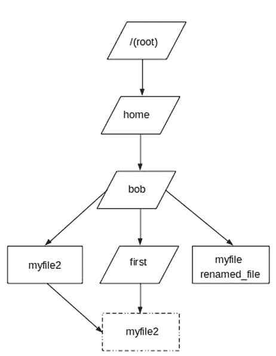
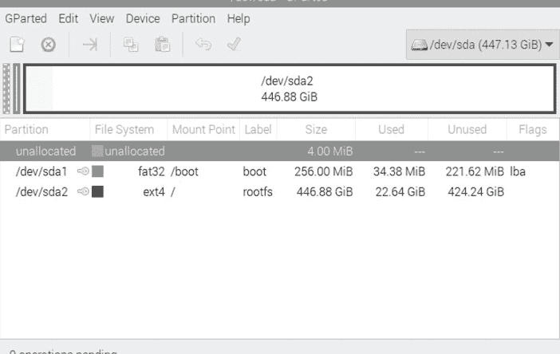
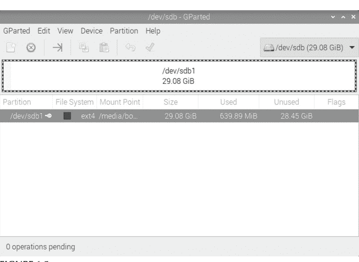
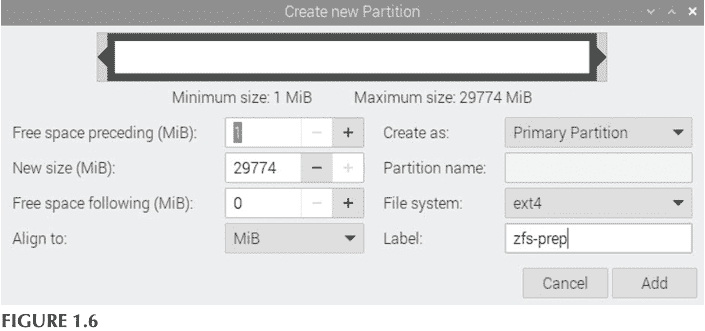
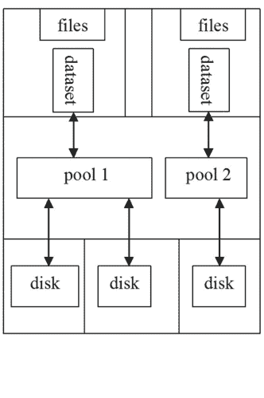
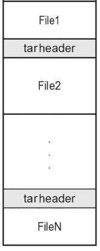
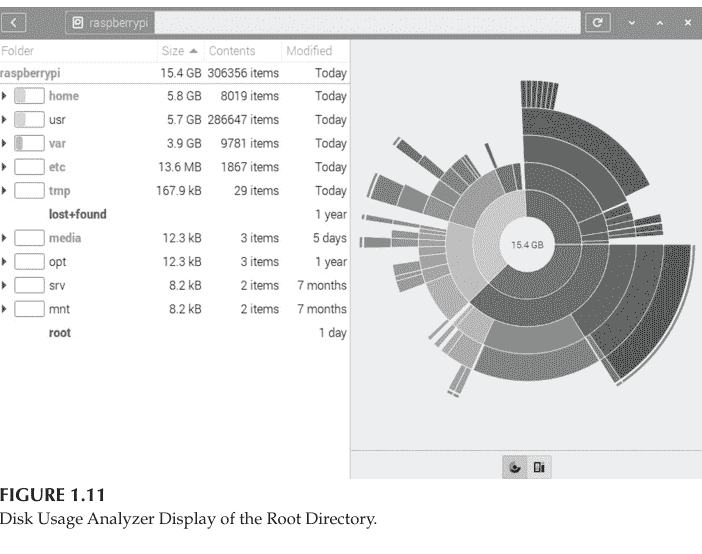
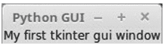
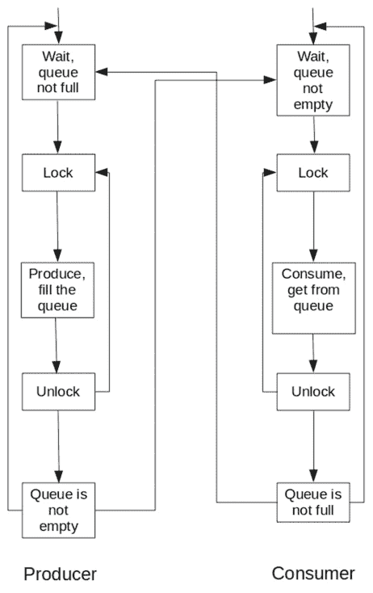
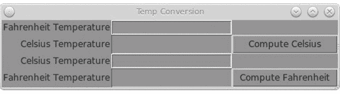

## 使用 systemd 和 Python 进行 Raspberry Pi OS 系统管理

实用方法

Robert M. Koretsky


CRC Press
Taylor & Francis Group
A CHAPMAN & HALL BOOK

## 使用 systemd 和 Python 进行 Raspberry Pi OS 系统管理

这是探索 Raspberry Pi 操作系统管理基础知识的新系列中的第二册，本册在第一卷提供的见解基础上，为新手用户提供了一份易于使用且必不可少的 Raspberry Pi 系统管理指南，特别侧重于 Python 和 Python3。

现代 21 世纪 Linux 系统（如 Raspberry Pi OS）系统管理背后的核心理念是使用 systemd 来确保 Linux 内核高效、有效地工作，从而提供计算机操作和管理的这三块基石：计算机系统并发性、虚拟化和安全持久性。全书包含练习，以强化读者的学习目标，并在配套的 GitHub 网站上提供解决方案和示例代码。

本书面向希望最大化利用 Raspberry Pi OS 的学生和从业者。凭借大量实用示例、项目和练习，本卷也可用于更正式的学习环境，以补充和扩展 Linux 操作系统的基础知识。

**Robert M. Koretsky** 是波特兰大学工程学院机械工程系的退休讲师。他此前曾在俄勒冈州波特兰市的 Freightliner 公司担任汽车工程设计师。他已婚，有两个孩子和两个孙辈。

# 使用 systemd 进行 Raspberry Pi OS 系统管理

实用方法

系列编辑：Robert M. Koretsky

使用 systemd 进行 Raspberry Pi OS 系统管理：实用方法

Robert M. Koretsky

使用 systemd 和 Python 进行 Raspberry Pi OS 系统管理：实用方法

Robert M. Koretsky

## 使用 systemd 和 Python 进行 Raspberry Pi OS 系统管理

实用方法

Robert M. Koretsky


CRC Press
Taylor & Francis Group
CHAPMAN & HALL

第一版于 2024 年由 CRC Press 出版
地址：4 Park Square, Milton Park, Abingdon, Oxon, OX14 4RN
以及 CRC Press
地址：2385 NW Executive Center Drive, Suite 320, Boca Raton FL 33431
© 2024 Robert M. Koretsky
CRC Press 是 Informa UK Limited 的一个印记

Robert M. Koretsky 作为本书作者的权利已根据 1988 年《版权、设计和专利法》第 77 和 78 条得到确认。

保留所有权利。未经出版商书面许可，不得以任何形式或任何电子、机械或其他方式（无论是现在已知的还是今后发明的，包括影印和录制）或在任何信息存储或检索系统中，重新印刷或复制或利用本书的任何部分。

如需获得影印或以电子方式使用本作品材料的许可，请访问 www.copyright.com 或联系版权结算中心 (CCC)，地址：222 Rosewood Drive, Danvers, MA 01923, 978-750-8400。对于在 CCC 上不可用的作品，请联系 mpkbookspermissions@tandf.co.uk

商标声明：产品或公司名称可能是商标或注册商标，仅用于识别和解释，无意侵权。

英国图书馆编目出版数据
本书的编目记录可从英国图书馆获取

ISBN: 978-1-032-59689-1 (精装)
ISBN: 978-1-032-59688-4 (平装)
ISBN: 978-1-003-45580-6 (电子书)

DOI: 10.1201/b23421

由 Newgen Publishing UK 使用 Palatino 字体排版

献给我的家人。
Bob Koretsky


Taylor & Francis
Taylor & Francis Group
http://taylorandfrancis.com

## 目录

系列前言 ........................................................................................................ xi
第二卷前言 .................................................................................................... xiii

+   0. Raspberry Pi OS 系统管理“快速入门” ..................................................................................... 1
    0.1 引言........................................................................................................ 1
    0.2 Raspberry Pi OS 上的文件维护命令和命令使用帮助
        命令用法 ................................................................................................ 3
        0.2.1 文件和目录结构........................................................................ 4
        0.2.2 查看文件内容 .................................................................... 5
        0.2.3 创建、删除和管理文件....................................................... 7
        0.2.4 创建、删除和管理目录 ........................................... 11
        0.2.5 使用 man 命令获取帮助................................................... 16
        0.2.6 其他获取帮助的方法.............................................................. 19
    0.3 实用命令 ................................................................................................ 20
        0.3.1 检查系统设置 .......................................................................... 21
    0.4 打印命令 .............................................................................................. 23
    0.5 章节总结 ................................................................................................ 24

1. Raspberry Pi OS 系统管理基础.............................................................................. 26
    1.0 目标............................................................................................................ 26
    1.1 引言.......................................................................................................... 27
        1.1.1 轻松进行系统管理 ....................................................... 29
    1.2 将 Raspberry Pi OS 安装到各种介质上，以及
        初步系统配置 ...................................................................... 29
        1.2.1 下载 Imager 并将 64 位版本的
            Raspberry Pi OS 安装到 microSD 卡.......................................................... 30
        1.2.2 在较旧的 X86 架构 PC 上安装
            Raspberry Pi Desktop OS........................................................................... 31
        1.2.3 如何从 USB3 挂载的 SSD 启动并运行
            Raspberry Pi OS .................................................................................... 32
        1.2.4 如何在 Raspberry Pi
            硬件上安装 Ubuntu Desktop ...................................................................................................... 34
    1.3 安装前后的考虑因素和选择........................................... 35
        1.3.1 安装前的考虑因素 .................................................................. 36
        1.3.2 安装后的选择和操作......................................................... 39
    1.4 系统服务管理、启动和关机
        程序 ............................................................................................................ 44
        1.4.1 启动和启动过程 ............................................................... 45
        1.4.2 systemd 和传统的系统重启或关机 ....... 47
        1.4.3 使用 systemd 管理系统服务时的初步考虑 ........................................................................................................ 49
        1.4.4 使用 systemd 进行系统服务管理的进一步参考 ........................................................................................................ 49
    1.5 用户管理 ........................................................................................................ 50
        1.5.1 在基于文本的界面中添加用户和组 ........................................................................................................ 51
        1.5.2 在基于文本的界面中添加和维护组 ........................................................................................................ 55
        1.5.3 从命令行修改和删除用户帐户和组 ........................................................................................................ 57
        1.5.4 在第二个存储介质上创建用户和组的方法 ........................................................................................................ 58
    1.6 基本密码管理 ........................................................................................................ 62
    1.7 确定和更改文件访问权限 ........................................................................................................ 63
        1.7.1 如何显示文件访问权限 ........................................................................................................ 63
        1.7.2 更改文件访问权限 ........................................................................................................ 66
        1.7.3 目录的访问权限 ........................................................................................................ 70
    1.8 文件系统、连接到持久性介质以及向系统添加介质 ........................................................................................................ 71
        1.8.1 文件系统类型和 ext4 ........................................................................................................ 74
        1.8.2 持久性介质和设备 ........................................................................................................ 75
        1.8.3 添加新介质时的初步考虑 ........................................................................................................ 77
        1.8.4 五种快速简便的方法来查找介质的逻辑设备名称 ........................................................................................................ 78
        1.8.5 向系统添加新介质 ........................................................................................................ 81
        1.8.6 使用 fdisk 添加磁盘 ........................................................................................................ 85
    1.9 安装 ZFS，以及 zpool 和 zfs 命令语法 ........................................................................................................ 89
        1.9.1 在运行于 Raspberry Pi 硬件上的 Ubuntu 系统上安装 ZFS ........................................................................................................ 90
        1.9.2 zpool 和 zfs 命令的语法 ........................................................................................................ 90
        1.9.3 ZFS 术语 ........................................................................................................ 91
        1.9.4 ZFS 的工作原理 ........................................................................................................ 93
        1.9.5 重要的 ZFS 概念 ........................................................................................................ 93
        1.9.6 基本 ZFS 示例 ........................................................................................................ 94
    1.10 配置打印机 ........................................................................................................ 106
        1.10.1 通用 UNIX 打印系统 (CUPS) 的功能 ........................................................................................................ 107
        1.10.2 使用 systemd 在本地管理 CUPS ........................................................................................................ 107
    1.11 文件系统备份和恢复 ........................................................................................................ 109
        1.11.1 文件备份设施的战略概述和概览 ........................................................................................................ 110
        1.11.2 Linux GNU tar ........................................................................................................ 110

## 目录

- 1.12 其他树莓派操作系统归档与备份工具
  - 1.12.1 rsync
  - 1.12.2 用于备份与恢复的脚本文件
  - 1.12.3 备份与恢复软件：Filezilla、SD卡复制器和git
- 1.13 软件更新与操作系统升级
  - 1.13.1 初步存储模型建议
  - 1.13.2 使用高级包管理工具（APT）
  - 1.13.3 升级操作系统
- 1.14 系统与软件性能监控与调优
  - 1.14.1 应用级进程/线程资源管理
  - 1.14.2 内存管理
  - 1.14.3 系统磁盘使用评估
  - 1.14.4 使用`ip`命令进行网络配置
- 1.15 系统安全
  - 1.15.1 基于密码的身份验证
  - 1.15.2 访问控制凭证：自主访问控制（DAC）、强制访问控制（MAC）和基于角色的访问控制（RBAC）
  - 1.15.3 sudo
  - 1.15.4 入侵检测与防御系统
  - 1.15.5 Linux安全软件
  - 1.15.6 持久化介质安全
  - 1.15.7 进程凭证
  - 1.15.8 磁盘加密
- 1.16 虚拟化方法
  - 1.16.1 虚拟化应用
- 1.17 总结

## 2. Python3

- 2.0 目标
- 2.1 简介
- 2.2 使用Thonny集成开发环境快速入门Python3
  - 2.2.1 启动Thonny及Thonny窗口
  - 2.2.2 在Thonny中创建并运行一个简单的Python3程序
- 2.3 Python3语言概览
  - 2.3.1 对象与类
  - 2.3.2 Python3程序数据模型
  - 2.3.3 Python引用与发布
  - 2.3.4 Python3标准类型层次结构
  - 2.3.5 我们的基本假设
  - 2.3.6 使用我们的标准方式运行Python3
  - 2.3.7 Python3的用途
  - 2.3.8 Python安装信息
- 2.4 Python3语法
  - 2.4.1 打印文本、注释、数字、分组运算符和表达式
  - 2.4.2 变量与命名约定
  - 2.4.3 函数
  - 2.4.4 条件执行
  - 2.4.5 确定性与非确定性重复结构及递归
  - 2.4.6 文件输入与输出
  - 2.4.7 列表与列表函数
  - 2.4.8 字符串、字符串格式化转换与序列操作
  - 2.4.9 元组
  - 2.4.10 集合
  - 2.4.11 字典
  - 2.4.12 生成器
  - 2.4.13 协程
  - 2.4.14 异常
  - 2.4.15 模块、函数中的全局与局部作用域
- 2.5 实践示例
  - 2.5.1 编写Shell脚本文件的另一种方式
  - 2.5.2 基本Web服务器与用户文件维护
  - 2.5.3 使用Python3和tkinter组件构建图形用户界面
  - 2.5.4 使用Python实现多线程并发
  - 2.5.5 线程通信：使用`queue`模块解决生产者-消费者问题
- 2.6 总结
- 2.7 终极参考术语表
- 附录2A：Python语法与命令摘要

**问题、习题与项目**

- 第0章
- 第1章
- 第2章

**索引**

## 系列前言

本系列丛书涵盖了树莓派操作系统管理的基础知识，面向初学者。每本书都是对重要系统管理任务及其他实用程序的完整、独立的介绍。它们的基础是systemd超级内核。它们引导用户了解这些重要系统管理主题的“为什么”和“如何做”，并介绍了以下基本应用设施：

1. 使用systemd进行树莓派操作系统系统管理，第1卷
2. 使用systemd和Python进行树莓派操作系统系统管理，第2卷
3. 树莓派操作系统文本编辑、git、使用LXC/LXD进行虚拟化，第3卷

它们可以单独使用，也可以组合使用，以适应个人独立学习者的学习目标/节奏和兴趣，也可以在更正式的学习环境中采用，以补充和扩展在使用树莓派操作系统的课堂环境中对Linux操作系统的基础知识。

此外，每本书都包含贯穿全书的练习，以及问题、习题和项目附录，以帮助巩固每位学生或读者的学习目标。

每卷都提供了一个在线Github站点，包含更多材料和更新、程序代码、全书练习和章末问题、习题与项目的解答，以及其他补充资料。访问地址为：

www.github.com/bobk48/RaspberryPiOS

每卷的基本前提是：1）知道如何在命令行上输入语法正确的Linux命令，2）能够访问一台已安装并运行最新版树莓派操作系统的专用树莓派计算机，3）是系统上的特权用户，能够执行**sudo**命令以获取超级用户权限，4）具备在**nano**文本编辑器中编辑和保存文本文件的基本知识。

本系列所有说明均在配备4GB内存的树莓派4B或树莓派400上，以及当时最新版本的树莓派操作系统上进行了测试。


Taylor & Francis

Taylor & Francis Group

http://taylorandfrancis.com

## 第2卷前言

## 背景

本书是面向初学者的、易于使用的树莓派系统管理任务精要。树莓派操作系统源自Linux的Debian分支，在撰写本文时，Debian Bullseye是该操作系统的最新版本。为了介绍这里的系统管理主题和命令，我选择了一些非常基础的内容，以及一些可能不会出现在更完整的系统管理书籍中的更高级的概念、主题、命令和细节。

现代21世纪Linux系统（如树莓派操作系统）系统管理背后的核心思想是使用systemd来确保Linux内核高效、有效地工作，以提供计算机操作和管理的这三块基石：计算机系统并发性、虚拟化和安全持久性。

而这种由“超级内核”（systemd本质上就是）对内核的控制，也必须根据计算机可能的使用场景以及其服务的目标用户群的感知需求，来促进最高水平的系统性能和速度。除非这位初学者，甚至更有经验的系统专业人员，不仅具备基础的，而且具备更完整的关于systemd如何控制和监督现代Linux系统的每个进程和操作的知识，否则他们将永远无法掌握管理和实现其使用场景最终可能需要的那种功能。特别是对于系统上的用户群以及该用户群提出的需求。

当然，在众多可能的主题中，您在这里找到的详细内容基本上是以某种主观方式选择的。这种选择方式主要基于以下考虑：

- a. 对于普通初学者可以在其专用硬件上安装的单个树莓派系统，就并发性、虚拟化和持久性而言的安全维护。
- b. 在感知到的基本系统管理任务排名中，这些主题的重要性。
- c. systemd在普通用户选择的树莓派操作系统及其安装硬件的维护方案中扮演的角色。
- d. 所选系统管理主题在教学上的整体整合性。

e. 这些主题在多大程度上能帮助学生为进入任何选定的信息技术或计算机科学专业做好准备，或者已经从事这些专业的人如何利用本书更好地符合该专业的最佳实践。换句话说，面向教育和继续教育的受众。

f. 在某种程度上，使（e部分所述的）受众能够将这些主题从单一的树莓派系统环境外推到更广泛、更大规模的计算环境中，例如在中小型服务器上发现的环境，或基于云的虚拟计算环境。

## 如何阅读和使用本书

***注意***
本书的前提和先决条件是，你理解Linux命令的正确形式或结构，以及如何在树莓派的控制台或终端命令行中输入命令！

在此回顾一下，在命令行上输入的单个Linux命令（通常称为*简单命令*）的通用语法或结构如下：

```
$ command [[-option(s)] [option argument(s)] [command argument(s)]
```

其中：
$ 是来自树莓派操作系统的命令行或shell提示符；
任何包含在 [] 中的内容并非总是必需；
**command** 是该shell中有效Linux命令的名称，使用小写字母；
**[-option(s)]** 是一个或多个用于改变命令行为的修饰符；
**[option argument(s)]** 是一个或多个用于改变[-option(s)]行为的修饰符；以及
**[command argument(s)]** 是一个或多个受**command**影响的对象。

请注意以下七个要点：

1. 命令、选项、选项参数和命令参数之间用空格分隔，但多个选项或多个选项参数之间不需要空格。
2. 多个选项或选项参数的顺序无关紧要。
3. 选项和选项参数之间的空格字符是可选的。
4. 始终按 <Enter> 键提交命令进行解释和执行。
5. 选项可以以单个连字符 - 或两个连字符 -- 开头，具体取决于选项的形式。选项的短形式以单个连字符开头，长形式以两个连字符开头。连字符和选项之间不应放置空格字符。
6. 少数命令（如 **whoami**）*不*接受选项、选项参数或命令参数。
7. 命令行上的所有内容都区分大小写！

此外，在按 <Enter> 键之前，在同一命令行上输入*多个*Linux命令（有时称为*复合命令*，以区别于简单命令）是可能的，并且*非常*常见。多个Linux命令的组成部分用输入和输出重定向字符分隔，以将一个命令的输出引导到另一个命令的输入。

正如系列前言所述，本卷的基本先决条件是：

1. 了解如何在命令行上输入语法正确的Linux命令（如上所述）
2. 能够访问一台专用的树莓派计算机，该计算机已安装并运行最新的树莓派操作系统
3. 是系统上的特权用户，因此能够执行 **sudo** 命令以获取超级用户状态，以及
4. 具备在 **nano** 文本编辑器中编辑和保存文本文件的基本知识。本卷不提供如何使用nano文本编辑器的说明，但在第3卷《树莓派操作系统文本编辑、git、使用LXC/LXD进行虚拟化》中有简要概述。

本书提供了一个在线Github网站，包含更多材料和更新、程序代码、章节练习和章节末尾问题、疑问和项目的解答，以及其他补充材料。可以在以下地址找到：

www.github.com/bobk48/RaspberryPiOS

本卷中的所有命令行说明均在配备4GB内存的树莓派4B或树莓派400上进行了测试，并使用了当时的最新版本树莓派操作系统。

## 本书的学习路径

浏览目录。

选择一个你感兴趣的主题。

完成该主题的示例，或该主题呈现的所有命令行材料。

也许再选择另一个你感兴趣的主题，并完成那里的示例和所有命令行材料。

最后，回到本书的开头。从头到尾完成所有内容。

根据需要，重复上述步骤。

尽可能参考第1卷中的systemd材料，将其作为百科全书式的来源，用于你从第1章中选择的材料。

**祝你学习愉快！**

# 0
## 树莓派操作系统系统管理的“快速入门”

在这个入门章节中（本系列的第一卷中也有重复），我们涵盖了树莓派操作系统的基本命令，这些命令允许系统管理员进行文件维护和执行其他有用的操作。这是一套即使是普通非管理用户也需要了解的基本内容，以便在基于字符或文本的操作系统界面中高效工作。读者在完成本章后应该清楚，正确部署的基于文本的命令是系统管理员维护系统完整性所拥有的主要手段。我们在此提供一组核心示例，并展示基本命令和原语的基本格式。

**目标：**

解释如何管理和维护文件和目录
展示如何获取树莓派操作系统命令的系统级帮助
演示一组初学者实用命令的使用
涵盖基本命令和运算符：

**cat cd cp exit hostname -l ip login lp lpr ls man mesg mkdir more mv passwd PATH pwd rm rmdir telnet unalias uname whatis whereis who whoami**

### 0.1 引言

为了在树莓派操作系统上开始高效地进行系统管理，初学者需要熟悉以下顺序主题：

1. 如何在操作系统的文件结构中维护和组织文件。创建树状结构的文件夹（也称为目录），并在这些文件夹中以逻辑方式存储文件，对于在树莓派操作系统中高效工作至关重要。
2. 如何获取基于文本的命令及其用法的帮助。在基于命令的字符用户界面（CUI）环境中，通过键盘输入，能够快速轻松地通过键盘正确输入命令来了解如何使用该命令、其选项和参数，对于高效工作是必要的。
3. 如何执行一组基本的实用命令来设置或自定义你的工作环境。一旦初学者熟悉了构建文件维护命令的正确方法，添加一组实用命令将使每次会话更加高效。

为了成功地将本章作为本书其余部分的跳板，你应该仔细阅读、遵循并按顺序执行我们提供的说明和命令行会话。本章以及随后两章的每一节都建立在前面信息的基础上。它们将为你提供概念、命令工具和方法，使你能够使用树莓派操作系统进行系统管理。

在整本书中，我们使用以下版本的树莓派操作系统和列出的硬件来说明所有内容：

```
System: raspberrypi Kernel: 6.1.21-v8+ aarch64 bits: 64 compiler: gcc v: 10.2.1 Console: tty0 Distro: Debian GNU/Linux 11 (bullseye)
Machine: Type: ARM Device System: Raspberry Pi 400 Rev 1.0
```

在本章中，我们想要说明的主要命令首先用简化的语法描述进行定义，这将阐明这些命令的一般组成部分。语法描述格式如下：

- **语法：** 命令、其选项和参数在命令行上正确输入的精确语法
- **目的：** 命令的具体目的
- **输出：** 执行命令结果的简短描述
- **常用选项/功能：** 最受欢迎和最有用的选项及选项参数列表

此外，以下网页链接指向一个网站，你可以在其中输入单个或多个树莓派操作系统命令，并获得该命令组成部分的详细解释：

https://explainshell.com/

## 章节内练习

1.  在你的树莓派系统命令行中输入以下命令，并记录结果。哪些命令在语法上不正确？为什么？（Bash提示符在每行中显示为 $ 字符，我们假设 **file1** 和 **file2** 存在）

    ```
    $ la -ls
    $ cat
    $ more -q file1
    $ more file2
    $ time
    $ lsblk-a
    ```

2.  如何区分树莓派操作系统命令与其选项、选项参数和命令参数？

3.  在命令行中按下 <Enter> 键之前输入的单个树莓派操作系统命令与多个树莓派操作系统命令之间有什么区别？

4.  如果你输入一个树莓派操作系统命令后没有收到错误消息，你如何知道它确实完成了你想要的操作？

### 0.2 文件维护命令与树莓派操作系统命令使用帮助

首次登录新的树莓派操作系统后，你的首要操作之一将是构建和组织你的工作区环境及其包含的文件。根据某种逻辑方案组织文件的操作被称为 *文件维护*。用于组织文件的逻辑方案可能包括根据文件内容的主题或创建日期创建用于存储文件的 *容器*。在接下来的章节中，你将输入文件创建和维护命令，以生成类似于图 0.1 所示的结构。请按照章节呈现的顺序完成以下章节中的操作，以便更好地了解文件维护的真正含义。此外，回顾前言中关于树莓派操作系统命令结构的内容至关重要，这样当你开始输入文件维护命令时，你才能理解你输入的语法如何符合任何树莓派操作系统命令的通用语法。

#### 0.2.1 文件和目录结构

当你第一次打开终端或控制台窗口时，你正在使用与你登录系统时所用的用户名和密码相关联的自主用户的 *主目录* 或文件夹进行工作。你当前所在的任何目录都称为 *当前工作目录*，并且在任何给定时间只有一个当前工作目录处于活动状态。使用图表来可视化文件和目录的结构会很有帮助。图 0.1 是一个名为 **bob** 的用户的主目录和文件结构示例。在此图中，目录表示为平行四边形，普通文件（例如，包含文本或二进制指令的文件）表示为矩形。*路径名* 或路径只是指定目录或文件在你正在使用的树莓派系统完整文件结构中位置的文本方式。

例如，图 0.1 中文件 **myfile2** 的路径是 `/home/bob/myfile2`。路径的指定从整个文件系统的根目录 (/) 开始，下降到名为 **home** 的文件夹，然后再次下降到名为 **bob** 的用户的主目录。



**图 0.1**
目录结构示例。

如图 0.1 所示，名为 **myfile**、**myfile2** 和 **renamed_file** 的文件存储在目录 **bob** 下或其中。在 **bob** 下是一个名为 **first** 的 *子目录*。在接下来的章节中，你将在登录树莓派系统的用户名的主目录中创建这些文件和子目录结构。

## 章节内练习

5.  在你的树莓派操作系统上输入以下两个命令：

    ```
    $ cd /
    $ ls
    ```

    类似于图 0.1，绘制一个图表，显示你在第二个命令输出中看到的目录和文件名称。保存此图表以备后用。

#### 0.2.2 查看文件内容

要开始处理文件，你可以使用 **cat** 命令轻松创建一个新的文本文件。**cat** 命令的语法如下：

```
cat [options] [file-list]
```

**用途：** 按顺序连接一个或多个文件，或在控制台窗口中显示它们
**输出：** **file-list** 中的文件内容显示在屏幕上，一次显示一个文件

**常用选项/功能：**
- **+E** 在每行末尾显示 $
- **-n** 在显示的行上添加行号
- **--help** 显示命令的用途和每个选项的简要说明

**cat** 命令是 concatenate 的缩写，允许你连接文件。在示例中，你将把键盘输入的内容连接到当前工作目录中正在创建的新文件。这是通过重定向字符 **>** 实现的，它获取你在 *标准输入*（在本例中为键盘）中输入的内容，并将其定向到名为 **myfile** 的文件。你可以将键盘及其提供的信息流视为一个文件。如前言所述，此用法是命令 **cat** 没有选项、选项参数或命令参数的示例。它只是使用命令、重定向字符和名为 **myfile** 的目标或目的地，重定向将指向该处。

这是在命令行上输入的 *多个命令* 的最简单示例，与前言中所示和简要描述的单个命令相反。在多个命令中，你可以使用连接运算符（如这里显示的重定向字符）将单个树莓派操作系统命令链接成一个链。

```
$ cat > myfile
This is an example of how to use the cat command to add plain text to a file
<Ctrl+D>
$
```

你可以输入任意多行文本，按键盘上的 <Enter> 键来区分文件中的行。然后，在新行上，当你按住 <Ctrl+D> 时，文件将在当前工作目录中使用你输入的命令创建。你可以通过以下操作查看此文件的内容，因为它是一个使用键盘创建的纯文本文件：

```
$ more myfile
This is an example of how to use the cat command to add plain text to a file
$
```

这是一个单个树莓派操作系统命令语法的简单示例。

**more** 命令的一般语法如下：

```
more [options] [file-list]
```

**用途：** 在屏幕上连接/显示 **file-list** 中的文件，一次显示一屏
**输出：** **file-list** 中的文件内容显示在屏幕上，一次显示一页
**常用选项/功能：**
- **+E/str** 在包含 str 的第一行之前两行开始显示
- **-nN** 每屏/页显示 N 行
- **+N** 从第 N 行开始显示文件内容

**more** 命令默认一次显示文件的一整屏内容。如果文件有几页长，你可以按键盘上的 <Space> 键继续查看后续页面，或按键盘上的 Q 键退出查看输出。

## 章节内练习

6.  使用 **cat** 命令创建另一个名为 **testfile** 的文本文件。然后使用 **cat** 命令将 **myfile** 和 **testfile** 的内容连接成一个名为 **myfile3** 的文本文件。

#### 0.2.3 创建、删除和管理文件

要将一个文件的内容复制到另一个文件，请使用 **cp** 命令。**cp** 命令的一般语法如下：

```
cp [options] file1 file2
```

**用途：** 将 **file1** 复制到 **file2**；如果 **file2** 是一个目录，则在此目录中创建 **file1** 的副本
**输出：** 复制的文件

**常用选项/功能：**
- **-i** 如果目标存在，在覆盖前提示
- **-p** 保留复制文件的文件访问模式和修改时间
- **-r** 递归复制文件和子目录

例如，要创建一个名为 **myfile** 的文件的精确副本，并命名为 **myfile2**，请输入以下内容：

```
$ cp myfile myfile2
$
```

**cp** 命令的此用法有两个必需的命令参数。第一个参数是已存在且要复制的源文件。第二个参数是目标文件或将成为副本的文件名。请注意，许多树莓派操作系统命令可以接受普通、常规或规则文件作为参数，也可以接受目录文件作为参数。这可能会改变命令完成的基本任务。同样值得注意的是，不仅文件名可以作为参数，*路径名* 也可以。路径名是操作系统文件系统结构中任何特定位置的路径。这改变了命令在文件系统路径结构中的操作站点或位置。

为了更改文件或目录的名称，你可以使用 **mv** 命令。**mv** 命令的一般语法如下：

```
mv [options] file1 file2
mv [options] file-list directory
```

**用途：** 第一种语法：将 **file1** 重命名为 **file2**
第二种语法：将 file-list 中的所有文件移动到 directory
**输出：** 重命名或重新定位的文件

**常用选项/功能：**
- **-f** 无论目标文件的文件访问模式如何，都强制移动
- **-i** 在覆盖目标之前提示用户

在以下用法中，**mv** 命令的第一个参数是源文件名，第二个参数是目标名称。

```
$ mv myfile2 renamed_file
$
```

此时需要注意 Raspberry Pi OS 命令中空格的使用。如果你从 Windows 系统获取了一个文件，其文件名中包含一个或多个空格，该怎么办？如何在 Raspberry Pi OS 中处理这个文件？答案很简单。每当需要在命令中使用该文件名作为参数时，请将文件名用双引号（"）括起来。例如，你可能从 Windows 系统的某人邮件中“分离”出一个文件，例如 **latest revisions october.txt**。

为了在 Raspberry Pi OS 中处理此文件——即在 Raspberry Pi OS 命令中将文件名用作参数——请将整个名称用双引号括起来。将该文件重命名为更短名称的正确命令是：

```
$ mv "latest revisions october.txt" laterevs.txt
$
```

要删除文件，可以使用 **rm** 命令。**rm** 命令的一般语法如下：

```
rm [options] file-list
```

**用途：** 从文件结构（和磁盘）中移除 **file-list** 中的文件
**输出：** 已删除的文件
**常用选项/功能：**
- **-f** 无论 **file-list** 的文件访问模式如何，都进行移除
- **-i** 在移除 **file-list** 中的文件前提示用户确认
- **-r** 如果 **file-list** 是一个目录，则递归移除其中的文件；请谨慎使用！

要从当前工作目录中删除文件 **renamed_file**，请输入：

```
$ rm renamed_file
$
```

## 章节内练习

- 7. 使用 **rm** 命令删除文件 testfile 和 myfile3。

你将执行的最重要的文件维护命令是 **ls** 命令。**ls** 命令的一般语法如下：

## Raspberry Pi OS 系统管理“快速入门”

**ls [options] [pathname-list]**

**用途：** 将 **pathname-list** 指定的目录中的文件和目录名称发送到显示屏幕

**输出：** **pathname-list** 指定的目录中的文件和目录名称，或者如果 **pathname-list** 仅包含文件名，则仅输出文件名

**常用选项/功能：**

- **-F** 在目录名称后显示斜杠字符（/），在二进制可执行文件后显示星号（*），在符号链接后显示“at”字符（@）
- **-a** 显示所有文件的名称，包括隐藏文件
- **-i** 显示 inode 编号
- **-l** 显示长列表，包括文件访问模式、链接计数、所有者、组、文件大小（以字节为单位）和修改时间

**ls** 命令将列出当前工作目录或文件夹中的文件或文件夹名称。此外，与我们目前使用的其他命令一样，如果在命令的 **pathname-list** 参数中包含完整的路径名规范，那么你可以列出该路径名列表中的文件和文件夹名称。要查看当前工作目录中的文件名称，请输入以下内容：

```
$ ls
Desktop Documents Downloads Dropbox Music Pictures Public Templates Videos
$
```

请注意，你可能不会得到与我们上面显示的完全相同的文件名列表，因为你的系统会自动在你的主目录中放置一些文件，就像我们使用的示例一样，除了我们共同创建的名为 **myfile** 和 **myfile2** 的文件。还要注意，此文件名列表不包含 **renamed_file** 的名称，因为我们已删除了该文件。

你将执行的下一个命令实际上只是执行 **ls** 命令的一种替代或修改方式，它包括命令名称和选项。如前言所述，Raspberry Pi OS 命令具有可以在命令行上与命令一起输入的选项，以改变基本命令的行为。对于 **ls** 命令，选项 **l** 和 **a** 会产生所有普通文件和系统（点）文件的更长列表，并提供有关文件的其他相关信息。

不要忘记在 **s** 和 -（破折号）之间放置空格字符。再次记住，空格在命令行上输入时，用于分隔或划分 Raspberry Pi OS 命令的组成部分！现在，输入以下命令：

```
$ ls -la
```

```
total 30408
drwxr-xr-x 25 bob bob 4096 May 5 07:53 .
drwxr-xr-x 5 root root 4096 Oct 20 2022..
drwxr-xr-x 5 bob bob 4096 Apr 23 16:32 .audacity-data
-rw------- 1 bob bob 36197 May 5 07:51 .bash_history
-rw-r--r-- 1 bob bob 220 Apr 4 2022 .bash_logout
-rw-r--r-- 1 bob bob 3523 Apr 4 2022 .bashrc
-rw-r--r-- 1 bob bob 47329 Sep 19 2022 Blandemic.txt
drwxr-xr-x 2 bob bob 4096 Apr 4 2022 Bookshelf
drwxr-xr-x 15 bob bob 4096 Apr 17 14:05 .cache
drwx------ 32 bob bob 4096 Apr 28 07:08 .config
drwx------ 3 root root 4096 Jun 29 2022 .dbus
drwxr-xr-x 7 bob bob 4096 Apr 27 05:21 Desktop
Output truncated...
```

正如你在此屏幕显示中所见（它显示了我们主目录中的文件列表，与你主目录中的文件列表不同），当前工作目录中每个文件的信息以八列显示。第一列显示文件类型，其中 **d** 代表目录，**l** 代表符号链接，**-** 代表普通或常规文件。同样在第一列中，显示了用户、组和其他人对该文件的访问模式，表示为 r、w 或 x。第二列显示指向该文件的链接数。第三列显示该文件所有者的用户名。第四列显示该文件的组名。第五列显示文件在磁盘上占用的字节数。第六列显示文件最后修改的日期。第七列显示文件最后修改的时间。第八列也是最后一列，显示文件的名称。这种执行命令的方式是列出文件更完整信息的好方法。使用更完整信息的示例有：(1) 以便你知道字节大小并能够将文件存储在某些便携式存储介质上，或 (2) 显示访问模式，以便你可以更改特定文件或目录的访问模式。

## 章节内练习

- 8. 使用 **ls -la** 命令列出你 Raspberry Pi 系统上主目录中的所有文件名。你获得的列表与上面显示的列表相比如何？请记住，我们的列表是在 Raspberry Pi 系统上完成的。

你也可以通过使用 ls 命令的另一个变体来获取当前工作目录中单个文件的文件列表，如下所示：

```
$ ls -la myfile
-rw-r--r-- 1 bob bob 797 Jan 16 10:00 myfile
$
```

此变体显示名为 **myfile** 的特定文件的长列表及附带信息。你在命令行上输入的内容分解为：(1) **ls**，命令名称；(2) **-la**，选项；以及 (3) **myfile**，命令参数。

如果你在输入时出错，拼错了命令名称或命令的其他部分怎么办？在命令行上输入以下内容：

```
$ lx -la myfile
lx: not found
$
```

来自 Raspberry Pi OS 的 lx: not found 回复是一条错误消息。Raspberry Pi OS 中没有 **lx** 命令，因此会显示错误消息。如果你输入了一个不存在的选项，也会收到错误消息。如果你提供的文件名不在当前工作目录中，同样会收到错误消息。这说明了关于 Raspberry Pi OS 命令执行的一个重要观点。如果没有显示错误消息，则命令执行正确，结果可能会也可能不会显示在屏幕上，这取决于命令实际执行的操作。如果显示了错误消息，你必须在 Raspberry Pi OS 按你输入的方式执行命令之前更正错误。

> ***注意***
> 命令中的排版错误是初学者犯的很大一部分错误！

#### 0.2.4 创建、删除和管理目录

文件维护的另一个关键方面是你用于在计算机上的 Raspberry Pi OS 账户中创建、删除和组织目录的一组过程和相关的 Raspberry Pi OS 命令。在文件系统中移动时，你是在上升或下降以到达要使用的目录。当前工作目录正上方的目录称为当前工作目录的*父*目录。当前工作目录正下方的目录或目录称为当前工作目录的*子*目录。当前工作目录的初学者最常犯的错误是文件放错位置。他们无法找到 **ls** 命令列出的文件名，因为他们将文件放置或创建在了文件结构中当前工作目录的上方或下方的目录中。当你创建文件时，如果你已经在自己的主目录下创建了一套逻辑清晰的目录结构，你就会知道该将文件存储在哪里。在下面的命令集合中，我们在主目录下创建一个目录，并使用这个新目录来存储文件。

要在当前工作目录下创建一个新目录，你需要使用 **mkdir** 命令。**mkdir** 命令的通用语法如下：

```
mkdir [options] dirnames
Purpose: Creates directory or directories specified in **dirnames**
Output: New directory or directories
Commonly used options/features:
-m MODE Create a directory with given access modes
-p Create parent directories that don't exist in the pathnames specified in **dirnames**
```

要在当前工作目录下创建一个名为 **first** 的子目录，请输入以下命令：

```
$ mkdir first
$
```

此命令现在已在当前工作目录下创建了一个名为 **first** 的新子目录，或称为当前工作目录的子目录。请回顾图 0.1，了解这个新子目录目录位置的图形描述。

为了将当前工作目录更改为这个新子目录，你需要使用 **cd** 命令。**cd** 命令的通用语法如下：

```
cd [directory]
Purpose: Change the current working directory to **directory** or return to the home directory when **directory** is omitted
Output: New current working directory
```

要通过向下进入路径结构到名为 **first** 的指定目录，将当前工作目录更改为 **first**，请输入以下命令：

```
$ cd first
$
```

你总是可以通过使用 **pwd** 命令来验证当前工作目录是什么。**pwd** 命令的通用语法如下：

**pwd**
**Purpose:** Displays the current working directory on screen
**Output:** Pathname of current working directory

你可以通过输入以下命令来验证 **first** 现在是当前工作目录：

```
$ pwd
/home/bob/first
$
```

树莓派操作系统在命令行上的输出显示了当前工作目录或文件夹的路径名。如前所述，此路径是通过运行树莓派操作系统的计算机完整文件结构的文本路径，以当前工作目录结束。在此输出示例中，路径从 /（文件系统的根目录）开始。然后下降到目录 **home**，这是运行树莓派操作系统的计算机上文件系统的一个主要分支。然后下降到目录 **bob**，这是另一个分支，是用户的主目录名称。最后，下降到名为 **first** 的分支，即当前工作目录。

在某些系统上，根据默认设置，确定当前工作目录的另一种方法是简单地查看命令行提示符。此提示符可能以当前工作目录的完整路径为前缀，以当前工作目录结束。

你可以通过输入以下命令返回到主目录，或子目录 **first** 的父目录：

```
$ cd
$
```

另一种方法是输入以下命令，其中波浪号字符（~）解析为或替代主目录完整路径的规范：

```
$ cd ~
$
```

要验证你现在已经上升到主目录，请输入以下命令：

```
$ pwd
/home/bob
$
```

你也可以通过输入以下命令上升到主目录上方的目录，有时称为当前工作目录的父目录：

```
$ cd ..
$
```

在此命令中，两个句点（..）代表父目录，或当前工作目录上方的分支。不要忘记在 **d** 和第一个句点之间输入一个空格字符。要验证你已上升到主目录的父目录，请输入以下命令：

```
$ pwd
/home
$
```

要下降到你的主目录，请输入以下命令：

```
$ cd
$
```

要验证主目录中有两个以字母 my 开头的文件，请输入以下命令：

```
$ ls my*
myfile myfile2
$
```

命令行中 y 后面的星号被称为 *元字符*，或代表模式的字符；在这种情况下，模式是任何字符集。当树莓派操作系统在你按下键盘上的 <Enter> 键后解释该命令时，它会搜索当前工作目录中所有以字母 my 开头并以任何其他内容结尾的文件。

## 章节内练习

- 9. 使用 **cd** 命令上升到你的树莓派文件系统的根目录（/），然后使用它从根目录递归下降到每个子目录，深度为两个子目录，绘制你系统上找到的组件文件的图表。在图表中尽可能完整地填写命名条目，列出你认为必要的所有文件。保留此图表作为你特定树莓派发行版文件系统的有用地图。

组织目录的另一个方面是在目录之间移动文件，或更改文件在目录中的位置。例如，你现在在主目录中有文件 **myfile2**，但你想将其移动到名为 **first** 的子目录中。请参见图 0.1，了解此时更改文件组织的图形描述。为此，你可以使用 **mv file-list directory** 命令说明的第二种语法方法，将文件 **myfile2** 移动到名为 **first** 的子目录中。要实现这一点，请输入以下命令：

```
$ mv myfile2 first
$
```

要验证 **myfile2** 确实在名为 first 的子目录中，请输入以下命令：

```
$ cd first
$ ls
myfile2
$
```

现在你将上升到主目录，并尝试使用 **rm** 命令删除或删除一个文件。

> 注意：使用此命令时应非常小心，因为一旦文件被删除，恢复它的唯一方法是从你或系统管理员制作的文件系统的归档备份中恢复。

```
$ cd
$ rm myfile2
rm: myfile2: No such file or directory
$
```

你会收到错误消息，因为在主目录中，名为 **myfile2** 的文件不存在。它已被移动到名为 first 的子目录中。

目录组织还包括删除空目录或非空目录的能力。完成删除空目录的命令是 **rmdir**。**rmdir** 命令的通用语法如下：

```
rmdir [options] dirnames
**Purpose:** Removes the empty directories specified in **dirnames**
**Output:** Removes directories
**Commonly used options/features:**
-p Remove empty parent directories as well
-r Recursively delete files and subdirectories beneath the current directory
```

要删除当前工作目录下的整个目录，请输入以下命令：

```
$ rmdir first
rmdir: first: Directory not empty
$
```

由于文件 **myfile2** 仍在名为 **first** 的子目录中，**first** 不是空目录，因此你会收到错误消息，表明 **rmdir** 命令不会删除该目录。如果目录为空，**rmdir** 将完成删除。删除非空目录的一种方法是使用带有 **-r** 选项的 **rm** 命令。**-r** 选项递归下降到子目录中，并在实际删除目录本身之前删除其中的任何文件。请谨慎使用此命令，因为你可能会无意中删除目录和文件。要查看此命令如何删除非空目录，请输入以下命令：

```
$ rm -r first
$
```

目录 **first** 和文件 **myfile2** 现在已从文件结构中移除。

#### 0.2.5 使用 man 命令获取帮助

树莓派系统上一个非常方便的实用程序是在线帮助功能，通过使用 **man** 命令实现。**man** 命令的通用语法如下：

```
man [options][-s section] command-list
man -k keyword-list
```

**Purpose:** First syntax: Display Raspberry Pi OS Reference Manual pages for commands in **command-list** one screen at a time
Second syntax: Display summaries of commands related to keywords in **keyword-list**
**Output:** Manual pages one screen at a time
**Commonly used options/features:**
**-k** **keyword-list** Search for summaries of keywords in **keyword-list** in a database and display them
**-s sec-num** Search section number **sec-num** for manual pages and display them

要通过使用 **man** 命令获取有关 **ls** 命令的用法和选项的帮助，请输入以下命令：

```
$ man ls
```

```
LS(1)                     User Commands                     LS(1)

NAME
       ls - list directory contents
```

## 树莓派操作系统 17 系统管理快速入门

```
SYNOPSIS
       ls [OPTION]... [FILE]...

DESCRIPTION
       List information about the FILEs (the current
       directory by default).
       Sort entries alphabetically if none of -cftuvSUX
       nor --sort is specified.

       Mandatory arguments to long options are manda-
       tory for short options too.

       -a, --all
              do not ignore entries starting with .

       -A, --almost-all
              do not list implied . and ..

       --author
Manual page ls(1) line 1 (press h for help or q to quit)
```

这个来自树莓派操作系统的输出是一个树莓派操作系统*手册页*，或称*manpage*，它提供了命令用法的概要，显示了选项，并附有简要描述，帮助你理解如何使用该命令。如示例所示，在显示一页内容后输入 **q**，即可返回命令行提示符。按下键盘上的空格键，则会一次一屏地显示更多与 **ls** 命令相关的手册页内容。

要获取使用所有树莓派操作系统命令及其选项的帮助，请使用 **man man** 命令进入树莓派操作系统参考手册页。

这些页面本身根据描述的主题以及适用于特定系统的主题，被组织成八个部分。表 0.1 列出了手册的各部分及其包含的内容。大多数用户在第 2.2 节找到他们需要的页面。软件开发人员主要使用库和系统调用，因此在第 2.3 和 2.3 节找到他们需要的页面。从事文档准备工作的用户从第 2.7 节获得的帮助最多。管理员主要需要参考第 2.2、2.5、2.6 和 2.9 节的页面。

手册页包含树莓派操作系统中每个命令、系统调用和库调用的多页、特殊格式的描述性文档。这种格式由八个通用部分组成：名称、概要、描述、文件列表、相关信息、错误、警告和已知错误。你可以使用 **man** 命令查看某个命令的手册页。由于这个命令的名称，手册页通常被称为树莓派操作系统 man 页。当你在屏幕上显示手册页时，页面的左上角是命令名称，括号内是其所属的部分，如输出手册页顶部所示的 LS(1)。

### 表 0.1
树莓派操作系统手册的各部分

| 部分 | 描述内容 |
| :--- | :--- |
| 1 | 用户命令 |
| 2 | 系统调用 |
| 3 | 语言库调用（C、FORTRAN 等） |
| 4 | 设备和网络接口 |
| 5 | 文件格式 |
| 6 | 游戏和演示 |
| 7 | troff 的环境、表格和宏 |
| 8 | 与系统维护相关的命令 |

用于显示 **passwd** 命令手册页的命令是：

```
$ man passwd
```

**passwd** 命令的手册页现在显示在屏幕上，但我们没有展示其输出。因为它们是多页文本文档，每个主题的手册页需要超过一屏的文本来显示其全部内容。要一次查看手册页的一屏内容，请按键盘上的空格键。要退出查看手册页，请按键盘上的 **Q** 键。

现在输入这个命令：

```
$ man pwd
```

如果 man 页的多个部分都有关于同一个词的信息，而你对特定部分的 man 页感兴趣，可以使用 -S 选项。因此，以下命令行显示的是 read 系统调用的 man 页，而不是 shell 命令 read 的 man 页。

```
$ man -S2 read
```

命令 **man -S3 fopen fread strcmp** 依次显示三个 C 库调用的 man 页：**fopen**、**fread** 和 **strcmp**。

要退出这些系统调用的显示，请输入 <Ctrl-C>。

使用 **man** 命令并输入带有 **-k** 选项的命令，可以指定一个关键字来限制搜索。这等同于使用 **apropos** 命令。然后，搜索会从系统中所有包含该关键字引用的 man 页中，返回有用的 man 页标题。例如，以下命令在我们的树莓派系统上产生屏幕输出：

```
$ man -k passwd
chgpasswd (8)          - update group passwords in batch mode
chpasswd (8)           - update passwords in batch mode
exim4_passwd (5)       - Files in use by the Debian exim4 packages
exim4_passwd_client (5) - Files in use by the Debian exim4 packages
fgetpwent_r (3)        - get passwd file entry reentrantly
getpwent_r (3)         - get passwd file entry reentrantly
gpasswd (1)            - administer /etc/group and /etc/gshadow
openssl-passwd (1ssl)  compute password hashes
pam_localuser (8)      - require users to be listed in /etc/passwd
passwd (1)             - change user password
passwd (1ssl)          - compute password hashes
passwd (5)             - the password file
passwd2des (3)         - RFS password encryption
update-passwd (8)      - safely update /etc/passwd, /etc/shadow and
                        /etc/group
vncpasswd (1)          - VNC Server password utility
Output truncated...
```

#### 0.2.6 其他获取帮助的方法

要获取任何特定树莓派操作系统命令功能的简短描述，你可以使用 **whatis** 命令。这类似于 **man -f** 命令。**whatis** 命令的一般语法如下：

**whatis keywords**
**目的：** 在 whatis 数据库中搜索每个关键字的简要描述
**输出：** 将每个关键字的一行描述打印到屏幕

以下是使用 **whatis** 的示例——
两个命令的输出都被截断了。

使用 systemd 和 Python 的树莓派操作系统系统管理

```
$ whatis man
man (7) - macros to format man pages
man (1) - an interface to the on-line
          reference manuals
$
```

你也可以通过在同一个命令行上向 **whatis** 命令输入多个参数（参数之间用空格分隔）来获取多个命令的简短描述。以下是此方法的示例：

```
$ whatis login set setenv
login (1) - begin session on the system
login (3) - write utmp and wtmp entries
setenv (3) - change or add an environment variable
set: nothing appropriate.
$
```

以下章节练习要求你使用 **man** 和 **whatis** 命令查找有关 **passwd** 命令的信息。完成练习后，你可以运用所学知识更改你使用的树莓派操作系统上的登录密码。

### 章节练习

- 10. 使用带有 -k 选项的 **man** 命令，显示 **passwd** 命令的简要帮助。这样做将给你一个类似于使用 **whatis** 命令获得的屏幕显示，但它会显示所有包含字符 passwd 的 apropos 命令名称。
- 11. 使用 **whatis** 命令获取上述 **passwd** 命令的简要描述，然后注意 **whatis passwd** 和 **man -k passwd** 命令之间的区别。

### 0.3 实用命令

有几个重要的命令可以让初学者在使用树莓派操作系统时更有效率。以下章节给出了这类实用命令的示例，并按系统设置、通用实用程序和通信命令进行组织。

#### 0.3.1 检查系统设置

**whereis** 命令允许你沿着某些规定的路径搜索，以定位实用程序和命令，例如 shell 程序。**whereis** 命令的一般语法如下：

**whereis [options] filename**
**目的：** 定位命令的二进制文件、源代码和 man 页文件
**输出：** 首先去除提供的名称中的前导路径名组件和扩展名，然后在屏幕上显示路径名

**常用选项/功能：**
**-b** 仅搜索二进制文件
**-s** 仅搜索源代码

例如，如果你在命令行上输入命令 **whereis bash**，你将看到 Bash shell 程序文件本身的路径列表，如下所示：

```
$ whereis bash
bash: /bin/bash /etc/bash.bashrc /usr/share/man/man1/bash.1.gz
```

请注意，无法使用 **whereis** 命令找到“内置”或内部命令的路径。

首次登录时，能够查看有关你的**用户ID**、你登录的计算机或系统以及该计算机上的操作系统的信息显示非常有用。这些任务可以使用 **whoami** 命令完成，该命令在屏幕上显示你的**用户ID**。**whoami** 命令的一般语法如下：

**whoami**
**目的：** 显示有效用户 ID
**输出：** 在标准输出上将你的有效用户 ID 显示为一个名称

以下显示了我们在命令行上输入此命令时系统的响应。

```
$ whoami
bob
$
```

要找出你正在使用的树莓派的IP地址，可以使用 **ip** 命令。**ip** 命令的通用语法如下：

**ip [选项] 对象 {命令 | 帮助}**
**用途：** 显示/操作路由、网络设备、接口和隧道
**输出：** 关于你局域网的信息

要找出你正在使用的计算机的IP地址，请在终端或控制台窗口中输入以下命令：

```
$ ip addr
1: lo: <LOOPBACK,UP,LOWER_UP> mtu 65536 qdisc noqueue state UNKNOWN group default qlen 1000
    link/loopback 00:00:00:00:00:00 brd 00:00:00:00:00:00
    inet 127.0.0.1/8 scope host lo
       valid_lft forever preferred_lft forever
    inet6 ::1/128 scope host
       valid_lft forever preferred_lft forever
2: eth0: <BROADCAST,MULTICAST,UP,LOWER_UP> mtu 1500 qdisc mq state UP group default qlen 1000
    link/ether dc:a6:32:ee:c6:6b brd ff:ff:ff:ff:ff:ff
    inet 192.168.1.2/24 brd 192.168.1.255 scope global dynamic noprefixroute eth0
       valid_lft 65558sec preferred_lft 54758sec
    inet6 fe80::78d9:c72e:75e2:82c/64 scope link
       valid_lft forever preferred_lft forever
3: wlan0: <BROADCAST,MULTICAST> mtu 1500 qdisc noop state DOWN group default qlen 1000
    link/ether dc:a6:32:ee:c6:6c brd ff:ff:ff:ff:ff:ff
$
```

在上面的输出中，IP地址 192.168.1.2 是这台计算机在局域网上的地址。

以下章节内练习让你有机会使用 **whereis**、**whoami** 以及另外两个重要的实用命令 **who** 和 **hostname**，来获取关于你系统的重要信息。

## 章节内练习

- 12. 使用 **whereis** 命令定位 Korn shell、Bourne shell、Bourne Again shell、C shell 和 Z shell 的二进制文件。你的系统上是否有这些 shell 程序不可用？
- 13. 使用 **whoami** 命令找出你在当前系统上的用户名。然后使用 **who** 命令查看你的用户名是如何列出的，以及同一系统上的其他用户。你使用 **who** 命令获得的每个用户的屏幕显示格式是什么？尝试识别与你用户名同一行上的每个字段中的信息。
- 14. 使用 **hostname -I** 命令找出你登录的主机计算机在局域网上的IP地址。将其与同一系统上 **ip addr** 命令的输出进行比较。

## 0.4 打印命令

每个计算机系统用户执行的一项非常有用且常见的任务是在打印机上打印文本文件。这通过使用本地或远程系统上配置的打印机来完成。打印机通过通用UNIX打印系统进行控制和管理。我们将在第1章中详细介绍此实用程序。

在树莓派操作系统上执行打印的常用命令是 **lpr** 和 **lp**。**lpr** 命令的通用语法如下：

```
lpr [选项] 文件名
用途：将文件发送到打印机
输出：作为打印作业发送到打印机队列的文件
常用选项/功能：
-P 打印机 将输出发送到指定的打印机
-# 份数 为每个指定文件生成指定的份数
```

以下 **lpr** 命令在我们系统上指定为 **spr** 的打印机上打印名为 **order.pdf** 的文件。请记住，选项（本例中为 **-P**）和选项参数（本例中为 **spr**）之间不需要空格。

```
$ lpr -Pspr order.pdf
$
```

以下 **lpr** 命令在默认打印机上打印名为 **memo1** 的文件。

```
$ lpr memo1
$
```

以下多命令组合了 **man** 命令和 **lpr** 命令，并使用树莓派操作系统管道（|）重定向字符将它们连接起来，以在名为 **hp1200** 的打印机上打印描述 **ls** 命令的手册页。

```
$ man ls | lpr -Php1200
$
```

以下展示了如何使用 **lp** 命令执行打印任务。**lp** 命令的通用语法如下：

**lp [选项][选项参数] 文件**
**用途：** 提交文件以在指定的系统打印机上打印，或更改待处理的打印作业
**输出：** 已打印的文件或已更改的打印队列
**常用选项/功能：**
**-d 目标** 打印到指定的目标
**-n 份数** 设置要打印的份数

在第一个命令中，要打印的文件名为 **file1**。在第二个命令中，要打印的文件名为 **sample** 和 **phones**。请注意，**-d** 选项用于指定使用哪台打印机。对于 **lp** 命令，指定份数的选项是 **-n**。

```
$ lp -d spr file1
request id is spr-983 (1 file(s))
$ lp -d spr -n 3 sample phones
request id is spr-984 (2 file(s))
$
```

## 0.5 章节总结

在这个介绍性章节中，我们涵盖了基本的树莓派操作系统命令，这些命令允许系统管理员进行文件维护并执行其他有用的操作。这是一套即使是普通非管理员用户也需要了解的必备基础知识，以便在基于字符或文本的操作系统界面中高效工作。基于文本的命令是系统管理员维护系统完整性的主要手段。我们给出了以下命令和原语的示例并展示了其基本格式：

## 表 0.2 初学者实用命令

| 命令 | 功能 |
| :--- | :--- |
| **<Ctrl+D>** | 终止进程或命令 |
| **alias** | 允许你为命令创建别名 |
| **biff** | 通知你有新电子邮件 |
| **cal** | 在屏幕上显示日历 |
| **cat** | 允许连接文件 |
| **cd** | 允许你更改当前工作目录 |
| **cp** | 允许你复制文件 |
| **exit** | 结束你启动的 shell |
| **hostname** | 显示你登录的主机计算机的名称 |
| **ip** | 显示当前主机的IP信息 |
| **login** | 允许你使用有效的用户名/密码对登录计算机 |
| **lpr 或 lp** | 允许打印文本文件 |
| **ls** | 允许你显示当前工作目录中的文件和目录名称 |
| **man** | 允许你查看命令或主题的手册页 |
| **mesg** | 允许或禁止向屏幕写入消息 |
| **mkdir** | 允许你创建新目录 |
| **more** | 允许一次查看一屏文件内容 |
| **mv** | 允许你移动文件的路径位置或重命名文件 |
| **passwd** | 允许你更改计算机上的密码 |
| **pg** | Solaris 命令，一次显示文件的一屏 |
| **pwd** | 允许你查看当前工作目录的名称 |
| **rm** | 允许你从文件结构中删除文件 |
| **rmdir** | 允许删除目录 |
| **talk** | 允许你向其他用户发送实时消息 |
| **telnet** | 允许你登录到网络或互联网上的计算机 |
| **unalias** | 允许你取消命令的别名定义 |
| **uname** | 显示运行计算机的操作系统信息 |
| **whatis** | 允许你查看命令的简要描述 |
| **whereis** | 显示命令和实用程序在某些关键目录中的路径 |
| **who** | 允许你找出当前系统上用户的登录名 |
| **whoami** | 显示你的用户名 |
| **write** | 允许系统上的用户之间进行实时消息传递 |

cat cd cp exit hostname -l ip login lp lpr ls man mesg mkdir more mv passwd PATH pwd rm rmdir telnet unalias uname whatis whereis who whoami

表 0.2 总结了初学者所需的一套基本实用命令。

# 1 树莓派操作系统系统管理基础

## 1.0 目标

- 1. 在树莓派硬件上执行64位树莓派操作系统的各种安装，并对这些系统和操作系统进行初步配置。
- 2. 说明启动策略，以及如何优雅地关闭系统。
- 3. 详细说明使用 systemd 管理系统服务的基础知识。
- 4. 向系统添加额外的用户和组，并展示如何设计和维护用户账户。
- 5. 向系统添加持久性媒体，特别是外部挂载的 USB3 类型。我们还建立了一个连接和维护该媒体上文件系统的框架，该框架将文件系统分类为存在于物理介质上（物理连接到计算机）、虚拟介质（NFSv4、iSCSI）或根本不在介质上的专用伪文件系统（cgroups、proc）。
- 6. 提供使用传统和通用命令备份和归档系统文件和用户文件的策略。
- 7. 更新和维护操作系统，并添加/升级/删除用户应用程序包仓库软件，以增加功能并升级现有软件包。
- 8. 监控系统性能，并调整其以获得最佳性能特性。
- 9. 提供系统安全策略，以加固单个连接到互联网的树莓派系统。
- 10. 提供网络连接策略，包括局域网和互联网。
- 11. 概述使用 LXD/LXC 的系统虚拟化。

## 1.1 简介

本章是树莓派操作系统使用的一个主要组成部分的核心：系统管理。

为了安装、维护并有效使用由硬件和软件组件构成的树莓派系统，通常需要执行以下各节所示的一系列常见任务。在本章中，我们的目标用户是个人新手用户，他们仅为自己的使用，在自己的个人台式机/笔记本电脑上执行这些任务。这些常见任务也可以由指定的管理员为更复杂的、供多人使用的系统执行。可以将这些常见任务划分为由管理员执行的任务，以及由单个用户或一组普通、自主用户执行的任务。

尽管我们展示了这些常见任务的基础知识，但可以将其推演到由系统管理员运行的、规模更大的计算机系统的更广泛背景中。

此外，在本书网站上，我们提供了其他材料，以补充我们在印刷版书籍中对这些任务的介绍。

为了执行本章中的许多系统管理任务，绝对必要的是拥有系统上的超级用户或root用户权限。这意味着你需要知道超级用户密码，你（或指定的系统管理员）可以在安装树莓派系统时设置该密码。

**su** 和 **sudo** 命令都用于以root权限执行程序和其他命令。root用户拥有最高权限，可以执行系统管理员需要对系统进行的任何操作。普通用户以降低的权限执行程序和命令。

要执行需要最高权限的操作，你必须首先执行 **su** 或 **sudo** 命令。使用 **su** 命令时，如果你不带任何附加选项执行它，它会使你成为超级用户——或root用户。

系统会提示你输入root账户的密码。此外，**su** 命令允许你切换到任何用户账户。如果你执行命令 **su**，系统会提示你输入密码，并且命令shell的当前工作目录将是你的主目录。一旦你在root shell中运行完命令，你应该输入 **exit** 以离开root shell并返回到受限权限模式。

> ***注意***
> root shell *不是* 登录shell。

相比之下，**sudo** 以root权限运行单个命令。当你执行

```
$ sudo command
```

系统会在以root用户身份运行 **command**（无论它是什么）之前，提示你输入当前用户账户的密码。要使用 **sudo** 命令，你必须是sudoers组的一部分。关于 **sudo** 命令及其详细信息的更多信息，可以在第1卷第1.13节中找到。

在我们的“边做边学”方法中，我们选择了一组常见的系统管理任务，专门针对如第1.0节所述的个人新手树莓派操作系统用户。

除了我们选择展示的这些常见任务外，Linux系统管理还包含众多扩展和许多额外的任务。

你必须意识到，我们上面列出的所有任务都是基于我们所针对的用例。

为了扩展本书涵盖的一些系统管理主题，使其反映现代Linux系统，并预见你可能有的其他用例，我们在本卷中提供了一些额外的材料和参考，如下所示：

例如，如果你想在虚拟环境（如容器）中安装另一个Linux操作系统（例如Ubuntu），使其与树莓派操作系统在你的计算机硬件上同时运行，我们在第3卷“树莓派操作系统文本编辑器、git以及使用LXC/LXD的虚拟化”中提供了具体的操作说明。在那里，我们给出了使用LXC/LXD容器虚拟化高效安装“客户”操作系统的具体细节。

在第1.14.1.2节中，我们展示了在systemd中使用控制组（cgroups）的细节。在命令行上执行的cgroup技术允许管理员更明确地设置和查看现代Linux内核（或Linux超级内核systemd）执行的三大主要功能的限制：并发性、虚拟化和持久性。

在第1卷第1.14和1.15节“树莓派操作系统POSIX.1e访问控制列表（ACL）”和“树莓派操作系统NFS服务器和客户端安装，以及在客户端设置NFSv4 ACL”中，我们全面说明了POSIX.1e和网络文件系统版本4（NFSv4）访问控制列表（ACL）的使用。我们展示了这些设施的应用，它们进一步扩展了传统Linux权限模型的自主访问控制（DAC）方法。我们将ACL应用于挂载为NFSv4“共享”网络驱动器的文件系统对象。此外，我们还提供了一个在NFSv4网络驱动器上使用ACL的扩展示例。

### 1.1.1 轻松进行系统管理

如何以简单的方式完成本章中展示的大部分内容？
使用Webmin。
Webmin是一个现代的、基于Linux网页浏览器的图形用户界面系统管理工具，它允许你以非常直观、快速和简单的方式完成本章中展示的许多系统管理任务。我们强烈建议你首先按照我们在第1卷第1.2节中给出的说明，在你的Linux系统上下载并安装Webmin。然后，你可以在开始本章其余部分之前探索Webmin的功能，甚至可以回到Webmin，看看我们在本章其余部分展示的内容如何在Webmin中完成（或者无法完成！）。

## 1.2 将树莓派操作系统安装到各种介质上，以及初步系统配置

本节有四条路径，如下所示：
第1.2.1节——展示如何将64位版本的树莓派操作系统下载并安装到microSD卡上，以便你可以将该卡插入树莓派硬件并使用它来操作该硬件。
第1.2.2节——展示如何创建32位版本的树莓派操作系统桌面版以安装到旧PC上，以便你可以试用该操作系统，很好地感受其工作方式。
第1.2.3节——展示如何从外部挂载的USB SSD或M2 PCIe介质运行在microSD卡上创建的树莓派操作系统，而不是从microSD卡运行。
第1.2.4节——展示如何将64位版本的Ubuntu 23.04下载并安装到安装在树莓派硬件上的microSD卡上。
以上各节假设你将使用为64位ARM架构树莓派硬件或32位X-86架构机器设计的软件系统版本，但请注意，我们在本章中展示的一些功能仅限于64位架构机器。还要注意，本书中说明的一些系统管理任务在软件的早期（或后期）版本中可能以不同的方式完成！此外，本节假设你将从持久性介质（无论是安装在树莓派硬件提供的插槽中的microSD卡、USB3闪存驱动器、SATA SSD或M.2 PCIe模块驱动器，还是旧PC上的硬盘驱动器）运行树莓派操作系统，而不是从其他来源运行。

如果你想在树莓派上创建的虚拟环境中安装另一个Linux操作系统，使其与树莓派操作系统在你的树莓派计算机硬件上同时运行，我们在第3卷“树莓派操作系统文本编辑器、git以及使用LXC/LXD的虚拟化”中提供了具体的操作说明。在那里，我们给出了使用LXC/LXD安装Ubuntu Linux作为“客户”操作系统的具体细节。

### 1.2.1 使用Imager将64位版本的树莓派操作系统下载并安装到microSD卡

本节可能是将树莓派操作系统安装到你的硬件上最简单、最常用的方法。在撰写本书时，执行此操作的具体说明可在以下网站找到：www.raspberrypi.com/documentation/computers/getting-started.html。此处总结如下：

1.  从另一台Linux计算机（可能是一台已经安装了操作系统并正在工作的树莓派）上，在命令提示符下键入以下内容：

    ```
    $ sudo apt install rpi-imager
    ```

2.  将一个SD卡读卡器连接到该计算机，其中插入一张容量足够的microSD卡。
3.  运行树莓派Imager，并从呈现的列表中选择所需的操作系统。
4.  从步骤2中选择microSD卡。
5.  此时，在运行Imager时，选择“高级选项”，并启用SSH和主机名等功能。
6.  完成Imager后，退出它，取出microSD卡，并将其放入你希望操作系统运行的树莓派硬件中。从该microSD卡启动，并按照说明操作。

### 1.2.2 在较旧的X86架构PC上安装树莓派桌面操作系统

前提条件：

- 1. 一个USB驱动器（8 GB或更大）
- 2. 一台X86架构处理器的电脑，用于创建USB驱动器安装程序。
- 3. 一台用于安装树莓派桌面的电脑。

> ***注意***
> 你可以使用*同一台*电脑完成这两项操作。你可以选择用一台电脑创建安装程序，然后在同一台电脑上安装树莓派桌面。

- 4. 你打算安装树莓派桌面操作系统的电脑必须能够从USB拇指驱动器启动！这意味着你可能需要编辑该电脑的启动顺序，并可能更改启动设备顺序。

本节介绍如何下载并安装32位版本的树莓派操作系统到一台较旧的、配备X86架构处理器的电脑上，以便你可以使用该PC运行树莓派操作系统。在撰写本书时，具体操作说明可在步骤1)中列出的网站上找到：

- 1) 下载树莓派桌面
在PC或Linux机器上，访问
www.raspberrypi.org/downloads/raspberry-pi-desktop/
并下载、保存你想要安装的特定版本软件的.iso文件。
*出于本书的目的，我们下载了32位桌面版的树莓派操作系统。*

- 2) 下载并安装Etcher
从以下网站，
https://etcher.io/
在你的X86架构机器上下载并安装Etcher程序。这将允许你获取步骤1)中获得的.iso文件，并将其安装到USB拇指驱动器上。

- 3) 使用Etcher将.iso镜像刻录到USB拇指驱动器上。
- 4) 从USB拇指驱动器启动你的X86架构电脑。
- 5) 将32位树莓派操作系统桌面安装到X86架构电脑上。

从USB驱动器安装程序启动后，Debian安装菜单将会出现。
从Debian GNU/Linux菜单中选择图形安装。

> ***注意***
> 如果你没有足够快地选择图形安装，安装程序将使用默认选项开始。如果发生这种情况，请关闭电脑，重新启动，并再次从USB驱动器启动。

- 6) 按照Debian安装程序的多个步骤操作，完成后，从X86架构电脑中取出拇指驱动器，并从你安装它的启动介质重新启动进入树莓派桌面。

现在你拥有了一台安装了树莓派操作系统桌面的X86架构机器！

### 1.2.3 如何从USB3挂载的SSD启动并运行树莓派操作系统

目标：详细说明如何从USB3挂载的SSD启动并运行你的树莓派操作系统。
前提条件：
你的存储模型符合我们的建议。

> ***注意***
> 我们在以下树莓派系统上执行本示例中的操作：

```
System: Host: raspberrypi Kernel: 6.1.21-v8+ aarch64 bits: 64 compiler: gcc v: 10.2.1 Console: tty 0
Distro: Debian GNU/Linux 11 (bullseye)
Machine: Type: ARM Device System: Raspberry Pi 400 Rev 1.0 details: BCM2835
rev: c03130
serial: 10000000fdd89bf2
```

背景：
正如我们在下一节的存储模型中所推荐的，树莓派操作系统传统上是从安装在硬件上的microSD卡启动和运行的。随着操作系统内核发布版本6.1.21-v8，如上文系统描述所示，从USB3挂载的SSD或其他外部设备启动和运行系统是可能的，并且具有显著优势。这样做有几个好处，主要是性能速度提升，以及存储容量增加。
要求：按照下图所示的顺序执行以下步骤，以完成本示例的要求。

- 1. 使用以下命令更新系统上的软件包管理器：

    $ sudo apt update
    输出已截断...
    $ sudo apt upgrade
    输出已截断...

- 2. 将SSD或其他具有SATA转USB3线缆连接能力的合适设备插入树莓派硬件上的USB3端口。在我们的树莓派400上，USB3端口内部有一个蓝色的卡舌，从外部可见。我们连接了一个128 GB的Silicon Power SSD，它装在一个Orico SATA转USB免工具外壳中。我们之前在Gparted中格式化了SSD，并在其上创建了一个FAT32分区。

- 3. SSD自动挂载。然后我们使用树莓派附件菜单 > SD卡复制器，将microSD卡上的树莓派操作系统复制到USB3挂载的SSD上。

> ***注意***
> 在SD卡复制器中，确保你将系统从microSD卡复制到SSD！

- 4. 复制完成后，关闭系统，并从硬件中取出microSD卡。
- 5. 断开电源，然后重新连接以重新启动系统。
- 6. 树莓派操作系统现在从USB3挂载的SSD启动并运行。它是你在执行上述步骤时microSD卡上内容的精确克隆。

结论：在撰写本书时，树莓派操作系统能够从外部USB3 SSD启动并运行。为了评估使用SSD的性能速度优势，我们鼓励你使用附件菜单 > 树莓派诊断程序来评估SSD相对于microSD卡的相对性能速度优势。SSD与microSD卡的日志读数提供了这些信息。

### 1.2.4 如何在树莓派硬件上安装Ubuntu桌面

为了展示可以使用泽字节文件系统（ZFS）的外部媒体添加，我们在本节中为你提供一种技术，允许你将另一个操作系统——64位Ubuntu 23.04桌面——安装到树莓派4B或Pi 400硬件上。我们使用microSD卡来启动和运行系统。

尽管这个介绍可能与本书各卷的主题相悖（毕竟，它们是关于树莓派操作系统的！），但学习ZFS及其作为Linux和树莓派操作系统本身的现代文件系统的使用具有重要价值。目前，使用上游操作系统（Debian Bullseye）和6.X Linux内核，下游的树莓派操作系统*不容易*支持ZFS的安装，尤其是对初学者而言。但这很可能会改变，特别是在树莓派5发布及其对应的树莓派操作系统版本稳定之后。

背景：
Debian Linux家族中最受欢迎且支持良好的下游发行版可能是Ubuntu。而该系统的管理者Canonical公司不仅努力使其最新版本的软件可用于树莓派硬件，而且在其发行版中也非常强烈地支持ZFS。在下文中，我们将逐步展示如何将64位Ubuntu 23.04桌面安装到树莓派4B上。这些步骤同样适用于Pi 400。

前提条件：

- a. 一张最小容量为9 GB的microSD卡。我们使用了一张32 GB的microSD卡。
- b. 一个带有microSD USB连接读卡器和线缆，或附加驱动器托架的树莓派。
- c. 一台能够识别上述步骤中挂载的microSD卡的树莓派4B或Pi 400！
- d. 一台连接到树莓派的HDMI显示器和一个USB键盘。

要求：按照下图所示的顺序执行以下步骤，以完成本示例的要求。

- 1. 在命令行中，输入以下命令：

```
$ sudo snap install rpi-imager
```

在我们的树莓派上，最新版本的Imager已经安装好了！

- 2. 启动Imager，在树莓派Imager窗口中，点击标有“选择操作系统”的框。
- 3. 在出现的菜单中向下滚动，点击“其他通用操作系统”。
- 4. 出现的菜单中有多种选择。向下滚动到“Ubuntu Desktop 23.04 (Rpi 4/400)”，然后点击它。
- 5. 在树莓派Imager窗口中，点击“选择存储”框。选择你已挂载到系统上的microSD卡，然后点击“写入”。将镜像写入microSD卡需要几分钟时间。
- 6. 关闭你的树莓派，并将你已写入Ubuntu的microSD卡插入树莓派的microSD卡插槽。
- 7. 重新启动树莓派，并按照屏幕上的说明在树莓派硬件上准备你的Ubuntu系统。完整系统安装完成后，可以尝试使用它，以熟悉另一个Linux发行版的功能。例如，启用ssh，安装一些你喜欢的Linux应用程序等。
- 8. ***可选*** 按照上面1.2.3节示例中的步骤操作，以便能够从USB3挂载的外部介质（如SSD）启动并运行这个运行在树莓派上的Ubuntu。

结论：
在下面的1.8节中，我们将展示如何在向树莓派添加额外媒体时利用ZFS。本示例为你做好了这方面的准备。

## 1.3 安装前后的考虑与选择

你的树莓派是一台片上系统（SoC）计算机，内置了高级精简指令集机器（ARM）芯片，这可能使其与你可能用于计算（无论是教育、商业还是娱乐）的其他传统X-86架构机器有显著不同。因此，在树莓派操作系统安装前后，你所做的考虑也有些不同。以下各节详细说明了这些内容。在撰写本书时，没有简单的方法可以添加RAM，或包含其他总线架构连接到您购买的电路板。您可以使用以太网供电（POE）为树莓派供电，但就使用GPIO 40针接口以及任意数量的扩展板或附加组件而言，内部电路板和外部连接器选项仅限于印刷电路板上可用的部分。如果您将microSD卡格式化为exFAT或NTFS，则可以使用大于32 GB的卡作为系统存储介质。根据我们的用例，例如，我们只使用过Etcher，而没有使用NOOBS或Imager，并在我们的Pi 3、Pi 4B或Pi 400中部署了32 GB的microSD卡。我们让Pi 4B和400都从一个USB3外接SSD启动，该SSD作为启动/系统磁盘，并使用了上面第1.2.3节中的步骤来实现这一点。

### 1.3.1 安装前注意事项

一旦您确定了要使用树莓派硬件和软件的具体用途，您就需要仔细考虑以下问题列表，这些问题涉及您设想用法的非常重要的方面。在安装过程中，您可以考虑操作系统向您提供的默认安装选项之外的其他选择。不要将这些建议视为高度正式的约束，而应将其视为关于如何选择未来购买硬件（例如，安装将服务的硬件）某些方面的非正式指南，并从您实际使用树莓派的非常主观的角度出发。

- 1) 系统将从哪里启动？这里有几种选择，特别是如果您打算在通用输入/输出（GPIO）40针接头上为基础树莓派硬件添加额外设备，例如计算模块等HATS。您是打算总是从使用Imager创建的microSD卡启动，还是从USB3连接的SSD、网络连接，或从某个连接的NVME M.2设备启动？所有这些都会影响性能和启动速度。使用这些选项之一启动系统通常意味着该介质成为主系统磁盘，操作系统驻留于此并从中运行。
- 2) 您是打算成为树莓派的休闲用户，仅对其计算任务或图形处理提出轻度要求？还是打算成为不仅需要强大计算能力，还需要极致图形性能的游戏玩家？或者，您是否打算将树莓派硬件集群成服务器阵列，并依赖免费或商业的NAS软件来服务您的客户和用户群？

根据您使用树莓派的方式，您已拥有或打算购买的硬件是否具有足够的物理内存（RAM）来满足您的预期用例？这个考虑基本上是一个性能问题。例如，树莓派4B型号提供1、2、4或8 GB的RAM。我们用于所有工作的树莓派400仅配备4 GB的RAM。当树莓派5发布时，它将提供多少可选的安装RAM？您打算购买哪一个，或者您拥有哪一个？在任何情况下，如果这是一个可行的选择，您都应该首先考虑您是否在树莓派硬件上拥有或将会拥有足够数量或大小的物理内存。

您如何知道这一点？在线阅读评论，查看信誉良好的来源进行的基准测试，并与其他具有类似用例的树莓派用户交流。树莓派论坛是一个很好的起点：
https://forums.raspberrypi.com/

- 3) 您必须做出的两个最核心和最重要的考虑是：a) 鉴于您的用例，您将使用哪种持久性媒体数据存储模型？以及 b) 您的计算机物理连接了多少以及什么类型的外部USB挂载媒体？

    a) 关于第一个考虑，您是否需要通过NFSv4或iSCSI等协议附加虚拟存储媒体？您是否打算在网络附加存储（NAS）或存储区域网络（SAN）的环境中连接和工作？
    b) 关于第二个考虑，如果您只打算使用microSD卡或一个外部USB挂载磁盘驱动器作为系统磁盘（如第1.2.3节所述），那么该microSD卡或USB挂载磁盘很可能既是可启动的系统磁盘*也是*用户文件系统数据磁盘。如果可以预见您将在系统上安装额外的USB挂载磁盘媒体，您将使用什么策略来备份或“克隆”可启动系统磁盘，并可能使用某种可靠且稳健的备份策略来“镜像”多个数据磁盘驱动器上的所有其他用户数据？

> ***注意***
> 我们的数据存储模型建议：
> 如果您的硬件支持多个USB外接媒体，我们建议您在一个媒体（传统上是microSD卡，或者最好是固态硬盘[SSD]，或通过USB3适配器连接的M.2 PCIe设备）上安装操作系统，并将所有用户数据存储在*另一个*单独的媒体或外部媒体阵列上。这样，如果操作系统及其可启动媒体损坏或因某种原因无法使用，您的用户数据仍位于单独的媒体或媒体阵列上。这种技术或存储模型与操作系统升级最实用的方法非常契合。使用它，您可以简单地替换操作系统媒体，并重新安装当前版本或更新版本的操作系统，而不会显著影响您的用户数据存储。这将允许您将数据媒体重新连接到新的操作系统及其媒体，无论那是什么。这不仅对于单用户桌面，而且对于NAS服务器级系统也极具价值。在构建系统时，数据在媒体上的部署方式是一个关键的设计考虑因素，并且高度依赖于指导它的特定用例。

使用上述推荐存储模型时，您必须考虑的一个注意事项是，某些应用软件（最突出的是LXC/LXD容器）会将所需文件存储在系统区域和数据存储区域中。我们在第3卷中为LXC/LXD容器提供了一些有用的备份策略，这些策略适用于我们推荐的数据存储模式。

- 4) 您是否希望无线连接到局域网和互联网？通过DHCP的有线连接在安装树莓派OS 64位桌面版时*不会*自动完成，因此您必须在默认安装过程中配置网络设置。此有线连接也可以在安装后配置，如下文第1.3.2节第4项所示。您的树莓派的IP地址是什么？它是由您网络上的DHCP服务器自动分配的吗？
- 5) 您在安装时最初将建立多少用户，他们的用户配置文件将是什么？例如，除了您自己之外，哪些用户将拥有管理权限，每个配置文件将具有什么样的安全性？与这些问题密不可分的是，在操作系统初始安装到单个媒体后，您将建立的存储模型的考虑，如1)b)中所定义。例如，所有用户的主目录是否将位于与系统媒体分开的媒体上？此外，您将在安装时建立哪些用户组，以及如何在安装后环境中管理组？
- 6) 谁将负责第1.0节中列出的上述系统管理任务项目？例如，这将影响您根据所采用的数据存储模型，为用户和项目管理文件系统的媒体管理任务。
- 7) 鉴于您将要安装的树莓派OS版本，以及您和您的用户群将要执行的任务类型，您希望包含哪些类型的软件工具？例如，在安装过程中，您可以在默认软件包安装的基础上添加软件包，以帮助完成这些任务。上面第5项中建立的用户组将如何获得对这些

## 章节内练习

- 1. 在开始安装操作系统之前，请在纸上详细列出你对上述八组问题的答案。然后，阅读以下各节，参考实际安装的流程，并针对你的每个答案，提前确定你将如何执行这些步骤。本练习旨在对你可能采取的任何特定购买、安装和使用流程进行一次“预演”。

### 1.3.2 安装后的选择与操作

在成功安装树莓派操作系统后，你对其执行的*非常*实用的操作，很大程度上取决于你个人的安装前考虑因素（如第1.3.1节所述），以及你如何详细实施这些考虑因素。正如安装前考虑因素中所述，你应将此处建议的安装后考虑因素视为关于如何选择操作系统某些安装后方面的非正式指南。

我们针对安装后任务的最低建议集，专门适用于我们的树莓派4B和400系统及其硬件配置。它们直接源于我们在第1.3.1节中做出的安装前考虑。

- 1. 我们树莓派4B的启动/系统介质是128 GB SSD，Pi 400使用的是512 GB SSD，我们通过USB3端口连接它们，下文第4项将进一步描述。
- 2. 由于我们在Pi 400上安装了桌面系统，该系统将严重依赖非常方便易用的GUI环境，而在这些特定硬件型号上无法增加已安装的物理内存量以加速此类使用。请参阅紧随这些建议列表之后显示的**inxi**命令输出，以及章节内练习2，以获取更多关于如何查看树莓派系统物理内存大小的信息和见解。

如上所述，你特定的物理内存需求取决于你如何使用你的Linux系统。我们不得不使用影响虚拟内存、分页和交换空间大小的默认设置，尽管根据你拥有的树莓派型号，这些可能是重要的考虑因素。

- 3. 使用Pi菜单“首选项” > “添加/删除软件”来安装你绝对需要但尚未预装的应用程序。对我们而言，我们操作系统版本中预装的必需软件是Chromium网络浏览器和LibreOffice套件。此外，对我们来说，安装后的软件按优先顺序包括Filezilla、Gparted、Webmin和GNU图像处理程序。我们还为所有重要应用程序在桌面上放置了桌面图标。
- 4. 我们高度推荐的存储模型要求使用**mdadm**，因此我们按照第1卷中给出的说明安装了该软件包。我们的树莓派操作系统最初构建在32 GB microSD卡上，但随后我们使用Pi菜单“附件” > “SD卡复制器”（如第1.2.3节所示）将其重新构建在上述指定容量的SSD上。后来，我们添加了额外的USB3挂载介质，以符合我们推荐的存储模型。
- 5. 由于打印文档是我们的系统需要执行的一项基本操作，我们通过USB连接（详见第1卷）将一台激光打印机直接连接到树莓派400的硬件上并进行了设置（通过CUPS）。
- 6. 我们使用树莓派配置工具，选择“系统”选项卡，来配置网络设置并连接到有线内网。然后，我们将系统作为基本的ssh服务器暴露在本地内网上，因此我们立即修改了sshd配置文件，并根据本章下文所示内容构建了ufw防火墙规则，以确保系统安全。
- 7. 我们使用nginx和我们自定义的Web程序，将系统最小限度地暴露为Web服务器，但对这些应用程序采用了默认的安全措施。
- 8. 我们只需要系统上非常少量的额外用户和组，因此我们立即使用下文各节所示的方法设置了这些用户和组，并根据需要添加。这种添加新用户和组的方法如下所示。这带来的主要优势是，用户及其数据文件（对我们而言，它们位于自己的冗余硬盘对上）是独立的，并且与操作系统安装分开维护。我们认为这种模型对于单用户计算机桌面系统、共享的多用户计算机或中低级企业级服务器都很有用。

有各种基于文本的树莓派OS命令可以检查系统硬件，以便为你进行性能调优和系统安装后修改提供基础。其中一些是lscpu、lshw、hwinfo、lspci、lscpi、lsusb、inxi、lsblk、df、fdisk、mount、free、hdparm，以及检查/proc目录的相关内容。我们在下文和第1卷中详细介绍了其中一些命令的使用。

但是，为了获得关于系统实际安装后配置的非常有用的摘要，我们发现**inxi**命令是初学者最实用和最便捷的方式。我们展示了该命令在三种不同机器上的三种用法，顺序为：树莓派400、树莓派4B，以及一台采用X-86处理器架构的HP Proliant Microserver。

> ***注意***
> 在我们运行32位桌面版树莓派OS的HP Proliant Microserver上，我们必须首先以超级用户身份使用命令**sudo apt install inxi**安装**inxi**。

我们利用各种选项来获得这些机器所需的特定输出，如下所示：

#### 树莓派 400

```
$ sudo inxi -GSCMm -t c -P -x
[sudo] password for bob: qqqqqq
System:    Host: raspberrypi Kernel: 6.1.21-v8+ aarch64 bits: 64 com-
           piler: gcc v: 10.2.1 Console: tty 0
           Distro: Debian GNU/Linux 11 (bullseye)
Machine:   Type: ARM Device System: Raspberry Pi 400 Rev 1.0
           details: BCM2835 rev: c03130
           serial: 10000000fdd89bf2
Memory:    RAM: total: 3.78 GiB used: 1.01 GiB (26.8%) gpu: 76 MiB
           RAM Report: unknown-error: Unknown dmidecode error.
           Unable to generate data.
CPU:       Info: Quad Core model: N/A variant: cortex-a72 bits:
           64 type: MCP arch: ARMv8 rev: 3
           features: Use -f option to see features bogomips: 432
Speed:     1800 MHz min/max: 600/1800 MHz Core speeds (MHz): 1: 1800
           2: 1800 3: 1800 4: 1800
Graphics: Device-1: bcm2711-hdmi0 driver: vc4_hdmi v: N/A bus ID: N/A
Device-2: bcm2711-hdmi1 driver: vc4_hdmi v: N/A bus ID: N/A
Device-3: bcm2711-vc5 driver: vc4_drm v: N/A bus ID: N/A
Display: server: X.Org 1.20.11 driver: loaded: modesetting
unloaded: fbdev
resolution: 1920x1080~60Hz
OpenGL: renderer: V3D 4.2 v: 2.1 Mesa 20.3.5 direct render: Yes

Partition: ID-1: / size: 438.79 GiB used: 11.56 GiB (2.6%) fs: ext4 dev:
/dev/sda2
ID-2: /boot size: 252 MiB used: 30.4 MiB (12.1%) fs: vfat dev:
/dev/sda1

Processes: CPU top: 5 of 217
1: cpu: 7.8% command: soffice.bin pid: 57392 mem: 321.3
MiB (8.4%)
2: cpu: 2.0% command: xorg pid: 727 mem: 227.2 MiB (5.9%)
3: cpu: 0.3% command: mutter pid: 919 mem: 81.8 MiB (2.1%)
4: cpu: 0.2% command: [irq/37-mmc0] pid: 100 mem: 0.00
MiB (0.0%)
5: cpu: 0.2% command: [v3d_bin] pid: 245 mem: 0.00 MiB (0.0%)
$
```

#### 树莓派 4B

```
$ sudo inxi -DRGSCMm -t c -P -x
System: Host: raspberrypi Kernel: 6.1.21-v8+ aarch64 bits:
64 compiler: gcc v: 10.2.1 Console: tty 0
Distro: Debian GNU/Linux 11 (bullseye)

Machine: Type: ARM Device System: Raspberry Pi 4 Model B Rev 1.1
details: BCM2835 rev: c03111
serial: 100000006ec81c99

Memory: RAM: total: 3.78 GiB used: 552.2 MiB (14.3%) gpu: 76 MiB
RAM Report: unknown-error: Unknown dmidecode error.
Unable to generate data.

CPU: Info: Quad Core model: N/A variant: cortex-a72 bits:
64 type: MCP arch: ARMv8 rev: 3
features: Use -f option to see features bogomips: 432
Speed: 1500 MHz min/max: 600/1500 MHz Core speeds
(MHz): 1: 1500 2: 1500 3: 1500 4: 1500

Graphics: Device-1: bcm2711-hdmi0 driver: vc4_hdmi v: N/A bus ID: N/A
Device-2: bcm2711-hdmi1 driver: vc4_hdmi v: N/A bus ID: N/A
Device-3: bcm2711-vc5 driver: vc4_drm v: N/A bus ID: N/A
Display: server: X.org 1.20.11 driver: loaded: modesetting
unloaded: fbdev tty: 115x60

Message: Advanced graphics data unavailable in console for root.
```

## HP Proliant X-86 架构

```
$ sudo inxi -DGSCMm -t c -P -x
```

系统：主机：raspberry 内核：5.10.0-22-686-pae i686 位数：32 编译器：gcc 版本：10.2.1 控制台：tty 0 发行版：Debian GNU/Linux 11 (bullseye)

机器：类型：台式机 系统：HP 产品：ProLiant MicroServer 版本：N/A 序列号：5C7142P200

主板：N/A 型号：N/A 序列号：N/A BIOS：HP 版本：O41 日期：2011/07/29

内存：RAM：总计：5.73 GiB 已用：718.4 MiB (12.2%)
阵列-1：容量：8 GiB 插槽：2 纠错：单比特 ECC 最大模块大小：4 GiB 备注：估计值。
设备-1：DIMM0 大小：4 GiB 速度：1333 MT/s 类型：其他
设备-2：DIMM1 大小：2 GiB 速度：1333 MT/s 类型：其他

CPU：信息：双核 型号：AMD Turion II Neo N40L 位数：64 类型：MCP 架构：K10 修订版：3 L2 缓存：2 MiB 标志：lm nx pae sse sse2 sse3 sse4a svm bogomips：5990 速度：800 MHz 最小/最大：800/1500 MHz 核心速度 (MHz)：1：800 2：1500

图形：设备-1：Advanced Micro Devices [AMD/ATI] RS880M [Mobility Radeon HD 4225/4250] 供应商：Hewlett-Packard ProLiant MicroServer N36L 驱动：radeon 版本：内核 总线 ID：01:05.0 显示：服务器：X.org 1.20.11 驱动：已加载：ati,radeon 已卸载：fbdev,modesetting,vesa tty：113x59

消息：高级图形数据在 root 的控制台中不可用。

分区：ID-1：/ 大小：438.1 GiB：已用 7.85 GiB (1.8%) 文件系统：ext4 设备：/dev/sda1
ID-2：swap-1 大小：976 MiB 已用：N/A (0.0%) 文件系统：swap 设备：/dev/sda5

进程：CPU 占用前 5 名（共 137 个）
1：cpu：2.0% 命令：sudo pid：9741 内存：4.68 MiB (0.0%)
2：cpu：0.6% 命令：sshd：pid：8657 内存：7.61 MiB (0.1%)
3：cpu：0.3% 命令：[kworker/0:3-events] pid：8574 内存：0.00 MiB (0.0%)
4：cpu：0.1% 命令：-bash pid：8664 内存：4.32 MiB (0.0%)
5：cpu：0.0% 命令：init pid：1 内存：9.20 MiB (0.1%)

从上面的输出可以看出，**inxi** 显示了系统硬件、CPU、驱动器和分区等信息。对于所有三台运行 GUI 桌面系统的机器，它都显示了内核信息、磁盘信息和统计信息，在我们的案例中还包括前五个进程、RAM 使用情况以及其他关于这三个系统的有用信息。有关 **inxi** 命令的更多信息，请参阅你的 Raspberry Pi 系统上 **inxi** 的手册页。

## 章节内练习

2.  a 部分) 根据你对章节内练习 1 的回答，完整列出并详细说明你如何在已安装的系统上实施了你的预安装考虑事项。或者，如果你没有进行安装因此没有实施，说明你*将*如何在你选择的实际硬件平台上实施它们。使用我们为安装后任务提供的最低建议集作为指南，以满足本练习的要求。此外，如果实际在硬件上安装你系统的人可用，你可以咨询他。
b 部分) 通过查看三个 **inxi** 命令的输出，哪个系统安装了最慢的内存模块？你能从该系统的 CPU 速度推断出内存总线速度吗？什么是 ECC 内存？为什么这些机器会使用那种内存？根据你的系统和硬件，哪些 **inxi** 命令选项对你来说最有用且最能揭示信息？

## 1.4 系统服务管理、启动和关机程序

首先，关于通常所说的系统“启动”，你需要思考的是：
“你希望系统如何启动？”

如上文第 1.3 节所述，这是你必须做出的最重要的预安装考虑事项之一。有几个选项，它们的细节，特别是对于 ARM 架构的机器，是复杂的。
本节概述了启动、管理启动过程以及优雅关闭 Raspberry Pi OS 的一般程序，具体取决于你如何回答上述问题。它简要概述了操作系统和硬件在成功启动和关闭过程中所经历的步骤。然后，它提供了一些关于系统管理员可用的基本但重要的 systemd 服务管理工具的进一步参考。在这些进一步的参考中，我们给出了通过启用和运行新服务来操作和更改系统服务的命令示例。

### 1.4.1 启动和启动过程

Raspberry Pi 4B 和 400 使用 EEPROM 来启动系统。以下是 Raspberry Pi OS 启动所经历的一般步骤：

1.  当 Raspberry Pi 首次打开时，ARM 核心关闭，GPU 核心开启。此时 SDRAM 被禁用。
2.  SoC 上的 ROM 启动第一阶段引导。
3.  microSD 或 USB 启动的引导行为由 EEPROM 中的配置文件控制，可以通过 rpi-eeprom-config 工具编辑，命令为 `sudo -E rpi-eeprom-config --edit`

EEPROM 第二阶段包括以下步骤：
a. 初始化时钟和 SDRAM。
b. 读取 EEPROM 配置文件。
c. 确定引导应该是重启/停止，还是从 microSD 卡、网络、USB 设备或 PCIe NVME 设备启动。

例如，Raspberry Pi 400 的启动过程与其他基于 Linux 的计算机类似，主要区别在于：
a. 它传统上默认使用 microSD 卡作为其主要存储设备和引导介质，或替代来源，以及
b. 由 EEPROM 控制。

术语“启动”在这里是指将操作系统从完全关闭状态带到 systemd 可以接管的点。然后在“启动”过程中，systemd 将计算机带到稳定状态，完全正常的操作条件。
当系统在关机过程中挂起时，一种现代的诊断方法是使用 `journalctl` 命令检查 systemd 日志，如第 1 卷所示。这样，如果某个进程或程序阻止系统达到关闭状态，日志将允许你看到导致问题的进程或程序是什么。在关机时，systemd 尝试停止所有服务并卸载所有文件系统。系统最终关闭。我们将在下一节中提供有关使用 systemd 的 Raspberry Pi 系统如何关闭的更多细节。

## 章节内练习

3.  你如何启动到另一个引导介质上找到的替代环境，以及在图 1.1 所示的启动过程的哪个阶段可能会向你呈现这种替代方法？你为什么想这样做？记下在 Raspberry Pi OS 上具体如何执行此操作。另外，在图 1.1 中画一个或多个箭头，指定如果系统是重新启动而不是关闭电源，将遵循什么路径。

4.  哪种启动方法（从传统的 microSD、USB3 挂载的 SSD、NMVe M.2 设备或网络）可以让你在同一硬件上最快、最轻松地试用不同的 Raspberry Pi OS 版本？**不一定在 Raspberry Pi 硬件上。** 根据你的选择，草拟具体如何完成此操作。（注意：*不是同时，而是顺序进行！*）

### 1.4.2 systemd 和传统系统重启或关机

systemd 负责将系统从正常操作状态带到关闭状态，或重新启动系统。相关的 systemd **systemctl** 命令及其选项，用于关闭系统或重新启动系统，以及它们简要完成的功能，如表 1.1 所示。我们在第 1 卷中进一步描述了这些命令和 systemd 关机过程。从正常操作状态到关闭状态的 systemd 关机路径通过可能的目标状态，如图 1.2 所述。

传统上，优雅的关机或重启程序可以从活动窗口系统图形化完成，也可以从命令行或控制台窗口使用 **halt** 或 **shutdown** 命令及其选项完成。**shutdown** 命令的优点是允许你指定启动关机过程的时间。

优雅的关机程序通常如下进行：
1.  关闭系统和用户进程
2.  将系统内存刷新到磁盘
3.  卸载文件系统
4.  关闭电源

**表 1.1**
**systemd systemctl 关机命令**

| 命令 | 描述 |
| :--- | :--- |
| **systemctl halt** | 停止系统 |
| **systemctl poweroff** | 关闭系统电源 |
| **systemctl reboot** | 重新启动系统 |
| **systemctl suspend** | 挂起系统 |
| **systemctl hibernate** | 休眠系统 |
| **systemctl hybrid-sleep** | 休眠并挂起系统 |

### 1.4.3 使用 systemd 管理系统服务时的初步考虑

我们基础版 Raspberry Pi OS 中可用的系统服务管理器是 systemd。事实上，systemd 是 Linux 三大分支所有发行版以及所有重要下游 Linux 发行版（包括 Raspberry Pi OS）的系统服务管理器。

我们在第一卷中详细介绍了如何使用 systemd 进行系统服务管理，并提供了多个示例，展示如何在现代 systemd 控制的 Linux 系统中有效控制操作系统服务。

我们首先针对 Raspberry Pi OS 上的“系统服务”提出几个初步问题。

问题：什么是守护进程？

答案：守护进程基本上是一个后台持续运行的进程，不与终端关联或受其控制。特别是不以通常方式连接到标准输出或标准错误。

问题：“服务”是守护进程吗？

答案：有时是。更准确和普遍地说，服务可以是一个进程或进程集合、系统的整体状态，或者是物理设备、虚拟设备、数据集等的状态。作为资源提供者或应用程序能力的集合，它可以有多个实例。例如，系统上存在的多层文件系统，或远程登录系统的多种方式。

### 1.4.4 使用 systemd 进行系统服务管理的进一步参考

在本节中，我们提供了关于 systemd 用于服务管理的进一步参考，这些内容在第一卷和第三卷中有完整呈现，并包含大量示例。我们的主要参考是第一卷示例 1.2 中详细说明的如何为安全的 ftp 守护进程（称为 vsftpd）启用服务器端主机服务。这是一个使用 systemd 管理系统服务的完整基础示例。

此外，第三卷“Raspberry Pi OS 文本编辑器、git 与 LXC/LXD 虚拟化”也展示了如何在 LXC/LXD 容器内安全实现 vsftpd 服务的示例。

如参考文献所述，执行这些示例时应谨慎，特别是如果您*未*使用第三卷中展示的虚拟化方法之一，并且处于连接到互联网的不安全网络中。您还必须在计算机上拥有 root 权限才能执行上述参考文献中展示的示例。

## 章节内练习

5. 从互联网上的远程站点使用 ftp、telnet、rlogin 或 rsh 连接到您的家用计算机有什么危险？

## 1.5 用户管理

用户管理的两个最重要目标是服务和安全。首先，提供服务以确保用户群能够访问并充分利用 Raspberry Pi OS 可以提供的资源。其次，保护用户群需要利用这些资源的文件和进程。在本章后面，我们将介绍系统管理员可以部署的一些安全方法以保持系统安全。在第三卷题为“使用 LXC/LXD 进行虚拟化”的章节中，我们也展示了利用各种虚拟化技术（如 LXC/LXD 容器）的安全方法。

为用户提供服务和安全的传统 Linux 技术是通过读、写和执行（rwx）访问权限，针对系统上的特定对象（如目录或文件夹，最重要的是其中包含的文件），为单个用户、组或所有其他用户（u,g,o）设置权限。设计和实现用户组以及用户组的访问权限是该技术最重要的部分。

当然，用户账户和组的创建与配置是为用户提供最大服务和安全的第一步。即使您是系统的唯一用户，也是如此！

设计用户账户和组的一个非常重要的部分是详细考虑我们在第 1.4.1 节第 3 项中展示的推荐用户数据存储模型。这是通过将用户文件保存在第二个（可能是冗余的）存储介质上来实现的，以便将它们与操作系统启动介质本身分开。这可以通过正确创建用户账户来实际实现，使它们的主目录位于第二个硬盘驱动器上。正如我们在下面第 1.8 节所示，添加冗余持久介质的各种方法可以非常容易且有效地实现该模型。

我们在此集中介绍如何使用 **adduser**、**addgroup**、**deluser**、**delgroup**、**newusers**、**passwd** 和 **usermod** 命令在 Raspberry Pi OS 上管理用户账户和组。这些活动通常在 Raspberry Pi 系统初始安装后相当长一段时间进行，但也可以在系统安装和初始化期间进行。以下是表 1.2，简要描述了这些命令。

### 表 1.2
基本用户管理命令

| 命令 | 描述 |
| :--- | :--- |
| **adduser** | 添加新用户账户 |
| **deluser** | 删除用户账户 |
| **addgroup** | 添加新组 |
| **delgroup** | 删除组 |
| **newusers** | 批量更新和创建新用户 |
| **passwd** | 管理用户密码 |
| **usermod** | 修改用户账户 |

本节中的示例说明：

- 基于文本的用户账户创建和配置的简单案例，
- 基于文本的组创建和配置，以及
- 基于文本的用户账户和组的删除。

## 章节内练习

6. 制作一个表格或图表，列出需要添加到系统中的用户和组，以及他们的默认账户参数和组成员身份。您可以使用什么命令来识别系统上所有现有的组？

### 1.5.1 在基于文本的界面中添加用户和组

命令 **adduser** 和 **addgroup** 默认使用命令行选项和选项参数向系统添加“普通”（非系统）用户或组。它们从 /etc/adduser.conf 获取默认配置信息。它们是较旧的底层命令（如 **useradd**、**groupadd** 和 **usermod**）的更高级前端。**adduser** 和 **addgroup** 使用专有的 UID 和 GID 值来创建新账户和组。默认情况下，它们从骨架配置文件创建主目录等。

**adduser** 本身是一个脚本文件，它与以下命令及其功能进行交互：

```
useradd, groupadd, passwd, gpasswd, usermod, chfn, chage, edquota.
```

以下是从 adduser 的手册页中提取的 **adduser** 和 **addgroup** 命令语法的简要列表：

```
adduser, addgroup - add a user or group to the system
Syntax:
    adduser [options] [--home DIR] [--shell SHELL] [--no-create-home]
    [--uid ID] [--firstuid ID] [--lastuid ID] [--ingroup GROUP | --gid ID]
    [--disabled-password] [--disabled-login] [--gecos GECOS]
    [--add_extra_groups] [--encrypt-home] user

    adduser --system [options] [--home DIR] [--shell SHELL] [--no-create-
    home] [--uid ID] [--group | --ingroup GROUP | --gid ID] [--disabled-
    password] [--disabled-login] [--gecos GECOS] user

    addgroup [options] [--gid ID] group

    addgroup --system [options] [--gid ID] group

    adduser [options] user group
```

**目的：**
    adduser 和 addgroup 根据命令行选项和 /etc/adduser.conf 中的配置信息向系统添加用户和组。它们是 useradd、groupadd 和 usermod 等底层工具的更友好前端，默认选择符合 Debian 策略的 UID 和 GID 值，创建带有骨架配置的主目录，运行自定义脚本以及其他功能。adduser 和 addgroup 可以在五种模式之一中运行：

**输出：** 新建或修改的用户账户或组。

**常用选项：**
    [--quiet] [--debug] [--force-badname] [--help|-h] [--version] [--conf FILE]

作为超级用户，以下 **adduser** 命令的基本简单用法执行以下五项操作：

```
$ sudo adduser username
```

1. 创建名为 username 的用户。
2. 创建用户的主目录（默认为 /home/username），并将 /etc/skel 中的文件复制到其中。

#### 1.5.1 在基于文本的界面中添加新用户

3.  创建一个与用户同名的组，并将该用户加入其中。
4.  提示输入用户的密码（默认情况下屏幕上不显示），并进行确认。
5.  提示输入用户的个人信息，例如电话号码、办公联系方式等。

以下是在基于文本的命令行界面中添加新用户的两个简单示例。第一个示例说明了如何以超级用户身份从命令行交互式地创建单个用户账户。如果在创建用户账户时出错，你总可以立即使用 **deluser** 命令删除该账户，该命令在第 1.5.3 节中介绍。

##### 示例 1.1 用于单个用户账户的 **adduser** 命令

```
$ sudo adduser sarwar
[sudo] password for bob: qqq
Adding user `sarwar' ...
Adding new group `sarwar' (1002) ...
Adding new user `sarwar' (1002) with group `sarwar' ...
Creating home directory `/home/sarwar' ...
Copying files from `/etc/skel' ...
Enter new UNIX password: www
Retype new UNIX password: www
passwd: password updated successfully
Enter the new value, or press ENTER for the default
	Full Name []: ENTER
	Room Number []: ENTER
	Work Phone []: ENTER
	Home Phone []: ENTER
	Other []: ENTER
Is the information correct? [Y/n] Y
$
```

## 章节内练习

7.  在你的 Raspberry Pi 系统上，使用上面所示的 **adduser** 命令创建一个新账户。请务必使用你在章节内练习 6 的答案中所做的条目，来覆盖你系统上用户账户配置的默认值！

第二个示例使用 **newusers** 命令，该命令允许以“批处理”模式创建新用户，并结合一个包含多个用户账户列表的文件，这些账户可以一次性全部添加。以下是从手册页中摘录的 **newusers** 命令的简要说明：

##### newusers - 以批处理模式更新和创建新用户

**语法：** newusers [选项] [文件]

**用途：** newusers 命令读取一个文件（或默认读取标准输入），并使用此信息来更新一组现有用户或创建新用户。每一行的格式与标准密码文件相同，如下所示：
pw_name:pw_passwd:pw_uid:pw_gid:pw_gecos:pw_dir:pw_shell
其中 pw_name 是你要创建的用户名，
pw_passwd 是密码，
pw_uid 是 UID，
pw_gid 是 GID，
pw_gecos 是标识性注释，
pw_dir 是主目录路径，
pw_shell 是新用户的默认 shell。

**常用选项：**

- **-h, --help**
  显示帮助信息并退出。
- **-r, --system**
  创建系统账户。

##### 示例 1.2 以“批处理”模式创建多个新用户

1.  使用你喜欢的文本编辑器，在你的主目录中创建一个名为 "dev_grp.txt" 的文件，内容如下。你可以随意添加更多类似所示的行，以在列表中添加更多新用户。

```
hassan:QQQ:2001:2001:CFO of Accounting:/home/hassan:/bin/bash
```

上述行中的七个字段，以冒号 (:) 分隔，分别是新用户账户名、密码、UID、GID、GECOS 注释、默认主目录和默认 shell。

2.  使用以下命令创建文件 dev_grp.txt 中编码的用户：

```
$ sudo newusers dev_grp.txt
[sudo] password for bob: qqq
$
```

3.  使用以下命令检查新用户的添加情况：

```
$ more /etc/group
Output truncated...
hassan:x:2001:
$
```

## 章节内练习

8.  根据你在上面章节内练习 6 中完成的用户账户及其配置要求表格或图表，创建一个新用户账户文件。*不要重新创建你在章节内练习 7 中添加的用户账户！* 如示例 1.2 所示，对于每个用户账户，你必须在文件中有一行，包含七个以冒号分隔的字段，其中包含每个用户的配置。该表格或图表设计及其条目决定了文件中的内容。

### 1.5.2 在基于文本的界面中添加和维护组

创建和管理用户账户及组最简单、最有效的方法是使用 Webmin。从 Webmin 的主菜单中，你可以选择“系统 > 用户和组”来查看、创建和删除两者。我们当然推荐这样做，但对于在控制台或终端窗口中的基于文本的交互，你可以使用 **addgroup** 和 **adduser** 命令来管理组。
以下是如何添加和管理组的示例。

#### 示例 1.3 从命令行添加和管理组及用户

**目标：** 添加一个新组，并管理该组中的用户。
**前提条件：** 已完成示例 1.1 和 1.2，系统上已有默认组。
**背景：** 基于文本的组管理通过 **addgroup** 命令及其选项来完成。
**要求：** 按照以下步骤顺序操作，以完成本示例的要求：

1.  使用 **addgroup** 命令创建一个名为 “development” 的组，如下所示：

```
$ sudo addgroup development
[sudo] password for bob: GGG
Adding group `development' (GID 1003) ...
Done.
$
```

2.  使用 **adduser** 命令将用户 sarwar 添加到名为 “development” 的组中，如下所示：

```
$ sudo adduser sarwar development
Adding user `sarwar' to group `development' ...
Adding user sarwar to group development
Done.
$
```

3.  列出系统上的组，并验证 sarwar 是名为 “development” 组的成员：

```
$ cd /etc
/etc$ more group
Output truncated...
sarwar:x:1002:
development:x:1003:sarwar
/etc $
```

4.  将用户 sarwar 从名为 “development” 的组中移除：

```
/etc $ sudo deluser sarwar development
Removing user `sarwar' from group `development' ...
Done.
/etc $
```

5.  验证 sarwar 已从名为 “development” 的组中移除：

```
/etc $ more group
Output truncated...
sarwar:x:1002:
development:x:1003:
```

## 章节内练习

9.  你有一个位于房间内的、网络隔离的 Raspberry Pi。你希望只有定义为 “proj” 组中的特定用户才能访问该计算机文件系统上你账户中名为 “proj1” 目录中的文件。使用上述命令行命令将这些特定用户以及你自己添加到 “proj” 组。创建 “proj1” 目录。然后，适当地设置你的主目录、“proj1” 目录以及放入该目录的任何文件的权限位，以便只有这些特定用户才能读取、写入和执行其中的文件。该房间对公众开放，但要登录计算机，每个用户必须使用她自己的密码。

### 1.5.3 从命令行修改和删除用户账户及组

要使用命令行从系统中有效地删除用户账户或组，请使用 **deluser** 或 **delgroup** 命令。以下是从 Raspberry OS 的手册页中摘录的这些命令的简要说明：

```
deluser, delgroup - 从系统中移除用户或组

语法：
deluser [选项][--force][--remove-home] [--remove-all-files]
        [--backup] [--backup-to DIR] 用户
deluser --group [选项] 组
delgroup [选项] [--only-if-empty] 组
deluser [选项] 用户 组

用途：deluser 和 delgroup 根据命令行选项以及 /etc/deluser.conf 和 /etc/adduser.conf 中的配置信息，从系统中移除用户和组。

常用选项：
    [--conf FILE] 使用 FILE 代替 /etc/deluser.conf
    --version 显示版本和版权信息。
```

要从命令行修改现有用户账户，你可以使用 **usermod** 命令。以下是从 Raspberry OS 的手册页中摘录的该命令的简要说明：

```
usermod - 修改用户账户

语法：
usermod [选项] 登录名

用途：usermod 修改系统账户文件，以反映为指定登录名在命令行上指定的更改。
常用选项：
    -a, --append
    将用户添加到补充组。仅与 -G 选项一起使用。
    -d, --home HOME_DIR
    用户的新登录目录。
```

### 1.5.4 在第二存储介质上创建用户和组的方法

根据我们在第1.3.1节第3项中推荐的存储模型，将操作系统安装在一个可启动介质上（最好是快速但不一定大容量的USB3固态硬盘[SSD]，或通过USB3适配器连接的M.2 PCIe设备），并将所有用户数据存储在*另一个*类似类型但容量大得多的单一介质上，甚至某种外部介质阵列上，将是有利的。在本节中，我们展示了一种在你的树莓派操作系统上创建新用户时，符合该模型的简单方法。

请注意，此技术*不*展示如何将已存在的用户及其整个主目录转移到新添加的介质上。尽管我们确实将其作为章内练习留给你在本节范围之外完成。

前提条件以及我们为实现此技术所采取的步骤如下：

- 0. 你有一个可USB3挂载的介质，已格式化为ext4，你想将其用于新用户的主目录，并且它可以被你的树莓派系统挂载和识别。
- 1. 我们案例中的新用户名为 sarwar。
- 2. 我们案例中将执行此技术的管理用户的主目录是 /home/bob。
- 3. 我们案例中新用户的主目录将是 /media/sarwar。
- 4. 外部介质的路径名，在我们的案例中是一个USB3拇指驱动器，是 /media/bob/04fd2202-8879-46f2-8040-446753ed077c。
- 5. 我们将把新用户的登录目录放在一个ext4文件系统上。

按顺序执行以下步骤以达到预期结果：

- 0. 将外部介质添加到系统。使用 **blkid** 命令找出其设备名称和UUID，然后使用以下命令卸载它（如果确实已挂载！）：

    ```
    $ sudo umount /media/bob/04fd2202-8879-46f2-8040-446753ed077c
    ```

- 1. 使用以下命令显示步骤0中卸载外部介质的结果（在 /dev 中）：

    ```
    $ sudo blkid -o list
    ```

    | device | fs_type | label | mount point | UUID |
    |---|---|---|---|---|
    | /dev/sda1 | vfat | boot | /boot | 5EA1-EC88 |
    | /dev/sda2 | ext4 | rootfs | / | f0702b0a-e54b-4c34-bd2d-6e52a561898c |
    | /dev/sdb1 | ext4 | | (not mounted) | **04fd2202-8879-46f2-8040-446753ed077c** |

    ```
    $
    ```

    在我们的系统上，它是 /dev/sdb1，UUID为 **04fd2202-8879-46f2-8040-446753ed077c**，在输出中显示为未挂载。

- 2. 在系统的 /media 中为新用户创建一个新目录。

    ```
    $ sudo mkdir /media/sarwar
    ```

- 3. 使用 **adduser** 命令添加新用户。

    ```
    $ sudo adduser sarwar
    Adding user `sarwar' ...
    Adding new group `sarwar' (1001) ...
    Adding new user `sarwar' (1001) with group `sarwar' ...
    Creating home directory `/home/sarwar' ...
    Copying files from `/etc/skel' ...
    New password: **www**
    Retype new password: **www**
    passwd: password updated successfully
    Changing the user information for sarwar
    Enter the new value, press ENTER for the default
            Full Name []:
            Room Number []:
            Work Phone []:
            Home Phone []:
            Other []:
    Is the information correct? [Y/n] Y
    $
    ```

    请注意，我们使用了所有默认值，只是为新用户提供了一个新密码。

- 4. 将外部介质作为ext4文件系统挂载到 /media/sarwar

    ```
    $ sudo mount -t ext4 -o defaults /dev/sdb1 /media/sarwar
    ```

- 5. 使用 **usermod** 命令将新用户的主目录/登录目录更改为 /media/sarwar

    ```
    $ sudo usermod --home /media/sarwar sarwar
    $
    ```

- 6. 使用 **chown** 和 **chgrp** 命令更改目录 /media/sarwar 的访问权限，以便新用户在登录时可以在该目录中工作。

    ```
    $ sudo chown sarwar /media/sarwar
    $ sudo chgrp sarwar /media/sarwar
    $
    ```

- 7. 使用新用户的登录名和密码登录系统。验证登录时的当前工作目录是否为 /media/sarwar。向 Sarwar 的主目录添加文件，并注意其访问权限。

## 结论：

新用户现在在外部介质上拥有其主目录或登录目录，而不是在启动/系统介质上。此时，你可以安全地删除启动/系统介质上新用户的主目录/登录目录。

### 后续：卸载和启动时挂载

要卸载外部介质，请在管理账户中使用以下命令：

```
$ sudo umount /dev/sdb1
```

如果你希望此用户的主目录/登录目录在系统重启后挂载并可用，你需要使用上面步骤1输出中的UUID列信息，以便在系统后续重启时挂载这个确切的介质设备。使用任何编辑器（例如nano）编辑文件 /etc/fstab。

```
$ sudo nano /etc/fstab
```

在文件末尾添加以下行。确保将UUID和挂载设备的路径替换为你系统上的内容，而不是我们此示例中显示的内容！

```
UUID=04fd2202-8879-46f2-8040-446753ed077c /media/sarwar ext4 defaults 0
```

可以在上面文件中的行中使用 /dev/sdb1 代替 UUID=...，但使用UUID可以确保你挂载的是这个确切的外部介质，而不是另一个你可能在重启时插入树莓派同一USB插槽的介质。

#### 章内练习

- 10. 使用上述技术的混合版本，将你之前添加到系统的另一个用户的主目录/登录目录从启动/系统介质移动到另一个安装后介质。这将如何影响现有用户文件的文件系统参数？

## 1.6 基本密码管理

出于明显的安全原因，负责用户和组账户管理的人员通常需要更改密码。使用 **passwd** 命令可以最轻松地完成此操作。我们在本节中给出该命令使用的几个基本示例。有关 **passwd** 命令的更完整描述，请参阅树莓派系统上该命令的手册页。

要重置用户账户的密码，请使用以下命令：

```
$ sudo passwd mansoor
[sudo] password for bob: QQQ
Enter new UNIX password: zzz
Retype new UNIX password: zzz
passwd: password updated successfully
$
```

要获取 **passwd** 命令可用选项的简要列表，请使用以下命令：

```
$ sudo passwd -h mansoor
Usage: passwd [options] [LOGIN]
```

选项：

- -a, --all 报告所有账户的密码状态
- -d, --delete 删除指定账户的密码
- -e, --expire 强制使指定账户的密码过期
- -h, --help 显示此帮助消息并退出
- -k, --keep-tokens 仅在密码过期时更改密码
- -i, --inactive INACTIVE 设置密码过期后不活跃的天数为 INACTIVE
- -l, --lock 锁定指定账户的密码
- -n, --mindays MIN_DAYS 设置密码更改前的最小天数为 MIN_DAYS
- -q, --quiet 安静模式
- -r, --repository REPOSITORY 在 REPOSITORY 仓库中更改密码
- -R, --root CHROOT_DIR 要 chroot 进入的目录
- -S, --status 报告指定账户的密码状态
- -u, --unlock 解锁指定账户的密码
- -w, --warndays WARN_DAYS 设置密码过期警告天数为 WARN_DAYS
- -x, --maxdays MAX_DAYS 设置密码更改前的最大天数为 MAX_DAYS

要查看特定用户的密码状态，请使用以下命令：

```
$ sudo passwd -S mansoor
mansoor P 11/15/2016 0 99999 7 -1
$
```

上述命令的输出在 **passwd** 的手册页中描述如下：

> “状态信息由7个字段组成。第一个字段是用户的登录名。第二个字段指示用户账户是密码已锁定（L）、无密码（NP）还是有可用密码（P）。第三个字段给出上次密码更改的日期。接下来的四个字段分别是密码的最小使用期限、最大使用期限、警告期限和不活跃期限。这些期限以天为单位表示”。

## 1.7 确定和更改文件访问权限

一旦用户或组账户被添加到系统中，系统管理员接下来关心的问题是如何维护文件访问安全，这涉及到该用户或组账户访问和利用系统服务以及所有文件的权限。

传统的 UNIX 和 Linux 权限定义了对文件对象（如普通文件或目录）的安全访问，包括 *读(r)*、*写(w)* 和 *执行(x)* 权限。

此外，还有其他高级技术用于设置权限，例如设置 setuid、setgid 和粘滞位。除此之外，POSIX ACL 模型为用户提供了对文件和目录对象安全性的更细粒度控制。每个文件对象都可以被认为与一个访问 ACL 相关联，该 ACL 控制对该对象的自主访问。对于目录，此 ACL 称为默认 ACL。Linux 默认使用所谓的 POSIX.1e ACLS 模型。我们在第1卷中展示了使用 POSIX.1e 以及 NFSv4 访问控制列表（ACL）模型进行此操作的广泛方法。我们在下面的第1.15节中讨论一般的系统安全，并在该节的子节中提供具体细节。

### 1.7.1 如何显示文件访问权限

**ls** 命令，配合 **-l** 或 **-la** 以及 **-ld** 选项，可以显示单个命名文件或文件/目录列表的访问权限。

以下是从我们 Raspberry Pi OS 上的手册页中摘录的关于 **ls** 命令及其三个选项的简要描述：

```
********************************************************************************
**ls [options][file-list][directory-list]**

**语法**
**ls -l, ls -la [file-list]**
**ls -ld [directory-list]**

**用途** 第一种语法：在显示屏幕上显示以空格分隔的 file-list 中文件和/或目录的长列表；如果 file-list 包含目录，则显示这些目录中所有文件的长列表。第二种语法：在显示屏幕上显示 directory-list 中目录的长列表。

**常用选项**
**-a, --all** 显示长列表。
**-d, --directory** 列出目录本身，而不是其内容。
**-g** 类似于 -l，但不列出文件或目录的所有者。
**-l** 使用长列表格式。
********************************************************************************
```

如果未给出 **file-list**，**ls** 命令会为当前工作目录中的所有文件（隐藏文件除外，有时称为“点”文件）提供长列表。如果在命令行中包含 **-l** 和 **-a** 选项，则会显示隐藏文件，如下所示：

```
$ **ls -la**
total 59696
drwxr-xr-x 26 bob bob 4096 Jun 22 07:27 .
drwxr-xr-x 5 root root 4096 Oct 20 2022 ..
-rw-r--r-- 1 bob bob 422 May 16 11:53 17_3_4.bash
-rw-r--r-- 1 bob bob 7744 May 17 10:30 17_3_4.docx
drwxr-xr-x 5 bob bob 4096 Apr 23 1 6:32 .audacity-data
-rwxr-xr-x 1 bob bob 402 May 24 11:42 backup.bash
-rw------- 1 bob bob 31557 Jun 21 18:54 .bash_history
-rw-r--r-- 1 bob bob 220 Apr 4 2022 .bash_logout
-rw-r--r-- 1 bob bob 3523 Apr 4 2022 .bashrc
-rw-r--r-- 1 bob bob 47329 Sep 19 2022 Blandemic.txt
drwxr-xr-x 2 bob bob 4096 Apr 4 2022 Bookshelf
输出已截断...
$
```

#### 表 1.3

三类用户的文件权限

| 文件名 | 用户 | 组 | 其他 |
| :--- | :--- | :--- | :--- |
| 17_3_4.bash | 读、写、执行 | 读 | 读 |
| 17_3_4.docx | 读、写 | 读 | 读 |
| Blandemic.txt | 读、写 | 读 | 读 |
| Bookshelf | 读、写、执行 | 读、执行 | 读、执行 |

以下是输出中各字段的描述：

1) 输出第一个字段中最左边的字符是文件类型（**d** 表示目录，– [连字符] 表示普通文件）。第一个字段中的其余九个字符显示用户、组和其他人的文件访问权限。
2) 第二个字段显示指向文件的硬链接数。
3) 第三个字段显示所有者的登录名。
4) 第四个字段显示文件的组所有者。
5) 第五个字段显示文件的大小（以字节为单位）。
6, 7) 第六和第七个字段显示文件的创建（或最后更新）日期和时间。
8) 最后一个字段是文件名。

表 1.3 显示了截断输出中四个文件的显示输出中，每个组成文件具有何种类型的访问权限。

在执行 **ls -l** 命令的当前工作目录中，该命令会显示其中所有文件和目录的长列表，但不显示隐藏文件。你可以使用 **ls -ld** 命令仅显示 *目录* 的长列表。当不带参数执行时，此命令显示当前工作目录的长列表，如下方第一个命令所示。第二和第三个命令表明，当 **ls -ld** 命令以目录列表作为其参数执行时，它仅显示这些目录的长列表。如果 **ls -ld** 命令的参数是一个文件，该命令会显示该文件的长列表。下方的第四个命令 **ls -ld Bookshelf/*** 显示 Bookshelf 目录中 *所有* 文件和目录的长列表。

```
$ ls -ld
drwxr-xr-x 25 bob bob 4096 May 18 05:40.
$ ls -ld remzi
drwxr-xr-x 2 bob bob 4096 Nov 5 2022 remzi
$ ls -ld ~/Downloads remzi
drwxr-xr-x 2 bob bob 4096 May 14 10:23 /home/bob/Downloads
drwxr-xr-x 2 bob bob 4096 Nov 5 2022 remzi
$ ls -ld test.py
-rw-r--r-- 1 bob bob 106 Jun 5 07:00 test.py
$ ls -ld Bookshelf/*
-rw-r--r-- 1 bob bob 35954684 Apr 4 2022 Bookshelf/BeginnersGuide-4thEd-Eng_v2.pdf
$
```

### 1.7.2 更改文件访问权限

**chmod** 命令更改文件和目录的访问权限，*前提是你拥有执行此操作的权限和系统特权*。以下描述摘自我们 Raspberry Pi OS 上 **chmod** 命令的手册页：

```
chmod [options][file(s)][directory]

语法
    chmod [OPTION]... MODE[,MODE]... FILE...
    chmod [OPTION]... OCTAL-MODE FILE...
    chmod [OPTION]... --reference=RFILE FILE...

用途 更改/设置 file-list 中文件的权限

常用选项
-R  递归地遍历目录，更改/设置每个目录下所有文件和子目录的权限
-f  强制指定的访问权限；如果你是文件的所有者，则不会产生错误消息
```

符号模式，也称为“模式控制”，其形式为 [who][operator] [privilege]，其中“who”、“operator”和“privilege”的可能值如表 1.4 所示。此表显示了 **chmod** 命令使用 + 和 – 运算符分别添加和移除指定权限。

请注意，u、g 或 o 只能与 = 运算符一起用作权限。“who”和“privilege”字段可以使用多个值，例如“who”字段使用 ug，“privilege”字段使用 rx。表 1.5 列出了一些有用的 chmod 命令示例及其用途。

此外，权限位可以按照表 1.6 设置为八进制数。此处提供以下命令的文本说明，以说明如何查询和设置文件的访问权限。chmod 命令用于修改或初始设置访问权限。ls -l（或 ls -ld 和 ls -la）命令用于显示应用 chmod 后的结果。

#### 表 1.4

符号模式组件的值

| Who | Operator | Privilege |
|---|---|---|
| u 用户 | + 添加权限 | r 读位 |
| g 组 | – 移除权限 | w 写位 |
| o 其他 | = 设置权限 | x 执行/搜索位 |
| a 所有 | | u 用户的当前权限 |
| ugo 所有 | | g 组的当前权限 |
| | | o 其他人的当前权限 |
| | | l 锁定设置组ID权限位 |
| | | s 设置用户或组ID模式位 |
| | | t 粘滞位 |

#### 表 1.5

chmod 命令示例及其含义

| 命令 | 含义 |
|---|---|
| chmod 700 * | 将当前目录中所有文件（包括目录）的访问权限设置为所有者可读、写、执行，并且不为任何其他人提供访问权限 |
| chmod 740 Bookshelf | 将 Bookshelf 的访问权限设置为所有者可读、写、执行，组只读，并且不为其他人提供访问权限 |
| chmod 751 ~/Bookshelf | 将 ~/Bookshelf 的访问权限设置为所有者可读、写、执行，组可读、执行，其他人仅可执行 |
| chmod 700 ~ | 将主目录的访问权限设置为所有者可读、写、执行（即搜索），并且不为任何其他人提供权限 |
| chmod u=rwx Bookshelf | 将 Bookshelf 的所有者访问权限设置为读、写、执行，并保持组和其他人的权限为其当前值 |
| chmod ugo-rw test 或 chmod a-rw test | 不允许任何人读或写 test |
| chmod a+x test | 为所有人授予 test 的执行权限 |
| chmod g=u test | 使 test 的组权限与其用户（所有者）权限匹配 |
| chmod go= test | 移除组和其他人对 test 的所有访问权限 |

## 表 1.6
文件的访问权限及其八进制等效值与含义

| r | w | x | 八进制数字 | 含义 |
|---|---|---|---|---|
| 0 | 0 | 0 | 0 | 无权限 |
| 0 | 0 | 1 | 1 | 仅执行权限 |
| 0 | 1 | 0 | 2 | 仅写入权限 |
| 0 | 1 | 1 | 3 | 写入和执行权限 |
| 1 | 0 | 0 | 4 | 仅读取权限 |
| 1 | 0 | 1 | 5 | 读取和执行权限 |
| 1 | 1 | 0 | 6 | 读取和写入权限 |
| 1 | 1 | 1 | 7 | 读取、写入和执行权限 |

命令。执行 **chmod 700 Bookshelf** 命令后，Bookshelf 文件的所有者拥有对其的读取、写入和执行访问权限，而其他用户则没有任何权限。**chmod g+rx Bookshelf** 命令为 Bookshelf 文件添加了组的读取和执行访问权限。所有者和其他用户的权限保持不变。**chmod o+r Bookshelf** 命令为 Bookshelf 文件添加了其他用户的读取访问权限。**chmod a-w \*** 命令移除了当前工作目录中所有文件的所有用户的写入访问权限。**chmod go+x, o+r \*** 命令为当前工作目录中的所有文件启用了组和其他用户的执行权限，以及其他用户的读取权限。**chmod 700 [l-t]\*** 命令将所有以字母“l”到“t”开头的文件的访问权限设置为 700，如最后一个 **ls -l** 命令的输出所示，该输出显示 labs 和 temp 文件的访问权限已更改为 700。

```
$ ls -l
drwxr-x---     2 bob bob  512 Apr 23 09:37 Bookshelf
-rwxrwxrwx     1 bob bob   12 May 01 13:22 labs
-rwxr--r--     1 bob bob  163 May 05 23:13 temp
$ chmod 700 Bookshelf
$ ls -ld Bookshelf
drwx-------     2 bob bob  512 Apr 23 09:37 Bookshelf
$ chmod g+rx Bookshelf
$ ls -ld Bookshelf
drwxr-x---     2 bob bob  512 Apr 23 09:37 Bookshelf
$ chmod o+r Bookshelf
$ ls -ld Bookshelf
drwxr-xr--     2 bob bob  512 Apr 23 09:37 Bookshelf
$ chmod a-w *
$ ls -l
dr-xr-x---     2 bob bob  512 Apr 23 09:37 Bookshelf
-r-xr-xr-x     1 bob bob   12 May 01 13:22 labs
-r-xr----r-- 1 bob bob 163 May 05 23:13 temp
$ chmod go+x, o+r *
$ ls -l
dr-xr-xr-- 2 bob bob 512 Apr 23 09:37 Bookshelf
-r-xr-xr-x 1 bob bob 12 May 01 13:22 labs
-r-xr--r-- 1 bob bob 163 May 05 23:13 temp
$ chmod 700 [l-t]*
$ ls -l
dr-xr-x--- 2 bob bob 512 Apr 23 09:37 Bookshelf
-rwx------ 1 bob bob 12 May 01 13:22 labs
-rwx------ 1 bob bob 163 May 05 23:13 temp
$ chmod +x *
$ ls -l
dr-xr-x--x 2 bob bob 512 Apr 23 09:37 Bookshelf
-rwx--x--x 1 bob bob 12 May 01 13:22 labs
-rwx--x--x 1 bob bob 163 May 05 23:13 temp
$
```

嵌套在一个或多个上级目录下的文件和目录的访问权限可以通过使用带有 **-R** 选项的 **chmod** 命令来设置。在以下命令中，第一个命令**递归地**将名为 Bookshelf 的目录下的所有文件和目录的访问权限设置为 711。第二个命令**递归地**将 ~/temp/motions 下的所有文件和目录的权限设置为 700。“递归地”意味着向下深入到指定目录（即这两条命令行中的 Bookshelf 和 ~/temp/motions）下的所有子目录。

```
$ chmod -R 711 Bookshelf
$ chmod -R 700 ~/temp/motions
$
```

如果你在 **chmod** 命令中使用单个八进制数字设置访问权限，该命令将用它来设置“其他用户”的访问权限；“用户”和“组”的访问权限都将被设置为 0（即无访问权限）。如果你在 **chmod** 命令中指定两个八进制数字，该命令将用它们来设置“组”和“其他用户”的访问权限。“用户”的访问权限被设置为 0。

在以下两个命令中，第一个 **chmod** 命令将 Bookshelf 目录的“其他用户”访问权限设置为 7 (rwx)，并将所有者和组的权限设置为 0 (---)。第二个 **chmod** 命令将 temp 目录的“组”和“其他用户”访问权限分别设置为 7 (rwx) 和 0 (---)，文件所有者则没有访问权限。**ls -l** 命令显示了这些命令的结果。

```
$ chmod 7 Bookshelf
$ chmod 70 temp
$ ls -l Bookshelf temp
d-------rwx 2 bob bob 512 Nov 10 09:43 Bookshelf
d----rwx--- 2 bob bob 512 Nov 10 09:43 temp
$
```

### 1.7.3 目录的访问权限

目录的读取权限允许你读取目录的内容（目录的内容是其下的普通文件和目录的名称），写入权限允许你在目录中创建文件，或从中删除现有文件或子目录，而目录的执行权限允许搜索目录的内容。

> ***注意***
> 目录的读取和写入权限在没有搜索权限的情况下是*无意义的*。你必须同时拥有目录的读取和执行权限，才能列出其下文件的名称。你必须同时拥有目录的写入和执行权限，才能在其中创建文件。

在以下命令中，目录 Bookshelf 的写入权限已被关闭。因此，你无法使用 **mkdir** 命令在此目录中创建子目录 ee345，也无法将文件 foo 复制到其中。同样，由于你没有目录 personal 的搜索权限，你无法使用 **cd** 命令进入（切换目录到）此目录。如果目录 test 有一个子目录，比如 foobar，并且其执行权限已开启，你仍然无法切换到 foobar，因为 test 的搜索权限已关闭。最后，由于目录 personal 的读取权限已关闭，你无法使用 **ls** 命令显示其中的文件和目录名称，即使其搜索权限已开启。

```
$ chmod 600 sample
$ chmod 500 Bookshelf
$ chmod 300 personal
$ ls -ld Bookshelf personal sample
dr-x------ 2 bob bob 512 Aug 4 06:36 Bookshelf
d-wx------ 2 bob bob 62 Aug 4 06:36 personal
drw------- 2 bob bob 88 Aug 4 06:36 sample
$ mkdir Bookshelf/Salinger
mkdir: Bookshelf/Salinger: Permission denied
$ cp foo Bookshelf
cp: Bookshelf/foo: Permission denied
$ cd sample
cd: sample: Permission denied
$ ls -l personal
total 0
ls: personal: Permission denied
$
```

下一组命令表明，拥有目录的读取或写入权限*不足以*读取其内容（例如，使用 **ls** 命令显示它们），或在其中创建文件或子目录。例如，目录 dirtest 的写入权限已开启，但你无法将 morsel.txt 文件复制到其中，因为其搜索权限已关闭。同样，你无法从 dirtest2 中删除文件 steak.txt。在你使用 **chmod u+x dirtest2** 命令开启其搜索权限后，你就可以删除文件 steak.txt。

```
$ ls -ld dir?
d-w-------  2 bob bob  2 Aug 4 06:59 dirtest
d-w-------  2 bob bob  3 Aug 4 06:59 dirtest2
$ cp morsel.txt dirtest
cp: dirtest/morsel.txt: Permission denied
$ rm dirtest2/steak.txt
rm: dirtest2/steak.txt: Permission denied
$ chmod u+x dirtest2
$ ls -ld dirtest2
d-wx------  2 bob bob  3 Aug 4 06:59 dirtest2
$ rm dirtest2/steak.txt
$
```

## 1.8 文件系统、与持久介质的连接以及向系统添加介质

问题：什么是计算机文件系统？

> 答案：一种逻辑上组织数据的方式，使其持久化，能够安全、快速地定位，并以一致的方式访问以供使用。

提供数据持久性（这是操作系统的第三个主要目标）在很大程度上涉及建立和维护与持久介质的连接，例如可能是你硬件上的系统/启动盘的 microSD 卡。这种介质的其他形式及其上的文件系统，可以通过树莓派本身的 USB3 端口物理连接，例如通过外部机箱内的 SATA SSD，或 USB3 闪存驱动器。它们也可以是某种形式的远程虚拟驱动器，例如作为网络可用、已挂载的NFSv4共享，或远程卷和驱动器的补充。

在某些情况下，文件系统可能*完全不*使用持久存储设备或介质！在这种更高层次的抽象中，文件系统可以访问、使用、组织和表示*任何*形式的数据，无论它是持久的还是易失的。我们在这里使用“易失”一词，指的是在某个进程或服务的短暂生命周期内。当然，systemd和Linux内核控制着树莓派上运行的所有进程和服务。*伪*文件系统和特殊用途文件系统（有时称为*合成文件系统*），可以被视为虚拟文件系统，具有这种特性。

也存在既定的协议，用于连接和访问物理、虚拟或伪文件系统，无论它们可能位于何处。建立和维护与虚拟、网络可用介质和文件系统连接的两个访问协议示例是网络文件系统版本4（NFSv4）和互联网小型计算机系统接口（iSCSI）。

在本节中，我们首先介绍一种组织方案，你可以用它来思考介质和文件系统的类型。文件系统可以根据其存在的介质进行名义上的分配：直接连接的物理介质（如USB3 SATA磁盘）、虚拟介质（如使用NFSv4或iSCSI的网络附加存储或存储区域网络），或者根本不位于持久介质上的专用伪文件系统（如cgroups或proc文件系统）。

然后，我们将继续给出一些将直接连接的物理介质添加到树莓派操作系统的具体示例。

此外，我们建议一种传统方法，当使用我们在第1.3.1节中给出的推荐存储模型时，将持久介质添加到你的系统中。具体如下：

首先，你通过将设备连接到USB3端口，将其正确连接到树莓派，对该介质进行分区，手动向其添加文件系统（通常是ext4文件系统），最后在介质的分区中创建目录和文件。以下各节详细介绍了这种更传统的方法。

根据我们的组织方案，文件系统可以分为三个层次结构排列的层，执行非常特定的功能。这些层按照从最远到最近与所讨论物理介质的实际硬件的距离排列如下：

**逻辑层：**
此层用于通过Linux系统调用与用户应用程序及其组成的进程进行交互。它提供文件操作的应用程序编程接口（API），例如**OPEN**、**CLOSE**、**READ**等系统调用，并与下层连接进行处理。逻辑层实现高效的文件访问、逻辑组织的目录操作，并提供用户自主性和安全性。在图1.3中，此层由图顶部的ISCSI和Process Inputs块表示。

**虚拟层：**
此层提供接口机制，用于在同一台计算机上维护物理和虚拟文件系统的多个同时存在的实现。例如，它使得在同一系统上同时挂载和透明地使用NFSv4、btrfs、ext3、ext4、fat32或ZFS成为可能，并且可以像处理相同类型一样处理来自所有这些实现的文件。

图1.3中显示的Linux IO（LIO）块被称为iSCSI“目标”，代表虚拟层通过各种网络连接到持久介质的连接。这些连接传统上使用高速光纤通道技术创建存储区域网络（SAN），但最重要的是也可以通过以太网和TCP/IP实现。

更详细的虚拟层文件系统分类架构方案进一步将该层分为基于块、网络、可堆叠、伪和特殊用途类别。在图1.3中，许多不同的文件系统实现，如NFSv4、ext4、xfs、btrfs、initramfs和procfs，将位于该图中显示的虚拟文件系统块内。两个非常现代且极其重要的虚拟文件系统是systemd使用的cgroups文件系统（cgroupsfs）和用户空间、基于块的文件系统ZFS。

**物理层：**
此层涉及持久存储设备的物理操作。它处理正在读取或写入的物理块。它处理缓冲和内存管理，并负责将块物理放置在存储介质上的特定位置。物理文件系统与设备驱动程序或物理设备通信的通道交互。在某种程度的简化下，此层可以在图1.3中由块层、SCSI层和物理设备层的集成分组示意性地表示。

### 1.8.1 文件系统类型和ext4

此外，作为Linux内核在其短暂和易失状态（如我们所定义）下运行的一个非常重要的组成部分，伪和特殊用途文件系统可以被视为一系列管道，整个系统本身通过这些管道“流动”。沿着这些思路思考，当内核位于CPU和附带的RAM中时，内核代码本身被组织为一个文件系统。内核（或systemd超级内核）可以被视为一个瞬态数据结构的文件系统，它专门使用这些管道来维护硬件和软件的稳定状态；这实现了虚拟化、并发性、用户自主性、安全性和必要的归档、长期数据持久性等重要控制目标，这些目标存在于为用户群服务的文件系统中。

在Linux的历史中，各种文件系统被用来为普通用户提供速度、效率、安全性和实用性。在Linux的三大分支中，最现代和通用的是Linux扩展文件系统（ext）。所有代表性的Linux下游版本都将其用作默认文件系统。

ext的第4版，ext4，是目前最健壮的版本。它具有几个特性，例如大型可扩展性、映射到非常大的磁盘阵列大小的能力，以及其他非常关键的特性，如日志记录。以下是ext4一些特性的简要列表：

1. 它可以支持容量高达1艾字节的卷，以及大小高达16太字节的文件。
2. 它使用“extents”映射方案，取代了早期ext版本使用的块映射。extent是一系列连续的物理块。
3. 它向后兼容ext3和ext2。因此，ext3和ext2文件系统可以作为ext4挂载。
4. 它将块分配延迟到数据刷新到磁盘时。
5. 它可以创建无限数量的子目录。
6. 它有一个多块分配器，可以更好地选择在磁盘上连续分配文件。
7. 它提供以纳秒为单位的时间戳。

最重要的是，从我们的树莓派操作系统推荐数据存储模型的角度来看，添加第二个介质，例如，允许你将操作系统和用户数据保存在两个不同的物理持久介质上。这样，如果操作系统失败，系统磁盘损坏且无法使用，数据仍然存在于用户数据磁盘上，并且可以非常容易地恢复。

有许多传统的、遗留的方法来实现此数据存储模型的目标，使用诸如Linux磁盘和文件维护命令、实用程序（如mdadm（软件RAID管理器））和Linux卷管理（LVM）等设施。但从我们的角度来看，实现推荐数据存储模型的现代和当代方式是在冗余的额外持久介质上使用ZFS。使用ZFS，你可以获得位级数据完整性、卷管理、所有级别的RAID功能以及防故障备份策略，所有这些都集成在一个实用程序中。

> ***注意***
> 遗憾的是，在撰写本书时，树莓派操作系统无法轻松可靠地支持ZFS的安装和实现。此外，ZFS在具有纠错码（ECC）内存的系统上运行效果最佳。

### 1.8.2 持久介质和设备

除了符合我们推荐的存储模型之外，将持久介质添加到你的系统还有一些非常重要的原因。你的microSD卡可能空间不足，或者开始出现故障迹象。在传统的遗留方案中，这些情况可能涉及系统停机以纠正问题。然而，使用我们的存储模型实现以及以下各节中显示的一些设施，可以在不关闭系统的情况下处理这些问题。

#### 1.8.2.1 分区方案和策略

到现在，你应该已经清楚，树莓派操作系统将所有内容组织在文件中，并使用文件系统来组织这些文件。磁盘分区可以最简单地定义为持有文件系统的磁盘逻辑区域。

一旦你验证了你的树莓派系统确实可以识别和挂载额外的介质，就有几个理由为新添加的介质采用特定的分区方案。在磁盘上创建多个分区可以通过将目录隔离到这些分区，并赋予系统管理员对这些目录和分区的访问控制权。同时，你可以在不同的分区中维护不同的文件系统结构。

当你添加新介质时，可以选择使用传统的磁盘分区方法，通过命令行工具如**fdisk**或**gdisk**，或者选择使用基于图形用户界面的方法，通过Gparted等工具。我们在第一卷中展示了使用Gparted的基础知识。并且，正如我们在以下章节中所示，你可以使用传统的ext4文件系统方案来实现我们推荐的数据存储模型。我们提供了一个示例，详细说明如何使用传统ext4方案来完成此操作。

为了帮助Linux系统管理员完成添加持久性介质的任务，以下章节还将讨论这些一般性问题：

-   为要添加的新硬件提供软件设备驱动程序的可用性。
-   硬件将如何在系统上被识别、配置和部署。
-   在使用我们推荐的数据存储模型的背景下，确定现有硬件更换和升级的可能途径。

如第1.3.1节第3项所述，我们用于部署模型的树莓派数据存储模型能够挂载和使用两个或多个外部USB3安装的介质，而该实现之所以成为可能，是因为我们在以下小节中展示的内容。

我们在第一卷中进一步展示了添加持久性介质及其配置的示例。该示例详细介绍了如何在树莓派操作系统上使用mdadm创建和管理RAID阵列。此处第1.8.5节中展示的传统基于ext4的示例将针对USB3拇指驱动器进行，但也可以轻松扩展到其他持久性介质，例如USB3安装的外部SSD或M.2 NVMe设备。

## 外部介质添加：

通常，当你在树莓派硬件上安装操作系统一段时间后添加额外介质时，你可能需要对其进行分区。你甚至可能想在其上创建一个新的分区表，创建一个或多个分区，并使用标准文件系统（如ext4）格式化这些分区。我们强调并鼓励使用基于图形用户界面的Gparted应用程序来完成此操作。

当你添加外部USB2或3介质（如拇指驱动器或其他形式的持久性存储设备）时，它通常已经格式化为名为FAT32的文件系统类型（对于大多数流行的商用USB拇指驱动器），或者根据介质格式化为其他格式。传统上，你可以使用**fdisk**命令对磁盘进行分区，并使用**mkfs**命令为其添加文件系统。如果你选择这种传统操作，我们强调并鼓励使用**fdisk**或其更新的姊妹工具**gdisk**进行分区。

请注意，在树莓派上可以通过图形方式手动安全移除USB介质。例如，在桌面上，左键单击菜单栏右上角的图标（该图标看起来像一个向上箭头下方带有一条横线），选择可用的介质，然后再次左键单击要弹出或卸载的介质。卸载USB拇指驱动器或其他USB总线介质也可以通过命令行使用**umount**命令完成。

当USB拇指驱动器或其他外部介质自动挂载时，其路径为**/media/your_home_dir/id**，其中**your_home_dir**是你在系统上的主目录名称，**id**是介质的磁盘ID号或标识符。

例如，当我们添加了一个USB拇指驱动器，并使用Gparted在其上创建了一个主分区，同时自动为该分区添加了ext4文件系统时，新挂载的硬盘通过以下路径访问：

**/media/bob/04fd2202-8879-46f2-8040-446753ed077c.**

### 1.8.3 添加新介质时的初步考虑

如果你将一个你知道功能正常的USB拇指驱动器或任何其他可USB挂载的介质插入树莓派，但它*未*被识别，那么很可能是你的操作系统*没有*可用的设备驱动程序来启用计算机与拇指驱动器之间的通信。在这种情况下，寻找替代介质可能是非常明智的。

如何知道新磁盘驱动器是否被识别，最重要的是，是否可以在你的系统上使用？

至少有三种快速简便的方法来了解新磁盘驱动器是否被识别。

1.  如果它是USB拇指驱动器，并且格式化为FAT32，它将自动挂载自身，并在桌面上为其打开一个图标（同时会提示你是否要查看其内容）。
2.  在终端窗口中，你可以使用命令**systemctl -f**，并在插入设备时观察屏幕显示。它将显示已添加新设备（当然，前提是系统有其驱动程序！），即使对于USB拇指驱动器，它可能格式化为FAT32以外的格式！
3.  使用下面第1.8.4节中所示的“前后对比”技术。

当你正确连接另一种类型的USB可挂载外部介质时，情况也是如此，但其*未*被识别的概率可能较低。在介质未被识别的情况下，最好且最简单的做法是使用另一个设备。树莓派操作系统具有在系统上查找和安装设备驱动程序的功能，但此过程耗时，并且对于特定设备可能没有成果，尤其是对于初学者。此外，也有可能为你的设备编写驱动程序，这更加耗时，对初学者来说成果更少。这里重要的是，例如，USB拇指驱动器可能*未*格式化为FAT32，或者制造商未提供设备驱动程序，或未将其提供给Linux内核开发人员。

在许多情况下，了解系统上磁盘驱动器的物理设备名称、实例名称和逻辑设备名称很重要，但实际来说，对于树莓派操作系统管理员，轻松找出磁盘驱动器的逻辑设备名称最为重要。

你可能想将之前在其他计算机操作系统上使用过的介质添加到你的树莓派系统。在这种情况下，我们可以部署我们展示的主要和次要示例来重新分区并准备该硬盘，以便在树莓派操作系统上重新使用。

### 1.8.4 五种快速简便的方法来找出介质的逻辑设备名称

在将新介质连接到你的树莓派系统之前，了解如何以非常快速简便的方式确定当前已安装并连接到你的系统且可用的介质的实际逻辑设备名称非常重要。我们所说的“已连接且可用”是指介质已正确连接并被系统识别，并且系统有可用于与其通信的设备驱动程序。

*前后对比*：如果你想找出新安装介质的逻辑设备名称，请使用以下方法之一，在添加新介质*之前*查看系统上有哪些介质，然后在添加新介质*之后*使用相同方法，并注意差异。出现的不同或新的逻辑名称将是新介质的逻辑设备名称。

以下五种简单方法展示了如何确定哪些介质已连接并可在你的系统上使用，以及这些介质和你可能想添加到系统的任何其他介质的逻辑设备名称。

#### 方法1

将当前工作目录更改为/dev。输入**ls**。例如，microSD卡将在**ls**列表中显示为mmcblk*。这些磁盘之一的第一个切片或分区的完整路径指定为mmcblk0p1。USB总线设备（如拇指驱动器）将在**ls**列表中显示为sdb，或系统分配给它的任何字母代号，其第一个切片的完整路径将是sdb1。USB3安装的SSD将显示为sda，其第一个切片将是sda1。这些正是我们在树莓派4B和Pi 400上/dev中出现的代号。

#### 方法2

在命令行上输入**df -hT**，以找出文件系统名称及其在系统上的挂载路径。在我们的树莓派系统上，当我们这样做以查看32 Gb USB拇指驱动器是否最近成功连接到系统时，输出如下：

```
$ df -hT
file system  Type      Size  Used  Avail  Use%  Mounted on
/dev/root    ext4      439G  11G   406G   3%    /
devtmpfs     devtmpfs  1.7G  0     1.7G   0%    /dev
tmpfs        tmpfs     1.9G  0     1.9G   0%    /dev/shm
tmpfs        tmpfs     759M  1.4M  758M   1%    /run
tmpfs        tmpfs     5.0M  4.0K  5.0M   1%    /run/lock
/dev/sda1    vfat      253M  31M   222M   13%   /boot
tmpfs        tmpfs     380M  28K   380M   1%    /run/user/1000
/dev/sdb1    ext4      29G   24K   27G    1%    /media/bob/04fd2202-8879-46f2-8040...
$
```

请注意，我们的根目录或系统磁盘（/dev/root）大小为439 GB。这是因为我们正在从具有该容量的USB3安装的SSD运行此树莓派400，*而不是*microSD卡。我们将在第1.14.3节中讨论**df**命令的更多细节。

#### 方法3

与使用**df**命令非常相似，使用**lsblk -a**命令。当我们在树莓派系统上使用此命令和选项，在连接了32 Gb USB拇指驱动器后，我们得到以下输出：

## 使用 systemd 和 Python 进行 Raspberry Pi OS 系统管理

```
$ lsblk -a
NAME    MAJ:MIN RM   SIZE RO TYPE MOUNTPOINT
ram0        1:0  0     4M  0 disk
ram1        1:1  0     4M  0 disk
Output truncated...
ram15      1:15  0     4M  0 disk
loop0       7:0  0     0B  0 loop
loop1       7:1  0     0B  0 loop
Output truncated...
sda         8:0  0 447.1G  0 disk
├─sda1      8:1  0   256M  0 part /boot
└─sda2      8:2  0 446.9G  0 part /
sdb         8:16 1  29.1G  0 disk
└─sdb1      8:17 1  29.1G  0 part /media/bob/04fd2202-8879-46f2-8040...
$
```

#### 方法 4

使用 **findmnt** 命令。当我们在 Raspberry Pi 系统上使用此命令时，获得了以下输出：

```
$ findmnt
TARGET                                SOURCE        FSTYPE OPTIONS
/                                     /dev/sda2     ext4   rw,noatime
└─/dev                                devtmpfs      devtmpfs rw,relatime,size=1677960k,nr_inodes=419490,mode=755
  ├─/dev/shm                          tmpfs         tmpfs  rw,nosuid,nodev
  ├─/dev/pts                          devpts        devpts rw,nosuid,noexec,relatime,gid=5,mode=620,ptmxmode=000
  └─/dev/mqueue                       mqueue        mqueue rw,nosuid,nodev,noexec,relatime
├─/proc                               proc          proc   rw,relatime
│ ├─/proc/sys/fs/binfmt_misc          systemd-1     autofs rw,relatime,fd=29, pgrp=1,timeout=0,minproto=5,maxproto=5,
│ └─/proc/fs/nfsd                     nfsd          nfsd   rw,relatime
Output truncated...
└─/media/bob/04fd2202-8879-46f2-8040-446753ed077c
                                      /dev/sdb1     ext4   rw,nosuid,nodev,relatime,errors=remount-ro
$
```

请注意，一些文件系统类型（FSTYPE）显示为 ext4、sysfs、tmpfs、nfsd、proc 等类型。

#### 方法 5

你也可以非常高效地使用基于 GUI 的 G 分区编辑器（Gparted），如下方示例 1.5 所示。使用 Gparted，你可以轻松找出系统中磁盘的逻辑设备名称。此外，使用 Gparted，你可以使用图形化编辑方法来影响介质的几个重要特性，例如驱动器的格式和分区。

## 章节内练习

- 11. 将一个 USB 闪存驱动器插入你的 Raspberry Pi，并在必要时挂载它。你会使用什么命令来挂载它？使用 **findmnt** 命令找出其逻辑设备名称。这个闪存驱动器的逻辑设备名称是什么？它在你的系统上挂载在哪个路径下？**findmnt** 命令输出的其他文件系统类型有哪些用途和含义？例如，cgroup、proc、fuse.gvfs 和 tempfs 是逻辑文件系统、虚拟文件系统还是物理文件系统，它们与 ext4 有何具体区别？

### 1.8.5 向系统添加新介质

以下示例展示了如何向你的系统添加新介质并对其进行分区。我们选择使用基于 GUI 的 Gparted 分区编辑器，主要是因为它易于使用，并且可以快速安装在 Raspberry Pi OS 上。我们选择它而不是 **gdisk** 实用程序或旧版 **fdisk** 命令，是因为它具有 GUI 前端，而 GUI 易于使用。例如，使用它，你无需记住命令名称、选项或参数即可完成你想要的操作。这个 GUI 软件不仅让你轻松找出连接到 Raspberry Pi 的介质的逻辑设备名称，还允许你对新添加的介质进行分区，并同时在其上创建文件系统。

#### 示例 1.5：添加新介质，并使用 Gparted 进行“切片”或分区

**目标：** 练习使用 Gparted 分区编辑器，在挂载到 Raspberry Pi 的 USB 闪存驱动器上创建一个磁盘分区，并在该分区上放置 ext4 文件系统。
**前提条件：** 为你的系统准备一个可用的 USB 闪存驱动器。
**要求：** 按照以下步骤的顺序操作，以完成本示例的要求。

1.  如果 Gparted 分区编辑器软件尚未安装在你的系统上，请安装它。最有效的方法是使用基于 GUI 的 Raspberry Pi 菜单 Preferences > Add/Remove Software。此外，将此软件的图标放在桌面上也会非常高效。

2.  通过 Raspberry Pi 硬件上的 USB2 或 USB3 接口，将新介质正确连接到系统。USB3 是一种更快的协议，在处理新介质时将为你提供更好的性能。

3.  启动 Gparted 分区编辑器，可以通过图形界面或使用命令 **gparted** 从命令行启动。在出现的窗口中输入你的密码。

4.  Gparted 屏幕打开，如图 1.4 所示。

5.  当前连接到系统的介质显示在右上角的下拉菜单栏中。记下所有当前磁盘的完整路径。例如，如果你的系统从 microSD 卡运行，启动盘或根盘可能被指定为 /dev/mmcblk0，或者如果你的系统从通过 USB3 连接并挂载的 SSD 运行，则可能被指定为 /dev/sda，如图 1.4 所示。



**图 1.4**
Gparted 主窗口。

Raspberry Pi OS 系统管理基础

83



**图 1.5**
/dev/sdb 分区 1。

6.  点击 Gparted 屏幕右上角菜单栏中显示的向下箭头。在该栏中滚动，直到找到你刚刚添加到系统的介质。如果你刚刚添加的磁盘驱动器没有出现在 Gparted 列表中，你就无法轻松使用该磁盘驱动器。如果它出现了，请继续下一步。在我们的 Raspberry Pi 系统上，新介质显示为 /dev/sdb。

7.  在菜单栏中选择该新介质。它显示在 Gparted 主窗格中。点击 Gparted 主窗格中的该磁盘。你现在可以对该新磁盘进行分区和格式化。在我们的示例中，它显示为 /dev/sdb，这是我们在步骤 2 中插入的新磁盘。如图 1.5 所示。请注意，该图中磁盘包含一个分区 /dev/sdb1，其上有一个 fat32 文件系统，且没有标签。

8.  从 Gparted 窗口顶部的下拉菜单中，选择菜单项 Partition > Unmount。然后点击图标栏中的红色 X。这将删除该磁盘上的分区信息。现在它是一个待处理操作。

9.  为了执行待处理操作，选择下拉菜单 Edit > Apply All Operations。在警告窗口中，点击 Apply。一个窗口出现，显示待处理操作的进度，并希望成功应用。操作完成后，点击该窗口中的 close。



**图 1.6**
创建新分区窗口。

10. 新磁盘现在应显示为未分配。点击 Gparted 主窗格中的其列表。选择下拉菜单 Device > Create Partition Table。新的分区表类型显示为 msdos。这对我们来说很好。在警告窗口中点击 Apply。该磁盘上的所有内容都将被擦除！当 Gparted 创建新的分区表后，再次在 Gparted 主窗格中点击该磁盘。分区和文件系统显示为未分配。

11. 选择下拉菜单 Partition > New。创建新分区窗口出现在屏幕上，如图 1.6 所示。如图 1.6 所示，新分区的默认设置是使用整个磁盘创建此分区，将其创建为主分区，并在其上创建 ext4 文件系统。

12. 在 Label 字段中添加你选择的任何标签名称，以便你更容易识别此介质。我们选择将此分区标记为 zfs-prep，如图 1.6 所示。保持所有其他默认设置不变。点击 Add 按钮。选择下拉菜单 Edit > Apply All Operations（它在 Gparted 窗口顶部的菜单栏中显示为绿色对勾）。在警告窗口中，点击 Apply。当“正在应用待处理操作”消息出现，显示操作已成功完成时，点击 Close 按钮。

13. 你现在已经在系统上创建了一个分区表、进行了分区并格式化了一个可用介质。恭喜！在我们的系统上，它如图 1.7 所示，为 /dev/sdb1 29.08 GB。

14. 退出 Gparted，选择下拉菜单 Gparted > Quit。

### 1.8.6 使用 fdisk 添加磁盘

本节将介绍在系统安装后相当长一段时间内，添加存储介质的一种更传统的方法。我们遵循推荐的存储模型，与上一节中使用 Gparted 为额外硬盘实现的模型一致。在本节中，我们将使用 **fdisk** 命令对另一块磁盘进行分区。本节的示例使用一个外接的 USB 闪存驱动器，它更容易添加、成本更低，并且对于普通用户来说，作为额外的存储介质更容易获得。

此示例可以轻松扩展到外接的 USB3 SATA SSD 或其他形式的存储介质。在下面的 1.9 节“安装 ZFS 以及 **zpool** 和 **zfs** 命令语法”中，我们将提供基于 ZFS 的冗余示例，以说明使用 ZFS 的类似备份策略。

#### 1.8.6.1 使用 fdisk 对磁盘进行分区

fdisk 是一个命令行、交互式、对话驱动的程序，用于在 Linux 上创建和管理分区表。以下是 fdisk 语法和用法的简要说明：

```
fdisk – 创建和管理分区表
语法：fdisk [选项] 设备
      fdisk -l [设备...]

输出：在存储设备上新建或操作的分区。
```

常用交互命令：

- **n** 创建新分区。你需要输入分区号、起始扇区和结束扇区。起始和结束扇区都可以用扇区号的绝对值指定。按回车键而不输入任何内容则指定默认值，即最大可用块的起始位置作为起始扇区，同一块的结束位置作为结束扇区。
- **p** 显示基本分区摘要数据。这包括分区号、起始和结束扇区号、分区大小、fdisk 的分区类型代码以及分区名称。
- **t** 更改单个分区的类型代码。你需要使用两位十六进制数输入类型代码。
- **w** 写入数据。使用此命令保存你的更改。

示例：
$ sudo fdisk /dev/sdb 以超级用户身份，在磁盘 /dev/sdb 上运行 fdisk

## 示例 1.6 使用 fdisk 在 USB 闪存驱动器上放置单个分区

**目标：** 使用 fdisk 工具练习在挂载到你的树莓派上的 USB 闪存驱动器上放置一个磁盘分区，并在该分区上创建 ext4 文件系统。
**前提条件：** 拥有一个可用于你系统的 USB 闪存驱动器。
**要求：** 按照下面呈现的顺序执行步骤，以完成此示例的要求。

1.  之前已确定闪存驱动器在你的系统上被识别，并且知道其逻辑设备名称（我们的是 /dev/sdb），将其插入 USB 端口。我们使用了一个 8 GB 的金士顿闪存驱动器；它非常可靠，并且在 Raspberry Pi 4B 或 Pi 400 系统上总是自动挂载。

在我们的 Raspberry Pi 400 上，闪存驱动器是自动挂载的。使用以下命令卸载它：

```
$ sudo umount /dev/sdb1
```

2.  使用 fdisk 命令对新添加的 USB 闪存驱动器进行分区，确保首先删除其上的任何现有分区。对于我们的金士顿 USB 闪存驱动器，上面只有一个默认分区：一个 fat32 分区，带有 msdos 分区表。

```
$ sudo fdisk /dev/sdb
欢迎使用 fdisk (util-linux 2.36.1)。
更改将仅在内存中保留，直到你决定写入它们。
在使用写入命令之前请小心。

设备包含 'vfat' 签名，它将被写入命令删除。有关更多详细信息，请参阅 fdisk (8) 手册页和 --wipe 选项。

设备不包含可识别的分区表。
已创建一个新的 DOS 磁盘标签，磁盘标识符为 0xa4dcc322。

命令（输入 m 获取帮助）：n
分区类型
   p   主分区（0 个主分区，0 个扩展分区，4 个空闲）
   e   扩展分区（逻辑分区的容器）
选择（默认 p）：p
分区号（1-4，默认 1）：<回车>
起始扇区（2048-60975103，默认 2048）：<回车>
结束扇区，+/-扇区或 +/-大小{K,M,G,T,P}（2048-60975103，默认 60975103）：<回车>

已创建一个类型为 'Linux'、大小为 29.1 GiB 的新分区 1。

命令（输入 m 获取帮助）：

命令（输入 m 获取帮助）：p
磁盘 /dev/sdb1：29.08 GiB，31219253248 字节，60975104 个扇区
单元：扇区（1 * 512 = 512 字节）
扇区大小（逻辑/物理）：512 字节 / 512 字节
I/O 大小（最小/最佳）：512 字节 / 512 字节
磁盘标签类型：dos
磁盘标识符：0xa4dcc322

设备       启动     起点     终点    扇区   大小  Id 类型
/dev/sdb1p1      2048 60975103 60973056  29.1G  83 Linux
```

命令（输入 m 获取帮助）：**l**
***显示了很长的类型和代码列表；我们想要类型 83 - Linux！***

命令（输入 m 获取帮助）：**t**
已选择分区 1
十六进制代码或别名（输入 L 列出所有）：**83**
已将分区 'Linux ' 的类型更改为 'Linux'。

命令（输入 m 获取帮助）：**p**
磁盘 /dev/sdb1：29.08 GiB，31219253248 字节，60975104 个扇区
单元：扇区（1 * 512 = 512 字节）
扇区大小（逻辑/物理）：512 字节 / 512 字节
I/O 大小（最小/最佳）：512 字节 / 512 字节
磁盘标签类型：dos
磁盘标识符：0xa4dcc322

设备       启动     起点     终点    扇区   大小  Id 类型
/dev/sdb1p1      2048 60975103 60973056  29.1G  83 Linux

命令（输入 m 获取帮助）：**w**
分区表已更改。
调用 ioctl() 重新读取分区表。
正在同步磁盘。
$

3.  为了使此分区可用，你必须为其添加文件系统。我们希望在该分区上添加一个 ext4 文件系统。为此，请使用 **mkfs** 命令，如下所示：

```
$ sudo mkfs -t ext4 /dev/sdb1
mke2fs 1.46.2 (28-Feb-2021)
在 /dev/sdb1 中找到 dos 分区表
无论如何都要继续？(y,N) **y**
正在创建具有 7621888 个 4k 块和 1908736 个 inode 的文件系统
文件系统 UUID：894dddbc-b94a-4dc4-9966-66f0a8411b4e
超级块备份存储在块上：
	32768, 98304, 163840, 229376, 294912, 819200, 884736, 1605632,
	2654208, 4096000
分配组表：完成
写入 inode 表：完成
创建日志（32768 个块）：完成
写入超级块和文件系统会计信息：完成
$
```

现在，为了使用此分区存储数据，你可以创建目录以及这些目录中的文件。

结论：使用 fdisk 工具和 **mkfs** 命令，我们删除了 USB 闪存驱动器上的任何现有分区，并在其上创建了一个带有 ext4 文件系统的 Linux 分区。

## 章节内练习

- 12. 为什么在示例 1.6 中必须重新挂载 /dev/sdb1 才能向磁盘添加目录和文件，如何实现重新挂载？此闪存驱动器在你的系统上的指定名称是什么，它挂载在哪里？
- 13. 按照示例 1.6 的步骤，对 USB 闪存驱动器进行分区，创建一个主分区，然后在该分区上添加 ext4 文件系统。在闪存驱动器上创建目录。
- 14. 按照示例 1.6 的步骤，对装在 USB3 外置盒中的外接 SSD 进行分区，放置一个主分区，然后在该分区上添加 ext4 文件系统。在硬盘上创建目录。

## 1.9 安装 ZFS 以及 **zpool** 和 **zfs** 命令语法

Zettabyte 文件系统（ZFS）是一种先进的日志文件系统和卷管理器，由 Sun Microsystems 开发，具有许多有用的功能和设施，用于在服务器级计算机上维护冗余性和安全性。但它对于希望确保相同目标但规模较小的系统（例如使用树莓派硬件的系统）的个人用户也很有用。以下是安装 ZFS 的说明，以及两个主要的 ZFS 工具 **zpool** 和 **zfs** 命令的一般语法形式。我们在以下各节中展示的所有内容都是在运行于 Raspberry Pi 4B 上的 Ubuntu 23.04 上完成的，其安装过程在上面的 1.2.4 节中有所展示。有关这两个重要命令的更完整描述，请参阅 Ubuntu 23.04 系统上的 zfs 和 zpool 手册页（*在*你按照下面 1.9.1 节给出的说明安装 ZFS *之后*）。

### 1.9.1 在运行于树莓派硬件上的 Ubuntu 系统中安装 ZFS

在 Ubuntu 上安装 ZFS 是一个简单直接的操作。请使用以下命令：

```
$ sudo apt install zfsutils-linux -y
Output truncated…
```

几分钟后，软件安装完成。然后，使用以下命令验证 ZFS 是否已正确安装：

```
$ zfs --version
zfs-2.1.9-2ubuntu1
zfs-kmod-2.1.9-2ubuntu1
$ zpool list
no pools available
$
```

### 1.9.2 zpool 和 zfs 命令的语法

以下是 **zpool** 和 **zfs** 命令的简写语法，摘自我们系统上的手册页：

```
********************************************************************************
zpool
Syntax:
zpool subcommand [options] [option arguments] [command arguments]

Purpose: To create and manage storage pools of virtual devices, such as disk drives

Commonly used options/features:
zpool create name vdev          Creates a new pool with name on the specified vdev
zpool create -o copies=2 name   Creates a new pool name with the property copies set to 2
zpool destroy name              Destroys, or removes, a pool name
zpool list name                 Lists storage space and health of pool name
zpool scrub name                Verifies that the checksums on pool name are correct
zpool status name               Displays the status of pool name
********************************************************************************
```

```
zfs
Syntax:
zfs subcommand [options] [option arguments] [command arguments]

Purpose: To create and manage datasets or file systems mapped to devices such as disk drives

Commonly used options/features:
zfs create name Creates a dataset with name
zfs create -o copies=2 name Creates a dataset name with the property copies set to 2
zfs destroy name Destroys, or removes, a dataset name
zfs list Lists all datasets
zfs rollback name Returns dataset name to a previous snapshot state
```

### 1.9.3 ZFS 术语

以下描述了本节中使用的基本术语，这些术语也普遍适用于 ZFS 实践：

**启动环境：** 启动环境是一个可启动的环境，由一个 ZFS 根文件系统以及可选的、挂载在其下的其他文件系统组成。同一时间只能有一个启动环境处于活动状态。

> ***警告***：此警告适用于本书撰写之时，重要的是要认识到，如果你想在除下面的实践示例 1.7 之外的任何系统上创建和使用 ZFS，你必须将额外的存储设备（一个或多个）连接到你的硬件上。这可以是额外的外置 SSD、M.2 NVMe 设备、硬盘驱动器或 USB2 或 USB3 优盘。我们发现，如果你尝试在系统盘或启动盘上创建 zpool，这将导致该磁盘无法启动！

**校验和：** 文件系统块中数据的 256 位哈希值。校验和功能可以从简单快速的 fletcher4（默认）到密码学强度高的哈希（如 SHA256）不等。

**克隆：** 一个初始内容与 ZFS 快照内容完全相同的文件系统。

**数据集：** 以下 ZFS 组件的通用名称：克隆、文件系统、快照和卷。每个数据集在 ZFS 命名空间中由一个唯一的名称标识。数据集使用以下格式标识：

`pool/path[@snapshot]`

其中：
- **pool** 标识包含该数据集的存储池的名称
- **path** 数据集组件的以斜杠分隔的路径名
- **snapshot** 一个可选组件，标识数据集的快照

**去重：** 数据去重是一种通过消除冗余数据来减少存储容量需求的方法。实际上只保留数据的一个唯一实例存储在存储介质上。冗余数据被替换为指向唯一数据副本的指针。

**文件系统：** 一种文件系统类型的数据集，挂载在标准系统命名空间内，其行为与其他文件系统类似。

**镜像：** 一种虚拟设备，它以独立磁盘冗余阵列（RAID）规范定义的多种方式，在两个或多个磁盘上存储相同的数据副本。如果镜像中的任何磁盘发生故障，根据这些 RAID 规范，该镜像中的任何其他磁盘都可以提供相同的数据。

**池：** 描述可用存储布局和物理特性的设备逻辑组。数据集的磁盘空间从池中分配。

**RAIDZ：** 一种虚拟设备，使用 RAID 规范在多个磁盘上存储数据和奇偶校验信息。

**重同步：** 将数据从一个设备复制到另一个设备的过程称为重同步。例如，如果镜像设备被替换或离线，数据将从最新的镜像设备复制到新恢复的镜像设备。这个过程在传统的卷管理中被称为镜像重新同步。

**切片：** 使用分区软件创建的磁盘分区。

**快照：** 文件系统或卷在给定时间点的只读副本。

**Vdev（虚拟设备）：** 一个完整的磁盘、一个磁盘分区、一个文件，或上述项目的集合，通常所有项目类型相同。使用磁盘分区而不是整个磁盘不会带来性能损失。分区的写缓存被禁用，因此会带来性能损失。不鼓励使用文件作为 vdev，除非是为了实验和测试目的，就像我们在本章中为初学者所做的那样！vdev 的集合就是一个镜像。

**卷：** 代表块设备的数据集。例如，你可以创建一个 ZFS 卷作为交换设备。



图 1.8
ZFS 组件。

### 1.9.4 ZFS 的工作原理

以下简化的陈述总结了 ZFS 的操作：

**创建映射到 vdev 的 zpool > 在 zpool 上创建 ZFS 文件系统 > 添加文件**

因此，简单来说，你首先创建一个命名的 zpool，在创建时它被映射或关联到一个 vdev，例如一个外置的 USB3 介质。然后你在该 zpool 中创建一个或多个文件系统；你将文件添加到这些文件系统中。最后，你使用适当的 ZFS 命令管理文件、文件系统、池和 vdev。

使用 ZFS 就是高效且轻松地管理那些有 vdev “映射”到它们的 zpool，然后管理这些 zpool 中的文件系统及其文件。

图 1.8 显示了文件、数据集（文件系统）、池和磁盘之间的这些关系。**池 1** 映射了两个磁盘，并包含一个带有多个文件的数据集。**池 2** 映射了一个磁盘，并包含一个数据集。文件和数据集、池和磁盘的这种分层结构是 ZFS 的基本结构。

### 1.9.5 重要的 ZFS 概念

这里必须强调一些非常重要的点：

1.  任何 vdev 只能映射或关联一个 zpool。因此，如果你想在物理硬盘或其某个切片上创建一个 zpool，那么其他任何现有的活动 zpool 都不能映射到该 vdev！

2.  ZFS 中有六种类型的 vdev：
    - a. 磁盘（默认）：你系统中的物理硬盘驱动器，通常是整个驱动器或主分区。
    - b. 文件：预分配文件/镜像的绝对路径。
    - c. Raidz1/2/3：非标准的基于分布式奇偶校验的软件 RAID 级别。
    - d. 备用盘：标记为 ZFS 软件 RAID *热备用* 的硬盘驱动器。
    - e. 缓存：用于二级自适应读取缓存（L2ARC）的设备。
    - f. 日志：称为 ZFS 意图日志（ZIL）的独立日志（SLOG）。

3.  与传统文件系统不同（其文件系统的挂载点从特定的逻辑驱动器号开始），zpool 的默认挂载点是根目录（/）。当文件名为 **test.txt** 的文件位于名为 **data1** 的 zpool 中名为 **bobs** 的文件系统上时，其路径如下所示：

    **/data1/bobs/test.txt**

    以下是传统文件系统上名为 **test.txt** 的文件的路径：

    **C:\Users\bob\Desktop\test.txt**

    例如，当你希望 ZFS 文件系统扩展到多个磁盘时，你需要向 zpool 添加更多磁盘。

4.  zpool 可以通过添加更多设备来扩容，但不能缩小（至少目前不能）！

### 1.9.6 基本 ZFS 示例

在本节中，我们将提供一个具有指导意义的入门示例，介绍如何使用 ZFS。预计为了让你从中获得最大收益，你需要按照呈现的顺序完成它以及本章内的配套练习。

**示例 1.7：zpool 命令：使用文件而非磁盘作为 Vdev**

**目标：** 介绍 **zpool** 命令，该命令在文件而非磁盘上实现，并展示 ZFS 池创建和镜像的形式。

**简介：** 如前所述，vdev 可以是物理设备（如硬盘驱动器）、文件、硬盘驱动器上的单个切片，或设备的集合。在开始在物理设备上使用 ZFS 之前...

## ZFS 示例：使用文件模拟磁盘

为了在现有文件系统上练习使用 ZFS，而不是在实际物理介质上部署 ZFS，我们将创建并操作文件来使用重要的 ZFS 命令。

此外，如果你没有连接 USB3 存储设备，也可以通过此示例来了解 ZFS 是什么。

如果你想在本初步介绍示例中使用已挂载和分区的真实磁盘，请记下其设备名称的完整路径（例如 /dev/sdb1）。你将销毁这些磁盘上的所有分区信息和数据，因此请确保它们不是必需的！

> ***注意*** 如果你在过程中犯了任何错误，你总是可以通过执行示例末尾显示的清理步骤来重新开始。

**前提条件：** 在你的 Raspberry Pi 硬件上运行的 Ubuntu 系统中安装 ZFS，如第 1.9.1 节所示。

**操作步骤：** 按照所示顺序执行以下步骤以完成此示例。

1.  成为 root 用户，然后按如下方式创建四个 128 MB 文件（文件大小至少为 64 MB）：

```
$ sudo -i

root@bob-desktop:~#
root@bob-desktop:~# truncate --size 128m /home/bob/disk1
root@bob-desktop:~# truncate --size 128m /home/bob/disk2
root@bob-desktop:~# truncate --size 128m /home/bob/disk3
root@bob-desktop:~# truncate --size 128m /home/bob/disk4
```

使用以下命令检查 /home/bob 目录：

```
root@bob-desktop:~# ls -lh /home/bob
total 48K
...
-rw-r--r-- 1 root root 128M May 22 18:47 disk1
-rw-r--r-- 1 root root 128M May 22 18:47 disk2
-rw-r--r-- 1 root root 128M May 22 18:47 disk3
-rw-r--r-- 1 root root 128M May 22 18:48 disk4
Output truncated...
```

在此示例中，我们最初创建并使用文件来*模拟*现有文件系统上的磁盘，并将它们命名为 **disk1**、**disk2**、**disk3** 和 **disk4** 以增强这种错觉。此外，除非另有说明，示例代码中假定当前工作目录为 **/home/bob**。

2.  在创建新池之前，你应该检查是否存在任何现有池，以避免与我们在此处创建的示例池混淆。你可以使用 **zpool list** 命令检查存在哪些池：

```
root@bob-desktop:~# **zpool list**
no pools available
root@bob-desktop:~#
```

3.  池使用 **zpool create** 创建。我们可以使用文件创建一个单磁盘池，如下所示（你必须使用文件的绝对路径），并检查现在存在的 zpool：

```
root@bob-desktop:~# **zpool create data /home/bob/disk1**
root@bob-desktop:~# **zpool list**
NAME   SIZE  ALLOC   FREE  CKPOINT  EXPANDSZ  FRAG  CAP  DEDUP  HEALTH  ALTROOT
data   112M   106K   112M        -         -    2%    -   1.00x  ONLINE  -
```

4.  现在我们将在新池中创建一个实际文件，检查其大小，并获取其 zpool 列表：

```
root@bob-desktop:~# **truncate --size 32m /data/data20file**
root@bob-desktop:~# **ls -lh /data/data20file**
-rw-r--r-- 1 root root 32M May 22 18:54 /data/data20file
root@bob-desktop:~# **zpool list**
NAME   SIZE  ALLOC   FREE  CKPOINT  EXPANDSZ  FRAG  CAP  DEDUP  HEALTH  ALTROOT
data   112M   110K   112M        -         -    2%    -   1.00x  ONLINE  -
```

5.  我们现在将使用 zpool destroy 销毁池 data，并检查现在可用的 zpool：

```
root@bob-desktop:~# **zpool destroy data**
root@bob-desktop:~# **zpool list**
No pools available
```

6.  **使用文件创建镜像池**

> 由单个磁盘组成的池不提供任何冗余！提供针对物理磁盘故障保护的一种方法是在池中使用镜像磁盘对：

```
root@bob-desktop:~# **zpool create data2 mirror /home/bob/disk1 /home/bob/disk2**
root@bob-desktop:~# **zpool list**
NAME   SIZE  ALLOC   FREE  CKPOINT  EXPANDSZ  FRAG  CAP  DEDUP  HEALTH  ALTROOT
data2  112M   105K   112M        -         -    2%    0%   1.00x  ONLINE  -
```

7.  要获取有关池 **data2** 的更多信息，我们使用 **zpool status**：

```
root@bob-desktop:~# **zpool status data2**
pool: data2
state: ONLINE
config:

NAME             STATE     READ WRITE CKSUM
data2            ONLINE       0     0     0
  mirror-0       ONLINE       0     0     0
    /home/bob/disk1 ONLINE     0     0     0
    /home/bob/disk2 ONLINE     0     0     0

errors: No known data errors
```

8.  在 **data2** 池中创建一个文件。

```
root@bob-desktop:~# **truncate --size 32m /data2/data2file**
```

使用以下命令注意向池中添加文件后池的变化：

```
root@bob-desktop:~# **zpool list**
NAME   SIZE  ALLOC   FREE  CKPOINT  EXPANDSZ  FRAG  CAP  DEDUP  HEALTH  ALTROOT
data2  112M   154K   112M        -         -    4%    0%   1.00x  ONLINE  -
```

磁盘的一部分已被使用，但更重要的是，数据现在冗余地存储在两个磁盘上。

9.  让我们通过用随机数据覆盖第一个“磁盘”标签来测试这种冗余性。如果你使用的是真实介质，如拇指驱动器，你可以将其从计算机上物理移除以实现接下来的操作。

```
root@bob-desktop:~# **dd if=/dev/random of=/home/bob/disk1 bs=512 count=1**
1+0 records in
1+0 records out
512 bytes copied, 0.00143395 s, 357 kB/s
```

10. ZFS 在读写文件时会自动检查错误，但我们可以使用 **zpool scrub** 命令强制进行检查。

```
root@bob-desktop:~# **zpool scrub data2**
```

11. 让我们检查池的状态：

```
root@bob-desktop:~# **zpool status**
pool: data2
state: DEGRADED
status: One or more devices could not be used because the label is missing or invalid. Sufficient replicas exist for the pool to continue functioning in a degraded state.
action: Replace the device using 'zpool replace'.
see: https://openzfs.github.io/openzfs-docs/msg/ZFS-8000-4J
scan: scrub repaired 0B in 00:00:01 with 0 errors on Tue May 23 05:56:49 2023
config:

NAME                     STATE     READ WRITE CKSUM
data2                    DEGRADED     0     0     0
  mirror-0               DEGRADED     0     0     0
    /home/bob/disk1      UNAVAIL      0     0     0  corrupted data
    /home/bob/disk2      ONLINE       0     0     0

errors: No known data errors
```

12. 我们使用 **dd** 命令处理的磁盘显示为 UNAVAIL（不可用）且数据损坏，但整个池没有报告数据错误，我们仍然可以如下读写池：

```
root@bob-desktop:~# **truncate --size 32m /data2/data2file2**
root@bob-desktop:~# **ls -l /data2/**
total 1
-rw-r--r-- 1 root root 33554432 May 23 05:52 data2file
-rw-r--r-- 1 root root 33554432 May 23 06:01 data2file2
```

13. 为了保持冗余性，我们应该用另一个磁盘替换损坏的磁盘。如果你使用的是真实介质，可以使用 **zpool replace** 命令（zpool 手册页提供了此命令的详细信息）。但是，在此基于文件的示例中，我们只需从镜像中移除磁盘文件并重新创建它。

可以使用 **zpool detach** 命令分离设备，如下所示：

```
root@bob-desktop:~# **zpool detach data2 /home/bob/disk1**
```

14. 让我们检查池的状态：

```
root@bob-desktop:~# **zpool status data2**
pool: data2
state: ONLINE
scan: scrub repaired 0B in 00:00:01 with 0 errors on Tue May 23 05:56:49 2023
config:

NAME                     STATE     READ WRITE CKSUM
data2                    ONLINE       0     0     0
  /home/bob/disk2        ONLINE       0     0     0

errors: No known data errors
```

15. 让我们移除磁盘，然后尝试替换它，以模拟故障：

```
root@bob-desktop:~# **rm /home/bob/disk1**
root@bob-desktop:~# **truncate --size 128m /home/bob/disk1**
```

16. 为了在镜像中替换它，我们需要执行以下操作。要附加另一个设备，我们使用 **zpool attach** 指定要附加到的镜像中的现有设备：

```
root@bob-desktop:~# **zpool attach data2 /home/bob/disk2 /home/bob/disk1**
```

17. 检查池的状态：

```
root@bob-desktop:~# **zpool status data2**
pool: data2
state: ONLINE
scan: resilvered 206K in 00:00:00 with 0 errors on Tue May 23 06:23:02 2023
config:

NAME                     STATE     READ WRITE CKSUM
data2                    ONLINE       0     0     0
  mirror-0               ONLINE       0     0     0
    /home/bob/disk2      ONLINE       0     0     0
    /home/bob/disk1      ONLINE       0     0     0

errors: No known data errors
```

## 18. 向镜像池中添加设备

ZFS 实现的一项非常关键的系统管理操作是*在不离线的情况下*向池中添加介质。让我们将 **data2** 池的大小翻倍：

```
root@bob-desktop:~# zpool list

NAME    SIZE  ALLOC   FREE  CKPOINT  EXPANDSZ   FRAG  CAP  DEDUP  HEALTH  ALTROOT
data2   112M   126K   112M        -         -     5%    0%  1.00x  ONLINE  -
```

## 19. 我们可以使用 **zpool add** 命令将磁盘添加到现有池中。

```
root@bob-desktop:~# zpool add data2 mirror /home/bob/disk3 /home/bob/disk4
root@bob-desktop:~# zpool list

NAME    SIZE  ALLOC   FREE  CKPOINT  EXPANDSZ   FRAG  CAP  DEDUP  HEALTH  ALTROOT
data2   224M   184K   224M        -         -     2%    0%  1.00x  ONLINE  -
```

## 20. 池中的文件系统始终可用。如果我们现在查看状态，它会显示该池由两个镜像组成：

```
root@bob-desktop:~# zpool status data2
  pool: data2
 state: ONLINE
  scan: resilvered 206K in 00:00:00 with 0 errors on Tue May 23 06:23:02 2023
config:

	NAME              STATE     READ WRITE CKSUM
	data2             ONLINE       0     0     0
	  mirror-0        ONLINE       0     0     0
	    /home/bob/disk2  ONLINE       0     0     0
	    /home/bob/disk1  ONLINE       0     0     0
	  mirror-1        ONLINE       0     0     0
	    /home/bob/disk3  ONLINE       0     0     0
	    /home/bob/disk4  ONLINE       0     0     0

errors: No known data errors
```

21. 我们可以使用 **zpool iostat -v** 命令查看数据当前在池中的写入位置：

```
root@bob-desktop:~# zpool iostat -v data2
                     capacity     operations     bandwidth
pool        alloc   free   read  write   read  write
----------  -----  -----  -----  -----  -----  -----
data2        141K  224M      0      0     23    360
mirror-0     127K  112M      0      2  1.54K  16.8K
  /home/bob/disk2    -      -      0      0     21    151
  /home/bob/disk1    -      -      0      1     41  6.27K
mirror-1     14K   112M      0    152  14.9K      -
  /home/bob/disk3    -      -      0      0     76  7.47K
  /home/bob/disk4    -      -      0      0     76  7.47K
----------  -----  -----  -----  -----  -----  -----
```

22. 目前所有数据都写入在第一个镜像对上，第二个镜像对上没有数据。这是合乎逻辑的，因为第二对磁盘是在数据写入之后才添加的。如果我们向池中写入一些新数据，将会使用新的镜像：

```
root@bob-desktop:~# truncate --size 64m /data2/data2file3
root@bob-desktop:~# zpool iostat -v data2
                     capacity     operations     bandwidth
pool        alloc   free   read  write   read  write
----------  -----  -----  -----  -----  -----  -----
data2        142K  224M      0      0     23    363
mirror-0     119K  112M      0      2  1.28K  14.1K
  /home/bob/disk2    -      -      0      0     21    152
  /home/bob/disk1    -      -      0      0     34  5.29K
mirror-1      23K  112M      0      0    111  11.1K
  /home/bob/disk3    -      -      0      0     55  5.53K
  /home/bob/disk4    -      -      0      0     55  5.53K
----------  -----  -----  -----  -----  -----  -----
```

23. 我们看到写入新镜像的数据比旧镜像多了一点：ZFS 会尝试充分利用池中的所有资源。现在完成这些章内练习，然后继续进行最后的“清理”步骤。

#### 章内练习

15. 如果你还没有完成，请使用正确的命令和路径名执行示例 1.7 的所有步骤。

16. 在示例 1.7 的步骤 4 中，**datafile20** 的路径名是什么？

17. 如果你使用像 emacs 这样的文本编辑器在名为 **data** 的文件系统中创建一个名为 **text1.txt** 的文本文件，你将如何指定该文本文件的完整路径名？

18. 在示例 1.7 中，步骤 6 正确执行后，如果你在 **data2** 文件系统中使用 emacs 创建了一个文本文件，那么该文本文件的两个镜像版本的路径名会不同吗？换句话说，你能否通过为它们指定不同的路径名来分别编辑每一个？

19. 在示例 1.7 的步骤 19 中，你能否将单个磁盘添加到镜像的 **data2** zpool 中，而不是指定的两个磁盘？

20. 在示例 1.7 的步骤 20 中，名为 **mirror-0** 和 **mirror-1** 的镜像彼此是镜像关系吗？

24. 为了清理我们的工作，让我们删除在此示例中创建的所有内容。

从根目录开始，销毁 **data2** 文件系统及其文件。

```
root@bob-desktop:~# zfs destroy -r data2
```

25. 接下来，销毁 **data2** zpool。

```
root@bob-desktop:~# zpool destroy data2
```

26. 最后，销毁磁盘模拟文件，并退出 root。

```
root@bob-desktop:~# rm /home/bob/disk*
root@bob-desktop:~# exit
logout
$
```

结论：我们可以使用 **zpool** 命令及其 **create** 子命令将文件系统关联或映射到 vdev，无论 vdev 是文件本身还是磁盘驱动器。

## 示例 1.8：在 USB 闪存盘上创建 ZFS 池

目标：在你的 Raspberry Pi 硬件上运行的 Ubuntu 系统挂载的 USB 闪存盘上创建一个 zpool，并在该池中创建一个 ZFS 数据集。

简介：

问题：这个示例在哪里最有用？
答案：在准备在 ZFS zpool 上实施我们推荐的存储模型时，以及你想学习 ZFS 基础知识时。

以下示例使用了 ZFS 中最基本的命令 **zpool**，其子命令 **create** 应用于安装在 Raspberry Pi 4B 上的 Ubuntu 23.04 系统中的 USB 闪存盘。ZFS 的真正威力可以通过普通用户利用该系统上可用的常见、易得的硬件 vdev 来实现。

> ***注意***
> 如果你唯一想做的就是使用 USB 闪存盘在计算机之间传输文件（例如文本文件、C 程序源代码、LibreOffice 文档等），*你不必使用本示例中的步骤来完成！*
> 如果你在过程中任何地方犯了错误，你总是可以通过执行示例末尾显示的清理步骤来重新开始，然后简单地再次开始。

先决条件：

- 0. 你已在 Ubuntu 系统上安装了 ZFS，如第 1.9.1 节所示，并且正在 Raspberry Pi 硬件上使用该系统。
- 1. 你有一个可消耗的 USB 闪存盘，可在该系统上使用，并且只有一个分区，上面没有你想要保留的数据。更具体地说，如果 USB 闪存盘默认格式化为 FAT32（大多数市售闪存盘都是如此），那么它很有可能会自动挂载并显示为 Ubuntu 软件系统桌面上的图标。但对我们来说，它没有。真是奇怪。
- 2. 在 USB 闪存盘的主分区上没有名为 **test3** 的 zpool，并且你的 Ubuntu 系统上也没有名为 **test3** 的 zpool。要找出这一点，请在插入 USB 闪存盘并自动挂载后，在终端窗口的命令行中输入 **zpool list**。
- 3. 你可以使用第 1.8.4 节“五种快速简便的方法找出介质的逻辑设备名称”中的任何一种方法来确定闪存盘的逻辑设备名称和完整路径。我们的 USB 闪存盘的完整路径是 /dev/sda，其第一个分区的路径是 /dev/sda1。这可能与你系统上的 USB 闪存盘的指定不同，但你可以用你的逻辑设备指定来替换它们。
- 4. 你已完成示例 1.5 或 1.6，关于使用 Gparted 或 **fdisk** 命令进行磁盘分区。

步骤：所有命令均以**粗体**显示，并在命令行中输入，然后按键盘上的 <Enter> 键。

- 1. 将闪存盘插入 Ubuntu 系统的 USB 端口。如果它是 FAT32 格式的 USB 闪存盘，它应该会自动挂载并显示为系统桌面上的图标。按照第 1.8.4 节所示确定 USB 闪存盘的逻辑设备名称。然后，使用以下命令清除闪存盘上的任何 ZFS 信息：

> ***注意***
> 在我们的 Ubuntu 23.04 系统上，闪存盘*没有*自动挂载，因此我们无法卸载它，原因显而易见！

```
$ sudo zpool labelclear -f /dev/sda1
$
```

此步骤是必要的，因为如果由于某种原因，此闪存盘以前在 ZFS 池中使用过，你需要清除闪存盘上的 ZFS 元数据信息，以便旧的 ZFS 元数据信息不会与我们在本示例中将要进行的操作冲突。

- 2. 如果它已挂载，请使用 **umount** 命令卸载闪存盘：

```
$ sudo umount /dev/sda1
$
```

此时，如果闪存盘自动挂载了，那么 USB 闪存盘的桌面图标将从你的系统中消失！
它必须仍然显示在 **/dev** 的 **ls** 列表中才能可用。如果在上述步骤完成后，闪存盘在 **/dev** 中未被识别，你需要使用另一个闪存盘！

- 3. 你现在可以在步骤 2 中处理的闪存盘的主分区上创建一个名为 **test3** 的 zpool。要在闪存盘上创建 zpool，请使用以下命令：

```
$ sudo zpool create -f test3 /dev/sda1
$
```

我们在 **zpool create** 中包含了 **-f** 选项，以强制在闪存盘的分区 1 上创建 ZFS 文件系统，从而有效地清除其上的任何文件系统。

4. 检查 zpool 是否已创建：

```
$ zpool list
NAME    SIZE  ALLOC   FREE  CKPOINT  EXPANDSZ   FRAG  CAP  DEDUP  HEALTH  ALTROOT
test3   29G   108K  29.0G        -         -     0%    0%  1.00x  ONLINE  -
$
```

5. 现在，你可以使用以下命令在 zpool **test3** 上创建一个名为 **newfile system** 的文件系统：

```
$ sudo zfs create test3/newfile system
$
```

6. 使用以下命令获取计算机上数据集的列表。可能会列出多个数据集。请注意列表中每个数据集的挂载点显示在最后一列。这是你指定的通往数据集目录的路径。如果你将文件放入该目录，它们就成为该文件系统的一部分。

```
$ sudo zfs list
NAME                  USED  AVAIL  REFER  MOUNTPOINT
test3                 146K  28.1G    24K  /test3
test3/newfile system   24K  28.1G    24K  /test3/newfile system
$
```

要将文件放入 ZFS 数据集 *newfile system*，请将它们放入目录 */test3/newfile system*。

7. 如果你想继续将此 U 盘用作系统上的额外 ZFS 驱动器，请在此处停止。请注意，如果你在未按照 ZFS 协议将其脱机的情况下移除 U 盘，将会发生意外结果。如果你想将 U 盘用于其他目的，请继续。

以下三个步骤允许你撤销在此示例中完成的所有操作（当然，不包括在此示例开始前 U 盘上任何数据的删除！）。

8. 首先，销毁文件系统。

```
$ sudo zfs destroy test3/newfile system
```

9. 然后销毁 zpool。

```
$ sudo zpool destroy test3
```

10. 将 U 盘从 USB 端口拔出。要将 U 盘重新用于非 ZFS 的纯数据存储目的，你需要使用 Gparted 或其他工具（如 fdisk）删除其上的分区，并为其创建新的分区表和分区。这将有效销毁我们在此示例中创建的 ZFS 分区。

结论：你已在连接到运行 Raspberry Pi 硬件的 Ubuntu 23.04 系统的 USB U 盘上创建并销毁了一个 zpool 和一个 ZFS 数据集。如果你*没有*销毁其上的 zpool 和数据集，你现在可以在其上创建额外的数据集并将文件放入这些数据集。本节 1.9 中的所有 ZFS 命令都可用于管理此驱动器上的 zpool 和数据集。你也可以将此驱动器用作用户数据文件的备份，并使用所有 ZFS 功能进行备份。

## 1.10 配置打印机

在 Raspberry Pi 上添加和配置本地打印机并使用通用 UNIX 打印系统（CUPS）在其上打印文档，有基本和现代的方法。我们在第 1 卷第 1.6 节“通用 UNIX 打印系统的功能”中*详细*介绍了这些方法。在那里，我们还提供了一些传统打印命令的额外细节，例如 **lpadmin**、**lpc**、**lpinfo**、**lpmove**、**lpoptions**、**lpq**、**lp**、**lpr**、**lprm** 和 **lpstat**。

我们在此回顾该节。你可以使用三种基本方法为你的 Raspberry Pi OS 配置和管理打印机。这些方法通常适用于直接连接到计算机的打印机，这很可能是通过 USB 连接。三种基本方法是：

- 1. 基于 Web 浏览器的 CUPS 界面，
- 2. 使用 Raspberry Pi OS 菜单选项“首选项 > 打印设置”，以及
- 3. 在终端中使用 Raspberry Pi OS 命令行。

所有三种方法中配置的打印机都由通用 UNIX 打印系统（CUPS）控制和管理。

在方法 1 中，CUPS 的基于 Web 浏览器的前端允许你使用局域网连接或通过互联网管理打印机、打印作业和其他配置设置。

在方法 2 中，通过 Raspberry Pi 菜单 > 首选项 > 打印设置访问的 CUPS 内置图形前端（随 Raspberry Pi OS 提供）实现了与方法 1 大致相同的功能。

在方法 3 中，有一个完全基于文本的界面，用于从 Raspberry Pi OS 命令行控制和管理打印机。

### 1.10.1 通用 UNIX 打印系统（CUPS）的功能

使用 CUPS 是 Linux 和 Unix 中打印的标准方式。由于它是为提供尽可能多的打印机定义而开发的，因此它很可能能够让你直接连接你的打印机型号，或连接到局域网上的打印服务器。

它基本上由两部分组成：调度器和过滤系统。调度器在打印队列中安排作业，并将它们发送到过滤系统，该系统将打印数据转换为你希望文档打印在其上的特定打印机的设备驱动程序信息。

### 1.10.2 使用 systemd 本地管理 CUPS

使用 systemd，通过 **systemctl** 命令，允许你启动、停止、重新加载或重启 CUPS 服务。这是通过系统服务对本地打印机进行更高层次的管理。

#### 1.10.2.1 使用 systemd 启动 CUPS 服务

在 Raspberry Pi OS 中，当你通过 USB 电缆将新打印机连接到硬件时，它通常会被自动识别并通过 CUPS 连接。如果 CUPS 服务尚未启动，它将在连接新打印机的过程中自动启动并运行。但要在没有任何打印机连接或开机的情况下启动 CUPS 服务，请执行以下操作：

要启动 CUPS 服务并检查其状态，请使用以下命令：

```
$ sudo systemctl start cups
$ sudo systemctl status cups
• cups.service - CUPS Scheduler
     Loaded: loaded (/lib/systemd/system/cups.service; enabled; vendor preset: enabled)
     Active: active (running) since Thu 2022-10-06 00:00:45 PDT; 10h ago
TriggeredBy: • cups.socket
• cups.path
Docs: man:cupsd(8)
Main PID: 11613 (cupsd)
Status: "Scheduler is running..."
Tasks: 1 (limit: 4164)
CPU: 33ms
CGroup: /system.slice/cups.service
└─11613 /usr/sbin/cupsd -l

Oct 06 00:00:45 raspberrypi systemd[1]: Starting CUPS Scheduler...
Oct 06 00:00:45 raspberrypi systemd[1]: Started CUPS Scheduler.
```

从输出中我们看到 CUPS 正在运行。

#### 1.10.2.2 使用 systemd 停止 CUPS 服务

可以使用 **systemctl stop cups.service** 命令停止 CUPS 服务，如下所示：

```
$ sudo systemctl stop cups.service
```

在停止 CUPS 服务后检查其状态时，其状态为非活动（dead），但仍然已启用。

> ***注意***
> “已启用”是 systemd 的术语，意味着它将在每次系统重启时持续启动。

#### 1.10.2.3 使用 systemd 重启、启用或禁用 CUPS 服务

重启服务意味着服务被停止然后再次启动。如果服务当前未运行，重启它只是启动服务。使用以下命令重启 CUPS 服务：

```
$ sudo systemctl restart cups.service
```

你也可以使用 systemctl 执行服务的条件重启。条件重启仅在服务当前运行时才重启它。任何处于非活动状态的服务都不会被启动。

```
$ sudo systemctl condrestart cups.service
```

在上面的命令示例中，CUPS 服务在命令执行前处于非活动状态。当条件重启完成时，不会出现错误消息。cups 守护进程未被启动，因为条件重启仅影响活动服务。

在停止、启动或条件重启服务后，检查其状态始终是一个好习惯。

#### 1.10.2.4 使用 systemd 将 CUPS 配置为持久服务

你可以使用 **systemctl** 命令在你的 Raspberry Pi OS 服务器（无论是本地还是远程）上启用或禁用 CUPS 服务。

在 **systemctl** 命令上使用 **enable** 选项会将服务设置为在启动时始终启动（持久化）。以下显示了如何完成此操作：

```
$ sudo systemctl enable cups.service
```

#### 1.10.2.5 使用 systemd 禁用服务

你可以使用 **systemctl** 命令的 disable 选项来阻止服务在启动时启动。但是，它不会立即停止服务。你需要使用上面显示的 **stop** 命令来停止服务。以下命令示例显示了如何禁用当前已启用的服务：

```
$ sudo systemctl disable cups.service
```

## 1.11 文件系统备份与恢复

对于单用户 Raspberry Pi 系统上的用户和系统文件进行备份的普遍必要性，作为普通用户日常操作的一部分，即使对初学者来说也应该是显而易见的。此外，对于复杂的、多机器、多用户系统，对于负责管理这类系统的任何人来说，这绝对是一个必要的过程。

根据 Linux 系统管理专业人员的说法，作为系统管理员，在备份系统时，有一套易于记住且重要的考虑事项。这套考虑事项可以简单地以问题形式提出：

如何、什么、为什么、何时、何地、以及谁？

其中一些简单问题的答案可以相互结合，我们提供以下精选的示例答案列表：

“如何做”意味着最重要的是使用特定的命令、工具、应用程序或软硬件组合来完成备份和归档过程。这些设施将在下面的小节中描述。它还意味着以增量方式、滚动方式或完全跨整个文件系统结构，使用各种策略。

“做什么”意味着仅备份部分用户文件和用户账户文件、全部文件、仅特定类型的文档、整个 microSD 卡或其他存储介质、多种介质、系统文件、全部或选定的系统文件子集等。

“为什么”意味着决定你正在备份的“内容”的相对重要性。

“何时”意味着每小时、每天一次、每周一次、每月一次、每次保存特定文件时，以及具体时间，例如凌晨 3 点。

“在哪里”意味着在本地介质上，例如自动备份到外接 USB3 SSD、Dropbox/Google/Amazon 云存储、手动备份到 USB 闪存盘、通过 NFSv4 备份到家庭网络上的另一台计算机或 NAS、通过 cron 自动备份、手动备份到另一种附加介质、完全备份、增量备份、使用 ZFS 备份到各种级别的 RAID，或上述任何变体和组合。

“谁”意味着由系统上的唯一用户、由发起者或执行者（例如通过 cron 自动执行）、由指定的系统管理员（手动或半自动执行），或由在 Dropbox、Google 或 Amazon 上运行的自动化流程执行。

### 1.11.1 文件备份设施的战略概要与概述

单个用户或系统管理员可以使用多种策略来自信高效地备份 Raspberry Pi 系统的文件组件。表 1.7 及其包含的描述提供了这些策略以及在 Raspberry Pi OS 上实现它们的设施的基本概述。在表格之后的章节中，我们将简要介绍这些设施的详细信息。你系统上的手册页提供了更完整的描述，以及表 1.7 中列出的所有 Raspberry Pi OS 命令的命令选项、参数和选项参数。

### 1.11.2 Linux GNU tar

Linux 操作系统（如 Raspberry Pi OS）提供了多个实用程序，允许你将文件和目录归档到单个文件中，而 **tar** 命令是最流行、使用最广泛且传统的实现方式。

Raspberry Pi OS 系统管理基础

111

表 1.7
Raspberry Pi OS 文件备份设施

| 备份设施 | 描述 |
| :--- | :--- |
| **tar** | 用于将文件或目录层次结构打包为普通磁盘文件以进行备份、归档或移动到其他位置或系统的命令和选项。**gtar** 是 GNU 版本 |
| **cpio** | 不如 tar 流行，但具有许多相同的功能 |
| **rsync** | 一种节省磁盘空间的命令，用于复制文件和目录 |
| **dd** | 一个简单且缩写的备份实用程序 |
| **zfs snapshot** | ZFS 中的内置命令和选项，提供多种备份模式 |
| **SD Card Copier** | Raspberry Pi OS 的内置备份设施 |
| **git & Github** | 在线设施和命令集，用于归档代码等 |
| **脚本文件** | 管理员或用户编写的 shell 脚本或其他编程语言备份系统，可以在其中使用上述所有命令 |
| **第三方软件** | 许多本地和在线产品。一个非常有用且对普通使用最重要的例子是 FileZilla |

> ***注意***
当代 Linux 上的 **tar** *就是* GNU 版本。

**tar**（*tape archive* 的缩写）实用程序最初设计用于将文件系统保存到磁带作为备份，以便在系统崩溃时恢复文件。现在它主要用于将目录层次结构打包为普通磁盘文件。该磁盘文件随后可以本地或远程保存用于系统备份目的，或通过 Internet 传输给某人。它也通常与压缩实用程序（如 **gzip**）通过命令行选项一起使用。这样做可以节省磁盘空间和传输时间。节省磁盘空间主要源于簇内的空闲空间不会被浪费。以下是 **tar** 实用程序的简要描述。

GNU 版本的 **tar** 具有一些重要的功能特性，并且比传统的 UNIX **tar** 采用了更友好的语法。因此，对于初学者，我们只展示 GNU 风格语法的“长形式”，因为它更直观且易于理解。一旦你更熟悉 **tar**，你可以根据自己的意愿切换到 UNIX 风格的短形式。

系统管理员通常使用具有成本效益的归档介质来归档完整的文件系统结构作为备份，以便在系统因某种原因崩溃时可以恢复文件。基于 Linux 的计算机系统通常因操作系统无法控制的原因而崩溃，例如 microSD 卡故障或处理器本身故障。Raspberry Pi OS 很少导致系统崩溃，因为它是一个设计良好、编码良好且经过测试的操作系统。在典型的商业安装中，备份在非工作时间（深夜或清晨）每天进行一次，此时系统通常不使用，对其需求不大。

**tar** 命令的一般语法（以 GNU 风格语法而非传统 UNIX 风格语法显示）如下：

```
tar

语法：tar [操作模式] [操作模式选项] [FILE...]

用途：将文件归档（以特定格式复制）到归档介质（可以是普通文件），或从归档介质恢复文件。目录默认递归归档和恢复。
输出：归档或恢复的文件或目录结构。
```

**GNU 风格用法中的主要操作和操作选项：**

- `--append` 将文件附加到归档文件的末尾。
- `--concatenate` 将一个归档文件附加到另一个归档文件的末尾。
- `--compare` 查找归档文件和文件系统之间的差异。
- `--create` 创建一个新的磁带并在其上记录归档文件。
- `--delete` 从归档文件中删除。
- `--extract` 从归档文件中提取文件。
- `--help` 显示简短的选项摘要。
- `--list` 列出归档文件的内容。
- `--show-defaults` 显示选项的内置默认值。
- `--test-label` 测试归档卷标签然后退出。
- `--update` 附加比归档文件中版本更新的文件。
- `--usage` 显示可用选项列表。
- `--version` 显示程序版本和版权信息。

**常用选项：**

- `--preserve-permissions` 提取有关传统文件权限的信息。
- `--acls` 启用 POSIX.1e ACL 支持。
- `--gzip` 通过 gzip 过滤归档文件。
- `--verbose` 详细列出处理的文件。
- `--file ARCHIVE.tar` 将归档文件发送到名为 ARCHIVE.tar 的文件。

**命令参数：**
FILE... 目标，可以是归档文件或要归档的文件对象。

#### 1.11.2.1 使用 tar 归档和恢复文件

普通的 Raspberry Pi OS 用户如果愿意可以归档自己的工作。他们通常需要对与项目相关的文件对象进行此操作，以便通过电子邮件、ssh 或移动辅助存储介质（例如 USB 闪存盘）将其传输给某人。或者他们可能希望通过相同的方法保留自己的文件系统对象作为备份。

制作归档文件的主要原因是处理（发送或接收）单个文件而不是完整目录层次结构的便利性。没有归档文件，发送者可能必须发送多个文件和目录（文件结构），接收者必须将其恢复到正确的层次结构中。没有像 **tar** 这样的归档设施，根据文件和目录结构的大小，发送、接收和重建文件结构的任务可能非常耗时。

还有其他文件压缩设施，如 **bzip2**、**gzip**、**gunzip**、**gzexe**、**xz**、**zcat** 和 **zmore** 命令，我们必须指出压缩可以节省磁盘空间和传输时间。但压缩小文件通常不会产生太多压缩效果和存储空间。此外，压缩大小为一个簇（磁盘存储的最小单位，即一个或多个扇区）或更小的文件无助于节省存储介质空间，即使压缩确实导致文件变小，因为系统最终仍使用一个簇来保存压缩文件。但如果压缩确实导致文件变小，你确实可以节省传输压缩版本的时间。如果磁盘块大小为 512 字节且一个簇由多个块组成，你可以使用 **tar** 命令将文件打包到一个文件中，每个文件开头有一个 512 字节的 tar 头，如图 1.9 所示。



**图 1.9**
tar 打包的文件。

#### 1.11.2.2 八个简单的 tar 命令

在本节中，我们将展示 **tar** 命令的八个最简单的用法。

1.  创建归档：

    这是从目录创建归档文件的最简单命令。

    ```bash
    $ tar --create --verbose --file archive_name.tar directory_name
    ```

    其中：
    - **--create** 是创建新归档的操作
    - **--verbose** 是列出正在处理的文件的操作
    - **--file** 是指定文件 **archive_name.tar** 作为归档文件名的操作，以及
    - **directory_name** 是你想要归档的目录。

2.  创建归档并保留其 ACL 权限：

    创建归档的一个简单变体是使用一个选项来保留目录所具有的 ACL。ACL 在第一卷中有详细说明，包括 POSIX.1e 和 NFSv4 两种类型。

    ```bash
    $ tar --acls --create --verbose --file archive_name.tar directory_name
    ```

    其中：
    - **--acls** 是保留目录所具有的 ACL 的选项
    - **--create** 是创建新归档的操作
    - **--verbose** 是列出正在处理的文件的操作
    - **--file** 是指定文件 **archive_name.tar** 作为归档文件名的操作，以及
    - **directory_name** 是你想要归档的目录。

3.  提取归档：

    这是从归档文件中提取目录的最简单命令。

    ```bash
    $ tar --extract --verbose --file archive_name.tar
    ```

    其中：
    - **--extract** 是从归档文件中提取 **directory_name** 的操作
    - **--verbose** 是列出正在处理的文件的操作
    - **--file** 是指定文件 **archive_name.tar** 作为归档文件名的操作。

    在这种最简单的形式中，从归档文件创建的目录将与归档文件同名，但去掉 .tar 扩展名。

4.  提取归档并恢复其 ACL 条目：

    提取归档的一个简单变体是使用一个选项来恢复归档文件中保留的 ACL（如果有的话）。

    ```bash
    $ tar --acls --extract --verbose --file archive_name.tar
    ```

    其中：
    - **--acls** 是恢复归档文件中保留的 ACL 的选项
    - **--extract** 是提取归档文件的操作
    - **--verbose** 是列出正在处理的文件的操作
    - **--file** 是指定文件 **archive_name.tar** 作为归档文件名的操作。

    在这种最简单的变体形式中，从归档文件创建的目录将与归档文件同名，但去掉 .tar 扩展名。

5.  列出归档内容：

    此过程允许你查看归档文件的内容，而无需从中提取任何内容。

    ```bash
    $ tar --list --verbose --file archive_name.tar
    ```

    其中：
    - **--list** 是列出归档文件内容的操作
    - **--verbose** 是列出正在处理的文件的操作
    - **--file** 是指定文件 **archive_name.tar** 作为归档文件名的操作。

6.  从归档文件中提取单个文件：

    以下命令仅从归档文件中提取特定文件。

    ```bash
    $ tar --extract --verbose --file archive_file.tar file_pathname
    ```

    其中：
    - **--extract** 是提取单个文件的操作
    - **--verbose** 是列出正在处理的文件的操作
    - **--file** 是指定文件 **archive_name.tar** 作为你正在提取的归档文件名的操作，以及
    - **file_pathname** 是你想要在归档中提取的文件的完整路径名规范。

7.  从归档文件中提取单个目录：

    从归档中仅提取单个文件的一个变体是提取单个目录，同时递归提取其所有子目录和文件，指定你想要提取的目录名称如下：

    ```bash
    $ tar --extract --verbose --file archive_file.tar directory_pathname
    ```

    其中：
    - **--extract** 是提取单个文件的操作
    - **--verbose** 是列出正在处理的文件的操作
    - **--file** 是指定文件 **archive_name.tar** 作为你正在提取的归档文件名的操作，以及
    - **directory_pathname** 是你想要在归档中提取的目录的完整路径名规范。

8.  使用 **--append** 选项向现有归档添加文件或目录：

    要向现有归档添加文件，请执行以下操作：

    ```bash
    $ tar --append --verbose --file archive_name.tar file_or_directory_name
    ```

    其中：
    - **--append** 是将单个文件或目录添加到归档的操作
    - **--verbose** 是列出正在处理的文件或目录的操作
    - **--file** 是指定文件 **archive_name.tar** 作为你正在添加文件或目录的归档文件名的操作，以及
    - **file_or_directory_name** 是你想要在归档中添加的文件或目录的完整路径名规范。

#### 章内练习

21. a. 参考上面显示的简略 man 页面，或参考你 Raspberry Pi 系统上 **tar** 的 man 页面，给出一个命令，该命令将创建一个名为 ziptest 的目录的 gzip 压缩归档。
    b. 给出一个命令，该命令将 gzip 压缩归档提取到另一个名为 ziptest2 的目录中。

## 1.12 其他 Raspberry Pi OS 归档和备份设施

除了上一节简要介绍的传统 **tar** 功能外，系统管理员还可以使用其他几种设施和方法来归档和备份单个用户帐户、文件、文件系统以及整个系统本身。如上所述，要获得本节及所有其他节中所示命令行设施的功能和选项的更完整列表，请查阅你系统上这些命令的 man 页面。下面我们将简要描述并给出一些更现代、更有用的设施和方法的简单示例。

### 1.12.1 rsync

**rsync** 命令是一种非常现代且节省空间的备份文件和目录的方式，特别是通过网络使用 **ssh** 从一台机器备份到另一台机器。它的操作也可以通过使用 systemd 调度来自动化。

它最重要和最具定义性的特征是它使用的数据传输“快速检查”算法，该算法减少了传输的数据量。这是通过仅发送源文件与相同现有目标文件（如果有的话）之间的差异来完成的。如果文件需要传输，因为源和目标之间存在差异，则使用此算法复制或“同步”它们。该算法查找大小或修改时间已更改的文件。当快速检查表明目标文件需要以这种方式更新时，其他可能保留的文件对象属性（如权限或 ACL）的更改会直接在目标文件上进行。

**rsync** man 页面的简略摘要如下：

```
rsync
语法：
本地：rsync [选项...] 源... [目标]
远程：
    通过远程 shell：
    拉取模式：rsync [选项...] [用户@]主机:源... [目标]
    推送模式：rsync [选项...] 源... [用户@]主机:目标

    通过 rsync 守护进程：
    拉取模式：rsync [选项...] [用户@]主机::源... [目标]
              rsync [选项...] rsync://[用户@]主机[:端口]/源... [目标]
    推送模式：rsync [选项...] 源... [用户@]主机::目标
              rsync [选项...] 源... rsync://[用户@]主机[:端口]/目标
```

**目的：** 使用高效快速的数据传输算法在本地或远程传输文件。在本地复制，通过任何远程 shell 推送/拉取到/从另一台主机，或推送到/从远程 rsync 守护进程。

**输出：** 传输的文件，无论是在本地还是远程。

**常用选项：**

- **-a, --archive** 归档模式
- **-A, --acls** 保留 ACL（隐含 -p）
- **--delete** 从目标目录中删除多余的文件
- **-e, --rsh=命令** 指定要使用的远程 shell
- **--existing** 跳过在接收方创建新文件
- **-h, --human-readable** 以人类可读的格式输出数字
- **-H, --hard-links** 保留硬链接
- **-k, --copy-dirlinks** 将指向目录的符号链接转换为引用的目录
- **-K, --keep-dirlinks** 将接收方上符号链接的目录视为目录
- **-n, --dry-run** 执行试运行，不进行任何更改
- **-p, --perms** 保留权限
- **-q, --quiet** 抑制非错误消息
- **-r, --recursive** 递归进入目录
- **--remove-source-files** 发送方删除已同步的文件（非目录）
- **-v, --verbose** 增加详细程度
- **-z, --compress** 在传输过程中压缩文件数据

**命令参数：**

- **SRC** 源文件或目录
- **DEST** 目标路径

#### 1.12.1.1 rsync 示例

我们在以下示例集中做出的一个基本假设是，源通常是随时间变化的文件对象，例如一个你正在通过添加或删除文件（或从其子目录中添加或删除文件）来修改文件的目录。此外，目标是随时间不变或固定的文件对象，例如当你进行归档备份时。当你使用归档工具时，这通常是这种情况，尽管正如你上面在 tar 命令中看到的，归档（或目标）可以以各种方式添加或提取。

> **注意**
> 我们不涉及 **rsync** 更复杂或更高级的用法。

我们根据源和目标是否都在本地机器上，或者源或目标是否在远程机器上，对下面的 **rsync** 示例进行了组织。这些示例也可以分为仅处理文件的示例，以及处理目录和文件的示例。

## 本地示例：

1.  使用 **rsync** 将名为 **rsynctest** 的单个文件从源当前工作目录复制到本地目标目录 **/home/bob/USBint**。文件以“归档”模式传输，使用命令的 **-a** 选项完成。这确保了符号链接、设备、属性、权限、所有权等被保留。

    ```
    $ rsync -av rsynctest /home/bob/USBint
    ```

2.  将单个本地文件以压缩形式复制，操作反馈以人类可读的形式呈现，从源 **backup.tar**（在当前工作目录中）复制到您有权限的目标目录 **/home/bob/backup1**。

    ```
    $ rsync -zvh backup.tar /home/bob/backup1
    ```

3.  使用 **rsync** 将名为 **syncdir** 的本地源目录的全部内容复制到本地名为 **/usr/home/bob/USBint** 的目标目录。指定源目录末尾的斜杠表示“复制此目录的内容”，*而不是*“按名称复制该目录”。

    ```
    $ rsync -av syncdir/ /usr/home/bob/USBint
    ```

4.  将单个源目录 **/home/bob/backups** 以压缩形式复制，操作反馈以人类可读的形式呈现，复制到您有权限的目标目录 **/home/remote/backups**。

    ```
    $ rsync -avzh /home/bob/backups /home/remote/backups/
    ```

5.  将单个源目录 **/home/bob/backups** 及其文件和子目录结构以压缩形式复制到您有权限的目标目录 **/home/remote/backups**。

    ```
    $ rsync -zvr /home/bob/backups /home/remote/backups
    ```

6.  执行一次模拟运行，其中您删除源文件并压缩传输的文件对象。

    ```
    $ rsync --dry-run --remove-source-files -zvh backup.tar /tmp/backups/backup.tar
    ```

## 远程示例：

7.  将名为 **Music** 的单个目录从本地机器复制到 IP 地址为 **192.168.1.8** 的远程机器上 bob 的主目录中。

    ```
    $ rsync -avz Music bob@192.168.1.8:/home/bob/
    ```

8.  使用 ssh 将名为 **syncdir2** 的整个本地目录复制到 IP 地址为 **192.168.0.7** 的远程机器上，并放入 OS X 风格的目录 /Users/b/Linux3e 中。

    ```
    $ rsync -av -e ssh syncdir2 bob@192.168.0.7:/Users/b/Linux3e
    ```

9.  将远程目录复制到本地目录。

    ```
    $ rsync -avzh root@192.168.0.100:/home/bob/backups /home/bob/temp
    ```

10. 仅复制远程目录 **/home/bob/Linux2e** 的内容，使用 **--existing** 选项进行更新（有时称为“同步”），仅更新目标上已存在的文件。如果源有新文件，而目标上没有这些新文件，则这些新文件不会放到目标上。目标由命令末尾的 .（句点）表示，这对应于当前工作目录。

    ```
    $ rsync -avz --existing bob@192.168.1.2:/home/bob/Linux2e/
    ```

11. 使用 ssh 将名为 **backup.tar** 的单个本地文件复制到 IP 地址为 **192.168.0.8** 的远程机器。

    ```
    $ rsync -avzhe ssh backup.tar bob@192.168.0.8:/home/bob/backups/
    ```

12. 使用 ssh 将单个远程文件复制到当前工作目录。

    ```
    $ rsync -avzhe ssh bob@192.168.0.100:/usr/home/bob/systemctl.log
    ```

13. 仅将 **/home/bob/files** 中的本地文件复制到 IP 地址为 **192.168.0.8** 的远程机器。使用 **--delete** 选项时，目标上不再存在于源目录中的多余文件将被删除。-v 选项确保输出正在传输的内容。**rsync** 使用 ssh 在临时端口 32000 上。

    ```
    $ rsync -av --delete -e 'ssh -p 32000' /home/bob/files/ bob@192.168.0.8:/home/bob/files/
    ```

## 章节内练习

22. 在所有复制到远程主机的示例中，基本假设是什么？
23. 在您的系统上本地执行上述所有 13 个示例，并在您的局域网上远程执行，根据需要替换文件名、目录、帐户名和 IP 地址。

### 1.12.2 用于备份和恢复的脚本文件

用户编写的脚本文件可以由 Raspberry Pi OS 管理员部署，以快速高效地进行备份和归档。无论它们是用 Python（或其他脚本语言）编写，还是用嵌入了我们展示的任何上述命令行工具的 shell 编程语言编写，它们都可以用于加速、简化和自动化文件、目录或整个文件系统的备份、恢复和归档。

此外，有几种在线来源提供商业可用的备份和归档脚本文件，但我们无需证明规划、编码或维护自己的脚本文件代码库与使用在线现成程序相比的效用。

以下是一个 Bash shell 脚本文件的示例，使用了 **tar** 的传统应用。

#### 示例 1.9 用于自动化 **tar** 备份的简单 Bash Shell 示例

**目标：** 以下 Bash shell 脚本将把目录 /home/bob/bashtest 备份到先前创建的另一个名为 simple_backup 的目录中，采用压缩格式。
**步骤：** 按照以下顺序执行步骤，以完成此示例的要求。

1.  在您的主目录下创建一个名为 **bashtest** 的子目录。
2.  在您的主目录下创建另一个名为 **simple_backup** 的子目录。
3.  将一些文件复制到目录 **bashtest** 中。
4.  使用您选择的编辑器（例如 nano），在您的主目录中创建以下文件，并将该文件命名为 **backup.bash**。请务必在脚本文件正文中将您的用户名替换 bob！

    ```bash
    #!/bin/bash
    # 要备份其他目录，请在以下命令中放入更多路径名，
    # 用空格分隔，例如 /home/bob, /home/bill 等。
    backup_source=/home/bob/bashtest
    backup_destination=/home/bob/simple_backup
    filename=back1.tgz
    echo "Backing up your bashtest directory"
    tar --create --verbose --gzip --file $backup_destination/$filename $backup_source
    echo "Backup Complete"
    ```

5.  使用以下命令为文件 **backup.bash** 赋予您自己执行权限：

    ```
    $ chmod u+x backup.bash
    $
    ```

6.  使用以下命令执行 Bash 脚本：

    ```
    $ ./backup.bash
    "Backing up your bashtest directory"
    tar: Removing leading `/' from member names
    /home/bob/bashtest/
    /home/bob/bashtest/nfs_client.txt
    "Backup Complete"
    $
    ```

7.  使用以下两个命令检查备份是否成功：

    ```
    $ cd simple_backup
    $ ls -la
    total 12
    drwxr-xr-x  2 bob bob 4096 May 24 11:46 .
    drwxr-xr-x 27 bob bob 4096 May 24 11:42 ..
    -rw-r--r--  1 bob bob  808 May 24 11:46 back1.tgz
    $
    ```

## 章节内练习

24. 给出使用 systemd 自动化上述脚本文件所需的命令，以便在每周的凌晨 3:00 运行 backup.bash 脚本。您可以随意修改时间、天数以及源和目标目录和文件，以便您可以使用该脚本文件备份您 Raspberry Pi 系统上对您重要的信息。
25. 您将如何“解压缩”您使用 backup.bash 在另一个目录中创建的文件？

### 1.12.3 用于备份和恢复的软件：Filezilla、SD Card Copier 和 git

有许多商业软件和硬件包可以部署来备份和归档您的系统。一个非常易于使用的商业产品是 Norton Ghost，它允许您以“广播”方式通过网络从服务器克隆整个硬盘到一台或多台机器。但通过 Raspberry Pi OS 的 Pi Menu 选择 > Preferences > Add/Remove Software 可获得的最易获取、有用且免费的软件工具是 FileZilla，它可以执行各种文件系统备份和恢复、磁盘恢复和磁盘克隆操作。我们在第一卷中介绍了该软件应用程序。此外，Raspberry Pi 菜单选择 Accessories > SD Card Copier 允许您克隆整个 microSD 卡，从而复制您在执行复制时系统/启动磁盘上的所有内容。诚然，这是一种用于恢复备份的粗暴方法，但它即使对于将 microSD 卡复制到 USB2 或 3 连接的 SSD 或其他合适的 USB 介质也是有效的。您也可以使用 git 命令和 Github.com 来有效备份用户文件。我们在第三卷中详细描述了 git 命令。当然，如果您遵循我们推荐的存储策略，将用户文件保存在启动/系统介质以外的介质上，那么无论您使用何种策略来备份这些介质以用于恢复或归档目的，都适用。您可以混合使用我们在以下三节中展示的任何技术和工具，以满足您的要求以及所选数据存储模型的特定需求。

#### 1.12.3.1 FileZilla

FileZilla 名义上是一个基于图形的 ftp 客户端和服务器程序，可以使用 ssh 作为系统之间的隧道或管道。它具有许多有用的功能和菜单选项，允许系统管理员通过网络（本地或全局）成功、保密且高效地备份和恢复单个文件或目录。它对于备份和恢复单用户文件和目录最有用。它不能替代或取代前面章节中显示的命令行工具。图 1.10 展示了 FileZilla “客户端”版本中可用的屏幕显示和菜单。在我们的情况下，客户端和服务器（一个运行 Raspberry Pi OS 的本地机器和一个远程 Linux 机器）必须在它们之间启用 ssh 通信协议。您可以拥有对远程服务器上帐户的登录访问权限，如果启用了匿名登录，您也可以匿名登录。

#### 1.12.3.2 SD卡复制工具

树莓派操作系统内置了系统克隆软件！如果你采用了第1.2.3节“如何从USB3接口的SSD启动并运行树莓派操作系统”中介绍的系统安装技术，你可以使用该方法的混合形式来归档整个操作系统，包括启动分区。如果系统/启动磁盘是microSD卡，你只需将另一张空白（或非空白）的microSD卡插入合适的microSD转USB适配器，将其安装在树莓派硬件的某个USB端口上，然后使用树莓派菜单中的“附件 > SD卡复制工具”选项，将当前系统/启动磁盘克隆到空白卡上。

如果你遵循了第1.2.3节的技术，并且你的启动/系统介质是外置的USB2或USB3设备（如SSD），你可以使用SD卡复制工具将原始SSD克隆到另一个容量至少相同或更大的SSD上。这里需要提醒几点注意事项。

首先，使用SD卡复制工具时，请确保**正确**指定“从设备复制”和“复制到设备”。“从设备复制”必须是原始的启动/系统介质，而“复制到设备”可以是另一个容量相等或更大的介质，该介质安装在硬盘盒内，并通过树莓派硬件上的另一个USB端口连接。不要混淆这两个介质，否则你将无法得到可用的克隆，也没有可启动的系统！当我们克隆启动/系统SSD时，原始盘和克隆盘都是Silicon Power制造的完全相同的128GB SSD，安装在Orico USB3外置硬盘盒中。我们非常小心地向SD卡复制工具正确指定了它们！

其次，某些制造商的产品，即使名义上容量相同，实际上也可能不同。因此，你应该提前尝试确保这一点。

使用这种方法的缺点当然是，克隆操作是在*某个特定时间点*对整个系统进行快照。这与使用**rsync**命令不同，后者可以通过cron或systemctl定时器自动化，可以*定期*、自动地根据某个时间计划进行快照。

#### 1.12.3.3 使用git和github备份文件系统

**git**命令和github.com是你用来为软件项目创建分布式版本控制系统的有用、高效且强大的工具。它们也可以用作基于云的存储和归档设施，特别是如果你遵循本章推荐的存储模型。也就是说，如果你的树莓派操作系统安装在一个介质上，而你所有的用户数据文件都存储在另一个持久介质上，例如额外的USB3接口SSD。

当然，使用私有的github.com仓库进行备份和归档并非免费。此外，你在github上可以存储的数据量也有限制。因此，这种备份和归档方法最适合普通用户在github上使用*公开*仓库，且用户数据存储需求较小的情况。另外，如果你使用了与我们推荐不同的数据存储模型，进行github归档和备份的操作机制将取决于该数据存储模型。

## 1.13 软件更新与操作系统升级

问题：为什么对于单用户树莓派系统上的普通用户来说，安装后最重要的两项任务是以下内容？

- a) 在系统上添加、删除或更新软件应用程序包。
- b) 将操作系统本身升级到更新的、当前稳定的版本。

答案：

- a) 操作系统的标准安装*不*包含用户根据其使用场景所需的软件。而且，使用场景的变化也需要删除软件包。最后，随着已安装软件包的更新和改进版本的发布，必须有一种快速简便的方法来更新软件包以整合这些改进。
- b) 纯粹从性能和*安全角度*来看，系统升级非常频繁，即使是普通用户也应该通过升级来利用这些改进。

问题：“更新”和“升级”树莓派系统有什么区别？

答案：通常在文献中，这两个术语经常被混淆。但根据我们在本节（以及本章）的观点，我们将这两个术语定义如下：

*更新*是添加或替换应用程序软件包的过程。例如，将nginx Web服务器应用程序从早期安装的版本更新到最新的稳定版本。

*升级*是用更新的、希望是稳定的版本替换整个操作系统的过程。升级可以是到更新的次版本，也可以是到新的主版本。例如，从名为Raspbian的系统升级到树莓派操作系统，这不仅仅是命名约定的改变。此外，内核从早期版本到后期版本的更改构成了操作系统的重大升级。

在本节中，我们将展示如何在我们的代表性树莓派操作系统上完成这两项基本任务的基础知识。

对于软件应用程序的添加、删除或更新，我们将讨论范围限制在高级打包工具（APT），因为那是树莓派操作系统上的默认软件包管理器。APT可以在基于文本的命令行界面环境中非常高效地使用。本书正是采用这种方式进行讲解。这并不妨碍使用图形界面的软件包管理器前端，这些前端可以通过树莓派菜单中的“首选项 > 添加/删除软件”来访问。

此外，我们在本节中还提供了一些关于Snap的信息。Snap软件包管理器是由支持Ubuntu Linux的公司Canonical开发的软件包管理系统。它旨在跨不同的Linux发行版工作，并提供了一种以名为“Snaps”的自包含格式打包和分发软件的方式。

Snaps是容器化的软件包，包含了应用程序运行所需的所有必要依赖项和库，使其更加隔离和安全。它们旨在通过在不同Linux发行版上提供一致的体验来简化软件的安装和更新。

至于树莓派操作系统，Snap软件包管理器*默认未*安装。但是，如果需要，可以在树莓派操作系统上安装Snap。Canonical提供了一个与基于ARM的系统（如树莓派操作系统）兼容的Snap软件包管理器版本。有关在树莓派操作系统上安装Snap的说明，可以在Snapcraft官方网站或社区资源中找到。

可以通过打开终端并输入以下命令，在运行最新版本树莓派操作系统的树莓派上安装Snap。

```
$ sudo apt update
$ sudo apt install snapd
Output truncated...
$
```

然后你需要重启系统。

```
$ sudo reboot
```

接着安装核心snap，以便获取最新的snapd。

```
$ sudo snap install core
Output truncated...
core 16-2.45.2 from Canonical✓ installed
$
```

关于升级操作系统本身，我们在第1.13.4节中展示了一套基本流程，适用于操作系统升级的各种情况。

## 章节内练习

26. 根据我们关于更新和升级树莓派系统的说明，结合你在系统上要执行的用例，列出你想要安装的应用程序。然后，在学习本节剩余内容时，使用APT软件包管理器来安装这些应用。

获取本节所示软件包管理命令更多基础帮助的最佳方式，是阅读你系统上可用的手册页。

### 1.13.1 初步存储模型建议

我们之前为普通用户提供了一个建议的存储模型，其中操作系统位于单个介质上（我们称之为“启动/系统盘”），而用户数据位于一个或多个其他介质上。这个模型给普通用户带来的最实用、最实际的优势之一，就是能够以非常可靠且节省时间的方式添加或更新软件应用程序，以及升级操作系统本身。由于软件应用程序和操作系统存在于启动/系统盘上，它们可以独立于用户数据进行增量更新或升级。因此，例如，如果你想从操作系统的早期主要版本升级到最新版本，你可以分离并卸载用户数据介质，将新版本干净地安装到旧的、甚至新的启动/系统盘上，然后只需重新连接用户数据即可。我们发现，这种存储模型以及这种更新/升级方法即使对普通用户来说也是最安全、最可靠的，即它不会破坏系统或丢失用户数据。

如果你选择保留操作系统的旧主要版本，只想增量更新软件和升级操作系统，以下各节将为你提供如何操作的基本概述。

通过使用我们在此展示的设施，可以获得种类繁多的软件程序。这些程序存在于称为“软件仓库”的软件档案中。软件仓库包含“软件包”的集合，每个软件包都包含捆绑在一起的软件和依赖项，它们可以一起自动安装。当通过软件包管理设施（如APT或Snap——我们之前提到的两个软件包管理系统）下载并安装到你的系统上时，该软件就可以供用户使用，无需进行任何其他操作。

#### 1.13.1.1 默认软件仓库

树莓派操作系统的默认软件仓库通常在文件 `/etc/apt/sources.list` 中指定。此文件包含APT软件包管理器用于安装和更新软件的软件包仓库列表。
默认情况下，在撰写本书时，我们树莓派400上的树莓派操作系统 sources.list 文件包含以下行：

```
deb http://deb.debian.org/debian bullseye main contrib non-free
deb http://security.debian.org/debian-security bullseye-security main contrib non-free
deb http://deb.debian.org/debian bullseye-updates main contrib non-free
# Uncomment deb-src lines below then 'apt-get update' to enable 'apt-get source'
#deb-src http://deb.debian.org/debian bullseye main contrib non-free
#deb-src http://security.debian.org/debian-security bullseye-security main contrib non-free
#deb-src http://deb.debian.org/debian bullseye-updates main contrib non-free
```

在上面的示例列表中，软件仓库URL指定为 `http://deb.debian.org/debian*`。此URL指向官方的树莓派操作系统软件仓库服务器。
软件仓库分为三个组件：

- **main:** 此组件包含树莓派操作系统团队官方支持的核心软件包。
- **contrib:** 此组件包含不属于核心发行版但仍由树莓派操作系统团队提供的软件包。这些软件包依赖于main组件中的软件。
- **non-free:** 此组件包含非自由软件且可能有许可限制的软件包。这些软件包依赖于main组件中的软件。

> ***注意***
> sources.list 文件的内容可能会随着树莓派操作系统的更新而变化，因此最好检查你特定安装上的文件，或查阅官方的树莓派操作系统文档以获取最新信息。

对于提供系统服务的软件，如 sshd，或像 nginx 这样的Web服务器，软件包管理器不仅会下载并安装所有必要的组件及其依赖项，还会使用 systemd 功能来启动服务，并确保它在每次后续系统启动时自动启动。

## 章节内练习

27. 确定你的树莓派系统具体如何部署存储模型。例如，用户主目录的路径是什么？存储介质上的文件系统结构是如何划分的（如果划分了的话）？这与我们建议的存储模型有何不同？你如何迁移当前存在于树莓派系统上的存储模型，使其符合我们建议的模型？

### 1.13.2 使用高级软件包工具 (APT)

对于初学者来说，使用命令行界面进行软件包管理最初可能看起来不是完成系统管理员必须执行的最重要安装后任务之一的最快、最简单的方式。图形界面方法有一些巨大的优势，不仅在于节省时间。但我们认为，通过在命令行上使用APT所获得的明确控制，超过了图形界面的初始优势。在所有可用的APT工具中，**apt-get** 命令对初学者最有用。

#### 1.13.2.1 使用 apt-get

高级软件包工具 (APT) 用于管理软件包的各个方面。其最常用（也最有用）的软件包管理实用程序是命令行界面的 **apt-get** 工具。以下是取自我们树莓派系统上其手册页的 **apt-get** 的简要描述：

```
apt-get - APT package handling utility – CUI version

Syntax:
apt-get [-asqdyfmubV] [-o=config_string] [-c=config_file]
        [-t=target_release] [-a=architecture] {update | upgrade |
        dselect-upgrade | dist-upgrade |
        install pkg [{=pkg_version_number | /target_release}]... |
        remove pkg... | purge pkg... |
        source pkg [{=pkg_version_number | /target_release}]... |
        build-dep pkg [{=pkg_version_number | /target_release}]... |
        download pkg [{=pkg_version_number | /target_release}]... |
        check | clean | autoclean | autoremove | {-v | --version} |
        {-h | --help}}

Purpose:  apt-get is the command-line tool for handling packages, and may
          be considered the user's "back-end" to other tools using the APT
          library. Several "front-end" interfaces exist.
Output:   Added, removed, or updated software packages on the system.
```

## 常用选项与命令：

注意：除非给出 `-h` 或 `--help` 选项，否则必须使用以下命令之一。

选项：

- **-d, --download-only**
    仅下载；仅获取软件包文件，不解包或安装。配置项：APT::Get::Download-Only。
- **--only-upgrade**
    不安装新软件包；当与 `install` 结合使用时，`only-upgrade` 仅为已安装的软件包安装升级，并忽略安装新软件包的请求。
- **-q, --quiet**
    安静模式；生成适合日志记录的输出，省略进度指示器。
- **-y, --yes, --assume-yes**
    自动应答提示；假设所有提示的答案为“是”，并以非交互方式运行。

命令：

- **install**
    `install` 后跟一个或多个需要安装或升级的软件包。使用 `/etc/apt/sources.list` 文件来定位所需的软件包。
- **remove**
    `remove` 与 `install` 相同，只是软件包被移除而不是安装。移除软件包会将其配置文件保留在系统上。
- **update**
    `update` 用于从其源重新同步软件包索引文件。可用软件包的索引从 `/etc/apt/sources.list` 中指定的位置获取。
- **upgrade**
    `upgrade` 用于从 `/etc/apt/sources.list` 中列举的源安装系统上当前已安装的所有软件包的最新版本。

我们将在树莓派操作系统中介绍 APT 的以下功能：

安装、重新安装、移除和搜索软件包。
升级和更新软件包。

在下面的操作中，当我们提到 **package_name** 时，这代表任何特定命名的软件包。

## 操作 1

要使用 `apt-cache` 软件包查询功能列出系统上可用的软件包，请使用以下命令：

```
root@raspberrypi:~# apt-cache pkgnames
```

尽管此列表可能很长，但它对于查明软件包是否已安装在系统上很有用。例如，在我们下面展示的 nginx 示例中，在尝试安装名为“nginx”的软件包之前，最好先查看它是否已经安装！

## 操作 2

要安装软件包，请使用以下命令：

```
root@raspberrypi:~# apt-get install package_name
```

## 操作 3

要移除软件包，或移除软件包及其配置文件，请使用以下命令：

```
root@raspberrypi:~# apt-get remove package_name
root@raspberrypi:~# apt-get purge package_name
```

## 操作 4

要从本地 `sources.list` 目录（软件包的元数据）更新软件包索引文件，或将所有 Debian 软件包升级到其最新版本，请使用以下命令：

```
root@raspberrypi:~# apt-get update
root@raspberrypi:~# apt-get upgrade
```

## 操作 5

要单独更新已安装的软件包，通过移除它然后重新安装它，请使用以下命令：

```
root@raspberrypi:~# apt-get --reinstall install package_name
```

## 操作 6

要显示与系统上已安装软件包关联的元数据，请使用以下命令：

```
root@raspberrypi:~# apt-cache show package_name
```

例如，在我们的树莓派系统上，此命令的输出显示了 nginx 的元数据信息：

```
root@raspberrypi:~# apt-cache show nginx
Package: nginx
Version: 1.18.0-6.1+deb11u3
Installed-Size: 102
Maintainer: Debian Nginx Maintainers <pkg-nginx-maintainers@alioth-lists.debian.net>
Architecture: all
Depends: nginx-core (<< 1.18.0-6.1+deb11u3.1~) | nginx-full (<< 1.18.0-6.1+deb11u3.1~) | nginx-light (<< 1.18.0-6.1+deb11u3.1~) | nginx-extras (<< 1.18.0-6.1+deb11u3.1~), nginx-core (>= 1.18.0-6.1+deb11u3) | nginx-full (>= 1.18.0-6.1+deb11u3) | nginx-light (>= 1.18.0-6.1+deb11u3) | nginx-extras (>= 1.18.0-6.1+deb11u3)
Description-en: small, powerful, scalable web/proxy server
Nginx ("engine X") is a high-performance web and reverse proxy server created by Igor Sysoev. It can be used both as a standalone web server and as a proxy to reduce the load on back-end HTTP or mail servers.

Output truncated...
```

## 章节内练习

- 28. 首先，根据你在上面章节内练习 26 中编制的列表，并按照本节的详细说明，在系统上安装一个软件包。然后，如果它们尚未由你或系统管理员安装，请在你的树莓派系统上使用 APT 安装以下应用程序包：gnome-disk-utility 3.38.2、GIMP、openssh-server、nginx 和 vsftpd。最后，测试每个应用程序。这些应用程序在系统重启后会重新启动吗？在不实际重启系统的情况下，你如何知道它们是否会这样做？
- 29. 在你的树莓派系统上使用 APT 安装适合你特定用例的应用程序包。回到你对章节内练习 26 的回答，获取这些包的初步列表。

### 1.13.3 升级操作系统

与我们关于初始安装系统的具体细节的建议类似，系统本身的次版本或主版本升级非常依赖于：

1. 你正在处理的特定系统。
2. 你尝试升级的系统版本。

尽管树莓派操作系统使用 APT，但由于第 2 点存在足够的可变性，因此最好在你想进行升级时查阅相关的在线资源来了解升级系统的具体细节。在我们撰写本书时，使用 APT 的升级过程可以总结如下：

1. 以下 APT 命令适用于次版本升级：

    ```
    root@raspberrypi:~# apt update
    root@raspberrypi:~# apt upgrade
    root@raspberrypi:~# apt dist-upgrade
    ```

2. 主版本升级过程最好在你想进行升级时查阅在线文档，并且当然受上述第 1 点的约束。

## 章节内练习

- 30. 创建一个文档，详细说明升级你的树莓派系统必须采取的确切步骤，涵盖软件的次版本和主版本。你的程序步骤安排应反映，例如，次版本更改的每周或每月基础，或主版本更改的某个未指定间隔。然后，实施你的文档指定的程序。

## 1.14 系统与软件性能监控与调整

树莓派操作系统管理员（以及在自己计算机上的普通单用户）在处理系统性能时必须考虑的最重要事项围绕着 CPU 进程管理、内存管理、磁盘使用/管理和网络性能。表 1.8 列出了树莓派操作系统为系统调优和性能监控提供的控制设施和功能，最值得注意的是，如果内核可加载的 ZFS 组件最终变得稳定且易于实现，则会添加该组件。
实现并影响表 1.8 中某些功能的命令以粗体显示在下方。我们还包括允许你监控这些功能的命令。我们将在以下部分介绍其中一些命令。systemd 特定的命令在第 1 卷第 2 章中有详细介绍。

```
df, du, free, journalctl, nice, pgrep, ps, renice, systemctl, systemd-cgls, systemd-run, top
```

### 表 1.8
性能调优功能

| 系统组件 | 控制设施 |
| :--- | :--- |
| CPU | Nice 值<br>进程优先级<br>Cgroup 管理<br>批处理队列<br>调度器参数<br>进程资源限制 |
| 内存 | Cgroup 管理<br>内存管理参数<br>分页空间 |
| ZFS vdevs、zpools 和 I/O（如果已安装） | ZFS 池和文件系统组织<br>ZFS 去重、效率、优化<br>I/O 参数<br>Zvol 创建和管理 |
| 网络 I/O | 网络内存缓冲区<br>网络相关参数<br>网络基础设施 |

### 1.14.1 应用程序级进程/线程资源管理

监控系统资源（如进程 CPU 使用率和系统内存）的基本原因，是考虑到系统为其设计和预期的用例，允许你在应用程序级别观察、评估并最终控制对你重要的程序如何有效地使用系统资源的主要组件。

例如，如果某个特定的标准应用程序（例如你从在线仓库安装的 Web 服务器）或甚至用户编写的程序的进程，根据你根据系统设计或预期的用例确定的标准，消耗了过多的 CPU 或内存资源，你可以缩减该任务的操作以更好地服务于你的用户群。另一方面，如果由于任何原因，这些相同的进程未得到充分服务或资源匮乏，你也可以扩大该任务的操作。在某些情况下，服务不足可能是由硬件故障或非法入侵引起的，但我们在本节中不涵盖这些情况。

#### 1.14.1.1 传统进程控制

传统上，系统进程活动最重要、最完整且最易获取的显示方式是通过 **ps** 和 **top**（或 **htop**）命令，它们允许你监控正在运行的进程。

#### 1.14.1.2 systemd Cgroups，影响 CPU 调度的限制

随着 systemd 被纳入所有主要 Linux 分支（包括 Debian 及其下游发行版 Raspberry Pi OS）的 Linux 内核，许多新功能和更新功能被引入。例如，这些功能彻底改变了系统启动的启动阶段。但最重要的是，它们从根本上改变了系统和应用程序服务（如 sshd），甚至普通用户空间进程的管理方式。其中一个经过彻底修改和更新的功能，称为控制组（cgroups），在服务和进程/线程管理方面进行了完全重组。进程和线程，以及系统服务，以统一的方式分组在一起。这将系统资源管理（例如，进程、线程或服务分配到的 CPU 时间百分比）从进程级别提升到应用程序级别。这是通过将 cgroup 结构映射到 systemd “单元树”来实现的。我们在本节中概述 systemd cgroups 对进程和线程通过 CPU 进行性能调度的影响。在下一节中，我们将重点介绍 cgroups 如何影响内存管理以影响系统性能。

cgroups 是一种用于在分层树或“单元树”中组织服务和进程/线程的机制，该树由编号的组构成，以方便资源管理。该树的结构使用 **systemd-cgls** 命令进行图形化说明。我们展示了如何使用 **systemd-cgls** 命令来查看和评估 cgroups 结构。然后，对这些编号的组进行控制，以影响 CPU 使用率、内存管理、网络带宽和其他系统服务相关活动等资源。这种控制可以使用 **systemd-run** 命令在临时或临时基础上进行。或者，可以通过对所有永久性、启动时启动的服务都具有的 systemd 单元文件进行关键更改，在持久性或永久性基础上进行。我们在本节中围绕这两个基础来组织我们的介绍。

在 Linux 内核中引入 cgroups 和 systemd 之前，所有进程接收到的系统资源量相似，管理员可以通过进程 *nice* 值来修改这些资源以增强性能（根据系统设计运行的用例）。这种传统方法的缺点是，对于像 Web 服务器或数据库管理程序这样的应用程序，它们可能同时运行大量子进程或线程，但没有足够的机制来为这些任务组提供优先级。另一个更关键、更关键的任务或任务集，但子任务数量要少得多，必须与 Web 服务器或数据库管理程序平等地共享资源。

systemd cgroups 相比传统方法具有巨大优势。例如，使用 systemd cgroups，nginx Web 服务器启动的所有进程都将拥有自己的 cgroup 编号。这允许你在应用程序级别使用 systemd **systemctl** 命令控制 nginx 及其所有“工作子进程”。我们在第 1 卷第 2 章中详细介绍了 **systemctl** 命令。

我们在第 1 卷第 2 章第 2.7.1 节中更深入地解释了分层 cgroups 单元树。在该节中，我们还展示了 **systemd-cgls** 命令的实用性，以及它如何以易于阅读的图形树格式描述 Raspberry Pi 系统上所有 cgroups 及其分层结构。

这里的关键要点，也是经常被误解的一点是，如果你运行某个任务，并且没有其他更高“优先级”（在 cgroup 施加的资源控制方面）的任务同时运行，那么该任务将获得 100% 的资源（或接近 100%，因为系统需要一小部分资源来保持自身运行！）。

##### 1.14.1.2.1 创建临时或持久控制组

正如我们在第 1 卷第 2 章第 2.7.1 节中详细说明的，管理 cgroup 资源的地方是 systemd “单元”文件。将此管理资源设施置于单元文件级别，允许使用 systemd 的命令行实用程序管理其操作。根据单元文件的类型，你的资源管理设置可以是 *临时* 或 *持久* 的。

要通过其单元文件为服务创建 **临时 cgroup**，请使用 **systemd-run** 命令启动服务。以下是 **systemd-run** 命令的简要描述，摘自其手册页：

systemd-run - 在临时范围单元、服务单元或路径、套接字或计时器触发的服务单元中运行程序

语法：
systemd-run [OPTIONS...] COMMAND [ARGS...]
systemd-run [OPTIONS...] [PATH OPTIONS...] {COMMAND} [ARGS...]
systemd-run [OPTIONS...] [SOCKET OPTIONS...] {COMMAND} [ARGS...]
systemd-run [OPTIONS...] [TIMER OPTIONS...] {COMMAND} [ARGS...]

用途：
systemd-run 可用于创建并启动临时 .service 或 .scope 单元，并在其中运行指定的 COMMAND。它也可用于创建并启动临时 .path、.socket 或 .timer 单元，该单元在时间流逝时激活 .service 单元。

常用选项：
env 记录 systemd 提供给服务的环境变量。
-p BlockIOWeight=10 updatedb 限制命令可用的资源。
--on-active=30 在特定时间运行命令。
-t --send-sighup /bin/bash 允许使用 bash 访问 tty。
--scope --user screen 作为用户服务启动 screen。

然后，你可以根据系统用例的设计修改应用程序上的资源。值得注意的是，系统编程应用程序可以通过使用 cgroup API 调用 systemd 来创建临时 cgroups。一旦使用 systemctl stop 命令停止服务或系统重新启动（因为使用 systemd-run 没有为服务创建永久单元文件），临时单元就会从系统中移除。

要为服务创建持久 cgroup，你必须创建或编辑其单元配置文件。配置可以在系统重新启动后保留，因此可用于管理由 systemd 自动启动的服务。

我们在下面的示例 1.10 和 1.11 中介绍了这两种服务创建方法，并提供了相关背景信息。

###### 使用 systemd-run 创建临时 cgroup 并更改其 CPUShare

要创建临时 cgroup 并在该 cgroup 中运行命令，请使用 systemd-run 命令。systemd-run 命令的一般形式，包含一些特定选项，如下所示：

```
$ systemd-run --unit=name --slice=slice_name --property prop_name=val command
```

其中：

**name** 是你为单元指定的名称。如果未指定 **--unit**，将自动选择一个非描述性的单元名称。强烈建议始终包含此选项，并选择一些你可以轻松识别的描述性名称。

**slice_name** 是你希望单元在其下运行的系统上现有的标准切片之一。你可以使用 **systemctl -t slice** 命令列出系统上的切片。或者，你甚至可以通过指定新的唯一名称来创建新的切片。默认情况下，服务和范围在 **system.slice** 中创建。

**prop_name** 是你希望为单元初始设置的允许属性，**Val** 是你希望分配给该属性的值。在本节中，我们使用单独的 **systemctl** 命令来执行此操作，以更改单元的 CPUShares。但也可以使用 **systemd-run** 命令的此选项来完成。

*command* 是 Linux 命令及其有效选项、选项参数和命令参数，这些将在服务单元启动时在其中执行。该命令应始终位于 **systemd-run** 命令的末尾，以避免将 **systemd-run** 选项与你希望在单元中运行的命令混淆！

有关选项及其参数的更多信息，请参阅系统上的 **systemd-run** 手册页。

要设置属性，例如服务获得的 CPU 百分比份额，请使用 **systemctl** 命令。使用 **systemctl** 设置服务属性的一般语法是：

```
$ systemctl set-service_name property=property_value
```

其中：
**service_name** 是你想要修改其属性的服务名称，
**property** 是属性的有效名称，
**property_value** 是给定属性的允许值。

有关更多信息，请参阅 Raspberry Pi 系统上的 **systemctl** 手册页。

## 示例 1.10 使用 **systemd-run** 启动新服务并分配 CPU 资源

**目标：** 以下示例允许你在 user.slice 中启动三个临时服务，并将更大比例的 CPU 分配给其中一个。因此，其中一个将在 CPU 中获得更多时间。每个服务中运行的程序

##### 1.14.1.2.1 瞬态 Cgroup 及其资源设置

示例 1.10 创建瞬态 Cgroup 并修改其 CPUShare

**目标：** 使用 **systemd-run** 命令创建一个瞬态（或临时）cgroup。以下示例的基本目标是创建一个简单的、用户定义的服务，并使用 **systemctl set-property** 命令平衡其 CPU 使用率。其中一个服务将是带有 **-b** 批处理选项的 **top** 命令。

**前提条件：** 你在系统上拥有超级用户权限。

**要求：** 按照以下顺序执行步骤。

1.  执行以下 **systemd-run** 命令，并附带所示参数：

```bash
root@raspberrypi:~# systemd-run --unit=test --slice=user.slice top -b
Running as unit: test.service.
root@raspberrypi:~#
```

2.  检查服务的状态。

```bash
root@raspberrypi:~# systemctl status test.service
  Loaded: loaded (/run/systemd/transient/test.service; transient)
  Transient: yes
  Active: active (running) since Sat 2023-05-27 14:28:26 PDT; 56s ago
  Main PID: 51751 (top)
  Tasks: 1 (limit: 3932)
  CPU: 574ms
  CGroup: /user.slice/test.service
          └─51751 /usr/bin/top -b

May 27 14:29:21 raspberrypi top[51751]: 51645 root 20 0 ...
Output truncated...
root@raspberrypi:~#
```

3.  运行另外两个类似的瞬态单元，为 CPUShares 的相对设置提供对比测试。

```bash
root@raspberrypi:~# systemd-run --unit=test2 --slice=user.slice top -b
Running as unit: test2.service
root@raspberrypi:~# systemd-run --unit=test3 --slice=user.slice top -b
Running as unit: test3.service
root@raspberrypi:~#
```

4.  使用 **systemctl** 命令及其 **set-property** 子命令，为 user.slice 和 test.service 分配更高的 CPU 份额。然后重新加载 systemd 守护进程。

```bash
root@raspberrypi:~# systemctl set-property user.slice CPUShares=3000
root@raspberrypi:~# systemctl set-property test.service CPUShares=3000
root@raspberrypi:~# systemctl daemon-reload
root@raspberrypi:~#
```

5.  最后，要停止上面启动的三个瞬态服务，请使用以下命令：

```bash
root@raspberrypi:~# systemctl stop test.service
root@raspberrypi:~# systemctl stop test2.service
root@raspberrypi:~# systemctl stop test3.service
root@raspberrypi:~#
```

结论：我们使用 **systemd-run** 执行了一组三个瞬态服务，然后为其中一个服务分配了更高的 CPU 优先级。我们必须使用 **systemctl daemon-reload** 命令来基本重新加载 systemd 管理器配置，重新加载所有服务单元文件和其他单元，并重新构建 systemd 依赖树。这迫使我们所做的 CPUShares 更改生效。

## 章节内练习

31. 在你的系统上使用 **top** 命令验证 test.service 实际上是否比 test2、test3 以及其他 user.slice 服务获得了更高的 CPU 时间百分比。在 top 命令输出的每个循环中，它多了多少 % 的时间？
32. 如果一个进程的默认 CPU 分配数是 1024，那么像 3000（如上 **systemctl set-property** 命令所示）或 100 这样的数字，对于 CPU 的相对百分比利用率意味着什么？将你对上一个问题的回答与 **top** 命令的输出关联起来。为什么我们也将 user.slice 的 CPUShares 设置为 3000？

##### 1.14.1.2.2 持久化 Cgroup 及其资源设置

示例 1.11 创建持久化 Cgroup 并修改其 CPUShare 和 CPUQuota

**目标：** 通过在 /etc/systemd/system 目录中为其构建一个服务单元文件，来创建一个持久化（或永久）cgroup。这是 systemd 中用户安装和用户定义服务的标准位置，如第 1 卷第 2 章所示。以下示例的基本目标是创建一个简单的、用户定义的服务，并使用我们在示例 1.10 中为瞬态服务展示的相同 **systemctl set-property** 命令来平衡其 CPU 使用率。

**前提条件：** 完成示例 1.10，并在系统上拥有超级用户权限。

**要求：** 按照以下顺序执行步骤。

1.  使用你最喜欢的文本编辑器（如 nano）以 root 或超级用户身份，在 /etc/systemd/system 中创建并保存以下名为 **test4.service** 的文本文件，内容如下所示：

```
[Unit]
Description=A test service that uses the sha256sum command.
After=remote-fs.target nss-lookup.target

[Service]
ExecStart=/usr/bin/sha256sum /dev/zero
ExecStop=/bin/kill -WINCH ${MAINPID}

[Install]
WantedBy=multi-user.target
```

上述文件的结构和组件在第 1 卷第 2 章中有详细说明。

2.  现在我们可以使用 **systemctl** 命令及其 **unit** 子命令来启动此服务并使其持久化。我们还可以使用 **ps** 和 **systemctl** 命令，以及 unit 子命令 **systemctl status** 来监控有关 test4.service 的有价值信息：

```bash
root@raspberrypi:~# systemctl start test4.service

root@raspberrypi:~# systemctl enable test4.service
Created symlink /etc/systemd/system/multi-user.target.wants....
Output truncated...
root@raspberrypi:~# systemctl status test4.service
● test4.service - A test service that uses the sha256sum command.
     Loaded: loaded (/etc/systemd/system/test4.service; enabled; vendor preset: enabled)
     Active: active (running) since Sun 2023-05-28 06:39:18 PDT; 1min 14s ago
   Main PID: 62874 (sha256sum)
      Tasks: 1 (limit: 3932)
     CPU: 1min 13.874s
    CGroup: /system.slice/test4.service
            └─62874 /usr/bin/sha256sum /dev/zero

May 28 06:39:18 raspberrypi systemd[1]: Started A test service that uses the sha256sum command.

root@raspberrypi:~#
root@raspberrypi:~# ps -p 62874 -o pid,comm,cputime,%cpu
PID COMMAND TIME %CPU
62874 sha256sum 00:03:35 99.5
root@raspberrypi:~# systemctl status 62874 | grep CGroup
CGroup: /system.slice/test4.service

root@raspberrypi:~#
```

我们可以从 **systemctl status** 和 **ps** 命令中看到的有价值信息是，此服务正在消耗我们 Raspberry Pi 400 系统上 99.5% 的 CPU 资源。此外，其 pid 是 62874，它正在运行命令 **sha256sum**，并且位于 system.slice cgroup 中。

3.  我们可以采取两种方法来“节流”test4.service 消耗的 CPU 资源量。首先，我们可以降低 test4.service 的 CPUShares，将其“节流”到一个更可接受的值。此更改将在系统重启后持续生效。我们可以将 test4.service 的 CPUShares 值设置为 100（我们将在下面的命令中设置的值），这将在该服务的所有后续重启中生效。其次，我们可以通过将其 CPUQuota 属性更改为某个较低的百分比值，为 test4.service 设置一个最大 CPU 消耗配额。

要对 test4.service 的 CPUShares 或 CPUQuota 进行瞬态（或临时，跨重启不持久）的更改，请在以下 **systemctl set-property** 命令中添加 **--runtime** 选项。
要使用 CPUShares 节流 test4.service，请使用以下命令：

```bash
root@raspberrypi:~# systemctl set-property test4.service CPUShares=100
```

要使用 CPUQuota 节流 test4.service，请使用以下命令：

```bash
root@raspberrypi:~# systemctl set-property test4.service CPUQuota=20%
```

要使这些更改生效，请使用以下命令：

```bash
root@raspberrypi:~# systemctl daemon-reload
root@raspberrypi:~# systemctl restart test4.service
```

4.  要清理你的系统以停止并移除 test4.service（和 test5.service），请使用以下命令：

```bash
root@raspberrypi:~# systemctl stop test4.service
root@raspberrypi:~# systemctl stop test5.service
root@raspberrypi:~# rm -r /etc/systemd/system/test4.service
root@raspberrypi:~# rm -r /etc/systemd/system/test5.service
root@raspberrypi:~#
```

结论：我们已成功创建了一个简单但持久的用户定义服务，并使用 **systemctl** 命令及其选项平衡了其 CPU 使用率。

## 章节内练习

33. 使用 **top** 命令验证将 test4.service 的 CPUShare 限制为 100 后的 CPU % 使用率。你系统上的 CPUShare 是多少，为什么？这个百分比与上面会话中显示的 **ps** 命令百分比一致吗？在你使用我们展示的 CPUQuota 属性值 20% 将其节流后，**top** 命令揭示了 test4.service 的 %CPU 使用率的什么信息？两种方法是否产生相似的结果？为什么，或者为什么不？
34. 使用 **systemd-run** 命令创建并启动另一个 system.slice 服务，命名为 test5.service，该服务执行 md5sum 命令。启动它并使其持久化。然后使用 **top** 命令验证 test4.service 和 test5.service 的 % CPU。它们在你系统上的相对 % CPU 使用率是多少，为什么？
35. 你如何停止 test4.service 和 test5.service 的运行？

### 1.14.2 管理内存

systemd 允许你轻松控制和设置单元内存使用量的限制。在你的 Raspberry Pi 硬件上安装内存较少的情况下，这可能至关重要。要查看一个单元消耗了内存的百分比，请使用 **top** 命令，并检查 %MEM 列的输出。根据你的系统设计的使用场景，如果一个应用程序或服务消耗了太多内存，你可以通过两种方式来限制其内存使用量。

该限制指定了此单元中的任务可以使用多少进程和内核内存。该限制是以字节为单位的内存大小。如果数值后面跟着 K、M、G 或 T，则指定的内存大小分别被解析为千字节、兆字节、吉字节或太字节（以 1024 为基数）。特殊值“infinity”表示不应用内存限制。

最简单的方法是在单元的配置文件的 [Service] 部分中放入以下指令：

```
MemoryLimit=value
```

将 value 替换为 cgroup 中执行的进程的最大内存使用量限制。使用后缀 K、M、G 或 T 来标识千字节、兆字节、吉字节或太字节。

以兆字节、吉字节或太字节作为计量单位。此外，必须为该单位启用 `MemoryAccounting` 参数。
`MemoryLimit` 参数控制 `memory.limit_in_bytes` 控制组参数。
要为 `test4` 服务分配 500 兆字节的内存限制，请在 `/etc/systemd/system/test4.service` 文件中添加一个 `MemoryLimit` 设置，内容如下：

```
[Service]
MemoryLimit=500M
```

要通过以下两种方式之一应用更改，请重新加载 systemd 的配置并重启服务。

```
$ sudo systemctl daemon-reload
$ sudo systemctl restart test4.service
```

## 章节内练习

- 36. 根据特定用例需求，在你的树莓派系统上为选定的服务设置 `MemoryLimit` 值，可以调高或调低。
- 37. 在你的系统上使用 **free** 命令及其选项，来评估系统内存的分配情况。你得到的数量与你已安装的系统内存量是否一致？
从 **free** 命令的输出中，你能推断出你的系统安装了多少 GB 的内存吗？请查看你系统上 **free** 命令的手册页，以获取有关其用法和选项的更多信息。

### 1.14.3 系统磁盘使用情况评估

除了 CPU 使用率和内存管理之外，能够查看、评估并可能修改持久性存储介质（特别是容量有限的 microSD 卡）的资源，对于系统管理员的任务至关重要。即使对于普通用户来说，存储空间也是一种宝贵的资源，无论太字节容量的外接介质是否可用且成本更低。考虑一个由于任何原因只能物理支持较小容量 microSD 卡的树莓派系统。或者一个普通用户正在存储大文件（如视频或其他类型的媒体文件）的系统。
传统上，**du** 命令允许你以各种格式获取文件和目录磁盘使用情况的基于文本的摘要。然后，管理员可以根据系统的用例采取措施来减少存储使用量。有关 **du** 命令的更多信息，请参阅你树莓派系统上 **du** 的手册页。

**df** 命令（df 是 disk free 的缩写）允许你显示调用用户具有读取权限的文件系统的可用存储空间量。**df** 通常使用 **-h** 和 **T** 选项调用，这会给出人类可读的输出格式，其中包括文件系统类型。例如，在我们的启动/系统介质是外接 USB3 SSD 的树莓派 400 系统上，以下命令提供了有关存储和文件系统布局的信息：

```
$ df -hT
file system  Type      Size   Used  Avail  Use%  Mounted on
/dev/root    ext4      439G   15G   403G   4%    /
devtmpfs     devtmpfs  1.7G   0     1.7G   0%    /dev
tmpfs        tmpfs     1.9G   0     1.9G   0%    /dev/shm
tmpfs        tmpfs     759M   1.5M  758M   1%    /run
tmpfs        tmpfs     5.0M   4.0K  5.0M   1%    /run/lock
/dev/sda1    vfat      253M   31M   222M   13%   /boot
tmpfs        tmpfs     380M   32K   380M   1%    /run/user/1000
$
```

更现代的图形方法可用于查看和评估树莓派系统上的磁盘使用情况。例如，你可以使用名为“Baobab”的 GNOME 磁盘使用分析器。它以条形图或扇形图的形式显示任何已连接持久介质的相对磁盘使用情况。当你想了解磁盘被用于何处以及用于什么时，此工具非常有用。图 1.11 显示了同一台树莓派 400 系统上根目录的典型磁盘容量显示。所有 Linux 系统上都有类似的工具。另一个有用的摘要工具类似于 Gparted，是 gnome-disk-utility，可从首选项菜单启动。

### 1.14.4 使用 ip 命令进行网络配置

系统管理员在进行安装后网络配置时，最重要且最有用的命令是 **ip** 命令。以下各节说明了此命令的基本用法，并提供了一个用例示例，说明如何为树莓派网络接口分配多个 IP 地址。

使用新工具包，添加新的 IP 地址与旧工具包一样简单，如下所示：

```
$ ip addr add 192.168.1.1/24 dev eth0
```

148 使用 systemd 和 Python 进行树莓派 OS 系统管理



图 1.11
根目录的磁盘使用分析器显示。

#### 1.14.4.1 ip 命令的基本语法、选项和操作

**ip** 命令手册页的缩写版本如下：

```
********************************************************************************

**ip**

语法：ip [选项] 对象 {命令 | help}
        ip [-force] -batch 文件名
其中
    对象 {link | addr | addrlabel | route | rule | neigh | ntable | tunnel
            | tuntap | mad-dress | mroute | mrule | monitor | xfrm | netns |
            l2tp | tcp_metrics}
    选项 {-V[ersion] | -h[uman-readable] | -s[tatistics] | -r[esolve] | -
            f[amily] {inet | inet6 | ipx | dnet | link} | -o[neline] | -n[ets] 名称
            | -a[ll] | -c[olor]}

命令
    指定要对对象执行的操作。可能的操作集取决于对象类型。
```

对于大多数对象，可能的命令是 **add**、**delete** 和 **show**。某些对象不允许所有这些操作，或者有一些额外的命令。所有对象都可以使用 help 命令。它打印出可用命令和参数语法约定的列表。如果未给出命令，通常 **show** 命令是默认值（如果该选项可以应用于指定的对象）。

**用途：** 显示或操作路由、设备、策略路由和隧道。
**输出：** 输出或修改路由、设备、策略路由或隧道。
**常用选项、对象和命令：**
**addr** IP 地址

要查看 `ip route` 命令帮助的缩写语法显示，请键入以下内容：

```
$ ip addr help
用法：ip address {add |change| replace} IFADDR dev IFNAME [LIFETIME]
                                [CONFFLAG-LIST]
    ip address del IFADDR dev IFNAME [mngtmpaddr]
    ip address {show |save |flush} [dev IFNAME] [scope SCOPE-ID]
                                [to PREFIX] [FLAG-LIST] [label LABEL] [up]
    ip address {showdump | restore}
IFADDR:= PREFIX | ADDR peer PREFIX
    [broadcast ADDR] [anycast ADDR]
    [label IFNAME] [scope SCOPE-ID]
输出已截断....
```

从上面的缩写列表中，你可以看到可用于操作对象 `route` 的命令，即 add、change、replace、del(ete)、show、save、flush 和 showdump。

例如，要查看名为 `eth0` 的特定网络接口的状态，请键入以下内容：

```
$ ip addr show eth0
2: eth0: <BROADCAST,MULTICAST,UP,LOWER_UP> mtu 1500 qdisc mq
state UP group default qlen 1000
    link/ether e4:11:5b:12:c2:77 brd ff:ff:ff:ff:ff
    inet 192.168.1.26/24 brd 192.168.1.255 scope global dynamic noprefixroute eth0
       valid_lft 14608sec preferred_lft 3808sec
    inet6 fe80::9ef2:8f7f:e4c4:7ea2/64 scope link
       valid_lft forever preferred_lft forever
```

要查看系统上所有已连接或已定义的网络接口的状态，请键入以下内容：

```
$ ip addr show
1: lo: <LOOPBACK,UP,LOWER_UP> mtu 65536 qdisc noqueue state UNKNOWN group default qlen 1000
    link/loopback 00:00:00:00:00:00 brd 00:00:00:00:00:00
    inet 127.0.0.1/8 scope host lo
       valid_lft forever preferred_lft forever
    inet6 ::1/128 scope host
       valid_lft forever preferred_lft forever
2: eth0: <BROADCAST,MULTICAST,UP,LOWER_UP> mtu 1500 qdisc mq state UP group default qlen 1000
    link/ether e4:11:5b:12:c2:77 brd ff:ff:ff:ff:ff:ff
    inet 192.168.1.26/24 brd 192.168.1.255 scope global dynamic noprefixroute eth0
       valid_lft 14227sec preferred_lft 3427sec
    inet6 fe80::9ef2:8f7f:e4c4:7ea2/64 scope link
       valid_lft forever preferred_lft forever
```

要显示 `eth0` 的链路特性，请键入以下内容：

```
$ ip link show dev eth0
2: eth0: <BROADCAST,MULTICAST,UP,LOWER_UP> mtu 1500 qdisc mq state UP mode DEFAULT group default qlen 1000
    link/ether e4:11:5b:12:c2:77 brd ff:ff:ff:ff:ff:ff
$
```

#### 1.14.4.2 用例示例：为树莓派分配多个 IP 地址

本节及其示例展示了如何为你的系统分配多个 IP 地址，而无需使用已弃用的 **ifconfig** 命令或其过时的“别名”表示法。

问题：你为什么想这样做？

回答：你希望你最喜欢的 Web 服务器 nginx 在你的局域网上监听多个 IP 地址。你执行以下命令，然后修改 nginx 配置以实现此目的。我们在此不展示 nginx 配置更改。

示例 1.12 为网络接口分配多个 IP 地址

目标：使用 **ip** 命令为你的系统网络接口分配多个 IP 地址。

前提条件：拥有系统上的超级用户权限。
要求：按照以下步骤的顺序执行操作。

1.  如果你需要临时添加一个额外的IP地址，你可以使用以下通用格式的命令将其添加到任何网络接口：

    $ sudo ip address add <ip-address>/<netmask> dev <interface>

一个实际的例子如下：

```
$ sudo ip address add 192.168.1.100/24 dev eth0
[sudo] password for bob: QQQ
$
```

上述命令将为网络接口添加一个额外的IP地址，使用24位子网掩码，无论该网卡eth0当前已分配了哪些IP地址。
你可以使用以下命令检查结果。请注意，地址192.168.1.26默认已通过网络上的DHCP服务器分配：

```
$ ip address show eth0
2: eth0: <BROADCAST,MULTICAST,UP,LOWER_UP> mtu 1500 qdisc mq state UP group default qlen 1000
    link/ether e4:11:5b:12:c2:77 brd ff:ff:ff:ff:ff:ff
    inet 192.168.1.26/24 brd 192.168.1.255 scope global dynamic noprefixroute eth0
       valid_lft 14015sec preferred_lft 3215sec
    inet 192.168.1.100/24 scope global secondary eth0
       valid_lft forever preferred_lft forever
    inet6 fe80::9ef2:8f7f:e4c4:7ea2/64 scope link
       valid_lft forever preferred_lft forever
```

你可以使用以下命令再次删除此地址：

```
$ sudo ip address del 192.168.1.100/24 dev eth0
```

这些更改在你重启机器后会丢失。

2.  要使额外的IP地址永久生效，作为超级用户，你可以编辑文件 /etc/network/interfaces，并在现有条目的底部添加上述IP地址，同时保留该文件中的默认设置。添加了上述分配后，interfaces文件必须如下所示：

```
# interfaces(5) file used by ifup(8) and ifdown(8)
auto lo
iface lo inet loopback
## The primary network interface, the default which must be included in this file!
auto eth0
iface eth0 inet dhcp
# The address added to the default
iface eth0 inet static
address 192.168.1.100/24
```

上述文件内容表明，你**必须**明确保留网络接口的默认设置，并添加额外的设置。如果在上述 /etc/network/interfaces 文件中未指定主网络接口（在我们的例子中，是由DHCP分配的那个），你必须将其指定为DHCP分配的地址。

> ***注意***
事实上，这正是我们树莓派默认 /etc/network/interface 文件中的情况。
保存文件，并重启以使新的网络设置永久生效。
要恢复eth0的默认网络接口设置，只需再次编辑 /etc/network/interfaces 文件并删除添加的IP地址行即可。

## 章节内练习

- 38. 在本次会话中，你将如何删除地址192.168.1.100到eth0的分配？
- 39. 在完成步骤2后，你将如何确保删除操作在系统重启后仍然有效？
- 40. 你将如何添加不止一个IP地址的新分配？

结论：我们为树莓派系统在局域网上分配了多个IP地址。

## 1.15 系统安全

当提及像树莓派这样的计算机时，“安全”一词在这里有两个相关的含义。我们将只考虑其中一个。
第一个含义表示可靠性。换句话说，可以依赖磁盘上的文件和数据随时间推移而持久存在。这不仅是拥有持久性介质的目标，也是备份操作系统本身以及用户文件和数据的目标。例如，如果操作系统崩溃且无法恢复到崩溃前的确切状态，用户文件和数据已被归档、安全，并且可以完全恢复。

第二个含义表示免受代理（如机器人破解程序）或对象（如作为程序执行基础的进程）的恶意入侵，这些代理或对象*没有*权限访问系统的特定部分，或其任何组件、文件或数据。对于普通单用户系统以及多用户环境，实现第二种意义上的系统安全的原因对初学者来说应该非常明显。特别是考虑到当前的隐私问题，以及互联网上普遍存在的黑客攻击和系统渗透力量。

由于我们已经在前面的章节中讨论了持久性介质的问题，本节我们将主要讨论计算机安全的第二个含义。

从根本上说，根据这第二个含义，至少有四个地方可以部署系统安全措施，如本节所示。它们如下：

1.  在进程级别：树莓派操作系统的进程模型使得这个位置最为重要。该模型规定了通过认证和凭证技术在进程上实施的安全性。这些进程是程序执行的基础，并连接内核空间和用户空间。这些措施的例子包括：
    * 设置传统的UNIX权限位（rwx）、特殊权限位SUID、SGID和粘滞位。权限位的设置意味着shell命令创建的进程，是权限位文件所拥有、针对或应用的真实对象。这适用于树莓派操作系统中创建进程的所有内容，这意味着用户编写的程序，以及所有其他应用程序和系统程序。
    * 部署ACL，无论是扩展的POSIX1.e ACL还是NFSv4 ACL，如第1卷所述。
    * 使用应用于进程的Linux特定“能力”，如下文各节所述。
    * 使用Linux内核命名空间API及其六种主要实现，对进程进行命名空间隔离。
2.  在物理级别：当有人直接坐在树莓派前尝试登录并使用它时。实现这一点的一种方式是通过使用密码保护进入用户账户。在公共计算机系统上（就我们所知，树莓派这种情况比较少见！），这是维护一般访问安全和用户/账户安全最有价值的方式。在这个位置还有许多安全技术可以限制对系统硬件的物理访问，例如锁上存放机器的房间门，或制定限制对机器物理访问的协议。
3.  在网络级别：通过在计算机的网络连接上设置保障措施。这不仅通过使用systemd journalctl进行各种形式的监控，以及使用多种形式的入侵检测来实现，还通过我们下面说明的入侵防御系统来实现。
4.  在持久性介质级别：在物理或虚拟连接到计算机本身的持久性介质上。这些技术应用于启动/系统介质，以及其他附加介质，如用户数据磁盘或挂载的网络文件系统（NFS）。这方面的例子包括在传统卷或ZFS卷上使用虚拟化的“沙箱”机器，以及下面显示的各种磁盘数据加密域。

此外，上述位置使用以下具体技术。我们将在下面的章节中描述其中一些重要的技术。其中一些技术的进一步阐述在第1.15.2节“访问控制凭证：自主（DAC）、强制（MAC）和基于角色（RBAC）”中给出。

- 基于密码的认证
- 访问控制，无论是自主（DAC）、强制（MAC）还是基于角色（RBAC）
- **sudo** 命令
- 为文件和目录设置POSIX1.e ACL和扩展ACL，以及NFSv4 ACL
- 入侵检测和入侵防御
- 安全软件
- ufw系统防火墙
- 进程凭证
- 用户命名空间进程隔离
- 全盘、分区、目录或文件级数据加密

### 1.15.1 基于密码的认证

系统安全的第一道防线，也是在许多类型计算机系统中几乎普遍采用的技术，是基于密码的认证。树莓派操作系统在用户登录时比较用户输入的密码与该用户ID对应的密码，将密码与该用户密码文件中先前建立并存储的密码进行比较，并根据比较结果，要么验证用户身份，要么拒绝访问。用户ID不仅决定用户能否访问系统本身，还决定用户拥有的权限。例如，超级用户权限。此外，用户ID用于自主访问控制（DAC），如第1.15.2节所示。密码文件与使用SHA256哈希算法加密密码的哈希/盐值方案协同工作，以验证用户ID。系统中的密码文件位于`/etc/passwd`，保存用户信息，并与`/etc/shadow`文件配合以验证用户ID。

## 章节内练习

41. 检查你的树莓派系统上`/etc/passwd`文件的内容。参考该文件中你的用户名条目，有多少个以冒号分隔的字段，这些字段的含义是什么？

### 1.15.2 访问控制凭证：自主（DAC）、强制（MAC）和基于角色（RBAC）

如果你想理解不同类型的访问控制，本节中使用的术语很重要。当我们谈论通过安全检查进行访问控制时，以下是重要术语：

*对象：* 执行内核的一个基本组成部分是它维护的程序和进程。对象是程序进程所针对或处理的实体。例如，进程本身可以是对象，或者是由程序执行实例生成的进程。

文件/inode是另一种形式的对象，特别是文件对象的可执行形式，以及保存其信息的数据结构。你不应将其与文件系统对象混淆，我们之前将其称为普通文件或目录。

*对象所有权：* 指拥有者、用户和组。

*对象上下文：* 对象被操作时进行的安全检查。

*主体：* 被另一个对象操作的对象。进程是活动主体，例如那些由某个原始进程通过**exec()**或**fork()**系统调用创建的进程。

*主体上下文：* 活动主体执行其操作时进行的安全检查。

*操作：* 主体对对象执行的操作。这包括读取、写入、创建和删除文件，或分叉和发送信号。

*权限：* 主体作用于对象时的安全检查。考虑主体上下文、对象上下文和操作，并搜索一个或多个权限集，以查看在给定这些上下文的情况下，主体是否被授予或拒绝以预期方式操作对象的权限。简单来说，匹配主体和对象权限，并让主体操作或不操作对象。

有三种基本的“类别”权限。它们是：

1.  自主访问控制（DAC）：

    有时对象会包含一组规则作为其描述的一部分。这是一个“访问控制列表”或“ACL”。一个文件可以提供多个ACL。例如，传统的Linux文件包含一个权限掩码，这是一个简化的ACL，具有三个固定的主体类别（“用户”、“组”和“其他”），每个类别可以被授予某些权限（“读”、“写”和“执行”——或这些权限在相关对象上的映射）。然而，Linux文件权限不允许任意指定主体，因此用途有限。

    Linux文件也可能支持POSIX1e ACL或NFSv4 ACL。这是一个授予任意主体各种权限的规则列表。

2.  强制访问控制（MAC）：

    整个系统可能有一个或多个权限集，无论其来源如何，都应用于所有主体和对象。安全增强Linux（SELinux）就是这方面的一个例子。

3.  基于角色的访问控制（RBAC）：

    基于角色的访问控制（RBAC）模型不是使用用户ID来确定用户和组在系统上的访问权限，而是基于用户承担的角色或角色来授予权限。经典的RBAC示例是使用**su**或**sudo**命令以临时方式授予非特权用户root权限。另一个例子可以在ZFS中找到，当你执行**zfs**命令时，你的操作会被检查以确保发出命令的主体具有角色权限，*即使用户是root*。

这些访问控制策略类别决定了在什么情况下（DAC、MAC或基于角色的访问控制[RBAC]）允许什么主体对什么对象执行什么操作。

例如，传统UNIX/Linux意义上的权限是读、写或执行权限。主体可以被认为是一个执行中的进程。最重要的是，对象可以被认为是一个Linux进程，因为对文件及其数据的所有操作都是通过系统上的活动进程完成的。

## 章节内练习

42. 树莓派OS中什么主要设备控制进程的执行？
43. 给出DAC、MAC和RBAC的其他示例。

在命令行上，普通用户或系统管理员能够通过**chmod**命令控制施加于主体可执行映像文件的进程凭证分配，从而实施资源使用限制和特权。普通非特权用户可以通过**su**或**sudo**命令获得所需的特权角色。然后，作为root，她可以发出特权**chmod**、**chown**和**chgrp**来授予或修改文件和目录访问权限，并使用DAC、MAC或RBAC方法。

#### 1.15.2.1 凭证类型

我们关注Linux内核支持的三种基本凭证类型。如下所示。

##### 传统UNIX凭证

1.  真实用户ID
2.  真实组ID

UID和GID被分配给大多数对象。这些主要定义该对象的对象上下文，进程也包含在此分配中。

3.  有效（EUID）、保存（SUID）和FS（FSID）用户ID
4.  有效（EGID）、保存（SGID）和FS（FSGID）组ID
5.  补充组

进程使用的额外凭证是EUID/EGID/GROUPS，用作主体上下文，而真实UID/GID将用作对象上下文。

#### 1.15.2.2 ACL（访问控制列表）

ACL为普通非特权用户提供了比传统权限更精细地控制目录和文件访问的能力，无论它们是在ext4还是ZFS文件系统上使用。两种不同基本类型的ACL适用于文件和目录。定义文件和目录当前访问权限的ACL称为*访问* ACL。只能在逻辑上设置在目录上，并定义目录对象在创建时从其父目录继承的权限的ACL，称为*默认* ACL。其他基本类型的ACL是*最小*和*扩展* ACL。可以等同于传统文件模式权限的ACL权限称为*最小* ACL。最小ACL有三个条目，可以与传统文件权限相同。具有超过三个条目的ACL称为扩展ACL。扩展ACL还包含一个掩码条目，并且可以包含任意数量的命名用户和命名组条目。

不幸的是，在撰写本书时，树莓派OS及其支持的POSIX.1e ACL模型，在网络文件系统版本4（NFSv4）ACL方面，不容易实现Linux与非Linux服务器和客户端之间的互操作性。

例如，如果Linux用户将NFSv4 ACL兼容的文件系统挂载为NFS共享资源，Linux上的默认POSIX.1e实现将无法利用该文件系统的NFSv4 ACL模型。如上所述，即使用户安装了特殊工具nfs4-acl-tools，并在远程系统上启用了NFS服务器功能，在她的Linux系统上启用了客户端功能，该限制仍然成立。这必然是ACL的更高级应用。

在这方面另一个非常实际的限制是使用LXC/LXD容器进行虚拟化。如果你在Linux主机上创建LXC/LXD容器，NFSv4 ACL无法用于LXD容器文件对象。

此外，ACL不会被`tar`命令保留。
有关POSIX.1e和NFSV4 ACL的更多信息，请参见第1卷。

#### 1.15.2.3 能力

能力集如下：

1.  允许的能力集
2.  可继承的能力集
3.  有效的能力集
4.  能力边界集

当它们应用于进程时，这些最为相关，因为进程是系统操作中的活动元素。它们是在“更细粒度”上下文中行使的特权权限。更细粒度在此处意味着更具体、更有针对性的特权。这些应用于一个或多个进程，这些进程通常通过传统模型只能被授予一揽子、全有或全无的特权方案。将用户放入sudoers文件是这种传统模型应用的一个例子。

能力（Capabilities）通过传统的 **rwx** 权限变更来控制，但也可以通过 **capset** 和 **getcap** 系统调用进行更精细的设置和直接查看。有关能力的更多信息，请参阅您系统上的 capabilities 手册页。

## 章节内练习

44. 你如何（以及为何）在命令行上应用 Linux 能力？请提供一个你已在树莓派系统上实施并测试过的示例。

### 1.15.3 sudo

在树莓派操作系统上，程序、命令和文件通过用户和组权限进行访问。每个用户都有一个唯一的标识符，以用户名或 UID 的形式给出。用户属于唯一的组，以组名或 GID 的形式给出。特定的用户和组有权访问可用的程序、命令和文件。

**sudo** 程序或命令允许以 root 用户或超级用户身份运行单个命令，*甚至可以其他用户身份运行*。只有系统管理员或 root 用户才能使用策略列表文件（名为 *sudoers*），其中包含每个用户可以执行的命令。因此，管理员控制着用户在系统上拥有的权限。当任何用户需要运行需要 root 权限的命令时，该用户在终端窗口或控制台中输入 **sudo command**，从而允许他们以 root 权限运行 **command**。然后，**sudo** 会查阅其策略列表文件中的权限列表。如果用户有权运行该命令，则运行该命令。如果用户无权运行该命令，**sudo** 将拒绝执行。运行 **sudo** 不需要知道 root 密码，但默认情况下需要输入用户自己的密码才能成功执行。

以下是在我们的树莓派系统上使用 sudo 命令的一个示例：

```
bob@raspberrypi:~ $ sudo -i
root@raspberrypi:~#
root@raspberrypi:~# exit
bob@raspberrypi:~ $
```

有关 **sudo** 命令的更详细描述，请参见第一卷。

**su** 命令（“switch user”的缩写）允许用户切换角色并成为系统上的超级用户，而无需从自己的账户注销。如果您想承担 root 的角色，您必须知道 root 账户的密码。在树莓派系统上，此命令受到限制，建议您将需要更高系统权限的用户包含在 sudoers 文件中。这样，他们只能按命令执行特权操作。

## 章节内练习

- 45. 你在树莓派系统上是否被包含在 sudoers 组和文件中？你是如何发现这一点的？
- 46. 将你 Linux 系统上的某个非特权用户添加到 sudoers 文件中。然后让他们测试 **sudo** 命令及其操作，如我们在上一节中所示。
- 47. **su** 命令在你的树莓派系统上可用吗？为什么可用或不可用？

### 1.15.4 入侵检测与防御系统

图 1.12 展示了来自树莓派操作系统外部的恶意活动如何通过系统组件进行交互的概念布局。重要的是要认识到，该图并未具体说明可以从局域网或互联网侵入系统的多种攻击类型，但确实展示了这些攻击可能针对的系统组件排列。它也未显示任何防御或预防机制在软件、内核或硬件中的具体位置。

## 章节内练习

- 48. 在图 1.12 中，一个俄罗斯机器人会位于何处？
- 49. 什么是红队手册（RTFM）？什么是蓝队手册（BTFM）？什么是渗透测试？在渗透测试的背景下，为什么你需要其中一本或两本手册？

入侵检测系统（IDS）是一种软件应用程序，用于监控网络或单个系统，以发现未经授权的活动或用户协议违规行为。它位于特定的软件接口上，其输出通过日志文件监控来查看。有各种各样的免费或商业 IDS 可用，从防病毒软件到监控骨干网络流量的分层系统。它们可以分为网络入侵检测系统（NIDS）或主机入侵检测系统（HIDS）。监控操作系统文件的 IDS 是 HIDS 的一个例子。分析传入网络流量的 IDS 是 NIDS 的一个例子。此外，IDS 可以按检测策略分类。最著名的检测策略类型是基于签名的检测（识别不良模式，如恶意软件）和基于异常的检测（检测与预定义的“良好”流量模型的偏差，这使用了某种形式的人工智能（AI））。具有一些预定义和结构化响应协议的 IDS 被称为入侵防御系统（IPS）。

典型的网络入侵检测系统试图通过监控网络流量来检测恶意活动，例如暴力攻击、拒绝服务攻击、端口扫描或试图入侵计算机的行为。

以下是在我们的树莓派系统上可供安装但默认未安装的一些免费 IDS 的部分列表：

- AIDE 是一个 HIDS，可以监控和分析操作系统的内部。
- Snort 是一个 NIDS，执行 IP 网络上的数据包记录和实时流量分析。
- fail2ban 是 IPS 的一个例子。它的一种配置基于来自局域网或互联网的恶意活动，并锁定那些尝试通过 ssh 使用错误密码登录超过五次的 IP 地址。这可以防止通过端口 22 的暴力攻击。

这三个 IDS 可以通过 APT 或树莓派菜单“首选项 > 添加/删除软件”获得。了解有关安装和配置它们的更多具体信息的最佳方式是阅读它们的在线文档和教程。

## 章节内练习

- 50. 使用可用的包管理系统，在你的系统上安装上述一个或所有 IDS 包。你如何部署 fail2ban，以及如何控制其环境？例如，你如何使用 fail2ban “解封”一个 IP 地址？在你的树莓派系统上测试这一点。
- 51. Wireshark 的功能和用途是什么？根据我们上面描述的 IDS 来描述它，然后安装 Wireshark 并在你的系统上使用它。

### 1.15.5 Linux 安全软件

所有较大的 Linux 计算机服务器系统，以及普通用户使用的单个树莓派桌面系统，都可以拥有多种类型的基于网络和基于主机的安全软件，用于检测恶意活动、保护系统和数据、支持入侵检测及其响应。它们可以组织成以下类别：

- 入侵检测与入侵防御系统
- 远程访问软件
- Web 代理
- 漏洞管理软件
- 认证服务器
- 路由器
- 防火墙
- 网络隔离服务器

我们将在下一节中介绍入侵检测的一些细节，并更完整地描述防火墙。

#### 1.15.5.1 系统防火墙

防火墙是一种防止未经授权访问私有网络或计算机，或防止其向外访问的设施。防火墙可以在硬件、软件或两者中实现。防火墙主要用于阻止来自互联网对私有网络或内网的未经授权访问。进入或离开单个计算机或内网的所有流量都经过防火墙，防火墙可以检查每个消息数据包流，并阻止那些不符合系统管理员设定的特定安全要求的数据包。这些要求被编纂在所谓的 *防火墙规则* 中。

除了限制对你的计算机和网络的访问外，防火墙还允许通过安全认证证书和登录远程访问私有网络。一种常见的做法是让一台独立计算机作为私有网络的单一硬件防火墙。硬件防火墙可以作为独立产品购买。它们也可以集成在宽带路由器中。大多数硬件防火墙至少有四个网络连接器用于连接其他计算机，但对于较大的网络，有企业网络防火墙解决方案。

树莓派操作系统使用简单防火墙（Uncomplicated Firewall），即 **ufw**，来保护系统。其规则的默认配置文件位于 `/etc/ufw/ufw.conf`。了解有关基于文本的防火墙规则修改的更多信息的最简单方法是查看你系统上的 **ufw** 手册页。我们在第一卷第 1.16 节“树莓派操作系统中的 ufw 和 Netfilter 接口”中提供了广泛的部分，详细介绍了使用命令行方法修改防火墙规则的基本细节。

除非你的安全模型及其对你特定用例的影响需要自定义防火墙规则，否则绝对没有必要更改 ufw 防火墙规则。我们将在下一节中提供 ufw 的概述。

在树莓派操作系统中，如果防火墙是 *活动* 的（已启用或正在运行），来自网络的传入流量通常会被 *阻止*，直到你指定允许流量进入的 TCP 或 UDP 端口。此外，通常所有端口上的所有传出流量都是允许的。在接下来的几节中，我们将描述简单防火墙（**ufw**）。

要确定防火墙是否处于活动状态，请在你的树莓派系统上使用以下 systemd 命令：

```
$ systemctl status ufw
● ufw.service - Uncomplicated firewall
     Loaded: loaded (/lib/systemd/system/ufw.service; enabled; vendor preset: enabled)
     Active: active (exited) since Wed 2023-05-24 15:47:42 PDT; 6 days ago
       Docs: man:ufw(8)
    Process: 157 ExecStart=/lib/ufw/ufw-init start (code=exited, status=0/SUCCESS)
   Main PID: 157 (code=exited, status=0/SUCCESS)
        CPU: 120ms

Warning: journal has been rotated since unit was started, output may be incomplete.
$
```

> **注意**
> 添加自定义规则或修改防火墙时要非常小心，这可能会危及你系统的安全！

## 章节内练习

52. 你的系统上 ufw 是否处于活动状态？默认情况下是否有任何防火墙规则生效，它们是什么？你是如何发现这一点的？

#### 1.15.5.2 Linux 简易防火墙 (ufw)

与其他基于规则的防火墙系统（例如 **iptables** 防火墙配置工具）不同，**ufw** 是一种创建基于 IPv4 或 IPv6 主机防火墙的更简单方法。“基于规则的系统”意味着你需要创建语法正确的规则来控制系统对网络连接的访问。**ufw** 最基本的应用是允许或拒绝端口访问，或者拒绝来自你已知存在安全风险的特定 IP 地址的访问。

**ufw** 基于 Linux 内核的 Netfilter 接口，特别是该接口中的 filter 表操作和协议。其规则格式也类似于 OpenBSD UNIX 中的包过滤器 (PF) 语法。

##### 1.15.5.2.1 ufw 默认设置

Raspberry Pi OS 的默认防火墙配置工具是 **ufw**。与 iptables 防火墙配置工具不同，**ufw** 是一种创建基于 IPv4 或 IPv6 主机防火墙的更简单方法。它是一个基于规则的系统，这意味着你需要创建规则来控制系统对网络连接的访问。例如，**ufw** 默认是禁用的。但一旦启用，其配置文件中包含的一组最小规则集就会生效。**ufw** 最基本的应用是允许或拒绝端口访问或来自特定 IP 地址的访问。

**ufw** 有一个图形用户界面前端，称为 gufw。它在我们的 Raspberry Pi OS 上是默认安装的，可以在 Raspberry Pi 菜单 > 首选项 > 防火墙配置中找到。

##### 1.15.5.2.2 ufw 基本语法

**ufw** 手册页的简要列表如下：

```
ufw
Purpose:
    ufw is used to manage a Linux firewall, and provides an easy to use interface for the creation of firewall rules. The rules use a basic syntax as shown below.
Syntax:
    ufw [option[s]] [command] [rule[s]]
Output: New, modified, or deleted firewall rules to/from ports/IP addresses, or devices.
```

常用选项：
- --version 显示程序版本号并退出
- -h, --help 显示帮助信息并退出
- --dry-run 不修改任何内容，仅显示更改

常用命令：
- enable 重新加载防火墙并在启动时启用防火墙
- disable 卸载防火墙并在启动时禁用防火墙
- reload 重新加载防火墙规则
- default 更改默认连接策略
- logging 切换并影响日志记录到 journalctl
- reset 禁用并将防火墙重置为默认值
- status 显示防火墙和规则的状态
- allow 添加有效的允许规则
- deny 添加有效的拒绝规则
- reject 添加有效的拒绝规则
- limit 添加有效的限制规则
- delete 通过规范删除有效的规则
- insert 将有效的规则作为编号规则插入

常用规则：
- **ufw allow 22** 允许任何 IP 地址通过有效网卡访问 tcp 和 udp 端口 22
- **ufw deny proto tcp to any port 80** 拒绝所有到 tcp 端口 80 的连接
- **ufw allow in on enp2s0 to 192.168.0.6 proto tcp** 允许通过 enp2s0 网卡到 IP 地址 192.168.0.6 的 tcp 连接
- **ufw limit ssh/tcp** 允许对 ssh 进行速率限制以防止暴力破解攻击
- **ufw delete deny 80/tcp** 删除拒绝 tcp 连接到端口 80 的规则
- **ufw delete 3** 删除规则 3，编号通过 status 命令确定

我们在第 1 卷第 1.16.2 节中给出了几个 **ufw** 用例和规则示例。

### 1.15.6 持久性介质安全

系统管理员可以采取两种基本策略来保护持久性介质（如 SSD、USB3 挂载介质）的安全，并加固这些介质上的文件系统结构。这两种策略的实际技术与我们在本章其他部分展示的其他系统管理任务有相当大的重叠。

一个重叠技术的例子是在向系统添加额外介质时，可能使用 ZFS 根据我们展示的推荐存储模型在这些磁盘上提供冗余。这允许系统管理员隔离用户文件和系统的其他组件。这种隔离提供了一种隔离这些资源的方法，从而允许更安全地访问它们。添加额外介质也解决了管理员备份重要数据（最关键的是用户数据文件）的责任。

第一种策略涉及提供额外的物理介质，或现有介质上的额外分区，以容纳用户数据文件或你的 Raspberry Pi OS 文件系统的其他组件。

第二种策略涉及在这些额外分区或介质上设计和实施文件和目录访问权限，以便通过各种形式的进程凭证实现进程身份验证。

#### 1.15.6.1 为 /home 分配持久性介质

根据我们上面提供的推荐用户数据存储模型，你应该将 /home 子目录（所有用户目录所在的位置）放在其自己的物理介质上。这是设计文件系统结构的传统系统管理技术。当你在此介质上的单个格式化分区上添加挂载选项时，你可以执行以下操作：

- 设置 nosuid 选项以防止从那里运行启用了 SUID 和 SGID 权限的可执行程序。作为预防措施，需要 SUID 和 SGID 权限的程序不应存储在 /home 中。
- 设置 nodev 选项，这样位于那里的任何设备文件都不会被识别。设备文件应存储在 /dev 中，而不是 /home 中。
- 可选地设置 noexec 选项，这样存储在 /home 中的任何可执行程序都无法运行。

## 章节内练习

53. 你的老板要求你将系统上所有用户的主目录从其默认位置（基于 microSD 的 /boot/ 系统介质）迁移到同一 Raspberry Pi 上的多介质安装中。请详细勾勒出你将如何执行此操作的计划，以迁移单个用户为例。展示你将用于实现迁移的所有命令，并成功删除该用户帐户的旧 /home 目录。

#### 1.15.6.2 保护文件系统

保护你的 Raspberry Pi 系统的另一个重要部分是设置适当的文件系统安全性。我们在第 1 卷第 1.14 节“Raspberry Pi OS POSIX.1e 访问控制列表 (ACLs)”中详细介绍了 POSIX1e ACLs。

### 1.15.7 进程凭证

多程序模型要求进程（无论它们是由 shell 内置命令、外部命令、用户编写的程序生成的，还是由任何使用 **fork**、**exec** 或 **execve** 系统调用的系统程序生成的）在能够使用对象（如系统资源、其他进程、套接字或文件/节点）之前，必须先对其凭证进行身份验证。

Linux 系统将凭证分配给进程，将进程与特定用户和特定组关联起来。这些凭证在多用户和多程序系统中至关重要，因为它们决定了每个进程在用户空间和内核空间中可以做什么或不能做什么，从而维护每个用户个人数据的自主性和安全性，并进而维护系统的稳定性。

凭证的使用应用于进程数据结构以及进程试图访问的共享资源。这类似于钥匙和锁中的一组弹子。文件是系统上的关键资源。因此，在默认的 ext4 文件系统中，每个文件都由特定用户拥有并属于一个用户组。文件的所有者决定了允许对该文件执行哪些操作，区分了她自己、文件的用户组以及系统上的所有其他用户。当进程试图使用文件时，Linux 虚拟文件系统 (VFS) 始终根据文件所有者建立的权限和进程凭证来验证访问是否允许。进程凭证和文件访问权限是集成且不可分割的。这种身份验证耦合基于我们迄今为止详细说明的文件权限形式。我们已经表明，**chmod** 命令是向文件和目录授予这些权限的工具。

#### 1.15.7.1 基于文件权限的机制

在基于文件的权限机制中，这些形式涉及管理文件和目录上的基本权限位，以及 SetUID (SUID)、SetGID (SGID) 和粘滞位权限。示例包括使用 DAC 在 **/usr/bin/passwd** 和 **/usr/bin/sudo** 命令上设置权限。每个文件都应保持其 SUID 权限，如下列输出所示：

### 1.15.8 磁盘加密

当普通用户出于安全目的想要进行磁盘加密时，最关键的是她想要实施的加密范围。例如，她可以在安装系统时加密整个安装Linux的启动/系统介质。或者，她可以在安装后对整个microSD卡、其上的选定分区、选定目录或单个文件进行加密。加密范围的确定很大程度上取决于具体的使用场景。在考虑所有可能的持久化媒体加密策略时，了解你为何要进行加密至关重要。

在第1卷第1.17节“使用**tar**和**gpg**加密目录和文件”中，我们详细阐述了一种大范围的加密策略。在该节及其子节中，我们还展示了如何部署一种较小范围的加密策略，即加密一个目录以及你主目录中的一个特定重要文件，以及USB拇指驱动器上的文件。

#### 1.15.8.1 加密的含义

加密使用一门非常发达的科学，即*cryptography*（密码学），来实现数据隐藏。在树莓派系统上，密码学用于编码数据以将其从非特权用户处隐藏，然后为特权用户解密或解码数据。在树莓派操作系统上，以下是一些可能成为加密目标的对象：

- 单个文件
- 卷或单个分区
- 网页连接
- 网络连接
- 附加硬盘或其他介质上的备份文件对象
- 压缩的目录或文件

加密/解密基本上使用各种数学算法来处理上述目标。这些算法被称为*cryptographic ciphers*（密码算法）。处理密码学时需要了解的重要术语是*plain text*（明文）和*cypher text*（密文）。明文是未加密或已解密的格式，密文是加密后的格式。

加密算法的细节、其数学原理和复杂性，对于普通用户来说，不如知道何时何地应用它们有用。也就是说，在系统、整个磁盘、分区、目录或单个文件级别上应用。同时也要知道你为何要使用它们，并仔细推理和设计使用常用命令行工具实现这些算法的策略。

## 章节内练习

55. 你会在你的树莓派系统上部署哪种加密策略——整个磁盘、选定分区、选定目录还是单个文件？具体原因是什么？在决定好你想要在系统上使用的一种甚至多种加密策略后，请实施这些策略。

## 1.16 虚拟化方法

如前所述，Linux内核为了维持系统稳定状态而执行的三个主要功能是虚拟化、并发和持久化。在某个抽象层面上，内核本身及其全局资源由systemd进行虚拟化。在本节中，我们介绍命名空间和LXC/LXD，它们也执行某种形式的“虚拟化”。

从历史上看，为了执行内核的虚拟化和并发功能，建立了多道程序设计范式。多道程序设计是一种计算机系统模型，其中计算机硬件和软件由同时在系统上运行和工作的多个程序（和用户）共享。这导致了程序间自主性和共享的需求。多道程序设计的需求也与计算机中的“虚拟内存”概念紧密相关。反过来，这种内存的虚拟化与整个操作系统本身的虚拟化直接相关，正如我们在本章中所描述的那样。

计算机硬件虚拟化是对硬件平台、其部分组件，或仅运行一个或多个操作系统（“OS”）所需功能的模拟，程度各异。它抽象并有效地向用户“隐藏”了硬件的物理特性。传统上，控制虚拟机的软件被称为虚拟机监控程序（hypervisor）。目前，虚拟机监控程序通常被称为虚拟机监视器（VMM）。

平台虚拟化通过主机软件（虚拟机监控程序）在任何给定的硬件上实现，该软件为其客户软件创建一个模拟的计算机环境，即虚拟机（VM）。客户软件可以小到单个用户应用程序，也可以大到完整的操作系统。客户软件执行时就像直接在物理硬件上运行一样。

虚拟化带来了一些性能上的缺点，既包括运行虚拟机监控程序所需的资源，也包括与在非虚拟化的主机物理机上运行应用程序相比，虚拟机客户机性能的降低。虚拟机比物理机更容易从外部进行控制和检查，其配置也更灵活。这在内核开发和操作系统课程教学中非常有用。可以根据需要实现一个新的虚拟机，而无需预先购买硬件。可以根据需要轻松地将虚拟机从一台物理机移动到另一台。虚拟机客户机内部的不可恢复故障不会损害主机系统，因此不会导致主机操作系统崩溃。

虚拟化实现的示例如下：

- 运行主机操作系统不支持的一个或多个应用程序：运行所需客户操作系统的虚拟机可以允许运行所需的应用程序，而无需更改主机操作系统。
- 评估替代操作系统：新的操作系统可以在虚拟机内运行，而无需更改主机操作系统。
- 服务器虚拟化：多个虚拟服务器（通常称为“容器”）可以在单个物理服务器上运行，以更充分地利用物理服务器的硬件资源。云计算的一个例子是亚马逊网络服务弹性云计算（AWS EC2）虚拟服务器。
- 复制特定环境：根据所使用的虚拟化软件，虚拟机可以被复制并安装在多个主机上，或恢复到先前备份的系统状态。
- 创建受保护环境：如果在虚拟机上运行的客户操作系统以难以修复的方式损坏（例如在测试时可能发生的情况），可以丢弃该虚拟机而不会损害主机系统，下次使用干净的副本即可。

主要的实际当代虚拟化技术如下：

- 全虚拟化：在全虚拟化中，虚拟机模拟足够的硬件以允许一个完整的“客户”操作系统（为相同处理器指令集架构（ISA）设计）在隔离环境中运行。适用于在X86 ISA或ARM架构上运行的Linux系统的示例包括VirtualBox、Parallels Workstation、Oracle VM、Virtual Server、Hyper-V、VMware Workstation和VMware。
- 硬件辅助虚拟化：在硬件辅助虚拟化中，硬件提供架构支持，便于构建虚拟机监视器，并允许客户操作系统在隔离环境中运行。适应此类硬件的虚拟化平台示例包括KVM、VMware Workstation、VMware Fusion、Hyper-V、Xen、Oracle VM server for SPARC和VirtualBox。
- 半虚拟化：在半虚拟化中，包括地址空间虚拟化，虚拟机模拟底层硬件环境的多个实例，特别是地址空间。
- 准虚拟化：在准虚拟化中，虚拟机不一定模拟硬件，而是（或另外）提供一个特殊的应用程序编程接口（API），该接口只能通过修改“客户”操作系统来使用。为此，“客户”操作系统的源代码必须可用。
- 操作系统级虚拟化：在操作系统级虚拟化中，物理服务器在操作系统级别进行虚拟化，使得多个隔离且安全的虚拟化服务器可以在单个物理服务器上运行。“客户”操作系统环境与主机系统共享相同的操作系统运行实例。因此，相同的操作系统内核也用于实现“客户”环境，以及在给定“客户”环境中运行的应用程序将其视为一个独立的系统。在Linux中，LXC和LXD及其衍生的管理系统Docker就是例子。AWS EC2、Google Cloud和iCloud也使用了类似的专有衍生技术。

计算机程序和操作系统的虚拟环境，可以简单地理解为一个程序在其中自主运行的外壳。正如我们之前所展示的，在某个抽象层次上观察操作系统的一部分，就是操作系统呈现虚拟环境幻觉的能力。一个多任务、多程序的操作系统，让所有用户都产生一种幻觉，即每个用户都在自己独立的计算机上自主工作（而实际上许多人可能在同一个硬件平台上工作），这是操作系统虚拟化的一个基本方面。在许多方面，在另一个抽象层次上，systemd可以被视为一个虚拟化程序。它虚拟化了Linux内核，并给你一种你正在直接与内核交互的幻觉，而实际上你是在systemd环境中工作。这种看待systemd“超级内核”和Linux内核本身的方式，最重要的是假设这两个程序的功能是在电源开启、系统运行或需要关闭电源时，帮助维持硬件和软件的稳定状态。在第一卷第二章中，我们对systemd及其操作进行了完整而详细的描述。

在LXC/LXD容器中，可以在一台主机上同时运行任意数量的不同内核。这意味着对于LXC/LXD容器，你可以在一台机器上同时运行许多不同的操作系统发行版。

Raspberry Pi OS还有其他类似的虚拟化设施可用。Docker是另一个容器应用套件，允许你“启动”轻量级的容器实例，就其占用的磁盘空间大小而言。这些轻量级Docker容器实例的一个典型例子是Web服务器软件nginx。就占用的磁盘空间而言，最轻量级的是Docker容器，中等重量的是LXC/LXD容器，重量级的是VirtualBox客户机。

LXC/LXD和Docker都依赖于命名空间系统编程API和clone(2)系统调用。我们上面简要提到了命名空间。

### 1.16.1 虚拟化应用

LXC/LXD容器在系统管理背景下的重要应用是提供一定程度的系统安全性。例如，使用LXC容器，可以将系统服务或应用程序隔离在客户操作系统环境中，完全独立于主机操作系统。像SSH服务器这样的服务可以在LXC/LXD容器实例内运行，任何侵入该服务器及其系统空间的东西都不会侵入主机操作系统空间。如果进出服务器的局域网或互联网流量以任何方式被破坏，可以停止、重启甚至删除服务器，而不会影响主机操作系统。另一个例子是，如果一个有缺陷、充满错误的应用程序在LXC/LXD容器实例中运行，它可能会使客户操作系统内核停止，而不会以任何方式影响主机操作系统。这两个示例案例可能是维护虚拟环境最有用的方面，但还有其他方面。

此外，这些方法的另一个应用是允许你在单个硬件上使用和试验不同的操作系统。你可以在一个与主机系统隔离的“沙箱”中玩转这些其他操作系统，并且可以*同时*访问该主机系统和虚拟化环境。

## 章节内练习

56. 什么是KVM，它与我们在本节中描述的虚拟化应用相比如何？哪个基于云的系统部署了KVM？请从虚拟化类型、虚拟机实例大小、易用性和虚拟机实例执行速度等方面回答这个问题。将这些KVM标准与LXC/LXD容器、Google Cloud和Amazon EC2实例进行比较。

## 1.17 总结

在本章中，我们采用“边做边学”的方法，在Raspberry Pi OS上完成以下常见的系统管理任务：

1.  将64位版本安装到桌面系统上，并对这些硬件系统和操作系统进行初步配置。
2.  说明启动策略，以及如何优雅地关闭系统。
3.  详细说明使用systemd管理系统服务的基础知识。
4.  向系统添加额外的用户和组，并展示如何设计和维护用户账户。
5.  向系统添加持久性媒体，特别是外部挂载的USB3类型。我们还建立了一个连接和维护该媒体上文件系统的框架，将文件系统分类为存在于物理介质上（物理连接到计算机）、虚拟介质（NFSv4、iSCSI）或根本不在介质上的专用伪文件系统（cgroups、proc）。
6.  提供使用传统和通用命令备份和归档系统文件和用户文件的策略。
7.  更新和维护操作系统，并添加/升级/删除用户应用程序包仓库软件，以增加功能和升级现有软件包。
8.  监控系统性能并调整其以获得最佳性能特征。
9.  提供系统安全策略以加固单个台式计算机。
10. 提供网络连接策略，包括局域网和互联网。
11. 概述使用LXD/LXC的系统虚拟化。

# 2
## Python3

### 2.0 目标

-   快速入门使用Raspberry Pi OS上的Thonny进行Python3编程
-   概述Python3编程语言
-   涵盖Python3的基本语法
-   展示如何在Raspberry Pi系统上安装和运行Python3
-   提供几个使用Python3的基本实用示例
-   涵盖命令和原语：python3，Thonny

### 2.1 简介

在本章中，我们使用Python版本3对Python编程语言进行广泛介绍。对于Python3初学者程序员，我们在三种主要的计算机编程范式背景下，说明其所有重要的编程能力和语法结构：虚拟化、并发性和持久性。我们首先简要介绍Thonny，Python3集成开发环境（IDE），然后在本章的其余部分使用它。我们展示在Raspberry Pi系统上安装最新版本Python3.X的细节，而不是使用Raspberry Pi OS附带的默认安装。我们展示Python3所有关键和基本的语法，包括数字和表达式、变量、语句、从用户获取输入、函数、Python中的OOP、模块、保存和执行Python脚本、字符串和序列操作以及错误处理。我们还提供了许多基本和实用的示例，例如编写shell脚本文件的另一种方式，如重写Bash和tcsh脚本、基本用户文件维护、备份文件、使用**rsync**命令进行远程复制以及使用tkinter进行图形处理。

最后，我们展示如何在Python3中实现线程执行，以及如何部署OOP来实现它。

本章的主要组成部分如下：

-   2.2 使用Thonny集成开发环境快速入门Python3
-   2.3 Python3语言概述
-   2.4 Python3语法
-   2.5 实用示例

## 2.2 使用Thonny集成开发环境快速入门Python3

在Raspberry Pi上使用Python3最简单、最快捷的方法是部署Thonny集成开发环境（IDE）来与Python交互并构建和运行程序代码。这个IDE在Raspberry Pi OS上预装，就像你的Raspberry Pi OS版本附带的最新版本Python3一样。Thonny是Python的图形前端，因此允许使用工具栏图标，方便且非常有效地执行许多有用的操作。这是一种与我们在本系列书籍第一卷和第二卷中展示的与Raspberry Pi交互方式有些不同的方式。总的来说，我们使用基于文本的命令行界面操作来执行系统管理任务。这*并不是*说在使用Thonny开发Python3程序代码时不使用文本！Python语言实现具有高度结构化的文本语法和语法，正如你将在下面的章节中看到的。

我们在本章中所做的一切，要么是用Thonny完成的，要么是在Bash命令行上完成的。但在我们下面的大部分工作中，我们只展示Thonny窗口中称为“脚本区域”和“Shell区域”的部分。并且请注意，Thonny有两种模式：常规模式和简单模式。由于我们这里的工作是针对初学者的，我们展示的是简单模式操作。这是你启动Thonny时的默认模式。如果你想切换到“常规模式”，Thonny窗口右侧有一个文本链接（在图2.1中隐藏了，因为我们使用的是简单模式，并且我们的窗口显示太窄，无法在该图中显示），它允许你将Thonny更改为必然更复杂的显示，具有比简单模式提供的更多下拉菜单选项。

如果您想切换到一种必然更复杂但更详尽的方式，通过 Thonny 常规模式与 Python3 进行交互，我们在第 2.3.8.2 节中提供了分步说明，展示如何操作。

Raspberry Pi 操作系统上还有其他可用的 IDE，您可以将它们与 Python3 一起使用。从 Raspberry Pi 菜单中，编程 > Geany 就是其中之一。我们发现 Geany IDE 必然更复杂，适用于 C++ 程序和其他程序系统的开发，但您也可以自由尝试用它来开发 Python3 脚本和程序代码。我们在此不展示 Geany，但在第 3 卷中会说明其用于 C++ 和 Python3 的用法。

### 2.2.1 启动 Thonny 以及 Thonny 窗口

要启动 Thonny，请从 Raspberry Pi 菜单中选择编程 > Thonny。Thonny 窗口将在屏幕上打开，如图 2.1 所示。窗口顶部是一排*工具栏区域*图标，允许您执行各种操作，例如调试或测试、加载、保存和执行 Python 程序代码。

接下来，在工具栏图标行下方是*脚本区域*，您可以在其中输入多行 Python 代码，或从文件中输入已完成的程序。请注意，您程序的行号显示在脚本区域的左侧边距中，在该区域上方的左上角是一个标签，显示当前正在处理的程序名称。在图 2.1 中，它显示为 <untitled>。

最后，在其下方是 *Python Shell 区域*，其中可以找到 Python 的命令行提示符 >>>。在这里，您可以输入一行 Python 代码，并在按下 Raspberry Pi 键盘上的 Enter 键时执行它。此外，错误消息或来自 Python 的其他反馈也会显示在此区域。在图 2.1 中，它显示我们正在运行 Python 3.9.2，位于 /usr/bin/python3。此版本的 Python 以及 Thonny 都取决于您在系统上安装的 Raspberry Pi 操作系统版本。这些版本的 Python3 和 Thonny 是我们所使用的 Raspberry Pi 操作系统上的默认版本。

> ***注意***
> 我们还在本书编写时可用的最新版本 Python 3.11.3 中测试了本章中显示的所有 Python3。

### 2.2.2 在 Thonny 中创建并运行一个简单的 Python3 程序

让我们创建并执行一个简单的 Python3 程序，该程序包含一个确定的重复结构，并将一些输出打印到 Python3 Shell 区域。在您的 Raspberry Pi 上启动 Thonny，并在 Python3 脚本区域中输入以下行（确保在每行之后按下键盘上的 Enter 键）：

```
print("Count for me, Python!")
for n in range (5):
    print("I'm counting!", n)
print("I'm done counting!")
```

请注意，在第二行之后，Thonny *自动*为第三行插入了强制性的四个空格缩进！这种自动缩进机制对于*结构化编程*技术至关重要，其中控制流编程结构通过适当的缩进来界定。

> ***注意***
> Thonny 为您实现了这种自动缩进，因为大多数初学者在程序中会犯缩进错误，或因拼写错误导致语法错误。
> Thonny 也会自动缩进第四行，但您可以通过按下键盘上的 Delete 键来覆盖此缩进，将第四行与第一行和第二行一样左对齐输入。

现在点击工具栏区域中的运行工具栏图标。在 Shell 区域中，应显示以下内容：

```
Count for me, Python!
I'm counting! 0
I'm counting! 1
I'm counting! 2
I'm counting! 3
I'm counting! 4
I'm done counting!
>>>
```

为什么计数从零(0)开始？那是因为 Python 是一个零索引系统，计数从 0 开始，而不是 1。

现在点击工具栏区域中的保存图标。在出现的保存对话框窗口中，将此 Python3 程序命名为 **looper.py**，确保如所示添加文件扩展名 **.py**，并指定您希望程序保存到系统上的文件夹。然后点击保存。保存完成后，请注意 Thonny 窗口的标题栏显示了您刚刚保存的程序的路径和名称，并且脚本区域顶部的标签现在显示名称 looper.py。

> ***注意***
> 如果您想在 Thonny IDE 之外的“交互模式”下运行该程序，可以通过启动 Python3 来实现，我们将在本章后面几处进行展示。

## 章节内练习

1.  如何使用上述程序结构让 Python 从 1 数到 5？
2.  如何从脚本区域清除程序？

您完成了！在下面的章节中，我们将介绍更多关于 Python3 程序的语法和结构。但现在，请尝试使用 Thonny 和这个程序，然后您可以点击退出工具栏图标。下次运行 Thonny 时，除非您根据章节内练习 2 的答案清除了它，否则将加载相同的程序！

## 2.3 Python3 语言概述

计算机程序按照特定的顺序从开始到结束执行并完成其目标。它们可能在该顺序内“分支”，也许只执行部分指令，这取决于某些逻辑测试或条件。它们也可能重复其操作的某些部分，要么是预定的次数，要么是不确定的，这取决于变化的条件。Python 符合此模型，并使用以下层级方案进行操作：

-   第 1 级。Python3 程序或脚本中的*所有内容*都由模块化组件组成。
-   第 2 级。这些模块化组件包含语法正确的 Python 语句。
-   第 3 级。这些语句包含表达式。
-   第 4 级。表达式创建和操作对象。

Python3 代码开发过程从在第 1 级制定语法正确的元素开始，然后依次向下进行，直到达到第 4 级。

在 Raspberry Pi 操作系统环境中，如果您面临需要编写脚本或编程的任务，您必须首先决定采用哪种编程模型来完成任务。简单来说，这意味着使用三种主要编程模型中的任何一种：过程式/命令式编程模型、面向对象编程 (OOP) 模型或逻辑编程模型。当然，您完成任务的好坏取决于您使用任何或所有这些模型进行脚本编写或编程的经验。也许，如果您与一群人一起完成此任务，他们的经验和偏好也非常重要。但是，您如何根据任何模型来制定任务，最重要的是与您使用这些模型的经验有关。对于计算机编程领域中大量可能的脚本编写或编程任务，应用任何模型都没有简单的准则。

然而，完成任务的底线是您对实现所选模型的语言的语法有多熟悉。

这就是为什么我们在本章中详细解释 Python3 语法。Python3 可以利用所有这些编程模型，并且实际上可以混合使用这些模型中使用的技术。我们在此对此进行一些评论，并在接下来的几节中说明这些模型的一些简单用法。

Python3 是一种*高级、结构化*（在这种情况下，意味着由规则的结构化组件构建，例如确定性或不确定性重复）和*解释型*编程（或脚本）语言，与 C 或 Java 等低级编译语言相对。如前所述，它也是一种*多范式*编程语言，允许您使用来自三种主要范式的数据抽象。就我们的目的而言，“脚本”和“编程”可以被视为同一件事。那么为什么要使用“纯粹的” OOP 方法呢？

我们选择不完全定义 OOP 最基本的方面和部分（您可以在广泛的文献中轻松找到相关描述），而是将其与更传统的过程式编程方法进行对比和比较，以便让您更直观地了解 OOP 所使用的方法。

如前所述，非 OOP 的过程式/命令式程序可以使用我们在以下各节中展示的 Python3 语法来运行其结构化的控制流操作。非平凡的程序可能由称为过程、模块或子程序的控制流操作分组组成。这种使用 Python3 语法的方式，由于该语言“适应”过程式/命令式模型，可以组合成一个强调更传统算法和抽象数据类型 (ADT) 的程序。这两者的一个简单例子是计算两个整数最大公因数的算法（或数学计划），或者将整数本身定义为某种数值类型，以及对其规定的可能操作集。

这种方法最大的问题之一是，如果变量具有全局作用域，在定义它们的“容器”之外的全局命名空间中，对这些变量的赋值可能会冲突并导致错误。这就是为什么使用命名空间（如我们在第 1 章中所示）来本质上隔离进程如此有效的原因之一。变量（在任何特定进程命名空间中有效）被排他性地、局部地定义和使用。

在 Python3 OOP 中，这基本上是通过所谓的“封装”来完成的。其思想是数据和操作数据的函数*是一个实体*。这使对象免受来自实体外部任何环境的不必要更改。OOP 的这个基本组件将数据与一组用于访问和管理数据的*方法*结合在一起，称为对象。其数据处理模型与先前描述的过程式/命令式程序模型完全不同。

当然，利用 Python3 中丰富的语法，可以在一个程序中结合非 OOP 和 OOP 风格。Python 并不像 MIT scheme 等语言那样忠实地实现称为*尾递归*的函数式或逻辑编程结构。但它能够进行递归，我们也在下面进行了展示。

### 2.3.1 对象和类

如果您还没有发现这一点，我们在此处的主题涵盖围绕着一点“为什么？”，以及更多的“如何？”。现在以介绍性的方式涵盖“如何？”方面将是谨慎的

#### 2.3.1 面向对象编程（OOP）概念

Python3编程所使用的数据模型（以及“为什么？”）。特别是，这适用于OOP。OOP是一种编程模型，它将概念表示为具有字段（基本上是描述对象的属性）和相关过程（或者，如果你愿意，可以称为函数，即*方法*）的*对象*，这些方法基本上是对这些属性的“消息”操作。对象被建立为所谓的“类”的实例，旨在使用消息系统相互交互，以设计应用程序和计算机程序。一些现代OOP语言的例子有Smalltalk、C++、C#、Java。Perl、Ruby、PHP和Python。

以下是OOP中常用的一些术语：

**类：** 一个用户定义的对象模型，定义了该类中任何对象的特征。这些特征是数据成员（类变量和实例变量）和方法，通过所谓的点（.）表示法访问。

**类变量：** 由类的所有实例共享的变量。类变量在类内部定义，但在类的任何方法之外。

**数据成员：** 保存与类及其对象关联数据的类变量或实例变量。

**实例变量：** 在方法内部定义且仅属于类的当前实例的变量。

**继承：** 将一个类的特征传递给从它派生的其他类。

**实例：** 某个类的单个对象。例如，属于名为Circle的类的对象是类Circle的一个实例。

**实例化：** 创建类的实例的过程。

**方法：** 在类定义中定义的一种特殊函数。

**对象：** 由其类定义的数据结构的唯一实例。对象可以包含数据成员（类变量和实例变量）和方法。

类定义的一般形式是：

```
class ClassName:
    'Optional class documentation string'
    class_suite
```

类有一个文档字符串，可以通过**ClassName.__doc__**访问。

**class_suite**由定义类成员、数据属性和方法的所有组成语句组成。

以下交互式代码行非常简单地说明了OOP类的继承模型，特别是其层次结构。在你的Raspberry Pi系统上启动Thonny，并在Thonny Shell区域执行下面的代码。确保在代码的第2行末尾按<Enter>键（无需输入注释行号，我们在此仅供参考。）

```
>>> class tab: pass            #Line 1
...                            #These ellipses appear on Line 2
>>> tab.name = 'Bob Koretsky'  #Line 3
>>> tab.age = 85               #Line 4
>>> print (tab.name,tab.age)   #Line 5
Bob Koretsky 85
>>> x = tab()                  #Line 6
>>> y = tab()                  #Line 7
>>> x.name                     #Line 8
Bob Koretsky
>>> y.name = 'Alan Turing'     #Line 9
>>> tab.name, x.name, y.name   #Line 10
('Bob Koretsky', 'Bob Koretsky', 'Alan Turing')
>>>
```

对于初学者，这段代码的逐行分析和描述如下：

- 第1行：以关键字**class**开头，你将一个类命名为**tab**。你使用关键字**pass**将该类分配给一个空的命名空间对象，也就是说，*它还没有类成员、属性或方法*。类是对象的模型！
- 第2行：通过按<Enter>继续。
- 第3行：你现在向名为**tab**的类添加一个名为**name**的属性。类**tab**还没有实例！
- 第4行：你向类**tab**分配另一个名为**age**的属性。
- 第5行：你打印出**tab**的属性。
- 第6行：你现在将一个名为**x**的实例分配给类**tab**，这现在是一个空实例。
- 第7行：你现在将另一个名为**y**的实例分配给类**tab**，这是另一个空实例。
- 第8行：实例**x**从**tab**继承了属性**name**。你使用点（.）运算符将实例**x**与类**tab**中名为"Bob Koretsky"的**name**连接或引用。
- 第9行：你现在显式地为实例**y**分配一个属性**name**，值为"Alan Turing"。你使用点（.）运算符将实例**y**与名为"Alan Turing"的**name**连接。
- 第10行：你打印出**tab**中的名称、从**tab**继承的x中引用的名称，以及y中显式分配的名称。属性引用通过继承机制工作，而属性赋值则作用于赋值的对象。

以下是一个更复杂的例子，展示如何创建一个类，然后使用一些方法来操作该类中的对象。使用你喜欢的文本编辑器将以下代码输入到名为**firstclass.py**的文件中，并将其保存在Thonny当前工作目录的目录中：

##### 示例 2.1

```
#!/usr/bin/python3
class Structure:
    'Common base class for all Python Structures'
    StrucCount = 0

    def __init__(s, name, number):
        s.name = name
        s.number= number
        Structure.StrucCount += 1

    def displayCount(s):
        print ("Total Structures %d" % Structure.StrucCount)

    def displayStructure(s):
        print ("Name: ", s.name, ", Number: ", s.number)
```

然后，在Thonny中，使用方式3（导入脚本模式），我们将在下面更完整地定义它，来运行**firstclass.py**。

在Thonny Shell区域，输入以下内容（你可以省略注释）：

```
>>> import firstclass
>>> Stru1 = firstclass.Structure("Arithmetic Operators", 17)  #creates the first object
>>> Stru2 = firstclass.Structure("Logical Operators", 10)  #creates the second object
>>> Stru1.displayStructure()
Name: Arithmetic Operators, Number: 17  #displays the first object
>>> Stru2.displayStructure()
Name: Logical Operators, Number: 10  #displays the second object
>>> print ("Total Structures %d" % firstclass.Structure.StrucCount)  #prints total structures
Total Structures 2
>>> Stru1.inst = 7  #creates a new attribute of Stru1
>>> hasattr(Stru1, 'inst')  #checks object for attribute
True
>>> getattr(Stru1, 'inst') #gets the value of the attribute
7
>>> getattr(Stru1, 'name') #gets the value of the attribute
'Arithmetic Operators'
>>>
```

关于这个OOP示例，有三件重要的事情需要注意：

1. 变量**StrucCount**是一个类变量，其值在该类的所有实例之间共享。这个变量可以在类内部作为**Structure.StrucCount**访问，也可以在类外部作为**firstclass.Structure.StrucCount**访问。
2. 第一个类方法**__init__**()是一个特殊方法，被称为*类构造函数*或*初始化*方法。当你创建这个类的新实例时，Python3会调用这个方法。
3. 你像声明普通Python函数一样声明其他类方法，但每个方法的第一个参数是*s*。Python3会自动将*s*参数添加到列表中；你在调用或调用方法时*不需要*包含它。

### 2.3.2 Python3程序数据模型

以下是关于Python3数据模型的一些陈述，可能有助于你组织关于Python3“基本要素”的概念和想法：

1. 尽管Python3包含了多范式编程集合的许多特性，但其实际和基本基础是：Python3程序中的所有内容都可以称为*对象*，与OOP中使用的*对象*一词含义完全相同。这些对象有三个部分：一个*标识符*、一个*类型*和一个*值*。

例如，当你在Python3解释器中交互式地赋值x = 62.25，或者在Python3模块、脚本文件或模块库中赋值时，会创建一个实数对象类型；它的值是62.25，并且它被标识为一个对象，有一个指向其内存位置的指针。x是引用其特定内存位置的标识符。等号（=）本质上是标识符和值之间的引用。

2. 在像Python3和Javascript这样的OOP语言中，对象所采用的类型使其成为特定集合的成员，称为其*类*。对象的类限制并定义了所谓的*方法*或操作，这些方法或操作可以对它执行或与它一起执行。

### 2.3.3 Python 引用与版本

当创建某个特定类型的特定对象时，该特定对象被称为该类型的*实例*。通常，对象的标识和类型无法更改，它们被称为*不可变*。如果对象的值可以被修改，则该对象被称为*可变*。引用其他对象以获取值和类型的对象被称为*容器*。

对象还可以定义其自身数据的*属性*或特征，甚至定义用于它们的*方法*。属性是与对象关联的属性或值。方法是对象类内部的函数，当方法被使用或调用时，会对这些对象执行某种操作。

属性和方法使用点（.）运算符访问，如以下示例所示：

```
x = 2 + 4j 创建一个复数 x。
A = a.real 使用名为 real 的方法提取 a 的实部（一个属性）。
c = [1, 2, 3] 创建一个类型为 list 的实例，标识为 c，包含整数 1、-2 和 -3。
c.append(7) 使用 append 方法向 c 添加一个新元素。
```

在开始本节之前，以及在学习本章其余部分时，参考并以“自上而下”的方式阅读以下参考资料（本书撰写时可用的版本和版次）将对您有所帮助。Python3 在线文档和我们使用的一本印刷书籍如下：

*Python 语言参考*——https://docs.python.org/3/reference/

本书撰写时最新版本的 Python，以下教程和印刷书籍：

https://docs.python.org/3/tutorial/index.html

*Learning Python, 5th Edition*，作者 Mark Lutz，O'Reilly Media，2013。

请使用上述参考资料的最新版本和版次，如有必要，请获取其印刷版。无论您从这些参考资料中获得哪些自上而下的原则，无论是在本章还是在后续的 Python3 编程经验中，都非常重要，它们将使您能够在更大的背景下理解复杂的细节。

本书撰写时，Python 3.11.3 是适用于 Raspberry Pi OS 的最新稳定版本。如图 2.1 所示，对于我们 Raspberry Pi 4B 和 400 上的 Raspberry Pi OS 版本，此处使用的是 Python 3.9.2。

我们还在本章末尾的附录 2A 中提供了简化的 Python3 命令语法参考。当您需要语言语法组件的便捷参考时，可以随时查阅。除了命令语法参考外，我们还在本章末尾提供了 Python3 术语表。

### 2.3.4 Python3 标准类型层次结构

对象的*类型*描述了对象的 Python 数据结构表示，以及可以对该对象执行的方法和操作。表 2.1 是类型类别的列表，随后是对表中部分类别的简要描述。

None 类型只有一个值，包含一个空对象（一个没有值的对象）。其真值为 False。

- **数值类型：** 布尔值、整数、长整数、浮点数和复数。
- **序列类型：** *序列*表示由非负整数索引的有序对象集合，包括字符串、Unicode 字符串、列表和元组。
- **映射类型：** *映射对象*表示由另一组几乎任意的键值索引的任意对象集合。与序列不同，映射对象是无序的，可以通过数字、字符串和其他对象进行索引。*字典*是唯一的内置映射类型，类似于*哈希*。
- **集合类型：** *集合*是唯一项目的无序集合。与序列不同，集合不提供索引或切片操作。它们也不同于字典，因为没有与对象关联的键值。此外，放入集合的项目必须是不可变的。
- **可调用类型：** 这些表示支持函数调用操作的对象。有几种具有此属性的对象，包括用户定义的函数、内置函数、实例方法和类。
- **类和类型：** 当您定义一个类时，类定义通常会产生一个类型为 *type* 的对象。
- **模块：** *模块*类型是一个容器，用于保存通过 **import** 语句加载的对象。

#### 表 2.1 Python3 类型类别

| 类别 | 名称 | 描述 |
| :--- | :--- | :--- |
| None | None | 空对象 |
| 数值 | int | 普通整数 |
| | Long | 任意精度整数 |
| | Float | 浮点数 |
| | Complex | 复数 |
| | Bool | 布尔值（True 或 False） |
| 序列（不可变） | str | 字符串 |
| | Unicode | Unicode 字符串 |
| | tuple | 元组 |
| 序列（可变） | list | 列表 |
| | bytearray | 由 bytearray() 返回 |
| 映射 | dict | 字典 |
| 集合 | set | 可变集合 |
| | Frozenset | 不可变集合 |
| 可调用 | BuiltinFunctionType | 内置函数 |
| | BuiltinMethodType | 内置方法 |
| | type | 内置类型和类的类型 |
| | object | 所有类型和类的祖先 |
| | FunctionType | 用户定义的函数 |
| | InstanceType | 类对象实例 |
| | MethodType | 绑定的类方法 |
| | UnboundMethodType | 未绑定的类方法 |
| 模块 | ModuleType | 模块 |
| 类 | object | 所有类型和类的祖先 |
| 类型 | type | 内置类型和类的类型 |
| 文件 | file | 文件 |
| 内部 | CodeType | 字节编译代码 |
| | FrameType | 执行帧 |
| | GeneratorType | 生成器对象 |
| | TracebackType | 异常的堆栈跟踪 |
| | Slice | 由扩展切片生成 |
| | Ellipsis | 用于扩展切片 |
| 经典类 | ClassType | 旧式类定义 |
| | InstanceType | 旧式类实例 |

**文件：** *file* 对象表示一个打开的文件，由内置的 **open()** 函数返回。

**内部类型：** 解释器使用的对象对用户公开，例如*回溯对象*、*代码对象*、*帧对象*、*生成器对象*、*切片对象*和*省略号对象*。

**代码对象：** 这些表示原始的字节编译可执行代码，或*字节码*，通常由内置的 *compile()* 函数返回。

**帧对象：** 这些用于表示执行帧，最常出现在回溯对象中。

**回溯对象：** 这些在发生异常时创建，并包含*堆栈跟踪信息*。

**生成器对象：** 这些在调用*生成器*函数时创建。每当函数使用特殊的 yield 关键字时，就定义了一个生成器函数。

**切片对象：** 这些用于表示扩展切片语法中给出的切片，例如：

```
a[i:j:stride], a[i:j, n:m], 或 a[..., i:j]。
```

**省略号对象：** 省略号对象用于表示切片中存在省略号 (...)。此类型只有一个对象，通过内置名称 Ellipsis 访问。它没有属性，求值为 True。

**经典类：** 在 Python 2.2 之前的版本中，类和对象是使用完全不同的机制实现的，该机制现已弃用。但是，为了向后兼容，这些称为*经典类*或*旧式类*的类仍然受支持。

### 2.3.5 我们的基本假设

我们在本章中做出的四个基本且重要的假设是：

1.  您的 Raspberry Pi 系统上已安装默认的 Python3.X。例如，Python 3.9.2 已作为 Raspberry Pi OS 本身安装的一部分预先安装。

如果您输入以下命令（就像我们在 Raspberry Pi 系统上所做的那样），您将看到 Python 及其组件（以及版本）在系统中的安装位置：

```
$ whereis python

python: /usr/bin/python2.7 /usr/bin/python3.9 /usr/bin/python3.9-config /usr/bin/python /usr/lib/python2.7 /usr/lib/python3.9 /etc/python2.7 /etc/python3.9 /usr/local/lib/python2.7 /usr/local/lib/python3.9 /usr/include/python3.9 /usr/include/python3.9m /usr/share/python /usr/share/man/man1/python.1.gz
```

从上述输出可以看出，我们的树莓派系统上同时安装了Python 2.7和3.9。

2.  执行Python程序的路径，以及你在本章创建的所有Python脚本的执行路径，都包含了你想要进行Python操作的当前工作目录！

如果你不清楚当前使用的特定shell（我们使用Bash shell，提示符为$）所设置的执行路径是什么，请检查你的路径并正确设置。例如，在Bash shell中，你可以在shell提示符下输入`echo $PATH`来查看你的执行路径。从上面第1点的`whereis python`命令输出可以看到，在我们的树莓派系统上，Python 2.7.X和Python 3.9.X默认安装在/usr/bin目录下。

3.  你正在Thonny IDE中使用Python3。

在本章中，你将遵循以下基本步骤来执行单条Python3交互式命令或多行程序：

a.  你通过仔细、准确地在Thonny Shell区域输入单行Python3命令来进行交互式执行。我们称之为“方式1（交互模式）”，并在下面的2.3.6节中给出一个示例。
b.  你仔细、准确地将下面给出的简短或较长的多行Python3脚本输入到Thonny Script区域，点击运行工具栏图标，并观察结果。然后，如果需要，你可以将这些脚本保存到树莓派上一个方便的目录中以备后用。我们称之为“方式2（脚本模式）”，并在下面的2.3.6节中给出一个示例。

> ***注意***
> 当然，由于下面所有示例的代码都可以在本书网站上找到（如前言所述），你可以将它们下载到树莓派上的一个方便位置，然后使用Thonny的加载工具栏图标将它们导入Thonny并运行。但我们至少在开始时鼓励你输入示例中显示的命令，以练习生成语法正确的代码！

c.  你可以在你喜欢的文本编辑器（如nano）中创建一个多行Python3脚本，然后使用`import` Python命令将该文件导入Thonny的Script区域。我们称之为“方式3（导入脚本模式）”，并在下面的2.3.6节中给出一个示例。
d.  或者，你可以在树莓派终端窗口的命令行上输入**python3**，这将启动Python 3.X版本，并允许你在终端窗口中交互式地使用它。我们不经常使用这种方法，但你需要知道它是一种交互式解释器模式的Python执行方式。记住，Python基本上是一种解释型语言，它运行的是解释器，而不是编译器，来执行你的代码。

4.  通常，每当我们需要你在Python交互式命令行或Thonny Script区域输入内容时，我们会用**粗体**文本标出需要输入的内容。此外，Python的输出将以非粗体文本显示。

### 2.3.6 使用我们的标准方式运行Python3

以下小节说明了我们如何在树莓派系统上使用Thonny来运行Python3。

#### 方式1（交互模式）

在Thonny的Shell区域，你在Python命令行（>>>）上输入一行Python代码，或者可能是多行Python3代码，并立即看到结果。使用此模式的一个好理由是，你可以直接在当前的Python解释器（可以是默认的Python3解释器，或者你安装并选择的另一个解释器）中，一次测试一小段Python3代码，一行或几行。一个简单的例子（在Thonny Shell区域中看到）如下所示：

```
>>>print("How about some more?")
How about some more?
>>>
```

记住，要将一行Python代码提交给其解释器，请在行尾按键盘上的<Enter>键。

#### 方式2（脚本模式）

你将可能多行、格式正确且语法正确的Python3命令输入到Thonny Script区域。这传统上称为*脚本文件*（可能保存并命名为**first.py**）。然后你点击Thonny运行工具栏图标，就可以看到Python3命令执行的结果。通常，这些结果会在Thonny的Shell区域中滚动显示。

使用此模式的一个好理由是，如果你的脚本包含超过几行的代码，并且你*不*想每次运行时都输入那段代码。一个简单的例子如下：

# 示例 2.2

```
print("Count for me, Python!")
for n in range (5):
    print("I'm counting!", n)
print("I'm done counting!")
```

```
>>> %Run -c $EDITOR_CONTENT
Count for me, Python!
I'm counting! 0
I'm counting! 1
I'm counting! 2
I'm counting! 3
I'm counting! 4
I'm done counting!
>>>
```

如果命令包含任何输出到屏幕的内容，例如使用示例2.2中所示的print语句，那么*如果脚本文件在没有错误的情况下终止*，shell提示符将在执行终止后立即重新出现！

当然，如果你使用Thonny工具栏的保存图标，你可以将多行Python3代码保存到Python3当前工作目录中的一个文件中，然后在以后的某个时间，使用Thonny的加载工具栏图标将该文件重新导入Script区域。

#### 方式3（导入脚本模式）

与方式2（脚本模式）类似，你使用你选择的文本编辑器在Thonny中设置的当前工作目录中创建并保存多个Python命令到一个脚本文件中，可能命名为**first.py**。

在Thonny Shell区域，在那里的Python3命令提示符下，你使用Python3的**import**命令将脚本文件导入Python。使用此模式的一个好理由是，如果你的脚本文件包含函数定义。一个简单的例子如下：

# 示例 2.3

```
>>>import first
Count for me, Python!
I'm counting! 0
I'm counting! 1
I'm counting! 2
I'm counting! 3
I'm counting! 4
I'm done counting!
>>>
```

其中**first**是不带.py扩展名的文件名。它应包含语法正确的Python3命令，并位于当前工作目录中。现在，**first.py**中的对象、语句、表达式和模块（如Python函数）就可以在Thonny中使用了。使用此模式的一个好理由是将这些结构和函数引入当前交互式的Thonny Python会话环境或命名空间。

> ***注意***
> 一旦你通过点击工具栏图标退出Thonny，当前的交互式会话就会结束，你在Python中创建的环境也会丢失。

如何知道Thonny的当前工作目录是什么？
它被设置为一个默认值，可以更改为你的树莓派操作系统文件系统中的任何目录，以便从该目录检索或保存Python3脚本文件。要找出并能够重置Thonny中的当前工作目录，请在Thonny Shell区域输入以下命令：

```
>>> import os
>>> os.getcwd()
'/home/bob/Public'
>>>
```

从上面的输出我们可以看到，Thonny从Script区域检索和保存脚本文件的当前工作目录是/home/bob/Public。
例如，要将该当前工作目录更改为/home/bob/Documents，请在输入前面两个命令后，在Thonny Shell区域的命令行上输入以下命令：

```
>>>os.chdir("/home/bob/Documents")
```

#### 方式4（Bash模式）

我们在下面的章节中不经常使用此模式，但有一种执行Python脚本的替代方法，这取决于你执行Python的工作环境。这种替代方法与执行Bash或其他脚本文件的方式非常相似，就是在Python脚本文件（你在你喜欢的文本编辑器中创建；我们使用了nano，并在这个示例中将nano创建的文件命名为**first.py**）的第一行包含这一行：

# 示例 2.4

```
#!/usr/bin/env python3
```

你还必须确保你对**first.py**有执行权限，可以使用**chmod u+x first.py**命令。然后，要在Bash命令行上执行**first.py**脚本文件，请输入以下内容：

```
./first.py
```

此方法使用Python3来执行脚本文件。
这种方法的主要优点是，根据你想运行的Python版本，你可以在脚本文件的第一行放置该版本的命令名称。例如，如果你想使用Python 3.11.3版本（如果你安装了该版本！）来运行脚本文件，你可以将脚本文件的第一行修改为：

```
#!/usr/bin/env python3.11
```

这种方法存在可移植性问题，例如当工作环境与你想用来执行脚本文件代码的Python版本冲突时。但对于初学者来说，你现在可以忽略这些问题。
这种执行Python代码的方法有时被称为将其作为*用户编写的库模块*运行。
还有另一种运行Python脚本的方法，我们在本章中*不*使用，但它很有用，我们将在下一节中说明。

### 2.3.6.1 将脚本文件编译为字节码以供Bash执行

可以运行一个你已经使用解释器编译成可移植形式可执行代码的Python3脚本文件，从Bash命令行执行。这称为字节码形式。操作方法如下：
在Python中，将脚本转换为字节码的过程由Python解释器本身处理。当你运行Python脚本时，解释器首先将其编译成字节码，然后再执行它。然后，这个字节码由Python虚拟机（PVM）执行。
如果你想从已创建的Python脚本显式生成字节码，而不使用Thonny或在终端中运行Python3本身，你可以使用Python3命令行上的**py_compile**模块，或者在Bash命令行上使用**-m py_compile**命令行选项来生成字节码。

执行以下操作来完成此任务：

+   0. 如示例 2.3 末尾所述和解释的那样，你如何知道 Thonny 当前使用哪个工作目录来查找脚本文件？你可以通过在 Thonny Shell 区域使用以下 Python3 命令来找出并设置为你想要的任何目录：

```
>>> import os
>>> current_directory = os.getcwd()
>>> print("Current working directory:", current_directory)
Current working directory: /home/bob
>>>
>>> os.chdir('/home/bob/Public')
```

因此，对于下面的步骤，我们希望将 *Thonny* 的当前工作目录更改为存放所有 Python3 脚本文件的位置：即 /home/bob/Public！

+   1. 使用 **py_compile** 模块：

在 Thonny Shell 区域，要创建脚本文件 **first.py** 的字节码版本，请输入：

```
>>> import py_compile
>>> py_compile.compile('first.py')
>>>
```

这将生成一个名为类似 first.cpython-39.pyc 的字节码文件，位于原始脚本文件所在目录（在我们的例子中是 /home/bob/Public）的一个子目录中。这个子目录将被命名为 __pycache__。
生成的字节码文件（first.cpython-39.pyc）可以直接由 Python 解释器执行，如下面的步骤 3 所示，无需重新编译。它包含已编译的字节码指令，可由 PVM 执行。进入子目录 __pycache__，并确保使用 **chmod u+x first.cpython-39.pyc** 命令为你自己授予该字节码文件的执行权限。

```
>>>
```

+   2. 或者使用 **-m py_compile** 开关：

打开一个终端，获取 Bash 命令提示符，并将当前工作目录设置为你的 Python 脚本所在的目录。然后运行以下命令：

```
$ python3 -m py_compile first.py
```

这将生成一个名为类似 **first.cpython-39.pyc** 的字节码文件，位于原始脚本文件所在目录的一个子目录中。这个子目录将被命名为 __pycache__。

生成的字节码文件（first.cpython-39.pyc）可以直接由 Python 解释器执行，无需重新编译。它包含已编译的字节码指令，可由 PVM 执行。

进入子目录 __pycache__，并确保使用 **chmod u+x first.cpython-39.pyc** 命令为你自己授予该字节码文件的执行权限。

+   3. 然后输入以下内容，在 Thonny 或 Python3 解释器之外执行字节码文件：

```
$ python3 first.cpython-39.pyc
```

> ***注意***
Python 解释器生成的字节码特定于你所使用的 Python 版本，正如字节码文件名中附加的 39 所示。因此，为特定版本的 Python3 生成的字节码可能与早期版本的 Python 不兼容。

### 2.3.7 Python3 的用途

Python 可以完成多种编程任务，这些任务可以细分为以下示例类别：

- Shell 脚本
- 系统编程
- 网络和互联网脚本
- 数据库编程
- 系统管理脚本
- 图形用户界面（GUI）脚本
- 科学和数学编程
- 数据挖掘

在本章中，我们在第 2.3.6 节的示例中使用了上面所示的所有四种运行 Python 的模式，并对 Python 语言进行了初学者介绍。我们还遵循第 2.3 节开头所示的层级方案模型，大致从方案的顶部到底部进行。

### 2.3.8 Python 安装信息

Python 版本 3.9.2 已经安装在我们部署在 Pi4B 和 Pi400 硬件上的 Raspberry Pi OS 上，并且可以使用。但是，你可能需要或想要在你的系统上安装更新版本的 Python3，或者如果你想将较新版本的软件与现有版本并行安装，甚至替换系统预装的版本。请注意，由于你的系统由你或系统管理员安装的方式不同，以及安装的 Raspberry Pi OS 的确切版本不同，最新可用的 Python3 的安装过程可能已经由系统管理员为你完成了！一个类似情况的好例子是，你没有可用的 C 编译器，或者你想升级到最新的 gcc 编译器，但不知道如何使用或不使用包管理器来完成！

我们在下面提供了安装最新 Python3（在我们撰写本书时可用）的安装说明。但请注意，它可能不包含或不具备已安装的 Python3 所具有的稳定特性。

#### 2.3.8.1 安装最新版本的 Python3

请按照以下步骤安装最新版本的 Python3：

+   1. 在网络浏览器中访问 www.python.org/downloads/。找到最新稳定版本的 Python 的名称。
2. 在我们撰写本书时，它是 Python-3.11.3.tgz。请记住，我们的 Raspberry Pi OS 默认安装的 Python3 版本是 Python 3.9.2。
3. 输入以下命令，将最新版本替换为我们步骤 2 中显示的版本：

```
$ wget www.python.org/ftp/python/3.11.3/Python-3.11.3.tgz
--2023-06-02 06:05:47-- www.python.org/ftp/python/3.11.3/Python-3.11.3.tgz
Resolving www.python.org (www.python.org)... 199.232.144.223, 2a04:4e42:64::223
Connecting to www.python.org (www.python.org)| 199.232.144.223 |:443... connected.
HTTP request sent, awaiting response... 200 OK
Length: 26455738 (25M) [application/octet-stream]
Saving to: ‘Python-3.11.3.tgz’
```

```
Python-3.11.3.tgz 100%[===================>] 25.23M 2.06MB/s in 12s

2023-06-02 06:05:59 (2.16 MB/s) - ‘Python-3.11.3.tgz’ saved [26455738/26455738]
```

```
$ tar -zxvf Python-3.11.3.tgz
输出已截断…
```

```
$ cd Python-3.11.3
~/Python-3.11.3 $ ./configure --enable-optimizations
输出已截断…
```

```
~/Python-3.11.3 $ sudo make altinstall
输出已截断…
```

> ***注意***
此命令将需要几分钟才能完成，因为你的 Raspberry Pi 系统正在编译新版本的 Python。

```
~/Python-3.11.3 $
```

要以方式 4（Bash 模式）运行此最新版本，请输入以下内容：
```
~/Python-3.11.3 $ python3.11
```

#### 2.3.8.2 将 Thonny 切换到最新版本的 Python

要更改 Thonny 在你的 Raspberry Pi 上使用的 Python 版本，你需要在常规模式下使用 Thonny。要稍后切换回简单模式，请在常规模式下使用 工具 > 选项 > 常规 > UI 模式 > 简单 菜单选项。请注意，你将需要在 Thonny 选项对话框中单击“确定”，然后重新启动 Thonny 才能返回简单模式！
请在常规模式下按照以下步骤切换到你在上一节中下载并安装的最新 Python：

+   1. 在你的 Raspberry Pi 上打开 Thonny。通过单击 Thonny 工具栏最右侧的“切换到常规模式”消息切换到常规模式。你会看到一个消息框打开，说明配置已更新，并需要重新启动 Thonny 才能在常规模式下开始工作。单击“确定”。
2. 重新启动 Thonny 后，在顶部的菜单栏中，单击“工具”，然后选择“选项”。
3. 在“选项”对话框中，导航到“解释器”选项卡。
4. 在“解释器”选项卡下，你会看到可用的 Python 解释器列表。此列表包括安装在你的 Raspberry Pi 上的 Python 版本。
5. 从列表中选择所需的 Python 版本。你可以从可用版本中选择，或单击“浏览”按钮指定自定义 Python 解释器。
6. 选择所需的 Python 版本后，单击“确定”按钮保存更改。

Thonny 现在将使用所选的 Python 版本作为运行和执行你的 Python 代码的默认解释器。

> ***注意***
你需要在你的 Raspberry Pi 上安装所需的 Python 版本，它才会出现在 Thonny 的可用解释器列表中。
如果所需的 Python 版本 *未* 列在 Thonny 的解释器选项中，你可能需要先在你的 Raspberry Pi 上安装它，然后才能选择它。

#### 2.3.8.3 查找你的 Raspberry Pi 系统上安装的 Python 2.7.X 或 Python 3.X 版本

了解你的 Raspberry Pi 上已安装哪些 Python 版本的最简单方法是，只需在控制台或终端窗口的 Bash shell 提示符（$）处输入 **python** 并按 <Enter>。当我们在我们的 Raspberry Pi 系统上执行此操作时，我们得到以下输出：

```
~$ python
Python 2.7.18 (default, Jul 14 2021, 08:11:37)
[GCC 10.2.1 20210110] on linux2
Type "help", "copyright", "credits" or "license" for more information.
>>>
```

此外，当我们在控制台或终端窗口的 Bash shell 提示符（$）处输入 **python3** 并按 <Enter> 时，我们在我们的 Raspberry Pi 系统上得到以下输出：

```
~$ python3
Python 3.9.2 (default, Feb 28 2021, 17:03:44)
[GCC 10.2.1 20210110] on linux
Type "help", "copyright", "credits" or "license" for more information.
>>>
```

三个大于号（>>>）是 Python 解释器提示符，让你知道你正在 Python 中！要退出到终端窗口中的命令行提示符，请在 >>> 后按 <Ctrl-D>。

我们系统响应的第一行显示，该系统上已安装并运行着 Python 2.7.18 或 Python 3.9.2。
如果你在终端窗口的 Bash 命令行上收到错误消息，例如“command not found”，则说明你的系统上尚未安装 Python，或者你没有访问权限。你需要联系系统管理员来安装该程序或设置你的工作环境，以赋予你执行它的权限。或者，如果你是系统管理员，例如在你自己的单用户树莓派计算机上，你需要安装适当版本的 Python，并设置你的工作环境，以便你能访问这些版本的程序。
当然，在 Thonny 中，它所使用的 Python3 版本显示在 Shell 区域的顶部，如图 2.1 所示。
本章中展示的每一行 Python3 代码，或每一个脚本文件或程序，默认情况下都可以在 Python3 中完成。
在你特定的树莓派系统上安装 Python3 的最简单方法（如果尚未安装，或者你想升级到最新版本）是按照上面第 2.3.8.1 节给出的说明进行操作。

### 2.3.8.4 获取帮助

如果你需要关于 Python3 中特定模块、关键字或主题的帮助，在 Thonny 的 Shell 区域，在命令提示符 `>>>` 处，你总是可以输入如下函数调用以进入帮助系统：

```
>>> help ()
Welcome to python3.9's help utility!
```

如果你是第一次使用 Python，你绝对应该查看互联网上这个优秀的教程：https://docs.python.org/3.9/tutorial/。
输入任何模块、关键字或主题的名称，以获取关于编写 Python 程序和使用 Python3 模块的帮助。要退出此帮助实用程序并返回解释器，只需输入 "quit"。
要获取可用模块、关键字、符号或主题的列表，请输入 "modules"、"keywords"、"symbols" 或 "topics"。每个模块还附带一行关于其功能的摘要；要列出名称或摘要包含给定字符串（例如 "spam"）的模块，请输入 "modules spam"。

```
help> quit
```

你现在正在离开帮助并返回到 Python 解释器。
如果你想直接从解释器请求关于特定对象的帮助，你可以输入 "help(object)"。执行 "help('string')" 与在 help> 提示符处输入特定字符串具有相同的效果。
>>>

## 2.4 Python3 语法

Python3 拥有丰富且实用的语法库，你可以从中汲取，以成功完成你设定的编程任务。在本节中，我们将概述该语法，并提供几个示例。

### 2.4.1 打印文本、注释、数字、分组运算符和表达式

要在实际示例中使用 Python3，如本章后面所示，首先熟悉该语言的语法是绝对必要的。例如，它如何作为计算器使用，在“解释模式”下执行单行 Python 代码以完成简短、有意义的操作和任务。

关于计算器如何工作，你必须首先了解的事情之一是如何在计算器上输入数字和数学表达式。因此，对于 Python3，我们不会列出所有语法规则，而是将执行一些示例来说明，并让你使用其中一些最重要的规则。

在你将任何 Python 代码输入到 Python 命令行或文件中之前，有几个重要的注意事项需要了解。

- 1. 四空格规则：你放在每行 Python 代码上的 *缩进* 空格非常重要！

> 在 Thonny 的脚本区域中，当你输入多行 Python 代码时，这会自动为你完成。

由于 Python 是一种使用特定块结构的结构化编程语言，这些块是由你在每行上给出的缩进来分隔或定义的（不同于其他使用特定打印字符来分隔块的语言）。这意味着你必须从左侧开始，垂直对齐你的 Python 结构块，并且出于我们的目的，每个缩进块使用四个空格。例如，以下示例展示了这种四空格缩进约束：

```
Block 1 head
    xxxxxxxx
    xxxxxxxx
        Block 2 head
            xxxxxxxx
            xxxxxxxx
```

Block 3 head
xxxxxxxxx
xxxxxxxxx
end of Block 3
end of Block 2
end of Block 1

其中块 1、2、3 等，以及它们的语句 xxxxxxxxx，从左到右垂直对齐，每个块前有四个空格的缩进。

- 2. 正常顺序和应用顺序求值：Python 使用的数学表达式执行顺序是 PEMDAS：括号（从内到外）、（从左到右）指数、乘法、除法、加法和减法。有关 Python 表达式中运算符优先级的更多详细信息，请参见表 2.2。

我们希望 Python3 做的第一件事是打印或回显我们在键盘上输入的一行文本。这可以通过在 Thonny Shell 区域的 Python3 命令提示符处输入以下内容来完成：

```
>>>print("This is the number of fingers I am holding up:")
```

#### 表 2.2
Python 求值顺序

| 运算符 | 描述 |
| :--- | :--- |
| () | 括号（分组） |
| f(args...) | 函数调用 |
| x[index:index] | 切片 |
| x[index] | 下标 |
| x.attribute | 属性引用 |
| ** | 求幂 |
| ~x | 按位非 |
| +x, -x | 正、负 |
| *, /, % | 乘法、除法、取余 |
| +, - | 加法、减法 |
| <<, >> | 按位移位 |
| & | 按位与 |
| ^ | 按位异或 |
| | | 按位或 |
| in, not in, is, is not, <, <=, >, >=, <>, !=, == | 比较、成员、身份 |
| not x | 布尔非 |
| and | 布尔与 |
| or | 布尔或 |
| lambda | Lambda 表达式 |

This is the number of fingers I am holding up:

要在 Python 命令脚本文件中添加注释，你需要在行首（可能也在行尾）放置井号(#)。例如，在交互模式下：

```
>>> # This is a comment, which you can use to annotate your script file code.
...
>>> # Anything after the # is ignored by python.
...
>>> print "You could have comments appear like this:" # this comment is ignored.
You could have comments appear like this:
>>> # You can also use the pound sign to comment out a piece of code:
...
>>> # print "This won't run".
...
>>> print "This will run".
This will run.
>>>
```

在上面的交互式会话中，当出现 ... 时，只需在 Python 命令行上按 <Enter> 键。

引号用于“字符串字面量”，或者你希望在执行的 Python 脚本文件的输出中“原样”包含的文本字符。要在字符串字面量中包含单引号，请将其放在双引号内。例如：

```
>>> ""Don\'t", he said.'
""Don\'t', he said.'
>>> print(""Don\'t", he said.')
"Don't", he said.
>>> s = 'First place.\nSecond place.'# \n means newline
>>> s                    # without print(),\n is included in the output
'First line.\nSecond line.'
>>> print(s)              # with print(), \n produces a new line
First place.
Second place.
```

三引号用于括起长行的字符串字面量。

接下来，我们想将一些文本与 Python 为我们计算的算术表达式结合起来：

```
>>> print ("Not Ring Fingers", 7 - (1 + 1))
```

Not Ring Fingers 5
注意，在计算数学表达式时，Python 首先计算括号内的内容（执行 1 + 1 的加法），然后，从左到右，从 7 中减去 2。

## 章节内练习

让 Python 计算以下表达式，并列出 Python 打印的内容：

- 3. ((7 + 5) * (3 + 2))/(6/18)
- 4. 你如何更改上一个表达式以使其产生数值答案，为什么？
- 5. 3 + 2 + 1 - 5 + 4 % 2 - 1 / 4 + 6
- 6. 百分号 (%) 是什么类型的运算符？

我们也可以在算术表达式中使用关系运算符，例如小于 (<)、大于 (>)、大于或等于 (>=) 和小于或等于 (<=)。例如：

```
>>> print ("Is it true that 3 + 1 < 5 - 7?")
Is it true that 3 + 1 < 5 - 7?
>>> print (3 + 1 < 5 - 7)
False
>>> print ("Is it greater?", 4 > -2)
Is it greater? True
>>> print ("Is it greater or equal?", 4 >= -2)
Is it greater or equal? True
>>> print ("Is it less or equal?", 4 <= -2)
Is it less or equal? False
```

## 章节内练习

- 7. 输入以下 Python 语句的结果是什么，为什么？

```
>>> 5 + 7>= 6 <= 78 - 9
>>> 5 + 7>= 6 >= 78 - 9
>>> (5 + 7>= 6 >= 78 - 9)/8
>>> (5 + 7>= 6 >= 78 - 9)/-8
```

### 2.4.2 变量和命名约定

像 Python 这样的高级编程语言的一个重要特性是提供名称，允许你引用计算对象。名称

## 2.4.3 函数

Python 提供了一种名为 *函数* 的编程构造，它允许你定义自己的命名过程，并让你能在代码中以模块化的方式重用这些过程。你可以将函数想象成一个黑盒机器，它接收函数调用或调用之前存在的命名对象作为输入，在黑盒内部使用仅在黑盒内可见的名称进行处理，然后通过赋值语句将它们作为可供 Python 程序使用的命名对象输出。

函数定义的一般形式是：

```
def name (formal parameters):
    body of the function
    return (returned parameters)
```

其中 **name** 是你给函数起的名字（确保你没有使用 Python 关键字！），**formal parameters** 是传递给函数的命名对象，以便函数可以对它们执行某些操作，以及可选的 **returned parameters** 是你的程序使用的命名对象。

执行函数有两种基本方式：

- 1. 使用方式 1（交互模式），通过在 Thonny 脚本区域中键入或复制粘贴函数定义的每一行代码。
- 2. 使用方式 3（导入脚本模式），在扩展名为 .py 的文件中创建函数定义。然后在 Shell 区域使用 **import** 命令将文件导入 Thonny。

在 Python 中使用函数定义的第一种方式的简单示例如下。在 Thonny 的脚本区域中键入以下六行 Python 代码，然后单击运行工具栏图标。记住让 Thonny 按照所示方式缩进这些行！

```
w = 7
x = 12
def add(a, b):
    c = a + b
    return (c)
z = add(w, x)
```

然后在 Thonny Shell 区域中键入以下内容：

```
>>>z
19
>>>
```

如果你愿意，可以使用 Thonny 保存工具栏图标将上述代码保存到 Thonny 的当前工作目录中。

从这个例子中，我们可以将 **w** 和 **x** 称为传递给函数定义的实际参数，将 **a** 和 **b** 称为函数定义体中使用的形参，将 **c** 称为返回参数。

请注意，为了使返回参数在函数定义之后的 Python 会话中被使用，你必须在等号左侧为函数调用或调用分配一个命名变量。

使用方式 3（导入脚本模式）将函数定义引入 Python 的简单示例如下：

使用你选择的文本编辑器（我们喜欢 nano）在 Thonny 设置的当前工作目录中创建并保存以下文件，命名为 **math1.py**。记住四条规则！

#### 示例 2.5

```
def add(a, b):
    c = a + b
    return(c)
def subtract(a, b):
    c = b - a
    return(c)
def multiply(a, b):
    c = a * b
    return(c)
def divide(a, b):
    c = a / b
    return(c)
```

然后，在 Thonny Shell 区域中，键入以下三行 Python 代码：

```
>>> import math1
>>> z = math1.add(3, 4)
>>> z
7
>>>
```

你在 Thonny Shell 区域键入的第一行使 **math1.py** 模块中的命名对象在当前的 Python3 会话中可用。第二行允许你通过 **math1.add** 来调用该模块中的 **add** 函数。这是使用 Python 方法及其调用的另一个例子。Thonny Shell 区域中的第二行赋值语句还允许你将 3 和 4 相加，并将返回值分配给名为 z 的变量。我们将在下面的章节中介绍更多关于 Python 方法、模块以及函数中全局和局部作用域的内容。

## 2.4.4 条件执行

如第 2.3 节所述，计算机程序的执行顺序包括“分支”或条件执行结构。Python3 使用某些测试条件的真值来确定是否执行规定的代码块。这在 Python3 中通过 if 语句实现。if 语句构造的一般形式是：

```
if cond1 is true:
    initial statement(s)
elif cond2 is true:
    additional statement(s)
else:
    final statement(s)
```

其中：
**cond1** 是一个测试条件，其真值决定是否执行初始语句块，
**cond2** 是一个测试条件，其真值决定是否执行附加语句块，
**else** 是默认执行最终语句块的选项。

在 Thonny 脚本区域中使用方式 2（脚本模式）使用此结构的简单示例如下。
记住在 Thonny 脚本区域中键入每一行后按键盘上的 <Enter>。注意 Thonny 根据其结构化编程规则，在脚本区域中正确缩进了行，缩进了所需的空格数。

#### 示例 2.6

```
x = 1
if x == 0: # the == is a logical, or Boolean operator
    print ("x equal 0")
elif x == 1: #one or more of these optional blocks are allowed
    print ("x equal 1")
else: #the optional block
    print ("x is something else")
```

正确键入上述内容后，单击 Thonny 工具栏中的运行图标。

```
>>> %Run -c $EDITOR_CONTENT
x equal 1
>>>
```

## 章节内练习

- 8. 如果你在示例 2.6 中省略 **elif** 块，会打印出什么？
- 9. 如果你将第一行改为 **x = 3**，并在示例 2.6 中省略 **else** 行，会打印出什么？
- 10. 如果你在示例 2.6 中将第一行改为 **x = 1.8**，会打印出什么？

也可以将条件执行块相互嵌套。例如，我们将在下面的代码执行中使用方式 3（导入脚本模式）的一个变体。将以下代码正确输入到名为 **two7.py** 的文件中。记住根据四条规则缩进！
然后，在 Thonny 中单击加载工具栏图标，并将你创建 **two7.py** 的默认目录中的文件加载到 Thonny 脚本区域：

#### 示例 2.7

```
w = 36
y = 13
z = 20
if w < 37:
    print ("w is less than 37")
    if y > 13:
        print ("y is greater than 13")
    elif y == 13:
        print ("y is equal to 13")
    else:
        print ("y is less than 13")
    if z > 21:
        print ("z is greater than 21")
    elif z == 21:
        print ("z is equal to 21")
    else:
        print ("z is less than 21")
else:
    print ("w is greater than or equal to 37")
```

最后，点击运行Thonny工具栏图标。以下内容应显示在Thonny Shell区域：

```
>>> %Run two7.py
w is less than 37
y is equal to 13
z is less than 21
>>>
```

## 2.4.5 确定性与非确定性重复结构及递归

使用过程式/命令式模型，Python3可以通过两种基本方式重复程序或脚本文件结构中的代码段：通过*确定性重复结构*或*非确定性重复结构*。传统上，确定性重复结构称为*计数重复*，非确定性重复结构称为*逻辑重复*。这两种方法分别通过**for**过程语句和**while**过程语句实现。通常，如果你事先知道（例如，在编写代码时）想要执行一段代码的重复次数，就使用**for**语句；如果你*不知道*（例如，当允许用户在脚本文件运行时输入重复次数），则使用**while**语句。

当然，也可以*不*使用特定的结构化编程方法来实现相同的两种重复方式；例如，通过使用条件执行和非结构化跳转来获得相同的结果。这不是好的实践，我们选择在Python3中展示结构化方法。

确保在**while**执行的非确定性重复块包含的语句体中，继续执行的测试条件最终会变为假。否则，这将导致*无限重复*！要停止正在执行的脚本文件中的无限重复，请同时按住键盘上的<Ctrl>和C键。

此时需要说明一下关于Python3风格的注意事项。

#### Pythonic风格

根据Guido van Rossum在Python语言参考中对*Pythonic*的定义，Python3中的一个常见技术是使用**for**语句遍历*可迭代*对象的所有元素。许多其他语言没有这种类型的构造，因此不熟悉Python3的人有时会使用数值计数器代替，例如：

```
>>>for i in range(len(money)):
... print money[i]
```

Pythonic的方式是：

```
>>>for bills in money:
... print (bills)
```

Pythonic方式的特点是*迭代*，而传统语言构造的特点是*计数*。
**for**结构可以对任何*可迭代*序列数据（如字符串、列表、元组或类中的用户定义可迭代对象）重复执行一段操作。
**for**语句结构的一般形式如下：

```
for a certain number of times
    repeat these statements
```

**while**结构可以在测试条件为真时重复执行一段操作。
**while**语句结构的一般形式是：

```
while a certain condition is true
    repeat these statements
```

如果一个对象K可以成功运行以下代码（方式2：脚本模式），则它是可迭代的。此代码还表明，计数形式的迭代（如传统的**for**循环结构）可以用**while**结构实现。无需在Thonny脚本区域输入注释，要运行代码，请点击工具栏运行图标：

```
K = [22,33,44,55]        #Lists are iterable.
c = K.__iter__()          #c is the counter
while 1:                  #execute while true
    try:
        item = next(c)     #get the next one
        print (item)       # Do operations on each item as you count through
    except StopIteration:  #Nothing left
        break
```

```
>>> %Run -c $EDITOR_CONTENT
22
33
44
55
>>>
```

以下是两种重复形式的简单示例。我们使用方式2（脚本模式）运行它们。

将以下三行代码输入Thonny脚本区域。注意，为了教学目的，Python脚本文件中的关键字在此处以**粗体**显示：

#### 示例 2.8

```
limit = [1, 2, 3, 4, 5]
**for** number **in** limit:
    **print** ("number of repeats %d" % number)
```

然后点击运行工具栏图标。你在Shell区域的输出应为：

```
>>> %Run -c $EDITOR_CONTENT
number of repeats 1
number of repeats 2
number of repeats 3
number of repeats 4
number of repeats 5
```

将以下七行Python3代码输入Thonny脚本区域。注意，Python脚本文件中的关键字再次以**粗体**显示：

#### 示例 2.9

```
s= **int**(**input**("Enter an Integer"))
i = 0
numbers = []
**while** i < s:
    numbers.append(i)
    i = i + 1
    **print** ("numbers now: ", numbers)
```

然后点击运行工具栏图标。你在Shell区域的输出应如下所示。当提示输入整数时，输入**6**，然后按键盘上的**<Enter>**。你的输出应为：

```
>>> %Run -c $EDITOR_CONTENT
Enter an Integer 6
numbers now: [0]
numbers now: [0, 1]
numbers now: [0, 1, 2]
numbers now: [0, 1, 2, 3]
numbers now: [0, 1, 2, 3, 4]
numbers now: [0, 1, 2, 3, 4, 5]
>>>
```

尝试使用不同的输入整数运行此脚本文件，每次运行以确认发生了非确定性重复。

Python3可以实现的另一个有趣且极其有用的非确定性重复方法称为*递归*。

基本上，递归是重复执行一段计算以累积中间结果，直到达到某个基本状态，此时计算产生最终结果。

以下是一个递归过程的示例，用于计算整数的阶乘，在Python中实现为一个函数，该函数调用或调用自身不确定次数（Python关键字以**粗体**显示，我们使用方式3 [导入脚本模式]执行脚本）：

#### 示例 2.10

```
def factR(n):
    if n == 1:
        return n
    else:
        return n*factR(n - 1)
```

如果你在Thonny的当前工作目录中创建一个名为**FactR.py**的文件来定义此函数，那么在Thonny的Shell区域输入以下内容将得到输入参数7的阶乘，如下所示：

```
>>> import FactR
>>> FactR.factR(7)
5040
>>>
```

## 章节内练习

- 11. 如果你在运行示例2.9的代码时提供一个实数（例如9.76），你会得到什么错误信息？为什么你会得到这个错误信息？
- 12. 如何在Python中找到实数的阶乘？例如，3.72的阶乘。

## 2.4.6 文件输入与输出

如果你回顾第2.3.7节，关于Python3能够完成的编程任务（如系统编程、网络和互联网脚本、数据库编程、系统管理脚本、GUI脚本、科学统计数学编程和数据挖掘），贯穿所有这些任务的共同主线是能够通过与Linux文件交互的实用程序与Raspberry Pi操作系统进行接口。例如，你可能正在用Python编写一个统计分析脚本，其数据可能来自存储在Raspberry Pi系统文件结构中某处的其他程序或实用程序。这些文件可以是文本、Unicode文本或二进制原始8位字节。

Python3中文件操作的一般形式是：

```
name = open(filename, mode)
name.method(argument(s))
name.close()
```

其中：
**name** 是当前过程中的文件对象名称，
**open** 是打开Python3与外部文件连接的关键字，
**filename** 是外部文件的名称，可能包括目录路径等，
**mode** 是访问文件的方式，如从中读取或写入，
**method** 是允许在打开的外部文件上执行的几种操作之一，
**argument(s)** 是对method中指定操作的一个或多个限定符，
**close** 是终止与外部文件的连接。

模式可以是**r**、**w**或**a**，分别表示读取（默认，意味着你不需要指定此模式即可打开进行读取）、写入或追加到文件。如果文件不存在，将创建该文件；如果文件已存在，则打开进行写入或追加。打开进行写入时，文件将被截断。对于二进制文件，在模式中添加**b**。在模式中添加**+**以允许同时读取和写入。

打开文件的首选方式是使用内置的**open()**函数。在模式中添加**u**以打开文件进行输入，并支持通用换行符。

在以下示例中，我们说明一些简单的文件操作，例如如何打开、写入/读取和关闭它们。

在第一个示例中，我们将一串文本输入到一个命名文件中。在Thonny Shell区域，输入以下三行代码：

#### 示例 2.11

```
>>> file = open('sometext', 'w')
>>> file.write('This is a line of text.')
23
>>> file.close()
>>>
```

然后，当你在Thonny设置的当前目录下时，在Bash shell提示符（显示为$）后输入以下行：

```
$ more sometext
This is a line of text.
$
```

在下一个示例中，我们使用你最喜欢的文本编辑器将一些整数数据输入到一个外部文件中，然后对该数据进行一些Python3操作。在Thonny设置的当前目录下，运行你最喜欢的文本编辑器，并在一个你命名为**somedata.txt**的文件中，输入以下四个整数（每行一个整数）：

```
23
33
43
54
```

然后，在Thonny Shell区域，执行以下代码行。名为x1的变量是一个*列表*，我们将在下面的第2.4.7节中更详细地讨论它。因此，列表元素x1[0]是从外部文件第一行读取的列表的第一个元素。**float**和**int**函数将文件中的文本字符串转换为实数和整数：

## 示例 2.12

```
>>> file = open('somedata.txt') #the default mode is reading
>>> x1 = file.readlines()
>>> x1
['23\n', '33\n', '43\n', '54\n']
>>> s = float(x1[0])
>>> s
23.0
>>> r = int(x1[0])
>>> r
23
>>> s + r
46.0
>>> file.close()
>>>
```

我们也可以将列表元素（例如数字）写入外部文件。例如，在Thonny Script区域输入或粘贴以下Python代码。它使用write方法将三个列表放入一个名为**listw.txt**的文件中。然后，点击Thonny中的Run工具栏图标：

## 示例 2.13

```
L = [1, 2, 3]
M = [4, 5, 6]
N = [7, 8, 9]
F = open('listw.txt','w')
F.write(str(L) + '\n')
F.write(str(M) + '\n')
F.write(str(N) + '\n')
F.close()
```

在Thonny Shell区域，将显示以下内容：

```
>>> %Run -c $EDITOR_CONTENT
>>>
```

在Bash shell命令行上，当前目录是Thonny默认设置的目录，在Raspberry Pi终端窗口中，使用以下命令查看**listw.txt**的内容：

```
$ more listw.txt
[1, 2, 3]
[4, 5, 6]
[7, 8, 9]
$
```

## 章节内练习

- 13. 你使用什么命令来将示例2.12中列表x1的前三个元素相加，并打印该和？
- 14. 示例2.12第4行显示的\n字符是什么？
- 15. 如果你编辑文件**somedata.txt**，在文本编辑器中将数字23、33、43和54输入在单行而不是四行上，保存文件，并尝试在示例2.12中对新文件**somedata.txt**执行相同的操作，会发生什么？
- 16. 在你关闭这样创建的文件后，你还能以任何方式访问值43和54吗？
- 17. 你将如何指定列表x1的第三个元素？

## 2.4.7 列表和列表函数

在Python3组织结构的最底层，*列表*是一个可以包含多个可能不同类型的元素的对象。就像购物清单可以包含来自商店的不同种类的东西，比如食品、家居用品、汽车用品等等，Python3列表可以由不同类型的元素组成，比如整数、实数、字符串等等；事实上，列表可以包含任何类型的Python3对象。例如：

```
>>> A = [ 34, 'Bob', 54.76, [4,7,9]]
```

是一个表达式，它将整数34、字符串“Bob”、实数54.76以及另一个由数字4、7和9组成的列表赋值给一个名为A的变量。列表索引是整数，从0开始。因此，Python3中的以下语句产生以下结果：

```
>>> A[2]
54.76
>>> A[0]
34
>>> A[3][2]
9
>>>
```

一个2×2矩阵（或数组）可以指定为：

```
B = [[x, x],[y, y]]
```

以下是使用列表函数（该函数作用于对象）创建一个名为x的3×3随机数矩阵（或数组）的Python3代码（请注意，你的结果将与此处显示的输出不同，因为示例中显示的数字是随机生成的！）：

## 示例 2.14

```
>>> import random # random is a function from the Standard Library
>>> x = list(list (random.random() for i in range(3)) for j in range(3))
>>> x
[[0.1455440585876967, 0.7525092872509719, 0.30168961326498955],
[0.6967960669374997, 0.8715621457012694, 0.24960628313623423],
[0.891389814359208, 0.9591605275600708, 0.5240885874508074]]
>>>
```

## 2.4.8 字符串、字符串格式转换和序列操作

在Python3中，字符串和序列是基本数据类型，广泛用于表示和操作字符或其他值的集合。

字符串是用单引号（' '）或双引号（" "）括起来的字符序列。它可以包含字母、数字、符号和空格。字符串是*不可变的*，这意味着一旦创建了字符串，就无法更改！以下是几个示例：

```
greeting = "Hello, World!"
print(greeting) # Output: Hello, World!

name = 'Alice'
print("Hello, " + name) # Output: Hello, Alice

first_letter = greeting[0]
print(first_letter) # Output: H

sliced = greeting[7:12]
print(sliced) # Output: World
```

序列是元素的有序集合，其中每个元素都有一个指定的索引。Python3提供了几种序列类型，包括字符串、列表和元组。序列可以包含不同数据类型的元素，并且根据类型，它们可以是可变的或不可变的。序列上的一些常见操作包括索引（通过位置访问元素）、切片（提取序列的部分）、连接（组合两个或更多序列）和重复（通过重复现有序列来创建新序列）。以下是几个示例：

```
nums = [1, 2, 3, 4, 5]
print(nums[2]) # Output: 3

fruits = ('apple', 'banana', 'cherry')
print(fruits[1]) # Output: banana

combined = nums + list(fruits)
print(combined) # Output: [1, 2, 3, 4, 5, 'apple', 'banana', 'cherry']

repeated = nums * 3
print(repeated) # Output: [1, 2, 3, 4, 5, 1, 2, 3, 4, 5, 1, 2, 3, 4, 5]
```

字符串也可以被视为序列，因此你也可以对字符串使用序列操作。字符串和序列都是Python3中通用的数据类型，理解它们的属性和操作可以让你有效地处理文本和数据集合。

### 2.4.8.1 字符串

如上所述，字符串是Python3中可以表示文本的一类对象，基本上以单引号和双引号形式出现，两者可以互换。例如：

```
>>> 'program', "program's"
('program', "program's")
>>>
```

要在表达式中格式化字符串，你可以使用%二元运算符根据特定的格式定义将值格式化为字符串。在代码行中，在%运算符的左侧，放入一个包含一个或多个代码类型的格式字符串。在%符号的右侧，放入你想要替换这些类型的对象。

运算符（s % k）在给定格式字符串s和一个元组或映射对象（字典）中的对象集合的情况下，生成一个格式化字符串。字符串s可以是标准字符串或Unicode字符串。格式字符串包含两种类型的对象：普通字符（保持不变）和转换说明符，每个转换说明符都替换为表示关联元组或映射中元素的格式化字符串。

如果k是一个元组，转换说明符的数量必须与k中的对象数量完全匹配。如果k是一个映射，每个转换说明符必须使用括号与映射中的有效键名关联。每个转换说明符以%字符开头，以表2.4中显示的转换字符之一结尾。

以下示例允许你对字符串执行一些基本操作，例如*连接*它们（将它们的字符加在一起）、在其中嵌入转义序列（以包含特殊字符）、查找它们的长度（表示其长度的整数）或*切片*它们（提取它们较小的子字符串部分）。

## 表 2.4
字符串格式转换

| 字符 | 输出格式 |
| :--- | :--- |
| d, I | 十进制整数或长整数 |
| u | 无符号整数或长整数 |
| o | 八进制整数或长整数 |
| x | 十六进制整数或长整数 |
| X | 十六进制整数（大写字母） |
| f | 浮点数，格式为 [-]m.dddddd |
| e | 浮点数，格式为 [-]m.dddddde±xx |
| E | 浮点数，格式为 [-]m.ddddddE±xx |
| g, G | 对于指数小于-4或大于精度的情况，使用 %e 或 %E |
| s | 字符串或任何对象。格式化代码使用 str() 生成字符串 |
| r | 生成与 repr() 相同的字符串 |
| c | 单个字符 |
| % | 字面量 % |

## 示例 2.15

```python
>>> a = 'programming'
>>> b = 'programmer\n'
>>> c = 'programs'
>>> print(a + ' ' + b + c)
programming programmer
programs
>>> len(a+b+c)            #len是长度运算符
30
>>> d = a[0:3] + b[3:7] + c[7]  #b[3:7]是gram
>>> d
'programs'
>>> b[3:]
'grammer\n'
>>> print(b[3:])
grammer
>>> q = c[:]
>>> q
'programs'
>>>
```

## 章节内练习

- 18. 如果不打印示例 2.15 第 4 行的拼接字符串，而是直接在 Shell 区域命令行输入 `a + b + c`，你会得到什么回显？
- 19. 变量 `c` 包含 12 个字符。为什么 `a`、`b` 和 `c` 拼接后的长度返回 30 个字符？
- 20. 从字符串中提取子字符串时，使用的第一个索引值是什么？
- 21. 从字符串中提取子字符串时，使用的最后一个索引值是什么？
- 22. 示例 2.15 中显示的索引操作 `[:]` 实现了什么功能？
- 23. `a[1:3]` 返回什么，为什么？

### 2.4.8.2 序列操作

你可以对序列类型的对象执行三种重要且非常有用的操作：索引、切片和扩展切片。像字符串和元组这样的对象是不可变的，创建后无法修改。但是，列表可以使用表 2.5 中所示的运算符进行修改。

#### 表 2.5
索引、切片和扩展切片操作

| 操作 | 描述 |
| :--- | :--- |
| s[n] | 返回 s 的第 n 个元素 |
| s[i] = x | 索引赋值 |
| s[i:j] = r | 切片赋值 |
| s[i:j:stride] = r | 扩展切片赋值 |
| del s[i] | 删除一个元素 |
| del s[i:j] | 删除一个切片 |
| del s[i:j:stride] | 删除一个扩展切片 |

以下部分描述并给出了一些对可变对象进行序列操作的示例。

**索引序列：**
使用偏移量获取组件，其中第一个被索引的元素位于零（0）偏移处。
负索引从末尾向后计数，最后一个元素位于偏移 -1 处。

`s[0]` 获取第一个元素，`s[1]` 获取第二个元素，依此类推。
`s[-2]` 获取倒数第二个元素。

**切片序列：**
提取序列的连续部分，从 i 到 j-i。
切片边界 i 和 j 默认为 0 和序列长度 `len(s)`。

`s[1:4]` 检索偏移 1-3 的元素。
`s[1:]` 从偏移 1 检索直到序列对象的末尾。
`s[:-1]` 从偏移 0 检索到倒数第二个元素。
`s[:]` 创建序列对象的副本。

**扩展切片序列：**
第三个元素是步长，默认为 1，添加到每个提取元素的偏移量上。

`s[::2]` 是序列中的每隔一项。
`s[::-1]` 是序列的反转。
`s[4:1:-1]` 从偏移 4 开始，向上但不包括 1，反向检索。

**切片赋值：**
在可变对象上，删除序列的元素，然后重新插入新元素。

赋值给切片 `s[i:j]` 的可迭代对象不必大小相同。赋值给扩展切片 `s[i:j:k]` 的可迭代对象必须大小匹配。

以下是几个在 Thonny Shell 区域输入的、对整数列表进行序列对象操作的交互式代码示例：

```python
>>> m = [0, 1, 2, 3, 4, 5, 6, 7, 8, 9]
>>> n = m[::2]
>>> m
[2, 6, 10, 14, 18]
>>> p = m[::2]
>>> p
[20, 16, 12, 8, 4]
>>> q = m[0:5:2]
>>> q
[2, 6, 10]
>>> r = m[5:0:-2]
>>> r
[12, 8, 4]
>>> s = m[:5:1]
>>> s
[2, 4, 6, 8, 10]
>>> t = m[:5:-1]
>>> t
[20, 18, 16, 14]
>>> u = m[6::1]
>>> u
[14, 16, 18, 20]
>>> v = m[5::-1]
>>> v
[12, 10, 8, 6, 4, 2]
>>> w = m[5:0:-1]
>>> w
[12, 10, 8, 6, 4]
>>>
```

以下是更多代码示例，同样在 Thonny Shell 区域输入，展示了格式化表达式在不同对象上的一些进一步用法。

## 示例 2.16

```python
>>> x = 400
>>> y = 75.142783
>>> z = "master"
>>> d = {'x':13, 'y':1.54321, 'z':'unive'}
>>> q = 1234567812345678
>>> print('x is %d' % x)
x is 400
>>> print("%10d %f' % (x,y))
400 75.142783
>>> print('%+010d %E' % (x,y))
+0000000400 7.514278E+01
>>> print('%(x)-10d %(y)0.3g' % d)
13 1.54
>>> print('%0.4s %s' % (z, d['z']))
mast unive
>>> print('%°.°f' % (5,3,y))
75.143
>>> print('q = %d' % q)
q = 1234567812345678
>>>
```

以下是更多交互式代码示例，展示了对整数列表的切片操作：

```python
>>> x = [1,2,3,4,5]
>>> x[1] = 6
>>> x
[1,6,3,4,5]
>>> x[2:4] = [10,11]
>>> x
[1,6,10,11,5]
>>> x[3:4] = [-1,-2,-3]
>>> x
[1,6,10,-1,-2,-3,5]
>>> x[2:] = [0]
>>> x
[1,6,0]
>>>
```

切片赋值可以提供一个可选的 *步长* 参数。赋值语句右侧的参数必须与被替换的切片具有完全相同的元素数量。以下是几个在 Thonny Shell 区域输入的此操作的代码示例：

```python
>>> y = [1,2,3,4,5]
>>> y[1::2] = [10,11]
>>> y
[1,10,3,11,5]
>>> y[1::2] = [30,40,50]
Traceback (most recent call last):
  File "<stdin>", line 1, in <module>
ValueError: attempt to assign sequence of size 3 to extended slice of size 2
>>>
```

## 2.4.9 元组

类似于第 2.4.7 节描述的列表对象，Python3 *元组* 是一个简单的对象，它使用任何其他对象类型创建数据结构。元组支持与列表相同的大部分操作，例如索引、切片和连接。但是，你不能在创建后修改元组的内容，而列表可以。
这是元组作为数据结构中使用的序列对象最重要的特性：
*它不能被更改。*
以下示例使用方式 2（脚本模式）执行代码，并展示了数据库中元组的创建、查询和操作。

## 示例 2.17

使用你喜欢的文本编辑器，在 Thonny 的当前工作目录中创建以下六行文件（命名为 **data.txt**）：

```
Conditions,23,45.8
Methods,12,11.75
Objects,40,17.1
Modules,1023,1.4
Dictionaries,45,120.71
Comprehensions,5,234.75
```

接下来，在 Thonny 脚本区域输入或粘贴以下代码：

```python
filename = "data.txt"
collection=[]
for line in open(filename):
    fields = line.split(",")  #按逗号分割行
    name = fields[0]  #创建字段
    uses = int(fields[1])
    value = float(fields[2])
    card = (name,uses,value)  #创建元组
    collection.append(card)
print(collection[0])
print(collection[3][2])
sum = 0.0
for name, uses, value in collection:
    sum += uses / value
print(sum)
```

然后，点击 Thonny 运行工具栏图标。
你应该在 Thonny Shell 区域看到以下输出：

```
>>> %Run -c $EDITOR_CONTENT
('Conditions', 23, 45.8)
1.4
734.9710205576091
>>>
```

## 2.4.10 集合

Python3 中的另一种基本对象类型是 *集合*，它是一个 *无序* 的对象集合，没有重复元素。集合作为无序序列的显著特征是，你不能使用我们为列表和元组演示的序列索引操作来寻址或索引集合。要创建集合并在其上执行一些操作，请执行以下示例（你可以省略输入所示的注释！）：

## 示例 2.18

```python
>>> x = set([1.0, 2.0, 3.0, 4.0])
>>> x
{1.0, 2.0, 3.0, 4.0}
>>> z = set([10,11,12,13,14])
>>> z
{10, 11, 12, 13, 14}
>>> q = set("Hello")
>>> q
{'H', 'e', 'l', 'o'}
>>> a = z | q
>>> a
{'l', 10, 11, 12, 13, 14, 'H', 'o', 'e'}
>>> r = set([9, 8, 7, 6])
>>> b = q | r
>>> b
{'l', 6, 7, 8, 9, 'H', 'o', 'e'}
>>> c = r | a
>>> c
{'l', 6, 7, 8, 9, 10, 11, 12, 13, 14, 'H', 'o', 'e'}
>>> c = r & a  #r 和 a 的交集
>>> c
set()  #空集
>>> x.add(5.0)  #添加一个元素
>>> x
{1.0, 2.0, 3.0, 4.0, 5.0}
>>> x.remove(4.0)  #移除一个元素
>>> x
{1.0, 2.0, 3.0, 5.0}
>>> x.update([6.0, 7.0, 8.0])  #添加多个元素
>>> x
{1.0, 2.0, 3.0, 5.0, 6.0, 7.0, 8.0}
>>>
```

## 章节内练习

- 24. 在示例 2.18 中，为什么 `c` 最终是空集？
- 25. 如果你只用一次 `x.add` 命令添加三个数字 5.0，集合 `x` 会包含什么？如果你用 `x.update` 命令添加三个数字 5.0，集合 `x` 会包含什么？
- 26. 你能使用切片赋值语句为元组的元素重新赋值吗？

## 2.4.11 字典

Python3 字典是一种数据结构或“容器”，它像一个对象表一样工作，可以被索引，其中部分可以通过所谓的键来寻址。键可以是字符串，或者是几种不同的其他 Python3 对象之一。该容器不是序列对象，不像列表那样。以下是在 Thonny 脚本区域创建和运行的、使用字符串作为键的字典创建命令示例：

## 示例 2.19

```python
function = {
    "name":"operator",
    "class":"arithmetic",
    "number": 12
}
```

然后，当你在Thonny Shell区域输入以下内容时，你会得到：

```
>>> function
{'number': 12, 'name': 'operator', 'class': 'arithmetic'}
>>>
```

键是字符串“name”、“class”和“number”，字段数据是“operator”、“arithmetic”和12，而花括号{}是允许你定义字典的语法。

请注意，Python3输出键及其字段数据的顺序*不一定*与你定义它们的顺序相同！

以下是一种从我们在示例2.19中创建的表**function**中提取值，然后更改其中一个数据值的方法。在Thonny Shell区域，输入以下内容：

```
>>> n = function.get("number")
>>> n
12
>>> function["class"]="logical"
>>> function
{'number': 12, 'name': 'operator', 'class': 'logical'}
>>>
```

以下是一种让你使用**sorted**函数在**for**循环中对键进行排序的方法。Python3有两种基本的排序方式。**sorted**函数对任何可迭代对象进行排序，例如Python字典中的条目。**sort**方法是一个**list**方法，适用于Python3列表（无需输入在Thonny Shell区域输入的命令旁边显示的注释。记住，省略号(...)表示你已在Thonny Shell区域的前一行按下了<Enter>键）：

```
>>> K = {'x':1, 'y':2, 'z':3} #创建字典
>>> K
{'x': 1, 'y': 2, 'z': 3}       #不是序列，因此以任意顺序返回
>>> for key in sorted(K):
...     print (key, '=', K[key]) #Thonny自动缩进，然后在这里按两次Enter键！
...
x = 1
y = 2
z = 3
>>>
```

## 2.4.12 生成器

一种Python函数式程序执行技术，它使用数据流、流和过程管道的高级编程方法，并在以“逐步”方式执行时保留输出“传播”的状态，这被称为*生成器*。生成器仅在调用Python3中名为**next()**的方法时才产生一组输出结果。**next()**方法由Python3的**yield**语句执行。当需要在程序执行期间的特定时间动态创建一组数据，可能是单步（“逐步”）时，就会调用生成器函数。**next()**内置函数会引导你逐步执行，并生成输出。

> ***注意***
本节和下一节所示的技术必然用于更高级的编程应用。

以下示例2.20展示了如何创建和调用生成器函数。将此示例分解为其组成部分是有帮助的，如Thonny Shell区域所示，如下所示：

+   a. 传播或生成，然后
b. 使用种子值4进行调用，然后
c. 再次使用种子值6进行调用，然后
d. 输出

#### 示例2.20

```
>>> def generadd(Q):
...     for i in range(Q):
...         yield i  #生成下一个值
...         i += 1
...
>>> for i in generadd(4): #每当函数被调用时，值就会被生成
...     print(i)
...
0
1
2
3
>>> z = generadd(6) #这将6传递给generadd
>>> z               #这将显示编译后的生成器对象
<generator object generated at 0x284f60f4>
>>> next(z)         #next内置函数引导你逐步执行并生成值
0
>>> next(z)
1
>>> next(z)
2
>>> next(z)
3
>>> next(z)
4
>>> next(z)
5
>>> next(z)
Traceback(most recent call last):
File "<stdin>", line 1, in <module>
StopIteration
>>>
```

作为生成器使用的进一步应用，以下示例的代码展示了如何实现生成器函数，文件名为**regen.py**，你可以用你喜欢的文本编辑器创建。首先在Thonny使用的当前目录中创建文件**regen.py**，如所示，然后使用方式3（导入脚本模式）完成章内练习27-29：

#### 示例2.21

```
def abc():
    a = deff()
    for i in a:
        yield i
    yield 'abc'
def deff():
    a = ijk()
    for i in a:
        yield i
    yield 'deff'
def ijk():
    for i in (1,2,3):
        yield i
    yield 'ijk'
```

#### 章内练习

- 27. 给出确切的Thonny操作，将示例2.21中的三个函数引入Python3解释器，假设你已使用方式3（导入脚本模式）。
- 28. 给出确切的Python3代码，在Thonny Shell区域命令行上调用示例2.21中的三个函数。
- 29. 给出确切的Python3代码，允许你逐步调用示例2.21中的三个函数，以生成其输出结果，直到达到**StopIteration**消息。列出在递归的每一步生成的输出。

### 2.4.12.1 生成器递归

递归，即延迟计算直到达到某个目标最终状态，可以通过定义一个*在其定义体内调用自身*的生成器函数来使用Python3生成器函数实现。以下是Python3中这种递归生成器函数的示例：

```
def recursive_generator(n):
    if n == 0:
        return
    yield n
    yield from recursive_generator(n - 1)
for num in recursive_generator(5):
    print(num)
```

将上述代码保存在名为**recursive.py**的文件中，放在Thonny的当前工作目录中。在这个描述性示例中，**recursive_generator**函数接受一个整数**n**作为其参数。如果**n**为0，函数简单返回，表示递归的最终状态已达到。否则，它生成当前**n**的值，然后再次调用自身，使用**n - 1**递归调用，并使用**yield from**语句将迭代分配给递归调用。但**n**被赋值为5。

使用方式3（导入脚本模式），以下是如何使用**recursive_generator**函数生成一系列数字。当你将上述代码导入Thonny Shell区域时，输出如下：

```
>>>import recursive
5
4
3
2
1
```

在这个描述性示例中，调用**recursive_generator(5)**使用递归生成从5到1的数字序列。**for**循环遍历生成的值，并逐个打印它们。

请注意，使用生成器函数进行递归允许你*惰性*地遍历生成的值，即一次一个值，与预先生成整个序列相比，这可以节省内存。

## 2.4.13 协程

那么，也许为了结束你的悬念，以下是我们如何在Thonny Shell区域回答上述三个章内练习的：

```
>>>import regen
>>>x = regen.abc()
>>>next(x)
1
>>>next(x)
2
>>>next(x)
3
>>>next(x)
'ijk'
>>>next(x)
'deff'
>>>next(x)
'abc'
>>>next(x)
Traceback(most recent call last)
File "<stdin>", line 1, in <module>
StopIteration
>>>
```

在上一节中，我们介绍了使用生成器函数的高级编程技术，这些函数使用**yield**来给出输出结果。Python3生成器函数也可以使用**yield**语句“消费”结果。此外，应用于生成器对象的两个新方法**send()**和**close()**为对象创建了一个“框架”，这些对象消费和产生值。定义这些对象的生成器函数被称为*协程*。协程使用表达式右侧的**yield**语句来消费值，如下所示：

```
value = (yield)
```

使用此语法，执行在此处暂停，直到使用参数调用对象的**send**方法：

```
coroutine.send(data)
```

然后，执行恢复，**value**被赋值或引用data的值。为了表示计算结束，我们使用**close()**方法关闭协程。这会在协程内部引发GeneratorExit异常，我们可以使用**try/except**子句捕获它。

下一个示例说明了这些概念。它是一个协程，打印与提供的模板模式匹配的字符串。使用方式2（脚本模式）和Thonny运行工具栏图标在Thonny中实现此功能：

#### 示例2.22

```
def grepper(template):
    print ('Searching for ' + template)
    try:
        while True:
            x = (yield)
            if template in x:
                print (x)
    except GeneratorExit:
        print ("Done")
```

在Thonny Shell区域，输入以下内容：

```
>>> q = grepper("Pythonista")
>>> next(q)
Pythonista
>>> q.send("After doing this section, you will be known as a Pythonista")
After doing this section, you will be known as a Pythonista
>>> q.send("Not a very Pythonic answer")
>>> q.send("Python makes C look high maintenance and too complex")
>>> q.close()
Done
>>>
```

当我们使用一个值调用**q.send**时，评估在协程**q**内部的语句行 = **(yield)**处恢复，其中发送的值被赋给变量line。评估在**q**内部继续，如果匹配则打印该行，遍历循环直到再次遇到行 = **(yield)**。然后，评估在**q**内部暂停，并在调用**q.send**的地方恢复。

我们可以将**send()**函数和**yield**函数链接在一起，以实现复杂的行为，类似于流式处理或管道化。在下一个示例中，函数**read**将名为“text”的字符串拆分为单词，并将每个单词发送到另一个协程。继续在Thonny Shell区域，grepper仍然已定义：

### 2.4.13 协程（续）

```python
>>> def read(text, next_coroutine):
...     for line in text.split():
...         next_coroutine.send(line)
...     next_coroutine.close()
...
```

每个单词都被发送到绑定到 **next_coroutine** 的协程，导致 **next_coroutine** 开始执行，而此函数则暂停并等待。它会等待直到 **next_coroutine** 暂停，此时该函数通过发送下一个单词恢复执行，或输出 "Done" 消息后退出。

通过在 Thonny Shell 区域继续如下操作，我们将 **read** 函数与 **grepper** 函数连接在一个管道中，从而创建一个程序，该程序允许我们仅打印出与特定单词匹配的单词。

```python
>>> text = "0110 1100 0101 1000 1010 0111 1111 0001 0110"
>>> found = grepper('01')
>>> next(found)
Looking for 01
>>> read(text, found)
0110
0101
1010
0111
0001
0110
Done
>>>
```

**read** 函数将每个单词发送给协程 **grepper**，后者会打印出任何与其模板模式匹配的输入。在 **grepper** 协程内部，行 `x = (yield)` 等待发送的每个单词，并在执行到该行时将控制权交还给 **read**。

## 章节内练习

- 30.
    (a) 将示例 2.22 中的代码放入一个文件（如果尚未这样做），并使用 Thonny 和方式 3（导入脚本模式），对模板 "1201" 调用协程 **grepper** 和 **read**。
    (b) 然后使用该模板搜索以下字符串："0120 1201 1020"、"3012 3013 3212"、"12010203101213012"。
    (c) 当你使用正确的命令时，屏幕上会打印出什么，类似于 **read** 函数后续代码中所示的内容？

- 31.
    (a) 将示例 2.22 中的代码放入一个文件（如果尚未这样做），并使用 Thonny 和方式 3（导入脚本模式），对模板 "Python is the most Pythonic enterprise a Pythonista can practice" 调用协程 **read**。
    (b) 然后使用协程 **grepper** 和 **read** 在该模板中搜索字符串 "Python"。
    (c) 当你使用正确的命令时，屏幕上会打印出什么，类似于 **read** 函数后续代码中所示的内容？

## 2.4.14 异常

值得注意的是，Thonny 中有一些非常有用的工具，可以帮助你以“试运行”、逐步的方式调试程序或脚本。通常这些工具是 Python IDE 或任何支持高级语言的 IDE 的一部分。

我们在 Thonny 中见过的一个很好的例子是自动缩进。另一个是 Thonny 的交互式逐步调试工具，它们在工具栏中显示为图标。我们不展示调试图标的使用，但鼓励你在本章的任何脚本文件在 Thonny 的脚本区域中处于活动状态时，尝试使用它们。

话虽如此，在语言本身及其语法结构中，异常或程序的意外终止是一个表示错误的 Python3 对象。为了因解释器发现的某些异常而终止程序的执行流程，Python3 有两种可以结束程序的异常处理结构。这些结构是：

- 1. 使用例如 **try:...except:...else:** 的异常处理，如下方示例 2.23 所示，以及标准异常，例如 **StopIteration**。
- 2. 断言，例如使用 **assert** 语句。

**try:...except:...else:** 的一般形式是：

```python
try:
    Some operations...
    ...
except Exception!:
    If there is an Exception, do this...
else:
    If there is no Exception then, do this...
```

以下是一个简单的异常测试示例，当在 Thonny 脚本区域中通过单击运行工具栏图标运行时，它会在当前工作目录中打开一个新文件，向文件写入一些内容，然后正常退出。

#### 示例 2.23

```python
try:
    handler = open("datafile", "w")
    handler.write("This is a data file for testing exception handling!!")
except IOError:
    print ("Error: Can't find file or write data")
else:
    print ("File write successful")
    handler.close()
```

```
>>> %Run -c $EDITOR_CONTENT
File write successful
>>>
```

## 章节内练习

- 32. 列出另外五个标准异常，它们通常表示哪一类异常，以及你获取其名称的来源。
- 33. 修改示例 2.23 的代码，使其将整数 1, 2, 3, 4, 5, 6, 7, 8, 9, 和 10 作为字符串列表写入名为 datafile2 的文件。

## 2.4.15 模块、函数中的全局和局部作用域

在某个抽象层面上，Python3 中的一切都是模块，甚至 Python3 本身！Python3 模块是一个容器或包，它包含所有分层对象、语句、表达式和其他模块化组件，这些是我们在本章开头讨论过的，是完成预期任务或子任务所必需的。模块可以包含函数定义、类操作和变量赋值。基本上，Python3 模块只有两种类型：你编写的模块，或来自某个外部库的模块，比如 Python 标准库。内置在 Python3 中的标准库包含超过 200 个模块，还有许多其他模块资源可在线获取，程序员可以使用它们，这样就不必“重新发明轮子”。

一个可能的 Python 程序的模块化结构示意图如下：

```
Python shell --->
    First Module.py --->
        Second Module.py, etc. --->
            Standard Library >>> commands
                                <---objects --->results
```

以下示例使用了上面示例 2.5 中的代码，展示了你创建的模块（恰好是一个函数）的组成和使用。
如果你还没有这样做，请使用你喜欢的文本编辑器将代码输入到名为 **arith1.py** 的文件中（或将 **math1.py** 重命名为 **arith1.py**）。然后在 Python 命令行输入以下几行 Python 代码：

#### 示例 2.24

```
Python 3.9.2 (/usr/bin/python3)
>>> import arith1
>>> A = arith1.add(3.5,4.2)
>>> B = A + arith1.subtract(14.78,20.45)
>>> C = arith1.multiply(B,5.0)
>>> D = arith1.divide(A,C)
>>> D
>>>
```

注意关于示例 2.24 代码的这些事项：

- 1. 你使用 **import**，而不是 **from...import**。
- 2. **arith1** 中的方法通过引用一般语法形式 **arith1.function_name** 来访问或“触及”。例如，通过应用方法 **arith1.add**。

## 章节内练习

- 34. 完成示例 2.24 后，如果你在 Python3 命令行输入 **b**，你会得到什么结果，为什么？
- 35. 完成示例 2.24 后，在 Thonny Shell 区域命令行输入 **del arith1**。然后输入 **D = arith1.divide(A,C)** 并按键盘上的 <Enter>。你会得到什么结果，为什么？
- 36. 编辑文件 **arith1.py**，并注释掉函数中的所有 return 语句。然后，重新执行示例 2.24 中显示的命令。那时 **D** 等于什么，为什么？

接下来是一个来自标准库的库模块的简单示例，你可以导入它并用于执行 Raspberry Pi OS 命令。在 Thonny Shell 区域命令行输入所示命令（示例中给出的输出结果可能与你在屏幕上看到的不同，具体取决于系统目标目录中的内容）：

#### 示例 2.25

```python
>>> import os
>>> File = os.popen('pwd')
>>> File.read(50)
'/home/bob/Public\n'
>>> for line in os.popen('ls -la f*'): print(line.rstrip()) #Press Enter twice!
...
-rw-r--r-- 1 bob bob 421 Jun 10 06:47 firstclass.py
>>>
```

## 2.5 实践示例

开始本节时，阅读并尝试熟悉你所使用的 Python 版本的 Python 在线文档中的以下两个参考文献会很有帮助。目的是更好地“自上而下”了解 Python 的结构。

- 1. Python 语言参考 — https://docs.python.org/3/reference/
- 2. Python 标准库，特别是 sys 和 os 模块。

在本章的前面部分，我们通过编写和执行小型（1-25 行）脚本文件和函数，概述了 Python3 语言及其语法。在本节中，我们将通过较大的（25-50 行）用户编写的模块、函数和脚本，详细说明 Python3 在实际计算机编程中的一些实际应用。

如第 2.3.7 节所述，Python3 可用于完成围绕 shell 脚本、系统编程、网络和互联网脚本、数据库编程、系统管理脚本、GUI 脚本、科学和数学编程以及数据挖掘的任务。

我们将从编写 Python3 脚本文件开始，这些文件完成 Raspberry Pi OS shell 脚本所完成的任务，目标是让你熟悉 Python3 的一些简单实际应用。

### 2.5.1 编写 Shell 脚本文件的另一种方式

在本节中，我们*不*介绍 shell 脚本的基础知识，而是提供使用 Python3 语言语法和结构来实现 shell 脚本功能的方法和实际示例（包括 shell 脚本的重写）。使用 Python3 的优势在于它是一种更健壮、更可扩展的语言，拥有比任何常用脚本语言（如 Bash、Tcsh 或 csh）更多的特性和功能。其中一个特性是 Python3 的面向对象编程（OOP），这是 Bash 和 Tcsh 脚本*无法*实现的。

#### 2.5.1.1 重写 Bash 和 Tcsh 脚本

我们从一个简单的例子开始，将一个 Bash shell 脚本用 Python3 重写。首先给出用于打印某个目录路径是否存在于我们文件系统中的 Bash shell 脚本，然后在示例 2.26 中展示其 Python 等效代码。你应该运行这两个脚本，对 Python3 代码使用方式 4（Bash 模式），并在终端的 Raspberry Pi 命令行上运行 Bash 脚本。下面展示了这些代码示例；你应该注意在你的系统上比较它们的输出。

示例 2.26

Bash 脚本代码

```
#!/bin/bash
if [ -d "/usr/bin" ]; then
    echo "/usr/bin is a directory"
else
    echo "/usr/bin is not a directory"
fi
```

等效的 Python 代码

```
#!/usr/bin/python3
import os
if os.path.isdir("/usr/bin"):
    print ("/usr/bin is a directory")
else:
    print ("/usr/bin is not a directory")
```

在我们的 Raspberry Pi 系统上，使用 Python 3.9.2，我们使用方式 4（Bash 模式）的变体执行了等效的 Python3 代码。在我们的 nano 文本编辑器中，我们创建并命名了 Python 等效文件 **ex26.py**。我们获得了以下输出（记得使用 **chmod u+x** 命令使 Python 等效文件可执行！）：

```
$ ./ex26.py
/usr/bin is a directory
$
```

关于上述 Python3 代码及其执行，需要注意的重要事项是：

+   1. 脚本文件顶部导入了一个名为 **os** 的标准库模块。
2. **os.path** 是一个嵌套模块，除了 **os** 标准库模块中的工具外，还提供了目录和路径名工具。

## 章节内练习

+   37. 给出你在 Bash 命令行上运行示例 2.26 中所示的 Bash shell 脚本时使用的确切语法。
38. 参考在线文档，标准库中还有哪个 **os** 模块可以用来实现与示例 2.26 中 Python3 代码相同的功能？
39. 编辑示例 2.26 的 Python3 代码，将路径 **/usr/bin/yyy** 替换 **/usr/bin**。在进行此更改后运行程序，你会得到什么输出？

另一个将 Bash shell 脚本转换为 Python 的简单示例如下。同样，我们使用方式 4（Bash 模式）运行了 Python3 脚本。

## 示例 2.27

#### Bash 脚本代码

```
#!/bin/bash
echo "Enter input: \c"
read line
echo "You entered: $line"
echo "Enter another line: \c"
read word1 word2 word3
echo "The first word is: $word1:"
echo "The second word is: $word2:"
echo "The rest of the line is: $word3:"
exit 0
```

#### 等效的 Python 代码

```
#!/usr/bin/python3
import sys
s = input("Enter input:")
print ("You entered:", s)
r = input("Enter another line:")
words = r.split()
print ("The first word is:", words[0])
print ("The second word is:", words[1])
rest = (r.join(words[2:]))
print ("The rest of the line is:", rest)
sys.exit() #normal exit status
```

在我们的 Raspberry Pi 系统上，使用 Python 3.9.2，我们使用方式 4（Bash 模式）运行了等效的 Python 代码。我们将 Python3 等效文件命名为 ex27.py。我们获得了以下输出，其中显示了提供的文本（记得使用 chmod u+x 命令使 Python3 等效文件可执行！）：

```
$ ./ex27.py
Enter input: Linux rules!
You entered: Linux rules!
Enter another line: Raspberry Pi rules!
The first word is: Raspberry
The second word is: Pi
The rest of the line is: rules!
Process ended with exit code 0.
$
```

## 章节内练习

+   40. 给出示例 2.27 中使用的两个列表索引或切片的例子。
41. 给出示例 2.27 中使用的两个字符串方法的例子。

以下是另一个将 Bash shell 脚本转换为 Python3 的示例。

## 示例 2.28

#### Bash 脚本代码

```
#!/bin/bash
echo "The command name is: $0."
echo "The value of the command line arguments are: $1 $2 $3 $4 $5 $6 $7 $8 $9."
echo "Another way to display values of all the arguments: $@."
echo "Yet another way is: $?"
exit 0
```

#### Python 代码

```
#!/usr/bin/python3
import sys
x = (sys.argv)
print ("The command name is: ", sys.argv[0])
print ("The value of the command line arguments are: ", x[1:10])
print ("Another way to display values of all the arguments: ", sys.argv[1:])
print ("Yet another way is: ", sys.argv[slice(1,15)])
sys.exit ()
```

在我们的 Raspberry Pi 系统上，使用默认的 Bash shell 和 Python 3.9.2，我们运行了示例 2.28 的 Bash 脚本代码及其 Python3 等效代码（使用方式 4 [Bash 模式]）。我们将 Bash 版本命名为 **ex28.bash**，Python3 等效文件命名为 **ex28.py**。我们获得了以下输出，其中显示了参数列表（记得在运行这些命令之前使用 **chmod u+x** 命令使 Bash 脚本文件及其 Python 等效文件可执行！）：

```
$ ./ex28.bash a b c d e f g h i j k l m n
The command name is: ./ex28.bash.
The value of the command line arguments are: a b c d e f g h i.
Another way to display values of all the arguments: a b c d e f g h i j k l m n.
Yet another way is: a b c d e f g h i j k l m n.
$
```

```
$ ./ex28.py a b c d e f g h i j k l m n
The command name is: ./ex28.py.
The value of the command line arguments are: ['a', 'b', 'c', 'd', 'e', 'f', 'g', 'h', 'i']
Another way to display values of all the arguments: ['a', 'b', 'c', 'd', 'e', 'f', 'g', 'h', 'i', 'j', 'k', 'l', 'm', 'n']
Yet another way is: ['a', 'b', 'c', 'd', 'e', 'f', 'g', 'h', 'i', 'j', 'k', 'l', 'm', 'n']
$
```

与 Bash shell 在语法和结构上相似，Tcsh shell 具有可以轻松在 Python3 中实现的功能。以下是一个 Tcsh 脚本文件，其语法结构和程序功能被转换为一个 Python3 脚本文件，你应该使用方式 4（Bash 模式）运行它，类似于本节中的上述示例：

## 示例 2.29

#### Tcsh shell 代码

```
#!/bin/tcsh
if (($#argv == 0) || ($#argv > 1)) then
    echo "Usage: $0 ordinary_file"
    exit 1
endif
if (-f $1) then
    set filename = $argv[1]
    set fileinfo = `ls -il $filename`
    set inode = $fileinfo[1]
    set size = $fileinfo[6]
    echo "File Name:   $filename"
    echo "Inode Number:  $inode"
    echo "Size (bytes):  $size"
    exit 0
else
    echo "$0: argument must be an ordinary file"
    exit 1
endif
```

#### Python 代码

```
#!/usr/bin/python3
import os
import sys
if len(sys.argv) == 1 or len(sys.argv) > 2: #check for no/too many args
    print ("Usage: ", sys.argv[0], " ordinary file")
    sys.exit(1)
if os.path.isfile(sys.argv[1]): #bingo, get stats
    filename = sys.argv[1]
    fileinfo = os.stat(filename)
    print ("Filename inode size")
    print (" ")
    print (filename, fileinfo.st_ino, fileinfo.st_size)
    sys.exit(0)
else:                    # argument must something else!
    print (sys.argv[1], " argument must be an ordinary file")
    sys.exit(1)
```

在我们的 Raspberry Pi 系统上，我们使用方式 4（Bash 模式）运行了等效的 Python3 代码。我们将 Python3 等效文件命名为 ex29.py。我们获得了以下输出，其中当前工作目录中有一个名为 ex29.py 的文件，但*没有*名为 **lab1** 的文件（记得使用 **chmod u+x** 命令使 Bash 脚本文件及其 Python 等效文件可执行！）：

```
$ chmod u+x ex29.py
$ ./ex29.py
Usage: ./ex29.py ordinary file
$ ./ex29.py lab1
lab1 argument must be an ordinary file
$ ./ex29.py ex29.py
Filename inode size

ex29.py 12452180 572
$
```

### 2.5.2 基本 Web 服务器和用户文件维护

在你的 Raspberry Pi 系统上使用内置 Python3 功能的一个非常有用且实际的例子是 **http.server** 模块，它随 Python3 标准提供。使用此模块的价值，至少对于 Raspberry Pi 系统的普通用户来说，在于你可以快速轻松地实现一个可以由该普通用户编程、配置和控制的系统服务。

普通用户与 Raspberry Pi 系统交互的另一个非常有用且重要的方面，我们在第 2.3.2.2 节中介绍过，就是你可以有效地维护系统上的文件。Python3 标准库以及许多用户编写的库和模块可以帮助你在 Raspberry Pi OS 上高效地完成此任务。你可以利用 Python3 广泛的语法和多范式编程能力，远远超越任何 shell 脚本创建程序中可用的操作系统和文件维护功能。

用户文件维护包括在你的系统上、你自己的账户中或为整个系统及其用户全局地创建、保存、组织和删除文件。

#### 2.5.2.1 Web 服务器示例

在本节中，我们向普通用户展示如何使用内置的 Python3 模块创建和使用 Web 服务器。

## 示例 2.30

一个用 Python3 实现的简单 Web 服务器。

Python3 自带的 SimpleHTTPServer 模块是一个简单的 HTTP 服务器，提供标准的 GET 和 HEAD 请求处理程序。使用 Python3 内置 HTTP 服务器的一个优点是，你不必安装并且可以配置任何内容！你唯一需要的是系统上安装了Python3，这在我们的Raspberry Pi OS上是默认安装的。步骤1. 要在端口8000（这是默认端口）上启动HTTP服务器，请输入命令：

```
$ python3 -m SimpleHTTPServer
Serving HTTP on 0.0.0.0 port 8000 (http://0.0.0.0:8000/) ...
```

这将向浏览器提供文件和目录，浏览器的URL设置为你的IP地址（在上述命令的情况下，这是0.0.0.0）和端口8000，其中文件和目录位于你输入上述命令时的当前工作目录中。你也可以通过输入以下命令将端口更改为其他有效端口号，例如8096：

```
$ python3 -m SimpleHTTPServer 8096
```

步骤2. 要在网络上或互联网上共享其他文件和目录，请在终端中，使用**cd**命令将当前目录更改为希望通过浏览器和HTTP访问的任何目录。例如：

```
$ cd /home/bsystebex

$ python3 -m SimpleHTTPServer
Serving HTTP on 0.0.0.0 port 8000 (http://0.0.0.0:8000/) ...
127.0.0.1 -- [11/Jun/2023 12:06:1] "GET / HTTP/".1" 2-0 -
127.0.0.1 -- [11/Jun/2023 12:06:11] code 404, message File not found
127.0.0.1 -- [11/Jun/2023 12:06:1] "GET /favicon.ico HTTP/".1" 4-4 -

Output truncated ...
```

步骤3. 然后在你的Raspberry Pi系统上的Web浏览器中，输入以下两个地址之一：

```
http://your_ip_address:8000
```

或指向本地主机：

```
http://127.0.0.1:8000
```

如果你的当前工作目录中没有有效的index.html文件，那么/home/bsystebex中的所有文件和目录都将被列出。如果该目录中存在有效的index.html文件（在我们的情况下，确实存在），你将在Web浏览器中看到该index.html页面的内容。只要Python3 HTTP服务器正在运行，终端将随着从服务器加载的消息而更新。这些消息将是标准的http日志信息（GET和PUSH）、404错误、IP地址、日期、时间和部分日志消息。

要终止Python HTTP服务器，请在启动它的终端中输入<Ctrl> + C

```
^C
Keyboard interrupt received, exiting.
$
```

## 章节内练习

42. 使用示例2.30中显示的步骤，在你的Raspberry Pi系统上实现并测试一个基本的Web服务器。如果你没有部署防火墙，或者没有在连接到互联网的Raspberry Pi上采取其他预防措施，可能会出现哪些安全问题？

#### 2.5.2.2 备份你的文件

我们不会深入探讨作为维护计算机系统的一部分，在Raspberry Pi系统上备份文件的一般必要性，因为这样做的原因即使对新手用户来说也应该相当明显。根据Linux系统专业人士的说法，作为普通用户，甚至可能是系统管理员，在备份系统时必须考虑一套易于记住且重要的事项。这套事项可以简单地以问题形式提出：“如何、什么、为什么、何时、何地、以及谁？”其中一些简单问题的答案可以相互结合，我们给出以下精选的示例答案列表：

“如何”意味着在启动/系统介质上、到Dropbox、手动到USB拇指驱动器、到家庭网络上的另一台计算机、通过cron、systemd或ZFS自动备份、手动到另一个USB3连接的介质、完全备份、增量备份、通过RAID，或所有这些的任何变体和组合。

“什么”意味着只是你的一些个人文件、所有文件、仅某些类型的文档、你的整个主目录、整个启动/系统介质、多个外部介质等等。

“为什么”意味着决定你正在备份的“什么”的相对重要性。

“何时”意味着每五分钟、每小时、每天一次、每周一次、每月一次、每次保存特定文件时，以及具体在什么时间，例如上午。

“何地”与“如何”非常相似。

“谁”意味着你个人、通过cron、systemd或ZFS自动备份、指定的系统管理员、Dropbox.com或其他商业备份代理。

为了让你了解在备份自己的用户文件时应采取的审慎策略，包含你正在阅读的这些文字的文件是按以下方式归档的：

1. 定期保存到SSD，该SSD用作Raspberry Pi 400上的启动/系统介质。
2. 定期保存到安装在同一台Raspberry Pi 400上的外部USB3拇指驱动器。
3. 定期保存到连接到局域网的另一台Raspberry Pi 4B。

在本节中，我们将使用**rsync**命令来实现我们的备份策略。该命令类似于**cp**和**rcp**命令，但更高效、更快。

最重要的是，**rsync**“同步”两个文件或目录结构，以便其中一个的更改反映在**rsync**副本中，无论是在本地挂载的介质之间，还是通过局域网（LAN）或互联网远程进行。

它可以本地复制或通过任何远程shell（特别是**ssh**）从/到另一台主机复制。它有大量的选项来控制其行为的各个方面，并允许非常灵活地指定要复制的文件集。**rsync**命令使用“快速检查”算法（默认）查找需要传输的文件，该算法查找大小或最后修改时间已更改的文件。我们建议你查阅**rsync**手册页以获取更多信息。

**rsync**命令的一般形式是：

**本地：**

**rsync [选项(S)...] 源(SRC)... [目标(DEST)]**

**跨网络：**

**拉取：rsync [选项(S)...] [用户@]主机:源(SRC)... [目标(DEST)]**
**推送：rsync [选项(S)...] 源(SRC)... [用户@]主机:目标(DEST)**

其中**选项(S)**是**rsync**命令的有效选项，**源(SRC)**是源文件或目录，**目标(DEST)**是目标路径。

接下来的五个示例将使用Python3标准库模块，并将Bash shell命令嵌入Python“包装器”（嵌入在Python代码中的Linux shell命令）。这些示例主要使用Python3的**os.system**模块来：

1. 将系统介质上的单个文件备份到挂载的USB拇指驱动器。
2. 将系统介质上主目录下的单个目录备份到挂载的USB拇指驱动器上的目录。
3. 在**推送**模式下，将系统介质上主目录下的单个目录备份到局域网上的另一个网络位置。
4. 以滚动、增量方案将系统介质上的目录备份到挂载的USB拇指驱动器，该方案在每次运行Python3脚本时创建源目录的“快照”。
5. 自定义系统命令以显示当前工作目录中匹配特定模式的文件的权限。

以下简单示例向你展示如何使用Thonny和Python3将系统介质上的单个文件备份到你已挂载并附加到文件系统的USB拇指驱动器。它假设你在当前工作目录中有一个名为**ex28.bash**的普通文件，并且USB拇指驱动器上的目标路径是**/media/bob/7C87-8F1D**。你在Raspberry Pi系统上的该路径会有所不同。

##### 示例 2.31

```
>>>import os
>>>os.system('rsync -av ex28.bash /media/bob/7C87-8F1D')
sending incremental file list
ex28.bash

sent 331 bytes  received 35 bytes  104.57 bytes/sec
total size is 225  speedup is 0.61
0
>>>
```

以下示例向你展示如何使用Thonny和Python3将系统介质上的整个目录备份到你已挂载并附加到系统的USB拇指驱动器。它假设Thonny的当前工作目录有一个名为**__pycache__**的子目录，并且USB拇指驱动器上的目标路径是**/media/bob/7C87-8F1D**。

##### 示例 2.32

```
>>>import os
>>>os.system('rsync -av __pycache__ /media/bob/7C87-8F1D')
sending incremental file list
__pycache__/
__pycache__/grepper.cpython-39.pyc
```

## 示例 2.33

```
$ python3
Python 3.9.2 (default, Feb 28 2021, 17:03:44)
[GCC 10.2.1 20210110] on linux
Type "help", "copyright", "credits" or "license" for more information.
>>> import os
>>> os.system('rsync -av __pycache__ bob@192.168.1.7:/home/bob')
bob@192.168.1.7's password: zzz
sending incremental file list
__pycache__/
__pycache__/grepper.cpython-39.pyc
__pycache__/looper.cpython-39.pyc
__pycache__/looper2.cpython-39.pyc

sent 1,103 bytes received 77 bytes 214.55 bytes/sec
total size is 782 speedup is 0.66
>>>
```

## 章节内练习

43. 重复示例 2.31 至 2.33 中所示的操作，用你计算机系统和本地网络上的文件名和目录路径替换示例中所示的路径。将文件备份到 USB 闪存驱动器后，务必在从计算机 USB 接口拔出驱动器之前**卸载**该驱动器。除非你打算在下面的示例 2.34 中再次使用它。

以下示例向你展示如何为硬盘上的目录创建滚动备份方案（“快照”），并将该目录的内容归档到你挂载并连接到树莓派系统的 USB 闪存驱动器上的多个（五个）备份目录中。假设包含一些文件的源目录已经存在。每次执行此 Python3 脚本时，它都会回收（即删除）最旧的（第五个）归档目录，并使用 **rsync** 命令创建一个新的完整备份。你应该使用文本编辑器创建下面的文件，然后在 Bash 命令行上运行 Python3 来执行它（就像你在上面的示例 2.33 中所做的那样）。在我们的 USB 闪存驱动器上的目标路径在此示例的代码中显示为 /media/bob/7C87-8F1D：

## 示例 2.34

```python
#!/usr/bin/python3
import os
import shutil
target = "/media/bob/7C87-8F1D/"
i = 1
while i <= 5:
    temp_path = target + str(i) + "/"
    if not os.path.exists (temp_path):
        try:
            os.makedirs (temp_path)
            print ("Created " + temp_path)
        except:
            print (" Could not create " + temp_path)
    i = i + 1
print ("Deleting the oldest archive")
shutil.rmtree (target + "5")
print ("Recycle the backups")
os.rename (target + "4", target + "5")
os.rename (target + "3", target + "4")
os.rename (target + "2", target + "3")
os.system('cp -a ' + target + "1" + " " + target + "2")
os.system('rsync -av __pycache__' + " " + target + "1")
```

当我们第一次在树莓派系统上运行示例 2.34 中的代码，使用代码中所示的源目录路径和 USB 驱动器路径进行备份时，我们得到以下输出：

```
$ python3 ex34.py
Created /media/bob/7C87-8F1D/1/
Created /media/bob/7C87-8F1D/2/
Created /media/bob/7C87-8F1D/3/
Created /media/bob/7C87-8F1D/4/
Created /media/bob/7C87-8F1D/5/
Deleting the oldest archive
Recycle the backups
sending incremental file list
__pycache__/
__pycache__/grepper.cpython-39.pyc
__pycache__/looper.cpython-39.pyc
__pycache__/looper2.cpython-39.pyc

sent 1,103 bytes received 77 bytes 2,360.00 bytes/sec
total size is 782 speedup is 0.66
$
```

这是另一个执行简单系统管理的示例（我们将其代码命名为 **ex35.py**），在这种情况下使用的是 Python 2.7.12。它自定义了一个 shell 命令，以显示当前工作目录中匹配特定模式的文件的权限设置：

## 示例 2.35

```python
#!/usr/bin/python
import stat, sys, os, string, commands
try:
    #Getting search pattern from user and assigning it to a list
    pattern = raw_input("Enter the file pattern to search for:\n")
    #defining a 'find' string and assigning results to a variable
    commandString = "find " + pattern
    commandOutput = commands.getoutput(commandString)
    findResults = string.split(commandOutput, "\n")
    #output find results, along with permissions
    print "Files:"
    print commandOutput
    print "******************************"
    for file in findResults:
        mode=stat.S_IMODE(os.lstat(file)[stat.ST_MODE])
        print "\nPermissions for file ", file, ":"
        for level in "USR", "GRP", "OTH":
            for perm in "R", "W", "X":
                if mode & getattr(stat,"S_I"+perm+level):
                    print level, " has ", perm, " permission"
                else:
                    print level, " does NOT have ", perm, " permission"
except:
    print "Error - check your input of file matching pattern"
```

当我们使用 Python 2.7.12 在树莓派系统上运行示例 **ex35.py**，并使用所示的输入时，我们得到以下结果：

```
$ python ex35.py
Enter the file pattern to search for:
*.py
Files:
2_1.py
2_16.py
2_17.py

***************************

Permissions for file 2_1.py:
USR has R permission
USR has W permission
USR does NOT have X permission
GRP has R permission
GRP does NOT have W permission
GRP does NOT have X permission
OTH has R permission
OTH does NOT have W permission
OTH does NOT have X permission

Output truncated...
```

我们在本章末尾提出了一个问题（问题 2.16），要求你将这个 Python 2.7 脚本文件转换为 Python3 脚本文件。

总之，我们使用了 **rsync** 命令将文件和目录从系统介质备份到 USB 闪存驱动器、备份到本地网络上的远程主机，以及以滚动方案备份到 USB 闪存驱动器。我们还使用 Python 2.7.12 演示了一个对系统管理有用的简单文件维护命令。

### 2.5.3 使用 Python3 和 tkinter 小部件构建图形用户界面

到目前为止，在本章中，我们基本上是通过图形 IDE 以基于文本的方式与 Python3 进行交互，我们在 Thonny 的脚本或 Shell 区域中输入命令，或者在文本编辑器中输入命令，然后执行 Python 3.9.2 以文本形式查看输出结果。在本节中，我们将使用 Python3 构建一个基于“小部件”（widget 是 window gadget 的缩写）的 GUI，我们仍然以文本形式创建 Python3 代码，但以小部件图形的形式查看 Python3 脚本的输出结果。我们使用 tkinter 作为 GUI 接口或工具包。tkinter 是“TK interface”的缩写。而“TK”是“toolkit”的缩写，它是一个平台无关、可定制和可配置的 GUI 库。Python 模块 tkinter 允许 Python 程序与 TK 库接口，以便在树莓派的显示器上生成图片和其他形式的图形。

为了实现这一点，我们假设以下条件：

1.  你正在使用 GUI 桌面环境与你的树莓派系统进行交互。毕竟，Thonny 就是这样的！一个图形 IDE。因此，当我们使用 tkinter 创建 Python GUI 时，我们也具备 GUI 能力。
2.  你的树莓派系统上安装了 Python3.X。本节以及后续章节中的命令行会话、章节内练习、示例以及问题和习题，都要求你的 Linux 系统上至少安装了较新版本的 Python3。

我们使用 Python 3.9.2 以及适用于这些 Python 版本的相应 tkinter 模块来介绍使用 tkinter 构建 GUI。根据你使用的默认 Python3.X 版本，以及你运行它的特定树莓派 OS 发行版，tkinter 的安装说明可能与下面第 2.3.3.1 节所示的略有不同，但基本上是相同的。

#### 2.5.3.1 安装 tkinter

与 Python3 配合使用的标准小部件 GUI 包在 Python3.X 中名为 tkinter。为了向 Python 添加小部件 GUI 组件和功能，你必须能够将此组件包导入到你的 Python3 会话中。

在本节中，根据我们展示的 Python3 GUI 脚本，在可能且实际的情况下，我们从一个“样式化”的小部件集中添加小部件。这些小部件自 TK 版本 8.5 起就可用，名为 ttk 小部件。

你可以轻松测试你的默认 Python 系统是否可用 tkinter。在 Python 命令行上，输入：

### 2.5.3.2 tkinter 工具包图形用户界面

图形用户界面允许你使用鼠标或其他指向设备（例如平板电脑上的手指）与正在运行的程序进行交互，而不仅仅是键盘。通常，当你使用命令行界面时，例如在 Bash shell 会话中执行命令，该命令完成的任务会以某种结构化顺序进行，无论是确定性的（可计数的）还是非确定性的（逻辑上的）。然后命令最终会终止。但我们在本节展示的 Python3 GUI 程序会创建显示在屏幕上的屏幕部件，然后生成这些图标和部件的 Python3 脚本会“等待”用户对它们进行操作。

这种编程结构是事件驱动的。*GUI 程序，特别是在 X 窗口图形系统中，是事件驱动的。* 我们在下面提供的示例和描述中强调了这种编程结构。

一个有意义且有用的 Python3 脚本编写的 GUI 程序通常总是具有某种形式的这种基本内容和结构：

1.  产生或已经存在某种数据，例如，以数字形式或树莓派上的数据库文本形式。这些数据本身可以通过多种方式生成。它可以通过放置在 Python3 脚本中 GUI 构建组件之前的 Python3 用户编写的模块生成，这是我们所有示例中展示的 Python3 GUI 编程风格。它也可以在 Python3 GUI 脚本运行时交互式输入。它可以使用由其他应用程序预先生成的数据，甚至可以在 Python3 脚本执行期间使用在 Python3 环境中生成数据的 C 程序！

2.  创建部件，并将其组织在某个包含窗口框架内，然后显示给用户。这些部件对象是 tkinter 中主部件类的实例，包含为用户输入选择的 GUI 功能，并指定对用户输入和可能的数据生成应用程序事件的特定响应。

3.  将步骤 2 中的实例进行“挂钩”或绑定在一起，这些实例使用“回调” GUI 函数来访问你想要显示或以其他方式修改的数据。例如，你可以使用任何“可调用的” Python3 对象作为回调。这些可能是普通的 Python3 函数、绑定方法、lambda 表达式以及任何其他可调用对象。

    > 这是 Python GUI 编程中最关键、因此也是最有用的方面。

4.  步骤 2 和 3 存在于一个无限的事件驱动循环中，该循环处理用户事件。当用户事件（如鼠标按钮按下）发生时，事件驱动循环会调用与特定事件关联的函数。

5.  数据被修改或产生，屏幕上没有明显的可见变化，或者屏幕上发生图形变化。这是“请求”步骤。

6.  循环继续等待事件并处理它们，直到可能发生终止事件。

正如我们在下一节 2.5.3.3 中介绍的，可以选择和构建 tkinter 部件，使用面向对象编程来显示和连接数据，其中部件是 tkinter 部件主类的对象实例。但是，Python3 GUI 脚本文件本身的风格和执行可以采用过程式/命令式编程模型方法。我们尽可能选择展示过程式/命令式方法，因为我们认为它更容易让初学者理解和弄清楚；特别是那些*不*熟悉面向对象编程模型的人。Python3 *没有*实现 GUI、事件驱动编程的核心模块。GUI 编程是使用导入的模块实现的，例如来自 tkinter 工具包的模块。

总结上述步骤，用户按下鼠标按钮以表示在 tkinter 生成的、显示在屏幕上的包含框架内的部件中进行图形“选择”。该选择或“事件”由控制该部件的 tkinter 函数识别并处理。此事件可能生成图形服务的“请求”，该请求在 tkinter 框架内显示数据或图形。X 窗口系统事件-请求模型中存在非常类似的情况。

#### 2.5.3.2.1 非事件驱动的 tkinter

这就引出了一些有趣的问题：什么样的图形*不是*事件驱动的，哪些应用程序或程序以这种方式显示数据？基本上是静态的、非交互式的计算机图形形式。你能说出其中一些吗？而且，tkinter 能够进行这种非事件驱动的处理吗？具体如何实现？

**那么，这是对最后一个问题的回答。**
正如我们所指出的，tkinter 主要设计用于事件驱动的图形编程，程序响应用户输入或系统事件。但是，你也可以通过使用一种称为“动画循环”的技术，使用 tkinter 创建非事件驱动的图形。
在非事件驱动的程序中，你需要创建自己的循环来持续更新图形元素。
以下是如何使用 tkinter 创建非事件驱动图形程序的基本示例：

```python
import tkinter as tk
def update_graphics():
    # 在此处更新你的图形元素
    # 此函数将在主循环中被重复调用
    # 示例：在画布上移动一个形状
    canvas.move(shape, 1, 0)
    # 调度下一次更新
    root.after(10, update_graphics) # 每10毫秒更新一次
root = tk.Tk()
canvas = tk.Canvas(root, width=400, height=400)
canvas.pack()
# 在画布上创建一个形状
shape = canvas.create_rectangle(50, 50, 100, 100, fill='red')
# 启动更新循环
update_graphics()
root.mainloop()
```

在上面的示例中，`update_graphics()` 函数使用 `root.after()` 方法被重复调用，该方法调度一个函数在指定的延迟（以毫秒为单位）后被调用。在 `update_graphics()` 函数内部，你可以根据需要更新图形元素。在这个例子中，示例通过调用 **canvas.move()** 方法在画布上移动一个矩形。

通过调整传递给 **root.after()** 的延迟，你可以控制更新的速度。较小的延迟会导致更快的更新和更流畅的动画，但它们也可能消耗更多的系统资源。

请记住，tkinter 并非为高性能图形或动画而优化！对于更复杂或要求更高的图形，你可能需要考虑使用专门的库或框架，例如 Pygame 或 OpenGL。

### 2.5.3.3 基本部件构建技术

部件是屏幕显示上的构建图像，它们具有独特的“样式”，具体取决于你希望它们参与的信息和交互类型的细节。部件的“样式”由许多复杂的图形组件控制：X 窗口系统、使用的显示管理器以及操作系统本身。tkinter 模块包含两个版本的部件：一个默认的或“通用版本”，它使部件看起来相同，无论运行的是什么窗口系统、操作系统或显示管理器。tkinter 还实现了模拟特定窗口系统、操作系统或显示管理器“样式”的部件。你导入哪些 tkinter 模块决定了哪些部件集可用于生成事件和“回调”。标准做法是使用 tk 模块访问“通用”部件，使用 ttk 模块访问“样式化”部件。你*必须*导入 tk 模块，因为它允许你创建“根”或最外层的框架窗口。如果你想要“样式化”的部件，可以选择性地导入 ttk 模块。

> ***注意***
> 正如在下面的一些示例中所做的那样，你可以在 GUI Python3 脚本文件中同时使用 tk 和 ttk 部件。

要使用“通用”部件，请在 Python3 脚本文件顶部包含以下 **import** 语句：

```python
import tkinter as tk
```
或：
```python
import tkinter
```

要使用“样式化”部件，请在 Python3 脚本文件顶部包含以下 **import** 语句：

```python
from tkinter import ttk
```

以下两个表格列出了 tkinter 模块中的标准、预定义部件。

### 2.5.3.4 控件调用的通用形式与主要示例

如第 2.5.3.2 节所示，构建 tkinter 控件 GUI 脚本文件包含几个部分，但其基本部分遵循以下大纲：

1.  生成数据。
2.  使用一组通用的构造工具和 tkinter 控件方法集来构建你的控件。
3.  在无限（但不确定中断）的事件循环上下文中，将第一部分的数据“挂钩”到第二部分的控件构造器上。

在本节中，我们将展示控件实例化的通用形式。然后，我们将展示 tkinter GUI 脚本的概要，并给出一个主要示例。

tkinter 控件可以被构建以显示并连接到你的 Python3 应用程序代码，可以使用纯面向对象编程（OOP）方式，也可以使用过程式/命令式编程方法构建。

如第 2.5.3.2 节所述，我们选择后者，因为它对初学者来说更容易。当你完成我们在此处展示的所有示例后，你应该能够看到 OOP 是 tkinter GUI 编程的一个必要但非强制的部分。

使用 tkinter 控件的通用形式如下：

```
>>> widget = Widget.method (master, option=value, option=value,...)
```

其中：

**widget** 是在你的 Python3 脚本中分配给正在创建和使用的特定实例的名称

**Widget** 是 tkinter 模块中控件类的主实例

导入 tkinter 模块后，你需要做的第一件事是创建一个对象，即一个外围框架或窗口，用于显示你的信息和/或数据。这可以通过使用以下通用的 Python 代码行创建一个 TK 对象来完成：

```
window_object_name = tkinter.Tk()
```

然后，你创建为适合你的目的而选择的控件，并将它们添加到框架的控件层次结构中。
例如，要创建一个按钮控件实例，你可以调用 tk 或 ttk Button 方法。你需要将 window_object_name 作为第一个参数指定，如下所示：

```
cmd_button = tk.Button(window_object_name, text="Some text".)
```

或

```
cmd_button = ttk.Button(application_window, text="Some text".)
```

创建每种控件所需的参数各不相同，因此你应该参考我们在第 2.5.3.2 节中指定的 Python3 文档，了解表 2.6 中简要显示的每种特定控件类型。
以下简单示例展示了一个完整的 tkinter Python 脚本及其创建的控件。你应该在 Thonny 的脚本区域中创建并执行这六行代码，然后使用工具栏运行图标，使用方式 2（脚本模式）运行它。行号在以下代码中*仅供参考*。

#### 示例 2.36

```
1 import tkinter
2 from tkinter import ttk
3 w = tkinter.Tk()
4 w.title("Python GUI")
5 ttk.Label(w,text="My first tkinter gui window").grid(column=0, row=0)
6 w.mainloop()
```

当这个控件在我们的树莓派 400 上生成时，它出现在显示屏的左上角，就在树莓派菜单中树莓图标的下方，但我们可以手动将其移动到屏幕显示上的任何位置。
要关闭控件，只需在创建该控件的 GUI 窗口样式中，单击“销毁窗口”按钮（如图 2.2 所示，位于控件右上角的 X）。你可能需要展开窗口才能看到所有窗口操作按钮，但我们在树莓派 400 上不需要这样做。以下通用特性



**图 2.2**
第一个 Python GUI 显示。

在示例 2.36 和图 2.2 中说明的 tkinter 控件 GUI 脚本文件的通用特性如下：

1.  如第 2.5.3.2 节所述，tkinter 编程是事件驱动的，这意味着你调用 tkinter 并将其置于*等待状态*，它在那里等待事件发生，例如单击销毁窗口按钮或键盘输入等。你创建并保留在屏幕上的控件通常只在 tkinter 等待事件发生或直到你销毁窗口时才存在。你也可以在脚本中构建退出处理事件来关闭控件及其窗口。
2.  第 1 行和第 2 行将所有 tkinter 模块和 ttk 样式控件导入到当前会话中。
3.  第 3 行创建所有控件将存在的框架，并为其分配名称 **w**。
4.  第 4 行为框架指定标题“Python GUI”。
5.  第 5 行实例化 ttk *Label 方法*，为其分配标题“My first tkinter gui window”，然后使用 grid 几何管理器将标签定位在框架 **w** 中。tkinter 中有三种可用的几何管理器：“pack”、“grid”和“place”。grid 几何管理器将每个窗口或框架视为行和列的表格，使你能够最大程度地控制控件及其组件的放置位置。
6.  第 6 行启动 tkinter 进入的事件驱动循环，并在屏幕上构建带有你的修改选项的 *Label 控件*。

## 章节内练习

44. *如果需要*，在你的树莓派系统上安装 tkinter，并完成示例 2.36。然后修改它，以执行你在系统上发现的任何其他有趣且有用的简单控件显示。当控件实例化时，你如何精确控制它在屏幕显示上的放置位置？

### 2.5.3.5 将 tkinter 控件连接到 Python 应用程序：示例

有了 tkinter 中可用核心控件的控件方法集，并掌握了本章到目前为止的 Python 编程知识，你已准备好进行以下示例。下一个简单示例允许用户以文本形式交互式输入两个实数，并在控件内的行上进行相加。行号和注释仅供参考，*不会*执行。我们再次用简单的术语描述和解释代码中每一行的作用。并且，与上面的示例 2.36 一样，你可以在 Thonny 的脚本区域中输入代码，并使用工具栏运行图标启动它。

#### 示例 2.37

```
1 import tkinter as tk
2 from tkinter import ttk
3 from functools import partial
# 这是数据生成模块，用于计算总和。
4 def add_it(label_result, n1, n2):
5     num1 = (n1.get())
6     num2 = (n2.get())
7     result = float(num1)+float(num2)
8     label_result.config(text="Sum = %f" % result)
9     return
# 这将控件对象“网格化”到指定位置，然后返回它。
10 def mkgrid(r, c, w):
11     w.grid(row=r, column=c, sticky='news')
12     return w
13 root = tk.Tk()
14 root.title('Real Number Adder')
# 其余部分将加法器连接到网格管理器控件。
15 add1_lab = mkgrid(0, 0, ttk.Label(root, text="addend 1",anchor='e'))
16 add2_lab = mkgrid(1, 0, ttk.Label(root, text="addend 2",anchor='e'))
17 add1= mkgrid(0, 1, ttk.Entry(root))
18 add2= mkgrid(1, 1, ttk.Entry(root))
19 spacer = mkgrid(0, 2, ttk.Label(root, text=""))
20 labelResult = ttk.Label(root)
21 labelResult.grid(row=7, column=2)
22 add_it = partial(add_it, labelResult, add1, add2)
23 add_but = mkgrid(1, 2, ttk.Button(root, text="Add them",command=add_it))
# 启动根主事件循环
24 root.mainloop()
```

示例 2.37 的逐行描述/解释如下：

-   第 1 行和第 2 行。将所有 tkinter 模块以及 ttk 样式控件导入当前会话。
-   第 3 行。导入 **partial functools** 函数模块。
-   第 4 至 9 行。定义函数 **add_it**，用于计算实数和。
-   第 10 至 12 行。定义一个函数，用于为网格管理器指定网格位置。
-   第 13 行。创建所有控件将存在的框架，并为其分配名称：“root”。
-   第 14 行。为框架“root”添加标题“实数加法器”。
-   第 15 行和第 16 行。构建两个 Label 控件，用于指定加数的输入位置。
-   第 17 行和第 18 行。允许输入两个加数，并使用 Entry 控件构建它们。
-   第 19 行。在网格位置 0,2 放置一个间隔符。
-   第 20 行和第 21 行。在根窗口中建立一个 ttk 标签，用于显示和。
-   第 22 行。使用 Python3 的 **partial** 函数调用 **add_it** 函数，传入 **add1** 和 **add2** 的值。
-   第 23 行。在网格位置 1,2 定义一个 ttk 按钮，当按钮被“按下”以生成事件时，调用函数 **add_it** 来求和。
-   第 24 行。启动事件循环，创建根窗口和上面定义的所有控件。

尽管示例 2.37 使用了过程式/命令式编程范式、语法和数据抽象，但在审视了上面的逐行描述和解释后，你应该开始明白 tkinter GUI 脚本基本上是由 OOP 类实例对象组成的。应用于这些实例的所有方法都源自应用于 tkinter 核心控件的方法。

下面的示例将使用 tkinter 构建一个华氏度到摄氏度的温度转换 GUI（图 2.3）。代码之后是脚本的逐行描述/解释。行号和注释仅供参考，*不会*被执行。并且，与上面的示例 2.36 和 2.37 一样，你可以在 Thonny 的脚本区域输入代码，并使用工具栏的运行图标来启动它。

## 示例 2.38

```python
import tkinter as tk
from tkinter import ttk
# This function computes the Celsius temperature from the Fahrenheit.
def findcel():
    famt = ftmp.get()
    if famt == '':  #not double quote, 2 single quotes
        cent.configure(text='')
    else:
        famt = float(famt)
        camt = (famt - 32) / 1.8
# A method (configure) applied to cent to convert camt to a string (str(camt)).
    cent.configure(text=str(camt))
# This grids the widget object where indicated, then returns it.
def mkgrid(r, c, w):
    w.grid(row=r, column=c, sticky='news')
    return w
root = tk.Tk()
root.title('Temp Conversion')
# The rest hooks the Temperatures into the grid manager widgets.
flab = mkgrid(0, 0, ttk.Label(root, text="Fahrenheit Temperature",anchor='e'))
clab = mkgrid(1, 0, ttk.Label(root, text="Celsius Temperature",anchor='e'))
ftmp = mkgrid(0, 1, ttk.Entry(root))
cent = mkgrid(1, 1, ttk.Label(root, text="", relief='sunken',anchor='w'))
elab = mkgrid(0, 2, ttk.Label(root, text=''))
fbut = mkgrid(1, 2, ttk.Button(root, text="Compute Celsius",command=findcel))
# Starts the root main event loop
root.mainloop()
```

以下是示例 2.38 代码的逐行描述/解释。

-   第 1 行和第 2 行。将所有 tkinter 模块以及 ttk 样式控件导入当前会话。
-   第 3 至 10 行。定义函数 **findcel**，用于执行从华氏度到摄氏度的温度转换。注意第 5 行和第 6 行确保如果为 **famt** 输入了空字符串，那么 **cent** 也将为空。第 10 行将 **cent** 转换为文本。
-   第 11 至 13 行。定义一个函数，用于为网格管理器指定网格位置。
-   第 14 行。创建所有控件将存在的框架，并为其分配名称“root”。
-   第 15 行。为框架“root”添加标题“温度转换”。
-   第 16 至 21 行。定义事件生成和回调所需的标签和按钮。
-   第 22 行。启动主根事件循环。

再次强调，尽管前面的示例是过程式/命令式模型程序设计，但你应该能够从这个逐行描述和解释中认识到，来自 tkinter 的底层核心控件是我们已实例化为对象的 OOP 类。该示例使用了应用于这些类的方法，但我们的脚本文件结构本质上仍然是函数式和声明式的。

## 章节内练习

-   45. 哪种函数式和声明式控制结构与上述三个示例中使用的事件循环最相似？
-   46. 在你的树莓派系统上完成示例 2.37 和 2.38。然后修改它们，以完成你自己选择的有趣计算，这些计算在 tk GUI 中接收输入，并以类似于示例的方式显示输出结果。
-   47. Python 方法和 Python 函数之间有什么区别？
-   48. 在网格几何管理器中，控件可以放置的单元格编号从哪里开始，编号索引如何演变？例如，在示例 2.38 中，网格位置 0,2 意味着什么？
-   49. 什么代码可以将“退出”按钮放在网格单元格 0,2，而不是空白标签？

### 2.5.4 使用 Python 进行多线程并发

关于树莓派操作系统如何以及为何如此运行，你必须问自己的第一个问题是：鉴于资源有限，而现代计算机硬件功能极其强大，操作系统如何为所有用户最大化性能和效率？此外，用户程序（如 Python3 脚本）如何反映这种技术？

树莓派操作系统的答案是：
首先，通过将硬件，即 SoC CPU 及其核心、主内存和外围内存，分离成多个虚拟机器：简而言之，通过*虚拟化*。
然后，在这个虚拟化机器上*并发*执行指令——这意味着不按任何特定顺序，甚至可能同时执行所有指令。
最后，确保在文件系统中生成和存储的数据是*持久*的。

Python3 作为一种创建用户程序和脚本的树莓派软件工具，可以通过一种称为*线程*的机制以及线程并发执行指令来实现并发。这与使用线程的 UNIX 和 Linux 系统编程非常相似。

类似于 Linux 系统编程并发设施，Python3 线程使你能够在单个进程中并发运行多个程序。当你在 Python3 程序中创建一个或多个线程时，它们并发执行，彼此独立，并且可以共享信息，因为它们使用的是单个进程的相同资源。这些特性使得 Python3 线程在创建用于网络编程和 GUI 程序创建等的 Python3 应用程序时非常有用。

Python3 在树莓派操作系统以及任何其他使用 POSIX 线程库（pthreads）的系统上支持线程。
引用 Python 文档：

> Python 解释器并非完全线程安全。为了支持多线程 Python 程序，存在一个全局锁，称为全局解释器锁或 GIL，当前线程必须持有它才能安全地访问 Python 对象。没有这个锁，即使是最简单的操作也可能在多线程程序中引起问题：例如，当两个线程同时增加同一个对象的引用计数时，引用计数最终可能只增加了一次而不是两次。
因此，存在这样的规则：只有获取了 GIL 的线程才能操作 Python 对象或调用 Python/C API 函数。为了模拟执行的并发性，解释器会定期尝试切换线程。在可能阻塞的 I/O 操作（如读写文件）周围也会释放锁，以便其他 Python 线程可以在此期间运行。

从上述文档中，就 Python3 性能而言，关键点是 Python3 线程*通常不能*利用多处理器或多核处理器架构，即使是树莓派 CPU 中使用的 ARM 架构。线程切换只能发生在 Python3 解释器执行单个字节码之间。频率

#### 2.5.4.1 使用过程式/命令式编程的 Python 线程示例

解释器检查线程切换的频率由 **sys.setcheckinterval()** 函数设置。默认情况下，解释器在执行有限但规定数量的字节码指令后检查线程切换。

解决这一困境的众多方法之一是使用各种 Python3 扩展模块。这些模块的覆盖范围超出了我们在此所能说明的范围，也超出了初学者需要掌握的必要内容。但对初学者来说，对 Python3 线程有所了解是有用的。

我们在本节的示例中展示了 Python 3.9.2 中的 **_thread** 和 **threading** 模块。

除非你绝对需要 OOP 工具和功能来处理 Python3，特别是 threading 模块，否则选择在很大程度上取决于程序员和编程团队的偏好，以及他们的编程设计目标/方法论。我们还将在下面的第 2.5.5 节中介绍 **threading** 模块提供的一些函数。

基本的 **_thread** 模块*不一定*要求你使用 OOP 编程！

如果你习惯于并且希望完全使用过程式/命令式编程模型来构建程序，那么它非常容易使用。过程式/命令式模型被 C 等编程语言使用。

**_thread** 模块提供了用于处理多个控制线程（也称为*轻量级进程*或*任务*）的低级原语，这些线程共享其全局数据空间。为了同步，该模块的类和方法中提供了简单的锁（也称为*互斥锁*）。

##### 2.5.4.1.1 _thread 函数参考

由于基本的 **_thread** 模块比下一小节中介绍的更高级的 **threading** 模块简单一些，我们先给出它的示例。该模块提供了一个可移植的接口，用于您平台上可用的任何线程系统：其接口在任何安装了 pthreads POSIX 线程实现（包括 Linux 系统和其他系统）的系统上都以相同的方式工作。使用 Python3 **_thread** 模块的 Python 脚本无需更改源代码即可在所有这些平台上运行。

##### 2.5.4.1.2 示例

我们的第一个示例允许你尝试一个部署主要 **_thread** 接口的脚本。

示例 2.39 中的脚本使用方式 2（脚本模式）将代码输入到 Thonny 的脚本区域，并通过工具栏运行图标运行。它启动

连续的、一次只运行一个的线程。每个新线程的创建都由在 Thonny Shell 区域的 Python3 命令行中键入一个键触发，然后按 <Enter>，直到你在该控制台键入 x，然后按最后一个 <Enter>。以下是代码及其在我们的代表性 Raspberry Pi 系统上 Python 3.9.2 中的执行情况。

## 示例 2.39

```python
import _thread
def child(tid):
    print ('Started thread', tid)
def parent():
    i = 0
    while 1:
        i += 1
        _thread.start_new_thread(child, (i,))
        if input() == 'x': break
parent()
```

```
>>> %Run -c $EDITOR_CONTENT
Started thread 1
k
Started thread 2
o
Started thread 3
r
Started thread 4
x
>>>
```

示例 2.39 中到底发生了什么？一个线程被启动，然后它立即死亡，程序无限循环，允许你通过按键盘上的一个键，然后按 <Enter> 来创建连续的新线程。本例中只进行了两次线程调用：导入 _thread 模块，以及调用其方法 start_new_thread 来创建一个新线程。此调用接受一个函数（或其他“可调用”）对象作为元组参数，并启动一个新线程来执行对传递的函数的调用，并传递参数。就这么简单！

以下是另一个示例的代码，你同样可以使用方式 2（脚本模式）将代码输入到 Thonny 的脚本区域，并通过工具栏运行图标运行。它在 Thonny Shell 区域的命令行执行是在我们的代表性 Raspberry Pi 系统上使用 Python 3.9.2 完成的。它迭代以创建同时并行存在的新线程：

## 示例 2.40

```python
import _thread, time
def counter(myId, count):          # function that will run in each thread
    for i in range(count):
        time.sleep(1)              # simulate useful code here? why here?
        print ('[%s] => %s' % (myId, i))
for i in range(5):                 # call start_new_thread 5 times
    _thread.start_new_thread(counter, (i, 3))  # loop the newest thread 3 times
time.sleep(5)                     # prevents exit from parent too early
print ('Main thread exiting.')     # all threads are destroyed by default
```

当我们使用 Thonny 工具栏运行图标执行此脚本文件时，得到：

```
>>> %Run -c $EDITOR_CONTENT
[1] => 0[0] => 0[2] => 0[3] => 0[4] => 0

[1] => 1[3] => 1
[0] => 1
[2] => 1
[4] => 1

[3] => 2
[1] => 2
[2] => 2
[4] => 2
[0] => 2
Main thread exiting.
>>>
```

示例 2.40 中到底发生了什么？创建了五个线程，并同时运行。在每个线程中，计数器值（从 0 显示到 4）被打印在 Thonny Shell 区域。函数 **counter** 中的 **time.sleep(1)** 方法用于“模拟”可能在该代码点用于执行某些系统编程任务的代码。

## 章节内练习

- 50. 如果你在示例 2.39 中启动的每个线程都执行一些操作，那么在给定代码的哪一行之后，你会放置执行该工作的代码行？
- 51. 在示例 2.40 的输出中，你会注意到打印的 **myId** 变量值的顺序并不总是相同的。为什么这是真的？
- 52. 如果你多次运行示例 2.40，每次连续运行程序时打印的 **myId** 值的顺序是否相同？为什么或为什么不？

#### 2.5.4.2 使用 OOP 模型的 Python 线程示例

**threading** 模块在底层 **_thread** 模块之上构建了更高级的线程接口。如果你想让你的应用程序利用 Raspberry Pi 中多核 Broadcom CPU 的计算能力，你应该使用多处理 **threading** 模块。但是，如果你想运行多个 I/O 密集型任务，**threading** 仍然是一个合适的模型。

#### 2.5.4.3 OOP GUI 和生产者-消费者模型线程

线程是 tk GUI 工具包中极其重要的一部分，我们在第 2.5.3 节中已经说明了这一点。这也普遍适用于 Qt 等 GUI 库。由于 GUI 的许多功能使用同步 I/O，任何可能阻塞或需要很长时间才能完成的操作都必须生成并行运行，以便中央 GUI 模块（主线程）始终运行。虽然这样的子进程可以作为多个进程运行，但线程的效率和共享环境模型使它们成为此角色的理想选择，因为它们在单个进程的命名空间中运行。大多数 GUI 工具包*不*允许多个线程并行更新主线程，更新通常仅限于主线程。

关于 GUI 中的 Python3 线程，需要强调的两个重要点是：主线程处理所有屏幕图形更新，以及 GUI 线程必须遵守根据标准化模型为通用线程并发建立的同步规则。

GUI 中的所有线程通常遵循所谓的*生产者-消费者模型*。简单地说，就是一个或多个对象（生产者）负责将数据放入某个存储池，而一个或多个对象（消费者）负责从该池中取出数据。

生产者-消费者模型的缺点如下：

- 生产者不能添加超过存储池容量的数据。
- 消费者不能从空池中取数据。
- 所有对象的操作*必须*同步。

我们在第2.5.5节中更详细地探讨了生产者-消费者模型的问题，并在该节中提供了一个Python3程序示例，以说明该模型如何使用所谓的*条件变量*来实现解决方案。

#### 2.5.4.4 面向对象线程示例

以下是一个示例，展示了使用面向对象编程和Python3线程的基本方法。我们首先以代码块的形式描述示例Python3代码中发生的事情。然后，我们完整地呈现实际的示例代码。最后，我们展示代码在Thonny中运行时的示例输出。

对于初学者来说，将以下面向对象示例的基本方法和结构与之前介绍的Python3线程代码示例进行比较，将非常有启发性。

示例2.41的组成部分如下所示为代码块（这些块在开始该块的代码行上以注释标出）：

代码块1.
从threading模块导入Thread类。为什么要这样做？**threading**模块的**Thread**类包含许多有用的方法，允许你构造和操作线程。使用它可以避免定义自己的函数或方法来执行相同的操作。不这样做意味着你必须编写更底层的系统编程函数来完成线程创建和同步，然后，以某种方式将这些代码与更高级的Python3函数式编程代码拼接在一起。

代码块2.
通过定义一个基于**Thread**类的子类来创建你自己的线程子类，命名为**Threader**，并将其构造函数属性定义为函数定义。

代码块3.
在**Threader**类中定义一个**.run**方法。当我们调用**Threader**类中任何对象的**start**方法时，这个run方法总是会被执行。**sleep**函数使线程在一定时间内处于非活动状态。这种随机计时的休眠将确保代码不会执行得太快，以至于我们无法注意到任何变化。

代码块4.
*关键代码块*。创建三个对象。对每个对象应用**.start**方法，这将依次执行每个对象的**.run**方法。你需要调用Thread类内置的.join方法，并将其应用于每个对象，否则程序将在线程完成执行之前终止！将以下代码放入Thonny脚本区域，并使用运行工具栏图标执行它：

##### 示例 2.41

```python
from threading import Thread #Block 1.
from random import randint
import time

class Threader(Thread): #Block 1.
    def __init__(self, val):
        # 构造函数
        Thread.__init__(self)
        self.val = val
    def run(self): #Block 3.
        for i in range(1, self.val):
            print('Value %d in thread %s' % (i, self.getName()))
            # 休眠随机时间
            GoToSleep = randint(1, 5)
            print('%s sleeping for %d seconds...' % (self.getName(), GoToSleep))
            time.sleep(GoToSleep)

if __name__ == '__main__': #Block 4.
    # 声明Threader类
    Threader_Object1 = Threader(4)
    Threader_Object1.setName('Thread 1')
    Threader_Object2 = Threader(4)
    Threader_Object2.setName('Thread 2')
    Threader_Object3 = Threader(4)
    Threader_Object3.setName('Thread 3')
    # 运行线程！
    Threader_Object1.start()
    Threader_Object2.start()
    Threader_Object3.start()
# 等待...
    Threader_Object1.join()
    Threader_Object2.join()
    Threader_Object3.join()
# 退出...
    print('Main Terminating...')
```

程序的输出如下，如Thonny Shell区域所示：

```
>>> %Run ex41.py
Value 1 in thread Thread 1
Thread 1 sleeping for 5 seconds...Value 1 in thread Thread 2

Value 1 in thread Thread 3Thread 2 sleeping for 4 seconds...

Thread 3 sleeping for 1 seconds...
Value 2 in thread Thread 3
Thread 3 sleeping for 4 seconds...
Value 2 in thread Thread 2
Thread 2 sleeping for 3 seconds...
Value 2 in thread Thread 1
Thread 1 sleeping for 1 seconds...
Value 3 in thread Thread 3
Thread 3 sleeping for 4 seconds...
Value 3 in thread Thread 1
Thread 1 sleeping for 2 seconds...
Value 3 in thread Thread 2
Thread 2 sleeping for 4 seconds...
Main Terminating...
>>>
```

***注意***
当我们在Python 3.11.3中运行此脚本文件时，我们得到了以下弃用警告消息：

```
/home/bob/Public/ex41.py:21: DeprecationWarning: setName() is deprecated, set the name attribute instead **Threader_Object1.setName('Thread 1')**
/home/bob/Public/ex41.py:23: DeprecationWarning: setName() is deprecated, set the name attribute instead **Threader_Object2.setName('Thread 2')**
/home/bob/Public/ex41.py:25: DeprecationWarning: setName() is deprecated, set the name attribute instead **Threader_Object3.setName('Thread 3')**
/home/bob/Public/ex41.py:12: DeprecationWarning: getName() is deprecated, get the name attribute instead **print('Value %d in thread %s' % (i, self.getName()))**
Value 1 in thread Thread 1Value 1 in thread Thread 2
Value 1 in thread Thread 3
/home/bob/Public/ex41.py:15: DeprecationWarning: getName() is deprecated, get the name attribute instead **print('%s sleeping for %d seconds...' % (self.getName(), GoToSleep))**
```

因此，如果你运行的是Python 3.11.3或更高版本，你可以将弃用警告消息中显示的“instead”代码替换到你的脚本文件中，以符合Python3最新版本的要求。

## 章节内练习

53. 如果你希望线程执行一些实际工作，你会在示例2.41的哪个代码块中，以及在该代码块的哪个具体位置，放置Python3代码来完成这项工作？

### 2.5.5 会话线程：使用queue模块的生产者-消费者问题

在计算中，*生产者-消费者问题*（有时称为*有界缓冲区问题*）是使用各种方法同步多个线程或进程执行的经典示例。我们在第2.5.4节中讨论了与生产者-消费者模型相关的一些问题。在本节中，我们提供更多细节和一个实例，以进一步使用Python3说明这个重要的计算机科学概念。

该问题涉及两个任务，“生产者”进程和“消费者”进程，它们共享一个公共的、固定大小的队列或存储池。生产者“生产”一条数据，将其放入队列并开始生产更多数据。同时，消费者正在“消费”数据，即从队列中移除数据。

我们在此提出的解决方案是确保生产者在队列满时不会添加数据，消费者在队列为空时不会尝试移除数据。下次消费者从队列中移除一个项目时，它会通知生产者，生产者开始再次填充队列。同样，如果消费者发现队列为空，它可以变为空闲。下次生产者将数据放入队列时，它会激活空闲的消费者。

在Python3中有多种解决方案，例如，使用锁、信号量、事件同步、条件对象或变量、屏障以及**queue**模块。Python3的**queue**模块有三个类，它们有助于线程处理，这些类仅在从队列中检索项目的顺序上有所不同：**Queue**、**LifoQueue**和**PriorityQueue**。它还使用了许多Python3方法，这些方法内部包含“锁定/释放”机制，可以应用于使你能够非常高效地处理多线程进程应用程序。我们选择在第2.5.5.2节中使用**queue**模块及其**Queue**类以及附带的Python3方法来实现我们的示例解决方案。第2.5.5.1节提供了**queue**模块及其类和方法的基本概述。



图 2.4
生产者/消费者模型解决方案。

在Python3的所有解决方案方法中，线程作为执行进程，在主动生产或消费数据时，彼此“交谈”或进行*进程间通信*。
解决方案的总结如图2.4所示。

#### 2.5.5.1 queue模块及其类和方法

Python3中的**queue**模块实现了三个面向对象的队列类，它们仅在条目被检索的顺序上有所不同。在*先进先出*（FIFO）队列中，放入队列的第一个任务是第一个被取出的。在*后进先出*（LIFO）队列中，最近添加的条目是第一个被检索的（类似于“下推”堆栈）。在优先级队列中，条目被排序，值最低的条目首先被检索。

**queue** 模块的关键特性在于，用于临时阻塞或释放竞争线程的锁和释放机制，是在类的 OOP “公共”方法中实现的，*而无需程序员手动操作！*

为方便起见，我们从 Python 文档中摘录了以下 Queue 类及其异常处理方法的 **queue** 模块定义：

**class queue.Queue(maxsize=0)**

这是队列的 FIFO 构造函数。**maxsize** 参数是一个整数，定义了队列中可容纳的最大项目数。如果达到 **maxsize**，向队列添加项目将被阻塞；必须消费已排队的项目才能解除阻塞。队列大小默认为无限。

**class queue.LifoQueue(maxsize=0)**

这是队列的 LIFO 构造函数。**maxsize** 参数是一个整数，定义了队列中可容纳的最大项目数。如果达到大小限制，向队列添加项目将被阻塞；必须消费已排队的项目才能解除阻塞。队列大小默认为无限。

**class queue.PriorityQueue(maxsize=0)**

这是优先级队列的构造函数。如果达到 **maxsize**，向队列添加项目将被阻塞；必须消费已排队的项目才能解除阻塞。队列大小默认为无限。请注意，队列中值最低的条目会首先被检索（值最低的条目是 `sorted(list(entries))[0]` 返回的那个）。通常，条目是形如 `(priority_number, data)` 的元组。

**exception queue.Empty**

当对空的 Queue 对象调用非阻塞的 `.get()` 或 `.get_nowait()` 时引发的异常。

**exception queue.Full**

当对已满的 Queue 对象调用非阻塞的 `.put()` 或 `.put_nowait()` 时引发的异常。

这三个 Queue 类提供了表 2.8 中描述的公共方法，该表也摘自 Python3 文档。请记住，公共方法可在类外部的任何地方访问。

## 表 2.8
queue 类公共方法

| 方法和参数 | 描述 |
| --- | --- |
| Queue.qsize() | 获取队列的近似大小。不保证 `put()` 或 `get()` 不会阻塞 |
| Queue.empty() | 测试队列是否为空的真值。不保证 `put()` 或 `get()` 不会阻塞 |
| Queue.full() | 测试队列是否已满的真值。不保证 `put()` 或 `get()` 不会阻塞 |
| Queue.put(item, block=True, timeout=None) | 将 item 添加到队列中。如果 block 为 true 且 timeout 为 None，则会发生阻塞。如果 timeout 是一个正数，则阻塞该秒数，然后引发 Full 异常。如果 block 为 false，则在有空间时将 item 放入队列。如果没有空间可用，则引发 Full 异常，并忽略 timeout |
| Queue.put_nowait(item) | 与 `.put` 相同，参数为 item 和 block=false |
| Queue.get(block=True, timeout=None) | 从队列中删除并返回一个项目。如果 block 为 true 且 timeout 为 None，则阻塞直到有项目可用。如果 timeout 是一个正数，则最多阻塞 timeout 秒，如果在该时间内没有可用项目，则引发 Empty 异常。否则（block 为 false），如果立即有可用项目则返回一个项目，否则引发 Empty 异常（此时忽略 timeout） |
| Queue.get_nowait() | 等同于 `.get(False)` |
| Queue.task_done() | 表示一个已排队的任务已完成 |
| Queue.join() | 阻塞直到队列中的所有项目都被检索和处理。未完成任务的计数会根据项目是添加到队列还是从队列中取出而增加或减少 |

#### 2.5.5.2 使用 queue 模块 Queue 类的示例

本节中我们展示的三个示例说明了 **queue** 模块的类和方法，并用于以非常简单和基本的方式构建队列。示例 2.42 使用 LifoQueue 类实现了一个 LIFO 队列，类似于栈。示例 2.43 使用 PriorityQueue 类实现了一个队列，其中检索元素的顺序与每个元素的某些特性有关。示例 2.44 使用 Queue 类实现了一个 FIFO 队列。它们都可以在 Thonny 中使用脚本区域和运行工具栏图标执行。

##### 示例 2.42

```
import queue

q = queue.LifoQueue()
for i in range(7):
    q.put(i)
while not q.empty():
    print(q.get(), end=' ')
```

```
>>> %Run -c $EDITOR_CONTENT
6 5 4 3 2 1 0
>>>
```

##### 示例 2.43

```
import queue as Q
q = Q.PriorityQueue()
q.put(15)
q.put(18)
q.put(4)
q.put(9)
while not q.empty():
    print (q.get(),)
```

```
>>> %Run -c $EDITOR_CONTENT
4
9
15
18
>>>
```

##### 示例 2.44

```
import queue

q = queue.Queue()
for i in range(8):
    q.put(i)
while not q.empty():
    print(q.get(), end=' ')
    print()
```

```
>>> %Run -c $EDITOR_CONTENT
0
1
2
3
4
5
6
7
>>>
```

#### 2.5.5.3 使用 Queue 类解决生产者-消费者模型的示例

以下 Python3 代码汇集了本章的大部分语法和结构。这个最终示例展示了使用 **queue.Queue** 类在多线程程序中解决生产者-消费者问题的 Python3 方案。它使用了 OOP 以及 threading 模块及其方法来启动两个线程：生产者和消费者。

根据参考资料，我们使用 Queue 类解决生产者-消费者问题的概述如下：

> 生产者使用 **.put** 方法将数据放置到队列上。queue 模块的实用性和优势在此最为明显——**.put** 会锁定队列，检查队列是否已满，并在队列已满时调用内部的 **.wait()** 来暂停生产者。然后消费者使用 **.get** 方法在从队列中移除数据之前获取锁，并且 **.get** 会检查队列是否为空。如果队列为空，消费者将被置于等待状态。

**.get()** 和 **.put()** 还实现了通知逻辑，以允许生产者和消费者线程之间进行“通信”。

在下面的示例 2.45 的代码中，究竟发生了什么，一步一步地？程序布局的简要概述，按主要摘要块划分，以及代码操作核心的描述如下：

**块 1：**
这是程序的初始化部分，其中导入了 **threading** 模块、子模块 **Thread** 以及模块 **queue**、**time** 和 **random**。在此块中，我们还实例化了一个 **queue.Queue** 类，并将其命名为 **q_buffer**。

**块 2：**
这定义了函数 **Producer** 作为从 **Thread** 模块派生的类，并将其作为 self 运行。它使用变量 numbers 指定了将用作数据“编号”的整数范围。它在一个确定性或逻辑重复循环中指定了我们将如何将数据作为“actual_number”添加到队列中。生产者会休眠一段随机时间。
使用 **global** 关键字在此处建立了 **q_buffer** 的共享命名空间。

**块 3：**
与块 2 非常相似，这定义了函数 **Consumer** 作为从 **Thread** 模块派生的类，并将其作为 self 运行。它在一个确定性或逻辑重复循环中指定了我们将如何以“actual_number_gotten”的形式从队列中检索数据。**Consumer** 会休眠一段随机时间。
通过 **global** 关键字在此处使用 **q_buffer** 的共享命名空间。

**块 4：**
首先启动 **Producer**，然后启动 **Consumer**。线程会持续生产和消费，直到从键盘向运行中的进程发送 <Ctrl> + <Z> 中断。
在准备完成后续的章内练习和问题时，请跟踪我们接下来在示例 2.45 中呈现的代码块的步骤。此外，在这个最终的 Python3 示例中，请使用您喜欢的文本编辑器创建一个名为 **ex45.py** 的文件，并根据我们的方法 4（Bash 模式）从 Bash 命令行运行它（以及终止它及其生成的 Python3 进程），如下所示：

##### 示例 2.45

```
from threading import Thread #Block 1
import time
import random
import queue

q_buffer = queue.Queue()

class Producer(Thread): #Block 2
    def run(self):
        numbers = range(5)
        global q_buffer
        while True:
            actual_number = random.choice(numbers)
            q_buffer.put(actual_number)
```

print ("Produced thread", actual_number)
time.sleep(random.random())

```python
class Consumer(Thread):    #Block 3
    def run(self):
        global q_buffer
        while True:
            actual_number_gotten = q_buffer.get()
            q_buffer.task_done()
            print ("Consumed thread", actual_number_gotten)
            time.sleep(random.random())
```

```python
Producer().start()    #Block 4
Consumer().start()
```

上述示例的输出如下：

```
$ python3 ex45.py
Produced thread 1
Consumed thread 1
Produced thread 0
Produced thread 4
Consumed thread 0
Consumed thread 4
Produced thread 3
Consumed thread 3
Produced thread 0
Consumed thread 0
Produced thread 4
Consumed thread 4
Produced thread 4
Consumed thread 4
Produced thread 2
Produced thread 1
Consumed thread 2
Produced thread 1
^Z
[1]+  Stopped                 python3 ex45.py
$ ps
  PID TTY          TIME CMD
50443 pts/0    00:00:00 bash
50611 pts/0    00:00:00 python3
50615 pts/0    00:00:00 ps
$ kill -9 50611
$
```

## 章节内练习（参考示例 2.45）

54. 正如运行此程序一次的输出所示，数据向缓冲区的生产和从缓冲区的消费是零星发生的。也就是说，有时数据被生产后立即被消费，有时数据被生产后并未立即被消费。此外，你会注意到，如果你多次运行该程序，每次运行可能会产生不同的生产和消费模式。为什么会这样？

## 2.6 总结

我们使用 Python 3.9.2 对 Python3 编程语言进行了广泛的介绍。对于 Python3 初级程序员，我们在三种主要的计算机编程范式——*虚拟化*、*并发*和*持久化*——的背景下，阐述了其所有重要的编程能力和语法结构。我们详细介绍了如何在 Raspberry Pi 系统上安装最新版本的 Python3.X，而不是使用 Raspberry Pi 操作系统自带的默认安装。我们简要介绍了 Python3 IDE Thonny。我们展示了 Python3 所有重要的基础语法，包括数字和表达式、变量、语句、从用户获取输入、函数、Python3 中的过程式/命令式 OOP 编程模型、函数、模块、保存和执行 Python3 脚本、字符串和序列操作以及错误处理。我们还给出了许多基础且实用的例子，例如编写 shell 脚本文件的另一种方式，如重写 Bash 和 tcsh 脚本、基本的用户文件维护、文件备份、使用 **rsync** 命令进行远程复制以及使用 tkinter 进行图形绘制。最后，我们展示了如何在 Python3 中实现各种形式的线程执行，以及如何部署 OOP 来完成这些任务。

## 2.7 终极参考术语表

以下是我们从第 2.5 节的参考文献中抽象出来的一些术语的简化和缩略术语表：

**类：** 用于创建用户定义对象的模板。类定义通常包含对类实例进行操作的方法定义。

**表达式：** 一段可以被求值为某个值的语法。换句话说，表达式是表达式元素（如字面量、名称、属性访问、运算符或函数调用）的累积，这些元素都返回一个值。

与许多其他语言不同，并非所有语言构造都是表达式。也有一些语句不能用作表达式，例如 **print** 或 **if**。赋值也是语句，而不是表达式。

**不可变：** 具有固定值的对象。不可变对象包括数字、字符串和元组。此类对象不能被更改。如果需要存储不同的值，则必须创建一个新对象；例如，字典中的键。

**可迭代：** 能够一次返回其成员之一的对象。可迭代对象的例子包括所有序列类型（如列表、字符串和元组）以及一些非序列类型，如 **dict** 和 **file**，以及任何你定义了 **\_\_iter\_\_()** 或 **\_\_getitem\_\_()** 方法的类的对象。可迭代对象可用于 **for** 循环以及许多其他需要序列的地方。当可迭代对象作为参数传递给内置函数 **iter()** 时，它会返回该对象的一个迭代器。此迭代器适用于对值集合进行一次遍历。使用可迭代对象时，通常不需要自己调用 **iter()** 或处理迭代器对象。**for** 语句会自动为你完成这些操作，创建一个临时的无名变量来在循环期间保存迭代器。

**Lambda：** 一个匿名的内联函数，由单个表达式组成，该表达式在函数被调用时求值。创建 lambda 函数的语法是 **lambda [参数]: 表达式**。

**方法：** 在类体内部定义的函数。如果作为该类实例的属性被调用，该方法将获得实例对象作为其第一个参数（通常称为 self）。

**可变：** 可变对象可以更改其值，但保持其类标识不变。

**Pythonic：** 一种紧密遵循 Python 语言最常见用法的思想或代码片段，而不是使用其他语言中常见的结构来实现代码。例如，Python 中的一个常见用法是使用 **for** 语句遍历可迭代对象的所有元素。许多其他语言没有这种类型的构造，因此不熟悉 Python 的人有时会使用数字计数器代替：

```python
for i in range(len(money)):
    print (money[i])
```

Pythonic 的方式：

```python
for bills in money:
    print (bills)
```

**序列：** 一种可迭代对象，支持通过 `__getitem__()` 特殊方法使用整数索引进行高效元素访问，并定义了一个返回序列长度的 `len()` 方法。一些内置的序列类型是 **list**、**str**、**tuple** 和 **unicode**。请注意，**dict** 也支持 `__getitem__()` 和 `__len__()`，但被视为映射而非序列，因为查找使用的是任意不可变键，而不是整数。

**类型：** 对象的种类，例如整数或字符串。

## 附录 2A：Python 语法和命令摘要

### 表 2A.1
Python 语法和命令摘要

| Python Shell 中的交互式帮助 |
| :--- |
| `help()` 调用交互式帮助 |
| `help(m)` 显示模块 *m* 的帮助 |
| `help(f)` 显示函数 *f* 的帮助 |
| `dir(m)` 显示模块 *m* 中的名称 |

| 模块导入 |
| :--- |
| `import module_name` |
| `from module_name import name, ...` |
| `from module_name import *` |

| 常用数据类型 |
| :--- |
| **类型** | **描述** | **字面量示例** |
| `int` | 32位整数 | 3, -4 |
| `long` | 大于32位的整数 | 101L |
| `float` | 浮点数 | 3.0, -6.55 |
| `complex` | 复数 | 1.2J |
| `bool` | 布尔值 | True, False |
| `str` | 字符序列 | 'Python' |
| `tuple` | 不可变序列 | (2, 4, 7) |
| `list` | 可变序列 | [2, x, 3.1] |
| `dict` | 映射 | {x:2, y5} |

## 表 2A.1（续）
Python 语法和命令摘要

常见语法结构

赋值语句

```python
var = exp
```

控制台输入/输出

```python
var = input([prompt])
var = raw_input([prompt])
print exp[,]
```

选择

```python
if (boolean_exp):
    stmt ...
[elif (boolean_exp):
    stmt ...]
[else:
    stmt ...]
```

循环

```python
while (boolean_exp):
    stmt ...
```

迭代

```python
for var in iterable_object(sequence suite):
    stmt ...
```

函数定义

```python
def function_name(parmameters):
    stmt ...
```

函数调用

```python
function_name(arguments)
```

类定义

```python
class Class_name [(super_class)]:
    [class variables]
    def method_name(self, parameters):
        stmt...
```

对象实例化

```python
obj_ref = Class_name(arguments)
```

方法调用

```python
obj_ref.method_name(arguments)
```

## 表 2A.1（续）
Python 语法和命令摘要

### 异常处理

```python
try:
    stmt ...
except [exception_type] [, var]:
    stmt ...
```

### 常用内置函数

| 函数 | 返回值 |
| :--- | :--- |
| abs(x) | x 的绝对值 |
| dict() | 空字典，例如：d = dict() |
| float(x) | 将整数或字符串 x 转换为浮点数 |
| id(obj) | obj 的内存地址 |
| int(x) | 将浮点数或字符串 x 转换为整数 |
| len(s) | 序列 s 中的项目数量 |
| list() | 空列表，例如：m = list() |
| max(s) | s 中项目的最大值 |
| min(s) | s 中项目的最小值 |
| open(f) | 打开文件名 f 用于输入 |
| ord(c) | c 的 ASCII 码 |
| pow(x, y) | x ** y |
| range(x) | 从 0 到 x -- 1 的 x 个整数的列表 |
| round(x, n) | 将浮点数 x 四舍五入到 n 位小数 |
| str(obj) | obj 的字符串表示 |
| sum(s) | 数值序列 s 的总和 |
| tuple(items) | 项目的元组 |
| type(obj) | obj 的数据类型 |

### 常用数学模块函数

| 函数 | 返回值（均为浮点数） |
| :--- | :--- |
| ceil(x) | 大于等于 x 的最小整数 |
| cos(x) | x 弧度的余弦值 |
| degrees(x) | 将 x 弧度转换为度 |
| radians(x) | 将 x 度转换为弧度 |
| exp(x) | e ** x |
| floor(x) | 小于等于 x 的最大整数 |
| hypot(x, y) | sqrt(x * x + y * y) |
| log(x [, base]) | x 以 base 为底的对数，如果未给出 base 则为自然对数 |
| pow(x, y) | x ** y |
| sin(x) | x 弧度的正弦值 |
| sqrt(x) | x 的正平方根 |
| tan(x) | x 弧度的正切值 |
| pi | 数学常数 pi，精确到 15 位有效数字 |
| e | 数学常数 e，精确到 15 位有效数字 |

## 表 2A.1（续）
Python 语法与命令摘要

## 常用字符串方法

| S.method() | 返回值（除非另有说明，否则为字符串） |
| :--- | :--- |
| capitalize | S 的首字母大写版本 |
| center(w) | S 在宽度为 w 个字符的字符串中居中 |
| count(sub) | S 中 sub 的非重叠出现次数（整数） |
| find(sub) | S 中 sub 首次出现的索引（整数），若未找到则为 -1 |
|isdigit() | 布尔值，若 S 全部由数字字符组成则为 True，否则为 False |
| islower(), isupper() | 布尔值，若 S 全部为小写/大写字符则为 True，否则为 False |
| join(seq) | 将 seq 中的所有项连接成一个字符串，以 S 作为分隔符 |
| lower(), upper() | S 的小写/大写副本 |
| lstrip() | 移除 S 开头/结尾空白字符后的副本，或两者都移除 |
| rstrip() | |
| split([sep]) | S 中的标记列表，以 sep 分隔；若未给出 sep，则以任意空白字符作为分隔符 |

## 将数字格式化为字符串

```
语法：format_spec % numeric_exp
format_spec
宽度（可选）：在指定列数内对齐；负数表示左对齐，前导 0 表示零填充
精度（可选）：显示浮点数的指定精度位数；默认为 6
类型（必需）：d（十进制整数）、f（浮点数）、s（字符串）、e（浮点数指数表示法）
x = 123, y = 456.789 的示例
% x --> ... 123
% x --> 000123
%8.2f % y --> ... 456.79
"8.2e" %y--> 4.57e+02
"-8s"%y "Hello" -> Hello ...
```

## 常用列表方法

| L.method() | 结果/返回值 |
| :--- | :--- |
| append(obj) | 将 obj 追加到 L 的末尾 |
| count(obj) | 返回 L 中 obj 出现次数的整数 |
| index(obj) | 返回 L 中 obj 首次出现的索引；若 L 中不存在 obj 则引发 ValueError |
| pop([index]) | 返回指定索引处的项，若未给出索引则返回 L 末尾的项；若 L 为空或索引超出范围则引发 IndexError |
| remove(obj) | 从 L 中移除 obj 的首次出现；若 L 中不存在 obj 则引发 ValueError |
| reverse() | 就地反转 L |
| sort() | 就地对 L 排序 |

## 常用元组方法

| 方法 | 返回值 |
| :--- | :--- |
| T.method() | |
| count(obj) | 返回 T 中 obj 出现次数的整数 |
| index(obj) | 返回 T 中 obj 首次出现的索引；若 T 中不存在 obj 则引发 ValueError |

## 常用字典方法

| 方法 | 结果/返回值 |
| :--- | :--- |
| D.method() | |
| clear() | 从 D 中移除所有项 |
| get(k [,val]) | 若 k 在 D 中则返回 D[k]，否则返回 val |
| has_key(k) | 若 k 在 D 中则返回 True，否则返回 False |
| items() | 返回 D 中键值对的列表；每个列表项是一个包含两个元素的元组 |
| keys() | 返回 D 的键列表 |
| pop(k, [val]) | 移除键 k，返回其映射的值，若 k 不在 D 中则返回 val |
| values() | 返回 D 的值列表 |

## 常用文件方法

| 方法 | 结果/返回值 |
| :--- | :--- |
| F.method() | |
| read([n]) | 返回从 F 读取的接下来 n 个字符的字符串，若未给出 n 则读取到文件末尾 |
| readline([n]) | 返回直到下一个换行符的字符串，若指定 n 则最多返回 n 个字符 |
| readlines() | 返回 F 中所有行的列表，其中每个项是一行 |
| write(s) | 将字符串 s 写入 F |
| writelines(L) | 将序列 L 中的所有字符串写入 F |
| close() | 关闭文件 |

## 问题、难题与项目

## 第 0 章

0.1. 在你的主目录中创建一个名为 Raspberry 的目录。你使用了什么命令行来完成此操作？

0.2. 给出一个用于显示文件 lab1、lab2、lab3 和 lab4 的命令行。你能再给出两个实现相同功能的命令行吗？显示文件 lab1.c、lab2.c、lab3.c 和 lab4.c 的命令行是什么？（提示：使用 shell 元字符。）

0.3. 给出一个命令行，用于在名为 upmpr 的打印机上打印你主目录中所有以字符串 memo 开头并以 .ps 结尾的文件。你使用了什么命令行来完成此操作？

0.4. 给出将命令 **who -H** 别名为 **W** 的命令行。同时给出 Bash 和 C shell 版本。如果你希望它在每次启动新 shell 时都执行，应该将其放在哪里？

0.5. 在你的系统上输入命令 **man ls > ~/Raspberry/ls.man**。此命令会将 **ls** 命令的手册页放入你 Raspberry 目录（即你在问题 0.1 中创建的目录）中的 **ls.man** 文件。给出在你实验室的打印机上打印此文件两份的命令。你将使用什么命令行来实现此打印？

0.6. 你的环境中 mesg 的值设置为什么？如果它是开启的，你将如何在当前会话中将其关闭？你将如何设置它在每次登录时都关闭？

0.7. 命令 **lpr -Pqpr [0-9]*.jpg** 的作用是什么？请解释你的答案。

0.8. 使用 **passwd** 命令更改你的密码。如果你在网络上，请注意你可能需要使用 **yppasswd** 命令来修改你的网络登录密码。此外，请确保你遵守系统管理员为创建强密码而设定的规则！

0.9. 使用正确的术语（例如，命令、选项、选项参数和命令参数），识别以下 Raspberry Pi OS 单个命令的组成部分：

```
ls -la *.exe
lpr -Pwpr file27
chmod g+rwx *.*
```

0.10. 查看表 0.2 中列出的每个有用命令的手册页。手册页的哪个部分对你来说最具描述性？每个手册页上显示的哪个选项对初学者最有用？请解释。

0.11. 此时有多少用户登录到你的系统？你使用了什么命令来发现这一点？

0.12. 确定你的计算机运行的操作系统的名称。你使用了什么命令来发现这一点？

0.13. 给出在你的系统上显示 socket、read 和 connect 系统调用手册页的命令行。

## 高级问题与难题

0.14. 以下是一个典型的 /etc/profile 配置文件，这个特定文件来自我们 Raspberry Pi OS 的默认安装：

```
# /etc/profile: system-wide .profile file for the Bourne shell (sh(1))
# and Bourne compatible shells (bash(1), ksh(1), ash(1), ...).

if [ "$(id -u)" -eq 0 ]; then
    PATH="/usr/local/sbin:/usr/local/bin:/usr/sbin:/usr/bin:/sbin:/bin"
else
    PATH="/usr/local/sbin:/usr/local/bin:/usr/sbin:/usr/bin:/sbin:/bin:/usr/local/games:/usr/games"
fi
export PATH

if [ "${PS1-}" ]; then
    if [ "${BASH-}" ] && [ "$BASH" != "/bin/sh" ]; then
        # The file bash.bashrc already sets the default PS1.
        # PS1='\h:\w\$ '
        if [ -f /etc/bash.bashrc ]; then
            . /etc/bash.bashrc
        fi
    else
        if [ "$(id -u)" -eq 0 ]; then
            PS1='# '
        else
            PS1='$ '
        fi
    fi
fi

if [ -d /etc/profile.d ]; then
  for i in /etc/profile.d/*.sh; do
    if [ -r $i ]; then
      . $i
    fi
  done
  unset i
fi
```

用你自己的话写一个解释性句子，描述你认为文件中重要的行完成了什么，包括注释（以井号 # 开头的行）。在你的 Raspberry Pi OS 上检查此文件。它与上面的文件逐行相比如何？我们在此假设，默认情况下，Bash 在你的系统上既是交互式 shell 也是登录 shell。

0.15. 在你的 Raspberry Pi OS 上，一个普通、非特权账户的默认 umask 设置是什么，包括登录 shell 和非登录 shell？用你自己的话描述 umask 设置是什么，以及它如何应用于新创建的目录和文件。umask 是否在你的 Raspberry Pi OS 的 /etc/profile 中设置？如果没有，对于特定的单个用户，在登录和非登录 shell 中，最有效地持久设置 umask 的位置在哪里？

0.16. 假设所有用户在登录你的 Raspberry Pi OS 时，都使用 Bash 作为他们的默认 shell。哪个文件为他们设置了 shell 提示符？是问题 0.14 中说明的文件吗？描述文件中实际指定 shell 提示符的行，并简要描述这些行的组成部分。通过实验找出哪个文件为普通用户（对于交互式或登录 shell）完成了实际的 shell 提示符设置，并写下你发现的明确描述。

此外，在当前交互式 shell 中为你自己设置 shell 提示符，使其包含以下内容：
仅显示日期/时间。
显示日期和时间、主机名和当前目录。
整个提示符以红色文本显示，同时显示主机名和当前目录。

然后使这些更改对你自己在登录和交互式 shell 中都持久化。最后，撤销这些持久化更改。

作为后续，请设计你自己的 shell 提示符，使其根据你的用例包含你想要的信息，并以有用的显示方式呈现，并在你的 Raspberry Pi OS 上为你自己持久化该设计的提示符。

## 0.17. 请按顺序列出你将使用的精确命令，以将 TC shell 设置为你 Raspberry Pi OS 用户账户的默认登录 shell。TC shell 是否在你的 Raspberry Pi OS 中默认安装？请提供不仅用于安装 TC shell，还包括其他四种主要 Raspberry Pi OS shell 的精确安装命令。

## 0.18. 执行网页链接中提供的所有复合命令示例：
https://explainshell.com/
然后使用显示的输出，用你自己的话解释所有这些示例。如果可能，尝试在你的 Raspberry Pi OS 上使用有意义的参数执行这些示例。

### 项目 1

完成问题 0.14 至 0.16 后，将你的发现汇总成一份总结报告，详细说明你 Raspberry Pi OS 上 Bash 环境的默认设置（在你检查的文件范围内以及这些问题的背景下）。例如，默认情况下哪个实际文件优先，该文件设置了 Bash 环境的哪些组件？Bash 环境中的关键默认设置是什么，你 Raspberry Pi OS 上的哪些实际文件会影响它们？

# 第 1 章

## 1.1 简要概述你如何在你的硬件上安装你的 Raspberry Pi OS 版本，并详细说明你为特定安装使用了哪些特殊步骤，以及它们可能与当前软件版本的安装步骤有何不同。如果你没有进行安装，请从系统管理员那里了解安装是如何完成的，以及为什么以这种方式完成。如果你进行了服务器安装，请解释如何以及为什么这样做，考虑到系统必须符合的特定用例。

## 1.2 按以下步骤完成此问题的要求：

- a. 如果你尚未完成，请在你的系统上下载、安装并测试 **vsftpd** 服务。
- b. 使用 **adduser** 命令在你的 Raspberry Pi 系统上创建一个新的用户账户，配置如下（分配不同的组和用户 ID）：

```
$ sudo adduser ftp2
Adding user `ftp2' ...
Adding new group `ftp2' (1004) ...
Adding new user `ftp2' (1003) with group `ftp2' ...
Creating home directory `/home/ftp2' ...
Copying files from `/etc/skel' ...
Enter new UNIX password: YYY
Retype new UNIX password: YYY
passwd: password updated successfully
Changing the user information for ftp2
Enter the new value, press ENTER for the default
	Full Name []:
	Room Number []:
	Work Phone []:
	Home Phone []:
	Other []:
Is the information correct? [Y/n] Y
$
```

- c. 在你的局域网上使用命令 **ftp 0** 和用户名 **ftp2** 测试你的新用户账户。从互联网上测试它。将文件放入用户账户，并从另一个账户本地以及从互联网检索该账户中的文件。

## 1.3 根据第 1.5 节所示的完成用户账户管理所需的步骤，制作一个表格或图表，说明需要向你的系统添加哪些用户和组，以及他们的默认账户参数和组成员身份应该是什么。然后，使用第 1.5 节所示的方法，从命令行完成用户账户的创建、修改和删除。你可以使用什么命令来识别系统上所有现有的组？使用第 1.5 节所示的批量账户创建技术来实现你创建的表格或图表中的用户和组。

## 1.4 使用 systemd 和 CUPS 中可用的功能，通过直接 USB 连接将本地打印机添加到你的 Raspberry Pi 系统。详细列出所有必要的步骤，以便根据你的安装类型、特定硬件和系统，使打印机实际工作。然后向它打印一些测试文档。

## 1.5 你使用了哪些打印机命令来测试在问题 1.4 中添加到系统的打印机？换句话说，你使用了哪些命令在你添加的打印机上实际打印文档？

## 1.6 术语 **archive** 的含义是什么？

## 1.7 **tar** 命令的用途是什么？用你自己的话写一份原创、简短、明确且清晰的总结报告，说明其所有用途。包括你将在 Raspberry Pi 系统上使用它的详细描述。

## 1.8 你想创建一个包含多个目录、子目录和文件的项目的 **tar** 归档，并将归档保存在系统上挂载的 USB 闪存驱动器上，以便你可以将归档分发给你的朋友。

- a) 你系统上挂载的 USB 闪存驱动器的路径名是什么？
- b) 你将如何指定 USB 闪存驱动器作为创建 tar 归档的目标位置，作为 **tar** 命令的参数？

## 1.9 给出一个创建当前工作目录的 **tar** 归档的命令行示例。

## 1.10 给出压缩并保留主目录中“backups”目录的 **tar** 归档的精确命令。

## 1.11 给出在名为 ~/backups 的目录中恢复问题 1.8 中备份文件的命令。

## 1.12 给出一个将你的主目录复制到另一个名为 home.back 的目录的命令行示例，以便保留访问权限和文件修改时间。

## 1.13 为什么在创建目录层次结构的备份副本时，**tar** 命令比 **cp -r** 命令更受青睐？

## 1.14 假设你从 ftp 站点下载了一个文件 Pibook.tar.Z。给出恢复此归档并将其安装到 Raspberry Pi 系统上名为 ~/Pibook 的目录中的命令序列。

## 1.15 使用 **tar** 命令在你主目录下创建的新目录 mybackups 中，为你选择的目录创建一个压缩归档。将压缩归档命名为 **something.tar.gz**，其中 something 是你选择备份的目录的名称。显示你用于执行这些任务的命令行。

## 1.16 使用 **tar** 命令将你在问题 1.15 中生成的压缩 tar 归档 **~/mybackups/something.tar.gz** 恢复到你主目录下名为 **mirrors** 的新目录中。显示你用于执行这些任务的命令行。

## 1.17 在你的 Raspberry Pi 系统上使用 **rsync** 命令，将你的整个主目录（无论它存在于什么介质上）备份到硬件上挂载的 USB 闪存驱动器。

## 1.18 使用 **rsync** 命令而不是 **tar** 命令重复问题 1.8 至 1.11。

## 1.19 使用 Pi Menu Accessories > SD Card Copier 选项，将你的 Raspberry Pi OS 启动/系统介质制作成可启动的克隆，克隆到 USB3 闪存驱动器。确保目标 USB 闪存驱动器具有足够大的容量以实现克隆！要测试克隆，请正常关闭系统，并移除原始启动/系统介质。然后将其替换为克隆的目标介质，并重新启动系统。

## 1.20 根据以下约束，详细执行第 1.5 节所示的用户和组创建方法的步骤，针对你的 Raspberry Pi 系统：

- a. 新用户账户必须位于与系统/启动介质不同的介质上。
- b. 你的系统容纳额外持久性介质的能力。
- c. 你的安全模型，即它如何隔离用户和组。
- d. 你的系统性能模型，因为它影响用户和组。
- e. 你计划容纳多少用户和组，以及未来在什么介质上。

# 高级问题、问题和项目

## 1.21 使用第 1.14.1.2.2 节“持久性 Cgroups 及其资源设置”的 systemd cgroups 方法，以及你的特定用例施加的约束，首先检查和评估最关键和最重要的应用程序在你的 Raspberry Pi 系统上对 CPU 和内存系统资源的默认使用情况。然后，给出你认为在访问 CPU 和内存方面应比默认情况获得更大“权重”的应用程序。例如，如果你正在运行一个使用 nginx 提供网页的服务器，你如何为 nginx 应用程序及其工作进程在访问 CPU 和系统内存方面提供更大的权重？你的 Raspberry Pi 拥有的 CPU 核心数量如何影响你重新分配 CPU 使用率，以及你如何修改该重新分配以利用这些 CPU 核心？这可能包括利用 CPU 亲和性，如果你想赋予更大权重的应用程序是你编写和开发的系统程序。当 Raspberry Pi 5 及其硬件配套可用时，这个高级问题可能更适用。

## 1.22 在下载并安装 Webmin 后（如第一卷所示），测试从本地机器以及从另一台计算机系统通过局域网或互联网连接到 Webmin。你在本地机器的 Web 浏览器中使用了什么 URL 来访问 Webmin？你从局域网上的另一台机器访问 Webmin 时使用了什么 URL？你从互联网上的另一台机器访问 Webmin 时使用了什么 URL？列出你可以采取的几个预防措施，以确保互联网上的其他人无法登录你系统的 Webmin 界面？

## 1.23 在通读第一卷第 1.5 节“在树莓派操作系统上使用 mdadm 创建和管理 RAID 阵列”后，在你的树莓派系统上完成该节示例中显示的所有步骤。在步骤 1 中，使用适当的包管理命令在你的树莓派操作系统上安装 mdadm。

## 1.24 检查 `/lib/systemd/system` 中的 `cups.service` systemd 服务单元文件，并用自己的话写一段简短的描述，说明为什么当系统未连接通电的打印机时，CUPS 处于活动或非活动状态。此问题假设 CUPS 已根据第一卷第 1.6 节所示的要求安装在你的系统上，并且在系统启动时已启用。

## 1.25 在通读并执行第 1.14 节“传统进程控制”中显示的命令后，回答以下问题：

- a. 在你的系统上使用 **top** 命令列出正在运行的顶级进程。它们是什么？
- b. $ **top -d 10**

```
top - 16:00:58 up 7 days, 23:49, 2 users, load average: 0.21, 0.26, 0.22
Tasks: 230 total, 1 running, 229 sleeping, 0 stopped, 0 zombie
%Cpu(s): 1.3 us, 1.1 sy, 0.0 ni, 97.6 id, 0.0 wa, 0.0 hi, 0.0 si, 0.0 st
MiB Mem : 3793.3 total, 451.8 free, 816.7 used, 2524.8 buff/cache
MiB Swap: 100.0 total, 99.0 free, 1.0 used. 2700.1 avail Mem

    PID USER      PR  NI    VIRT    RES    SHR S  %CPU  %MEM     TIME+ COMMAND
    723 root      20   0  397920 158504  57664 S   4.8   4.1  78:23.62 Xorg
 140309 bob       20   0  905328 432960 124392 S   2.5  11.1   1:19.07 soffice.bin
    907 bob       20   0  687348  85200  62232 S   1.8   2.2  24:08.90 mutter
    307 root      -2   0       0      0      0 S   0.4   0.0   9:37.14 v3d_render
    913 root      20   0 1276928 914560  63728 S   0.4   2.4   6:22.77 lxpanel
    305 root      -2   0       0      0      0 S   0.3   0.0   8:22.81 v3d_bin
 140124 root      20   0       0      0      0 I   0.3   0.0   0:05.95 kworker/2:3-mm_percpu_wq
     99 root     -51   0       0      0      0 S   0.2   0.0  31:09.55 irq/37-mmc0
     15 root      20   0       0      0      0  10.1   0.0   7:20.06 rcu_preempt
    914 bob       20   0 1084720 108600 73856 S   0.1   2.8   1:56.17 pcmanfm
```

输出已截断...
在上面的 **top** 命令显示中，正在运行的顶级进程是什么，为什么？

## 1.26 将你的树莓派系统上的一个特定的、单个非特权用户放入 sudoers 文件。根据你特定的系统安全模型，授予该用户访问所需资源的权限。

## 1.27 对于你系统上 sudoers 文件中的用户规范，简要描述每个条目授予的权限。

## 1.28 是否可以在 LXC/LXD 容器内直接运行非 Linux 操作系统？给出几个可用于 LXC/LXD 的容器实例或模板示例。

## 1.29 用自己的话，并尽可能详细地定义*合成文件系统*。

然后回答以下问题：

- a) 在我们已将树莓派存储方案划分的虚拟层中，伪文件系统和特殊用途文件系统的内容是跨启动存在的，还是定义它们及其特定内容的数据结构在每次系统启动和重启时都会重新创建？
- b) 它们的数据结构和内容是在系统构建时固定不变的，还是会随时间变化，以及如何变化？

在回答上述问题时，列出几个伪文件系统和特殊用途文件系统的例子，它们执行什么功能，你如何发现它们的哪些部分是易失性的、持久性的或两者兼有（无论程度如何），以及如果情况如此，你如何知道哪些是固定的，以及在系统构建时是如何固定的。

### 项目 1
按照第 1.2.2 节所示的说明，将树莓派操作系统安装到你可用的一台较旧的 X86 架构计算机上。考虑到你可能将此硬件用于的用例，这在经济性、性能和实用性方面对你个人有什么好处？

### 项目 2
在你的树莓派硬件上，使用 mdadm 镜像两个外部挂载的、包含用户主目录的 USB3 拇指驱动器。

本项目的假设是，你想要镜像和备份的源目录和文件是在其中一个拇指驱动器上创建和维护的。*而不是在系统磁盘上*。这与本章中推荐的存储模型一致！

使用 mdadm 提供的 RAID 功能来实现源磁盘及其上分区的“自动”备份。

特别是，使用 mdadm 提供的 RAID 1（镜像）方法，来实现你想要备份的目录和文件的自动备份。然后，撰写一份报告，以冗长、明确和清晰的报告格式，呈现你为使用 mdadm 实现本项目目标而采用的策略所使用的具体和确切的命令。

### 项目 3
按照第 1.2.4 节所示的说明，在你的树莓派硬件上安装最新版本的 Ubuntu Linux。考虑到你可能将此操作系统用于的用例，这在经济性、性能和实用性方面对你个人有什么好处？

提示：Ubuntu 允许你在硬件上使用 ZFS。

### 项目 4
在你的树莓派硬件上安装任何其他可用 Linux 操作系统的最新版本，通常以第 1.2.4 节所示的说明作为指南。考虑到你可能将此操作系统用于的用例，这在经济性、性能和实用性方面对你个人有什么好处？

### 项目 5
什么是 Linux 逻辑卷管理（LVM），为什么你想在你的树莓派系统上部署它？是否可以使用 LVM 作为默认值来安装系统本身？你的树莓派系统上是否已安装 LVM？

回答这些问题后，向你的系统添加一个外部 USB3 介质，并使用 LVM 将其作为卷与系统上的原始存储组件一起管理。考虑到你特定的用例，这带来了什么优势？

### 项目 6
执行 **user_namespaces** 手册页下列出的所有示例代码。将提供的 C 模块的程序源代码复制并粘贴到一个文件中，并编译和链接该源代码以执行它。使用该示例上方的参考资料，为在你的树莓派系统上执行该代码提供背景信息。这将为你提供一个关于 Linux 命名空间的良好入门。

### 项目 7
在你的树莓派系统上安装基于内核的虚拟机（KVM），并使用它创建和启动你选择的操作系统的虚拟机镜像。我们提供以下命令，以指导你在开始安装和使用 KVM 时：

```
$ sudo ls -lh /dev/kvm
$ sudo apt install virt-manager libvirt0 qemu-system
$ sudo usermod -aG libvirt-qemu $(whoami)
$ sudo virsh net-start default
$ sudo virsh net-autostart default
```

### 项目 8
除了我们在本章中选择介绍的常见系统管理任务外，树莓派操作系统管理还包含众多扩展和许多其他任务。
从以下附加任务列表中，选择一项或多项显示的条目，并在你的树莓派系统上完全实现该条目或这些条目的详细信息。你选择的条目可能与你使用树莓派的特定方式非常相关。如果你选择*不*实现任何条目，请进行个性化的研究报告，以便在将来你的用例可能超出当前范围时，实现你感兴趣的特定条目。

- 1. 从持久性 USB3 拇指驱动器创建、配置和运行“精简版”树莓派操作系统（类似于服务器、仅文本界面版本）。
- 2. 对该服务器进行高级的、基于文本的安装，其复杂配置级别高于我们在本章中演示的内容。
- 3. 跨多台机器和网络维护大型用户群，可能使用 NFSv4 ACL。
- 4. 配置自定义分区，将操作系统安装到这些分区上，或使用更高级别的 RAIDZ、LVM，或具有多个操作系统的多分区、多启动环境磁盘。可能使用 Zvols 作为分区存储介质的一种方式。
- 5. 使用商业备份软件。
- 6. 从 Github 源代码手动构建树莓派操作系统或应用软件系统，或使用高级软件包存储库资源和配置。

问题、难题与项目

- 7. 仅使用你的树莓派系统，通过NAS将媒体流传输到单个显示屏幕，或同时传输到多个显示屏。
- 8. 在Ubuntu Linux或你选择的其他Linux发行版上，执行我们在本章中演示的常见系统管理任务。
- 9. 编写并管理，或安装，反恶意软件程序。
- 10. 实现一个安全的完整LAMP技术栈，为将你的系统暴露于互联网做准备。
- 11. 使用NVMe设备通过以太网创建一个无中心节点的SAN（存储区域网络）。

## 项目 9

基于我们在本章介绍的内容，请完整列出并详细说明，针对三个不同且由你个人选择的树莓派硬件平台使用场景，其安装前需要考虑的事项。例如，一个使用Docker容器运行nginx的面向公众的Web服务器。然后，在实际的树莓派硬件上实现其中一个使用场景。使用我们提供的安装后任务最小建议集作为指南，开始完成此项目的要求。

## 项目 10

将Sense HAT连接到你的树莓派，并通过Python编程将其整合到你认为合适的任何使用场景中。

## 项目 11

此项目涉及使用Webmin、systemd定时器、cron和一个shell脚本文件，对树莓派操作系统进行全系统备份。
Webmin可用于执行systemctl定时器，允许你调度和管理Linux系统上的任务或服务。请按照以下步骤使用Webmin来配置和控制systemctl定时器，以实现该备份/归档策略：

- 0. 确保你已按照你所用发行版的官方文档在Linux系统上安装了Webmin。安装完成后，通过Web浏览器访问Webmin界面。
- 1. 配置systemctl定时器：在Webmin中，你可以使用“计划的Cron作业”模块来配置systemctl定时器，步骤如下：
    - a. 在Webmin界面中，导航到“计划的Cron作业”模块。
    - b. 点击“创建新的计划cron作业”。
    - c. 设置定时器所需的计划（例如，每天、每周等），并提供要执行的适当systemctl命令。例如，要启动或停止服务，可使用如下命令：

启动服务：**systemctl start service-name**

停止服务：**systemctl stop service-name**

***注意***

同时设置将执行你的备份脚本的命令（例如，/path/to/backup-script.sh）。
指定所需的计划（例如，每天、每周等），并设置要执行你的备份脚本的命令（例如，/path/to/backup-script.sh，见下文第3点）。
    - d. 保存cron作业配置。

- 2. 要进行备份的验证和监控，一旦在Webmin中配置好systemctl定时器，你可以通过手动触发定时器或等待其预定执行时间来验证其功能。监控定时器的执行情况，并检查所需的服务是否按预期启动或停止。

- 3. 以下是一个rsync脚本，可以通过上述说明的Webmin、systemctl定时器和cron操作实现自动化，以备份你的整个系统：

```
#!/bin/bash
SOURCE="/path/to/file system"
DESTINATION="/path/to/backup/location"
TIMESTAMP=$(date +%Y%m%d%H%M%S)
BACKUP_FILE="backup_${TIMESTAMP}.tar.gz"

rsync -a --exclude=/proc --exclude=/sys --exclude=/dev "$SOURCE" \
      "$DESTINATION"
tar -czvf "$DESTINATION/$BACKUP_FILE" "$DESTINATION"
```

## 第 2 章

2.1 输入以下Python3代码，保持所示的缩进，并注意你得到的错误信息。然后，在每个错误信息之后，输入正确的缩进，直到你可以执行所有八行代码。

```
x= 23
if x==27:
    print ("no go")
        print ("why?")
```

```
elif x ==26:
    print ("still a no go")
else:
    print ("why?")
```

2.2

- a. 获取示例2.6中显示的代码，并将其转换为一个函数脚本文件，该文件可以使用方式3（导入脚本模式）执行。将该函数脚本文件命名为**testcase.py**。将其保存在当前工作目录中。该函数应允许你在每次调用时输入不同的x值作为输入参数，并在屏幕上打印出结果。
- b. 在Python3中如何导入并调用该函数？用几个不同的x值进行测试。

2.3

- a. 获取示例2.7中显示的代码，并将其转换为一个函数脚本文件，该文件可以在Thonny脚本区域中使用方式2（脚本模式）执行。然后，在Thonny中将其命名为**nested.py**，并保存在当前工作目录中。该函数应允许你在每次调用时输入不同的w、y和z值作为输入参数，并在屏幕上打印出结果。
- b. 在Python3中如何导入并调用该函数？用几个不同的w、y和z值进行测试。

2.4 根据以下伪代码计划，

```
for i ← 1 to length(A)
    j ← i
    while j > 0 and A[j-1] > A[j]
        swap A[j] and A[j-1]
        j ← j - 1
```

编写并测试一个脚本文件，使用方式2（脚本模式），要求：
- a. 允许用户将一个包含单个数字（实数或整数）的列表**A**（顺序随机）作为参数传递给它，并且
- b. 使用for和while重复结构将列表A中的数字按升序排序，以便它们的值可以在屏幕上从左到右、从低到高打印出来。

2.5 创建一个Python3函数脚本文件，使用方式3（导入脚本模式）来执行它。将其命名为**factIter.py**，并让它使用“while”不确定重复结构来计算一个整数的阶乘。在Thonny Shell区域中用几个整数值对该脚本文件进行测试。

2.6 给出列表推导式的定义，以及Python3中的推导式功能组件如何作用于列表、集合和字典。

2.7 类似于示例2.14，编写一个Python3函数脚本文件，使用方式3（导入脚本模式）来执行。它必须部署列表函数，并且在Thonny Shell区域中调用时，允许你输入矩阵的索引整数，并输出生成的随机数矩阵。

2.8 将你在问题2.7中创建的Python函数脚本文件转换为一个新的Python函数脚本文件，该文件将随机数矩阵写入名为**matrixout.txt**的文件中，类似于示例2.13中的做法。

- 2.9
    - a. 将示例2.17中的脚本文件转换为一个新的方式3（导入脚本模式）函数脚本文件，该文件将文件名作为函数的输入参数获取。
    - b. 将示例2.17脚本文件处理的data.txt文件重命名为**data2.txt**。使用文件名**data2.txt**测试你的新函数脚本文件。
    - c. **collection[2]**、**collection[2][1]**和**collection[1][1]**的值是什么？在你的新函数脚本文件运行后，如何在Python3命令行上获取这些值？

2.10 使用方式2（脚本模式）执行，创建一个Python3字典，表示一个3×3的二维矩阵，矩阵元素为你选择的实数。在同一个脚本文件中，让它按如下格式打印矩阵的元素：

**第1行**
**第2行**
**第3行**

2.11 在完成示例2.18后，使用Python3标准库参考文档，查找并列出Python3中一些可用的基本集合操作（给出每个操作的基本语法）。

- 2.12 类似于示例2.12和2.23，并使用方式3（导入脚本模式）：
    - a. 编写一个Python函数脚本文件，该文件接受一个文件名作为参数，并且
    - b. 在其中使用一套健壮的**try:...except:...else:**错误处理语句来测试该文件名，并且
    - c. 打开a中指定的文件，将文件中的一组整数读入列表，并且
    - d. 将所有列表元素转换为整数，并且
    - e. 生成一个新的整数列表，包含所有整数的平方，最后
    - f. 打印所有整数的平方列表。

然后，使用错误的文件名或当前工作目录中不存在的文件名来测试你的错误处理语句。

2.13 修改示例2.24中**arith1.py**的代码，使得变量**c**在所有四个函数（add、subtract、multiply和divide）中都被声明为全局变量。例如：

```
def add(a,b):
    global c
    c = a + b
#没有返回语句！
```

然后：

- a. 将文件保存为**arith2.py**。
- b. 导入**arith2**，并重做章内练习34。
- c. 解释当你在导入并调用文件**arith2**（使用一些数值参数）之后的任何特定时刻，在Thonny Shell区域中输入**>>>arith2.c**时得到的结果。

2.14 获取一个你命名为**cmdargs_demo**的Bourne shell脚本，内容如下：

```
#!/bin/bash
echo "The command name is: $0".
echo "The number of command line arguments passed as parameters \nis $#".
echo "The values of the command line arguments \nare: $1 $2 $3 $4 $5 $6 $7 $8 $9 $10 $11"
echo "Another way to display the values of all of the arguments \nis: $@".
echo "Yet another way is: $*".
exit 0
```

并将其转换为在Thonny中使用方式2（脚本模式）运行的Python3代码。你的Python3转换应查找作为命令参数指定的目录中所有普通（常规）文件和点（.）文件的字节大小，并将它们相加以打印总和。它应跳过子目录。它应包含原始Bourne shell脚本中的错误处理语句的分支结构。

提示：以下Python3代码行用于累加指定目录中普通文件和点文件的文件字节大小总和：

```
x = sum(os.path.getsize(f) for f in os.listdir(directory) if os.path.isfile(f))
```

2.15 参照示例2.34，将你选择的树莓派系统目录名称作为备份源，并将该选定目录中的所有文件备份到系统上挂载的USB拇指驱动器中，采用三个目录的滚动方案。然后，对硬盘上的源文件和目录进行更改，并再次运行脚本文件，以查看更改如何在USB拇指驱动器上的文件和目录中同步。

测试完此脚本文件后，在Thonny中构建的Python3脚本文件中使用适当的systemd命令，使其按指定的时间间隔运行，例如每天凌晨5点、每6小时一次等。

2.16 你的老板要求你将一个Python 2.7系统管理脚本文件转换为Python3脚本文件，以协助公司进行系统管理。她提供了示例2.35中所示的Python 2.7脚本文件。你的Python3脚本文件必须使用方式2（脚本模式）执行。她还要求你改进搜索模式结果的输出；因此，你不必严格按照Python 2.7脚本文件的方式格式化输出，但你的Python3脚本文件必须提供至少相同的信息。她坚持认为你的Python3脚本文件还必须进行适当的异常处理；例如，它*不*应处理隐藏文件，或当前工作目录的子目录文件。

你的Python3脚本文件可以使用哪些模式匹配字符，例如通配符字符（有时称为globbing模式）等？

2.17 从示例2.38所示的tkinter脚本开始，添加Python3和tkinter代码，使用户不仅可以进行华氏到摄氏的转换，还可以进行摄氏到华氏的转换。此问题中tkinter GUI的部件布局可以类似于我们下面提供的参考示例。

2.18 在示例2.39的代码中添加一个操作系统调用，执行**ps**命令。每次按<Enter>并启动一个新的连续线程时，该线程都应执行**ps**命令，输出到Thonny Shell区域。

问题、习题与项目

305



2.19 在示例2.40的代码中添加一个操作系统调用，执行**ping -c 5 google.com**命令。然后每个线程将“同时”ping google.com。

2.20 使用Python3线程编写一个程序，同时ping你选择的10个不同主机。

2.21 从示例2.45的Python代码开始，重写程序，使生产者产生不确定数量的值，消费者进行消费。如有必要，可以使用<Ctrl-Z>终止程序。

2.22 修改示例2.45的代码，使其能够在三个独立的Python脚本中实现以下功能：

- a) 启动两个生产者线程，每个线程填充缓冲区五次迭代，以及一个消费者线程，迭代10次以消费生产者线程产生的所有缓冲区数据。
- b) 启动一个生产者线程和三个消费者线程，使所有产生的数据都被消费。
- c) 启动三个生产者线程，每个线程在运行时从脚本文件内部交互式地指定迭代次数来填充缓冲区，但只有一个消费者线程执行，直到缓冲区中所有产生的数据被消费。

## 索引

A
抽象数据类型（ADT），181
访问控制凭据，154，155–157
访问控制列表（ACL），28–29，63，117，153，157–158
- 默认，158
- 扩展，158
- 最小，158
**add** 命令，149
**addgroup** 命令，50，51，55
**adduser** 命令，50，51，53，55–56，58，60，292
高级打包工具（APT），127，129，131–135，161
高级精简指令集机器（ARM），35，45 树莓派CPU中使用的架构，265
亚马逊网络服务弹性云计算（AWS EC2）虚拟服务器，171
“动画循环”技术，255
基于异常的检测，161
应用程序编程接口（API），72，129
**apropos** 命令，19–20
**apt-get** 命令，131
人工智能（AI），161

B
文件备份，在树莓派操作系统中，245–251
备份过程，调度，125
备份软件，125
Bash脚本，重写，238–243
**blkid** 命令，59
基于块的文件系统，73
块层系统，74
块映射，74
蓝队现场手册（BTFM），161
启动和启动过程，45–47
启动环境，91–92
启动分区，125
有界缓冲区问题，273

字节码，189，194–195，265–266
**bzip2** 命令，113

C
Canonical公司，128
**capset** 系统调用，159
**cat** 命令，5
**cd** 命令，12，14，70，244
**cd first** 命令，12–13
Cgroup技术，28
**chage** 命令，51
字符用户界面（CUI），1
**chfn** 命令，51
**chgrp** 命令，60，157
**chmod** 命令，66–67，157，167
- **chmod 700 Bookshelf**，68
- **chmod 700 [l-t]**，68
- **chmod a-w**，68
- **chmod go+x, o+r**，68
- **chmod g+rx Bookshelf**，68
- **chmod o+r Bookshelf**，68
- **chmod u+ x**，238–239，241，243
- **chmod u+x dirtrest2**，71
- **chmod u+x first.cpython-39.pyc**，195，196
- **chmod u+ x first.py**，194
- “组”和“其他”访问权限，69
- 八进制数字，69
- -R选项，69
**chown** 命令，60，157
类构造函数，185
类，181–185
云存储，125
代码对象，188，189
命令行界面（CLI），39，125
命令行工具，169
常见系统管理，298
通用UNIX打印系统（CUPS），23，106，292
- 过滤系统，107
- 使用**systemd**进行管理
  - 配置为持久服务，109
  - 用于重启、启用或禁用服务，108–109
  - 用于启动服务，107–108
  - 用于停止服务，108
  - 组成部分，107
  - 用于在Linux和Unix中打印，107
  - 调度器系统，107

计算机文件系统
- 使用**fdisk**添加磁盘，85–89
- 向系统添加新介质，81–85
- 备份和恢复，109–116
- 添加新介质时的考虑因素，77–78
- FAT32，77
- Linux扩展文件系统（ext），74–75
- 逻辑层，72–73
- 含义，71
- 持久介质和设备
  - 外部介质添加，76–77
  - 分区方案和策略，75–77
  - 添加原因，75
- 物理层，74
- 类型，74–75
- 虚拟层，73

计算机操作系统，78
条件执行，208–210
**configure** 命令，253
文件内容，查看命令，5–6
控制组（cgroups），28，137–138
- 持久cgroup，139，142–144
- 瞬态cgroup，138
协程，231–234
计数重复，210
**cp** 命令，7，246
**cp -r** 命令，293
C++程序，开发，177
密码学，169
密码学，169
当前工作目录，4–6，8–15，61，65，68，79，119–120，190，193，195，207，230
密文，169

# D

守护进程，49
数据抽象，180，262
数据库编程，196，213，237
数据去重，92
数据完整性，75
数据挖掘，196，213，237
数据持久性，71，74
数据存储模型，76，123
数据传输“快速检查”算法，117–118
**dd** 命令，98
Debian安装过程，32
默认软件源，用于树莓派操作系统，130
**delete** 命令，149
**delgroup** 命令，50，57
**deluser** 命令，50，53，57–58
确定性重复结构，210
**df** 命令，79，147
**df -hT** 命令，79
字典，226–227
目录，访问权限，70–71
自主访问控制（DAC），29，154，155–157
磁盘加密，出于安全目的，168–169
- 含义，169
磁盘分区，75–77，92
- 使用**fdisk**命令，86
分布式版本控制系统，126
Dropbox.com，245
**du** 命令，146–147

# E

**edquota** 命令，51
省略号对象，188
纠错码（ECC）
- 内存，75
以太网，73
事件驱动编程
- 结构，253
**exec** 系统调用，167
**execve** 系统调用，167

## 索引

### F

FAT32 文件系统，77–78，103

**fdisk** 命令，76–77，81，104
- 使用该命令添加磁盘，85–89
- 使用该命令对磁盘进行分区，86–89

文件访问权限
- 确定和更改，63–71
- POSIX ACL 模型，63
- 目录的权限，70–71
- 揭示权限的方法，63–66
- 八进制等效值，68
- 权限，65
- 设置权限的技术，63

文件和目录结构，4–5

文件维护命令，3–20
- 用于创建、删除和管理目录，11–16
- 文件，7–11
- 文件和目录结构，4–5
- 使用 **man** 命令获取帮助，16–19
- 其他获取帮助的方法，19–20
- 查看文件内容，5–6

文件系统，92
- 备份，109–110
  - **backup.bash**，122
  - 备份设施，111
  - 备份脚本文件，121–123
  - 备份软件，123–126
  - 战略概要和概述，110
- 组件，110
- 文件系统类型 (FSTYPE)，81
- Linux GNU tar，110–116
- Raspberry Pi OS 归档，117–126
  - **rsync** 命令，117–121
  - 备份和恢复脚本文件，121–123
  - 备份和恢复软件，123–126
- 恢复，109–110
  - 恢复脚本文件，121–123
  - 恢复软件，123–126

FileZilla，40，123–125

**find** 命令，168

**findmnt** 命令，80–81

防火墙规则，162

*先进先出 (FIFO)* 队列，274，276

流程控制编程，178

**fopen** 命令，18

**fork** 系统调用，167

形式参数，206

'For' 过程语句，205，210

框架对象，188，189

**fread** 命令，18

**free** 命令，146

函数，206–208

### G

**gdisk** 命令，76，81

通用输入/输出 (GPIO)，36

生成器对象，188，189

生成器递归，230–231

生成器，228–231

**getcap** 系统调用，159

**git** 命令，123，126

Github.com，123，126

全局解释器锁 (GIL)，265

Gnome-disk-utility，147

GNU 图像处理程序，40

GNU 分区编辑器 (Gparted)，40，76，77，81–83

**gparted** 命令，82

**gpasswd** 命令，51

**gpg** 命令，169

图形用户界面 (GUI)
- “回调”函数，254
- 事件驱动循环，254
- 事件驱动编程，254
- “钩子”函数，254
- **import** 语句，256
- 与 Python3 和 tkinter 小部件的接口，252–264
  - 基本小部件构建技术，256–258
  - 小部件调用的一般形式，258–260
  - 将 tkinter 小部件钩接到 Python 应用程序，261–264
  - 安装 tkinter，252–253
  - 标签小部件，260
  - 列表，257
  - 非事件驱动的 tkinter，255–256
  - **partial functools**，262
  - tkinter 工具包，253–256
  - 行号和注释，262–263
- 多处理 **threading** 模块，269
- 使用 Python 的多线程并发，264–273
  - OOP 线程示例，270–273
  - OOP GUI 和生产者-消费者模型线程，269–270
  - 使用过程式/命令式编程，266–269
  - 使用 OOP 模型，269
- 生产者-消费者模型，269
  - 缺点，269–270
  - 使用 queue 模块，273–281
- Python GUI 显示，260
- **queue** 模块，273
- 脚本，196，237
- 系统管理，29，39，76

**grepper** 函数，233

**groupadd** 命令，51

**gunzip** 命令，113

**gzexe** 命令，113

**gzip** 命令，113

**Gzip** 实用程序，111

### H

**halt** 命令，47

高速光纤通道技术，73

主目录，4

主机入侵检测系统 (HIDS)，161

**htop** 命令，137

**Http.server** 模块，243

虚拟机监控程序，170

### I

IDE，*参见* Thonny 集成开发环境 (IDE)

**ifconfig** 命令，150

**import** Python 命令，190，206

不确定重复结构，210，301

无限重复，210

继承，182–184

安装 Raspberry Pi OS，29–35
- 在较旧的 X86 架构 PC 上安装，31–32
- 安装后的考虑和选择，39–44
- 安装前，35–39
- 下载 imager，30
- 安装到 microSD 卡，30
- 在 Raspberry Pi 硬件上安装 Ubuntu 桌面，34–35
- 从 USB3 挂载的 SSD 安装，32–34

互联网协议 (IP)，73

互联网脚本，196，213，237

互联网小型计算机系统接口 (iSCSI)，72–73

进程间通信，274

入侵检测系统 (IDS)，161

入侵防御系统 (IPS)，154，161–162

**inxi** 命令，40–41，44

**ip addr** 命令，23

**ip** 命令，22–24
- 为 Raspberry Pi 分配多个 IP 地址，150–152
- 使用该命令进行网络配置，147–152
- 语法、选项和操作，148–150

**isolate** 命令，137

### J

**journalctl** 命令，45

### K

基于内核的虚拟机 (KVM)，298

### L

*后进先出* (LIFO) 队列，274–275

最新修订版 october.txt，8

二级自适应读取缓存 (L2ARC)，94

轻量级进程，266

Linux 扩展文件系统 (ext)，74–75

Linux IO (LIO) 块，73

Linux 安全软件
- 系统防火墙，162–164
- 简单防火墙 (**ufw**)，164–165

Linux 系统，72
- 管理，28，109
- 启动过程步骤，46
- Linux 卷管理 (LVM)，75，297，298
- 局域网 (LAN)，38，246，248
- 日志文件监控，161
- 逻辑层系统，72–73
- 逻辑重复，210，279
- 逻辑编程模型，180
- 登录 shell，58

**lpadmin** 命令，106

**lpc** 命令，106

**lp** 命令，106

**lpinfo** 命令，106

**lpmove** 命令，106

**lpoptions** 命令，106

**lpq** 命令，106

**lpr** 命令，23，106

**lprm** 命令，106

**lpstat** 命令，106

**lsblk -a** 命令，79–80

**ls** 命令，8–9，12，63–64，70–71，104

**ls -la** 命令，10，63，64，67

**ls -la myfile** 命令，11

**ls -l** 命令，65，67–69，71

**ls -ld** 命令，65，66–67

**ls my** 命令，14

**lx -la myfile** 命令，11

### M

**make** 命令，253

**man** 命令，16–19，23

强制访问控制 (MAC)，154，155–157

**man -f** 命令，19

**man -k passwd** 命令，19

**man ls** 命令，16–17

**man man** 命令，17

**man passwd** 命令，18

**man pwd** 命令，18

**man -S2** 命令，18

**mdadm** 命令，40

介质安全，165–166
- 为 /home 分配，166
- 保护文件系统，167

内存管理，74，135，137，146

元字符，14，288

方法，214
- 使用 **fdisk** 命令添加磁盘，85–89
- 向系统添加新介质，81–85
- 配置打印机，106–109
- 自主访问控制 (DAC)，29
- 进行磁盘分区，76
- 查找介质的逻辑设备名称，78–81
- 基于 GUI 的，76
- 初始化，185
- **sort** 方法，227
- 在第二个存储介质上创建用户和组，58–61
- 虚拟化方法，170–173

MicroSD 转 USB 适配器，125

镜像，92

**mkdir** 命令，12，70

**mkdir first** 命令，12

**mkfs** 命令，77，89

模式控制，66

模块，44，175，181，185，187，200，208，235–237，253，278，281

**more** 命令，6

多范式编程语言，180

多道程序设计，170

多线程程序，265，278

互斥锁，266

**mv** 命令，7–8

**mv myfile2 first** 命令，15

### N

命名空间，92，153–154，170，172，181，183，193，269，279，297

网络附加存储 (NAS)，36–37
- 服务器级系统，38

网络文件系统 (NFS)，154

网络文件系统，版本 4 (NFSv4)，29，72，158

网络入侵检测系统 (NIDS)，161

**newusers** 命令，50，53–54

### O

面向对象编程 (OOP)，180–182，254，270–273
- 类的“公共”方法，275

对象，181–185，231，254，264

OpenGL，256

操作系统
- 性能调优功能，136
- 升级，134–135

### P

**passwd** 命令，18，20，50，51，62–63，168，288

基于密码的认证，154–155

密码管理，62–63
- 不活动期，63
- 重置用户账户密码，62

**pathname-list** 参数，9

PEMDAS (Python 使用的数学表达式)，202

渗透测试，161

物理文件系统，74，81

纯文本，169

平台虚拟化，170

池，92

POSIX 线程库，265

以太网供电 (POE)，36

打印机，在 Raspberry Pi 上配置，106–109
- 通用 UNIX 打印系统 (CUPS)，107–109

打印命令，23–24

进程凭证，167–168

生产者/消费者模型解决方案，274

**ps** 命令，137，143–144

伪文件系统，26，72，174

**pwd** 命令，12–14

Pygame，256

Python2，189

Python3 HTTP 服务器，244–245

Python3 编程语言
- 经典类，189
- **class_suite**，182
- 代码开发过程，180
- 数据模型，185–186
- 文件扩展名 .py，179
- 流程控制操作，181
- **import** Python 命令，190
- 安装，197–200
  - 获取帮助，200
  - Python3 的最新版本，197–198
  - 将 Thonny 切换到 Python3，198–199
  - 了解 Raspberry Pi 上安装的版本，199–200
- 交互模式，179
- 关键字，205
- 逻辑编程模型，180
- “消息”操作，182
- 多范式编程能力，243
- 面向对象编程 (OOP)，180
  - 对象和类，181–185
  - 旧式类，189
- 概述，175–176，179–200
  - 实际示例，237–281
  - 自顶向下，237
- 引用和版本，186–187
- 层次结构，180
- 标准类型层次结构，187–189
- 运行脚本的标准方式，191–194
  - 通过将脚本文件编译为字节码以供 bash 执行，194–196
- 结构，179
- 语法，179，201–237
  - 条件执行，208–210
  - 协程，231–234
  - 确定和不确定重复结构及递归，210–213
  - 字典，226–227
  - 异常，234–235
  - 文件输入和输出，213–216
  - 函数，206–208
  - 生成器，228–231
  - 列表和列表函数，216–217
  - 模块、函数中的全局和局部作用域，235–237
  - 打印文本、注释、数字、分组运算符和表达式，201–204
  - 集合，225–226
  - 字符串、字符串格式转换和序列操作，217–224
  - 元组，224–225

变量与命名规范，204–205

Thonny集成开发环境（IDE），175，176–177

创建并运行一个简单的Python3程序，178–179

启动方式，177–178

脚本区域，191，206

Shell区域，207

类型分类，188

在树莓派上的使用，176

用户编写的库模块，194

用途，196

**whereis python** 命令，190

**yield** 语句，228

Python/C API函数，265

Pythonic风格，210–213

Python语言参考，186，210，237

Python求值顺序，202

Python Shell区域，178

Python虚拟机（PVM），194

## Q

**Queue** 模块（Python3中），274–276

类公共方法，276

关键特性，275

LifoQueue类，276

PriorityQueue类，276

**queue.Queue** 类，278

生产者-消费者模型的解决方案，278–281

**threading** 模块，278

使用方法，276–278

“快速检查”算法，117，246

## R

RAIDZ，92，298

树莓派诊断程序，34

树莓派OS命令，1–2，146

文件维护命令，3–20

用于创建、删除和管理目录的命令，11–16

用于创建、删除和管理文件的命令，7–11

用于文件和目录结构的命令，4–5

使用 **man** 命令获取帮助，16–19

其他获取帮助的方法，19–20

用于查看文件内容的命令，5–6

安装，29–35

手册，18

物理内存，40

打印命令，23–24

系统服务，49

实用命令，20–23

用于检查系统设置的命令，21–23

**rcp** 命令，246

**Read** 函数，233–234，266

真实组ID，157

真实用户ID，157

红队手册（RTFM），161

独立磁盘冗余阵列（RAID），92，94，110，297

常规模式，176–177，198

软件仓库，129，130

重同步过程，92

返回参数，206–207

**rm** 命令，8，15–16

**rmdir** 命令，15

**rmdir first** 命令，15–16

机器人破解程序，153

基于角色的访问控制（RBAC），154，155–157

**Root.after()** 方法，255–256

**rsync** 命令，117–121，125，126，175，246，249，251，281，293

四规则，201，207，209

**rwx** 权限，159

## S

科学与数学编程，196

脚本区域，176–177

用于备份和恢复的脚本文件，121–123

SCSI层，74

SD卡复制器，123，125–126

独立日志（SLOG），94

序列操作，175，218，220–224，281

服务器虚拟化，171

集合，225–226

设置组ID（SGID），167

**set-property** 命令，141

设置用户ID（SUID），167

**sha256sum** 命令，144

Shell区域，176，178，183–184，190–193，195，200，202，206–207，210，213–215，222–223，227，230–232，236，267–268，301

Shell脚本创建程序，243

Shell脚本文件编写，238–243

Shell脚本，196，237–238

**show** 命令，149

**shutdown** 命令，47–48

**shutdown –h now** 命令，48

关机流程，44–45，47

基于签名的检测，161

简单模式，176，198

切片对象，92，188，189

Snap包管理器，128–129

Snaps（容器化软件包），128

快照，92

用于备份和恢复的软件

- FileZilla，123–125
- 性能监控与调整，135–152
    - 应用级进程，136–145
    - 系统磁盘使用评估，146–147
    - 内存管理，145–146
    - 使用 **ip** 命令进行网络配置，147–152
    - 影响CPU调度限制的systemd Cgroups，137–145
    - 线程资源管理，136–145
    - 传统进程控制，137
- SD卡复制器，125–126
- 软件更新，127–135
    - 初步存储模型，129–131
    - Snap包管理器，128
    - 使用高级打包工具（APT），131–134

软件包管理系统，128

软件特定接口，161

固态硬盘（SSD），37

**Sorted** 函数，227

专用文件系统，72

堆栈跟踪信息，189

标准类型层次结构，187–189

启动时服务，138

**stop** 命令，109

**StopIteration** 消息，230，234

存储区域网络（SAN），37，72，73

**strcmp** 命令，18

字符串格式化转换，219

结构化编程

- 语言，201
- 技术，178

**su** 命令，27–28，156–157，159

**sudo apt install inxi** 命令，41

**sudo apt install snapd** 命令，128

**sudo apt update** 命令，128

**sudo** 命令，27，28–29，154，156–157，159–160，168

**sudo -E rpi-eeprom-config --edit** 命令，45

**sudo reboot** 命令，128

**sudo snap install core** 命令，128

**sudo systemctl condrestart cups.service** 命令，108–109

**sudo systemctl restart cups.service** 命令，108

**sudo systemctl start cups** 命令，107

**sudo systemctl status cups** 命令，107

**sudo systemctl stop cups.service** 命令，108

符号模式组件及其值，67

**syncdir** 命令，119

合成文件系统，72，296

**sys.setcheckinterval()** 函数，266

系统管理员，1，15，24，27，45，50，63，76，109–111，117，123，131，134，146–147，157，159，162，165–166，197，200，245，288，291

**systemctl** 命令，47，107，109，138，140，141，143，145

- 禁用选项，109
- 启用选项，109

**systemctl daemon-reload** 命令，142

**systemctl –f** 命令，77

**systemctl set-property** 命令，142，144

**systemctl status** 命令，143–144

**systemctl status ufw** 命令，163

**systemctl stop** 命令，139

**systemctl stop cups.service** 命令，108

**systemd-tslice** 命令，140

Systemd，28，45，138

- 被Linux内核采用，137
- 日志，45
- 关机路径，47–48
- 使用其进行系统服务管理，49
- 传统系统重启，47–48
- 单元树，137

**systemd-cgls** 命令，137，138

系统磁盘使用评估，146–147

**systemd-run** 命令，138–142，145

系统事件请求模型，255

系统防火墙，162–164

片上系统（SoC）计算机，35

系统管理脚本，196，213，237

系统安全，152–170

- 访问控制凭证，155–157
    - 访问控制列表（ACLs），157–158
    - 能力集，158–159
    - 类型，157
- 用于安全目的的磁盘加密，168–169
    - 含义，169
- 入侵检测与防御系统，160–162
- Linux安全软件
    - Linux简单防火墙（**ufw**），164–165
    - 系统防火墙，162–164
- 媒体安全，165–166
    - /home的分配，166
    - 用于保护文件系统，167
- 基于密码的认证，154–155
- 进程凭证
    - 基于文件权限的机制，167–168
    - **sudo** 程序，159–160

系统服务管理，44–45

系统编程，196，213，237

## T

尾递归，181

**tar** 命令，110–111，113，118，121，158，169，293

- 使用其归档和恢复文件，112–113
- 通用语法，112
- GNU版本，111
- 用途，114–116

TCP，73

Tcsh脚本重写，238–243

基于文本的命令，1

基于文本的树莓派OS命令，41

Thonny集成开发环境（IDE），175，176–177，191

- bash模式，193–194
- 创建并运行一个简单的Python3程序，178–179
- 导入脚本模式，192–193
- 交互模式，191
- 启动方式，177–178
- 常规模式，176–177，198
- 运行Thonny工具栏图标，210
- 脚本区域，191，195，206，212，226，234，259，261，268
- 脚本模式，191–192
- Shell区域，207

线程，265–267

Tkinter小部件，252–264

- 基本小部件构建技术，256–258
- 小部件调用的一般形式，258–260
- 在Python中将tkinter小部件连接到应用程序，261–264
- 安装tkinter，252–253
- 标签小部件，260
- 列表，257
- 非事件驱动的tkinter，255–256
- **partial functools**，262
- tkinter工具包，253–256

**top** 命令，137，141–142，144–145，295–296

回溯对象，188，189

## U

Ubuntu系统，28，128

- 在其上安装ZFS，90，103

**umount** 命令，77，104

简单防火墙（**ufw**），163，164–165

- 基本语法，164–165
- 默认值，164

**unit** 子命令，143

UNIX权限位（rwx），153

**Update_graphics()** 函数，255

USB3挂载的SSD，125

用户账户与组

- 在第二个存储介质上创建，58–61
- 从命令行修改和删除，57–58

**useradd** 命令，51

用户管理

- 在基于文本的界面中添加和维护组，55–56
- 在基于文本的界面中添加用户和组，51–55
- 基本命令，51
- 从命令行修改和删除用户账户与组，57–58
- 目标，50
- 在第二个存储介质上创建用户和组，58–61

**usermod** 命令，50，51，57，60

实用命令，1–2，20–23

## V

范·罗苏姆，吉多，210

虚拟设备（Vdev），92

- 在泽字节文件系统（ZFS）中，94

虚拟文件系统（VFS），167

用于系统维护的虚拟化，170–173，281

- 应用，172–173
- 计算机硬件虚拟化，170
- 实现，170–172
- 平台虚拟化，170

虚拟层系统，73

虚拟机监视器（VMM），170

虚拟内存概念，170

## W

Webmin，40

Web服务器与用户文件维护，243–251

**whatis** 命令，19–20

**whatis man** 命令，20

**whereis bash** 命令，21

**whereis** 命令，21–22

**whereis python** 命令，190

While（Python关键字），205，210–211

**whoami** 命令，21–22

Wireshark，162

## X

X-86架构机器，35

**x.add** 命令，226

**x.update** 命令，226

X窗口系统，256

**xz** 命令，113

## Y

**yppasswd** 命令，288

## Z

**zcat** 命令，113

泽字节文件系统（ZFS），34，73，75，85，135，154，156，166

- 组件，93
- 示例，94–106
- 重要概念，93–94
- 安装与实现，75
    - 在Ubuntu系统上，89–91，103
- 新文件系统，105
- 操作，93
- 根文件系统，91
- 术语，91–92
- vdev类型，94
- 卷，92
- ZFS意图日志（ZIL），94

**zfs** 命令，85，90，156

**zfs scrub** 命令，98

**zmore** 命令，113

**zpool** 命令，85，90，94，102

- **add** 命令，100
- **attach** 命令，99
- **create** 命令，96，102，104
- **destroy data** 命令，96，106
- **detach** 命令，99
- **iostat -v** 命令，101
- **list** 命令，96–97，103，105
- **replace** 命令，98
- **status** 命令，97–98


泰勒与弗朗西斯

泰勒与弗朗西斯集团

http://taylorandfrancis.com