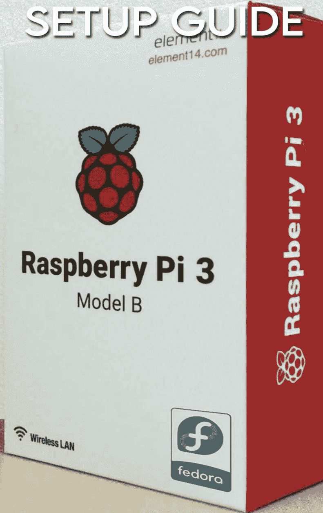
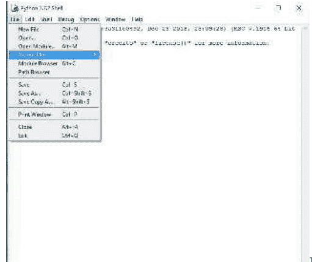
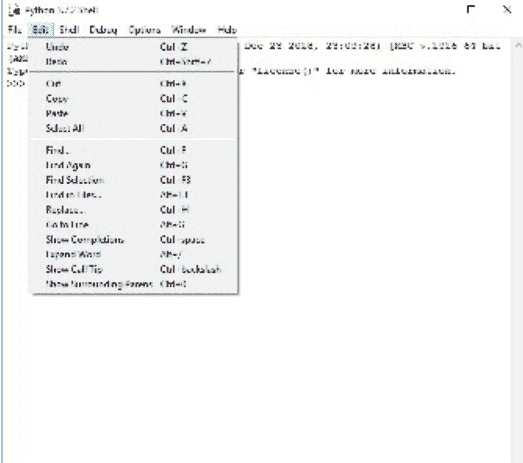
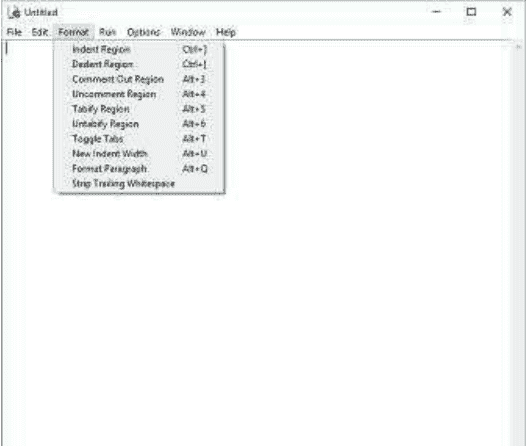
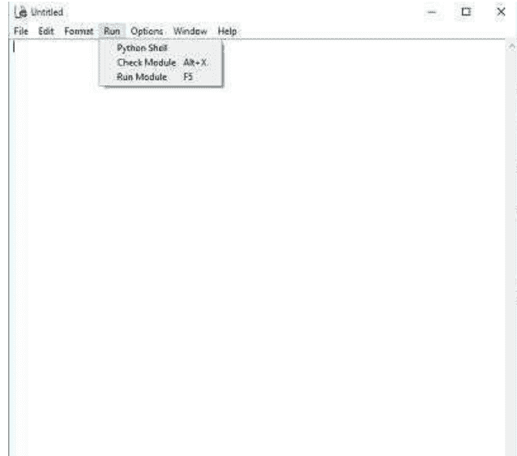
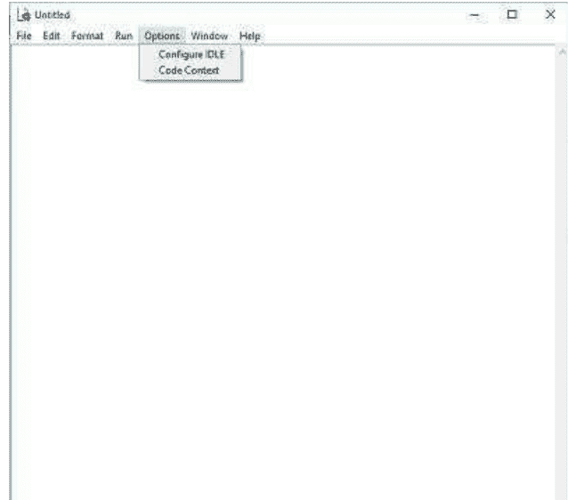
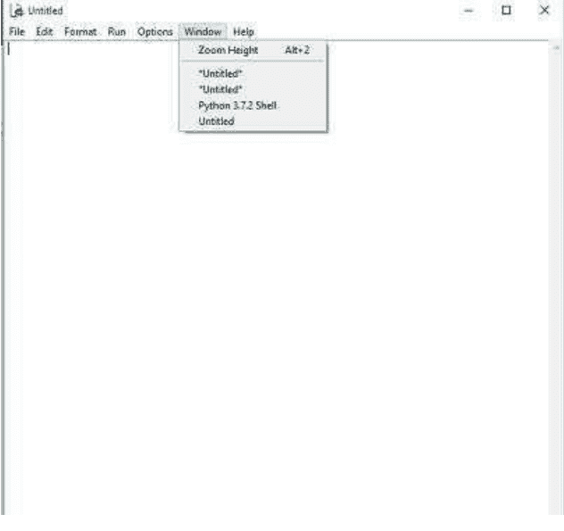
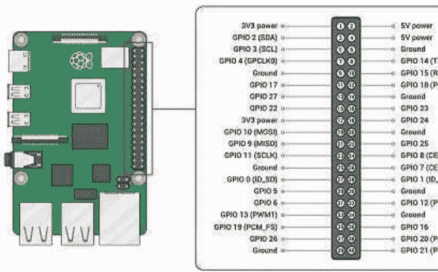
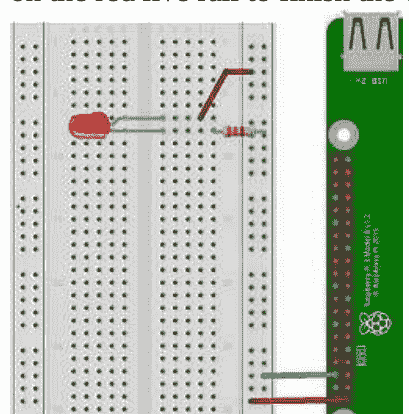

# 树莓派设置指南



如何从零开始使用你的树莓派和Python编程

# 简介

Python是一种基础、易于学习的语言，就像组合英语一样。树莓派是一款简单直接的单板电脑，方便快捷且易于使用。现在，将一种极易上手的语言与一台易于使用的电脑结合起来，你将得到的是极致的简洁，可以轻松放入口袋。市面上有各种树莓派的替代品和其他可替代的编程语言，你也可以使用它们。但问题是，其他选项，例如Arduino，都无法提供树莓派所具备的易用性、计算能力和速度。本书将带你了解基础知识，读完本书后，你将受益匪浅，并能在此基础上进一步提升。

# 第一章 什么是树莓派？

树莓派是一款价格实惠、口袋大小的电脑，可以方便地插入显示器（如屏幕或电视），并连接鼠标和标准键盘。它是市场上最受欢迎的单板电脑。

## 树莓派的优点

当个人或企业主打算在任何东西上投入大量资金时，总会冒出一些问题。比如“这钱花得值吗？”、“还有哪些其他选择？”。当这类问题浮现在脑海中时，下一步就是考虑它在短期和长期内提供的各种优势。

树莓派提供了许多优点，任何有意购买的人都应在购买前考虑：

- 1. 它适合预算有限的企业或项目。
- 2. 几乎任何有或没有编码或编程经验的人都可以使用它。
- 3. 默认编程语言是Python（搭配Linux操作系统），它非常简单，不像其他编程语言。
- 4. 与普通电脑相比，它的功耗要低得多。这意味着可以减少电费支出。
- 5. 它的碳足迹很低。
- 6. 它非常适合测试可穿戴技术。
- 7. 它也支持其他编程语言。这意味着如果你不是Python编程语言的忠实粉丝，你仍然可以使用它，使用你偏好的编程语言。
- 8. 它拥有众多接口，但可以轻松放入你的钱包。

## 树莓派概览

树莓派有两种型号，分别是：A型和B型。两种型号之间的区别在于微型USB端口。B型配备以太网端口，这意味着它比A型消耗更多电力。
要完全理解推出树莓派的目的，对其各个部件的良好理解至关重要。

### 树莓派硬件组件

树莓派微型电脑板与其他电脑一样，由RAM（只读存储器）、处理器、GPU（图形处理单元）、CPU（中央处理器）、以太网端口、GPIO引脚（通用输入/输出引脚）、XBee引脚/插座、UART（通用异步收发器）、电源连接器、SD卡插槽、RCA连接器、LED（发光二极管）、蓝牙、WiFi、MIPI DSI（显示串行接口）、MIPI CSI（摄像头显示接口）、HDMI端口以及通过USB端口扩展连接其他外部设备的接口组成。

#### RAM

该板提供两种内存版本，早期型号为250MB和512MB。较新的版本现在最高可达4GB RAM。

#### 处理器

该单元负责通过适当的操作来处理指令。

#### GPU

GPU组件负责所有与图像相关的操作。

#### GPIO引脚

它们是通用引脚，用于将树莓派板连接到外部板。这些引脚能够执行来自外部电子电路板的I/O命令。

#### 电源连接器

电源连接器允许树莓派板连接到外部电源。

#### XBEE引脚/插座

它用于无线通信。

#### 以太网端口

以太网端口提供了一种与其他设备通信的方式。

#### SD卡

这用作存储，可以比作普通电脑的硬盘驱动器。这也是树莓派操作系统启动的地方。

### 树莓派软件组件

虽然Raspbian一直是树莓派最受欢迎的基于Linux的操作系统，但也有其他广泛使用的操作系统。以下是它们的简介：

#### Raspbian

这是树莓派的操作系统之一。该操作系统基于Debian构建。它兼容所有版本的树莓派，而且作为初学者很容易适应。

#### Ubuntu MATE

Ubuntu MATE操作系统更加简单直接。同样基于Linux，Ubuntu MATE操作系统具有现代感，非常独特。然而，它并非适用于所有版本的树莓派。它从树莓派2开始支持。

#### RetroPie

基于Raspbian，它是一个模拟器，允许你玩70年代的旧游戏。

#### DietPi

DietPi运行在优化的Debian版本上。其小巧的尺寸使其比Raspberry Lite更轻量。它适用于所有型号的树莓派。

#### Manjaro

它是基于Arch Linux的树莓派上的一个出色系统。简洁、酷炫、轻量且非常灵活。它还让你可以自由地只安装你需要使用的东西。

#### Fyde OS：树莓派的Chromium OS

该操作系统可以安装在几乎任何设备上，包括树莓派。安装该操作系统还可以让你访问Chrome OS上可用的基于云的工具。

#### OSMC

这是基于Debian为树莓派构建的最好的媒体解决方案之一。它可以流式传输和播放几乎任何媒体格式。易于安装和使用。

#### Windows 10 ARM

通过WDOA安装Windows部署器，你可以轻松地在树莓派上安装Windows 10。这是通过从Micro SD卡启动ARM Windows 10来实现的。

#### Open ELEC

这是为了利用系统及其资源来访问媒体浏览和播放而开发的。

#### Android

众所周知，Android可以在几乎任何设备上运行，好消息是；它也可以在树莓派上运行。这为用户提供了访问海量Android应用和游戏的机会。

## 首次设置树莓派

要让树莓派工作，你需要首先通过微型SD卡为其安装操作系统。NOOBS（开箱即用软件）是树莓派操作系统的安装程序。

### 如何获取NOOBS

有两种方法可以获取NOOBS。一种是购买预装了NOOBS的SD卡。第二种是在树莓派官方网站下载：[https://www.raspberrypi.org/downloads](https://www.raspberrypi.org/downloads)。

### 如何在SD卡上安装NOOBS

在开始从SD卡安装NOOBS之前：

- 确保SD卡至少为8GB。完整安装树莓派操作系统需要16GB。
- SD卡格式化为FAT。
- 从NOOBS压缩文件中提取文件。
- 然后你可以将文件复制到格式化后的SD卡进行安装。
- 一旦启动，恢复FAT分区将自动调整为最小大小。将弹出一个可供安装的操作系统列表。

# 第二章 启航

至此，你可能已经了解了树莓派的基础知识，从硬件到软件部分。现在，让我们稍微深入一点，了解Linux架构、桌面和网络。

## LINUX

Linux操作系统可能是最著名和最常用的操作系统。
它是一种位于电脑系统软件和硬件部分之间的软件。
Linux是树莓派的默认操作系统。

### LINUX与其他操作系统的区别

与其他工作框架一样，Linux拥有图形用户界面（GUI）以及类似的编程环境，你可能在Microsoft Windows、MacOS等系统上见过视频和照片编辑器、文字处理器等。基本上，如果你能操作电脑或其他电子设备，你肯定也能操作Linux。

然而，Linux与其他操作系统之间存在显著差异。以下是部分原因：

- Linux是一个开源软件或操作系统。这意味着它是免费的。
- 用于创建软件的代码是开放的，任何人都可以查看、使用和修改，这对开发者尤其有利。
- Linux有许多发行版，附带不同的软件选项。这意味着Linux非常灵活且易于定制。
- Linux的另一个优点是用户可以自由选择要使用的核心组件。这也是树莓派能够有效运行许多共享基本Linux内核的操作系统的原因之一。
- Linux并非完全安全无虞，但与其他操作系统（如Windows）相比更为安全。
- 它可用于让旧的计算机系统重获新生。在Linux操作系统上，软件更新可以轻松且快速地完成。
- 它拥有庞大的社区支持，可帮助你解决可能遇到的任何问题。
- 与其他操作系统相比，它非常稳定。在Windows中，每当你卸载一个应用程序时，都需要重启。在Linux中则不必如此。
- Linux保障用户安全，不像其他操作系统那样收集用户数据。
- 它适用于各种网络和工作站的高性能运行。它能有效处理大量用户同时工作，并流畅地处理他们。
- 它为网络功能提供了巨大的基础支持。这意味着，使用Linux，你可以轻松地在电脑上为客户设置服务器系统，并提高交付速度。
- Linux是一个非常灵活的操作系统，你可以选择安装什么，而不会牺牲性能。
- Linux几乎兼容所有文件格式，可以运行你能想到的任何程序文件，无论是Windows还是Mac操作系统。与其他操作系统相比，Linux安装简单快捷。
- 它在硬件方面也提供高性能。即使硬盘几乎满了，所有任务也能轻松执行。
- Linux对内存友好，因为它可以轻松同时执行多项任务，几乎不会降低其速度和整体性能。
- 它还支持多种桌面环境，因此使用起来非常方便。

### LINUX的用途

Linux有许多用途。它就像许多其他操作系统一样。

以下是其中一些用途：

#### Web服务器

网络上超过50%的网站运行在一个名为Apache的开放程序上，而Apache通常运行在Linux上。因此，如果你现在正在上网，你使用Linux的可能性非常高。

#### 网络

Linux被大量用于运行互联网的大部分内容。它们还被用于运行家庭、办公室和企业中的小型和大型网络。

#### 数据库

Linux广泛用于数据库系统，以存储大量数据。这是因为它强大、安全且稳健。

#### 桌面

由于Linux非常灵活和稳定，它已经成功地进入了我们的各种桌面。

#### 重型计算

Linux系统可以协同工作，用于大型数据集测试。这也是它被用于超级计算机进行气候预测、科学模拟和渲染的原因之一...

#### 家庭使用

说真的，像你我这样的普通人也可以在日常生活中使用Linux。

### 使用LINUX的命令提示符及其应用

Linux命令行界面是允许用户输入文本命令，指示计算机系统完成特定任务或一组任务的程序。

如果你不熟悉命令行界面，你可以在桌面应用程序列表中搜索命令提示符。打开并运行。它通常具有深色背景。

以下是你会觉得非常有用的必备Linux命令列表：

1. **cd命令**
    此提示符用于浏览Linux文件、文件夹或目录。
    - i. cd.. 向上移动一个目录
    - ii. cd 直接进入主目录
    - iii. cd - 移动到上一个目录
2. **PWD命令**
    此命令提示符用于查找当前目录的路径。
3. **ls命令**
    用于查看目录的内容。
4. **cat命令**
    这是Linux上最常用的命令之一。它用于将文件内容连续列在标准输出上。

# 第三章
## Python基础

### IDLE

集成开发和学习环境完全用Python编写，具有跨平台功能，即它可以在几乎任何操作系统上运行，无论是Windows还是MacOS。它由两个主要窗口组成：shell窗口和编辑器窗口。

#### IDLE菜单

当你打开IDLE时，你在编辑器中看到的第一段文本是IDLE的版本，它也以粗体显示在应用程序的左上角。应用程序内的不同菜单包括：

- 文件
- 编辑
- Shell
- 调试
- 选项
- 窗口
- 帮助



##### 文件菜单

此菜单包含其他子菜单。以下是它们及其不同用途的列表：

- **新建文件**：用于创建一个新的文件编辑窗口。
- **打开...**：通过打开对话框打开一个现有文件。
- **最近文件**：打开最近创建的文件列表。
- **打开模块...**：打开一个现有模块。
- **类浏览器**：用于显示当前编辑器文件中的类、函数和方法。
- **路径浏览器**：点击此项将以树状结构显示系统路径目录、模块、类、函数和方法。
- **保存**：将当前窗口的副本保存到与其关联的文件中。
- **另存为...**：通过“另存为”对话框将当前窗口的副本保存。保存的文件成为该窗口的新关联文件。
- **保存副本为...**：在不更改与其关联的文件名的情况下保存当前窗口。
- **打印窗口**：将当前窗口打印到默认打印机。
- **关闭**：关闭当前窗口，并在内容尚未保存时提示。
- **退出**：关闭所有打开的窗口并退出IDLE。

##### 编辑菜单

- **撤销**：撤销对当前窗口所做的最后一次更改。更改总数不得超过1000次。



- **重做**：重新执行对当前窗口的最后一次撤销更改。
- **剪切**：将选定内容复制到剪贴板并删除选定内容。
- **复制**：将选定内容复制到剪贴板。
- **粘贴**：将剪贴板的内容插入到当前窗口。
- **全选...**：选择当前窗口的全部内容。
- **查找...**：打开一个带有多个选项的搜索对话框。
- **再次查找**：如果存在搜索历史，则重复上一次搜索。
- **查找选定内容**：如果存在选定内容，则搜索当前选定的内容。
- **在文件中查找...**：打开一个文件搜索对话框，并在新窗口中显示结果。
- **替换...**：打开一个搜索和替换对话框（如果存在）。
- **转到行**：将光标移动到行的开头并使其可见。
- **显示补全**：打开一个可滚动的列表，允许选择关键字和属性。
- **扩展单词**：将输入的前缀扩展为匹配同一窗口中的单词。
- **显示调用提示**：打开一个包含函数参数提示的小窗口。
- **显示周围括号**：突出显示周围的括号。

##### 格式菜单



- **缩进区域**：将选定的行向右移动一个缩进宽度。
- **取消缩进区域**：将选定的行向左移动一个缩进宽度。

###### 注释区域

此操作将为所选行的开头添加双井号注释。

###### 取消注释区域

从所选行中移除主井号或双井号注释。

###### 制表符化区域

此操作将把行首的连续空格转换为制表符。

###### 反制表符化区域

此操作将把所有制表符转换为相应数量的空格。

###### 切换制表符

此操作将打开一个对话框，用于在空格缩进和制表符缩进之间切换。

###### 新缩进宽度

此操作将打开一个对话框，用于更改缩进宽度。

###### 格式化段落

此操作将重新格式化注释块、多行字符串或所选字符串行中当前由换行符分隔的段落。

###### 清除行尾空白

通过对每一行（包括多行字符串内的行）应用 `str.rstrip`，移除行中最后一个非空白字符之后的空格和其他空白字符。除 Shell 窗口外，还会移除文件末尾的多余空行。

##### 运行菜单



###### 运行模块

执行检查模块。如果没有错误，则重启 Shell 以清理环境，然后执行该模块。输出显示在 Shell 窗口中。请注意，输出需要使用 `print` 或 `format`。执行完成后，Shell 会暂停并显示提示符。此时，可以智能地检查执行结果。这类似于使用 Python 执行脚本。

+   - 我在命令行中记录。

###### 运行...（已修改）

与“运行模块”相同，但使用修改后的设置运行模块。命令行参数会像在命令行中传递一样扩展 `sys.argv`。该模块可以在不重启 Shell 的情况下在 Shell 中运行。

###### 检查模块

检查当前在编辑器窗口中打开的模块的语法。如果模块尚未保存，IDLE 会提示用户保存或自动保存（具体取决于“IDLE 设置”对话框“常规”选项卡中的选择）。如果存在语法错误，错误区域将显示在编辑器窗口中。

##### Python Shell

打开或激活 Python Shell 窗口。

##### SHELL 菜单

###### 查看上次重启

将 Shell 窗口滚动到上次 Shell 重启的位置。

###### 重启 Shell

重启 Shell 以清理环境。

###### 上一条历史记录

循环浏览历史记录中较早的命令，这些命令会排列在当前部分之前。

###### 下一条历史记录

循环浏览历史记录中较晚的命令，这些命令会排列在当前部分之后。

**执行时中断** 停止正在运行的程序。

##### 故障排除菜单

###### 转到文件/行

查看当前行（光标所在行）及其上方行中的文件名和行号。如果找到，将打开文件（如果尚未打开）并显示该行。使用此功能可查看异常回溯中引用的源代码行以及“在文件中查找”找到的行。此外，也可在 Shell 窗口和输出窗口的上下文菜单中打开。

###### 调试器（开关）

启用后，在 Shell 中输入或从编辑器运行的代码将在调试器下运行。在编辑器中，可以通过上下文菜单设置断点。此功能目前处于实验阶段，尚未完全测试。

###### 堆栈查看器

以树状设备显示上次异常的堆栈回溯，并可访问局部变量和全局变量。

###### 自动打开堆栈查看器

在未处理的异常发生时，自动打开堆栈查看器。

##### 选项菜单



###### 配置 IDLE

打开一个设置对话框，用于更改以下项目的偏好设置：字体、缩进、按键绑定、文本高亮主题、启动窗口和大小、额外帮助资源以及扩展。在 macOS 上，通过选择应用程序菜单中的“偏好设置”打开设置对话框。更多详细信息，请参阅“帮助与偏好设置”下的“设置偏好设置”。

大多数设置选项适用于所有窗口或每个未来的窗口。下面的选项适用于活动窗口。

###### 显示/隐藏代码上下文

在编辑窗口顶部打开一个窗格，显示代码的块上下文，该上下文已滚动到窗口顶部。请参阅下方“编辑与导航”部分中的“代码上下文”。

###### 显示/隐藏行号

在编辑窗口侧面打开一个窗格，显示每行文本的行号。默认为关闭状态，可以在偏好设置中更改（参见“设置偏好设置”）。

###### 缩放/恢复高度

在正常大小和最大高度之间切换窗口。初始大小默认为 40 行乘以 80 列，除非在“配置 IDLE”对话框的“常规”选项卡中更改。屏幕的最大高度由首次在屏幕上缩放窗口时快速放大窗口决定。更改屏幕设置可能会破坏已保存的高度。当窗口已最大化时，此切换无效。

##### 窗口菜单



列出所有打开窗口的名称；选择一个可将其带到前台（如果需要，取消图标化）。有关此菜单的更多详细信息，请访问：

https://docs.python.org/3/library/idle.html

现在我们已经了解了 IDLE 中的菜单，让我们深入探讨其编程部分。

### 数字

数字在科学中至关重要，在编程中也是如此。每一行代码都涉及一个或多个与数字相关的操作，或者至少在硬件层面如此，原因在于计算机擅长处理数字。

在本例中，我们将使用 Python 编程语言来处理数字。是的！像计算器一样处理数字。

这是一个例子：>>>20*2 在 IDLE 中，只需输入 >>>print (20*2) ，这将返回 40。

这是另一个例子：>>>10*3/5-2 你可以直接按回车键，得到 4.0。或者，你可以使用 print 函数 >>>print (10*3/5-2) ，答案仍然是 4.0。

这引出了两个关键字；整数：计算中的数字。

浮点数：带“.0”的除法结果，即在 Python 中每次除以一个数字，结果都是浮点数。

例子：>>>25/7 3.5714 结果是浮点数。考虑这些；例子：>>>20//3 结果是 6.0。这称为地板除法，即忽略余数。

例子：>>>2**5 这是在 Python 中表示数字幂的一种方式。2**5 表示 2 的 5 次方。

结果是 32（一个整数）。例子：>>>7%2

这将显示结果为 1。显示的是余数。

### 变量

什么是变量？你可以把变量想象成你的父亲，他最终通过用他的姓氏（你们都共有的名字）来称呼你们每一个人，从而代表你们所有人。现在，每当在家中提到那个名字，他们就知道是你们家。就像你父亲用来登记你们家的名字一样，它直接指向你们家，变量指向存储在内存中的特定值或一组值。解释器然后分配内存空间，并决定在保留的内存中存储特定的数据类型。

以下是关于变量需要了解的内容；

+   1. 你不能在 Python 库中使用保留字作为变量名。
2. 变量名不能以数字开头。
3. 你可以用符号、特殊字符或字母开头命名变量。
4. 变量名可以是大写或小写。
5. 命名变量时不允许使用空白字符。

例子：>>>k=3*5
这里，k 是一个变量，表示两个数字 3 和 5 的乘积。
接下来是打印
即 >>>print (k)
得到 15。
例子：>>>k+5/4
现在打印结果
>>>print k+5/4
16.25

### 字符串

用单引号或双引号括起来的字母、字母组合、数字或符号称为字符串。字符串中包含的变量或元素不能被更改。因此，它们是不可变的。

请记住，字符串现在必须用引号（单引号或双引号）括起来，否则会返回错误。这是 Python 3 的一个新特性。

例子：>>>“ Hello world.”
这被解释并显示为；
‘Hi, world.’
例子：>>>‘ I love python programming language.’

或者，你可以使用 print 函数。这意味着要调用的 print 函数必须在括号内。

例子：>>> print (“Python is my beloved programming language”)
Python is my cherished programming language

## 元组

元组被视为类似于字符串。这是因为它们包含与字符串相同的元素，但它们的不同之处在于它们用圆括号而不是方括号括起来。与字符串一样，元组中变量的值不能被更改。因此，它们是不可变的。

请记住，列表中变量的值可以被更改。因此，它们是可变的。

```
例子：>>> tuple1= (‘Merlin’, ‘Morgana’, 246, ‘Dublin’, Mowena)’
>>>print (tuple1) 显示
(‘Merlin,’ ‘Morgana,’ 246, ‘Dublin,’ ‘Mowena’)
例子：>>>tuple2= (‘Seeker’, ‘Frodo’, ‘Mango’, 1945)
>>>print (tuple1+tuple2)
(‘Merlin,’ ‘Morgana,’ 246, ‘Dublin,’ ‘Mowena,’ ‘Searcher,’ ‘Frodo,’
‘Mango,’ 1945)
例子：>>>tuple1= (‘April’, ‘May’, ‘June’, 326, ‘December’)
>>>tuple2= (‘January’, ‘February’, ‘April’, ‘May’, 326, 559)
>>>print (tuple1+tuple2)
(‘April,” May,” June,’ 326, ‘December,’ ‘January,’ ‘February,’ ‘April,’
```

### 列表

至少两个字符串可以组合形成一个列表。列表的值可以被修改、连接或截取。它可以包含不同的数据类型或相同的数据类型，即数据可以是同质的或异质的。与元组不同，列表是可变的。

示例：>>> ['April', 'May', 'June', 326, 'December']

要命名列表或一个列表，你可以分配与其内容相关的名称。

示例：>>> vegetables = ['Lettuce', 'Amaranthus', 'Cabbage', 'Carrot']

或者你可以直接使用列表

示例：>>> list1 = ['Lettuce', 'Amaranthus', 'Cabbage', 'Carrot']

示例：>>> list1 = ['April', 'May', 'June', 326, 'December']

>>> list2 = ['January', 'February', 'April', 'May', 326, 559]

>>> print(list1 + list2)

['April', 'May', 'June', 326, 'December', 'January', 'February', 'April', 'May', 326, 559]

示例：>>> print(list1 or list2)

['April', 'May', 'June', 326, 'December', 'January', 'February', 'April', 'May', 326, 559]

['April', 'May', 'June', 326, 'December']

示例：>>> print(list1 and list2)

['January', 'February', 'April', 'May', 326, 559]

### 集合

它们由无序的数据类型或元素集合组成，同一集合中没有重复元素。与列表不同，集合有一种方法可以检查元素是否在同一集合中重复。因此，它们是可变的。

示例：>>> set1 = {'Bread', 'Rice', 'Egg', 'Chicken', 'Rice'}

>>> print(set1)

{'Bread', 'Rice', 'Egg', 'Chicken'}

'Rice' 被重复了，但最终从列表中移除了。

要向上述集合添加元素

>>> set1.add('Fish')

#### 冻结集合

这类集合不能被更改，即不可变。这与通常即使包含不可变元素也是临时的集合不同。

示例：>>> weapons = frozenset(["Axe", "Knives", "Arrow", "Firearm", "Bomb"])

>>> print(weapons)

{'Axe', 'Knives', 'Arrow', 'Firearm', 'Bomb'}

### 集合操作

#### i. Clear() 函数

这将清除集合中的所有元素。

示例：>>> weapons = {"Axe", "Knives", "Arrow", "Firearm", "Bomb"}

>>> weapons.clear()

#### ii. Difference() 函数

这将返回集合中元素之间的差异。

示例：>>> set1 = {'c', 'd', 'e', 'f', 'g'}

>>> set2 = {'f', 'g'}

>>> print(set1.difference(set2))

{'c', 'd', 'e'}

或者，你可以使用以下方式实现相同功能；

>>> set1 - set2

{'c', 'd', 'e'}

结果仍然相同。

要获取 set1 或 set2 中的元素，你可以使用 set1 | set2。

示例：>>> set1 | set2

{'c', 'd', 'e', 'f', 'g'}

要获取同时在 set1 和 set2 中的元素，你可以使用 set1 & set2。

示例：>>> set1 & set2

{'f', 'g'}

{'c', 'd', 'e'}

#### iii. Add() 函数

此方法用于向集合添加不可变元素。

示例：>>> players = {"Messi", "Pepe", "Son"}

>>> players.add("Ronaldo")

>>> names = {"Messi", "Pepe", "Son", "Ronaldo"}

#### iv. Discard/Remove() 函数

你可以使用 discard 函数来移除集合中的任何元素。或者，你可以使用 remove()。

示例：>>> set1 = {1, 2, 3, 4, 5}

>>> set1.discard(5)

>>> print(set1)

{1, 2, 3, 4}

请注意，discard 函数只能接受一个参数。多次使用 discard 会返回错误。

好消息是你不必将它们全部写在某个地方或打包起来。当你需要使用它们时，可以轻松访问。在 Python 3 中，当你开始输入时，例如函数 "discard"，在你完成 "discard" 之前，会弹出一个下拉菜单供你选择。

所有这些函数在尝试操作数据并将其组织成系统化文件时都非常有用。

### 布尔值

结果表示两个常量值，可以是 'True' 或 'False'。使用内置函数 "bool()"。

示例：>>> 7 < 9

True

示例：>>> 15 == 19

False

示例：>>> 4 * 2 != 10

请注意 (!=) 表示 '不等于' 运算符

True

示例：>>> 5 <= 9

True

### If 语句

你可以使用 'if' 语句在满足指定条件时运行代码。如果表达式为真，则执行。否则，它们不会被执行。

示例：>>> if 5 > 9:

>>> print("9 more noteworthy than 5")

>>> print("program finished")

结果给出

9 more prominent than 5

program finished

示例：

>>> error = 9

>>> if error > 6:

print("6")

if error > 10:

print("10")

结果给出 6。

对于更复杂的检查，if 语句可以嵌套，一个在另一个内部。这意味着内部的 if 语句是外部语句的一部分。

示例：>>> file = 7

>>> if file > 3:

print("3")

3.

### Else 语句

它跟在 'if' 语句之后，包含当 'if' 语句为 'false' 时执行的代码。

示例：>>> m = 7

If m == 8:

print('yes')

else:

print('no')

no.

### 布尔逻辑

这用于为基于多个条件的 'if' 语句创建更复杂的条件。

Python 中的布尔运算符是 'and'、'or' 和 'not'。

#### And 运算符

'and' 运算符通常接受两个表达式，当且仅当两个表达式都为真时，结果才为真。

示例：>>> 3 == 3 and 1 == 1

True

示例：>>> 5 == 5 and 3 == 4

False

示例：>>> if (5 == 5) and (3 * 3 > 7):

print('valid')

else:

print('false')

true.

#### Or 运算符

与 'and' 运算符类似，它也接受两个参数，如果任一或两个参数为真，则返回 'true'，如果两个参数都为假，则返回 'false'。

示例：>>> 4 == 4 or 5 == 5

True

示例：>>> 1 == 1 or 7 == 8

True

示例：>>> 2 + 1 > 1 or 2 * 3 < 5

False

示例：>>> age = 17

>>> fee = 1000

>>> if age > 18 or fee > 500:

>>> print("Qualified")

#### 布尔非

Not 只接受一个参数并将其反转。即，'true' 将变为 false，而 'not false' 为 true。

示例：>>> not 1 == 1

False

示例：>>> not 5 < 4

True

### 循环

Python 中有两种循环。它们是 'while' 和 'for' 循环。

#### While 循环

它们用于连续执行一段语句或参数，直到满足特定条件。只要条件成立，代码块就会持续执行。当它变为假时，将执行下一段代码。

示例：>>> i = 2

>>> while i <= 4:

print(i)

i = i + 1

print('finished')

2

completed

3

completed

4

Finished.

#### For 循环

它们用于遍历列表、字符串、元组或字典中的每个元素。

示例：>>> num = [1, 2, 3, 4]

>>> for n in num:

print(n)

1

2

3

4.

#### 模拟骰子

为了进一步扩展你到目前为止所学的内容，这里有一个 Python 中掷骰子程序的示例。

>>> import random

>>> while true:

rolled_num = random.randint(1, 6)

print("the dice rolled, and you have:", rolled_num)

input("Press any key to roll again")

第一行代码用于导入随机数库

Import random

随机数使用 randint() 库函数生成。在这种情况下，数字范围在 1 到 6 之间。

如果你运行此代码，骰子将继续滚动，直到遇到错误并最终停止。

# 第四章 函数概览

到目前为止，你应该已经熟悉了最基本级别的函数。让我们稍微回顾一下。你可以将函数定义为执行特定任务的一组语句。函数的一个好处是它可以帮助你将代码分解成更小、更基本的部分，易于组装。你可以将其称为块，这不仅可以帮助你避免重复编写一行代码，还可以确保代码重用。

让我们从 print 函数开始。

示例：>>> print("Mangoes")

这将显示 Mangoes 作为输出。

这是另一个示例；

示例：>>> print('I love python programming Language')

I love python programming Language.

## 定义函数

函数使用缩写关键字 "def" 定义。通用的代码语法可以写成；

def function_name():

## 函数的通用代码语法

```python
def function_name (boundary or contention list):
    """docstring"""
    Statement(s)
```

## 函数的组成部分

-   i. 关键字“def”，表示函数头的开始
-   ii. 参数，即传入函数值的地方。
-   iii. 冒号(:)，表示函数头的结束
-   iv. 构成函数体的Python语句
-   v. 如果你选择重用代码，则包含一个返回语句。

## 如何调用函数

一旦定义了函数，你就可以轻松地从另一个函数或程序中调用它。

示例：
```python
>>> def welcome (name):
    """This capacity will welcome the named individual in a boundary"""
    print ("hello, "+name+". How are you doing today?")
>>> welcome("Leonard")
Good morning Leonard. How are you doing today?
```

## 文档字符串

紧跟在函数头之后的是文档字符串。它解释了函数的功能。

示例：
```python
>>> def welcome (name):
    """This capacity will welcome the named individual in a boundary"""
    print ("greetings,"+name+". How are you doing today?")
```

## 返回语句

语句可以包含一个或多个被求值的表达式，并返回其值，根据你运行的代码行，可以有一个或多个返回。

示例：
```python
>>> def meters (L_in_centimeters):
    """this will return the length in centimeters"""
    return (L_in_centimeters/100)
>>> for L in (120,332,145,270,225):
    print (L,": ", meters (L))
```

结果应该如下所示：

| 米 | 厘米 |
|--------|-------------|
| 120    | 0.12        |
| 332    | 0.332       |
| 145    | 0.145       |
| 270    | 0.270       |
| 225    | 0.225       |

函数可以通过以下方式定义：
-   关键字参数
-   默认参数值
-   任意参数列表

## 关键字参数

关键字参数可用于调用函数。

示例：
```python
>>> def printdata (age, state):
    """This prints the information into this capacity"""
    print ("age: ", age)
    print ("state:", state)
>>> printdata (age="45", state="Kansas")
```

## 默认参数值

它们通常用于一次性调用函数。

示例：
```python
>>> def print_information (tallness, eyes = "Brown"):
    """This will print this information into the function."""
    print (" stature:", tallness)
    print ("eyes:", eyes)
>>> print_information (height= "6ft")
```

身高：6英尺
眼睛：棕色

## 任意参数列表

如果函数包含多个参数，你可以调用它。你也可以使用关键字参数来调用函数。

代码语法通常采用以下形式：
```python
>>> def functionname ([formal_args,]*var_args_tuple):
```

## 字符串理论

你应该熟悉字符串的基础知识。让我们快速回顾一下；

我敢打赌，在之前的示例中，你已经遇到过单引号、双引号，甚至三引号语句。这就是我们在Python编程语言中所说的字符串。

这里有一个快速示例；

示例：
```python
>>> ("Python is a wonderful programming language")
'Python is a marvelous programming language.'
```

或者，你也可以打印；

示例：
```python
>>> print ("Python is a great programming language")
Python is an amazing programming language.
```

## 转义引号

这只能使用反斜杠符号 \ 来实现。

示例：
```python
>>> print ('I won\'t be there today')
I will not be there today
```

## 连接字符串

你可以轻松快速地使用加号 (+) 连接字符串，并使用星号 (*) 重复连接。

```python
>>> str1="Mango"
>>> str2="es"
>>> str1+str2
'Mangoes'
```

更简单的方式，你可以这样写：

示例：
```python
>>> "Hydro" + "Quinone"
Hydroquinone
>>> 2*"Chloro"+ "Carbons"
'ChloroChloroCarbons'
```

2* 意味着第一个缩进将被重复两次。

## 创建新字符串

你可以从旧字符串创建新字符串或数据。由于字符串是不可变的，你不能改变它们。但是，你可以控制执行它们的过程。

```python
>>> str1="sky"
>>> str2=" fall"
>>> str1+str2
'skyfall'
```

## 索引字符串

索引从0开始可以应用于字符串。反向索引也可以应用。

## 切片字符串

你可以通过切片旧字符串或任何字符串来简单地创建新字符串。

```python
>>> str1="charger"
>>> str1 [2]
'a'
>>> str1="charger"
>>> str1[3]
'r'
>>> str1 ="Abacus"
>>> str1 [1:3]
'ba'
```

编写代码时请记住，如果你输入一个不存在的索引，Python解释器将返回错误。

```python
>>> str1 ="Abacus"
>>> str1[9]
Traceback (most recent call last):
  File "<pyshell#36>", line 1, in <module>
    str1 [9]
IndexError: string index out of range
>>> string2="Apparatus"
>>> str2 [2:4]
'pa'
>>> str2 [1:]
'pparatus'
```

如果你打算获取从第一个索引值到指定索引的值，你可以这样写你的语句。

```python
>>> str2 [:5]
'Appar'
```

## 如何确定字符串的长度

确定字符串的长度并不难。这可以通过使用关键函数“len()”来实现。这一点在控制索引时至关重要。

```python
>>> str1="Samuel"
>>> len (str1)
6
>>> myAddress ="Maddison Street"
>>> len (myAddress)
14
```

## 吊死鬼游戏

吊死鬼是一个猜词游戏，至少需要两名玩家。在这个游戏中，使用纸和笔。当一个玩家画一条线时，另一个玩家尝试猜测它对应的字母，直到秘密单词的所有字母都被完全猜出。如果你猜错了字母，你将一次失去一条命，直到你没有剩余的生命。这个游戏看起来很有趣，对吧！所以，让我们用Python为它编写一个程序。

```python
import random, sys
from typing import List

### TODO attempt to stack these from a text record
WORD_LIST = [
    "elevated", "yellow", "family", "screen", "bamboo", "organic product", "work area", "chair",
    "lap", "snake", "fish", "nylon"
]

GUESS_WORD = []
SECRET_WORD = random.choice(WORD_LIST)  # lets randomize single word from the list
LENGTH_WORD = len(SECRET_WORD)
ALPHABET ="abcdefghijklmnopqrstuvwxyz"
letter_storage = []

### Utility functions
def print_word_to_guess(letters: List) -> None:
    """Utility capacity to print the current word to figure"""
    print("Word to figure: {0}".format(" ".join(letters)))

def print_guesses_taken(current: int, total: int) -> None:
    """Prints the number of chances the player has utilized"""
    print("You are on surmise {0}/{1}.".format(current, total))

### Game functions
def starting() -> None:
    """Starts the game"""
    print("Hello Mate!\n")
    while True:
        name = input("Please enter Your name\n").strip()
        if name == "":
            print("That's not permitted! No clear lines")
        else:
            break

def ask_user_to_play() -> None:
    """Ask client to play"""
    print("Let's get started!\n")
    while True:
        gameChoice = input("Would You?\n").upper()
        if gameChoice == "YES" or gameChoice == "Y":
            break
        elif gameChoice == "NO" or gameChoice == "N":
            sys.exit("That's wrong! Have a decent one")
        else:
            print("kindly Answer Yes or No")
            continue

def prepare_secret_word() -> None:
    """Prepare secret word and educate client regarding it"""
    for character in SECRET_WORD:  # printing spaces for each letter stealthily
        GUESS_WORD.append("- ")
    print("Ok, so the word You really want to guess has", LENGTH_WORD, "characters")
    print("Be mindful that You can enter just 1 letter from az\n\n")
    print_word_to_guess(GUESS_WORD)

def speculating() -> None:
    """Main game circle to have client surmise letters and illuminate them regarding the outcomes"""
    guess_taken = 1
    MAX_GUESS = 10
    print_guesses_taken (guess_taken, MAX_GUESS)
    while guess_taken < MAX_GUESS:
        surmise = input("Pick a letter\n").lower()
        if not surmise in ALPHABET:  # checking input
            print("Enter a letter from a-z ALPHABET")
        elif surmise in letter_storage:  # checking assuming letter has been now used
            print("You have effectively speculated that letter!")
        else:
            letter_storage.append(surmise)
            if surmise in SECRET_WORD:
                print("That's correctly!")
                for i in range(0, LENGTH_WORD):
                    if SECRET_WORD[i] == surmise:
                        GUESS_WORD[i] = surmise
                print_word_to_guess (GUESS_WORD)
                print_guesses_taken (guess_taken, MAX_GUESS)
                if not '-' in GUESS_WORD:
                    print ("Congratulations you won!")
                    print ("Game Over!")
                    break
            else:
                print ("The letter does not match any in the word. Try Again!")
                guess_taken += 1
                print_guesses_taken (guess_taken, MAX_GUESS)
                if guess_taken == 10:
                    print (" Sorry Buddy, You lost :<! The secret word was {0}".format (SECRET_WORD))
```

请记住，Python解释器会忽略带井号的语句，因为它们是注释。它们被包含在内是为了

## 字典

字典本质上是一组无序、可变且带索引的项目或元素的集合。它们通常用花括号书写，并包含键值对。

```
示例：
### 修改和添加字典元素
>>>my_dict = {'name': 'Pablo', 'age': 65}
### 更新值
my_dict['age'] = 66
### 输出：{'age': 66, 'name': 'Pablo'}
>>>print(my_dict)
### 添加项目
my_dict['address'] = 'Efijuiro'
### 输出：{'address': 'Efijuiro', 'age': 66, 'name': 'Pablo'}
print(my_dict)
```

Python字典在创建和执行正确的语法与语句方面至关重要。以下是关于字典及其各种含义需要记住的一些关键词；

## 映射

Python 3的字典在某些方面与Python 2不同，它们具有映射（这是与列表的共同点），只有当你拥有与每个映射对应的唯一键时，才能访问其值。可以将映射想象成你的智能手机，只有拥有密码才能访问其内容。好消息是，你可以存储它们，并在需要时获取。

```
>>>mygirlfriends = {"Jane": 21, "Debby": 23, "Loveth": 19, "Keith": 25}
>>>print(mygirlfriends)
{'Jane': 21, 'Debby': 23, 'Loveth': 19, 'Keith': 25}
```

由于它们可以被修改，如果你想的话，可以向其中添加元素。例如：

```
>>>myfamily = {"Mother": 54, "Father": 62, "Sister": 17}
>>>print(myfamily)
{'Mother': 54, 'Father': 62, 'Sister': 17}
```

你可以直接从键值对创建字典。例如：

```
>>>dict([("Mother", 54), ("Father", 62), ("Sister", 17)])
{'Mother': 54, 'Father': 62, 'Sister': 17}
```

## 创建空字典

你可以简单地使用两个空花括号`{}`来创建空字典，并通过插入值来填充它们。

## 从字典中删除条目

你可以使用`del`函数从字典中移除一个键值对。让我们使用之前的例子`myfamily`；例如：

```
>>>myfamily = {"Mother": 54, "Father": 62, "Sister": 17}
>>>del myfamily["Sister"]
>>>print(myfamily)
```

## 访问和排序字典的键

要查看字典中的所有键，只需使用命令函数；`list(d.keys())`。这将显示你字典中的所有键。例如：

```
>>>list(myfamily.keys())
['Mother', 'Father', 'Sister']
```

如果你想对它们进行排序，可以简单地使用排序数据的关键字；`sorted(d.keys())`。例如：

```
>>>sorted(myfamily.keys())
['Father', 'Mother', 'Sister']
```

## 查找特定的键

如果你在字典中寻找一个特定的键，可以简单地使用`in`关键字。这里有一个例子；例如：

```
>>>"Father" in myfamily
True
```

例如：

```
>>>"Uncle" in myfamily
False
```

你可以将字典看作一个水库，你可以随时从中汲取，因为它会在你的Python编码之旅中很好地为你服务。

## 元组

此时，你应该对元组有所了解，如果还不了解，快速复习一下会对你大有裨益。

元组与字符串和数字类似，它们是不可变的，但可以包含可变的元素或值的集合。它们可以是同构的，即包含相同的元素，如数字或字母；也可以是异构的，即包含字母和数字的混合。与字符串和列表一样，它们用逗号分隔，但用圆括号括起来。

### 为什么使用元组？

与列表不同，元组可以包含异构数据或可以被正确排列的元素。

```
示例：
>>>tup1 = (1720, 2003, 1945, "Indianapolis", "Kentucky")
>>>print(tup1)
(1720, 2003, 1945, 'Indianapolis', 'Kentucky')
```

元组也可以嵌套。下面是一个例子；

```
示例：
>>>tup2 = (((1720, 2003, 1945, 'Indianapolis', 'Kentucky'), "Father", "Mother", 2011, 1948, 2020, "Sister"))
```

### 更新元组

元组可以通过从现有或先前的值或元素创建新元组来更新。这仅仅是因为它们是不可更改的。

```
示例：
>>>marks = (35, 27, 54, 64, 69)
>>>studentnames = ("Arthur", "Bella", "Vickky", "Blessing", "Matthew")
>>>candidates = marks + studentnames
>>>print(candidates)
(35, 27, 54, 64, 69, 'Arthur', 'Bella', 'Vickky', 'Blessing', 'Matthew')
```

# 第五章

## 模块、类和方法

模块用于组织或排列文件。它们是分组的元素或值，你可以随时引用和调用它们。

包类似于文件夹。它们包含多个组织良好的模块。它们由`__init__.py`文件名表示（空文件）。

要了解模块真正如何工作，对导入的良好理解至关重要。让我们直接深入了解一下。

有两种导入包的方式；

### 绝对导入

绝对导入的作用是使用从项目主文件夹开始的完整路径来指出要导入的元素或值。绝对导入可以与以下代码相关联；

```
import package.module
obj = package.module.classA()
from package.module import classA
import classA
from package import module
obj = module.classA()
>>>from module_name import *
```

此语句将从根文件夹导入所有模块。你必须避免的唯一事情是模块重复。

### 相对导入

你可以简单地将一个模块的类导入到同一包内的另一个模块中。相对导入根据导入的当前位置指出要导入的数据。

以下是相对导入的一些例子；

```
from .module2 import classB
obj = classA()
from ..some_module3 import some_classC
obj = classC()
```

## 日期和时间模块

这些分为两种类型，即日期和时间对象。它们是“朴素的”和“感知的”。

感知的对其环境有意识，涉及时区、时间调整以及它当前或不久的将来可能处于的其他时间方面。另一方面，朴素的对其环境没有意识，并且由于缺乏必要的信息而无法自行工作。

以下是datetime模块可以导出的一些常量示例；

**Datetime.minyear**

这相当于1。这意味着输出将包括过去的年份，甚至早于Python编程语言诞生之前。

```
>>>datetime.time = datetime.time(hours=0, minute=0)
```

例如：

```
>>>import datetime
>>>current_time = datetime.datetime.now()
>>>print("{:%H:%M}".format(current_time))
10:38
```

例如：

```
>>>import datetime
>>>datetime.datetime.now()
>>>print(now.year)
2020
```

例如：

```
>>>import datetime
>>>datetime.datetime.now()
datetime.datetime(2020, 6, 27, 16, 10, 21, 180317)
```

这相当于16:10。

**Datetime.maxyear**

这就像写9999，即元素或datetime对象可以提供的最大未来年份数。

## 面向对象

Python编程语言是基于对象的，这意味着更强调对象而不是函数。当数据和对象变得庞大时，面向对象的编程方法变得至关重要。

你可以简单地将面向对象编程看作在代码中表示或建模现实世界对象的一种方式。这里要记住的关键是，Python是一种面向对象的编程语言，一切都围绕对象构建，即使它的某些方面没有直接指向对象，它也可能是对象的表示。

## PYTHON中的类

你可以通过类比，将类比作制作多个杯子和盘子的粘土储备。简而言之，类就像一个代码指南或模型，对象从中构建或制作。

### 如何创建类

你可以使用`class`关键字轻松创建一个类。这是一个类的例子

```
示例：
>>>class religion:
    def __init__(self, name, doctrine):
        self.name = name
        self.doctrine = doctrine
r1 = religion("christian", "pentecostal")
print(r1.name)
print(r1.doctrine)
```

请记住，在这个例子中，函数`__init__`在每次从类中创建对象时都会被调用。

### 实例

你可以简单地将实例看作具有真实值的类的副本，即类的对象成员。

试着想象一个谷歌表单URL或链接，比如在你的WhatsApp群组中分享。你点击了它，然后，一个表单出现了，里面有你需要填写的字段。最后，你输入的所有信息的副本被发送到你的收件箱。现在，发送给你的副本就是一个实例，其中包含你自己填写的信息。

### 实例属性

Python中的类是特定于对象的，它们具有称为“属性”的某些特性。

### 类属性

变量对所有实例都是相同的。

## 继承

这用于指一个类假设另一个类的方法和属性的情况。它们通常有两种形式；父类或基类，以及子类或派生类。

子类是父类继承的结果，它们共享父类的所有属性。然而，它们可以选择自己想要遵循的路径，在某些情况下，这条路径可能与父类的不同。

你可以从几乎任何类别的对象或变量创建一个父类。以下是一个示例：

```
Example:
>>> class HouseAddress:
    def __init__(self, housename, streetname):
        self.housename = housename
        self.streetname = streetname
    def printname(self):
        print(self.housename, self.streetname)
```

# 第六章 文件与网络

## 文件管理

文件管理在Python编程中非常重要；这是因为，通过文件，你可以妥善地组织和存储你的代码。你可以执行一些简单的任务，比如写入文件、读取已存储的文件或关闭文件。在我们深入探讨之前，你应该熟悉一些关于文件或文件的基本概念：

**文件头**
这指的是关于文件内容的数据，比如文件名、大小、格式等。

**数据**
文件中包含的内容。

**文件结束符**
这用于表示文件的结束。

**文件路径**
这是文件在你的系统上的位置。它进一步分为三个部分：

**i. 文件名**
这是赋予文件的名称。你可以随时重命名。

**ii. 扩展名**
这用于指示文件类型。

**iii. 文件夹路径**
这表示文件在文件夹或子文件夹中的位置。

### 读取文件

读取文件非常简单。你所要做的就是使用`open()`函数打开目标文件。以下是语法：

```
open()
open(filename, mode)
filename.read()
filename.readline()
```

这将允许你逐行读取文件。

```
filename.readlines()
```

这将允许你读取给定文本文件中的行。

### 关闭文件

你可以简单地使用文件对象方法`close(fobj)`来关闭文件。以下是语法：

```
fobj = open("filename.text")
for line in fobj:
    print(line.rstrip())
fobj.close()
```

或者，你可以选择使用这个：

```
quote = open("filename.txt").readlines()
print(quote)
```

你也可以使用这个：

```
quote = open("filename.txt").read()
print(quote[:])
```

### 写入文件

要写入文件，你可以使用`write()`方法。以下是语法：

```
fh = open("filename.txt", "w")
fh.write("live and let live")
fh.close()
```

### 创建文件

如果你想在Python中创建一个文件，你可以从简单地打开一个文本编辑器并输入你打算输入的所有内容开始。完成后，在退出之前，不要忘记为你的文件命名并保存以备后用。在退出应用程序之前，系统会提示你保存文件。

### 读写二进制数据

在Python编程语言中，你可以使用`open()`函数和读取二进制"rb"或写入二进制"wb"模式来读取或写入二进制数据。字节、字节数组和内存视图都是二进制序列类型的一部分。

### 字节

字节可以用整数、零填充的字节对象或缓冲区协议中包含的二进制数据来表示，并且二进制值是不可变的。

### 字节数组

与字节不同，变量是可变的。

### PICKLE模块或PICKLING

Python编程中的Pickle或pickle模块用于描述将对象结构或其等效值转换为字节片段或流（即0和1）的过程。导入pickle可以通过使用以下命令简单实现：

### Dump方法

这仅用于使用以下命令转储对象：

```
>>> pickle.dump(obj, file, [protocol, *, fix_imports=True])
```

你也可以随时使用以下命令读取转储文件的内容：

```
>>> pickle.load(file)
```

## 示例：

```
>>> import pickle
>>> subjects = ["Mathematics", "Biology", "Chemistry", "Physics"]
>>> fh = open("data.pk1", "wb")
>>> fh.close()
```

其中fh表示文件句柄对象。

关于Python中的pickle，需要记住的一些重要事项：

- 不可否认，pickle可以很好地用于保存复杂数据。
- 它非常简单，不需要很长的代码行。
- Python中的pickle文件可能在其他编程语言中不可读。
- pickle文件或模块并非恶意软件免疫。

## 互联网

我们所知道的大多数应用程序都依赖于互联网，其中一部分虽然可以在没有互联网的情况下工作，但无论如何，它们仍然依赖于互联网，无论是用于下载、上传、导入还是更新。你可以轻松地将互联网比作一个坐满学生的教室，每个学生都有其独特的身份和名字。现在，你想在某个特定时间点点名其中一个；你所要做的就是呼叫那个特定学生的身份，无论是通过名字还是指定的ID号。这就是互联网的工作原理。

简单地说，你的树莓派通过向Web服务器发送HTTP（超文本传输协议）请求来与互联网通信。服务器随后以数据包的形式进行响应，通常以HTML（超文本标记语言）形式返回文本。你可以使用Python来执行其他Web服务，比如使用XML（可扩展标记语言）解析和检索数据。

# 第七章 Tkinter

关于Python的图形用户界面，有许多相关的框架，而Tkinter恰好是唯一嵌入在Python库中的那个。在众多可用的GUI中，Tkinter是最典型使用的技术。Python与Tkinter是制作用户界面应用程序最快、最简单的方法。使用Tkinter创建用户界面是一项直接了当的任务。

要使用Tkinter创建应用程序，你需要遵循以下步骤：

- 导入模块 – Tkinter。
- 创建主窗口（容器）。
- 向主窗口添加各种小部件。
- 对小部件执行事件触发。

要导入Tkinter，你可以简单地使用"import Tkinter"函数。在Python编程语言中创建GUI时，请记住以下几点：在创建主窗口的过程中，你可以使用：

```
>>> tk(screenName=None, baseName=None, className='tk', usetk=1)
```

你也可以通过简单地将"className"更改为所需的名称来更改已创建窗口的名称。以下是实现此操作的代码：

```
m = tkinter.Tk()
```

在这种情况下，m是窗口的名称。一旦你准备好运行你的应用程序，你可以简单地使用mainloop函数来执行你的Tkinter应用程序中的代码。

```
m.mainloop()
```

mainloop是一个用于运行tk应用程序的无限循环。你可以在你的Tkinter应用程序中包含几个小部件，使其更直观。以下是一些：

有多种选项可用于更改按钮。其中一些选择可以作为参数传递，用逗号分隔。下面列出了其中一些：

- **Button**
这个小部件用于在你的应用程序中添加按钮。以下是代码语法：

```
w = Button(master, option=value)
```

**Activebackground**
这个小部件典型地用于在按钮位于鼠标指针下方时设置背景颜色。

**Activeforeground**
这用于在按钮位于鼠标指针下方时设置前景颜色。

**Bg**
当你想要设置默认背景颜色时，这会派上用场。

**Command**
这用于检索一个函数。

**Font**
这用于设置按钮标签上的字体。

**Image**
你可以利用这个来设置按钮上的图像。

**Width**
用于设置按钮的尺寸。

**Height**
这用于设置按钮的高度。

## 示例：

```
>>> import tkinter as tk
r = tk.Tk()
r.title('Countdown')
button = tk.Button(r, text='end', width=20, command=r.destroy)
button.pack()
r.mainloop()
```

### 1. 画布

你可以利用这个来描绘图像和其他传统的图形布局，比如文本和小部件。以下是代码语法：

```
>>> w = Canvas(master, option=value)
```

其中master代表主窗口。

有多种选项可供你使用，以改变小部件的外观。以下是其中一些的快速列表；

**Bd**
可用于设置边框宽度（以像素为单位）

**Bg**
可用于设置传统的背景颜色

**Cursor**
可用于在画布小部件中包含鼠标指针

**Highlight color**
可用于固定高亮区域的颜色

**Width**
主要用于设置小部件的位置

**Height**
用于测量小部件的高度

示例：

```
>>>from Tkinter import * master = Tk ()
w = Canvas (master, width=42, height= 58)
w.pack ()
canvas_height =20
canvas_width = 220
y = int (canvas_height / 2)
w.create_line (0, y, canvas_width, y)
mainloop ()
```

除了画布，GUI中还使用其他小部件。以下是它们及其各种定义的列表；

- **复选按钮**

用于从以切换按钮形式显示给用户的多个选项中选择一个。代码语法如下；

```
w = CheckButton (master, option=value)
```

- **输入框**
你可以使用输入框输入单行文本。对于多行文本，只需选择相应的小部件。
代码语法如下；

```
w=Entry (master, option=value)
```

- **框架**
用于将小部件组织成一个单一实体。代码语法如下；
w = Frame (master, option=value)

- **标签**
标签就像一个框，你可以在其中放置文本或图像，以便随时显示和更改。代码语法如下；
w=Label (master, option=value)

- **列表框**
为用户提供一些选项供选择，无论列表长短。代码语法如下；
w = Listbox (master, option=value)

- **菜单按钮**
它是下拉菜单的一部分，始终保留在窗口内，每个菜单按钮都有各自的用途。代码语法如下；
w = MenuButton (master, option=value)

- **菜单**
使用此功能，你可以为Tkinter应用程序创建几乎任何类型的菜单。代码语法如下；
w = Menu (master, option=value)

- **消息**
其功能类似于标签，包含不可更改的非单行文本。代码语法如下；
w = Message (master, option=value)

- **滚动条**
指可以使用列表小部件实现的滑动调节器。代码语法如下；
w = Scrollbar (master, option=value)

- **文本**
用于调整多行文本的显示方式。代码语法如下；
w = Text (ace, option=value)

## 温度转换器

这是一个使用Tkinter的简单温度转换器应用程序示例。

```
### tempconverter.py (filename)
from Tkinter import *
def convert_to_cel ():
    words = fbtext.get ()
    ftemp = float (words)
    celbox.delete (0, END)
    celbox.insert (0, '%.3f' % (tocel (ftemp)))
    return
def convert_to_fahr ():
    words = cbtext.get ()
    ctemp = float (words)
    fahrbox.delete (0, END)
    fahrbox.insert (0, '%.3f' % (tofahr (ctemp)))
def tocel (fahr): return (fahr-32) * 5.0/9.0
def tofahr (cel):
    return cel * 9.0/5.0 + 32
application = Tk ()
app.title ('Temperature converter')
fahrlabel = Label (application, message ='Fahrenheit')
fahrlabel.grid (line = 0, section = 0, padx = 5, pady = 5, tacky = E)
cellabel = Label(app, message ='Celsuis')
cellabel.grid (line = 1, segment = 0, padx = 5, pady = 5, tacky = E)
fbtext = StringVar ()
fbtext.set ('32')
fahrbox = Entry (application, textvariable = fbtext)
fahrbox.grid (line = 0, segment = 1, padx = 5, pady = 5)
cbtext = StringVar ()
cbtext.set ('0')
celbox = Entry (application, textvariable=cbtext)
celbox.grid (line = 1, segment = 1, padx = 5, pady = 5)
fgobutton = Button (application, message ='Go', order = convert_to_cel)
fgobutton.grid (line = 0, segment = 2, padx = 5, pady = 5, tacky = N+S+E+W)
cgobutton = Button (application, message ='Go', order = convert_to_fahr)
cgobutton.grid (line = 1, segment = 2, padx = 5, pady = 5, tacky = N+S+E+W)
exitbutton = Button (application, message ='Leave', order = quit)
exitbutton.grid (line = 2, segment = 0, padx = 5, pady = 5, tacky = N+S+E+W, columnspan = 3) app.mainloop ()
```

# 第八章
游戏编程

在游戏开发中，你可以使用一些编程语言，而Python就是其中之一。一个很好的例子是Pygame，我们将在本节中探讨它。我敢肯定，本节不会让你从新手变成专家，但它将为你提供基础知识，助你在使用Python制作游戏的旅程中前进。

## 什么是Pygame？

Pygame是一组专门用Python编程语言编写的模块，用于制作电脑游戏或任何你能想到的游戏。

很多时候，你希望将正在编写的程序可视化，因为它将帮助你快速发现编程逻辑。游戏非常适合这一点，因为你正在专门编程你所看到的一切。

使用任何编程语言进行游戏开发都非常有益，也是一个很好的教学工具。在游戏开发中，你通常会涉及大量的逻辑、数学、计算机科学和其他内容，所有这些都为游戏开发服务。不仅如此，主题是游戏；因此，它通常非常有趣。

要开始，你需要下载pygame，然后安装它，就可以开始了！如果你是Raspberry Pi用户，你可以直接打开应用程序，因为它在默认的Raspbian安装中已经预装了pygame。

你仍然可以开始创建你的第一个Python程序。
但在进一步操作之前，这里有一些你需要记住的事情；

- 在Pygame中，多核CPU通常只是简单使用。
- 它非常可定制且轻量级。
- 它直接且易于使用。

许多游戏已经编写完成。在pygame上发布了超过660款游戏；因此，你可以确保它已经过大量用户的充分测试。

你可以从命令行使用pygame，如果你只想用它来处理图像、获取操纵杆数据或播放声音。

它没有大量你不会使用的代码行。核心是强大、清晰的，而像界面库和效果这样的其他东西是在pygame之外开发的。

现在，让我们看一个典型的pygame示例。在代码行结束时，你应该有一个完全用Python编写的可运行的贪吃蛇游戏。

```
#Snake.py
Import pygame
Import sys
Import time
Import random
From pygame.locals import * FPS = 5
Pygame.init ()
fpsClock = pygame.time.Clock ()
SCREEN_WIDTH, SCREEN_HEIGHT = 620, 460
Screen = pygame.display.set_mode ((SCREEN_WIDTH,
SCREEN_HEIGHT), 0, 32)
Surface = pygame.Surface (screen.get_size ())
Surface = surface.convert ()
Surface.fill ((250,250,250))
Clock = pygame.time.Clock ()
Pygame.key.set_repeat (1, 40)
GRIDSIZE=10
GRID_WIDTH = SCREEN_WIDTH/GRIDSIZE
GRID_HEIGHT = SCREEN_HEIGHT/GRIDSIZE
UP = (0, - 1) DOWN = (0, 1)
LEFT = (- 1, 0)
RIGHT = (1, 0)
Screen.blit (surface, (0, 0))
Def draw_box (surf, shading, pos):
R = pygame.Rect ((pos [0], pos [1]), (GRIDSIZE, GRIDSIZE))
Pygame.draw.rect (surf, shading, r)
Class Snake (object):
Def init (self):
Self.lose ()
Self.colour = (0, 0, 0)
def get_head_position (self):
Return self.positions [0]
def lose (self): Self.length = 1
Self.positions = [((SCREEN_WIDTH / 2), (SCREEN_HEIGHT/2))]
Self.direction = random.choice ([UP, DOWN, LEFT, RIGHT])
def point (self, pt):
If self.length > 1 and (pt [0] * - 1, pt [1] * - 1) == self.direction:
Return
Else:
Self.direction = pt
Def move (self):
Cur = self.positions[0]
X, y = self.direction

New = (((mutt [0] +(x*GRIDSIZE)) %
SCREEN_WIDTH), (mongrel [1] +(y*GRIDSIZE)) % SCREEN_HEIGHT)

If len (self.positions) > 2 and new in self.positions [2:]:
Self.lose ()
Else:
Self.positions.insert (0, new)
If len (self.positions) > self.length:
Self.positions.pop ()
def draw (self, surf): For
p in self.positions:
Draw_box (surf, self.color, p)
Class Rat (object):
def init (self):
Self.position = (0, 0) Self.color = (255, 0, 0)
Self.randomize ()
def randomize (self):
Self.position = (random.randint (0, GRID_WIDTH-1) * GRIDSIZE,
random.randint (0, GRID_HEIGHT-1) * GRIDSIZE)
def draw (self, surf): Draw_box (surf, self.color, self.position)
def check_eat (snake, rat):
If snake.get_head_position () == rat.position:
```

# 第九章 与硬件交互

你可以通过多种方式将其他设备连接到树莓派板。通常可以通过GPIO引脚、USB端口或树莓派板上的其他端口来实现。在本部分中，我们将重点介绍如何利用GPIO引脚将其他外部设备连接到树莓派。

## GPIO引脚连接

树莓派的一个出色特性是板子最上边缘的一排GPIO（通用输入/输出）引脚。所有当前的树莓派板（Pi Zero和Pi Zero W除外）都配备了一个40针的GPIO排针。在2014年的Pi 1 Model B+之前，板子使用的是较短的26针排针。

### 电压

板上有两个5V引脚和两个3.3V引脚，以及若干个接地引脚（0V），这些引脚是不可配置的。

### 输出

输出电压通常在0V到3.3V之间。


### 输入

被选为输入引脚的GPIO引脚可以是高电平（3.3V）或低电平（0V）。添加的电阻使其在任何时候都更容易控制电压水平。



来源：raspberrypi.org 2

### 使用跳线将面包板连接到树莓派

面包板的电源连接

你只需使用一根跳线将面包板连接到树莓派设备上的一个5V引脚，并确保正极和负极正确连接到板上的正确引脚端口。

面包板的接地连接

在面包板的接地端，使用一根跳线在树莓派板上的接地（GND）引脚和面包板的GND引脚端口之间建立桥接（你可以选择使用不同颜色的跳线来区分GND连接）。请记住，所有蓝色孔现在都充当接地引脚。

将电子元件添加到板上

取一个电子元件，将其一条腿连接到板底部导轨上的一个孔。将另一条腿连接到主板上的一个孔。

将二极管添加到板上

取一个二极管元件并观察其引脚。注意其中一条腿比另一条短。将较短的腿插入与电子元件同一列的一个孔中。

连接电路板

将较长的腿插入下一行的一个孔中。现在，取另一根公对公跳线，将其一端插入靠近二极管长腿的孔中。将另一端插入红色电源导轨上的一个孔以完成电路。二极管亮起。



### Arduino与树莓派

你可能以前熟悉或听说过Arduino，并且你最终认为它们是一样的。实际上，情况并非如你所想。

你可以将Arduino比作微控制器的电路板。微控制器基本上可以被称为一台可以多次运行一个程序的计算机。它易于使用。

树莓派是一种单板硬件，配备了运行多个项目所需的速度和内存。与Arduino相比，它具有更广泛的工业用途。

Arduino最适合可以重复多次的单一任务。

树莓派可以用于传统计算机通常能做的几乎所有事情。这可以从编程到黑客、设计，以及你能想象或梦想的任何事情。

# 第十章 Linux资源

有许多系统主要是基于Linux构建的，而树莓派就是其中之一。它主要运行Linux。本书没有涵盖太多关于Linux的内容，但好消息是，你可以获得大量资源，而且你不需要去图书馆就能做到这一点。所有这些都可以在你的智能手机上轻松完成。

以下是一些你会发现非常有帮助的资源：

- Linuxcommand.org
- Geekuniversity.com
- Linuxnewbieguide.org
- Linux.com

如果你在图书馆找到任何关于Linux的书籍，请毫不犹豫地从中获取尽可能多的信息。

## Python资源

树莓派并非完全基于Python编程语言构建。这意味着有几乎无限的资源可供学习。正如我之前所说，你不需要去图书馆就能获得学习Python所需的资源。以下是一些在你成为专业Python程序员的道路上会发现非常有用的资源列表：

- Docs.python.org
- Realpython.com
- W3schools.com
- Codecademy.com
- Pygame.org

## 树莓派资源

如果你需要了解关于树莓派的任何信息，你可以在其官方网站raspberrypi.org上找到。

## 其他编程语言

在前面的章节中，我们广泛讨论了如何使用Python对树莓派进行编程。然而，还有其他编程语言可以使用。其中之一是C语言。要在树莓派上尝试其他编程语言，你可以利用大量可用的资源。

## 应用与项目

由于树莓派的出现，催生了大量应用项目，同时也汇聚了一个庞大的软件开发者社区，他们致力于改进树莓派或任何与之相关的技术。

其中一些社区活动包括面向7至17岁青少年的CoderDojo俱乐部，以及面向所有希望利用树莓派进行创作的人们的Raspberry Jam聚会。

## 结论

拥有一台性能出色的电脑来进行编程工作意义重大，尤其当使用一门简洁易懂的编程语言时更是如此。树莓派与Python编程语言的结合能产生惊人的效果；它使你的工作变得简单，并能更快地完成。通过本书分享的思路，所有关于如何使用树莓派以及用Python编程的难题都能迎刃而解。因此，你现在可以了解树莓派硬件组件的工作原理、Python的基础知识，以及对模块类及其方法有更深入的认识。