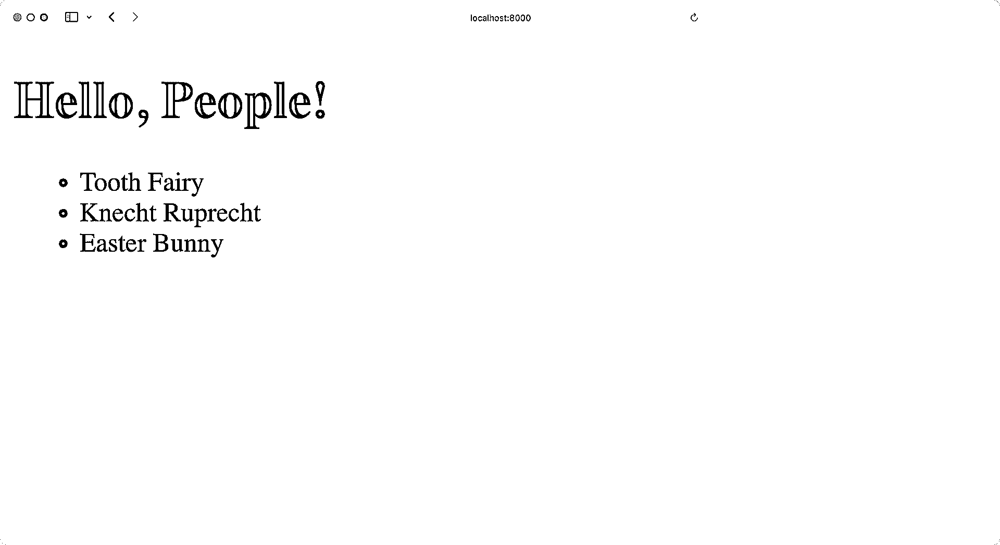

# Python REST APIs 与 Flask、Connexion 和 SQLAlchemy——第 3 部分

> 原文:# t0]https://realython . com/flask-连接-rest API-part-3/

大多数现代网络应用程序都是由一个 REST API 驱动的。这样，开发人员可以将前端代码与后端逻辑分开，用户可以动态地与界面进行交互。在这个由三部分组成的教程系列中，您将使用 **Flask web 框架**构建一个 REST API。

您已经用一个基本的 Flask 项目创建了一个基础，并添加了端点，您将其连接到一个 **SQLite 数据库**。你也在用你一直在构建的 **Swagger UI API 文档**测试你的 API。

在本系列教程的第三部分，您将学习如何:

*   在数据库中使用多个表
*   在数据库中创建**一对多**字段
*   使用 SQLAlchemy 管理**关系**
*   利用棉花糖的嵌套模式
*   在前端显示**相关对象**

您可以通过单击下面的链接下载该项目的第三部分代码:

**源代码:** [点击这里下载免费的源代码](https://realpython.com/bonus/flask-connexion-rest-api-part-3-code/)，您将使用它来完成用 Flask web framework 构建 REST API。

## 演示

在这个由三部分组成的教程系列中，您将构建一个 REST API 来跟踪全年可能访问您的人的笔记。你会创造出像牙仙、复活节兔子和 T4 这样的人。

理想情况下，你想和他们三个都保持良好的关系。这就是为什么你要给他们寄便条，以增加从他们那里得到贵重礼物的机会。

在本教程中，您将进一步扩展您的编程工具带。您将学习如何创建由 SQLAlchemy 表示为[一对多](https://en.wikipedia.org/wiki/One-to-many_(data_model))关系的分层数据结构。此外，您还将扩展已经构建的 REST API，以便为一个人创建、阅读、更新和删除笔记:

[https://player.vimeo.com/video/766055660?background=1](https://player.vimeo.com/video/766055660?background=1)

是时候通过创建人和笔记之间的关系来完成这个由三部分组成的教程系列了！

[*Remove ads*](/account/join/)

## 规划第三部分

在本系列的第一部分中，您构建了您的 REST API。通过[第二部分](https://realpython.com/flask-connexion-rest-api-part-2/)，您将 REST API 连接到数据库。这样，您的 Flask 应用程序可以对现有数据进行更改，并创建新数据，即使您重新启动应用程序服务器，这些新数据也会持续存在。

到目前为止，您已经添加了使用 [SQLAlchemy](https://realpython.com/python-sqlite-sqlalchemy/) 将通过 REST API 所做的更改保存到数据库中的能力，并学习了如何使用 [Marshmallow](https://marshmallow.readthedocs.io/en/stable/) 为 REST API 使用[序列化](https://en.wikipedia.org/wiki/Serialization)该数据。

目前，`people.db`数据库只包含人的数据。在本系列的这一部分中，您将添加一个新表来存储笔记。为了将笔记与一个人联系起来，您将在数据库中的`person`表和`note`表的条目之间创建**关系**。

您将使用包含必要人员和 notes 数据的`build_database.py`脚本来引导`people.db`。以下是您将使用的数据集的摘录:

```py
PEOPLE_NOTES = [
    {
        "lname": "Fairy",
        "fname": "Tooth",
        "notes": [
            ("I brush my teeth after each meal.", "2022-01-06 17:10:24"),
            ("The other day a friend said I have big teeth.", "2022-03-05 22:17:54"),
            ("Do you pay per gram?", "2022-03-05 22:18:10"),
        ],
    },
   # ...
]
```

您将学习如何调整 SQLite 数据库来实现关系。之后，您将能够将`PEOPLE_NOTES`字典翻译成符合您的数据库结构的数据。

最后，您将在应用程序的主页上显示数据库的内容，并使用 Flask REST API 添加、更新和删除您为他人编写的笔记。

## 开始使用

理想情况下，在继续你现在正在阅读的第三部分之前，你已经看完了这个系列教程的第一部分和第二部分的[。或者，您也可以通过单击下面的链接下载第二部分的源代码:](https://realpython.com/flask-connexion-rest-api/)

**源代码:** [点击这里下载免费的源代码](https://realpython.com/bonus/flask-connexion-rest-api-part-2-code/)，您将使用它继续用 Flask web 框架构建 REST API。

如果您从上面的链接下载了源代码，那么请确保遵循所提供的`README.md`文件中的安装说明。

在继续学习本教程之前，请验证您的文件夹结构如下所示:

```py
rp_flask_api/
│
├── templates/
│   └── home.html
│
├── app.py
├── config.py
├── models.py
├── people.py
└── swagger.yml
```

一旦有了 Flask REST API 文件夹结构，您就可以继续阅读，检查您的 Flask 项目是否按预期工作。

### 检查你的烧瓶项目

在你继续你的 Flask 项目之前，创建并激活一个虚拟环境是个好主意。这样，您安装的任何项目依赖项都不是系统范围的，而只是在项目的虚拟环境中。

在下面选择您的**操作系统**，并使用您的平台特定命令来设置虚拟环境:

*   [*视窗*](#windows-1)
**   [**Linux + macOS**](#linux-macos-1)*

```py
PS> python -m venv venv
PS> .\venv\Scripts\activate
(venv) PS>
```

```py
$ python -m venv venv
$ source venv/bin/activate
(venv) $
```

使用上面显示的命令，您可以通过使用 Python 的内置`venv`模块创建并激活一个名为`venv`的虚拟环境。提示前面的圆括号`(venv)`表示您已经成功激活了虚拟环境。

**注意:**如果您还没有完成本系列教程的第二部分，请点击下面的链接下载源代码:

**源代码:** [点击这里下载免费的源代码](https://realpython.com/bonus/flask-connexion-rest-api-part-2-code/)，您将使用它继续用 Flask web 框架构建 REST API。

在继续之前，按照提供的`README.md`文件中列出的说明安装依赖项。

现在您可以验证您的 Flask 应用程序正在运行，没有错误。在包含`app.py`文件的目录中执行以下命令:

```py
(venv) $ python app.py
```

当您运行此应用程序时，web 服务器将在端口 8000 上启动。如果你打开浏览器并导航到`http://localhost:8000`，你应该会看到一个标题为 *Hello，People！*⒃:

[](https://files.realpython.com/media/flask-hello-people.cbe25f3799ed.png)

完美，你的应用程序运行完美！现在是时候考虑新的数据库结构了。

[*Remove ads*](/account/join/)

### 检查数据集

在开始计划如何调整数据库之前，最好先查看一下数据库当前包含的数据以及将要使用的数据集。

您的`people.db`数据库的`person`表目前如下所示:

| 身份证明（identification） | lname | fname | 时间戳 |
| --- | --- | --- | --- |
| one | 仙女 | 牙齿 | 2022-10-08 09:15:10 |
| Two | 鲁普雷希特 | 小厮 | 2022-10-08 09:15:13 |
| three | 兔子 | 复活节 | 2022-10-08 09:15:27 |

您将开始使用一个`PEOPLE_NOTES`列表来扩展您的数据库:

```py
PEOPLE_NOTES = [
    {
        "lname": "Fairy",
        "fname": "Tooth",
        "notes": [
            ("I brush my teeth after each meal.", "2022-01-06 17:10:24"),
            ("The other day a friend said, I have big teeth.", "2022-03-05 22:17:54"),
            ("Do you pay per gram?", "2022-03-05 22:18:10"),
        ],
    },
    {
        "lname": "Ruprecht",
        "fname": "Knecht",
        "notes": [
            ("I swear, I'll do better this year.", "2022-01-01 09:15:03"),
            ("Really! Only good deeds from now on!", "2022-02-06 13:09:21"),
        ],
    },
    {
        "lname": "Bunny",
        "fname": "Easter",
        "notes": [
            ("Please keep the current inflation rate in mind!", "2022-01-07 22:47:54"),
            ("No need to hide the eggs this time.", "2022-04-06 13:03:17"),
        ],
    },
]
```

注意，`PEOPLE_NOTES`中的`lname`值对应于`people.db`数据库的`person`表中`lname`列的内容。

在上面的数据集中，每个人包括一个名为`notes`的键，它与一个包含数据元组的列表相关联。列表中的每个元组代表一个包含内容和时间戳的单个注释。

每个单独的人与多个音符相关联，并且每个单独的音符仅与一个人相关联。这种数据层次结构称为**一对多**关系，其中一个父对象与许多子对象相关。在本教程的后面，您将看到如何使用 SQLAlchemy 在数据库中管理这种[一对多](https://en.wikipedia.org/wiki/One-to-many_(data_model))关系。

### 与人建立关系

不是扩展`person`表并试图在单个表中表示分层数据，而是将数据分成多个表并连接它们。

对于`person`表，这意味着不会有变化。为了表示新的注释信息，您将创建一个名为`note`的新表。

`note`表将如下所示:

| `id` | `person_id` | `content` | `timestamp` |
| --- | --- | --- | --- |
| one | one | 我每顿饭后都刷牙。 | 2022-01-06 17:10:24 |
| Two | one | 有一天，一个朋友说，我的牙齿很大。 | 2022-03-05 22:17:54 |
| three | one | 你按克付费吗？ | 2022-03-05 22:18:10 |
| four | Two | 我发誓，今年我会做得更好。 | 2022-01-01 09:15:03 |
| five | Two | 真的！从此只做好事！ | 2022-02-06 13:09:21 |
| six | three | 请记住当前的通货膨胀率！ | 2022-01-07 22:47:54 |
| seven | three | 这次不用藏蛋了。 | 2022-04-06 13:03:17 |

注意，像`person`表一样，`note`表有一个名为`id`的惟一标识符，它是`note`表的**主键**。`person_id`列创建了与`person`表的关系。

鉴于`id`是表的主键，`person_id`是所谓的**外键**。[外键](https://en.wikipedia.org/wiki/Foreign_key)为`note`表中的每个条目提供与之相关的`person`记录的主键。使用这个，SQLAlchemy 可以通过将`person.id`主键连接到`note.person_id`外键来收集与每个人相关联的所有笔记，从而创建一个关系。


您构建的数据库将数据存储在表中，而表是由行和列组成的二维数组。上面的`People`字典可以用一个行和列的表格来表示吗？它可以通过以下方式保存在您的`person`数据库表中:

| `id` | `lname` | `fname` | `timestamp` | `content` | `note_timestamp` |
| --- | --- | --- | --- | --- | --- |
| one | 仙女 | 牙齿 | 2022-10-08 09:15:10 | 我每顿饭后都刷牙。 | 2022-01-06 17:10:24 |
| Two | 仙女 | 牙齿 | 2022-10-08 09:15:10 | 有一天，一个朋友说，我的牙齿很大。 | 2022-03-05 22:17:54 |
| three | 仙女 | 牙齿 | 2022-10-08 09:15:10 | 你按克付费吗？ | 2022-03-05 22:18:10 |
| four | 鲁普雷希特 | 小厮 | 2022-10-08 09:15:13 | 我发誓，今年我会做得更好。 | 2022-01-01 09:15:03 |
| five | 鲁普雷希特 | 小厮 | 2022-10-08 09:15:13 | 真的！从此只做好事！ | 2022-02-06 13:09:21 |
| six | 复活节 | 兔子 | 2022-10-08 09:15:27 | 请记住当前的通货膨胀率！ | 2022-01-07 22:47:54 |
| seven | 复活节 | 兔子 | 2022-10-08 09:15:27 | 这次不用藏蛋了。 | 2022-04-06 13:03:17 |

上面的表格实际上是可行的。所有的数据都被表示出来，一个人与一组不同的笔记相关联。

从概念上讲，上面的表结构具有相对简单易懂的优点。您甚至可以将数据保存到一个 [CSV 文件](https://realpython.com/python-csv/)中，而不是数据库中。

虽然上面的表格结构可以工作，但是它有一些真正的缺点。其中包括以下内容:

*   由于**冗余数据**导致的维护问题
*   笨拙的**列名**
*   难以呈现**一对多关系**

为了表示笔记的集合，每个人的所有数据对于每个唯一的笔记都是重复的。因此，个人数据是多余的。这对于您的个人数据来说没什么大不了的，因为没有那么多列。但是想象一下，如果一个人有更多的列。即使使用大型磁盘驱动器，如果您要处理数百万行数据，这也会成为存储问题。

随着时间的推移，像这样的冗余数据也会导致维护问题。例如，如果复活节兔子决定改名是一个好主意呢？为了做到这一点，每个包含复活节兔子名字的记录都必须更新，以保持数据的一致性。这种针对数据库的工作会导致数据不一致，尤其是当这项工作是由手工运行 SQL 查询的人来完成时。

此外，命名列变得很笨拙。在上表中，有一个`timestamp`列用于跟踪表中一个人的创建和更新时间。您还希望为便笺的创建和更新时间提供类似的功能，但是因为已经使用了`timestamp`，所以使用了一个虚构的名称`note_timestamp`。

如果您想向`person`表添加额外的一对多关系，该怎么办？例如，您可能会决定包含一个人的孩子或电话号码。每个人可以有多个孩子和多个电话号码。使用上面的 Python `People`字典，您可以通过添加包含数据的新列表的`children`和`phone_numbers`键相对容易地做到这一点。

然而，在上面的`person`数据库表中表示这些新的一对多关系变得非常困难。每一个新的一对多关系都会显著增加子数据中每一项表示该关系所需的行数。此外，与数据冗余相关的问题变得越来越大，越来越难以处理。

**注意:**存储日益庞大和复杂的数据结构的需求推动了 **NoSQL** 数据库的流行。这些数据库系统允许开发人员有效地存储非表结构的异构数据。如果你对 NoSQL 数据库感兴趣，那就去看看 [Python 和 MongoDB:连接到 NoSQL 数据库](https://realpython.com/introduction-to-mongodb-and-python/)。

最后，从上面的表结构中得到的数据很难处理，因为它只是一个很大的列表。

通过将数据集分成两个表并引入外键的概念，您将使数据变得更加复杂。但是您将解决单个表表示的缺点。

关联表的最大优点是数据库中没有冗余数据。对于您希望存储在数据库中的每个人，只有一个人条目。

如果复活节兔子仍然想更改名字，那么您只需更改`person`表中的一行，与该行相关的任何其他内容都将立即利用这一更改。

此外，列命名更加一致和有意义。因为 person 和 note 数据存在于不同的表中，所以创建或更新时间戳可以在两个表中一致地命名，因为跨表命名没有冲突。

但是理论已经够了！在下一节中，您将创建代表您提出的数据库表关系的模型。

[*Remove ads*](/account/join/)

## 扩展您的数据库

在本节中，您将扩展您的数据库。您将修改`models.py`中的`People`数据结构，给每个人一个与他们相关的笔记列表。最后，您将使用一些初始数据填充数据库。

### 创建 SQLAlchemy 模型

要使用上面的两个表并利用它们之间的关系，您需要创建 SQLAlchemy 模型，该模型知道这两个表以及它们之间的关系。

首先更新`models.py`中的`Person`模型，以包含与`notes`集合的关系:

```py
 1# models.py
 2
 3from datetime import datetime
 4from config import db, ma
 5
 6class Person(db.Model):
 7    __tablename__ = "person"
 8    person_id = db.Column(db.Integer, primary_key=True)
 9    lname = db.Column(db.String(32), unique=True)
10    fname = db.Column(db.String(32))
11    timestamp = db.Column(
12        db.DateTime, default=datetime.utcnow, onupdate=datetime.utcnow
13    )
14    notes = db.relationship( 15        Note, 16        backref="person", 17        cascade="all, delete, delete-orphan", 18        single_parent=True, 19        order_by="desc(Note.timestamp)" 20    ) 21
22# ...
```

在第 14 到 20 行，您在`Person`类中创建了一个名为`.notes`的新属性。这个新的`.notes`属性在下面几行代码中定义:

*   **第 14 行:**与您对该类的其他属性所做的类似，这里您创建了一个名为`.notes`的新属性，并将其设置为一个名为`db.relationship`的对象实例。这个对象创建了您正在添加到`Person`类中的关系，它是用下面几行中定义的所有参数创建的。

*   **第 15 行:**参数`Note`定义了与`Person`类相关的 SQLAlchemy 类。`Note`类还没有被定义，所以目前它还不能工作。有时将类称为字符串可能更容易避免先定义哪个类的问题。例如，你可以用`"Note"`代替这里的`Note`。

*   **第 16 行:**`backref="person"`参数在`Note`对象中创建一个向后引用。每个`Note`的实例将包含一个名为`.person`的属性。`.person`属性引用了一个特定的`Note`实例所关联的父对象。如果您的代码遍历 notes 并且必须包含关于父对象的信息，那么在子对象中引用父对象(在本例中为`Person`)会非常有用。

*   **第 17 行:**`cascade="all, delete, delete-orphan"`参数决定当父`Person`实例发生变化时，如何处理`Note`实例。例如，当一个`Person`对象被删除时，SQLAlchemy 将创建从数据库中删除`Person`对象所必需的 SQL。这个参数告诉 SQLAlchemy 也删除与之相关的所有`Note`实例。您可以在 [SQLAlchemy 文档](https://docs.sqlalchemy.org/en/latest/orm/cascades.html#delete)中阅读关于这些选项的更多信息。

*   **第 18 行:**如果`delete-orphan`是先前`cascade`参数的一部分，则`single_parent=True`参数是必需的。这告诉 SQLAlchemy 不允许孤立的`Note`实例——即没有父`Person`对象的`Note`—存在，因为每个`Note`都有一个父对象。

*   **第 19 行:**`order_by="desc(Note.timestamp)"`参数告诉 SQLAlchemy 如何对与`Person`对象相关联的`Note`实例进行排序。当检索到一个`Person`对象时，默认情况下`notes`属性列表将包含顺序未知的`Note`对象。SQLAlchemy `desc()`函数将按照从最新到最早的降序对笔记进行排序，而不是默认的升序。

既然您的`Person`模型有了新的`.notes`属性，并且这代表了与`Note`对象的一对多关系，您将需要为`Note`对象定义一个 SQLAlchemy 模型。因为您从`Person`中引用了`Note`，所以在`Person`类定义之前添加新的`Note`类:

```py
 1# models.py
 2
 3from datetime import datetime
 4from config import db, ma
 5
 6class Note(db.Model): 7    __tablename__ = "note" 8    id = db.Column(db.Integer, primary_key=True) 9    person_id = db.Column(db.Integer, db.ForeignKey("person.id")) 10    content = db.Column(db.String, nullable=False) 11    timestamp = db.Column( 12        db.DateTime, default=datetime.utcnow, onupdate=datetime.utcnow 13    ) 14
15class Person(db.Model):
16    # ...
17
18# ...
```

正如您在上面的示例数据库表中所了解到的,`Note`类定义了组成一个注释的属性。使用此代码，您可以定义属性:

*   **第 6 行**创建了`Note`类，继承自`db.Model`，就像你之前创建`Person`类一样。

*   **第 7 行**告诉这个类使用什么数据库表来存储`Note`对象。

*   **第 8 行**创建了`.id`属性，将其定义为一个整数值和`Note`对象的主键。

*   **第 9 行**创建了`.person_id`属性并将其定义为外键，使用`.person.id`主键将`Note`类与`Person`类相关联。这和`Person.notes`属性是 SQLAlchemy 在与`Person`和`Note`对象交互时知道该做什么的方式。

*   **第 10 行**创建了`.content`属性，它包含了注释的实际文本。`nullable=False`参数表示可以创建没有内容的新便笺。

*   **第 11 行到第 13 行**创建了`.timestamp`属性，与`Person`类完全一样，该属性包含任何特定`Note`实例的创建或更新时间。

现在您已经更新了`People`并为`Note`创建了模型，接下来更新数据库。

### 馈入数据库

现在您已经更新了`Person`并创建了`Note`模型，您将使用它们来重建`people.db`数据库。为此，创建一个名为`build_database.py`的辅助 Python 脚本:

```py
# build_database.py

from datetime import datetime
from config import app, db
from models import Person, Note

PEOPLE_NOTES = [
    {
        "lname": "Fairy",
        "fname": "Tooth",
        "notes": [
            ("I brush my teeth after each meal.", "2022-01-06 17:10:24"),
            ("The other day a friend said, I have big teeth.", "2022-03-05 22:17:54"),
            ("Do you pay per gram?", "2022-03-05 22:18:10"),
        ],
    },
    {
        "lname": "Ruprecht",
        "fname": "Knecht",
        "notes": [
            ("I swear, I'll do better this year.", "2022-01-01 09:15:03"),
            ("Really! Only good deeds from now on!", "2022-02-06 13:09:21"),
        ],
    },
    {
        "lname": "Bunny",
        "fname": "Easter",
        "notes": [
            ("Please keep the current inflation rate in mind!", "2022-01-07 22:47:54"),
            ("No need to hide the eggs this time.", "2022-04-06 13:03:17"),
        ],
    },
]

with app.app_context():
    db.drop_all()
    db.create_all()
    for data in PEOPLE_NOTES:
        new_person = Person(lname=data.get("lname"), fname=data.get("fname"))
        for content, timestamp in data.get("notes", []):
            new_person.notes.append(
                Note(
                    content=content,
                    timestamp=datetime.strptime(timestamp, "%Y-%m-%d %H:%M:%S"),
                )
            )
        db.session.add(new_person)
    db.session.commit()
```

在上面的代码中，您正在向项目的数据库提供`PEOPLE_NOTES`的内容。您从您的`config`模块中使用`db`，因此 Python 知道如何处理`data`并将其提交给相应的数据库表和单元格。

**注意:**当你执行`build_database.py`时，你会重新创建`people.db`。`people.db`中的任何现有数据都将丢失。

从命令行运行`build_database.py`程序将使用新添加的内容重新创建数据库，为 web 应用程序做好准备:

```py
(venv) $ python build_database.py
```

一旦您的项目包含一个新的数据库，您可以调整您的项目以在前端显示注释。

[*Remove ads*](/account/join/)

## 显示人物及其注释

现在您的数据库包含了要处理的数据，您可以开始在前端和 REST API 中显示数据了。

### 在前端显示注释

在上一节中，您通过向`Person`类添加一个`.notes`属性，创建了一个人和他的笔记之间的关系。

更新您的`templates/`文件夹中的`home.html`以访问某人的笔记:

```py
<!-- templates/home.html -->

<!DOCTYPE html>
<html lang="en">
<head>
    <meta charset="UTF-8">
    <title>RP Flask REST API</title>
</head>
<body>
    <h1>
        Hello, People!
    </h1>
  <h2>{{ person.fname }} {{ person.lname }}</h2> <ul>  <li> {{ note.content }} </li>  </ul>  </body>
</html>
```

在上面的代码中，您访问每个人的`.notes`属性。之后，您将遍历特定人的所有笔记，以访问笔记的内容。

导航到`http://localhost:8000`检查您的模板是否如预期呈现:

[](https://files.realpython.com/media/flask-frontend-people-notes.92c31bf14a56.png)

完美，你可以看到每个人的笔记列在你的前端。这意味着 Flask 成功地连接了引擎盖下的`Person`和`Notes`，并为您提供了一个可以方便使用的`people`对象。

### 用笔记回应

接下来，在`http://localhost:8000/api/people`检查 API 的`/api/people`端点:

[](https://files.realpython.com/media/flask-rest-people-no-notes.92ebd78bce3a.png)

您正在接收 people 集合，没有任何错误。但是，您收到的数据中没有注释。

要调查这个问题，请看一下`people.py`中的`read_all()`:

```py
 1# people.py
 2
 3# ...
 4
 5def read_all():
 6    people = Person.query.all()
 7    person_schema = PersonSchema(many=True)
 8    return person_schema.dump(people)
 9
10# ...
```

第 8 行中的`.dump()`方法处理它接收到的数据，不过滤掉任何数据。所以问题可能出在第 6 行的`people`或者第 7 行的`person_schema`的定义上。

填充`people`的数据库查询调用与`app.py`中的完全相同:

```py
Person.query.all()
```

这个调用在前端成功地显示了每个人的笔记。这挑出`PersonSchema`作为最可能的罪犯。

默认情况下，棉花糖模式不会遍历相关的数据库对象。您必须显式地告诉模式包含关系。

打开`models.py`并更新`PersonSchema`:

```py
# models.py

# ...

class PersonSchema(ma.SQLAlchemyAutoSchema):
    class Meta:
        model = Person
        load_instance = True
        sqla_session = db.session
 include_relationships = True
```

对于`PersonSchema`的`Meta`类中的`include_relationships`，您告诉 Marshmallow 将任何相关对象添加到 person 模式中。然而，结果看起来仍然不像预期的那样:

[](https://files.realpython.com/media/flask-rest-people-no-notes-ids.e982b09d7fa9.png)

在`http://localhost:8000/api/people`的回复现在包含了每个人的笔记。但是，`notes`对象只包含一个主键列表，而不是显示一个注释包含的所有数据。

[*Remove ads*](/account/join/)

### 创建一个 Notes 模式

您的 API 响应只列出了每个人笔记的主键。这很公平，因为您还没有声明 Marshmallow 应该如何反序列化这些音符。

通过在`Note`下面的`models.py`和`Person`上面创建`NoteSchema`来帮助棉花糖:

```py
# models.py

# ...

class Note(db.Model):
    # ...

class NoteSchema(ma.SQLAlchemyAutoSchema):
 class Meta: model = Note load_instance = True sqla_session = db.session include_fk = True 
class Person(db.Model):
    # ...

class PersonSchema(ma.SQLAlchemyAutoSchema):
    # ...

note_schema = NoteSchema() # ...
```

你正在从`NoteSchema`中引用`Note`，所以你必须将`NoteSchema`放在你的`Note`类定义下面以防止错误。您还实例化了`NoteSchema`来创建一个稍后将引用的对象。

因为您的`Note`模型包含一个外键，所以您必须将`include_fk`设置为`True`。否则棉花糖不会在序列化过程中识别出`person_id`。

有了`NoteSchema`，您可以在`PeopleSchema`中引用它:

```py
# models.py

from datetime import datetime
from marshmallow_sqlalchemy import fields 
from config import db, ma

# ...

class PersonSchema(ma.SQLAlchemyAutoSchema):
    class Meta:
        model = Person
        load_instance = True
        sqla_session = db.session
        include_relationships = True

 notes = fields.Nested(NoteSchema, many=True)
```

从`marshmallow_sqlalchemy`导入`fields`后，可以通过`NoteSchema`引用相关的`Note`对象。为了避免出错，请确认您在`PeopleSchema`上方定义了`NoteSchema`。

尽管您正在使用`SQLAlchemyAutoSchema`，但是您必须在`PersonSchema`中显式创建`notes`字段。否则，Marshmallow 不会收到处理`Notes`数据所需的所有信息。例如，它不知道你在期待一个使用`many`参数的对象列表。

更改完成后，在`http://localhost:8000/api/people`检查 API 的端点:

[](https://files.realpython.com/media/flask-rest-people-with-notes.f0577cefb27a.png)

完美，你的`read_all()`函数不仅返回了所有的人，还返回了所有附加在每个人身上的笔记！

在下一节中，您将扩展 Flask REST API 来创建、读取、更新和删除单个注释。

## 用你的 REST API 处理笔记

您已经更新了 SQLAlchemy 模型，并使用它们从`people.db`数据库中读取数据。您的笔记可以作为嵌套模式在`People`中获得。当您请求一群人或某个特定的人时，您会收到笔记列表:

| 行动 | HTTP 动词 | path | 描述 |
| --- | --- | --- | --- |
| 阅读 | `GET` | `/api/people` | 读一集人。 |
| 阅读 | `GET` | `/api/people/<lname>` | 读一个特定的人。 |

虽然您可以通过上表中显示的端点读取注释，但是目前还没有办法只读取一个注释或者在 REST API 中管理任何注释。

**注意:**URL 参数是**区分大小写**。例如，您必须访问姓氏中有一个大写 R 的`http://localhost:8000/api/people/Ruprecht`*RUP Recht*。

您可以跳到[第一部分](https://realpython.com/flask-connexion-rest-api/#building-out-the-complete-api)来回顾您是如何构建 REST API 的现有`people`端点的。在本节教程中，您将添加额外的端点来提供创建、阅读、更新和删除笔记的功能:

| 行动 | HTTP 动词 | path | 描述 |
| --- | --- | --- | --- |
| 创造 | `POST` | `/api/notes` | 创建新便笺的 URL |
| 阅读 | `GET` | `/api/notes/<note_id>` | 阅读单个便笺的 URL |
| 更新 | `PUT` | `api/notes/<note_id>` | 用于更新单个注释的 URL |
| 删除 | `DELETE` | `api/notes/<note_id>` | 删除单个便笺的 URL |

您将从添加阅读单个便笺的功能开始。为此，您将调整包含 API 定义的 [Swagger 配置文件](https://realpython.com/flask-connexion-rest-api/#create-the-api-configuration-file)。

[*Remove ads*](/account/join/)

### 阅读单个笔记

目前，当你从一个特定的人那里请求数据时，你可以收到这个人的所有笔记。要获得关于一个注释的信息，您将添加另一个端点。

在添加端点之前，通过在`swagger.yml`文件中创建一个`note_id`参数组件来更新您的 **Swagger 配置**:

```py
# swagger.yml # ... components: schemas: # ... parameters: lname: # ... note_id:   name:  "note_id" description:  "ID  of  the  note" in:  path required:  true schema: type:  "integer" # ...
```

`parameters`中的`note_id`将是您的端点的一部分，用于标识您想要处理哪个音符。

继续编辑`swagger.yml`并添加端点数据以读取单个注释:

```py
# swagger.yml # ... paths: /people: # ... /people/{lname}: # ... /notes/{note_id}:   get: operationId:  "notes.read_one" tags: -  Notes summary:  "Read  one  note" parameters: -  $ref:  "#/components/parameters/note_id" responses: "200": description:  "Successfully  read  one  note"
```

`/notes/{note_id}`的结构和`/people/{lname}`类似。您从`/notes/{note_id}`路径的`get`操作开始。`{note_id}`子串是一个注释 ID 的占位符，您必须将它作为一个 **URL 参数**传入。例如，URL `http://localhost:8000/api/notes/1`将为您提供带有主键`1`的注释的数据。

`operationId`指向`notes.read_one`。这意味着您的 API 期望在一个`notes.py`文件中有一个`read_one()`函数。继续，创建`notes.py`并添加`read_one()`:

```py
# notes.py

from flask import abort, make_response

from config import db
from models import Note, note_schema

def read_one(note_id):
    note = Note.query.get(note_id)

    if note is not None:
        return note_schema.dump(note)
    else:
        abort(
            404, f"Note with ID {note_id} not found"
        )
```

虽然您还没有使用`make_response()`和`db`,但是您已经可以将它们添加到您的导入中了。当你写数据库的时候，你会用到它们。

现在，您只能从 REST URL 路径中读取带有`note_id`参数的数据库。您在查询的`.get()`方法中使用`note_id`来获取带有`note_id`整数主键的注释。

如果找到了一个注释，那么`note`包含一个`Note`对象，您返回序列化的对象。请在您的浏览器中访问`http://localhost:8000/api/notes/1`来试试吧:

[](https://files.realpython.com/media/flask-rest-one-note.6d61e38d98ac.png)

完美，带有注释数据集的 API 响应看起来和预期的一模一样！接下来，您将使用同一个端点来更新和删除一个注释。

### 更新和删除注释

这一次，首先在`notes.py`中创建函数，然后在`swagger.yml`中创建操作。

在`notes.py`中增加`update()`和`delete()`:

```py
# notes.py

# ...

def update(note_id, note):
    existing_note = Note.query.get(note_id)

    if existing_note:
        update_note = note_schema.load(note, session=db.session)
        existing_note.content = update_note.content
        db.session.merge(existing_note)
        db.session.commit()
        return note_schema.dump(existing_note), 201
    else:
        abort(404, f"Note with ID {note_id} not found")

def delete(note_id):
    existing_note = Note.query.get(note_id)

    if existing_note:
        db.session.delete(existing_note)
        db.session.commit()
        return make_response(f"{note_id} successfully deleted", 204)
    else:
        abort(404, f"Note with ID {note_id} not found")
```

当你比较`update()`和`delete()`时，它们有着相似的结构。这两个函数都查找现有的注释，并使用数据库会话。

为了让`update()`工作，您还接受一个`note`对象作为参数，它包含您可以更新的`.content`属性。

相比之下，你只需要在调用`delete()`的时候知道你想要去掉的音符的 ID 就可以了。

接下来，在`swagger.yml`中创建引用`notes.update`和`notes.delete`的两个操作:

```py
# swagger.yml # ... paths: /people: # ... /people/{lname}: # ... /notes/{note_id}: get: # ... put:   tags: -  Notes operationId:  "notes.update" summary:  "Update  a  note" parameters: -  $ref:  "#/components/parameters/note_id" responses: "200": description:  "Successfully  updated  note" requestBody: content: application/json: schema: x-body-name:  "note" type:  "object" properties: content: type:  "string" delete:   tags: -  Notes operationId:  "notes.delete" summary:  "Delete  a  note" parameters: -  $ref:  "#/components/parameters/note_id" responses: "204": description:  "Successfully  deleted  note"
```

同样，`put`和`delete`的结构也是类似的。主要区别在于，您需要提供一个包含注释数据的`requestBody`来更新数据库对象。

现在，您已经创建了使用现有笔记的端点。接下来，您将添加端点来创建注释。

[*Remove ads*](/account/join/)

### 为某人创建备忘录

到目前为止，您可以阅读、更新和删除单个便笺。这些是您可以在现有笔记上执行的操作。现在是时候向 REST API 添加功能来创建新的注释了。

将`create()`添加到`notes.py`:

```py
# notes.py

from flask import make_response, abort

from config import db
from models import Note, Person, note_schema 
# ...

def create(note):
    person_id = note.get("person_id")
    person = Person.query.get(person_id)

    if person:
        new_note = note_schema.load(note, session=db.session)
        person.notes.append(new_note)
        db.session.commit()
        return note_schema.dump(new_note), 201
    else:
        abort(
            404,
            f"Person not found for ID: {person_id}"
        )
```

一个音符总是需要一个人的归属。这就是为什么您在创建新便笺时需要使用`Person`模型。

首先，您通过使用`person_id`来寻找笔记的所有者，您通过`notes`参数为`create()`提供该笔记。如果这个人存在于数据库中，那么您继续添加新的注释到`person.notes`。

虽然在这种情况下您使用的是数据库表`person`，但是 SQLAlchemy 会注意将注释添加到表`note`中。

要使用您的 API 访问`notes.create`，请跳到`swagger.yml`并添加另一个端点:

```py
# swagger.yml # ... paths: /people: # ... /people/{lname}: # ... /notes:   post: operationId:  "notes.create" tags: -  Notes summary:  "Create  a  note  associated  with  a  person" requestBody: description:  "Note  to  create" required:  True content: application/json: schema: x-body-name:  "note" type:  "object" properties: person_id: type:  "integer" content: type:  "string" responses: "201": description:  "Successfully  created  a  note" /notes/{note_id}: # ...
```

您可以在`/notes/{noted_id}`端点之前添加`/notes`端点。这样，您就可以按照从一般到特殊的顺序排列您的 notes 端点。当你的 API 变大时，这个顺序可以帮助你浏览你的`swagger.yml`文件。

使用`schema`块中的数据，您向 Marshmallow 提供了关于如何在 API 中序列化一个注释的信息。如果您将这个`Note`模式与`models.py`中的`Note`模型进行比较，那么您会注意到名称`person_id`和`content`是匹配的。字段的类型也是如此。

您可能还会注意到，并不是所有的注释模型字段都出现在组件模式中。这没关系，因为您将只使用这个模式来发布新的注释。对于每个音符，`id`和`timestamp`将被自动设置。

处理笔记的所有端点都准备好了，是时候看看 API 文档了。

### 浏览您的 API 文档

完成上述更改后，您可以利用 API 来添加、更新和删除注释。在`http://localhost:8000/api/ui`访问您的 Swagger UI，探索您的 API 端点:

[https://player.vimeo.com/video/766055660?background=1](https://player.vimeo.com/video/766055660?background=1)

太棒了，你的 Flask REST API 端点工作了！您对 API 执行的任何更改也会出现在您的前端。

## 结论

在本教程中，您调整了 SQLite 数据库来实现关系。之后，您将`PEOPLE_NOTES`字典翻译成符合您的数据库结构的数据，并将 Flask REST API 转换成记录笔记的 web 应用程序。

**在本系列教程的第三部分中，您学习了如何:**

*   在数据库中使用多个表
*   在数据库中创建**一对多**字段
*   使用 SQLAlchemy 管理**关系**
*   利用棉花糖的嵌套模式
*   在前端显示**相关对象**

知道如何建立和使用数据库关系为您提供了解决许多难题的强大工具。除了本教程中的一对多示例之外，还有其他关系。其他常见的有[一对一](https://en.wikipedia.org/wiki/One-to-one_(data_model))、[多对多](https://en.wikipedia.org/wiki/Many-to-many_(data_model))、[多对一](https://www.ibm.com/support/knowledgecenter/en/SSWU4L/Data/imc_Data/Data_q_a_watson_assistant/What_is_a_many-to-one_relationship.html)。所有这些在您的工具箱中都有一席之地，SQLAlchemy 可以帮助您解决所有这些问题！

您已经成功地构建了一个 REST API 来为全年可能访问您的人跟踪笔记。你的数据库里有像牙仙、复活节兔子和 Knecht Ruprecht 这样的人。通过添加笔记，你可以记录你的善行，并有希望从他们那里收到有价值的礼物。

要查看您的代码，请单击下面的链接:

**源代码:** [点击这里下载免费的源代码](https://realpython.com/bonus/flask-connexion-rest-api-part-3-code/)，您将使用它来完成用 Flask web framework 构建 REST API。

你有没有在你的 Flask REST API 项目中添加一个特殊的人或者注释？在下面的评论中让真正的 Python 社区知道吧。

[« Part 2: Database Persistence](https://realpython.com/flask-connexion-rest-api-part-2/)[Part 3: Database Relationships](#)**********