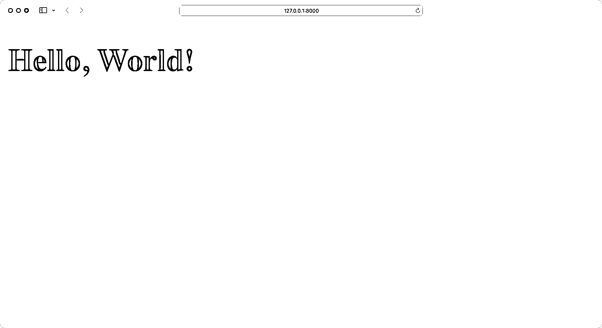
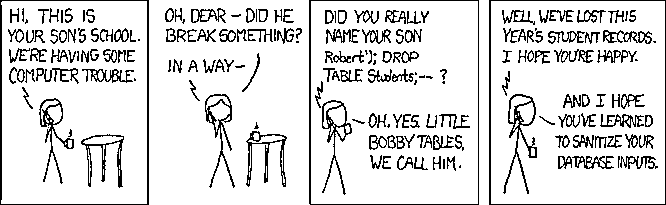
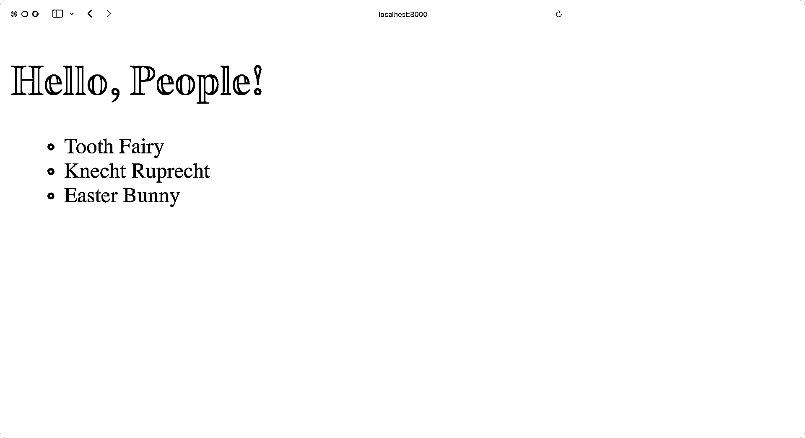

# Python REST APIs 与 Flask、Connexion 和 SQLAlchemy——第 2 部分

> 原文:# t0]https://realython . com/flask-连接-rest API-part-2/

大多数现代网络应用程序都是由一个 REST API 驱动的。这样，开发人员可以将前端代码与后端逻辑分开，用户可以动态地与界面进行交互。在这个由三部分组成的教程系列中，您将使用 **Flask web 框架**构建一个 REST API。

您已经用一个基本的 Flask 项目创建了一个基础，并添加了端点，您将把端点连接到一个 **SQLite 数据库**。你也在用你一直在构建的 **Swagger UI API 文档**测试你的 API。

在第一部分的[中，您使用 Flask 和 Connexion 创建了一个 REST API，为名为`PEOPLE`的内存结构提供 CRUD 操作。通过这样做，您了解了 Connexion 模块如何帮助您构建良好的 REST API 和交互式文档。](https://realpython.com/flask-connexion-rest-api/)

在本系列教程的第二部分，您将学习如何:

*   用 Python 编写 SQL 命令
*   为您的 Flask 项目配置一个 **SQLite 数据库**
*   使用 **SQLAlchemy** 将 Python 对象保存到数据库中
*   利用**棉花糖库**来序列化数据
*   将您的 REST API 与数据库连接起来

在完成本系列的第二部分之后，您将继续第三部分，在第三部分中，您将扩展 REST API，使其具有为某人添加注释的功能。

您可以通过单击下面的链接下载该项目的第二部分代码:

**源代码:** [点击这里下载免费的源代码](https://realpython.com/bonus/flask-connexion-rest-api-part-2-code/)，您将使用它继续用 Flask web 框架构建 REST API。

## 演示

在这个由三部分组成的教程系列中，您将构建一个 REST API 来跟踪全年可能访问您的人的笔记。你会创造出像牙仙、复活节兔子和 T4 这样的人。

理想情况下，你想和他们三个都保持良好的关系。这就是为什么你要给他们寄便条，以增加从他们那里得到贵重礼物的机会。

您可以通过利用 API 文档与您的应用程序进行交互。同时，您还构建了一个反映数据库内容的基本前端:

[https://player.vimeo.com/video/766055660?background=1](https://player.vimeo.com/video/766055660?background=1)

在本系列的第二部分中，您将通过添加适当的数据库来增强应用程序的后端。这样，即使重新启动应用程序，您也可以保存数据:

[https://player.vimeo.com/video/759061210?background=1](https://player.vimeo.com/video/759061210?background=1)

使用您的 Swagger UI 文档，您将能够与 REST API 进行交互，并确保一切按预期运行。

[*Remove ads*](/account/join/)

## 规划第二部分

在本系列教程的第一部分中，您使用了一个`PEOPLE`字典来存储数据。数据集看起来像这样:

```py
PEOPLE = {
    "Fairy": {
        "fname": "Tooth",
        "lname": "Fairy",
        "timestamp": "2022-10-08 09:15:10",
    },
    "Ruprecht": {
        "fname": "Knecht",
        "lname": "Ruprecht",
        "timestamp": "2022-10-08 09:15:13",
    },
    "Bunny": {
        "fname": "Easter",
        "lname": "Bunny",
        "timestamp": "2022-10-08 09:15:27",
    }
}
```

这种数据结构便于让您的项目跟上速度。然而，当您重启应用程序时，您用 REST API 添加到`PEOPLE`的任何数据都会丢失。

在这一部分，您将把您的`PEOPLE`数据结构转换成如下所示的数据库表:

| 身份证明（identification） | lname | fname | 时间戳 |
| --- | --- | --- | --- |
| one | 仙女 | 牙齿 | 2022-10-08 09:15:10 |
| Two | 鲁普雷希特 | 小厮 | 2022-10-08 09:15:13 |
| three | 兔子 | 复活节 | 2022-10-08 09:15:27 |

在本教程中，您不会对 REST API 端点进行任何更改。但是您将在后端进行的更改将是显著的，并且您将最终获得一个更加通用的代码库，以帮助您在将来扩展 Flask 项目。

## 开始使用

在本节中，您将签入您正在处理的 Flask REST API 项目。您需要确保为本教程系列的下一步做好准备。

为了在复杂数据类型和 Python 数据类型之间进行转换，您需要一个**序列化器**。在本教程中，你将使用[烧瓶-棉花糖](https://flask-marshmallow.readthedocs.io/en/latest/)。 **Flask-Marshmallow** 扩展了 [Marshmallow](https://marshmallow.readthedocs.io/en/stable/) 库，并在使用 Flask 时提供额外的功能。

### 抓住先决条件

理想情况下，在继续阅读第二部分之前，你已经阅读了本系列教程的第一部分。或者，您也可以通过单击下面的链接从第一部分下载源代码:

**源代码:** [点击这里下载免费的源代码](https://realpython.com/bonus/flask-connexion-rest-api-part-1-code/)，您将使用它来构建一个带有 Flask web 框架的 REST API。

如果您从上面的链接下载了源代码，那么请确保遵循所提供的`README.md`文件中的安装说明。

在继续学习本教程之前，请验证您的文件夹结构如下所示:

```py
rp_flask_api/
│
├── templates/
│   └── home.html
│
├── app.py
├── people.py
└── swagger.yml
```

一旦您准备好了 Flask REST API 文件夹结构，您就可以继续阅读，安装您将在本系列教程的这一部分中需要的依赖项。

### 添加新的依赖关系

在你继续你的 Flask 项目之前，创建并激活一个虚拟环境是个好主意。这样，您安装的任何项目依赖项都不是系统范围的，而只是在项目的虚拟环境中。

在下面选择您的**操作系统**，并使用您的平台特定命令来设置虚拟环境:

*   [*视窗*](#windows-1)
**   [**Linux + macOS**](#linux-macos-1)*

```py
PS> python -m venv venv
PS> .\venv\Scripts\activate
(venv) PS>
```

```py
$ python -m venv venv
$ source venv/bin/activate
(venv) $
```

使用上面显示的命令，您可以通过使用 Python 的内置`venv`模块创建并激活一个名为`venv`的虚拟环境。提示前面的圆括号`(venv)`表示您已经成功激活了虚拟环境。

**注意:**如果您还没有完成本教程系列的第一部分，请点击下面的链接下载源代码:

**源代码:** [点击这里下载免费的源代码](https://realpython.com/bonus/flask-connexion-rest-api-part-1-code/)，您将使用它来构建一个带有 Flask web 框架的 REST API。

在继续之前，按照提供的`README.md`文件中列出的说明安装依赖项。

接下来，用`sqlalchemy`选项安装`flask-marshmallow`:

```py
(venv) $ python -m pip install "flask-marshmallow[sqlalchemy]==0.14.0"
```

Flask-Marshmallow 还安装了`marshmallow`，它提供了在 Python 对象流入流出 REST API 时序列化和反序列化 Python 对象的功能，REST API 基于 [JSON](https://realpython.com/python-json/) 。Marshmallow 将 [Python 类实例](https://realpython.com/python3-object-oriented-programming/)转换成可以转换成 JSON 的对象。

通过使用`sqlalchemy`选项，你还可以安装帮助你的 Flask 应用利用 [SQLAlchemy](https://realpython.com/python-sqlite-sqlalchemy/) 的能力的包。

SQLAlchemy 提供了一个[对象关系模型(ORM)](https://en.wikipedia.org/wiki/Object-relational_mapping) ，它将每个 Python 对象存储到对象数据的数据库表示中。这可以帮助您继续以 Pythonic 的方式思考，而不必关心对象数据在数据库中的表示方式。

[*Remove ads*](/account/join/)

### 检查你的烧瓶项目

完成上述步骤后，您可以验证您的 Flask 应用程序正在运行，没有错误。在包含`app.py`文件的目录中执行以下命令:

```py
(venv) $ python app.py
```

当您运行这个应用程序时，web 服务器将在端口 8000 上启动，这是 Flask 使用的默认端口。如果你打开浏览器并导航到`http://localhost:8000`，你应该会看到 *Hello，World！*⒃:

[](https://files.realpython.com/media/flask-hello-world.a5c395d3d321.png)

完美，你的应用程序运行完美！现在是时候进入后端并使用适当的数据库了。

## 初始化数据库

目前，您将 Flask 项目的数据存储在一个字典中。像这样存储数据是不持久的。这意味着当您重新启动 Flask 应用程序时，任何数据更改都会丢失。最重要的是，你的字典结构并不理想。

在本节中，您将向您的 Flask 项目添加一个适当的数据库来解决这些缺点。

### 检查您当前的数据结构

目前，您将数据存储在`people.py`的`PEOPLE`字典中。代码中的数据结构如下所示:

```py
# people.py

# ...

PEOPLE = {
    "Fairy": {
        "fname": "Tooth",
        "lname": "Fairy",
        "timestamp": get_timestamp(),
    },
    "Ruprecht": {
        "fname": "Knecht",
        "lname": "Ruprecht",
        "timestamp": get_timestamp(),
    },
    "Bunny": {
        "fname": "Easter",
        "lname": "Bunny",
        "timestamp": get_timestamp(),
    }
}

# ...
```

您对程序所做的修改会将所有数据移动到数据库表中。这意味着数据将被保存到您的磁盘上，并存在于`app.py`程序的运行之间。

### 概念化你的数据库表

从概念上讲，您可以将数据库表想象成一个二维的[数组](https://en.wikipedia.org/wiki/Array_(data_structure))，其中行是记录，列是这些记录中的字段。

数据库表通常有一个自动递增的整数值作为行的查找键。这被称为**主键**。表中的每条记录都有一个主键，其值在整个表中是唯一的。主键独立于表中存储的数据，这使您可以自由地修改行中的任何其他字段。

您将遵循数据库惯例，将表命名为单数，因此该表将被称为`person`。

将上面的`PEOPLE`结构转换成名为`person`的数据库表将如下所示:

| 身份证明（identification） | lname | fname | 时间戳 |
| --- | --- | --- | --- |
| one | 仙女 | 牙齿 | 2022-10-08 09:15:10 |
| Two | 鲁普雷希特 | 小厮 | 2022-10-08 09:15:13 |
| three | 兔子 | 复活节 | 2022-10-08 09:15:27 |

表中的每列都有一个字段名，如下所示:

*   **`id` :** 每个人的主键字段
*   **`lname` :** 人的姓
*   **`fname` :** 人的名字
*   **`timestamp` :** 最后一次更改的时间戳

有了这个数据库概念，就该构建数据库了。

[*Remove ads*](/account/join/)

### 构建您的数据库

您将使用 **SQLite** 作为数据库引擎来存储`PEOPLE`数据。 [SQLite](https://www.sqlite.org/index.html) 是一个广泛使用的**关系数据库管理系统** (RDBMS)，它不需要 SQL 服务器就能工作。

与其他 SQL 数据库引擎不同，SQLite 使用一个文件来维护所有的数据库功能。因此，要使用数据库，程序只需要知道如何读写 SQLite 文件。

Python 内置的 [`sqlite3`](https://docs.python.org/3/library/sqlite3.html) 模块可以让你在没有任何外部包的情况下与 SQLite 数据库进行交互。这使得 SQLite 在启动新的 Python 项目时特别有用。

启动一个新的 [Python 交互 shell](https://realpython.com/interacting-with-python/) 来创建`people.db` SQLite 数据库:

>>>

```py
>>> import sqlite3
>>> conn = sqlite3.connect("people.db")
>>> columns = [
...     "id INTEGER PRIMARY KEY",
...     "lname VARCHAR UNIQUE",
...     "fname VARCHAR",
...     "timestamp DATETIME",
... ]
>>> create_table_cmd = f"CREATE TABLE person ({','.join(columns)})"
>>> conn.execute(create_table_cmd)
<sqlite3.Cursor object at 0x1063f4dc0>
```

导入 [`sqlite3`模块](https://docs.python.org/3/library/sqlite3.html)后，可以用`.connect()`创建一个新的数据库。如果您在定义了`conn`变量之后查看一下您的文件系统，那么您会注意到 Python 马上创建了`people.db`数据库文件。

使用`conn.execute()`，您可以运行 **SQL 命令**来创建一个`person`表，其中包含列`id`、`lname`、`fname`和`timestamp`。

注意，您为`lname`包含了一个`UNIQUE`约束。这很重要，因为您在 REST API 中使用姓氏来标识一个人。因此，您的数据库必须确保`lname`的唯一性，以防止您的数据不一致。

现在您的数据库已经存在，您可以向其中添加数据:

>>>

```py
>>> import sqlite3
>>> conn = sqlite3.connect("people.db")
>>> people = [
...     "1, 'Fairy', 'Tooth', '2022-10-08 09:15:10'",
...     "2, 'Ruprecht', 'Knecht', '2022-10-08 09:15:13'",
...     "3, 'Bunny', 'Easter', '2022-10-08 09:15:27'",
... ]
>>> for person_data in people:
...     insert_cmd = f"INSERT INTO person VALUES ({person_data})"
...     conn.execute(insert_cmd)
...
<sqlite3.Cursor object at 0x104ac4dc0>
<sqlite3.Cursor object at 0x104ac4f40>
<sqlite3.Cursor object at 0x104ac4fc0>

>>> conn.commit()
```

一旦连接到`people.db`数据库，您就声明一个**事务**来将`people_data`插入到`person`表中。`conn.execute()`命令在内存中创建`sqlite3.Cursor`对象。只有当你运行`conn.commit()`时，你才能使交易发生。

### 与数据库交互

与 Python 等编程语言不同，SQL 没有定义如何获取数据。SQL 描述了什么数据是需要的，并把如何处理的任务留给了数据库引擎。

获取`person`表中所有数据的 SQL 查询应该是这样的:

```py
SELECT  *  FROM  person;
```

这个查询告诉数据库引擎从`person`表中获取所有字段。在以下 Python 代码中，使用 SQLite 运行上述查询并显示数据:

>>>

```py
 1>>> import sqlite3
 2>>> conn = sqlite3.connect("people.db")
 3>>> cur = conn.cursor()
 4>>> cur.execute("SELECT * FROM person")
 5<sqlite3.Cursor object at 0x102357a40>
 6
 7>>> people = cur.fetchall()
 8>>> for person in people:
 9...     print(person)
10...
11(1, 'Fairy', 'Tooth', '2022-10-08 09:15:10')
12(2, 'Ruprecht', 'Knecht', '2022-10-08 09:15:13')
13(3, 'Bunny', 'Easter', '2022-10-08 09:15:27')
```

上面的代码执行以下操作:

*   **线 1** 导入`sqlite3`模块。
*   **第 2 行**创建一个到数据库文件的连接。
*   **第 3 行**从连接创建一个光标。
*   **第 4 行**使用光标执行一个用字符串表示的`SQL`查询。
*   **第 7 行**获取`SQL`查询返回的所有记录，并将它们分配给`people` [变量](https://realpython.com/python-variables/)。
*   **第 8 行和第 9 行**迭代`people`并打印出每个人的数据。

在上面的程序中，SQL 语句是一个直接传递给数据库执行的字符串。在这种情况下，这可能不是一个大问题，因为 SQL 是一个完全受程序控制的字符串。然而，REST API 的用例将从 web 应用程序中获取用户输入，并使用它来创建 SQL 查询。这可能会使您的应用程序受到攻击。

展开以下部分，了解如何:


您可能还记得本系列教程的第一部分，REST API 端点对[从`PEOPLE`数据中获取单个`person`](https://realpython.com/flask-connexion-rest-api/handle-a-person/) ，如下所示:

```py
GET /api/people/{lname}
```

这意味着您的 API 期望在 URL 端点路径中有一个变量`lname`，用于查找一个人。通过修改上面的 Python SQLite 代码来实现这一点，看起来会像这样:

```py
 1lname = "Fairy"
 2cur.execute(f"SELECT * FROM person WHERE lname = '{lname}'")
```

上面的代码片段执行以下操作:

*   **第 1 行**将`lname`变量设置为`'Fairy'`。这将来自 REST API URL 端点路径。
*   **第 2 行**使用 Python [字符串格式化](https://realpython.com/python-f-strings/)创建一个 SQL 字符串并执行它。

为了简单起见，上面的代码将`lname`变量设置为一个常量，但实际上它来自 API URL 端点路径，可以是用户提供的任何东西。字符串格式生成的 SQL 如下所示:

```py
SELECT  *  FROM  person  WHERE  lname  =  'Fairy'
```

当这个 SQL 被数据库执行时，它在`person`表中搜索姓氏等于`'Fairy'`的记录。这是我们的初衷，但是任何接受用户输入的程序也会对恶意用户开放。上面的程序中，`lname`变量是由用户提供的输入设置的，这让你面临所谓的 [SQL 注入攻击](https://realpython.com/prevent-python-sql-injection/)。你可能会看到这样的攻击被称为[小鲍比桌](https://xkcd.com/327/):

[](https://files.realpython.com/media/xkcd-327-bobby-tables.3f89e3f5f263.png)

<figcaption class="figure-caption text-center">Image: [xkcd.com](https://xkcd.com/327/)</figcaption>

例如，假设一个恶意用户以这种方式调用您的 REST API:

```py
GET /api/people/Fairy';DROP TABLE person;
```

上面的 REST API 请求将`lname`变量设置为`'Fairy';DROP TABLE person;'`，这在上面的代码中会生成以下 SQL 语句:

```py
SELECT  *  FROM  person  WHERE  lname  =  'Fairy';DROP  TABLE  person;
```

上面的 SQL 语句是有效的，当数据库执行该语句时，它会找到一条`lname`与`'Fairy'`匹配的记录。然后，它会找到 SQL 语句分隔符字符`;`，并直接删除整个表。这实际上会破坏您的应用程序。

您可以通过净化从应用程序用户处获得的所有数据来保护您的程序。在这个上下文中，净化数据意味着让程序检查用户提供的数据，以确保它不包含任何对程序有害的东西。这可能很难做到，而且在用户数据与数据库交互的任何地方都必须这样做。

如果您为`person`得到的是一个 Python 对象，其中每个字段都是对象的一个属性，那会好得多。这样，您可以确保对象包含预期的值类型，而不是任何恶意命令。

当您在 Python 代码中与数据库交互时，您可能会再三考虑是否要编写纯 SQL 命令。正如您在上面了解到的，编写 SQL 可能不仅感觉不方便，而且会导致安全问题。如果您不想太担心数据库交互，像 SQLAlchemy 这样的包可以帮您解决这个问题。

[*Remove ads*](/account/join/)

## 连接 SQLite 数据库和您的 Flask 项目

在本节中，您将利用 **SQLAlchemy** 帮助您与数据库通信，并将`people.db`连接到 Flask 应用程序。

SQLAlchemy 处理许多特定于特定数据库的交互，并让您专注于数据模型以及如何使用它们。SQLAlchemy 将在创建 SQL 语句之前为您整理用户数据。这是另一大优势，也是在处理数据库时使用 SQLAlchemy 的原因。

在本节中，您还将创建两个 Python 模块，`config.py`和`models.py`:

1.  **`config.py`** 将需要的模块导入程序并进行配置。这包括 Flask、Connexion、SQLAlchemy 和 Marshmallow。
2.  **`models.py`** 是创建 SQLAlchemy 和 Marshmallow 类定义的模块。

在本节结束时，您将能够删除以前的`PEOPLE`数据结构并使用连接的数据库。

### 配置您的数据库

顾名思义，`config.py`模块是创建和初始化所有配置信息的地方。在这个文件中，您将配置 Flask、Connexion、SQLAlchemy 和 Marshmallow。

在您的`rp_flask_api/`项目文件夹中创建`config.py`:

```py
 1# config.py
 2
 3import pathlib
 4import connexion
 5from flask_sqlalchemy import SQLAlchemy
 6from flask_marshmallow import Marshmallow
 7
 8basedir = pathlib.Path(__file__).parent.resolve()
 9connex_app = connexion.App(__name__, specification_dir=basedir)
10
11app = connex_app.app
12app.config["SQLALCHEMY_DATABASE_URI"] = f"sqlite:///{basedir / 'people.db'}"
13app.config["SQLALCHEMY_TRACK_MODIFICATIONS"] = False
14
15db = SQLAlchemy(app)
16ma = Marshmallow(app)
```

下面是上面的代码所做的事情:

*   **3 到 6 行**导入内置`pathlib`以及第三方库`connexion`、`SQLAlchemy`、`Marshmallow`。

*   **第 8 行**创建变量`basedir`，指向程序运行的目录。

*   **第 9 行**使用`basedir`变量创建 Connexion 应用程序实例，并给它包含您的规范文件的目录的路径。

*   **第 11 行**创建一个变量`app`，它是由 Connexion 初始化的 Flask 实例。

*   **第 12 行**告诉 SQLAlchemy 使用 SQLite 作为数据库，并使用当前目录中一个名为`people.db`的文件作为数据库文件。

*   **第 13 行**关闭 [SQLAlchemy 事件系统](https://docs.sqlalchemy.org/en/14/core/event.html)。事件系统生成在事件驱动的程序中有用的事件，但是它增加了大量的开销。因为您没有创建事件驱动的程序，所以您关闭了这个特性。

*   **第 15 行**通过将`app`配置信息传递给`SQLAlchemy`并将结果赋给`db`变量来初始化 SQLAlchemy。

*   **第 16 行**初始化 Marshmallow，并允许它与应用程序附带的 SQLAlchemy 组件一起工作。

如果您想了解更多关于您可以在这里实现的 SQLAlchemy 配置的信息，那么您可以查看 Flask-SQLALchemy 的[配置密钥](https://flask-sqlalchemy.palletsprojects.com/en/3.0.x/config/)文档。

### 使用 SQLAlchemy 的模型数据

SQLAlchemy 是一个大项目，提供了许多使用 Python 处理数据库的功能。它提供的特性之一是对象关系映射器(ORM)。这个 ORM 使您能够通过将数据库表中的一行字段映射到一个 Python 对象，以更 Python 化的方式与`person`数据库表进行交互。

为`person`数据库表中的数据创建一个带有 SQLAlchemy 类定义的`models.py`文件:

```py
 1# models.py
 2
 3from datetime import datetime
 4from config import db
 5
 6class Person(db.Model):
 7    __tablename__ = "person"
 8    id = db.Column(db.Integer, primary_key=True)
 9    lname = db.Column(db.String(32), unique=True)
10    fname = db.Column(db.String(32))
11    timestamp = db.Column(
12        db.DateTime, default=datetime.utcnow, onupdate=datetime.utcnow
13    )
```

下面是上面的代码所做的事情:

*   **第 3 行**从 Python 自带的[模块](https://realpython.com/python-datetime/)中导入`datetime`对象。这为您提供了一种在第 11 到 13 行的`Person`类中创建时间戳的方法。
*   **第 4 行**导入`db`，这是您在`config.py`模块中定义的`SQLAlchemy`的一个实例。这使得`models.py`可以访问 SQLAlchemy 属性和方法。
*   **第 6 行**定义了`Person`类。从`db.Model`继承给了`Person`SQLAlchemy 特性来连接到数据库并访问它的表。
*   **第 7 行**将类定义连接到`person`数据库表。
*   **第 8 行**声明了包含一个整数的`id`列作为表的主键。
*   **第 9 行**用一个字符串值定义了姓氏字段。这个字段必须是惟一的，因为您将使用`lname`作为 REST API URL 中人员的标识符。
*   **第 10 行**用一个字符串值定义名字字段。
*   **第 11 到 13 行**用`datetime`值定义了一个`timestamp`字段。

创建记录时，`default=datetime.utcnow`参数将时间戳值默认为当前的`utcnow`值。当记录被更新时，`onupdate=datetime.utcnow`参数用当前的`utcnow`值更新时间戳。要了解有关 UTC 时间戳的更多信息，请展开下面的可折叠部分:


您可能想知道为什么上面的类中的时间戳默认为并由`datetime.utcnow()`方法更新，该方法返回一个 [UTC](https://en.wikipedia.org/wiki/Coordinated_Universal_Time) ，或协调世界时。这是标准化时间戳来源的一种方式。

源头，或零点时间，是一条从地球北极到南极穿过英国的线。这是零时区，所有其他时区都从零时区开始偏移。通过使用这个作为零时间源，你的时间戳是从这个标准参考点的偏移。

如果从不同的时区访问您的应用程序，您可以执行日期和时间计算。您所需要的只是一个 UTC 时间戳和目的地时区。

如果您使用本地时区作为时间戳源，那么在没有本地时区相对于零时的偏移信息的情况下，您无法执行日期和时间计算。没有时间戳源信息，您根本无法进行任何日期和时间比较或任何数学计算。

使用基于 UTC 的时间戳是一个很好的遵循标准。这里有一个[工具包](https://www.timeanddate.com/worldclock/timezone/utc)网站，可以用来更好地理解这样的时间戳。

使用 SQLAlchemy 允许您根据具有行为的对象来思考，而不是处理原始的 SQL。当您的数据库表变得更大、交互变得更复杂时，这就变得更加有益了。

[*Remove ads*](/account/join/)

### 用棉花糖序列化建模的数据

在程序中使用 SQLAlchemy 的建模数据非常方便。然而，REST API 处理 JSON 数据，这里您可能会遇到 SQLAlchemy 模型的问题。

因为 SQLAlchemy 将数据作为 Python 类实例返回，所以 Connexion 不能将这些类实例序列化为 JSON 格式的数据。

**注意:**在这个上下文中，序列化意味着将包含其他 Python 对象和复杂数据类型的 Python 对象转换为更简单的数据结构，这些数据结构可以解析为 [JSON 数据类型](https://www.w3schools.com/js/js_json_datatypes.asp)，这里列出了:

*   **`string` :** 一串式
*   **`number`:**Python 支持的数字(整数、浮点数、长整型)
*   **`object` :** 一个 JSON 对象，大致相当于一个 Python 字典
*   **`array` :** 大致相当于一个 Python 列表
*   **`boolean` :** 在 JSON 中表示为`true`或`false`，但在 Python 中表示为`True`或`False`
*   **`null` :** 本质上是 Python 中的[`None`](https://realpython.com/null-in-python/)

例如，您的`Person`类包含一个时间戳，这是一个 Python `DateTime`类。JSON 中没有`DateTime`的定义，所以时间戳必须被转换成字符串才能存在于 JSON 结构中。

您正在使用数据库作为持久数据存储。使用 SQLAlchemy，您可以在 Python 程序中轻松地与数据库进行通信。但是，您需要解决两个挑战:

1.  您的 REST API 使用 JSON 而不是 Python 对象。
2.  您必须确保添加到数据库中的数据是有效的。

这就是[棉花糖](https://marshmallow.readthedocs.io/en/stable)模块发挥作用的地方！

Marshmallow 帮助您创建一个`PersonSchema`类，它类似于您刚刚创建的 SQLAlchemy `Person`类。`PersonSchema`类定义了如何将一个类的属性转换成 JSON 友好的格式。Marshmallow 还确保所有属性都存在，并且包含预期的数据类型。

下面是您的`person`表中数据的 Marshmallow 类定义:

```py
# models.py

from datetime import datetime
from config import db, ma 
class Person(db.Model):
    __tablename__ = "person"
    id = db.Column(db.Integer, primary_key=True)
    lname = db.Column(db.String(32), unique=True)
    fname = db.Column(db.String(32))
    timestamp = db.Column(
        db.DateTime, default=datetime.utcnow, onupdate=datetime.utcnow
    )

class PersonSchema(ma.SQLAlchemyAutoSchema):
 class Meta: model = Person load_instance = True sqla_session = db.session 
person_schema = PersonSchema() people_schema = PersonSchema(many=True)
```

你从`config.py`中导入`ma`来使`PersonSchema`继承`ma.SQLAlchemyAutoSchema`。为了找到一个 SQLALchemy 模型和一个 SQLAlchemy 会话，`SQLAlchemyAutoSchema`寻找并使用这个内部的`Meta`类。

对于`PersonSchema`，型号为`Person`，`sqla_session`为`db.session`。这就是 Marshmallow 如何在`Person`类中找到属性并学习这些属性的类型，从而知道如何序列化和反序列化它们。

使用`load_instance`，您能够反序列化 JSON 数据并从中加载`Person`模型实例。最后，实例化两个模式，`person_schema`和`people_schema`，稍后将会用到。

### 做一些清理工作

现在是时候摆脱旧的`PEOPLE`数据结构了。这将确保您对人员数据所做的任何更改都是在数据库上执行的，而不是在过时的`PEOPLE`字典上。

打开`people.py`，去掉不再需要的导入、函数和数据结构，使用新的导入来添加`db`和来自`models.py`的数据:

```py
# people.py

# Remove: from datetime import datetime from flask import make_response, abort

from config import db from models import Person, people_schema, person_schema

# Remove: get_timestamp(): # Remove: PEOPLE 
# ...
```

您删除了`datetime`导入、`get_timestamp()`函数和`PEOPLE`字典。作为交换，您添加来自`config`和`models`的对象，您将从现在开始使用这些对象。

在你删除`PEOPLE`字典的那一刻，你的 [Python 代码编辑器](https://realpython.com/python-ides-code-editors-guide/)可能已经抱怨了你代码中未定义的`PEOPLE`变量。在下一节中，您将使用数据库查询替换所有的`PEOPLE`引用，并让您的 Python 编辑器再次满意。

## 用您的 API 连接数据库

您的数据库已经连接到 Flask 项目，但还没有连接到 REST API。潜在地，您可以使用 Python 交互式 shell 将更多的人添加到您的数据库中。但是增强 REST API 并利用现有的端点来添加数据会有趣得多！

在本节中，您将把 API 与数据库连接起来，这样您就可以使用现有的端点和数据库来管理人员。如果您想回顾一下您是如何构建 API 端点的，那么您可以跳到本教程系列的第一部分。

这是您的 Flask REST API 目前的样子:

| 行动 | HTTP 动词 | path | 描述 |
| --- | --- | --- | --- |
| 阅读 | `GET` | `/api/people` | 读一集人。 |
| 创造 | `POST` | `/api/people` | 创建一个新人。 |
| 阅读 | `GET` | `/api/people/<lname>` | 读一个特定的人。 |
| 更新 | `PUT` | `/api/people/<lname>` | 更新现有人员。 |
| 删除 | `DELETE` | `/api/people/<lname>` | 删除现有人员。 |

接下来，您将更新连接到上面列出的端点的现有函数，以便它们可以使用`people.db`数据库。

[*Remove ads*](/account/join/)

### 从数据库中读取

首先，调整`people.py`中从数据库读取数据而不向数据库写入任何内容的函数。从`read_all()`开始:

```py
# people.py

# ...

def read_all():
 people = Person.query.all() return people_schema.dump(people) 
# ...
```

`read_all()`函数响应 REST API URL 端点`GET /api/people`，并返回`person`数据库表中的所有记录。

您正在使用的是用参数`many=True`创建的棉花糖`PersonSchema`类的实例`people_schema`。通过这个参数，你告诉`PersonSchema`期望一个交互对象被序列化。这很重要，因为`people`变量包含一个数据库条目列表。

最后，用`.dump()`序列化 Python 对象，并返回所有人的数据作为对 REST API 调用的响应。

`people.py`中另一个只接收数据的函数是`read_one()`:

```py
# people.py

# ...

def read_one(lname):
 person = Person.query.filter(Person.lname == lname).one_or_none()   if person is not None: return person_schema.dump(person)    else:
        abort(404, f"Person with last name {lname} not found")

# ...
```

`read_one()`函数从 REST URL 路径接收一个`lname`参数，表示用户正在寻找一个特定的人。

您在查询的`.filter()`方法中使用`lname`。不使用`.all()`，而是使用 [`.one_or_none()`](http://docs.sqlalchemy.org/en/latest/orm/query.html) 方法来获得一个人，或者如果没有找到匹配，则返回`None`。

如果找到一个人，那么`person`包含一个`Person`对象，您返回序列化的对象。否则，您会错误地调用`abort()`。

### 写入数据库

对`people.py`的另一个修改是在数据库中创建一个新的人。这使您有机会使用棉花糖`PersonSchema`来反序列化随 HTTP 请求发送的 JSON 结构，以创建 SQLAlchemy `Person`对象。下面是更新后的`people.py`模块的一部分，展示了 REST URL 端点`POST /api/people`的处理程序:

```py
# people.py

# ...

def create(person):
 lname = person.get("lname") existing_person = Person.query.filter(Person.lname == lname).one_or_none()   if existing_person is None: new_person = person_schema.load(person, session=db.session) db.session.add(new_person) db.session.commit() return person_schema.dump(new_person), 201    else:
        abort(406, f"Person with last name {lname} already exists")

# ...
```

与在`read_one()`中只接收姓氏不同，`create()`接收一个`person`对象。该对象必须包含`lname`，它必须不存在于数据库中。`lname`值是您个人的标识符，所以您的数据库中不能有一个人多次使用相同的姓氏。

如果姓是惟一的，那么将`person`对象反序列化为`new_person`并添加它`db.session`。一旦您将`new_person`提交给数据库，您的数据库引擎就会为该对象分配一个新的主键值和一个基于 UTC 的时间戳。稍后，您将在 API 响应中看到创建的数据集。

调整`update()`和`delete()`与您调整其他功能的方式相似:

```py
# people.py

# ...

def update(lname, person):
 existing_person = Person.query.filter(Person.lname == lname).one_or_none()   if existing_person: update_person = person_schema.load(person, session=db.session) existing_person.fname = update_person.fname db.session.merge(existing_person) db.session.commit() return person_schema.dump(existing_person), 201    else:
        abort(404, f"Person with last name {lname} not found")

def delete(lname):
 existing_person = Person.query.filter(Person.lname == lname).one_or_none()   if existing_person: db.session.delete(existing_person) db.session.commit() return make_response(f"{lname} successfully deleted", 200)    else:
        abort(404, f"Person with last name {lname} not found")
```

完成所有这些更改后，是时候更新您的前端代码并利用 Swagger UI 来测试您的数据库是否如预期那样工作了。

### 在你的前端显示数据

现在，您已经添加了 SQLite 配置并定义了您的`Person`模型，您的 Flask 项目包含了使用数据库的所有信息。在您可以在前端显示数据之前，您需要对`app.py`进行一些调整:

```py
 1# app.py
 2
 3from flask import render_template
 4# Remove: import connexion 5import config 6from models import Person 7
 8app = config.connex_app 9app.add_api(config.basedir / "swagger.yml") 10
11@app.route("/")
12def home():
13    people = Person.query.all() 14    return render_template("home.html", people=people) 15
16if __name__ == "__main__":
17    app.run(host="0.0.0.0", port=8000, debug=True)
```

你现在与`config.py`和`models.py`一起工作。所以您删除了第 4 行中的导入，并在第 5 行添加了`config`的导入，在第 6 行添加了`Person`的导入。

`config`模块为您提供了 Connexion-Flask app。因此，您不再在`app.py`中创建新的 Flask 应用程序，而是在第 8 行引用`config.connex_app`。

在第 13 行中，您查询`Person`模型以从`person`表中获取所有数据，并将其传递给第 14 行中的`render_template()`。

为了在前端显示`people`数据，需要调整`home.html`模板:

```py
<!-- templates/home.html -->

<!DOCTYPE html>
<html lang="en">
<head>
    <meta charset="UTF-8">
    <title>RP Flask REST API</title>
</head>
<body>
    <h1>
 Hello, People!    </h1>
 <ul>  <li>{{ person.fname }} {{ person.lname }}</li>  </ul> </body>
</html>
```

您可以在包含`app.py`文件的目录中用这个命令运行您的应用程序:

```py
(venv) $ python app.py
```

当您运行这个应用程序时，web 服务器将在端口 8000 上启动，这是您在`app.py`中定义的端口。如果您打开浏览器并导航到`http://localhost:8000`，您将看到来自您的数据库的数据:

[](https://files.realpython.com/media/flask-hello-people.cbe25f3799ed.png)

厉害！您的主页列出了当前数据库中的三个人。最后，您可以使用 Swagger UI 来创建、更新和删除人员，并查看主页上反映的更改。

[*Remove ads*](/account/join/)

### 浏览您的 API 文档

完成上述更改后，您的数据库现在可以正常工作，并且即使在您重新启动应用程序时也能持久保存数据:

[https://player.vimeo.com/video/759061210?background=1](https://player.vimeo.com/video/759061210?background=1)

您可以利用您的 API 来添加、更新和删除人员。通过对前端的更改，您可以看到当前存储在数据库中的所有人。

当你重新启动 Flask 应用程序时，你不再重置数据。因为您现在有一个数据库附加到您的 Flask 项目，您的数据被保存。

## 结论

恭喜你，你已经在本教程中涵盖了很多新的内容，并且为你的武器库添加了有用的工具！

在本系列教程的第二部分中，您学习了如何:

*   用 Python 编写 SQL 命令
*   为您的 Flask 项目配置一个 **SQLite 数据库**
*   使用 **SQLAlchemy** 将 Python 对象保存到数据库中
*   利用**棉花糖库**来序列化数据
*   将您的 REST API 与数据库连接起来

与第一部分中的 REST API 相比，您所学到的技能在复杂性上无疑是一个进步，但是这一步为您提供了在创建更复杂的应用程序时可以使用的强大工具。使用它们将帮助您创建自己的由数据库支持的 web 应用程序。

要查看本系列教程第二部分的代码，请单击下面的链接:

**源代码:** [点击这里下载免费的源代码](https://realpython.com/bonus/flask-connexion-rest-api-part-2-code/)，您将使用它继续用 Flask web 框架构建 REST API。

在本系列的下一部分中，您将扩展 REST API，以便能够创建、读取、更新和删除笔记。笔记将存储在新的数据库表中。每个笔记都将与一个人相关联，因此您需要将笔记和人之间的关系添加到数据库中。

第三部分是本系列教程的最后一部分。最后，您将拥有一个成熟的 Flask REST API，后台有相关的数据库表。

[« Part 1: REST APIs With Flask + Connexion](https://realpython.com/flask-connexion-rest-api/)[Part 2: Database Persistence](#)[Part 3: Database Relationships »](https://realpython.com/flask-connexion-rest-api-part-3/)**********