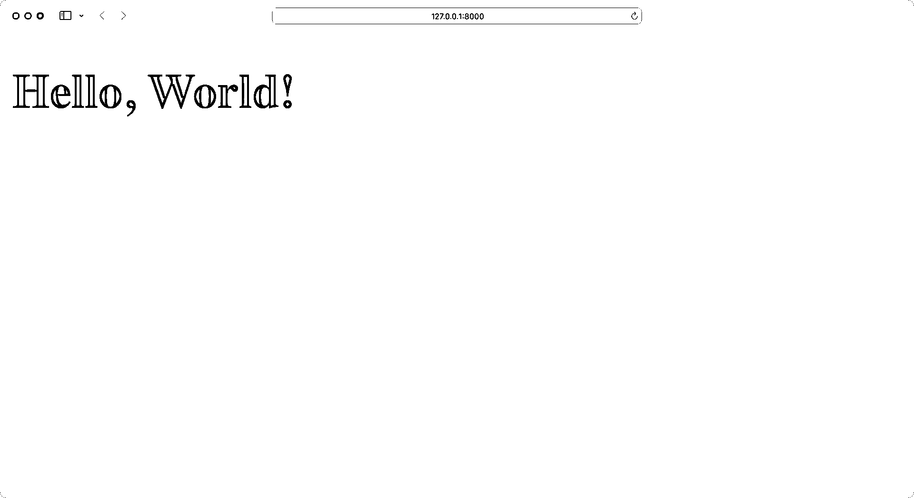

# Python REST APIs 与 Flask、Connexion 和 SQLAlchemy——第 1 部分

> 原文:# t0]https://realython . com/flask-连接-rest API/

大多数现代网络应用程序都是由一个 REST API 驱动的。这样，开发人员可以将前端代码与后端逻辑分开，用户可以动态地与界面进行交互。在这个由三部分组成的教程系列中，您将使用 **Flask web 框架**构建一个 REST API。

您将使用一个基本的 Flask 项目创建一个基础，然后添加端点并将它们连接到一个 **SQLite 数据库**。您将使用 **Swagger UI API 文档**测试您的 API，您将在此过程中构建这些文档。

在本系列教程的第一部分，您将学习如何:

*   用一个 **REST API** 构建一个基础**烧瓶**项目
*   使用**连接**处理 **HTTP 请求**
*   使用 **OpenAPI** 规范定义 **API 端点**
*   与您的 **API** 交互以管理数据
*   用 **Swagger UI** 构建 **API 文档**

完成本系列的第一部分后，您将进入第二部分，在那里您将学习使用合适的数据库来永久存储您的数据，而不是依赖内存存储。

本系列教程是关于如何用 Flask 创建 REST API 并使用 [CRUD 操作](https://en.wikipedia.org/wiki/Create,_read,_update_and_delete)与之交互的实践指南。如果您想更新关于使用 API 的知识，那么您可以阅读一下 [Python 和 REST APIs:与 Web 服务交互](https://realpython.com/api-integration-in-python/)。

您可以通过单击下面的链接下载该项目的第一部分代码:

**源代码:** [点击这里下载免费的源代码](https://realpython.com/bonus/flask-connexion-rest-api-part-1-code/)，您将使用它来构建一个带有 Flask web 框架的 REST API。

## 演示

在这个由三部分组成的教程系列中，您将构建一个 REST API 来跟踪全年可能访问您的人的笔记。在本教程中，你将创建像[牙仙](https://en.wikipedia.org/wiki/Tooth_fairy)、[复活节兔子](https://en.wikipedia.org/wiki/Easter_Bunny)和[克内赫特·鲁普雷希特](https://en.wikipedia.org/wiki/Knecht_Ruprecht)这样的人。

理想情况下，你想和他们三个都保持良好的关系。这就是为什么你要给他们寄便条，以增加从他们那里得到贵重礼物的机会。

您可以通过利用 API 文档与您的应用程序进行交互。在这个过程中，您将构建一个反映数据库内容的基本前端:

[https://player.vimeo.com/video/766055660?background=1](https://player.vimeo.com/video/766055660?background=1)

在本系列的第一部分中，您将创建一个 base Flask 项目并插入您的第一个 API 端点。在本部分结束时，您将能够在前端看到人员列表，并在后端管理每个人:

[https://player.vimeo.com/video/759061156?background=1](https://player.vimeo.com/video/759061156?background=1)

通过利用 Swagger UI，您可以为您的 API 创建方便的文档。这样，您将有机会在本教程的每个阶段测试您的 API 如何工作，并获得所有端点的有用概述。

[*Remove ads*](/account/join/)

## 规划第一部分

除了构建 Flask project foundation 之外，您还将创建一个 REST API，它提供对一个人集合以及该集合中的个人的访问。下面是 people 集合的 API 设计:

| 行动 | HTTP 动词 | path | 描述 |
| --- | --- | --- | --- |
| 阅读 | `GET` | `/api/people` | 读一集人。 |
| 创造 | `POST` | `/api/people` | 创建一个新人。 |
| 阅读 | `GET` | `/api/people/<lname>` | 读一个特定的人。 |
| 更新 | `PUT` | `/api/people/<lname>` | 更新现有人员。 |
| 删除 | `DELETE` | `/api/people/<lname>` | 删除现有人员。 |

您将构建的 REST API 将服务于一个简单的 people 数据结构，其中人员与姓氏相关联，任何更新都用新的时间戳标记。

您将使用的数据集如下所示:

```py
PEOPLE = {
    "Fairy": {
        "fname": "Tooth",
        "lname": "Fairy",
        "timestamp": "2022-10-08 09:15:10",
    },
    "Ruprecht": {
        "fname": "Knecht",
        "lname": "Ruprecht",
        "timestamp": "2022-10-08 09:15:13",
    },
    "Bunny": {
        "fname": "Easter",
        "lname": "Bunny",
        "timestamp": "2022-10-08 09:15:27",
    }
}
```

API 的目的之一是将数据从使用它的应用程序中分离出来，从而隐藏数据实现的细节。在本系列教程的后面，您将把数据保存在数据库中。但是从一开始，内存中的数据结构就很好。

## 开始使用

在本节中，您将为 Flask REST API 项目准备开发环境。首先，您将创建一个**虚拟环境**并安装项目所需的所有**依赖项**。

### 创建虚拟环境

在本节中，您将构建您的项目结构。您可以随意命名项目的根文件夹。例如，您可以将其命名为`rp_flask_api/`。创建文件夹并导航到其中:

```py
$ mkdir rp_flask_api
$ cd rp_flask_api
```

在这种情况下，您将项目的根文件夹命名为`rp_flask_api/`。您在本系列课程中创建的文件和文件夹将位于该文件夹或其子文件夹中。

导航到项目文件夹后，创建并激活一个[虚拟环境](https://realpython.com/python-virtual-environments-a-primer/)是个好主意。这样，您安装的任何项目依赖项都不是系统范围的，而只是在项目的虚拟环境中。

在下面选择您的**操作系统**，并使用您的平台特定命令来设置虚拟环境:

*   [*视窗*](#windows-1)
**   [**Linux + macOS**](#linux-macos-1)*

```py
PS> python -m venv venv
PS> .\venv\Scripts\activate
(venv) PS>
```

```py
$ python -m venv venv
$ source venv/bin/activate
(venv) $
```

使用上面显示的命令，您可以通过使用 Python 的内置`venv`模块创建并激活一个名为`venv`的虚拟环境。提示前面的圆括号`(venv)`表示您已经成功激活了虚拟环境。

### 添加依赖关系

在你创建并激活你的虚拟环境后，是时候安装**烧瓶**和 [`pip`](https://realpython.com/what-is-pip/) 了:

```py
(venv) $ python -m pip install Flask==2.2.2
```

Flask **micro web framework** 是你的项目需要的主要依赖项。在烧瓶顶部，安装**连接**来处理 HTTP 请求:

```py
(venv) $ python -m pip install "connexion[swagger-ui]==2.14.1"
```

为了利用自动生成的 API 文档，您安装了添加了对 [Swagger UI](https://swagger.io/tools/swagger-ui/) 支持的 [Connexion](https://connexion.readthedocs.io/en/latest/index.html) 。在本教程的后面，您将了解更多关于您刚刚安装的 [Python 包](https://realpython.com/python-modules-packages/)的内容。

[*Remove ads*](/account/join/)

### 启动你的烧瓶项目

您的 Flask 项目的主文件将是`app.py`。在`rp_flask_api/`中创建`app.py`，并添加以下内容:

```py
# app.py

from flask import Flask, render_template

app = Flask(__name__)

@app.route("/")
def home():
    return render_template("home.html")

if __name__ == "__main__":
    app.run(host="0.0.0.0", port=8000, debug=True)
```

您导入`Flask`模块，让应用程序访问 Flask 功能。然后创建一个名为`app`的 Flask 应用程序实例。接下来，通过用`@app.route("/")`修饰[来将 URL 路由`"/"`连接到`home()`函数。这个函数调用 Flask `render_template()`函数从模板目录中获取`home.html`文件，并将其返回给浏览器。](https://realpython.com/primer-on-python-decorators/)

简而言之，这段代码启动并运行一个基本的 web 服务器，并让它用一个`home.html`模板进行响应，当导航到 URL `"/"`时，这个模板将被提供给浏览器。

**注意:** Flask 的开发服务器默认为端口`5000`。在较新的 macOS 版本上，此端口已经被 macOS [AirPlay 接收器](https://en.wikipedia.org/wiki/AirPlay#Receivers)使用。上面，你已经用`port=8000`改变了 Flask 应用程序的端口。如果你愿意，你可以[在 Mac 上更改 AirPlay 接收器偏好设置](https://support.apple.com/guide/mac-help/change-airplay-receiver-preferences-on-mac-mchl15c9e4b5/mac)。

Flask 期望在名为`templates/`的模板目录中有`home.html`。创建`templates/`目录并添加`home.html`:

```py
<!-- templates/home.html -->

<!DOCTYPE html>
<html lang="en">
<head>
    <meta charset="UTF-8">
    <title>RP Flask REST API</title>
</head>
<body>
    <h1>
        Hello, World!
    </h1>
</body>
</html>
```

Flask 附带了 [Jinja 模板引擎](https://realpython.com/primer-on-jinja-templating/)，它使你能够增强你的模板。但是你的`home.html`模板是一个基本的 [HTML 文件](https://realpython.com/html-css-python/)，没有任何 Jinja 特性。现在没问题，因为`home.html`的目的是验证您的 Flask 项目是否如预期的那样响应。

在 Python 虚拟环境活动的情况下，您可以在包含`app.py`文件的目录中使用这个命令行运行您的应用程序:

```py
(venv) $ python app.py
```

当您运行`app.py`时，一个 web 服务器将在端口 8000 上启动。如果你打开浏览器并导航到`http://localhost:8000`，你应该会看到*你好，世界！*显示:

[](https://files.realpython.com/media/flask-hello-world.a5c395d3d321.png)

恭喜，您的 web 服务器正在运行！稍后您将扩展`home.html`文件，以便与您正在开发的 REST API 一起工作。

现在，您的 Flask 项目结构应该如下所示:

```py
rp_flask_api/
│
├── templates/
│   └── home.html
│
└── app.py
```

这是开始任何 Flask 项目的一个很好的结构。您可能会发现，当您从事未来的项目时，源代码会派上用场。您可以从这里下载:

**源代码:** [点击这里下载免费的源代码](https://realpython.com/bonus/flask-connexion-rest-api-part-1-code/)，您将使用它来构建一个带有 Flask web 框架的 REST API。

在接下来的小节中，您将扩展项目并添加您的第一个 REST API 端点。

## 添加您的第一个 REST API 端点

现在您已经有了一个工作的 web 服务器，您可以添加您的第一个 REST API 端点了。为此，您将使用在上一节中安装的 Connexion。

Connexion 模块允许 Python 程序通过 Swagger 使用 [OpenAPI](https://www.openapis.org/) 规范。 **OpenAPI** 规范是 REST APIs 的 API 描述格式，提供了很多功能，包括:

*   验证 API 的输入和输出数据
*   API URL 端点和预期参数的配置

当您将 OpenAPI 与 Swagger 一起使用时，您可以创建一个用户界面(UI)来浏览 API。当您创建 Flask 应用程序可以访问的配置文件时，所有这些都可能发生。

[*Remove ads*](/account/join/)

### 创建 API 配置文件

Swagger 配置文件是一个包含 OpenAPI 定义的 [YAML](https://realpython.com/python-yaml/) 或 [JSON](https://realpython.com/python-json/) 文件。该文件包含配置服务器以提供输入参数验证、输出响应数据验证和 URL 端点定义所需的所有信息。

创建一个名为`swagger.yml`的文件，并开始向其中添加元数据:

```py
# swagger.yml openapi:  3.0.0 info: title:  "RP  Flask  REST  API" description:  "An  API  about  people  and  notes" version:  "1.0.0"
```

定义 API 时，必须包含 OpenAPI 定义的版本。您可以使用关键字`openapi`来实现这一点。版本字符串很重要，因为 OpenAPI 结构的某些部分可能会随着时间的推移而改变。

同样，就像每一个新的 Python 版本都包含了[新特性](https://realpython.com/python311-new-features/)一样，OpenAPI 规范中可能会添加或取消一些关键字。

`info`关键字开始 API 信息块的范围:

*   **`title:`** 标题包含在 Connexion-generated UI 系统中
*   **`description:`** 对 API 提供的内容或内容的描述
*   **`version:`** 为 API 版本值

接下来，添加`servers`和`url`，它们定义了 API 的根路径:

```py
# swagger.yml # ... servers: -  url:  "/api"
```

通过提供`"/api"`作为`url`的值，您将能够访问相对于`http://localhost:8000/api`的所有 API 路径。

您在一个`paths`块中定义 API 端点:

```py
# swagger.yml # ... paths: /people: get: operationId:  "people.read_all" tags: -  "People" summary:  "Read  the  list  of  people" responses: "200": description:  "Successfully  read  people  list"
```

`paths`块开始配置 API URL 端点路径:

*   **`/people:`** 你的 API 端点的相对 URL
*   **`get:`** 此 URL 端点将响应的 HTTP 方法

与`servers`中的`url`定义一起，这创建了您可以在`http://localhost:8000/api/people`访问的`GET /api/people` URL 端点。

`get`块开始配置单个`/api/people` URL 端点:

*   **`operationId:`** 响应请求的 Python 函数
*   **`tags:`** 分配给这个端点的标签，它允许你对 UI 中的操作进行分组
*   **`summary` :** 该端点的 UI 显示文本
*   **`responses` :** 端点响应的状态代码

`operationId`必须包含一个字符串。Connexion 将使用`"people.read_all"`在项目的`people`模块中找到一个名为`read_all()`的 Python 函数。在本教程的后面，您将创建相应的 Python 代码。

`responses`模块定义了可能状态代码的配置。在这里，您为状态代码`"200"`定义了一个成功的响应，包含一些`description`文本。

您可以在下面的可折叠文件夹中找到`swagger.yml`文件的完整内容:


下面，您将找到您的 OpenAPI 定义的完整源代码:

```py
# swagger.yml openapi:  3.0.0 info: title:  "RP  Flask  REST  API" description:  "An  API  about  people  and  notes" version:  "1.0.0" servers: -  url:  "/api" paths: /people: get: operationId:  "people.read_all" tags: -  "People" summary:  "Read  the  list  of  people" responses: "200": description:  "Successfully  read  people  list"
```

您已经以分层的方式组织了这个文件。每个缩进级别代表一个所有权级别或范围。

例如，`paths`标志着所有 API URL 端点定义的开始。下面缩进的`/people`值表示所有`/api/people` URL 端点将被定义的起点。缩进在`/people`下的`get:`范围保存与到`/api/people` URL 端点的 HTTP GET 请求相关的定义。这种模式适用于整个配置。

`swagger.yml`文件就像是你的 API 的蓝图。通过包含在`swagger.yml`中的规范，您定义了您的 web 服务器可以预期的数据以及您的服务器应该如何响应请求。但到目前为止，你的 Flask 项目还不知道你的`swagger.yml`文件。继续阅读，使用 Connexion 将您的 OpenAPI 规范与您的 Flask 应用程序连接起来。

[*Remove ads*](/account/join/)

### 将连接添加到应用程序

使用 Connexion 向 Flask 应用程序添加 REST API URL 端点有两个步骤:

1.  将 API 配置文件添加到项目中。
2.  用配置文件连接您的 Flask 应用程序。

在上一节中，您已经添加了名为`swagger.yml`的配置文件。要将 API 配置文件与您的 Flask 应用程序连接，您必须在您的`app.py`文件中引用`swagger.yml`:

```py
 1# app.py
 2
 3from flask import render_template # Remove: import Flask 4import connexion 5 6app = connexion.App(__name__, specification_dir="./") 7app.add_api("swagger.yml") 8
 9@app.route("/")
10def home():
11    return render_template("home.html")
12
13if __name__ == "__main__":
14    app.run(host="0.0.0.0", port=8000, debug=True)
```

`import connexion`语句将模块添加到程序中。下一步是使用 Connexion 而不是 Flask 创建应用程序实例。在内部，仍然创建 Flask 应用程序，但是它现在添加了额外的功能。

app 实例创建的一部分包括第 6 行中的参数`specification_dir`。这告诉 Connexion 在哪个目录中查找其配置文件。在这种情况下，它是运行`app.py`的同一个目录。

在第 7 行，您告诉 app 实例从规范目录中读取`swagger.yml`文件，并配置系统以提供连接功能。

### 从您的人员端点返回数据

在`swagger.yml`文件中，您用`operationId`值`"people.read_all"`配置了连接。因此，当 API 获得对`GET /api/people`的 HTTP 请求时，您的 Flask 应用程序调用`people`模块中的`read_all()`函数。

为了实现这一点，创建一个带有`read_all()`函数的`people.py`文件:

```py
 1# people.py
 2
 3from datetime import datetime
 4
 5def get_timestamp():
 6    return datetime.now().strftime(("%Y-%m-%d %H:%M:%S"))
 7
 8PEOPLE = {
 9    "Fairy": {
10        "fname": "Tooth",
11        "lname": "Fairy",
12        "timestamp": get_timestamp(),
13    },
14    "Ruprecht": {
15        "fname": "Knecht",
16        "lname": "Ruprecht",
17        "timestamp": get_timestamp(),
18    },
19    "Bunny": {
20        "fname": "Easter",
21        "lname": "Bunny",
22        "timestamp": get_timestamp(),
23    }
24}
25
26def read_all():
27    return list(PEOPLE.values())
```

在第 5 行，您创建了一个名为`get_timestamp()`的助手函数，它生成当前时间戳的字符串表示。

然后在第 8 行定义`PEOPLE`字典数据结构，这是您将在本系列教程的这一部分中使用的数据。

字典代表一个合适的数据库。由于`PEOPLE`是一个模块变量，它的状态在 REST API 调用之间保持不变。但是，当您重新启动 web 应用程序时，您更改的任何数据都将丢失。这并不理想，但目前还不错。

然后在第 26 行创建`read_all()`函数。当你的服务器收到一个到`GET /api/people`的 HTTP 请求时，它将运行`read_all()`。`read_all()`的返回值是包含一个人信息的字典列表。

运行您的服务器代码并将您的浏览器导航到`http://localhost:8000/api/people`将在屏幕上显示人员列表:

[](https://files.realpython.com/media/flask-rest-people-response.45a5f8bd34b6.png)

祝贺您，您已经创建了您的第一个 API 端点！在继续构建具有多个端点的 REST API 之前，请花点时间在下一节中更深入地研究一下这个 API。

### 浏览您的 API 文档

目前，您有一个 REST API 与一个 URL 端点一起运行。您的 Flask 应用程序知道基于您在`swagger.yml`中的 API 规范提供什么。此外，Connexion 使用`swagger.yml`为您创建 API 文档。

导航到`localhost:8000/api/ui`查看您的 API 文档:

[](https://files.realpython.com/media/flask-swagger-ui.ab3f8a6f775d.png)

这是初始的 Swagger 界面。它显示了您的`http://localhost:8000/api`端点支持的 URL 端点列表。Connexion 在解析`swagger.yml`文件时会自动构建这个文件。

如果您点击界面中的`/people`端点，那么界面将会展开以显示关于您的 API 的更多信息:

[https://player.vimeo.com/video/759061115?background=1](https://player.vimeo.com/video/759061115?background=1)

这将显示预期响应的结构、该响应的`content-type`，以及您在`swagger.yml`文件中输入的关于端点的描述文本。每当配置文件改变时，Swagger UI 也会改变。

您甚至可以通过点击*试用*按钮来试用端点。当您的 API 增长时，这个特性会非常有用。Swagger UI API 文档为您提供了一种无需编写任何代码即可探索和试验 API 的方法。

将 OpenAPI 与 Swagger UI 一起使用提供了一种创建 API URL 端点的好的、干净的方法。到目前为止，您只创建了一个端点来服务所有人。在下一节中，您将添加额外的端点来创建、更新和删除您的集合中的人。

[*Remove ads*](/account/join/)

## 构建完整的 API

到目前为止，您的 Flask REST API 只有一个端点。现在是时候构建一个 API 来提供对人员结构的完全 CRUD 访问了。回想一下，API 的定义如下:

| 行动 | HTTP 动词 | path | 描述 |
| --- | --- | --- | --- |
| 阅读 | `GET` | `/api/people` | 读一集人。 |
| 创造 | `POST` | `/api/people` | 创建一个新人。 |
| 阅读 | `GET` | `/api/people/<lname>` | 读一个特定的人。 |
| 更新 | `PUT` | `/api/people/<lname>` | 更新现有人员。 |
| 删除 | `DELETE` | `/api/people/<lname>` | 删除现有人员。 |

为了实现这一点，您将扩展`swagger.yml`和`people.py`文件来完全支持上面定义的 API。

### 使用组件

在您在`swagger.yml`中定义新的 API 路径之前，您将为**组件**添加一个新块。[组件](https://spec.openapis.org/oas/v3.0.0#components-object)是 OpenAPI 规范中的构建块，可以从规范的其他部分引用。

为单人添加一个带有`schemas`的`components`块:

```py
# swagger.yml openapi:  3.0.0 info: title:  "RP  Flask  REST  API" description:  "An  API  about  people  and  notes" version:  "1.0.0" servers: -  url:  "/api" components:  schemas:  Person:  type:  "object"  required:  -  lname  properties:  fname:  type:  "string"  lname:  type:  "string"  # ...
```

为了避免代码重复，您创建了一个`components`块。现在，您只在`schemas`块中保存了`Person`数据模型:

*   **`type:`** 模式的数据类型
*   **`required:`** 所需属性

在`- lname`前面的破折号(`-`)表示`required`可以包含一个属性列表。您定义为`required`的任何属性也必须存在于`properties`中，包括以下内容:

*   **`fname:`** 一个人的名字
*   **`lname:`** 一个人的姓

`type`键定义了与其父键相关的值。对于`Person`，所有属性都是字符串。在本教程的后面部分，您将在 Python 代码中将该模式表示为一个[字典](https://realpython.com/python-dicts/)。

### 创建一个新的人

通过在`/people`块中为`post`请求添加一个新块来扩展您的 API 端点:

```py
# swagger.yml # ... paths: /people: get: # ... post:   operationId:  "people.create" tags: -  People summary:  "Create  a  person" requestBody: description:  "Person  to  create" required:  True content: application/json: schema: x-body-name:  "person" $ref:  "#/components/schemas/Person" responses: "201": description:  "Successfully  created  person"
```

`post`的结构看起来类似于现有的`get`模式。一个不同之处是，你还发送`requestBody`到服务器。毕竟，你需要告诉 Flask 它需要创建一个新人的信息。另一个区别是`operationId`，你设置为`people.create`。

在`content`内部，您将`application/json`定义为 API 的**数据交换格式**。

您可以在 API 请求和 API 响应中提供不同的媒体类型。如今，API 通常使用 JSON 作为数据交换格式。这对 Python 开发人员来说是个好消息，因为 JSON 对象看起来非常像 Python 字典。例如:

```py
{ "fname":  "Tooth", "lname":  "Fairy" }
```

这个 JSON 对象类似于您之前在`swagger.yml`中定义的`Person`组件，您在`schema`中用`$ref`引用了它。

您还使用了 201 HTTP 状态代码，这是一个成功的响应，表示创建了一个新的资源。

**注意:**如果你想了解更多关于 HTTP 状态码的信息，那么你可以查看 Mozilla 关于 [HTTP 响应状态码](https://developer.mozilla.org/en-US/docs/Web/HTTP/Status)的文档。

使用`people.create`，你告诉你的服务器在`people`模块中寻找一个`create()`函数。打开`people.py`并将`create()`添加到文件中:

```py
 1# people.py
 2
 3from datetime import datetime
 4from flask import abort 5
 6# ...
 7
 8def create(person): 9    lname = person.get("lname")
10    fname = person.get("fname", "")
11
12    if lname and lname not in PEOPLE:
13        PEOPLE[lname] = {
14            "lname": lname,
15            "fname": fname,
16            "timestamp": get_timestamp(),
17        }
18        return PEOPLE[lname], 201
19    else:
20        abort(
21            406,
22            f"Person with last name {lname} already exists",
23        )
```

在第 4 行，您导入了 Flask 的`abort()`函数。使用`abort()`帮助您在第 20 行发送一条错误消息。当**请求体**不包含一个姓氏或者已经存在一个姓这个姓氏的人时，就会引发错误响应。

**注意:**一个人的姓必须是唯一的，因为您正在使用`lname`作为`PEOPLE`的字典键。这意味着现在你的项目中不能有两个姓氏相同的人。

如果请求体中的数据有效，那么在第 13 行更新`PEOPLE`,并在第 18 行用新对象和 201 HTTP 代码进行响应。

[*Remove ads*](/account/join/)

### 处理一个人

到目前为止，您已经能够创建一个新的人，并获得一个包含所有人的列表。在本节中，您将更新`swagger.yml`和`people.py`以使用一个新的路径来处理一个现有的人。

打开`swagger.yml`并添加以下代码:

```py
# swagger.yml # ... components: schemas: # ... parameters:   lname: name:  "lname" description:  "Last  name  of  the  person  to  get" in:  path required:  True schema: type:  "string" paths: /people: # ... /people/{lname}:   get: operationId:  "people.read_one" tags: -  People summary:  "Read  one  person" parameters: -  $ref:  "#/components/parameters/lname" responses: "200": description:  "Successfully  read  person"
```

与您的`/people`路径类似，您从`/people/{lname}`路径的`get`操作开始。`{lname}`子字符串是姓氏的占位符，您必须将其作为 **URL 参数**传递。例如，URL 路径`api/people/Ruprecht`包含`Ruprecht`作为`lname`。

**注意:**URL 参数是**区分大小写**。这意味着你必须键入一个像*鲁普雷希特*一样的姓，并且大写字母 r

您也将在其他操作中使用`lname`参数。所以为它创建一个组件并在需要的地方引用它是有意义的。

`operationId`指向了`people.py`中的一个`read_one()`函数，所以再次访问那个文件并创建缺失的函数:

```py
# people.py

# ...

def read_one(lname):
    if lname in PEOPLE:
        return PEOPLE[lname]
    else:
        abort(
            404, f"Person with last name {lname} not found"
        )
```

当您的 Flask 应用程序在`PEOPLE`中找到提供的姓氏时，它会返回这个特定人的数据。否则，服务器将返回 404 HTTP 错误。

要更新现有人员，请使用以下代码更新`swagger.yml`:

```py
# swagger.yml # ... paths: /people: # ... /people/{lname}: get: # ... put:   tags: -  People operationId:  "people.update" summary:  "Update  a  person" parameters: -  $ref:  "#/components/parameters/lname" responses: "200": description:  "Successfully  updated  person" requestBody: content: application/json: schema: x-body-name:  "person" $ref:  "#/components/schemas/Person"
```

有了这个`put`操作的定义，您的服务器期望`update()`在`people.py`:

```py
# people.py

# ...

def update(lname, person):
    if lname in PEOPLE:
        PEOPLE[lname]["fname"] = person.get("fname", PEOPLE[lname]["fname"])
        PEOPLE[lname]["timestamp"] = get_timestamp()
        return PEOPLE[lname]
    else:
        abort(
            404,
            f"Person with last name {lname} not found"
        )
```

`update()`函数需要参数`lname`和`person`。当具有所提供姓氏的人存在时，您就用`person`数据更新`PEOPLE`中的相应值。

要删除数据集中的一个人，您需要使用一个`delete`操作:

```py
# swagger.yml # ... paths: /people: # ... /people/{lname}: get: # ... put: # ... delete:   tags: -  People operationId:  "people.delete" summary:  "Delete  a  person" parameters: -  $ref:  "#/components/parameters/lname" responses: "204": description:  "Successfully  deleted  person"
```

在`person.py`上增加相应的`delete()`功能:

```py
# people.py

from flask import abort, make_response 
# ...

def delete(lname):
    if lname in PEOPLE:
        del PEOPLE[lname]
        return make_response(
            f"{lname} successfully deleted", 200
        )
    else:
        abort(
            404,
            f"Person with last name {lname} not found"
        )
```

如果您想要删除的人存在于您的数据集中，那么您从`PEOPLE`中删除该项目。

对于教程的这一部分，`people.py`和`swagger.yml`都已完成。您可以通过单击下面的链接下载完整的文件:

**源代码:** [点击这里下载免费的源代码](https://realpython.com/bonus/flask-connexion-rest-api-part-1-code/)，您将使用它来构建一个带有 Flask web 框架的 REST API。

管理人员的所有端点都已就绪，是时候测试您的 API 了。因为您使用了 Connexion 将 Flask 项目与 Swagger 连接起来，所以当您重新启动服务器时，您的 API 文档已经准备好了。

[*Remove ads*](/account/join/)

### 浏览完整的 API 文档

一旦您更新了`swagger.yml`和`people.py`文件以完成 people API 功能，Swagger UI 系统将相应地更新，如下所示:

[https://player.vimeo.com/video/759061156?background=1](https://player.vimeo.com/video/759061156?background=1)

这个 UI 允许您查看包含在`swagger.yml`文件中的所有文档，并与组成人员界面 CRUD 功能的所有 URL 端点进行交互。

不幸的是，当您重新启动 Flask 应用程序时，您所做的任何更改都不会持久。这就是为什么在本系列教程的下一部分中，您将在项目中插入一个合适的数据库。

## 结论

在本系列教程的这一部分中，您使用 Python 的 Flask web 框架创建了一个全面的 REST API。通过 Connexion 模块和一些额外的配置工作，可以将有用的文档和交互式系统放置到位。这使得构建 REST API 成为一种非常愉快的体验。

在本系列教程的第一部分中，您学习了如何:

*   用一个 **REST API** 构建一个基础**烧瓶**项目
*   使用**连接**处理 **HTTP 请求**
*   使用 **OpenAPI** 规范定义 **API 端点**
*   与您的 **API** 交互以管理数据
*   用 **Swagger UI** 构建 **API 文档**

在本系列的第二部分中，您将学习如何使用合适的数据库来永久存储数据，而不是像这里一样依赖内存存储。

[Part 1: REST APIs With Flask + Connexion](#)[Part 2: Database Persistence »](https://realpython.com/flask-connexion-rest-api-part-2/)**********