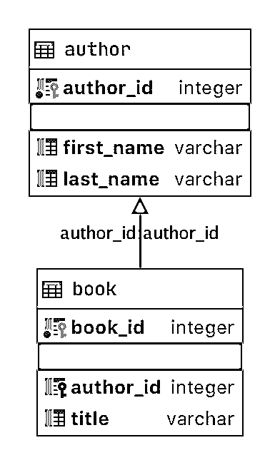
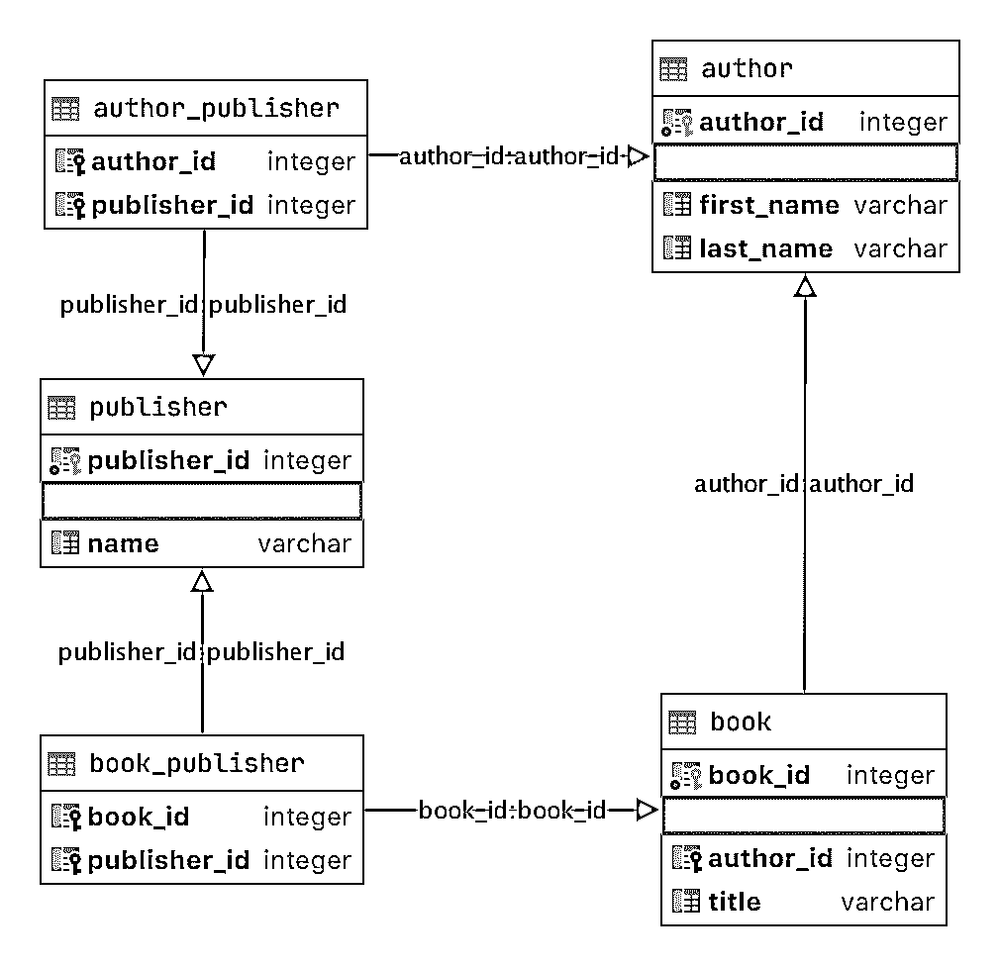
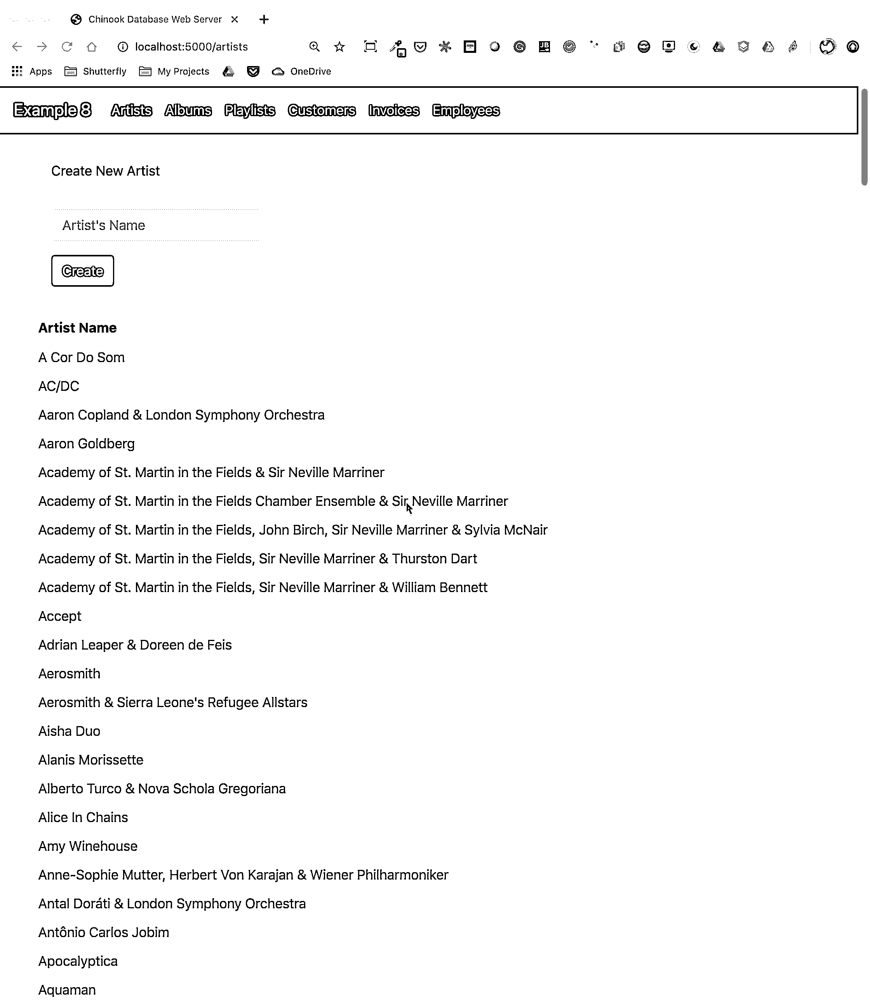

# 使用 Python、SQLite 和 SQLAlchemy 进行数据管理

> 原文:# t0]https://realython . com/python-SQLite-SQL anywhere emy/

*立即观看**本教程有真实 Python 团队创建的相关视频课程。与书面教程一起观看，加深理解:[**Python 中的 SQLite 和 SQLAlchemy:将您的数据移动到平面文件之外**](/courses/sqlite-sqlalchemy-python/)

所有程序都以这样或那样的形式处理数据，许多程序需要能够在一次调用和下一次调用之间保存和检索数据。Python、 [SQLite](https://www.sqlite.org/index.html) 和 [SQLAlchemy](https://www.sqlalchemy.org/) 为您的程序提供数据库功能，允许您将数据存储在单个文件中，而不需要数据库服务器。

您可以使用任意格式的[平面文件](https://en.wikipedia.org/wiki/Flat-file_database)获得类似的结果，包括 CSV、JSON、XML，甚至自定义格式。平面文件通常是人类可读的文本文件，尽管它们也可以是二进制数据，其结构可以被计算机程序解析。下面，您将探索使用 SQL 数据库和平面文件进行数据存储和操作，并学习如何决定哪种方法适合您的程序。

在本教程中，你将学习如何使用:

*   **平面文件**用于数据存储
*   **SQL** 改善对持久数据的访问
*   **SQLite** 用于数据存储
*   **SQLAlchemy** 将数据作为 Python 对象处理

通过点击下面的链接，您可以获得本教程中的所有代码和数据:

**下载示例代码:** [单击此处获取代码，您将使用](https://realpython.com/bonus/sqlite-sqlalchemy-code/)在本教程中学习使用 SQLite 和 SQLAlchemy 进行数据管理。

## 使用平面文件存储数据

一个**平面文件**是一个包含数据的文件，没有内部层次，通常也没有对外部文件的引用。平面文件包含人类可读的字符，对于创建和读取数据非常有用。因为平面文件不需要使用固定的字段宽度，所以它们通常使用其他结构来使程序解析文本成为可能。

例如，[逗号分隔值(CSV)](https://realpython.com/python-csv/) 文件是纯文本行，其中逗号字符分隔数据元素。每行文本代表一行数据，每个逗号分隔的值是该行中的一个字段。逗号字符分隔符指示数据值之间的边界。

Python 擅长于[读取和保存文件](https://realpython.com/read-write-files-python/)。能够使用 Python 读取数据文件允许您在以后重新运行应用程序时将它恢复到有用的状态。将数据保存在一个文件中允许你在用户和应用程序运行的站点之间共享程序的信息。

在程序能够读取数据文件之前，它必须能够理解数据。通常，这意味着数据文件需要有某种结构，应用程序可以用它来读取和解析文件中的文本。

下面是一个名为`author_book_publisher.csv`的 CSV 文件，由本教程中的第一个示例程序使用:

```py
first_name,last_name,title,publisher
Isaac,Asimov,Foundation,Random House
Pearl,Buck,The Good Earth,Random House
Pearl,Buck,The Good Earth,Simon & Schuster
Tom,Clancy,The Hunt For Red October,Berkley
Tom,Clancy,Patriot Games,Simon & Schuster
Stephen,King,It,Random House
Stephen,King,It,Penguin Random House
Stephen,King,Dead Zone,Random House
Stephen,King,The Shining,Penguin Random House
John,Le Carre,"Tinker, Tailor, Soldier, Spy: A George Smiley Novel",Berkley
Alex,Michaelides,The Silent Patient,Simon & Schuster
Carol,Shaben,Into The Abyss,Simon & Schuster
```

第一行提供了以逗号分隔的字段列表，这些字段是其余行中数据的列名。其余的行包含数据，每行代表一条记录。

**注意:**虽然作者、书籍和出版商都是真实的，但书籍和出版商之间的关系是虚构的，是为了本教程的目的而创建的。

接下来，您将了解使用类似上述 CSV 的平面文件处理数据的一些优点和缺点。

[*Remove ads*](/account/join/)

### 平面文件的优势

在平面文件中处理数据易于管理，实现起来也很简单。以人类可读的格式保存数据不仅有助于用文本编辑器创建数据文件，而且有助于检查数据并查找任何不一致或问题。

许多应用程序可以导出由文件生成的数据的平面文件版本。例如， [Excel](https://realpython.com/openpyxl-excel-spreadsheets-python/) 可以在电子表格中导入或导出 CSV 文件。如果您想要共享数据，平面文件还具有自包含和可转移的优势。

几乎每种编程语言都有工具和库，使得处理 CSV 文件更加容易。Python 有内置的`csv`模块和强大的[熊猫](https://realpython.com/pandas-read-write-files/)模块，使得处理 CSV 文件成为一个有效的解决方案。

### 平面文件的缺点

随着数据变大，使用平面文件的优势开始减弱。大文件仍然是人类可读的，但编辑它们以创建数据或寻找问题变得更加困难。如果您的应用程序将更改文件中的数据，那么一个解决方案是[将整个文件读入内存](https://realpython.com/read-write-files-python/)，进行更改，并将数据写出到另一个文件。

使用平面文件的另一个问题是，您需要在文件语法中显式地创建和维护数据部分与应用程序之间的任何关系。此外，您需要在应用程序中生成代码来使用这些关系。

最后一个复杂的问题是，您希望与之共享数据文件的人还需要了解您在数据中创建的结构和关系，并对其进行操作。为了访问这些信息，这些用户不仅需要了解数据的结构，还需要了解访问数据所需的编程工具。

### 平面文件示例

示例程序`examples/example_1/main.py`使用`author_book_publisher.csv`文件获取其中的数据和关系。这个 CSV 文件维护一个作者列表、他们出版的书籍以及每本书的出版商。

**注意:**示例中使用的数据文件可以在`project/data`目录中找到。在`project/build_data`目录中还有一个生成数据的程序文件。如果您更改了数据并希望返回到已知状态，该应用程序会很有用。

要访问本节和整个教程中使用的数据文件，请单击下面的链接:

**下载示例代码:** [单击此处获取代码，您将使用](https://realpython.com/bonus/sqlite-sqlalchemy-code/)在本教程中学习使用 SQLite 和 SQLAlchemy 进行数据管理。

上面展示的 CSV 文件是一个非常小的数据文件，只包含少数作者、书籍和出版商。您还应该注意到关于数据的一些事情:

*   作者斯蒂芬·金和汤姆·克兰西不止一次出现，因为他们出版的多本书都出现在数据中。

*   作者斯蒂芬·金和赛珍珠的同一本书由不止一家出版社出版。

这些重复的数据字段在数据的其他部分之间创建关系。一个作者可以写很多本书，一个出版商可以和多个作者合作。作者和出版商共享与单本书的关系。

`author_book_publisher.csv`文件中的关系由在数据文件的不同行中多次出现的字段表示。由于这种数据冗余，数据不仅仅代表一个二维表。当您使用该文件创建 SQLite 数据库文件时，您会看到更多这样的内容。

示例程序`examples/example_1/main.py`使用嵌入在`author_book_publisher.csv`文件中的关系来生成一些数据。它首先列出了作者名单和每个人写的书的数量。然后，它会显示一个出版商列表以及每个出版商出版书籍的作者数量。

它还使用 [`treelib`](https://treelib.readthedocs.io/en/latest/) 模块来显示作者、书籍和出版商的树状层次结构。

最后，它向数据中添加一本新书，并重新显示新书所在的树层次结构。下面是这个程序的 [`main()`](https://realpython.com/courses/python-main-function/) 入口点函数:

```py
 1def main():
 2    """The main entry point of the program"""
 3    # Get the resources for the program
 4    with resources.path(
 5        "project.data", "author_book_publisher.csv"
 6    ) as filepath:
 7        data = get_data(filepath)
 8
 9    # Get the number of books printed by each publisher
10    books_by_publisher = get_books_by_publisher(data, ascending=False)
11    for publisher, total_books in books_by_publisher.items():
12        print(f"Publisher: {publisher}, total books: {total_books}")
13    print()
14
15    # Get the number of authors each publisher publishes
16    authors_by_publisher = get_authors_by_publisher(data, ascending=False)
17    for publisher, total_authors in authors_by_publisher.items():
18        print(f"Publisher: {publisher}, total authors: {total_authors}")
19    print()
20
21    # Output hierarchical authors data
22    output_author_hierarchy(data)
23
24    # Add a new book to the data structure
25    data = add_new_book(
26        data,
27        author_name="Stephen King",
28        book_title="The Stand",
29        publisher_name="Random House",
30    )
31
32    # Output the updated hierarchical authors data
33    output_author_hierarchy(data)
```

上面的 Python 代码采取了以下步骤:

*   **第 4 到 7 行**将`author_book_publisher.csv`文件读入熊猫数据帧。
*   **第 10 行到第 13 行**打印每个出版商出版的书籍数量。
*   **第 16 到 19 行**打印与每个出版商相关的作者数量。
*   **第 22 行**按照作者排序的层次结构输出图书数据。
*   **第 25 到 30 行**向内存结构中添加一本新书。
*   **第 33 行**按照作者排序的层次结构输出图书数据，包括新添加的图书。

运行该程序会生成以下输出:

```py
$ python main.py
Publisher: Simon & Schuster, total books: 4
Publisher: Random House, total books: 4
Publisher: Penguin Random House, total books: 2
Publisher: Berkley, total books: 2

Publisher: Simon & Schuster, total authors: 4
Publisher: Random House, total authors: 3
Publisher: Berkley, total authors: 2
Publisher: Penguin Random House, total authors: 1

Authors
├── Alex Michaelides
│   └── The Silent Patient
│       └── Simon & Schuster
├── Carol Shaben
│   └── Into The Abyss
│       └── Simon & Schuster
├── Isaac Asimov
│   └── Foundation
│       └── Random House
├── John Le Carre
│   └── Tinker, Tailor, Soldier, Spy: A George Smiley Novel
│       └── Berkley
├── Pearl Buck
│   └── The Good Earth
│       ├── Random House
│       └── Simon & Schuster
├── Stephen King
│   ├── Dead Zone
│   │   └── Random House
│   ├── It
│   │   ├── Penguin Random House
│   │   └── Random House
│   └── The Shining
│       └── Penguin Random House
└── Tom Clancy
 ├── Patriot Games
 │   └── Simon & Schuster
 └── The Hunt For Red October
 └── Berkley
```

上面的作者层次在输出中出现了两次，增加了由兰登书屋出版的斯蒂芬·金的 *The Stand* 。上面的实际输出已经过编辑，为了节省空间，只显示了第一个层次结构输出。

调用其他函数来完成大部分工作。它调用的第一个函数是`get_data()`:

```py
def get_data(filepath):
    """Get book data from the csv file"""
    return pd.read_csv(filepath)
```

这个函数接收 CSV 文件的文件路径，并使用 pandas 将它读入一个 [pandas DataFrame](https://realpython.com/pandas-dataframe/) ，然后将它传递回调用者。这个函数的返回值成为传递给组成程序的其他函数的数据结构。

`get_books_by_publisher()`计算每个出版商出版的图书数量。由此产生的熊猫[系列](https://realpython.com/pandas-python-explore-dataset/#understanding-series-objects)使用熊猫 [GroupBy](https://realpython.com/pandas-groupby/) 功能按出版商分组，然后[基于`ascending`标志对](https://realpython.com/pandas-sort-python/)排序:

```py
def get_books_by_publisher(data, ascending=True):
    """Return the number of books by each publisher as a pandas series"""
    return data.groupby("publisher").size().sort_values(ascending=ascending)
```

`get_authors_by_publisher()`基本上与前面的函数做相同的事情，但是对于作者来说:

```py
def get_authors_by_publisher(data, ascending=True):
    """Returns the number of authors by each publisher as a pandas series"""
    return (
        data.assign(name=data.first_name.str.cat(data.last_name, sep=" "))
        .groupby("publisher")
        .nunique()
        .loc[:, "name"]
        .sort_values(ascending=ascending)
    )
```

在熊猫数据框架中创建一本新书。代码检查作者、书籍或出版商是否已经存在。如果没有，那么它创建一个新的书并把它附加到熊猫数据帧:

```py
def add_new_book(data, author_name, book_title, publisher_name):
    """Adds a new book to the system"""
    # Does the book exist?
    first_name, _, last_name = author_name.partition(" ")
    if any(
        (data.first_name == first_name)
        & (data.last_name == last_name)
        & (data.title == book_title)
        & (data.publisher == publisher_name)
    ):
        return data
    # Add the new book
    return data.append(
        {
            "first_name": first_name,
            "last_name": last_name,
            "title": book_title,
            "publisher": publisher_name,
        },
        ignore_index=True,
    )
```

`output_author_hierarchy()`使用嵌套的 [`for`循环](https://realpython.com/python-for-loop/)来遍历数据结构的各个层次。然后，它使用`treelib`模块输出作者、他们出版的书籍以及出版这些书籍的出版商的分层列表:

```py
def output_author_hierarchy(data):
    """Output the data as a hierarchy list of authors"""
    authors = data.assign(
        name=data.first_name.str.cat(data.last_name, sep=" ")
    )
    authors_tree = Tree()
    authors_tree.create_node("Authors", "authors")
    for author, books in authors.groupby("name"):
        authors_tree.create_node(author, author, parent="authors")
        for book, publishers in books.groupby("title")["publisher"]:
            book_id = f"{author}:{book}"
            authors_tree.create_node(book, book_id, parent=author)
            for publisher in publishers:
                authors_tree.create_node(publisher, parent=book_id)

    # Output the hierarchical authors data
    authors_tree.show()
```

这个应用程序运行良好，展示了 pandas 模块的强大功能。该模块为读取 CSV 文件和与数据交互提供了出色的功能。

让我们使用 Python(作者和出版物数据的 SQLite 数据库版本)和 SQLAlchemy 来创建一个功能相同的程序，以便与这些数据进行交互。

[*Remove ads*](/account/join/)

## 使用 SQLite 持久化数据

正如您之前看到的，在`author_book_publisher.csv`文件中有冗余数据。例如，关于赛珍珠的《大地》的所有信息被列出两次，因为两个不同的出版商出版了这本书。

想象一下，如果这个数据文件包含更多相关数据，比如作者的地址和电话号码、图书的出版日期和 ISBNs，或者地址、电话号码，也许还有出版商的年收入。对于每个根数据项，比如作者、书籍或出版商，这些数据都是重复的。

以这种方式创建数据是可能的，但会异常笨拙。考虑保持该数据文件最新的问题。如果斯蒂芬·金想改名为 T1 呢？你必须更新包含他的名字的多个记录，并确保没有错别字。

比数据复制更糟糕的是向数据添加其他关系的复杂性。如果您决定为作者添加电话号码，并且他们有家庭、工作、移动电话号码，或者更多，会怎么样？您想要为任何根项添加的每个新关系都将记录数乘以新关系中的项数。

这个问题是关系存在于数据库系统中的一个原因。数据库工程中的一个重要话题是**数据库规范化**，即分解数据以减少冗余并增加完整性的过程。当用新类型的数据扩展数据库结构时，预先对其进行规范化可以将对现有结构的更改保持在最低限度。

SQLite 数据库在 Python 中可用，根据 [SQLite 主页](https://www.sqlite.org/index.html)，它的使用量超过了所有其他数据库系统的总和。它提供了一个全功能的[关系数据库管理系统(RDBMS)](https://en.wikipedia.org/wiki/Relational_database#Relations_or_tables) ，它使用一个文件来维护所有的数据库功能。

它还具有不需要单独的数据库服务器来运行的优点。数据库文件格式是跨平台的，任何支持 SQLite 的编程语言都可以访问。

所有这些都是有趣的信息，但是它与使用平面文件进行数据存储有什么关系呢？下面你就知道了！

### 创建数据库结构

将`author_book_publisher.csv`数据放入 SQLite 数据库的强力方法是创建一个匹配 CSV 文件结构的表。这样做会忽略 SQLite 的很多功能。

**关系数据库**提供了一种在表中存储结构化数据并在这些表之间建立关系的方法。他们通常使用[结构化查询语言(SQL)](https://en.wikipedia.org/wiki/SQL) 作为与数据交互的主要方式。这是对 RDBMSs 所提供内容的过度简化，但对于本教程的目的来说已经足够了。

SQLite 数据库支持使用 SQL 与数据表进行交互。SQLite 数据库文件不仅包含数据，还具有与数据交互的标准化方式。这种支持嵌入在文件中，这意味着任何可以使用 SQLite 文件的编程语言也可以使用 SQL 来处理它。

### 使用 SQL 与数据库交互

SQL 是一种用于创建、管理和查询数据库中包含的数据的声明性语言。陈述性语言描述了*要完成什么*，而不是*应该如何完成*。稍后在创建数据库表时，您将看到 SQL 语句的示例。

## 用 SQL 构建数据库

为了利用 SQL 的强大功能，您需要对`author_book_publisher.csv`文件中的数据应用一些数据库规范化。为此，您需要将作者、书籍和出版商分别放在不同的数据库表中。

从概念上讲，数据以二维表结构存储在数据库中。每个表由多行**记录**组成，每条记录由包含数据的列或**字段**组成。

字段中包含的数据是预定义的类型，包括文本、[整数、浮点数](https://realpython.com/python-numbers/#integers-and-floating-point-numbers)等等。CSV 文件是不同的，因为所有的字段都是文本，并且必须由程序解析，以便为它们分配数据类型。

表中的每条记录都有一个**主键**，它被定义为给记录一个唯一的标识符。主键类似于 [Python 字典](https://realpython.com/python-dicts/)中的键。数据库引擎本身通常会为插入到数据库表中的每条记录生成一个递增的整数值作为主键。

尽管主键通常是由数据库引擎自动生成的，但也不是必须如此。如果存储在字段中的数据在该字段的表中的所有其他数据中是唯一的，那么它可以是主键。例如，包含图书数据的表可以使用图书的 ISBN 作为主键。

[*Remove ads*](/account/join/)

### 使用 SQL 创建表格

下面是如何使用 SQL 语句在 CSV 文件中创建代表作者、书籍和出版商的三个表:

```py
CREATE  TABLE  author  ( author_id  INTEGER  NOT  NULL  PRIMARY  KEY, first_name  VARCHAR, last_name  VARCHAR ); CREATE  TABLE  book  ( book_id  INTEGER  NOT  NULL  PRIMARY  KEY, author_id  INTEGER  REFERENCES  author, title  VARCHAR ); CREATE  TABLE  publisher  ( publisher_id  INTEGER  NOT  NULL  PRIMARY  KEY, name  VARCHAR );
```

注意，没有文件操作，没有创建变量，也没有保存变量的结构。这些语句只描述了期望的结果:创建具有特定属性的表。数据库引擎决定如何做到这一点。

一旦用来自`author_book_publisher.csv`文件的作者数据创建并填充了这个表，就可以使用 SQL 语句访问它。以下语句(也称为**查询**)使用通配符(`*`)获取`author`表中的所有数据并输出:

```py
SELECT  *  FROM  author;
```

您可以使用 [`sqlite3`](https://sqlite.org/cli.html) 命令行工具与`project/data`目录下的`author_book_publisher.db`数据库文件进行交互:

```py
$ sqlite3 author_book_publisher.db
```

一旦 SQLite 命令行工具在数据库打开的情况下运行，您就可以输入 SQL 命令。下面是上面的 SQL 命令及其输出，后面是退出程序的`.q`命令:

```py
sqlite>  SELECT  *  FROM  author; 1|Isaac|Asimov
2|Pearl|Buck
3|Tom|Clancy
4|Stephen|King
5|John|Le Carre
6|Alex|Michaelides
7|Carol|Shaben

sqlite>  .q
```

请注意，每个作者在表中只出现一次。不像 CSV 文件，有些作者有多个条目，在这里，每个作者只需要一个唯一的记录。

### 用 SQL 维护数据库

SQL 通过插入新数据和更新或删除现有数据，提供了使用现有数据库和表的方法。下面是一个向`author`表中插入新作者的 SQL 语句示例:

```py
INSERT  INTO  author (first_name,  last_name) VALUES  ('Paul',  'Mendez');
```

该 SQL 语句将值'`Paul`和'`Mendez`'插入到`author`表的相应列`first_name`和`last_name`中。

注意没有指定`author_id`列。因为该列是主键，所以数据库引擎生成该值并将其作为语句执行的一部分插入。

更新数据库表中的记录是一个简单的过程。例如，假设斯蒂芬·金希望人们知道他的笔名理查德·巴克曼。下面是更新数据库记录的 SQL 语句:

```py
UPDATE  author SET  first_name  =  'Richard',  last_name  =  'Bachman' WHERE  first_name  =  'Stephen'  AND  last_name  =  'King';
```

SQL 语句使用条件语句`WHERE first_name = 'Stephen' AND last_name = 'King'`为`'Stephen King'`定位单个记录，然后用新值更新`first_name`和`last_name`字段。SQL 使用等号(`=`)作为比较运算符和赋值运算符。

您也可以从数据库中删除记录。下面是一个从`author`表中删除记录的 SQL 语句示例:

```py
DELETE  FROM  author WHERE  first_name  =  'Paul' AND  last_name  =  'Mendez';
```

这个 SQL 语句从`author`表中删除一行，其中`first_name`等于`'Paul'`，而`last_name`等于`'Mendez'`。

删除记录要小心！您设置的条件必须尽可能具体。过于宽泛的条件可能会导致删除比预期更多的记录。例如，如果条件仅基于行`first_name = 'Paul'`，那么名字为 Paul 的所有作者都将从数据库中删除。

**注意:**为了避免记录的意外删除，许多应用程序根本不允许删除。相反，该记录有另一列来指示它是否在使用中。该列可能被命名为`active`，并包含一个评估为 True 或 False 的值，指示在查询数据库时是否应该包括该记录。

例如，下面的 SQL 查询将获得`some_table`中所有活动记录的所有列:

```py
SELECT * FROM  some_table WHERE  active  =  1;
```

SQLite 没有一个[布尔数据类型](https://realpython.com/python-boolean/)，所以`active`列由一个值为`0`或`1`的整数表示，以指示记录的状态。其他数据库系统可能有也可能没有本地布尔数据类型。

完全有可能直接在代码中使用 SQL 语句在 Python 中构建数据库应用程序。这样做可以将数据作为列表[列表](https://realpython.com/python-lists-tuples/)或列表[字典](https://realpython.com/courses/dictionaries-python/)返回给应用程序。

使用原始 SQL 是处理数据库查询返回的数据的一种完全可以接受的方式。但是，与其这样做，不如直接使用 SQLAlchemy 来处理数据库。

[*Remove ads*](/account/join/)

## 建立关系

您可能会发现数据库系统的另一个比数据持久化和检索更强大、更有用的特性是**关系**。支持关系的数据库允许您将数据分解到多个表中，并在它们之间建立连接。

`author_book_publisher.csv`文件中的数据通过复制数据来表示数据和关系。数据库通过将数据分成三个表——`author`、`book`和`publisher`——并在它们之间建立关系来处理这个问题。

在将所有数据放入 CSV 文件的一个位置后，为什么要将它分成多个表呢？难道不需要更多的工作去创造和重新组装吗？这在某种程度上是对的，但是使用 SQL 将数据分解并重新组合在一起的优势可能会赢得您的青睐！

### 一对多关系

一对多关系就像客户在网上订购商品一样。一个客户可以有许多订单，但每个订单都属于一个客户。`author_book_publisher.db`数据库以作者和书籍的形式存在一对多的关系。每个作者可以写很多本书，但是每本书都是一个作者写的。

正如您在上面的表创建中看到的，这些独立实体的实现是将每个实体放入一个数据库表中，一个用于作者，一个用于书籍。但是这两个表之间的一对多关系是如何实现的呢？

记住，数据库中的每个表都有一个字段被指定为该表的主键。上面的每个表都有一个主键字段，使用以下模式命名:`<table name>_id`。

上面显示的`book`表包含一个字段`author_id`，它引用了`author`表。`author_id`字段在作者和书籍之间建立了一对多的关系，如下所示:

[](https://files.realpython.com/media/author_book.e9c86f34967d.png)

上图是一个简单的[实体关系图(ERD)](https://en.wikipedia.org/wiki/Entity%E2%80%93relationship_model) ，由 [JetBrains DataGrip](https://www.jetbrains.com/datagrip/features/) 应用程序创建，将表`author`和`book`显示为带有各自主键和数据字段的方框。两个图形项目添加了关于关系的信息:

1.  **黄色和蓝色的小图标**分别表示表的主键和外键。

2.  **连接`book`和`author`** 的箭头表示基于`book`表中的`author_id`外键的表之间的关系。

当您将一本新书添加到`book`表中时，数据包含了一个`author`表中现有作者的`author_id`值。这样，一个作者写的所有的书都有一个追溯到那个唯一作者的查找关系。

现在你有了作者和书籍的独立表格，你如何利用它们之间的关系呢？SQL 支持所谓的 [`JOIN`](https://realpython.com/python-sql-libraries/#join) 操作，您可以用它来告诉数据库如何连接两个或更多的表。

下面的 SQL 查询使用 SQLite 命令行应用程序将`author`和`book`表连接在一起:

```py
sqlite>  SELECT ...>  a.first_name  ||  ' '  ||  a.last_name  AS  author_name, ...>  b.title  AS  book_title ...>  FROM  author  a ...>  JOIN  book  b  ON  b.author_id  =  a.author_id ...>  ORDER  BY  a.last_name  ASC; Isaac Asimov|Foundation
Pearl Buck|The Good Earth
Tom Clancy|The Hunt For Red October
Tom Clancy|Patriot Games
Stephen King|It
Stephen King|Dead Zone
Stephen King|The Shining
John Le Carre|Tinker, Tailor, Soldier, Spy: A George Smiley Novel
Alex Michaelides|The Silent Patient
Carol Shaben|Into The Abyss
```

上面的 SQL 查询通过使用 author 和 book 表之间建立的关系来连接这两个表，从而从这两个表中收集信息。SQL 字符串串联将作者的全名分配给别名`author_name`。通过查询收集的数据按照`last_name`字段以升序排序。

在 SQL 语句中有一些事情需要注意。首先，作者的全名出现在一列中，并按姓氏排序。此外，由于一对多的关系，作者在输出中出现多次。作者的名字在他们写的每本书的数据库中都是重复的。

通过为作者和书籍创建单独的表并建立它们之间的关系，可以减少数据中的冗余。现在，您只需在一个地方编辑作者的数据，这种更改就会出现在任何访问数据的 SQL 查询中。

### 多对多关系

**多对多**关系存在于`author_book_publisher.db`数据库中的作者和出版商之间以及书籍和出版商之间。一个作者可以和很多出版社合作，一个出版社可以和很多作者合作。同样，一本书可以由多家出版社出版，一家出版社可以出版多本书。

在数据库中处理这种情况比一对多关系更复杂，因为这种关系是双向的。多对多关系是由一个**关联表**创建的，它充当两个相关表之间的桥梁。

关联表包含至少两个外键字段，它们是两个关联表中每一个表的主键。该 SQL 语句创建了与`author`和`publisher`表相关的关联表:

```py
CREATE  TABLE  author_publisher  ( author_id  INTEGER  REFERENCES  author, publisher_id  INTEGER  REFERENCES  publisher );
```

SQL 语句创建一个新的`author_publisher`表，引用现有的`author`和`publisher`表的主键。`author_publisher`表是建立作者和出版商之间关系的关联表。

因为关系是在两个主键之间，所以不需要为关联表本身创建一个主键。两个相关键的组合为一行数据创建了一个唯一的标识符。

和以前一样，您使用`JOIN`关键字将两个表连接在一起。将`author`工作台连接到`publisher`工作台需要两个步骤:

1.  `JOIN``author`表与`author_publisher`表。
2.  `JOIN``author_publisher`表与`publisher`表。

`author_publisher`关联表提供了`JOIN`连接两个表的桥梁。下面是一个 SQL 查询示例，它返回了作者和出版他们书籍的出版商的列表:

```py
 1sqlite>  SELECT 2 ...>  a.first_name  ||  ' '  ||  a.last_name  AS  author_name, 3 ...>  p.name  AS  publisher_name 4 ...>  FROM  author  a 5 ...>  JOIN  author_publisher  ap  ON  ap.author_id  =  a.author_id 6 ...>  JOIN  publisher  p  ON  p.publisher_id  =  ap.publisher_id 7 ...>  ORDER  BY  a.last_name  ASC; 8Isaac Asimov|Random House
 9Pearl Buck|Random House
10Pearl Buck|Simon & Schuster
11Tom Clancy|Berkley
12Tom Clancy|Simon & Schuster
13Stephen King|Random House
14Stephen King|Penguin Random House
15John Le Carre|Berkley
16Alex Michaelides|Simon & Schuster
17Carol Shaben|Simon & Schuster
```

上述语句执行以下操作:

*   **第 1 行**启动一个`SELECT`语句从数据库中获取数据。

*   **第 2 行**使用`author`表的别名`a`从`author`表中选择名字和姓氏，并用空格字符将它们连接在一起。

*   **第 3 行**选择别名为`publisher_name`的出版商的名字。

*   **第 4 行**使用`author`表作为检索数据的第一个数据源，并将其分配给别名`a`。

*   **线 5** 是上述将`author`工作台连接到`publisher`工作台过程的第一步。它为`author_publisher`关联表使用别名`ap`，并执行一个`JOIN`操作，将`ap.author_id`外键引用连接到`author`表中的`a.author_id`主键。

*   **第 6 行**是上面提到的两步流程中的第二步。它为`publisher`表使用别名`p`，并执行一个`JOIN`操作，将`ap.publisher_id`外键引用与`publisher`表中的`p.publisher_id`主键相关联。

*   **第 7 行**按照作者姓氏的字母升序对数据进行排序，并结束 SQL 查询。

*   **第 8 到 17 行**是 SQL 查询的输出。

注意，源`author`和`publisher`表中的数据是标准化的，没有重复数据。然而，返回的结果在回答 SQL 查询所需的地方有重复的数据。

上面的 SQL 查询演示了如何使用 SQL `JOIN`关键字来利用关系，但是结果数据是对`author_book_publisher.csv` CSV 数据的部分重新创建。完成创建数据库来分离数据的工作有什么好处？

下面的另一个 SQL 查询展示了 SQL 和数据库引擎的一点威力:

```py
 1sqlite>  SELECT 2 ...>  a.first_name  ||  ' '  ||  a.last_name  AS  author_name, 3 ...>  COUNT(b.title)  AS  total_books 4 ...>  FROM  author  a 5 ...>  JOIN  book  b  ON  b.author_id  =  a.author_id 6 ...>  GROUP  BY  author_name 7 ...>  ORDER  BY  total_books  DESC,  a.last_name  ASC; 8Stephen King|3
 9Tom Clancy|2
10Isaac Asimov|1
11Pearl Buck|1
12John Le Carre|1
13Alex Michaelides|1
14Carol Shaben|1
```

上面的 SQL 查询返回作者列表和他们写的书的数量。列表首先按书籍数量降序排序，然后按作者姓名字母顺序排序:

*   **第 1 行**以`SELECT`关键字开始 SQL 查询。

*   **第 2 行**选择作者的名和姓，用空格符隔开，并创建别名`author_name`。

*   **第 3 行**统计每个作者写的书的数量，稍后将由`ORDER BY`子句用来对列表进行排序。

*   **第 4 行**选择要从中获取数据的`author`表，并创建`a`别名。

*   **线 5** 通过`JOIN`到`author_id`连接到相关的`book`表，并为`book`表创建`b`别名。

*   **第 6 行**使用`GROUP BY`关键字生成聚合的作者和图书总数数据。`GROUP BY`是每个`author_name`的分组，并控制`COUNT()`为该作者记录哪些书籍。

*   **第 7 行**首先按照书籍数量降序排序，然后按照作者姓氏升序排序。

*   **第 8 到 14 行**是 SQL 查询的输出。

在上面的示例中，您利用 SQL 来执行聚合计算，并将结果按有用的顺序排序。让数据库基于其内置的数据组织能力执行计算通常比在 Python 中对原始数据集执行同类计算要快。SQL 提供了使用嵌入在 RDBMS 数据库中的[集合理论](https://www.sqlshack.com/mathematics-sql-server-fast-introduction-set-theory/)的优势。

[*Remove ads*](/account/join/)

### 实体关系图

[实体关系图(ERD)](https://en.wikipedia.org/wiki/Entity%E2%80%93relationship_model) 是数据库或数据库一部分的实体关系模型的可视化描述。`author_book_publisher.db` SQLite 数据库足够小，整个数据库可以通过下图可视化:

[](https://files.realpython.com/media/author_book_publisher.fbc88687deeb.png)

此图显示了数据库中的表结构以及它们之间的关系。每个框代表一个表，包含表中定义的字段，如果存在主键，则首先显示主键。

箭头显示了将一个表中的外键字段连接到另一个表中的字段(通常是主键)的表之间的关系。工作台`book_publisher`有两个箭头，一个连接到`book`工作台，另一个连接到`publisher`工作台。箭头表示`book`和`publisher`表之间的多对多关系。`author_publisher`表提供了`author`和`publisher`之间的相同关系。

## 使用 SQLAlchemy 和 Python 对象

[SQLAlchemy](https://www.sqlalchemy.org/) 是一个强大的 Python 数据库访问工具包，它的[对象关系映射器(ORM)](https://en.wikipedia.org/wiki/Object-relational_mapping) 是它最著名的组件之一，也是这里讨论和使用的组件。

当你使用像 Python 这样的面向对象的语言时，从对象的角度考虑通常是有用的。可以将 SQL 查询返回的结果映射到对象，但是这样做违背了数据库的工作方式。坚持使用 SQL 提供的标量结果违背了 Python 开发人员的工作方式。这个问题被称为[对象相关阻抗不匹配](https://en.wikipedia.org/wiki/Object-relational_impedance_mismatch)。

SQLAlchemy 提供的 ORM 位于 SQLite 数据库和 Python 程序之间，转换数据库引擎和 Python 对象之间的数据流。SQLAlchemy 允许您从对象的角度考虑问题，同时仍然保留数据库引擎的强大功能。

### 型号

将 SQLAlchemy 连接到数据库的一个基本要素是创建一个**模型**。该模型是一个 Python 类，定义了作为数据库查询结果返回的 Python 对象和底层数据库表之间的数据映射。

前面显示的实体关系图显示了用箭头连接的方框。这些框是用 SQL 命令构建的表，也是 Python 类将要建模的内容。箭头是表之间的关系。

模型是继承自 SQLAlchemy `Base`类的 Python 类。`Base`类提供了模型实例和数据库表之间的接口操作。

下面是创建模型来表示数据库`author_book_publisher.db`的`models.py`文件:

```py
 1from sqlalchemy import Column, Integer, String, ForeignKey, Table
 2from sqlalchemy.orm import relationship, backref
 3from sqlalchemy.ext.declarative import declarative_base
 4
 5Base = declarative_base()
 6
 7author_publisher = Table(
 8    "author_publisher",
 9    Base.metadata,
10    Column("author_id", Integer, ForeignKey("author.author_id")),
11    Column("publisher_id", Integer, ForeignKey("publisher.publisher_id")),
12)
13
14book_publisher = Table(
15    "book_publisher",
16    Base.metadata,
17    Column("book_id", Integer, ForeignKey("book.book_id")),
18    Column("publisher_id", Integer, ForeignKey("publisher.publisher_id")),
19)
20
21class Author(Base):
22    __tablename__ = "author"
23    author_id = Column(Integer, primary_key=True)
24    first_name = Column(String)
25    last_name = Column(String)
26    books = relationship("Book", backref=backref("author"))
27    publishers = relationship(
28        "Publisher", secondary=author_publisher, back_populates="authors"
29    )
30
31class Book(Base):
32    __tablename__ = "book"
33    book_id = Column(Integer, primary_key=True)
34    author_id = Column(Integer, ForeignKey("author.author_id"))
35    title = Column(String)
36    publishers = relationship(
37        "Publisher", secondary=book_publisher, back_populates="books"
38    )
39
40class Publisher(Base):
41    __tablename__ = "publisher"
42    publisher_id = Column(Integer, primary_key=True)
43    name = Column(String)
44    authors = relationship(
45        "Author", secondary=author_publisher, back_populates="publishers"
46    )
47    books = relationship(
48        "Book", secondary=book_publisher, back_populates="publishers"
49    )
```

本模块的内容如下:

*   **第 1 行**从 SQLAlchemy 导入`Column`、`Integer`、`String`、`ForeignKey`和`Table`类，用于帮助定义模型属性。

*   **第 2 行**导入了`relationship()`和`backref`对象，用于创建对象之间的关系。

*   **第 3 行**导入了`declarative_base`对象，它将数据库引擎连接到模型的 SQLAlchemy 功能。

*   **第 5 行**创建了`Base`类，这是所有模型继承的，也是它们获得 SQLAlchemy ORM 功能的方式。

*   **第 7 行到第 12 行**创建`author_publisher`关联表模型。

*   **第 14 到 19 行**创建`book_publisher`关联表模型。

*   **第 21 到 29 行**定义了`author`数据库表的`Author`类模型。

*   **第 31 到 38 行**将`Book`类模型定义到`book`数据库表中。

*   **第 40 到 49 行**定义了`publisher`数据库表的`Publisher`类模型。

上面的描述显示了数据库`author_book_publisher.db`中五个表的映射。但是它掩盖了一些 SQLAlchemy ORM 特性，包括`Table`、`ForeignKey`、`relationship()`和`backref`。让我们现在开始吧。

### `Table`创建关联

`author_publisher`和`book_publisher`都是`Table`类的实例，它们分别创建在`author`和`publisher`表以及`book`和`publisher`表之间使用的多对多关联表。

SQLAlchemy `Table`类在数据库中创建一个 ORM 映射表的唯一实例。第一个参数是数据库中定义的表名，第二个是`Base.metadata`，它提供了 SQLAlchemy 功能和数据库引擎之间的连接。

其余的参数是通过名称、类型定义表字段的`Column`类的实例，在上面的例子中，是一个`ForeignKey`的实例。

[*Remove ads*](/account/join/)

### `ForeignKey`创建一个连接

SQLAlchemy **`ForeignKey`** 类定义了不同表中两个`Column`字段之间的依赖关系。一个`ForeignKey`就是如何让 SQLAlchemy 知道表之间的关系。例如，来自`author_publisher`实例创建的这一行建立了一个外键关系:

```py
Column("author_id", Integer, ForeignKey("author.author_id"))
```

上面的语句告诉 SQLAlchemy 在`author_publisher`表中有一个名为`author_id`的列。该列的类型是`Integer`，而`author_id`是与`author`表中的主键相关的外键。

在`author_publisher` `Table`实例中定义了`author_id`和`publisher_id`就创建了从`author`表到`publisher`表的连接，反之亦然，建立了多对多的关系。

### `relationship()`建立集合

拥有一个`ForeignKey`定义了表之间关系的存在，而不是一个作者可以拥有的图书集合。看看`Author`类定义中的这一行:

```py
books = relationship("Book", backref=backref("author"))
```

上面的代码定义了一个父子集合。属性为复数(这不是一个要求，只是一个约定)表明它是一个集合。

`relationship()`的第一个参数，类名`Book`(是*而不是*表名`book`)，是与`books`属性相关的类。`relationship`通知 SQLAlchemy 在`Author`和`Book`类之间有关系。SQLAlchemy 将在`Book`类定义中找到关系:

```py
author_id = Column(Integer, ForeignKey("author.author_id"))
```

SQLAlchemy 认为这是两个类之间的`ForeignKey`连接点。一会儿您将会看到`relationship()`中的`backref`参数。

`Author`中的另一个关系是与`Publisher`类的关系。这是用下面的语句在`Author`类定义中创建的:

```py
publishers = relationship(
    "Publisher", secondary=author_publisher, back_populates="authors"
)
```

像`books`一样，属性`publishers`指示与作者相关联的出版商的集合。第一个参数`"Publisher"`通知 SQLAlchemy 相关的类是什么。第二个和第三个参数是`secondary=author_publisher`和`back_populates="authors"`:

*   **`secondary`** 告诉 SQLAlchemy 与`Publisher`类的关系是通过一个二级表来实现的，这个表就是前面在`models.py`中创建的`author_publisher`关联表。`secondary`参数使 SQLAlchemy 找到`author_publisher`关联表中定义的`publisher_id` `ForeignKey`。

*   **`back_populates`** 是一个方便的配置，告诉 SQLAlchemy 在`Publisher`类中有一个补充集合叫做`authors`。

### `backref`镜像属性

`books`集合`relationship()`的 **`backref`** 参数为每个`Book`实例创建一个`author`属性。该属性指的是与`Book`实例相关的父`Author`。

例如，如果您执行下面的 Python 代码，那么 SQLAlchemy 查询将返回一个`Book`实例。`Book`实例具有可用于打印出图书信息的属性:

```py
book = session.query(Book).filter_by(Book.title == "The Stand").one_or_none()
print(f"Authors name: {book.author.first_name}  {book.author.last_name}")
```

上面的`Book`中`author`属性的存在是因为`backref`的定义。当您需要引用父实例而您只有一个子实例时，拥有一个`backref`会非常方便。

[*Remove ads*](/account/join/)

### 询问回答问题

您可以在 SQLAlchemy 中进行类似于`SELECT * FROM author;`的基本查询，如下所示:

```py
results = session.query(Author).all()
```

**`session`** 是一个 SQLAlchemy 对象，用于在 Python 示例程序中与 SQLite 通信。在这里，您告诉会话您想要针对`Author`模型执行一个查询并返回所有记录。

此时，使用 SQLAlchemy 代替普通 SQL 的优势可能并不明显，尤其是考虑到创建表示数据库的模型所需的设置。查询返回的`results`是奇迹发生的地方。您得到的不是标量数据的列表，而是属性与您定义的列名匹配的`Author`对象的实例列表。

SQLAlchemy 维护的`books`和`publishers`集合创建了一个层次列表，列出了作者、他们写过的书以及出版过这些书的出版商。

在幕后，SQLAlchemy 将对象和方法调用转换成 SQL 语句，以针对 SQLite 数据库引擎执行。SQLAlchemy 将 SQL 查询返回的数据转换成 Python 对象。

使用 SQLAlchemy，您可以执行前面显示的更复杂的聚合查询，查询作者列表和他们写的书的数量，如下所示:

```py
author_book_totals = (
    session.query(
        Author.first_name,
        Author.last_name,
        func.count(Book.title).label("book_total")
    )
    .join(Book)
    .group_by(Author.last_name)
    .order_by(desc("book_total"))
    .all()
)
```

上面的查询获得了作者的名和姓，以及作者写了多少本书。`group_by`子句使用的聚合`count`基于作者的姓氏。最后，根据聚合和别名`book_total`对结果进行降序排序。

### 示例程序

示例程序`examples/example_2/main.py`具有与`examples/example_1/main.py`相同的功能，但是专门使用 SQLAlchemy 与`author_book_publisher.db` SQLite 数据库接口。程序分为`main()`函数和它调用的函数:

```py
 1def main():
 2    """Main entry point of program"""
 3    # Connect to the database using SQLAlchemy
 4    with resources.path(
 5        "project.data", "author_book_publisher.db"
 6    ) as sqlite_filepath:
 7        engine = create_engine(f"sqlite:///{sqlite_filepath}")
 8    Session = sessionmaker()
 9    Session.configure(bind=engine)
10    session = Session()
11
12    # Get the number of books printed by each publisher
13    books_by_publisher = get_books_by_publishers(session, ascending=False)
14    for row in books_by_publisher:
15        print(f"Publisher: {row.name}, total books: {row.total_books}")
16    print()
17
18    # Get the number of authors each publisher publishes
19    authors_by_publisher = get_authors_by_publishers(session)
20    for row in authors_by_publisher:
21        print(f"Publisher: {row.name}, total authors: {row.total_authors}")
22    print()
23
24    # Output hierarchical author data
25    authors = get_authors(session)
26    output_author_hierarchy(authors)
27
28    # Add a new book
29    add_new_book(
30        session,
31        author_name="Stephen King",
32        book_title="The Stand",
33        publisher_name="Random House",
34    )
35    # Output the updated hierarchical author data
36    authors = get_authors(session)
37    output_author_hierarchy(authors)
```

这个程序是`examples/example_1/main.py`的修改版。让我们来看看不同之处:

*   **第 4 行到第 7 行**首先初始化`sqlite_filepath`变量到数据库文件路径。然后，他们创建`engine`变量来与 SQLite 和`author_book_publisher.db`数据库文件通信，这是 SQLAlchemy 对数据库的访问点。

*   **第 8 行**从 SQLAlchemy 的`sessionmaker()`创建了`Session`类。

*   **第 9 行**将`Session`绑定到第 8 行创建的引擎。

*   **第 10 行**创建了`session`实例，程序使用它与 SQLAlchemy 通信。

其余函数类似，除了将`data`替换为`session`作为`main()`调用的所有函数的第一个参数。

`get_books_by_publisher()`已经过重构，使用 SQLAlchemy 和您之前定义的模型来获取请求的数据:

```py
 1def get_books_by_publishers(session, ascending=True):
 2    """Get a list of publishers and the number of books they've published"""
 3    if not isinstance(ascending, bool):
 4        raise ValueError(f"Sorting value invalid: {ascending}")
 5
 6    direction = asc if ascending else desc
 7
 8    return (
 9        session.query(
10            Publisher.name, func.count(Book.title).label("total_books")
11        )
12        .join(Publisher.books)
13        .group_by(Publisher.name)
14        .order_by(direction("total_books"))
15    )
```

下面是新函数`get_books_by_publishers()`正在做的事情:

*   **第 6 行**创建`direction`变量，并根据`ascending`参数的值将其设置为等于 SQLAlchemy `desc`或`asc`函数。

*   **第 9 行到第 11 行**查询`Publisher`表以获得要返回的数据，在本例中是`Publisher.name`和与作者相关联的`Book`对象的聚合总数，别名为`total_books`。

*   **12 号线**加入`Publisher.books`系列。

*   **第 13 行**通过`Publisher.name`属性聚集图书数量。

*   **第 14 行**根据`direction`定义的运算符，按账面数量对输出进行排序。

*   **第 15 行**关闭对象，执行查询，并将结果返回给调用者。

以上所有代码都表达了想要什么，而不是如何检索。现在，您不再使用 SQL 来描述需要什么，而是使用 Python 对象和方法。返回的是 Python 对象列表，而不是数据元组列表。

`get_authors_by_publisher()`也已经过修改，只适用于 SQLAlchemy。其功能与前面的功能非常相似，因此省略了功能描述:

```py
def get_authors_by_publishers(session, ascending=True):
    """Get a list of publishers and the number of authors they've published"""
    if not isinstance(ascending, bool):
        raise ValueError(f"Sorting value invalid: {ascending}")

    direction = asc if ascending else desc

    return (
        session.query(
            Publisher.name,
            func.count(Author.first_name).label("total_authors"),
        )
        .join(Publisher.authors)
        .group_by(Publisher.name)
        .order_by(direction("total_authors"))
    )
```

添加了`get_authors()`以获取按姓氏排序的作者列表。这个查询的结果是一个包含图书收藏的`Author`对象列表。`Author`对象已经包含分层数据，所以结果不必重新格式化:

```py
def get_authors(session):
    """Get a list of author objects sorted by last name"""
    return session.query(Author).order_by(Author.last_name).all()
```

像它以前的版本一样，`add_new_book()`相对复杂但易于理解。它确定数据库中是否已经存在具有相同书名、作者和出版商的书籍。

如果搜索查询找到完全匹配，则函数返回。如果没有一本书符合精确的搜索条件，那么它会搜索作者是否用传入的标题写了一本书。此代码的存在是为了防止在数据库中创建重复的图书。

如果不存在匹配的书，并且作者没有写过同名的书，那么就创建一本新书。然后，该函数检索或创建作者和出版商。一旦`Book`、`Author`和`Publisher`的实例存在，它们之间的关系被创建，并且结果信息被保存到数据库:

```py
 1def add_new_book(session, author_name, book_title, publisher_name):
 2    """Adds a new book to the system"""
 3    # Get the author's first and last names
 4    first_name, _, last_name = author_name.partition(" ")
 5
 6    # Check if book exists
 7    book = (
 8        session.query(Book)
 9        .join(Author)
10        .filter(Book.title == book_title)
11        .filter(
12            and_(
13                Author.first_name == first_name, Author.last_name == last_name
14            )
15        )
16        .filter(Book.publishers.any(Publisher.name == publisher_name))
17        .one_or_none()
18    )
19    # Does the book by the author and publisher already exist?
20    if book is not None:
21        return
22
23    # Get the book by the author
24    book = (
25        session.query(Book)
26        .join(Author)
27        .filter(Book.title == book_title)
28        .filter(
29            and_(
30                Author.first_name == first_name, Author.last_name == last_name
31            )
32        )
33        .one_or_none()
34    )
35    # Create the new book if needed
36    if book is None:
37        book = Book(title=book_title)
38
39    # Get the author
40    author = (
41        session.query(Author)
42        .filter(
43            and_(
44                Author.first_name == first_name, Author.last_name == last_name
45            )
46        )
47        .one_or_none()
48    )
49    # Do we need to create the author?
50    if author is None:
51        author = Author(first_name=first_name, last_name=last_name)
52        session.add(author)
53
54    # Get the publisher
55    publisher = (
56        session.query(Publisher)
57        .filter(Publisher.name == publisher_name)
58        .one_or_none()
59    )
60    # Do we need to create the publisher?
61    if publisher is None:
62        publisher = Publisher(name=publisher_name)
63        session.add(publisher)
64
65    # Initialize the book relationships
66    book.author = author
67    book.publishers.append(publisher)
68    session.add(book)
69
70    # Commit to the database
71    session.commit()
```

上面的代码比较长。让我们将功能分成易于管理的几个部分:

*   **第 7 行到第 18 行**如果找到了同名、同名作者和出版商的书，则将`book`变量设置为一个`Book`的实例。否则，他们将`book`设置为`None`。

*   **第 20 行和第 21 行**确定该书是否已经存在，如果存在则返回。

*   **第 24 行到第 37 行**如果找到了同名同作者的书，将`book`变量设置为一个`Book`的实例。否则，他们会创建一个新的`Book`实例。

*   **第 40 到 52 行**将`author`变量设置为一个现有的作者，如果找到的话，或者基于传入的作者名创建一个新的`Author`实例。

*   **第 55 到 63 行**将`publisher`变量设置为一个现有的发布者(如果找到的话)，或者基于传入的发布者名称创建一个新的`Publisher`实例。

*   **第 66 行**将`book.author`实例设置为`author`实例。这创建了作者和书之间的关系，SQLAlchemy 将在会话提交时在数据库中创建这种关系。

*   第 67 行将`publisher`实例添加到`book.publishers`集合中。这在`book`和`publisher`表之间创建了多对多的关系。SQLAlchemy 将在表以及连接两者的`book_publisher`关联表中创建引用。

*   **第 68 行**将`Book`实例添加到会话中，使其成为会话工作单元的一部分。

*   第 71 行将所有的创建和更新提交给数据库。

这里有一些事情需要注意。首先，在查询或创建和更新中没有提到`author_publisher`或`book_publisher`关联表。由于您在`models.py`中设置关系的工作，SQLAlchemy 可以处理将对象连接在一起，并在创建和更新期间保持这些表同步。

其次，所有的创建和更新都发生在`session`对象的上下文中。这些活动都没有触及数据库。只有当`session.commit()`语句执行时，会话才会遍历它的[工作单元](https://www.martinfowler.com/eaaCatalog/unitOfWork.html)，并将工作提交给数据库。

例如，如果创建了一个新的`Book`实例(如上面的第 37 行所示)，那么除了`book_id`主键和`author_id`外键之外，book 的属性都已初始化。因为还没有发生任何数据库活动，所以`book_id`是未知的，并且在`book`的实例化中没有做任何事情来给它一个`author_id`。

当执行`session.commit()`时，它要做的事情之一是将`book`插入数据库，此时数据库将创建`book_id`主键。然后，会话将使用数据库引擎创建的主键值初始化`book.book_id`值。

`session.commit()`也知道在`author.books`集合中插入了`Book`实例。`author`对象的`author_id`主键将作为`author_id`外键添加到追加到`author.books`集合的`Book`实例中。

[*Remove ads*](/account/join/)

## 为多个用户提供访问

至此，您已经看到了如何使用 pandas、SQLite 和 SQLAlchemy 以不同的方式访问相同的数据。对于作者、书籍和出版商数据这种相对简单的用例来说，是否应该使用数据库仍然是个未知数。

在选择使用平面文件还是数据库时，一个决定性因素是数据和关系的复杂性。如果每个实体的数据都很复杂，并且包含实体之间的许多关系，那么在平面文件中创建和维护它可能会变得更加困难。

另一个要考虑的因素是您是否希望在多个用户之间共享数据。这个问题的解决方案可能很简单，使用一个 [sneakernet](https://en.wikipedia.org/wiki/Sneakernet) 在用户之间移动数据。以这种方式移动数据文件具有易于使用的优点，但是当进行更改时，数据会很快变得不同步。

如果用户是远程的并且想要通过网络访问数据，那么保持所有用户的数据一致的问题变得更加困难。即使当您受限于像 Python 这样的单一语言并使用 pandas 来访问数据时，网络文件锁定也不足以确保数据不会被破坏。

通过服务器应用程序和用户界面提供数据缓解了这个问题。服务器是唯一需要对数据库进行文件级访问的应用程序。通过使用数据库，无论服务器使用什么编程语言，服务器都可以利用 SQL 通过一致的接口访问数据。

最后一个示例程序通过向 [Chinook](https://www.sqlitetutorial.net/sqlite-sample-database/) sample SQLite 数据库提供 web 应用程序和用户界面来演示这一点。Peter Stark 慷慨地维护着 Chinook 数据库，作为 [SQLite 教程](https://www.sqlitetutorial.net/)站点的一部分。如果你想学习更多关于 SQLite 和 SQL 的知识，那么这个网站是一个很好的资源。

Chinook 数据库按照简化的 Spotify(T2)的方式提供艺术家、音乐和播放列表信息。该数据库是`project/data`文件夹中示例代码项目的一部分。

## 将 Flask 与 Python、SQLite 和 SQLAlchemy 一起使用

`examples/example_3/chinook_server.py`程序创建了一个[烧瓶](https://flask.palletsprojects.com/en/1.1.x/)应用程序，你可以使用浏览器与之交互。该应用程序利用了以下技术:

*   [**Flask Blueprint**](https://flask.palletsprojects.com/en/1.1.x/blueprints/) 是 Flask 的一部分，它提供了一个遵循[关注点分离](https://realpython.com/flask-blueprint/)设计原则的好方法，创建不同的模块来包含功能。

*   [**Flask SQLAlchemy**](https://pypi.org/project/Flask-SQLAlchemy/) 是 Flask 的扩展，在 web 应用程序中增加了对 SQLAlchemy 的支持。

*   [**Flask_Bootstrap4**](https://pypi.org/project/Flask-Bootstrap4/) 打包 [Bootstrap](https://getbootstrap.com/) 前端工具包，将其与您的 Flask web 应用程序集成。

*   [**Flask_WTF**](https://pypi.org/project/Flask-WTF/) 用 [WTForms](https://wtforms.readthedocs.io/en/2.3.x/) 扩展 Flask，给你的 web 应用一个生成和验证 web 表单的有用方法。

*   [**python_dotenv**](https://pypi.org/project/python-dotenv/) 是一个 python 模块，应用程序使用它从文件中读取环境变量，并在程序代码中保留敏感信息。

虽然对于这个例子来说不是必需的，但是一个`.env`文件保存了应用程序的环境变量。`.env`文件包含密码等敏感信息，您应该将这些信息放在代码文件之外。然而，项目`.env`文件的内容如下所示，因为它不包含任何敏感数据:

```py
SECRET_KEY  =  "you-will-never-guess" SQLALCHEMY_TRACK_MODIFICATIONS  =  False SQLAlCHEMY_ECHO  =  False DEBUG  =  True
```

示例应用程序相当大，其中只有一部分与本教程相关。因此，对代码的检查和学习留给了读者。也就是说，您可以看看下面应用程序的动画屏幕截图，然后是呈现主页的 HTML 和提供动态数据的 Python Flask route。

下面是应用程序的运行情况，通过各种菜单和功能进行导航:

[](https://files.realpython.com/media/python-sqlite-sqlalchemy-in-action.8fcee355cc31.gif)

动画屏幕截图从应用程序主页开始，使用 [Bootstrap 4](https://getbootstrap.com/) 进行样式化。该页面显示数据库中的艺术家，按升序排序。屏幕截图的其余部分显示了单击显示的链接或从顶层菜单浏览应用程序的结果。

下面是生成应用程序主页的 [Jinja2](https://realpython.com/primer-on-jinja-templating/) HTML 模板:

```py
 1
 2
 3
 4<div class="container-fluid">
 5  <div class="m-4">
 6    <div class="card" style="width: 18rem;">
 7      <div class="card-header">Create New Artist</div>
 8      <div class="card-body">
 9        <form method="POST" action="{{url_for('artists_bp.artists')}}">
10          {{ form.csrf_token }}
11          {{ render_field(form.name, placeholder=form.name.label.text) }}
12          
13        </form>
14      </div>
15    </div>
16    <table class="table table-striped table-bordered table-hover table-sm">
17      <caption>List of Artists</caption>
18      <thead>
19        <tr>
20          <th>Artist Name</th>
21        </tr>
22      </thead>
23      <tbody>
24        
25        <tr>
26          <td>
27            <a href="{{url_for('albums_bp.albums', artist_id=artist.artist_id)}}">
28              {{ artist.name }}
29            </a>
30          </td>
31        </tr>
32        
33      </tbody>
34    </table>
35  </div>
36</div>
37
```

下面是 Jinja2 模板代码中的内容:

*   **第 1 行**使用 Jinja2 模板继承从`base.html`模板构建这个模板。`base.html`模板包含所有的 HTML5 样板代码以及在站点所有页面上一致的引导导航栏。

*   **第 3 行到第 37 行**包含页面的分块内容，合并到`base.html`基模板中同名的 Jinja2 宏中。

*   **第 9 行到第 13 行**呈现表单以创建新的艺术家。这使用了 [Flask-WTF](https://pypi.org/project/Flask-WTF/) 的特性来生成表单。

*   **第 24 到 32 行**创建了一个`for`循环，呈现艺术家姓名表。

*   **第 27 行到第 29 行**将艺术家的名字呈现为到艺术家专辑页面的链接，该页面显示与特定艺术家相关联的歌曲。

下面是呈现页面的 Python 路径:

```py
 1from flask import Blueprint, render_template, redirect, url_for
 2from flask_wtf import FlaskForm
 3from wtforms import StringField
 4from wtforms.validators import InputRequired, ValidationError
 5from app import db
 6from app.models import Artist
 7
 8# Set up the blueprint
 9artists_bp = Blueprint(
10    "artists_bp", __name__, template_folder="templates", static_folder="static"
11)
12
13def does_artist_exist(form, field):
14    artist = (
15        db.session.query(Artist)
16        .filter(Artist.name == field.data)
17        .one_or_none()
18    )
19    if artist is not None:
20        raise ValidationError("Artist already exists", field.data)
21
22class CreateArtistForm(FlaskForm):
23    name = StringField(
24        label="Artist's Name", validators=[InputRequired(), does_artist_exist]
25    )
26
27@artists_bp.route("/")
28@artists_bp.route("/artists", methods=["GET", "POST"])
29def artists():
30    form = CreateArtistForm()
31
32    # Is the form valid?
33    if form.validate_on_submit():
34        # Create new artist
35        artist = Artist(name=form.name.data)
36        db.session.add(artist)
37        db.session.commit()
38        return redirect(url_for("artists_bp.artists"))
39
40    artists = db.session.query(Artist).order_by(Artist.name).all()
41    return render_template("artists.html", artists=artists, form=form,)
```

让我们看看上面的代码在做什么:

*   **第 1 行到第 6 行**导入所有必要的模块来呈现页面，并用数据库中的数据初始化表单。

*   **第 9 行到第 11 行**创建艺术家页面的蓝图。

*   **第 13 行到第 20 行**为 Flask-WTF 表单创建一个定制的验证函数，以确保创建新艺术家的请求不会与已经存在的艺术家冲突。

*   **第 22 到 25 行**创建表单类来处理浏览器中呈现的艺术家表单，并提供表单域输入的验证。

*   **27 到 28 号线**将两条路线连接到他们装饰的`artists()`功能。

*   第 30 行创建了一个`CreateArtistForm()`类的实例。

*   第 33 行确定页面是通过 HTTP 方法 GET 还是 POST (submit)请求的。如果是一篇文章，那么它还会验证表单的字段，并在字段无效时通知用户。

*   **第 35 到 37 行**创建一个新的 artist 对象，将其添加到 SQLAlchemy 会话中，并将 artist 对象提交到数据库中，并对其进行持久化。

*   **第 38 行**重定向回艺术家页面，该页面将用新创建的艺术家重新呈现。

*   **第 40 行**运行一个 SQLAlchemy 查询来获取数据库中的所有艺术家，并按`Artist.name`对他们进行排序。

*   如果 HTTP 请求方法是 GET，第 41 行呈现艺术家页面。

您可以看到大量的功能是由相当少量的代码创建的。

[*Remove ads*](/account/join/)

## 创建 REST API 服务器

您还可以创建一个提供 [REST](https://en.wikipedia.org/wiki/Representational_state_transfer) API 的 web 服务器。这种服务器提供用数据响应的 URL 端点，通常是以 [JSON](https://en.wikipedia.org/wiki/JSON) 格式。JavaScript 单页面 web 应用程序可以通过使用 AJAX HTTP 请求来使用提供 REST API 端点的服务器。

Flask 是创建 REST 应用程序的优秀工具。关于使用 Flask、Connexion 和 SQLAlchemy 创建 REST 应用程序的多部分系列教程，请查看使用 Flask、Connexion 和 SQLAlchemy 的[Python REST API](https://realpython.com/flask-connexion-rest-api/)。

如果你是 Django 的粉丝，并且对创建 REST API 感兴趣，那么看看 [Django Rest 框架——介绍](https://realpython.com/django-rest-framework-quick-start/)和[用 Django Tastypie](https://realpython.com/create-a-super-basic-rest-api-with-django-tastypie/) 创建一个超级基本的 REST API。

**注意:**有理由问 SQLite 作为 web 应用程序的数据库后端是否是正确的选择。 [SQLite 网站](https://www.sqlite.org/whentouse.html)声明 SQLite 是每天提供大约 100，000 次点击的网站的一个好选择。如果你的网站获得了更多的日点击量，首先要说的是恭喜你！

除此之外，如果你已经用 SQLAlchemy 实现了你的网站，那么就有可能将数据从 SQLite 转移到另一个数据库，比如 [MySQL](https://realpython.com/python-mysql/) 或者 PostgreSQL。为了比较 SQLite、MySQL 和 PostgreSQL，帮助您决定哪一个最适合您的应用程序，请查看[Python SQL 库简介](https://realpython.com/python-sql-libraries/)。

无论是什么样的 Python 应用程序，都值得考虑使用 SQLite。使用数据库为您的应用程序提供了多功能性，并且它可能会为添加额外的功能创造令人惊讶的机会。

## 结论

在本教程中，您已经涉及了很多关于数据库、SQLite、SQL 和 SQLAlchemy 的内容！您已经使用这些工具将平面文件中包含的数据移动到 SQLite 数据库，使用 SQL 和 SQLAlchemy 访问数据，并通过 web 服务器提供数据。

**在本教程中，您已经学习了:**

*   为什么一个 **SQLite 数据库**可以成为平面文件数据存储的一个令人信服的替代品
*   如何**归一化数据**减少数据冗余，增加数据完整性
*   如何使用 **SQLAlchemy** 以面向对象的方式处理数据库
*   如何构建一个 web 应用程序来为多个用户提供一个数据库

使用数据库是一种强大的数据处理抽象，它为 Python 程序增加了重要的功能，并允许您对数据提出有趣的问题。

您可以通过下面的链接获得本教程中的所有代码和数据:

**下载示例代码:** [单击此处获取代码，您将使用](https://realpython.com/bonus/sqlite-sqlalchemy-code/)在本教程中学习使用 SQLite 和 SQLAlchemy 进行数据管理。

## 延伸阅读

本教程是对使用数据库、SQL 和 SQLAlchemy 的介绍，但是关于这些主题还有更多要学习的。这些都是强大而复杂的工具，没有一个单独的教程能够完全涵盖。以下是一些资源，可提供更多信息来拓展您的技能:

*   如果您的应用程序将数据库暴露给用户，那么避免 SQL 注入攻击是一项重要的技能。有关更多信息，请查看使用 Python 防止 SQL 注入攻击的[。](https://realpython.com/prevent-python-sql-injection/)

*   在基于 web 的单页面应用程序中，提供对数据库的 web 访问是很常见的。要了解如何操作，请查看包含 Flask、Connexion 和 SQLAlchemy 的[Python REST API–第 2 部分](https://realpython.com/flask-connexion-rest-api-part-2/)。

*   准备[数据工程](https://realpython.com/python-data-engineer/)工作面试会给你的职业生涯助一臂之力。首先，请查看使用 Python 编写的[数据工程师面试问题。](https://realpython.com/data-engineer-interview-questions-python/)

*   迁移数据并能够使用带有 Postgres 和 SQLAlchemy 的 Flask 回滚是软件开发生命周期(SDLC)不可或缺的一部分。您可以通过查看[Flask by Example——设置 Postgres、SQLAlchemy 和 Alembic](https://realpython.com/flask-by-example-part-2-postgres-sqlalchemy-and-alembic/) 来了解更多信息。

*立即观看**本教程有真实 Python 团队创建的相关视频课程。与书面教程一起观看，加深理解:[**Python 中的 SQLite 和 SQLAlchemy:将您的数据移动到平面文件之外**](/courses/sqlite-sqlalchemy-python/)***********