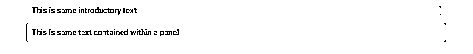
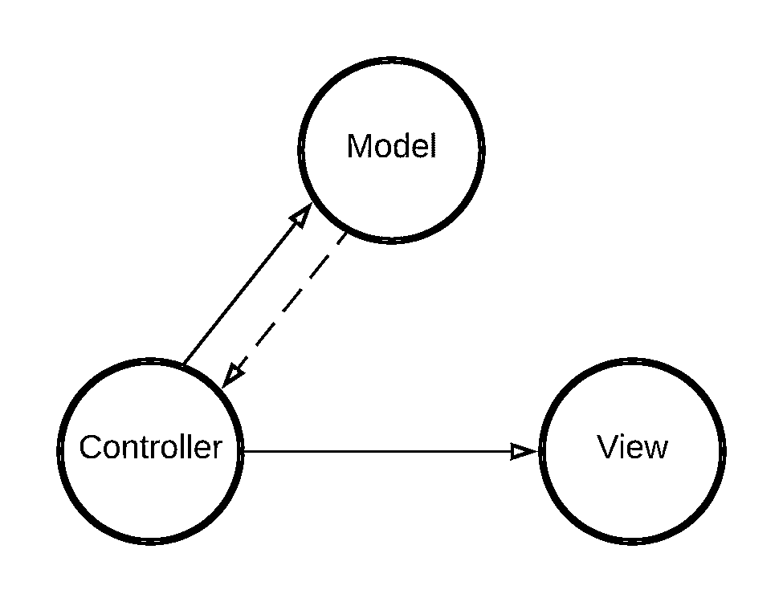
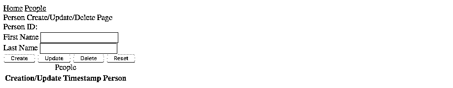
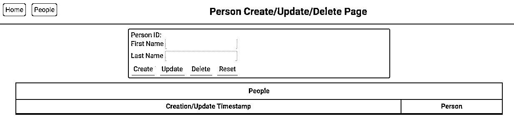
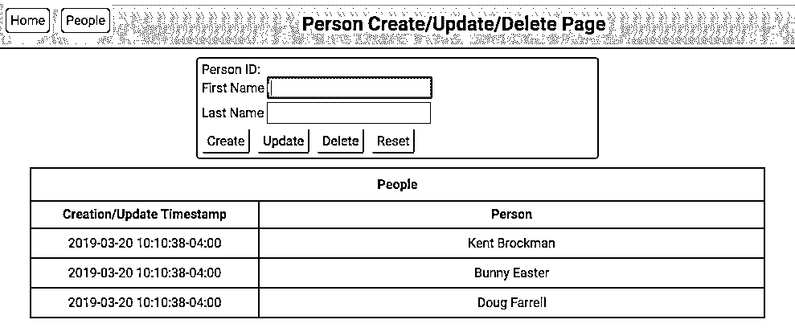

# Python REST APIs 与 Flask、Connexion 和 SQLAlchemy——第 4 部分

> 原文:# t0]https://realython . com/flask-连接-rest API-part-4/

在本系列的第 3 部分中，您向 REST API 和支持它的数据库添加了关系。这为您提供了一个强大的工具，您可以使用它来构建有趣的程序，将持久数据以及这些数据之间的关系发送到数据库系统。有了 REST API，您就能够用 HTML、CSS 和 JavaScript 创建一个[单页面应用程序(SPA)](https://en.wikipedia.org/wiki/Single-page_application) 。在您转向更强大的前端框架之前，这是一个很好的起点，比如 Angular 或 React。

**注意:**本教程系列目前正在更新中。在继续之前，请注意代码和对本系列中以前部分的引用可能已经过时。

本教程系列的零件[一](https://realpython.com/flask-connexion-rest-api/)、[二](https://realpython.com/flask-connexion-rest-api-part-2/)、[三](https://realpython.com/flask-connexion-rest-api-part-3/)已经是最新的了。如果你还没有完成前三部分，那么先从它们开始是个好主意。

随时注册 [Real Python 时事通讯](https://realpython.com/newsletter/)以便在本教程更新时得到通知。

**在这篇文章中，你将学习如何:**

*   构建一个 **HTML** 文件，作为单页面 web 应用程序的模板
*   使用[层叠样式表(CSS)](https://realpython.com/html-css-python/#style-your-content-with-css) 来设计应用程序的外观
*   使用本地 JavaScript 为应用程序增加交互性
*   使用 JavaScript 向您在本系列第 3 部分[中开发的 REST API 发出 HTTP](https://realpython.com/flask-connexion-rest-api-part-3/) [AJAX](https://en.wikipedia.org/wiki/Ajax_(programming)) 请求

您可以通过下面的链接获得本教程中的所有代码:

**下载代码:** [单击此处下载代码，您将在本教程中使用](https://realpython.com/bonus/rest-api-flask-series/)来了解 Python REST APIs 与 Flask、Connexion 和 SQLAlchemy。

## 这篇文章是写给谁的

本系列的第 1 部分指导您构建 REST API，[第 2 部分](https://realpython.com/flask-connexion-rest-api-part-2/)向您展示了如何将 REST API 连接到数据库。在[第 3 部分](https://realpython.com/flask-connexion-rest-api-part-3/)中，您向 REST API 和支持数据库添加了关系。

本文将把 REST API 作为基于浏览器的 web 应用程序呈现给用户。这种组合让你同时拥有[前端和后端](https://en.wikipedia.org/wiki/Front_and_back_ends)能力，这是一个有用而强大的技能组合。

[*Remove ads*](/account/join/)

## 创建单页应用程序

在本系列的第 3 部分中，您向 REST API 和数据库添加了关系来表示与人相关联的注释。换句话说，你创造了一种迷你博客。您在第 3 部分中构建的 web 应用程序向您展示了一种呈现 REST API 并与之交互的方式。您在三个**单页面应用程序(SPA)** 之间导航，以访问 REST API 的不同部分。

虽然您可以将这些功能合并到一个 SPA 中，但是这种方法会使样式和交互性的概念变得更加复杂，而且没有太多的附加价值。因此，每个页面都是一个完整、独立的 SPA。

在本文中，您将重点关注 **People SPA** ，它显示了数据库中的人员列表，并提供了一个编辑器特性来创建新人员以及更新或删除现有人员。主页和注释页在概念上是相似的。

### 现有的框架有哪些？

现有的库为创建 SPA 系统提供了内置的健壮功能。例如， [Bootstrap](https://getbootstrap.com/) 库提供了一个流行的样式框架，用于创建一致且美观的 web 应用程序。它有 JavaScript 扩展，为样式化的 DOM 元素增加了交互性。

也有强大的 web 应用框架，像 [React](https://en.wikipedia.org/wiki/React_(JavaScript_library)) 和 [Angular](https://en.wikipedia.org/wiki/Angular_(web_framework)) ，给你完整的 web 应用开发系统。当您想要创建大型的、多页面的 spa，而从头开始构建会很麻烦时，这些功能非常有用。

### 为什么要自建呢？

有了上面列出的工具，您为什么会选择从头开始创建 SPA 呢？以 Bootstrap 为例。您可以使用它来创建看起来很棒的 spa，并且您当然可以将它与您的 [JavaScript](https://realpython.com/python-vs-javascript/) 代码一起使用！

问题是 Bootstrap 有一个陡峭的学习曲线，如果你想很好地使用它，你需要爬上去。它还向 HTML 内容中定义的 DOM 元素添加了许多特定于 Bootstrap 的属性。同样，像 React 和 Angular 这样的工具也有很长的学习曲线需要你去克服。然而，不依赖这些工具的 web 应用程序仍然有一席之地。

通常，当你构建一个 web 应用程序时，你想先构建一个**概念验证**来看看这个应用程序是否有用。您将希望快速启动并运行它，这样您可以更快地推出自己的原型并在以后进行升级。由于您不会在原型上投入太多时间，因此重新开始并创建一个具有受支持的全功能框架的新应用程序的成本不会太高。

在这篇文章中你将要用 People 应用程序开发的东西和你用一个完整的框架可以构建的东西之间有一个差距。由您来决定是自己提供功能还是采用框架。

## 单页应用程序的组成部分

在传统的基于网络的系统中有几种主要的交互形式。您可以在页面之间导航，并提交包含新信息的页面。您可以填写包含输入字段、单选按钮、复选框等的表单。当您执行这些活动时，web 服务器通过向您的浏览器发送新文件来做出响应。然后，您的浏览器[再次呈现](https://en.wikipedia.org/wiki/Browser_engine)内容。

单页应用程序打破了这种模式，首先加载它们需要的所有东西。然后，任何交互性或导航都由 JavaScript 或后台的服务器调用来处理。这些活动动态更新页面内容**。*

*单页应用程序有三个主要组件:

1.  HTML 提供了网页的内容，或者说是你的浏览器所呈现的内容。
2.  CSS 提供了网页的表现形式，或者说风格。它定义了页面内容在浏览器中呈现时的外观。
3.  **JavaScript** 提供网页的交互性。它还处理与后端服务器的通信。

接下来，您将进一步了解这些主要组件。

### HTML

[HTML](https://realpython.com/html-css-python/#create-your-first-html-file) 是一个发送到浏览器的文本文件，为单页应用程序提供主要的**内容**和**结构**。这个结构包括对`id`和`class`属性的定义，CSS 使用它们来设计内容的样式，JavaScript 使用它们来与结构交互。您的浏览器解析 HTML 文件以创建[文档对象模型(DOM)](https://en.wikipedia.org/wiki/Document_Object_Model) ，并使用它将内容呈现到显示器上。

HTML 文件中的标记包括**标签**，如段落标签`<p>...</p>`和标题标签`<h1>...</h1>`。当浏览器解析 HTML 并将其呈现给显示器时，这些标签成为 DOM 中的元素。HTML 文件还包含指向外部资源的链接，浏览器在解析 HTML 时会加载这些外部资源。对于您在本文中构建的 SPA，这些外部资源是 CSS 和 JavaScript 文件。

[*Remove ads*](/account/join/)

### CSS

[层叠样式表(CSS)](https://en.wikipedia.org/wiki/Cascading_Style_Sheets) 是包含**样式**信息的文件，这些信息将应用于从 HTML 文件呈现的任何 DOM 结构。这样，网页的内容就可以从它的表现中分离出来。

在 CSS 中，DOM 结构的样式由**选择器**决定。选择器只是一种将样式与 DOM 中的元素相匹配的方法。例如，下面代码块中的`p`选择器将样式信息应用于所有段落元素:

```py
p  { font-weight:  bold; background-color:  cyan; }
```

上述样式将应用于 DOM 中的所有段落元素。文本将显示为粗体，背景颜色为青色。

CSS 的**层叠**部分意味着稍后定义的样式，或者在一个 CSS 文件中加载的样式，将优先于任何先前定义的样式。例如，您可以在上述样式之后定义第二个段落样式:

```py
p  { font-weight:  bold; background-color:  cyan; } p  {  background-color:  cornflower;  }
```

这个新的样式定义将修改现有的样式，这样 DOM 中的所有段落元素都将具有背景色`cornflower`。这将覆盖先前样式的`background-color`，但是它将保持`font-weight`设置不变。您也可以在自己的 CSS 文件中定义新的段落样式。

`id`和`class`属性允许您将样式应用于 DOM 中特定的单个元素。例如，呈现新 DOM 的 HTML 可能如下所示:

```py
<p>
    This is some introductory text
</p>

<p class="panel">
    This is some text contained within a panel
</p>
```

这将在 DOM 中创建两个段落元素。第一个没有`class`属性，但是第二个有`panel`的`class`属性。然后，您可以像这样创建一个 CSS 样式:

```py
p  { font-weight:  bold; width:  80%; margin-left:  auto; margin-right:  auto; background-color:  lightgrey; } .panel  {   border:  1px  solid  darkgrey; border-radius:  4px; padding:  10px; background-color:  lightskyblue; }
```

在这里，您为任何具有`panel`属性的元素定义了一个样式。当您的浏览器呈现 DOM 时，两个段落元素应该如下所示:

[](https://files.realpython.com/media/people_paragraphs.07d6d12ab5da.png)

两个段落元素都应用了第一个样式定义，因为`p`选择器选择了它们。但是只有第二段应用了`.panel`样式，因为它是唯一一个具有与选择器匹配的类属性`panel`的元素。第二段从`.panel`样式中获取新的样式信息，并覆盖在`p`样式中定义的`background-color`样式。

### JavaScript

[JavaScript](https://en.wikipedia.org/wiki/JavaScript) 提供了 SPA 的所有交互特性，以及与服务器提供的 REST API 的动态通信。它还执行对 DOM 的所有更新，使 SPA 的行为更像一个完整的[图形用户界面(GUI)](https://en.wikipedia.org/wiki/Graphical_user_interface) 应用程序，如 Word 或 Excel。

随着 JavaScript 的发展，使用现代浏览器提供的 DOM 变得更加容易和一致。您将使用一些约定，如[名称空间](https://realpython.com/python-namespaces-scope/)和关注点分离，来帮助防止您的 JavaScript 代码与您可能包含的其他库发生冲突。

**注意:**您将使用本地 JavaScript 创建单页面应用程序。特别是，你将使用 [ES2017](https://en.wikipedia.org/wiki/ECMAScript#ES2017) 版本，它可以与许多现代浏览器兼容，但如果你的目标是支持旧版本的浏览器，这可能会有问题。

#### 模块和名称空间

您可能已经知道 Python 中的名称空间，以及它们为什么有价值。简而言之，**名称空间**为您提供了一种在程序中保持名称唯一以防止冲突的方法。例如，如果您想同时使用`math`和`cmath`模块中的`log()`，那么您的代码可能如下所示:

>>>

```py
>>> import math
>>> import cmath
>>> math.log(10)
2.302585092994046
>>> cmath.log(10)
(2.302585092994046+0j)
```

上面的 Python 代码导入了`math`和`cmath`模块，然后从每个模块调用`log(10)`。第一个调用返回一个实数，第二个调用返回一个复数，这是`cmath`的函数。每个`log()`实例对于它自己的名称空间(`math`或`cmath`)是唯一的，这意味着对`log()`的调用不会相互冲突。

现代 JavaScript 能够[导入](https://developer.mozilla.org/en-US/docs/Web/JavaScript/Reference/Statements/import)模块并为这些模块分配名称空间。如果您需要导入其他可能存在名称冲突的 JavaScript 库，这将非常有用。

如果你看一下`people.js`文件的结尾，你会看到:

```py
301// Create the MVC components 302const  model  =  new  Model(); 303const  view  =  new  View(); 304const  controller  =  new  Controller(model,  view); 305
306// Export the MVC components as the default 307export  default  { 308  model, 309  view, 310  controller 311};
```

上面的代码创建了 MVC 系统的三个组件，您将在本文后面看到。该模块的默认导出是一个 JavaScript 文字对象。您在`people.html`文件的底部导入这个模块:

```py
50<script type="module"> 51  // Give the imported MVC components a namespace 52  import  *  as  MVC  from  "/static/js/people.js"; 53
54  // Create an intentional global variable referencing the import 55  window.mvc  =  MVC; 56</script>
```

下面是这段代码的工作原理:

*   **第 50 行**使用`type="module"`告诉系统该文件是一个模块，而不仅仅是一个 JavaScript 文件。

*   **第 52 行**从`people.js`导入默认对象，并将其命名为`MVC`。这创建了一个名为`MVC`的名称空间。您可以为导入的对象指定任何名称，只要不与您可能无法控制的其他 JavaScript 库冲突。

*   **第 55 行**创建一个全局[变量](https://realpython.com/python-variables/)，这是一个方便的步骤。您可以使用 JavaScript 调试器来检查`mvc`对象，并查看`model`、`view`和`controller`。

**注意:**因为`MVC`是导入的模块而不仅仅是包含的文件，所以 JavaScript 会默认为[严格模式](https://developer.mozilla.org/en-US/docs/Web/JavaScript/Reference/Strict_mode)，这比非严格模式有一些优势。其中最大的一个就是不能使用未定义的变量。

在没有打开严格模式的情况下，这是完全合法的:

```py
var  myName  =  "Hello"; myNane  =  "Hello World";
```

你看到错误了吗？第一行创建了一个名为`myName`的变量，并将字符串`"Hello"`赋给它。第二行*看起来像是*把变量的内容改成了`"Hello World"`，但事实并非如此！

在第二行中，`"Hello World"`被分配给变量名`myNane`，它与`n`拼错了。在非严格的 JavaScript 中，这会创建两个变量:

1.  正确的变量`myName`
2.  非故意的错别字版本`myNane`

想象一下，如果这两行 JavaScript 代码被许多其他代码分开。这可能会产生一个难以发现的运行时错误！当您使用严格模式时，如果您的代码试图使用未声明的变量，您可以通过引发异常来消除类似这样的错误。

#### 命名惯例

在很大程度上，您在这里使用的 JavaScript 代码是在 [camel case](https://en.wikipedia.org/wiki/Camel_case) 中。这种命名约定在 JavaScript 社区中广泛使用，因此代码示例反映了这一点。然而，您的 Python 代码将使用[蛇案例](https://en.wikipedia.org/wiki/Snake_case)，这在 Python 社区中更为常规。

在 JavaScript 代码与 Python 代码交互的地方，尤其是在共享变量进入 REST API 接口的地方，这种命名上的差异可能会令人困惑。在编写代码时，一定要记住这些差异。

#### 关注点分离

驱动 SPA 的代码可能很复杂。您可以使用[模型-视图-控制器(MVC)](https://realpython.com/the-model-view-controller-mvc-paradigm-summarized-with-legos/) 架构模式，通过创建[关注点分离](https://en.wikipedia.org/wiki/Separation_of_concerns)来简化事情。Home、People 和 Notes SPAs 使用以下 MVC 模式:

*   模型提供了对服务器 REST API 的所有访问。展示的任何东西都来自模型。对数据的任何更改都会通过模型并返回到 REST API。

*   视图控制所有的显示处理和 DOM 更新。视图是 SPA 中唯一与 DOM 交互的部分，它使浏览器呈现并重新呈现对显示的任何更改。

*   **控制器**处理所有用户交互和任何输入的用户数据，如点击事件。因为控制器对用户输入做出反应，所以它也基于用户输入与模型和视图进行交互。

下面是在 SPA 代码中实现的 MVC 概念的可视化表示:

[](https://files.realpython.com/media/mvc.b7675fb5f043.png)

<figcaption class="figure-caption text-center">Model / View / Controller</figcaption>

在上图中，控制器与模型和视图都有很强的联系。同样，这是因为控制器处理的任何用户交互都可能需要访问 REST API 来获取或更新数据。它甚至可能需要更新显示。

从模型到控制器的虚线表示弱连接。因为对 REST API 的调用是[异步的](https://realpython.com/python-async-features/)，所以模型提供给控制器的数据会在稍后返回。

[*Remove ads*](/account/join/)

## 创建人民温泉

你的微型博客演示应用有主页、人物和笔记页面。这些页面中的每一个都是一个完整的、独立的 SPA。它们都使用相同的设计和结构，所以即使您在这里关注的是 People 应用程序，您也会理解如何构建它们。

### 人物 HTML

Python [Flask](https://realpython.com/tutorials/flask/) web 框架提供了 [Jinja2](https://realpython.com/primer-on-jinja-templating/) 模板引擎，您将为 People SPA 使用该引擎。SPA 的某些部分是所有三个页面共有的，因此每个页面都使用 Jinja2 **模板继承**特性来共享这些公共元素。

您将在两个文件中为 People SPA 提供 HTML 内容:`parent.html`和`people.html`文件。您可以通过下面的链接获得这些文件的代码:

**下载代码:** [单击此处下载代码，您将在本教程中使用](https://realpython.com/bonus/rest-api-flask-series/)来了解 Python REST APIs 与 Flask、Connexion 和 SQLAlchemy。

下面是您的`parent.html`的样子:

```py
 1<!DOCTYPE html>
 2<html lang="en">
 3<head>
 4    <meta charset="UTF-8">
 5    
 6    <title> Page</title>
 7    
 8</head>
 9<body>
10<div class="navigation">
11    <span class="buttons">
12        <a href="/">Home</a>
13        <a href="/people">People</a>
14    </span>
15    <span class="page_name">
16        <div></div>
17    </span>
18    <span class="spacer"></span>
19</div>
20
21
22
23</body>
24
25
26
27
28</html>
```

`parent.html`有几大要素:

*   **第 1 行**设置文件类型为`<!DOCTYPE html>`。所有新的 HTML 页面都以这个声明开始。现代浏览器知道这意味着使用 HTML 5 标准，而旧浏览器将退回到它们所能支持的最新标准。
*   **第 4 行**告诉浏览器使用 UTF-8 编码。
*   **第 10 到 19 行**定义了导航栏。
*   **第 21 行和第 22 行**是 Jinja2 块标记，将被`people.html`中的内容替换。
*   **第 25 行和第 26 行**是 Jinja2 块标记，作为 JavaScript 代码的占位符。

`people.html`文件将继承`parent.html`代码。您可以展开下面的代码块来查看整个文件:


```py
 1
 2People
 3
 4
 5Person Create/Update/Delete Page
 6
 7
 8    <div class="container">
 9        <input id="url_person_id" type="hidden" value="{{ person_id }}" />
10        <div class="section editor">
11            <div>
12                <span>Person ID:</span>
13                <span id="person_id"></span>
14            </div>
15            <label for="fname">First Name
16                <input id="fname" type="text" />
17            </label>
18            <br />
19            <label for="lname">Last Name
20                <input id="lname" type="text" />
21            </label>
22            <br />
23            
24            
25            
26            
27        </div>
28        <div class="people">
29            <table>
30                <caption>People</caption>
31                <thead>
32                    <tr>
33                        <th>Creation/Update Timestamp</th>
34                        <th>Person</th>
35                    </tr>
36                </thead>
37            </table>
38        </div>
39        <div class="error">
40        </div>
41    </div>
42    <div class="error">
43    </div>
44
45
```

只有两个主要区别:

*   **第 1 行**告诉 Jinja2 这个模板继承自`parent.html`模板。
*   **第 7 行到第 45 行**创建页面的主体。这包括编辑部分和一个显示人员列表的空表。这是插入到`parent.html`文件的``部分的内容。

由`parent.html`和`people.html`生成的 HTML 页面不包含样式信息。相反，页面以您用来查看它的任何浏览器的默认样式呈现。这是你的应用在 Chrome 浏览器中呈现的样子:

[](https://files.realpython.com/media/people_page_before.18c070ff3f0b.png)

<figcaption class="figure-caption text-center">People HTML page before styling</figcaption>

它看起来不太像一个单页应用程序！让我们看看你能做些什么。

### 人民 CSS

要对 People SPA 进行样式化，首先需要添加 [`normalize.css`](https://necolas.github.io/normalize.css/) 样式表。这将确保所有浏览器一致地呈现更接近 HTML 5 标准的元素。People SPA 的特定 CSS 由两个样式表提供:

1.  `parent.css`，你用`parent.html`拉进来
2.  `people.css`，你用`people.html`拉进来

您可以通过下面的链接获得这些样式表的代码:

**下载代码:** [单击此处下载代码，您将在本教程中使用](https://realpython.com/bonus/rest-api-flask-series/)来了解 Python REST APIs 与 Flask、Connexion 和 SQLAlchemy。

您将把`normalize.css`和`parent.css`都添加到`parent.html`的`<head>...</head>`部分:

```py
 1<head>
 2    <meta charset="UTF-8">
 3    
 4    <title> Page</title>
 5    <link rel="stylesheet" href="https://cdnjs.cloudflare.com/ajax/libs/normalize/8.0.0/normalize.min.css">
 6    <link rel="stylesheet" href="/static/css/parent.css">
 7    
 8</head>
```

这些新系列的作用如下:

*   **5 号线**从一个[内容交付网络(CDN)](https://en.wikipedia.org/wiki/Content_delivery_network) 获取`normalize.css`，不用自己下载。
*   **第 6 行**从你 app 的`static`文件夹中获取`parent.css`。

在大多数情况下，`parent.css`为导航和错误元素设置样式。它还使用以下代码行将默认字体更改为 Google 的 Roboto 字体:

```py
 5@import  url(http://fonts.googleapis.com/css?family=Roboto:400,300,500,700); 6
 7body,  .ui-btn  { 8  font-family:  Roboto; 9}
```

你从谷歌的 CDN 上下载 Roboto 字体。然后，您将该字体应用于 SPA 主体中也有一个类`.ui-btn`的所有元素。

同样，`people.css`包含特定于创建 People SPA 的 HTML 元素的样式信息。您将`people.css`添加到 Jinja2 ``部分内的`people.html`文件中:

```py
 3
 4    {{ super() }}
 5    <link rel="stylesheet" href="/static/css/people.css">
 6
```

该文件包含几个新行:

*   **2 号线**有一个对{{ super() }}的呼叫。这告诉 Jinja2 包含存在于`parent.html`的``部分中的任何内容。
*   **第 3 行**从你应用的静态文件夹中提取`people.css`文件。

在包含样式表之后，您的 People SPA 将看起来更像这样:

[](https://files.realpython.com/media/people_page_after_styling.da1b340d7576.png)

<figcaption class="figure-caption text-center">People HTML page after styling, but before JavaScript</figcaption>

人民温泉看起来更好，但它仍然是不完整的。表中的人员数据行在哪里？编辑器部分的所有按钮都启用了，为什么它们什么都不做？在下一节中，您将使用一些 JavaScript 来解决这些问题。

[*Remove ads*](/account/join/)

### 人民 JavaScript

您将把 JavaScript 文件拉入 People SPA，就像您处理 CSS 文件一样。您将把以下代码添加到`people.html`文件的底部:

```py
48
49{{ super() }}
50<script type="module"> 51  // Give the imported MVC components a namespace 52  import  *  as  MVC  from  "/static/js/people.js"; 53
54  // Create an intentional global variable referencing the import 55  window.mvc  =  MVC; 56</script>
57
```

注意第 50 行开始的`<script>`标签上的`type="module"`声明。这告诉系统这个脚本是一个 JavaScript 模块。ES6 `import`语法将用于将代码的导出部分拉入浏览器上下文。

## 人民 MVC

所有 SPA 页面都使用了一种不同的 [MVC](https://realpython.com/the-model-view-controller-mvc-paradigm-summarized-with-legos/) 模式。下面是一个 JavaScript 实现示例:

```py
 1// Create the MVC components 2const  model  =  new  Model(); 3const  view  =  new  View(); 4const  controller  =  new  Controller(model,  view); 5
 6// Export the MVC components as the default 7export  default  { 8  model, 9  view, 10  controller 11};
```

这段代码还没有做任何事情，但是您可以使用它来查看 MVC 结构和实现的以下元素:

*   **第 2 行**创建模型类的一个实例，并将其分配给`model`。
*   **第 3 行**创建视图类的一个实例，并将其分配给`view`。
*   **第 4 行**创建控制器类的一个实例，并将其分配给`controller`。请注意，您将`model`和`view`都传递给了构造函数。这就是控制器如何获得到`model`和`view`实例变量的链接。
*   **第 7 行到第 11 行**导出一个 JavaScript 文本对象作为默认导出。

因为您在`people.html`的底部拉进了`people.js`，所以 JavaScript 在您的浏览器创建 SPA DOM 元素之后*被执行。这意味着 JavaScript 可以安全地访问页面上的元素，并开始与 DOM 交互。*

同样，上面的代码还没有做任何事情。为了让它工作，您需要定义您的模型、视图和控制器。

### 人物模型

**模型**负责与 Flask 服务器提供的 REST API 通信。来自数据库的任何数据，以及 SPA 更改或创建的任何数据，都必须经过模型。与 REST API 的所有通信都是通过 JavaScript 发起的 HTTP [AJAX](https://en.wikipedia.org/wiki/Ajax_(programming)) 调用来完成的。

现代 JavaScript 提供了`fetch()`，可以用来进行 AJAX 调用。模型类的代码实现了一个 AJAX 方法来读取 REST API URL 端点`/api/people`并获取数据库中的所有人:

```py
 1class  Model  { 2  async  read()  { 3  let  options  =  { 4  method:  "GET", 5  cache:  "no-cache", 6  headers:  { 7  "Content-Type":  "application/json" 8  "accepts":  "application/json" 9  } 10  }; 11  // Call the REST endpoint and wait for data 12  let  response  =  await  fetch(`/api/people`,  options); 13  let  data  =  await  response.json(); 14  return  data; 15  } 16}
```

下面是这段代码的工作原理:

*   **第 1 行**定义了类别`Model`。这是稍后将作为`mvc`对象的一部分导出的内容。

*   **第 2 行**开始定义一个叫做`read()`的[异步](https://realpython.com/python-async-features/)方法。`read()`前面的`async`关键字告诉 JavaScript 这个方法执行异步工作。

*   **第 3 行到第 9 行**用 HTTP 调用的参数创建一个`options`对象，比如方法和调用对数据的期望。

*   **第 12 行**使用 [`fetch()`](https://developer.mozilla.org/en-US/docs/Web/API/Fetch_API) 对服务器提供的`/api/people` URL REST 端点进行异步 HTTP 调用。`fetch()`前面的关键字`await`告诉 JavaScript 异步等待调用完成。完成后，结果被分配给`response`。

*   **第 13 行**将响应中的 JSON 字符串异步转换为 JavaScript 对象，并将其赋给`data`。

*   **第 14 行**将数据返回给调用者。

本质上，这段代码告诉 JavaScript 向`/api/people`发出一个`GET` HTTP 请求，并且调用者正在期待一个`application/json`和`json`数据的`Content-Type`。回想一下，在面向 [CRUD](https://en.wikipedia.org/wiki/Create,_read,_update_and_delete) 的系统中，一个`GET` HTTP 调用等同于`Read`。

基于在`swagger.yml`中定义的连接配置，这个 HTTP 调用将调用`def read_all()`。这个函数是在`people.py`中定义的，它查询 SQLite 数据库来构建一个人员列表以返回给调用者。您可以通过下面的链接获得所有这些文件的代码:

**下载代码:** [单击此处下载代码，您将在本教程中使用](https://realpython.com/bonus/rest-api-flask-series/)来了解 Python REST APIs 与 Flask、Connexion 和 SQLAlchemy。

在浏览器中，JavaScript 在单线程中执行，旨在响应用户操作。因此，阻止等待完成的 JavaScript 执行是个坏主意，比如对服务器的 HTTP 请求。

如果请求是通过一个非常慢的网络发出的，或者服务器本身发生故障，永远不会响应，那该怎么办？如果 JavaScript 在这种情况下阻塞并等待 HTTP 请求完成，那么它可能会在几秒钟、几分钟内完成，或者根本不会完成。当 JavaScript 被阻止时，浏览器中的其他任何东西都不会对用户的动作做出反应！

为了防止这种阻塞行为，HTTP 请求被异步执行**。这意味着 HTTP 请求在请求完成之前立即返回到事件循环。**事件循环**存在于浏览器中运行的任何 JavaScript 应用程序中。循环不断等待事件完成，以便运行与该事件相关的代码。*

*当您将`await`关键字放在`fetch()`之前时，您告诉事件循环当 HTTP 请求完成时返回到哪里。此时，请求完成，调用返回的任何数据都被分配给`response`。然后，`controller`调用`this.model.read()`接收方法返回的数据。这就造成了与`controller`的一个薄弱环节，因为`model`不知道调用它的是什么，只知道它返回给调用者的是什么。

[*Remove ads*](/account/join/)

### 人物观点

`this.view`负责与 DOM 交互，由显示器显示。它可以从 DOM 中更改、添加和删除项目，然后重新呈现到显示器上。`controller`调用视图的方法来更新显示。`View`是另一个 JavaScript 类，包含控制器可以调用的方法。

下面是 People SPA 的`View`类的一个稍微简化的版本:

```py
 1class  View  { 2  constructor()  { 3  this.table  =  document.querySelector(".people table"); 4  this.person_id  =  document.getElementById("person_id"); 5  this.fname  =  document.getElementById("fname"); 6  this.lname  =  document.getElementById("lname"); 7  } 8
 9  reset()  { 10  this.person_id.textContent  =  ""; 11  this.lname.value  =  ""; 12  this.fname.value  =  ""; 13  this.fname.focus(); 14  } 15
16  buildTable(people)  { 17  let  tbody, 18  html  =  ""; 19
20  // Iterate over the people and build the table 21  people.forEach((person)  =>  { 22  html  +=  `
23 <tr data-person_id="${person.person_id}" data-fname="${person.fname}" data-lname="${person.lname}">
24 <td class="timestamp">${person.timestamp}</td>
25 <td class="name">${person.fname}  ${person.lname}</td>
26 </tr>`; 27  }); 28  // Is there currently a tbody in the table? 29  if  (this.table.tBodies.length  !==  0)  { 30  this.table.removeChild(this.table.getElementsByTagName("tbody")[0]); 31  } 32  // Update tbody with our new content 33  tbody  =  this.table.createTBody(); 34  tbody.innerHTML  =  html; 35  } 36}
```

下面是这段代码的工作原理:

*   **第 1 行**开始类别定义。

*   **第 2 行到第 7 行**定义了类构造函数，很像 Python 类中的`def __init__(self):`定义。构造函数从 DOM 中获取元素，并创建别名变量用于类的其他部分。那些变量名前面的`this.`很像 Python 中的`self.`。使用时，它指定该类的当前实例。

*   **第 9 到 14 行**定义了`reset()`，您将使用它将页面设置回默认状态。

*   **第 16 到 36 行**定义了`buildTable()`，它根据传递给它的`people`数据构建了人员表。

创建别名变量是为了缓存调用`document.getElementByID()`和`document.querySelector()`返回的 DOM 对象，这是相对昂贵的 JavaScript 操作。这允许在该类的其他方法中快速使用变量。

让我们仔细看看`build_table()`，它是`View`类中的第二个方法:

```py
16buildTable(people)  { 17  let  tbody, 18  html  =  ""; 19
20  // Iterate over the people and build the table 21  people.forEach((person)  =>  { 22  html  +=  `
23 <tr data-person_id="${person.person_id}" data-fname="${person.fname}" data-lname="${person.lname}">
24 <td class="timestamp">${person.timestamp}</td>
25 <td class="name">${person.fname}  ${person.lname}</td>
26 </tr>`; 27  }); 28  // Is there currently a tbody in the table? 29  if  (this.table.tBodies.length  !==  0)  { 30  this.table.removeChild(this.table.getElementsByTagName("tbody")[0]); 31  } 32  // Update tbody with our new content 33  tbody  =  this.table.createTBody(); 34  tbody.innerHTML  =  html; 35}
```

该函数的工作原理如下:

*   **第 16 行**创建方法，并将`people`变量作为参数传递。
*   **第 21 行到第 27 行**使用 JavaScript [箭头函数](https://developer.mozilla.org/en-US/docs/Web/JavaScript/Reference/Functions/Arrow_functions)遍历`people`数据，创建一个在`html`变量中构建表格行的函数。
*   **第 29 到 31 行**删除表格中的任何`<tbody>`元素，如果它们存在的话。
*   第 33 行在表格中创建一个新的`tbody`元素。
*   **第 34 行**将先前创建的`html`字符串作为 HTML 插入到`tbody`元素中。

该函数根据传递给它的数据在 People SPA 中动态构建表，该表是来自于`/api/people/` REST API 调用的人员列表。这些数据与 JavaScript 模板字符串一起用于生成要插入到表中的表行。

### 人员控制器

**控制器**是 MVC 实现的中心交换中心，因为它协调`model`和`view`的活动。因此，定义它的代码有点复杂。这是一个简化的版本:

```py
 1class  Controller  { 2  constructor(model,  view)  { 3  this.model  =  model; 4  this.view  =  view; 5
 6  this.initialize(); 7  } 8  async  initialize()  { 9  await  this.initializeTable(); 10  } 11  async  initializeTable()  { 12  try  { 13  let  urlPersonId  =  parseInt(document.getElementById("url_person_id").value), 14  people  =  await  this.model.read(); 15
16  this.view.buildTable(people); 17
18  // Did we navigate here with a person selected? 19  if  (urlPersonId)  { 20  let  person  =  await  this.model.readOne(urlPersonId); 21  this.view.updateEditor(person); 22  this.view.setButtonState(this.view.EXISTING_NOTE); 23
24  // Otherwise, nope, so leave the editor blank 25  }  else  { 26  this.view.reset(); 27  this.view.setButtonState(this.view.NEW_NOTE); 28  } 29  this.initializeTableEvents(); 30  }  catch  (err)  { 31  this.view.errorMessage(err); 32  } 33  } 34  initializeCreateEvent()  { 35  document.getElementById("create").addEventListener("click",  async  (evt)  =>  { 36  let  fname  =  document.getElementById("fname").value, 37  lname  =  document.getElementById("lname").value; 38
39  evt.preventDefault(); 40  try  { 41  await  this.model.create({ 42  fname:  fname, 43  lname:  lname 44  }); 45  await  this.initializeTable(); 46  }  catch(err)  { 47  this.view.errorMessage(err); 48  } 49  }); 50  } 51}
```

它是这样工作的:

*   **第 1 行**开始定义控制器类。

*   **第 2 行到第 7 行**定义了类构造函数，并用它们各自的参数创建了实例变量`this.model`和`this.view`。它还调用`this.initialize()`来设置事件处理并构建初始人员表。

*   **第 8 行到第 10 行**定义了`initialize()`，并将其标记为异步方法。它异步调用`this.initializeTable()`并等待它完成。这个简化版本只包含这一个调用，但是完整版本的代码包含用于其余事件处理设置的其他初始化方法。

*   **第 11 行**将`initializeTable()`定义为异步方法。这是必要的，因为它调用`model.read()`，这也是异步的。

*   **第 13 行**用 HTML 隐藏输入`url_person_id`的值声明并初始化`urlPersonId`变量。

*   **第 14 行**调用`this.model.read()`并异步等待它返回人员数据。

*   **第 16 行**调用`this.view.buildTable(people)`用人员数据填充 HTML 表。

*   **第 19 到 28 行**决定了如何更新页面的编辑器部分。

*   **第 29 行**调用`this.initializeTableEvents()`为 HTML 表格安装事件处理。

*   **第 31 行**调用`this.view.errorMessage(err)`来显示可能出现的错误。

*   **第 34 到 49 行**在创建按钮上安装一个点击事件处理程序。这将调用`this.model.create(...)`使用 REST API 创建一个新的 person，并用新数据更新 HTML 表。

`controller`的大部分代码是这样的，为 People SPA 页面上所有预期的事件设置事件处理程序。控制器继续在这些事件处理程序中创建函数来编排对`this.model`和`this.view`的调用，以便它们在这些事件发生时执行正确的操作。

当您的代码完成时，您的人员 SPA 页面将如下所示:

[](https://files.realpython.com/media/people_page_after.007a76786496.png)

<figcaption class="figure-caption text-center">People HTML page after styling and JavaScript</figcaption>

内容、样式和功能都是完整的！

[*Remove ads*](/account/join/)

## 结论

你已经覆盖了大量的新领域，应该为你所学到的感到自豪！为了创建一个完整的单页面应用程序，在 Python 和 JavaScript 之间来回切换可能很棘手。

如果你把你的**内容** (HTML)、**表示** (CSS)和**交互** (JavaScript)分开，那么你可以大大降低复杂性。您还可以通过使用 MVC 模式来进一步分解用户交互的复杂性，从而使 JavaScript 编码更易于管理。

您已经看到了如何使用这些工具和思想来帮助您创建相当复杂的单页面应用程序。现在，您可以更好地决定是以这种方式构建应用程序，还是投入到更大的框架中！

您可以通过下面的链接获得本教程中的所有代码:

**下载代码:** [单击此处下载代码，您将在本教程中使用](https://realpython.com/bonus/rest-api-flask-series/)来了解 Python REST APIs 与 Flask、Connexion 和 SQLAlchemy。

[« Part 3: Database Relationship](https://realpython.com/flask-connexion-rest-api-part-3/)[Part 4: Simple Web Applications](#)**********