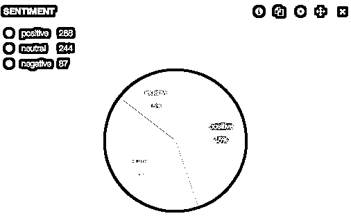
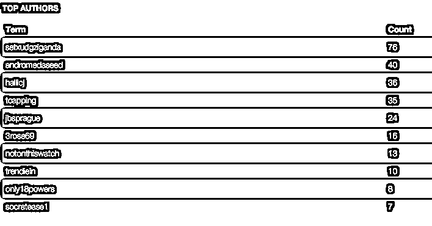

# Twitter 情绪分析——Python、Docker、Elasticsearch、Kibana

> 原文:# t0]https://realython . com/Twitter-感情 python 坞站-弹性搜索-kibana/

在本例中，我们将连接到 Twitter 流 API，收集推文(基于关键字)，[计算每条推文的情绪](https://realpython.com/python-keras-text-classification/)，并使用 Elasticsearch DB 和 Kibana 构建一个实时仪表板来可视化结果。

> 工具: [Docker](https://www.docker.com/) v1.3.0， [boot2docker](http://boot2docker.io/) v1.3.0， [Tweepy](http://www.tweepy.org/) v2.3.0， [TextBlob](http://textblob.readthedocs.org/en/dev/) v0.9.0， [Elasticsearch](http://www.elasticsearch.org/) v1.3.5， [Kibana](http://www.elasticsearch.org/overview/kibana/) v3.1.2

## Docker 环境

按照官方 Docker 文档安装 Docker 和 boot2docker。然后启动并运行 boot2docker，运行`docker version`来测试 docker 安装。创建一个目录来存放您的项目，从[库](https://github.com/realpython/twitter-sentiment-elasticsearch)中获取 docker 文件，并构建映像:

```py
$ docker build -rm -t=elasticsearch-kibana .
```

构建完成后，运行容器:

```py
$ docker run -d -p 8000:8000 -p 9200:9200 elasticsearch-kibana
```

最后，在新的终端窗口中运行下面两个命令，将 boot2docker VM 使用的 IP 地址/端口组合映射到您的本地主机:

```py
$ boot2docker ssh -L8000:localhost:8000
$ boot2docker ssh -L9200:localhost:9200
```

现在你可以在 [http://localhost:9200](http://localhost:9200) 访问 Elasticsearch，在 [http://localhost:8000](http://localhost:8000) 访问 Kibana。

[*Remove ads*](/account/join/)

## Twitter 流媒体 API

为了访问 [Twitter 流媒体 API](https://dev.twitter.com/streaming/overview) ，你需要在 http://apps.twitter.com 的[注册一个应用。创建完成后，您应该会被重定向到您的应用程序页面，在那里您可以获得消费者密钥和消费者密码，并在“密钥和访问令牌”选项卡下创建访问令牌。将这些添加到一个名为 *config.py* 的新文件中:](http://apps.twitter.com)

```py
consumer_key = "add_your_consumer_key"
consumer_secret = "add_your_consumer_secret"
access_token = "add_your_access_token"
access_token_secret = "add_your_access_token_secret"
```

<mark>**注意:**因为这个文件包含敏感信息，所以**不要**把它添加到你的 Git 库。</mark>

根据 Twitter Streaming [文档](https://dev.twitter.com/streaming/overview/connecting)，“建立到流 API 的连接意味着发出一个非常长的 HTTP 请求，并逐步解析响应。从概念上讲，你可以把它想象成通过 HTTP 下载一个无限长的文件。”

因此，你提出一个请求，通过特定的关键词、用户和/或地理区域进行过滤，然后保持连接打开，收集尽可能多的推文。

这听起来很复杂，但是 [Tweepy](http://www.tweepy.org/) 让它变得简单。

## 十二个听众

Tweepy 使用一个“监听器”不仅获取流媒体推文，还对它们进行过滤。

### 代码

将以下代码另存为*perspective . py*:

```py
import json
from tweepy.streaming import StreamListener
from tweepy import OAuthHandler
from tweepy import Stream
from textblob import TextBlob
from elasticsearch import Elasticsearch

# import twitter keys and tokens
from config import *

# create instance of elasticsearch
es = Elasticsearch()

class TweetStreamListener(StreamListener):

    # on success
    def on_data(self, data):

        # decode json
        dict_data = json.loads(data)

        # pass tweet into TextBlob
        tweet = TextBlob(dict_data["text"])

        # output sentiment polarity
        print tweet.sentiment.polarity

        # determine if sentiment is positive, negative, or neutral
        if tweet.sentiment.polarity < 0:
            sentiment = "negative"
        elif tweet.sentiment.polarity == 0:
            sentiment = "neutral"
        else:
            sentiment = "positive"

        # output sentiment
        print sentiment

        # add text and sentiment info to elasticsearch
        es.index(index="sentiment",
                 doc_type="test-type",
                 body={"author": dict_data["user"]["screen_name"],
                       "date": dict_data["created_at"],
                       "message": dict_data["text"],
                       "polarity": tweet.sentiment.polarity,
                       "subjectivity": tweet.sentiment.subjectivity,
                       "sentiment": sentiment})
        return True

    # on failure
    def on_error(self, status):
        print status

if __name__ == '__main__':

    # create instance of the tweepy tweet stream listener
    listener = TweetStreamListener()

    # set twitter keys/tokens
    auth = OAuthHandler(consumer_key, consumer_secret)
    auth.set_access_token(access_token, access_token_secret)

    # create instance of the tweepy stream
    stream = Stream(auth, listener)

    # search twitter for "congress" keyword
    stream.filter(track=['congress'])
```

发生了什么事？:

1.  我们连接到 Twitter 流 API
2.  通过关键字`"congress"`过滤数据；
3.  解码结果(推文)；
4.  通过 [TextBlob](http://textblob.readthedocs.org/en/dev/) 计算情感分析；
5.  确定总体情绪是积极的、消极的还是中性的；而且，
6.  最后，相关的情感和推文数据被添加到 Elasticsearch 数据库中。

有关更多详细信息，请查看行内注释。

### TextBlob 情感基础

为了计算整体情绪，我们看一下[极性](http://textblob.readthedocs.org/en/latest/_modules/textblob/blob.html#BaseBlob.polarity)得分:

1.  正:从`0.01`到`1.0`
2.  中立:`0`
3.  负:从`-0.01`到`-1.0`

> 有关 TextBlob 如何计算情感的更多信息，请参考[官方文档](http://textblob.readthedocs.org/en/dev/)。

## 弹性搜索分析

在我写这篇博客的两个多小时里，我用关键词“国会”拉了 9500 多条推文。在这一点上，继续进行你自己的搜索，搜索你感兴趣的主题。一旦你有相当数量的推文，停止脚本。现在，您可以执行一些快速搜索/分析…

使用来自*perspective . py*脚本的索引(`"sentiment"`，您可以使用 [Elasticsearch 搜索 API](http://www.elasticsearch.org/guide/en/elasticsearch/reference/current/search-search.html) 来收集一些基本的见解。

例如:

*   全文搜索“奥巴马”:[http://localhost:9200/情操/_ 搜索？q =奥巴马](http://localhost:9200/sentiment/_search?q=obama)
*   作者/Twitter 用户名搜索:[http://localhost:9200/情操/_ 搜索？q =作者:allvoices](http://localhost:9200/sentiment/_search?q=author:allvoices)
*   情感搜索:[http://localhost:9200/情操/_ 搜索？q =情绪:积极](http://localhost:9200/sentiment/_search?q=sentiment:positive)
*   感悟与“奥巴马”搜索:[http://localhost:9200/情操/_ 搜索？q =情绪:积极的&消息=奥巴马](http://localhost:9200/sentiment/_search?q=sentiment:positive&message=obama)

除了搜索和过滤结果之外，你还可以用 Elasticsearch 做更多的事情。查看[分析 API](http://www.elasticsearch.org/guide/en/elasticsearch/guide/current/analysis-intro.html) 以及[弹性搜索——权威指南](http://www.elasticsearch.org/guide/en/elasticsearch/guide/current/index.html)，了解更多关于如何分析和建模数据的想法。

[*Remove ads*](/account/join/)

## 基巴纳可视化工具

当您收集数据时，Kibana 可以让您实时“看到您的数据并与之互动”。因为它是用 JavaScript 编写的，所以您可以直接从浏览器访问它。查看来自[官方介绍](http://www.elasticsearch.org/guide/en/kibana/current/_introduction.html)的基础知识，快速入门。

这篇文章顶部的饼状图直接来自基巴纳，它显示了每种情绪——积极的、中立的和消极的——在我提取的推文中所占的比例。这里是来自基巴纳的一些图表…

*所有被“奥巴马”过滤的推文:*

[](https://files.realpython.com/media/twitter-sentiment-obama-pie-chart.6629103d5539.png)

*按推文数量排名的前几名推文用户:*

[](https://files.realpython.com/media/twitter-sentiment-top-authors.86ee18e2b17a.png)

请注意排名第一的作者是如何发布 76 条推文的。这绝对值得深入研究，因为在两个小时内有很多推文。无论如何，那位作者基本上发了 76 条同样的推文——所以你会想过滤掉其中的 75 条，因为总体结果目前是有偏差的。

除了这些图表之外，还有必要通过位置来可视化情绪。自己试试这个。你必须改变从每条推文中获取的数据。您可能还想尝试用直方图来可视化数据。

最后-

1.  从[库](https://github.com/realpython/twitter-sentiment-elasticsearch)中获取代码。
2.  在下面留下评论/问题。

干杯！**