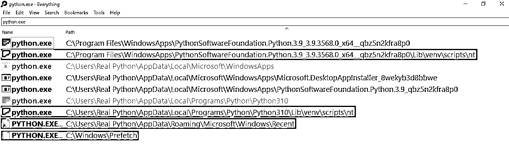

# 如何将 Python 添加到路径

> 原文：<https://realpython.com/add-python-to-path/>

如果已经安装了 Python，可能需要将 Python 添加到`PATH`中，但是在命令行中键入`python`似乎不起作用。您可能会收到一条消息，说术语`python`无法识别，或者您可能会运行错误版本的 Python。

解决这些问题的一个常见方法是将 Python 添加到`PATH` [环境变量](https://en.wikipedia.org/wiki/Environment_variable)。在本教程中，您将学习如何将 Python 添加到`PATH`中。您还将了解什么是`PATH`，以及为什么`PATH`对于像命令行这样的程序能够找到您的 Python 安装是至关重要的。

**注意:**一个[路径](https://en.wikipedia.org/wiki/Path_(computing))是你硬盘上一个文件或文件夹的地址。`PATH`环境变量，也称为`PATH`或*路径*，是操作系统保存并用于查找可执行脚本和程序的目录的路径列表。

向`PATH`添加内容所需的步骤很大程度上取决于您的操作系统(OS ),所以如果您只对一个 OS 感兴趣，请务必跳到相关章节。

请注意，您可以使用以下步骤将任何程序添加到`PATH`，而不仅仅是 Python。

**补充代码:** [点击这里下载免费的补充代码](https://realpython.com/bonus/add-python-to-path-code/)，它将带你穿越操作系统的变化之路。

## 如何在 Windows 上给`PATH`添加 Python

第一步是定位目标 Python 可执行文件所在的目录。目录的路径就是您将要添加到`PATH`环境变量中的内容。

要找到 Python 可执行文件，您需要查找一个名为`python.exe`的文件。例如，Python 可执行文件可能在`C:\Python\`的目录中，或者在你的`AppData\`文件夹中。如果可执行文件在`AppData\`中，那么路径通常如下所示:

```py
C:\Users\<USER>\AppData\Local\Programs\Python
```

在您的情况下，`<USER>`部分将被您当前登录的用户名替换。

找到可执行文件后，双击它并验证它是否在新窗口中启动了 Python REPL，以确保它能正常工作。

如果你正在努力寻找正确的可执行文件，你可以使用 Windows 资源管理器的搜索功能。内置搜索的问题是它非常慢。要对任何文件进行超快速的全系统搜索，一个很好的替代方法是 [Everything](https://www.voidtools.com/) :

[](https://files.realpython.com/media/which_python_exe.b88dfad1cfb4.png)

那些用黄色突出显示的路径，即那些位于`\WindowsApps`和`\Python310`的路径，将是添加到`PATH`的理想候选路径，因为它们看起来像是安装的根级别的可执行文件。那些用红色突出显示的不适合，因为有些是虚拟环境的一部分——你可以在路径中看到`venv`——有些是快捷方式或内部 Windows 安装。

您还可能会遇到安装在不同程序的文件夹中的 Python 可执行文件。这是因为许多应用程序在其中捆绑了自己的 Python 版本。这些捆绑的 Python 安装也不合适。

找到 Python 可执行文件后，打开开始菜单并搜索*编辑系统环境变量*条目，这将打开一个*系统属性*窗口。在*高级*选项卡中，点击按钮*环境变量*。在那里，您将看到*用户*和*系统*变量，您可以编辑这些变量:

[https://player.vimeo.com/video/729132627](https://player.vimeo.com/video/729132627)

在标题为*用户变量*的部分，双击显示*路径*的条目。将弹出另一个窗口，显示路径列表。点击*新建*按钮，将 Python 可执行文件的路径粘贴到那里。插入后，选择新添加的路径并点击*上移*按钮，直到它位于顶部。

就是这样！您可能需要重新启动您的计算机以使更改生效，但是您现在应该能够从命令行调用`python`。

要从命令行设置`PATH`环境变量，请查看 [Windows Python 编码设置指南](https://realpython.com/python-coding-setup-windows/)中关于[配置环境变量](https://realpython.com/python-coding-setup-windows/#configuring-environment-variables)的章节。您也可以在补充材料中找到说明:

**补充代码:** [点击这里下载免费的补充代码](https://realpython.com/bonus/add-python-to-path-code/)，它将带你穿越操作系统的变化之路。

你可能还想在你的 Linux 或 macOS 机器上设置`PATH`，或者你可能正在使用 [Windows 子系统 for Linux (WSL)](https://ubuntu.com/wsl) 。如果是这样，请阅读下一节，了解基于 UNIX 的系统上的过程。

[*Remove ads*](/account/join/)

## 如何在 Linux 和 macOS 上给`PATH`添加 Python

由于 Python 通常预装在基于 UNIX 的系统上，Linux 和 macOS 上最常见的问题是运行错误的`python`，而不是找不到*任何* `python`。也就是说，在本节中，您将排除根本无法运行`python`的故障。

**注意:**根据您的特定系统，Python 2 可能有一个`python`程序，Python 3 可能有一个`python3`程序。在其他情况下，`python`和`python3`将指向同一个可执行文件。

第一步是定位目标 Python 可执行文件。它应该是一个可以运行的程序，首先导航到包含它的目录，然后在命令行上键入`./python`。

您需要使用当前文件夹(`./`)中的相对路径预先调用 Python 可执行文件，因为否则您将调用当前记录在您的`PATH`中的任何 Python。正如您之前了解到的，这可能不是您想要运行的 Python 解释器。

通常 Python 可执行文件可以在`/bin/`文件夹中找到。但是如果 Python 已经在`/bin/`文件夹中，那么它很可能已经在`PATH`中，因为`/bin/`是系统自动添加的。如果是这种情况，那么您可能想跳到[关于`PATH`](#understanding-the-importance-of-order-within-path) 中路径顺序的章节。

既然您在这里可能是因为您已经安装了 Python，但是当您在命令行上键入`python`时仍然找不到它，那么您将希望在另一个位置搜索它。

**注意:**快速搜索大文件夹的一个很棒的搜索工具是 [fzf](https://github.com/junegunn/fzf) 。它从命令行工作，并将搜索当前工作目录中的所有文件和文件夹。例如，你可以从你的主目录中搜索`python`。然后 fzf 会显示包含`python`的路径。

也就是说，`/bin/`可能已经从`PATH`中完全删除，在这种情况下，你可以跳到关于[管理`PATH`](#managing-your-path-on-unix-based-systems) 的部分。

一旦你找到了你的 Python 可执行文件，并且确定它正在工作，记下路径以便以后使用。现在是时候开始将它添加到您的`PATH`环境变量中了。

首先，您需要导航到您的个人文件夹，查看您有哪些可用的配置脚本:

```py
$ cd ~
$ ls -a
```

您应该会看到一堆以句点(`.`)开头的配置文件。这些文件俗称为[点文件](https://en.wikipedia.org/wiki/Hidden_file_and_hidden_directory#Unix_and_Unix-like_environments)，默认情况下对`ls`隐藏。

每当您登录到系统时，都会执行一两个点文件，每当您启动一个新的命令行会话时，都会运行另外一两个点文件，而其他大多数点文件则由其他应用程序用于配置设置。

您正在寻找在启动系统或新的命令行会话时运行的文件。他们可能会有类似的名字:

*   `.profile`
*   `.bash_profile`
*   `.bash_login`
*   `.zprofile`
*   `.zlogin`

要查找的关键字是*个人资料*和*登录*。理论上，您应该只有其中一个，但是如果您有多个，您可能需要阅读其中的注释，以确定哪些在登录时运行。例如，Ubuntu 上的`.profile`文件通常会有以下注释:

```py
# This file is not read by bash(1), if ~/.bash_profile or ~/.bash_login
# exists.
```

所以，如果你既有`.profile`又有`.bash_profile`，那么你会想要使用`.bash_profile`。

您还可以使用一个`.bashrc`或`.zshrc`文件，它们是在您启动新的命令行会话时运行的脚本。[运行命令](https://en.wikipedia.org/wiki/RUNCOM) (rc)文件是放置`PATH`配置的常用地方。

**注意:**学究气地说，rc 文件一般用于影响你的命令行提示符的外观和感觉的设置，而不是用于配置像`PATH`这样的环境变量。但是如果您愿意，您可以使用 rc 文件进行您的`PATH`配置。

要将 Python 路径添加到您的`PATH`环境变量的开头，您将在命令行上执行一个命令。

使用下面一行，将`<PATH_TO_PYTHON>`替换为 Python 可执行文件的实际路径，将`.profile`替换为系统的登录脚本:

```py
$ echo export PATH="<PATH_TO_PYTHON>:$PATH" >> ~/.profile
```

该命令将`export PATH="<PATH_TO_PYTHON>:$PATH"`添加到`.profile`的末尾。命令`export PATH="<PATH_TO_PYTHON>:$PATH"`将`<PATH_TO_PYTHON>`添加到`PATH`环境变量中。它类似于 Python 中的以下操作:

>>>

```py
>>> PATH = "/home/realpython/apps:/bin"
>>> PATH = f"/home/realpython/python:{PATH}"
>>> PATH
'/home/realpython/python:/home/realpython/apps:/bin'
```

因为`PATH`只是一个由冒号分隔的字符串，所以在前面加上一个值需要创建一个新路径的字符串，一个冒号，然后是旧路径。使用这个字符串，您可以设置`PATH`的新值。

要刷新您当前的命令行会话，您可以运行以下命令，用您选择的登录脚本替换`.profile`:

```py
$ source ~/.profile
```

现在，您应该能够直接从命令行调用`python`。下次登录时，Python 应该会自动添加到`PATH`中。

如果你觉得这个过程有点不透明，你并不孤单！请继续阅读，深入了解正在发生的事情。

[*Remove ads*](/account/join/)

## 理解什么是`PATH`什么是

`PATH`是包含文件夹路径列表的环境变量。`PATH`中的每个路径由冒号或分号分隔——基于 UNIX 的系统用冒号，Windows 用分号。它就像一个 Python 变量，用一个长字符串作为它的值。不同之处在于`PATH`是一个几乎所有程序都可以访问的变量。

像命令行这样的程序使用`PATH`环境变量来查找可执行文件。例如，每当您在命令行中键入一个程序的名称时，命令行就会在各个地方搜索该程序。命令行搜索的地方之一是`PATH`。

`PATH`中的所有路径都必须是目录——它们不应该直接是文件或可执行文件。使用`PATH`的程序依次进入每个目录并搜索其中的所有文件。不过，`PATH`目录下的子目录不会被搜索。所以仅仅把你的根路径加到`PATH`是没有用的！

同样重要的是要注意，使用`PATH`的程序通常不搜索除了可执行文件之外的任何东西。所以，你不能用`PATH`来定义常用文件的快捷方式。

## 理解`PATH` 内顺序的重要性

如果在命令行中键入`python`，命令行将在`PATH`环境变量的每个文件夹中查找一个`python`可执行文件。一旦它找到一个，它就会*停止搜索*。这就是为什么您*将 Python 可执行文件的路径*前置到`PATH`的原因。将新添加的路径*放在第一个*可以确保您的系统能够找到这个 Python 可执行文件。

一个常见的问题是在您的`PATH`上安装 Python 失败。如果损坏的可执行文件是命令行遇到的第一个文件，那么命令行将尝试运行该文件，然后中止任何进一步的搜索。对此的快速解决方法是在旧的 Python 目录之前添加新的 Python 目录*，尽管您可能也想清除系统中的错误 Python 安装。*

在 Windows 上重新排序`PATH`相对简单。打开 GUI 控制面板，使用*上移*和*下移*按钮调整顺序。但是，如果您使用的是基于 UNIX 的操作系统，那么这个过程会更加复杂。请继续阅读，了解更多信息。

## 在基于 UNIX 的系统上管理您的`PATH`

通常，当你管理你的`PATH`时，你的第一个任务是看看里面有什么。要查看 Linux 或 macOS 中任何环境变量的值，可以使用`echo`命令:

```py
$ echo $PATH
/usr/local/sbin:/usr/local/bin:/usr/sbin:/home/realpython/badpython:/usr/bin:/sbin:/bin:/usr/games:/usr/local/games
```

注意,`$`符号是用来告诉命令行下面的标识符是一个变量。这个命令的问题是，它只是将所有路径转储到一行中，用冒号分隔。因此，您可能想利用 [`tr`](https://en.wikipedia.org/wiki/Tr_(Unix)) 命令将冒号转换成换行符:

```py
$ echo $PATH | tr ":" "\n"
/usr/local/sbin
/usr/local/bin
/usr/sbin
/home/realpython/badpython
/usr/bin
/sbin
/bin
/usr/games
/usr/local/games
```

在这个例子中，你可以看到`badpython`出现在`PATH`中。理想的做法是执行一些`PATH`考古，并找出它在哪里被添加到`PATH`，但是现在，你只是想通过在你的登录脚本中添加一些东西来删除它。

因为`PATH`是一个 shell 字符串，你不能使用方便的方法来删除它的一部分，就像如果它是一个 [Python 列表](https://realpython.com/python-lists-tuples/)一样。也就是说，您可以将几个 shell 命令连接起来实现类似的功能:

```py
export PATH=`echo $PATH | tr ":" "\n" | grep -v 'badpython' | tr "\n" ":"`
```

该命令从上一个命令中获取列表，并将其输入到`grep`，它与[和`-v`开关](https://www.gnu.org/software/grep/manual/grep.html#index-_002dv)一起过滤掉包含子串`badpython`的任何行。然后，您可以将换行符翻译回冒号，这样您就有了一个新的有效的`PATH`字符串，您可以立即使用它来替换旧的`PATH`字符串。

虽然这可能是一个方便的命令，但理想的解决方案是找出错误路径添加到哪里。您可以尝试查看其他登录脚本或检查`/etc/`中的特定文件。例如，在 Ubuntu 中，有一个名为`environment`的文件，它通常定义了系统的启动路径。在 macOS 中，这可能是`/etc/paths`。在`/etc/`中也可能有`profile`文件和文件夹包含启动脚本。

`/etc/`中的配置和您的个人文件夹中的配置之间的主要区别在于，`/etc/`中的配置是系统范围的，而您的个人文件夹中的配置则是针对您的用户的。

不过，这通常会涉及到一点考古学，来追踪你的`PATH`中添加了什么东西。因此，您可能希望在您的登录或 rc 脚本中添加一行来过滤掉来自`PATH`的某些条目，以此作为快速解决方案。

[*Remove ads*](/account/join/)

## 结论

在本教程中，您已经学习了如何在 Windows、Linux 和 macOS 上将 Python 或任何其他程序添加到您的`PATH`环境变量中。您还了解了更多关于什么是`PATH`,以及为什么考虑它的内部顺序是至关重要的。最后，您还发现了如何在基于 UNIX 的系统上管理您的`PATH`，因为这比在 Windows 上管理您的`PATH`更复杂。

**补充代码:** [点击这里下载免费的补充代码](https://realpython.com/bonus/add-python-to-path-code/)，它将带你穿越操作系统的变化之路。***