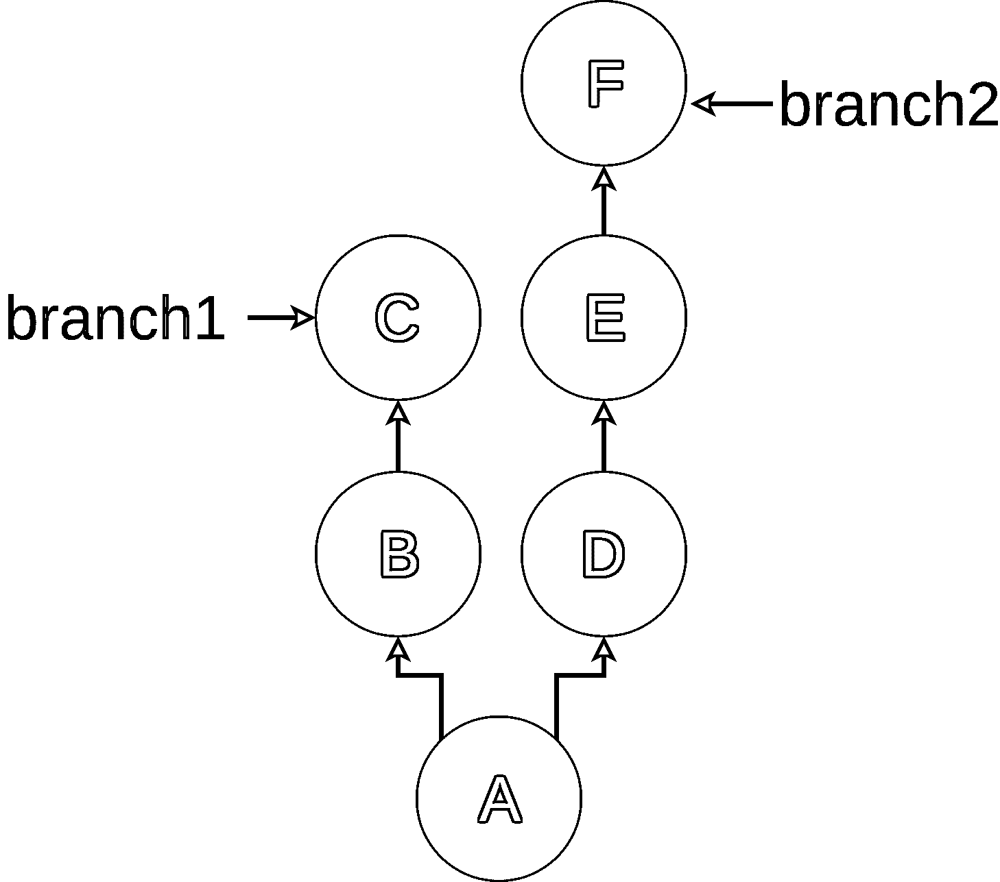
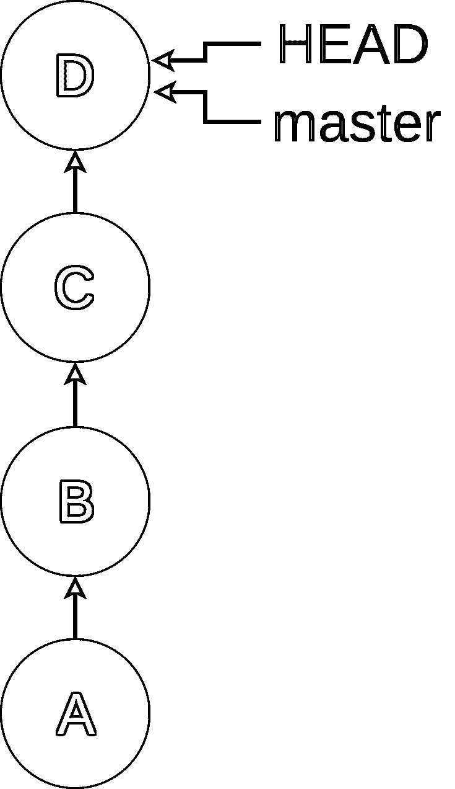
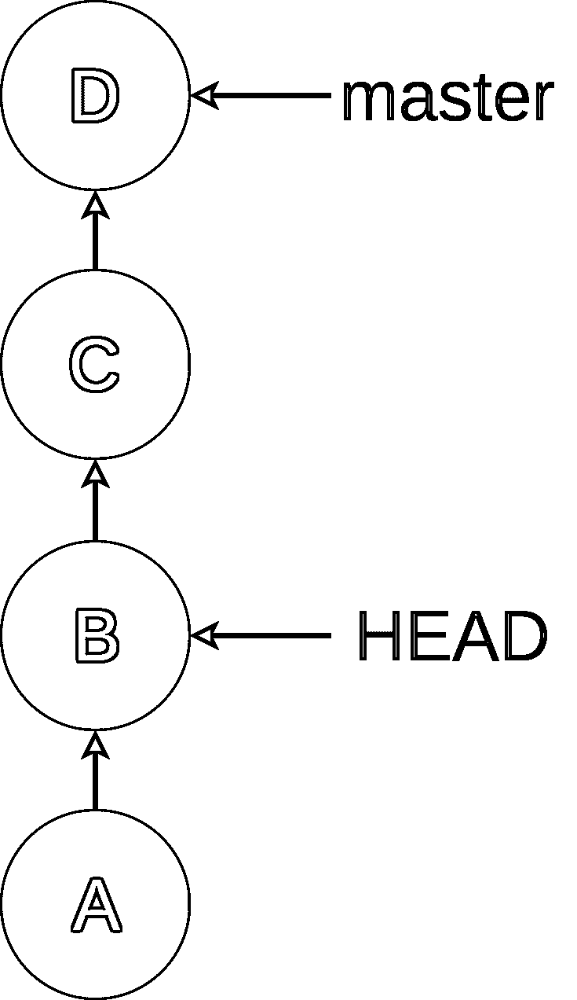
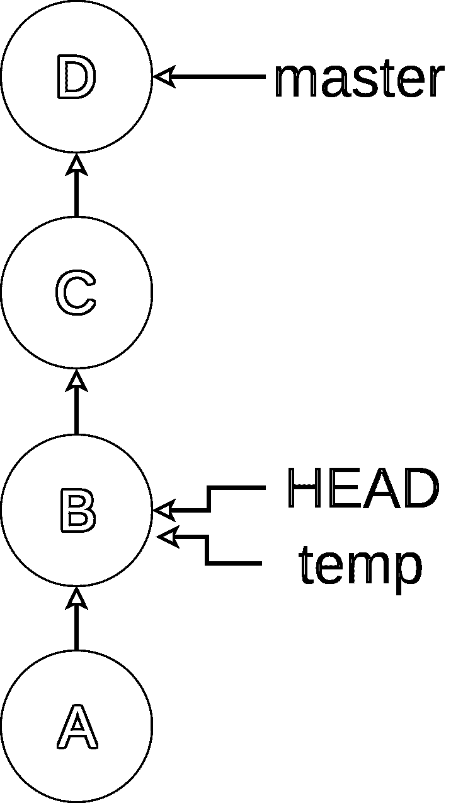
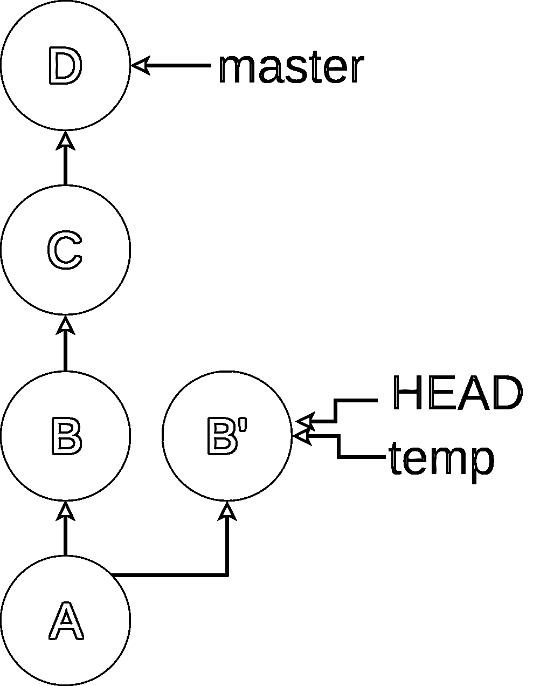
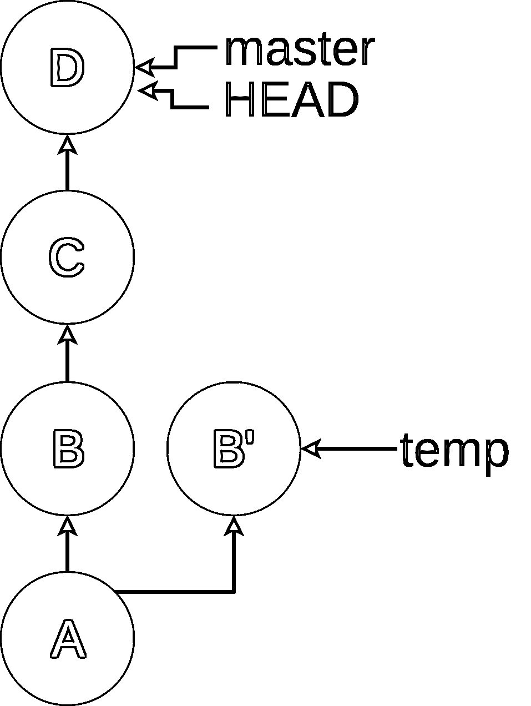
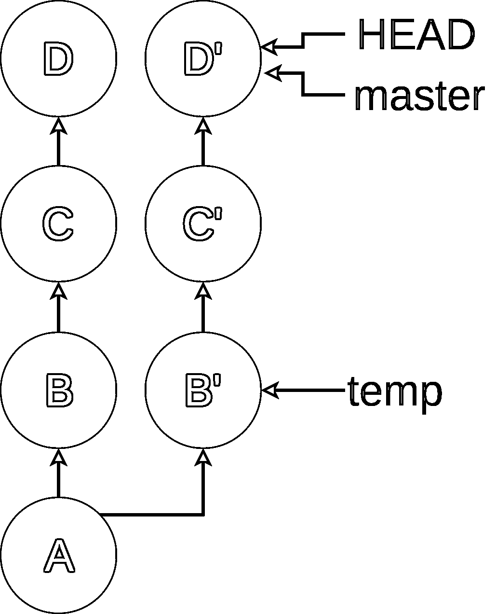

# Python 开发人员的高级 Git 技巧

> 原文：<https://realpython.com/advanced-git-for-pythonistas/>

如果你已经在 Git 方面做了一点工作，并且开始理解我们在 Git 简介中介绍的基础知识，但是你想学习更高效和更好的控制，那么这就是你要找的地方！

在本教程中，我们将讨论如何处理特定的提交和整个范围的提交，使用 stash 来保存临时工作，比较不同的提交，更改历史，以及如何在出现问题时清理混乱。

本文假设您已经阅读了我们的第一个 Git 教程，或者至少了解 Git 是什么以及它是如何工作的。

有很多事情要谈，所以我们开始吧。

## 版本选择

有几个选项可以告诉 Git 您想要使用哪个修订(或提交)。我们已经看到，我们可以使用完整的 SHA ( `25b09b9ccfe9110aed2d09444f1b50fa2b4c979c`)和短的 SHA ( `25b09b9cc`)来表示修订。

我们还看到了如何使用`HEAD`或分支名称来指定特定的提交。然而，Git 还有其他一些技巧。

[*Remove ads*](/account/join/)

### 相对参考

有时，能够指示相对于已知位置的修订是有用的，比如`HEAD`或分支名称。Git 提供了两个操作符，虽然相似，但行为略有不同。

第一个是波浪号(`~`)操作符。Git 使用代字号指向提交的父级，因此`HEAD~`表示最后一次提交之前的修订。要进一步后退，您可以在波浪号后使用一个数字:`HEAD~3`带您后退三级。

在我们遇到合并之前，这一切都很好。合并提交有两个父对象，所以`~`只选择第一个。虽然这有时可行，但有时您希望指定第二个或更晚的父代。这就是为什么 Git 有脱字符(`^`)操作符。

`^`操作符移动到指定版本的特定父版本。你用一个数字来表示哪个父母。所以`HEAD^2`告诉 Git 选择最后提交的第二个父代，**而不是**的“祖父代”可以重复此操作以进一步后退:`HEAD^2^^`带您后退三级，在第一步选择第二个父级。如果不给出数字，Git 假设`1`。

**注意:**使用 Windows 的用户需要使用第二个`^`来转义 DOS 命令行上的`^`字符。

我承认，为了让生活变得更有趣，可读性更差，Git 允许您组合这些方法，所以如果您使用 merges 回溯树结构，那么`25b09b9cc^2~3^3`是一种有效的表示修订的方式。它会将您带到第二个父代，然后从该父代返回三个修订版本，然后到第三个父代。

### 修订范围

有几种不同的方法来指定像`git log`这样的命令的提交范围。然而，这些并不完全像 Python 中的切片那样工作，所以要小心！

**双点符号**

用于指定范围的“双点”方法看起来像它的声音:`git log b05022238cdf08..60f89368787f0e`。这很容易让人想到这是在说“显示从`b05022238cdf08`到`60f89368787f0e`的所有提交”，如果`b05022238cdf08`是`60f89368787f0e`的直接祖先，这就是它所做的。

**注意:**在本节的剩余部分，我将用大写字母替换单个提交的 sha，因为我认为这样会使图表更容易理解。我们稍后也将使用这个“假”符号。

然而，它比那更强大一点。双点符号实际上向您显示了第二次提交中包含的所有提交，而第一次提交中不包含这些提交。让我们看几个图表来阐明:

[](https://files.realpython.com/media/drawio-git-diff-example-big.95fa2c7990ad.png)

如您所见，在我们的示例回购中有两个分支，`branch1`和`branch2`，它们在提交`A`后分叉。首先，让我们看看简单的情况。我修改了日志输出，使其与图表相匹配:

```py
$ git log --oneline D..F
E "Commit message for E"
F "Commit message for F"
```

`D..F`给出了在提交`D`之后`branch2` **的所有提交。**

下面是一个更有趣的例子，也是我在撰写本教程时了解到的一个例子:

```py
$ git log --oneline C..F
D "Commit message for D"
E "Commit message for E"
F "Commit message for F"
```

这显示了属于提交`F`的提交，而不属于提交`C`的提交。由于这里的结构，这些提交没有前/后关系，因为它们在不同的分支上。


如果把`C`和`F`的顺序对调，你觉得会得到什么？


```py
$ git log --oneline F..C
B "Commit message for B"
C "Commit message for C"
```

**三重点**

你猜对了，三点符号在修订说明符之间使用了三个点。这以类似于双点符号的方式工作，除了它显示了在**任一**版本中的所有提交，这些提交不包括在**两个**版本中。对于上面的图表，使用`C...F`向您展示了这一点:

```py
$ git log --oneline C...F
D "Commit message for D"
E "Commit message for E"
F "Commit message for F"
B "Commit message for B"
C "Commit message for C"
```

当您想要对一个命令使用一系列提交时，双点和三点符号可能非常强大，但是它们并不像许多人认为的那样简单。

**分行对总行对 SHA**

这可能是回顾 Git 中有哪些分支以及它们如何与 sha 和 HEAD 相关联的好时机。

`HEAD`是 Git 用来指代“你的文件系统现在指向的地方”的名字大多数情况下，这将指向一个指定的分支，但也不是必须如此。为了了解这些想法，让我们看一个例子。假设您的历史如下所示:

[](https://files.realpython.com/media/drawio-git-branch-step1-big.a431ad80dd56.png)

此时，您发现在 commit B. Rats 中意外地提交了一个 Python 日志记录语句。现在，大多数人会添加一个新的提交，`E`，推送到`master`，然后就完成了。但是你正在学习 Git，并且想要用困难的方式来解决这个问题，并且隐藏你在历史上犯了一个错误的事实。

所以你使用`git checkout B`将`HEAD`移回`B`，看起来像这样:

[](https://files.realpython.com/media/drawio-git-branch-step2-big.6c63995367f6.png)

你可以看到`master`没有改变位置，但是`HEAD`现在指向了`B`。在 Git 入门教程中，我们谈到了“分离头”状态。这又是那个状态！

因为您想要提交更改，所以您用`git checkout -b temp`创建了一个新的分支:

[](https://files.realpython.com/media/drawio-git-branch-step3-big.94c7e15609ce.png)

现在，您可以编辑该文件并删除有问题的日志语句。一旦完成，您就可以使用`git add`和`git commit --amend`来修改提交`B`:

[](https://files.realpython.com/media/drawio-git-branch-step4-big.7061c3167421.png)

哇哦。这里有一个名为`B'`的新提交。就像`B`一样，它的父节点是`A`，而`C`对此一无所知。现在我们希望 master 基于这个新的 commit，`B'`。

因为您有敏锐的记忆力，所以您记得 rebase 命令就是这样做的。因此，您可以通过键入`git checkout master`返回到`master`分支:

[](https://files.realpython.com/media/drawio-git-branch-step5-big.29af45f4ac7c.png)

一旦你上了主游戏，你可以使用`git rebase temp`在`B`上重放`C`和`D`:

[](https://files.realpython.com/media/drawio-git-branch-step6-big1.b74a8ab128c4.png)

您可以看到 rebase 创建提交了`C'`和`D'`。`C'`仍然有和`C`一样的变化，`D'`也有和`D`一样的变化，但是他们有不同的 sha，因为他们现在是基于`B'`而不是`B`。

正如我前面提到的，您通常不会为了修复一个错误的日志语句而这么麻烦，但是有时候这种方法可能是有用的，并且它确实说明了`HEAD`、提交和分支之间的区别。

**更**

Git 的锦囊妙计更多，但我将在这里停下来，因为我很少看到在野外使用的其他方法。如果你想了解如何对两个以上的分支进行类似的操作，请查阅 [Pro Git 书籍](https://git-scm.com/book/en/v2/Git-Tools-Revision-Selection)中关于修订选择的精彩文章。

[*Remove ads*](/account/join/)

## 处理中断:`git stash`

我经常使用并且觉得非常方便的 Git 特性之一是`stash`。它提供了一种简单的机制来保存您正在处理但尚未准备好提交的文件，以便您可以切换到不同的任务。在这一节中，您将首先浏览一个简单的用例，查看每一个不同的命令和选项，然后您将总结一些其他的用例，在这些用例中`git stash`真正发挥了作用。

### `git stash save`和`git stash pop`

假设你正在处理一个讨厌的 bug。您已经在两个文件`file1`和`file2`中获得了 Python 日志代码，以帮助您跟踪它，并且您已经添加了`file3`作为一个可能的解决方案。

简而言之，回购的变化如下:

*   您已经编辑了`file1`并完成了`git add file1`。
*   您已经编辑了`file2`但尚未添加。
*   您已经创建了`file3`但尚未添加。

你做一个`git status`来确认回购的条件:

```py
$ git status
On branch master
Changes to be committed:
 (use "git reset HEAD <file>..." to unstage)

 modified:   file1

Changes not staged for commit:
 (use "git add <file>..." to update what will be committed)
 (use "git checkout -- <file>..." to discard changes in working directory)

 modified:   file2

Untracked files:
 (use "git add <file>..." to include in what will be committed)

 file3
```

现在一个同事(他们不讨厌吗？)走过来告诉你产量下降了，轮到你了。你知道你可以发挥你疯狂的技能来节省时间和扭转局面。

您还没有完成文件 1、2 和 3 的工作，所以您真的不想提交这些更改，但是您需要将它们从您的工作目录中删除，以便您可以切换到不同的分支来修复这个 bug。这是`git stash`最基本的用例。

您可以使用`git stash save`暂时“将这些更改放在一边”,并返回到一个干净的工作目录。`stash`的默认选项是`save`，所以通常只写为`git stash`。

当您保存一些东西到`stash`时，它会为这些更改创建一个唯一的存储点，并将您的工作目录返回到上次提交的状态。它用一个神秘的信息告诉你它做了什么:

```py
$ git stash save
Saved working directory and index state WIP on master: 387dcfc adding some files
HEAD is now at 387dcfc adding some files
```

在该输出中，`master`是分支的名称，`387dcfc`是最后一次提交的 SHA，`adding some files`是该提交的提交消息，`WIP`代表“正在进行的工作”在这些细节上，你的回购协议的输出可能会有所不同。

如果此时执行`status`，它仍会显示`file3`为未跟踪文件，但`file1`和`file2`不再存在:

```py
$ git status
On branch master
Untracked files:
 (use "git add <file>..." to include in what will be committed)

 file3

nothing added to commit but untracked files present (use "git add" to track)
```

在这一点上，就 Git 而言，您的工作目录是“干净的”，您可以自由地做一些事情，比如签出不同的分支、精选更改或任何您需要做的事情。

你去检查了另一个分支，修复了错误，赢得了同事的赞赏，现在准备好回到这个工作中。

你怎么把最后一批货拿回来？`git stash pop`！

此时使用`pop`命令如下所示:

```py
$ git stash pop
On branch master
Changes not staged for commit:
 (use "git add <file>..." to update what will be committed)
 (use "git checkout -- <file>..." to discard changes in working directory)

 modified:   file1
 modified:   file2

Untracked files:
 (use "git add <file>..." to include in what will be committed)

 file3

no changes added to commit (use "git add" and/or "git commit -a")
Dropped refs/stash@{0} (71d0f2469db0f1eb9ee7510a9e3e9bd3c1c4211c)
```

现在，您可以在底部看到一条关于“丢弃的引用/存储@{0}”的消息。我们将在下面详细讨论该语法，但它基本上是说它应用了您隐藏的更改并清除了隐藏本身。在你问之前，是的，有一种方法可以使用这些藏起来的东西并且**而不是**处理掉它，但是我们不要想得太多。

你会注意到`file1`曾经在索引中，但现在不在了。默认情况下，`git stash pop`不会像那样维护变更的状态。当然，有一个选项告诉它这样做。将`file1`添加回索引，然后重试:

```py
$ git add file1
$ git status
On branch master
Changes to be committed:
 (use "git reset HEAD <file>..." to unstage)

 modified:   file1

Changes not staged for commit:
 (use "git add <file>..." to update what will be committed)
 (use "git checkout -- <file>..." to discard changes in working directory)

 modified:   file2

Untracked files:
 (use "git add <file>..." to include in what will be committed)

 file3

$ git stash save "another try"
Saved working directory and index state On master: another try
HEAD is now at 387dcfc adding some files
$ git stash pop --index
On branch master
Changes to be committed:
 (use "git reset HEAD <file>..." to unstage)

 modified:   file1

Changes not staged for commit:
 (use "git add <file>..." to update what will be committed)
 (use "git checkout -- <file>..." to discard changes in working directory)

 modified:   file2

Untracked files:
 (use "git add <file>..." to include in what will be committed)

 file3

Dropped refs/stash@{0} (aed3a02aeb876c1137dd8bab753636a294a3cc43)
```

您可以看到，我们第二次向`git pop`命令添加了`--index`选项，这告诉它尝试维护文件是否在索引中的状态。

在前两次尝试中，你可能注意到`file3`不在你的收藏中。您可能希望将`file3`与其他更改放在一起。幸运的是，有一个选项可以帮助你:`--include-untracked`。

假设我们回到了上一个示例结束时的位置，我们可以重新运行命令:

```py
$ git stash save --include-untracked "third attempt"
Saved working directory and index state On master: third attempt
HEAD is now at 387dcfc adding some files
$ git status
On branch master
nothing to commit, working directory clean
```

这就把未被跟踪的`file3`和我们其他的变化放在了一起。

在我们继续之前，我只想指出`save`是`git stash`的默认选项。除非你正在指定一个消息，我们将在后面讨论，你可以简单地使用`git stash`，它将做一个`save`。

[*Remove ads*](/account/join/)

### `git stash list`

`git stash`的一个强大特性是你可以拥有不止一个。Git 将数据存储在一个[栈](https://en.wikipedia.org/wiki/Stack_(abstract_data_type))中，这意味着默认情况下，它总是使用最近保存的数据。`git stash list`命令将显示本地 repo 中的堆栈。让我们创建几个仓库，这样我们就可以看到它是如何工作的:

```py
$ echo "editing file1" >> file1
$ git stash save "the first save"
Saved working directory and index state On master: the first save
HEAD is now at b3e9b4d adding file3
$ # you can see that stash save cleaned up our working directory
$ # now create a few more stashes by "editing" files and saving them
$ echo "editing file2" >> file2
$ git stash save "the second save"
Saved working directory and index state On master: the second save
HEAD is now at b3e9b4d adding file3
$ echo "editing file3" >> file3
$ git stash save "the third save"
Saved working directory and index state On master: the third save
HEAD is now at b3e9b4d adding file3
$ git status
On branch master
nothing to commit, working directory clean
```

你现在有三个不同的仓库保存。幸运的是，Git 有一个处理 stashes 的系统，使得这个问题很容易处理。系统的第一步是`git stash list`命令:

```py
$ git stash list
stash@{0}: On master: the third save
stash@{1}: On master: the second save
stash@{2}: On master: the first save
```

列表显示您在此回购中的堆栈，最新的在最前面。注意每个条目开头的`stash@{n}`语法吗？那是藏毒点的名字。其余的`git stash`子命令将使用该名称来引用一个特定的存储。一般来说，如果你不给出一个名字，它总是假设你指的是最近的藏匿，`stash@{0}`。稍后你会看到更多。

这里我想指出的另一件事是，您可以在清单中看到我们执行`git stash save "message"`命令时使用的消息。如果你藏了很多东西，这会很有帮助。

如上所述，`git stash save [name]`命令的`save [name]`部分是不需要的。你可以简单地输入`git stash`，它默认为一个保存命令，但是自动生成的消息不会给你太多信息:

```py
$ echo "more editing file1" >> file1
$ git stash
Saved working directory and index state WIP on master: 387dcfc adding some files
HEAD is now at 387dcfc adding some files
$ git stash list
stash@{0}: WIP on master: 387dcfc adding some files
stash@{1}: On master: the third save
stash@{2}: On master: the second save
stash@{3}: On master: the first save
```

默认消息是`WIP on <branch>: <SHA> <commit message>.`，没告诉你多少。如果我们对前三次藏匿都这样做，他们会得到同样的信息。这就是为什么，对于这里的例子，我使用完整的`git stash save <message>`语法。

### `git stash show`

好了，现在你有了一堆藏物，你甚至可以用有意义的信息来描述它们，但是如果你想知道某个藏物里到底有什么呢？这就是`git stash show`命令的用武之地。使用默认选项会告诉您有多少文件发生了更改，以及哪些文件发生了更改:

```py
$ git stash show stash@{2}
 file1 | 1 +
 1 file changed, 1 insertion(+)
```

然而，默认选项并没有告诉您发生了什么变化。幸运的是，您可以添加`-p/--patch`选项，它会以“补丁”格式向您展示不同之处:

```py
$ git stash show -p stash@{2}
diff --git a/file1 b/file1
index e212970..04dbd7b 100644
--- a/file1
+++ b/file1
@@ -1 +1,2 @@
 file1
+editing file1
```

这里显示行“编辑文件 1”被添加到`file1`。如果您不熟悉显示差异的补丁格式，不要担心。当您到达下面的`git difftool`部分时，您将看到如何在一个存储上调出一个可视化的比较工具。

### `git stash pop`vs`git stash apply`T2】

您在前面已经看到了如何使用`git stash pop`命令将最近的存储放回到您的工作目录中。您可能已经猜到，我们前面看到的 stash name 语法也适用于 pop 命令:

```py
$ git stash list
stash@{0}: On master: the third save
stash@{1}: On master: the second save
stash@{2}: On master: the first save
$ git stash pop stash@{1}
On branch master
Changes not staged for commit:
 (use "git add <file>..." to update what will be committed)
 (use "git checkout -- <file>..." to discard changes in working directory)
while read line; do echo -n "$line" | wc -c; done<
 modified:   file2

no changes added to commit (use "git add" and/or "git commit -a")
Dropped stash@{1} (84f7c9890908a1a1bf3c35acfe36a6ecd1f30a2c)
$ git stash list
stash@{0}: On master: the third save
stash@{1}: On master: the first save
```

您可以看到,`git stash pop stash@{1}`将“第二次保存”放回到我们的工作目录中，并折叠了我们的堆栈，因此只有第一个和第三个堆栈在那里。请注意在`pop`之后，“第一次保存”是如何从`stash@{2}`变为`stash@{1}`的。

也可以把一个存储放在你的工作目录中，但是也可以把它留在堆栈中。这是通过`git stash apply`完成的:

```py
$ git stash list
stash@{0}: On master: the third save
stash@{1}: On master: the first save
$ git stash apply stash@{1}
On branch master
Changes not staged for commit:
 (use "git add <file>..." to update what will be committed)
 (use "git checkout -- <file>..." to discard changes in working directory)

 modified:   file1
 modified:   file2

no changes added to commit (use "git add" and/or "git commit -a")
$ git stash list
stash@{0}: On master: the third save
stash@{1}: On master: the first save
```

如果您想要多次应用同一组更改，这可能会很方便。我最近在原型硬件上工作时使用了这个。为了让代码在我桌子上的特定硬件上工作，需要做一些修改，但其他的都不需要。每次我下载新的 master 副本时，我都会使用`git stash apply`来应用这些更改。

[*Remove ads*](/account/join/)

### `git stash drop`

要查看的最后一个 stash 子命令是`drop`。当您想要丢弃一个存储库并且不将它应用到您的工作目录时，这是非常有用的。看起来是这样的:

```py
$ git status
On branch master
nothing to commit, working directory clean
$ git stash list
stash@{0}: On master: the third save
stash@{1}: On master: the first save
$ git stash drop stash@{1}
Dropped stash@{1} (9aaa9996bd6aa363e7be723b4712afaae4fc3235)
$ git stash drop
Dropped refs/stash@{0} (194f99db7a8fcc547fdd6d9f5fbffe8b896e2267)
$ git stash list
$ git status
On branch master
nothing to commit, working directory clean
```

这删除了最后两个栈，Git 没有改变您的工作目录。在上面的例子中有一些事情需要注意。首先，`drop`命令和大多数其他`git stash`命令一样，可以使用可选的`stash@{n}`名称。如果不提供，Git 假设`stash@{0}`。

另一件有趣的事情是，drop 命令的输出为您提供了阿沙。像 Git 中的其他 sha 一样，您可以利用这一点。例如，如果您真的想要在上面的`stash@{1}`上执行`pop`而不是`drop`，您可以使用它显示给您的那个 SHA 创建一个新的分支(`9aaa9996`):

```py
$ git branch tmp 9aaa9996
$ git status
On branch master
nothing to commit, working directory clean
$ # use git log <branchname> to see commits on that branch
$ git log tmp
commit 9aaa9996bd6aa363e7be723b4712afaae4fc3235
Merge: b3e9b4d f2d6ecc
Author: Jim Anderson <your_email_here@gmail.com>
Date:   Sat May 12 09:34:29 2018 -0600

 On master: the first save
[rest of log deleted for brevity]
```

一旦您有了那个分支，您就可以使用`git merge`或其他技术将那些变更返回到您的分支。如果您没有从`git drop`命令中保存 SHA，有其他方法可以尝试恢复更改，但是它们会变得复杂。你可以在这里了解更多关于[的信息。](https://stackoverflow.com/questions/89332/how-to-recover-a-dropped-stash-in-git)

### `git stash`举例:拉进一棵脏兮兮的树

让我们通过查看它的一个最初对我来说并不明显的用途来结束这一节。通常，当你在一个共享分支上工作很长一段时间时，另一个开发人员会将变更推送到你想在本地回购中得到的分支上。您会记得我们使用了`git pull`命令来做这件事。但是，如果您在文件中有本地更改，而 pull 将修改这些更改，Git 会拒绝，并显示一条错误消息，解释发生了什么错误:

```py
error: Your local changes to the following files would be overwritten by merge:
 <list of files that conflict>
Please, commit your changes or stash them before you can merge.
Aborting
```

您可以提交它，然后执行`pull`，但是这会创建一个合并节点，并且您可能还没有准备好提交这些文件。现在你知道了`git stash`，你可以用它来代替:

```py
$ git stash
Saved working directory and index state WIP on master: b25fe34 Cleaned up when no TOKEN is present. Added ignored tasks
HEAD is now at <SHA> <commit message>
$ git pull
Updating <SHA1>..<SHA2>
Fast-forward
 <more info here>
$ git stash pop
On branch master
Your branch is up-to-date with 'origin/master'.
Changes not staged for commit:
 <rest of stash pop output trimmed>
```

执行`git stash pop`命令完全有可能会产生合并冲突。如果是这种情况，您需要手动编辑冲突来解决它，然后您可以继续。我们将在下面讨论解决合并冲突。

## 比较修订:`git diff`

`git diff`命令是一个强大的特性，您会发现自己经常使用它。我查找了它可以比较的事物列表，并对列表感到惊讶。如果你想自己看，试着输入`git diff --help`。我不会在这里涵盖所有这些用例，因为它们中的许多并不常见。

本节有几个关于`diff`命令的用例，显示在命令行上。下一节将展示如何设置 Git 来使用可视化比较工具，比如 Meld、Windiff、BeyondCompare，甚至是 IDE 中的扩展。`diff`和`difftool`的选项是相同的，所以本节中的大部分讨论也适用于此，但是在命令行版本中显示输出更容易。

`git diff`最常见的用途是查看您在工作目录中修改了什么:

```py
$ echo "I'm editing file3 now" >> file3
$ git diff
diff --git a/file3 b/file3
index faf2282..c5dd702 100644
--- a/file3
+++ b/file3
@@ -1,3 +1,4 @@
{other contents of files3}
+I'm editing file3 now
```

如您所见，`diff`在命令行上以[“补丁”](https://en.wikipedia.org/wiki/Patch_(Unix))的格式向您展示了不同之处。一旦你完成了这个格式，你可以看到,`+`字符表明一行已经被添加到了文件中，正如你所期望的，行`I'm editing file3 now`被添加到了`file3`。

`git diff`的默认选项是向您显示您的工作目录中有哪些变化是**而不是**在您的索引或 HEAD 中。如果您将上述更改添加到索引中，然后执行 diff，它会显示没有差异:

```py
$ git add file3
$ git diff
[no output here]
```

我发现这让我困惑了一段时间，但我渐渐喜欢上了它。要查看索引中的更改并为下一次提交准备，请使用`--staged`选项:

```py
$ git diff --staged
diff --git a/file3 b/file3
index faf2282..c5dd702 100644
--- a/file3
+++ b/file3
@@ -1,3 +1,4 @@
 file1
 file2
 file3
+I'm editing file3 now
```

`git diff`命令也可以用来比较 repo 中的任意两个提交。这可以向您展示两个 sha 之间的变化:

```py
$ git diff b3e9b4d 387dcfc
diff --git a/file3 b/file3
deleted file mode 100644
index faf2282..0000000
--- a/file3
+++ /dev/null
@@ -1,3 +0,0 @@
-file1
-file2
-file3
```

您还可以使用分支名称来查看一个分支和另一个分支之间的全部更改:

```py
$ git diff master tmp
diff --git a/file1 b/file1
index e212970..04dbd7b 100644
--- a/file1
+++ b/file1
@@ -1 +1,2 @@
 file1
+editing file1
```

您甚至可以使用我们在上面看到的版本命名方法的任意组合:

```py
$ git diff master^ master
diff --git a/file3 b/file3
new file mode 100644
index 0000000..faf2282
--- /dev/null
+++ b/file3
@@ -0,0 +1,3 @@
+file1
+file2
+file3
```

当您比较两个分支时，它会显示两个分支之间的所有变化。通常，您只想查看单个文件的差异。您可以通过在一个`--`(两个负号)选项后列出文件来将输出限制为一个文件:

```py
$ git diff HEAD~3 HEAD
diff --git a/file1 b/file1
index e212970..04dbd7b 100644
--- a/file1
+++ b/file1
@@ -1 +1,2 @@
 file1
+editing file1
diff --git a/file2 b/file2
index 89361a0..91c5d97 100644
--- a/file2
+++ b/file2
@@ -1,2 +1,3 @@
 file1
 file2
+editing file2
diff --git a/file3 b/file3
index faf2282..c5dd702 100644
--- a/file3
+++ b/file3
@@ -1,3 +1,4 @@
 file1
 file2
 file3
+I'm editing file3 now
$ git diff HEAD~3 HEAD -- file3
diff --git a/file3 b/file3
index faf2282..c5dd702 100644
--- a/file3
+++ b/file3
@@ -1,3 +1,4 @@
 file1
 file2
 file3
+I'm editing file3 now
```

`git diff`有很多很多选项，我不会一一列举，但是我想探索另一个我经常使用的用例，显示在提交中被更改的文件。

在您当前的回购中，`master`上的最近提交向`file1`添加了一行文本。通过比较`HEAD`和`HEAD^`你可以看到:

```py
$ git diff HEAD^ HEAD
diff --git a/file1 b/file1
index e212970..04dbd7b 100644
--- a/file1
+++ b/file1
@@ -1 +1,2 @@
 file1
+editing file1
```

对于这个小例子来说这没什么，但是提交的差异通常会有几页长，而且提取文件名会变得非常困难。当然，Git 有一个选项可以帮助解决这个问题:

```py
$ git diff HEAD^ HEAD --name-only
file1
```

`--name-only`选项将显示两次提交之间更改的文件名列表，但不显示这些文件中更改的内容。

正如我上面所说的，`git diff`命令覆盖了**的许多**选项和用例，这里你只是触及了表面。一旦你弄清楚了上面列出的命令，我鼓励你看看`git diff --help`,看看你还能找到什么技巧。我肯定学到了新的东西准备这个教程！

[*Remove ads*](/account/join/)

## `git difftool`

Git 有一种机制，可以使用可视化的 diff 工具来显示差异，而不仅仅是使用我们目前看到的命令行格式。你用`git diff`看到的所有选项和功能在这里仍然有效，但是它将在一个单独的窗口中显示不同之处，包括我在内的许多人都觉得这样更容易阅读。对于这个例子，我将使用`meld`作为 diff 工具，因为它可以在 Windows、Mac 和 Linux 上使用。

如果设置得当，Difftool 更容易使用。Git 有一组配置选项来控制`difftool`的默认值。您可以使用`git config`命令在 shell 中设置这些:

```py
$ git config --global diff.tool meld
$ git config --global difftool.prompt false
```

我认为`prompt`选项很重要。如果不指定，Git 会在每次启动外部构建工具之前提示您。这可能很烦人，因为它对 diff 中的每个文件都是这样，一次一个:

```py
$ git difftool HEAD^ HEAD
Viewing (1/1): 'python-git-intro/new_section.md'
Launch 'meld' [Y/n]: y
```

将`prompt`设置为 false 会强制 Git 在没有询问的情况下启动该工具，从而加快您的进程并使您变得更好！

在上面的`diff`讨论中，您已经介绍了`difftool`的大部分特性，但是我想补充一点，这是我在为本文进行研究时学到的。你还记得上面你在看`git stash show`命令的时候吗？我提到有一种方法可以直观地看到给定的储藏中有什么，而`difftool`就是这种方法。我们学习的所有用于寻址堆栈的语法都适用于 difftool:

```py
$ git difftool stash@{1}
```

与所有的`stash`子命令一样，如果您只想查看最新的存储，您可以使用`stash`快捷键:

```py
$ git difftool stash
```

许多 ide 和编辑器都有可以帮助查看差异的工具。在 Git 教程的[介绍的最后有一个特定于编辑器的教程列表。](https://realpython.com/python-git-github-intro/)

## 改变历史

Git 的一个让一些人害怕的特性是它有能力改变提交。虽然我能理解他们的担心，但这是工具的一部分，而且，像任何强大的工具一样，如果你不明智地使用它，你可能会带来麻烦。

我们将讨论修改提交的几种方法，但是在此之前，让我们讨论一下什么时候这样做是合适的。在前面几节中，您已经看到了本地回购和远程回购之间的区别。您已创建但尚未推送的提交仅位于您的本地回购中。其他开发人员已经推送但您没有拉取的提交仅在远程回购中。执行`push`或`pull`会将这些提交放入两个回购中。

你应该考虑修改提交的唯一时间是当它存在于你的本地存储库中而不是远程存储库中的时候。如果您修改已经从远程推送的提交，您很可能很难从远程推送或拉取，如果您成功了，您的同事会不高兴。

除此之外，让我们来谈谈如何修改提交和改变历史！

### `git commit --amend`

如果您刚刚提交了一个请求，但是在运行时发现`flake8`有错误，您会怎么做？或者您在刚刚输入的提交消息中发现了一个打字错误？Git 将允许您“修改”提交:

```py
$ git commit -m "I am bad at spilling"
[master 63f74b7] I am bad at spilling
 1 file changed, 4 insertions(+)
$ git commit --amend -m "I am bad at spelling"
[master 951bf2f] I am bad at spelling
 Date: Tue May 22 20:41:27 2018 -0600
 1 file changed, 4 insertions(+)
```

现在，如果您查看修改后的日志，您会看到只有一次提交，并且它具有正确的消息:

```py
$ git log
commit 951bf2f45957079f305e8a039dea1771e14b503c
Author: Jim Anderson <your_email_here@gmail.com>
Date:   Tue May 22 20:41:27 2018 -0600

 I am bad at spelling

commit c789957055bd81dd57c09f5329c448112c1398d8
Author: Jim Anderson <your_email_here@gmail.com>
Date:   Tue May 22 20:39:17 2018 -0600

 new message
[rest of log deleted]
```

如果您在修改之前修改并添加了文件，这些文件也会包含在单次提交中。您可以看到这是一个修复错误的便捷工具。我将再次警告您，执行`commit --amend`会修改提交。如果原始提交被推送到远程回购，其他人可能已经基于它进行了更改。那会很混乱，所以只对本地的提交使用它。

[*Remove ads*](/account/join/)

### `git rebase`

一个`rebase`操作类似于一个合并，但是它可以产生一个更清晰的历史。当你重定基础时，Git 会在你当前的分支和指定的分支之间找到共同的祖先。然后，它将从您的分支中获取该共同祖先之后的所有更改，并在另一个分支上“重放”它们。结果看起来就像你在另一个分支之后**做了所有的修改。**

这可能有点难以想象，所以让我们看一些实际的提交。在这个练习中，我将使用`git log`命令中的`--oneline`选项来减少混乱。让我们从你一直在做的一个叫做`my_feature_branch`的特性分支开始。这是该分支的状态:

```py
 $ git log --oneline
143ae7f second feature commit
aef68dc first feature commit
2512d27 Common Ancestor Commit
```

如您所料，您可以看到,`--oneline`选项只显示了 SHA 和每次提交的提交消息。在标记为`2512d27 Common Ancestor Commit`的提交之后，您的分支有两个提交。

如果你打算重定基数，你需要第二个分支，而`master`似乎是个不错的选择。下面是`master`分支的当前状态:

```py
$ git log --oneline master
23a558c third master commit
5ec06af second master commit
190d6af first master commit
2512d27 Common Ancestor Commit
```

在`2512d27 Common Ancestor Commit`之后的`master`有三次提交。当您仍然签出`my_feature_branch`时，您可以执行`rebase`来将两个特性提交**放在主服务器上的**三个提交之后:

```py
$ git rebase master
First, rewinding head to replay your work on top of it...
Applying: first feature commit
Applying: second feature commit
$ git log --oneline
cf16517 second feature commit
69f61e9 first feature commit
23a558c third master commit
5ec06af second master commit
190d6af first master commit
2512d27 Common Ancestor Commit
```

在这个日志列表中有两件事需要注意:

1)正如所宣传的，两个特性提交在三个主提交之后。

2)这两个功能提交的 sha 已经更改。

sha 是不同的，因为回购略有不同。提交表示对文件的相同更改，但是因为它们被添加到已经在`master`中的更改之上，所以回购的状态是不同的，所以它们具有不同的 sha。

如果你做了一个`merge`而不是一个`rebase`，将会有一个新的提交和消息`Merge branch 'master' into my_feature_branch`，并且两个特性提交的 sha 将保持不变。做一个 rebase 可以避免额外的合并提交，使你的修订历史更加清晰。

### `git pull -r`

当您与不同的开发人员一起处理一个分支时，使用 rebase 也是一个方便的工具。如果远程上有更改，并且您有对同一个分支的本地提交，那么您可以在`git pull`命令上使用`-r`选项。当一个普通的`git pull`对远程分支做一个`merge`时，`git pull -r`会在远程分支上的变更的基础上重新调整你的提交。

### `git rebase -i`

rebase 命令有另一种操作方法。有一个`-i`标志可以添加到`rebase`命令中，使其进入交互模式。虽然这乍一看似乎令人困惑，但它是一个非常强大的特性，让您在将提交推送到远程之前完全控制提交列表。请记住关于不要更改已提交的提交历史的警告。

这些例子展示了一个基本的交互式 rebase，但是要注意还有更多的选项和用例。`git rebase --help`命令会给你一个列表，并且很好地解释了它们。

对于这个例子，您将会想象您一直在使用您的 Python 库，在您实现一个解决方案、测试它、发现一个问题并修复它时，多次提交到您的本地 repo。在这个过程的最后，你有一个本地回购上的提交链，所有这些都是新特性的一部分。一旦你完成了工作，你看着你的`git log`:

```py
$ git log --oneline
8bb7af8 implemented feedback from code review
504d520 added unit test to cover new bug
56d1c23 more flake8 clean up
d9b1f9e restructuring to clean up
08dc922 another bug fix
7f82500 pylint cleanup
a113f67 found a bug fixing
3b8a6f2 First attempt at solution
af21a53 [older stuff here]
```

这里有几个提交并没有给其他开发人员甚至是未来的你增加价值。您可以使用`rebase -i`创建一个“挤压提交”,并将所有这些放入历史中的一个点。

要开始这个过程，您可以运行`git rebase -i af21a53`，这将显示一个编辑器，其中有一个提交列表和一些指令:

```py
pick 3b8a6f2 First attempt at solution
pick a113f67 found a bug fixing
pick 7f82500 pylint cleanup
pick 08dc922 another bug fix
pick d9b1f9e restructuring to clean up
pick 56d1c23 more flake8 clean up
pick 504d520 added unit test to cover new bug
pick 8bb7af8 implemented feedback from code review

# Rebase af21a53..8bb7af8 onto af21a53 (8 command(s))
#
# Commands:
# p, pick = use commit
# r, reword = use commit, but edit the commit message
# e, edit = use commit, but stop for amending
# s, squash = use commit, but meld into previous commit
# f, fixup = like "squash", but discard this commit's log message
# x, exec = run command (the rest of the line) using shell
# d, drop = remove commit
#
# These lines can be re-ordered; they are executed from top to bottom.
#
# If you remove a line here THAT COMMIT WILL BE LOST.
#
# However, if you remove everything, the rebase will be aborted.
#
# Note that empty commits are commented out
```

您会注意到提交是以相反的顺序列出的，最早的放在最前面。这是 Git 在`af21a53`之上重放提交的顺序。如果您只是在此时保存文件，什么都不会改变。如果删除所有文本并保存文件，也是如此。

此外，有几行以`#`开头，提醒您如何编辑这个文件。这些评论可以删除，但不是必须删除。

但是您希望将所有这些提交压缩成一个，以便“未来的您”知道这是完全添加了该特性的提交。为此，您可以编辑该文件，如下所示:

```py
pick 3b8a6f2 First attempt at solution
squash a113f67 found a bug fixing
s 7f82500 pylint cleanup
s 08dc922 another bug fix
s d9b1f9e restructuring to clean up
s 56d1c23 more flake8 clean up
s 504d520 added unit test to cover new bug
s 8bb7af8 implemented feedback from code review
```

您可以使用命令的完整单词，或者像您在前两行之后所做的那样，使用单字符版本。上面的示例选择“挑选”最早的提交，并将每个后续提交“挤压”到那个提交中。如果您保存并退出编辑器，Git 将继续将所有这些提交放入一个编辑器中，然后再次打开编辑器，列出被压缩的提交的所有提交消息:

```py
# This is a combination of 8 commits.
# The first commit's message is:
Implemented feature ABC

# This is the 2nd commit message:

found a bug fixing

# This is the 3rd commit message:

pylint cleanup

# This is the 4th commit message:

another bug fix

[the rest trimmed for brevity]
```

默认情况下，挤压提交会有一个很长的提交消息，包含每次提交的所有消息。在你的情况下，最好改写第一条信息，删除其余的。这样做并保存文件将完成该过程，您的日志现在将只有一个针对该特性的提交:

```py
$ git log --oneline
9a325ad Implemented feature ABC
af21a53 [older stuff here]
```

酷！你只是隐藏了任何证据，表明你不得不做一个以上的承诺来解决这个问题。干得好！请注意，决定何时进行挤压合并通常比实际过程更困难。有一篇很棒的[文章](https://jamescooke.info/git-to-squash-or-not-to-squash.html)很好地展示了复杂性。

正如你可能猜到的，`git rebase -i`将允许你做更复杂的操作。让我们再看一个例子。

在一周的时间里，你处理了三个不同的问题，在不同的时间对每个问题进行了修改。还有一个承诺，你会后悔，会假装从未发生过。这是你的起始日志:

```py
$ git log --oneline
2f0a106 feature 3 commit 3
f0e14d2 feature 2 commit 3
b2eec2c feature 1 commit 3
d6afbee really rotten, very bad commit
6219ba3 feature 3 commit 2
70e07b8 feature 2 commit 2
c08bf37 feature 1 commit 2
c9747ae feature 3 commit 1
fdf23fc feature 2 commit 1
0f05458 feature 1 commit 1
3ca2262 older stuff here
```

你的任务是把它分成三个干净的提交，并去掉一个坏的。您可以遵循相同的过程，`git rebase -i 3ca2262`，Git 会向您显示命令文件:

```py
pick 0f05458 feature 1 commit 1
pick fdf23fc feature 2 commit 1
pick c9747ae feature 3 commit 1
pick c08bf37 feature 1 commit 2
pick 70e07b8 feature 2 commit 2
pick 6219ba3 feature 3 commit 2
pick d6afbee really rotten, very bad commit
pick b2eec2c feature 1 commit 3
pick f0e14d2 feature 2 commit 3
pick 2f0a106 feature 3 commit 3
```

交互式 rebase 不仅允许您指定每次提交要做什么，还允许您重新安排它们。因此，为了得到您的三次提交，您可以编辑该文件，如下所示:

```py
pick 0f05458 feature 1 commit 1
s c08bf37 feature 1 commit 2
s b2eec2c feature 1 commit 3
pick fdf23fc feature 2 commit 1
s 70e07b8 feature 2 commit 2
s f0e14d2 feature 2 commit 3
pick c9747ae feature 3 commit 1
s 6219ba3 feature 3 commit 2
s 2f0a106 feature 3 commit 3
# pick d6afbee really rotten, very bad commit
```

每个特性的提交被分组在一起，其中只有一个被“挑选”，其余的被“挤压”注释掉错误的提交将会删除它，但是您也可以很容易地从文件中删除这一行来达到相同的效果。

当您保存该文件时，您将获得一个单独的编辑器会话，为三个被压缩的提交中的每一个创建提交消息。如果您将它们称为`feature 1`、`feature 2`和`feature 3`，您的日志现在将只有这三个提交，每个特性一个:

```py
$ git log --oneline
f700f1f feature 3
443272f feature 2
0ff80ca feature 1
3ca2262 older stuff here
```

就像任何重新定基或合并一样，您可能会在这个过程中遇到冲突，您需要通过编辑文件、纠正更改、`git add` -ing 文件并运行`git rebase --continue`来解决这些冲突。

我将通过指出关于 rebase 的一些事情来结束这一部分:

1)创建挤压提交是一个“很好”的特性，但是不使用它也可以成功地使用 Git。

2)大型交互式 rebases 上的合并冲突可能会令人困惑。没有一个步骤是困难的，但是可以有很多

3)我们只是简单介绍了您可以用`git rebase -i`做些什么。这里有比大多数人发现的更多的功能。

[*Remove ads*](/account/join/)

### `git revert`vs`git reset`:清理

不足为奇的是，Git 为你提供了几种清理混乱的方法。这些技巧取决于你的回购处于何种状态，以及混乱是发生在你的回购上还是被推到了远处。

让我们从简单的例子开始。您做出了不想要的提交，并且它还没有被推到远程。从创建提交开始，这样你就知道你在看什么了:

```py
$ ls >> file_i_do_not_want
$ git add file_i_do_not_want
$ git commit -m "bad commit"
[master baebe14] bad commit
 2 files changed, 31 insertions(+)
 create mode 100644 file_i_do_not_want
$ git log --oneline
baebe14 bad commit
443272f feature 2
0ff80ca feature 1
3ca2262 older stuff here
```

上面的示例创建了一个新文件`file_i_do_not_want`，并将其提交给本地 repo。它尚未被推送到远程回购。本节中的其余示例将以此为起点。

要管理仅在本地 repo 上的提交，可以使用`git reset`命令。有两个选项可以探索:`--soft`和`--hard`。

`git reset --soft <SHA>`命令告诉 Git 将磁头移回指定的 SHA。它不会改变本地文件系统，也不会改变索引。我承认当我读到这个描述的时候，它对我来说没有什么意义，但是看看这个例子绝对有帮助:

```py
$ git reset --soft HEAD^
$ git status
On branch master
Changes to be committed:
 (use "git reset HEAD <file>..." to unstage)

 new file:   file_i_do_not_want

$ git log --oneline
443272f feature 2
0ff80ca feature 1
3ca2262 older stuff here
```

在示例中，我们将`HEAD`重置为`HEAD^`。记住`^`告诉 Git 退回一次提交。`--soft`选项告诉 Git**而不是**更改索引或本地文件系统，所以`file_i_do_not_want`仍然在索引中处于“Changes to commit:”状态。然而,`git log`命令显示`bad commit`已从历史中删除。

这就是`--soft`选项的作用。现在我们来看一下`--hard`选项。让我们回到原来的状态，让`bad commit`再次参与回购，并尝试`--hard`:

```py
$ git log --oneline
2e9d704 bad commit
443272f feature 2
0ff80ca feature 1
3ca2262 older stuff here
$ git reset --hard HEAD^
HEAD is now at 443272f feature 2
$ git status
On branch master
nothing to commit, working directory clean
$ git log --oneline
443272f feature 2
0ff80ca feature 1
3ca2262 older stuff here
```

这里有几点需要注意。首先，`reset`命令实际上在`--hard`选项上给了你反馈，而在`--soft`上却没有。老实说，我不知道这是为什么。此外，当我们之后执行`git status`和`git log`时，您会看到不仅`bad commit`消失了，而且提交中的更改也被清除了。`--hard`选项将您完全重置回您指定的 SHA。

现在，如果您还记得关于在 Git 中更改历史的最后一节，您会发现对已经推送到远程的分支进行重置可能是个坏主意。它改变了历史，这真的会让你的同事感到困惑。

当然，Git 有一个解决方案。`git revert`命令允许您轻松地从给定的提交中删除更改，但不会更改历史。它通过执行与您指定的提交相反的操作来实现这一点。如果您在文件中添加了一行，`git revert`将从文件中删除该行。它会这样做，并自动为您创建一个新的“恢复提交”。

再次将回购重置回最近一次提交的时间点`bad commit`。首先确认`bad commit`有什么变化:

```py
$ git diff HEAD^
diff --git a/file_i_do_not_want b/file_i_do_not_want
new file mode 100644
index 0000000..6fe5391
--- /dev/null
+++ b/file_i_do_not_want
@@ -0,0 +1,6 @@
+file1
+file2
+file3
+file4
+file_i_do_not_want
+growing_file
```

您可以看到，我们只是将新的`file_i_do_not_want`添加到了回购中。`@@ -0,0 +1,6 @@`下面的行是新文件的内容。现在，假设这次你已经把那个`bad commit`推到了主人面前，你不想让你的同事讨厌你，使用 revert 来修复这个错误:

```py
$ git revert HEAD
[master 8a53ee4] Revert "bad commit"
 1 file changed, 6 deletions(-)
 delete mode 100644 file_i_do_not_want
```

当您运行该命令时，Git 将弹出一个编辑器窗口，允许您修改 revert commit 的提交消息:

```py
Revert "bad commit"

This reverts commit 1fec3f78f7aea20bf99c124e5b75f8cec319de10.

# Please enter the commit message for your changes. Lines starting
# with '#' will be ignored, and an empty message aborts the commit.
# On branch master
# Changes to be committed:
#  deleted:    file_i_do_not_want
#
```

与`commit`不同，`git revert`没有在命令行上指定提交消息的选项。您可以使用`-n`跳过消息编辑步骤，告诉 Git 简单地使用默认消息。

在我们恢复错误的提交后，我们的日志显示一个新的提交，并显示以下消息:

```py
$ git log --oneline
8a53ee4 Revert "bad commit"
1fec3f7 bad commit
443272f feature 2
0ff80ca feature 1
3ca2262 older stuff here
```

“错误提交”仍然存在。它需要在那里，因为你不想在这种情况下改变历史。然而，有一个新的提交，它“撤销”了该提交中的更改。

[*Remove ads*](/account/join/)

### `git clean`

我发现另一个“清理”命令很有用，但是我想提出一个警告。

**注意:**使用`git clean`可以清除未提交给回购的文件，您将无法恢复这些文件。

如你所料:它会清理你的本地工作目录。我发现当一些大的错误发生，并且我的文件系统上有几个我不想要的文件时，这非常有用。

在其简单的形式中，`git clean`简单地删除不在“版本控制之下”的文件这意味着当你查看`git status`时，出现在`Untracked files`部分的文件将从工作树中移除。如果您不小心这样做了，没有办法恢复，因为那些文件不在版本控制中。

这很方便，但是如果您想删除使用 Python 模块创建的所有`pyc`文件，该怎么办呢？这些都在你的`.gitignore`文件中，所以它们不会显示为未被追踪，也不会被`git clean`删除。

`-x`选项告诉`git clean`删除未被跟踪和忽略的文件，所以`git clean -x`会处理这个问题。差不多了。

Git 对`clean`命令有点保守，除非你告诉它这样做，否则不会删除未被跟踪的目录。Python 3 喜欢创建`__pycache__`目录，清理这些目录也很好。要解决这个问题，您可以添加`-d`选项。`git clean -xd`将清理所有未被跟踪和忽略的文件和目录。

现在，如果你已经测试过了，你会发现它实际上并不工作。还记得我在本节开始时给出的警告吗？Git 在删除无法恢复的文件时会尽量谨慎。因此，如果您尝试上面的命令，您会看到一条错误消息:

```py
$ git clean -xd
fatal: clean.requireForce defaults to true and neither -i, -n, nor -f given; refusing to clean
```

虽然可以将 git 配置文件改为不需要它，但我交谈过的大多数人都习惯于将`-f`选项和其他选项一起使用:

```py
$ git clean -xfd
Removing file_to_delete
```

再次警告，`git clean -xfd`将删除您无法恢复的文件，因此请谨慎使用！

## 解决合并冲突

当您刚接触 Git 时，合并冲突似乎是一件可怕的事情，但是通过一些实践和技巧，它们可以变得更容易处理。

让我们从一些可以使这变得更容易的技巧开始。第一个改变了冲突显示的格式。

### `diff3`格式

我们将通过一个简单的例子来了解 Git 在默认情况下做什么，以及我们有哪些选项可以使它变得更简单。为此，创建一个新文件`merge.py`，如下所示:

```py
def display():
    print("Welcome to my project!")
```

将这个文件添加并提交到您的分支`master`，这将是您的基线提交。您将创建以不同方式修改该文件的分支，然后您将看到如何解决合并冲突。

您现在需要创建具有冲突变更的独立分支。您已经看到了这是如何实现的，所以我就不详细描述了:

```py
$ git checkout -b mergebranch
Switched to a new branch 'mergebranch'
$ vi merge.py # edit file to change 'project' to 'program'
$ git add merge.py
$ git commit -m "change project to program"
[mergebranch a775c38] change project to program
 1 file changed, 1 insertion(+), 1 deletion(-)
$ git status
On branch mergebranch
nothing to commit, working directory clean
$ git checkout master
Switched to branch 'master'
$ vi merge.py # edit file to add 'very cool' before project
$ git add merge.py
$ git commit -m "added description of project"
[master ab41ed2] added description of project
 1 file changed, 1 insertion(+), 1 deletion(-)
$ git show-branch master mergebranch
* [master] added description of project
 ! [mergebranch] change project to program
--
*  [master] added description of project
 + [mergebranch] change project to program
*+ [master^] baseline for merging
```

此时，您在`mergebranch`和`master`上有冲突的变更。使用我们在介绍教程中学到的`show-branch`命令，您可以在命令行上直观地看到这一点:

```py
$ git show-branch master mergebranch
* [master] added description of project
 ! [mergebranch] change project to program
--
*  [master] added description of project
 + [mergebranch] change project to program
*+ [master^] baseline for merging
```

你在分支`master`上，所以让我们试着在`mergebranch`中合并。既然您已经做了更改，并打算创建一个合并冲突，让我们希望这种情况发生:

```py
$ git merge mergebranch
Auto-merging merge.py
CONFLICT (content): Merge conflict in merge.py
Automatic merge failed; fix conflicts and then commit the result.
```

正如您所料，存在合并冲突。如果你看看状态，那里有很多有用的信息。它不仅显示您正在进行合并，`You have unmerged paths`，还显示您修改了哪些文件，`merge.py`:

```py
$ git status
On branch master
You have unmerged paths.
 (fix conflicts and run "git commit")

Unmerged paths:
 (use "git add <file>..." to mark resolution)

 both modified:   merge.py

no changes added to commit (use "git add" and/or "git commit -a")
```

你已经做了所有的工作，得到了一个合并冲突的点。现在你可以开始学习如何解决它了！在第一部分中，您将使用命令行工具和编辑器。在那之后，您将会发现使用 visual diff 工具来解决这个问题。

当您在编辑器中打开`merge.py`时，您可以看到 Git 产生了什么:

```py
def display():
<<<<<<< HEAD
    print("Welcome to my very cool project!")
=======
    print("Welcome to my program!")
>>>>>>> mergebranch
```

Git 使用 Linux 中的`diff`语法来显示冲突。顶端部分，在`<<<<<<< HEAD`和`=======`之间，来自头部，在你的例子中是`master`。最下面的部分，在`=======`和`>>>>>>> mergebranch`之间，你猜对了，是来自`mergebranch`。

现在，在这个非常简单的例子中，很容易记住哪些更改来自哪里以及我们应该如何合并它，但是有一个设置可以使这变得更容易。

`diff3`设置将合并冲突的输出修改为更接近三路合并，这意味着在这种情况下，它将向您显示`master`中的内容，然后是它在共同祖先中的样子，最后是它在`mergebranch`中的样子:

```py
def display():
<<<<<<< HEAD
    print("Welcome to my very cool project!")
||||||| merged common ancestors
    print("Welcome to my project!")
=======
    print("Welcome to my program!")
>>>>>>> mergebranch
```

现在你可以看到起点了，“欢迎来到我的项目！”，您可以确切地看到在`master`上做了什么更改，在`mergebranch`上做了什么更改。对于这样一个简单的例子来说，这似乎没什么大不了的，但是对于大的冲突来说，尤其是在别人做了一些更改的合并中，这可能会产生巨大的影响。

您可以通过发出以下命令在 Git 中全局设置该选项:

```py
$ git config --global merge.conflictstyle diff3
```

好了，你知道如何看待冲突了。让我们来看看如何修复它。首先编辑文件，删除 Git 添加的所有标记，并更正冲突的一行:

```py
def display():
    print("Welcome to my very cool program!")
```

然后，将修改后的文件添加到索引中，并提交合并。这将完成合并过程并创建新节点:

```py
$ git add merge.py
$ git commit
[master a56a01e] Merge branch 'mergebranch'
$ git log --oneline
a56a01e Merge branch 'mergebranch'
ab41ed2 added description of project
a775c38 change project to program
f29b775 baseline for merging
```

合并冲突也可能在你挑选的时候发生。摘樱桃的过程略有不同。不使用`git commit`命令，而是使用`git cherry-pick --continue`命令。别担心，Git 会在状态消息中告诉你需要使用哪个命令。你可以随时回去检查，以确保这一点。

[*Remove ads*](/account/join/)

### `git mergetool`

与`git difftool`类似，Git 将允许您配置一个可视化比较工具来处理三向合并。它知道不同操作系统上的几种不同的工具。您可以使用下面的命令查看它知道的您系统上的工具列表。在我的 Linux 机器上，它显示以下内容:

```py
$ git mergetool --tool-help
'git mergetool --tool=<tool>' may be set to one of the following:
 araxis
 gvimdiff
 gvimdiff2
 gvimdiff3
 meld
 vimdiff
 vimdiff2
 vimdiff3

The following tools are valid, but not currently available:
 bc
 bc3
 codecompare
 deltawalker
 diffmerge
 diffuse
 ecmerge
 emerge
 kdiff3
 opendiff
 p4merge
 tkdiff
 tortoisemerge
 winmerge
 xxdiff

Some of the tools listed above only work in a windowed
environment. If run in a terminal-only session, they will fail.
```

同样与`difftool`类似，您可以全局配置`mergetool`选项以使其更易于使用:

```py
$ git config --global merge.tool meld
$ git config --global mergetool.prompt false
```

最后一个选项`mergetool.prompt`，告诉 Git 不要在每次打开窗口时都提示您。这听起来可能不烦人，但是当你的合并涉及到几个文件时，它会在每个文件之间提示你。

## 结论

您已经在这些教程中涉及了很多内容，但是还有很多内容需要学习。如果您想更深入地了解 Git，我可以推荐这些资源:

*   免费的在线工具是一个非常方便的参考。
*   对于那些喜欢在纸上阅读的人来说，有一个印刷版本的 [Pro Git](https://realpython.com/asins/1484200772/) ，我发现奥赖利的[版本控制与 Git](https://realpython.com/asins/1449316387/) 在我阅读时很有用。
*   `--help`对你知道的任何子命令都有用。`git diff --help`产生近 1000 行信息。虽然其中的一些内容非常详细，并且其中一些假设您对 Git 有很深的了解，但是阅读您经常使用的命令的帮助可以教会您如何使用它们的新技巧。*********