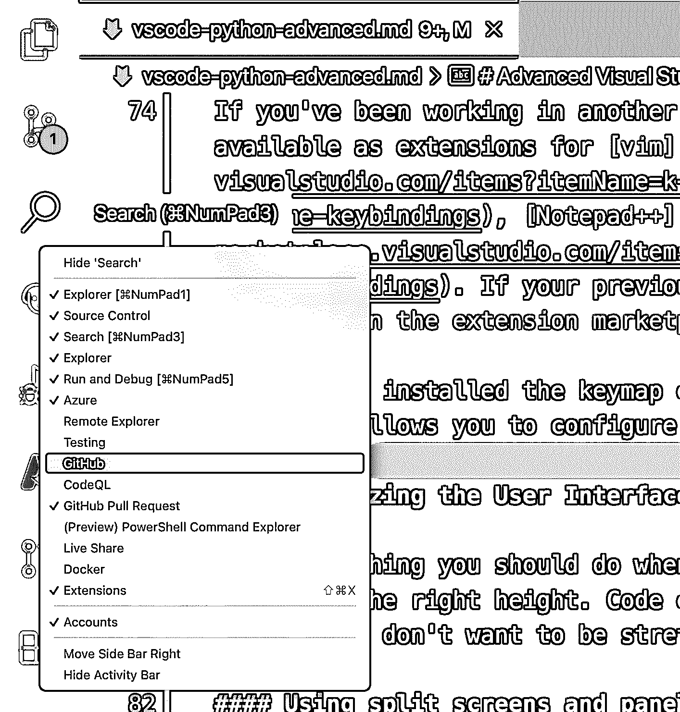

# Python 开发人员的高级 Visual Studio 代码

> 原文：<https://realpython.com/advanced-visual-studio-code-python/>

Visual Studio Code，简称 **VS Code** ，是微软免费开放的源代码编辑器。可以将 VS 代码作为**轻量级代码编辑器**进行快速修改，也可以通过使用**第三方扩展**将其配置为[集成开发环境(IDE)](https://en.wikipedia.org/wiki/Integrated_development_environment) 。在本教程中，您将了解如何在 Python 开发中充分利用 VS 代码。

在本教程中，您将学习如何**配置**、**扩展**和**优化** VS 代码，以获得更高效的 Python 开发环境。完成本教程后，您将拥有多种工具来帮助您更高效地使用 VS 代码。它可以成为快速 Python 开发的强大工具。

**在本教程中，您将学习如何:**

*   定制您的**用户界面**
*   运行并监控 **Python 测试**
*   **皮棉**和**自动格式化**你的代码
*   利用**类型注释**和**通孔**以更高的准确性更快地编写代码
*   配置和利用本地和远程调试
*   设置**数据科学工具**

像往常一样，本教程充满了链接、提示和技巧，以帮助您上路。

如果你还没有安装 [Visual Studio 代码](https://code.visualstudio.com/download)或者 [Python 扩展](https://marketplace.visualstudio.com/items?itemName=ms-python.python)，那么在本教程中你需要这两个。如果你刚刚开始学习 VS 代码，在继续学习这篇之前，你可能想看看 Jon Fincher 关于用 Visual Studio 代码开发 [Python 的教程。](https://realpython.com/python-development-visual-studio-code/)

**免费奖励:** [掌握 Python 的 5 个想法](https://realpython.com/bonus/python-mastery-course/)，这是一个面向 Python 开发者的免费课程，向您展示将 Python 技能提升到下一个水平所需的路线图和心态。

## 掌握 Visual Studio 代码用户界面

默认情况下，VS Code 的用户界面是为所有人设计的——无论你是在编写 C++，用 JavaScript 和 CSS 做前端开发，还是使用 Jupyter 笔记本这样的数据科学工具。在第一部分中，您将探索如何定制 VS 代码来支持您的工作方式。

[*Remove ads*](/account/join/)

### 键盘快捷键

几乎所有你在 VS 代码中做的事情，你都可以直接从键盘上完成。您可以将 VS 代码中的所有活动映射到一个键盘快捷键，无论它们是内置的还是通过扩展提供的。

一小部分内置命令已经映射在[键盘快捷键](https://code.visualstudio.com/docs/getstarted/keybindings)中。如果你想学习这些默认快捷键，打印出适用于 [Windows](https://code.visualstudio.com/shortcuts/keyboard-shortcuts-windows.pdf) 、 [macOS](https://code.visualstudio.com/shortcuts/keyboard-shortcuts-macos.pdf) 或 [Linux](https://code.visualstudio.com/shortcuts/keyboard-shortcuts-linux.pdf) 的 PDF 文件，并把它钉在你的显示器旁边。

作为 Python 开发人员，您将在 Visual Studio 代码中使用的许多命令都是由扩展提供的，类似于您已经安装的 Python 扩展。这些没有默认映射的快捷键，但是你可以使用 VS Code 的[键盘快捷键编辑器](https://code.visualstudio.com/docs/getstarted/keybindings#_keyboard-shortcuts-editor)来配置它们。

#### 使用键盘快捷键编辑器

在 macOS 上，进入*文件→首选项→键盘快捷键*或*代码→首选项→键盘快捷键*，打开键盘快捷键编辑器:

[](https://files.realpython.com/media/vscode-keyboard-shortcuts.687df9891a26.png)

在此编辑器中，您可以看到所有现有快捷方式的列表及其详细信息:

*   *命令*:要运行的命令或动作
*   *组合键*:触发该命令的按键顺序，空白表示没有映射
*   *When* :该键绑定工作需要满足的条件，减号(`-`)表示没有要求
*   *Source* :这个绑定被配置的地方，要么由*默认*、*用户*定义，要么由*扩展*定义，最后一个表示你是通过安装一个键映射扩展提供的

要覆盖现有的绑定，右键单击现有的动作，然后单击 *Change Keybinding* 。要将 keybinding 分配给没有绑定的命令，请双击它。如果你按下的键序列已经被分配给其他的东西，VS Code 会警告你一个链接，看看哪些命令被映射到这个 keybinding。

例如，在顶部的搜索框中键入`python create terminal`。如果没有结果，请确保安装了 Python 扩展。按 `Enter` 分配一个键位绑定，像`Ctrl`+`Alt`+`T`，然后再按 `Enter` 。

要指定该快捷方式仅在编辑 Python 代码时工作，右键单击该快捷方式并选择*当表达式*改变时。输入表达式`editorLangId == 'python'`:

[](https://files.realpython.com/media/vscode-screenshot-2.c1a3c78e75e1.png)

如果你需要更具体的东西，有更多的条件操作符可以选择。以下是一些帮助您入门的示例:

*   当您正在编辑的文件是`__init__.py`时，使用 **`resourceFilename == '__init__.py'`**
*   使用 Python 时使用 **`editorLangId == 'python'`** 。如果需要，您也可以用另一个[语言标识符](https://code.visualstudio.com/docs/languages/identifiers#_known-language-identifiers)替换`'python'`。
*   当你在编辑器里面的时候，使用 **`editorHasSelection`** 。

一旦你配置了这个扩展，在编辑器中打开一个 Python 文件，按下你新分配的键盘快捷键`Ctrl`+`Alt`+`T`打开一个 Python 终端。

#### 从命令调板设置命令的键盘快捷键

在本教程中，你会多次引用**命令面板**。VS 代码中的大多数功能都可以通过 UI 从[上下文菜单](https://en.wikipedia.org/wiki/Context_menu)中访问，但是你不会在那里找到所有的东西。可以在核心编辑器中或通过扩展完成的任何事情都可以在命令面板中找到。您可以通过按以下键盘快捷键之一进入命令调板:

*   **macOS:** `F1` 或`Cmd`+`Shift`+`P`
*   **Windows 或 Linux:** `F1` 或`Ctrl`+`Shift`+`P`

要运行命令，请键入其描述性名称，如`Python: Run All Tests`。命令调板打开后，您需要的命令出现在菜单顶部，单击右侧的图标以指定键盘快捷键:

[](https://files.realpython.com/media/vscode-screenshot-3.e555858553f3.png)

一旦你开始经常使用命令面板，你会发现有五到十个命令是你经常运行的。为这些命令分配一些快捷键，这样可以节省一些额外的击键次数。

#### 从其他编辑器安装键盘映射

如果您已经在另一个编辑器或 IDE 中工作了一段时间，您可能会将常用的键盘快捷键保存在内存中。

你会在 [Vim](https://marketplace.visualstudio.com/items?itemName=vscodevim.vim) 、 [IntelliJ 和 PyCharm](https://marketplace.visualstudio.com/items?itemName=k--kato.intellij-idea-keybindings) 、 [Sublime Text](https://marketplace.visualstudio.com/items?itemName=ms-vscode.sublime-keybindings) 、 [Notepad++](https://marketplace.visualstudio.com/items?itemName=ms-vscode.notepadplusplus-keybindings) 、 [Emacs](https://marketplace.visualstudio.com/items?itemName=lfs.vscode-emacs-friendly) 和 [Atom](https://marketplace.visualstudio.com/items?itemName=ms-vscode.atom-keybindings) 的扩展中找到有用的键盘映射。

如果您之前的编辑器不在此列表中，您可能会发现其他人已经为您创建了一个制图扩展。[键映射](https://marketplace.visualstudio.com/search?target=VSCode&category=Keymaps&sortBy=Relevance)是 [VS 代码扩展市场](https://marketplace.visualstudio.com)上一个有用的类别。

一旦你安装了一个键映射扩展，你可能会发现除了缺省值之外，还有额外的选项来定制它。例如，您可以使用 Vim keymap 扩展来配置 Vim 特性，比如是否以插入模式启动。

[*Remove ads*](/account/join/)

### 定制用户界面

当你跳进汽车的驾驶座时，首先要做的是调整座椅，调整后视镜，并将转向柱调到合适的高度。代码编辑器也不例外。它们有一个默认的布局，对每个人来说都可以，但对任何人来说都不是特别好。你不想伸展身体去够踏板。让我们来设置您的 VS 代码环境以适合您，并使它看起来很棒。

首先，VS 代码左侧的**活动栏**是在用于查看文件的**浏览器**视图、**源代码控制**视图、**搜索**视图、**运行和调试**视图以及**扩展**视图之间切换的主要导航工具。你不局限于这些选项。许多扩展都带有默认隐藏的视图。右键单击*活动栏*来控制您可以看到哪些视图:

[](https://files.realpython.com/media/activity_bar.2f756ee30790.png)

您也可以使用此菜单隐藏任何您从不使用的视图。请记住，您并不局限于列表中的视图。如果主视图中有一些面板——例如，您可以在*浏览器*视图中找到一些额外的面板——您可以将它们拖到*活动栏*来创建一个永久的快捷方式:

[](https://files.realpython.com/media/vscode-add-activity-bar-item.66db2c945797.png)

对于您一直使用的视图，请使用此功能。

#### 使用分屏

Python 的风格指南 [PEP 8](https://realpython.com/python-pep8/) ，倾向于短线长度。对于宽屏幕，这留下了大量未使用的屏幕空间。

当您发现自己需要在两个或多个文件之间切换时，可以使用拆分面板功能一次显示多个编辑器区域。您可以使用命令`View: Split Editor`通过命令面板访问该功能。

或者，您可以使用相关的键盘快捷键:

*   **MAC OS:**`Cmd`+`\`
*   **Windows 或者 Linux:**`Ctrl`+`\`

您也可以通过进入*视图→编辑器布局*或右击文件标签来打开拆分编辑器功能:

[](https://files.realpython.com/media/split-pane.4192b6101cf3.png)

这种设置在编写单元测试时非常有用，测试代码在左边，测试模块在右边。

有些文件类型，如 Markdown，有一个预览区域，您可以使用。使用`Markdown: Open Preview to the Side`命令打开预览编辑器。

#### 使用禅模式专注工作

如果你需要完全专注于 VS 代码中的单个文件或任务，那么进入*视图→外观→ Zen 模式*使用 Zen 模式，显示一个只有编辑器的全屏窗口:

[](https://files.realpython.com/media/vscode-zen-mode.39f6e34b9d84.png)

这项功能对于屏蔽嘈杂的干扰和通知特别有用，这样您就可以专注于完成当前的任务。

#### 主题化

VS 代码在 [VS 代码市场](https://marketplace.visualstudio.com/search?target=VSCode&category=Themes&sortBy=Installs)中有一个庞大的主题库。一些最受欢迎的主题有[物质主题](https://marketplace.visualstudio.com/items?itemName=equinusocio.vsc-material-theme)、[冬天来了](https://marketplace.visualstudio.com/items?itemName=johnpapa.winteriscoming)、[吸血鬼](https://marketplace.visualstudio.com/items?itemName=dracula-theme.theme-dracula)、[夜魔](https://marketplace.visualstudio.com/items?itemName=liviuschera.noctis)和 [Monokai Pro](https://marketplace.visualstudio.com/items?itemName=monokai.theme-monokai-pro-vscode) 。

让我们来关注一下[材质主题](https://marketplace.visualstudio.com/items?itemName=equinusocio.vsc-material-theme)，因为它有一套广泛的配色方案来满足许多人的口味。你可以从*扩展*视图安装扩展。安装完成后，您可以通过在命令面板中运行`Preferences: Color Theme`来选择颜色主题。

自定义图标主题的材质主题看起来最好。图标主题是独立于颜色主题的扩展，所以你必须安装第二个扩展。在*扩展*视图中搜索`pkief.material-icon-theme`，找到该主题最流行的材质图标包。安装后，VS 代码会提示你切换你的图标包。

这是带有 Palenight 颜色主题和材料图标包的材料主题:

[](https://files.realpython.com/media/vscode-material-palenight.969b3335bd77.png)

通过使用命令`Preferences: File Icon Theme`并从列表中选择一个图标主题，您可以在命令面板中随时更改图标主题。

#### 安装更好的编程字体

编程字体是一组特殊的字体，通常具有固定宽度的字符，称为[等宽](https://en.wikipedia.org/wiki/Monospaced_font)。在 ProgrammingFonts.org 的[有一长串可供浏览的字体:](https://www.programmingfonts.org/)

[](https://files.realpython.com/media/programming-fonts.25bace155d9f.png)

一旦你选择了一种字体，去 [Nerd Fonts](https://www.nerdfonts.com/font-downloads) 下载并在你的操作系统上安装该字体。Nerd Fonts 下载的是支持字形的等宽字体的副本，也称为图标，可以在终端提示符中使用。

安装好你选择的字体后，你需要将`editor.fontFamily`设置更改为新字体的名称。你可以通过导航到*代码→首选项→设置*，然后在导航下拉菜单中选择*文本编辑器→字体*来完成。您可以通过在*字体系列*设置的第一个字段中添加新字体的名称来更改编辑器将使用的字体。

[*Remove ads*](/account/join/)

### 设置您的终端

您将在 shell 终端中花费大量的 Python 开发时间。您可以使用单独的应用程序，如 iTerm2 或 Windows 终端，但 VS 代码已经有一个强大的内置终端窗口。

因为 VS 代码确实需要一点配置来使它像专用终端应用程序一样强大，所以现在您将设置它。

#### 更改默认外壳提供者

您可以将“终端”窗口重新配置为具有多个描述文件。当您生成新的终端时，这些配置文件形成下拉列表。

VS 代码允许您配置多个终端配置文件。您不能在设置 UI 中编辑终端配置文件，因此您需要使用命令调板中的`Preferences: Open Settings (JSON)`命令来打开`settings.json`文件。您会注意到键值对组成了设置文件。每个键代表 VS 代码或其扩展之一的配置设置。

有三种终端配置文件设置，其名称如下:

| 操作系统 | 终端配置文件设置 |
| --- | --- |
| Windows 操作系统 | `terminal.integrated.profiles.windows` |
| Linux 操作系统 | `terminal.integrated.profiles.linux` |
| 马科斯 | `terminal.integrated.profiles.osx` |

输入名称后，编辑器会自动将默认概要文件填充到 JSON 文件中。

请注意，默认设置中没有 Python REPL 配置文件。您可以将带有关键字`"python3-repl"`的概要文件添加到 integrated profiles JSON 文件中，这样 VS 代码就可以将它作为一个概要文件选项，并直接进入 REPL 提示符:

```py
"python3-repl":  { "path":  "python3", "args":  ["-q"] }
```

`-q`标志是一个 Python 命令行标志，用于阻止版本头的显示。您可以向`"args"`添加任何额外的 Python 命令行标志。

配置完成后，根据您的操作系统，您的配置文件应该如下所示:

```py
"terminal.integrated.profiles.osx":  { "bash":  { "path":  "bash", "icon":  "terminal-bash", }, "zsh":  { "path":  "zsh" }, "pwsh":  { "path":  "pwsh", "icon":  "terminal-powershell", }, "python3-repl":  { "path":  "python3", "args":  ["-q"] } },
```

VS 码对终端有两种发射方式:**集成**和**外接**。配置好配置文件后，您可以通过设置`"terminal.integrated.defaultProfile.osx"`的值来设置集成终端的默认配置文件:

```py
"terminal.integrated.defaultProfile.osx":  "zsh",
```

如果某个东西在外部终端启动，它将使用你的操作系统的默认外壳。如果您喜欢不同的终端应用程序，如 macOS 的 [iTerm 2](https://www.iterm2.com) 或 Windows 的 [Windows 终端](https://www.microsoft.com/en-us/p/windows-terminal/9n0dx20hk701)，您也可以更改默认的外部终端:

```py
"terminal.external.osxExec":  "iTerm.app",
```

例如，对于 macOS 的这种设置，您说 VS 代码应该在每次启动外部终端窗口时调出 iTerm 应用程序。

关于 VS 代码中的终端，您甚至可以更改更多的设置。例如，当您调出一个新的终端窗口时，您可以让 VS 代码自动激活您的虚拟环境，并且您可以通过添加自定义提示来自定义您的终端的外观和感觉。在本教程中，您将探索如何做到这两点。

#### 终端中的虚拟环境激活

虚拟环境对于管理跨 Python 项目的多种依赖关系非常重要。一旦选择了解释器，Visual Studio 代码将激活任何 [Python 虚拟环境](https://realpython.com/python-virtual-environments-a-primer/)。如果您已经有了一个虚拟环境，从命令面板运行`Python: Select Interpreter`来选择 Python 解释器虚拟环境。

如果没有，那么在终端内部创建一个。如果虚拟环境路径被命名为`.venv/`、`env/`或`venv/`，VS 代码可以自动拾取它。

设置解释器后，当您在 VS 代码中启动一个新的终端窗口时，您将自动激活虚拟环境:

[](https://files.realpython.com/media/vscode-venv.4ae757c09cf3.png)

如果您已经打开了一个终端，您可以通过单击垃圾桶图标来销毁它。

您在终端内部运行的任何命令，如`python -m pip install`，都将用于激活的虚拟环境。

在上面的截图中，您可以看到一个自定义的命令提示符，它使用了 Oh My Posh prompt toolkit。在下一节中，您将安装和配置 Oh My Posh。哦，我的 Posh 是可选的，尤其是如果你已经安装了自定义命令提示符。

#### 安装我的豪华轿车

Oh My Posh 是众多定制终端命令提示符的库之一。它可以在 Linux、macOS 和 Windows 上运行。它也适用于所有 Shell，如 Bash、Zsh、Fish 和 PowerShell。你可以安装 Oh My Posh 来增加你终端的趣味。

如果您在 macOS 上使用 Bash，运行以下命令来安装 Oh My Posh:

```py
$ brew tap jandedobbeleer/oh-my-posh
$ brew install oh-my-posh
$ curl https://github.com/JanDeDobbeleer/oh-my-posh/raw/main/themes/tonybaloney.omp.json -sLo ~/.mytheme.omp.json
$ echo "eval \"\$(oh-my-posh --init --shell bash --config ~/.mytheme.omp.json)\"" >> ~/.profile
$ . ~/.profile
```

如果您在 macOS 上使用 Zsh，运行以下命令来安装 Oh My Posh:

```py
$ brew tap jandedobbeleer/oh-my-posh
$ brew install oh-my-posh
$ curl https://github.com/JanDeDobbeleer/oh-my-posh/raw/main/themes/tonybaloney.omp.json -sLo ~/.mytheme.omp.json
$ echo "eval \"\$(oh-my-posh --init --shell bash --config ~/.mytheme.omp.json)\"" >> ~/.zprofile
$ . ~/.zprofile
```

如果您在 Windows 上使用 PowerShell，运行以下命令来安装 Oh My Posh:

```py
PS C:\> Install-Module oh-my-posh -Scope CurrentUser
PS C:\> Add-Content $PROFILE "`nSet-PoshPrompt -Theme tonybaloney"
```

最后，如果您在 Linux 上使用 Bash，运行以下命令来安装 Oh My Posh:

```py
$ sudo wget https://github.com/JanDeDobbeleer/oh-my-posh/releases/latest/download/posh-linux-amd64 -O /usr/local/bin/oh-my-posh
$ sudo chmod +x /usr/local/bin/oh-my-posh
$ curl https://github.com/JanDeDobbeleer/oh-my-posh/raw/main/themes/tonybaloney.omp.json -sLo ~/.mytheme.omp.json
$ echo "eval \"\$(oh-my-posh --init --shell bash --config ~/.mytheme.omp.json)\"" >> ~/.bashrc
$ . ~/.bashrc
```

当您在 VS 代码中打开一个新的终端时，您将得到以下提示:

[](https://files.realpython.com/media/vscode-ohmyposh-terminal.4484c2cdff6d.png)

终端上的组件是文件夹、Git 分支和 Python 版本。查看主题列表中的其他选项。

**注意:**如果你正在使用定制的终端提示，如 [Oh My Posh](https://ohmyposh.dev/) 或 [Oh My Zsh](https://ohmyz.sh) ，你必须选择一个已安装的[书呆子字体](https://www.nerdfonts.com/font-downloads)，以便字形在 VS 代码中正确显示。

默认情况下，终端将使用您为编辑器配置的相同字体，`editor.fontFamily`。您可以通过为`terminal.integrated.fontFamily`标识符定义不同的字体系列来覆盖它。您还需要更新您使用的任何外部终端应用程序。

[*Remove ads*](/account/join/)

### 团队设置 vs 个人设置

VS 代码有两个级别的设置:

1.  **用户设置**，适用于所有项目
2.  **工作区设置**，仅适用于该工作区

如果在两者中都声明了设置，工作区设置将覆盖用户设置。

VS 代码及其所有扩展的工作区配置位于工作区根目录下的一个`.vscode/`目录中。

将与项目无关的设置放在用户设置中，将特定于项目的设置放在`.vscode/`中是一个好主意。通过将您的个人用户设置与您的项目设置分开，您和从事该项目的任何其他开发人员都可以更有效地工作。

#### Python 的全局用户设置

默认情况下，Visual Studio 代码的 Python 扩展具有非常基本的配置。许多功能如林挺、格式化和安全检查被禁用，因为你需要安装第三方工具如 Black、Pylint 和 Bandit 来使用它们。

您可以安装这些工具，并通过使用`pipx`或`pip install --user`让它们对每个虚拟环境可用。 [`pipx`](https://pypi.org/project/pipx/) 比`pip install --user`更可取，因为它将为该包创建并维护一个虚拟环境，使您的全球站点包更小，并降低打包冲突的风险。

一旦[安装了`pipx`](https://pypa.github.io/pipx/installation/) ，就可以安装常用工具了:

```py
$ pipx install pylint && \
  pipx install black && \
  pipx install poetry && \
  pipx install pipenv && \
  pipx install bandit && \
  pipx install mypy && \
  pipx install flake8
```

或者，使用`python3 -m pip install --user`安装常用工具:

```py
$ python3 -m pip install --user pylint black poetry pipenv bandit mypy flake8
```

安装好基础工具后，用`Preferences: Open Settings (JSON)`从命令面板打开用户设置。为您想要应用到所有项目的偏好设置添加设置:

```py
 1"python.pipenvPath":  "${env:HOME}/.local/bin/pipenv", 2"python.poetryPath":  "${env:HOME}/.local/bin/poetry", 3"python.condaPath":  "${env:HOME}/.local/bin/conda", 4"python.linting.enabled":  true, 5"python.linting.banditPath":  "${env:HOME}/.local/bin/bandit", 6"python.linting.banditEnabled":  true, 7"python.linting.pylintPath":  "${env:HOME}/.local/bin/pylint", 8"python.linting.mypyPath":  "${env:HOME}/.local/bin/mypy", 9"python.linting.flake8Path":  "${env:HOME}/.local/bin/flake8", 10"python.formatting.blackPath":  "${env:HOME}/.local/bin/black",
```

有了这些设置，您已经成功地完成了几件事，这对您跨许多项目的开发工作流很有用:

1.  **第 1 行到第 3 行**为启用了`pipenv`、`poetry`和`conda`的项目启用包发现。
2.  **第 4 行**启用 Python 林挺。
3.  **线 5 至线 6** 使能并将路径设置为`bandit`。
4.  **第 7 到 10 行**启用 Python 格式化，并设置路径到一个全局安装的`pylint`、`mypy`、`flake8`和`black`实例。

在每个绝对路径中，您可以使用宏`${env:HOME}`自动替换您的主文件夹。

#### 工作区设置

在用户设置之外，您可以使用工作区内的`.vscode/`目录来配置一些特定于项目的设置:

*   哪个**命令**运行以执行项目
*   如何**测试**和**调试**项目
*   使用哪个**棉绒**和**格式器**以及任何项目特定参数

以下文件包含 VS 代码首选项:

| 文件 | 目的 |
| --- | --- |
| `settings.json` | VS 代码设置 |
| `launch.json` | 从*运行和调试*菜单执行项目的配置文件 |
| `tasks.json` | 要执行的任何附加任务，如构建步骤 |

大多数 VS 代码的设置，以及您的扩展的设置，都在这三个文件中。

在工作区首选项中，支持以下预定义变量:

| 预定义变量 | 意义 |  |
| --- | --- | --- |
| `${env.VARIABLE}` | 任何环境变量 |  |
| `${workspaceFolder}` | 在 VS 代码中打开的文件夹的路径 |  |
| `${workspaceFolderBasename}` | 在 VS 代码中打开的文件夹的名称，不带任何斜杠(`/`) |  |
| `${file}` | 当前打开的文件 |  |
| `${fileWorkspaceFolder}` | 当前打开的文件的工作区文件夹 |  |
| `${relativeFile}` | 当前打开的文件相对于`workspaceFolder` |  |
| `${cwd}` | 启动时任务运行程序的当前工作目录 |  |
| `${execPath}` | 正在运行的 VS 代码可执行文件的路径 |  |
| `${pathSeparator}` | 操作系统用来分隔文件路径中各部分的字符，例如，正斜杠(`/`)或反斜杠(`\`) |  |

使用这些变量将保持项目设置与环境无关，因此您可以将它们提交到 Git 中。

作为使用这些设置的一个例子，如果您想使用 Black 作为这个项目的默认代码格式化程序，您可以用这个配置创建文件`.vscode/settings.json`:

```py
{ "python.formatting.provider":  "black", }
```

任何签出这个项目的人现在将自动使用 Black 作为 Python 文件的格式化程序。在关于[设置格式和 lint on save](#setting-format-and-lint-on-save) 的章节中，您将看到该设置如何影响自动套用格式选项。

#### 使用设置同步扩展

如果您在多台计算机上使用 VS 代码，您可以启用[设置、键盘快捷键、用户代码片段、扩展和 UI 状态](https://code.visualstudio.com/docs/editor/settings-sync)的自动同步。如果你以前没有使用过**设置同步**，你需要启用它:

1.  在命令面板中运行`Settings Sync: Turn On`。
2.  按照 VS 代码提示的设置步骤进行操作。可以用 GitHub 认证。
3.  一旦设置完成，从命令面板运行`Settings Sync: Configure`。
4.  选择您想要同步的内容。

一旦在所有安装了 VS 代码的计算机上配置了设置同步，你可以通过从命令面板运行`Settings Sync: Show Synced Data`来查看每个同步设置的状态，它们会显示在*同步机器*下:

[](https://files.realpython.com/media/settings-sync.2650a0246a78.png)

此视图显示每个设置的上次同步时间以及哪些机器正在同步。

[*Remove ads*](/account/join/)

## 林挺和格式化

Visual Studio 代码中的所有语言都可以使用自动格式化程序之一进行格式化，Python 扩展也支持 linters。Linters 和 formatters 执行不同的任务:

*   一个**格式化程序**将改变你的代码的外观，但不会改变它的工作方式。
*   一个 **linter** 会警告你你的代码是否符合风格、类型坚持、安全性和一系列最佳实践的标准。

Python 扩展支持许多第三方 linters，它们经常执行不同的工作。例如， **Bandit** 是一个针对安全漏洞的贴体， **Flake8** 是一个符合风格指南的贴体。

Python 扩展还附带了**语言服务器工具**，它通过从您的代码和您使用的库中加载接口(方法、函数、类)来执行分析。

在写这篇教程的时候，Visual Studio 代码上最新最棒的 Python 语言服务器扩展是 [Pylance](https://devblogs.microsoft.com/python/announcing-pylance-fast-feature-rich-language-support-for-python-in-visual-studio-code/) 。

### 设置挂架

Pylance 是一个扩展，在 Visual Studio 代码中与 Python 一起工作，提供更深层次的语言支持和 Python 代码的自省。Pylance 将提供自动完成、自动化模块导入、更好的代码导航、类型检查以及更多的功能。

要获得 Pylance，进入侧边栏上的*扩展*菜单并搜索`Pylance` ( `ms-python.vscode-pylance`)。

**注意:** Pylance 现在与 Python 扩展捆绑在一起，所以您可能已经安装了它。

一旦你安装了 Pylance，在你的**用户设置**中有两个默认的配置设置你可能想要改变，以充分利用这个扩展。

第一个要更改的设置是类型检查模式，您可以使用该模式来指定所执行的类型检查分析的级别:

```py
"python.analysis.typeCheckingMode":  "basic"
```

默认情况下，类型检查模式设置为`"off"`。

其他选项是`"basic"`或`"strict"`。使用`"basic"`，运行与类型检查无关的规则和基本类型检查规则。如果模式设置为`"strict"`，它将以最高的错误严重性运行所有类型检查规则。将此项设置为`"basic"`以在严格和禁用之间取得平衡。

另一个默认设置是`python.analysis.diagnosticMode`。默认情况下，Pylance 将只检查当前打开的文件。将此设置更改为`workspace`将检查工作区中的所有 Python 文件，在*浏览器*视图中给您一个错误和警告列表:

[](https://files.realpython.com/media/vscode-all-inspections.015376128c17.png)

如果你有多余的内存，你应该只设置`python.analysis.diagnosticMode`到`"workspace"`，因为它会消耗更多的资源。

当 Pylance 拥有关于用作方法和函数的参数的类型以及返回类型的信息时，它是最有效的。

对于外部库，Pylance 将使用[typed](https://github.com/python/typeshed)来推断返回类型和参数类型。Pylance 还为一些最流行的数据科学库提供了类型存根和智能，如 pandas、Matplotlib、scikit-learn 和 NumPy。如果你在和熊猫一起工作，Pylance 会给你一些常见功能和模式的信息和例子:

[](https://files.realpython.com/media/pylance-pandas.95fd6f68eb67.png)

对于在 typeshed 上没有类型存根的库，Pylance 会尽力猜测类型是什么。否则，你可以[添加你自己的类型存根](https://realpython.com/python-type-checking/#adding-stubs)。

[*Remove ads*](/account/join/)

### 保存时设置格式和 Lint

**格式化文档**是一个将格式应用于 VS 代码中任何文档的动作。对于 Python 扩展，这个动作执行`"python.formatting.provider"`，它可以被设置为任何支持的自动格式化程序:`"autopep8"`、`"black"`或`"yapf"`。

一旦您在`settings.json`中配置了格式化程序，您可以设置格式化程序在保存文件时自动运行。在 VS 代码配置中，您可以将编辑器设置配置为只应用于某些文件类型，方法是将它们放在一个`"[<file_type>]"`组中:

```py
... "[python]":  { "editor.formatOnSave":  true, },
```

除了执行格式化程序之外，您还可以按字母顺序组织导入语句，并通过将标准库模块、外部模块和包导入分成具有以下配置的组:

```py
"[python]":  { ... "editor.codeActionsOnSave":  {"source.organizeImports":  true}, },
```

与格式化不同，林挺特定于 Python 扩展。要启用林挺，在命令面板上运行`Python: Select Linter`选择一个 linter。您也可以在您的设置中启用一个或多个棉条。例如，要启用 Bandit 和 Pylint linters，请编辑您的`settings.json`:

```py
... "python.linting.enabled":  true, "python.linting.banditEnabled":  true, "python.linting.pylintEnabled":  true,
```

要在保存文件时运行启用的 linters，将以下设置添加到`settings.json`:

```py
... "python.linting.lintOnSave":  true,
```

您可能会发现启用多个 linter 很有帮助。请记住，Pylance 已经提供了许多您可以从 pylint 获得的见解，因此您可能不需要同时启用 pylint *和* Pylance。相比之下，Flake8 提供了 Pylance 没有涵盖的风格反馈，因此您可以一起使用这两者。

## 在 Visual Studio 代码中测试您的 Python 代码

Python 提供了大量的[工具来测试你的代码](https://realpython.com/python-testing/)。VS 代码的 Python 扩展支持最流行的测试框架，`unittest`和`pytest`。

### 配置测试集成

要启用对 Python 的测试支持，请从命令面板运行`Python: Configure Tests`命令。VS 代码将提示您从一个支持的测试框架中进行选择，并指定哪个文件夹包含您的测试。

该向导将配置选项添加到`.vscode/settings.json`:

```py
"python.testing.pytestEnabled":  true, "python.testing.pytestArgs":  [ "tests" ],
```

您可以用您喜欢的测试框架编辑`python.testing.<framework>Args`,以添加任何额外的命令行标志。上面的例子显示了 pytest 的配置选项。

如果你有更复杂的 pytest 设置，把它们放在`pytest.ini`而不是 VS 代码设置中。这样，您将保持配置与任何自动化测试或 [CI/CD](https://realpython.com/python-continuous-integration/) 工具一致。

### 执行测试

一旦您为测试运行器配置了测试框架和参数，您就可以通过从命令面板运行`Python: Run All Tests`命令来执行您的测试。这将使用配置的参数启动测试运行器，并将测试输出放入 *Python 测试日志*输出面板:

[](https://files.realpython.com/media/vscode-test-run.5101c9d2422c.png)

一旦测试发现完成，每个测试用例将有一个内联选项来执行或调试该用例:

[](https://files.realpython.com/media/vscode-run-test-inline.582dca2206d6.png)

失败的测试将被标记为有错误。您可以在 *Python 测试日志*面板中看到测试运行程序的失败，也可以将鼠标悬停在代码中失败的测试用例上:

[](https://files.realpython.com/media/vscode-test-failure.8af6f6d0b222.png)

如果您经常运行测试，您可以使用**测试浏览器**改善您在 VS 代码中的测试体验。

要启用测试面板，右键单击侧栏并确保选中了*测试*。测试面板显示 Python 扩展发现的所有测试，并为您提供许多功能:

[](https://files.realpython.com/media/vscode-test-explorer.0cef40886e92.png)

您有一个测试套件分组以及哪些测试失败的可视化表示。您还可以使用菜单按钮来运行和调试测试。

VS Code 的测试系统很强大，但是很多功能在默认情况下是禁用的，以保持它是一个轻量级的编辑器。除了测试之外，您可能还想从 VS 代码内部定期运行其他任务。这就是任务系统的用武之地。

[*Remove ads*](/account/join/)

## 使用 Visual Studio 代码任务系统

Visual Studio 代码支持编译语言，如 Go、Rust 和 C++，也支持解释语言，如 Python 和 Ruby。VS Code 有一个灵活的系统来执行用户定义的配置好的[任务](https://code.visualstudio.com/docs/editor/tasks)，比如构建和编译代码。

Python 代码通常不需要提前编译，因为 Python 解释器[会为你做这件事](https://realpython.com/cpython-source-code-guide/#part-3-the-cpython-compiler-and-execution-loop)。相反，您可以使用**任务系统**来预配置任务，否则您将在命令行运行这些任务，例如:

*   构建一个轮或源分布
*   在像 Django 这样的框架中运行任务
*   编译 Python C 扩展

VS 代码任务是命令或可执行文件，您可以使用命令面板按需运行。有两个内置的默认任务:

1.  **构建任务**
2.  **测试任务**

请注意，您可以将任务用于任何原本可以通过命令行执行的事情。您并不局限于构建和测试活动。

### 使用任务编译车轮

如果您有一个`setup.py`文件来[构建一个包](https://realpython.com/pypi-publish-python-package/#building-your-package)以便在 PyPI 上发布，那么您可以使用 tasks 系统来自动构建源代码(Python)和二进制(编译的 Python)发布包。

任务在一个`.vscode/tasks.json`文件中定义。为了进行试验，创建`.vscode/tasks.json`并复制这个配置:

```py
 1{ 2  "version":  "2.0.0", 3  "tasks":  [ 4  { 5  "type":  "shell", 6  "command":  "${command:python.interpreterPath}", 7  "args":  ["setup.py",  "bdist_wheel",  "sdist"], 8  "isBackground":  true, 9  "options":  {"cwd":  "${workspaceFolder}"}, 10  "label":  "Build Wheel", 11  "group":  { 12  "kind":  "build", 13  "isDefault":  true 14  } 15  } 16  ] 17}
```

在这个例子中有一些事情需要注意，所以您将逐行查看最重要的配置:

*   **第 5 行:**任务类型是`shell`，它指定这个任务应该在您配置的 shell 下运行。
*   **第 6 行:**命令是`${command:python.interpreterPath}`，这是这个环境的 Python 解释器的内置变量。这包括任何激活的虚拟环境。
*   **第 9 行:**选项`"options": {"cwd": "${workspaceFolder}"}`指定这应该在项目的根目录下运行。如果需要，您可以将其更改为子文件夹。
*   **第 11 行到第 13 行:**`"group"`设置为`"build"`，由于你将`"isDefault"`设置为`true`，该任务将成为你的默认任务。这意味着此任务将作为默认的生成任务运行。

要执行默认的构建任务，可以从命令面板运行`Tasks: Run Build Task`或者使用内置的键盘快捷键 `Cmd` + `F9` 或者 `Ctrl` + `F9` 。在*终端*选项卡下，您可以找到在`"label"`中指定的构建命令的输出:

[](https://files.realpython.com/media/vscode-build-output.91da66e5dd0a.png)

您不局限于构建脚本。对于 Django 和 Flask 的管理命令来说，任务系统是一个很好的解决方案。

### 使用 Django 的任务

您正在使用 Django 应用程序吗，您想从命令行自动运行`manage.py`吗？您可以使用`shell`类型创建一个任务。这样，您就可以使用想要运行的 Django 子命令以及任何参数来执行`manage.py`:

```py
{ "version":  "2.0.0", "tasks":  [ { "type":  "shell", "command":  "${command:python.interpreterPath}", "args":  ["manage.py",  "makemigrations"], "isBackground":  true, "options":  {"cwd":  "${workspaceFolder}"}, "label":  "Make Migrations" } ] }
```

要运行这个任务，使用命令面板中的`Tasks: Run Task`命令，并从列表中选择 *Make Migrations* 任务。

您可以复制这个代码片段，并将其粘贴到您定期运行的任何 Django 命令中，比如`collectstatic`。

[*Remove ads*](/account/join/)

### 链接任务

如果您有多个应该按顺序运行的任务或者一个任务依赖于另一个任务，您可以在`tasks.json`中配置任务相关性。

扩展一下[的`setup.py`例子](#using-tasks-to-compile-wheels)，如果您想首先构建您的包的源代码发行版，您可以将下面的任务添加到`tasks.json`:

```py
... { "type":  "shell", "command":  "${command:python.interpreterPath}", "args":  ["setup.py",  "sdist"], "isBackground":  true, "options":  {"cwd":  "${workspaceFolder}"}, "label":  "Build Source", }
```

在默认的构建任务中，您可以添加一个属性`dependsOn`以及需要首先运行的任务标签列表:

```py
{ "version":  "2.0.0", "tasks":  [ { "type":  "shell", "command":  "${command:python.interpreterPath}", "args":  ["setup.py",  "bdist_wheel"], "isBackground":  true, "options":  {"cwd":  "${workspaceFolder}"}, "label":  "Build Wheel", "group":  { "kind":  "build", "isDefault":  true }, "dependsOn":  ["Build Source"]   } ] }
```

下次运行此任务时，它将首先运行所有相关任务。

如果您有该任务依赖的多个任务，并且它们可以并行运行，请将`"dependsOrder": "parallel"`添加到任务配置中。

### 使用任务运行 Tox

现在您将探索 [tox](https://tox.readthedocs.io/en/latest/) ，这是一个旨在自动化和标准化 Python 测试的工具。针对 Visual Studio 代码的 Python 扩展没有与 tox 集成。相反，您可以使用 tasks 系统将 tox 设置为默认测试任务。

**提示:**如果你想快速上手 tox，那么安装`tox`和 [`pip`](https://realpython.com/what-is-pip/) 并运行`tox-quickstart`命令:

```py
$ python -m pip install tox
$ tox-quickstart
```

这将提示您创建一个 [tox 配置文件](https://tox.readthedocs.io/en/latest/config.html)的步骤。

要使用您的 tox 配置自动运行 tox，请向`tasks.json`添加以下任务:

```py
{ "type":  "shell", "command":  "tox", "args":  [], "isBackground":  false, "options":  {"cwd":  "${workspaceFolder}"}, "label":  "Run tox", "group":  { "kind":  "test", "isDefault":  true } }
```

您可以使用命令面板中的`Tasks: Run Test Task`来运行该任务，该任务将使用*终端*选项卡中的输出来执行 tox:

[](https://files.realpython.com/media/vscode-tox.27ac247b5c4c.png)

如果您有一些任务并且需要经常运行它们，那么是时候探索一个伟大的扩展了，它在 UI 中添加了一些快捷方式来运行配置好的任务。

### 使用任务浏览器扩展

[任务浏览器扩展(`spmeesseman.vscode-taskexplorer` )](https://marketplace.visualstudio.com/items?itemName=spmeesseman.vscode-taskexplorer) 增加了简单的 UI 控件来运行你预先配置的任务。一旦安装完毕，*任务浏览器*将成为*浏览器*视图中的一个面板。它扫描您的项目，自动发现`npm`、`make`、`gulp`和许多其他构建工具的任务。您可以在 *vscode* 组下找到您的任务:

[](https://files.realpython.com/media/vscode-task-explorer.279e381a014a.png)

单击任何任务旁边的箭头来执行该任务，如果更改任务的配置，则单击顶部的刷新图标。

[*Remove ads*](/account/join/)

## 在 Visual Studio 代码中调试 Python 脚本

Visual Studio 代码的 Python 扩展捆绑了一个强大的调试器，它支持本地和远程[调试](https://code.visualstudio.com/docs/editor/debugging)。

运行和调试一个简单的 Python 脚本最简单的方法是进入*运行→开始调试*菜单，并从选项中选择 *Python 文件*。这将使用配置的 Python 解释器执行当前文件。

您可以在代码中的任意位置设置断点，方法是单击行号左侧的空白。当代码执行过程中遇到断点时，代码将暂停并等待指令:

[](https://files.realpython.com/media/vscode-debug-breakpoint.eafdcb77613d.png)

调试器增加了一个菜单控件:*继续*，*跨过*，*步入*，*步出*，*重启*，*停止执行*:

[](https://files.realpython.com/media/vscode-debug-controls.82b8a69e3b32.png)

在左侧面板上，您可以执行常见的调试操作，例如探索局部和全局变量以及 Python 的调用堆栈。您还可以**设置手表**，这将在下一节中详细介绍。

### 设置手表

**Watches** 是在调试会话之间持续的表达式。当您停止执行并再次开始调试时，您将保留上次会话中的所有监视。

你可以从*变量*面板通过右击一个变量并选择*添加到观察*来添加一个变量到*观察*面板。

您还可以通过点击 *+* 图标，将任何 Python 表达式添加到*观察*列表中。表达式可以包含:

*   小 Python 表达式，比如`x == 3`
*   函数调用，如`var.upper()`
*   比较

每当遇到断点时，您将实时获得每个表达式的当前结果。VS 代码还会在您调试会话时更新每个观察器的值:

[](https://files.realpython.com/media/vscode-debug-watches.1188719a20cc.png)

您可以使用左边的箭头扩展复杂类型，如字典和对象。

到目前为止，您已经看到了单个 Python 文件的调试器，但是许多 Python 应用程序都是模块，或者需要特殊的命令才能启动。

### 配置启动文件

VS 代码有一个用于启动概要文件的配置文件，`.vscode/launch.json`。VS 代码的 Python 调试器可以启动任何启动配置，并将调试器附加到它上面。

**注意:**要查看即将到来的配置的预期结果，您需要设置一个有效的 [FastAPI 项目](https://realpython.com/fastapi-python-web-apis/)，并且在您正在使用的 Python 环境中安装 [async](https://realpython.com/python-async-features/) web 服务器[uvicon](https://www.uvicorn.org)。

作为在 VS 代码中使用启动概要文件的例子，您将探索如何使用 ASGI 服务器`uvicorn`来启动一个 [FastAPI](http://fastapi.tiangolo.com/) 应用程序。通常，您可以只使用命令行:

```py
$ python -m uvicorn example_app.main:app
```

相反，您可以在`launch.json`中设置一个等效的启动配置:

```py
{ "configurations":  [ { "name":  "Python: FastAPI", "type":  "python", "request":  "launch", "module":  "uvicorn", "cwd":  "${workspaceFolder}", "args":  [ "example_app.main:app" ], } ] }
```

这里，您将配置中的`"type"`设置为`"python"`，这告诉 VS 代码使用 Python 调试器。您还设置了`"module"`来指定要运行的 Python 模块，在本例中是`"uvicorn"`。您可以在`"args"`下提供任意数量的参数。如果您的应用程序需要环境变量，您也可以使用`env`参数设置这些变量。

一旦您添加了这个配置，您应该会发现您的新启动配置已经准备好在*运行和调试*面板下启动:

[](https://files.realpython.com/media/vscode-run-launch.f6590d7a60d1.png)

当您按下 `F5` 或从顶部菜单中选择*运行→开始调试*时，您配置为首次启动配置的任何内容都将运行。

如果 VS 代码没有自动为您选择正确的 Python 环境，那么您也可以在您的`.vscode/launch.json`文件中声明一个到适当的 Python 解释器的显式路径作为选项:

```py
 1{ 2  "configurations":  [ 3  { 4  "name":  "Python: FastAPI", 5  "type":  "python", 6  "python":  "${workspaceFolder}/venv/bin/python",  7  "request":  "launch", 8  "module":  "uvicorn", 9  "cwd":  "${workspaceFolder}", 10  "args":  [ 11  "example_app.main:app" 12  ], 13  } 14  ] 15}
```

您可以将路径作为名为`"python"`的新条目添加到您的 Python 解释器中。在这个例子中，解释器位于一个名为`venv`的 Python 虚拟环境中，这个环境是在您的工作空间文件夹的根目录下创建的。如果您想使用不同的 Python 解释器，您可以通过编辑第 6 行所示的路径来定义它的路径，以适应您的设置。

[*Remove ads*](/account/join/)

## 掌握远程开发

VS 代码支持三种远程开发配置文件:

1.  容器
2.  SSH 上的远程主机
3.  用于 Linux 的 Windows 子系统(WSL)

所有三个选项都由[远程开发扩展包(`ms-vscode-remote.vscode-remote-extensionpack` )](https://marketplace.visualstudio.com/items?itemName=ms-vscode-remote.vscode-remote-extensionpack) 提供。您需要安装这个扩展包，以便在 VS 代码中显示远程调试特性。

### 使用容器进行远程开发

您需要在您的机器上安装 Docker 运行时，以便对容器使用远程调试。如果你还没有安装 Docker，你可以从 Docker 网站下载。

Docker 运行后，转到左侧导航菜单上的*远程浏览器*选项卡。将*远程浏览器*下拉菜单更改为*容器*，您将看到一个带有面板的视图:

[](https://files.realpython.com/media/131485209-7fbb0f9a-22b7-4828-a477-8af33c0be91a.998dcdb18a09.png)

如果您有一个全新的 Docker 安装，这些面板不会被填充。

如果您已经安装并运行了 Docker 映像，则可能会填充三个面板:

1.  **容器:**一个导航面板，显示这个工作区中的开发容器或者一些快速启动步骤的链接
2.  **容器的名称(如果正在运行):**正在运行的容器的属性和卷装载
3.  **DevVolumes:** 您可以编辑和挂载以修改代码的开发卷列表

例如，如果您按照 VS Code 的[容器教程](https://code.visualstudio.com/docs/remote/containers-tutorial#_get-the-sample)中概述的步骤安装了[试用开发容器:Python](https://github.com/Microsoft/vscode-remote-try-python) ，那么您的 VS Code *远程资源管理器*选项卡将在前面提到的面板中显示运行容器的名称:

[](https://files.realpython.com/media/vscode-remote-try-python.8ca72bda9ccd.png)

使用这些面板可以快速管理项目所依赖的任何 Docker 容器。

一般来说，运行远程容器扩展有三种主要方式:

1.  附加到现有的运行容器以进行快速更改
2.  创建一个 [`.devcontainer/devcontainer.json`文件](https://code.visualstudio.com/docs/remote/create-dev-container#_create-a-devcontainerjson-file)，并将工作区作为远程容器打开
3.  运行`Remote-Containers: Reopen in Container`命令并选择 Python 3 图像

创建一个`.devcontainer/devcontainer.json`文件比简单地打开一个容器有更大的好处:

*   开发容器支持 [GitHub 代码空间](https://github.com/features/codespaces)
*   Dev 容器支持本教程中显示的启动概要文件和任务配置

如果你计划在容器和 VS 代码中工作很多，花费额外的时间来创建一个开发容器将会得到回报。

**注意:**通过通读 VS 官方代码文档，你可以更详细地了解如何[创建开发容器](https://code.visualstudio.com/docs/remote/create-dev-container)。

开始使用 dev 容器的一个快速方法是从您当前的工作区创建它:

1.  从命令面板运行`Remote-Containers: Reopen in Container`命令。
2.  选择 Python 3，然后选择所需的 Python 版本。
3.  接受 Node.js 的默认建议版本。

然后，VS 代码将移植您现有的工作空间，并基于 Python 的通用 [`Dockerfile`](https://docs.docker.com/engine/reference/builder/) 创建一个`.devcontainer/devcontainer.json`配置。

开发容器有两个必需的文件:

1.  **`.devcontainer/devcontainer.json`** ，指定所有 VS 代码需求，比如需要哪些扩展，使用什么设置
2.  **`Dockerfile`** ，其中指定了哪些命令将构建环境

在默认设置中，`Dockerfile`位于`.devcontainer/`目录中。如果您的项目已经有了一个`Dockerfile`，您可以通过改变`.devcontainer/devcontainer.json`中的路径来重用它。

您将使用`.devcontainer/devcontainer.json`中的默认值来指定:

*   **路径**到`Dockerfile`
*   容器的名称
*   要应用的 VS 代码**设置**
*   任何需要安装的 VS 代码**扩展**
*   任何你想要运行的后期创建命令，比如`python -m pip install <package>`

如果您的应用程序需要来自 PyPI 的额外包，请更改`.devcontainer/devcontainer.json`并取消对指定`"postCreateCommand"`的行的注释:

```py
{ ... // Use 'postCreateCommand' to run commands after the Container is created. "postCreateCommand":  "python3 -m pip install -r requirements.txt", }
```

如果您正在开发提供网络服务的应用程序，如 web 应用程序，您还可以添加端口转发选项。对于选项的完整列表，您可以通过 [`devcontainer.json`参考](https://code.visualstudio.com/docs/remote/devcontainerjson-reference)。

在对`Dockerfile`或 devcontainer 规范进行更改之后，通过右键单击正在运行的容器并选择 *Rebuild Container* ，从远程资源管理器重新构建容器:

[](https://files.realpython.com/media/screenshot_2021-09-21_at_09.39.52.bec0f2338066.png)

通过这样做，您将使用对配置和`Dockerfile`的任何更改来重新构建 Docker 容器。

除了远程开发扩展包的远程调试扩展功能之外，还有一个针对 VS 代码的 Docker 扩展。您将在本教程的最后讨论这个扩展，并找到更多的特性。

### 使用 SSH 进行远程开发

通过在命令面板中运行`Remote-SSH: Open SSH Configuration File`,您可以打开本地 SSH 配置文件。这是一个标准的 [SSH 配置](https://linux.die.net/man/5/ssh_config)文件，用于列出主机、端口和私有密钥的路径。`IdentityFile`选项默认为`~/.ssh/id_rsa`，因此最好的认证方式是一个私有和公共密钥对。

下面是两台主机的配置示例:

```py
Host 192.168.86.30
  HostName 192.168.86.30
  User development
  IdentityFile ~/path/to/rsa

Host Test-Box
  HostName localhost
  User vagrant
  Port 2222
```

一旦保存了配置文件， *Remote Explorer* 选项卡将在 *SSH Targets* 下拉选项下列出那些 SSH 主机:

[](https://files.realpython.com/media/vscode-ssh-targets.f90ac5736e62.png)

要连接到该服务器，请在新窗口中点击*连接到主机，该窗口是任何主机右侧的图标。这将在远程主机上打开一个新的 VS 代码窗口。*

一旦连接上，点击*浏览器*视图下的*打开文件夹*。VS 代码将向您显示一个特殊的文件夹导航菜单，该菜单显示远程主机上的可用文件夹。导航到您的代码所在的文件夹，您可以在该目录下启动一个新的工作区:

[](https://files.realpython.com/media/vscode-ssh-select.c40298afd273.png)

在这个远程工作区中，您可以编辑和保存远程服务器上的任何文件。如果您需要运行任何额外的命令，*终端*选项卡会自动设置为远程主机的 SSH 终端。

### 使用 WSL 进行远程开发

[Linux 的 Windows 子系统](https://docs.microsoft.com/en-us/windows/wsl/)或 **WSL** 是微软 Windows 的一个组件，它使用户能够在他们的 Windows 操作系统上运行任意数量的 Linux 发行版，而不需要单独的管理程序。

VS 代码支持 WSL 作为远程目标，所以可以在 WSL 下运行 Windows 的 VS 代码，进行 Linux 的开发。

首先将 WSL 与 VS 代码一起使用需要安装 WSL。一旦安装了 WSL，您需要至少有一个可用的发行版。

在最新版本的 Windows 10 上安装 WSL 最简单的方法是打开命令提示符并运行:

```py
C:\> wsl --install
```

`--install`命令执行以下动作:

*   启用可选的 WSL 和虚拟机平台组件
*   下载并安装最新的 Linux 内核
*   将 WSL 2 设置为默认值
*   下载并安装 Linux 发行版，可能需要重启机器

一旦你成功地在你的计算机上设置了 WSL，你还需要为 VS 代码安装 [Remote - WSL ( `ms-vscode-remote.remote-wsl` )](https://marketplace.visualstudio.com/items?itemName=ms-vscode-remote.remote-wsl) 扩展。之后，您就可以在 Visual Studio 代码中使用 WSL 了。

如果您已经有了 WSL 中的代码，那么在 VS 代码中从命令面板运行`Remote-WSL: Open Folder in WSL`。在 Linux 子系统中选择代码的目标目录。

如果您的代码在 Windows 中签出，请从命令面板运行`Remote-WSL: Reopen Folder in WSL`。

远程浏览器将记住您配置的 WSL 目标，并让您从*远程浏览器*视图中的 *WSL 目标*下拉列表中快速重新打开它们:

[](https://files.realpython.com/media/vscode-wsl-working.6dc8198cede7.png)

如果您想要一个可再现的环境，可以考虑创建一个`Dockerfile`，而不是直接在 WSL 主机上工作。

## 使用数据科学工具

VS 代码非常适合使用 Python 进行应用程序开发和 web 开发。它还有一套强大的扩展和工具，用于处理数据科学项目。

到目前为止，您已经讨论了 VS 代码的 Python 扩展。还有 **Jupyter 笔记本扩展**，它将 IPython 内核和一个笔记本编辑器集成到 VS 代码中。

### 安装 Jupyter 笔记本扩展

要在 VS 代码上开始使用 Jupyter 笔记本，你需要 [Jupyter 扩展(`ms-toolsai.jupyter` )](https://marketplace.visualstudio.com/items?itemName=ms-toolsai.jupyter) 。

**注意:** Jupyter 笔记本支持现在与 Python 扩展捆绑在一起，所以如果您已经安装了它，请不要感到惊讶。

Jupyter 笔记本支持`pip`作为包管理器，以及来自[Anaconda 发行版](https://www.anaconda.com/products/individual)的`conda`。

Python 的数据科学库通常需要用 C 和 C++编写的编译模块。如果您正在使用大量第三方包，那么您应该使用`conda`作为包管理器，因为 Anaconda 发行版已经代表您解决了构建依赖，使得安装包变得更加容易。

### VS 代码【Jupyter 笔记本入门

对于这个例子，你将打开一系列关于[波变换](https://github.com/calebmadrigal/FourierTalkOSCON)的 Jupyter 笔记本。下载 repo 的`.zip/`文件夹解压，或者[克隆 GitHub repo](https://docs.github.com/en/repositories/creating-and-managing-repositories/cloning-a-repository) 用 VS 代码打开。下面进一步描述的步骤也适用于包含`.ipynb`笔记本文件的任何其他工作区。

**注意:**本节的其余部分使用`conda`包管理器。如果您想使用本节中显示的命令，您需要安装[Anaconda](https://docs.anaconda.com/anaconda/install/index.html)。

在 VS 代码中，可以使用任何现有的`conda`环境。您可以从终端创建一个专门针对 VS 代码的`conda`环境，而不是将包安装到基础环境中:

```py
$ conda create --name vscode python=3.8
```

在创建了名为`vscode`的`conda`环境之后，您可以在其中安装一些常见的依赖项:

```py
$ conda install -n vscode -y numpy scipy pandas matplotlib ipython ipykernel ipympl
```

一旦安装了依赖项，从 VS 代码命令面板运行`Python: Select Interpreter`命令并搜索`vscode`来选择新的`conda`环境:

[](https://files.realpython.com/media/screenshot_2021-09-21_at_10.10.43.87b02bc450a9.png)

这个选项将设置您的 VS 代码使用来自您的`conda`环境`vscode`的 Python 解释器。

**注意:**如果列表中没有`conda`环境，您可能需要通过从命令面板运行`Developer: Reload Window`命令来重新加载窗口。

选中后，在 VS 代码中打开一个笔记本，点击右边的*选择内核*按钮或者从命令面板中运行`Notebook: Select Notebook Kernel`命令。键入`vscode`选择新创建的`conda`环境，其中安装了依赖项:

[](https://files.realpython.com/media/screenshot_2021-09-21_at_10.11.30.39885015a29d.png)

选择您的新`conda`环境作为您笔记本的内核将使您的笔记本能够访问您在该环境中安装的所有依赖项。这是执行代码单元所必需的。

一旦选择了内核，您就可以[运行任意或所有的单元](https://code.visualstudio.com/docs/datascience/jupyter-notebooks#_running-cells)并查看显示在 VS 代码中的操作输出:

[](https://files.realpython.com/media/vscode-jupyter.8adde9214168.png)

一旦笔记本被执行，Jupyter 扩展将使任何中间变量，如列表、NumPy 数组和 pandas 数据帧在 *Jupyter: Variables* 视图中可用:

[](https://files.realpython.com/media/vscode-variable-view.05e4f0229696.png)

你可以通过点击笔记本顶部的*变量*按钮或运行`Jupyter: Focus on Variables View`命令来聚焦这个视图。

对于更复杂的变量，选择图标在数据查看器中打开数据。

### 使用数据查看器

Jupyter 扩展附带了一个数据查看器，用于查看和过滤 2D 数组，如列表、NumPy 的`ndarray`和 pandas 数据帧:

[](https://files.realpython.com/media/vscode-data-viewer.33472291d009.png)

要访问数据查看器，您可以点击*在数据查看器*中显示变量，在变量视图中展开复杂变量。该选项由一个图标表示，该图标显示在代表复杂变量的行的左侧:

[](https://files.realpython.com/media/advanced-vscode-show-data-viewer.7e6d5f685022.png)

data viewer 支持对大型数据集进行在线过滤和分页。如果您在 Matplotlib 中绘制大型数据集，Jupyter 扩展支持 [Matplotlib 小部件](https://matplotlib.org/stable/api/widgets_api.html)而不是 SVG 呈现。

### 使用 Rainbow CSV 扩展

如果您处理 CSV 或 TSV 输入数据，有一个有用的扩展叫做 [Rainbow CSV ( `mechatroner.rainbow-csv` )](https://marketplace.visualstudio.com/items?itemName=mechatroner.rainbow-csv) ，它使您能够在 VS 代码中打开并可视化 [CSV 文件](https://realpython.com/python-csv/):

[](https://files.realpython.com/media/vscode-rainbow-csv.c05a3d84ba99.png)

每一列都是彩色的，让您可以快速找到遗漏的逗号。您也可以通过从命令面板运行`Rainbow CSV: Align CSV Columns`命令来对齐所有列。

**注意:**如果你正在寻找一个示例 CSV 文件来尝试这个扩展，你可以从新西兰政府的官方统计页面选择一个 [CSV 文件来下载](https://www.stats.govt.nz/large-datasets/csv-files-for-download/)。

Rainbow CSV 扩展还附带了一个[Rainbow Query Language(RBQL)](https://rbql.org)查询工具，允许您对 CSV 数据编写 RBQL 查询，以创建过滤数据集:

[](https://files.realpython.com/media/vscode-rainbow-rbql.5acfef1844dd.png)

您可以通过在命令面板中运行`Rainbow CSV: RBQL`来访问 RBQL 控制台。执行查询后，您将在新的选项卡中看到作为临时 CSV 文件的结果，您可以保存该文件并将其用于进一步的数据分析工作。

在本教程中，您已经为 VS 代码安装了几个有用的扩展。有许多有用的扩展可用。在本教程的最后一节，您将了解到一些到目前为止还没有涉及到的额外扩展，您可能也想尝试一下。

## 向 Visual Studio 代码添加额外的扩展

VS 代码市场有数千个扩展。扩展的选择涵盖了从语言支持，主题，拼写检查，甚至小游戏。

到目前为止，在本教程中，您已经介绍了许多扩展，这些扩展使 Visual Studio 代码中的 Python 开发更加强大。这最后四个扩展是可选的——但是可以让您的生活更轻松。

### 代码拼写检查器

[代码拼写检查器(`streetsidesoftware.code-spell-checker` )](https://marketplace.visualstudio.com/items?itemName=streetsidesoftware.code-spell-checker) 是一个检查变量名、字符串中的文本和 Python 文档字符串的拼写检查器:

[](https://files.realpython.com/media/vscode-codespell.aec631031c71.png)

代码拼写检查扩展将突出任何可疑的拼写错误。您可以从字典中更正拼写，也可以将单词添加到用户或工作区字典中。

工作区字典将位于工作区文件夹中，因此您可以将其签入 Git。用户字典在所有项目中都是持久的。如果有很多经常使用的关键词和短语，您可以将它们添加到用户词典中。

### 码头工人

[Docker 扩展(`ms-azuretools.vscode-docker` )](https://marketplace.visualstudio.com/items?itemName=ms-azuretools.vscode-docker) 使创建、管理和调试容器化的应用程序变得容易:

[](https://files.realpython.com/media/vscode-docker-extension.3fea2e3a814e.png)

Docker 扩展超出了您之前介绍的远程容器扩展。它为您提供了一个管理映像、网络、容器注册表、卷和容器的 UI。

### 迅雷客户端

[Thunder Client ( `rangav.vscode-thunder-client` )](https://marketplace.visualstudio.com/items?itemName=rangav.vscode-thunder-client) 是一个 HTTP 客户端和 VS 代码 UI，旨在帮助测试 REST APIs。如果你在像 [Flask](https://realpython.com/flask-connexion-rest-api/) 、 [FastAPI](https://realpython.com/fastapi-python-web-apis/) 或 [Django Rest Framework](https://realpython.com/django-rest-framework-quick-start/) 这样的框架中开发和测试 API，你可能已经使用了像 [Postman](https://www.postman.com) 或 [curl](https://curl.se) 这样的工具来测试你的应用程序。

在 Thunder Client 中，您可以创建 HTTP 请求并将其发送到您的 API，操作标头，以及设置文本、XML 和 JSON 的有效负载:

[](https://files.realpython.com/media/vscode-thunder-client.a101cf598909.png)

Thunder Client 是 Postman 或 curl 的一个很好的替代品，因为您可以直接在 VS 代码中使用它，所以在测试和开发 REST APIs 时，您可以避免在应用程序之间切换。

### VS 代码宠物

[VS 代码宠物(`tonybaloney.vscode-pets` )](https://marketplace.visualstudio.com/items?itemName=tonybaloney.vscode-pets) 是一个有趣的扩展，可以在你的 VS 代码窗口中放置一个或多个小宠物:

[](https://files.realpython.com/media/vscode-pets.42d5cfa82104.png)

你可以定制宠物，定制它们的环境，和它们一起玩游戏。

**注意:**作为本教程的作者，我要说这是一个很棒的扩展——但我可能会有偏见，因为我创建了它。

这只是市场上扩展的一个快照。还有成千上万的其他语言支持、UI 改进，甚至是 Spotify 集成。

## 结论

Visual Studio Code 的 Python 工具正在快速发展，该团队每月都会发布错误修复和新功能的更新。确保安装任何新的更新，以保持您的环境处于最新和最佳状态。

在本教程中，您已经看到了 Visual Studio 代码中一些更高级特性的概述，Python 和 Jupyter 扩展，以及一些额外的扩展。

**您学习了如何:**

*   用灵活的 **UI 定制**和**键盘绑定**定制你的用户界面
*   通过将测试框架集成到 Visual Studio 代码中来运行和监控 Python 测试
*   **棉绒和格式代码**带挂架和外部棉绒
*   **调试**本地和远程环境**通过 SSH 和 Docker**
*   旋转**数据科学工具**以使用 **Jupyter 笔记本**

您可以利用这些知识让自己走上成为 VS Code power 用户的道路。

在下一个项目中，尝试这些扩展并测试它们。你会发现一些 VS 代码特性对你来说比其他的更有用。一旦你对一些定制和扩展有了感觉，你可能会发现自己在 VS 代码文档中寻找更多甚至是[编码你自己的扩展](https://code.visualstudio.com/api/get-started/your-first-extension)！**********