# Alexa Python 开发:构建和部署一项 Alexa 技能

> 原文：<https://realpython.com/alexa-python-skill/>

智能家庭扬声器仅仅在几年前还是一个新奇的想法。今天，它们已经成为许多人的家庭和办公室的核心部分，并且它们的采用预计只会增加。这些设备中最受欢迎的是由亚马逊 Alexa 控制的设备。在本教程中，通过部署自己的 Alexa skill，你将成为一名 **Alexa Python 开发人员**，这是一个用户将使用语音命令与亚马逊 Alexa 设备进行交互的应用程序。

在本教程中，您将学习:

*   Alexa 技能的主要组成部分是什么
*   **如何**设置 Alexa 技能并创造意图
*   **什么是**`ask_sdk_core`Alexa Python 包
*   **如何**使用`ask_sdk_core`创建你的 Alexa Python 技能的业务逻辑
*   **如何**使用在线开发者控制台构建、部署和测试您的 Alexa Python 技能

**免费奖励:** [单击此处下载一个 Python 语音识别示例项目，该项目具有完整的源代码](#)，您可以将其用作自己的语音识别应用程序的基础。

## Alexa Python 开发入门

按照这个教程，你需要创建一个免费的 Alexa [开发者账户](https://developer.amazon.com/alexa/alexa-skills-kit)。在该页面上，您将采取以下步骤:

1.  点击*开始*按钮。
2.  点击后续页面上的*注册*按钮。
3.  点击*创建您的亚马逊账户*。
4.  用所需的细节填写表格。
5.  点击*提交*完成注册过程。

你还需要熟悉一些概念，比如 Python 中的[列表](https://realpython.com/courses/lists-tuples-python/)和[字典](https://realpython.com/courses/dictionaries-python/)，以及 JavaScript 对象符号(JSON)。如果你是 JSON 新手，那么看看用 Python 处理 JSON 数据的[。](https://realpython.com/python-json/)

我们开始吧！

[*Remove ads*](/account/join/)

## 了解 Alexa 技能

一个 Alexa Python 开发者必须熟悉许多不同的 Alexa 技能组件，但是两个最重要的组件是**接口**和**服务**:

1.  **技能接口**处理用户的语音输入，并将其映射到意图。
2.  **技能服务**包含所有的业务逻辑，这些逻辑决定给定用户输入的响应，并将其作为 JSON 对象返回。

技能界面将是你 Alexa 技能的**前端**。在这里，您将定义执行特定功能的意图和调用短语。本质上，这是负责与用户互动的技能的一部分。

技能服务将是你的 Alexa 技能的后端。当用户触发特定意图时，它会将该信息作为请求发送给技能服务。这将包含要返回的业务逻辑以及有价值的信息，这些信息将最终传递给用户。

## 设置您的环境

是时候开始建立你的第一个 Alexa Python 技能了！登录 Alexa [开发者控制台](https://developer.amazon.com/alexa/console/ask/)，点击*创造技能*按钮开始。在下一页，输入*技能名称*，将会是*笑话机器人*:

[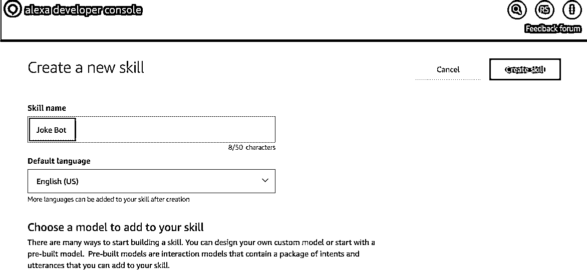](https://files.realpython.com/media/rsz_ss14d396ae0c62c.f577b34c2dab.png)

这将是你技能的**调用短语**。这是一个用户开始使用你的 Alexa 技能时会说的短语。如果你愿意，以后你可以把这个换成别的。此外，请注意，Alexa 技能可以用多种语言进行交互，这可以从*默认语言*下拉菜单中看到。现在，只需将其设置为*英语(美国)*。

接下来，你需要选择一个模型来增加你的技能。这些**模型**就像是亚马逊团队根据一些常见用例预先设计的模板，帮助你开始 Alexa Python 开发。对于本教程，您应该选择*定制*型号。

最后，你需要选择一种方法来托管你的 Alexa 技能的后端。该服务将包含您的应用程序的业务逻辑。

**注意:**如果你选择*提供你自己的*选项，那么你将不得不为你的 Alexa Python 项目托管你自己的后端。这可以是一个在你选择的平台上构建和托管的 [API](https://realpython.com/api-integration-in-python/) 。另一个选择是创建一个单独的 AWS Lambda 函数，并将其与您的 Alexa 技能相联系。你可以在他们的[定价页面](https://aws.amazon.com/lambda/pricing/)上了解更多关于 AWS Lambda 定价的信息。

现在，选择 *Alexa 托管(Python)* 作为你的 Alexa 技能的后台。这将自动在 AWS 免费层中为您提供一个托管的后端，因此您不必预先支付任何费用或立即设置一个复杂的后端。

最后，点击*创造技能*按钮继续。你可能会被要求在这里填写验证码，所以也要填写完整。大约一分钟后，您应该会被重定向到开发人员控制台的*构建*部分。

## 了解 Alexa 技能模型

一旦你登录到 Alexa 开发者控制台并选择或创建了一个技能，你会看到*构建*部分。此部分为您提供了许多选项和控件来设置技能的**交互模型**。这个交互模型的组件允许您定义用户将如何与您的技能进行交互。这些属性可以通过左侧面板访问，如下所示:

[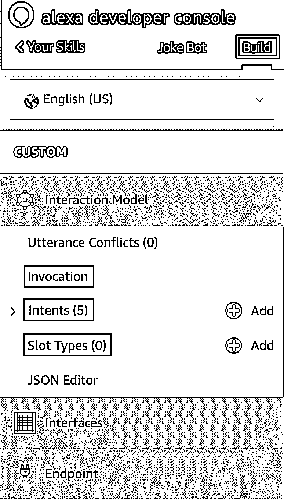](https://files.realpython.com/media/components.442664358f41.442664358f41.png)

作为一名 Alexa Python 开发者，你需要了解一些 Alexa 技能交互模型的组件。首先是**调用**。这是用户开始与你的 Alexa 技能互动时会说的话。例如，用户会说，“笑话机器人”，以调用您将在本教程中建立的 Alexa 技能。您可以在任何时候从*调用*部分对此进行更改。

另一个组件是 **intent** ，它代表了应用程序的核心功能。你的应用程序将有一套意图，代表你的技能可以执行什么样的动作。为了提供给定意图的上下文信息，您将使用一个**槽，**，它是话语短语中的一个变量。

考虑下面的例子。调用天气意图的示例话语可以是，“告诉我天气情况。”为了使该技能更有用，您可以将意图设置为“告诉我芝加哥的天气”，其中单词“芝加哥”将作为槽变量传递，这改善了用户体验。

最后，还有**插槽类型，**定义了如何处理和识别插槽中的数据。例如，*亚马逊。DATE* slot type 可以轻松地将表示日期的单词(如“今天”、“明天”等)转换为标准日期格式(如“2019-07-05”)。可以查看官方槽型[参考页](https://developer.amazon.com/docs/custom-skills/slot-type-reference.html)了解更多。

**注意:**要了解更多关于 Alexa 技能交互模型的信息，请查看[官方文档](https://developer.amazon.com/docs/alexa-voice-service/interaction-model.html)。

此时，*意图*面板应该是打开的。如果不是，那么你可以从左边的工具条中选择*意图*来打开它。您会注意到默认情况下已经设置了五个意图:

[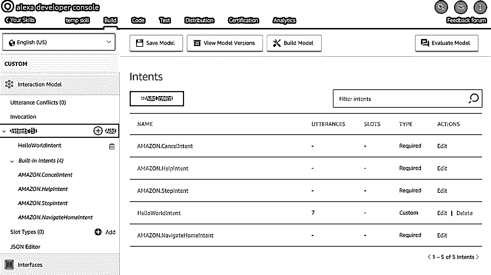](https://files.realpython.com/media/rsz_ss26aa1e156bb49.7c6d5647d31a.png)

*意向*面板包括一个*hello world ent*和五个*内置意向*。内置的意图是提醒你考虑一些对制作用户友好的机器人很重要的常见情况。这里有一个简单的概述:

1.  **亚马逊。cancel ent**让用户取消一个事务或任务。例子包括，“没关系”，“忘记它”，“退出”和“取消”，尽管还有其他的。
2.  **亚马逊。HelpIntent** 提供如何使用技能的帮助。这可以用来返回一句话，作为用户如何与你的技能互动的手册。
3.  **亚马逊。停止意图**允许用户退出技能。
4.  **亚马逊。NavigateHomeIntent** 将用户导航到设备主屏幕(如果正在使用屏幕)并结束技能课程。

默认情况下，没有指定的示例话语来触发这些意图，所以您也必须添加它们。把它当作你作为 Alexa Python 开发者培训的一部分。您可以在官方文档中了解更多关于这些内置意图的信息。

[*Remove ads*](/account/join/)

## 查看样本意图

在本教程的后面，你将学习如何建立一个新的意图，但是现在，看一看你创造的每个新技能中的一些现有的意图是一个好主意。首先，单击*hello world ent*查看其属性:

[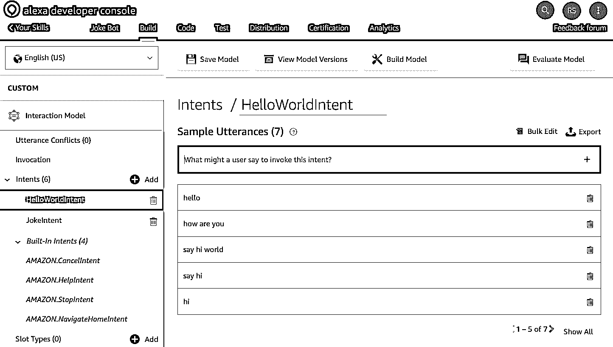](https://files.realpython.com/media/Screen_Shot_2019-12-03_at_5.45.16_PM.8f3ef9cdb9e4.png)

您可以看到用户为了实现这一意图而说出的示例话语。当这个意图被调用时，这个信息被发送到你的 Alexa 技能的后端服务，然后它将执行所需的业务逻辑并返回一个响应。

在此之下，您可以选择设置*对话框委托策略*，这允许您委托您定义的特定**对话框**来实现特定目的。虽然你不会在本教程中涉及这一点，但你可以在[官方文档](https://developer.amazon.com/docs/custom-skills/delegate-dialog-to-alexa.html)中了解更多。

接下来，您可以选择为您打算收集的一些特定数据定义**槽**。例如，如果您要创建一个告知给定日期天气的意图，那么您将在这里有一个*日期*槽，它将收集日期信息并将其发送到您的后端服务。

**注意:**此外，当您在一个单独的意图中从用户那里收集大量不同的数据点，并且您想在发送给用户进行进一步处理之前提示用户时，*意图确认*选项会很有用。

每当您对意图进行更改时，您需要点击*保存模型*按钮来保存它。然后，你可以点击*建立模型*按钮继续测试你的 Alexa Python 技能。

知道一项技能的交互模型可以完全用一种 [JSON](https://realpython.com/python-json/) 格式来表示是很有帮助的。要查看你的 Alexa 技能的当前结构，点击控制台左侧面板的 *JSON 编辑器*选项:

[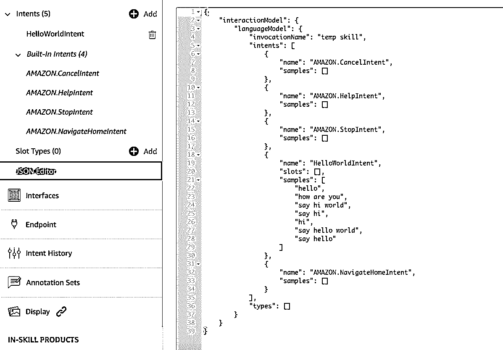](https://files.realpython.com/media/rsz_ss3dde2441e6146.a5821b82c1e4.png)

如果您直接使用 JSON 编辑器进行更改，那么这些更改也会反映在开发人员控制台 UI 中。为了测试这种行为，添加一个新的意图并点击*保存模型*。

一旦你对技能的交互模型做了所有必要的修改，你就可以打开开发者控制台的*测试*部分来测试你的技能。[测试](https://realpython.com/tutorials/testing/)是成为 Alexa Python 开发者的重要一环，所以一定不要跳过这一步！单击开发人员控制台顶部导航栏中的*测试*按钮。默认情况下，测试将被禁用。从下拉菜单中选择*开发*开始测试:

[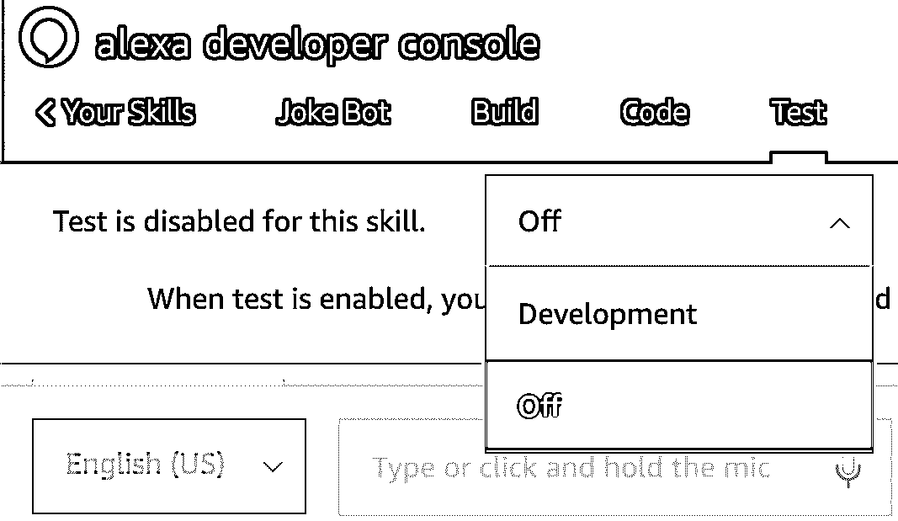](https://files.realpython.com/media/test.c65ec189bf61.png)

在这里，你有很多方法可以测试你的 Alexa Python 技能。让我们做一个快速测试，这样你就可以了解你的 Alexa 技能将如何对话语做出反应。

从左侧面板选择 *Alexa 模拟器*选项，然后输入短语，“嘿 Alexa，打开笑话机器人。”你可以通过在输入框中输入或者使用*麦克风*选项来完成。几秒钟后，会有一个响应返回给您:

[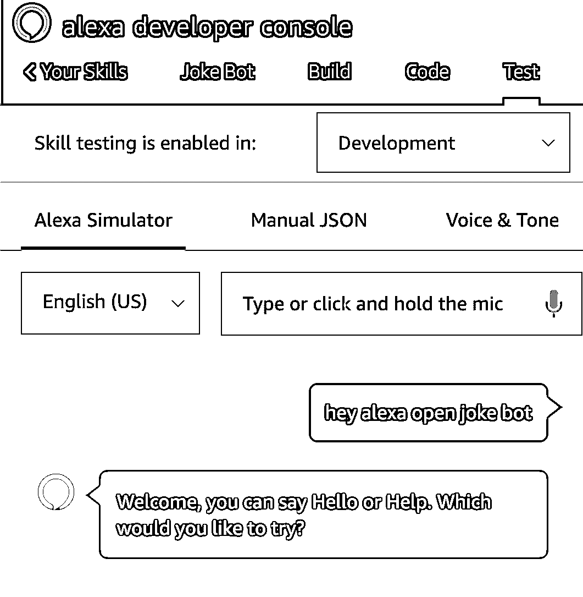](https://files.realpython.com/media/test1.41e2a0b676ce.png)

除了语音响应，你还可以看到发送到你的 Alexa 技能后端服务的 *JSON 输入*，以及接收回控制台的 *JSON 输出*:

[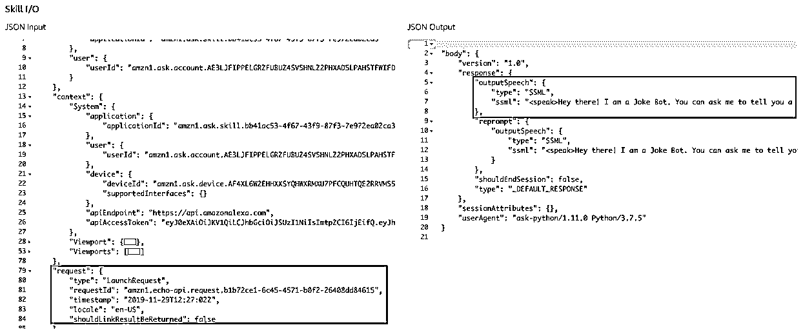](https://files.realpython.com/media/rsz_ss4aaaa59ee1211.05a43bc88bb8.png)

以下是目前发生的情况:

*   **JSON 输入对象**由用户通过语音或文本输入的输入数据构建而成。
*   Alexa 模拟器将输入和其他相关元数据打包，并发送到后端服务。你可以在 *JSON 输入框*中看到这一点。
*   **后端服务**接收输入的 JSON 对象，并对其进行解析以检查请求的类型。然后，它将 JSON 传递给相关的意图处理函数。
*   **意图处理器函数**处理输入并收集所需的响应，该响应作为 JSON 响应发送回 Alexa 模拟器。您可以在 *JSON 输出*框中看到这一点。
*   **Alexa 模拟器**解析这个 JSON，把语音响应读回给你。

**注:**你可以在[官方文档](https://developer.amazon.com/docs/custom-skills/request-and-response-json-reference.html)中阅读关于 Alexa 技能的 JSON 请求-响应机制。

现在你已经对 Alexa 技能的不同组成部分以及信息如何从一个部分流向另一个部分有了一个概述，是时候开始构建你的笑话机器人了！在下一节中，您将通过创建一个新的意图来测试您的 Alexa Python 开发人员技能。

[*Remove ads*](/account/join/)

## 创造新的意向

让我们从创建 *JokeIntent* 开始，它将从列表中向用户返回一个随机的笑话。打开你的 Alexa 开发者控制台的*构建*部分。然后，点击左侧面板中*意图*选项旁边的*添加*按钮:

[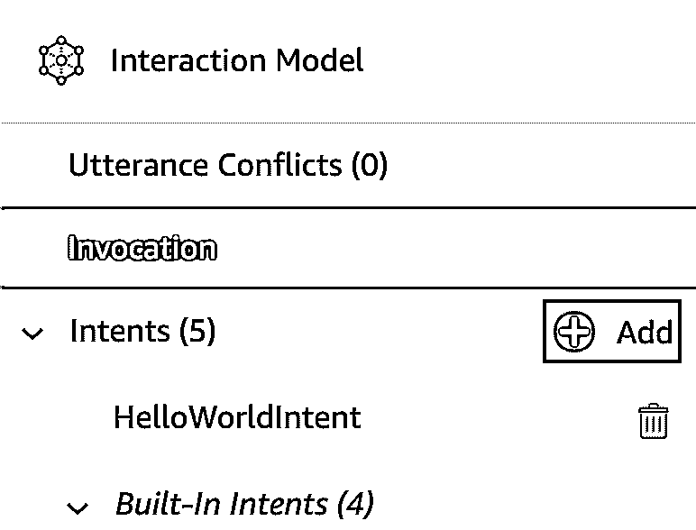](https://files.realpython.com/media/add_intent.83b98dc3d444.png)

选择*创建自定义意图*选项，将名称设置为 *JokeIntent* ，然后点击*创建自定义意图*按钮:

[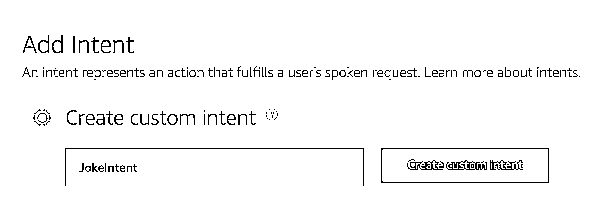](https://files.realpython.com/media/create_intent_1.3a639ddecc35.png)

接下来，您需要添加**示例话语**，用户将说出这些话语来调用这个意图。这些短语可以是“给我讲个笑话”或“我想听个笑话”键入一个短语并单击加号(`+`)将其添加为示例话语。这应该是这样的:

[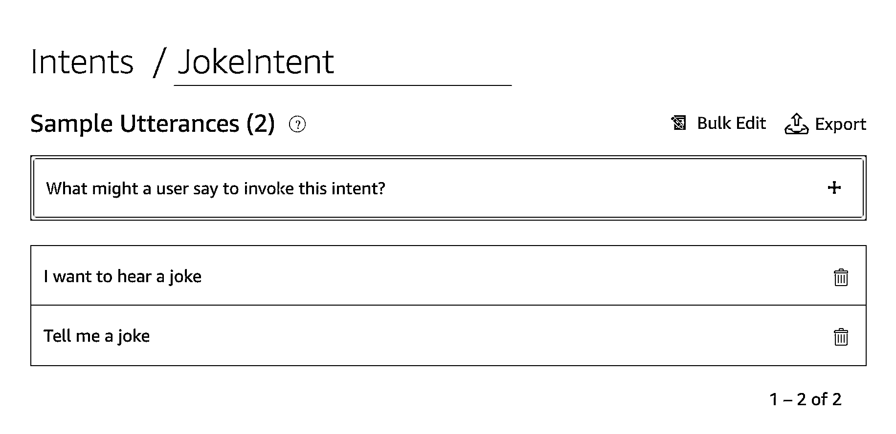](https://files.realpython.com/media/added_sample_utterances.68d9b9902807.png)

您可以添加更多的示例话语，但是现在，这些已经足够了。最后，点击窗口左上角的*保存模型*按钮保存这些更改。

请记住，在测试之前，您需要**构建您的模型**。点击*构建模型*按钮，重新构建你的 Alexa Python 技能的交互模型。您会在浏览器窗口的右下角看到一个进度通知。一旦构建过程成功，您应该会看到另一个弹出通知，指示构建过程的状态。

您可以查看 *JokeIntent* 是否被成功触发。点击开发者控制台右上角的*评估模型*按钮。一个小窗口将从侧面弹出，允许你检查给定的输入话语将触发什么意图。键入任何示例话语，以确保成功调用了 *JokeIntent* 。

[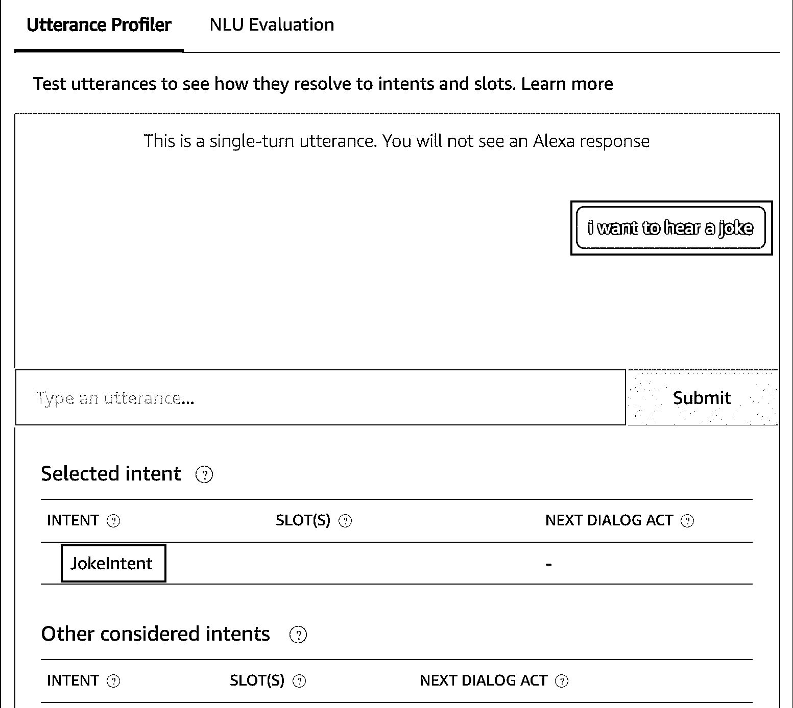](https://files.realpython.com/media/gg_.2c0f35cf46a8.png)

要摆脱评估弹出窗口，再次点击*评估模型*按钮。

**注意:**这里要记住的一件关键事情是，就作为示例话语短语一部分的关键字而言，该模型非常灵活。例如，以这句话为例，“这是某种玩笑吗？”甚至这个短语也会触发*的玩笑。作为一名 Alexa Python 开发者，选择在你的技能中执行其他意图的概率较低的话语是很重要的。*

既然您已经成功地创建了一个意图，那么是时候编写 Python 代码来处理这个意图并返回一个笑话作为响应了。

## 构建技能后台

现在您已经创建了一个可以被用户触发的意图，您需要在技能后端添加**功能**来处理这个意图并返回有用的信息。打开 Alexa 开发者控制台的*代码*部分开始。

**注意:**由于你在设置过程中选择了 Alexa 托管的 Python 选项，你可以在开发者控制台中编写、测试、构建和部署你的 Alexa 技能的后端。

当您打开开发人员控制台的*代码*部分时，您可以看到一个在线代码编辑器，其中已经为您设置了一些文件。特别是，您将在 *lambda* 子目录中看到以下三个文件:

1.  **lambda_function.py:** 这是后端服务的主入口。来自 Alexa intent 的所有请求数据都在这里接收，并且应该只从这个文件返回。
2.  **requirements.txt:** 这个文件包含了这个项目中使用的 Python 包的列表。如果你选择建立自己的后端服务，而不是使用亚马逊提供的服务，这就特别有用。要了解更多关于需求文件的信息，请使用需求文件查看[。](https://realpython.com/what-is-pip/#using-requirement-files)
3.  **utils.py:** 这个文件包含一些 lambda 函数与[亚马逊 S3](https://realpython.com/courses/python-boto3-aws-s3/) 服务交互所需的实用函数。它包含了一些关于如何从 Amazon S3 存储桶中获取数据的示例代码，您可能会发现这在以后会很有用。目前，这个文件没有在`lambda_function.py`中使用。

现在，您将只对`lambda_function.py`进行修改，所以让我们仔细看看文件的结构:

```py
 7import logging
 8import ask_sdk_core.utils as ask_utils
 9
10from ask_sdk_core.skill_builder import SkillBuilder
11from ask_sdk_core.dispatch_components import AbstractRequestHandler
12from ask_sdk_core.dispatch_components import AbstractExceptionHandler
13from ask_sdk_core.handler_input import HandlerInput
14
15from ask_sdk_model import Response
16
17logger = logging.getLogger(__name__)
18logger.setLevel(logging.INFO)
19
20
21class LaunchRequestHandler(AbstractRequestHandler):
22    """Handler for Skill Launch."""
23    def can_handle(self, handler_input):
24        # type: (HandlerInput) -> bool
25
26        return ask_utils.is_request_type("LaunchRequest")(handler_input)
27
28    def handle(self, handler_input):
29        # type: (HandlerInput) -> Response
30        speak_output = "Welcome, you can say Hello or Help. " \
31                       "Which would you like to try?"
32
33        return (
34            handler_input.response_builder
35                .speak(speak_output)
36                .ask(speak_output)
37                .response
38        )
39...
```

首先，导入必要的工具，这些工具在`ask_sdk_core` Alexa Python 包中提供。然后，您需要在`lambda_function.py`中执行三个主要任务来处理来自 Alexa 技能前端的请求:

1.  **创建一个意向处理程序类**，它继承自`AbstractRequestHandler`类，具有函数`can_handle()`和`handle()`。在`lambda_function.py`中已经定义了几个处理程序类，比如`LaunchRequestHandler`、`HelpIntentHandler`等等。这些处理 Alexa 技能的基本意图。这里需要注意的重要一点是，您需要为您定义的每个意图创建一个新的意图处理程序类。
2.  **创建一个`SkillBuilder`对象，**，作为你的 Alexa Python 技能的切入点。这会将所有传入的请求和响应有效负载路由到您定义的意图处理程序。
3.  **将意图处理程序类**作为参数传递给`.add_request_handler()`，以便每当接收到新请求时，它们被按顺序调用。`SkillBuilder`是一个[单例](https://www.tutorialspoint.com/python_design_patterns/python_design_patterns_singleton.htm)，所以只需要它的一个实例来处理所有传入请求的路由。

这是你经历`lambda_function.py`的好时机。你会注意到，相同的模式被一遍又一遍地遵循，以处理可能由你的 Alexa Python 技能触发的不同意图。

现在，您已经大致了解了在后端处理一个意图需要做的各种事情，是时候编写代码来处理您在上一节中构建的 *JokeIntent* 了。

[*Remove ads*](/account/join/)

## 创建 JokeIntent 处理程序

因为来自`ask_sdk_core` Alexa Python 包的重要实用程序已经被导入，你不需要再次导入它们。如果你想更深入地了解这些，那么你可以查看一下[官方文档](https://alexa-skills-kit-python-sdk.readthedocs.io/en/latest/api/core.html)。

接下来，您将创建一个新的**意图处理器**，它将处理来自 *JokeIntent* 的请求。在下面的代码片段中，意图处理程序将简单地返回一个示例短语。这表明对 *JokeIntent* 的响应是从后端接收的。将以下代码添加到`LaunchRequestHandler()`的类定义上方的`lambda_function.py`:

```py
20class JokeIntentHandler(AbstractRequestHandler):
21    def can_handle(self, handler_input):
22        return ask_utils.is_intent_name("JokeIntent")(handler_input)
23
24    def handle(self, handler_input):
25        speak_output = "Here's a sample joke for you."
26
27        return (
28            handler_input.response_builder
29                .speak(speak_output)
30                .ask(speak_output)
31                .response
32        )
```

让我们看看每个部分都做了什么。在**第 20 行**中，你为 *JokeIntent* 创建了一个新的 intent handler 类，它是`AbstractRequestHandler`类的子类。当你在前端创建一个意图时，你需要在后端创建一个意图处理器类来处理来自 Alexa 的请求。您为此编写的代码需要做两件事:

1.  **`JokeIntentHandler.can_handle()`** 识别 Alexa 发送的每个传入请求。
2.  **`JokeIntentHandler.handle()`** 返回一个适当的响应。

在**第 21 行**你定义 **`.can_handle()`** 。它接受`handler_input`作为参数，这是一个包含所有输入请求信息的`dict()`类型的对象。然后，它使用`ask_utils.is_intent_name()`或`ask_utils.is_request_type()`来检查它接收到的 JSON 输入是否可以被这个意图处理函数处理。

您使用`.is_intent_name()`并传入意图的名称。这返回一个**谓词**，它是一个函数对象，如果给定的`handler_input`来源于指定的意图，则返回`True`。如果这是真的，那么`SkillBuilder`对象将调用`JokeIntentHandler.handle()`。

**注意:**如果 *JokeIntent* 是从 Alexa skill 前端触发的，那么它将发送一个 JSON 对象，在`request`的主体中包含一个键`type`，表示名为`JokeIntent`的意图作为输入被接收。

这条语句随后调用 **`.handle()`** ，你在**行 24** 中定义。该方法接收输入请求以及可能需要的任何其他重要信息。它包含成功处理特定意图所需的业务逻辑。在 *JokeIntent* 的情况下，这个方法需要将包含笑话的响应发送回 Alexa 前端。

`speak_ouput`变量包含将由 Alexa 技能前端向用户反馈的句子。`speak(speak_output)`表示 Alexa 前端将向用户播放的语音内容。`ask("Question to ask...")`可用来问后续问题。在这个方法中，类`response_builder`的一个对象将响应返回给 Alexa 技能。

**注意:**如果`.handle()`不存在，将返回默认响应消息(`Sorry, I had trouble doing what you asked. Please try again.`)。

请注意，`speak_output`的值现在被设置为固定响应。稍后您将更改它，从笑话列表中返回一个随机笑话。

下面是您的代码在编辑器中的样子:

[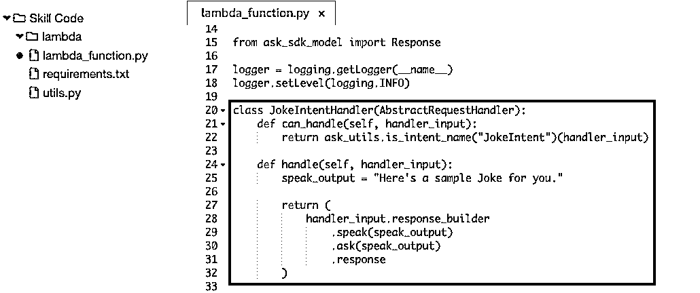](https://files.realpython.com/media/Screen_Shot_2020-01-23_at_7.15.37_PM.3245e6a68894.png)

一旦创建了意图处理程序类，就需要将其作为参数传递给`SkillBuilder.add_request_handler`。滚动到`lambda_function.py`的底部，添加以下一行:

```py
sb.add_request_handler(JokeIntentHandler())
```

这里需要注意的一点是，这一行的位置很重要，因为代码是从上到下处理的。因此，确保对自定义意图处理程序的调用在对`InstantReflectHandler()`类的调用之上。它应该是这样的:

```py
171sb = SkillBuilder()
172
173sb.add_request_handler(LaunchRequestHandler())
174sb.add_request_handler(JokeIntentHandler()) 175sb.add_request_handler(HelloWorldIntentHandler())
176sb.add_request_handler(HelpIntentHandler())
177sb.add_request_handler(CancelOrStopIntentHandler())
178sb.add_request_handler(SessionEndedRequestHandler())
179
180# Make sure IntentReflectorHandler is last so it
181# Doesn't override your custom intent handlers
182sb.add_request_handler(IntentReflectorHandler())
183
184sb.add_exception_handler(CatchAllExceptionHandler())
185
186...
```

好了，是时候测试你的代码了！单击 *Deploy* 按钮保存更改并部署后端服务。你将从 Alexa 技能前端检查它是否会像预期的那样工作。

一旦部署过程成功，返回到开发人员控制台的*测试*部分并调用 *JokeIntent* 。请记住，输入话语短语来调用您的 Alexa Python 技能，然后输入短语来执行意图:

[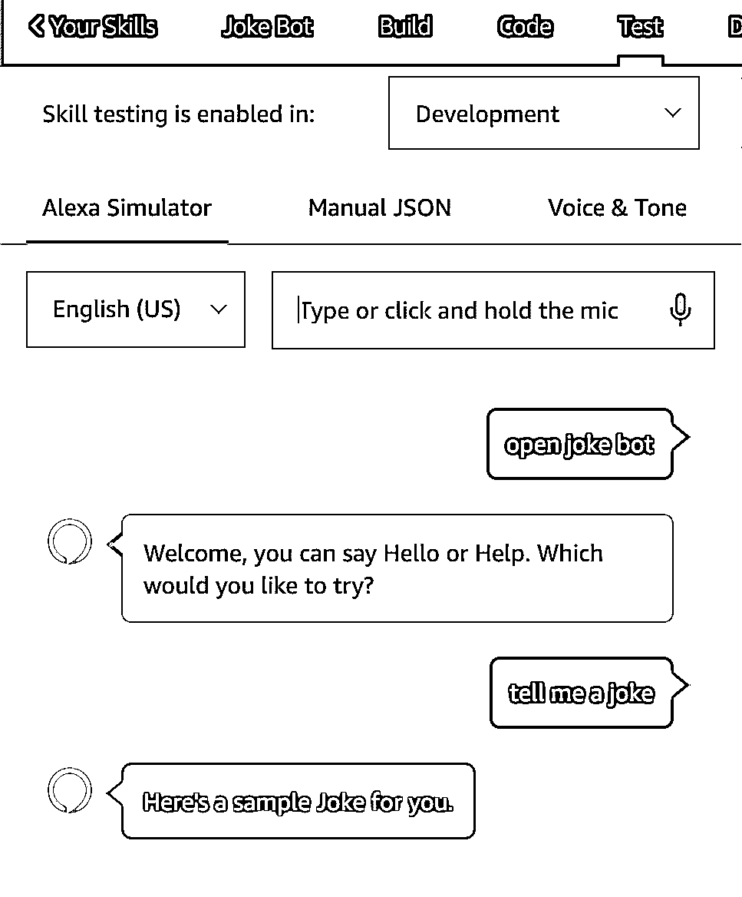](https://files.realpython.com/media/test3.10a420d82586.png)

如果您得到类似于上图中的响应，那么这意味着您已经成功地为技能后端服务中的 *JokeIntent* 创建了一个意图处理程序。恭喜你！现在，剩下要做的就是将列表中的一个随机笑话返回给技能前端。

[*Remove ads*](/account/join/)

## 添加笑话

打开开发者控制台的*代码*部分。然后，在`lambda_function.py`中添加`jokes`变量:

```py
15from ask_sdk_model import Response
16
17logger = logging.getLogger(__name__)
18logger.setLevel(logging.INFO)
19
20jokes = [ 21        "Did you hear about the semi-colon that broke the law? He was given two consecutive sentences.", 22        "I ate a clock yesterday, it was very time-consuming.", 23        "I've just written a song about tortillas; actually, it's more of a rap.", 24        "I woke up this morning and forgot which side the sun rises from, then it dawned on me.", 25        "I recently decided to sell my vacuum cleaner as all it was doing was gathering dust.", 26        "If you shouldn't eat at night, why do they put a light in the fridge?", 27        ] 28
29class JokeIntentHandler(AbstractRequestHandler):
30...
```

这里，`jokes`是一个类型为`list`的变量，包含一些一行笑话。确保将其添加到函数或类定义之外，以便它具有**全局范围**。

**注意:**因为这个列表只会被`JokeIntentHandler()`类引用，所以你是否在函数体中声明它并不重要。然而，这样做确实有助于功能体摆脱混乱。

接下来，您将添加`.handle()`从笑话列表中随机选择一个笑话并将其返回给用户所需的功能。用以下代码修改`JokeIntentHandler.handle()`的主体:

```py
29class JokeIntentHandler(AbstractRequestHandler):
30    def can_handle(self, handler_input):
31        return ask_utils.is_intent_name("JokeIntent")(handler_input)
32
33    def handle(self, handler_input):
34        speak_output = random.choice(jokes)
35 36        return (
37            handler_input.response_builder
38                .speak(speak_output)
39                .ask(speak_output)
40                .response
41        )
```

在`.handle()`的正文中，你使用`random.choice()`从列表`jokes`中选择一个随机笑话，并将其作为对 Alexa 技能前端的响应返回。

最后，通过在`lambda_function.py`的顶部添加一个 import 语句来导入`random`包:

```py
15from ask_sdk_model import Response
16
17import random 18
19logger = logging.getLogger(__name__)
20logger.setLevel(logging.INFO)
21
22...
```

编辑应该这样看待这一点:

[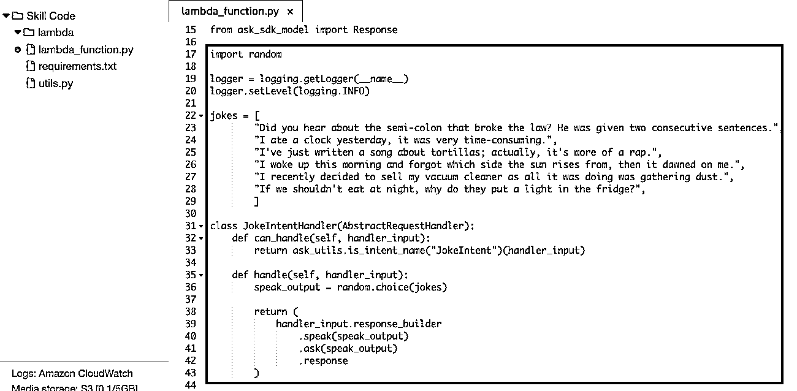](https://files.realpython.com/media/Screen_Shot_2020-01-23_at_7.26.33_PM.fcd241e73deb.png)

测试前还有最后一个改动。你需要允许 Alexa 给出一个**确认**技能已经被触发。为此，在`LaunchRequestHandler.handle()`中查找`speak_output`变量，并将其值设置为下面突出显示行中的文本:

```py
45class LaunchRequestHandler(AbstractRequestHandler):
46    """Handler for Skill Launch."""
47    def can_handle(self, handler_input):
48        # type: (HandlerInput) -> bool
49
50        return ask_utils.is_request_type("LaunchRequest")(handler_input)
51
52    def handle(self, handler_input):
53        # type: (HandlerInput) -> Response
54        speak_output = "Hey there! I am a Joke Bot. You can ask me to tell you a random Joke that might just make your day better!" 55
56        return (
57            handler_input.response_builder
58                .speak(speak_output)
59                .ask(speak_output)
60                .response
61        )
62...
```

你的笑话机器人已经准备好进行最终测试了！单击 *Deploy* 按钮保存更改并返回到开发人员控制台的*测试*部分。这一次，当你的技能第一次被调用时，你会看到一个新的问候信息。然后，当你让机器人给你讲一个笑话时，它应该每次给你讲一个不同的笑话:

[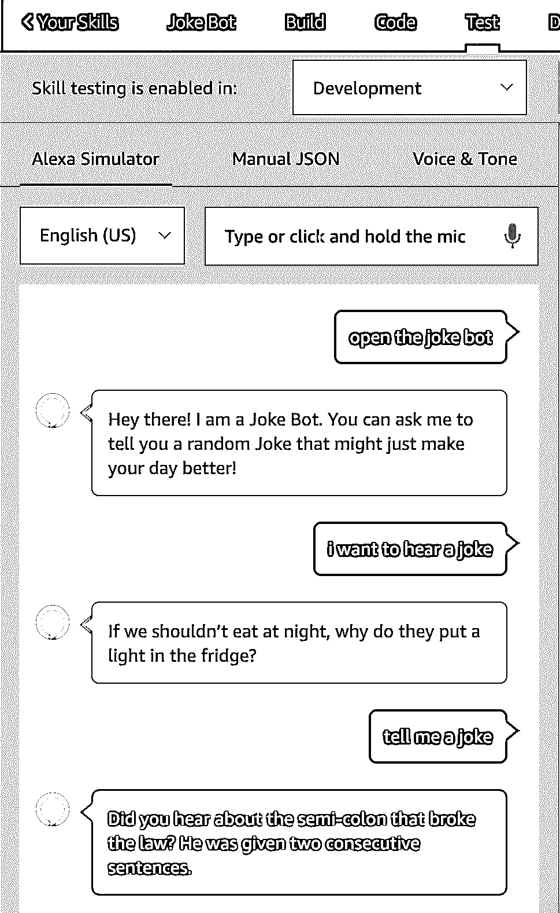](https://files.realpython.com/media/code5.0160230a975a.png)

就是这样！你已经成功创建了你作为 Alexa Python 开发者的第一个技能！

## 结论

祝贺你迈出了 Alexa Python 开发的第一步！你现在已经成功地建立了你自己的 Alexa Python 技能。您现在知道了如何创建新技能、创建意图、编写 Python 代码来处理这些意图，并将有价值的信息返回给用户。

**尝试以下方法来提升你的技能:**

*   **增加**后台笑话列表。
*   **创建**一个名为*琐事*的新意图，它将用一个有趣的琐事事实来回应。
*   **向亚马逊市场发布**你的技能。

可能性是无穷无尽的，所以勇往直前吧！要了解更多关于 Alexa Python 开发的信息，请查看官方文档。您还可以探索[聊天机器人](https://realpython.com/build-a-chatbot-python-chatterbot/)、 [Tweepy](https://realpython.com/twitter-bot-python-tweepy/) 、 [InstaPy](https://realpython.com/instagram-bot-python-instapy/) 和 [Discord](https://realpython.com/how-to-make-a-discord-bot-python/) 的可能性，以了解如何使用 Python 为不同平台制作机器人。*****