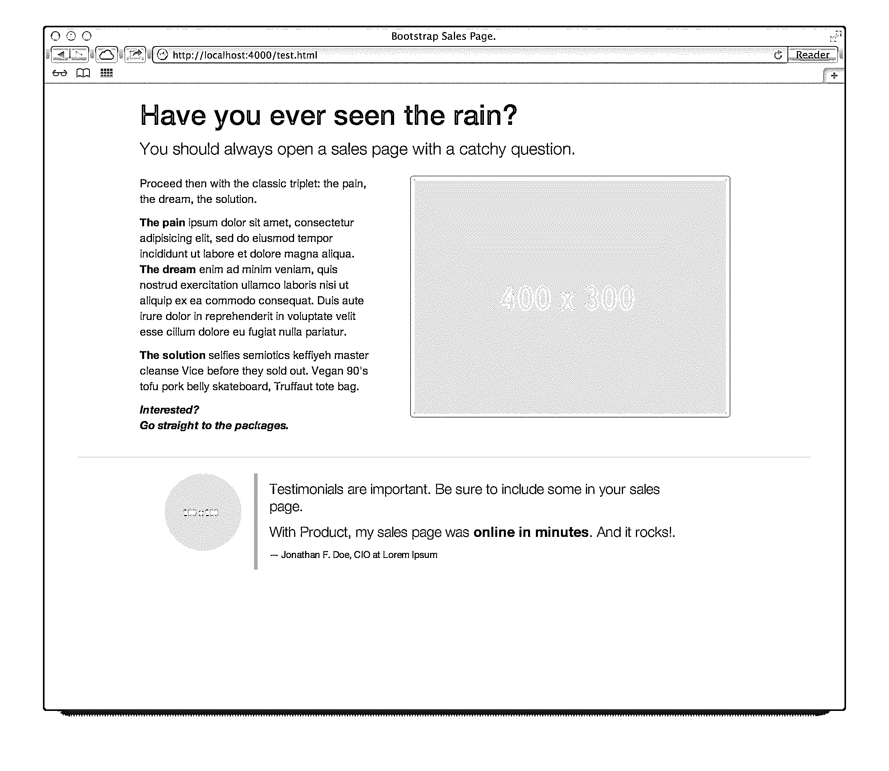
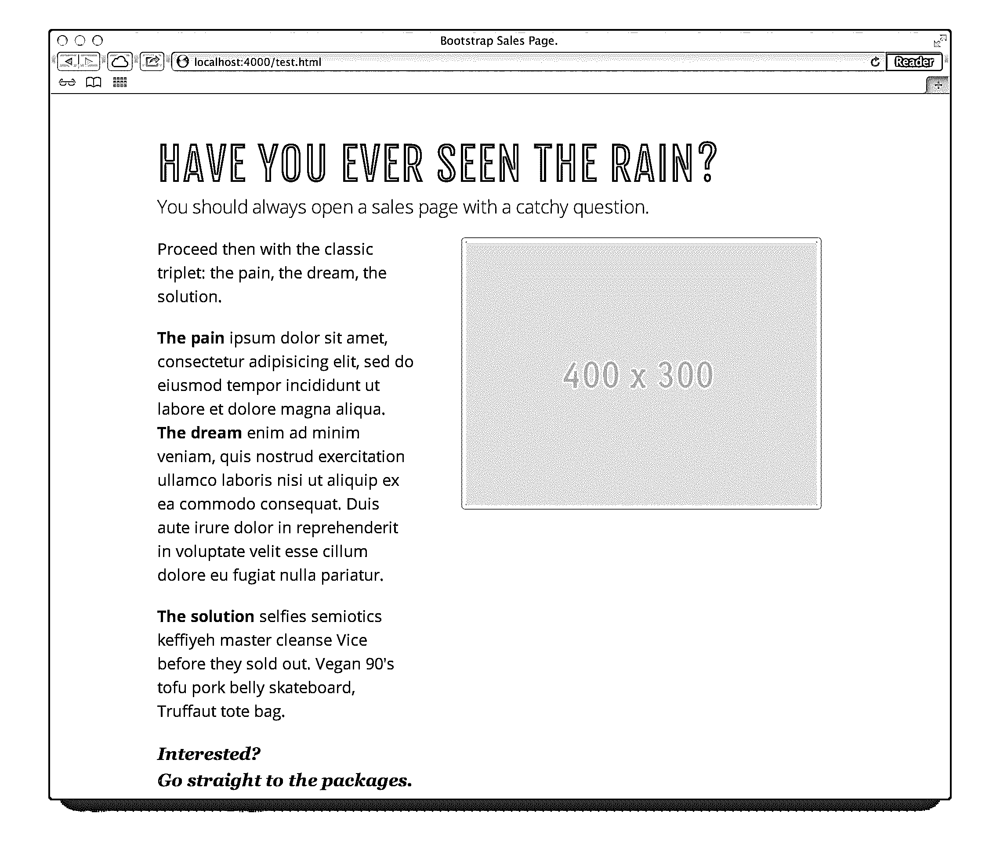
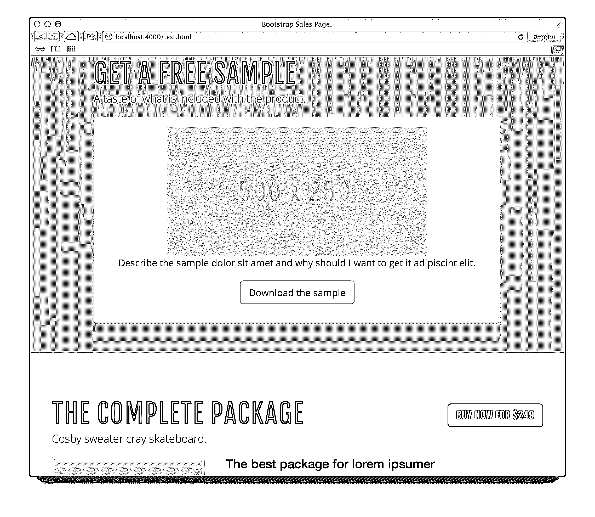
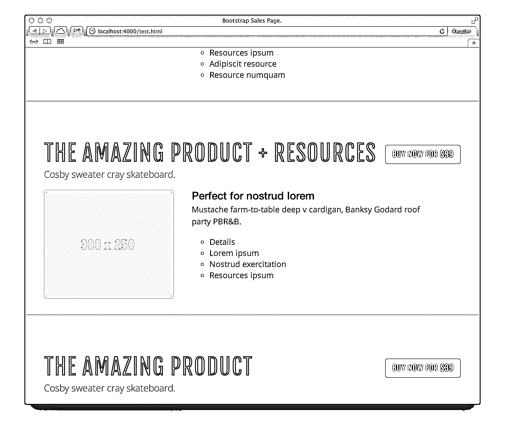

# 使用 Bootstrap 3 的有效销售页面

> 原文：<https://realpython.com/an-effective-sales-page-with-bootstrap-3/>

最初关于 Bootstrap 的两部分系列已经变成了三部分，增加了 William Ghelfi 的博客文章。你可以从这个[回购](https://github.com/mjhea0/bootstrap3)中抓取最终的样式/页面。

> 在第一篇[帖子](https://realpython.com/getting-started-with-bootstrap-3/)中，我们看了一下 Bootstrap 3 的基础知识以及如何设计一个基本的网站。让我们更进一步，创建一个漂亮的销售登陆[页面](https://realpython.com/files/bootstrap3/part2/index.html)。

关于 Bootstrap 最常见的一个误区是，你实际上不能用它来做任何如此不同和高度专业化的事情，比如销售页面。

事实就是如此。一个神话。

让我们一起用最好的方式揭穿它:建造它。

## 高度专业化的页面是高度专业化的

成功的销售页面遵循精确的规则。我不认识他们所有人，我也不会告诉你我所知道的每一个人。

相反，我会试着把它们减少到你可以开始试验的小而有效的药片。

[*Remove ads*](/account/join/)

## 注意力吸引和第一步

抓住你注意力的最好方法是什么？

一个加粗的大问题，后面跟着一个像样的副标题。

然后，继续简要介绍您将从客户的 a 中消除的**难题**..从你客户的生活(！)感谢你的产品。

使用 Bootstrap，我们可以像这样构建它:

```py
<!DOCTYPE html>
<head>
  <meta charset="utf-8" />
  <title>Bootstrap Sales Page.</title>
  <meta name="author" content="" />
  <meta name="description" content="" />
  <meta name="viewport" content="width=device-width, initial-scale=1.0" />
  <link href="http://netdna.bootstrapcdn.com/bootstrap/3.0.0/css/bootstrap.min.css" rel="stylesheet" />
</head>
<body>

  <header class="container">
    <div class="row">
      <div class="col-md-10 col-md-offset-1">
        <h1>Have you ever seen the rain?</h1>
        <p class="lead">You should always open a sales page with a catchy question.</p>
      </div>
    </div>
  </header>

  <div class="container">
    <div class="row">

    <div class="col-xs-12 col-md-4 col-md-offset-1">
      <p>
        Proceed then with the classic triplet: the pain, the dream, the solution.
      </p>
      <p>
        <strong>The pain</strong> ipsum dolor sit amet, consectetur adipisicing elit, sed do eiusmod tempor incididunt ut labore et dolore magna aliqua.<br /><strong>The dream</strong> enim ad minim veniam, quis nostrud exercitation ullamco laboris nisi ut aliquip ex ea commodoconsequat. Duis aute irure dolor in reprehenderit in voluptate velit essecillum dolore eu fugiat nulla pariatur.
      </p>
      <p>
        <strong>The solution</strong> selfies semiotics keffiyeh master cleanse Vice before they sold out. Vegan 90's tofu pork belly skateboard, Truffaut tote bag.
      </p>
      <p>
        <em><strong>Interested?<br />
        <a href="#packages">Go straight to the packages.</a></strong></em>
      </p>
    </div>

      <div class="col-xs-12 col-md-6">
        <figure class="text-center">
          
        </figure>
      </div>

  </div>

  <hr />

  <div class="row">
  <figure class="col-md-2 col-md-offset-1">
      
  </figure>
  <blockquote class="col-md-7">
      <p>
          Testimonials are important. Be sure to include some in your sales page.
      </p>
      <p>
          With Product, my sales page was <strong>online in minutes</strong>. And it rocks!.
      </p>
      <small>Jonathan F. Doe, CIO at Lorem Ipsum</small>
  </blockquote>
  </div>

</div>

</body>
</html>
```

[](https://files.realpython.com/media/sales-page-bootstrap3-sshot-1.f30aa9a3f76c.png)

不错，但是让我们添加一些定制:

```py
<style> @import  url(http://fonts.googleapis.com/css?family=Open+Sans+Condensed:300,700|Open+Sans:400italic,700italic,400,700|Fjalla+One); body  { font-size:  18px; font-family:  "Open Sans",  Arial,  sans-serif; color:  #292b33; } h1,  h2  { font-family:  'Fjalla One',  'Helvetica Neue',  Arial,  sans-serif; font-size:  52px; font-weight:  400; text-transform:  uppercase; letter-spacing:  1px; text-align:  left; margin:  1em  0  0  0; } p  { line-height:  1.5; margin:  0  0  20px  0; } blockquote  { border-left:  none; position:  relative; } blockquote::before  { content:  '“'; position:  absolute; top:  0; left:  0; font-size:  48px; font-family:  "inherit"; font-weight:  bold; } blockquote  p  { margin:  0  0  10px  20px; font-style:  italic; font-family:  "Georgia"; } em  { font-family:  Georgia,  serif; font-size:  1.1em; } .lead  { margin-top:  0.25em; } </style>
```

[](https://files.realpython.com/media/sales-page-bootstrap3-sshot-2.7d0de93bc77a.png)

开始变好了！

## 全部在

现在是时候更好地介绍**你对痛苦**的解决方案了。

开始提供价值:产品的免费样品。然后列出三种不同的变型/包装，有不同的附加功能，并相应地定价。

**为什么是三个？**

我们只能说，在 39 美元的基本套餐和 249 美元的完整套餐之间，99 美元的中等套餐感觉既实惠又有价值。

决定顺序——从低到高，或从高到低——只是要知道你在追求什么。

如果你的目标是卖出更多的最低包装，让你的访问者在到达其他人之前到达那个包装。否则，反其道而行之。

关于这个话题的更多信息，请见 Nathan Barry 的一篇精彩的[帖子。](http://thinktraffic.net/most-common-pricing-mistake)

这是代码:

```py
 ...
    <style> ... .bg-white-dark  { border-top:  1px  solid  #cccbd6; border-bottom:  1px  solid  #cccbd6; background-color:  #e7e6f3;  /* Older Browsers */ background-color:  rgba(231,  230,  243,  0.9); } .container  { padding-top:  2em; padding-bottom:  2em; } ul  { list-style-type:  circle; } </style>
<div class="bg-white-dark" id="free-sample">
  <div class="container">
    <div class="row">

    <div class="col-md-10 col-md-offset-1">
      <h2>Get a free sample</h2>
      <p class="lead">A taste of what is included with the product.</p>
    </div>

    </div>
    <div class="row">

      <div class="col-md-10 col-md-offset-1">
        <div class="panel panel-default">
          <div class="panel-body text-center">
            
            <p>Describe the sample dolor sit amet and why should I want to get it adipiscint elit.</p>
            <p>
            <a href="#" class="btn btn-lg btn-default text-uppercase">
            <span class="icon icon-download-alt"></span>&#32;
            Download the sample
            </a>
            </p>
          </div>
        </div>
      </div>

      </div>
  </div>
</div>

<div class="container" id="packages">

  <div class="row">
    <div class="col-md-12">
      <h2>
        The Complete Package
        <span class="pull-right">
            <a class="btn btn-success btn-lg" href="#">
                <span class="text-uppercase"><span class="text-white-dark">Buy now for</span> $249</span>
            </a>
        </span>
      </h2>
      <p class="lead">
        Cosby sweater cray skateboard.
      </p>
    </div>
  </div>

  <div class="row">
    <div class="media">
      <figure class="pull-left col-xs-12 col-md-4">
          
      </figure>
      <div class="media-body col-xs-12 col-md-7">
        <h3 class="media-heading">The best package for lorem ipsumer</h3>
        <p>
            Mustache farm-to-table deep v cardigan, Banksy Godard roof party PBR&amp;B.
        </p>
        <ul>
            <li>Details</li>
            <li>Lorem ipsum</li>
            <li>Nostrud exercitation</li>
            <li>Resources ipsum</li>
            <li>Adipiscit resource</li>
            <li>Resource numquam</li>
            <li>Resources ipsum</li>
            <li>Adipiscit resource</li>
            <li>Resource numquam</li>
        </ul>
      </div>
    </div>
  </div>

</div>

<div class="bg-white-dark">
  <div class="container">

  <div class="row">
    <div class="col-md-12">
      <h2>
        The Amazing Product + Resources
        <span class="pull-right">
            <a class="btn btn-success btn-lg" href="#">
                <span class="text-uppercase"><span class="text-white-dark">Buy now for</span> $99</span>
            </a>
        </span>
      </h2>
        <p class="lead">
            Cosby sweater cray skateboard.
        </p>
    </div>
  </div>

      <div class="row">
        <div class="media">
          <figure class="pull-left col-xs-12 col-md-4">
              
          </figure>
          <div class="media-body col-xs-12 col-md-7">
              <h3 class="media-heading">Perfect for nostrud lorem</h3>
              <p>
                  Mustache farm-to-table deep v cardigan, Banksy Godard roof party PBR&amp;B.
              </p>
              <ul>
                  <li>Details</li>
                  <li>Lorem ipsum</li>
                  <li>Nostrud exercitation</li>
                  <li>Resources ipsum</li>
              </ul>
            </div>
        </div>
      </div>

  </div>
</div>

<div class="container">

  <div class="row">
      <div class="col-md-12">
        <h2>
            The Amazing Product
            <span class="pull-right">
                <a class="btn btn-success btn-lg" href="#">
                    <span class="text-uppercase"><span class="text-white-dark">Buy now for</span> $39</span>
                </a>
            </span>
        </h2>
        <p class="lead">
            Cosby sweater cray skateboard.
        </p>
      </div>
  </div>

  <div class="row">
    <div class="media">
      <figure class="pull-left col-xs-12 col-md-4">
          
      </figure>
      <div class="media-body col-xs-12 col-md-7">
        <h3 class="media-heading">The budget option</h3>
        <p>
            Mustache farm-to-table deep v cardigan, Banksy Godard roof party PBR&amp;B.
        </p>
        <p>
            Cliche sartorial roof party, shabby chic sustainable VHS food truck 90's four loko. Etsy hoodie     distillery, organic beard DIY cliche.
        </p>
      </div>
    </div>
  </div>

</div>
```

[](https://files.realpython.com/media/sales-page-bootstrap3-sshot-3.ca8e604a3127.png)[*Remove ads*](/account/join/)

## 造型更多

我们差不多完成了，但是即使我们用`.bg-white-dark`添加了颜色变化——顺便说一下，它实际上是淡紫色的，因为使用像`.bg-white-dark`这样的名字，你可以切换到你喜欢的颜色，而不必改变类名——整体的外观&感觉还可以进一步改进，并且它可以与基本的引导更加不同。

让我们添加更多的样式:

```py
...
<style> ... .text-white-dark  { color:  #e7e6f3; } .btn-default  { font-family:  "Fjalla One",  sans-serif; text-shadow:  0  -1px  0  rgba(0,  0,  0,  0.2); -webkit-box-shadow:  inset  0  1px  0  rgba(255,  255,  255,  0.15),  0  1px  1px  rgba(0,  0,  0,  0.075); box-shadow:  inset  0  1px  0  rgba(255,  255,  255,  0.15),  0  1px  1px  rgba(0,  0,  0,  0.075); } .btn-default:active, .btn-default.active  { -webkit-box-shadow:  inset  0  3px  5px  rgba(0,  0,  0,  0.125); box-shadow:  inset  0  3px  5px  rgba(0,  0,  0,  0.125); } .btn:active, .btn.active  { background-image:  none; } .btn-default  { text-shadow:  0  1px  0  #fff; background-image:  -webkit-gradient(linear,  left  0%,  left  100%,  from(#ffffff),  to(#e6e6e6)); background-image:  -webkit-linear-gradient(top,  #ffffff,  0%,  #e6e6e6,  100%); background-image:  -moz-linear-gradient(top,  #ffffff  0%,  #e6e6e6  100%); background-image:  linear-gradient(to  bottom,  #ffffff  0%,  #e6e6e6  100%); background-repeat:  repeat-x; border-color:  #e0e0e0; border-color:  #ccc; filter:  progid:DXImageTransform.Microsoft.gradient(startColorstr='#ffffffff',  endColorstr='#ffe6e6e6',  GradientType=0); } .btn-default:active, .btn-default.active  { background-color:  #e6e6e6; border-color:  #e0e0e0; } .btn-success  { font-family:  "Fjalla One",  sans-serif; } .btn-success  { background:  #9292c0;  /* Old browsers */ background:  -moz-linear-gradient(top,  #9292c0  0%,  #8181b7  100%);  /* FF3.6+ */ background:  -webkit-gradient(linear,  left  top,  left  bottom,  color-stop(0%,#9292c0),  color-stop(100%,#8181b7));  /* Chrome,Safari4+ */ background:  -webkit-linear-gradient(top,  #9292c0  0%,#8181b7  100%);  /* Chrome10+,Safari5.1+ */ background:  -o-linear-gradient(top,  #9292c0  0%,#8181b7  100%);  /* Opera 11.10+ */ background:  -ms-linear-gradient(top,  #9292c0  0%,#8181b7  100%);  /* IE10+ */ background:  linear-gradient(to  bottom,  #9292c0  0%,#8181b7  100%);  /* W3C */ filter:  progid:DXImageTransform.Microsoft.gradient(  startColorstr='#9292c0',  endColorstr='#8181b7',GradientType=0  );  /* IE6-9 */ border-color:  #f1ddff; } .btn-success:hover, .btn-success:focus, .btn-success:active, .btn-success.active  { color:  #fbfafc; background:  #a3a3d1;  /* Old browsers */ background:  -moz-linear-gradient(top,  #a3a3d1  0%,  #9292c8  100%);  /* FF3.6+ */ background:  -webkit-gradient(linear,  left  top,  left  bottom,  color-stop(0%,#a3a3d1),  color-stop(100%,#9292c8));  /* Chrome,Safari4+ */ background:  -webkit-linear-gradient(top,  #a3a3d1  0%,#9292c8  100%);  /* Chrome10+,Safari5.1+ */ background:  -o-linear-gradient(top,  #a3a3d1  0%,#9292c8  100%);  /* Opera 11.10+ */ background:  -ms-linear-gradient(top,  #a3a3d1  0%,#9292c8  100%);  /* IE10+ */ background:  linear-gradient(to  bottom,  #a3a3d1  0%,#9292c8  100%);  /* W3C */ filter:  progid:DXImageTransform.Microsoft.gradient(  startColorstr='#a3a3d1',  endColorstr='#9292c8',GradientType=0  );  /* IE6-9 */ border-color:  #f1ddff; } .btn-success.disabled:hover, .btn-success[disabled]:hover, fieldset[disabled]  .btn-success:hover, .btn-success.disabled:focus, .btn-success[disabled]:focus, fieldset[disabled]  .btn-success:focus, .btn-success.disabled:active, .btn-success[disabled]:active, fieldset[disabled]  .btn-success:active, .btn-success.disabled.active, .btn-success[disabled].active, fieldset[disabled]  .btn-success.active  { color:  #fbfafc; background:  #a3a3d1;  /* Old browsers */ background:  -moz-linear-gradient(top,  #a3a3d1  0%,  #9292c8  100%);  /* FF3.6+ */ background:  -webkit-gradient(linear,  left  top,  left  bottom,  color-stop(0%,#a3a3d1),  color-stop(100%,#9292c8));  /* Chrome,Safari4+ */ background:  -webkit-linear-gradient(top,  #a3a3d1  0%,#9292c8  100%);  /* Chrome10+,Safari5.1+ */ background:  -o-linear-gradient(top,  #a3a3d1  0%,#9292c8  100%);  /* Opera 11.10+ */ background:  -ms-linear-gradient(top,  #a3a3d1  0%,#9292c8  100%);  /* IE10+ */ background:  linear-gradient(to  bottom,  #a3a3d1  0%,#9292c8  100%);  /* W3C */ filter:  progid:DXImageTransform.Microsoft.gradient(  startColorstr='#a3a3d1',  endColorstr='#9292c8',GradientType=0  );  /* IE6-9 */ border-color:  #f1ddff; } </style>
...
```

[](https://files.realpython.com/media/sales-page-bootstrap3-sshot-4.f37b47df5fd9.png)

## 结束语

就是这样。我们用 Bootstrap 构建并定制了一个最小的销售页面。该页面看起来一点也不像老一套的自举页面，最棒的是，它实际上有助于提高销售业绩！点击查看[。](https://realpython.com/files/bootstrap3/part2/index.html)

好了，我想现在是*完全披露的时候了*:我们一起构建的页面是一个真实的、经过现实生活测试的销售页面的核心。

我写了 *Bootstrap In Practice* ，这是一本入门电子书，目的是**让**他们**快速生产**和**回到盈利**，而不会陷入官方文件中，也不会因为纯粹的求知欲而进行过多/过早的深入研究。

你可以在我的网站上找到真实、完整、久经考验的[销售页面，在那里我还提供了一个关于自举技巧的](http://www.williamghelfi.com/bootstrap-in-practice/)[30 天免费课程](http://www.williamghelfi.com/bootstrap-in-practice#free-chapter)以及电子书中的一个免费样本章节。

下一次，我们将添加 Flask，并创建一个好看的样板文件，您可以将其用于您自己的 web 应用程序。干杯！**