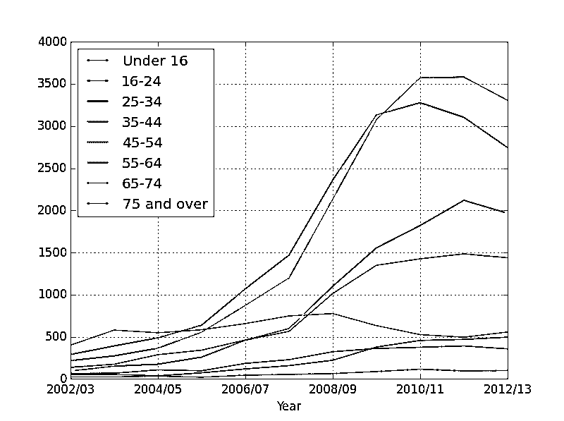

# 用 Python 分析英国的肥胖问题

> 原文：<https://realpython.com/analyzing-obesity-in-england-with-python/>

昨天在健身房看到一个牌子，上面写着“孩子每十年变胖一次”。在那个标志下面有一张图表，基本上显示了五年后英国儿童的平均体重将和拖拉机一样重。

我发现这个说法*有点*不可信，所以我决定调查一下…

## 数据

数据取自[Data.gov.uk](http://data.gov.uk/dataset/statistics_on_obesity_physical_activity_and_diet_england/)。我们将使用 2014 年的 XLS 文件。下载它，并在您选择的电子表格工具中打开它。

然后导航到表 7.2，因为它包含我们正在寻找的数据:

[](https://files.realpython.com/media/excel-data.2f1620362ad1.jpg)

现在，在我们开始用 Pandas 分析数据之前，让我们后退一步，解决房间里的大象:*如果您可以在 Excel 中执行分析/绘图，为什么您会使用 Python？*

[*Remove ads*](/account/join/)

## Python vs Excel

***应该用 Python 还是 Excel？*T3】**

这个问题经常被刚开始做数据分析的人问到。虽然 Python 可能在编程社区中很流行，但 Excel 在更广阔的世界中更流行。大多数高级经理、销售人员、营销人员等。使用 Excel——这没什么不好。如果你知道如何很好地使用它，它是一个很棒的工具，它已经把许多非技术人员变成了专家分析师。

对于应该使用 Python 还是 Excel，这个问题并不容易回答。但是最后没有非此即彼:反而可以一起用。

Excel 非常适合查看数据、执行基本分析和绘制简单的图表，但它真的不适合清理数据(除非你愿意深入 VBA)。如果您有一个 500MB 的 Excel 文件，其中缺少数据、日期格式不同、没有标题，那么您将永远无法手工清理它。如果您的数据分散在十几个 CSV 文件中，情况也是如此，这很常见。

使用 Python 和用于数据分析的 Python 库 [Pandas](http://pandas.pydata.org/) 来做所有这些清理工作是微不足道的。Pandas 建立在 [Numpy](http://www.numpy.org/) 之上，使高级任务变得简单，你可以将你的结果写回 Excel 文件，这样你就可以继续与非程序员分享你的分析结果。

因此，虽然 Excel 不会消失，但如果您想要干净的数据并执行更高级别的数据分析，Python 是一个很好的工具。

## 代码

好了，让我们从代码开始——你可以从项目[回购](https://github.com/shantnu/python-obesity)以及我上面链接的电子表格中获取，这样你就不用再下载了。

首先创建一个名为 *obesity.py* 的新脚本，并导入熊猫[以及 matplotlib](https://realpython.com/python-matplotlib-guide/) ，以便我们可以[稍后绘制图形](https://realpython.com/pandas-plot-python/):

```py
import pandas as pd
import matplotlib.pyplot as plt
```

确保安装了两个依赖项:`pip install pandas matplotlib`

接下来，让我们[读入](https://realpython.com/pandas-read-write-files/)Excel 文件:

```py
data = pd.ExcelFile("Obes-phys-acti-diet-eng-2014-tab.xls")
```

仅此而已。在一行中，我们读入了整个 Excel 文件。

让我们把现有的打印出来:

```py
print data.sheet_names
```

运行脚本。

```py
$ python obesity.py
[u'Chapter 7', u'7.1', u'7.2', u'7.3', u'7.4', u'7.5', u'7.6', u'7.7', u'7.8', u'7.9', u'7.10']
```

眼熟吗？这些是我们之前看到的床单。请记住，我们将重点关注第 7.2 页。现在，如果你在 Excel 中查看 7.2，你会看到上面的 4 行和下面的 14 行包含无用的信息。让我换个说法:它对人类有用，但对我们的脚本没用。我们只需要 5-18 排。

[*Remove ads*](/account/join/)

## 清理

所以当我们阅读表格时，我们需要确保任何不必要的信息都被忽略。

```py
# Read 2nd section, by age
data_age = data.parse(u'7.2', skiprows=4, skipfooter=14)
print data_age
```

再次运行。

```py
 Unnamed: 0  Total  Under 16  16-24  25-34  35-44  45-54  55-64  65-74  \
0         NaN    NaN       NaN    NaN    NaN    NaN    NaN    NaN    NaN
1     2002/03   1275       400     65    136    289    216     94     52
2     2003/04   1711       579     67    174    391    273    151     52
3     2004/05   2035       547    107    287    487    364    174     36
4     2005/06   2564       583     96    341    637    554    258     72

#...snip...#
```

我们阅读表格，跳过最上面的 4 行和最下面的 14 行(因为它们包含对我们没有用的数据)。然后我们把现有的打印出来。(为了简单起见，我只显示了打印输出的前几行。)

第一行代表列标题。你可以马上看到熊猫很聪明，因为它正确地捡起了大多数头球。当然除了第一个——比如`Unnamed: 0`。这是为什么呢？简单。在 Excel 中查看该文件，您会发现它缺少一个年份标题。

另一个问题是我们在原始文件中有一个空行，它显示为`NaN`(不是一个数字)。

所以我们现在需要做两件事:

1.  将第一个标题重命名为`Year`，并且
2.  去掉所有的空行。

```py
# Rename unamed to year
data_age.rename(columns={u'Unnamed: 0': u'Year'}, inplace=True)
```

在这里，我们告诉熊猫将列*重命名为*年份*。使用内置的[功能](http://pandas.pydata.org/pandas-docs/dev/generated/pandas.DataFrame.rename.html) `rename()`。*

> `inplace = True`修改现有对象。如果没有这个，熊猫将创建一个新的对象并返回它。

接下来让我们删除填充有`NaN`的空行:

```py
# Drop empties
data_age.dropna(inplace=True)
```

我们还需要做一件事，让我们的生活更轻松。如果查看 *data_age* 表，第一个值是一个数字。这是索引，Pandas 使用默认的 Excel 惯例，将一个数字作为索引。然而，我们想把指数改成*年*。这将使绘制*更加容易，因为指数通常被绘制为 x 轴。*

```py
data_age.set_index('Year', inplace=True)
```

我们将索引设置为`Year`。

现在打印我们清理的数据:

```py
print "After Clean up:"
print data_age
```

并运行:

```py
 Total  Under 16  16-24  25-34  35-44  45-54  55-64  65-74  \
Year
2002/03   1275       400     65    136    289    216     94     52
2003/04   1711       579     67    174    391    273    151     52
2004/05   2035       547    107    287    487    364    174     36
2005/06   2564       583     96    341    637    554    258     72
#...snip...#
```

好多了。你可以看到索引现在是`Year`，所有的`NaN`都不见了。

[*Remove ads*](/account/join/)

## 图表

现在我们可以绘制我们所拥有的。

```py
# Plot
data_age.plot()
plt.show()
```

[](https://files.realpython.com/media/matplotlib_chart1.c87daa0ceaff.png)

哎呀。有一个问题:我们的原始数据包含一个总字段，它掩盖了所有其他内容。我们需要摆脱它。

```py
# Drop the total column and plot
data_age_minus_total = data_age.drop('Total', axis=1)
```

`axis =1`有点令人困惑，但它真正的意思是——丢弃列，正如从[这个](http://stackoverflow.com/questions/25773245/ambiguity-in-pandas-dataframe-axis-definition)堆栈溢出问题中描述的那样。

让我们画出我们现在拥有的。

```py
data_age_minus_total.plot()
plt.show()
```

好多了。我们现在实际上可以看到各个年龄组。你能看出哪个年龄段的肥胖率最高吗？

[](https://files.realpython.com/media/matplotlib_chart2.dfd8ef0ad2a5.png)

回到我们最初的问题:孩子越来越胖了吗？

我们只绘制一小部分数据:16 岁以下的儿童和 35-44 岁年龄段的成年人。

```py
plt.close()

# Plot children vs adults
data_age['Under 16'].plot(label="Under 16")
data_age['35-44'].plot(label="35-44")
plt.legend(loc="upper right")
plt.show()
```

[](https://files.realpython.com/media/matplotlib_chart3.0113f9916e7b.png)

## 那么到底是谁越来越胖呢？

没错。我们看到了什么？

虽然儿童肥胖率略有下降，但他们的父母却在不断增加。所以看起来父母需要担心的是他们自己而不是他们的孩子。

## 但是未来呢？

图表仍然没有告诉我们未来儿童肥胖会发生什么。有很多方法可以将这样的图表外推至未来，但在我们继续之前，我必须给出一个**警告**:肥胖数据没有潜在的数学基础。也就是说，我们找不到一个公式来预测这些值在未来会如何变化。一切本质上都是猜测。记住这个警告，让我们看看如何推断我们的图表。

首先， [Scipy](http://www.scipy.org/) 确实提供了一个用于外推的[函数](http://docs.scipy.org/doc/numpy/reference/generated/numpy.interp.html)，但是它只对单调增加的数据有效(当我们的数据上下波动时)。

我们可以尝试曲线拟合:

*   [曲线拟合](http://en.wikipedia.org/wiki/Curve_fitting)通过尝试为数据生成一个数学函数，尝试通过图表上的点来拟合一条曲线。该函数可能非常准确，也可能不准确，这取决于数据。
*   [多项式插值](http://en.wikipedia.org/wiki/Polynomial_interpolation)一旦有了方程，就可以用多项式插值来尝试插值图上的任意值。

我们将结合使用这两个函数来尝试预测英国儿童的未来:

```py
kids_values = data_age['Under 16'].values
x_axis = range(len(kids_values))
```

这里，我们提取 16 岁以下儿童的值。对于 x 轴，原始图表有日期。为了简化我们的图表，我们将只使用数字 0-10。

输出:

```py
array([ 400.,  579.,  547.,  583.,  656.,  747.,  775.,  632.,  525., 495.,  556.])
[0, 1, 2, 3, 4, 5, 6, 7, 8, 9, 10]
```

还有一点:曲线拟合使用不同的[次多项式](http://en.wikipedia.org/wiki/Degree_of_a_polynomial)。很简单的说，度数越高，曲线拟合会越准确，但是也有可能结果是垃圾。如果度数太高，Scipy 有时会警告你。不要担心，当我们看一些例子时，这一点会更加清楚。

```py
poly_degree = 3
curve_fit = np.polyfit(x_axis, kids_values, poly_degree)
poly_interp = np.poly1d(curve_fit)
```

我们将多项式次数设置为 3。然后，我们使用 Numpy `polyfit()` [函数](http://docs.scipy.org/doc/numpy/reference/generated/numpy.polyfit.html)试图通过我们拥有的数据拟合一个图形。然后在我们生成的等式上调用`poly1d()` [函数](http://docs.scipy.org/doc/numpy/reference/generated/numpy.poly1d.html)来创建一个函数，该函数将用于生成我们的值。这将返回一个名为`poly_interp`的函数，我们将在下面使用它:

```py
poly_fit_values = []

for i in range(len(x_axis)):
    poly_fit_values.append(poly_interp(i))
```

我们从 0 到 10 循环，并对每个值调用`poly_interp()`函数。记住，这是我们运行曲线拟合算法时生成的函数。

在继续之前，让我们看看不同的多项式次数意味着什么。

我们将绘制原始数据和我们自己的数据，看看我们的方程与理想数据有多接近:

```py
plt.plot(x_axis, poly_fit_values, "-r", label = "Fitted")
plt.plot(x_axis, kids_values, "-b", label = "Orig")

plt.legend(loc="upper right")
```

原始数据将以*蓝色*绘制，并标记为*原始*，而生成的数据将以*红色*绘制，并标记为*拟合*。

多项式值为 3:

[](https://files.realpython.com/media/curve__fit_3.74626650adb9.png)

我们发现它不是很合适，所以让我们试试 5:

[](https://files.realpython.com/media/curve__fit_5.e4856471a165.png)

好多了。7 点怎么样？

[](https://files.realpython.com/media/curve__fit_7.211abb7dc45e.png)

现在我们得到了一个几乎完美的匹配。那么，为什么我们不总是使用更高的值呢？

因为较高的值与该图紧密相关，所以它们使预测变得无用。如果我们试图从上图中推断，我们会得到垃圾值。尝试不同的值，我发现 3 和 4 的多项式次数是唯一给出准确结果的，所以这就是我们将要使用的。

我们将重新运行我们的`poly_interp()`函数，这次是从 0-15 的值，来预测未来五年。

```py
x_axis2 = range(15)

poly_fit_values = []
for i in range(len(x_axis2)):
    poly_fit_values.append(poly_interp(i))
```

这是和以前一样的代码。让我们再次看看多项式次数为 3 和 4 的结果。新的外推线是绿色的线，显示了我们的预测。

用 3:

[](https://files.realpython.com/media/curve__fit_3_2.498bb49f479f.png)

在这里，肥胖率正在下降。4 点怎么样？

[](https://files.realpython.com/media/curve__fit_4_2.3a6c8c135022.png)

但是在这里，它正在迅速增长，所以孩子们最终会像拖拉机一样重！

这两幅图哪一幅是正确的？这取决于你是为政府工作还是为反对派工作。

这其实是特性，不是 bug。你一定听说过这些政治辩论，其中双方从相同的数据中得出完全相反的结论？现在你看到了通过调整小参数来得出完全不同的结论的可能性。

这就是我们在接受游说者的数字和图表时必须小心的原因，尤其是如果他们不愿意分享原始数据的话。有时候，预测最好留给占星家。

干杯！***