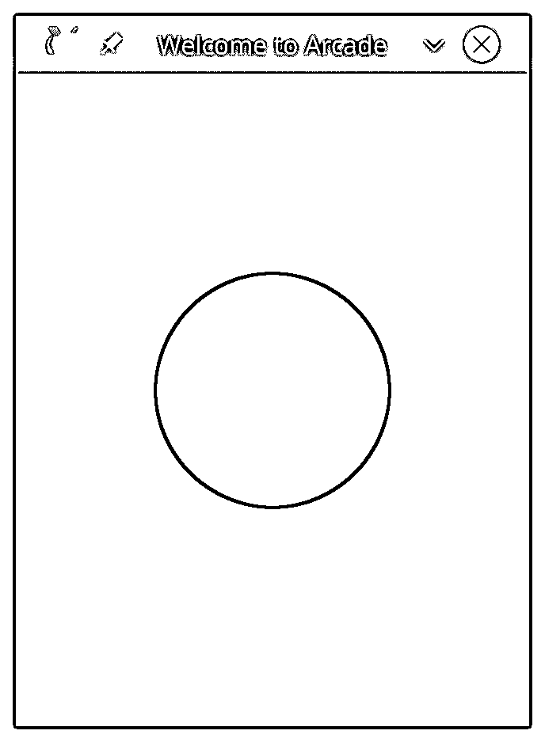

# arcade:Python 游戏框架入门

> 原文：<https://realpython.com/arcade-python-game-framework/>

电脑游戏是向人们介绍编码和计算机科学的好方法。由于我年轻时是一名玩家，编写视频游戏的诱惑是我学习编码的原因。当然，当我学习 Python 的时候，我的第一反应是[写一个 Python 游戏](https://realpython.com/top-python-game-engines/)。

虽然 Python 让每个人都更容易学习编码，但视频游戏编写的选择可能是有限的，特别是如果你想编写具有出色图形和朗朗上口的音效的街机游戏。很多年来，Python 游戏程序员都被限制在 [`pygame`](https://realpython.com/pygame-a-primer/) 框架内。现在，还有另一个选择。

[`arcade`库](http://arcade.academy/index.html)是一个现代的 Python 框架，用于制作具有引人注目的图形和声音的游戏。`arcade`面向对象，为 Python 3.6 及更高版本而构建，为程序员提供了一套现代工具来打造出色的 Python 游戏体验。

**在本教程中，您将学习如何:**

*   **安装**`arcade`库
*   **在屏幕上绘制**项
*   **与`arcade` Python 游戏循环一起工作**
*   **管理**屏幕图形元素
*   **处理**用户输入
*   **播放**音效和音乐
*   **描述**用`arcade`编写 Python 游戏与`pygame`有何不同

本教程假设你已经理解了如何编写 [Python 程序](https://realpython.com/learning-paths/python3-introduction/)。既然`arcade`是一个面向对象的库，你也应该熟悉[面向对象编程](https://realpython.com/learning-paths/object-oriented-programming-oop-python/)。本教程的所有代码、图像和声音都可以从下面的链接下载:

**下载资源:** [点击这里下载你将在本教程中使用](https://realpython.com/bonus/arcade-framework/)制作街机游戏的资源。

## 背景和设置

这个`arcade`库是由美国爱荷华州[辛普森学院](https://simpson.edu/academics/departments/academics/departments/department-computer-science/computer-science)的计算机科学教授[保罗·文森特·克雷文](https://twitter.com/professorcraven)编写的。因为它是建立在 [`pyglet`](http://pyglet.org/) 窗口和多媒体库之上的，`arcade`具有[各种](https://api.arcade.academy/en/latest/pygame_comparison.html)改进、现代化和超越`pygame`的增强功能:

*   拥有现代 OpenGL 图形
*   支持 Python 3 [类型提示](https://realpython.com/python-type-checking/#hello-types)
*   更好地支持动画精灵
*   整合了一致的命令、函数和参数名称
*   鼓励游戏逻辑与显示代码的分离
*   需要较少的样板代码
*   维护更多的[文档](https://api.arcade.academy/en/latest/http://arcade.academy/arcade.html)，包括完整的 Python 游戏[示例](http://arcade.academy/examples/index.html)
*   为[平台游戏](https://realpython.com/platformer-python-arcade/)内置物理引擎

要安装`arcade`及其依赖项，使用适当的 [`pip`](https://realpython.com/what-is-pip/) 命令:

```py
$ python -m pip install arcade
```

在 Mac 上，你还需要安装`PyObjC`:

```py
$ python -m pip install PyObjC arcade
```

基于您的[平台](https://api.arcade.academy/en/latest/install/index.html)的完整安装说明可用于 [Windows](https://api.arcade.academy/en/latest/install/windows.html) 、 [Mac](https://api.arcade.academy/en/latest/install/mac.html) 、 [Linux](https://api.arcade.academy/en/latest/install/linux.html) ，甚至[树莓派](https://api.arcade.academy/en/latest/install/linux.html#raspberry-pi-instructions)。如果你愿意，你甚至可以直接从[源](https://api.arcade.academy/en/latest/install/source.html)安装`arcade`。

**注意:**`arcade`的更高版本利用了[数据类](https://realpython.com/python-data-classes/)，这些数据类只包含在 Python 3.7 及更高版本中。

然而，Python 3.6 的 PyPI 上有一个[反向端口](https://pypi.org/project/dataclasses/)，您可以使用`pip`安装它:

```py
$ python -m pip install dataclasses
```

有关更多信息，请参见[Python 3.7 数据类终极指南](https://realpython.com/python-data-classes/)。

本教程假设你一直在使用`arcade` 2.1 和 Python 3.7。

[*Remove ads*](/account/join/)

## 基本`arcade`程序

在深入研究之前，让我们先来看看一个`arcade`程序，它会打开一个窗口，用白色填充，并在中间画一个蓝色的圆圈:

```py
 1# Basic arcade program
 2# Displays a white window with a blue circle in the middle
 3
 4# Imports
 5import arcade
 6
 7# Constants
 8SCREEN_WIDTH = 600
 9SCREEN_HEIGHT = 800
10SCREEN_TITLE = "Welcome to Arcade"
11RADIUS = 150
12
13# Open the window
14arcade.open_window(SCREEN_WIDTH, SCREEN_HEIGHT, SCREEN_TITLE)
15
16# Set the background color
17arcade.set_background_color(arcade.color.WHITE)
18
19# Clear the screen and start drawing
20arcade.start_render()
21
22# Draw a blue circle
23arcade.draw_circle_filled(
24    SCREEN_WIDTH / 2, SCREEN_HEIGHT / 2, RADIUS, arcade.color.BLUE
25)
26
27# Finish drawing
28arcade.finish_render()
29
30# Display everything
31arcade.run()
```

当你运行这个程序时，你会看到一个类似这样的窗口:

[](https://files.realpython.com/media/arcade-simple.a7ef4e2c5ec5.png)

让我们一行一行地分析一下:

*   **第 5 行**导入`arcade`库。没有这个，其他都不行。
*   为了清楚起见，第 8 行到第 11 行定义了一些稍后会用到的常量。
*   **第 14 行**打开主窗口。您提供宽度、高度和标题栏文本，其余的由`arcade`完成。
*   **第 17 行**使用`arcade.color`包中的常量设置背景颜色。您也可以使用[列表或元组](https://realpython.com/courses/lists-tuples-python/)指定 RGB 颜色。
*   **第 20 行**将`arcade`设置为绘图模式。你在这条线后画的任何东西都会显示在屏幕上。
*   **第 23 到 25 行**通过提供中心 X 和 Y 坐标、半径和使用的颜色来画圆。
*   **第 28 行**结束绘图模式。
*   **第 31 行**显示你的窗口给你看。

如果你熟悉`pygame`，那么你会注意到一些不同之处:

*   没有`pygame.init()`。所有初始化都在运行`import arcade`时处理。
*   没有显式定义的显示循环。在`arcade.run()`处理。
*   这里也没有事件循环。同样，`arcade.run()`处理事件并提供一些默认行为，比如关闭窗口的能力。
*   您可以使用预定义的颜色进行绘制，而不是自己定义所有颜色。
*   您必须使用`start_render()`和`finish_render()`在 arcade 中开始和完成绘图。

让我们仔细看看该计划背后的基本概念。

## `arcade`概念

像`pygame`，`arcade`代码运行在几乎所有支持 Python 的平台上。这要求`arcade`处理这些平台上各种硬件差异的抽象。理解这些概念和抽象将帮助你设计和开发你自己的游戏，同时理解`arcade`与`pygame`的不同将帮助你适应它独特的视角。

### 初始化

由于它涉及多种平台，`arcade`在使用之前必须执行初始化步骤。这一步是自动的，每当您导入`arcade`时都会发生，所以您不需要编写额外的代码。当您导入它时，`arcade`会执行以下操作:

*   **验证**您运行的是 Python 3.6 或更高版本。
*   **导入**用于声音处理的`pyglet_ffmeg2`库，如果它可用的话。
*   **导入**用于窗口和多媒体处理的`pyglet`库。
*   **设置颜色和按键映射的**常量。
*   **导入**剩余的`arcade`库。

与`pygame`形成对比，它要求每个模块有一个单独的初始化步骤。

### 窗口和坐标

`arcade`中的一切都发生在一个窗口中，使用`open_window()`创建。目前，`arcade`只支持单一显示窗口。您可以在打开窗口时调整其大小。

`arcade`使用相同的[笛卡尔坐标系](https://en.wikipedia.org/wiki/Cartesian_coordinate_system)你可能在代数课上学过。窗口位于[象限 I](https://en.wikipedia.org/wiki/Cartesian_coordinate_system#Quadrants_and_octants) ，原点(0，0)位于屏幕的左下角。向右移动时，x 坐标增加，向上移动时，y 坐标增加:

[](https://files.realpython.com/media/arcade-window-geography.ab29b55bb4dc.png)

需要注意的是，这种行为与`pygame`和许多其他 Python 游戏框架相反。你可能需要一段时间来适应这种差异。

[*Remove ads*](/account/join/)

### 图纸

开箱即用，`arcade`具有绘制各种几何形状的功能，包括:

*   弧
*   环
*   省略
*   线
*   抛物线
*   点
*   多边形
*   长方形
*   三角形

所有绘图函数都以`draw_`开头，并遵循一致的命名和参数模式。绘制填充形状和轮廓形状有不同的功能:

[](https://files.realpython.com/media/arcade-shapes.b9b84c4a725e.png)

因为矩形很常见，所以有三个独立的函数可以用不同的方式绘制它们:

*   **`draw_rectangle()`** 期望得到矩形中心的 x 和 y 坐标，宽度和高度。
*   **`draw_lrtb_rectangle()`** 期望左边和右边的 x 坐标，后面是顶部和底部的 y 坐标。
*   **`draw_xywh_rectangle()`** 使用左下角的 x 和 y 坐标，后跟宽度和高度。

注意，每个函数需要四个参数。您还可以使用[缓冲绘图功能](https://api.arcade.academy/en/latest/_modules/arcade/buffered_draw_commands.html)绘制每个形状，该功能利用顶点缓冲区将所有内容直接推送到显卡，实现令人难以置信的性能提升。所有缓冲的绘图函数都以`create_`开始，并遵循一致的命名和参数模式。

### 面向对象的设计

在其核心，`arcade`是一个[面向对象的](https://realpython.com/python3-object-oriented-programming/)库。像`pygame`一样，你可以程序化地编写`arcade`代码，就像你在上面的例子中所做的那样。然而，当你创建完全面向对象的程序时，`arcade`的真正威力就显现出来了。

当您在上面的例子中调用`arcade.open_window()`时，代码在幕后创建一个`arcade.Window`对象来管理那个窗口。稍后，您将基于`arcade.Window`创建自己的类来编写一个完整的 Python 游戏。

首先，看一下原始的示例代码，它现在使用面向对象的概念，以突出主要的区别:

```py
# Basic arcade program using objects
# Displays a white window with a blue circle in the middle

# Imports
import arcade

# Constants
SCREEN_WIDTH = 600
SCREEN_HEIGHT = 800
SCREEN_TITLE = "Welcome to Arcade"
RADIUS = 150

# Classes
class Welcome(arcade.Window):
 """Main welcome window """
    def __init__(self):
 """Initialize the window """

        # Call the parent class constructor
        super().__init__(SCREEN_WIDTH, SCREEN_HEIGHT, SCREEN_TITLE)
         # Set the background window
        arcade.set_background_color(arcade.color.WHITE)

    def on_draw(self):
 """Called whenever you need to draw your window """

        # Clear the screen and start drawing
        arcade.start_render()

        # Draw a blue circle
        arcade.draw_circle_filled(
            SCREEN_WIDTH / 2, SCREEN_HEIGHT / 2, RADIUS, arcade.color.BLUE
        )

# Main code entry point
if __name__ == "__main__":
    app = Welcome()
 arcade.run()
```

让我们一行一行地看看这段代码:

*   **第 1 行到第 11 行**与之前的程序示例相同。

*   **15 号线**是差异开始的地方。您基于父类`arcade.Window`定义了一个名为`Welcome`的类。这允许您根据需要重写父类中的方法。

*   **第 18 到 26 行**定义了 [`.__init__()`](https://realpython.com/python3-object-oriented-programming/#instance-attributes) 方法。在使用 [`super()`](https://realpython.com/python-super/) 调用父`.__init__()`方法来设置窗口后，您可以像之前一样设置它的背景颜色。

*   **第 28 到 38 行**定义了`.on_draw()`。这是几个`Window`方法之一，您可以覆盖这些方法来定制您的`arcade`程序的行为。每次`arcade`想在窗口上画画的时候都会调用这个方法。它从调用`arcade.start_render()`开始，然后是你所有的绘图代码。然而，你不需要调用`arcade.finish_render()`，因为当`.on_draw()`结束时`arcade`会隐式地调用它。

*   **第 41 到 43 行**是你的代码的[主入口点](https://realpython.com/python-main-function/)。在你第一次创建一个名为`app`的新的`Welcome`对象后，你调用`arcade.run()`来显示窗口。

这个面向对象的例子是充分利用`arcade`的关键。你可能已经注意到的一件事是对`.on_draw()`的描述。`arcade`每次它想在窗户上画画时都会调用这个。那么，`arcade`怎么知道什么时候画什么呢？让我们来看看这其中的含义。

### 游戏循环

几乎每个游戏中的所有动作都发生在一个中央游戏循环中。你甚至可以在物理游戏中看到游戏循环的例子，如跳棋、老处女或棒球。游戏循环在游戏设置和初始化之后开始，在游戏开始时结束。在这个循环中，几件事情依次发生。一个游戏循环至少要采取以下四个动作:

1.  **程序**判断游戏是否结束。如果是，则循环结束。
2.  **用户输入**被处理。
3.  **游戏对象的状态**根据用户输入或时间等因素进行更新。
4.  游戏根据新的状态显示画面和播放音效。

在`pygame`中，您必须明确设置和控制该循环。在`arcade`中，为您提供了 Python 游戏循环，封装在`arcade.run()`调用中。

在内置的游戏循环中，`arcade`调用一组`Window`方法来实现上面列出的所有功能。这些方法的名字都以`on_`开头，可以认为是**任务或事件处理程序**。当`arcade`游戏循环需要更新所有 Python 游戏对象的状态时，它调用`.on_update()`。当它需要检查鼠标移动时，它调用`.on_mouse_motion()`。

默认情况下，这些方法都没有任何用处。当你基于`arcade.Window`创建自己的类时，你可以根据需要覆盖它们来提供你自己的游戏功能。提供的一些方法包括:

*   **键盘输入:** `.on_key_press()`，`.on_key_release()`
*   **鼠标输入:**、`.on_mouse_press()`、`.on_mouse_release()`、`.on_mouse_motion()`
*   **更新游戏对象:** `.on_update()`
*   **绘图:** `.on_draw()`

您不需要覆盖所有这些方法，只需覆盖那些您想要提供不同行为的方法。你也不需要担心*何时*被调用，只需要*在*被调用时做什么。接下来，您将探索如何将所有这些概念放在一起创建一个游戏。

[*Remove ads*](/account/join/)

## Python 游戏设计基础

在你开始写任何代码之前，有一个合适的设计总是一个好主意。因为您将在本教程中创建一个 Python 游戏，所以您也将为它设计一些游戏性:

*   **游戏**是一款水平滚动的避敌游戏。
    *   **玩家**从屏幕左侧开始。
    *   敌人每隔一段时间随机进入右边的位置。
    *   敌人沿直线向左移动，直到他们离开屏幕。
*   玩家可以向左、向右、向上或向下移动来躲避敌人。
*   **玩家**不能离开屏幕。
*   **当玩家被敌人击中，或者用户关闭窗口，游戏**结束。

他在描述软件项目的时候，我的一个前同事[曾经说过](https://devblogs.microsoft.com/oldnewthing/?p=27543)“你不知道你做什么，直到你知道你不做什么。”记住这一点，这里有一些你在本教程中不会涉及的内容:

*   没有多重生命
*   不计分
*   没有玩家攻击能力
*   没有升级级别
*   没有“老板”字符

您可以自由尝试将这些和其他特性添加到您自己的程序中。

### 导入和常量

与任何`arcade`程序一样，您将从导入库开始:

```py
# Basic arcade shooter

# Imports
import arcade
import random

# Constants
SCREEN_WIDTH = 800
SCREEN_HEIGHT = 600
SCREEN_TITLE = "Arcade Space Shooter"
SCALING = 2.0
```

除了`arcade`，您还导入了`random`，因为稍后您将使用[随机数](https://realpython.com/courses/generating-random-data-python/)。常量设置了窗口大小和标题，但是什么是`SCALING`？该常量用于使窗口和其中的游戏对象变大，以补偿高 DPI 屏幕。随着教程的继续，您将看到它在两个地方被使用。您可以更改该值以适合您的屏幕大小。

### 窗口类

为了充分利用`arcade` Python 游戏循环和事件处理程序，创建一个基于`arcade.Window`的新类:

```py
35class SpaceShooter(arcade.Window):
36    """Space Shooter side scroller game
37 Player starts on the left, enemies appear on the right
38 Player can move anywhere, but not off screen
39 Enemies fly to the left at variable speed
40 Collisions end the game
41 """
42
43    def __init__(self, width, height, title):
44        """Initialize the game
45 """
46        super().__init__(width, height, title)
47
48        # Set up the empty sprite lists
49        self.enemies_list = arcade.SpriteList()
50        self.clouds_list = arcade.SpriteList()
51        self.all_sprites = arcade.SpriteList()
```

您的新类就像上面的面向对象的例子一样开始。在第 43 行，您定义了您的构造函数，它接受游戏窗口的宽度、高度和标题，并使用`super()`将它们传递给父对象。然后在第 49 到 51 行初始化一些空的 sprite 列表。在下一节中，您将了解更多关于精灵和精灵列表的内容。

### 精灵和精灵列表

您的 Python 游戏设计要求一个玩家从左边开始，并可以在窗口周围自由移动。它还要求敌人(换句话说，不止一个)随机出现在右边并移动到左边。虽然你可以使用`draw_`命令来画出玩家和每个敌人，但很快就很难保持直线。

相反，大多数现代游戏使用[精灵](https://en.wikipedia.org/wiki/Sprite_%28computer_graphics%29)来代表屏幕上的物体。从本质上来说，**精灵**是一个游戏对象的二维图片，具有定义的大小，绘制在屏幕上的特定位置。在`arcade`中，精灵是`arcade.Sprite`类的物体，你可以用它们来代表你的玩家和敌人。你甚至会加入一些云彩来使背景更加有趣。

管理所有这些精灵可能是一个挑战。你将创建一个单人精灵，但是你也将创建许多敌人和云精灵。跟踪他们是 T2 精灵列表的工作。如果你理解了 [Python 列表](https://realpython.com/python-lists-tuples/)是如何工作的，那么你就有了使用`arcade`的精灵列表的工具。精灵列表不仅仅是保存所有的精灵。它们支持三种重要的行为:

1.  你可以通过简单的调用`SpriteList.update()`来**更新**列表中的所有精灵。
2.  你可以通过简单的调用`SpriteList.draw()`来**绘制**列表中的所有精灵。
3.  您可以**检查**单个精灵是否与列表中的任何精灵冲突。

你可能想知道如果你只需要管理多个敌人和云，为什么你需要三个不同的精灵列表。原因是三个不同的精灵列表都存在，因为它们有三个不同的用途:

1.  你使用 **`.enemies_list`** 来更新敌人的位置并检查碰撞。
2.  你使用 **`.clouds_list`** 来更新云位置。
3.  最后，你使用 **`.all_sprites`** 来绘制一切。

现在，列表的用处取决于它包含的数据。以下是你如何填充你的精灵列表:

```py
53def setup(self):
54    """Get the game ready to play
55 """
56
57    # Set the background color
58    arcade.set_background_color(arcade.color.SKY_BLUE)
59
60    # Set up the player
61    self.player = arcade.Sprite("images/jet.png", SCALING)
62    self.player.center_y = self.height / 2
63    self.player.left = 10
64    self.all_sprites.append(self.player)
```

你定义`.setup()`来初始化游戏到一个已知的起点。虽然您可以在`.__init__()`中这样做，但是拥有一个单独的`.setup()`方法是有用的。

假设你希望你的 Python 游戏有多个关卡，或者你的玩家有多个生命。不是通过调用`.__init__()`来重启整个游戏，而是调用`.setup()`来将游戏重新初始化到一个已知的起点或者设置一个新的关卡。尽管这个 Python 游戏没有这些特性，但是设置结构可以让以后添加它们变得更快。

在第 58 行设置了背景颜色之后，就可以定义播放器精灵了:

*   **第 61 行**通过指定要显示的图像和缩放因子来创建一个新的`arcade.Sprite`对象。将图像组织到一个子文件夹中是一个好主意，尤其是在较大的项目中。

*   第 62 行将精灵的 y 位置设置为窗口高度的一半。

*   第 63 行设置精灵的 x 位置，将左边缘放在离窗口左边缘几个像素的地方。

*   **第 64 行**最后使用 [`.append()`](https://realpython.com/python-append/) 将精灵添加到`.all_sprites`列表中，您将使用该列表进行绘制。

第 62 行和第 63 行显示了定位精灵的两种不同方式。让我们仔细看看所有可用的精灵定位选项。

#### 精灵定位

`arcade`中的所有[精灵](http://arcade.academy/arcade.html#arcade.Sprite)在窗口中都有特定的大小和位置:

*   **大小**，由`Sprite.width`和`Sprite.height`指定，由创建 sprite 时使用的图形决定。
*   **位置**初始设置为子画面的中心，由`Sprite.center_x`和`Sprite.center_y`指定，在窗口的(0，0)处。

一旦知道了`.center_x`和`.center_y`坐标，`arcade`就可以使用尺寸来计算`Sprite.left`、`Sprite.right`、`Sprite.top`和`Sprite.bottom`边。

反之亦然。例如，如果您将`Sprite.left`设置为给定值，那么`arcade`也会重新计算剩余的位置属性。你可以使用它们中的任何一个来定位精灵或者在窗口中移动它。这是`arcade`精灵极其有用和强大的特性。如果你使用它们，那么你的 Python 游戏将比`pygame`需要更少的代码:

[](https://files.realpython.com/media/arcade-player.314307f764fb.png)

既然你已经定义了玩家精灵，你就可以处理敌人精灵了。这个设计要求你让敌人的精灵以固定的间隔出现。你怎么能这样做？

[*Remove ads*](/account/join/)

### 调度功能

`arcade.schedule()`正是为此目的而设计的。它需要两个参数:

1.  **要调用的函数的名称**
2.  **每次呼叫之间等待的时间间隔**，以秒为单位

由于您希望敌人和云都出现在整个游戏中，您设置了一个预定功能来创建新的敌人，第二个功能来创建新的云。该代码进入`.setup()`。下面是这段代码的样子:

```py
66# Spawn a new enemy every 0.25 seconds
67arcade.schedule(self.add_enemy, 0.25)
68
69# Spawn a new cloud every second
70arcade.schedule(self.add_cloud, 1.0)
```

现在你要做的就是定义`self.add_enemy()`和`self.add_cloud()`。

### 添加敌人

从你的 Python 游戏设计来看，敌人有三个关键属性:

1.  **它们出现在**窗口右侧的随机位置。
2.  他们沿直线向左移动。
3.  当他们离开屏幕时，他们就消失了。

创建敌人精灵的代码与创建玩家精灵的代码非常相似:

```py
 93def add_enemy(self, delta_time: float):
 94    """Adds a new enemy to the screen
 95
 96 Arguments:
 97 delta_time {float} -- How much time has passed since the last call
 98 """
 99
100    # First, create the new enemy sprite
101    enemy = arcade.Sprite("images/missile.png", SCALING)
102
103    # Set its position to a random height and off screen right
104    enemy.left = random.randint(self.width, self.width + 80)
105    enemy.top = random.randint(10, self.height - 10)
```

`.add_enemy()`接受一个参数`delta_time`，它表示自上次调用以来已经过去了多长时间。这是`arcade.schedule()`所要求的，虽然您不会在这里使用它，但它对于需要高级计时的应用程序可能是有用的。

与 player sprite 一样，首先创建一个新的`arcade.Sprite`,带有一张图片和一个缩放因子。使用`.left`和`.top`将位置设置到屏幕右侧的任意位置:

[](https://files.realpython.com/media/arcade-game-enemies.ec1376be6bc3.png)

这使得敌人可以流畅地移动到屏幕上，而不是仅仅出现在屏幕上。现在，你怎么让它动起来？

### 移动精灵

移动精灵需要你在游戏循环的更新阶段改变它的位置。虽然您可以自己完成这项工作，`arcade`提供了一些内置功能来减少您的工作量。每个`arcade.Sprite`不仅有一组位置属性，还有一组**运动属性**。每次精灵被更新，`arcade`将使用运动属性来更新位置，赋予精灵相对运动。

`Sprite.velocity`属性是一个由 x 和 y 位置变化组成的元组。也可以直接访问`Sprite.change_x`和`Sprite.change_y`。如上所述，每次更新 sprite 时，它的`.position`都会根据`.velocity`发生变化。在`.add_enemy()`中，您只需设置速度:

```py
107# Set its speed to a random speed heading left
108enemy.velocity = (random.randint(-20, -5), 0)
109
110# Add it to the enemies list
111self.enemies_list.append(enemy)
112self.all_sprites.append(enemy)
```

在第 108 行将速度设置为向左移动的随机速度后，将新的敌人添加到适当的列表中。当您稍后调用`sprite.update()`，`arcade`将处理其余的:

[](https://files.realpython.com/media/arcade-flying-enemies-v3.3d8c21be83ba.gif)

在你的 Python 游戏设计中，敌人从右向左直线移动。因为你的敌人总是向左移动，一旦他们离开屏幕，他们就不会回来了。如果你能去掉一个屏幕外的敌人精灵来释放内存和加速更新就好了。幸运的是，`arcade`有你罩着。

[*Remove ads*](/account/join/)

### 移除精灵

因为你的敌人总是向左移动，他们的 x 位置总是变小，y 位置总是不变。因此，当`enemy.right`小于零(窗口的左边缘)时，您可以确定敌人在屏幕外。一旦你确定敌人不在屏幕上，你调用`enemy.remove_from_sprite_lists()`将它从它所属的所有列表中移除，然后**从内存中释放那个对象**:

```py
if enemy.right < 0:
    enemy.remove_from_sprite_lists()
```

但是你什么时候做这个检查呢？通常，这将发生在精灵移动之后。然而，请记住之前所说的关于`.all_enemies`精灵列表的内容:

> 你使用`.enemies_list`来更新敌人的位置并检查碰撞。

这意味着在`SpaceShooter.on_update()`中，您将调用`enemies_list.update()`来自动处理敌人的移动，这实质上做了以下事情:

```py
for enemy in enemies_list:
    enemy.update()
```

如果能把屏下检查直接加到`enemy.update()`通话里就好了，而且可以！记住，`arcade`是面向对象的库。这意味着您可以基于`arcade`类创建自己的类，并覆盖您想要修改的方法。在这种情况下，您创建一个基于`arcade.Sprite`的新类，并且只覆盖`.update()`:

```py
17class FlyingSprite(arcade.Sprite):
18    """Base class for all flying sprites
19 Flying sprites include enemies and clouds
20 """
21
22    def update(self):
23        """Update the position of the sprite
24 When it moves off screen to the left, remove it
25 """
26
27        # Move the sprite
28        super().update()
29
30        # Remove if off the screen
31        if self.right < 0:
32            self.remove_from_sprite_lists()
```

你把`FlyingSprite`定义为任何会在你的游戏中飞行的东西，比如敌人和云。然后你覆盖`.update()`，首先调用`super().update()`来正确处理动作。然后，您执行屏幕外检查。

因为您有了一个新的类，所以您还需要对`.add_enemy()`做一个小小的改变:

```py
def add_enemy(self, delta_time: float):
    """Adds a new enemy to the screen

 Arguments:
 delta_time {float} -- How much time as passed since the last call
 """

    # First, create the new enemy sprite
 enemy = FlyingSprite("images/missile.png", SCALING)
```

你不是创建一个新的`Sprite`，而是创建一个新的`FlyingSprite`来利用新的`.update()`。

### 添加云

为了让你的 Python 游戏在视觉上更吸引人，你可以给天空添加云彩。云飞过天空，就像你的敌人一样，所以你可以用类似的方式来创造和移动它们。

`.add_cloud()`遵循与`.add_enemy()`相同的模式，尽管随机速度较慢:

```py
def add_cloud(self, delta_time: float):
    """Adds a new cloud to the screen

 Arguments:
 delta_time {float} -- How much time has passed since the last call
 """

    # First, create the new cloud sprite
    cloud = FlyingSprite("images/cloud.png", SCALING)

    # Set its position to a random height and off screen right
    cloud.left = random.randint(self.width, self.width + 80)
    cloud.top = random.randint(10, self.height - 10)

    # Set its speed to a random speed heading left
    cloud.velocity = (random.randint(-5, -2), 0)

    # Add it to the enemies list
    self.clouds_list.append(cloud)
    self.all_sprites.append(cloud)
```

云比敌人移动得慢，所以你在第 129 行计算了一个较低的随机速度。

现在你的 Python 游戏看起来更加完整了:

[](https://files.realpython.com/media/arcade-flying-clouds-v3.961ec0ba975c.gif)

你的敌人和云已经被创造出来了，它们现在自己移动了。是时候使用键盘让玩家移动了。

[*Remove ads*](/account/join/)

### 键盘输入

`arcade.Window`类有两个处理键盘输入的函数。每当按下一个键，你的 Python 游戏就会调用 **`.on_key_press()`** ，每当松开一个键，就会调用 **`.on_key_release()`** 。两个函数都接受两个整数参数:

1.  **`symbol`** 代表实际被按下或释放的键。
2.  **`modifiers`** 表示哪些修改器被关闭。这些键包括 `Shift` 、 `Ctrl` 和 `Alt` 键。

幸运的是，你不需要知道哪个整数代表哪个键。`arcade.key`模块包含了您可能想要使用的所有键盘常量。传统上，用键盘移动玩家使用三组不同按键中的一组或多组:

1.  这四个箭头键分别为`Up``Down``Left`， `Right`
2.  按键 `I` 、 `J` 、 `K` 、 `L` ，分别对应上、左、下、右
3.  对于左手控制，按键 `W` 、 `A` 、 `S` 、 `D` ，这些按键还可以映射到上、左、下、右

对于这个游戏，您将使用箭头和`I`/`J`/`K`//`L`。每当用户按下移动键时，播放器精灵就向那个方向移动。当用户释放移动键时，精灵停止向那个方向移动。您还提供了使用 `Q` 退出游戏的方法，以及使用 `P` 暂停游戏的方法。为此，您需要响应按键和释放:

*   **当按下**键时，调用`.on_key_press()`。在该方法中，您检查按下了哪个键:
    *   如果是 `Q` ，那你干脆退出游戏。
    *   如果是 `P` ，那么你设置一个标志表示游戏暂停。
    *   如果是移动键，那么你相应地设置玩家的`.change_x`或者`.change_y`。
    *   如果是其他键，就忽略它。
*   **当释放**键时，调用`.on_key_release()`。再次检查哪个键被释放了:
    *   如果它是一个移动键，那么你相应地设置玩家的`.change_x`或`.change_y`为 0。
    *   如果是其他键，就忽略它。

代码如下所示:

```py
134def on_key_press(self, symbol, modifiers):
135    """Handle user keyboard input
136 Q: Quit the game
137 P: Pause/Unpause the game
138 I/J/K/L: Move Up, Left, Down, Right
139 Arrows: Move Up, Left, Down, Right
140
141 Arguments:
142 symbol {int} -- Which key was pressed
143 modifiers {int} -- Which modifiers were pressed
144 """
145    if symbol == arcade.key.Q:
146        # Quit immediately
147        arcade.close_window()
148
149    if symbol == arcade.key.P:
150        self.paused = not self.paused
151
152    if symbol == arcade.key.I or symbol == arcade.key.UP:
153        self.player.change_y = 5
154
155    if symbol == arcade.key.K or symbol == arcade.key.DOWN:
156        self.player.change_y = -5
157
158    if symbol == arcade.key.J or symbol == arcade.key.LEFT:
159        self.player.change_x = -5
160
161    if symbol == arcade.key.L or symbol == arcade.key.RIGHT:
162        self.player.change_x = 5
163
164def on_key_release(self, symbol: int, modifiers: int):
165    """Undo movement vectors when movement keys are released
166
167 Arguments:
168 symbol {int} -- Which key was pressed
169 modifiers {int} -- Which modifiers were pressed
170 """
171    if (
172        symbol == arcade.key.I
173        or symbol == arcade.key.K
174        or symbol == arcade.key.UP
175        or symbol == arcade.key.DOWN
176    ):
177        self.player.change_y = 0
178
179    if (
180        symbol == arcade.key.J
181        or symbol == arcade.key.L
182        or symbol == arcade.key.LEFT
183        or symbol == arcade.key.RIGHT
184    ):
185        self.player.change_x = 0
```

在`.on_key_release()`中，你只检查会影响玩家精灵移动的按键。没有必要检查暂停或退出键是否被释放。

现在你可以在屏幕上移动并立即退出游戏:

[](https://files.realpython.com/media/arcade-moving-player-v3.77b0ae3e0b34.gif)

您可能想知道暂停功能是如何工作的。要了解这一点，首先需要学习更新所有 Python 游戏对象。

### 更新游戏对象

仅仅因为你给你所有的精灵设置了速度并不意味着他们会移动。为了让它们移动，你必须在游戏循环中一遍又一遍地更新它们。

由于`arcade`控制了 Python 游戏循环，所以它也通过调用`.on_update()`来控制何时需要更新。您可以重写此方法，为您的游戏提供适当的行为，包括游戏移动和其他行为。对于这个游戏，您需要做一些事情来正确地更新所有内容:

1.  **你检查**游戏是否暂停。如果是这样，那么您可以退出，这样就不会发生进一步的更新。
2.  你更新你所有的精灵让他们移动。
3.  **你检查**玩家精灵是否已经移出屏幕。如果是这样，只需将它们移回到屏幕上。

暂时就这样了。下面是这段代码的样子:

```py
189def on_update(self, delta_time: float):
190    """Update the positions and statuses of all game objects
191 If paused, do nothing
192
193 Arguments:
194 delta_time {float} -- Time since the last update
195 """
196
197    # If paused, don't update anything
198    if self.paused:
199        return
200
201    # Update everything
202    self.all_sprites.update()
203
204    # Keep the player on screen
205    if self.player.top > self.height:
206        self.player.top = self.height
207    if self.player.right > self.width:
208        self.player.right = self.width
209    if self.player.bottom < 0:
210        self.player.bottom = 0
211    if self.player.left < 0:
212        self.player.left = 0
```

第 198 行是检查游戏是否暂停的地方，如果暂停就返回。跳过所有剩余的代码，所以不会有任何移动。所有子画面移动由线 202 处理。这一行行之有效有三个原因:

1.  **每个精灵**都是`self.all_sprites`列表中的一员。
2.  **对**到`self.all_sprites.update()`的调用导致对列表中的每个 sprite 调用`.update()`。
3.  **列表中的每一个精灵**都有`.velocity`(由`.change_x`和`.change_y`属性组成)，当其`.update()`被调用时会处理自己的运动。

最后，通过比较精灵的边缘和窗口的边缘，检查第 205 到 212 行的玩家精灵是否在屏幕外。例如，在第 205 行和第 206 行，如果`self.player.top`超出了屏幕的顶部，那么您将`self.player.top`重置到屏幕的顶部。现在一切都更新了，可以画一切了。

[*Remove ads*](/account/join/)

### 在窗户上画画

因为游戏对象的更新发生在`.on_update()`中，所以绘制游戏对象应该发生在一个叫做`.on_draw()`的方法中。因为您已经将所有内容组织到 sprite 列表中，所以该方法的代码非常短:

```py
231def on_draw(self):
232    """Draw all game objects
233 """
234    arcade.start_render()
235    self.all_sprites.draw()
```

所有绘图都从调用第 234 行的`arcade.start_render()`开始。就像更新一样，只需调用第 235 行的`self.all_sprites.draw()`就可以一次画出你所有的精灵。现在，您的 Python 游戏只剩下最后一部分要做了，这也是初始设计的最后一部分:

> *当玩家被障碍物*击中，或者用户关闭窗口时，游戏结束。

这是真正的游戏部分！现在，敌人会无所事事地飞过你的玩家精灵。让我们看看如何添加这个功能。

### 碰撞检测

游戏都是一种或另一种形式的碰撞，即使是非计算机游戏。如果没有真实或虚拟的碰撞，就不会有轻而易举的曲棍球进球，不会有双陆棋中的双六，也不会有国际象棋中在一个[骑士叉](https://en.wikipedia.org/wiki/Fork_(chess))的末端抓住对手的皇后。

计算机游戏中的 [**碰撞检测**](https://en.wikipedia.org/wiki/Collision_detection) 要求程序员检测两个游戏对象是否部分占据屏幕上的相同空间。您使用碰撞检测来射击敌人，用墙壁和地板限制玩家的移动，并提供要避开的障碍物。根据所涉及的游戏对象和所需的行为，碰撞检测逻辑可能需要复杂的数学运算。

但是，您不必用`arcade`编写自己的碰撞检测代码。您可以使用三种不同的`Sprite`方法之一来快速检测碰撞:

1.  如果给定点`(x,y)`在当前 sprite 的边界内，则 **`Sprite.collides_with_point((x,y))`** 返回`True`，否则返回`False`。
2.  **`Sprite.collides_with_sprite(Sprite)`** 如果给定的精灵与当前精灵重叠，则返回`True`，否则返回`False`。
3.  **`Sprite.collides_with_list(SpriteList)`** 返回一个列表，包含`SpriteList`中所有与当前精灵重叠的精灵。如果没有重叠的精灵，那么列表将是空的，这意味着它的长度为零。

既然你感兴趣的是单人精灵是否与任何敌人精灵发生过碰撞，那么最后一个方法正是你所需要的。您调用`self.player.collides_with_list(self.enemies_list)`并检查它返回的列表是否包含任何精灵。如果是，那么你结束游戏。

你在哪里打这个电话？最好的地方是在`.on_update()`，就在你更新所有东西的位置之前:

```py
189def on_update(self, delta_time: float):
190    """Update the positions and statuses of all game objects
191 If paused, do nothing
192
193 Arguments:
194 delta_time {float} -- Time since the last update
195 """
196
197    # If paused, don't update anything
198    if self.paused:
199        return
200
201    # Did you hit anything? If so, end the game 202    if self.player.collides_with_list(self.enemies_list): 203        arcade.close_window() 204
205    # Update everything
206    self.all_sprites.update()
```

第 202 和 203 行检查`player`和`.enemies_list`中的任何子画面之间的冲突。如果返回的列表包含任何精灵，那么这表明发生了冲突，你可以结束游戏。现在，为什么你要在更新所有东西的位置之前检查*？记住 Python 游戏循环中的动作顺序:*

1.  **你更新**游戏对象的状态。你在`.on_update()`中这样做。
2.  **你画出**所有游戏物体的新位置。你在`.on_draw()`中这样做。

如果您在更新完`.on_update()`中的所有内容后检查碰撞，那么如果检测到碰撞，将不会绘制任何新的位置。您实际上是在根据尚未显示给用户的精灵位置来检查碰撞。对玩家来说，似乎在实际碰撞发生之前游戏就已经结束了！当你先检查时，你要确保玩家看到的和你检查的游戏状态是一样的。

现在你有了一个看起来不错的 Python 游戏，并提供了一个挑战！现在，您可以添加一些额外的功能来帮助您的 Python 游戏脱颖而出。

## 临时演员

您可以向 Python 游戏中添加更多功能，使其脱颖而出。除了游戏设计中你没有实现的功能外，你可能还想到了其他功能。这一节将介绍两个特性，它们通过添加声音效果和控制游戏速度来给你的 Python 游戏带来额外的影响。

[*Remove ads*](/account/join/)

### 声音

声音是任何电脑游戏的重要组成部分。从爆炸到敌人嘲讽再到背景音乐，你的 Python 游戏有点平淡没有声音。开箱即用，`arcade`提供了对 [WAV](https://en.wikipedia.org/wiki/WAV) 文件的支持。如果 [ffmpeg 库](https://ffmpeg.org/)安装并可用，那么`arcade`也支持 [Ogg](https://en.wikipedia.org/wiki/Ogg) 和 [MP3](https://en.wikipedia.org/wiki/MP3) 格式文件。您将添加三种不同的音效和一些背景音乐:

1.  **第一个音效**随着玩家向上移动而播放。
2.  **第二个音效**在玩家下移时播放。
3.  **第三种音效**发生碰撞时播放。
4.  背景音乐是你最后要添加的。

你将从音效开始。

#### 音效

在你播放这些声音之前，你必须先载入它们。您在`.setup()`中这样做:

```py
66# Spawn a new enemy every 0.25 seconds
67arcade.schedule(self.add_enemy, 0.25)
68
69# Spawn a new cloud every second
70arcade.schedule(self.add_cloud, 1.0)
71
72# Load your sounds 73# Sound sources: Jon Fincher 74self.collision_sound = arcade.load_sound("sounds/Collision.wav") 75self.move_up_sound = arcade.load_sound("sounds/Rising_putter.wav") 76self.move_down_sound = arcade.load_sound("sounds/Falling_putter.wav")
```

像你的精灵图像一样，把你所有的声音放在一个子文件夹里是一个好习惯。

加载声音后，您可以在适当的时候播放它们。对于`.move_up_sound`和`.move_down_sound`，这发生在`.on_key_press()`处理器:

```py
134def on_key_press(self, symbol, modifiers):
135    """Handle user keyboard input
136 Q: Quit the game
137 P: Pause the game
138 I/J/K/L: Move Up, Left, Down, Right
139 Arrows: Move Up, Left, Down, Right
140
141 Arguments:
142 symbol {int} -- Which key was pressed
143 modifiers {int} -- Which modifiers were pressed
144 """
145    if symbol == arcade.key.Q:
146        # Quit immediately
147        arcade.close_window()
148
149    if symbol == arcade.key.P:
150        self.paused = not self.paused
151
152    if symbol == arcade.key.I or symbol == arcade.key.UP:
153        self.player.change_y = 5
154        arcade.play_sound(self.move_up_sound) 155
156    if symbol == arcade.key.K or symbol == arcade.key.DOWN:
157        self.player.change_y = -5
158        arcade.play_sound(self.move_down_sound)
```

现在，每当玩家向上或向下移动，你的 Python 游戏就会播放声音。

每当`.on_update()`检测到碰撞时，就会发出碰撞声:

```py
def on_update(self, delta_time: float):
    """Update the positions and statuses of all game objects
 If paused, do nothing

 Arguments:
 delta_time {float} -- Time since the last update
 """

    # If paused, don't update anything
    if self.paused:
        return

    # Did you hit anything? If so, end the game
    if len(self.player.collides_with_list(self.enemies_list)) > 0:
 arcade.play_sound(self.collision_sound)        arcade.close_window()

    # Update everything
    self.all_sprites.update()
```

就在窗户关闭之前，会发出碰撞声。

#### 背景音乐

添加背景音乐与添加声音效果遵循相同的模式。唯一不同的是什么时候开始播放。对于背景音乐，您通常在关卡开始时启动，因此在`.setup()`中加载并启动声音:

```py
66# Spawn a new enemy every 0.25 seconds
67arcade.schedule(self.add_enemy, 0.25)
68
69# Spawn a new cloud every second
70arcade.schedule(self.add_cloud, 1.0)
71
72# Load your background music 73# Sound source: http://ccmixter.org/files/Apoxode/59262 74# License: https://creativecommons.org/licenses/by/3.0/ 75self.background_music = arcade.load_sound( 76    "sounds/Apoxode_-_Electric_1.wav" 77) 78
79# Load your sounds
80# Sound sources: Jon Fincher
81self.collision_sound = arcade.load_sound("sounds/Collision.wav")
82self.move_up_sound = arcade.load_sound("sounds/Rising_putter.wav")
83self.move_down_sound = arcade.load_sound("sounds/Falling_putter.wav")
84
85# Start the background music 86arcade.play_sound(self.background_music)
```

现在，你不仅有音效，还有一些漂亮的背景音乐！

#### 声音限制

`arcade`目前对声音的处理有一些限制:

1.  任何声音都没有**音量控制**。
2.  没有办法**重复**一个声音，比如循环播放背景音乐。
3.  在你试图停止之前，没有办法知道一个声音是否正在播放。
4.  没有`ffmpeg`，你就**局限于 WAV 音**，可以很大。

尽管有这些限制，为你的`arcade` Python 游戏添加声音还是很值得的。

[*Remove ads*](/account/join/)

### Python 游戏速度

任何游戏的速度都是由其**帧速率**决定的，帧速率是屏幕上图形更新的频率。较高的帧速率通常会导致更流畅的游戏，而较低的帧速率会给你更多的时间来执行复杂的计算。

一款`arcade` Python 游戏的帧率由`arcade.run()`中的游戏循环管理。Python 游戏循环每秒大约调用`.on_update()`和`.on_draw()`60 次。所以游戏的帧率是每秒 60 帧或者说 **60 FPS** 。

注意上面的描述说帧速率是**大约** 60 FPS。这个帧速率不能保证是精确的。它可能会根据许多因素上下波动，例如机器上的负载或比正常更新时间长的时间。作为一名 Python 游戏程序员，您希望确保您的 Python 游戏行为一致，无论它是以 60 FPS、30 FPS 还是任何其他速率运行。那么你是如何做到这一点的呢？

#### 基于时间的运动

想象一个物体在太空中以每分钟 60 公里的速度运动。您可以通过将时间乘以物体的速度来计算物体在任意时间长度内移动的距离:

[](https://files.realpython.com/media/distance-calc.269b9fb15c95.png)

物体 2 分钟移动 120 公里，半分钟移动 30 公里。

你可以使用同样的计算方法来以恒定的速度移动你的精灵，不管帧率是多少。如果你用每秒的像素数来指定精灵的速度，那么如果你知道从上一帧出现到现在过了多长时间，你就可以计算出每一帧精灵移动了多少像素。你怎麽知道？

回想一下，`.on_update()`只接受一个参数，`delta_time`。这是从上次调用`.on_update()`以来经过的时间(以秒为单位)。对于一个运行速度为 60 FPS 的游戏，`delta_time`将是 1/60 秒或大约 0.0167 秒。如果你将经过的时间乘以精灵的移动量，那么你将确保精灵的移动是基于经过的时间而不是帧速率。

#### 更新精灵动作

只有一个问题——无论是`Sprite.on_update()`还是`SpriteList.on_update()`都不接受`delta_time`参数。这意味着没有办法将它传递给你的精灵来自动处理。因此，要实现这个功能，你需要**手动更新你的精灵位置**。用以下代码替换对`.on_update()`中`self.all_sprites.update()`的调用:

```py
def on_update(self, delta_time: float):
    """Update the positions and statuses of all game objects
 If paused, do nothing

 Arguments:
 delta_time {float} -- Time since the last update
 """

    # If paused, don't update anything
    if self.paused:
        return

    # Did you hit anything? If so, end the game
    if len(self.player.collides_with_list(self.enemies_list)) > 0:
        arcade.play_sound(self.collision_sound)
        arcade.close_window()

    # Update everything
 for sprite in self.all_sprites: sprite.center_x = int( sprite.center_x + sprite.change_x * delta_time ) sprite.center_y = int( sprite.center_y + sprite.change_y * delta_time )
```

在这个新代码中，您手动修改每个精灵的位置，将`.change_x`和`.change_y`乘以`delta_time`。这确保了精灵每秒移动一个恒定的距离，而不是每帧移动一个恒定的距离，这可以使游戏更加流畅。

#### 更新精灵参数

当然，这也意味着你应该重新评估和调整所有精灵的初始位置和速度。回忆位置，当你的敌人精灵被创造出来时，它们会被给予:

```py
 93def add_enemy(self, delta_time: float):
 94    """Adds a new enemy to the screen
 95
 96 Arguments:
 97 delta_time {float} -- How much time as passed since the last call
 98 """
 99
100    # First, create the new enemy sprite
101    enemy = FlyingSprite("images/missile.png", SCALING)
102
103    # Set its position to a random height and off screen right
104    enemy.left = random.randint(self.width, self.width + 80) 105    enemy.top = random.randint(10, self.height - 10)
106
107    # Set its speed to a random speed heading left
108    enemy.velocity = (random.randint(-20, -5), 0)
```

随着新的基于时间的移动计算，你的敌人现在将以每秒 20 像素的最大速度移动。这意味着在一个 800 像素宽的窗口上，最快的敌人需要四十秒才能飞过屏幕。此外，如果敌人从窗口右侧的 80 个像素开始，那么最快将需要整整 4 秒钟才能出现！

调整位置和速度是让你的 Python 游戏变得有趣和可玩的一部分。从以十为因子调整每一个开始，然后从那里重新调整。同样的重新评估和调整应该在云上进行，还有玩家的移动速度。

### 调整和改进

在你的 Python 游戏设计中，有几个特性你没有添加。除此之外，这里还有一些额外的增强和调整，你可能在 Python 游戏和测试中已经注意到了:

1.  当游戏暂停时，敌人和云彩仍然由预定的功能生成。这意味着，当游戏未暂停时，他们中的一大群人正在等着你。你如何防止这种情况发生？
2.  如上所述，由于`arcade`声音引擎的一些限制，背景音乐不会重复播放。**您如何解决这个问题？**
3.  当玩家与敌人发生碰撞时，游戏会突然结束，不会播放碰撞声音。如何让游戏在关闭窗口前保持打开一两秒？

您可能还可以添加其他调整。试着把其中一些作为练习来实施，并在评论中分享你的成果！

[*Remove ads*](/account/join/)

## 关于来源的说明

你可能已经注意到了背景音乐加载时的一个注释，列出了音乐的来源和知识共享许可的链接。这样做是因为声音的创造者需要它。许可证要求声明，为了使用声音，必须提供正确的属性和到许可证的链接。

以下是一些音乐、声音和艺术资源，您可以从中搜索有用的内容:

*   [**OpenGameArt.org:**](https://opengameart.org) 声音、音效、精灵和其他作品
*   [**Kenney.nl:**](https://kenney.nl) 声音、音效、精灵和其他作品
*   [**玩家艺术 2D:**](https://www.gameart2d.com/) 小妖精和其他艺术品
*   [**CC Mixter:**](http://ccmixter.org) 声音和音效
*   [**Freesound:**](https://freesound.org/) 声音和音效

当您制作游戏并使用从其他来源下载的内容(如艺术、音乐或代码)时，请确保您遵守这些来源的许可条款。

## 结论

电脑游戏是对编码的很好的介绍，而`arcade`库是很好的第一步。作为一个用于制作游戏的现代 Python 框架，您可以创建具有出色图形和声音的引人入胜的 Python 游戏体验。

**在本教程中，您学习了如何:**

*   安装`arcade`库
*   在屏幕上绘制项目
*   使用`arcade` Python 游戏循环
*   管理屏幕上的图形元素
*   处理用户输入
*   播放音效和音乐
*   描述一下`arcade`中的 Python 游戏编程与`pygame`有何不同

我希望你尝试一下。如果你有，那么请在下面留下评论，祝你 python 化快乐！您可以从下面的链接下载本教程中使用的所有材料:

**下载资源:** [点击这里下载你将在本教程中使用](https://realpython.com/bonus/arcade-framework/)制作街机游戏的资源。**********